 
<!--BEGIN_DATA
{
    "create_date": "2019-09-14 17:03", 
    "modify_date": "2019-09-14 17:03", 
    "is_top": "0", 
    "summary": "WebRTC音视频开发总结", 
    "tags": "WebRTC、C/C++", 
    "file_name": "WebRTC音视频开发总结.md"
}
END_DATA-->

####
原文出处：<a href='https://www.cnblogs.com/lingyunhu/p/4104238.html' target='blank'>WebRTC音视频开发总结（十三）-- ice原理</a>

以前在做一个视频监控项目的时候，刚开始客户没提到要支持P2P，因为服务端是我们自己写的，为了便于处理一些逻辑，全部采用转发的方式，后来客户要求支持P2P，没办法了，后来自己部署了一个STUN服务器（不过也有很多开源STUN服务器，不过用起来会有些肖问题），客户端取到NAT类型和ip地址后，自己根据这些信息进行打洞处理，搞得有点复杂，其实按照ICE协议就比较简单了，主要分成两个部分：地址获取与连通性检查，详细介绍如下：

基于IP的语音、数据、视频等业务在NGN网络中所面临的一个实际困难就是如何有效地穿透各种NAT/FW的问题。对此，会话初始化协议SIP以往的解决方法有ALGs，STUN，TURN等方式。本文探讨了一种新的媒体会话信令穿透NAT/FW的解决方案--交互式连通建立方式(ICE)。它通过综合利用现有协议，以一种更有效的方式来组织会话建立过程，使之在不增加任何延迟同时比STUN等单一协议更具有健壮性、灵活性。本文详细介绍了ICE算法，并设计一个实例针对SIP信令协议穿透Symmetric NAT流程进行了描述，最后总结了ICE的优势及应用前景。     

####1.问题背景

多媒体会话信令协议是在准备建立媒体流传输的代理之间交换信息的协议，例如SIP、RTSP、H.323等。媒体流与信令流截然不同，它们所采用的网络通道也不一致。由于协议自身设计上的原因，使得媒体流无法直接穿透网络地址转换/防火墙(NAT/FW)。因为它们生存期的目标只是为了建立一个在信息中携带IP地址的分组流，这在遇到NAT/FW 时会带来许多问题。而且这些协议的目标是通过建立P2P(Peer to Peer)媒体流以减小时延，而协议本身很多方面却与NAT存在兼容性问题，这也是穿透 NAT/FW的困难所在。   

而NAT仍是解决当前公用IP地址紧缺和网络安全问题的最有力手段，它主要有四种类型：完全圆锥型NAT(Full Cone NAT)，地址限制圆锥型NAT(Address Restricted Cone NAT)，端口限制圆锥型NAT (Port Restricted Cone NAT)，对称型NAT(Symmetric NAT)。前三种NAT，映射与目的地址无关，只要源地址相同，映射就相同，而对称型NAT的映射则同时关联源地址和目的地址，所以穿透问题最为复杂。

不少方案已经被应用于解决穿透NAT问题，例如：ALGs(Application Layer Gateways)、Middlebox Control Protocol、STUN (Simple Traversal of UDP through NAT)、TURN(Traversal Using Relay NAT)、RSIP(Realm Specific IP)、symmetric RTP等。然而，当这些技术应用于不同的网络拓扑时都有着显著的利弊，以至于我们只能根据不同的接入方式来应用不同的方案，所以未能很好地解决All-NAT与Efficiency的问题，同时还会给系统引入了许多复杂性和脆弱性因素。所以我们目前需要一种综合的足够灵活的方法，使之能在各种情况下对NAT/FW的信令穿透问题提供最优解。事实上，ICE正是符合这样要求的一种良好的解决方案。

####2 ICE技术

#####2.1 ICE简介

交互式连通建立方式ICE(Interactive Connectivity Establishment)并非一种新的协议，它不需要对STUN、TURN或RSIP进行扩展就可适用于各种NAT。ICE是通过综合运用上面某几种协议，使之在最适合的情况下工作，以弥补单独使用其中任何一种所带来的固有缺陷。对于SIP来说，ICE只需要定义一些SDP(Session Description Protocol)附加属性即可，对于别的多媒体信令协议也需要制定一些相应的机制来实现。本文仅就SIP问题展开讨论。

###2.2 多媒体信令

媒体流穿透NAT的过程是独立于某种具体的信令协议的。通信发生在两个客户端－会话发起者和会话响应者。初始化信息(Initiate Message)包含了描述会话发起者媒体流的配置与特征，并经过信令调停者(也叫信令中继)，最后到达会话响应者。假设会话响应者同意通信，接受信息(Accept Message)将产生并反馈至会话初始者，媒体流建立成功。此外，信令协议还对媒体流参数修改以及会话终止消息等提供支持。对于SIP，会话发起者即UAC(User Agent Client)，会话响应者即UAS(User Agent Server)，初始化消息对应SDP请求里面的INVITE，接受消息对应于SDP应答里面的200 OK，终止消息对应于BYE。

#####2.3 算法流程

######2.3.1 收集传输地址

会话发起者需要收集的对象包括本地传输地址(Local Transport Address)和来源传输地址(Derived Transport Address)。本地传输地址通常由主机上一个物理(或虚拟)接口绑定一个端口而获得。会话发起者还将访问提供UNSAF(Unilateral self-address fixing)的服务器，例如STUN、TURN或TEREDO。对于每一个本地传输地址，会话者都可以从服务器上获得一组来源传输地址。

显然，实现物理或虚拟连通方式越多，ICE将工作得越好。但为了建立对等通信，ICE通常要求至少有一个来源地址由位于公网上的中继服务器(如TURN)所提供的，而且需要知道具体是哪一个来源传输地址。

######2.3.2 启动STUN

会话发起者获得一组传输地址后，将在本地传输地址启动STUN服务器，这意味着发送到来源地址的STUN服务将是可达的。与传统的STUN不同，客户端不需要在任何其它IP或端口上提供STUN服务，也不必支持TLS， ICE用户名和密码已经通过信令协议进行交换。

客户端将在每个本地传输地址上同时接受STUN请求包和媒体包，所以发起者需要消除STUN消息与媒体流协议之间的歧义。在RTP和RTCP中实现这个并不难，因为RTP与RTCP包总是以0b10(v=2)打头，而STUN是0b00。对于每个运行STUN服务器的本地传输地址，客户端都必须选择相应的用户名和密码。用户名要求必须是全局唯一的，用户名和密码将被包含在初始化消息里传至响应者，由响应者对STUN请求进行鉴别。

######2.3.3 确定传输地址的优先级

STUN服务器启动后，下一步就是确定传输地址的优先级。优先级反映了UA在该地址上接收媒体流的优先级别，取值范围在0到1之间，通常优先级按照被传输媒体流量来确定。流量小者优先，而且对于相同流量者的Ipv6地址比Ipv4地址具有更高优先级。因此物理接口产生的本地Ipv6传输地址具有最高的优先级，然后是本地Ipv4传输地址，然后是STUN、RSIP、TEREDO来源地址，最后是通过VPN接口获得的本地传输地址。

######2.3.4 构建初始化信息(Initiate Message)

初始化消息由一系列媒体流组成，每个媒体流都有一个缺省地址和候选地址列表。缺省地址通常被Initiate消息映射到SIP信令消息传递地址上，而候选地址列表用于提供一些额外的地址。对于每个媒体流来说，任意Peer之间实现最大连通可能性的传输地址是由公网上转发服务器(如TURN)提供的地址，通常这也是优先级最低的传输地址。客户端将可用的传输地址编成一个候选地址列表(包括一个缺省地址)，并且为每个候选元素分配一个会话中唯一的标识符。该标识符以及上述的优先级都被编码在候选元素的id属性中。一旦初始化信息生成后即可被发送。

######2.3.5 响应处理：连通性检查和地址收集

会话应答方接收到初始化信息Initiate Message后，会同时做几个事情：首先，执行2.3.1中描述的地址收集过程。这些地址可以在呼叫到达前预收集，这样可以避免增加呼叫建立的时间。当获得来源地址以后，应答方会发送STUN Bind请求，该请求要求必须包含Username属性和Password属性，属性值为从 "alt"中得到的用户名和密码。STUN Bind请求还应包括一个Message-Integrity属性，它是由Initiate Message中候选元素的用户名和密码计算得来的。此外，STUN Bind请求不应有Change-Request或Response-Address属性。

当一个客户端收到Initiate Message时，它将通过其中缺省地址和端口发送媒体流。如果STUN Bind请求消息引起错误应答，则需要检查错误代码。如果是401，430，432或500，说明客户端应该重新发送请求。如果错误代码是400，431和600，那么客户端不必重试，直接按超时处理即可。

######2.3.6 生成接受信息(Accept Message)

应答者可以决定是接受或拒绝该通信，若拒绝则ICE过程终止，若接受则发送Accept消息。Accept消息的构造过程与Initiate Message类似。

######2.3.7 接受信息处理

接受过程有两种可能。如果Initiate Message的接受者不支持ICE，则Accept Message将只包含缺省的地址信息，这样发起方就知道它不用执行连通性检查了。然而如果本地配置信息要求发起者通过TURN服务器发包来进行连通性检查，这将意味着那些直接发给响应者的包会被对方防火墙丢弃。为解决这个问题，发起者需要重新分配一个TURN来源地址，然后使用Send命令。一旦Send命令被接受，发起者将发送所有的媒体包到TURN服务器，由服务器转发至响应者。如果Accept Message包含候选项，则发起方处理Accept Message的过程就与响应方处理Initiate Message很相似了。

######2.3.8 附加ICE过程

Initiate或Accept消息交换过程结束后，双方可能仍将继续收集传输地址，这通常是由于某些STUN事务过长而未结束引起，另一种可能是由于Initiate/Accept消息交换时提供了新的地址。

######2.3.9 ICE到SIP的映射

_  _使用ICE方式穿透NAT，必须映射ICE定义的参数到SIP消息格式中，同时对其SDP属性进行简单扩展--在SDP的Media块中定义一个新的属性"alt"来支持ICE。它包含一个候选IP地址和端口，SDP的接受端可以用该地址来替换m和c中的地址。Media块中可能会有多个alt属性，

这时每个alt应该包括不重复的IP地址和端口。语法属性如下：
  
	alt-attribute = "alt" ":" id SP qvalue SP derived-from SP  
	username SP password SP  
	unicast-address SP port [unicast-address SP port]  
	;qvalue from RFC 3261  
	;unicast-address, port from RFC 2327  
	username = non-ws-string  
	password = non-ws-string  
	id = token  
	derived-from = ":" / id  
	Symmetric NAT/FW

  
下面设计一个简化的基于ICE的对称式网络地址转换/防火墙(Symmetric NAT/FW)的穿透实例，进一步说明ICE的工作流程。

  
此主题相关图片如下：  

图1 Symmetric NAT/FW网络拓扑图

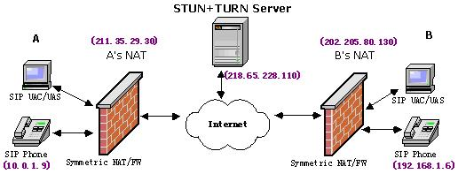

假设通信双方同时处于对称式NAT/FW内部，现在SIP终端A要与B进行VoIP通信。A所在的内部地址是10.0.1.9，外部地址是211.35.29.30；B的内部地址是192.168.1.6，外部地址是202.205.80.130；STUN/TURN服务器的地址是218.65.228.110。  

首先A发起请求，进行地址收集，如图所示。生成A的Initiate Message如下：

	v=0  
	o=Dodo 2890844730 2890844731 IN IP4 host.example.com  
	s=  
	c=IN IP4 218.65.228.110  
	t=0 0  
	m=audio 8076 RTP/AVP 0  
	a=alt:1 1.0 : user 9kksj== 10.0.1.9 1010
	
	a=alt:2 0.8 : user1 9kksk== 211.35.29.30 9988  
	a=alt:3 0.4 : user2 9kksl== 218.65.228.110 8076

  
其中本地地址的优先级为1.0,STUN地址的优先级为0.8,TURN地址优先级为0.4。当B收到消息后，也进行地址收集，过程和A类似。然后B开始执行连通性检查，可是我们不难发现，到10.0.1.9:1010的STUN请求和到211.35.29.30:9988的STUN请求都将不可避免地失败。因为前者是一个不可路由的保留地址；而后者由于Symmetric NAT会对于每一个STUN/TURN请求都将分配不同的Binding，当数据包抵达A的NAT时，NAT会发现传输地址211.35.29.30:9988已经映射218.65.228.110:3478了。而此时STUN请求的源地址并非218.65.228.110:3478，所以数据包必然会被A的NAT/FW所丢弃。然而，到218.65.228.110:8076的STUN请求却是成功的，因为TURN服务器用它收集到的原始地址来发送TURN请求。

  
当A收到应答后，它也执行连通性检查，如图所示：  
图2 ：A的地址收集过程时序图  

此主题相关图片如下：

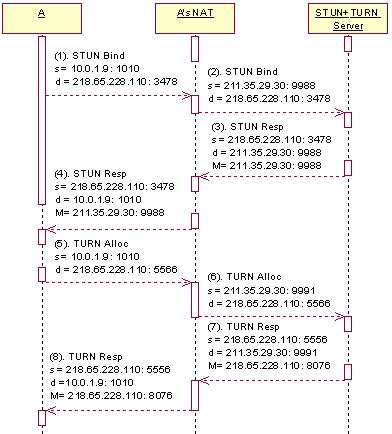

图3 ：B的地址收集过程时序图

此主题相关图片如下：

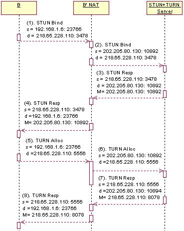

图4 ：B的连通性检查

**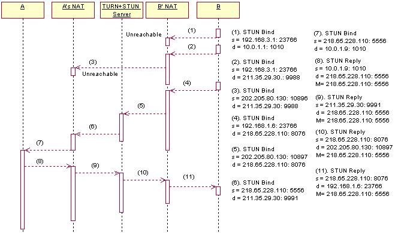**

完成连通性检查后，B产生的应答消息如下：  

	v=0
	
	o= Vincent 2890844730 289084871 IN IP4 host2.example.com  
	s=  
	c=IN IP4 218.65.228.110  
	t=0 0  
	m=audio 8078 RTP/AVP 0  
	a=alt:4 1.0 : peer as88jl 192.168.1.6 23766  
	a=alt:5 0.8 : peer1 as88kl 202.205.80.130 10892  
	a=alt:6 0.4 : peer2 as88ll 218.65.228.110 8078  
	a=alt:7 0.4 3 peer3 as88ml 218.65.228.110 5556

此主题相关图片如下：  
图5： A的连通性检查

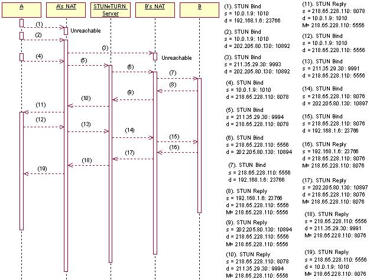

和前面一样，对于B的私有地址和STUN来源地址的连通性检查结果均为失败，而到B的TURN来源地址和到B的peer-derived地址成功(本例中它们都具有相同的优先级0.4)。相同优先级下我们通常采用peer-derived地址，所以A发送到B的媒体流将使用218.65.228.110:5556地址，而B到A的媒体流将发送至218.65.228.110:8076地址。以上为基于ICE方式解决Symmetric NAT/FW穿透问题的一个简化后的典型实例。

4 结束语

ICE方式的优势是显而易见的，它消除了现有的UNSAF机制的许多脆弱性。例如传统的STUN有几个脆弱点，其中一个就是发现过程需要客户端自己去判断所在NAT类型，这实际上不是一个可取的做法。而应用ICE之后，这个发现过程已经不需要了。另一点脆弱性在于STUN、TURN等机制都完全依赖于一个附加的服务器，而ICE利用服务器分配单边地址的同时，还允许客户端直接相连，因此即使STUN或TRUN服务器中有任何一个失败了，ICE方式仍可让呼叫过程继续下去。此外，传统的STUN最大的缺陷在于它不能保证在所有网络拓扑结构中都正常工作，最典型的问题就是Symmetric NAT。对于TURN或类似转发方式工作的协议来说，由于服务器的负担过重，很容易出现丢包或者延迟情况。而ICE方式正好提供了一种负载均衡的解决方案，它将转发服务作为优先级最低的服务，从而在最大程度上保证了服务的可靠性和灵活性。此外，ICE的优势还在于对Ipv6的支持，目前Cisco等公司正在设计基于ICE方式的NAT/FW解决方案。由于广泛的适应能力以及对未来网络的支持，ICE作为一种综合的解决方案将有着非常广阔的应用前景。

####
原文出处：<a href='https://www.cnblogs.com/lingyunhu/p/rtc41.html' target='blank'>WebRTC 音视频开发总结（四一）-- QQ和webrtc打洞能力pk</a>

很多人知道webrtc打洞能力很强，到底有多强但是不知道，比较好的方法就是跟QQ对比，但大多数公司很难模拟各种网络环境进行测试，比如联通，铁通，电信，移动，所以这次请小师妹在实验室下进行了一个比较全面的测试，并整理出测试结果供大家参考，支持原创，文章来自博客园RTC.Blacker（作者:竹叶青），转载必须说明出处，更多详见www.rtc.help。

介绍测试结果前我们先来看看webrtc的p2p架构：

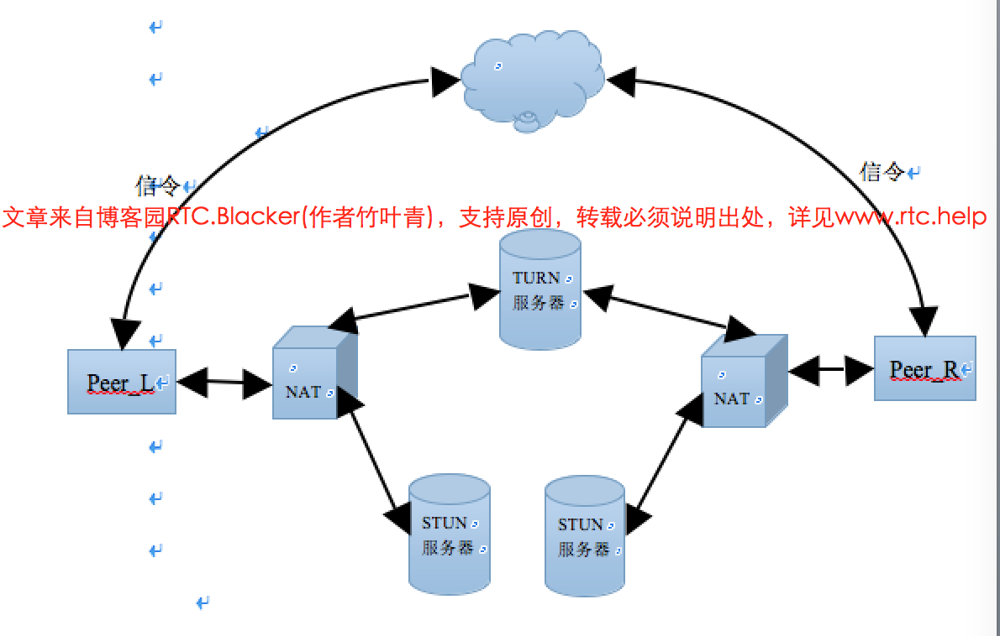

**原理介绍**：

1. Peer与STUN服务器交互采用的是STUN协议，STUN服务器返回Peer的公网地址，地址形式为[IP：port]。
2. L和R都获取到了自己的局域网地址和公网地址后通过信令服务发送给对方，然后彼此都有了对方的地址。
3. RFC5245定义这些地址为candidate，按照局域网 > 外网 > TURN地址的优先级顺序为candidates排序后进行打洞测试。
4. 打洞过程就是双方不停地往彼此的端口发包，既能收到对方发的包，也能收到自己发出去的回包，说明打洞成功。否则失败，通过TURN转发。

**测试说明：**

测试之初，我以为NAT在路由器中，试图通过对路由器的设置，配置NAT的各种类型，这样就能全面地进行测试了。

然而结果是，路由器上的NAT设置指的是静态转换、动态转换、端口多路复用的实现方式，查遍各种资料和咨询相关人员也没找到到底在哪里可以设置网络的Full Cone NAT、Restricted Cone NAT、Port Restricted Cone NAT、Symmetric NAT四种类型？

最后得出结论：NAT功能通常被集成到路由器、防火墙、ISDN路由器或者单独的NAT设备中，或者由运营商决定吧，大概是我们触碰不到修改不了的吧！

若欲将所有NAT场景都测试完，同时又考虑到中国的多运营商情况（暂且只考虑铁通、移动、电信、联通），并且每种网络有Full con等四种类型，那么理论上的测试数量则为：组合数C（4*4，2）=120，再乘以8中场景（图2），最后为960种情况。然要齐全所有情况是相当困难的，实际实验室能提供的网络环境为：

1，PC4-5：Full cone 铁通

2，PC4-6：symmetric 联通

3，PC4-7：Port Restricted Cone 电信

4，L-014-wifi：Full cone  电信

这些网分别只经过一个路由器接入，处于不同的内网。

类型检测工具采用的是从网上下载的STUN_Client_app.exe，如下：

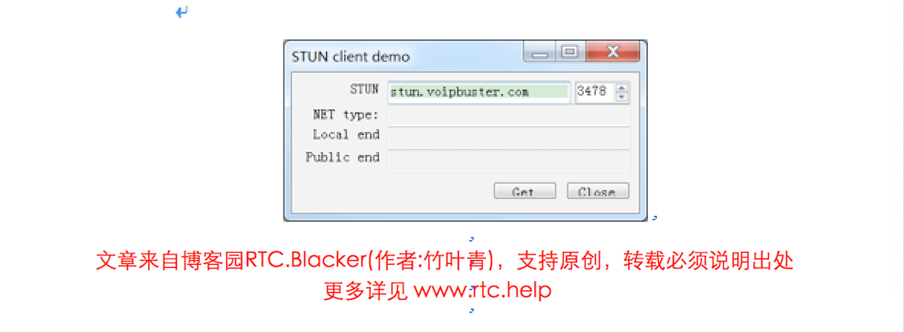  

**测试方法：**

1，本地外网IP通过http://www.ip138.com/检测，采用抓包和相关日志分析方法来判断QQ视频和webrtc的打洞成败（即是否能建立P2P直连
）情况。

2，webrtc：利用peerconnection_server和peerconnection_client测试，不过stun服务器地址修改成了stun.v
oipbuster.com。

3，QQ：直接打开两个QQ进行视频通信（P2P失败时会使用中转服务器进行转发）

**测试结果：**

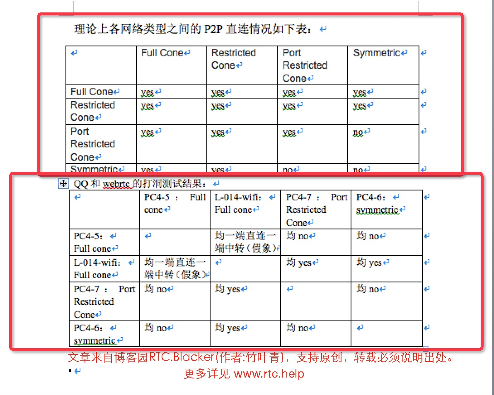

###**结果分析：**

1，除了PC4-5，其余的结果与预期相符。

其中，PC4-5的铁通网络，明明测出来是Full cone类型，却偏偏出现了与之不符的结果，究其原因是该铁通网具有多出口IP，以下面的简化模拟图来说明。

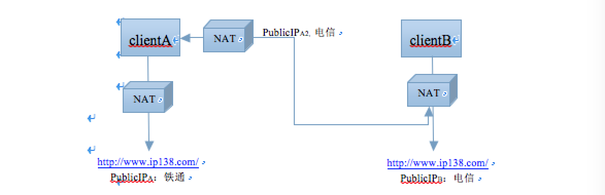

上图说明：现有两客户端A和B，通过NAT后的外网地址分别为PublicIPA和PublicIPB。

真正通信后，在A端抓包看到的对方地址为PublicIPB，则认为是直连，然而在B端抓包显示的对方地址却是一个陌生IP----PublicIPA2，

看起来就像是A通过中转服务器似的，故而出现了一端直连一端中转的假象，之所以称之为假象，是因为在A端的抓包中并没有出现与PublicIPA2这个陌生IP进行通
信的数据包。

由于B是电信网，故而在B建立连接时，A从多IP中选择了电信的出口IP（不是说铁通就一定会选择与对方相同的运营商出口，只是说此时正好如此）。这种多ip出口就容
易导致本来能够P2P的两端直连却失败。

2，不清楚www.ip138.com获取的是不是真实运营商类型。webrtc的STUN服务器获得的客户端的NAT外网地址，我个人觉得是其所处的真实的运营商类型。因为STUN不在国内，故而不存在多运营商问题。

在PC4-5 Full cone铁通和PC4-6 Symmetric联通下ping服务器STUN的地址stun.voipbuster.com过程如下：

(某市)铁通---->(省会)铁通---->(省)铁通---->中国铁通---->欧洲联盟---->荷兰

(某市)联通---->(省会)联通---->北京联通---->加拿大---->欧洲联盟---->德国---->欧洲联盟---->荷兰

####
原文出处：<a href='https://www.cnblogs.com/lingyunhu/p/rtc55.html' target='blank'>WebRTC 音视频开发总结（五五）-- 音视频通讯中的抗丢包与带宽自适应原理</a>

文章内容主要来自中国电信北京研究院丁博士在上周六的技术交流会上的演讲内容，之前我们有在公众号上介绍过这个技术交流会，详见：[http://mp.weixin
.qq.com/s?__biz=MzA5ODMzMjE1NQ==&mid=401152241&idx=1&sn=38dd10e369d3f8e308a608
6e84984072&scene=23&srcid=1219MtQx3dqOaQZo9L2emdBH#rd](http://mp.weixin.qq.com/s?__biz=MzA5ODMzMjE1NQ==&mid=401152241&idx=1&sn=38dd10e369d3f8e308a6086e84984072&scene=23&srcid=1219MtQx3dqOaQZo9L2emdBH#rd)  

从结果来看这种技术交流会还是挺有料的，主要是技术人员在分享技术，所以我们后面会将其他演讲嘉宾的资料也一并整理好发上来。

实时通讯中为了保证传输速度我们的通讯协议一般采用udp，但是这样会带来丢包的问题，加上实际网络状况的复杂性，都会带来丢包，这样严重影响了音视频通话质量，如果保证在这种不稳定的网络状况到得到较好的通话质量呢？这就是本文主要介绍的三种技术：NACK，FEC和网络带宽自适应。

先看这三个术语的名词解释：

FEC：前向纠错也叫前向[纠错码](http://baike.baidu.com/view/126214.htm)(Forward Error Correction简称FEC)，是增加[数据通讯](http://baike.baidu.com/view/1474554.htm)可信度的方法。在单向通讯信道中，一旦错误被发现，其接收器将无权再请求传输。FEC 是利用数据进行传输冗余信息的方法，当传输中出现错误，将允许接收器再建数据。

NACK：a negative-acknowledge character (NAK or NACK)

In telecommunications, NACK is a transmission control character sent by a station as a negative response to the station with which the connection has been set up.

In Binary Synchronous Communications protocol, the NAK is used to indicate that a transmission error was detected in the previously received block and that the receiver is ready to accept retransmission of that block.

In multipoint systems, the NAK is used as the not-ready reply to a poll.

网络带宽自适应：这个比较好理解，按照一定的算法根据网络带宽状况，动态调整码率，以保持良好通话质量！

以下截图来自博士的pdf文档，由kelly进行整理：

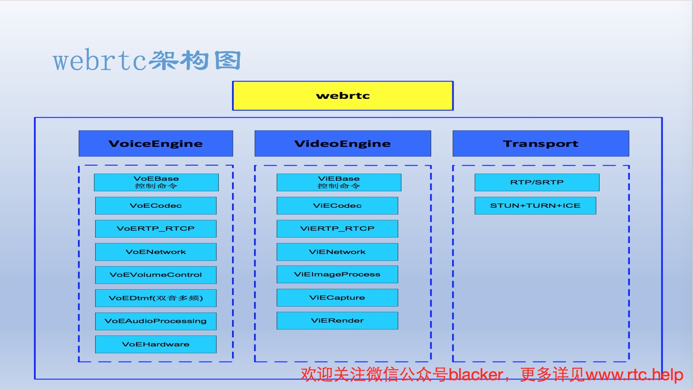

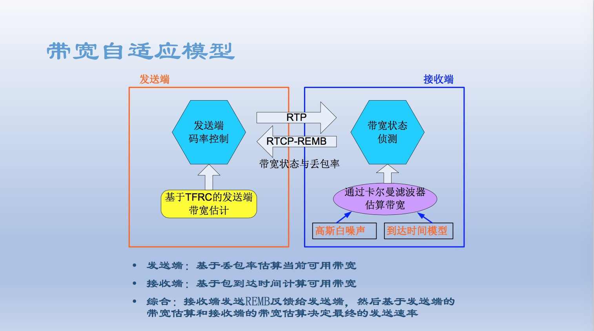

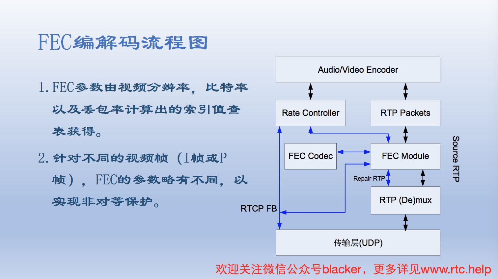

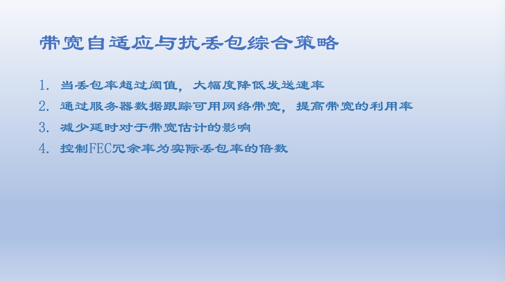

####
原文出处：<a href='https://www.cnblogs.com/lingyunhu/p/rtc57.html' target='blank'>WebRTC 音视频开发总结（五七）-- 网络传输上的一种QoS方案</a>

QoS出现的背景：

而当网络发生拥塞的时候，所有的数据流都有可能被丢弃；为满足用户对不同应用不同服务质量的要求，就需要网络能根据用户的要求分配和调度资源，对不同的数据流提供不同
的服务质量：

1、对实时性强且重要的数据报文优先处理；

2、对于实时性不强的普通数据报文，提供较低的处理优先级，网络拥塞时甚至丢弃。

为了满足上述需求，QoS出现了，定义如下：

QoS（Quality of Service）指一个网络能够利用各种基础技术，为指定的网络通讯提供更好的服务能力, 是网络的一种安全机制，是用来解决网络延迟和阻塞等问题的一种技术。所以当网络过载或拥塞时，QoS 能确保重要业务量不受延迟或丢弃，同时保证网络的高效运行。

支持QoS功能的设备，能够提供传输品质服务；针对某种类别的数据流，可以为它赋予某个级别的传输优先级，来标识它的相对重要性，并使用设备所提供的各种优先级转发策略、拥塞避免等机制为这些数据流提供特殊的传输服务。配置了QoS的网络环境，增加了网络性能的可预知性，并能够有效地分配网络带宽，更加合理地利用网络资源。

在RTC开发中我们了解到实际网络状况非常复杂，如果需要保证通话必须先保证通讯质量，而实时音视频通讯包括采集、编码、网络传输、解码、播放等环节，其中采集、编解码和播放是不受网络条件影响的，只受限于编解码算法和播放策略等因素。但网络传输的丢包、抖动和乱序对qos的影响最为重大，因此下面介绍的qos解决方案要解决的是网络传输丢包、抖动和乱序因素对服务质量的不好影响，具体如下：

1、发送端原理：

对于实时音视频通讯，常采用UDP协议来传输多媒体数据，下面是采用基于udp的rtp协议来传输音视频数据。对于不同格式的编码数据，会有不同的rtp打包协议，比如对于H.264视频数据，文档rfc3984对NAL U的rtp打包封装进行了规范，详情请参考该文档。对于视频数据的打包封装，因为一帧视频数据的数据长度可能大于MTU，所以相关的打包协议都会规定将长度大于MTU的帧进行切割，分块封装到多个rtp包进行传输。为了避免丢包、抖动和乱序对服务质量的影响，本方案在发送端和接收端各建立了节点数相等的一段循环buffer，用于缓存发送端数据和接收端数据。

发送端在发送数据的时候，某个rtp包的seq为send_seq，发送端把这个包通过udp socket发送出去的同时，把这个rtp包的数据拷贝到send_seq对应节点的buffer中去，以便这个rtp包接收方没收到时，发送方还能重发这个rtp包。

这里要注意的一点是，发送端和接收端的循环buffer节点数要能被65536整除，这样rtp seq增加到最大值65535时对应最后一个节点，下一个rtp包的seq为0正好对应上第一个节点，避免rtp seq掉头时出现漏洞。

2、接收端原理：

和发送端类似，接收端也开辟了一段节点数能被65536整除的循环buffer，用于缓存接收到的rtp包。接收端收到rtp包时，需要去解析rtp包头，取出接收到的rtp包的seq，对应下图中的received_seq。

当收到第一个包时，start_seq和end_seq都被设置为received_seq，并把收到的rtp包送到解码单元。后面收到rtp包时，有做两件事情：

第一、接收的模块将接收到的rtp包拷贝到received_seq指向的节点的buffer，并将这个节点的数据flag（用于标记该节点是否填充了数据）设置为true，同时要根据start_seq、end_seq和received_seq的关系来决定要不要将end_seq更新为received_seq的值，如果re
ceived_seq对应的包本来应该end_seq对应的包之前到达，则不更新end_seq的值，否则就更新。

第二、要每过一段时间都要去扫描start_seq到end_seq对应的每个节点，首先，若当前时间和start_seq对应的数据到达时间的差值超过一定阈值（比如500ms），则将start_seq和end_seq之间的每个节点的数据全部丢弃，将每个节点的数据flag设置为false，更新start_seq为end_seq。其次，若start_seq对应的节点的下一个节点的数据falg为true，则将该节点的数据送到解码单元，同时将start_seq更新为该节点的seq，并将该节点的数据flag设置为false；若flag为false，且当前时间和start_seq对应的数据到达时间的差值超过一定阈值（比如50ms），则将该节点的seq（lost_seq）发送给发送端，请求发送端将seq对应的rtp数据再发一遍。

这样，当有些包很久（大于500ms）都没收到，就认为它来不了，直接将它们丢弃；有些包短时间（小于50ms）没来，则向发送端发送重传请求，请求发送端再发一次该包，试图能补上这些包。

3、结果说明

3.1、没加qos模块时，两个手机视频通信在有丢包情况下回出现视频帧不完整，播放出现马赛克的现象，加上qos模块后，视频播放流畅，效果大为改善。同时我们为了测试该方案的作用，在发送端人为地分别丢弃10%和20%的视频rtp包，接收端解码播放效果良好，没有出现马赛克现象。

3.2、加入qos模块会带来一定的延迟和卡顿，因为丢包重传是需要时间的。

3.3、上述方案也就是webrtc里面的nack的具体实现方式。

上述方案由环信资深音视频技术专家彭祖元提供（部分内容有调整），kelly进行编辑和整理。

彭老师拥有多年音视频编解码开发经验，在Android,iOS等平台音视频采集，编码，传输，解码，播放等方面有着丰富的经验，熟悉流媒体服务器开发。

####
原文出处：<a href='https://www.cnblogs.com/lingyunhu/p/rtc76.html' target='blank'>WebRTC 音视频开发总结（七六）-- 探讨直播低延迟低流量的粉丝连麦技术</a>

到目前为止,直播行业继续如预期的那样如火如荼的发展着,在先后竞争完延迟,高清,美 颜,秒开等功能后,最近各大直播平台比拼的一个热点就是连麦。什么是连麦?简单􏰀述 就是当主播直播期间,可以与其中某一个粉丝进行互动,并且其他粉丝能够观看到这个互动 过程。

这个连麦的操作把主播和粉丝的交互从文字聊天一下升级为音视频互动,这个功能瞬间就􏰁升了粉丝们的参与感;同时,这个互动过程其他粉丝都可以看到,极大满足了连麦粉丝的幸 福感,连麦的流程图如下:

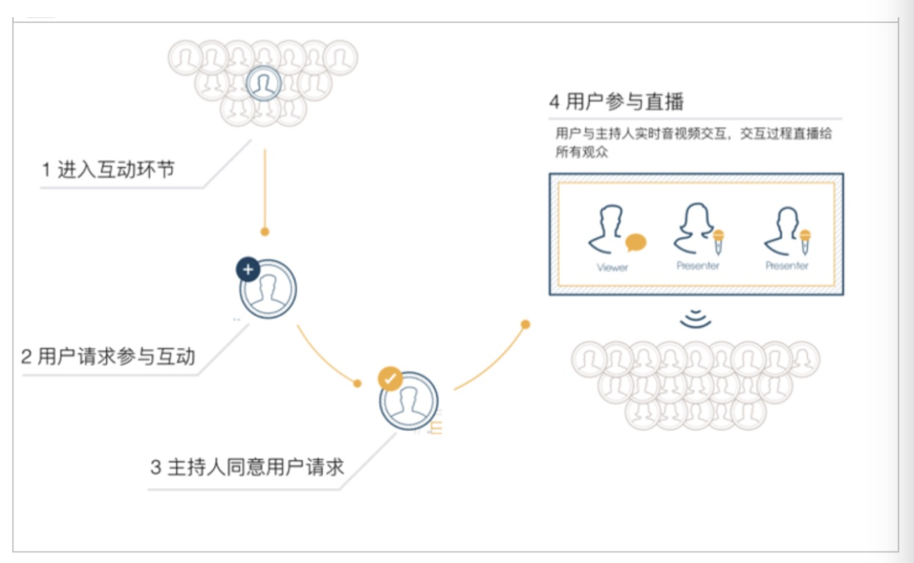

1. 在主播直播过程中,主播􏰁示进入互动环节,此时用户可以参与互动 
2. 用户请求参与互动,主持人同意某一个用户的请求;  
3. 用户参与直播,用户与主播的互动过程直播给其他所有粉丝;

那如何实现连麦这样的功能呢? 今天就向大家介绍几种实现方法;

第一种方式就是通过两路 RTMP 流实现

目前直播的协议普遍采用的是RTMP协议,RTMP 是Adobe 公司实现的一套为Flash播放器 和服务端之间音视频和数据传输的私有协议。此协议基于 TCP 实现,采用多路服用,信令 和媒体都通过一个通道进行传输。

目前国内的直播 CDN 基本上都使用此协议,其延迟大概在 3 秒左右;由于此协议的数据是单向流动的,因此如果连麦功能使用此协议实现的话,就需要两路视频流的发布订阅;其原 理图如下:

 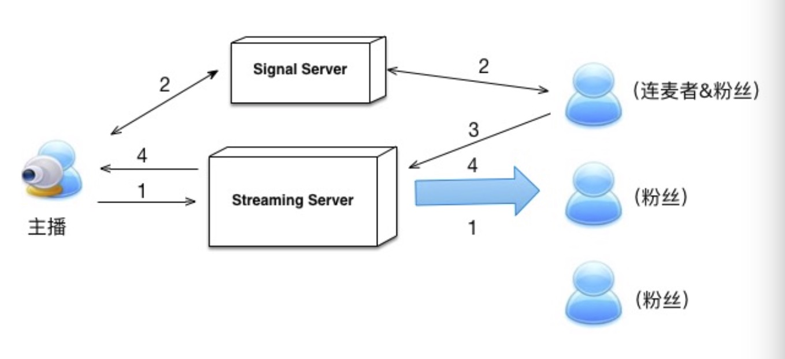

1. 主播首先发布视频到流媒体服务器,用户从流媒体服务器拉取视频信息;  
2. 其中某个用户希望与主播连麦,他通过信令服务器向主播请求连麦,主播同意连麦请求; 
3. 连麦者发布视频到流媒体服务器;  
4. 主播端和其他用户获取连麦者发布的视频,在手机端采用画中画形式显示;

在这个方案中,主播和参与连麦的粉丝分别发布了一路视频流,观看的粉丝同时拉取两路视 频流。这种连麦方式从技术实现上非常简单,但其体验上也存在很多问题:

首先,主播和参与连麦的粉丝之间的交互延迟太大。大家了解,一路 rtmp 的延迟大概在3秒左右。如果主播与参与连麦的用户需要进行对话,那么主播从􏰁问到听到对方的答复原则 上差不多要 6秒左右时间了,这个对于实时交互来说完全没有办法接受;

其次,声音效果不好,会产生回波;一般的直播的音频处理模块都没有进行回波抵消处理,
因此主播端在观看到连麦者视频的同时,不能打开连麦者的音频听,否则会通过音频采集设 备重新采集,形成回波;

最后,客户端接收两路视频,流量消耗高; 一般的用户端需要接收两路视频才能分别看到 主播和连麦者,两路视频导致流量消耗比较高,同时两路解码也比较消耗CPU资源。

从上面的分析大家可以看出,上述方案并不是一套可接受的连麦方案; 连麦的场景对于延 迟 要 求 很 高 ,RTMP协议明显无法满足要求。比较好的方案需要确保连麦者(2个或者多个)之间的交互满足视频会议的标准,也就是延迟在600ms以内,整体的交互过程再进行视频混 合,以RTMP的方式进行输出。也就是说,这个方案中其实涉及了两套系统,一套是保证低延迟的多人音视频交互系统,另外一套是标准的 CDN 直播系统;直播系统大家已经很了 解了,下面重点介绍下低延迟的交互系统的特点:

1. 直播系统是一个单向的数据通道,而低延迟的视频会议系统是一套双向的通道。这使得这 类系统在支持大并发方面没有直播系统那么容易扩展,其网络拓扑结构更加复杂;

2. 低延迟系统传输层一般都使用 UDP,应用层使用 RTP/RTCP 协议,从而保证包的即时性; 为了保证安全性,更多的系统在使用 SRTP 协议,它是在
RTP 基础上多了一层安全和认证措 施;客户端的连接建立常使用 ICE 协议,它结合私有网络中主机所处的环境,通信双方首先 从 STUN,TURN收集尽可能多的连接地址,然后对地址进行优先级排序,选择最优的方式进 行连接;这种方式对于不使用 NAT 穿透的场景也有好处; 它可以保证不同网络客户的联通率,例如有些境外的客户直连境内服务器效果不够好,可以考虑通过 TURN 服务进行中转, 从而保证服务质量;

3. 使用 UDP 就会涉及网络延迟,丢包,因此要考虑 QoS,主要策略包括:  
	a. 使用抖动缓存(jitter buffer)来消除网络包的抖动特性,以一个稳定的速率将数据包交给后续模块处理;音频和视频需要有各自的抖动缓存,然后再实现同步;  
	b. 在音频方面,需要实现丢包隐藏算法; GIPS 公司的 NETEQ 算法应该是业界公认最好的 VOIP 防抖动算法,目前已经在 WebRTC 项目中开源;  
	c. 视频方面,需要实现一个自适应反馈模型,能够根据网络拥塞情况调整丢包保护策略;

当 RTT 较大时,可以使用 FEC 进行数据保护;当 RTT 较小的时候,选择采用 NACK 机制;

接下来将基于以上讨论的这种模型,介绍两种连麦实现方式;这两种方式都可以保证连麦效 果,他们的主要区别是一种使用 P2P 技术进行连麦,另外一种使用多人视频会议系统支持连 麦,具体如下。

第二种方式是 P2P + 直播的连麦方式,其原理图如下:

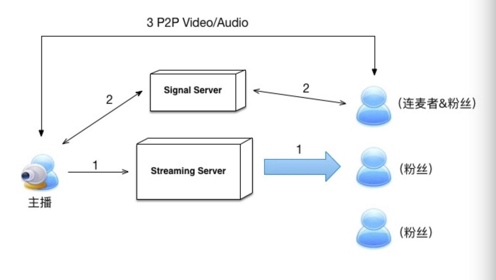

1. 主播首先发布视频到流媒体服务器,用户从流媒体服务器拉取视频信息;  
2. 连麦者请求连麦,此时主播端会弹出连麦请求,主播选择连麦用户,连麦者和主播建立 P2P 连接;  
3. 主播端和连麦者之间建立了 P2P 通道,通过此通道进行音视频数据的交互;  
4. 主播端从摄像头中采集主播视频,从 P2P 通道获得连麦者的视频,然后把两张图片进行 混合,再发布给主播模块,直播出去;

这种实现方式的优势在于:  

1. 主播和连麦者之间的交互延迟小,由于这两者之间是 P2P 连接,因此网络延迟非常小, 一般都在几百毫秒的量级。主播与连麦者之间的交互非常顺畅;  
2. 声音效果好;主播端使用回波抵消模块,连麦者的回声会被消除;同时,主播与连麦者 的语音交流也会整体直播出去;

这种方式存在的问题在于:  

1. 主播端相当于有两路视频上传(直播视频+连麦者的视频交互),一路视频下载(连麦者 的视频),对网络要求会比较高。我们团队在正常的电信,联通等 wifi 及 4G 网络下进行测 试,主播端带宽完全能够满足要求;  
2. 不支持多路连麦者同时交流;

第三种方式通过视频会议+直播的方式实现

为了能够实现多个粉丝同时连麦,可以考虑主播与连麦者之间使用视频会议系统,用一个MCU(Multi Control Unit)来实现媒体数据转发。然后通过MCU 对多路数据进行混合,再把 混合流发送给 CDN,其原理图如下:

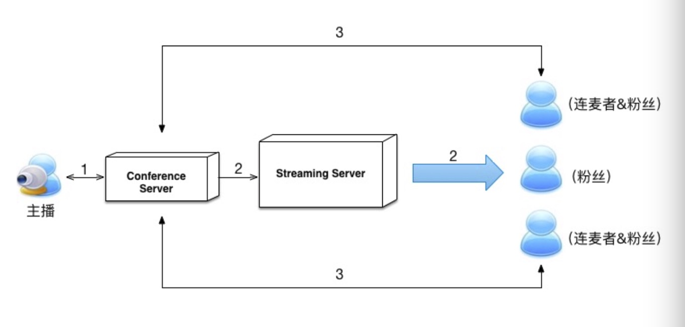

1. 主播端加入视频会议系统;此处注意,主播端不再直接推视频给 CDN;
2. 视频会议系统把主播的视频流推向 CDN,观众通过 CDN 观看主播视频;  
3. 参与连麦的观众登录到与主播端同一个视频会议频道中,此时主播端和连麦者通过实时的 视频会议进行交互;主播与连麦者的视频,经过服务端混合后输出给 CDN;  
4. 其他用户通过 CDN 观看主播与连麦者的交互;

这种方式的优势在于:  

1. 主播和连麦者交互延迟很小;由于使用视频会议系统,通过服务端做了一次转发,基本 延迟都在一秒以下;  
2. 主播端只承担视频会议交互的流量,而不需要再承担直播的上传流量,对网路要求比 P2P 方式要低;  
3. 支持多人交互;

缺点在于:  

1. 服务端相比于一般的直播系统,还多增加了视频会议系统,开发复杂性高; 
2. 音视频混合在服务端完成,对服务器性能要求高;

以上就是对连麦实现方式的简单介绍,这三种方式在实际项目中都有被使用到,原则上后两种方法的体验会更好些;特别是第三种方案,他可以支持小范围的多人实时交互,但这种方 案的开发量大,同时熟悉视频会议和直播的团队比较缺少,对研发团队要求高;第二种方 案可以在webrtc 和直播技术基础上可以实现,对这方面比较熟悉的团队可以尝试整合一下。

Q&A

问题 1:连麦技术是在客户端实现还是服务器端实现? 两种实现方式各有什么优缺点?  
解答 1: 刚才介绍的第二种方案就是在客户端实现的,当然服务端也需要做一些工作; 而

第三种方案主要是在服务端的实现; 相关的优缺点上面也做过解答,大家可以参考下;

问题 2:连麦技术有开源基础版吗?  
解答 2: P2P 的方案可以考虑在 webrtc 基础上实现;而视频会议+直播的方案目前还没有

看到开源项目,可以考虑在视频会议系统上进行改造,使其输出 RTMP 直播;

问题 3: 直播和用户宽带至少需要多少才能流畅连麦  
解答 3: 如果是 P2P 方案,对主播端带宽要求会高一些; 如果是第三种会议模式,要求就不高了,基本上就是一路上传,一路下载; 第二种 P2P 方案,我们在 4G,10M 的联通, 电信等网络下实验都是 OK 的;

问题 4:你们 P2P 是自己研发的还是基于其他的?  
解答 4: 我们是在 webrtc 基础上改造的,webrtc 的视频图像要和摄像头的视频图像合成;并且在带耳机的情况下,音频也需要程序合成;

问题 5:你们对防火墙或 NAT 有没有运用 STUN 或 ICE 之类的技术?  
解答 5: ICE 是一定要使用的; 对于 P2P 网络,有很多网路不能直连,肯定要使用 TURN 服务做中转; 对于会议模式,也可以通过 TURN 做中转,从而解决异地网络连接不稳定的情况;

问题 6: 各方案中如果用户端断线,此时用户重新连麦要重新走连麦流程吗?还是说可以挂 着视频系统自动重连?

解答 6: 是可以重新连接的,不需要再走连麦流程;

问题 7:第二种方案为什么不支持多路连麦者同时交流?  
解答 7: P2P 其实也可以支持多人交互,但多个人同时交流,对于主播端来说 CPU 压力和网络压力都很大;

问题 8:你们的视频和音频分别采用的是什么编码?  
解答 8: 通用的编码方案是:视频采用 H264,音频采用 AAC; 如果端到端都可控情况下,

建议使用 H265,压缩率更高;  
问题 9: 第三种方案中,有什么推荐的视频会议系统 ?

解答 9: 大家有兴趣的话可以看看 licode

问题 10: 第三种方案的开发团队要多少人,开发周期一般多长  
解答 10: 这个不在于人多,主要还是对视频会议系统要比较了解; 如果使用 licode 改造的话,需要服务端实现 RTMP 推流的改造,如果对 ffmpeg 等比较熟悉的话,一个月左右能 够出来一个基础版本,但真正稳定下来还有很多工作需要完善;

####
原文出处：<a href='https://www.cnblogs.com/lingyunhu/p/rtc78.html' target='blank'>WebRTC 音视频开发总结（七八）-- 为什么WebRTC端到端监控很关键?</a>

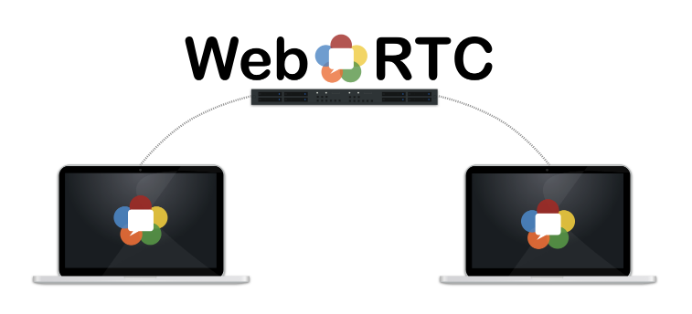

callstats是一家做实时通讯性能测量的公司，他们博客里面提到了实时通讯过程中性能的重要性，下面是博客内容；

性能监控是系统和服务开发的一个重要方面，它可以帮助我们检测和诊断性能问题，并有助于维护系统的高可用性。现如今工程团队都基于数据做决策，因此这些性能测量在实施
和部署问题修复方面发挥重要作用。

通常来说，服务监控的度量分为两类：

**规模**：系统负载，错误率，用户搅动，等等；

**持续时间**：创建时间，事务响应时间，等等。

在度量方面,WebRTC并没有什么不同之处。一个规模度量的例子如同时在线或者建立失败的会议数目，一个持续时间度量的例子如建立一个连接的时间。

**实时测量**

在callstats.io，实时性是所有系统的重要衡量指标。当第一个参与者加入会议时，我们会立即对会议进行分类。如果一个会议创建失败，服务器能够立即发现失败
及其失败原因和会议从启动到失败所消耗的时间。我们非常看中这种实时处理能力，它能够在事情发生时尽快发出警告，并立即呈现给用户。我们称之为"持续分析"。

**正确的端到端监控**

Callstats.io通过getStats() API或者基础度量监控WebRTC连接的重要方面，即来自实际用户的度量值（只有用户才能代表他们自己）。该方法用来测量：

* 每对WebRTC设备的端到端网络性能。
* WebRTC设备的媒体性能。这包括与音频重放和视频渲染相关的大量度量。

这些度量针对每个连接、参会者和会议独立地进行汇总。

**失败**

基于时间的用户行为（如用户每天何时使用服务，或者在一周之中的某天使用服务），度量值每天都会发生波动变化。然而，过去几天或几周使用率的显著下降往往预示着服务出了问题。比如，会话建立失败的增加预示着基础设施、终端或者网络的故障。下图显示在一个会议期间可能发生错误的时刻。

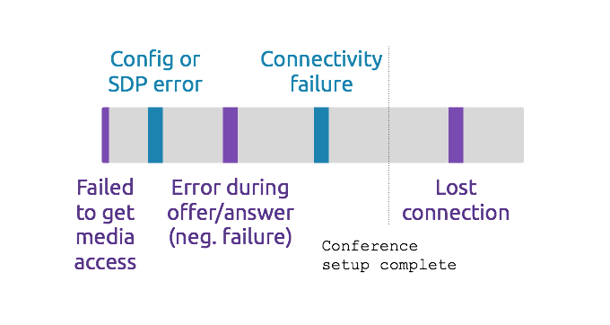会议建立期间错误的分类

WebRTC服务组件故障原因：

1. 终端有可能改变行为。浏览器每六周更新一次，开发版和公测版可以更早于发布版得到。因此，开发团队对新特性和更新可能导致的问题有直觉。此外，Chrome和Firefox团队提前宣布PSA，并及时回答支持咨询。
2. 基础设施可能过载。即服务器承受比预期更多的流量而导致性能问题。这也可能发生在底层基础设施消失，或者首次部署新特性导致影响到部分客户。
3. 网络可能由于网络流量监管或者网络行为不确定发生拥塞。这可能影响地理上某些区域，或者某个特殊的网络服务提供商业/企业网络。典型地，这些情况下用户位于受限制防火墙背后，或者有网络设备发生故障。

**服务中断**

服务中断可能发生在一个或多个WebRTC服务基础组件停止工作时：

* 信令服务器宕机：导致会话不能建立。在这种情况下，正在进行的会议数和会议总数将会降低。
* TURN服务器宕机：导致部分会话不能建立。在这种情况下，部分或者全部会议失败数目将会增加，这种失败归类为ICE连接失败。
* 会议桥宕机：部分会话不能建立。一个或多个会议桥将会发送宕机报告。

向用户指出这些服务中断同样很重要。例如，告诉用户连向信令服务器或者会议桥的连接中断，或者会话正在试图重建，或者会话失败需要等待或立即重试。许多服务已经提供一些基本诊断，比如：音频仪，网络码率，静音指示，等等。

类似地，我们的API会显示网络连接状态和其它关键度量。这些度量可以以一种合适的界面呈现给终端用户，以帮助他们了解应用的当前状态，并缓解因为诊断到服务中断带来的挫败感。

**收集终端用户反馈**

收集终端用户反馈同样很重要，这有助于我们找到用户体验和客观质量(或者媒体和网络度量)之间的对应关系。纵观callstats.io的客户，我们发现10%~40%的会议有一个或多个用户反馈评论。反馈数量很大程度上取决于在合适的场景下提问合适的问题。

**持续测试**

在整个业界，自动化测试和持续集成是通行准则，这同样适用于WebRTC。浏览器厂商已经做了大量努力以实现测试过程自动化。此外，在Github上也有一些使用Selenium测试WebRTC的资源。

**总结**

在我们看来，对WebRTC进行端到端监控的最好方法就是用API把监控方案集成到WebRTC应用的核心单元。用这种方法，监控方案能够实时追踪规模度量和持续时间度量，向开发者提供WebRTC服务状态的实时信息。基于API的方案也提供很多回调的可能性，例如，自动调整WebRTC应用的性能以提供给终端用户尽可能好的媒体质量。

####
原文出处：<a href='https://www.cnblogs.com/lingyunhu/p/rtc86.html' target='blank'>WebRTC 音视频开发总结（八十六）-- WebRTC中RTP/RTCP协议实现分析</a>

###一 前言

RTP/RTCP协议是流媒体通信的基石。RTP协议定义流媒体数据在互联网上传输的数据包格式，而RTCP协议则负责可靠传输、流量控制和拥塞控制等服务质量保证。

在WebRTC项目中，RTP/RTCP模块作为传输模块的一部分，负责对发送端采集到的媒体数据进行进行封包，然后交给上层网络模块发送；在接收端RTP/RTCP模块收到上层模块的数据包后，进行解包操作，最后把负载发送到解码模块。因此，RTP/RTCP 模块在WebRTC通信中发挥非常重要的作用。

本文在深入研究WebRTC源代码的基础上，以Video数据的发送和接收为例，力求用简洁语言描述RTP/RTCP模块的实现细节，为进一步深入掌握WebRTC打下良好基础。

###二 RTP/RTCP协议概述

RTP协议是Internet上针对流媒体传输的基础协议，该协议详细说明在互联网上传输音视频的标准数据包格式。RTP协议本身只保证实时数据的传输，RTCP协议则负责流媒体的传输质量保证，提供流量控制和拥塞控制等服务。在RTP会话期间，各参与者周期性彼此发送RTCP报文。报文中包含各参与者数据发送和接收等统计信息，参与者可以据此动态控制流媒体传输质量。

RFC3550 [1]定义RTP/RTCP协议的基本内容，包括报文格式、传输规则等。除此之外，IETF还定义一系列扩展协议，包括RTP协议基于档次的扩展，和RTCP协议基于报文类型的扩展，等等。详细内容可参考文献[2]。

###三 WebRTC线程关系和数据流

WebRTC对外提供两个线程：Signal和Worker，前者负责信令数据的处理和传输，后者负责媒体数据的处理和传输。在WebRTC内部，有一系列线程各司其职，相互协作完成数据流管线。下面以Video数据的处理流程为例，说明WebRTC内部的线程合作关系。

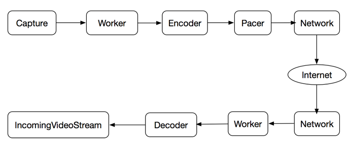

图1 WebRTC线程关系和数据管线

如图1所示，Capture线程从摄像头采集原始数据，得到VideoFrame；Capture线程是系统相关的，在Linux系统上可能是调用V4L2接口的线程，而在Mac系统上可能是调用AVFoundation框架的接口。接下来原始数据VideoFrame从Capture线程到达Worker线程，Worker线程起搬运工的作用，没有对数据做特别处理，而是转发到Encoder线程。Encoder线程调用具体的编码器(如VP8, H264)对原始数据VideoFrame进行编码，编码后的输出进一步进行RTP封包形成RTP数据包。然后RTP数据包发送到Pacer线程进行平滑发送，Pacer线程会把RTP数据包推送到Network线程。最终Network线程调用传输层系统函数把数据发送到网络。

在接收端，Network线程从网络接收字节流，接着Worker线程反序列化为RTP数据包，并在VCM模块进行组帧操作。Decoder线程对组帧完成的数据帧进行解码操作，解码后的原始数据VideoFrame会推送到IncomingVideoStream线程，该线程把VideoStream投放到render进行渲染显示。至此，一帧视频数据完成从采集到显示的完整过程。

在上述过程中，RTP数据包产生在发送端编码完成后，其编码输出被封装为RTP报文，然后经序列化发送到网络。在接收端由网络线程收到网络数据包后，经过反序列化还原成RTP报文，然后经过解包得到媒体数据负载，供解码器进行解码。RTP报文在发送和接收过程中，会执行一系列统计操作，统计结果作为数据源供构造RTCP报文之用。RTP报文构造、发送/接收统计和RTCP报文构造、解析反馈，是接下来分析的重点。

###四 RTP报文发送和接收

RTP报文的构造和发送发生在编码器编码之后、网络层发送数据包之前，而接收和解包发生在网络层接收数据之后、解码器编码之前。本节详细分析这两部分的内容。

**4.1 RTP报文构造和发送**

图2描述发送端编码之后RTP报文的构造和发送过程，涉及三个线程：Encoder、Pacer和Network，分别负责编码和构造RTP报文，平滑发送和传输层发送。下面详细描述这三个线程的协同工作过程。

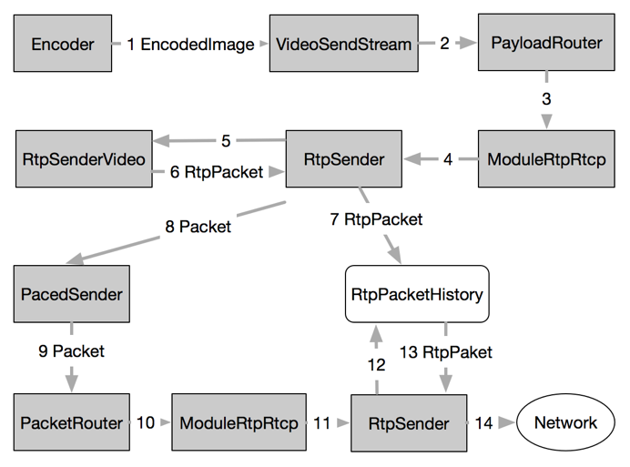

图2 RTP报文构造和发送

Encode线程调用编码器(比如VP8)对采集到的Raw VideoFrame进行编码，编码完成以后，其输出EncodedImage通过回调到达VideoSendStream::Encoded()函数，进而通过PayloadRouter路由到ModuleRtpRtcpImpl::SendOutgoingData()。接下来，该函数向下调用RtpSender::SendOutgoingData()，进而调用RtpSenderVideo::SendVideo()。该函数对EncodedImage进行打包，然后填充RTP头部构造RTP报文；如果配置了FEC，则进一步封装为FEC报文。最后返回RtpSender::SendToNetwork()进行下一步发送。

RtpSender::SendToNetwork()函数把报文存储到RTPPacketHistory结构中进行缓存。接下来如果开启PacedSending，则构造Packe发送到PacedSender进行排队，否则直接发送到网络层。

Pacer线程周期性从队列中获取Packet，然后调用PacedSender::SendPacket()进行发送，接下来经过ModuleRtpRtcpImpl到达RtpSender::TimeToSendPacket()。该函数首先从RtpPacketHistory缓存中拿到Packet的负载，然后调用PrepareAndSendPacket()函数：更新RtpHeader的相关域，统计延迟和数据包，调用SendPacketToNetwork()把报文发送到传输模块。

Network线程则调用传输层套接字执行数据发送操作。至此，发送端的RTP构造和发送流程完成。需要注意的是，在RtpSender中进行Rtp发送后，会统计RTP报文相关信息。这些信息作为RTCP构造SR/RR报文的数据来源，因此非常重要。

**4.2 RTP报文接收和解析**

在接收端，RTP报文的接收和解包操作主要在Worker线程中执行，RTP报文从Network线程拿到后，进入Worker线程，经过解包操作，进入VCM模块，由Decode线程进行解码，最终由Render线程进行渲染。下图3描述RTP报文在Worker线程中的处理流程。

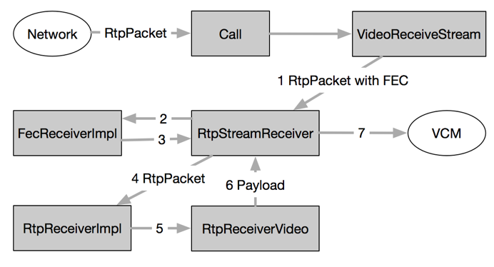

图3 RTP报文接收和解析

RTP数据包经网络层到达Call对象，根据其SSRC找到对应的VideoReceiveStream，通过调用其DeliverRtp()函数到RtpStreamReceiver::DeliverRtp()。该函数首先解析数据包得到RTP头部信息，接下来执行三个操作：1.码率估计；2.继续发送数据包；3.接收统计。
码率估计模块使用GCC算法估计码率，构造REMB报文，交给RtpRtcp模块发送回发送端。而接收统计则统计RTP接收信息，这些信息作为RTCPRR报文的数据来源。下面重点分析接下来的数据包发送流程。

RtpStreamReceiver::ReceivePacket()首先判断数据包是否是FEC报文，如果是则调用FecReceiver进行解包，否则直接调用RtpReceiver::IncomingRtpPacket()。该函数分析RTP报文得到通用的RTP头部描述结构，然后调用RtpReceiverVideo::ParseRtpPacket()进一步得到Video相关信息和负载，接着经过回调返回RtpStreamReceiver对象。该对象把Rtp描述信息和负载发送到VCM模块，继续接下来的JitterBuffer缓存和解码渲染操作。

RTP报文解包过程是封包的逆过程，重要的输出信息是RTP头部描述和媒体负载，这些信息是下一步JitterBuffer缓存和解码的基础。另外对RTP报文进行统计得到的信息则是RTCP RR报文的数据来源。

###五 RTCP报文发送和接收

RTCP协议是RTP协议的控制下可以，负责流媒体的服务质量保证。比较常用的RTCP报文由发送端报告SR和接收端报告RR，分别包含数据发送统计信息和数据接收信息。这些信息对于流媒体质量保证非常重要，比如码率控制、负载反馈，等等。其他RTCP报文还有诸如SDES、BYE、SDES等，RFC3550对此有详细定义。

本节重点分析WebRTC内部RTCP报文的构造、发送、接收、解析、反馈等流程。需要再次强调的是，RTCP报文的数据源来自RTP报文发送和接收时的统计信息。在WebRTC内部，RTCP报文的发送采取周期性发送和及时发送相结合的策略：ModuleProcess线程周期性发送RTCP报文；而RtpSender则在每次发送RTP报文之前都判断是否需要发送RTCP报文；另外在接收端码率估计模块构造出REMB报文后，通过设置超时让ModuleProcess模块立即发送RTCP
报文。

**5.1 RTCP报文构造和发送**

在发送端，RTCP以周期性发送为基准，辅以RTP报文发送时的及时发送和REMB报文的立即发送。发送过程主要包括Feedback信息获取、RTCP报文构造、序列化和发送。图4描述了RTCP报文的构造和发送过程。

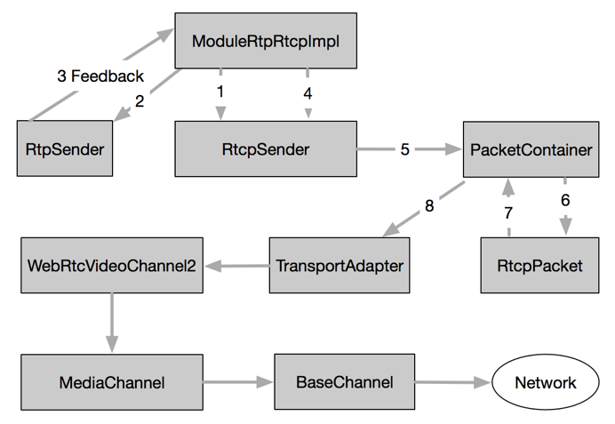

图4 RTCP报文构造和发送

ModuleProcess线程周期性调用ModuleRtpRtcpImpl::Process()函数，该函数通过RTCPSender::TimeToSendRtcpReport()函数确定当前是否需要立即发送RTCP报文。若是，则首先从RTPSender::GetDataCounters()获取RTP发送统计信息，然后调用RTCPSender::SendRTCP()，接着是SendCompoundRTCP()发送RTCP组合报文。关于RTCP组合报文的定义，请参考文献[1]。

在SendCompoundRTCP()函数中，首先通过PrepareReport()确定将要发送何种类型的RTCP报文。然后针对每一种报文，调用其构造函数(如构造SR报文为BuildSR()函数)，构造好的报文存储在PacketContainer容器中。最后调用SendPackets()进行发送。

接下来每种RTCP报文都会调用各自的序列化函数，把报文序列化为网络字节流。最后通过回调到达PacketContainer::OnPacketReady()，最终把字节流发送到传输层模块：即通过TransportAdapter到达BaseChannel，Network线程调用传输层套接字API发送数据到网络。

RTCP报文的构造和发送过程总体不是很复杂，最核心的操作就是获取数据源、构造报文、序列化和发送。相对来说构造报文和序列化比较繁琐，基于RFC定义的细节进行。

**5.2 RTCP报文接收和解析**

接收端的RTCP报文接收和解析过程如图5所示。

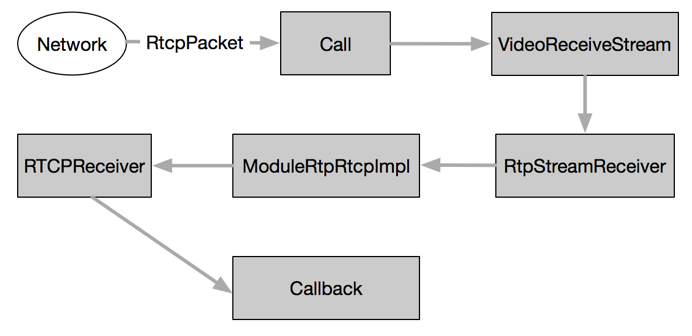

图5 RTCP报文接收和解析

在接收端，RTCP报文的接收流程和RTP一样，经过网络接收之后到达Call对象，进而通过SSRC找到VideoReceiveStream，继而到达RtpStreamReceiver。接下来RTCP报文的解析和反馈操作都在ModuleRtpRtcpImpl::IncomingRtcpPacket()函数中完成。该函数首先调用RTCPReceiver::IncomingRtcpPacket()解析RTCP报文，得到RTCPPacketInformation对象，然后调用 TriggerCallbacksFromRTCPPacket()，触发注册在此处的各路观察者执行回调操作。

RTCPReceiver::IncomingRtcpPacket()使用RTCPParser解析组合报文，针对每一种报文类型，调用对应的处理函数(如处理SDES的HandleSDES函数)，反序列化后拿到报文的描述结构。最后所有报文综合在一起形成RTCPPacketInformation对象。该对象接下来作为参
数调用TriggerCallbacksFromRTCPPacket()函数触发回调操作，如处理NACK的回调，处理SLI的回调，处理REMB的回调，等等。这些回调在各自模块控制流媒体数据的编码、发送、码率等服务质量保证，这也是RTCP报文最终起作用的地方。

至此，我们分析了RTCP报文发送和接收的整个流程。

###六 总结

本文在深入分析WebRTC源代码的基础上，结合流程图描述出RTP/RTCP模块的实现流程，在关键问题上(如RTCP报文的数据来源)进行深入细致的研究。为进一步深入掌握WebRTC的实现原理和细节打下良好基础。

###参考文献
  
[1] RFC3550 - RTP: A Transport Protocol for Real-Time Applications  
<https://www.ietf.org/rfc/rfc3550.txt>

[2] 超越RFC3550 － RTP/RTCP协议族分析 : <http://www.jianshu.com/p/e5e21aeb219f>

####
原文出处：<a href='https://www.cnblogs.com/lingyunhu/p/rtc87.html' target='blank'>WebRTC 音视频开发总结（八十七）-- WebRTC中丢包重传NACK实现分析</a>

在WebRTC中，前向纠错(FEC)和丢包重传(NACK)是抵抗网络错误的重要手段。FEC在发送端将数据包添加冗余纠错码，纠错码连同数据包一起发送到接收端；接收端根据纠错码对数据进行检查和纠正。RFC5109[1]定义FEC数据包的格式。NACK则在接收端检测到数据丢包后，发送NACK报文到发送端；发送端根据NACK报文中的序列号，在发送缓冲区找到对应的数据包，重新发送到接收端。NACK需要发送端发送缓冲区的支持，RFC5104[2]定义NACK数据包的格式。

本文在研究WebRTC源代码的基础上，以Video数据包的发送和接收为例，深入分析ANCK丢包重传机制的实现。主要内容包括：SDP协商NACK，接收端丢包判定，NACK报文构造、发送、接收和解析，RTP数据包重传。下面分别详细论述之。

**一、SDP协商NACK**

NACK作为RTP层反馈参数，和Video Codec联系在一起。WebRTC在初始化阶段，创建PeerConnectionFactory对象，在该对象中创建MediaEngine，其中的VideoEngine为WebRtcVideoEngine2。该对象在构造时，会收集本端支持的所有VideoCodec，NACK作为Codec的属性被一起收集。在接下来的SDP协商过程中，NACK属性被协商到Offer/Answer中，如图1所示。

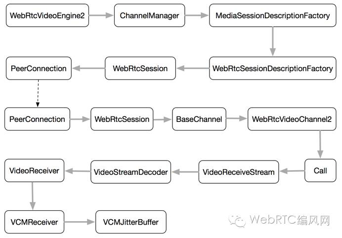

图1 SDP协商NACK及作用于Video JitterBuffer

PeerConnection在CreateOffer时，收集本端的会话控制信息、音视频Codec信息和网络信息等内容。视频Codec信息从WebRtcVideoEngine2中获取。最后本端Offer形成SDP报文，经过PeerConnection对象发送到网络。

接收端在收到Offer之后，首先调用SetRemoteDescription，根据本地配置信息向下创建VideoReceiveStream对象，本地NACK配置信息会最终到达VCMJitterBuffer。接着PeerConnection调用CreateAnswer，生成Answer；根据Offer中的Codec信息和本端支持的Codec信息，最终选定双方都支持的Codec集合。最后用生成的Answer作为参数调用SetLocalDescription，根据Answer中的Video Codec信息向下重新创建VideoReceiveStream对象。NACK信息向下传递最终到达VCMJitterBuffer，在这里设置NACK相关参数。这些参数在接收RTP数据包过程中发挥作用，比如判断丢包、是否发送NACK报文等。Answer发回发送端时，发送端调用SetRemoteDescription执行同样的设置流程。

**二、接收端丢包判定**

Video接收端丢包判定在Worker线程中进行。RTP数据包到达接收端后，经过RTP模块到达VCM模块的JitterBuffer对象，最终调用VCMJitterBuffer的InsertPacket函数对数据包进行缓存和重排。

VCMJitterBuffer把丢失RTP数据包的序列号存储在集合missing_seq_nums中。对于本次从RTP模块到来的数据包，标记其序列号为seq1，而上次到达数据包的序列号为seq2。如果seq1 > seq2，则表示seq1顺序到达，标记(seqnum2, seqnum1)区间内的数据包为丢失状态，将其存储到missing_seq_nums集合中。注意这里的丢失状态是暂时的，如果下个数据包到达时有seq1 < seq2，则表示数据包乱序到达，则把missing_seq_nums中小于seq1的序列号都删除掉。

在更新missing_seq_nums集合时，如果集合中存储的序列号超过预设的容量，则通过调用RecycleFramesUntilKeyFrame()不断丢包来减少集合中的序列号，直到集合中的序列号总数低于预设容量值。

**三、NACK报文发送和接收**

接收端的NACK报文构造和发送工作在ModuleProcessThread线程中周期性完成。过程如图2所示。

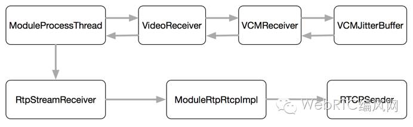

图2 NACK报文构造和发送

ModuleProcessThread线程周期性调用VideoReceiver::process函数，该函数通过VCMReceiver调用VCMJitterBuffer::GetNackList，从missing_seq_nums集合中得到过去一段时间内丢失RTP数据包的序列号。然后调用RtpStreamReceiver::ResendPackets函数。调用流程最终会到达RTCPSender::SendRTCP，发送类型为NACK的RTCP报文。

NACK报文是类型为205的RTCP 扩展反馈报文，如图3所示：

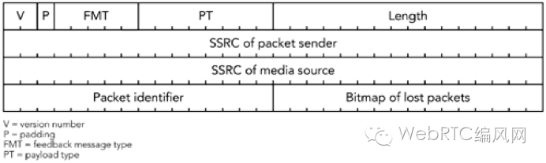

图3 NACK报文格式

其中PT = 205，FMT = 1，Packet identifier(PID)即为丢失RTP数据包的序列号，Bitmao of Lost Packets(BLP)指示从PID开始接下来16个RTP数据包的丢失情况。一个NACK报文可以携带多个RTP序列号，NACK接收端对这些序列号逐个处理。

NACK报文构造完成以后，发送到网络层。NACK报文是RTCP报文的一种，因此其发送、接收和分析遵循RTCP报文处理的一般流程。这部分内容可参考文档[3]。

**四、RTP数据包重传**

接收端在接收和解析NACK报文后，通过回调机制处理各种类型的RTCP报文，对于NACK报文，会调用RTPSender重新发送RTP数据包，如图4所示：

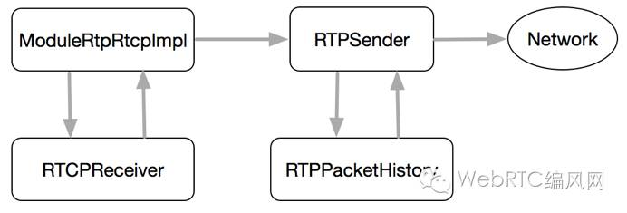

图4 发送端数据包重传

RTCPReceiver在解析RTCP之后，得到RTCP报文的描述结构，然后通过回调进行报文语义处理。NACK报文会被发送到RTPSender进行处理。RTPSender根据NACK报文中包含的序列号，到RTPPacketHistory缓存中查找对应的RTP数据包。如果找到，则把数据包发送到网络。

至此，一个完整的NACK报文回路完成，丢失的RTP数据包会重新发送到接收端。

五、总结

本文深入分析了WebRTC内部关于丢包重传(NACK)的实现细节，对NACK的SDP协商、丢包判定和重传进行深入研究，为继续学习掌握WebRTC的QoS机制
奠定基础。

**参考文献**

[1] RFC5109 - RTP Payload Format for Generic Forward Error Correction.

[2] RFC5104 - RFC 5104 - Codec Control Messages in the RTP Audio-Visual
Profile with Feedback (AVPF) .

