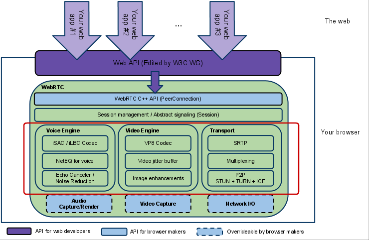

 
<!--BEGIN_DATA
{
    "create_date": "2019-11-28 20:47", 
    "modify_date": "2019-11-28 20:47", 
    "is_top": "0", 
    "summary": "WebRTC音视频引擎整体架构分析", 
    "tags": "WebRTC、C/C++、网络", 
    "file_name": "WebRTC音视频引擎整体架构分析.md"
}
END_DATA-->

####
原文出处：<a href='http://www.52im.net/thread-513-1-1.html' target='blank'>WebRTC音视频引擎整体架构分析</a>

  
####1、WebRTC目的

       

WebRTC（Web Real-Time Communication）项目的最终目的主要是让Web开发者能够基于浏览器（Chrome\FireFox\\...）轻易快捷开发出丰富的实时多媒体应用，而无需下载安装任何插件，Web开发者也无需关注多媒体的数字信号处理过程，只需编写简单的Javascript程序即可实现，W3C等组织正在制定Javascript 标准API，目前是WebRTC 1.0版本，Draft状态，[网址](http://dev.w3.org/2011/webrtc/editor/webrtc.html)；另外WebRTC还希望能够建立一个多互联网浏览器间健壮的实时通信的平台，形成开发者与浏览器厂商良好的生态环境。同时，Google也希望和致力于让WebRTC的技术成为HTML5标准之一，可见Google布局之深远。
  

####2、WebRTC架构图  

  

  

架构图颜色标识说明：

（1）紫色部分是Web开发者API层；

（2）蓝色实线部分是面向浏览器厂商的API层（也就是红色框标内模块，也是本人专注研究的部分）

（3）蓝色虚线部分浏览器厂商可以自定义实现

####3、WebRTC架构组件介绍

  

**(1) Your Web App**  

Web开发者开发的程序，Web开发者可以基于集成WebRTC的浏览器提供的web API开发基于视频、音频的实时通信应用。

  

**(2) Web API**  

面向第三方开发者的WebRTC标准API（Javascript），使开发者能够容易地开发出类似于网络视频聊天的web应用，最新的标准化进程可以查看**[这里](http://dev.w3.org/2011/webrtc/editor/webrtc.html)**。  
  
**(3) WebRTC Native C++ API**  

本地C++ API层，使浏览器厂商容易实现WebRTC标准的Web API，抽象地对数字信号过程进行处理。  

  

**(4) Transport / Session**  

传输/会话层

会话层组件采用了libjingle库的部分组件实现，无须使用xmpp/jingle协议  
  
**a.  RTP Stack协议栈**  
Real Time Protocol  
  
**b.  STUN/ICE**  
可以通过STUN和ICE组件来建立不同类型网络间的呼叫连接。  
  
**c.  Session Management**  
一个抽象的会话层，提供会话建立和管理功能。该层协议留给应用开发者自定义实现。  

**(5) VoiceEngine**  

音频引擎是包含一系列音频多媒体处理的框架，包括从视频采集卡到网络传输端等整个解决方案。  
PS：VoiceEngine是WebRTC极具价值的技术之一，是Google收购GIPS公司后开源的。在VoIP上，技术业界领先，后面的文章会详细了解  

  

**a.  iSAC**  

Internet Speech Audio Codec  

针对VoIP和音频流的宽带和超宽带音频编解码器，是WebRTC音频引擎的默认的编解码器  
采样频率：16khz，24khz，32khz；（默认为16khz）  
自适应速率为10kbit/s ~ 52kbit/；  
自适应包大小：30~60ms；  
算法延时：frame + 3ms  

  

**b.  iLBC**  

Internet Low Bitrate Codec  
VoIP音频流的窄带语音编解码器  
采样频率：8khz；  
20ms帧比特率为15.2kbps  
30ms帧比特率为13.33kbps  
标准由IETF RFC3951和RFC3952定义  

  
**c.  NetEQ for Voice**  

针对音频软件实现的语音信号处理元件

NetEQ算法：自适应抖动控制算法以及语音包丢失隐藏算法。使其能够快速且高解析度地适应不断变化的网络环境，确保音质优美且缓冲延迟最小。  

是GIPS公司独步天下的技术，能够有效的处理由于网络抖动和语音包丢失时候对语音质量产生的影响。

PS：NetEQ 也是WebRTC中一个极具价值的技术，对于提高VoIP质量有明显效果，加以AEC\NR\AGC等模块集成使用，效果更好。

  

**d.  Acoustic Echo Canceler (AEC)**  
回声消除器是一个基于软件的信号处理元件，能实时的去除mic采集到的回声。  

  

**e.  Noise Reduction (NR)**  
噪声抑制也是一个基于软件的信号处理元件，用于消除与相关VoIP的某些类型的背景噪声（嘶嘶声，风扇噪音等等… …）  

  

**(6) VideoEngine**  
WebRTC视频处理引擎  
VideoEngine是包含一系列视频处理的整体框架，从摄像头采集视频到视频信息网络传输再到视频显示整个完整过程的解决方案。  

  

**a.  VP8**  
视频图像编解码器，是WebRTC视频引擎的默认的编解码器  
VP8适合实时通信应用场景，因为它主要是针对低延时而设计的编解码器。  
PS:VPx编解码器是Google收购ON2公司后开源的，VPx现在是WebM项目的一部分，而WebM项目是Google致力于推动的HTML5标准之一  

  

**b.  Video Jitter Buffer**  
视频抖动缓冲器，可以降低由于视频抖动和视频信息包丢失带来的不良影响。  

  

**c.  Image enhancements**  
图像质量增强模块  
对网络摄像头采集到的图像进行处理，包括明暗度检测、颜色增强、降噪处理等功能，用来提升视频质量。  

####4、WebRTC核心模块API

  

#####(1)、网络传输模块：libjingle

WebRTC重用了libjingle的一些组件，主要是network和transport组件，关于libjingle的文档资料可以查看**[这里**](http://code.google.com/apis/talk/libjingle/developer_guide.html)。

  
#####(2)、音频、视频图像处理的主要数据结构

**常量\VideoEngine\VoiceEngine**  

_注意：以下所有的方法、类、结构体、枚举常量等都在webrtc命名空间里___  

<table border="1" cellpadding="7" cellspacing="0" width="610" style="margin-left:0px;color:rgb(51,51,51);font-family:'Lucida Grande', 'Lucida Sans', Verdana, Arial, sans-serif;font-size:13px;line-height:19px;text-align:left;"><colgroup><col width="146"><col width="157"><col width="264"></colgroup><tbody><tr><td width="146" style="vertical-align:top;">

<strong>类、结构体、枚举常量</strong>

</td>
<td width="157" style="vertical-align:top;">

<strong>头文件</strong>

</td>
<td width="264" style="vertical-align:top;">

<strong>说明</strong>

</td>
</tr></tbody><tbody><tr><td bgcolor="#f3f3f3" width="146" style="vertical-align:top;">

<strong>Structures</strong>

</td>
<td bgcolor="#f3f3f3" width="157" style="vertical-align:top;">

common_types.h

</td>
<td bgcolor="#f3f3f3" width="264" style="vertical-align:top;">

Lists the structures common to the VoiceEngine &amp; VideoEngine

</td>
</tr><tr><td width="146" style="vertical-align:top;">

<strong>Enumerators</strong>

</td>
<td width="157" style="vertical-align:top;">

common_types.h

</td>
<td width="264" style="vertical-align:top;">

List the enumerators common to the &nbsp;VoiceEngine &amp; VideoEngine

</td>
</tr><tr><td bgcolor="#f3f3f3" width="146" style="vertical-align:top;">

<strong>Classes</strong>

</td>
<td bgcolor="#f3f3f3" width="157" style="vertical-align:top;">

common_types.h

</td>
<td bgcolor="#f3f3f3" width="264" style="vertical-align:top;">

List the classes common to VoiceEngine &amp; VideoEngine

</td>
</tr><tr><td width="146" style="vertical-align:top;">

class&nbsp;<strong>VoiceEngine</strong>

</td>
<td width="157" style="vertical-align:top;">

voe_base.h

</td>
<td width="264" style="vertical-align:top;">

How to allocate and release resources for the VoiceEngine using factory methods in the&nbsp;VoiceEngine&nbsp;class. It also lists the APIs
 which are required to enable file tracing and/or traces as callback messages

</td>
</tr><tr><td bgcolor="#f3f3f3" width="146" style="vertical-align:top;">

class&nbsp;<strong>VideoEngine</strong>

</td>
<td bgcolor="#f3f3f3" width="157" style="vertical-align:top;">

vie_base.h

</td>
<td bgcolor="#f3f3f3" width="264" style="vertical-align:top;">

How to allocate and release resources for the VideoEngine using factory methods in the&nbsp;VideoEngine&nbsp;class. It also lists the APIs
 which are required to enable file tracing and/or traces as callback messages

</td>
</tr></tbody></table>

#####**(3)、音频引擎（VoiceEngine）模块 APIs**

_下表列的是目前在 VoiceEngine中可用的sub APIs_

<table border="1" cellpadding="7" cellspacing="0" width="610" style="margin-left:0px;color:rgb(51,51,51);font-family:'Lucida Grande', 'Lucida Sans', Verdana, Arial, sans-serif;font-size:13px;line-height:19px;text-align:left;"><colgroup><col width="146"><col width="157"><col width="264"></colgroup><tbody><tr><td width="146" style="vertical-align:top;">
<strong><strong>sub-API</strong></strong></td>
<td width="157" style="vertical-align:top;">

<strong>头文件</strong>

</td>
<td width="264" style="vertical-align:top;">

<strong>说明</strong>

</td>
</tr></tbody><tbody><tr><td bgcolor="#f3f3f3" width="146" style="vertical-align:top;">

<strong>VoEAudioProcessing</strong>

</td>
<td bgcolor="#f3f3f3" width="157" style="vertical-align:top;">

voe_audio_processing.h

</td>
<td bgcolor="#f3f3f3" width="264" style="vertical-align:top;">

Adds support for Noise Suppression (NS), Automatic Gain Control (AGC) and Echo Control (EC). Receiving side VAD is also included.

</td>
</tr><tr><td width="146" style="vertical-align:top;">

<strong>VoEBase</strong>

</td>
<td width="157" style="vertical-align:top;">

voe_base.h

</td>
<td width="264" style="vertical-align:top;">

Enables full duplex VoIP using G.711. <strong>NOTE:</strong>&nbsp;This API must always be created.

</td>
</tr><tr><td bgcolor="#f3f3f3" width="146" style="vertical-align:top;">

<strong>VoECallReport</strong>

</td>
<td bgcolor="#f3f3f3" width="157" style="vertical-align:top;">

voe_call_report.h

</td>
<td bgcolor="#f3f3f3" width="264" style="vertical-align:top;">

Adds support for call reports which contains number of dead-or-alive detections, RTT measurements, and Echo metrics.

</td>
</tr><tr><td width="146" style="vertical-align:top;">

<strong>VoECodec</strong>

</td>
<td width="157" style="vertical-align:top;">

voe_codec.h

</td>
<td width="264" style="vertical-align:top;">

Adds non-default codecs (e.g. iLBC, iSAC, G.722 etc.), Voice Activity Detection (VAD) support.

</td>
</tr><tr><td bgcolor="#f3f3f3" width="146" style="vertical-align:top;">

<strong>VoEDTMF</strong>

</td>
<td bgcolor="#f3f3f3" width="157" style="vertical-align:top;">

voe_dtmf.h

</td>
<td bgcolor="#f3f3f3" width="264" style="vertical-align:top;">

Adds telephone event transmission, DTMF tone generation and telephone event detection. (Telephone events include DTMF.)

</td>
</tr><tr><td width="146" style="vertical-align:top;">

<strong>VoEEncryption</strong>

</td>
<td width="157" style="vertical-align:top;">

voe_encryption.h

</td>
<td width="264" style="vertical-align:top;">

Adds external encryption/decryption support.

</td>
</tr><tr><td bgcolor="#f3f3f3" width="146" style="vertical-align:top;">

<strong>VoEErrors</strong>

</td>
<td bgcolor="#f3f3f3" width="157" style="vertical-align:top;">

voe_errors.h

</td>
<td bgcolor="#f3f3f3" width="264" style="vertical-align:top;">

Error Codes for the VoiceEngine

</td>
</tr><tr><td width="146" style="vertical-align:top;">

<strong>VoEExternalMedia</strong>

</td>
<td width="157" style="vertical-align:top;">

voe_external_media.h

</td>
<td width="264" style="vertical-align:top;">

Adds support for external media processing and enables utilization of an external audio resource.

</td>
</tr><tr><td bgcolor="#f3f3f3" width="146" style="vertical-align:top;">

<strong>VoEFile</strong>

</td>
<td bgcolor="#f3f3f3" width="157" style="vertical-align:top;">

voe_file.h

</td>
<td bgcolor="#f3f3f3" width="264" style="vertical-align:top;">

Adds file playback, file recording and file conversion functions.

</td>
</tr><tr><td width="146" style="vertical-align:top;">

<strong>VoEHardware</strong>

</td>
<td width="157" style="vertical-align:top;">

voe_hardware.h

</td>
<td width="264" style="vertical-align:top;">

Adds sound device handling, CPU load monitoring and device information functions.

</td>
</tr><tr><td bgcolor="#f3f3f3" width="146" style="vertical-align:top;">

<strong>VoENetEqStats</strong>

</td>
<td bgcolor="#f3f3f3" width="157" style="vertical-align:top;">

voe_neteq_stats.h

</td>
<td bgcolor="#f3f3f3" width="264" style="vertical-align:top;">

Adds buffer statistics functions.

</td>
</tr><tr><td width="146" style="vertical-align:top;">

<strong>VoENetwork</strong>

</td>
<td width="157" style="vertical-align:top;">

voe_network.h

</td>
<td width="264" style="vertical-align:top;">

Adds external transport, port and address filtering, Windows QoS support and packet timeout notifications.

</td>
</tr><tr><td bgcolor="#f3f3f3" width="146" style="vertical-align:top;">

<strong>VoERTP_RTCP</strong>

</td>
<td bgcolor="#f3f3f3" width="157" style="vertical-align:top;">

voe_rtp_rtcp.h

</td>
<td bgcolor="#f3f3f3" width="264" style="vertical-align:top;">

Adds support for RTCP sender reports, SSRC handling, RTP/RTCP statistics, Forward Error Correction (FEC), RTCP APP, RTP capturing and RTP keepalive.

</td>
</tr><tr><td width="146" style="vertical-align:top;">

<strong>VoEVideoSync</strong>

</td>
<td width="157" style="vertical-align:top;">

voe_video_sync.h

</td>
<td width="264" style="vertical-align:top;">

Adds RTP header modification support, playout-delay tuning and monitoring.

</td>
</tr><tr><td bgcolor="#f3f3f3" width="146" style="vertical-align:top;">

<strong>VoEVolumeControl</strong>

</td>
<td bgcolor="#f3f3f3" width="157" style="vertical-align:top;">

voe_volume_control.h

</td>
<td bgcolor="#f3f3f3" width="264" style="vertical-align:top;">

Adds speaker volume controls, microphone volume controls, mute support, and additional stereo scaling methods.

</td>
</tr></tbody></table>

  

#######(4)、视频引擎（VideoEngine）模块 APIs

_下表列的是目前在 VideoEngine中可用的sub APIs_

<table border="1" cellpadding="7" cellspacing="0" width="610" style="margin-left:0px;font-family:'Lucida Grande', 'Lucida Sans', Verdana, Arial, sans-serif;font-size:13px;text-align:left;color:rgb(0,0,0);"><tbody><tr><td width="146" style="vertical-align:top;">

<strong>sub-API</strong>

</td>
<td width="157" style="vertical-align:top;">

<strong>头文件</strong>

</td>
<td width="264" style="vertical-align:top;">

<strong>说明</strong>

</td>
</tr></tbody><tbody><tr><td bgcolor="#f3f3f3" width="146" style="vertical-align:top;">

<strong>ViEBase</strong>

</td>
<td bgcolor="#f3f3f3" width="157" style="vertical-align:top;">

vie_base.h

</td>
<td bgcolor="#f3f3f3" width="264" style="vertical-align:top;">

Basic functionality for creating a VideoEngine instance, channels and VoiceEngine interaction.

<strong>NOTE:</strong>&nbsp;This API must always be created.

</td>
</tr><tr><td width="146" style="vertical-align:top;">

<strong>ViECapture</strong>

</td>
<td width="157" style="vertical-align:top;">

vie_capture.h

</td>
<td width="264" style="vertical-align:top;">

Adds support for capture device allocation as well as capture device capabilities.

</td>
</tr><tr><td bgcolor="#f3f3f3" width="146" style="vertical-align:top;">

<strong>ViECodec</strong>

</td>
<td bgcolor="#f3f3f3" width="157" style="vertical-align:top;">

vie_codec.h

</td>
<td bgcolor="#f3f3f3" width="264" style="vertical-align:top;">

Adds non-default codecs, codec settings and packet loss functionality.

</td>
</tr><tr><td width="146" style="vertical-align:top;">

<strong>ViEEncryption</strong>

</td>
<td width="157" style="vertical-align:top;">

vie_encryption.h

</td>
<td width="264" style="vertical-align:top;">

Adds external encryption/decryption support.

</td>
</tr><tr><td bgcolor="#f3f3f3" width="146" style="vertical-align:top;">

<strong>ViEErrors</strong>

</td>
<td bgcolor="#f3f3f3" width="157" style="vertical-align:top;">

vie_errors.h

</td>
<td bgcolor="#f3f3f3" width="264" style="vertical-align:top;">

Error codes for the VideoEngine

</td>
</tr><tr><td width="146" style="vertical-align:top;">

<strong>ViEExternalCodec</strong>

</td>
<td width="157" style="vertical-align:top;">

vie_external_codec.h

</td>
<td width="264" style="vertical-align:top;">

Adds support for using external codecs.

</td>
</tr><tr><td bgcolor="#f3f3f3" width="146" style="vertical-align:top;">

<strong>ViEFile</strong>

</td>
<td bgcolor="#f3f3f3" width="157" style="vertical-align:top;">

vie_file.h

</td>
<td bgcolor="#f3f3f3" width="264" style="vertical-align:top;">

Adds support for file recording, file playout, background images and snapshot.

</td>
</tr><tr><td width="146" style="vertical-align:top;">

<strong>ViEImageProcess</strong>

</td>
<td width="157" style="vertical-align:top;">

vie_image_process.h

</td>
<td width="264" style="vertical-align:top;">

Adds effect filters, deflickering, denoising and color enhancement.

</td>
</tr><tr><td bgcolor="#f3f3f3" width="146" style="vertical-align:top;">

<strong>ViENetwork</strong>

</td>
<td bgcolor="#f3f3f3" width="157" style="vertical-align:top;">

vie_network.h

</td>
<td bgcolor="#f3f3f3" width="264" style="vertical-align:top;">

Adds send and receive functionality, external transport, port and address filtering, Windows QoS support, packet timeout notification and changes to
 network settings.

</td>
</tr><tr><td width="146" style="vertical-align:top;">

<strong>ViERender</strong>

</td>
<td width="157" style="vertical-align:top;">

vie_render.h

</td>
<td width="264" style="vertical-align:top;">

Adds rendering functionality.

</td>
</tr><tr><td bgcolor="#f3f3f3" width="146" style="vertical-align:top;">

<strong>ViERTP_RTCP</strong>

</td>
<td bgcolor="#f3f3f3" width="157" style="vertical-align:top;">

vie_rtp_rtcp.h

</td>
<td bgcolor="#f3f3f3" width="264" style="vertical-align:top;">

Adds support for RTCP reports, SSRS handling RTP/RTCP statistics, NACK/FEC, keep-alive functionality and key frame request methods.

</td>
</tr></tbody></table>
