 
<!--BEGIN_DATA
{
    "create_date": "2021-01-25 20:25", 
    "modify_date": "2021-01-25 20:25", 
    "is_top": "0", 
    "summary": "WebRTC音频QOS方法（汇总篇）<br/>WebRTC音频QOS方法一（NetEQ之音频网络延时DelayManager计算）<br/>WebRTC音频QOS方法一（NetEQ之音频缓存延时BufferLevelFilter计算）<br/>WebRTC音频QOS方法二（opus编码器自适应网络参数调整功能）<br/>WebRTC音频QOS方法三（回声的产生及抑制）<br/>WebRTC代码走读四（音频数据处理流程汇总）", 
    "tags": "WebRTC、C/C++", 
    "file_name": "WebRTC音频QOS方法.md"
}
END_DATA-->

#### <p>原文出处：<a href='https://blog.csdn.net/CrystalShaw/article/details/104513457' target='blank'>WebRTC音频QOS方法（汇总篇）</a></p>

## WebRTC音频QOS方法（汇总篇）

### 一、概述

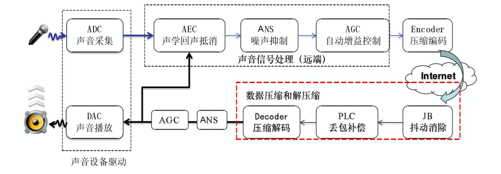

音频的QOS可以分：音频前处理3A算法、NetEQ两大类。

### 二、音频前处理3A算法

#### 1）AEC

AEC (Acoustic Echo Cancellation) 回声消除算法

默认IOS和ANDROID、windows系统都使用内置的AEC算法。若要使用webrtc的AEC算法，需要单独配置。配置过程请参见

WebRtcVoiceEngine::Init  
->WebRtcVoiceEngine::ApplyOptions

AEC算法原理分析，请参见[《webrtc AEC算法原理分析》](https://www.cnblogs.com/dylancao/p/10529191.html)

#### 2）ANS

ANS (Automatic Noise Suppression)自动降噪。

该算法适用于多方会议入会，若没有噪声抑制，每个与会方都自带背景噪音，混音叠加会导致会议背景音嘈杂。  

#### 3）AGC

AGC (Automatic Gain Control) 自动增益控制

自动调麦克风的收音量，使与会者收到一定的音量水平，不会因发言者与麦克风的距离改变时，声音有忽大忽小声的缺点。

### 三、NetEQ

#### 1）实现框架图

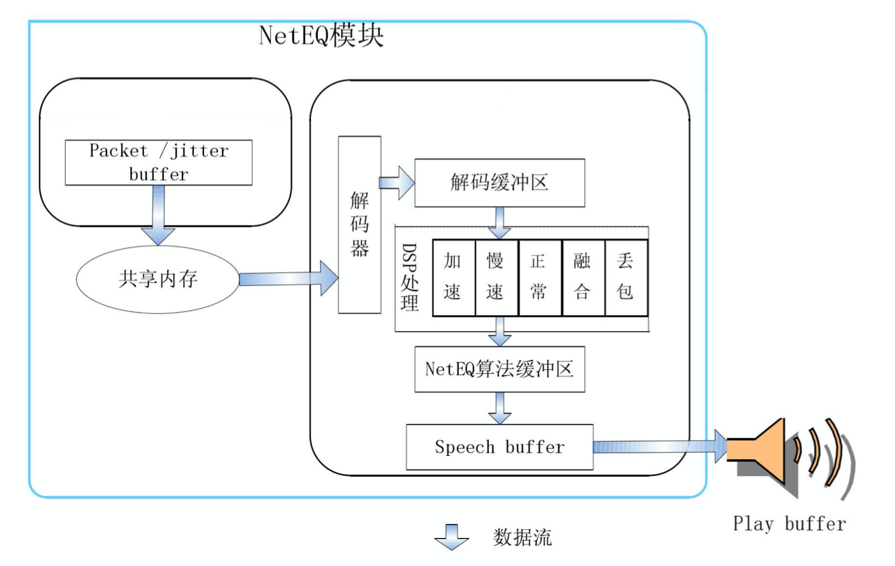

#### 2）函数调用关系

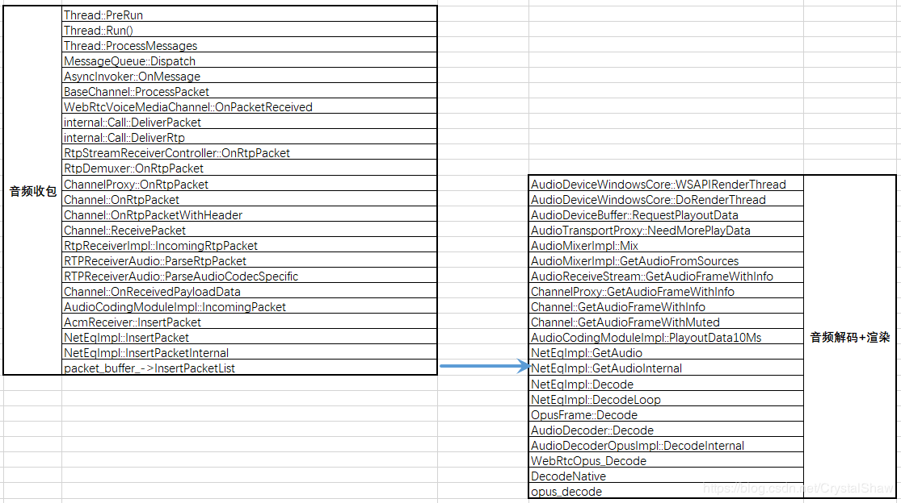

NetEqImpl::InsertPacketInternal函数与NetEqImpl::GetAudioInternal函数之间通过`packet_buffer_`共享队列传输音频报文数据。

在NetEqImpl::InsertPacketInternal函数中入队音频报文、在NetEqImpl::ExtractPackets函数中出队报文。

```
NetEqImpl::GetAudio  
->NetEqImpl::GetAudioInternal       
->NetEqImpl::GetDecision  
->NetEqImpl::ExtractPackets  
```

#### 1）抗丢包方法

1、NACK：丢包重传协议。

2、FEC：冗余协议。

3、交织编码。

NetEqImpl::InsertPacketInternal函数主要实现解析FEC冗余报文，检测丢包申请NACK重传功能。

#### 2）抗抖动方法

  * JitterBuff

抗网络抖动由三个模块共同完成：网络延时统计算法、缓冲BUF延迟统计算法、控制命令决策判定。

webrtc会根据网络延时(DelayManager)和缓冲BUF已经缓存数据长度(BufferLevelFilter)以及上一帧的处理方式等，决定给解码器发什么信号处理命令。

DelayManager、BufferLevelFilter算法实现，请参见《[NetEQ之音频网络延时DelayManager计算](https://blog.csdn.net/CrystalShaw/article/details/104768449)》、《[NetEQ之音频缓存延时BufferLevelFilter计算](https://blog.csdn.net/CrystalShaw/article/details/104817596)》。

实现代码：

```
->NetEqImpl::GetAudioInternal  
->NetEqImpl::GetDecision  
->DecisionLogic::GetDecision     
--->DecisionLogic::FilterBufferLevel----计算未被播放，放在缓冲区（包括packet_buffer_、sync_buffer_）音频数据，可播放时长  
--->DecisionLogicNormal::GetDecisionSpecialized  
->DecisionLogicNormal::ExpectedPacketAvailable  
->DelayManager::BufferLimits-----------计算网络延时
```

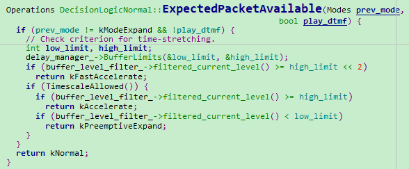

  * 音频平滑处理方法

音频解码信号处理命令有主要有五种：kNormal(正常播放)、kAccelerate(加速播放)、kPreemptiveExpand(减速播放)、kExpand(丢包补偿)、kMerge(融合)，原理如下：

虽然前面有抗抖动方法尽量保证音频质量，但是在一些特定网络，音频渲染时还是可能出现音频数据堆积、断流现象。若不进行特殊处理，音频时快时慢，用户体验较差。这里webrtc引入变速不变调算法进行平滑处理：

1、累积数据过多时，通过该算法，不影响用户体验情况下，减少这些数据播放时长。

2、音频播放BUF数据不足时，通过该算法，增加这些数据播放时长。让用户感知不到音频数据的波动。

在弱网丢包率比较高情况下，数据相对长时间丢失，变速不变调算法也无法满足实际应用，webrtc又引入了丢包补偿、音频融合算法，衔接和平滑音频质量。

1、丢包补偿算法原理是根据前一帧的解码信息，利用基音同步重复的方法近似替代当前的丢失帧，以达到丢包补偿。

2、融合算法是当上一次播放的帧与当前解码的帧不连续的情况下，进行衔接和平滑处理。让两个数据包一部分播放时间重叠，使过度更自然。

处理函数NetEqImpl::GetAudioInternal

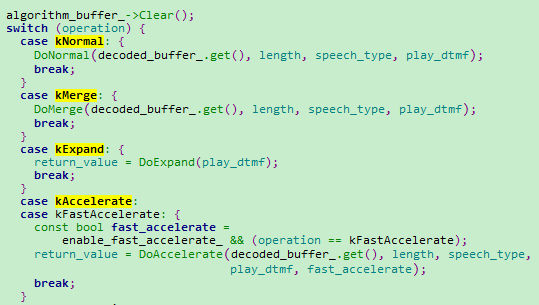

### 参考

* <https://www.jianshu.com/p/09c103f95825>
* <https://www.cnblogs.com/talkaudiodev/p/9142192.html>
* <http://sxjs.cnjournals.cn/ch/reader/create_pdf.aspx?file_no=20100512&flag=1&journal_id=sxjs&year_id=2010>

<hr>

#### <p>原文出处：<a href='https://blog.csdn.net/CrystalShaw/article/details/104768449' target='blank'>WebRTC音频QOS方法一（NetEQ之音频网络延时DelayManager计算）</a></p>

## WebRTC音频QOS方法一（NetEQ之音频网络延时DelayManager计算）

### 一、整体思路

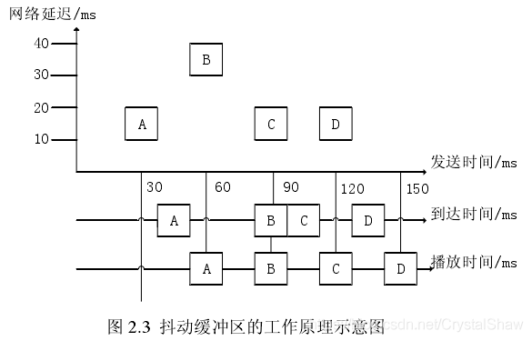

<table align="center" border="1" cellpadding="1" cellspacing="1" style="width:500px;"><tbody><tr><td style="width:94px;"><strong>&nbsp; &nbsp;时间点</strong></td><td style="width:82px;"><strong>&nbsp;A</strong></td><td style="width:88px;"><strong>&nbsp;B</strong></td><td style="width:91px;"><strong>&nbsp;C</strong></td><td style="width:117px;"><strong>&nbsp;D</strong></td></tr><tr><td style="width:94px;"><strong>&nbsp; &nbsp; &nbsp;发送</strong></td><td style="width:82px;">30</td><td style="width:88px;">60</td><td style="width:91px;">90</td><td style="width:117px;">120</td></tr><tr><td style="width:94px;"><strong>&nbsp; &nbsp; &nbsp;接收</strong></td><td style="width:82px;">40</td><td style="width:88px;">90</td><td style="width:91px;">100</td><td style="width:117px;">130</td></tr><tr><td style="width:94px;"><strong>&nbsp; &nbsp; &nbsp;延时</strong></td><td style="width:82px;">null</td><td style="width:88px;">50</td><td style="width:91px;">10</td><td style="width:117px;">30</td></tr></tbody></table>

不像视频一帧数据那么大，音频一帧数据包都比较小，UDP的1500个字节完全可以装满一帧。所以音频在发送端的发送时间间隔是按照固定的打包时长节奏发送的。

以上图30ms打包时长为例，ABCD四个报文的发送时间间隔都是30ms。若没有网络影响，接收端的包间间隔也是30ms，音频播放清晰流畅。

但网络传输各种不可控因素会导致音频报文到达接收端存在丢包、乱序、抖动等异常。接收端若不特殊处理，用户体验会很差。

对于丢包异常传输层可以使用FEC/NACK/交织编码修复。编解码层可以使用PLC（Packet Loss Compensation）等算法修复。

对于乱序、抖动异常，需要使用JitterBuffer做平滑。JitterBuffer实现机制有静态JB和动态JB两种。

  1. 静态JB控制算法：缓冲区大小固定，容易实现，网络抖动大时，丢包率高，抖动小时，延迟大。
  2. 动态JB控制算法：计算目前最大抖动，调整缓冲区大小，实现复杂，网络抖动大时，丢包率低，抖动小时，延迟小。

DelayManager、BufferLevelFilter两个模块配合实现动态JB功能。以设置合理的缓冲空间，保证音频平稳播放。

  1. DelayManager用来计算接收端接收音频数据包延时时间；
  2. BufferLevelFilter用来计算系统当前共缓存音频数据包可播放时间（包括RTP报文缓存、音频解码后待播放数据缓存）。

这里首先介绍DelayManager模块实现原理。

### 二、实现原理

DelayManager模块的核心思想是计算target_level_这个参数，通过这个参数在DelayManager::BufferLimits函数中，计算最大最小缓存BUF。

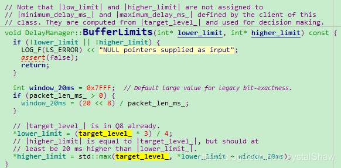

`target_level_`参数由两个因素决定：IATVector直方图、DelayPeakDetector检测kMaxPeakPeriodMs秒周期内抖动的峰值。

#### 1、IAT直方图介绍

IATVector直方图（Histogram of inter-arrival times）由65成成员变量组成，每个IATVector的成员变量是该延时出现的概率。

<table align="center" border="1" cellpadding="1" cellspacing="1" style="width:500px;"><tbody><tr><td style="width:235px;"><strong>IAT(inter arrival times)</strong></td><td style="width:252px;"><strong>出现概率</strong></td></tr><tr><td style="width:235px;">&nbsp; &nbsp; &nbsp; &nbsp; &nbsp; &nbsp; &nbsp; &nbsp; &nbsp; &nbsp; 0</td><td style="width:252px;">72887611</td></tr><tr><td style="width:235px;">&nbsp; &nbsp; &nbsp; &nbsp; &nbsp; &nbsp; &nbsp; &nbsp; &nbsp; &nbsp; 1</td><td style="width:252px;">999495224</td></tr><tr><td style="width:235px;">&nbsp; &nbsp; &nbsp; &nbsp; &nbsp; &nbsp; &nbsp; &nbsp; &nbsp; &nbsp; 2</td><td style="width:252px;">529939</td></tr><tr><td style="width:235px;">&nbsp; &nbsp; &nbsp; &nbsp; &nbsp; &nbsp; &nbsp; &nbsp; &nbsp; &nbsp; 3</td><td style="width:252px;">0</td></tr><tr><td style="width:235px;">&nbsp; &nbsp; &nbsp; &nbsp; &nbsp; &nbsp; &nbsp; &nbsp; &nbsp; &nbsp; 4</td><td style="width:252px;">0</td></tr><tr><td style="width:235px;">&nbsp; &nbsp; &nbsp; &nbsp; &nbsp; &nbsp; &nbsp; &nbsp; &nbsp; &nbsp; 5</td><td style="width:252px;">0</td></tr><tr><td style="width:235px;">&nbsp; &nbsp; &nbsp; &nbsp; &nbsp; &nbsp; &nbsp; &nbsp; &nbsp; &nbsp; 6</td><td style="width:252px;">0</td></tr><tr><td style="width:235px;">&nbsp; &nbsp; &nbsp; &nbsp; &nbsp; &nbsp; &nbsp; &nbsp; &nbsp; &nbsp; 7</td><td style="width:252px;">75384</td></tr><tr><td style="width:235px;">&nbsp; &nbsp; &nbsp; &nbsp; &nbsp; &nbsp; 。。。。。。</td><td style="width:252px;">0</td></tr><tr><td style="width:235px;">&nbsp; &nbsp; &nbsp; &nbsp; &nbsp; &nbsp; &nbsp; &nbsp; &nbsp; &nbsp;63</td><td style="width:252px;">0</td></tr><tr><td style="width:235px;">&nbsp; &nbsp; &nbsp; &nbsp; &nbsp; &nbsp; &nbsp; &nbsp; &nbsp; &nbsp;64</td><td style="width:252px;">0</td></tr></tbody></table>

IATVector直方图里面保存的概率是以1<<30为分母的分子部分。

##### 1）iat_packet计算

`iat_packet`=实际包间间隔 / 打包时长

函数：DelayManager::Update

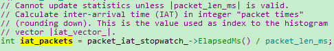

`packet_iat_stopwatch_->ElapsedMs()`：每收到一包，启动一次定时器，用来计算两次收包实际时间间隔。

`packet_len_ms`：该报文的打包时长，单位ms。

其中打包时长是根据RTP报文时间戳计算的。我们以G.711A编码10ms打包格式为例，一秒钟的采样率是8000HZ。一包报文的时间戳间隔计算公式为：（8000HZ*10ms打包时长）/1000ms=80个点。

同理，报文的打包时长也可以通过时间戳换算出来。计算公式为`packet_len_ms`=（1000ms*两包时间戳差值）/采样率。

##### 2）更新概率参数

DelayManager::UpdateHistogram函数会根据计算的`iat_packet`，将该`iat_packet`插入IATVector直方图对应数组下标内。并更新该直方图的数据下标下概率参数。一共有四步操作：

  * 1、用遗忘因子，对历史数据的出现概率进行遗忘。

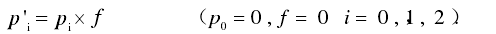

  * 2、增大本次计算到的IAT的概率值。

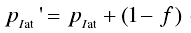

  * 3、更新遗忘因子f，使f为递增趋势。即通话时间越长，包间隔的概率分布越稳定。

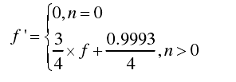

  * 4、调整本次计算到的IAT的概率，使整个IAT的概率分布之和近似为1。

调整方式为假设当前概率分布之和为tempSum，则：

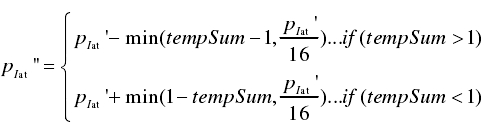

这四步操作，都在函数DelayManager::UpdateHistogram中实现。

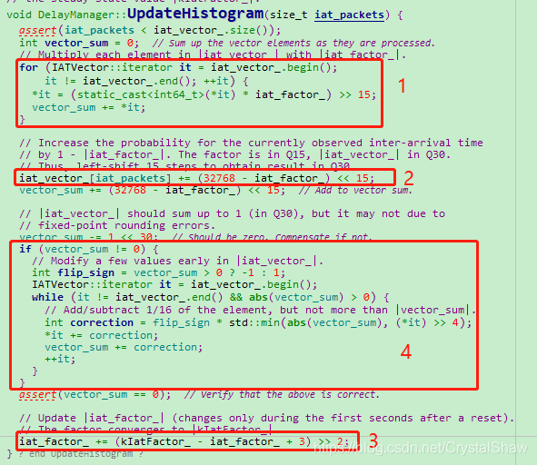

##### 3）根据IATVector直方图计算target_level_

DelayManager::CalculateTargetLevel函数在每收到一包音频数据的时候，都会更新一次`target_level_`的值。

IATVector直方图的更新原理是，从IAT为0开始，累加出现的概率，当概率达到设定的kLimitProbability门限值时，配置`target_level_`为该直方图的数组下标。

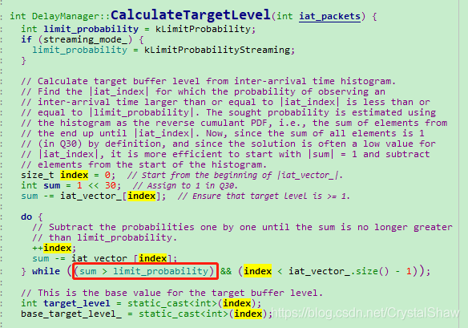

#### 2、DelayPeakDetector峰值检测算法

IATVector直方图的做法的思想是参考从通话启动，到目前为止的平均延时值，但是实时音视频通话中，还要考虑短时延时波动的影响。所以webrtc里面也引入了DelayPeakDetector算法，检测短期内的延时最大值。作为target_level_的参考值。

实现的原理是，采用一个长度为kMaxNumPeaks的二维数组Peak，统计IAT的峰值。二维数组Peak，保存两个参数：峰值幅度（`peak_height_packets`）、峰值间隔时间（`period_ms`）。其中峰值间隔时间（`period_ms`）是统计当前探测到的峰值距离上一次峰值被发现的时间间隔。当Peak成员变量大于kMinPeaksToTrigger，且当前检测周期小于2*max（`period_ms`）则`target_level_`参考该峰值配置。若没有，使用IATVector直方图计算的值。

##### 1）DelayPeakDetector::Update函数将IAT异常峰值入队

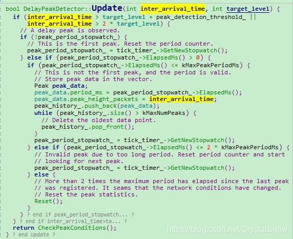

##### 2）DelayPeakDetector::CheckPeakConditions判断该峰值是否达到上报条件

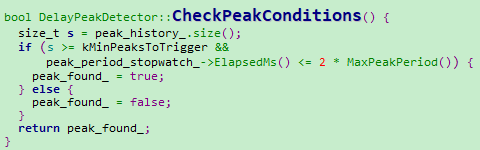

##### 3）DelayPeakDetector::MaxPeakHeight获取检测周期内异常峰值

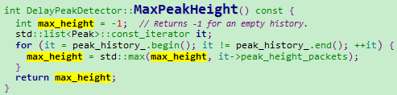

##### 4）DelayManager::CalculateTargetLevel修订`target_level_`

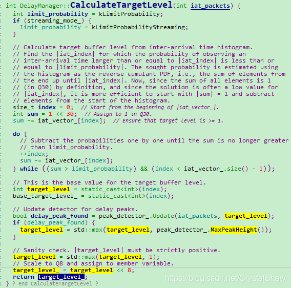

至此，完成`target_level_`的计算。

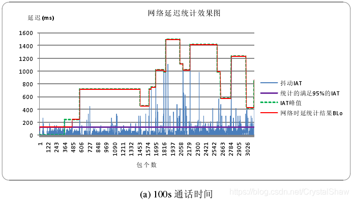

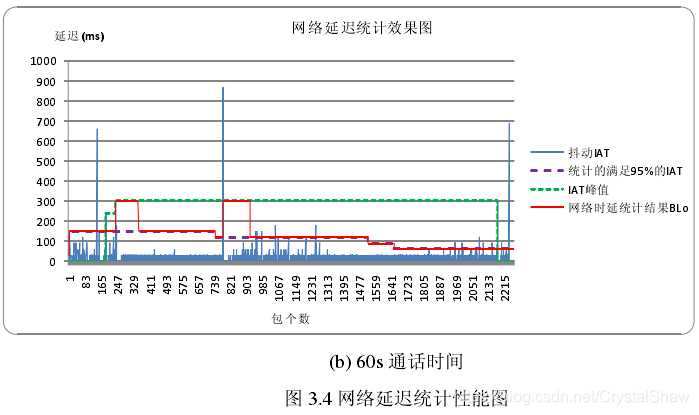

### 三、参考

*《WebRTC语音引擎中NetEQ技术的研究_吴江锐》

<hr>

#### <p>原文出处：<a href='https://blog.csdn.net/CrystalShaw/article/details/104817596' target='blank'>WebRTC音频QOS方法一（NetEQ之音频缓存延时BufferLevelFilter计算）</a></p>

## WebRTC音频QOS方法一（NetEQ之音频缓存延时BufferLevelFilter计算）

### 一、整体思路

上一篇《[NetEQ之音频延时DelayManager计算](https://blog.csdn.net/CrystalShaw/article/details/104768449)》介绍了如何计算音频报文的网络延时，给系统需要缓存多长时间的音频数据，提供了数据支撑。webrtc会根据当前系统已经缓存包数和网络延时情况，决定给音频解码器发送播放方式，进行平滑处理。下面来介绍计算系统已经缓存包数的方法。

### 二、实现原理

#### 1）计算公式

系统已经缓存包数有三块组成：

1、RTP数据包缓存；
2、音频解码后PCM数据缓存包数（解码后数据尚未进行音频渲染）；
3、对音频数据进行stretched包数。

获取这三块数据后，使用如下公式计算系统音频缓存包数。

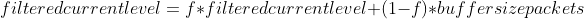

1. `filtered_current_level`：平滑后系统缓存包数。单位是报文个数。
2. `filtered_current_level`：当前系统缓存包数。单位是报文个数。
3. f：遗忘因子。根据《[NetEQ之音频延时DelayManager计算](https://blog.csdn.net/CrystalShaw/article/details/104768449)》计算的网络延时动态调整。

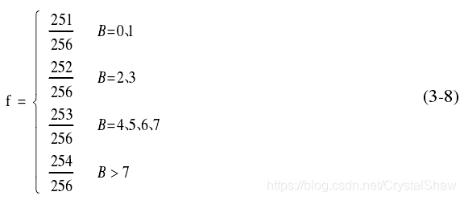

#### 2）代码实现

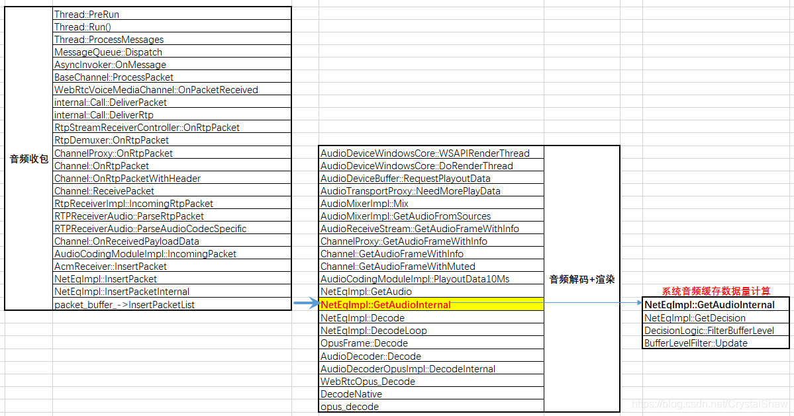

  * BufferLevelFilter::Update

`filtered_current_level_`变量计算的核心函数。这里可以看出`filtered_current_level`还需要根据`time_stretched_samples`参数进行微调。因为之前对音频数据进行快进或者快退，播放时间不完全等于缓存时间。

`time_stretched_samples`表示加速或减速播放后数据长度的伸缩变化。若为加速，`time_stretched_samples`为正值，`filtered_current_level`减小；若为减速，`time_stretched_samples`为负值，`filtered_current_level`变大。这体现了抖动消除技术的核心思想，即通过加速减速来实现自适应抖动缓冲区的物理设计。并且次处的`filtered_current_level`不会长期持续减速或者减速，确保音频质量的舒适度。

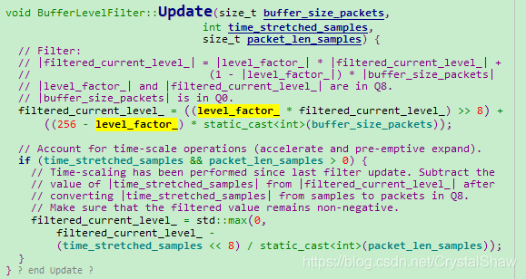

  * BufferLevelFilter::SetTargetBufferLevel

使用《[NetEQ之音频延时DelayManager计算](https://blog.csdn.net/CrystalShaw/article/details/104768449)》计算的网络延时`target_buffer_level`，动态调整遗忘因子系数。

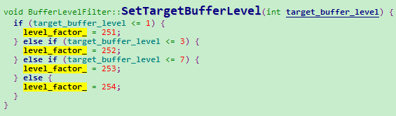

  * DecisionLogic::GetDecision

计算系统当前实际音频缓存包数，可以看出这里计算了RTP报文、PCM数据、stretched三大块

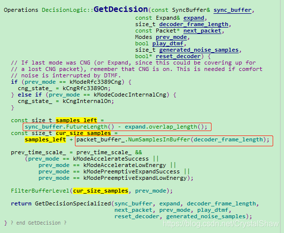

  * DecisionLogicNormal::ExpectedPacketAvailable

最后，根据网络延时、系统缓存包数及上一帧的处理方式，决定当前解码器的处理方式。

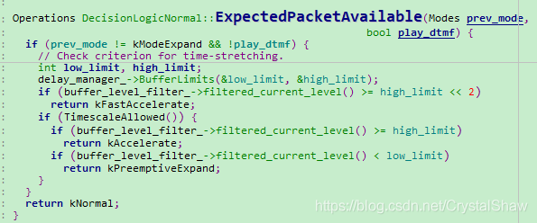

### 三、附录

NetEqImpl类里面使用SyncBuffer类，整理该类结构定义如下，便于后续代码走读。

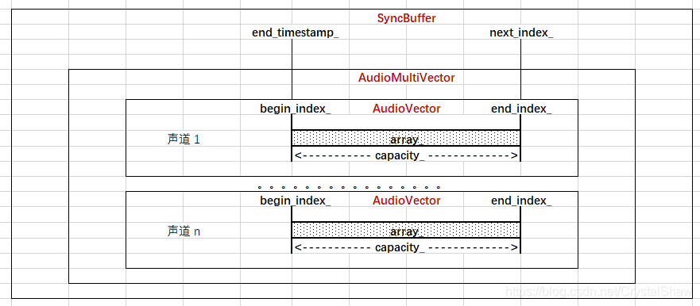

### 四、参考

* 《WebRTC语音引擎中NetEQ技术的研究_吴江锐》

<hr>

#### <p>原文出处：<a href='https://blog.csdn.net/CrystalShaw/article/details/106940151' target='blank'>WebRTC音频QOS方法二（opus编码器自适应网络参数调整功能）</a></p>

## WebRTC音频QOS方法二（opus编码器自适应网络参数调整功能）

### 一、opus函数调用接口

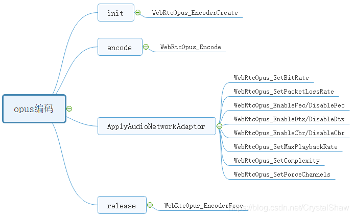

### 二、自适应网络调整参数介绍

#### 1、WebRtcOpus_SetBitRate

Opus支持码率从6 kbit/s到510 kbit/s的切换功能，以适应这种网络状态。以20ms单帧数据编码为例，下面是各种配置的Opus的比特率最佳点。

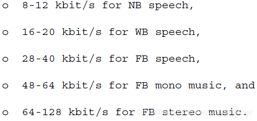

#### 2、WebRtcOpus_SetPacketLossRate

动态配置丢包率，是为了动态调整opus FEC的冗余度。opus编码器自带inband FEC冗余算法，增强抗丢包能力。大概使用的是非对称冗余协议。将一些关键信息多次编码重传。

#### 3、WebRtcOpus_EnableFec/DisableFec

开启或者关闭inband FEC功能。

走读opus代码，发现只有silk编码支持inband FEC。函数实现调用栈如下：
    
```
opus_encode_native
->silk_Encode
->silk_encode_frame_Fxx
->silk_encode_frame_FLP
->silk_LBRR_encode_FLP
```

celt不支持inband FEC。猜测celt是通过改变参考帧长度，来增强抗网络丢包能力。

#### 4、WebRtcOpus_EnableDtx/DisableDtx

DTX：Discontinuous Transmission。不同于music场景，在voip场景下，声音不是持续的，会有一段一段的间歇期。这个间歇期若是也正常编码音频数据，对带宽有些浪费。所以opus支持DTX功能，若是检测当前会议没有明显通话声音，仅定期发送（400ms）静音指示报文给对方。对方收到静音指示报文可以补舒适噪音包（opus不支持CNG，不能补舒适噪音包）或者静音包给音频渲染器。

#### 5、WebRtcOpus_EnableCbr/DisableCbr

opus支持恒定码率和变码率两种编码方式。一般流媒体使用CBR，voip场景使用VBR。

#### 6、WebRtcOpus_SetMaxPlaybackRate

根据采样率调整算法bandwidth参数。

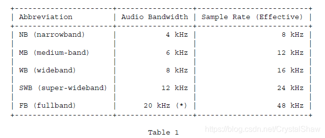

#### 7、WebRtcOpus_SetComplexity

取值范围0-10。值越大代码复杂度越高，音质越好。webrtc里面只有安卓、IOS、ARM支持复杂度切换功能。windows系统默认都是9。

#### 8、WebRtcOpus_SetForceChannels

opus支持单双声道切换功能。当传入数据是双声道，解码器是单声道，解码器会average左右声道数据，以单声道数据输出。

当传入数据是单声道，解码器是双声道，解码器会给左右声道输出同一份数据。一般voip使用单声道传输，music使用双声道，这种单双声道切换，主要提升music场景下抗弱网能力。

#### 9、WebRtcOpus_EncoderCreate.application

```
#define OPUS_APPLICATION_VOIP     2048  
#define OPUS_APPLICATION_AUDIO   2049  
#define OPUS_APPLICATION_RESTRICTED_LOWDELAY 2051
```

application有三种模式：voip、music、lowdelay三种模式。

voip主要使用SILK编码，music主要使用CELT编码。lowdelay取消voip场景的一些优化方案，换取一丢丢低延时。

### 三、参考

* 《rfc6716》

<hr>

#### <p>原文出处：<a href='https://blog.csdn.net/CrystalShaw/article/details/107929280' target='blank'>WebRTC音频QOS方法三（回声的产生及抑制）</a></p>

## WebRTC音频QOS方法三（回声的产生及抑制）

### 一、回声的产生

无论是实际环境还是语音通话中，回声总是存在的。但是需要满足如下两个条件，我们才能感觉到回声的存在：

1、回波通路延时足够长

<table border="1" cellpadding="1" cellspacing="1" style="width:500px;"><tbody><tr><td style="width:222px;">回波通路延时</td><td style="width:277px;">效果</td></tr><tr><td style="width:222px;">小于30ms</td><td style="width:277px;">不易察觉</td></tr><tr><td style="width:222px;">小于50ms</td><td style="width:277px;">有感知</td></tr><tr><td style="width:222px;">大于50ms</td><td style="width:277px;">影响严重，需要干预</td></tr></tbody></table>
  
2、回波信号能量足够强

也就是说，返回的回波信号必须足够强到，能让用户能够听见。

在实时音频会议通话中，产生回声的主要来源有两点：电学回声、声学回声。回波消除的算法也有两种：EC、AEC。一般EC是电学回波消除，部署在PSTN网关或接入设备上。AEC指的是声学回波消除，用于终端设备。

### 二、回声的种类及抑制

#### 1、电学回声

目前大家可能很少听说电学回声，过去使用固定座机电话时，会有电学回声问题。它的产生原理如下：

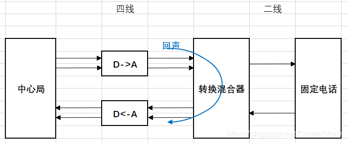

在几乎所有的通信网络中，信号的传递都是采用4线传输，也就是在接收和发送两个方向上，各使用两条线传输信号，其中一条是参考地，另一条是信号线。但是电话用户使用的话机都是通过2线传输的方式接入本地交换机，一条线是参考地，另一条信号线上同时传输收发双向的信号。所以需要在本地交换机中采用2/4线转换(hybrid)实现这两种传输方式之间的转换。

由于实际使用的2/4线变换器中混合线圈不可能做到理想状况，总是存在一定的阻抗不匹配，不能做到将发送端和接收端完全隔离，所以从4线一侧接收的信号总有一部分没有完全转换到2线一侧，部分泄露到了4线一侧的发送端，因此产生回波。

电学回声的时延一般都比较小100ms以内，一般在近电话接入网关侧开启软件EC功能，就能比较好的解决这类问题。

#### 2、声学回声

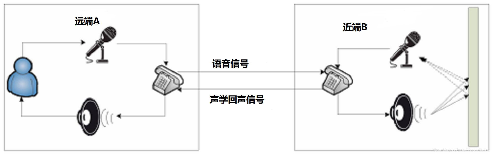

在麦克风与扬声器互相作用影响的双工通信系统中极易产生声学回声。如下图所示：

远端讲话者A-->麦克风A-->电话A-->电话B---->扬声器B--->麦克风B-->电话B-->电话A-->扬声器A--->麦克风A--->.........就这样无限循环。

声学回声信号根据传输途径的差别可以分别直接回声信号和间接回声信号。

  * 1）直接回声

近端扬声器B将语音信号播放出来后，近端麦克风B直接将其采集后得到的回声。直接回声不受环境的影响，与扬声器到麦克风的距离及位置有很大的关系，因此直接回声是一种线性信号。直接回声在音频会议中容易形成啸叫，这类回声的处理方法分为两大类：前向抑制、反馈抵消

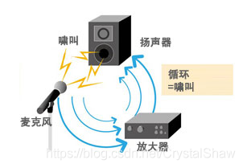

  * 2）间接回声

近端扬声器B将语音信号播放出来后，语音信号经过复杂多变的墙面反射后由近端麦克风B将其拾取。间接回声的大小与房间环境、物品摆放以及墙面吸引系数等等因素有关，因此间接回声是一种非线性信号。

  * 3）回声抑制

回声抑制方法主要有三方面：

1、物理降噪

墙壁、天花板换成吸音材料，有效的较少声音的反射，可以较为直接的抑制间接噪声，但是直接噪声无法抑制；

使用耳机代替音响外放，可以阻断回波路径。

2、硬件降噪

硬件结构化设计，有麦克和音响摆放的角度，声音回路设计。麦克风beamforming阵列（指向麦），麦克风灵敏度，频移器，均衡器，反馈抑制器等等。

3、软件降噪

软件降噪的原理是使用不同的自适应滤波算法调整滤波器的权值向量，估计一个近似的回声路径来逼近真实回声路径，从而得到估计的回声信号，并在纯净语音和回声的混合信号中除去此信号来实现回声的消除。

#### 3、webrtc的实现

webrtc创建链接的时候，会检测操作系统类型，iOS、安卓、Windows都使用的是系统内置的AEC。

以windows操作系统为例，使用系统内置的AEC链接如下：

<https://docs.microsoft.com/zh-cn/SkypeForBusiness/certification/overview>

个人理解，这些系统内置处理也是一些软件算法，但是由于对硬件结构化设计、声道回路有些基本要求，固化场景，回声的模型也比较固定。软件仅针对这些场景做一些优化设计。但是若使用场景不满足他们的要求，降噪效果不是很理想。

所以Skype还专门对接入自己软件的设备做了一些认证，不通过我们的认证的硬件，是不保证高质量的音效的。有资质设备列表官网链接如下：

<https://docs.microsoft.com/zh-cn/SkypeForBusiness/certification/devices-usb-devices>

若是实际测试时，发现回声消除效果差，建议使用webrtc_M79版本后的自带的AEC3功能，实测效果比较好。

根据官方发布消息称谷歌在2019第一季度对AEC3做了深度优化，性能和质量都较之前有很大改善。

关于AEC3算法实现，可以参考《[深入浅出 WebRTC AEC（声学回声消除）](https://mp.weixin.qq.com/s?__biz=MjM5NTE0NTY3MQ==&mid=2247487045&idx=1&sn=ef03bbdc9ee8ec6a426d9e51fd55d43e&chksm=a6fdbced918a35fb7b0de2d0049cc4a9ae0331ef712fb3dbd523dc0bc893ca406fd727ccaac5&scene=178&cur_album_id=1612237369238175753#rd)》文章介绍。

### 三、参考

* <https://www.cnblogs.com/LXP-Never/p/11703440.html>
* <https://www.infoq.cn/article/FkolDeUHgahsxXcbsLXJ>
* 《深入浅出 WebRTC AEC（声学回声消除）》：<https://xie.infoq.cn/article/47b298082b7846da6c04cac8d>
* 《麦克风阵列信号处理技术》：<https://www.sohu.com/a/223797137_99991918>
* 《自适应滤波器在反馈啸叫抑制中的应用研究》

<hr>

#### <p>原文出处：<a href='https://blog.csdn.net/CrystalShaw/article/details/94384364' target='blank'>WebRTC代码走读四（音频数据处理流程汇总）</a></p>

## WebRTC代码走读四（音频数据处理流程汇总）

### 一、概述


### 二、音频收包到渲染

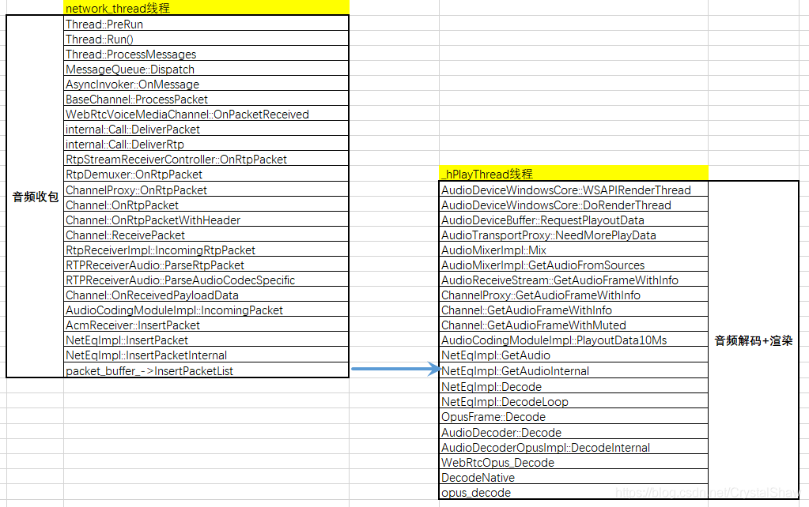

NetEqImpl::InsertPacketInternal函数与NetEqImpl::GetAudioInternal函数之间通过`packet_buffer_`共享队列传输音频报文数据。

在NetEqImpl::InsertPacketInternal函数中入队音频报文、在NetEqImpl::ExtractPackets函数中出队报文。

```
NetEqImpl::GetAudio  
->NetEqImpl::GetAudioInternal       
->NetEqImpl::GetDecision  
->NetEqImpl::ExtractPackets
```

### 三、采集到发包

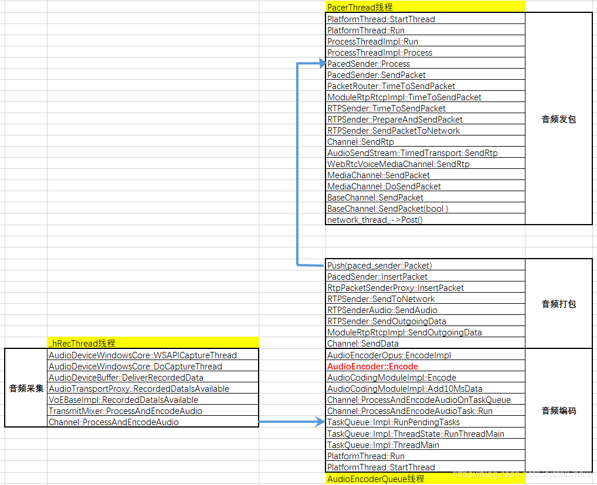

AudioCodingModuleImpl::Encode函数，同时调用编码+发包函数。

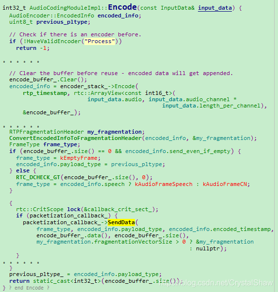

