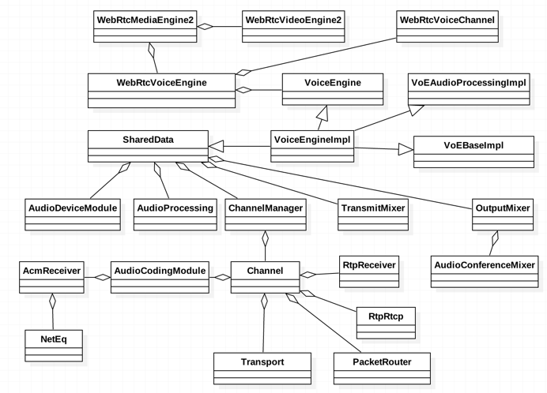
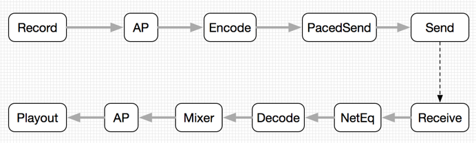
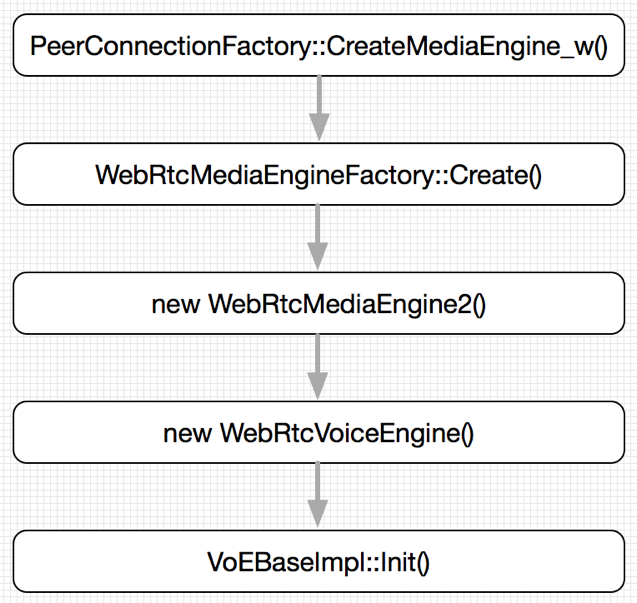
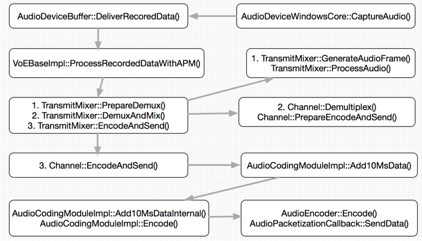
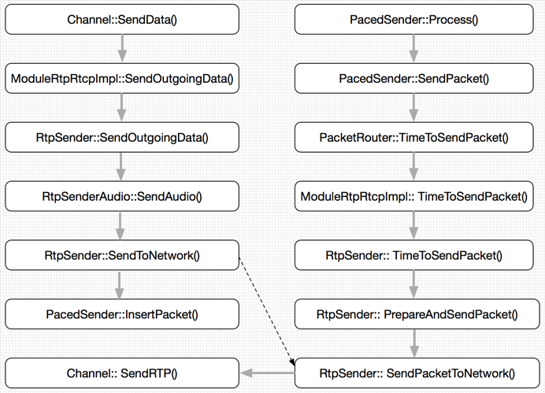
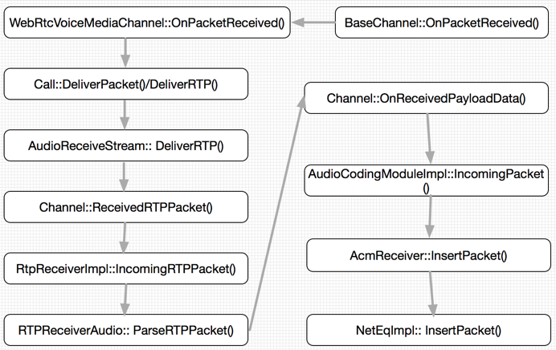
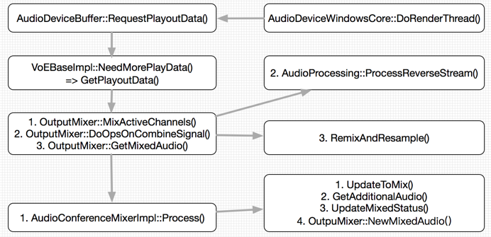

 
<!--BEGIN_DATA
{
    "create_date": "2020-04-02 20:51", 
    "modify_date": "2020-04-02 20:51", 
    "is_top": "0", 
    "summary": "WebRTC音频引擎实现分析<br>WebRTC音频采集至发送流程（iOS版）<br>WebRTC音频AGC/AEC/NS各平台设置源码分析", 
    "tags": "WebRTC、C/C++", 
    "file_name": "WebRTC音频引擎实现分析与采集流程.md"
}
END_DATA-->

####<p>原文出处：<a href='https://www.jianshu.com/p/5a8a91cd84ef' target='blank'>WebRTC音频引擎实现分析</a></p>

WebRTC的音频引擎作为两大基础多媒体引擎之一，实现了音频数据的采集、前处理、编码、发送、接收、解码、混音、后处理、播放等一系列处理流程。本文在深入分析WebRTC源代码的基础上，学习并总结其音频引擎的实现框架和细节。

####1. WebRTC音频引擎整体架构

WebRTC音频引擎的实现代码主要分布在如下几个源码目录中：


```
webrtc/audio
webrtc/common_audio
webrtc/media/engine
webrtc/voice_engine
webrtc/module/audio_coding
webrtc/module/audio_conference_mixer
webrtc/module/audio_device
webrtc/module/audio_processing
```

WebRTC音频引擎的整体架构如图1所示。



从整个WebRTC框架结构来看，音频引擎和和视频引擎都位于比较底层的位置，负责音视频数据的采集、编解码、渲染播放等工作。音视频引擎的上一层是多媒体引擎WebRtcMediaEngine2，是对底层音视频引擎VideoEngine的进一步高层抽象，由WebRtcVoiceEngine对VoiceEngine进行封装，WebRtcVideoEngine2对VideoEngine进行封装。

在内部实现上，音频引擎VoiceEngineImpl通过一系列对象来实现音频处理，包括VoEAudioProcessingImpl、VoECodecImpl、VoENetworkImpl等等，每个对象负责具体某方面功能，例如VoEAudioProcessingImpl负责调用底层AudioProcessing模块对音频数据进行预处理。在这些功能对象中，比较重要的有VoEBaseImpl、SharedData和Channel。其中VoEBaseImpl是连接音频设备AudioDevice和音频引擎VoiceEngineImpl的纽带，是音频数据流水线上的重要一站；SharedData是一个聚合类，持有一系列重要对象；Channel则代表一路音频数据，负责大部分对该路数据的重要操作，包括音频数据的前处理、编解码、发送和接收、后处理、混音等等。

从功能依赖上讲，VoiceEngineImpl依赖五个重要的底层功能模块：音频数据采集和播放AudioDeviceModule 、音频数据预处理AudioProcessing、音频数据编解码AudioCodingModule、接收端音频数据缓冲区NetEq、接收端混音AudioConferenceMixer。此外音频数据编解码还依赖一系列音频编解码器如G711、G722、Opus等等。在发送端，音频数据由AudioDevice采集得到，经过AudioProcessing预处理后，到达AudioCodingModule进行编码，然后由RTPRTCP模块发送到网络。在接收端，音频数据经过RTPRTCP模块接收后到达AudioCodingModule，存储在NetEq中进行抖动控制和错误消除，然后解码。解码后的数据经过AudioConferenceMixer进行混音，最终发送到AudioDeviceModule进行播放。

####2. WebRTC音频引擎重要数据结构

本节在第一节的基础上，静态分析WebRTC音频引擎实现上的一些重要数据结构。为了便于理解，采用从高层到底层的顺序进行分析。

WebRtcMediaEngine2在MediaEngine层对底层的音视频引擎进行封装，分别是WebRtcVoiceEngine和WebRtcVideoEngine2。而WebRtcVoiceEngine则封装了音频引擎层的VoiceEngineImpl对象。VoiceEngineImpl以多继承方式聚集一系列接口，包括SharedData、VoEAudioProcessingImpl、VoECodecImpl、VoENetworkImpl、VoEBaseImpl等等。

SharedData是一个聚合类，内部包括ChannelManager、AudioDeviceModule、OutputMixer、TransmitMixer、AudioProcess等对象，大部分关于VoiceEngineImpl的操作最终都会经过SharedData委托给内部对象。在创建SharedData对象时，其构造函数会创建一个名为“VoiceProcessThread”的线程，该线程用以处理音频引擎的周期性事务。

VoEBaseImpl是连接底层音频采集播放模块AudioDeviceModule和音频引擎内部音频通道Channel的重要纽带。它实现三个接口：VoEBase负责创建Channel、启动/停止音频数据的发送/接收；AudioTransport负责AudioDeviceModule模块和Channel之间数据传送，包括采集后的音频数据发送到Channel进行编码、从Channel拉取解码后的音频数据进行播放；AudioDeviceObserver负责把AudioDeviceModule工作过程中出现的错误和警告向上层报告。

Channel是对一路音频数据及其处理过程的抽象，是VoiceEngineImpl中最重要的底层实现类，其继承并实现RtpData、RtpFeedback、FileCallback、Transport、PacketizationCallback、ACMVADCallback、MixerParticipant等多个接口，分别负责音频数据编码后回掉、发送到网络、接收后存储到NetEq缓冲区、播放前混音等一些列重要操作。在类内部， Channel包含的重要成员对象包括RtpReceiver、RtpRtcpModule、AudioCodingModule、CodecManager、OutputMixer、TransmitMixer、ProcessThread、AudioDeviceModule、VoiceEngineObserver、Transport、AudioProcessing、PacketRouter等等。

AudioDeviceModule模块负责音频数据的采集和播放，是音频数据的发源地和目的地。其内部主要包含三个对象：AudioDeviceModule、AudioDeviceGeneric和AudioDeviceBuffer。AudioDeviceModule是对外接口类，负责对AudioDevice和AudioDeviceBuffer进行管理、设置和对音频数据进行传递。AudioDevice是平台相关的音频设备，它管理音频采集设备和播放设备，包括初始化、设置音频采集设备和播放设备、开始/停止设备、控制设备音量、设置设备的音频数据缓冲区，等等。在初始化阶段，AudioDevice创建采集线程和播放线程，用来执行采集任务和播放任务。AudioDeviceBuffer是音频数据缓冲区，负责临时存储和传递音频数据。

AudioCodingModule模块负责音频数据的编解码，它由音频引擎层的Channel持有并调用。在内部，AudioCodingModul包含如下重要对象：AcmReceiver、AudioEncoder、AudioDecoder和NetEq，其中AcmReceiver负责接收音频数据并存储到NetEq中，NetEq负责音频数据的抖动消除和错误隐藏，AudioEncoder负责音频数据编码，AudioDecoder负责音频数据解码。WebRTC支持一系列音频编解码器，包括CNG、G711、G722、ilbc、isac、opus等等。数据编码完成后通过AudioPacketizationCallback接口回调到Channel进行下一步发送工作，数据解码完成后由Channel拉取进行下一步播放工作。

Audio Processing模块实现音频数据的预处理操作，包括声学回声消除AEC、自动增益控制AGC、噪声抑制NS、语音活动检测VAD，等等。AudioProcessing聚合一系列子模块实现各种音频处理算法，其重要的对外接口由两个：ProcessStream()和ProcessReverseStream()，前者负责采集后编码前的音频数据的前处理，后者播放前解码后的音频数据的后处理。

TransmitMixer用于发送端混音。OutputMixer用于接收端混音。OutputMixer在内部使用AudioConferenceMixer负责解码后音频数据的混音操作。

####3. WebRTC音频引擎数据流分析

本节在前两节分析的基础上，动态分析WebRTC音频引擎的数据流，包括音频数据的采集、前处理、编码、发送、接收、缓存、解码、混音、后处理、播放。如图2所示。



图2 WebRTC音频引擎数据流.png

######3.1 音频引擎创建及初始化

音频引擎的创建及初始化流程如图3所示：



图3 WebRTC音频引擎创建及初始化.png

WebRTC音频引擎的创建从PeerConnectionFactory对象的创建及初始化开始，这个过程由WebRTC的应用程序发起，并在signal线程在进行，最终调用CreateMediaEngine_w()转到worker线程。在worker线程中，先创建WebRtcMediaEngine2，进而WebRtcVoiceEngine，最终创建VoiceEngineImpl。而最重要的初始化操作则VoEBaseImpl的Init()函数中完成。

######3.2 音频数据的采集和编码

音频数据的采集是平台相关的，在此以Windows平台为例，整个采集和编码过程如图4所示：



图4 音频数据的采集和编码.png

在Windows 7平台上，WebRTC默认使用Windows Core接口采集和播放音频数据。采集线程叫做`webrtc_core_audio_capture_thread`，线程入口是AudioDeviceWindowCore的CaptureAudio函数。该函数从麦克风中采集到音频数据后，存储到AudioDeviceBuffer中，并调用DeliverRecordedData()把音频数据向上推送到VoEBaseImpl对象中。VoEBaseImpl对象调用ProcessRecordedDataWithAPM()函数进行处理，首先创建AudioFrame对象并进行前处理，然后进行解复合和混音，最后数据到达Channel进行编码和发送。

在Channel对象中，编码任务委托给AudioCodingModule对象，首先从AudioFrame中获取10ms的音频数据，然后调用具体的编码器如Opus进行编码。编码后的数据通过AudioPacketizationCallback接口的SendData()回到Channel对象进行下一步的RTP打包和发送过程。

####3.3 音频数据的发送

音频数据在AudioCodingModule编码完成后，通过回调接口回到Channel对象进行下一步的RTP打包和发送过程，如图5所示。



图5 音频数据的发送.png

Channel调用把数据发送给RtpRtcp模块，后者经过一系列的调用进行RTP打包后到达RtpSender对象。如果没有配置平滑发送线程PacedSender，则RtpSender直接调用SendPacketToNetwork()把数据发送到network线程。否则数据会先存储到PacedSender线程中，再由后者进行平滑发送，最终数据发送到network线程。

####3.4 音频数据的接收

network线程从网络接收到音频数据后，交给worker线程进行下一步接收。Worker线程的工作流程如图6所示。



图6 音频数据的接收.png

worker线程在收到网络数据后，通过BaseChannel的OnPacketReceived()接口向下传递，到达MediaEngine层的WebRtcVoiceMediaChannel，然后继续向下经过Call和AudioReceiveStream到达Channel的ReceivedRTPPacket()接口。Channel把数据推送到RtpRtcp模块进行RTP解包操作，得到纯音频数据，然后再经过Channel的OnReceivedPaylaodData()接口把数据推送到AudioCodingModule模块，最终经过AcmReceiver把数据存储在NetEq中，进行抖动消除和错误隐藏等操作。

######3.5 音频数据的解码和播放

worker线程把接收到的音频数据存储到NetEq后，为播放线程提供数据源。播放线程具体负责音频数据解码和播放操作。Windows Core接口的播放线程名称为`webrtc_core_audio_render_thread`，其工作流程如图7所示。



图7 音频数据的解码和播放.png

AudioDeviceWindowsCore设备向AudioDeviceBuffer请求音频数据，后者进一步向VoeBaseImpl请求数据，接下来主要操作都在GetPlayoutData()中进行：

1）在AudioConferenceMixer中对所有活动Channel中的音频数据进行混音，每个Channel都作为混音的参与者。这包括获取解码后的音频数据(从AudioCodingModule模块中解码音频数据并返回)、对音频数据进行混音、得到最终音频数据并返回给OutputMixer。
2）OutputMixer对混音后的音频数据执行AudioProcessing后处理操作。
3）对后处理操作后的音频数据进行再混合和再采样。最终OutputMixer拿到最终的音频数据，交给VoEBaseImpl，并进一步向下交给AudioDeviceBuffer。AudioDeviceBuffer则把数据交给AudioDeviceWindowsCore进行播放操作。

至此，我们完整分析了音频数据从采集到播放的全部过程。

####4. 总结

本文在深入分析WebRTC关于音频引擎实现代码的基础上，首先给出了WebRTC音频引擎的整体框架，然后静态分析了其实现上的若干重要对象，最后完整分析了音频数
据从采集到播放的完整流动过程。通过本文，对WebRTC有了更深入的认识和体会，为未来进一步学习打下坚实基础。


<hr>


####<p>原文出处：<a href='https://www.jianshu.com/p/3254fbbc381c' target='blank'>WebRTC音频采集至发送流程（iOS版）</a></p>


    
    src/audio/audio_state.cc

    void AudioState::AddSendingStream(webrtc::AudioSendStream* stream,
                                      int sample_rate_hz,
                                      size_t num_channels) {
      RTC_DCHECK(thread_checker_.CalledOnValidThread());
      auto& properties = sending_streams_[stream];
      properties.sample_rate_hz = sample_rate_hz;
      properties.num_channels = num_channels;
      UpdateAudioTransportWithSendingStreams();

      // Make sure recording is initialized; start recording if enabled.
      auto* adm = config_.audio_device_module.get();
      if (!adm->Recording()) {
        if (adm->InitRecording() == 0) {
          if (recording_enabled_) {
            adm->StartRecording();
          }
        } else {
          RTC_DLOG_F(LS_ERROR) << "Failed to initialize recording.";
        }
      }
    }


    src/media/engine/webrtcvoiceengine.cc

    void WebRtcVoiceEngine::Init() {
    ...
    #if defined(WEBRTC_INCLUDE_INTERNAL_AUDIO_DEVICE)
      // No ADM supplied? Create a default one.
      if (!adm_) {
        adm_ = webrtc::AudioDeviceModule::Create(
            webrtc::AudioDeviceModule::kPlatformDefaultAudio);
      }
    #endif  // WEBRTC_INCLUDE_INTERNAL_AUDIO_DEVICE
      RTC_CHECK(adm());
      webrtc::adm_helpers::Init(adm());
      webrtc::apm_helpers::Init(apm());

      // Set up AudioState.
      {
        webrtc::AudioState::Config config;
        if (audio_mixer_) {
          config.audio_mixer = audio_mixer_;
        } else {
          config.audio_mixer = webrtc::AudioMixerImpl::Create();
        }
        config.audio_processing = apm_;
        config.audio_device_module = adm_;
        audio_state_ = webrtc::AudioState::Create(config);
      }

      // Connect the ADM to our audio path.
      adm()->RegisterAudioCallback(audio_state()->audio_transport());

      // Save the default AGC configuration settings. This must happen before
      // calling ApplyOptions or the default will be overwritten.
      default_agc_config_ = webrtc::apm_helpers::GetAgcConfig(apm());

      // Set default engine options.
      {
        AudioOptions options;
        options.echo_cancellation = true;
        options.auto_gain_control = true;
        options.noise_suppression = true;
        options.highpass_filter = true;
        options.stereo_swapping = false;
        options.audio_jitter_buffer_max_packets = 50;
        options.audio_jitter_buffer_fast_accelerate = false;
        options.audio_jitter_buffer_min_delay_ms = 0;
        options.typing_detection = true;
        options.experimental_agc = false;
        options.extended_filter_aec = false;
        options.delay_agnostic_aec = false;
        options.experimental_ns = false;
        options.residual_echo_detector = true;
        bool error = ApplyOptions(options);
        RTC_DCHECK(error);
      }

      initialized_ = true;
    }
    

`WebRtcVoiceEngine`类必须定义了`HAVE_WEBRTC_VOICE`宏才会被用到。  
`adm_`可以在`WebRtcVoiceEngine`的构造函数中由外部创建传进来，当`adm_`为空时且定义了`WEBRTC_INCLUDE_INTERNAL_AUDIO_DEVICE`宏时才使用内置的方法创建`adm_`。

`AudioLayer`的类型：

    
    
      enum AudioLayer {
        kPlatformDefaultAudio = 0,
        kWindowsCoreAudio,
        kWindowsCoreAudio2,  // experimental
        kLinuxAlsaAudio,
        kLinuxPulseAudio,
        kAndroidJavaAudio,
        kAndroidOpenSLESAudio,
        kAndroidJavaInputAndOpenSLESOutputAudio,
        kAndroidAAudioAudio,
        kAndroidJavaInputAndAAudioOutputAudio,
        kDummyAudio,
      };
    

`AudioDeviceModule::Create`创建`AudioDeviceModuleImpl`：

    
    rtc::scoped_refptr<AudioDeviceModule> AudioDeviceModule::Create(
        const AudioLayer audio_layer) {
      RTC_LOG(INFO) << __FUNCTION__;
      return AudioDeviceModule::CreateForTest(audio_layer);
    }
    rtc::scoped_refptr<AudioDeviceModuleForTest> AudioDeviceModule::CreateForTest(
        const AudioLayer audio_layer) {
      RTC_LOG(INFO) << __FUNCTION__;

      // The "AudioDeviceModule::kWindowsCoreAudio2" audio layer has its own
      // dedicated factory method which should be used instead.
      if (audio_layer == AudioDeviceModule::kWindowsCoreAudio2) {
        RTC_LOG(LS_ERROR) << "Use the CreateWindowsCoreAudioAudioDeviceModule() "
                            "factory method instead for this option.";
        return nullptr;
      }

      // Create the generic reference counted (platform independent) implementation.
      rtc::scoped_refptr<AudioDeviceModuleImpl> audioDevice(
          new rtc::RefCountedObject<AudioDeviceModuleImpl>(audio_layer));

      // Ensure that the current platform is supported.
      if (audioDevice->CheckPlatform() == -1) {
        return nullptr;
      }

      // Create the platform-dependent implementation.
      if (audioDevice->CreatePlatformSpecificObjects() == -1) {
        return nullptr;
      }

      // Ensure that the generic audio buffer can communicate with the platform
      // specific parts.
      if (audioDevice->AttachAudioBuffer() == -1) {
        return nullptr;
      }

      return audioDevice;
    }
    
    
    
    src/modules/audio_device/audio_device_impl.cc
    int32_t AudioDeviceModuleImpl::StartRecording() {
      RTC_LOG(INFO) << __FUNCTION__;
      CHECKinitialized_();
      if (Recording()) {
        return 0;
      }
      audio_device_buffer_.StartRecording();
      int32_t result = audio_device_->StartRecording();
      RTC_LOG(INFO) << "output: " << result;
      RTC_HISTOGRAM_BOOLEAN("WebRTC.Audio.StartRecordingSuccess",
                            static_cast<int>(result == 0));
      return result;
    }
    

`audio_device_`在各个平台创建不同的实现类，iOS平台是`AudioDeviceIOS`，但实际在iOS上的AudioDevice并不是这样创建出来的，下面会解析。

####WebRtcVoiceEngine的创建

回过头来看看`WebRtcVoiceEngine`是怎么创建的。

    
    
    src/sdk/objc/api/peerconnection/RTCPeerConnectionFactory.mm

    - (instancetype)
        initWithNativeAudioEncoderFactory:... {
    ...
        std::unique_ptr<cricket::MediaEngineInterface> media_engine =
            cricket::WebRtcMediaEngineFactory::Create(audioDeviceModule,
                                                      audioEncoderFactory,
                                                      audioDecoderFactory,
                                                      std::move(videoEncoderFactory),
                                                      std::move(videoDecoderFactory),
                                                      nullptr,  // audio mixer
                                                      audioProcessingModule);
    ...
      return self;
    #endif
    }

    - (rtc::scoped_refptr<webrtc::AudioDeviceModule>)audioDeviceModule {
    #if defined(WEBRTC_IOS)
      return webrtc::CreateAudioDeviceModule();
    #else
      return nullptr;
    #endif
    }
    

`RTCPeerConnectionFactory`在`initWithNativeAudioEncoderFactory`时调用了`WebRtcMediaEngineFactory::Create`。  
这里的`audioDeviceModule`在iOS平台由`webrtc::CreateAudioDeviceModule();`创建，mac平台为`nullptr`由内部创建。

    
    
    src/sdk/objc/native/api/audio_device_module.mm
    namespace webrtc {
    rtc::scoped_refptr<AudioDeviceModule> CreateAudioDeviceModule() {
      RTC_LOG(INFO) << __FUNCTION__;
    #if defined(WEBRTC_IOS)
      return new rtc::RefCountedObject<ios_adm::AudioDeviceModuleIOS>();
    #else
      RTC_LOG(LERROR)
          << "current platform is not supported => this module will self destruct!";
      return nullptr;
    #endif
    }
    }
    

可以看出iOS版创建`AudioDeviceModuleIOS`，在其`Init`方法中创建`AudioDeviceIOS`。

    
    
    src/sdk/objc/native/src/audio/audio_device_module_ios.mm
      int32_t AudioDeviceModuleIOS::Init() {
        RTC_LOG(INFO) << __FUNCTION__;
        if (initialized_)
          return 0;

        audio_device_buffer_.reset(new webrtc::AudioDeviceBuffer());
        audio_device_.reset(new ios_adm::AudioDeviceIOS());
        RTC_CHECK(audio_device_);

        this->AttachAudioBuffer();

        AudioDeviceGeneric::InitStatus status = audio_device_->Init();
        RTC_HISTOGRAM_ENUMERATION(
            "WebRTC.Audio.InitializationResult", static_cast<int>(status),
            static_cast<int>(AudioDeviceGeneric::InitStatus::NUM_STATUSES));
        if (status != AudioDeviceGeneric::InitStatus::OK) {
          RTC_LOG(LS_ERROR) << "Audio device initialization failed.";
          return -1;
        }
        initialized_ = true;
        return 0;
      }
    

同时将`AudioDeviceIOS`跟`AudioDeviceBuffer`关联，录制的音频数据写入`AudioDeviceBuffer`。  
不过并不是直接将录制的音频直接写入`AudioDeviceBuffer`，中间经过`FineAudioBuffer`转了一手。  
`FineAudioBuffer`将采集到的音频转换并且按10ms的帧率传递给`AudioDeviceBuffer`。  
`FineAudioBuffer`不仅用于采集音频时也可用于播放音频。

    
    
    src/sdk/objc/native/src/audio/audio_device_ios.mm
      fine_audio_buffer_.reset(new FineAudioBuffer(audio_device_buffer_));
    

####系统音频录制与回调

iOS音频录制采集使用**AudioUnit**，实现类`VoiceProcessingAudioUnit`，代码位于`src/sdk/objc/native/src/audio/voice_processing_audio_unit.mm`。  
系统采集到的音频数据回调到`AudioDeviceIOS::OnDeliverRecordedData`：

    
    
    src/sdk/objc/native/src/audio/audio_device_ios.mm
        
    OSStatus AudioDeviceIOS::OnDeliverRecordedData(AudioUnitRenderActionFlags* flags,
                                                  const AudioTimeStamp* time_stamp,
                                                  UInt32 bus_number,
                                                  UInt32 num_frames,
                                                  AudioBufferList* /* io_data */) {
      RTC_DCHECK_RUN_ON(&io_thread_checker_);
      OSStatus result = noErr;
      // Simply return if recording is not enabled.
      if (!rtc::AtomicOps::AcquireLoad(&recording_)) return result;

      // Set the size of our own audio buffer and clear it first to avoid copying
      // in combination with potential reallocations.
      // On real iOS devices, the size will only be set once (at first callback).
      record_audio_buffer_.Clear();
      record_audio_buffer_.SetSize(num_frames);

      // Allocate AudioBuffers to be used as storage for the received audio.
      // The AudioBufferList structure works as a placeholder for the
      // AudioBuffer structure, which holds a pointer to the actual data buffer
      // in |record_audio_buffer_|. Recorded audio will be rendered into this memory
      // at each input callback when calling AudioUnitRender().
      AudioBufferList audio_buffer_list;
      audio_buffer_list.mNumberBuffers = 1;
      AudioBuffer* audio_buffer = &audio_buffer_list.mBuffers[0];
      audio_buffer->mNumberChannels = record_parameters_.channels();
      audio_buffer->mDataByteSize =
          record_audio_buffer_.size() * VoiceProcessingAudioUnit::kBytesPerSample;
      audio_buffer->mData = reinterpret_cast<int8_t*>(record_audio_buffer_.data());

      // Obtain the recorded audio samples by initiating a rendering cycle.
      // Since it happens on the input bus, the |io_data| parameter is a reference
      // to the preallocated audio buffer list that the audio unit renders into.
      // We can make the audio unit provide a buffer instead in io_data, but we
      // currently just use our own.
      // TODO(henrika): should error handling be improved?
      result = audio_unit_->Render(flags, time_stamp, bus_number, num_frames, &audio_buffer_list);
      if (result != noErr) {
        RTCLogError(@"Failed to render audio.");
        return result;
      }

      // Get a pointer to the recorded audio and send it to the WebRTC ADB.
      // Use the FineAudioBuffer instance to convert between native buffer size
      // and the 10ms buffer size used by WebRTC.
      fine_audio_buffer_->DeliverRecordedData(record_audio_buffer_, kFixedRecordDelayEstimate);
      return noErr;
    }
    

从上面代码可以看到，使用了自己的缓冲区`AudioBufferList`，真正的缓冲指针是`record_audio_buffer_`，然后调用`audio
_unit_->Render`，使用`AudioUnitRender`将数据写入到WebRTC提供的数据缓冲区中：

    
    
    src/sdk/objc/native/src/audio/voice_processing_audio_unit.mm
    OSStatus VoiceProcessingAudioUnit::Render(AudioUnitRenderActionFlags* flags,
                                              const AudioTimeStamp* time_stamp,
                                              UInt32 output_bus_number,
                                              UInt32 num_frames,
                                              AudioBufferList* io_data) {
      RTC_DCHECK(vpio_unit_) << "Init() not called.";

      OSStatus result = AudioUnitRender(vpio_unit_, flags, time_stamp,
                                        output_bus_number, num_frames, io_data);
      if (result != noErr) {
        RTCLogError(@"Failed to render audio unit. Error=%ld", (long)result);
      }
      return result;
    }
    

之后将`record_audio_buffer_`传递给`FineAudioBuffer`进行处理。

####FineAudioBuffer

    
    
    src/modules/audio_device/fine_audio_buffer.cc

    void FineAudioBuffer::DeliverRecordedData(
        rtc::ArrayView<const int16_t> audio_buffer,
        int record_delay_ms) {
      RTC_DCHECK(IsReadyForRecord());
      // Always append new data and grow the buffer when needed.
      record_buffer_.AppendData(audio_buffer.data(), audio_buffer.size());
      // Consume samples from buffer in chunks of 10ms until there is not
      // enough data left. The number of remaining samples in the cache is given by
      // the new size of the internal |record_buffer_|.
      const size_t num_elements_10ms =
          record_channels_ * record_samples_per_channel_10ms_;
      while (record_buffer_.size() >= num_elements_10ms) {
        audio_device_buffer_->SetRecordedBuffer(record_buffer_.data(),
                                                record_samples_per_channel_10ms_);
        audio_device_buffer_->SetVQEData(playout_delay_ms_, record_delay_ms);
        audio_device_buffer_->DeliverRecordedData();
        memmove(record_buffer_.data(), record_buffer_.data() + num_elements_10ms,
                (record_buffer_.size() - num_elements_10ms) * sizeof(int16_t));
        record_buffer_.SetSize(record_buffer_.size() - num_elements_10ms);
      }
    }
    

`FineAudioBuffer`收到系统音频数据时追加到自己的record_buffer_缓冲区中，同时将缓冲区中所有10ms数据传递给`AudioDeviceBuffer`。

    
    
    src/modules/audio_device/audio_device_buffer.cc

    int32_t AudioDeviceBuffer::DeliverRecordedData() {
      if (!audio_transport_cb_) {
        RTC_LOG(LS_WARNING) << "Invalid audio transport";
        return 0;
      }
      const size_t frames = rec_buffer_.size() / rec_channels_;
      const size_t bytes_per_frame = rec_channels_ * sizeof(int16_t);
      uint32_t new_mic_level_dummy = 0;
      uint32_t total_delay_ms = play_delay_ms_ + rec_delay_ms_;
      int32_t res = audio_transport_cb_->RecordedDataIsAvailable(
          rec_buffer_.data(), frames, bytes_per_frame, rec_channels_,
          rec_sample_rate_, total_delay_ms, 0, 0, typing_status_,
          new_mic_level_dummy);
      if (res == -1) {
        RTC_LOG(LS_ERROR) << "RecordedDataIsAvailable() failed";
      }
      return 0;
    }
    

`AudioDeviceBuffer`收到数据后回调给`AudioTransport::RecordedDataIsAvailable`。  
`AudioTransport`由`AudioDeviceBuffer::RegisterAudioCallback`注册：

    
    
    void WebRtcVoiceEngine::Init() {
    ...
    src/media/engine/webrtcvoiceengine.cc
    void WebRtcVoiceEngine::Init() {
    ...
      // Connect the ADM to our audio path.
      adm()->RegisterAudioCallback(audio_state()->audio_transport());
    ...
    }
    

`audio_state_`的创建：  
`audio_state_ = webrtc::AudioState::Create(config);`

    
    
    src/audio/audio_state.cc
    AudioState::AudioState(const AudioState::Config& config)
        : config_(config),
          audio_transport_(config_.audio_mixer, config_.audio_processing.get()) {
      process_thread_checker_.DetachFromThread();
      RTC_DCHECK(config_.audio_mixer);
      RTC_DCHECK(config_.audio_device_module);
    }
    

`audio_transport_`是`AudioTransportImpl`实例。

####AudioTransportImpl


`AudioTransportImpl`收到采集的音频数据后做了很多事情：

    
    
    src/audio/audio_transport_impl.cc

    // Not used in Chromium. Process captured audio and distribute to all sending
    // streams, and try to do this at the lowest possible sample rate.
    int32_t AudioTransportImpl::RecordedDataIsAvailable(
        const void* audio_data,
        const size_t number_of_frames,
        const size_t bytes_per_sample,
        const size_t number_of_channels,
        const uint32_t sample_rate,
        const uint32_t audio_delay_milliseconds,
        const int32_t /*clock_drift*/,
        const uint32_t /*volume*/,
        const bool key_pressed,
        uint32_t& /*new_mic_volume*/) {  // NOLINT: to avoid changing APIs
      RTC_DCHECK(audio_data);
      RTC_DCHECK_GE(number_of_channels, 1);
      RTC_DCHECK_LE(number_of_channels, 2);
      RTC_DCHECK_EQ(2 * number_of_channels, bytes_per_sample);
      RTC_DCHECK_GE(sample_rate, AudioProcessing::NativeRate::kSampleRate8kHz);
      // 100 = 1 second / data duration (10 ms).
      RTC_DCHECK_EQ(number_of_frames * 100, sample_rate);
      RTC_DCHECK_LE(bytes_per_sample * number_of_frames * number_of_channels,
                    AudioFrame::kMaxDataSizeBytes);

      int send_sample_rate_hz = 0;
      size_t send_num_channels = 0;
      bool swap_stereo_channels = false;
      {
        rtc::CritScope lock(&capture_lock_);
        send_sample_rate_hz = send_sample_rate_hz_;
        send_num_channels = send_num_channels_;
        swap_stereo_channels = swap_stereo_channels_;
      }

      std::unique_ptr<AudioFrame> audio_frame(new AudioFrame());
      InitializeCaptureFrame(sample_rate, send_sample_rate_hz, number_of_channels,
                            send_num_channels, audio_frame.get());
      voe::RemixAndResample(static_cast<const int16_t*>(audio_data),
                            number_of_frames, number_of_channels, sample_rate,
                            &capture_resampler_, audio_frame.get());
      ProcessCaptureFrame(audio_delay_milliseconds, key_pressed,
                          swap_stereo_channels, audio_processing_,
                          audio_frame.get());

      // Typing detection (utilizes the APM/VAD decision). We let the VAD determine
      // if we're using this feature or not.
      // TODO(solenberg): is_enabled() takes a lock. Work around that.
      bool typing_detected = false;
      if (audio_processing_->voice_detection()->is_enabled()) {
        if (audio_frame->vad_activity_ != AudioFrame::kVadUnknown) {
          bool vad_active = audio_frame->vad_activity_ == AudioFrame::kVadActive;
          typing_detected = typing_detection_.Process(key_pressed, vad_active);
        }
      }

      // Measure audio level of speech after all processing.
      double sample_duration = static_cast<double>(number_of_frames) / sample_rate;
      audio_level_.ComputeLevel(*audio_frame.get(), sample_duration);

      // Copy frame and push to each sending stream. The copy is required since an
      // encoding task will be posted internally to each stream.
      {
        rtc::CritScope lock(&capture_lock_);
        typing_noise_detected_ = typing_detected;

        RTC_DCHECK_GT(audio_frame->samples_per_channel_, 0);
        if (!sending_streams_.empty()) {
          auto it = sending_streams_.begin();
          while (++it != sending_streams_.end()) {
            std::unique_ptr<AudioFrame> audio_frame_copy(new AudioFrame());
            audio_frame_copy->CopyFrom(*audio_frame.get());
            (*it)->SendAudioData(std::move(audio_frame_copy));
          }
          // Send the original frame to the first stream w/o copying.
          (*sending_streams_.begin())->SendAudioData(std::move(audio_frame));
        }
      }

      return 0;
    }

`voe::RemixAndResample`先判断源声道数是否大于目标声道数，然后大于则降低到目标声道数，然后重采样转换到目标采样率。  
最后源声道如果为单声道且目标声道为双声道则将音频数据转换到双声道。

经过重采样和声道转换后进行一下步更多的音频处理：

    
    ProcessCaptureFrame(audio_delay_milliseconds, key_pressed,
                        swap_stereo_channels, audio_processing_,
                        audio_frame.get());
    

`audio_processing_`为`config_.audio_processing`，也是`WebRtcVoiceEngine`的`rtc::scoped_refptr<webrtc::AudioProcessing> apm_`。  
`RTCPeerConnectionFactory`中创建了`(rtc::scoped_refptr<webrtc::AudioProcessing>)audioProcessingModule`

    
    if (!audioProcessingModule) audioProcessingModule = webrtc::AudioProcessingBuilder().Create();
    

所以`audio_processing_`由`webrtc::AudioProcessingBuilder().Create();`创建。

    
    
    src/modules/audio_processing/audio_processing_impl.cc

    AudioProcessing* AudioProcessingBuilder::Create(const webrtc::Config& config) {
      AudioProcessingImpl* apm = new rtc::RefCountedObject<AudioProcessingImpl>(
          config, std::move(capture_post_processing_),
          std::move(render_pre_processing_), std::move(echo_control_factory_),
          std::move(echo_detector_), std::move(capture_analyzer_));
      if (apm->Initialize() != AudioProcessing::kNoError) {
        delete apm;
        apm = nullptr;
      }
      return apm;
    }
    

`AudioProcessingImpl`集合了众多音频处理模块。

`ProcessCaptureFrame`调用了`AudioProcessingImpl::ProcessStream(AudioFrame*frame)`

    
    
    src/modules/audio_processing/audio_processing_impl.cc

    int AudioProcessingImpl::ProcessStream(AudioFrame* frame) {
    ...
      capture_.capture_audio->DeinterleaveFrom(frame);
      RETURN_ON_ERR(ProcessCaptureStreamLocked());
      capture_.capture_audio->InterleaveTo(
          frame, submodule_states_.CaptureMultiBandProcessingActive() ||
                     submodule_states_.CaptureFullBandProcessingActive());
    

`DeinterleaveFrom`将音频按声道逐行扫描分离到`capture_.capture_audio`中。  
`ProcessCaptureStreamLocked()`进行真正的音频处理，详细的过程参考另一篇文章[WebRTC采集音频后的音频处理算法](https://www.jianshu.com/writer#/notebooks/30599998/notes/52169776/preview)。  
最后使用`InterleaveTo`将分离的音频再合并回来。

`typing_detection_.Process`检测处理键盘打字声音。

`audio_level_.ComputeLevel`计算音量。

最后`SendAudioData`阶段，先遍历`sending_streams_`除了第一个`AudioSendStream`，新建`AudioFrame`拷贝`audio_frame`数据，这里必须要拷贝，因为每个`AudioSendStream`都独立编码处理音频帧，而第一个`AudioSendStream`不需要拷贝数据直接将`audio_frame`提交给其处理。

####ProcessCaptureStreamLocked音频处理


单独写了一篇文章：[WebRTC采集音频后的音频处理算法](https://www.jianshu.com/writer#/notebooks/30599998/notes/52169776/preview)

####AudioSendStream

`sending_streams_`中存储的是`AudioSendStream`对象，`AudioSendStream`由`WebRtcVoiceMediaChannel::WebRtcAudioSendStream`创建并持有：

    
    
    src/media/engine/webrtcvoiceengine.cc
    WebRtcAudioSendStream(...){
    ...
        stream_ = call_->CreateAudioSendStream(config_);
    ...
    }
    

`WebRtcAudioSendStream`在`WebRtcVoiceMediaChannel::AddSendStream`中创建。  
`AddSendStream`被调用的流程如下：

> iOS：`RTCPeerConnection::setLocalDescription`->  
c++:  
`PeerConnection::SetLocalDescription`->  
`PeerConnection::ApplyLocalDescription`->  
`PeerConnection::UpdateSessionState`->  
`PeerConnection::PushdownMediaDescription`->  
`BaseChannel::SetLocalContent`->  
`VoiceChannel::SetLocalContent_w`->  
`BaseChannel::UpdateLocalStreams_w`->  
`WebRtcVoiceMediaChannel::AddSendStream`

`AudioSendStream::SendAudioData`真正发送是由`voe::CreateChannelSend`创建的`ChannelSend`调用`ProcessAndEncodeAudio`.

    
    
    void ChannelSend::ProcessAndEncodeAudio(
        std::unique_ptr<AudioFrame> audio_frame) {
      RTC_DCHECK_RUNS_SERIALIZED(&audio_thread_race_checker_);
      // Avoid posting any new tasks if sending was already stopped in StopSend().
      rtc::CritScope cs(&encoder_queue_lock_);
      if (!encoder_queue_is_active_) {
        return;
      }
      // Profile time between when the audio frame is added to the task queue and
      // when the task is actually executed.
      audio_frame->UpdateProfileTimeStamp();
      encoder_queue_->PostTask(std::unique_ptr<rtc::QueuedTask>(
          new ProcessAndEncodeAudioTask(std::move(audio_frame), this)));
    }
    

这儿先说一个比较主要的对象：`Call`。上面的`encoder_queue_`由其成员`RtpTransportControllerSendInterface`创建:`transport_send_ptr_->GetWorkerQueue()`。`Call`最初由`PeerConnectionFactory`创建：

    
    
    src/pc/peerconnectionfactory.cc

    rtc::scoped_refptr<PeerConnectionInterface>
    PeerConnectionFactory::CreatePeerConnection(
        const PeerConnectionInterface::RTCConfiguration& configuration,
        PeerConnectionDependencies dependencies) {
      RTC_DCHECK(signaling_thread_->IsCurrent());

      // Set internal defaults if optional dependencies are not set.
      if (!dependencies.cert_generator) {
        dependencies.cert_generator =
            absl::make_unique<rtc::RTCCertificateGenerator>(signaling_thread_,
                                                            network_thread_);
      }
      if (!dependencies.allocator) {
        network_thread_->Invoke<void>(RTC_FROM_HERE, [this, &configuration,
                                                      &dependencies]() {
          dependencies.allocator = absl::make_unique<cricket::BasicPortAllocator>(
              default_network_manager_.get(), default_socket_factory_.get(),
              configuration.turn_customizer);
        });
      }

      // TODO(zstein): Once chromium injects its own AsyncResolverFactory, set
      // |dependencies.async_resolver_factory| to a new
      // |rtc::BasicAsyncResolverFactory| if no factory is provided.

      network_thread_->Invoke<void>(
          RTC_FROM_HERE,
          rtc::Bind(&cricket::PortAllocator::SetNetworkIgnoreMask,
                    dependencies.allocator.get(), options_.network_ignore_mask));

      std::unique_ptr<RtcEventLog> event_log =
          worker_thread_->Invoke<std::unique_ptr<RtcEventLog>>(
              RTC_FROM_HERE,
              rtc::Bind(&PeerConnectionFactory::CreateRtcEventLog_w, this));

      std::unique_ptr<Call> call = worker_thread_->Invoke<std::unique_ptr<Call>>(
          RTC_FROM_HERE,
          rtc::Bind(&PeerConnectionFactory::CreateCall_w, this, event_log.get()));

      rtc::scoped_refptr<PeerConnection> pc(
          new rtc::RefCountedObject<PeerConnection>(this, std::move(event_log),
                                                    std::move(call)));
      ActionsBeforeInitializeForTesting(pc);
      if (!pc->Initialize(configuration, std::move(dependencies))) {
        return nullptr;
      }
      return PeerConnectionProxy::Create(signaling_thread(), pc);
    }
    

成员 `RtpTransportControllerSendInterface *transport_send_ptr_`的创建：

    
    
    Call* Call::Create(const Call::Config& config) {
      return new internal::Call(
          config, absl::make_unique<RtpTransportControllerSend>(
                      Clock::GetRealTimeClock(), config.event_log,
                      config.network_controller_factory, config.bitrate_config));
    }
    

`src/call/rtp_transport_controller_send.cc`:  
`RtpTransportControllerSend`的构造函数中创建了线程：`process_thread_(ProcessThread::Create("SendControllerThread"))`。  
并且在`process_thread_`中注册了两个Module:

    
    
      process_thread_->RegisterModule(&pacer_, RTC_FROM_HERE);
      process_thread_->RegisterModule(send_side_cc_.get(), RTC_FROM_HERE);
    

**process_thread_**：  
`process_thread_`的实现类是`ProcessThreadImpl`，线程由平台线程类`rtc::PlatformThread`创建。  
线程执行时循环回调：`ProcessThreadImpl::Process()`。  
`ProcessThreadImpl::Process()`遍历所有注册的module，每个moudule检测自己的定时器，当时间到达时执行module的`
Process`方法。  
同时`ProcessThreadImpl::Process()`还取出自己`queue_`中的所有task逐个执行`task->Run()`，执行完成后删除task。  
然后根据modules的需等待的最小时间使用`wake_up_.Wait`挂起线程，等待超时或者`WakeUp`，`PostTask`，`RegisterModule`，`Stop`方法唤醒。

**TaskQueue：**  
`RtpTransportControllerSend`的成员：`rtc::TaskQueue task_queue_`在每个平台都有不同的实现:  
iOS平台由`src/rtc_base/task_queue_gcd.cc`实现，根据平台不同还有几个版本：  
`src/rtc_base/task_queue_win.cc`  
`src/rtc_base/task_queue_libevent.cc`  
`src/rtc_base/task_queue_stdlib.cc`  
总的来说，`TaskQueue`自己维护一个线程来处理自己队列中的任务。  
iOS中直接使用gcd实现，内部的`queue_`是串行队列: `queue_(dispatch_queue_create(queue_name, DISPATCH_QUEUE_SERIAL))`，`PostTask`时调用`dispatch_async_f`进行异步排队处理。

    
    
    encoder_queue_->PostTask(std::unique_ptr<rtc::QueuedTask>(
          new ProcessAndEncodeAudioTask(std::move(audio_frame), this)));
    

当音频数据采集且处理过后，将`AudioFrame`扔到一个`TaskQueue`中逐个进行处理，处理方法为`ProcessAndEncodeAudioOn
TaskQueue`：

    
    
    src/audio/channel_send.cc

    void ChannelSend::ProcessAndEncodeAudioOnTaskQueue(AudioFrame* audio_input) {
      RTC_DCHECK_RUN_ON(encoder_queue_);
      RTC_DCHECK_GT(audio_input->samples_per_channel_, 0);
      RTC_DCHECK_LE(audio_input->num_channels_, 2);

      // Measure time between when the audio frame is added to the task queue and
      // when the task is actually executed. Goal is to keep track of unwanted
      // extra latency added by the task queue.
      RTC_HISTOGRAM_COUNTS_10000("WebRTC.Audio.EncodingTaskQueueLatencyMs",
                                audio_input->ElapsedProfileTimeMs());

      bool is_muted = InputMute();
      AudioFrameOperations::Mute(audio_input, previous_frame_muted_, is_muted);

      if (_includeAudioLevelIndication) {
        size_t length =
            audio_input->samples_per_channel_ * audio_input->num_channels_;
        RTC_CHECK_LE(length, AudioFrame::kMaxDataSizeBytes);
        if (is_muted && previous_frame_muted_) {
          rms_level_.AnalyzeMuted(length);
        } else {
          rms_level_.Analyze(
              rtc::ArrayView<const int16_t>(audio_input->data(), length));
        }
      }
      previous_frame_muted_ = is_muted;

      // Add 10ms of raw (PCM) audio data to the encoder @ 32kHz.

      // The ACM resamples internally.
      audio_input->timestamp_ = _timeStamp;
      // This call will trigger AudioPacketizationCallback::SendData if encoding
      // is done and payload is ready for packetization and transmission.
      // Otherwise, it will return without invoking the callback.
      if (audio_coding_->Add10MsData(*audio_input) < 0) {
        RTC_DLOG(LS_ERROR) << "ACM::Add10MsData() failed.";
        return;
      }

      _timeStamp += static_cast<uint32_t>(audio_input->samples_per_channel_);
    }
    

`audio_coding_`是音频编码器，当编码完成后回调`ChannelSend::SendData`：

    
    
    int32_t ChannelSend::SendData(FrameType frameType,
                                  uint8_t payloadType,
                                  uint32_t timeStamp,
                                  const uint8_t* payloadData,
                                  size_t payloadSize,
                                  const RTPFragmentationHeader* fragmentation) {
      RTC_DCHECK_RUN_ON(encoder_queue_);
      rtc::ArrayView<const uint8_t> payload(payloadData, payloadSize);

      if (media_transport() != nullptr) {
        return SendMediaTransportAudio(frameType, payloadType, timeStamp, payload,
                                       fragmentation);
      } else {
        return SendRtpAudio(frameType, payloadType, timeStamp, payload,
                            fragmentation);
      }
    }
    

追寻`media_transport()`的创建至最初，发现是由`PeerConnectionInterface::use_media_transport`决定：

    
    
    src/api/peerconnectioninterface.h
    PeerConnectionInterface::
    // If MediaTransportFactory is provided in PeerConnectionFactory, this flag
        // informs PeerConnection that it should use the MediaTransportInterface.
        // It's invalid to set it to |true| if the MediaTransportFactory wasn't
        // provided.
        bool use_media_transport = false;
    

WebRTC默认使用`use_media_transport = false`创建`PeerConnection`，所以在默认设置下`media_transport()`为null，因此`ChannelSend::SendData`执行`SendRtpAudio`。  
`SendRtpAudio`将编码后的数据进行RTP打包，经SRTP加密后发送。  
`_rtpRtcpModule`的实现类：  
`src/modules/rtp_rtcp/source/rtp_rtcp_impl.cc`: `ModuleRtpRtcpImpl`。


<hr>


####<p>原文出处：<a href='https://www.jianshu.com/p/7db5c4dfc3ad' target='blank'>WebRTC 音频AGC/AEC/NS各平台设置源码分析</a></p>

直接贴代码，说明都写在注释中了。
从下面代码中可以看出iOS平台的VPIO自己本身已经支持AEC、AGC和NS所以不使用WebRTC的软件算法。
在iOS平台可以通过`ios_force_software_aec_HACK`强制开启软件回声消除:`echo_cancellation/extended_filter_aec`，
但是AGC和NS目前没有选项可以设置。

如果安卓平台内置了AEC、AGC和NS也是不使用WebRTC软件算法而使用平台内置算法。


```
src/media/engine/webrtcvoiceengine.cc

bool WebRtcVoiceEngine::ApplyOptions(const AudioOptions& options_in) {
  RTC_DCHECK(worker_thread_checker_.CalledOnValidThread());
  RTC_LOG(LS_INFO) << "WebRtcVoiceEngine::ApplyOptions: "
                   << options_in.ToString();
  AudioOptions options = options_in;  // The options are modified below.

  // Set and adjust echo canceller options.
  // kEcConference is AEC with high suppression.
  webrtc::EcModes ec_mode = webrtc::kEcConference;

#if defined(WEBRTC_IOS)
  // wbt: 在ios上强制软件回声消除
  if (options.ios_force_software_aec_HACK &&
      *options.ios_force_software_aec_HACK) {
    // EC may be forced on for a device known to have non-functioning platform
    // AEC.
    options.echo_cancellation = true;
    options.extended_filter_aec = true;
    RTC_LOG(LS_WARNING)
        << "Force software AEC on iOS. May conflict with platform AEC.";
  } else {// wbt: 默认使用VPIO内置的回声消除
    // On iOS, VPIO provides built-in EC.
    options.echo_cancellation = false;
    options.extended_filter_aec = false;
    RTC_LOG(LS_INFO) << "Always disable AEC on iOS. Use built-in instead.";
  }
#elif defined(WEBRTC_ANDROID)
  ec_mode = webrtc::kEcAecm;
  options.extended_filter_aec = false;
#endif

  // wbt :除iOS平台外：如果启用了估计延时不确定性Delay Agnostic设置则自动开启aec
  // Delay Agnostic AEC automatically turns on EC if not set except on iOS
  // where the feature is not supported.
  bool use_delay_agnostic_aec = false;
#if !defined(WEBRTC_IOS)
  if (options.delay_agnostic_aec) {
    use_delay_agnostic_aec = *options.delay_agnostic_aec;
    if (use_delay_agnostic_aec) {
      options.echo_cancellation = true;
      options.extended_filter_aec = true;
      ec_mode = webrtc::kEcConference;
    }
  }
#endif

// Set and adjust noise suppressor options.
#if defined(WEBRTC_IOS)
  // On iOS, VPIO provides built-in NS.
  // wbt: iOS平台使用VIPIO内置的降噪。
  // 关闭键盘声音检测（因为触摸设备没有键盘)，并且关闭实验性降噪。
  options.noise_suppression = false;
  options.typing_detection = false;
  options.experimental_ns = false;
  RTC_LOG(LS_INFO) << "Always disable NS on iOS. Use built-in instead.";
#elif defined(WEBRTC_ANDROID)
  // wbt: Android平台
  // 关闭键盘声音检测（因为触摸设备没有键盘)，并且关闭实验性降噪。
  options.typing_detection = false;
  options.experimental_ns = false;
#endif

// Set and adjust gain control options.
#if defined(WEBRTC_IOS)
  // On iOS, VPIO provides built-in AGC.
  // wbt: iOS平台使用VIPIO内置的AGC增益。并且关闭试验性AGC.
  options.auto_gain_control = false;
  options.experimental_agc = false;
  RTC_LOG(LS_INFO) << "Always disable AGC on iOS. Use built-in instead.";
#elif defined(WEBRTC_ANDROID)
  // wbt: Android平台关闭试验性AGC.
  options.experimental_agc = false;
#endif

#if defined(WEBRTC_IOS) || defined(WEBRTC_ANDROID)
  // wbt: 手机平台
  // 如果设置了"WebRTC-Audio-MinimizeResamplingOnMobile"则关闭AGC。
  // 然后如果开启降噪且未开启回声消除则关闭高通滤波器。

  // Turn off the gain control if specified by the field trial.
  // The purpose of the field trial is to reduce the amount of resampling
  // performed inside the audio processing module on mobile platforms by
  // whenever possible turning off the fixed AGC mode and the high-pass filter.
  // (https://bugs.chromium.org/p/webrtc/issues/detail?id=6181).
  if (webrtc::field_trial::IsEnabled(
          "WebRTC-Audio-MinimizeResamplingOnMobile")) {
    options.auto_gain_control = false;
    RTC_LOG(LS_INFO) << "Disable AGC according to field trial.";
    if (!(options.noise_suppression.value_or(false) ||
          options.echo_cancellation.value_or(false))) {
      // If possible, turn off the high-pass filter.
      RTC_LOG(LS_INFO)
          << "Disable high-pass filter in response to field trial.";
      options.highpass_filter = false;
    }
  }
#endif

  if (options.echo_cancellation) {
    // Check if platform supports built-in EC. Currently only supported on
    // Android and in combination with Java based audio layer.
    // TODO(henrika): investigate possibility to support built-in EC also
    // in combination with Open SL ES audio.
    // wbt: 目前只有android支持内置aec
    // 如果支持内置aec而且开启回声消除echo_cancellation和未开启use_delay_agnostic_aec
    // 且内置EnableBuiltInAEC时关闭软件回声消除从而使用平台内置回声消除。
    const bool built_in_aec = adm()->BuiltInAECIsAvailable();//除了Android平台为true，其他平台默认为false
    if (built_in_aec) {
      // Built-in EC exists on this device and use_delay_agnostic_aec is not
      // overriding it. Enable/Disable it according to the echo_cancellation
      // audio option.
      const bool enable_built_in_aec =
          *options.echo_cancellation && !use_delay_agnostic_aec;
      if (adm()->EnableBuiltInAEC(enable_built_in_aec) == 0 &&
          enable_built_in_aec) {
        // Disable internal software EC if built-in EC is enabled,
        // i.e., replace the software EC with the built-in EC.
        options.echo_cancellation = false;
        RTC_LOG(LS_INFO)
            << "Disabling EC since built-in EC will be used instead";
      }
    }
    // 这里的ec_mode在上面会根据情况设置为默认会议积极的aec还是手机型aec。
    webrtc::apm_helpers::SetEcStatus(apm(), *options.echo_cancellation,
                                     ec_mode);
  }
  // 判断是否支持平台内置agc,如果支持则关闭软件agc
  if (options.auto_gain_control) {
    bool built_in_agc_avaliable = adm()->BuiltInAGCIsAvailable();
    if (built_in_agc_avaliable) {
      if (adm()->EnableBuiltInAGC(*options.auto_gain_control) == 0 &&
          *options.auto_gain_control) {
        // Disable internal software AGC if built-in AGC is enabled,
        // i.e., replace the software AGC with the built-in AGC.
        options.auto_gain_control = false;
        RTC_LOG(LS_INFO)
            << "Disabling AGC since built-in AGC will be used instead";
      }
    }
    webrtc::apm_helpers::SetAgcStatus(apm(), *options.auto_gain_control);
  }

  //agc参数设置
  if (options.tx_agc_target_dbov || options.tx_agc_digital_compression_gain ||
      options.tx_agc_limiter) {
    // Override default_agc_config_. Generally, an unset option means "leave
    // the VoE bits alone" in this function, so we want whatever is set to be
    // stored as the new "default". If we didn't, then setting e.g.
    // tx_agc_target_dbov would reset digital compression gain and limiter
    // settings.
    default_agc_config_.targetLeveldBOv = options.tx_agc_target_dbov.value_or(
        default_agc_config_.targetLeveldBOv);
    default_agc_config_.digitalCompressionGaindB =
        options.tx_agc_digital_compression_gain.value_or(
            default_agc_config_.digitalCompressionGaindB);
    default_agc_config_.limiterEnable =
        options.tx_agc_limiter.value_or(default_agc_config_.limiterEnable);
    webrtc::apm_helpers::SetAgcConfig(apm(), default_agc_config_);
  }

  // 如果支持平台内置降噪则关闭软件降噪
  if (options.noise_suppression) {
    if (adm()->BuiltInNSIsAvailable()) {
      bool builtin_ns = *options.noise_suppression;
      if (adm()->EnableBuiltInNS(builtin_ns) == 0 && builtin_ns) {
        // Disable internal software NS if built-in NS is enabled,
        // i.e., replace the software NS with the built-in NS.
        options.noise_suppression = false;
        RTC_LOG(LS_INFO)
            << "Disabling NS since built-in NS will be used instead";
      }
    }
    webrtc::apm_helpers::SetNsStatus(apm(), *options.noise_suppression);
  }

  // 立体声通道交换
  if (options.stereo_swapping) {
    RTC_LOG(LS_INFO) << "Stereo swapping enabled? " << *options.stereo_swapping;
    audio_state()->SetStereoChannelSwapping(*options.stereo_swapping);
  }

  // jitter buffer最大包数设置
  if (options.audio_jitter_buffer_max_packets) {
    RTC_LOG(LS_INFO) << "NetEq capacity is "
                     << *options.audio_jitter_buffer_max_packets;
    audio_jitter_buffer_max_packets_ =
        std::max(20, *options.audio_jitter_buffer_max_packets);
  }
  // jitter buffer加速设置
  if (options.audio_jitter_buffer_fast_accelerate) {
    RTC_LOG(LS_INFO) << "NetEq fast mode? "
                     << *options.audio_jitter_buffer_fast_accelerate;
    audio_jitter_buffer_fast_accelerate_ =
        *options.audio_jitter_buffer_fast_accelerate;
  }
  // jitter buffer最小延迟（毫秒）
  if (options.audio_jitter_buffer_min_delay_ms) {
    RTC_LOG(LS_INFO) << "NetEq minimum delay is "
                     << *options.audio_jitter_buffer_min_delay_ms;
    audio_jitter_buffer_min_delay_ms_ =
        *options.audio_jitter_buffer_min_delay_ms;
  }

  // 键盘声音检测
  if (options.typing_detection) {
    RTC_LOG(LS_INFO) << "Typing detection is enabled? "
                     << *options.typing_detection;
    webrtc::apm_helpers::SetTypingDetectionStatus(apm(),
                                                  *options.typing_detection);
  }

  webrtc::Config config;

  if (options.delay_agnostic_aec)
    delay_agnostic_aec_ = options.delay_agnostic_aec;
  if (delay_agnostic_aec_) {
    RTC_LOG(LS_INFO) << "Delay agnostic aec is enabled? "
                     << *delay_agnostic_aec_;
    config.Set<webrtc::DelayAgnostic>(
        new webrtc::DelayAgnostic(*delay_agnostic_aec_));
  }

  if (options.extended_filter_aec) {
    extended_filter_aec_ = options.extended_filter_aec;
  }
  if (extended_filter_aec_) {
    RTC_LOG(LS_INFO) << "Extended filter aec is enabled? "
                     << *extended_filter_aec_;
    config.Set<webrtc::ExtendedFilter>(
        new webrtc::ExtendedFilter(*extended_filter_aec_));
  }

  if (options.experimental_ns) {
    experimental_ns_ = options.experimental_ns;
  }
  if (experimental_ns_) {
    RTC_LOG(LS_INFO) << "Experimental ns is enabled? " << *experimental_ns_;
    config.Set<webrtc::ExperimentalNs>(
        new webrtc::ExperimentalNs(*experimental_ns_));
  }

  webrtc::AudioProcessing::Config apm_config = apm()->GetConfig();

  if (options.highpass_filter) {
    apm_config.high_pass_filter.enabled = *options.highpass_filter;
  }

  // 残留回声检测
  if (options.residual_echo_detector) {
    apm_config.residual_echo_detector.enabled = *options.residual_echo_detector;
  }

  apm()->SetExtraOptions(config);
  apm()->ApplyConfig(apm_config);
  return true;
}
```

虽然没做android，但是顺便看了一下android上使用平台内置硬件AEC，NS的代码，代码在：  
`src/sdk/android/src/java/org/webrtc/audio/WebRtcAudioEffects.java`  
在java中使用`AudioEffect`检测是否支持硬件AEC和NS，使用`AcousticEchoCanceler`和`NoiseSuppressor`处理AEC和NS。  
而AGC没有平台硬件支持，直接使用WebRTC中的算法。
