 
<!--BEGIN_DATA
{
    "create_date": "2016-06-24 18:01", 
    "modify_date": "2016-06-24 18:01", 
    "is_top": "0", 
    "summary": "block没那么难", 
    "tags": "iOS", 
    "file_name": "block没那么难.md"
}
END_DATA-->

####<p>原文出处：<a href='https://www.zybuluo.com/MicroCai/note/51116' target='blank'>block没那么难（一）：block的实现</a></p>


##block没那么难（一）：block的实现


* * *

_本系列博文总结自《Pro Multithreading and Memory Management for iOS and OS X with ARC》_

* * *

block 顾名思义就是代码块，将同一逻辑的代码放在一个块，使代码更简洁紧凑，易于阅读，而且它比函数使用更方便，代码更美观，因而广受开发者欢迎。但同时
block 也是 iOS 开发中坑最多的地方之一，因此有必要了解下 block 的实现原理，知其然，更知其所以然，才能从根本上避免挖坑和踩坑。

需要知道的是，block 只是 Objective-C 对闭包的实现，并不是 iOS 独有的概念，在 C++、Java 等语言也有实现闭包，名称不同而已。

**特别声明**

> 以下研究所用的过程代码由 clang 编译前端生成，仅作理解之用。实际上 clang 根本不会将 block 转换成人类可读的代码，它对 block
到底做了什么，谁也不知道。

>

> 所以，**切勿将过程代码当做block的实际实现，切记切记！！！**

* * *

将下面的 `test.m` 代码用 clang 工具翻译 `test.cpp` 代码

> clang -rewrite-objc test.m

`test.m 代码`

```
/************* Objective-C 源码 *************/
int main()
{
    void (^blk)(void) = ^{ printf("Block\n"); }; 
    blk();
    return 0;
}
```

`test.cpp`

```
/************* 使用 clang 翻译后如下 *************/

struct __block_impl
{
    void *isa;
    int Flags;
    int Reserved;
    void *FuncPtr;
};

struct __main_block_impl_0
{
    struct __block_impl impl;
    struct __main_block_desc_0* Desc;
    __main_block_impl_0(void *fp, struct __main_block_desc_0 *desc, int flags=0)
    {
        impl.isa = &_NSConcreteStackBlock;
        impl.Flags = flags;
        impl.FuncPtr = fp;
        Desc = desc;
    }
};

static void __main_block_func_0(struct __main_block_impl_0 *__cself)
{
    printf("Block\n");
}

static struct __main_block_desc_0
{
    size_t reserved;
    size_t Block_size;
} __main_block_desc_0_DATA = { 0, sizeof(struct __main_block_impl_0) };

int main()
{
    void (*blk)(void) = (void (*)())&__main_block_impl_0((void *)__main_block_func_0, &__main_block_desc_0_DATA);
    ((void (*)(__block_impl *))((__block_impl *)blk)->FuncPtr)((__block_impl *)blk);
    return 0;
}
```

* * *

接着，我们逐一来看下这些函数和结构体

###block 结构体信息详解

####struct __block_impl

```
// __block_impl 是 block 实现的结构体

struct __block_impl
{
    void *isa;
    int Flags;
    int Reserved;
    void *FuncPtr;
};
```

  * `isa`   
指向实例对象，表明 block 本身也是一个 Objective-C 对象。block 的三种类型：`_NSConcreteStackBlock`、`_NS
ConcreteGlobalBlock`、`_NSConcreteMallocBlock`，即当代码执行时，isa 有三种值  

> impl.isa = &_NSConcreteStackBlock;  
impl.isa = &_NSConcreteMallocBlock;  
impl.isa = &_NSConcreteGlobalBlock;

  

  * `Flags`   
按位承载 block 的附加信息；

  * `Reserved`   
保留变量；

  * `FuncPtr`   
函数指针，指向 Block 要执行的函数，即`{ printf("Block\n") }`;

####struct __main_block_impl_0

```
// __main_block_impl_0 是 block 实现的结构体，也是 block 实现的入口

struct __main_block_impl_0
{
    struct __block_impl impl;
    struct __main_block_desc_0* Desc;
    __main_block_impl_0(void *fp, struct __main_block_desc_0 *desc, int flags=0)
    {
        impl.isa = &_NSConcreteStackBlock;
        impl.Flags = flags;
        impl.FuncPtr = fp;
        Desc = desc;
    }
};
```

  * `impl`   
block 实现的结构体变量，该结构体前面已说明；

  * `Desc`   
描述 block 的结构体变量；

  * `__main_block_impl_0`   
结构体的构造函数，初始化结构体变量 `impl`、`Desc`；

####static void __main_block_func_0

    
```
// __main_block_func_0 是 block 要最终要执行的函数代码

static void __main_block_func_0(struct __main_block_impl_0 *__cself)
{
    printf("Block\n");
}
```

####static struct __main_block_desc_0

```
// __main_block_desc_0 是 block 的描述信息结构体

static struct __main_block_desc_0
{
    size_t reserved;
    size_t Block_size;
} __main_block_desc_0_DATA = { 0, sizeof(struct __main_block_impl_0) };
```

  * `reserved`   
结构体信息保留字段

  * `Block_size`   
结构体大小

此处已定义了一个该结构体类型的变量 `__main_block_desc_0_DATA`

* * *

###block 实现的执行流程

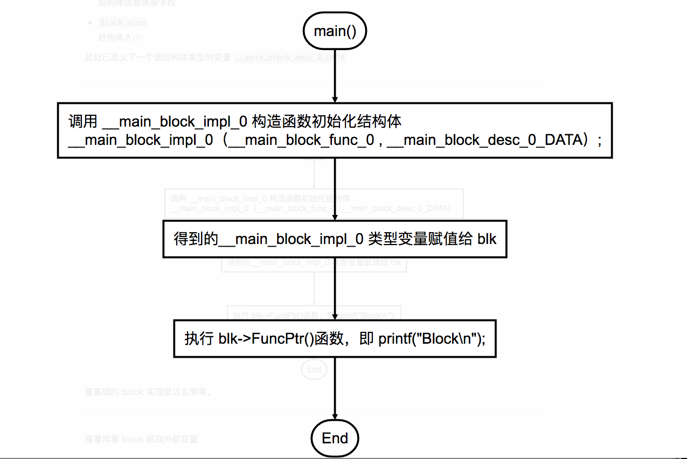


最基础的 block 实现就这么简单。

* * *

接着再看 block 获取外部变量

###block 获取外部变量

运行下面的代码

    
     int main()
     {
     	int intValue = 1;
	   	void (^blk)(void) = ^{ printf("intValue = %d\n", intValue); };
      
		blk();
      
      	return 0;
     }

打印结果

> intValue = 1

和第一段源码不同的是，这里多了个局部变量 intValue，而且还在 block 里面获取到了。

通过前一段对 block 源码的学习，我们已经了解到 block 的函数定义在 main() 函数之外，那它又是如何获取 main()
里面的局部变量呢？为了解开疑惑，我们再次用 clang 重写这段代码

    
```
struct __block_impl
{
    void *isa;
    int Flags;
    int Reserved;
    void *FuncPtr;
};

struct __main_block_impl_0
{
    struct __block_impl impl;
    struct __main_block_desc_0* Desc;
    int intValue;
    __main_block_impl_0(void *fp, struct __main_block_desc_0 *desc, int _intValue, int flags=0) : intValue(_intValue)
    {
        impl.isa = &_NSConcreteStackBlock;
        impl.Flags = flags;
        impl.FuncPtr = fp;
        Desc = desc;
    }
};

static void __main_block_func_0(struct __main_block_impl_0 *__cself)
{
    int intValue = __cself->intValue; // bound by copy
    printf("intValue = %d\n", intValue);
}

static struct __main_block_desc_0
{
    size_t reserved;
    size_t Block_size;
} __main_block_desc_0_DATA = { 0, sizeof(struct __main_block_impl_0)};

int main()
{
    int intValue = 1;
    void (*blk)(void) = (void (*)())&__main_block_impl_0((void *)__main_block_func_0, &__main_block_desc_0_DATA, intValue);
    ((void (*)(__block_impl *))((__block_impl *)blk)->FuncPtr)((__block_impl *)blk);
    return 0;
}

```

原来 block 通过参数值传递获取到 `intValue` 变量，通过函数

> __main_block_impl_0 (void *fp, struct __main_block_desc_0 *desc, int
_intValue, int flags=0) : intValue(_intValue)

保存到 `__main_block_impl_0` 结构体的同名变量 `intValue`，通过代码 `int intValue =
__cself->intValue;` 取出 `intValue`，打印出来。

> 构造函数 `__main_block_impl_0` 冒号后的表达式 `intValue(_intValue)` 的意思是，用 `_intValue`
初始化结构体成员变量 `intValue`。

>

> 有四种情况下应该使用初始化表达式来初始化成员：  
1：初始化const成员  
2：初始化引用成员  
3：当调用基类的构造函数，而它拥有一组参数时  
4：当调用成员类的构造函数，而它拥有一组参数时

>

>
[参考：C++类成员冒号初始化以及构造函数内赋值](http://blog.csdn.net/zj510/article/details/8135556)

至此，我们已经了解了block 的实现，以及获取外部变量的原理。但是，我们还不能在 block 内修改 intValue 变量。如果你有心试下，在
block 内部修改 `intValue` 的值，会报编译错误

> Variable is not assignable(missing __block type specifier)

那么如何在 block 内修改外部变量呢，请看下篇 [block没那么难(二)：block
和变量的内存管理](https://www.zybuluo.com/MicroCai/note/57603)


<hr>


####<p>原文出处：<a href='https://www.zybuluo.com/MicroCai/note/57603' target='blank'>block没那么难（二）：block和变量的内存管理</a></p>


##block没那么难（二）：block和变量的内存管理


* * *

_本系列博文总结自《Pro Multithreading and Memory Management for iOS and OS X with ARC》_

* * *

了解了 [block的实现](https://www.zybuluo.com/MicroCai/note/51116)，我们接着来聊聊 block
和变量的内存管理。本文将介绍可写变量、block的内存段、__block变量的内存段等内容，看完本文会对 block 和变量的内存管理有更加清晰的认识。

上篇文章举了个例子，在 block 内获取了一个外部的局部变量，可以读取，但无法进行写入的修改操作。在 C 语言中有三种类型的变量，可在 block
内进行读写操作

>   * 全局变量

>   * 全局静态变量

>   * 静态变量

`全局变量` 和 `全局静态变量` 由于作用域在全局，所以在 block 内访问和读写这两类变量和普通函数没什么区别，而 `静态变量` 作用域在 block
之外，是怎么对它进行读写呢？通过 clang 工具，我们发现原来 `静态变量` 是通过指针传递，将变量传递到 block 内，所以可以修改变量值。而上篇文章
中的外部变量是通过值传递，自然没法对获取到的外部变量进行修改。由此，可以给我们一个启示，当我们需要修改外部变量时，是不是也可以像 `静态变量`
这样通过指针来修改外部变量的值呢？

Apple 早就为我们准备了这么一个东西 —— “__block”

###__block 说明符

按照惯例，重写一小段代码看看 __block 的真身

```
/************* 使用 __block 的源码 *************/

int main()
{
    __block int intValue = 0;
    void (^blk)(void) = ^{
        intValue = 1;
    };
    return 0;
}
```
    
```
/************* 使用 clang 翻译后如下 *************/

struct __block_impl
{
    void *isa;
    int Flags;
    int Reserved;
    void *FuncPtr;
};

struct __Block_byref_intValue_0
{
    void *__isa;
    __Block_byref_intValue_0 *__forwarding;
    int __flags;
    int __size;
    int intValue;
};

struct __main_block_impl_0
{
    struct __block_impl impl;
    struct __main_block_desc_0* Desc;
    __Block_byref_intValue_0 *intValue; // by ref
    __main_block_impl_0(void *fp, struct __main_block_desc_0 *desc, __Block_byref_intValue_0 *_intValue, int flags=0) : intValue(_intValue->__forwarding)
    {
        impl.isa = &_NSConcreteStackBlock;
        impl.Flags = flags;
        impl.FuncPtr = fp;
        Desc = desc;
    }
};

static void __main_block_func_0(struct __main_block_impl_0 *__cself)
{
    __Block_byref_intValue_0 *intValue = __cself->intValue; // bound by ref
    (intValue->__forwarding->intValue) = 1;
}

static void __main_block_copy_0(struct __main_block_impl_0 *dst, struct __main_block_impl_0 *src)
{
    _Block_object_assign((void*)&dst->intValue, (void*)src->intValue, 8/*BLOCK_FIELD_IS_BYREF*/);
}

static void __main_block_dispose_0(struct __main_block_impl_0 *src)
{
    _Block_object_dispose((void*)src->intValue, 8/*BLOCK_FIELD_IS_BYREF*/);
}

static struct __main_block_desc_0
{
    size_t reserved;
    size_t Block_size;
    void (*copy)(struct __main_block_impl_0*, struct __main_block_impl_0*);
    void (*dispose)(struct __main_block_impl_0*);
} __main_block_desc_0_DATA = {  0, 
                                sizeof(struct __main_block_impl_0), 
                                __main_block_copy_0, 
                                __main_block_dispose_0
                             };

int main()
{
    __attribute__((__blocks__(byref))) __Block_byref_intValue_0 \
    intValue = 
    {
        (void*)0,
        (__Block_byref_intValue_0 *)&intValue, 
        0, 
        sizeof(__Block_byref_intValue_0), 
        0
    };
    void (*blk)(void) = (void (*)()) &__main_block_impl_0   \
                (
                    (void *)__main_block_func_0,            \
                    &__main_block_desc_0_DATA,              \
                    (__Block_byref_intValue_0 *)&intValue,  \
                    570425344                               \
                );
    return 0;
}
```

在加了 __block 之后，代码量增加了不少，仔细查看，其实只是比原来多了

>   1. `__Block_byref_intValue_0` 结构体：用于封装 __block 修饰的外部变量。

>   2. `_Block_object_assign` 函数：当 block 从栈拷贝到堆时，调用此函数。

>   3. `_Block_object_dispose` 函数：当 block 从堆内存释放时，调用此函数。

OC源码中的 `__block intValue` 翻译后变成了 `__Block_byref_intValue_0` 结构体指针变量
`intValue`，通过指针传递到 block 内，这与前面说的 `静态变量` 的指针传递是一致的。除此之外，整体的执行流程与不加 __block
基本一致，不再赘述。但 `__Block_byref_intValue_0` 这个结构体需特别注意下

    
```
// 存储 __block 外部变量的结构体

struct __Block_byref_intValue_0
{
    void *__isa; // 对象指针
    __Block_byref_intValue_0 *__forwarding; // 指向自己的指针
    int __flags; // 标志位变量
    int __size; // 结构体大小
    int intValue; // 外部变量
};
```


> 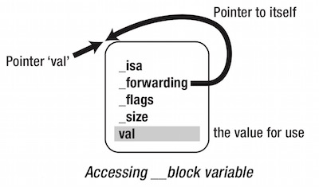

在已有结构体指针指向 `__Block_byref_intValue_0` 时，结构体里面还多了个 `__forwarding`
指向自己的指针变量，难道不显得多余吗？一点也不，本文后面会阐述。

* * *

###block 的内存管理

在前文中，已经提到了 block 的三种类型 `NSConcreteGlobalBlock`、`_NSConcreteStackBlock`、`_NSCon
creteMallocBlock`，见名知意，可以看出三种 block 在内存中的分布

> 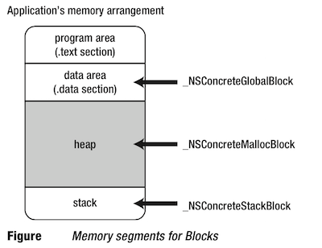

####_NSConcreteGlobalBlock

> 1、当 block 字面量写在全局作用域时，即为 `global block`；  
2、当 block 字面量不获取任何外部变量时，即为 `global block`；

除了上述描述的两种情况，其他形式创建的 block 均为 `stack block`。

```
// 下面 block 虽然定义在 for 循环内，但符合第二种情况，所以也是 global block

typedef int (^blk_t)(int);
for (int rate = 0; rate < 10; ++rate) 
{
    blk_t blk = ^(int count){return rate * count;}; 
}
```

`_NSConcreteGlobalBlock` 类型的 block 处于内存的 ROData
段，此处没有局部变量的骚扰，运行不依赖上下文，内存管理也简单的多。

####_NSConcreteStackBlock

`_NSConcreteStackBlock` 类型的 block 处于内存的栈区。`global block` 由于处在 data
段，可以通过指针安全访问，但 `stack block` 处在内存栈区，如果其变量作用域结束，这个 block 就被废弃，block 上的 __block
变量也同样会被废弃。

> 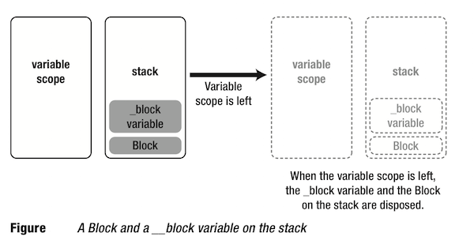

为了解决这个问题，block 提供了 copy 的功能，将 block 和 __block 变量从栈拷贝到堆，就是下面要说的
`_NSConcreteMallocBlock`。

####_NSConcreteMallocBlock

当 block 从栈拷贝到堆后，当栈上变量作用域结束时，仍然可以继续使用 block

> 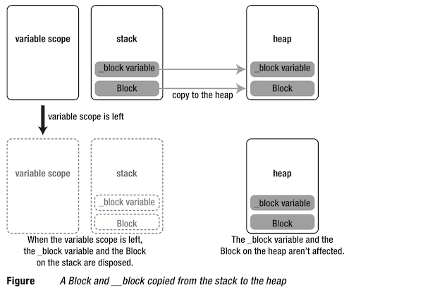

此时，堆上的 block 类型为 `_NSConcreteMallocBlock`，所以会将 `_NSConcreteMallocBlock` 写入 isa

    
          1. impl.isa = &_NSConcreteMallocBlock;

如果你细心的观察上面的转换后的代码，会发现访问结构体 `__Block_byref_intValue_0` 内部的成员变量都是通过访问
`__forwarding` 指针完成的。为了保证能正确访问栈上的 __block 变量，进行 copy 操作时，会将栈上的 `__forwarding`
指针指向了堆上的 block 结构体实例。

* * *

####block 的自动拷贝和手动拷贝

在开启 ARC 时，大部分情况下编译器通常会将创建在栈上的 block 自动拷贝到堆上，只有当

> block 作为方法或函数的参数传递时，编译器不会自动调用 copy 方法；

但方法/函数在内部已经实现了一份拷贝了 block 参数的代码，或者如果编译器自动拷贝，那么调用者就不需再手动拷贝，比如：

>   * 当 block 作为函数返回值返回时，编译器自动将 block 作为 `_Block_copy` 函数，效果等同于 block 直接调用
`copy` 方法；

>   * 当 block 被赋值给 __strong id 类型的对象或 block 的成员变量时，编译器自动将 block 作为
`_Block_copy` 函数，效果等同于 block 直接调用 `copy` 方法；

>   * 当 block 作为参数被传入方法名带有 `usingBlock` 的 Cocoa Framework 方法或 GCD 的 API
时。这些方法会在内部对传递进来的 block 调用 `copy` 或 `_Block_copy` 进行拷贝;

让我们看个 block 自动拷贝的例子

```
/************ ARC下编译器自动拷贝block ************/

typedef int (^blk_t)(int);
blk_t func(int rate)
{
    return ^(int count){return rate * count;};
}
```

上面的 block 获取了外部变量，所以是创建在栈上，当 `func` 函数返回给调用者时，脱离了局部变量 `rate` 的作用范围，如果调用者使用这个
block 就会出问题。那 ARC 开启的情况呢？运行这个 block 一切正常。和我们的预期结果不一样，ARC 到底给 block
施了什么魔法？我们将上面的代码翻译下

```
blk_t func(int rate)
{
    blk_t tmp = &__func_block_impl_0(__func_block_func_0, &__func_block_desc_0_DATA, rate);
    tmp = objc_retainBlock(tmp);
    return objc_autoreleaseReturnValue(tmp); 
}
```

转换后出现两个新函数 `objc_retainBlock`、`objc_autoreleaseReturnValue`。如果你看过runtime
库（[点此下载](http://opensource.apple.com/tarballs/objc4/objc4-493.9.tar.gz)） ，在
`runtime/objc-arr.mm` 文件中就有这两个函数的实现：

```
/*********** objc_retainBlock() 的实现 ***********/
id objc_retainBlock(id x) 
{
#if ARR_LOGGING
    objc_arr_log("objc_retain_block", x);
    ++CompilerGenerated.blockCopies;
#endif
    return (id)_Block_copy(x);
}
// Create a heap based copy of a Block or simply add a reference to an existing one.
// This must be paired with Block_release to recover memory, even when running
// under Objective-C Garbage Collection.
BLOCK_EXPORT void *_Block_copy(const void *aBlock)
    __OSX_AVAILABLE_STARTING(__MAC_10_6, __IPHONE_3_2);
```
    
```
/*********** objc_autoreleaseReturnValue() 的实现 ***********/
id objc_autoreleaseReturnValue(id obj)
{
#if SUPPORT_RETURN_AUTORELEASE
    assert(_pthread_getspecific_direct(AUTORELEASE_POOL_RECLAIM_KEY) == NULL);
    if (callerAcceptsFastAutorelease(__builtin_return_address(0))) {
        _pthread_setspecific_direct(AUTORELEASE_POOL_RECLAIM_KEY, obj);
        return obj;
    }
#endif
    return objc_autorelease(obj);
}
```

通过上面的代码和注释，意思就很明显了，由于 block 字面量是创建在栈内存，通过 `objc_retainBlock()` 函数拷贝到堆内存，让
`tmp` 重新指向堆上的 block，然后将 `tmp` 所指的堆上的 block 作为一个 Objective-C 对象放入
autoreleasepool 里面，从而保证了返回后的 block 仍然可以正确执行。

看完了 block 的自动拷贝，那么看看在 ARC 下需要手动拷贝 block 的例子

```
/************ ARC下编译器手动拷贝block ************/
- (id)getBlockArray
{
    int val = 10;
    return [[NSArray alloc] initWithObjects: 
                            ^{NSLog(@"blk0:%d", val);}, 
                            ^{NSLog(@"blk1:%d", val);}, nil];
}
```

一个例子就了然，返回的数组里面的 block 是不可用的，需要再手动拷贝一次才可以，这个较为简单，就不作过多解释。

关于 block 的拷贝操作可以用一张表总结下

> 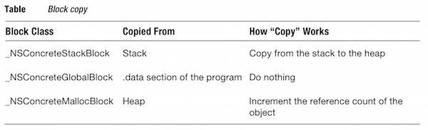

block 拷贝的讲解就到此为止，有兴趣可以了解下 block 的多次拷贝。

> **block的多次拷贝**：下面的例子在 ARC 下并不会产生内存泄露哦

```
// block 多次拷贝源码
blk = [[[[blk copy] copy] copy] copy]; 
```

```

// 翻译后的代码
{
    blk_t tmp = [blk copy];
    blk = tmp; 
}
{
    blk_t tmp = [blk copy];
    blk = tmp; 
}
{
    blk_t tmp = [blk copy];
    blk = tmp; 
}
{
    blk_t tmp = [blk copy];
    blk = tmp;
}
```

* * *

###__block 变量的内存管理

上面啰嗦一堆，这小节主要用图说话，必要时加文字说明。

  * 当 block 从栈内存被拷贝到堆内存时，__block 变量的变化如下图。需要说明的是，当栈上的 block 被拷贝到堆上，堆上的 block 再次被拷贝时，对 __block 变量已经没有影响了。

> 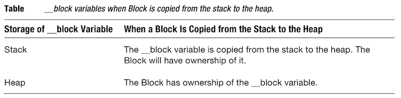

>

> 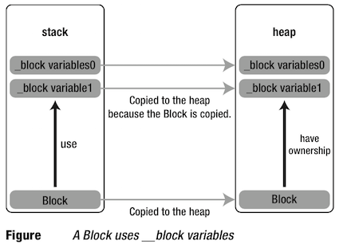

  * 当多个 block 获取同一个 __block 变量，block 从栈被拷贝到堆时

> 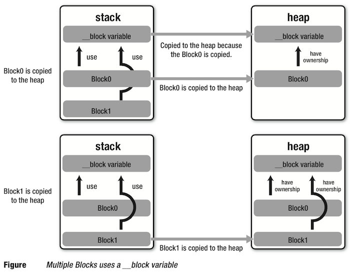

  * 当 block 被废弃时，__block 变量被释放

> 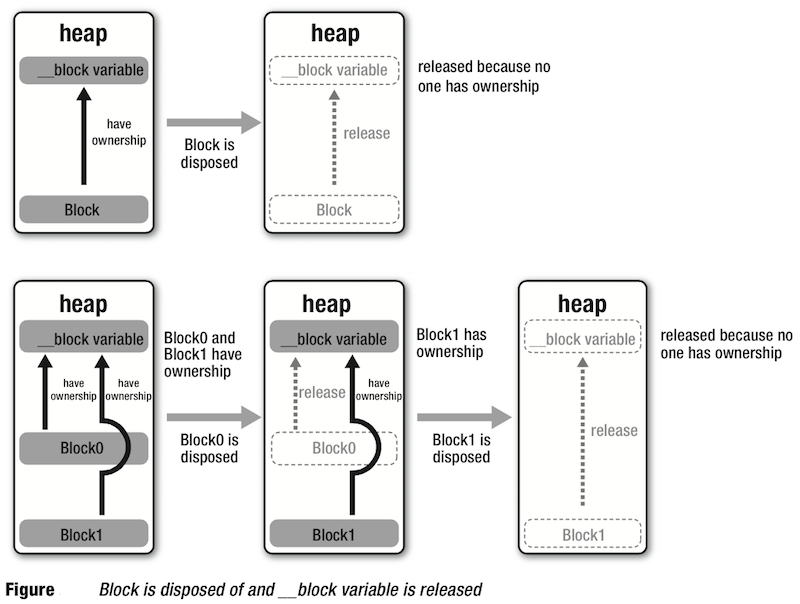

  * __forwarding   
前文已经说过，当 block 从栈被拷贝到堆时，`__forwarding`
指针变量也会指向堆区的结构体。但是为什么要这么做呢？为什么要让原本指向栈区的结构体的指针，去指向堆区的结构体呢？看起来匪夷所思，实则原因很简单，要从
`__forwarding` 产生的缘由说起。想想起初为什么要给 block 添加 copy 的功能，就是因为 block
获取了局部变量，当要在其他地方（超出局部变量作用范围）使用这个 block 的时候，由于访问局部变量异常，导致程序崩溃。为了解决这个问题，就给 block
添加了 copy 功能。在将 block 拷贝到堆上的同时，将 `__forwarding` 指针指向堆上结构体。后面如果要想使用 __block
变量，只要通过 `__forwarding` 访问堆上变量，就不会出现程序崩溃了。

```
/*************** __forwarding 的作用 ***************/
//猜猜下面代码的打印结果？
{
    __block int val = 0;
    void (^blk)(void) = [^{++val;} copy];
    ++val;
    blk();
    NSLog(@"%d", val);
}
```


一定有很多人会猜 `1`，其实打印 `2`。原因很简单，当栈上的 block 被拷贝到堆上时，栈上的 `__forwarding` 也会指向堆上的
__block 变量的结构体。

上面的代码中 `^{++val;}` 和 `++val;` 都会被转换成 `++(val.__forwarding->val);`，堆上的 `val`
被加了两次，最后打印堆上的 `val` 为 `2`。

> 图解

>

> 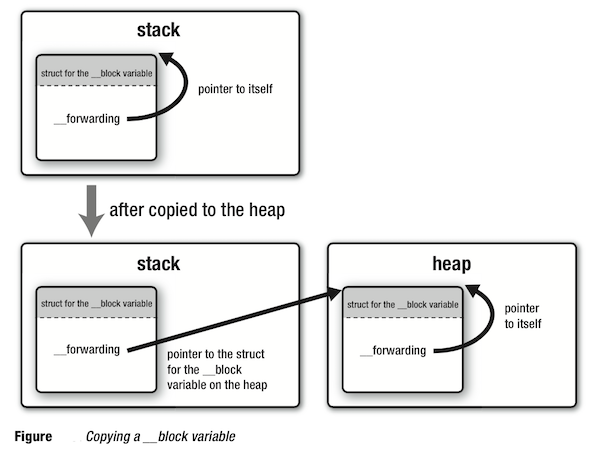

* * *

block 和变量的内存管理终于讲完了，看似很长，只要了解本质，其实很简单。期待下篇文章[《block没那么难（三）：block和对象的内存管理》](htt
ps://www.zybuluo.com/MicroCai/note/58470)。


<hr>


####<p>原文出处：<a href='https://www.zybuluo.com/MicroCai/note/58470' target='blank'>##block没那么难（三）：block和对象的内存管理</a></p>


##block没那么难（三）：block和对象的内存管理

* * *

_本系列博文总结自《Pro Multithreading and Memory Management for iOS and OS X with ARC》_

* * *

在上一篇文章中，我们讲了很多关于 block 和基础变量的内存管理，接着我们聊聊 block 和对象的内存管理，如 block
经常会碰到的循环引用问题等等。

* * *

###获取对象

照例先来段代码轻松下，瞧瞧 block 是怎么获取外部对象的

```
/********************** capturing objects **********************/

typedef void (^blk_t)(id obj);

blk_t blk;
- (void)viewDidLoad
{
    [self captureObject];
    blk([[NSObject alloc] init]);
    blk([[NSObject alloc] init]);
    blk([[NSObject alloc] init]);
}

- (void)captureObject
{
    id array = [[NSMutableArray alloc] init];
    blk = [^(id obj) {
             [array addObject:obj];
             NSLog(@"array count = %ld", [array count]);
          } copy];
}
```

翻译后的关键代码摘录如下

```
/* a struct for the Block and some functions */

struct __main_block_impl_0
{
    struct __block_impl impl;
    struct __main_block_desc_0 *Desc;
    id __strong array;
    __main_block_impl_0(void *fp, struct __main_block_desc_0 *desc, id __strong _array, int flags=0) : array(_array)
    {
        impl.isa = &_NSConcreteStackBlock; 
        impl.Flags = flags;
        impl.FuncPtr = fp;
        Desc = desc;
    }
};

static void __main_block_func_0(struct __main_block_impl_0 *__cself, id obj)
{
    id __strong array = __cself->array;
    [array addObject:obj];
    NSLog(@"array count = %ld", [array count]);
}

static void __main_block_copy_0(struct __main_block_impl_0 *dst, __main_block_impl_0 *src)
{
    _Block_object_assign(&dst->array, src->array, BLOCK_FIELD_IS_OBJECT);
}

static void __main_block_dispose_0(struct __main_block_impl_0 *src)
{
    _Block_object_dispose(src->array, BLOCK_FIELD_IS_OBJECT);
}

struct static struct __main_block_desc_0
{
    unsigned long reserved;
    unsigned long Block_size;
    void (*copy)(struct __main_block_impl_0*, struct __main_block_impl_0*);
    void (*dispose)(struct __main_block_impl_0*);
} __main_block_desc_0_DATA = {  0,
                                sizeof(struct __main_block_impl_0),
                                __main_block_copy_0,
                                __main_block_dispose_0
                             };
                             
/* Block literal and executing the Block */

blk_t blk;
{
    id __strong array = [[NSMutableArray alloc] init];
    blk = &__main_block_impl_0(__main_block_func_0, 
                               &__main_block_desc_0_DATA, 
                               array, 
                               0x22000000);
    blk = [blk copy];
}

(*blk->impl.FuncPtr)(blk, [[NSObject alloc] init]);
(*blk->impl.FuncPtr)(blk, [[NSObject alloc] init]);
(*blk->impl.FuncPtr)(blk, [[NSObject alloc] init]); 
```


在本例中，当变量变量作用域结束时，`array` 被废弃，强引用失效，`NSMutableArray` 类的实例对象会被释放并废弃。在这危难关头，block
及时调用了 `copy` 方法，在 `_Block_object_assign` 中，将 `array` 赋值给 block
成员变量并持有。所以上面代码可以正常运行，打印出来的 `array count` 依次递增。

总结代码可正常运行的原因关键就在于 block 通过调用 `copy` 方法，持有了 __strong
修饰的外部变量，使得外部对象在超出其作用域后得以继续存活，代码正常执行。

在以下情形中， block 会从栈拷贝到堆：

>   * 当 block 调用 `copy` 方法时，如果 block 在栈上，会被拷贝到堆上；

>   * 当 block 作为函数返回值返回时，编译器自动将 block 作为 `_Block_copy` 函数，效果等同于 block 直接调用
`copy` 方法；

>   * 当 block 被赋值给 __strong id 类型的对象或 block 的成员变量时，编译器自动将 block 作为
`_Block_copy` 函数，效果等同于 block 直接调用 `copy` 方法；

>   * 当 block 作为参数被传入方法名带有 `usingBlock` 的 Cocoa Framework 方法或 GCD 的 API
时。这些方法会在内部对传递进来的 block 调用 `copy` 或 `_Block_copy` 进行拷贝;

>

> _其实后三种情况在上篇文章block的自动拷贝已经做过说明_

除此之外，都需要手动调用。

> **延伸阅读：Objective-C 结构体中的 __strong 成员变量**

>

> 注意到 `__main_block_impl_0` 结构体有什么异常没？在 C 结构体中出现了 `__strong` 关键字修饰的变量。

>

> 通常情况下， Objective-C 的编译器因为无法检测 C 结构体初始化和释放的时间，不能进行有效的内存管理，所以 Objective-C 的 C
结构体成员是不能用 `__strong`、`__weak` 等等这类关键字修饰。然而 runtime 库是可以在运行时检测到 block 的内存变化，如
block 何时从栈拷贝到堆，何时从堆上释放等等，所以就会出现上述结构体成员变量用 `__strong` 修饰的情况。

* * *

###__block 变量和对象

__block 说明符可以修饰任何类型的自动变量。下面让我们再看个小例子，啊，愉快的代码时间又到啦。

```
/******* block 修饰对象 *******/
__block id obj = [[NSObject alloc] init];
```

ARC 下，对象所有权修饰符默认为 `__strong`，即

```
__block id __strong obj = [[NSObject alloc] init];
```
    
```
/******* block 修饰对象转换后的代码 *******/
/* struct for __block variable */

struct __Block_byref_obj_0 
{
    void *__isa;
    __Block_byref_obj_0 *__forwarding;
    int __flags;
    int __size;
    void (*__Block_byref_id_object_copy)(void*, void*);
    void (*__Block_byref_id_object_dispose)(void*); 
    __strong id obj;
};

static void __Block_byref_id_object_copy_131(void *dst, void *src) 
{
    _Block_object_assign((char*)dst + 40, *(void * *) ((char*)src + 40), 131);
}

static void __Block_byref_id_object_dispose_131(void *src) 
{
    _Block_object_dispose(*(void * *) ((char*)src + 40), 131);
}

/* __block variable declaration */
__Block_byref_obj_0 obj = { 0,
                            &obj,
                            0x2000000, 
                            sizeof(__Block_byref_obj_0), 
                            __Block_byref_id_object_copy_131, 
                            __Block_byref_id_object_dispose_131,
                            [[NSObject alloc] init]
                           };
```

`__block id __strong obj` 的作用和 `id __strong obj` 的作用十分类似。当 `__block id
__strong obj` 从栈上拷贝到堆上时，`_Block_object_assign` 被调用，block 持有 `obj`；当 `__block
id __strong obj` 从堆上被废弃时，`_Block_object_dispose` 被调用用以释放此对象，block 引用消失。

所以，只要是堆上的 `__strong` 修饰符修饰的 `__block` 对象类型的变量，和 block 内获取到的 `__strong`
修饰符修饰的对象类型的变量，编译器都能对它们的内存进行适当的管理。

如果上面的 `__strong` 换成 `__weak`，结果会怎样呢？

```
/********************** capturing __weak objects **********************/
typedef void (^blk_t)(id obj);
blk_t blk;
- (void)viewDidLoad
{
    [self captureObject];
    blk([[NSObject alloc] init]);
    blk([[NSObject alloc] init]);
    blk([[NSObject alloc] init]);
}
- (void)captureObject
{
    id array = [[NSMutableArray alloc] init]; 
    id __weak array2 = array;
    blk = [^(id obj) {
             [array2 addObject:obj];
             NSLog(@"array2 count = %ld", [array2 count]);
          } copy];
}
```

结果是：

```
array2 count = 0
array2 count = 0
array2 count = 0
```

原因很简单，`array2` 是弱引用，当变量作用域结束，`array` 所指向的对象内存被释放，`array2` 指向 nil，向 nil 对象发送
`count` 消息就返回结果 0 了。

如果 `__weak` 再改成 `__unsafe_unretained` 呢？`__unsafe_unretained`
修饰的对象变量指针就相当于一个普通指针。使用这个修饰符有点需要注意的地方是，当指针所指向的对象内存被释放时，指针变量不会被置为
nil。所以当使用这个修饰符时，一定要注意不要通过悬挂指针（指向被废弃内存的指针）来访问已经被废弃的对象内存，否则程序就会崩溃。

如果 `__unsafe_unretained` 再改成 `__autoreleasing` 会怎样呢？会报错，编译器并不允许你这么干！如果你这么写

    
		__block id __autoreleasing obj = [[NSObject alloc] init];

编译器就会报下面的错误，意思就是 `__block` 和 `__autoreleasing` 不能同时使用。

> error: __block variables cannot have __autoreleasing ownership __block id
__autoreleasing obj = [[NSObject alloc] init];

###循环引用

千辛万苦，重头戏终于来了。block
如果使用不小心，就容易出现循环引用，导致内存泄露。到底哪里泄露了呢？通过前面的学习，各位童鞋应该有个底了，下面就让我们一起进入这泄露地区瞧瞧，哪儿出了问题！

愉快的代码时间到

```
// ARC enabled
/************** MyObject Class **************/

typedef void (^blk_t)(void);

@interface MyObject : NSObject
{
    blk_t blk_;
} 
@end

@implementation MyObject
- (id)init
{
    self = [super init];
    blk_ = ^{NSLog(@"self = %@", self);}; 
    return self;
}

- (void)dealloc
{
    NSLog(@"dealloc");
} 
@end

/************** main function **************/

int main()
{
    id myObject = [[MyObject alloc] init]; 
    NSLog(@"%@", myObject);
    return 0;
}
```

由于 `self` 是 `__strong` 修饰，在 ARC 下，当编译器自动将代码中的 block 从栈拷贝到堆时，block 会强引用和持有
`self`，而 `self` 恰好也强引用和持有了 block，就造成了传说中的循环引用。

> 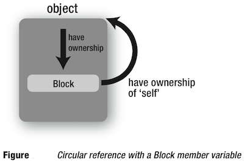

由于循环引用的存在，造成在 `main()` 函数结束时，内存仍然无法释放，即内存泄露。编译器也会给出警告信息

> warning: capturing 'self' strongly in this block is likely to lead to a
retain cycle [-Warc-retain-cycles]  
blk_ = ^{NSLog(@"self = %@", self);};

>

> note: Block will be retained by an object strongly retained by the captured
object  
blk_ = ^{NSLog(@"self = %@", self);};

为了避免这种情况发生，可以在变量声明时用 `__weak` 修饰符修饰变量 `self`，让 block 不强引用 `self`，从而破除循环。iOS4 和
Snow Leopard 由于对 weak 的支持不够完全，可以用 `__unsafe_unretained` 代替。

```
- (id)init
{
    self = [super init];
    id __weak tmp = self;
    blk_ = ^{NSLog(@"self = %@", tmp);}; 
    return self;
}
```

> 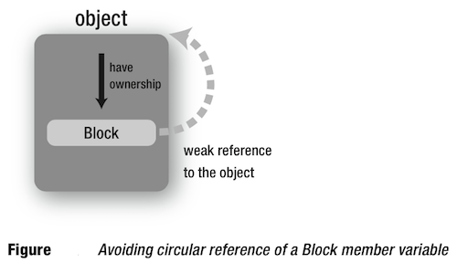

再看一个例子

```
@interface MyObject : NSObject
{
    blk_t blk_;
    id obj_; 
}
@end
@implementation MyObject 
- (id)init
{
    self = [super init];
    blk_ = ^{ NSLog(@"obj_ = %@", obj_); }; 
    return self;
}
...
...
@end
```

上面的例子中，虽然没有直接使用 self，却也存在循环引用的问题。因为对于编译器来说，`obj_` 就相当于
`self->obj_`，所以上面的代码就会变成

```    
blk_ = ^{ NSLog(@"obj_ = %@", self->obj_); };
```

所以这个例子只要用 `__weak`，在 `init` 方法里面加一行即可

```
id __weak obj = obj_;
```

破解循环引用还有一招，使用 __block 修饰对象，在 block 内将对象置为 nil 即可，如下

```
typedef void (^blk_t)(void);

@interface MyObject : NSObject
{
    blk_t blk_;
} 

@end

@implementation MyObject
 
- (id)init
{
    self = [super init]; 
    __block id tmp = self;
    blk_ = ^{ 
                NSLog(@"self = %@", tmp);
                tmp = nil; 
            };
    return self;
}

- (void)execBlock
{
    blk_();
}

- (void)dealloc
{
    NSLog(@"dealloc");
} 

@end

int main()
{
    id object = [[MyObject alloc] init]; 
    [object execBlock];
    return 0;
}
```

这个例子挺有意思的，如果执行 `execBlock` 方法，就没有循环引用，如果不执行就有循环引用，挺值得玩味的。一方面，使用 __block
挺危险的，万一代码中不执行 block ，就造成了循环引用，而且编译器还没法检查出来；另一方面，使用 __block 可以让我们通过 __block
变量去控制对象的生命周期，而且有可能在一些非常老旧的 MRC 代码中，由于不支持 __weak，我们可以使用此方法来代替
__unsafe_unretained，从而避免悬挂指针的问题。

还有个值得一提的时，在 MRC 下，使用 __block 说明符也可以避免循环引用。因为当 block 从栈拷贝到堆时，__block 对象类型的变量不会被
retain，没有 __block 说明符的对象类型的变量则会被 retian。正是由于 __block 在 ARC 和 MRC
下的巨大差异，我们在写代码时一定要区分清楚到底是 ARC 还是 MRC。

> 尽管 ARC 已经如此普及，我们可能已经可以不用去管 MRC 的东西，但要有点一定要明白，ARC 和 MRC
都是基于引用计数的内存管理，其本质上是一个东西，只不过 ARC
在编译期自动化的做了内存引用计数的管理，使得系统可以在适当的时候保留内存，适当的时候释放内存。

循环引用到此为止，东西并不多。如果明白了之前的知识点，就会了解循环引用不过是前面知识点的自然延伸点罢了。

###Copy 和 Release

在 ARC 下，有时需要手动拷贝和释放 block。在 MRC 下更是如此，可以直接用 `copy` 和 `release` 来拷贝和释放

```
void (^blk_on_heap)(void) = [blk_on_stack copy]; 
[blk_on_heap release];
```

拷贝到堆后，就可以 用 `retain` 持有 block

```
[blk_on_heap retain];
```

然而如果 block 在栈上，使用 `retain` 是毫无效果的，因此推荐使用 `copy` 方法来持有 block。

block 是 C 语言的扩展，所以可以在 C 中使用 block 的语法。比如，在上面的例子中，可以直接使用 `Block_copy` 和
`Block_release` 函数来代替 `copy` 和 `release` 方法

```
void (^blk_on_heap)(void) = Block_copy(blk_on_stack);
Block_release(blk_on_heap);
```

`Block_copy` 的作用相当于之前看到过的 `_Block_copy` 函数，而且 Objective-C runtime 库在运行时拷贝
block 用的就是这个函数。同理，释放 block 时，runtime 调用了 `Block_release` 函数。

最后这里有一篇总结 block 的文章的很不错，推荐大家看看：<http://tanqisen.github.io/blog/2013/04/19/gcd-
block-cycle-retain/>


<hr>


####<p>原文出处：<a href='http://tanqisen.github.io/blog/2013/04/19/gcd-block-cycle-retain/' target='blank'>正确使用Block避免Cycle Retain和Crash</a></p>

##正确使用Block避免Cycle Retain和Crash

Apr 19th, 2013

> **本文只介绍了MRC时的情况，有些细节不适用于ARC。比如MRC下__block不会增加引用计数，但ARC会，ARC下必须用__weak指明不增加引用
计数；ARC下block内存分配机制也与MRC不一样，所以文中的一些例子在ARC下测试结果可能与文中描述的不一样**

####Block简介

Block作为C语言的扩展，并不是高新技术，和其他语言的闭包或lambda表达式是一回事。需要注意的是由于Objective-
C在iOS中不支持GC机制，使用Block必须自己管理内存，而内存管理正是使用Block坑最多的地方，错误的内存管理 要么导致return
cycle内存泄漏要么内存被提前释放导致crash。
Block的使用很像函数指针，不过与函数最大的不同是：Block可以访问函数以外、词法作用域以内的外部变量的值。换句话说，Block不仅
实现函数的功能，还能携带函数的执行环境。

可以这样理解，Block其实包含两个部分内容

  1. Block执行的代码，这是在编译的时候已经生成好的；
  2. 一个包含`Block执行时需要的所有外部变量值`的数据结构。 Block将使用到的、作用域附近到的`变量的值`建立一份快照拷贝到栈上。

Block与函数另一个不同是，Block类似ObjC的对象，可以使用自动释放池管理内存（但Block并不完全等同于ObjC对象，后面将详细说明）。

####Block基本语法

    
    // 声明一个Block变量
    long (^sum) (int, int) = nil;
    // sum是个Block变量，该Block类型有两个int型参数，返回类型是long。
    
    // 定义Block并赋给变量sum
    sum = ^ long (int a, int b) {
      return a + b;
    };
    
    // 调用Block：
    long s = sum(1, 2);
    

定义一个实例函数，该函数返回Block：
    
    
    - (long (^)(int, int)) sumBlock {
        int base = 100;
        return [[ ^ long (int a, int b) {
          return base + a + b;
        } copy] autorelease];
      }
    
    // 调用Block
    [self sumBlock](1,2);
    

是不是感觉很怪？为了看的舒服，我们把Block类型typedef一下
    
    
    typedef long (^BlkSum)(int, int);
    
    - (BlkSum) sumBlock {
        int base = 100;
        BlkSum blk = ^ long (int a, int b) {
          return base + a + b;
        }
        return [[blk copy] autorelease];
    }
    

####Block在内存中的位置

根据Block在内存中的位置分为三种类型NSGlobalBlock，NSStackBlock, NSMallocBlock。

  * NSGlobalBlock：类似函数，位于text段；
  * NSStackBlock：位于栈内存，函数返回后Block将无效；
  * NSMallocBlock：位于堆内存。
    
    
    BlkSum blk1 = ^ long (int a, int b) {
      return a + b;
    };
    NSLog(@"blk1 = %@", blk1);// blk1 = <__NSGlobalBlock__: 0x47d0>
    
    
    int base = 100;
    BlkSum blk2 = ^ long (int a, int b) {
      return base + a + b;
    };
    NSLog(@"blk2 = %@", blk2); // blk2 = <__NSStackBlock__: 0xbfffddf8>
    
    BlkSum blk3 = [[blk2 copy] autorelease];
    NSLog(@"blk3 = %@", blk3); // blk3 = <__NSMallocBlock__: 0x902fda0>
    

为什么blk1类型是NSGlobalBlock，而blk2类型是NSStackBlock？blk1和blk2的区别在于，blk1没有使用Block以外的任何
外部变量，Block不需要建立局部变量值的快照，这使blk1与函数没有任何区别，从blk1所在内存地址0x47d0猜测编译器把blk1放到了text代码段。
blk2与blk1唯一不同是的使用了局部变量base，在定义（注意是定义，不是运行）blk2时，局部变量base当前值被copy到栈上，作为`常量`供Blo
ck使用。执行下面代码，结果是203，而不是204。


      int base = 100;
      base += 100;
      BlkSum sum = ^ long (int a, int b) {
        return base + a + b;
      };
      base++;
      printf("%ld",sum(1,2));
    

> 在Block内变量base是只读的，如果想在Block内改变base的值，在定义base时要用 `__block`修饰：`__block int
base = 100;`。
    
      __block int base = 100;
      base += 100;
      BlkSum sum = ^ long (int a, int b) {
        base += 10;
        return base + a + b;
      };
      base++;
      printf("%ld\n",sum(1,2));
      printf("%d\n",base);
    

> 输出将是214,211。Block中使用`__block`修饰的变量时，将取变量此刻运行时的值，而不是定义时的快照。这个例子中，执行`sum(1,2)`
时，base将取`base++`之后的值，也就是201，再执行Block`base+=10;
base+a+b`，运行结果是214。执行完Block时，base已经变成211了。

####Block的copy、retain、release操作

不同于NSObjec的copy、retain、release操作：

  * Block_copy与copy等效，Block_release与release等效；
  * 对Block不管是retain、copy、release都不会改变引用计数retainCount，retainCount始终是1；
  * NSGlobalBlock：retain、copy、release操作都无效；
  * NSStackBlock：retain、release操作无效，必须注意的是，NSStackBlock在函数返回后，Block内存将被回收。即使retain也没用。容易犯的错误是[`[mutableAarry addObject:stackBlock]`，在函数出栈后，从mutableAarry中取到的stackBlock已经被回收，变成了野指针。正确的做法是先将stackBlock copy到堆上，然后加入数组：`[mutableAarry addObject:[[stackBlock copy] autorelease]]`。支持copy，copy之后生成新的NSMallocBlock类型对象。
  * NSMallocBlock支持retain、release，虽然retainCount始终是1，但内存管理器中仍然会增加、减少计数。copy之后不会生成新的对象，只是增加了一次引用，类似retain；
  * 尽量不要对Block使用retain操作。

####Block对不同类型的变量的存取

######基本类型

  * 局部自动变量，在Block中只读。Block定义时copy变量的值，在Block中作为常量使用，所以即使变量的值在Block外改变，也不影响他在Block中的值。

    
    int base = 100;
    BlkSum sum = ^ long (int a, int b) {
      // base++; 编译错误，只读
      return base + a + b;
    };
    base = 0;
    printf("%ld\n",sum(1,2)); // 这里输出是103，而不是3
    

  * static变量、全局变量。如果把上个例子的base改成全局的、或static。Block就可以对他进行读写了。因为全局变量或静态变量在内存中的地址是固定的，Block在读取该变量值的时候是直接从其所在内存读出，获取到的是最新值，而不是在定义时copy的常量。
    
    static int base = 100;
    BlkSum sum = ^ long (int a, int b) {
      base++;
      return base + a + b;
    };
    base = 0;
    printf("%d\n", base);
    printf("%ld\n",sum(1,2)); // 这里输出是3，而不是103
    printf("%d\n", base);
    

输出结果是`0 4
1`，表明Block外部对base的更新会影响Block中的base的取值，同样Block对base的更新也会影响Block外部的base值。

  * Block变量，被`__block`修饰的变量称作Block变量。 基本类型的Block变量等效于全局变量、或静态变量。

#####
Block被另一个Block使用时，另一个Block被copy到堆上时，被使用的Block也会被copy。但作为参数的Block是不会发生copy的。

    void foo() {
      int base = 100;
      BlkSum blk = ^ long (int a, int b) {
        return  base + a + b;
      };
      NSLog(@"%@", blk); // <__NSStackBlock__: 0xbfffdb40>
      bar(blk);
    }
    
    void bar(BlkSum sum_blk) {
      NSLog(@"%@",sum_blk); // 与上面一样，说明作为参数传递时，并不会发生copy
    
      void (^blk) (BlkSum) = ^ (BlkSum sum) {
        NSLog(@"%@",sum);     // 无论blk在堆上还是栈上，作为参数的Block不会发生copy。
        NSLog(@"%@",sum_blk); // 当blk copy到堆上时，sum_blk也被copy了一分到堆上上。
      };
      blk(sum_blk); // blk在栈上
    
      blk = [[blk copy] autorelease];
      blk(sum_blk); // blk在堆上
    }
    

######ObjC对象，不同于基本类型，Block会引起对象的引用计数变化。

先看下面代码


    @interface MyClass : NSObject {
        NSObject* _instanceObj;
    }
    @end
    
    @implementation MyClass
    
    NSObject* __globalObj = nil;
    
    - (id) init {
        if (self = [super init]) {
            _instanceObj = [[NSObject alloc] init];
        }
        return self;
    }
    
    - (void) test {
        static NSObject* __staticObj = nil;
        __globalObj = [[NSObject alloc] init];
        __staticObj = [[NSObject alloc] init];
    
        NSObject* localObj = [[NSObject alloc] init];
        __block NSObject* blockObj = [[NSObject alloc] init];
    
        typedef void (^MyBlock)(void) ;
        MyBlock aBlock = ^{
            NSLog(@"%@", __globalObj);
            NSLog(@"%@", __staticObj);
            NSLog(@"%@", _instanceObj);
            NSLog(@"%@", localObj);
            NSLog(@"%@", blockObj);
        };
        aBlock = [[aBlock copy] autorelease];
        aBlock();
    
        NSLog(@"%d", [__globalObj retainCount]);
        NSLog(@"%d", [__staticObj retainCount]);
        NSLog(@"%d", [_instanceObj retainCount]);
        NSLog(@"%d", [localObj retainCount]);
        NSLog(@"%d", [blockObj retainCount]);
    }
    @end
    
    int main(int argc, char *argv[]) {
        @autoreleasepool {
            MyClass* obj = [[[MyClass alloc] init] autorelease];
            [obj test];
            return 0;
        }
    }
    

执行结果为`1 1 1 2 1`。

`__globalObj`和`__staticObj`在内存中的位置是确定的，所以Block copy时不会retain对象。

`_instanceObj`在Block copy时也没有直接retain `_instanceObj`对象本身，但会retain
self。所以在Block中可以直接读写`_instanceObj`变量。

`localObj`在Block copy时，系统自动retain对象，增加其引用计数。

`blockObj`在Block copy时也不会retain。

######非ObjC对象，如GCD队列dispatch_queue_t。Block copy时并不会自动增加他的引用计数，这点要非常小心。

####Block中使用的ObjC对象的行为

    
    @property (nonatomic, copy) void(^myBlock)(void);
    
    MyClass* obj = [[[MyClass alloc] init] autorelease];
    self.myBlock = ^ {
      [obj doSomething];
    };
    

对象obj在Block被copy到堆上的时候自动retain了一次。因为Block不知道obj什么时候被释放，为了不在Block使用obj前被释放，Bloc
k retain了obj一次，在Block被释放的时候，obj被release一次。

####retain cycle

retain cycle问题的根源在于Block和obj可能会互相强引用，互相retain对方，这样就导致了retain
cycle，最后这个Block和obj就变成了孤岛，谁也释放不了谁。比如：


    ASIHTTPRequest *request = [ASIHTTPRequest requestWithURL:url];
    [request setCompletionBlock:^{
      NSString* string = [request responseString];
    }];
    
   
```
    
           +-----------+           +-----------+
           | request   |           |   Block   |
      ---> |           | --------> |           |
           | retain 2  | <-------- | retain 1  |
           |           |           |           |
           +-----------+           +-----------+
```  

解决这个问题的办法是使用弱引用打断retain cycle：

    
    __block ASIHTTPRequest *request = [ASIHTTPRequest requestWithURL:url];
    [request setCompletionBlock:^{
      NSString* string = [request responseString];
    }];
    
```   
          +-----------+           +-----------+
          | request   |           |   Block   |
     ---->|           | --------> |           |
          | retain 1  | < - - - - | retain 1  |
          |           |   weak    |           |
          +-----------+           +-----------+
```   

`request`被持有者释放后。request 的retainCount变成0,request被dealloc，request释放持有的Block，导致B
lock的retainCount变成0，也被销毁。这样这两个对象内存都被回收。

    
    
          +-----------+           +-----------+
          | request   |           |   Block   |
     --X->|           | ----X---> |           |
          | retain 0  | < - - - - | retain 0  |
          |           |   weak    |           |
          +-----------+           +-----------+
    

与上面情况类似的陷阱：

    
    self.myBlock = ^ {
      [self doSomething];
    };
    

这里self和myBlock循环引用，解决办法同上：
    
    
    __block MyClass* weakSelf = self;
    self.myBlock = ^ {
      [weakSelf doSomething];
    };
    

    
```
    @property (nonatomic, retain) NSString* someVar;
    
    self.myBlock = ^ {
      NSLog(@"%@", _someVer);
    };
```
    

这里在Block中虽然没直接使用self，但使用了成员变量。在Block中使用成员变量，retain的不是这个变量，而会retain
self。解决办法也和上面一样。

    
    
    @property (nonatomic, retain) NSString* someVar;
    
    __block MyClass* weakSelf = self;
    self.myBlock = ^ {
      NSLog(@"%@", self.someVer);
    };
    

或者

    

    NSString* str = _someVer;
    self.myBlock = ^ {
      NSLog(@"%@", str);
    };
    

retain cycle不只发生在两个对象之间，也可能发生在多个对象之间，这样问题更复杂，更难发现

    
    
    ClassA* objA = [[[ClassA alloc] init] autorelease];
      objA.myBlock = ^{
        [self doSomething];
      };
      self.objA = objA;
    

```    
    
    
      +-----------+           +-----------+           +-----------+
      |   self    |           |   objA    |           |   Block   |
      |           | --------> |           | --------> |           |
      | retain 1  |           | retain 1  |           | retain 1  |
      |           |           |           |           |           |
      +-----------+           +-----------+           +-----------+
           ^                                                |
           |                                                |
           +------------------------------------------------+
   
```

解决办法同样是用`__block`打破循环引用

    
    ClassA* objA = [[[ClassA alloc] init] autorelease];
    
    MyClass* weakSelf = self;
    objA.myBlock = ^{
      [weakSelf doSomething];
    };
    self.objA = objA;
    

> **注意**：MRC中`__block`是不会引起retain；但在ARC中`__block`则会引起retain。ARC中应该使用`__weak`或`
__unsafe_unretained`弱引用。`__weak`只能在iOS5以后使用。

####Block使用对象被提前释放

看下面例子，有这种情况，如果不只是`request`持有了Block，另一个对象也持有了Block。

    
    
    1
    2
    3
    4
    5
    6
    
    
    
          +-----------+           +-----------+
          | request   |           |   Block   |   objA
     ---->|           | --------> |           |<--------
          | retain 1  | < - - - - | retain 2  |
          |           |   weak    |           |
          +-----------+           +-----------+
    

这时如果request 被持有者释放。


          +-----------+           +-----------+
          | request   |           |   Block   |   objA
     --X->|           | --------> |           |<--------
          | retain 0  | < - - - - | retain 1  |
          |           |   weak    |           |
          +-----------+           +-----------+
    

这时request已被完全释放，但Block仍被objA持有，没有释放，如果这时触发了Block，在Block中将访问已经销毁的request，这将导致程序
crash。为了避免这种情况，开发者必须要注意对象和Block的生命周期。

另一个常见错误使用是，开发者担心retain cycle错误的使用`__block`。比如

    
    __block kkProducView* weakSelf = self;
    dispatch_async(dispatch_get_main_queue(), ^{
      weakSelf.xx = xx;
    });
    

将Block作为参数传给dispatch_async时，系统会将Block拷贝到堆上，如果Block中使用了实例变量，还将retain self，因为dis
patch_async并不知道self会在什么时候被释放，为了确保系统调度执行Block中的任务时self没有被意外释放掉，dispatch_async必须
自己retain一次self，任务完成后再release self。但这里使用`__block`，使dispatch_async没有增加self的引用计数，
这使得在系统在调度执行Block之前，self可能已被销毁，但系统并不知道这个情况，导致Block被调度执行时self已经被释放导致crash。

    
    // MyClass.m
    - (void) test {
      __block MyClass* weakSelf = self;
      double delayInSeconds = 10.0;
      dispatch_time_t popTime = dispatch_time(DISPATCH_TIME_NOW, (int64_t)(delayInSeconds * NSEC_PER_SEC));
      dispatch_after(popTime, dispatch_get_main_queue(), ^(void){
        NSLog(@"%@", weakSelf);
    });
    
    // other.m
    MyClass* obj = [[[MyClass alloc] init] autorelease];
    [obj test];
    

这里用dispatch_after模拟了一个异步任务，10秒后执行Block。但执行Block的时候`MyClass*
obj`已经被释放了，导致crash。解决办法是不要使用`__block`。

