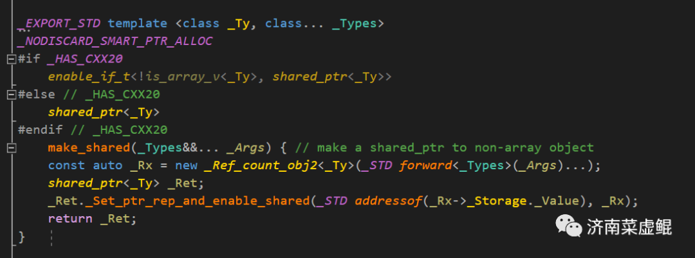
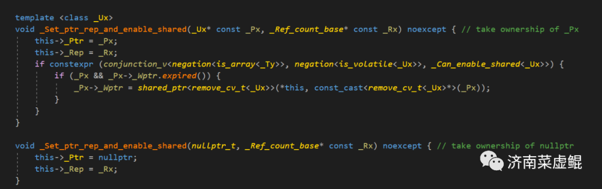
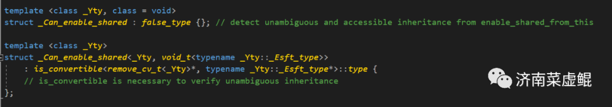

 
<!--BEGIN_DATA
{
    "create_date": "2023-03-04 09:18", 
    "modify_date": "2023-03-04 09:18", 
    "is_top": "0", 
    "summary": "", 
    "tags": "C/C++", 
    "file_name": "enable_shared_from_this.md"
}
END_DATA-->

#### <p>原文出处：<a href='https://mp.weixin.qq.com/s/lP84m06EpeKyWmK1q934Pw' target='blank'>C++那些事》之enable_shared_from_this</a></p>

`std::enable_shared_from_this`它被用作需要创建与现有对象共享所有权的 `std::shared_ptr` 实例的类的基类。

使用 `enable_shared_from_this` 的类必须继承自 `enable_shared_from_this`。

当一个类 `A` 继承了 `std::enable_shared_from_this<A>`，并在某个地方创建了一个 `std::shared_ptr<A>` 的智能指针时，通过调用 `shared_from_this` 函数可以得到一个指向该对象的`std::shared_ptr`，且该 `std::shared_ptr` 与原始的 `std::shared_ptr` 共享对象的所有权。

例如：

```cpp
class Foo  
    : public std::enable_shared_from_this<Foo>   
{  
}  
```

### 简单实现如下

`std::enable_shared_from_this` 是一个模板类，定义如下：

```cpp
template<class T>  
class enable_shared_from_this  
{  
protected:  
    constexpr enable_shared_from_this() noexcept;  
    enable_shared_from_this(const enable_shared_from_this&) noexcept;  
    enable_shared_from_this& operator=(const enable_shared_from_this&) noexcept;  
    ~enable_shared_from_this();  
public:  
    shared_ptr<T> shared_from_this();  
    shared_ptr<const T> shared_from_this() const;  
};  
```

`enable_shared_from_this` 模板类的实现依赖于两个关键类，即 `std::shared_ptr` 和 `std::weak_ptr`。它的核心思想是通过将 `std::shared_ptr` 对象作为类成员变量保存，并在需要共享该对象所有权的地方返回一个指向该对象的 `std::shared_ptr`。

在 `enable_shared_from_this` 类的构造函数中，将 `weak_this` 成员变量初始化为一个空的`std::weak_ptr`。该成员变量用于保存指向该类的 `std::shared_ptr` 对象，该对象是通过调用 `shared_from_this` 函数返回的。

标准库的`std::enable_shared_from_this` 的实现大致如下：

```cpp
template<typename _Tp>
    class enable_shared_from_this
    {
    protected:
      constexpr enable_shared_from_this() noexcept { }

      enable_shared_from_this(const enable_shared_from_this&) noexcept { }

      enable_shared_from_this&
      operator=(const enable_shared_from_this&) noexcept
      { return *this; }

      ~enable_shared_from_this() { }

    public:
      shared_ptr<_Tp>
      shared_from_this()
      { return shared_ptr<_Tp>(this->_M_weak_this); }

      shared_ptr<const _Tp>
      shared_from_this() const
      { return shared_ptr<const _Tp>(this->_M_weak_this); }

#if __cplusplus > 201402L || !defined(__STRICT_ANSI__) // c++1z or gnu++11
#define __cpp_lib_enable_shared_from_this 201603
      weak_ptr<_Tp>
      weak_from_this() noexcept
      { return this->_M_weak_this; }

      weak_ptr<const _Tp>
      weak_from_this() const noexcept
      { return this->_M_weak_this; }
#endif

    private:
      template<typename _Tp1>
 void
 _M_weak_assign(_Tp1* __p, const __shared_count<>& __n) const noexcept
 { _M_weak_this._M_assign(__p, __n); }

      // Found by ADL when this is an associated class.
      friend const enable_shared_from_this*
      __enable_shared_from_this_base(const __shared_count<>&,
         const enable_shared_from_this* __p)
      { return __p; }

      template<typename, _Lock_policy>
 friend class __shared_ptr;

      mutable weak_ptr<_Tp>  _M_weak_this;
    }; 
```

在构造函数中，`weak_this_` 被初始化为一个空的 `std::weak_ptr`。在使用 `shared_from_this` 函数时，它将返回一个指向 `this` 对象的 `std::shared_ptr`，如果此时没有任何 `std::shared_ptr` 对象管理该对象，将会抛出 `std::bad_weak_ptr` 异常。

需要注意的是，`shared_from_this` 函数必须在至少存在一个 `std::shared_ptr` 对象管理该对象时才能调用，否则将会出现未定义的行为。同时，`shared_from_this` 函数也不能在对象的构造函数中被调用，因为此时还没有任何 `std::shared_ptr` 对象管理该对象。

`M_weak_this_` 是一个 `std::weak_ptr` 对象，它保存的是指向当前对象的一个弱引用（weak reference），而不是强引用（shared reference）。

在 `std::enable_shared_from_this` 的实现中，`wM_eak_this_` 被初始化为一个空的 `std::weak_ptr`，因为此时还没有任何 `std::shared_ptr` 对象管理当前对象，所以也就无法通过任何 `std::shared_ptr` 对象来创建一个指向当前对象的 `std::shared_ptr`。

当我们在某个地方创建了一个 `std::shared_ptr` 对象来管理当前对象时，我们需要在这个 `std::shared_ptr` 对象创建之后，调用 `std::enable_shared_from_this` 中提供的 `shared_from_this` 函数来获得一个指向当前对象的 `std::shared_ptr`。在这个过程中，`shared_from_this` 函数将使用 `_M_weak_this` 中保存的弱引用来创建一个指向当前对象的 `std::shared_ptr`。

需要注意的是，如果在任何一个时刻，没有任何 `std::shared_ptr` 对象管理当前对象，那么 `_M_weak_this` 中保存的弱引用就会被销毁，此时再尝试通过 `shared_from_this` 函数来创建一个指向当前对象的 `std::shared_ptr`，将会抛出 `std::bad_weak_ptr` 异常。因此，使用 `std::enable_shared_from_this` 时需要特别注意对象的生命周期和 `shared_ptr` 的管理方式。

`enable_shared_from_this`可以使用是在shared_ptr构造过程中，有相应的设置过程。

shared_ptr调用构造`__shared_ptr`，`__shared_ptr`构造会调用执行`_M_enable_shared_from_this_with`，`_M_enable_shared_from_this_with`调用执行`__base->_M_weak_assign`的过程，此时会构造`_M_weak_this`。

<hr>

#### <p>原文出处：<a href='https://mp.weixin.qq.com/s/3xJbAexOR9_KYh3yXWgkSg' target='blank'>一场由私有继承enable_shared_from_this引发的血案</a></p>

### 起因

众所周知， **`std::enable_shared_from_this`** 是以奇异递归模板（ **`CRTP`**）实现的一个模板类。在日常开发中，我们可以继承 **`std::enable_shared_from_this`** 进而拿到 **`this`** 指针的**`shared_ptr`** 版本 —— **`shared_from_this`** 。  

但在使用上，好像没有明确规定公有继承（ **`public`** ）还是私有继承（ **`private`** ），甚至因为 **`cppreference`** 上用 **`struct`** 示例的缘故，很多 **`CXDN`** 的博客换了个写法，就变成以**`class`** 私有继承来示例。  

那么使用私有继承会存在什么问题呢？

```cpp
class Bar : std::enable_shared_from_this<Bar>
{
public:
 Bar(std::string data) : data_(std::move(data)) {}

 template<typename CallBack>
 void start(CallBack&& cb) {
  thd_ = std::thread([this, self = shared_from_this(), notify_cb = std::move(cb)] {
    notify_cb(data_);
   });
 }

private:
 std::thread thd_;
 std::string data_;
};  
```

以上代码是一个简化版的应用场景。我有一个私有继承 **`std::enable_shared_from_this`** 的类 **`Bar`** ，在 **`start()`** 方法里面传递一个用于通知的回调函数，这个回调函数会在类 **`Bar`** 的子线程里面异步执行通知命令。调用方式大概如下所示：

```cpp
std::vector<std::shared_ptr<Bar>> bars;  
{  
    auto bar_ptr = std::make_shared<Bar>("hoho");  
    bar_ptr->start([](const std::string& info) {  
        std::cout << info << std::endl;  
    });  
    bars.push_back(bar_ptr);  
}  
```

代码看起来不像有什么问题，但一运行就 **`crash`** 。通过栈回溯找到原因 —— 触发 **`bad_weak_ptr`** 异常。深入定位，问题出在：

```cpp
thd_ = std::thread([this, self = shared_from_this(), notify_cb = std::move(cb)] {  
```

这一行，经排查去掉捕获 **`self = shared_from_this()`** 就好了，难不成 **`shared_from_this()`** 出现了问题？

### 深入源码


**`std::enable_shared_from_this`** 的源码还是非常简单的，我们一眼就看到调用 **`shared_from_this()`** 关联的变量 **`_Wptr`** ，但是 **`_Wptr`** 在 **`std::enable_shared_from_this`** 的默认构造里面初始化为空，我们只能继续深入在哪里对 **`_Wptr`** 进行赋值。  



由于我们是通过 **`std::make_shared`** 构造的 **`shared_ptr`** ，通过源码我们定位到函数 **`_Set_ptr_rep_and_enable_shared`** ：  



显而易见，这会调用第一个 **`_Set_ptr_rep_and_enable_shared`** 函数，同时我们看到了熟悉的 **`_Wptr`** 。  

我们先从简单的逻辑入手，很明显 **`_Px && _Px->_Wptr.expired()`** 的结果是 **`true`** 。那么决定 **`_Wptr`** 赋值的关键条件就是 **`conjunction_v<negation<is_array<_Ty>>, negation<is_volatile<_Ux>>, _Can_enable_shared<_Ux>>`** 。  

**`conjunction_v<T1, T2, T3...>`** 为 **`true`** 成立的条件是同时满足 **`T1, T2, T3...`** 均为 **`true`** ， **`negation<_T>`** 的作用是条件 **`_T`** **不成立**时为 **`true`** 。  

显然 **`negation<is_array<_Ty>>`** 和 **`negation<is_volatile<_Ux>>`** 均为 **`true`** ，那么问题再次简化为 **`_Can_enable_shared<_Ux>`** 是否成立。  



翻开 **`_Can_enable_shared`** 的源码， **`_Can_enable_shared<_Yty>`** 是 **`true_type`** 的决定因素在于能否将类型 **`_Yty`** 转换为 **`_Yty::_Esft_type`** 类型（
**`is_convertible`** ）。  

这个 **`_Esft_type`**是不是看起来眼熟？没错，它就在 **`std::enable_shared_from_this`** 的源码最前面：

```cpp
class enable_shared_from_this { // provide member functions that create shared_ptr to this  
public:  
    using _Esft_type = enable_shared_from_this;  
...  
```

当我们私有继承 **`std::enable_shared_from_this`** 时，是无法对外拿到 **`_Yty::_Esft_type`** 的类型使用权限的，进而 **`SFINAE`** 匹配到 **`_Can_enable_shared`** 为 **`false_type`**，以至于不能满足条件 **`conjunction_v<negation<is_array<_Ty>>, negation<is_volatile<_Ux>>, _Can_enable_shared<_Ux>>`** ，从而使 **`_Wptr`** 为空，在调用 **`shared_from_this()`** 时引发 **`bad_weak_ptr`** 异常。

### 总结

以上是以 **`Windows - vs2022（msvc14.3）`** 为示例，实际在 **`Linux - gcc/clang`** 编译器下均存在此问题。  

在日常开发中，必须以公有继承（ **`public`** ）的方式来继承 **`std::enable_shared_from_this`**，不然血案在向你招手。

