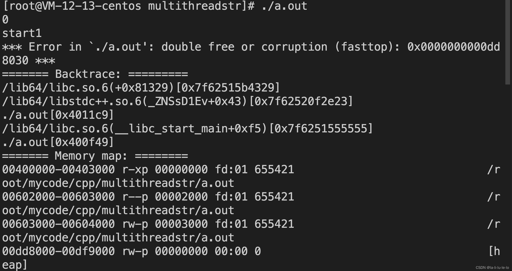
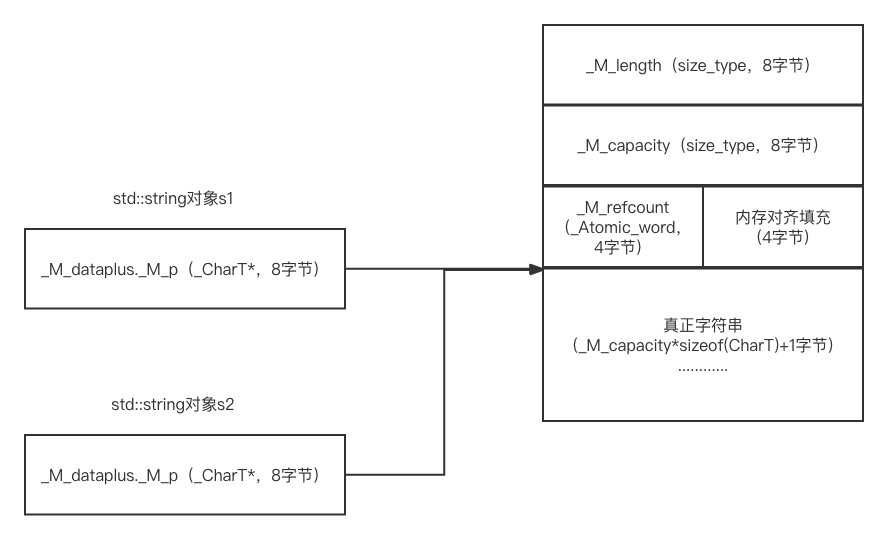
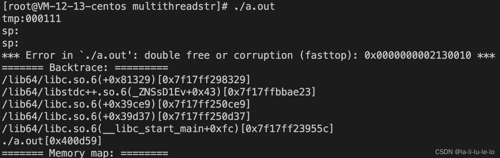
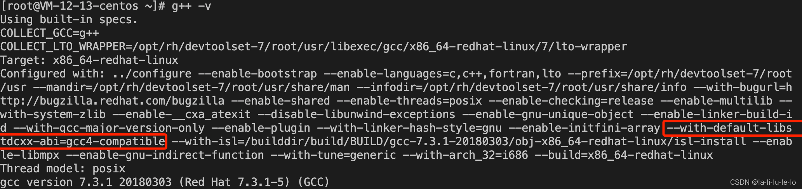
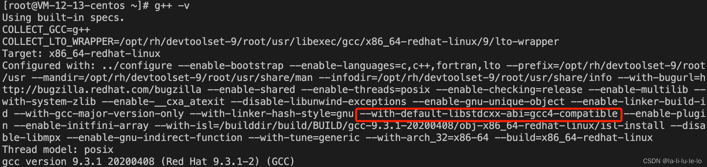
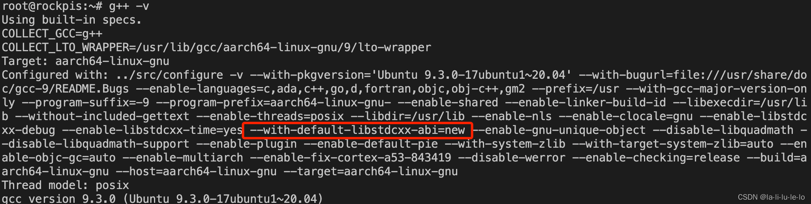

 
<!--BEGIN_DATA
{
    "create_date": "2022-02-01 23:20", 
    "modify_date": "2022-02-01 23:20", 
    "is_top": "0", 
    "summary": "g++下string多线程访问的bug", 
    "tags": "C/C++", 
    "file_name": "g++下string多线程访问的bug.md"
}
END_DATA-->

#### <p>原文出处：<a href='https://blog.csdn.net/qq_24663421/article/details/123670723' target='blank'>g++下string多线程访问的bug</a></p>

之前在某个功能下写了类似以下的一段代码(p->flags的类型为std::string)，功能上线之后，服务器上会偶发崩溃（频率大约几小时一次）。查看崩溃的coredump文件，发现大部分崩溃堆栈位于`std::count_if`中，还有少部分的崩溃堆栈随机的分布在程序各处，怀疑是多线程问题。

```cpp
auto cnt = std::count_if(p->flags.begin(), p->flags.end(),
                         [](char c) { return c != '0';});
```

经过排查，发现此字符串仅在另一个线程中有读操作，代码示意如下。

```cpp
auto tmp = p->flags;
```

随后将程序上传到测试平台，重试产生崩溃的请求，未复现崩溃。然后进行压测，可以复现程序中的崩溃，因此感到非常奇怪，为何对std::string的并发读访问会出现线程不安全的情况。虽然C++标准未对stl容器的线程安全性做规定，但并发的读访问是不应该有线程不安全的情况出现。

## 一、问题复现

由于标准未规定stl容器以及字符串的线程安全性，因此对std::string的并发读写显然是有可能导致线程不安全，因此以下代码是线程不安全的。

```cpp
#include <iostream>
#include <string>
#include <thread>

std::string *sp;

void readstr()
{
    for (int i = 0; i < 100000; ++i)
    {
        std::string tmp = std::string("") ;
        tmp = *sp;
    }
}

void writestr()
{
    for (int i = 0; i < 100000; ++i)
    {
        *sp = std::to_string(i);
    }
}

int main() {
    long long cnt = 0;
    while (true)
    {
        std::cout << "start" << (++cnt) << std::endl;
        sp = new std::string("000111");
        std::thread t1(readstr);
        std::thread t2(writestr);
        t1.join();
        t2.join();
        delete sp;
        sp = NULL;
    }
    return 0;
}
```

然而对于以下代码，依然会出现崩溃的情况

```cpp
#include <iostream>
#include <string>
#include <thread>

std::string *sp;

void readstr()
{
    for (int i = 0; i < 100000; ++i)
    {
        std::string tmp = std::string("") ;
        tmp = *sp;
    }
}

void opstr()
{
    for (int i = 0; i < 100000; ++i)
    {
        auto it = sp->end();
    }
}

int main() {
    std::cout << _GLIBCXX_USE_CXX11_ABI << std::endl;
    long long cnt = 0;
    while (true)
    {
        std::cout << "start" << (++cnt) << std::endl;
        sp = new std::string("000111");
        std::thread t1(readstr);
        std::thread t2(opstr);
        t1.join();
        t2.join();
        delete sp;
        sp = NULL;
    }
    return 0;
}
```

在CentOS Linux release 7.9.2009，1核2G内存，g++ version 7.3.1 20180303 (Red Hat 7.3.1-5) (GCC)的云主机上编译此段代码，编译命令：

    g++ -pthread main.cpp

执行后出现以下崩溃信息（双重释放），问题成功复现。



## 二、源码分析

通过对std::string的源码阅读，发现问题出在std::string的实现上，下面对std::string源码进行分析，源码位于`bits/basic_string.h`和`bits/basic_string.tcc`中。

### 1.std::basic_string内存布局分析

std::string就是std::basic_string的别名，因此需要查看std::basic_string源码，首先我们看一下源码文件开头，有以下一段代码。

```cpp
...
namespace std _GLIBCXX_VISIBILITY(default)
{
_GLIBCXX_BEGIN_NAMESPACE_VERSION
#if _GLIBCXX_USE_CXX11_ABI
_GLIBCXX_BEGIN_NAMESPACE_CXX11
  /**
   *  @class basic_string basic_string.h <string>
   *  @brief  Managing sequences of characters and character-like objects.
   *
   *  @ingroup strings
   *  @ingroup sequences
   *
   *  @tparam _CharT  Type of character
   *  @tparam _Traits  Traits for character type, defaults to
   *                   char_traits<_CharT>.
   *  @tparam _Alloc  Allocator type, defaults to allocator<_CharT>.
   *
   *  Meets the requirements of a <a href="tables.html#65">container</a>, a
   *  <a href="tables.html#66">reversible container</a>, and a
   *  <a href="tables.html#67">sequence</a>.  Of the
   *  <a href="tables.html#68">optional sequence requirements</a>, only
   *  @c push_back, @c at, and @c %array access are supported.
   */
  template<typename _CharT, typename _Traits, typename _Alloc>
    class basic_string
    {
      typedef typename __gnu_cxx::__alloc_traits<_Alloc>::template
	rebind<_CharT>::other _Char_alloc_type;
...
```

经测试`_GLIBCXX_USE_CXX11_ABI`的值在对应测试环境下为0，因此该#if对应的#else处的代码生效。#else处代码如下所示

```cpp
#else  // !_GLIBCXX_USE_CXX11_ABI
  // Reference-counted COW string implentation
  /**
   *  @class basic_string basic_string.h <string>
   *  @brief  Managing sequences of characters and character-like objects.
   *
   *  @ingroup strings
   *  @ingroup sequences
   *
   *  @tparam _CharT  Type of character
   *  @tparam _Traits  Traits for character type, defaults to
   *                   char_traits<_CharT>.
   *  @tparam _Alloc  Allocator type, defaults to allocator<_CharT>.
   *
   *  Meets the requirements of a <a href="tables.html#65">container</a>, a
   *  <a href="tables.html#66">reversible container</a>, and a
   *  <a href="tables.html#67">sequence</a>.  Of the
   *  <a href="tables.html#68">optional sequence requirements</a>, only
   *  @c push_back, @c at, and @c %array access are supported.
   *
   *  @doctodo
   *
   *
   *  Documentation?  What's that?
   *  Nathan Myers <ncm@cantrip.org>.
   *
   *  A string looks like this:
   *
   *  @code
   *                                        [_Rep]
   *                                        _M_length
   *   [basic_string<char_type>]            _M_capacity
   *   _M_dataplus                          _M_refcount
   *   _M_p ---------------->               unnamed array of char_type
   *  @endcode
   *
   *  Where the _M_p points to the first character in the string, and
   *  you cast it to a pointer-to-_Rep and subtract 1 to get a
   *  pointer to the header.
   *
   *  This approach has the enormous advantage that a string object
   *  requires only one allocation.  All the ugliness is confined
   *  within a single %pair of inline functions, which each compile to
   *  a single @a add instruction: _Rep::_M_data(), and
   *  string::_M_rep(); and the allocation function which gets a
   *  block of raw bytes and with room enough and constructs a _Rep
   *  object at the front.
   *
   *  The reason you want _M_data pointing to the character %array and
   *  not the _Rep is so that the debugger can see the string
   *  contents. (Probably we should add a non-inline member to get
   *  the _Rep for the debugger to use, so users can check the actual
   *  string length.)
   *
   *  Note that the _Rep object is a POD so that you can have a
   *  static <em>empty string</em> _Rep object already @a constructed before
   *  static constructors have run.  The reference-count encoding is
   *  chosen so that a 0 indicates one reference, so you never try to
   *  destroy the empty-string _Rep object.
   *
   *  All but the last paragraph is considered pretty conventional
   *  for a C++ string implementation.
  */
  // 21.3  Template class basic_string
  template<typename _CharT, typename _Traits, typename _Alloc>
    class basic_string
    {
      typedef typename _Alloc::template rebind<_CharT>::other _CharT_alloc_type;
...
```

上方代码中注释的意思是说`basic_string`使用了基于引用计数的写时拷贝（Copy On Write，COW）的方式实现，当调用字符串的拷贝构造或者赋值运算符的时候，并不是直接将字符串复制一份，而是仅仅将引用计数加1。当真正修改字符串的时候，再去复制字符串。而析构的时候会将引用计数减1，当所有的引用都析构的时候，再真正的删除字符串对象。

继续看`basic_string`的源码，在测试环境下，调用sizeof(std::string)，会返回8。原因是std::basic_string中真正包含的成员变量仅仅是一个指针，代码如下所示。可以看到，std::string的成员变量仅有一个`_Alloc_hider`类型的`_M_dataplus。_Alloc_hider`继承自`_Alloc`，`_Alloc`为std::string的分配器(std::allocator)，不含任何成员变量，因此`_Alloc_hider`仅含有一个`_CharT *`的指针，该指针指向字符串真正的首个字符位置。

```cpp
// Use empty-base optimization: http://www.cantrip.org/emptyopt.html
struct _Alloc_hider : _Alloc
{
    _Alloc_hider(_CharT* __dat, const _Alloc& __a) _GLIBCXX_NOEXCEPT
    : _Alloc(__a), _M_p(__dat) { }
    _CharT* _M_p; // The actual data.
};
...
private:
    // Data Members (private):
    mutable _Alloc_hider	_M_dataplus;
```

std::basic_string的实现类似于智能指针，即在std::basic_string中存放指向真正字符串的指针，而表示字符串状态(length、capacity、refcount)的对象则存放在真正字符串前，示意图如下所示。


源码如下所示。

```cpp
// _Rep: string representation
//   Invariants:
//   1. String really contains _M_length + 1 characters: due to 21.3.4
//      must be kept null-terminated.
//   2. _M_capacity >= _M_length
//      Allocated memory is always (_M_capacity + 1) * sizeof(_CharT).
//   3. _M_refcount has three states:
//      -1: leaked, one reference, no ref-copies allowed, non-const.
//       0: one reference, non-const.
//     n>0: n + 1 references, operations require a lock, const.
//   4. All fields==0 is an empty string, given the extra storage
//      beyond-the-end for a null terminator; thus, the shared
//      empty string representation needs no constructor.
struct _Rep_base
{
    size_type		_M_length;
    size_type		_M_capacity;
    _Atomic_word		_M_refcount;
};
struct _Rep : _Rep_base
...
```

代理对象_Rep继承自`_Rep_base`类，本身没有成员变量，`_Rep_base`中的三个成员变量即为示意图中前面的三个变量`_M_length`、`_M_capacity`、`_M_refcount`。其中，std::string构造时（非拷贝或移动构造）`_M_refcount`默认为0。

std::basic_string中有private的`_M_rep()`函数来获取_Rep对象，其中`_M_data()`函数用于获取真正字符数组的首个字符地址，再通过强制转换的方式获取前面的_Rep对象，如示意图所示。

```cpp
private:
  // Data Members (private):
  mutable _Alloc_hider	_M_dataplus;
  _CharT*
  _M_data() const _GLIBCXX_NOEXCEPT
  { return  _M_dataplus._M_p; }
...
  _Rep*
  _M_rep() const _GLIBCXX_NOEXCEPT
  { return &((reinterpret_cast<_Rep*> (_M_data()))[-1]); }
```

std::string对象完整示意图如下所示，图中的s1和s2为共享同一`_Rep`对象的两个std::string对象。



2.std::string成员函数调用源码分析  

了解了std::string的结构之后，继续来看两个线程中调用的两个std::string成员函数，首先是tmp=*sp对应的operator=运算符。

```cpp
basic_string&
operator=(const basic_string& __str) 
  { return this->assign(__str); }
```

operator=调用了assign函数，再查看assign函数，源码位于`basic_string.tcc`中。

```cpp
template<typename _CharT, typename _Traits, typename _Alloc>
basic_string<_CharT, _Traits, _Alloc>&
basic_string<_CharT, _Traits, _Alloc>::
assign(const basic_string& __str)
{
  if (_M_rep() != __str._M_rep())
{
  // XXX MT
  const allocator_type __a = this->get_allocator();
  _CharT* __tmp = __str._M_rep()->_M_grab(__a, __str.get_allocator());
  _M_rep()->_M_dispose(__a);
  _M_data(__tmp);
}
  return *this;
}
```

然后注意其中的`_M_grab`函数，并顺着调用链继续往下看。

```cpp
	_CharT*
	_M_grab(const _Alloc& __alloc1, const _Alloc& __alloc2)
	{
	  return (!_M_is_leaked() && __alloc1 == __alloc2)
	          ? _M_refcopy() : _M_clone(__alloc1);
	}
...
        bool
	_M_is_leaked() const _GLIBCXX_NOEXCEPT
        {
#if defined(__GTHREADS)
          // _M_refcount is mutated concurrently by _M_refcopy/_M_dispose,
          // so we need to use an atomic load. However, _M_is_leaked
          // predicate does not change concurrently (i.e. the string is either
          // leaked or not), so a relaxed load is enough.
          return __atomic_load_n(&this->_M_refcount, __ATOMIC_RELAXED) < 0;
#else
          return this->_M_refcount < 0;
#endif
        }
...
	_CharT*
	_M_refcopy() throw()
	{
#if _GLIBCXX_FULLY_DYNAMIC_STRING == 0
	  if (__builtin_expect(this != &_S_empty_rep(), false))
#endif
            __gnu_cxx::__atomic_add_dispatch(&this->_M_refcount, 1);
	  return _M_refdata();
	}  // XXX MT
...
	_CharT*
	_M_refdata() throw()
	{ return reinterpret_cast<_CharT*>(this + 1); }
	_CharT*
	_M_grab(const _Alloc& __alloc1, const _Alloc& __alloc2)
	{
	  return (!_M_is_leaked() && __alloc1 == __alloc2)
	          ? _M_refcopy() : _M_clone(__alloc1);
	}
```

从图中可以看出，`_M_grab`函数会判断当前std::string指向的`_Rep`对象是否leak，而判断方式则是判断其`_M_refcount`是否小于0（`_M_refcount`默认为0，每复制一次加1，每析构一次减1），并且使用了原子变量来确保`_M_refcount`访问可见性（可见g++确实考虑了使用引用计数情况下的线程安全问题，却还是在部分函数中未保证线程安全）。

如果`_M_is_leaked()`返回false，则三目运算符应该走`_M_refcopy`分支（`__alloc1,__alloc2`均为std::allocator，因此`__alloc1 == __alloc2`永远返回true，细节在此不谈，记住结论就好）。在`_M_refcopy()`中将`_M_refcount`即引用计数加1，再返回对应的字符数组的首地址。

注：`__builtin_expect`仅用于编译器分支预测优化，代码逻辑上，`if (__builtin_expect(this != &_S_empty_rep(), false))`等价于`if (this != &_S_empty_rep())`。

总结一下，`_M_grab`函数的返回值是一个`_Rep`对象的字符数组首地址，他通过判断`_Rep`是否leak来决定是单纯将引用计数加1，还是调用`_M_clone`来复制一份`_Rep（_M_clone`复制逻辑在此忽略，因为对于这个bug来说走不到这个分支）。

`_M_grab()`执行之后，继续调用`_M_dispose`函数。

```cpp
	void
	_M_dispose(const _Alloc& __a) _GLIBCXX_NOEXCEPT
	{
#if _GLIBCXX_FULLY_DYNAMIC_STRING == 0
	  if (__builtin_expect(this != &_S_empty_rep(), false))
#endif
	    {
	      // Be race-detector-friendly.  For more info see bits/c++config.
	      _GLIBCXX_SYNCHRONIZATION_HAPPENS_BEFORE(&this->_M_refcount);
              // Decrement of _M_refcount is acq_rel, because:
              // - all but last decrements need to release to synchronize with
              //   the last decrement that will delete the object.
              // - the last decrement needs to acquire to synchronize with
              //   all the previous decrements.
              // - last but one decrement needs to release to synchronize with
              //   the acquire load in _M_is_shared that will conclude that
              //   the object is not shared anymore.
	      if (__gnu_cxx::__exchange_and_add_dispatch(&this->_M_refcount,
							 -1) <= 0)
		{
		  _GLIBCXX_SYNCHRONIZATION_HAPPENS_AFTER(&this->_M_refcount);
		  _M_destroy(__a);
		}
	    }
	}  // XXX MT
...
  template<typename _CharT, typename _Traits, typename _Alloc>
    void
    basic_string<_CharT, _Traits, _Alloc>::_Rep::
    _M_destroy(const _Alloc& __a) throw ()
    {
      const size_type __size = sizeof(_Rep_base) +
	                       (this->_M_capacity + 1) * sizeof(_CharT);
      _Raw_bytes_alloc(__a).deallocate(reinterpret_cast<char*>(this), __size);
    }
```

`_M_dispose`的功能即将`_M_refcount`减1，若减完之后小于0，即删除整个_Rep对象，包括字符数组的部分。调用`_M_dispose`的目的为将当前std::string对象到_Rep的指向清除（类似于智能指针重新设置内部指针指向时的行为）。

随后调用`_M_data(__tmp)`，将刚刚_M_grab返回的_Rep覆盖当前std::string对应的`_Rep`对象，以实现std::string对象指向的更新。

再来看sp->end()中对应的end()函数。

```cpp
iterator
end() // FIXME C++11: should be noexcept.
{
    _M_leak();
    return iterator(_M_data() + this->size());
}
```
重点放在`_M_leak()`函数上。

```cpp
void
_M_leak()    // for use in begin() & non-const op[]
{
    if (!_M_rep()->_M_is_leaked())
    _M_leak_hard();
}
```

`_M_rep()->_M_is_leaked()`返回false，所以`!_M_rep()->_M_is_leaked()`为true，所以调用`_M_leak_hard()`。

```cpp
  template<typename _CharT, typename _Traits, typename _Alloc>
    void
    basic_string<_CharT, _Traits, _Alloc>::
    _M_leak_hard()
    {
#if _GLIBCXX_FULLY_DYNAMIC_STRING == 0
      if (_M_rep() == &_S_empty_rep())
	return;
#endif
      if (_M_rep()->_M_is_shared())
	_M_mutate(0, 0, 0);
      _M_rep()->_M_set_leaked();
    }
...
        bool
	_M_is_shared() const _GLIBCXX_NOEXCEPT
	{
#if defined(__GTHREADS)
          // _M_refcount is mutated concurrently by _M_refcopy/_M_dispose,
          // so we need to use an atomic load. Another thread can drop last
          // but one reference concurrently with this check, so we need this
          // load to be acquire to synchronize with release fetch_and_add in
          // _M_dispose.
          return __atomic_load_n(&this->_M_refcount, __ATOMIC_ACQUIRE) > 0;
#else
          return this->_M_refcount > 0;
#endif
        }
...
        void
	_M_set_leaked() _GLIBCXX_NOEXCEPT
        { this->_M_refcount = -1; }
```

我们逐行分析代码，首先，`_GLIBCXX_FULLY_DYNAMIC_STRING==0`成立，但`_M_rep() == &_S_empty_rep()`不成立，不会直接return。

随后，在本测试用例中`_M_rep()->_M_is_shared()`会返回false，因此不调用`_M_mutate(0, 0, 0)`，随后调用`_M_set_leaked`将`_M_refcount`设置为-1。

## 三、问题分析

刚刚崩溃的测试程序中，所出现的线程不安全问题，正是来自这两个函数的交叉执行导致的，这里指出其中1处线程不安全的地方。

我们这里使用串行化的方式分析该多线程程序。

这里再贴一次测试程序方便阅读，并去除线程中循环的部分方便理解。

```cpp
#include <iostream>
#include <string>
#include <thread>

std::string *sp;

void readstr()
{
    std::string tmp = std::string("") ;
    tmp = *sp;
}

void opstr()
{
    auto it = sp->end();
}

int main() {
    long long cnt = 0;
    while (true)
    {
        std::cout << "start" << (++cnt) << std::endl;
        sp = new std::string("000111");
        std::thread t1(readstr);
        std::thread t2(opstr);
        t1.join();
        t2.join();
        delete sp;
        sp = NULL;
    }
    return 0;
}
```

首先，t2线程挂起，t1线程执行，一直执行到上述所述的`_M_grab`函数中，调用`_M_is_leaked()`函数，函数返回false之后，我们看一下几个变量当前的状态：

**字符串tmp，指向一个`_Rep`(命名为`_Rep_tmp`)。**

**字符串sp，指向另一个`_Rep`(命名为`_Rep_sp`)。**

**`_Rep_sp`中，`_M_refcount`目前等于0。**

随后，线程切换，t1挂起，t2开始执行，并完整执行end函数，随后我们再来看变量状态：

**字符串tmp，指向一个`_Rep`(命名为`_Rep_tmp`)，跟上一步保持不变。**

**字符串sp，指向另一个`_Rep`(命名为`_Rep_sp`)。**

**`_Rep_sp`，由于end函数调用`_M_leak_hard`，再调用`_M_set_leaked`，导致`_M_refcount`修改为-1。**

随后，线程t2执行完成，t1继续执行，现在我们逐行阅读代码分析程序状态。

由于刚刚的`_M_is_leaked`返回了false，因此三目运算符走`_M_refcopy`的分支，`_M_refcopy`中，将`_M_refcount`加1，执行完`_M_grab`后，我们再看变量状态：

**字符串tmp，指向一个`_Rep`(命名为`_Rep_tmp`)，跟上一步保持不变。**

**字符串sp，指向另一个`_Rep`(命名为`_Rep_sp`)。**

**`_Rep_sp`，由于_M_refcopy函数的调用，其`_M_refcount`加1后变为0。**

继续执行tmp的assign函数中的`_M_rep()->_M_dispose(__a)`，tmp指向的`_Rep`的`_M_refcount`减1，从0变为-1，因此tmp指向的`_Rep`被销毁，此时状态：

**字符串tmp，指向一个被销毁`_Rep`(命名为`_Rep_tmp`)。**

**字符串sp，指向另一个`_Rep`(命名为`_Rep_sp`)。**

**`_Rep_sp`，与上一步保持不变，依然为0****。**

继续执行tmp的assign函数中的`_M_data(__tmp)`，将tmp对象的指向修改为sp指向的同一个`_Rep`，此时状态：

**字符串tmp，指向`_Rep_sp`。**

**字符串sp，也指向`_Rep_sp`。**

**`_Rep_sp`，与上一步保持不变，依然为0。**

然后operator=函数完成，此时我们发现一个不变式被打破，`_Rep_sp`被两个std::string对象指向，`_M_refcount`的值却是0（应该为1）。

然后当tmp析构的时候，`_Rep_sp`被销毁，而当回到主线程执行delete sp时，`_Rep_sp`被二次销毁，因此出现了double free的未定义行为错误。

## 四、串行化复现问题

既然已经找到了问题所在，我们就可以使用串行化模拟的方式复现该bug，代码如下。

```cpp
#define private public
#include <iostream>
#include <string>
#include <thread>
#include <memory>

std::string sp;
using _Alloc = std::string::allocator_type;

auto mygrab(const std::string &__str, const _Alloc& __alloc1, const _Alloc& __alloc2)
{
    auto that = __str._M_rep();
    return (!that->_M_is_leaked() && __alloc1 == __alloc2)
           ? (sp.end(), that->_M_refcopy()) : that->_M_clone(__alloc1);
}

void myassign(std::string *that, const std::string& __str)
{
    if (that->_M_rep() != __str._M_rep())
    {
        // XXX MT
        const auto __a = that->get_allocator();
        auto __tmp = mygrab(__str, __a, __str.get_allocator());
        that->_M_rep()->_M_dispose(__a);
        that->_M_data(__tmp);
    }
    std::cout << "tmp:" << *that << std::endl;
}

int main() {
    sp = "000111";
    std::string *tmp = new std::string;
    myassign(tmp, sp);
    delete tmp;
    std::cout << "sp:" << sp << std::endl;
    sp[1] = 'a';
    std::cout << "sp:" << sp << std::endl;
    return 0;
}
```

我们使用myassign来模拟operator=调用的assign函数，使用mygrab替代真正调用的`_M_grab`函数。在`_M_is_leaked`调用之后，我们调用sp.end()函数来模拟线程之间交替执行的情况，然后成功复现问题，执行结果如下。



## 五、说说_GLIBCXX_BEGIN_NAMESPACE_CXX11宏

在gcc5.1版本之后，libstdc++引入了一个新的std::string实现（也包括std::list的新实现，在此不谈），而C++11的标准禁止了写时拷贝的字符串实现。

为了保持向后兼容性，使用`_GLIBCXX_USE_CXX11_ABI`宏来控制程序使用新的还是旧的（写时拷贝实现）std::string实现。从之前的源码我们可以看出，`_GLIBCXX_USE_CXX11_ABI`宏的不同值控制了程序会编译引入不同的std::basic_string实现。当`_GLIBCXX_USE_CXX11_ABI`为1时，使用新的std::string实现（没有线程安全问题），当`_GLIBCXX_USE_CXX11_ABI`为0时，会使用老的std::string实现（有本文提到的线程安全问题）。而`_GLIBCXX_USE_CXX11_ABI`的值却并不是由-std选项控制的，并不是-std=c++11就会使`_GLIBCXX_USE_CXX11_ABI`变为1，这保证了链接时的向后兼容性。

使用g++ -posix -dM -E --with-default-libstdcxx-abi=OPTION`

Set the default value for the _GLIBCXX_USE_CXX11_ABI macro (see [Macros](https://gcc.gnu.org/onlinedocs/libstdc++/manual/using_macros.html)).

The default is `OPTION=new` which sets the macro to `1`, use `OPTION=gcc4-compatible` to set it to `0`. This option does not change the library ABI.  

在gcc官网上（<https://gcc.gnu.org/onlinedocs/libstdc++/manual/configure.html>），可以看到以上一段描述，意思就是当g++的构建参数中有--with-default-libstdcxx-abi=gcc4-compatible的时候，`_GLIBCXX_USE_CXX11_ABI`会设置为0，我们查看一下测试服务器上的g++构建参数。



上图中，`--with-default-libstdcxx-abi的值正是被设置为了`gcc4-compatible，导致`_GLIBCXX_USE_CXX11_ABI`被设置为0。



上图中，在同一台机器上安装的9.3.1版本的g++中， `--with-default-libstdcxx-abi也是被设置为`gcc4-compatible（测试了在该机器9.3.1版本中，同样的问题依然会复现）。



上图中，在另一台机器上，`--with-default-libstdcxx-abi被设置为new，在此机器上_GLIBCXX_USE_CXX11_ABI`为1，同样代码未测试出线程安全的bug，因此可以认为新的std::string实现不存在上述线程安全问题。

## 六、解决方案

如果你的编译环境中`_GLIBCXX_USE_CXX11_ABI`为1，那么就不用担心上述线程安全问题了，因为新版std::string的实现已经解决了这个问题。如果在`_GLIBCXX_USE_CXX11_ABI`为0的机器上，可以尝试重新安装g++或在构建项目时在参数中手动将`_GLIBCXX_USE_CXX11_ABI`设置为1来避免问题。

若由于项目依赖较多，导致无法将`_GLIBCXX_USE_CXX11_ABI`宏修改为1，由于线程安全的冲突来源为end函数中调用的`_M_leak`函数，所以所有调用`_M_leak`函数的成员函数都有风险。调用了`_M_leak()`函数的成员函数有begin()、end()、operator[]、at四个函数。

对于可能被多线程访问的字符串，避免线程安全问题方式有以下几种：

1、首先将字符串复制一份，然后在复制的字符串上调用begin()、end()、operator[]、at等函数。

2、调用cbegin、cend，返回常量迭代器，这两个函数中不会调用`_M_leak`。

3、使用常引用传递被共享的字符串，以上4个函数begin()、end()、operator[]、at的const版本不会调用`_M_leak`。
