 
<!--BEGIN_DATA
{
    "create_date": "2022-01-02 20:40", 
    "modify_date": "2022-01-02 20:40", 
    "is_top": "0", 
    "summary": "iOS Crash Dump Analysis", 
    "tags": "iOS", 
    "file_name": "iOS Crash Dump Analysis.md"
}
END_DATA-->

#### <p>原文出处：<a href='https://faisalmemon.github.io/ios-crash-dump-analysis-book/zh/' target='blank'>iOS Crash Dump Analysis, Second Edition</a></p>

[Github:ios-crash-dump-analysis-book](https://github.com/faisalmemon/ios-crash-dump-analysis-book)

## 免责声明

Copyright Faisal Memon 2018-2020。保留所有权利。

本书按“原样”提供，保证没有任何形式的明示或暗示，包括但不限于保证对适销性，针对特定目的的适用性或不侵权的暗示。

本书可能包含技术上的不准确性或印刷错误（笔误）。作者会定期进行更改并修正本书。这些修改将并入本书的新版本中。

Apple 没有明示或暗示地认可这项工作。本书中的资源是根据公共信息和二进制文件或 Apple 软件工具提供的资料确定的。

作者作为雇员或所有者，在过去或未来的公司或机构中所担任的任何职位，并未得到这些实体公司的任意明示或暗示。

已尽一切努力在本文中标识商标用语。 如果有错误或遗漏，请联系作者。到目前为止，我们已经认可以下商标：

## 前言

这本书源于20世纪90年代后期的灵感。

很难描述当下的满足感。互联网是下一次工业革命。投资者将其视为投资的最佳场所。硬件，软件和服务都经历了类似寒武纪多样性和创新的爆炸式增长。

我发现自己处于时代的中心。我最近刚加入了 Sun Microsystems。所以，如果你对有一个不错的主意并想开始在网络上给为你的客户提供服务，那么 Sun Microsystems 值得依赖，必不可少。这些服务器你可以自己处理或由托管服务商来处理。

那时的计算机技术已经得到了长足的发展，但是现有的解决方案已经在新方向和网络上得到使用。斯坦福大学科研中心基于 Unix 系统研制的 SunOS 操作系统现在运行在 E-Bay 上，并且运行得很好。

我们有一个电子屏幕，显示了关键客户的系统运行状态。沙特阿美公司的红色灯一直亮着，以至于我们怀疑这是否是董事会本身的错。

我在 Sun 的第一天有些失落。我甚至都没有自己的隔间。我的办公桌看起来像是学校的书桌。我的键盘有几个故障或无效的按键。第一天我坐在一个巨大的办公室（”立方体农场“）的一个角落，却不清楚到底是哪个角落。午餐后，我走了很长一段路后回到了我角落的办公桌。

让我惊讶的是，大约 1/4 之一的开发者的办公桌上都放了一本书。书的封面上写着，“Panic!”(_Panic! Unix System Crash Dump Analysis_ 1995)。这是一本关于 SunOS crash dump 分析的书。

当我拥有了自己的隔间并认识了我的同事之后，我注意到那些带着《Panic!》的工程师们。这本书似乎在处理客户反馈的某些底层问题方面具有额外的优势。总的来说，他提升了 Sun 公司客服中心解决 IQ 问题的效率。

在 Sun，有一种深厚的学习文化。我们经常接受如此广泛的培训和支持，通常情况下，我们每年要进行七门课程，每门课程周期为一周。

一切都很好，直到那一堂课。它被称为分析故障排除（ATS）。这在客服中心引起了极大的争议。这是解决问题的一种正式方法。这门课并没有教会你答案是什么，而是确保你能够提出正确的问题。事实证明，在我们最棘手的问题上，我们缺少提出正确问题的能力。

这是生产力再次迈出的重要一步。但是，有些工程师非常不合时宜，非常挑剔。事实证明，这些技术只是经验丰富的工程师在实践过程中所学到的，他们并不希望任何人毫不费力的得到。

有一天，Chris Drake 来到了我们的办公室。他是与 Kimberley Brown 合作编写《Panic!》一书的 x86 架构专家。他们安排了一个研讨会来指导我们关于 x86 架构上的 SunOS 崩溃。在 Linux 和 GNU/Linux 系统显著崛起之前，这在当时是一件新鲜事物。

我记得有一次，在一节操作系统课上，我环顾整个教室。我注意到教室里到处都是 Sun Microsystems 公司的设备；我凝视着 Sun 的标志，梦想有一天可以在那里工作。梦想实现了。因此，在有关 x86 紧急情况的研讨会上，我有了另一个想法。有一天我要写一本书。这本书将完全集中在讨论单个技术问题上。这本书将记载着我在职业生涯中获得的经验。这就是你现在阅读的这本书。

### 第二版

虽然才仅仅过去两年，但 Apple 的技术发展速度还是一如既往的快。

在这期间，我的职业生涯发生了有趣的改变，我被 Apple 公司聘为承包商（称为“现场供应商承包商”）。和我之前的许多工程师一样，我认为我通过招聘的过程，更多的是一种侥幸或者说 Apple 的错误。手里拿着 Apple 的徽章，感觉就像是一把神奇的钥匙。 它就像 Apple 的任何一款产品一样，一样的干净，完美，简洁。事实上，我并没有和其他人一样，为 Apple 公司从事什么隐秘的工作。但是，有一个笑话。 “你找到秘密房间了吗？” 一位工程师会这样询问新员工。在最初的几周内，我对此感到困惑，然后发现它就在众目睽睽之下！。在 Apple，更多的是需要你要成为所关注领域的公共 API 的大师，并与其他工程师合作来解决那些领域中的问题（我的领域是 Accessibility（无障碍访问））。紧张而有趣的两年。

本书的第二版源自于人们长期以来对 APP 产品系列关注，例如 Apple Silicon Macs 系列的发布。

我更新了文章内容，并对示例进行了现代化处理，以适应最新的 OS 版本及SDK。在撰写本文时，它们是 iOS 14.2，macOS 11.0 Big Sur 和 Xcode 12.2。

在我看来，Apple 产品的发展方向是朝着 Apple Silicon 芯片发展，该芯片利用 ARM ABI ，以及该体系结构的最新版本所提供的高级功能。为此，我将引入一些新的章节，介绍 Apple Silicon 上的模式转换崩溃和 Pointer Authentication（指针验证机制）崩溃。

## 致谢

在此感谢我的同事们的帮助和支持。

我要感谢本书的中文翻译者夏文强的支持，以帮助使该书的中文版得以实现。

感谢那些被慷慨提供的开源工具，使得本书的信息汇总工作成为一种可能，特别是 `pandoc` ，它让我更愉快地编写本书。

最后，我要感谢支持我的家庭成员，当我因为在书房中闭关而缺席大部分的家庭活动。谢谢，Junghyun 和 Christopher。

## 介绍

本书填补了当崩溃发生时应用程序开发人员与开发平台之间出现的空白。应用程序开发人员主要想的是高级概念和抽象化。当应用发生崩溃时，现实会把你粗鲁地拉到底层架构、指针和原始数据的 UNIX 世界中。

我们只专注于 Apple 生态系统。

我们的讨论涵盖了 iOS、macOS、tvOS、watchOS 和 BridgeOS 这些平台，ARM 架构和 C(Core Foundation)、Objective-C、Objective-C++ 和 Swift 等多种语言。这是因为较旧的语言更容易崩溃。现实世界中的应用程序最终往往会成为由更安全的 Swift 语言和旧技术的混合体。

我们介绍了苹果生态系统的最新发展。特别是，由于使用 Apple Silicon Macs 而引起的新问题。

我们假设你至少具有 iOS 编程和软件工程的入门知识，并且可以在 Mac 上运用 Xcode 软件。

我们采取的方法是将关于问题的三种不同观点结合起来，让你能以全面、稳健地了解情况以及如何解决问题。

首先，我们将会为你提供一份如何使用 Apple 提供的出色自带工具的 `HOW-TO` 指南。

其次，我们提供一个针对防止和解决崩溃的软件工程概念的讨论。

最后，我们将提供一种正式的解决问题的方法，但该方法主要适用于崩溃分析。

编程文献全面分析了软件工程概念，而 Apple 通过 Guides 和 WWDC 视频介绍了其 crash dump 工具。

在软件工程界一般很少讨论如何去解决正式的问题，可能是因为解决问题被视作软件工程师的一种能力。它被认作是一门研究后增加”自身“能力的学科，这些能力似乎是为了从其他人群中区分出”有技术头脑“的人。

我们的目标并不是羞于重复那些我们在其他地方看到过或阅读过的知识，而是采取一种统一的方式来解释整个观点。 为什么 crash dump 分析如此困难的原因在于，它假定工程师具备大量的背景知识，以便腾出空间专注于特定工具或崩溃报告的具体细节。这会使得工程师出现认知障碍，本书就是要克服这种障碍。

作为本书的补充，还会有一个资源网站，用于结合书本内容一起使用，以便您可以自己设置并运行示例项目然后进行试验。本书最后的所有参考文献都收录在书目章节中。例如，你可以在其中找到资源的 URL。

支持该书的GitHub网站位于@icdabgithub

## 快速入门

当近期的代码修改导致应用程序发生崩溃时，我们可以很容易的对崩溃进行分析然后找到相关代码并进行修改。但是通常，崩溃只是由于操作环境的变化而出现。那可能是最烦人的。例如，应用程序在办公室中正常运行，但在客户站点崩溃。我们没有时间去探究为什么崩溃，但需要快速解决或提出解决方法。当探索一个新项目时，会出现另一个常见的问题场景。 在这里，我们没有使用代码库的经验，但是在编译和运行应用程序后立即会遇到崩溃问题。

在本章中，我们将探讨由于操作环境的变化而导致崩溃的可能原因。无需深入分析手头问题的细节就可以解决许多问题。实际上，有时我们只需在取得进展的同时进行回顾，便可以追溯到根本原因。

### 故障排除

#### 资源缺失问题

有些时候，我们的应用程序由于资源缺失问题而在启动时崩溃。

我们应该尝试去编译运行项目中的所有的Xcode Target。有时候，某个特定的 Target，会成为该项目整体环境不可获取的一部分如果是这样，我们可以做一个注释，以便稍后解决这些问题。

#### 二进制兼容问题

由于二进制兼容的问题，有些时候，我们的应用程序会在启动时发生崩溃。

如果我们刚刚更新了我们的 Xcode，或者在编译好我们工程的同时拉代码进行了更新。我们可以使用 `Option-Command-Shift-K`命令编译过程中产生的中间文件，目标文件及可执行文件，使得项目回到没有编译之前的状态，然后重新编译。

> 一般来说我们可以直接删除 `~/Library/Developer/Xcode/DerivedData` 达到近似效果

#### 只有模拟器有的问题

有些时候，我们的应用程序只在模拟器上发生崩溃。

这时候，我们应该尝试模拟器的 `Hardware->Reset` 功能对内容和功能进行重置。我们可以尝试使用 iPad 模拟器来替代 iPhone 模拟器，反之亦然。示例项目通常用于解释特定技术，而不会去考虑产品化或者通用性。

#### 特定设备的问题

有些时候，我们的应用程序只会在客户设备上发生崩溃。

我们可以检查 `Wi-Fi` 设置或尝试将 iPad 热点连接到 iPhone。在办公室/家庭环境中开发我们的应用程序时，有时我们会忽略诸如连接或延迟之类的网络问题。如果这就是问题所在，我们应该记录下来以便尝试并修复这些问题。

#### 用户设备部署的问题

有些时候，我们的应用程序仅在客户设备上发生崩溃。

当我们将电脑与用户的设备相连时，我们可能正在进行 `Debug` 环境的部署。这意味着推送通知的 `tokens` 将是开发环境而不是生产环境的推送`tokens`。这同时也意味着资源的访问授权（例如，对 `Camera` 相机功能的授权）不再有效，因为它们可能已经通过应用程序的 TestFlight 版本或先前的App Store版本（生产版本）获得了批准。

我们应该尝试通过 `Command` -< 选择左侧面板中的 `Run`，右侧面板中的 `Info` 选项，`Build Configuration` 设置 `Release`（不是 `Debug`）来切换部署配置。 我们还应手动检查 `iPad/iPhone` 设置中的任何资源访问授权。

#### 特定语言环境的问题

有时候，客户设备的特定的语言环境会导致崩溃的发生。

错误的语言环境中可能会缺失某些资源文件。此外，处理语言环境充斥着毫无征兆的特殊情况。我们应该尝试将区域设置暂时更改为已知的语言区域。当你回归问题时不要忘记做好笔记。

> 不同地区的用户，NSCalendar 默认的 firstWeekday 的值是不一致的，这个基于当地的习惯。如果你的 APP 的受众更为广泛，请注意这一点

### 对于崩溃的思考

从上面的例子中得到的教训就是我们需要在更广泛的背景下去思考我们的代码。我们应该考虑应用程序的运行环境。 包括：

  * 编译后的代码
  * 代码模块之间的二进制不兼容性（不同的语言版本，编译器和工具链）
  * 捆绑或下载到应用程序中的资源文件
  * 构建配置（例如 `Release` 或 `Debug`）
  * 网络环境，可用性/延迟/速度
  * 应用程序的允许使用的权限
  * 应用程序被拒绝的权限（在移动设备管理安全环境中）
  * 平台变种
  * 方向
  * 前后端不同的操作模式
  * 硬件性能(旧的慢速硬件与更快的新设备)
  * 硬件组件(GPU，内存，CPU，配件等)
  * 地理位置相关问题
  * 区域问题(语言环境等)
  * 存在诊断设置
  * 存在调试器或分析器
  * 目标设备的操作系统版本

作为树立正确的思路以解决应用程序崩溃的第一步，我们有必要解决上述每个操作环境差异，并试着记下这种差异是否会导致我们知道或怀疑可能发生的崩溃。这告诉我们，崩溃更多是关于**环境**而不是**源代码**。另一个次要的见解是，我们越能够根据特定的环境差异生成一系列假设，我们就能更容易、更快地找到其他人看起来很神秘的崩溃的根本原因，而且我们几乎是神奇的想出了问题可能出在哪里的建议。

以下是民间传说中的一些奇怪的信息技术崩溃案例，以激发我们的欲望并让我们展开思考：

#### 基于不同语言环境的崩溃

俄语语言环境在日期处理期间导致崩溃。

这是因为 `1984-04-01` 被用来当做哨兵日期。但是，在俄罗斯是没有这样的日期/时间，因为在俄罗斯当天是没有午夜的，即没有 `1984-04-01 00:00:00`。这是因为俄罗斯的夏令时开始于当天的 `1` 点钟。

这是在 WecudosPro iPad 应用程序开发期间在俄罗斯进行测试时看到的

#### 地理位置引起的崩溃

一台计算机在每天的不同时间都会发生崩溃。

这个问题实际上是因为这台计算机被放置在一个有船只经过的河口旁边的窗户。在涨潮时，一艘军舰将驶过，其雷达将破坏电子设备从而导致计算机发生崩溃。

在 Kepner-Tregoe 正式的问题解决培训会上，这个民间传说故事被告知给在英国的 Sun Microsystems 客服中心的工程师们。

#### 总线噪音崩溃

当计算机同时承受较大的网络负载和磁盘负载时，系统会发生崩溃。

这个崩溃是由于磁盘损坏造成的。每64字节的内存中都会出现一个零。它是计算机的缓存行大小。由于内存板接线错误，导致旁边的磁盘带状电缆在 64 字节边界处产生噪音。

这是在 Sun Volume Systems Group 计算机的早期原型中看到的。

## 基本概念

### 什么是崩溃?

我们的计算机内部是一个操作环境。它包括一个或多个正在运行的操作系统以及应用程序软件。两者的区别在于，操作系统软件在比应用程序软件（用户模式）更高的 CPU 权限（内核模式）下运行。

我们通常理解为我们的应用软件的基本概念模型是位于一个操作系统上，而操作系统本身又是位于硬件上。

但是，现代计算机系统具有多个协作子系统。例如，配备 TouchBar 的 MacBook Pro 即具有主操作系统 macOS，同时也有支持处理 TouchBar 界面、磁盘加密 和 “Hey Siri” 的 Bridge OS。我们计算机中的多媒体和网络芯片是高级组件，可以在其上运行自己的实时操作系统。我们的 Mac 软件只是 macOS 上运行的众多应用程序之一。

应用程序崩溃是操作环境响应我们在应用程序中所做的（或未完成的）某些操作，这些操作违反了我们所运行的平台的某些规则。

当操作系统检测到系统中存在问题时，它可能会自行崩溃。 这称为 `kernel panic`。

### 操作系统的规则

操作环境通过某些规则来保障用户的环境安全性、数据安全性、性能和隐私性。

#### Nil 处理示例

Apple 生态系统的新手常常惊讶地发现，Objective-C 允许我们向 nil 对象发送消息。它默默地忽略了失败的调用。例如，以下方法可以运行正常。

```c
- (void)nilDispatchDoesNothing
{
    NSString *error = NULL;
    assert([error length] == 0);
}
```

Objective-C 运行时的开发者做出了一个判断，并认为应用程序最好忽略这些问题。

但是，如果我们引用了一个 C 指针，应用程序就会发生崩溃。

```c    
void nullDereferenceCrash() {
    char *nullPointer = NULL;
    assert(strlen(nullPointer) == 0);
}
```

操作系统的开发者为了避免对空指针地址或更底层的内存地址的非法访问，所以中断了应用程序。

操作系统将此内存区域留出，因为它表示未正确设置对象或数据结构的编程错误。

当出现问题时，我们并不总是会崩溃。 只有它违反运行环境的规则，应用程序才会发生崩溃。

#### 获取 MAC 地址示例

参考获取 iPhone 的的 MAC 的示例。媒体访问控制（MAC）地址是分配给网卡的唯一识别码，用来允许机器在通信栈的数据链路层进行没有重复地相互通信。

在 iOS 7 之前，MAC 地址不被视为敏感 API。因此，使用 `sysctl` API 请求 MAC 地址会给出真实地址。要查看此操作，请参阅 `icdab_sample` 应用程序。

不幸的是，此 API 作为跟踪用户的一种方式而被开发者滥用，这违反了隐私协议。因此，Apple 在 iOS 7 中引入了一项新的方式，API 始终会返回固定的 MAC 地址。

当调用 `sysctl` API 时，Apple 本来可以选择使我们的应用程序崩溃。但是，`sysctl` 是一种通用的底层调用，它可用于其他有效目的。因此，iOS 设置的策略是在请求时返回固定的 MAC 地址 `02:00:00:00:00:00`。

#### 获取相机权限示例

现在，让我们考虑使用相机拍摄照片的情况。

在 iOS 10 中，当我们的应用程序需要使用设备相机（隐私且敏感）功能时，我们需要定义一段阅读性良好的授权文案，以便用户理解并给予相机的访问权限。

即便我们没有在 `Info.plist` 中为 `NSCameraUsageDescription` 定义授权描述，以下代码的判断结果还是正确的，系统会尝试弹出相册选择器。

```c
if UIImagePickerController.isSourceTypeAvailable(
      UIImagePickerControllerSourceType.camera) {
      // Use Xcode 9.4.1 to see it enter here
      // Xcode 10.0 will skip over
      let imagePicker = UIImagePickerController()
      imagePicker.delegate = self
      imagePicker.sourceType =
       UIImagePickerControllerSourceType.camera
      imagePicker.allowsEditing = false
      self.present(imagePicker, animated: true, completion: nil)
      }
```

然而，当我们使用Xcode 9.4.1版本运行上面的代码时，我们在控制台会看到以下崩溃的描述性信息：

```c
2018-07-10 20:09:21.549897+0100 icdab_sample[1775:15601294]
 [access] This app has crashed because it attempted to access
  privacy-sensitive data without a usage description.  
  The app's Info.plist must contain an NSCameraUsageDescription
   key with a string value explaining to the user how the app
   uses this data.
Message from debugger: Terminated due to signal 9
```

#### 经验教育

请注意这里的对比。这两种情况下我们都调用了涉及隐私敏感的 API。但是在相机的案例中，Apple 选择了让应用程序崩溃而不是弹一个弹框给出警告，或者是返回一个错误的值来表明源类型不可用。

这似乎是一个苛刻的设计选择。当用户在 Xcode 10.0（提供了 iOS 12 的 SDK） 进行操作时， 这个调用相机授权的 API 有了不一样的表现。当由于未在 `Info.plist` 中定义授权描述是，判断相机是否可用 API 会返回 `false`。

这强调了涉及两个实体的意义，即程序和操作环境（包括其策略）。拥有正确的源代码并不能保证程序能够正常运行。当我们的应用程序发生崩溃时，我们需要考虑操作环境以及代码本身。

### 应用程序的策略

我们正在编写的应用程序也可以主动引发崩溃。这通常通过我们代码中的断言调用来完成的。任何断言的失败，这些调用都会要求操作环境立即终止我们的应用程序。然后操作环境就终止了我们的应用程序。 那么在崩溃报告中我们会得到这样一个类型:

`Exception Type: EXC_CRASH (SIGABRT)`

表明应用程序在第一时间主动触发崩溃。

#### 什么时候应该主动触发崩溃？

我们可以遵循与操作环境类似的标准来制定我们应用的崩溃策略。

如果我们的代码检测到数据的完整性存在问题，我们可能会触发崩溃以防止进一步的数据损坏。

#### 什么时候不应该触发崩溃

如果问题直接来自某些 IO 问题（例如文件或网络访问）或某些人为的输入问题（例如错误的日期值）那么我们不应改触发崩溃。

作为应用程序开发人员，我们的工作是保护系统的底层部分免受现实世界中存在的不可预测性的影响。通过日志记录，错误处理，用户警报和 IO 重试，可以更好地解决此类问题。

### 工程指导

我们应如何防范上述的私隐问题?

需要记住的是，任何涉及操作环境保护策略的代码都是自动化测试的理想选择。

在 `icdab_sample` 项目中我们已经创建了单元测试和 UI 测试。

当将测试用例应用于处理琐碎的程序时，我们总会感到无所适从。 但是考虑一个具有拓展性的 `Info.plist` 文件的大型程序。当我们要创建一个新版本而需要创建另一个新的 `Info.plist` 文件。那么在不同构建目标建如何保持隐私协议设置的同步就会成为一个问题。那么仅针对启动相机的 UI 测试代码可以轻松捕获到此类问题，因此具有实用的商业价值。

同样，如果我们的 APP 包含大量的底层代码，然后我们需要将 APP 从 iOS 系统移植到 tvOS，那么有多少涉及操作系统的敏感代码会仍然适用呢？

针对不同的设计考虑全面地对顶级功能进行单元测试可以抵消在我们对代码库中深入研究和单元测试潜在的辅助函数调用所耗费的精力。这是一项战略性工作，可让我们在移植到 Apple 生态系统（及以后）中的其他平台时对自己的应用程序和对问题领域的早期反馈充满信心。

#### 单元测试获取 MAC 地址

获取MAC地址的代码并非易事。 因此，它需要进行一定程度的测试。

下面是单元测试代码的摘录：

```c
func getFirstOctectAsInt(_ macAddress: String) -> Int {
    let firstOctect = macAddress.split(separator: ":").first!
    let firstOctectAsNumber = Int(String(firstOctect))!
    return firstOctectAsNumber
}

func testMacAddressNotNil() {
    let macAddress = MacAddress().getMacAddress()
    XCTAssertNotNil(macAddress)
}

func testMacAddressIsNotRandom() {
    let macAddressFirst = MacAddress().getMacAddress()
    let macAddressSecond = MacAddress().getMacAddress()
    XCTAssert(macAddressFirst == macAddressSecond)
}

func testMacAddressIsUnicast() {
    let macAddress = MacAddress().getMacAddress()!
    let firstOctect = getFirstOctectAsInt(macAddress)
    XCTAssert(0 == (firstOctect & 1))
}

func testMacAddressIsGloballyUnique() {
    let macAddress = MacAddress().getMacAddress()!
    let firstOctect = getFirstOctectAsInt(macAddress)
    XCTAssert(0 == (firstOctect & 2))
}
```

实际上，最后一个测试用例会失败，因为操作系统会返回本地地址。

#### UI Tests 测试访问相机

为了测试访问相机的功能，我们编写了一个简单的 UI 测试用例，模拟按下了拍照按钮（通过辅助功能标识符 `takePhotoButton` ）

```c
func testTakePhoto() {
    let app = XCUIApplication()
    app.buttons["takePhotoButton"].tap()
}
```

这个 UI 测试代码会导致立即崩溃。

> 如果用户并未授权的时候

## 工具

### 概览

我们有一套丰富的工具可用于协助 `crash dump` 的分析。如果使用得当，这可以节省大量时间。

Xcode 提供了很多现成的帮助。然而，如何使用和理解 Xcode 工具提供的信息是令人望而生畏的。在后面的章节中，我们将介绍这些工具的使用示例。

此外，在 macOS 中还提供了标准的命令行工具。这些工具在特定场景下有着超乎想象的作用，尤其在我们已经知道我们需要找到什么的时候。我们将介绍具体的场景，并说明该如何使用这些工具。

接下来是帮助我们逆向工程的软件工具。有时候在使用第三方库时，有些问题很难被我们发现。那么除了查看文档或提出支持请求外，还可以使用这些工具自行进行调查。

### 逆向工程

逆向工程是研究已构建的二进制文件（例如应用程序、库或辅助进程守护程序），以确定它是如何工作的。对于一个特定的对象，我们可能想知道：

  * 它所提供对象的生命周期是什么？
  * 它对对象做什么检查？
  * 它依赖哪些文件或资源？
  * 它为什么返回故障代码？

通常，我们不用了解所有信息，只需要某些特定的东西来帮助建立假设。 一旦我们得到一个假设，我们将测试它与我们正在处理的 `crash dump` 是否有关。

逆向工程应该走多远，应该投入多少时间和金钱？我们提供以下建议：

  * 如果我们刚刚开始我们的应用程序开发人员之旅，或者我们的资金有限，那么只需坚持使用标准的 Xcode 工具，macOS 命令行和 `class-dump` 工具。
  * 如果我们是专业的应用程序开发人员，强烈建议购买商业逆向工程工具。最引人注目的是 `Hopper`；它提供了许多由 IDA Pro（一种高端工具）提供的功能。价格合理，即使只使用了几次，也可以提高生产力。我们在本书中将展示如何使用 Hopper。
  * 如果我们是一个专业的渗透测试人员、逆向工程师或安全研究员，那么我们可能希望投资于顶级软件工具 IDA Pro。该工具成本高达数千美元，但通常是在公司范围内购买的。

### Class Dump 工具

Objective-C 运行时的一大优点是它在其构建的二进制文件中携带了大量丰富的程序结构信息。这些在语言的动态上得以发挥作用。实际上，灵活的动态调度是许多崩溃的源头。我们建议安装`class-dump` 因为我们将在后面的章节中引用它的用法。

> 点击 [Class-dump](http://stevenygard.com/projects/class-dump/) 下载安装。

`class-dump` 工具允许我们查看给定程序中的 Objective C 类、方法和属性。

### 第三方工具手机崩溃报告

虽然 iTunes Connect 中的 Apple Crash Reporter 工具非常的出色，但是仍有改进空间。

一个强大的开源软件，由 Plausible Labs 的 Landon Fuller 所编写[plcrashreporter](https://github.com/microsoft/plcrashreporter)。(“Plausible Labs Crash Reporter” 2018)

我们想让我们的应用程序能够尽可能的处理发生的所有可能的信号和异常，一旦应用程序将无法实现，从而导致底层操作系统触发崩溃。

通过这个工具，可以记录崩溃信息，然后传输到我们自己的服务器上。

这有两个好处。首先，崩溃处理程序可以处理 Apple `ReportCrash` 工具尚未处理的边缘情况。其次，可以采用更全面的服务器端解决方案。

对于那些想要探索和理解操作系统以及底层应用程序代码的人来说，`plcrashreporter` 提供了一个学习精心设计的系统软件的绝好机会。

当公司拥有许多应用程序，许多应用程序变体，并且拥有基于 Android 等其他平台的应用程序时，就需要更强大的多平台解决方案。处理崩溃报告很快就会成为一种管理问题。哪个崩溃最严重？有多少客户受到影响？质量和稳定性的指标是什么？

有许多可用的商业解决方案，都主要基于上述开源项目。

移动软件开发领域在过去几年已经发展成为一个大产业。许多专业公司为 App 开发者提供专业的服务。该领域在合并和收购方面非常活跃。由于这个行业的变化之快，我们没办法在本书中列举这些专业公司的名称。

阅读 `rollout.io` 的博客是一个好的开始，它介绍了市场上的竞争者们。(“IOS Crash Reporting Tools” 2017)

## Xcode 内置工具

Xcode为开发人员在理解和预防崩溃方面提供了重要的帮助。

Xcode 给我们提供了两个层面的帮助，对于简单的现象，Xcode 会直接告诉我们常见的错误并建议我们更正，而对于复杂情况，Xcode 会为我们提供原始的信息，但是这需要我们利用操作系统的相关知识来解释这些信息。

后续文章中我们将会多次提及 Xcode 的配置、设置和工具。但是尽管如此，让我们首先看看Xcode 提供的简单但有效的帮助。

### Xcode 诊断设置

通过打开项目 `icdab_sample`，并查看 Scheme （选择 Edit Scheme），然后选中 Diagnostics 选项，我们看到以下内容：

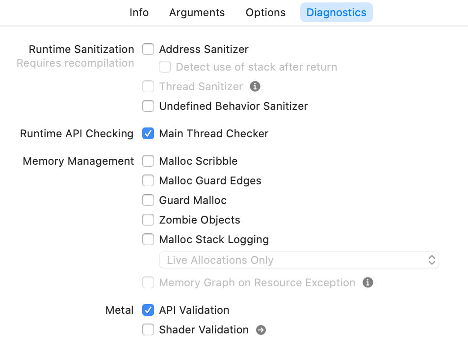

#### 执行方法

如果我们的崩溃可以从我们自己的开发环境或源码中得到复现，那么接下来的操作是我们应该打开适当的诊断设置项，然后重新运行我们的应用程序。

随着我们对各种诊断项的熟悉，我们会知道要选择哪个选项。我们将研究不同的场景，以便我们了解如何使用每个诊断设置项。但是，当我们开始了解诊断设置项的价值时，我们需要一步一步的了解一下可选项。基本方法是：

  1. 对遇到的问题编写单元测试用例或 UI 测试用例。
  2. 我们猜测分析并仅选择上述诊断项中的一个。
  3. 执行我们的测试用例
  4. 观察Xcode中的任意警告或打印信息。
  5. 如果并没有解释问题，重复上述操作，但是选择另外的诊断项。

#### 分析方法

另一种用于分析和避免崩溃的方法是运行代码分析器。使用`Command-Shift-B` 调用。

下面是 `icdab_sample` 的分析报告:

```c
/Users/faisalm/dev/icdab/source/icdab_sample/icdab_sample/
macAddress.m:22:12:
 warning: Null pointer argument in call to string length function
    assert(strlen(nullPointer) == 0);
```

很方便的给我们标记了源码。

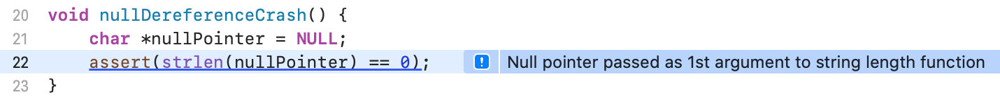

我们可以在项目构建时判断是否启用该功能，对于 `shallow` 或 `deep` 模式的选择，可以根据我们的认知权衡是应该使用较慢但是更为彻底的分析还是较快但是简单的分析。它在 Xcode 项目文件的 Build Settings 选项中。

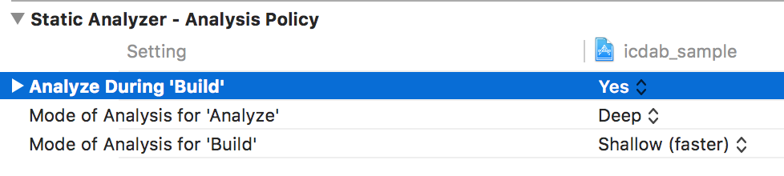

对于从未生成代码分析报告的大型项目来说，其输出的数据可能是海量的。报告中会有一些问题，但是总体来说做的很好。报告中会有重复，因为某些类型的错误会在整个代码中重复出现。

如果我们使用敏捷开发的方法来开发迭代软件，则可以将代码分析列为待办事项，可以在分配给重构和维护的时间内进行处理。

在大型软件项目中，重构和维护应该占整体工作的 20% 左右。这一部分出现了很多不同观点。笔者认为可以与正常开发同时进行，只要正在进行的工作没有出现高风险的变化即可。对于有高风险的变化，可以留到应用程序完成重大更新之后进行代码扥西。通常，在应用发布之后会有一段时间进行下个版本的规划，这段时间允许开发者去解决此类问题。

##### iOS QuickEdit App 案例研究

从经济学的角度来看，利用代码分析发现潜在崩溃，不失为一个解决问题的很好的投资。例如，在 Quickedit iOS 应用程序中，大约有100万行Objective-C 代码，每天有 7 万活跃用户，当运行代分析后发现 13 个明显的崩溃问题。

我们创建了一个开发任务（“修复明显的代码分析错误”）。所有的 13 个问题在一天之内得到了修复然后测试在花费了两天进行测试。

对用户来说，崩溃现象是难以接受的。在生产环境发现的问题通常比开发环境要多付出 20 倍的努力和成本。由于用户群里的数量，可能让崩溃的影响更为严重，这 13 问题可能需要我们浪费 `20 * 3 = 60` 天的工作量。

由于年代的原因，QuickEdit 应用使用手动引用计数的 Objective-C 代码。但是尽管如此，基于应用的代码分析，它的可靠性为 99.5%。一旦这些问题得到解决，大概只需要花费 5% 的工作量就可以保持工程的稳定性。

#### 方法论

一个有效的从我们应用程序中减少崩溃的方法，尤其是当我们在大型组织中时，是将代码分析纳入我们的软件开发过程中。

当开发人员拉取服务器代码时，请确保开发者不会引入新的分析警告。我们可以把代码分析报告当做被免费提供的自动进行的 `code review`。尤其对独立开发者来说，没有其他人进行 `code review`，特别有用。

将代码提交到功能分支时，请在其上运行自动化测试，并设置不同的诊断项配置。这可以自动解决问题。

每次发布之前，分配一些时间使用 `memory profiler` 去运行一些特定的测试用例，来查看内存使用情况或其他关键指标。记录内存峰值以及配置文件。然后，当以后发布版本时，我们就有了一个标准，从数量和质量两个维度来分析新版本。

### 行百里者半九十

大多数软件开发人员都知道他们 “应该” 做什么；整洁的代码、适当的测试、代码评审等。

我们建议采取针对性的方法。花费时间去一起研究示例程序来理解概念。去写一个原型代码只需要证明一个业务用例即可。去编写更多人使用并高度信赖的代码。

我们认为应该尽可能的去思考经济成本，因为大多数开发者都参与了专业的软件开发。或者，当我们从事非商业项目或业余项目时，那么经济成本就是我们的业余时间，我们更加希望能够有效的利用我们的时间。

我们建议：

  * 对于示例程序和概念的研究，直接去编写代码。
  * 对于原型开发来说，当我们遇到问题时去执行方法就行。
  * 对于独立开发的产品，从一开始就进行代码分析，并在发现重大问题时添加到我们的开发流程中。在开始开发时可以带着编写用例，但是可以在运到重大问题时才去执行。
  * 对于团队开发的产品，请添加到开发流程中。从开始开发时就进行全面的测试。

## 混合环境

我们已经了解到 Xcode 提供了许多用于崩溃转储分析和预防崩溃的自动工具。然而这些并不能为我们提供需要的所有答案。我们需要有一个面向设计的观点来思考问题。

在本章中，我们将去研究一个使用混合语言和编程范式的示例应用程序 `icdab_planets`。它告诉我们为什么还必须考虑设计问题。

### 项目结构

示例应用程序 `icdab_planets` 采用 C++ 和 Objective-C++ 的混合编程。它同时依赖于 STL 数据结构和传统的 Objective-C 数据结构。

应用程序的 `model` 层是用 C++ 编写的。应用程序的 `controller`层是用 Objective-C++ 编写的。

该应用程序的目的是告诉我们木星内部可以容纳多少个冥王星大小的行星。

### 范式

回想一下，我们证明了：

  * Objective-C 允许向 nil 对象发送消息
  * C 语言环境中，引用NULL 时会发生崩溃

这里，我们展示了 C++ 标准模板库具有怎样 `back-fill` 策略。

在 STL 映射抽象（哈希表）中，当我们查询一个不存在的条目时，STL 将在表中插入一个新的条目，用于查询所查询的关键字，然后返回该条目，而不是返回一个错误或返回一个 nil。

### 问题

在示例应用程序（该应用程序在启动时崩溃）中，有一个断言被触发。

```c
double pluto_volume = pluto.get_volume();
assert(pluto_volume != 0.0);
double plutos_to_fill_jupiter
        =  jupiter.get_volume() / pluto_volume;
```

启动代码分析并不会发现任何问题或警告。

代码中的断言是为了避免被零除。 事实上断言被触发其实很好，因为我们知道从哪里开始调试问题。

因为这段代码，冥王星的质量为 0.0。

```c
planet pluto = planet::get_planet_with_name("Pluto");
```

返回直径为零的行星。

在代码文件 `planet_data.hpp`中我们可以看到这个 API：

```c
static planet get_planet_with_name(string name);
```

因此，无论我们传递任何名称，我们都能得到一个`planet`作为回应；这个值永远不为 `NULL`。

问题是对于该 API 需要更为严谨的思考。它只是为了完成工作而做的一个简单的抽象。

这里有

```c
planet planet::get_planet_with_name(string name) {
    if (!database.loaded_data) {
        database.load_data();
    }
    return database.planets[name];
}
```

乍一看，可能是由于数据库没办法正确加载数据。 事实上是因为数据中缺少冥王星对应的条目：

```c
void planet_database::load_data() {
    planet planet_Mercury =
     planet("Mercury", 4878.0, 57.9 * millionKm);
    planets["Mercury"] = planet_Mercury;

    planet planet_Venus =
     planet("Venus", 12104, 108.2 * millionKm);
    planets["Venus"] = planet_Venus;

    planet planet_Earth =
     planet("Earth", 12756, 149.6 * millionKm);
    planets["Earth"] = planet_Earth;

    planet planet_Mars =
     planet("Mars", 6792, 227.9 * millionKm);
    planets["Mars"] = planet_Mars;

    planet planet_Jupiter =
     planet("Jupiter", 142984, 778 * millionKm);
    planets["Jupiter"] = planet_Jupiter;

    planet planet_Saturn =
     planet("Saturn", 120536, 1427 * millionKm);
    planets["Saturn"] = planet_Saturn;

    planet planet_Uranus =
     planet("Uranus", 51118, 2870 * millionKm);
    planets["Uranus"] = planet_Uranus;

    planet planet_Neptune =
     planet("Neptune", 49532, 4497 * millionKm);
    planets["Neptune"] = planet_Neptune;

//  No longer considered a planet but instead a dwarf planet
//  planet planet_Pluto =
//   planet("Pluto", 2370, 7375 * millionKm);
//  planets["Pluto"] = planet_Pluto;

    loaded_data = true;
}
```

这个问题的间接表现是 `database.planets[name]` 并没有获取到冥王星的数据，因此通过`no-arg`构造函数创建了一个条目，这是 STL 映射数据结构的行为。

```c
planet::planet() {
    this->name = "";
    this->diameter = 0.0;
    this->distance_from_sun = 0.0;
}
```

在这种情况下，我们看到默认构造函数中将直径为零。

### 解决方案

我们发现问题是因为没有合适的运用各种语言的框架和范式，当我们混用这些范式时，每个抽象层都会掩盖不同的假设。

在 STL 中，我们期望完成`find` 操作，而不是索引操作符。这就允许抽象标记可以找不到的对应的条目。

在 Objective-C 中，我们期望 lookup API 是一个返回给定查找名称的索引的函数。另外，当操作失败时，索引将被置为 `NSNotFound`。

在此代码示例中，每个抽象层都假设另一侧将边缘案例重新映射为适当的形式。

#### STL 解决方案

从 STL 的角度来看，我们有一个可以`正确地`执行操作代码变体。在文件`example/planets_stl`中。在方法获取时，我们可以有一个辅助的方法：

```c
- (BOOL)loadPlanetData {
    auto pluto_by_find = planet::find_planet_named("Pluto");
    auto jupiter_by_find = planet::find_planet_named("Jupiter");

    if (planet::isEnd(jupiter_by_find) ||
     planet::isEnd(pluto_by_find)) {
        return NO;
    }
    pluto = pluto_by_find->second;
    jupiter = jupiter_by_find->second;
    return YES;
}
```

对于一个主要使用 Objective-C 语言的开发者来说这段代码很难理解。但是如果该项目主要以 C++ 开发的话，具有特定的相关平台经验，那么这也许是可以接受的。如果代码库只使用了部分的 C++ 代码，那么更好的解决方案是将特定范式限制在文件中，并应用外观设计模式，在特定的平台代码端提供遵循 Objective-C 范式的 API 版本。

然后，ViewController 代码中可以不使用 Objective-C++，而是将其作为 Objective-C 文件。

#### 外观模式解决方案

> 外观模式是一种设计模式，我认为是类似于工厂模式的，请查看[维基百科](https://zh.wikipedia.org/wiki/%E5%A4%96%E
8%A7%80%E6%A8%A1%E5%BC%8F)

这里有一个外观模式解决方案 `example/facade_planets` 用来解决混合编程的问题

外观模式解决方案:

```c
@implementation PlanetModel

- (id)init {
    self = [super init];

    NSString *testSupportAddPluto =
     [[[NSProcessInfo processInfo] environment]
      objectForKey:@"AddPluto"];

    if ([testSupportAddPluto isEqualToString:@"YES"]) {
        planet::add_planet(
          planet("Pluto", 2370, 7375 * millionKm));
    }

    if (self) {
        _planetDict = [[NSMutableDictionary alloc] init];
        auto pluto_by_find =
         planet::find_planet_named("Pluto");
        auto jupiter_by_find =
         planet::find_planet_named("Jupiter");

        if (planet::isEnd(jupiter_by_find) ||
         planet::isEnd(pluto_by_find)) {
            return nil;
        }
        auto pluto = pluto_by_find->second;
        auto jupiter = jupiter_by_find->second;

        PlanetInfo *plutoPlanet = [[PlanetInfo alloc] init];
        plutoPlanet.diameter = pluto.get_diameter();
        plutoPlanet.distanceFromSun =
         pluto.get_distance_from_sun();
        plutoPlanet.volume = pluto.get_volume();
        assert (plutoPlanet.volume != 0.0);
        [_planetDict setObject:plutoPlanet forKey:@"Pluto"];

        PlanetInfo *jupiterPlanet = [[PlanetInfo alloc] init];
        jupiterPlanet.diameter = jupiter.get_diameter();
        jupiterPlanet.distanceFromSun =
         jupiter.get_distance_from_sun();
        jupiterPlanet.volume = jupiter.get_volume();
        assert (jupiterPlanet.volume != 0.0);
        [_planetDict setObject:jupiterPlanet forKey:@"Jupiter"];
    }

    return self;
}

@end
```

然后，API 调用方变成纯粹的 Objective-C 类：

```c
- (void)viewDidLoad {
    [super viewDidLoad];

    self.planetModel = [[PlanetModel alloc] init];

    if (self.planetModel == nil) {
        return;
    }

    double pluto_diameter =
     self.planetModel.planetDict[@"Pluto"].diameter;
    double jupiter_diameter =
     self.planetModel.planetDict[@"Jupiter"].diameter;
    double plutoVolume =
     self.planetModel.planetDict[@"Pluto"].volume;
    double jupiterVolume =
     self.planetModel.planetDict[@"Jupiter"].volume;
    double plutosInJupiter = jupiterVolume/plutoVolume;

    self.plutosInJupiterLabelOutlet.text =
    [NSString stringWithFormat:
    @"Number of Plutos that fit inside Jupiter = %f",
     plutosInJupiter];

    self.jupiterLabelOutlet.text =
    [NSString stringWithFormat:
     @"Diameter of Jupiter (km) = %f",
     jupiter_diameter];
    self.plutoLabelOutlet.text =
    [NSString stringWithFormat:
     @"Diameter of Pluto (km) = %f",
     pluto_diameter];
}
```

### 经验教训

这里的经验是崩溃可能来自特殊情况处理。由于不同的语言和框架以它们自己惯用的方式处理特殊的情况，因此如果可能的话，将代码分离出来并使用一个特定的外观来保持各种范式清晰分离是比较安全的。

## 符号化

本章介绍了 crash dump 的符号化。符号化是将机器地址映射成对拥有源代码的程序员有意义的符号地址的过程。我们希望尽可能看到函数名（加上任何偏移量），而不是看到机器地址。

我们使用 `icdab_planets` 示例应用程序来演示崩溃。(“IOS Crash Dump Analysis Book Github Resources” 2018)

当处理真实的崩溃时，一般会涉及到很多不同的关联数据。这些数据可以来自用户终端，通过设置允许将崩溃报告上传到 Apple 的终端设备，Apple 拥有的符号信息和我们本地开发环境的配置信息可以相互映射。

为了理解所有信息是如何组合在一起的，最好从一开始开始就自己完成数据转化任务，因此一旦我们需要诊断符号化问题，我们就已有一定的技术经验。

### 构建过程

通常，当我们开发应用程序时，我们会将应用程序的 `Debug` 版本构建到我们的设备上。而当我们为测试人员、应用程序审核或应用商店构建应用时，我们构建应用程序的 `Release` 版本。

默认情况下，对于 `Release`版本，`.o` 文件的调试信息被存储在一个单独的目录结构中。被称作 `our_app_name.DSYM`。

当开发人员发现崩溃时，可以使用这些调试信息来帮助我们理解程序在哪里出错了。

当用户发现我们的应用程序崩溃时，并没有开发人员在身边。所以，会生成一份崩溃报告。它包含出现问题的机器地址。符号化可以将这些地址转换为有意义的源代码来作为参考。

为了进行符号化，必须拥有对应的 DSYM 文件。

默认情况下，Xcode 被设置为只为 `Release` 版本生成 DSYM 文件，`Debug` 版本则不会生成该文件。

### 构建设置

打开 Xcode，选择 build settings，搜索 “Debug Information Format”，可以看到如下设置：

<table>
<thead>
<tr class="header">
<th>Setting</th>
<th>Meaning</th>
<th>Usually set for target</th>
</tr>
</thead>
<tbody>
<tr class="odd">
<td>DWARF</td>
<td>调试信息仅在 <code>.o</code> 文件中</td>
<td>Debug</td>
</tr>
<tr class="even">
<td>DWARF with dSYM File</td>
<td>除了<code>.o</code> 文件，也会将调试信息整理到 DSYM 文件中</td>
<td>Release</td>
</tr>
</tbody>
</table>

在默认设置中，如果我们在测试设备上调试 APP 时，点击应用图标并启动 APP ，那么如果发生崩溃，我们并没有在崩溃报告中看到任何符号。这使许多人感到困惑。

这是因为二进制文件的 UUID 和 DSYM 并不匹配。

为了避免这个问题，示例程序 `icdab_planets` 在 `Debug`和 `Release` 两个 Target 中全都设置为 `DWARF with dSYM File` 。然后我们就可以进行符号化，因为在 Mac 上会生成一个可供匹配的 DSYM。

### 关注开发环境的崩溃

`icdab_planets` 程序被设计为在启动时由于断言而崩溃。

如果没有设置成`DWARF with dSYM File`，我们会得到一个象征性的部分符号化的崩溃报告。

从 `Windows->Devices and Simulators->View Device Logs` 中看到的崩溃报告看起来像这样（为了便于演示而截断）

```c
Thread 0 Crashed:
0   libsystem_kernel.dylib        
0x0000000183a012ec __pthread_kill + 8
1   libsystem_pthread.dylib       
0x0000000183ba2288 pthread_kill$VARIANT$mp + 376
2   libsystem_c.dylib               
0x000000018396fd0c abort + 140
3   libsystem_c.dylib               
0x0000000183944000 basename_r + 0
4   icdab_planets                   
0x00000001008e45bc 0x1008e0000 + 17852
5   UIKit                           
0x000000018db56ee0
-[UIViewController loadViewIfRequired] + 1020

Binary Images:
0x1008e0000 - 0x1008ebfff icdab_planets arm64
  <9ff56cfacd66354ea85ff5973137f011>
   /var/containers/Bundle/Application/
   BEF249D9-1520-40F7-93F4-8B99D913A4AC/
   icdab_planets.app/icdab_planets
```
但是，如果设置成`DWARF with dSYM File`，崩溃报告则会像这样：

```c
Thread 0 Crashed:
0   libsystem_kernel.dylib          
0x0000000183a012ec __pthread_kill + 8
1   libsystem_pthread.dylib         
0x0000000183ba2288
pthread_kill$VARIANT$mp + 376
2   libsystem_c.dylib               
0x000000018396fd0c abort + 140
3   libsystem_c.dylib               
0x0000000183944000 basename_r + 0
4   icdab_planets                   
0x0000000104e145bc
-[PlanetViewController viewDidLoad] + 17852
 (PlanetViewController.mm:33)
5   UIKit                           
0x000000018db56ee0
-[UIViewController loadViewIfRequired] + 1020
```

报告的第0、1、2、5行在两种情况下是相同的，因为我们的开发环境具有正在测试的 iOS 版本的符号信息。在第二种情况下，Xcode 将查找 DSYM 文件以阐明第 4 行。它告诉我们这是在 PlanetViewController.mm 文件中的第33行。 是：

```c
assert(pluto_volume != 0.0);
```

### DSYM 结构

DSYM 文件严格来说是一个目录层次结构：

```
icdab_planets.app.dSYM
icdab_planets.app.dSYM/Contents
icdab_planets.app.dSYM/Contents/Resources
icdab_planets.app.dSYM/Contents/Resources/DWARF
icdab_planets.app.dSYM/Contents/Resources/DWARF/icdab_planets
icdab_planets.app.dSYM/Contents/Info.plist
```

只是将通常放在 `.o` 文件中的 DWARF 数据，复制到另一个单独的文件中。

通过查看构建日志，我们可以看到 DSYM 是如何生成的。它实际上只是因为这个命令： `dsymutil path_to_app_binary -o output_symbols_dir.dSYM`

### 着手符号化

为了帮助我们熟悉 crash dump 报告，我们可以演示实际上符号化是如何工作的。在第一段报告中，我们想要了解：

```
4   icdab_planets                   
0x00000001008e45bc 0x1008e0000 + 17852
```

如果我们能在崩溃时准确的知道代码的版本，我们就可以重新编译我们的程序，但是在 DSYM 设置打开的情况下，我们只能在在发生崩溃后获取一个 DSYM 文件。

crash dump 告诉我们崩溃发生时程序在内存中的程序在内存中的地址信息。这告诉我们其他地址（TEXT）位置相对偏移量。

在crash dump 报告的底部，我们有一行`0x1008e0000 - 0x1008ebfff icdab_planets`。 所以 `icdab_planets` 的位置从 `0x1008e0000` 开始。

运行命令 `atos` 查看你感兴趣的位置信息：

```c
## atos -arch arm64 -o
 ./icdab_planets.app.dSYM/Contents/Resources/DWARF/
icdab_planets -l 0x1008e0000 0x00000001008e45bc
-[PlanetViewController viewDidLoad] (in icdab_planets)
 (PlanetViewController.mm:33)
```

崩溃报告工具基本上就是使用 `atos`命令来符号化崩溃报告，以及提供其他与系统相关的信息。

如果想要更加深入的了解符号化过程我们可以通过 Apple Technote 来获取其进一步的描述。(“CrashReport Technote 2123” 2004)

### 逆向工程方法

在上面的例子中，我们具有crash dump 的源代码和符号，因此可以执行符号化。

但是有时在我们的项目中，包含了第三方的二进制框架，我们并没有源代码。如果框架提供者提供了相应的符号信息让用户可以进行 crash dump 分析，这当然是很好的。但是当符号信息不可用时，我们仍然可以通过一些逆向工程的手段来取得进展。

与第三方合作时，故障的诊断和排查通常需要更多的时间。我们发现良好的编写且具体的错误报告可以加速很多事情。以下方法可以为你提供所需的特定信息。

我们将使用工具一章中提到的 Hopper 工具来演示我们的方法。

启动 hopper，选择 _File->Read Executable to Disassemble_。我们使用 `examples/assert_crash_ios/icdab_planets`中的二进制文件作为示例。

我们需要 “rebase” 反汇编程序，以便它在崩溃时显示的地址与程序的地址相同。选择 `Modify->Change File Base Address`。为了保持一致，输入 `0x1008E0000`。

现在我们可以看到崩溃代码了。地址 `0x00000001008e45bc` 实际上是设备在跟踪堆栈中执行函数调用后将 _return_ 到的地址。尽管如此，它仍被记录在此。选择 `Navigate-> Go To Address and Symbol` 并输入 `0x00000001008e45bc` 。

我们看到的总体会如下所示

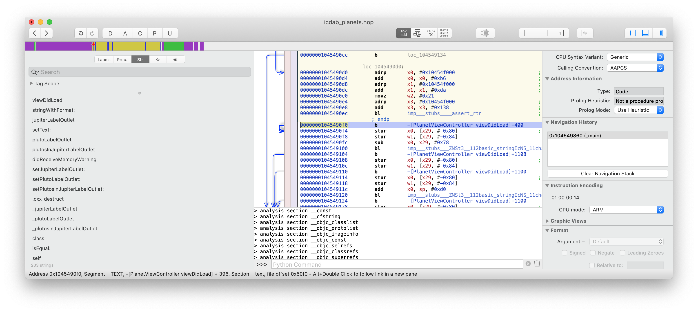

放大这一行，我们能看到

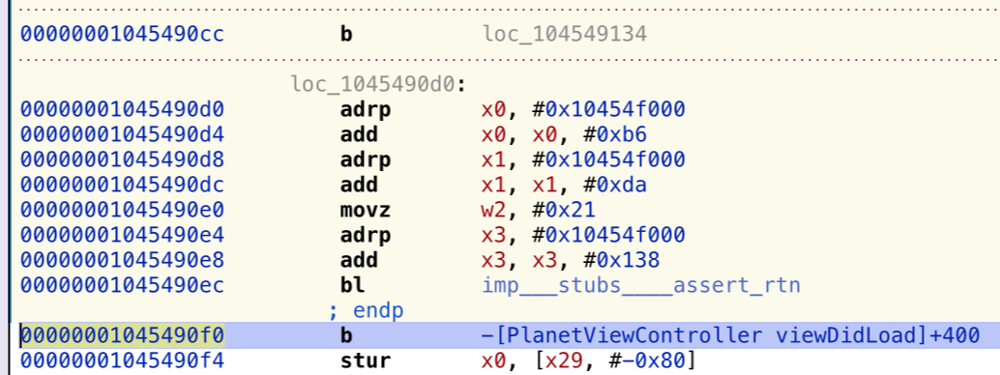

这确实显示了 assert 方法的返回地址。再往上看，我们看到判断了 Pluto 的体积不能为零。这只是 Hopper 非常基本的使用示例。接下来我们将使用 Hopper 演示其最有趣的功能——将汇编代码生成伪代码。这降低了理解崩溃的心理负担。如今，大多数开发人员很少查看汇编代码，所以就这个功能就值得我们为该软件付出代价。

现在至少对于当前的问题吗，我们可以编写一个错误报告，指明由于 Pluto 的体积为零，导致代码崩溃了。对框架的提供者来说，这就足以解决问题了。

在更复杂的情况下，想象我们使用了一个发生崩溃的图片转换库。图片可能有多种像素格式。使用 `assert` 可以让我们注意到某些特定的像素格式。因此，我们可以尝试其他的像素格式。

另一个例子是 security 库。安全代码通常会返回通用错误代码，而不是特定的故障代码，以便将来进行代码增强并避免泄漏内部细节（安全风险）。安全库中的 crash dump 程序可能会指出安全问题的类型，并帮助我们更早地更正传递到库中的某些数据结构。

## 系统诊断

崩溃报告仅仅是更大的系统诊断报告的一部分。

一般来说，作为应用程序的开发人员，我们并不需要再深入研究。但是，如果我们的问题可能是由一系列无法解释的事件或更加复杂的系统与硬件或 Apple 提供的系统服务的交互而引发的话，那么我们不仅需要查看崩溃报告，还需要研究系统诊断信息。

### 提取系统诊断信息

在我们复现崩溃环境时，我们可能需要安装移动设备管理配置文件（以打开某些调试子系统），或创建虚拟网络接口（用于网络嗅探）。苹果提供了一个涵盖每个场景的网页。(“Diagnostic Profiles and Logs” 2018)

在 iOS 设备上，基本的思路是我们安装一个配置文件，该配置文件会更改设备以产生更多日志记录，然后重现崩溃（或是让客户进行这样的操作）。然后，我们按设备上的特殊键序列（例如，音量按钮和侧面按钮）。 设备会短暂振动，表明它正在运行程序 `sysdiagnose`，该程序会提取许多日志文件。 这可能需要花费10分钟来处理，并生成一个大文件（压缩的tar文件）。

然后，与Mac共享本地sysdiagnosis文件。我们点开菜单 `Settings > Privacy > Analytics and Improvements > Analytics Data`。向下滚动以查找开头的文件 `sysdiagnose_YEAR.MONTH.DAY_*`。

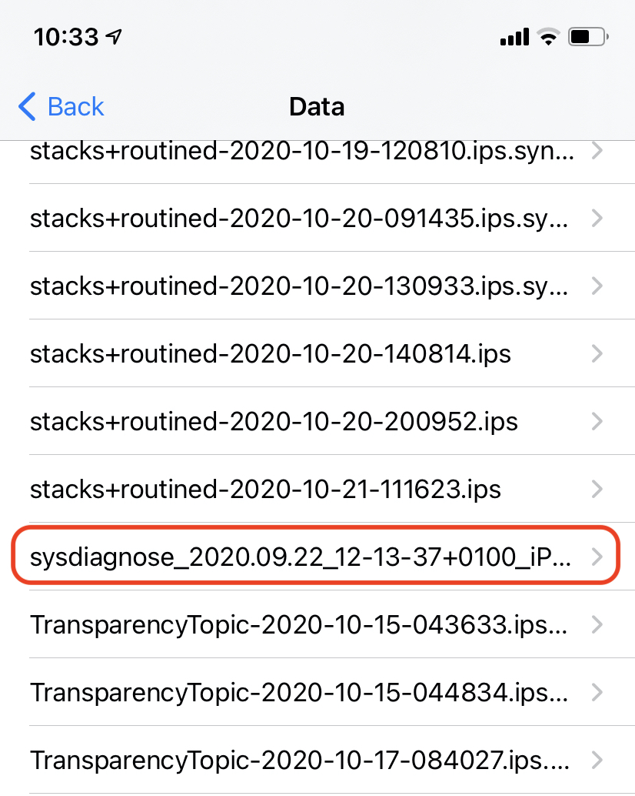An example sysdiagnose log file

这是一个 `sysdiagnose` 日志文件示例

选择此文件后，我们将得到一个空白屏幕，但这不是问题。 我们单击顶部工具栏中的 _Share_ 图标，然后选择适当的共享目标。

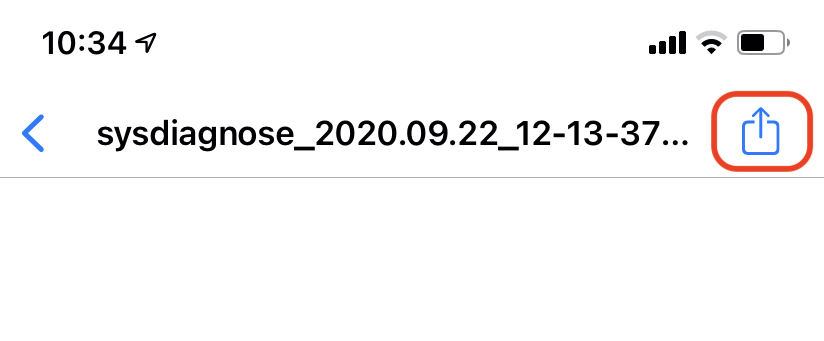Sharing the sysdiagnose log

在此存档文件中，有许多系统和子系统日志，因此我们可以随时查看崩溃发生的原因。

在 macOS 上也可以使用等效方法。

### 资源配置文件日志

除了`sysdiagnose` 日志，我们可以看到我们的设备还有很多其他文件。这些信息可以让我们了解系统的总体运行状况。

#### CPU 资源日志

`SUBSYSTEM.cpu_resource-YEAR.MONTH.DAY_*.ips.synced` 包含 _CPU Resource_ 配置文件日志。

这是一个来自 `apfs_defragd` 的例子，APFS 文件系统碎片整理程序。

```
{"share_with_app_devs":1,"app_version":"","bug_type":"202","times
tamp":"2020-10-19 23:49:02.00 +0100","os_version":"iPhone OS 14.2
 (18B5072f)","slice_uuid":"047D42ED-E41C-38AE-81BE-E4ABCF05A703",
"is_first_party":1,"build_version":"","incident_id":"05D98B49-C8B
1-4F18-B494-491D76B2AA3C","app_name":"apfs_defragd","name":"apfs_
defragd"}
Date/Time:        2020-10-19 23:46:29.268 +0100
End time:         2020-10-19 23:48:59.680 +0100
OS Version:       iPhone OS 14.2 (Build 18B5072f)
Architecture:     arm64e
Report Version:   32
Incident Identifier: 05D98B49-C8B1-4F18-B494-491D76B2AA3C
Share With Devs:  Yes

Data Source:      Microstackshots
Shared Cache:     D949F5BB-14F3-3223-9E0F-EB9B0E5D53E8 slid base
 address 0x191410000, slide 0x11410000

Command:          apfs_defragd
Path:            
 /System/Library/Filesystems/apfs.fs/apfs_defragd
Version:          ??? (???)
Parent:           UNKNOWN [1]
PID:              7877

Event:            cpu usage
Action taken:     none
CPU:              90 seconds cpu time over 150 seconds (60% cpu
 average), exceeding limit of 50% cpu over 180 seconds
CPU limit:        90s
Limit duration:   180s
CPU used:         90s
CPU duration:     150s
Duration:         150.41s
Duration Sampled: 119.32s
Steps:            23

Hardware model:   iPhone12,1
Active cpus:      6

Heaviest stack for the target process:
  18  ??? (libsystem_pthread.dylib + 14340) [0x1db258804]
  18  ??? (libdispatch.dylib + 89464) [0x19146ad78]
  18  ??? (libdispatch.dylib + 48220) [0x191460c5c]
  18  ??? (libdispatch.dylib + 45324) [0x19146010c]
  18  ??? (libdispatch.dylib + 15792) [0x191458db0]
  18  ??? (libdispatch.dylib + 8780) [0x19145724c]
  18  ??? (apfs_defragd + 18536) [0x104f30868]
  18  ??? (apfs_defragd + 177336) [0x104f574b8]
  18  ??? (apfs_defragd + 176680) [0x104f57228]
  18  ??? (apfs_defragd + 19380) [0x104f30bb4]
  16  ??? (apfs_defragd + 10128) [0x104f2e790]
  16  ??? (AppleFSCompression + 18424) [0x1c8e0a7f8]
  16  ??? (AppleFSCompression + 43828) [0x1c8e10b34]
  6   ??? (AppleFSCompression + 44780) [0x1c8e10eec]
  2   ??? (libz.1.dylib + 47196) [0x1dae8885c]


Powerstats for:   apfs_defragd [7877]
UUID:             047D42ED-E41C-38AE-81BE-E4ABCF05A703
Path:            
 /System/Library/Filesystems/apfs.fs/apfs_defragd
Architecture:     arm64e
Parent:           UNKNOWN [1]
UID:              0
Sudden Term:      Tracked (allows idle exit)
Footprint:        120.84 MB
Start time:       2020-10-19 23:47:00.334 +0100
End time:         2020-10-19 23:48:58.707 +0100
Num samples:      18 (78%)
Primary state:    10 samples Non-Frontmost App, Non-Suppressed,
 Kernel mode, Effective Thread QoS Background, Requested Thread
 QoS Background, Override Thread QoS Unspecified
User Activity:    18 samples Idle, 0 samples Active
Power Source:     0 samples on Battery, 18 samples on AC
  18  ??? (libsystem_pthread.dylib + 14340) [0x1db258804]
    18  ??? (libdispatch.dylib + 89464) [0x19146ad78]
.
.

  Binary Images:
           0x104f2c000 -                ???  apfs_defragd        
     <047D42ED-E41C-38AE-81BE-E4ABCF05A703>
 /System/Library/Filesystems/apfs.fs/apfs_defragd
.
.

Powerstats for:   PerfPowerServicesExtended
UUID:             AC943755-DBF7-306D-8D54-5F1FA7D45C1A
Path:             /usr/bin/PerfPowerServicesExtended
Architecture:     arm64e
Start time:       2020-10-19 23:47:41.119 +0100
End time:         2020-10-19 23:48:19.856 +0100
Num samples:      3 (13%)
Primary state:    2 samples Non-Frontmost App, Non-Suppressed,
 User mode, Effective Thread QoS Background, Requested Thread QoS
 Background, Override Thread QoS Unspecified
User Activity:    3 samples Idle, 0 samples Active
Power Source:     0 samples on Battery, 3 samples on AC
  3  ??? (libsystem_pthread.dylib + 14340) [0x1db258804]
    3  ??? (libdispatch.dylib + 89464) [0x19146ad78]
.
.

  Binary Images:
           0x104e78000 -                ???
 PerfPowerServicesExtended <AC943755-DBF7-306D-8D54-5F1FA7D45C1A>
  /usr/bin/PerfPowerServicesExtended
           0x191455000 -        0x191497fff  libdispatch.dylib   
      <187D8E52-371D-33F2-B0D4-C6D154917885>
 /usr/lib/system/libdispatch.dylib
.
.    .
```
#### 磁盘利用率日志

`SUBSYSTEM.diskwrites_resource-YEAR.MONTH.DAY_*.ips.synced` 包含 _Disk Utilization_ 配置文件日志。

这是一个来自 `assetd` 的例子，Asset 管理软件。

```
{"share_with_app_devs":1,"app_version":"","bug_type":"145","times
tamp":"2020-10-18 02:55:57.00 +0100","os_version":"iPhone OS 14.2
 (18B5072f)","slice_uuid":"6192DA47-C99E-33F4-8FC5-CF071E4EE26B",
"is_first_party":1,"build_version":"","incident_id":"BB4403D7-A0C
F-4C50-AEA6-EFF26FACF690","app_name":"assetsd","name":"assetsd"}
Date/Time:        2020-10-17 23:26:36.891 +0100
End time:         2020-10-18 02:55:56.835 +0100
OS Version:       iPhone OS 14.2 (Build 18B5072f)
Architecture:     arm64e
Report Version:   32
Incident Identifier: BB4403D7-A0CF-4C50-AEA6-EFF26FACF690
Share With Devs:  Yes

Data Source:      Microstackshots
Shared Cache:     D949F5BB-14F3-3223-9E0F-EB9B0E5D53E8 slid base
 address 0x191410000, slide 0x11410000

Command:          assetsd
Path:            
 /System/Library/Frameworks/AssetsLibrary.framework/Support/asset
sd
Version:          ??? (???)
Parent:           launchd [1]
PID:              124

Event:            disk writes
Action taken:     none
Writes:           1073.75 MB of file backed memory dirtied over
 12560 seconds (85.49 KB per second average), exceeding limit of
 12.43 KB per second over 86400 seconds
Writes limit:     1073.74 MB
Limit duration:   86400s
Writes caused:    1073.75 MB
Writes duration:  12560s
Duration:         12559.94s
Duration Sampled: 12460.16s
Steps:            81 ( (10.49 MB/step))

Hardware model:   iPhone12,1
Active cpus:      6


Heaviest stack for the target process:
  6  ??? (libsystem_pthread.dylib + 14340) [0x1db258804]
  6  ??? (libdispatch.dylib + 89464) [0x19146ad78]
  6  ??? (libdispatch.dylib + 48220) [0x191460c5c]
  6  ??? (libdispatch.dylib + 45324) [0x19146010c]
  6  ??? (libdispatch.dylib + 15792) [0x191458db0]
  6  ??? (libdispatch.dylib + 8780) [0x19145724c]
  6  ??? (AssetsLibraryServices + 240248) [0x1a3090a78]
  6  ??? (PhotoLibraryServices + 5982616) [0x1a2eda998]
  6  ??? (PhotoLibraryServices + 5903404) [0x1a2ec742c]
  5  ??? (libsqlite3.dylib + 272472) [0x1ab453858]
  5  ??? (libsqlite3.dylib + 335252) [0x1ab462d94]
  5  ??? (libsqlite3.dylib + 147268) [0x1ab434f44]
  5  ??? (libsqlite3.dylib + 365168) [0x1ab46a270]
  5  ??? (libsqlite3.dylib + 450844) [0x1ab47f11c]
  5  ??? (libsqlite3.dylib + 778840) [0x1ab4cf258]
  5  ??? (libsqlite3.dylib + 452760) [0x1ab47f898]
  5  ??? (libsystem_kernel.dylib + 172372) [0x1becf8154]


Powerstats for:   assetsd [124]
UUID:             6192DA47-C99E-33F4-8FC5-CF071E4EE26B
Path:            
 /System/Library/Frameworks/AssetsLibrary.framework/Support/asset
sd
Architecture:     arm64e
Parent:           launchd [1]
UID:              501
Sudden Term:      Tracked (allows idle exit)
Footprint:        19.98 MB
Start time:       2020-10-18 02:54:02.699 +0100
End time:         2020-10-18 02:55:24.063 +0100
Num samples:      6 (7%)
Primary state:    6 samples Non-Frontmost App, Non-Suppressed,
 Kernel mode, Effective Thread QoS Background, Requested Thread
 QoS Utility, Override Thread QoS Unspecified
User Activity:    6 samples Idle, 0 samples Active
Power Source:     0 samples on Battery, 6 samples on AC
  6  ??? (libsystem_pthread.dylib + 14340) [0x1db258804]
.
.

  Binary Images:
           0x104bf4000 -                ???  assetsd             
    <6192DA47-C99E-33F4-8FC5-CF071E4EE26B>
 /System/Library/Frameworks/AssetsLibrary.framework/Support/asset
sd
           0x191455000 -        0x191497fff  libdispatch.dylib   
    <187D8E52-371D-33F2-B0D4-C6D154917885>
 /usr/lib/system/libdispatch.dylib
.
.
```

#### Jetsam 报告

`Jetsam` 一词最初是一个航海术语，指船只将不想要的东西扔进海里，以减轻船的重量。在 iOS 中，`Jetsam` 是将当前应用从内存中弹出以满足当前最重要应用需求的系统。

与 macOS 相比，激进（积极）的内存管理是 iOS 的一个特点，macOS 对内存使用有非常宽松的限制。通俗来说，移动设备是内存受限的设备。然而，随着移动设备的功能越来越强大，特别是 iPad 设备，这种差异已经越来越小。现在，Apple Watch 被认为是内存受限的设备。然而，`Jetsam` 严格的内存管理系统为我们提供了良好的服务，在给定的 RAM 量下保证最佳的用户体验。

最好把 `Jetsam` 看作是正常的行为，从内存中弹出并不一定是我们应用程序设计的错误。我们本来可以在后台运行，当用户使用拍照功能进行大量的拍照和图像特效时，内存使用量会增加。

如果我们经常从内存中弹出，我们必须考虑我们是否在后台使用了过多的内存； 我们的目标应该是不超过 50MB或更小。我们还应该编写程序方法来保存上下文、销毁缓存和保存状态，以便从保存的状态恢复。然后我们应该 Hook 在这样的功能，当我们从系统得到一个内存警告消息时，如 `AppDelegate` 中的 `applicationDidReceiveMemoryWarning:` 的回调 ，执行该方法。

Apple 记录了 `Jetsam` 事件可能发生的各种原因，以及如何避免它们的内存管理技术。(“Identifying High-Memory Use with Jetsam Event Reports” 2020)

并没有实际的文档说明这种限制，但是通常应用程序比应用程序扩展拥有有更多的后台内存使用。应用程序扩展有各种类型的扩展，每一种都有自己的限制。例如，一个照片编辑 应用程序扩展会有很大的限制，因为它通常是一个重量级的图像处理程序。

在 Jetsam 报告中首先要查找的是 _reason_ 字段。

<table>
<thead>
<tr class="header">
<th>Jetsam Reason</th>
<th>Meaning</th>
</tr>
</thead>
<tbody>
<tr class="odd">
<td><code>per-process-limit</code></td>
<td>已达到常驻内存限制。 该限制因应用程序或扩展程序的类型而异。</td>
</tr>
<tr class="even">
<td><code>vm-pageshortage</code></td>
<td>内核希望提供干净的页面给另一个进程，但是已经用完了，因此杀死了我们的进程。</td>
</tr>
<tr class="odd">
<td><code>vnode-limit</code></td>
<td>内核已经用完了 vnode（UNIX文件的一种泛化），因此正在终止我们释放更多vnode的进程。</td>
</tr>
<tr class="even">
<td><code>highwater</code></td>
<td>进程使用过多的物理内存。</td>
</tr>
<tr class="odd">
<td><code>fc-thrashing</code></td>
<td>对内存映射文件的过多随机访问导致了文件缓存的碎片/抖动。</td>
</tr>
<tr class="even">
<td><code>jettisoned</code></td>
<td>Jetsam 的其他原因。</td>
</tr>
</tbody>
</table>

实际上，我们还没有见过 `fc-thrashing` 或 `jettisoned`的情况，但是它们仍然是可能的。

Jetsam 报告被命名 `JetsamEvent-YEAR.MONTH.DAY_*.ips.synced`.

下面是一个例子报告说明了 `highwater` 事件的 `wifianalyticsd`：
 
```
{"bug_type":"298","timestamp":"2020-10-15 17:29:58.79
 +0100","os_version":"iPhone OS 14.2
 (18B5061e)","incident_id":"B04A36B1-19EC-4895-B203-6AE21BE52B02"
}
{
  "crashReporterKey" :
 "d3e622273dd1296e8599964c99f70e07d25c8ddc",
  "kernel" : "Darwin Kernel Version 20.1.0: Mon Sep 21 00:09:01
 PDT 2020; root:xnu-7195.40.113.0.2~22\/RELEASE_ARM64_T8030",
  "product" : "iPhone12,1",
  "incident" : "B04A36B1-19EC-4895-B203-6AE21BE52B02",
  "date" : "2020-10-15 17:29:58.79 +0100",
  "build" : "iPhone OS 14.2 (18B5061e)",
  "timeDelta" : 7,
  "memoryStatus" : {
  "compressorSize" : 96635,
  "compressions" : 3009015,
  "decompressions" : 2533158,
  "zoneMapCap" : 1472872448,
  "largestZone" : "APFS_4K_OBJS",
  "largestZoneSize" : 41271296,
  "pageSize" : 16384,
  "uncompressed" : 257255,
  "zoneMapSize" : 193200128,
  "memoryPages" : {
    "active" : 45459,
    "throttled" : 0,
    "fileBacked" : 34023,
    "wired" : 49236,
    "anonymous" : 55900,
    "purgeable" : 12,
    "inactive" : 40671,
    "free" : 5142,
    "speculative" : 3793
  }
},
  "largestProcess" : "AppStore",
  "genCounter" : 1,
  "processes" : [
  {
    "uuid" : "7607487f-d2b1-3251-a2a6-562c8c4be18c",
    "states" : [
      "daemon",
      "idle"
    ],
    "age" : 3724485992920,
    "purgeable" : 0,
    "fds" : 25,
    "coalition" : 68,
    "rpages" : 229,
    "priority" : 0,
    "physicalPages" : {
      "internal" : [
        6,
        183
      ]
    },
    "pid" : 350,
    "cpuTime" : 0.066796999999999995,
    "name" : "SBRendererService",
    "lifetimeMax" : 976
  },
.
.
{
  "uuid" : "f71f1e2b-a7ca-332d-bf87-42193c153ef8",
  "states" : [
    "daemon",
    "idle"
  ],
  "lifetimeMax" : 385,
  "killDelta" : 13595,
  "age" : 94337735133,
  "purgeable" : 0,
  "fds" : 50,
  "genCount" : 0,
  "coalition" : 320,
  "rpages" : 382,
  "priority" : 1,
  "reason" : "highwater",
  "physicalPages" : {
    "internal" : [
      327,
      41
    ]
  },
  "pid" : 2527,
  "idleDelta" : 41601646,
  "name" : "wifianalyticsd",
  "cpuTime" : 0.634077
},
.
.
```

## 崩溃报告

在本章中，我们将详细介绍崩溃报告中的内容。

我们将主要关注 iOS 崩溃报告。我们还将介绍 macOS 的崩溃报告，虽然报告的结构略有不同，但都足以让我们获取信息。

虽然，目前部分 App 可以会通过安装使用第三方的崩溃处理程序，以增加获取崩溃报告和诊断的能力，或者是基于 Web 服务来管理大量用户设备的崩溃信息。但是在本章中，我们假设 App 没有安装这种三方库，因此我们使用 `Apple CrashReport` 工具来处理崩溃报告。

当 App 发生崩溃时，`ReportCrash`从操作系统的崩溃过程中提取相关信息，并生成拓展名为`.crash`的文本文件。

当符号信息可用时，Xcode 将符号化崩溃报告然后显示符号化以后的名称而不是机器地址。这就提高了报告的可阅读性，更容易理解。

App 已经制作了一份详细的文档来解释 `crash dump` 的全部结构。

### 系统诊断

崩溃报告只是更大的系统诊断报告中的一部分。

通常，作为 App 的开发人员我们并不需要有进一步的更多的了解。但是，如果我们的问题可能是由一系列无解释的事件，或者是与硬件或与 Apple 提供的系统服务之间更复杂的交互而引起的，这时候我们不仅仅需要查看崩溃报告，而需要研究系统诊断报告。

#### 提取系统诊断信息

当需要了解导致崩溃发生的环境时，我们可能需要安装手机设备管理配置文件（用于打开调试某些子系统），或创建虚拟网络接口（用于网络监测）。 Apple 提供了一个涵盖每个场景的 [网页](https://developer.apple.com/bug-reporting/profiles-and-logs/)。

在 iOS 上，基本思路是我们先安装一个配置文件，这个配置文件会让设备记录更多的日志，然后复现崩溃操作（或者让客户这么操作）。然后我们按下设备上的特殊按键组合（例如，同时按下音量按钮和侧按钮）。系统会短暂振动，表明它正在运行`sysdiagnose` 程序，这个程序会提取很多日志文件。然后我们用 iTunes 同步设备以检索生成的`sysdiagnose_date_name.tar.gz` 文件。打包文件中包含许多系统和子系统日志，我们可以看到崩溃发生的时间以及引起崩溃的上下文。

在 macOS 上我们也可以执行相同的操作。

### iOS 崩溃报告导览

在这里，我们将浏览 iOS 崩溃报告中的每个部分并解释相应的字段。

出于目的，我们将 tvOS 和 watchOS 视作 iOS 的子集，并具有相似的崩溃报告。

请注意，此处我们所指的“ iOS崩溃报告 ” 是用来表示来自物理设备的崩溃报告。
当发生崩溃时，我们通常是在模拟器上调试应用程序。在这种情况下，异常代码可能会有所不同，因为模拟器使用不同的方法来导致应用在调试器下停止。

#### iOS 崩溃报告 Header 部分

崩溃报告通常以以下样式的开头：

```c
Incident Identifier: E030D9E4-32B5-4C11-8B39-C12045CABE26
CrashReporter Key:   b544a32d592996e0efdd7f5eaafd1f4164a2e13c
Hardware Model:      iPad6,3
Process:             icdab_planets [2726]
Path:                /private/var/containers/Bundle/Application/
BEF249D9-1520-40F7-93F4-8B99D913A4AC/
icdab_planets.app/icdab_planets
Identifier:          www.perivalebluebell.icdab-planets
Version:             1 (1.0)
Code Type:           ARM-64 (Native)
Role:                Foreground
Parent Process:      launchd [1]
Coalition:           www.perivalebluebell.icdab-planets [1935]
```
这些类目由下表进行解释：

<table>
<thead>
<tr class="header">
<th>Entry</th>
<th>Meaning</th>
</tr>
</thead>
<tbody>
<tr class="odd">
<td>Incident Identifier</td>
<td>崩溃报告的唯一编号</td>
</tr>
<tr class="even">
<td>CrashReporter Key</td>
<td>崩溃设备的唯一标识符</td>
</tr>
<tr class="odd">
<td>Hardware Model</td>
<td>Apple 硬件模型（iPad，iPhone）</td>
</tr>
<tr class="even">
<td>Process</td>
<td>崩溃的进程名称（或编号）</td>
</tr>
<tr class="odd">
<td>Path</td>
<td>设备文件系统上崩溃程序的完整路径名</td>
</tr>
<tr class="even">
<td>Identifier</td>
<td>来自<code>Info.plist</code> 的 Bundle identifier</td>
</tr>
<tr class="odd">
<td>Version</td>
<td><code>CFBundleVersion</code>；括号中有 <code>CFBundleVersionString</code></td>
</tr>
<tr class="even">
<td>Code Type</td>
<td>崩溃进程的目标体系结构</td>
</tr>
<tr class="odd">
<td>Role</td>
<td>进程 <code>task_role</code>。如果我们在后台、前台或控制台应用程序中，都会显示一个指示器。主要影响进程的调度优先级。</td>
</tr>
<tr class="even">
<td>Parent Process</td>
<td>崩溃进程的父级。<code>launchd</code> 是一个进程启动程序，通常是父进程。</td>
</tr>
<tr class="odd">
<td>Coalition</td>
<td>任务分组合并，然后他们就可以可以把资源消耗集中起来。</td>
</tr>
</tbody>
</table>

> `CFBundleVersion`表示 bundle 构建迭代的版本号(发布与未发布) 而`CFBundleVersionString` 可能想说的是`CFBundleShortVersionString` 表示 bundle 发布版本号

首先要看的是版本。通常，如果我们是一个小团队或者是独立开发者，我们没有什么精力和资源去分析诊断旧版本的崩溃，所以首先我们要做的是让用户去更新最新版本。

如果我们有很多的崩溃，那么可能会出现一种现象。它可能来自于同一个用户（看到同一个 `CrashReporter Key`），也可能来自不同的用户（看到不同的 `CrashReporter Key`）。这可能影响我们对于崩溃的优先级判断。

`Hardware Model` 是一个值得关注的点。是只有 iPad设备，还是仅限iPhone设备，或者两者兼而有之?对于特定的设备，我们很少测试或者代码做了特殊处理，亦或者指向一个我们并没有测试过的老旧设备。

APP 是在前台还是在后台中崩溃也是一个值得关注的点，大多数应用程序通常都不会测试其在后台运行时会发生什么，这里说的是`Role`。例如，我们可能会接到一个电话，或者在应用之间进行切换。

现有的`Code Type` 通常是 `64-bit ARM` 的。但是我们可能看到原始的 `32-bit ARM`

#### iOS 崩溃报告 Date 和 Version 部分

接下来崩溃报告将提供日期和版本信息：

```
Date/Time:           2018-07-16 10:15:31.4746 +0100
Launch Time:         2018-07-16 10:15:31.3763 +0100
OS Version:          iPhone OS 11.3 (15E216)
Baseband Version:    n/a
Report Version:      104
```

这些类目由下表进行解释：

<table>
<colgroup>
<col style="width: 50%">
<col style="width: 50%">
</colgroup>
<thead>
<tr class="header">
<th>Entry</th>
<th>Meaning</th>
</tr>
</thead>
<tbody>
<tr class="odd">
<td>Date/Time</td>
<td>崩溃发生的时间</td>
</tr>
<tr class="even">
<td>Launch Time</td>
<td>崩溃前最初启动该进程的时间</td>
</tr>
<tr class="odd">
<td>OS Version</td>
<td>操作系统版本（内部版本号）。</td>
</tr>
<tr class="even">
<td>Baseband Version</td>
<td>蜂窝调制解调器固件版本号（用于电话呼叫）或 <code>n/a</code>（如果设备没有蜂窝调制解调器）（大多数 iPad，iPod Touch 等）</td>
</tr>
<tr class="odd">
<td>Report Version</td>
<td>生成报告的 ReportCrash 版本</td>
</tr>
</tbody>
</table>

首先要检查的是操作系统的版本。比我们测试的版本新还是旧？是 `beta` 版吗？

接下来要比较启动时间和崩溃发生时的时间差值。应用程序是立即崩溃还是经过很长时间后崩溃？启动崩溃有时可能是打包和部署问题。我们将利用一些技术来解决运行以后的崩溃问题。

日期是有有意义？有时，设备在某个时间会设置或转发，这可能会触发安全证书或许可证密钥的日期检查。确保日期看起来是真实的。

通常关注 `Baseband Version` 并没有什么用。基带的存在意味着应用会被通话打断（当然，无论如何也会有 VOIP 呼叫）。iPad 软件通常被认为是不打算接听电话的，但 iPad 也可以选择购买有蜂窝调制解调器的版本。

#### iOS崩溃报告异常部分

崩溃报告接下来将包含异常信息：

```
Exception Type:  EXC_CRASH (SIGABRT)
Exception Codes: 0x0000000000000000, 0x0000000000000000
Exception Note:  EXC_CORPSE_NOTIFY
Triggered by Thread:  0
```

或者它可能具有更详细的异常信息：

```
Exception Type:  EXC_CRASH (SIGKILL)
Exception Codes: 0x0000000000000000, 0x0000000000000000
Exception Note:  EXC_CORPSE_NOTIFY
Termination Reason: Namespace <0xF>, Code 0xdead10cc
Triggered by Thread:  0
```

这通常发生在，MachOS 内核在有问题的进程上引发了操作系统异常，从而终止了该进程。 然后，ReportCrash 程序从操作系统中检索此类异常的详细信息。

这些类目由下表进行解释：

<table>
<colgroup>
<col style="width: 50%">
<col style="width: 50%">
</colgroup>
<thead>
<tr class="header">
<th>Entry</th>
<th>Meaning</th>
</tr>
</thead>
<tbody>
<tr class="odd">
<td>Exception Type</td>
<td>Mach OS中的异常类型</td>
</tr>
<tr class="even">
<td>Exception Codes</td>
<td>异常类型的编码，例如尝试访问无效的地址以及支持信息。</td>
</tr>
<tr class="odd">
<td>Exception Note</td>
<td>如果进程被看门狗计时器杀死，会显示<code>SIMULATED（这不是崩溃）</code>，进程崩溃则显示 <code>EXC_CORPSE_NOTIFY</code></td>
</tr>
<tr class="even">
<td>Termination Reason</td>
<td>视情况而定，它给出一个命名空间（数字或子系统名称）和一个 <code>magic number</code>（通常是一个看起来像英语单词的十六进制数字）。 有关每个终止代码的详细信息，请参见下文。</td>
</tr>
<tr class="odd">
<td>Triggered by Thread</td>
<td>导致崩溃的进程中的线程</td>
</tr>
</tbody>
</table>

在本节中，最重要的项是异常类型。

<table>
<colgroup>
<col style="width: 50%">
<col style="width: 50%">
</colgroup>
<thead>
<tr class="header">
<th>Exception Type</th>
<th>Meaning</th>
</tr>
</thead>
<tbody>
<tr class="odd">
<td><code>EXC_CRASH (SIGABRT)</code></td>
<td>我们的程序触发了一个编程语言异常，例如失败的断言，这导致操作系统中止我们的应用程序</td>
</tr>
<tr class="even">
<td><code>EXC_CRASH (SIGQUIT)</code></td>
<td>一个进程从另一个正在管理它的进程接收到退出信号。通常，这意味着某个拓展程序花费了太长的时间或者消耗了太多的内存。App 的拓展程序仅能获得有限的内存。</td>
</tr>
<tr class="odd">
<td><code>EXC_CRASH (SIGKILL)</code></td>
<td>系统终止了我们的 App（或 App 的拓展程序），通常是因为已经达到了某种资源的限制。我们需要研究终止原因，以确定违反的某个政策是终止原因。</td>
</tr>
<tr class="even">
<td><code>EXC_BAD_ACCESS (SIGSEGV)</code> 或 <code>EXC_BAD_ACCESS (SIGBUS)</code></td>
<td>我们的程序很可能试图访问错误的或者是我们没有权限访问的内存地址。或由于内存压力，该内存已被释放</td>
</tr>
<tr class="odd">
<td><code>EXC_BREAKPOINT (SIGTRAP)</code></td>
<td>这可能是由于触发了一个<code>NSException</code>（可能是我们自己的库触发的）或者是调用了<code>_NSLockError</code> 或 <code>objc_exception_throw</code>方法。例如，这可能是因为 Swift 检测到异常，例如强制展开 nil 可选</td>
</tr>
<tr class="even">
<td><code>EXC_BAD_INSTRUCTION (SIGILL)</code></td>
<td>这是程序代码本身有问题，而不是因为错误的内存访问。 这在 iOS 设备上应该很少见； 可能是编译器或优化器错误，或者是错误的手写汇编代码。 但在模拟器上，是不一样的，因为使用未定义的操作码是 Swift 运行时用来停止访问僵尸对象（已分配对象）的一种技术。</td>
</tr>
<tr class="odd">
<td><code>EXC_GUARD</code></td>
<td>这个问题发生在程序去关闭一个受保护的文件。例如，关闭系统使用的 SQLite 库</td>
</tr>
</tbody>
</table>

当存在终止原因时，我们可以按如下方式查找代码：

<table>
<colgroup>
<col style="width: 50%">
<col style="width: 50%">
</colgroup>
<thead>
<tr class="header">
<th>Termination Code</th>
<th>Meaning</th>
</tr>
</thead>
<tbody>
<tr class="odd">
<td><code>0xdead10cc</code></td>
<td>我们在挂起之前持有文件锁或 sqlite 数据库锁。我们应该在挂起之前释放锁。</td>
</tr>
<tr class="even">
<td><code>0xbaaaaaad</code></td>
<td>通过侧面和两个音量按钮对整个系统进行了 <code>stackshot</code>。请参阅前面的系统诊断部分</td>
</tr>
<tr class="odd">
<td><code>0xbad22222</code></td>
<td>可能是 VOIP 应用被频繁唤起导致的崩溃。也可以注意一下我们的后台调用网络的代码。 如果我们的TCP连接被唤醒太多次（例如 300 秒内唤醒 15 次），就会导致此崩溃。</td>
</tr>
<tr class="even">
<td><code>0x8badf00d</code></td>
<td>我们的应用程序执行状态更改（启动、关闭、处理系统消息等）花费了太长时间。与看门口的时间策略发生冲突（超时）并导致终止。最常见的罪魁祸首是在主线程上进行同步的网络连接。</td>
</tr>
<tr class="odd">
<td><code>0xc00010ff</code></td>
<td>系统检测的设备发烫而终止了我们的 App。如果只在少量设备上（几个）发生，那就可能是由于硬件的问题，而不是我们 App 问题。但是如果发生在其他设备上，我们应该使用 Instruments 去检查我们 App 的耗电量问题。</td>
</tr>
<tr class="even">
<td><code>0x2bad45ec</code></td>
<td>发生安全冲突。 如果 <code>Termination Description</code> 显示为 <code>Process detected doing insecure drawing while in secure mode</code>，则意味着我们的应用尝试在不允许的情况下进行绘制，例如在锁定屏幕的情况下。</td>
</tr>
</tbody>
</table>

##### Magic Numbers 和他们的黑话(意思)

出于某种怪异的幽默，在讨论终止代码时，下面的 `Magic Number` 是表达这些意思

<table>
<thead>
<tr class="header">
<th>Magic Number</th>
<th>Spoken Phrase</th>
</tr>
</thead>
<tbody>
<tr class="odd">
<td><code>0xdead10cc</code></td>
<td>Deadlock</td>
</tr>
<tr class="even">
<td><code>0xbaaaaaad</code></td>
<td>Bad</td>
</tr>
<tr class="odd">
<td><code>0xbad22222</code></td>
<td>Bad too (two) many times</td>
</tr>
<tr class="even">
<td><code>0x8badf00d</code></td>
<td>Ate (eight) bad food</td>
</tr>
<tr class="odd">
<td><code>0xc00010ff</code></td>
<td>Cool Off</td>
</tr>
<tr class="even">
<td><code>0x2bad45ec</code></td>
<td>Too bad for security</td>
</tr>
</tbody>
</table>

##### 主动终止

当 `Exception Type` 为 `SIGABRT` 时，我们应该从崩溃堆栈中查找代码中存在哪些断言或异常。

##### 内存问题

当我们存在内存问题时， `Exception Type` 为 `EXC_BAD_ACCESS` 括号里是`SIGSEGV` 或者 `SIGBUS`，我们根据括号中的异常代码来判断是什么内存问题。对于这类问题，我们可以打开 Xcode 中关于特定 `target scheme` 的相关诊断程序。应该打开 `address sanitizer`，以查看是否可以发现错误。

> 选择 `Edit Scheme` 选择 `Run` 选择 `Address Sanitizer`

如果 Xcode 显示 App 正在使用大量内存，那么可能是我们所依赖的内存已被系统释放。为此，请打开 `Malloc Stack` 日志记录选项，选择 `All Allocation And Free History`。然后在 App 运行的某个时刻，可以单击 `MemGraph` 按钮，然后探索对象的分配历史记录。

有关更多详细信息，请阅读 内存诊断 章节。

##### 例外

当我们的异常类型为 `EXC_BREAKPOINT` 时，这可能会造成一定的困惑。该应用在没有 `debugger` 工具的情况下独自运行，那么断点从哪里来呢？通常，可能是因为我们运行了 `NSException`代码。这使的系统在过程中跟踪陷阱信号，并使任何可用的调试器都这个过程中以帮助调试。所以即使我们在 `debug`时断开断点，我们也会在这里停住，这样我们就可以找出存在运行时异常的原因。在正常的应用程序运行的情况下，没有 `debugger` 工具，系统只能崩溃应用程序。

##### 非法指示

当我们的异常类型为`EXC_BAD_INSTRUCTION`时，异常代码（接下来的字符）将是有问题的汇编代码。这种情况应改是罕见的。这值得我们去调整`Build Settings` 中代码的优先级别，因为更高级别的优化可能会导致在构建期间发出更多奇特的指令，从而增加了编译器错误的机会。或者说，问题可能出在代码中具有手动编译优化功能的底层库中，例如多媒体资源库。手写汇编指令可能是错误出现的原因。

##### 保护例外

有些操作系统会使用某些文件，因此它们会受到特殊保护。当关闭（或以其他方式修改）此类文件时，我们会得到一个 `EXC_GUARD` 类型的异常。

例如：

```
Exception Type:  EXC_GUARD
Exception Codes: 0x0000000100000000, 0x08fd4dbfade2dead
Crashed Thread:  5
```

异常代码 `0x08fd4dbfade2dead` 表达了修改与数据库相关的文件（在我们的示例中它已被关闭）。这个十六进制字符串可以类似 `黑话` 读作 `Ate (8) File Descriptor (fd) for (4) Database (db)`。

当出现这样的问题时，我们可以查看崩溃线程中的文件操作。 在我们的例子中：

```
Thread 5 name:  Dispatch queue: com.apple.root.default-priority
Thread 5 Crashed:
0   libsystem_kernel.dylib          0x3a287294 close + 8
1   ExternalAccessory               
0x32951be2 -[EASession dealloc] + 226
```

在这里执行了一个关闭操作。

当我们有与文件操作对应的描述代码时，我们应该特别检查一下我们的关闭操作代码。

我们可以从第一个异常代码推断文件操作。它是一个 64 位标志，指定如下：

<table>
<thead>
<tr class="header">
<th>Bit Range</th>
<th>Meaning</th>
</tr>
</thead>
<tbody>
<tr class="odd">
<td>63:61</td>
<td>Guard 类型，其中 0x2 表示文件描述符</td>
</tr>
<tr class="even">
<td>60:32</td>
<td>Flavor</td>
</tr>
<tr class="odd">
<td>31:00</td>
<td>File descriptor number</td>
</tr>
</tbody>
</table>

从观察中，我们认为 Guard 类型没有被使用。

Flavor 是另一个向量：

<table>
<thead>
<tr class="header">
<th>Flavor Bit</th>
<th>Meaning</th>
</tr>
</thead>
<tbody>
<tr class="odd">
<td>0</td>
<td>尝试调用<code>close()</code></td>
</tr>
<tr class="even">
<td>1</td>
<td><code>dup()</code> , <code>dup2()</code> 或者 <code>fcntl()</code></td>
</tr>
<tr class="odd">
<td>2</td>
<td>通过套接字尝试调用<code>sendmsg()</code></td>
</tr>
<tr class="even">
<td>4</td>
<td>尝试调用<code>write()</code></td>
</tr>
</tbody>
</table>

#### iOS 崩溃报告已过滤的 `syslog` 部分

崩溃报告接下来是 `syslog` 部分：

```
Filtered syslog:
None found
```

这是一个异常部分，因为他会去查看崩溃进程的进程 ID，然后查看该进程是否有任何 `syslog` （系统日志）部分。这个例子中我们并未在崩溃报告看到任何已过滤的信息，只看到 `None found` 。

#### iOS 崩溃报告中的异常回溯部分

当我们的应用程序检测到问题并要求操作系统终止该应用程序时，我们将获得报告的异常回溯部分。这涵盖了自己主动或通过 Swift，Objective-C 或 C 运行时支持库间接调用了`abort`，`NSException`，`_NSLockError`或`objc_exception_throw`的情况。

我们并没有办法得到实际发生断言的部分。但我们可以假定已经过滤的系统日志的前一个部分应该完成了这部分。虽然，通过 _Window-> Devices and Simulators-> Open Console_ 会允许我们恢复该信息。

当我们在客户的崩溃报告中看到异常回溯时，我们应该要求崩溃设备的控制台日志。

例如，我们将看到：

```c
default 13:36:58.000000 +0000   icdab_nsdata
     My data is <> - ok since we can handle a nil

default 13:36:58.000000 +0100   icdab_nsdata     
-[__NSCFConstantString _isDispatchData]:
unrecognized selector sent to instance 0x3f054

default 13:36:58.000000 +0100   icdab_nsdata
     *** Terminating app due to
uncaught exception 'NSInvalidArgumentException', reason:
'-[__NSCFConstantString _isDispatchData]:
 unrecognized selector sent to
instance 0x3f054'
    *** First throw call stack:
    (0x25aa391b 0x2523ee17 0x25aa92b5 0x25aa6ee1 0x259d2238
     0x2627e9a5 0x3d997
    0x2a093785 0x2a2bb2d1 0x2a2bf285 0x2a2d383d 0x2a2bc7b3
     0x27146c07
    0x27146ab9 0x27146db9 0x25a65dff 0x25a659ed 0x25a63d5b
     0x259b3229
     0x259b3015 0x2a08cc3d 0x2a087189 0x3d80d 0x2565b873)

default 13:36:58.000000 +0100   SpringBoard  Application
'UIKitApplication:www.perivalebluebell.icdab-nsdata[0x51b9]'
 crashed.

default 13:36:58.000000 +0100   UserEventAgent
     2769630555571:
 id=www.perivalebluebell.icdab-nsdata pid=386, state=0

default 13:36:58.000000 +0000   ReportCrash  Formulating
report for corpse[386] icdab_nsdata

default 13:36:58.000000 +0000   ReportCrash  Saved type
 '109(109_icdab_nsdata)'
 report (2 of max 25) at
 /var/mobile/Library/Logs/CrashReporter/
 icdab_nsdata-2018-07-27-133658.ips
```
有趣的是这一行：

```c
'-[__NSCFConstantString _isDispatchData]:
unrecognized selector sent to instance 0x3f054'
```

这意味着向 `NSString` 类发送了`_isDispatchData` 方法。不存在的方法。

在崩溃报告中看到匹配的异常回溯是：

```c
Last Exception Backtrace:
0   CoreFoundation                  
0x25aa3916 __exceptionPreprocess + 122
1   libobjc.A.dylib                 
0x2523ee12 objc_exception_throw + 33
2   CoreFoundation                  0x25aa92b0
-[NSObject+ 1045168 (NSObject) doesNotRecognizeSelector:] + 183
3   CoreFoundation                  
0x25aa6edc ___forwarding___ + 695
4   CoreFoundation                  
0x259d2234 _CF_forwarding_prep_0 + 19
5   Foundation                      0x2627e9a0
-[_NSPlaceholderData initWithData:] + 123
6   icdab_nsdata                    0x000f89ba
-[AppDelegate application:didFinishLaunchingWithOptions:]
 + 27066 (AppDelegate.m:26)
7   UIKit                           0x2a093780
-[UIApplication
 _handleDelegateCallbacksWithOptions:isSuspended:restoreState:]
 + 387
8   UIKit                           0x2a2bb2cc
-[UIApplication
 _callInitializationDelegatesForMainScene:transitionContext:]
 + 3075
9   UIKit                           0x2a2bf280
-[UIApplication
 _runWithMainScene:transitionContext:completion:] + 1583
10  UIKit                           0x2a2d3838
__84-[UIApplication
 _handleApplicationActivationWithScene:transitionContext:
completion:]_block_invoke3286 + 31
11  UIKit                           0x2a2bc7ae
-[UIApplication workspaceDidEndTransaction:] + 129
12  FrontBoardServices              0x27146c02
__FBSSERIALQUEUE_IS_CALLING_OUT_TO_A_BLOCK__ + 13
13  FrontBoardServices              0x27146ab4
-[FBSSerialQueue _performNext] + 219
14  FrontBoardServices              0x27146db4
-[FBSSerialQueue _performNextFromRunLoopSource] + 43
15  CoreFoundation                  0x25a65dfa
__CFRUNLOOP_IS_CALLING_OUT_TO_A_SOURCE0_PERFORM_FUNCTION__ + 9
16  CoreFoundation                  
0x25a659e8 __CFRunLoopDoSources0 + 447
17  CoreFoundation                  
0x25a63d56 __CFRunLoopRun + 789
18  CoreFoundation                  
0x259b3224 CFRunLoopRunSpecific + 515
19  CoreFoundation                  
0x259b3010 CFRunLoopRunInMode + 103
20  UIKit                           
0x2a08cc38 -[UIApplication _run] + 519
21  UIKit                           
0x2a087184 UIApplicationMain + 139
22  icdab_nsdata                    
0x000f8830 main + 26672 (main.m:14)
23  libdyld.dylib                   
0x2565b86e tlv_get_addr + 41
```

此回溯的格式与线程回溯的格式相同，稍后将进行介绍。

异常回溯部分的目的是提供比崩溃线程提供的更多的细节。

在上述情况下崩溃的线程有线程回溯：

```c
Thread 0 name:  Dispatch queue: com.apple.main-thread
Thread 0 Crashed:
0   libsystem_kernel.dylib          0x2572ec5c __pthread_kill
 + 8
1   libsystem_pthread.dylib         0x257d8732 pthread_kill +
 62
2   libsystem_c.dylib               0x256c30ac abort + 108
3   libc++abi.dylib                 0x2521aae4 __cxa_bad_cast
 + 0
4   libc++abi.dylib                 0x2523369e
default_terminate_handler+ 104094 () + 266
5   libobjc.A.dylib                 0x2523f0b0
_objc_terminate+ 28848 () + 192
6   libc++abi.dylib                 0x25230e16
std::__terminate(void (*)+ 93718 ()) + 78
7   libc++abi.dylib                 0x252308f8
__cxa_increment_exception_refcount + 0
8   libobjc.A.dylib                 
0x2523ef5e objc_exception_rethrow + 42
9   CoreFoundation                  
0x259b32ae CFRunLoopRunSpecific + 654
10  CoreFoundation                  
0x259b3014 CFRunLoopRunInMode + 108
11  UIKit                           
0x2a08cc3c -[UIApplication _run] + 524
12  UIKit                           
0x2a087188 UIApplicationMain + 144
13  icdab_nsdata                    
0x000f8834 main + 26676 (main.m:14)
14  libdyld.dylib                   
0x2565b872 start + 2
```

如果只有线程回溯，我们将知道存在强制转换问题 `__cxa_bad_cast` ，但仅此而已。

从网上搜到 `NSData`具有一个私有的辅助类 `_NSPlaceholderData`。

这个情况是在一个需要使用 `NSData` 的地方使用了 `NSString` 对象。

#### iOS 崩溃报告线程部分

崩溃报告接下来是线程回溯的部分（为便于演示而进行了格式化）

```c
Thread 0 name:  Dispatch queue: com.apple.main-thread
Thread 0 Crashed:
0   libsystem_kernel.dylib          0x0000000183a012ec
 __pthread_kill + 8
1   libsystem_pthread.dylib         0x0000000183ba2288
 pthread_kill$VARIANT$mp + 376
2   libsystem_c.dylib               0x000000018396fd0c
 abort + 140
3   libsystem_c.dylib               0x0000000183944000
 basename_r + 0
4   icdab_planets                   
0x0000000104e145bc
 -[PlanetViewController viewDidLoad] + 17852
  (PlanetViewController.mm:33)
5   UIKit                           0x000000018db56ee0
 -[UIViewController loadViewIfRequired] + 1020
6   UIKit                           0x000000018db56acc
 -[UIViewController view] + 28
7   UIKit                           0x000000018db47d60
 -[UIWindow addRootViewControllerViewIfPossible] + 136
8   UIKit                           0x000000018db46b94
 -[UIWindow _setHidden:forced:] + 272
9   UIKit                           0x000000018dbd46a8
-[UIWindow makeKeyAndVisible] + 48
10  UIKit                           0x000000018db4a2f0
 -[UIApplication
  _callInitializationDelegatesForMainScene:transitionContext:]
  + 3660
11  UIKit                           0x000000018db1765c
-[UIApplication
_runWithMainScene:transitionContext:completion:] + 1680
12  UIKit                           0x000000018e147a0c
__111-[__UICanvasLifecycleMonitor_Compatability
_scheduleFirstCommitForScene:transition:firstActivation:
completion:]_block_invoke + 784
13  UIKit                           0x000000018db16e4c
+[_UICanvas _enqueuePostSettingUpdateTransactionBlock:] + 160
14  UIKit                           0x000000018db16ce8
-[__UICanvasLifecycleMonitor_Compatability
_scheduleFirstCommitForScene:transition:
firstActivation:completion:] + 240
15  UIKit                           0x000000018db15b78
-[__UICanvasLifecycleMonitor_Compatability
activateEventsOnly:withContext:completion:] + 724
16  UIKit                           0x000000018e7ab72c
__82-[_UIApplicationCanvas
 _transitionLifecycleStateWithTransitionContext:
completion:]_block_invoke + 296
17  UIKit                           0x000000018db15268
-[_UIApplicationCanvas
 _transitionLifecycleStateWithTransitionContext:
completion:] + 432
18  UIKit                           0x000000018e5909b8
__125-[_UICanvasLifecycleSettingsDiffAction
performActionsForCanvas:
withUpdatedScene:settingsDiff:fromSettings:
transitionContext:]_block_invoke + 220
19  UIKit                           0x000000018e6deae8
_performActionsWithDelayForTransitionContext + 112
20  UIKit                           0x000000018db14c88
-[_UICanvasLifecycleSettingsDiffAction performActionsForCanvas:
withUpdatedScene:settingsDiff:fromSettings:
transitionContext:] + 248
21  UIKit                           0x000000018db14624
-[_UICanvas
scene:didUpdateWithDiff:transitionContext:completion:] + 368
22  UIKit                           0x000000018db1165c
-[UIApplication workspace:didCreateScene:withTransitionContext:
completion:] + 540
23  UIKit                           0x000000018db113ac
-[UIApplicationSceneClientAgent scene:didInitializeWithEvent:
completion:] + 364
24  FrontBoardServices              0x0000000186778470
-[FBSSceneImpl
_didCreateWithTransitionContext:completion:] + 364
25  FrontBoardServices              0x0000000186780d6c
__56-[FBSWorkspace client:handleCreateScene:withCompletion:]
_block_invoke_2 + 224
26  libdispatch.dylib               0x000000018386cae4
_dispatch_client_callout + 16
27  libdispatch.dylib               0x00000001838741f4
_dispatch_block_invoke_direct$VARIANT$mp + 224
28  FrontBoardServices              0x00000001867ac878
__FBSSERIALQUEUE_IS_CALLING_OUT_TO_A_BLOCK__ + 36
29  FrontBoardServices              0x00000001867ac51c
-[FBSSerialQueue _performNext] + 404
30  FrontBoardServices              0x00000001867acab8
-[FBSSerialQueue _performNextFromRunLoopSource] + 56
31  CoreFoundation                  0x0000000183f23404
__CFRUNLOOP_IS_CALLING_OUT_TO_A_SOURCE0_PERFORM_FUNCTION__ + 24
32  CoreFoundation                  0x0000000183f22c2c
__CFRunLoopDoSources0 + 276
33  CoreFoundation                  0x0000000183f2079c
 __CFRunLoopRun + 1204
34  CoreFoundation                  0x0000000183e40da8
CFRunLoopRunSpecific + 552
35  GraphicsServices                0x0000000185e23020
 GSEventRunModal + 100
36  UIKit                           0x000000018de2178c
 UIApplicationMain + 236
37  icdab_planets                   0x0000000104e14c94
 main + 19604 (main.m:14)
38  libdyld.dylib                   0x00000001838d1fc0
 start + 4

Thread 1:
0   libsystem_pthread.dylib         0x0000000183b9fb04
 start_wqthread + 0

Thread 2:
0   libsystem_kernel.dylib          0x0000000183a01d84
 __workq_kernreturn + 8
1   libsystem_pthread.dylib         0x0000000183b9feb4
 _pthread_wqthread + 928
2   libsystem_pthread.dylib         0x0000000183b9fb08
 start_wqthread + 4

Thread 3:
0   libsystem_pthread.dylib         0x0000000183b9fb04
start_wqthread + 0

Thread 4:
0   libsystem_kernel.dylib          0x0000000183a01d84
 __workq_kernreturn + 8
1   libsystem_pthread.dylib         0x0000000183b9feb4
 _pthread_wqthread + 928
2   libsystem_pthread.dylib         0x0000000183b9fb08
start_wqthread + 4

Thread 5:
0   libsystem_kernel.dylib          0x0000000183a01d84
 __workq_kernreturn + 8
1   libsystem_pthread.dylib         0x0000000183b9feb4
 _pthread_wqthread + 928
2   libsystem_pthread.dylib         0x0000000183b9fb08
 start_wqthread + 4

Thread 6 name:  com.apple.uikit.eventfetch-thread
Thread 6:
0   libsystem_kernel.dylib          0x00000001839dfe08
 mach_msg_trap + 8
1   libsystem_kernel.dylib          0x00000001839dfc80
 mach_msg + 72
2   CoreFoundation                  0x0000000183f22e40
__CFRunLoopServiceMachPort + 196
3   CoreFoundation                  0x0000000183f20908
 __CFRunLoopRun + 1568
4   CoreFoundation                  0x0000000183e40da8
CFRunLoopRunSpecific + 552
5   Foundation                      0x00000001848b5674
-[NSRunLoop+ 34420 (NSRunLoop) runMode:beforeDate:] + 304
6   Foundation                      0x00000001848b551c
-[NSRunLoop+ 34076 (NSRunLoop) runUntilDate:] + 148
7   UIKit                           0x000000018db067e4
-[UIEventFetcher threadMain] + 136
8   Foundation                      0x00000001849c5efc
__NSThread__start__ + 1040
9   libsystem_pthread.dylib         0x0000000183ba1220
 _pthread_body + 272
10  libsystem_pthread.dylib         0x0000000183ba1110
 _pthread_body + 0
11  libsystem_pthread.dylib         0x0000000183b9fb10
 thread_start + 4

Thread 7:
0   libsystem_pthread.dylib         0x0000000183b9fb04
 start_wqthread + 0
```

崩溃报告将明确告诉我们哪个线程崩溃了。

```c
Thread 0 Crashed:
```

线程有编号，并且如果线程有名称的话，也会展示名称：

```c
Thread 0 name:  Dispatch queue: com.apple.main-thread
```

我们应该将的大部分精力放在崩溃的线程上。 通常是线程 0。注意崩溃线程的名称。请注意，不能在主线程`com.apple.main-thread` 上执行诸如网络之类的长时间任务，因为该线程用于处理用户交互。

对 `__workq_kernreturn` 的引用仅表示正在等待工作的线程，因此除非有大量线程，否则可以将其忽略。

同样，对 `mach_msg_trap` 的引用仅指示线程正在等待消息进入。

当查看堆栈回溯时，首先出现堆栈帧 0，即堆栈的顶部，然后列出调用所有调用栈。 因此，最后一件事是在第 0 帧。

> 栈帧：每一次函数的调用,都会在调用栈（call stack）上维护一个独立的栈帧（stack frame）。

##### 堆栈回溯项

现在让我们关注每个线程的回溯项。 例如：

```c
20  UIKit                           0x000000018db14c88
-[_UICanvasLifecycleSettingsDiffAction
performActionsForCanvas:
withUpdatedScene:settingsDiff:fromSettings:
transitionContext:] + 248
```
<table>
<thead>
<tr class="header">
<th>Column</th>
<th>Meaning</th>
</tr>
</thead>
<tbody>
<tr class="odd">
<td>1</td>
<td>堆栈帧号，最近执行的是 0。</td>
</tr>
<tr class="even">
<td>2</td>
<td>二进制文件执行。</td>
</tr>
<tr class="odd">
<td>3</td>
<td>执行位置（第 0 帧）或返回位置（第 1 帧以后）</td>
</tr>
<tr class="even">
<td>4+</td>
<td>符号化函数名称或函数中具有偏移量的地址</td>
</tr>
</tbody>
</table>

帧数越多，就使我们在程序执行顺序方面的时间倒退。 堆栈的顶部或最近运行的代码位于第 0 帧。用有意义的函数名编写代码的原因之一是调用堆栈从概念上描述了正在发生的事情。 使用小型单一用途功能的方法是一种好习惯。 它满足了诊断和可维护性的需求。

堆栈回溯项的第二列是二进制文件。我们主要关注自己的二进制代码，因为 Apple 的框架代码通常非常可靠。错误通常直接出现在我们的代码中，或者是由于错误使用 Apple API 引起的错误引起的。仅仅因为在 Apple 提供的代码中崩溃并不意味着该错误在 Apple 代码中。

第三栏，执行位置，有些棘手。 如果是第 0 帧，则它是代码中正在运行的实际位置。 如果用于任何后续帧，则它是代码中一旦子功能返回后将恢复的位置。

第四列是运行代码的站点（对于第 0 帧），或者正在进行函数调用的站点（对于以后的帧）。 对于符号化的崩溃，我们将看到地址的符号形式。这将包括从函数开始到调用子函数的代码的位置偏移。 如果我们只有短函数，则此偏移量将是一个很小的值。这意味着执行诊断时所需的单步执行代码要少得多，或者要读取的汇编代码要少得多。 这是保持我们的职能简短的另一个原因。如果没有用符号表示崩溃，那么我们将只看到一个内存地址值。

因此，对于示例堆栈帧，我们有：

  * 堆栈帧 20
  * UIKit 二进制文件。
  * `0x000000018db14c88` 返回 0-19 帧后的地址。
  * 调用位置是从方法 `performActionsForCanvas` 开始的第248字节
  * 类是 `_UICanvasLifecycleSettingsDiffAction`

#### iOS 崩溃报告线程状态部分

iOS 崩溃报告将来自 ARM-64 二进制文件（最常见）或传统 ARM 32 位二进制文件。

在两种情况下，我们都会获得类似的描述 ARM 寄存器状态的信息。

需要注意的一件事是特殊的十六进制代码，`0xbaddc0dedeadbead` 这意味着一个非初始化的指针。

##### 32 位线程状态

```c
Thread 0 crashed with ARM Thread State (32-bit):
    r0: 0x00000000    r1: 0x00000000      r2: 0x00000000
          r3: 0x00000000
    r4: 0x00000006    r5: 0x3c42f000      r6: 0x3b66d304
          r7: 0x002054c8
    r8: 0x14d5f480    r9: 0x252348fd     r10: 0x90eecad7
         r11: 0x14d5f4a4
    ip: 0x00000148    sp: 0x002054bc      lr: 0x257d8733
          pc: 0x2572ec5c
  cpsr: 0x00000010
```

##### 64 位线程状态

```c
Thread 0 crashed with ARM Thread State (64-bit):
    x0: 0x0000000000000028   x1: 0x0000000000000029
       x2: 0x0000000000000008
       x3: 0x0000000183a4906c
    x4: 0x0000000104440260   x5: 0x0000000000000047
       x6: 0x000000000000000a
       x7: 0x0000000138819df0
    x8: 0x0000000000000000   x9: 0x0000000000000000
      x10: 0x0000000000000003
      x11: 0xbaddc0dedeadbead
   x12: 0x0000000000000012  x13: 0x0000000000000002
     x14: 0x0000000000000000
     x15: 0x0000010000000100
   x16: 0x0000000183b9b8cc  x17: 0x0000000000000100
     x18: 0x0000000000000000
     x19: 0x00000001b5c241c8
   x20: 0x00000001c0071b00  x21: 0x0000000000000018
     x22: 0x000000018e89b27a
     x23: 0x0000000000000000
   x24: 0x00000001c4033d60  x25: 0x0000000000000001
     x26: 0x0000000000000288
     x27: 0x00000000000000e0
   x28: 0x0000000000000010   fp: 0x000000016bde54b0
      lr: 0x000000010401ca04
    sp: 0x000000016bde53e0   pc: 0x000000010401c6c8
     cpsr: 0x80000000
```

#### iOS 崩溃报告的 Binary Images 部分

崩溃报告会有一部分列举了崩溃进程加载的所有 Binary
Images。这通常是一串很长的列表。它强调了一个事实，即我们的应用程序有许多支持框架。大多数框架是私有框架。iOS 开发工具包似乎包含了大量
API，但这只是冰山一角。

这是一个示例列表，为便于演示而进行了一定的编辑：

```c
Binary Images:

0x104018000 - 0x10401ffff icdab_as arm64
  <b82579f401603481990d1c1c9a42b773>
/var/containers/Bundle/Application/
1A05BC59-491C-4D0A-B4F6-8A98A804F74D/icdab_as.app/icdab_as

0x104030000 - 0x104037fff libswiftCoreFoundation.dylib arm64
  <81f66e04bab133feb3369b4162a68afc>
  /var/containers/Bundle/Application/
1A05BC59-491C-4D0A-B4F6-8A98A804F74D/icdab_as.app/
Frameworks/libswiftCoreFoundation.dylib


0x104044000 - 0x104057fff libswiftCoreGraphics.dylib arm64
  <f1f2287fb5153a28beea12ec2d547bf8>
  /var/containers/Bundle/Application/
1A05BC59-491C-4D0A-B4F6-8A98A804F74D/icdab_as.app/
Frameworks/libswiftCoreGraphics.dylib

0x104078000 - 0x10407ffff libswiftCoreImage.dylib arm64
  <9433fc53f72630dc8c53851703dd440b>
  /var/containers/Bundle/Application/
1A05BC59-491C-4D0A-B4F6-8A98A804F74D/icdab_as.app/
Frameworks/libswiftCoreImage.dylib

0x104094000 - 0x1040cffff dyld arm64
  <06dc98224ae03573bf72c78810c81a78> /usr/lib/dyld
```

第一部分是图像已加载到内存中的位置。这里 `icdab_as` 已被加载到 `0x104018000`-`0x10401ffff` 范围内。

第二部分是二进制文件的名称。这里的名字是 `icdab_as`。

第三部分是加载的二进制文件中的体系结构切片。我们通常希望在这里看到 `arm64`（ARM 64位）。

第四部分是二进制文件的UUID。这里 `icdab_as` 的UDID 是 `b82579f401603481990d1c1c9a42b773`。

如果我们的 DSYM 文件 UUID 与二进制文件不匹配，则符号化将失败。

以下是使用 `dwarfdump` 命令在 DSYM 和应用程序二进制文件中看到的相应 UUID 的示例：

```c
$ dwarfdump --uuid icdab_as.app/icdab_as
icdab_as.app.dSYM/Contents/Resources/DWARF/icdab_as

UUID: 25BCB4EC-21DE-3CE6-97A8-B759F31501B7
 (arm64) icdab_as.app/icdab_as

UUID: 25BCB4EC-21DE-3CE6-97A8-B759F31501B7
 (arm64)
icdab_as.app.dSYM/Contents/Resources/DWARF/icdab_as
```

第五部分是设备上显示的二进制文件的路径。

大多数二进制文件都有一个不言自明的名称。`dyld` 二进制文件是动态加载器。它位于所有堆栈回溯的底部，因为它负责在执行之前开始加载二进制文件。

动态加载器在准备二进制文件以执行时执行许多任务。如果我们的二进制引用了其他库，它将加载它们。如果没有，则无法加载我们的应用程序。这就是为什么即使在调用`main.m` 中的任何代码之前也可能发生崩溃的原因。稍后，我们将研究如何诊断这些问题。

### macOS 崩溃报告导览

尽管 macOS CrashReport 和 iOS CrashReport 是截然不同的程序，但 macOS 崩溃报告类似于 iOS 崩溃报告。为了避免重复，这里我们只强调与 iOS 的显着差异。

#### macOS 崩溃报告 Header 部分

崩溃报告以一下部分开头：

```c
Process:               SiriNCService [1045]
Path:                  /System/Library/CoreServices/Siri.app/
Contents/XPCServices/SiriNCService.xpc/
Contents/MacOS/SiriNCService
Identifier:            com.apple.SiriNCService
Version:               146.4.5.1 (146.4.5.1)
Build Info:            AssistantUIX-146004005001000~1
Code Type:             X86-64 (Native)
Parent Process:        ??? [1]
Responsible:           Siri [863]
User ID:               501
```

这里我们看到了熟悉的描述故障二进制信息。崩溃的进程是 SiriNCService，负责这个进程的是 Siri。在 Siri 和 SiriNCService 之间的跨进程通信时发生了崩溃（XPC）。

通常 iOS以一个用户身份运行用户体验的系统，然而 macOS系统却暴露出系统中存在多个用户 ID 的事实。

#### macOS 崩溃报告 Date 和 Version 部分

接下来我们来看版本信息：

```c
Date/Time:             2018-06-24 09:52:01.419 +0100
OS Version:            Mac OS X 10.13.5 (17F77)
Report Version:        12
Anonymous UUID:        00CC683B-425F-ABF0-515A-3ED73BACDDB5

Sleep/Wake UUID:       10AE8838-17A9-4405-B03D-B680DDC84436
```

`Anonymous UUID` 将是计算机的唯一标识。 `Sleep/Wake UUID` 用于匹配睡眠和唤醒事件。唤醒失败是系统崩溃的常见原因（与我们讨论的应用程序崩溃相反）。可以使用电源管理命令 `pmset` 获取更多信息。

#### macOS 持续时间部分

macOS 崩溃报告显示应用程序崩溃发生的时间。

```c
Time Awake Since Boot: 100000 seconds
Time Since Wake:       2000 seconds
```

我们使用它作为一个广泛的指示只因为看到的数字总是四舍五入所得到一个方便的数字。

#### macOS崩溃报告系统完整性部分

```c
System Integrity Protection: enabled
```

默认情况下，现代 macOS 运行是“rootless”的。这意味着即使我们以超级用户身份登录，我们也无法更改系统的二进制文件。这些都是通过固件进行保护的。可以在禁用系统完整性保护的情况下启动macOS。如果我们只是在禁用 SIP 的情况下崩溃，那么我们需要问为什么 SIP 会关闭以及对操作系统做了哪些更改。

#### macOS 崩溃报告的异常部分

接下来展示异常部分。

```c
Crashed Thread:        0  Dispatch queue: com.apple.main-thread

Exception Type:        EXC_BAD_ACCESS (SIGSEGV)
Exception Codes:       KERN_INVALID_ADDRESS at 0x0000000000000018
Exception Note:        EXC_CORPSE_NOTIFY

Termination Signal:    Segmentation fault: 11
Termination Reason:    Namespace SIGNAL, Code 0xb
Terminating Process:   exc handler [0]

VM Regions Near 0x18:
-->
    __TEXT                 0000000100238000-0000000100247000
     [   60K] r-x/rwx SM=COW  
     /System/Library/CoreServices/Siri.app/
     Contents/XPCServices/SiriNCService.xpc/Contents/MacOS/
     SiriNCService

Application Specific Information:
objc_msgSend() selector name: didUnlockScreen:
```

这与 iOS 类似。但是，我们应该注意，如果我们在模拟器上重现 iOS 崩溃，那么模拟器可能会以不同方式对相同的编程错误进行建模。我们可以在 x86 硬件上获得与 ARM 对应的异常。

考虑以下代码，设置为旧版的手动引用计数（MRC）而不是自动引用计数（ARC）。

```c
void use_sema() {
    dispatch_semaphore_t aSemaphore =
     dispatch_semaphore_create(1);
    dispatch_semaphore_wait(aSemaphore, DISPATCH_TIME_FOREVER);
    dispatch_release(aSemaphore);
}
```

代码会导致崩溃，因为在等待时会手动释放信号量。

当它在 ARM 硬件上的 iOS 模拟器上运行时，会发生崩溃

```c
Exception Type:  EXC_BREAKPOINT (SIGTRAP)
Exception Codes: 0x0000000000000001, 0x00000001814076b8
Termination Signal: Trace/BPT trap: 5
Termination Reason: Namespace SIGNAL, Code 0x5
Terminating Process: exc handler [0]
Triggered by Thread:  0

Application Specific Information:
BUG IN CLIENT OF LIBDISPATCH: Semaphore object deallocated while
 in use
 Abort Cause 1
```

当它在 iOS 模拟器上运行时，我们会附带调试器

```c    
Thread 1: EXC_BAD_INSTRUCTION (code=EXC_I386_INVOP, subcode=0x0)
```

模拟器使用错误的汇编指令来触发崩溃。

此外，如果我们编写一个运行相同代码的 macOS 应用程序，我们就会崩溃：

```c
Crashed Thread:        0  Dispatch queue: com.apple.main-thread

Exception Type:        EXC_BAD_INSTRUCTION (SIGILL)
Exception Codes:       0x0000000000000001, 0x0000000000000000
Exception Note:        EXC_CORPSE_NOTIFY

Termination Signal:    Illegal instruction: 4
Termination Reason:    Namespace SIGNAL, Code 0x4
Terminating Process:   exc handler [0]

Application Specific Information:
BUG IN CLIENT OF LIBDISPATCH:
Semaphore object deallocated while in use
```

这就带来一个信息，当通过模拟器或等效的 macOS 代码在 x8 6硬件上再现 iOS ARM 崩溃时，由于运行时环境有所不同，表现也会稍有不同。

幸运的是，在两个崩溃报告中都很明显的表明了信号量被释放了。

#### macOS 崩溃报告线程部分

接下来是线程部分。这部分类似于iOS。

接下来用示例说明 macOS 崩溃报告中的线程部分：

```c
Thread 0 Crashed:: Dispatch queue: com.apple.main-thread
0   libobjc.A.dylib                 
0x00007fff69feae9d objc_msgSend + 29
1   com.apple.CoreFoundation        0x00007fff42e19f2c
 __CFNOTIFICATIONCENTER_IS_CALLING_OUT_TO_AN_OBSERVER__ + 12
2   com.apple.CoreFoundation        0x00007fff42e19eaf
___CFXRegistrationPost_block_invoke + 63
3   com.apple.CoreFoundation        0x00007fff42e228cc
 __CFRUNLOOP_IS_CALLING_OUT_TO_A_BLOCK__ + 12
4   com.apple.CoreFoundation        0x00007fff42e052a3
__CFRunLoopDoBlocks + 275
5   com.apple.CoreFoundation        0x00007fff42e0492e
__CFRunLoopRun + 1278
6   com.apple.CoreFoundation        0x00007fff42e041a3
CFRunLoopRunSpecific + 483
7   com.apple.HIToolbox             0x00007fff420ead96
RunCurrentEventLoopInMode + 286
8   com.apple.HIToolbox             0x00007fff420eab06
ReceiveNextEventCommon + 613
9   com.apple.HIToolbox             0x00007fff420ea884
 _BlockUntilNextEventMatchingListInModeWithFilter + 64
10  com.apple.AppKit                0x00007fff4039ca73
_DPSNextEvent + 2085
11  com.apple.AppKit                0x00007fff40b32e34
-[NSApplication(NSEvent) _nextEventMatchingEventMask:
untilDate:inMode:dequeue:] + 3044
12  com.apple.ViewBridge            0x00007fff67859df0
-[NSViewServiceApplication nextEventMatchingMask:
untilDate:inMode:dequeue:] + 92
13  com.apple.AppKit                0x00007fff40391885
-[NSApplication run] + 764
14  com.apple.AppKit                0x00007fff40360a72
NSApplicationMain + 804
15  libxpc.dylib                    0x00007fff6af6cdc7
 _xpc_objc_main + 580
16  libxpc.dylib                    0x00007fff6af6ba1a
 xpc_main + 433
17  com.apple.ViewBridge            0x00007fff67859c15
-[NSXPCSharedListener resume] + 16
18  com.apple.ViewBridge            0x00007fff67857abe
 NSViewServiceApplicationMain + 2903
19  com.apple.SiriNCService         0x00000001002396e0
 main + 180
20  libdyld.dylib                   0x00007fff6ac12015
 start + 1
```

#### macOS 崩溃报告线程状态部分

macOS 崩溃报告显示了崩溃线程中 X86 寄存器的详细信息。

```c
Thread 0 crashed with X86 Thread State (64-bit):
  rax: 0x0000600000249bd0  rbx: 0x0000600000869ac0
    rcx: 0x00007fe798f55320
    rdx: 0x0000600000249bd0
  rdi: 0x00007fe798f55320  rsi: 0x00007fff642de919
    rbp: 0x00007ffeef9c6220
    rsp: 0x00007ffeef9c6218
   r8: 0x0000000000000000   r9: 0x21eb0d26c23ae422
     r10: 0x0000000000000000
     r11: 0x00007fff642de919
  r12: 0x00006080001e8700  r13: 0x0000600000869ac0
    r14: 0x0000600000448910
    r15: 0x0000600000222e60
  rip: 0x00007fff69feae9d  rfl: 0x0000000000010246
    cr2: 0x0000000000000018

Logical CPU:     2
Error Code:      0x00000004
Trap Number:     14
```

除与了 iOS 相似的信息之外，我们还获得了更多有关运行该线程的 CPU 的消息 。如果有需要我们可以在 Darwin XNU 源代码中查找对应的`trap number` 。

Darwin XNU 源代码的便捷镜像由 GitHub 来托管：https://github.com/apple/darwin-xnu

这些 `trap number` 可以被搜索到。我们从`osfmk/x86_64/idt_table.h` 可以找到 `Trap Number:14` 表明看了一个页面错误。这个错误代码是一个位向量，用于描述在 mach 上的错误代码。(“Making Sense of I/O Kit Error Codes” 2018)

#### macOS 崩溃报告 Binary Images 部分

接下来，是崩溃应用程序所加载的 Binary Images。

以下是崩溃报告中前几个二进制文件的示例，为了便于演示，进行了截断：

```c
Binary Images:
       0x100238000 -        0x1ß00246fff
         com.apple.SiriNCService (146.4.5.1 - 146.4.5.1)
          <5730AE18-4DF0-3D47-B4F7-EAA84456A9F7>
           /System/Library/CoreServices/Siri.app/Contents/
           XPCServices/SiriNCService.xpc/Contents/MacOS/
           SiriNCService

       0x101106000 -        0x10110affb
         com.apple.audio.AppleHDAHALPlugIn (281.52 - 281.52)
          <23C7DDE6-A44B-3BE4-B47C-EB3045B267D9>
           /System/Library/Extensions/AppleHDA.kext/Contents/
           PlugIns/AppleHDAHALPlugIn.bundle/Contents/MacOS/
           AppleHDAHALPlugIn
```

当二进制旁边出现 `+` 号时，则意味着它是操作系统的一部分。但是，我们看到某些第三方二进制旁边出现 `+` 号而系统二进制文件旁没有出现 `+` 号的示例，因为 `+` 并不是可靠的指示符（在 OS X 10.13.6上进行了最后测试）。

#### macOS 崩溃报告修改摘要

接下来，这一节描述了崩溃过程中的所有外部修改：

```c
External Modification Summary:
  Calls made by other processes targeting this process:
    task_for_pid: 184
    thread_create: 0
    thread_set_state: 0
  Calls made by this process:
    task_for_pid: 0
    thread_create: 0
    thread_set_state: 0
  Calls made by all processes on this machine:
    task_for_pid: 72970
    thread_create: 0
    thread_set_state: 0
```

macOS 是比 iOS 更开放的平台。这就允许在某些条件下运行过程中发生了修改。我们需要知道是否发生了这种事情，因为它可以使代码中的任何设计假设无效，由于可以在过程中修改寄存器，这就有可能导致项目崩溃。

通常我们可以看到如上的快照。值得注意的是，在所有情况下，`thread_set_state` 值均为 0。这意味着并没有任何进程直接连接到该进程来更改寄存器状态。这种操作对于托管运行时或调试器的实现是可接受的。在这些情况之外的操作会显得奇怪，需要进一步调查。

在下面的示例中，我们看到线程状态除了200个 `task_for_pid` 调用之外，还一次被外部进程更改了。

```c
External Modification Summary:
  Calls made by other processes targeting this process:
    task_for_pid: 201
    thread_create: 0
    thread_set_state: 1
  Calls made by this process:
    task_for_pid: 0
    thread_create: 0
    thread_set_state: 0
  Calls made by all processes on this machine:
    task_for_pid: 6184
    thread_create: 0
    thread_set_state: 1
```

这些数据通常会让我们对应用程序在崩溃之前运行的环境产生怀疑。

通常只有第一等的程序（Apple 提供的）才有权限执行上述修改。我们可以安装执行这个操作的软件。

执行访问进程修改的 API 有如下要求：

  * 需要禁用系统完整性保护
  * 进行修改的过程必须以 root 身份运行
  * 进行修改的程序必须经过代码签名
  * 程序必须被分配这些权利，将 `SecTaskAccess` 设置为 `allowed` 和 `debug`。
  * 用户必须同意在其安全设置中信任该程序

示例代码 `tfpexample` 演示了这一点。 (“IOS Crash Dump Analysis Book Github Resources” 2018)

#### macOS 崩溃报告虚拟内存部分

崩溃报告接下来是虚拟内存摘要和区域类型细分。如果我们有一个用来渲染文档页面的图形丰富的应用程序，则可以查看，例如 CoreUI 的内存消耗。尽当我们用 Xcode Instruments 中的 memory profiler 工具分析该应用程序时，虚拟内存统计信息才有意义，因为这样我们就可以了解应用程序中内存的动态使用情况，从来在错误发生时发现错误。

这是报告的虚拟内存部分的示例：

```c
VM Region Summary:
ReadOnly portion of Libraries: Total=544.2M resident=0K(0%)
swapped_out_or_unallocated=544.2M(100%)
Writable regions: Total=157.9M written=0K(0%) resident=0K(0%)
swapped_out=0K(0%) unallocated=157.9M(100%)

                                VIRTUAL   REGION
REGION TYPE                        SIZE    COUNT (non-coalesced)
===========                     =======  =======
Accelerate framework               128K        2
Activity Tracing                   256K        2
CoreAnimation                      700K       16
CoreGraphics                         8K        2
CoreImage                           20K        4
CoreServices                      11.9M        3
CoreUI image data                  764K        6
CoreUI image file                  364K        8
Foundation                          24K        3
IOKit                             7940K        2
Image IO                           144K        2
Kernel Alloc Once                    8K        2
MALLOC                           133.1M       36
MALLOC guard page                   48K       13
Memory Tag 242                      12K        2
Memory Tag 251                      16K        2
OpenGL GLSL                        256K        4
SQLite page cache                   64K        2
STACK GUARD                       56.0M        6
Stack                             10.0M        8
VM_ALLOCATE                        640K        8
__DATA                            58.3M      514
__FONT_DATA                          4K        2
__GLSLBUILTINS                    2588K        2
__LINKEDIT                       194.0M       26
__TEXT                           350.2M      516
__UNICODE                          560K        2
mapped file                       78.2M       29
shared memory                     2824K       11
===========                     =======  =======
TOTAL                            908.7M     1206
```

#### macOS崩溃报告系统配置文件部分

崩溃报告的下一部分是相关硬件的摘要：

```c
System Profile:
Network Service: Wi-Fi, AirPort, en1
Thunderbolt Bus: iMac, Apple Inc., 26.1
Boot Volume File System Type: apfs
Memory Module: BANK 0/DIMM0, 8 GB, DDR3, 1600 MHz, 0x802C,
 0x31364B544631473634485A2D314736453220
Memory Module: BANK 1/DIMM0, 8 GB, DDR3, 1600 MHz, 0x802C,
 0x31364B544631473634485A2D314736453220
USB Device: USB 3.0 Bus
USB Device: BRCM20702 Hub
USB Device: Bluetooth USB Host Controller
USB Device: FaceTime HD Camera (Built-in)
USB Device: iPod
USB Device: USB Keyboard
Serial ATA Device: APPLE SSD SM0512F, 500.28 GB
Model: iMac15,1, BootROM IM151.0217.B00, 4 processors,
 Intel Core i5, 3.5 GHz, 16 GB, SMC 2.22f16
Graphics: AMD Radeon R9 M290X, AMD Radeon R9 M290X, PCIe
AirPort: spairport_wireless_card_type_airport_extreme
 (0x14E4, 0x142), Broadcom BCM43xx 1.0 (7.77.37.31.1a9)
Bluetooth: Version 6.0.6f2, 3 services, 27 devices,
 1 incoming serial ports
```

有时，我们的应用程序与硬件设备进行紧密交互，如果通过基于标准的设备接口（例如 USB 接口）进行交互，则有可能会发生很多变化。考虑一下磁盘驱动。许多供应商提供磁盘驱动器，它们可能直接或独立运行。它们可以直接连接，或通过 USB 电缆连接，也可以通过 USB 集线器连接。

有时新的硬件，例如新型 MacBook Pro 会出现自己的硬件问题，因此可以看到与我们的应用程序无关的崩溃。

判断是否是硬件环境导致崩溃的关键是查看大量的崩溃报告以寻找某种规律。

作为应用程序开发人员，我们只会看到应用程序中的崩溃。但如果我们与提供崩溃的用户联系，我们可以询问是否有其他应用程序崩溃，或者是否存在任何系统稳定性问题。

另一个有趣的方面是，并非所有硬件都始终被系统主动使用。例如，当 MacBook Pro 连接到外部显示器时，将使用不同的图形RAM，并使用不同的图形卡（外部 GPU与内部GPU）。如果我们的应用程序执行特殊操作，则在连接到外部显示器时，故障可能出在硬件而非我们的代码中，原因是它触发了硬件中的潜在故障。

运行系统诊断程序并查看仅针对特定的匿名 UUID 故障报告是否出现问题，是尝试并了解应用程序是否存在特定的计算机硬件问题的方法。

## Apple Silicon

在本章中，我们着眼于 Apple Silicon Mac 上的崩溃，比如，因使用 Rosetta 翻译系统而引起的崩溃以及因在 macOS 上运行的未修改 iOS 应用程序而引起的崩溃。 此外，我们还将研究同时支持 ARM 和 Intel CPU的多体系结构代码可能导致的新型崩溃。

### 什么是 Apple Silicon Mac?

Apple Silicon表示该芯片的设计来自Apple，而不是第三方。 苹果公司的A系列芯片可以被认为是苹果芯片。 但是，本章重点是Apple Silicon Macs。 这些始于Apple M1芯片。 这些Mac之所以不被称为 _基于ARM的Mac_，可能是因为Apple在设计水平上做出了重大贡献，同时仍然符合ARM ABI。 当从基于 Intel 的 Mac 切换到 Apple Silicon Mac 时，这为客户带来了更优益的市场收益，例如更长的电池寿命和高性能。

### 什么是 Rosetta?

Rosetta 是 Apple Silicon Mac 上的指令翻译器。当应用程序将 Intel 指令作为二进制代码的一部分时，它可以将这些指令转换为 ARM 指令，然后运行它们。可以把它看作 AOT 编译器。(“About the Rosetta Translation Environment” 2020) 这项技术的起源可以追溯到更早的时期，当时 mac 正在从 PowerPC 芯片过渡到 Intel 芯片。苹果在 Transitive Technologies Ltd. 的技术帮助下研发出了 Rosetta 的第一个版本。(“Heroes of Software Engineering - the Men and Women at Transitive” 2020) (“The Brains Behind Apple’s Rosetta: Transitive” 2020) 在 Rosetta 的第二个版本中，我们的系统允许在每个进程的基础上，将 Intel 指令预先翻译成 ARM 指令，然后以原生速度运行。

#### Rosetta 的二进制文件

在 Apple Silicon Mac 上，Rosetta 软件驻留在

```
/Library/Apple/usr/libexec/oah
```

在这个目录下有运行时引擎 `runtime_t8027`、翻译器 `oahd-helper`、命令行工具 `translate_tool`和其他工具。它的操作对终端用户来说基本是透明的，除了启动延迟较小或性能稍低。从崩溃分析的角度来看，我们可以从内存占用量，异常帮助程序和运行时帮助程序的角度看到它的存在。

#### Rosetta 的局限性

Rosetta 是一个功能强大的系统，但有一些局限性。这些主要涉及高性能多媒体应用程序和操作系统虚拟化解决方案。

Rosetta 并不包括以下功能：

  * 内核扩展
  * `x86_64` 虚拟化支持说明
  * 矢量指令，例如 AVX，AVX2 和 AVX512

有趣的是，Rosetta 支持即时编译应用程序。这些应用程序非常特殊，因为它们自己生成代码，然后执行代码。大多数应用程序都只有固定的只读代码（程序文本），然后执行这些代码，它们的数据只是可变的（但不是可执行的）。这大概是因为JIT是JavaScript运行时的常用技术。

Apple 建议在调用使用这种功能的代码之前先检查可选的硬件功能。 我们可以通过运行 `sysctl hw | grep optional` 来确定平台上存在哪些可选硬件支持。在代码中，我们可以调用`sysctlbyname` 方法来实现同样的功能。

#### 强制执行 Rosetta

如果我们默认给自己的项目使用标准的构建选项，当在 `Debug` 时将`Build Active Architecture Only` 设置成为`Yes`，而对于`Release`构建则设置为`No`，然后再调试时，我们将只看到本机的二进制文件。 这是因为在 `Debug`时，我们不想浪费时间来构建与我们正在测试的机器无关的体系结构。

如果我们进行 `Archive` 构建，`Product > Archive`，然后选择 `Distribute App`我们最终获得了一个可供发布的版本。 在默认设置下，这将是 Fat Binary （我们将其称为胖二进制）文件，在多体系结构的二进制文件中提供 `x86` 和 `arm64`。

一旦我们有了一个 Fat Binary 文件，我们可以使用 `Finder` 应用程序，右键单击`File info`设置 Rosetta 来执行我们的二进制文件的翻译，这样在一个 Apple Silicon Mac 上，Intel 指令就会从 Fat Binary 中翻译出来。

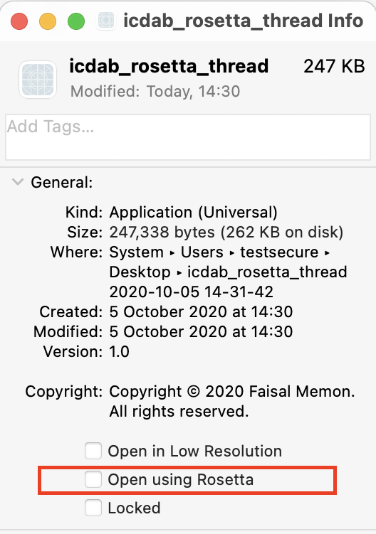

### 翻译后的应用程序示例

本章的工作示例是`icdab_thread`程序。 可以在网上找到。(“IOS Crash Dump Analysis Book Github Resources” 2018) 该程序尝试调用 `thread_set_state`，然后在 60 秒后调用`abort` 主动崩溃。实际上它并没有办法达到这个效果，因为最近 macOS 的安全增强，以防止使用这样的API，它是恶意软件的攻击载体。尽管如此，这个程序还是很有趣的，因为在崩溃时，一个紧密相关的部分`task_for_pid` 被多次调用了 。

我们已经将命令行可执行程序 `icdab_thread` 修改为仅调用相同基础代码的应用程序。这个应用程序就是 `icdab_rosetta_thread`。这是因为 UNIX 命令行可执行文件不适合运行转换后的程序，而应用程序可以。

#### `icdab_rosetta_thread` Lipo 信息

以下命令显示我们的应用程序同时支持 ARM 和 Intel 指令。

```
## lipo -archs
 icdab_rosetta_thread.app/Contents/MacOS/icdab_rosetta_thread
x86_64 arm64
```

### 翻译后的程序崩溃

如果我们运行 `icdab_rosetta_thread` 应用程序，点击 `Start Threads Test`，在一分钟后，应用程序发生崩溃。比较原生案例与已翻译案例之间的崩溃分析，我们可以从崩溃报告中的找到差异。

#### 代码类型

```
Code Type:             ARM-64 (Native)
```

当在本地运行时，变成了已翻译

```
Code Type:             X86-64 (Translated)
```

#### 线程转储

崩溃的线程（和其他线程）看起来很相似，只是指针在翻译后的情况下基于更高的指针。 对于原生的崩溃，我们有：

```c
Thread 1 Crashed:: Dispatch queue: com.apple.root.default-qos
0   libsystem_kernel.dylib              0x00000001de3015d8
 __pthread_kill + 8
1   libsystem_pthread.dylib             0x00000001de3accbc
 pthread_kill + 292
2   libsystem_c.dylib                   0x00000001de274904 abort
 + 104
3   perivalebluebell.com.icdab-rosetta-thread  
 0x00000001002cd478 start_threads + 244
4   perivalebluebell.com.icdab-rosetta-thread  
 0x00000001002cd858 thunk for @escaping @callee_guaranteed () ->
 () + 20
5   libdispatch.dylib                   0x00000001de139658
 _dispatch_call_block_and_release + 32
6   libdispatch.dylib                   0x00000001de13b150
 _dispatch_client_callout + 20
7   libdispatch.dylib                   0x00000001de13e090
 _dispatch_queue_override_invoke + 692
8   libdispatch.dylib                   0x00000001de14b774
 _dispatch_root_queue_drain + 356
9   libdispatch.dylib                   0x00000001de14bf6c
 _dispatch_worker_thread2 + 116
10  libsystem_pthread.dylib             0x00000001de3a9110
 _pthread_wqthread + 216
11  libsystem_pthread.dylib             0x00000001de3a7e80
 start_wqthread + 8
```

而对于翻译后的案例中崩溃，则有

```
Thread 1 Crashed:: Dispatch queue: com.apple.root.default-qos
0   ???                                 0x00007fff0144ff40 ???
1   libsystem_kernel.dylib              0x00007fff6bdc4812
 __pthread_kill + 10
2   libsystem_c.dylib                   0x00007fff6bd377f0 abort
 + 120
3   perivalebluebell.com.icdab-rosetta-thread  
 0x0000000100d1c5ab start_threads + 259
4   perivalebluebell.com.icdab-rosetta-thread  
 0x0000000100d1ca1e thunk for @escaping @callee_guaranteed () ->
 () + 14
5   libdispatch.dylib                   0x00007fff6bbf753d
 _dispatch_call_block_and_release + 12
6   libdispatch.dylib                   0x00007fff6bbf8727
 _dispatch_client_callout + 8
7   libdispatch.dylib                   0x00007fff6bbfad7c
 _dispatch_queue_override_invoke + 777
8   libdispatch.dylib                   0x00007fff6bc077a5
 _dispatch_root_queue_drain + 326
9   libdispatch.dylib                   0x00007fff6bc07f06
 _dispatch_worker_thread2 + 92
10  libsystem_pthread.dylib             0x00007fff6be8c4ac
 _pthread_wqthread + 244
11  libsystem_pthread.dylib             0x00007fff6be8b4c3
 start_wqthread + 15
```

注意，在翻译后的案例中，线程堆栈 0 中的实际代码行是 `???`。 大概这是 Rosetta 合成的实际翻译代码。

此外，在翻译后的案例中，我们还有另外两个线程，异常服务器和运行时环境：

```
Thread 3:: com.apple.rosetta.exceptionserver
0   runtime_t8027                       0x00007ffdfff76af8
 0x7ffdfff74000 + 11000
1   runtime_t8027                       0x00007ffdfff803cc
 0x7ffdfff74000 + 50124
2   runtime_t8027                       0x00007ffdfff82738
 0x7ffdfff74000 + 59192
Thread 4:
0   runtime_t8027                       0x00007ffdfffce8ac
 0x7ffdfff74000 + 370860
```

#### 崩溃的线程状态寄存器

在原生的例子中，我们得到了线程状态寄存器：

```c
Thread 1 crashed with ARM Thread State (64-bit):
    x0: 0x0000000000000000   x1: 0x0000000000000000   x2:
 0x0000000000000000   x3: 0x0000000000000000
    x4: 0x000000000000003c   x5: 0x0000000000000000   x6:
 0x0000000000000000   x7: 0x0000000000000000
    x8: 0x00000000000005b9   x9: 0xb91ed5337c66d7ee  x10:
 0x0000000000003ffe  x11: 0x0000000206c1fa22
   x12: 0x0000000206c1fa22  x13: 0x000000000000001e  x14:
 0x0000000000000881  x15: 0x000000008000001f
   x16: 0x0000000000000148  x17: 0x0000000200e28528  x18:
 0x0000000000000000  x19: 0x0000000000000006
   x20: 0x000000016fbbb000  x21: 0x0000000000001707  x22:
 0x000000016fbbb0e0  x23: 0x0000000000000114
   x24: 0x000000016fbbb0e0  x25: 0x000000020252d184  x26:
 0x00000000000005ff  x27: 0x000000020252d6c0
   x28: 0x0000000002ffffff   fp: 0x000000016fbbab70   lr:
 0x00000001de3accbc
    sp: 0x000000016fbbab50   pc: 0x00000001de3015d8 cpsr:
 0x40000000
   far: 0x0000000100ff8000  esr: 0x56000080
```

在翻译后的案例中，同样也有线程状态寄存器：

```c
Thread 1 crashed with X86 Thread State (64-bit):
  rax: 0x0000000000000000  rbx: 0x000000030600b000  rcx:
 0x0000000000000000  rdx: 0x0000000000000000
  rdi: 0x0000000000000000  rsi: 0x0000000000000003  rbp:
 0x0000000000000000  rsp: 0x000000000000003c
   r8: 0x000000030600ad40   r9: 0x0000000000000000  r10:
 0x000000030600b000  r11: 0x00007fff6bd37778
  r12: 0x0000000000003d03  r13: 0x0000000000000000  r14:
 0x0000000000000006  r15: 0x0000000000000016
  rip: <unavailable>  rfl: 0x0000000000000287
```

#### 翻译的代码信息

在翻译后的案例中，我们会获得更多信息，这可能对那些从事调试 Rosetta 的工程师有用：

```c
Translated Code Information:
  tmp0: 0xffffffffffffffff tmp1: 0x00007fff0144ff14 tmp2:
 0x00007fff6bdc4808
```

#### 外部修改摘要

在原生的例子中，我们看到：

```c
External Modification Summary:
  Calls made by other processes targeting this process:
    task_for_pid: 0
    thread_create: 0
    thread_set_state: 0
  Calls made by this process:
    task_for_pid: 0
    thread_create: 0
    thread_set_state: 0
  Calls made by all processes on this machine:
    task_for_pid: 914636
    thread_create: 0
    thread_set_state: 804
```

我们的代码曾尝试调用 `thread_set_state`，但未能（由于 macOS 限制，在任何平台配置下都不行）。

然后我们看一下翻译后的示例：

```c
External Modification Summary:
  Calls made by other processes targeting this process:
    task_for_pid: 1
    thread_create: 0
    thread_set_state: 0
  Calls made by this process:
    task_for_pid: 0
    thread_create: 0
    thread_set_state: 0
  Calls made by all processes on this machine:
    task_for_pid: 915091
    thread_create: 0
    thread_set_state: 804
```

我们看到几乎相同的统计信息，但是有趣的是，我们将`task_for_pid` 设置为 1。因此，翻译环境仅对翻译过程进行了最小的观察/修改。

#### 虚拟内存区域

该程序的翻译版本在 RAM 使用率上比原生版本高。

在原生的案例中，我们可以看到：

```c
                                VIRTUAL   REGION
REGION TYPE                        SIZE    COUNT (non-coalesced)
===========                     =======  =======
TOTAL                              1.7G     2053
TOTAL, minus reserved VM space     1.3G     2053
```

而翻译后的情况则是：

```c
REGION TYPE                        SIZE    COUNT (non-coalesced)
===========                     =======  =======
TOTAL                              5.4G     1512
TOTAL, minus reserved VM space     5.1G     1512
```

请注意，在翻译后的情况下，我们为 Rosetta 提供了其他虚拟内存区域：

```
Rosetta Arena                     2048K        1
Rosetta Generic                    864K       19
Rosetta IndirectBranch             512K        1
Rosetta JIT                      128.0M        1
Rosetta Return Stack               192K       12
Rosetta Thread Context             192K       12
```

### Rosetta 崩溃

Rosetta 是功能强大的翻译系统。 但是它不能翻译所有 X86-64指令。 例如，矢量指令无法翻译，遇到时会发生崩溃。 (“About the Rosetta Translation Environment” 2020)

在诊断特定问题之前，有必要先熟悉一下 Apple 的 Porting Guide，因为这可以帮助我们针对程序可能崩溃的原因提出合理的假设。(“Porting Your macOS Apps to Apple Silicon” 2020)

#### `icdab_avx` 矢量指令崩溃

当在使用翻译运行应用程序的 Apple Silicon Mac 上遇到英特尔 AVX 矢量指令 时，我们就会崩溃。我们用一个示例应用程序 `icdab_avx`来演示了这一点。

崩溃代码类型将为：

```
Code Type:             X86-64 (Translated)
```

崩溃类型将为`EXC_BAD_INSTRUCTION`，如下所示：

```c
Exception Type:        EXC_BAD_INSTRUCTION (SIGILL)
Exception Codes:       0x0000000000000001, 0x0000000000000000
Exception Note:        EXC_CORPSE_NOTIFY
Termination Signal:    Illegal instruction: 4
Termination Reason:    Namespace SIGNAL, Code 0x4
Terminating Process:   exc handler [26823]
```

在我们的情况下，崩溃时的线程状态为：

```c
Thread 0 crashed with X86 Thread State (64-bit):
  rax: 0x0000000000000001  rbx: 0x0000600001fcf5c0  rcx:
 0x00007f87d143f8c0  rdx: 0x00007f87d143f8c0
  rdi: 0x00000001047d6fa0  rsi: 0x00000001047d770a  rbp:
 0x000000030d132ab0  rsp: 0x000000030d132ab0
   r8: 0x0000000000000003   r9: 0x0000000104b0e000  r10:
 0x00000001047dc702  r11: 0x00000001047d57d0
  r12: 0x00006000012d5100  r13: 0x00007fff6a9d4000  r14:
 0x00007f87d143f8c0  r15: 0x00000001047d770a
  rip: 0x00000001047d56cb  rfl: 0x0000000000000206
```

应用程序二进制文件（程序文本）按如下方式加载：

```c
Binary Images:
       0x1047d4000 -        0x1047d7fff
 +perivalebluebell.com.icdab-avx (1.0 - 1)
 <3D9E0DED-2C66-30EE-AC6C-7C426246332E>
 /Users/USER/Desktop/*/icdab_avx.app/Contents/MacOS/icdab_avx
```

如果我们发现Apple Silicon Mac 以这种方式使我们的应用程序崩溃，如果我们有这样的怀疑，我们可以迅速搜索任何矢量指令 。

```c
## objdump -d icdab_avx.app/Contents/MacOS/icdab_avx | grep vmov |
 head
100004527: c5 fa 10 84 24 a4 00 00 00      vmovss    164(%rsp),
 %xmm0
100004530: c5 fa 10 8c 24 a0 00 00 00      vmovss    160(%rsp),
 %xmm1
10000453f: c5 fa 10 8c 24 a8 00 00 00      vmovss    168(%rsp),
 %xmm1
10000454e: c5 fa 10 8c 24 ac 00 00 00      vmovss    172(%rsp),
 %xmm1
10000455d: c5 fa 10 8c 24 b4 00 00 00      vmovss    180(%rsp),
 %xmm1
100004566: c5 fa 10 94 24 b0 00 00 00      vmovss    176(%rsp),
 %xmm2
100004575: c5 fa 10 94 24 b8 00 00 00      vmovss    184(%rsp),
 %xmm2
100004584: c5 fa 10 94 24 bc 00 00 00      vmovss    188(%rsp),
 %xmm2
100004593: c5 f8 29 8c 24 90 00 00 00      vmovaps    %xmm1,
 144(%rsp)
10000459c: c5 f8 29 84 24 80 00 00 00      vmovaps    %xmm0,
 128(%rsp)
```

但是，更确切地说，我们可以在崩溃时使用指令指针。 我们从崩溃的线程状态中看到，我们有：

```c
rip: 0x00000001047d56cb  rfl: 0x0000000000000206
```

我们从Binary Images中看到，该程序已加载到地址`0x1047d4000`。

使用我们在 _Symbolification_ 章节中探讨的技术，我们可以在 Hopper 中加载 icdab_avx 二进制文件，将二进制文件的基址更改为`0x1047d4000`，然后转到指令指针 `rip`和地址 `0x00000001047d56cb`。

然后，我们看到程序集转储：

```c
_compute_delta:
push       rbp          ; CODE
 XREF=_$s9icdab_avx14ViewControllerC31runVectorOperationsButtonAc
tionyySo12NSButtonCellCF+32
mov        rbp, rsp
and        rsp, 0xffffffffffffffe0
sub        rsp, 0x160
mov        dword [rsp+0x160+var_A4], 0x40000000
mov        dword [rsp+0x160+var_A8], 0x40800000
mov        dword [rsp+0x160+var_AC], 0x40c00000
mov        dword [rsp+0x160+var_B0], 0x41000000
mov        dword [rsp+0x160+var_B4], 0x41200000
mov        dword [rsp+0x160+var_B8], 0x41400000
mov        dword [rsp+0x160+var_BC], 0x41600000
mov        dword [rsp+0x160+var_C0], 0x41800000
vmovss     xmm0, dword [rsp+0x160+var_BC]
vmovss     xmm1, dword [rsp+0x160+var_C0]
```

因此，虽然我们没有找到失败的确切指令，但是找到了出现错误的函数 `compute_delta`，它位于`runVectorOperationsButtonAction`方法中，它看起来已经被内联到这个版本二进制文件中。尽管如此，我们已经获得了足够的帮助，能够在相关区域中探索二进制文件并确定确认进行了向量操作`vmovss`。 Rosetta不支持此功能。

导致该问题的原始代码为：

```c
void
compute_delta() {
    /* Initialize the two argument vectors */
    __m256 evens = _mm256_set_ps(2.0, 4.0, 6.0, 8.0, 10.0, 12.0,
 14.0, 16.0);
    __m256 odds = _mm256_set_ps(1.0, 3.0, 5.0, 7.0, 9.0, 11.0,
 13.0, 15.0);
    /* Compute the difference between the two vectors */
    __m256 result = _mm256_sub_ps(evens, odds);
    /* Display the elements of the result vector */
    float* f = (float*)&result;
    printf("%f %f %f %f %f %f %f %f\n",
           f[0], f[1], f[2], f[3], f[4], f[5], f[6], f[7]);
    return;
}
```

为了避免此问题，我们应该使用一个有用的方法来检测当前环境是否支持 AVX，如下所示：

```c
bool
avx_v1_supported() {
    int ret = 0;
    size_t size = sizeof(ret);
    if (sysctlbyname("hw.optional.avx1_0", &ret, &size, NULL, 0)
 == -1)
    {
       if (errno == ENOENT)
          return false;
       return false;
    }
    bool supported = (ret != 0);
    return supported;
}
```

如果支持 AVX 版本1（并且在检索信息时没有错误），此函数返回 `true`。

### 在 Mac 上运行 iOS

由于 Apple Silicon Mac 和 iOS 设备共享相同的 ARM CPU 体系结构，因此Apple提供了_附加功能_。 未经修改的 iOS 应用程序可能会在基于 ARM 的 macOS 上运行。 为此，基于 ARM 的 macOS 拥有了一些特殊的 iOS 支持库。

我们可以这样想，macOS （_主语_）是提供支持库和框架的 ，提供 iOS（ _宾语_ ）应用程序期望的 UIKit。

当此类应用程序崩溃时，我们会获得崩溃报告，该报告是 macOS 崩溃报告，但大多数细节都涉及 iOS 库。

#### `icdab_wrap` iOS 应用程序在 macOS 上崩溃

如果我们在 Apple Silicon Mac 上运行 iOS 应用 `icdab_wrap` ，它可以正常加载，是因为 macOS 提供了 `UIKit` 框架，而 `icdab_wrap` 也假定该框架已存在。该应用程序是为了来演示一个问题，解包 Nil 可选项。

崩溃时，我们可以看到：

```c
Code Type:             ARM-64 (Native)
Parent Process:        ??? [1]
Responsible:           icdab_wrap [2802]
User ID:               501
```

这表明应用程序正在运行原生代码，而不是翻译过的代码。

```c
Date/Time:             2020-11-14 11:58:17.668 +0000
OS Version:            Mac OS X 10.16 (20A5343i)
Report Version:        12
Anonymous UUID:        0118DF8D-2876-0263-8668-41B1482DDC38
```

这表明我们很明显的是在 Mac 上运行。

```c
System Integrity Protection: enabled

Crashed Thread:        0  Dispatch queue: com.apple.main-thread

Exception Type:        EXC_BREAKPOINT (SIGTRAP)
Exception Codes:       EXC_ARM_BREAKPOINT at 0x00000001c6c8f1f0
 (brk 1)
Exception Note:        EXC_CORPSE_NOTIFY

Termination Signal:    Trace/BPT trap: 5
Termination Reason:    Namespace SIGNAL, Code 0x5
Terminating Process:   exc handler [2802]

Application Specific Information:
dyld3 mode
Fatal error: Unexpectedly found nil while implicitly unwrapping
 an Optional value: file icdab_wrap/PlanetViewController.swift,
 line 45
```

这说明程序崩溃时正在解包 Nil 可选项。

```c
Thread 0 Crashed:: Dispatch queue: com.apple.main-thread
0   libswiftCore.dylib                  0x00000001c6c8f1f0
 closure #1 in closure #1 in closure #1 in
 _assertionFailure(_:_:file:line:flags:) + 404
1   libswiftCore.dylib                  0x00000001c6c8f1f0
 closure #1 in closure #1 in closure #1 in
 _assertionFailure(_:_:file:line:flags:) + 404
2   libswiftCore.dylib                  0x00000001c6c8e660
 _assertionFailure(_:_:file:line:flags:) + 488
3   www.perivalebluebell.icdab-wrap     0x0000000104937da4
 PlanetViewController.imageDownloaded(_:) + 196
 (PlanetViewController.swift:45)
.
.
.

16  com.apple.AppKit                    0x0000000189740824
 _DPSNextEvent + 880
17  com.apple.AppKit                    0x000000018973f1fc
 -[NSApplication(NSEvent)
 _nextEventMatchingEventMask:untilDate:inMode:dequeue:] + 1300
18  com.apple.AppKit                    0x00000001897313c4
 -[NSApplication run] + 600
19  com.apple.AppKit                    0x0000000189703550
 NSApplicationMain + 1064
20  com.apple.AppKit                    0x00000001899e92f8
 _NSApplicationMainWithInfoDictionary + 24
21  com.apple.UIKitMacHelper            0x00000001bd9a6038
 UINSApplicationMain + 476
22  com.apple.UIKitCore                 0x00000001d333d1b0
 UIApplicationMain + 2108
23  www.perivalebluebell.icdab-wrap     0x0000000104933a38 main +
 88 (AppDelegate.swift:12)
24  libdyld.dylib                       0x00000001c758ca50 start
 + 4
```

这表明当程序被加载时 `libdyld.dylib`，它所期望的 UIKit `UIKitCore` 是通过 `UIKitMacHelper` 支持层实现的。

```c
Binary Images:
       0x10492c000 -        0x10493bfff
 +www.perivalebluebell.icdab-wrap (1.0 - 1)
 <E9A2E2CC-E879-37B0-820C-F336DF2AACDA>
 /Users/USER/Library/Developer/Xcode/DerivedData/icdab-gbtgrhpqeh
gqogaglrpuvzajteku/Build/Products/Debug-iphoneos/icdab_wrap.app/i
cdab_wrap
       0x104a1c000 -        0x104a27fff 
 libobjc-trampolines.dylib (817)
 <4A2C66DE-9358-3AE9-A69F-36687DB19CE3>
 /usr/lib/libobjc-trampolines.dylib
       0x104b34000 -        0x104baffff  dyld (828)
 <7A9F335B-50E3-3018-A9CC-26E57B61D907> /usr/lib/dyld
.
.
       0x189700000 -        0x18a400fff  com.apple.AppKit (6.9 -
 2004.102) <96941AAC-01D7-36E7-9253-2C1187864719>
 /System/Library/Frameworks/AppKit.framework/Versions/C/AppKit
.
.
       0x1bd77f000 -        0x1bd9a1fff  com.apple.UIFoundation
 (1.0 - 714) <D3335C2E-2366-30AD-A5F3-6058164D69EE>
 /System/Library/PrivateFrameworks/UIFoundation.framework/Version
s/A/UIFoundation
       0x1bd9a2000 -        0x1bda37fff  com.apple.UIKitMacHelper
 (1.0 - 3979.1.400) <F2F6D8F7-8178-3113-856E-F99614A4F13E>
 /System/Library/PrivateFrameworks/UIKitMacHelper.framework/Versi
ons/A/UIKitMacHelper
       0x1bda38000 -        0x1bda4bfff  com.apple.UIKitServices
 (1.0 - 1) <D8C4D101-A04C-37E6-87A3-6AD9ADFEC787>
 /System/Library/PrivateFrameworks/UIKitServices.framework/Versio
ns/A/UIKitServices
.
.
       0x1c9b1b000 -        0x1c9b1bfff 
 com.apple.MobileCoreServices (1112.0.10 - 1112.0.10)
 <992DAEC7-6964-3686-A910-4365B353D925>
 /System/iOSSupport/System/Library/Frameworks/MobileCoreServices.
framework/Versions/A/MobileCoreServices
.
.
       0x1d333a000 -        0x1d462ffff  com.apple.UIKitCore (1.0
 - 3979.1.400) <023078DD-44DA-3A11-82CA-12F8412661A2>
 /System/iOSSupport/System/Library/PrivateFrameworks/UIKitCore.fr
amework/Versions/A/UIKitCore
.
.
       0x1d72fa000 -        0x1d7337fff  libswiftUIKit.dylib (15)
 <68377BCA-6493-3E34-920E-0765BD07F2A7>
 /System/iOSSupport/usr/lib/swift/libswiftUIKit.dylib
```

在大多数情况下，这些崩溃可以像在 iOS 上崩溃一样直接进行分析。问题很有可能是由于不同的物理环境导致的。例如，iOS 设备具有陀螺仪，而 macOS 设备则没有。

#### 在 Mac 上支持 iOS 应用程序

Apple 提供了在 Mac 上部署 iOS 应用程序的最佳实践指南。(“Running Your iOS Apps on macOS” 2020) 你可以进行如下操作：

  1. 如果确定自己的 iOS 应用程序不适合 macOS。在 App Store Connect 中可以取消配置。
  2. 允许在 iOS 上安装的应用程序安装在 macOS 上，但是添加检查可用的可选硬件功能。
  3. 增强该应用程序，使 Mac 用户更易于使用替代功能。 例如，添加iOS键盘支持。
  4. 添加代码以检测 _iOS-on-Mac_ 的场景。
  5. 通过 Mac Catalyst 技术连接到Mac。这意味着首先得拥有一个出色的iPadOS应用。
  6. 编写纯原生 macOS 应用程序。

例如，在应用程序 `icdab_gyro` 我们将展示如何检测 _iOS-on-Mac_ 的场景：

```c
let info = ProcessInfo()
if #available(iOS 14.0, *) {
    if info.isiOSAppOnMac {
        print("We are an iOS app running on a Mac")
    }
}
```

此外，当使用陀螺仪时

```
var motion = CMMotionManager()
```

并仅在可用时使用陀螺仪：

```
if motion.isGyroAvailable {
          self.motion.gyroUpdateInterval = 1.0 / 60.0
          self.motion.startGyroUpdates()
.
.
```

## Pointer Authentication（指针验证机制）

在本章中，我们将研究指针验证机制以及相关的崩溃。

使用 Apple A12 芯片或更高版本的设备将称为 _Pointer Authentication_ 的安全功能作为 ARMv8.3-A 体系结构的一部分。例如， iPhone XS，iPhone XS Max, 和 iPhone XR 使用 A12芯片。其基本思想是在 64 位指针中存在未使用的位，因为它已经可以寻址相当广泛的地址，因此只有 40 位被分配给这样的目的。 (“Examining Pointer Authentication on the iPhone Xs” 2019) 因此，剩余的位可用于存储在将预期的指针地址与上下文值和密钥组合后计算出的哈希值。然后，如果由于错误或恶意操作而要更改指针地址，则该指针将被认为是无效的，并且如果将其用于更改程序的控制流，则最终将导致 SIGSEGV。

实际上，在许多情况下都使用了指针验证机制，例如确保 C++ 虚拟调度表未被篡改。但是，我们只看一个错误操作跳转地址的简单情况。因此，我们只看一个错误操作跳转地址的简单情况。

### 配置指针验证机制

在使用 A12 或更高版本的设备，Apple 在设备内核中启用了指针验证机制。对于用户空间代码，指针身份验证是一项可选功能。可以在项目的_构建设置_中来启用它，如图为 `icdab_ptr` 示例 _Enable Pointer Authentication_（启用指针验证机制）。 (“IOS Crash Dump Analysis Book Github Resources” 2018) 我们将架构 `arm64e` 添加到架构设置中。

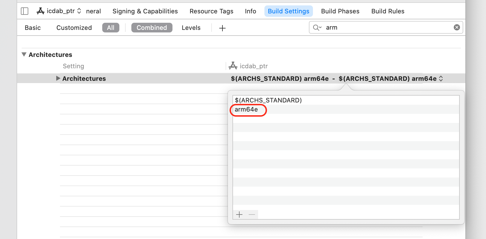Enable Pointer Authentication

如果我们正在编写对安全性敏感的软件，那么值得尽早的采用此功能。

### 操纵指针

让我们考虑下面的程序，该程序以人工方式操纵指针，以揭示指针验证机制背后的一些思想。

```c
#import "ViewController.h"

#include "ptrauth.h"

@interface ViewController ()

@end

@implementation ViewController

typedef void(*ptrFn)(void);

static void interestingJumpToFunc(void) {
    NSLog(@"Simple interestingJumpToFunc\n");
}

// this function's address is where we will be jumping to
static void nextInterestingJumpToFunc(void) {
    NSLog(@"Simple nextInterestingJumpToFunc\n");
}

- (void)viewDidLoad {
    [super viewDidLoad];
    ptrFn result = [self generatePtrToFn];
    NSLog(@"ptrFn result is %p\n", result);
    result(); // will crash; deferences a pointer with a bad PAC
}

- (ptrFn)generatePtrToFn {
    uintptr_t a1 = (uintptr_t)interestingJumpToFunc;
    uintptr_t a2 = (uintptr_t)nextInterestingJumpToFunc;
    NSLog(@"ptr addresses as uintptr_t are 0x%lx 0x%lx\n",
          a1, a2);
    ptrdiff_t delta = a2 - a1;
    ptrdiff_t clean_delta =
    ptrauth_strip(&nextInterestingJumpToFunc,
                  ptrauth_key_asia) -
    ptrauth_strip(&interestingJumpToFunc,
                  ptrauth_key_asia);
    
    NSLog(@"delta is 0x%lx clean_delta is 0x%tx\n", delta,
 clean_delta);
    
    ptrFn func = interestingJumpToFunc;
    func += clean_delta; // correct offset but neglects PAC
 component
    return func;
}
```

如果运行上述程序，则会崩溃。 该程序的日志输出为：

```c
ptr addresses as uintptr_t are 0x2946180102c55dd8
 0x22b810102c55df8
delta is 0xd8e5690000000020 clean_delta is 0x20
ptrFn result is 0x2946180102c55df8
```

我们看到，当获得指向函数`interestingJumpToFunc` 的指针，然后将其存储在足以容纳指针地址的整数中时，我们将获得一个较大的值`0x2946180102c55dd8`。这是因为地址的前24位是指针验证码（PAC）。 在这种情况下，PAC 为 `0x294618` ，有效指针为`0x0102c55dd8`。

在物理上相邻的下一个指针 `nextInterestingJumpToFunc` 是 `0x22b810102c55df8`；显然，它具有相似的有效地址`0x0102c55df8`，但具有完全不同的 PAC `0x22b81`。

当我们计算指针之间的增量时，由于指针值的 PAC 部分，我们显然会得到一个无意义的地址。 为了正确计算指针的有效地址之间的增量，我们需要使用`ptrauth_strip`实用程序函数。 这是作为内置宏汇编指令实现的。

经过宏预处理后，代码为：

```c
ptrdiff_t clean_delta =
    __builtin_ptrauth_strip(&nextInterestingJumpToFunc,
 ptrauth_key_asia) -
    __builtin_ptrauth_strip(&interestingJumpToFunc,
 ptrauth_key_asia);
```

生成的装配说明的格式为：

```
xpaci   x9
```

当使用 `__builtin_ptrauth_strip` 剥离功能时。 这将从寄存器（在本例中为`x9`）中删除PAC。

使用带状函数的好处是我们能够正确确定感兴趣的两个函数之间的距离。它是 `0x20`。 我们的函数 `generatePtrToFn` 实际上只是将delta加到`interestingJumpToFunc`的地址上来计算 `nextInterestingJumpToFunc` 的地址，但是这样做是错误的。 它将PAC在其计算出的地址中留给`interestingJumpToFunc`。

请注意，这类指针操作均不会导致崩溃。 检查指针的时间是用于更改链接寄存器 的时间。 也就，当我们根据指针值来更改程序的控制流时。

在函数 `viewDidLoad()` 我们存在以下代码

```
result(); // will crash; deferences a pointer with a bad PAC
```

使用的指针是我们的错误指针`0x2946180102c55df8`。 汇编指令检测到错误的指针

```
blraaz  x8
```

这是具有指向注册的链接的分支，具有使用指令密钥 A 的指针身份验证。

请注意，当我们剥离指针时，我们使用了`ptrauth_key_asia`来删除指令密钥A。但是，我们无法访问执行相反操作所需的特殊值，而是使用带有适当的 _salt_ 的指令密钥A来对指针进行签名值以获取上下文中正确的带符号指针。

现在，我们已经检查了错误的代码，让我们看看崩溃时会发生什么。

### `icdab_ptr` PAC 崩溃

在具有 A13 仿生芯片的 iPhone 11上，运行`icdab_ptr` 程序时会得到以下崩溃信息。(“IOS Crash Dump Analysis Book Github Resources” 2018)

```c
Incident Identifier: DA9FE0C7-6127-4660-A214-5DF5D432DBD9
CrashReporter Key:   d3e622273dd1296e8599964c99f70e07d25c8ddc
Hardware Model:      iPhone12,1
Process:             icdab_ptr [2125]
Path:               
 /private/var/containers/Bundle/Application/32E9356D-AF19-4F30-BB
87-E4C056468063/icdab_ptr.app/icdab_ptr
Identifier:          perivalebluebell.com.icdab-ptr
Version:             1 (1.0)
Code Type:           ARM-64 (Native)
Role:                Foreground
Parent Process:      launchd [1]
Coalition:           perivalebluebell.com.icdab-ptr [1288]

Date/Time:           2020-10-14 23:09:20.9645 +0100
Launch Time:         2020-10-14 23:09:20.6958 +0100
OS Version:          iPhone OS 14.2 (18B5061e)
Release Type:        Beta
Baseband Version:    2.02.00
Report Version:      104

Exception Type:  EXC_BAD_ACCESS (SIGSEGV)
Exception Subtype: KERN_INVALID_ADDRESS at 0x2000000100ae9df8 ->
 0x0000000100ae9df8 (possible pointer authentication failure)
VM Region Info: 0x100ae9df8 is in 0x100ae4000-0x100aec000;  bytes
 after start: 24056  bytes before end: 8711
      REGION TYPE                 START - END      [ VSIZE]
 PRT/MAX SHRMOD  REGION DETAIL
      UNUSED SPACE AT START
--->  __TEXT                   100ae4000-100aec000 [   32K]
 r-x/r-x SM=COW  ...app/icdab_ptr
      __DATA_CONST             100aec000-100af0000 [   16K]
 r--/rw- SM=COW  ...app/icdab_ptr

Termination Signal: Segmentation fault: 11
Termination Reason: Namespace SIGNAL, Code 0xb
Terminating Process: exc handler [2125]
Triggered by Thread:  0

Thread 0 name:  Dispatch queue: com.apple.main-thread
Thread 0 Crashed:
0   icdab_ptr                           0x0000000100ae9df8
 nextInterestingJumpToFunc + 24056 (ViewController.m:26)
1   icdab_ptr                           0x0000000100ae9cf0
 -[ViewController viewDidLoad] + 23792 (ViewController.m:35)
2   UIKitCore                           0x00000001aca4cda0
 -[UIViewController
 _sendViewDidLoadWithAppearanceProxyObjectTaggingEnabled] + 108
3   UIKitCore                           0x00000001aca515fc
 -[UIViewController loadViewIfRequired] + 956
4   UIKitCore                           0x00000001aca519c0
 -[UIViewController view] + 32
.
.

Thread 0 crashed with ARM Thread State (64-bit):
    x0: 0x0000000103809718   x1: 0x0000000103809718   x2:
 0x0000000000000000   x3: 0x00000000000036c8
    x4: 0x00000000000062dc   x5: 0x000000016f319b20   x6:
 0x0000000000000031   x7: 0x0000000000000700
    x8: 0x045d340100ae9df8   x9: 0x786bdebd0a110081  x10:
 0x0000000103809718  x11: 0x00000000000007fd
   x12: 0x0000000000000001  x13: 0x00000000d14208c1  x14:
 0x00000000d1621000  x15: 0x0000000000000042
   x16: 0xe16d9e01bf21b57c  x17: 0x00000002057e0758  x18:
 0x0000000000000000  x19: 0x0000000102109620
   x20: 0x0000000000000000  x21: 0x0000000209717000  x22:
 0x00000001f615ffcb  x23: 0x0000000000000001
   x24: 0x0000000000000001  x25: 0x00000001ffac7000  x26:
 0x0000000282c599a0  x27: 0x00000002057a44a8
   x28: 0x00000001f5cfa024   fp: 0x000000016f319dd0   lr:
 0x0000000100ae9cf0
    sp: 0x000000016f319da0   pc: 0x0000000100ae9df8 cpsr:
 0x60000000
   esr: 0x82000004 (Instruction Abort) Translation fault

Binary Images:
0x100ae4000 - 0x100aebfff icdab_ptr arm64e 
 <83e44566e30039258fd14db647344501>
 /var/containers/Bundle/Application/32E9356D-AF19-4F30-BB87-E4C05
6468063/icdab_ptr.app/icdab_ptr
```

首先，我们注意到的点是崩溃发生在 `ViewController.m:26`

```
0   icdab_ptr                           0x0000000100ae9df8
 nextInterestingJumpToFunc + 24056 (ViewController.m:26)
```

在我们的源代码里有：

```
24 // this function's address is where we will be jumping to
25 static void nextInterestingJumpToFunc(void) {
26     NSLog(@"Simple nextInterestingJumpToFunc\n");
27 }
```

这个程序的目的是通过指针运算来计算`nextInterestingJumpToFunc` 函数的地址，然后跳转到它。它成功地做到了，然后崩溃了。从上一节我们知道这是因为我们故意使用了从`interestingJumpToFunc`函数借用的函数地址 PAC。

崩溃报告系统会对指针进行拆解，以推导出所给的错误指针的有效指针地址。 我们有：

```
Exception Type:  EXC_BAD_ACCESS (SIGSEGV)
Exception Subtype: KERN_INVALID_ADDRESS at 0x2000000100ae9df8 ->
 0x0000000100ae9df8 (possible pointer authentication failure)
VM Region Info: 0x100ae9df8 is in 0x100ae4000-0x100aec000;  bytes
 after start: 24056  bytes before end: 8711
      REGION TYPE                 START - END      [ VSIZE]
 PRT/MAX SHRMOD  REGION DETAIL
      UNUSED SPACE AT START
--->  __TEXT                   100ae4000-100aec000 [   32K]
 r-x/r-x SM=COW  ...app/icdab_ptr
      __DATA_CONST             100aec000-100af0000 [   16K]
 r--/rw- SM=COW  ...app/icdab_ptr
```

我们的指针 `0x2000000100ae9df8` 指向程序的文本区域 `0x0000000100ae9df8`，但是指针的高 24 位不正确，因此显示了消息 `（可能的指针身份验证失败）`，并导致了`SIGSEGV`。 注意，PAC是一个特殊值 `0x200000`，大概是代表`无效PAC`的值。

从上一节中，我们知道可以通过下面的代码检查程序中 PAC：

```
blraaz  x8
```

我们的 `x8` 寄存器是 `0x045d340100ae9df8`，所以估计出错误的 PAC 是 `0x045d34`。

### 指针验证机制调试技巧

在本节中，我们将指出在架构构 `armv8e` 目标上运行调试器时的一些区别。我们还将展示如何将崩溃报告与调试会话匹配。

当我们打印出指针时，我们得到了去掉 PAC 值的指针。例如，对于指针`0x36f93010201ddf8`，我们的 `result` 变量，我们会得到：

```
(lldb) po result
(actual=0x000000010201ddf8 icdab_ptr`nextInterestingJumpToFunc at
 ViewController.m:25)
```

该值来自产生以下输出的执行

```
ptr addresses as uintptr_t are 0x36f93010201ddd8
 0xc7777b010201ddf8
delta is 0xc407e80000000020 clean_delta is 0x20
ptrFn result is 0x36f93010201ddf8
```

通过调试器进行连接时，看不到崩溃分析报告。 但是，如果我们分离调试器：

```
(lldb) detach
```

系统将继续运行，并出发崩溃，然后生成报告。

```c
Exception Type:  EXC_BAD_ACCESS (SIGSEGV)
Exception Subtype: KERN_INVALID_ADDRESS at 0x200000010201ddf8 ->
 0x000000010201ddf8 (possible pointer authentication failure)
VM Region Info: 0x10201ddf8 is in 0x10201c000-0x102020000;  bytes
 after start: 7672  bytes before end: 8711
      REGION TYPE                 START - END      [ VSIZE]
 PRT/MAX SHRMOD  REGION DETAIL
      __TEXT                   102018000-10201c000 [   16K]
 r-x/r-x SM=COW  ...app/icdab_ptr
--->  __TEXT                   10201c000-102020000 [   16K]
 r-x/rwx SM=COW  ...app/icdab_ptr
      __DATA_CONST             102020000-102024000 [   16K]
 r--/rw- SM=COW  ...app/icdab_ptr

Termination Signal: Segmentation fault: 11
Termination Reason: Namespace SIGNAL, Code 0xb
Terminating Process: exc handler [2477]
Triggered by Thread:  0

Thread 0 name:  Dispatch queue: com.apple.main-thread
Thread 0 Crashed:
0   icdab_ptr                       0x000000010201ddf8
 nextInterestingJumpToFunc + 24056 (ViewController.m:25)
1   icdab_ptr                       0x000000010201dcf0
 -[ViewController viewDidLoad] + 23792 (ViewController.m:34)
2   UIKitCore                       0x00000001aca4cda0
 -[UIViewController
 _sendViewDidLoadWithAppearanceProxyObjectTaggingEnabled] + 108
3   UIKitCore                       0x00000001aca515fc
 -[UIViewController loadViewIfRequired] + 956
4   UIKitCore                       0x00000001aca519c0
 -[UIViewController view] + 32
.
.

Thread 0 crashed with ARM Thread State (64-bit):
    x0: 0x000000010c80a738   x1: 0x000000010c80a738   x2:
 0x000000000000000d   x3: 0x0000000000000000
    x4: 0x000000016dde59b8   x5: 0x0000000000000040   x6:
 0x0000000000000033   x7: 0x0000000000000800
    x8: 0x036f93010201ddf8   x9: 0xb179df14ab2900d1  x10:
 0x000000010c80a738  x11: 0x00000000000007fd
   x12: 0x0000000000000001  x13: 0x00000000b3e33897  x14:
 0x00000000b4034000  x15: 0x0000000000000068
   x16: 0x582bcd01bf21b57c  x17: 0x00000002057e0758  x18:
 0x0000000000000000  x19: 0x000000010be0d760
   x20: 0x0000000000000000  x21: 0x0000000209717000  x22:
 0x00000001f615ffcb  x23: 0x0000000000000001
   x24: 0x0000000000000001  x25: 0x00000001ffac7000  x26:
 0x0000000280436140  x27: 0x00000002057a44a8
   x28: 0x00000001f5cfa024   fp: 0x000000016dde5b60   lr:
 0x000000010201dcf0
    sp: 0x000000016dde5b30   pc: 0x000000010201ddf8 cpsr:
 0x60000000
   esr: 0x82000004 (Instruction Abort) Translation fault
```

这种方法很方便，因为这样我们就可以将故障转储报告与调试器中的分析直接关联起来。 请注意，`x8` 寄存器恰好是我们先前探讨的 `result`值。

## 分析性故障排除

本章将讨论一个解决问题的正式技巧。这个技巧是提供一个询问正确问题的框架。

有一个著名的俗语告诫我们不要过渡狂热：

> “不要用大锤去砸螺母。”

大多数问题都有直接而明显的解决方法。作为工程师、开发人员和测试人员，我们对解决问题都非常熟悉。然而，本章并不涉及那些类型的问题。

还有另外一个不太知名的俗语：

> “当您拿着锤子时，一切看起来都像钉子。”

锤子最适合钉钉子，通常也可以砸东西，但是对其他的可能并不有用。锤子是对某种问题的解决方案。此外，我们思考问题的方式可以由一些技巧组成。如果我们增加可用的技巧，开始以不同的方式去思考问题，其中可能有一种方式会让我们获得我们想要的答案。

如果我们的工具箱中有一把扳手和一把钢锯。我们想拆除一个已生锈螺栓固定的旧浴室配件。由于螺栓无法转动，因此可能无法使用扳手。但是，使用钢锯锯掉螺栓头可能是一个可行的次佳解决方案。 通过观察有经验的水管工人或技工，就会发现这种技巧。

在这种情况下，我们将介绍“分析故障排除”。(“Analytic Troubleshooting” 2018)当我们用尽所有方法并且已经尝试了一些常见手段之后，本章将帮助我们推进解决问题。

这个方法是 [Kepner Tregoe 方法](https://www.kepner-tregoe.com/) 的简化版本。

### 优先考虑自己的问题

如果我们是一个应用程序（可能只有很少的用户）的唯一开发者，当我们收到崩溃报告时，可能会感到我们正在面临着一场好奇的智力挑战。

在专业的软件工程环境中，实际情况截然不同。通常会有一个团队进行统筹处理，对于不同客户进行优先级筛选，并且针对不同的产品和产品变形，来自不同客户的崩溃报告也很多。

我们必须确定要处理的崩溃的优先级。我们将从三个方法来思考问题：严重性、紧迫性和成长性。

#### 根据影响确定优先级

对许多开发团队来说，崩溃是最重要的“P1”级别的错误，因为客户无法再使用应用程序做任何事情。为了要判断问题的严重性，我们首先要评估问题的**影响**。问题发生时，用户正在做些什么？

如果客户正在进行商品购买，那么如果不能解决问题，显然我们的收入将受到影响。

如果是在更新我们的隐私设置时发生了崩溃，则表明存在对应设置的隐私问题。根据我们产品的具体类型，这可能是一个主要问题。

在我们的应用中内置分析工具，是评估影响的一种方法。然后可以在崩溃的同时分析这些步骤，更广泛的说是客户用例。然后，可以将最多最广泛的崩溃用例确定为最需要修复的崩溃问题。第三方崩溃报告集成服务的一项优势就是它们允许记录日志并与崩溃报告一起发送到崩溃报告服务器。

以下是日志可以记录的一些好的点：

  * 任何生命周期发生的时间，前台、后台、页面出现、页面消失
  * 按钮点击
  * 跳转
  * 通知
  * 弹出提醒
  * 调用诸如照片选择器之类的辅助组件

#### 根据截止日期确定优先级

为了判断错误修复的紧迫性，我们需要评估与该错误相关的 **截止日期**。每当 Apple 更新产品线时（例如，每年 9月 iPhone 都会迭代新机型），市面上的应用程序都会进入一个自然而然的迭代期。新的用户将会去 App Store 下载新的应用。媒体上将会有很多关于 Apple 产品功能的讨论。因此，它被标记成一个良好的市场窗口。此时，任何会导致应用商店审核失败或应用首次使用的崩溃问题都变得越来越重要。Apple 有时会引入一个新的应用类别，例如手表应用或贴纸包。在第一天就可以使用，就会具有先发优势，甚至有可能成为 Apple 发布活动的一部分。

#### 根据趋势确定优先级

当我们看到崩溃报告数量的增长令人震惊，需要通过分析 **趋势** 来进行评估。我们可以查看随着时间的推移获得的崩溃报告数量，并查看是否存在峰值或上升趋势。

如果我们的应用程序由于 iOS 新版本中的功能而崩溃，那么最早遇到该问题的人就是更新了 iOS Beta 版的用户。之后，iOS 设备就会开始自动升级。有事，iOS 新版本将会以地理位置分段交错更新。我们希望这会在崩溃报告中所看到的趋势中得到反映。

如果我们在崩溃报告中看到一个峰值（先升后降），那么可能还有其他影响系统架构组件的因素。例如，如果我们的应用程序依赖于后端服务器，该后端服务器为我们的应用程序以一种有问题的方式更新，则在修复服务器之前，我们可能会看到崩溃。

有时问题的时机可能很尴尬。例如，当要处理例如证书之类的安全凭证时，最好不要将其到期日期设置在传统假期中，例如圣诞节或农历新年，因为当它们到期时，可能没有人力来更新或者替换。

在热门假期之间发布重要的软件更新是极其不明智的做法。如果我们的产品需要来迎合假期间各种热点，那么就需要人力来处理相应的问题。

密切关注趋势，在崩溃更广泛的传播之前，我们能够得以安排工作并解决问题。不同的应用程序具有不同的风险状况。例如，对移动设备管理 API 敏感的应用程序应使用 iOS Beta 版本进行测试，因为对系统级别来说，细微的更改可能会产生巨大的影响，所以需要今早的进行测试。如果我们有一个对绘制敏感的应用程序，那么我们则应该关注新的硬件设备、硬件规格的更新，挺尸我们应该有一个整体的测试框架，该框架可以测试我们所依赖平台中的关键 API，因此可以对新的 OS 版本或硬件平台进行快速评估。

崩溃报告趋势不一定是不利的。如果仅在交旧的硬件版本上看到异常崩溃，呢么我们预计趋势会随着时间的推移而下降，因此有可能取消对此类崩溃问题的优先级。

### 说明问题

我们提供的崩溃信息有：崩溃报告，客户日志，分析数据等。应该总结为 OBJECT / DEFECT 风格的简短问题陈述。这通常是分担潜在大量崩溃报告的关键的第一步。这使得我们对问题有了第一手的资料，并使管理人员和其他有关方面可以了解我们在产品质量，成熟度，风险等方面的状况。

首先，我们陈述问题的对象。 那就是应用程序或产品失败了。 然后，我们指出缺陷。 这就是我们看到的“不良行为”。 它应该像“使用 Apple Share 按钮时 CameraApp Lite 发生崩溃”那样简单。 并且应该在错误管理系统中跟踪该问题。

### 指出问题

在分析故障排除方法中，指定问题是最重要的一步，因为我们在这里看到了我们认知上盲区，这就提示了问题，这些问题会引导我们找到解决方案。

我们写出一个有四行两列的表格，如下所示：

<table>
<thead>
<tr class="header">
<th>Item</th>
<th>IS</th>
<th>IS NOT</th>
</tr>
</thead>
<tbody>
<tr class="odd">
<td>WHAT</td>
<td>Seen</td>
<td>Not Seen</td>
</tr>
<tr class="even">
<td>WHERE</td>
<td>Seen</td>
<td>Not Seen</td>
</tr>
<tr class="odd">
<td>WHEN</td>
<td>Seen</td>
<td>Not Seen</td>
</tr>
<tr class="even">
<td>EXTENT</td>
<td>Seen</td>
<td>Not Seen</td>
</tr>
</tbody>
</table>

对一个团队来说，分析性故障排除很有效果。通过一些领域专业人员（专家），以及来自其他领域的人员和非技术人员，我们可以组建一个优秀的故障排除团队。专家有时会忽略问基本的问题，而不太了解情况的员工可以问清楚问题，从而进一步露出问题中的隐藏假设。棘手的客户问题让人干到焦虑，所以让团队聚在一起解决问题可以缓解紧张气氛，提高士气。有时可以邀请我们的客户参加； 这通常可以加快过程，甚至提出更多的假设。

当作为一个团队进行故障排除时，我们可以使用一块白板，将其分成一个表格，如上所述。每个人都可以得到一份讲义，列出表格中每条每列要问的问题。

与本书相关的网站上有用于分析故障排除的辅助材料和讲义。(“IOS Crash Dump Analysis Book Github Resources” 2018)

当我们自己进行故障排除时，列出所有问题并将它们填入表格是一种很好的方法。远离电脑（或代码层面），列举出要检查的项目清单是很好的，因为这样可以消除深入研究细节的直接冲动。 相反，一旦有了要跟踪的项目清单，就可以确定工作的优先级。

我们首先在 IS 列中填写详细信息。然后，我们填写 IS NOT 列。通常，我们会注意到网格中没有数据的空白区域。这是一个信号，让我们去收集更多的数据或做更多的研究。这样做的目的是使 IS 和IS NOT 列之间的相关_差异_尽可能小。这使我们能够得到一个可以测试的好假设，或者是可以优先被考虑测试的一些假设。

任何可能的问题解决方案都必须 **完全** 解释问题规范中的 IS 和 IS NOT 部分。通常，我们想到的第一个解决方案只能解释了问题规范中的部分问题。多花一点时间思考潜在的原因，或者多做一点研究，都是很好的时间投资，尤其是当尝试不同的备选解决方案很困难或者很耗时的时候。

我们将了解系统规范及其在这些约束下运行时的行为。事实上，随着新软件和硬件的发布，系统会随着时间的推移而发展。因此，我们必须重复处理主要的信息源，并进行实验来完善这种理解。这使我们能够发现良好的问题，并使我们能够提出相关假设。在提出问题，了解我们的系统，然后发现新的相关问题之间通常有一个积极的反馈循环。

#### 如何提问

  * WHAT IS 
    * 什么出现了问题？
    * 出现了怎样的问题？
  * WHAT IS NOT 
    * 哪些（版本、设备、情况等）可能出现问题但是没有？
    * 哪些可能的故障并没有一并出来？
  * WHERE IS 
    * 当发现问题时，其地理位置在哪里？
    * 问题出在哪里？
  * WHERE IS NOT 
    * 当我们本该看到问题却没有看到，那么问题在哪里？
    * 问题可能出现在什么地方，但是并没有
  * WHEN IS 
    * 第一次发现问题是什么时候？
    * 什么时候问题又出现了？
    * 时间上有什么规律吗？
    * 在事物的生命周期中某个时候才首次发现问题？
  * WHEN IS NOT 
    * 什么时候应该可以发现问题，但并没有？
    * 什么时候问题应该复现，但并没有？
    * 在事物的生命周期中的某个时候应该可以看到问题，但并没有？
  * EXTENT IS 
    * 这样问题到底有多少？
    * 缺陷的程度如何？
    * 这个问题有哪些缺陷？
    * 发展的趋势是怎样？
  * EXTENT IS NOT 
    * 有哪些情况可能也有这个问题，但实际上没有？
    * 问题可能严重到什么程度，但实际上不是？
    * 可能存在多少缺陷，但实际上没有？
    * 问题的趋势应该是怎样，但实际上不是？

### 问题范例

首先，问题说明问题似乎并不常见，而且措辞笨拙。 查看一些实际示例有助于更清楚地解释事情。这里将使用不同的假设示例来专注于特定问题，但是为了简洁起见，我们不会在任何给定示例上列举全部问题。

#### CameraApp What Is / Is Not 示例

思考一下这个问题：“客户按下 Apple 共享按钮时，相机应用程序崩溃”

  * WHAT IS 
    * What things have a problem? 
      * iOS 10.1、10.2、10.3上的 1.4.5 版本的 CameraApp。
      * 在主线程中
      * 方法 isAllowedToShare()
      * Apple 的共享按钮
    * What is wrong with them? 
      * 共享按钮导致应用崩溃。
  * WHAT IS NOT 
    * What things could have a problem but don’t? 
      * iOS 9.3.5 上的 1.4.4 版本的 CameraApp。
      * 后台线程从来没发生崩溃。
      * 其他功能和拍照功能正常。
      * 拍照按钮正常工作。
    * What could be wrong but is not? 
      * 其他按钮可能会导致崩溃，但可以正常工作。
      * 我们没有看到任何系统弹出错误。

为了取得进展，我们需要配合并收紧IS和IS NOT答案。 我们首先看一下 IS NOT 部分，因为它通常是表格的一面，相当空泛，需要一些思想和启发才能得出与IS 部分相关的额外 IS NOT 答案。

显而易见的事情是，应用程序版本 1.4.4 是否可以在 iOS 10.x上运行。

iOS 10.x是iOS 9.3.5的主要更新，因此其规范和对应用程序的要求将有所不同。 因此，接下来要看的是Apple文档中的 What’s New 部分，从更高的角度查看iOS 10.x over 9.x的新增功能。 这将促使我们提出更为清晰的问题。

如果 10.x 要求应用程序具有某些 `Info.plist` 设置，则可以在上方的表格中并没有解释相机应用程序中的任何 `Info.plist` 差异，以及与其他已知可用的应用程序的 `Info.plist` 在执行共享的 iOS 10.x 和 9.x上的差异。

在此示例中，共享按钮是有问题的。 我们可以获得使用共享按钮的一些示例代码，并查看它是否在与我们的问题类似的环境中崩溃。我们可以在独立的应用程序中测试代码，也可以将其移植到我们的 Camera App 中以查看其是否可以正常工作。

在此示例中，我们只说系统并未弹出窗口。那么控制台消息如何？ 我们可能会发现系统告诉我们系统崩溃我们的应用程序的原因。

候选解决方案将是 “iOS 10.x需要不同的 `Info.plist` 设置才能正常工作，否则如我们所见，系统将指定使我们的应用程序崩溃。”

#### iMac Where Is / Is Not 示例

思考一下这个问题：“ iMac 经常崩溃，需要不断地进行硬件维修。”

  * WHERE IS 
    * When the problem was noticed, where was it geographically? 
      * 放置在一楼转角处靠窗的的一台 Apple iMac。
    * Where is the problem on the thing? 
      * 问题出在电源，屏幕，主系统板和内存芯片上的电气故障（多次出现问题）。
  * WHERE IS NOT 
    * Where could the thing be when we should have seen the problem but did not? 
      * 相同的 Apple iMac 放在地下室，在 IT 部门登台区域以及在 Apple 工厂进行测试时都很好。
    * Where could the problem be on the thing but isn’t? 
      * 问题可能出在软件中，但不是。
      * 问题可能出在USB外设上，但不是。
      * 问题可能是打印机，台灯，照明灯或空调出现电气故障，但不是。
      * 问题可能出在办公桌抽屉中的笔记本电脑上了，但事实并非如此。

在此示例中， IS NOT 列中有许多项。立刻让我们感觉像是可以因此考虑好的假设。 与此相反，在前面的示例中，WHAT IS NOT 部分中，我们在提出假设之前必须进行大量研究。

我们注意到只有iMac有问题，而打印机没有问题。那么如果我们交换打印机和iMac的位置，因为它们都是敏感的电子产品，我们可以在 IS 和 IS NOT 之间获得很好的对比。

电子设备只能在特定的特定环境条件下运行。 需要正确的电压，电流，温度，湿度，有限的电磁干扰等。如果我们在进行现场调查时考虑到此类需求规范，则可以发现造成此特定位置问题的原因。我们也可以尝试使用电涌保护器，也可以不使用电涌保护器，因为众所周知，电源尖峰会损坏电子设备。

#### 数据库应用 When Is / Is Not 示例

思考一下这个问题：”应用审查期间一个数据库应用崩溃“

  * WHEN IS 
    * When was the problem first noticed? 
      * 我们第一次发现此问题 App Store 应用审核期间。
    * When has the problem been seen again? 
      * 第二次是我们将该应用提交审核。
    * Is there any pattern in the timing? 
      * 启动应用后，问题发生的时间相同。
    * When in the lifecycle of the thing was the problem first noticed? 
      * 问题始终在应用启动过程中。
  * WHEN IS NOT 
    * When could the problem have been noticed but wasn’t? 
      * 开发人员在开发环境中从未见过该问题。
    * When could it have been seen again but wasn’t? 
      * 随后启动该应用程序也运行的很好。
    * When else in the lifecycle of the thing could the problem be seen but wasn’t? 
      * 在应用程序中按更新按钮或更改目标数据库连接字符串时，未发现问题。

显然，这是一个应用程序启动问题。 这个例子强调了有时候一个领域的问题会触发另一个领域的问题和研究。 对于 WHAT IS / IS NOT 部分来说，环境的干净程度以及启动环境的配置状态是显而易见的问题。

在 WHEN is NOT 部分发现了一条线索。可以设置和重新配置数据库连接字符串。可能是一个空连接字符串，或者缺少设置，或者没有触发第一次使用的设置代码。也许调试版本的代码会跳过第一次使用的工作流来加速功能开发，但是这些功能在用于应用商店审查的应用程序的发布部署中并不存在。

#### 游戏应用 Extent Is / Is Not 示例

思考一下这个问题：”在游戏的不同级别（关卡或者等级），AlienGame 应用都会出现性能问题/崩溃“

  * EXTENT IS 
    * How many things have the problem? 
      * 500个安装了该应用不同设备，总共有2000个。
    * What is the extent of the defect? 
      * 有时很严重； 崩溃了。有时很温和；掉帧了。
      * 有时帧率始终保持良好状态。
    * How many defects are on the thing? 
      * 5 种不同类型的游戏渲染线程最终会崩溃（在不同情况下）。
    * What is the trend? 
      * 随着我们的安装量的增长，崩溃数量略有下降的趋势。
  * EXTENT IS NOT 
    * How many things could have the problem but don’t? 
      * 所有已安装或未安装的设备都有这个问题，但是目前我们看到的是25%。
    * What could be the extent of the problem but isn’t? 
      * 我们从来没有看到帧率下降然后提高。
      * 我们从来没有见过好的安装程序能够解决崩溃问题或掉帧问题。
    * How many defects could be present but aren’t? 
      * 我们从没看过主线程崩溃。
      * 在 6 种类型的渲染线程中，有一种是特殊的，因为它从未在崩溃或帧率下降过程中出现过。
    * What could the trend be but isn’t? 
      * 趋势可能由崩溃变得越来越普遍（超过25％），但没有。
      * 趋势可能是崩溃仅在某些日子发生，但事实并非如此。

这个例子很难理解。 我们需要了解应用程序的架构才能提出好的问题。 一些线索出现了。 渲染线程有6种类型，其中一种很好。 另外，主线程很好。我们需要探索线程之间的相关差异。

当我们遇到的问题并不总是发生时，一种策略是考虑可以采取什么措施使问题变得更糟，从而更频繁地发生。然后，当我们有一个候选解决方案时，我们可以设置一个置信度阈值（没有看到失败的迭代次数），并在使问题更有可能出现的特殊环境中针对这个阈值测试修复。

另一个线索是 25％ 的用户设备有问题。 如果问题是由于使用不同的硬件而导致的，因此硬件功能各不相同，那么我们可以看到大约有25％ 的用户使用 iPad 而不是 iPhone。 但是，严格说来这 25％ 的问题并没有明确告诉我们，环境中的其他因素可能会影响应用程序的行为。也许在安装过程中，服务器是在托管游戏后端的四台服务器中以循环方式选择的。此外，在开发过程中，使用的服务器也许是与我们的客户使用的生产服务器不同的特殊开发服务器。 同样，IS NOT 部分提供了有关在哪里寻找潜在解决方案的最有启发性的线索。

如果我们不进行分析性故障排除，则在此示例中，第一个本能将是检查内存泄漏，内存压力，硬件限制等。这种分析很容易会花费一周的工程时间。虽然此类问题有可能导致丢帧而无法完全解释我们所看到的缺陷模式； 他们不会解释为什么恰好有25％的用户遇到了这个问题。

### 2018 MacBook Pro T2 的问题

本节描述了 2018 款 MacBook Pro 电脑崩溃的问题 叙述来自受影响用户的讨论组发布 (“2018 Macbook Pros Bridge Os
Error” 2018) 和媒体报道 (“Apple’s T2 Chip May Be Behind iMac Pro, Macbook Pro
Crashes” 2018)

**问题描述：** 2018 MacBook Pro 计算机在休眠期间因 Bridge OS 错误而崩溃。

  * WHAT IS 
    * What things have a problem? 
      * MacBook Pro Mid 2018 (13-inch, 15-inch)
      * iMac Pro
      * iBridge2,1
      * iBridge2,3
      * 连接了 USB 外接设备的配置实例
      * 没有外接 USB 设备的配置实例，从休眠中唤醒
      * 没有外接USB 设备而是连接电源适配器的配置实例，从休眠中唤醒
      * 具有旧版内核扩展的配置实例（xbox控制器）
      * 删除了xboxcontroller的配置实例（较少崩溃）
      * macOS High Sierra 10.13.6，带有补充更新，来自抹除磁盘和全新安装
      * 休眠期间发生崩溃
      * `panic: ANS2 Recoverable Panic - assert failed`
      * `panic: macOS watchdog detected`
      * `panic: x86 global reset detected`
      * `panic: x86 CPU CATERR detected`
      * 具有 DiskUtility->First Aid crypto_val 错误的实例
      * 具有抹除磁盘以消除 crypto_val 错误的实例
      * 使用相同的客户配置但是完全替换了 MacBook Pro 硬件
      * 在 2018 MacBook Pro 中禁用了 Power Nap
      * 不触摸触控栏仍存在休眠/唤醒问题
    * What is wrong with them? 
      * 系统在Bridge OS 出问题后重新启动
      * 电脑发烫
      * 磁盘检查失败
      * 外接设备被虚假唤醒
  * WHAT IS NOT 
    * What things could have a problem but don’t? 
      * MacBook Pro Mid 2017 models or older MacBook Pros
      * iBridge1,1
      * MacBook Pro booted in Safe Mode
      * iPad, iPhone, Apple Watch
    * What could be wrong but is not? 
      * 在电脑运行时从未出现问题
      * 在引导过程中从来没有问题
      * 当用户关闭系统后，从未出现问题
  * WHERE IS 
    * When the problem was noticed, where was it geographically? 
      * 在客户处
      * 在书桌上和手提电脑包中
    * Where is the problem on the thing? 
      * 在T2芯片（源自watchOS）中的BridgeOS操作系统软件
  * WHERE IS NOT 
    * Where could the thing be when we should have seen the problem but did not? 
      * Apple 硬件验证工具（大概-只有Apple知道）
    * Where could the problem be on the thing but isn’t? 
      * 在主 CPU 或主板上
      * 在引导加载程序上
      * 在多媒体芯片和网络芯片上（它们都有自己的操作系统）
  * WHEN IS 
    * When was the problem first noticed? 
      * 大约30分钟的休眠后，然后唤醒计算机
    * When has the problem been seen again? 
      * 随机，大概一天一次或一周五次
    * Is there any pattern in the timing? 
      * 至少在运行 30 分钟后，进入休眠状态
    * When in the lifecycle of the thing was the problem first noticed? 
      * 客户购买并安装软件后
      * 重新安装后
      * 重新抹除磁盘并安装后
  * WHEN IS NOT 
    * When could the problem have been noticed but wasn’t? 
      * 在 Apple 的组装和验证机构（大概-只有Apple知道）
    * When could it have been seen again but wasn’t? 
      * 退回设备的退货部门（大概-只有Apple知道）
    * When else in the lifecycle of the thing could the problem be seen but wasn’t? 
      * 主动使用计算机期间从未休眠
  * EXTENT IS 
    * How many things have the problem? 
      * 通过间接测量，在 iMac Pro 服务退货中，在 103 个中有 4个发现此问题
    * What is the extent of the defect? 
      * 内核问题，看起来是一种内核问题，可能有三种
    * How many defects are on the thing? 
      * 单实例内核紧急故障
    * What is the trend? 
      * 在未来的随机休眠期后再次重复，有时不使用外围设备时复现的频率较低
  * EXTENT IS NOT 
    * How many things could have the problem but don’t?
    * 有一个引导加载程序，主操作系统和其他电子部件，它们从未出现问题
    * What could be the extent of the problem but isn’t?
    * 故障崩溃后可能会持续发生故障，但这没有看到。
    * 每台机器可能会出现一次故障，但又会再次出现故障
    * How many defects could be present but aren’t?
    * 可能是警告或信息性消息，但我们只发现故障
    * What could the trend be but isn’t?
    * 每个客户的问题都是随机发生的，但从未增加或减少

#### 故障分析

以上信息类似于我们在困难问题中经常看到的信息。 WHAT IS 列中有很多数据。

首要的主要结论是问题必须出在 iMac Pro 和 MacBook Pro 中使用的较新的 T2 芯片。 缺陷的模式和实际的故障（在 T2 芯片上运行的Bridge OS 中）清楚地表明了这一点。

第二点是失败的数量很少。与 MacBook Pro 相比，iMac Pro 是小批量计算机，因此该问题很可能在 iMac Pro 生产过程中曾出现过，但这并不是由于它发生故障的可能性很小。

我们看到问题永远不会在启动，有序关闭或频繁使用期间发生。 这很有趣，因为在硬件验证期间，通常会对计算机进行压力测试以解决问题。它们通常不会处于睡眠状态以查看它们是否仍执行唤醒功能。 因此，可能存在测试策略问题。

对于客户来说，替换硬件后仍然存在相同的问题。 这是一个有用的信息，因为它表明了缺陷的稳定性。 随着时间的流逝，Apple 将收集已知有问题的计算机，因此可以进行验证的有缺陷的计算机数量将大大改善。

上述数据集的主要缺陷是没有 `pmset`日志。 这是提供详细的睡眠/唤醒行为日志。

潜在的关键数据点是使用安全模式启动的客户从未发现此问题。 那么关于 Bridge OS 的行为，安全模式启动有什么特别之处吗？

看来30分钟是睡眠时间的关键指标。那么 30 分钟时可能会有一个阈值，也许要进入深度休眠而不是浅休眠。

理解该问题的一种策略是使其更频繁地发生。 例如，通过手段有可能使计算机非常快速地进入深度休眠状态。 这就会使问题在 30 秒后出现，而不是在 30 分钟的休眠后随机出现。

如果可以使问题更加频繁，则可以编写自动系统测试。 然后，对 Bridge OS 的任何修复都将具有强大的测试组件来对其进行验证。

我们没有 Bridge OS 的源代码。所以辨别所看到的三个崩溃之间的差异将很有趣。 例如，有时有一个案例陈述包含 20 种可能的故障，而仅输入一个。这揭示了有关问题规范中 WHERE IS NOT 的信息。

我们没有故障机器的寄存器信息。当发生底层问题时，处理器文档将使系统架构师可以准确地查找故障的种类（超时，奇偶校验错误等）。在我们的问题规范中，我们需要更精确地确定问题所在 WHERE。 BridgeOS 可能只是一个金丝雀，告诉我们其他地方的问题。 一些客户已收到完整的硬件更换，但仍然看到问题。 则表明是软件问题。

英特尔已经描述了其架构的更新，该更新中可以发送 CATERR 信号而不是 IERR 或 MCERR。(“Debugging Processor Reorder Buffer Timeout: Guide” 2018) 因此，规范的更新可能意味着系统软件不再兼容，因此 Bridge OS 需要更新。

一种方法是遵循英特尔调试指南 (“Debugging Processor Reorder Buffer Timeout: Guide” 2018)。它有很多好的建议。 当BridgeOS遇到问题时，应进行更新寄存器以打印出相关的诊断。

## Siri崩溃

### 我们为什么要关注 Siri 崩溃？

这是 Siri 在 Mac 上崩溃的示例。 请注意，Mac 上的二进制文件未加密。这意味着我们可以演示如何使用第三方工具来研究出错的二进制文件。但由于只有 Apple 拥有 Siri 的源代码，因此它增加了挑战难度，并迫使我们对问题进行抽象思考。

### 崩溃报告

以下是崩溃报告，为了便于演示，将其适当截断：

```c
Process:               SiriNCService [1045]
Path:                  
/System/Library/CoreServices/Siri.app/Contents/
XPCServices/SiriNCService.xpc/Contents/MacOS/SiriNCService
Identifier:            com.apple.SiriNCService
Exception Type:        EXC_BAD_ACCESS (SIGSEGV)
Exception Codes:       KERN_INVALID_ADDRESS at 0x0000000000000018
Exception Note:        EXC_CORPSE_NOTIFY
VM Regions Near 0x18:
-->
    __TEXT                 0000000100238000-0000000100247000
    [   60K] r-x/rwx SM=COW
    /System/Library/CoreServices/Siri.app/Contents/
    XPCServices/SiriNCService.xpc/Contents/MacOS/SiriNCService

Application Specific Information:
objc_msgSend() selector name: didUnlockScreen:

Thread 0 Crashed:: Dispatch queue: com.apple.main-thread
0   libobjc.A.dylib                 
0x00007fff69feae9d objc_msgSend + 29
1   com.apple.CoreFoundation        0x00007fff42e19f2c
 __CFNOTIFICATIONCENTER_IS_CALLING_OUT_TO_AN_OBSERVER__ + 12
2   com.apple.CoreFoundation        0x00007fff42e19eaf
___CFXRegistrationPost_block_invoke + 63
3   com.apple.CoreFoundation        0x00007fff42e228cc
 __CFRUNLOOP_IS_CALLING_OUT_TO_A_BLOCK__ + 12
4   com.apple.CoreFoundation        0x00007fff42e052a3
__CFRunLoopDoBlocks + 275
5   com.apple.CoreFoundation        0x00007fff42e0492e
 __CFRunLoopRun + 1278
6   com.apple.CoreFoundation        0x00007fff42e041a3
CFRunLoopRunSpecific + 483
7   com.apple.HIToolbox             0x00007fff420ead96
RunCurrentEventLoopInMode + 286
8   com.apple.HIToolbox             0x00007fff420eab06
ReceiveNextEventCommon + 613
9   com.apple.HIToolbox             0x00007fff420ea884
_BlockUntilNextEventMatchingListInModeWithFilter + 64
10  com.apple.AppKit                
0x00007fff4039ca73 _DPSNextEvent + 2085
11  com.apple.AppKit                0x00007fff40b32e34
-[NSApplication(NSEvent) _nextEventMatchingEventMask:
untilDate:inMode:dequeue:] + 3044
12  com.apple.ViewBridge            0x00007fff67859df0
-[NSViewServiceApplication nextEventMatchingMask:untilDate:
inMode:dequeue:] + 92
13  com.apple.AppKit                0x00007fff40391885
-[NSApplication run] + 764
14  com.apple.AppKit                0x00007fff40360a72
NSApplicationMain + 804
15  libxpc.dylib                    
0x00007fff6af6cdc7 _xpc_objc_main + 580
16  libxpc.dylib                    
0x00007fff6af6ba1a xpc_main + 433
17  com.apple.ViewBridge            0x00007fff67859c15
-[NSXPCSharedListener resume] + 16
18  com.apple.ViewBridge            0x00007fff67857abe
NSViewServiceApplicationMain + 2903
19  com.apple.SiriNCService         
0x00000001002396e0 main + 180
20  libdyld.dylib                   
0x00007fff6ac12015 start + 1
```

### 崩溃详情

看着这个 09:52 发生的崩溃，我们可以看到

`Exception Type: EXC_BAD_ACCESS (SIGSEGV)`

这意味着我们正在访问不存在的内存。 正在运行的程序（称为TEXT）是

```
/System/Library/CoreServices/Siri.app/Contents/
XPCServices/SiriNCService.xpc/Contents/MacOS/SiriNCService
```

这很有趣，因为通常是应用程序发生崩溃。 但在这里，我们看到一个软件组件发生了崩溃。 Siri服务是一个分布式应用程序，它使用跨进程通信（xpc）来完成其工作。 从上面对xpc的引用中我们可以看到。

我们在试图调用一个不再存在的对象的方法是什么？ crash dump 为我们提供了有用的答案：

`Application Specific Information: objc_msgSend() selector name: didUnlockScreen:`

现在我们必须对崩溃的三个方面 _what_, _where_ 和 _when_ 做出一个近似的解答。 在 `SiriNCService`中，当对一个不存在的对象调用`didUnlockScreen`时，Siri 的一个组件崩溃了。

### 使用我们的工具

为了更进一步了解，我们需要使用 `class-dump`工具。

`class-dump SiriNCService > SiriNCService.classdump.txt`

查看输出的一部分，如下所示：

```
@property __weak SiriNCService *service;
 // @synthesize service=_service;
- (void).cxx_destruct;
- (BOOL)isSiriListening;
- (void)_didUnlockScreen:(id)arg1;
- (void)_didLockScreen:(id)arg1;
```

我们看到确实有一个方法 `didUnlockScreen`，并且我们看到有一个 `service` 对象，该对象被 **弱** 引用。这意味着该对象未保留，可能会释放。 通常，这意味着我们只是 SiriNCService 的用户，而不是所有者。 我们并不持有对象的生命周期。

### 软件工程见解

这里潜在的软件工程问题是生命周期问题。应用程序的一部分具有我们没有预料到的对象生命周期。作为健壮性和防御性编程的最佳实践，应该编写代码来检测服务的缺失。有可能发生的情况是，软件会随着时间的推移而得到维护，但随着新功能的添加，对象的生命周期会变得更加复杂，但使用对象的旧代码却没有同步更新。

再进一步，我们应该问这个组件使用了哪些弱属性？由此我们可以创建一些简单的单元测试用例，当这些对象为 nil 时，它们可以测试代码。然后我们可以回过头来，为代码路径添加健壮性，假设对象是非 nil 的。

进一步回顾一下，这个组件的设计中是否有什么不寻常的地方需要进行集成测试?

```c
grep -i heat SiriNCService.classdump.txt
@protocol SiriUXHeaterDelegate <NSObject>
- (void)heaterSuggestsPreheating:(SiriUXHeater *)arg1;
- (void)heaterSuggestsDefrosting:(SiriUXHeater *)arg1;
@interface SiriNCAlertViewController : NSViewController
<SiriUXHeaterDelegate, AFUISiriViewControllerDataSource,
 AFUISiriViewControllerDelegate>
    SiriUXHeater *_heater;
@property(readonly, nonatomic)
SiriUXHeater *heater; // @synthesize heater=_heater;
- (void)heaterSuggestsPreheating:(id)arg1;
- (void)heaterSuggestsDefrosting:(id)arg1;
@interface SiriUXHeater : NSObject
    id <SiriUXHeaterDelegate> _delegate;
@property(nonatomic)
__weak id <SiriUXHeaterDelegate> delegate;
 // @synthesize delegate=_delegate;
- (void)_suggestPreheat;
```

该组件似乎可以准备就绪，并具有各种级别的初始化和取消初始化。也许这种复杂性是为了让用户界面具有响应性。但是它向我们传递了这样一个信息：这个组件需要一个集成测试套件，它可以对状态机进行编码，以便我们了解服务的生命周期

### 经验教训

我们从使用 HOWTO 知识（了解崩溃报告）到使用工具来获得基本的知识水平。然后，我们开始应用软件工程经验，然后开始对组件的实际设计进行推理，以询问我们如何到达这里以及应该采取什么措施来避免该问题。在 crash dump 分析期间，从查看问题的伪像到了解需要做的事情的过程是一个常见的主题。而仅仅专注于理解崩溃报告的方法是无法实现的。为了真正取得进展，我们需要换个角度，从不同角度看待事物。

## 运行时崩溃

在本章中，我们将展示那些运行时检测到问题并导致应用崩溃的示例。

在崩溃报告中，我们可以通过异常类型 `EXC_BREAKPOINT (SIGTRAP)` 来区分这些崩溃。

我们考虑两个例子。 第一个例子，说明运行时如何处理强制展开nil可选项的情况。 我们的第二个例子说明运行时如何处理释放正在等待的信号量。

### 解包 Nil 可选类型

Swift 编程语言是朝着编写默认安全代码迈出的重要一步。

Swift 的核心概念是明确地处理可选性。在类型声明中，尾随的 `?` 表示该值可以不存在，用 `nil` 表示。这些类型需要显式展开来访问它们存储的值。

当一个值在对象初始化时不可用，但在对象生命周期的后期，然后尾随’!’用于保存值的类型。这意味着可以在代码中处理该值，而不需要显式解包。它被称为可选的隐式解包可选。 注意，从 Swift 4.2 开始，在实现级别，它是可选的，带有注释，表明可以使用它而无需显式解包。

我们使用 `icdab_wrap` 示例程序来演示由于错误使用可选控件而导致的崩溃。(“IOS Crash Dump Analysis Book Github Resources” 2018)

#### iOS UIKit Outlets

使用故事板来声明用户界面，并将`UIViews`与`UIViewController`相关联，这是一个标准范例。

当用户界面更新时，比如启动我们的应用程序时，或者在场景之间执行segue时，故事板实例支持 `UIViewController`并在我们的`UIViewController`对象中将字段设置为已创建的 `UIViews` 。

当我们将故事板链接到控制器代码时，会自动生成一个字段声明，例如:

```c
@IBOutlet weak var planetImageOutlet: UIImageView!
```

#### 所有权规则

如果我们没有显式创建对象，并且没有将所有权传递给我们，那我们不应缩短所传递对象的生命周期。

在我们的`icdab_wrap` 示例中，我们有一个父页面，我们可以进入一个具有大冥王星图像的子页面。 该图像是从 Internet 下载的。当离开该页面并访问原始页面时，代码尝试通过释放与图像关联的内存来减少内存。

对于这种图像清理策略是是否有用可取，存在另一种争论。应该使用一个分析工具来告诉我们什么时候应该尽量减少内存占用。

我们的代码存在一个 bug：

```c
override func viewWillDisappear(_ animated: Bool) {
    planetImageOutlet = nil
    // BUG; should be planetImageOutlet.image = nil
}
```

与其将图像视图的图像设置为 nil，不如将图像视图本身设置为 `nil`。

这意味着当我们重新访问Pluto场景时，由于我们的 `planetImageOutlet` 为`nil`，因此尝试存储下载的图像时会崩溃。

```c
func imageDownloaded(_ image: UIImage) {
    self.planetImageOutlet.image = image
}
```

该代码将崩溃，因为它隐式解包了已设置为 `nil`的可选类型。

#### 解包 nil 可选类型的崩溃报告

当我们从 swift 运行时强制解包可选类型 nil 中得到崩溃时，我们看到:

```c
Exception Type:  EXC_BREAKPOINT (SIGTRAP)
Exception Codes: 0x0000000000000001, 0x00000001011f7ff8
Termination Signal: Trace/BPT trap: 5
Termination Reason: Namespace SIGNAL, Code 0x5
Terminating Process: exc handler [0]
Triggered by Thread:  0
```

注意这是一个异常类型， `EXC_BREAKPOINT (SIGTRAP)`。

我们看到运行时环境由于遇到问题而引发了断点异常。这是通过查看堆栈顶部的swift核心库来识别的。

```
Thread 0 name:  Dispatch queue: com.apple.main-thread
Thread 0 Crashed:
0   libswiftCore.dylib              
0x00000001011f7ff8 0x101050000 + 1736696
1   libswiftCore.dylib              
0x00000001011f7ff8 0x101050000 + 1736696
2   libswiftCore.dylib              
0x00000001010982b8 0x101050000 + 295608
3   icdab_wrap                      
0x0000000100d3d404
 PlanetViewController.imageDownloaded(_:)
  + 37892 (PlanetViewController.swift:45)
```

存在未初始化指针的另一个细微提示是机器寄存器的特殊值是 `0xbaddc0dedeadbead`。 这是由编译器设置的，以指示未初始化的指针：

```c
Thread 0 crashed with ARM Thread State (64-bit):
    x0: 0x0000000100ecc100   x1: 0x00000001c005b9f0   
    x2: 0x0000000000000008
       x3: 0x0000000183a4906c
    x4: 0x0000000000000080   x5: 0x0000000000000020   
    x6: 0x0048000004210103
       x7: 0x00000000000010ff
    x8: 0x00000001c00577f0   x9: 0x0000000000000000  
    x10: 0x0000000000000002
      x11: 0xbaddc0dedeadbead
   x12: 0x0000000000000001  x13: 0x0000000000000002  
   x14: 0x0000000000000000
     x15: 0x000a65756c617620
   x16: 0x0000000183b9b8cc  x17: 0x0000000000000000  
   x18: 0x0000000000000000
     x19: 0x0000000000000000
   x20: 0x0000000000000002  x21: 0x0000000000000039  
   x22: 0x0000000100d3f3d0
     x23: 0x0000000000000002
   x24: 0x000000000000000b  x25: 0x0000000100d3f40a  
   x26: 0x0000000000000014
     x27: 0x0000000000000000
   x28: 0x0000000002ffffff   fp: 0x000000016f0ca8e0   
   lr: 0x00000001011f7ff8
    sp: 0x000000016f0ca8a0   pc: 0x00000001011f7ff8
    cpsr: 0x60000000
```

### 释放正在使用的信号量

`libdispatch` 库支持识别运行时问题。 出现此类问题时，应用程序崩溃并显示异常类型， `EXC_BREAKPOINT (SIGTRAP)`

我们使用 `icdab_sema`示例程序来演示 `libdispatch` 检测到的由于错误使用信号量而导致的崩溃。(“IOS Crash Dump Analysis Book Github Resources” 2018)

`libdispatch` 库是用于管理并发的操作系统库（称为Grand Central Dispatch或GCD）。该库可从Apple处以开源形式获得。(“Libdispatch Open Source” 2018)

该库抽象了操作系统如何提供对多核CPU资源的访问的详细信息。 在崩溃期间，它会向崩溃报告提供其他信息。 这意味着，如果我们愿意，我们可以找到检测到运行时问题的代码。

#### 释放信号量的崩溃示例

`icdab_sema` 示例程序在启动时发生崩溃。 崩溃报告如下（为便于演示，对报告内容进行截断）：

```c
Exception Type:  EXC_BREAKPOINT (SIGTRAP)
Exception Codes: 0x0000000000000001, 0x00000001814076b8
Termination Signal: Trace/BPT trap: 5
Termination Reason: Namespace SIGNAL, Code 0x5
Terminating Process: exc handler [0]
Triggered by Thread:  0

Application Specific Information:
BUG IN CLIENT OF LIBDISPATCH:
 Semaphore object deallocated while in use
Abort Cause 1

Filtered syslog:
None found

Thread 0 name:  Dispatch queue: com.apple.main-thread
Thread 0 Crashed:
0   libdispatch.dylib               0x00000001814076b8
 _dispatch_semaphore_dispose$VARIANT$mp + 76
1   libdispatch.dylib               0x00000001814067f0
 _dispatch_dispose$VARIANT$mp + 80
2   icdab_sema_ios                  0x00000001006ea98c
 use_sema + 27020 (main.m:18)
3   icdab_sema_ios                  0x00000001006ea9bc
 main + 27068 (main.m:22)
4   libdyld.dylib                   0x0000000181469fc0
 start + 4

Thread 0 crashed with ARM Thread State (64-bit):
    x0: 0x00000001c409df10   x1: 0x000000016f71ba4f
       x2: 0xffffffffffffffe0   x3: 0x00000001c409df20
    x4: 0x00000001c409df80   x5: 0x0000000000000044
       x6: 0x000000018525c984   x7: 0x0000000000000400
    x8: 0x0000000000000001   x9: 0x0000000000000000
      x10: 0x000000018140766c  x11: 0x000000000001dc01
   x12: 0x000000000001db00  x13: 0x0000000000000001
     x14: 0x0000000000000000  x15: 0x0001dc010001dcc0
   x16: 0x000000018140766c  x17: 0x0000000181404b58
     x18: 0x0000000000000000  x19: 0x00000001b38f4c80
   x20: 0x0000000000000000  x21: 0x0000000000000000
     x22: 0x00000001c409df10  x23: 0x0000000000000000
   x24: 0x0000000000000000  x25: 0x0000000000000000
     x26: 0x0000000000000000  x27: 0x0000000000000000
   x28: 0x000000016f71bb18   fp: 0x000000016f71ba70
      lr: 0x00000001814067f0
    sp: 0x000000016f71ba40   pc: 0x00000001814076b8
     cpsr: 0x80000000
```

#### 错误的信号量代码

重现信号量问题的代码基于使用手动引用计数（MRC）的Xcode项目。 这是一个旧设置，但在与遗留代码库集成时可能会遇到。 在项目级别，将选项“Objective-C Automatic Reference Counting” 设置为“NO”。 然后，我们可以直接调用`dispatch_release` API。

代码如下：

```c
#import <Foundation/Foundation.h>

void use_sema() {
    dispatch_semaphore_t aSemaphore =
     dispatch_semaphore_create(1);
    dispatch_semaphore_wait(aSemaphore,
       DISPATCH_TIME_FOREVER);
    // dispatch_semaphore_signal(aSemaphore);
    dispatch_release(aSemaphore);
}

int main(int argc, const char * argv[]) {
    @autoreleasepool {
        use_sema();
    }
    return 0;
}
```

#### 使用特定于应用程序的崩溃报告信息

在我们的示例中，崩溃报告的 `Application Specific Information` 部分直接说明了问题。

```c
BUG IN CLIENT OF LIBDISPATCH:
 Semaphore object deallocated while in use
```

我们只需要给信号量发信号就可以避免这个问题。

如果我们有一个更不寻常的问题，或者想更深入地了解它，我们可以查找该库的源代码，并在代码中找到相关诊断消息。

以下是相关的库代码：

```c
void
_dispatch_semaphore_dispose(dispatch_object_t dou,
        DISPATCH_UNUSED bool *allow_free)
{
    dispatch_semaphore_t dsema = dou._dsema;
    if (dsema->dsema_value < dsema->dsema_orig) {
        DISPATCH_CLIENT_CRASH(
      dsema->dsema_orig - dsema->dsema_value,
                "Semaphore object deallocated
 while in use"
    );
    }
    _dispatch_sema4_dispose(&dsema->dsema_sema,
     _DSEMA4_POLICY_FIFO);
}
```

在这里，我们可以通过 `DISPATCH_CLIENT_CRASH` 宏查看导致崩溃的库。

#### 经验教训

在现代应用程序代码中，应避免使用手动引用计数。

当通过运行时库发生崩溃时，我们需要返回API规范以了解我们如何违反导致崩溃的API合同。崩溃报告中特定于应用程序的信息应该有助于我们在重新阅读API文档、研究工作样例代码和查看运行时库源代码的详细级别(如果可用)时集中注意力。

如果已从旧代码库中继承了MRC代码，则应使用设计模式来包装基于MRC的代码，并向其中提供干净的API。然后，该程序的其余部分可以使用自动引用计数（ARC）。这将包含问题，并允许新代码从ARC中受益。 也可以将特定文件标记为MRC。需要为文件设置编译器标志选项 `-fno-objc-arc`。可以在 Xcode 的 _Build Phases-> Compile Sources_ 区域中找到它。

如果遗留代码不需要增强，则最好将其保留下来，而仅用 Facade API 对其进行包装。 然后，我们可以为该API编写一些测试用例。未主动更新的代码往往仅在以新方式使用时才会引起错误。有时，具有遗留代码知识的员工已离开项目，因此知识较少的员工进行更新可能会带来风险。

如果可以随时间替换旧代码，那就太好了。 通常，需要业务证明。 一种策略是将旧模块分解成较小的部分。如果能战略性地做到这一点，那么可以采用现代编码实践对较小的部分之一进行重新加工。当增强了此类模块以解决新客户需求时，它将成为双赢。

## 错误的内存崩溃

在本章中，我们将学习错误的内存崩溃。

在崩溃报告中，我们可以通过异常类型 `EXC_BAD_ACCESS (SIGSEGV)` 或 `EXC_BAD_ACCESS (SIGBUS)`来进行区分。

我们来看看通过搜索互联网获得的一系列崩溃。

### 一般原则

在操作系统中，管理内存的方法是首先将连续的内存排序为内存页，然后将页面排序为段。这允许将元数据属性分配给应用于该段内的所有页面的段。这允许我们的程序代码(程序 _TEXT_ )被设置为只读但可执行。提高了性能和安全性。

SIGBUS（总线错误）表示内存地址已正确映射到进程的地址区间，但不允许进程访问内存。

SIGSEGV（段冲突）表示存储器地址甚至没有映射到进程地址区间。

### 段冲突 （SEGV）崩溃

#### fud 崩溃

`fud` 程序是私有框架 `MobileAccessoryUpdater`中的一个未记录的进程。

在这里，我们显示了macOS上进程 `fud`的崩溃报告，为了便于演示，该报告已被截断：

```c
Process:               fud [84641]
Path:                  /System/Library/PrivateFrameworks/
MobileAccessoryUpdater.framework/Support/fud
Identifier:            fud
Version:               106.50.4
Code Type:             X86-64 (Native)
Parent Process:        launchd [1]
Responsible:           fud [84641]
User ID:               0

Date/Time:             2018-06-12 08:34:15.054 +0100
OS Version:            Mac OS X 10.13.4 (17E199)
Report Version:        12
Anonymous UUID:        6C1D2091-02B7-47C4-5BF9-E99AD5C45875

Sleep/Wake UUID:       369D13CB-F0D3-414B-A177-38B1E560EEC7

Time Awake Since Boot: 240000 seconds
Time Since Wake:       47 seconds

System Integrity Protection: enabled

Crashed Thread:        1
  Dispatch queue: com.apple.fud.processing.queue

Exception Type:        EXC_BAD_ACCESS (SIGSEGV)
Exception Codes:       EXC_I386_GPFLT
Exception Note:        EXC_CORPSE_NOTIFY

Termination Signal:    Segmentation fault: 11
Termination Reason:    Namespace SIGNAL, Code 0xb
Terminating Process:   exc handler [0]

Thread 1 Crashed:: Dispatch queue:
 com.apple.fud.processing.queue
0   libdispatch.dylib               0x00007fff67fc6cbd
 _dispatch_continuation_push + 4
1   fud                             0x0000000101d3ce57
 __38-[FudController handleXPCStreamEvent:]_block_invoke + 593
2   libdispatch.dylib               0x00007fff67fbb64a
 _dispatch_call_block_and_release + 12
3   libdispatch.dylib               0x00007fff67fb3e08
 _dispatch_client_callout + 8
4   libdispatch.dylib               0x00007fff67fc8377
 _dispatch_queue_serial_drain + 907
5   libdispatch.dylib               0x00007fff67fbb1b6
 _dispatch_queue_invoke + 373
6   libdispatch.dylib               0x00007fff67fc8f5d
 _dispatch_root_queue_drain_deferred_wlh + 332
7   libdispatch.dylib               0x00007fff67fccd71
 _dispatch_workloop_worker_thread + 880
8   libsystem_pthread.dylib         0x00007fff68304fd2
 _pthread_wqthread + 980
9   libsystem_pthread.dylib         0x00007fff68304be9
 start_wqthread + 13

Thread 1 crashed with X86 Thread State (64-bit):
  rax: 0xe00007f80bd22039  rbx: 0x00007f80bd2202e0
    rcx: 0x7fffffffffffffff
    rdx: 0x011d800101d66da1
  rdi: 0x00007f80bd21a250  rsi: 0x0000000102c01000
    rbp: 0x0000700007e096c0
    rsp: 0x0000700007e09670
   r8: 0x0000000102c00010   r9: 0x0000000000000001
     r10: 0x0000000102c01000
     r11: 0x00000f80b5300430
  r12: 0x00007f80ba70c670  r13: 0x00007fff673c8e80
    r14: 0x00007f80bd201e00
    r15: 0x00007f80ba70cf30
  rip: 0x00007fff67fc6cbd  rfl: 0x0000000000010202
    cr2: 0x00007fff9b2f11b8

Logical CPU:     3
Error Code:      0x00000004
Trap Number:     14
```

我们显然有一个不好的内存问题，因为我们有一个`EXC_BAD_ACCESS (SIGSEGV)`（SIGSEGV）异常。 我们看到的错误代码是 14，在https://github.com/apple/darwin-xnu中这属于缺页中断。

由于 `libdispatch`是 Apple 开源的，我们甚至可以查找触发崩溃的函数。(“Libdispatch Open Source” 2018)

我们看到：

```c
#define dx_push(x, y, z) dx_vtable(x)->do_push(x, y, z)
DISPATCH_NOINLINE
static void
_dispatch_continuation_push(dispatch_queue_t dq,
   dispatch_continuation_t dc)
{
    dx_push(dq, dc, _dispatch_continuation_override_qos(dq,
 dc));
}
```

我们正在从一个有错误内存位置的数据结构中解除内存引用。

我们可以反汇编问题调用站点的macOS二进制文件`/usr/lib/system/libdispatch.dylib`。

在这里，我们使用 Hopper 进行脱壳：

```c
__dispatch_continuation_push:
0000000000014c69 push       rbx
                             ; CODE XREF=__dispatch_async_f2+112,
                             j___dispatch_continuation_push
0000000000014c6a mov        rax, qword [rdi]
0000000000014c6d mov        r8, qword [rax+0x40]
0000000000014c71 mov        rax, qword [rsi+8]
0000000000014c75 mov        edx, eax
0000000000014c77 shr        edx, 0x8
0000000000014c7a and        edx, 0x3fff
0000000000014c80 mov        ebx, dword [rdi+0x58]
0000000000014c83 movzx      ecx, bh
0000000000014c86 je         loc_14ca3
```

`rdi`寄存器值似乎有问题，地址为 `0x00007f80bd21a250`

我们需要退一步，了解为什么我们有内存访问问题。

查看堆栈回溯，我们可以看到该程序使用跨进程通信（XPC）来完成其工作。 它有 `handleXPCStreamEvent` 函数。

这是一个常见的编程问题，当我们接收到一个数据有效负载时，就会出现解压缩有效负载和解释数据的问题。我们推测反序列化代码中有一个bug。这将给我们一个潜在的坏数据结构，我们取消引用会导致崩溃。

如果我们是`fud`程序的作者，我们可以对其进行更新以检查它获得的XPC数据，并确保遵循最佳实践进行数据的序列化/反序列化，例如使用接口定义层生成器。

#### LeakAgent 崩溃

苹果提供了 `LeakAgent` 程序作为其内存诊断工具的一部分。 它在 Xcode Instruments 中使用。

以下是崩溃报告， `LeakAgent` 发生了崩溃，为了便于演示而对报告内容进行截断：

```c
Incident Identifier: 11ED1987-1BC9-4F44-900C-AD07EE6F7E26
CrashReporter Key:   b544a32d592996e0efdd7f5eaafd1f4164a2e13c
Hardware Model:      iPad6,3
Process:             LeakAgent [3434]
Path:                /Developer/Library/PrivateFrameworks/
DVTInstrumentsFoundation.framework/LeakAgent
Identifier:          LeakAgent
Version:             ???
Code Type:           ARM-64 (Native)
Role:                Unspecified
Parent Process:      DTServiceHub [1592]
Coalition:           com.apple.instruments.deviceservice
 [463]


Date/Time:           2018-07-19 14:16:57.6977 +0100
Launch Time:         2018-07-19 14:16:56.7734 +0100
OS Version:          iPhone OS 11.3 (15E216)
Baseband Version:    n/a
Report Version:      104

Exception Type:  EXC_BAD_ACCESS (SIGSEGV)
Exception Subtype: KERN_INVALID_ADDRESS at
 0x0000000000000000
VM Region Info: 0 is not in any region.
  Bytes before following region: 4371873792
      REGION TYPE                      START - END
                   [ VSIZE] PRT/MAX SHRMOD  REGION DETAIL
      UNUSED SPACE AT START
--->  
      __TEXT        0000000104958000-0000000104964000
       [   48K] r-x/r-x SM=COW  ...ork/LeakAgent

Termination Signal: Segmentation fault: 11
Termination Reason: Namespace SIGNAL, Code 0xb
Terminating Process: exc handler [0]
Triggered by Thread:  4

Thread 4 name:  Dispatch queue:
DTXChannel serializer queue [x1.c0]
Thread 4 Crashed:
0   libswiftDemangle.dylib          
0x0000000104f871dc 0x104f70000 + 94684
1   libswiftDemangle.dylib          
0x0000000104f8717c 0x104f70000 + 94588
2   libswiftDemangle.dylib          
0x0000000104f86200 0x104f70000 + 90624
3   libswiftDemangle.dylib          
0x0000000104f84948 0x104f70000 + 84296
4   libswiftDemangle.dylib          
0x0000000104f833a4 0x104f70000 + 78756
5   libswiftDemangle.dylib          
0x0000000104f73290 0x104f70000 + 12944
6   CoreSymbolication               
0x000000019241d638 demangle + 112
7   CoreSymbolication               
0x00000001923d16cc
 TRawSymbol<Pointer64>::name+ 54988 () + 72
8   CoreSymbolication               
0x0000000192404ff4
 TRawSymbolOwnerData<Pointer64>::
 symbols_for_name(CSCppSymbolOwner*, char const*,
    void + 266228 (_CSTypeRef) block_pointer) + 156
9   CoreSymbolication               
0x00000001923d9734
 CSSymbolOwnerGetSymbolWithName + 116
10  Symbolication                   
0x000000019bb2e7f4
 -[VMUObjectIdentifier _targetProcessSwiftReflectionVersion]
  + 120
11  Symbolication                   
0x000000019bb2f9d8
 -[VMUObjectIdentifier loadSwiftReflectionLibrary] + 36
12  Symbolication                   
0x000000019bb29ff0
 -[VMUObjectIdentifier initWithTask:symbolicator:scanner:]
  + 436
13  Symbolication                   
0x000000019baede10
 -[VMUTaskMemoryScanner _initWithTask:options:] + 2292
14  Symbolication                   
0x000000019baee304
 -[VMUTaskMemoryScanner initWithTask:options:] + 72
15  LeakAgent                       
0x000000010495b270 0x104958000 + 12912
16  CoreFoundation                  
0x0000000183f82580 __invoking___ + 144
17  CoreFoundation                  0x0000000183e61748
 -[NSInvocation invoke] + 284
18  DTXConnectionServices           
0x000000010499f230 0x104980000 + 127536
19  DTXConnectionServices           
0x00000001049947a4 0x104980000 + 83876
20  libdispatch.dylib               0x000000018386cb24
 _dispatch_call_block_and_release + 24
21  libdispatch.dylib               0x000000018386cae4
 _dispatch_client_callout + 16
22  libdispatch.dylib               0x0000000183876a38
 _dispatch_queue_serial_drain$VARIANT$mp + 608
23  libdispatch.dylib               0x0000000183877380
 _dispatch_queue_invoke$VARIANT$mp + 336
24  libdispatch.dylib               0x0000000183877d4c
 _dispatch_root_queue_drain_deferred_wlh$VARIANT$mp + 340
25  libdispatch.dylib               0x000000018388011c
 _dispatch_workloop_worker_thread$VARIANT$mp + 668
26  libsystem_pthread.dylib         0x0000000183b9fe70
 _pthread_wqthread + 860
27  libsystem_pthread.dylib         
0x0000000183b9fb08 start_wqthread + 4

Thread 4 crashed with ARM Thread State (64-bit):
    x0: 0x0000000000000000   x1: 0x0000000000000000   
    x2: 0xfffffffffffffff6
       x3: 0x0000000000000041
    x4: 0x0000000000000000   x5: 0x0000000104f97950   
    x6: 0x0000000000000006
       x7: 0x00000000ffffffff
    x8: 0x00000001050589d0   x9: 0x0000000104f840d8  
    x10: 0xffffffffffffd544
      x11: 0x0000000000000a74
   x12: 0x0000000000000002  x13: 0x00000000000002aa  
   x14: 0x00000000000002aa
     x15: 0x00000000000003ff
   x16: 0x0000000183b96360  x17: 0x0000000000200000  
   x18: 0x0000000000000000
     x19: 0x000000016b6d1ba0
   x20: 0x00000001050589a0  x21: 0x0000000000000000  
   x22: 0x0000000000000000
     x23: 0x0000000000000001
   x24: 0x00000000ffffffff  x25: 0x0000000000000006  
   x26: 0x0000000104f97950
     x27: 0x0000000000000000
   x28: 0x0000000000000009   fp: 0x000000016b6d19c0   
   lr: 0x0000000104f8717c
    sp: 0x000000016b6d1930   pc: 0x0000000104f871dc
    cpsr: 0x60000000
```

我们可以看到出错的内核地址是`0x0000000000000000`，所以它是一个空指针解引用。我们崩溃的调用站点是一个分解符号的 Swift 库。Xcode 工具试图从它在 iPad 上看到的活动中提供人类可读的对象类型定义。

如果我们是用户并视图分析我们的应用程序，然后在`LeakAgent`中遇到此错误，那么我们需要尝试找出避免该问题的方法。

由于问题是由于符号化造成的，所以明智的做法是清除构建目录，然后进行一次干净的构建。有时，Xcode更新会将我们切换到不兼容的新目标文件格式。值得与另一个项目（可能是微不足道的测试程序）一起检查性能。 还有其他内存分析工具，例如我们正在运行的方案的诊断选项，因此可以用不同的方式进行内存分析。有关更多信息，请参见下一章内存诊断 。

#### 指针验证机制崩溃

之前，在 _指针验证机制_ 一章中，我们看到了用户启用指针验证机制会导致崩溃。接下来我们看一些使用指针验证机制的系统库发生的崩溃。

```c
Incident Identifier: 692E5696-6994-4FB3-B42D-C9317D956EE7
CrashReporter Key:   1f2cdb7448d354584634e8576c1e5257634fc0cd
Hardware Model:      iPhone12,1
Process:             get [1737]
Path:               
 /private/var/containers/Bundle/Application/2BF678BB-7CC6-4CAC-BF
49-0298B611F1BA/get.app/get
Identifier:         
 com.soul.merge.cat.cute.simulator.adventure.get
Version:             44 (1.4.4)
AppStoreTools:       11C29
AppVariant:          1:iPhone12,1:13
Code Type:           ARM-64 (Native)
Role:                Foreground
Parent Process:      launchd [1]
Coalition:          
 com.soul.merge.cat.cute.simulator.adventure.get [757]

Date/Time:           2019-12-26 09:54:15.6806 +0300
Launch Time:         2019-12-26 09:43:08.8423 +0300
OS Version:          iPhone OS 13.3 (17C54)
Release Type:        User
Baseband Version:    1.03.12
Report Version:      104

Exception Type:  EXC_BAD_ACCESS (SIGSEGV)
Exception Subtype: KERN_INVALID_ADDRESS at 0x41fc821e000001b0 ->
 0xffffff9e000001b0 (possible pointer authentication failure)
VM Region Info: 0xffffff9e000001b0 is not in any region.  Bytes
 after previous region: 18446743641528467889
      REGION TYPE                      START - END             [
 VSIZE] PRT/MAX SHRMOD  REGION DETAIL
      MALLOC_NANO            0000000280000000-00000002a0000000
 [512.0M] rw-/rwx SM=PRV
--->
      UNUSED SPACE AT END

Triggered by Thread:  27

Thread 27 name:
Thread 27 Crashed:
0   libEmbeddedSystemAUs.dylib          0x00000001d0246644
 InterruptionListener(void*, unsigned int, unsigned int, void
 const*) + 352 (AURemoteIO.cpp:257)
1   libEmbeddedSystemAUs.dylib          0x00000001d0246578
 InterruptionListener(void*, unsigned int, unsigned int, void
 const*) + 148 (AURemoteIO.cpp:256)
2   AudioToolbox                        0x00000001bd34e710
 AudioSessionPropertyListeners::CallPropertyListeners(unsigned
 int, unsigned int, void const*) + 596
 (AudioSessionPropertyListeners.cpp:146)
3   AudioToolbox                        0x00000001bd3ab564
 HandleAudioSessionCFTypePropertyChangedMessage(unsigned int,
 unsigned int, void*, unsigned int) + 1104 (AudioSession.cpp:932)
4   AudioToolbox                        0x00000001bd3aac1c
 ProcessDeferredMessage(unsigned int, __CFData const*, unsigned
 int, unsigned int) + 2540 (AudioSession.cpp:1050)
5   AudioToolbox                        0x00000001bd4187e0
 _XAudioSessionPingMessage + 688 (AudioSession.cpp:1161)
6   libAudioToolboxUtility.dylib        0x00000001bd4a76b4
 mshMIGPerform + 268 (MachServerHelper.c:450)
7   CoreFoundation                      0x00000001b1f207c4
 __CFRUNLOOP_IS_CALLING_OUT_TO_A_SOURCE1_PERFORM_FUNCTION__ + 60
 (CFRunLoop.c:1937)
8   CoreFoundation                      0x00000001b1f1fe90
 __CFRunLoopDoSource1 + 448 (CFRunLoop.c:2075)
9   CoreFoundation                      0x00000001b1f1aac8
 __CFRunLoopRun + 2144 (CFRunLoop.c:3098)
10  CoreFoundation                      0x00000001b1f19f40
 CFRunLoopRunSpecific + 480 (CFRunLoop.c:3192)
11  AVFAudio                            0x00000001beeb1f70
 GenericRunLoopThread::Entry(void*) + 160
 (GenericRunLoopThread.h:91)
12  AVFAudio                            0x00000001bef031fc
 CAPThread::Entry(CAPThread*) + 208 (CAPThread.cpp:286)
13  libsystem_pthread.dylib             0x00000001b1cad840
 _pthread_start + 168 (pthread.c:896)
14  libsystem_pthread.dylib             0x00000001b1cb59f4
 thread_start + 8

Thread 27 crashed with ARM Thread State (64-bit):
    x0: 0x0000000000000000   x1: 0x0000000000000000   x2:
 0x0000000000000100   x3: 0x0000000000000000
    x4: 0x00000000000020a0   x5: 0x0000000000000020   x6:
 0x0000000000000000   x7: 0x00000000000003da
    x8: 0x41fc821e00000000   x9: 0x0000000000000020  x10:
 0x0000000000000000  x11: 0x0000000000000202
   x12: 0x0000000000000002  x13: 0x0000000000000000  x14:
 0x0000000000000002  x15: 0x0000000000000001
   x16: 0x00000001b1c6b43c  x17: 0x00000001f0430630  x18:
 0x0000000000000000  x19: 0x0000000103823040
   x20: 0x00000001710287fc  x21: 0x00000000696e7472  x22:
 0x0000000108aa3b28  x23: 0x000000010fd10588
   x24: 0x000000010fd105a0  x25: 0x0000000064696564  x26:
 0x00000001fb421000  x27: 0x00000000006c9000
   x28: 0x0000000000000049   fp: 0x0000000171028660   lr:
 0xe970e981d0246578
    sp: 0x0000000171028600   pc: 0x00000001d0246644 cpsr:
 0x80000000
   esr: 0x56000080  Address size fault

Binary Images:
0x10005c000 - 0x102687fff get arm64 
 <bde08a08d8cf3e6b8cee8ab2cf246ccb>
 /var/containers/Bundle/Application/2BF678BB-7CC6-4CAC-BF49-0298B
611F1BA/get.app/get
.
.
0x1d01b7000 - 0x1d02c3fff libEmbeddedSystemAUs.dylib arm64e 
 <48e72efe02243faabf3e1760bb4c2731>
 /System/Library/Frameworks/AudioToolbox.framework/libEmbeddedSys
temAUs.dylib
```

这里，我们看到故障地址 `0x41fc821e000001b0`最高 24 位为`41fc82`。 这就是 _指针校验验证码_（PAC）。

我们看到故障函数 `InterruptionListener` 使用两个指针作为参数，并且我们已经将寄存器 `x8` 的地址设置为`0x41fc821e00000000`。 因此，大概我们的失败代码正在使用该地址，加上一些小的偏移量 `0x1b0`。这可能是由于使用了手动指针算法，导致使用了未经身份验证的指针。

### 总线错误（SIGBUS）崩溃

#### xbmc 崩溃

`xbmc` 应用程序是一款实用程序应用程序，其作用类似于电视媒体播放器的遥控器。

在启动过程中，应用程序发生崩溃并产生以下崩溃报告，为便于演示，对报告内容进行截断：

```c
Incident Identifier: 396B3641-5F74-4B01-9E62-FE24A2C12E92
CrashReporter Key:   14aa0286b8b087d8b6a1ca75201a3f7d8c52d5bd
Hardware Model:      iPad1,1
Process:         XBMC [5693]
Path:            /var/mobile/Applications/
94088F35-1CDB-47CD-9D3C-328E39C2589F/XBMC.app/XBMC
Identifier:      XBMC
Version:         ??? (???)
Code Type:       ARM (Native)
Parent Process:  launchd [1]

Date/Time:       2011-04-10 11:52:44.575 +0200
OS Version:      iPhone OS 4.3.1 (8G4)
Report Version:  104

Exception Type:  EXC_BAD_ACCESS (SIGBUS)
Exception Codes: 0x00000032, 0x047001b0
Crashed Thread:  4

Thread 4 Crashed:
0   dyld                            0x2fe1c8a0 strcmp + 0
1   dyld                            0x2fe0ce32
 ImageLoaderMachO::parseLoadCmds() + 30
2   dyld                            0x2fe1262c
 ImageLoaderMachOCompressed::instantiateFromFile
 (char const*, int,
    unsigned char const*, unsigned long long,
     unsigned long long,
     stat const&, unsigned int, unsigned int,
      linkedit_data_command const*,
      ImageLoader::LinkContext const&) + 228
3   dyld                            0x2fe0da14
 ImageLoaderMachO::instantiateFromFile
 (char const*, int,
    unsigned char const*, unsigned long long,
     unsigned long long,
     stat const&, ImageLoader::LinkContext const&) + 348
4   dyld                            0x2fe052e8
 dyld::loadPhase6(int, stat const&, char const*,
    dyld::LoadContext const&) + 576
5   dyld                            0x2fe053fe
 dyld::loadPhase5stat(char const*,
    dyld::LoadContext const&, stat*,
    int*, bool*, std::vector<char const*,
    std::allocator<char const*> >*) + 174
6   dyld                            0x2fe055b4
 dyld::loadPhase5(char const*, char const*,
    dyld::LoadContext const&,
    std::vector<char const*,
     std::allocator<char const*> >*) + 232
7   dyld                            0x2fe057fe
 dyld::loadPhase4(char const*, char const*,
   dyld::LoadContext const&,
    std::vector<char const*,
    std::allocator<char const*> >*) + 302
8   dyld                            0x2fe064b2
 dyld::loadPhase3(char const*, char const*,
   dyld::LoadContext const&,
    std::vector<char const*,
    std::allocator<char const*> >*) + 2514
9   dyld                            0x2fe065d0
 dyld::loadPhase1(char const*, char const*,
   dyld::LoadContext const&,
    std::vector<char const*,
    std::allocator<char const*> >*) + 88
10  dyld                            0x2fe06798
 dyld::loadPhase0(char const*, char const*,
   dyld::LoadContext const&,
    std::vector<char const*,
    std::allocator<char const*> >*) + 368
11  dyld                            0x2fe0688e
 dyld::load(char const*, dyld::LoadContext const&) + 178
12  dyld                            0x2fe08916 dlopen + 574
13  libdyld.dylib                   0x3678b4ae dlopen + 30
14  XBMC                            0x002276d4
 SoLoader::Load() (SoLoader.cpp:57)
15  XBMC                            0x0002976c
 DllLoaderContainer::LoadDll(char const*, bool)
  (DllLoaderContainer.cpp:250)
16  XBMC                            0x000299ce
 DllLoaderContainer::FindModule(char const*, char const*,
    bool) (DllLoaderContainer.cpp:147)
17  XBMC                            0x00029cca
 DllLoaderContainer::LoadModule(char const*, char const*,
    bool) (DllLoaderContainer.cpp:115)
18  XBMC                            0x0010c1a4
 CSectionLoader::LoadDLL(CStdStr<char> const&, bool,
    bool) (SectionLoader.cpp:138)
19  XBMC                            0x000e9b10
 DllDynamic::Load() (DynamicDll.cpp:52)
20  XBMC                            0x002096c6
 ADDON::CAddonMgr::Init() (AddonManager.cpp:215)
21  XBMC                            0x004e447a
 CApplication::Create() (Application.cpp:644)
22  XBMC                            0x00510e42
 -[XBMCEAGLView runAnimation:] (XBMCEAGLView.mm:312)
23  Foundation                      0x3505b382
 -[NSThread main] + 38
24  Foundation                      
0x350cd5c6 __NSThread__main__ + 966
25  libsystem_c.dylib               
0x3035530a _pthread_start + 242
26  libsystem_c.dylib               
0x30356bb4 thread_start + 0

Thread 4 crashed with ARM Thread State:
    r0: 0x047001b0    r1: 0x2fe20ef0      r2: 0x01fe5f04
          r3: 0x2fe116d1
    r4: 0x00000001    r5: 0x01a46740      r6: 0x00000000
         r7: 0x01fe5264
    r8: 0x01a3f0fc    r9: 0x00000012     r10: 0x01fe6e60
         r11: 0x00000007
    ip: 0x2fe262f8    sp: 0x01fe5234      lr: 0x2fe0ce39
          pc: 0x2fe1c8a0
  cpsr: 0x00000010

Binary Images:
      0x1000 -   0xd98fff +XBMC armv7
        <d446ccbaefe96d237cfa331a4d8216b9>
         /var/mobile/Applications/
         94088F35-1CDB-47CD-9D3C-328E39C2589F/
         XBMC.app/XBMC
  0x2fe00000 - 0x2fe25fff  dyld armv7
    <8dbdf7bab30e355b81e7b2e333d5459b>
     /usr/lib/dyld
```

在此崩溃案例中，我们通过崩溃报告异常代码部分的第二个值说明了在位置`0x047001b0` 处的错误内存：

```
Exception Codes: 0x00000032, 0x047001b0
```

注意，这也显示为寄存器 `r0` 的值（通常是这种情况）

这个值高于 XBMC 应用程序的二进制映射范围，低于崩溃报告的二进制映射部分中的 `dyld` 范围。

该地址必须映射到其中，但我们不知道崩溃报告将其映射到哪个段。

我们可以看到该应用程序可以动态配置。 从回溯中我们可以看到：

```c
13  libdyld.dylib                   0x3678b4ae dlopen + 30
14  XBMC                            0x002276d4
 SoLoader::Load() (SoLoader.cpp:57)
```

它正在调用动态加载程序，并根据 “AddOn” 管理器确定配置加载额外的代码：

```c
20  XBMC                            0x002096c6
 ADDON::CAddonMgr::Init() (AddonManager.cpp:215)
```

诊断此类问题的最简单方法是让应用程序在尝试在运行时加载可选软件框架之前记录其配置。 应用程序包可能缺少我们想要的库。

有时我们会集成第三方库，这些库中具有动态代码加载功能。 在这种情况下，我们需要使用 Xcode 诊断工具。

我们没有XBMC应用程序的源代码。 但是，有一个开源示例演示了动态加载程序的使用。 (“Dynamic Loading Example” 2018)

当我们运行该程序时，我们可以在应用程序编码的动态加载程序的使用中看到有用的消息。 此外，我们可以通过如下修改 Scheme 设置, _Dynamic Linker API Usage_ :

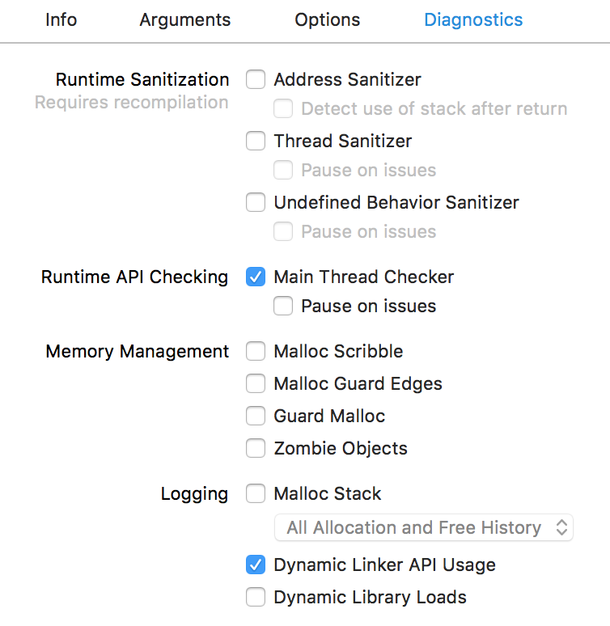

启动该程序后，我们可以看到它如何动态加载模块。 除了我们的应用程序消息外，我们还会收到系统生成的消息。 系统消息没有时间戳前缀，但应用程序消息却有。

这是一个经过修剪的调试日志，显示了我们看到的输出类型:

```c
2018-08-18 12:26:51.989237+0100
 ios-dynamic-loading-framework[2962:109722]
 App started
2018-08-18 12:26:51.992187+0100
 ios-dynamic-loading-framework[2962:109722]
 Before referencing CASHello in DynamicFramework1
dlopen(DynamicFramework1.framework/DynamicFramework1, 0x00000001)
2018-08-18 12:26:52.002234+0100
 ios-dynamic-loading-framework[2962:109722]
 Loading CASHello in dynamic-framework-1
  dlopen(DynamicFramework1.framework/DynamicFramework1) ==>
   0x600000157ce0
2018-08-18 12:26:52.002398+0100
 ios-dynamic-loading-framework[2962:109722]
 Loaded CASHello in DynamicFramework1
dlclose(0x600000157ce0)
2018-08-18 12:26:52.002560+0100
 ios-dynamic-loading-framework[2962:109722]
 CASHello from DynamicFramework1 still loaded after dlclose()
2018-08-18 12:26:52.002642+0100
 ios-dynamic-loading-framework[2962:109722]
 Before referencing CASHello in DynamicFramework2
dlopen(DynamicFramework2.framework/DynamicFramework2, 0x00000001)
objc[2962]: Class CASHello is implemented in both
 /Users/faisalm/Library/
Developer/Xcode/DerivedData/
ios-dynamic-loading-framework-ednexaanxalgpudjcqeuejsdmhlq/Build
/Products/Debug-iphonesimulator/
DynamicFramework1.framework/DynamicFramework1 (0x1229cb178)
 and
 /Users/faisalm/Library/Developer/Xcode/DerivedData/
ios-dynamic-loading-framework-ednexaanxalgpudjcqeuejsdmhlq/Build
/Products/Debug-iphonesimulator/DynamicFramework2.framework/
DynamicFramework2
 (0x1229d3178).
 One of the two will be used. Which one is undefined.
2018-08-18 12:26:52.012601+0100
 ios-dynamic-loading-framework[2962:109722]
 Loading CASHello in dynamic-framework-2
  dlopen(DynamicFramework2.framework/DynamicFramework2) ==>
   0x600000157d90
2018-08-18 12:26:52.012792+0100
 ios-dynamic-loading-framework[2962:109722]
 Loaded CASHello in DynamicFramework2
dlclose(0x600000157d90)
2018-08-18 12:26:52.012921+0100
 ios-dynamic-loading-framework[2962:109722]
 CASHello from DynamicFramework2 still loaded after dlclose()
```

这是加载 `DynamicFramework1`的相关源代码。

```c
-(void)loadCASHelloFromDynamicFramework1
{
    void *framework1Handle = dlopen(
      "DynamicFramework1.framework/DynamicFramework1",
 RTLD_LAZY);

    if (NSClassFromString(@"CASHello"))
    {
        NSLog(@"Loaded CASHello in DynamicFramework1");
    }
    else
    {
        NSLog(@"Could not load CASHello in DynamicFramework1");
    }

    dlclose(framework1Handle);

    if (NSClassFromString(@"CASHello"))
    {
        NSLog(
  @"CASHello from DynamicFramework1 still loaded after dlclose()"
        );
    }
    else
    {
        NSLog(@"Unloaded DynamicFramework1");
    }
}
```

这是在的 `viewDidLoad` 中调用它的代码：

```c
- (void)viewDidLoad
{
    [super viewDidLoad];

    //Loading the first dynamic library here works fine :)
    NSLog(@"Before referencing CASHello in DynamicFramework1");
    [self loadCASHelloFromDynamicFramework1];

    /*
     Loading the second framework will give a message in
      the console saying that both classes will be loaded
      and referencing the class will result in undefined
      behavior.
    */

    NSLog(@"Before referencing CASHello in DynamicFramework2");
    [self loadCASHelloFromDynamicFramework2];
}
```

通常，如果我们的应用在运行任何代码之前就崩溃了，那么最好打开 Dynamic Loader 诊断选项。这可能是部署问题（未捆绑正确的库）或代码签名问题。

#### Jablotron 崩溃

`Jablotron` 程序是管理家庭中的警报和检测器的程序。

这是程序发生崩溃所产生的的崩溃报告，为了便于演示而对报告内容进行截断：

```c
Incident Identifier: 732438C5-9E5A-48E7-95E2-76C800CDD6D9
CrashReporter Key:   181EC21F-295A-4D13-B14E-8BE1A7DFB5C7
Hardware Model:      iPhone3,1
Process:         MyJablotron_dev [177]
Path:            /var/mobile/Applications/
D3CC3D22-1B0F-4CAF-8F68-71AD3B211CD9/
MyJablotron_dev.app/MyJablotron_dev
Identifier:      net.jablonet.myjablotron.staging
Version:         3.3.0.14 (3.3.0.14)
Code Type:       ARM
Parent Process:  launchd [1]

Date/Time:       2016-05-24T07:59:56Z
Launch Time:     2016-05-24T07:57:08Z
OS Version:      iPhone OS 7.1.2 (11D257)
Report Version:  104

Exception Type:  SIGBUS
Exception Codes: BUS_ADRALN at 0xcd0b1c
Crashed Thread:  0

Thread 0 Crashed:
0   libswiftCore.dylib    0x011aed64 0xfba000 + 2051428
1   MyJablotron_dev       0x004e7c18 0xb2000 + 4414488
2   libswiftCore.dylib    0x011b007f 0xfba000 + 2056319
3   libswiftCore.dylib    0x011aff73 0xfba000 + 2056051
4   libswiftCore.dylib    0x011adf29 0xfba000 + 2047785
5   libswiftCore.dylib    0x011adf73 0xfba000 + 2047859
6   MyJablotron_dev       0x00614a6c
 type metadata accessor for
 MyJablotron.CDFM<MyJablotron.ChartDataPointStructure,
  MyJablotron.ChartDataPointStructureLegend>
   (ChartThermoPlotSpace.swift:0)
7   MyJablotron_dev                      0x00606698
 MyJablotron.ChartThermoPlotSpace.init ()
 MyJablotron.ChartThermoPlotSpace
  (ChartThermoPlotSpace.swift:206)
8   MyJablotron_dev                      
0x00606c60
 MyJablotron.ChartThermoPlotSpace.__allocating_init ()
 MyJablotron.ChartThermoPlotSpace
 (ChartThermoPlotSpace.swift:0)
9   MyJablotron_dev                      
0x0048825c
 MyJablotron.ChartBase.initWithThermometer
  (__ObjC.Thermometer)()
  (ChartBase.swift:139)
10  MyJablotron_dev                      0x00488034
 MyJablotron.ChartBase.initWithSegment (__ObjC.Segment)()
  (ChartBase.swift:123)
11  MyJablotron_dev                      0x0059186c
 MyJablotron.ChartViewController.setupSegment ()()
  (ChartViewController.swift:106)
12  MyJablotron_dev                      0x0058f374
 MyJablotron.ChartViewController.viewDidLoad ()()
  (ChartViewController.swift:39)
13  MyJablotron_dev                      0x0058f5a4
 @objc MyJablotron.ChartViewController.viewDidLoad ()()
  (ChartViewController.swift:0)
14  UIKit                                0x3227d4ab
 -[UIViewController loadViewIfRequired] + 516
15  UIKit                                0x3227d269
 -[UIViewController view] + 22
16  UIKit                                0x3240936b
 -[UINavigationController
 _startCustomTransition:] + 632
17  UIKit                                0x32326d63
 -[UINavigationController
  _startDeferredTransitionIfNeeded:] + 416
18  UIKit                                0x32326b6d
 -[UINavigationController
 __viewWillLayoutSubviews] + 42
19  UIKit                                0x32326b05
 -[UILayoutContainerView layoutSubviews] + 182
20  UIKit                                0x32278d59
 -[UIView(CALayerDelegate)
 layoutSublayersOfLayer:] + 378
21  QuartzCore                           0x31ef662b
 -[CALayer layoutSublayers] + 140
22  QuartzCore                           0x31ef1e3b
 CA::Layer::layout_if_needed(CA::Transaction*) + 348
23  QuartzCore                           0x31ef1ccd
 CA::Layer::layout_and_display_if_needed(CA::Transaction*) + 14
24  QuartzCore                           0x31ef16df
 CA::Context::commit_transaction(CA::Transaction*) + 228
25  QuartzCore                           0x31ef14ef
 CA::Transaction::commit() + 312
26  QuartzCore                           0x31eeb21d
 CA::Transaction::observer_callback(__CFRunLoopObserver*,
    unsigned long, void*) + 54
27  CoreFoundation                       0x2fa27255
__CFRUNLOOP_IS_CALLING_OUT_TO_AN_OBSERVER_CALLBACK_FUNCTION__
 + 18
28  CoreFoundation                       0x2fa24bf9
 __CFRunLoopDoObservers + 282
29  CoreFoundation                       0x2fa24f3b
 __CFRunLoopRun + 728
30  CoreFoundation                       0x2f98febf
 CFRunLoopRunSpecific + 520
31  CoreFoundation                       0x2f98fca3
 CFRunLoopRunInMode + 104
32  GraphicsServices                     0x34895663
 GSEventRunModal + 136
33  UIKit                                0x322dc14d
 UIApplicationMain + 1134
34  MyJablotron_dev                      0x002b0683
 main (main.m:16)
35  libdyld.dylib                        0x3a719ab7
 start + 0
```

我们可以看到崩溃发生在 Swift Core运行时库中。 当我们看到 Apple 的通用代码崩溃时，通常表明滥用 API。在这些情况下，我们希望看到一个描述性错误。

在此示例中，我们得到总线对齐错误。Apple 的库代码错误地访问了 CPU 架构的内存地址。

这令人惊喜。有时，当我们使用高级特性或设置编译器优化设置时，我们可能会在特殊情况或较少使用的代码路径中触发错误。

我们看到问题出在对象初始化期间：

```c
6   MyJablotron_dev                      0x00614a6c
 type metadata accessor for
 MyJablotron.CDFM<MyJablotron.ChartDataPointStructure,
  MyJablotron.ChartDataPointStructureLegend>
   (ChartThermoPlotSpace.swift:0)
7   MyJablotron_dev                      0x00606698
 MyJablotron.ChartThermoPlotSpace.init ()
 MyJablotron.ChartThermoPlotSpace
  (ChartThermoPlotSpace.swift:206)
8   MyJablotron_dev                      0x00606c60
 MyJablotron.ChartThermoPlotSpace.__allocating_init ()
 MyJablotron.ChartThermoPlotSpace (ChartThermoPlotSpace.swift:0)
```

_**元数据访问器**_ 短语很有趣，因为它暗示我们正在运行编译器生成的代码，而不是我们直接编写的代码。也许，作为一种解决方法，我们可以简化代码以使用更简单的语言功能。

在这里，我们的目标是通过采用`ChartThermoPlotSpace`类并简化它来编写一个简单的测试用例，直到找到发生崩溃的必要代码为止。

苹果通过更新其编译器来纠正 Swift Generics 错误，从而解决了该崩溃问题。

## 应用程序中止崩溃

在本章中，我们将研究应用程序中止崩溃。

通过崩溃报告异常类型来区分这类崩溃—— `EXC_CRASH (SIGABRT)` 。

我们关注这些从网上收集的大量崩溃信息。

### 一般原则

许多操作系统语言的支持模块和库都有用于检测致命程序错误的代码。一旦触发，操作系统将终止该应用程序，这会导致 `SIGABRT` 崩溃。

`SIGABRT` 并没有特别的原因。所以我们将查看各种示例，以便我们可以分析它们出现的各种情况。

有时，这种崩溃会在崩溃报告的 `Application Specific Information`
区域中提供一些信息。如果这不能揭示我们所需的详细信息，但通常可以找到引发崩溃的模块，并对代码进行逆向工程以了解具体是什么症状。

### Kindle Create 崩溃

Kindle Create是一款应用程序，作者可以利用手稿（比如 `docx` 文件）创建电子书。它通过 QuartzCore 库进行大量的绘制。

在发布预览时，它发生崩溃并产生以下崩溃报告，为便于演示，对报告内容进行截断：

```c
Process:               Kindle Create [3010]
Path:                  /Applications/Kindle Create.app/
Contents/MacOS/Kindle Create
Identifier:            com.amazon.kc
Version:               1.10 (1.10)
Code Type:             X86 (Native)
Parent Process:        ??? [1]
Responsible:           Kindle Create [3010]
User ID:               501

Crashed Thread:        16  Dispatch queue:
 com.apple.root.default-qos

Exception Type:        EXC_CRASH (SIGABRT)
Exception Codes:       0x0000000000000000, 0x0000000000000000
Exception Note:        EXC_CORPSE_NOTIFY

Application Specific Information:
abort() called

Application Specific Signatures:
Graphics kernel error: 0xfffffffb

Thread 16 Crashed:: Dispatch queue: com.apple.root.default-qos
0   libsystem_kernel.dylib          0xa73e7ed6
__pthread_kill + 10
1   libsystem_pthread.dylib         0xa75a0427
pthread_kill + 363
2   libsystem_c.dylib               0xa7336956
abort + 133
3   libGPUSupportMercury.dylib      0xa2aa342d
 gpusGenerateCrashLog + 160
4   com.apple.AMDRadeonX4000GLDriver    0x180cbb00
 gpusKillClientExt + 23
5   libGPUSupportMercury.dylib      0xa2aa4857
 gpusSubmitDataBuffers + 157
6   com.apple.AMDRadeonX4000GLDriver    0x180a293c
 glrATI_Hwl_SubmitPacketsWithToken + 143
7   com.apple.AMDRadeonX4000GLDriver    0x180fd9b0
 glrFlushContextToken + 68
8   libGPUSupportMercury.dylib      0xa2aa88c8
 gldFlushContext + 24
9   GLEngine                        0x9b416f5b
 glFlushRender_Exec + 37
10  com.apple.QuartzCore            0x9c1c8412
 CA::(anonymous namespace)::IOSurface::detach() + 166
11  com.apple.QuartzCore            0x9c1c7631
 CAOpenGLLayerDraw(CAOpenGLLayer*, double, CVTimeStamp const*,
    unsigned int) + 1988
12  com.apple.QuartzCore            0x9c1c6c9a
 -[CAOpenGLLayer _display] + 618
13  com.apple.QuartzCore            0x9c179f62
 -[CALayer display] + 158
14  com.apple.AppKit                0x916106ac
 -[NSOpenGLLayer display] + 305
15  com.apple.QuartzCore            0x9c1c9f77
 display_callback(void*, void*) + 59
16  com.apple.QuartzCore            0x9c1c9efa
 CA::DispatchGroup::dispatch(bool) + 88
17  com.apple.QuartzCore            0x9c1c9e9a
 CA::DispatchGroup::callback_0(void*) + 16
18  libdispatch.dylib               0xa72565dd
 _dispatch_client_callout + 50
19  libdispatch.dylib               0xa7263679
 _dispatch_queue_override_invoke + 779
20  libdispatch.dylib               0xa725818b
 _dispatch_root_queue_drain + 660
21  libdispatch.dylib               0xa7257ea5
 _dispatch_worker_thread3 + 100
22  libsystem_pthread.dylib         0xa759cfa5
 _pthread_wqthread + 1356
23  libsystem_pthread.dylib         0xa759ca32
 start_wqthread + 34

Thread 16 crashed with X86 Thread State (32-bit):
  eax: 0x00000000  ebx: 0xb0a79000  ecx: 0xb0a78acc
    edx: 0x00000000
  edi: 0xa75a02ca  esi: 0x0000002d  ebp: 0xb0a78af8
    esp: 0xb0a78acc
   ss: 0x00000023  efl: 0x00000206  eip: 0xa73e7ed6
      cs: 0x0000000b
   ds: 0x00000023   es: 0x00000023   fs: 0x00000023
      gs: 0x0000000f
  cr2: 0xa9847340

Logical CPU:     0
Error Code:      0x00080148
Trap Number:     132

Binary Images:

0x18099000 - 0x1815efff  com.apple.AMDRadeonX4000GLDriver
 (1.68.20 - 1.6.8)
 <DF3BB959-0C0A-3B6C-8E07-11B332128555>
  /System/Library/Extensions/AMDRadeonX4000GLDriver.bundle/
  Contents/MacOS/AMDRadeonX4000GLDriver

0xa2aa2000 - 0xa2aacfff  libGPUSupportMercury.dylib
 (16.7.4)
 <C71E29CF-D4C5-391D-8B7B-739FB0536387>
  /System/Library/PrivateFrameworks/GPUSupport.framework/
  Versions/A/Libraries/libGPUSupportMercury.dylib
```

从堆栈回溯中可以看到 OpenGL 管道已刷新。 这导致 `com.apple.AMDRadeonX4000GLDriver` 检测到命令问题并触发崩溃。我们看到该代码为崩溃报告提供了自定义信息。

```c
3   libGPUSupportMercury.dylib      0xa2aa342d
 gpusGenerateCrashLog + 160
```

我们可以在这里使用 Hopper 脱壳和逆向工程工具。

通过在我们的Mac上找到二进制文件，我们可以要求Hopper不仅分解有问题的代码，而且还生成伪代码。对于大多数开发人员来说，很难立即了解汇编代码，因为当今很少使用汇编代码。这就是伪代码最有价值的原因。

我们首先从崩溃报告的 `Binary Images` 部分找到二进制文件的位置。

```c
/System/Library/PrivateFrameworks/GPUSupport.framework/
Versions/A/Libraries/libGPUSupportMercury.dylib
```

对于系统二进制文件而言，遍历文件层次结构可能会很麻烦，因为它们深深地嵌套在文件系统中。

如果 Hopper 已经**正在运行**了，那么快速选择正确文件的方法就是使用命令行。

```c
'/Applications/Hopper Disassembler v4.app/Contents/
MacOS/hopper' -e /System/Library/PrivateFrameworks/
GPUSupport.framework/Versions/A/Libraries/
libGPUSupportMercury.dylib
```

如果Hopper没有运行，我们可以启动它。我们可以启动 Finder 程序并选择 `Go To Folder` 以选择文件夹

```c
/System/Library/PrivateFrameworks/GPUSupport.framework/
Versions/A/Libraries/
```

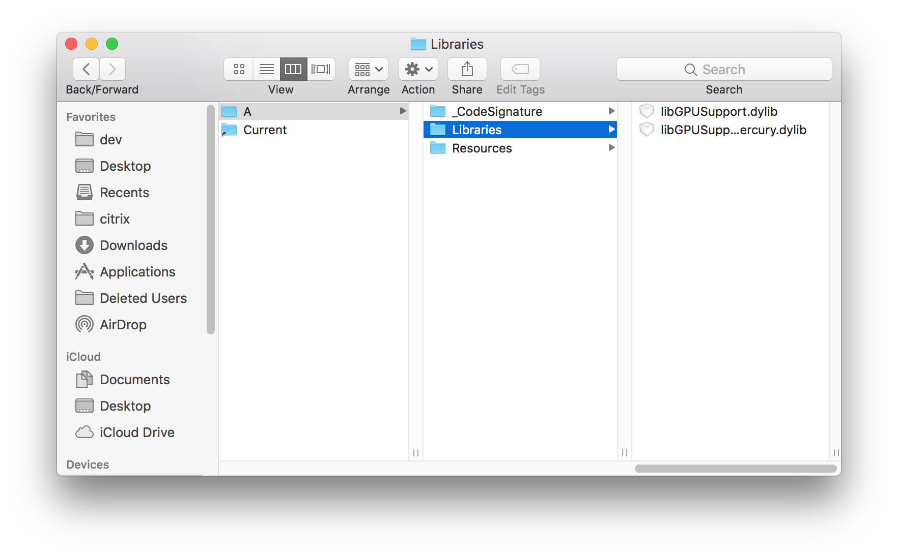

然后，我们可以简单地将`libGPUSupportMercury.dylib`从 Finder 中拖到 Hopper 应用的主面板中，它将开始处理文件。

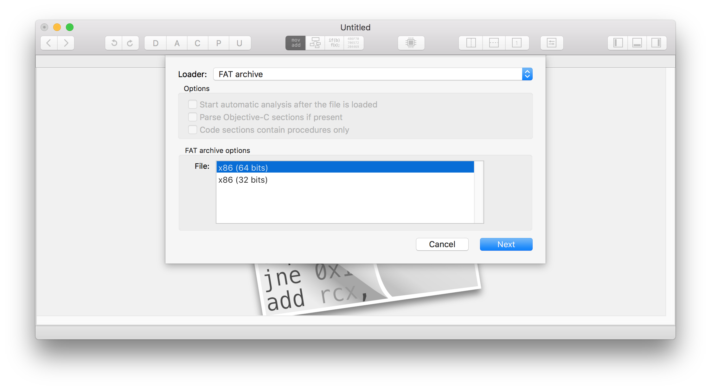

我们需要选择要脱壳的体系结构。 它必须与我们正在诊断的内容匹配。从崩溃报告中我们可以看到它是 `Code Type` `X86 (Native)`，这意味着我们需要在 Hopper 中选择32位体系结构选项。

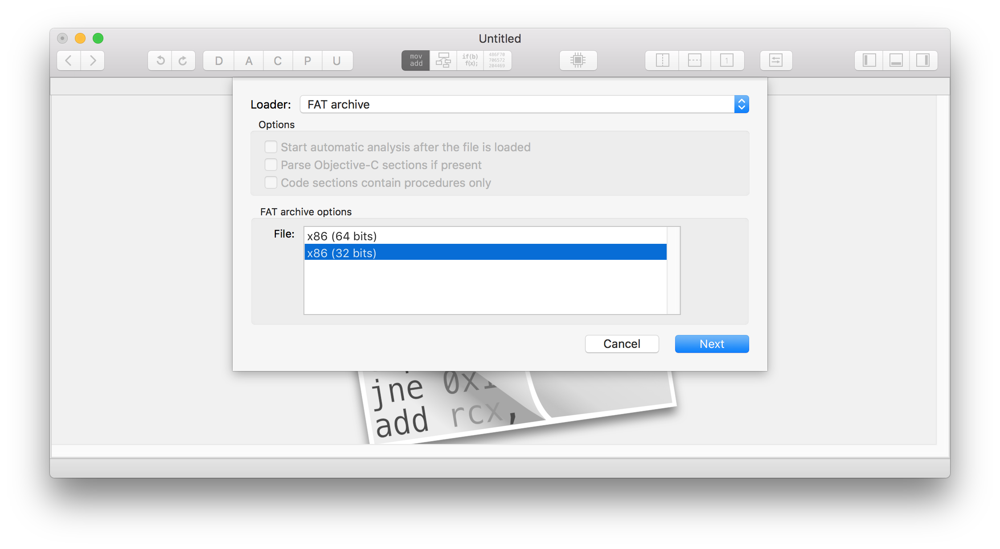

然后我们点击 Next，然后点击 OK

片刻之后，文件将被处理。 然后我们可以选择 _Navigate -> Go To Address or Symbol_ 并提供地址 `_gpusGenerateCrashLog` 。注意，下划线是在前面的。 C 编译器会在生成目标文件之前自动将其放入。在过去，这样做是为了使手写的汇编代码在链接期间不会与C 语言符号冲突。

在默认视图中，Hopper 将显示该功能的反汇编代码。

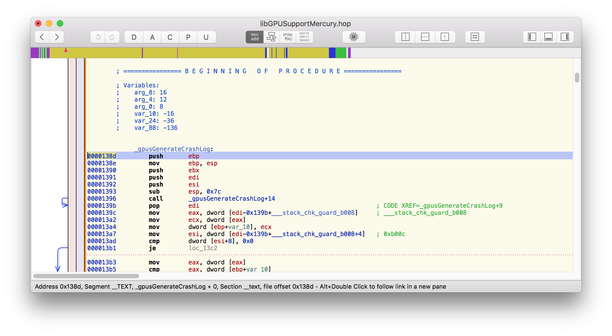

通过选择伪代码按钮（用红色圆圈显示），我们可以使 Hopper 生成对该功能的更容易理解的描述。

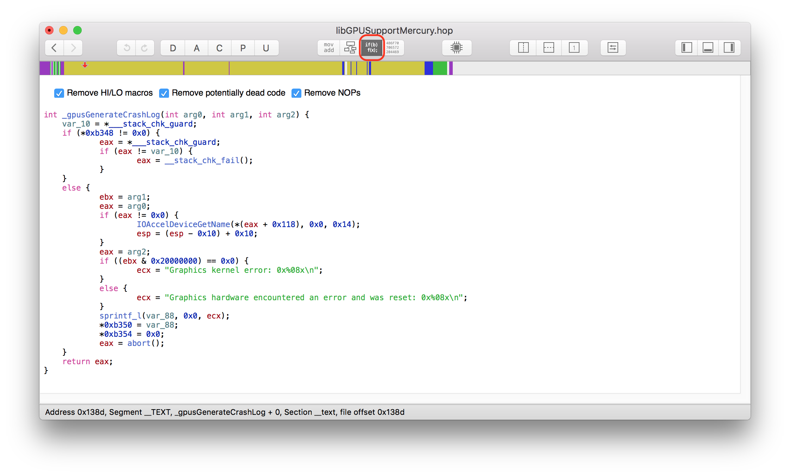

这是 Hopper 的输出：

```c
int _gpusGenerateCrashLog(int arg0, int arg1, int arg2) {
 rdi = arg0;
 r14 = arg2;
 rbx = arg1;
 if (*0xc678 != 0x0) {
   rax = *___stack_chk_guard;
   if (rax != *___stack_chk_guard) {
     rax = __stack_chk_fail();
   }  
 }
 else {
   if (rdi != 0x0) {
     IOAccelDeviceGetName(*(rdi + 0x230), 0x0, 0x14);
   }  
   if ((rbx & 0x20000000) == 0x0) {
     rdx =
     "Graphics kernel error: 0x%08x\n";
   }  
   else {
     rdx =
  "Graphics hardware encountered an error and was reset:
   0x%08x\n";
   }  
   sprintf_l(var_A0, 0x0, rdx);
   *0xc680 = var_A0;
   rax = abort();
 }
 return rax;
}
```    

在这里，我们可以看到两种报文。一种是 ：

``` 
"Graphics kernel error: 0x%08x\n"
``` 

另一种是:

``` 
"Graphics hardware encountered an error and was reset: 0x%08x\n"
``` 

实际上，我们可以在崩溃报告中看到以下内容：

``` 
Application Specific Signatures:
Graphics kernel error: 0xfffffffb
``` 

不幸的是，尚不清楚此错误是什么意思。我们需要应用程序的作者打开 OpenGL 命令级日志记录，以便了解图形驱动程序拒绝了哪些绘图命令。

通过使用不同的 Mac 和显卡配置将会使实验结果变得很有趣。这让我们判断可能是一个特定的驱动问题，或一个通用的 OpenGL 问题。

### 类型混淆

编译器在静态类型检查方面做得非常出色。但在动态推断类型时，可能会出现问题。而 配置文件在这方面尤为麻烦。 很容易为配置参数设置错误的类型

我们借助示例代码`icdab_nsdata`来说明我们的观点。(“IOS Crash Dump Analysis Book Github Resources” 2018)

#### 从配置文件中获取 NSData 对象

思考以下示例代码

```c
- (BOOL)application:(UIApplication *)application
 didFinishLaunchingWithOptions:(NSDictionary *)launchOptions
{
    // Override point for customization after application
    // launch.

    NSData *myToken = [[NSData alloc] initWithData:
    [[NSUserDefaults standardUserDefaults]
     objectForKey:@"SomeKey"]];

    NSLog(@"My data is %@ - ok since we can handle a nil",
     myToken);

    id stringProperty = @"Some string";
    NSData *problemToken = [[NSData alloc]
     initWithData:stringProperty];

    NSLog(@"My data is %@ - we have probably crashed by now",
     problemToken);
    return YES;
}
```

这段代码试图做两件事。 首先，它尝试从其配置中获取 `token`。我们假设在之前的运行中，用户已经以 `SomeKey`为键值保存了一个 `NSData`
格式的 `token`。

按照设计， `NSData` 对象可以处理所提供的数据是否为 `nil` 的情况。 因此，如果尚未保存数据，代码仍可正常运行。

`token`可能只是一个简单的十六进制字符串，例如 `7893883873a705aec69e2942901f20d7b1e28dec`

上面的代码中有一个字符串 `stringProperty`，用于模拟以下情况：用户存存储的 `token` 是一个字符串而不是 `NSData`对象。可能是它被手动复制并粘贴到用户的 `plist` 文件中。 如果 `initWithData` 方法参数为 `NSString`，那么就无法创建`NSData` 对象。 然后发生了崩溃。

如果我们运行该代码，我们将得到以下崩溃报告，为了便于演示，将其截断：

#### 反序列化崩溃报告

```c
Incident Identifier: 12F72C5C-E9BD-495F-A017-832E3BBF285E
CrashReporter Key:   56ec2b40764a1453466998785343f1e51c8b3849
Hardware Model:      iPod5,1
Process:             icdab_nsdata [324]
Path:                /private/var/containers/Bundle/Application/
98F79023-562D-4A76-BC72-5E56D378AD98/
icdab_nsdata.app/icdab_nsdata
Identifier:          www.perivalebluebell.icdab-nsdata
Version:             1 (1.0)
Code Type:           ARM (Native)
Parent Process:      launchd [1]
Exception Type:  EXC_CRASH (SIGABRT)
Exception Codes: 0x0000000000000000, 0x0000000000000000
Exception Note:  EXC_CORPSE_NOTIFY
Triggered by Thread:  0

Filtered syslog:
None found

Last Exception Backtrace:
0   CoreFoundation                  0x25aa3916
 __exceptionPreprocess + 122
1   libobjc.A.dylib                 0x2523ee12
 objc_exception_throw + 33
2   CoreFoundation                  0x25aa92b0
-[NSObject+ 1045168 (NSObject) doesNotRecognizeSelector:]
 + 183
3   CoreFoundation                  0x25aa6edc
 ___forwarding___ + 695
4   CoreFoundation                  0x259d2234
 _CF_forwarding_prep_0 + 19
5   Foundation                      0x2627e9a0
-[_NSPlaceholderData initWithData:] + 123
6   icdab_nsdata                    0x000f89ba
-[AppDelegate application:
didFinishLaunchingWithOptions:] + 27066 (AppDelegate.m:26)
7   UIKit                           0x2a093780
 -[UIApplication _handleDelegateCallbacksWithOptions:
 isSuspended:restoreState:] + 387
8   UIKit                           0x2a2bb2cc
 -[UIApplication _callInitializationDelegatesForMainScene:
 transitionContext:] + 3075
9   UIKit                           0x2a2bf280
-[UIApplication _runWithMainScene:transitionContext:
completion:] + 1583
10  UIKit                           0x2a2d3838
__84-[UIApplication _handleApplicationActivationWithScene:
transitionContext:completion:]_block_invoke3286 + 31
11  UIKit                           0x2a2bc7ae
 -[UIApplication workspaceDidEndTransaction:] + 129
12  FrontBoardServices              0x27146c02
 __FBSSERIALQUEUE_IS_CALLING_OUT_TO_A_BLOCK__ + 13
13  FrontBoardServices              0x27146ab4
-[FBSSerialQueue _performNext] + 219
14  FrontBoardServices              0x27146db4
-[FBSSerialQueue _performNextFromRunLoopSource] + 43
15  CoreFoundation                  0x25a65dfa
__CFRUNLOOP_IS_CALLING_OUT_TO_A_SOURCE0_PERFORM_FUNCTION__
 + 9
16  CoreFoundation                  0x25a659e8
__CFRunLoopDoSources0 + 447
17  CoreFoundation                  0x25a63d56
 __CFRunLoopRun + 789
18  CoreFoundation                  0x259b3224
 CFRunLoopRunSpecific + 515
19  CoreFoundation                  0x259b3010
CFRunLoopRunInMode + 103
20  UIKit                           0x2a08cc38
 -[UIApplication _run] + 519
21  UIKit                           0x2a087184
 UIApplicationMain + 139
22  icdab_nsdata                    0x000f8830
 main + 26672 (main.m:14)
23  libdyld.dylib                   0x2565b86e tlv_get_addr
 + 41
```

不幸的是，这种崩溃没有将更多的有用信息（例如“特定于应用程序的信息”）注入到崩溃报告中。

但是，我们确实会在系统日志（应用程序的控制台日志）中获取信息：

```c
default 13:36:58.000000 +0000   icdab_nsdata     
My data is <> - ok since we can handle a nil

default 13:36:58.000000 +0100   icdab_nsdata     
-[__NSCFConstantString _isDispatchData]:
unrecognized selector sent to instance 0x3f054

default 13:36:58.000000 +0100   icdab_nsdata
     *** Terminating app due to uncaught exception
    'NSInvalidArgumentException', reason:
    '-[__NSCFConstantString _isDispatchData]:
     unrecognized selector sent to instance 0x3f054'

    *** First throw call stack:
    (0x25aa391b 0x2523ee17 0x25aa92b5 0x25aa6ee1 0x259d2238
     0x2627e9a5 0x3d997
     0x2a093785 0x2a2bb2d1 0x2a2bf285 0x2a2d383d 0x2a2bc7b3
      0x27146c07
      0x27146ab9 0x27146db9 0x25a65dff 0x25a659ed 0x25a63d5b
       0x259b3229
      0x259b3015 0x2a08cc3d 0x2a087189 0x3d80d 0x2565b873)

default 13:36:58.000000 +0100
    SpringBoard Application
  'UIKitApplication:www.perivalebluebell.icdab-nsdata[0x51b9]'
    crashed.

default 13:36:58.000000 +0100
UserEventAgent
     2769630555571: id=www.perivalebluebell.icdab-nsdata
   pid=386, state=0

default 13:36:58.000000 +0000   ReportCrash
     Formulating report for corpse[386] icdab_nsdata

default 13:36:58.000000 +0000   ReportCrash
     Saved type '109(109_icdab_nsdata)'
    report (2 of max 25) at
    /var/mobile/Library/Logs/CrashReporter/
    icdab_nsdata-2018-07-27-133658.ips
```

从这里我们可以看到问题是 `__NSCFConstantString` 无法响应 `_isDispatchData` 方法，这是因为 `NSString`并不是数据所提供的对象。

Apple SDK 具有私有实现类，以支持我们使用的公共对象。 错误报告将引用这些私有类。 因此，他们的名字可能令人不再熟悉。

可以通过一种简单的方法进行管理，并找出具体表示映射到要搜索的类是类型定义的哪个对象。

方便的是，其他工程师已经在框架上使用 `class-dump` 工具来生成所有 Objective-C 的类定义，并将它们存储在 GitHub上。他们使用`class-dump`工具。这使得 Objective-C 的所有私有框架符号都很容易搜索到。

我们可以找到关于 `_isDispatchData`的定义。 (“NSDispatchData.h in Foundation.framework” 2018)

```c
/* Generated by RuntimeBrowser
   Image: /System/Library/Frameworks/Foundation.framework/
   Foundation
 */
@interface _NSDispatchData : NSData

+ (bool)supportsSecureCoding;

- (bool)_allowsDirectEncoding;
- (id)_createDispatchData;
- (bool)_isDispatchData;
- (Class)classForCoder;
- (id)copyWithZone:(struct _NSZone { }*)arg1;
- (void)encodeWithCoder:(id)arg1;
- (void)enumerateByteRangesUsingBlock:(id /* block */)arg1;
- (void)getBytes:(void*)arg1;
- (void)getBytes:(void*)arg1 length:(unsigned long long)arg2;
- (void)getBytes:(void*)arg1 range:(struct _NSRange
   { unsigned long long x1; unsigned long long x2; })arg2;
- (unsigned long long)hash;
- (id)initWithCoder:(id)arg1;
- (id)subdataWithRange:(struct _NSRange
  { unsigned long long x1; unsigned long long x2; })arg1;

@end
```

同样，我们可以查找 `__NSCFConstantString`。 (“NSCFConstantString in Corefoundation.framework” 2018)

```c
/* Generated by RuntimeBrowser
   Image: /System/Library/Frameworks/CoreFoundation.framework/
   CoreFoundation
 */

@interface __NSCFConstantString : __NSCFString

- (id)autorelease;
- (id)copyWithZone:(struct _NSZone { }*)arg1;
- (bool)isNSCFConstantString__;
- (oneway void)release;
- (id)retain;
- (unsigned long long)retainCount;

@end
```

### “非数字” 错误

在本节中，我们将展示由于错误的浮点数据而导致的崩溃。

我们以 macOS 上的 `securityAgent` 崩溃为例。

我们看到的崩溃报告如下，为了便于演示而对报告内容进行截断：

```c
Process:               SecurityAgent [99429]
Path:                  /System/Library/Frameworks/
Security.framework/Versions/A/MachServices/
SecurityAgent.bundle/Contents/
MacOS/SecurityAgent
Identifier:            com.apple.SecurityAgent
Version:               9.0 (55360.50.13)
Build Info:            SecurityAgent-55360050013000000~642
Code Type:             X86-64 (Native)
Parent Process:        launchd [1]
Responsible:           SecurityAgent [99429]
User ID:               92

Date/Time:             2018-06-18 21:39:08.261 +0100
OS Version:            Mac OS X 10.13.4 (17E202)
Report Version:        12
Anonymous UUID:        00CC683B-425F-ABF0-515A-3ED73BACDDB5

Sleep/Wake UUID:       8D3EF33B-B78C-4C76-BB7B-2F2AC3A11CEB

Time Awake Since Boot: 350000 seconds
Time Since Wake:       42 seconds

System Integrity Protection: enabled

Crashed Thread:        0  Dispatch queue:
 com.apple.main-thread

Exception Type:        EXC_CRASH (SIGABRT)
Exception Codes:       0x0000000000000000, 0x0000000000000000
Exception Note:        EXC_CORPSE_NOTIFY

Application Specific Information:
*** Terminating app due to uncaught exception
'CALayerInvalidGeometry', reason:
 'CALayer bounds contains NaN: [nan nan; 1424 160]'
terminating with uncaught exception of type NSException
abort() called

Application Specific Backtrace 1:
0   CoreFoundation                      0x00007fff4590132b
 __exceptionPreprocess + 171
1   libobjc.A.dylib                     0x00007fff6cf7bc76
objc_exception_throw + 48
2   CoreFoundation                      0x00007fff45992dcd
+[NSException raise:format:] + 205
3   QuartzCore                          0x00007fff50ba1a72
_ZN2CA5Layer10set_boundsERKNS_4RectEb + 230
4   QuartzCore                          0x00007fff50ba190b
-[CALayer setBounds:] + 251
5   AppKit                              0x00007fff42e5ccad
-[_NSClipViewBackingLayer setBounds:] + 105
6   AppKit                              0x00007fff42e20bf0
 -[NSView(NSInternal) _updateLayerGeometryFromView] + 712
7   AppKit                              0x00007fff42eef7a2
-[NSView translateOriginToPoint:] + 191
8   AppKit                              0x00007fff42eef383
-[NSClipView _immediateScrollToPoint:] + 536
9   AppKit                              0x00007fff432c4de9
-[NSScrollAnimationHelper _doFinalAnimationStep] + 147
10  AppKit                              0x00007fff43226da2
-[NSAnimationHelper _stopRun] + 44
11  AppKit                              0x00007fff42eef089
-[NSClipView scrollToPoint:] + 202
12  AppKit                              0x00007fff42f2ab7f
-[NSScrollView scrollClipView:toPoint:] + 75
13  AppKit                              0x00007fff42ed5929
-[NSClipView _scrollTo:animateScroll:
flashScrollerKnobs:] + 1273
14  AppKit                              0x00007fff434d5750
 -[_NSScrollingConcurrentMainThreadSynchronizer
_scrollToCanonicalOrigin] + 935
15  AppKit                              0x00007fff43071d74
 -[_NSScrollingConcurrentMainThreadSynchronizer
_synchronize:completionHandler:] + 174
16  AppKit                              0x00007fff43071c94
 __80-[_NSScrollingConcurrentMainThreadSynchronizer
initWithSharedData:constantData:]_block_invoke + 145
17  libdispatch.dylib                   0x00007fff6db5be08
_dispatch_client_callout + 8
18  libdispatch.dylib                   0x00007fff6db6eed1
_dispatch_continuation_pop + 472
19  libdispatch.dylib                   0x00007fff6db5e0d1
_dispatch_source_invoke + 620
20  libdispatch.dylib                   0x00007fff6db67271
_dispatch_main_queue_callback_4CF + 776
21  CoreFoundation                      0x00007fff458b9c69
 __CFRUNLOOP_IS_SERVICING_THE_MAIN_DISPATCH_QUEUE__ + 9
22  CoreFoundation                      0x00007fff4587be4a
 __CFRunLoopRun + 2586
23  CoreFoundation                      0x00007fff4587b1a3
CFRunLoopRunSpecific + 483
24  HIToolbox                           0x00007fff44b63d96
RunCurrentEventLoopInMode + 286
25  HIToolbox                           0x00007fff44b63b06
ReceiveNextEventCommon + 613
26  HIToolbox                           0x00007fff44b63884
 _BlockUntilNextEventMatchingListInModeWithFilter + 64
27  AppKit                              0x00007fff42e16a73
 _DPSNextEvent + 2085
28  AppKit                              0x00007fff435ace34
 -[NSApplication(NSEvent) _nextEventMatchingEventMask:
 untilDate:inMode:dequeue:] + 3044
29  AppKit                              0x00007fff42e0b885
 -[NSApplication run] + 764
30  AppKit                              0x00007fff42ddaa72
 NSApplicationMain + 804
31  SecurityAgent                       0x00000001007bb8b8
 main + 475
32  libdyld.dylib                       0x00007fff6db95015
 start + 1

Thread 0 Crashed:: Dispatch queue: com.apple.main-thread
0   libsystem_kernel.dylib          0x00007fff6dce5b6e
 __pthread_kill + 10
1   libsystem_pthread.dylib         0x00007fff6deb0080
 pthread_kill + 333
2   libsystem_c.dylib               0x00007fff6dc411ae
 abort + 127
3   libc++abi.dylib                 0x00007fff6bb45f8f
 abort_message + 245
4   libc++abi.dylib                 0x00007fff6bb4612b
default_terminate_handler() + 265
5   libobjc.A.dylib                 0x00007fff6cf7dea3
 _objc_terminate() + 97
6   libc++abi.dylib                 0x00007fff6bb617c9
 std::__terminate(void (*)()) + 8
7   libc++abi.dylib                 0x00007fff6bb61843
 std::terminate() + 51
8   libdispatch.dylib               0x00007fff6db5be1c
_dispatch_client_callout + 28
9   libdispatch.dylib               0x00007fff6db6eed1
 _dispatch_continuation_pop + 472
10  libdispatch.dylib               0x00007fff6db5e0d1
_dispatch_source_invoke + 620
11  libdispatch.dylib               0x00007fff6db67271
_dispatch_main_queue_callback_4CF + 776
12  com.apple.CoreFoundation        0x00007fff458b9c69
 __CFRUNLOOP_IS_SERVICING_THE_MAIN_DISPATCH_QUEUE__ + 9
13  com.apple.CoreFoundation        0x00007fff4587be4a
 __CFRunLoopRun + 2586
14  com.apple.CoreFoundation        0x00007fff4587b1a3
CFRunLoopRunSpecific + 483
15  com.apple.HIToolbox             0x00007fff44b63d96
RunCurrentEventLoopInMode + 286
16  com.apple.HIToolbox             0x00007fff44b63b06
ReceiveNextEventCommon + 613
17  com.apple.HIToolbox             0x00007fff44b63884
 _BlockUntilNextEventMatchingListInModeWithFilter + 64
18  com.apple.AppKit                0x00007fff42e16a73
 _DPSNextEvent + 2085
19  com.apple.AppKit                0x00007fff435ace34
 -[NSApplication(NSEvent)
 _nextEventMatchingEventMask:untilDate:inMode:dequeue:]
  + 3044
20  com.apple.AppKit                0x00007fff42e0b885
-[NSApplication run] + 764
21  com.apple.AppKit                0x00007fff42ddaa72
 NSApplicationMain + 804
22  com.apple.SecurityAgent         0x00000001007bb8b8
 main + 475
23  libdyld.dylib                   0x00007fff6db95015
 start + 1
```

这次崩溃是一个很好的示例，崩溃报告的信息部分提示了具体的错误信息。我们马上就知道在我们的层边界中有NAN（不是数字）浮点值，这就是中止的原因。

```c
'CALayer bounds contains NaN: [nan nan; 1424 160]'
```

可能尚未初始化数据结构，或者发生了除零的情况。几何代码通常会创建宽高比。在启动或转折情况下，我们的帧可能为零，从而导致除以零错误，从而在我们的数据结构中产生NAN值。

我们注意到 Quartz（几何图形框架）使用了一些长函数。 在堆栈回溯中，我们看到：

```
3   QuartzCore                          0x00007fff50ba1a72
_ZN2CA5Layer10set_boundsERKNS_4RectEb + 230
```

作为一项学术练习，我们可以指出在许多错误处理案例中，哪一个在这里发挥作用。我们这里的回溯并不是叶子调用，所以偏移量是函数调用返回后将继续进行计算的地址。

使用 Hopper 工具，我们可以搜索符号

```c
__ZN2CA5Layer10set_boundsERKNS_4RectEb
```

在二进制文件中

```c
/System/Library/Frameworks/QuartzCore.framework/
Versions/A/QuartzCore
```

请注意，在搜索功能名称时，我们需要在功能名称前添加一个额外的下划线。 这是由于 C 语言编译器导致的。

我们看到

```c
__ZN2CA5Layer10set_boundsERKNS_4RectEb:        
// CA::Layer::set_bounds(CA::Rect const&, bool)
0000000000008e36 push       rbp
                    ; CODE XREF=-[CALayer setBounds:]+246,
                    __ZN2CA5Layer10set_boundsERKNS_4RectEb+750
0000000000008e37 mov        rbp, rsp
0000000000008e3a push       r15
```

从十六进制地址8e36，如果我们加上230，就能得到 0x8f1c。查看反编译以后的代码：

```c
0000000000008edd  mov   rdi, qword [objc_cls_ref_NSException]
       ; argument "instance" for method _objc_msgSend
0000000000008ee4  movsd xmm0, qword [r12]
0000000000008eea  movsd xmm1, qword [r12+8]
0000000000008ef1  movsd xmm2, qword [r12+0x10]
0000000000008ef8  movsd xmm3, qword [r12+0x18]
0000000000008eff  mov   rsi, qword [0x27a338]
      ; @selector(raise:format:),
                       argument "selector"
                       for method _objc_msgSend
0000000000008f06  lea   rdx, qword
[cfstring_CALayerInvalidGeometry]
      ; @"CALayerInvalidGeometry"
0000000000008f0d  lea   rcx, qword
 [cfstring_CALayer_bounds_contains_NaN____g__g___g__g_]
      ; @"CALayer bounds contains NaN: [%g %g; %g %g]"
0000000000008f14  mov   al, 0x4
0000000000008f16  call  qword [_objc_msgSend_24d4f8]
      ; _objc_msgSend

                     loc_8f1c:
0000000000008f1c  call  __ZN2CA11Transaction13ensure_compatEv
       ; CA::Transaction::ensure_compat(),
        CODE XREF=__ZN2CA5Layer10set_boundsERKNS_4RectEb+61,
         __ZN2CA5Layer10set_boundsERKNS_4RectEb+70,
          __ZN2CA5Layer10set_boundsERKNS_4RectEb+137,
           __ZN2CA5Layer10set_boundsERKNS_4RectEb+147
```

我们可以看到 8f1c 是下一个函数调用（返回之后）。问题函数的调用在地址 8f16 处完成。我们还可以看到崩溃报告中提供的字符串文本。 `"CALayer bounds contains NaN: [%g %g; %g %g]"`

## 资源崩溃

在本站中，我们去看那些资源相关的崩溃问题。这些崩溃是由于操作系统不正确或过多使用资源而导致的。 资源崩溃由 `Exception Type` `EXC_RESOURCE` 表示。 ### CPU使用崩溃

iOS 平台可以自我更新。下面是一个示例，它在执行更新时消耗了太多 CPU 时间。

以下是崩溃报告（为了便于演示而被截断），显示了 `UpdateBrainService` 被终止了：

```c
Incident Identifier: 92F40C53-6BB8-4E13-A4C2-CF2F1C85E8DF
CrashReporter Key:   69face25f1299fdcbbe337b89e6a9f649818ba13
Hardware Model:      iPad4,4
Process:             
com.apple.MobileSoftwareUpdate.UpdateBrainService
 [147]
Path:                /private/var/run/
com.apple.xpcproxy.RoleAccount.staging/
com.apple.MobileSoftwareUpdate.
UpdateBrainService.16777219.47335.xpc/
com.apple.MobileSoftwareUpdate.UpdateBrainService
Identifier:          
com.apple.MobileSoftwareUpdate.UpdateBrainService
Version:             1 (1.0)
Code Type:           ARM-64 (Native)
Parent Process:      launchd [1]

Date/Time:           2015-02-03 20:14:05.504 -0800
Launch Time:         2015-02-03 20:11:35.306 -0800
OS Version:          iOS 8.1.2 (12B440)
Report Version:      105

Exception Type:  EXC_RESOURCE
Exception Subtype: CPU
Exception Message: (Limit 50%) Observed 60% over 180 secs
Triggered by Thread:  2

Thread 2 name:  Dispatch queue:
com.apple.root.default-qos
Thread 2 Attributed:
0   libsystem_kernel.dylib          
0x0000000196b9b1ec 0x196b98000 + 12780
1   ...reUpdate.UpdateBrainService
0x000000010008ac70 0x100080000 + 44144
2   ...reUpdate.UpdateBrainService
0x0000000100083678 0x100080000 + 13944
3   ...reUpdate.UpdateBrainService
0x000000010008b8e0 0x100080000 + 47328
4   ...reUpdate.UpdateBrainService
0x00000001000831e8 0x100080000 + 12776
5   ...reUpdate.UpdateBrainService
0x0000000100093478 0x100080000 + 78968
6   ...reUpdate.UpdateBrainService
0x000000010008e368 0x100080000 + 58216
7   ...reUpdate.UpdateBrainService
0x0000000100094548 0x100080000 + 83272
8   ...reUpdate.UpdateBrainService
0x000000010008ebb0 0x100080000 + 60336
9   libdispatch.dylib               
0x0000000196a713a8 0x196a70000 + 5032
10  libdispatch.dylib               
0x0000000196a71368 0x196a70000 + 4968
11  libdispatch.dylib               
0x0000000196a7d408 0x196a70000 + 54280
12  libdispatch.dylib               
0x0000000196a7e758 0x196a70000 + 59224
13  libsystem_pthread.dylib         
0x0000000196c4d2e0 0x196c4c000 + 4832
14  libsystem_pthread.dylib         
0x0000000196c4cfa4 0x196c4c000 + 4004

Thread 2 crashed with ARM Thread State (64-bit):
    x0: 0x0000000000000000   x1: 0x0000000000000000   
    x2: 0xffffffffffffffe8
       x3: 0x00000001004991c8
    x4: 0x0000000000000007   x5: 0x0000000000000018   
    x6: 0x0000000000000000
       x7: 0x0000000000000000
    x8: 0x2f6a6f72706c2e73   x9: 0x6166654448435354  
    x10: 0x5361746144746c75
      x11: 0x614264656b636174
   x12: 0x6166654448435354  x13: 0x5361746144746c75  
   x14: 0x614264656b636174
     x15: 0x007473696c702e72
   x16: 0x0000000000000154  x17: 0x00000001000cd2b1  
   x18: 0x0000000000000000
     x19: 0x000000010049963c
   x20: 0x0000000100499630  x21: 0x0000000000000000  
   x22: 0x000000014f001280
     x23: 0x0000000100499640
   x24: 0x000000014f001330  x25: 0x00000001004991a7  
   x26: 0x0000000100498c70
     x27: 0x000000019a75d0a8
   x28: 0x000000014f001330  fp: 0x0000000100499600   
   lr: 0x000000010008ac74
    sp: 0x0000000100498c50   pc: 0x0000000196b9b1ec
    cpsr: 0x80000000

Bad magic 0x86857EF8
Microstackshots: 1
(from 1969-12-31 20:33:03
   -0800 to 1969-12-31 20:33:03 -0800)
  1 ??? [0x16fd7fab0]
    1 CoreFoundation 0x1858ec000 + 37028
    [0x1858f50a4]
      1 ??? [0x16fd7f970]
        1 CoreFoundation 0x1858ec000 + 900644
        [0x1859c7e24]
          1 ??? [0x16fd7ec60]
            1 CoreFoundation 0x1858ec000 + 909008
            [0x1859c9ed0]
              1 ??? [0x16fd7ec00]
                1 libsystem_kernel.dylib 0x196b98000 + 3320
                 [0x196b98cf8]
                  1 ??? [0x16fd7ebb0]
                    1 libsystem_kernel.dylib 0x196b98000 + 3708
                     [0x196b98e7c]
                     *1 ??? [0xffffff8002012f08]
```

很显然在这里`UpdateBrainService` 程序占用了太多的 CPU 资源。

```c
Exception Type:  EXC_RESOURCE
Exception Subtype: CPU
Exception Message: (Limit 50%) Observed 60% over 180 secs
```

崩溃报告的 `Microstackshots` 部分大概告诉了我们终止时的堆栈示例。似乎报告的 `Bad magic` 值有所不同，通常与`EXC_RESOURCE` 崩溃有关。 ### 唤醒崩溃

iOS 平台限制唤醒次数。当 CPU 中断发生时，CPU 会被唤醒来为某个任务提供服务。通常是在有一些 IO 需要处理时，比如入站联网数据。如果平台太频繁地唤醒，会增加电池消耗。因此，唤醒次数受到操作系统的限制。

以下是崩溃报告（为了便于演示而对报告内容进行截断），显示了 `Snapchat` 被终止了：

```c
Incident Identifier: 79C39D6B-E4CA-4047-B96D-7EEED2B57B46
CrashReporter Key:   52be47ab0a43fb240756d6f5a1e1bcf4aa53c568
Hardware Model:      iPhone7,2
Process:             Snapchat [3151]
Path:                /private/var/mobile/Containers/
Bundle/Application/3E13B779-FFA3-491C-A018-F39E620553D4/
Snapchat.app/Snapchat
Identifier:          com.toyopagroup.picaboo
Version:             9.11.0.1 (9.11.0)
Code Type:           ARM-64 (Native)
Parent Process:      launchd [1]
Date/Time:           2015-07-05 20:00:52.228 +0200
Launch Time:         2015-07-05 19:42:01.054 +0200
OS Version:          iOS 8.3 (12F70)
Report Version:      105
Exception Type:      EXC_RESOURCE
Exception Subtype:   WAKEUPS
Exception Message:   
(Limit 150/sec) Observed 195/sec over 300 secs
Triggered by Thread: 21

Thread 21 name:  Dispatch queue:
 com.apple.avfoundation.videodataoutput.bufferqueue
Thread 21:
0       libsystem_kernel.dylib          0x193c9ce0c
 0x193c9c000 + 0xe0c
    // mach_msg_trap + 0x8
1       libsystem_kernel.dylib          0x193c9cc84
 0x193c9c000 + 0xc84
    // mach_msg + 0x44
2       IOKit                           0x182efdec0
 0x182ea8000 + 0x55ec0
    // io_connect_method + 0x168
3       IOKit                           0x182eadfd8
 0x182ea8000 + 0x5fd8
    // IOConnectCallMethod + 0xe4
4       IOSurface                       0x18bae515c
 0x18bae4000 + 0x115c
    // IOSurfaceClientLookup + 0xcc
5       IOSurface                       0x18bae90ec
 0x18bae4000 + 0x50ec
    // IOSurfaceLookup + 0x10
6       CoreMedia                       0x18252d9c8
 0x1824dc000 + 0x519c8
    // rqReceiverDequeue + 0x64
7       CoreMedia                       0x18252dd38
 0x1824dc000 + 0x51d38
    // __FigRemoteQueueReceiverSetHandler_block_invoke2 +
 0xa0
8       libdispatch.dylib               0x193b71950
 0x193b70000 + 0x1950
    // _dispatch_client_callout + 0xc
9       libdispatch.dylib               0x193b8800c
 0x193b70000 + 0x1800c
    // _dispatch_source_latch_and_call + 0x800
10      libdispatch.dylib               0x193b73ab8
 0x193b70000 + 0x3ab8
    // _dispatch_source_invoke + 0x11c
11      libdispatch.dylib               0x193b7c2d0
 0x193b70000 + 0xc2d0
    // _dispatch_queue_drain + 0x7d4
12      libdispatch.dylib               0x193b74a58
 0x193b70000 + 0x4a58
    // _dispatch_queue_invoke + 0x80
13      libdispatch.dylib               0x193b7e314
 0x193b70000 + 0xe314
    // _dispatch_root_queue_drain + 0x2cc
14      libdispatch.dylib               0x193b7fc48
 0x193b70000 + 0xfc48
    // _dispatch_worker_thread3 + 0x68
15      libsystem_pthread.dylib         0x193d51228
 0x193d50000 + 0x1228
    // _pthread_wqthread + 0x32c
16      libsystem_pthread.dylib         0x193d50eec
 0x193d50000 + 0xeec
    // start_wqthread + 0x0

Thread 21 crashed with ARM Thread State (64-bit):
    x0: 0x0000000000000000   x1: 0x0000000000000003   
    x2: 0x000000000000005c
       x3: 0x00000000000010bc
    x4: 0x0000000000017c37   x5: 0x0000000000000000   
    x6: 0x0000000000000000
       x7: 0x0000000000000000
    x8: 0x00000000fffffbbf   x9: 0x0000000000000b31  
    x10: 0x000000010f67fba0
      x11: 0x0000000000000000
   x12: 0x0000000000000000  x13: 0x0000000000000001  
   x14: 0x0000000000000001
     x15: 0x0000000000000000
   x16: 0xffffffffffffffe1  x17: 0x0000000000000000  
   x18: 0x0000000000000000
     x19: 0x0000000000000000
   x20: 0x0000000000000000  x21: 0x0000000000017c37  
   x22: 0x00000000000010bc
     x23: 0x000000010f67ea20
   x24: 0x0000000000000003  x25: 0x000000000000005c  
   x26: 0x0000000000000003
     x27: 0x000000010f67fbac
   x28: 0x0000000000000000  fp: 0x000000010f67e9f0   
   lr: 0x0000000193c9cc88
    sp: 0x000000010f67e9a0   pc: 0x0000000193c9ce0c
    cpsr: 0x80000000
Bad magic 0x8B3F36FC
Microstackshots: 1
(from 1970-01-01 01:03:20 +0100 to 1970-01-01 01:03:20 +0100)
  1 ??? [0x16fddb870]
    1 CoreFoundation 0x181bd4000 + 906872
    [0x181cb1678]
      1 ??? [0x16fddab60]
        1 CoreFoundation 0x181bd4000 + 915236
        [0x181cb3724]
          1 ??? [0x16fddab00]
            1 libsystem_kernel.dylib 0x193c9c000 + 3208
            [0x193c9cc88]
              1 ??? [0x16fddaab0]
                1 libsystem_kernel.dylib 0x193c9c000 + 3596
                 [0x193c9ce0c]
                 *1 ??? [0xffffff80020144a4]
```

类似于 CPU 资源受限的崩溃，我们可以得到已达到限制的指示：

```c
Exception Type:      EXC_RESOURCE
Exception Subtype:   WAKEUPS
Exception Message:   (Limit 150/sec) Observed 195/sec over
 300 secs
```

在崩溃报告中，我们还会得到一个 `Bad magic` 值，然后是终止点正在运行的线程快照。

我们可以看到许多线程正在运行，与网络，音频和视频有关。我们可以猜测，此应用程序在呈现视频流方面做了繁重的工作，并且此系统级别的类型代码有错误或存在性能问题。

### 唤醒崩溃异常

在某些情况下，iOS平台可以用 `Exception Code` 对唤醒崩溃进行分类。

例如，错误的网络代码导致了以下崩溃，为了便于演示而将其截断：

```c
Exception Type:  00000020
Exception Codes: 0xbad22222
Highlighted Thread:  3

Application Specific Information:
SBUnsuspendLimit ooVoo[360] exceeded 15 wakes in 300 sec

Thread 3 name:  com.apple.NSURLConnectionLoader
Thread 3:
0   libsystem_kernel.dylib          0x307fc010
 mach_msg_trap + 20
1   libsystem_kernel.dylib          0x307fc206
 mach_msg + 50
2   CoreFoundation                  0x3569b41c
__CFRunLoopServiceMachPort + 120
3   CoreFoundation                  0x3569a154
 __CFRunLoopRun + 876
4   CoreFoundation                  0x3561d4d6
 CFRunLoopRunSpecific + 294
5   CoreFoundation                  0x3561d39e
 CFRunLoopRunInMode + 98
6   Foundation                      0x3167abc2
+[NSURLConnection(Loader) _resourceLoadLoop:] + 302
7   Foundation                      0x3167aa8a
 -[NSThread main] + 66
8   Foundation                      0x3170e59a
 __NSThread__main__ + 1042
9   libsystem_c.dylib               0x30b68c16
 _pthread_start + 314
10  libsystem_c.dylib               0x30b68ad0
 thread_start + 0
```

二进制代码`0xbad22222` 读作 “Bad too many”，将“too”用作“2”的双关语。

在操作系统中，管理内存的方法是首先将连续的内存排序为内存页，然后将页面排序为段。
这允许将元数据属性分配给应用于该段内的所有页面的段。这允许我们的程序代码(程序 _TEXT_ )被设置为只读但可执行。提高了性能和安全性。

此类崩溃可能是由于未正确使用网络 API. (“Improper Use of Bsd Sockets” 2018)

### 设备过热崩溃

如果设备温度过高，iOS 可能会使应用程序崩溃。使用 `Exception Code` `0xc00010ff` 进行分类。

例如，iTrainAlarm 应用程序发生终止，并生成以下崩溃报告，为了便于演示，该报告已被截断：

```c
Exception Type:  00000020
Exception Codes: 0xc00010ff
Highlighted Thread:  0

Application Specific Information:
Topmost application

Thermal Level:       16
Thermal Sensors:     11336 29078 5149 3419 3437

Thread 0 name:  Dispatch queue: com.apple.main-thread
Thread 0:
0   libsystem_kernel.dylib          0x35782010
 mach_msg_trap + 20
1   libsystem_kernel.dylib          0x35782206
 mach_msg + 50
2   AppSupport                      0x360d68c4
 CPDMTwoWayMessage + 140
3   AppSupport                      0x360d52f0
-[CPDistributedMessagingCenter _sendMessage:userInfoData:
oolKey:oolData:makeServer:receiveReply:nonBlocking:error:] + 408
4   AppSupport                      0x360d59a6
-[CPDistributedMessagingCenter _sendMessage:userInfo:
receiveReply:error:toTarget:selector:context:nonBlocking:] + 870
5   AppSupport                      0x360d3cfc
 -[CPDistributedMessagingCenter _sendMessage:userInfo:
 receiveReply:error:toTarget:selector:context:] + 56
6   AppSupport                      0x360d3b8a
 -[CPDistributedMessagingCenter
  sendMessageAndReceiveReplyName:userInfo:] + 42
7   libstatusbar.dylib              0x01997c1c
 0x1995000 + 11292
8   libstatusbar.dylib              0x01997da8
 0x1995000 + 11688
9   libstatusbar.dylib              0x01997d88
 0x1995000 + 11656
10  CoreFoundation                  0x33c337f8
__CFNotificationCenterAddObserver_block_invoke_0 + 116
11  CoreFoundation                  0x33c33904
____CFXNotificationPostToken_block_invoke_0 + 124
12  CoreFoundation                  0x33c3bb2a
__CFRUNLOOP_IS_CALLING_OUT_TO_A_BLOCK__ + 6
13  CoreFoundation                  0x33c3b158
 __CFRunLoopDoBlocks + 152
14  CoreFoundation                  0x33c3a37a
 __CFRunLoopRun + 1426
15  CoreFoundation                  0x33bbd4d6
 CFRunLoopRunSpecific + 294
16  CoreFoundation                  0x33bbd39e
 CFRunLoopRunInMode + 98
17  GraphicsServices                0x3832ffc6
 GSEventRunModal + 150
18  UIKit                           0x3162073c
 UIApplicationMain + 1084
19  iTrainAlarm                     0x000ffffc
 main (main.m:16)
20  iTrainAlarm                     0x000fffa0
 start + 32

Unknown thread crashed with unknown flavor: 5, state_count: 1
```

从 `Exception Codes:` 部分我们看到异常代码 `0xc00010ff`。可以读作“Cool Off”。

这里表露的崩溃报告信息，显然与温度有关。目前还不清楚这个问题是特定于当前运行的应用程序、硬件的健康状况，还是发生问题时设备所在的环境。并没有已知的某些代码在运行时会产生大量热量。解决这个问题，使用分析故障排除是合适的。例如，即使在寒冷的情况下，同一设备上的其他应用程序也发生此崩溃，那么我们可能会怀疑硬件传感器发生故障。 我们需要完整地了解问题在哪里出现，而不是在哪里没出现，以取得良好的假设。

最后，崩溃报告指出：

```c
Unknown thread crashed with unknown flavor: 5, state_count: 1
```

这同样可以在系统因资源相关原因终止应用程序的情况下看到。

通过查阅 Darwin XNU 代码中的线程编码，我们可以看到:

```c
#define THREAD_STATE_NONE       5
```

(“Thread Status Values in Mach” 2018)

这就意味着这不是什么值得关注的事情。崩溃报告工具工具可以进行改进以识别并报告该线程。

## 应用程序终止崩溃

在本章中，我们研究应用程序终止崩溃。

在崩溃报告中，我们可以通过异常类型 `EXC_CRASH (SIGKILL)` 来区分这些崩溃。

可以为应用程序中设计捕获发送给它信号的功能。通常，在 UNIX 系统中，被称为守护进程的服务器进程，就是被设计用来捕获SIGHUP信号的。收到信号后，进程将重新读取系统配置文件。

然而，根据设计，某些信号无法被捕获。例如 SIGSTOP 和SIGKILL 信号。

### 死锁崩溃

如果在应用程序挂起之前 SQLite 文件已被锁定，则应用程序会发生崩溃。崩溃报告中解释了死锁终止原因。

作为一个示例，我们展示了 OneMessenger 应用程序崩溃，并提供了以下崩溃报告，为便于演示，对报告内容进行截断：

```c
Incident Identifier: A176CFB8-6BB7-4515-A4A2-82D2B962E097
CrashReporter Key:   f02957b828fe4090389c1282ca8e38393b4e133d
Hardware Model:      iPhone9,4
Process:             OneMessenger [10627]
Path:                /private/var/containers/Bundle/Application/
03E067E9-E2C1-43F4-AC53-4E4F58131FF3/
OneMessenger.app/OneMessenger
Identifier:          com.onem.adhoc
Version:             158 (1.0.4)
Code Type:           ARM-64 (Native)
Role:                Non UI
Parent Process:      launchd [1]
Coalition:           com.onem.adhoc [3747]


Date/Time:           2017-05-10 17:37:48.6201 -0700
Launch Time:         2017-05-10 17:37:46.7161 -0700
OS Version:          iPhone OS 10.3.1 (14E304)
Report Version:      104

Exception Type:  EXC_CRASH (SIGKILL)
Exception Codes: 0x0000000000000000, 0x0000000000000000
Exception Note:  EXC_CORPSE_NOTIFY
Termination Reason: Namespace SPRINGBOARD, Code 0xdead10cc
Triggered by Thread:  0

Thread 0 name:
Thread 0 Crashed:
0   libsystem_kernel.dylib          0x000000018a337224
 mach_msg_trap + 8
1   libsystem_kernel.dylib          0x000000018a33709c
 mach_msg + 72 (mach_msg.c:103)
2   CoreFoundation                  0x000000018b308e88
 __CFRunLoopServiceMachPort + 192 (CFRunLoop.c:2527)
3   CoreFoundation                  0x000000018b306adc
 __CFRunLoopRun + 1060 (CFRunLoop.c:2870)
4   CoreFoundation                  0x000000018b236d94
 CFRunLoopRunSpecific + 424 (CFRunLoop.c:3113)
5   GraphicsServices                0x000000018cca0074
GSEventRunModal + 100 (GSEvent.c:2245)
6   UIKit                           0x00000001914ef130
 UIApplicationMain + 208 (UIApplication.m:4089)
7   OneMessenger                    0x00000001004ff1b0
 main + 88 (main.m:16)
8   libdyld.dylib                   0x000000018a24559c
 start + 4

Thread 16 name:
Thread 16:
0   libsystem_kernel.dylib          0x000000018a3394dc
 fsync + 8
1   libsqlite3.dylib                0x000000018b8b704c
unixSync + 220 (sqlite3.c:33772)
2   libsqlite3.dylib                0x000000018b8b6a5c
sqlite3PagerCommitPhaseOne + 1428 (sqlite3.c:18932)
3   libsqlite3.dylib                0x000000018b8a35a0
sqlite3BtreeCommitPhaseOne + 180 (sqlite3.c:66409)
4   libsqlite3.dylib                0x000000018b872d68
sqlite3VdbeHalt + 2508 (sqlite3.c:77161)
5   libsqlite3.dylib                0x000000018b89cb7c
sqlite3VdbeExec + 56292 (sqlite3.c:82886)
6   libsqlite3.dylib                0x000000018b88e0e0
sqlite3_step + 528 (sqlite3.c:80263)
7   OneMessenger                    0x00000001003fc2bc
__25+[DataBase executeQuery:]_block_invoke + 72 (DataBase.m:1072)
8   libdispatch.dylib               0x000000018a2129e0
_dispatch_call_block_and_release + 24 (init.c:963)
9   libdispatch.dylib               0x000000018a2129a0
_dispatch_client_callout + 16 (object.m:473)
10  libdispatch.dylib               0x000000018a220ad4
_dispatch_queue_serial_drain + 928 (inline_internal.h:2431)
11  libdispatch.dylib               0x000000018a2162cc
_dispatch_queue_invoke + 884 (queue.c:4853)
12  libdispatch.dylib               0x000000018a220fa8
_dispatch_queue_override_invoke + 344 (queue.c:4890)
13  libdispatch.dylib               0x000000018a222a50
_dispatch_root_queue_drain + 540 (inline_internal.h:2468)
14  libdispatch.dylib               0x000000018a2227d0
_dispatch_worker_thread3 + 124 (queue.c:5550)
15  libsystem_pthread.dylib         0x000000018a41b1d0
_pthread_wqthread + 1096 (pthread.c:2196)
16  libsystem_pthread.dylib         0x000000018a41ad7c
 start_wqthread + 4
```

在这里我们可以看到，显然在线程 16 中，该应用程序使用了 SQLite。 我们看到终止原因：

```c
Termination Reason: Namespace SPRINGBOARD, Code 0xdead10cc
```

请注意，死锁一词的十六进制黑话 0xdead10c。

### 不安全的绘制崩溃

如果应用在不安全的情况下尝试再屏幕上进行绘制，例如当前设备已经锁屏，那么我们可能会得到一个不安全的绘制崩溃。

例如，MobileSMS 应用程序发生终止，并生成以下崩溃报告，为了便于演示，该报告已被截断：

```c
Incident Identifier: B076D47C-165E-4515-8E24-2C00CD307E2E
CrashReporter Key:   475d4ae82bdeca1824ec71225197c429060bb0e3
Hardware Model:      iPhone9,3
Process:             MobileSMS [3093]
Path:                /Applications/MobileSMS.app/MobileSMS
Identifier:          com.apple.MobileSMS
Version:             1.0 (5.0)
Code Type:           ARM-64 (Native)
Role:                Foreground
Parent Process:      launchd [1]
Coalition:           com.apple.MobileSMS [799]


Date/Time:           2018-05-06 10:26:42.2201 +0300
Launch Time:         2018-05-06 10:25:13.9579 +0300
OS Version:          iPhone OS 11.1.2 (15B202)
Baseband Version:    2.01.03
Report Version:      104

Exception Type:  EXC_CRASH (SIGKILL)
Exception Codes: 0x0000000000000000, 0x0000000000000000
Exception Note:  EXC_CORPSE_NOTIFY
Termination Reason: Namespace SPRINGBOARD, Code 0x2bad45ec
Termination Description:
 SPRINGBOARD,
  Process detected doing insecure drawing while in secure mode
Triggered by Thread:  0

Filtered syslog:
None found

Thread 0 name:  Dispatch queue: com.apple.main-thread
Thread 0 Crashed:
0       CoreUI                          0x189699354
 0x189622000 + 0x77354
    // -[CUICatalog
   _resolvedRenditionKeyFromThemeRef:withBaseKey:scaleFactor:
  deviceIdiom:deviceSubtype:displayGamut:layoutDirection:
  sizeClassHorizontal:
  sizeClassVertical:memoryClass:graphicsClass:
  graphicsFallBackOrder:iconSizeIndex:] + 0x824
1       CoreUI                          0x1896993c0
 0x189622000 + 0x773c0
    // -[CUICatalog
   _resolvedRenditionKeyFromThemeRef:withBaseKey:scaleFactor:
  deviceIdiom:deviceSubtype:displayGamut:layoutDirection:
  sizeClassHorizontal:
  sizeClassVertical:memoryClass:graphicsClass:
  graphicsFallBackOrder:
  iconSizeIndex:] + 0x890
2       CoreUI                          0x189698b2c
 0x189622000 + 0x76b2c
    // -[CUICatalog
  _resolvedRenditionKeyForName:scaleFactor:
  deviceIdiom:deviceSubtype:displayGamut:layoutDirection:
  sizeClassHorizontal:
  sizeClassVertical:memoryClass:graphicsClass:
  graphicsFallBackOrder:
  withBaseKeySelector:] + 0x134

.
.
.


55      UIKit                           0x18b6982e8
 0x18b625000 + 0x732e8
    // UIApplicationMain + 0xd0
56      MobileSMS (*)                   0x10004cdd8
 0x10002c000 + 0x20dd8
    // 0x00020d58 + 0x80
57      libdyld.dylib                   0x181be656c
 0x181be5000 + 0x156c
    // start + 0x4

Binary Images (dpkg):
0x1000a8000 - 0x1000affff + TweakInject.dylib arm64
  <5e43b90a0c4336c38fe56ac76a7ec1d9>
   /usr/lib/TweakInject.dylib
   {"install_date":"2018-04-23 09:31:57 +0300",
   "name":"Tweak Injector",
   "identifier":"org.coolstar.tweakinject",
   "version":"1.0.6"}
0x100224000 - 0x100237fff + libcolorpicker.dylib arm64
  <62b3bd5a87e03646a7feda66fc69a70c>
  /usr/lib/libcolorpicker.dylib
   {"install_date":"2018-04-25 23:17:08 +0300",
   "name":"libcolorpicker",
   "identifier":"org.thebigboss.libcolorpicker",
   "version":"1.6-1"}
0x100244000 - 0x10024bfff + CydiaSubstrate arm64
  <766a34171a3c362cae719390c6a8d715>
  /Library/Frameworks/CydiaSubstrate.framework/CydiaSubstrate
   {"install_date":"2018-04-23 09:31:57 +0300",
   "name":
   "Substrate Compatibility Layer",
   "identifier":"mobilesubstrate",
   "version":"99.0"}
0x100254000 - 0x100267fff + libsubstitute.0.dylib arm64
  <4aa77c47f1ec362dab77d70748383ef3>
   /usr/lib/libsubstitute.0.dylib
   {"install_date":"2018-04-23 09:31:57 +0300",
   "name":"Substitute",
   "identifier":"com.ex.libsubstitute",
   "version":"0.0.6-coolstar"}
0x1002c0000 - 0x1002c7fff + librocketbootstrap.dylib arm64
  <937a654a197136fda4826d3943045632>
  /usr/lib/librocketbootstrap.dylib
   {"install_date":"2018-04-23 09:31:57 +0300",
   "name":"RocketBootstrap",
   "identifier":"com.rpetrich.rocketbootstrap",
   "version":"1.0.6"}

Binary Images (App Store):

Binary Images (Other):
0x10002c000 - 0x10007bfff   MobileSMS arm64
  <38a8f6a396ce3d5f99600cacce041555>
   /Applications/MobileSMS.app/MobileSMS
0x100104000 - 0x100143fff   dyld arm64  
<92368d6f78863cc88239f2e3ec79bba8> /usr/lib/dyld
```

显然，我们可以看到终止代码`0x2bad45ec`（读作 “Too Bad For Security”，对安全性来说太糟糕了）和 `Termination Description`。

```c
SPRINGBOARD,
Process detected doing insecure drawing while in secure mode
```

我们并不期望 Apple 提供的应用程序 MobileSMS 会发生崩溃。仔细查看 `Binary Images` 部分，我们可以看到应用程序进行了“tweaked”。由于崩溃报告中出现了 `CydiaSubstrate`，我们可以认定该手机已经越狱了。我们不能安全的依赖这些需要具有原始设计完整性任何应用程序。也许在这款手机上，MobileSMS 应用程序进行了调整，并添加了额外的功能，但引入了一个绘制相关的 bug。

## 失败的崩溃

在本章中，我们讨论 _失败的_ 崩溃。就是那些没有以正确的崩溃报告返回给我们的崩溃。

有时，这是由于第三方崩溃报告框架的错误造成的。而在本章中，我们将重点讨论原生的失败原因，并解释一些可能是导致这种现象发生的场景。

### 信号处理失败

在调试程序时，从概念上讲，它与崩溃时的状态类似。 这是因为我们要进入流程并检查其状态（或可能通过插入断点来更改程序）。 在iOS 13.5（在iOS 14.x中已修复）中，有一个小故障：如果应用程序告诉操作系统它希望进行调试，那么当系统希望通过崩溃而将应用程序杀死时，却发现无法杀死该应用程序。然后，整个系统卡死，需要重启设备。

如果我们有一个应用程序，可能具有一些反逆向工程或反调试功能（可能通过框架），那么我们可能最终会遇到这种情况，因为使一个应用程序假装它已经被调试是防止调试器连接的一种常用技术。

应用程序 `icdab_pt` 演示了该问题。 (“IOS Crash Dump Analysis Book Github Resources” 2018). (“Jailed Just in Time Compilation on iOS” 2020).

```c
#define SIZE 4096
#define SHM_NAME "map-jit-memory"

#define PT_TRACE_ME 0
int ptrace(int, pid_t, caddr_t, int); // private method

+ (void)crashThenStallCrashReporting:(BOOL)stall {
    int fd = open(SHM_NAME, O_RDWR | O_CREAT, 0666);
    int result = ftruncate(fd, SIZE);
    
    // we are not privileged so this will not be successful
    void *buf1 = mmap(0,
                      SIZE,
                      PROT_READ | PROT_WRITE,
                      MAP_JIT,
                      fd,
                      0);
    
    if (stall) {
        ptrace(PT_TRACE_ME, 0, NULL, 0);
    }
    
    // trigger crash by accessing a bad buffer
    strcpy(buf1, "Modified buffer");
    
    result = munmap(buf1, SIZE);
    result = shm_unlink(SHM_NAME);
}
```

上面的代码会使得在模拟器上崩溃报告与在目标硬件上造成的崩溃报告相同。 为了方便起见，我们将重点放在测试模拟器上，因为它易于重置，并且可以比较不同的 OS 版本。

当我们在 iOS 13.5 上运行时，我们发现当传值为 `YES` 时系统挂起，但是当传值为 `NO` 时系统正常崩溃。在 iOS 14.x，这两种情况下都会立即崩溃。

### 符号化失败

崩溃报告程序 `ReportCrash` 本身可能会失败。 幸运的是，有一个故障保护机制，允许 `ReportCrash` 报告 `ReportCrash` 故障。

在我们的示例中，我们看到Symbolification 阶段失败。

```c
Incident Identifier: FD5D3125-4CD2-4A42-8C4C-86022EDED6B7
CrashReporter Key:   28184df1e2804fabaabb19f3a67639f76eb8f299
Hardware Model:      iPhone11,8
Process:             ReportCrash [2437]
Path:                /System/Library/CoreServices/ReportCrash
Identifier:          ReportCrash
Version:             ???
Code Type:           ARM-64 (Native)
Role:                Unspecified
Parent Process:      launchd [1]
Coalition:           com.apple.ReportCrash [570]
```
    
```c
Exception Type:  EXC_BAD_ACCESS (SIGBUS)
Exception Subtype: UNKNOWN_0x32 at 0x000000017e012290
VM Region Info: 0x17e012290 is in 0x16f180000-0x17f180000;  bytes
 after start: 250159760  bytes before end: 18275695
      REGION TYPE                      START - END             [
 VSIZE] PRT/MAX SHRMOD  REGION DETAIL
      Stack                  000000016f0f8000-000000016f180000 [ 
 544K] rw-/rwx SM=COW  thread 5
--->  mapped file            000000016f180000-000000017f180000
 [256.0M] r-x/r-x SM=COW  ...t_id=555409f3
      GAP OF 0x2cdbc000 BYTES
      unused shlib __TEXT    00000001abf3c000-00000001abf78000 [ 
 240K] r-x/r-x SM=COW  ... this process
Termination Signal: Bus error: 10
Termination Reason: Namespace SIGNAL, Code 0xa
Terminating Process: exc handler [2437]
Triggered by Thread:  1
```

```c
0   CoreSymbolication                   0x00000001c63b9138
 0x1c6357000 + 401720
1   CoreSymbolication                   0x00000001c63b8e50
 0x1c6357000 + 400976
2   CoreSymbolication                   0x00000001c63b8e50
 0x1c6357000 + 400976
3   CoreSymbolication                   0x00000001c63b3884
 0x1c6357000 + 379012
4   libdyld.dylib                       0x00000001ac19c374
 0x1ac194000 + 33652
5   CoreSymbolication                   0x00000001c63b3620
 0x1c6357000 + 378400
6   CoreSymbolication                   0x00000001c63b83b0
 0x1c6357000 + 398256
7   CoreSymbolication                   0x00000001c63b9f88
 0x1c6357000 + 405384
8   Symbolication                       0x00000001ccac7598
 0x1cca9d000 + 173464
9   Symbolication                       0x00000001ccac8220
 0x1cca9d000 + 176672
10  ReportCrash                         0x0000000100f417e0
 0x100f3c000 + 22496
11  ReportCrash                         0x0000000100f3e6c8
 0x100f3c000 + 9928
12  ReportCrash                         0x0000000100f3fb70
 0x100f3c000 + 15216
13  ReportCrash                         0x0000000100f4a3e0
 0x100f3c000 + 58336
14  ReportCrash                         0x0000000100f4d6f0
 0x100f3c000 + 71408
15  ReportCrash                         0x0000000100f4d78c
 0x100f3c000 + 71564
16  libsystem_kernel.dylib              0x00000001ac16867c
 0x1ac165000 + 13948
17  ReportCrash                         0x0000000100f49a8c
 0x100f3c000 + 55948
18  libsystem_pthread.dylib             0x00000001ac0a9d50
 0x1ac0a8000 + 7504
19  libsystem_pthread.dylib             0x00000001ac0b1c88
 0x1ac0a8000 + 40072
```
   
```c 
Thread 1 crashed with ARM Thread State (64-bit):
    x0: 0x000000014df61b80   x1: 0x00000000000387bf   x2:
 0x0000000000000080   x3: 0x0000000000036df0
    x4: 0x0000000000000000   x5: 0x0000000000000000   x6:
 0x0000000000000080   x7: 0x000000017e012290
    x8: 0x00000001489f8000   x9: 0x0000000148a2edf0  x10:
 0x0000000000000080  x11: 0x000000017e014000
   x12: 0x0000000010000000  x13: 0x00000001b0000000  x14:
 0x0000000000000000  x15: 0x000000014f0852e0
   x16: 0x00000001a0000000  x17: 0xffffffffffffffff  x18:
 0x0000000000000000  x19: 0x000000014df61b80
   x20: 0x000000014df61b80  x21: 0x00000001aee92290  x22:
 0x0000000000000080  x23: 0x000000017e012290
   x24: 0x0000000000000001  x25: 0x00000000005cf000  x26:
 0x0000000138f54000  x27: 0x000000016ef48e68
   x28: 0x0000000000036df0   fp: 0x000000016ef486b0   lr:
 0x843bf481c63b8e50
    sp: 0x000000016ef486a0   pc: 0x00000001c63b9138 cpsr:
 0x20000000
   esr: 0x92000006 (Data Abort) byte read Translation fault
Binary Images:
0x100f3c000 - 0x100f53fff ReportCrash arm64e 
 <280941d3f7a93468982d7b115aa1f8a1>
 /System/Library/CoreServices/ReportCrash
.
.
0x1c6357000 - 0x1c63dcfff CoreSymbolication arm64e 
 <19219f5e25623142895af16a024bf332>
 /System/Library/PrivateFrameworks/CoreSymbolication.framework/Co
reSymbolication
.
.
0x1cca9d000 - 0x1ccb1bfff Symbolication arm64e 
 <f8f62c98901f34fb82c75a0d61044452>
 /System/Library/PrivateFrameworks/Symbolication.framework/Symbol
ication
```

我们可以在以下位置找到 `CoreSymbolification` 的二进制文件：

```
/Applications/Xcode.app/Contents/Developer/Platforms/iPhoneOS.pla
tform/Library/Developer/CoreSimulator/Profiles/Runtimes/iOS.simru
ntime/Contents/Resources/RuntimeRoot/System/Library/PrivateFramew
orks/CoreSymbolication.framework
```

从 `pc` 上，像以前一样，使用 Hopper 观察`CoreSymbolification`，通过将二进制文件重新定位到`0x1c6357000`并检查 `0x00000001c63b9138`，我们发现崩溃是由于一个 C++ 例行程序操纵内存造成的：

```c
std::__1::__split_buffer<TRawRegion<Pointer64>,
std::__1::allocator<TRawRegion<Pointer64>
>&>::__split_buffer(&var_38, r1, r2);
```

来自Apple Open Source C++ 库， `libcpp`。(“Libcpp Apple Open Source” 2020)

从历史上看，符号化一直是失败的根源，它是崩溃报告所依赖的主要子系统。

## 内存诊断

在本章中，我们着眼于基于不同的诊断选项来解决内存问题。

### 内存分配基础

iOS 平台在堆栈上或堆上为我们的应用分配内存。

每当我们在函数范围内创建局部变量时，就会在堆栈上分配内存。每当我们调用 `malloc` 方法（或其变体）时，都会从堆中分配内存。

堆上分配的最小的内存大小为 16 字节（我们不探究具体实现细节）。这意味着当我们不小心覆盖已分配的最小内存时，少量的内存冲突可能无法被检测到。

分配内存后，会将其放入虚拟内存区域。存在用于分配大致相同内存大小的虚拟内存区域。例如，我们有 `MALLOC_LARGE`，`MALLOC_SMALL` 和 `MALLOC_TINY` 三种内存区域。这种策略主要是为了减少内存碎片的数量。此外，还有一个用于存储图像字节的区域，即 `CGvimage`区域。这将允许内存优化系统性能。

关于发现内存分配错误的困难是，由于相邻内存可能用于不同目的，因此这些症状可能会造成混淆，所以系统的一个逻辑区域可能会干扰系统的不相关区域。此外，由于可能存在的延迟（或等待时间），因此发现问题的时间要比引入问题的时间晚得多。

### Address Sanitizer

> 具体详见谷歌开源工具 https://github.com/google/sanitizers

一个非常强大的工具可以协助进行内存诊断，称为 Address Sanitizer。(称为 Serebryany et al. (2012))

它需要我们为 Address Sanitizer 重新配置我们的 Scheme 设置来重编译代码：

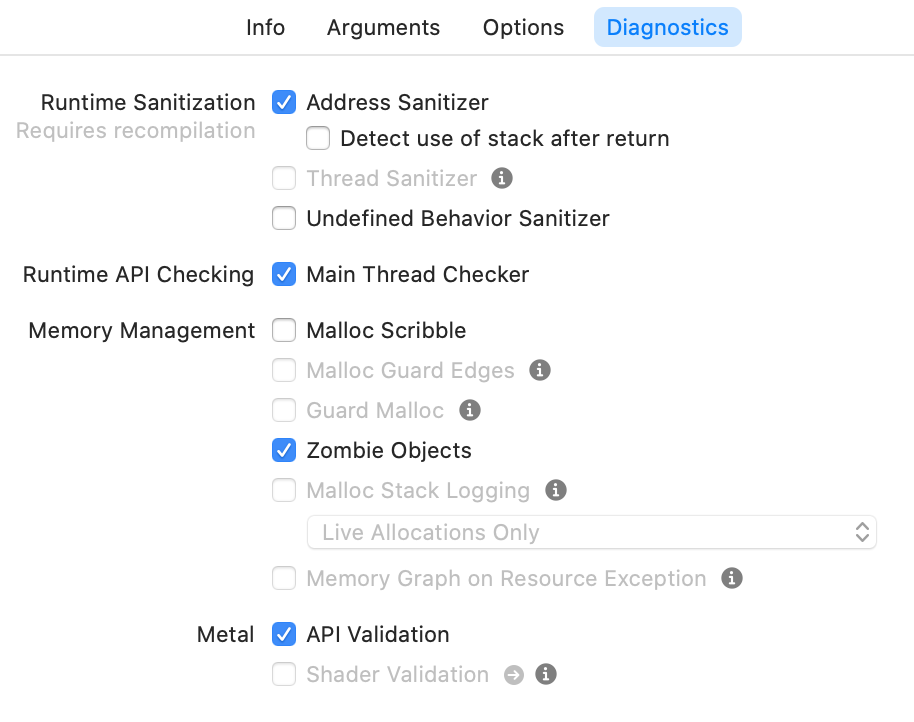

Address Sanitizer 会执行内存计数（成为影子内存）。他知道哪些内存位置被 “poisoned”。即，尚未分配（或已分配，然后释放）的内存。

(“Advanced Debugging with Address Sanitizer” 2015)

Address Sanitizer 将直接利用编译器，因此在编译代码时，对内存的任何访问都需要对影子内存进行检查，以查看内存位置是否被释放。如果发现这种现象，则会生成错误报告。

这是一个非常强大的工具，因为它解决了两个最重要的内存错误类别：

  1. 堆内存访问溢出（Heap Buffer Overflow）
  2. 堆内存释放后使用（Heap Use After Free）

_堆内存访问溢出（Heap Buffer Overflow）_ 问题是指我们将访问比已分配的内存更多的内存区域。 _堆内存释放后使用（Heap Use After Fre）_ 问题是指我们将访问已经释放的内存区域。

Address Sanitizer 可以进一步其他类型的内存问题，不过很少遇到：堆栈缓冲区溢出，全局变量溢出，C ++容器溢出以及返回错误后使用。

这种便利的代价是我们的程序运行将会慢 2~5 倍。但在我们的持续集成系统中消除一些问题是值得的。

### 内存冲突示例

思考在示例 `icdab_edge` 程序中的以下代码。 (“IOS Crash Dump Analysis Book Github Resources” 2018)

```c
- (void)overshootAllocated
{
    uint8_t *memory = malloc(16);
    for (int i = 0; i < 16 + 1; i++) {
        *(memory + i) = 0xff;
    }
}
```

此代码分配最小的内存量，即16个字节。然后它写入17个连续的内存位置。 我们得到一个堆溢出错误。

这个问题本身并不会使我们的应用立即崩溃。但如果旋转设备，则会触发潜在故障，并导致崩溃。通过启用 Address Sanitizer，应用程序立即崩溃。这有一个巨大的好处。 否则，我们可能在调试屏幕旋转相关代码上浪费了很多时间。

Address Sanitizer 的错误报告很详尽。 为了便于演示，我们仅显示报告的选定部分。

错误报告以以下内容开头：

```c
==21803==ERROR: AddressSanitizer:
 heap-buffer-overflow on address
 0x60200003a5e0 at
  pc 0x00010394461b bp 0x7ffeec2b8f00 sp 0x7ffeec2b8ef8
WRITE of size 1 at 0x60200003a5e0 thread T0
#0 0x10394461a in -[Crash overshootAllocated] Crash.m:48
```

这就足够我们切换到代码并开始理解问题。

并进一步提供了详细信息，显示我们的访问超出所分配的 16 字节的内存区域。

```c
0x60200003a5e0 is located 0 bytes to the right of
 16-byte region [0x60200003a5d0,0x60200003a5e0)
allocated by thread T0 here:
#0 0x103bcdaa3 in wrap_malloc
(libclang_rt.asan_iossim_dynamic.dylib:x86_64+0x54aa3)
#1 0x1039445ae in -[Crash overshootAllocated] Crash.m:46
```

请注意使用 “半开” 数字范围数字表示法，其中`[`包括较低范围的索引，而 `)` 则排除较高范围的索引。因此，我们对`0x60200003a5e0`的访问超出了分配的范围 `[0x60200003a5d0,0x60200003a5e0）`。

我们还得到了围绕该问题的内存的“映射”，为了便于演示，将 `0x1c0400007460` 截断为 `.... 7460`：

```c
SUMMARY: AddressSanitizer: heap-buffer-overflow Crash.m:48 in
 -[Crash overshootAllocated]
Shadow bytes around the buggy address:
....7460: fa fa 00 00 fa fa fd fd fa fa fd fa fa fa fd fa
....7470: fa fa 00 00 fa fa fd fa fa fa 00 00 fa fa fd fd
....7480: fa fa fd fa fa fa fd fd fa fa fd fa fa fa fd fa
....7490: fa fa fd fd fa fa fd fd fa fa fd fa fa fa fd fa
....74a0: fa fa 00 fa fa fa 00 00 fa fa fd fd fa fa 00 00
=>....74b0: fa fa 00 00 fa fa 00 00 fa fa 00 00[fa]fa fa fa
....74c0: fa fa fa fa fa fa fa fa fa fa fa fa fa fa fa fa
....74d0: fa fa fa fa fa fa fa fa fa fa fa fa fa fa fa fa
....74e0: fa fa fa fa fa fa fa fa fa fa fa fa fa fa fa fa
....74f0: fa fa fa fa fa fa fa fa fa fa fa fa fa fa fa fa
....7500: fa fa fa fa fa fa fa fa fa fa fa fa fa fa fa fa
Shadow byte legend
(one shadow byte represents 8 application bytes):
  Addressable:           00
  Partially addressable: 01 02 03 04 05 06 07
  Heap left redzone:       fa
```

从`[fa]` 中我们看到我们命中了 “redzone”（ `poisoned` 内存）的第一个字节。

### （堆内存）释放后使用示例

思考在示例 `icdab_edge` 程序中的以下代码。(“IOS Crash Dump Analysis Book Github Resources” 2018)

```c
- (void)useAfterFree
{
    uint8_t *memory = malloc(16);         // line 54
    for (int i = 0; i < 16; i++) {
        *(memory + i) = 0xff;
    }
    free(memory);                         // line 58
    for (int i = 0; i < 16; i++) {
        *(memory + i) = 0xee;             // line 60
    }
}
```

该代码分配最小的内存空间（16个字节），然后写入该内存，将其释放，然后再次尝试写入同一内存。

Address Sanitizer 报告报告我们访问已经释放的内存的位置：

```c
35711==ERROR: AddressSanitizer:
 heap-use-after-free on address
0x602000037270 at
 pc 0x000106d34381 bp 0x7ffee8ec9ef0 sp 0x7ffee8ec9ee8
WRITE of size 1 at 0x602000037270 thread T0
    #0 0x106d34380 in -[Crash useAfterFree] Crash.m:60
```

它告诉我们释放的位置：

```c
0x602000037270 is located 0 bytes inside of 16-byte region
 [0x602000037270,0x602000037280)
freed by thread T0 here:
    #0 0x106fbdc6d in wrap_free
    (libclang_rt.asan_iossim_dynamic.dylib:x86_64+0x54c6d)
    #1 0x106d34318 in -[Crash useAfterFree] Crash.m:58
```

它告诉我们内存最初分配的位置：

```c
previously allocated by thread T0 here:
    #0 0x106fbdaa3 in wrap_malloc
    (libclang_rt.asan_iossim_dynamic.dylib:x86_64+0x54aa3)
    #1 0x106d3428e in -[Crash useAfterFree] Crash.m:54
    SUMMARY: AddressSanitizer: heap-use-after-free Crash.m:60 in
     -[Crash useAfterFree]
```

最后，它向我们展示了一个错误地址周围的内存分布图片，为了便于演示，将“ 0x1c0400006df0”截断为“ …. 6df0”：

```c
    Shadow bytes around the buggy address:
  ....6df0: fa fa fd fd fa fa 00 00 fa fa fd fd fa fa fd fa
  ....6e00: fa fa fd fa fa fa 00 00 fa fa fd fa fa fa 00 00
  ....6e10: fa fa fd fd fa fa fd fa fa fa fd fd fa fa fd fa
  ....6e20: fa fa fd fa fa fa fd fd fa fa fd fd fa fa fd fa
  ....6e30: fa fa fd fa fa fa 00 fa fa fa 00 00 fa fa fd fd
=>....6e40: fa fa 00 00 fa fa 00 00 fa fa 00 00 fa fa[fd]fd
  ....6e50: fa fa fa fa fa fa fa fa fa fa fa fa fa fa fa fa
  ....6e60: fa fa fa fa fa fa fa fa fa fa fa fa fa fa fa fa
  ....6e70: fa fa fa fa fa fa fa fa fa fa fa fa fa fa fa fa
  ....6e80: fa fa fa fa fa fa fa fa fa fa fa fa fa fa fa fa
  ....6e90: fa fa fa fa fa fa fa fa fa fa fa fa fa fa fa fa
    Shadow byte legend
    (one shadow byte represents 8 application bytes):
      Addressable:           00
      Partially addressable: 01 02 03 04 05 06 07
      Heap left redzone:       fa
      Freed heap region:       fd
```

我们看到条目`[fd]`表示已释放对内存的进行写入操作。

### 内存管理工具

有一系列补充Address Sanitizer的工具。在关掉 Address Sanitizer 之后在使用他们。他们会发现 Address Sanitizer 可能会错过的某些失败原因。

与 Address Sanitizer 相比，这些内存管理工具不需要重新编译项目。

#### Guard Malloc 工具

该工具的一个主要缺点是仅适用于模拟器。每块内存都被分配在他们自己的内存页中，前后都有保护。该工具在很大程度上已被 Address Sanitizer 取代。

#### Malloc Scribble

Malloc Scribble 的目的是通过将 `malloc` 的或 `free`的内存标记成固定的已知值来使内存错误的症状变得可预测。已分配的内存标记为`0xAA`而已释放的内存标记为 `0x55`。 它不会影响在堆栈上分配内存的行为。它与Address Sanitizer不兼容。

如果我们有一个应用程序每次在运行时都以不同的方式崩溃，那么 Malloc Scribble 是一个不错的选择。 它将有助于使崩溃可预测和可重复。

思考在示例 `icdab_edge` 程序中的以下代码。(“IOS Crash Dump Analysis Book Github Resources” 2018)

```c
- (void)uninitializedMemory
{
    uint8_t *source = malloc(16);
    uint8_t target[16] = {0};
    for (int i = 0; i < 16; i++) {
       target[i] = *(source + i);
    }
}
```

首先，为 `source` 提供新分配的内存。由于此内存尚未初始化，因此在 Scheme 设置中设置了Malloc Scribble（以及 Address Sanitizer 重置）后，会将其设置为0xAA。

然后，设置 `target`。它是堆栈上的缓冲区（不是堆内存）。使用代码 `= {0}`，我们将应用设置的缓冲区的所有内存位置设置为 `0`。 否则，它将是随机存储器值。

然后我们进入一个循环。 通过在调试器中进行断点（例如在第二次迭代中），我们可以打印出内存内容并看到以下内容：

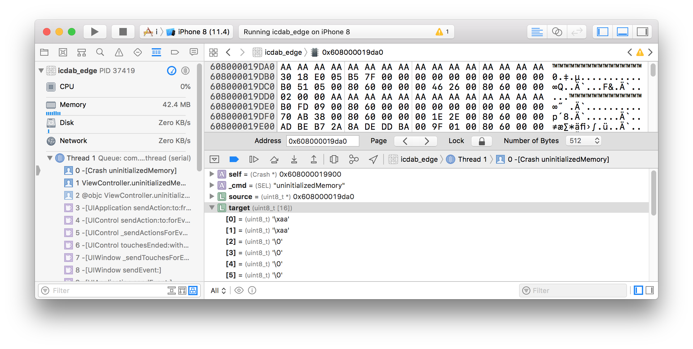

我们看到 `target`缓冲区与前两个索引位置（ `0xAA`）相距零。我们看到 `source`内存始终为 `0xAA`。

如果我们没有设置Malloc Scribble，则目标缓冲区将被填充随机值。在复杂的程序中，此类数据可以被输入到影响程序行为的其他子系统中。

#### Zombie Objects（僵尸对象）

僵尸对象的目的是在Objective-C 环境中的中检测 `NSObject`对象释放后使用的错误。特别是如果我们有一个使用手动引用计数的遗留代码库，则很容易过度释放对象。这意味着，通过指针传递消息可能会产生不可预测的效果。

此设置只能在调试构建时进行，因为代码将不再释放对象。它的性能配置文件相当于泄漏所有应该被释放的对象。

开启配置将使释放对象成为`NSZombie`对象。 发送给`NSZombie`对象的任何消息都会导致立即崩溃。因此，每当有消息发送给已经释放的的对象时，我们都可以确保发生崩溃。

思考在示例 `icdab_edge` 程序中的以下代码。(“IOS Crash Dump Analysis Book Github Resources” 2018)

```c
- (void)overReleasedObject
{
    id vc = [[UIViewController alloc] init];
    // Build Phases -> Compile Sources
    // -> Crash.m has Compiler Flags setting
    // -fno-objc-arc to allow the following line to be called
    [vc release];
    NSLog(@"%@", [vc description]);
}
```

当调用上述代码时，会发生崩溃，并记录以下内容：

```
2018-09-12 12:09:10.236058+0100 icdab_edge[92796:13650378]
 *** -[UIViewController description]: message sent to deallocated
  instance 0x7fba1ff071c0
```

查看调试器，我们看到：

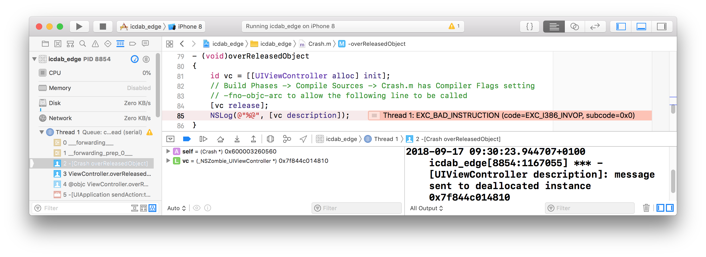

注意对象实例`vc`的类型是`_NSZombie_UIViewController *`。

该类型将是过已释放对象的原始类型，但是增加前缀了 `_NSZombie_`。 这是最有帮助的，在调试器中研究程序状态时，我们应该注意这一点。

#### Malloc 堆栈

有时需要了解我们应用程序过去的动态行为，以解决应用程序崩溃的原因。 例如，我们可能发生了内存泄露，然后由于使用过多内存而被系统终止。我们可能有一个数据结构，想知道代码的哪一部分负责分配它。

Malloc Stack 选项的目的是为提供我们所需的历史数据。苹果通过提供补充的可视化工具来增强了内存分析。 Malloc Stack 具有一个子选项“所有分配和释放的历史记录”或“仅实时分配”。

我们建议使用“所有分配”选项，除非使用的开销过多。 那可能是由于有一个应用程序大量使用了内存分配。“仅实时分配”选项足以捕获内存泄漏，并且开销很低，因此它是用户界面中的默认选项。

下面是执行步骤：

  1. 在 `Diagnostics` 设置选项卡中设置`Malloc Stack`选项。
  2. 启动应用.
  3. 按下 `Debug Memgraph` 按钮
  4. 基于命令行工具进行分析，_File -> Export Memory Graph…_

Xcode 内的 Memgraph 可视化工具功能全面，但令人生畏。 有一个有用的WWDC视频来介绍基本知识 (“IOS Memory Deep Dive” 2018)

通常有太多的底层细节需要检查。使用图形工具的最佳方式是当我们对应用程序错误使用内存有一些假设时。

##### Malloc 堆栈存储器示例：检测循环引用

一个简单有效的成果是看看我们是否有内存泄漏。这些内存位置无法访问，不能释放。

我们使用tvOS示例应用程序 `icdab_cycle` 来展示 Memgraph 如何发现循环引用。 (“IOS Crash Dump Analysis Book Github Resources” 2018)

通过在 Scheme 设置中设置Malloc Stack ，我们启动应用程序，然后按Memgraph按钮，如下所示：

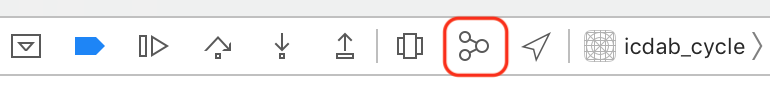

通过按下感叹号过滤器按钮，我们可以过滤为仅显示泄漏：

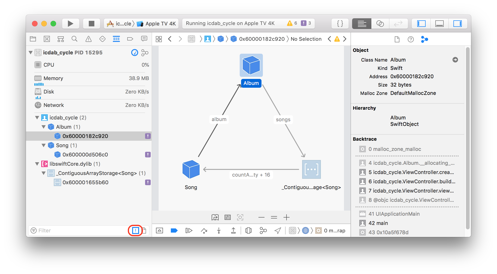

如果已经完成 _File-> Export Memory Graph …_，将内存图导出到 `icdab_cycle.memgraph`，我们可以使用以下命令从Mac Terminal应用程序中查看等效信息：

```
leaks icdab_cycle.memgraph

Process:         icdab_cycle [15295]
Path:            /Users/faisalm/Library/Developer/
CoreSimulator/Devices/
1616CA04-D1D0-4DF6-BE8E-F63541EC1EED/
data/Containers/Bundle/Application/
E44B9EFD-258B-4D0E-8637-CF374638D5FF/
icdab_cycle.app/icdab_cycle
Load Address:    0x106eb7000
Identifier:      icdab_cycle
Version:         ???
Code Type:       X86-64
Parent Process:  debugserver [15296]

Date/Time:       2018-09-14 16:38:23.008 +0100
Launch Time:     2018-09-14 16:38:12.398 +0100
OS Version:      Apple TVOS 12.0 (16J364)
Report Version:  7
Analysis Tool:   /Users/faisalm/Downloads/
Xcode.app/Contents/Developer/Platforms/
AppleTVOS.platform/Developer/Library/CoreSimulator/
Profiles/Runtimes/
tvOS.simruntime/Contents/
Resources/RuntimeRoot/Developer/Library/
PrivateFrameworks/DVTInstrumentsFoundation.framework/
LeakAgent
Analysis Tool Version:  iOS Simulator 12.0 (16J364)

Physical footprint:         38.9M
Physical footprint (peak):  39.0M
----

leaks Report Version: 3.0
Process 15295: 30252 nodes malloced for 5385 KB
Process 15295: 3 leaks for 144 total leaked bytes.

Leak: 0x600000d506c0  size=64  zone:
DefaultMallocZone_0x11da72000
   Song  Swift  icdab_cycle
    Call stack: [thread 0x10a974380]: |
   0x10a5f678d (libdyld.dylib) start |
    0x106eba614 (icdab_cycle) main
     AppDelegate.swift:12 ....
```

导致内存泄漏的代码是：

```c
var mediaLibrary: Album?

func createRetainCycleLeak() {
    let salsa = Album()
    let carnaval = Song(album: salsa,
     artist: "Salsa Latin 100%",
     title: "La Vida Es un Carnaval")
    salsa.songs.append(carnaval)
}

func buildMediaLibrary() {
    let kylie = Album()
    let secret = Song(album: kylie,
     artist: "Kylie Minogue",
     title: "It's No Secret")
    kylie.songs.append(secret)
    mediaLibrary = kylie
    createRetainCycleLeak()
}
```

这个问题是因为 `createRetainCycleLeak()` 方法中的`Song` 的实例对象 `carnaval` 强引用了`Album`的实例对象`salsa`，而 `salsa` 又强引用了 `Song` 的实例对象 `carnaval` ，而当我们从这个方法返回时，并没有从其他对象引用任何一个对象。这两个对象与对象图的其他部分断开连接，并且由于它们的相互强引用(称为循环引用)，所以它们不能被自动释放。一个非常类似的对象间的关系如 `Album` 的实例对象`kylie`并没有引起内存泄露，因为他是被顶级对象 `mediaLibrary` 所引用的。

#### 动态链接器API的用法

有时程序是动态适应的或可扩展的。对于这样的程序，动态链接器 AP I 将以编程方式加载额外的代码模块。当应用程序的配置或部署出错时，可能会导致崩溃。

要调试这些问题，需要设置 `Dynamic Linker API Usage`。但这可能会产生很多信息，因此可能会在启动时间有限、速度较慢的平台上造成问题，比如第一代Apple Watch

GitHub 上提供了使用动态链接器的示例应用程序。 (“Dynamic Loading Example” 2018)

启用后的输出为：

```c
_dyld_get_image_slide(0x105545000)
_dyld_register_func_for_add_image(0x10a21264c)
_dyld_get_image_slide(0x105545000)
_dyld_get_image_slide(0x105545000)
_dyld_register_func_for_add_image(0x10a5caf39)
dyld_image_path_containing_address(0x1055d2000)
.
.
.
dlopen(DynamicFramework2.framework/DynamicFramework2)
 ==> 0x60c0001460f0
.
.
.
```

这会生成大量日志记录。对此最好先搜索 `dlopen` 命令，然后查看 `dlopen` 系列中的其他函数被调用了

#### 动态库加载

在初始化阶段，有时会出现应用程序崩溃，此时动态加载器正在加载应用程序二进制文件及其依赖框架。如果我们确信它不是使用动态链接器API的自定义代码，而是将框架组装到我们关心的已加载二进制文件中，那么选择 `Dynamic Library Loads` 是合适的。 与启用 `Dynamic Linker API Usage` 相比，我们得到的日志要短得多。

启动后，我们将获得加载的二进制文件列表：

```
dyld: loaded: /Users/faisalm/Library/Developer/
CoreSimulator/Devices/
99DB717F-9161-461A-B11F-210C389ABA12/
data/Containers/Bundle/Application/
D916AC0F-6434-46A3-B18E-5EC65D194454/
icdab_edge.app/icdab_edge
dyld: loaded: /Applications/Xcode.app/Contents/Developer/
Platforms/iPhoneOS.platform/Contents/Resources/RuntimeRoot/
usr/lib/libBacktraceRecording.dylib
.
.
.
```

## 参考书目

* [2018 Macbook Pros Bridge Os Error.” 2018](https://forums.macrumors.com/threads/2018-macbook-pros-crashing-with-bridge-os-error.2128976/)
* [About the Rosetta Translation Environment.” 2020](https://developer.apple.com/documentation/apple_silicon/about_the_rosetta_translation_environment#3616845)

* [“Advanced Debugging with Address Sanitizer.” 2015](https://developer.apple.com/videos/play/wwdc2015/413/)

* [“Analytic Troubleshooting.” 2018](https://www.kepner-tregoe.com/)

* [“Apple’s T2 Chip May Be Behind iMac Pro, Macbook Pro Crashes.” 2018](https://appleinsider.com/articles/18/07/26/apples-t2-chip-could-be-behind-small-number-of-crashes-in-imac-pro-new-macbook-pro)

* [“CrashReport Technote 2123.” 2004](https://developer.apple.com/library/archive/technotes/tn2004/tn2123.html)

* [“Debugging Processor Reorder Buffer Timeout: Guide.” 2018](https://www.intel.co.uk/content/www/uk/en/embedded/training/rob-timeout-debug-guide-paper.html?wapkw=caterr)

* [“Diagnostic Profiles and Logs.” 2018](https://developer.apple.com/bug-reporting/profiles-and-logs/)

* [“Dynamic Loading Example.” 2018](https://github.com/patriknyblad/ios-runtime-loading-dynamic-framework.git)

* [“Examining Pointer Authentication on the iPhone Xs.” 2019](https://googleprojectzero.blogspot.com/2019/02/examining-pointer-authentication-on.html)

* [“Heroes of Software Engineering - the Men and Women at Transitive.” 2020](https://www.software.ac.uk/blog/2016-09-30-heroes-software-engineering-men-
and-women-transitive)

* [“Identifying High-Memory Use with Jetsam Event Reports.” 2020](https://developer.apple.com/documentation/xcode/diagnosing_issues_using_crash_reports_and_device_logs/identifying_high-memory_use_with_jetsam_event_reports)

* [“Improper Use of Bsd Sockets.” 2018](https://stackoverflow.com/a/13790353/2715565)

* [“IOS Crash Dump Analysis Book Github Resources.” 2018](https://github.com/faisalmemon/ios-crash-dump-analysis-book)

* [“IOS Crash Reporting Tools.” 2017](https://rollout.io/blog/ios-crash-reporting-tools-2017-update/)

* [“IOS Memory Deep Dive.” 2018](https://devstreaming-cdn.apple.com/videos/wwdc/2018/416n2fmzz0fz88f/416/416_ios_memory_deep_dive.pdf?dl=1)

* [“Jailed Just in Time Compilation on iOS.” 2020](https://saagarjha.com/blog/2020/02/23/jailed-just-in-time-compilation-on-ios/)

* [“Libcpp Apple Open Source.” 2020](https://opensource.apple.com/source/libcpp/libcpp-19/include/__split_buffer.auto.html)

* [“Libdispatch Open Source.” 2018](https://opensource.apple.com/tarballs/libdispatch/)

* [“Making Sense of I/O Kit Error Codes.” 2018](https://developer.apple.com/library/archive/qa/qa1075/_index.html)

* [“NSCFConstantString in Corefoundation.framework.” 2018](https://github.com/JaviSoto/iOS10-Runtime-Headers/blob/master/Frameworks/CoreFoundation.framework/__NSCFConstantString.h)

* [“NSDispatchData.h in Foundation.framework.” 2018](https://github.com/JaviSoto/iOS10-Runtime-Headers/blob/master/Frameworks/Foundation.framework/_NSDispatchData.h%0A)

* _Panic! Unix System Crash Dump Analysis_. 1995. 1st ed. Vol. 1. 0-13-149386-8. Prentice Hall.

* [“Plausible Labs Crash Reporter.” 2018](https://github.com/plausiblelabs/plcrashreporter)

* [“Porting Your macOS Apps to Apple Silicon.” 2020](https://developer.apple.com/documentation/xcode/porting_your_macos_apps_to_apple_silicon)

* [“Running Your iOS Apps on macOS.” 2020](https://developer.apple.com/documentation/apple_silicon/running_your_ios_apps_on_macos)

* [Serebryany, Konstantin, Derek Bruening, Alexander Potapenko, and Dmitry Vyukov. 2012. “AddressSanitizer: A Fast Address Sanity Checker.” In _USENIX
Atc 2012_](https://www.usenix.org/conference/usenixfederatedconferencesweek/addresssanitizer-fast-address-sanity-checker)

* [“The Brains Behind Apple’s Rosetta: Transitive.” 2020](https://www.cnet.com/news/the-brains-behind-apples-rosetta-transitive/)

* [“Thread Status Values in Mach.” 2018](https://github.com/apple/darwin-xnu/blob/0a798f6738bc1db01281fc08ae024145e84df927/osfmk/mach/arm/thread_status.h)

