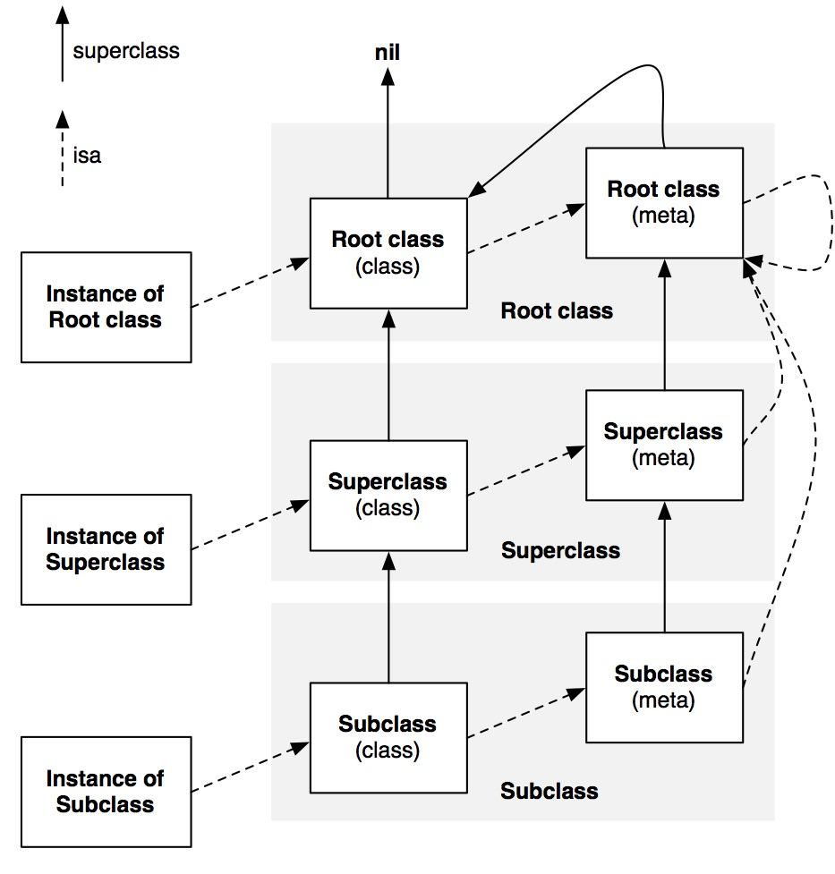
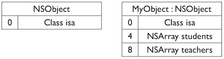
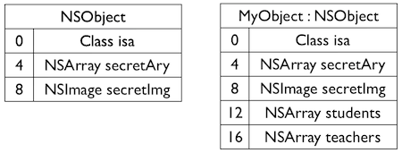
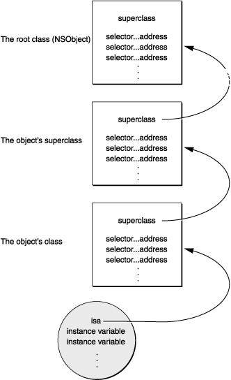
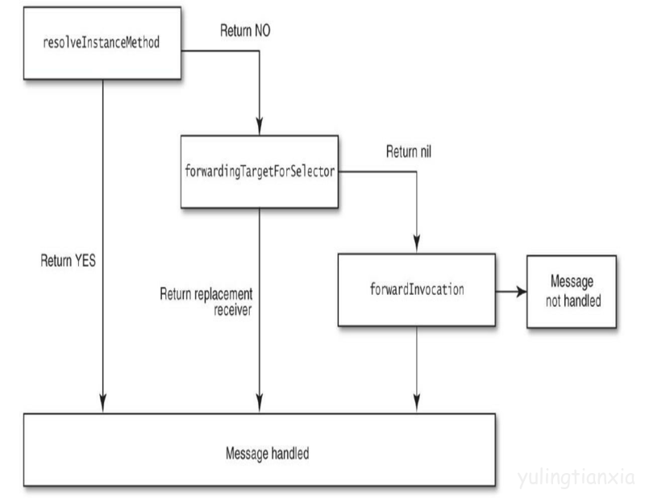
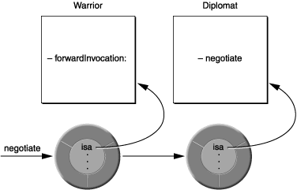
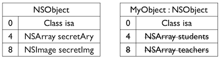

 
<!--BEGIN_DATA
{
    "create_date": "2017-08-18 09:58", 
    "modify_date": "2017-08-18 09:58", 
    "is_top": "0", 
    "summary": "iOS runtime", 
    "tags": "iOS", 
    "file_name": "iOS runtime.md"
}
END_DATA-->

####
原文出处：<a href='http://www.jianshu.com/p/efeb33712445#' target='blank'>http://www.jianshu.com/p/efeb33712445#</a>

**楔子**  
[Runtime](http://opensource.apple.com//source/objc4/)是什么？见名知意，其概念无非就是“因为Objective-C 是一门动态语言，所以它需要一个运行时系统……这就是 Runtime 系统”云云。对博主这种菜鸟而言，Runtime在实际开发中，其实就是一组C语言的函数。胡适说：“多研究些问题，少谈些主义”，云山雾罩的概念听多了总是容易头晕，接下来我们直接从代码入手学习Runtime。  
  
**1、由objc_msgSend说开去：**  
Objective-C 中的方法调用，不是简单的方法调用，而是发送消息，也就是说，其实 [receiver message] 会被编译器转化为:objc_msgSend(receiver, selector)，何以证明？新建一个类 MyClass，其.m文件如下：

    
    
    #import "MyClass.h"
    @implementation MyClass
    -(instancetype)init{
        if (self = [super init]) {
            [self showUserName];
        }
        return self;
    }
    -(void)showUserName{
        NSLog(@"Dave Ping");
    }

使用 clang 重写命令:

    
    
    $ clang -rewrite-objc MyClass.m

然后在同一目录下会多出一个 MyClass.cpp 文件，双击打开，可以看到 init 方法已经被编译器转化为下面这样：

    
    
    static instancetype _I_MyClass_init(MyClass * self, SEL _cmd) {
        if (self = ((MyClass *(*)(__rw_objc_super *, SEL))(void *)objc_msgSendSuper)((__rw_objc_super){(id)self, (id)class_getSuperclass(objc_getClass("MyClass"))}, sel_registerName("init"))) {
            ((void (*)(id, SEL))(void *)objc_msgSend)((id)self, sel_registerName("showUserName"));
        }
        return self;
    }

我们要找的就是它：

    
    
    ((void (*)(id, SEL))(void *)objc_msgSend)((id)self, sel_registerName("showUserName"))

objc_msgSend 函数被定义在 objc/message.h 目录下，其函数原型是酱紫滴：

    
    
    OBJC_EXPORT void objc_msgSend(void /* id self, SEL op, ... */ )

该函数有两个参数，一个 id 类型，一个 SEL 类型。

**2、SEL**  
SEL 被定义在 objc/objc.h 目录下：

    
    
    typedef struct objc_selector *SEL;

其实它就是个映射到方法的C字符串，你可以用 Objective-C 编译器命令 @selector() 或者 Runtime 系统的sel_registerName 函数来获得一个 SEL 类型的方法选择器。

**3、id**  
与 SEL 一样，id 也被定义在 objc/objc.h 目录下：

    
    
    typedef struct objc_object *id;

id 是一个结构体指针类型，它可以指向 Objective-C 中的任何对象。objc_object 结构体定义如下：

    
    
    struct objc_object { Class isa OBJC_ISA_AVAILABILITY;};

我们通常所说的**对象**，就长这个样子，这个结构体只有一个成员变量 isa，**对象**可以通过 isa 指针找到其所属的类。isa 是一个 Class类型的成员变量，那么 Class 又是什么呢？

**4、Class**  
Class 也是一个结构体指针类型：

    
    
    typedef struct objc_class *Class;

objc_class 结构体是酱紫滴：

    
    
    struct objc_class {
        Class isa  OBJC_ISA_AVAILABILITY;
    #if !__OBJC2__
        Class super_class                                        OBJC2_UNAVAILABLE;
        const char *name                                         OBJC2_UNAVAILABLE;
        long version                                             OBJC2_UNAVAILABLE;
        long info                                                OBJC2_UNAVAILABLE;
        long instance_size                                       OBJC2_UNAVAILABLE;
        struct objc_ivar_list *ivars                             OBJC2_UNAVAILABLE;
        struct objc_method_list **methodLists                    OBJC2_UNAVAILABLE;
        struct objc_cache *cache                                 OBJC2_UNAVAILABLE;
        struct objc_protocol_list *protocols                     OBJC2_UNAVAILABLE;
    #endif
    } OBJC2_UNAVAILABLE;

我们通常说的**类**就长这样子：  
·Class 也有一个 isa 指针，指向其所属的**元类**（meta）.  
·super_class：指向其**超类**.  
·name：是**类名**.  
·version：是类的**版本信息**.  
·info：是类的**详情**.  
·instance_size：是该类的**实例对象的大小**.  
·ivars：指向该类的**成员变量列表**.  
·methodLists：指向该类的**实例方法列表**，它将方法选择器和方法实现地址联系起来。methodLists 是指向
·objc_method_list 指针的指针，也就是说可以动态修改 *methodLists 的值来添加成员方法，这也是 Category
实现的原理，同样解释了 Category 不能添加属性的原因.  
·cache：Runtime 系统会把被调用的方法存到 cache 中（理论上讲一个方法如果被调用，那么它有可能今后还会被调用），下次查找的时候效率更高.  
·protocols：指向该类的协议列表.

* * *

说到这里有点乱了，我们来捋一下，当我们调用一个方法时，其运行过程大致如下：

首先，Runtime 系统会把方法调用转化为消息发送，即 objc_msgSend，并且把**方法的调用者**，和**方法选择器**，当做参数传递过去.

此时，方法的调用者会通过 isa 指针来找到其所属的类，然后在 cache 或者 methodLists 中查找该方法，找得到就跳到对应的方法去执行.

如果在**类**中没有找到该方法，则通过 super_class 往上一级**超类**查找（如果一直找到 NSObject都没有找到该方法的话，这种情况，我们放到后面**消息转发**的时候再说）.

前面我们说 methodLists指向该类的**实例方法列表**，**实例方法**即**-方法**，那么**类方法**（+方法）存储在哪儿呢？类方法被存储在**元类**中，Class 通过isa 指针即可找到其所属的**元类**.

  

  
上图实线是 super_class 指针，虚线是 isa 指针。根元类的超类是NSObject，而 isa 指向了自己。NSObject 的超类为nil，也就是它没有超类。

**5、使用objc_msgSend**  
前面我们使用 clang 重写命令，看到 Runtime 是如何将方法调用转化为消息发送的。我们也可以依样画葫芦，来学习使用一下objc_msgSend。新建一个类 TestClass，添加如下方法：

    
    
    -(void)showAge{
        NSLog(@"24");
    }
    -(void)showName:(NSString *)aName{
        NSLog(@"name is %@",aName);
    }
    -(void)showSizeWithWidth:(float)aWidth andHeight:(float)aHeight{
        NSLog(@"size is %.2f * %.2f",aWidth, aHeight);
    }
    -(float)getHeight{
        return 187.5f;
    }
    -(NSString *)getInfo{
        return @"Hi, my name is Dave Ping, I'm twenty-four years old in the year, I like apple, nice to meet you.";
    }

我们可以像下面这样，使用 objc_msgSend 依次调用这些方法：

    
    
        TestClass *objct = [[TestClass alloc] init];
        ((void (*) (id, SEL)) objc_msgSend) (objct, sel_registerName("showAge"));
        ((void (*) (id, SEL, NSString *)) objc_msgSend) (objct, sel_registerName("showName:"), @"Dave Ping");
        ((void (*) (id, SEL, float, float)) objc_msgSend) (objct, sel_registerName("showSizeWithWidth:andHeight:"), 110.5f, 200.0f);
        float f = ((float (*) (id, SEL)) objc_msgSend_fpret) (objct, sel_registerName("getHeight"));
        NSLog(@"height is %.2f",f);
        NSString *info = ((NSString* (*) (id, SEL)) objc_msgSend) (objct, sel_registerName("getInfo"));
        NSLog(@"%@",info);

也许你已经注意到，objc_msgSend 在使用时都被强制转换了一下，这是因为 objc_msgSend
这个函数至少要有两个参数，一个id消息接受者，一个SEL消息名称。后面三个点代表参数，是变参。也就是说方法携带的参数，可以没有，可以有多个。如果我们把调用showAge 方法改成这样：

    
    
    objc_msgSend(objct, sel_registerName("showAge"));

Xcode 就会报错：

    
    
    Too many arguments to function call, expected 0, have 2.

完整的 objc_msgSend 使用代码在[这里](https://github.com/daiweiping/RuntimeLearn)。

**6、objc_msgSendSuper**  
编译器会根据情况在
objc_msgSend，objc_msgSend_stret，objc_msgSendSuper，objc_msgSendSuper_stret 或
objc_msgSend_fpret 五个方法中选择一个来调用。如果消息是传递给超类，那么会调用 objc_msgSendSuper方法，如果消息返回值是数据结构，就会调用 objc_msgSendSuper_stret 方法，如果返回值是浮点数，则调用
objc_msgSend_fpret 方法。

这里我们重点说一下 objc_msgSendSuper，objc_msgSendSuper 函数原型如下：

    
    
    OBJC_EXPORT void objc_msgSendSuper(void /* struct objc_super *super, SEL op, ... */ )

当我们调用 [super selector] 时，Runtime 会调用 objc_msgSendSuper 方法，objc_msgSendSuper方法有两个参数，super 和 op，Runtime 会把 selector **方法选择器**赋值给 op。而 super 是一个 objc_super结构体指针，objc_super 结构体定义如下：

    
    
    struct objc_super {
        /// Specifies an instance of a class.
        __unsafe_unretained id receiver;
        /// Specifies the particular superclass of the instance to message. 
    #if !defined(__cplusplus)  &&  !__OBJC2__
        /* For compatibility with old objc-runtime.h header */
        __unsafe_unretained Class class;
    #else
        __unsafe_unretained Class super_class;
    #endif
        /* super_class is the first class to search */
    };

Runtime 会创建一个 objc_spuer 结构体变量，将其地址作为参数（super）传递给 objc_msgSendSuper，并且将 self赋值给 receiver：super—>receiver=self.  
举个栗子，问下面的代码输出什么：

    
    
    @implementation Son : Father
    - (id)init
    {
        self = [super init];
        if (self)
        {
            NSLog(@"%@", NSStringFromClass([self class]));
            NSLog(@"%@", NSStringFromClass([super class]));
        }
        return self;
    }
    @end

答案是全部输出 Son.  
使用 clang 重写命令，发现上述代码被转化为:

    
    
    NSLog((NSString *)&__NSConstantStringImpl__var_folders_gm_0jk35cwn1d3326x0061qym280000gn_T_main_a5cecc_mi_0, NSStringFromClass(((Class (*)(id, SEL))(void *)objc_msgSend)((id)self, sel_registerName("class"))));
    NSLog((NSString *)&__NSConstantStringImpl__var_folders_gm_0jk35cwn1d3326x0061qym280000gn_T_main_a5cecc_mi_1, NSStringFromClass(((Class (*)(__rw_objc_super *, SEL))(void *)objc_msgSendSuper)((__rw_objc_super){ (id)self, (id)class_getSuperclass(objc_getClass("Son")) }, sel_registerName("class"))));

当调用 [super class] 时，会转换成 objc_msgSendSuper 函数：

第一步先构造 objc_super 结构体，结构体第一个成员就是 self。第二个成员是
(id)class_getSuperclass(objc_getClass(“Son”)).

第二步是去 Father 这个类里去找 - (Class)class，没有，然后去 NSObject 类去找，找到了。最后内部是使用objc_msgSend(objc_super->receiver, @selector(class)) 去调用，此时已经和 [self class]调用相同了，所以两个输出结果都是 Son。

**7、对象关联**  
对象关联**允许开发者对已经存在的类在 Category 中添加自定义的属性**：

    
    
    OBJC_EXPORT void objc_setAssociatedObject(id object, const void *key, id value, objc_AssociationPolicy policy) __OSX_AVAILABLE_STARTING(__MAC_10_6, __IPHONE_3_1);

·object 是源对象.  
·value 是被关联的对象.  
·key 是关联的键，objc_getAssociatedObject 方法通过不同的 key 即可取出对应的被关联对象.  
·policy 是一个枚举值，表示**关联对象的行为**，从命名就能看出各个枚举值的含义：

    
    
    typedef OBJC_ENUM(uintptr_t, objc_AssociationPolicy) {
        OBJC_ASSOCIATION_ASSIGN = 0,           /**< Specifies a weak reference to the associated object. */
        OBJC_ASSOCIATION_RETAIN_NONATOMIC = 1, /**< Specifies a strong reference to the associated object. 
                                                *   The association is not made atomically. */
        OBJC_ASSOCIATION_COPY_NONATOMIC = 3,   /**< Specifies that the associated object is copied. 
                                                *   The association is not made atomically. */
        OBJC_ASSOCIATION_RETAIN = 01401,       /**< Specifies a strong reference to the associated object.
                                                *   The association is made atomically. */
        OBJC_ASSOCIATION_COPY = 01403          /**< Specifies that the associated object is copied.
                                                *   The association is made atomically. */
    };

要取出被关联的对象使用 objc_getAssociatedObject 方法即可，要删除一个被关联的对象，使用objc_setAssociatedObject 方法将对应的 key 设置成 nil 即可：

    
    
    objc_setAssociatedObject(self, associatedKey, nil, OBJC_ASSOCIATION_COPY_NONATOMIC);

objc_removeAssociatedObjects 方法将会**移除源对象中所有的关联对象.**  
举个栗子，假如我们要给 UIButton 添加一个监听单击事件的 block 属性，新建 UIButton 的 Category，其.m文件如下：

    
    
    #import "UIButton+ClickBlock.h"
    #import <objc/runtime.h>
    static const void *associatedKey = "associatedKey";
    @implementation UIButton (ClickBlock)
    //Category中的属性，只会生成setter和getter方法，不会生成成员变量
    -(void)setClick:(clickBlock)click{
        objc_setAssociatedObject(self, associatedKey, click, OBJC_ASSOCIATION_COPY_NONATOMIC);
        [self removeTarget:self action:@selector(buttonClick) forControlEvents:UIControlEventTouchUpInside];
        if (click) {
            [self addTarget:self action:@selector(buttonClick) forControlEvents:UIControlEventTouchUpInside];
        }
    }
    -(clickBlock)click{
        return objc_getAssociatedObject(self, associatedKey);
    }
    -(void)buttonClick{
        if (self.click) {
            self.click();
        }
    }
    @end

然后在代码中，就可以使用 UIButton 的属性来监听单击事件了：

    
    
        UIButton *button = [UIButton buttonWithType:UIButtonTypeCustom];
        button.frame = self.view.bounds;
        [self.view addSubview:button];
        button.click = ^{
            NSLog(@"buttonClicked");
        };

完整的对象关联代码点[这里](https://github.com/daiweiping/RuntimeLearn)

**8、自动归档**  
博主在学习 Runtime 之前，归档的时候是酱紫写的：

    
    
    - (void)encodeWithCoder:(NSCoder *)aCoder{
        [aCoder encodeObject:self.name forKey:@"name"];
        [aCoder encodeObject:self.ID forKey:@"ID"];
    }
    - (id)initWithCoder:(NSCoder *)aDecoder{
        if (self = [super init]) {
            self.ID = [aDecoder decodeObjectForKey:@"ID"];
            self.name = [aDecoder decodeObjectForKey:@"name"];
        }
        return self;
    }

那么问题来了，如果当前 Model 有100个属性的话，就需要写100行这种代码：

    
    
    [aCoder encodeObject:self.name forKey:@"name"];

想想都头疼，通过 Runtime 我们就可以轻松解决这个问题：  
1.使用 class_copyIvarList 方法获取当前 Model 的所有成员变量.  
2.使用 ivar_getName 方法获取成员变量的名称.  
3.通过 KVC 来读取 Model 的属性值（encodeWithCoder:），以及给 Model 的属性赋值（initWithCoder:）.

举个栗子，新建一个 Model 类，其.m文件如下：

    
    
    #import "TestModel.h"
    #import <objc/runtime.h>
    #import <objc/message.h>
    @implementation TestModel
    - (void)encodeWithCoder:(NSCoder *)aCoder{
        unsigned int outCount = 0;
        Ivar *vars = class_copyIvarList([self class], &outCount);
        for (int i = 0; i < outCount; i ++) {
            Ivar var = vars[i];
            const char *name = ivar_getName(var);
            NSString *key = [NSString stringWithUTF8String:name];
            // 注意kvc的特性是，如果能找到key这个属性的setter方法，则调用setter方法
            // 如果找不到setter方法，则查找成员变量key或者成员变量_key，并且为其赋值
            // 所以这里不需要再另外处理成员变量名称的“_”前缀
            id value = [self valueForKey:key];
            [aCoder encodeObject:value forKey:key];
        }
    }
    - (nullable instancetype)initWithCoder:(NSCoder *)aDecoder{
        if (self = [super init]) {
            unsigned int outCount = 0;
            Ivar *vars = class_copyIvarList([self class], &outCount);
            for (int i = 0; i < outCount; i ++) {
                Ivar var = vars[i];
                const char *name = ivar_getName(var);
                NSString *key = [NSString stringWithUTF8String:name];
                id value = [aDecoder decodeObjectForKey:key];
                [self setValue:value forKey:key];
            }
        }
        return self;
    }
    @end

完整的自动归档代码在[这里](https://github.com/daiweiping/RuntimeLearn)

9、**字典与模型互转**  
最开始博主是这样用字典给 Model 赋值的：

    
    
    -(instancetype)initWithDictionary:(NSDictionary *)dict{
        if (self = [super init]) {
            self.age = dict[@"age"];
            self.name = dict[@"name"];
        }
        return self;
    }

可想而知，遇到的问题跟归档时候一样（后来使用[MJExtension](https://github.com/CoderMJLee/MJExtension)
），这里我们稍微来学习一下其中原理，字典转模型的时候： 
 
1.根据字典的 key 生成 setter 方法.  
2.使用 objc_msgSend 调用 setter 方法为 Model 的属性赋值（或者 KVC）.

模型转字典的时候： 
 
1.调用 class_copyPropertyList 方法获取当前 Model 的所有属性.  
2.调用 property_getName 获取属性名称.  
3.根据属性名称生成 getter 方法.  
4.使用 objc_msgSend 调用 getter 方法获取属性值（或者 KVC）.

代码如下：

    
    
    #import "NSObject+KeyValues.h"
    #import <objc/runtime.h>
    #import <objc/message.h>
    @implementation NSObject (KeyValues)
    //字典转模型
    +(id)objectWithKeyValues:(NSDictionary *)aDictionary{
        id objc = [[self alloc] init];
        for (NSString *key in aDictionary.allKeys) {
            id value = aDictionary[key];
            /*判断当前属性是不是Model*/
            objc_property_t property = class_getProperty(self, key.UTF8String);
            unsigned int outCount = 0;
            objc_property_attribute_t *attributeList = property_copyAttributeList(property, &outCount);
            objc_property_attribute_t attribute = attributeList[0];
            NSString *typeString = [NSString stringWithUTF8String:attribute.value];
            if ([typeString isEqualToString:@"@\"TestModel\""]) {
                value = [self objectWithKeyValues:value];
            }
            /**********************/
            //生成setter方法，并用objc_msgSend调用
            NSString *methodName = [NSString stringWithFormat:@"set%@%@:",[key substringToIndex:1].uppercaseString,[key substringFromIndex:1]];
            SEL setter = sel_registerName(methodName.UTF8String);
            if ([objc respondsToSelector:setter]) {
                ((void (*) (id,SEL,id)) objc_msgSend) (objc,setter,value);
            }
        }
        return objc;
    }
    //模型转字典
    -(NSDictionary *)keyValuesWithObject{
        unsigned int outCount = 0;
        objc_property_t *propertyList = class_copyPropertyList([self class], &outCount);
        NSMutableDictionary *dict = [NSMutableDictionary dictionary];
        for (int i = 0; i < outCount; i ++) {
            objc_property_t property = propertyList[i];
            //生成getter方法，并用objc_msgSend调用
            const char *propertyName = property_getName(property);
            SEL getter = sel_registerName(propertyName);
            if ([self respondsToSelector:getter]) {
                id value = ((id (*) (id,SEL)) objc_msgSend) (self,getter);
                /*判断当前属性是不是Model*/
                if ([value isKindOfClass:[self class]] && value) {
                    value = [value keyValuesWithObject];
                }
                /**********************/
                if (value) {
                    NSString *key = [NSString stringWithUTF8String:propertyName];
                    [dict setObject:value forKey:key];
                }
            }
        }
        return dict;
    }
    @end

完整代码在[这里](https://github.com/daiweiping/RuntimeLearn)

**10、动态方法解析**  
前面我们留下了一点东西没说，那就是如果某个对象调用了不存在的方法时会怎么样，一般情况下程序会crash，错误信息类似下面这样：

    
    
    unrecognized selector sent to instance 0x7fd0a141afd0

但是在程序crash之前，Runtime 会给我们**动态方法解析**的机会，消息发送的步骤大致如下：

1.检测这个 selector 是不是要忽略的。比如 Mac OS X 开发，有了垃圾回收就不理会 retain，release 这些函数了.

2.检测这个 target 是不是 nil 对象。ObjC 的特性是允许对一个 nil 对象执行任何一个方法不会 Crash，因为会被忽略掉.

3.如果上面两个都过了，那就开始查找这个类的 IMP，先从 cache 里面找，完了找得到就跳到对应的函数去执行.  
如果 cache 找不到就找一下方法分发表.

4.如果分发表找不到就到超类的分发表去找，一直找，直到找到NSObject类为止.

如果还找不到就要开始进入消息转发了，消息转发的大致过程如图：

  

这里写图片描述

  
1.进入 resolveInstanceMethod: 方法，指定是否动态添加方法。若返回NO，则进入下一步，若返回YES，则通过class_addMethod 函数动态地添加方法，消息得到处理，此流程完毕.

2.resolveInstanceMethod: 方法返回 NO 时，就会进入 forwardingTargetForSelector: 方法，这是Runtime 给我们的第二次机会，用于指定哪个对象响应这个 selector。返回nil，进入下一步，返回某个对象，则会调用该对象的方法.

3.若 forwardingTargetForSelector: 返回的是nil，则我们首先要通过 methodSignatureForSelector:来指定方法签名，返回nil，表示不处理，若返回方法签名，则会进入下一步.

4当第 methodSignatureForSelector: 方法返回方法签名后，就会调用 forwardInvocation: 方法，我们可以通过anInvocation 对象做很多处理，比如修改实现方法，修改响应对象等.

如果到最后，消息还是没有得到响应，程序就会crash，详细代码在[这里](https://github.com/daiweiping/RuntimeLearn)。

####
原文出处：<a href='http://yulingtianxia.com/blog/2014/11/05/objective-c-runtime/' target='blank'>Objective-C Runtime</a>

本文详细整理了 Cocoa 的 Runtime 系统的知识，它使得 Objective-C如虎添翼，具备了灵活的动态特性，使这门古老的语言焕发生机。主要内容如下：

  * 引言
  * 简介
  * 与Runtime交互
  * Runtime术语
  * 消息
  * 动态方法解析
  * 消息转发
  * 健壮的实例变量(Non Fragile ivars)
  * Objective-C Associated Objects
  * Method Swizzling
  * 总结

###引言

曾经觉得Objc特别方便上手，面对着 Cocoa 中大量 API，只知道简单的查文档和调用。还记得初学 Objective-C 时把`[receiver message]`当成简单的方法调用，而无视了**“发送消息”**这句话的深刻含义。其实`[receiver message]`会被编译器转化为：  

    
    objc_msgSend(receiver, selector)  
    

如果消息含有参数，则为：  

    
    objc_msgSend(receiver, selector, arg1, arg2, ...)  
    

如果消息的接收者能够找到对应的`selector`，那么就相当于直接执行了接收者这个对象的特定方法；否则，消息要么被转发，或是临时向接收者动态添加这个`selector`对应的实现内容，要么就干脆玩完崩溃掉。

现在可以看出`[receiver message]`真的不是一个简简单单的方法调用。因为这只是在编译阶段确定了要向接收者发送`message`这条消息，而`receive`将要如何响应这条消息，那就要看运行时发生的情况来决定了。

Objective-C 的 Runtime 铸就了它动态语言的特性，这些深层次的知识虽然平时写代码用的少一些，但是却是每个 Objc 程序员需要了解的。

###简介

因为Objc是一门动态语言，所以它总是想办法把一些决定工作从编译连接推迟到运行时。也就是说只有编译器是不够的，还需要一个运行时系统 (runtime system) 来执行编译后的代码。这就是 Objective-C Runtime 系统存在的意义，它是整个Objc运行框架的一块基石。

Runtime其实有两个版本:“modern”和 “legacy”。我们现在用的 Objective-C 2.0采用的是现行(Modern)版的Runtime系统，只能运行在 iOS 和 OS X 10.5 之后的64位程序中。而OS X较老的32位程序仍采用Objective-C 1中的（早期）Legacy 版本的 Runtime系统。这两个版本最大的区别在于当你更改一个类的实例变量的布局时，在早期版本中你需要重新编译它的子类，而现行版就不需要。

Runtime基本是用C和汇编写的，可见苹果为了动态系统的高效而作出的努力。你可以在[这里](http://www.opensource.apple.com/source/objc4/)下到苹果维护的开源代码。苹果和GNU各自维护一个开源的runtime版本，这两个版本之间都在努力的保持一致。

###与Runtime交互

Objc 从三种不同的层级上与 Runtime 系统进行交互，分别是通过 Objective-C 源代码，通过 Foundation框架的`NSObject`类定义的方法，通过对 runtime 函数的直接调用。

####Objective-C源代码

大部分情况下你就只管写你的Objc代码就行，runtime 系统自动在幕后辛勤劳作着。  
还记得引言中举的例子吧，消息的执行会使用到一些编译器为实现动态语言特性而创建的数据结构和函数，Objc中的类、方法和协议等在 runtime中都由一些数据结构来定义，这些内容在后面会讲到。（比如`objc_msgSend`函数及其参数列表中的`id`和`SEL`都是啥）

####NSObject的方法

Cocoa 中大多数类都继承于`NSObject`类，也就自然继承了它的方法。最特殊的例外是`NSProxy`，它是个抽象超类，它实现了一些消息转发有关的方法，可以通过继承它来实现一个其他类的替身类或是虚拟出一个不存在的类，说白了就是领导把自己展现给大家风光无限，但是把活儿都交给幕后小弟去干。

有的`NSObject`中的方法起到了抽象接口的作用，比如`description`方法需要你重载它并为你定义的类提供描述内容。`NSObject`还有些方
法能在运行时获得类的信息，并检查一些特性，比如`class`返回对象的类；`isKindOfClass:`和`isMemberOfClass:`则检查对象是
否在指定的类继承体系中；`respondsToSelector:`检查对象能否响应指定的消息；`conformsToProtocol:`检查对象是否实现了指
定协议类的方法；`methodForSelector:`则返回指定方法实现的地址。

####Runtime的函数

Runtime
系统是一个由一系列函数和数据结构组成，具有公共接口的动态共享库。头文件存放于`/usr/include/objc`目录下。许多函数允许你用纯C代码来重复实现Objc 中同样的功能。虽然有一些方法构成了`NSObject`类的基础，但是你在写 Objc 代码时一般不会直接用到这些函数的，除非是写一些 Objc与其他语言的桥接或是底层的debug工作。在[Objective-C Runtime Reference](https://developer.apple.com/library/mac/documentation/Cocoa/Reference/ObjCRuntimeRef/index.html)中有对Runtime 函数的详细文档。

###Runtime术语

还记得引言中的`objc_msgSend:`方法吧，它的真身是这样的：  

    
    id objc_msgSend ( id self, SEL op, ... );  
    

下面将会逐渐展开介绍一些术语，其实它们都对应着数据结构。

####SEL

`objc_msgSend`函数第二个参数类型为`SEL`，它是`selector`在Objc中的表示类型（Swift中是`Selector`类）。`selector`是方法选择器，可以理解为区分方法的 ID，而这个 ID 的数据结构是`SEL`:  

    
    typedef struct objc_selector *SEL;  
    

其实它就是个映射到方法的C字符串，你可以用 Objc 编译器命令`@selector()`或者 Runtime系统的`sel_registerName`函数来获得一个`SEL`类型的方法选择器。

不同类中相同名字的方法所对应的方法选择器是相同的，即使方法名字相同而变量类型不同也会导致它们具有相同的方法选择器，于是 Objc中方法命名有时会带上参数类型(`NSNumber`一堆抽象工厂方法拿走不谢)，Cocoa 中有好多长长的方法哦。

####id

`objc_msgSend`第一个参数类型为`id`，大家对它都不陌生，它是一个指向类实例的指针：  

    
    typedef struct objc_object *id;  
    

那`objc_object`又是啥呢：  

    
    struct objc_object { Class isa; };  
    

`objc_object`结构体包含一个`isa`指针，根据`isa`指针就可以顺藤摸瓜找到对象所属的类。

PS:`isa`指针不总是指向实例对象所属的类，不能依靠它来确定类型，而是应该用`class`方法来确定实例对象的类。因为KVO的实现机理就是将被观察对象的`isa`指针指向一个中间类而不是真实的类，这是一种叫做 **isa-swizzling** 的技术，详见[官方文档](https://developer.apple.com/library/ios/documentation/Cocoa/Conceptual/KeyValueObserving/Articles/KVOImplementation.html)

####Class

之所以说`isa`是指针是因为`Class`其实是一个指向`objc_class`结构体的指针：  

    
    
    typedef struct objc_class *Class;  
    

而`objc_class`就是我们摸到的那个瓜，里面的东西多着呢：  

     
    
    struct objc_class {  
        Class isa  OBJC_ISA_AVAILABILITY;  
      
    #if !__OBJC2__  
        Class super_class                                        OBJC2_UNAVAILABLE;  
        const char *name                                         OBJC2_UNAVAILABLE;  
        long version                                             OBJC2_UNAVAILABLE;  
        long info                                                OBJC2_UNAVAILABLE;  
        long instance_size                                       OBJC2_UNAVAILABLE;  
        struct objc_ivar_list *ivars                             OBJC2_UNAVAILABLE;  
        struct objc_method_list **methodLists                    OBJC2_UNAVAILABLE;  
        struct objc_cache *cache                                 OBJC2_UNAVAILABLE;  
        struct objc_protocol_list *protocols                     OBJC2_UNAVAILABLE;  
    #endif  
      
    } OBJC2_UNAVAILABLE;  
    

可以看到运行时一个类还关联了它的超类指针，类名，成员变量，方法，缓存，还有附属的协议。

PS:`OBJC2_UNAVAILABLE`之类的宏定义是苹果在 Objc 中对系统运行版本进行约束的黑魔法，为的是兼容非Objective-C 2.0的遗留逻辑，但我们仍能从中获得一些有价值的信息，有兴趣的可以查看源代码。

Objective-C 2.0 的头文件虽然没暴露出`objc_class`结构体更详细的设计，我们依然可以从Objective-C 1.0的定义中小窥端倪：

在`objc_class`结构体中：`ivars`是`objc_ivar_list`指针；`methodLists`是指向`objc_method_list`指针的指针。也就是说可以动态修改`*methodLists`的值来添加成员方法，这也是Category实现的原理，同样解释了Category不能添加属性的原因。而最新版的 Runtime源码对这一块的[描述](http://www.opensource.apple.com/source/objc4/objc4-647/runtime/objc-runtime-new.h)已经有很大变化，可以参考下美团技术团队的[深入理解Objective-C：Category](http://tech.meituan.com/DiveIntoCategory.html)。  
PS：任性的话可以在Category中添加`@dynamic`的属性，并利用运行期动态提供存取方法或干脆动态转发；或者干脆使用关联度对象（Associate
dObject）

其中`objc_ivar_list`和`objc_method_list`分别是成员变量列表和方法列表：  

      
    
    struct objc_ivar_list {  
        int ivar_count                                           OBJC2_UNAVAILABLE;  
    #ifdef __LP64__  
        int space                                                OBJC2_UNAVAILABLE;  
    #endif  
        /* variable length structure */  
        struct objc_ivar ivar_list[1]                            OBJC2_UNAVAILABLE;  
    }                                                            OBJC2_UNAVAILABLE;  
      
    struct objc_method_list {  
        struct objc_method_list *obsolete                        OBJC2_UNAVAILABLE;  
      
        int method_count                                         OBJC2_UNAVAILABLE;  
    #ifdef __LP64__  
        int space                                                OBJC2_UNAVAILABLE;  
    #endif  
        /* variable length structure */  
        struct objc_method method_list[1]                        OBJC2_UNAVAILABLE;  
    }  
    

如果你C语言不是特别好，可以直接理解为`objc_ivar_list`结构体存储着`objc_ivar`数组列表，而`objc_ivar`结构体存储了类的单
个成员变量的信息；同理`objc_method_list`结构体存储着`objc_method`数组列表，而`objc_method`结构体存储了类的某个方
法的信息。

最后要提到的还有一个`objc_cache`，顾名思义它是缓存，它在`objc_class`的作用很重要，在后面会讲到。

不知道你是否注意到了`objc_class`中也有一个`isa`对象，这是因为一个 ObjC 类本身同时也是一个对象，为了处理类和对象的关系，runtime
库创建了一种叫做元类 (Meta Class) 的东西，类对象所属类型就叫做元类，它用来表述类对象本身所具备的元数据。类方法就定义于此处，因为这些方法可以理解成类对象的实例方法。每个类仅有一个类对象，而每个类对象仅有一个与之相关的元类。当你发出一个类似`[NSObject
alloc]`的消息时，你事实上是把这个消息发给了一个类对象 (Class Object) ，这个类对象必须是一个元类的实例，而这个元类同时也是一个根元类(root meta class) 的实例。所有的元类最终都指向根元类为其超类。所有的元类的方法列表都有能够响应消息的类方法。所以当 `[NSObject alloc]`这条消息发给类对象的时候，`objc_msgSend()`会去它的元类里面去查找能够响应消息的方法，如果找到了，然后对这个类对象执行方法调用。

上图实线是 `super_class` 指针，虚线是`isa`指针。
有趣的是根元类的超类是`NSObject`，而`isa`指向了自己，而`NSObject`的超类为`nil`，也就是它没有超类。

#####Method

`Method`是一种代表类中的某个方法的类型。  
    
    
    typedef struct objc_method *Method;  
    

而`objc_method`在上面的方法列表中提到过，它存储了方法名，方法类型和方法实现：  

    
    
    struct objc_method {  
        SEL method_name                                          OBJC2_UNAVAILABLE;  
        char *method_types                                       OBJC2_UNAVAILABLE;  
        IMP method_imp                                           OBJC2_UNAVAILABLE;  
    }                                                            OBJC2_UNAVAILABLE;  
    

  * 方法名类型为`SEL`，前面提到过相同名字的方法即使在不同类中定义，它们的方法选择器也相同。 
  * 方法类型`method_types`是个`char`指针，其实存储着方法的参数类型和返回值类型。
  * `method_imp`指向了方法的实现，本质上是一个函数指针，后面会详细讲到。 

#####Ivar

`Ivar`是一种代表类中实例变量的类型。  
    
    
    typedef struct objc_ivar *Ivar;  
    

而`objc_ivar`在上面的成员变量列表中也提到过：  

    
    struct objc_ivar {  
        char *ivar_name                                          OBJC2_UNAVAILABLE;  
        char *ivar_type                                          OBJC2_UNAVAILABLE;  
        int ivar_offset                                          OBJC2_UNAVAILABLE;  
    #ifdef __LP64__  
        int space                                                OBJC2_UNAVAILABLE;  
    #endif  
    }                                                            OBJC2_UNAVAILABLE;  
    

可以根据实例查找其在类中的名字，也就是“反射”：

    
    
    -(NSString *)nameWithInstance:(id)instance {  
        unsigned int numIvars = 0;  
        NSString *key=nil;  
        Ivar * ivars = class_copyIvarList([self class], &numIvars);  
        for(int i = 0; i < numIvars; i++) {  
            Ivar thisIvar = ivars[i];  
            const char *type = ivar_getTypeEncoding(thisIvar);  
            NSString *stringType =  [NSString stringWithCString:type encoding:NSUTF8StringEncoding];  
            if (![stringType hasPrefix:@"@"]) {  
                continue;  
            }  
            if ((object_getIvar(self, thisIvar) == instance)) {//此处若 crash 不要慌！  
                key = [NSString stringWithUTF8String:ivar_getName(thisIvar)];  
                break;  
            }  
        }  
        free(ivars);  
        return key;  
    }  
    

`class_copyIvarList` 函数获取的不仅有实例变量，还有属性。但会在原本的属性名前加上一个下划线。

####IMP

`IMP`在`objc.h`中的定义是：  

    
    
    typedef id (*IMP)(id, SEL, ...);  
    

它就是一个[函数指针](http://yulingtianxia.com/blog/2014/04/17/han-shu-zhi-zhen-yu-zhi-zhen-han-shu/)，这是由编译器生成的。当你发起一个 ObjC 消息之后，最终它会执行的那段代码，就是由这个函数指针指定的。而 `IMP`这个函数指针就指向了这个方法的实现。既然得到了执行某个实例某个方法的入口，我们就可以绕开消息传递阶段，直接执行方法，这在后面会提到。

你会发现`IMP`指向的方法与`objc_msgSend`函数类型相同，参数都包含`id`和`SEL`类型。每个方法名都对应一个`SEL`类型的方法选择器，而每个实例对象中的`SEL`对应的方法实现肯定是唯一的，通过一组`id`和`SEL`参数就能确定唯一的方法实现地址；反之亦然。

####Cache

在`runtime.h`中Cache的定义如下：  

    
    typedef struct objc_cache *Cache  
    

还记得之前`objc_class`结构体中有一个`struct objc_cache
*cache`吧，它到底是缓存啥的呢，先看看`objc_cache`的实现：  
    
    
    struct objc_cache {  
        unsigned int mask /* total = mask + 1 */                 OBJC2_UNAVAILABLE;  
        unsigned int occupied                                    OBJC2_UNAVAILABLE;  
        Method buckets[1]                                        OBJC2_UNAVAILABLE;  
    };  
    

`Cache`为方法调用的性能进行优化，通俗地讲，每当实例对象接收到一个消息时，它不会直接在`isa`指向的类的方法列表中遍历查找能够响应消息的方法，因为这样效率太低了，而是优先在`Cache`中查找。Runtime
系统会把被调用的方法存到`Cache`中（理论上讲一个方法如果被调用，那么它有可能今后还会被调用），下次查找的时候效率更高。这根计算机组成原理中学过的CPU 绕过主存先访问`Cache`的道理挺像，而我猜苹果为提高`Cache`命中率应该也做了努力吧。

####Property

`@property`标记了类中的属性，这个不必多说大家都很熟悉，它是一个指向`objc_property`结构体的指针：  

    
    typedef struct objc_property *Property;  
    typedef struct objc_property *objc_property_t;//这个更常用  
    

可以通过`class_copyPropertyList` 和 `protocol_copyPropertyList`方法来获取类和协议中的属性：  

    
    
    objc_property_t *class_copyPropertyList(Class cls, unsigned int *outCount)  
    objc_property_t *protocol_copyPropertyList(Protocol *proto, unsigned int *outCount)  
    

返回类型为指向指针的指针，哈哈，因为属性列表是个数组，每个元素内容都是一个`objc_property_t`指针，而这两个函数返回的值是指向这个数组的指针。

举个栗子，先声明一个类：  
    
    
    @interface Lender : NSObject {  
        float alone;  
    }  
    @property float alone;  
    @end  
    

你可以用下面的代码获取属性列表：  
    
    
    id LenderClass = objc_getClass("Lender");  
    unsigned int outCount;  
    objc_property_t *properties = class_copyPropertyList(LenderClass, &outCount);  
    

你可以用`property_getName`函数来查找属性名称：  

    
    const char *property_getName(objc_property_t property)  
    

你可以用`class_getProperty` 和 `protocol_getProperty`通过给出的名称来在类和协议中获取属性的引用：  
    
    
    objc_property_t class_getProperty(Class cls, const char *name)  
    objc_property_t protocol_getProperty(Protocol *proto, const char *name, BOOL isRequiredProperty, BOOL isInstanceProperty)  
    

你可以用`property_getAttributes`函数来发掘属性的名称和`@encode`类型字符串：  
   
    
    const char *property_getAttributes(objc_property_t property)  
    

把上面的代码放一起，你就能从一个类中获取它的属性啦：  

    
    
    id LenderClass = objc_getClass("Lender");  
    unsigned int outCount, i;  
    objc_property_t *properties = class_copyPropertyList(LenderClass, &outCount);  
    for (i = 0; i < outCount; i++) {  
        objc_property_t property = properties[i];  
        fprintf(stdout, "%s %s\n", property_getName(property), property_getAttributes(property));  
    }  
    

对比下 `class_copyIvarList` 函数，使用 `class_copyPropertyList`函数只能获取类的属性，而不包含成员变量。但此时获取的属性名是不带下划线的。

###消息

前面做了这么多铺垫，现在终于说到了消息了。Objc 中发送消息是用中括号（`[]`）把接收者和消息括起来，而直到运行时才会把消息与方法实现绑定。

**有关消息发送和消息转发机制的原理，可以查看[这篇文章](http://yulingtianxia.com/blog/2016/06/15/Objective-C-Message-Sending-and-Forwarding/)。**

####objc_msgSend函数

在引言中已经对`objc_msgSend`进行了一点介绍，看起来像是`objc_msgSend`返回了数据，其实`objc_msgSend`从不返回数据而是
你的方法被调用后返回了数据。下面详细叙述下消息发送步骤：

  1. 检测这个 `selector` 是不是要忽略的。比如 Mac OS X 开发，有了垃圾回收就不理会 `retain`, `release` 这些函数了。
  2. 检测这个 target 是不是 `nil` 对象。ObjC 的特性是允许对一个 `nil` 对象执行任何一个方法不会 Crash，因为会被忽略掉。
  3. 如果上面两个都过了，那就开始查找这个类的 `IMP`，先从 `cache` 里面找，完了找得到就跳到对应的函数去执行。
  4. 如果 `cache` 找不到就找一下方法分发表。
  5. 如果分发表找不到就到超类的分发表去找，一直找，直到找到`NSObject`类为止。 
  6. 如果还找不到就要开始进入**动态方法**解析了，后面会提到。 

PS:这里说的分发表其实就是`Class`中的方法列表，它将方法选择器和方法实现地址联系起来。

其实编译器会根据情况在`objc_msgSend`, `objc_msgSend_stret`, `objc_msgSendSuper`, 或 `objc_msgSendSuper_stret`四个方法中选择一个来调用。如果消息是传递给超类，那么会调用名字带有”Super”的函数；如果消息返回值是数据结构而不是简单值时，那么会调用名字带有”stret”的函数。排列组合正好四个方法。

值得一提的是在 i386平台处理返回类型为浮点数的消息时，需要用到`objc_msgSend_fpret`函数来进行处理，这是因为返回类型为浮点数的函数对应的ABI(Application Binary Interface) 与返回整型的函数的 ABI不兼容。此时`objc_msgSend`不再适用，于是`objc_msgSend_fpret`被派上用场，它会对浮点数寄存器做特殊处理。不过在 PPC 或PPC64 平台是不需要麻烦它的。

PS：有木有发现这些函数的命名规律哦？带“Super”的是消息传递给超类；“stret”可分为“st”+“ret”两部分，分别代表“struct”和“return”；“fpret”就是“fp”+“ret”，分别代表“floating-point”和“return”。

####方法中的隐藏参数

我们经常在方法中使用`self`关键字来引用实例本身，但从没有想过为什么`self`就能取到调用当前方法的对象吧。其实`self`的内容是在方法运行时被偷偷的动态传入的。

当`objc_msgSend`找到方法对应的实现时，它将直接调用该方法实现，并将消息中所有的参数都传递给方法实现,同时,它还将传递两个隐藏的参数:

  * 接收消息的对象（也就是`self`指向的内容）
  * 方法选择器（`_cmd`指向的内容） 

之所以说它们是隐藏的是因为在源代码方法的定义中并没有声明这两个参数。它们是在代码被编译时被插入实现中的。尽管这些参数没有被明确声明，在源代码中我们仍然可以引用它们。在下面的例子中，`self`引用了接收者对象，而`_cmd`引用了方法本身的选择器：  

     
    
    - strange  
    {  
        id  target = getTheReceiver();  
        SEL method = getTheMethod();  
       
        if ( target == self || method == _cmd )  
            return nil;  
        return [target performSelector:method];  
    }  
    

在这两个参数中，`self` 更有用。实际上,它是在方法实现中访问消息接收者对象的实例变量的途径。

而当方法中的`super`关键字接收到消息时，编译器会创建一个`objc_super`结构体：  
    
    
    struct objc_super { id receiver; Class class; };  
    

这个结构体指明了消息应该被传递给特定超类的定义。但`receiver`仍然是`self`本身，这点需要注意，因为当我们想通过`[super class]`获
取超类时，编译器只是将指向`self`的`id`指针和`class`的SEL传递给了`objc_msgSendSuper`函数，因为只有在`NSObject`类才能找到`class`方法，然后`class`方法调用`object_getClass()`，接着调用`objc_msgSend(objc_super->receiver, @selector(class))`，传入的第一个参数是指向`self`的`id`指针，与调用`[self class]`相同，所以我们得到的永远都是`self`的类型。

####获取方法地址

在`IMP`那节提到过可以避开消息绑定而直接获取方法的地址并调用方法。这种做法很少用，除非是需要持续大量重复调用某方法的极端情况，避开消息发送泛滥而直接调用该方法会更高效。

`NSObject`类中有个`methodForSelector:`实例方法，你可以用它来获取某个方法选择器对应的`IMP`，举个栗子：  

   
    void (*setter)(id, SEL, BOOL);  
    int i;  
       
    setter = (void (*)(id, SEL, BOOL))[target  
        methodForSelector:@selector(setFilled:)];  
    for ( i = 0 ; i < 1000 ; i++ )  
        setter(targetList[i], @selector(setFilled:), YES);  
    

当方法被当做函数调用时，上节提到的两个隐藏参数就需要我们明确给出了。上面的例子调用了1000次函数，你可以试试直接给`target`发送1000次`setFilled:`消息会花多久。

PS：`methodForSelector:`方法是由 Cocoa 的 Runtime 系统提供的，而不是 Objc 自身的特性。

###动态方法解析

你可以动态地提供一个方法的实现。例如我们可以用`@dynamic`关键字在类的实现文件中修饰一个属性：  
    
    
    @dynamic propertyName;  
    

这表明我们会为这个属性动态提供存取方法，也就是说编译器不会再默认为我们生成`setPropertyName:`和`propertyName`方法，而需要我们
动态提供。我们可以通过分别重载`resolveInstanceMethod:`和`resolveClassMethod:`方法分别添加实例方法实现和类方法实
现。因为当 Runtime 系统在`Cache`和方法分发表中（包括超类）找不到要执行的方法时，Runtime会调用`resolveInstanceMethod:`或`resolveClassMethod:`来给程序员一次动态添加方法实现的机会。我们需要用`class_addMethod`函数完成向特定类添加特定方法实现的操作：  
    
    
    void dynamicMethodIMP(id self, SEL _cmd) {  
        // implementation ....  
    }  
    @implementation MyClass  
    + (BOOL)resolveInstanceMethod:(SEL)aSEL  
    {  
        if (aSEL == @selector(resolveThisMethodDynamically)) {  
              class_addMethod([self class], aSEL, (IMP) dynamicMethodIMP, "v@:");  
              return YES;  
        }  
        return [super resolveInstanceMethod:aSEL];  
    }  
    @end  
    

上面的例子为`resolveThisMethodDynamically`方法添加了实现内容，也就是`dynamicMethodIMP`方法中的代码。其中“`v@:`” 表示返回值和参数，这个符号涉及 [Type Encoding](https://developer.apple.com/library/mac/DOCUMENTATION/Cocoa/Conceptual/ObjCRuntimeGuide/ArticlesocrtTypeEncodings.html)

PS：动态方法解析会在消息转发机制浸入前执行。如果 `respondsToSelector:` 或 `instancesRespondToSelector:
`方法被执行，动态方法解析器将会被首先给予一个提供该方法选择器对应的`IMP`的机会。如果你想让该方法选择器被传送到转发机制，那么就让`resolveInstanceMethod:`返回`NO`。

评论区有人问如何用 `resolveClassMethod:`解析类方法，我将他贴出有问题的代码做了纠正和优化后如下，可以顺便将实例方法和类方法的动态方法解析对比下：  

头文件：  

    
    #import <Foundation/Foundation.h>  
      
    @interface Student : NSObject  
    + (void)learnClass:(NSString *) string;  
    - (void)goToSchool:(NSString *) name;  
    @end  
    

m 文件：  
    
    
    #import "Student.h"  
    #import <objc/runtime.h>  
      
    @implementation Student  
    + (BOOL)resolveClassMethod:(SEL)sel {  
        if (sel == @selector(learnClass:)) {  
            class_addMethod(object_getClass(self), sel, class_getMethodImplementation(object_getClass(self), @selector(myClassMethod:)), "v@:");  
            return YES;  
        }  
        return [class_getSuperclass(self) resolveClassMethod:sel];  
    }  
      
    + (BOOL)resolveInstanceMethod:(SEL)aSEL  
    {  
        if (aSEL == @selector(goToSchool:)) {  
            class_addMethod([self class], aSEL, class_getMethodImplementation([self class], @selector(myInstanceMethod:)), "v@:");  
            return YES;  
        }  
        return [super resolveInstanceMethod:aSEL];  
    }  
      
    + (void)myClassMethod:(NSString *)string {  
        NSLog(@"myClassMethod = %@", string);  
    }  
      
    - (void)myInstanceMethod:(NSString *)string {  
        NSLog(@"myInstanceMethod = %@", string);  
    }  
    @end  
    

需要深刻理解 `[self class]` 与 `object_getClass(self)` 甚至 `object_getClass([self class])` 的关系，其实并不难，重点在于 `self` 的类型：

  1. 当 `self` 为实例对象时，`[self class]` 与 `object_getClass(self)` 等价，因为前者会调用后者。`object_getClass([self class])` 得到元类。
  2. 当 `self` 为类对象时，`[self class]` 返回值为自身，还是 `self`。`object_getClass(self)` 与 `object_getClass([self class])` 等价。

凡是涉及到类方法时，一定要弄清楚元类、selector、IMP 等概念，这样才能做到举一反三，随机应变。

###消息转发

####重定向

在消息转发机制执行前，Runtime 系统会再给我们一次偷梁换柱的机会，即通过重载`\-(id)forwardingTargetForSelector:(SEL)aSelector`方法替换消息的接受者为其他对象：

    
    
    - (id)forwardingTargetForSelector:(SEL)aSelector  
    {  
        if(aSelector == @selector(mysteriousMethod:)){  
            return alternateObject;  
        }  
        return [super forwardingTargetForSelector:aSelector];  
    }  
    

毕竟消息转发要耗费更多时间，抓住这次机会将消息重定向给别人是个不错的选择，<del>不过千万别返回`self`，因为那样会死循环。</del>
如果此方法返回nil或self,则会进入消息转发机制(`forwardInvocation:`);否则将向返回的对象重新发送消息。

如果想替换**类方法**的接受者，需要覆写 `\+ (id)forwardingTargetForSelector:(SEL)aSelector`
方法，并返回**类对象**：

    
    
    + (id)forwardingTargetForSelector:(SEL)aSelector {  
    	if(aSelector == @selector(xxx)) {  
    		return NSClassFromString(@"Class name");  
    	}  
    	return [super forwardingTargetForSelector:aSelector];  
    }  
    

####转发

当动态方法解析不作处理返回`NO`时，消息转发机制会被触发。在这时`forwardInvocation:`方法会被执行，我们可以重写这个方法来定义我们的转发逻辑：  

      
    - (void)forwardInvocation:(NSInvocation *)anInvocation  
    {  
        if ([someOtherObject respondsToSelector:  
                [anInvocation selector]])  
            [anInvocation invokeWithTarget:someOtherObject];  
        else  
            [super forwardInvocation:anInvocation];  
    }  
    

该消息的唯一参数是个`NSInvocation`类型的对象——该对象封装了原始的消息和消息的参数。我们可以实现`forwardInvocation:`方法来
对不能处理的消息做一些默认的处理，也可以将消息转发给其他对象来处理，而不抛出错误。

这里需要注意的是参数`anInvocation`是从哪的来的呢？其实在`forwardInvocation:`消息发送前，Runtime系统会向对象发送`methodSignatureForSelector:`消息，并取到返回的方法签名用于生成`NSInvocation`对象。所以我们在重写`forwardInvocation:`的同时也要重写`methodSignatureForSelector:`方法，否则会抛异常。

当一个对象由于没有相应的方法实现而无法响应某消息时，运行时系统将通过`forwardInvocation:`消息通知该对象。每个对象都从`NSObject`
类中继承了`forwardInvocation:`方法。然而，`NSObject`中的方法实现只是简单地调用了`doesNotRecognizeSelector:`。通过实现我们自己的`forwardInvocation:`方法，我们可以在该方法实现中将消息转发给其它对象。

`forwardInvocation:`方法就像一个不能识别的消息的分发中心，将这些消息转发给不同接收对象。或者它也可以象一个运输站将所有的消息都发送给同一个接收对象。它可以将一个消息翻译成另外一个消息，或者简单的”吃掉“某些消息，因此没有响应也没有错误。`forwardInvocation:`方法也可以对不同的消息提供同样的响应，这一切都取决于方法的具体实现。该方法所提供是将不同的对象链接到消息链的能力。

注意： `forwardInvocation:`方法只有在消息接收对象中无法正常响应消息时才会被调用。 所以，如果我们希望一个对象将`negotiate`消
息转发给其它对象，则这个对象不能有`negotiate`方法。否则，`forwardInvocation:`将不可能会被调用。

####转发和多继承

转发和继承相似，可以用于为Objc编程添加一些多继承的效果。就像下图那样，一个对象把消息转发出去，就好似它把另一个对象中的方法借过来或是“继承”过来一样。

这使得不同继承体系分支下的两个类可以“继承”对方的方法，在上图中`Warrior`和`Diplomat`没有继承关系，但是`Warrior`将`negotiate`消息转发给了`Diplomat`后，就好似`Diplomat`是`Warrior`的超类一样。

消息转发弥补了 Objc不支持多继承的性质，也避免了因为多继承导致单个类变得臃肿复杂。它将问题分解得很细，只针对想要借鉴的方法才转发，而且转发机制是透明的。

####替代者对象(Surrogate Objects)

转发不仅能模拟多继承，也能使轻量级对象代表重量级对象。弱小的女人背后是强大的男人，毕竟女人遇到难题都把它们转发给男人来做了。这里有一些适用案例，可以参看[官方文档](./imageicles/ocrtForwarding.html#//apple_ref/doc/uid/TP40008048-CH105-SW1
1)。

####转发与继承

尽管转发很像继承，但是`NSObject`类不会将两者混淆。像`respondsToSelector:` 和 `isKindOfClass:`这类方法只会考
虑继承体系，不会考虑转发链。比如上图中一个`Warrior`对象如果被问到是否能响应`negotiate`消息：  
    
    
    
    if ( [aWarrior respondsToSelector:@selector(negotiate)] )  
        ...  
    

结果是`NO`，尽管它能够接受`negotiate`消息而不报错，因为它靠转发消息给`Diplomat`类来响应消息。

如果你为了某些意图偏要“弄虚作假”让别人以为`Warrior`继承到了`Diplomat`的`negotiate`方法，你得重新实现
`respondsToSelector:` 和 `isKindOfClass:`来加入你的转发算法：  

    
    
    - (BOOL)respondsToSelector:(SEL)aSelector  
    {  
        if ( [super respondsToSelector:aSelector] )  
            return YES;  
        else {  
            /* Here, test whether the aSelector message can     *  
             * be forwarded to another object and whether that  *  
             * object can respond to it. Return YES if it can.  */  
        }  
        return NO;  
    }  
    

除了`respondsToSelector:` 和 `isKindOfClass:`之外，`instancesRespondToSelector:`中也应该写一份转发算法。如果使用了协议，`conformsToProtocol:`同样也要加入到这一行列中。类似地，如果一个对象转发它接受的任何远程消息，它得给出一个`methodSignatureForSelector:`来返回准确的方法描述，这个方法会最终响应被转发的消息。比如一个对象能给它的替代者对象转发消息，它
需要像下面这样实现`methodSignatureForSelector:`：  

 
    - (NSMethodSignature*)methodSignatureForSelector:(SEL)selector  
    {  
        NSMethodSignature* signature = [super methodSignatureForSelector:selector];  
        if (!signature) {  
           signature = [surrogate methodSignatureForSelector:selector];  
        }  
        return signature;  
    }  
    

###健壮的实例变量(Non Fragile ivars)

在 Runtime 的现行版本中，最大的特点就是健壮的实例变量。当一个类被编译时，实例变量的布局也就形成了，它表明访问类的实例变量的位置。从对象头部开始，实例变量依次根据自己所占空间而产生位移：

上图左边是`NSObject`类的实例变量布局，右边是我们写的类的布局，也就是在超类后面加上我们自己类的实例变量，看起来不错。但试想如果哪天苹果更新了`NSObject`类，发布新版本的系统的话，那就悲剧了：

我们自定义的类被划了两道线，那是因为那块区域跟超类重叠了。唯有苹果将超类改为以前的布局才能拯救我们，但这样也导致它们不能再拓展它们的框架了，因为成员变量布局被死死地固定了。在脆弱的实例变量(Fragile ivars) 环境下我们需要重新编译继承自 Apple的类来恢复兼容性。那么在健壮的实例变量下会发生什么呢？

在健壮的实例变量下编译器生成的实例变量布局跟以前一样，但是当 runtime系统检测到与超类有部分重叠时它会调整你新添加的实例变量的位移，那样你在子类中新添加的成员就被保护起来了。

需要注意的是在健壮的实例变量下，不要使用`sizeof(SomeClass)`，而是用`class_getInstanceSize([SomeClass class])`代替；也不要使用`offsetof(SomeClass, SomeIvar)`，而要用`ivar_getOffset(class_getInstanceVariable([SomeClass class], "SomeIvar"))`来代替。

###Objective-C Associated Objects

在 OS X 10.6 之后，Runtime系统让Objc支持向对象动态添加变量。涉及到的函数有以下三个：  

    
    void objc_setAssociatedObject ( id object, const void *key, id value, objc_AssociationPolicy policy );  
    id objc_getAssociatedObject ( id object, const void *key );  
    void objc_removeAssociatedObjects ( id object );  
    

这些方法以键值对的形式动态地向对象添加、获取或删除关联值。其中关联政策是一组枚举常量：  

       
    enum {  
       OBJC_ASSOCIATION_ASSIGN  = 0,  
       OBJC_ASSOCIATION_RETAIN_NONATOMIC  = 1,  
       OBJC_ASSOCIATION_COPY_NONATOMIC  = 3,  
       OBJC_ASSOCIATION_RETAIN  = 01401,  
       OBJC_ASSOCIATION_COPY  = 01403  
    };  
    

这些常量对应着引用关联值的政策，也就是 Objc 内存管理的引用计数机制。**有关 Objective-C引用计数机制的原理，可以查看[这篇文章](http://yulingtianxia.com/blog/2015/12/06/The-Principle-of-Refenrence-Counting/)**。

###Method Swizzling

之前所说的消息转发虽然功能强大，但需要我们了解并且能更改对应类的源代码，因为我们需要实现自己的转发逻辑。当我们无法触碰到某个类的源代码，却想更改这个类某个方法的实现时，该怎么办呢？可能继承类并重写方法是一种想法，但是有时无法达到目的。这里介绍的是 Method Swizzling，它通过重新映射方法对应的实现来达到“偷天换日”的目的。跟消息转发相比，Method Swizzling的做法更为隐蔽，甚至有些冒险，也增大了debug的难度。

这里摘抄一个 NSHipster 的例子：  

      
    
    #import <objc/runtime.h>   
       
    @implementation UIViewController (Tracking)   
       
    + (void)load {   
        static dispatch_once_t onceToken;   
        dispatch_once(&onceToken, ^{   
            Class aClass = [self class];   
       
            SEL originalSelector = @selector(viewWillAppear:);   
            SEL swizzledSelector = @selector(xxx_viewWillAppear:);   
       
            Method originalMethod = class_getInstanceMethod(aClass, originalSelector);   
            Method swizzledMethod = class_getInstanceMethod(aClass, swizzledSelector);   
              
            // When swizzling a class method, use the following:  
            // Class aClass = object_getClass((id)self);  
            // ...  
            // Method originalMethod = class_getClassMethod(aClass, originalSelector);  
            // Method swizzledMethod = class_getClassMethod(aClass, swizzledSelector);  
       
            BOOL didAddMethod =   
                class_addMethod(aClass,   
                    originalSelector,   
                    method_getImplementation(swizzledMethod),   
                    method_getTypeEncoding(swizzledMethod));   
       
            if (didAddMethod) {   
                class_replaceMethod(aClass,   
                    swizzledSelector,   
                    method_getImplementation(originalMethod),   
                    method_getTypeEncoding(originalMethod));   
            } else {   
                method_exchangeImplementations(originalMethod, swizzledMethod);   
            }   
        });   
    }   
       
    #pragma mark - Method Swizzling   
       
    - (void)xxx_viewWillAppear:(BOOL)animated {   
        [self xxx_viewWillAppear:animated];   
        NSLog(@"viewWillAppear: %@", self);   
    }   
       
    @end  
    

上面的代码通过添加一个`Tracking`类别到`UIViewController`类中，将`UIViewController`类的`viewWillAppear:`方法和`Tracking`类别中`xxx_viewWillAppear:`方法的实现相互调换。Swizzling 应该在`+load`方法中实现，因为`+load`是在一个类最开始加载时调用。`dispatch_once`是GCD中的一个方法，它保证了代码块只执行一次，并让其为一个原子操作，线程安全是很重要的。

如果类中不存在要替换的方法，那就先用`class_addMethod`和`class_replaceMethod`函数添加和替换两个方法的实现；如果类中已经有了想要替换的方法，那么就调用`method_exchangeImplementations`函数交换了两个方法的 `IMP`，这是苹果提供给我们用于实现Method Swizzling 的便捷方法。

可能有人注意到了这行:
    
    
    
    // When swizzling a class method, use the following:  
    // Class aClass = object_getClass((id)self);  
    // ...  
    // Method originalMethod = class_getClassMethod(aClass, originalSelector);  
    // Method swizzledMethod = class_getClassMethod(aClass, swizzledSelector);  
    

`object_getClass((id)self)` 与 `[self class]` 返回的结果类型都是`Class`,但前者为元类,后者为其本身,因为此时 `self` 为 `Class` 而不是实例.注意 `[NSObject class]` 与
`[object class]` 的区别：

    
    
    + (Class)class {  
        return self;  
    }  
      
    - (Class)class {  
        return object_getClass(self);  
    }  
    

PS:如果类中没有想被替换实现的原方法时，`class_replaceMethod`相当于直接调用`class_addMethod`向类中添加该方法的实现；
否则调用`method_setImplementation`方法，`types`参数会被忽略。`method_exchangeImplementations`方法做的事情与如下的原子操作等价：

    
     
    
    IMP imp1 = method_getImplementation(m1);  
    IMP imp2 = method_getImplementation(m2);  
    method_setImplementation(m1, imp2);  
    method_setImplementation(m2, imp1);  
    

最后`xxx_viewWillAppear:`方法的定义看似是递归调用引发死循环，其实不会的。因为`[self xxx_viewWillAppear:animated]`消息会动态找到`xxx_viewWillAppear:`方法的实现，而它的实现已经被我们与`viewWillAppear:`方法实现进行了互换，所以这段代码不仅不会死循环，如果你把`[self xxx_viewWillAppear:animated]`换成`[self
viewWillAppear:animated]`反而会引发死循环。

看到有人说`+load`方法本身就是线程安全的，因为它在程序刚开始就被调用，很少会碰到并发问题，于是 stackoverflow 上也有大神给出了另一个Method Swizzling 的实现：  
    
    
    - (void)replacementReceiveMessage:(const struct BInstantMessage *)arg1 {  
        NSLog(@"arg1 is %@", arg1);  
        [self replacementReceiveMessage:arg1];  
    }  
    + (void)load {  
        SEL originalSelector = @selector(ReceiveMessage:);  
        SEL overrideSelector = @selector(replacementReceiveMessage:);  
        Method originalMethod = class_getInstanceMethod(self, originalSelector);  
        Method overrideMethod = class_getInstanceMethod(self, overrideSelector);  
        if (class_addMethod(self, originalSelector, method_getImplementation(overrideMethod), method_getTypeEncoding(overrideMethod))) {  
                class_replaceMethod(self, overrideSelector, method_getImplementation(originalMethod), method_getTypeEncoding(originalMethod));  
        } else {  
                method_exchangeImplementations(originalMethod, overrideMethod);  
        }  
    }  
    

上面的代码同样要添加在某个类的类别中，相比第一个种实现，只是去掉了`dispatch_once`部分。  
Method Swizzling 的确是一个值得深入研究的话题，Method Swizzling的最佳实现是什么呢？小弟才疏学浅理解的不深刻，找了几篇不错的资源推荐给大家：

  * [Objective-C的hook方案（一）: Method Swizzling](http://blog.csdn.net/yiyaaixuexi/article/details/9374411)
  * [Method Swizzling](http://nshipster.com/method-swizzling/)
  * [How do I implement method swizzling?](http://stackoverflow.com/questions/5371601/how-do-i-implement-method-swizzling)
  * [What are the Dangers of Method Swizzling in Objective C?](http://stackoverflow.com/questions/5339276/what-are-the-dangers-of-method-swizzling-in-objective-c)
  * [JRSwizzle](https://github.com/rentzsch/jrswizzle)

在用 SpriteKit 写游戏的时候,因为 API 本身有一些缺陷(增删节点时不考虑父节点是否存在啊,很容易崩溃啊有木有!),我在 Swift 上使用
Method Swizzling弥补这个缺陷:
    
    
    extension SKNode {  
          
        class func yxy_swizzleAddChild() {  
            let cls = SKNode.self  
            let originalSelector = Selector("addChild:")  
            let swizzledSelector = Selector("yxy_addChild:")  
            let originalMethod = class_getInstanceMethod(cls, originalSelector)  
            let swizzledMethod = class_getInstanceMethod(cls, swizzledSelector)  
            method_exchangeImplementations(originalMethod, swizzledMethod)  
        }  
          
        class func yxy_swizzleRemoveFromParent() {  
            let cls = SKNode.self  
            let originalSelector = Selector("removeFromParent")  
            let swizzledSelector = Selector("yxy_removeFromParent")  
            let originalMethod = class_getInstanceMethod(cls, originalSelector)  
            let swizzledMethod = class_getInstanceMethod(cls, swizzledSelector)  
            method_exchangeImplementations(originalMethod, swizzledMethod)  
        }  
          
        func yxy_addChild(node: SKNode) {  
            if node.parent == nil {  
                self.yxy_addChild(node)  
            }  
            else {  
                println("This node has already a parent!\(node.name)")  
            }  
        }  
          
        func yxy_removeFromParent() {  
            if parent != nil {  
                dispatch_async(dispatch_get_main_queue(), { () -> Void in  
                    self.yxy_removeFromParent()  
                })  
            }  
            else {  
                println("This node has no parent!\(name)")  
            }  
        }  
          
    }  
    

然后其他地方调用那两个类方法:  

    
    
    SKNode.yxy_swizzleAddChild()  
    SKNode.yxy_swizzleRemoveFromParent()  
    

因为 Swift 中的 extension 的特殊性,最好在某个类的`load()` 方法中调用上面的两个方法.我是在AppDelegate中调用的,于是保证了应用启动时能够执行上面两个方法.

###总结

我们之所以让自己的类继承`NSObject`不仅仅因为苹果帮我们完成了复杂的内存分配问题，更是因为这使得我们能够用上 Runtime
系统带来的便利。可能我们平时写代码时可能很少会考虑一句简单的`[receiver message]`背后发生了什么，而只是当做方法或函数调用。深入理解Runtime 系统的细节更有利于我们利用消息机制写出功能更强大的代码，比如 Method Swizzling 等。

####
原文出处：<a href='http://www.cnblogs.com/ioshe/p/5489086.html' target='blank'>iOS开发-Runtime详解（简书）</a>

Runtime 又叫运行时，是一套底层的 C 语言 API，其为 iOS 内部的核心之一，我们平时编写的 OC 代码，底层都是基于它来实现的。比如：

    
    
    [receiver message];
    // 底层运行时会被编译器转化为：
    objc_msgSend(receiver, selector)
    // 如果其还有参数比如：
    [receiver message:(id)arg...];
    // 底层运行时会被编译器转化为：
    objc_msgSend(receiver, selector, arg1, arg2, ...)

以上你可能看不出它的价值，但是我们需要了解的是 Objective-C 是一门动态语言，它会将一些工作放在代码运行时才处理而并非编译时。也就是说，有很多类和成员变量在我们编译的时是不知道的，而在运行时，我们所编写的代码会转换成完整的确定的代码运行。

因此，编译器是不够的，我们还需要一个运行时系统(Runtime system)来处理编译后的代码。

Runtime 基本是用 C 和汇编写的，由此可见苹果为了动态系统的高效而做出的努力。苹果和 GNU 各自维护一个开源的 Runtime版本，这两个版本之间都在努力保持一致。

点击[这里](http://www.opensource.apple.com/source/objc4/)下载苹果维护的开源代码。

###Runtime 的作用

Objc 在三种层面上与 Runtime 系统进行交互：

  1. 通过 Objective-C 源代码
  2. 通过 Foundation 框架的 NSObject 类定义的方法
  3. 通过对 Runtime 库函数的直接调用

####Objective-C 源代码

多数情况我们只需要编写 OC 代码即可，Runtime 系统自动在幕后搞定一切，还记得简介中如果我们调用方法，编译器会将 OC代码转换成运行时代码，在运行时确定数据结构和函数。

####通过 Foundation 框架的 NSObject 类定义的方法

Cocoa 程序中绝大部分类都是 NSObject 类的子类，所以都继承了 NSObject 的行为。(NSProxy 类时个例外，它是个抽象超类)

一些情况下，NSObject 类仅仅定义了完成某件事情的模板，并没有提供所需要的代码。例如 `-description`方法，该方法返回类内容的字符串表示，该方法主要用来调试程序。NSObject 类并不知道子类的内容，所以它只是返回类的名字和对象的地址，NSObject的子类可以重新实现。

还有一些 NSObject 的方法可以从 Runtime 系统中获取信息，允许对象进行自我检查。例如：

  * `-class`方法返回对象的类；
  * `-isKindOfClass:` 和 `-isMemberOfClass:` 方法检查对象是否存在于指定的类的继承体系中(是否是其子类或者父类或者当前类的成员变量)；
  * `-respondsToSelector:` 检查对象能否响应指定的消息；
  * `-conformsToProtocol:`检查对象是否实现了指定协议类的方法；
  * `-methodForSelector:` 返回指定方法实现的地址。

####通过对 Runtime 库函数的直接调用

Runtime 系统是具有公共接口的动态共享库。头文件存放于/usr/include/objc目录下，这意味着我们使用时只需要引入`objc/Runtime.h`头文件即可。

许多函数可以让你使用纯 C 代码来实现 Objc 中同样的功能。除非是写一些 Objc 与其他语言的桥接或是底层的 debug 工作，你在写 Objc代码时一般不会用到这些 C 语言函数。对于公共接口都有哪些，后面会讲到。我将会参考苹果官方的 API 文档。

###一些 Runtime 的术语的数据结构

要想全面了解 Runtime 机制，我们必须先了解 Runtime 的一些术语，他们都对应着数据结构。

####SEL

它是`selector`在 Objc 中的表示(Swift 中是 Selector 类)。selector是方法选择器，其实作用就和名字一样，日常生活中，我们通过人名辨别谁是谁，注意 Objc 在相同的类中不会有命名相同的两个方法。selector对方法名进行包装，以便找到对应的方法实现。它的数据结构是： 
    
    typedef struct objc_selector *SEL;

我们可以看出它是个映射到方法的 C 字符串，你可以通过 Objc 编译器器命令`@selector()` 或者 Runtime 系统的
`sel_registerName` 函数来获取一个 `SEL` 类型的方法选择器。

> 注意：  
不同类中相同名字的方法所对应的 selector 是相同的，由于变量的类型不同，所以不会导致它们调用方法实现混乱。

####id

id 是一个参数类型，它是指向某个类的实例的指针。定义如下：

    typedef struct objc_object *id;
    struct objc_object { Class isa; };

以上定义，看到 `objc_object` 结构体包含一个 isa 指针，根据 isa 指针就可以找到对象所属的类。

> 注意：  
isa 指针在代码运行时并不总指向实例对象所属的类型，所以不能依靠它来确定类型，要想确定类型还是需要用对象的 `-class` 方法。

PS:KVO 的实现机理就是将被观察对象的 isa
指针指向一个中间类而不是真实类型，详见:[KVO章节](http://lizhaoloveit.com/2014/05/11/KVO/)。

####Class

    
    
    typedef struct objc_class *Class;

`Class` 其实是指向 `objc_class` 结构体的指针。`objc_class` 的数据结构如下：

    
    
    struct objc_class {
        Class isa  OBJC_ISA_AVAILABILITY;
    #if !__OBJC2__
        Class super_class                                        OBJC2_UNAVAILABLE;
        const char *name                                         OBJC2_UNAVAILABLE;
        long version                                             OBJC2_UNAVAILABLE;
        long info                                                OBJC2_UNAVAILABLE;
        long instance_size                                       OBJC2_UNAVAILABLE;
        struct objc_ivar_list *ivars                             OBJC2_UNAVAILABLE;
        struct objc_method_list **methodLists                    OBJC2_UNAVAILABLE;
        struct objc_cache *cache                                 OBJC2_UNAVAILABLE;
        struct objc_protocol_list *protocols                     OBJC2_UNAVAILABLE;
    #endif
    } OBJC2_UNAVAILABLE;

从 `objc_class` 可以看到，一个运行时类中关联了它的父类指针、类名、成员变量、方法、缓存以及附属的协议。

其中 `objc_ivar_list` 和 `objc_method_list` 分别是成员变量列表和方法列表：

    
    
    // 成员变量列表
    struct objc_ivar_list {
        int ivar_count                                           OBJC2_UNAVAILABLE;
    #ifdef __LP64__
        int space                                                OBJC2_UNAVAILABLE;
    #endif
        /* variable length structure */
        struct objc_ivar ivar_list[1]                            OBJC2_UNAVAILABLE;
    }                                                            OBJC2_UNAVAILABLE;
    // 方法列表
    struct objc_method_list {
        struct objc_method_list *obsolete                        OBJC2_UNAVAILABLE;
        int method_count                                         OBJC2_UNAVAILABLE;
    #ifdef __LP64__
        int space                                                OBJC2_UNAVAILABLE;
    #endif
        /* variable length structure */
        struct objc_method method_list[1]                        OBJC2_UNAVAILABLE;
    }

由此可见，我们可以动态修改 `*methodList` 的值来添加成员方法，这也是 Category 实现的原理，同样解释了 Category不能添加属性的原因。这里可以参考下美团技术团队的文章：[深入理解 Objective-C:
Category](http://tech.meituan.com/DiveIntoCategory.html)。

`objc_ivar_list` 结构体用来存储成员变量的列表，而 `objc_ivar`
则是存储了单个成员变量的信息；同理，`objc_method_list` 结构体存储着方法数组的列表，而单个方法的信息则由 `objc_method`结构体存储。

值得注意的时，`objc_class` 中也有一个 isa 指针，这说明 Objc 类本身也是一个对象。为了处理类和对象的关系，Runtime库创建了一种叫做 Meta Class(元类) 的东西，类对象所属的类就叫做元类。Meta Class 表述了类对象本身所具备的元数据。

我们所熟悉的类方法，就源自于 Meta Class。我们可以理解为类方法就是类对象的实例方法。每个类仅有一个类对象，而每个类对象仅有一个与之相关的元类。

当你发出一个类似 `[NSObject alloc](类方法)` 的消息时，实际上，这个消息被发送给了一个类对象(Class Object)，这个类对象必须是一个元类的实例，而这个元类同时也是一个根元类(Root Meta Class)的实例。所有元类的 isa指针最终都指向根元类。

所以当 `[NSObject alloc]` 这条消息发送给类对象的时候，运行时代码 `objc_msgSend()`会去它元类中查找能够响应消息的方法实现，如果找到了，就会对这个类对象执行方法调用。

  

上图实现是 `super_class` 指针，虚线时 `isa` 指针。而根元类的父类是 `NSObject`，`isa`指向了自己。而`NSObject` 没有父类。

最后 `objc_class` 中还有一个 `objc_cache` ，缓存，它的作用很重要，后面会提到。

####Method

Method 代表类中某个方法的类型

    
    
    typedef struct objc_method *Method;
    struct objc_method {
        SEL method_name                                          OBJC2_UNAVAILABLE;
        char *method_types                                       OBJC2_UNAVAILABLE;
        IMP method_imp                                           OBJC2_UNAVAILABLE;
    }

`objc_method` 存储了方法名，方法类型和方法实现：

  * 方法名类型为 `SEL`
  * 方法类型 `method_types` 是个 char 指针，存储方法的参数类型和返回值类型
  * `method_imp` 指向了方法的实现，本质是一个函数指针

####Ivar

`Ivar` 是表示成员变量的类型。

    
    
    typedef struct objc_ivar *Ivar;
    struct objc_ivar {
        char *ivar_name                                          OBJC2_UNAVAILABLE;
        char *ivar_type                                          OBJC2_UNAVAILABLE;
        int ivar_offset                                          OBJC2_UNAVAILABLE;
    #ifdef __LP64__
        int space                                                OBJC2_UNAVAILABLE;
    #endif
    }

其中 `ivar_offset` 是基地址偏移字节

####IMP

IMP在objc.h中的定义是：

    
    
    typedef id (*IMP)(id, SEL, ...);

它就是一个函数指针，这是由编译器生成的。当你发起一个 ObjC 消息之后，最终它会执行的那段代码，就是由这个函数指针指定的。而 `IMP`
这个函数指针就指向了这个方法的实现。

如果得到了执行某个实例某个方法的入口，我们就可以绕开消息传递阶段，直接执行方法，这在后面 `Cache` 中会提到。

你会发现 `IMP` 指向的方法与 `objc_msgSend` 函数类型相同，参数都包含 `id` 和 `SEL` 类型。每个方法名都对应一个 `SEL`类型的方法选择器，而每个实例对象中的 `SEL` 对应的方法实现肯定是唯一的，通过一组 `id`和 `SEL` 参数就能确定唯一的方法实现地址。

而一个确定的方法也只有唯一的一组 `id` 和 `SEL` 参数。

####Cache

Cache 定义如下：

    
    
    typedef struct objc_cache *Cache
    struct objc_cache {
        unsigned int mask /* total = mask + 1 */                 OBJC2_UNAVAILABLE;
        unsigned int occupied                                    OBJC2_UNAVAILABLE;
        Method buckets[1]                                        OBJC2_UNAVAILABLE;
    };

Cache 为方法调用的性能进行优化，每当实例对象接收到一个消息时，它不会直接在 isa指针指向的类的方法列表中遍历查找能够响应的方法，因为每次都要查找效率太低了，而是优先在 Cache 中查找。

Runtime 系统会把被调用的方法存到 Cache 中，如果一个方法被调用，那么它有可能今后还会被调用，下次查找的时候就会效率更高。就像计算机组成原理中CPU 绕过主存先访问 Cache 一样。

####Property

    
    
    typedef struct objc_property *Property;
    typedef struct objc_property *objc_property_t;//这个更常用

可以通过`class_copyPropertyList` 和 `protocol_copyPropertyList` 方法获取类和协议中的属性：

    
    
    objc_property_t *class_copyPropertyList(Class cls, unsigned int *outCount)
    objc_property_t *protocol_copyPropertyList(Protocol *proto, unsigned int *outCount)

> 注意：  
返回的是属性列表，列表中每个元素都是一个 `objc_property_t` 指针

    
    
    #import <Foundation/Foundation.h>
    @interface Person : NSObject
    /** 姓名 */
    @property (strong, nonatomic) NSString *name;
    /** age */
    @property (assign, nonatomic) int age;
    /** weight */
    @property (assign, nonatomic) double weight;
    @end

以上是一个 Person 类，有3个属性。让我们用上述方法获取类的运行时属性。

    
    
        unsigned int outCount = 0;
        objc_property_t *properties = class_copyPropertyList([Person class], &outCount);
        NSLog(@"%d", outCount);
        for (NSInteger i = 0; i < outCount; i++) {
            NSString *name = @(property_getName(properties[i]));
            NSString *attributes = @(property_getAttributes(properties[i]));
            NSLog(@"%@--------%@", name, attributes);
        }

打印结果如下：

    
    
    2014-11-10 11:27:28.473 test[2321:451525] 3
    2014-11-10 11:27:28.473 test[2321:451525] name--------T@"NSString",&,N,V_name
    2014-11-10 11:27:28.473 test[2321:451525] age--------Ti,N,V_age
    2014-11-10 11:27:28.474 test[2321:451525] weight--------Td,N,V_weight

`property_getName` 用来查找属性的名称，返回 c 字符串。`property_getAttributes` 函数挖掘属性的真实名称和
`@encode` 类型，返回 c 字符串。

    
    
    objc_property_t class_getProperty(Class cls, const char *name)
    objc_property_t protocol_getProperty(Protocol *proto, const char *name, BOOL isRequiredProperty, BOOL isInstanceProperty)

`class_getProperty` 和 `protocol_getProperty` 通过给出属性名在类和协议中获得属性的引用。

###消息

一些 Runtime 术语讲完了，接下来就要说到消息了。体会苹果官方文档中的 messages aren't bound to method implementations until Runtime。消息直到运行时才会与方法实现进行绑定。

这里要清楚一点，`objc_msgSend` 方法看清来好像返回了数据，其实`objc_msgSend`从不返回数据，而是你的方法在运行时实现被调用后才会返回数据。下面详细叙述消息发送的步骤(如下图)：

  

  1. 首先检测这个 `selector` 是不是要忽略。比如 Mac OS X 开发，有了垃圾回收就不理会 retain，release 这些函数。
  2. 检测这个 `selector` 的 target 是不是 `nil`，Objc 允许我们对一个 nil 对象执行任何方法不会 Crash，因为运行时会被忽略掉。
  3. 如果上面两步都通过了，那么就开始查找这个类的实现 `IMP`，先从 cache 里查找，如果找到了就运行对应的函数去执行相应的代码。
  4. 如果 cache 找不到就找类的方法列表中是否有对应的方法。
  5. 如果类的方法列表中找不到就到父类的方法列表中查找，一直找到 NSObject 类为止。
  6. 如果还找不到，就要开始进入**动态方法解析**了，后面会提到。

在消息的传递中，编译器会根据情况在 `objc_msgSend` ， `objc_msgSend_stret` ， `objc_msgSendSuper`
， `objc_msgSendSuper_stret` 这四个方法中选择一个调用。如果消息是传递给父类，那么会调用名字带有 Super的函数，如果消息返回值是数据结构而不是简单值时，会调用名字带有 stret 的函数。

####方法中的隐藏参数

> 疑问：  
我们经常用到关键字 `self` ，但是 `self` 是如何获取当前方法的对象呢？

其实，这也是 Runtime 系统的作用，`self` 实在方法运行时被动态传入的。

当 `objc_msgSend` 找到方法对应实现时，它将直接调用该方法实现，并将消息中所有参数都传递给方法实现，同时，它还将传递两个隐藏参数：

  * 接受消息的对象(`self` 所指向的内容，当前方法的对象指针)
  * 方法选择器(`_cmd` 指向的内容，当前方法的 SEL 指针)

因为在源代码方法的定义中，我们并没有发现这两个参数的声明。它们时在代码被编译时被插入方法实现中的。尽管这些参数没有被明确声明，在源代码中我们仍然可以引用它们。

这两个参数中， `self`更实用。它是在方法实现中访问消息接收者对象的实例变量的途径。

这时我们可能会想到另一个关键字 `super` ，实际上 `super` 关键字接收到消息时，编译器会创建一个 `objc_super` 结构体：

    
    
    struct objc_super { id receiver; Class class; };

这个结构体指明了消息应该被传递给特定的父类。 `receiver` 仍然是 `self` 本身，当我们想通过 `[super class]`
获取父类时，编译器其实是将指向 `self` 的 `id` 指针和 `class` 的 SEL 传递给了 `objc_msgSendSuper`函数。只有在 `NSObject` 类中才能找到 `class` 方法，然后 `class` 方法底层被转换为 `object_getClass()`，接着底层编译器将代码转换为 `objc_msgSend(objc_super->receiver,
@selector(class))`，传入的第一个参数是指向 `self` 的 `id` 指针，与调用 `[self class]`相同，所以我们得到的永远都是 `self` 的类型。因此你会发现：

    
    
    // 这句话并不能获取父类的类型，只能获取当前类的类型名
    NSLog(@"%@", NSStringFromClass([super class]));

####获取方法地址

`NSObject` 类中有一个实例方法：`methodForSelector`，你可以用它来获取某个方法选择器对应的 `IMP` ，举个例子：

    
    
    void (*setter)(id, SEL, BOOL);
    int i;
    setter = (void (*)(id, SEL, BOOL))[target
        methodForSelector:@selector(setFilled:)];
    for ( i = 0 ; i < 1000 ; i++ )
        setter(targetList[i], @selector(setFilled:), YES);

当方法被当做函数调用时，两个隐藏参数也必须明确给出，上面的例子调用了1000次函数，你也可以尝试给 `target` 发送1000次`setFilled:` 消息会花多久。

虽然可以更高效的调用方法，但是这种做法很少用，除非时需要持续大量重复调用某个方法的情况，才会选择使用以免消息发送泛滥。

> 注意：  
`methodForSelector:`方法是由 Runtime 系统提供的，而不是 Objc 自身的特性

###动态方法解析

你可以动态提供一个方法实现。如果我们使用关键字 `@dynamic`
在类的实现文件中修饰一个属性，表明我们会为这个属性动态提供存取方法，编译器不会再默认为我们生成这个属性的 setter 和 getter
方法了，需要我们自己提供。

    
    
    @dynamic propertyName;

这时，我们可以通过分别重载 `resolveInstanceMethod:` 和 `resolveClassMethod:`
方法添加实例方法实现和类方法实现。

当 Runtime 系统在 Cache 和类的方法列表(包括父类)中找不到要执行的方法时，Runtime 会调用`resolveInstanceMethod:` 或 `resolveClassMethod:` 来给我们一次动态添加方法实现的机会。我们需要用`class_addMethod` 函数完成向特定类添加特定方法实现的操作：

    
    
    void dynamicMethodIMP(id self, SEL _cmd) {
        // implementation ....
    }
    @implementation MyClass
    + (BOOL)resolveInstanceMethod:(SEL)aSEL
    {
        if (aSEL == @selector(resolveThisMethodDynamically)) {
              class_addMethod([self class], aSEL, (IMP) dynamicMethodIMP, "v@:");
              return YES;
        }
        return [super resolveInstanceMethod:aSEL];
    }
    @end

上面的例子为 `resolveThisMethodDynamically` 方法添加了实现内容，就是 `dynamicMethodIMP`方法中的代码。其中 `"v@:"` 表示返回值和参数，这个符号表示的含义见：[Type Encoding](https://developer.apple.com/library/mac/documentation/Cocoa/Conceptual/ObjCRuntimeGuide/Articles/ocrtTypeEncodings.html)

> 注意：  
动态方法解析会在消息转发机制侵入前执行，动态方法解析器将会首先给予提供该方法选择器对应的 `IMP` 的机会。如果你想让该方法选择器被传送到转发机制，就让`resolveInstanceMethod:` 方法返回 `NO`。

###消息转发

  

####重定向

消息转发机制执行前，Runtime 系统允许我们替换消息的接收者为其他对象。通过 `\-(id)forwardingTargetForSelector:(SEL)aSelector` 方法。

    
    
    - (id)forwardingTargetForSelector:(SEL)aSelector
    {
        if(aSelector == @selector(mysteriousMethod:)){
            return alternateObject;
        }
        return [super forwardingTargetForSelector:aSelector];
    }

如果此方法返回 `nil` 或者 `self`，则会计入消息转发机制(`forwardInvocation:`)，否则将向返回的对象重新发送消息。

####转发

当动态方法解析不做处理返回 `NO` 时，则会触发消息转发机制。这时 `forwardInvocation:`方法会被执行，我们可以重写这个方法来自定义我们的转发逻辑：

    
    
    - (void)forwardInvocation:(NSInvocation *)anInvocation
    {
        if ([someOtherObject respondsToSelector:
                [anInvocation selector]])
            [anInvocation invokeWithTarget:someOtherObject];
        else
            [super forwardInvocation:anInvocation];
    }

唯一参数是个 `NSInvocation` 类型的对象，该对象封装了原始的消息和消息的参数。我们可以实现 `forwardInvocation:`方法来对不能处理的消息做一些处理。也可以将消息转发给其他对象处理，而不抛出错误。

> 注意：参数 `anInvocation 是从哪来的？`  
在 `forwardInvocation:` 消息发送前，Runtime 系统会向对象发送`methodSignatureForSelector:`消息，并取到返回的方法签名用于生成 NSInvocation 对象。所以重写 `forwardInvocation:` 的同时也要重写`methodSignatureForSelector:` 方法，否则会抛异常。

当一个对象由于没有相应的方法实现而无法相应某消息时，运行时系统将通过 `forwardInvocation:` 消息通知该对象。每个对象都继承了
`forwardInvocation:` 方法。但是， `NSObject` 中的方法实现只是简单的调用了`doesNotRecognizeSelector:`。通过实现自己的 `forwardInvocation:` 方法，我们可以将消息转发给其他对象。

`forwardInvocation:` 方法就是一个不能识别消息的分发中心，将这些不能识别的消息转发给不同的接收对象，或者转发给同一个对象，再或者将消息翻译成另外的消息，亦或者简单的"吃掉"某些消息，因此没有响应也不会报错。这一切都取决于方法的具体实现。

> 注意：  
`forwardInvocation:`方法只有在消息接收对象中无法正常响应消息时才会被调用。所以，如果我们向往一个对象将一个消息转发给其他对象时，要确保这个对象不能有该消息的所对应的方法。否则，`forwardInvocation:`将不可能被调用。

####转发和多继承

转发和继承相似，可用于为 Objc 编程添加一些多继承的效果。就像下图那样，一个对象把消息转发出去，就好像它把另一个对象中的方法接过来或者"继承"过来一样。

  

这使得在不同继承体系分支下的两个类可以实现"继承"对方的方法，在上图中 `Warrior` 和 `Diplomat` 没有继承关系，但是 `Warrior`
将 `negotiate` 消息转发给了 `Diplomat` 后，就好似`Diplomat` 是 `Warrior` 的超类一样。

消息转发弥补了 Objc 不支持多继承的性质，也避免了因为多继承导致单个类变得臃肿复杂。

####转发与继承

虽然转发可以实现继承的功能，但是 `NSObject` 还是必须表面上很严谨，像 `respondsToSelector:` 和`isKindOfClass:` 这类方法只会考虑继承体系，不会考虑转发链。

如果上图中的 `Warrior` 对象被问到是否能响应 `negotiate`消息：

    
    
    if ( [aWarrior respondsToSelector:@selector(negotiate)] )
        ...

回答当然是 `NO`， 尽管它能接受 `negotiate` 消息而不报错，因为它靠转发消息给 `Diplomat` 类响应消息。

如果你就是想要让别人以为 `Warrior` 继承到了 `Diplomat` 的 `negotiate` 方法，你得重新实现`respondsToSelector:` 和 `isKindOfClass:` 来加入你的转发算法：

    
    
    - (BOOL)respondsToSelector:(SEL)aSelector
    {
        if ( [super respondsToSelector:aSelector] )
            return YES;
        else {
            /* Here, test whether the aSelector message can     *
             * be forwarded to another object and whether that  *
             * object can respond to it. Return YES if it can.  */
        }
        return NO;
    }

除了 `respondsToSelector:` 和 `isKindOfClass:` 之外，`instancesRespondToSelector:`中也应该写一份转发算法。如果使用了协议，`conformsToProtocol:` 同样也要加入到这一行列中。

如果一个对象想要转发它接受的任何远程消息，它得给出一个方法标签来返回准确的方法描述`methodSignatureForSelector:`，这个方法会最终响应被转发的消息。从而生成一个确定的 `NSInvocation`对象描述消息和消息参数。这个方法最终响应被转发的消息。它需要像下面这样实现：

    
    
    - (NSMethodSignature*)methodSignatureForSelector:(SEL)selector
    {
        NSMethodSignature* signature = [super methodSignatureForSelector:selector];
        if (!signature) {
           signature = [surrogate methodSignatureForSelector:selector];
        }
        return signature;
    }

###健壮的实例变量(Non Fragile ivars)

在 Runtime 的现行版本中，最大的特点就是健壮的实例变量了。当一个类被编译时，实例变量的内存布局就形成了，它表明访问类的实例变量的位置。实例变量一次根据自己所占空间而产生位移：

  

上图左是 `NSObject` 类的实例变量布局。右边是我们写的类的布局。这样子有一个很大的缺陷，就是缺乏拓展性。哪天苹果更新了 `NSObject`
类的话，就会出现问题：

  

我们自定义的类的区域和父类的区域重叠了。只有苹果将父类改为以前的布局才能拯救我们，但这样导致它们不能再拓展它们的框架了，因为成员变量布局被固定住了。在脆弱的实例变量(Fragile ivar)环境下，需要我们重新编译继承自 Apple 的类来恢复兼容。如果是健壮的实例变量的话，如下图：

在健壮的实例变量下，编译器生成的实例变量布局跟以前一样，但是当 Runtime系统检测到与父类有部分重叠时它会调整你新添加的实例变量的位移，那样你再子类中新添加的成员变量就被保护起来了。

> 注意：  
在健壮的实例变量下，不要使用 `siof(SomeClass)`，而是用 `class_getInstanceSize([SomeClass class])` 代替；也不要使用 `offsetof(SomeClass, SomeIvar)`，而要使用`ivar_getOffset(class_getInstanceVariable([SomeClass class], "SomeIvar"))`
来代替。

###总结

我们让自己的类继承自 `NSObject` 不仅仅是因为基类有很多复杂的内存分配问题，更是因为这使得我们可以享受到 Runtime 系统带来的便利。

虽然平时我们很少会考虑一句简单的调用方法，发送消息底层所做的复杂的操作，但深入理解 Runtime 系统的细节使得我们可以利用消息机制写出功能更强大的代码。

**个人觉得其实平常开发用不到Runtime,用Runtime纯属为了装一把，但是用户是看不到你的代码的！**

**如果学会Runtime不是为了装逼，那将毫无意义！**

