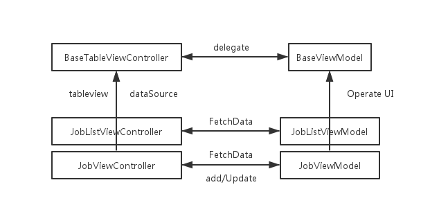
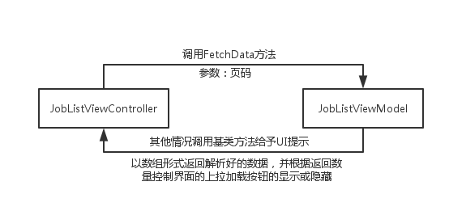
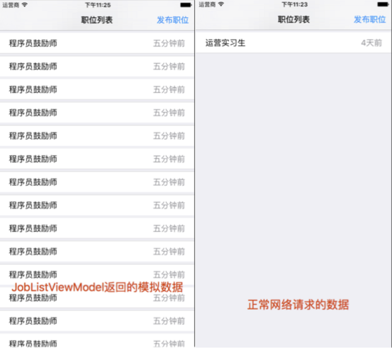
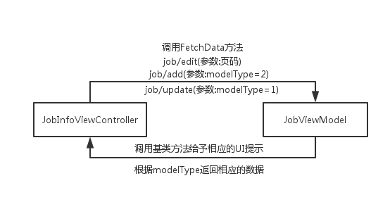
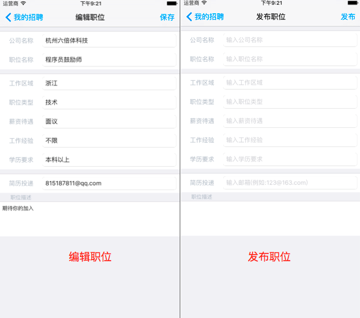

<!--BEGIN_DATA
{
    "create_date": "2016-05-28 12:23", 
    "modify_date": "2016-05-28 12:23", 
    "is_top": "0", 
    "summary": "iOS-MVVM架构-界面与数据I/O逻辑分离的实践", 
    "tags": "iOS、架构", 
    "file_name": "iOS-MVVM架构-界面与数据I:O逻辑分离的实践.md"
}
END_DATA-->

####
原文出处：<a href='https://segmentfault.com/a/1190000005153111' target='blank'>iOS-MVVM架构-界面与数据I/O逻辑分离的实践</a>

#iOS-MVVM架构-界面与数据I/O逻辑分离的实践

看了十来篇关于MVVM的文章之后，终于开始有信心在自己的项目中尝试采用MVVM这个架构了。

## 交代一下背景

最开始是因为公司要求写单元测试。写单元测试是一件比较痛苦的事情，尤其是在项目已经成型之后。懒惰驱使我必须去了解有没有更具吸引力的替代方式，碰巧看到一篇关于M
VVM的文章，讲到MVVM能将界面逻辑与业务逻辑分离开来，更方便测试，于是开始着重了解这个架构模式，看的越多，可是却迟迟动不了手，总算经过这段时间的尝试，终
于感觉可以大胆使用了。

前几天抽时间写了个Demo，现在将自己的片面理解分享出来与大家交流，请大家指正。

以前写项目习惯将网络请求方法都在Controller里，子类调用基类方法去请求数据，子类重写基类参数方法提供不同参数，请求结果同样回调到各个子类去处理。这样
纵向扩展导致逻辑混杂，Controller层代码量大，最重要的是局部功能测试比较麻烦，不利于后期维护。

**本文讲到的`MVVM`则是将工程横向扩展，将数据操作分工给`ViewModel`，这样细化之后代码将更为清晰简洁，更利于维护和测试。**

这两天有一些读者提议将Demo放到git上面去，所以抽空完善了一下，点此可以下载[MVVM-
Master](https://github.com/ZJM6658/MVVMDemo.git)，别忘了star哦。

## 进入正题

简化逻辑，无非就是简化Controller数据的I/O,太多的MVVM文章讲怎么利用ViewModel请求数据来显示在列表中，然而这只是数据的Input，我
们更需要的ViewModel能帮我们完成完整的用户交互，将Controller的所有网络操作解放出来。下面我结合自己的理解，通过最近写的一个关于职位列表的显
示和职位信息的发布和更新的Demo，来讲解一下我是怎么让ViewModel帮我清晰地完成Controller数据的Input和Output，以及它带来的测试
方便程度。

### Demo 简要思维导图

首先看一下整个Demo的简要思维导图：

如上图所示，`JobListViewController`(职位列表)和`JobViewController`(职位详情)都继承于`BaseTableVie
wController`类，`BaseTableViewController`类提供了列表页面公有的一些方法，例如显示和隐藏用户提示，上拉加载和下拉刷新控件
的显示和隐藏等方法，供子类或ViewModel调用，所有的列表页面都可以继承`BaseTableViewController`类。

而`BaseViewModel`则声明了代理协议，供子类去与Controller关联，并实现了协议方法去调用关联代理的Controller的相关方法，供继承
于它的ViewModel去操作UI。这里我为了尽可能地简化Controller的处理逻辑，将需要根据返回的数据处理UI的操作也交给了ViewModel，这里
因人而异，看实际需求选择不同的方式。

### 两个基类的代码

那么我们先来看看两个基类的代码：

**BaseTableViewController.h**
    
    
    //
    //  BaseTableViewController.h
    //  MyOwnDemo
    //
    //  Created by zhujiamin on 16/5/17.
    //  Copyright © 2016年 zhujiamin@yaomaitong.cn. All rights reserved.
    //
    #import <UIKit/UIKit.h>
    #import "BaseViewModel.h"
    @interface BaseTableViewController : UIViewController<HUDshowMessageDelegate, UITableViewDelegate, UITableViewDataSource>
    //初始化方法
    -(instancetype)initWithStyle:(UITableViewStyle)style;
    //用户提示
    - (void)showMessage:(NSString *)message WithCode:(NSString *)code;
    - (void)hideHUD;
    //刷新框架
    - (void)addDefaultHeader;
    - (void)addDefaultFooter;
    - (void)HideFooter;
    - (void)endRefresh;
    //公共属性
    @property (nonatomic, strong) UITableView *tableview;
    @property (nonatomic, strong) NSMutableArray *dataArray;
    @end

**BaseTableViewController.m**
    
    
    //
    //  BaseTableViewController.m
    //  MyOwnDemo
    //
    //  Created by zhujiamin on 16/5/17.
    //  Copyright © 2016年 zhujiamin@yaomaitong.cn. All rights reserved.
    //
    #import "BaseTableViewController.h"
    #import "MBProgressHUD.h"
    #import "MJRefresh.h"
    @interface BaseTableViewController ()
    @property (nonatomic, strong) MBProgressHUD *hudText;//加载菊花
    @property(nonatomic,assign)UITableViewStyle tableStyle;//列表样式
    @end
    @implementation BaseTableViewController
    - (instancetype)initWithStyle:(UITableViewStyle)style{
        if (self = [super init]){
            self.tableStyle = style;
            self.dataArray = [[NSMutableArray alloc]init];
        }
        return self;
    }
    - (void)viewDidLoad {
        [super viewDidLoad];
        [self.view addSubview:self.tableview];
    }
    - (UITableView *)tableview{
        if (!_tableview) {
            _tableview = [[UITableView alloc]initWithFrame:self.view.frame style:self.tableStyle];
            _tableview.delegate = self;
            _tableview.dataSource = self;
        }
        return _tableview;
    }
    //加载框显示
    - (void)showMessage:(NSString *)message WithCode:(NSString *)code{
        _hudText = [MBProgressHUD showHUDAddedTo:self.view animated:YES];
        _hudText.labelText = message;
        if (message.length) {
            [_hudText hide:YES afterDelay:1.5f];
        }
    }
    //加载框隐藏
    - (void)hideHUD{
        [_hudText hide:YES];
    }
    //添加下拉刷新
    - (void)addDefaultHeader{
        __unsafe_unretained __typeof(self) weakSelf = self;
        self.tableview.mj_header = [MJRefreshNormalHeader headerWithRefreshingBlock:^{
            [weakSelf loaddataWith:@"1"];
        }];
    }
    //添加上拉加载
    - (void)addDefaultFooter{
        if (!self.tableview.mj_footer) {
            self.tableview.mj_footer = [MJRefreshAutoNormalFooter footerWithRefreshingTarget:self refreshingAction:@selector(loadNextPage)];
        }
    }
    //结束加载状态
    - (void)endRefresh{
        if (self.tableview.mj_header) {
            [self.tableview.mj_header endRefreshing];
        }
        if (self.tableview.mj_footer) {
            [self.tableview.mj_footer endRefreshing];
        }
    }
    //移除上拉加载
    - (void)HideFooter{
        if (self.tableview.mj_footer) {
            self.tableview.mj_footer = nil;
        }
    }
    - (void)loaddataWith:(NSString *)pageNo{
        //子类需重写
    }
    - (void)loadNextPage{
        //子类需重写
    }
    //子类重写
    #pragma mark UITableViewDataSource
    - (NSInteger)numberOfSectionsInTableView:(UITableView *)tableView{
        return 1;
    }
    - (NSInteger)tableView:(UITableView *)tableView numberOfRowsInSection:(NSInteger)section{
        return 1;
    }
    - (UITableViewCell *)tableView:(UITableView *)tableView cellForRowAtIndexPath:(NSIndexPath *)indexPath{
        static NSString *cellIder = @"DEFAULT_CELL";
        UITableViewCell *cell = [tableView dequeueReusableCellWithIdentifier:cellIder];
        if (!cell) {
            cell = [[UITableViewCell alloc]initWithStyle:UITableViewCellStyleDefault reuseIdentifier:cellIder];
        }
        return cell;
    }
    @end

**BaseViewModel.h**
    
    
    //
    //  BaseViewModel.h
    //  MyOwnDemo
    //
    //  Created by zhujiamin on 16/5/16.
    //  Copyright © 2016年 zhujiamin@yaomaitong.cn. All rights reserved.
    //
    #import <Foundation/Foundation.h>
    typedef void(^requestSuccess)(NSArray *responseArray);
    typedef void(^requestFailure)(NSError *error);
    @protocol HUDshowMessageDelegate<NSObject>
    @optional
    //加载框控制
    - (void)showMessage:(NSString *)message WithCode:(NSString *)code;
    - (void)hideHUD;
    //刷新控件控制
    - (void)addDefaultFooter;
    - (void)HideFooter;
    - (void)endRefresh;
    @end
    @interface BaseViewModel : NSObject<HUDshowMessageDelegate>
    @property(nonatomic,weak) id<HUDshowMessageDelegate>delegate;
    @end

**BaseViewModel.m**
    
    
    //
    //  BaseViewModel.m
    //  MyOwnDemo
    //
    //  Created by zhujiamin on 16/5/16.
    //  Copyright © 2016年 zhujiamin@yaomaitong.cn. All rights reserved.
    //
    #import "BaseViewModel.h"
    @implementation BaseViewModel
    - (void)showMessage:(NSString *)message WithCode:(NSString *)code{
        if ([self.delegate respondsToSelector:@selector(showMessage:WithCode:)]) {
            [self.delegate showMessage:message WithCode:code];
        }
    }
    - (void)hideHUD{
        if ([self.delegate respondsToSelector:@selector(hideHUD)]) {
            [self.delegate hideHUD];
            [self endRefresh];
        }
    }
    - (void)addDefaultFooter{
        if ([self.delegate respondsToSelector:@selector(addDefaultFooter)]) {
            [self.delegate addDefaultFooter];
        }
    }
    - (void)HideFooter{
        if ([self.delegate respondsToSelector:@selector(HideFooter)]) {
            [self.delegate HideFooter];
        }
    }
    - (void)endRefresh{
        if ([self.delegate respondsToSelector:@selector(endRefresh)]) {
            [self.delegate endRefresh];
        }
    }
    @end

以上两个基类，将子类的公有控件、属性和需要调用的函数都已经准备好以供子类使用。因为不同的子类处理情况不同，有些方法父类实现之后需要子类去重写实现，不过如果页
面处理情况都比较统一也可以把方法抽象到基类，子类调用的时候传入不同的参数，然后基类返回结果给各个子类。那么我们接下来就可以安心写好具体的Controller
与ViewModel的交互了。

### Controller与 ViewModel的交互 & 模拟测试数据Input

首先我们看看职位列表页面，职位列表页面是同类数据列表分行显示，这样的页面一般都有下拉刷新和分页上拉加载的需求，我们需要请求服务器数据，根据服务器返回的结果来
显示页面、给予用户提示或控制上下拉控件的显示和隐藏，前文已经讲到过，我把这一块也交给ViewModel来控制。

`JoblistViewController`与`JobListViewModel`的交互逻辑大致如下图：

### 职位列表页的初始化和`JobListViewModel`的数据请求方法

**下面我们重点来看一下**职位列表页的初始化和`JobListViewModel`的数据请求方法。(界面的显示在这里不再赘述)。

**JoblistViewController.m**
    
    
    //初始化
    - (instancetype)init{
        if (self = [super init]) {
            self.jobListVM = [[JobListViewModel alloc]init];
            self.jobListVM.delegate = self;
            self.dataArray = [[NSMutableArray alloc]init];
            self.current = 1;
        }
        return self;
    }
    //重写父类请求数据方法
    - (void)loaddataWith:(NSString *)pageNo{
        [self.jobListVM setPageNo:pageNo];//首页加载可以不设置
        [self.jobListVM FetchDataWithSuccess:^(NSArray *responseArray) {
            if (responseArray.count) {
                if ([pageNo isEqualToString:@"1"]) {
                    [self.dataArray removeAllObjects];
                }
                [self.dataArray addObjectsFromArray:responseArray];
                [self.tableview reloadData];
            }
        } failureWithFailure:^(NSError *error) {
            //网络错误相应的处理
        }];
    }

我在`JobListViewController`初始化的同时初始化`jobListVM`，并关联代理，不管是首次进入加载、下拉刷新或是上拉加载，都直接调用
`loaddataWith:`方法，传入相应的页码值即可，这里的处理要取决于网络架构，本Demo列表页在初始化的同时初始化了一个页码参数current = 
1，上拉加载执行的时候current++，后将current传给后台加载该页码的数据，将请求回来的数据加到dataArray尾部，然后reloadData，
这样整个`JobListViewController`中的数据处理就只需要这一个函数，界面测试非常地容易，下面会讲到在ViewModel中构造模拟数据输入给
Controller来进行界面测试。

需要说明的是，请求失败的情况我们其实也可以放在ViewModel来处理，本Demo并没有处理这一块，这里要根据实际需求的不同去切换界面或者给用户提示，总之不
管怎样都可以吧方法抽象到基类，自己调用或ViewModel调用都可以。(上下拉加载控件使用MJRefresh来实现，添加和移除方法均放在基类里供ViewMo
del调用)，那么下面我们看看如何实现的`JobListViewModel`。

**JobListViewModel.h**
    
    
    #import "BaseViewModel.h"
    @interface JobListViewModel : BaseViewModel<HUDshowMessageDelegate>
    @property(nonatomic, strong) NSString *pageNo;
    - (void)FetchDataWithSuccess:(requestSuccess)success failureWithFailure:(requestFailure)failure;
    @end

.h 文件暴露一个页码参数和一个请求数据函数，供外部调用。`JobListViewModel`继承于`BaseViewModel`，`BaseViewMod
el`声明了代理协议，上面`jobListVM`被创建的时候已经与`JobListViewController`关联了代理，这样`JobListViewMo
del`在请求到数据之后就可以根据需要调用协议方法去操作UI。具体实现见下面.m文件：

**JobListViewModel.m**
    
    
    #import "JobListViewModel.h"
    #import "KTProxy.h"
    #import "JobModel.h"
    #import "MJExtension.h"
    #define requestNum 10
    @implementation JobListViewModel
    - (void)FetchDataWithSuccess:(requestSuccess)success failureWithFailure:(requestFailure)failure{
        //构造输入数据，进行测试
    //    NSMutableArray *dataArray = [[NSMutableArray alloc]init];
    //    for (int i = 0; i < 15; i++) {
    //        JobModel *job = [[JobModel alloc]init];
    //        job.name = @"程序员鼓励师";
    //        job.jobId = [NSString stringWithFormat:@"%d",i+1];
    //        job.showDate = @"五分钟前";
    //        [dataArray addObject:job];
    //    }
    //    
    //    success(dataArray);
    //    return; //上面用于输入测试数据给Controller，下面是正常请求逻辑
        [self showMessage:@"正在加载" WithCode:@""];//调用加载狂
        KTProxy *proxy = [KTProxy loadWithMethod:[self method] andParams:[self params] completed:^(NSDictionary *respDict) {
            [self hideHUD];//隐藏加载框
            if ([respDict[@"code"] integerValue]== 0) {
                NSArray *array = [JobModel mj_objectArrayWithKeyValuesArray:respDict[@"data"][@"result"]];//字典数组转模型数组
                //根据返回控制上拉加载的显示和隐藏（这里因项目的网络架构而异）
                if (array.count == requestNum) {
                    [self addDefaultFooter];
                } else {
                    [self HideFooter];
                }
                success(array);
            } else {
                [self showMessage:respDict[@"message"] WithCode:respDict[@"code"]];//提示服务器返回的非正常信息
            }
        } failed:^(NSError *error) {
            failure(error);
            [self hideHUD];
        }];
        [proxy start];
    }
    //请求url
    - (NSString *)method{
        return @"myrecruitment/list";
    }
    //请求参数
    - (NSDictionary *)params{
        return @{@"pageNo":self.pageNo?self.pageNo:@"1", @"pageSize":[NSNumber numberWithInteger:requestNum]};
    }
    @end

一些时候，在我们客户端开发的时候，后台接口可能并没有做好，这个时候我们需要自己模拟数据来测试界面是否正常，如上方法实现中，for循环构造十五条职位信息返回给
controller，然后return掉，不再走网络请求，这样直接可以测试界面逻辑，相比较老的MVC模式，逻辑清晰太多了，哪一块出现问题了可以很快地定位到问
题所在，这就是MVVM最吸引我的地方，一个ViewModel可以轻松地控制Controller数据的输入输出，达到单元测试的效果！

正常网络请求调用的`loadWithMethod:andParams:completed:`方法是我使用`AFNetWorking`二次封装在`KTProx
y`类中的公共网络请求方法，返回时已经将服务器返回的data数据解析成json字典respDict返回，ViewModel这一层只需要处理respDict里
面的数据，做出相应的操作。Demo中返回的code==0表示成功，那么我将数据解析成职位模型数组返回给controller去处理，code!=0时调用Con
troller的提示方法，将服务器返回的message字段告知给用户，调用

    
    
    - (void)showMessage:(NSString *)message WithCode:(NSString *)code;

方法时会将code传入该方法，方便我们统一处理与后台协定好的code值去做一些页面操作。

本Demo使用`MJExtension`实现字典与模型的互相转换，比以前的`JSONModel`要轻量许多，效果如下：

单一的列表数据显示并不能看出多少优化点，那么下面我们来看看相对较为复杂的职位编辑页面`JobInfoViewController`，由上图可以看出，从职位列
表页面进入职位详情界面有两个入口，一个是编辑职位(需要请求详情)，一个是发布职位(不需要请求详情)，这意味着我们需要与三个接口交互(edit(编辑)、add
(新增)、update(更新))，那么应该怎么利用MVVM去优化我们的逻辑呢？

### 利用MVVM优化用户与后台交互数据的逻辑 & 模拟测试数据 I/O

首先我们看看`JobInfoViewController.m`的三个主要函数，`initWithStyle`(初始化)、`layoutUI`(页面布局)、`
saveJob`(保存编辑或发布职位)函数。

**JobInfoViewController.m**
    
    
    - (instancetype)initWithStyle:(UITableViewStyle)style{
        if (self = [super initWithStyle:style]) {
            self.jobViewModel = [[JobViewModel alloc]init];
            self.jobViewModel.delegate = self;
        }
        return self;
    }
    - (void)layoutUI{
        self.view.backgroundColor = [UIColor whiteColor];
        [self.tableview registerNib:[UINib nibWithNibName:@"InputCell" bundle:nil] forCellReuseIdentifier:@"infocell"];
        self.dataArray = [@[@[@"公司名称", @"职位名称"], @[@"工作区域", @"职位类型", @"薪资待遇", @"工作经验", @"学历要求"], @[@"简历投递"]]copy];
        _placeholderArray = @[@[@"输入公司名称", @"输入职位名称"], @[@"输入工作区域", @"输入职位类型", @"输入薪资待遇", @"输入工作经验", @"输入学历要求"], @[@"输入邮箱(例如:123@163.com)"]];
        NSString *rightButtonTitle;
        if (self.JobInfoId) {
            rightButtonTitle = @"保存";
            [self.jobViewModel setJobId:self.JobInfoId];
            [self.jobViewModel FetchDataWithSuccess:^(NSArray *responseArray) {
                if (responseArray.count) {
                    self.jobViewModel.jobInfo = [responseArray firstObject];
                    [self.tableview reloadData];
                }
            } failureWithFailure:^(NSError *error) {
                //网络错误
            }];
        } else {
            rightButtonTitle = @"发布";
        }
        self.navigationItem.rightBarButtonItem = [[UIBarButtonItem alloc]initWithTitle:rightButtonTitle style:UIBarButtonItemStylePlain target:self action:@selector(saveJob:)];
    }
    - (void)saveJob:(UIBarButtonItem *)sender{
        self.jobViewModel.modelType = self.JobInfoId?1:2;
        [self.jobViewModel FetchDataWithSuccess:^(NSArray *responseArray) {
            //发布或保存成功后的处理
            [self.navigationController popViewControllerAnimated:YES];
        } failureWithFailure:^(NSError *error) {
            //网络错误
        }];
    }

如上可以看到，跟上面的`JobListViewController`一样，`JobInfoViewController`页面初始化的时候`jobViewMo
del`同时初始化，只不过`jobViewModel`初始化的同时会初始化自身携带的`jobInfo`属性，整个`JobViewController`的编辑
都是操作的`jobViewModel`的`jobInfo`属性，因为我们最终还是要把整个职位Model交给`jobViewModel`去转换成json参数做
更新或添加的网络操作，何不一开始就操作它的属性呢？点击职位列表的Cell进入职位编辑界面会将`jobId`传入`JobViewController`，发布则
不会，所以`layoutUI`函数根据页面是否传入`JobInfoId`参数来控制`rightBarButton`的显示字符和是否需要请求职位详情，点击`r
ightBarButton`响应的

    
    
    - (void)saveJob:(UIBarButtonItem *)sender;

函数同样根据`JobInfoId`是否存在传给`JobViewModel`相应的`modelType`参数后调用网络请求方法。这三个函数同样解决了所有数据输
入输出相关的问题，其他的信息编辑过程对`jobViewModel.jobInfo`的修改就不在这里赘述了。

`JobInfoViewcontroller`与其关联的`JobViewModel`交互关系如下图：

### JobViewModel的具体实现

**下面我们看一下JobViewModel的具体实现：**

**JobViewModel.h**
    
    
    #import "BaseViewModel.h"
    #import "JobModel.h"
    @interface JobViewModel : BaseViewModel<HUDshowMessageDelegate>
    @property(nonatomic, strong) NSString *jobId;
    @property(nonatomic, strong) JobModel *jobInfo;
    @property(nonatomic) NSInteger modelType;//1.更新 2.发布
    - (void)FetchDataWithSuccess:(requestSuccess)success failureWithFailure:(requestFailure)failure;
    @end

**JobViewModel.m**
    
    
    #import "JobViewModel.h"
    #import "KTProxy.h"
    #import "JobModel.h"
    #import "MJExtension.h"
    @implementation JobViewModel
    - (instancetype)init{
        if (self = [super init]) {
            self.jobInfo = [[JobModel alloc]init];
        }
        return self;
    }
    - (void)FetchDataWithSuccess:(requestSuccess)success failureWithFailure:(requestFailure)failure{
        //构造测试数据
        success(self.testArray);
        return;
        //网络请求
        [self showMessage:@"正在加载" WithCode:@""];//菊花
        KTProxy *proxy = [KTProxy loadWithMethod:[self method] andParams:[self params] completed:^(NSDictionary *respDict) {
            [self hideHUD];
            if ([respDict[@"code"] integerValue] == 0) {
                if (self.modelType == 0) {
                    self.jobInfo = [JobModel mj_objectWithKeyValues:respDict[@"data"]];//字典转模型
                    success([NSArray arrayWithObject:self.jobInfo]);
                }else if (self.modelType == 1) {
                    [self showMessage:@"发布成功" WithCode:@"8888"];
                    success([NSArray new]);
                } else if (self.modelType == 2) {
                    [self showMessage:@"更新成功" WithCode:@"8888"];
                    success([NSArray new]);
                }
            }else{
                //提示错误
                [self showMessage:respDict[@"message"] WithCode:respDict[@"code"]];
            }
        } failed:^(NSError *error) {
            failure(error);
            [self hideHUD];
        }];
        [proxy start];
    }
    //构造测试返回数据
    - (NSArray *)testArray{
        _jobInfo = [[JobModel alloc]init];
        _jobInfo.name = @"程序员鼓励师";
        _jobInfo.companyName = @"杭州六倍体科技";
        _jobInfo.provinceName = @"杭州西湖区";
        _jobInfo.cityName = @"杭州";
        _jobInfo.salaryName = @"面议";
        _jobInfo.typeName = @"技术";
        _jobInfo.experienceName = @"不限";
        _jobInfo.email = @"815187811@qq.com";
        _jobInfo.degreeName = @"本科以上";
        _jobInfo.showDate = @"两小时前";
        _jobInfo.Description = @"期待你的加入";
        return [NSArray arrayWithObject:_jobInfo];
    }
    //请求url
    - (NSString *)method{
        if (self.modelType == 2) {
            return @"recruitment/job/add";//发布
        } else if (self.modelType == 1) {
            return @"recruitment/job/update";//更新
        }
        return @"myrecruitment/job/edit";//职位编辑
    }
    //参数准备
    - (NSDictionary *)params{
        NSMutableDictionary *paramsDic;
        if (self.modelType) {//更新或者发布
            paramsDic = [[NSMutableDictionary alloc]init];
            paramsDic = self.jobInfo.mj_keyValues;//模型转字典
            return @{@"requestObj":paramsDic};
        }
        return @{@"requestObj":self.jobId};//编辑
    }
    @end

如上可以看出，因为整个`JobViewController`包含了三个接口的交互，因此`JobViewModel`的请求路径和请求参数都要分为三种情况，如上

    
    
    - (NSString *)method;
    - (NSDictionary *)params;

两个方法都根据`JobViewModel`的`modelType`进行返回相应的参数完成相应的操作。与职位列表一样，`JobViewModel`同样可以构造
测试数据输入给`JobViewController`，如上在后台接口还没有就绪的时候，可以通过

    
    
    - (NSArray *)testArray;

方法直接返回模拟数据给Controller去显示或操作，然后在

    
    
     paramsDic = self.jobInfo.mj_keyValues;//模型转字典

`jobInfo`模型转换为字典之后，直接观察保存/发布操作输出的`jobInfo`转换成的字典参数是否符合预期，这样就很轻松地不需要后台接口就可以独立完成
整套界面的输入输出测试，正如文章一开始提到的--简化数据的`I/O`，我的构想是让`Controller`只管从`ViewModel`拿到数据去显示或者编辑
，之后再交给`ViewModel`去处理新增、更新或者删除等等，现在看来，MVVM真的可以做到哦。

## 写在最后

MVVM并没有多么复杂，它只是将MVC的分工更加细化，我们完全可以在不影响功能的同时将项目慢慢向MVVM演进，这也正是我目前正在做的事情，可以优化的地方还有
许多，我会不断去思考和优化，然后与大家交流。

