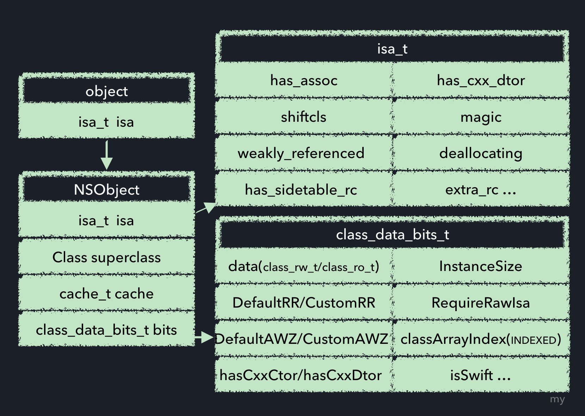
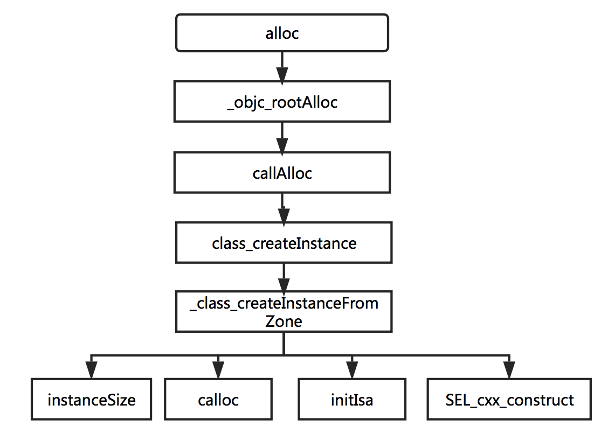
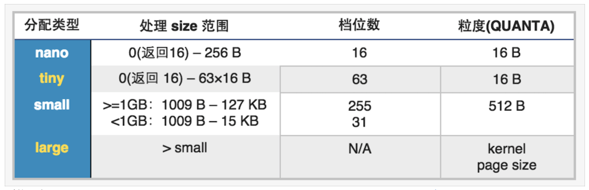
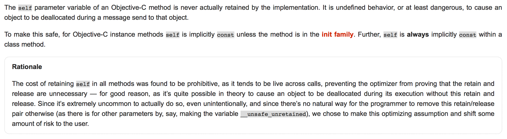
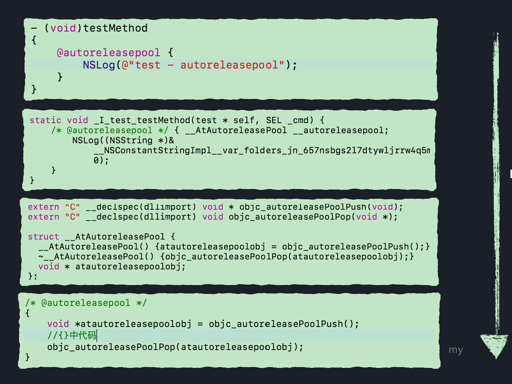
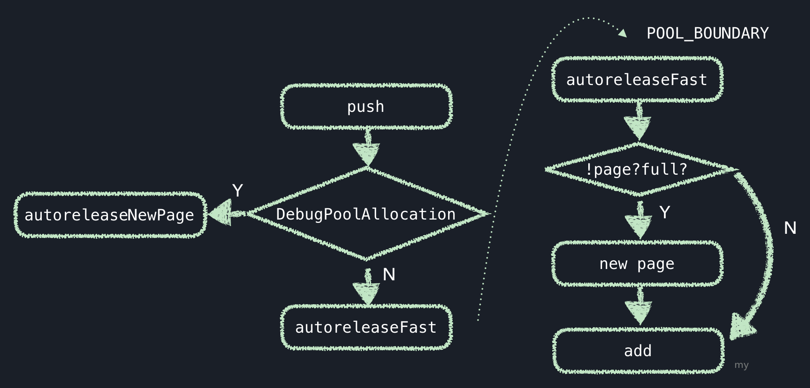
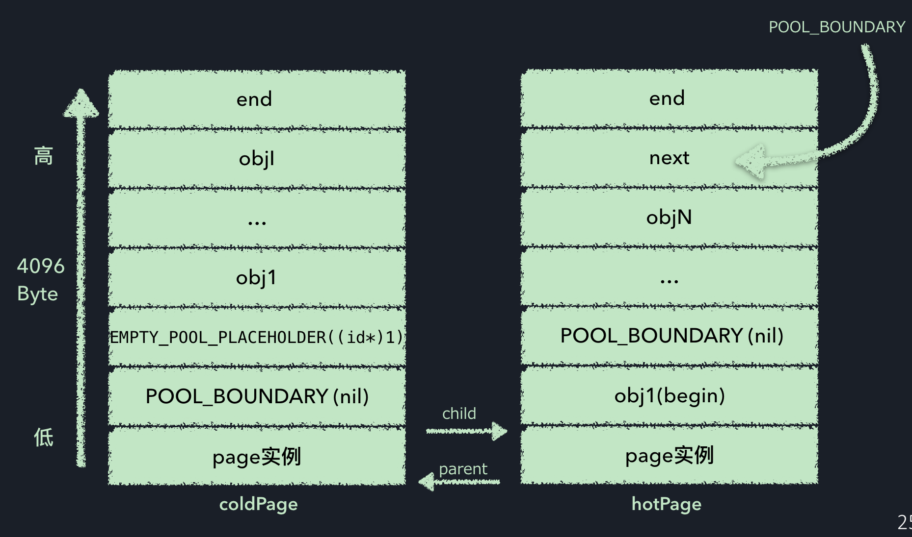
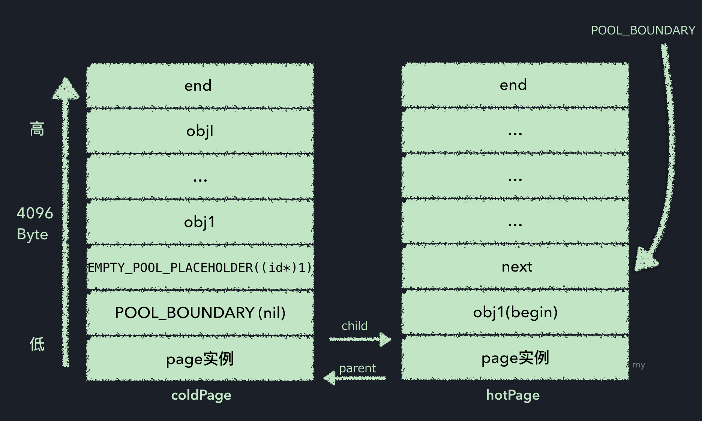
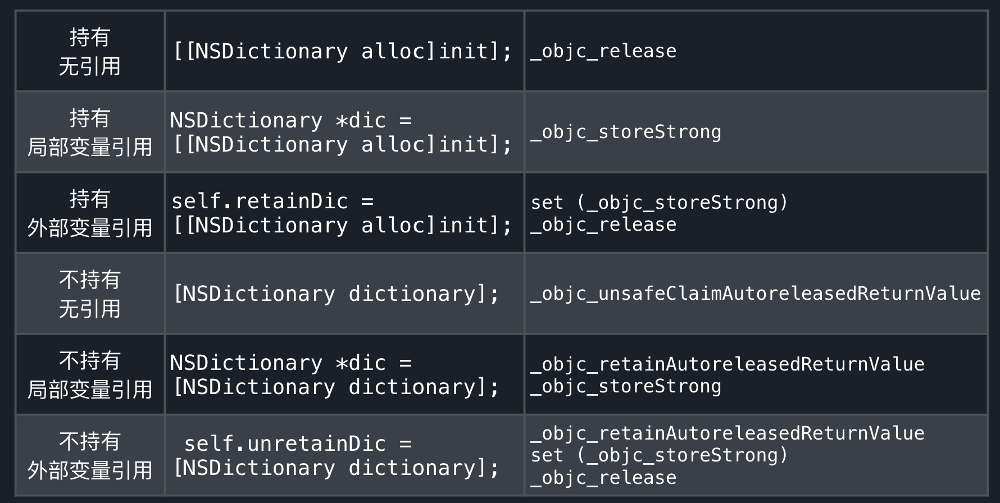
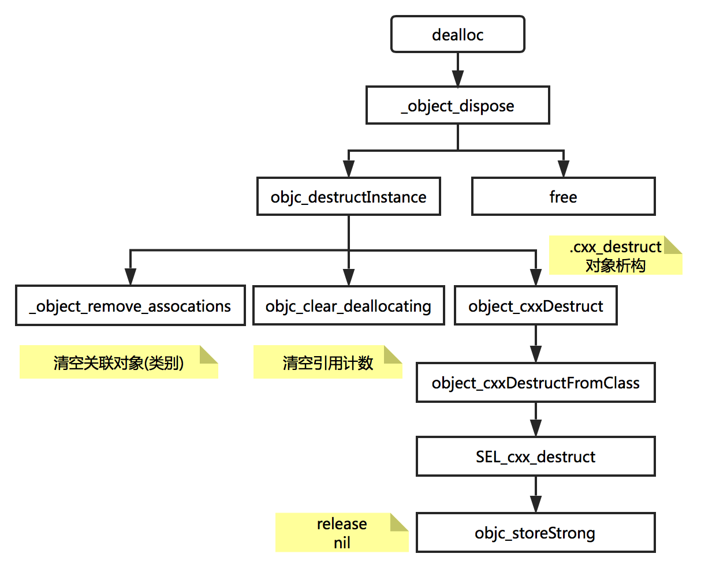

 
<!--BEGIN_DATA
{
    "create_date": "2017-02-27 21:09", 
    "modify_date": "2017-02-27 21:09", 
    "is_top": "0", 
    "summary": "iOS_我们的对象会经历什么", 
    "tags": "iOS", 
    "file_name": "iOS_我们的对象会经历什么.md"
}
END_DATA-->

####<p>原文出处：<a href='http://www.jianshu.com/p/ff8a7c458c96' target='blank'>iOS_我们的对象会经历什么</a></p>

文章是对最近一次技术分享 - 关于对象从创建到销毁的过程探究的整理.

    
    
     @autoreleasepool
        {
            NSObject (__strong) *object = [[NSObject alloc]init];
        }

全文探讨基本上是对上面这句代码的说明.

##目录

一. NSObject  
二. alloc  
三. init  
四. 所有权修饰符  
五. autoreleasepool  
六. dealloc

##一. NSObject

###1\. NSObject内存结构

由于内存分配会涉及到对象的结构,因此首先对对象的结构加以说明,如图:  

  

NSObject结构图

  
实例对象的isa指针指向类对象.而根据`runtime`源码,我们可以看到类`objc_class`是继承自`objc_object`的,本质上,类是一个对象,这也就是我们通常会说的'类对象'的缘由.  
其中`objc_object`有一个唯一的私有变量 - `isa_t`类型的`isa`指针,`objc_class`的定义中还包括了:

  * `Class superclass` \- 指向父类;
  * `cache_t cache` \- 方法缓存,具体可参考这篇文章:[深入理解Objective-C：方法缓存](http://tech.meituan.com/DiveIntoMethodCache.html);
  * `class_data_bits_t bits` \- 存储类方法,属性,遵从协议等数据.

###2\. isa_t isa

    
    
    union isa_t 
    {
        isa_t() { }
        isa_t(uintptr_t value) : bits(value) { }
        Class cls;
        uintptr_t bits;
    ##if __arm64__
    #### define ISA_MASK        0x0000000ffffffff8ULL
    #### define ISA_MAGIC_MASK  0x000003f000000001ULL
    #### define ISA_MAGIC_VALUE 0x000001a000000001ULL
        struct {
            uintptr_t nonpointer        : 1;
            uintptr_t has_assoc         : 1;//对象含有或者曾经含有关联引用，没有关联引用的可以更快地释放内存
            uintptr_t has_cxx_dtor      : 1;//析构器方法,如果没有析构器就会快速释放内存
            uintptr_t shiftcls          : 33; // MACH_VM_MAX_ADDRESS 0x1000000000
            uintptr_t magic             : 6;//用于调试器判断当前对象是真的对象还是没有初始化的空间
            uintptr_t weakly_referenced : 1;//对象被指向或者曾经指向一个 ARC 的弱变量，没有弱引用的对象可以更快释放
            uintptr_t deallocating      : 1;//对象正在释放内存
            uintptr_t has_sidetable_rc  : 1;//对象的引用计数太大了，存不下
            uintptr_t extra_rc          : 19;//对象的引用计数超过 1，会存在这个这个里面
    ####     define RC_ONE   (1ULL<<45)
    ####     define RC_HALF  (1ULL<<18)
        };
    ##elif __x86_64__
    #### define ISA_MASK        0x00007ffffffffff8ULL
    #### define ISA_MAGIC_MASK  0x001f800000000001ULL
    #### define ISA_MAGIC_VALUE 0x001d800000000001ULL
        struct {
            uintptr_t nonpointer        : 1;
            uintptr_t has_assoc         : 1;
            uintptr_t has_cxx_dtor      : 1;
            uintptr_t shiftcls          : 44; // MACH_VM_MAX_ADDRESS 0x7fffffe00000
            uintptr_t magic             : 6;
            uintptr_t weakly_referenced : 1;
            uintptr_t deallocating      : 1;
            uintptr_t has_sidetable_rc  : 1;
            uintptr_t extra_rc          : 8;
    ####     define RC_ONE   (1ULL<<56)
    ####     define RC_HALF  (1ULL<<7)
        };
    ##else
    #### error unknown architecture for packed isa
    ##endif
    // SUPPORT_PACKED_ISA
    #endif
    #if SUPPORT_INDEXED_ISA
    ##if  __ARM_ARCH_7K__ >= 2
    #### define ISA_INDEX_IS_NPI      1
    #### define ISA_INDEX_MASK        0x0001FFFC
    #### define ISA_INDEX_SHIFT       2
    #### define ISA_INDEX_BITS        15
    #### define ISA_INDEX_COUNT       (1 << ISA_INDEX_BITS)
    #### define ISA_INDEX_MAGIC_MASK  0x001E0001
    #### define ISA_INDEX_MAGIC_VALUE 0x001C0001
        struct {
            uintptr_t nonpointer        : 1;
            uintptr_t has_assoc         : 1;
            uintptr_t indexcls          : 15;
            uintptr_t magic             : 4;
            uintptr_t has_cxx_dtor      : 1;
            uintptr_t weakly_referenced : 1;
            uintptr_t deallocating      : 1;
            uintptr_t has_sidetable_rc  : 1;
            uintptr_t extra_rc          : 7;
    ####     define RC_ONE   (1ULL<<25)
    ####     define RC_HALF  (1ULL<<6)
        };
    ##else
    #### error unknown architecture for indexed isa
    ##endif
    // SUPPORT_INDEXED_ISA
    #endif
    };

以上为isa指针的定义,可以看到isa指针是一个联合体,在不同环境下,结构体中属性值稍有差别.

其中

  * `SUPPORT_INDEXED_ISA`,文档注释`Define SUPPORT_INDEXED_ISA=1 on platforms that store the class in the isa field as an index into a class table.`,也就是当该属性为真,则把该类存储在isa中,作为全局class表的索引();
  * `nonpointer`为1,表示使用优化的isa指针,包含了引用计数,析构状态等.
  * `has_assoc`,是否包含关联对象,如果没有,会更快的释放内存;
  * `has_cxx_dtor`,是否包含析构函数,如果没有,会更快的释放内存;
  * `shiftcls`,类的指针;
  * `magic`,固定值,用于判断是否完成初始化;
  * `weakly_referenced`,对象是否指向一个弱引用对象,没有弱引用对象可以更快的被释放;
  * `deallocating`,对象是否正在销毁;
  * `has_sidetable_rc`,是否有`sidetable`(散列表),如果为真,则引用计数存储在该散列表中;
  * `extra_rc`,存储引用计数,比真实的引用计数少1.  
散列表,引用计数等具体的说明,文章后面部分做简单介绍.

###3\. class_data_bits_t bits

限于篇幅,不再展示完整的定义(objc4-706,objc-runtime-new.h文件,844-1056行),可参考前文图示,标识了几个主要属性.

由源码可知,类结构中`bits`属性是一个叫做`class_data_bits_t`的结构体,包含`Bits`相关的`set`,`get`与`clear`私有属性,和`data`等相关的公开属性,下面对公开属性做简单说明:

  * `class_rw_t* data`,存储该类方法属性协议等相关内容的指针,该结构体包含一个`const class_ro_t *ro`只读属性`ro`,`ro`中存储类在编译阶段就存在的方法属性协议等,因此当在运行时向类添加方法,那么改变的是`class_rw_t`类型的rw中的方法列表,而不是`class_ro_t`类型的ro的列表(rw即读写,ro即只读).
  * `hasDefaultRR`,当前类或者父类是否含有默认的 `retain/release/autorelease/retainCount/_tryRetain/_isDeallocating/retainWeakReference/allowsWeakReference方法`;
  * `hasDefaultAWZ`,当前类或者父类是否含有`allocWithZone`方法;
  * `hasCxxCtor`,是否有构造方法,`alloc`时使用;
  * `hasCxxDtor`,是否有析构方法,`dealloc`时使用;
  * `instancesRequireRawIsa`,是否需要`RawIsa`(?)的标识;
  * `fastInstanceSize`,实例大小;
  * `classArrayIndex`,索引,当`SUPPORT_INDEXED_ISA`为假时,值为0;
  * `isSwift`,是否使用的是`Swift`语言;

##二. alloc

###1.alloc流程

  

alloc简化调用堆栈

`alloc`方法完整的执行过程包括非常多的判断和跳转,这里做了简化.  
当我们写了一个`[Class alloc]`命令,会相应的调用`_objc_rootAlloc`方法,最终会执行`_class_createInstanceFromZone`方法,如下:

    
    
    static __attribute__((always_inline)) 
    id
    _class_createInstanceFromZone(Class cls, size_t extraBytes, void *zone, 
                                  bool cxxConstruct = true, 
                                  size_t *outAllocatedSize = nil)
    {
        if (!cls) return nil;
        assert(cls->isRealized());
        //1. Read class's info bits all at once for performance
        bool hasCxxCtor = cls->hasCxxCtor();
        bool hasCxxDtor = cls->hasCxxDtor();
        bool fast = cls->canAllocNonpointer();
        //2. 
        size_t size = cls->instanceSize(extraBytes);
        if (outAllocatedSize) *outAllocatedSize = size;
        //3. 
        id obj;
        if (!zone  &&  fast) {
            obj = (id)calloc(1, size);
            if (!obj) return nil;
            obj->initInstanceIsa(cls, hasCxxDtor);
        } 
        else {
            if (zone) {
                obj = (id)malloc_zone_calloc ((malloc_zone_t *)zone, 1, size);
            } else {
                obj = (id)calloc(1, size);
            }
            if (!obj) return nil;
            // Use raw pointer isa on the assumption that they might be 
            // doing something weird with the zone or RR.
            obj->initIsa(cls);
        }
        //4. 
        if (cxxConstruct && hasCxxCtor) {
            obj = _objc_constructOrFree(obj, cls);
        }
        return obj;
    }

  * 1.这部分是读取类的基本信息,上文类结构中已做说明.
  * 2.我们看到这里的size,也就是获取对象的内存大小,继续查看`instanceSize`,找到如下内容:
    
    
        uint32_t unalignedInstanceSize() {
            assert(isRealized());
            return data()->ro->instanceSize;
        }
        uint32_t alignedInstanceSize() {
            return word_align(unalignedInstanceSize());
        }
        size_t instanceSize(size_t extraBytes) {
            size_t size = alignedInstanceSize() + extraBytes;
            if (size < 16) size = 16;
            return size;
        }

也就是说会在类的`ro`属性`instanceSize`中读取,然后经过对齐后返回.

这里要补充的有两点:  
1). 对象的内存地址和大小是在编译阶段就确定了的,编译阶段存在的内容会存储在类结构data中,而此时访问data,则为`ro`,在运行时,系统会将ro中的
数据赋值到rw中,并重新设置对象的内存结构,此时访问data,则为`rw`.  
2). ' CF requires all objects be at least 16 bytes.'  
所有的对象的大小都必须大于或等于 16 字节。

  * 3.在第2步获取了内存的大小之后,紧接着便调用`calloc`方法为对象分配内存空间.然后通过`initInstanceIsa`最终调用`initIsa`方法初始化isa指针.

  * 1. `hasCxxCtor`我们上文提到过,表示有构造方法.接着往下看:

```
id _objc_constructOrFree(id bytes, Class cls)
{
    assert(cls->hasCxxCtor());  // for performance, not correctness
    id obj = object_cxxConstructFromClass(bytes, cls);
    if (!obj) free(bytes);
    return obj;
}
id 
object_cxxConstructFromClass(id obj, Class cls)
{
    assert(cls->hasCxxCtor());  
    id (*ctor)(id);
    Class supercls;
    supercls = cls->superclass;
// 1 调用父类构造方法
    if (supercls  &&  supercls->hasCxxCtor()) {
        bool ok = object_cxxConstructFromClass(obj, supercls);
        if (!ok) return nil;  
    }
//2 调用自身构造方法
    ctor = (id(*)(id))lookupMethodInClassAndLoadCache(cls, SEL_cxx_construct);
    if (ctor == (id(*)(id))_objc_msgForward_impcache) return obj;  
    if ((*ctor)(obj)) return obj;  
//3 失败,清理
    if (supercls) object_cxxDestructFromClass(obj, supercls);
    return nil;
}
```
简单来说,如果当前对象存在构造方法,则会依次调用父类和自身的构造方法,成功后返回对象,如果失败,则调用父类的析构方法来清理并返回nil.  
这里提到的构造函数便是`SEL_cxx_construct`.至于该方法具体是什么,我们稍后再提.

######Note

另外,要提醒大家使用Xcode自动跳转时要仔细一点,在runtime源码中有非常多的文件涉及到old版本和new版本.我在再次查阅过程中才意识到之前被引导到
old版本,这个部分内容之前存在非常多问题..觉得脸好疼..  
希望大家不要犯同样的错误.

###2\. malloc

这个小节属于扩展,不了解也没关系.  
上一部分我们提到了`calloc`方法,而该方法会最终走到`libsystem_malloc.dylib`的`malloc`方法来分配内存.  
这里做以简单说明,更多内容可参考[这篇文章](https://yq.aliyun.com/articles/3065).

malloc内存分配基于malloc zone，并将基于大小分为nano、tiny、small、large四种类型,申请时按需分配.具体信息如下图:

  

malloc zone

malloc在初次调用时,会分配一个default zone和一个scalable zone作为辅助,在64位环境下,default zone为nano zone,负责分配nano大小,scalable zone负责tiny、small和large内存的分配.

##三. init

    
    
    - (id)init {
        return _objc_rootInit(self);
    }
    id
    _objc_rootInit(id obj)
    {
        return obj;
    }

`init`方法就简单了,只是返回当前对象,并没有其他多余操作.

> 2.16 补充  
在巧哥的[谈ObjC对象的两段构造模式](http://blog.devtang.com/2013/01/13/two-stage-creation-on-cocoa/)这篇文章中提到:  
"当我们通过 alloc 或 allocWithZone 方法创建对象时，cocoa 会返回一个未” 初使化 “过的对象。在这个过程中，cocoa除了上面提到的申请了一块足够大的内存外，还做了以下 3 件事：  
将该新对象的引用计数 (Retain Count) 设置成 1。  
将该新对象的 isa 成员变量指向它的类对象。  
将该新对象的所有其它成员变量的值设置成零。（根据成员变量类型，零有可能是指 nil 或 Nil 或 0.0）"  
但是这篇文章发表于2013-01-13,所以我觉得这部分内容可能已经不适用了,但是可以帮助我们了解alloc与init两段构造模式是由于历史原因以及Single Responsibility设计原则.

##四. 所有权修饰符

该部分通过`product` -> `Perform Action` ->
`Assemble`追踪,因为对汇编代码知之甚少,只观察内存管理相关关键词(扶额.png)..

###1\. __strong

####1.1 对象持有自己

利用`alloc/new/copy/mutableCopy`生成对象,此处以`alloc`为例:
    
    
    NSDictionary *dic = [[NSDictionary alloc]init];

我们声明了一个dic对象,相应的会调用: 
    
    id dic = objc_msgSend(NSDictionary, @selector(alloc));
    objc_msgSend(obj,selector(init));
    objc_storeStrong(dic);

也就是在ARC环境下,自动插入`_objc_storeStrong`命令,那么这个命令做了什么呢? 
    
    void
    objc_storeStrong(id *location, id obj)
    {
        id prev = *location;
        if (obj == prev) {
            return;
        }
        objc_retain(obj);
        *location = obj;
        objc_release(prev);
    }

也就是在值发生变化时,`retain`新值,并`release`旧值.

####1.2 对象不持有自己

利用非`alloc/new/copy/mutableCopy`生成对象,如下:

    
    
    NSDictionary *dic = [NSDictionary dictionary];

相应的会调用

    
    
    id dic = objc_msgSend(NSDictionary, @selector(dictionary));
    objc_objc_retainAutoreleasedReturnValue(dic);
    objc_storeStrong(dic);

在非持有关系中,除了`objc_storeStrong`命令,还多了一个`objc_objc_retainAutoreleasedReturnValue`,
`objc_objc_retainAutoreleasedReturnValue`是`autoreleasepool`的一个内存优化命令,后面`autore
leasepool`部分具体说明.

###2\. __weak

`__weak`通常用来解决循环引用的问题.如下示例代码:

      id  __weak  obj1  =  obj;

相应的会调用:
    
    id obj ;
    objc_initWeak(&obj1,obj);
    objc_destoryWeak(&obj1);

在`runtime`源码中查看,会发现 `objc_initWeak`和`objc_initWeak`都是对`objc_storeWeak`函数的封装,那么
`objc_storeWeak`都做了什么呢?做了简化后如下:
    
    storeWeak(id *location, objc_object *newObj)
    {
        SideTable *oldTable;
        SideTable *newTable;
        ...
        if (HaveOld)
        {
            weak_unregister_no_lock(&oldTable->weak_table, oldObj, location);
        }
       if (HaveNew)
       {
            newObj = (objc_object *)weak_register_no_lock(&newTable->weak_table, 
                                                          (id)newObj, location, 
                                                          CrashIfDeallocating);
            *location = (id)newObj;
       }

忽略掉繁琐的操作后,也就是清除旧值,并设置新值.  
另外,我们注意到这里的`SideTable`和`weak_table`.这两个就是存储弱引用的表了,那么具体呢?  

  

SideTable结构图

  
如图,`SideTable`是一个散列表,包含三个属性:

  * `spinlock_t shock`,锁,保证操作安全;
  * `RefcountMap refcnts`,引用计数表,存储当前对象的引用计数;
  * `weak_table_t weak_table`,也就是我们刚提到的`weak_table`.`weak_table`含有一个属性`weak_entry_t *weak_entries`,它负责维护和存储指向一个对象的所有弱引用hash表,`weak_entry_t`本身也是一个结构体,其定义如下:
    
    
    struct weak_entry_t {
        DisguisedPtr<objc_object> referent;//被引用的对象
        union {
            struct {
                weak_referrer_t *referrers;//The address of a __weak variable.
                uintptr_t        out_of_line_ness : 2;
                uintptr_t        num_refs : PTR_MINUS_2;
                uintptr_t        mask;
                uintptr_t        max_hash_displacement;
            };
            struct {
                // out_of_line_ness field is low bits of inline_referrers[1]
                weak_referrer_t  inline_referrers[WEAK_INLINE_COUNT];//4
            };
        };
        bool out_of_line() {
            return (out_of_line_ness == REFERRERS_OUT_OF_LINE);
        }
        weak_entry_t& operator=(const weak_entry_t& other) {
            memcpy(this, &other, sizeof(other));
            return *this;
        }
        weak_entry_t(objc_object *newReferent, objc_object **newReferrer)
            : referent(newReferent)
        {
            inline_referrers[0] = newReferrer;
            for (int i = 1; i < WEAK_INLINE_COUNT; i++) {
                inline_referrers[i] = nil;
            }
        }
    };

其中`referent`是被引用对象(key),也就是示例代码中的`obj`,下面的`union`即存储了所有指向该对象的弱引用,其中`referrers`
存储所有的弱引用对象的地址(value),且当引用少于4时，hash表被一个数组所代替。

在hash表中,赋值对象的内存地址作为键值key,第一个参数__weak修饰的属性变量的内存地址作为value存储.  
具体来说,初始化时,`objc_initWeak(&obj1,obj)`将执行`objc_storeWeak(&obj1, obj)`;,将被引用对象`ob
j`地址作为key值,将当前引用对象`obj1`作为value存储,而当`obj`引用计数为0时,`objc_destoryWeak(&obj1)`函数会执
行`objc_storeWeak(&obj1,0)`,把变量`obj1`的地址从 weak 表中删除.

涉及到`SideTable`,那么我们可以顺便了解一下`retain` `release` 与`retainCount`了.

#####retain

`retain`操作实现如下:

    
    
    id objc_object::sidetable_retain()
    {
    #if SUPPORT_NONPOINTER_ISA
        assert(!isa.nonpointer);
    #endif
        SideTable& table = SideTables()[this];
        table.lock();
        size_t& refcntStorage = table.refcnts[this];
        if (! (refcntStorage & SIDE_TABLE_RC_PINNED)) {
            refcntStorage += SIDE_TABLE_RC_ONE;
        }
        table.unlock();
        return (id)this;
    }

可以看到,`retain`操作是读取当前对象的`SideTable`中`refcnts`属性,如果没有越界,会将其增加`SIDE_TABLE_RC_ONE`
即`(1UL<<2)`,而不仅仅是我们熟知的1,这由于引用计数的第一位用来表示计数是否越界,后两位分别被弱引用以及析构状态两个标识位占领.

#####retainCount

在说`release`之前,先说一下`retainCount`的实现.

    
    
    #define SIDE_TABLE_RC_SHIFT 2
    uintptr_t objc_object::sidetable_retainCount()
    {
        SideTable& table = SideTables()[this];
        size_t refcnt_result = 1;
        table.lock();
        RefcountMap::iterator it = table.refcnts.find(this);
        if (it != table.refcnts.end()) {
            // this is valid for SIDE_TABLE_RC_PINNED too
            refcnt_result += it->second >> SIDE_TABLE_RC_SHIFT;
        }
        table.unlock();
        return refcnt_result;
    }

`sidetable_retainCount()`函数的实现,印证了对象的引用计数存在在`SideTable`中的想法,而且引用计数总是返回1+`table.refcnts`.这也是为什么我们有时候会听到有人说访问到的引用计数不正确.

#####release

    
    
    #define SIDE_TABLE_DEALLOCATING      (1UL<<1)  // MSB-ward of weak bit
    #define SIDE_TABLE_RC_ONE            (1UL<<2)  // MSB-ward of deallocating bit
    #define SIDE_TABLE_RC_PINNED         (1UL<<(WORD_BITS-1))
    uintptr_t  objc_object::sidetable_release(bool performDealloc)
    {
    #if SUPPORT_NONPOINTER_ISA
        assert(!isa.nonpointer);
    #endif
        SideTable& table = SideTables()[this];
        bool do_dealloc = false;
        table.lock();
        RefcountMap::iterator it = table.refcnts.find(this);
        if (it == table.refcnts.end()) {
            do_dealloc = true;
            table.refcnts[this] = SIDE_TABLE_DEALLOCATING;
        } else if (it->second < SIDE_TABLE_DEALLOCATING) {
            // SIDE_TABLE_DEALLOCATING 可作为计数是否为0的判断
            do_dealloc = true;
            it->second |= SIDE_TABLE_DEALLOCATING;
        } else if (! (it->second & SIDE_TABLE_RC_PINNED)) {
            it->second -= SIDE_TABLE_RC_ONE;
        }
        table.unlock();
        if (do_dealloc  &&  performDealloc) {
            ((void(*)(objc_object *, SEL))objc_msgSend)(this, SEL_dealloc);
        }
        return do_dealloc;
    }

`release`操作,首先读取当前对象`SideTable`中`refcnts`属性,然后对计数加以判断,分类处理:

  * 当引用计数为计数表中的最后一个，标记对象为正在析构`SIDE_TABLE_DEALLOCATING`状态，然后执行完成后发送 `SEL_dealloc`消息释放对象.关于`dealloc`过程,后文再提及.

  * 当计数表的值小于`SIDE_TABLE_DEALLOCATING`,也就是小于1,为0 - 根据对`sidetable_retainCount`分析,我们知道即使 `refcnts`也就是这里的`it`为0, 此时retainCount并不为0而是返回1.在这种情况下,也不进行减少计数的操作,而是直接标记对象正在析构`SIDE_TABLE_DEALLOCATING`.

  * 除此之外,则计数直接减去`SIDE_TABLE_RC_ONE`,也就是(1UL<<2).

###3\. unsafe_unretained

现在已经很少显式声明`unsafe_unretained`属性的变量,但值得注意的是,在ARC环境下,`self`并不会被`retain`和`release`,它其实是`unsafe_unretained`,生命周期全由它的调用方来保证.  

  

clang文档关于self的说明

  
关于这一点,在[苹果clang文档](http://clang.llvm.org/docs/AutomaticReferenceCounting.html#self)中有说明,另外也可以参考孙源的[这篇文章](http://blog.sunnyxx.com/2015/01/17/self-in-arc/).

###4\. _autoreleasing

`_autoreleasing`属性,是将对象放入`autoreleaspool`中,会在以下几种case出现:

  * 方法参数(self除外)
  * 方法返回值(init方法除外)

其中,当调用方给方法参数传递参数时,默认是`strong`类型,而接收方方法的参数是`_autoreleasing`,为什么没有出现类型不匹配错误呢? 这是因为系统自动插入了临时转换命令,将调用方的`strong`对象参数转换为`_autoreleasing`临时变量传递给接收方.而当参数是`__weak`类型时,也类似,会讲`__weak`变量转换为`_autoreleasing`作为入参.

而加入`autoreleaspool`,具体发生了什么呢?

##五. autoreleasepool

  

autoreleasepool追踪

通过clang重新文件之后,可以看到autoreleasepool被转换为两个命令`objc_autoreleasePoolPush`和`objc_auto releasePoolPop`,而查阅源码,会发现,这两个命令都是基于`AutoreleasePoolPage`的封装.

    
    
    class AutoreleasePoolPage 
    {
        ...
        magic_t const magic;//用来校验AutoreleasePoolPage的结构是否完整
        id *next;//游标,指向栈顶最新add进来的对象的下一个位置
        pthread_t const thread;//当前线程, thread:pool = 1:n
        AutoreleasePoolPage * const parent;//parent指针与child构成双向链表
        AutoreleasePoolPage *child;//
        uint32_t const depth;//深度
        ...
    }

###1\. push

继续跟踪push方法,其流程如下:

  

push - autoreleaseFast流程图

首先会判断类别,如果是需要每个pool都生成一个新page,即`DebugPoolAllocation`为真,则执行`autoreleaseNewPage`方法,否则,执行`autoreleaseFast`方法.

在`autoreleaseFast`方法中,如果存在`page`且未满,则直接添加;  
如果不存在`page`,会响应`autoreleaseNoPage`;  
如果当前`page`已满,则响应`autoreleaseFullPage`方法;  
`autoreleaseNoPage`和`autoreleaseFullPage`会生成新的page,然后向该`page`中添加对象.

而`autoreleaseNewPage`方法,如果当前存在`page`,则执行`autoreleaseFullPage`方法,否则响应`autorelea
seNoPage`方法,然后就同上了,去执行添加方法.

具体如何添加呢?

  

push add 示意图

在一个`page`中,除了存储`page`实例本身的数据空间,都用来存储加入pool的对象.  
当插入对象时,会在`next`指针位置首先插入一个`POOL_BOUNDARY`对象(一个nil对象)作为标示,然后添加实例对象,并在末尾处更新`next`指针,使其指向下一个add进来的对象的位置,也就是下一个`POOL_BOUNDARY`对象了,然后返回插入哨兵对象的地址.

###2\. pop

收到`pop`命令后,首先会根据push操作返回的`POOL_BOUNDARY`哨兵对象的地址获取到当前`page`,然后在当前page中,将晚于哨兵对象添
加的对象都发送一次`release`命令,并更新`next`指针位置,最后`kill`掉空`page`,示意如下:

  

pop release示意图

> 一个曾经困扰我的问题是:  
既然一个线程可以对应多个`pool`,而`pool`可以嵌套并且是可以跨`page`的,那么,当只需要销毁内层`pool`中的对象时,会发生什么呢?  
这个问题在意识到,`pool`的销毁是在线程结束时发生的,因此即使有多个`pool`,也会在同一时间销毁,不存在只销毁内层的状态.???

###3\. TLS

在追踪push的时候,注意到源码中对`EMPTY_POOL_PLACEHOLDER`的一段注释:

> // EMPTY_POOL_PLACEHOLDER is stored in TLS when exactly one pool is  
// pushed and it has never contained any objects. This saves memory  
// when the top level (i.e. libdispatch) pushes and pops pools but  
// never uses them.

好奇这个TLS到底是个什么样的存在,做了一点功课.

TLS,Thread Local
Storage,线程局部存储,也就是将一块内存作为某个线程专属的存储,同一线程的多个pool共享这个存储区域.那么这个区域具体存储什么呢?  
上文`__strong`的实现中我们提到,对于自己不持有的对象,系统会自动插入的一个命令`objc_retainAutoreleasedReturnValue`,与之对应的还有`objc_retainAutoreleasedReturnValue`
`objc_autoreleaseReturnValue`.更详细的优化命令如下图:

  

autorelease 进行的优化

那么这些命令和TLS又有什么关系呢?上代码:

    
    
    id objc_retainAutoreleasedReturnValue(id obj)
    {
        if (acceptOptimizedReturn() == ReturnAtPlus1) return obj;
        return objc_retain(obj);
    }
    id objc_autoreleaseReturnValue(id obj)
    {
        if (prepareOptimizedReturn(ReturnAtPlus1)) return obj;
        return objc_autorelease(obj);
    }

其中的`acceptOptimizedReturn` 和`prepareOptimizedReturn`是优化标识,而优化标识和优化对象就是存储在TLS上的.当可以优化时,直接从TLS上返回当前对象地址,而不执行`retain`与`release`操作.  
比如对同一个对象进行`retain`操作后又进行`release`操作,那么这两个操作都不会执行.

而更具体的什么时候存储在TLS上,什么情况下进行优化,现在还存疑,不再细说.

###4\. when

  * 什么时候会创建`autoreleasepool`?

    1. 线程启动`runloop`后自动生成`NSAutoreleasePool`接受对象,当当前`runloop`迭代结束时,释放该pool.
    2. `enumerateObjectUsingBlock:`,系统在这类快速遍历方法中会自动添加`autoreleasepool`.
  * 什么时候需要手动创建`autoreleasepool`?

    1. 非UI框架
    2. 大量临时变量
    3. 辅助线程

##六. dealloc

`dealloc`方法在最后一次`release`后被调用,但此时实例变量（Ivars）并未释放，父类的`dealloc`的方法将在子类`dealloc`方
法返回后自动调用.析构对象,并释放空间..具体流程如图:

  

dealloc流程简图

其中,`objc_clear_deallocating`方法,除了清除`SideTable`中的引用计数外,也会对弱引用表进行清除.

这里提到的析构方法`SEL_cxx_destruct`,和上文提到的构造方法`SEL_cxx_construct`相对应.在孙源的[ARC下dealloc过
程及.cxx_destruct的探究](http://blog.sunnyxx.com/2014/04/02/objc_dig_arc_dealloc/)文
中提到`SEL_cxx_destruct`方法名为`.cxx_destruct`,而我在编号objc4-706的文件objc-
runtime.mm中只找到如下定义,不知道是不是版本不同已经更新的关系:

    
    
    SEL SEL_cxx_construct = NULL; 
    SEL SEL_cxx_destruct = NULL;

##七. 所以,这是所有了吗

不,还不是..  
上面部分,我们大概梳理了对象的生成与销毁过程.那么什么时候生成该对象呢?在此之前发生了什么?

  * 启动app之后,动态库从`start`方法开始,完成动态库的加载;
  * 读取镜像文件,包括动态链接和可执行文件,类有了初始内存.
  * 进入运行时初始化,将编译阶段的数据重新存储,更新类的内存结构.
  * 调用所有类与分类的+load方法
  * 进入main方法
  * 某个条件触发,创建了该对象,初始化isa指针,为之分配了内存
  * 对象去完成自己的使命,在此过程中引用计数发生变化,变化中系统会基于TLS做出优化,并在`SideTable`中保存对象的引用计数和弱引用信息
  * 最后调用dealloc方法,析构对象,释放内存,一切又归于平静了.

  

你知道我经历了什么

######PS

一直在看,没有真正公开写过技术文,没想到...挺难的...  
文章也不涉及新知识,没有什么高深见解,更多的只是梳理.虽然配图都是前期做PPT的时候画好的,但是还是用了一整天的时间才写到最后.知识有限,又难免被打断,也许
有疏漏错误之处,如果有人可以指出,会非常感激.

不管怎样,动手来写是个好的开始.  
继续努力.
