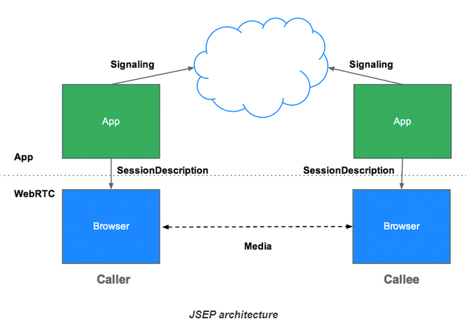
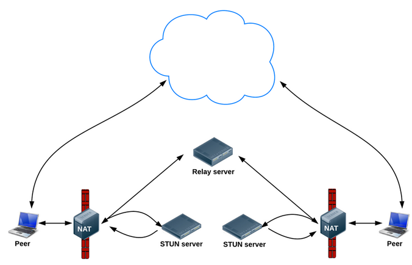
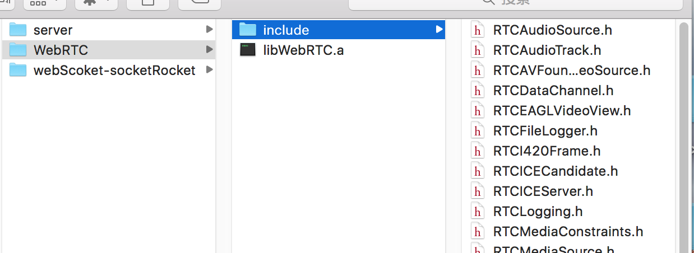
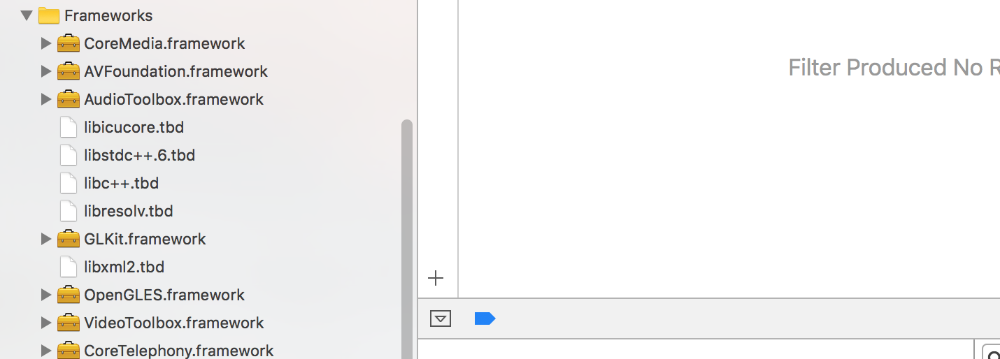
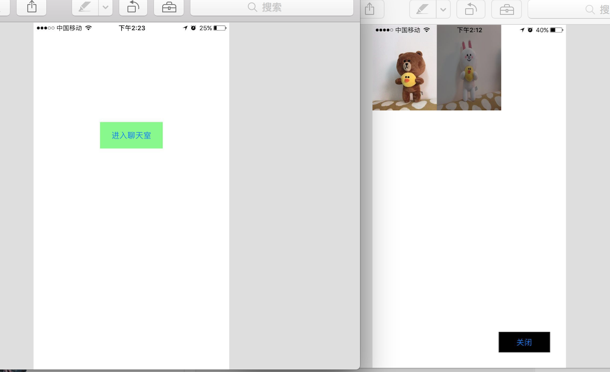
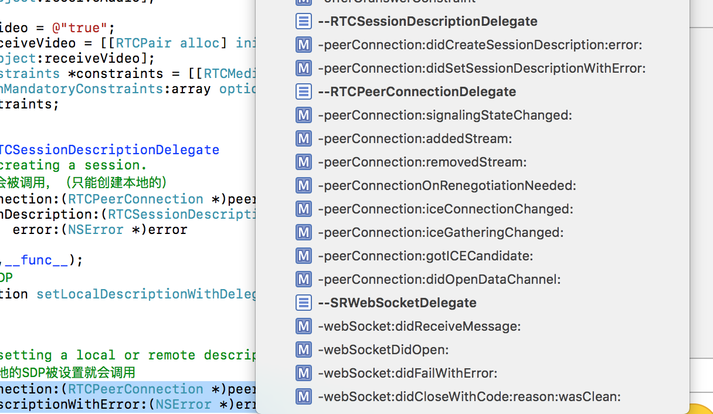
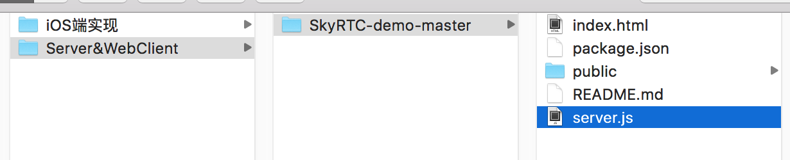
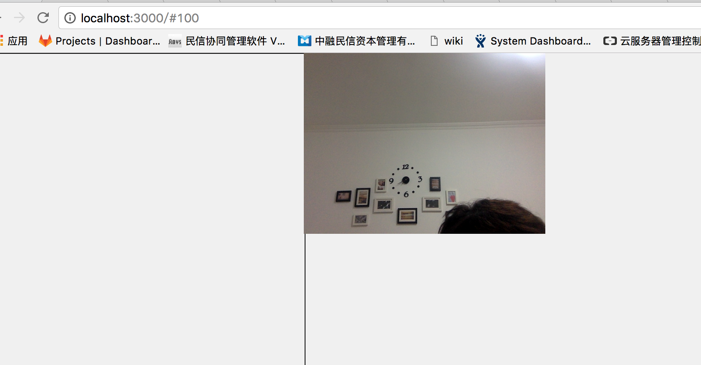
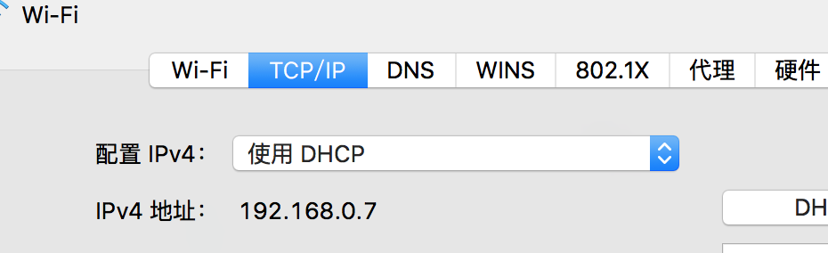

 
<!--BEGIN_DATA
{
    "create_date": "2018-12-04 15:12",
    "modify_date": "2018-12-04 15:12",
    "is_top": "0",
    "summary": "iOS下音视频通信-基于WebRTC",
    "tags": "iOS、WebRTC、C/C++",
    "file_name": "iOS下音视频通信-基于WebRTC.md"
}
END_DATA-->

####
原文出处：<a href='https://www.jianshu.com/p/c49da1d93df4' target='blank'>iOS下音视频通信-基于WebRTC.</a>

#####前言：

**WebRTC** ，名称源自网页实时通信（Web Real-Time Communication）的缩写，简而言之它是一个支持网页浏览器进行实时语音对话或视频对话的技术。  
它为我们提供了视频会议的核心技术，包括音视频的采集、编解码、网络传输、显示等功能，并且还支持跨平台：windows，linux，mac，android，iOS。  
它在2011年5月开放了工程的源代码，在行业内得到了广泛的支持和应用，成为下一代视频通话的标准。

**本文将站在巨人的肩膀上，基于WebRTC去实现不同客户端之间的音视频通话。**这个不同的客户端，不局限于移动端和移动端，还包括移动端和Web浏览器之间。

#####目录：

  * **一.WebRTC的实现原理。**
  * **二.iOS下WebRTC环境的搭建。**
  * **三.介绍下WebRTC的API，以及实现点对点连接的流程。**
  * **四.iOS客户端的详细实现，以及服务端信令通道的搭建。**

#####正文：

######一.WebRTC的实现原理。

WebRTC的音视频通信是基于P2P，那么什么是P2P呢？  
它是点对点连接的英文缩写。

#######1.我们从P2P连接模式来讲起：

一般我们传统的连接方式，都是以服务器为中介的模式：

  * 类似`http`协议：客户端⇋服务端（当然这里服务端返回的箭头仅仅代表返回请求数据）。
  * 我们在进行即时通讯时，进行文字、图片、录音等传输的时候：客户端A⇨服务器⇨客户端B。

而点对点的连接恰恰数据通道一旦形成，中间是不经过服务端的，数据直接从一个客户端流向另一个客户端：

> 客户端A⇋客户端B ... 客户端A⇋客户端C ...（可以无数个客户端之间互联）

这里可以想想音视频通话的应用场景，我们服务端确实是没必要去获取两者通信的数据，而且这样做有一个最大的一个优点就是，大大的减轻了服务端的压力。

而`WebRTC`就是这样一个基于P2P的音视频通信技术。

#######2.WebRTC的服务器与信令。

讲到这里，可能大家觉得`WebRTC`就不需要服务端了么？这是显然是错误的认识，严格来说它仅仅是不需要服务端来进行数据中转而已。

WebRTC提供了浏览器到浏览器（点对点）之间的通信，但并不意味着WebRTC不需要服务器。暂且不说基于服务器的一些扩展业务，WebRTC至少有两件事必须要用到服务器：

  1. 浏览器之间交换建立通信的元数据（信令）必须通过服务器。
  2. 为了穿越NAT和防火墙。

第1条很好理解，我们在A和B需要建立P2P连接的时候，至少要服务器来协调，来控制连接开始建立。而连接断开的时候，也需要服务器来告知另一端P2P连接已断开。
**这些我们用来控制连接的状态的数据称之为信令，而这个与服务端连接的通道，对于`WebRTC`而言就是信令通道。**

图中signalling就是往服务端发送信令，然后底层调用`WebRTC`，`WebRTC`通过服务端得到的信令，得知通信对方的基本信息，从而实现虚线部分`Media`通信连接。

#######当然信令能做的事还有很多，这里大概列了一下：

  1. 用来控制通信开启或者关闭的连接控制消息
  2. 发生错误时用来彼此告知的消息
  3. 媒体流元数据，比如像解码器、解码器的配置、带宽、媒体类型等等
  4. 用来建立安全连接的关键数据
  5. 外界所看到的的网络上的数据，比如IP地址、端口等

在建立连接之前，客户端之间显然没有办法传递数据。所以我们需要通过服务器的中转，在客户端之间传递这些数据，然后建立客户端之间的点对点连接。但是WebRTC API中并没有实现这些，这些就需要我们来实现了。

而第2条中的NAT这个概念，我们之前在[iOS即时通讯，从入门到“放弃”？  
](https://www.jianshu.com/p/2dbb360886a8)，中也提到过，不过那个时候我们是为了应对NAT超时，所造成的TCP连接中断。在这里我们就不展开去讲了，感兴趣的可以看看：[NAT百科](https://link.jianshu.com?t=http://baike.baidu.com/link?url=V6oQ2RZi1uDc8kXNQnsZ6pjzHVQ3XXWqzIre1O-dVpr8XMXVVON1c7MLp_PfEfyUeyoeaBMlqknEDmHSMgYAIK)

这里我简要说明一下，NAT技术的出现，其实就是为了解决IPV4下的IP地址匮乏。举例来说，就是通常我们处在一个路由器之下，而路由器分配给我们的地址通常为192.168.0.1、192.168.0.2如果有n个设备，可能分配到192.168.0.n，而这个IP地址显然只是一个内网的IP地址，这样一个路由器的公网地址对应了n个内网的地址，通过这种使用少量的公有IP地址代表较多的私有IP 地址的方式，将有助于减缓可用的IP地址空间的枯竭。

但是这也带来了一系列的问题，例如这里点对点连接下，会导致这样一个问题：  
如果客户端A想给客户端B发送数据，则数据来到客户端B所在的路由器下，会被NAT阻拦，这样B就无法收到A的数据了。  
但是A的NAT此时已经知道了B这个地址，所以当B给A发送数据的时候，NAT不会阻拦，这样A就可以收到B的数据了。这就是我们进行NAT穿越的核心思路。

于是我们就有了以下思路：  
我们借助一个公网IP服务器,a,b都往公网IP/PORT发包,公网服务器就可以获知a,b的IP/PORT，又由于a,b主动给公网IP服务器发包，所以公网服务器可以穿透NAT A,NAT B送包给a,b。  
所以只要公网IP将b的IP/PORT发给a,a的IP/PORT发给b。这样下次a和b互相消息，就不会被NAT阻拦了。

#######而WebRTC的NAT/防火墙穿越技术，就是基于上述的一个思路来实现的：

>建立点对点信道的一个常见问题，就是NAT穿越技术。在处于使用了NAT设备的私有TCP/IP网络中的主机之间需要建立连接时需要使用NAT穿越技术。以往在VoIP领域经常会遇到这个问题。目前已经有很多NAT穿越技术，但没有一项是完美的，因为NAT的行为是非标准化的。这些技术中大多使用了一个公共服务器，这个服务使用了一个从全球任何地方都能访问得到的IP地址。在RTCPeeConnection中，使用ICE框架来保证RTCPeerConnection能实现NAT穿越

这里提到了ICE协议框架，它大约是由以下几个技术和协议组成的：STUN、NAT、TURN、SDP，这些协议技术，帮助ICE共同实现了NAT/防火墙穿越。

小伙伴们可能又一脸懵逼了，一下子又出来这么多名词，没关系，这里我们暂且不去管它们，等我们后面实现的时候，还会提到他们，这里提前感兴趣的可以看看这篇文章：[WebRTC protocols](https://link.jianshu.com?t=https://developer.mozilla.org/zh-CN/docs/Web/API/WebRTC_API/Protocols)

######二.iOS下WebRTC环境的搭建：

首先，我们需要明白的一点是： **WebRTC已经在我们的浏览器中了。**
如果我们用浏览器，则可以直接使用js调用对应的`WebRTC`的API，实现音视频通信。  
然而我们是在iOS平台，所以我们需要去官网下载指定版本的源码，并且对其进行编译，大概一下，其中源码大小10个多G，编译过程会遇到一系列坑，而我们编译完成最终形成的`webrtc`的`.a`库大概有300多m。  
这里我们不写编译过程了，感兴趣的可以看看这篇文章：  
[WebRTC(iOS)下载编译](https://link.jianshu.com?t=http://www.cnblogs.com/fulianga/p/5868823.html)

最终我们编译成功的文件如下`WebRTC`：  

  
其中包括一个`.a`文件，和`include`文件夹下的一些头文件。(大家测试的时候可以直接使用这里编译好的文件，但是如果以后需要WebRTC最新版，就只能自己动手去编译了)

接着我们把整个`WebRTC`文件夹添加到工程中，并且添加以下系统依赖库：  

至此，一个`iOS`下的`WebRTC`环境就搭建完毕了

######三.介绍下WebRTC的API，以及实现点对点连接的流程。

#######1.WebRTC主要实现了三个API，分别是:

  * `MediaStream`：通过`MediaStream`的API能够通过设备的摄像头及话筒获得视频、音频的同步流
  * `RTCPeerConnection`：`RTCPeerConnection`是WebRTC用于构建点对点之间稳定、高效的流传输的组件
  * `RTCDataChannel`：`RTCDataChannel`使得浏览器之间（点对点）建立一个高吞吐量、低延时的信道，用于传输任意数据。

其中`RTCPeerConnection`是我们`WebRTC`的核心组件。

#######2.WebRTC建立点对点连接的流程:

我们在使用`WebRTC`来实现音视频通信前，我们必须去了解它的连接流程，否则面对它的`API`将无从下手。

我们之前讲到过WebRTC用`ICE`协议来保证NAT穿越，所以它有这么一个流程：我们需要从`STUN Server`中得到一个`ice candidate`，这个东西实际上就是公网地址，这样我们就有了客户端自己的公网地址。而这个`STUN
Server`所做的事就是之前所说的，把保存起来的公网地址，互相发送数据包，防止后续的`NAT`阻拦。

而我们之前讲过，还需要一个自己的服务端，来建立信令通道，控制A和B什么时候建立连接，建立连接的时候告知互相的`ice candidate`（公网地址）是什么、`SDP`是什么。还包括什么时候断开连接等等一系列信令。

对了，这里补充一下`SDP`这个概念，它是会话描述协议[Session Description Protocol (SDP)](https://link.jianshu.com?t=http://en.wikipedia.org/wiki/Session_Description_Protocol)
是一个描述多媒体连接内容的协议，例如分辨率，格式，编码，加密算法等。所以在数据传输时两端都能够理解彼此的数据。本质上，这些描述内容的元数据并不是媒体流本身。

#######讲到这我们来捋一捋建立P2P连接的过程：

  1. A和B连接上服务端，建立一个TCP长连接（任意协议都可以，WebSocket/MQTT/Socket原生/XMPP），我们这里为了省事，直接采用`WebSocket`，这样一个信令通道就有了。
  2. A从`ice server`（STUN Server）获取`ice candidate`并发送给Socket服务端，并生成包含`session description`（SDP）的offer，发送给Socket服务端。
  3. Socket服务端把A的offer和`ice candidate`转发给B，B会保存下A这些信息。
  4. 然后B发送包含自己`session description`的`answer`(因为它收到的是offer，所以返回的是`answer`，但是内容都是SDP)和`ice candidate`给Socket服务端。
  5. Socket服务端把B的`answer`和`ice candidate`给A，A保存下B的这些信息。

至此A与B建立起了一个P2P连接。

这里理解整个P2P连接的流程是非常重要的，否则后面代码实现部分便难以理解。

######四.iOS客户端的详细实现，以及服务端信令通道的搭建。

#######聊天室中的信令

上面是两个用户之间的信令交换流程，但我们需要建立一个多用户在线视频聊天的聊天室。所以需要进行一些扩展，来达到这个要求

#######用户操作

首先需要确定一个用户在聊天室中的操作大致流程：

  1. 打开页面连接到服务器上
  2. 进入聊天室
  3. 与其他所有已在聊天室的用户建立点对点的连接，并输出在页面上
  4. 若有聊天室内的其他用户离开，应得到通知，关闭与其的连接并移除其在页面中的输出
  5. 若又有其他用户加入，应得到通知，建立于新加入用户的连接，并输出在页面上
  6. 离开页面，关闭所有连接

#######从上面可以看出来，除了点对点连接的建立，还需要服务器至少做如下几件事：

  1. 新用户加入房间时，发送新用户的信息给房间内的其他用户
  2. 新用户加入房间时，发送房间内的其他用户信息给新加入房间的用户
  3. 用户离开房间时，发送离开用户的信息给房间内的其他用户

#######实现思路

以使用WebSocket为例，上面用户操作的流程可以进行以下修改：

  1. 客户端与服务器建立WebSocket连接
  2. 发送一个加入聊天室的信令（join），信令中需要包含用户所进入的聊天室名称
  3. 服务器根据用户所加入的房间，发送一个其他用户信令（peers），信令中包含聊天室中其他用户的信息，客户端根据信息来逐个构建与其他用户的点对点连接
  4. 若有用户离开，服务器发送一个用户离开信令（remove_peer），信令中包含离开的用户的信息，客户端根据信息关闭与离开用户的信息，并作相应的清除操作
  5. 若有新用户加入，服务器发送一个用户加入信令（new_peer），信令中包含新加入的用户的信息，客户端根据信息来建立与这个新用户的点对点连接
  6. 用户离开页面，关闭WebSocket连接

#######这样有了基本思路，我们来实现一个基于`WebRTC`的视频聊天室。

我们首先来实现客户端实现，先看看`WebRTCHelper.h`：

    
    
    @protocol WebRTCHelperDelegate;
    @interface WebRTCHelper : NSObject<SRWebSocketDelegate>
    + (instancetype)sharedInstance;
    @property (nonatomic, weak)id<WebRTCHelperDelegate> delegate;
    /**
     *  与服务器建立连接
     *
     *  @param server 服务器地址
     *  @param room   房间号
     */
    - (void)connectServer:(NSString *)server port:(NSString *)port room:(NSString *)room;
    /**
     *  退出房间
     */
    - (void)exitRoom;
    @end
    @protocol WebRTCHelperDelegate <NSObject>
    @optional
    - (void)webRTCHelper:(WebRTCHelper *)webRTChelper setLocalStream:(RTCMediaStream *)stream userId:(NSString *)userId;
    - (void)webRTCHelper:(WebRTCHelper *)webRTChelper addRemoteStream:(RTCMediaStream *)stream userId:(NSString *)userId;
    - (void)webRTCHelper:(WebRTCHelper *)webRTChelper closeWithUserId:(NSString *)userId;
    @end
    

这里我们对外的接口很简单，就是一个生成单例的方法，一个代理，还有一个与服务器连接的方法，这个方法需要传3个参数过去，分别是server的地址、端口号、以及房间号。还有一个退出房间的方法。

说说代理部分吧，代理有3个可选的方法，分别为：

  1. 本地设置流的回调，可以用来显示本地的视频图像。
  2. 远程流到达的回调，可以用来显示对方的视频图像。
  3. `WebRTC`连接关闭的回调，注意这里关闭仅仅与当前`userId`的连接关闭，而如果你除此之外还与聊天室其他的人建立连接，是不会有影响的。

接着我们先不去看如何实现的，先运行起来看看效果吧:  
`VideoChatViewController.m`:

    [WebRTCHelper sharedInstance].delegate = self;
    [[WebRTCHelper sharedInstance]connectServer:@"192.168.0.7" port:@"3000" room:@"100"];
    

仅仅需要设置代理为自己，然后连接上`socket`服务器即可。

我们来看看我们对代理的处理：

    
    
    - (void)webRTCHelper:(WebRTCHelper *)webRTChelper setLocalStream:(RTCMediaStream *)stream userId:(NSString *)userId
    {
        RTCEAGLVideoView *localVideoView = [[RTCEAGLVideoView alloc] initWithFrame:CGRectMake(0, 0, KVedioWidth, KVedioHeight)];
        //标记本地的摄像头
        localVideoView.tag = 100;
        _localVideoTrack = [stream.videoTracks lastObject];
        [_localVideoTrack addRenderer:localVideoView];
        [self.view addSubview:localVideoView];
        NSLog(@"setLocalStream");
    }
    - (void)webRTCHelper:(WebRTCHelper *)webRTChelper addRemoteStream:(RTCMediaStream *)stream userId:(NSString *)userId
    {
        //缓存起来
        [_remoteVideoTracks setObject:[stream.videoTracks lastObject] forKey:userId];
        [self _refreshRemoteView];
        NSLog(@"addRemoteStream");
    }
    - (void)webRTCHelper:(WebRTCHelper *)webRTChelper closeWithUserId:(NSString *)userId
    {
        //移除对方视频追踪
        [_remoteVideoTracks removeObjectForKey:userId];
        [self _refreshRemoteView];
        NSLog(@"closeWithUserId");
    }
    - (void)_refreshRemoteView
    {
        for (RTCEAGLVideoView *videoView in self.view.subviews) {
            //本地的视频View和关闭按钮不做处理
            if (videoView.tag == 100 ||videoView.tag == 123) {
                continue;
            }
            //其他的移除
            [videoView removeFromSuperview];
        }
        __block int column = 1;
        __block int row = 0;
        //再去添加
        [_remoteVideoTracks enumerateKeysAndObjectsUsingBlock:^(id  _Nonnull key, RTCVideoTrack *remoteTrack, BOOL * _Nonnull stop) {
            RTCEAGLVideoView *remoteVideoView = [[RTCEAGLVideoView alloc] initWithFrame:CGRectMake(column * KVedioWidth, 0, KVedioWidth, KVedioHeight)];
            [remoteTrack addRenderer:remoteVideoView];
            [self.view addSubview:remoteVideoView];
            //列加1
            column++;
            //一行多余3个在起一行
            if (column > 3) {
                row++;
                column = 0;
            }
        }];
    }
    

代码很简单，基本核心的是调用了`WebRTC`的API的那几行：  
这里我们得到本地流和远程流的时候，就可以用这个流来设置视频图像了，而音频是自动输出的（远程的音频会输出，自己本地的音频则不会）。

基本上显示视频图像只需要下面3步：

  1. 创建一个`RTCEAGLVideoView`类型的实例。
  2. 从代理回调中拿到`RTCMediaStream`类型的`stream`，从`stream`中拿到`RTCVideoTrack`实例：
    
		_localVideoTrack = [stream.videoTracks lastObject];
    

  3. 用这个`_localVideoTrack`为`RTCEAGLVideoView`实例设置渲染:

		[_localVideoTrack addRenderer:localVideoView];
    

这样一个视频图像就呈现在`RTCEAGLVideoView`实例上了，我们只需要把它添加到`view`上显示即可。

这里切记需要注意的是`RTCVideoTrack`实例我们必须持有它（这里我们本机设置为属性了，而远程的添加到数组中，都是为了这么个目的）。否则有可能会导致视频图像无法显示。

就这样，一个简单的`WebRTC`客户端就搭建完了，接下来我们先忽略掉`Socket`服务端（先当作已实现），和`WebRTCHelper`的实现，我们运行运行demo看看效果：  

这是我用手机截的图，因为模拟器无法调用mac摄像头，第一个是本地视频图像，而后面的则是远端用户传过来的，如果有n个远程用户，则会一直往下排列。

等我们整个讲完，大家可以运行下`github`上的`demo`，尝试尝试这个视频聊天室。

#######接着我们来讲讲`WebRTCHelper`的实现：

首先前面顺着应用这个类的顺序来，我们首先调用了单例，设置了代理：

    
    
    + (instancetype)sharedInstance
    {
        static dispatch_once_t onceToken;
        dispatch_once(&onceToken, ^{
            instance = [[[self class] alloc] init];
            [instance initData];
        });
        return instance;
    }
    - (void)initData
    {
        _connectionDic = [NSMutableDictionary dictionary];
        _connectionIdArray = [NSMutableArray array];
    }
    

很简单，就是初始化了实例，并且初始化了两个属性，其中是`_connectionDic`用来装`RTCPeerConnection`实例的。`_connectionIdArray`是用来装已连接的用户id的。

接着我们调用了`connectServer`:

    
    
    //初始化socket并且连接
    - (void)connectServer:(NSString *)server port:(NSString *)port room:(NSString *)room
    {
        _server = server;
        _room = room;
        NSURLRequest *request = [NSURLRequest requestWithURL:[NSURL URLWithString:[NSString stringWithFormat:@"ws://%@:%@",server,port]] cachePolicy:NSURLRequestUseProtocolCachePolicy timeoutInterval:10];
        _socket = [[SRWebSocket alloc] initWithURLRequest:request];
        _socket.delegate = self;
        [_socket open];
    }
    

这个方法连接到了我们的`socket`服务器，这里我们使用的是`webScoekt`，使用的框架是谷歌的`SocketRocket`，至于它的用法我就不赘述了，不熟悉的可以看看楼主的[iOS即时通讯，从入门到“放弃”？](https://www.jianshu.com/p/2dbb360886a8)。

这里我们设置代理为自己，并且建立连接，然后连接成功后，回调到成的代理：

    
    
    - (void)webSocketDidOpen:(SRWebSocket *)webSocket
    {
        NSLog(@"websocket建立成功");
        //加入房间
        [self joinRoom:_room];
    }
    

成功的连接后，我们调用了加入房间的方法，加入我们一开始设置的房间号：

    
    
    - (void)joinRoom:(NSString *)room
    {
        //如果socket是打开状态
        if (_socket.readyState == SR_OPEN)
        {
            //初始化加入房间的类型参数 room房间号
            NSDictionary *dic = @{@"eventName": @"__join", @"data": @{@"room": room}};
            //得到json的data
            NSData *data = [NSJSONSerialization dataWithJSONObject:dic options:NSJSONWritingPrettyPrinted error:nil];
            //发送加入房间的数据
            [_socket send:data];
        }
    }
    

加入房间，我们仅仅是把这个一个`json`数据用`socket`发给服务端，类型为`__join`。

接着就是服务端的逻辑了，服务端拿到这个类型的数据，会给我们发送这么一条消息：

    
    
    {
        data =     {
            connections =         (
            );
            you = "e297f0c0-fda5-4e67-b4dc-3745943d91bd";
        };
        eventName = "_peers";
    }
    

这条消息类型是`_peers`，意思为房间新用户，并且把我们在这个房间的id返回给我们，拿到这条消息，说明我们加入房间成功，我们就可以去做一系列的初始化了。而`connections`这个字段为空，说明当前房间没有人，如果已经有人的话，会返回这么一串：

    
    
    {
        data =     {
            connections =         (
                "85fc08a4-77cb-4f45-81f9-c0a0ef1b6949"
            );
            you = "4b73e126-e9c4-4307-bf8e-20a5a9b1f133";
        };
        eventName = "_peers";
    }
    

其中`connections`里面装的是已在房间用户的id。

接着就是我们整个类运转的核心代理方法，就是收到`socket`消息后的处理：

    
    
    #pragma mark--SRWebSocketDelegate
    - (void)webSocket:(SRWebSocket *)webSocket didReceiveMessage:(id)message
    {
        NSLog(@"收到服务器消息:%@",message);
        NSDictionary *dic = [NSJSONSerialization JSONObjectWithData:[message dataUsingEncoding:NSUTF8StringEncoding] options:NSJSONReadingMutableContainers error:nil];
        NSString *eventName = dic[@"eventName"];
        //1.发送加入房间后的反馈
        if ([eventName isEqualToString:@"_peers"])
        {
            //得到data
            NSDictionary *dataDic = dic[@"data"];
            //得到所有的连接
            NSArray *connections = dataDic[@"connections"];
            //加到连接数组中去
            [_connectionIdArray addObjectsFromArray:connections];
            //拿到给自己分配的ID
            _myId = dataDic[@"you"];
            //如果为空，则创建点对点工厂
            if (!_factory)
            {
                //设置SSL传输
                [RTCPeerConnectionFactory initializeSSL];
                _factory = [[RTCPeerConnectionFactory alloc] init];
            }
            //如果本地视频流为空
            if (!_localStream)
            {
                //创建本地流
                [self createLocalStream];
            }
            //创建连接
            [self createPeerConnections];
            //添加
            [self addStreams];
            [self createOffers];
        }
        //接收到新加入的人发了ICE候选，（即经过ICEServer而获取到的地址）
        else if ([eventName isEqualToString:@"_ice_candidate"])
        {
            NSDictionary *dataDic = dic[@"data"];
            NSString *socketId = dataDic[@"socketId"];
            NSInteger sdpMLineIndex = [dataDic[@"label"] integerValue];
            NSString *sdp = dataDic[@"candidate"];
            //生成远端网络地址对象
            RTCICECandidate *candidate = [[RTCICECandidate alloc] initWithMid:nil index:sdpMLineIndex sdp:sdp];
            //拿到当前对应的点对点连接
            RTCPeerConnection *peerConnection = [_connectionDic objectForKey:socketId];
            //添加到点对点连接中
            [peerConnection addICECandidate:candidate];
        }
        //其他新人加入房间的信息
        else if ([eventName isEqualToString:@"_new_peer"])
        {
            NSDictionary *dataDic = dic[@"data"];
            //拿到新人的ID
            NSString *socketId = dataDic[@"socketId"];
            //再去创建一个连接
            RTCPeerConnection *peerConnection = [self createPeerConnection:socketId];
            if (!_localStream)
            {
                [self createLocalStream];
            }
            //把本地流加到连接中去
            [peerConnection addStream:_localStream];
            //连接ID新加一个
            [_connectionIdArray addObject:socketId];
            //并且设置到Dic中去
            [_connectionDic setObject:peerConnection forKey:socketId];
        }
        //有人离开房间的事件
        else if ([eventName isEqualToString:@"_remove_peer"])
        {
            //得到socketId，关闭这个peerConnection
            NSDictionary *dataDic = dic[@"data"];
            NSString *socketId = dataDic[@"socketId"];
            [self closePeerConnection:socketId];
        }
        //这个新加入的人发了个offer
        else if ([eventName isEqualToString:@"_offer"])
        {
            NSDictionary *dataDic = dic[@"data"];
            NSDictionary *sdpDic = dataDic[@"sdp"];
            //拿到SDP
            NSString *sdp = sdpDic[@"sdp"];
            NSString *type = sdpDic[@"type"];
            NSString *socketId = dataDic[@"socketId"];
            //拿到这个点对点的连接
            RTCPeerConnection *peerConnection = [_connectionDic objectForKey:socketId];
            //根据类型和SDP 生成SDP描述对象
            RTCSessionDescription *remoteSdp = [[RTCSessionDescription alloc] initWithType:type sdp:sdp];
            //设置给这个点对点连接
            [peerConnection setRemoteDescriptionWithDelegate:self sessionDescription:remoteSdp];
            //把当前的ID保存下来
            _currentId = socketId;
            //设置当前角色状态为被呼叫，（被发offer）
            _role = RoleCallee;
        }
        //收到别人的offer，而回复answer
        else if ([eventName isEqualToString:@"_answer"])
        {
            NSDictionary *dataDic = dic[@"data"];
            NSDictionary *sdpDic = dataDic[@"sdp"];
            NSString *sdp = sdpDic[@"sdp"];
            NSString *type = sdpDic[@"type"];
            NSString *socketId = dataDic[@"socketId"];
            RTCPeerConnection *peerConnection = [_connectionDic objectForKey:socketId];
            RTCSessionDescription *remoteSdp = [[RTCSessionDescription alloc] initWithType:type sdp:sdp];
            [peerConnection setRemoteDescriptionWithDelegate:self sessionDescription:remoteSdp];
        }
    }
    

这里，我们对6种事件进行了处理，这6种事件就是我们之前说了半天的信令事件，不过这仅仅是其中的一部分而已。

#######简单的谈一下这里对6种信令事件的处理：

注意：这里6种事件的顺序希望大家能自己运行`demo`打断点看看，由于各种事件导致收到消息的顺序组合比较多，展开讲会很乱，所以这里我们仅仅按照代码的顺序来讲。

#######1.收到`_peers`:

证明我们新加入房间，我们就需要对本地的一些东西初始化，其中包括往`_connectionIdArray`添加房间已有用户ID。初始化点对点连接对象的工厂：

    
    
     if (!_factory)
            {
                //设置SSL传输
                [RTCPeerConnectionFactory initializeSSL];
                _factory = [[RTCPeerConnectionFactory alloc] init];
            }
    

创建本地视频流：

    
    
    //如果本地视频流为空
    if (!_localStream)
    {
        //创建本地流
        [self createLocalStream];
    }
    
    
    
     - (void)createLocalStream
    {
        _localStream = [_factory mediaStreamWithLabel:@"ARDAMS"];
        //音频
        RTCAudioTrack *audioTrack = [_factory audioTrackWithID:@"ARDAMSa0"];
        [_localStream addAudioTrack:audioTrack];
        //视频
        NSArray *deviceArray = [AVCaptureDevice devicesWithMediaType:AVMediaTypeVideo];
        AVCaptureDevice *device = [deviceArray lastObject];
        //检测摄像头权限
        AVAuthorizationStatus authStatus = [AVCaptureDevice authorizationStatusForMediaType:AVMediaTypeVideo];
        if(authStatus == AVAuthorizationStatusRestricted || authStatus == AVAuthorizationStatusDenied)
        {
            NSLog(@"相机访问受限");
            if ([_delegate respondsToSelector:@selector(webRTCHelper:setLocalStream:userId:)])
            {
                [_delegate webRTCHelper:self setLocalStream:nil userId:_myId];
            }
        }
        else
        {
            if (device)
            {
                RTCVideoCapturer *capturer = [RTCVideoCapturer capturerWithDeviceName:device.localizedName];
                RTCVideoSource *videoSource = [_factory videoSourceWithCapturer:capturer constraints:[self localVideoConstraints]];
                RTCVideoTrack *videoTrack = [_factory videoTrackWithID:@"ARDAMSv0" source:videoSource];
                [_localStream addVideoTrack:videoTrack];
                if ([_delegate respondsToSelector:@selector(webRTCHelper:setLocalStream:userId:)])
                {
                    [_delegate webRTCHelper:self setLocalStream:_localStream userId:_myId];
                }
            }
            else
            {
                NSLog(@"该设备不能打开摄像头");
                if ([_delegate respondsToSelector:@selector(webRTCHelper:setLocalStream:userId:)])
                {
                    [_delegate webRTCHelper:self setLocalStream:nil userId:_myId];
                }
            }
        }
    }
    

这里利用了系统的`AVCaptureDevice`、`AVAuthorizationStatus`，以及RTC的`RTCVideoCapturer`、`RTCVideoSource`、`RTCVideoTrack`等一系列类完成了`_localStream`本地流的初始化，至于具体用法，大家看看代码吧，还是比较简单，我就不讲了。

我们接着创建了点对点连接核心对象：

    
    
    [self createPeerConnections];
    
    
    
    /**
     *  创建所有连接
     */
     - (void)createPeerConnections
    {
        //从我们的连接数组里快速遍历
        [_connectionIdArray enumerateObjectsUsingBlock:^(NSString *obj, NSUInteger idx, BOOL * _Nonnull stop) {
            //根据连接ID去初始化 RTCPeerConnection 连接对象
            RTCPeerConnection *connection = [self createPeerConnection:obj];
            //设置这个ID对应的 RTCPeerConnection对象
            [_connectionDic setObject:connection forKey:obj];
        }];
    }
    
    
    
     - (RTCPeerConnection *)createPeerConnection:(NSString *)connectionId
    {
        //如果点对点工厂为空
        if (!_factory)
        {
            //先初始化工厂
            [RTCPeerConnectionFactory initializeSSL];
            _factory = [[RTCPeerConnectionFactory alloc] init];
        }
        //得到ICEServer
        if (!ICEServers) {
            ICEServers = [NSMutableArray array];
            [ICEServers addObject:[self defaultSTUNServer]];
        }
        //用工厂来创建连接
        RTCPeerConnection *connection = [_factory peerConnectionWithICEServers:ICEServers constraints:[self peerConnectionConstraints] delegate:self];
        return connection;
    }
    

大概就是用这两个方法，创建了`RTCPeerConnection`实例，并且设置了`RTCPeerConnectionDelegate`代理为自己。最后把它保存在我们的`_connectionDic`,对应的`key`为对方`id`。

然后我们给所有`RTCPeerConnection`实例添加了流：

    
    
    [self addStreams];
    
    
    
    /**
     *  为所有连接添加流
     */
     - (void)addStreams
    {
        //给每一个点对点连接，都加上本地流
        [_connectionDic enumerateKeysAndObjectsUsingBlock:^(NSString *key, RTCPeerConnection *obj, BOOL * _Nonnull stop) {
            if (!_localStream)
            {
                [self createLocalStream];
            }
            [obj addStream:_localStream];
        }];
    }
    

最后，因为是新加入房间的用户，所以我们创建了offer：

    
    
    [self createOffers];
    
    
    
    - (void)createOffers
    {
        //给每一个点对点连接，都去创建offer
        [_connectionDic enumerateKeysAndObjectsUsingBlock:^(NSString *key, RTCPeerConnection *obj, BOOL * _Nonnull stop) {
            _currentId = key;
            _role = RoleCaller;
            [obj createOfferWithDelegate:self constraints:[self offerOranswerConstraint]];
        }];
    }
    

我们去遍历连接字典，去给每一个连接都去创建一个offer，角色设置为发起者`RoleCaller`。  
`createOfferWithDelegate`是`RTCPeerConnection`的实例方法，创建一个offer，并且设置设置代理为自己`RTCSessionDescriptionDelegate`代理为自己。

看到这我们发现除了`SRWebSocket`的代理外，又多了两个代理，一个是创建点对点连接的`RTCPeerConnectionDelegate`，一个是创建`offer`的`RTCSessionDescriptionDelegate`。

相信大家看到这会觉得有点凌乱，我们收到`socket`消息的代理还没有讲完，一下子又多出这么多代理，没关系，我们一步步来看。

#######我们先来看看所有的代理方法：

一共如图这么多，一共隶属于`socket`，点对点连接对象，还有`SDP`(offer或者answer)。

相信前两者需要代理，大家能明白为什么，因为是网络回调，所以使用了代理，而`SDP`为什么要使用代理呢？带着疑惑，我们先来看看`RTCSessionDescriptionDelegate`的两个代理方法：

    
    
    //创建了一个SDP就会被调用，（只能创建本地的）
    - (void)peerConnection:(RTCPeerConnection *)peerConnection
    didCreateSessionDescription:(RTCSessionDescription *)sdp
                     error:(NSError *)error
    {
        NSLog(@"%s",__func__);
        //设置本地的SDP
        [peerConnection setLocalDescriptionWithDelegate:self sessionDescription:sdp];
    }
    

上面是第一个代理方法，当我们创建了一个SDP就会被调用，因为我们也仅仅只能创建本机的SDP，我们之前调用`createOfferWithDelegate`这个方法，创建成功后就会触发这个代理，在这个代理中我们给这个连接设置了这个SDP。

然而调用`setLocalDescriptionWithDelegate`设置本地SDP，则会触发它的第二代理方法（与之相呼应的还有一个`setRemoteDescriptionWithDelegate`设置远程的SDP）：

    
    
    //当一个远程或者本地的SDP被设置就会调用
    - (void)peerConnection:(RTCPeerConnection *)peerConnection
    didSetSessionDescriptionWithError:(NSError *)error
    {
        NSLog(@"%s",__func__);
        //判断，当前连接状态为，收到了远程点发来的offer，这个是进入房间的时候，尚且没人，来人就调到这里
        if (peerConnection.signalingState == RTCSignalingHaveRemoteOffer)
        {
            //创建一个answer,会把自己的SDP信息返回出去
            [peerConnection createAnswerWithDelegate:self constraints:[self offerOranswerConstraint]];
        }
        //判断连接状态为本地发送offer
        else if (peerConnection.signalingState == RTCSignalingHaveLocalOffer)
        {
            if (_role == RoleCallee)
            {
                NSDictionary *dic = @{@"eventName": @"__answer", @"data": @{@"sdp": @{@"type": @"answer", @"sdp": peerConnection.localDescription.description}, @"socketId": _currentId}};
                NSData *data = [NSJSONSerialization dataWithJSONObject:dic options:NSJSONWritingPrettyPrinted error:nil];
                [_socket send:data];
            }
            //发送者,发送自己的offer
            else if(_role == RoleCaller)
            {
                NSDictionary *dic = @{@"eventName": @"__offer", @"data": @{@"sdp": @{@"type": @"offer", @"sdp": peerConnection.localDescription.description}, @"socketId": _currentId}};
                NSData *data = [NSJSONSerialization dataWithJSONObject:dic options:NSJSONWritingPrettyPrinted error:nil];
                [_socket send:data];
            }
        }
        else if (peerConnection.signalingState == RTCSignalingStable)
        {
            if (_role == RoleCallee)
            {
                NSDictionary *dic = @{@"eventName": @"__answer", @"data": @{@"sdp": @{@"type": @"answer", @"sdp": peerConnection.localDescription.description}, @"socketId": _currentId}};
                NSData *data = [NSJSONSerialization dataWithJSONObject:dic options:NSJSONWritingPrettyPrinted error:nil];
                [_socket send:data];
            }
        }
    }
    

这个方法无论是设置本地，还是远程的SDP，设置成功后都会调用，这里我们根据`_role`的不同，来判断是应该生成`offer`还是`answer`类型的数据来包裹SDP。最后用`_socket`把数据发送给服务端，服务端在转发给我们指定的`socketId`的用户。  
注意：这个`socketId`是在我们进入房间后，`connections`里获取到的，或者我们已经在房间里，收到别人的`offer`拿到的。

这样我们一个`SDP`生成、绑定、发送的流程就结束了。

接着我们还是回到`SRWebSocketDelegate`的`didReceiveMessage`方法中来。

#######2.我们来讲第2种信令事件：`_ice_candidate`

这个事件，我们在原理中讲过，其实它的数据就是一个对方客户端的一个公网IP，只不过这个公网IP是由`STU Server`下发的，为了`NAT`/防火墙穿越。

我们收到这种事件，需要把对端的IP保存在点对点连接对象中。

我们接着来看看代码：

    
    
    //接收到新加入的人发了ICE候选，（即经过ICEServer而获取到的地址）
    else if ([eventName isEqualToString:@"_ice_candidate"])
    {
        NSDictionary *dataDic = dic[@"data"];
        NSString *socketId = dataDic[@"socketId"];
        NSInteger sdpMLineIndex = [dataDic[@"label"] integerValue];
        NSString *sdp = dataDic[@"candidate"];
        //生成远端网络地址对象
        RTCICECandidate *candidate = [[RTCICECandidate alloc] initWithMid:nil index:sdpMLineIndex sdp:sdp];
        //拿到当前对应的点对点连接
        RTCPeerConnection *peerConnection = [_connectionDic objectForKey:socketId];
        //添加到点对点连接中
        [peerConnection addICECandidate:candidate];
    }
    

我们在这里创建了一个`RTCICECandidate`实例`candidate`，这个实例用来标识远端地址。并且把它添加到对应ID的`peerConnection`中去了。

这里我们仅仅看到接受到远端的`_ice_candidate`，但是要知道这个地址同样是我们客户端发出的，那么发送是在什么地方呢？

我们来看看`RTCPeerConnectionDelegate`，有这么一个代理方法：

    
    
    //创建peerConnection之后，从server得到响应后调用，得到ICE 候选地址
    - (void)peerConnection:(RTCPeerConnection *)peerConnection
           gotICECandidate:(RTCICECandidate *)candidate
    {
        NSLog(@"%s",__func__);
        NSDictionary *dic = @{@"eventName": @"__ice_candidate", @"data": @{@"label": [NSNumber numberWithInteger:candidate.sdpMLineIndex], @"candidate": candidate.sdp, @"socketId": _currentId}};
        NSData *data = [NSJSONSerialization dataWithJSONObject:dic options:NSJSONWritingPrettyPrinted error:nil];
        [_socket send:data];
    }
    

当我们创建`peerConnection`的时候，就会去我们一开始初始化的时候，添加的`ICEServers`数组中，去ICE Server地址中去请求，得到`ICECandidate`就会调用这个代理方法，我们在这里用`socket`把自己的网络地址发送给了对端。

讲到这个`ICEServers`,我们这里提一下，这里需要一个`STUN`服务器，这里我们用的是谷歌的：

    
    
    static NSString *const RTCSTUNServerURL = @"stun:stun.l.google.com:19302";
    //初始化STUN Server （ICE Server）
    - (RTCICEServer *)defaultSTUNServer {
        NSURL *defaultSTUNServerURL = [NSURL URLWithString:RTCSTUNServerURL];
        return [[RTCICEServer alloc] initWithURI:defaultSTUNServerURL
                                        username:@""
                                        password:@""];
    }
    

有些`STUN`服务器可能被墙，下面这些提供给大家备用，或者可以自行搭建：

    
    
    stun.l.google.com:19302
    stun1.l.google.com:19302
    stun2.l.google.com:19302
    stun3.l.google.com:19302
    stun4.l.google.com:19302
    stun01.sipphone.com
    stun.ekiga.net
    stun.fwdnet.net
    stun.ideasip.com
    stun.iptel.org
    stun.rixtelecom.se
    stun.schlund.de
    stunserver.org
    stun.softjoys.com
    stun.voiparound.com
    stun.voipbuster.com
    stun.voipstunt.com
    stun.voxgratia.org
    stun.xten.com
    

#######3.我们回到`didReceiveMessage`代理来讲第3种信令事件：`_new_peer`

    
    
    else if ([eventName isEqualToString:@"_new_peer"])
    {
        NSDictionary *dataDic = dic[@"data"];
        //拿到新人的ID
        NSString *socketId = dataDic[@"socketId"];
        //再去创建一个连接
        RTCPeerConnection *peerConnection = [self createPeerConnection:socketId];
        if (!_localStream)
        {
            [self createLocalStream];
        }
        //把本地流加到连接中去
        [peerConnection addStream:_localStream];
        //连接ID新加一个
        [_connectionIdArray addObject:socketId];
        //并且设置到Dic中去
        [_connectionDic setObject:peerConnection forKey:socketId];
    }
    

这个`_new_peer`表示你已经在房间，这时候有新的用户加入，这时候你需要为这个用户再去创建一个点对点连接对象`peerConnection`。  
并且把本地流加到这个新的对象中去，然后设置`_connectionIdArray`和`_connectionDic`。

#######4.第4种信令事件：`_remove_peer`

    
    
    //有人离开房间的事件
    else if ([eventName isEqualToString:@"_remove_peer"])
    {
        //得到socketId，关闭这个peerConnection
        NSDictionary *dataDic = dic[@"data"];
        NSString *socketId = dataDic[@"socketId"];
        [self closePeerConnection:socketId];
    }
    

这个事件是有人离开了，我们则需要调用`closePeerConnection`:

    
    
    /**
     *  关闭peerConnection
     *
     *  @param connectionId <#connectionId description#>
     */
    - (void)closePeerConnection:(NSString *)connectionId
    {
        RTCPeerConnection *peerConnection = [_connectionDic objectForKey:connectionId];
        if (peerConnection)
        {
            [peerConnection close];
        }
        [_connectionIdArray removeObject:connectionId];
        [_connectionDic removeObjectForKey:connectionId];
        dispatch_async(dispatch_get_main_queue(), ^{
            if ([_delegate respondsToSelector:@selector(webRTCHelper:closeWithUserId:)])
            {
                [_delegate webRTCHelper:self closeWithUserId:connectionId];
            }
        });
    }
    

关闭`peerConnection`，并且从`_connectionIdArray`、`_connectionDic`中移除，然后对外调用关闭连接的代理。

#######5.第5种信令事件：`_offer`

这个事件，是别人新加入房间后，会发出的`offer`，提出与我们建立点对点连接。  
我们来看看处理：

    
    
    //这个新加入的人发了个offer
    else if ([eventName isEqualToString:@"_offer"])
    {
        NSDictionary *dataDic = dic[@"data"];
        NSDictionary *sdpDic = dataDic[@"sdp"];
        //拿到SDP
        NSString *sdp = sdpDic[@"sdp"];
        NSString *type = sdpDic[@"type"];
        NSString *socketId = dataDic[@"socketId"];
        //拿到这个点对点的连接
        RTCPeerConnection *peerConnection = [_connectionDic objectForKey:socketId];
        //根据类型和SDP 生成SDP描述对象
        RTCSessionDescription *remoteSdp = [[RTCSessionDescription alloc] initWithType:type sdp:sdp];
        //设置给这个点对点连接
        [peerConnection setRemoteDescriptionWithDelegate:self sessionDescription:remoteSdp];
        //把当前的ID保存下来
        _currentId = socketId;
        //设置当前角色状态为被呼叫，（被发offer）
        _role = RoleCallee;
    }
    

这里我们从`offer`中拿到SDP，并且调用我们之前提到的`setRemoteDescriptionWithDelegate`设置远端的SDP，这个设置成功后，又调回到SDP的代理方法：`didSetSessionDescriptionWithError`中去了。

在这代理方法我们生成了一个`answer`，把本机的SDP包裹起来传了过去。如此形成了一个闭环。

#######6.第6种信令事件：`_answer`

这个事件是自己发出offer后，得到别人的`awser`回答，这时候我们需要做的仅仅是保存起来远端`SDP`即可，到这一步两端互相有了对方的`SDP`。

而两端的事件， **是当`SDP`和`ICE Candidate`，都交换完成后，点对点连接才建立完成。**

#######至此6种信令事件讲完了，通过这些信令，我们完成了加入房间，退出房间，建立连接等控制过程。

这个类基本上核心的东西就这些了，其他的一些零碎的小细节，包括连接成功后，远端的流过来调用`RTCPeerConnectionDelegate`代理等等：

    
    
    // Triggered when media is received on a new stream from remote peer.
    - (void)peerConnection:(RTCPeerConnection *)peerConnection
               addedStream:(RTCMediaStream *)stream
    {
        NSLog(@"%s",__func__);
        dispatch_async(dispatch_get_main_queue(), ^{
            if ([_delegate respondsToSelector:@selector(webRTCHelper:addRemoteStream:userId:)])
            {
                [_delegate webRTCHelper:self addRemoteStream:stream userId:_currentId];
            }
        });
    }
    

在这里我们仅仅是把这个视频流用主线程回调出去给外部代理处理，而点对点连接关闭的时候也是这么处理的，这样就和我们之前提到的对外代理方法衔接起来了。

其他的大家可以自己去`demo`中查看吧。

接着我们客户端讲完了，这里我们略微带过一下我们的`WebSocket`服务端，这里我们仍然用的`Node.js`，为什么用用它呢？因为太多好用的简单好用的框架了，简直不用动脑子...

这里我们用了`skyrtc`框架，具体代码如下：

    
    
    var express = require('express');
    var app = express();
    var server = require('http').createServer(app);
    var SkyRTC = require('skyrtc').listen(server);
    var path = require("path");
    var port = process.env.PORT || 3000;
    server.listen(port);
    app.use(express.static(path.join(__dirname, 'public')));
    app.get('/', function(req, res) {
        res.sendfile(__dirname + '/index.html');
    });
    SkyRTC.rtc.on('new_connect', function(socket) {
        console.log('创建新连接');
    });
    SkyRTC.rtc.on('remove_peer', function(socketId) {
        console.log(socketId + "用户离开");
    });
    SkyRTC.rtc.on('new_peer', function(socket, room) {
        console.log("新用户" + socket.id + "加入房间" + room);
    });
    SkyRTC.rtc.on('socket_message', function(socket, msg) {
        console.log("接收到来自" + socket.id + "的新消息：" + msg);
    });
    SkyRTC.rtc.on('ice_candidate', function(socket, ice_candidate) {
        console.log("接收到来自" + socket.id + "的ICE Candidate");
    });
    SkyRTC.rtc.on('offer', function(socket, offer) {
        console.log("接收到来自" + socket.id + "的Offer");
    });
    SkyRTC.rtc.on('answer', function(socket, answer) {
        console.log("接收到来自" + socket.id + "的Answer");
    });
    SkyRTC.rtc.on('error', function(error) {
        console.log("发生错误：" + error.message);
    });
    

基本上，用了这个框架，我们除了打印之外，没有做任何的处理，所有的消息转发，都是由框架内部识别并且处理完成的。

这里需要提一下的是，由于作者没有那么富帅，没那么多手机，所以在这里用浏览器来充当一部分的客户端，所以你会看到，这里用了`http`框架，监听了本机`3000`端口，如果谁调用网页的则去渲染当前文件下的`index.html`。

在这里，用`index.html`和`SkyRTC-client.js`两个文件实现了浏览器端的`WebRTC`通信，这样就可以移动端和移动端、移动端和浏览器、浏览器与浏览器之间在同一个聊天室进行视频通话了。

至于源码我就不讲了，大家可以到`demo`中去查看，这个浏览器端的代码是我从下面文章的作者`github`中找来的：  
[WebRTC的RTCDataChannel](https://link.jianshu.com?t=http://lingyu.wang/2014/05/22/webrtc-data-channels/)  
[使用WebRTC搭建前端视频聊天室——信令篇](https://link.jianshu.com?t=http://lingyu.wang/2014/03/18/webRTC-2/)  
[使用WebRTC搭建前端视频聊天室——入门篇](https://link.jianshu.com?t=http://lingyu.wang/2014/03/15/webRTC-1/)

提倡大家去看看，他很详细的讲了`WebRTC`在`Web`端的实现，和`iOS`端实现的基本原理、流程是一样的，只是`API`略有不同。

######本文demo地址：
**[WebRTC_iOS](https://link.jianshu.com?t=https://github.com/tuyaohui/WebRTC_iOS)**

#######大家在运行`demo`的时候需要注意以下几点:

  1. 运行`WebSocket`服务端，直接用命令行CD到`server.js`所在目录下：  

直接命令行中执行（需要安装nodejs环境）
    
    node server.js
    

这样`Socket`服务端就运行起来了，此时你可以打开浏览器输入
    
    localhost:3000#100
    

此3000为端口号，100为聊天室房间号，如果出现以下图像，说明`Socket`服务端和`Web`客户端已完成。  

  2. 接着我们要去运行iOS的客户端了，首先我们需要去[百度网盘](https://link.jianshu.com?t=https://pan.baidu.com/s/1kU4IPp1)下载 `WebRTC`头文件和静态库.a。  
  3. 下载完成，解压缩，直接按照本文第二条中：iOS下WebRTC环境的搭建即可。

程序能运行起来后，接着我们需要替换`VideoChatViewController`中的`server`地址:

    
    
    [[WebRTCHelper sharedInstance]connectServer:@"192.168.0.7" port:@"3000" room:@"100"];
    

这里的server地址，如果你是用和本机需要替换成`localhost`，而如果你是用手机等，则需要和电脑同处一个局域网（wifi下），并且IP地址一致才行。

在这里由于我的电脑IP地址是`192.168.0.7`：  

所以我在手机上运行，连接到这个`server`，也就是连接到电脑。

至此就可以看到iOS端的视频聊天效果了，大家可以多开几个`Web`客户端看看效果。

######写在结尾：

引用这篇文章：[从demo到实用，中间还差1万个WebRTC](https://link.jianshu.com?t=http://www.52im.net/article-119-1.html)里的一段话来结尾吧：

>WebRTC开源之前，实时音视频通信听起来好高级：回声消除、噪声抑制……对于看到傅里叶变换都头疼的工程师很难搞定这些专业领域的问题。  
>Google收购了GIPS，开源了WebRTC项目之后，开发者可以自己折腾出互联网音视频通信了。下载、编译、集成之后，第一次听到通过互联网传过来的喂喂喂，工程师会非常兴奋，demo到万人直播现场只差一步了。  
>但是，电信行业要求可用性4个9，而刚刚让人兴奋的“喂喂喂”，1个9都到不了。某公司在展会上演示跨国音视频，多次呼叫无法接通，自嘲说我们还没有做网络优化嘛。这就等于互联网全民创业时期的”就差个程序员了“，本质上是和demo与真正产品之间的差距，是外行与内行之间的差距。

IM的路还有很长，一万个WebRTC已经走过了一个？

######注：源代码运行后有小伙伴反映移动端连接黑屏的问题，经张速同学的提醒，原因如下：

修改的地方大致如上图所述，主要是发送ICE的时候添加了一个id字段的数据，这个字段的内容为candidate.stpMid。

官方对这个stpMid字段的解释是：

>// If present, this contains the identifier of the "media stream  
>// identification" as defined in [RFC 3388] for m-line this candidate is  
>// associated with.

意思是这个字段是用来标识流媒体的id，这个字段需要和ICE绑定在一起。  
至于浏览器端为什么不会有影响，原因应该是`web`端和移动端的`SDK`差异所导致的。

所以除了客户端需要添加这个字段外，在我们server端，找到SkyRTC.js，也需要添加这个id字段，把它转发给另一个客户端，添加上后，移动端之间视频聊天应该就不会有问题了。

`github`上的代码我已经修改过了，重新拉一下代码即可。

除此之外，如果不同网段之间，出现视频聊天黑屏的问题，那么很可能是STUN服务器导致的，建议多尝试几个STUN试试，也可以自行搭建。

