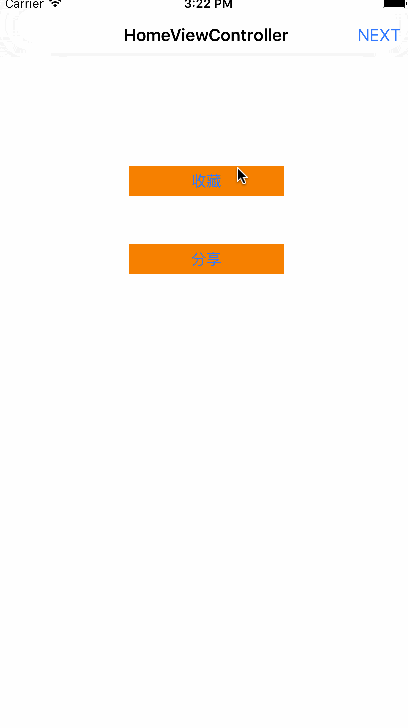
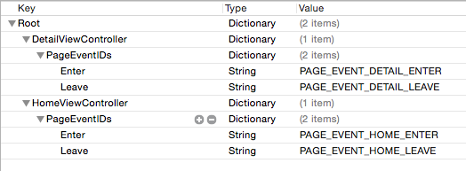
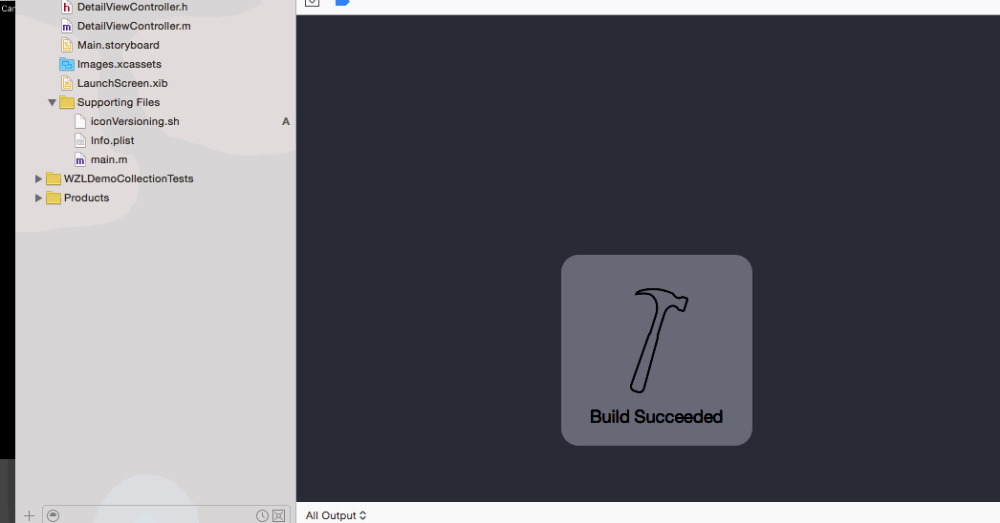
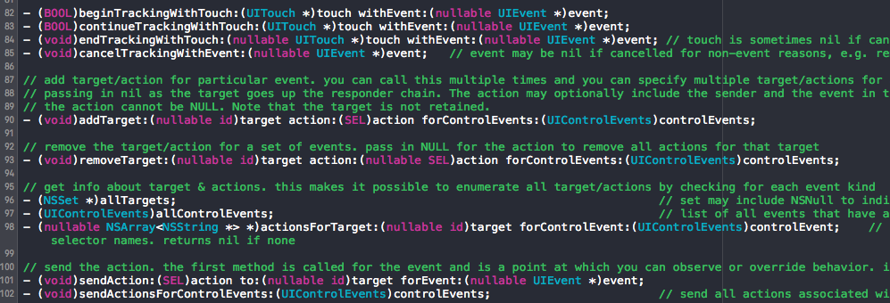
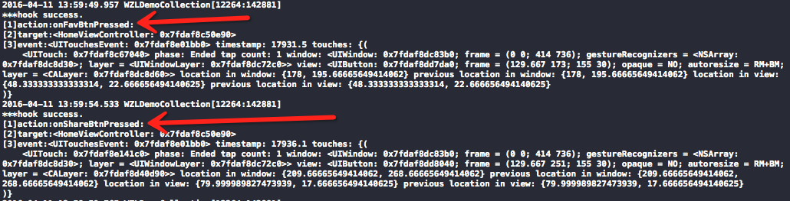
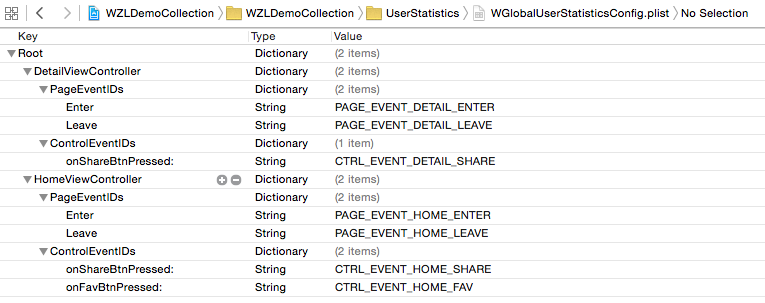
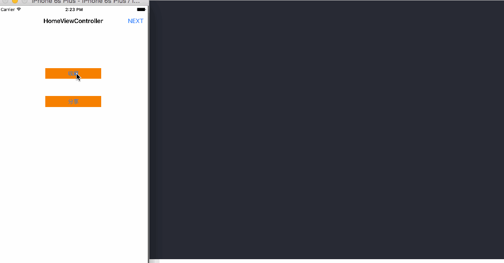
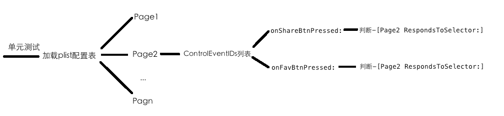
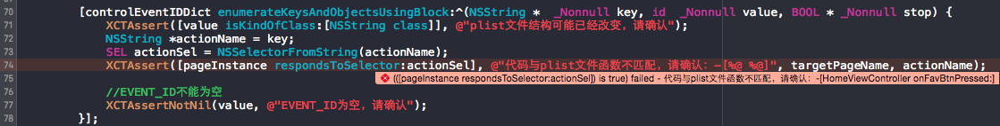

<!--BEGIN_DATA
{
    "create_date": "2016-06-04 11:25", 
    "modify_date": "2016-06-04 11:25", 
    "is_top": "0", 
    "summary": "iOS动态性：一行代码实现iOS序列化与反序列化(runtime)", 
    "tags": "iOS", 
    "file_name": "iOS动态性：一行代码实现iOS序列化与反序列化(runtime).md"
}
END_DATA-->

####
原文出处：<a href='http://www.jianshu.com/p/fed1dcb1ac9f' target='blank'>iOS动态性(一) 一行代码实现iOS序列化与反序列化(runtime)</a>

## 一、变量声明

为便于下文讨论，提前创建父类`Biology`以及子类`Person`：

Biology:

    
    
    @interface Biology : NSObject
    {
        NSInteger *_hairCountInBiology;
    }
    @property (nonatomic, copy) NSString *introInBiology;
    @end
    @implementation Biology
    @end

Person:

    
    
    #import <Foundation/Foundation.h>
    #import "Biology.h"
    #import <objc/runtime.h>
    @interface Person : Biology
    {
        NSString *_father;
    }
    @property (nonatomic, copy) NSString *name;
    @property (nonatomic, assign) NSInteger age;
    @end
    @implementation Person
    @end

**补充说明**  
凡是在父类中定义的属性或者变量，末尾都有InBiology标志；反之也成立

* * *

## 二、问题引入

在iOS中一个自定义对象是无法直接存入到文件中的，必须先转化成二进制流才行。从对象到二进制数据的过程我们一般称为对象的序列化(Serialization)，
也称为归档(Archive)。同理，从二进制数据到对象的过程一般称为反序列化或者反归档。  
在序列化实现中不可避免的需要实现NSCoding以及NSCopying(非必须)协议的以下方法：

    
    
    - (id)initWithCoder:(NSCoder *)coder;
    - (void)encodeWithCoder:(NSCoder *)coder;
    - (id)copyWithZone:(NSZone *)zone;

假设我们现在需要对**直接继承**自NSObject的**Person**类进行序列化，代码一般长这样子：

    
    
    //对变量编码
    - (void)encodeWithCoder:(NSCoder *)coder
    {
        [coder encodeObject:self.name forKey:@"name"];
        [coder encodeObject:@(self.age) forKey:@"age"];
        [coder encodeObject:_father forKey:@"_father"];
      //... ... other instance variables
    }
    //对变量解码
    - (id)initWithCoder:(NSCoder *)coder
    {
        self.name = [coder decodeObjectForKey:@"name"];
        self.age = [[coder decodeObjectForKey:@"age"] integerValue];
        _father = [coder decodeObjectForKey:@"_father"];
      //... ... other instance variables

似乎so easy？至少到目前为止是这样的。但是请考虑以下问题：

  * 若Person是个很大的类，有非常多的变量需要进行encode/decode处理呢？
  * 若你的工程中有很多像Person的自定义类需要做序列化操作呢？
  * 若Person不是直接继承自NSObject而是有多层的父类呢？(请注意，序列化的原则是所有层级的父类的属性变量也要需要序列化)；

如果采用开始的传统的序列化方式进行序列化，在碰到以上问题时容易暴露出以下缺陷(仅仅是缺陷，不能称为问题)：

  * 工程代码中冗余代码很多
  * 父类层级复杂容易导致遗漏点一些父类中的属性变量

那是不是有更优雅的方案来回避以上问题呢？那是必须的。这里我们将共同探讨使用runtime来实现一种接口简洁并且十分通用的iOS序列化与反序列方案。

* * *

## 三、runtime: iOS序列化与反序列化利器

### 3.1 总体思路

观察上面的`initWithCoder`代码我们可以发现，序列化与反序列化中最重要的环节是遍历类的变量，保证不能遗漏。

> **这里需要**特别注意**的是:**  
编解码的范围不能仅仅是自身类的变量，还应当把除NSObject类外的所有层级父类的属性变量也进行编解码！

由此可见，这几乎是个纯体力活。而runtime在遍历变量这件事情上能为我们提供什么帮助呢？我们可以通过runtime在运行时获取自身类的所有变量进行编解码；
然后对父类进行递归，获取除NSObject外每个层级父类的属性(非私有变量)，进行编解码。

### 3.2 使用runtime获取变量以及属性

runtime中获取某类的所有变量(属性变量以及实例变量)API：

    
    
    Ivar *class_copyIvarList(Class cls, unsigned int *outCount)

获取某类的所有属性变量API：

    
    
    objc_property_t *class_copyPropertyList(Class cls, unsigned int *outCount)

runtime的所有开放API都放在`objc/runtime.h`里面。上面的一些数据类型有些同学可能没见过，这里我们先简单地介绍一下，更详细的介绍请自行
查阅其他资料，强烈建议打开  
Ivar是runtime对于变量的定义，本质是一个结构体：

    
    
    struct objc_ivar {
        char *ivar_name;                                   
        char *ivar_type;                                    
        int ivar_offset;
    #ifdef __LP64__
        int space;
    #endif
    } 
    typedef struct objc_ivar *Ivar;

  * ivar_name:变量名，对于一个给定的Ivar，可以通过`const char *ivar_getName(Ivar v)`函数获得`char *`类型的变量名；
  * ivar_type: 变量类型，在runtime中变量类型用字符串表示，例如用@表示id类型，用i表示int类型...。这不在本文讨论之列。类似地，可以通过`const char *ivar_getTypeEncoding(Ivar v)`函数获得变量类型；
  * ivar_offset： 基地址偏移字节数，可以不用理会  
获取所有变量的代码一般长这样子：

    
          unsigned int numIvars; //成员变量个数
      Ivar *vars = class_copyIvarList(NSClassFromString(@"UIView"), &numIvars);
      NSString *key=nil;
      for(int i = 0; i < numIvars; i++) {
          Ivar thisIvar = vars[i];
          key = [NSString stringWithUTF8String:ivar_getName(thisIvar)];  //获取成员变量的名字
          NSLog(@"variable name :%@", key);
          key = [NSString stringWithUTF8String:ivar_getTypeEncoding(thisIvar)]; //获取成员变量的数据类型
          NSLog(@"variable type :%@", key);
      }
      free(vars);//记得释放掉

objc_property_t是runtime对于属性变量的定义，本质上也是一个结构体（事实上OC是对C的封装，大多数类型的本质都是C结构体）。在`runt
ime.h`头文件中只有`typedef struct objc_property *objc_property_t`，并没有更详细的结构体介绍。虽然run
time的源码是开源的，但这里并不打算深入介绍，这并不影响我们今天的主题。与Ivar的应用同理，获取类的属性变量的代码一般长这样子：

    
        unsigned int outCount, i;   
      objc_property_t *properties = class_copyPropertyList([self class], &outCount);   
      for (i = 0; i < outCount; i++) {   
          objc_property_t property = properties[i];   
          NSString *propertyName = [[[NSString alloc] initWithCString:property_getName(property)] ;   
          NSLog(@"property name:%@", propertyName); 
      }   
      free(properties);

### 3.3 用runtime实现序列化与反序列化

有了前面两节的铺垫，到这里自然就水到渠成了。我们可以在`initWithCoder:`以及`encoderWithCoder:`中遍历类的所有变量，取得变量
名作为KEY值，最后使用KVC强制取得或者赋值给对象。于是我们可以得到如下的自动序列化与发序列化代码，关键部分有注释：

    
        @implementation Person
    //解码
    - (id)initWithCoder:(NSCoder *)coder
    {
      unsigned int iVarCount = 0;
      Ivar *iVarList = class_copyIvarList([self class], &iVarCount);//取得变量列表,[self class]表示对自身类进行操作
      for (int i = 0; i < iVarCount; i++) {
          Ivar var = *(iVarList + i);
          const char * varName = ivar_getName(var);//取得变量名字，将作为key
          NSString *key = [NSString stringWithUTF8String:varName];
          //decode
          id  value = [coder decodeObjectForKey:key];//解码
          if (value) {
              [self setValue:value forKey:key];//使用KVC强制写入到对象中
          }
      }
      free(iVarList);//记得释放内存
      return self;
    }
        //编码
        - (void)encodeWithCoder:(NSCoder *)coder
            {
            unsigned int varCount = 0;
            Ivar *ivarList = class_copyIvarList([self class], &varCount);
            for (int i = 0; i < varCount; i++) {
                Ivar var = *(ivarList + i);
                const char *varName = ivar_getName(var);
                NSString *key = [NSString stringWithUTF8String:varName];
                id varValue = [self valueForKey:key];//使用KVC获取key对应的变量值
                if (varValue) {
                    [coder encodeObject:varValue forKey:key];
                }
          }
          free(ivarList);
        }

### 3.4 优化

上面代码有个缺陷，在获取变量时都是指定当前类，也就是`[self
class]`。当你的Model对象并不是直接继承自NSObject时容易遗漏掉父类的属性。请牢记3.1节我们提到的：

> 编解码的范围不能仅仅是自身类的变量，还应当把除NSObject类外的所有层级父类的属性变量也进行编解码！

因此在上面代码的基础上我们我们需要注意一下细节，设一个指针，先指向本身类，处理完指向SuperClass，处理完再指向SuperClass的SuperCla
ss...。代码如下(这里仅以`encodeWithCoder:`为例，毕竟`initWithCoder:`同理)：

    
    
    - (void)encodeWithCoder:(NSCoder *)coder
    { 
        Class cls = [self class];
        while (cls != [NSObject class]) {//对NSObject的变量不做处理
            unsigned int iVarCount = 0;
            Ivar *ivarList = class_copyIvarList([cls class], &iVarCount);/*变量列表，含属性以及私有变量*/  
            for (int i = 0; i < iVarCount; i++) { 
                const char *varName = ivar_getName(*(ivarList + i)); 
                NSString *key = [NSString stringWithUTF8String:varName];    
                /*valueForKey只能获取本类所有变量以及所有层级父类的属性，不包含任何父类的私有变量(会崩溃)*/  
                id varValue = [self valueForKey:key];   
                if (varValue) { 
                    [coder encodeObject:varValue forKey:key];   
                }   
            }   
            free(ivarList); 
            cls = class_getSuperclass(cls); //指针指向当前类的父类
        }   
    }

这样真的结束了吗？不是的。当你的跑上面的代码时程序有可能会crash掉，crash的地方在`[self objectForKey:key]`这一句上。原来是
这里的KVC无法获取到父类的私有变量(即实例变量)。因此，在处理到父类时不能简单粗暴地使用`class_copyIvarList`，而只能取父类的属性变量。
这时候3.2节部分的`class_copyPropertyList`就派上用场了。在处理父类时用后者代替前者。于是最终的代码(额~其实还不算最终)：

    
    
    - (id)initWithCoder:(NSCoder *)coder    
    {   
        NSLog(@"%s",__func__);  
        Class cls = [self class];   
        while (cls != [NSObject class]) {   
            /*判断是自身类还是父类*/    
            BOOL bIsSelfClass = (cls == [self class]);  
            unsigned int iVarCount = 0; 
            unsigned int propVarCount = 0;  
            unsigned int sharedVarCount = 0;    
            Ivar *ivarList = bIsSelfClass ? class_copyIvarList([cls class], &iVarCount) : NULL;/*变量列表，含属性以及私有变量*/   
            objc_property_t *propList = bIsSelfClass ? NULL : class_copyPropertyList(cls, &propVarCount);/*属性列表*/   
            sharedVarCount = bIsSelfClass ? iVarCount : propVarCount;   
            for (int i = 0; i < sharedVarCount; i++) {  
                const char *varName = bIsSelfClass ? ivar_getName(*(ivarList + i)) : property_getName(*(propList + i)); 
                NSString *key = [NSString stringWithUTF8String:varName];   
                id varValue = [coder decodeObjectForKey:key];   
                if (varValue) { 
                    [self setValue:varValue forKey:key];    
                }   
            }   
            free(ivarList); 
            free(propList); 
            cls = class_getSuperclass(cls); 
        }   
        return self;    
    }   
    - (void)encodeWithCoder:(NSCoder *)coder    
    {   
        NSLog(@"%s",__func__);  
        Class cls = [self class];   
        while (cls != [NSObject class]) {   
            /*判断是自身类还是父类*/    
            BOOL bIsSelfClass = (cls == [self class]);  
            unsigned int iVarCount = 0; 
            unsigned int propVarCount = 0;  
            unsigned int sharedVarCount = 0;    
            Ivar *ivarList = bIsSelfClass ? class_copyIvarList([cls class], &iVarCount) : NULL;/*变量列表，含属性以及私有变量*/   
            objc_property_t *propList = bIsSelfClass ? NULL : class_copyPropertyList(cls, &propVarCount);/*属性列表*/ 
            sharedVarCount = bIsSelfClass ? iVarCount : propVarCount;   
            for (int i = 0; i < sharedVarCount; i++) {  
                const char *varName = bIsSelfClass ? ivar_getName(*(ivarList + i)) : property_getName(*(propList + i)); 
                NSString *key = [NSString stringWithUTF8String:varName];    
                /*valueForKey只能获取本类所有变量以及所有层级父类的属性，不包含任何父类的私有变量(会崩溃)*/  
                id varValue = [self valueForKey:key];   
                if (varValue) { 
                    [coder encodeObject:varValue forKey:key];   
                }   
            }   
            free(ivarList); 
            free(propList); 
            cls = class_getSuperclass(cls); 
        }   
    }

### 3.5 最终的封装

在逻辑上，上面的代码应该是目前为止比较完美的自动序列化与反序列解决方案了。即使某个类的继承深度极其深，变量极其多，序列化的代码也就以上这些。但是我们回到文章
第二节提出的几点场景假设，其中有一点提到：

> 若你的工程中有很多像Person的自定义类需要做序列化操作呢？

如果是在以上场景下，每个Model类都需要写一次上面的代码。这在一定程度上也造成冗余了。同时，你也会觉得这篇文章的标题就是瞎扯淡，根本就不是一行代码的事。上
面的代码冗余，我这种对代码有很强洁癖的程序旺是万万接受不了的。那就再封装一层！这里我采用宏的方式将上述代码浓缩成一行，放到一个叫WZLSerializeKi
t.h的头文件中：

    
    
    #define WZLSERIALIZE_CODER_DECODER()     \
    \
    - (id)initWithCoder:(NSCoder *)coder    \
    {   \
        NSLog(@"%s",__func__);  \
        Class cls = [self class];   \
        while (cls != [NSObject class]) {   \
            /*判断是自身类还是父类*/    \
            BOOL bIsSelfClass = (cls == [self class]);  \
            unsigned int iVarCount = 0; \
            unsigned int propVarCount = 0;  \
            unsigned int sharedVarCount = 0;    \
            Ivar *ivarList = bIsSelfClass ? class_copyIvarList([cls class], &iVarCount) : NULL;/*变量列表，含属性以及私有变量*/   \
            objc_property_t *propList = bIsSelfClass ? NULL : class_copyPropertyList(cls, &propVarCount);/*属性列表*/   \
            sharedVarCount = bIsSelfClass ? iVarCount : propVarCount;   \
                \
            for (int i = 0; i < sharedVarCount; i++) {  \
                const char *varName = bIsSelfClass ? ivar_getName(*(ivarList + i)) : property_getName(*(propList + i)); \
                NSString *key = [NSString stringWithUTF8String:varName];   \
                id varValue = [coder decodeObjectForKey:key];   \
                if (varValue) { \
                    [self setValue:varValue forKey:key];    \
                }   \
            }   \
            free(ivarList); \
            free(propList); \
            cls = class_getSuperclass(cls); \
        }   \
        return self;    \
    }   \
    \
    - (void)encodeWithCoder:(NSCoder *)coder    \
    {   \
        NSLog(@"%s",__func__);  \
        Class cls = [self class];   \
        while (cls != [NSObject class]) {   \
            /*判断是自身类还是父类*/    \
            BOOL bIsSelfClass = (cls == [self class]);  \
            unsigned int iVarCount = 0; \
            unsigned int propVarCount = 0;  \
            unsigned int sharedVarCount = 0;    \
            Ivar *ivarList = bIsSelfClass ? class_copyIvarList([cls class], &iVarCount) : NULL;/*变量列表，含属性以及私有变量*/   \
            objc_property_t *propList = bIsSelfClass ? NULL : class_copyPropertyList(cls, &propVarCount);/*属性列表*/ \
            sharedVarCount = bIsSelfClass ? iVarCount : propVarCount;   \
            \
            for (int i = 0; i < sharedVarCount; i++) {  \
                const char *varName = bIsSelfClass ? ivar_getName(*(ivarList + i)) : property_getName(*(propList + i)); \
                NSString *key = [NSString stringWithUTF8String:varName];    \
                /*valueForKey只能获取本类所有变量以及所有层级父类的属性，不包含任何父类的私有变量(会崩溃)*/  \
                id varValue = [self valueForKey:key];   \
                if (varValue) { \
                    [coder encodeObject:varValue forKey:key];   \
                }   \
            }   \
            free(ivarList); \
            free(propList); \
            cls = class_getSuperclass(cls); \
        }   \
    }

之后需要序列化的地方只要两步：1、import "WZLSerializeKit.h"
2、调用`WZLSERIALIZE_CODER_DECODER();`即可。两个字：清爽。  
此外，`copyWithZone`中同样可以用相同的原理对变量进行自动化copy。同样地，我们也可以用一个宏封装掉`copyWithZone`方法。这里就不
再赘述。  
值得一提的是，以上代码我已经放到我的Github中，并且提供了CocoaPods支持。使用的时候只需要pod `WZLSerializeKit`。点
[此处](https://github.com/weng1250/WZLSerializeKit) 跳转到我的Github.

####
原文出处：<a href='http://www.jianshu.com/p/0497afdad36d' target='blank'>iOS动态性(二)可复用而且高度解耦的用户统计埋点实现</a>

  

用户统计.jpeg

  
用户行为统计(User Behavior Statistics, UBS)一直是移动互联网产品中必不可少的环节，也俗称埋点。在保证移动端流量不会受较大影响的
前提下，PM们总是希望埋点覆盖面越广越好。目前常规的做法是将埋点代码封装成工具类，但凡工程中需要埋点(如点击事件、页面跳转)的地方都插入埋点代码。一旦项目越
来越复杂，你会发现埋点的代码散落在程序的各个角落，不利于维护以及复用。本文旨在**探讨**利用iOS的运行时机制实现一种可复、解耦、容易维护的用户统计方案。
探讨毕竟是探讨，欢迎到在简书留言讨论。本文虽有些长却是用心之作，希望你有耐心看完。

> 注：本文需要一些iOS的Runtime基础

该方案的完成将会用到以下知识：

>   * Method Swizzling(Hook)

>   * 单元测试

## 一、常规埋点做法

接着开头的话题，我们先回顾一下主流的埋点是怎么做的。我粗糙地将埋点分为两种：1、页面统计，包括页面停留时间、页面进入次数；2、交互事件统计，包括单击、双击、
手势交互等。

#### 1)常规页面统计埋点

以统计页面进入次数为例，最简单粗暴的做法是在所有页面的`viewDidAppear:`以及`viewDidDisappear:`中分别埋点，将自己对应的pa
geID上传给服务端。代码大概长酱紫：

    
    
    @implementation HomeViewController
    //...other methods
    - (void)viewDidAppear:(BOOL)animated
    {
        [super viewWillAppear:animated];
        [WUserStatistics sendEventToServer:@"PAGE_EVENT_HOME_ENTER"];
    }
    - (void)viewDidDisappear:(BOOL)animated
    {
        [super viewDidDisappear:animated];
        [WUserStatistics sendEventToServer:@"PAGE_EVENT_HOME_LEAVE"];
    }
    @end

`+[WUserStatistics sendEventToServer:]`封装网络请求，将ID上传给服务器。上述方案有以下弊端：

> 1、复用性差。这部分埋点代码很难给其他项目复用  
2、工作量大。尤其当页面较多时，需要修改的代码较多  
3、引入“脏代码”，不易维护

第3点提到的“脏代码”意思是用户行为分析这种业务其实跟主业务没太大关系，`不应该保持如此高的耦合度`，因为这些代码会干扰我们对项目主业务的维护。这个我个人看
法。

#### 2)常规交互事件埋点

常规做法一般在交互事件的selector中获取该事件的ID并上传给服务端，代码大概长酱紫：

    
    
    - (IBAction)onFavBtnPressed:(id)sender
    {
        [WUserStatistics sendEventToServer:@"CTRL_EVENT_HOME_FAV"];
        //...do other things
    }

稍微大一点的APP如果采用这种方式，那诸如此类的埋点代码将遍地都是。它的缺点参考页面统计埋点部分，其复用性基本为零，也就是在新项目中根本无法复用埋点代码。

小总结一下，采用常规的做法虽然直观方便，但在**可复用性、可维护性**等方面有所欠缺。在我看来，借助运行时可以很好地避开这些缺点。

## 二、Method Swizzling、Hook与代码注入

由于Runtime知识不属于本文的重点，这里只简单介绍。  
在iOS中，我们可以在运行时替换两个方法的实现，达到“勾住”某个方法并注入代码的目的。具体做法是:

> 重载类的“+(void)load”方法，在程序加载到内存时利用Runtime的`method_exchangeImplementations`等接口将方
法(设为M)的实现互相交换。当方法M被调用时就会被勾住(Hook)，执行我们的方法。

这种技术也称为`Method Swizzling`，属于面向切面编程(Aspect-Oriented Programming)的一种实现。

替换两个方法的实现，代码一般长酱紫：

    
    
    @interface WHookUtility : NSObject
    + (void)swizzlingInClass:(Class)cls originalSelector:(SEL)originalSelector swizzledSelector:(SEL)swizzledSelector;
    @end
    @implementation WHookUtility
    + (void)swizzlingInClass:(Class)cls originalSelector:(SEL)originalSelector swizzledSelector:(SEL)swizzledSelector
    {
        Class class = cls;
        Method originalMethod = class_getInstanceMethod(class, originalSelector);
        Method swizzledMethod = class_getInstanceMethod(class, swizzledSelector);
        BOOL didAddMethod =
        class_addMethod(class,
                        originalSelector,
                        method_getImplementation(swizzledMethod),
                        method_getTypeEncoding(swizzledMethod));
        if (didAddMethod) {
            class_replaceMethod(class,
                                swizzledSelector,
                                method_getImplementation(originalMethod),
                                method_getTypeEncoding(originalMethod));
        } else {
            method_exchangeImplementations(originalMethod, swizzledMethod);
        }
    }
    @end

这个`WHookUtility`工具类下文会用到。比如现在我们要勾住`UIViewController`的`viewWillAppear:`方法，可以这样做
：

    
    
    @implementation UIViewController (userStastistics)
    + (void)load {
        static dispatch_once_t onceToken;
        dispatch_once(&onceToken, ^{
            SEL originalSelector = @selector(viewWillAppear:);
            SEL swizzledSelector = @selector(swiz_viewWillAppear:);
            [WHookUtility swizzlingInClass:[self class] originalSelector:originalSelector swizzledSelector:swizzledSelector];
        });
    }
    #pragma mark - Method Swizzling
    - (void)swiz_viewWillAppear:(BOOL)animated
    {
        //插入需要执行的代码
        NSLog(@"我在viewWillAppear执行前偷偷插入了一段代码");
        //不能干扰原来的代码流程，插入代码结束后要让本来该执行的代码继续执行
        [self swiz_viewWillAppear:animated];
    }
    @end

更多关于Runtime、method
swizzling、面向切面编程的介绍请参考[这里](http://www.cnblogs.com/wengzilin/p/4704996.html)

## 三、基于运行时的埋点方案

为了便于下文叙述，先引入一个简单的项目，共有两个页面(`HomeViewController`，`DetailViewController`)，如下：

  

1.gif

需求是

>   1. 统计两个页面的展示与离开次数

>   2. 统计收藏、分享单击事件的次数

>   3. **对现有工程代码影响越小越好**

#### 1)统计两个页面的展示与离开次数

这部分应该比较直观了，摒弃掉在每个controller中埋点的方式，我们对UIViewController添加category从而Hook到`viewWil
lAppear:`与`viewWillDisappear:`。在这两个方法中注入埋点代码：

  

埋点代码注入.jpg

这时候问题来了，项目中每个页面都会有自己的页面事件编号(pageEventID)，此处的埋点代码如何知道要发送什么pageEventID给服务端呢？轻松祭出
`if-else`神器：

    
    
    - (NSString *)pageEventID:(BOOL)bEnterPage
    {
        NSString *selfClassName = NSStringFromClass([self class]);
        NSString *pageEventID = nil;
        if ([selfClassName isEqualToString:@"HomeViewController"]) {
            pageEventID = bEnterPage ? @"EVENT_HOME_ENTER_PAGE" : @"EVENT_HOME_LEAVE_PAGE";
        } else if ([selfClassName isEqualToString:@"DetailViewController"]) {
            pageEventID = bEnterPage ? @"EVENT_DETAIL_ENTER_PAGE" : @"EVENT_DETAIL_LEAVE_PAGE";
        }
        //else if (<#expression#>)...
    }

当然，我们可以有更优雅的方式，比如用一个配置表替代上面一长串的`if`判断，这样无论页面数怎么增加，代码始终是那么一小段。我们新建一个`WGlobalUse
rStatisticsConfig.plist`的配置表来存放每个页面在进入以及离开时的pageEventID，结构如下：

  

配置表结构.png

  
因此，页面进出统计中获取pageEventID的代码始终是以下这几句：

    
    
    - (NSString *)pageEventID:(BOOL)bEnterPage
    {
        NSDictionary *configDict = [self dictionaryFromUserStatisticsConfigPlist];
        NSString *selfClassName = NSStringFromClass([self class]);
        return configDict[selfClassName][@"PageEventIDs"][bEnterPage ? @"Enter" : @"Leave"];
    }
    - (NSDictionary *)dictionaryFromUserStatisticsConfigPlist
    {
        NSString *filePath = [[NSBundle mainBundle] pathForResource:@"WGlobalUserStatisticsConfig" ofType:@"plist"];
        NSDictionary *dic = [NSDictionary dictionaryWithContentsOfFile:filePath];
        return dic;
    }

效果如下：

  

页面埋点.gif

以上就是完成了页面进出统计的埋点，并且达到了我们的第三点预期：对现有代码基本无影响。**通过Method
Swizzling的方式现有的工程甚至不需要`import`任何文件！**后期代码变动时需要维护的仅仅是plist配置表。

#### 2)统计收藏、分享单击事件的次数

与上一节思路一致，要做到解耦显然需要通过category+hook来实现。本文demo中收藏跟分享都是UIButton类型，可以考虑添加UIButton的c
atogory。但更好的方式是添加UIControl的category，这样可以让埋点代码覆盖到所有UIControl的子类中去，比如button、swit
ch、segment等，提高复用性。  
既然要hook，那就要清楚到底要hook`UIControl`的哪(几)个方法，只有部分方法是满足埋点需求的，最好是所hook的方法能提供target、ac
tionName等信息。这是个尝试的过程。  
`UIControl`的方法列表有以下：

  

UIControl方法列表.png

  
通过观察方法名和参数，我们有理由怀疑是倒数第二个，因其携带了不少貌似有价值的信息：

    
    
    - (void)sendAction:(SEL)action to:(nullable id)target forEvent:(nullable UIEvent *)event;

于是写出测试代码看看：

    
    
    @implementation UIControl (userStastistics)
    + (void)load {
        static dispatch_once_t onceToken;
        dispatch_once(&onceToken, ^{
            SEL originalSelector = @selector(sendAction:to:forEvent:);
            SEL swizzledSelector = @selector(swiz_sendAction:to:forEvent:);
            [WHookUtility swizzlingInClass:[self class] originalSelector:originalSelector swizzledSelector:swizzledSelector];
        });
    }
    #pragma mark - Method Swizzling
    - (void)swiz_sendAction:(SEL)action to:(id)target forEvent:(UIEvent *)event;
    {
        //插入埋点代码
        [self performUserStastisticsAction:action to:target forEvent:event];
        [self swiz_sendAction:action to:target forEvent:event];
    }
    - (void)performUserStastisticsAction:(SEL)action to:(id)target forEvent:(UIEvent *)event;
    {
        NSLog(@"\n***hook success.\n[1]action:%@\n[2]target:%@ \n[3]event:%ld", NSStringFromSelector(action), target, (long)event);
    }
    @end

Log如下图：

  

Log.png

可以看到，通过category+method swizzling的方式在没有修改现有工程任何代码的情况下已经成功Hook到所有点击事件，在Hook代码中我们
知道了一个点击事件的`target`也就是ViewController，也知道了点击事件的响应函数名，知道了点击的`TouchSet`。这些信息已经能满足埋
点需求了。  
与页面统计埋点类似，我们同样采用plist配置表的方式避免一大长串的`if-else`判断：  

  

单击事件配置表结构.png

  
有了这张配置表就很容易得到某次单击事件的事件ID(ControlEventID)：

    
    
    NSString *actionString = NSStringFromSelector(action);//获取SEL string
    NSString *targetName = NSStringFromClass([target class]);//viewController name
    NSDictionary *configDict = [self dictionaryFromUserStatisticsConfigPlist];
    eventID = configDict[targetName][@"ControlEventIDs"][actionString];

> 事实上，我把某个页面单元的所有事件ID分成了两类：**页面事件ID**(PageEventIDs，页面的进出等)、**交互事件ID**(ControlE
ventIDs，单击、双击、手势等)。分类有助于下文使用单元测试(Unit Test)进行自动化后期维护。

埋点效果如图：

  

单击埋点效果.gif

到这里先做了阶段性的总结，本文提出的思路有以下优越性：

>   * 与工程代码基本解耦，避免引入“脏代码”

>   * 即使后期工程代码发生重构，需要修改的仅仅是plist配置表

>   * 维护配置表比维护散落在工程各个角落的代码简单

## 四、基于单元测试的后期维护

俗话说，创业难守业更难。前面的思路基本可以完成初步的埋点需求。但是在实际项目中代码重构是很频繁的。这意味着在多人协作开发、代码重构频繁的项目中响应事件方法甚
至页面名称都可能被改掉，造成事件ID获取不到导致埋点失效。  
代码变动的情况无非以下几种(这里只介绍响应事件发生改变的情况)：

> 1、响应事件方法名称改变或者删除

比如收藏事件原先是`onFavBtnPressed:`，之后被改成`onFavouriteBtnPressed:`。代码发生变动但是plist配置表中由于开
发人员疏忽忘记同步修改了。这种疏忽在开发压力大进度赶的情况下是有很大概率发生的。由于代码与配置表不匹配将导致eventID为nil。在这种情况下单元测试就很
有必要了，使用完备的测试用例能在发版前检测到这种不匹配情况从而避免埋点失效。  
在单元测试中我们首先读取plist配置文件，遍历所有的页面。在一个页面内遍历所有的ControlEventIDs，对每个响应函数名进行`respondsTo
Selector:`判断：

  

单元测试介绍.png

单测代码如下：

    
    
    - (void)testIfUserStatisticsConfigPlistValid
    {
        NSDictionary *configDict = [self dictionaryFromUserStatisticsConfigPlist];
        XCTAssertNotNil(configDict, @"WGlobalUserStatisticsConfig.plist加载失败");
        [configDict enumerateKeysAndObjectsUsingBlock:^(NSString *  _Nonnull key, id  _Nonnull obj, BOOL * _Nonnull stop) {
            XCTAssert([obj isKindOfClass:[NSDictionary class]], @"plist文件结构可能已经改变，请确认");
            NSString *targetPageName = key;
            Class pageClass = NSClassFromString(targetPageName);
            id pageInstance = [[pageClass alloc] init];
            //一个pageDict对应一个页面，存放pageID,所有的action及对应的eventID
            NSDictionary *pageDict = (NSDictionary *)obj;
            //页面配置信息
            NSDictionary *pageEventIDDict = pageDict[@"PageEventIDs"];
            //交互配置信息
            NSDictionary *controlEventIDDict = pageDict[@"ControlEventIDs"];
            XCTAssert(pageEventIDDict, @"plist文件未包含PageID字段或者该字段值为空");
            XCTAssert(controlEventIDDict, @"plist文件未包含EventIDs字段或者该字段值为空");
            [pageEventIDDict enumerateKeysAndObjectsUsingBlock:^(NSString *  _Nonnull key, id  _Nonnull value, BOOL * _Nonnull stop) {
                XCTAssert([value isKindOfClass:[NSString class]], @"plist文件结构可能已经改变，请确认");
                XCTAssertNotNil(value, @"EVENT_ID为空，请确认");
            }];
            [controlEventIDDict enumerateKeysAndObjectsUsingBlock:^(NSString *  _Nonnull key, id  _Nonnull value, BOOL * _Nonnull stop) {
                XCTAssert([value isKindOfClass:[NSString class]], @"plist文件结构可能已经改变，请确认");
                NSString *actionName = key;
                SEL actionSel = NSSelectorFromString(actionName);
                XCTAssert([pageInstance respondsToSelector:actionSel], @"代码与plist文件函数不匹配，请确认：-[%@ %@]", targetPageName, actionName);
                //EVENT_ID不能为空
                XCTAssertNotNil(value, @"EVENT_ID为空，请确认");
            }];
        }];
    }

我们来测试一下，如果把`HomeViewController`的`onFavBtnPressed:`改成`onMyFavBtnPressed:`后单元测试的
结果就是：

  

单元测试不通过.png

这种改变给单测轻松捕捉到了，

> 只要XCTAssert的log够详细，维护起来其实相当轻松的。

上图中的log已经明确指出`-[HomeViewController onFavBtnPressed:]`方法发生了改变。

> 2、代码中新增了响应事件

这种情况常见于新版本中有新的埋点需求。如果代码中新增了响应事件并且该响应事件是在PM要求的埋点列表中，但是plist有可能会漏掉该事件。这种情况是比较棘手的
。上一种情况是基于plist列表去校验代码，这里就要反过来，根据代码去校验plist是否有缺失。但问题来了，一个项目中响应函数往往是非常多的，并不是任何响应
函数都需要埋点。需要埋点的响应函数与其他响应函数并没有区别。  
对于这种情况，一种方式是加强code review避免忘记往配置表中添加埋点(这简直就是废话)；一种是：要求埋点响应函数的方法名中包含约定的字符串，比如收藏
事件的方法名为`onFavBtnPressed_UA:`表示这个事件是需要埋点的。然后在单元测试中使用运行时API`class_copyMethodList
`取出标记了`_UA`的所有函数，随后到plist中校验是否存在。不存在则表示测试用例不通过，提示开发人员校验。

代码略。如果对单元测试不熟悉，可以参考[单元测试](http://www.jianshu.com/p/8bbec078cabe)

小总结：  
合理的单元测试可以为本文方案的后期维护减轻相当大的负担，测试用例的完备性很重要，需要用心设计考虑周全。

## 五、结语

以上就是结合运行时所设计出的用户统计思路全部内容。应该说该方案的可复用性与解耦程度都是不错的，既适合于新建的工程，也适合于已经创建的工程。看起来内容多，其实
总结起来无非几个步骤：plist配置表+Hook+单元测试。利用Method
Swizzling把埋点代码集中管理其实也是合理的，有利于专人开发、跟踪及维护。当然以上思路只考虑简单的情形，更复杂的情况就需要变通了，但总体思路就是如此。  
思路可能不完美，但作为一种尝试也未尝不可。路都是走出来的。

本文[demo地址](https://github.com/weng1250/UserStatisticsWithRuntime.git)，记得star噢！

