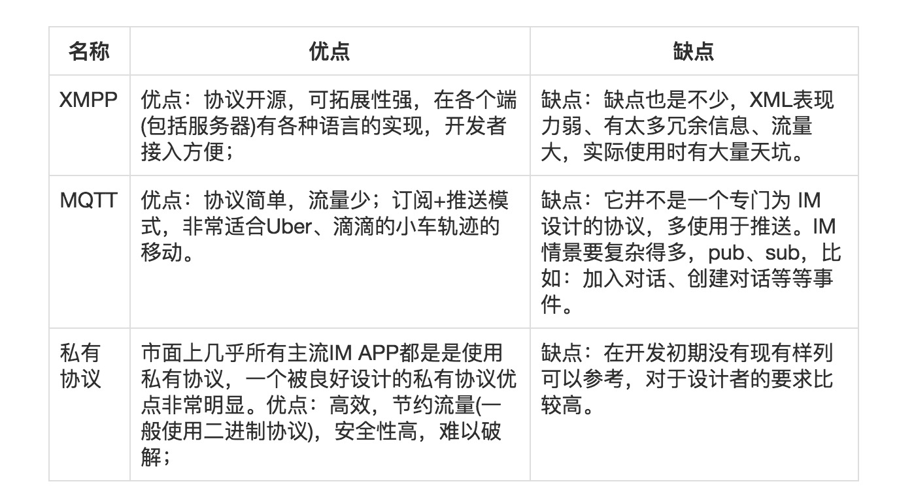
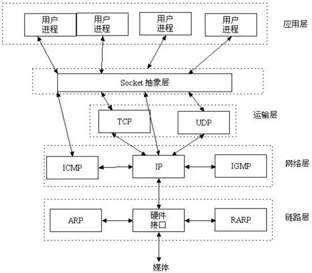
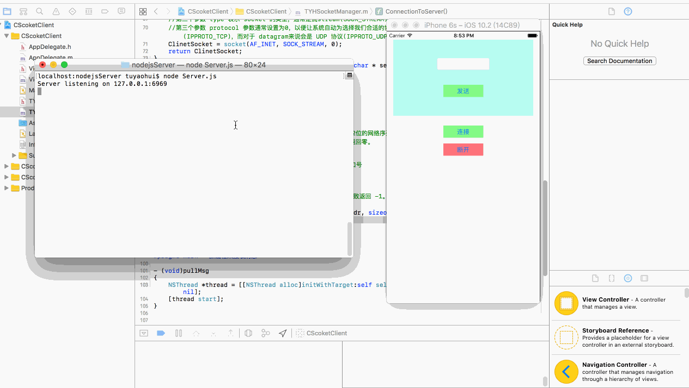
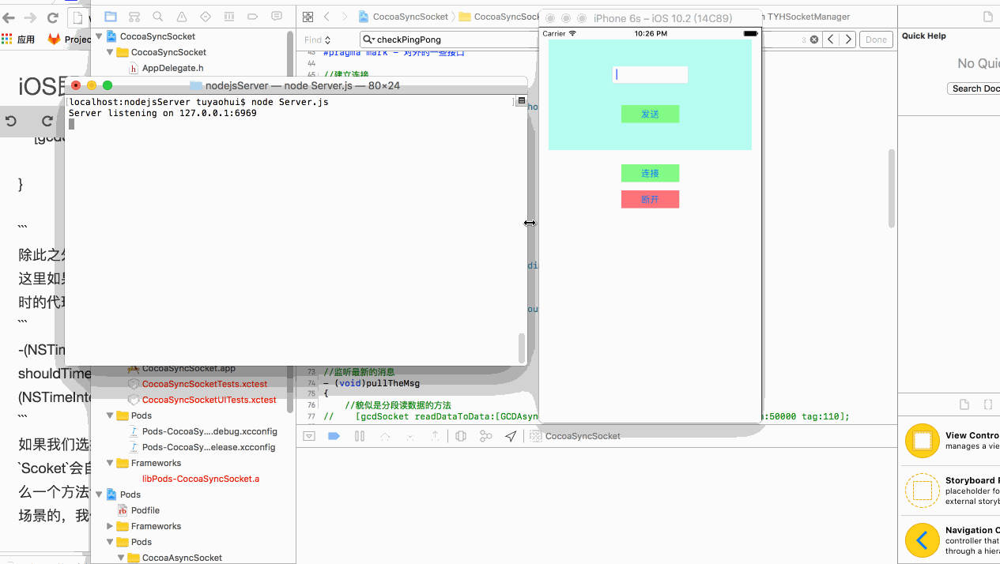
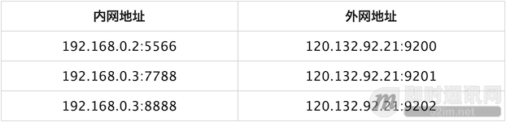
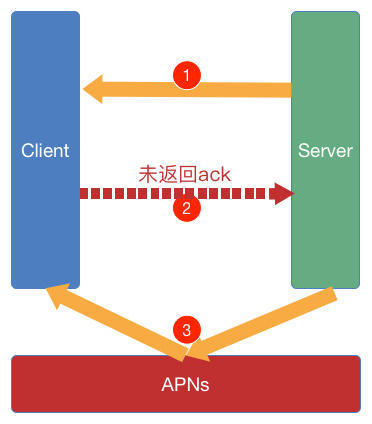
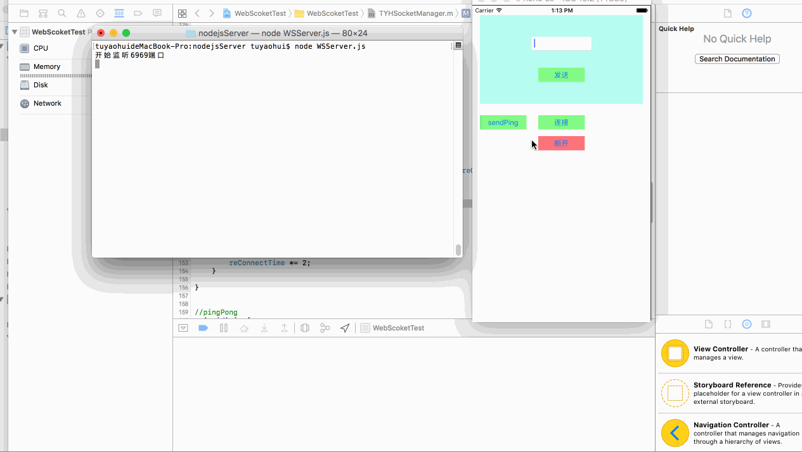
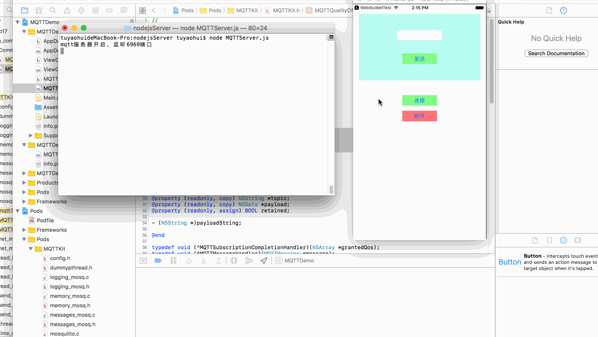
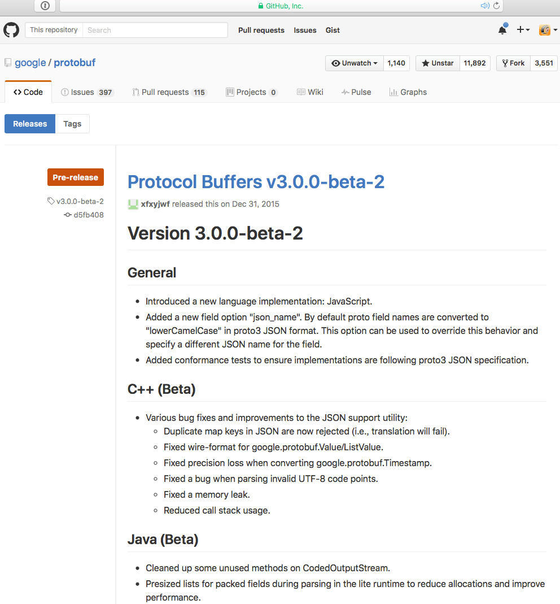

 
<!--BEGIN_DATA
{
    "create_date": "2017-01-09 13:38", 
    "modify_date": "2017-01-09 13:38", 
    "is_top": "0", 
    "summary": "iOS即时通讯，从入门到“放弃”？", 
    "tags": "iOS", 
    "file_name": "iOS即时通讯，从入门到“放弃”？.md"
}
END_DATA-->

####
原文出处：<a href='http://www.jianshu.com/p/2dbb360886a8' target='blank'>iOS即时通讯，从入门到“放弃”？</a>

  

#####前言

  * **本文会用实例的方式，将iOS各种IM的方案都简单的实现一遍。并且提供一些选型、实现细节以及优化的建议。**

  * 注：文中的所有的代码示例，在github中都有demo：  
[iOS即时通讯，从入门到“放弃”？(demo)](https://github.com/tuyaohui/IM_iOS)  
可以打开项目先预览效果，对照着进行阅读。

#####言归正传，首先我们来总结一下我们去实现IM的方式

######第一种方式，使用第三方IM服务

对于短平快的公司，完全可以采用第三方SDK来实现。国内IM的第三方服务商有很多，类似云信、环信、融云、LeanCloud，当然还有其它的很多，这里就不一一举
例了，感兴趣的小伙伴可以自行查阅下。

  * 第三方服务商IM底层协议基本上都是`TCP`。他们的IM方案很成熟，有了它们，我们甚至不需要自己去搭建IM后台，什么都不需要去考虑。  
如果你足够懒，甚至连UI都不需要自己做，这些第三方有各自一套IM的UI，拿来就可以直接用。真可谓3分钟集成...

  * 但是缺点也很明显，定制化程度太高，很多东西我们不可控。**当然还有一个最最重要的一点，就是太贵了...**作为真正社交为主打的APP，仅此一点，就足以让我们望而却步。当然，如果IM对于APP只是一个辅助功能，那么用第三方服务也无可厚非。

######另外一种方式，我们自己去实现

我们自己去实现也有很多选择：  
1）首先面临的就是传输协议的选择，`TCP`还是`UDP`？  
2）其次是我们需要去选择使用哪种聊天协议：

  * 基于`Scoket`或者`WebScoket`或者其他的私有协议、
  * `MQTT`
  * 还是广为人诟病的`XMPP`?

3）我们是自己去基于`OS`底层`Socket`进行封装还是在第三方框架的基础上进行封装？  
4）传输数据的格式，我们是用`Json`、还是`XML`、还是谷歌推出的`ProtocolBuffer`？  
5）我们还有一些细节问题需要考虑，例如TCP的长连接如何保持，心跳机制，Qos机制，重连机制等等...当然，除此之外，我们还有一些安全问题需要考虑。

#####一、传输协议的选择

接下来我们可能需要自己考虑去实现IM，首先从传输层协议来说，我们有两种选择：`TCP` or `UDP`？

  

  
这个问题已经被讨论过无数次了，对深层次的细节感兴趣的朋友可以看看这篇文章：

  * [移动端IM/推送系统的协议选型：UDP还是TCP？](http://www.52im.net/thread-33-1-1.html)

这里我们直接说结论吧：对于小公司或者技术不那么成熟的公司，IM一定要用`TCP`来实现，因为如果你要用`UDP`的话，需要做的事太多。当然QQ就是用的`UDP`协议，当然不仅仅是`UDP`，腾讯还用了自己的私有协议，来保证了传输的可靠性，杜绝了UDP下各种数据丢包，乱序等等一系列问题。  
总之一句话，**如果你觉得团队技术很成熟，那么你用`UDP`也行，否则还是用`TCP`为好。**

#####二、我们来看看各种聊天协议

首先我们以实现方式来切入，基本上有以下四种实现方式：

  1. 基于`Scoket`原生：代表框架 `CocoaAsyncSocket`。
  2. 基于`WebScoket`：代表框架 `SocketRocket`。
  3. 基于`MQTT`：代表框架 `MQTTKit`。
  4. 基于`XMPP`：代表框架 `XMPPFramework`。

当然，以上四种方式我们都可以不使用第三方框架，直接基于`OS`底层`Scoket`去实现我们的自定义封装。下面我会给出一个基于`Scoket`原生而不使用框架的例子，供大家参考一下。

首先需要搞清楚的是，其中`MQTT`和`XMPP`为聊天协议，它们是最上层的协议，而`WebScoket`是传输通讯协议，它是基于`Socket`封装的一个协议。而通常我们所说的腾讯IM的私有协议，**就是基于`WebScoket`或者`Scoket`原生进行封装的一个聊天协议。**

具体这3种聊天协议的对比优劣如下：

  

协议优劣对比.png

所以说到底，iOS要做一个真正的IM产品，一般都是基于`Scoket`或者`WebScoket`等，再之上加上一些私有协议来保证的。

#####1.我们先不使用任何框架，直接用`OS`底层`Socket`来实现一个简单的IM。

我们客户端的实现思路也是很简单，创建`Socket`，和服务器的`Socket`对接上，然后开始传输数据就可以了。

  * 我们学过c/c++或者java这些语言，我们就知道，往往任何教程，最后一章都是讲`Socket`编程，而`Socket`是什么呢，简单的来说，就是我们使用`TCP/IP` 或者`UDP/IP`协议的一组编程接口。如下图所示：

  

我们在应用层，使用`socket`，轻易的实现了进程之间的通信（跨网络的）。想想，如果没有`socket`，我们要直面`TCP/IP`协议，我们需要去写多少繁琐而又重复的代码。

如果有对`socket`概念仍然有所困惑的，可以看看这篇文章：  
[从问题看本质，socket到底是什么？](http://blog.csdn.net/yeyuangen/article/details/6799575)。  
但是这篇文章关于并发连接数的认识是错误的，正确的认识可以看看这篇文章:  
[单台服务器并发TCP连接数到底可以有多少](http://www.52im.net/thread-561-1-1.html)

我们接着可以开始着手去实现IM了，首先我们不基于任何框架，直接去调用`OS`底层-基于C的`BSD Socket`去实现，它提供了这样一组接口：

    
    
    //socket 创建并初始化 socket，返回该 socket 的文件描述符，如果描述符为 -1 表示创建失败。
    int socket(int addressFamily, int type,int protocol)
    //关闭socket连接
    int close(int socketFileDescriptor)
    //将 socket 与特定主机地址与端口号绑定，成功绑定返回0，失败返回 -1。
    int bind(int socketFileDescriptor,sockaddr *addressToBind,int addressStructLength)
    //接受客户端连接请求并将客户端的网络地址信息保存到 clientAddress 中。
    int accept(int socketFileDescriptor,sockaddr *clientAddress, int clientAddressStructLength)
    //客户端向特定网络地址的服务器发送连接请求，连接成功返回0，失败返回 -1。
    int connect(int socketFileDescriptor,sockaddr *serverAddress, int serverAddressLength)
    //使用 DNS 查找特定主机名字对应的 IP 地址。如果找不到对应的 IP 地址则返回 NULL。
    hostent* gethostbyname(char *hostname)
    //通过 socket 发送数据，发送成功返回成功发送的字节数，否则返回 -1。
    int send(int socketFileDescriptor, char *buffer, int bufferLength, int flags)
    //从 socket 中读取数据，读取成功返回成功读取的字节数，否则返回 -1。
    int receive(int socketFileDescriptor,char *buffer, int bufferLength, int flags)
    //通过UDP socket 发送数据到特定的网络地址，发送成功返回成功发送的字节数，否则返回 -1。
    int sendto(int socketFileDescriptor,char *buffer, int bufferLength, int flags, sockaddr *destinationAddress, int destinationAddressLength)
    //从UDP socket 中读取数据，并保存发送者的网络地址信息，读取成功返回成功读取的字节数，否则返回 -1 。
    int recvfrom(int socketFileDescriptor,char *buffer, int bufferLength, int flags, sockaddr *fromAddress, int *fromAddressLength)

让我们可以对socket进行各种操作，首先我们来用它写个客户端。总结一下，简单的IM客户端需要做如下4件事：

  1. 客户端调用 socket(...) 创建socket；
  2. 客户端调用 connect(...) 向服务器发起连接请求以建立连接；
  3. 客户端与服务器建立连接之后，就可以通过send(...)/receive(...)向客户端发送或从客户端接收数据；
  4. 客户端调用 close 关闭 socket；

根据上面4条大纲，我们封装了一个名为`TYHSocketManager`的单例，来对`socket`相关方法进行调用:

`TYHSocketManager.h`

    
    
    #import <Foundation/Foundation.h>
    @interface TYHSocketManager : NSObject
    + (instancetype)share;
    - (void)connect;
    - (void)disConnect;
    - (void)sendMsg:(NSString *)msg;
    @end

`TYHSocketManager.m`

    
    
    #import "TYHSocketManager.h"
    #import <sys/types.h>
    #import <sys/socket.h>
    #import <netinet/in.h>
    #import <arpa/inet.h>
    @interface TYHSocketManager()
    @property (nonatomic,assign)int clientScoket;
    @end
    @implementation TYHSocketManager
    + (instancetype)share
    {
        static dispatch_once_t onceToken;
        static TYHSocketManager *instance = nil;
        dispatch_once(&onceToken, ^{
            instance = [[self alloc]init];
            [instance initScoket];
            [instance pullMsg];
        });
        return instance;
    }
    - (void)initScoket
    {
        //每次连接前，先断开连接
        if (_clientScoket != 0) {
            [self disConnect];
            _clientScoket = 0;
        }
        //创建客户端socket
        _clientScoket = CreateClinetSocket();
        //服务器Ip
        const char * server_ip="127.0.0.1";
        //服务器端口
        short server_port=6969;
        //等于0说明连接失败
        if (ConnectionToServer(_clientScoket,server_ip, server_port)==0) {
            printf("Connect to server error\n");
            return ;
        }
        //走到这说明连接成功
        printf("Connect to server ok\n");
    }
    static int CreateClinetSocket()
    {
        int ClinetSocket = 0;
        //创建一个socket,返回值为Int。（注scoket其实就是Int类型）
        //第一个参数addressFamily IPv4(AF_INET) 或 IPv6(AF_INET6)。
        //第二个参数 type 表示 socket 的类型，通常是流stream(SOCK_STREAM) 或数据报文datagram(SOCK_DGRAM)
        //第三个参数 protocol 参数通常设置为0，以便让系统自动为选择我们合适的协议，对于 stream socket 来说会是 TCP 协议(IPPROTO_TCP)，而对于 datagram来说会是 UDP 协议(IPPROTO_UDP)。
        ClinetSocket = socket(AF_INET, SOCK_STREAM, 0);
        return ClinetSocket;
    }
    static int ConnectionToServer(int client_socket,const char * server_ip,unsigned short port)
    {
        //生成一个sockaddr_in类型结构体
        struct sockaddr_in sAddr={0};
        sAddr.sin_len=sizeof(sAddr);
        //设置IPv4
        sAddr.sin_family=AF_INET;
        //inet_aton是一个改进的方法来将一个字符串IP地址转换为一个32位的网络序列IP地址
        //如果这个函数成功，函数的返回值非零，如果输入地址不正确则会返回零。
        inet_aton(server_ip, &sAddr.sin_addr);
        //htons是将整型变量从主机字节顺序转变成网络字节顺序，赋值端口号
        sAddr.sin_port=htons(port);
        //用scoket和服务端地址，发起连接。
        //客户端向特定网络地址的服务器发送连接请求，连接成功返回0，失败返回 -1。
        //注意：该接口调用会阻塞当前线程，直到服务器返回。
        if (connect(client_socket, (struct sockaddr *)&sAddr, sizeof(sAddr))==0) {
            return client_socket;
        }
        return 0;
    }
    #pragma mark - 新线程来接收消息
    - (void)pullMsg
    {
        NSThread *thread = [[NSThread alloc]initWithTarget:self selector:@selector(recieveAction) object:nil];
        [thread start];
    }
    #pragma mark - 对外逻辑
    - (void)connect
    {
        [self initScoket];
    }
    - (void)disConnect
    {
        //关闭连接
        close(self.clientScoket);
    }
    //发送消息
    - (void)sendMsg:(NSString *)msg
    {
        const char *send_Message = [msg UTF8String];
        send(self.clientScoket,send_Message,strlen(send_Message)+1,0);
    }
    //收取服务端发送的消息
    - (void)recieveAction{
        while (1) {
            char recv_Message[1024] = {0};
            recv(self.clientScoket, recv_Message, sizeof(recv_Message), 0);
            printf("%s\n",recv_Message);
        }
    }

如上所示:

  * 我们调用了`initScoket`方法，利用`CreateClinetSocket`方法了一个`scoket`，就是就是调用了socket函数：
    
        ClinetSocket = socket(AF_INET, SOCK_STREAM, 0);

  * 然后调用了`ConnectionToServer`函数与服务器连接，IP地址为`127.0.0.1`也就是本机`localhost`和端口`6969`相连。在该函数中，我们绑定了一个`sockaddr_in`类型的结构体，该结构体内容如下：
    
        struct sockaddr_in {
      __uint8_t    sin_len;
      sa_family_t    sin_family;
      in_port_t    sin_port;
      struct    in_addr sin_addr;
      char        sin_zero[8];
    };

里面包含了一些，我们需要连接的服务端的`scoket`的一些基本参数，具体赋值细节可以见注释。

  * 连接成功之后，我们就可以调用`send`函数和`recv`函数进行消息收发了，在这里，我新开辟了一个常驻线程，在这个线程中一个死循环里去不停的调用`recv`函数，这样服务端有消息发送过来，第一时间便能被接收到。

就这样客户端便简单的可以用了，接着我们来看看服务端的实现。

#####一样，我们首先对服务端需要做的工作简单的总结下：

  1. 服务器调用 socket(...) 创建socket；
  2. 服务器调用 listen(...) 设置缓冲区；
  3. 服务器通过 accept(...)接受客户端请求建立连接；
  4. 服务器与客户端建立连接之后，就可以通过 send(...)/receive(...)向客户端发送或从客户端接收数据；
  5. 服务器调用 close 关闭 socket；

#####接着我们就可以具体去实现了

`OS`底层的函数是支持我们去实现服务端的，但是我们一般不会用`iOS`去这么做（试问真正的应用场景，有谁用`iOS`做`scoket`服务器么...），如果还是想用这些函数去实现服务端，可以参考下这篇文章： [深入浅出Cocoa-iOS网络编程之Socket](http://blog.csdn.net/kesalin/article/details/8798039)。

在这里我用`node.js`去搭了一个简单的`scoket`服务器。源码如下：

    
    
    var net = require('net');  
    var HOST = '127.0.0.1';  
    var PORT = 6969;  
    // 创建一个TCP服务器实例，调用listen函数开始监听指定端口  
    // 传入net.createServer()的回调函数将作为”connection“事件的处理函数  
    // 在每一个“connection”事件中，该回调函数接收到的socket对象是唯一的  
    net.createServer(function(sock) {  
        // 我们获得一个连接 - 该连接自动关联一个socket对象  
        console.log('CONNECTED: ' +  
            sock.remoteAddress + ':' + sock.remotePort);  
            sock.write('服务端发出：连接成功');  
        // 为这个socket实例添加一个"data"事件处理函数  
        sock.on('data', function(data) {  
            console.log('DATA ' + sock.remoteAddress + ': ' + data);  
            // 回发该数据，客户端将收到来自服务端的数据  
            sock.write('You said "' + data + '"');  
        });  
        // 为这个socket实例添加一个"close"事件处理函数  
        sock.on('close', function(data) {  
            console.log('CLOSED: ' +  
            sock.remoteAddress + ' ' + sock.remotePort);  
        });  
    }).listen(PORT, HOST);  
    console.log('Server listening on ' + HOST +':'+ PORT);

看到这不懂`node.js`的朋友也不用着急，在这里你可以使用任意语言c/c++/java/oc等等去实现后台，这里`node.js`仅仅是楼主的一个选择，为了让我们来验证之前写的客户端`scoket`的效果。如果你不懂`node.js`也没关系，你只需要把上述楼主写的相关代码复制粘贴，如果你本机有node的解释器，那么直接在终端进入该源代码文件目录中输入：

    
    
    node fileName

即可运行该脚本（fileName为保存源代码的文件名）。

我们来看看运行效果：

  

handle2.gif

  
服务器运行起来了，并且监听着6969端口。  
接着我们用之前写的iOS端的例子。客户端打印显示连接成功，而我们运行的服务器也打印了连接成功。接着我们发了一条消息，服务端成功的接收到了消息后，把该消息再发送回客户端，绕了一圈客户端又收到了这条消息。至此我们用`OS`底层`scoket`实现了简单的IM。

大家看到这是不是觉得太过简单了？  
当然简单，我们仅仅是实现了Scoket的连接，信息的发送与接收，除此之外我们什么都没有做，现实中，我们需要做的处理远不止于此，我们先接着往下看。接下来，我们就一起看看第三方框架是如何实现IM的。

  

分割图.png

#####2.我们接着来看看基于`Socket`原生的`CocoaAsyncSocket`:

这个框架实现了两种传输协议`TCP`和`UDP`，分别对应`GCDAsyncSocket`类和`GCDAsyncUdpSocket`，这里我们重点讲`GCDAsyncSocket`。

这里Socket服务器延续上一个例子，因为同样是基于原生Scoket的框架，所以之前的Node.js的服务端，该例仍然试用。这里我们就只需要去封装客户端的实例，我们还是创建一个`TYHSocketManager`单例。

`TYHSocketManager.h`

    
    
    #import <Foundation/Foundation.h>
    @interface TYHSocketManager : NSObject
    + (instancetype)share;
    - (BOOL)connect;
    - (void)disConnect;
    - (void)sendMsg:(NSString *)msg;
    - (void)pullTheMsg;
    @end

`TYHSocketManager.m`

    
    
    #import "TYHSocketManager.h"
    #import "GCDAsyncSocket.h" // for TCP
    static  NSString * Khost = @"127.0.0.1";
    static const uint16_t Kport = 6969;
    @interface TYHSocketManager()<GCDAsyncSocketDelegate>
    {
        GCDAsyncSocket *gcdSocket;
    }
    @end
    @implementation TYHSocketManager
    + (instancetype)share
    {
        static dispatch_once_t onceToken;
        static TYHSocketManager *instance = nil;
        dispatch_once(&onceToken, ^{
            instance = [[self alloc]init];
            [instance initSocket];
        });
        return instance;
    }
    - (void)initSocket
    {
        gcdSocket = [[GCDAsyncSocket alloc] initWithDelegate:self delegateQueue:dispatch_get_main_queue()];
    }
    #pragma mark - 对外的一些接口
    //建立连接
    - (BOOL)connect
    {
        return  [gcdSocket connectToHost:Khost onPort:Kport error:nil];
    }
    //断开连接
    - (void)disConnect
    {
        [gcdSocket disconnect];
    }
    //发送消息
    - (void)sendMsg:(NSString *)msg
    {
        NSData *data  = [msg dataUsingEncoding:NSUTF8StringEncoding];
        //第二个参数，请求超时时间
        [gcdSocket writeData:data withTimeout:-1 tag:110];
    }
    //监听最新的消息
    - (void)pullTheMsg
    {
        //监听读数据的代理  -1永远监听，不超时，但是只收一次消息，
        //所以每次接受到消息还得调用一次
        [gcdSocket readDataWithTimeout:-1 tag:110];
    }
    #pragma mark - GCDAsyncSocketDelegate
    //连接成功调用
    - (void)socket:(GCDAsyncSocket *)sock didConnectToHost:(NSString *)host port:(uint16_t)port
    {
        NSLog(@"连接成功,host:%@,port:%d",host,port);
        [self pullTheMsg];
        //心跳写在这...
    }
    //断开连接的时候调用
    - (void)socketDidDisconnect:(GCDAsyncSocket *)sock withError:(nullable NSError *)err
    {
        NSLog(@"断开连接,host:%@,port:%d",sock.localHost,sock.localPort);
        //断线重连写在这...
    }
    //写成功的回调
    - (void)socket:(GCDAsyncSocket*)sock didWriteDataWithTag:(long)tag
    {
    //    NSLog(@"写的回调,tag:%ld",tag);
    }
    //收到消息的回调
    - (void)socket:(GCDAsyncSocket *)sock didReadData:(NSData *)data withTag:(long)tag
    {
        NSString *msg = [[NSString alloc]initWithData:data encoding:NSUTF8StringEncoding];
        NSLog(@"收到消息：%@",msg);
        [self pullTheMsg];
    }
    //分段去获取消息的回调
    //- (void)socket:(GCDAsyncSocket *)sock didReadPartialDataOfLength:(NSUInteger)partialLength tag:(long)tag
    //{
    //    
    //    NSLog(@"读的回调,length:%ld,tag:%ld",partialLength,tag);
    //
    //}
    //为上一次设置的读取数据代理续时 (如果设置超时为-1，则永远不会调用到)
    //-(NSTimeInterval)socket:(GCDAsyncSocket *)sock shouldTimeoutReadWithTag:(long)tag elapsed:(NSTimeInterval)elapsed bytesDone:(NSUInteger)length
    //{
    //    NSLog(@"来延时，tag:%ld,elapsed:%f,length:%ld",tag,elapsed,length);
    //    return 10;
    //}
    @end

这个框架使用起来也十分简单，它基于Scoket往上进行了一层封装，提供了OC的接口给我们使用。至于使用方法，大家看看注释应该就能明白，这里唯一需要说的一点就
是这个方法：

    
    
    [gcdSocket readDataWithTimeout:-1 tag:110];

这个方法的作用就是去读取当前消息队列中的未读消息。**记住，这里不调用这个方法，消息回调的代理是永远不会被触发的。**而且必须是tag相同，如果tag不同，
这个收到消息的代理也不会被处罚。  
我们调用一次这个方法，只能触发一次读取消息的代理，如果我们调用的时候没有未读消息，它就会等在那，直到消息来了被触发。一旦被触发一次代理后，我们必须再次调用这个方法，否则，之后的消息到了仍旧无法触发我们读取消息的代理。就像我们在例子中使用的那样，在每次读取到消息之后我们都去调用:

    
    
    //收到消息的回调
    - (void)socket:(GCDAsyncSocket *)sock didReadData:(NSData *)data withTag:(long)tag
    {
        NSString *msg = [[NSString alloc]initWithData:data encoding:NSUTF8StringEncoding];
        NSLog(@"收到消息：%@",msg);
        [self pullTheMsg];
    }
    //监听最新的消息
    - (void)pullTheMsg
    {
        //监听读数据的代理，只能监听10秒，10秒过后调用代理方法  -1永远监听，不超时，但是只收一次消息，
        //所以每次接受到消息还得调用一次
        [gcdSocket readDataWithTimeout:-1 tag:110];
    }

除此之外，我们还需要说的是这个超时`timeout`  
这里如果设置10秒，那么就只能监听10秒，10秒过后调用是否续时的代理方法:

    
    
    -(NSTimeInterval)socket:(GCDAsyncSocket *)sock shouldTimeoutReadWithTag:(long)tag elapsed:(NSTimeInterval)elapsed bytesDone:(NSUInteger)length

如果我们选择不续时，那么10秒到了还没收到消息，那么`Scoket`会自动断开连接。看到这里有些小伙伴要吐槽了，怎么一个方法设计的这么麻烦，当然这里这么设计
是有它的应用场景的，我们后面再来细讲。

#####我们同样来运行看看效果：

  

handle3.gif

至此我们也用`CocoaAsyncSocket`这个框架实现了一个简单的IM。

  

分割图.png

#####3.接着我们继续来看看基于`webScoket`的IM：

这个例子我们会把心跳，断线重连，以及PingPong机制进行简单的封装，所以我们先来谈谈这三个概念：

#####首先我们来谈谈什么是心跳

简单的来说，**心跳就是用来检测TCP连接的双方是否可用。**那又会有人要问了，TCP不是本身就自带一个`KeepAlive`机制吗？  
**这里我们需要说明的是TCP的`KeepAlive`机制只能保证连接的存在，但是并不能保证客户端以及服务端的可用性.**比如会有以下一种情况：

> 某台服务器因为某些原因导致负载超高，CPU 100%，无法响应任何业务请求，但是使用 TCP 探针则仍旧能够确定连接状态，这就是典型的连接活着但业务提供方已死的状态。

这个时候心跳机制就起到作用了：

  * 我们客户端发起心跳Ping（一般都是客户端），假如设置在10秒后如果没有收到回调，那么说明服务器或者客户端某一方出现问题，这时候我们需要主动断开连接。
  * 服务端也是一样，会维护一个socket的心跳间隔，当约定时间内，没有收到客户端发来的心跳，我们会知道该连接已经失效，然后主动断开连接。

参考文章：[为什么说基于TCP的移动端IM仍然需要心跳保活？](http://www.52im.net/thread-281-1-1.html)

其实做过IM的小伙伴们都知道，我们真正需要心跳机制的原因其实主要是在于国内运营商`NAT`超时。

#####那么究竟什么是`NAT`超时呢?

原来这是因为IPV4引起的，我们上网很可能会处在一个NAT设备（无线路由器之类）之后。  
NAT设备会在IP封包通过设备时修改源/目的IP地址. 对于家用路由器来说, 使用的是网络地址端口转换(NAPT), 它不仅改IP,还修改TCP和UDP协议的端口号, 这样就能让内网中的设备共用同一个外网IP. 举个例子, NAPT维护一个类似下表的NAT表：  

  

NAT映射

  
NAT设备会根据NAT表对出去和进来的数据做修改, 比如将`192.168.0.3:8888`发出去的封包改成`120.132.92.21:9202`,外部就认为他们是在和`120.132.92.21:9202`通信.同时NAT设备会将`120.132.92.21:9202`收到的封包的IP和端口改成`192.168.0.3:8888`, 再发给内网的主机,这样内部和外部就能双向通信了, 但如果其中`192.168.0.3:8888` == `120.132.92.21:9202`这一映射因为某些原因被NAT设备淘汰了, 那么外部设备就无法直接与`192.168.0.3:8888`通信了。

我们的设备经常是处在NAT设备的后面, 比如在大学里的校园网, 查一下自己分配到的IP, 其实是内网IP, 表明我们在NAT设备后面,如果我们在寝室再接个路由器, 那么我们发出的数据包会多经过一次NAT.

国内移动无线网络运营商在链路上一段时间内没有数据通讯后, 会淘汰NAT表中的对应项, 造成链路中断。

**而国内的运营商一般NAT超时的时间为5分钟，所以通常我们心跳设置的时间间隔为3-5分钟。**

#####接着我们来讲讲PingPong机制:

很多小伙伴可能又会感觉到疑惑了，那么我们在这心跳间隔的3-5分钟如果连接假在线（例如在地铁电梯这种环境下）。那么我们岂不是无法保证消息的即时性么？这显然是我们无法接受的，所以业内的解决方案是采用双向的`PingPong`机制。  

  

当服务端发出一个`Ping`，客户端没有在约定的时间内返回响应的`ack`，则认为客户端已经不在线，这时我们`Server`端会主动断开`Scoket`连接，并且改由`APNS`推送的方式发送消息。  
同样的是，当客户端去发送一个消息，因为我们迟迟无法收到服务端的响应ack包，则表明客户端或者服务端已不在线，我们也会显示消息发送失败，并且断开`Scoket
`连接。

还记得我们之前`CocoaSyncSockt`的例子所讲的获取消息超时就断开吗？其实它就是一个`PingPong`机制的客户端实现。我们每次可以在发送消息成功后，调用这个超时读取的方法，如果一段时间没收到服务器的响应，那么说明连接不可用，则断开`Scoket`连接

#####最后就是重连机制:

理论上，我们自己主动去断开的`Scoket`连接（例如退出账号，APP退出到后台等等），不需要重连。其他的连接断开，我们都需要进行断线重连。  
一般解决方案是尝试重连几次，如果仍旧无法重连成功，那么不再进行重连。  
接下来的`WebScoket`的例子，我会封装一个重连时间指数级增长的一个重连方式，可以作为一个参考。

#####言归正传，我们看完上述三个概念之后，我们来讲一个`WebScoket`最具代表性的一个第三方框架`SocketRocket`。

我们首先来看看它对外封装的一些方法：

    
    
    @interface SRWebSocket : NSObject <NSStreamDelegate>
    @property (nonatomic, weak) id <SRWebSocketDelegate> delegate;
    @property (nonatomic, readonly) SRReadyState readyState;
    @property (nonatomic, readonly, retain) NSURL *url;
    @property (nonatomic, readonly) CFHTTPMessageRef receivedHTTPHeaders;
    // Optional array of cookies (NSHTTPCookie objects) to apply to the connections
    @property (nonatomic, readwrite) NSArray * requestCookies;
    // This returns the negotiated protocol.
    // It will be nil until after the handshake completes.
    @property (nonatomic, readonly, copy) NSString *protocol;
    // Protocols should be an array of strings that turn into Sec-WebSocket-Protocol.
    - (id)initWithURLRequest:(NSURLRequest *)request protocols:(NSArray *)protocols allowsUntrustedSSLCertificates:(BOOL)allowsUntrustedSSLCertificates;
    - (id)initWithURLRequest:(NSURLRequest *)request protocols:(NSArray *)protocols;
    - (id)initWithURLRequest:(NSURLRequest *)request;
    // Some helper constructors.
    - (id)initWithURL:(NSURL *)url protocols:(NSArray *)protocols allowsUntrustedSSLCertificates:(BOOL)allowsUntrustedSSLCertificates;
    - (id)initWithURL:(NSURL *)url protocols:(NSArray *)protocols;
    - (id)initWithURL:(NSURL *)url;
    // Delegate queue will be dispatch_main_queue by default.
    // You cannot set both OperationQueue and dispatch_queue.
    - (void)setDelegateOperationQueue:(NSOperationQueue*) queue;
    - (void)setDelegateDispatchQueue:(dispatch_queue_t) queue;
    // By default, it will schedule itself on +[NSRunLoop SR_networkRunLoop] using defaultModes.
    - (void)scheduleInRunLoop:(NSRunLoop *)aRunLoop forMode:(NSString *)mode;
    - (void)unscheduleFromRunLoop:(NSRunLoop *)aRunLoop forMode:(NSString *)mode;
    // SRWebSockets are intended for one-time-use only.  Open should be called once and only once.
    - (void)open;
    - (void)close;
    - (void)closeWithCode:(NSInteger)code reason:(NSString *)reason;
    // Send a UTF8 String or Data.
    - (void)send:(id)data;
    // Send Data (can be nil) in a ping message.
    - (void)sendPing:(NSData *)data;
    @end
    #pragma mark - SRWebSocketDelegate
    @protocol SRWebSocketDelegate <NSObject>
    // message will either be an NSString if the server is using text
    // or NSData if the server is using binary.
    - (void)webSocket:(SRWebSocket *)webSocket didReceiveMessage:(id)message;
    @optional
    - (void)webSocketDidOpen:(SRWebSocket *)webSocket;
    - (void)webSocket:(SRWebSocket *)webSocket didFailWithError:(NSError *)error;
    - (void)webSocket:(SRWebSocket *)webSocket didCloseWithCode:(NSInteger)code reason:(NSString *)reason wasClean:(BOOL)wasClean;
    - (void)webSocket:(SRWebSocket *)webSocket didReceivePong:(NSData *)pongPayload;
    // Return YES to convert messages sent as Text to an NSString. Return NO to skip NSData -> NSString conversion for Text messages. Defaults to YES.
    - (BOOL)webSocketShouldConvertTextFrameToString:(SRWebSocket *)webSocket;
    @end

方法也很简单，分为两个部分：

  * 一部分为`SRWebSocket`的初始化，以及连接，关闭连接，发送消息等方法。
  * 另一部分为`SRWebSocketDelegate`，其中包括一些回调：  
收到消息的回调，连接失败的回调，关闭连接的回调，收到pong的回调，是否需要把data消息转换成string的代理方法。

#####接着我们还是举个例子来实现以下，首先来封装一个`TYHSocketManager`单例：

`TYHSocketManager.h`

    
    
    #import <Foundation/Foundation.h>
    typedef enum : NSUInteger {
        disConnectByUser ,
        disConnectByServer,
    } DisConnectType;
    @interface TYHSocketManager : NSObject
    + (instancetype)share;
    - (void)connect;
    - (void)disConnect;
    - (void)sendMsg:(NSString *)msg;
    - (void)ping;
    @end

`TYHSocketManager.m`

    
    
    #import "TYHSocketManager.h"
    #import "SocketRocket.h"
    #define dispatch_main_async_safe(block)\
        if ([NSThread isMainThread]) {\
            block();\
        } else {\
            dispatch_async(dispatch_get_main_queue(), block);\
        }
    static  NSString * Khost = @"127.0.0.1";
    static const uint16_t Kport = 6969;
    @interface TYHSocketManager()<SRWebSocketDelegate>
    {
        SRWebSocket *webSocket;
        NSTimer *heartBeat;
        NSTimeInterval reConnectTime;
    }
    @end
    @implementation TYHSocketManager
    + (instancetype)share
    {
        static dispatch_once_t onceToken;
        static TYHSocketManager *instance = nil;
        dispatch_once(&onceToken, ^{
            instance = [[self alloc]init];
            [instance initSocket];
        });
        return instance;
    }
    //初始化连接
    - (void)initSocket
    {
        if (webSocket) {
            return;
        }
        webSocket = [[SRWebSocket alloc]initWithURL:[NSURL URLWithString:[NSString stringWithFormat:@"ws://%@:%d", Khost, Kport]]];
        webSocket.delegate = self;
        //设置代理线程queue
        NSOperationQueue *queue = [[NSOperationQueue alloc]init];
        queue.maxConcurrentOperationCount = 1;
        [webSocket setDelegateOperationQueue:queue];
        //连接
        [webSocket open];
    }
    //初始化心跳
    - (void)initHeartBeat
    {
        dispatch_main_async_safe(^{
            [self destoryHeartBeat];
            __weak typeof(self) weakSelf = self;
            //心跳设置为3分钟，NAT超时一般为5分钟
            heartBeat = [NSTimer scheduledTimerWithTimeInterval:3*60 repeats:YES block:^(NSTimer * _Nonnull timer) {
                NSLog(@"heart");
                //和服务端约定好发送什么作为心跳标识，尽可能的减小心跳包大小
                [weakSelf sendMsg:@"heart"];
            }];
            [[NSRunLoop currentRunLoop]addTimer:heartBeat forMode:NSRunLoopCommonModes];
        })
    }
    //取消心跳
    - (void)destoryHeartBeat
    {
        dispatch_main_async_safe(^{
            if (heartBeat) {
                [heartBeat invalidate];
                heartBeat = nil;
            }
        })
    }
    #pragma mark - 对外的一些接口
    //建立连接
    - (void)connect
    {
        [self initSocket];
        //每次正常连接的时候清零重连时间
        reConnectTime = 0;
    }
    //断开连接
    - (void)disConnect
    {
        if (webSocket) {
            [webSocket close];
            webSocket = nil;
        }
    }
    //发送消息
    - (void)sendMsg:(NSString *)msg
    {
        [webSocket send:msg];
    }
    //重连机制
    - (void)reConnect
    {
        [self disConnect];
        //超过一分钟就不再重连 所以只会重连5次 2^5 = 64
        if (reConnectTime > 64) {
            return;
        }
        dispatch_after(dispatch_time(DISPATCH_TIME_NOW, (int64_t)(reConnectTime * NSEC_PER_SEC)), dispatch_get_main_queue(), ^{
            webSocket = nil;
            [self initSocket];
        });
        //重连时间2的指数级增长
        if (reConnectTime == 0) {
            reConnectTime = 2;
        }else{
            reConnectTime *= 2;
        }
    }
    //pingPong
    - (void)ping{
        [webSocket sendPing:nil];
    }
    #pragma mark - SRWebSocketDelegate
    - (void)webSocket:(SRWebSocket *)webSocket didReceiveMessage:(id)message
    {
        NSLog(@"服务器返回收到消息:%@",message);
    }
    - (void)webSocketDidOpen:(SRWebSocket *)webSocket
    {
        NSLog(@"连接成功");
        //连接成功了开始发送心跳
        [self initHeartBeat];
    }
    //open失败的时候调用
    - (void)webSocket:(SRWebSocket *)webSocket didFailWithError:(NSError *)error
    {
        NSLog(@"连接失败.....\n%@",error);
        //失败了就去重连
        [self reConnect];
    }
    //网络连接中断被调用
    - (void)webSocket:(SRWebSocket *)webSocket didCloseWithCode:(NSInteger)code reason:(NSString *)reason wasClean:(BOOL)wasClean
    {
        NSLog(@"被关闭连接，code:%ld,reason:%@,wasClean:%d",code,reason,wasClean);
        //如果是被用户自己中断的那么直接断开连接，否则开始重连
        if (code == disConnectByUser) {
            [self disConnect];
        }else{
            [self reConnect];
        }
        //断开连接时销毁心跳
        [self destoryHeartBeat];
    }
    //sendPing的时候，如果网络通的话，则会收到回调，但是必须保证ScoketOpen，否则会crash
    - (void)webSocket:(SRWebSocket *)webSocket didReceivePong:(NSData *)pongPayload
    {
        NSLog(@"收到pong回调");
    }
    //将收到的消息，是否需要把data转换为NSString，每次收到消息都会被调用，默认YES
    //- (BOOL)webSocketShouldConvertTextFrameToString:(SRWebSocket *)webSocket
    //{
    //    NSLog(@"webSocketShouldConvertTextFrameToString");
    //
    //    return NO;
    //}

.m文件有点长，大家可以参照github中的demo进行阅读，这回我们添加了一些细节的东西了，包括一个简单的心跳，重连机制，还有`webScoket`封装好的一个`pingpong`机制。  
代码非常简单，大家可以配合着注释读一读，应该很容易理解。  
需要说一下的是这个心跳机制是一个定时的间隔，往往我们可能会有更复杂实现，比如我们正在发送消息的时候，可能就不需要心跳。当不在发送的时候在开启心跳之类的。微信有一种更高端的实现方式，有兴趣的小伙伴可以看看：  
[微信的智能心跳实现方式](http://www.52im.net/thread-120-1-1.html)

还有一点需要说的就是这个重连机制，demo中我采用的是2的指数级别增长，第一次立刻重连，第二次2秒，第三次4秒，第四次8秒...直到大于64秒就不再重连。而任意的一次成功的连接，都会重置这个重连时间。

最后一点需要说的是，这个框架给我们封装的`webscoket`在调用它的`sendPing`方法之前，一定要判断当前`scoket`是否连接，如果不是连接状态，程序则会`crash`。

客户端的实现就大致如此，接着同样我们需要实现一个服务端，来看看实际通讯效果。

#####webScoket服务端实现

在这里我们无法沿用之前的node.js例子了，因为这并不是一个原生的`scoket`，这是`webScoket`，所以我们服务端同样需要遵守`webScoket`协议，两者才能实现通信。  
其实这里实现也很简单，我采用了`node.js`的`ws`模块，只需要用`npm`去安装`ws`即可。  
什么是`npm`呢？举个例子，`npm`之于`Node.js`相当于`cocospod`至于`iOS`，它就是一个拓展模块的一个管理工具。如果不知道怎么用的可以看看这篇文章：[npm的使用](http://www.runoob.com/nodejs/nodejs-npm.html)

我们进入当前脚本目录，输入终端命令，即可安装`ws`模块：

    
    
    $ npm install ws

大家如果懒得去看npm的小伙伴也没关系，直接下载github中的 `WSServer.js`这个文件运行即可。  
该源文件代码如下：

    
    
    var WebSocketServer = require('ws').Server,
    wss = new WebSocketServer({ port: 6969 });
    wss.on('connection', function (ws) {
        console.log('client connected');
           ws.send('你是第' + wss.clients.length + '位');  
        //收到消息回调
        ws.on('message', function (message) {
            console.log(message);
            ws.send('收到:'+message);  
        });
         // 退出聊天  
        ws.on('close', function(close) {  
              console.log('退出连接了');  
        });  
    });
    console.log('开始监听6969端口');

代码没几行，理解起来很简单。  
就是监听了本机6969端口，如果客户端连接了，打印lient connected，并且向客户端发送：你是第几位。  
如果收到客户端消息后，打印消息，并且向客户端发送这条收到的消息。

#####接着我们同样来运行一下看看效果：

  

  
运行我们可以看到，主动去断开的连接，没有去重连，而server端断开的，我们开启了重连。感兴趣的朋友可以下载demo实际运行一下。

  

分割图.png

#####4.我们接着来看看MQTT：

MQTT是一个聊天协议，它比`webScoket`更上层，属于应用层。  
它的基本模式是简单的发布订阅，也就是说当一条消息发出去的时候，谁订阅了谁就会受到。其实它并不适合IM的场景，例如用来实现有些简单IM场景，却需要很大量的、复
杂的处理。  
比较适合它的场景为订阅发布这种模式的，例如微信的实时共享位置，滴滴的地图上小车的移动、客户端推送等功能。

首先我们来看看基于`MQTT`协议的框架-`MQTTKit`:  
这个框架是c来写的，把一些方法公开在`MQTTKit`类中，对外用OC来调用，我们来看看这个类：

    
    
    @interface MQTTClient : NSObject {
        struct mosquitto *mosq;
    }
    @property (readwrite, copy) NSString *clientID;
    @property (readwrite, copy) NSString *host;
    @property (readwrite, assign) unsigned short port;
    @property (readwrite, copy) NSString *username;
    @property (readwrite, copy) NSString *password;
    @property (readwrite, assign) unsigned short keepAlive;
    @property (readwrite, assign) BOOL cleanSession;
    @property (nonatomic, copy) MQTTMessageHandler messageHandler;
    + (void) initialize;
    + (NSString*) version;
    - (MQTTClient*) initWithClientId: (NSString *)clientId;
    - (void) setMessageRetry: (NSUInteger)seconds;
    #pragma mark - Connection
    - (void) connectWithCompletionHandler:(void (^)(MQTTConnectionReturnCode code))completionHandler;
    - (void) connectToHost: (NSString*)host
         completionHandler:(void (^)(MQTTConnectionReturnCode code))completionHandler;
    - (void) disconnectWithCompletionHandler:(void (^)(NSUInteger code))completionHandler;
    - (void) reconnect;
    - (void)setWillData:(NSData *)payload
                toTopic:(NSString *)willTopic
                withQos:(MQTTQualityOfService)willQos
                 retain:(BOOL)retain;
    - (void)setWill:(NSString *)payload
            toTopic:(NSString *)willTopic
            withQos:(MQTTQualityOfService)willQos
             retain:(BOOL)retain;
    - (void)clearWill;
    #pragma mark - Publish
    - (void)publishData:(NSData *)payload
                toTopic:(NSString *)topic
                withQos:(MQTTQualityOfService)qos
                 retain:(BOOL)retain
      completionHandler:(void (^)(int mid))completionHandler;
    - (void)publishString:(NSString *)payload
                  toTopic:(NSString *)topic
                  withQos:(MQTTQualityOfService)qos
                   retain:(BOOL)retain
        completionHandler:(void (^)(int mid))completionHandler;
    #pragma mark - Subscribe
    - (void)subscribe:(NSString *)topic
    withCompletionHandler:(MQTTSubscriptionCompletionHandler)completionHandler;
    - (void)subscribe:(NSString *)topic
              withQos:(MQTTQualityOfService)qos
    completionHandler:(MQTTSubscriptionCompletionHandler)completionHandler;
    - (void)unsubscribe: (NSString *)topic
    withCompletionHandler:(void (^)(void))completionHandler;

这个类一共分为4个部分：初始化、连接、发布、订阅，具体方法的作用可以先看看方法名理解下，我们接着来用这个框架封装一个实例。

同样，我们封装了一个单例`MQTTManager`。  
`MQTTManager.h`

    
    
    #import <Foundation/Foundation.h>
    @interface MQTTManager : NSObject
    + (instancetype)share;
    - (void)connect;
    - (void)disConnect;
    - (void)sendMsg:(NSString *)msg;
    @end

`MQTTManager.m`

    
    
    #import "MQTTManager.h"
    #import "MQTTKit.h"
    static  NSString * Khost = @"127.0.0.1";
    static const uint16_t Kport = 6969;
    static  NSString * KClientID = @"tuyaohui";
    @interface MQTTManager()
    {
        MQTTClient *client;
    }
    @end
    @implementation MQTTManager
    + (instancetype)share
    {
        static dispatch_once_t onceToken;
        static MQTTManager *instance = nil;
        dispatch_once(&onceToken, ^{
            instance = [[self alloc]init];
        });
        return instance;
    }
    //初始化连接
    - (void)initSocket
    {
        if (client) {
            [self disConnect];
        }
        client = [[MQTTClient alloc] initWithClientId:KClientID];
        client.port = Kport;
        [client setMessageHandler:^(MQTTMessage *message)
         {
             //收到消息的回调，前提是得先订阅
             NSString *msg = [[NSString alloc]initWithData:message.payload encoding:NSUTF8StringEncoding];
             NSLog(@"收到服务端消息：%@",msg);
         }];
        [client connectToHost:Khost completionHandler:^(MQTTConnectionReturnCode code) {
            switch (code) {
                case ConnectionAccepted:
                    NSLog(@"MQTT连接成功");
                    //订阅自己ID的消息，这样收到消息就能回调
                    [client subscribe:client.clientID withCompletionHandler:^(NSArray *grantedQos) {
                        NSLog(@"订阅tuyaohui成功");
                    }];
                    break;
                case ConnectionRefusedBadUserNameOrPassword:
                    NSLog(@"错误的用户名密码");
                //....
                default:
                    NSLog(@"MQTT连接失败");
                    break;
            }
        }];
    }
    #pragma mark - 对外的一些接口
    //建立连接
    - (void)connect
    {
        [self initSocket];
    }
    //断开连接
    - (void)disConnect
    {
        if (client) {
            //取消订阅
            [client unsubscribe:client.clientID withCompletionHandler:^{
                NSLog(@"取消订阅tuyaohui成功");
            }];
            //断开连接
            [client disconnectWithCompletionHandler:^(NSUInteger code) {
                NSLog(@"断开MQTT成功");
            }];
            client = nil;
        }
    }
    //发送消息
    - (void)sendMsg:(NSString *)msg
    {
        //发送一条消息，发送给自己订阅的主题
        [client publishString:msg toTopic:KClientID withQos:ExactlyOnce retain:YES completionHandler:^(int mid) {
        }];
    }
    @end

实现代码很简单，需要说一下的是：  
1）当我们连接成功了，我们需要去订阅自己`clientID`的消息，这样才能收到发给自己的消息。  
2）其次是这个框架为我们实现了一个QOS机制，那么什么是QOS呢？

> QoS（Quality of Service，[服务质量](http://baike.baidu.com/view/522662.htm)）指一个网络能
够利用各种基础技术，为指定的[网络通信](http://baike.baidu.com/view/538641.htm)提供更好的服务能力,
是网络的一种安全机制， 是用来解决网络延迟和阻塞等问题的一种技术。

在这里，它提供了三个选项：

    
    
    typedef enum MQTTQualityOfService : NSUInteger {
        AtMostOnce,
        AtLeastOnce,
        ExactlyOnce
    } MQTTQualityOfService;

分别对应最多发送一次，至少发送一次，精确只发送一次。

  * QOS(0),最多发送一次：如果消息没有发送过去，那么就直接丢失。
  * QOS(1),至少发送一次：保证消息一定发送过去，但是发几次不确定。
  * QOS(2),精确只发送一次：它内部会有一个很复杂的发送机制，确保消息送到，而且只发送一次。

更详细的关于该机制可以看看这篇文章：[MQTT协议笔记之消息流QOS](http://www.blogjava.net/yongboy/archive/20
14/02/15/409893.html)。

同样的我们需要一个用MQTT协议实现的服务端，我们还是node.js来实现，这次我们还是需要用`npm`来新增一个模块`mosca`。  
我们来看看服务端代码：  
`MQTTServer.js`

    
    
    var mosca = require('mosca');  
    var MqttServer = new mosca.Server({  
        port: 6969  
    });  
    MqttServer.on('clientConnected', function(client){  
        console.log('收到客户端连接，连接ID：', client.id);  
    });  
    /** 
     * 监听MQTT主题消息 
     **/  
    MqttServer.on('published', function(packet, client) {  
        var topic = packet.topic;  
        console.log('有消息来了','topic为：'+topic+',message为：'+ packet.payload.toString());  
    });  
    MqttServer.on('ready', function(){  
        console.log('mqtt服务器开启，监听6969端口');  
    });

服务端代码没几行，开启了一个服务，并且监听本机6969端口。并且监听了客户端连接、发布消息等状态。

#####接着我们同样来运行一下看看效果：

  

至此，我们实现了一个简单的MQTT封装。

#####5.XMPP：XMPPFramework框架

结果就是并没有XMPP...因为个人感觉XMPP对于IM来说实在是不堪重用。仅仅只能作为一个玩具demo，给大家练练手。网上有太多XMPP的内容了，相当一部分用openfire来做服务端，这一套东西实在是太老了。还记得多年前，楼主初识IM就是用的这一套东西...  
如果大家仍然感兴趣的可以看看这篇文章：[iOS 的 XMPPFramework简介](http://www.cocoachina.com/ios/20141219/10703.html)。这里就不举例赘述了。

#####三、关于IM传输格式的选择：

引用陈宜龙大神文章（[iOS程序犭袁
](http://www.jianshu.com/users/96a14318a4de/latest_articles)）中一段：  
**使用 ProtocolBuffer 减少 Payload**  
滴滴打车40%；  
携程之前分享过，说是采用新的ProtocolBuffer数据格式+Gzip压缩后的Payload大小降低了15%-45%。数据序列化耗时下降了80%-90%。

采用高效安全的私有协议，支持长连接的复用，稳定省电省流量  
【高效】提高网络请求成功率，消息体越大，失败几率随之增加。  
【省流量】流量消耗极少，省流量。一条消息数据用Protobuf序列化后的大小是 JSON 的1/10、XML格式的1/20、是二进制序列化的1/10。同
XML 相比， Protobuf 性能优势明显。它以高效的二进制方式存储，比 XML 小 3 到 10 倍，快 20 到 100 倍。  
【省电】省电  
【高效心跳包】同时心跳包协议对IM的电量和流量影响很大，对心跳包协议上进行了极简设计：仅 1 Byte 。  
【易于使用】开发人员通过按照一定的语法定义结构化的消息格式，然后送给命令行工具，工具将自动生成相关的类，可以支持java、c++、python
、Objective-
C等语言环境。通过将这些类包含在项目中，可以很轻松的调用相关方法来完成业务消息的序列化与反序列化工作。语言支持：原生支持c++、java、python
、Objective-C等多达10余种语言。 2015-08-27 Protocol Buffers v3.0.0-beta-1中发布了Objective-C(Alpha)版本， 2016-07-28 3.0 Protocol Buffers v3.0.0正式版发布，正式支持Objective-C。  
【可靠】微信和手机 QQ 这样的主流 IM 应用也早已在使用它（采用的是改造过的Protobuf协议）

  

如何测试验证 Protobuf 的高性能？  
对数据分别操作100次，1000次，10000次和100000次进行了测试，  
纵坐标是完成时间，单位是毫秒，  
反序列化  
序列化  
字节长度

  

  

  

[数据来源](http://www.cnblogs.com/beyondbit/p/4778264.html)。  

  

数据来自：项目 [thrift-protobuf-compare](https://github.com/eishay/jvm-serializers/wiki)，测试项为 Total Time，也就是指一个对象操作的整个时间，包括创建对象，将对象序列化为内存中的字节序列，然后再反序列化的整个过程。从测试结果可以看到 Protobuf 的成绩很好.  
缺点：  
可能会造成 APP 的包体积增大，通过 Google 提供的脚本生成的 Model，会非常“庞大”，Model 一多，包体积也就会跟着变大。  
如果 Model 过多，可能导致 APP 打包后的体积骤增，但 IM 服务所使用的 Model 非常少，比如在 ChatKit-OC 中只用到了一个Protobuf 的 Model：Message对象，对包体积的影响微乎其微。  
在使用过程中要合理地权衡包体积以及传输效率的问题，据说去哪儿网，就曾经为了减少包体积，进而减少了 Protobuf 的使用。

综上所述，我们选择传输格式的时候：`ProtocolBuffer` > `Json` > `XML`

如果大家对`ProtocolBuffer`用法感兴趣可以参考下这两篇文章：  
[ProtocolBuffer for Objective-C 运行环境配置及使用](http://www.jianshu.com/p/8c6c009bc500)  
[iOS之ProtocolBuffer搭建和示例demo](http://www.qingpingshan.com/rjbc/ios/181571.html)

#####三、IM一些其它问题

#####1.IM的可靠性：

我们之前穿插在例子中提到过：  
心跳机制、PingPong机制、断线重连机制、还有我们后面所说的QOS机制。这些被用来保证连接的可用，消息的即时与准确的送达等等。  
上述内容保证了我们IM服务时的可靠性，其实我们能做的还有很多：比如我们在大文件传输的时候使用分片上传、断点续传、秒传技术等来保证文件的传输。

#####2.安全性：

我们通常还需要一些安全机制来保证我们IM通信安全。  
例如：[防止 DNS 污染](https://github.com/ChenYilong/iOSBlog/blob/master/Tips/%E5%9F%BA%E4%BA%8EWebsocket%E7%9A%84IM%E5%8D%B3%E6%97%B6%E9%80%9A%E8%AE%AF%E6%8A%80%E6%9C%AF/%E9%98%B2%20DNS%20%E6%B1%A1%E6%9F%93%E6%96%B9%E6%A1%88.md)、帐号安全、第三方服务器鉴
权、单点登录等等

#####3.一些其他的优化：

类似微信，服务器不做聊天记录的存储，只在本机进行缓存，这样可以减少对服务端数据的请求，一方面减轻了服务器的压力，另一方面减少客户端流量的消耗。  
我们进行http连接的时候尽量采用上层API，类似`NSUrlSession`。而网络框架尽量使用`AFNetWorking3`。因为这些上层网络请求都用的是HTTP/2 ，我们请求的时候可以复用这些连接。

更多优化相关内容可以参考参考这篇文章：  
[IM 即时通讯技术在多应用场景下的技术实现，以及性能调优](http://www.jianshu.com/p/8cd908148f9e)

#####四、音视频通话

> IM应用中的实时音视频技术，几乎是IM开发中的最后一道高墙。原因在于：实时音视频技术 = 音视频处理技术 + 网络传输技术的横向技术应用集合体，而公共互联网不是为了实时通信设计的。  
实时音视频技术上的实现内容主要包括：音视频的采集、编码、网络传输、解码、播放等环节。这么多项并不简单的技术应用，如果把握不当，将会在在实际开发过程中遇到一个又一个的坑。

因为楼主自己对这块的技术理解很浅，所以引用了一个系列的文章来给大家一个参考，感兴趣的朋友可以看看：  
《[即时通讯音视频开发（一）：视频编解码之理论概述](http://www.52im.net/thread-228-1-1.html)》  
《[即时通讯音视频开发（二）：视频编解码之数字视频介绍](http://www.52im.net/thread-229-1-1.html)》  
《[即时通讯音视频开发（三）：视频编解码之编码基础](http://www.52im.net/thread-232-1-1.html)》  
《[即时通讯音视频开发（四）：视频编解码之预测技术介绍](http://www.52im.net/thread-235-1-1.html)》  
《[即时通讯音视频开发（五）：认识主流视频编码技术H.264](http://www.52im.net/thread-237-1-1.html)》  
《[即时通讯音视频开发（六）：如何开始音频编解码技术的学习](http://www.52im.net/thread-241-1-1.html)》  
《[即时通讯音视频开发（七）：音频基础及编码原理入门](http://www.52im.net/thread-242-1-1.html)》  
《[即时通讯音视频开发（八）：常见的实时语音通讯编码标准](http://www.52im.net/thread-243-1-1.html)》  
《[即时通讯音视频开发（九）：实时语音通讯的回音及回音消除概述](http://www.52im.net/thread-247-1-1.html)》  
《[即时通讯音视频开发（十）：实时语音通讯的回音消除技术详解](http://www.52im.net/thread-250-1-1.html)》  
《[即时通讯音视频开发（十一）：实时语音通讯丢包补偿技术详解](http://www.52im.net/thread-251-1-1.html)》  
《[即时通讯音视频开发（十二）：多人实时音视频聊天架构探讨](http://www.52im.net/thread-253-1-1.html)》  
《[即时通讯音视频开发（十三）：实时视频编码H.264的特点与优势](http://www.52im.net/thread-266-1-1.html)》  
《[即时通讯音视频开发（十四）：实时音视频数据传输协议介绍](http://www.52im.net/thread-267-1-1.html)》  
《[即时通讯音视频开发（十五）：聊聊P2P与实时音视频的应用情况](http://www.52im.net/thread-269-1-1.html)》  
《[即时通讯音视频开发（十六）：移动端实时音视频开发的几个建议](http://www.52im.net/thread-270-1-1.html)》  
《[即时通讯音视频开发（十七）：视频编码H.264、V8的前世今生](http://www.52im.net/thread-274-1-1.html)》

#####写在最后：

本文内容为原创，且仅代表楼主现阶段的一些思想，如果有什么错误，欢迎指正~

#####万一有人转载，麻烦请注明出处。

