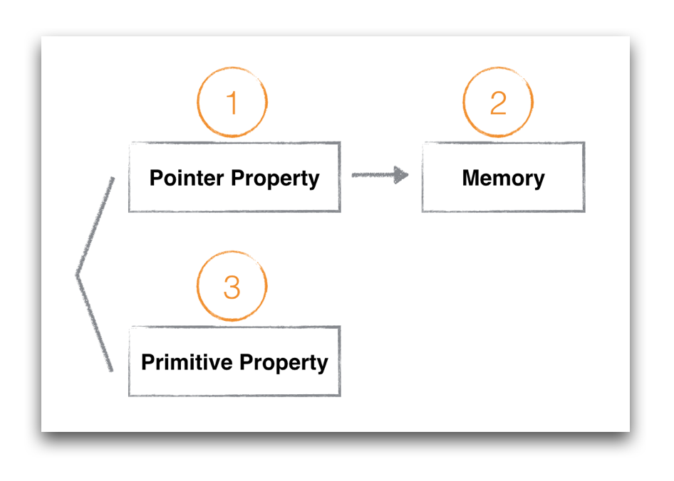
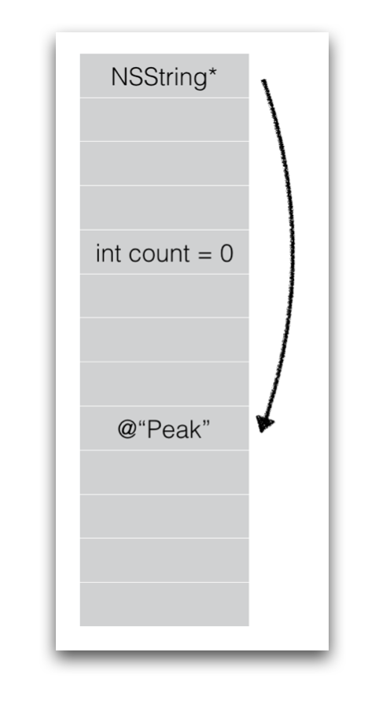
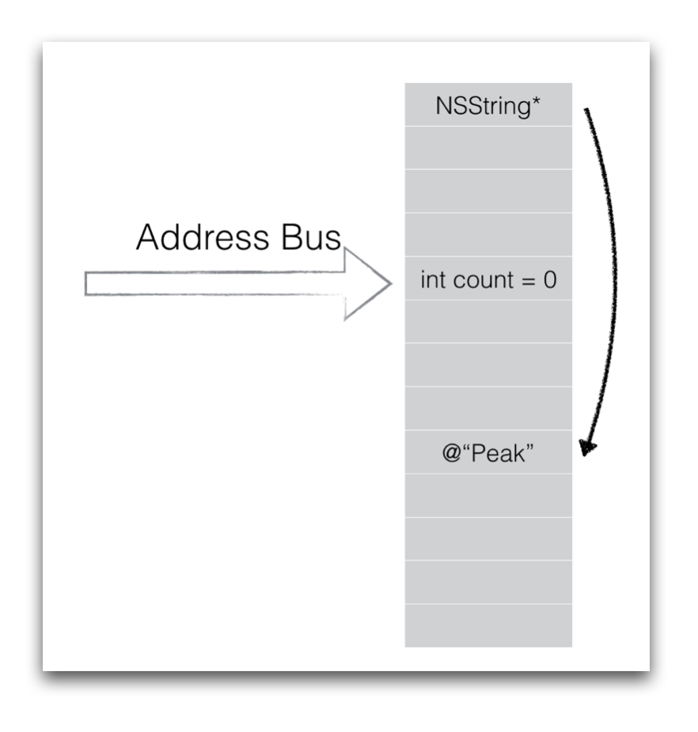
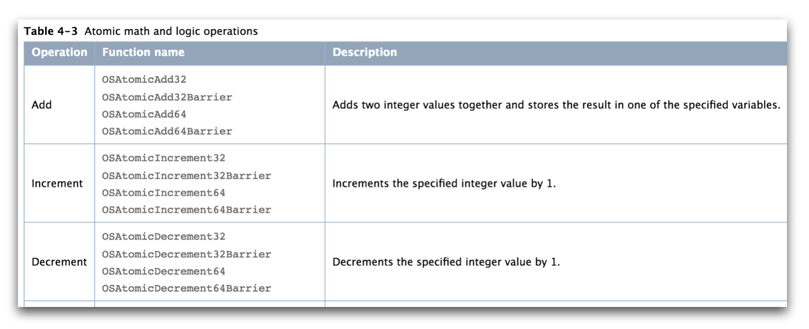
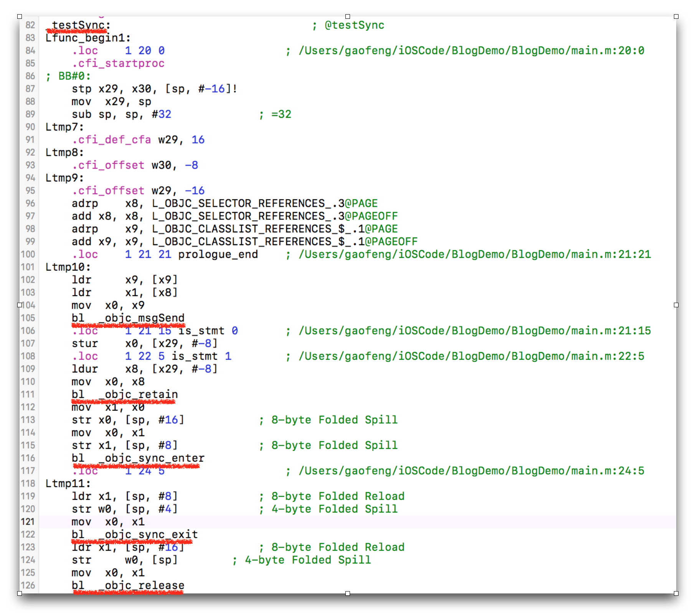

 
<!--BEGIN_DATA
{
    "create_date": "2016-12-21 14:01", 
    "modify_date": "2016-12-21 14:01", 
    "is_top": "0", 
    "summary": "iOS多线程到底不安全在哪里？", 
    "tags": "iOS", 
    "file_name": "iOS多线程到底不安全在哪里？.md"
}
END_DATA-->

####
原文出处：<a href='http://mrpeak.cn/blog/ios-thread-safety/' target='blank'>iOS多线程到底不安全在哪里？</a>

##iOS多线程到底不安全在哪里？

iOS多线程安全的概念在很多地方都会遇到，为什么不安全，不安全又该怎么去定义，其实是个值得深究的话题。

共享状态，多线程共同访问某个对象的property，在iOS编程里是很普遍的使用场景，我们就从Property的多线程安全说起。

####Property

当我们讨论property多线程安全的时候，很多人都知道给property加上atomic attribute之后，可以一定程度的保障多线程安全，类似：

    
    
    @property (atomic, strong) NSString*                 userName;
    

事情并没有看上去这么简单，要分析property在多线程场景下的表现，需要先对property的类型做区分。

我们可以简单的将property分为值类型和对象类型，值类型是指primitive type，包括int, long, bool等非对象类型，另一种是对象类型，声明为指针，可以指向某个符合类型定义的内存区域。

上述代码中userName明显是个对象类型，当我们访问userName的时候，访问的有可能是userName本身，也有可能是userName所指向的内存区域。

比如：

    
    
    self.userName = @"peak";
    

是在对指针本身进行赋值。而

    
    
    [self.userName rangeOfString:@"peak"];
    

是在访问指针指向的字符串所在的内存区域，这二者并不一样。

所以我们可以大致上将property分为三类：

分完类之后，我们需要明白这三类property的内存模型。

####Memory Layout

当我们讨论多线程安全的时候，其实是在讨论多个线程同时访问一个内存区域的安全问题。针对同一块区域，我们有两种操作，读（load）和写（store），读和写同时发生在同一块区域的时候，就有可能出现多线程不安全。所以展开讨论之前，先要明白上述三种property的内存模型，可用如下图示：

以64位系统为例，指针NSString*是8个字节的内存区域，int count是个4字节的区域，而@“Peak”是一块根据字符串长度而定的内存区域。

当我们访问property的时候，实际上是访问上图中三块内存区域。

    
    
    self.userName = @"peak";
    

是修改第一块区域。

    
    
    self.count = 10;
    

是在修改第二块区域。

    
    
    [self.userName rangeOfString:@"peak"];
    

是在读取第三块区域。

####不安全的定义

明白了property的类型以及他们对应的内存模型，我们再来看看不安全的定义。Wikipedia如是说：

>  A piece of code is **thread-safe** if it manipulates shared data structures only in a manner that guarantees safe execution by multiple threads at the same time

这段定义看起来还是有点抽象，我们可以将多线程不安全解释为：**多线程访问时出现意料之外的结果**。这个意料之外的结果包含几种场景，不一定是指crash，后面再一一分析。

先来看下多线程是如何同时访问内存的。不考虑CPU cache对变量的缓存，内存访问可以用下图表示：

从上图中可以看出，我们只有一个地址总线，一个内存。即使是在多线程的环境下，也不可能存在两个线程**同时**访问同一块内存区域的场景，内存的访问一定是通过一个
地址总线串行排队访问的，所以在继续后续之前，我们先要明确几个结论：

**结论一**：内存的访问时串行的，并不会导致内存数据的错乱或者应用的crash。

**结论二**：如果读写（load or store）的内存长度小于等于地址总线的长度，那么读写的操作是原子的，一次完成。比如bool，int，long在64位系统下的单次读写都是原子操作。

接下来我们根据上面三种property的分类逐一看下多线程的不安全场景。

#####值类型Property

先以BOOL值类型为例，当我们有两个线程访问如下property的时候：

    
    
    @property (nonatomic, assgin) BOOL    isDeleted;
    //thread 1
    bool isDeleted = self.isDeleted;
    //thread 2
    self.isDeleted = false;
    

线程1和线程2，一个读(load)，一个写(store)，对于BOOL isDeleted的访问可能有先后之分，但一定是串行排队的。而且由于BOOL大小只有1个字节，64位系统的地址总线对于读写指令可以支持8个字节的长度，所以对于BOOL的读和写操作我们可以认为是原子的，所以当我们声明BOOL类型的property的时候，从原子性的角度看，使用atomic和nonatomic并没有实际上的区别（当然如果重载了getter方法就另当别论了）。

如果是int类型呢？

    
    
    @property (nonatomic, assgin) int    count;
    //thread 1
    int curCount = self.count;
    //thread 2
    self.count = 1;
    

同理int类型长度为4字节，读和写都可以通过一个指令完成，所以理论上读和写操作都是原子的。从访问内存的角度看nonatomic和atomic也并没有什么区别。

atomic到底有什么用呢？据我所知，用处有二：

**用处一：** **生成原子操作的getter和setter。**

设置atomic之后，默认生成的getter和setter方法执行是原子的。也就是说，当我们在线程1执行getter方法的时候（创建调用栈，返回地址，出栈），线程B如果想执行setter方法，必须先等getter方法完成才能执行。举个例子，在32位系统里，如果通过getter返回64位的double，地址总线宽度为32位，从内存当中读取double的时候无法通过原子操作完成，如果不通过atomic加锁，有可能会在读取的中途在其他线程发生setter操作，从而出现异常值。如果出现这种异常值，就发生了**多线程不安全**。

**用处二：设置Memory Barrier**

对于Objective C的实现来说，几乎所有的加锁操作最后都会设置memory
barrier，atomic本质上是对getter，setter加了锁，所以也会设置memory barrier。官方文档表述如下：

> **Note:** Most types of locks also incorporate a memory barrier to ensure that any preceding load and store instructions are completed before entering the critical section.

memory barrier有什么用处呢？

memory barrier能够保证内存操作的顺序，按照我们代码的书写顺序来。听起来有点不可思议，事实是编译器会对我们的代码做优化，在它认为合理的场景改变我们代码最终翻译成的机器指令顺序。也就是说如下代码：

    
    
    self.intA = 0;  //line 1
    self.intB = 1; //line 2
    

编译器可能在一些场景下先执行line2，再执行line1，因为它认为A和B之间并不存在依赖关系，虽然在代码执行的时候，在另一个线程intA和intB存在某种依赖，必须要求line1先于line2执行。

如果设置property为atomic，也就是设置了memory barrier之后，就能够保证line1的执行一定是先于line2的，当然这种场景非常罕见，一则是出现变量跨线程访问依赖，二是遇上编译器的优化，两个条件缺一不可。这种极端的场景下，atomic确实可以让我们的代码更加多线程安全一点，但我写iOS代码至今，还未遇到过这种场景，较大的可能性是编译器已经足够聪明，在我们需要的地方设置memory barrier了。

**是不是使用了atomic就一定多线程安全呢？**我们可以看看如下代码：
    
    
    @property (atomic, assign)    int       intA;
    //thread A
    for (int i = 0; i < 10000; i ++) {
        self.intA = self.intA + 1;
        NSLog(@"Thread A: %d\n", self.intA);
    }
    //thread B
    for (int i = 0; i < 10000; i ++) {
        self.intA = self.intA + 1;
        NSLog(@"Thread B: %d\n", self.intA);
    }
    

即使我将intA声明为atomic，最后的结果也不一定会是20000。原因就是因为`self.intA = self.intA + 1;`不是原子操作，虽然intA的getter和setter是原子操作，但当我们使用intA的时候，整个语句并不是原子的，这行赋值的代码至少包含读取(load)，+1(add)，赋值(store)三步操作，当前线程store的时候可能其他线程已经执行了若干次store了，导致最后的值小于预期值。这种场景我们也可以称之为**多线程不安全**。

#####指针Property

指针Property一般指向一个对象，比如：

    
    
    @property (atomic, strong) NSString*                 userName;
    

无论iOS系统是32位系统还是64位，一个指针的值都能通过一个指令完成load或者store。但和primitive type不同的是，对象类型还有内存管理的相关操作。在MRC时代，系统默认生成的setter类似如下：

    
    
    - (void)setUserName:(NSString *)userName {
        if(_uesrName != userName) {
            [userName retain];
            [_userName release];
            _userName = userName;
        }
    }
    

不仅仅是赋值操作，还会有retain，release调用。如果property为nonatomic，上述的setter方法就不是原子操作，我们可以假设一种场景，线程1先通过getter获取当前`_userName`，之后线程2通过setter调用`[_userName release];`，线程1所持有的`_userName`就变成无效的地址空间了，如果再给这个地址空间发消息就会导致crash，出现**多线程不安全**的场景。

到了ARC时代，Xcode已经替我们处理了retain和release，绝大部分时候我们都不需要去关心内存的管理，但retain，release其实还是存在于最后运行的代码当中，atomic和nonatomic对于对象类的property声明理论上还是存在差异，不过我在实际使用当中，将NSString*设置为nonatomic也从未遇到过上述多线程不安全的场景，极有可能ARC在内存管理上的优化已经将上述场景处理过了，所以我个人觉得，如果只是对对象类property做read，write，atomic和nonatomic在多线程安全上并没有实际差别。

#####指针Property指向的内存区域

这一类多线程的访问场景是我们很容易出错的地方，即使我们声明property为atomic，依然会出错。因为我们访问的不是property的指针区域，而是property所指向的内存区域。可以看如下代码：

    
    
    @property (atomic, strong) NSString*                 stringA;
    //thread A
    for (int i = 0; i < 100000; i ++) {
        if (i % 2 == 0) {
            self.stringA = @"a very long string";
        }
        else {
            self.stringA = @"string";
        }
        NSLog(@"Thread A: %@\n", self.stringA);
    }
    //thread B
    for (int i = 0; i < 100000; i ++) {
        if (self.stringA.length >= 10) {
            NSString* subStr = [self.stringA substringWithRange:NSMakeRange(0, 10)];
        }
        NSLog(@"Thread B: %@\n", self.stringA);
    }
    

虽然stringA是atomic的property，而且在取substring的时候做了length判断，线程B还是很容易crash，因为在前一刻读length的时候`self.stringA = @"a very long string";`，下一刻取substring的时候线程A已经将`self.stringA = @"string";`，立即出现out of bounds的Exception，crash，**多线程不安全**。

同样的场景还存在对集合类操作的时候，比如：

    
    
    @property (atomic, strong) NSArray*                 arr;
    //thread A
    for (int i = 0; i < 100000; i ++) {
        if (i % 2 == 0) {
            self.arr = @[@"1", @"2", @"3"];
        }
        else {
            self.arr = @[@"1"];
        }
        NSLog(@"Thread A: %@\n", self.arr);
    }
    //thread B
    for (int i = 0; i < 100000; i ++) {
        if (self.arr.count >= 2) {
            NSString* str = [self.arr objectAtIndex:1];
        }
        NSLog(@"Thread B: %@\n", self.arr);
    }
    

同理，即使我们在访问objectAtIndex之前做了count的判断，线程B依旧很容易crash，原因也是由于前后两行代码之间arr所指向的内存区域被其他线程修改了。

所以你看，真正需要操心的是这一类内存区域的访问，即使声明为atomic也没有用，我们平常App出现莫名其妙难以重现的多线程crash多是属于这一类，一旦在多线程的场景下访问这类内存区域的时候，要提起十二分的小心。如何避免这类crash后面会谈到。

#####Property多线程安全小结：

简而言之，atomic的作用只是给getter和setter加了个锁，atomic只能保证代码进入getter或者setter函数内部时是安全的，一旦出了getter和setter，多线程安全只能靠程序员自己保障了。所以atomic属性和使用property的多线程安全并没什么直接的联系。另外，atomic由于加锁也会带来一些性能损耗，所以我们在编写iOS代码的时候，一般声明property为nonatomic，在需要做多线程安全的场景，自己去额外加锁做同步。

####如何做到多线程安全？

讨论到这里，其实怎么做到多线程安全也比较明朗了，关键字是**atomicity**（原子性），只要做到原子性，小到一个primitive type变量的访问，大到一长段代码逻辑的执行，原子性能保证代码串行的执行，能保证代码执行到一半的时候，不会有另一个线程介入。

原子性是个相对的概念，它所针对的对象，粒度可大可小。

比如下段代码：

    
    
    if (self.stringA.length >= 10) {
        NSString* subStr = [self.stringA substringWithRange:NSMakeRange(0, 10)];
    }
    

是非原子性的。

但加锁以后：

    
    
    //thread A
    [_lock lock];
    for (int i = 0; i < 100000; i ++) {
        if (i % 2 == 0) {
            self.stringA = @"a very long string";
        }
        else {
            self.stringA = @"string";
        }
        NSLog(@"Thread A: %@\n", self.stringA);
    }
    [_lock unlock];
    //thread B
    [_lock lock];
    if (self.stringA.length >= 10) {
        NSString* subStr = [self.stringA substringWithRange:NSMakeRange(0, 10)];
    }
    [_lock unlock];
    

整段代码就具有原子性了，就可以认为是多线程安全了。

再比如：

    
    
    if (self.arr.count >= 2) {
        NSString* str = [self.arr objectAtIndex:1];
    }
    

是非原子性的。

而

    
    
    //thread A
    [_lock lock];
    for (int i = 0; i < 100000; i ++) {
        if (i % 2 == 0) {
            self.arr = @[@"1", @"2", @"3"];
        }
        else {
            self.arr = @[@"1"];
        }
        NSLog(@"Thread A: %@\n", self.arr);
    }
    [_lock unlock];
    //thread B
    [_lock lock];
    if (self.arr.count >= 2) {
        NSString* str = [self.arr objectAtIndex:1];
    }
    [_lock unlock];
    

是具有原子性的。注意，**读和写都需要加锁**。

这也是为什么我们在做多线程安全的时候，并不是通过给property加atomic关键字来保障安全，而是将property声明为nonatomic（nonatomic没有getter，setter的锁开销），然后自己加锁。

**如何使用哪种锁？**

iOS给代码加锁的方式有很多种，常用的有：

  * @synchronized(token)
  * NSLock
  * dispatch_semaphore_t
  * OSSpinLock

这几种锁都可以带来原子性，性能的损耗从上至下依次更小。

我个人建议是，在编写应用层代码的时候，除了OSSpinLock之外，哪个顺手用哪个。相较于这几个锁的性能差异，代码逻辑的正确性更为重要。而且这几者之间的性能差异对用户来说，绝大部分时候都感知不到。

当然我们也会遇到少数场景需要追求代码的性能，比如编写framework，或者在多线程读写共享数据频繁的场景，我们需要大致了解锁带来的损耗到底有多少。

官方文档有个数据，使用Intel-based iMac with a 2 GHz Core Duo processor and 1 GB of RAM running OS X v10.5测试，获取mutex有大概0.2ms的损耗，我们可以认为锁带来的损耗大致在ms级别。

**Atomic Operations**

其实除了各种锁之外，iOS上还有另一种办法来获取原子性，使用Atomic
Operations，相比锁的损耗要小一个数量级左右，在一些追求高性能的第三方Framework代码里可以看到这些Atomic Operations的使用。这些atomic operation可以在/usr/include/libkern/OSAtomic.h中查到：

比如

    
    
    _intA ++;
    

是非原子性的。

而

    
    
    OSAtomicIncrement32(&(_intA));
    

是原子性的，多线程安全的。

Atomic Operation只能应用于32位或者64位的数据类型，在多线程使用NSString或者NSArray这类对象的场景，还是得使用锁。

大部分的Atomic Operation都有OSAtomicXXX，OSAtomicXXXBarrier两个版本，Barrier就是前面提到的memory barrier，在多线程多个变量之间存在依赖的时候使用Barrier的版本，能够保证正确的依赖顺序。

对于平时编写应用层多线程安全代码，我还是建议大家多使用@synchronized，NSLock，或者dispatch_semaphore_t，**多线程安全**比**多线程性能**更重要，应该在前者得到充分保证，犹有余力的时候再去追求后者。

####尽量避免多线程的设计

无论我们写过多少代码，都必须要承认多线程安全是个复杂的问题，作为程序员我们应该尽可能的避免多线程的设计，而不是去追求高明的使用锁的技能。

后面我会写一篇文章，介绍函数式编程及其核心思想，即使我们使用非函数式的编程语言，比如Objective C，也能极大的帮助我们避免多线程安全的问题。

####总结

iOS下多线程不安全的分析至此结束了，如何编写多线程安全的代码，说到底还是在于对**memory layout**和**原子性**的理解，也希望这篇文章将atomic和nonatomic的真正区别解释清楚了:)。

####
原文出处：<a href='http://mrpeak.cn/blog/synchronized/' target='blank'>正确使用多线程同步锁@synchronized()</a>

##正确使用多线程同步锁@synchronized()

在上篇多线程安全的文章中，我曾推荐过大家使用@synchronized来使得代码获得原子性，从而保证多线程安全。这篇文章向大家介绍一些@synchronized的知识点和应该避免的坑。

####@synchronized原理

@synchronized是几种iOS多线程同步机制中最慢的一个，同时也是最方便的一个。

苹果建立@synchronized的初衷就是方便开发者快速的实现代码同步，语法如下：

    
    
    @synchronized(obj) {
      //code
    }
    

为了加深理解，我们刨一刨代码看看@synchronized到底做了什么事。我在一个测试工程的main.m中写了一段代码：

    
    
    void testSync()
    {
        NSObject* obj = [NSObject new];
        @synchronized (obj) {
        }
    }
    

然后在Xcode中选择菜单Product->Perform Action->Assemble “main.m”，就得到了如下的汇编代码：

上图中我将关键代码用红线标出了，很容易就定位到了我们的目标代码。

ARC帮我们插入的retain，release也在其中:)，我们感兴趣的部分是下面两个函数：

    
    
    bl	_objc_sync_enter
    bl	_objc_sync_exit
    

这两个函数应该就是synchronized进入和退出的调用，下面去Objective C的源码里找找 :)

在源码中一搜，很快就发现了这两个函数：

    
    
    // Begin synchronizing on 'obj'. 
    // Allocates recursive mutex associated with 'obj' if needed.
    // Returns OBJC_SYNC_SUCCESS once lock is acquired.  
    int objc_sync_enter(id obj)
    {
        int result = OBJC_SYNC_SUCCESS;
        if (obj) {
            SyncData* data = id2data(obj, ACQUIRE);
            assert(data);
            data->mutex.lock();
        } else {
            // @synchronized(nil) does nothing
            if (DebugNilSync) {
                _objc_inform("NIL SYNC DEBUG: @synchronized(nil); set a breakpoint on objc_sync_nil to debug");
            }
            objc_sync_nil();
        }
        return result;
    }
    // End synchronizing on 'obj'. 
    // Returns OBJC_SYNC_SUCCESS or OBJC_SYNC_NOT_OWNING_THREAD_ERROR
    int objc_sync_exit(id obj)
    {
        int result = OBJC_SYNC_SUCCESS;
        if (obj) {
            SyncData* data = id2data(obj, RELEASE); 
            if (!data) {
                result = OBJC_SYNC_NOT_OWNING_THREAD_ERROR;
            } else {
                bool okay = data->mutex.tryUnlock();
                if (!okay) {
                    result = OBJC_SYNC_NOT_OWNING_THREAD_ERROR;
                }
            }
        } else {
            // @synchronized(nil) does nothing
        }
        return result;
    }
    

从上述源码中，我们至少可以确立两个信息：

  * **synchronized是使用的递归mutex来做同步。**
  * **@synchronized(nil)不起任何作用**

递归mutex的意思是，我们可以写如下代码：

    
    
    @synchronized (obj) {
        NSLog(@"1st sync");
        @synchronized (obj) {
            NSLog(@"2nd sync");
        }
    }
    

而不会导致死锁。我顺道扒了下java当中的synchronized关键字，发现也是使用的递归锁，看来这是个common trick。recursive mutex其实里面还是使用了pthread_mutex_t，只不过多了一层ownership的判断，性能上比非递归锁要稍微慢一些。

@synchronized(nil)不起任何作用，表明我们需要适当关注传入的object的声明周期，一旦置为nil之后就无法做代码同步了。

**我们再看看传入的obj参数有什么作用**。

继续看代码发现传入的obj被用作参数来获取SyncData对象，里面有一大段关于SyncData的cache逻辑，有兴趣的同学可以自己看下代码，这是一个两层的cache设计，第一层是tls cache，第二层是自己维护的一个hash map。这里将流程简化，来看下obj是如何在hash map中缓存的。

先看下SyncData获取的方式：

    
    
    SyncData **listp = &LIST_FOR_OBJ(object);
    

而LIST_FOR_OBJ又指向：

    
    
    #define LIST_FOR_OBJ(obj) sDataLists[obj].data
    static StripedMap<SyncList> sDataLists;
    

再看下StripedMap的实现就很清楚了：

    
    
    static unsigned int indexForPointer(const void *p) {
        uintptr_t addr = reinterpret_cast<uintptr_t>(p);
        return ((addr >> 4) ^ (addr >> 9)) % StripeCount;
    }
    public:
    T& operator[] (const void *p) { 
        return array[indexForPointer(p)].value; 
    }
    

indexForPointer中使用了obj的内存地址，做了个简单的map，映射到另一个内存空间来存放SyncList。

通过上述分析，我们可以得出结论了：

**synchronized中传入的object的内存地址，被用作key，通过hash map对应的一个系统维护的递归锁。**

以上就是object的用处，所以不管是传入什么类型的object，只要是有内存地址，就能启动同步代码块的效果。

消化完synchronized的内部实现，我们再来看看平常使用中常见的一些坑。

####慎用@synchronized(self)

我其实更想说：不要使用@synchronized(self)。

我看过不少代码都是直接将self传入@synchronized当中，这是种很粗糙的使用方式，容易导致死锁的出现。比如：

    
    
    //class A
    @synchronized (self) {
        [_sharedLock lock];
        NSLog(@"code in class A");
        [_sharedLock unlock];
    }
    //class B
    [_sharedLock lock];
    @synchronized (objectA) {
        NSLog(@"code in class B");
    }
    [_sharedLock unlock];
    

原因是因为self很可能会被外部对象访问，被用作key来生成一锁，类似上述代码中的`@synchronized (objectA)`。两个公共锁交替使用的场景就容易出现死锁。

所以正确的做法是传入一个类内部维护的NSObject对象，而且这个对象是对外不可见的。

####精准的粒度控制

有些人说@synchronized慢，但@synchronized和其他同步锁的性能相比并没有很夸张，对于使用者来说几乎忽略不计。

之所以慢是更多的因为没有做好粒度控制。锁本质上是为了让我们的一段代码获得原子性，不同的critical section要使用不同的锁。我见过很多类似的写法：

    
    
    @synchronized (sharedToken) {
        [arrA addObject:obj];
    }
    @synchronized (sharedToken) {
        [arrB addObject:obj];
    }
    

使用同一个token来同步arrA和arrB的访问，虽然arrA和arrB之间没有任何联系。传入self的就更不对了。

应该是不同的数据使用不同的锁，尽量将粒度控制在最细的程度。上述代码应该是：

    
    
    @synchronized (tokenA) {
        [arrA addObject:obj];
    }
    @synchronized (tokenB) {
        [arrB addObject:obj];
    }
    

####注意内部的函数调用

@synchronized还有个很容易变慢的场景，就是{}内部有其他隐蔽的函数调用。比如：

    
    
    @synchronized (tokenA) {
        [arrA addObject:obj];
        [self doSomethingWithA:arrA];
    }
    

doSomethingWithA内部可能又调用了其他函数，维护doSomethingWithA的工程师可能并没有意识到自己是被锁同步的，由此层层叠叠可能引入更多的函数调用，代码就莫名其妙的越来越慢了，感觉锁的性能差，其实是我们没用好。

所以在书写@synchronized内部代码的时候，要十分小心内部隐蔽的函数调用。

####总结

看似简单的API调用，背后其实包含了不少知识，知其所以然才能运用得当。关于@synchronized(xxx)就介绍到这里，希望有将synchronized
解释清楚:)

