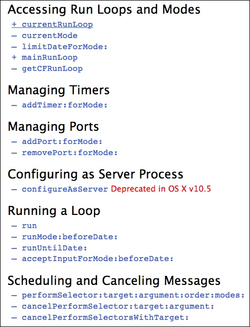
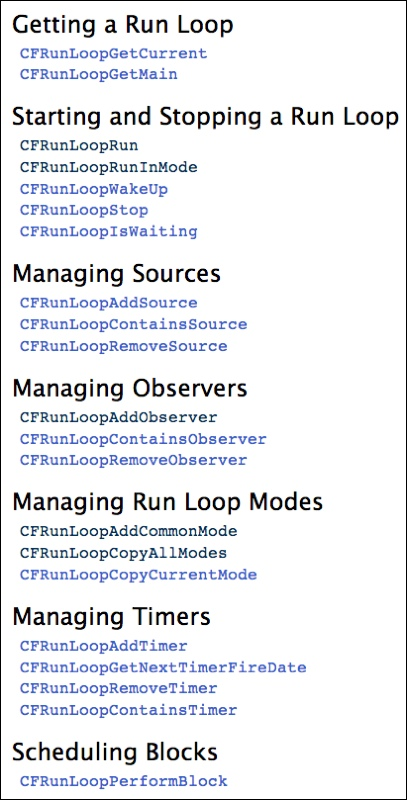
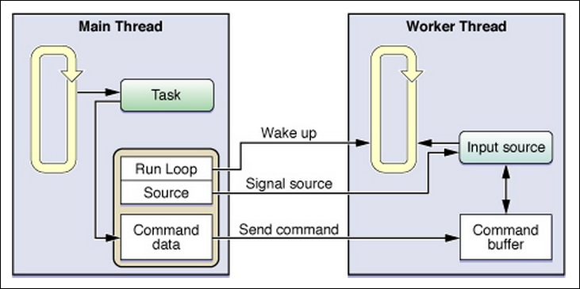

<!--BEGIN_DATA
{
    "create_date": "2016-02-26 17:19", 
    "modify_date": "2016-02-26 17:19", 
    "is_top": "0", 
    "summary": "iOS多线程编程", 
    "tags": "iOS", 
    "file_name": "iOS多线程编程.md"
}
END_DATA-->

#
原文出处：<a href='http://www.hrchen.com/2013/06/multi-threading-programming-of-ios-part-1/' target='blank'>iOS多线程编程Part 1/3 - NSThread &amp; Run Loop</a>

<article class="post">
<section class="post-content">
<h3 id="">前言</h3>

多线程的价值无需赘述，对于App性能和用户体验都有着至关重要的意义，在iOS开发中，Apple提供了不同的技术支持多线程编程，除了跨平台的pthread之外，还提供了NSThread、NSOperationQueue、GCD等多线程技术，从本篇Blog开始介绍这几种多线程技术的细节。

对于pthread这种跨平台的多线程技术，这本<a href="http://www.amazon.com/Programming-POSIX-Threads-David-Butenhof/dp/0201633922/">Programming with POSIX Threads</a>做了详细介绍，不再提及。

<h3 id="nsthread">NSThread</h3>

使用NSThead创建线程有很多方法：

<ul>
<li>+detachNewThreadSelector:toTarget:withObject:类方法直接生成一个子线程</li>
</ul>

<pre><code class="language-objc">[NSThread detachNewThreadSelector:@selector(threadRoutine:) toTarget:self withObject:nil];
</code></pre>

<ul>
<li>创建一个NSThread类实例，然后调用start方法。</li>
</ul>

<pre><code class="language-objc">NSThread* aThread = [[NSThread alloc] initWithTarget:self selector:@selector(threadRoutine:) object:nil];  
[aThread start];
</code></pre>

<ul>
<li>调用NSObject的<code>+performSelectorInBackground:withObject:</code>方法生成子线程。</li>
</ul>

<pre><code class="language-objc">[myObj performSelectorInBackground:@selector(threadRoutine:) withObject:nil];
</code></pre>

<ul>
<li>创建一个NSThread子类，然后调用子类实例的start方法，。</li>
</ul>

<!-- more -->

创建线程也是有开销的，iOS下主要成本包括构造内核数据结构（大约1KB）、栈空间（子线程512KB、主线程1MB，不过可以使用方法<code>-setStackSize:</code>自己设置，注意必须是4K的倍数，而且最小是16K），创建线程大约需要90毫秒的创建时间。

第二种和第四种方法创建的线程有个好处是拥有线程的对象，因此可以使用<code>performSelector:onThread:withObject:waitUntilDone:</code>在该线程上执行方法，这是一种非常方便的线程间通讯的方法（相对于设置麻烦的NSPort用于通讯），所要执行的方法可以直接添加到目标线程的Runloop中执行。Apple建议使用这个接口运行的方法不要是耗时或者频繁的操作，以免子线程的负载过重。

第三种方法其实与第一种方法是一样的，都会直接生成一个子线程。

上面四种方法生成的子线程都是detached状态，即主线程结束时这些线程都会被直接杀死；如果要生成joinable状态的子线程，只能使用pthread接口啦。

如果需要，可以设置线程的优先级(<code>-setThreadPriority:</code>)；如果要在线程中保存一些状态信息，还可以使用到<code>-threadDictionary</code>得到一个NSMutableDictionary，以key-value的方式保存信息用于线程内读写。

<h3 id="nsthread">NSThread的入口方法</h3>

要写一个有效的子线程入口方法需要注意很多问题，示例代码：

<pre><code>- (void)threadRoutine
{
    NSAutoreleasePool *pool = [[NSAutoreleasePool alloc] init];

    BOOL moreWorkToDo = YES;
    BOOL exitNow = NO;
    NSRunLoop* runLoop = [NSRunLoop currentRunLoop];

    NSMutableDictionary* threadDict = [[NSThread currentThread] threadDictionary];
    [threadDict setValue:[NSNumber numberWithBool:exitNow] forKey:@"ThreadShouldExitNow"];

     //添加事件源
    [self myInstallCustomInputSource];

    while (moreWorkToDo &amp;&amp; !exitNow)
    {
        //执行线程真正的工作方法，如果完成了可以设置moreWorkToDo为False

        [runLoop runUntilDate:[NSDate date]];

        exitNow = [[threadDict valueForKey:@"ThreadShouldExitNow"] boolValue];
    }

    [pool release];
}
</code></pre>

<ul>
<li>必须创建一个NSAutoreleasePool，因为子线程不会自动创建。同时要注意这个pool因为是最外层pool，如果线程中要进行长时间的操作生成大量autoreleased的对象，则只有在该子线程退出时才会回收，因此如果线程中会大量创建autoreleased对象，那么需要创建额外的NSAutoreleasePool，可以在NSRunloop每次迭代时创建和销毁一个NSAutoreleasePool。</li>
<li>如果你的子线程会抛出异常，最好在子线程中设置一个异常处理函数，因为如果子线程无法处理抛出的异常，会导致程序直接Crash关闭。</li>
<li>(可选)设置Run Loop，如果子线程只是做个一次性的操作，那么无需设置Run Loop；如果子线程进入一个循环需要不断处理一些事件，那么设置一个Run Loop是最好的处理方式，如果需要Timer，那么Run Loop就是必须的。</li>
<li>如果需要在子线程运行的时候让子线程结束操作，子线程每次Run Loop迭代中检查相应的标志位来判断是否还需要继续执行，可以使用threadDictionary以及设置Input Source的方式来通知这个子线程。那么什么是Run Loop呢？这是涉及NSThread及线程相关的编程时无法回避的一个问题。</li>
</ul>

<h3 id="runloop">Run Loop</h3>

Run Loop本身并不具备并发执行的功能，但是和多线程开发息息相关，而且概念令人迷惑，相关的介绍资料也很少，它的主要的特性如下：

<ul>
<li>每个线程都有一个Run Loop，主线程的Run Loop会在App运行时自动运行，子线程中需要手动运行。</li>
<li>每个Run Loop都会以一个模式mode来运行，可以使用NSRunLoop的<code>- (BOOL)runMode:(NSString *)mode beforeDate:(NSDate *)limitDate</code> 方法运行在某个特定模式mode。</li>
<li>Run Loop的处理两大类事件源：Timer Source和Input Source(包括performSelector<em>*</em>方法簇、Port或者自定义Input Source)，每个事件源都会绑定在Run Loop的某个特定模式mode上，而且只有RunLoop在这个模式运行的时候才会触发该Timer和Input Source。</li>
<li>如果没有任何事件源添加到Run Loop上，Run Loop就会立刻exit。</li>
</ul>

<h3 id="runloop">Run Loop接口</h3>

要操作Run Loop，Foundation层和Core Foundation层都有对应的接口可以操作Run Loop。

Foundation层对应的是NSRunLoop:

Core Foundation层对应的是CFRunLoopRef：

两组接口差不多，不过功能上还是有许多区别的，例如CF层可以添加自定义Input Source事件源(CFRunLoopSourceRef)和Run Loop观察者Observer(CFRunLoopObserverRef)，很多类似功能的接口特性也是不一样的。

<h3 id="runloop">Run Loop运行</h3>

Run Loop如何运行呢？在上一节NSThread的入口函数中使用了一种NSRunLoop的使用场景，再看一例：

<pre><code>- (void)main
{
    @autoreleasepool {
        NSLog(@"starting thread.......");
        NSTimer *timer = [NSTimer timerWithTimeInterval:2 target:self selector:@selector(doTimerTask) userInfo:nil repeats:YES];
        [[NSRunLoop currentRunLoop] addTimer:timer forMode:NSDefaultRunLoopMode];
        [timer release];
        while (! self.isCancelled) {
            [self doOtherTask];
            BOOL ret = [[NSRunLoop currentRunLoop] runMode:NSDefaultRunLoopMode beforeDate:[NSDate distantFuture]];
            NSLog(@"after runloop counting.........: %d", ret);
        }
        NSLog(@"finishing thread.........");
    }
}

- (void)doTimerTask
{
    NSLog(@"do timer task");
}

- (void)doOtherTask
{
    NSLog(@"do other task");
}
</code></pre>

我们看到入口方法里创建了一个NSTimer，并且以NSDefaultRunLoopMode模式加入到当前子线程的NSRunLoop中。进入循环后肯定会执行<code>-doOtherTask</code>方式法一次，然后再以NSDefaultRunLoopMode模式运行NSRunLoop，如果一次Timer事件触发处理后，这个Run Loop会返回吗？答案是不会，Why？

NSRunLoop的底层是由CFRunLoopRef实现的，你可以想象成一个循环或者类似Linux下select或者epoll，当没有事件触发时，你调用的Run Loop运行方法不会立刻返回，它会持续监听其他事件源，如果需要Run Loop会让子线程进入sleep等待状态而不是空转，只有当Timer Source或者Input Source事件发生时，子线程才会被唤醒，然后处理触发的事件，然而由于Timer source比较特殊，Timer Source事件发生处理后，Run Loop运行方法<code>- (BOOL)runMode:(NSString *)mode beforeDate:(NSDate *)limitDate;</code>也不会返回；而其他非Timer事件的触发处理会让这个Run Loop退出并返回YES。当Run Loop运行在一个特定模式时，如果该模式下没有事件源，运行Run Loop会立刻返回NO。

NSRunLoop的运行接口：

<pre><code>//运行 NSRunLoop，运行模式为默认的NSDefaultRunLoopMode模式，没有超时限制
- (void)run;

//运行 NSRunLoop: 参数为运行模式、时间期限，返回值为YES表示是处理事件后返回的，NO表示是超时或者停止运行导致返回的
- (BOOL)runMode:(NSString *)mode beforeDate:(NSDate *)limitDate;

//运行 NSRunLoop: 参数为运时间期限，运行模式为默认的NSDefaultRunLoopMode模式
-(void)runUntilDate:(NSDate *)limitDate;
</code></pre>

CFRunLoopRef的运行接口：

<pre><code>//运行 CFRunLoopRef
void CFRunLoopRun();

//运行 CFRunLoopRef: 参数为运行模式、时间和是否在处理Input Source后退出标志，返回值是exit原因
SInt32 CFRunLoopRunInMode (mode, seconds, returnAfterSourceHandled);

//停止运行 CFRunLoopRef
void CFRunLoopStop( CFRunLoopRef rl );

//唤醒 CFRunLoopRef
void CFRunLoopWakeUp ( CFRunLoopRef rl );  
</code></pre>

详细讲解下NSRunLoop的三个运行接口：

<ul>
<li><code>- (void)run;</code> 无条件运行</li>
</ul>

不建议使用，因为这个接口会导致Run Loop永久性的运行在NSDefaultRunLoopMode模式，即使使用<code>CFRunLoopStop(runloopRef);</code>也无法停止Run Loop的运行，那么这个子线程就无法停止，只能永久运行下去。

<ul>
<li><code>- (void)runUntilDate:(NSDate *)limitDate;</code> 有一个超时时间限制</li>
</ul>

比上面的接口好点，有个超时时间，可以控制每次Run Loop的运行时间，也是运行在NSDefaultRunLoopMode模式。这个方法运行Run Loop一段时间会退出给你检查运行条件的机会，如果需要可以再次运行Run Loop。注意<code>CFRunLoopStop(runloopRef);</code>也无法停止Run Loop的运行，因此最好自己设置一个合理的Run Loop运行时间。示例：

<pre><code>while (!Done)  
{
    [[NSRunLoop currentRunLoop] runUntilDate:[NSDate
                dateWithTimeIntervalSinceNow:10]];
    NSLog(@"exiting runloop.........:");
}
</code></pre>

<ul>
<li><code>- (BOOL)runMode:(NSString *)mode beforeDate:(NSDate *)limitDate;</code> 有一个超时时间限制，而且设置运行模式</li>
</ul>

这个接口在非Timer事件触发、显式的用CFRunLoopStop停止Run Loop、到达limitDate后会退出返回。如果仅是Timer事件触发并不会让Run Loop退出返回；如果是PerfromSelector<em>*</em>事件或者其他Input Source事件触发处理后，Run Loop会退出返回YES。示例：

<pre><code>while (!Done)  
{
    BOOL ret = [[NSRunLoop currentRunLoop] runMode:NSDefaultRunLoopMode
                                        beforeDate:[NSDate distantFuture]];
    NSLog(@"exiting runloop.........: %d", ret);
}
</code></pre>

那么如何知道一个Run Loop是因为什么原因exit退出的呢？NSRunLoop中没有接口可以知道，而需要通过Core Foundation的接口来运行CFRunLoopRef，NSRunLoop其实就是CFRunLoopRef的二次封装。使用CFRunLoop的接口(C的接口)来运行Run Loop，有两个接口：

<ul>
<li><code>void CFRunLoopRun(void);</code></li>
</ul>

运行在默认的kCFRunLoopDefaultMode模式下，直到使用CFRunLoopStop接口停止这个Run Loop，或者Run Loop的所有事件源都被删除。

<ul>
<li><code>SInt32 CFRunLoopRunInMode(CFStringRef mode, CFTimeInterval seconds, Boolean returnAfterSourceHandled);</code></li>
</ul>

第一个参数是指RunLoop运行的模式（例如kCFRunLoopDefaultMode或者kCFRunLoopCommonModes），第二个参数是运行时间，第三个参数是是否在处理事件后让Run Loop退出返回。 示例：

<pre><code>while (!self.isCancelled)  
{
    [self doOtherTask];

    SInt32 result = CFRunLoopRunInMode(kCFRunLoopDefaultMode, 2, YES);
    if (result == kCFRunLoopRunStopped)
    {
        [self cancel];
    }
    NSLog(@"exit run loop.........: %ld", result);
}
</code></pre>

如果Run Loop退出返回后，返回值是SInt32类型(signed long)，表明Run Loop返回的原因，目前有四种：

<pre><code>enum {  
    kCFRunLoopRunFinished = 1, //Run Loop结束，没有Timer或者其他Input Source
    kCFRunLoopRunStopped = 2, //Run Loop被停止，使用CFRunLoopStop停止Run Loop
    kCFRunLoopRunTimedOut = 3, //Run Loop超时
    kCFRunLoopRunHandledSource = 4 ////Run Loop处理完事件，注意Timer事件的触发是不会让Run Loop退出返回的，即使CFRunLoopRunInMode的第三个参数是YES也不行
};
</code></pre>

注意：Run Loop是可以嵌套调用的(就像NSAutoreleasePool)，例如一个Run Loop运行过程中一个事件触发后，那么在触发方法里可以再运行当前子线程的Run Loop，然后由这个Run Loop等待其他事件触发。不过这种嵌套Run Loop调用方式我用的比较少。

以上Run Loop运行方法参考本文最后的Sample Code自行尝试。

<h3 id="runloopmode">Run Loop的运行模式Mode</h3>

iOS下Run Loop的主要运行模式mode有：

1) NSDefaultRunLoopMode: 默认的运行模式，除了NSConnection对象的事件。

2) NSRunLoopCommonModes: 是一组常用的模式集合，将一个input source关联到这个模式集合上，等于将input source关联到这个模式集合中的所有模式上。在iOS系统中NSRunLoopCommonMode包含NSDefaultRunLoopMode、NSTaskDeathCheckMode、UITrackingRunLoopMode，我有个timer要关联到这些模式上，一个个注册很麻烦，我可以用<code>CFRunLoopAddCommonMode([[NSRunLoop currentRunLoop] getCFRunLoop],(__bridge CFStringRef) NSEventTrackingRunLoopMode)</code>将NSEventTrackingRunLoopMode或者其他模式添加到这个NSRunLoopCommonModes模式中，然后只需要将Timer关联到NSRunLoopCommonModes，即可以实现Run Loop运行在这个模式集合中任何一个模式时，这个Timer都可以被触发。默认情况下NSRunLoopCommonModes包含了NSDefaultRunLoopMode和UITrackingRunLoopMode。注意：让Run Loop运行在NSRunLoopCommonModes下是没有意义的，因为一个时刻Run Loop只能运行在一个特定模式下，而不可能是个模式集合。

3) UITrackingRunLoopMode: 用于跟踪触摸事件触发的模式（例如UIScrollView上下滚动），主线程当触摸事件触发时会设置为这个模式，可以用来在控件事件触发过程中设置Timer。

4) GSEventReceiveRunLoopMode: 用于接受系统事件，属于内部的Run Loop模式。

5) 自定义Mode：可以设置自定义的运行模式Mode，你也可以用CFRunLoopAddCommonMode添加到NSRunLoopCommonModes中。

Run Loop运行时只能以一种固定的模式运行，只会监控这个模式下添加的Timer Source和Input Source，如果这个模式下没有相应的事件源，Run Loop的运行也会立刻返回的。注意Run Loop不能在运行在NSRunLoopCommonModes模式，因为NSRunLoopCommonModes其实是个模式集合，而不是一个具体的模式，我可以在添加事件源的时候使用NSRunLoopCommonModes，只要Run Loop运行在NSRunLoopCommonModes中任何一个模式，这个事件源都可以被触发。

<h3 id="runloop">Run Loop的事件源</h3>

归根结底，Run Loop就是个处理事件的Loop，可以添加Timer和其他Input Source等各种事件源，如果事件源没有发生时，Run Loop就可能让线程进入asleep状态，而事件源发生时就会唤醒休眠的(asleep)的子线程来处理事件。Run Loop的事件源事件源分两类：Timer Source和Input Source(包括-performSelector:<em>*</em>API调用簇，Port Input Source、自定义Input Source)。

从上图可以看出Run Loop就是处理事件的一个循环，不同的是Timer Source事件处理后不会使Run Loop结束，而Input Source事件处理后会让Run Loop退出。因此你需要自己的一个Loop去不断运行Run Loop来处理事件，就像本文开头的示例那样。

细分下Run Loop的事件源：

1) Timer Souce就是创建Timer添加到Run Loop中，没啥好说的，Cocoa或者Core Foundation都有相应接口实现。需要注意的是<code>scheduledTimerWith****</code>开头生成的Timer会自动帮你以默认NSDefaultRunLoopMode模式加载到当前的Run Loop中，而其他接口生成的Timer则需要你手动使用<code>-addTimer:forMode</code>添加到Run Loop中。需要额外注意的是Timer的触发不会让Run Loop返回。(Timer sources deliver events to their handler routines but do not cause the run loop to exit.) 具体实验可以看下面的Sample Code。

2) Input Source中的-performSelector:<em>*</em>API调用簇方法，有以下这些接口：

<pre><code>performSelectorOnMainThread:withObject:waitUntilDone:  
performSelectorOnMainThread:withObject:waitUntilDone:modes:

performSelector:onThread:withObject:waitUntilDone:  
performSelector:onThread:withObject:waitUntilDone:modes:

performSelector:withObject:afterDelay:  
performSelector:withObject:afterDelay:inModes:

cancelPreviousPerformRequestsWithTarget:  
cancelPreviousPerformRequestsWithTarget:selector:object:
</code></pre>

这些API最后两个是取消当前线程中调用，其他API是在主线程或者当前线程下的Run Loop中执行指定的@selector。

3) Port Input Source：概念上也比较简单，可以用NSMachPort作为线程之间的通讯通道。例如在主线程创建子线程时传入一个NSPort对象，这样主线程就可以和这个子线程通讯啦，如果要实现双向通讯，那么子线程也需要回传给主线程一个NSPort。

NSPort的子类除了NSMachPort，还可以使用NSMessagePort或者Core Foundation中的CFMessagePortRef。

<h4 id="iossandboxapinsportmessagexcodensportmessageforinstancemessageisaforwarddeclaration">注意：虽然有这么棒的方式实现线程间通讯方式，但是估计是由于危及iOS的Sandbox沙盒环境，所以这些API都是私有接口，如果你用到NSPortMessage，XCode会提示<code>'NSPortMessage' for instance message is a forward declaration</code>。</h4>

4) 自定义Input Source：

向Run Loop添加自定义Input Source只能使用Core Foundation的接口：<code>CFRunLoopSourceCreate</code>创建一个source，<code>CFRunLoopAddSource</code>向Run Loop中添加source，<code>CFRunLoopRemoveSource</code>从Run Loop中删除source，<code>CFRunLoopSourceSignal</code>通知source，<code>CFRunLoopWakeUp</code>唤醒Run Loop。

Apple官方文档提供了一个自定义Input Source使用模式。

主线程持有包含子线程的Run Loop和Source的context对象，还有一个用于保存需要运行操作的数据buffer。主线程需要子线程干活时，首先将需要的操作数据添加到数据buffer，然后通知source，唤醒子线程Run Loop（因为子线程可能正在sleep状态，<code>CFRunLoopWakeUp</code>唤醒Run Loop可以通知线程醒来干活），由于子线程也持有这个source和数据buffer，因此在触发唤醒时可以使用这个数据buffer的数据来执行相关操作（需要注意数据buffer访问时的同步）。

具体实现参见本文最后的Sample Code。

<h3 id="runloopobserver">Run Loop的Observer</h3>

Core Foundation层的接口可以定义一个Run Loop的观察者在Run Loop进入以下某个状态时得到通知：

<ul>
<li>Run loop的进入</li>
<li>Run loop处理一个Timer的时刻</li>
<li>Run loop处理一个Input Source的时刻</li>
<li>Run loop进入睡眠的时刻</li>
<li>Run loop被唤醒的时刻，但在唤醒它的事件被处理之前</li>
<li>Run loop的终止</li>
</ul>

Observer的创建以及添加到Run Loop中需要使用Core Foundation的接口：

<pre><code>CFRunLoopObserverContext  context = {0, (__bridge void *)(self), NULL, NULL, NULL};  
CFRunLoopObserverRef observer = CFRunLoopObserverCreate(kCFAllocatorDefault, kCFRunLoopBeforeTimers, YES, 0, &amp;myRunLoopObserver, &amp;context);  
if (observer)  
{
    CFRunLoopAddObserver(CFRunLoopGetCurrent(), observer,
                                 kCFRunLoopCommonModes);
}
</code></pre>

首先创建Observer的context，然后调用Core Foundation方法CFRunLoopObserverCreate创建Observer，再加入到当前线程的Run Loop中，注意CFRunLoopObserverCreate方法的第二个参数是Observer观察类型，有如下几种：

<pre><code>/* Run Loop Observer Activities */
typedef CF_OPTIONS(CFOptionFlags, CFRunLoopActivity) {  
    kCFRunLoopEntry = (1UL &lt;&lt; 0),
    kCFRunLoopBeforeTimers = (1UL &lt;&lt; 1),
    kCFRunLoopBeforeSources = (1UL &lt;&lt; 2),
    kCFRunLoopBeforeWaiting = (1UL &lt;&lt; 5),
    kCFRunLoopAfterWaiting = (1UL &lt;&lt; 6),
    kCFRunLoopExit = (1UL &lt;&lt; 7),
    kCFRunLoopAllActivities = 0x0FFFFFFFU
};
</code></pre>

对应Run Loop的各种事件，kCFRunLoopAllActivities比较特殊，可以观察所有事件。具体样例代码请参考Sample Code。

<h3 id="">总结</h3>

Run Loop就是一个处理事件源的循环，你可以控制这个Run Loop运行多久，如果当前没有事件发生，Run Loop会让这个线程进入睡眠状态(避免再浪费CPU时间)，如果有事件发生，Run Loop就处理这个事件。Run Loop处理事件和发送给Observer通知的流程如下：

<ul>
<li>1) 进入Run Loop运行，此时会通知观察者进入Run Loop；</li>
<li>2) 如果有Timer即将触发时，通知观察者；</li>
<li>3) 如果有非Port的Input Sourc即将e触发时，通知观察者；</li>
<li>4）触发非Port的Input Source事件源；</li>
<li>5）如果基于Port的Input Source事件源即将触发时，立即处理该事件，跳转到步骤9；</li>
<li>6）通知观察者当前线程将进入休眠状态；</li>
<li>7）将线程进入休眠状态直到有以下事件发生：基于Port的Input Source被触发、Timer被触发、Run Loop运行时间到了过期时间、Run Loop被唤醒。</li>
<li>8) 通知观察者线程将要被唤醒。</li>
<li>9) 处理被触发的事件：
<ul><li>如果是用户自定义的Timer，处理Timer事件后重新启动Run Loop进入步骤2；</li>
<li>如果线程被唤醒又没有到过期时间，则进入步骤2；</li>
<li>如果是其他Input Source事件源有事件发生，直接处理这个事件；</li></ul></li>
<li>10)到达此步骤说明Run Loop运行时间到期，或者是非Timer的Input Source事件被处理后，Run Loop将要退出，退出前通知观察者线程已退出。</li>
</ul>

什么时候需要用到Run Loop？官方文档的建议是：

<ul>
<li>需要使用Port或者自定义Input Source与其他线程进行通讯。</li>
<li>需要在线程中使用Timer。</li>
<li>需要在线程上使用performSelector<strong>*</strong>方法。</li>
<li>需要让线程执行周期性的工作。</li>
</ul>

我个人在开发中遇到的需要使用Run Loop的情况有：

<ul>
<li>使用自定义Input Source和其他线程通信</li>
<li>子线程中使用了定时器</li>
<li>使用任何performSelector<strong>*</strong>到子线程中运行方法</li>
<li>使用子线程去执行周期性任务</li>
<li>NSURLConnection在子线程中发起异步请求</li>
</ul>

<h3 id="samplecode">Sample Code</h3>

RunLoop刚开始用确实坑很多，理解概念最好的方式还是动手写代码，写了个例子放在<a href="https://github.com/hrchen/ExamplesForBlog">GitHub</a>上（工程NSThreadExample），欢迎大家讨论。

Apple官方也有一个基于Run Loop的异步网络请求示例程序<a href="http://developer.apple.com/library/ios/#samplecode/SimpleURLConnections/Listings/Read_Me_About_SimpleURLConnections_txt.html">SimpleURLConnections</a>。

<h3 id="">参考资料</h3>

<a href="https://developer.apple.com/library/mac/#documentation/Cocoa/Conceptual/Multithreading/CreatingThreads/CreatingThreads.html">Threading Programming Guide</a>

<a href="https://developer.apple.com/library/mac/#documentation/Cocoa/Reference/Foundation/Classes/NSRunLoop_Class/Reference/Reference.html">NSRunLoop Class Reference</a>

<a href="https://developer.apple.com/library/mac/#documentation/CoreFoundation/Reference/CFRunLoopRef/Reference/reference.html">CFRunLoop Reference</a>

<a href="http://developer.apple.com/library/mac/#documentation/CoreFoundation/Reference/CFRunLoopObserverRef/Reference/reference.html">CFRunLoopObserver Reference</a>

</section>

</article>

#
原文出处：<a href='http://www.hrchen.com/2013/06/multi-threading-programming-of-ios-part-2/' target='blank'>iOS多线程编程Part 2/3 - NSOperation</a>

<article class="post tag-ios">

<section class="post-content">
    
多线程编程Part 1介绍了NSThread以及NSRunLoop，这篇Blog介绍另一种并发编程技术：NSOPeration。

<h3 id="nsoperationnsoperationqueue">NSOperation &amp; NSOperationQueue</h3>

从头文件NSOperation.h来看接口是非常的简洁，NSOperation本身是一个抽象类，定义了一个要执行的工作，NSOperationQueue是一个工作队列，当工作加入到队列后，NSOperationQueue会自动按照优先顺序及工作的从属依赖关系(如果有的话)组织执行。

NSOperation是没法直接使用的，它只是提供了一个工作的基本逻辑，具体实现还是需要你通过定义自己的NSOperation子类来获得。如果有必要也可以不将NSOperation加入到一个NSOperationQueue中去执行，直接调用起<code>-start</code>也可以直接执行。

<!--more-->

在继承NSOpertaion后，对于非并发的工作，只需要实现NSOperation子类的main方法：

<pre><code>-(void)main
{
   @try
   {
      // 处理工作任务
   }
   @catch(...)
   {
      // 处理异常，但是不能再重新抛出异常
   }
}
</code></pre>

由于NSOperation的工作是可以取消Cancel的，那么你在main方法处理工作时就需要不断轮询<code>[self isCancelled]</code>确认当前的工作是否被取消了。

如果要支持并发工作，那么NSOperation子类需要至少override这四个方法:

<ul>
<li>start</li>
<li>isConcurrent</li>
<li>isExecuting</li>
<li>isFinished</li>
</ul>

实现了一个基于Operation的下载器，在Sample Code中可以下载。

<pre><code>- (void)operationDidStart
{
    [self.lock lock];
    NSMutableURLRequest* request = [[NSMutableURLRequest alloc] initWithURL:self.URL
                                                                cachePolicy:NSURLRequestReloadIgnoringCacheData
                                                            timeoutInterval:self.timeoutInterval];
    [request setHTTPMethod: @"GET"];

    self.connection =[[NSURLConnection alloc] initWithRequest:request
                                                     delegate:self
                                             startImmediately:NO];
    [self.connection scheduleInRunLoop:[NSRunLoop currentRunLoop] forMode:NSRunLoopCommonModes];
    [self.connection start];
    [self.lock unlock];
}

- (void)operationDidFinish
{
    [self.lock lock];
    [self willChangeValueForKey:@"isFinished"];
    [self willChangeValueForKey:@"isExecuting"];

    self.executing = NO;
    self.finished = YES;

    [self didChangeValueForKey:@"isExecuting"];
    [self didChangeValueForKey:@"isFinished"];
    [self.lock unlock];
}

- (void)start
{
    [self.lock lock];
    if ([self isCancelled])
    {
        [self willChangeValueForKey:@"isFinished"];
        self.finished = YES;
        [self didChangeValueForKey:@"isFinished"];
        return;
    }

    [self willChangeValueForKey:@"isExecuting"];
    [self performSelector:@selector(operationDidStart) onThread:[[self class] networkThread] withObject:nil waitUntilDone:NO];
    self.executing = YES;
    [self didChangeValueForKey:@"isExecuting"];
    [self.lock unlock];
}

- (void)cancel
{
    [self.lock lock];
    [super cancel];
    if (self.connection)
    {
        [self.connection cancel];
        self.connection = nil;
    }

    [self.lock unlock];
}

- (BOOL)isConcurrent {
    return YES;
}

- (BOOL)isExecuting {
    return self.executing;
}

- (BOOL)isFinished {
    return self.finished;
}
</code></pre>

start方法是工作的入口，通常是你用来设置线程或者其他执行工作任务需要的运行环境的，注意不要调用[super start]；isConcurrent是标识这个Operation是否是并发执行的，这里曾经是个坑，如果你没有实现isConcurrent，默认是返回NO，那么你的NSOperation就不是并发执行而是串行执行的，不过在iOS5.0和OS X10.6之后，已经会默认忽略这个返回值，最终和Queue的maxConcurrentOperationCount最大并发操作值相关；isExecuting和isFinished是用来报告当前的工作执行状态情况的，注意必须是线程访问安全的。

注意你的实现要发出合适的KVO通知，因为如果你的NSOperation实现需要用到工作依赖从属特性，而你的实现里没有发出合适的“isFinished”KVO通知，依赖你的NSOperation就无法正常执行。NSOperation支持KVO的属性有：

<ul>
<li>isCancelled</li>
<li>isConcurrent</li>
<li>isExecuting</li>
<li>isFinished</li>
<li>isReady</li>
<li>dependencies</li>
<li>queuePriority</li>
<li>completionBlock</li>
</ul>

当然也不是说所有的KVO通知都需要自己去实现，例如通常你用不到addObserver到你工作的“isCancelled”属性，你只需要直接调用cancel方法就可以取消这个工作任务。

实现NSOperation子类后，可以直接调用start或者添加到一个NSOperationQueue里：

<pre><code>NSOperationQueue *queue = [[NSOperationQueue alloc] init];  
[queue addOperation:downloader];
</code></pre>

<h3 id="nsoperationnsoperationqueue">NSOperation和NSOperationQueue其他特性</h3>

工作是有优先级的，可以通过NSOperation的一下两个接口读取或者设置：

<pre><code>- (NSOperationQueuePriority)queuePriority;
- (void)setQueuePriority:(NSOperationQueuePriority)p;
</code></pre>

工作之间也可有从属依赖关系，只有依赖的工作完成后才会执行：

<pre><code>- (void)addDependency:(NSOperation *)op;
- (void)removeDependency:(NSOperation *)op;
</code></pre>

还可以通过下面接口设置运行NSOpration的子线程优先级：

<pre><code>- (void)setQueuePriority:(NSOperationQueuePriority)priority;
</code></pre>

如果要设置Queue的并发操作数：

<pre><code>- (void)setMaxConcurrentOperationCount:(NSInteger)cnt;
</code></pre>

iOS4之后还可以往NSOperation上添加一个结束block，用于在工作执行结束之后的操作：

<pre><code>- (void)setCompletionBlock:(void (^)(void))block;
</code></pre>

如果需要阻塞等待NSOperation工作结束(别在主线程这么干)，可以使用接口：

<pre><code>- (void)waitUntilFinished;
</code></pre>

NSOperationQueue除了添加NSOperation外，也支持直接添加一个Block(iOS4之后)：

<pre><code>- (void)addOperationWithBlock:(void (^)(void))block
</code></pre>

NSOperationQueue可以取消所有添加的工作：

<pre><code>- (void)cancelAllOperations;
</code></pre>

也可以阻塞式的等待所有工作结束(别在主线程这么干)：

<pre><code>- (void)waitUntilAllOperationsAreFinished;
</code></pre>

在NSOperation对象中获得被添加的NSOperationQueue队列：

<pre><code>+ (id)currentQueue
</code></pre>

要获得一个绑定在主线程的NSOperationQueue队列：

<pre><code>+ (id)mainQueue
</code></pre>

还有些接口参考头文件NSOperation.h和<a href="http://developer.apple.com/library/mac/#documentation/Cocoa/Reference/NSOperation_class/Reference/Reference.html">NSOperation Class Reference</a>，Apple的Class Reference文档描述还是很清晰的。

<h3 id="nsinvocationoperationnsblockoperation">NSInvocationOperation &amp; NSBlockOperation</h3>

其实除非必要，简单的工作完全可以使用官方提供的NSOperation两个子类NSInvocationOperation和NSBlockOperation来实现。

NSInvocationOperation：

<pre><code>NSInvocationOperation* theOp = [[NSInvocationOperation alloc]  
                       initWithTarget:self
                             selector:@selector(myTaskMethod:)
                               object:data];
</code></pre>

NSBlockOperation:

<pre><code>NSBlockOperation* theOp = [NSBlockOperation blockOperationWithBlock: ^{  
      NSLog(@"Beginning operation.\n");
      // Do some work.
   }];
</code></pre>

接口非常简单，一看便会。

<h3 id="samplecode">Sample Code</h3>

本文例子放在<a href="https://github.com/hrchen/ExamplesForBlog">Github</a>上（工程NSURLConnectionExample中的PTOperationDownloader）。

<h3 id="">参考资料</h3>

<a href="http://developer.apple.com/library/mac/#documentation/General/Conceptual/ConcurrencyProgrammingGuide/OperationObjects/OperationObjects.html">Concurrency Programming Guide</a>

<a href="http://developer.apple.com/library/mac/#documentation/Cocoa/Reference/NSOperation_class/Reference/Reference.html">NSOperation Class Reference</a>

</section>

</article>

#
原文出处：<a href='http://www.hrchen.com/2013/07/multi-threading-programming-of-ios-part-3/' target='blank'>iOS多线程编程Part 3/3 - GCD</a>

<article class="post tag-ios">

<section class="post-content">

前两部分介绍了NSThread、NSRunLoop和NSOperation，本文聊聊2011年WWDC时推出的神器GCD。GCD: Grand Central Dispatch，是一组用于实现并发编程的C接口。GCD是基于Objective-C的Block特性开发的，基本业务逻辑和NSOperation很像，都是将工作添加到一个队列，由系统来负责线程的生成和调度。由于是直接使用Block，因此比NSOperation子类使用起来更方便，大大降低了多线程开发的门槛。另外，GCD是开源的喔：<a href="http://libdispatch.macosforge.org/">libdispatch</a>。

<h3 id="">基本用法</h3>

首先示例：

<pre><code>dispatch_async(dispatch_get_global_queue(DISPATCH_QUEUE_PRIORITY_DEFAULT, 0), ^{  
    [self doTask];
    NSLog(@"Fisinished");
});
</code></pre>

GCD的调用接口非常简单，就是将Job提交至Queue中，主要的提交Job接口为：

<ul>
<li>dispatch_sync(queue, block)同步提交job</li>
<li>dispatch_async (queue, block) 异步提交job</li>
<li>dispatch_after(time, queue, block) 同步延迟提交job</li>
</ul>

其中第一个参数类型是dispatch<em>queue</em>t，就是一个表示队列的数据结构<code>typedef struct dispatch_queue_s *dispatch_queue_t;</code>；block就是表示任务的Block<code>typedef void (^dispatch_block_t)( void);</code>。

dispatch<em>async函数是异步非阻塞的，调用后会立刻返回，工作由系统在线程池中分配线程去执行工作。  
dispatch</em>sync和dispatch_after是阻塞式的，会一直等到添加的工作完成后才会返回。

除了添加Block到Dispatch Queue，还有添加函数到Dispatch Queue的接口，例如dispatch<em>async对应的有dispatch</em>async_f：

<pre><code>dispatch_async_f(dispatch_queue_t queue,  
                 void *context,
                 dispatch_function_t work);
</code></pre>

其中第三个参数就是个函数指针，即<code>typedef void (*dispatch_function_t)(void *);</code>；第二个参数是传给这个函数的参数。

<!--more-->

<h3 id="dispatchqueue">Dispatch Queue</h3>

要添加工作到队列Dispatch Queue中，这个队列可以是串行或者并行的，并行队列会尽可能的并发执行其中的工作任务，而串行队列每次只能运行一个工作任务。

目前GCD中有三种类型的Dispatch Queue：

<ul>
<li>Main Queue：关联到主线程的队列，可以使用函数dispatch<em>get</em>main_queue()获得，加到这个队列中的工作都会分发到主线程运行。主线程只有一个，因此很明显这个是串行队列，每次运行一个工作。</li>
<li>Global Queue：全局队列是并发队列，又根据优先级细分为高优先级、默认优先级和低优先级三种。通过dispatch<em>get</em>global_queue加上优先级参数获得这个全局队列，例如<code>dispatch_get_global_queue(DISPATCH_QUEUE_PRIORITY_DEFAULT, 0)</code></li>
<li>自定义Queue：自己创建一个队列，通过函数dispatch<em>queue</em>create创建，例如<code>dispatch_queue_create("com.kiloapp.test", NULL)</code>。第一个参数是队列的名字，Apple建议使用反DNS型的名字命名，防止重名；第二个参数是创建的queue的类型，iOS 4.3以前只支持串行，即DISPATCH<em>QUEUE</em>SERIAL(就是NULL)，iOS4.3以后也开始支持并行队列，即参数DISPATCH<em>QUEUE</em>CONCURRENT。</li>
</ul>

由于有这些种不同类型的队列，一种常见的使用模式是：

<pre><code>dispatch_async(dispatch_get_global_queue(DISPATCH_QUEUE_PRIORITY_DEFAULT, 0), ^{  
    [self doHardWorkInBackground];
    dispatch_async(dispatch_get_main_queue(), ^{
        [self updateUI];
    });
});
</code></pre>

将一些耗时的工作添加到全局队列，让系统分配线程去做，工作完成后再次调用GCD的主线程队列去完成UI相关的工作，这样做就不会因为大量的非UI相关工作加重主线程负担，从而加快UI事件响应。

其他几个可能用到的接口有：

dispatch<em>get</em>current_queue()获取当前队列，一般在提交的Block中使用。在提交的Block之外调用时，如果在主线程中就返回主线程Queue；如果是在其他子线程，返回的是默认的并发队列。

dispatch<em>queue</em>get_label(queue)获取队列的名字，如果你自己创建的队列没有设置名字，那就是返回NULL。

dispatch<em>set</em>target_queue(object, queue)设置给定对象的目标队列。这是一个非常强大的接口，目标队列负责处理这个GCD Object(参见下面的小节“管理GCD对象”)，注意这个Object还可以是另一个队列。例如我创建了了数个私有并发队列，而将它们的目标队列设置为一个串行的队列，那么我添加到这些并发队列的任务最终还是会被串行执行。

dispatch_main()会阻塞主线程等待主队列Main Queue中的Block执行结束。

<h3 id="dispatchgroup">Dispatch Group</h3>

GCD确实非常简单好用，不过有些场景下还是有点问题，例如：

<pre><code>for(id obj in array)  
{
    [self doWorkOnItem:obj];
}
[self doWorkOnArray:array];
</code></pre>

前半部分可以用GCD得到处理性能的提升：

<pre><code>dispatch_queue_t queue = dispatch_get_global_queue(DISPATCH_QUEUE_PRIORITY_DEFAULT, 0);  
for(id obj in array)  
    dispatch_async(queue, ^{
        [self doWorkOnItem:obj];
    });
[self doWorkOnArray:array];
</code></pre>

问题是<code>[self doWorkOnArray:array];</code>原先是在全部数组各个成员的工作完成后才会执行的，现在由于dispatch<em>async是异步的，<code>[self doWorkOnArray:array];</code>很有可能在各个成员的工作完成前就开始运行，这明显不符合原先的语义。如果将dispatch</em>async改成dispatch_sync可以解决问题，但是和原来的方法一样没有并行处理数组，使用GCD也就没有意义了。

针对这种情况，GCD提供了Dispatch Group可以将一组工作集合在一起，等待这组工作完成后再继续运行。dispatch<em>group</em>create函数可以用来创建这个Group：

<pre><code>dispatch_queue_t queue = dispatch_get_global_queue(DISPATCH_QUEUE_PRIORITY_DEFAULT, 0);  
dispatch_group_t group = dispatch_group_create();  
for(id obj in array)  
    dispatch_group_async(group, queue, ^{
        [self doWorkOnItem:obj];
    });
dispatch_group_wait(group, DISPATCH_TIME_FOREVER);  
dispatch_release(group);  
[self doWorkOnArray:array];
</code></pre>

方法是不是很简单，将并发的工作用dispatch<em>group</em>async异步添加到一个Group和全局队列中，dispatch<em>group</em>wait会等待这些工作完成后再返回，这样你就可以再运行<code>[self doWorkOnArray:array];</code>。

不过有点不好的是dispatch<em>group</em>wait会阻塞当前线程，如果当前是主线程岂不是不好，有更绝的dispatch<em>group</em>notify接口：

<pre><code>dispatch_queue_t queue = dispatch_get_global_queue(DISPATCH_QUEUE_PRIORITY_DEFAULT, 0);  
dispatch_group_t group = dispatch_group_create();  
for(id obj in array)  
    dispatch_group_async(group, queue, ^{
        [self doWorkOnItem:obj];
    });
dispatch_group_notify(group, queue, ^{  
    [self doWorkOnArray:array];
});
dispatch_release(group);  
</code></pre>

dispatch<em>group</em>notify函数可以将这个Group完成后的工作也同样添加到队列中（如果是需要更新UI，这个队列也可以是主队列），总之这样做就完全不会阻塞当前线程了。

Dispatch Group还有两个接口可以显式的告知group要添加block操作：  
dispatch<em>group</em>enter(group)和dispatch<em>group</em>leave(group)，这两个接口的调用数必须平衡，否则group就无法知道是不是处理完所有的Block了。

<h3 id="dispatchapply">Dispatch Apply</h3>

如果就是要同步的执行对数组元素的逐个操作，GCD也提供了一个简便的dispatch_apply函数：

<pre><code>dispatch_queue_t queue = dispatch_get_global_queue(DISPATCH_QUEUE_PRIORITY_DEFAULT, 0);  
dispatch_apply([array count], queue, ^(size_t index){  
    [self doWorkOnItem:obj:[array objectAtIndex:index]];
});
[self doWorkOnArray:array];
</code></pre>

<h3 id="dispatchbarrier">Dispatch Barrier</h3>

在使用dispatch<em>async异步提交时，是无法保证这些工作的执行顺序的，如果需要某些工作在某个工作完成后再执行，那么可以使用Dispatch Barrier接口来实现，barrier也有同步提交dispatch</em>barrier<em>async(queue, block)和异步提交dispatch</em>barrier_sync(queue, block)两种方式。例如：

<pre><code>dispatch_async(queue, block1);  
dispatch_async(queue, block2);  
dispatch_barrier_async(queue, block3);  
dispatch_async(queue, block4);  
dispatch_async(queue, block5);  
</code></pre>

dispatch<em>barrier</em>async是异步的，调用后立刻返回，即使block3到了队列首部，也不会立刻执行，而是等到block1和block2的并行执行完成后才会执行block3，完成后再会并行运行block4和block5。注意这里的queue应该是一个并行队列，而且必须是dispatch<em>queue</em>create(label, attr)创建的自定义并行队列，否则dispatch<em>barrier</em>async操作就失去了意义。

<h3 id="dispatchsource">Dispatch Source</h3>

Run Loop有Input Source，GCD也同样支持一系列事件监听和处理，GCD有一组Dispatch Source接口可以监听底层系统对象(例如文件描述符、网络描述符、Mach Port、Unix信号、VFS文件系统的vnode等)的事件，可以设置这些事件的处理函数，如果事件发生时，Dispatch Source就可以将事件的处理方法提交到队列中执行。

dispatch<em>source</em>t是Dispatch Source的数据结构，使用dispatch<em>source</em>create(type, handle, mask, queue)来创建，第一个参数是source的类型：

<pre><code>#define DISPATCH_SOURCE_TYPE_DATA_ADD
#define DISPATCH_SOURCE_TYPE_DATA_OR
#define DISPATCH_SOURCE_TYPE_MACH_RECV
#define DISPATCH_SOURCE_TYPE_MACH_SEND
#define DISPATCH_SOURCE_TYPE_PROC
#define DISPATCH_SOURCE_TYPE_READ
#define DISPATCH_SOURCE_TYPE_SIGNAL
#define DISPATCH_SOURCE_TYPE_TIMER
#define DISPATCH_SOURCE_TYPE_VNODE
#define DISPATCH_SOURCE_TYPE_WRITE
</code></pre>

第二个参数handle和第三个参数mask与source的类型相关，有不同的含义，第四个参数是source绑定的queue，由于篇幅问题这些含义请参考《Grand Central Dispatch (GCD) Reference》。

dispatch<em>source</em>set<em>event</em>handler(source, handler)接口可以添加source的处理方法handler，这里的handler是一个block。如果是dispatch<em>source</em>set<em>event</em>handler_f(source, handler)，这里的handler就是function。

dispatch<em>source</em>cancel(source)接口可以异步取消一个source，取消后上面设置dispatch<em>source</em>set<em>event</em>handler的evnet handler就不会再执行。取消一个source时，如果之前使用dispatch<em>source</em>set<em>cancel</em>handler(source, handler)设置了一个取消时的处理block，那么这个block就会在取消source的时候提交至source关联的queue中去执行，可以用来清理资源。

dispatch<em>source</em>get_data(source)接口用于返回source需要处理的数据，根据当初创建source类型不同有不同的含义，而且这个接口必须在event handler中调用，否则返回结果可能未定义。

dispatch<em>source</em>get<em>handle(source)和dispatch</em>source<em>get</em>mask(source)接口分布用于获取当初创建source时的两个参数handle和mask。

dispatch<em>source</em>merge<em>data(source, value)接口用于将一个value值合并到souce中，这个source的类型必须是DISPATCH</em>SOURCE<em>TYPE</em>DATA<em>ADD或者DISPATCH</em>SOURCE<em>TYPE</em>DATA_OR。

下面举个source的例子，使用dispatch<em>source</em>get<em>data和dispatch</em>source<em>merge</em>data，假如我们在处理上面那个数组时要在UI中显示一个进度条：

<pre><code>dispatch_source_t source = dispatch_source_create(DISPATCH_SOURCE_TYPE_DATA_ADD, 0, 0, dispatch_get_main_queue());

dispatch_source_set_event_handler(source, ^{  
    [progressIndicator incrementBy:dispatch_source_get_data(source)];
});
dispatch_resume(source);

dispatch_apply([array count], globalQueue, ^(size_t index) {  
    [self doWorkOnItem:obj:[array objectAtIndex:index]];
    dispatch_source_merge_data(source, 1);
});
</code></pre>

注意dispatch source创建后是处于suspend状态的，必须使用dispatch<em>resume来恢复，dispatch</em>apply中每处理一个数组元素会调用dispatch<em>source</em>merge<em>data加1，那么这个source的事件handler就可以通过dispatch</em>source<em>get</em>data拿到source的数据。

<h3 id="dispatchonce">Dispatch Once</h3>

dispatch<em>once的意思是在App整个生命周期内运行并且只允许一次，类似于pthread库中的<a href="http://pubs.opengroup.org/onlinepubs/009695399/functions/pthread_once.html">pthread</em>once</a>)。由于dispatch_once的调试非常困难，所以最好还是少用，单例应该是少数值得用的地方了。

传统我们实现单例是这样：

<pre><code>+ (id)sharedManager
{
    static Manager *theManager = nil;
    @synchronized([Manager class])
    {
        if(!theManager)
            theManager = [[Manager alloc] init];
    }
    return theManager;
}
</code></pre>

这个的成本还是有点高，每次访问都会有同步锁，使用dispatch_once可以保证只运行一次初始化：

<pre><code>+ (id)sharedWhatever
{
    static dispatch_once_t pred;
    static Manager *theManager = nil;
    dispatch_once(&amp;pred, ^{
        theManager = [[Manager alloc] init];
    });
    return theManager;
}
</code></pre>

需要注意dispatch<em>once</em>t最好使用全局变量或者是static的，否则可能导致无法确定的行为。

<h3 id="dispatchsemaphore">Dispatch Semaphore</h3>

和其他多线程技术一样，GCD也支持信号量，dispatch<em>semaphore</em>create(value)用于创建一个信号量类型dispatch<em>semaphore</em>t，参数是long类型，表示信号量的初始值；dispatch<em>semaphore</em>signal(semaphore)用于通知信号量(增加一个信号量)；dispatch<em>semaphore</em>wait(semaphore, timeout)用于等待信号量(减少一个信号量)，第二个参数是超时时间，如果返回值小于0，会按照先后顺序等待其他信号量的通知。

<h3 id="gcd">管理GCD对象</h3>

所有GCD的对象同样是有引用计数的，如果引用计数为0就被释放，如果你不再需要所创建的GCD对象，就可以使用dispatch<em>release(object)将对象的引用计数减一；同样可以使用dispatch</em>retain(object)将对象的引用计数加一。注意由于全局和主线程队列对象都不需要去dispatch<em>release和dispatch</em>retain，即使调用了也没有作用。

dispatch<em>suspend(queue)可以暂停一个GCD队列的执行，当然由于是block粒度的，如果调用dispatch</em>suspend时正好有队列中block正在执行，那么这些运行的block结束后不会有其他的block再被执行；同理dispatch<em>resume(queue)可以恢复一个GCD队列的运行。注意dispatch</em>suspend的调用数目需要和dispatch<em>resume数目保持平衡，因为dispatch</em>suspend是计数的，两次调用dispatch<em>suspend会设置队列的暂停数为2，必须再调用两次dispatch</em>resume才能让队列重新开始执行block。

可以使用dispatch<em>set</em>context(object, context)给一个GCD对象设置一个关联的数据，第二个参数任何一个内存地址；dispatch<em>set</em>context(object)就是获得这个关联数据，这样可以方便传递各类上下文数据。

本小节提到的GCD对象(Dispatch Object)不单指队列dispatch<em>queue</em>t，是指在GCD中出现的各种类型，声明类型dispatch<em>object</em>t是个union：

<pre><code>typedef union {  
   struct dispatch_object_s *_do;
   struct dispatch_continuation_s *_dc;
   struct dispatch_queue_s *_dq;
   struct dispatch_queue_attr_s *_dqa;
   struct dispatch_group_s *_dg;
   struct dispatch_source_s *_ds;
   struct dispatch_source_attr_s *_dsa;
   struct dispatch_semaphore_s *_dsema;
   struct dispatch_data_s *_ddata;
   struct dispatch_io_s *_dchannel;
   struct dispatch_operation_s *_doperation;
   struct dispatch_fld_s *_dfld;
} dispatch_object_t
</code></pre>

<h3 id="dispatchdata">Dispatch Data 对象</h3>

GCD是基于C的接口，其内部处理数据是无法直接使用Objective-C的数据类型，如果要使用数据buffer时需要自己malloc一块内存空间来用，因此GCD提供了类似Objective-C中NSData的dispatch<em>data</em>t数据结构作为数据buffer。

dispatch<em>data</em>t的类型dispatch<em>data</em>s的指针，使用dispatch<em>data</em>create(buffer, size, queue, destructor)可以创建一个dispatch<em>data</em>t，第一个参数是保存数据的内存地址，第二个参数size是数据字节大小，第三个参数queue提交destructor block的队列，第四个参数destructor是用于释放data的block，默认是DISPATCH<em>DATA</em>DESTRUCTOR<em>DEFAULT和DISPATCH</em>DATA<em>DESTRUCTOR</em>FREE，后者在buffer是使用malloc生成的缓冲区时使用。示例：

<pre><code>void *buffer = malloc(length);  
dispatch_data_t data = dispatch_data_create(buffer, length, NULL, DISPATCH_DATA_DESTRUCTOR_FREE);  
</code></pre>

如果是从NSData转换为dispatch<em>data</em>t：

<pre><code>nsdata = [nsdata copy];  
dispatch_queue_t queue = dispatch_get_global_queue(0, 0);  
    return dispatch_data_create([nsdata bytes], [nsdata length], queue, ^{
        [nsdata release];
    });
</code></pre>

与直接使用己malloc分配的连续内存空间不同，dispatch<em>data</em>t可以直接将两块数据用dispatch<em>data</em>create<em>concat(dataA, dataB)拼接起来，还可以用dispatch</em>data<em>create</em>subrange(data, offset, length)获取部分dispatch<em>data</em>t。

如果反过来要访问一个dispatch<em>data</em>t对应的内存空间，就需要使用dispatch<em>data</em>create<em>map(data, buffer</em>ptr, size_ptr)接口，示例：

<pre><code>const void *buffer;  
size_t length;  
dispatch_data_t tmpData = dispatch_data_create_map(data, &amp;buffer, &amp;length);

//可以得到dispatch_data_t的内存空间地址和字节大小
//这里我们可以直接使用buffer指针对应的内存
//返回的tmpData是一个新的对应data连续内存空间的dispatch_data_t

dispatch_release(tmpData);  
</code></pre>

<h3 id="dispatchiochannel">Dispatch I/O Channel</h3>

GCD提供的这组Dispatch I/O Channel接口用于异步处理基于文件和网络描述符的操作，可以用于文件和网络I/O操作。

Dispatch IO Channel对象dispatch<em>io</em>t就是对一个文件或网络描述符的封装，使用dispatch<em>io</em>t dispatch<em>io</em>create(type, fd, queue, cleanup<em>hander)接口生成一个dispatch</em>io<em>t对象。第一个参数type表示channel的类型，有DISPATCH</em>IO<em>STREAM和DISPATCH</em>IO<em>RANDOM两种，分布表示流读写和随机读写；第二个参数fd是要操作的文件描述符；第三个参数queue是cleanup</em>hander提交需要的队列；第四个参数cleanup_hander是在系统释放该文件描述符时的回调。示例：

<pre><code>dispatch_io_t fileChannel = dispatch_io_create(DISPATCH_IO_STREAM, STDIN_FILENO, dispatch_get_global_queue(0, 0), ^(int error) {  
        if(error)
            fprintf(stderr, "error from stdin: %d (%s)\n", error, strerror(error));
    });
</code></pre>

dispatch<em>io</em>close(channel, flag)可以将生成的channel关闭，第二个参数是关闭的选项，如果使用DISPATCH<em>IO</em>STOP (0x01)就会立刻中断当前channel的读写操作，关闭channel。如果使用的是0，那么会在正常读写结束后才会关闭channel。

During a read or write operation, the channel uses the high- and low-water mark values to determine how often to enqueue the associated handler block. It enqueues the block when the number of bytes read or written is between these two values.

在channel的读写操作中，channel会使用low<em>water和high</em>water值来决定读写了多大数据才会提交相应的数据处理block，可以dispatch<em>io</em>set<em>low</em>water(channel, low<em>water)和dispatch</em>io<em>set</em>high<em>water(channel, high</em>water)设置这两个值。

Channel的异步读写操作使用接口dispatch<em>io</em>read(channel, offset, length, queue, io<em>handler)和dispatch</em>io<em>write(channel, offset, data, queue, io</em>handler)。dispatch<em>io</em>read接口参数分布表示channel，偏移量，字节大小，提交IO处理block的队列，IO处理block；dispatch<em>io</em>write接口参数分别表示channel，偏移量，数据(dispatch<em>data</em>t)，提交IO处理block的队列，IO处理block。其中io_handler的定义为<code>^(bool done, dispatch_data_t data, int error)()</code>。

举个例子，将STDIN读到的数据写到STDERR：

<pre><code>dispatch_io_read(stdinChannel, 0, SIZE_MAX, dispatch_get_global_queue(0, 0), ^(bool done, dispatch_data_t data, int error) {  
       if(data)
       {
           dispatch_io_write(stderrChannel, 0, data, dispatch_get_global_queue(0, 0), ^(bool done, dispatch_data_t data, int error) {});
       }
});
</code></pre>

看起来使用上还挺麻烦的，需要创建Channel才能进行读写，因此GCD直接提供了两个方便异步读写文件描述符的接口(参数含义和channel IO的类似)：

<pre><code>void dispatch_read(  
   dispatch_fd_t fd,
   size_t length,
   dispatch_queue_t queue,
   void (^handler)(dispatch_data_t data, int error));

void dispatch_write(  
   dispatch_fd_t fd,
   dispatch_data_t data,
   dispatch_queue_t queue,
   void (^handler)(dispatch_data_t data, int error));
</code></pre>

<h3 id="">总结</h3>

GCD的API按功能分为：

<ul>
<li>
创建管理Queue
</li>
<li>
提交Job
</li>
<li>
Dispatch Group
</li>
<li>
管理Dispatch Object
</li>
<li>
信号量Semaphore
</li>
<li>
队列屏障Barrier
</li>
<li>
Dispatch Source
</li>
<li>
Queue Context数据
</li>
<li>
Dispatch I/O Channel
</li>
<li>
Dispatch Data 对象
</li>
</ul>

各组接口的详细说明还是参考《Grand Central Dispatch (GCD) Reference》。

<h3 id="">参考资料</h3>

<a href="https://developer.apple.com/library/mac/#documentation/Performance/Reference/GCD_libdispatch_Ref/Reference/reference.html">Grand Central Dispatch (GCD) Reference</a>

<a href="https://developer.apple.com/library/ios/#documentation/Cocoa/Conceptual/Blocks/Articles/00_Introduction.html">Blocks Programming Topics</a>

</section>

</article>