 
<!--BEGIN_DATA
{
    "create_date": "2016-08-31 10:01", 
    "modify_date": "2016-08-31 10:01", 
    "is_top": "0", 
    "summary": "iOS如何定位Obj-C野指针随机Crash", 
    "tags": "iOS", 
    "file_name": "iOS如何定位Obj-C野指针随机Crash.md"
}
END_DATA-->

####
原文出处：<a href='http://bugly.qq.com/bbs/forum.php?mod=viewthread&tid=31&highlight=%E5%A6%82%E4%BD%95%E5%AE%9A%E4%BD%8Dobj-c%E9%87%8E%E6%8C%87%E9%92%88' target='blank'>如何定位Obj-C野指针随机Crash(一)：先提高野指针Crash率</a>

[Bugly](http://bugly.qq.com/) 技术干货系列内容主要涉及移动开发方向，是由 Bugly 邀请腾讯内部各位技术大咖，通过日常工作经验的总结以及感悟撰写而成，内容均属原创，转载请标明出处。

  

是的，你没有看错，现在要说的就是提高Crash率！

欲让其灭亡先让其疯狂，我们当然不是人为制造Crash，准确地说，是使隐藏的随机性Crash暴露出来，提高测试时的Crash率，从而降低版本发布后的Crash率。

写C、C++代码的同学应该都清楚，Crash最多的原因通常有两种，一种是多线程，一种是野指针。这两种Crash都带随机性，而且这两种Crash有相当一部分都很难区分，甚至大量的Crash只有系统栈，如果不能根据日志重现，几乎是无解，让人非常蛋疼。

本文主要讨论的方向是Obj-C的野指针。Obj-C的野指针最常见的一种栈是objc_msgSend，从Bugly上报的Crash数据来看，objc_msgSend的量占了五分之一，这其中大多数是Obj-C野指针。当然也有相当多的Obj-C野指针不是这种表现，所以野指针的Crash体量非常惊人。  

> **为什么Obj-C野指针的Crash那么多？**

我们有这么多自动化和人工测试流程，而且还有几轮的灰度过程，其实很多Crash场景都应该已经覆盖到了，但随机性意味着，测试的时候它没有问题，等用户用了才有问题，这种情况该怎么办？！  

  

我觉得关键在于它的随机性，随机性问题我初略地分为两类：

**第一类**是跑不进出错的逻辑，执行不到出错的代码，这种可以提高测试场景覆盖度来解决。  
**第二类**是跑进了有问题的逻辑，但是野指针指向的地址并不一定会导致Crash，这好像要看人品了？

一说到人品就头疼啊有木有，由于上辈子做了太多善事，人品太好每次自测的时候根本不Crash有木有！  

> **先来分析分析**

野指针是指指向一个已删除的对象或未申请访问受限内存区域的指针。本文说的Obj-C野指针，说的是Obj-C对象释放之后指针未置空，导致的野指针（Obj-C里面一般不会出现为初始化对象的常识性错误）。

  

**既然是访问已经释放的对象为什么不是必现Crash呢？**

因为dealloc执行后只是告诉系统，这片内存我不用了，而系统并没有就让这片内存不能访问。

现实大概是下面几种可能的情况：

  * 对象释放后内存没被改动过，原来的内存保存完好，可能不Crash或者出现逻辑错误（随机Crash）。

  * 对象释放后内存没被改动过，但是它自己析构的时候已经删掉某些必要的东西，可能不Crash、Crash在访问依赖的对象比如类成员上、出现逻辑错误（随机Crash）。

  * 对象释放后内存被改动过，写上了不可访问的数据，直接就出错了很可能Crash在objc_msgSend上面（必现Crash，常见）。

  * 对象释放后内存被改动过，写上了可以访问的数据，可能不Crash、出现逻辑错误、间接访问到不可访问的数据（随机Crash）。

  * 对象释放后内存被改动过，写上了可以访问的数据，但是再次访问的时候执行的代码把别的数据写坏了，遇到这种Crash只能哭了（随机Crash，难度大，概率低）！！

  * 对象释放后再次release（几乎是必现Crash，但也有例外，很常见）。

  

参考下面的这张图：

  

看看下面的代码，明显有问题，但是大部分时候是不会Crash的。

	UIView* testObj=[[UIView alloc] init];
	[testObj release];
	[testObj setNeedsLayout];

但是这个放在用户那边或者不是UIView这个类就不好说了，Crash率可能飕飕就上去了！  

> **让随机变成不随机**

从上面列的情况来看，出现随机Crash的情况有很多种！这是得多蛋疼呢！或许最好的办法让他们全都立马Crash，然后把野指针都找出来！  

  

仔细看看上面的关键路径只有出现被随机填入的数据是不可访问的时候才会必现Crash。

  

这个地方我们可以做一下手脚，把这一随机的过程变成不随机的过程。对象释放后在内存上填上不可访问的数据，其实这种技术其实一直都有，xcode的Enable Scribble就是这个作用。

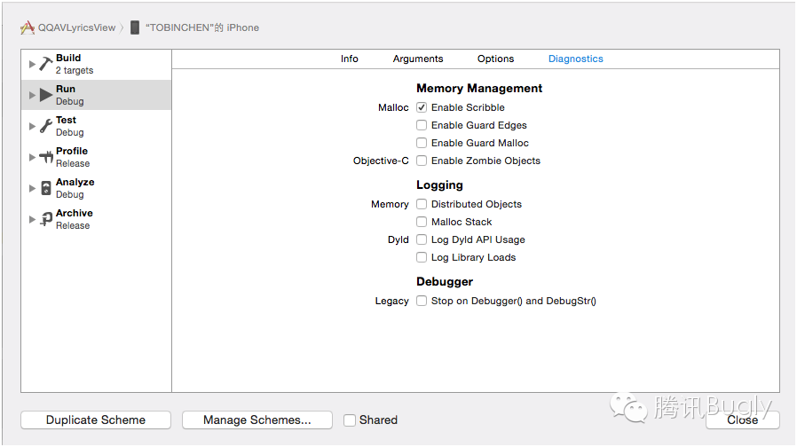  

下面我们就拿刚刚的代码试一下。

	scheme=>diagnostics=>Enable Scribble

果然，必现了，0x5555561！！

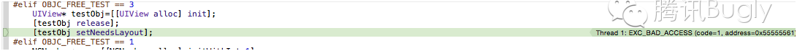  

但是有个问题：这货不能放在测试同学那边用！因为总不能让测试同学装了xcode来测试吧？  

于是我们自己动手实现一个，这个过程中我们要解决几个问题：

  * 怎么在内存释放后填上不可访问的数据？内存释放很可能不在我们的代码中。为此我们需要hook对象释放的接口，内存时候之后马上执行我们的破坏工作。

  * 我们要重写对象释放的接口，重写哪个呢？NSObject的dealloc、runtime的 object_dispose，C的free应该都是可以，但是各有优点，我选择的是覆盖面最广的free，free是C的函数，重写了它之后还可以顺带解决一部分C的野指针问题。

  * 怎么重写？重写C的接口场景的有两种：  
a.替换系统动态库  
b.hook  
替换动态库太麻烦，还不知道行不行得通；hook我们就找现成的fishhook，github里面找的，但现成的代码需要防止代码冲突。

  * 填充的不可访问的数据的长度怎么确定？获取内存长度的接口不在标准库中，好在在Mac和iOS中可以用malloc_size就可以。

  * 填什么？和xcode一样，填0x55。

  

上hook后的free代码：

[size=0.85em]void safe_free(void* p){    size_t memSiziee=malloc_size(p);
memset(p, 0x55, memSiziee);    orig_free(p);    return;}

测试一下，出现了和Enable Scribble一样的Crash！

  

重复造了这个xcode的轮子之后，以后编包给测试，终于在某些情况下不需要那么拼人品了。但是这仅仅覆盖了众多野指针中的一部分，还有大量的疑问等着继续解答。比如：

1、由于内存已经被释放了，很可能我们的0x55又被别的数据覆盖，这种情况还是无能为力。  
2、为什么我们的0x55555555变成了0x55555561。  
3、如果释放后访问野指针的是系统代码，虽然提前发现了Crash，但是离解决问题还是很远。  
4、如果野指针指向的数据没有被当成指针使用，还是可能不立即Crash。

欲知后续问题如何解决，请听下回分解。

  

####
原文出处：<a href='http://bugly.qq.com/bbs/forum.php?mod=viewthread&tid=32&highlight=%E5%A6%82%E4%BD%95%E5%AE%9A%E4%BD%8Dobj-c%E9%87%8E%E6%8C%87%E9%92%88' target='blank'>如何定位Obj-C野指针随机Crash(二)：让非必现Crash变成必现</a>

  

>**只有小概率Crash肿么办？**

之前介绍了一种在内存释放后填充0x55使野指针后数据不能访问，从而使某些野指针从不必现Crash变成了必现。然而，我们早就看穿了一切，这个事情不会那么顺利的。 

加上上次的代码之后，再试试下面的代码

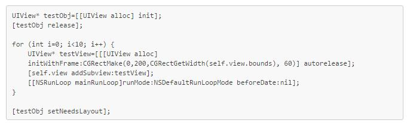

**11.jpg** _(14.87 KB, 下载次数: 4)_

依然有大概率不会Crash！难道是我们的实现有问题？我试了一下xcode的Enable Scribble，但一样是大概率不Crash！

  
其实这就是上一篇文中留下了几个问题之一，如果我们填充0x55后内存又被别的内存覆盖了，最终还是会出现随机Crash。而在真实环境中，这种情况是非常常见的。

  

我们再梳理一下这个过程：

1. 我们在即将要释放的填了0x55，之后调用了free真正释放，内存被系统回收。

2. 这个时候系统随时可能把这片内存给别的代码使用，也就是说我们的0x55被再次写上随机的数据（在这里再强调一下，访问野指针是不会Crash的，只有野指针指向的地址被写上了有问题的数据才会引发Crash）。

3. 假如释放的内存上又填上了另一个对象的指针，而那个对象也有同样的一个方法，那很可能只是逻辑上有问题，并不会直接Crash，甚至悄无声息地像什么事情都没发生一样。（这个地方可能会发生多种情况，可以参考之上一篇文章中的图）

  

没有发生Crash可不是好事，因为这种情况如果后续再Crash，问题就非常难查，因为你看到的Crash栈很可能和出错的代码完全没有关联。既然这个问题这么棘手，最好还是和之前一样，让这个Crash提前暴露。

  

>**继续提高Crash率**

沿着上次的思路，首先，我们要解决的问题就是怎么让系统不再往这片释放的内存上乱放东西。  

要控制底层内存管理机制让它不使用这些内存可能很困难。但是，我们变通一下，简单粗暴地，我们干脆就不释放这片内存了。也就是当free被调用的时候我们不真的调用free，而是自己保留着内存，这样系统不知道这片内存已经不需要用了，自然就不会被再次写上别的数据（偷笑)。

  

为了防止系统内存过快耗尽，还需要额外多做几件事：

1.   自己保留的内存大于一定值的时候就释放一部分，防止被系统杀死。

2.   系统内存警告的时候，也要释放一部分内存。

  

主要代码还是很简单的：

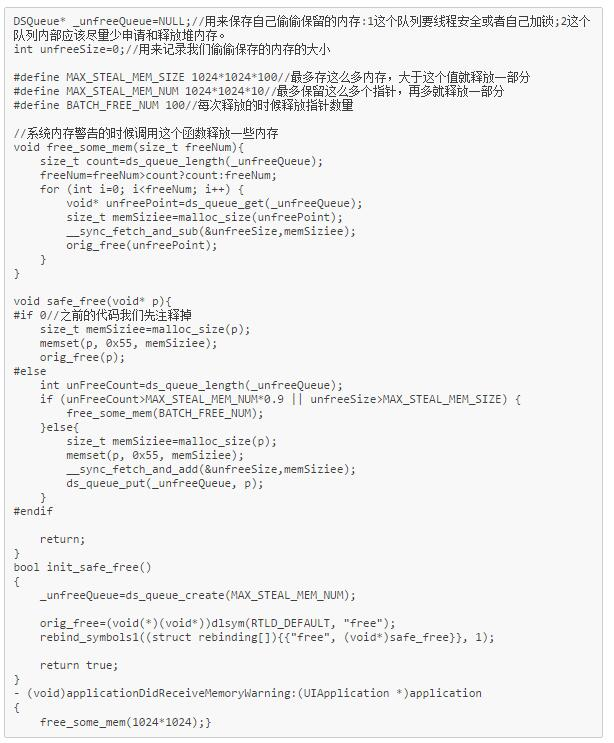

**22.jpg** _(67.64 KB, 下载次数: 7)_

[下载附件](forum.php?mod=attachment&aid=Nzl8OTdkMmIxZjd8MTQ3MjYwOTI0MHwwfDMy&nothumb=yes)

2015-11-6 16:44 上传

这里需要注意一下：  

1.   在safe_free以及它调用的函数里面尽量不要再用带锁的函数，不然很容易导致死锁。

2.   加上这个代码之后APP的内存占用会增大不少，拿过来测试可以，**但万万不能放在正式的发布版本中**。

3.   关于性能问题，我的机器是iPhone5，跑在App里面运行，还算流畅（不同App性能可能会有些不同）。

4.   可能由于锁的存在，会使cpu线程切换变得频繁，这样多线程的问题Crash率也可能会提升（最近遇到一个多线程引起的Crash很难重现，但我加了这个代码后就变成了必现Crash）

  

做完这些之后拿到项目中实际验证一下，验证的版本可以是经过测试，且遗留Crash问题已经很少，但还没有对外灰度或发布的版本。

现在来看一下效果：

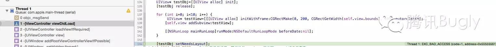

  

终于出现了我们熟悉的Crash了！并且，我们做了更多的尝试之后，Crash还是以高概率重现！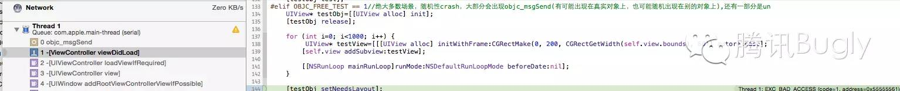

  

但以上代码只是雏形，其实还有很多地方可以优化，大家在试用时可以参考着优化：

1. 最好是根据机器的情况来决定偷偷保留内存的数量。

2. 由于内存申请太过频繁，其实我们保留的内存很快就会耗尽，对于大片的内存，可以适当放过，这样可以提高保存指针的数量，防止消耗的内存过多。

3. 有的APP自己写的都是Obj-C代码，想忽略c、c++对象的话可以过滤掉（会有办法判断的）。

4. 如果觉得某些Obj-C类有问题，可以只保留指定的类对象，如果数量不是特别大，甚至可以干脆不释放。

5. ……

> **总结一下**

理论上，机器的内存越大，我们就可以瞒着系统不释放更多内存，野指针Crash的概率也就越大。

 

 

####
原文出处：<a href='http://bugly.qq.com/bbs/forum.php?mod=viewthread&tid=34&highlight=%E5%A6%82%E4%BD%95%E5%AE%9A%E4%BD%8Dobj-c%E9%87%8E%E6%8C%87%E9%92%88' target='blank'>如何定位Obj-C野指针随机Crash(三)：如何让Crash自报家门</a>

本文主要介绍如何利用OC Runtime的特性，让OC野指针对象主动抛出自己的信息，秒杀某些全系统栈Crash。

（注：本文由于涉及一些技术比较猥琐，可能会引起处女座同学的不适，如果有任何疑问欢迎一起讨论。另外，本文只讨论Arm 32位情况）  

  

>为什么错误地址是0x55555561？

  

我们在**[前文**](http://mp.weixin.qq.com/s?__biz=MzA3NTYzODYzMg==&mid=209318122&idx=1&sn=a96e1729fc32be9c3e7503c9a34cb87e&scene=21#wechat_redirect)里曾经介绍过在内存释放后填充0x55使野指针出现后数据不能访问，从而使野指针变成了必现的方法，那这里会有一个比较奇怪的问题：我们在释放的内存上填上了0x55，但为什么大部分时候野指针C rash了，出错的地址却是0x55555561？

  

为了解答这个问题，我们可以先看看Crash栈，就会发现这些Crash都是在objc_msgSend上。我们知道Obj-C的对象方法调用是通过objc_msg Send进行的，我们通过野指针访问一个对象的方法也一样，其实是通过objc_msgSend给已经释放的对象发了一条消息。

  

而objc_msgSend的函数签名是这样：

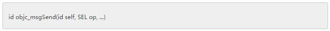

**11.jpg** _(3.35 KB, 下载次数: 9)_

[下载附件](forum.php?mod=attachment&aid=ODB8ODMyNjU5NzZ8MTQ3MjYwOTU2MXwwfDM0&nothumb=yes)

2015-11-6 16:51 上传

  

我们再来看看objc_msgSend的代码:

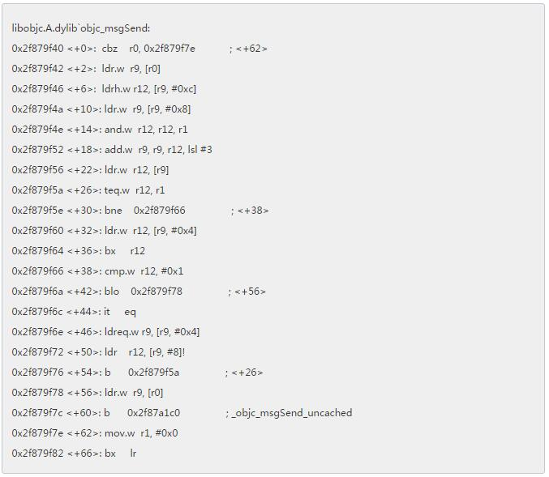

**22.jpg** _(35.99 KB, 下载次数: 7)_

[下载附件](forum.php?mod=attachment&aid=ODF8MjcyYzdiZWJ8MTQ3MjYwOTU2MXwwfDM0&nothumb=yes)

2015-11-6 16:51 上传

  

我们可以结合Obj-C类的内存布局再来解读一下上面的汇编代码（节选于Obj-C类的源代码）：

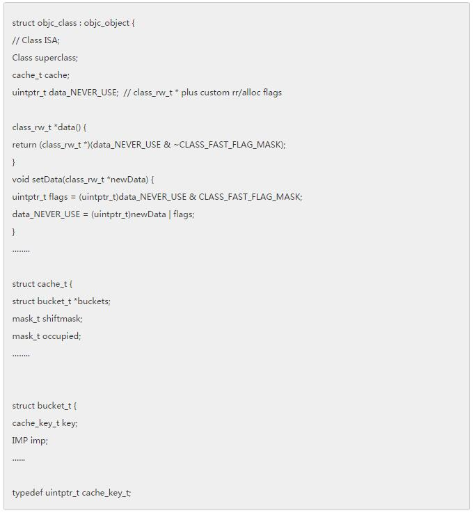

**33.jpg** _(26.29 KB, 下载次数: 11)_

[下载附件](forum.php?mod=attachment&aid=ODJ8MTAwZjBlOWV8MTQ3MjYwOTU2MXwwfDM0&nothumb=yes)

2015-11-6 16:51 上传

  

根据苹果的函数调用约定，objc_msgSend被调用的时候，寄存器对应关系：r0是对象本身self，r1是sel，r2和r3是参数。根据objc_class的声明，我们可以知道：

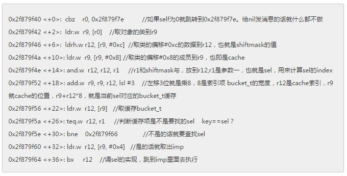

**44.jpg** _(38.13 KB, 下载次数: 8)_

[下载附件](forum.php?mod=attachment&aid=ODN8ZGFlY2RmZjJ8MTQ3MjYwOTU2MXwwfDM0&nothumb=yes)

2015-11-6 16:52 上传

  

其实上面的代码就是从缓存中找sel的实现的过程，而错误地址之所以是0x55555561是因为ldrh.w r12, [r9, #0xc]这行指令。我们用0x55555555覆盖了对象的isa指针，当发生OC调用查找缓存0x55555555+0xc取shiftmask的时候，发现这个地址不可读，于是CPU抛出了异常。

  

> 怎么获取野指针的更多异常数据？

  

弄清楚上述问题后，又有一个问题：既然0x55555555是被当成了类的指针使用，那假如我们用指定的类覆盖这个指针，是不是就可以执行我们指定类的方法呢？

  

进一步说就是在发生野指针调用的时候，我们是不是可以控制CPU的行为？说起来有点像溢出攻击，利用shellcode覆盖函数返回值，一旦我们在出错的时候控制了CPU就可以获取更多异常信息，比如是哪个类，调了什么方法，对象的地址之类。

  

先解决几个关键问题：

  

**1.覆盖成什么？**

我们需要自己写一个类，用它的isa来替换已经释放的对象的isa。如果不出我们所料，我们用自己的类覆盖之后，之前调用的sel就换成了调用我们自己的类的某个sel。这样，只要我们指定的类也实现这个方法，就可以执行我们需要执行的代码，然后在里面获取我们需要的信息。当然，我们无法预料野指针对象会在调用哪个函数时发生Crash，好在我们可以利用runtime的重定向特性了转到我们自己的代码里面去。  

  

**2.怎么覆盖isa？**

object_setClass可以替换一个类的isa，但是试了一下，发生死锁！根据Obj-C对象的内存布局，对象的第一个数据就是isa，这里我们可以直接用自己的类指针替换它，反正是已经释放的内存，随便我们怎么玩。  

总之，还是很简单，这个类就是下面这样:

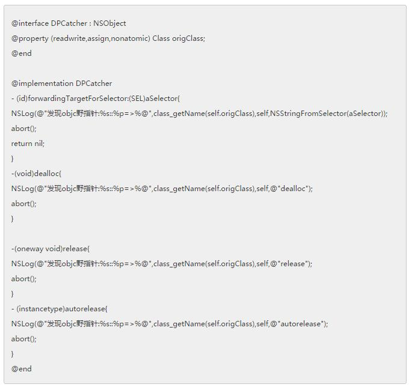

**55.jpg** _(31.33 KB, 下载次数: 9)_

[下载附件](forum.php?mod=attachment&aid=ODR8YjllNzZjM2V8MTQ3MjYwOTU2MXwwfDM0&nothumb=yes)

2015-11-6 16:52 上传

>注意：对象的release、dealloc等函数要特殊处理一下，因为任何对象都有这些方法，不会执行重定向。

然后，我们的free函数改成下面这样（去掉了一些多余代码）：

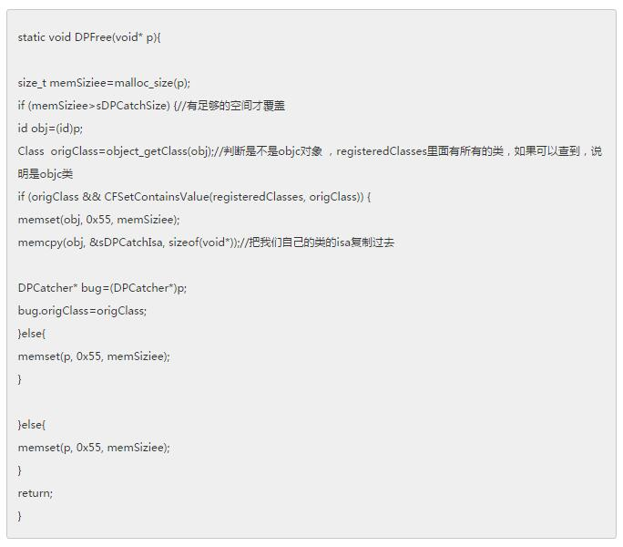

**66.jpg** _(27.44 KB, 下载次数: 6)_

[下载附件](forum.php?mod=attachment&aid=ODV8ZDQ0MTZjMTZ8MTQ3MjYwOTU2MXwwfDM0&nothumb=yes)

2015-11-6 16:53 上传 

初始化的时候获取所有类信息，获取填充类的的大小:

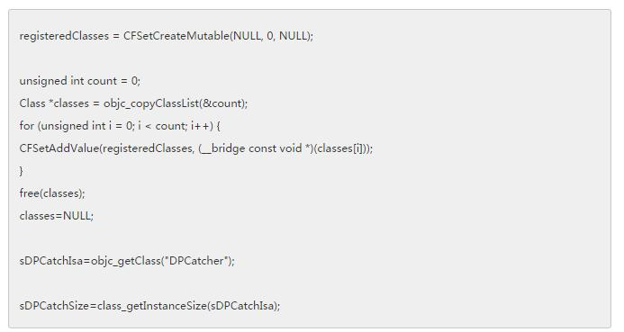

**77.jpg** _(17.24 KB, 下载次数: 4)_

[下载附件](forum.php?mod=attachment&aid=ODZ8NmE2NTU0M2V8MTQ3MjYwOTU2MXwwfDM0&nothumb=yes)

2015-11-6 16:53 上传

  
用下面简单的代码试一下：

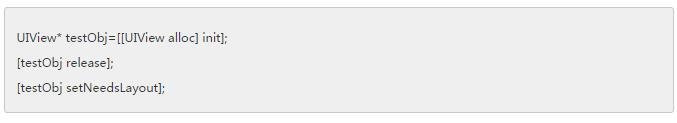

**88.jpg** _(5.65 KB, 下载次数: 5)_

[下载附件](forum.php?mod=attachment&aid=ODd8ZDEyZmZiOGV8MTQ3MjYwOTU2MXwwfDM0&nothumb=yes)

2015-11-6 16:53 上传

发生野指针的类、对象地址和访问的方法就这样可以被打印出来！

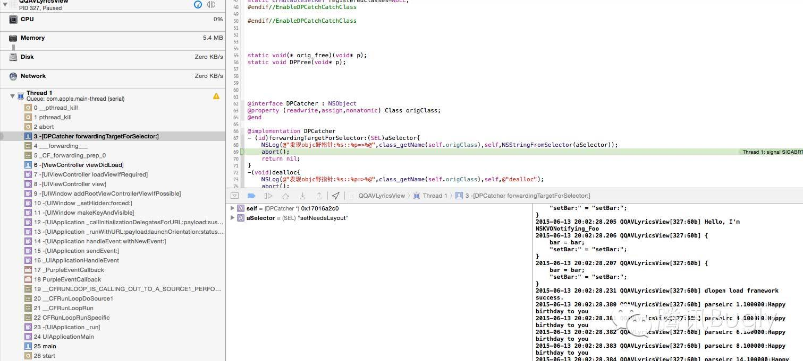  

  
再看看下面这几个让人头疼的传说中的全系统栈Crash，你是否熟悉？

栈1：

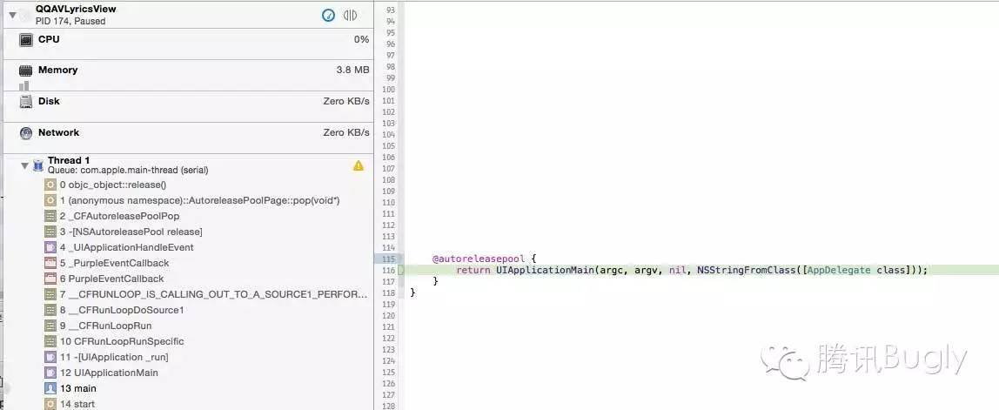  
  

栈2：

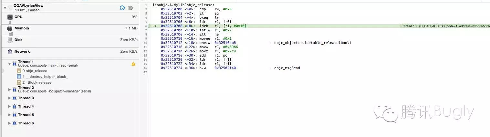

  

上面这两个Crash如果不能重现几乎是无解！但是，加上我们的野指针定位神器之后再看看，类名和地址都可以打出来了，解决起来就不是什么问题了。
  

栈1被捕获后的信息：

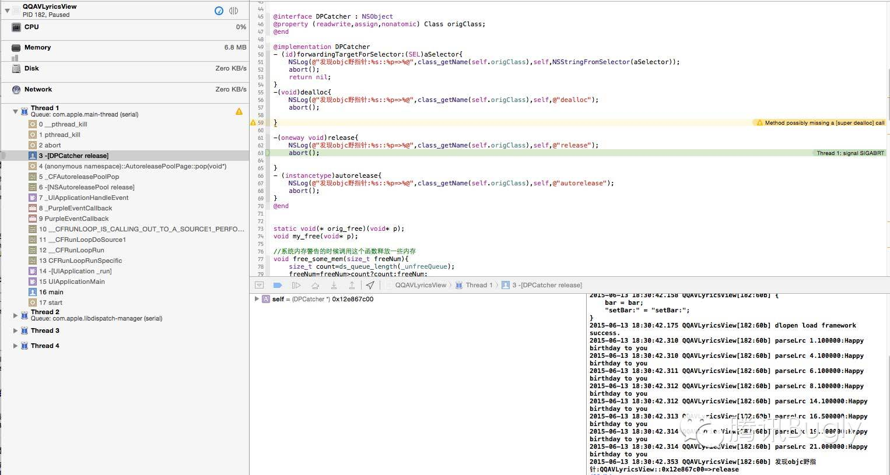  
  

栈2被捕获后的信息：

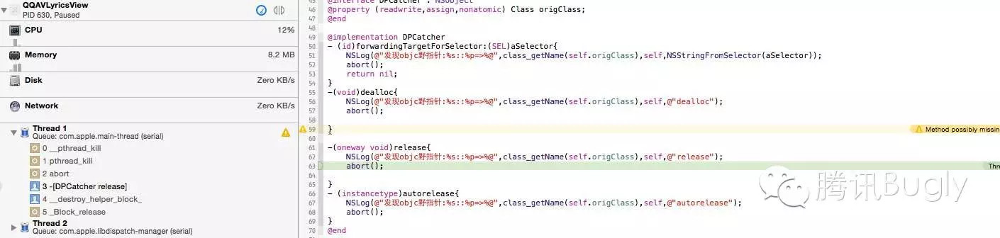  

> **说明：**  
>
> * 我们打印出了野指针对象的名字和地址，当这个类的对象比较少时，对查找问题有很大的用处（如果是自定义的类出现野指针，一般还是比较容易找到问题），但是如果是一些经常出现的类，比如nsarray，定位起来还是比较麻烦。这个时候建议试一下xcode的malloc history工具，或者可以自己实现一个类似记录内存使用记录的工具，因为有内存申请和释放的记录，只要重现一次就可以精确定位野指针。
>
>   * 如果出现dealloc的使用错误，例如先[super dealloc]，然后release成员变量，那么就会出现崩溃的现象，且此时对象的地址为0x55555555。这是因为[super dealloc]只会释放对应的内存，但其成员的内存不会被release而变成了0x555555。这种问题场景比较简单，一旦发生绝对是必现的，修复也比较容易。
>
> 后记  

写到这里，关于iOS野指针随机问题定位的三篇文章就写完了，特别说一下，文中提到的方法虽然可以提高野指针的曝光率和定位精度，但并不是万能，比如下面这几种情况，可能并不一定适用：

  

  * 未触发出现野指针的逻辑：比如说一个有问题的代码，只有在特殊的逻辑下才会有野指针问题，如果我们没有触发这个逻辑，肯定也是无法暴露出这个问题的。这种情况建议还是提高测试的场景覆盖。

  

  * 产生野指针和使用野指针的时间间隔太长：时间太长的话，很可能我们保留的指针已经被释放了。

  

  * APP内存消耗大，会降低曝光率。因为内存消耗大的时候，我们保留的指针数量必然减少，而且保留的时间也会更短。

  

  

之前也收到了很多同学的反馈，感谢大家对这个系列文的关注！在这里先回答一下大家提出的一些疑问。  

  

  * **free之前先填上 0x55 ，这个0x55有什么具体含义吗？**

答：实际上填写数据的关键在于填写数据后其地址指向不可读的内存。而填写0x55，和前面提到的出现异常情况的对象地址0x555555连接起来被当成指针使用的话，就会被识别为0x55555555，而CPU访问这个地址就会抛出异常。

另外一点，就是方便区分野指针，例如在Xcode启用Enable Scribble时，指定alloc之后填写的地址为0xaa，防止内存初始化就使用，也是为了方便和free之后的内存做区分。

  

  * **这个方法对于arc和非arc是否都可以用？**

答：都可以，不过都是arc的话应该比较少出现野指针吧。

