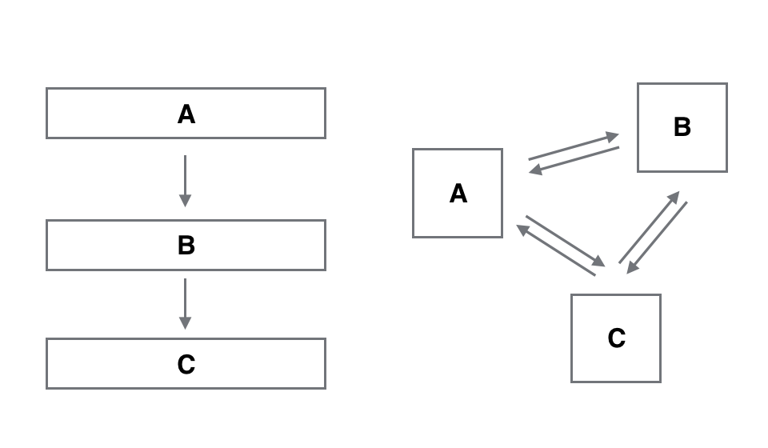
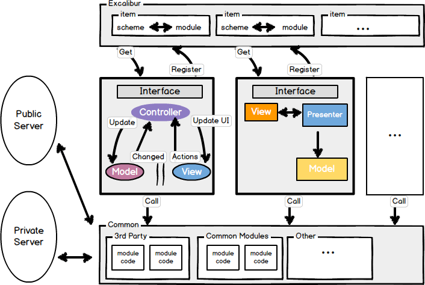
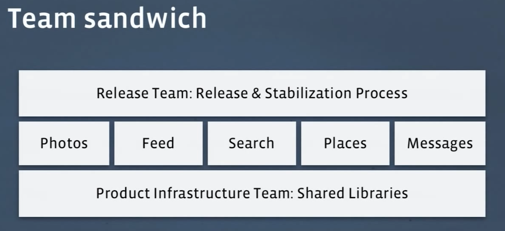
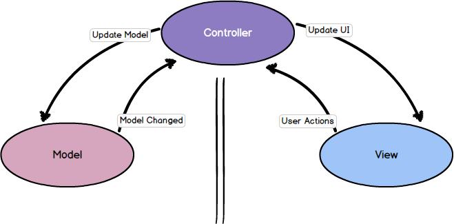
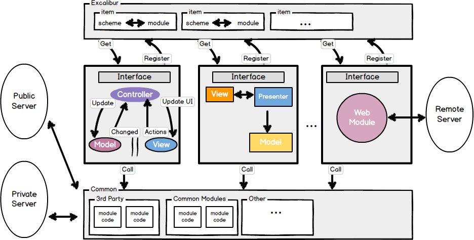
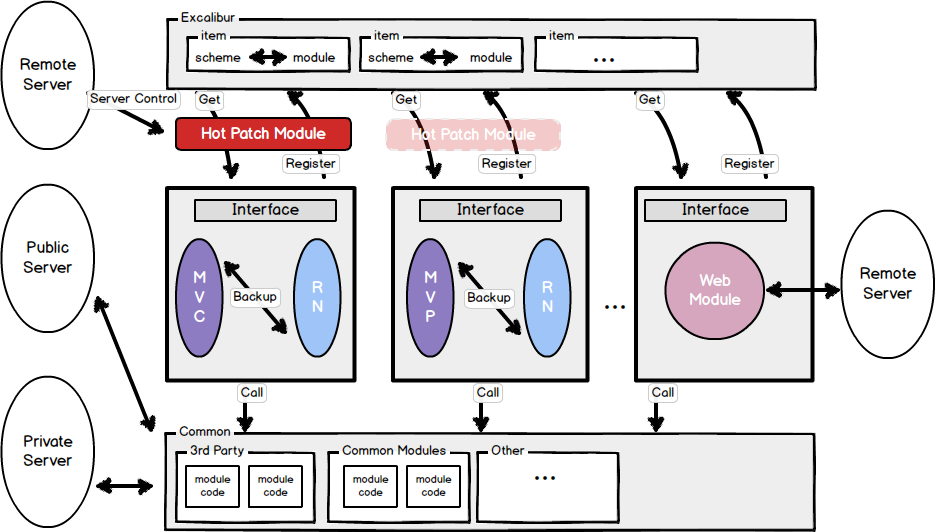

 
<!--BEGIN_DATA
{
    "create_date": "2016-12-22 22:18", 
    "modify_date": "2016-12-22 22:18", 
    "is_top": "0", 
    "summary": "iOS应用架构现状分析", 
    "tags": "iOS、架构", 
    "file_name": "iOS应用架构现状分析.md"
}
END_DATA-->

####
原文出处：<a href='http://mrpeak.cn/blog/ios-arch/' target='blank'>iOS应用架构现状分析</a>

##iOS应用架构现状分析

iOS从2007年诞生至今已有近10年的历史，10年的时间对iOS技术圈来说足够产生相当可观的沉淀，尤其这几年的技术分享氛围无论国内国外都显得异常活跃。本文就iOS架构这一主题，结合开发圈里讨论较多的几种主流方式，再配以博主自己的理解，做下现状分析。给自己做下知识梳理的同时，也期望能引入新的思考。

####架构的定义

过去6年多几乎绝大部分时间都浸淫在iOS平台，翻阅过不少关于架构的文章，发现众人对架构的理解颇有些差异，总体来说可分为四类：

######第一类：精简型应用架构

这类架构的文章分析主要还是围绕MVC展开，以苹果自带UIViewController优劣为出发点，再结合主流的MVP，MVVM，MVCS等变种进行分析演变。
这类的探讨重点在于M，V，C三类角色的定义以及之间的数据事件流向的规范。很多小型应用所面临的问题及其架构层面的解决方案都集中在这一类。

######第二类：综合型应用架构

对于用户量级在千万级或以上的应用来说，MVC这一层面的思考已无法应对业务疯狂增长所带来的负担。这类应用往往需要专业资深的架构师出面进行深层次的思考设计，业内不少大厂如淘宝，天猫，携程等都做过一些分享。不过到了这一层级的战斗，不光考验架构师的技术积累，更重要的是架构师对于业务的整体理解。我姑且把这类架构名之为：综合型应用架构。综合型应用架构一般不会提到MVC，更多是在探讨“层”与“模块”的划分和耦合。后面我会就几个经典样本做下详尽深入的分析。

######第三类：深度优化的综合型应用架构

综合型应用架构是应对大规模业务增长的必经之路，一旦架构成型，后期业务膨胀会不停的打磨架构本身，产品本身对体验质量的追求会要求架构师和技术团队不停的优化架构细节。这种优化可以分为两块，第一是组件或模块划分的粒度越来越细，第二是组件模块的深度优化，比如网络层的深度优化，sqlite优化（多线程，FTS，安全等），数
据加密，HotFix，Hybrid等，一些开源的第三方库已不能满足要求，需要团队自己重造轮子。这一层面的架构设计涉及面广，对架构师，团队技术人员的技术深度和业务理解能力有较高要求，短短一篇技术文章往往只能走马观花的介绍个大概，每一次优化几乎都可以作为一个专题来讲解。

######第四类：组织型应用架构

这类架构在第三类的基础之上更进了一步，除了关注系统层面的架构设计之外，更对团队或部门之间协作方式，各系统模块的演进方式，产品发布流程等都做了规范。除去业务膨胀带来的压力，人员增长，各团队协作依赖增强等都会对app的质量，迭代速度产生影响，这些问题也需要从架构层面去解决。这类结合技术架构和组织架构的分享还比较少。

以上四种类型的架构又可以看做一般App从简至繁，公司规模随之增长的演进过程，技术圈绝大部分的架构类分享文章都可以归为上述四类。

对于什么是架构的学术定义，似乎大家并不太在意，更关心的是如何解决自身项目当下的问题。虽然在我看来第一类架构更像是在讨论设计模式，但这里面确实又有非常多的知识可以深入挖掘，这里就把所有“解决应用整体设计问题”的讨论都归类于架构这一话题。

值得一提的是，架构师的视野和积累一般都受限于自己所经历项目及业务的规模。如果有机会，工程师还是应该尽可能去BAT这类巨头级公司历练一下，知识深度和广度的构建绝非纸上可得。

####样本分析

这里我以圈子里几个经典的架构分享为样本，做下解剖分析。样本的选取主要以搜索引擎及评论热度为标准，排名不分先后。

#####第一类样本：

如果一篇架构的文章是以探讨MVC为起点，很有可能作者所说的架构就可以被归为第一类样本。

Xcode自带的UIViewController模板经常被戏称为“Massive View Controller”，主要是因为UIViewController除了负责Controller生命周期回调之外，还承担了View和Controller的工作。不少架构的探讨以此为基础，将Controller的M，V，C三个角色重新进行划分，又或者衍生出MVP，MVVM，MVCS，VIPER等其他组织方式。重新定义MVC之后，网络访问，持久化，安全等通用功能模块往往就由Controller或者Presenter负责了，这些负责业务逻辑的功能类直接依赖于成熟稳定的第三方基础库，比如AFNetworking，FMDB等。

但是，应付过复杂庞大业务模块的工程师会会有经验，无论以何种方式组织Controller，数据流向和事件传递再清晰合理，单纯代码量的膨胀就足以让Controller变得难以维护。MVC，MVP，MVVM都可以变得Massive。想象一下将10本书放在床头，你可以按翻阅频次，阅读习惯将书合理摆放，但当你面对100本书的时候，已不是如何摆放的问题，而是需要一个新的书柜。说到这里我挺服VIPER的，五个角色划分，尝试可以在床头放下100本书的Pattern。我们先来看看“10本书”的样本。

> ######样本名：iOS 架构模式–解密 MVC，MVP，MVVM以及VIPER架构
>
> [英文原版](https://medium.com/ios-os-x-development/ios-architecture-patterns-ecba4c38de52#.1eqt5p75r)，[中文翻译版](http://ios.jobbole.com/83727/)
>
> 作者：Bohdan Orlov

这篇文章是第一类样本的典型，综合对比了MV（X）系列架构。我们来看下主要论点。

######论点摘要：

文章认为优秀的架构具备以下三个特质：

> Balanced distribution of responsibilities among entities with strict roles.
>
> 能把代码职责均衡的划分到不同的功能类里。

这是我们关注架构的原动力，有个粗浅的评判标准，同一个业务单位（Controller）里面，不能一个类1000多行代码，另一个类却只有10来行。当我们考虑网络请求的代码是该放在controller当中还是model当中的时候，在“代码量”上要做到“雨露均沾”，不能少数类“营养不良”。所以不论你的MVC，MVP或者VIPER是如何划分职责的，各个角色所承担的职责应当看起来是均匀分配的。

> Testability usually comes from the first feature.
>
> 方便测试

测试是个有趣的话题，不同公司实践差异很大。我知道有些团队的产品质量严重依赖于QA团队，有些却干脆没有测试团队，完全依赖于开发人员自己保证质量，这两种风格一般取决于CTO的技术决策，和公司大小倒没多少关系。对于开发人员自测的情况，如果代码架构清晰，各角色职责分配合理，易测性是随之而来的副产品。

> Ease of use and a low maintenance cost
>
> 易用且方便维护

易用是针对团队里的开发人员而言的。其实到底是用MVP还是MVVM，或者MVVM里数据如何流动，这些具体的规范到底采用何种形态不是最重要的问题，关键是在团队所有成员能有一致的认识，无论是写代码还是Debug都能快速切入。

围绕上面三个特质，作者一一分析对比了传统MVC，Apple MVC，MVP，MVVM，VIPER在这三方面的表现，结论是到底选用哪个纯粹是个人口味问题。相较于结论，作者对各个Pattern的角色定义及分析才是真正有价值的部分，我们在阅读评断其他类似架构文章的时候，也应该重在了解作者对于角色的理解。大家可以基于这一点，阅读下其他一些类似的文章。VIPER理论上并不能归类于MV（X）系列，而是突破了MVC的思考方式，比如定义了Router处理页面流程，这对架构师是个很好的思路，在对MV（X）重新设计的时候也应该能有新的思考，所谓“君子不器”。

MV（X）都是以MVC为原型进行变化，MV（X）到底如何使用没有教科书式的标准答案，关键在于架构师和团队各成员能达成一致的认识，在遇到问题时能不断的做调整重构，遇到难以跨越的瓶颈时，能跳出MV（X）寻找解决方案。

#####第二类样本：

在开始分析第二类样本之前，有几个概念比较重要，是我们深入讨论各个综合型样本的前提。组件，模块，层的定义。

在我看来，组件是比模块更小的功能单位，不具备业务属性，只处理基础通用的问题，类似于工具箱。比如我们给NSString写的Category提供base64，给NSDate写的Category做日期格式化等等。

模块较之组件粒度更大一些，另外最重要的区别是带有业务属性，和业务场景相关联。比如购物车模块，注册登录模块，支付模块等等，模块往往会对一些通用的组件产生依赖。

层是另一个维度的概念了，我平常阅读技术文章的时候，发现很多人会把模块和层的概念混淆，可以用一张图来区分模块与层的概念：

对于层不允许跨层访问，也就是说A不能直接访问C，下层不允许访问上层，B无法知道A的实现细节。层的概念可类比TCP/IP协议栈。模块就灵活多了，A，B，C三者
之间可以任意访问依赖。所以一般来说层对架构的约束更高，但使得依赖更规范好维护，模块在复杂的场景下很容易结成一个网状的依赖形态，难以维护。第二类项目架构都是围绕层与模块的划分所展开，有的有严格的层次结构，有的不分层次，通过接口严格规范各模块交互，有的二者结合，在某一层内再做模块划分，下面我们分析的样本都属于上面三种情形。

在开始分析之前，建议大家全篇了解下iOS开发圈关于组件化的讨论，我之前做过一个总结，里面有各篇文章链接：http://mrpeak.cn/blog/modu
le/ 。

> ######样本名：饿了么移动APP的架构演进
>
> [原文地址](http://www.jianshu.com/p/2141fb0dc62c)
>
> 作者：圣迪

这篇架构演进的讲解是典型的从第一类到第二类的过渡，可简化为以下几步：

1.使用传统MVC快速迭代App。

2.业务发展，有多个App需要开发，开始组件化，使用CocoaPods进行组件管理，目标是并行开发和代码重用。架构图如下：

如果读过上面关于组件化的文章，这张架构图就很好理解了，在做好模块划分和管理之后，通过Router的方式将让各模块产生耦合。这种架构方式已初步具备一个应付大规
模业务增长的架构模型。

3.Hybrid，几乎所有运营类主导的App都会最终投入Hybrid的怀抱，运营团队对快速上线的要求只能在H5或者Hybrid上得以实现，不过这和架构本身关系不太大，是另一个大的话题。

4.React-Native & Hot Patch，这和第三步类似都是由运营驱动，几乎是所有内容运营型app的必经之路。

这四步的演化文章介绍的还比较粗略，更多的细节（比如Router内部实现，业务组件和非业务组件的分工，组件间耦合的方式等）没有介绍，或者饿了么App端也还在探索当中。

#####第三类样本：

> ######样本名：携程移动APP架构优化之旅
>
> [原文地址](http://www.docin.com/p-1399719859.html)
>
> 作者：陈浩然

携程App端的架构演化在饿了么架构基础之上，多了很多优化的细节。

提到了对于基础SDK组件和业务组件的具体划分：

> **核心功能SDK化**
>
> • 通讯、定位、Hybrid、数据库、登录、分享、基础库等
>
> • 直接提供给其他BU独立App使用
>
> **公用业务功能组件化**
>
> • 地图、日历、城市、图片、通讯录等13个公共组件
>
> • 减少各BU重复开发工作量

性能数据指标采集：

> • 网络性能:网络服务成功率、平均耗时、耗时分布
>
> • 定位:获取经纬度成功率、城市定位成功率
>
> • 启动时间、内存、流量等指标
>
> • 多种纬度:系统、App版本、网络状况、位置等

网络优化

> • 使用TCP长连接实现网络服务
>
> • 根据网络状况2G/3G/4G/WIFI进行调优参数
>
> • 根据连接/读/写不同阶段使用重试机制
>
> • 使用IP列表避免DNS解析失败或者劫持
>
> • 根据网络延迟选择服务端IP(使用Ping)
>
> • 使用ProtocolBuffer+Gzip减少Payload

还有Hybrid，HotFix，React Native等就不一一列举了，这些细节性强的分享有很高的学习价值，能对刚涉足某一块优化的架构师起到方向指引的作用。

这些看似简单的划分往往很考验架构师的大局观和经验，涵盖面和合理的粒度掌控才能让技术团队的开发工作高效并行。

#####第四类样本：

> ######样本名：Facebook iOS Architecture
>
> [视频地址1](https://code.facebook.com/videos/232867676889263/facebook-s-ios-infrastructure-mobile-scale/)
[视频地址2](https://www.youtube.com/watch?v=mLSeEoC6GjU)
>
> 作者：Facebook

除了和上面样本类似的模块化，组件优化的介绍之外，还有两方面新的信息：

**在关于Infrastructure的介绍当中有张示意图介绍团队分工：**

视频当中不光介绍了基础组件，业务模块的划分，和说明了这些划分对应的团队是如何进行协作。

  * 最底层的是基础设施团队，负责基础SDK的开发，可以对应之前谈到的非业务组件。
  * 中间层是业务团队，按业务模块进行划分，一个业务对应一个团队，团队负责全平台的开发，业务团在开发过程当中可反过来回馈基础SDK。
  * 最上面是产品的发布团队，产品发布团队配合业务团队对产品的发布周期和质量做保障。

**在Facebook iOS客户端架构设计当中有关于model层介绍：**

之前看过不少架构分享文章，少有对model层深入探讨的，一般提到都是一笔带过。model层涉及app数据持久化，以及runtime的状态维护，对app的稳定性和迭代效率起到至关重要的影响。

Facebook的model layer采用的是immutable策略，model虽然能被各层访问，但model的修改统一由model layer提供接口。上层业务团队一旦想修改某个model property，需要向model layer维护团队提出申请，这一设计对状态的维护相当谨慎。

####我的思考

将架构的类型归为上述四类也是方便自己搭建关于架构的知识体系，看架构类文章的时候先做好分类再按类别查漏补缺汲取营养。我个人在第一类，第二类架构方面做过一些尝试和积累，第三类优化上做过一些知识总结。

第一类比如之前的技术分享：

**iOS的应用层CDD架构** http://mrpeak.cn/blog/cdd/

这种优化应用层的架构方式是在MV（X）系列基础之上新的尝试，已在公司项目当中有过实践，成效尚可。

第二类比如:

**用Swift搭建数据驱动型iOS架构** http://mrpeak.cn/blog/swift-dda/

**搭建数据驱动型Android架构** http://mrpeak.cn/blog/dda-android/

用了Swift和Java实现相同的架构思路，这种架构方式也是从已有成熟的项目当中总结提炼而来。

第三类主要是优化和总结的文章：

[App安全之网络传输安全](http://mrpeak.cn/blog/encrypt/)

[HTTP 2.0的那些事](http://mrpeak.cn/blog/http2/)

[iOS组件化方案](http://mrpeak.cn/blog/module/)

[iOS网络请求优化之DNS映射](http://mrpeak.cn/ios/2016/01/22/dnsmapping)

关于架构的总结就到这里，以上全是一家之言，一则梳理，二则分享，任何想法建议，欢迎交流。

####
原文出处：<a href='http://www.jianshu.com/p/2141fb0dc62c' target='blank'>饿了么移动APP的架构演进</a>

##饿了么移动APP的架构演进

###0 引言

时代演进，技术也随之发展。到今天，APP已然成为绝大多数互联网企业用来获取用户的核心渠道。与此同时，伴随着业务量的增长，愈来愈大、愈来愈多的APP也在不断地
、持续地挑战着每一个移动端研发人员的知识深度，而我们的移动端技术人员也在这个不断接受挑战的过程中，成就了今天的移动互联网时代。饿了么移动APP就是这样一个挑战，多用户量、多业务量，在接受着更多更挑剔用户的同时，默默地、不断地演进着移动端的架构。

###1 MVC

我们常说，脱离业务谈架构就是纯粹的刷流氓。饿了么移动APP的发展也是其业务发展的一面镜子。

在饿了么业务发展的早期，移动APP经历从无到有的阶段。为了快速上线抢占市场，传统移动APP开发的MVC架构成了“短平快”思路的首选：

  

图1 MVC架构

这种架构以层次结构简单清晰，代码容易开发而被大多数人所接受。

在MVC的体系架构中，Controller层负责整个APP中主要逻辑功能的实现；Model层则负责数据结构的描述以及数据持久化的功能；而View层作为展现层负责渲染整个APP的UI。分工清晰，简洁明了；并且这种系统架构在语言框架层就得到了Apple的支持，所以非常适用于APP的startup开发。

然后，这种架构在开发的后期会由于其超高耦和性，从而造就庞大Controller层，而这也是一直被人所诟病。最终的MVC都从Model-View-Controller走向了Massive-View-Controller 的终点。

###2 Module Decoupled

“短平快”的MVC架构帮助饿了么移动APP快速抢占了市场。而随着代码量的不断增加，臃肿的Controller层也在渐露头角；而业务上，饿了么移动APP也从单一APP发展为多APP齐头并进的格局。这时候，如果降低耦合，复用已有模块成了架构的第一要务。

架构中，模块复用的第一要求便是代码的功能组件化。组件化意味着拥有独立功能的代码从系统中进行抽象并剥离，再以“插件”的形式插回原有系统中。这样剥离出来的功能组件，便可以供其他APP进行使用，从而降低系统中模块与模块之间的耦和性；也同时提高了APP之间代码的复用性。

饿了么移动对于组件有两种定义：公有组件和业务组件。公有组件指的是封装得比较好的一些SDK，包括一些第三方组件和自己内部使用的组件。如iOS中最著名的网络SDK AFNetworking，Android下OKHttp，都是这类组件的代表。而对于业务组件，则定义为包含了一系列业务功能的整体，例如登录业务组件，注册业务组件，即为此类组件的典型代表。

对于公有组件，饿了么移动采取了版本化的管理方式，而这在iOS和Android平台上也早有比较成熟的解决方案。例如，对于iOS平台，CocoaPods基本上成为了代码组件化管理的标配；在Android平台上，Gradle也是非常成熟和稳健的方案。采用以上管理工具的另一个原因在于，对企业开发而言，代码也是一种商业机密。基于保密性的目的，支持内网搭建私有服务器成为了必需。以上的管理工具都能够很好地支持这些操作。

对于业务的组件化，我们采取了业务模块注册机制的方式来达到解耦合的目的。每个业务模块对外提供相应的业务接口，同时在系统启动的时候向Excalibur系统注册自己模块的Scheme（Excalibur是饿了么移动用来保存Scheme与模块之间映射的系统，同时能根据Scheme进行Class反射返回）。
当其他业务模块对该业务模块有依赖时，从Excalibur系统中获取相关实例，并调用相应接口来实现调用，从而实现了业务模块之间的解耦目的。

而在业务组件，即业务模块的内部，则可以根据不同开发人员的偏好，来实现不同的代码架构。如现在讨论得比较火的MVVM,MVP等，都可以在模块内部进行而不影响整体系统架构。

这时候的架构看起来更像是这样：

  

图2 EMC架构

这种E(Excalibur)M(Modules)C(Common)架构以高内聚、低耦合为主要的特点，以面向接口编程为出发点，降低了模块与模块之间的联系。

该架构的另外一大好处则在于解决了不同系统版本的兼容性问题。这里举iOS平台下的WebView作为例子来进行说明。Apple从iOS8系统开始提供了一套更好的Web支持框架——WebKit，但在iOS7系统下却无法兼容，从而导致Crash。使用此类架构，可以在iOS7系统下仍然注册使用传统的WebView来渲染网页，而在iOS8及其以上系统注册WebKit来作为渲染网页的内核。即避免了Apple严格的审核机制，又达到了动态加载的目的。

###3 Hybrid

移动APP的开发有两种不同的路线，Native APP和Web APP。这两种路线的区别类似于PC时代开发应用程序时的C/S架构和 B/S架构。

以上我们谈到的都属于典型的Native APP，即所有的程序都由本地组件渲染完成。这类APP优点是显而易见的，渲染速度快、用户体验好；缺点同时也十分突出：出现了错误一定要等待下一次用户进行APP更新才能够修复。

Web APP的优点恰好就是Native APP的缺点所在，其页面全部采用H5撰写并存放在服务器端。每次进行页面渲染时都从服务器请求最新的页面。一旦页面有错误服务器端进行更新便能立刻解决。不过其弊端也容易窥见：每次页面都需要请求服务器，造成渲染时等待时间过长，从而导致的用户体验不够完美，并且性能上较Native APP慢了1-2个数量级；与此同时还会导致更多的用户流量消耗。另一个缺点则在于，Web APP在移动端上调用本地的硬件设备存在一定的不便。不过这些弊端也都有相应的解决方案，如PhoneGap将网页提前打包在本地以减少网络的请求时间；同时也提供一系列的插件来访问本地的硬件设备。然而，尽管如此，其渲染速度上还是会稍微存在一定的差距。

Hybrid APP则是综合了二者优缺点的解决方案。饿了么移动对于此二类APP的观点在于，纯粹展示性的模块会更适合使用Web页面来达到渲染的目的；而更多的数据操作性、动画渲染性的模块则更适合采用Native的方式。

基于之前的EMC架构，我们将部分模块重新进行了架构：

  

图3 Hybrid-EMC架构

Hybrid-EMC架构中，Web作为一个子模块，注册加入到整个系统中，从而实现让业务上需要快速迭代的模块达到实时更新的效果。

###4 React-Native & Hot Patch

经过这些年的业务发展，Hybrid提供的展示界面更新方案也逐渐地无法满足APP更新迭代的需要。因此越来越多的动态部署的方案被提了出来，比如iOS下的JSPatch, waxPatch，Android下的Dexpose,AndFix, ClassLoader，都是比较成熟Hot
Patch动态部署解决方案。这些方案的思路都是通过下载远程服务器的代码来动态更新本地的代码行为。

React-Native则属于另一种动态部署的方案，其核心原理在于通过JavaScript来调用本地组件进行界面的渲染。

而饿了么移动APP发展到今天，各个APP综合用户量已经过亿。因此一个非常小的Bug所带来的问题都可能会直接影响到几万人的使用。为了保证APP的稳定性和健壮性，Hot Patch方案也就成了当下最有待解决的问题。

根据80%的用户访问20%页面这一80/20原则，保证这20%访问最频繁的页面的稳定性就是保证了80%的APP的稳定性。因此，饿了么移动对于部分访问最频繁的模块进行了React-Native备份。当这部分页面出现问题时，APP可以通过服务器的配置，自动切换成React-Native的备份页面；而与此同时开发人员开发一个小而精的Hot Patch来修复出现的问题。当Hot Patch完成修补后，再切换回Native APP的原生功能。

这时候的架构看起来会像是这样：

  

图4 HotPatch-EMC架构

HotPatch-EMC的架构主要目标在于解决移动APP的稳定性问题。通过RN与Native的主备，可以减少系统APP出错带来的失误成本。

###5 结语

我们都知道，对于软件工程来说，这世上没有银弹。对于架构而言其实也非常的适用。业务的不断更新，带来了饿了么移动APP架构的不断演进。

架构没有真正的好坏之分，只要适用于自己的业务，就是好的架构！
