 
<!--BEGIN_DATA
{
    "create_date": "2016-09-01 15:17", 
    "modify_date": "2016-09-01 15:17", 
    "is_top": "0", 
    "summary": "iOS开发之Masonry框架源码深度解析", 
    "tags": "iOS", 
    "file_name": "iOS开发之Masonry框架源码深度解析.md"
}
END_DATA-->

####<p>原文出处：<a href='http://www.cnblogs.com/ludashi/archive/2016/07/11/5591572.html' target='blank'>iOS开发之Masonry框架源码深度解析</a></p>

**Masonry**是iOS在控件布局中经常使用的一个轻量级框架，Masonry让NSLayoutConstraint使用起来更为简洁。Masonry简化了NSLayoutConstraint的使用方式，让我们可以以链式的方式为我们的控件指定约束。本篇博客的主题不是教你如何去使用Masonry框架的，而是对Masonry框架的源码进行解析，让你明白Masonry是如何对NSLayoutConstraint进行封装的，以及Masonry框架中的各个部分所扮演的角色是什么样的。在Masonry框架中，仔细的品味干货还是很多的。Masonry框架是Objective-C版本的，如果你的项目是Swift语言的，那么就得使用SnapKit布局框架了。SnapKit其实就是Masonry的Swift版本，两者虽然实现语言不同，但是实现思路大体一致。

今天博客对Masonry框架源码的解析思路是先对比给一个View添加同样的约束时，使用Masonry与系统原生的区别。然后就开门见山之间给出Masonry框架主要部分的类图，从类图中我们来整体的分析Masonry框架的结构。然后再由整体到部分逐渐的细化，窥探其内部的实现细节。通过上述步骤，我们将对Masonry框架的内部实现进行详细的了解。其实Masonry框架是轻量级的，总共的源码也没有多上行，但是仔细的阅读其实现细节，还是可以吸取很多实用的东西的。

首先Masonry在github上的地址是<https://github.com/SnapKit/Masonry>, 你可以通过上述链接Clone到Masonry框架，其中有Masonry框架介绍以及一些Masonry的使用示例。关于Masonry的使用方式在今天的博客中就不做过多的赘述了，其具体的使用方式请参考上述github上的链接。今天我们就剖析一下Masonry框架的源码。


####**一、Masonry框架与NSLayoutConstraint调用方式的对比**

首先我们NSLayoutConstraint为我们的View添加一个约束，然后再给出Masonry的代码。当然在此我们就不说Masonry添加约束的简洁行了，当然好东西是不需要宣传的。进入该部分的主题，我们要对一个View添加一个top约束，这个约束关系我们用表达式来表示就是"subView.top = superView.top + 10"。也就是子视图的top与父视图的top中间隔着10个pt。


**1. 使用NSLayoutConstraint添加约束**

下方这段代码就是给subView添加了一个相对于superView的Top约束。一个View要想确定位置一个约束是不够的，所以可想而知，我们要写多个下方的这样的约束来确定一个View的相对位置。其实下方就是一个表达式，NSLayoutConstraint构造器中每个参数构成这个表达式的一个组成部分。由上到下我们队参数个个参数进行解析，参数constraintWithItem用来指定所约束的对象，在此就是subView。第一个attribute参数则指定约束该对象的那个属性，在此就是subView的Top属性。参数relatedBy用来指定约束关系，比如大于等于，小于等于或者等于某个约束值。参数toItem则指定的是约束相对的对象，在此是相对superView的，所以此处的参数是superView。第二个attribute参数就是指定superView的Top属性。multiplier指定相对约束的倍数关系，constant则是约束的偏移量。

由上到下，NSLayoutConstraint的构造器中的参数会构成一个数学表达式，那就是subView.top = superView.top * 1 + 10，该表达式就直观的给出了subView.top与superView.top的关系。经下方的代码我们就为subView添加了一个相对于superView的Top约束，约束的偏移量是10。

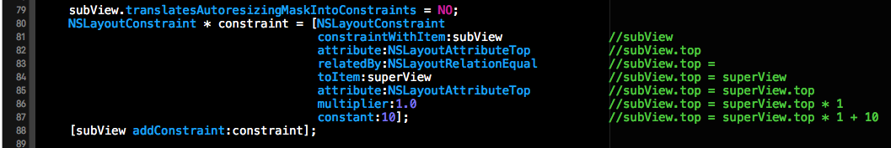

**2.使用Masonry添加上述约束**

接下来就是Masonry出场的时刻了，我们将使用Masonry添加上述约束，其代码如下。下方给出了三种设置方式，下方三种方式是等价的，当然在Masonry中不知下方三种实现方式。下方Block中的每句话都代表着subView.top = superView.top * 1 + 10的意思，也就是说我们只需要写这三行代码中的其中一种即可。使用Masonry的好处一目了然，让你的代码更为简洁。

Masonry框架中支持约束的添加，约束的更新，约束的重建以及基本动画的实现等等。功能还是蛮强大的。在Masonry框架主要中采用了链式调用和匿名闭包的方式来简化约束的添加。有关Masonry更为详细的使用方式请参见上述Masonry框架的Github链接，具体使用方式在此就不做过多的赘述了。

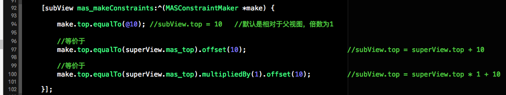


####**二、Masonry框架的类结构**

通过上述的Masonry的使用方式我们可以看出，UIView的对象可以直接调用mas_makeConstraints方法来为相应的View对象添加约束。因为mas_makeConstraints方法位于UIView的View+MASAdditions类目中，所以UIView的对象可以直接调用。同样在View+MASAdditions类目还有其他方法供UIView的对象使用，稍后会进行详细的介绍。

下方就是Masonry框架核心类以及类目之间的关系，下方的类图是在阅读Masonry源码时画的，仅此一份，如有雷同纯属巧合。如果下图中的文字比较小的话，你可以图片另存到本地，然后放大后进行查看，废话少说，进入我们类图的主题。下方的类图中没有包括Masonry框架中的所有的类，不过所有核心的类都在下方了。我们从左往右依次对下方的类图进行解说。

**1.View+MASAdditions类目介绍（左边红框中的部分）**

最左边那一坨大类，也就是绿框中的部分，就是Masonry框架对UIView的公有类目，也就是源文件中的View+MASAdditions的部分，在该类目中为添加了类型为MASViewAttribute的成员属性（稍后会介绍MASViewAttribute是个神马东西）。除了添加一系列的成员属性外，还添加了四个公有的方法：mas_closestCommonSuperview方法负责寻找两个视图的最近的公共父视图（类比两个数字的最小公倍数）、mas_makeConstraints方法负责创建安装约束、mas_updateConstraints负责更新已经存在的约束（若约束不存在就Install）、mas_remakeConstraints方法则负责移除原来已经创建的约束并添加上新的约束。上述方式是UIView对象设置约束主要调用的方法，稍后会详细介绍其实现方式。


**2.MASViewAttribute类的介绍（右边黄框中的部分）**

介绍完用户直接使用的UIView的公共类目，接下来我们来看一下用户看不到的部分，那就是下方类图中右边的那一撮类。右边的四个小类的耦合性比较高，我们先看一下MASViewAttribute类。MASViewAttribute类的结构比较简单，主要包括三个属性，三个方法。从MASViewAttribute这个类名中我们就能看出，这个类是对UIView和NSLayoutAttribute的封装。使用等式来表示就是MASViewAttribute = UIView +
NSLayoutAttribute + item。在MASViewAttribute类中的view属性表示所约束的对象，而item就是该对象上可以被约束的部分。

此处的item成员属性我们稍后要作为NSLayoutConstriant构造器中的constraintWithItem与toItem的参数。当然对于UIView来说该item就是UIView本身。而对于UIViewController，该出Item就topLayoutGuide，bottomLayoutGuide稍后会给出详细的介绍。该类中除了两个构造器外还有一个isSizeAttribute方法，该方法用来判断MASViewAttribute类中的layoutAttribute属性是否是NSLayoutAttributeWidth或者NSLayoutAttributeHeight，如果是Width或者Height的话，那么约束就添加到当前View上，而不是添加在父视图上。


**3.MASViewConstraint的介绍**（右边黄框中的部分）****

接着我们看一下MASViewConstraint类，该类是对NSLayoutConstriant类的进一步封装。MASViewConstraint做的最核心的一件事情就是初始化NSLayoutConstriant对象，并将该对象添加在相应的视图上。因为NSLayoutConstriant在初始化时需要NSLayoutAttribute和所约束的View，而MASViewAttribute正是对View与NSLayoutAttribute进行的封装，所以MASViewConstraint类要依赖于MASViewAttribute类，两者的关系如下所示。

由下方的类图我们可以看出MASConstraint是MASViewConstraint的父类，MASConstraint是一个抽象类，不可被实例化。我们可以将MASConstraint看做是一个接口或者协议。MASConstraint抽象类还有一个子类，也就是MASViewConstraint的兄弟类MASCompositeConstraint，从MASCompositeConstraint的命名中我们就可以看出来MASCompositeConstraint是约束的一个组合，也就是其中存储的是一系列的约束。MASCompositeConstraint类的结构比较简单，其核心就是一个存储MASViewConstraint对象的数组，MASCompositeConstraint就是对该数组的一个封装而已。  


**4.工厂类MASConstraintMaker（中间绿框中的部分）**

两边的看完了，接下来我们来看一下中间的部分，也就是MASConstraintMaker类。该类就是一个工厂类，负责创建MASConstraint类型的对象（依赖于MASConstraint接口，而不依赖于具体实现）。在UIView的View+MASAdditions类目中就是调用的MASConstraintMaker类中的一些方法。上述我们在使用Masonry给subView添加约束时，mas_makeConstraints方法中的Block的参数就是MASConstraintMaker的对象。用户可以通过该Block回调过来的MASConstraintMaker对象给View指定要添加的约束以及该约束的值。该工厂中的constraints属性数组就记录了该工厂创建的所有MASConstraint对象。

Masonry框架中的核心类以及类目间的关系就介绍完了，下方就是核心类和类目的类图。下方将会逐步的窥探其代码实现。

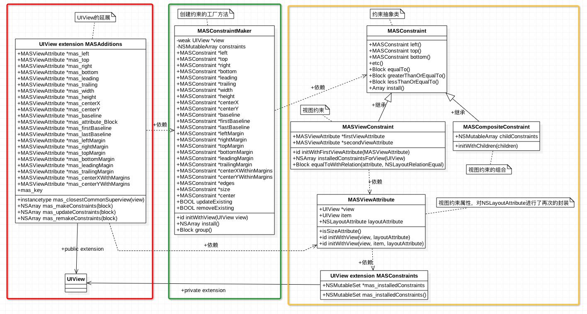


####**三、View+MASAdditions源码解析**

我们先对UIView的公共类目View+MASAdditions中的源码进行解析，也就是对应着上方红框中的部分。用户是通过 View+MASAdditions中的东西来为View添加约束的，View+MASAdditions也就是Masonry框架与外界交互的通道。该部分主要对View+MASAdditions源码进行解析，先介绍其成员属性，然后介绍主要的方法。进入该部分的主题。

**1.View+MASAdditions主要成员属性及getter方法**

下方截图中是View+MASAdditions类目中的部分成员属性，其他的也与下方类似，这些属性都是MASViewAttribute类型的。以下方的mas_left成员属性为例，因为MASViewAttribute是View与NSLayoutAttribute的合体，所以mas_left就代表着当前View的NSLayoutAttributeLeft属性，也就是mas_left存储的是当前View的NSLayoutAttributeLeft属性。同理，mas_top就代表着当前View的NSLayoutAttributeTop属性，其他成员属性也是一样。

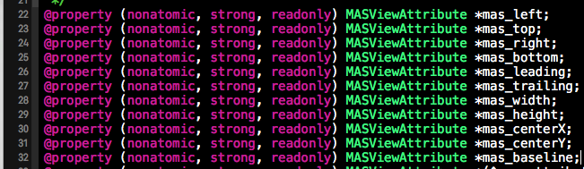

通过上述成员属性所对应的getter方法，我们可以对其中所存储的内容一目了然。下方是mas_left、mas_top和mas_right成员属性所对应的getter方法，其中所做的事情就是对MASViewAttibute进行实例化，在实例化时指定当前视图所对应的LayoutAttribute。也就是mas_left = self + NSLayoutAttributeLeft, mas_top = self +NSLayoutAttributeTop,当然此处的self就代表当前视图。


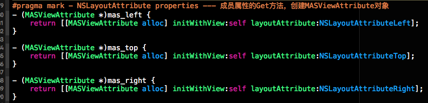


**2.mas_makeConstraints方法解析**

上面在介绍类图的时候也提到了，用户是通过调用mas_makeConstraints方法来为当前视图添加约束的。下方代码就是mas_makeConstraints函数的代码实现，根据个人理解，对每行代码进行了中文注释,接下来我们来好好的看一下该函数的结构.mas_makeConstraints方法的返回值是一个数组（NSArray）,数组中所存放的就是当前视图中所添加的所有约束。因为Masonry框架对NSLayoutConstraint封装成了MASViewConstraint，所有此处数组中存储的是MASViewConstraint对象。

接下来来看mas_makeConstraints的参数，mas_makeConstraints测参数是一个类型为void(^)(MASConstraintMaker *)的匿名Block（也就是匿名闭包），该闭包的返回值为Void, 并且需要一个MASConstraintMaker工厂类的一个对象。该闭包的作用就是可以让mas_makeConstraints方法通过该block给MASConstraintMaker工厂类对象中的MAConstraint属性进行初始化。请参加下方block的使用。

在mas_makeConstraints方法体中，首先将当前View translatesAutoresizingMaskIntoConstraints属性设置成No, 然后创建了一个MASConstraintMaker工厂类对象constraintMaker，然后通过block将constraintMaker对象回调给用户让用户对constraintMaker中的MAConstraint类型的属性进行初始化。换句话说block中所做的事情就是之前用户设置约束是所添加的代码，比如make.top(@10) == ( constraintMaker.top = 10 )。最后调用constraintMaker的install方法对用户指定的约束进行安装。

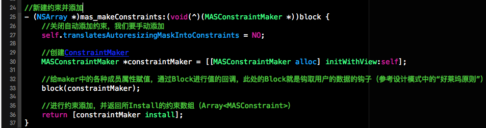


**3.mas_updateConstraints与mas_remakeConstraints函数的解析**

这两个函数内部的实现与mas_makeConstraints类似，就是多了一个属性的设置。mas_updateConstraints中将constraint Maker中的updateExisting设置为YES, 也就是说当添加约束时要先检查约束是否已经被安装了，如果被添加了就更新，如果没有被添加就添加。而mas_remakeConstraints中所做的事情是将removeExisting属性设置成YES, 表示将当前视图上的旧约束进行移除，然后添加上新的约束。

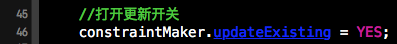

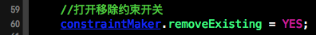

**4、mas_closestCommonSuperview方法解析**

mas_closestCommonSuperview方法负责计算出两个视图的公共父视图，这个类似求两个数字的最小公倍数。下方的代码就是寻找两个视图的公共父视图，当然是最近的那个公共父视图。如果找到了就返回，如果找不到就返回nil。寻找两个视图的公共父视图对于约束的添加来说是非常重要的，因为相对的约束是添加到其公
共父视图上的。比如举个列子 viewA.left = viewB.right + 10, 因为是viewA与viewB的相对约束，那么约束是添加在viewA与viewB的公共父视图上的，如果viewB是viewA的父视图，那么约束就添加在viewB上从而对viewA起到约束作用。

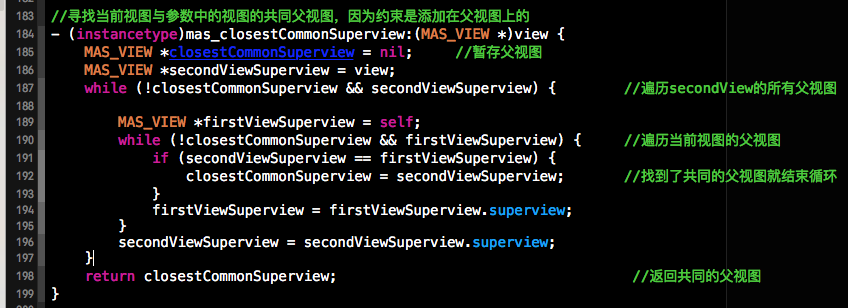


**四、顺藤摸瓜，解析约束工厂类MASConstraintMaker**

上一个部分我们分析了View+MASAdditions类目，在该类目中主要使用到了约束的工厂类MASConstraintMaker，接下我们就来窥探一下MASConstraintMaker中的内容。MASConstraintMaker之所以成为约束工厂类，因为MASConstraintMaker赋值创建NSLayoutConstraint对象，因为Masonry将NSLayoutConstraint类进一步封装成了MASViewConstraint，所以MASConstraintMaker是负责创建MASViewConstraint的对象，并调用MASViewConstraint对象的Install方法将该约束添加到相应的视图中。

**1.MASConstraintMaker中的核心公有属性。**

下方截图是MASConstraintMaker中的部分属性，可以看出下方的属性都是MSAConstriant类型，MSAConstriant是抽象类，所以下方成员变量存储的实质上是MSAConstriant子类MASViewConstraint的对象。MASConstraintMaker就负责对MASViewConstraint进行实例化。一句话解释MASViewConstraint，MASViewConstraint = View + NSLayoutConstraint + Install。稍后会给出MASViewConstraint具体技术细节的实现。在MASConstraintMaker还有一个私有数组constraints，该数组就用来记录以及创建的Constraint对象。

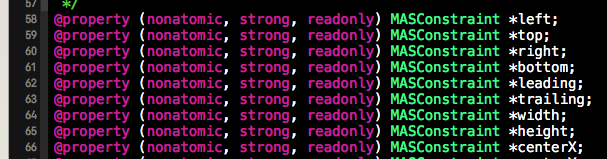

**2.MASConstraintMake中的工厂方法解析**

工厂类肯定有工厂方法，接下来我们来介绍MASConstraintMaker中的工厂方法方法，上面每个MASConstraint类型的属性都对应一个getter方法，在getter方法中都会调addConstraintWithLayoutAttribute方法，而addConstraintWithLayoutAttribute会调用第二个截个图中的方法，而截图中的这个方法就是MASConstraintMaker工厂类的工厂方法，根据提供的参数创建MSAViewConstraint对象，如果该函数的第一个参数不为空的话就会将新创建的MSAViewConstraint对象与参数进行合并组合成MASCompositeConstraint类（MASCompositeConstraint本质上是MSAViewConstraint对象的数组）的对象。

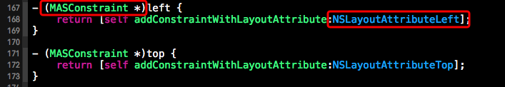

下方就是MASConstraintMaker工厂类的工厂方法，负责创建MASConstraint类的对象。下方的方法可以创建MASCompositeConstraint和MASViewConstraint对象，上面也说了，MASCompositeConstraint对象就是MASViewConstraint对象的数组。下方创建完MASConstraint类的相应的对象后，会把该创建的对象添加进MASConstraintMaker工厂类的私有constraints数组，来记录该工厂对象创建的所有约束。newConstraint.delegate = self; 这句话是非常重要的，由于为MASConstraint对象设置了代理，所以才支持链式调用（例如：maker.top.left.right.equalTo(@10)）。

关于链式调用咱就以maker.top.left.right为例。此处的maker, 就是我们的MASConstraintMaker工厂对象，maker.top会返回带有NSLayoutAttributeTop属性的MASViewConstraint类的对象，我们先做一个转换：newConstraint = maker.top。那么maker.top.left 等价于newConstraint.left，需要注意的是此刻调用的left方法就不在是我们工厂MASConstraintMaker中的left的getter方法了，而是被换到MASViewConstraint类中的left属性的getter方法了。给newConstraint设置代理就是为了可以在MASViewConstraint类中通过代理来调用MASConstraintMaker工厂类的工厂方法来完成创建。下方代码如果没有newConstraint.delegate = self;代理的设置的话，那就不支持链式调用。

说了这么多，总结一下，如果你调用maker.top, maker.left等等这些方法都会调用下方的工厂方法来创建相应的MASViewConstraint对象，并记录在工厂对象的约束数组中。之所以能链式调用，就是讲当前的工厂对象指定为MASViewConstraint对象的代理，所以一个MASViewConstraint对象就可以通过代理来调用工厂方法来创建另一个新的MASViewConstraint对象了，此处用到了代理模式。  

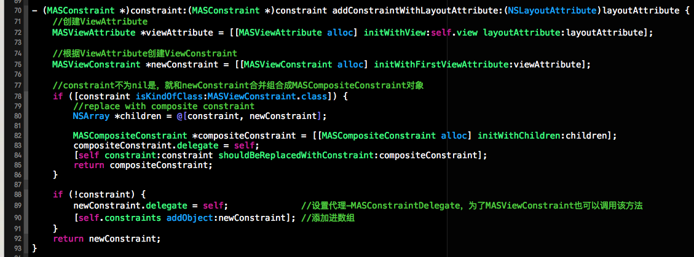


**3. 工厂类中的install方法**

虽然我们将MASConstraintMake视为工厂类，不过该工厂类的功能不仅仅创建MASConstraint的对象，还负责调用MASConstraint对象的install方法来将相应的约束安装到想要的视图上。在MASConstraintMake类中的install方法就是遍历工厂对象所创建所有约束对象并调用每个约束对象的install方法来进行约束的安装。下方就是该工厂类中的install方法。

在安装约束时，如果self.removeExisting == Yes, 那么用户就通过mas_remakeConstraints方法调用的install方法，就先将原来的约束进行移除掉，然后添加上新的约束。在安装约束时，将updateExisting赋值给每个约束，每个约束在调用本身的install方法时会判断是否更新。下方就是MASConstraintMake的install方法的实现和注释。

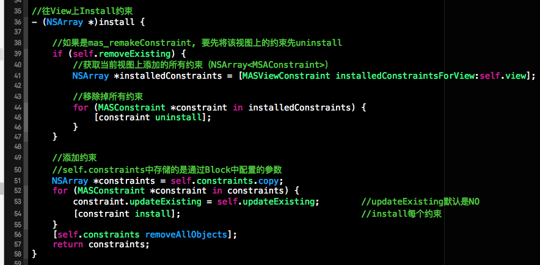

**五、继续顺藤摸瓜，解析MASViewConstraint**

MASConstraintMaker工厂类所创建的对象实质上是MASViewConstraint类的对象。而MASViewConstraint类实质上是对MASLayoutConstraint的封装，进一步说MASViewConstraint负责为MASLayoutConstraint构造器组织参数并创建MASLayoutConstraint的对象，并将该对象添加到相应的视图中。接下来我们将对MASViewConstraint类中的内容进行解析。

**1.MASViewConstraint的对象链式调用探索**

MASViewConstraint的对象是支持链式调用的，比如constraint.top.left.equalTo(superView).offset(10); 上面的这种方式就是链式调用，而且像equalTo(superView)这种形式也不是Objective-C中函数调用的方式，在Objective-C中是通过[]来调用函数的，而此处使用了()。接下来讲分析这种链式的调用是如何实现的。

在MASViewConstraint类中的left, top等约束的getter方法都会调用下方的这个方法，而这个方法中所做的事情就是通过代理来调用工厂中的工厂方法来根据LayoutAttribute创建相应的MASConstraint对象。  

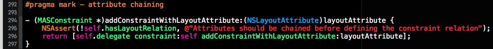


而像offset(10)这种调用方式是如何实现的呢？我们知道在OC中是不能通过小括号来调用方法的，那边闭包是可以的，不过offset()不是一个简单的闭包。在offset()的代码分析后我们不难发现offset() = offset + (); offset的代码实现方式如下。offset是一个getter方法的名，offset函数的返回值是一个匿名Block,也就是offset后边的()。这个匿名闭包有一个CGFloat的参数，为了支持链式调用该匿名闭包返回一个MASConstraint的对象。

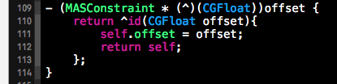


**2.install方法解析**

MASViewConstraint中install方法负责创建MASLayoutConstraint对象，并且将该对象添加到相应的View上。下方代码就是install中根据MASViewConstraint所收集的参数来创建NSLayoutConstraint对象，下方的MASLayoutConstraint其实就是NSLayoutConstraint的别名。下方就是调用系统的NSLayoutConstraint为创建相应的约束对象，下方的构造器与第一部分中的NSLayoutConstraint一致。

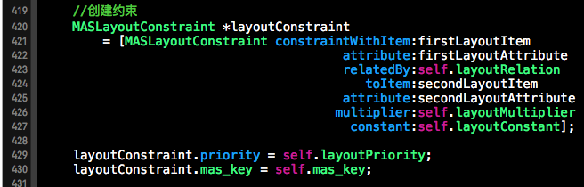

创建完约束对象后，我们要寻找该约束添加到那个View上。下方的代码段就是获取接收该约束对象的视图。如果是两个视图相对约束，就获取两种的公共父视图。如果添加的是Width或者Height，那么久添加到当前视图上。如果既没有指定相对视图，也不是Size类型的约束，那么就将该约束对象添加到当前视图的父视图上。代码实现如下：

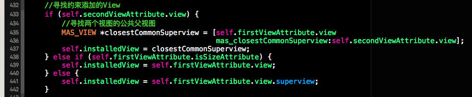

创建完约束对象，并且找到承载约束的视图后，接下来就是将该约束添加到该视图上。子啊添加约束是我们要判断是不是对约束的更新，如果是对约束的更新的话就先获取已经存在的约束并对该约束进行更新，如果被更新的约束不存在就进行添加。添加成功后我们将通过mas_installedConstraints属性记录一下本安装的约束。
mas_installedConstraints是通过运行时为UIView关联的一个NSMutable类型的属性，用来记录约束该视图的所有约束。

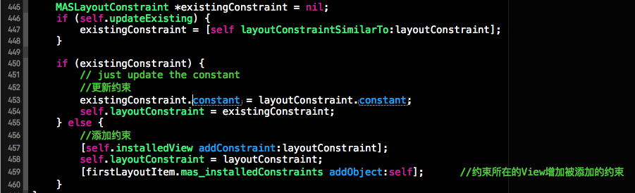


**3.UIView的私有类目UIView+MASConstraints**

在MASViewConstraint中定义了一个UIView的私有类目UIView+MASConstraints，该类目的功能为UIView通过运行时来关联一个NSMutableSet类型的mas_installedConstraints属性。该属性中记录了约束该View的所有约束。代码实现如下。

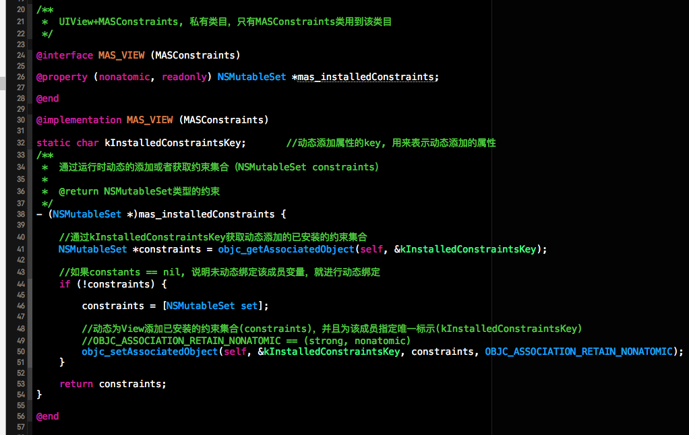


因为篇幅有限，今天的博客就先到这儿。对Masonry框架中的代码不可能在本篇博客中都进行一一介绍。不过在github上分享了一个Masonry的一个使用Demo以及源码解析的工程。其中对Masonry的关键代码都进行了说明与注释。下方是其github分享链接。


<hr>


####<p>原文出处：<a href='http://blog.csdn.net/colorapp/article/details/45030163' target='blank'>Masonry源代码分析</a></p>

使用Autolayout也有一段时间了，auto layout的基本概念非常简单，都是围绕约束进行的，API更是只有两个，但是使用起来感觉很麻烦。最近看到我们这边其他部门的应用使用了很多Masonry来处理UI，看起来非常清爽，链式调用看起来非常容易阅读，使用起来非常方便。但是这种之前ASI给的教训非常深刻，尤其这种大规模基础性地使用第三方开源库，需要确保可控才敢用，至少可以读懂代码并且能够局部优化代码，这是我认为的可控。尤其是这种非常基础的类库，会分布在各个模块之中，一旦出现不兼容，几乎是无法重写的。于是花了一两天时间，把这个代码研究了一下，发现比我想象中要好一些，代码设计地也非常简洁巧妙。


##一. 源文件说明

1. MASConstraint: 这个是虚类是用来实现链式调用的父类。MASConstraint子类可以用来表示单独的一个NSLayoutConstraint约束(MASViewConstraint)或者一组NSLayoutConstraint约束(MASCompositeConstraint)。
 
2. MASConstraint+Private.h: 用于隐藏MASConstraint的私有方法，这些私有方法不会被外部调用者获取，但是类库内部却可以得到，这是个很好的设计模式，在继承中相当于protected。通过定义了较为重要的MASConstraintDelegate代理。

3. MASCompositeConstraint: 这个类用于表示一组NSLayoutConstraint约束，内部包含一个MASViewConstraint的数组做为childs。当调用这个类的类似equalTo或者install等方法的时候，这个类就会调用它的childs所对应的方法。这个类相当于一个MASViewConstraint容器，用于可以方便进行多个属性的操作，可以大大减少工作量。

4. MASViewConstraint：这个是Masonry DSL语法的核心解析类，用来表示对应NSLayoutConstraint，并将表示的属性在install的时候解析为对应的NSLayoutConstraint类，并加入到对应View中。

  

5. MASConstraintMaker: 这个是整个DSL过程的控制中心，控制整个添加过程。MASViewConstraint和NSComposite Constraint都在这个maker中生成，maker并且会管理这些constraint的引用，在合适的时候，将这些constraint解析出来。重要的核心方法是实现了 MASConstraintDelegate 中的这些方法，这几个方法中是生成constraint的核心方法。注意，NSViewConstraint类如果没有加入到NSCompositeConstraint中，它的MASConstraintDelegate是maker；如果它是NSCompositeConstraint的child，则它的delegate是MASCompositeConstraint，但是最终还是会之中maker中的delegate方法。而MASCompositeConstraint的MASConstraintDelegate是maker。注意这个类提供的语法糖，用于方便地进行一组约束的操作，例如edges/size/center等属性。 

6. View+MASAdditions：使用mas_makeConstraints/mas_updateConstraints/mas_remakeConstraints等核心入口方法来设置约束，最常用的的核心是mas_updateConstraints，一般来说，使用这个方法即可。 

7. MASViewAttribute：用来封装UIView和它的NSLayoutAttribute属性，简单的hold这些引用。

8. MASLayoutConstraint：简单继承NSLayoutConstraint

9. MASUtilities.h：这个文件有个点需要注意，这里定义了MASBoxValue宏，用来将类似int/CGRect/CGSize等值使用NSValue进行封装，变为NSObject对象，可以使MASConstraint的类似equalTo等函数有一个便捷函数mas_equalTo可以使用，例如maker.left.equalTo(@(100))可以写为
maker.left.mas_equalTo(100)。mas_equalTo实际上是#define mas_equalTo(...) equalTo(MASBoxValue((__VA_ARGS__)))宏。

10. NSArray+MASAdditions：一些辅助方法。
  

##二. 代码阅读

通过下面的代码的执行过程说明一下masorny的执行过程
   
    
    [testView mas_updateConstraints:^(MASConstraintMaker *make) {
         make.top.left.width.height.equalTo(@(100)).priorityHigh();
    }];

  

先说block中的内容执行：

1. make.top:

MASConstraintMaker的top方法 -> addConstraintWithLayoutAttribute:方法 -> [self constraint:nil addConstraintWithLayoutAttribute:layoutAttribute] ，可以发现最终调用的是MASConstraintMaker的MASConstraintDelegate的constraint:addConstraintWithLayoutAttribute:方法，在这个方法的实现内，生成了MASViewConstraint对象作为返回值。可以说这个方法是链式调用的核心方法，由于constraint为nil，所以这里执行的代码很简单。注意这里的把newConstarint的MASConstraintDelegate设置为self，也就是说新生成的MASViewConstraint的delegate是MASViewConstraint。所以make.top的返回值是MASViewConstraint类。
    
    
    - (MASConstraint *)constraint:(MASConstraint *)constraint addConstraintWithLayoutAttribute:(NSLayoutAttribute)layoutAttribute {
    	MASViewAttribute *viewAttribute = [[MASViewAttribute alloc] initWithView:self.view layoutAttribute:layoutAttribute];
    	MASViewConstraint *newConstraint = [[MASViewConstraint alloc] initWithFirstViewAttribute:viewAttribute];
    	….
    	if (!constraint) {
    		newConstraint.delegate = self;
    		[self.constraints addObject:newConstraint];
    	}
    	return newConstraint;
    }
    

2. make.top.left:

这里的left执行的是MASViewConstraint的left方法，接着调用MASViewConstraint的addConstraintWithLayoutAttribute:方法:    
    
    - (MASConstraint *)left {
    	return [self addConstraintWithLayoutAttribute:NSLayoutAttributeLeft];
    }

 
注意，这里的返回值，不是self，而是addConstraintWithLayoutAttribute方法的返回值。而MASViewConstraint的这个方法的实现如下：
    
    
    - (MASConstraint *)addConstraintWithLayoutAttribute:(NSLayoutAttribute)layoutAttribute {
    	NSAssert(!self.hasLayoutRelation, @"Attributes should be chained before defining the constraint relation");
    	return [self.delegate constraint:self addConstraintWithLayoutAttribute:layoutAttribute];
    }

  

之前我们知道这个MASViewConstraint的delegate就是MASConstraintMaker，所以会再次执行
   
    
    - (void)constraint:(MASConstraint *)constraint shouldBeReplacedWithConstraint:(MASConstraint *)replacementConstraint {
    	NSUInteger index = [self.constraints indexOfObject:constraint];
    	NSAssert(index != NSNotFound, @"Could not find constraint %@", constraint);
    	[self.constraints replaceObjectAtIndex:index withObject:replacementConstraint];
    }
    - (MASConstraint *)constraint:(MASConstraint *)constraint addConstraintWithLayoutAttribute:(NSLayoutAttribute)layoutAttribute {
    	MASViewAttribute *viewAttribute = [[MASViewAttribute alloc] initWithView:self.view layoutAttribute:layoutAttribute];
    	MASViewConstraint *newConstraint = [[MASViewConstraint alloc] initWithFirstViewAttribute:viewAttribute];
    	if ([constraint isKindOfClass:MASViewConstraint.class]) {
    		//replace with composite constraint
    		NSArray *children = @[constraint, newConstraint];
    		MASCompositeConstraint *compositeConstraint = [[MASCompositeConstraint alloc] initWithChildren:children];
    		compositeConstraint.delegate = self;
    		[self constraint:constraint shouldBeReplacedWithConstraint:compositeConstraint];
    		return compositeConstraint;
    	}
    	if (!constraint) {
    		newConstraint.delegate = self;
    		[self.constraints addObject:newConstraint];
    	}
    	return newConstraint;
    }

  

由于constraint参数为MASViewConstraint类，这里我们可以看出来，最终的返回值不再是MASViewConstraint，而变成了MASCompositeConstraint类，这个类不仅仅包含left约束(MASViewConstraint)，同时也会把top约束(MASViewConstraint)也加入进去，同时会把maker中的constraints数组中top约束(MASViewConstraint)删掉，替换为刚刚生成的MASCompositeConstraint对象。注意，在MASCompositeConstraint对象的initWithChildren方法中，会把所有的child的delegate设置为MASCompositeConstraint对象，而MASCompositeConstraint的delegate则会变成maker。

所以，我们可以看出，make.top.left的返回值是一个MASCompositeConstraint对象，里面包含了top和left约束对象(MASViewConstraint)。

  
3. make.top.left.width:

这里的width是执行MASCompositeConstraint对象的width方法，接着调用MASCompositeConstraint的addConstraintWithLayoutAttribute:方法
    
    
    - (MASConstraint *)addConstraintWithLayoutAttribute:(NSLayoutAttribute)layoutAttribute {
    	[self constraint:self addConstraintWithLayoutAttribute:layoutAttribute];
    	return self;
    } 

这里一定要注意，跟MASViewConstraint和MASConstraintMaker的addConstriantWithLayoutAttribute方法不一样，这里的返回值，不是新生成的MASConstraint对象，而是self，也就是还是这个MASCompositeConstraint对象。这个类调用的是MASCompositeConstraint的方法：   
    
    - (MASConstraint *)constraint:(MASConstraint __unused *)constraint addConstraintWithLayoutAttribute:(NSLayoutAttribute)layoutAttribute {
    	id<MASConstraintDelegate> strongDelegate = self.delegate;
    	MASConstraint *newConstraint = [strongDelegate constraint:self addConstraintWithLayoutAttribute:layoutAttribute];
    	newConstraint.delegate = self;
    	[self.childConstraints addObject:newConstraint];
    	return newConstraint;
    }

 
在这个方法中，最终还是会调用delegate的方法，也就是MASConstraintMaker的方法，上面我们可以看到在MASConstraintMaker的这个方法中，只执行了一部分代码：
    
    
    - (MASConstraint *)constraint:(MASConstraint *)constraint addConstraintWithLayoutAttribute:(NSLayoutAttribute)layoutAttribute {
    	MASViewAttribute *viewAttribute = [[MASViewAttribute alloc] initWithView:self.view layoutAttribute:layoutAttribute];
    	MASViewConstraint *newConstraint = [[MASViewConstraint alloc] initWithFirstViewAttribute:viewAttribute];
    	...
    	return newConstraint;
    }
  

所以在maker中仅仅是生成MASViewConstraint而已，最终这个对象会被加入到MASCompositeConstraint的child中，并且这个MASViewConstraint的delegate会被设置为MASCompositeConstraint。

所以make.top.left.width执行返回的仍然是make.top.left时生成的MASCompositeConstraint对象，只是会为width生成一个MASViewConstraint约束，并且加入到MASCompositeConstraint对象的child中，并不会把这个约束加入到maker的constraints数组中。

至于，make.top.left.width.height是跟这个一样的执行步骤，不再赘诉。  

4. 至于equalTo的调用过程，是使用OC的Dotnotation语法，使用这个语法可以直接调用无参数的方法。然后直接使用返回的block进行调用，实现了对约束的设置。

5. mas_updateConstraints方法中，上述block中的内容执行完之后，会调用maker的install方法，这个方法中，会遍历maker中constraints数组，然后调用MASConstraint的install方法。而MASCompositeConstraint对象的install方法会直接调用其child的install方法，并不会额外进行其他操作。所以最终的核心操作是MASViewConstraint的install方法，这个方法中，会生成NSLayoutConstraint约束，然后添加到对应的view中。这个地方其实比较简单，看代码即可。

  
##三. 注意点

1. 通过链式调用可以设置多个属性，比如maker.left.right.top等，这些方法会返回一个MASCompositeConstraint对象，代表left/right/top这些约束的所有MASViewConstraint对象都会被添加到MASCompositeConstraint之中，通过这种方式实现链式调用，可以大大减少代码量。同时通过maker提供的center/edges/size函数也返回MASCompositeConstraint对象，里面同时包含了MASViewConstraint对象，也可以实现同时设置多个属性。注意MASCompositeConstraint源文件中的这段代码，注意这里返回的不是新生成的MASViewConstraint对象：

	```C 
	- (MASConstraint *)addConstraintWithLayoutAttribute:(NSLayoutAttribute)layoutAttribute {
	     [self constraint:self addConstraintWithLayoutAttribute:layoutAttribute];
	     return self;
	}
```


##四. 代码阅读心得

1. 使用NSException来解决OC中没有虚函数语法的问题，如果子类未实现虚方法，则直接抛出异常；在iOS中，我们对异常的使用远远不足，思路太过局限于C的思路，比如说出错之后，往往使用返回-1这种方式解决，这点在处理一些比较突出的异常时就非常不够用。例如，在JSON解析的时候对应的数据不对的问题，这个问题再跟服务器约定之后，一般不会出问题，但是一旦遇到问题就对客户端的用于体验造成非常不好的影响，现在的思路是可以使用@try{}@catch来解决，后面会在这方面做一些尝试。 

2. 大量使用NSAssert断言工具来调试代码，我自己这方面之前更加喜欢使用if来避免进行各种容错，虽然这种方式，可以避免crash等严重问题，但是开发过程中，会降低开发效率。  

3. 对block的灵活使用，这部分也是我最近思考比较多的地方，之前我对block的使用也觉得较多，但是现在看来，使用深度和灵活度都不够，一方面用来替代delegate做回调，这种方式非常灵活便捷，并且逻辑清晰。但是看masonry中的时候，才发现使用block做返回做参数，可以把写代码的过程变得简洁很多，在masonry中，equalTo这些方法的实现就是最好的例子。

4. 类似MASConstraint+Private.h的方式使用category实现类似protected的内部方法继承，这个也比较有意思，也是我之前一个挺困扰的问题，在写类库的时候，可以避免公开接口混乱以及过大的问题，从而很好地划分公开以及内部方法。

5. 类库的封装，调用时要足够简单便捷，通过隐藏大量的内部实现细节，只暴露必要的部分，这样第三方使用者使用起来才不会产生困惑。这部分我自己做的不足，很多时
候写代码和类库的时候，写的过于冗余和啰嗦，这也可能是OC没有命名空间带来的习惯影响，后续转向swift之后肯定会大大改善这些问题。
 
6. Dot Notation语法的使用，也是masonry可以实现链式调用的基础语法，使用dot notation调用方法(**无参数方法**)。结合block做返回变量来进行使用，就可以把代码变得非常简单，这种方式就实现所谓的函数式编程。注意，为了更好地维护代码规范，dotnotation调用无参数方法这个语法要慎用，一般来说，方法调用就要使用”[]"语法，只有变量使用 “.”，可以避免混乱，增加代码的可阅读性。参考：<htt
p://stackoverflow.com/questions/2375943/objective-c-dot-notation-with-class-methods>，[http://underscorem.org](http://underscorem.org/)，还有就是参考MASViewConstraint的equalTo等方法的实现代码。


<hr>


####<p>原文出处：<a href='http://www.jianshu.com/p/f3fa4938bf67' target='blank'>Masonry源码学习</a></p>

##Masonry源码学习

有三种方式来[使用代码创建约束](https://developer.apple.com/library/content/documentation/UserExperience/Conceptual/AutolayoutPG/ProgrammaticallyCreatingConstraints.html)。

  * use layout anchors
  * use the NSLayoutConstraint class
  * use the Visual Format Language

> Masonry是对NSLayoutConstraint的封装

**先来看看NSLayoutConstraint的创建：**
    
    
    + (instancetype)constraintWithItem:(id)view1  
                                              attribute:(NSLayoutAttribute)attr1  
                                            relatedBy:(NSLayoutRelation)relation  
                                                 toItem:(id)view2  
                                              attribute:(NSLayoutAttribute)attr2  
                                             multiplier:(CGFloat)multiplier  
                                              constant:(CGFloat)c;

我们把它分成5个部分来看：

  * firstViewAttribute部分，包含view1和attr1
  * layoutRelation部分，relation
  * secondAttribute部分，包含view2和attr2
  * layoutMultiplier部分，multiplier
  * layoutConstant部分，c

**NSLayoutConstraint对象应该添加到哪个view上面呢？**  
这里分两种情况。

  * 当secondAttribute的view2存在，并且是UIView类型的对象时，约束添加到view1与view2的closestCommonSuperview（最近的公共superView）
  * 当secondAttribute的view2存在，但是不是UIView类型的对象时
    * 当firstViewAttribute的attr1为size属性（width或者height）时，约束添加到firstViewAttribute的view1上。
    * 当firstViewAttribute的attr1不是size属性，约束添加到firstViewAttribute.view.superView上。


**使用Masonry链式语法的创建约束：**
    
    
    //第一种
    make.edge.equalTo(superView).inset(UIEdgeInsetMake(10,10,10,10));
    //第二种
    make.left.right.height.bottom.equalTo(superView).inset(UIEdgeInsetMake(10,10,10,10));
    //第三种
    make.left.equalTo(superView).offset(@10);
    make.right.equalTo(superView).offset(@-10);
    make.top.equalTo(superView).offset(@10);
    make.bottom.equalTo(superView).offset(@-10);

上面用三种方式创建了相同的约束效果。

**我们先从第三种来看Masonry的实现**
    
    
    [view mas_makeConstraints:^(MASConstraintMaker *make) {
           make.left.equalTo(superView).offset(@10);
    }];

mas_makeConstraints为UIView的MASAdditions类别所添加的方法：

    
    
    #define MAS_VIEW UIView
    @interface MAS_VIEW (MASAdditions)
    - (NSArray *)mas_makeConstraints:(void(NS_NOESCAPE ^)(MASConstraintMaker *make))block;
    ...
    @end

实现：

    
    
    @implementation MAS_VIEW (MASAdditions)
    - (NSArray *)mas_makeConstraints:(void(^)(MASConstraintMaker *))block {
        self.translatesAutoresizingMaskIntoConstraints = NO;
        MASConstraintMaker *constraintMaker = [[MASConstraintMaker alloc] initWithView:self];
        block(constraintMaker);
        return [constraintMaker install];
    }
    ...

步骤分析：

  * 创建了一个MASConstraintMaker对象，拥有对象view（弱引用）。
  * 在block中配置constraintMaker对象。
  * [constraintMaker install]。

install方法实现：
 
    
    - (NSArray *)install {
        ...
        NSArray *constraints = self.constraints.copy;
        for (MASConstraint *constraint in constraints) {
            ...
            [constraint install];
        }
        [self.constraints removeAllObjects];
        return constraints;
    }

是将MASConstraintMaker匿名类别中的属性`@property (nonatomic, strong) NSMutableArray *constraints;`遍历一遍执行install方法。constraints是MASConstraint类型的对象数组。  

可以想到在block中配置constraintMaker，其本质就是在constraintMaker的constraints中添加MASConstraint
对象。

现在来看看`make.left.equalTo(superView).offset(@10);`是如何创建MASConstraint对象并添加入constraintMaker的constraints中。  
MASConstraintMaker类定义了所有的约束：

    
    
    @interface MASConstraintMaker : NSObject
    @property (nonatomic, strong, readonly) MASConstraint *left;
    ...

当使用make.left时，会执行left的getter方法：

    
    
    - (MASConstraint *)left {
        return [self addConstraintWithLayoutAttribute:NSLayoutAttributeLeft];
    }
    - (MASConstraint *)addConstraintWithLayoutAttribute:(NSLayoutAttribute)layoutAttribute {
        return [self constraint:nil addConstraintWithLayoutAttribute:layoutAttribute];
    }
    - (MASConstraint *)constraint:(MASConstraint *)constraint addConstraintWithLayoutAttribute:(NSLayoutAttribute)layoutAttribute {
        MASViewAttribute *viewAttribute = [[MASViewAttribute alloc] initWithView:self.view layoutAttribute:layoutAttribute];
        MASViewConstraint *newConstraint = [[MASViewConstraint alloc] initWithFirstViewAttribute:viewAttribute];
        if ([constraint isKindOfClass:MASViewConstraint.class]) {
            ...
        }
        if (!constraint) {
            newConstraint.delegate = self;
            [self.constraints addObject:newConstraint];
        }
        return newConstraint;
    }

可以left的getter方法执行步骤如下：

  * 创建一个MASViewAttribute对象viewAttribute，view为当前view，layoutAttribute:为NSLayoutAttributeLeft。
  * 创建一个MASViewConstraint对象newConstraint，firstViewAttribute为viewAttribute。
  * newConstraint的代理设为self。
  * 将newConstraint放入constraints中。

那其实mark.left就已经创建了MASViewConstraint对象（继承自MASConstraint），并添加入maker的constraints中。

这时候很好奇make.left后面的.equalTo(superView).offset(@10)又是做了什么？
  
可以看出make.left返回的是MASConstraint类型对象，以.equalTo(superView)操作是在MASConstraint对象上的。

现在来看看MASConstraint类，类的声明如下：

    
    
    @interface MASConstraint : NSObject
    // Chaining Support  就是用这个类来实现链式语法滴
    ...
    - (MASConstraint * (^)(id attr))equalTo;
    - (MASConstraint * (^)(CGFloat offset))offset;
    ..
    - (MASConstraint *)left;
    - (MASConstraint *)right;
    ...
    @end

链式语法能实现的关键之处就是**返回本身**，分情况说：

  * 当里面的属性使用需要提供参数（如equalTo(superview)，使用equalTo需要提供superView这个参数）时，定义的就是一个**(MASConstraint * (^)(id attr))**类型的属性，这样就实现了make.left.equalTo(superView)后返回的又是一个MASConstraint，于是就链式调用啦。
  * 当里面的属性可以直接使用(如make.left.right.heigt，make.left返回MASConstarint后直接使用了.right.height..)，则是直接定义成**MASConstraint**类型的属性，于是就链式调用啦。

MASConstraint类是提供链式语法支持的，具体的约束属性设置是通过它的子类MASViewConstraint和MASCompositeConstraint。

**MASViewConstraint和MASCompositeConstraint的关系：**  
其中MASCompositeConstraint是用来管理MASViewConstraint集合的，如make.left.right.top.bottom其实是创建了4个MASViewConstraint，其中firstAttribute的layoutAttribute属性分别是NSLayoutAttributeLeft,NSLayoutAttributeRight,NSLayoutAttributeTop,NSLayoutAttributeBottom，然后将这4个MASViewConstraint放入MASCompositeConstraint的`@property (nonatomic, strong)
NSMutableArray *childConstraints;`中统一管理，所以当调用make.left.right.top.bottom.equalTo(superView)时，循环childConstraints调用equalTo(superView)。

所以具体的约束属性设置(NSLayoutConstraint的创建和添加)是由MASViewConstraint完成的。

**MASViewConstraint是如何工作的？**  
MASViewConstraint类定义如下：
    
    
    @interface MASViewConstraint : MASConstraint <NSCopying>
    @property (nonatomic, strong, readonly) MASViewAttribute *firstViewAttribute;
    @property (nonatomic, strong, readonly) MASViewAttribute *secondViewAttribute;
    - (id)initWithFirstViewAttribute:(MASViewAttribute *)firstViewAttribute;
    + (NSArray *)installedConstraintsForView:(MAS_VIEW *)view;
    @end

MASViewConstraint类需要用firstViewAttribute初始化，也就是说它一生成就拥有了firstViewAttribute。  

匿名闭包中的定义：    
    
    @interface MASViewConstraint ()
    @property (nonatomic, strong, readwrite) MASViewAttribute *secondViewAttribute;
    @property (nonatomic, weak) MAS_VIEW *installedView;
    @property (nonatomic, weak) MASLayoutConstraint *layoutConstraint;
    @property (nonatomic, assign) NSLayoutRelation layoutRelation;
    @property (nonatomic, assign) MASLayoutPriority layoutPriority;
    @property (nonatomic, assign) CGFloat layoutMultiplier;
    @property (nonatomic, assign) CGFloat layoutConstant;
    @property (nonatomic, assign) BOOL hasLayoutRelation;
    @property (nonatomic, strong) id mas_key;
    @property (nonatomic, assign) BOOL useAnimator;
    @end

看到这里就大概知道MASViewConstraint是用来干什么的了，可以使用firstViewAttribute和secondViewAttribute，layoutMultiplier，layoutPriority，layoutConstant，layoutRelation来创建一个NSLayoutConstraint，赋值给layoutConstraint，并把这个layoutConstraint添加到installedView中。  

所以make.left后面的.equalTo(superView)和.offset(@10)就是对当前MASViewConstraint的layoutRelation，secondViewAttribute、layoutConstant的赋值。看下是否是这样：

    
    
    //基类MASConstraint
    - (MASConstraint * (^)(id))equalTo {
        return ^id(id attribute) {
            return self.equalToWithRelation(attribute, NSLayoutRelationEqual);
        };
    }
    - (MASConstraint * (^)(CGFloat))offset {
        return ^id(CGFloat offset){
            self.offset = offset;
            return self;
        };
    }
    //抽象方法，必须子类实现
    - (MASConstraint * (^)(id, NSLayoutRelation))equalToWithRelation { MASMethodNotImplemented(); }
    //子类MASViewConstraint的实现
    - (MASConstraint * (^)(id, NSLayoutRelation))equalToWithRelation {
        return ^id(id attribute, NSLayoutRelation relation) {
            if ([attribute isKindOfClass:NSArray.class]) {
             ...
            } else {
                NSAssert(!self.hasLayoutRelation || self.layoutRelation == relation && [attribute isKindOfClass:NSValue.class], @"Redefinition of constraint relation");
                self.layoutRelation = relation;
                self.secondViewAttribute = attribute;
                return self;
            }
        };
    }
    - (void)setOffset:(CGFloat)offset {
        self.layoutConstant = offset;
    }

以上都是对单一的Constraint操作原理，也是最简单的操作。

**我们现在从第二种来看Masonry的实现**
    
    
    [view mas_makeConstraints:^(MASConstraintMaker *make) { 
    make.left.right.top.bottom.equalTo(superView).inset(UIEdgeInsetsMake(10,10,10,10));
    }];

`make.left`前面已经分析过，现在看看.right干了什么。

    
    
    //MASConstraint中right的getter方法
    - (MASConstraint *)right {
        return [self addConstraintWithLayoutAttribute:NSLayoutAttributeRight];
    }
    //抽象方法，需要子类实现
    - (MASConstraint *)addConstraintWithLayoutAttribute:(NSLayoutAttribute __unused)layoutAttribute {
        MASMethodNotImplemented();
    }
    //子类MASViewConstraint的实现
    - (MASConstraint *)addConstraintWithLayoutAttribute:(NSLayoutAttribute)layoutAttribute {
        NSAssert(!self.hasLayoutRelation, @"Attributes should be chained before defining the constraint relation");
        return [self.delegate constraint:self addConstraintWithLayoutAttribute:layoutAttribute];
    }

呵呵哒，交给delegate去做啦。

** MASConstraintDelegate**  
定义：

    
    
    @protocol MASConstraintDelegate <NSObject>
    - (void)constraint:(MASConstraint *)constraint shouldBeReplacedWithConstraint:(MASConstraint *)replacementConstraint;
    - (MASConstraint *)constraint:(MASConstraint *)constraint addConstraintWithLayoutAttribute:(NSLayoutAttribute)layoutAttribute;
    @end

理解代理的作用先要理解**容器**的概念。在Masonry里存在两种容器

  * 一种是MASConstraintMaker，里面有constraints，这个容器是用来放入使用make来创建的多个约束。

```C
	[greenView makeConstraints:^(MASConstraintMaker *make) {
	//这里使用make写了6行，所以有6个MASConstraint在make的constraint里面
	      make.top.greaterThanOrEqualTo(superview).offset(padding);
	          make.left.equalTo(superview).offset(padding);
	          make.bottom.equalTo(blueView.top).offset(-padding);
	          make.right.equalTo(redView.left).offset(-padding);
	          make.width.height.equalTo(redView);
	          make.height.equalTo(blueView).multipliedBy(0.3);
	}];
```

  * 一种是MASCompositeConstraint，里面有childConstraints
    
```
[greenView makeConstraints:^(MASConstraintMaker *make) {
	//这里使用make写了1行，所以只有1个MASConstraint（MASCompositeConstraint）在make的constraint里面
	//MASCompositeConstraint里面的childConstraints有4个MASViewConstraint，分别是:
	//view.top equalTo superview.top
	//view.right equaoTo superview.right
	//view.bottom equalTo superview.bottom
	//view.right equalTo superview.right
	 make.top.right.bottom.left.equalTo(superview);
}];
```

下面来看这句代码在容器中的演变过程：
   
    
    make.top.right.bottom.left.equalTo(superview)

  * make.top
    * 生成对象A:MASViewConstraint(view.top) 
    * 将A的delegate设为make
    * 将A放入make的constraints中，此时make.constraints = [A]
    * 返回A
  * make.top.right
    * 生成对象B:MASViewConstraint(view.right) 
    * 使用A和B生成MASCompositeConstraint对象C，将A，B的delegate设为C
    * 将C在make.constraints中替换A，此时make.constraints = [C]，C.childConstraints = [A,B]
    * 返回C
  * make.top.right.bottom
    * 生成对象D:MASViewConstraint(view.bottom)，D的delegate为C
    * 将D放入C.childConstraints中，此时C.childConstraints = [A,B,D]
    * 返回C
  * make.top.right.bottom.left
    * 生成对象E:MASViewConstraint(view.left)，E的delegate为C
    * 将E放入C.childConstraints中，此时C.childConstraints = [A,B,D,E]
    * 返回C
  * make.top.right.bottom.left.equalTo(superview)
    * 会依次调用A,B,D,E的equalTo(superView)

在上面的过程中可以看到：

  * 对make.constraints的添加和替换元素的操作
  * 对MASCompositeConstraint对象的添加元素的操作（当.equalTo(@[view1,view2])时就有替换操作了，在里面没体现出）。
  * 每个constraint的delegate为它的父容器，因为需要父容器来执行添加和替换约束的操作。

理解上面的部分，代码就很好理解了：  
基类MASConstraint的代码：
    
    
    #pragma mark - Chaining
    - (MASConstraint *)addConstraintWithLayoutAttribute:(NSLayoutAttribute __unused)layoutAttribute {
        MASMethodNotImplemented();
    }
    - (MASConstraint *)left {
        return [self addConstraintWithLayoutAttribute:NSLayoutAttributeLeft];
    }
    - (MASConstraint *)top {
        return [self addConstraintWithLayoutAttribute:NSLayoutAttributeTop];
    }
    ...
    - (MASConstraint * (^)(id))equalTo {
        return ^id(id attribute) {
            return self.equalToWithRelation(attribute, NSLayoutRelationEqual);
        };
    }
    ...

MASViewConstraint的实现
   
    
    #pragma mark - attribute chaining
    //添加操作
    - (MASConstraint *)addConstraintWithLayoutAttribute:(NSLayoutAttribute)layoutAttribute {
        NSAssert(!self.hasLayoutRelation, @"Attributes should be chained before defining the constraint relation");
        return [self.delegate constraint:self addConstraintWithLayoutAttribute:layoutAttribute];
    }
    //里面有替换操作
    - (MASConstraint * (^)(id, NSLayoutRelation))equalToWithRelation {
        return ^id(id attribute, NSLayoutRelation relation) {
            if ([attribute isKindOfClass:NSArray.class]) {
                //对应.equalTo(@[view1,view2])这种写法
                NSAssert(!self.hasLayoutRelation, @"Redefinition of constraint relation");
                NSMutableArray *children = NSMutableArray.new;
                for (id attr in attribute) {
                    MASViewConstraint *viewConstraint = [self copy];
                    viewConstraint.layoutRelation = relation;
                    viewConstraint.secondViewAttribute = attr;
                    [children addObject:viewConstraint];
                }
                MASCompositeConstraint *compositeConstraint = [[MASCompositeConstraint alloc] initWithChildren:children];
                compositeConstraint.delegate = self.delegate;
                //使用delegate的shouldBeReplacedWithConstraint方法
                [self.delegate constraint:self shouldBeReplacedWithConstraint:compositeConstraint];
                return compositeConstraint;
            } else {
                NSAssert(!self.hasLayoutRelation || self.layoutRelation == relation && [attribute isKindOfClass:NSValue.class], @"Redefinition of constraint relation");
                self.layoutRelation = relation;
                self.secondViewAttribute = attribute;
                return self;
            }
        };
    }

MASCompositeConstraint的实现    
    
    #pragma mark - attribute chaining
    - (MASConstraint *)addConstraintWithLayoutAttribute:(NSLayoutAttribute)layoutAttribute {
        [self constraint:self addConstraintWithLayoutAttribute:layoutAttribute];
        return self;
    }
    #pragma mark - MASConstraintDelegate
    - (void)constraint:(MASConstraint *)constraint shouldBeReplacedWithConstraint:(MASConstraint *)replacementConstraint {
        NSUInteger index = [self.childConstraints indexOfObject:constraint];
        NSAssert(index != NSNotFound, @"Could not find constraint %@", constraint);
        [self.childConstraints replaceObjectAtIndex:index withObject:replacementConstraint];
    }
    - (MASConstraint *)constraint:(MASConstraint __unused *)constraint addConstraintWithLayoutAttribute:(NSLayoutAttribute)layoutAttribute {
        id<MASConstraintDelegate> strongDelegate = self.delegate;
        MASConstraint *newConstraint = [strongDelegate constraint:self addConstraintWithLayoutAttribute:layoutAttribute];
        newConstraint.delegate = self;
        [self.childConstraints addObject:newConstraint];
        return newConstraint;
    }

MASConstraintMaker的实现

    
    
    #pragma mark - MASConstraintDelegate
    - (void)constraint:(MASConstraint *)constraint shouldBeReplacedWithConstraint:(MASConstraint *)replacementConstraint {
        NSUInteger index = [self.constraints indexOfObject:constraint];
        NSAssert(index != NSNotFound, @"Could not find constraint %@", constraint);
        [self.constraints replaceObjectAtIndex:index withObject:replacementConstraint];
    }
    - (MASConstraint *)constraint:(MASConstraint *)constraint addConstraintWithLayoutAttribute:(NSLayoutAttribute)layoutAttribute {
        MASViewAttribute *viewAttribute = [[MASViewAttribute alloc] initWithView:self.view layoutAttribute:layoutAttribute];
        MASViewConstraint *newConstraint = [[MASViewConstraint alloc] initWithFirstViewAttribute:viewAttribute];
        if ([constraint isKindOfClass:MASViewConstraint.class]) {
            //replace with composite constraint
            NSArray *children = @[constraint, newConstraint];
            MASCompositeConstraint *compositeConstraint = [[MASCompositeConstraint alloc] initWithChildren:children];
            compositeConstraint.delegate = self;
            [self constraint:constraint shouldBeReplacedWithConstraint:compositeConstraint];
            return compositeConstraint;
        }
        if (!constraint) {
            newConstraint.delegate = self;
            [self.constraints addObject:newConstraint];
        }
        return newConstraint;
    }

**从第一种写法来看Masnory的实现**  
实现代码：

    
    - (MASConstraint *)addConstraintWithAttributes:(MASAttribute)attrs {
        __unused MASAttribute anyAttribute = (MASAttributeLeft | MASAttributeRight | MASAttributeTop | MASAttributeBottom | MASAttributeLeading
                                              | MASAttributeTrailing | MASAttributeWidth | MASAttributeHeight | MASAttributeCenterX
                                              | MASAttributeCenterY | MASAttributeBaseline
    #if (__IPHONE_OS_VERSION_MIN_REQUIRED >= 80000) || (__TV_OS_VERSION_MIN_REQUIRED >= 9000) || (__MAC_OS_X_VERSION_MIN_REQUIRED >= 101100)
                                              | MASAttributeFirstBaseline | MASAttributeLastBaseline
    #endif
    #if (__IPHONE_OS_VERSION_MIN_REQUIRED >= 80000) || (__TV_OS_VERSION_MIN_REQUIRED >= 9000)
                                              | MASAttributeLeftMargin | MASAttributeRightMargin | MASAttributeTopMargin | MASAttributeBottomMargin
                                              | MASAttributeLeadingMargin | MASAttributeTrailingMargin | MASAttributeCenterXWithinMargins
                                              | MASAttributeCenterYWithinMargins
    #endif
                                              );
        NSAssert((attrs & anyAttribute) != 0, @"You didn't pass any attribute to make.attributes(...)");
        NSMutableArray *attributes = [NSMutableArray array];
        if (attrs & MASAttributeLeft) [attributes addObject:self.view.mas_left];
        if (attrs & MASAttributeRight) [attributes addObject:self.view.mas_right];
        if (attrs & MASAttributeTop) [attributes addObject:self.view.mas_top];
        if (attrs & MASAttributeBottom) [attributes addObject:self.view.mas_bottom];
        if (attrs & MASAttributeLeading) [attributes addObject:self.view.mas_leading];
        if (attrs & MASAttributeTrailing) [attributes addObject:self.view.mas_trailing];
        if (attrs & MASAttributeWidth) [attributes addObject:self.view.mas_width];
        if (attrs & MASAttributeHeight) [attributes addObject:self.view.mas_height];
        if (attrs & MASAttributeCenterX) [attributes addObject:self.view.mas_centerX];
        if (attrs & MASAttributeCenterY) [attributes addObject:self.view.mas_centerY];
        if (attrs & MASAttributeBaseline) [attributes addObject:self.view.mas_baseline];
    #if (__IPHONE_OS_VERSION_MIN_REQUIRED >= 80000) || (__TV_OS_VERSION_MIN_REQUIRED >= 9000) || (__MAC_OS_X_VERSION_MIN_REQUIRED >= 101100)
        if (attrs & MASAttributeFirstBaseline) [attributes addObject:self.view.mas_firstBaseline];
        if (attrs & MASAttributeLastBaseline) [attributes addObject:self.view.mas_lastBaseline];
    #endif
    #if (__IPHONE_OS_VERSION_MIN_REQUIRED >= 80000) || (__TV_OS_VERSION_MIN_REQUIRED >= 9000)
        if (attrs & MASAttributeLeftMargin) [attributes addObject:self.view.mas_leftMargin];
        if (attrs & MASAttributeRightMargin) [attributes addObject:self.view.mas_rightMargin];
        if (attrs & MASAttributeTopMargin) [attributes addObject:self.view.mas_topMargin];
        if (attrs & MASAttributeBottomMargin) [attributes addObject:self.view.mas_bottomMargin];
        if (attrs & MASAttributeLeadingMargin) [attributes addObject:self.view.mas_leadingMargin];
        if (attrs & MASAttributeTrailingMargin) [attributes addObject:self.view.mas_trailingMargin];
        if (attrs & MASAttributeCenterXWithinMargins) [attributes addObject:self.view.mas_centerXWithinMargins];
        if (attrs & MASAttributeCenterYWithinMargins) [attributes addObject:self.view.mas_centerYWithinMargins];
    #endif
        NSMutableArray *children = [NSMutableArray arrayWithCapacity:attributes.count];
        for (MASViewAttribute *a in attributes) {
            [children addObject:[[MASViewConstraint alloc] initWithFirstViewAttribute:a]];
        }
        MASCompositeConstraint *constraint = [[MASCompositeConstraint alloc] initWithChildren:children];
        constraint.delegate = self;
        [self.constraints addObject:constraint];
        return constraint;
    }

很暴力通俗的代码，不用解释了...  
所以`make.edge`就是：
    
    
    - (MASConstraint *)edges {
        return [self addConstraintWithAttributes:MASAttributeTop | MASAttributeLeft | MASAttributeRight | MASAttributeBottom];
    }

也可以在外部使用:
    
    
    @property (nonatomic, strong, readonly) MASConstraint *(^attributes)(MASAttribute attrs);

写法：
   
    
    //与make.edge是相同的
    make.attributes(MASAttributeTop | MASAttributeLeft | MASAttributeRight | MASAttributeBottom);

* * *

**Masnory如何make,reMake,updateConstraint**  
直接看代码

    
    
    @implementation MAS_VIEW (MASAdditions)
    - (NSArray *)mas_makeConstraints:(void(^)(MASConstraintMaker *))block {
        self.translatesAutoresizingMaskIntoConstraints = NO;
        MASConstraintMaker *constraintMaker = [[MASConstraintMaker alloc] initWithView:self];
        block(constraintMaker);
        return [constraintMaker install];
    }
    - (NSArray *)mas_updateConstraints:(void(^)(MASConstraintMaker *))block {
        self.translatesAutoresizingMaskIntoConstraints = NO;
        MASConstraintMaker *constraintMaker = [[MASConstraintMaker alloc] initWithView:self];
        constraintMaker.updateExisting = YES;
        block(constraintMaker);
        return [constraintMaker install];
    }
    - (NSArray *)mas_remakeConstraints:(void(^)(MASConstraintMaker *make))block {
        self.translatesAutoresizingMaskIntoConstraints = NO;
        MASConstraintMaker *constraintMaker = [[MASConstraintMaker alloc] initWithView:self];
        constraintMaker.removeExisting = YES;
        block(constraintMaker);
        return [constraintMaker install];
    }

在普通的mas_makeConstraints三部曲：创建maker，配置maker，install maker中，mas_updateConstraints将maker的updateExisting设为YES。mas_remakeConstraints将maker的removeExisting设为YES。  
来看看updateExisting和removeExisting在install方法中如何操控的：
  
    
    - (NSArray *)install {
        if (self.removeExisting) {
    //获得view的所有生效的约束（MASViewConstraint类型，封装了NSLayoutConstraint），然后uninstall
            NSArray *installedConstraints = [MASViewConstraint installedConstraintsForView:self.view];
            for (MASConstraint *constraint in installedConstraints) {
                [constraint uninstall];
            }
        }
        NSArray *constraints = self.constraints.copy;
        for (MASConstraint *constraint in constraints) {
    //标记updateExisting为YES的时候，在constraint的install里面会去找是否有相同的约束
            constraint.updateExisting = self.updateExisting;
            [constraint install];
        }
        [self.constraints removeAllObjects];
        return constraints;
    }

关于MASConstraint的install，在MASCompositeConstraint中是循环childContraints的install，在MASViewContraint中是用当前的所有属性创建layoutConstraint并添加到installView上，installVIew如何确定，**NSLayoutConstraint对象应该添加到哪个view上面呢？**已经说了。代码很好理解，不贴了。

至于设置了updateExisting的install流程的改变：

  * 找到相同的约束，何为相同，只有constant不同，其它都要相同。
   
``` 
-(MASLayoutConstraint *)layoutConstraintSimilarTo:(MASLayoutConstraint *)layoutConstraint {
  for (NSLayoutConstraint *existingConstraint in self.installedView.constraints.reverseObjectEnumerator) {
      if (![existingConstraint isKindOfClass:MASLayoutConstraint.class]) continue;
      if (existingConstraint.firstItem != layoutConstraint.firstItem) continue;
      if (existingConstraint.secondItem != layoutConstraint.secondItem) continue;
      if (existingConstraint.firstAttribute != layoutConstraint.firstAttribute) continue;
      if (existingConstraint.secondAttribute != layoutConstraint.secondAttribute) continue;
      if (existingConstraint.relation != layoutConstraint.relation) continue;
      if (existingConstraint.multiplier != layoutConstraint.multiplier) continue;
      if (existingConstraint.priority != layoutConstraint.priority) continue;
      return (id)existingConstraint;
  }
  return nil;
}
```

  * 如果找到了就改变已经返回的constraint的constant，并把这个constraint赋值给layoutConstraint就OVER了。
