 
<!--BEGIN_DATA
{
    "create_date": "2016-09-01 15:54", 
    "modify_date": "2016-09-01 15:54", 
    "is_top": "0", 
    "summary": "iOS开发之NSURLSession解析", 
    "tags": "iOS", 
    "file_name": "iOS开发之NSURLSession解析.md"
}
END_DATA-->

####<p>原文出处：<a href='http://www.cnblogs.com/ludashi/p/5556088.html' target='blank'>iOS开发之Alamofire源码解析前奏--NSURLSession全家桶</a></p>

今天博客的主题不是Alamofire, 而是iOS网络编程中经常使用的NSURLSession。如果你想看权威的NSURLSession的东西，那么就得去苹果官方的开发中心去看了，虽然是英文的，但是结合代码理解应该不难。更详细的信息请移步于苹果官方介绍[URL Loading System](https://developer.apple.com/library/ios/documentation/Cocoa/Conceptual/URLLoadingSystem/URLLoadingSystem.html#//apple_ref/doc/uid/10000165-BCICJDHA)，网上好多iOS网络编程的博客都翻译于此。因为目前iOS开发中，网络请求大部分使用NSURLSession，所以今天的博客我们就以NSURLSession展开。关于之前使用的NSURLConnection在此就不做过多赘述了。今天博客的主要内容是系统的介绍NSURLSession及其相关的Delegate，当然每个知识点都依托于实例，如果你仔细的阅读本篇博客还是收获不少的。

下方这个截图中所涵盖的所有功能就是本篇博客中所涉及的所有知识点，几乎涵盖了NSURLSession的所有的东西。接下来我们就一个一个的功能点来详述一下NSURLSession。

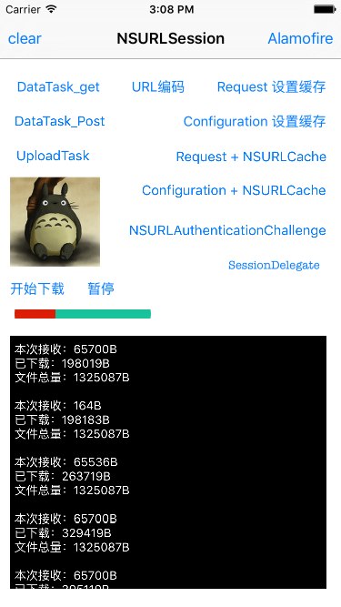


####一、NSURLSession概览

NSURLSession对于iOS开发来说并不是什么新的内容，它是Apple在iOS7中引入的，其主要功能是发起网络请求获取网络数据，这与iOS7之前使用的NSURLConnection功能类似，但是NSURLSession更为强大。如果在你开发的App中没有使用第三方网络库，那么NSURLSession无异于是最佳的选择。虽然网上的关于NSURLSession的东西一抓一大把，但是每个人都有每个人的见解，今天的博客就系统的整理一下NSURLSession相关的知识点，算是为下篇博客做准备吧。因为下篇博客是对Alamofire框架进行的解析，Alamofire就是对NSURLSession的封装，还是那句话，如果你对NSURLSession不熟悉的话，那么Alamofire源码看起来会比较费劲的。在本篇博客的第一部分我们先整体的概览一下NSURLSession，以便后面一步步的展开。

废话少说，进入本篇博客的主题。从NSURLSession这个名字中我们不难看出，主要是URL + Session。顾名思义，NSURLSession是用来URL会话的。当然如果你做过服务器端的开发，比如PHP，也会有Session的概念，不过此Session非彼Session，两者的区别还是不小的。iOS的NSURLSession的主要功能是通过URL与服务器简历会话的。"会话"进一步说就是交流呗，一句话总结：也就是我们的iOS客户端可以使用NSURLSession这个东西通过相应的URL与我们的服务器建立会话，然后通过此会话来完成一些交互任务（NSURLSessionTask）。Session有着不同的类型，每种类型的Session又可以执行不同类型的任务（Task）。接下来就来介绍一下Session的类型以及所执行的任务等。

#####1.NSURLSession的类型

在使用NSURLSession时你得知道你使用的是那种类型的Session对吧。从官方的NSURLSession
API中不难看出，公有三种类型的Session：_Default sessions，_Ephemeral sessions，_Backgroundsessions。___这三种Session我们可以通过NSURLSessionConfiguration来指定。

  * 默认会话（Default Sessions）使用了持久的磁盘缓存，并且将证书存入用户的钥匙串中。
  * 临时会话（Ephemeral Session）没有像磁盘中存入任何数据，与该会话相关的证书、缓存等都会存在RAM中。因此当你的App临时会话无效时，证书以及缓存等数据就会被清除掉。
  * 后台会话（Background sessions）除了使用一个单独的线程来处理会话之外，与默认会话类似。不过要使用后台会话要有一些限制条件，比如会话必须提供事件交付的代理方法、只有HTTP和HTTPS协议支持后台会话、总是伴随着重定向。仅仅在上传文件时才支持后台会话，当你上传二进制对象或者数据流时是不支持后台会话的。当App进入后台时，后台传输就会被初始化。（需要注意的是iOS8和OS X 10.10之前的版本中后台会话是不支持数据任务（data task）的）。

 下方的截图就是我们使用Swift语言创建了上述三种类型的会话配置，Session在初始化时可以指定下方的任意一种SessionConfiguration。
具体入校所示：

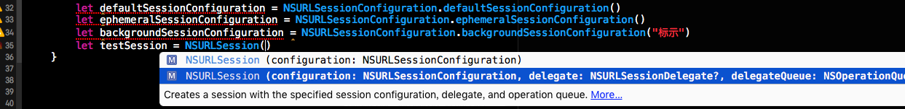


#####2. NSURLSession的各种任务

在一个Session会话中可以发起的任务可分为三种：数据任务（Data Task）、下载任务（Download Task）、上传任务（Upload Task）。上面也提到了，在iOS8和OS X 10.10之前的版本中后台会话是不支持Data Task。下面来简述一下这三种任务。

  * Data Task（数据任务）负责使用NSData对象来发送和接收数据。Data Task是为了那些简短的并且经常从服务器请求的数据而准备的。该任务可以没请求一次就对返回的数据进行一次处理。
  * Download task（下载任务）以表单的形式接收一个文件的数据，该任务支持后台下载。
  * Upload task（上传任务）以表单的形式上传一个文件的数据，该任务同样支持后台下载。

上面所介绍的所有类型的Session以及Session中的Task会在下方的实例中进行一一的介绍，本部分就做一个概述。


####二、URL编码

#####1.URL编码概述

无论是GET、POST还是其他的请求，与服务器交互的URL是需要进行编码的。因为进行URL编码的参数服务器那边才能进行解析，为了能和服务器正常的交互，我们需要对我们的参数进行转义和编码。先简单的聊一下什么是URL吧，其实URL是URI（Uniform Resource Identifier ---- 统一资源定位符）的一种。URL就是互联网上资源的地址，用户可以通过URL来找到其想访问的资源。RFC3986文档规定，Url中只允许包含英文字母（a-zA-Z）、数字（0-9）、-_.~4个特殊字符以及所有保留字符，如果你的URL中含有汉字，那么就需要对其进行转码了。RFC3986中指定了以下字符为保留字符：

	! * ' ( ) ; : @ & = + $ , / ? ##[ ]


在URL编码时有一定的规则，下方是我们今天主要使用的URL格式的一个规则的一个图解。其他的我们先不说，今天博客中所涉及的主要是下图中Query的部分。从下面我们不难看出，Path和Query之间使用的是?号进行分隔的，问好后边就是我们要传给服务武器的参数了，该参数就是下方的Query的部分。在Get请求中Que
ry是存放在URL后边，而在POST中是放在Request的Body中。如果你的参数只是一个key-Value, 那么Query的形式就是key = value。如果你的参数是一个数组比如key = [itme1, item2, item3,……]，那么你的Query的格式就是key[]=item1&key[itme2]&key[item3]……。如果你的参数是一个字典比如key =
["subKey1":"item1", "subKey2":"item2"]，那么Query对应的形式就是key[subKey1]=item1&key[subKey2]=item2.接下来我们要做的就是将字典进行URL编码。


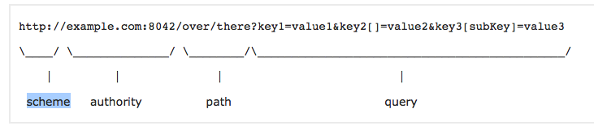


#####2.将Dictionary进行URL编码

在iOS开发中，有时候我们从VC层或者VM层获取到的数据是一个字典，字典中存储的就是要发给服务器的数据参数。直接将字典转成二进制数据发送给服务器，服务器那边是没法解析iOS这边的字典的，得有一个统一的交互标准，这个标准就是URL编码。我们要做的就是讲字典进行URL编码，然后将编码后的东西在传给服务器，这样一来服务器那边就能解析到我们请求的参数了。下方折叠的这段代码就是从AlamoFire框架中摘抄出来的三个方法，位于ParameterEncoding.swift文件中。该段代码就是负责将字典类型的参数进行URL编码的，在编码过程中进行转义是少不了的。


```
// - MARK - Alamofire中的三个方法该方法将字典转换成URL编码的字符
func query(parameters: [String: AnyObject]) -> String {
    
    var components: [(String, String)] = []     //存有元组的数组，元组由ULR中的(key, value)组成
    
    for key in parameters.keys.sort(<) {        //遍历参数字典
        let value = parameters[key]!
        components += queryComponents(key, value)
    }
    
    return (components.map { "\($0)=\($1)" } as [String]).joinWithSeparator("&")
}
    
    
func queryComponents(key: String, _ value: AnyObject) -> [(String, String)] {
    var components: [(String, String)] = []
    
    
    if let dictionary = value as? [String: AnyObject] {         //value为字典的情况, 递归调用
        for (nestedKey, value) in dictionary {
            components += queryComponents("\(key)[\(nestedKey)]", value)
        }
    } else if let array = value as? [AnyObject] {               //value为数组的情况, 递归调用
        for value in array {
            components += queryComponents("\(key)[]", value)
        }
    } else {  //vlalue为字符串的情况，进行转义，上面两种情况最终会递归到此情况而结束
        components.append((escape(key), escape("\(value)")))
    }
    
    return components
}
    
/**
 
 - parameter string: 要转义的字符串
 
 - returns: 转义后的字符串
 */
func escape(string: String) -> String {
    /*
     :用于分隔协议和主机，/用于分隔主机和路径，?用于分隔路径和查询参数, #用于分隔查询与碎片
     */
    let generalDelimitersToEncode = ":#[]@" // does not include "?" or "/" due to RFC 3986 - Section 3.4
    
    //组件中的分隔符：如=用于表示查询参数中的键值对，&符号用于分隔查询多个键值对
    let subDelimitersToEncode = "!$&'()*+,;="
    
    let allowedCharacterSet = NSCharacterSet.URLQueryAllowedCharacterSet().mutableCopy() as! NSMutableCharacterSet
    allowedCharacterSet.removeCharactersInString(generalDelimitersToEncode + subDelimitersToEncode)
    
    
    var escaped = ""
    
    //==========================================================================================================
    //
    //  Batching is required for escaping due to an internal bug in iOS 8.1 and 8.2. Encoding more than a few
    //  hundred Chinese characters causes various malloc error crashes. To avoid this issue until iOS 8 is no
    //  longer supported, batching MUST be used for encoding. This introduces roughly a 20% overhead. For more
    //  info, please refer to:
    //
    //      - https://github.com/Alamofire/Alamofire/issues/206
    //
    //==========================================================================================================
    
    if #available(iOS 8.3, OSX 10.10, *) {
        escaped = string.stringByAddingPercentEncodingWithAllowedCharacters(allowedCharacterSet) ?? string
    } else {
        let batchSize = 50      //一次转义的字符数
        var index = string.startIndex
        
        while index != string.endIndex {
            let startIndex = index
            let endIndex = index.advancedBy(batchSize, limit: string.endIndex)
            let range = startIndex..<endIndex
            
            let substring = string.substringWithRange(range)
            
            escaped += substring.stringByAddingPercentEncodingWithAllowedCharacters(allowedCharacterSet) ?? substring
            
            index = endIndex
        }
    }
    
    return escaped
}
```
    
    
在上述代码中，功能并不算复杂。就是递归将字典中的所有键值对转变成key=value、key[]=value、key[subkey]=value这三种形式。之所以进行递归，因为字典中有可能含有字典或者数组，数组中又可能嵌套着数组或者字典。所有要进行递归，直到找到key=value这种形式为止。上述的三个函数中queryComponents()方法就负责进行递归调用的。从下方的截图中我们不难看出，字典、数组以及键值对的处理方式是不同的。

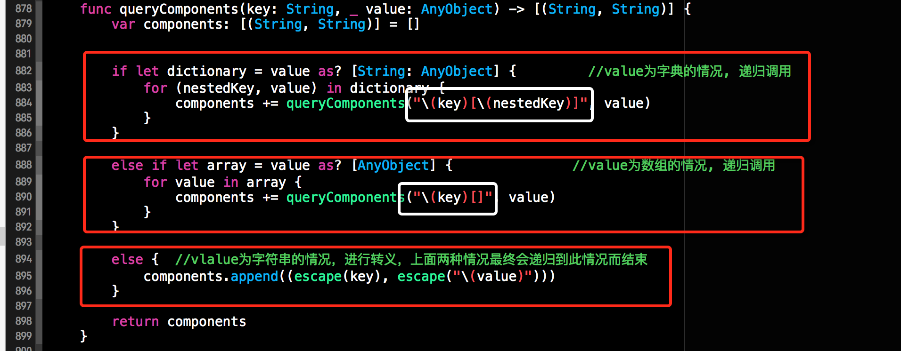

调用上述代码段的query方法就可以对字典进行转义。query()方法的参数是一个[String, AnyObject]类型的字典，返回参数是一个字符串。这个返回的字符串就是将该字典进行编码后的结果。接下来我们对其进行测试。点击"URL编码"按钮就会执行下方的方法，在该方法中我们定义了一个字典，该字典的key是String类型的，Value中存储的有String、Array以及Dictionary。将该字典作为参数传入query()中，然后query()函数返回的字符串进行数据。紧跟着的就是输出结果，从结果中我们能看出将中文字符进行了百分号编码，也就是URL编码。

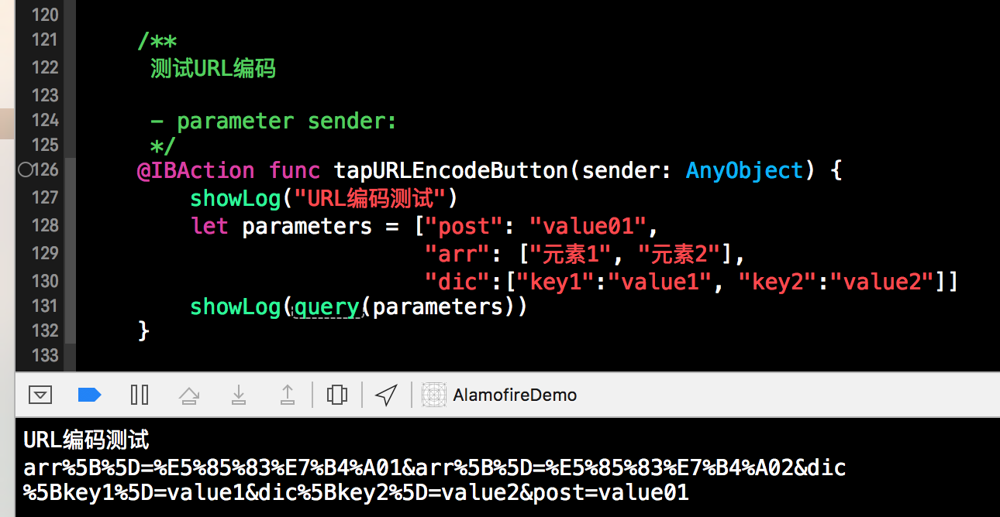

我们可以将上述输出的字符串使用[站上工具](http://tool.chinaz.com/tools/urlencode.aspx)进行URL解码，解码后的URL如下所示：

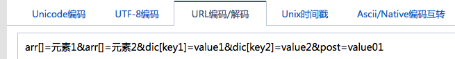


####三、数据任务--NSURLSessionDataTask

解决完了URL编码的问题，我们就具体的来看一下NSURLSessionDataTask了，也就是我们上面所提到的Data Task。因为会话中会执行不同的任务，所以任务的对象来自于Session对象，也就是说我们需要使用已经存在的Session对象来创建我们的任务对象。接下来我们来看一下DataTask的使用。本部分主要给出了Data Task的工作方式。


#####1.对Data task代码的封装

下方截图中的sessionDataTaskRequest()方法，该方法的第一个参数是会话请求的方式"POST"、"GET"等。第二个参数就发送到服务器的参数，该参数是一个[String:AnyObject]类型的字典。下面就是NSURLSessionDataTask的使用步骤

  * 首先我们先创建会话使用的URL，在创建URL是我们要对parameters字典参数进行URL编码。如果是GET方式的请求的话就使用?号将我们编码后的字符串拼接到URL后方即可。
  * 然后创建我们会话使用的请求（NSURLMutableRequest）,在创建请求时我们要指定请求方式是POST还是GET。如果是POST方式，我们就将编码后的URL字符串放入request的HTTPBody中即可，有一点需要注意的是我们传输的数据都是二进制的，所以在将字符串存入HTTPBody之前要将其转换成二进制，在转换成二进制的同时我们使用的是UTF8这种编码格式。
  * 创建完Request后，我们就该创建URLSession了，此处我们为了简单就获取了全局的Session单例。我们使用这个Session单例创建了含有Request对象的一个DataTask。在这个DataTask创建时，有一个尾随闭包，这个尾随闭包用来接收服务器返回来的数据。当然此处可以指定代理，使用代理来接收和解析数据的，稍后会介绍到。
  * 最后切记创建好的Data Task是处于挂起状态的，需要你去唤醒它，所以我们要调用dataTask的resume方法进行唤醒。具体如下所示。

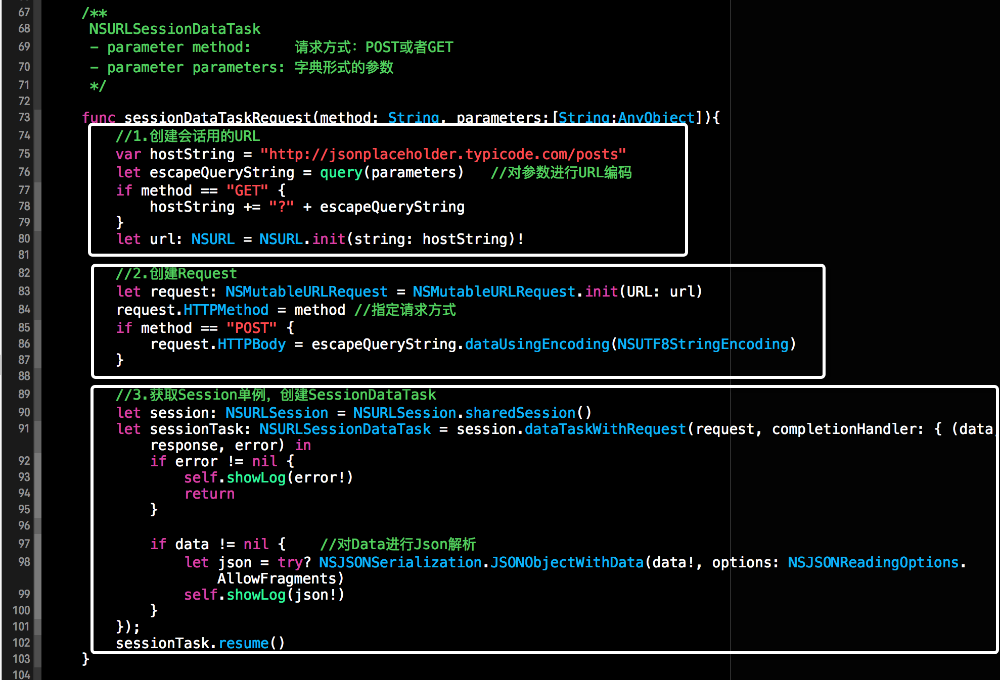


#####2. 测试

上述Data Task的核心代码已经完成，接下来我们要对其进行Get和Post测试。也就是给上述方法传入"GET"或者"POST"请求方式和相应的参数。下方代码截图是对DataTask进行GET测试。传入相应的参数，控制台中输出的是服务器接收到参数后返回的数据。当然下方输出的数据是我们通过JSON解析后的数据了。

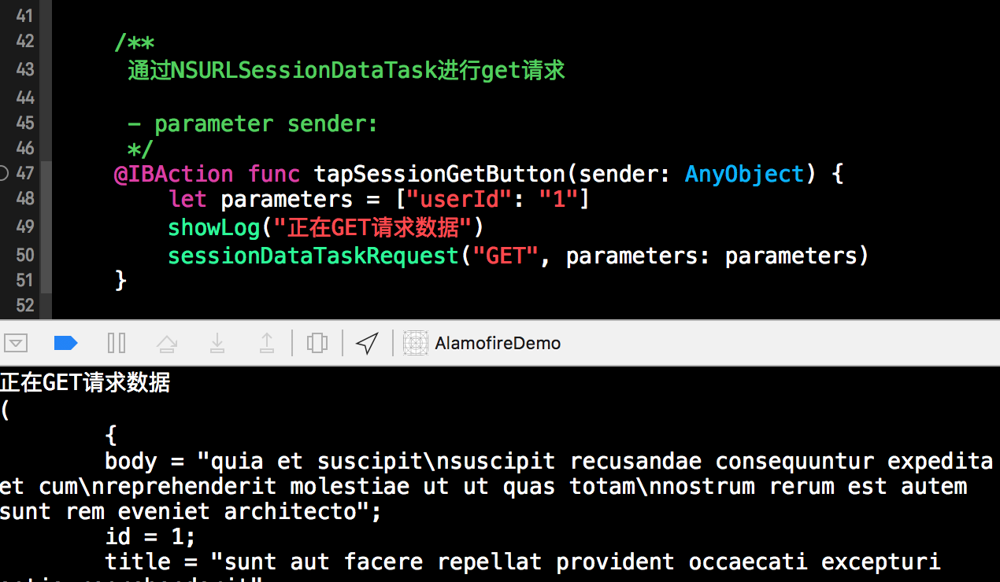

紧接着我们进行POST测试，也就是传入"POST"已经相应的参数，具体如下所示。下方的输出是服务器返回的数据。

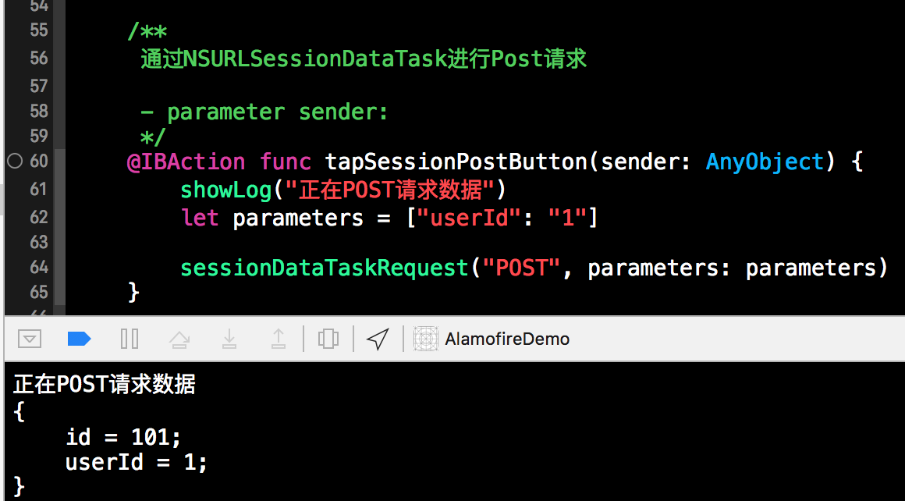

######

####四、上传任务---Upload Task

接下来我们来搞一下Upload Task，顾名思义Upload Task就是用来往服务器上上传东西的嘛。下方这个代码段就是用来往服务器上传二进制数据的，当然
我们使用的是POST方式进行表单提交的。下方的代码步骤与上述DataTask的使用方式大为相似，具体步骤如下所示。

  * 先创建URL和request并为request指定请求方式为POST。
  * 然后创建Session，此处我们使用SessionConfiguration为Session的类型指定为default session类型。并为该Session指定代理对象为self。
  * 最后使用Session来创建upload task，在创建upload task时为上传任务指定NSURLRequest对象，并且传入要上传的表单数据formData，当然不要忘了将任务进行唤醒。

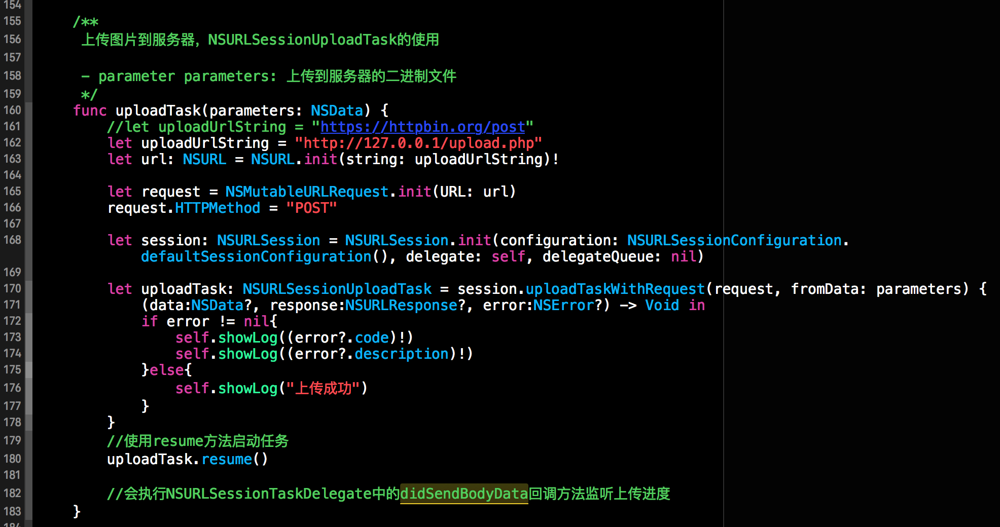


接下来我们要将上述代码进行测试，上面有两测试地址，第一个是你可以使用的，第二个是我在我本地服务器自己使用php写的一个文件上传的脚本，当然你是使用不了的。如果你要运行上述代码的话，你就要使用第一个地址进行测试了。下方代码段就是我们的测试用例，首先我们先通过网络获取图片，并NSData加载到本地，获取到图片的二进制数据imageData。等待图片数据获取完毕后，在调用上述上传数据的方法。为了请求完图片的二进制数据后在调用上述方法，我们使用了GCD中dispatch group的相关东西。关于GCD更为详细的内容请参见之前的博客《[GCD详解](http://www.cnblogs.com/ludashi/p/5336169.html)》。下方的代码会在点击"UploadTask"按钮时会被触发。

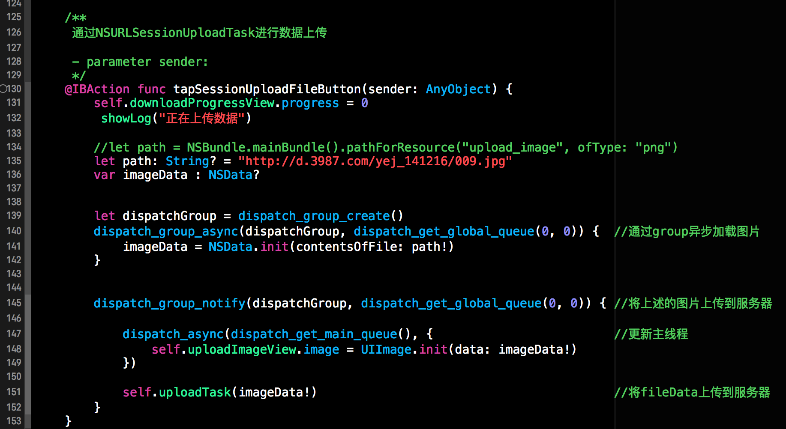


在上传文件时，如果你想时刻的监听上传的进度，你可以去实现NSURLSessionTaskDelegate中的didSendBodyData方法，该方法会实时的监听文件上传的速度。bytesSent回调参数表示本次上传的字节数，totalBytesSend回调参数表示已经上传的数据大小，

totalBytesExpectedToSend表示文件公有的大小。该回调方法具体实现方式如下，在下方回调方法中我们根据每次上传的数据情况对进度条进行更新，当然在更新UI时我们要在主线程中进行更新。具体代码如下。

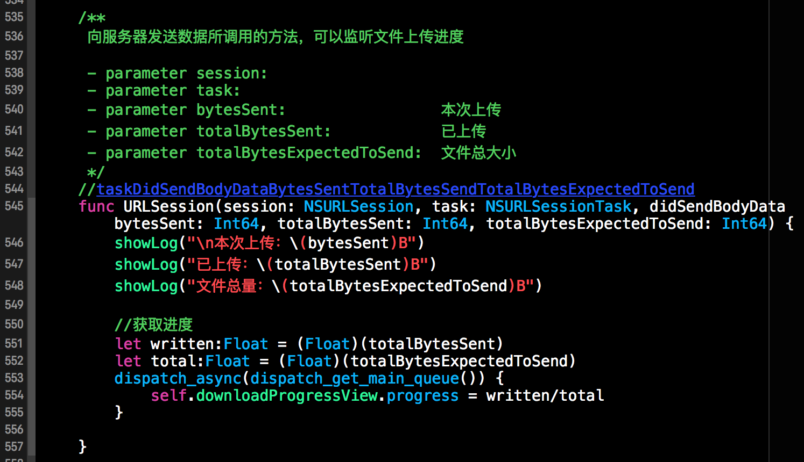


####五、下载任务--Download Task

Download Task这种类型的任务就稍微有些复杂了，接下来我们来一一的进行介绍。接下来我们要实现一个支持后台下载并且支持暂停和继续的任务。在下载时我们也要实现相应的回调代理来监听下载进度，后台下载以及下载任务的暂停和继续在开发中用的还是比较多的，本部分就好好的探讨一下Download task。下方的实例是从网络下载一个比较大的图片，下载完毕后就从存储到Document中。

#####1.创建后台会话

在创建Download Task 之前我们要先创建一个支持后台下载的会话，也就是Background Session。因为我们要暂停和续传，所以在此Background Session的对象和Download Task的对象都是使用的类属性。下方代码段就创建了一个background session的对象。首先我们先创建一个background类型的Session
Configuration，然后在创建downloadSession对象时配置为background即可。在创建Session对象时要为downloadSession对象指定代理对象，因为我们要在相应的代理对象中获取下载进度更新我们的ProgressView。创建DownloadSession对象的代码如下：

    
```   
//创建BackgroundDownloadSession
let config = NSURLSessionConfiguration.backgroundSessionConfigurationWithIdentifier(keyBackgroundDownload)
self.downloadSession = NSURLSession(configuration: config, delegate: self, delegateQueue: nil)
```


#####2.开始下载

创建好downloadSession对象后，我们就该创建downloadTask开始进行文件的下载了。下方代码段就是点击"开始下载"按钮所触发的方法。首先我们先获取ResumeData，这个ResumeData就是我们暂停下载任务是所保存的信息，通过该ResumeData我们可以接着上次的文件进行下载。ResumeData中存储的并不是我们上次下载的数据Data，而是存储了下载地址和上次下载的位置等相关的信息，稍后会将ResumeData进行打印。我们从UserDefault中获取ResumeData，如果存在ResumeData我们就调用下载会话的downloadTaskWithResumeData()方法传入ResumeData接着上次的下载。如果ResumeData为nil，那么我们就创建下载请求，调用下载会话的downloadTaskWithRequest()方法创建下载任务。创建完下载任务后不要忘记将任务进行resume()呢。点击"开始下载"的代码如下所示。

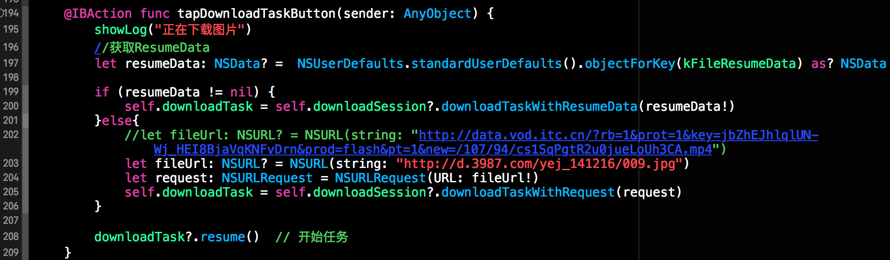


#####3.暂停下载

上面是开始下载，接下来让我们来实现暂停下载。下方代码段就是点击"暂停下载"按钮所触发的方法。在该方法中我们主要调用了downloadTask中的cancel ByProducingResumeData()方法来进行任务的暂停的。在调用上述方法时会通过Closure回调的形式返回一个ResumeData，此处的ResumeData就是上面我们使用到的ResumeData。拿到该ResumeData后你要讲它进行磁盘的持久化存储，便于下次继续下载。此处为了方便就将ResumeData存到了UserDefault中，其实也就是plist文件中。

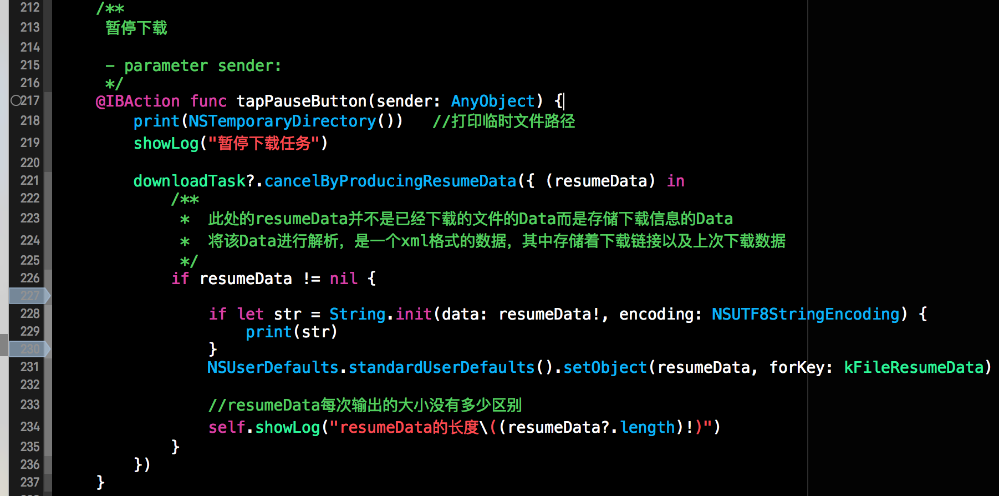

下方就是我们在暂停下载任务时所打印的ResumeData中的内容。从下方的内容不难看出ResumeData就是一个xml格式的文本信息其中存储着相应的下载信息。比如下载文件的URL（NSURLSessionDownloadURL），已经接受的数据字节（NSURLSessionResumeBytesReceived）等等相关的下载信息，具体请看下图。我们可以通过下方的xml存储的信息重新接着上次的下载任务进行下载。

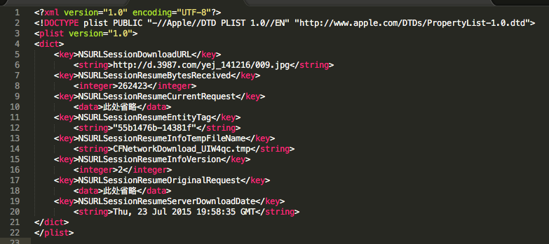

上面有一项存储的就是所下载文件的临时文件的名称，就位于temp目录中。在下载过程中正在下载的任务会在temp目录中创建一个.tmp的临时文件用来存储下载的临时数据，也就是说这个临时文件就是边下边存的地方。下载完成后我们要对该临时文件进行转存的，因为下载完成后该临时文件会被自动删除的。

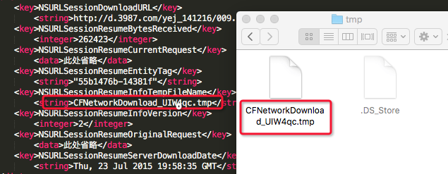

#####4.下载任务的回调--NSURLSessionDownloadDelegate

上面两段代码主要是用于下载任务的开始和暂停的，如果你要想对下载完成后的文件进行处理，以及要监听下载进度的话，就得实现NSURLSessionDownload Delegate代理中相应的方法了。NSURLSessionDownloadDelegate中有3个代理方法，分别负责处理文件下载完成，监测下载进度以及文件暂停时的处理工作。接下来将要结合上述下载任务的开始和暂停的代码来探讨一下这三个代理方法。

######(1)、文件下载完成后的回调----didFinishDownloadingToURL

下方代码段中的代理方法就是在文件下载完成后要执行的回调方法。在下方的委托回调方法中有三个回调参数，第一个就是我们的downloadSession对象，第二个参数就是我们的downloadTask对象，第三个参数就是临时文件的下载目录。临时文件在下载完成之后如果你不做任何处理的话，那么就会被自动删除。下方代码段在
获取临时文件路径后将临时文件使用FileManager将临时文件存储到相应的文件夹中，新文件的名字此处取的是当前时间的时间戳，如下所示。

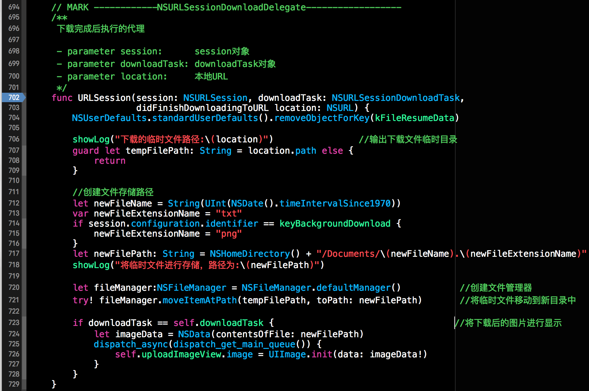

######(2)、监听下载任务----didWriteData

下方代码片段是用来实时监听下载进度的回调方法，该方法中有5个回调参数。前两个就不说了，重点在后三个。didWriteData参数是本次下载的数据，单位为字节，totalBytesWritter参数代表着已经下载的数据总量，totalBytesExpectedToWrite是文件的总量。通过上述三个参数我们不难计算出当前的下载进度，可以在该委托回调方法中进行ProgressiView的更新。具体代码如下所示

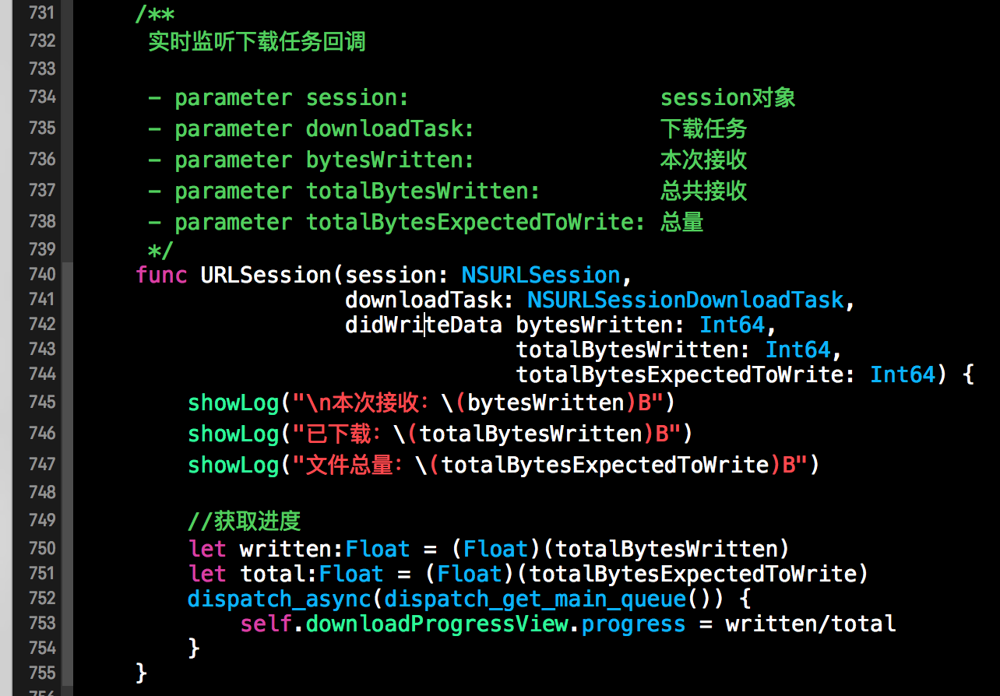


######(3)暂停后再次启动下载任务的代理方法----didResumeAtOffset

下方回调方法会在暂停的下载任务重启后会被调用。该代理回调方法中有四个回调参数，前两个就不多说了，我们来看后两个。fileOffset代表中已经下载文件的大小，expectedTotalBytes表示文件的总大小，如下所示：

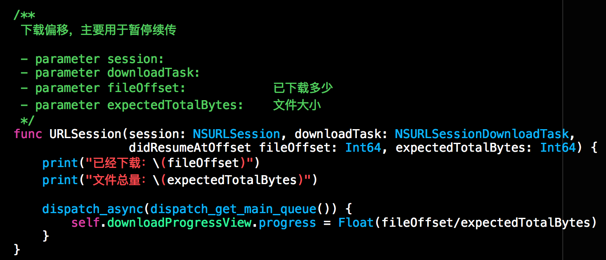

至此，NSURLSessionDownloadDelegate中的三个代理方法已介绍完毕。在你做文件下载时上述回调大部分情况下会被使用到。


####六、网络缓存

网络缓存在网络请求中使用的还是蛮多的，尤其是加载一些H5页面时经常会加一些缓存来提高用户体验。有时的一些数据也会进行缓存，你可将数据缓存到你的SQLite数据库、PList文件，或者直接使用NSURLSession相关的东西进行缓存。接下来要介绍的缓存方式就是网络缓存，就是利用NSURLSession相关的类来实现网络缓存。该缓存的过程不需要你去操作数据库或者plist文件，下方给出了四种不同的网络缓存方式，无论是哪一种网络缓存的方式只是用法不一样，本质上是一样的，都是利用NSURLSession进行的网络缓存。废话少说，进入该部分的主题。

#####1.缓存策略概述

在配置网络请求缓存时，有着不同的请求缓存策略。下方就是所有支持的网络缓存策略：

  * UseProtocolCachePolicy -- 缓存存在就读缓存，若不存在就请求服务器

  * ReloadIgnoringLocalCacheData -- 忽略缓存，直接请求服务器数据

  * ReturnCacheDataElseLoad -- 本地如有缓存就使用，忽略其有效性，无则请求服务器

  * ReturnCacheDataDontLoad -- 直接加载本地缓存，没有也不请求网络 

  * ReloadIgnoringLocalAndRemoteCacheData -- 尚未实现

  * ReloadRevalidatingCacheData -- 尚未实现

上述缓存策略在Foundation框架中是以枚举的形式来提现的，该缓存策略的枚举类型是NSURLRequestCachePolicy，具体定义如下所示：

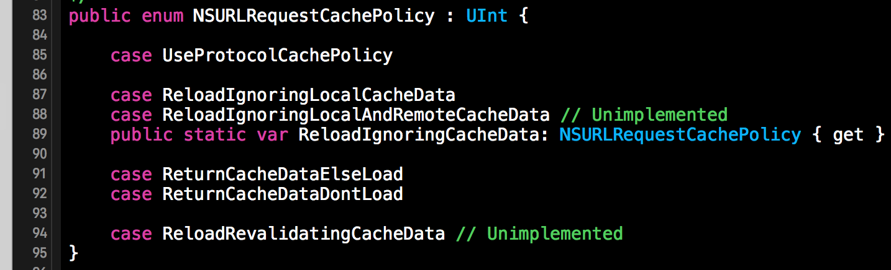


#####2.使用NSMutableURLRequest指定缓存策略

接下来我们使用NSMutableURLRequest来指定缓存策略，在NSMutableURLRequest类的对象中有一个参数cachePolicy用来指定缓存策略的，只需要将上述枚举的缓存策略的枚举值赋值给cachePolicy即可。下方代码段就是点击"Request设置缓存"按钮所触发的代码，在下方代码中我们使用DataTask对百度的网页进行请求，将请求的数据使用.ReturnCacheDataElseLoad的缓存策略进行缓存。下方红框的部分就是使用NSMutableURLRequest对象来设置缓存策略的代码，具体如下所示：

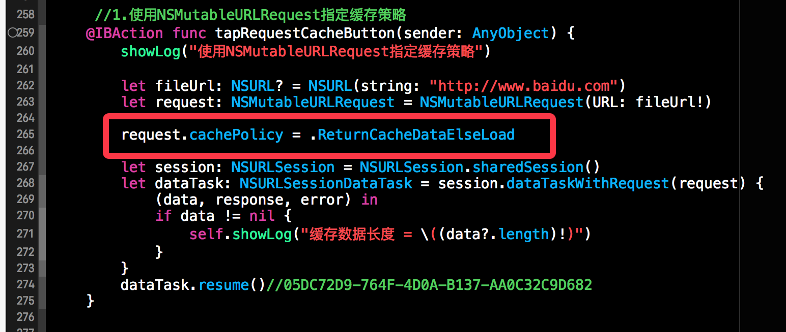


下方就是点击"Request设置缓存"按钮后所呈现的效果，缓存目录默认为~/Library/Caches/[Boundle ID]/fsCachedData/缓存文件，缓存文件名是按照一定的规则生成的，当然同一个URL所生成的缓存文件名是相同的。下方就是我们所缓存的文件，使用Sublime打开后里边就是百度的HTML页面。如下所示。当缓存完毕后，如果你再次发起请求的话就会从缓存文件中进行数据的加载。

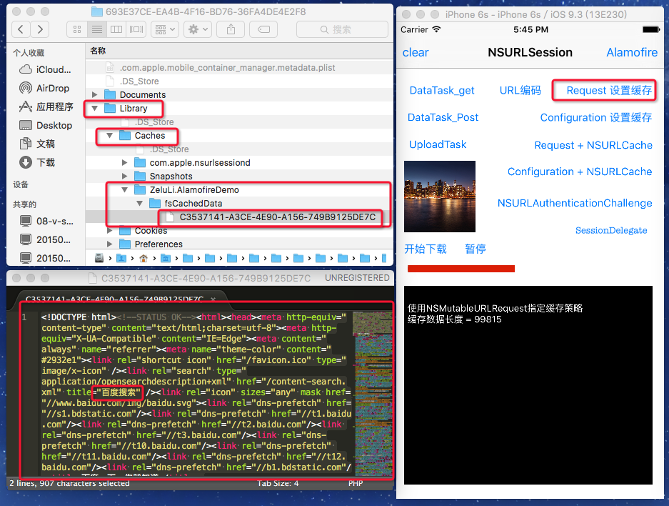

#####3. 使用NSURLSessionConfiguration指定缓存策略

除了直接使用Request对象来指定请求缓存策略，我们还可以使用NSURLSessionConfiguration的对象来指定缓存策略。在NSURLSessionConfiguration类中有一个用来设置请求缓存策略的requestCachePolicy属性。使用该属性设置的缓存策略时，同样的缓存策略所表现的效果与上面直接使用NSURLMutableRequest设置的缓存策略表现是一致的。下方代码段就是使NSURLSessionConfiguration对象来设置缓存策略，如下所示：

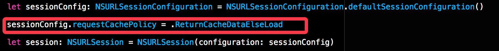


由于此处的缓存文件与上述一致，如果该请求连接以被上面缓存就会被直接加载。


#####4.使用URLCache + request进行缓存

上面是使用URLRequest自带的缓存策略，可定制性和灵活度比较低。如果要对网络缓存有着较高的定制性的话，我们就得使用NSURLCache这个东西了。虽然NSURLURLCache任然依赖于NSURLRequst对象，不过可以设置一些缓存的参，比如缓存路径、缓存的最大磁盘容量和内存容量等等。接下来我们就要使用
URLCache来进行网络缓存了。下面的代码就是对"博客园"首页的HTML进行的缓存，当然我们在此使用的是URLCache。

在下方代码中我们先创建了三个常量：memoryCapacity\--缓存最大内存容量、diskCapacity\--缓存最大磁盘容量、cacheFilePath--缓存路径。上面这三个常量用来作为初始化NSURLCache对象的参数，创建完NSURLCache对象后我们将其设置成全局的URLCache。缓存策略仍然使用NSURLMutableRequest来指定。具体代码如下所示。  

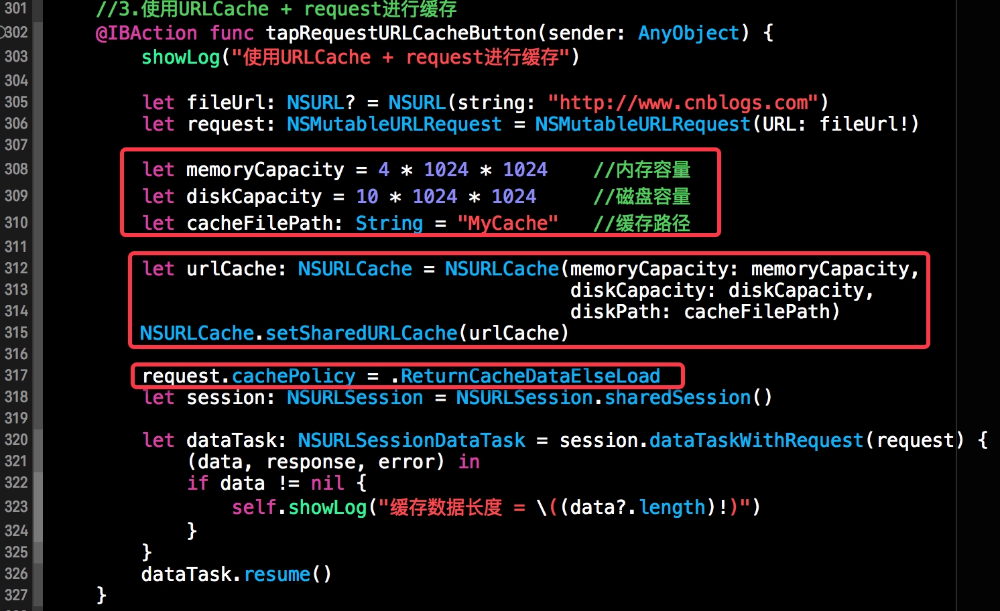


有一点需要注意的是此处设置的缓存路径是相对于/Library/Caches/[Boundle ID]/的，会在这个相当路径下创建相应的文件夹来存放缓存文件。下方就是我们使用NSURLCache缓存的文件路径已经内容，从内容不难看出就是博客园首页的HTML代码。效果如下所示：

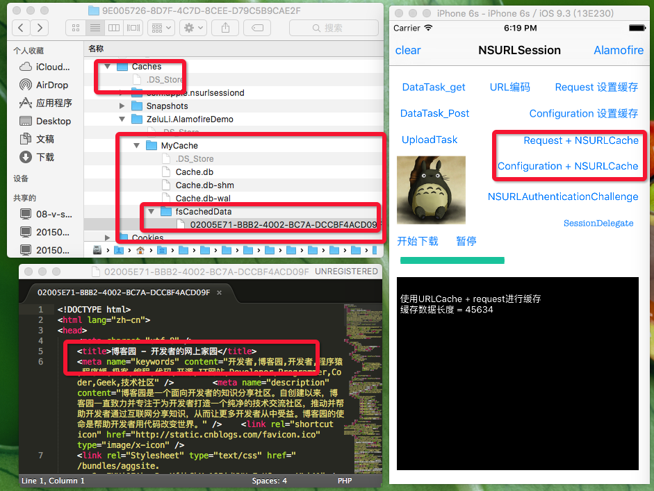


#####5、使用URLCache + NSURLSessionConfiguration进行缓存

你也可以在NSURLSessionConfigurationzhon中指定URLCache对象，当然此处我们使用NSURLSessionConfiguration的对象来指定缓存策略。NSURLSessionConfiguration对象中有一个属性是URLCache, 我们可以用它来配置URLCache对象。下方代码就是使用NSURLSessionConfiguration结合着URLCache进行缓存的。缓存效果与上面的一致。

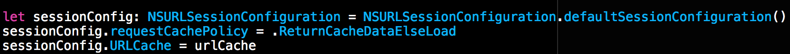


#####6、清除缓存

谁污染谁治理呢，创建完缓存，如果在不用时我们要对相应的缓存数据进行清理的。清理缓存就是找到缓存所在的文件夹将缓存的文件进行删除即可。下方代码段就是对我们上面创建的所有缓存进行清理。因为下方的每行代码基本上都有注释，在此就对其做过多的解释了。主要还是NSFileManager的使用。如下所示:

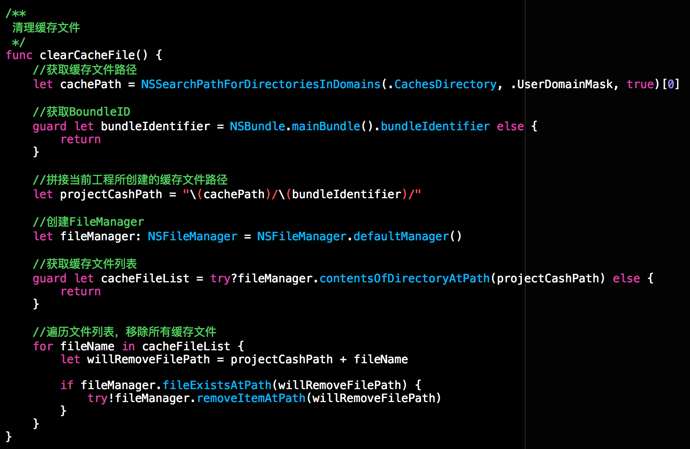


####七、请求认证

有时为了网络请求的安全性，服务器与客户端之间要进行身份的验证。根据安全性的不同要求可以是单向验证，也可以是双向验证。本部分我们就来聊一下NSURLSession发起网络请求遇到验证时的处理方案，就以HTTPS证书验证为例。下方会先介绍认证方式与认证策略，然后结合实例来进一步认识NSURLSession中的请求认
证。

#####1.认证方式

首先我们先来大体的了解一下所有的认证方式

  * NSURLAuthenticationMethodHTTPBasic: HTTP基本认证，需要提供用户名和密码
  * NSURLAuthenticationMethodHTTPDigest: HTTP数字认证，与基本认证相似需要用户名和密码
  * NSURLAuthenticationMethodHTMLForm: HTML表单认证，需要提供用户名和密码
  * NSURLAuthenticationMethodNTLM: NTLM认证，NTLM（NT LAN Manager）是一系列旨向用户提供认证，完整性和机密性的微软安全协议
  * NSURLAuthenticationMethodNegotiate: 协商认证
  * NSURLAuthenticationMethodClientCertificate: 客户端认证，需要客户端提供认证所需的证书
  * NSURLAuthenticationMethodServerTrust: 服务端认证，由认证请求的保护空间提供信任

上面后两个就是我们在请求HTTPS时会遇到的认证，需要服务器或者客户端来提供认证的，这个证书就是我们平时常说的CA证书。当然你也可以使用自签名证书了，这就不在本篇博客的讨论范围内了。


#####2.认证处理策略

当我们进行网络求时，会对相应的认证做出响应。在NSURLSession进行网络请求时支持四种证书处理策略，这些认证处理策略以枚举的形式来存储，枚举的类型为NSURLSessionAuthChallengeDisposition。下方就是认证的所有处理策略：

  * UseCredential： 使用证书
  * PerformDefaultHandling： 执行默认处理, 类似于该代理没有被实现一样，credential参数会被忽略
  * CancelAuthenticationChallenge： 取消请求，credential参数同样会被忽略
  * RejectProtectionSpace： 拒绝保护空间，重试下一次认证，credential参数同样会被忽略


#####3.HTTPS请求证书处理

接下来我们就根据实例来感受一下上述的认证方式以及认证处理策略，在此我们就以HTTPS的证书认证为例。点击"NSURLAuthenticationChallenge"按钮就会执行下方代码段，在下方代码段中我们以请求宜信--星火金服的首页的HTML数据为例。由下方的代码段我们可以看出星火金服的首页是https，我们在请求该页面数据时，肯定会进行证书认证的处理的。下方我们使用的默认会话中的Data Task发起的https请求。

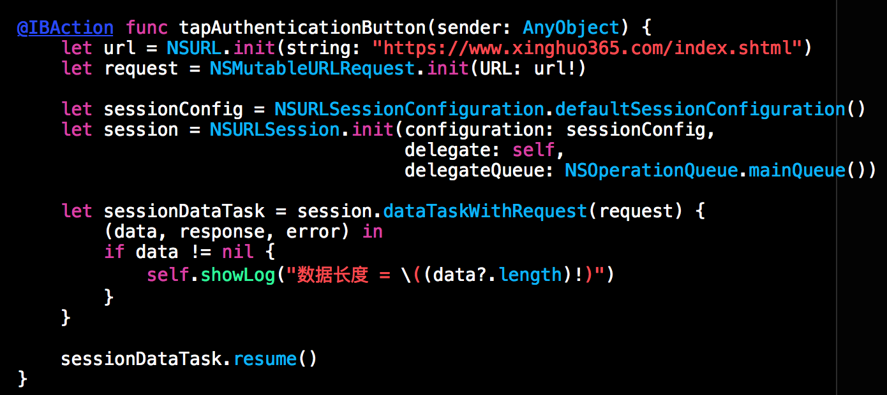


发起上述https请求后，就会执行下方的代理方法。下方的委托代理方法属于NSURLSessionDelegate中处理认证的方法，也就是如果服务器需要认证时就会执行下方的回调方法。下方代码首先从授权质疑的保护空间中取出认证方式，然后根据不同的认证方式进行不同的处理。下方给出了两种认证方式的处理，上面的if语句块
赋值服务端认证，下面的if语句块负责HTTP的基本认证。具体处理方式如下所示。有一点需要注意的是如果在该委托回调方法中如果不执行completionHandler闭包，那么认证就会失效，是请求不到数据的。

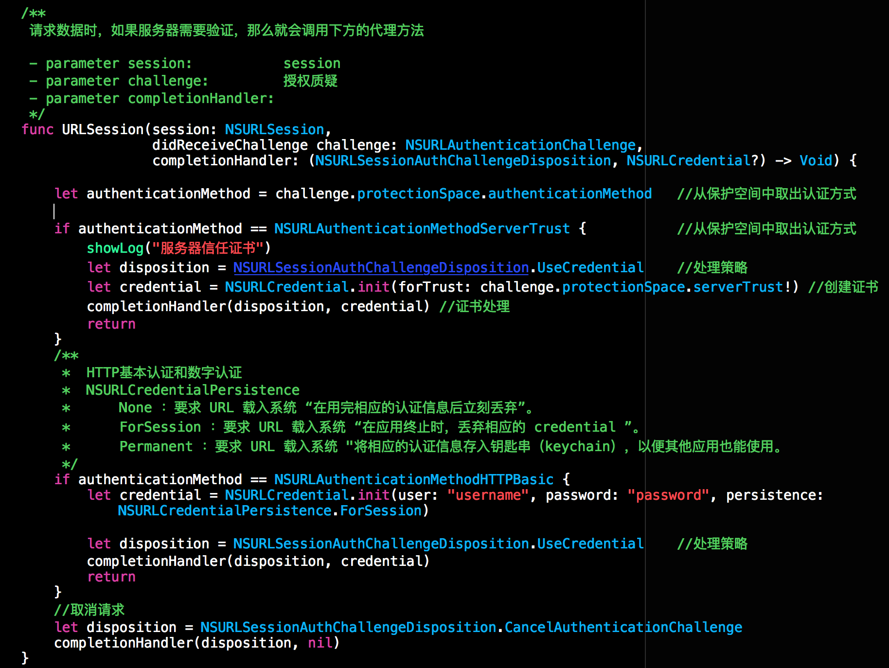


####八、NSURLSession相关代理

在AlamoFire框架中用到了好多的NSURLSession的相关代理，AlamoFire框架对NSURLSession的相关代理进行了封装，使用Closure的形式进行了替换，所以在阅读AlamoFire源码之前了解NSURLSession的相关代理方法的功能比较重要的。接下来将要对NSURLSession所有相关的代理方法进行介绍，当然上面已经用到的代理方法在该部分就不重述了。下面的内容首先会整体的介绍一些这些代理的关系，然后各个击破。

#####1.SessionDelegate类图

下方类图是SessionDelegate相关协议已经SessionTask相关类之间的继承和依赖关系。上面已经介绍了各种Session Task的使用，当然除了Stream Task之外。Stream Task是iOS9之后添加的东西，用来进行数据流的请求与交互的，在此就不多说了。该部分是对下方类图中上半部分进行介绍。Session相关的Delegate都继承在NSURLSessionDelegate，DownloadDelegate、Data Delegate、StreamDelegate则继承自SessionTaskDelegate。详细的请看下方类图。

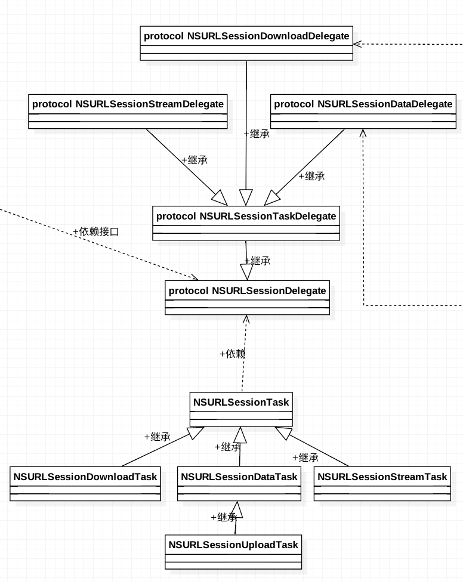


#####2.Delegate测试用例

为了进行各种代理的测试，我们创建了下方专门用于代理测试的请求。网络请求的地址使用的是"https://www.xinghuo365.com"，后面没有加index.shtml。因为直接请求域名星火金服会进行重定向，正好在我们相应的代理方法中进行请求重定向的处理。点击"SessionDelegate"按钮就会执行下方的方法。

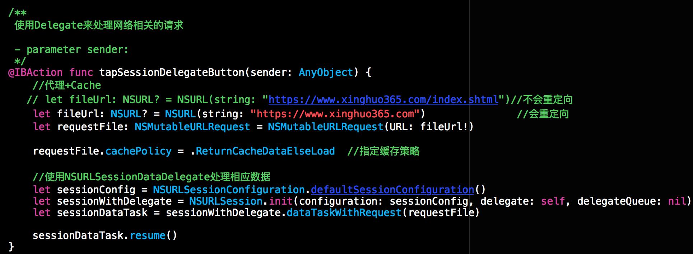


#####3.NSURLSessionDelegate

上面我们在证书认证时实现了一个didReceiveChallenge代理方法，该方法就位于NSURLSessionDelegate代理中。在NSURLSessionDelegate代理中除了didReceiveChallenge代理方法外还有两个方法。下方截图中就是这两个代理方法，

didBecomeInvalidWithError代理方法会在Session无效后被调用，URLSessionDidFinishEventsForBackgroundURLSession该代理方法会在后台Session在执行完后台任务后所执行的方法。

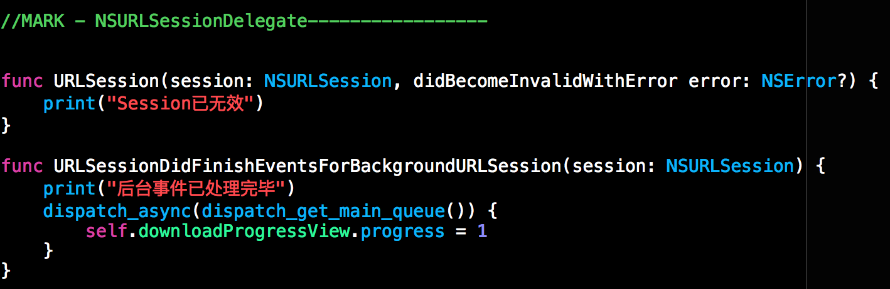


#####4.NSURLSessionTaskDelegate

接下来我们来介绍NSURLSessionDelegate的子协议NSURLSessionTaskDelegate，当然父协议中的代理方法同样适用于所有的子协议的。关于NSURLSessionTaskDelegate的代理方法，上面我们在介绍UploadTask时用到了NSURLSessionTaskDelegate协议中的

didSendBodyData代理方法来监听上传速度。接下来我们来介绍该代理方法中的其他代理方法。

######(1).请求的重定向

当我们请求的地址进行重定向时会执行NSURLSessionTaskDelegate中的willPerformHTTPRedirection方法，我们可以在此代理方法中对重定向的请求进一步的进行处理，甚至在此进行重定向。下方代码段的截图就是该URL重定向后要执行的方法，我们在此方法中将重定向的内容再次进行重定向，我们此处是重定向到的百度。具体做法如下所示。

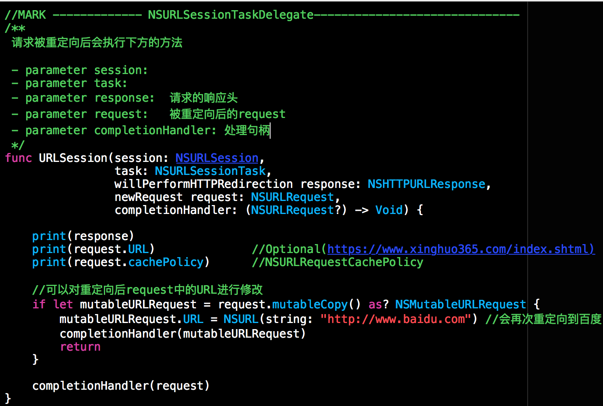

######(2)、其他代理方法

下方代码片段中的三个代理方法是NSURLSessionTaskDelegate中其他的代理方法，下方第一个方法是用来处理认证策略的，与NSURLSessionDelegate中的认证代理使用方式一致，如果你已经实现了NSURLSessionDelegate中的相应的方法，那么此处的认证方法不会被调用。第二个是关于流操作的，因为至今没有真正用过流试的请求方式再次就不做过多的赘述了。第三个是Session Task执行完毕后会调用的方法，具体如下所示。

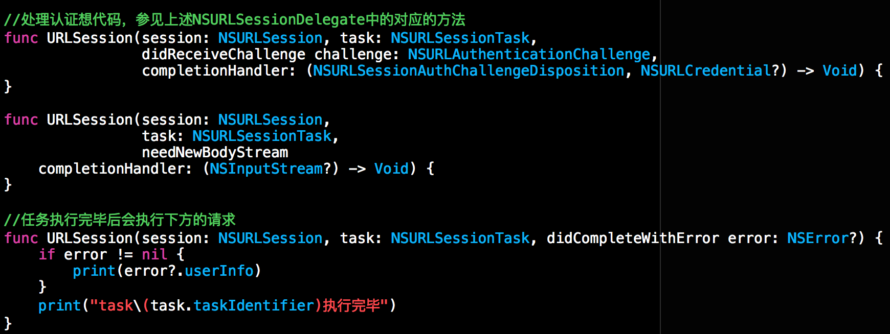


#####5.NSURLSessionDataDelegate

NSURLSessionDataDelegate中的方法主要是用来处理Data Task任务相应的事件的。在介绍NSURLSessionDataDelegate中具体的代理方法之前我们先了解一下NSURLSession中对Data Task相应数据的处理策略。了解完处理策略以后，我们再来一个接一个的介绍NSURLSessionDataDelegate中所对应的回调方法。

######(1)、相应处理策略

在Data Task收到相应后，我们可以通过相应的代理方法指定处理策略，所有的处理策略同样是以枚举的形式存在的。枚举类型NSURLSessionResponseDisposition中存储的就是Data Task的响应处理策略，共有四种处理策略，下方是每种响应处理策略的详细介绍：

  * Cancel ：取消数据的加载，默认为 .Cancel。此处理方式就是忽略数据的加载，取消对响应数据的进一步解析。
  * Allow ：允许继续操作, 会执行 NSURLSessionDataDelegate中的dataTaskDidReceiveData回调方法

  * BecomeDownload ： 将Data Task的响应转变为DownloadTask，会执行NSURLSessionDownloadDelegate代理中相应的方法

  * BecomeStream ： 将Data Task的响应转变为DownloadTask，会执行NSURLSessionStreamDelegate代理中相应的方法


######(2)、Data Task接收到响应后执行的方法--didReceiveResponse

下方的回调方法会在我们执行Data Task时受到服务器响应时所回调的方法，在该方法中我们就可以指定上述相应的处理策略。下方我们指定的处理策略是Allow，就是允许继续执行数据的请求和处理。

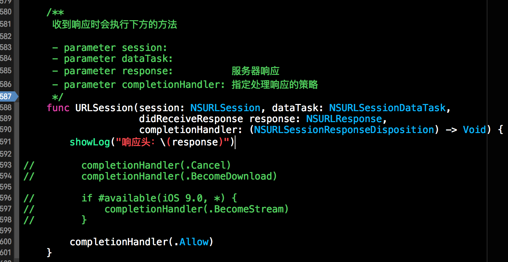


**(3)、受到数据后执行的代理方法--didReceiveData**

下方的代理方法就是在执行Data Task时，收到服务器的数据后所执行的方法。也就是上面的处理策略设置成Allow后会执行下方的方法，如果响应处理策略不是Allow那么就不会接收到服务器的Data，从而也不会执行下面的方法。在该方法中我们收到了服务器所返回的二进制数据，下方我们将二进制数据转成UTF8的字符串编
码。具体代码如下所示：

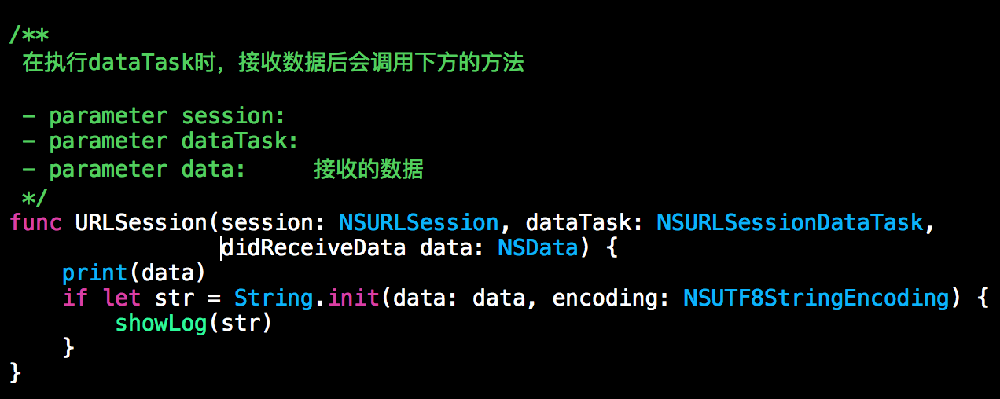


**(4)、任务转变所执行的代理方法--didBecomeDownloadTask与didBecomeStreamTask**

如果你处理响应的策略是BecomeDownload，那么就会执行下方的第一个回调方法。如果处理策略是BecomeStream那么就会执行下方第二个回调方法。

 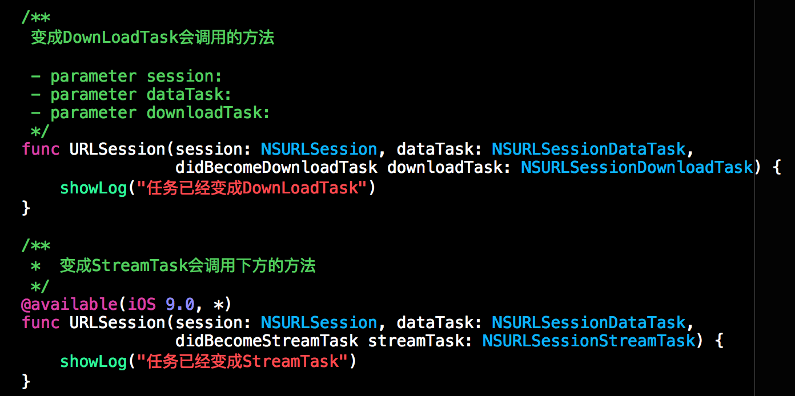


**(5)、将要进行缓存响应----willCacheResponse**

如果你在执行Data Task时，如果指定了响应的缓存策略，那么在请求数据完毕会会执行下方的willCacheResponse代理方法。顾名思义，willCacheResponse就是在将要进行缓存的使用多调用的，具体做法如下：

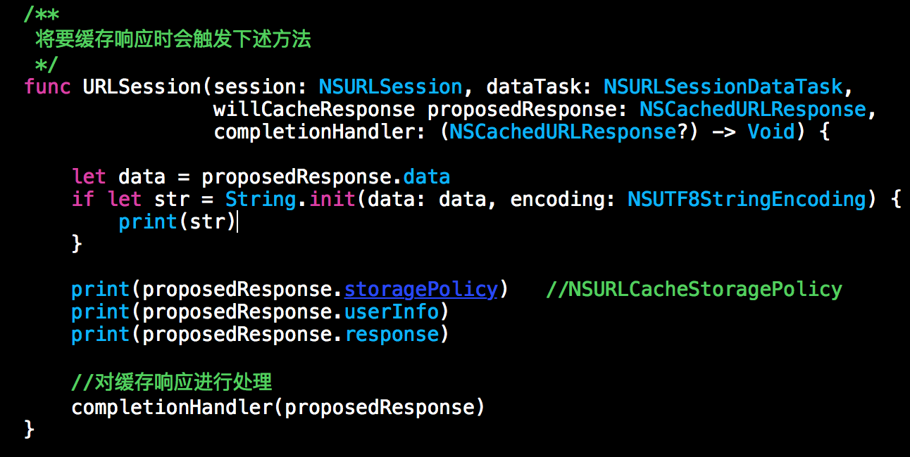

NSURLSessionStreamDelegate是iOS9上提供的，如果Data被转换成流数据就会执行NSURLSessionStreamDelegate中相应的方法，在streamTask中有一个readDataOfMinLength方法可以读取流中的数据。因为至今还用过NSURLSessionStreamDelegate，所以关于NSURLSessionStreamDelegate的东西就不做过多赘述了。不过在Github上分享的demo中有NSURLSe
ssionStreamDelegate的相关内容，在此就不做过多的赘述了。


####九、监测网络连接状态

本部分不属于NSSession范畴，不过网络开发怎么能少的了监测网络状态的模块呢。接下来我们将要使用SystemConfiguration来实现reachability。在AlamoFire中也是使用的SystemConfiguration相关的内容来实现的reachability。

下方这个代码段就是使用SystemConfiguration相关的内容来进行网络状态的监测。首先我们先使用SCNetworkReachabilityCreateWithName来创建一个reachability对象，然后创建reachability的上下文，之后在设置网络状态改变后的回调，随后将reachability对象放到队列中进行执行，具体步骤具体代码如下所示：

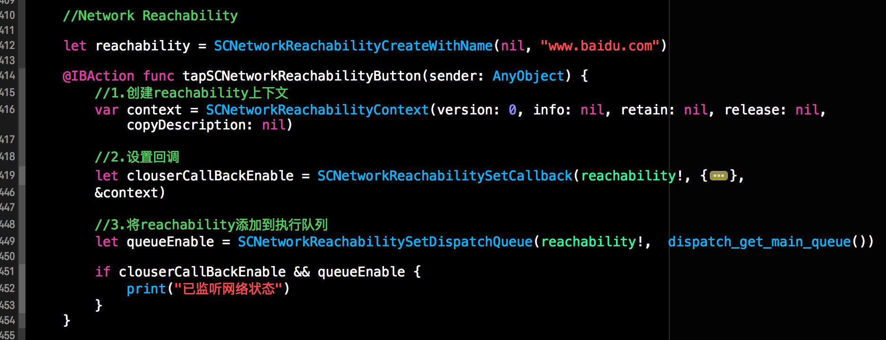

下方代码段是我们设置的网络状态改变后的回调方法，在其中对网络的状态进行了处理，具体代码如下所示，因这部分比较简单所以在此就不做过多赘述了。

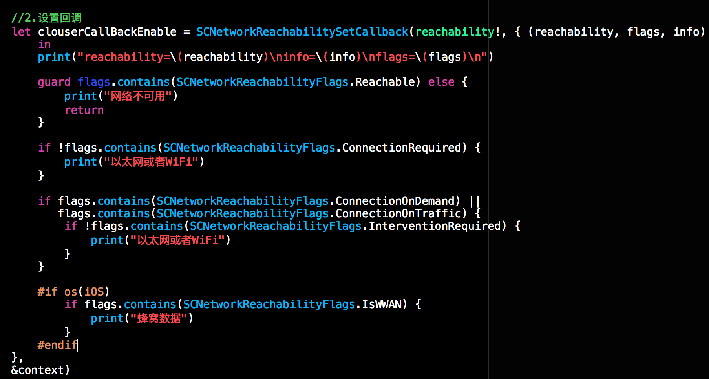

篇幅有限今天博客算是长篇大论了，就先到此，下篇博客会对AlamoFire源码进行解析。

