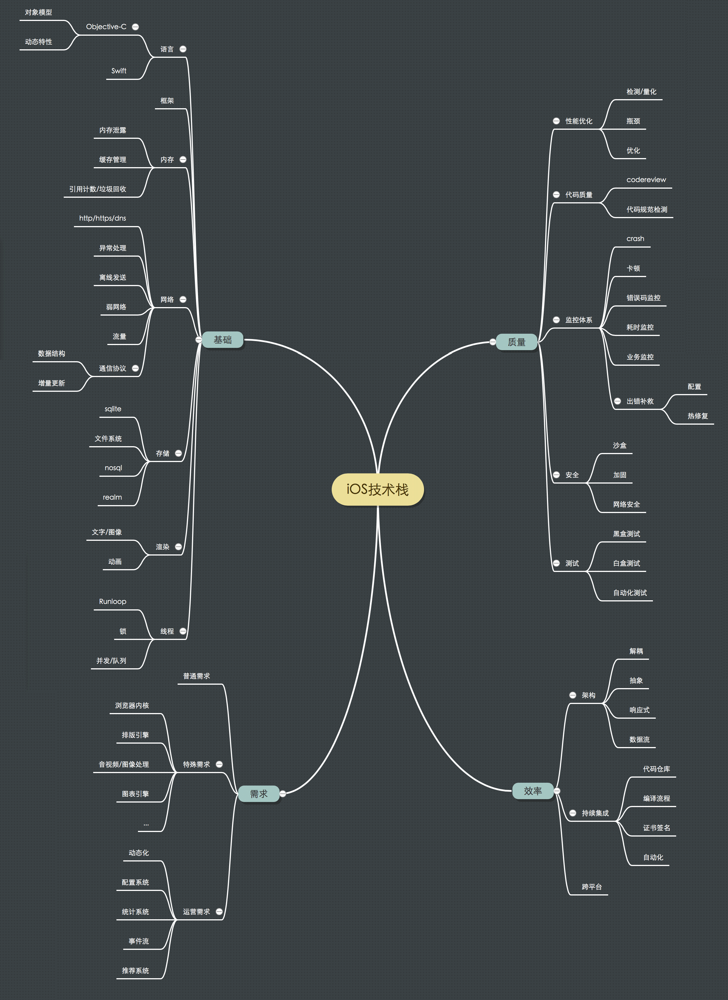

 
<!--BEGIN_DATA
{
    "create_date": "2017-11-28 11:09", 
    "modify_date": "2017-11-28 11:09", 
    "is_top": "0", 
    "summary": "iOS开发技术栈与进阶与晋升评审的套路", 
    "tags": "iOS", 
    "file_name": "iOS开发技术栈与进阶与晋升评审的套路.md"
}
END_DATA-->

####
原文出处：<a href='http://blog.cnbang.net/tech/3354/' target='blank'>iOS开发技术栈与进阶</a>

最近有一些开发朋友问我应该怎样提升自己的能力，回想起来做了这么久 iOS 开发，我也有过那种“让我做一个功能实现个需求我会做，但接下来怎样提高我不知道。”的时期，这里尝试列一下 iOS 开发的相关技术，再说说在学习进阶上我的一些想法。

###iOS 技术栈

这里按我的理解给 iOS 相关技术分个类，以工程实现的角度，分成了基础、需求、效率、质量四个类别。基础指程序开发和 iOS 开发的基础知识和技能，需求就是产品的需求，有了基础技能，实现了产品需求后，剩下的事情就都是为了提高项目质量和提升开发效率。

大致的[思维导图](http://naotu.baidu.com/file/1faf1d158d895ae55be46ff0833a6b86?token=35963d17932450a2)：

####基础

基础包括语言、框架、内存、网络、存储、渲染、线程。

语言目前 iOS 开发就是 OC 和 Swift，国内仍以 OC 为主，对于 OC 除了语法外，最好了解它的对象模型，动态机制等特性。Swift方面若要在团队里使用，目前还是风险大收益小的，但个人最好保持对它的关注。

框架就是 Foundation / UIKit 以及苹果系统封装好的各种框架，Foundation 和 UIKit 每个做 iOS 开发的人都熟知这套，iOS 功能越来越多，苹果提供的框架也越来越多，像 StoreKit / MessageUI / AVFoundation 等可以在使用到再去了解。

接着是客户端里最常见流程里的四个关键部分：从网络拉取数据，存储到本地文件系统，再从本地取出来放进内存，最后渲染出来。而这里所有的处理都在操作系统的进程和线程中执行。

网络方面若要深入的话内容很多，客户端一般只需要关心 http / https / dns 这几个协议，了解 https 的原理，处理运营商劫持 dns
劫持等情况，另外需要处理好各种异常情况做好重试机制，iOS 作为移动端网络不稳定，要看情况优化弱网络下的连接，做好离线机制，以及注意避免耗费太多流量。还有客户端跟后台的通信协议，数据结构一般用 json 或
protobuf，由于客户端本地会保存一部分内容，很多 APP 都会需要做数据的增量更新。

存储方面主要是 sqlite，sqlite 作为存储引擎是大多数 APP 的核心，也是性能优化的关键点，最基本的需要知道主键索引事务等数据库基本概念，再深入需要了解具体的存储机制/索引的实现/sqlite的七层结构等，才能在遇到问题时找到最佳的解决方案。客户端上 nosql 用得较少，除了 sqlite一般就剩单文件存储，XML存文件或对象序列化成二进制存储，也是常用的存储方式，近期有 realm 这种新型数据库，也值得了解一下。

内存方面，需要了解 OC 的引用计数、 ARC 机制、自动释放池等相关点，最好其他语言的垃圾回收机制也有所了解，另外需要注意避免内存泄露，管理好客户端的缓存，避免缓存太多导致OOM，或缓存命中率太低性能低下。

渲染方面主要是文字和图像，基础上文字方面 UIKit 已封装得很好，CoreText也提供了更自由的排版渲染方式，图像渲染只需要注意解压时机，再深入需要了解iOS 具体的渲染机制，像图层混合，渲染时机，离屏渲染等，才好做更多的优化。

线程和进程方面，iOS 开发只在做 Extension时才需要考虑到进程，一般只需处理好线程，需要了解主线程子线程，多线程并发锁竞争，死锁，GCD，Runloop 等知识点。

####需求

需求方面姑且概括为普通需求、特殊需求和运营需求。

普通需求就是上面提到的网络拉数据->存储->读取->展示，大多数 APP 主要都是在实现这类需求，熟悉上述的基础知识后就能轻易实现。

特殊需求是指一些特定 APP 的需求，像浏览器内核，文字排版引擎，音视频和图像处理引擎，图标绘制引擎等，要求较高，都需要在相关领域里较深入的钻研才能做好。

运营需求是 APP 上线后持续运营过程中的需求，包括功能动态化，可以随时增删改线上的功能，一般这块由内嵌 web 承担。配置系统也算动态化的一种，可以通过各种开关控制展现的功能。统计系统记录 APP 各项运营数据，包括用户增长情况，留存率，功能使用情况等。事件流可以清楚看到用户在 APP 里的使用流程。有些 APP 还会开发推荐系统，根据收集来的数据给不同用户推送不同内容，提高用户转化率等。

####质量

越大的 APP 会花越多的精力在保证和提高 APP 质量上，包括性能优化，搭建监控体系，提升代码质量，保证安全，以及通过测试保证质量。

性能优化范围很大，在网络/存储/内存/渲染/算法各方面都有优化的可能，一般性能上的优化可以分成三步走，一是检测各方面的数据，量化运行性能，二是从中找到性能瓶颈，三是找办法优化，用第一步的数据验证优化效果。

监控体系在面向大众用户的产品里无论是前端后端一直都是非常重要的，你需要时刻知道用户在使用你的产品过程中有没有发生什么问题，让你的 APP
处于可知可控状态，客户端最常见的监控点是 crash，这个无需多说，另外一般对于 APP 里的错误码，包括本地错误、网络错误等都需要监控起来，这样在出现异常时才能即时得知进行处理。其他通用的监控包括卡顿监控、数据库监控、流量消耗监控、内存消耗监控、各种耗时监控等等，还有各类业务相关的监控，越大的 APP 监控的项目就越多越细致，目的都是及时发现问题，以及衡量 APP 的质量。除了监控问题外，这里还需要做好出错时的补救措施，可以通过预埋功能开关配置或接入热修复的库去做。

安全方面，客户端上安全的分量相对于服务端是少很多，尤其是在 iOS 系统沙盒机制的保护下，本身已经比较安全，最需要注意的是网络传输的安全，避免网络传输内容被篡改，或泄露了用户名密码等敏感信息。对于代码里有机密信息的可以考虑混淆代码对 APP 进行加固，减少被破解的概率。

代码质量主要存在于团队协作上，一般团队都会定义代码规范，让大家的代码风格趋于一致，有些会开发代码规范检测工具，确保提交的代码遵循代码规范。另外很多团队都会实行 code review 机制，互相查看代码，减少脏乱差代码出现的概率，具体 review 机制各有不同。

测试是一个专业，国内终端产品因为迭代快，常见的是黑盒测试，虽然不能保证无问题，但成本低效率高，部分稳定的核心功能会做单元测试，也有一些团队所有业务功能都做自动化测试的。

####效率

客户端的架构可以说都是为了提高开发协作效率，因为功能可以用很多种方法实现，可以不需要什么架构，无论是大型还是小型 APP 都可以按一套来实现，只不过差的架构在中大型 APP 上代码会很混乱，导致在开发/协作/debug上效率会越来越低，好的架构则会提升这里的效率。大多数架构都是
分层抽象和解耦，把功能独立的组件抽离出来，业务模块化，分层职责清晰，互相不耦合。只要分层抽象和解耦做得足够好，无论多大的 APP 都是很多小模块的拼接，就可以降低复杂度，提高开发效率。但有时解耦会带来通信的麻烦，抽象也有粒度大小的问题，这些都需要根据具体情况权衡。业界有各种各样的架构模式可供参考，像 MVC / MVVM / MVP / VIPER 等。除了解耦和抽象，还有一些改变编方式的架构，像响应式编程，单向数据流等。

持续集成的意思是不断把每个人做的东西（代码/资源等）集成到一起输出成品，进行自动化构建，其中涉及代码管理（git / svn），编译流程，证书和签名机制，自动化测试，打包发布等。其中还会有一些自定义的自动化流程，例如自动生成代码，根据 debug / release 包类型自动更改配置等，重复做的事都应该自动化，以提高开发效率。

业界为了提升开发效率，跨平台开发一直是大家孜孜不倦追求的目标。终端上跨平台愿望是只开发一次，就能完美运行在 Android 和 iOS
上，业界有很多尝试，[这篇文章](http://fex.baidu.com/blog/2015/05/cross-mobile/)总结得比较全，总的来说目前最好的跨平台方案就是 web (H5)，代价是性能略低。

###进阶

列完 iOS 开发的相关知识点，接下来说说怎样学习提高。

如果自学能力强的话，不需要多说，上述每个点网上都有大量资料，像内存网络存储这些计算机基础知识也有经典的书籍，一个个啃下去就行了，只要理解得足够深入，就已经可以成为领域里的专家，并很容易触类旁通。

但这种学习方法会比较枯燥，也难以实践，个人还是比较推荐在实践中学习，具体来说就是在平时开发过程中不断地**发现问题 -> 解决问题**。

####发现问题

首先你最好处在一个有很多工程上的问题急需解决的环境里，这样发现问题就很容易，最好的是处于这几类项目里：

  1. 处于高速发展期的项目。增长会带来很多问题，一切又未成熟，解决这些问题是非常自然又有价值的。
  2. 庞大的项目，超级APP会带来很多中小型APP没有遇到过的问题，又因为体量大，就算只有千分之一的人遇到也会影响几十万人，很有解决的价值，会有很多细致的问题。
  3. 像上面提到的有“特殊需求”一类的项目，需要在一个领域里深入研究，也会自然碰到很多问题。

如果恰巧没有在这三种类型的项目里，也没关系，只要是健康发展的项目，总会存在问题和优化空间，只是要培养发现问题的意识，很多时候问题就在那里，但没人发现它，没人觉得它可以/应该解决。可以按上述列的点，在相关点上多问自己能不能提高效率和质量，例如能不能提高前后台联调效率，重复写的代码能不能自动生成，启动耗时能不能短一点，线上问题发现和排查的效率能不能提高等等。各种问题会涵盖上述提到的所有知识点。

如果不幸你的项目没有健康发展，实在没碰到什么问题或者问题不值得解决，或者你还没毕业，那这里还有一个万能问题可供参考：那些知名的开源项目具体是怎样实现的？剖析开源项目源码可以学到很多东西，各种各样的开源项目也覆盖了很多知识面，只要深入去研究它们，学习它的架构和编码，不懂的地方再去补齐知识，也是个很好的学习方式，如果学习后能输出文章效果会更好，相当于动手实践了。

####解决问题

不同的解决问题的方式差别很大，有一些常见的套路可供参考：

**1. 业界是怎样解决这个问题的？他们的方案有什么不足？我怎样可以做得更好？**  
业界有各种各样的开源库和技术分享，只要问题不是太偏门，大多会有人已经提出解决方案，多对比和研究这些已有的方案，看它们是否能满足需求，找出它们的优点和不足，看看能不能做得比它们更好或更适合解决碰到的问题。

**2.解决方案能否通用化，封装成开源库供其他项目使用？**  
开源项目都是这样来的，如果遇到一个别人没解决好的问题，别错过封装成开源库造福社会。

**3.有没有办法防止以后出现类似的问题？**  
有些问题可能会反复出现，能不能防止，或者能不能在出现问题的时候能及时发现和修复，这可能涉及到开发流程、自动化和监控体系等方面的完善。

**4.总结沉淀**  
能不能总结出解决这类问题的方法论（套路）？最好能输出文章或分享，写的过程是很好的学习过程，因为要把原本模糊的想法都清晰地表达出来，迫使自己去整理思路。

###总结

这里按我的理解列了 iOS 相关技术点，以及在实践中提升能力的一点小建议，可能无法各方面都覆盖到，只是作为一个参考。另外这里只局限在 iOS
开发上，实际上作为程序员不应该限制自己学习的范围，有时间多去了解后端/前端/运维也会很有利于自身开发能力的提高。

####
原文出处：<a href='http://blog.cnbang.net/tech/3434/' target='blank'>........</a>

很多中大型互联网公司都会有晋升评审，也就是对技术/产品等职位划分成若干个等级，每个员工都有一个等级，若要晋升到下一级，需要由几个评委面试决定是否合格。这跟传统公司的考职称差不多，只不过传统公司是通过考试，互联网公司是通过面试。

为什么会有这种晋级评审？等级是公司内部对员工的一种评价和定位，等级的参照物是公司内的所有员工，假如一个公司比较小，老板每天跟所有员工一起工作，在老板识人能力又没有问题的前提下，老板就很清楚每个人的能力，直接对他们排等级，不需要什么评审，得出来的结果其实是更公正准确的，因为这是根据平时工作过程中获取的大量信息综合考虑得出的结果。但在中大型公司做不到，老板认识不了那么多人，没在一起工作，没法对每个人给出公正的评价。若把评判权都交给一起工作的组长总监又不妥，因为职级的参照系是全公司，而不是组内或部门内，很容易出现偏颇/标准不一的情况。

于是出现一个评审系统，由公司里一些有经验的人士去判断某个人能不能晋升到下一个等级，而这些人平时很可能没有跟他们一起工作，仅仅是通过大概一个小时的陈述和沟通去评判，这导致了这一个小时里陈述的方式和沟通的技巧变得很重要，同样一个人同样的工作，不同的 PPT 不同的陈述方式，结果会完全不一样。这里大致说下我所了解到的套路，套路并不是贬义词，只是能帮助更好地表现自己的能力，让评委得出更公正的评价。

###要点

先列一下在准备晋级评审 PPT 时我认为重要的几个要点：目标，重点，思路，数据。

####目标

在准备晋级 PPT 时，得先搞清楚目标，这种 PPT 目标很简单只有一个，就是告诉评委我很NB我完全可以晋升到下个等级。时刻问自己 PPT表现出这个目标了没有。

####重点

只有一个小时时间，不可能面面俱到表现出所有，讲的内容多了评委也不会记得，必须突出一两个重点和亮点，用2/3以上篇幅去深入讲，并且要让人听得懂。有人误解了以为晋升评审是述职，罗列过去一年做的工作，这个其实很为难评委，评委需要帮你在你罗列的众多工作中寻找能体现你技术水平的点，整体印象也大打折扣。

另外需要有一些亮点，如果你陈述的都是业界常规做法，其他人也是这样做的，评委会觉得没什么特别，是个人都会这么做，若有自己独特的创新点和亮点，就算是小的点，让评委眼前一亮也是很好的加分项。其实这是这个评审制度本身的缺陷和局限，因为评委每次评审的人数太多，如果大家能力都没有太突出，那决定谁更好的方式就是谁更特别留下更多的印象，这也就是亮点的意义。

####思路

讲思路不要讲细节，特别是代码细节，除非是非常有技术含量的，作为亮点的细节。着重表现自己在解决问题过程中的思路，表达出自己在项目/问题涉及到的方方面面都有考虑到（全局观），有深入思考的能力，面对一个问题有能力抽象出关键点，有能力分解问题，若最终能总结出类似问题的统一解决思路（方法论）更好。

####数据

要有数据证明做出的成绩，经过你NB的工作后，是性能提升百分之多少，还是工作效率提高多少，还是投诉率降低多少，还是有多少个产品都在用你的东西，业务的核心数据是怎样，都要有证据证明自己不是在吹牛，尽量使用量化的指标。

###结构

这里列个常用的结构供参考：

我是谁：工作经历  
我做出了什么成绩：在本公司做的事情，负责的业务，做出的成绩。  

1-3个重点：

  * 碰到什么问题，业界是怎么解决的，我在这基础上做了些什么，相对业界的做法有什么优点，在这过程中碰到什么困难，怎么解决，最终达到什么效果(数据)。
  * 碰到什么需求，业务特点是什么，有哪些技术挑战(安全/架构/协作/性能/稳定性/历史包袱/响应能力/兼容性/开发效率/自动化等等)，我是怎样设计的(方案完整性)，有什么优点和创新点，最终达到什么效果(数据)。
  * 碰到什么问题，我按什么样的思路尝试过哪些方法，深入钻研到什么程度，虽然最终做法跟业界一样，但经过我深入研究证明了这已经是最佳做法。
  * 碰到什么问题，有哪些开源项目解决了这些问题，它们有什么缺陷，我重新造的轮子比他们NB在哪里，做到这么NB的难点是什么，我怎么做到的，怎么证明真的NB不是我在吹。

未来计划  

谢谢

当然并不是说都要按这个结构写，若个人能有创新发挥用更适合自己的方式陈述自然更好。

###交流

交流环节里，一般评委都是会根据 PPT 内容问问题。

最容易被挑战的就是数据，若 PPT 上列的数据不是很常规就会被问为什么，对所有数据都必须准备好被质疑。

评委对某个点感兴趣会追问细节，一些重要的技术细节可以以附录的形式附在PPT后面，问到时方便讲解。

PPT 上提到的点最好对相关技术都了解清楚，例如提到客户端网络层优化，最好把网络层底层相关知识都准备好，评委可能会追问下去以考察技术深度。

有些评委喜欢问一些固定问题，例如你觉得为什么你应该晋级，你觉得有哪些不足，你后续的技术规划是什么等等。

公司一般会有每个职级对应的能力表，有些评委喜欢对着能力表问相关问题。

评审也是个双向学习的过程，如果你能让评委觉得学到东西了效果会很好。

很多评委喜欢问他擅长的专业领域内的问题。显然这个环节有一定运气成分存在，遇到匹配度高的评委通过几率直线上升。

###最后

这种一小时判断一个人的晋级评审肯定做不到非常公正，有一些运气成分，甚至有一些关系成分，但已经是相对较好的一种形式，而且评审的准备过程中还能让自己梳理总结一下过去做的事情，虽然准备过程会很痛苦，但也会很有收获。晋升的前提当然是要有足够的技术能力/影响力和视野，这里一些套路只供参考，希望能帮助有需要的人更好地表现自己的实力。

