 
<!--BEGIN_DATA
{
    "create_date": "2022-02-22 23:10", 
    "modify_date": "2022-02-22 23:10", 
    "is_top": "0", 
    "summary": "iOS性能优化总结", 
    "tags": "iOS", 
    "file_name": "iOS性能优化总结.md"
}
END_DATA-->

#### <p>原文出处：<a href='http://tbfungeek.github.io/2019/09/02/iOS-%E6%80%A7%E8%83%BD%E4%BC%98%E5%8C%96%E6%80%BB%E7%BB%93/' target='blank'>iOS性能优化总结</a></p>

## 1.开篇叨叨

这是这个系列的倒数第二篇博客，如果看过我之前总结的Android性能优化的博客，大家可以发现很多适用于Android的性能优化在iOS上也适用，举个例子来说我们需要请求某个接口，如果不成功的需要间隔一段时间进行重试，这部分就可以做个优化，可以将发起重试请求的间隔时间以线性增长的方式递增。到达一定阈值后认定该请求失败。这种优化是属于从需求层面上的性能优化，对于这种性能优化往往是平台无关的可以通用。另一种则是平台相关的，比如渲染方面的优化，但是不管是哪种两个平台的优化思想都可以相互借鉴。性能优化作为初级中级到高级开发的一道门槛，它要求我们不但要吃透需求，还需要对平台底层原理有较为深刻的理解。

在进行性能优化之前要遵循两大原则：

    * 不要过早优化，也不能过度优化  

我个人的理解项目的每个阶段都有它的关键任务，项目初期我们应该关注的是项目框架的搭建，技术的选型，整体方案的确定，代码规范的约定，到了项目中期我们往往是以产品需求为导向，关注的是需求按时保质保量地上线，以及产品数据的收集。性能，质量监控系统的搭建以及数据的收集，那么什么时候才是优化的最好时间点呢？个人认为要在性能采集系统搭建完成并且收集到较为充分数据这之后才介入性能优化工作，并且由于性能优化很难在产品营收层面有所贡献，所以很多以产品为导向的项目中，很难给我们充裕的时间专门进行优化，因此性能优化不应该一步到位，如果我们的项目是按月规划的，在一个月或者一个季度可以抽出一定的时间对这个阶段的需求进行代码层面以及性能层面的优化，个人以为这种是一种比较合理的方式。至于过度优化，指的是在没有实际数据指标的基础上，做一些盲目的优化工作，或者为了优化性能而过度增加系统复杂度和维护成本。虽然可能性能上带来了一定的提升，但是这么做显然是得不偿失的。

    * 所有的优化都要有数据的支撑，平台底层原理的指导  

性能优化其实包含两大部分：一部分是性能检测，另一部分才是性能优化，第一部分往往是人们最容易忽视的，性能优化之所以不能引起产品的兴趣是因为很多的优化是看不见的效果，我们很难说服产品，我们某项优化的必要性，这归根到底是由于我们没有数据的支撑，而性能数据不但有衡量我们优化效果的作用，还能在优化过程中起到指引作用，所以一般大厂都会有自己的一套性能检测系统，也就是常听说的APM。他们对于关键的页面以及关键环节都会进行性能监控。有了数据的情况下，我们不能单纯靠尝试或者经验来优化，还应该从平台底层原理出发，找到问题的关键所在，然后才进行有针对性地优化。

总而言之对于性能优化我们有两大任务一个是性能的检测，性能数据的收集。有了这些数据的支撑后我们再从业务逻辑，以及系统平台两大方面入手分析解决，也就是我们这个博
客所涉及的重点 – **性能优化**。 

简而言之 – “两大任务，两个方面”

## 2.性能监控与数据收集

在进行性能监控与数据收集之前需要先明确性能优化的目标有哪些？最常用的几个性能优化点有如下几点，后续也会对这些部分进行展来来介绍：

  * **内存优化：**  

对于内存优化，衡量的最重要指标就是是否有内存泄漏，是否有在短时间创建和释放大量对象造成内存波动。以及在哪个关键点会消耗较大的内存，最好能够提供一个较为实时的查看内存耗用的途径。

  * **卡顿优化：**  

卡顿是用户最为直观的性能问题，因此一般优先级会设得比较高，衡量卡顿的最总要指标就是FPS(帧率)，如果帧率小于60fps就说明存在卡顿掉帧问题。如果条件允许的话最好还要能够实时呈现CPU和GPU的使用百分比情况。

  * **启动优化：**  

应用启动可以分成两个阶段，两个阶段的分界点是main函数，main之前为动态库以及可执行文件的加载过程，main之后包括runtime环境初始化，load，直到Appdelegate didFinishLaunchingWithOptions为止，这个也是用户十分直观的性能指标之一，衡量的最总要的指标就是两个阶段的耗时时间，一般建议控制在400ms之内。

  * **包体积优化：**  

包体积也是一个很重要的指标，如果包太大会直接影响到用户下载安装的欲望，这部分的指标也很明确就是整个包的大小数据，最好能够精确到各个资源占用的大小。

  * **网络优化：**  

一般现在的应用很少是离线的，所以都会涉及到网络访问，衡量这部分的指标也很明确

    1. 关键接口的响应速率  
    2. 关键接口的成功率，失败率  
    3. 关键页面的加载速率  

  * **电量优化：**

对于电量优化这个没有十分明确的衡量标准，因为电量是多个应用共同享用的，所以很难清楚得说明是否耗电增加了，因此这部分只会对关键的模块进行同等条件下专门对比测试，一般这部分只要遵循一定的规则就不会有太大的问题。如果非要有个衡量指标的话，我个人会去收集关键模块从开始进入到使用完毕退出这个阶段，单位时间的耗电情况，这里不会去设置同等情况下的对比环境，因为如果用户量大的话其实也是很能说明问题的，但是相对于前面几项数据优化点来说这个一般优先级会比较低，当然这也是仅仅相对而言比较低而已，对于直播类或者游戏类的应用，电量的消耗优化还是十分重要的。

## 3.性能优化

接下来我们正式开始介绍性能优化的内容，每个内容都包括：底层原理介绍，如何测试和收集性能参数，性能优化Tip三大部分。

### 3.1 内存优化

对于iOS的内存管理大家可以参看之前的iOS内存管理总结这篇博客，我们先来了解下这部分的底层原理：

**底层原理**

对于安装在同一个设备上的应用来说内存是有限的共享资源，如果我们的应用占用的内存过多，那么留给其他应用的内存就更少，在系统内存紧张的时候它会根据每个应用使用内存的实际情况，将内存耗用高的应用先回收，因此我们在编码过程中应该尽量注意整个应用的内存使用情况，并在内存不足的时候释放无用的内存空间，以降低我们的应用在系统内存空间不足的情况下被回收的可能性。

要强调的是我们这里谈论的减少内存空间的占用针对的是iOS的的虚拟内存空间，在iOS中采用了虚拟内存技术来突破物理内存容间的限制，系统为每个应用的进程都分配了一定大小的虚拟内存空间，这些虚拟内存空间是由一个个逻辑页构成的，处理器和内存管理单元 MMU管理着由逻辑地址空间到物理地址的映射表。之所以说是虚拟的是因为这些内存空间远大于实际的物理内存空间，在要使用某个虚拟内存空间的时候，MMU会将当前虚拟内存空间所在的page映射到物理内存页面上。当程序访问逻辑内存地址时由MMU 根据映射表将逻辑地址转换为真实的物理地址。

在早期的iOS设备中，每个page的大小为4KB；基于A7和A8处理器的系统为64位程序提供了16KB的虚拟内存分页和4KB的物理内存分页，而在A9之后虚拟内存和物理内存的分页大小都达到了16KB。

前面提到在内存空间不足的时候应用会被系统回收，在macOS中会将一部分对内存空间占用较多，并且优先级不那么高的应用数据挪到磁盘上，这个操作称为Page Out，之后再次访问这块数据的时候会将它重新搬回内存空间，也就是所谓的Page In操作，但是考虑到太过频繁的磁盘IO操作会降低存储设备的寿命，目前iOS使用的是压缩内存的方式来释放内存空间，它会在内存资源紧张的时候对不使用的内存进行压缩处理，在下次访问的时候再对这部分内容进行解压。

在这种模式下iOS系统有三种类型的内存块：

  * **Clean Memory**

Clean Memory指的是可以被Page Out的内存，包括已经被加载到内存中的文件，以及应用中使用到的frameworks。

  * **Dirty Memory**

Dirty Memory 指的是那些写入过数据的内存空间，包括Heap区域的对象、图像解码缓冲空间。这里需要强调的是应用所使用的frameworks不同段类型是不同的，`_DATA_CONST`段最初是Clean Memory类型，但是一旦在应用使用到了某个framework的时候`_DATA_CONST`的内存就会由 Clean 变为 Dirty。而`_DATA` 段和 `_DATA_DIRTY` 段，它们的内存类型固定是Dirty Memory。

  * **Compressed Memory**

这就是上面提到的压缩内存，在内存资源不足的时候压缩，在下次访问的时候解压。  

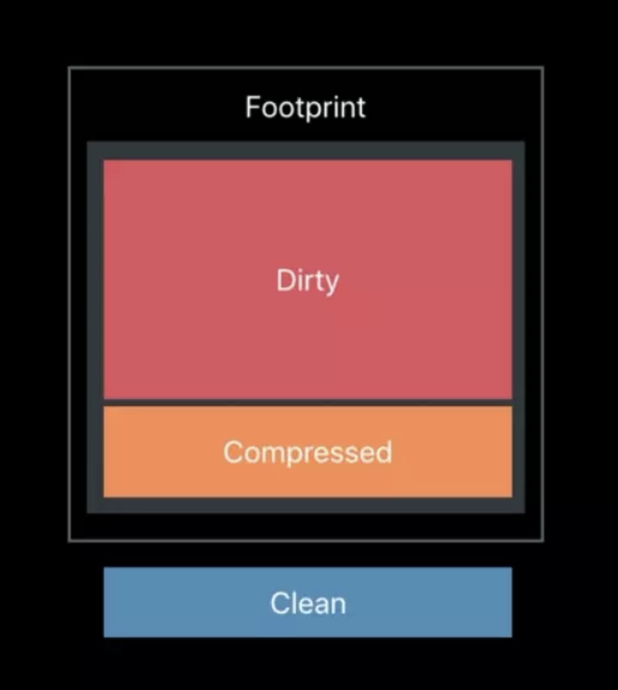

这部分大家可以看下这篇文章：[WWDC 2018：iOS 内存深入研究](https://juejin.im/post/5b23dafee51d4558e03cbf4f)

**XCode内存检测工具**

  * Memory Report 内存使用报告

Memory Report 是可以实时查看整个应用当前应用内存使用情况的工具，但是它只能用于初略得定位哪些页面有可能有内存泄漏，或者哪个时间段有内存抖动问题。具体的定位还是需要Allocations工具

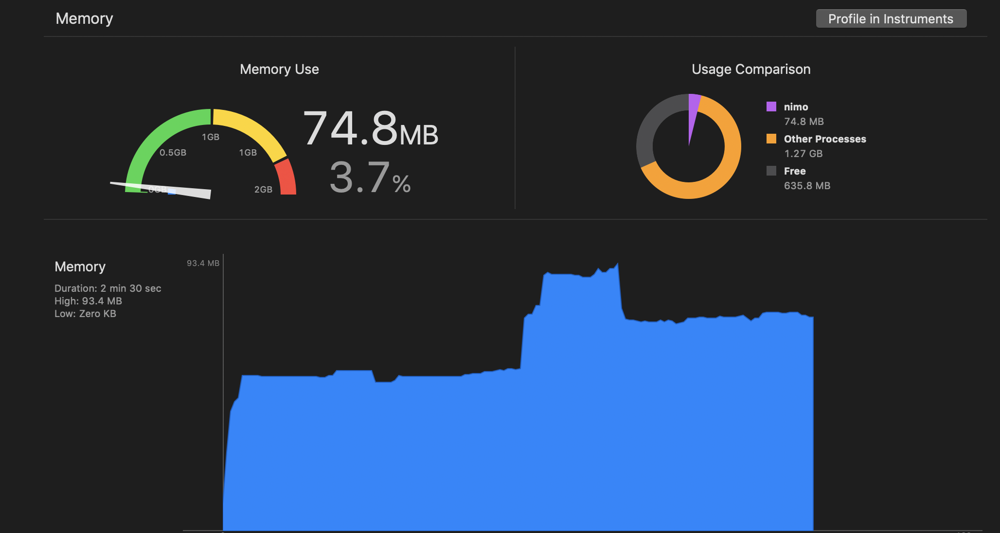

  * Analyze 静态分析工具

Analyze主要用于从代码层面上进行语义分析，主要可以用于分析如下几类问题:

    逻辑错误：访问空指针或未初始化的变量等；  
    内存管理错误：如内存泄漏等；  
    声明错误：从未使用过的变量；  
    Api调用错误：未包含使用的库和框架  

Analyze 分析出的问题并不一定是真正意义上的问题，它只是一个理论上的预测过程，具体是不是需要解决要我们自己去分析排查。

  * Allocations 观察内存的分配情况
    
    Xcode -> Product -> Profile -> Allocations  

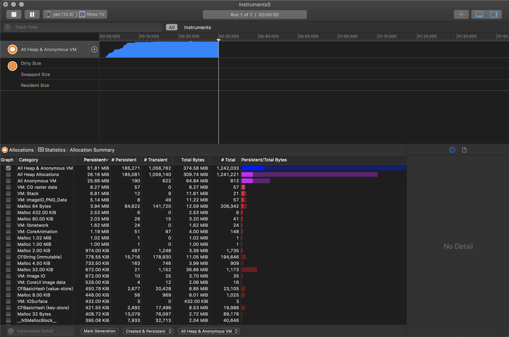

我们一般会先看下Allocation Summary页面，比较重要的有三行：

    All Heap & Anonymous VM: 所有堆内存和虚拟内存  
    All Heap Allocations: 所有堆内存，堆上malloc分配的内存，不包过虚拟内存区域  
    All Anonymous VM: 所有虚拟内存，就是Allocations不知道是你哪些代码创建的内存，也就是说这里的内存你无法直接控制。像memory mapped file，CALayer back store等都会出现在这里。这里的内存有些是你需要优化的，有些不是。  

每行都包含如下几个重要的列：

    Persistent :未释放的对象个数  
    Persistent Byte :未释放的字节数  
    Transient       :已释放的临时对象个数  
    Total Byte      :总使用字节数  
    Total           :所有对象个数  
    Persistent/Total Bytes : 已经使用的内存对象占全部的百分比  

当我们看到如下的阶梯的时候就说明有内存泄漏问题：

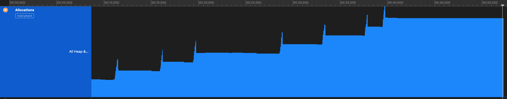

下面这种就是说明没有内存泄漏，但是存在内存抖动现象。  
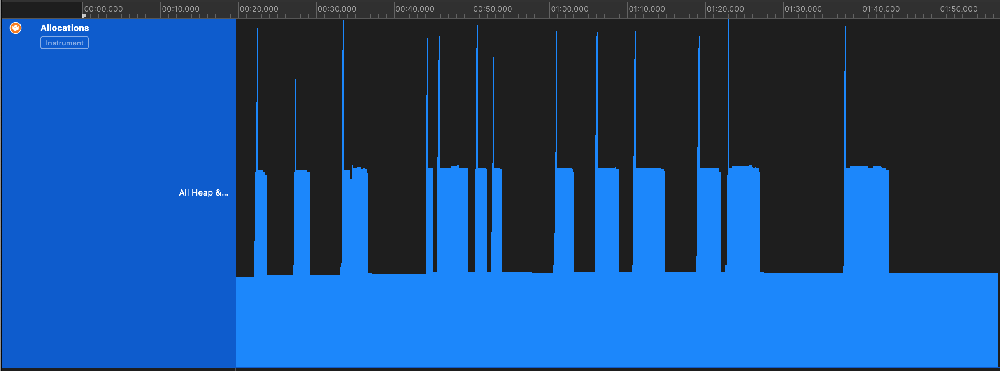

正常的情况下应该是比较平稳的没有尖峰的曲线。

在我们遇到内存问题的时候首先会先看**Statistics**分类：  
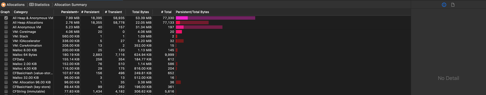

我们一般会先查看前几项比较主要的。勾选后就会出现在上面的曲线中。  

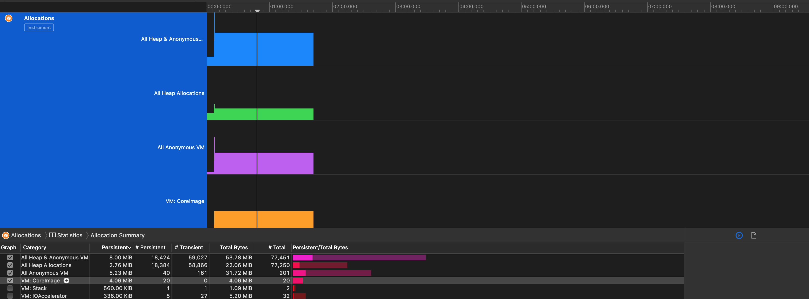

点击你觉得比较有嫌疑的项的箭头处，就可以看到具体的内存分配，以及右边面板上的调用堆栈，这部分堆栈可以隐藏显示系统调用的：  

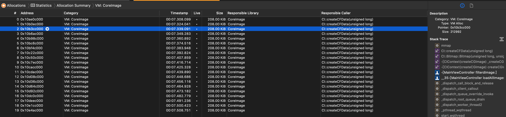
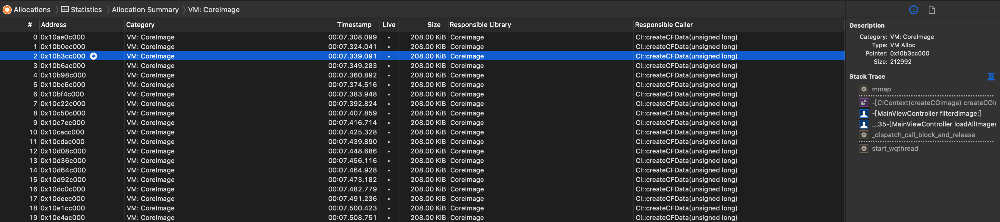

点击进去就可以看到具体的代码，代码旁边会以百分比以及占用内存的尺寸等形式标记出来  

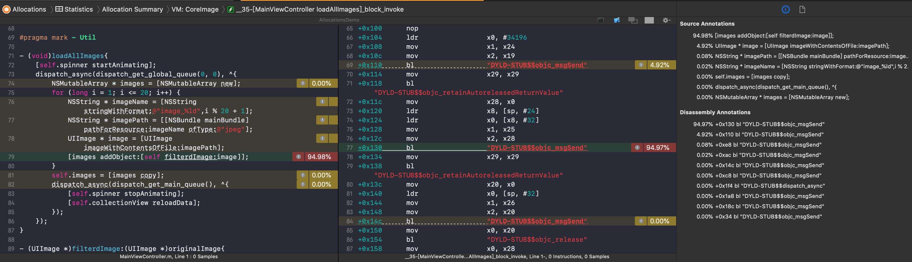

还可以使用：

  * **Generation**：对内存的增量进行分析

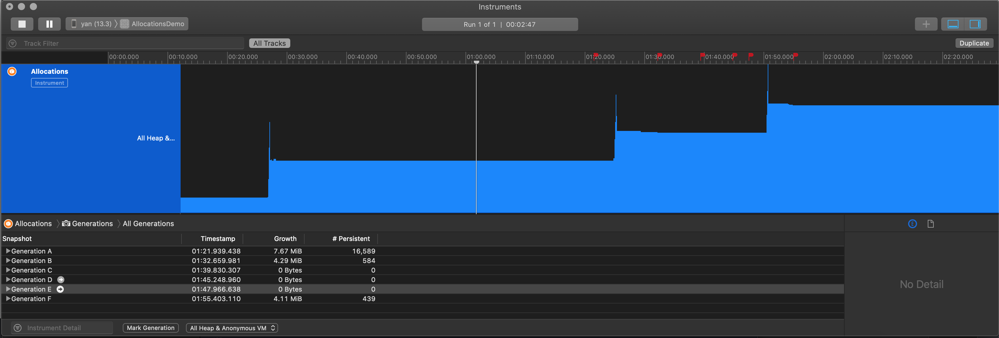

  * **Call Tree**：分析代码是如何创建内存的。

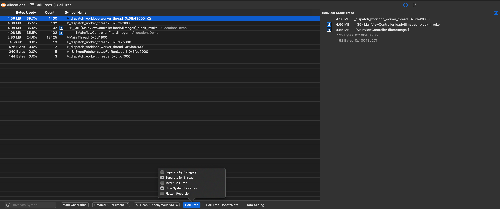

  * **Allocations list**：观察内存的分配的列表

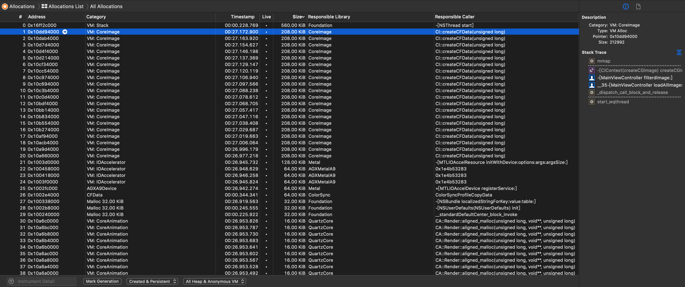

  * **Debug Memory Graph 图形化内存表**

Debug Memory Graph 是Xcode8中增加的调试技能，在App运行调试过程中，点击即可实时看到内存的分配情况以及引用情况，可用于发现部分循环引用问题，为了能看到内存详细信息，需要打开Edit Scheme–>Diagnostics, 勾选 Malloc Scribble 和 Malloc Stack。同时在 Malloc Stack 中选择 Live Allocations Only：

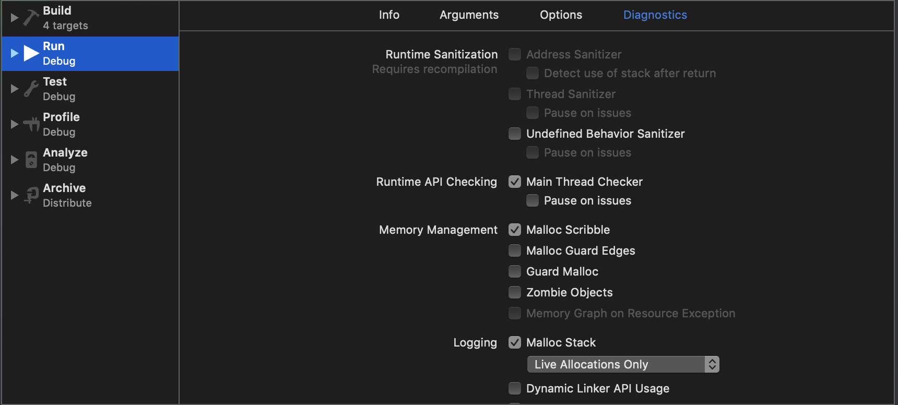

运行应用，点击Xcode 如下按钮：


整个界面如下图所示：

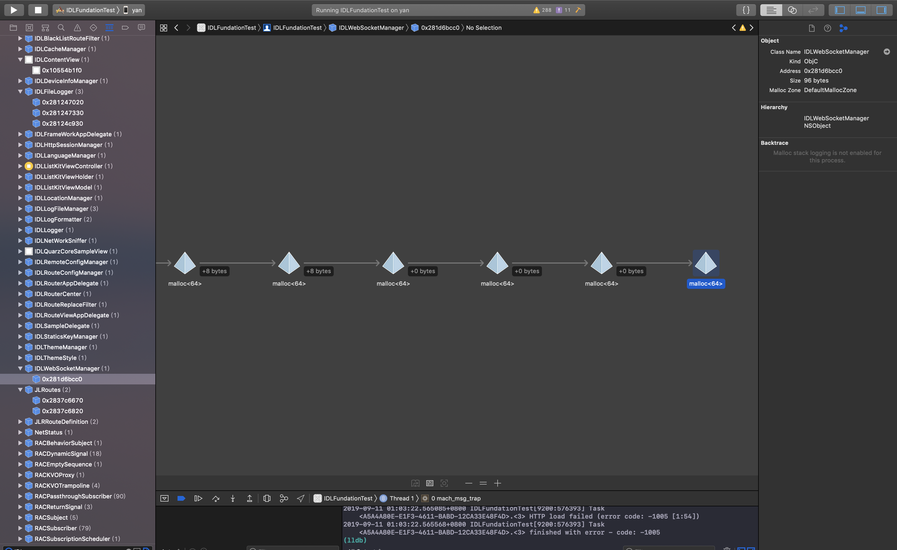

可以先通过左下脚的过滤按钮，筛选出只属于项目的类，以及只显示存在内存泄漏的项，有内存泄漏的项的右边会有感叹号，可以定位到右边的图然后右击跳到生成这个对象的代码。  
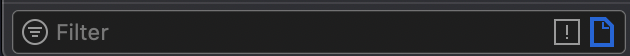

这个个人在项目中用得不是很多，主要是生成图的过程太耗时了，很经常卡得不要不要的。

  * Leaks 内存泄漏检测工具

Leaks 用起来还是蛮好用的，不过在有了后面介绍的一款工具后也慢慢少用了，至于什么工具先卖个关子，我们这里先给大家介绍下Leaks工具的使用。

    Xcode -> Product -> Profile -> Leaks  

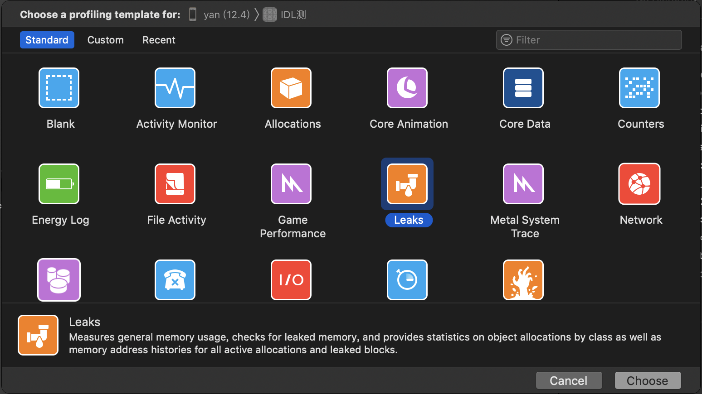

启动 Instruments 操作应用，如果有内存泄漏情况，会打叉提示，我们可以看到到底泄漏了多少内存，以及对应的方法调用栈。可以很快速地定位到内存泄漏点的位置。  

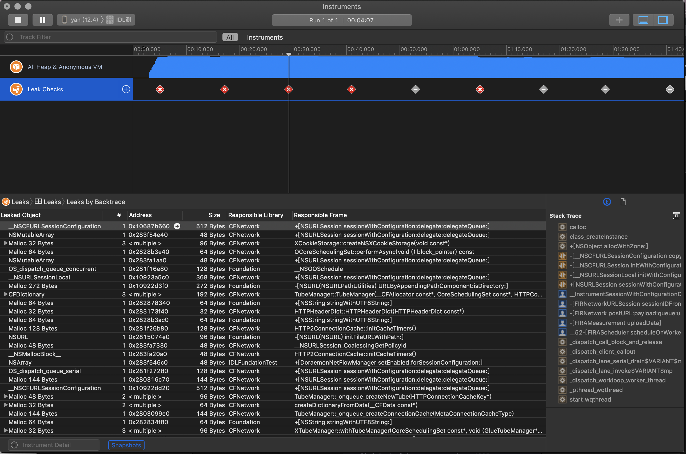  
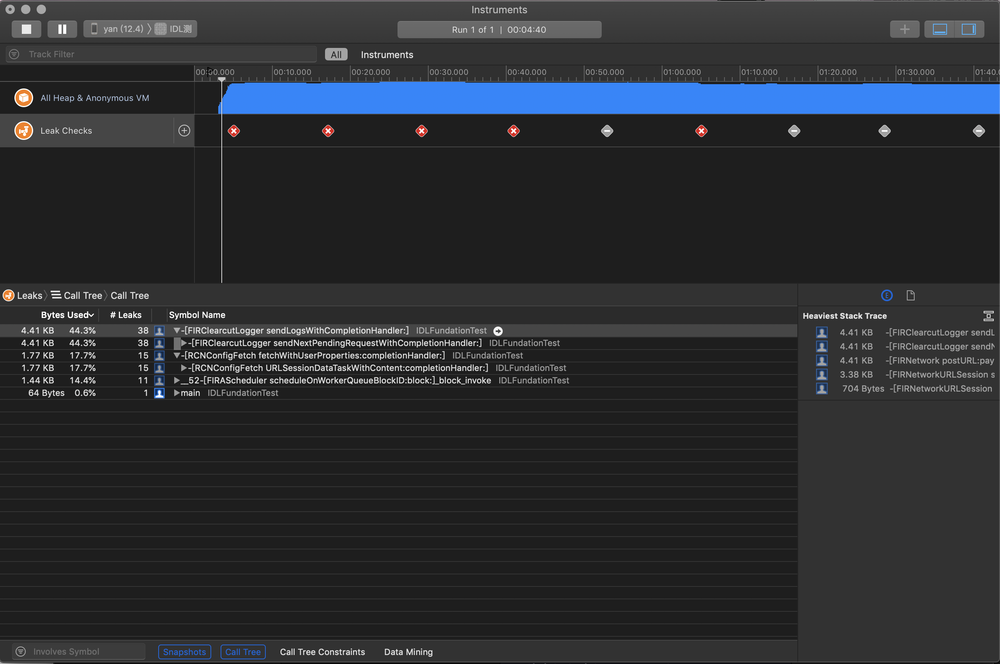  
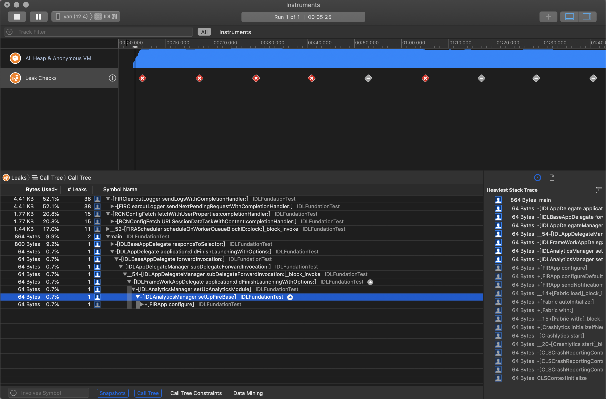  
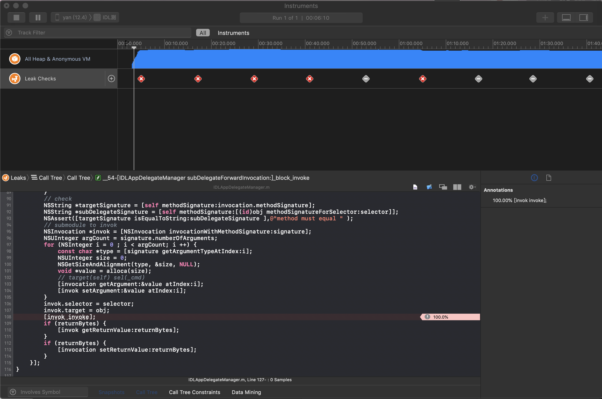

上面介绍的工具虽然是官方推出的工具，但是实际上并不是十分好用，需要我们一个个场景去重复的操作，还有检测不及时，并且Instuments工具永久了不是一般的卡，在开发过程中上面几种工具用得比较多的就是Memory Report，Analyze 以及 Leaks，更多的是结合一些开源库来实时检测内存泄漏，这里推荐的是微信推出的MLeaksFinder，它能较为实时地检测内存泄漏问题，一旦有内存泄漏立刻弹窗提示，这种方式从很大角度上加快了我们发现问题解决问题的速度。

**MLeaksFinder** [GitHub地址](https://github.com/Tencent/MLeaksFinder)

MLeaksFinder 可以算得上是一个很好的检查内存泄漏的辅助工具，它有如下特点：

> 使用简单，不侵入业务逻辑代码，不用打开 Instrument 
> 不需要额外的操作，你只需开发你的业务逻辑，在你运行调试时就能帮你检测  
> 内存泄露发现及时，更改完代码后一运行即能发现（这点很重要，你马上就能意识到哪里写错了）  
> 精准，能准确地告诉你哪个对象没被释放  
> MLeaksFinder 目前能自动检测 UIViewController 和 UIView 对象的内存泄露，而且也可以扩展以检测其它类型的对象

具体的实现细节可以看官方的博客，由于篇幅原因，这里只提炼一些重要的内容做介绍，后面会针对MLeaksFinder写一篇源码解析的文章来介绍它的实现:

  * [MLeaksFinder：精准 iOS 内存泄露检测工具](http://wereadteam.github.io/2016/02/22/MLeaksFinder/)
  * [MLeaksFinder 新特性](http://wereadteam.github.io/2016/07/20/MLeaksFinder2/)

MLeaksFinder 通过AOP技术 hook UIViewController 和 UINavigationController 的 pop 跟 dismiss 方法，这种做法的优点就是不会侵入项目工程。MLeaksFinder会在UIViewController被pop或dismiss一小段时间后，检测该 UIViewController的view，以及view 的 subviews 等等是否还存在，具体的方法是，为基类 NSObject 添加一个方法 `-willDealloc` 方法，该方法的作用是，先用一个弱指针指向 self，并在一小段时间(2秒)后，通过这个弱指针调用 `-assertNotDealloc`，而 `-assertNotDealloc` 主要作用是直接中断言。我们可以在一个UIViewController被pop或dismiss时遍历该 UIViewController上的所有view依次调 `-willDealloc` 这样如果2秒后它们被释放成功，weakSelf 就指向 nil，不会调用到 `-assertNotDealloc`方法，也就不会中断言，如果它没被释放，`-assertNotDealloc`就会被调用中断言。通过这种方式可以找出具体是哪个地方发生了内存泄露。最新版本的MLeaksFinder 还结合了FBRetainCycleDetector通过MLeaksFinder查找可能存在内存泄漏的对象，然后通过FBRetainCycleDetector来查看是否存在循环引用。

```objc
- (BOOL)willDealloc {  
    // 当前的类是否再白名单中，如果是的话就不会进行检测是否泄漏  
    NSString *className = NSStringFromClass([self class]);  
    if ([[NSObject classNamesWhitelist] containsObject:className])  
        return NO;  
    NSNumber *senderPtr = objc_getAssociatedObject([UIApplication sharedApplication], kLatestSenderKey);  
    if ([senderPtr isEqualToNumber:@((uintptr_t)self)])  
        return NO;  
    //延迟2秒尝试调用assertNotDealloc  
    __weak id weakSelf = self;  
    dispatch_after(dispatch_time(DISPATCH_TIME_NOW, (int64_t)(2 * NSEC_PER_SEC)), dispatch_get_main_queue(), ^{  
        __strong id strongSelf = weakSelf;  
        [strongSelf assertNotDealloc];  
    });  
    return YES;  
}

- (void)assertNotDealloc {  
    if ([MLeakedObjectProxy isAnyObjectLeakedAtPtrs:[self parentPtrs]]) {  
        return;  
    }  
    [MLeakedObjectProxy addLeakedObject:self];  
    NSString *className = NSStringFromClass([self class]);  
    NSLog(@"Possibly Memory Leak.\nIn case that %@ should not be dealloced, override -willDealloc in %@ by returning NO.\nView-ViewController stack: %@", className, className, [self viewStack]);  
}  
```

需要注意的是这里的遍历需要遍历基于UIViewController的整棵View-ViewController树，对于某些 ViewController，如 UINavigationController，UISplitViewController 等，还需要遍历 viewControllers 属性。

MLeaksFinder在发现可能的内存泄漏对象并给出 alert 之后，还会进一步地追踪该对象的生命周期，并在该对象释放时给出 Object Deallocated 的 alert，所以有时候你会发现弹出一个内存泄漏的弹窗后，你以为内存泄漏了检查了好久发现没有，重复尝试后你会发现在这个弹窗之后还会出现Object Deallocated弹窗，这种其实是某个对象延迟释放了，并不是发生了内存泄漏。

所以在使用MLeaksFinder的时候一般会有如下几种情况：

  * 在第一次pop的时候弹出Leak弹窗，在之后的重复push并pop同一个ViewController过程中，即不报 Object Deallocated，也不报 Memory Leak。这种情况下我们可以确定该对象被设计成单例或者缓存起来了。

  * 在第一次pop的时候弹出Leak弹窗，在之后的重复push并pop同一个ViewController过程中，对于同一个类不断地报 Object Deallocated 和 Memory Leak。这种情况属于释放不及时的情况，不算内存泄漏。

  * 在第一次pop的时候弹出Leak弹窗，在之后的重复push并pop同一个ViewController过程中，不报Object Deallocated，但每次 pop 之后又报 Memory Leak，这种才算是真正的内存泄漏。

**其他关于内存检测较好的开源库：**

  * [FBAllocationTracker](https://github.com/facebook/FBAllocationTracker) FaceBook推出的用于检测对象分配的开源库
  * [FBRetainCycleDetector](https://github.com/facebook/FBRetainCycleDetector) FaceBook推出的用于检测循环引用的开源库
  * [FBMemoryProfiler](https://github.com/facebook/FBMemoryProfiler) 结合FBAllocationTracker，FBRetainCycleDetector来提供内存问题检测的工具，支持插件开发。
  * [OOMDetector](https://github.com/Tencent/OOMDetector) 腾讯开源的OOM检测器

**比较常见的内存问题简要总结**

该部分见《iOS 内存管理总结》博客一文

### 3.2 卡顿优化

在之间的博客中已经介绍过了iOS的布局渲染机制，在介绍卡顿优化之前大家可以通过之前的博客回顾下一个界面是怎样绘制到屏幕上的。然后再针对各个环节考虑优化步骤，一般一个应用都有首页这个关键页面，它是用户最频繁访问的，也是一个应用的门面，因此首页的优化至关重要;列表是一个应用最常用的组件，并且列表是可滑动的它的卡顿往往是最明显的，所以这里也会介绍下怎么针对列表进行卡顿检测和优化。

**底层原理**

iOS界面的渲染主要由CPU和GPU协同下完成的，CPU一般用于逻辑部分的处理，而GPU由于高性能的并发计算能力和浮点计算能力，所以在渲染方面比CPU来得高效很多，因此我们在代码实现过程中尽量将图形显示相关的工作交给GPU，而将逻辑处理，线程调度工作交给CPU。只有CPU和GPU二者达到性能最优的平衡点才能获得最佳的界面效果，无论过度优化哪一方导致另一方压力过大都会造成整体FPS性能的下降。寻找这个均衡点十分关键，在介绍这部分优化之前我们分别看下二者在整个过程中完成了哪些工作：

**CPU 部分**

在整个界面显示过程中：对象创建，对象属性调整，对象销毁，Autolayout约束，布局计算，文本计算，文本渲染，图片的解码，图像的绘制，提交纹理数据。这些工作都是在CPU上进行的，所以CPU部分的优化就需要弄清楚这些环节都做了哪些工作，并且哪些是有可能导致性能瓶颈的点。

**对象创建**

  * 首先我们会创建需要添加到界面上的对象，并且设置其属性，以及在整个过程中属性的调整，这些都是在CPU中完成的。

优化点 1:  

对象的创建伴随着内存的分配，会消耗CPU资源，所以这个部分可以使用轻量对象的就不使用重的对象，比如能用CALayer的就不用UIView,但是这也有一个也有个比较坑的地方就是，某个控件初期的时候可能不涉及事件处理所以用Layer会比较轻量，但是后续可能要添加事件处理，这样改起来就比较麻烦了，因此在实际开发中除非可以确定是不涉及事件处理否则还是会用UIView。

优化点 2:  

在创建对象的时候尽量推迟某个对象的创建时间，可以通过懒加载的方式在使用的时候创建对象，可以通过缓存或者对象池来避免重复频繁创建对象。

优化点 3：

对UIView属性的更改是比较耗费资源的，所以尽量减少不必要的属性修改，避免视图层次的调整以及视图的添加移除，尽量使用hide等属性来代替视图移除添加。

**视图布局**

  * 在创建完对象后会把视图对象添加到界面上，这时候会触发界面的布局，在布局方面目前用得比较多的有两大类，一种是基于frame的，一种是基于AutoLayout的，前者的缺点就是要我们自己计算好各个尺寸数据，但是性能上是最快的，而AutoLayout在使用上对于描述布局来说是十分方便，直观的，但是在性能上随着视图数量的增长，Autolayout 带来的 CPU 消耗会呈指数级上升（在iOS12上这个问题已经有所好转）因此从性能角度上看建议建议使用基于frame的布局。 

除了布局框架选型外，在布局方面还可以在计算布局的时候放在子线程中计算，在最后设置frame的时候回到主线程，对于某些布局参数还可以适当缓存，特别是列表的cell布局尺寸，往往是可以进行缓存的。

**文本计算及渲染**

  * 常见的文本控件比如UILabel，UITextView，它们的排版和绘制都是在主线程进行的，当需要显示大量文本的时候会给CPU带来很大的压力，所以可以使用TextKit或者CoreText自定义的文本控件来代替，对于宽高计算推荐在后台使用[NSAttributedString boundingRectWithSize:options:context:]，并且适当地缓存某些内容不变的文本尺寸数据。

子线程计算文本宽高，文本绘制：

```objc
// 文字计算  
[@"iOS" boundingRectWithSize:CGSizeMake(100, MAXFLOAT) options:NSStringDrawingUsesLineFragmentOrigin attributes:nil context:nil];  
// 文字绘制  
[@"iOS" drawWithRect:CGRectMake(0, 0, 100, 100) options:NSStringDrawingUsesLineFragmentOrigin attributes:nil context:nil];  
```

**图片解码及绘制**

  * 当我们创建图片的时候图片数据并不会立刻解码，只有在图片设置到 UIImageView 或者 CALayer.contents 中去，并且 CALayer 被提交到 GPU 前CGImage 中的数据才会得到解码。这是在主线程中由CPU执行的。如果想要绕开这个机制，常见的做法是在后台线程先把图片绘制到CGBitmapContext中，然后从Bitmap直接创建图片。由于 CoreGraphic 方法通常都是线程安全的，所以图像的绘制可以很容易的放到后台线程进行。

```objc
- (void)loadImage {  
    //.......  
    dispatch_async(dispatch_get_global_queue(0, 0), ^{  
        CGImageRef cgImage = [UIImage imageNamed:@"avator"].CGImage;  
        CGImageAlphaInfo alphaInfo = CGImageGetAlphaInfo(cgImage) & kCGBitmapAlphaInfoMask;  
        BOOL hasAlpha = NO;  
        if (alphaInfo == kCGImageAlphaPremultipliedLast ||  
            alphaInfo == kCGImageAlphaPremultipliedFirst ||  
            alphaInfo == kCGImageAlphaLast ||  
            alphaInfo == kCGImageAlphaFirst) {  
            hasAlpha = YES;  
        }  
        CGBitmapInfo bitmapInfo = kCGBitmapByteOrder32Host;  
        bitmapInfo |= hasAlpha ? kCGImageAlphaPremultipliedFirst : kCGImageAlphaNoneSkipFirst;  
        size_t width = CGImageGetWidth(cgImage);  
        size_t height = CGImageGetHeight(cgImage);  
        CGContextRef context = CGBitmapContextCreate(NULL, width, height, 8, 0, CGColorSpaceCreateDeviceRGB(), bitmapInfo);  
        CGContextDrawImage(context, CGRectMake(0, 0, width, height), cgImage);  
        cgImage = CGBitmapContextCreateImage(context);  
        UIImage *newImage = [UIImage imageWithCGImage:cgImage];  
        CGContextRelease(context);  
        CGImageRelease(cgImage);  
        dispatch_async(dispatch_get_main_queue(), ^{  
            self.imageView.image = newImage;  
        });  
    });  
}  
```

在iOS系统中如果GPU不支持某种图片格式这时候就只能通过CPU来渲染，所以我们应该尽量避免这种情况的发生，由于苹果特意为PNG格式做了渲染和压缩算法上的优化，因此尽量使用PNG格式作为图片的默认格式。

**提交界面数据**

在RunLoop即将进入休眠期间或者即将退出的时候，通过已经注册的通知回调执行`_ZN2CA11Transaction17observer_callbackEP19__CFRunLoopObservermPv`函数，在这个函数会递归将待处理的图层进行打包压缩，并通过IPC方式发送到Render Server，这里还需要提到一点：这时候的Core Animation会创建一个OpenGL ES纹理并将CPU绘制位图上传到对应的纹理中。

**GPU 部分**

Render Server在拿到压缩后的数据的时候，首先对这些数据进行解压，从而拿到图层树，然后根据图层树的层次结构，每个层的alpha值opeue值，RGBA值、以及图层的frame值等对被遮挡的图层进行过滤，最终得到渲染树，渲染树就是指将图层树对应每个图层的信息，比如顶点坐标、顶点颜色这些信息，抽离出来，形成的树状结构。渲染树就是下一步送往GPU进行渲染的数据。

**纹理渲染**

有时候我们会发现一种现象：在某些包含大量图片的列表页面快速滑动会出现GPU占用率很高但是CPU却相当空闲，规避这种问题的方式就是尽可能得将多张图片合成一张显示，这样可以节省整个纹理渲染的时间。

**视图合成**

一般我们每个界面都是由多个视图或者CALayer组成，多个视图会一层层得叠在一起,GPU在显示之前会先对这些视图层进行混合，如果视图结构过于复杂就会消耗很多GPU资源，为了解决这个问题就必须在我们界面实现的过程中尽量做到减少视图数量和层次结构，如果顶层的视图的opaque为YES,那么我们在合成的时候就会直接采用最上层的视图，就省去了合成过程，所以这个步骤中可以通过在实现的过程中减少视图的数量和层次，或者将多个视图先渲染为一张图片显示，尽量采用不透明的视图，并将视图opaque设置为YES，避免无用的Alpha通道合成(这里需要注意一点即使UIImageView的alpha是1，只要image含有透明通道，则仍会进行合成操作).

**像素对齐**

我们知道iOS设备上，有逻辑像素point和物理像素pixel之分。point和pixel的比例是通过`[[UIScreen mainScreen] scale]`来确定的。在没有视网膜屏之前，1 point=1 pixel；但是2x和3x的视网膜屏出来之后，1 point等于2 pixel或3 pixel。设计提供的设计稿标注使用的像素是逻辑像素point而GPU在渲染图形之前，系统会将逻辑像素point换算成物理像素pixel。

如果界面上某个控件的逻辑像素point乘以2（2x的视网膜屏） 或3（3x的视网膜屏）得到整数值或者得到的是浮点数但是小数点后都是0的，这种情况就是像素对齐，否则就是像素不对齐，对于像素不对齐还有一种情况就是图片的size和显示图片的imageView的size以及逻辑像素point不相等。

出现像素不对齐的情况，会导致在GPU渲染时，对没对齐的边缘，需要进行插值计算，这个插值计算的过程会有性能损耗,像素不对称齐的元素一般为UILabel或UIImageView（UILabel宽度不为整数时并没有有像素不对齐，但x、y、height不为整数就会导致像素不对齐）。

解决像素不对齐的问题可以使用如下措施：

  * frame设置时候，使用整数;计算frame时候，计算的结果使用ceil处理一下，避免小数点后有非0数存在。
  * 设置imageView的size要和切图的size(逻辑像素point)相等。
  * 如果图片是从服务端获取到的，这时候要注意图片大小，保证获取的图片的size要缩放成和imageView的size(逻辑像素poin)相等。缩放后的图片的scale和[UIScreen mainScreen].scale要相等，缩放操作放在子线程中做，并且做好缓存，避免每次显示都要缩放。
  * 在使用Group Style的UITableview时，如果tableView:heightForHeaderInSection:回调返回0，系统会认为没有设置header的高度而重新提供一个默认的header高度，导致在UITableview中看到一个空白的header。这个可以通过在回调里返回一个很小的高度，比如0.01，这样能达到隐藏header的效果，但也造成了此处的像素不对齐问题。  
可以通过如下方法解决：

```objc
- (CGFloat)tableView:(UITableView *)tableView heightForHeaderInSection:(NSInteger)section {  
    return CGFLOAT_MIN;  
}  
```

图片缩放方法：  

```objc
- (UIImage *)scaleImageWithSize:(CGSize)boxSize{  
    if (CGSizeEqualToSize(boxSize, self.size)) {  
        return self;  
    }  
    CGFloat screenScale = [[UIScreen mainScreen] scale];  
    CGFloat rate = MAX(boxSize.width / self.size.width, boxSize.height / self.size.height);  
    CGSize resize = CGSizeMake(self.size.width * rate , self.size.height * rate );  
    CGRect drawRect = CGRectMake(-(resize.width - boxSize.width) / 2.0 ,  
                                 -(resize.height - boxSize.height) / 2.0 ,  
                                 resize.width,  
                                 resize .height);  
    boxSize = CGSizeMake(boxSize.width, boxSize.height);  
    UIGraphicsBeginImageContextWithOptions(boxSize, YES, screenScale);  
    [self drawInRect:drawRect];  
    UIImage *image = UIGraphicsGetImageFromCurrentImageContext();  
    UIGraphicsEndImageContext();  
    return image;  
}  
```

放在异步缩放后设置到UIImageView上  

```objc
dispatch_async(dispatch_get_global_queue(DISPATCH_QUEUE_PRIORITY_DEFAULT, 0), ^{  
    UIImage *image = [[UIImage imageNamed:self.cellModel.iconImageName] scaleImageWithSize:_iconImageView.frame.size];  
    dispatch_sync(dispatch_get_main_queue(), ^{  
        _iconImageView.image = image;  
        _iconImageView.hidden = (image != nil) ? NO : YES;  
    });  
});  
```

文本计算高度时候使用ceil进行像素对齐

```objc
- (CGSize)textSizeWithFont:(UIFont*)font{  
   CGSize textSize = [self sizeWithAttributes:@{NSFontAttributeName:font}];  
   textSize = CGSizeMake((int)ceil(textSize.width), (int)ceil(textSize.height));  
   return textSize;  
}

- (CGSize)textSizeWithFont:(UIFont*)font  
                numberOfLines:(NSInteger)numberOfLines  
                  lineSpacing:(CGFloat)lineSpacing  
             constrainedWidth:(CGFloat)constrainedWidth  
            isLimitedToLines:(BOOL *)isLimitedToLines{  
    if (self.length == 0) {  
        return CGSizeZero;  
    }  
    CGFloat oneLineHeight = font.lineHeight;  
    CGSize textSize = [self boundingRectWithSize:CGSizeMake(constrainedWidth, MAXFLOAT) options:NSStringDrawingUsesLineFragmentOrigin attributes:@{NSFontAttributeName:font} context:nil].size;  
    CGFloat rows = textSize.height / oneLineHeight;  
    CGFloat realHeight = oneLineHeight;  
    if (numberOfLines == 0) {  
        if (rows >= 1) {  
            realHeight = (rows * oneLineHeight) + (rows - 1) * lineSpacing;  
        }  
    }else{  
        if (rows > numberOfLines) {  
            rows = numberOfLines;  
            if (isLimitedToLines) {  
                *isLimitedToLines = YES;  //被限制  
            }  
        }  
        realHeight = (rows * oneLineHeight) + (rows - 1) * lineSpacing;  
    }  
    return CGSizeMake(ceil(constrainedWidth),ceil(realHeight));  
}  
@end  
```

**局部图形的生成**

在我们通过CALayer设置视图的border、圆角、阴影、遮罩的时候不会直接在当前屏幕进行渲染，而是会在当前缓冲区以外的控件预先进行渲染，然后再绘制到当前屏幕上，这就是所谓的离屏渲染。离屏渲染之所以会很耗性能是因为它需要创建一个新的缓存区，并且在需要在当前屏幕缓冲区和离屏缓冲区之间进行切换。比较极端的情况:当一个列表视图中出现大量圆角的 CALayer，并且快速滑动时，可以观察到 GPU 资源已经占满，而 CPU 资源消耗很少。这时界面仍然能正常滑动，但平均帧数会降到很低。这种情况下可以通过把需要显示的图形在后台线程绘制为图片，避免使用圆角、阴影、遮罩等属性。

**界面渲染**

在经过上面处理后GPU会对上面的界面进行渲染，然后将渲染后的结果提交到帧缓冲区去。在VSync信号到来后视频控制器会从当前帧缓冲区中取出数据进行显示。如果在一个VSync时间内CPU 或者 GPU 没有完成内容提交，那么这一帧就会被丢弃，等待下一次机会再显示，而这时显示屏会保留之前的内容不变。这就导致了界面的卡顿。

所以从上面整个流程来看在16ms时间内不论是CPU还是GPU压力过大导致没有在这段时间内提交界面渲染的数据都会导致界面的掉帧。

这里还需要注意的是iOS使用的是双缓冲机制：GPU会先将渲染好一帧放入当前屏幕帧缓存器供视频控制器读取，当下一帧渲染好后，GPU会直接把视频控制器的指针指向第二个缓冲器。当视频控制器读完一帧，准备读取下一帧的时候，GPU会在显示器的VSync信号发出后，快速切换两个帧缓冲区，这其实算是系统内机制的一种优化，现在大部分系统一般都会采用多缓冲机制。

下面对上面的优化点做个总结罗列：  

```
1.  能用CALayer的就不用UIView。  
2.  在创建对象的时候尽量推迟某个对象的创建时间，可以通过懒加载的方式在使用的时候创建对象。  
3.  对UIView属性的更改是比较耗费资源的，所以尽量减少不必要的属性修改，避免视图层次的调整以及视图的添加移除，尽量使用hide等属性来代替视图移除添加。  
4.  尽量采用frame布局框架  
5.  在计算布局的时候可以放在后台线程中进行计算，在最后设置frame的时候切换到主线程  
6.  对布局计算结果进行缓存，可以在获取数据之后，异步计算Cell高度以及各控件高度和位置，并储存在Cell的LayouModel中，当每次Cell需要高度以及内部布局的时候就可以直接调用，不需要进行重复计算。对于自动缓存高度可以考虑使用FDTemplateLayoutCell来解决这个问题。  
7.  对于大文本可以使用TextKit或者CoreText自定义的文本控件代替UILabel，UITextView  
8.  对于图片可以在子线程预解码，主线程直接渲染.  
9.  尽量不要用JPEG的图片，应当使用PNG或者WebP图片。  
10. 尽量使用不包含透明通道的图片资源  
11. 尽可能将多张图片合成为一张进行显示，图片的 size 最好刚好跟 UIImageView 的 size 保持一致  
12. 将opaque设置为YES，减少性能消耗，因为GPU将不会做任何合成，而是进行简单的层拷贝  
13. 尽量避免圆角（layer.cornerRadius && layer.masksToBounds = YES || view.clipsToBounds = YES ）、阴影（layer.shadows）、遮罩（layer.mask），layer.allowsGroupOpacity为YES，layer.opacity的值小于1.layer.shouldRasterize = YES，layer.edgeAntialiasingMask，layer.allowsEdgeAntialiasing 这些情况出现,对于圆角可以靠绘制来完成或者直接让美工把图片切成圆角进行显示，这是效率最高的一种方案。  
14. 合理使用光栅化 shouldRasterize，因为一旦开启光栅化CALayer会被光栅化为bitmap，这时候shadows、cornerRadius等效果会被缓存，所以对于那些不经常改变的界面比较合适，但是对于哪些内容动态改变的界面就不太合适了，因为更新已经光栅话的layer会导致离屏渲染。  
15. 最小化界面刷新，刷新一个cell就能解决的，坚决不刷新整个 section 或者整个tableView。  
16. 在滑动停止的时候再加载内容，对于一闪而过的内容没有必要加载，可以使用默认的占位符填充内容。  
17. 在cellForRowAtIndexPath:回调的时候只创建实例，快速返回cell，不绑定数据。在willDisplayCell:forRowAtIndexPath:的时候绑定数据  
18. 对于列表来说，在tableView滑动时，会不断调用heightForRowAtIndexPath:当高度需要自适应的时候每次回调都要计算高度，因此在这种情况下要对高度进行缓存，避免无意义的高度计算。  
19. GPU 能处理的最大纹理尺寸是 4096x4096，一旦超过这个尺寸，就会占用 CPU 资源进行处理，所以纹理尽量不要超过这个尺寸.  
20. 对于界面上需要频繁从数据库中读取数据进行展示的可以考虑为这些数据增加缓存。  
21. 如果引入异步绘制框架成本可以接受可以考虑引入Texture或者类似的异步绘制框架。  
22. 采用预加载机制，在一个列表中，滑动到一个可以设定的位置的时候，如果数据获取比较耗时可以考虑提前获取下载下一页的数据。  
23. 尽量避免像素不对齐的现象发生。  
24. 避免使用CGContext在drawRect:方法中绘制，大部分情况下会导致离屏渲染，哪怕仅仅是一个空的实现也会导致离屏渲染。  
```

如何使用XCode进行界面调优：

XCode相关的界面调优项目前都移动到了Debug -> View Debuging -> Rendering下，下面将对这里的每一项功能进行介绍：

  * **Color Blended Layers 图层混合检查**

这个选项是用于检测哪里发生了图层混合，哪块区域显示红色就说明发生了图层混合，所以我们的目的就是将红色区域消减的越少越好。那么如何减少红色区域的出现呢？上面提到了只要设置控件不透明即可。

    （1）设置opaque 属性为YES。  
    （2）给View设置一个不透明的颜色。  

这里需要要再强调下UIImageView控件比较特殊，不仅需要自身这个容器是不透明的，并且imageView包含的内容图片也必须是不透明的。

  * **Color Hits Green and Misses Red 命中缓存的layer位图检查**

这个选项主要是检测我们是是否正确使用layer的shouldRasterize属性，shouldRasterize = YES开启光栅化，光栅化会将一个layer预先渲染成bitmap，再加入缓存中，成功被缓存的layer会标注为绿色,没有成功缓存的会标注为红色，如果我们在一个界面中使用了光栅化，刚进去这个页面所有使用了光栅化的控件layer都会是红色，因为还没有缓存成功，如果上下滑动你会发现，layer变成了绿色。所以这一项的目标还是减小红色区域。

正确使用光栅化可以得到一定程度的性能提升，但是这只对于内容不变的情况下，也就是上面提到的静态页面，如果内容变更频繁那么就不要打开光栅化，否则会造成性能的浪费，例如我们在使用tableViewCell中，一般不要用光栅化，因为tableViewCell的绘制非常频繁，内容在不断的变化，如果使用了光栅化，会造成大量的离屏渲染降低性能。

对于光栅化需要注意两点  

(1) 系统给光栅化缓存分配了的空间有限，不要过度使用，如果超出了缓存造成离屏渲染。  
(2) 如果在100ms内没有使用缓存的对象，则会从缓存中清除。

  * **Color Copied Images 检查是否对图片进行格式转换操作**

如果GPU不支持当前图片的颜色格式，那么就会将图片交给CPU预先进行格式转化，并且将这张图片标记为蓝色，目前苹果的GPU只解析32bit的颜色格式，所以如果使用Color Copied Images去调试发现是蓝色，就可以找设计看下是否图片的颜色格式不对了。

  * **Color Misaligned Images**

这个选项可以帮助我们查看图片大小是否正确显示。如果image size和imageView size不匹配，image会出现黄色。要尽可能的减少黄色的出现。

  * **Color Offscreen-Rendered Yellow 离屏渲染**

这个选项可以帮助我们查看离屏渲染的，开启后会把那些需要离屏渲染的图层高亮成黄色，这就意味着黄色图层可能存在性能问题。关于离屏渲染见上面介绍。

  * **Flash Updated Regions 闪烁重绘区域**

这个选项会对重绘的内容高亮成黄色,绘制会损耗一定的性能，因此重绘区域应该越小越好。

这部分有一个比较好的文章可以供大家学习：[iOS显示性能优化过程讲解](https://segmentfault.com/a/119000001503056
1)

界面卡顿这部分可用的工具有如下几种：

  1. Debug –> View Debuging –> 可以用于检测：图层混合，光栅化，图片格式，像素对齐，离屏渲染等
  2. Product –> Profile -> Core Animation :可以用于检测CPU/GPU耗时情况，以及帧率等数据，和CPU 的Time Profiler

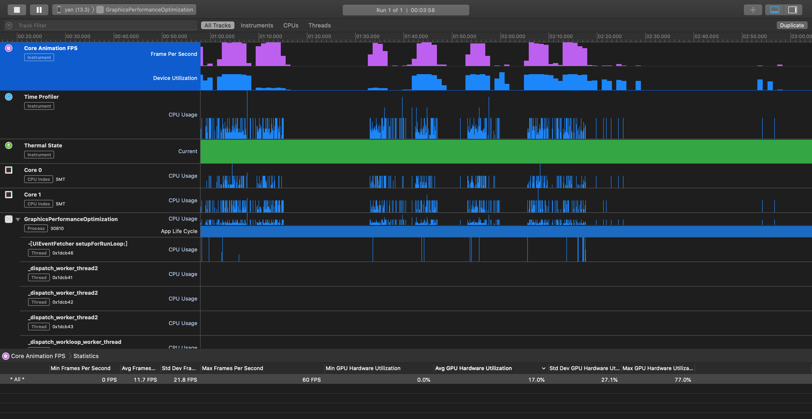

### 3.3 电量优化

设备在休眠的情况下几乎不会消耗任何电量，一旦某些硬件设备被唤醒就会开始消耗电量，因此电量优化的目标就是在不影响应用性能的情况下找到消耗电量的大户尽量减少它的
功耗消耗。  

下面是几个耗电量大户:  

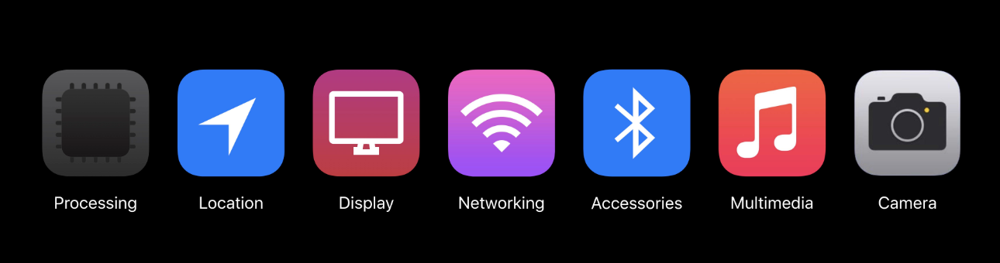

  * Processing 包括CPU,GPU在内的处理器件
  * Location 定位服务
  * Display 屏幕亮度
  * Network 网络
  * Accessories 蓝牙
  * Multimedia 音视频器件
  * Camera 摄像头

在给出电量优化建议之前我们还需要了解两个概念“固定能耗” “动态能耗”

  * **固定能耗**是指在任务执行前后把系统和各种资源调用起来和关闭所消耗的能量。
  * **动态能耗**动态能耗指的是app实际工作消耗的能量。

下面是这两个概念的示意图:  

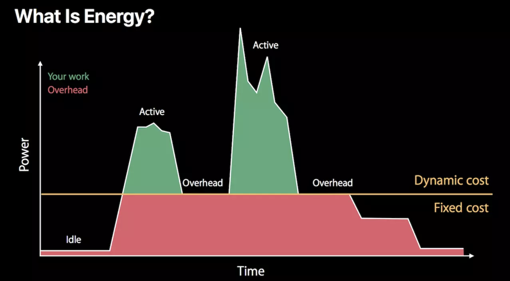

**Idle状态** :这时候应用处于休眠状态几乎不使用电量。  
**Active状态** :这时候应用处于前台用电量比较高。  
**Overhead状态**:唤醒硬件来支持应用某项功能所消耗的电量。即使我们的应用只做了一点点事，Overhead 所带来的电量消耗一点也不会减少。

横线以下所包区域是固定能耗，横线以上区域是动态能耗。

从这个角度触发我们可以通过分批执行，或者降低执行频率来避免产生零散的任务，比如将任务同时放到多个线程中并行执行。这样虽然在给定时间内做了更多的工作，看似消耗了更多的能量，导致了更大的前期动态功耗，但是由于缩短了工作的时间，更早使得CPU回到闲置状态，其他元件也更快地断电，所以固定功耗减少了。从整体上看，这会降低极大地节省功耗消耗。  

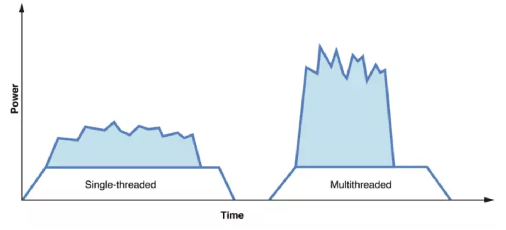

下面针对上面介绍的几个耗电大户给出电量优化的建议，供大家在平时开发中参考：

```
1. 在不需要使用定时器的时候要记得及时关闭重复性的定时器，定时器的时间间隔不宜太短，如果定时器触发太频繁，能耗影响是比较大的。  
2. 尽量减少数据传输的数据量,可以考虑使用protobuf代替JSON格式，如果允许尽量降低上传或下载的多媒体内容质量和尺寸等。  
3. 如果不是非常紧急的数据可以考虑延迟将多个数据合并后，统一打包上传，在下载某些数据的时候可以一次性多下载一部分。避免频繁网络请求。比如，下载视频流时，不要传输很小的数据包，直接下载整个文件或者一大块一大块地下载。如果提供广告，一次性多下载一些，然后再慢慢展示。如果要从服务器下载电子邮件，一次下载多条，不要一条一条地下载。网络操作能推迟就推迟。如果通过HTTP上传、下载数据，建议使用NSURLSession中的后台会话，这样系统可以针对整个设备所有的网络操作优化功耗。  
4. 对于不是非常实时的数据可以考虑使用缓存减少下载相同的数据  
5. 使用断点续传，避免网络不稳定导致多次传输相同的内容。  
6. 网络不可用的时候不要发起网络请求，在网络失败的情况下不断增加重试的间隔时间。  
7. 尽量只在WiFi的情况下联网传输数据  
8. 设置合适的网络超时时间，及时取消长时间运行或者速度很慢的网络操作  
9. 将可以推迟的操作尽量推迟到设备充电状态并且连接Wi-Fi时进行，比如同步和备份工作。  
10. 尽量减少动画，动画尽可能用较低的帧率，在不展示的时候不要更新动画。  
11. 在定位方面，如果只需要快速确定一下用户位置，而不需要实时更新位置，记得在定位完成后及时关闭定位服务。尽量降低定位精度。如果需要后台更新位置的时候尽量把pausesLocationUpdatesAutomatically设为YES，如果用户不太可能移动的时候系统会自动暂停位置更新。总而言之定位和蓝牙按需取用,定位之后要关闭或降低定位频率。  
12. 遵守前面提到的界面优化的内容，这会降低CPU和GPU的负担  
13. 线程适量,不宜过多  
14. 应用每次执行I/O任务，比如写文件，会导致系统退出闲置模式。而且写入缓存格外耗电，因此尽量不要频繁写入小数据，最好把多个更改攒到一起批量一次性写入,如果只有几个字节的数据改变，不要把整个文件重新写入一次。  
15. 尽量顺序读写数据,在文件中跳转位置会消耗一些时间,如果数据由随机访问的结构化内容组成，建议将其存储在数据库中.  
16. 读写大量重要数据时，考虑用 dispatch_io，其提供了基于 GCD 的异步操作文件 I/O 的 API。用 dispatch_io 系统会优化磁盘访问，数据量比较大的，建议使用数据库。  
17. 用户移动、摇晃、倾斜设备时，会产生动作事件，这些事件由加速计、陀螺仪、磁力计等硬件检测。在不需要检测的场合，应该及时关闭这些硬件。  
18. 如果某个通知不依赖外部数据，而是需要基于时间的通知，应该用本地通知，这样可以减轻网络模块的耗电。  
19. 如果不是真的需要即时推送，尽量使用延时推送。  
```

如何检测电量的性能：

  1. 最直观地观察打开某个应用的时候是否存在耗电特别快，手机特别烫手的现象。
  2. 用Xcode Energy impact测量功耗:

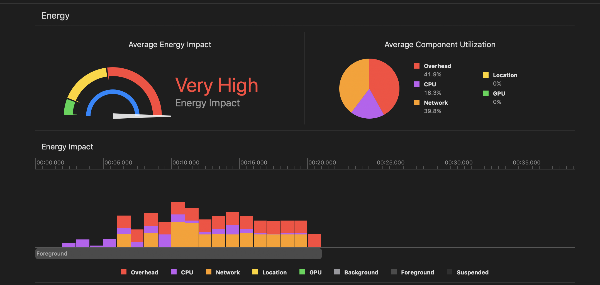

  3. 通过设备记录电池Log后导入到Instruments进行分析:
    
```
->在设备上进入设置   
-> 开发者   
-> Logging   
-> Enery打开   
-> Networking打开   
-> 点击Start Recording    
-> 然后点开我们想要测试的App，进行测试，定好时间，  
-> 时间到了后点击Stop Recording   
-> 在Instruments中选择好设备进入Energy Log   
-> 选择File   
-> Import Logged Data from Device  
```

### 3.4 启动优化

应用启动有两种类型冷启动和热启动，冷启动指的是应用从无到有，它的进程不在系统里，需要系统新创建一个进程加载镜像，运行程序，再到展现在界面上，而热启动指的是应用还在后台的情况下启动应用。

一般我们的应用需要在400ms内启动完成，如果启动时间大于20s将会被系统杀掉。我们可以使用`Edit scheme -> Run -> Arguments -> DYLD_PRINT_STATISTICS`设置为1 或者更详细地通过`DYLD_PRINT_STATISTICS_DETAILS`设置为1。

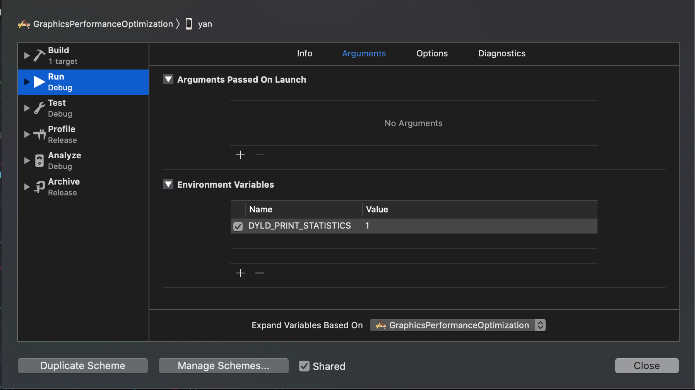  
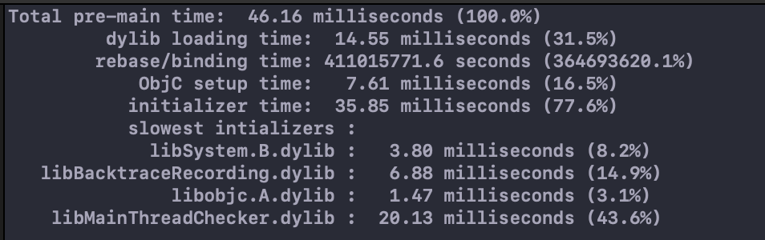

下面的博客将会介绍

  * Mach-O镜像结构，加载过程
  * 启动的各个阶段
  * 如何优化启动时间

首先我们看下Mach-O文件，可能大家比较对ELF会比较熟悉，它是UNIX环境下的可移植二进制文件，而Mach-O是苹果所独有的可执行二进制文件格式。主要包括下面几种类型：

  * Executable：应用的主要可执行文件
  * Dylib：动态链接库
  * Bundle：资源包，不能被链接，只能在运行时使用dlopen加载
  * Image：包含Executable，Dylib和Bundle是上面三者的集合
  * Framework：包含Dylib、资源文件和头文件的文件夹

下面是之前一篇博客的一张图，介绍了整个Mach-O文件的结构以及编译过程与Mach-O文件的关系。  

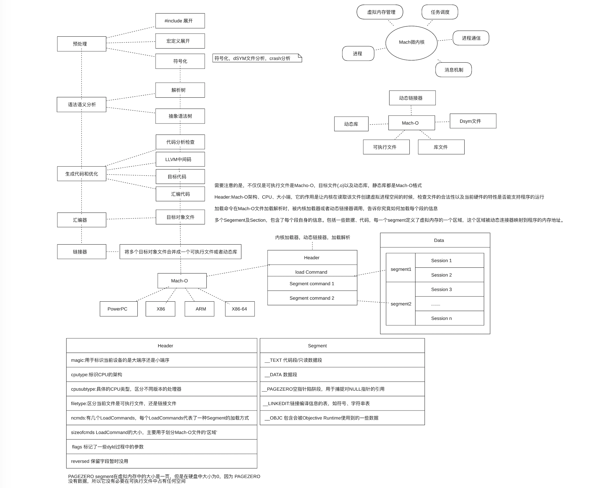

我们这里主要接这张图关注下Mach-O文件的结构：每个Mach-O文件一般都由三大部分:Header,loadCommand,Segment构成，每个Segment都包含了一个或者多个Section信息。

  * Header中包含了大小端信息，CPU架构信息，当前二进制文件类型，dyld过程中的一些参数。
  * LoadCommands用于指示每个Segment的加载方式。
  * 每个Segment定义了虚拟内存中的一块区域，这些区域会被动态链接器链接到程序的具体内存地址。

Segment由如下几个部分构成：

```
__TEXT 用于存放被执行的代码以及只读常量，属于只读可执行区域（r-x）。  
__DATA 包含全局变量，静态变量等。属于可读写区域（rw-）。  
__LINKEDIT 包含了加载程序的元数据，比如函数的名称和地址。属于只读区域（r–）  
__PAGEZERO 用于捕获空指针陷阱段，用于捕捉对NULL指针的引用  
__OBJC 包含一些会被Objective Runtime 使用到的一些数据。  
```

有了上面的介绍我们就可以来介绍应用的加载过程了。整个应用的启动分成两大阶段：  

Pre-main 阶段和 main 阶段：

先用一张图来概括下这两个阶段的整体流程：

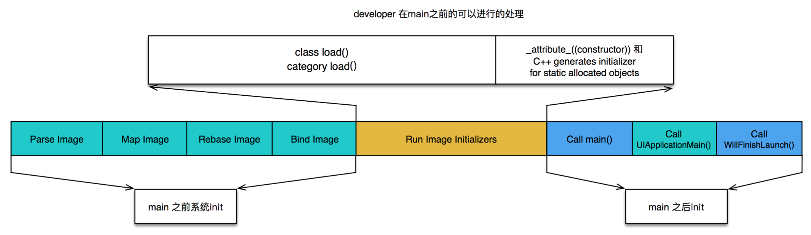

  * Pre-main 阶段：

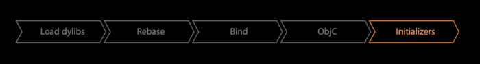

**fork/exec**：

我们知道当启动一个应用的时候系统会调用fork和execve两个方法，前者会创建一个进程，然后让这个新创建的进程去执行execve方法将程序加载到内存并映射到新的地址空间运行，fork新建的进程，父进程与子进程共享同一份代码段，但是数据段是分开的，但是父进程会把自己数据空间的内容copy到子进程中去，还有上下文也会copy到子进程中去。在映射过程中为了防止被黑客注入代码，重写内存，在地址映射阶段会采用ASLR（地址空间布局随机化）技术，在进程每次启动的时候，随机偏移地址空间，并将起始位置到 0x000000 这段范围的进程权限都标记为不可读写不可执行，NULL 指针引用和指针截断误差都会被它捕获。

简而言之这个阶段的任务就是新建进程并根据指定的文件名找到可执行文件，用它来取代进程的内容。

**动态库加载**：

在开始介绍这个过程之前需要了解一点：动态链接库和静态链接库的区别：  

首先，对于动态链接库而言，它们不会在编译的时候打包到应用中，而静态链接库是会和应用一起打包，所以相对而言静态链接库会占用更大的空间，并且在内存和磁盘中动态链接库只保留一份，这样便于集中管理，更新。但是它最大的缺点是加载会耗时，我们就来看下动态链接库是怎么被加载的？

在这个阶段系统会从可执行文件(Mach-O文件)中获取dyld路径，然后加载dyld，dyld会先去初始化运行环境，并开启缓存策略，接着dyld会从主执行文件的Header中获取到需要加载的依赖动态库列表，然后根据这个列表，找到每个dylib文件，对动态库文件进行头部信息校验，保证是Mach-O文件，接着找到代码签名并将其注册到内核。然后在 dylib 文件的每个 segment 上调用 mmap()，应用所依赖的dylib文件可能会再依赖其他dylib，所以这个过程是递归依赖的集合加载过程。这是一个耗时点之一，但是这部分的动态库大部分都是系统dylib，它们会被预先计算和缓存起来（因为操作系统自己要用部分framework所以在操作系统开机后就已经加载到内存了），dyld对这部分动态库加载速度很快，并且dyld在加载一个Mach-O文件的时候动态链接器首先会检查共享缓存看看是否存在，如果存在那么就直接从共享缓存中拿出来使用，这个共享缓存是公用的，每个进程都会将这个共享缓存映射到自己的地址空间。因此我们要优化的是除了系统动态库，以及共享动态链接库外的非系统动态链接库部分，我们在开发过程中尽量减少这部分动态库的数量来减少这部分的运行时间。

下面对每个动态库加载过程做个简单总结：

在每个动态库的加载过程中，dyld都需要：

    * 分析所依赖的动态库  
    * 找到动态库的Mach-O文件  
    * 打开文件  
    * 验证文件  
    * 在系统核心注册文件签名  
    * 对动态库的每一个segment调用mmap()  

**rebase/bind**：

由于ASLR机制的存在，可执行文件和动态链接库在虚拟内存中的加载地址每次启动都不固定，所以需要进行重定向；  
在加载所有的动态链接库之后，它们只是处在相互独立的状态，需要将它们绑定起来，所以需要进行动态库的绑定;

rebase修复的是指向当前镜像内部的资源指针；而bind指向的是镜像外部的资源指针。整个过程会先执行rebase，这个阶段会把镜像读入内存，并以page为单位进行加密验证，保证不会被篡改，而bind阶段需要查询符号表来指向跨镜像的资源，也就是将这个二进制调用的外部符号进行绑定的过程。比如我们objc代码中需要使用到NSObject, 即符号`_OBJC_CLASS_$_NSObject`，但是这个符号又不在我们的二进制中，在系统库Foundation.framework中，因此就需要bind这个操作将对应关系绑定到一起，这阶段优化的关键点在于减少`__DATA segment`中的指针数量。

> 在这个阶段验证 Mach-O 文件的签名，并不是每次重复读入整个文件，而是把每页内容都生成一个单独的加密散列值，并存储在 `__LINKEDIT` 中。从而使得文件每页的内容都能及时被校验确并保不被篡改。

> 虚拟内存的作用：我们开发过程中所接触到的内存均为虚拟内存，虚拟内存使我们认为App拥有一个连续完整的地址空间,而实际上它是分布在多个物理内存碎片组成，系统的虚拟内存空间映射vm_map负责虚拟内存和物理内存的映射关系。

**Objc setup && Initializers**：

Objc setup主要是在objc_init完成的：

```objc
void _objc_init(void) {  
    static bool initialized = false;  
    if (initialized) return;  
    initialized = true;  
    environ_init();  
    tls_init();  
    static_init();  
    lock_init();  
    exception_init();  
    _dyld_objc_notify_register(&map_2_images, load_images, unmap_image);  
}  
```

在`objc_init`方法中主要绑定了三个回调函数`map_2_images`,`load_images`和`unmap_image`。在bind阶段完成后会发出`dyld_image_state_bound`，这时候`map_2_images`方法就会被调用，进行镜像加载，在这个方法中主要完成如下几件事：

    * 读取二进制文件的 DATA 段内容，找到与objc相关的信息  
    * 注册Objc类ObjC Runtime 需要维护一张映射类名与类的全局表。当加载一个dylib时，其定义的所有的类都需要被注册到这个全局表中  
    * 读取protocol以及category的信息，将分类插入到类的方法列表里  
    * 确保selector的唯一性  

而在镜像加载结束后系统会发出`dyld_image_state_dependents_initialize`通知，这时候load_images会被调用，在这里类的load方法会被调用。然后调用mapimages做解析和处理，接下来在loadimages中调用callloadmethods方法，遍历所有加载进来的Class，按继承层级依次调用Class的+load方法和其Category的+load方法,并完成C/C++静态初始化对象和标记**attribute**(constructor)的方法调用。

这里做个简单总结，整个过程如下：

dyld首先会将程序二进制文件初始化后交给镜像加载器读取程序镜像中的类、方法等各种符号,由于runtime向dyld绑定了回调,所以当image被加载到内存后,dyld会通知runtime对镜像进行处理  

runtime接手后调用mapimages做解析处理，接下来loadimages中调用callloadmethods方法遍历所有加载进来的Class,按继承层级依次调用Class的+load方法和其Category的+load方法  

至此可执行文件中和动态库所有的符号(Class，Protocol，Selector，IMP，…)都已经按格式成功加载到内存中，被runtime所管理，再这之后，runtime 的那些方法(如动态添加Class、swizzle等方法）才能生效。所有初始化工作结束后dyld调用真正的main函数。如果程序刚刚被运行过，那么程序的代码会被dyld缓存（操作系统对于动态库有一个共享的空间，在这个空间被填满，或者没有其他机制来清理这一块的内存之前，动态库被加载到内存后就一直存在），因此即使杀掉进程再次重启加载时间也会相对快一点，如果长时间没有启动或者当前dyld的缓存已经被其他应用占据，那么这次启动所花费的时间就要长一点，这就是前面提到的冷启动和热启动两种情况。

在介绍完Pre-main 阶段我们看下有哪些节点可以优化：

  1. 动态库加载阶段可以通过减少非系统，非共享动态库的依赖或者合并动态库来优化速度(可以借助linkmap来分析)
  2. 使用静态库而不是动态库，但是这会带来包体积增加的风险，需要权衡。
  3. Rebase/Bind阶段可以通过减少Objc类数量以及selector数量来减少这部分运行时间
  4. 将不必须在+load方法中做的事情延迟到+initialize中.能用dispatch_once()来完成的，就尽量不要用**attribute**((constructor))以及load方法(attribute((constructor))的函数调用会在+load函数调用之后)
  5. 合并Category和功能类似的类,删除无用的方法和类（可以借助[FUI](https://github.com/dblock/fui)来扫描，但是需要注意的是它处理不了动态库和静态库里提供的类，也处理不了C++的类模板）。
  6. 替代部分庞大的库，采用更轻量级的解决方案。
  * main 阶段：

这个阶段包括:main方法执行之后到AppDelegate类中的didFinishLaunchingWithOptions方法执行结束前这段时间.下面是这个
阶段的示意图：  

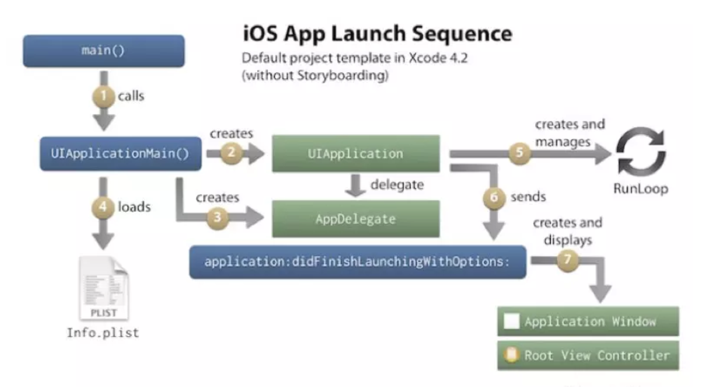

  * 这部分的优化主要是属于业务层面的优化，需要梳理下各个业务初始化的优先级以及依赖关系，能延迟初始化的尽量延迟初始化，不能延迟初始化的尽量放到后台线程中初始化，可以通过启动项自注册来完成启动项解耦。

有些启动项是需要刚启动就执行的操作，如Crash监控、统计上报等，否则会导致信息收集的缺失，对于基于位置的服务，需要先拿到定位位置后才能针对区域拿到对应数据，因此定位的优先级也会比较高，针对项目的配置可以拆分成两大类，一类是优先级比较高的，比如首页需要的某些配置，另一类是优先级比较低的比如对某些公共模块配置的项，这种可以延迟到首页加载完成之后加载。还有一些路由配置，网络配置都是一些相对优先级比较高的启动项目。而对于其他模块的初始化以及某些非首页需要的SDK初始化都应该延后到首页加载之后。

  * 通过instruments的Time Profiler初始化过程中比较耗时的操作并有针对性地优化。比如每次用NSLog方式打印会隐式的创建一个Calendar，因此需要删减启动时各业务方打的log，或者仅仅针对内测版输出log。

  * 在rootViewController加载过程中也存在优化的点：在启动过程中只加载tabbarVC的主VC即可，而且主VC中的ViewDidLoad方法中也只加载需要立即显示出来的view,其他视图均使用懒加载，数据进行异步加载。

如果想深入继续了解这部分可以参阅如下博客：

  * [iOS应用启动性能优化资料](https://everettjf.github.io/2018/08/06/ios-launch-performance-collection/)

  * [过去一段时间的iOS启动优化文章目录](https://everettjf.github.io/2018/12/12/ios-app-launch-perf-coll/)

### 3.5 体积优化

随着应用功能不断增加，App 的大小也会随着增加，App 的包体积优化的目的就是为了节省用户流量，提高用户的下载速度，以及节省更多空间。另外 App Store 官方规定 App 安装包如果超过 150MB，那么不可以在OTA环境下下载。如果我们的应用 需要适配 iOS7、iOS8 那么官方规定主二进制 text 段的大小不能超过 60MB。如果不能满足这个标准，则无法上架 App Store。

**iOS 安装包的组成**

    将一个应用程序，后缀由.ipa改为.zip，然后解压，可以看到Payload文件夹，里面有个.app 的文件，右键显示包内容可以看到很多的文件，但是大部分我们就针对这里面重点的几个文件：  
    1. 可执行文件：一般应用而言最大的文件应该是可执行文件。  
    2. Assets.car：我们在开发过程中会将图片放在Assets.xcassets中，在打包后会将这些图片统一压缩成一个Assets.car的文件，大大减小包的大小。car文件可以使用[cartool](https://github.com/steventroughtonsmith/cartool)来获取具体资源。还可以通过[Assets.carTool](https://github.com/yuedong56/Assets.carTool)来以图形化方式解压car文件。  
    3. Bundle文件  
    4. _CodeSignature 文件夹，下面包含一个CodeResources文件，里面是一个属性列表，包含bundle中所有其他文件的列表，这个属性列表只有一项files这是一个字典键是文件名值通常是Base64格式的散列值。它的作用是用来判断一个应用程序是否完好无损，能够防止不小心修改或损坏资源文件。  
    5. XXX.lproj 多语言字符串  
    6. Frameworks 文件夹  
    7. info.plist  
    8. 图片资源，音频资源，数据库资源，本地json配置文件，LaunchImage/AppIcon  

通过上面内容可以看出可优化的最大块内容在于可执行文件，Assets.car，图片，音视频文件这几大方面。

**资源文件瘦身**

对于一个App来说主要的资源文件就是图片，所以资源文件的瘦身主要针对的是图片的瘦身，可以通过删除无用图片、去除重复图片、压缩图片。

  * 使用LSUnusedResources删除无用图片资源：

通过[LSUnusedResources](https://github.com/tinymind/LSUnusedResources)来扫描项目中无用的图片文件，但是这里会误判所以最终还是要一个个确认是否真的再项目中无用。

  * 使用Fdupes去除各模块中的重复图片：

Fdupes能够找到给定的目录和子目录集中的重复文件。 它通过比较文件的MD5签名，然后进行字节到字节的比较来识别重复，它依次通过：

    大小比较 > 部分MD5签名比较 > 全MD5签名比较 > 字节到字节的比较  

安装：

```
brew install fdupes  
```

最常用命令：

```
$ fdupes -r path                ## 搜索重复子文件在终端展示  
$ fdupes -Sr path               ## 搜索重复子文件&显示每个重复文件的大小在终端展示  
$ fdupes -Sr path > log.txt     ## log输出到指定路径文件夹  
```

最近还发现一款软件也是可以删除重复点资源文件：[Gemini](https://macpaw.com/gemini)

  * 使用图片压缩工具压缩图片资源：

无损压缩工具: ImageOptim会对每张图片分别应用以上几种压缩算法，然后对比每种压缩算法产出的图片，选取最小的那张作为输出结果。  

[ImageOptim](https://imageoptim.com/mac)

有损压缩工具:

[ImageAlpha](https://pngmini.com/)  
[tinypng](https://tinypng.com/)

这里有一篇[PNG 图片压缩对比分析](https://juejin.im/entry/587f14378d6d810058a18e1f)可供大家参考。

使用WebP格式的图片

WebP格式的优点：

> 压缩率高。支持有损和无损2种方式，比如将 Gif 图可以转换为 Animated WebP，有损模式下可以减小 64%，无损模式下可以减小 19% WebP 支持 Alpha 透明和 24-bit 颜色数，不会像 PNG8 那样因为色彩不够出现毛边。

WebP格式的缺点：

> WebP 在 CPU 消耗和解码时间上会比 PNG 高2倍，所以我们做选择的时候需要取舍。

对单色纯色图标使用矢量图

对于App里面的单色纯色图标都是可以使用矢量图代替，它的好处是不需要添加 @2x、@3x 图标，节省了空间。具体使用可以看[IconFont_Demo](https://github.com/FantasticLBP/IconFont_Demo)

  * 使用On Demand Resources技术

具体见后文介绍，在这方面还可以将一些非必须的资源放在服务端，待需要的时候再进行下载。

  * 图片压缩的相关编译选项

**Compress PNG Files** 打包的时候自动对图片进行无损压缩，使用的工具为 pngcrush  
**Remove Text Medadata From PNG Files** 移除 PNG 资源的文本字符，比如图像名称、作者、版权、创作时间、注释等信息。

这里总结下Bundle 和 Asset Catalog 管理的图片的区别：

    * 工程中所有使用Asset Catalog 管理的图片，最终输出的时候，都会被放置到 Assets.car内。在编译的时候XCode会对这部分资源进行压缩处理。而Bundle的资源需要我们使用外部压缩工具进行手动压缩处理。  
    * xcassets 里的 2x 和 3x，会根据具体设备分发，不会同时包含。而Bundle会都包含。  
    * xcassets内，可以对图片进行 Slicing。Bundle 不支持  
    * xcassets 里面的图片，只能通过imageNamed加载。Bundle内的资源还可以通过 imageWithContentsOfFile 等方式加载。但是需要注意的是使用 imageNamed 创建的 UIImage，会立即被加入到 NSCache中，在收到内存警告的时候，会自动释放不在使用的 UIImage。而使用imageWithContentsOfFile加载的图片每次加载都会重新申请内存，相同图片不会缓存。这也是我们常说的xcassets内的图片，加载后会产生缓存。  

对于图片的压缩个人的习惯是开启Compress PNG Files，再用ImageOptim对Bundle内的图片以及项目中所有JPEG格式图像进行压缩（xcassets 里面的 png文件不用压缩，压缩反而会增大包体积），因为 Bundle内的图片以及JPEG 格式的图片是直接拷贝进项目的，并不会被Xcode进行压缩，所以两部分是需要我们手动进行资源压缩处理。一般还有个通识：对于常用的，较小的图片，应该使用Asset Catalog管理，而对于大的图片，可以选择直接废弃2x尺寸的图片，全部使用3x大小的jpg压缩后放在Bundle内管理。同时还需要注意xcassets 中要避免使用JPEG 图像，这会导致打包会变大。对于一些比较大体积的背景图片可以压缩成.jpg的格式放在Bundle中。

对于音视频文件的优化可以通过：删除无用的音视频文件，降低音频文件的采样率。

**可执行文件瘦身**

  1. 使用Fui(Find Unused Imports)清理不用的类

Fui（Find Unused Imports）是分析不再使用的类的一个开源工具，准确率相对较高，但是这种删代码的事情最好要确认后手动一一删除，并且配合Git,SVN等工具，最终还得经过review，整体测试后才能放出版本，它也有比较大的问题：它处理不了动态库和静态库里提供的类，也处理不了C++的类模板。

  * 安装Fui
    gem install fui  

  * 查看帮助
    fui help  

  * 最常用的命令形式
    fui -v --path=./ --ignore-path=Pods find  

  2. 使用LinkMap分析安装包

我们编写的源码需要经过编译链接，最终生成一个可执行文件，在编译阶段每个类会生成对应的.o文件（目标文件）。在链接阶段，会把.o文件和动态库链接在一起。但是生成的可执行文件为二进制文件，我们很难看明白它的具体内容，而linkMap 很好得帮我们解决了这个问题。linkMap是一个记录链接相关信息的纯文本文件，里面记录了可执行文件的路径、CPU架构、可执行文件内存分布、类符号，方法符号等信息。

    (1) 通过LinkMap可以通过Symbols还原出奔溃时候的源码位置  
    (2) 还可以比较直观得查看整个内存的分段情况  
    (3) 可以分析可执行文件中哪个类或者库占用的空间比较大，从而为我们这里需要介绍的安装包瘦身做指导  

  * 生成linkMap文件：

    Xcode开启编译选项 Write Link Map File:  
    XCode -> Project -> Build Settings -> 搜map -> 把Write Link Map File选项设为YES，并指定好linkMap的存储位置.  

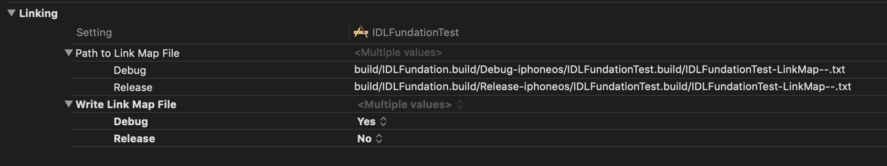

生成的linkMap文件位于：

```
~/Library/Developer/Xcode/DerivedData/IDLFundation-dzjqiskjttzspjcrncvbbssnqtok/Build/Intermediates.noindex/IDLFundation.build/Debug-iphonesimulator/IDLFundationTest.build/IDLFundationTest-LinkMap-normal-x86_64.txt  
```

  * linkMap文件结构解析:

LinkMap 文件分为3部分：Object File、Section、Symbols，如下图所示：

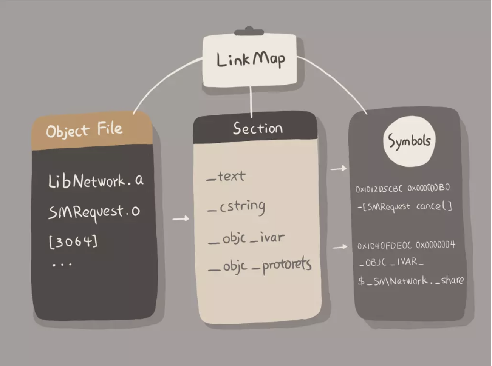

```
Object File：包含了代码工程的所有文件  
Section：描述了代码段在生成的 Mach-O 里的偏移位置和大小  
Symbols：会列出每个方法、类、Block，以及它们的大小  
```

**基础信息**：

包括可执行文件路径，可执行文件架构。  

```
## Path: /Users/huya/Library/Developer/Xcode/DerivedData/IDLFundation-dzjqiskjttzspjcrncvbbssnqtok/Build/Products/Debug-iphonesimulator/IDLFundationTest.app/IDLFundationTest  
## Arch: x86_64  
```

**类表**: 保存了所有用到的类生成的.o文件.  
这个类表用于在后续类方法，类名查看等用到，后续方括号里面的数字就是对应的类序号。  

```
## Object files:  
[  0] linker synthesized  
[  1] dtrace  
[  2] /Users/huya/Library/Developer/Xcode/DerivedData/IDLFundation-dzjqiskjttzspjcrncvbbssnqtok/Build/Intermediates.noindex/IDLFundation.build/Debug-iphonesimulator/IDLFundationTest.build/Objects-normal/x86_64/AFURLSessionManager.o  
```

**段表**: 描述了不同功能的数据保存的地址，通过这个地址就可以查到对应内存里存储的是什么数据。其中第一列是起始地址，第二列是段占用的大小，第三个是段类型，第四列是段名称。  

```
## Sections:  
## Address	Size    	Segment	Section  
0x100001DC0	0x00A38B42	__TEXT	__text  
0x100A3A902	0x00001C9E	__TEXT	__stubs  
0x100A3C5A0	0x0000204A	__TEXT	__stub_helper  
0x100A3E5EC	0x000231B0	__TEXT	__gcc_except_tab  
0x100A617A0	0x000178D0	__TEXT	__const  
0x100A79070	0x0008A5DA	__TEXT	__cstring  
0x100B0364A	0x0005F462	__TEXT	__objc_methname  
0x100B62AAC	0x00008794	__TEXT	__objc_classname  
0x100B6B240	0x0003B4EB	__TEXT	__objc_methtype  
0x100BA672C	0x00001742	__TEXT	__ustring  
0x100BA7E6E	0x00000172	__TEXT	__entitlements  
0x100BA7FE0	0x0000037B	__TEXT	__dof_RACSignal  
0x100BA835B	0x000002E8	__TEXT	__dof_RACCompou  
0x100BA8644	0x00012964	__TEXT	__unwind_info  
0x100BBAFA8	0x00000058	__TEXT	__eh_frame  
0x100BBB000	0x00000008	__DATA	__nl_symbol_ptr  
0x100BBB008	0x00000BD8	__DATA	__got  
0x100BBBBE0	0x00002628	__DATA	__la_symbol_ptr  
0x100BBE208	0x00000070	__DATA	__mod_init_func  
0x100BBE280	0x0001CEE0	__DATA	__const  
0x100BDB160	0x00039CA0	__DATA	__cfstring  
0x100C14E00	0x00002B00	__DATA	__objc_classlist  
0x100C17900	0x000000A0	__DATA	__objc_nlclslist  
0x100C179A0	0x00000680	__DATA	__objc_catlist  
0x100C18020	0x000000D0	__DATA	__objc_nlcatlist  
0x100C180F0	0x00000638	__DATA	__objc_protolist  
0x100C18728	0x00000008	__DATA	__objc_imageinfo  
0x100C18730	0x001252F8	__DATA	__objc_const  
0x100D3DA28	0x000150B0	__DATA	__objc_selrefs  
0x100D52AD8	0x00000150	__DATA	__objc_protorefs  
0x100D52C28	0x00002A38	__DATA	__objc_classrefs  
0x100D55660	0x000019F8	__DATA	__objc_superrefs  
0x100D57058	0x000085E8	__DATA	__objc_ivar  
0x100D5F640	0x0001AE00	__DATA	__objc_data  
0x100D7A440	0x0000CC70	__DATA	__data  
0x100D870B0	0x00004698	__DATA	__bss  
0x100D8B750	0x00001298	__DATA	__common  
```

下面是一些重要段名的解释：

`__TEXT`段

```
1. __text: 代码节，存放机器编译后的代码  
2. __stubs: 用于辅助做动态链接代码（dyld）.  
3. __stub_helper:用于辅助做动态链接（dyld）.  
4. __objc_methname:objc的方法名称  
5. __cstring:代码运行中包含的字符串常量,比如代码中定义`#define kGeTuiPushAESKey        @"DWE2#@e2!"`,那DWE2#@e2!会存在这个区里。  
6. __objc_classname:objc类名  
7. __objc_methtype:objc方法类型  
8. __ustring:  
9. __gcc_except_tab:  
10. __const:存储const修饰的常量  
11. __dof_RACSignal:  
12. __dof_RACCompou:  
13. __unwind_info:  
```

`__DATA段`  

```
1. __got:存储引用符号的实际地址，类似于动态符号表  
2. __la_symbol_ptr:lazy symbol pointers。懒加载的函数指针地址。和__stubs和stub_helper配合使用。具体原理暂留。  
3. __mod_init_func:模块初始化的方法。  
4. __const:存储constant常量的数据。比如使用extern导出的const修饰的常量。  
5. __cfstring:使用Core Foundation字符串  
6. __objc_classlist:objc类列表,保存类信息，映射了__objc_data的地址  
7. __objc_nlclslist:Objective-C 的 +load 函数列表，比 __mod_init_func 更早执行。  
8. __objc_catlist: categories  
9. __objc_nlcatlist:Objective-C 的categories的 +load函数列表。  
10. __objc_protolist:objc协议列表  
11. __objc_imageinfo:objc镜像信息  
12. __objc_const:objc常量。保存objc_classdata结构体数据。用于映射类相关数据的地址，比如类名，方法名等。  
13. __objc_selrefs:引用到的objc方法  
14. __objc_protorefs:引用到的objc协议  
15. __objc_classrefs:引用到的objc类  
16. __objc_superrefs:objc超类引用  
17. __objc_ivar:objc ivar指针,存储属性。  
18. __objc_data:objc的数据。用于保存类需要的数据。最主要的内容是映射__objc_const地址，用于找到类的相关数据。  
19. __data:暂时没理解，从日志看存放了协议和一些固定了地址（已经初始化）的静态量。  
20. __bss:存储未初始化的静态量。比如：`static NSThread *_networkRequestThread = nil;`其中这里面的size表示应用运行占用的内存，不是实际的占用空间。所以计算大小的时候应该去掉这部分数据。  
21. __common:存储导出的全局的数据。类似于static，但是没有用static修饰。比如KSCrash里面`NSDictionary* g_registerOrders;`, g_registerOrders就存储在__common里面  
```

**Symbols 字段**：

Symbols简单来说就是类名，变量名，方法名，这个在Crash信息中很常见：

代码节点  

```
## Symbols:  
## Address	Size    	File  Name  
0x100001DC0	0x000007D0	[  2] -[AFURLSessionManagerTaskDelegate initWithTask:]  
0x100002590	0x00000040	[  2] ___48-[AFURLSessionManagerTaskDelegate initWithTask:]_block_invoke  
0x1000025D0	0x00000030	[  2] ___copy_helper_block_e8_32w  
0x100002600	0x00000020	[  2] ___destroy_helper_block_e8_32w  
```

  * 第一列是起始地址位置
  * 第二列是大小，通过这个可以算出方法占用的大小
  * 第三列是归属的类（.o文件)

方法名节点  

```
0x100B0364A	0x00000005	[  2] literal string: init  
0x100B0364F	0x00000005	[  2] literal string: data  
0x100B03654	0x00000019	[  2] literal string: initWithParent:userInfo:  
0x100B0366D	0x00000018	[  2] literal string: arrayWithObjects:count:  
0x100B03685	0x0000002B	[  2] literal string: countByEnumeratingWithState:objects:count:  
0x100B036B0	0x00000013	[  2] literal string: setTotalUnitCount:  
0x100B036C3	0x00000010	[  2] literal string: setCancellable:  
0x100B036D3	0x00000007	[  2] literal string: cancel  
0x100B036DA	0x00000018	[  2] literal string: setCancellationHandler:  
0x100B036F2	0x0000000D	[  2] literal string: setPausable:  
0x100B036FF	0x00000008	[  2] literal string: suspend  
0x100B03707	0x00000013	[  2] literal string: setPausingHandler:  
0x100B0371A	0x00000007	[  2] literal string: resume  
0x100B03721	0x00000014	[  2] literal string: setResumingHandler:  
```

**类列表节点**  

```
0x100C14E00	0x00000018	[  2] anon  
0x100C14E18	0x00000008	[  3] anon  
0x100C14E20	0x00000008	[  4] anon  
0x100C14E28	0x00000008	[  5] anon  
0x100C14E30	0x00000008	[  6] anon  
0x100C14E38	0x00000008	[  7] anon  
0x100C14E40	0x00000008	[  9] anon  
0x100C14E48	0x00000010	[ 10] anon  
```

第一次看这个的时候会比较迷惑到底到哪里找某个数据，其实Sections字段是整个linkMap的目录，通过它的起始地址就可以找到对应区段的位置，所以我们需要做的就是明确各个Session的意义。

通过linkMap找到无用代码的过程大致思路如下：

    * 找到类和方法的全集  
    * 找到使用过的类和方法集合  
    * 取2者差集得到无用代码集合  

Objective-C 中的方法都会通过 `objc_msgSend` 来调用，而 `objc_msgSend` 在 Mach-O 文件里是通过`_objc_selrefs` 这个 section 来获取 selector 这个参数的。所以，`_objc_selrefs` 里的方法一定是被调用了的。`_objc_classrefs` 里是被调用过的类， `objc_superrefs` 是调用过 super 的类（继承关系）。通过 `_objc_classrefs` 和 `_objc_superrefs`,我们就可以找出使用过的类和子类。

Mach-O 文件中的`_objc_selrefs、_objc_classrefs、_objc_superrefs`可以通过[MachOView](https://github.com/fangshufeng/MachOView)进行查看。

除了使用linkMap外还可以使用[otool](https://www.unix.com/man-page/osx/1/otool/)，它不需要额外安装，只要你安装了XCode它就顺带安装了Otool。

这里大家可以结合Mach-O文件来了解整个用法，遇到不明白的可以通过otool来输出help信息：

```
Usage: /Applications/Xcode.app/Contents/Developer/Toolchains/XcodeDefault.xctoolchain/usr/bin/otool [-arch arch_type] [-fahlLDtdorSTMRIHGvVcXmqQjCP] [-mcpu=arg] [--version] <object file> ...  
	-f print the fat headers  
	-a print the archive header  
	-h print the mach header  
	-l print the load commands  
	-L print shared libraries used  
	-D print shared library id name  
	-t print the text section (disassemble with -v)  
	-x print all text sections (disassemble with -v)  
	-p <routine name>  start dissassemble from routine name  
	-s <segname> <sectname> print contents of section  
	-d print the data section  
	-o print the Objective-C segment  
	-r print the relocation entries  
	-S print the table of contents of a library (obsolete)  
	-T print the table of contents of a dynamic shared library (obsolete)  
	-M print the module table of a dynamic shared library (obsolete)  
	-R print the reference table of a dynamic shared library (obsolete)  
	-I print the indirect symbol table  
	-H print the two-level hints table (obsolete)  
	-G print the data in code table  
	-v print verbosely (symbolically) when possible  
	-V print disassembled operands symbolically  
	-c print argument strings of a core file  
	-X print no leading addresses or headers  
	-m don't use archive(member) syntax  
	-B force Thumb disassembly (ARM objects only)  
	-q use llvm's disassembler (the default)  
	-Q use otool(1)'s disassembler  
	-mcpu=arg use `arg' as the cpu for disassembly  
	-j print opcode bytes  
	-P print the info plist section as strings  
	-C print linker optimization hints  
	--version print the version of /Applications/Xcode.app/Contents/Developer/Toolchains/XcodeDefault.xctoolchain/usr/bin/otool  
```

关于Mach-O大家可以查看之前的博客或者[Mach-O 文件格式探索](https://www.desgard.com/iosre-1/#)这篇博客。

**3.无用第三方库清理**

**4.通过 AppCode 查找无用代码**

可以借助AppCode提供的Inspect Code来诊断代码，通过它可以查找无用代码的功能。

```
Unused class 无用类  
Unused import statement 无用类引入声明  
Unused property 无用的属性  
Unused method 无用的方法  
Unused parameter 无用参数  
Unused instance variable 无用的实例变量  
Unused local variable 无用的局部变量  
Unused value 无用的值；  
Unused macro 无用的宏。  
Unused global declaration 无用全局声明  
```

**5.静态库瘦身**

对于静态库可以通过lipo 工具来瘦身。

  * 静态库指令集信息查看：
    lipo -info libXXXX.a  

  * 静态库拆分合并
    静态库拆分：lipo 静态库文件路径 -thin CPU架构 -output 拆分后的静态库文件路径  
    静态库合并：lipo -create 静态库1文件路径 静态库2文件路径... 静态库n文件路径 -output 合并后的静态库文件径  

举个例子：

首先我们通过lipo -info 查看libWeiboSDK.a支持的架构类型：  

```
lipo -info libWeiboSDK.a  
//Architectures in the fat file: libWeiboSDK.a are: armv7 arm64 i386 x86_64  
```

发现它支持armv7 arm64 i386 x86_64，但是我们只需要 armv7 和 arm64，这时候就需要使用lipo拆分出需要的架构下的静态库后再合并：

```
lipo libWeiboSDK.a -thin armv7 -output libWeiboSDK-armv7.a  
lipo libWeiboSDK.a -thin arm64 -output libWeiboSDK-arm64.a  
lipo create libWeiboSDK-armv7.a libWeiboSDK-arm64.a -output libWeiboSDK.device.a  
```

通过上面的操作我们将静态库里面支持模拟器的指令集给去掉了，所以模拟器是无法跑的，所以平时可以使用包含模拟器指令集的静态库，在App发布的时候去掉。如果使用Cocoapods 管理可以使用2份 Podfile 文件。一份包含指令集一份不包含，发布的时候切换 Podfile 文件即可。或者一份 Podfile 文件，但是配置不同的环境设置.

**编译选项优化**

1. **Generate Debug Symbols** 这个开关如果打开的话，信息的详情可以通过“Level of Debug Symbols”项进行配置，如果设置为NO则ipa中不会生成Symbols文件,虽然可以减少ipa大小。但会影响到崩溃的定位。所以不是非必须的情况下，建议还是打开。万不得已的情况下Release版本设置为NO,Debug版本设置为YES.

2. 在Build Settings中可以指定工程被编译成支持哪些指令集类型，而支持的指令集越多，就会编译出多个指令集代码的数据包，对应生成二进制包就越大，因此可以根据你的产品的目标对象决定是否可以舍弃一些CPU架构，比如armv7用于支持4s和4，但是这部分用户已经很少，所以一般可以考虑舍弃这部分用户。这里可以通过Valid Architectures里面去选择，如果需要去掉更多大家可以根据下表进行对应删剪：

```
armv6: iPhone, iPhone 3G, iPod 1G/2G  
armv7: iPhone 3GS, iPhone 4, iPhone 4S, iPod 3G/4G/5G, iPad, iPad 2, iPad 3, iPad Mini  
armv7s: iPhone 5, iPhone 5c, iPad 4  
arm64:  iPhone X，iPhone 8(Plus)，iPhone 7(Plus)，iPhone 6(Plus)，iPhone 6s(Plus), iPhone 5s, iPad Air(2), Retina iPad Mini(2,3)  
arm64e: iPhone XS\XR\XS Max  
```

下面顺带介绍下Architectures编译选项：  

**Architectures**  

指定工程被编译成支持哪些指令集类型,默认的情况这里的值为:

```
Standard architectures- $(ARCHS-STANDARD)  
```

ARCHS-STANDARD具体的值可以查看：

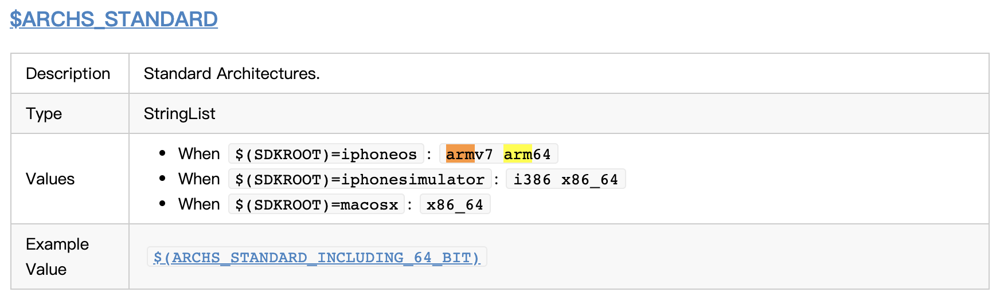

**Valid Architectures**

该编译项指定可能支持的指令集，该列表和Architectures列表的交集，将是Xcode最终生成二进制包所支持的指令集。举个例子，比如，你的Valid A rchitectures设置的支持arm指令集版本有：armv7/armv7s/arm64，对应的Architectures设置的支持arm指令集版本有：arm64，这时Xcode只会生成一个arm64指令集的二进制包。

**Build Active Architecture Only**  

指明是否只编译当前连接设备所支持的指令集。默认Debug的时候设置为YES，Release的时候设置为NO。设置为YES是只编译当前的architecture版本，生成的包只包含当前连接设备的指令集代码。设置为NO，则生成的包包含所有的指令集代码（上面的Valid Architectures跟Architectures的交集）。因此为了调试速度更快，则Debug应该设置为YES。

**3.Dead Code Stripping**

查看 DEAD_CODE_STRIPPING 是否为 YES。设置为YES静态链接的可执行文件中未引用的代码将会被删除。实际上Xcode默认会开启此选项，C/C++/Swift 等静态语言编译器会在 link 的时候移除未使用的代码，但是对于 Objective-C 等动态语言是无效的。因为Objective-C 是建立在运行时上面的，底层暴露给编译器的都是 Runtime 源码编译结果，所有的部分都是会被判别为有效代码。

**4.Compress PNG Files** 打包的时候自动对图片进行无损压缩，使用的工具为 pngcrush

**5.Remove Text Medadata From PNG Files** 移除 PNG 资源的文本字符，比如图像名称、作者、版权、创作时间、注释等信息。

**6.将Asset Catalog Compiler optimization** 选项设置为 space 

**7.Apple Clang - Code Generation**

该选项下的Optimization Level 编译参数决定了程序在编译过程的编译速度以及编译后的可执行文件占用的内存以及编译之后可执行文件运行时候的速度。它有六个级别：

```
None[-O0]: Debug 默认级别。不进行任何优化，直接将源代码编译到执行文件中，结果不进行任何重排，编译时比较长。主要用于调试程序，可以进行设置断点,改变变量,计算表达式等调试工作。  
Fast[-O,O1]。最常用的优化级别，不考虑速度和文件大小权衡问题。与-O0级别相比，它生成的文件更小，可执行的速度更快，编译时间更少。  
Faster[-O2]。在-O1级别基础上再进行优化，增加指令调度的优化。与-O1级别相，它生成的文件大小没有变大，编译时间变长了，编译期间占用的内存更多了，但程序的运行速度有所提高。  
Fastest[-O3]。在-O2和-O1级别上进行优化，该级别可能会提高程序的运行速度，但是也会增加文件的大小。  
Fastest Smallest[-Os]。Release 默认级别。这种级别用于在有限的内存和磁盘空间下生成尽可能小的文件。由于使用了很好的缓存技术，它在某些情况下也会有很快的运行速度。  
Fastest, Aggressive Optimization[-Ofast]。 它是一种更为激进的编译参数, 它以点浮点数的精度为代价。  
```

默认情况下Debug 设定为 None[-O0] ，Release 设定为 Fastest,Smallest[-Os],所以这里一般会采用默认的设置。这个选项会开启那些不增加代码大小的全部优化，让可执行文件尽可能小

**8.Swift Compiler - Code Generation**

这个主要是针对Swift语言进行的优化，它有三个级别：  

```
No optimization[-Onone]：不进行优化，能保证较快的编译速度。  
Optimize for Speed[-O]：编译器将会对代码的执行效率进行优化，一定程度上会增加包大小。  
Optimize for Size[-Osize]：编译器会尽可能减少包的大小并且最小限度影响代码的执行效率。  
```

关于这些选项的选择可以参考官方的说明：  

```
We have seen that using -Osize reduces code size from 5% to even 30% for some projects.  
But what about performance? This completely depends on the project. For most applications the performance hit with -Osize will be negligible, i.e. below 5%. But for performance sensitive code -O might still be the better choice.  
```

所以如果你的项目对运行速度不是特别敏感，并且可以接受轻微的性能损失，那么 -Osize 是首选，否则建议使用-O

**9.Exceptions**

可以通过设置Enable C++ Exceptions 和 Enable Objective-C Exceptions 为 NO,并且Other C Flags添加-fno-exceptions 可以去掉异常支持从而减少可行性文件的大小，但是除非非常必要的情况下，这个一般保持打开。

**10.Link-Time Optimization**

在Link中间代码时，对全局代码进行优化。这个优化是自动完成的，因此不需要修改现有的代码。这项优化主要包括：

```
去除多余代码：如果一段代码分布在多个文件中，但是从来没有被使用，普通的 -O3 优化方法不能发现跨中间代码文件的多余代码，因此是一个“局部优化”。但是Link-Time Optimization 技术可以在 link 时发现跨中间代码文件的多余代码。  
跨过程优化：这是一个相对广泛的概念。举个例子来说，如果一个 if 方法的某个分支永不可能执行，那么在最后生成的二进制文件中就不应该有这个分支的代码。  
内联优化：内联优化形象来说，就是在汇编中不使用 “call func_name” 语句，直接将外部方法内的语句“复制”到调用者的代码段内。这样做的好处是不用进行调用函数前的压栈、调用函数后的出栈操作，提高运行效率与栈空间利用率。  
```

开启这个优化后，一方面会减少了汇编代码的体积，另一方面还会提高了代码的运行效率，所以建议在项目中开启该优化，并设置为优化方式 Incremental。

**11.Framework动态库包空间瘦身**  

Framework 文件夹存放的是动态库。这部分内容会在启动的时候被链接和加载，这里面主要放的是我们引入的其他依赖库，但是需要注意的一点是，如果我们项目中打开了Swift 混编的情况下会多出Swift标准库，这部分的占用大概在7-8M左右。所以出于这方面考虑，如果非必要的情况下建议只使用Objective-C开发。目前大多数大项目都采用这种模式。

Swift 标准库和自己引入的其他依赖库

**App Thinning技术**

[App Thinning](https://developer.apple.com/videos/play/wwdc2015/404/) 技术是 iOS9 引入的它主要用于解决目前某些地区国家流量费用过高、iOS设备的存储空间有限的问题，但是实际上也是从应用瘦身的角度出发去进行改善。所以也顺带在这里介绍了。iOS 9之前的版本要求用户下载整个app文件，即使用户使用的是iPhone也需要下载他们绝不会使用到的ipad图像文件，这主要出于能够更好得适配各种不同的应用角度出发，但是App Thinning 技术的引进改善了这个问题，App Thinning会自动检测用户的设备类型并且只下载当前设备所适用的内容。

App Thinning 技术主要包括三大方面：App Slicing，Bitcode。

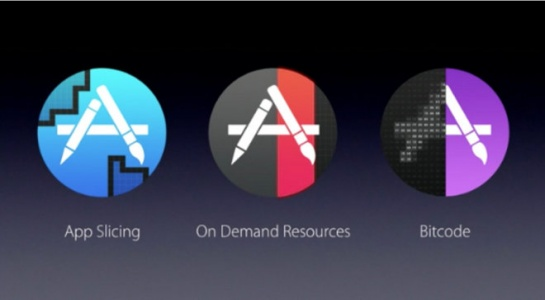

  * **App Slicing**

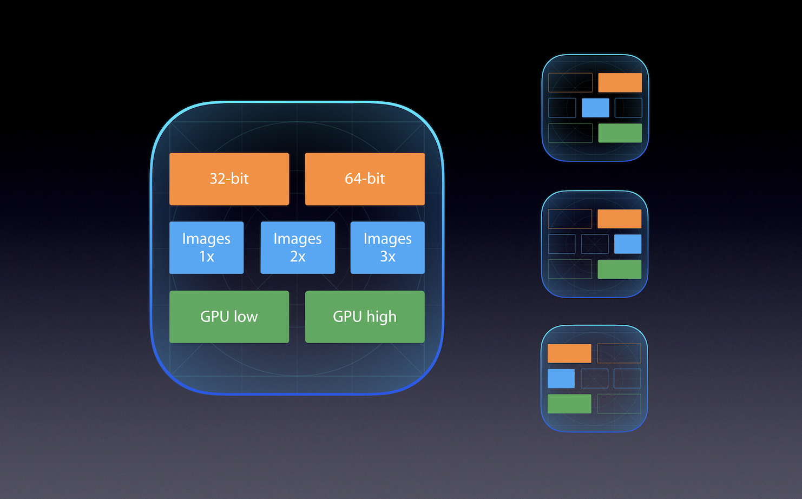

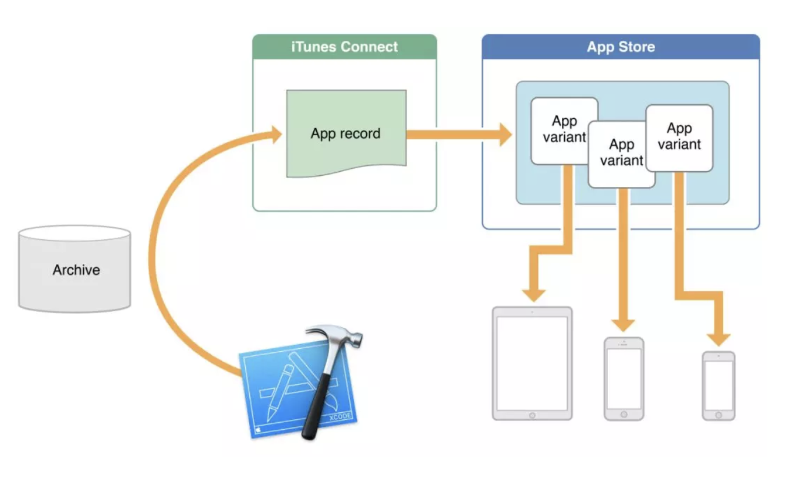

当开发者向App Store Connect 上传 .ipa 后，App Store Connect 构建过程中，会自动分割该 App，创建特定的变体,以适配不同设备。然后用户从 App Store 中下载到的安装包，即这个特定的变体。也就是说App Slicing仅向设备传送与之相关的资源（图片，指令架构相关），需要注意的是：App Slicing对于图片资源的划分，需要要求图片放在 Asset Catalog 中管理，Bundle 内的则还是会同时包含。

  * **On Demand Resources**

On Demand Resources 所管理的资源是托管在 App Store 和 app相关的Bundle包分开下载，这部分资源由操作系统负责下载和存储。它可以是bundle所支持文件类型除了可执行文件以外的任何文件。按需加载资源的总计大小不能超过20GB。它的大小不算在app bundle的大小中。

按需加载资源主要可以带来以下的几种好处：

>   * **初始资源的延迟加载:** app有一些资源是主要功能要用到的，但在启动时并不需要。将这些资源标记为“初始需要”。操作系统在app启动时会自动下载这些资源。例如，图片编辑app有许多不常用的滤镜。

>   * **app资源的延迟加载:**app有一些只在特定情景下使用的资源，当应用可能要进入这些场景时，会请求这些资源。例如，在一个有很多关卡的游戏中，用户只需要当前关卡和下一关卡的资源。

>   * **不常用资源的远程存储:** app有一些很少使用的资源，当需要这些资源时会去请求它们。例如，当app第一次打开时会展示一个教程，而这个教程之后就可能不会在用到。app在第一次启动时请求教程的资源，这之后只在需要展示教程或者添加了新功能才去请求该资源。

>   * **应用内购买资源的远程存储:** app提供包含额外资源的应用内购买。app会在启动完成后请求已购买模块的资源。例如，用户在一个键盘app内购买了SuperGeeky表情包。应用程序会在启动完成后请求表情包的资源。

>   * **第一次启动时必需资源的加载:** app有一些资源只在第一次启动时需要，之后的启动不再需要。例如，app有一个只在第一次启动时展示的教程。

我们在开发的时候需要给按需加载资源分配一个字符串标识符tag来区分这些资源在我们的应用中是如何使用的。在运行的时候，通过指定tag来请求访问远程资源。操作系统会下载和这个tag关联的所有资源，然后保留在存储中，直到app不再使用它们。当操作系统需要更多的存储空间，它会清理一个或多个不再使用的tag关联的资源。tag关联的资源在被清理之前可能会在设备中保存一段时间。  

我们可以为tag设置保存优先级来影响清理的顺序。

On Demand Resources 主要可以分成三类：

  * **Initial install tags:** 只有在初始安装tag下载到设备后，app才能启动。这些资源会在下载app时一起下载。这部分资源的大小会包括在App Store中app的安装包大小。如果这些资源从来没有被NSBundleResourceRequest对象获取过，就有可能被清理掉。

  * **Prefetch tag order:** 在app安装后会开始下载tag。tag会按照此处指定的顺序来下载。 

  * **Dowloaded only on demand:** 当app请求一个tag，且tag没有缓存时，才会下载该tag

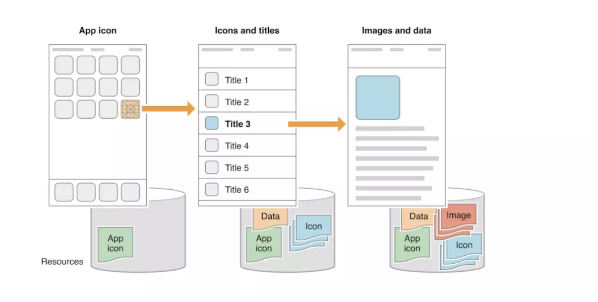

开启关闭On Demand Resources

```
在project navigator中选择工程文件。  
在project editor中选择对应的target。  
选择Build Settings选项卡。  
展开Assets分类。  
设置Enable On-Demand Resources的值。  
```

文章:

* [On-Demand Resources Guide中文版 上](http://www.cocoachina.com/articles/12155)
* [On-Demand Resources Guide中文版 下](http://www.cocoachina.com/articles/12152)

视频:

<iframe width="885" height="496" src="https://www.youtube.com/embed/B5RV8p4-9a8" title="YouTube video player" frameborder="0" allow="accelerometer; autoplay; clipboard-write; encrypted-media; gyroscope; picture-in-picture" allowfullscreen></iframe>
  
  * **_Bitcode_**

Bitcode是一种程序中间码。包含Bitcode配置的程序将会在App Store Connect上被重新编译和链接，进而对可执行文件做优化。这部分都是在
苹果服务端自动完成的，所以即使后续Apple推出了新的CPU架构或者以后LLVM推出了一系列优化，我们也不再需要为其发布新的安装包，Apple Store
会为我们自动完成这步，然后提供对应的变体给具体设备。

Bitcode开启：

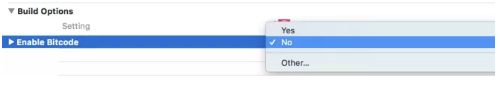

采用Bitcode之后需要注意两个方面：

(1) 一旦开启Bitcode那么我们依赖的静态库、动态库，都必须包含 Bitcode，另外用 Cocoapods 管理的第三方库，都需要开启 Pods 工程中的 BitCode。否则会编译失败。

可以将下面的配置添加到主Podfile中：

```
post_install do |installer|  
    installer.pods_project.targets.each do |target|  
        target.build_configurations.each do |config|  
            config.build_settings['ENABLE_BITCODE'] = 'YES'  
        end  
    end  
end  
```

(2) 开启 Bitcode 后，最终的可执行文件是 Apple 自动生成的，这就会导致我们无法使用自己包生成的 dSYM 符号化文件来进行符号化。这个问题可以在上传到 App Store 时需要勾选 “Include app symbols for your application…” ，勾选之后 Apple 会自动生成对应的 dSYM，然后可以在 Xcode —> Window —> Organizer 中，或者 Apple Store Connect 中下载对应的 dSYM 来进行符号化：

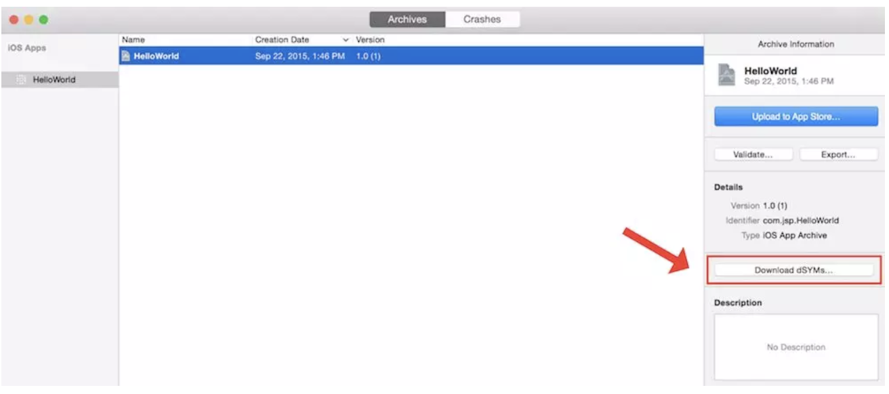

这里有一篇比较好的文章介绍了对应的技术以及怎样进行测试[初探iOS 9的 App 瘦身功能](https://www.appcoda.com.tw/app-thinning/)

### 3.6 网络优化

要对网络进行优化需要先了解一次网络请求的流程：

    1. 在开始请求某个地址之前，会先进行DNS解析，通过DNS解析获取到对应域名的IP.  
    2. 使用IP与目标服务器建立连接，这里包括tcp三次握手等流程  
    3. 建立完连接后客户端和服务端交换数据  

上述的三个阶段都存在可优化的点，我们一一进行介绍：

首先第一个环节，主要的性能损耗在DNS解析这块,DNS解析的缺点如下：

    * DNS解析环节主动权在域名解析方，这就导致容易在域名解析方被解析到第三方IP地址，从而遭受域名劫持，运营商劫持，中间人攻击。  
    * DNS解析过程不受我们控制，无法保证解析到的地址是最快的IP.  
    * 一次请求只能解析一个域名，容易达到性能瓶颈。  

为了解决这些问题，我们可以考虑自己来管理域名与IP的映射关系，也就是我们常说的HTTPDNS。具体的实现可以看[App域名劫持之DNS高可用 - 开源版HttpDNS方案详解](https://mp.weixin.qq.com/s?__biz=MzAwMDU1MTE1OQ==&mid=209805123&idx=1&sn=ced8d67c3e2cc3ca38ef722949fa21f8)，它的主要思想就是通过HTTP请求后台去拿域名,IP映射表，后续的网络请求就可以通过这个映射表来获得对应的IP地址，这样的好处就是不用在DNS解析上耗费时间，并且域名IP的映射关系可控，不会受到劫持，可以确保根据用户所在地返回就近的 IP 地址，或根据客户端测速结果使用速度最快的 IP。

对于第二个环节主要的性能瓶颈点在于连接的建立。这里可以通过复用连接，从而避免每次请求都重新建立连接。HTTP 协议里有个 keep-alive属性，如果开启的情况下请求完成后不立即释放连接，而是放到连接池中，如果这时候另一个请求发出，并且域名和端口是一致的，这时候就直接使用连接池中已有的连接。从而少了建立连接的耗时。

但是keep-alive也是有明显的缺点的就是，keep-alive连接每次都只能发送接收一个请求，在上一个请求处理完成之前，无法接受新的请求，所以如果同时多个请求被发送，就会有两种现象：

如果请求是串行发送的，那么就可以一直复用同一个连接，每个请求都需要等待上一个请求完成后再进行发送。

如果请求是并行发送的，那么从第二次开始可以复用连接池里的连接，这种情况如果对连接池不加限制，会导致连接池中保留的连接过多，对服务端资源将会带来较大的浪费，如果限制那么超过的部分仍然需要重新建立连接。

但是在别无选择的情况下，还是会采取这种方案。

后续HTTP2的推出，采用多路复用来解决需要频繁建立连接的问题。对于Http2的多路复用机制还是通过复用连接，但是它复用的这条连接同时能够支持同时处理多条请求，所有的请求都可以在这条连接上并发进行，它把在连接里传输的数据都封装成一个个stream，每个stream都有标识，stream的发送和接收可以是乱序的，不依赖顺序，也就不会有阻塞的问题，接收端可以根据stream的标识去区分属于哪个请求，再进行数据拼接，得到最终数据。iOS9 以上 NSURLSession原生支持 HTTP2，只要服务端也支持就可以直接使用。

但是HTTP2还有一个比较大的问题就是TCP队头阻塞，我们知道TCP 协议为了保证数据的可靠性，若传输过程中一个 TCP 包丢失，会等待这个包重传后，才会处理后续的包。在HTTP2中多路复用的情况下，如果中间有一个包丢失，就会阻塞等待重传，进而阻塞所有请求。这个问题是TCP协议本身的问题，为了解决这个问题，Google提出了QUIC 协议，它是在UDP协议之上再定义一套可靠传输协议来解决队头阻塞问题。

除了采用HTTP2多路复用技术外，还可以通过长连接的手段减少网络服务时间，我们知道每次TCP三次握手连接需要耗费客户端和服务端各一个RTT时间才能完成，就意味着 需要大致100-300 毫秒的延迟；为了克服这个问题可以使用长连接池的方式来使用长连接，长连接池中维护了多个保持和服务端的TCP连接，每次网络服务发起后会从长连接池中获取一个空闲长连接，完成网络服务后再将该TCP连接放回长连接池。

介绍完DNS环节优化，以及连接建立的优化后，我们看下从数据交换层面上如何进行优化，这方面主要可以优化的点可以分成两部分，一部分在于对数据的压缩率上，一部分在于解压缩，序列化反序列化的速度上，在数据交换格式的选择上对于数据量比较大的情景下可以使用protobuf替换json格式，protobuf是基于二进制的所以在整体数据量以及序列化速度上都远胜于json格式在内的其他格式，但是它有一个不足的地方就是数据不直观。在调试定位问题的时候比较难定位。

在进行数据交换之前可以对body数据进行压缩或者加密处理，[Z-standard](https://facebook.github.io/zstd/)是目前压缩率表现最好的算法。它支持多种开发语言。对于Header协议头数据，Http2已经对其进行了压缩处理。具体的压缩技术可以查看[HTTP/2头部压缩技术介绍](https://imququ.com/post/header-compression-in-http2.html)

除了一些敏感数据之外，不建议对数据进行加密，因为加解密是比较耗时的，加解密处理会增加整个请求发送和处理的速度，实际上标准协议 TLS已经能够很好得保证了网络传输的安全，所以除非是十分敏感的数据加密只会加重性能的负担。

除了上述介绍的网络优化外，还可以引入网络服务优先级机制，高优先级服务优先使用长连接，低优先级服务默认使用短连接以及网络服务依赖机制，主服务失败时，子服务自动取消。

## 4 较好的文章推荐

* [iOS Performance Optimization](https://github.com/tbfungeek/iOS-Performance-Optimization)

