 
<!--BEGIN_DATA
{
    "create_date": "2020-01-09 09:50", 
    "modify_date": "2020-01-09 09:50", 
    "is_top": "0", 
    "summary": "iOS性能监控与图形图像渲染原理", 
    "tags": "iOS、系统", 
    "file_name": "iOS性能监控与图形图像渲染原理.md"
}
END_DATA-->

####<p>原文出处：<a href='http://chuquan.me/2019/06/10/ios-performance-monitor-cpu-mem-fps/' target='blank'>iOS 性能监控(1)——CPU、Memory、FPS</a></p>

前段时间，在公司的 App 中集成了一个性能监视器，效果如下所示。在这个过程中，扒了一些性能监测开源框架的源码，并学习了其中的原理。本文就对此做一些简要的总结。


###概述

通常情况下，App 的性能问题并不会导致 App 不可用，但是会潜在地影响用户体验。比如：CPU占用率过高会导致电量消耗过快，手机发热等问题。为了能够主动、高效地发现性能问题，避免 App 质量进入无人监控的状态，我们需要对 App 的性能进行监控。目前，对 App 的性能监控，主要分为 **线下** 和 **线上** 两种监控维度。

###线下性能监控

关于线下性能监控，Xcode 内置提供了一个性能分析工具 Instruments。

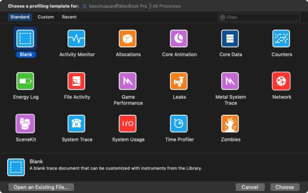

Instruments 集成了非常多的性能检测工具，如：Leaks 可以用来监控内存泄露问题；Energy Log 可以用来监控耗电量。下图所示为Instruments 中包含的各种性能检测工具。

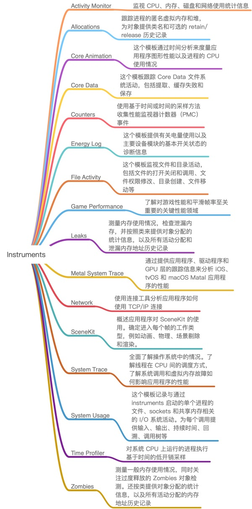

通常，我们会在提审前使用 Instruments 对 App 进行线下的性能分析。

###线上性能监控

线上监控一般需要遵循两个原则：

  1. 监控代码与业务代码解耦
  2. 采用性能消耗最小的性能监控方案

线上性能监控，主要集中在对 CPU 使用率、内存、FPS 帧率等方面的监控。下面分别介绍其各自的监控方法及原理。

####CPU

CPU 占用率的采集原理其实很简单：**App 作为进程运行时会有多个线程，每个线程对 CPU 的使用率不同。各个线程对 CPU 使用率的总和，就是当前 App 对 CPU 的占用率**。

#####相关系统原理

iOS 是基于 Apple Darwin 内核，由 kernel、XNU 和 Runtime 组成，XNU（X is not UNIX） 是 Darwin 的内核，一个混合内核，由 Mach 微内核和 BSD 组成。Mach内核是轻量级的平台，只能完成操作系统最基本的职责，如：进程和线程、虚拟内存管理、任务调度、进程通信和消息传递机制。其他的工作，如文件操作和设备访问，都是由 BSD 层实现。

事实上，Mach 并不能识别 UNIX 中的所有进程，而是采用一种稍微不同的方式，使用了比进程更轻量级的概念：**任务（Task）**。经典的 UNIX采用了自上而下的方式：最基本的对象是进程，然后进一步划分为一个或多个线程；Mach则采用了自底向上的方式：最基本的单元是线程，一个或多个线程包含在一个任务中。

**线程**

  * 线程定义了 Mach 中最小的执行单元。线程表示的是底层的机器寄存器状态以及各种调度统计数据，其从设计上提供了调度所需要的大量信息。

**任务**

  * 任务是一种容器对象，虚拟内存空间和其他资源都是通过这个容器对象管理的。这些资源包括设备和其他句柄。资源进一步被抽象为端口。因此，资源的共享实际上相当于允许对对应端口进行访问。

严格来说，Mach 的任务并不是hi操作系统中所谓的进程，因为 Mach 作为一个微内核的操作系统，并没有提供“进程”的逻辑，而只提供了最基本的实现。在BSD 模型中，这两个概念有一对一的简单映射，每个 BSD 进程（即 OS X 进程）都在底层关联了一个 Mach 任务对象。实现这种映射的方法是指定一个透明的指针 `bsd_info`，Mach 对 `bsd_info` 完全无知。Mach 将内核也用任务表示（全局范围称为 `kernel_task`），尽管该任务没有对应的 PID，但可以想象 PID 为 0。

下图所示为权威著作《OS X Internal: A System Approach》中提供的 Mach OS X 中进程子系统组成的概念图。与 Mac OS X 类似，iOS 的线程技术也是基于 Mach 线程技术实现的。

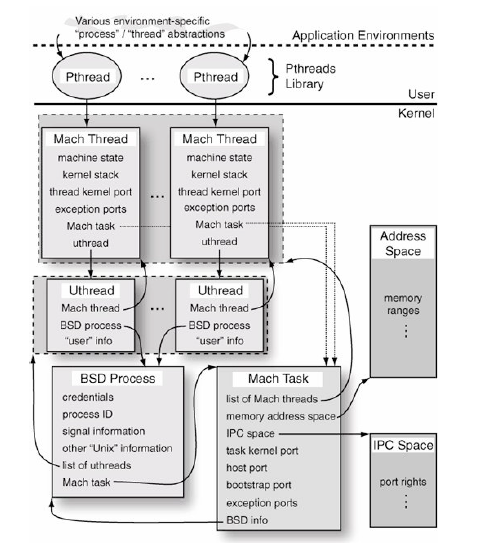

#####代码实现

上述提到线程表示的是底层的机器寄存器状态以及各种给调度统计数据。再来看 Mach 层中的 `thread_basic_info` 结构体的定义，其成员信息也证实了这一点。  
    
    
    struct thread_basic_info {  
            time_value_t    user_time;      // 用户运行时长  
            time_value_t    system_time;    // 系统运行时长  
            integer_t       cpu_usage;      // CPU 使用率  
            policy_t        policy;         // 调度策略  
            integer_t       run_state;      // 运行状态  
            integer_t       flags;          // 各种标记  
            integer_t       suspend_count;  // 暂停线程的计数  
            integer_t       sleep_time;     // 休眠时间  
    };  
    

每个线程都有这个结构体，所以我们只需要定时去遍历每个线程，累加每个线程的 `cpu_usage` 字段的值，就可以得到当前 App 所在进程的 CPU 使用率。

如下所示为 **CPU 占用率** 的代码实现：

 
    
    // 获取 CPU 使用率  
    + (CGFloat)cpuUsageForApp {  
        kern_return_t           kr;  
        thread_array_t          thread_list;  
        mach_msg_type_number_t  thread_count;  
        thread_info_data_t      thinfo;  
        mach_msg_type_number_t  thread_info_count;  
        thread_basic_info_t     basic_info_th;  
      
        // 根据当前 task 获取所有线程  
        kr = task_threads(mach_task_self(), &thread_list, &thread_count);  
        if (kr != KERN_SUCCESS)  
            return -1;  
      
        float total_cpu_usage = 0;  
        // 遍历所有线程  
        for (int i = 0; i < thread_count; i++) {  
            thread_info_count = THREAD_INFO_MAX;  
            // 获取每一个线程信息  
            kr = thread_info(thread_list[i], THREAD_BASIC_INFO, (thread_info_t)thinfo, &thread_info_count);  
            if (kr != KERN_SUCCESS)  
                return -1;  
      
            basic_info_th = (thread_basic_info_t)thinfo;  
            if (!(basic_info_th->flags & TH_FLAGS_IDLE)) {  
                // cpu_usage : Scaled cpu usage percentage. The scale factor is TH_USAGE_SCALE.  
                // 宏定义 TH_USAGE_SCALE 返回 CPU 处理总频率：  
                total_cpu_usage += basic_info_th->cpu_usage / (float)TH_USAGE_SCALE;  
            }  
        }  
      
        // 注意方法最后要调用 vm_deallocate，防止出现内存泄漏  
        kr = vm_deallocate(mach_task_self(), (vm_offset_t)thread_list, thread_count * sizeof(thread_t));  
        assert(kr == KERN_SUCCESS);  
      
        return total_cpu_usage;  
    }  
    

代码中使用 `task_threads` API 调用获取指定的 task 的线程列表。`task_threads` 将 `target_task`任务中的所有线程保存在 `act_list` 数组中，数组包含 `act_listCnt` 个条目。上述源码中，在调用 `task_threads` API时，`target_task` 参数传入的是 `mach_task_self()`，表示获取当前的 Mach task。  

    
    kern_return_t task_threads  
    (  
    	task_t target_task,  
    	thread_act_array_t *act_list,  
    	mach_msg_type_number_t *act_listCnt  
    );  
    

在获取到线程列表后，代码中使用 `thread_info` API 调用获取指定线程的线程信息。`thread_info` 查询 `flavor`指定的线程信息，将信息返回到长度为 `thread_info_outCnt` 字节的 `thread_info_out` 缓存区中。上述源码，在调用`thread_info` API 时，`flavor` 参数传入的是 `THREAD_BASIC_INFO`，使用这个类型会返回线程的基本信息，即`thread_basic_info_t` 结构体。  
    
    
    kern_return_t thread_info  
    (  
    	thread_act_t target_act,  
    	thread_flavor_t flavor,  
    	thread_info_t thread_info_out,  
    	mach_msg_type_number_t *thread_info_outCnt  
    );  
    

上述源码的最后，使用 `vm_deallocate` API 以防止出现内存泄露。

使用该方法采集到的 CPU 数据与腾讯的 GT、Instruments 数据接近。事实上，GT 也是采用这种方法采集 CPU 数据。

####Memory

通过上述 CPU 占用率监控原理，我们可以联想：内存使用情况是否也可以通过类似的方式获取到呢？答案是肯定的。

#####相关系统原理

内存是有限且系统共享的资源，一个程序占用越多，系统和其他程序所能用的就越少。程序启动前都需要先加载到内存中，并且在程序运行过程中的数据操作也会占用一定的内存资源。减少内存占用也能同时减少其对 CPU 时间维度上的消耗，从而使不仅使 App 以及整个系统也都能表现的更好。

MacOS 和 iOS 都采用了虚拟内存技术来突破物理内存的大小限制，每个进程都有一段由多个大小相同的页（Page）所构成的逻辑地址空间。处理器和内存管理单元（MMU，Memory Management Unit）维护着由逻辑地址到物理地址的 **页面映射表**（简称 **页表**），当程序访问逻辑内存地址时，由 MMU 根据页表将逻辑地址转换为真实的物理地址。在早期的苹果设备中，每个页的大小为 4KB；基于 A7 和 A8 处理器的系统为 64 位程序提供了 16KB 的虚拟内存分页和 4KB 的物理内存分页；在 A9 之后，虚拟内存和物理内存的分页大小都达到了 16KB。

虚拟内存分页（Virtual Page，VP）有两种类型：

  1. Clean：指能够被系统清理出内存且在需要时能重新加载的数据，包括：
    * 内存映射文件
    * Frameworks 中的 __DATA_CONST 部分
    * 应用的二进制可执行文件
  2. Dirty：指不能被系统回收的内存占用，包括：
    * 所有堆上的对象
    * 图片解码缓冲数据
    * Framework 中的 **DATA 和 **DATA_DIRTY 部分

由于内存容量和读写寿命的限制，iOS 上没有 Disk Swap 机制，取而代之使用 **Compressed Memory** 技术。 Disk Swap 是指在 macOS 以及一些其他桌面操作系统中，当内存可用资源紧张时，系统将内存中的内容写入磁盘中的backing store（Swapping out），并且在需要访问时从磁盘中再读入 RAM（Swapping in）。与大多数 UNIX 系统不同的是，macOS 没有预先分配磁盘中的一部分作为 backing store，而是利用引导分区所有可用的磁盘空间。

苹果最初只是公开了从 OS X Mavericks 开始使用 Compressed Memory 技术，但 iOS 系统也从 iOS 7 开始悄悄地使用。

Compressed Memory 技术在内存紧张时能够将最近使用过的内存占用压缩至原有大小的一半以下，并且能够在需要时解压复用。它在节省内存的同时提高了系统的响应速度，其特点可以归结为：

  * 减少了不活跃内存占用
  * 改善电源效率，通过压缩减少磁盘 IO 带来的损耗
  * 压缩/解压非常快，能够尽可能减少 CPU 的时间开销
  * 支持多核操作

本质上，Compressed Memory 也是 Dirty Memory。因此，**memory footprint = dirty size + compressed size**，这也是我们需要并且能够尝试去减少的内存占用。

####代码实现

在 `/usr/include/mach/task_info.h` 中，我们可以看到 `mach_task_basic_info` 和 `task_basic_info` 结构体的定义，分别如下所示。事实上，苹果公司已经不建议再使用 `task_basic_info` 结构体了。  
    

```    
#define MACH_TASK_BASIC_INFO     20         /* always 64-bit basic info */  
struct mach_task_basic_info {  
        mach_vm_size_t  virtual_size;       /* virtual memory size (bytes) */  
        mach_vm_size_t  resident_size;      /* resident memory size (bytes) */  
        mach_vm_size_t  resident_size_max;  /* maximum resident memory size (bytes) */  
        time_value_t    user_time;          /* total user run time for  
                                                terminated threads */  
        time_value_t    system_time;        /* total system run time for  
                                                terminated threads */  
        policy_t        policy;             /* default policy for new threads */  
        integer_t       suspend_count;      /* suspend count for task */  
};  
```

```  
/* localized structure - cannot be safely passed between tasks of differing sizes */  
/* Don't use this, use MACH_TASK_BASIC_INFO instead */  
struct task_basic_info {  
        integer_t       suspend_count;  /* suspend count for task */  
        vm_size_t       virtual_size;   /* virtual memory size (bytes) */  
        vm_size_t       resident_size;  /* resident memory size (bytes) */  
        time_value_t    user_time;      /* total user run time for  
                                            terminated threads */  
        time_value_t    system_time;    /* total system run time for  
                                            terminated threads */  
    policy_t	policy;		/* default policy for new threads */  
};  
```   

`mach_task_basic_info` 结构体存储了 Mach task 的内存使用信息，其中 `resident_size` 是 App 使用的驻留内存大小，`virtual_size` 是 App 使用的虚拟内存大小。

如下所示为内存使用情况的代码实现：  
    
    
    // 当前 app 内存使用量  
    + (NSInteger)useMemoryForApp {  
        struct mach_task_basic_info info;  
        mach_msg_type_number_t count = MACH_TASK_BASIC_INFO_COUNT;  
    	  
    	kern_return_t kr = task_info(mach_task_self(), MACH_TASK_BASIC_INFO, (task_info_t) &info, &count);  
    	if (kr == KERN_SUCCESS) {  
    		return info.resident_size;  
    	} else {  
    		return -1;  
    	}  
    }  
    

然而，我用 **通过此方法获取到的内存信息与 Instruments 中的 Activity Monitor 采集到的内存信息进行比较，发现前者要多出将近100MB**。经过调研发现，苹果使用了上述的 Compressed Memory，我猜测：`resident_size` 可能是将 Compressed Memory 解压后所统计到的一个数值。**真实的物理内存的值应该是 `task_vm_info` 结构体中的 `pyhs_footprint`成员的值**。  

    
    #define TASK_VM_INFO            22  
    #define TASK_VM_INFO_PURGEABLE  23  
    struct task_vm_info {  
    	mach_vm_size_t  virtual_size;       /* virtual memory size (bytes) */  
    	integer_t       region_count;       /* number of memory regions */  
    	integer_t       page_size;  
    	mach_vm_size_t  resident_size;      /* resident memory size (bytes) */  
    	mach_vm_size_t  resident_size_peak; /* peak resident size (bytes) */  
      
    	mach_vm_size_t  device;  
    	mach_vm_size_t  device_peak;  
    	mach_vm_size_t  internal;  
    	mach_vm_size_t  internal_peak;  
    	mach_vm_size_t  external;  
    	mach_vm_size_t  external_peak;  
    	mach_vm_size_t  reusable;  
    	mach_vm_size_t  reusable_peak;  
    	mach_vm_size_t  purgeable_volatile_pmap;  
    	mach_vm_size_t  purgeable_volatile_resident;  
    	mach_vm_size_t  purgeable_volatile_virtual;  
    	mach_vm_size_t  compressed;  
    	mach_vm_size_t  compressed_peak;  
    	mach_vm_size_t  compressed_lifetime;  
      
    	/* added for rev1 */  
    	mach_vm_size_t  phys_footprint;  
      
    	/* added for rev2 */  
    	mach_vm_address_t       min_address;  
    	mach_vm_address_t       max_address;  
    };  
    

因此，正确的内存使用情况的代码实现应该如下：  
    
    
    // 当前 app 内存使用量  
    + (NSInteger)useMemoryForApp {  
        task_vm_info_data_t vmInfo;  
        mach_msg_type_number_t count = TASK_VM_INFO_COUNT;  
        kern_return_t kernelReturn = task_info(mach_task_self(), TASK_VM_INFO, (task_info_t) &vmInfo, &count);  
        if (kernelReturn == KERN_SUCCESS) {  
            int64_t memoryUsageInByte = (int64_t) vmInfo.phys_footprint;  
            return memoryUsageInByte / 1024 / 1024;  
        } else {  
            return -1;  
        }  
    }  
    

####FPS

FPS（Frames Per Second）是指画面每秒传输的帧数。每秒帧数越多，所显示的动画就越流畅，一般只要保持 FPS 在 50-60，App就会有流畅的体验，反之会感觉到卡顿。

#####相关系统原理

`CADisplayLink` 是一个能让我们以和屏幕刷新率相同的频率将内容画到屏幕上的定时器。

一旦 `CADisplayLink` 以特定的模式注册到 `runloop` 之后，每当屏幕需要刷新时，`runloop` 就会调用`CADisplayLink` 绑定的 `target` 上的 `selector`，此时 `target` 可以读取到 `CADisplayLink`的每次调用的时间戳，用来准备下一帧显示需要的数据。如：一个视频应用使用时间戳来计算下一帧要显示的视频数据。

#####代码实现

现阶段，常用的 FPS 监控几乎都是基于 `CADisplayLink` 实现的。  

    
    
    // swift  
    final class FPSMonitor: NSObject {  
        private var timer: Timer?  
        private var link: CADisplayLink?  
        private var count: UInt = 0  
        private var lastTime: TimeInterval = 0  
      
        func enableMonitor() {  
            if link == nil {  
                link = CADisplayLink(target: self, selector: #selector(fpsInfoCalculate(_:)))  
                link?.add(to: RunLoop.main, forMode: .common)  
            } else {  
                link?.isPaused = false  
            }  
        }  
      
        func disableMonitor() {  
            if let link = link {  
                link.isPaused = true  
                link.invalidate()  
                self.link = nil  
                lastTime = 0  
                count = 0  
            }  
        }  
          
        @objc  
        func fpsInfoCalculate(_ link: CADisplayLink) {  
            if lastTime == 0 {  
                lastTime = link.timestamp  
                return  
            }  
            count += 1  
            let delta = link.timestamp - lastTime  
            if delta >= 1 {  
                // 间隔超过 1 秒  
                lastTime = link.timestamp  
                let fps = Double(count) / delta  
                count = 0  
      
                let intFps = Int(fps + 0.5)  
                print("帧率：\(intFps)")  
            }  
        }  
    }  
    

`CADisplayLink` 实现的 FPS 在生产场景中只有指导意义，不能代表真实的 FPS。因为基于 `CADisplayLink` 实现的 FPS 无法完全检测出当前 **Core Animation** 的性能情况，只能检测出当前 **RunLoop** 的帧率。


###参考

<ol>
<li><a href="https://github.com/aozhimin/iOS-Monitor-Platform" target="_blank" rel="noopener">iOS 性能监控 SDK —— Wedjat（华狄特）开发过程的调研和整理</a></li>
<li><a href="">深入解析Mac OS X 与 iOS 操作系统</a></li>
<li><a href="https://developer.apple.com/videos/play/wwdc2018/416/" target="_blank" rel="noopener">WWDC 2018 Session 416 iOS Memory Deep Dive</a></li>
<li><a href="https://techblog.toutiao.com/2018/06/19/untitled-40/" target="_blank" rel="noopener">[ WWDC2018 ] - 深入解析iOS内存 iOS Memory Deep Dive</a></li>
<li><a href="https://github.com/WebKit/webkit/blob/52bc6f0a96a062cb0eb76e9a81497183dc87c268/Source/WTF/wtf/cocoa/MemoryFootprintCocoa.cpp" target="_blank" rel="noopener">WebKit MemoryFootprintCocoa</a></li>
<li><a href="http://newosxbook.com/articles/MemoryPressure.html" target="_blank" rel="noopener">Handling low memory conditions in iOS and Mavericks</a></li>
<li><a href="https://developer.apple.com/library/archive/technotes/tn2434/_index.html" target="_blank" rel="noopener">Minimizing your app’s Memory Footprint</a></li>
<li><a href="https://developer.apple.com/library/archive/documentation/Performance/Conceptual/ManagingMemory/Articles/AboutMemory.html" target="_blank" rel="noopener">About the Virtual Memory System</a></li>
<li><a href="https://zhuanlan.zhihu.com/p/49829766" target="_blank" rel="noopener">iOS 内存管理研究</a></li>
<li><a href="https://juejin.im/entry/5bbda00ef265da0ac446c970" target="_blank" rel="noopener">iOS Memory Deep Dive</a></li>
<li><a href="https://zhuanlan.zhihu.com/p/34348398" target="_blank" rel="noopener">深入理解 CADisplayLink 和 NSTimer</a></li>
<li><a href="https://www.jianshu.com/p/c35a81c3b9eb" target="_blank" rel="noopener">CADisplayLink</a></li>
<li><a href="https://opensource.apple.com/source/CF/CF-1152.14/CFRunLoop.c.auto.html" target="_blank" rel="noopener">CFRunLoop.c</a></li>
<li><a href="http://chuquan.me/2018/08/26/graphics-rending-principle-gpu/">计算机那些事(8)——图形图像渲染原理</a></li>
</ol>


<hr>


####<p>原文出处：<a href='http://chuquan.me/2019/06/17/ios-performance-monitor-caton/' target='blank'>iOS 性能监控(2)——卡顿</a></p>

前文 [iOS 性能监控(1)——CPU、Memory、FPS](http://chuquan.me/2019/06/10/ios-performance-monitor-cpu-mem-fps/) 探讨了 iOS 中进行线上监控 CPU、Memory、FPS 等指标的原理以及具体实现方法。本文则继续探讨如何在 iOS 中进行线上监控卡顿的原理及实现。

###卡顿

####相关系统原理

那么为什么会出现卡顿呢？为了解释这个问题首先需要了解一下屏幕图像的显示原理。首先从 CRT 显示器原理说起，如下图所示。CRT 的电子枪从上到下逐行扫描，扫描完成后显示器就呈现一帧画面。然后电子枪回到初始位置进行下一次扫描。为了同步显示器的显示过程和系统的视频控制器，显示器会用硬件时钟产生一系列的定时信号。当电子枪换行进行扫描时，显示器会发出一个水平同步信号（horizonal synchronization），简称**HSync**；而当一帧画面绘制完成后，电子枪回复到原位，准备画下一帧前，显示器会发出一个垂直同步信号（vertical synchronization），简称 **VSync**。显示器通常以固定频率进行刷新，这个刷新率就是 VSync 信号产生的频率。虽然现在的显示器基本都是液晶显示屏了，但其原理基本一致。


下图所示为常见的 CPU、GPU、显示器工作方式。CPU 计算好显示内容（如：视图的创建、布局计算、图片解码、文本绘制）提交至 GPU，GPU渲染完成后将渲染结果存入帧缓冲区，视频控制器会按照 VSync 信号逐帧读取帧缓冲区的数据，经过数据转换后最终由显示器进行显示。


最简单的情况下，帧缓冲区只有一个。此时，帧缓冲区的读取和刷新都都会有比较大的效率问题。为了解决效率问题，GPU 通常会引入两个缓冲区，即**双缓冲机制**。事实上，iPhone 使用的就是双缓冲机制。在这种情况下，GPU会预先渲染一帧放入一个缓冲区中，用于视频控制器的读取。当下一帧渲染完毕后，GPU 会直接把视频控制器的指针指向第二个缓冲器。


双缓冲虽然能解决效率问题，但会引入一个新的问题。当视频控制器还未读取完成时，即屏幕内容刚显示一半时，GPU将新的一帧内容提交到帧缓冲区并把两个缓冲区进行交换后，视频控制器就会把新的一帧数据的下半段显示到屏幕上，造成画面撕裂现象，如下图：

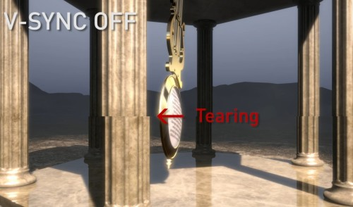

为了解决这个问题，GPU 通常有一个机制叫做垂直同步（简写也是 V-Sync），当开启垂直同步后，GPU 会等待显示器的 VSync信号发出后，才进行新的一帧渲染和缓冲区更新。这样能解决画面撕裂现象，也增加了画面流畅度，但需要消费更多的计算资源，也会带来部分延迟。当 CPU 和 GPU计算量比较大时，一旦它们的完成时间错过了下一次 C-Sync 的到来（通常是1000/6=16.67ms），这样就会出现显示屏还是之前帧的内容，这就是界面卡顿的原因。

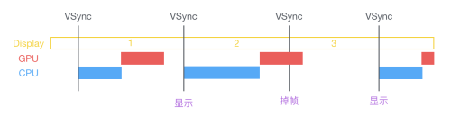

####FPS 卡顿监控方案

FPS 卡顿监控方案的原理是 **通过一段连续的 FPS 计算丢帧率来衡量当前页面绘制的质量**。

具体实现方式可以通过 [iOS 性能监控(1)——CPU、Memory、FPS](http://chuquan.me/2019/06/10/ios-performance-monitor-cpu-mem-fps/) 一文中的 FPS 监控方法进行 FPS 数据采集，然后处理数据。这里不做多余的介绍。

####主线程卡顿监控方案

主线程卡顿监控方案的原理是 **通过子线程监控主线程的RunLoop，判断两个状态区域之间的耗时是否达到一定阈值**。因为主线程绝大部分计算或绘制任务都是以 RunLoop 为单位发生。单次 RunLoop如果时长超过 16ms，就会导致 UI 体验的卡顿。

美团的移动端性能监控方案 Hertz 采用的就是这种方式。

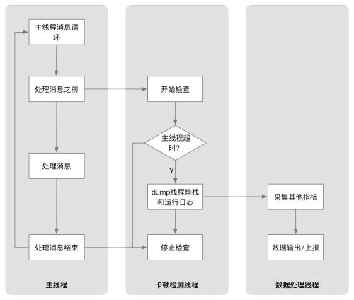

首先我们需要了解一下 RunLoop 的原理。

#####RunLoop 定义

RunLoop 是 iOS 事件响应与任务处理最核心的机制。当有持续的异步任务需求时，我们会创建一个独立的生命周期可控的线程。**RunLoop就是控制线程生命周期并接收事件进行处理的机制**。

#####RunLoop 机制

**主线程（有 RunLoop 的线程）几乎所有函数都从以下六个函数之一的函数调起：**

  1. `CFRUNLOOP_IS_CALLING_OUT_TO_AN_OBSERVER_CALLBACK_FUNCTION`
    * CFRunloop is calling out to an abserver callback function
    * 用于向外部报告 RunLoop 当前状态的改变，框架中很多机制都由 RunLoopObserver 触发，如：CAAnimation
  2. `CFRUNLOOP_IS_CALLING_OUT_TO_A_BLOCK`
    * CFRunloop is calling out to a block
    * 消息通知、非延迟的 perform、dispatch 调用、block 回调、KVO
  3. `CFRUNLOOP_IS_SERVICING_THE_MAIN_DISPATCH_QUEUE`
    * CFRunloop is servicing the main dispatch queue
    * 执行主队列上的任务
  4. `CFRUNLOOP_IS_CALLING_OUT_TO_A_TIMER_CALLBACK_FUNCTION`
    * CFRunloop is calling out to a timer callback function
    * 基于定时器的延迟的 perfrom，dispatch 调用
  5. `CFRUNLOOP_IS_CALLING_OUT_TO_A_SOURCE0_PERFORM_FUNCTION`
    * CFRunloop is calling out to a source 0 perform function
    * 处理 App 内部事件、App自己负责管理（触发），如：`UIEvent`、`CFSocket`。普通函数调用，系统调用
  6. `CFRUNLOOP_IS_CALLING_OUT_TO_A_SOURCE1_PERFORM_FUNCTION`
    * CFRunloop is calling out to a source 1 perform function
    * 由 RunLoop 和内核管理，Mach port 驱动，如：`CFMachPort`、`CFMessagePort`

#####RunLoop 运行时

如下所示为 `CFRunLoop` 源码中的核心方法 `CFRunLoopRun` 简化后的主要逻辑。  

    
    
    int32_t __CFRunLoopRun() {  
        // 1. 通知 Observers：即将进入 RunLoop  
        __CFRunLoopDoObservers(KCFRunLoopEntry);  
          
        do {  
            // 2. 通知Observers：即将要处理 timer  
            __CFRunLoopDoObservers(kCFRunLoopBeforeTimers);  
            // 3. 通知Observers：即将要处理 source  
            __CFRunLoopDoObservers(kCFRunLoopBeforeSources);  
              
            // 处理非延迟的主线程调用  
            __CFRunLoopDoBlocks();  
            // 处理 UIEvent 事件  
            __CFRunLoopDoSource0();  
          
            // GCD dispatch main queue  
            CheckIfExistMessagesInMainDispatchQueue();  
          
            // 4. 通知 Observers：即将进入休眠等待  
            __CFRunLoopDoObservers(kCFRunLoopBeforeWaiting);  
              
            // 等待内核mach_msg事件  
            mach_port_t wakeUpPort = SleepAndWaitForWakingUpPorts();  
              
            // mach_msg_trap  
            // 休眠中 Zzz...  
            // Received mach_msg, wake up  
              
            // 5. 通知 Observers：从休眠等待中醒来  
            __CFRunLoopDoObservers(kCFRunLoopAfterWaiting);  
              
            if (wakeUpPort == timerPort) {  
                // 处理因timer的唤醒  
                __CFRunLoopDoTimers();  
            } else if (wakeUpPort == mainDispatchQueuePort) {  
                // 处理异步方法唤醒，如：dispatch_async  
                __CFRUNLOOP_IS_SERVICING_THE_MAIN_DISPATCH_QUEUE__()  
            } else {  
                // UI 刷新，动画显示  
                __CFRunLoopDoSource1();  
            }  
              
            // 再次确保是否有同步的方法需要调用  
            __CFRunLoopDoBlocks()  
        } while(!stop && !timeout);  
          
        // 6. 通知 Observers：即将退出runloop  
        __CFRunLoopDoObservers(CFRunLoopExit);  
    }  
    

RunLoop 在运行时一直在向外部报告当前状态的更新，其状态定义如下：  

    
    
    typedef CF_OPTIONS(CFOptionFlags, CFRunLoopActivity) {  
        kCFRunLoopEntry ,           // 进入 loop  
        kCFRunLoopBeforeTimers ,    // 触发 Timer 回调  
        kCFRunLoopBeforeSources ,   // 触发 Source0 回调  
        kCFRunLoopBeforeWaiting ,   // 等待 mach_port 消息  
        kCFRunLoopAfterWaiting ,    // 接收 mach_port 消息  
        kCFRunLoopExit ,            // 退出 loop  
        kCFRunLoopAllActivities     // loop 所有状态改变  
    }  
    

从 RunLoop 运行逻辑中，不难发现 NSRunLoop 调用方法主要在于两个状态区间：

  * `kCFRunLoopBeforeSources` 和 `kCFRunLoopBeforeWaiting` 之间
  * `kCFRunLoopAfterWaiting` 之后

**如果这两个时间内耗时太久而无法进入下一步，可以线程受阻。如果这个线程时主线程，表现出来就是出现了卡顿。**

####代码实现

我们可以通过 `CFRunLoopObserverRef` 实时获取 `NSRunLoop` 的状态。具体使用方法如下：

首先创建一个 `CFRunLoopObserverContext` 观察者 `observer`。然后将观察者 `observer` 添加到主线程RunLoop 的 `kCFRunLoopCommonModes` 模式下进行观察。  

    
    
    - (void)registerObserver {  
        CFRunLoopObserverContext context = {0,(__bridge void*)self,NULL,NULL};  
        CFRunLoopObserverRef observer = CFRunLoopObserverCreate(kCFAllocatorDefault,  
                                                                kCFRunLoopAllActivities,  
                                                                YES,  
                                                                0,  
                                                                &runLoopObserverCallBack,  
                                                                &context);  
        CFRunLoopAddObserver(CFRunLoopGetMain(), observer, kCFRunLoopCommonModes);  
    }  
      
    static void runLoopObserverCallBack(CFRunLoopObserverRef observer, CFRunLoopActivity activity, void *info) {  
        MyClass *object = (__bridge MyClass*)info;  
        object->activity = activity;  
    }  
    

然后，创建一个持续的子线程专门用来监控主线程的 RunLoop 状态。为了让计算更精确，需要让子线程更及时的获知主线程 RunLoop状态变化，`dispatch_semaphore_t`是一个不错的选择。另外，卡顿需要覆盖多次连续短时间卡顿和单次长时间卡顿两种情景，所以判定条件也需要做适当优化。优化后的代码实现如下所示：  


    
    - (void)registerObserver {  
        CFRunLoopObserverContext context = {0,(__bridge void*)self,NULL,NULL};  
        CFRunLoopObserverRef observer = CFRunLoopObserverCreate(kCFAllocatorDefault,  
                                                                kCFRunLoopAllActivities,  
                                                                YES,  
                                                                0,  
                                                                &runLoopObserverCallBack,  
                                                                &context);  
        CFRunLoopAddObserver(CFRunLoopGetMain(), observer, kCFRunLoopCommonModes);  
          
        // 创建信号  
        semaphore = dispatch_semaphore_create(0);  
          
        // 在子线程监控时长  
        dispatch_async(dispatch_get_global_queue(0, 0), ^{  
            while (YES) {  
                // 假定连续5次超时50ms认为卡顿(当然也包含了单次超时250ms)  
                long st = dispatch_semaphore_wait(semaphore, dispatch_time(DISPATCH_TIME_NOW, 50*NSEC_PER_MSEC));  
                if (st != 0) {  
                    if (activity == kCFRunLoopBeforeSources || activity==kCFRunLoopAfterWaiting) {  
                        if (++timeoutCount < 5)  
                            continue;  
                          
                        NSLog(@"好像有点儿卡哦");  
                    }  
                }  
                timeoutCount = 0;  
            }  
        });  
    }  
      
    static void runLoopObserverCallBack(CFRunLoopObserverRef observer, CFRunLoopActivity activity, void *info) {  
        MyClass *object = (__bridge MyClass*)info;  
          
        // 记录状态值  
        object->activity = activity;  
          
        // 发送信号  
        dispatch_semaphore_t semaphore = moniotr->semaphore;  
        dispatch_semaphore_signal(semaphore);  
    }  
    

检测到卡顿时应该立刻获取卡顿的方法堆栈信息，并推送至服务端共开发者分析，从而解决卡顿问题。

获取堆栈信息的一种方法是：**直接调用系统函数**。这种方法的优点是 **性能消耗小**。缺点是 **它只能够获取简单的信息，无法配合 dSYM 来获取具体是哪行代码出了问题，而且能够获取的信息类型也有限**。

直接调用系统函数的主要思路是：用 `signal` 进行错误信息获取。具体代码如下：  

    
    
    static int s_fatal_signals[] = {  
        SIGABRT,  
        SIGBUS,  
        SIGFPE,  
        SIGILL,  
        SIGSEGV,  
        SIGTRAP,  
        SIGTERM,  
        SIGKILL,  
    };  
      
    static int s_fatal_signal_num = sizeof(s_fatal_signals) / sizeof(s_fatal_signals[0]);  
      
    void UncaughtExceptionHandler(NSException *exception) {  
        NSArray *exceptionArray = [exception callStackSymbols];     // 得到当前调用栈信息  
        NSString *exceptionReason = [exception reason];             // 非常重要，就是崩溃的原因  
        NSString *exceptionName = [exception name];                 // 异常类型  
    }  
      
    void SignalHandler(int code) {  
        NSLog(@"signal handler = %d",code);  
    }  
      
    void InitCrashReport() {  
        // 系统错误信号捕获  
        for (int i = 0; i < s_fatal_signal_num; ++i) {  
            signal(s_fatal_signals[i], SignalHandler);  
        }  
          
        //oc 未捕获异常的捕获  
        NSSetUncaughtExceptionHandler(&UncaughtExceptionHandler);  
    }  
      
    int main(int argc, char * argv[]) {  
        @autoreleasepool {  
            InitCrashReport();  
            return UIApplicationMain(argc, argv, nil, NSStringFromClass([AppDelegate class]));  
        }  
    }  
    

获取堆栈信息的另一种方法是：**直接使用 PLCrashReporter 第三方开源库**。这种方法的优点是**能够定位到问题代码的具体位置，而且性能消耗也不大**。具体代码如下：  

    
    
    PLCrashReporterConfig *config = [[PLCrashReporterConfig alloc] initWithSignalHandlerType:PLCrashReporterSignalHandlerTypeBSD       
                                                                       symbolicationStrategy:PLCrashReporterSymbolicationStrategyAll];  
    PLCrashReporter *reporter = [[PLCrashReporter alloc] initWithConfiguration:config];  
      
    // 获取数据  
    NSData *lagData = [reporter generateLiveReport];  
      
    // 转换成 PLCrashReport 对象  
    PLCrashReport *lagReport = [[PLCrashReport alloc] initWithData:lagData error:NULL];  
      
    // 进行字符串格式化处理  
    NSString *lagReportString = [PLCrashReportTextFormatter stringValueForCrashReport:lagReport withTextFormat:PLCrashReportTextFormatiOS];  
      
    // 将字符串上传服务器  
    NSLog(@"lag happen, detail below: \n %@",lagReportString);  
    

###参考

<ol>
<li><a href="http://chuquan.me/2018/08/26/graphics-rending-principle-gpu/">计算机那些事(8)——图形图像渲染原理</a></li>
<li><a href="http://chuquan.me/2018/10/06/understand-ios-runloop/">Run Loop 原理详解</a></li>
<li><a href="https://wereadteam.github.io/2016/05/03/WeRead-Performance/" target="_blank" rel="noopener">微信读书 iOS 性能优化总结</a></li>
<li><a href="http://www.tanhao.me/code/151113.html/" target="_blank" rel="noopener">iOS 实时卡顿监控</a></li>
<li><a href="https://opensource.apple.com/source/CF/CF-1152.14/CFRunLoop.c.auto.html" target="_blank" rel="noopener">CFRunLoop.c</a></li>
<li><a href="https://juejin.im/post/5a94e9185188257a780dde61" target="_blank" rel="noopener">RunLoop刨根问底</a></li>
<li><a href="https://www.cnblogs.com/zy1987/p/4582466.html" target="_blank" rel="noopener">RunLoop 原理和核心机制</a></li>
<li><a href="http://mrpeak.cn/blog/ui-detect/" target="_blank" rel="noopener">iOS应用UI线程卡顿监控</a></li>
</ol>


<hr>


 
####<p>原文出处：<a href='http://chuquan.me/2018/08/26/graphics-rending-principle-gpu/' target='blank'>计算机那些事(8)——图形图像渲染原理</a></p>

最近在 iOS 开发中做了较多动画相关的编程工作。因此想借此机会深入了解了一下 iOS 动画及渲染相关原理。随着对相关方面的深入了解，发现这里面涉及到从硬件底层到软件框架等一系列相关知识。

本文将从相对底层的角度对计算图形渲染原理进行简要介绍，以作为后续的知识储备。

###引言

作为程序员，我们或多或少知道可视化应用程序都是由 CPU 和 GPU 协作执行的。那么我们就先来了解一下两者的基本概念：

  * **CPU（Central Processing Unit）**：现代计算机的三大核心部分之一，作为整个系统的运算和控制单元。CPU 内部的流水线结构使其拥有一定程度的并行计算能力。
  * **GPU（Graphics Processing Unit）**：一种可进行绘图运算工作的专用微处理器。GPU 能够生成 2D/3D 的图形图像和视频，从而能够支持基于窗口的操作系统、图形用户界面、视频游戏、可视化图像应用和视频播放。GPU 具有非常强的并行计算能力。

这时候可能会产生一个问题：CPU 难道不能代替 GPU 来进行图形渲染吗？答案当然是肯定的，不过在看了下面这个视频就明白为什么要用 GPU 来进行图形渲染了。

[GPU CPU 模拟绘图视频](http://ugcydzd.qq.com/uwMRJfz-r5jAYaQXGdGnC2_ppdhgmrDlPaRvaV7F2Ic/a0310ca26r9.m701.mp4?vkey=40961BB7F3520A37C85D4E4B4130DD91374BFB11499862930CE40B3E09D41D06125BC9EFC73A98DDDE2E5A64EAEB896492064C775F5C82ECD1D72D91D30C53F874EF2C404B480B719C6B8FAA1FA012CEF8743749150271333535195D599FE9F4E8E5FADC8C1A4FBEE74E1C81AA4206F408DE82EE359B3193&br=29&platform=2&fmt=auto&level=0&sdtfrom=v1010&guid=f401ea7eb4e13983f11cfe58f689e34d)

使用 GPU 渲染图形的根本原因就是：速度。GPU 的并行计算能力使其能够快速将图形结果计算出来并在屏幕的所有像素中进行显示。

那么像素是如何绘制在屏幕上的？计算机将存储在内存中的形状转换成实际绘制在屏幕上的对应的过程称为 **渲染**。渲染过程中最常用的技术就是 **光栅化**。

关于光栅化的概念，以下图为例，假如有一道绿光与存储在内存中的一堆三角形中的某一个在三维空间坐标中存在相交的关系。那么这些处于相交位置的像素都会被绘制到屏幕上。当然这些三角形在三维空间中的前后关系也会以遮挡或部分遮挡的形式在屏幕上呈现出来。一句话总结：光栅化就是将数据转化成可见像素的过程。

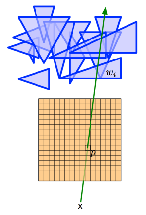

GPU 则是执行转换过程的硬件部件。由于这个过程涉及到屏幕上的每一个像素，所以 GPU 被设计成了一个高度并行化的硬件部件。

下面，我们来简单了解一下 GPU 的历史。

###GPU 历史

GPU 还未出现前，PC 上的图形操作是由 **视频图形阵列（VGA，Video Graphics Array）** 控制器完成。VGA控制器由连接到一定容量的DRAM上的存储控制器和显示产生器构成。

1997 年，VGA 控制器开始具备一些 3D 加速功能，包括用于 **三角形生成**、**光栅化**、**纹理贴图** 和 **阴影**。

2000 年，一个单片处图形处理器继承了传统高端工作站图形流水线的几乎每一个细节。因此诞生了一个新的术语 GPU 用来表示图形设备已经变成了一个处理器。

随着时间的推移，GPU 的可编程能力愈发强大，其作为可编程处理器取代了固定功能的专用逻辑，同时保持了基本的 3D 图形流水线组织。

近年来，GPU 增加了处理器指令和存储器硬件，以支持通用编程语言，并创立了一种编程环境，从而允许使用熟悉的语言（包括 C/C++）对 GPU 进行编程。

如今，GPU 及其相关驱动实现了图形处理中的 `OpenGL` 和 `DirectX` 模型，从而允许开发者能够轻易地操作硬件。`OpenGL`严格来说并不是常规意义上的 API，而是一个第三方标准（由 khronos 组织制定并维护），其严格定义了每个函数该如何执行，以及它们的输出值。至于每个函数内部具体是如何实现的，则由 OpenGL 库的开发者自行决定。实际 OpenGL 库的开发者通常是显卡的生产商。`DirectX` 则是由 Microsoft 提供一套第三方标准。

###GPU 图形渲染流水线

GPU 图形渲染流水线的主要工作可以被划分为两个部分：

  * 把 3D 坐标转换为 2D 坐标
  * 把 2D 坐标转变为实际的有颜色的像素

GPU 图形渲染流水线的具体实现可分为六个阶段，如下图所示。

  * **顶点着色器（Vertex Shader）**
  * **形状装配（Shape Assembly）**，又称 **图元装配**
  * **几何着色器（Geometry Shader）**
  * **光栅化（Rasterization）**
  * **片段着色器（Fragment Shader）**
  * **测试与混合（Tests and Blending）**

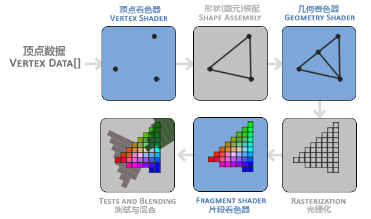

第一阶段，顶点着色器。该阶段的输入是 **顶点数据（Vertex Data）** 数据，比如以数组的形式传递 3 个 3D 坐标用来表示一个三角形。顶点数据是一系列顶点的集合。顶点着色器主要的目的是把 3D 坐标转为另一种 3D 坐标，同时顶点着色器可以对顶点属性进行一些基本处理。

第二阶段，形状（图元）装配。该阶段将顶点着色器输出的所有顶点作为输入，并将所有的点装配成指定图元的形状。图中则是一个三角形。**图元（Primitive）** 用于表示如何渲染顶点数据，如：点、线、三角形。

第三阶段，几何着色器。该阶段把图元形式的一系列顶点的集合作为输入，它可以通过产生新顶点构造出新的（或是其它的）图元来生成其他形状。例子中，它生成了另一个三角形。

第四阶段，光栅化。该阶段会把图元映射为最终屏幕上相应的像素，生成片段。**片段（Fragment）** 是渲染一个像素所需要的所有数据。

第五阶段，片段着色器。该阶段首先会对输入的片段进行 **裁切（Clipping）**。裁切会丢弃超出视图以外的所有像素，用来提升执行效率。

第六阶段，测试与混合。该阶段会检测片段的对应的深度值（`z` 坐标），判断这个像素位于其它物体的前面还是后面，决定是否应该丢弃。此外，该阶段还会检查`alpha` 值（ `alpha`值定义了一个物体的透明度），从而对物体进行混合。因此，即使在片段着色器中计算出来了一个像素输出的颜色，在渲染多个三角形的时候最后的像素颜色也可能完全不同。

关于混合，GPU 采用如下公式进行计算，并得出最后的颜色。

    
    R = S + D * (1 - Sa)  
    

关于公式的含义，假设有两个像素 S(source) 和 D(destination)，S 在 `z` 轴方向相对靠前（在上面），D 在 `z`轴方向相对靠后（在下面），那么最终的颜色值就是 **S（上面像素） 的颜色 + D（下面像素） 的颜色 * （1 - S（上面像素） 颜色的透明度）**。

上述流水线以绘制一个三角形为进行介绍，可以为每个顶点添加颜色来增加图形的细节，从而创建图像。但是，如果让图形看上去更加真实，需要足够多的顶点和颜色，相应也会产生更大的开销。为了提高生产效率和执行效率，开发者经常会使用 **纹理（Texture）** 来表现细节。**纹理是一个 2D 图片（甚至也有 1D 和 3D 的纹理）**。**纹理一般可以直接作为图形渲染流水线的第五阶段的输入**。

最后，我们还需要知道上述阶段中的着色器事实上是一些程序，它们运行在 GPU 中成千上万的小处理器核中。这些着色器允许开发者进行配置，从而可以高效地控制图形渲染流水线中的特定部分。由于它们运行在 GPU 中，因此可以降低 CPU 的负荷。着色器可以使用多种语言编写，OpenGL 提供了 GLSL（OpenGL Shading Language） 着色器语言。

###GPU 存储系统

早期的 GPU，不同的着色器对应有着不同的硬件单元。如今，GPU 流水线则使用一个统一的硬件来运行所有的着色器。此外，nVidia 还提出了**CUDA（Compute Unified Device Architecture）** 编程模型，可以允许开发者通过编写 C 代码来访问 GPU中所有的处理器核，从而深度挖掘 GPU 的并行计算能力。

下图所示为 GPU 内部的层级结构。最底层是计算机的系统内存，其次是 GPU 的内部存储，然后依次是两级 cache：L2 和 L1，每个 L1 cache 连接至一个 **流处理器（SM，stream processor）**。

  * SM L1 Cache 的存储容量大约为 16 至 64KB。
  * GPU L2 Cache 的存储容量大约为几百 KB。
  * GPU 的内存最大为 12GB。

GPU 上的各级存储系统与对应层级的计算机存储系统相比要小不少。

此外，GPU 内存并不具有一致性，也就意味着并不支持并发读取和并发写入。

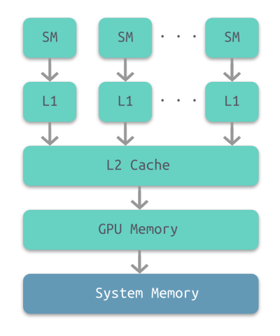

###GPU 流处理器

下图所示为 GPU 中每个流处理器的内部结构示意图。每个流处理器集成了一个 L1 Cache。顶部是处理器核共享的寄存器堆。

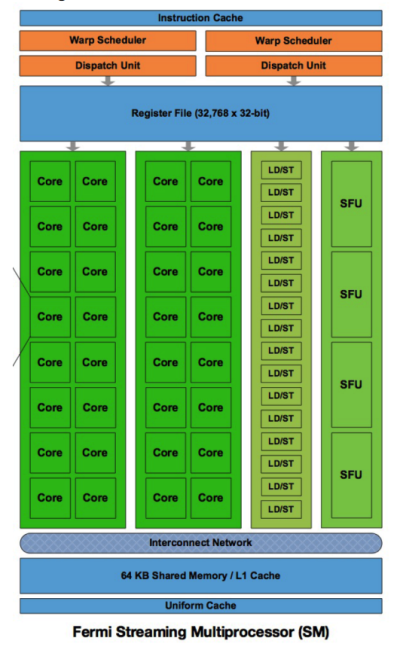

###CPU-GPU 异构系统

至此，我们大致了解了 GPU 的工作原理和内部结构，那么实际应用中 CPU 和 GPU 又是如何协同工作的呢？

下图所示为两种常见的 CPU-GPU 异构架构。

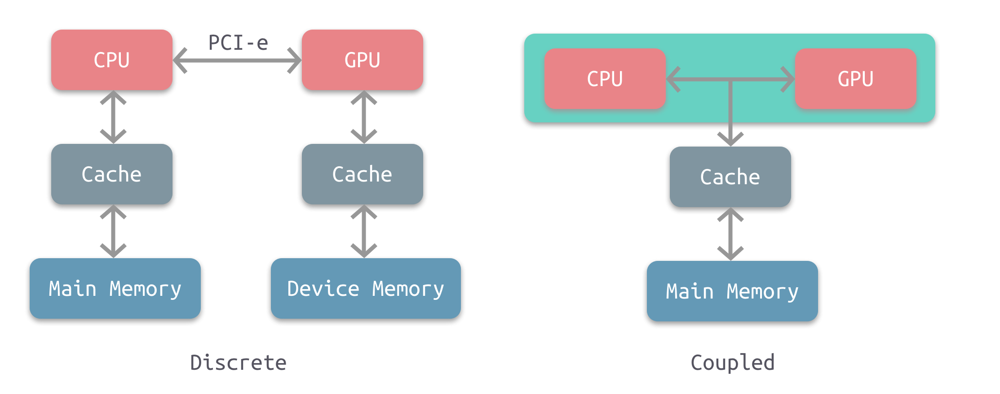

左图是分离式的结构，CPU 和 GPU 拥有各自的存储系统，两者通过 PCI-e 总线进行连接。这种结构的缺点在于 PCI-e相对于两者具有低带宽和高延迟，数据的传输成了其中的性能瓶颈。目前使用非常广泛，如PC、智能手机等。

右图是耦合式的结构，CPU 和 GPU 共享内存和缓存。AMD 的 APU 采用的就是这种结构，目前主要使用在游戏主机中，如 PS4。

注意，目前很多 SoC 都是集成了CPU 和 GPU，事实上这仅仅是在物理上进行了集成，并不意味着它们使用的就是耦合式结构，大多数采用的还是分离式结构。耦合式结构是在系统上进行了集成。

在存储管理方面，分离式结构中 CPU 和 GPU 各自拥有独立的内存，两者共享一套虚拟地址空间，必要时会进行内存拷贝。对于耦合式结构，GPU 没有独立的内存，与 GPU 共享系统内存，由 MMU 进行存储管理。

图形应用程序调用 `OpenGL` 或 `Direct3D` API 功能，将 GPU 作为协处理器使用。API 通过面向特殊 GPU 优化的图形设备驱动向 GPU 发送命令、程序、数据。

###GPU 资源管理模型

下图所示为分离式异构系统中 GPU 的资源管理模型示意图。

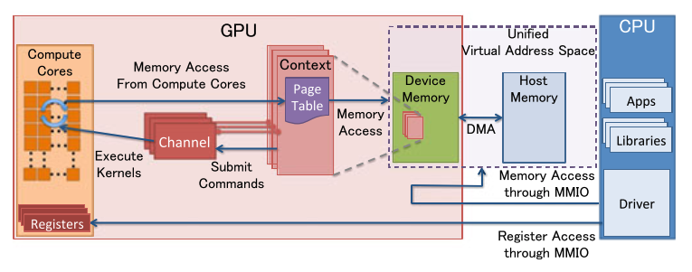

  * **MMIO（Memory-Mapped I/O）**
    * CPU 通过 MMIO 访问 GPU 的寄存器状态。
    * 通过 MMIO 传送数据块传输命令，支持 DMA 的硬件可以实现块数据传输。
  * **GPU Context**
    * 上下文表示 GPU 的计算状态，在 GPU 中占据部分虚拟地址空间。多个活跃态下的上下文可以在 GPU 中并存。
  * **CPU Channel**
    * 来自 CPU 操作 GPU 的命令存储在内存中，并提交至 GPU channel 硬件单元。
    * 每个 GPU 上下文可拥有多个 GPU Channel。每个 GPU 上下文都包含 GPU channel 描述符（GPU 内存中的内存对象）。
    * 每个 GPU Channel 描述符存储了channel 的配置，如：其所在的页表。
    * 每个 GPU Channel 都有一个专用的命令缓冲区，该缓冲区分配在 GPU 内存中，通过 MMIO 对 CPU 可见。
  * **GPU 页表**
    * GPU 上下文使用 GPU 页表进行分配，该表将虚拟地址空间与其他地址空间隔离开来。
    * GPU 页表与 CPU 页表分离，其驻留在 GPU 内存中，物理地址位于 GPU 通道描述符中。  

通过 GPU channel 提交的所有命令和程序都在对应的 GPU 虚拟地址空间中执行。

  * GPU 页表将 GPU 虚拟地址不仅转换为 GPU 设备物理地址，还转换为主机物理地址。这使得 GPU 页面表能够将 GPU 存储器和主存储器统一到统一的 GPU 虚拟地址空间中，从而构成一个完成的虚拟地址空间。
  * **PFIFO Engine**
    * PFIFO 是一个提交 GPU 命令的特殊引擎。
    * PFIFO 维护多个独立的命令队列，即 channel。
    * 命令队列是带有 put 和 get 指针的环形缓冲器。
    * PFIFO 引擎会拦截多有对通道控制区域的访问以供执行。
    * GPU 驱动使用一个通道描述符来存储关联通道的设置。
  * **BO**
    * 缓冲对象（Buffer Object）。一块内存，可以用来存储纹理，渲染对象，着色器代码等等。

###CPU-GPU 工作流

下图所示为 CPU-GPU 异构系统的工作流，当 CPU 遇到图像处理的需求时，会调用 GPU 进行处理，主要流程可以分为以下四步：

  1. 将主存的处理数据复制到显存中
  2. CPU 指令驱动 GPU
  3. GPU 中的每个运算单元并行处理
  4. GPU 将显存结果传回主存

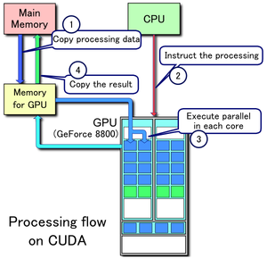

###屏幕图像显示原理

介绍屏幕图像显示的原理，需要先从 CRT 显示器原理说起，如下图所示。CRT 的电子枪从上到下逐行扫描，扫描完成后显示器就呈现一帧画面。然后电子枪回到初始位置进行下一次扫描。为了同步显示器的显示过程和系统的视频控制器，显示器会用硬件时钟产生一系列的定时信号。当电子枪换行进行扫描时，显示器会发出一个水平同步信号（horizonal synchronization），简称**HSync**；而当一帧画面绘制完成后，电子枪回复到原位，准备画下一帧前，显示器会发出一个垂直同步信号（vertical synchronization），简称 **VSync**。显示器通常以固定频率进行刷新，这个刷新率就是VSync信号产生的频率。虽然现在的显示器基本都是液晶显示屏了，但其原理基本一致。

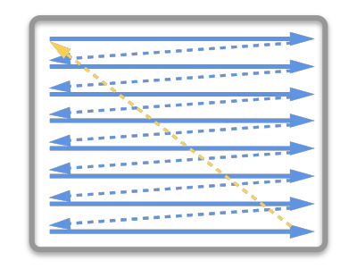

下图所示为常见的 CPU、GPU、显示器工作方式。CPU 计算好显示内容提交至 GPU，GPU 渲染完成后将渲染结果存入帧缓冲区，视频控制器会按照`VSync` 信号逐帧读取帧缓冲区的数据，经过数据转换后最终由显示器进行显示。

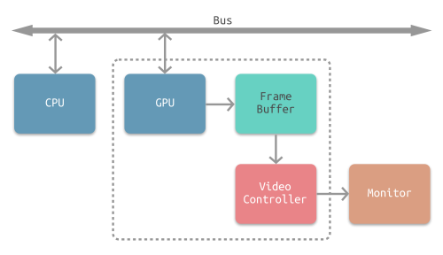

最简单的情况下，帧缓冲区只有一个。此时，帧缓冲区的读取和刷新都都会有比较大的效率问题。为了解决效率问题，GPU 通常会引入两个缓冲区，即**双缓冲机制**。在这种情况下，GPU 会预先渲染一帧放入一个缓冲区中，用于视频控制器的读取。当下一帧渲染完毕后，GPU会直接把视频控制器的指针指向第二个缓冲器。

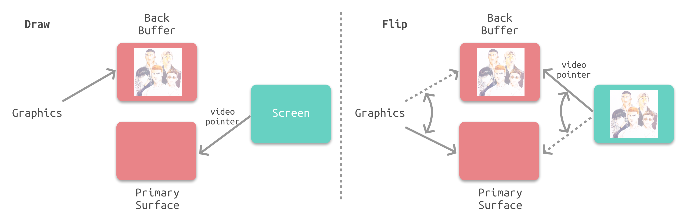

双缓冲虽然能解决效率问题，但会引入一个新的问题。当视频控制器还未读取完成时，即屏幕内容刚显示一半时，GPU将新的一帧内容提交到帧缓冲区并把两个缓冲区进行交换后，视频控制器就会把新的一帧数据的下半段显示到屏幕上，造成画面撕裂现象，如下图：


为了解决这个问题，GPU 通常有一个机制叫做垂直同步（简写也是 V-Sync），当开启垂直同步后，GPU 会等待显示器的 VSync信号发出后，才进行新的一帧渲染和缓冲区更新。这样能解决画面撕裂现象，也增加了画面流畅度，但需要消费更多的计算资源，也会带来部分延迟。

###参考

<ol>
<li><a href="https://www.cs.utah.edu/~jeffp/teaching/MCMD/S20-GPU.pdf" target="_blank" rel="noopener">GPU Architecture and Models</a></li>
<li>计算机组成与设计：硬件、软件接口</li>
<li><a href="https://learnopengl-cn.readthedocs.io/zh/latest/" target="_blank" rel="noopener">欢迎来到OpenGL的世界</a></li>
<li><a href="https://pdfs.semanticscholar.org/presentation/52d1/963f6a3409aff1f8d73ba1819a187f39f6e1.pdf" target="_blank" rel="noopener">AMD APU Series</a></li>
<li><a href="http://m.elecfans.com/article/713834.html" target="_blank" rel="noopener">一文详解GPU结构及工作原理</a></li>
<li><a href="https://www.slideshare.net/mohamedragabslideshare/p12-29046493" target="_blank" rel="noopener">Revisting Co-Processing for Hash Joins on the Coupled CPU-GPU Architecture</a></li>
<li><a href="https://insujang.github.io/2017-04-27/gpu-architecture-overview/" target="_blank" rel="noopener">GPU Architecture Overview</a></li>
<li><a href="https://zh.wikipedia.org/wiki/CUDA" target="_blank" rel="noopener">CUDA</a></li>
<li><a href="https://blog.ibireme.com/2015/11/12/smooth_user_interfaces_for_ios/" target="_blank" rel="noopener">iOS 保持界面流程的技巧</a></li>
<li><a href="https://segmentfault.com/a/1190000000390012" target="_blank" rel="noopener">iOS 开发：绘制像素到屏幕</a></li>
</ol>

###扩展阅读

<ol>
<li><a href="https://slideplayer.com/slide/11059244/" target="_blank" rel="noopener">Rendering pipeline: The hardware side</a></li>
<li><a href="http://meseec.ce.rit.edu/551-projects/spring2015/3-2.pdf" target="_blank" rel="noopener">Graphics Processing Unit(GPU) Memory Hierarchy</a></li>
<li><a href="http://www.d.umn.edu/~data0003/Talks/gpuarch.pdf" target="_blank" rel="noopener">Graphics Processing Unit Architecture(GPU Arch) With a focus on NVIDIA GeForce 6800 GPU</a></li>
<li><a href="https://www.jianshu.com/p/d05d19f70bac" target="_blank" rel="noopener">iOS动画篇：核心动画</a></li>
<li><a href="https://www.anandtech.com/show/7335/the-iphone-5s-review/7" target="_blank" rel="noopener">The iPhone 5s Review</a></li>
<li><a href="https://www.realworldtech.com/apple-custom-gpu/" target="_blank" rel="noopener">A Look Inside Apple’s Custom GPU for the iPhone</a></li>
<li><a href="https://appleinsider.com/articles/17/04/17/one-apple-gpu-one-giant-leap-in-graphics-for-iphone-8" target="_blank" rel="noopener">One Apple GPU, one giant leap in graphics for iPhone 8</a></li>
</ol>


