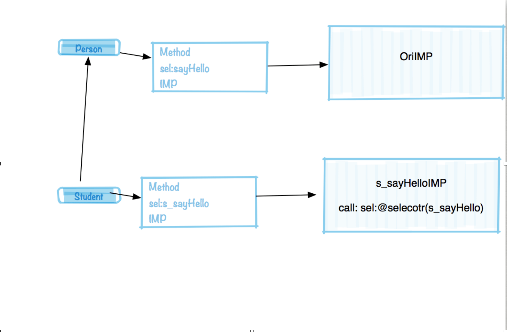
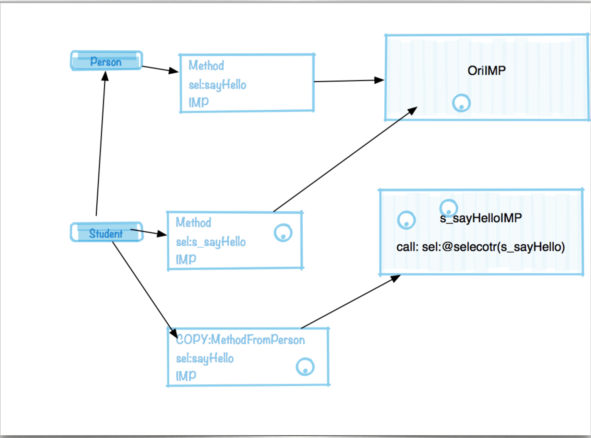
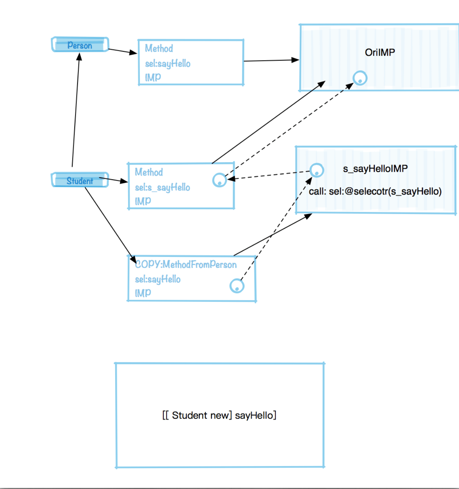
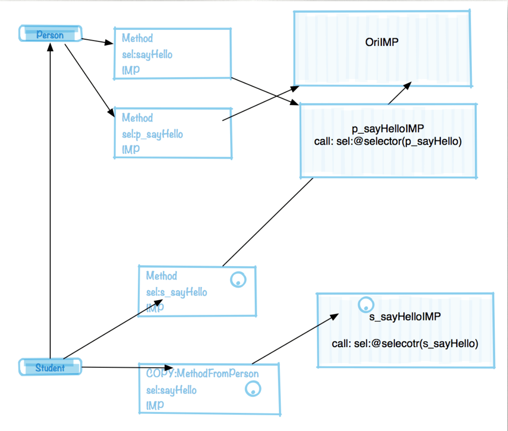
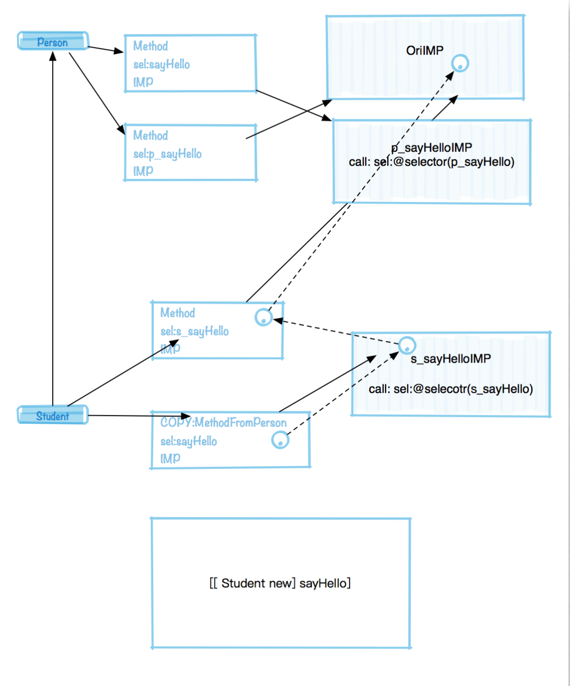
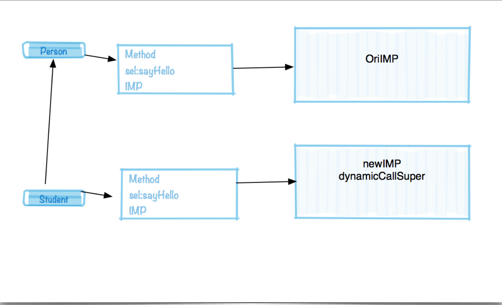
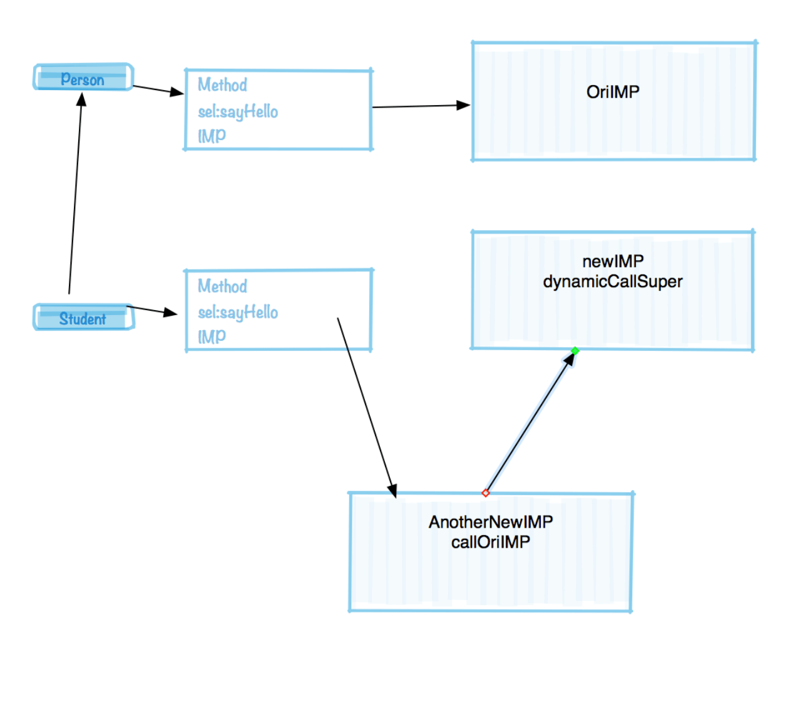
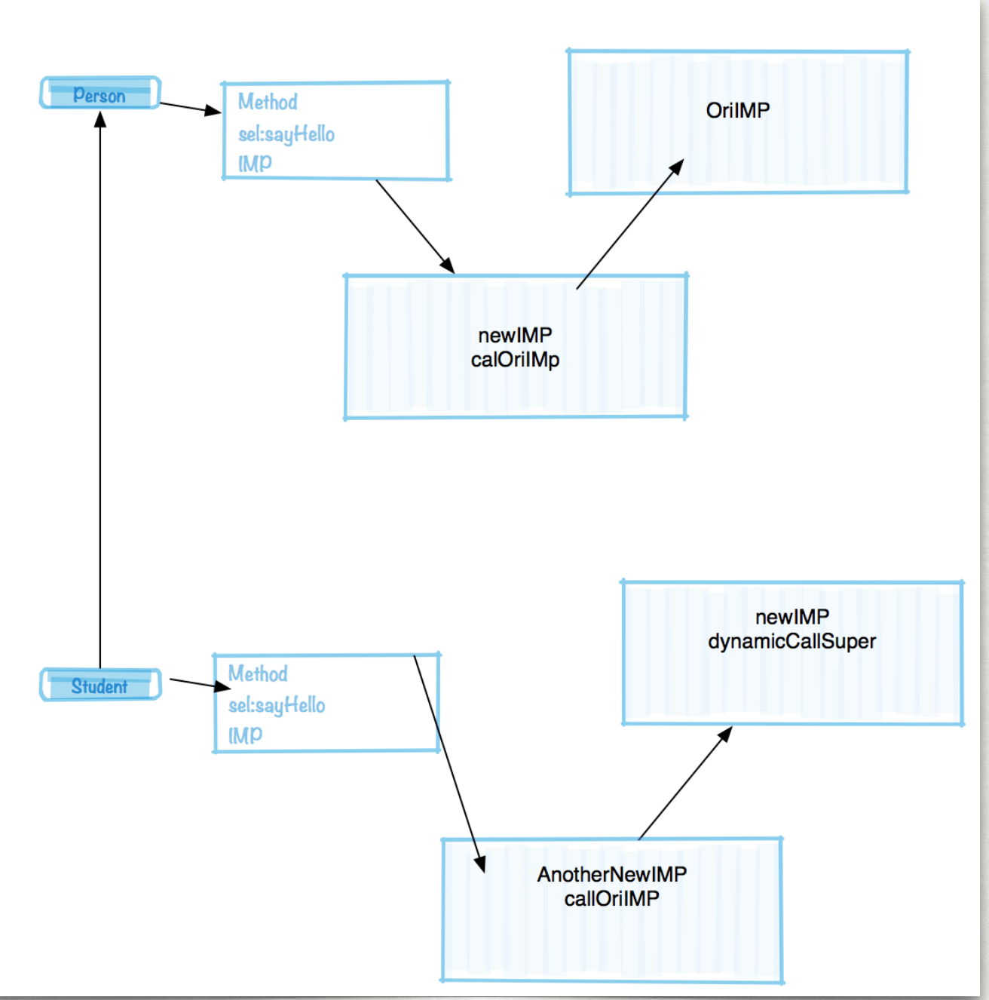

 
<!--BEGIN_DATA
{
    "create_date": "2018-09-27 09:49",
    "modify_date": "2018-09-27 09:49",
    "is_top": "0",
    "summary": "iOS界的毒瘤-MethodSwizzling",
    "tags": "iOS",
    "file_name": "iOS界的毒瘤-MethodSwizzling.md"
}
END_DATA-->

####
原文出处：<a href='https://www.valiantcat.cn/index.php/2017/11/03/53.html' target='blank'>iOS界的毒瘤-MethodSwizzling</a>

不管生活有多不容易，都要守住自己的那一份优雅。

  * Hook的对象
    * 最常见的hook代码
    * MethodSwizzling泛滥下的隐患
    * Copy父类的方法带来的问题
    * 换个姿势来Swizzling
  * 其他Hook方式
  * 什么时候需要Swizzling
    * 一个利用语言特性的例子
  * 参考
  * 友情感谢

##为什么有这篇博文

不知道何时开始iOS面试开始流行起来询问什么是 Runtime，于是 iOSer 一听 Runtime 总是就提起Method Swizzling，开口闭口就是黑科技。但其实如果读者留意过C语言的 Hook 原理其实会发现所谓的钩子都是框架或者语言的设计者预留给我们的工具，而不是什么黑科技，Method Swizzling其实只是一个简单而有趣的机制罢了。然而就是这样的机制，在日常中却总能成为万能药一般的被肆无忌惮的使用。

很多 iOS 项目初期架构设计的不够健壮，后期可扩展性差。于是 iOSer 想起了 MethodSwizzling 这个武器，将项目中一个正常的方法 hook 的满天飞，导致项目的质量变得难以控制。曾经我也爱在项目中滥用Method Swizzling，但在踩到坑之前总是不能意识到这种糟糕的做法会让项目陷入怎样的险境。于是我才明白学习某个机制要去深入的理解机制的设计，而不是跟风滥用，带来糟糕的后果。最后就有了这篇文章。

##Hook的对象

在 iOS 平台常见的 hook 的对象一般有两种：

  1. C/C++ functions
  2. Objective-C method

对于 C/C+ +的 hook 常见的方式可以使用 facebook 的 `fishhook` 框架，具体原理可以参考深入理解`Mac OS X & iOS 操作系统` 这本书。  
对于 Objective-C Methods 可能大家更熟悉一点，本文也只讨论这个。

###最常见的hook代码

相信很多人使用过 [JRSwizzle](https://github.com/rentzsch/jrswizzle) 这个库，或者是看过<http://nshipster.cn/method-swizzling/> 的博文。  
上述的代码简化如下。

    
    + (BOOL)jr_swizzleMethod:(SEL)origSel_ withMethod:(SEL)altSel_ error:(NSError**)error_ {
        Method origMethod = class_getInstanceMethod(self, origSel_);
        if (!origMethod) {
            SetNSError(error_, @"original method %@ not found for class %@", NSStringFromSelector(origSel_), [self class]);
            return NO;
        }
        Method altMethod = class_getInstanceMethod(self, altSel_);
        if (!altMethod) {
            SetNSError(error_, @"alternate method %@ not found for class %@", NSStringFromSelector(altSel_), [self class]);
            return NO;
        }
        class_addMethod(self,
                        origSel_,
                        class_getMethodImplementation(self, origSel_),
                        method_getTypeEncoding(origMethod));
        class_addMethod(self,
                        altSel_,
                        class_getMethodImplementation(self, altSel_),
                        method_getTypeEncoding(altMethod));
        method_exchangeImplementations(class_getInstanceMethod(self, origSel_), class_getInstanceMethod(self, altSel_));
        return YES;
    

在Swizzling情况极为普通的情况下上述代码不会出现问题，但是场景复杂之后上面的代码会有很多安全隐患。

###MethodSwizzling泛滥下的隐患

Github有一个很健壮的库[RSSwizzle](https://github.com/rabovik/RSSwizzle/)(这也是本文推荐Swizzling的最终方式)指出了上面代码带来的风险点。

  1. 只在 +load 中执行 swizzling 才是安全的。

  2. 被 hook 的方法必须是当前类自身的方法，如果把继承来的 IMP copy 到自身上面会存在问题。父类的方法应该在调用的时候使用，而不是 swizzling 的时候 copy 到子类。

  3. 被 Swizzled 的方法如果依赖与 cmd ，hook 之后 cmd 发送了变化，就会有问题(一般你 hook 的是系统类，也不知道系统用没用 cmd 这个参数)。

  4. 命名如果冲突导致之前 hook 的失效 或者是循环调用。

上述问题中第一条和第四条说的是通常的 MethodSwizzling 是在分类里面实现的, 而分类的 Method 是被Runtime 加载的时候追加到类的MethodList ，如果不是在 `+load` 是执行的 Swizzling 一旦出现重名，那么 SEL 和 IMP 不匹配致 hook的结果是循环调用。

第三条是一个不容易被发现的问题。  
我们都知道 Objective-C Method 都会有两个隐含的参数 `self, cmd`，有的时候开发者在使用关联属性的适合可能懒得声明 (void *) 的 key，直接使用 cmd 变量 `objc_setAssociatedObject(self, _cmd, xx, 0);`
这会导致对当前IMP对 cmd 的依赖。

一旦此方法被 Swizzling，那么方法的 cmd 势必会发生变化，出现了 bug 之后想必你一定找不到，等你找到之后心里一定会问候那位 Swizzling 你的方法的开发者祖宗十八代安好的，再者如果你 Swizzling 的是系统的方法恰好系统的方法内部用到了 cmd...~_~（此处后背惊起一阵冷汗）。

###Copy父类的方法带来的问题

上面的第二条才是我们最容易遇见的场景，并且是99%的开发者都不会注意到的问题。下面我们来做个试验

    
    
    @implementation Person
    - (void)sayHello {
        NSLog(@"person say hello");
    }
    @end
    @interface Student : Person
    @end
    @implementation Student (swizzle)
    + (void)load {
        [self jr_swizzleMethod:@selector(s_sayHello) withMethod:@selector(sayHello) error:nil];
    }
    - (void)s_sayHello {
        [self s_sayHello];
        NSLog(@"Student + swizzle say hello");
    }
    @end
    @implementation Person (swizzle)
    + (void)load {
        [self jr_swizzleMethod:@selector(p_sayHello) withMethod:@selector(sayHello) error:nil];
    }
    - (void)p_sayHello {
        [self p_sayHello];
        NSLog(@"Person + swizzle say hello");
    }
    @end
    

上面的代码中有一个 Person 类实现了 `sayHello` 方法，有一个 Student 继承自 Person， 有一个Student 分类 Swizzling 了原来的 `sayHello`, 还有一个 Person 的分类也 Swizzling 了原来的`sayhello` 方法。

当我们生成一个 Student 类的实例并且调用 `sayHello` 方法，我们期望的输出如下：

    
    
    "person say hello"
    "Person + swizzle say hello"
    "Student + swizzle say hello"
    

但是输出有可能是这样的：

    
    
    "person say hello"
    "Student + swizzle say hello"
    

出现这样的场景是由于在 `build Phases` 的 `compile Source` 顺序子类分类在父类分类之前。

我们都知道在 Objective-C 的世界里父类的 `+load`早于子类，但是并没有限制父类的分类加载会早于子类的分类的加载，实际上这取决于编译的顺序。最终会按照编译的顺序合并进 `Mach-O` 的固定section 内。

下面会分析下为什么代码会出现这样的场景。

最开始的时候父类拥有自己的 `sayHello` 方法，子类拥有分类添加的 `s_sayHello` 方法并且在 `s_sayHello` 方法内部调用了 sel 为 `s_sayHello` 方法。

但是子类的分类在使用上面提到的 MethodSwizzling 的方法会导致如下图的变化

由于调用了 `class_addMethod` 方法会导致重新生成一份新的Method添加到 Student 类上面 但是 sel 并没有发生变化，IMP 还是指向父类唯一的那个 IMP。  
之后交换了子类两个方法的 IMP 指针。于是方法引用变成了如下结构。  
其中虚线指出的是方法的调用路径。

单纯在 Swizzling 一次的时候并没有什么问题，但是我们并不能保证同事出于某种不可告人的目的的又去 Swizzling了父类，或者是我们引入的第三库做了这样的操作。

于是我们在 Person 的分类里面 Swizzling 的时候会导致方法结构发生如下变化。

我们的代码调用路径就会是下图这样，相信你已经明白了前面的代码执行结果中为什么父类在子类之后 Swizzling 其实并没有对子类 hook 到。

这只是其中一种很常见的场景，造成的影响也只是 Hook 不到父类的派生类而已，也不会造成一些严重的 Crash等明显现象，所以大部分开发者对此种行为是毫不知情的。

对于这种 Swizzling 方式的不确定性有一篇博文分析的更为全面[玉令天下的博客Objective-C Method Swizzling](http://yulingtianxia.com/blog/2017/04/17/Objective-C-Method-Swizzling/)

###换个姿势来Swizzling

前面提到 [RSSwizzle](https://github.com/rabovik/RSSwizzle/) 是另外一种更加健壮的Swizzling方式。

这里使用到了如下代码

    
    
       RSSwizzleInstanceMethod([Student class],
                                @selector(sayHello),
                                RSSWReturnType(void),
                                RSSWArguments(),
                                RSSWReplacement(
                                                {
                                                    // Calling original implementation.
                                                    RSSWCallOriginal();
                                                    // Returning modified return value.
                                                    NSLog(@"Student + swizzle say hello sencod time");
                                                }), 0, NULL);
        RSSwizzleInstanceMethod([Person class],
                                @selector(sayHello),
                                RSSWReturnType(void),
                                RSSWArguments(),
                                RSSWReplacement(
                                                {
                                                    // Calling original implementation.
                                                    RSSWCallOriginal();
                                                    // Returning modified return value.
                                                    NSLog(@"Person + swizzle say hello");
                                                }), 0, NULL);
    

由于 RS 的方式需要提供一种 Swizzling 任何类型的签名的 SEL，所以 RS
使用的是宏作为代码包装的入口，并且由开发者自行保证方法的参数个数和参数类型的正确性，所以使用起来也较为晦涩。 可能这也是他为什么这么优秀但是 star 很少的原因吧 :(。

我们将宏展开

    
    
        RSSwizzleImpFactoryBlock newImp = ^id(RSSwizzleInfo *swizzleInfo) {
            void (*originalImplementation_)(__attribute__((objc_ownership(none))) id, SEL);
            SEL selector_ = @selector(sayHello);
            return ^void (__attribute__((objc_ownership(none))) id self) {
                IMP xx = method_getImplementation(class_getInstanceMethod([Student class], selector_));
                IMP xx1 = method_getImplementation(class_getInstanceMethod(class_getSuperclass([Student class]) , selector_));
                IMP oriiMP = (IMP)[swizzleInfo getOriginalImplementation];
                    ((__typeof(originalImplementation_))[swizzleInfo getOriginalImplementation])(self, selector_);
                //只有这一行是我们的核心逻辑
                NSLog(@"Student + swizzle say hello");
            };
        };
        [RSSwizzle swizzleInstanceMethod:@selector(sayHello)
                                 inClass:[[Student class] class]
                           newImpFactory:newImp
                                    mode:0 key:((void*)0)];;
    

RSSwizzle核心代码其实只有一个函数

    
    
    static void swizzle(Class classToSwizzle,
                        SEL selector,
                        RSSwizzleImpFactoryBlock factoryBlock)
    {
        Method method = class_getInstanceMethod(classToSwizzle, selector);
        __block IMP originalIMP = NULL;
        RSSWizzleImpProvider originalImpProvider = ^IMP{
            IMP imp = originalIMP;
            if (NULL == imp){
                Class superclass = class_getSuperclass(classToSwizzle);
                imp = method_getImplementation(class_getInstanceMethod(superclass,selector));
            }
            return imp;
        };
        RSSwizzleInfo *swizzleInfo = [RSSwizzleInfo new];
        swizzleInfo.selector = selector;
        swizzleInfo.impProviderBlock = originalImpProvider;
        id newIMPBlock = factoryBlock(swizzleInfo);
        const char *methodType = method_getTypeEncoding(method);
        IMP newIMP = imp_implementationWithBlock(newIMPBlock);
        originalIMP = class_replaceMethod(classToSwizzle, selector, newIMP, methodType);
    }
    

上述代码已经删除无关的加锁，防御逻辑，简化理解。

我们可以看到 RS 的代码其实是构造了一个 Block 里面装着我们需要的执行的代码。

然后再把我们的名字叫 `originalImpProviderBloc` 当做参数传递到我们的block里面，这里面包含了对将要被 Swizzling 的原始 IMP 的调用。

需要注意的是使用 `class_replaceMethod` 的时候如果一个方法来自父类，那么就给子类 add 一个方法， 并且把这个 NewIMP 设置给他，然后返回的结果是NULL。

在 `originalImpProviderBloc` 里面我们注意到如果 `imp` 是 NULL的时候，是动态的拿到父类的 Method 然后去执行。

我们还用图来分析代码。

最开始 Swizzling 第一次的时候，由于子类不存在 `sayHello` 方法，再添加方法的时候由于返回的原始 IMP 是 NULL，所以对父类的调用是动态获取的，而不是通过之前的 sel 指针去调用。

如果我们再次对 Student Hook，由于 Student 已经有 `sayHello` 方法，这次 replace 会返回原来 IMP 的指针， 然后新的 IMP 会执被填充到 Method 的指针指向。

由此可见我们的方法引用是一个链表形状的。

同理我们在 hook 父类的时候 父类的方法引用也是一个链表样式的。

相信到了这里你已经理解 RS 来 Swizzling 方式是：

如果是父类的方法那么就动态查找，如果是自身的方法就构造方法引用链。来保证多次 Swizzling 的稳定性，并且不会和别人的 Swizzling 冲突。

而且 RS 的实现由于不是分类的方法也不用约束开发者必须在 `+load` 方法调用才能保证安全，并且cmd 也不会发生变化。

##其他Hook方式

其实著名的 Hook 库还有一个叫 [Aspect](https://github.com/steipete/Aspects) 他利用的方法是把所有的方法调用指向 `_objc_msgForward` 然后自行实现消息转发的步骤，在里面自行处理参数列表和返回值，通过 NSInvocation 去动态调用。

国内知名的热修复库 `JSPatch` 就是借鉴这种方式来实现热修复的。

但是上面的库要求必须是最后执行的确保 Hook 的成功。 而且他不兼容其他 Hook 方式，所以技术选型的时候要深思熟虑。

##什么时候需要Swizzling

我记得第一次学习 AO P概念的时候是当初在学习 javaWeb 的时候 Serverlet 里面的 FilterChain，开发者可以实现各种各种的过滤器然后在过滤器中插入log， 统计， 缓存等无关主业务逻辑的功能行性代码， 著名的框架 `Struts2` 就是这样实现的。

iOS 中由于 Swizzling 的 API 的简单易用性导致开发者肆意滥用，影响了项目的稳定性。  
当我们想要 Swizzling 的时候应该思考下我们能不能利用良好的代码和架构设计来实现，或者是深入语言的特性来实现。

###一个利用语言特性的例子

我们都知道在iOS8下的操作系统中通知中心会持有一个 `__unsafe_unretained` 的观察者指针。如果观察者在 dealloc
的时候忘记从通知中心中移除，之后如果触发相关的通知就会造成 Crash。

我在设计防 Crash 工具 [XXShield](https://github.com/ValiantCat/XXShield) 的时候最初是 Hook NSObjec 的 `dealloc` 方法，在里面做相应的移除观察者操作。后来一位真大佬提出这是一个非常不明智的操作，因为 dealloc 会影响全局的实例的释放，开发者并不能保证代码质量非常有保障，一旦出现问题将会引起整个 APP 运行期间大面积崩溃或异常行为。

下面我们先来看下 ObjCRuntime 源码关于一个对象释放时要做的事情，代码约在`objc-runtime-new.mm`第6240行。

    
    
    /***********************************************************************
    * objc_destructInstance
    * Destroys an instance without freeing memory. 
    * Calls C++ destructors.
    * Calls ARC ivar cleanup.
    * Removes associative references.
    * Returns `obj`. Does nothing if `obj` is nil.
    **********************************************************************/
    void *objc_destructInstance(id obj) 
    {
        if (obj) {
            // Read all of the flags at once for performance.
            bool cxx = obj->hasCxxDtor();
            bool assoc = obj->hasAssociatedObjects();
            // This order is important.
            if (cxx) object_cxxDestruct(obj);
            if (assoc) _object_remove_assocations(obj);
            obj->clearDeallocating();
        }
        return obj;
    }
    /***********************************************************************
    * object_dispose
    * fixme
    * Locking: none
    **********************************************************************/
    id 
    object_dispose(id obj)
    {
        if (!obj) return nil;
        objc_destructInstance(obj);    
        free(obj);
        return nil;
    }
    

上面的逻辑中明确了写明了一个对象在释放的时候初了调用 `dealloc` 方法，还需要断开实例上绑定的观察对象，
那么我们可以在添加观察者的时候给观察者动态的绑定一个关联对象，然后关联对象可以反向持有观察者,然后在关联对象释放的时候去移除观察者，由于不能造成循环引用所以只能选择`__weak` 或者 `__unsafe_unretained` 的指针， 实验得知 `__weak` 的指针在 `dealloc` 之前就已经被清空，所以我们只能使用 `__unsafe_unretained` 指针。

    
    
    @interface XXObserverRemover : NSObject {
        __strong NSMutableArray *_centers;
        __unsafe_unretained id _obs;
    }
    @end
    @implementation XXObserverRemover
    - (instancetype)initWithObserver:(id)obs {
        if (self = [super init]) {
            _obs = obs;
            _centers = @[].mutableCopy;
        }
        return self;
    }
    - (void)addCenter:(NSNotificationCenter*)center {
        if (center) {
            [_centers addObject:center];
        }
    }
    - (void)dealloc {
        @autoreleasepool {
            for (NSNotificationCenter *center in _centers) {
                [center removeObserver:_obs];
            }
        }
    }
    @end
    void addCenterForObserver(NSNotificationCenter *center ,id obs) {
        XXObserverRemover *remover = nil;
        static char removerKey;
        @autoreleasepool {
            remover = objc_getAssociatedObject(obs, &removerKey);
            if (!remover) {
                remover = [[XXObserverRemover alloc] initWithObserver:obs];
                objc_setAssociatedObject(obs, &removerKey, remover, OBJC_ASSOCIATION_RETAIN_NONATOMIC);
            }
            [remover addCenter:center];
        }
    }
    void autoHook() {
        RSSwizzleInstanceMethod([NSNotificationCenter class], @selector(addObserver:selector:name:object:),
                                RSSWReturnType(void), RSSWArguments(id obs,SEL cmd,NSString *name,id obj),
                                RSSWReplacement({
            RSSWCallOriginal(obs,cmd,name,obj);
            addCenterForObserver(self, obs);
        }), 0, NULL);
    }
    

需要注意的是在添加关联者的时候一定要将代码包含在一个自定义的 `AutoreleasePool` 内。

我们都知道在 Objective-C 的世界里一个对象如果是 Autorelease 的 那么这个对象在当前方法栈结束后才会延时释放，在 ARC 环境下，一般一个 Autorelease 的对象会被放在一个系统提供的 AutoreleasePool 里面，然后AutoReleasePool drain 的时候再去释放内部持有的对象，通常情况下命令行程序是没有问题的，但是在iOS的环境中 AutoReleasePool是在 Runloop 控制下在空闲时间进行释放的，这样可以提升用户体验，避免造成卡顿，但是在我们这种场景中会有问题，我们严格依赖了观察者调用 dealloc
的时候关联对象也会去 dealloc，如果系统的 AutoReleasePool 出现了延时释放，会导致当前对象被回收之后过段时间关联对象才会释放，这时候前文使用的 __unsafe_unretained 访问的就是非法地址。

我们在添加关联对象的时候添加一个自定义的 AutoreleasePool 保证了对关联对象引用的单一性，保证了我们依赖的释放顺序是正确的。从而正确的移除观察者。

##参考

  1. [JRSwizzle](https://github.com/rentzsch/jrswizzle)
  2. [RSSwizzle](https://github.com/rabovik/RSSwizzle/)
  3. [Aspect](https://github.com/steipete/Aspects)
  4. [玉令天下的博客Objective-C Method Swizzling](http://yulingtianxia.com/blog/2017/04/17/Objective-C-Method-Swizzling/)
  5. [示例代码](https://github.com/ValiantCat/MethodSwizzlingDemo)

##友情感谢

最后感谢 [骑神](sindrilin.com) 大佬修改我那蹩脚的文字描述。