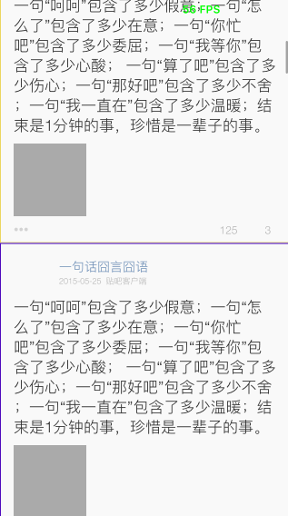
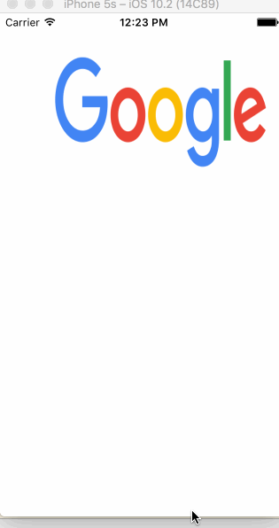

 
<!--BEGIN_DATA
{
    "create_date": "2017-04-08 16:05", 
    "modify_date": "2017-04-08 16:05", 
    "is_top": "0", 
    "summary": "iOS界面流畅学习总结", 
    "tags": "iOS", 
    "file_name": "iOS界面流畅学习总结.md"
}
END_DATA-->

####
原文出处：<a href='http://www.jianshu.com/p/daae5dc997db' target='blank'>iOS界面流畅学习总结</a>

###认清楚自己还是很垃圾

把之前的文章全部删掉了，博客也关了，觉得以前写的一些文章都太垃圾了，就自己自娱自乐复习吧。而且我也觉得，光文章写的拽也没什么卵用，还是得有拿得出手的实际的家伙，就像YYKit一拿出来，吓死一堆人。真佩服YYkit的毅力，或许所谓的天才，其实是通过日以继夜的努力才达到的，我觉得是这样的。

去年一年好不容易逮到 优酷、腾讯新闻、阿里 的面试机会，但几乎都是在界面性能、图片优化、...等相关的问题跪了，基本上都回答的不利索，实在是有点惨不忍睹。哎，好好的机会就这么没了...

我记得那天阿里的面试er，问我你对图片做了哪些优化？我说，服务端按规格拉取、gzip压缩。我记得那天腾讯新闻的面试er，问我界面卡顿优化的一些思路是什么？我
说异步线程...缓存。我记得那天优酷的面试er，问我对于一张2048*2048的高清大图，怎么优化显示？我说....不知道。总之，就这么连续的跪了三次，错失了三次好好的机会。

曾经有一份很好的面试机会摆在我的眼前，我却没有去珍惜，等当我再想要的时候，却是被拒绝拒绝拒绝拒绝死循环....呵呵。决心，这一段时间，一定要弄通这些。

沉默了一个多月，虽然没有大彻大悟，还是总算有点小收获，拿出来给像我这样白痴傻逼级别的小菜们分享分享。顺便再看看有些是不是我理解错误的地方，求大神们的指教。

首先列举下，这一个月来我的的学习步骤:

    
    
    1. 看了一遍 CoreAnimation Advanced ... 
    2. YYKit那篇界面流畅的文章
    3. VVeboTableView 源码
    4. CoreText 文本渲染
    5. YYAsyncLayer

有一次，我在YYKit作者的一篇文章中，看到这么一句话：

> 很少有人会完整的看完一个开源库的代码，更不会去逐行的去看。

给我感触很大，原来强大的YYKit就是这么炼成的，瞬间觉得自己的路没有选错，只是还需要大大的努力花时间。很庆幸还有这么无私奉献的真牛存在，真的很感谢。

###开始

文章会不断的更新，因为界面流畅涉及的东西，实在是太多太多，学习到一点了就会网上加一点...

一些简单的东西、以及YYKit文章中提及的优化点我就不说了。主要说下VVeboTableView里面那个优化列表滚动的demo。

可能很多人也都看过，我问过我很多朋友、同事，都说看过。但是，知道具体有什么优化吗？都说不太清楚...

于是，我拿着VVeboTableView的代码，然后自己一点点抠，一行一行的看，跟着做了一个demo，然后又自己优化了一下的效果图:

  

demo.gif

我这个是模拟器跑的，用真机跑基本是在60FPS。

可以看到一个最明显的效果，就是快速滚动多个cell的时候，出现的都是空白，也就是并没有立刻去进行绘制，而是等到列表停止滚动时，才去进行cell的绘制。

注意，我这里所说的绘制，并不是创建各种UIView对象，然后addSubview....这个绘制就是画画的意思。比如，我在一个画布上画一段文字，画一个圆形，
画一个图像...并不直接使用uiview对象，就完成界面显示。

YYKit作者说这个空白的效果，可能是这个代码的最大的一个缺点，但是仅此而已，对于整个TableView滚动的性能优化，还是不错的。

对于大多数的滚动界面，按照这个思路去做优化，基本上不会遇到卡顿的问题，只是需要直接使用CoreText、CoreGraphics等直接进行绘制，还是略显麻烦。

主要的优化逻辑就是，将中间快速滚动滚出当前可见区域的cell，直接忽略，不进行绘制。这样一来，就会减少很多的不可见cell的绘制，不管是对CPU还是GPU都节约了很多的时间。自然而然，FPS就很高了。

###可能还有一些初学者对`FPS`不太明白是个什么东西，我科普下，因为我也是最近才弄懂的（囧 ...）

  * (1) 我们在屏幕显示器看到的东西，其实每一秒种，都在不停的刷新。即不停的擦除上一秒显示的数据，然后又绘制下一秒要显示的数据。

  * (2) 但是一秒钟，其实会不断的刷新很多次。而具体一秒钟刷新了多少次，这个次数就叫做 FPS（Frames Per Seconds）

  * (3) 对于我们的PC，比如我玩CF的时候，低于30就有点卡了。我在网吧玩，都是在60~100左右，相当的流畅

  * (4) 对于移动设备（手机）的显示器来说，正常情况下，最好保持在`60`次左右。但是也分情况:

    * (4.1) 一般情况下，最好保持60左右
    * (4.2) 如果有复杂的动画，可能最低保持到30以上
  * (5) 关于FPS如何计算出来的:

    * 首先要搞清楚，是计算主线程的FPS（系统进行绘制，都是在主线程）
    * 向主线程的Runloop注册一个CADisplayLink定时器事件源
    * 然后系统每当进行屏幕刷新重绘的时候，都会回调CADisplayLink指定的回调函数
    * 在CADisplayLink回调函数中，让一个时间间隔内的`总刷新次数`除以`时间间隔`，即可得到当前一秒内的刷新次数

###FPS低，为何就会出现界面卡顿的效果？

我们写的每一个UIView对其设置的文本、图片、背景色、字体、边框样式...等等。最终显示到屏幕上，根据 CPU 与 GPU 的责任划分，可分为如下：

> 摘抄下，YYKit文章中记录的这个两个硬件主要做的事情:

####CPU

  * (1) UI对象的创建
  * (2) 文本文件读取、图片文件读取
  * (3) 文本尺寸计算、图片尺寸计算、UIView对象的frame计算、UIView对象的frame调整
  * (4) 文本的绘制、自定义图像的绘制、图片的绘制。对于图片绘制时，系统会立刻触发图片的解码
  * (5) 基于 CoreGraphics 的图像绘制、图像绘制
  * (6) CoreAnimation对UIView的CALayer进行打包，发送给渲染服务 Render Server 准备渲染

####GPU

  * (1) GPU 接收到打包后，取出 CALayer的contents、属性值、内部状态信息，对将要显示到屏幕上的数据进行 合成、混合
  * (2) 最终渲染成为显示器能够识别的数据格式（纹理？错乱勿喷，求指正）
  * (3) GPU将最终的数据，扔到帧数据缓冲池，并通知显示去池中读取帧数据进行刷新屏幕

简单的可以理解为这么几个步骤，要往深了说那可就有点复杂，我就不展开了，因为我也不懂那么深（哈哈~~）。

总之，我想表达的时，必须等待CPU先处理完毕，然后再交给GPU处理完毕，最后通知显示器去去数据显示，这么一个过程。

那如果因为CPU或者GPU处理时间超时，就会造成显示器一直没有刷新屏幕。而长时间未刷新屏幕，屏幕就一直显示之前的一帧数据，就给用户形成一种卡死了的感觉。

而突然GPU处理完毕，通知显示器去读取数据显示。此时，屏幕上又突然刷新了下一帧的数据显示，也会出现一种不太平和的过度。

总结起来，就是突然卡主了，又突然出现另一个出面，没有平和的过度，这就是卡顿感的产生。

YYkit文章中，也分别记录对应如上这些事情的具体优化的办法，我就不列举了。

###首先总结下这个代码主要两个点:

第一个重头戏、使用CoreText进行文本绘制，这个是进行后续优化的基础。实现起来是有点麻烦，但是必须这么做，否则无法完成后面的的优化。

    
    
    1. 自定义UILabel，内部使用CoreText文本绘制
    2. 子线程异步完成文本的绘制，并渲染得到图像
    3. 最终将图像设置给UILabel的backing layer显示
    4. 涉及到的特殊文本的高亮、点击效果，通过预先正则式切割，然后保存高亮文本出现的frame
    5. 将绘制渲染的代码，全部放到子线程

第二个重头戏、TableView滚动时，监听scrollView的状态

    
    
    1. 开始滚动时，保存一个状态
    2. 停止滚动时，保存一个状态，并且计算出最终停止时的indexpath
    3. 过滤掉中间快速滚动过的indexpath
    4. 将最终停止出现的可见indexpath保存到一个数组，并额外添加附近的三个indexpath
    5. 最终列表停止后，将保存在数组中的indexpath，挨个取出对应的cell，进行内容的绘制

cell里面的文本部分就交给上面自定义的UILabel完成，其他很小不能复用的的图像、文本的绘制，可以使用UIKit的绘制，然后同样从绘图上下文获取得到渲染的图像，塞给cell内部的一个backgroundView或者backing layer显示即可。

    
    
    @implementation XXXLabel
    - (void)asyncDraw {
        /**
         *  渲染生成图像的过程，全部都在子线程异步完成
         */
        XZHDispatchQueueAsyncBlockWithQOSBackgroud(^{
            CGSize size = self.frame.size;
            size.height += 10;
            UIGraphicsBeginImageContextWithOptions(size, ![self.backgroundColor isEqual:[UIColor clearColor]], 0);
            CGContextRef context = UIGraphicsGetCurrentContext();
            if (context==NULL) {return;}
            if (![self.backgroundColor isEqual:[UIColor clearColor]]) {
                [self.backgroundColor set];
                CGContextFillRect(context, CGRectMake(0, 0, size.width, size.height));
            }
            CGContextSetTextMatrix(context,CGAffineTransformIdentity);
            CGContextTranslateCTM(context,0,size.height);
            CGContextScaleCTM(context,1.0,-1.0);
            NSString *md5 = [_text xzh_MD5];
            CTFrameRef ctFrame = CTFrameForKey(md5);
            CTFontRef font;
            CTFramesetterRef framesetter;
            CGRect rect = CGRectMake(0, 5,(size.width),(size.height-5));
            if (!_highlighting && ctFrame) {
                [self drawWithCTFrame:ctFrame inRect:rect context:context];
            } else {
                UIColor* textColor = self.textColor;
                CGFloat minimumLineHeight = self.font.pointSize,maximumLineHeight = minimumLineHeight, linespace = self.lineSpace;
                font = CTFontCreateWithName((__bridge CFStringRef)self.font.fontName, self.font.pointSize,NULL);
                CTLineBreakMode lineBreakMode = kCTLineBreakByWordWrapping;
                CTTextAlignment alignment = CTTextAlignmentFromUITextAlignment(self.textAlignment);
                CTParagraphStyleRef style = CTParagraphStyleCreate((CTParagraphStyleSetting[6]){
                    {kCTParagraphStyleSpecifierAlignment, sizeof(alignment), &alignment},
                    {kCTParagraphStyleSpecifierMinimumLineHeight,sizeof(minimumLineHeight),&minimumLineHeight},
                    {kCTParagraphStyleSpecifierMaximumLineHeight,sizeof(maximumLineHeight),&maximumLineHeight},
                    {kCTParagraphStyleSpecifierMaximumLineSpacing, sizeof(linespace), &linespace},
                    {kCTParagraphStyleSpecifierMinimumLineSpacing, sizeof(linespace), &linespace},
                    {kCTParagraphStyleSpecifierLineBreakMode,sizeof(CTLineBreakMode),&lineBreakMode}
                },6);
                NSDictionary* attributes = [NSDictionary dictionaryWithObjectsAndKeys:(__bridge id)font,(NSString*)kCTFontAttributeName,
                                            textColor.CGColor,kCTForegroundColorAttributeName,
                                            style,kCTParagraphStyleAttributeName,
                                            nil];
                NSMutableAttributedString *attributedStr = [[NSMutableAttributedString alloc] initWithString:_text
                                                                                                  attributes:attributes];
                CFAttributedStringRef attributedString = (__bridge CFAttributedStringRef)[self highlightText:attributedStr];
                framesetter = CTFramesetterCreateWithAttributedString((CFAttributedStringRef)attributedString);
                CGMutablePathRef path = CGPathCreateMutable();
                CGPathAddRect(path, NULL, rect);
                CTFrameRef ctFrame = CTFramesetterCreateFrame(framesetter,
                                                            CFRangeMake(0, _text.length),
                                                            path,
                                                            NULL);
                CacheCTFrameWithKey(ctFrame, md5);
                [self drawWithCTFrame:ctFrame inRect:rect context:context];
                //CFRelease(ctFrame);
            }
            CGContextSetTextMatrix(context,CGAffineTransformIdentity);
            CGContextTranslateCTM(context,0,size.height);
            CGContextScaleCTM(context,1.0,-1.0);
            UIImage *screenShotimage = UIGraphicsGetImageFromCurrentImageContext();
            UIGraphicsEndImageContext();
            dispatch_async(dispatch_get_main_queue(), ^{
    //            if (font) {CFRelease(font);}
    //            if (framesetter) {CFRelease(framesetter);}
                if (_highlighting) {
                    _highlightImageView.image = nil;
                    if (_highlightImageView.width!=screenShotimage.size.width) {
                        _highlightImageView.width = screenShotimage.size.width;
                    }
                    if (_highlightImageView.height!=screenShotimage.size.height) {
                        _highlightImageView.height = screenShotimage.size.height;
                    }
                    _highlightImageView.image = screenShotimage;
                } else {
                    if (_labelImageView.width!=screenShotimage.size.width) {
                        _labelImageView.width = screenShotimage.size.width;
                    }
                    if (_labelImageView.height!=screenShotimage.size.height) {
                        _labelImageView.height = screenShotimage.size.height;
                    }
                    _highlightImageView.image = nil;
                    _labelImageView.image = nil;
                    _labelImageView.image = screenShotimage;
                }
    //            [self debugDraw];//绘制可触摸区域
            });
        });
    }
    - (void)drawWithCTFrame:(CTFrameRef)frame
                     inRect:(CGRect)rect
                    context:(CGContextRef)ctx
    {
        if (NULL == frame) {return;}
        if (NULL == ctx) {return;}
        CFArrayRef lines = CTFrameGetLines(frame);
        NSInteger numberOfLines = CFArrayGetCount(lines);
        CGPoint lineOrigins[numberOfLines];
        CTFrameGetLineOrigins(frame, CFRangeMake(0, numberOfLines), lineOrigins);
        for (CFIndex lineIndex = 0; lineIndex < numberOfLines; lineIndex++) {
            CGPoint lineOrigin = lineOrigins[lineIndex];
            lineOrigin = CGPointMake(CGFloat_ceil(lineOrigin.x), CGFloat_ceil(lineOrigin.y));
            CGContextSetTextPosition(ctx, lineOrigin.x, lineOrigin.y);
            CTLineRef line = CFArrayGetValueAtIndex(lines, lineIndex);
            CGFloat descent = 0.0f;
            CGFloat ascent = 0.0f;
            CGFloat lineLeading;
            CTLineGetTypographicBounds((CTLineRef)line, &ascent, &descent, &lineLeading);
            CGFloat flushFactor = NSTextAlignmentLeft;
            CGFloat penOffset;
            CGFloat y;
            penOffset = (CGFloat)CTLineGetPenOffsetForFlush(line, flushFactor, rect.size.width);
            y = lineOrigin.y - descent - self.font.descender;
            CGContextSetTextPosition(ctx, penOffset, y);
            CTLineDraw(line, ctx);
            if (!_highlighting && (self.superview != nil)) {
                CFArrayRef runs = CTLineGetGlyphRuns(line);
                for (int j = 0; j < CFArrayGetCount(runs); j++) {
                    CGFloat runAscent;
                    CGFloat runDescent;
                    CTRunRef run = CFArrayGetValueAtIndex(runs, j);
                    NSDictionary* attributes = (__bridge NSDictionary*)CTRunGetAttributes(run);
                    if (!CGColorEqualToColor((__bridge CGColorRef)([attributes valueForKey:@"CTForegroundColor"]), self.textColor.CGColor)
                        && _clickRangeFramesDict!=nil) {
                        CFRange range = CTRunGetStringRange(run);
                        CGRect runRect;
                        runRect.size.width = CTRunGetTypographicBounds(run, CFRangeMake(0,0), &runAscent, &runDescent, NULL);
                        float offset = CTLineGetOffsetForStringIndex(line, range.location, NULL);
                        float height = runAscent;
                        runRect = CGRectMake(lineOrigin.x + offset, (self.height+5)-y-height+runDescent/2, runRect.size.width, height);
                        NSRange nRange = NSMakeRange(range.location, range.length);
                        [_clickRangeFramesDict setValue:[NSValue valueWithCGRect:runRect] forKey:NSStringFromRange(nRange)];
                    }
                }
            }
        }
    }
    @end

然后是TableView监控快速滚动的逻辑

    
    
    #pragma mark - UIScrollViewDelegate
    // 【开始滚动时】、清除缓存的所有cell
    - (void)scrollViewWillBeginDragging:(UIScrollView *)scrollView{
        //1. 标记正在滚动ing
        _isScrolling = YES;
        //2. 清除之前保存的绘制cell的indexPath
        [_drawableIndexPaths removeAllObjects];
    }
    // 【手指离开屏幕】、如果【最终停止的indexpath】与【当前indexpath】相差超过指定行数
    //那么只在目标滚动范围的前后指定3行的cell进行内容数据的绘制
    - (void)scrollViewWillEndDragging:(UIScrollView *)scrollView
                         withVelocity:(CGPoint)velocity
                  targetContentOffset:(inout CGPoint *)targetContentOffset
    {
        NSIndexPath *curIndexPath = [_tableView xzh_firstVisbledCellIndexPath];
        CGPoint stoppedPoint = CGPointMake(0, targetContentOffset->y);
        NSIndexPath *stopedIndexPath = [_tableView indexPathForRowAtPoint:stoppedPoint];
        NSLog(@"curIndexPath = %@, stopedIndexPath = %@", curIndexPath, stopedIndexPath);
        NSInteger skipCount = 8;
        /**
         *  如果 【滚动前的row】 距离 【滚动停止时的row】，超过了 skipCount
         *  - (1) 则忽略中间的 skipCount个 cell的绘制
         *  - (2) 只在停止滚动的【前后】指定的 3行 cell进行绘制
         */
        BOOL isOverSkipCount = labs(stopedIndexPath.row - curIndexPath.row) > skipCount;
        if (isOverSkipCount) {
            NSArray *stoppedVisbleIndexpaths = [_tableView indexPathsForRowsInRect:CGRectMake(0,
                                                                                              targetContentOffset->y,
                                                                                              _tableView.width,
                                                                                              _tableView.height)];
            NSMutableArray *mutableIndexPaths = [NSMutableArray arrayWithArray:stoppedVisbleIndexpaths];
            if (velocity.y > 0) {
                NSIndexPath *idx = [mutableIndexPaths lastObject];
                if ((idx.row + 3) < _tweetList.count) {
                    NSIndexPath *next1 = [idx xzh_nextRow];
                    NSIndexPath *next2 = [next1 xzh_nextRow];
                    NSIndexPath *next3 = [next2 xzh_nextRow];
                    [mutableIndexPaths addObject:next1];
                    [mutableIndexPaths addObject:next2];
                    [mutableIndexPaths addObject:next3];
                }
            } else {
                NSIndexPath *idx = [mutableIndexPaths firstObject];
                if ((idx.row - 3) >= 0) {
                    NSIndexPath *prev1 = [idx xzh_previousRow];
                    NSIndexPath *prev2 = [prev1 xzh_previousRow];
                    NSIndexPath *prev3 = [prev2 xzh_previousRow];
                    [mutableIndexPaths addObject:prev1];
                    [mutableIndexPaths addObject:prev2];
                    [mutableIndexPaths addObject:prev3];
                }
            }
            [_drawableIndexPaths addObjectsFromArray:mutableIndexPaths];
        } else {
            /**
             *  走到这里，不会走scrollview下面的几个delegate函数，
             *  所以，直接标记停止滚动，并绘制当前scrollview的可见区域的subviews
             */
            _isScrolling = NO;
            [self drawVisbledCells];
        }
    }
    // 【是否允许滚动到顶部】
    - (BOOL)scrollViewShouldScrollToTop:(UIScrollView *)scrollView{
        _isScrolling = YES;
        return YES;
    }
    // 【已经滚动到顶部】
    - (void)scrollViewDidScrollToTop:(UIScrollView *)scrollView{
        _isScrolling = NO;
        [self drawVisbledCells];
    }
    // 【停止滚动】
    - (void)scrollViewDidEndDecelerating:(UIScrollView *)scrollView {
        _isScrolling = NO;
        // 开始绘制当前可见的cell
        [self drawVisbledCells];
    }

这个demo，还重写SDWebImage的部分代码，就是下载到图片后，直接将图像绘制到context，然后从context获取得到渲染的图像，然后塞给layer显示。而且YYImage做的更加变态，获取到bitmap之后，对其直接在子线程使用CoreGraphics Context进行圆角、阴影等特效的处理，然后将其缓存起来。对于这部分，我又找到了一个我需要探索的点，呵呵....好像一下子，要学习的东西变得n多了。

###我还加入了自己的一些优化点

    
    
    1. dispatch_queue_t 的缓存pool
    2. CTFrameRef 的缓存

因为`dispatch_get_global_queue()`获取的是系统并发队列，也就是说可能会创建n个线程，线程数是多少是我们控制不了的，这个完全看GC
D底层的心情。

而YYKit作者，列举出了使用并发队列进行异步绘制时，很可能会出现某一个线程长时间被锁住的情况。我觉得也有可能，虽然目前还没有遇到过...。试想，一些内存对象，在多个线程使用时，多少肯定还是要遇到同步的问题。那么而一旦出现GCD底层线程被长时间锁住，那么GCD底层就会去创建新的线程来分配当前其他等待执行的绘制代
码。而一旦等待的线程越来越多，就会出现n多个新线程被无限制的创建（可能有点夸张），但一个时刻，线程数过多，对CPU还是有一定的影响的。

YYKit作者写了一个`dispatch_queue_t`实例的缓存容器，并且使用iOS8推荐的QOS来搭建。每一种QOS对应的一个Context，每一个Context下保存当前CPU激活核心数相等的`dispatch_queue_t 串行`实例个数。其Pool的结构图:

    
    
    - Pool
        - (1) QOS_CLASS_USER_INITIATED Dispatch Context 对象
            - 缓存的dispatch_queue_t 实例1
            - 缓存的dispatch_queue_t 实例1
            - ....
            - 缓存的dispatch_queue_t 实例n
        - (2) QOS_CLASS_DEFAULT Dispatch Context 对象
            - 缓存的dispatch_queue_t 实例1
            - 缓存的dispatch_queue_t 实例1
            - ....
            - 缓存的dispatch_queue_t 实例n
        - (3) QOS_CLASS_UTILITY Dispatch Context 对象
            - 缓存的dispatch_queue_t 实例1
            - 缓存的dispatch_queue_t 实例1
            - ....
            - 缓存的dispatch_queue_t 实例n
        - (4) QOS_CLASS_BACKGROUND Dispatch Context 对象
            - 缓存的dispatch_queue_t 实例1
            - 缓存的dispatch_queue_t 实例1
            - ....
            - 缓存的dispatch_queue_t 实例n

这样一来，既让线程复用了，又控制了全局的子线程数。既够让CPU核心数全部泡满，又不至于线程太多切换麻烦。后来我想了下，为何不直接对`NSThread`对象进
行缓存，就像AFNetworking那样做一个后台服务的NSThread那样进行缓存了？

后来我试了一下，主要就一个原因，麻烦，是在是麻烦，而且难度很大...首先一个问题就是，让NSThread对象一直保活。并不只是不让其释放废弃，而是让这个NSThread一直能接受事件进行执行。

你们可以尝试下，保存一个NSThread对象，然后后续不断的给其分配任务执行，看看有啥问题就知道了。再就是还需要做大量的同步互斥的操作，并且线程池需要复用，但是当不够的时候还需要去创建，而且NSThread对象的废弃还得我们去关心，总是难度可想而知。但是一想，既然已经有`dispatch_queue_t`这么好的东西，又何必回到原始社会了...

我参看了整个源码，真的是又get到了n多的东西。但是我觉得，提供了一些不必要的接口，因为这个代码的目的就是为了节约线程数，如果还提供接口任意进行线程创建，那
不就失去了这个代码原本的意义了吗？于是我对其又精简了一下，全部改为c的接口，完全模拟GCD的风格：

    
    
    // 创建pool
    void XZHDispatchQueuePoolCreate();
    
    
    // 将一个绘制代码block，分配到一个QOS下的缓存queue
    - (void)test2 {
       XZHDispatchQueueAsyncBlockWithQOSUserInteractive(^{
            NSLog(@"task1 : %@", [NSThread currentThread]);
        });
        XZHDispatchQueueAsyncBlockWithQOSUserInitiated(^{
            NSLog(@"task2 : %@", [NSThread currentThread]);
        });
        XZHDispatchQueueAsyncBlockWithQOSUtility(^{
            NSLog(@"task3 : %@", [NSThread currentThread]);
        });
        XZHDispatchQueueAsyncBlockWithQOSBackgroud(^{
            NSLog(@"task4 : %@", [NSThread currentThread]);
        });
    
    
    // 不再使用的时候，全部废弃掉。但是我觉得还是不要废弃，全局就使用这一个缓存池
    void XZHDispatchQueuePoolRelease();

这样一来，就按照不同的QOS等级，来分配不同的绘制任务，并且使用的是`串行`队列，保证不会出现创建多个线程进行绘制的情况。

然后就是对CoreText对文本最终计算出来的CTFrameRef实例进行缓存：

    
    
    - (void)asyncDraw {
        /**
         *  渲染生成图像的过程，全部都在子线程异步完成
         */
        XZHDispatchQueueAsyncBlockWithQOSBackgroud(^{
            ..........................     
            // 对文本的md5
             NSString *md5 = [_text xzh_MD5];
            // 使用MD5从内存缓存取出CTFrameRef
             CTFrameRef ctFrame = CTFrameForKey(md5);
            // 判断是否使用缓存的CTFrameRef，进行直接绘制
            if (!_highlighting && ctFrame) {
                // 使用缓存的CTFrame进行绘制，不必再进行文本的解析、渲染
                [self drawWithCTFrame:ctFrame inRect:rect context:context];
            } else {
                // 重新走解析CTFrameRef的流程
                CTFrameRef ctFrame = ............;
                // 将CTFrameRef实例，缓存起来，避免重复对同一段文本进行解析
                CacheCTFrameWithKey(ctFrame, md5);
                ...........
          }
    }

避免对同一段相同文字的重复性的解析，也是一个小小的优化吧。

###YYAsyncLayer的源码学习

开始之前，我有一个疑问。系统已经提供了很多种的高效绘图的专用CALayer子类，还需要再自己写一个这样的CALayer吗？

    
    
    - (1) CAShapeLayer 矢量绘图
    - (2) CATextLayer 文本绘制
    - (3) CATransformLayer 形变绘制
    - (4) CAGradientLayer 渐变绘制
    - (5) CAReplicatorLayer 重复多个样式的绘制
    - (6) CAScrollLayer 类似ScollView
    - (7) CATiledLayer 切割大图为n个小图，按需加载
    - (8) CAEmitterLayer 不常用
    - (9) CAEAGLLayer 不常用
    - (10) AVPlayerLayer 播放视频，不算为一种高效layer

利用这些专用的CALayer，已经是可以完成大部分的高效绘图代码了，还需要自定义吗？

####CALayer 提供了 `drawsAsynchronously` 这个异步绘制的属性，还需要再写一个异步绘制的CALayer吗？

下面个简单的例子，使用自带的这个异步绘制属性完成简单的CoreGraphics图像绘制

    
    
    #import <QuartzCore/QuartzCore.h>
    #import <UIKit/UIKit.h>
    @interface CALayerSub : CALayer
    @end
    @implementation CALayerSub
    - (void)drawInContext:(CGContextRef)ctx {
        NSLog(@"thread = %@", [NSThread currentThread]);
        // 绘制一个图像
        //CGContextDrawImage(ctx, self.bounds, [UIImage imageNamed:@"demo"].CGImage);
        // 绘制一个椭圆
        CGContextAddEllipseInRect(ctx, self.bounds);
        CGContextSetFillColorWithColor(ctx, [UIColor orangeColor].CGColor);
        CGContextFillPath(ctx);
        NSLog(@"thread = %@", [NSThread currentThread]);
    }
    @end

VC里面测试

    
    
    #import "ViewController.h"
    #import "CALayerSub.h"
    @interface ViewController ()
    @end
    @implementation ViewController
    - (void)test1 {
        CALayerSub *layer = [CALayerSub layer];
        layer.drawsAsynchronously = YES;
        layer.frame = CGRectMake(50, 100, 200, 100);
        [self.view.layer addSublayer:layer];
        [layer setNeedsDisplay];
    }
    - (void)touchesBegan:(NSSet<UITouch *> *)touches withEvent:(UIEvent *)event {
        [self test1];
    }
    @end

打印输出

    
    
    2017-03-09 18:21:48.673 XZHAsyncLayerDemo[21807:1380124] thread = <NSThread: 0x60000006acc0>{number = 1, name = main}
    2017-03-09 18:21:48.674 XZHAsyncLayerDemo[21807:1380124] thread = <NSThread: 0x60000006acc0>{number = 1, name = main}

发现仍然是在`主线程`，那不是然并卵。那就奇怪了，不是说异步子线程的吗？

最后在一篇国外技术文章中解释是，`drawInContext:`仍然确实还是在主线程执行，但是最终的CoreGraphics等绘制代码，是在子线程完成的。

即使CoreGraphics等绘制代码，是在子线程完成，但是在绘制之前的一些代码仍然是在`主线程`。比如:

  * (1) 图片文件、文本文件等读取
  * (2) 图片的解压缩
  * (3) 以及各种绘制涉及的辅助对象创建废弃

仍然都是在主线程完成。也就是说异步的不够彻底，这个就是系统CALayer的一个不足之处。

####尝试在子线程上完成创建CALayer对象、设置CALayer对象，最终回到主线程添加CALayer到VC.view.layer

    
    
    @implementation ViewController
    - (void)test1 {
        CALayerSub *layer = [CALayerSub layer];
    //    layer.drawsAsynchronously = YES;
        layer.frame = CGRectMake(50, 100, 200, 100);
        layer.borderWidth = 1;
        layer.contents = (__bridge id)([UIImage imageNamed:@"demo"].CGImage);
        dispatch_async(dispatch_get_main_queue(), ^{
            [self.view.layer addSublayer:layer];
        });
    }
    - (void)touchesBegan:(NSSet<UITouch *> *)touches withEvent:(UIEvent *)event {
        dispatch_async(dispatch_get_global_queue(0, 0), ^{
              [self test1];
        });
    }
    @end

运行后，没有崩溃，只是图片显示的稍微慢一点，其原因是没等到子线程没有对CALayer内部数据进行渲染完毕，立马就回到了主线程添加显示了CALayer。

我修改为尝试让子线程渲染完毕之后，再回到主线程添加CALayer:

    
    
    @interface ViewController () {
    @property (weak, nonatomic) IBOutlet UIImageView *imageview;
    @end
    @implementation ViewController
    - (void)viewDidLoad {
        [super viewDidLoad];
        self.imageview.image = [UIImage imageNamed:@"demo"];
    }
    - (void)testScreenShotAsync {
        CALayer *layer = self.imageview.layer;
        dispatch_async(dispatch_get_global_queue(0, 0), ^{
            UIImage *image = [layer xzh_screenShot];//网上找到一个CALayer数据渲染的代码
            CALayer *bottomLayer = [CALayer layer];
            bottomLayer.contentsScale = [UIScreen mainScreen].scale;
            bottomLayer.frame = CGRectMake(50, 200, 200, 150);
            bottomLayer.borderWidth = 1;
            bottomLayer.borderColor = [UIColor redColor].CGColor;
            bottomLayer.contents = (__bridge id)(image.CGImage);
            dispatch_async(dispatch_get_main_queue(), ^{
                [self.view.layer addSublayer:bottomLayer];
            });
        });
    }
    - (void)touchesBegan:(NSSet<UITouch *> *)touches withEvent:(UIEvent *)event {
          [self testScreenShotAsync];
    }
    @end

下面是运行后的效果

  

demo.gif

那么对于之前的例子，没有等待子线程将图片渲染完毕，就立刻回到了主线程时，我觉得可能会把图片的渲染过程带回到`主线程`继续完成。

因为后面，压根就没有操作`layer`这个局部对象的代码了，后续的图片渲染，肯定是在主线程去完成。

这两个例子的代码，比较起来，很显然是后面的这一个更好。因为图片的渲染都是在子线程全部处理完毕，最后只是回到主线程进行显示，对主线程节约了很多的时间。

还可以做的更变态，连`图片`的`解压缩`、`解码`、`圆角化、阴影、遮罩...`都放在子线程去完成，然后将其在内存中缓存起来。想想如果这么做之后，主线程会省去多少事情...

最后，我看了下CALayer的头文件，发现CALayer（其他的专用Layer）的所有的属性修饰符，基本上没有带`nonatomic`，那就是都是使用`atomic`。那这样意味着使用原子属性默认进行多线程访问排队，那应该是可以在多线程环境任意使用的。只是最终操作UIView对象时，必须回到主线程。

我估计应该是可以在一个子线程上，去单独操作某一个CALayer对象的，其正确性还有待验证。

####CALayer的 setNeedsDisplay 、display

    
    
    - (void)test1 {
        CALayerSub *layer = [CALayerSub layer];
    //    layer.drawsAsynchronously = YES; 注释不注释不影响
        layer.frame = CGRectMake(50, 100, 200, 100);
        [self.view.layer addSublayer:layer];
        for (int i = 0; i < 10; i++) {
            layer.backgroundColor = [UIColor randomColor].CGColor;
    //        [layer display]; 会强制重绘10次
            [layer setNeedsDisplay]; // 只会进行最后的一次重绘
        }
    }

如果是 `[layer setNeedsDisplay]`的输出

    
    
    2017-03-09 19:16:35.469 XZHAsyncLayerDemo[22421:1428266] thread = <NSThread: 0x6080000680c0>{number = 1, name = main}

如果是`[layer display]`的输出

    
    
    2017-03-09 19:17:28.803 XZHAsyncLayerDemo[22472:1429927] thread = <NSThread: 0x60000006a3c0>{number = 1, name = main}
    2017-03-09 19:17:28.803 XZHAsyncLayerDemo[22472:1429927] thread = <NSThread: 0x60000006a3c0>{number = 1, name = main}
    2017-03-09 19:17:28.803 XZHAsyncLayerDemo[22472:1429927] thread = <NSThread: 0x60000006a3c0>{number = 1, name = main}
    2017-03-09 19:17:28.804 XZHAsyncLayerDemo[22472:1429927] thread = <NSThread: 0x60000006a3c0>{number = 1, name = main}
    2017-03-09 19:17:28.804 XZHAsyncLayerDemo[22472:1429927] thread = <NSThread: 0x60000006a3c0>{number = 1, name = main}
    2017-03-09 19:17:28.804 XZHAsyncLayerDemo[22472:1429927] thread = <NSThread: 0x60000006a3c0>{number = 1, name = main}
    2017-03-09 19:17:28.804 XZHAsyncLayerDemo[22472:1429927] thread = <NSThread: 0x60000006a3c0>{number = 1, name = main}
    2017-03-09 19:17:28.804 XZHAsyncLayerDemo[22472:1429927] thread = <NSThread: 0x60000006a3c0>{number = 1, name = main}
    2017-03-09 19:17:28.805 XZHAsyncLayerDemo[22472:1429927] thread = <NSThread: 0x60000006a3c0>{number = 1, name = main}
    2017-03-09 19:17:28.805 XZHAsyncLayerDemo[22472:1429927] thread = <NSThread: 0x60000006a3c0>{number = 1, name = main}

区别就是：`每一次都会重绘` 和 `只会绘制最终的一次数据`。

说明，`setNeedsDisplay`，会将前一次开始或准备开始的绘制操作，临时停止掉结束绘制，而只对最后一次进行绘制。

这个是YYAsyncLayer模拟实现的一个点，用于`频繁很多很多次`的执行重新绘时的优化，即只对`最后一次设置的数据`进行绘制。

并且YYAsyncLayer完全异步子线程，直接将渲染得到的Image塞给CALayer的contents属性，完全可以绕过UIView对象，这个可能是相比系统CALayer更高的一个优化点把。

####为何YYAsyncLayer继承自CALayer实现，而不是继承自专用的CALayer做实现？

YYAsyncLayer继承自CALayer实现，但并没有继承于任何一种专用Layer，我想可能是一旦继承于某一种专用的Layer就只能干这一类的事了，所以继承自CALayer做一个通用性的异步子线程CALayer。

YYAsyncLayer在执行内部绘制时，只是创建了一个Context，然后回传出去给外部进行绘制。那也就是说，外部在接收的Context中，可以任意的进行绘制，比如：文本、图片、自定义图形、路径...。完全可以不是要其他的各种UIView对象，手工的进行分区域的绘制。

最终，YYAsyncLayer将外界对Context中进行的所有的绘制，都在`子线程`直接渲染成为一个`CGImageRef`实例，然后直接塞给了`YYAsyncLayer.contents`属性值进行显示。

将一切的文件读取、图片解压缩、图片的解码、各种特效的绘制，全部放到了子线程上进行，这就是比系统CALayer更加高效的地方了。

####YYAsyncLayer并不是作为一个单独使用的CALayer设计的

由于CALayer单独使用是很麻烦的，不具备事件响应，当屏幕旋转时候也无法响应，也没有像UIView那样容易管理层级关系。

所以，YYAsyncLayer设计的目的也并不是作为一个单独使用的Layer，而是作为某一个View（比如，自定义文本绘制的UILabel）的`backing layer`而存在。

而这个`backing layer`不像系统的CALayer将全部操作都是放到`主线程`上，而是将文件读取、绘制、渲染全部放到子线程，来充分释放`主线程`的压力。

所以，最好在外面套一个UIView容器，而内部的所有绘制，直接通过YYAsyncLayer回传出来的Context中进行绘制渲染生成图像。

###YYAsyncLayer源码学习

如其名，就是一个异步xxx的CALayer。从大体简介来说，就是在异步子线程上进行CALayer数据的渲染得到最终塞给CALayer显示的图像。这个可能是这一套代码，最核心的作用了。

比如，如下就是一个最简单的异步子线程绘制渲染得到图像然后直接显示的demo:

    
    
    @implementation CoreTextDemoVC {
        UIImageView *_labelImageView;
    }
    - (void)viewDidLoad {
        [super viewDidLoad];
        [self drawText2_3];
    }
    - (void)drawText2_3 {
        CGRect rect = CGRectMake(10, 100, 300, 300);
        _labelImageView = [[UIImageView alloc] initWithFrame:rect];
        _labelImageView.layer.borderWidth = 1;
        _labelImageView.contentMode = UIViewContentModeScaleAspectFit;
        _labelImageView.clipsToBounds = YES;
        [self.view addSubview:_labelImageView];
        dispatch_async(dispatch_get_global_queue(0, 0), ^{
            UIGraphicsBeginImageContextWithOptions(rect.size, NO, 0);
            CGContextRef context = UIGraphicsGetCurrentContext();
            [[UIColor whiteColor] set];
            CGContextFillRect(context, rect);
            CGContextSetTextMatrix(context, CGAffineTransformIdentity);
            CGContextTranslateCTM(context, 0, rect.size.height);
            CGContextScaleCTM(context, 1.0, -1.0);
            NSMutableAttributedString *attrString = [[NSMutableAttributedString alloc] initWithString:@"iOS程序在启动时会创建一个主线程，而在一个线程只能执行一件事情，如果在主线程执行某些耗时操作，例如加载网络图片，下载资源文件等会阻塞主线程（导致界面卡死，无法交互），所以就需要使用多线程技术来避免这类情况。iOS中有三种多线程技术 NSThread，NSOperation，GCD，这三种技术是随着IOS发展引入的，抽象层次由低到高，使用也越来越简单。"];
            CTFramesetterRef frameSetter = CTFramesetterCreateWithAttributedString((CFAttributedStringRef)attrString);
            CGMutablePathRef path = CGPathCreateMutable();
            CGPathAddEllipseInRect(path, NULL, CGRectMake(0, 0, rect.size.width, rect.size.height));
            [[UIColor redColor]set];
            CGContextFillEllipseInRect(context, CGRectMake(0, 0, rect.size.width, rect.size.height));
            CTFrameRef frame = CTFramesetterCreateFrame(frameSetter, CFRangeMake(0, [attrString length]), path, NULL);
            CTFrameDraw(frame, context);
            CFRelease(frame);
            CFRelease(path);
            CFRelease(frameSetter);
    CGContextSetTextMatrix(context,CGAffineTransformIdentity);
            CGContextTranslateCTM(context, 0, rect.size.height);
            CGContextScaleCTM(context, 1.0, -1.0);
            UIImage *img = UIGraphicsGetImageFromCurrentImageContext();
            UIGraphicsEndImageContext();
            dispatch_async(dispatch_get_main_queue(), ^{
                _labelImageView.image = img;
            });
        });
    }
    @end

如上就是简单的绘制几行文字而已，但是是进行基本的性能的思路之一。

####YYAsyncLayer源码学习我就不贴了，说下整个工作流畅，想学习的对着去看吧

    
    
    1. UIView 的 backing layer 设置为 YYAsyncLayer
    2. 修改UIView对象的text、textColor、textSize...等等，需要对内容进行重新绘制
    3. [UIView setNeedsDisplay] or [UIView对象.layer setNeedsDisplay] 触发某一个属性值修改后的重绘
    4. 将 {UI对象, text, setNeedsDisplay}、{UI对象, textColor, setNeedsDisplay}、{UI对象, textSize, setNeedsDisplay} 分别打包成Transaction对象
    5. -[Transaction commit]
    6. 将当前执行commit的Transaction对象，使用一个暂时的Set容器保存
    7. 等到runloop即将休息的时候，在将当前Set容器保存的所有的Transaction对象，提交给runloop暂存，runloop进入休眠
    8. runloop在下一个轮回唤醒时，执行上一次设置的所有的Transaction对象的操作
    9. 被遍历的某一个Transaction对象的制定的SEL的消息被发送，一般是执行 [CALayer setNeedsDisplay]
    10. -[YYAsyncLayer setNeedsDisplay] 被调用
    11. -[YYAsyncLayer display] 被调用
    12. -[YYAsyncLayer _displayAsync:是否异步绘制] 被调用
    13. 给当前重绘任务创建一个新的Task：YYAsyncLayerDisplayTask *task = [YYAsyncLayer对象.delegate newAsyncDisplayTask]; 
    14. task.willDisplay(); 告诉外界即将开始绘制
    15. 构造传递给外界用来判断是否结束取消此次绘制的 isCancelled block，捕获局部counter值和counter对象
    16. 开始异步子线程
    17. 创建CGContext画布、以及初始化
    18. if (task.didDisplay) task.didDisplay(self, 当前绘制是否结束);
    19. 完成绘制，UIImage *image = UIGraphicsGetImageFromCurrentImageContext();
    20. YYAsyncLayer对象.contents = (__bridge id)(image.CGImage);

从中还有一个受益匪浅的东西，就是`YYTransaction`这个类。是YYKit作者参看了ASDK源码，然后从中剥离出来的。我稍微了解了下，是模拟Core Animation进行界面重绘的场景。

  * (1) 每一个重绘的操作，都会由CoreAnimation打包成Transaction对象，并且执行commit
  * (2) 而执行完commit的Transaction对象，并不会立刻开始重绘，而是添加到一个临时的内存缓存中存储
  * (3) 等到主线程RunLoop即将休息的时候，再将缓存中已经commit的Transaction对象的重绘操作，全部执行setNeedsDisplay消息，然后runloop就休息了
  * (4) 后来我仔细深入看了下，执行setNeedsDisplay消息之后，其实是把CALayer打包发送给 Render Server 在一个单独的渲染进程完成 CALayer作为模型保存的数据，最终 完成渲染之后，通过 mach port 主动唤醒主线程
  * (5) 也就是说，在runloop最清闲的时候，将界面重绘的操作扔给Render Server，因为此时肯定其他的绘制任务基本上没有，不会因为很多个绘制挤在一起进行

还有一个`isCancelld`block，让外界得知当前的绘制操作，是否已经被YYAsyncLayer内部取消掉了。当执行了`-[UIView setNeedsDisplay] 或 -[CALayer setNeedsDisplay]`时，就会开启一个`新`的绘制任务。而YYAsyncLayer内部模拟了系统CALayer，会`立刻结束掉当前`正在执行或即将执行的`绘制任务`，从而直接进行`最后一次`的绘制任务。

可以回调执行`YES == isCancelld();`就表示，当前绘制任务已经被`取消`掉了，也就不会去绘制。比如，快速滚过的cell，又会拿来被其他的NSIndexPath重用，也就是被重绘，即调用`setNeedsDisplay`发起一个新的重绘任务，自然就不会执行快速滚过的NSIndexPath对应的数据内容的绘制。

我突然领悟了，为啥YYKit作者在一开篇就提到了那个快速滚动优化的空白缺点了。因为通过这个途径，刚好就解决了VVeboTableView快速滚动时会出现空白的问题了，呵呵，并且也解决了快速滚动会对不可见cell的绘制这个根本问题。因为VVeboTableView是当快速滚动`停止`之后，才会去对`visble cells`进行绘制，并且在cell每次被重用的时候，都会进行contents的清除。而YYAsyncLayer，不会对cell重用时清除contents，当cell被拿来重用的时候就会调用`setNeedsDisplay`提交一个`YYTransaction`重绘到临时缓存区，而当cell又快速滚出可见区域时，又会继续调用`setNeedsDisplay`，就又会对同一属性修改，提交一个`YYTransaction`重绘到临时缓存区，那么就会自动覆盖掉之前的相同
属性的重绘任务，也同时会取消之前的一次绘制。作者巧妙的利用了计数器的自增，来判断当前是否有继续调用`-[UIView setNeedsDisplay] 或-[CALayer setNeedsDisplay]`，又get到了一个技巧。

基于此，我想这也就是为何YYAsyncLayer继承自CALayer来实现，而不是继承自其他专用的CALayer子类去实现的原因了，是想做成一个可以进行任意内容绘制的CALayer。

YYAsyncLayer只是对单个CALayer的异步绘制渲染，那么假如有很多个叠起来的CALayer了？我从文章中看到了一种这样的思路，也是ASDK进行优
化的办法:

  * (1) 对单个CALayer仍然使用YYAsyncLayer的优化思路
  * (2) 继续将多个Layer得到的bitmap，再进行图像的合成
  * (3) 将最后合成的图像，再塞给最终外面的容器View.layer或容器layer进行显示

