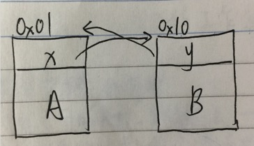
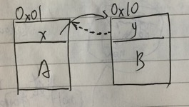
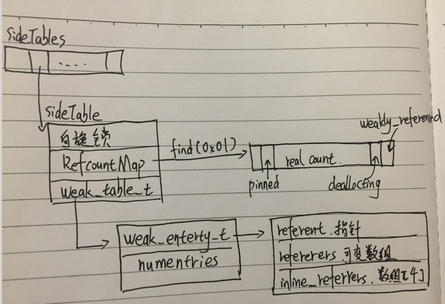
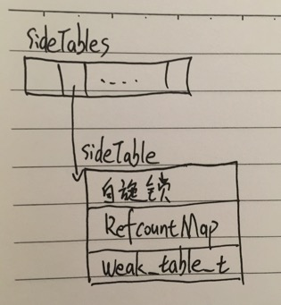
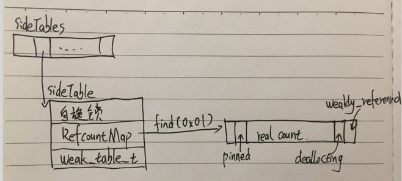
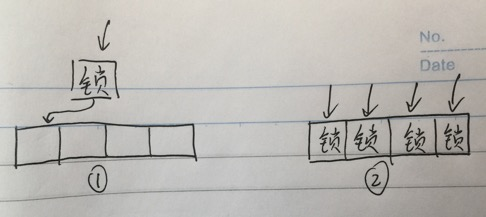
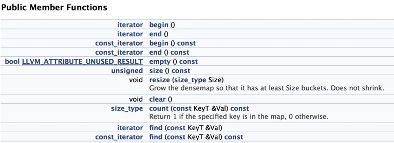

 
<!--BEGIN_DATA
{
    "create_date": "2017-03-21 13:32", 
    "modify_date": "2017-03-21 13:32", 
    "is_top": "0", 
    "summary": "iOS管理对象内存的数据结构以及操作算法--SideTables、RefcountMap、weak_table_t", 
    "tags": "iOS", 
    "file_name": "iOS管理对象内存的数据结构以及操作算法--SideTables、RefcountMap、weak_table_t.md"
}
END_DATA-->

####
原文出处：<a href='http://www.jianshu.com/p/ef6d9bf8fe59' target='blank'>iOS管理对象内存的数据结构以及操作算法--SideTables、RefcountMap、weak_table_t-一</a>

 

第一次写文章语言表达能力太差。如果有哪里表达的不够清晰可以直接评论回复我,我来加以修改。这篇文章力求脱离语言的特性，咱们多讲结构和算法。即使你不懂iOS开发，不懂Objective-C语言也可以看这篇文章。  

**通过阅读本文你可以了解iOS管理对象内存的数据结构是什么样的，以及操作逻辑。对象的reatin、release、dealloc操作是该通过怎样的算法实现的，weak指针是如何自动变nil的。**  

_本文所阐述的内容代码部分在苹果的开源项目[objc4-706](https://opensource.apple.com/tarballs/objc4/objc4-706.tar.gz)中。_

** 本文流程:**  

一、引用计数的概念  
二、抛出问题  
三、数据结构分析(_ SideTables、RefcountMap、weak_table_t_)

##一、引用计数的概念

    **这一部分是写给非iOS工程师的，便于大家了解引用计数、循环引用、弱引用的概念。如果已经了解相关概念可以直接跳过第一部分。**

    大家都知道想要占用一块内存很容易，咱们 new 一个对象就完事儿了。但是什么时候回收？不回收自然是不成的，内存再大也不能完全不回收利用。回收早了的话
,真正用到的时候会出现[野指针](http://baike.baidu.com/link?url=izpSQGxQwYzBBe8OD686QlTHVKsUzRScek12RwXJmwaXrv_lPEhDN6a_slk5ykaxdkw-0Hi1AdW_VYuitO6aSJMovKaq8Cd86sD2lvLv-X2mf-FDzzjRSUi8ftcmvLGb)问题。回收晚了又浪费宝贵的内存资源。咱们得拿出一套管理内存的方法才成。本文只讨论iOS管理对象内存的[引用计数](http://baike.baidu.com/link?url=t_cX2bswGvuy2ayE-9wSuZY97xAsoD-5bfMAWz6AiOg1UdA6y94mlAYI9l3b3N2Gs1iMOIWaKzFDPYYQumuVHzbpwfHsJUDwxuNrQHZaHq5Yp_02-2Fb4QxsXF-t4w5H)法。  

内存中每一个对象都有一个属于自己的引用计数器。当某个对象A被另一个家伙引用时，A的引用计数器就+1,如果再有一个家伙引用到A，那么A的引用计数器就再+1。当其中某个家伙不再引用A了，A的引用计数器会-1。直到A的引用计数减到了0,那么就没有人再需要它了，就是时候把它释放掉了。

> 在引用计数中，每一个对象负责维护对象所有引用的计数值。当一个新的引用指向对象时，引用计数器就递增，当去掉一个引用时，引用计数就递减。当引用计数到零时，该对象就将释放占有的资源。

    采用上述机制看似就可以知道对象在内存中应该何时释放了，但是还有一个**循环引用**的问题需要我们解决。  

  

  
现在内存中有两个对象，A和B。

    
    
    A.x = B;
    B.y = A;

  * 假如A是做视频处理的，B是处理音频的。
  * 现在A的引用计数是1(被B.y引用)。
  * 现在B的引用计数也是1(被A.x引用)。
  * 那么当A处理完它的视频工作以后,发现自己的引用计数是1不是0,他心里想"哦还有人需要我，我还不能被释放。"
  * 当B处理完音频操作以后他发现他的引用计数也是1，他心里也觉得"我还不能被释放还有人需要我。"

    这样两个对象互相循环引用着对方谁都不会被释放就造成了内存泄露。为了解决这个问题我们来引入**弱引用**的概念。  
    弱引用指向要引用的对象，但是不会增加那个对象的引用计数。就像下面这个图这样。_虚线为弱引用_ (艾玛我画图画的真丑)

  

EFDCA2C8-4E42-48EF-AE5F-3D4607B6CF68.png

    
    
            A.x = B;
     __weak B.y = A;

    这里我们让B的y是一个弱引用，它还可以指向A但是不增加A的引用计数。

  * 所以A的引用计数是0，B的引用计数是1(被A.x引用)。
  * 当A处理完他的视频操作以后，发现自己的引用计数是0了，ok他可以释放了。
  * 随之A.x也被释放了。(_A.x是对象A内部的一个变量_)
  * A.x被释放了以后B的引用计数就也变成0了。
  * 然后B处理完他的音频操作以后也可以释放了。

循环引用的问题解决了。我们不妨思考一下，这套方案还会不会有其它的问题？  
思考中...  
还有一个[野指针](http://baike.baidu.com/link?url=bfnt4PdZJjVq6t63YtFnJpG8ib__HRD8NWVxhSJK5rfhJ3RRVkLdh5iHOxNmVNwtSY-COabAK53iuwmeJRuTeLtNThvDXnUPhDIGKP4OxEP0Elwj7qO3vCthHWjkXdeu)的问题等待我们解决。

  * 如果A先处理完他的视频任务之后被释放了。
  * 这时候B还在处理中。
  * 但是处理过程中B需要访问A (B.y)来获取一些数据。
  * 由于A已经被释放了,所以再访问的时候就造成了[野指针](http://baike.baidu.com/link?url=_2Vb8x8HMdPRZLBVidn17g89t6rqi9Ld8foOCueYi4BuXgGX1E_LC7u57DTXTRP-SBPXLue8VJMDyeiSfjZ5aGKW3iOAHL4glOINDiJV10LGwRP9D1X-_8s7U0dsR1jw)错误。

    因此我们还需要一个机制，可以让A释放之后，我再访问所有指向A的指针(_比如B.y_)的时候都可以友好的得知A已经不存在了,从而避免出错。  
    我们这里假设用一个数组,把所有指向A的弱引用都存起来，然后当A被释放的时候把数组内所有的弱引用都设置成nil(_相当于其他语言中的NULL_)。这样当B再访问B.y的时候就会返回nil。通过判空的方式就可以避免野指针错误了。当然说起来简单，下面我们来看看苹果是如何实现的。

##二、抛出问题

    前面絮絮叨叨说了一大堆，其实真正现在才抛出本次讨论的问题。

  * 1、如何实现的引用计数管理,控制加一减一和释放？
  * 2、为何维护的weak指针防止野指针错误？

##三、数据结构分析(_ SideTables、RefcountMap、weak_table_t_)

  
  
_很多人反应看了这篇文章后还是对SideTables、SideTable、RefcountMap三者的关系不太清楚。可能是我这篇文章讲述的不太好。大家可以看我[第二篇文章](http://www.jianshu.com/p/8577286af88e)中有一个大学宿舍楼的例子，结合这个例子看或许可以有助于理解三者关系。_  
咱们先来讨论最顶层的**SideTables**  

  

EA251BCE-F990-4CA6-B66E-8822D8089D61.png

  
    为了管理所有对象的引用计数和weak指针，苹果创建了一个全局的SideTables，虽然名字后面有个"s"不过他其实是一个全局的[Hash](http://baike.baidu.com/link?url=7FG7NJyFBiice70Ib-WBBEirge0CDvMcc_TsgKQWc5X9OMS_rLARGjoaRtVc_Bz59FwAQ31Dci_McEk1F5k-Na)表，里面的内容装的都是**SideTable**结构体而已。它使用对象的**内存地址当它的key**。管理引用计数和weak指针就靠它了。  

因为对象引用计数相关操作应该是**原子性**的。不然如果多个线程同时去写一个对象的引用计数，那就会造成数据错乱，失去了内存管理的意义。同时又因为内存中对象的数量是**非常非常庞大**的需要非常频繁的操作SideTables，所以**不**能对整个Hash表加锁。苹果采用了**分离锁**技术。

> 分离锁和分拆锁的区别  

降低锁竞争的另一种方法是降低线程请求锁的频率。分拆锁 (lock splitting) 和分离锁 (lock striping) 是达到此目的两种方式。相互独立的状态变量，应该使用独立的锁进行保护。有时开发人员会错误地使用一个锁保护所有的状态变量。这些技术减小了锁的粒度，实现了更好的可伸缩性。但是，这些锁需要仔细地分配，以降低发生死锁的危险。  

如果一个锁守护多个相互独立的状态变量，你可能能够通过分拆锁，使每一个锁守护不同的变量，从而改进可伸缩性。通过这样的改变，使每一个锁被请求的频率都变小
了。分拆锁对于中等竞争强度的锁，能够有效地把它们大部分转化为非竞争的锁，使性能和可伸缩性都得到提高。  

分拆锁有时候可以被扩展，分成若干加锁块的集合，并且它们归属于相互独立的对象，这样的情况就是分离锁。

因为是使用对象的内存地址当key所以Hash的分部也很平均。假设Hash表有n个元素，则可以将Hash的冲突减少到n分之一，支持n路的并发写操作。

###SideTable

    当我们通过SideTables[key]来得到SideTable的时候，SideTable的结构如下:

###1,一把自旋锁。_spinlock_t  slock;_

> [自旋锁](http://baike.baidu.com/link?url=ypF8fpnendw8aEfveJ9tsIuuHLAi32jRIJcgdEniwhkLoVr8NNBejvqyNe2g6CSgteoRDZkzF5FDByZNBRXRQq3r5dUG-UDaEXiZni-NfnpnYrhnnGfvQQDdSRpRl8UZ)比较适用于锁使用者保持锁时间比较短的情况。正是由于自旋锁使用者一般保持锁时间非常短，因此选择自旋而不是睡眠是非常必要的，自旋锁的效率远高于互斥锁。信号量和读写信号量适合于保持时间较长的情况，它们会导致调用者睡眠，因此只能在进程上下文使用，而自旋锁适合于保持时间非常短的情况，它可以在任何上下文使用。

    它的作用是在操作引用技术的时候对SideTable加锁，避免数据错误。  
    
    苹果在对锁的选择上可以说是精益求精。苹果知道对于引用计数的操作其实是非常快的。所以选择了虽然不是那么高级但是确实效率高的自旋锁，我在这里只能说"双击
666，老铁们！ 没毛病！"

###2,引用计数器 RefcountMap  refcnts;

    对象具体的引用计数数量是记录在这里的。  
    这里注意RefcountMap其实是个C++的[Map](http://blog.sina.com.cn/s/blog_61533c9b0100fa7w.html)。为什么Hash以后还需要个Map？其实苹果采用的是分块化的方法。  
    
    举个例子  
    假设现在内存中有16个对象。  
0x0000、0x0001、...... 0x000e、0x000f  
    咱们创建一个SideTables[8]来存放这16个对象，那么查找的时候发生Hash冲突的概率就是八分之一。  
    假设SideTables[0x0000]和SideTables[0x0x000f]冲突,映射到相同的结果。

 
    SideTables[0x0000] == SideTables[0x0x000f]  ==> 都指向同一个SideTable

    苹果把两个对象的内存管理都放到里同一个SideTable中。你在这个SideTable中需要再次调用_table.refcnts.find(0x0000_)或者_table.refcnts.find(0x000f)_来找到他们真正的引用计数器。  
    
    这里是一个分流。内存中对象的数量实在是太庞大了我们通过第一个Hash表只是过滤了第一次，然后我们还需要再通过这个Map才能精确的定位到我们要找的对象
的引用计数器。  
_引用计数器的存储结构如下_  
**注意这里讨论的是table.refcnts.find(this)得到的value的结构,至于RefcountMap是什么结构我们在[下一篇文章](http://www.jianshu.com/p/8577286af88e)中讨论**  

  

77490066-7101-4F70-BF50-604D3658F7C4.png

引用计数器的数据类型是:
    
    
    typedef __darwin_size_t        size_t;

再进一步看它的定义其实是`unsigned long`，在32位和64位操作系统中，它分别占用32和64个bit。  
苹果经常使用[bit mask](http://c.biancheng.net/cpp/html/1611.html)技术。这里也不例外。拿32位系统为例的话，可以理解成有32个盒子排成一排横着放在你面前。盒子里可以装0或者1两个数字。我们规定最后边的盒子是低位，左边的盒子是高位。

  * (1UL<<0)的意思是将一个"1"放到最右侧的盒子里，然后将这个"1"向左移动0位(就是原地不动):0b0000 0000 0000 0000 0000 0000 0000 0001
  * (1UL<<1)的意思是将一个"1"放到最右侧的盒子里,然后将这个"1"向左移动1位:0b0000 0000 0000 0000 0000 0000 0000 0010

下面来分析引用计数器(_图中右侧_)的结构,从低位到高位。

  * (1UL<<0)    WEAKLY_REFERENCED  
表示是否有弱引用指向这个对象，如果有的话(值为1)在对象释放的时候需要把所有指向它的弱引用都变成nil(_相当于其他语言的NULL_)，避免野指针错误。

  * (1UL<<1)    DEALLOCATING  
表示对象是否正在被释放。1正在释放，0没有。

  * REAL COUNT  
图中REAL COUNT的部分才是对象真正的引用计数存储区。所以咱们说的引用计数加一或者减一，实际上是对整个unsigned long加四或者减四,因为真正的计数是从2^2位开始的。

  * (1UL<<(WORD_BITS-1))    SIDE_TABLE_RC_PINNED  
其中WORD_BITS在32位和64位系统的时候分别等于32和64。其实这一位没啥具体意义，就是随着对象的引用计数不断变大。如果这一位都变成1了，就表示引用计数已经最大了不能再增加了。

###3,维护weak指针的结构体 weak_table_t   weak_table;

  

9BE315AE-E25E-41D1-99FD-883EDC5884F6.png

  
    上面的RefcountMap  refcnts;是一个一层结构，可以通过key直接找到对应的value。而这里是一个两层结构。  
    第一层结构体中包含两个元素。  
    第一个元素`weak_entry_t *weak_entries;`是一个数组,上面的RefcountMap是要通过find(key)来找到精确的元
素的。weak_entries则是通过循环遍历来找到对应的entry。  
    _(上面管理引用计数器苹果使用的是Map,这里管理weak指针苹果使用的是数组,有兴趣的朋友可以思考一下为什么苹果会分别采用这两种不同的结构)_  
    第二个元素num_entries是用来维护保证数组始终有一个合适的size。比如数组中元素的数量超过3/4的时候将数组的大小乘以2。

####第二层weak_entry_t的结构包含3个部分

  * 1,referent:  
被指对象的地址。前面循环遍历查找的时候就是判断目标地址是否和他相等。

  * 2,referrers  
可变数组,里面保存着所有指向这个对象的弱引用的地址。当这个对象被释放的时候，referrers里的所有指针都会被设置成nil。

  * 3,inline_referrers  
只有4个元素的数组，默认情况下用它来存储弱引用的指针。当大于4个的时候使用referrers来存储指针。

##OK大家来看着图看着伪代码走一遍流程

###1,alloc

这时候其实并不操作SideTable，具体可以参考:

> [深入浅出ARC(上)](http://blog.tracyone.com/2015/06/14/%E6%B7%B1%E5%85%A5%E6%B5%85%E5%87%BAARC-%E4%B8%8A/)  
Objc使用了类似散列表的结构来记录引用计数。并且在初始化的时候设为了一。

###2,retain: NSObject.mm line:1402-1417

    
    
    //1、通过对象内存地址，在SideTables找到对应的SideTable
    SideTable& table = SideTables()[this];
    //2、通过对象内存地址，在refcnts中取出引用计数
    //这里是table是SideTable、refcnts是RefcountMap
    size_t& refcntStorage = table.refcnts[this];
    //3、判断PINNED位，不为1则+4
    if (! (refcntStorage & PINNED)) {
        refcntStorage += (1UL<<2);
    }

###3,release NSObject.mm line:1524-1551

    
    
    table.lock();
    引用计数器 = table.refcnts.find(this);
    //table.refcnts.end()表示使用一个iterator迭代器到达了end()状态
    if (引用计数器 == table.refcnts.end()) {
        //标记对象为正在释放
        table.refcnts[this] = SIDE_TABLE_DEALLOCATING;
    } else if (引用计数器 < SIDE_TABLE_DEALLOCATING) {
        //这里很有意思，当出现小余(1UL<<1) 的情况的时候
        //就是前面引用计数位都是0,后面弱引用标记位WEAKLY_REFERENCED可能有弱引用1
        //或者没弱引用0
        //为了不去影响WEAKLY_REFERENCED的状态
        引用计数器 |= SIDE_TABLE_DEALLOCATING;
    } else if ( SIDE_TABLE_RC_PINNED位为0) {
        引用计数器 -= SIDE_TABLE_RC_ONE;
    }
    table.unlock();
    如果做完上述操作后如果需要释放对象，则调用dealloc

###4,dealloc NSObject.mm line:1555-1571

    dealloc操作也做了大量了逻辑判断和其它处理，咱们这里抛开那些逻辑只讨论下面部分`sidetable_clearDeallocating()`

    
    
    SideTable& table = SideTables()[this];
    table.lock();
    引用计数器 = table.refcnts.find(this);
    if (引用计数器 != table.refcnts.end()) {
        if (引用计数器中SIDE_TABLE_WEAKLY_REFERENCED标志位为1) {
            weak_clear_no_lock(&table.weak_table, (id)this);
        }
        //从refcnts中删除引用计数器
        table.refcnts.erase(it);
    }
    table.unlock();

`weak_clear_no_lock()`是关键，它才是在对象被销毁的时候处理所有弱引用指针的方法。

    
    
    weak_clear_no_lock objc-weak.mm line:461-504
    void 
    weak_clear_no_lock(weak_table_t *weak_table, id referent_id) 
    {
        //1、拿到被销毁对象的指针
        objc_object *referent = (objc_object *)referent_id;
        //2、通过 指针 在weak_table中查找出对应的entry
        weak_entry_t *entry = weak_entry_for_referent(weak_table, referent);
        if (entry == nil) {
            /// XXX shouldn't happen, but does with mismatched CF/objc
            //printf("XXX no entry for clear deallocating %p\n", referent);
            return;
        }
        //3、将所有的引用设置成nil
        weak_referrer_t *referrers;
        size_t count;
        if (entry->out_of_line()) {
            //3.1、如果弱引用超过4个则将referrers数组内的弱引用都置成nil。
            referrers = entry->referrers;
            count = TABLE_SIZE(entry);
        } 
        else {
            //3.2、不超过4个则将inline_referrers数组内的弱引用都置成nil
            referrers = entry->inline_referrers;
            count = WEAK_INLINE_COUNT;
        }
        //循环设置所有的引用为nil
        for (size_t i = 0; i < count; ++i) {
            objc_object **referrer = referrers[i];
            if (referrer) {
                if (*referrer == referent) {
                    *referrer = nil;
                }
                else if (*referrer) {
                    _objc_inform("__weak variable at %p holds %p instead of %p. "
                                 "This is probably incorrect use of "
                                 "objc_storeWeak() and objc_loadWeak(). "
                                 "Break on objc_weak_error to debug.\n", 
                                 referrer, (void*)*referrer, (void*)referent);
                    objc_weak_error();
                }
            }
        }
        //4、从weak_table中移除entry
        weak_entry_remove(weak_table, entry);
    }

  讲到这里我们就已经把SideTables的操作流程过一遍了，希望大家看的开心。  
  欢迎加我的微博<http://weibo.com/xuyang186>  

####
原文出处：<a href='http://www.jianshu.com/p/8577286af88e' target='blank'>iOS管理对象内存的数据结构以及操作算法--SideTables、RefcountMap、weak_table_t-二</a>

    这篇文章是之前那篇文章[iOS管理对象内存的数据结构以及操作算法--SideTables、RefcountMap、weak_table_t](http://www.jianshu.com/p/ef6d9bf8fe59)的补充和延伸。如果没有阅读过前一篇文章请先看那一篇。  
    
    上一篇文章中关于SideTables、SideTable和RefcountMap三者关系可能描述的不太清楚。很多朋友表示看起来晕乎乎的。当初我在研究的时候也是蒙圈了好长一段时间。所以特意写了这篇文章来补充说明一下，同时也有新的知识扩展。  
    **刚开始写文章，思路不太清晰。如果文章中有什么错误或者问题，欢迎大家指正。**  
    _这里特别感谢[大墙66370](http://www.jianshu.com/u/6266c6477c99)午夜时分挑灯夜战提出的宝贵问题。_

**本文流程**  
一、解释分离锁是什么。  
二、举例阐述SideTables、SideTable、RefcountMap三者关系。  
三、[第一篇](http://www.jianshu.com/p/ef6d9bf8fe59#)文章所说的N路并发是什么意思。  
四、SideTables所使用的Hash算法解密。  
五、RefcountMap是什么结构。

###一、分离锁

    分离锁并不是一种锁，而是一种对锁的用法。_(下面继续上一张感人的手绘图。哈哈我写的字也出现了。如果比写字丑，一般很少有人能比我写的丑)_  

  

6DA5F9AD-73C5-4888-9E03-1C72D0E848F1.png

    图1这样对一整个表加一把锁，是我们平时比较常见的。如果我一次写操作需要操作表中多个单元格的数据，比如第一次操作0、1、2位置的数据，第二次操作0、2、3位置的数据。像这种情况锁的粒度就是以整张表为单位的，才能保证数据的安全。  
    图2这样对表中的各个元素分别加一把锁就是我们说的分离锁。适用于表中元素相互独立，你对第一个元素做写操作的时候不需要影响到其他元素。  
    上文中所说的结构就是SideTables这个大的Hash表中每一个小单元格(SideTable)都带有一把锁。做写操作的时候(操作对象引用计数)单元格之间相互独立，互相没影响。所以降低了锁的粒度。

_对比一下图1和图2的并发性。_

  * 图1因为任何操作都需要锁整张表，所以写操作的时候相当于串行操作。没有并发。
  * 图2因为每一个单元格都有一把锁，所以写操作的时候有多少个单元格并发数就可以是多少。

> 这里注意区分一下[并发和并行的区别](http://blog.csdn.net/lconline/article/details/5982237)。
>
> 当有多个线程在操作时,如果系统只有一个CPU,则它根本不可能真正同时进行一个以上的线程,它只能把CPU运行时间划分成若干个时间段,再将时间段分配给各个线
程执行,在一个时间段的线程代码运行时,其它线程处于挂起状态.这种方式我们称之为并发(Concurrent).  

当系统有一个以上CPU时,则线程的操作有可能非并发.当一个CPU执行一个线程时,另一个CPU可以执行另一个线程,两个线程互不抢占CPU资源,可以同时进行,这
种方式我们称之为并行(Parallel)

    可以看到在单元格之间相互独立的情况下图2的方法效率更高。  
    
    看了上面的例子有同学会有疑问。既然分离锁可以实现高并发，那么为什么不对每一个内存对象加一把锁呢？为什么还会有Hash表还会冲突呢？这个问题我在下面通
过一个例子和RefcountMap一起解释。

###二、为什么SideTables会冲突、SideTable又扮演着什么角色、RefcountMap是用来干嘛的？

    _下面我用一个不太恰当的例子来说明问题_  
**假设有80个学生需要咱们安排住宿，同时还要保证学生们的财产安全。应该怎么安排？**  
   
    显然不会给80个学生分别安排80间宿舍，然后给每个宿舍的大门上加一把锁。那样太浪费资源了锁也挺贵的，太多的宿舍维护起来也很费力气。  
    
    我们一般的做法是把80个学生分配到10间宿舍里，每个宿舍住8个人。假设宿舍号分别是101、102 、... 110。然后再给他们分配床位，01号床、
02号床等。然后给每个宿舍配一把锁来保护宿舍内同学的财产安全。为什么不只给整个宿舍楼上一把锁，每次有人进出的时候都把整个宿舍楼锁上？显然这样会造成宿舍楼大门
口阻塞。  
    OK假如现在有人要找102号宿舍的2号床的人聊天。这个人会怎么做？

  * 1、找到宿舍楼(SideTables)的宿管，跟他说自己要找10202(内存地址当做key)。
  * 2、宿管带着他`SideTables[10202]`找到了102宿舍`SideTable`，然后把102的门一锁`lock`，在他访问102期间不再允许其他访客访问102了。_(这样只是阻塞了102的8个兄弟的访问，而不会影响整栋宿舍楼的访问)_
  * 3、然后在宿舍里大喊一声:"2号床的兄弟在哪里？"_`table.refcnts.find(02)`_你就可以找到2号床的兄弟了。
  * 4、等这个访客离开的时候会把房门的锁打开`unlock`，这样其他需要访问102的人就可以继续进来访问了。
    
        SideTables == 宿舍楼
    	SideTable  == 宿舍
    	RefcountMap里存放着具体的床位

    **苹果之所以需要创造SideTables的Hash冲突是为了把对象放到宿舍里管理，把锁的粒度缩小到一个宿舍SideTable。RefcountMap的工作是在找到宿舍以后帮助大家找到正确的床位的兄弟。**

###三、N路的并发写操作那句话是什么意思？

> 上一篇文章中提到:  
因为是使用对象的内存地址当key所以Hash的分部也很平均。假设Hash表有n个元素，则可以将Hash的冲突减少到n分之一，支持n路的并发写操作。

    我们在分配宿舍的时候是**先**给同学分配宿舍和床位，**然后**再给宿舍和床位编号。所以我们可以很**平均**的给每个宿舍分配8个人。  
    
    那么如果我们用对象内存地址当做Hash算法的key，所得到的散列值可能会出现某些宿舍分配了4个人，某些宿舍分配了12个人的情况。这样人员分配就不平均了。如果某一时间段正好这个宿舍的12个人的访问量都特别大，那么访问起来就又会出现阻塞了。而那4人间的宿舍就会闲置，造成了资源的浪费。会不会造成这种资源浪费主
要看两点。

  * 1、我们的key值分部是否平均。
  * 2、我们采用的散列算法能不能尽量把输出值平均分配。

1、在数据量足够大的情况下我们的key值分部是平均的。因为key值是内存地址。从低位0x0000...0000到高位0xffff...ffff分配。并且操作系统的内存管理模块本身也会对内存分配做很多优化。毕业年头长了,内管管理具体的细节我也扯不出来了。赶紧贴一片文章压压惊，有兴趣的同学可以看[操作系统内存管理——分区、页式、段式管理](http://blog.csdn.net/hguisu/article/details/5713164)。  

2、那么**SideTables使用的Hash算法是什么**呢？我们来开一个新的大标题。

###四、SideTables所使用的Hash算法解密。

    SideTables的定义：NSObject.mm line 207-209
  
    
    static StripedMap<SideTable>& SideTables() {
        return *reinterpret_cast<StripedMap<SideTable>*>(SideTableBuf);
    }

    如果看不懂没关系,当它是一个C++的Map。咱们来看StripedMap的定义：objc-private.h line 867-906  
其中有用的部分是这样的

    
    
    ...
    //如果是嵌入式系统StripeCount=8。我们这里StripeCount=64
    enum { StripeCount = 64 };
    ...
    static unsigned int indexForPointer(const void *p) {
        //这里是类型转换，不用在意
        uintptr_t addr = reinterpret_cast<uintptr_t>(p);
        //这里就是我们要找的Hash算法了
        return ((addr >> 4) ^ (addr >> 9)) % StripeCount;
    }

  * 1、将对象的内存地址`addr`右移4位得到结果1
  * 2、将对象的内存地址`addr`右移9位得到结果2
  * 3、将结果1和结果2做按位[异或](https://zhidao.baidu.com/question/182060177.html)得到结果3
  * 4、将结果3和StripeCount做模运算得到真正的Hash值。

**因为最后模运算的结果范围是在0-63之间，可见SideTables一共有64个单元格。**

###五、RefcountMap是什么结构。

    前面文章中提到过`if(引用计数器 !=
table.refcnts.end())`因此有同学提问`end()`是什么？那么咱们得研究一下**RefcountMap是什么类型的**。  
    看定义NSObject.mm line 137

    
    typedef objc::DenseMap<DisguisedPtr<objc_object>,size_t,true> RefcountMap;

    看起来好复杂，先不管它。一路顺着定义找下去。找到`DenseMap ==> DenseMapBase ==> inline iterator end
()`发现咱们当前在llvm-DenseMap.h line 77-79。艾玛吓死我了怎么看到llvm了。llvm我也不懂，所以还是不要扯的太远。赶紧打开llvm的相关文档看看[DenseMapBase](http://llvm.org/docs/doxygen/html/classllvm_1_1DenseMapBase.html)中的公开方法有

  

09719F81-A6B1-4B4E-A906-DAD8F260B052.png

    当然还有更多其他方法，我只是截取了一部分。通过这部分我们可以看出来我们操作的refcnts.find()和refcnts.end()其实都是对一个[C++迭代器iterator](http://www.cnblogs.com/yc_sunniwell/archive/2010/06/25/1764934.html)的操作。而end()的状态表示的是从头开始查找，一直找到最后都没有找到。当前指针指向的是结束位,而不是最后一个元素。  

所以 `if(引用计数器 == table.refcnts.end())`表示查找到最后都没找到`if(引用计数器 !=
table.refcnts.end())`表示中途找到了。

