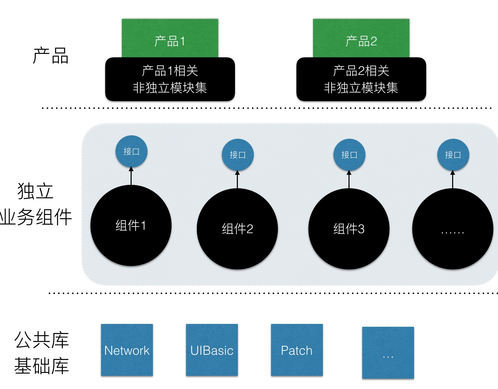
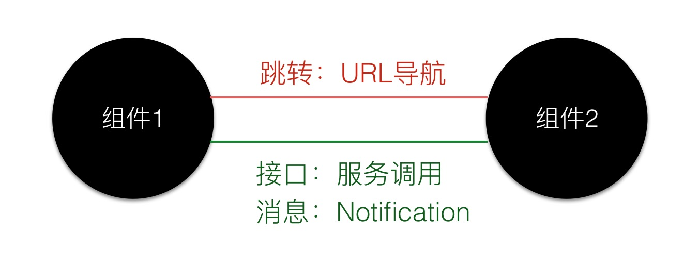
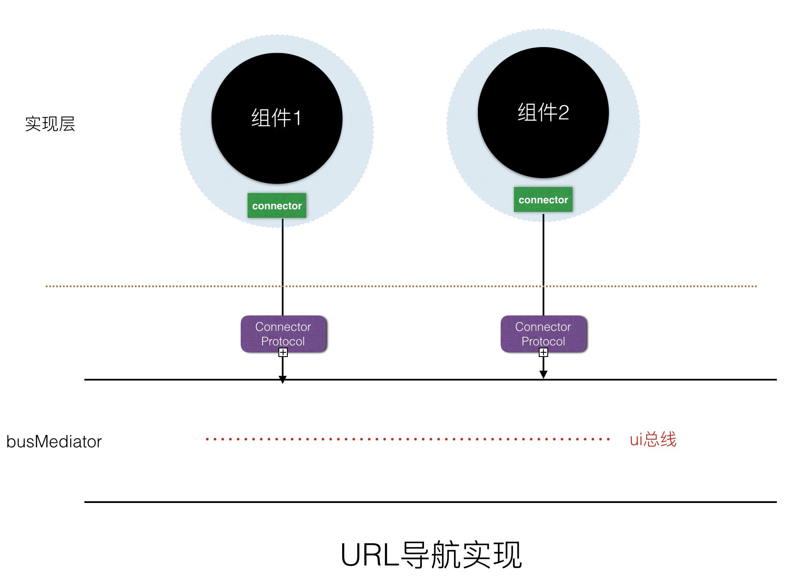
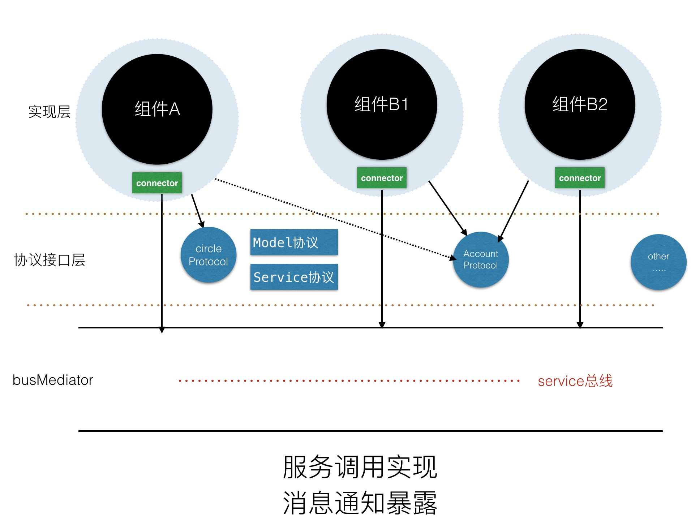

 
<!--BEGIN_DATA
{
    "create_date": "2016-06-22 17:33", 
    "modify_date": "2016-06-22 17:33", 
    "is_top": "0", 
    "summary": "iOS组件化实践方案－LDBusMediator炼就", 
    "tags": "iOS", 
    "file_name": "iOS组件化实践方案－LDBusMediator炼就.md"
}
END_DATA-->

####
原文出处：<a href='http://www.jianshu.com/p/196f66d31543' target='blank'>iOS组件化实践方案－LDBusMediator炼就</a>

###一、中小型App为什么要组件化

当项目App处于起步阶段、各个需求模块趋于成熟稳定的过程中，组件化也许并没有那么迫切，甚至考虑组件化的架构可能会影响开发效率和需求迭代。而当项目迭代到一定时
期之后，便会出现一些相对独立的业务功能模块，而团队的规模也会随着项目迭代逐渐增长，这便是中小型应用考虑组件化的时机了。

为了更好的分工协作，团队会安排团队成员各自维护一个相对独立的业务组件。这个时候我们引入组件化方案，一是为了解除组件之间相互引用的代码硬依赖，二是为了规范组件
之间的通信接口； 让各个组件对外都提供一个黑盒服务，而组件工程本身可以独立开发测试，减少沟通和维护成本，提高效率。

进一步发展，当团队涉及到转型或者有了新的立项之后，一个团队会开始维护多个项目App，而多个项目App的需求模块往往存在一定的交叉，而这个时候组件化给我们的帮
助会更大，我只需要将之前的多个业务组件模块在新的主App中进行组装即可快速迭代出下一个全新App。

###二、如何开始组件化工作

#####2.1 组件化的架构目标

在详细说如何具体开始组件化工作之前，我们对于组件化的期望应该是这样的，一个团队维护一到两个独立App，每个独立App除开包含一些产品相关的非独立模块集之外，
还需要用一些独立的业务组件进行组装。 而不管是产品的非独立模块集、还是独立业务组件都需要底层公共库和基础库的支持。如下图所示：

  

组件化目标图.png

#####2.2 组件化第一步－剥离公共库和产品基础库

在具体的项目开发过程中，我们使用cocoapod的组件依赖管理利器已经开始从Github上引入了一些第三方开源的基础库，比如说AFNetworking、SD
WebImage、SVProgressHUD、ZipArchive等。除开这些第三方开源基础库之外，我们还需要做的事情就是将一些基础组件从主工程剥离出来，形
成产品自己的私有基础库仓库，为我们进行业务独立组件的分离做准备。

这部分我将其分为两类：一类是公共基础库，用于跨产品使用；一类是产品基础库，在某个产品中强相关依赖使用。这里以我们自己产品划分为例，概述一下这两类库都包括哪些
基础组件：

公共库包括：[组件化中间件](https://github.com/Lede-
Inc/LDBusMediator.git)、[网络诊断](https://github.com/Lede-
Inc/LDNetDiagnoService_IOS.git)、[第三方SDK管理封装](https://github.com/Lede-Inc/LDSDKManager_IOS.git)、长连接相关、[Patch相关](https://github.com/alibaba/wax.git)、网络和页面监控相关
、用户行为统计库、第三方分享库、[JSBridge相关](https://github.com/Lede-Inc/LDJSBridge_IOS.git)、关于Device＋file＋crypt＋http的基础方法等。

产品基础库包括：通用的WebViewContainer组件（封装了JSBridge）、自定义数字键盘、表情键盘、自定义下拉列表、循环滚动页面、AFNewor
king封装库（对上层业务隐藏AF的直接引用）、以及其他自定义的UI基础组件库。

#####2.2 组件化第二步－独立业务模块单独成库

在基础库成体系的基础上，我们就可以开始按照需求定性将一些相对独立的业务模块独立成库，单独在一个工程上进行开发、测试。

往往在这个阶段有一个误区，千万不能为了组件化而强行将一些耦合严重的业务模块分出。如果在拆分过程中，拆分模块跟其他模块耦合太严重，那就先放弃这部分模块的独立，
毕竟产品是不会单独拿出时间给你做组件化的。

另外拆分的粒度需要大一点，需要在功能模块的基础上，将业务独立性考虑进去，如果没有就不拆，等以后有了相对独立的模块之后再拆。

#####2.3 组件化第三步－对外服务接口最小化

组件化不是一蹴而就的，我们在完成第二步的时候并不要强行要求去掉组件之间代码的硬依赖，只需要保证单独拆分出来的工程可以独立运行和测试，并且能够通过引用保证其他
业务组件和主工程的依赖使用即可。

当第二步完成之后，我们可以在此基础上总结其他组件和主工程的需求调用，根据需求总结和抽象出当前业务组件对外服务的最小化接口以及页面跳转调用。经过多次总结，我们
可以发现组件之间的通信需求无外乎三个方面：URL导航＋服务接口调用＋消息变量定义。如下图所示：

  

组件通信需求.png

在这个阶段，我们大多数应用会选择JLRoute（蘑菇街的MGJRoute方案也类似）去做URL导航的需求，会通过OpenServiceImpl ＋ Prot
ocol的方案（将所有对外服务提供的接口都在OpenServiceImpl中实现）去做组件间的服务调用，消息变量的声明可以放到对外服务接口的Protocol
定义中。

到了这个阶段，我们的业务组件也已经相对独立，JLRoute能够去掉页面引用的头头文件依赖。OpenServiceImpl＋Protocol也将我们最小化的对
外服务接口约束到Protocol接口文件中。 如果对于项目组件化要求不高的话，到这一步就可以了。

###三、彻底组件化－LDBusMediator炼就

#####3.1 组件化方案不彻底之处和JLRoute的缺陷

通过第二部分的讲述，我们的组件化工作差不多完成了80%，但是我们依然发现，组件化并不够彻底。

先来看服务调用方面，我们需要对外提供OpenServiceImpl的头文件，外部模块仍然保持着对业务组件的强依赖，OpenServiceImpl的不兼容变化
必然导致所有调用部分的更改，我们期望的黑盒服务便无法实现。如果所有类别的服务接口都在OpenServiceImpl中实现，OpenServiceImpl中的
代码会越来越多，难以维护和管理。 另外Protocol文件和OpenServiceImpl的头文件都需要对外披露，如果放到组件实现中，两个组件相互之间有调用
，就会导致Podspec的相互循环依赖。

再看URL导航方面，在我们的项目中，我们在ViewController的类别中通过load方法注册URL－Block，这样能够解决JLRoute的中心化注册
问题，但是JLRoute仍然存在其他一些缺陷。JLRoute去中心化的具体使用方式如下：

    
    
    + (void)load
    {
        @autoreleasepool {
            [JLRoutes addRoute:@"/xxxx" handler:^BOOL(NSDictionary *parameters) {
                UIViewController *baseViewController = parameters[kLDRouteViewControllerKey];
                if (!baseViewController) {
                    baseViewController = [UIViewController topmostViewController];
                }
                if (!baseViewController) {
                    return YES;
                }
                XXXXViewController *viewController = [[XXXXViewController alloc] init];
                if ([baseViewController isKindOfClass:[UINavigationController class]]) {
                    [(UINavigationController*)baseViewController pushViewController:viewController animated:YES];
                }else if (baseViewController.navigationController) {
                    [baseViewController.navigationController pushViewController:viewController animated:YES];
                } else {
                    UINavigationController *navController = [[UINavigationController alloc] initWithRootViewController:viewController];
                    [baseViewController presentViewController:navController animated:YES completion:NULL];
                }
                return YES;
            }];
        }
    }

如上所用，JLRoute的缺陷如下：

  * **_url短链分布式注册时，导航代码的重复拷贝；_**
  * **_无法通过URL返回一个controller实例；_**(TabController也就无法从独立业务组件中不引用Controller头文件获取Controller实例完成设置)
  * **_class的load方法完成注册，太多对启动时Main线程有影响；_**
  * 同一个url短链的导航方式单一固定，依赖注册
  * 单一业务组件中可导航URL分散，无法统一查看；
  * Debug阶段url传递参数错误、not found没有提示；

#####3.2 LDBusMediator总体方案

针对组件化不彻底的实际问题，结合之前手淘分享的总线架构以及蘑菇街的组件化分享博客，我们完成了一个通用的LDBusMediator中间件帮助我们彻底完成组件化
。

**_LDBusMediator开源Git地址：_**

  * <https://github.com/Lede-Inc/LDBusMediator.git>

我们先来看总体的组件化方案：所有的业务组件通过Connector连接到总线中，Connector需要遵循Connector Protocol方可接入。Con
nector协议规定了URL导航接入和服务接入的协议，Connector通过Class的Load方法将自己的实例注册到中间件的Cache数组中，方便其他组件
在调用时中间件可以通过服务发现的方式进行URL导航和服务调用。（具体见如下的图示）

    
    
    @implementation Connector_A
    #pragma mark - register connector
    /**
     * 每个组件的实现必须自己通过load完成挂载；
     * load只需要在挂载connector的时候完成当前connecotor的初始化，挂载量、挂载消耗、挂载所耗内存都在可控范围内；
     */
    +(void)load{
        @autoreleasepool{
            [LDBusMediator registerConnector:[self sharedConnector]];
        }
    }
    @end

#####3.3 LDBusMediator－URL导航方案

URL导航的总线中间件方案很简单，只需要在Connector中实现URL导航接入的接口即可，如图所示：

  

LDBusMediator－URL导航.png

具体使用如下：

    
    
    @protocol LDBusConnectorPrt <NSObject>
    -(BOOL)canOpenURL:(nonnull NSURL *)URL;
    - (nullable UIViewController *)connectToOpenURL:(nonnull NSURL *)URL params:(nullable NSDictionary *)params;
    @end
    @implementation Connector_A
    #pragma mark - LDBusConnectorPrt 
    /**
     * (1)当调用方需要通过判断URL是否可导航显示界面的时候，告诉调用方该组件实现是否可导航URL；可导航，返回YES，否则返回NO；
     * (2)这个方法跟connectToOpenURL:params配套实现；如果不实现，则调用方无法判断某个URL是否可导航；
     */
    -(BOOL)canOpenURL:(nonnull NSURL *)URL{
        if ([URL.host isEqualToString:@"ADetail"]) {
            return YES;
        }
        return NO;
    }
    @end
    /**
     * (1)通过connector向busMediator挂载可导航的URL，具体解析URL的host还是path，由connector自行决定；
     * (2)如果URL在本业务组件可导航，则从params获取参数，实例化对应的viewController进行返回；如果参数错误，则返回一个错误提示的[UIViewController paramsError]; 如果不需要中间件进行present展示，则返回一个[UIViewController notURLController],表示当前可处理；如果无法处理，返回nil，交由其他组件处理；
     * (3)需要在connector中对参数进行验证，不同的参数调用生成不同的ViewController实例；也可以通过参数决定是否自行展示，如果自行展示，则用户定义的展示方式无效；
     * (4)如果挂接的url较多，这里的代码比较长，可以将处理方法分发到当前connector的category中；
     */
    - (nullable UIViewController *)connectToOpenURL:(nonnull NSURL *)URL params:(nullable NSDictionary *)params{
        //处理scheme://ADetail的方式
        // tip: url较少的时候可以通过if-else去处理，如果url较多，可以自己维护一个url和ViewController的map，加快遍历查找，生成viewController；
        if ([URL.host isEqualToString:@"ADetail"]) {
            DemoModuleADetailViewController *viewController = [[DemoModuleADetailViewController alloc] init];
            if (params[@"key"] != nil) {
                viewController.valueLabel.text = params[@"key"];
            } else if(params[@"image"]) {
                id imageObj = params[@"image"];
                if (imageObj && [imageObj isKindOfClass:[UIImage class]]) {
                    viewController.valueLabel.text = @"this is image";
                    viewController.imageView.image = params[@"image"];
                    [[UIApplication sharedApplication].keyWindow.rootViewController presentViewController:viewController animated:YES completion:nil];
                    return [UIViewController notURLController];
                } else {
                    viewController.valueLabel.text = @"no image";
                    viewController.imageView.image = [UIImage imageNamed:@"noImage"];
                    [[UIApplication sharedApplication].keyWindow.rootViewController presentViewController:viewController animated:YES completion:nil];
                    return [UIViewController notURLController];
                }
            } else {
                // nothing to do
            }
            return viewController;
        }
        else {
            // nothing to to
        }
        return nil;
    }

通过LDBusMediator的URL导航方案，有效的解决了前文提出的JLRoute的缺陷：

  1. url短链分布式注册时，导航代码的重复拷贝
    * **_LDBusNavigator+PresentMode_**：将通用的导航方式即成到LDBusNavigator中，而无需每个URL注册时重复拷贝。
  2. 无法通过URL返回一个controller实例；(TabController)
    * ***URL-Block —> URL-ViewController实例**：将之前JLRoute的url－block方式改成了url－ViewController方式，即可满足。
  3. class的load方法完成注册，太多对启动时Main线程有影响；
    * **_服务发现的方式，只在load时注册Connector实例_**：中间件只对每个业务组件的connector实例进行注册，相比URL注册量大量减少load使用。
  4. 同一个url短链的导航方式单一固定，依赖注册
    * **_调用时指定Present、Push、Share方式_**：之前JLRoute只能在注册时候决定导航方式，通过LDBusMediator如何导航显示由调用方决定，默认是Push；Share方式是指pop到导航层次中已经存在的viewController处。
  5. 单一业务组件中可导航URL分散，无法统一查看；
    * **_单一组件的connector中集中管理所有可导航URL_**
  6. Debug阶段url传递参数错误、not found没有提示；
    * **_Debug阶段的错误Controller提示、包括参数错误、notFound、notSupportController_**：如果参数错误、notfound无法生成一个viewController实例，中间件在debug阶段会提示。如果URL不支持返回一个Controller，同样会给与提示。

#####3.4 LDBusMediator－服务调用方案

为了更好的通过中间件支撑组件间的服务调用方案，我们在组件实现和中间件之间增加了一层协议接口层。
每个业务组件将自己对外提供的服务接口抽象到一个统一的业务组件协议集合中。 业务组件的实现依赖自己的对外服务接口集并进行接口的实现。

每个业务组件中的协议部分有两种：一种是服务协议，其他组件可以通过Mediator拿到对外开放的服务实例调用服务接口；一种是Model协议，服务协议中的接口可
以给其他组件一个协议化对象,其他组件也可以组装一个协议化对象通过参数传入。

为了方便业务组件实现和协议集合的版本对应，需要保证协议集合的大版本（如x.y）和业务组件的大版本（如x.y.z）中的x保持一致；协议集合中一般没有补丁版本的
迭代，当其他业务组件调用需要增加接口进行兼容版本升级（y+1）,减少或者修改接口则需要协议集合和业务组件中的x同时＋1（x+1）；
如果自身业务组件升级不能影响对外协议接口的调用，升级版本主要为补丁版本迭代（z＋1）或 兼容版本升级（y＋1)；

组件协议集合
单独通过一个Git地址进行管理，单独配置podspec，单独通过协议的版本仓库进行管理；所有的协议集合的git统一放到Git的一个组中进行管理。

具体方案如下：

  

LDBusMediator－服务调用.png

    
    
    @protocol LDBusConnectorPrt <NSObject>
    /**
     * 业务模块挂接中间件，注册自己提供的service，实现服务接口的调用；
     * 
     * 通过protocol协议找到组件中对应的服务实现，生成一个服务单例；
     * 传递给调用者进行protocol接口中属性和方法的调用；
     */
    - (nullable id)connectToHandleProtocol:(nonnull Protocol *)servicePrt;  
    @end
    @implementation Connector_A
    /**
     * （1)通过connector向BusMediator挂接可处理的Protocol，根据Protocol获取当前组件中可处理protocol的服务实例；
     *  (2)具体服务协议的实现可放到其他类实现文件中，只需要在当前connetor中引用，返回一个服务实例即可；
     *  (3)如果不能处理，返回一个nil；
     */
    - (nullable id)connectToHandleProtocol:(nonnull Protocol *)servicePrt{
        if (servicePrt == @protocol(ModuleAXXXServicePrt)) {
            return [[self class] sharedConnector];
        }
        return nil;
    }
    @end

LDBusMediator中间件的服务调用方案的优势：

  1. 通过中间件支撑，不暴露任何实现文件的头文件；
    * 组件对外提供的服务通过最小化抽象的“协议接口集”披露；
    * 组件的实现Pod不暴露任何头文件；
  2. 每个业务组件提供黑盒服务
    * 调用者不用关心具体实现细节；
    * 业务组件的实现升级、或者更换（包括整个业务组件更换）不影响调用者的调用修改；
  3. 为业务组件Framework化、自动化构建奠定基础

