<!--BEGIN_DATA
{
    "create_date": "2016-05-29 19:57", 
    "modify_date": "2016-05-29 19:57", 
    "is_top": "0", 
    "summary": "iOS组件化思路相关文章", 
    "tags": "iOS、架构", 
    "file_name": "iOS组件化思路相关文章.md"
}
END_DATA-->

####[iOS组件化思路－大神博客研读和思考](http://www.jianshu.com/p/afb9b52143d4)

## 一、大神博客研读

随着应用需求逐步迭代，应用的代码体积将会越来越大，为了更好的管理应用工程，我们开始借助CocoaPods版本管理工具对原有应用工程进行拆分。但是仅仅完成代码
拆分还不足以解决业务之间的代码耦合，为了更好的让拆分出去的业务工程能够独立运行，必须进行组件拆分并且实现组件服务化。

下面是最近在行业内几个大神的博客辩论对战，具体资料如下：

  * [2016.03.10 蘑菇街App的组件化之路](http://limboy.me/ios/2016/03/10/mgj-components.html)
  * [2016.03.13 iOS应用架构谈 组件化方案](http://casatwy.com/iOS-Modulization.html)
  * [2016.03.14 蘑菇街App的组件化之路·续](http://limboy.me/ios/2016/03/14/mgj-components-continued.html)
  * 2016.03.14 iOS应用架构谈 组件化方案(补充)
  * [2016.03.18 iOS 组件化方案探索](http://blog.cnbang.net/tech/3080/)
  * [2016.03.21围观神仙打架，反革命工程师《iOS应用架构谈 组件化方案》和蘑菇街Limboy的《蘑菇街 App 的组件化之路》的阅读指导](http://reviewcode.cn/article.html?reviewId=20)

**_最近在参考大神们的讨论和之前的LDBusBundle方案基础上上，提炼出了一个适合中小型应用的LDBusMediator中间件，正逐渐在项目中使用。_**

博客介绍：<http://www.jianshu.com/p/196f66d31543>  
中间件Git开源地址：<https://github.com/Lede-Inc/LDBusMediator.git>

#### （1）蘑菇街的组件化方案

###### 文章来源：

2016.03.10 蘑菇街App的组件化之路: <http://limboy.me/ios/2016/03/10/mgj-components.html>

###### 为什么要组件化？

  * 组件和组件之间没有明确的约束；
  * 组件单独开发、单独测试，不能揉入主项目中开发，测试也可以针对性的测试；

###### 如何管理短链？（url跳转）

    
    
    [MGJRouter registerURLPattern:@"mgj://detail?id=:id" toHandler:^(NSDictionary *routerParameters) {
        NSNumber *id = routerParameters[@"id"];
        // create view controller with id
        // push view controller
    }];
    [MGJRouter openURL:@"mgj://detail?id=404”]

短链如何管理？

  1. 后台专门管理短链；平台生成所需的文件，ios平台生成h，m文件，android生成java文件，注入到项目中；
  2. 开发人员查看生成文件了解所有可用URL；
  3. 缺点：无法把参数传递也通过生成方式获得；

###### 同步的Action调用？（服务调用）

方法一：通过url的方式

    
    
    [MGJRouter registerURLPattern:@"mgj://cart/ordercount" toObjectHandler:^id(NSDictionary *routerParamters){
        // do some calculation
        return @42;
    }]
    NSNumber *orderCount = [MGJRouter objectForURL:@"mgj://cart/ordercount”]

方法二：通过protocol－class对应的方式

把公共协议文件统一放到PublicProtocolDomain.h中，所有业务组件只依赖这个文件；protocol只能通过类方法提供？

    
    
    @protocol MGJCart <NSObject>
    + (NSInteger)orderCount;
    @end
    [ModuleManager registerClass:MGJCartImpl forProtocol:@protocol(MGJCart)]
    [ModuleManager classForProtocol:@protocol(MGJCart)]

###### 组件生命周期的管理：（组件管理）

启动初始化时，实例APP中所有组件的module实例，让每个组件的module实例执行一遍didFinishLaunchingWithOptions方法：在
这方法中每个组件注册自己的URL，使用class注册；每个组件可以自行监控系统的通知，如UIApplicationDidBecomeActiveNotifi
cation, 对于没有系统通知消息则将此方法写入module的protocol中，依次执行实例的这些protocol方法；

    
    
    [[ModuleManager sharedInstance] loadModuleFromPlist:[[NSBundle mainBundle] pathForResource:@"modules" ofType:@"plist"]];
        NSArray *modules = [[ModuleManager sharedInstance] allModules];
        for (id<ModuleProtocol> module in modules) {
            if ([module respondsToSelector:_cmd]) {
                [module application:application didFinishLaunchingWithOptions:launchOptions];
            }
        }

###### 组件化版本管理的问题

  1. 版本同步问题： API接口改动升级（旧接口不存在了，不向下兼容），版本的中位号发生改变；需要所有依赖其的调用都发生改变，才能保证壳工程和主工程能够同步编译通过；
  2. pod update之后编译太长： 考虑通过framework的方式进行修改；
  3. 持续集成问题： 不能只是把podspec直接扔到private repo里完事，需要扔到主工程进行打包编译，编译通过允许提供版本升级，不通过扔回去进行处理；CI编译检查，通过之后再将版本号升级到private repo中，同时修改主工程中Podfile的版本依赖号； 但如果是其它工程呢，被多个业务工程所依赖，如何办？

###### 蘑菇街开源组件：

MGJRouter： <https://github.com/mogujie/MGJRouter.git>

  1. JLRoutes 的问题主要在于查找 URL 的实现不够高效，通过遍历而不是匹配。还有就是功能偏多。
  2. HHRouter 的 URL 查找是基于匹配，所以会更高效，MGJRouter 也是采用的这种方法，但它跟 ViewController 绑定地过于紧密，一定程度上降低了灵活性。

#### （2）反革命的组件化方案

###### 文章来源：

  * 2016.03.13 iOS应用架构谈 组件化方案<http://casatwy.com/iOS-Modulization.html>
  * 2016.03.14 iOS应用架构谈 组件化方案(补充)

###### 蘑菇街的方案为什么不好？

  * url注册对于实施组件化是完全没有必要的，拓展性和可维护性都降低；
  * 基于openURL的方案的话，有一个致命缺陷：非常规对象无法参与本地组件间调度；但是可以通过传递params来解决，但是这样区分了远程调用和本地调用的入口；
  * 模块内部是否仍然需要使用URL去完成调度？是没有必要的，为啥要复杂化？

###### 反革命的组件化方案：

基于Mediator模式和Target－Action模式：

    
    
    [CTMediator sharedInstance]  
    openUrl:url] //call from other app with url
    parseUrl
    performTarget:action:params //call form Native Module
    runtime
    [TargetA action1], [TargetA action2]
    [TargetB action1], [TargetB action2]

###### 反革命组件化方案的调用方式：

本地跨组件间调用：

    
    
    [[CTMediator sharedInstance] performTarget:targetName action:actionName params:@{…}]

远程应用调用：

    
    
    openUrl + parseUrl的方式； 针对请求的路由操作，直接将Target和Action的名字封装到url中；

###### 反革命组件化方案的好处：

  1. 将远程调用和本地调用做了拆分，而且由本地应用调用位远程应用调用提供服务；
  2. 组件仅通过Action暴露可调用接口；
  3. 组件化方案必需去Model设计：只有调用方依赖Mediator，响应方依赖是没有必要的；
  4. 调用方如何知道接收方需要哪些Key的参数，如何知道有哪些target可被调用？：在mediator中维护针对Mediator的Category，每个category对应一个target，categroy中的方法对应Action场景；
    * category为组合模式，根据不同的分类提供不同的方法，每个组件对应一个category分类；
    * 参数验证和补救入口；
    * 轻松的请求转发；
    * 统一了所有组件间调用入口；
    * param的hardcode在整个app的作用域仅仅存在于category中，跟调用宏差不多；
    * 安全保证，对url中进行native前缀验证；
    * 保证动态调度考虑；

###### 反革命组件化方案开源Demo：

代码Git地址：[https://github.com/casatwy/CTMediator.git]()

## 二、实际项目中的组件化问题

#### （1） 为什么要组件化？

  * 解决人多（更好的协作）、需求多（更好的功能模块划分）的问题；
  * 解决项目模块间的代码耦合问题；（坚决抵制业务组件间代码直接引用）

#### （2）如何拆分组件？（神仙们讨论的主要是产品业务组件化的问题）

  * 基础功能组件：（类似于性能统计、Networking、Patch、网络诊断等）

    * 按功能分库，不涉及产品业务需求，跟库Library类似
    * 通过良好的接口拱上层业务组件调用；
    * 不写入产品定制逻辑，通过扩展接口完成定制；
  * 基础UI组件：（例如下拉刷新组件、iCausel类似的组件）

    * 产品内通用UI组件；（各个业务模块依赖使用，但需要保持好定制扩展的设计）
    * 公共通用UI组件；（不涉及具体产品的视觉设计， 目前较少）
  * 产品业务组件：（例如圈子、1元购、登录、客服MM等）

    * 业务功能间相对独立，相互间没有Model共享的依赖；
    * 业务之间的页面调用只能通过UIBus进行跳转；
    * 业务之间的逻辑Action调用只能通过服务提供；

#### （3）组件化工程需要解决的问题？

  * 组件化页面跳转（UIBus）方案要求：

    * 能够传递普通参数（系统基础数据类型）和复杂参数（url无法负载的对象），不负责CustomModel的传递处理；
    * 能够获取url对应的controller进行TabController的动态配置；
    * 能够对controller的present方式进行定制；
    * url的注册须用代码完成，必需去中心化处理；
  * 组件服务化（ServiceBus）方案要求：

    * 能够传递普通参数和复杂参数，尽量不使用CustomModel的传递；
    * 通过接口文件的统一基础库进行依赖；（业务开发方开发阶段只需要依赖接口文件依赖库，在主项目集成测试阶段依赖所有业务组件进行测试）
    * 接口和实现类的的对应注册须用代码完成，由中间件去控制服务实现类的生成；

（通用问题：复杂参数传递 key值的硬编码问题）

#### （4）组件维护问题？

  * 组件服务接口的设计：

    * 最小化原则；
    * 命名规范；
  * 版本发布：

    * 版本号规范：<http://semver.org/>
    * 持续集成，通过脚本完成：<https://github.com/fastlane/fastlane>

## 三、关于组件化的思考和总结

MGJRouter＋ModuleManager方案 （蘑菇街方案）  
CTMediator+Target-Action方案 （反革命方案）

#### （1）主要解决本地业务组件之间的通信问题

组件化主要还是解决本地业务组件间的调用，至于跨App或者Hybrid页面通过openUrl方式调用页面和服务的方式其实是可以拆分成两个步骤的问题：特定模块解
析处理＋中间件调用。跨App通过info.plist配置的scheme跳转进入，hybrid页面通过JSBridge框架跳转进入，这部分都有特定的模块去解析
完成。在特定的模块中是否要调用其它业务组件的页面或者服务由特定模块自行决定，这不是组件化中间件要去完成的事情。

#### （2）从工程代码层面来说，组件化就是通过中间件解决组件间头文件直接引用、依赖混乱的问题；

从实际开发来说，组件之间最大的需求就是页面跳转，需要从组件A的pageA1页面跳转到组件B的pageB1页面，避免对组件B页面ViewController头
文件的直接依赖。其次就是服务的调用，服务调用模块绝不是为了解决url跳转的问题，只是服务调用方式可以用来解决页面跳转的需求，但是没有url跳转方案成本低。所
以才有了蘑菇街方案的MGJRouter和ModuleManager的class－protocol方案的区别；而反革命的方案仍然用Target-
Action方案来解决页面跳转问题，成本稍大；而且url跳转和服务调用是两种不同的组件间通信需求，用两种不同的方式来完成更有区分度。

#### （3）纯中间件只负责挂接节点的通信问题，不应涉及挂接点具体业务的任何逻辑。

中间件如果涉及到具体的业务逻辑，势必造成中间件对业务模块的直接依赖，所以中间件只需要抽象出业务通信的基本职责，规定好协议接口，完成调度功能即可。

而每个挂接节点（这里指业务组件）遵循中间件的协议完成挂接工作，当然这会造成挂接节点对中间件的协议依赖；调用方同样也必须通过挂接点提供的方法将调用操作push
到中间件上，而不用管具体的调用过程，这样也是挂接节点依赖中间件，业务逻辑并没有直接依赖中间件。这就是之前阿里无线分享的bus总线的思路，通过这种思路即使切换
或者去掉中间件，都只需要在挂接节点中进行修改就可以完成，避免了对业务逻辑代码的直接调用修改。

至于去掉中间件，应用仍然能够跑的命题？ 如果没有任何代码的修改，就相当于把解藕的桥梁给拆除了，再牛逼的框架也不能满足。

  * 反革命框架的调用方直接依赖中间件提供的调用方法，拆除中间件，至少需要修改调用方法。

#### （4）中间件是否应该解决组件对外披露url调用和服务接口信息？

中间件解决了组件间的通信解藕问题，势必会将组件对外提供调用的信息隐藏起来，不然就不能达到解藕通信的目标。

**蘑菇街方案的披露方法：**

  * url短链在后台管理，自动生成可查看的.{h,m,java}文件，开发人员通过这个文件进行查看，代码文件跟文档功能类似；无法解决参数key、类型的问题；
  * 服务调用接口统一放到PublicProtocol.h文件上，其它所有业务组件均需要依赖这个文件；

（是否把url短链和publicProtocol文件统一放到一个repo里，其实就相当于说明文档的作用）

**反革命方案的披露方法：**

  * 通过依赖中间件的category(target)方式，将业务组件的所有调用都通过category的方法暴露出来；
  * 优点：解决了url参数key、类型检查的问题；通过Target－Action方式同时解决了url短链和服务调用的通信需求，而且更加适合程序猿的风格来解决问题。

## 四、我们的组件化方案

之前听阿里的组件化分享之后，自己做了一套有关Bus总线的方案，但是在具体的产品使用过程中用起来还是麻烦，在项目中推广起来难度还是比较大。特别是关于组件对外披
露信息的部分，到现在都没有一个好的思路，虽然反革命的方案解决了披露的问题，但是我觉得扩展性和可维护性上还是比较差。

git开源地址：<https://github.com/Lede-Inc/LDBusBundle_IOS.git>

最近研读几个大神的博客和讨论之后，有了一些新的思路，希望能够继续按照bus＋category的思路上去专研一下，希望能够一个真正适合在项目里推行起来的方案。

**_最近在参考大神们的讨论和之前的LDBusBundle方案基础上上，提炼出了一个适合中小型应用的LDBusMediator中间件，正逐渐在项目中使用。_**

博客介绍：<http://www.jianshu.com/p/196f66d31543>  
中间件Git开源地址：<https://github.com/Lede-Inc/LDBusMediator.git>

####[蘑菇街 App 的组件化之路](http://limboy.me/ios/2016/03/10/mgj-components.html)

在组件化之前，蘑菇街 App 的代码都是在一个工程里开发的，在人比较少，业务发展不是很快的时候，这样是比较合适的，能一定程度地保证开发效率。

慢慢地代码量多了起来，开发人员也多了起来，业务发展也快了起来，这时单一工程开发模式就会显露出一些弊端

  * 耦合比较严重（因为没有明确的约束，「组件」间引用的现象会比较多）
  * 容易出现冲突（尤其是使用 Xib，还有就是 Xcode Project，虽说有[脚本](https://github.com/truebit/xUnique)可以改善）
  * 业务方的开发效率不够高（只关心自己的组件，却要编译整个项目，与其他不相干的代码糅合在一起）

为了解决这些问题，就采取了「组件化」策略。它能带来这些好处

  * 加快编译速度（不用编译主客那一大坨代码了）
  * 自由选择开发姿势（MVC / MVVM / FRP）
  * 方便 QA 有针对性地测试
  * 提高业务开发效率

先来看下，组件化之后的一个大概架构

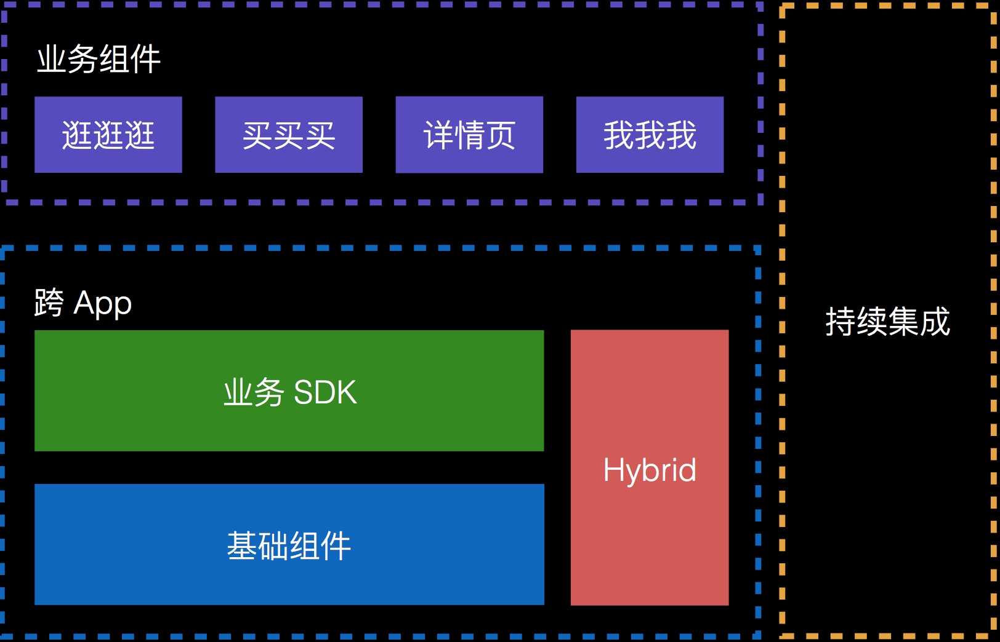

「组件化」顾名思义就是把一个大的 App 拆成一个个小的组件，相互之间不直接引用。那如何做呢？

### 实现方式

#### 组件间通信

以 iOS 为例，由于之前就是采用的 URL 跳转模式，理论上页面之间的跳转只需 open 一个 URL 即可。所以对于一个组件来说，只要定义「支持哪些
URL」即可，比如详情页，大概可以这么做的

    
    
    [MGJRouter registerURLPattern:@"mgj://detail?id=:id" toHandler:^(NSDictionary *routerParameters) {
        NSNumber *id = routerParameters[@"id"];
        // create view controller with id
        // push view controller
    }];
    

首页只需调用 `[MGJRouter openURL:@"mgj://detail?id=404"]` 就可以打开相应的详情页。

那问题又来了，我怎么知道有哪些可用的 URL？为此，我们做了一个后台专门来管理。

然后可以把这些短链生成不同平台所需的文件，iOS 平台生成 .{h,m} 文件，Android 平台生成 .java
文件，并注入到项目中。这样开发人员只需在项目中打开该文件就知道所有的可用 URL 了。

目前还有一块没有做，就是参数这块，虽然描述了短链，但真想要生成完整的 URL，还需要知道如何传参数，这个正在开发中。

还有一种情况会稍微麻烦点，就是「组件A」要调用「组件B」的某个方法，比如在商品详情页要展示购物车的商品数量，就涉及到向购物车组件拿数据。

类似这种同步调用，iOS 之前采用了比较简单的方案，还是依托于 `MGJRouter`，不过添加了新的方法 `\-
(id)objectForURL:`，注册时也使用新的方法进行注册

    
    
    [MGJRouter registerURLPattern:@"mgj://cart/ordercount" toObjectHandler:^id(NSDictionary *routerParamters){
        // do some calculation
        return @42;
    }]
    

使用时 `NSNumber *orderCount = [MGJRouter objectForURL:@"mgj://cart/ordercount"]`
这样就拿到了购物车里的商品数。

稍微复杂但更具通用性的方法是使用「协议」 <-> 「类」绑定的方式，还是以购物车为例，购物车组件可以提供这么个 Protocol

    
    
    @protocol MGJCart <NSObject>
    + (NSInteger)orderCount;
    @end
    

可以看到通过协议可以直接指定返回的数据类型。然后在购物车组件内再新建个类实现这个协议，假设这个类名为`MGJCartImpl`，接着就可以把它与协议关联起来
`[ModuleManager registerClass:MGJCartImpl
forProtocol:@protocol(MGJCart)]`，对于使用方来说，要拿到这个 `MGJCartImpl`，需要调用
`[ModuleManager classForProtocol:@protocol(MGJCart)]`。拿到之后再调用 `\+
(NSInteger)orderCount` 就可以了。

那么，这个协议放在哪里比较合适呢？如果跟组件放在一起，使用时还是要先引入组件，如果有多个这样的组件就会比较麻烦了。所以我们把这些公共的协议统一放到了
`PublicProtocolDomain.h` 下，到时只依赖这一个文件就可以了。

Android 也是采用类似的方式。

#### 组件生命周期管理

理想中的组件可以很方便地集成到主客中，并且有跟 `AppDelegate` 一致的回调方法。这也是 `ModuleManager` 做的事情。

先来看看现在的入口方法

    
    
    - (BOOL)application:(UIApplication *)application didFinishLaunchingWithOptions:(NSDictionary *)launchOptions
    {
        [MGJApp startApp];
        [[ModuleManager sharedInstance] loadModuleFromPlist:[[NSBundle mainBundle] pathForResource:@"modules" ofType:@"plist"]];
        NSArray *modules = [[ModuleManager sharedInstance] allModules];
        for (id<ModuleProtocol> module in modules) {
            if ([module respondsToSelector:_cmd]) {
                [module application:application didFinishLaunchingWithOptions:launchOptions];
            }
        }
        [self trackLaunchTime];
        return YES;
    }
    

其中 `[MGJApp startApp]` 主要负责一些 SDK 的初始化。`[self trackLaunchTime]` 是我们打的一个点，用来监测从
`main` 方法开始到入口方法调用结束花了多长时间。其他的都由 `ModuleManager`
搞定，`loadModuleFromPlist:pathForResource:` 方法会读取 bundle 里的一个 plist
文件，这个文件的内容大概是这样的

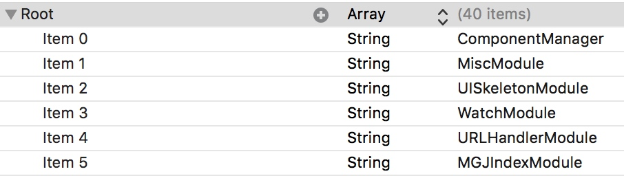

每个 `Module` 都实现了 `ModuleProtocol`，其中有一个 `\-
(BOOL)applicaiton:didFinishLaunchingWithOptions:` 方法，如果实现了的话，就会被调用。

还有一个问题就是，系统的一些事件会有通知，比如 `applicationDidBecomeActive` 会有对应的 `UIApplicationDidBe
comeActiveNotification`，组件如果要做响应的话，只需监听这个系统通知即可。但也有一些事件是没有通知的，比如 `\-
application:didRegisterUserNotificationSettings:`，这时组件如果也要做点事情，怎么办？

一个简单的解决方法是在 `AppDelegate` 的各个方法里，手动调一遍组件的对应的方法，如果有就执行。

    
    
    - (void)application:(UIApplication *)application didRegisterForRemoteNotificationsWithDeviceToken:(NSData *)deviceToken
    {
        NSArray *modules = [[ModuleManager sharedInstance] allModules];
        for (id<ModuleProtocol> module in modules) {
            if ([module respondsToSelector:_cmd]) {
                [module application:application didRegisterForRemoteNotificationsWithDeviceToken:deviceToken];
            }
        }
    }
    

#### 壳工程

既然已经拆出去了，那拆出去的组件总得有个载体，这个载体就是壳工程，壳工程主要包含一些基础组件和业务SDK，这也是主工程包含的一些内容，所以如果在壳工程可以正
常运行的话，到了主工程也没什么问题。不过这里存在版本同步问题，之后会说到。

#### 遇到的问题

##### 组件拆分

由于之前的代码都是在一个工程下的，所以要单独拿出来作为一个组件就会遇到不少问题。首先是组件的划分，当时在定义组件粒度时也花了些时间讨论，究竟是粒度粗点好，还
是细点好。粗点的话比较有利于拆分，细点的话灵活度比较高。最终还是选择粗一点的粒度，先拆出来再说。

假如要把详情页迁出来，就会发现它依赖了一些其他部分的代码，那最快的方式就是直接把代码拷过来，改个名使用。比较简单暴力。说起来比较简单，做的时候也是挺有挑战的
，因为正常的业务并不会因为「组件化」而停止，所以开发同学们需要同时兼顾正常的业务和组件的拆分。

##### 版本管理

我们的组件包括第三方库都是通过 Cocoapods 来管理的，其中组件使用了私有库。之所以选择
Cocoapods，一个是因为它比较方便，还有就是用户基数比较大，且社区也比较活跃（活跃到了会时不时地触发 Github 的 rate
limit，导致长时间 clone 不下来··· [见此](https://github.com/CocoaPods/CocoaPods/issues/49
89#issuecomment-193772935)），当然也有其他的管理方式，比如 submodule /
subtree，在开发人员比较多的情况下，方便、灵活的方案容易占上风，虽然它也有自己的问题。主要有版本同步和更新/编译慢的问题。

假如基础组件做了个 API 接口升级，这个升级会对原有的接口做改动，自然就会升一个中位的版本号，比如原先是 1.6.19，那么现在就变成 1.7.0
了。而我们在 Podfile 里都是用 `~` 指定的，这样就会出现主工程的 pod
版本升上去了，但是壳工程没有同步到，然后群里就会各种反馈编译不过，而且这个编译不过的长尾有时能拖上两三天。

然后我们就想了个办法，如果不在壳工程里指定基础库的版本，只在主工程里指定呢，理论上应该可行，只要不出现某个基础库要同时维护多个版本的情况。但实践中发现，壳工
程有时会莫名其妙地升不上去，在 podfile 里指定最新的版本又可以升上去，所以此路不通。

还有一个问题是 `pod update` 时间过长，经常会在 `Analyzing Dependency` 上卡 10
多分钟，非常影响效率。后来排查下来是跟组件的 Podspec 有关，配置了 subspec，且依赖比较多。

然后就是 pod update 之后的编译，由于是源码编译，所以这块的时间花费也不少，接下去会考虑 framework 的方式。

### 持续集成

在刚开始，持续集成还不是很完善，业务方升级组件，直接把 podspec 扔到 private repo
里就完事了。这样最简单，但也经常会带来编译通不过的问题。而且这种随意的版本升级也不太能保证质量。于是我们就搭建了一套持续集成系统，大概如此

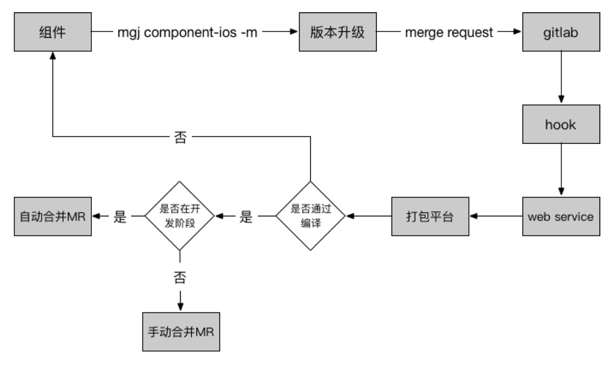

每个组件升级之前都需要先通过编译，然后再决定是否升级。这套体系看起来不复杂，但在实施过程中经常会遇到后端的并发问题，导致业务方要么集成失败，要么要等不少时间
。而且也没有一个地方可以呈现当前版本的组件版本信息。还有就是业务方对于这种命令行的升级方式接受度也不是很高。

基于此，在经过了几轮讨论之后，有了新版的持续集成平台，升级操作通过网页端来完成。

大致思路是，业务方如果要升级组件，假设现在的版本是 0.1.7，添加了一些 feature
之后，壳工程测试通过，想集成到主工程里看看效果，或者其他组件也想引用这个最新的，就可以在后台手动把版本升到 0.1.8-rc.1，这样的话，原先依赖 `~>
0.1.7` 的组件，不会升到 0.1.8，同时想要测试这个组件的话，只要手动把版本调到 0.1.8-rc.1 就可以了。这个过程不会触发 CI
的编译检查。

当测试通过后，就可以把尾部的 `-rc.n` 去掉，然后点击「集成」，就会走 CI 编译检查，通过的话，会在主工程的 podfile 里写上固定的版本号
0.1.8。也就是说，podfile 里所有的组件版本号都是固定的。

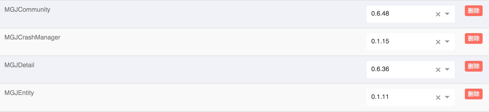

### 周边设施

#### 基础组件及组件的文档 / Demo / 单元测试

无线基础的职能是为集团提供解决方案，只是在蘑菇街 App 里能 work
是远远不够的，所以就需要提供入口，知道有哪些可用组件，并且如何使用，就像这样（目前还未实现）

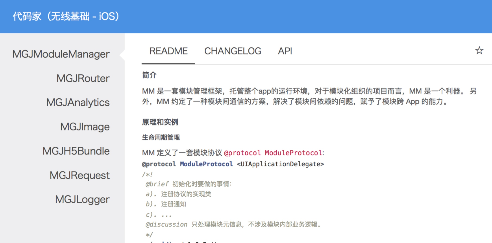

这就要求组件的负责人需要及时地更新 README / CHANGELOG / API，并且当发生 API 变更时，能够快速通知到使用方。

#### 公共 UI 组件

组件化之后还有一个问题就是资源的重复性，以前在一个工程里的时候，资源都可以很方便地拿到，现在独立出去了，也不知道哪些是公用的，哪些是独有的，索性都放到自己的
组件里，这样就会导致包变大。还有一个问题是每个组件可能是不同的产品经理在跟，而他们很可能只关注于自己关心的页面长什么样，而忽略了整体的样式。公共 UI
组件就是用来解决这些问题的，这些组件甚至可以跨 App 使用。（目前还未实现）

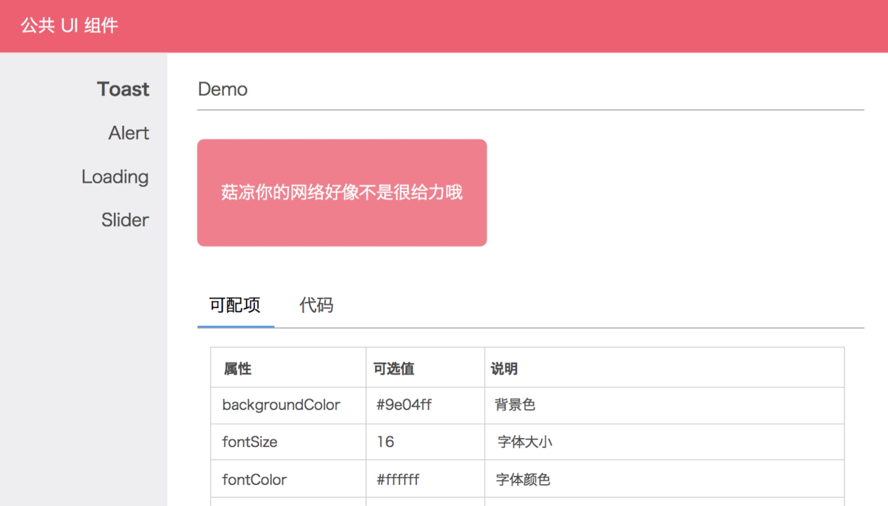

### 小结

「组件化」是 App 膨胀到一定体积后的解决方案，能一定程度上解决问题，在提高开发效率的过程中，采坑是难免的，希望这篇文章能够带来些帮助。

  

####[iOS应用架构谈 组件化方案](http://casatwy.com/iOS-Modulization.html)

前几天的一个晚上在infoQ的微信群里，来自蘑菇街的Limboy做了一个分享，讲了蘑菇街的组件化之路。我不认为这条组件化之路蘑菇街走对了。分享后我私聊了Li
mboy，Limboy似乎也明白了问题所在，我答应他我会把我的方案写成文章，于是这篇文章就出来了。

  

另外，按道理说组件化方案也属于iOS应用架构谈的一部分，但是当初构思架构谈时，我没打算写组件化方案，因为我忘了还有这回事儿。。。后来写到view的时候才想起
来，所以在view的那篇文章最后补了一点内容。而且觉得这个组件化方案太简单，包括实现组件化方案的组件也很简单，代码算上注释也才100行，我就偷懒放过了，毕竟
写一篇文章好累的啊。

  

> 本文的组件化方案demo在这里`[https://github.com/casatwy/CTMediator 拉下来后记得pod install
拉下来后记得pod install 拉下来后记得pod install`](https://github.com/casatwy/CTMediator)，这
个Demo对业务敏感的边界情况处理比较简单，这需要根据不同App的特性和不同产品的需求才能做，所以只是为了说明组件化架构用的。如果要应用在实际场景中的话，可
以根据代码里给出的注释稍加修改，就能用了。

  
  
  

蘑菇街的原文地址在这里：[《蘑菇街 App 的组件化之路》](http://limboy.me/ios/2016/03/10/mgj-
components.html)，没有耐心看完原文的朋友，我在这里简要介绍一下蘑菇街的组件化是怎么做的：

  

  1. App启动时实例化各组件模块，然后这些组件向ModuleManager注册Url，有些时候不需要实例化，使用class注册。
  2. 当组件A需要调用组件B时，向ModuleManager传递URL，参数跟随URL以GET方式传递，类似openURL。然后由ModuleManager负责调度组件B，最后完成任务。

  

> 这里的两步中，每一步都存在问题。

  

第一步的问题在于，在组件化的过程中，注册URL并不是充分必要条件，组件是不需要向组件管理器注册Url的。而且注册了Url之后，会造成不必要的内存常驻，如果只
是注册Class，内存常驻量就小一点，如果是注册实例，内存常驻量就大了。至于蘑菇街注册的是Class还是实例，Limboy分享时没有说，文章里我也没看出来，
也有可能是我看漏了。不过这还并不能算是致命错误，只能算是小缺陷。

  

真正的致命错误在第二步。在iOS领域里，一定是组件化的中间件为openUrl提供服务，而不是openUrl方式为组件化提供服务。

  

什么意思呢？

  

也就是说，一个App的组件化方案一定不是建立在URL上的，openURL的跨App调用是可以建立在组件化方案上的。当然，如果App还没有组件化，openUR
L方式也是可以建立的，就是丑陋一点而已。

  
  

> 为什么这么说？

  

因为组件化方案的实施过程中，需要处理的问题的复杂度，以及拆解、调度业务的过程的复杂度比较大，单纯以openURL的方式是无法胜任让一个App去实施组件化架构
的。如果在给App实施组件化方案的过程中是基于openURL的方案的话，有一个致命缺陷：非常规对象无法参与本地组件间调度。关于`非常规对象`我会在详细讲解组
件化方案时有一个辨析。

  

实际App场景下，如果本地组件间采用GET方式的URL调用，就会产生两个问题：

  

  * `根本无法表达非常规对象`

  

比如你要调用一个图片编辑模块，不能传递UIImage到对应的模块上去的话，这是一个很悲催的事情。
当然，这可以通过给方法新开一个参数，然后传递过去来解决。比如原来是:

  

    
    
    [a openUrl:"http://casa.com/detail?id=123&type=0"];
    

  

同时就也要提供这样的方法：

  

    
    
    [a openUrl:"http://casa.com/detail" params:@{
        @"id":"123",
        @"type":"0",
        @"image":[UIImage imageNamed:@"test"]
    }]
    

  

如果不像上面这么做，复杂参数和非常规参数就无法传递。如果这么做了，那么事实上这就是拆分远程调用和本地调用的入口了，这就变成了我文章中提倡的做法，也是蘑菇街方
案没有做到的地方。

  

另外，在本地调用中使用URL的方式其实是不必要的，如果业务工程师在本地间调度时需要给出URL，那么就不可避免要提供params，在调用时要提供哪些param
s是业务工程师很容易懵逼的地方。。。在文章下半部分给出的demo代码样例已经说明了业务工程师在本地间调用时，是不需要知道URL的，而且demo代码样例也阐释
了如何解决业务工程师遇到传params容易懵逼的问题。

  
  
  

  * `URL注册对于实施组件化方案是完全不必要的，且通过URL注册的方式形成的组件化方案，拓展性和可维护性都会被打折`

  

注册URL的目的其实是一个服务发现的过程，在iOS领域中，服务发现的方式是不需要通过主动注册的，使用runtime就可以了。另外，注册部分的代码的维护是一个
相对麻烦的事情，每一次支持新调用时，都要去维护一次注册列表。如果有调用被弃用了，是经常会忘记删项目的。runtime由于不存在注册过程，那就也不会产生维护的
操作，维护成本就降低了。

由于通过runtime做到了服务的自动发现，拓展调用接口的任务就仅在于各自的模块，任何一次新接口添加，新业务添加，都不必去主工程做操作，十分透明。

  
  
  

## 小总结

  
  

蘑菇街采用了openURL的方式来进行App的组件化是一个错误的做法，使用注册的方式发现服务是一个不必要的做法。而且这方案还有其它问题，随着下文对组件化方案
介绍的展开，相信各位自然心里有数。

  
  
  

# 正确的组件化方案

  

先来看一下方案的架构图

  

    
    
                 --------------------------------------
                 | [CTMediator sharedInstance]        |
                 |                                    |
                 |                openUrl:       <<<<<<<<<  (AppDelegate)  <<<<  Call From Other App With URL
                 |                                    |
                 |                   |                |
                 |                   |                |
                 |                   |/               |
                 |                                    |
                 |                parseUrl            |
                 |                                    |
                 |                   |                |
                 |                   |                |
    .................................|...............................
                 |                   |                |
                 |                   |                |
                 |                   |/               |
                 |                                    |
                 |  performTarget:action:params: <<<<<<<<<<<<<<<<<<<<<<<<<<<<<<  Call From Native Module
                 |                                    |
                 |                   |                |
                 |                   |                |
                 |                   |                |
                 |                   |/               |
                 |                                    |
                 |             -------------          |
                 |             |           |          |
                 |             |  runtime  |          |
                 |             |           |          |
                 |             -------------          |
                 |               .       .            |
                 ---------------.---------.------------
                               .           .
                              .             .
                             .               .
                            .                 .
                           .                   .
                          .                     .
                         .                       .
                        .                         .
    -------------------.-----------      ----------.---------------------
    |                 .           |      |          .                   |
    |                .            |      |           .                  |
    |               .             |      |            .                 |
    |              .              |      |             .                |
    |                             |      |                              |
    |           Target            |      |           Target             |
    |                             |      |                              |
    |         /   |   \           |      |         /   |   \            |
    |        /    |    \          |      |        /    |    \           |
    |                             |      |                              |
    |   Action Action Action ...  |      |   Action Action Action ...   |
    |                             |      |                              |
    |                             |      |                              |
    |                             |      |                              |
    |Business A                   |      | Business B                   |
    -------------------------------      --------------------------------
    

  
  

这幅图是组件化方案的一个简化版架构描述，主要是基于Mediator模式和Target-Action模式，中间采用了runtime来完成调用。这套组件化方案将
远程应用调用和本地应用调用做了拆分，而且是由本地应用调用为远程应用调用提供服务，与蘑菇街方案正好相反。

  
  
  

> 调用方式

  
  

先说本地应用调用，本地组件A在某处调用`[[CTMediator sharedInstance] performTarget:targetName
action:actionName
params:@{...}]`向`CTMediator`发起跨组件调用，`CTMediator`根据获得的target和action信息
，通过objective-C的runtime转化生成target实例以及对应的action选择子，然后最终调用到目标业务提供的逻辑，完成需求。

  

在远程应用调用中，远程应用通过openURL的方式，由iOS系统根据info.plist里的scheme配置找到可以响应URL的应用（在当前我们讨论的上下文
中，这就是你自己的应用），应用通过`AppDelegate`接收到URL之后，调用`CTMediator`的`openUrl:`方法将接收到的URL信息传入
。当然，`CTMediator`也可以用`openUrl:options:`的方式顺便把随之而来的option也接收，这取决于你本地业务执行逻辑时的充要条件
是否包含option数据。传入URL之后，`CTMediator`通过解析URL，将请求路由到对应的target和action，随后的过程就变成了上面说过的
本地应用调用的过程了，最终完成响应。

  

针对请求的路由操作很少会采用本地文件记录路由表的方式，服务端经常处理这种业务，在服务端领域基本上都是通过正则表达式来做路由解析。App中做路由解析可以做得简
单点，制定URL规范就也能完成，最简单的方式就是`scheme://target/action`这种，简单做个字符串处理就能把target和action信息
从URL中提取出来了。

  
  
  

> 组件仅通过Action暴露可调用接口

  

所有组件都通过组件自带的Target-Action来响应，也就是说，模块与模块之间的接口被固化在了Target-
Action这一层，避免了实施组件化的改造过程中，对Business的侵入，同时也提高了组件化接口的可维护性。

  

    
    
                --------------------------------
                |                              |
                |           Business A         |
                |                              |
                ---  ----------  ----------  ---
                  |  |        |  |        |  |
                  |  |        |  |        |  |
       ...........|  |........|  |........|  |...........
       .          |  |        |  |        |  |          .
       .          |  |        |  |        |  |          .
       .        ---  ---    ---  ---    ---  ---        .
       .        |      |    |      |    |      |        .
       .        |action|    |action|    |action|        .
       .        |      |    |      |    |      |        .
       .        ---|----    -----|--    --|-----        .
       .           |             |        |             .
       .           |             |        |             .
       .       ----|------     --|--------|--           .
       .       |         |     |            |           .
       .       |Target_A1|     |  Target_A2 |           .
       .       |         |     |            |           .
       .       -----------     --------------           .
       .                                                .
       .                                                .
       ..................................................
    

  

大家可以看到，虚线圈起来的地方就是用于跨组件调用的target和action，这种方式避免了由BusinessA直接提供组件间调用会增加的复杂度，而且任何组
件如果想要对外提供调用服务，直接挂上target和action就可以了，业务本身在大多数场景下去进行组件化改造时，是基本不用动的。

  
  

> 复杂参数和非常规参数，以及组件化相关设计思路

  

这里我们需要针对术语做一个理解上的统一：

`复杂参数`是指由`普通类型`的数据组成的多层级参数。在本文中，我们定义只要是能够被json解析的类型就都是`普通类型`，包括NSNumber，
NSString， NSArray， NSDictionary，以及相关衍生类型，比如来自系统的NSMutableArray或者你自己定义的都算。

总结一下就是：在本文讨论的场景中，复杂参数的定义是由普通类型组成的具有复杂结构的参数。普通类型的定义就是指能够被json解析的类型。

`非常规参数`是指由`普通类型`以外的类型组成的参数，例如UIImage等这些不能够被json解析的类型。然后这些类型组成的参数在文中就被定义为`非常规参数
`。

总结一下就是：`非常规参数`是包含非常规类型的参数。`非常规类型`的定义就是不能被json解析的类型都叫非常规类型。

  
  

边界情况：

  

  * 假设多层级参数中有存在任何一个内容是非常规参数，本文中这种参数就也被认为是非常规参数。

  
  

  * 如果某个类型当前不能够被json解析，但通过某种转化方式能够转化成json，那么这种类型在场景上下文中，我们也称为普通类型。

  

举个例子就是通过json描述的自定义view。如果这个view能够通过某个组件被转化成json，那么即使这个view本身并不是普通类型，在具有转化器的上下文
场景中，我们依旧认为它是普通类型。

  
  

  * 如果上下文场景中没有转化器，这个view就是非常规类型了。

  
  

  * 假设转化出的json不能够被还原成view，比如组件A有转化器，组件B中没有转化器，因此在组件间调用过程中json在B组件里不能被还原成view。在这种调用方向中，只要调用者能将非常规类型转化成json的，我们就依然认为这个view是普通类型。如果调用者是组件A，转化器在组件B中，A传递view参数时是没办法转化成json的，那么这个view就被认为是非常规类型，哪怕它在组件B中能够被转化成json。

  
  
  

> 然后我来解释一下为什么应该由本地组件间调用来支持远程应用调用：

  

在远程App调用时，远程App是不可能通过URL来提供非常规参数的，最多只能以json string的方式经过URLEncode之后再通过GET来提供复杂参
数，然后再在本地组件中解析json，最终完成调用。在组件间调用时，通过`performTarget:action:params:`是能够提供非常规参数的，于
是我们可以知道，`远程App调用`时的上下文环境以及功能`是本地组件间调用`时上下文环境以及功能`的子集`。

  

因此这个逻辑注定了必须由本地组件间调用来为远程App调用来提供服务，只有符合这个逻辑的设计思路才是正确的组件化方案的设计思路，其他跟这个不一致的思路一定就是
错的。因为逻辑上子集为父集提供服务说不通，所以强行这么做的话，用一个成语来总结就叫做倒行逆施。

  

另外，远程App调用和本地组件间调用必须要拆分开，远程App调用只能走`CTMediator`提供的专用远程的方法，本地组件间调用只能走`CTMediato
r`提供的专用本地的方法，两者不能通过同一个接口来调用。

这里有两个原因：

  

  * 远程App调用处理入参的过程比本地多了一个URL解析的过程，这是远程App调用特有的过程。这一点我前面说过，这里我就不细说了。

  * 架构师没有充要条件条件可以认为远程App调用对于无响应请求的处理方式和本地组件间调用无响应请求的处理方式在未来产品的演进过程中是一致的

  

在远程App调用中，用户通过url进入app，当app无法为这个url提供服务时，常见的办法是展示一个所谓的404界面，告诉用户"当前没有相对应的内容，不过
你可以在app里别的地方再逛逛"。这个场景多见于用户使用的App版本不一致。比如有一个URL只有1.1版本的app能完整响应，1.0版本的app虽然能被唤起
，但是无法完成整个响应过程，那么1.0的app就要展示一个404了。

  
  
  
  

在组件间调用中，如果遇到了无法响应的请求，就要分两种场景考虑了。

  
  

> 场景1

  
如果这种无法响应的请求发生场景是在开发过程中，比如两个组件同时在开发，组件A调用组件B时，组件B还处于旧版本没有发布新版本，因此响应不了，那么这时候的处理方
式可以相对随意，只要能体现B模块是旧版本就行了，最后在RC阶段统测时是一定能够发现的，只要App没发版，怎么处理都来得及。

  
  

> 场景2

  
如果这种无法响应的请求发生场景是在已发布的App中，有可能展示个404就结束了，那这就跟远程App调用时的404处理场景一样。但也有可能需要为此做一些额外的
事情，有可能因为做了额外的事情，就不展示404了，展示别的页面了，这一切取决于产品经理。

  
  

`那么这种场景是如何发生的呢？`

  
  

我举一个例子：当用户在1.0版本时收藏了一个东西，然后用户升级App到1.1版本。1.0版本的收藏项目在本地持久层存入的数据有可能是会跟1.1版本收藏时存入
的数据是不一致的。此时用户在1.1版本的app中对1.0版本收藏的东西做了一些操作，触发了本地组件间调用，这个本地间调用又与收藏项目本身的数据相关，那么这时
这个调用就是有可能变成无响应调用，此时的处理方式就不见得跟以前一样展示个404页面就结束了，因为用户已经看到了收藏了的东西，结果你还告诉他找不到，用户立刻懵
逼。。。这时候的处理方式就会用很多种，至于产品经理会选择哪种，你作为架构师是没有办法预测的。如果产品经理提的需求落实到架构上，对调用入口产生要求然而你的架构
又没有拆分调用入口，对于你的选择就只有两个：要么打回产品需求，要么加个班去拆分调用入口。

  

当然，架构师可以选择打回产品经理的需求，最终挑选一个自己的架构能够承载的需求。但是，如果这种是因为你早期设计架构时挖的坑而打回的产品需求，你不觉得丢脸么？

  

>
鉴于远程app调用和本地组件间调用下的无响应请求处理方式不同，以及未来不可知的产品演进，拆分远程app调用入口和本地组件间调用入口是功在当代利在千秋的事情。

  
  
  

* * *

  
  
  

> 组件化方案中的去model设计

  
  

组件间调用时，是需要针对参数做去model化的。如果组件间调用不对参数做去model化的设计，就会导致`业务形式上被组件化了，实质上依然没有被独立`。

  

假设模块A和模块B之间采用model化的方案去调用，那么调用方法时传递的参数就会是一个对象。

  

如果对象不是一个面向接口的通用对象，那么mediator的参数处理就会非常复杂，因为要区分不同的对象类型。如果mediator不处理参数，直接将对象以范型的
方式转交给模块B，那么模块B必然要包含对象类型的声明。假设对象声明放在模块A，那么B和A之间的组件化只是个形式主义。如果对象类型声明放在mediator，那
么对于B而言，就不得不依赖mediator。但是，大家可以从上面的架构图中看到，对于响应请求的模块而言，依赖mediator并不是必要条件，因此这种依赖是完
全不需要的，这种依赖的存在对于架构整体而言，是一种污染。

  
  
  

如果参数是一个面向接口的对象，那么mediator对于这种参数的处理其实就没必要了，更多的是直接转给响应方的模块。而且接口的定义就不可能放在发起方的模块中了
，只能放在mediator中。响应方如果要完成响应，就也必须要依赖mediator，然而前面我已经说过，响应方对于mediator的依赖是不必要的，因此参数
其实也并不适合以面向接口的对象的方式去传递。

  
  
  

`因此，使用对象化的参数无论是否面向接口，带来的结果就是业务模块形式上是被组件化了，但实质上依然没有被独立。`

  
  
  

在这种跨模块场景中，参数最好还是以去model化的方式去传递，在iOS的开发中，就是以字典的方式去传递。这样就能够做到只有调用方依赖mediator，而响应
方不需要依赖mediator。然而在去model化的实践中，由于这种方式自由度太大，我们至少需要保证调用方生成的参数能够被响应方理解，然而在组件化场景中，限
制去model化方案的自由度的手段，相比于网络层和持久层更加容易得多。

  

因为组件化天然具备了限制手段：参数不对就无法调用！无法调用时直接debug就能很快找到原因。所以接下来要解决的去model化方案的另一个问题就是：如何提高开
发效率。

  

在去model的组件化方案中，影响效率的点有两个：调用方如何知道接收方需要哪些key的参数？调用方如何知道有哪些target可以被调用？其实后面的那个问题不
管是不是去model的方案，都会遇到。为什么放在一起说，因为我接下来要说的解决方案可以把这两个问题一起解决。

  
  
  

> 解决方案就是使用category

  

mediator这个repo维护了若干个针对mediator的category，每一个对应一个target，每个category里的方法对应了这个targe
t下所有可能的调用场景，这样调用者在包含mediator的时候，自动获得了所有可用的target-
action，无论是调用还是参数传递，都非常方便。接下来我要解释一下为什么是category而不是其他：

  

  * category本身就是一种组合模式，根据不同的分类提供不同的方法，此时每一个组件就是一个分类，因此把每个组件可以支持的调用用category封装是很合理的。

  * 在category的方法中可以做到参数的验证，在架构中对于保证参数安全是很有必要的。当参数不对时，category就提供了补救的入口。

  * category可以很轻松地做请求转发，如果不采用category，请求转发逻辑就非常难做了。

  * category统一了所有的组件间调用入口，因此无论是在调试还是源码阅读上，都为工程师提供了极大的方便。

  * 由于category统一了所有的调用入口，使得在跨模块调用时，对于param的hardcode在整个App中的作用域仅存在于category中，在这种场景下的hardcode就已经变成和调用宏或者调用声明没有任何区别了，因此是可以接受的。

  

这里是业务方使用category调用时的场景，大家可以看到非常方便，不用去记URL也不用纠结到底应该传哪些参数。

  

    
    
        if (indexPath.row == 0) {
            UIViewController *viewController = [[CTMediator sharedInstance] CTMediator_viewControllerForDetail];
            // 获得view controller之后，在这种场景下，到底push还是present，其实是要由使用者决定的，mediator只要给出view controller的实例就好了
            [self presentViewController:viewController animated:YES completion:nil];
        }
        if (indexPath.row == 1) {
            UIViewController *viewController = [[CTMediator sharedInstance] CTMediator_viewControllerForDetail];
            [self.navigationController pushViewController:viewController animated:YES];
        }
        if (indexPath.row == 2) {
            // 这种场景下，很明显是需要被present的，所以不必返回实例，mediator直接present了
            [[CTMediator sharedInstance] CTMediator_presentImage:[UIImage imageNamed:@"image"]];
        }
        if (indexPath.row == 3) {
            // 这种场景下，参数有问题，因此需要在流程中做好处理
            [[CTMediator sharedInstance] CTMediator_presentImage:nil];
        }
        if (indexPath.row == 4) {
            [[CTMediator sharedInstance] CTMediator_showAlertWithMessage:@"casa" cancelAction:nil confirmAction:^(NSDictionary *info) {
                // 做你想做的事
                NSLog(@"%@", info);
            }];
        }
    

  

本文对应的[demo](https://github.com/casatwy/CTMediator)展示了如何使用category来实现去model的组件调
用。上面的代码片段也是摘自这个demo。

  
  
  

* * *

  
  
  

# 基于其他考虑还要再做的一些额外措施

  
  

> 基于安全考虑

  

我们需要防止黑客通过URL的方式调用本属于native的组件，比如支付宝的个人财产页面。如果在调用层级上没有区分好，没有做好安全措施，黑客就有通过safar
i查看任何人的个人财产的可能。

  

安全措施其实有很多，大部分取决于App本身以及产品的要求。在架构层面要做的最基础的一点就是区分调用是来自于远程App还是本地组件，我在demo中的安全措施是
采用给action添加`native`前缀去做的，凡是带有native前缀的就都只允许本地组件调用，如果在url阶段发现调用了前缀为native的方法，那就
可以采取响应措施了。这也是将远程app调用入口和本地组件调用入口区分开来的重要原因之一。

当然，为了确保安全的做法有很多，但只要拆出远程调用和本地调用，各种做法就都有施展的空间了。

  
  

> 基于动态调度考虑

  

动态调度的意思就是，今天我可能这个跳转是要展示A页面，但是明天可能同样的跳转就要去展示B页面了。这个跳转有可能是来自于本地组件间跳转也有可能是来自于远程ap
p。

  

做这个事情的切点在本文架构中，有很多个：

  

  1. 以url parse为切点
  2. 以实例化target时为切点
  3. 以category调度方法为切点
  4. 以target下的action为切点

  

如果`以url parse为切点`的话，那么这个动态调度就只能够对远程App跳转产生影响，失去了动态调度本地跳转的能力，因此是不适合的。

  

如果`以实例化target时为切点`的话，就需要在代码中针对所有target都做一次审查，看是否要被调度，这是没必要的。假设10个调用请求中，只有1个要被动
态调度，那么就必须要审查10次，只有那1次审查通过了，才走动态调度，这是一种相对比较粗暴的方法。

  

如果`以category调度方法为切点`的话，那动态调度就只能影响到本地件组件的跳转，因为category是只有本地才用的，所以也不适合。

  

`以target下的action为切点`是最适合的，因为动态调度在一般场景下都是有范围的，大多数是活动页需要动态调度，今天这个活动明天那个活动，或者今天活动
正在进行明天活动就结束了，所以产生动态调度的需求。我们在可能产生动态调度的action中审查当前action是否需要被动态调度，在常规调度中就没必要审查了，
例如个人主页的跳转，商品详情的跳转等，这样效率就能比较高。

  

大家会发现，如果要做类似这种效率更高的动态调度，target-action层被抽象出来就是必不可少的，然而蘑菇街并没有抽象出target-
action层，这也是其中的一个问题。

  

当然，如果你的产品要求所有页面都是存在动态调度需求的，那就还是以`实例化target时为切点`去调度了，这样能做到审查每一次调度请求，从而实现动态调度。

  
  

说完了调度切点，接下来要说的就是如何完成审查流程。完整的审查流程有几种，我每个都列举一下：

  

  1. App启动时下载调度列表，或者定期下载调度列表。然后审查时检查当前action是否存在要被动态调度跳转的action，如果存在，则跳转到另一个action
  2. 每一次到达新的action时，以action为参数调用API获知是否需要被跳转，如果需要被跳转，则API告知要跳转的action，然后再跳转到API指定的action

  

这两种做法其实都可以，如果产品对即时性的要求比较高，那么采用第二种方案，如果产品对即时性要求不那么高，第一种方案就可以了。由于本文的方案是没有URL注册列表
的，因此服务器只要给出原始target-action和对应跳转的target-
action就可以了，整个流程不是只有注册URL列表才能达成的，而且这种方案比注册URL列表要更易于维护一些。

  

另外，说采用url rewrite的手段来进行动态调度，也不是不可以。但是这里我需要辨析的是，URL的必要性仅仅体现在远程App调度中，是没必要蔓延到本地组
件间调用的。这样，当我们做远程App的URL路由时（目前的demo没有提供URL路由功能，但是提供了URL路由操作的接入点，可以根据业务需求插入这个功能），
要关心的事情就能少很多，可以比较干净。在这种场景下，单纯以URL rewrite的方式其实就与上文提到的`以url parse为切点`没有区别了。

  
  
  

# 相比之下，蘑菇街的组件化方案有以下缺陷

  
  

  * 蘑菇街没有拆分远程调用和本地间调用

不拆分远程调用和本地间调用，就使得后续很多手段难以实施，这个我在前文中都已经有论述了。另外再补充一下，这里的拆分不是针对来源做拆分。比如通过URL来区分是远
程App调用还是本地调用，这只是区分了调用者的来源。

  

这里说的区分是指：远程调用走远程调用路径，也就是`openUrl`->`urlParse`->`perform`->`target-
action`。本地组件间调用就走本地组件间调用路径：`perform`->`target-
action`。这两个是一定要作区分的，蘑菇街方案并没有对此做好区分。

  
  

  * 蘑菇街以远程调用的方式为本地间调用提供服务

这是本末倒置的做法，倒行逆施导致的是未来架构难以为业务发展提供支撑。因为前面已经论述过，在iOS场景下，远程调用的实现是本地调用实现的子集，只有大的为小提供
服务，也就是本地调用为远程调用提供服务，如果反过来就是倒行逆施了。

  
  

  * 蘑菇街的本地间调用无法传递非常规参数，复杂参数的传递方式非常丑陋

注意这里`复杂参数`和`非常规参数`的辨析。

  

由于采用远程调用的方式执行本地调用，在前面已经论述过两者功能集的关系，因此这种做法无法满足传递非常规参数的需求。而且如果基于这种方式不变的话，复杂参数的传递
也只能依靠经过urlencode的json string进行，这种方式非常丑陋，而且也不便于调试。

  
  

  * 蘑菇街必须要在app启动时注册URL响应者

这个条件在组件化方案中是不必要条件，demo也已经证实了这一点。这个不必要的操作会导致不必要的维护成本，如果单纯从`只要完成业务就好`的角度出发，这倒不是什
么大问题。这就看架构师对自己是不是要求严格了。

  
  

  * 新增组件化的调用路径时，蘑菇街的操作相对复杂

在本文给出的组件化方案中，响应者唯一要做的事情就是提供Target和Action，并不需要再做其它的事情。蘑菇街除此之外还要再做很多额外不必要措施，才能保证
调用成功。

  
  

  * 蘑菇街没有针对target层做封装

这种做法使得所有的跨组件调用请求直接hit到业务模块，业务模块必然因此变得臃肿难以维护，属于侵入式架构。应该将原本属于调用相应的部分拿出来放在target-
action中，才能尽可能保证不将无关代码侵入到原有业务组件中，才能保证业务组件未来的迁移和修改不受组件调用的影响，以及降低为项目的组件化实施而带来的时间成
本。

  
  
  

# 总结

  
  

本文提供的组件化方案是采用Mediator模式和苹果体系下的Target-Action模式设计的。

  

然而这款方案有一个很小的缺陷在于对param的key的hardcode，这是为了达到最大限度的解耦和灵活度而做的权衡。在我的网络层架构和持久层架构中，都没有
hardcode的场景，这也从另一个侧面说明了组件化架构的特殊性。

  

权衡时，考虑到这部分hardcode的影响域`仅仅存在于mediator的category中`。在这种情况下，hardcode对于调用者的调用是完全透明的。
对于响应者而言，处理方式等价于对API返回的参数的处理方式，且响应者的处理方式也被`限制在了Action中`。

  

因此这部分的hardcode的存在虽然确实有点不干净，但是相比于这些不干净而带来的其他好处而言，在权衡时是可以接受的，如果不采用hardcode，那势必就会
导致请求响应方`也需要依赖mediator`，然而这在逻辑上是`不必要`的。另外，在我的各个项目的实际使用过程中，这部分hardcode是没有影响的。

  

另外要谈的是，之所以会在组件化方案中出现harcode，而网络层和持久层的去model化都没有发生hardcode情况，是因为组件化调用的所有接受者和调用者
都在同一片上下文里。网络层有一方在服务端，持久层有一方在数据库。再加上设计时针对hardcode部分的改进手段其实已经超出了语言本身的限制。也就是说，har
code受限于语言本身。objective-C也好，swift也好，它们的接口设计哲学是存在缺陷的。如果我们假设在golang的背景下，是完全可以用gola
ng的接口体系去做一个最优美的架构方案出来的。不过这已经不属于本文的讨论范围了，有兴趣的同学可以去了解一下相关知识。架构设计有时就是这么无奈。

  

组件化方案在App业务稳定，且规模（业务规模和开发团队规模）增长初期去实施非常重要，它助于将复杂App分而治之，也有助于多人大型团队的协同开发。但`组件化方
案`不适合在业务不稳定的情况下过早实施，至少要等产品已经经过MVP阶段时才适合实施组件化。因为业务不稳定意味着链路不稳定，在不稳定的链路上实施组件化会导致将
来主业务产生变化时，全局性模块调度和重构会变得相对复杂。

当决定要实施组件化方案时，对于组件化方案的架构设计优劣直接影响到架构体系能否长远地支持未来业务的发展，对App的组件化`不只是仅仅的拆代码和跨业务调页面`，
还要考虑复杂和非常规业务参数参与的调度，非页面的跨组件功能调度，组件调度安全保障，组件间解耦，新旧业务的调用接口修改等问题。

  

蘑菇街的组件化方案只实现了跨业务页面调用的需求，本质上只实现了我在view层架构的文章中跨业务页面调用的内容，这还没有到成为`组件化方案`的程度，且蘑菇街的
组件化方案距离真正的App组件化的要求还是差了一段距离的，且存在设计逻辑缺陷，希望蘑菇街能够加紧重构，打造真正的组件化方案。

  
  
  

# 2016-03-14 20:26 补

  

没想到limboy如此迅速地发文回应了。文章地址在这里：[蘑菇街 App 的组件化之路 续](http://limboy.me/ios/2016/03/14
/mgj-components-
continued.html)。然后我花了一些时间重新看了limboy的[第一篇文章](http://limboy.me/ios/2016/03/10
/mgj-components.html)。我觉得在本文开头我对蘑菇街的组件化方案描述过于简略了，而且我还忽略了原来是有`ModuleManager`的，所
以在这里我重新描述一番。

  
  

## 蘑菇街是以两种方式来做跨组件操作的

  

> 第一种是通过`MGJRouter`的`registerURLPattern:toHandler:`进行注册，将URL和block绑定。这个方法前面一个参
数传递的是URL，例如`mgj://detail?id=:id`这种，后面的`toHandler:`传递的是一个`^(NSDictionary
*routerParameters){// 此处可以做任何事}`的block。

  

当组件执行`[MGJRouter openURL:@"mgj://detail?id=404"]`时，根据之前`registerURLPattern:toH
andler:`的信息，找到之前通过`toHandler:`收集的block，然后将URL中带的GET参数，此处是`id=404`，传入block中执行。如
果在block中执行`NSLog(routerParameters)`的话，就会看到`@{@"id":@"404"}`，因此block中的业务就能够得到执行
。

  

然后为了业务方能够不生写URL，蘑菇街列出了一系列宏或者字符串常量（具体是宏还是字符串我就不是很确定，没看过源码，但limboy文章中有提到通过一个后台系统
生成一个装满URL的源码文件）来表征URL。在`openURL`时，无论是远程应用调用还是本地组件间调用，只要传递的参数不复杂，就都会采用`openURL`
的方式去唤起页面，因为复杂的参数和非常规参数这种调用方式就无法支持了。

  

缺陷在于：这种注册的方式其实是不必要的，而且还白白使用`URL`和`block`占用了内存。另外还有一个问题就是，即便是简单参数的传递，如果参数比较多，业务
工程师不看原始URL字符串是无法知道要传递哪些参数的。

  

蘑菇街之所以采用`id=:id`的方式，我猜是为了怕业务工程师传递多个参数顺序不同会导致问题，而使用的占位符。这种做法在持久层生成sql字符串时比较常见。不
过这个功能我没在limboy的文章中看到有写，不知道实现了没有。

  

在本文提供的组件化方案中，因为没有注册，所以就没有内存的问题。因为通过category提供接口调用，就没有参数的问题。对于蘑菇街来说，这种做法其实并没有做到
拆分远程应用调用和本地组件间调用的目的，而不拆分会导致的问题我在文章中已经论述过了，这里就不多说了。

  

* * *

  

> 由于前面openURL的方式不能够传递非常规参数，因此有了第二种注册方式：新开了一个对象叫做`ModuleManager`，提供了一个`register
Class:forProtocol:`的方法，在应用启动时，各组件都会有一个专门的`ModuleEntry`被唤起，然后`ModuleEntry`将`@pr
otocol`和`Class`进行配对。因此`ModuleManager`中就有了一个字典来记录这个配对。

  

当有涉及非常规参数的调用时，业务方就不会去使用`[MGJRouter openURL:@"mgj://detail?id=404"]`的方案了，转而采用`M
oduleManager`的`classForProtocol:`方法。业务传入一个`@protocol`给`ModuleManager`，然后`Modul
eManager`通过之前注册过的字典查找到对应的`Class`返回给业务方，然后业务方再自己执行`alloc`和`init`方法得到一个符合刚才传入`@p
rotocol`的对象，然后再执行相应的逻辑。

  

这里的`ModuleManager`其实跟之前的`MGJRouter`一样，是没有任何必要去注册协议和类名的。而且无论是服务提供者调用`registerCl
ass:forProtocol:`也好，服务的调用者调用`classForProtocol:`，都必须依赖于同一个protocol。蘑菇街把所有的proto
col放入了一个publicProtocol.h的文件中，因此调用方和响应方都必须依赖于同一个文件。这个我在文章中也论述过：响应方在提供服务的时候，是不需要
依赖任何人的。

  

* * *

  
  

##所以针对蘑菇街的[这篇文章](http://limboy.me/ios/2016/03/14/mgj-components-continued.html)我是这么回应的：

  

  * 蘑菇街所谓分开了远程应用调用和本地组件调用是不成立的，蘑菇街分开的只是`普通参数调用`和`非常规参数调用`。不去区分远程应用调用和本地组件间调用的缺陷我在文中已经论述过了，这里不多说。

  

  * 蘑菇街确实不只有`openURL`方式，还提供了`ModuleManager`方式，然而所谓的`我们其实是分为「组件间调用」和「页面间跳转」两个维度，只要 app 响应某个 URL，无论是 app 内还是 app 外都可以，而「组件间」调用走的完全是另一条路，所以也不会有安全上的问题。`其实也是不成立的，因为`openURL`方式也出现在了本地组件间调用中，这在他第一篇文章里的`组件间通信`小节中就已经说了采用`openURL`方式调用了，这是有可能产生安全问题的。而且这段话也承认了`openURL`方式被用于本地组件间调用，又印证了我刚才说的第一点。

  

  * 根据上面两点，蘑菇街在`openURL`场景下，还是出现了`以远程调用的方式为本地间调用提供服务`的问题，这个问题我也已经在文中论述过了。

  

  * 蘑菇街在本地间调用同时采用了`openURL`方案和`protocol - class`方案，所以其实之前我指出蘑菇街本地间调用不能传递非常规参数和复杂参数是`不对的`，应该是蘑菇街在本地间调用时如果是普通参数，那就采用`openURL`，如果是非常规参数，那就采用`protocol - class`了，这个做法对于本地间调用的管理和维护，显而易见是不利的。。。

  

  * limboy说`必须要在 app 启动时注册 URL 响应者`这步不可避免，但没有说原因。我的demo已经证实了注册是不必要的，所以我想听听limboy如何解释原因。

  
  

  * 你的架构图画错了

  

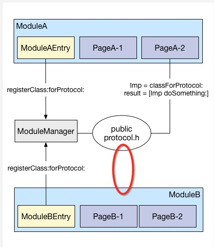

  

按照你的方案来看，`红圈的地方是不可能没有依赖的。。。`

  
  
  

##另外，limboy也对本文方案提出了一些看法：

  
  

> 认为`category`在某种意义上也是一个注册过程。

  

蘑菇街的注册和我这里的category其实是两回事，而且我无论如何也无法理解把category和注册URL等价联系的逻辑😂

  

一个很简单的事实就可以证明两者完全不等价了：我的方案如果没有category，照样可以跑，就是业务方调用丑陋一点。蘑菇街如果不注册URL，整个流程就跑不起来
了～

  
  
  

> 认为openURL的好处是`可以更少地关心业务逻辑`，本文方案的好处是`可以很方便地完成参数传递。`

  

我没觉得本文方案关心的业务逻辑比`openURL`更多，因为两者比较起来，都是传参数发调用请求，在`关心业务逻辑`的条件下，两者完全一样。唯一的不同就是，我
能传非常规参数而`openURL`不能。本文方案的整个过程中，在调用者这一方是完全没有涉及到任何属于响应者的业务逻辑的。

  
  
  

> 认为`protocol/URL注册`和`将target-action抽象出调用接口`是等价的

  

这其实只是效果等价了，两者真正的区别在于：protocol对业务产生了侵入，且不符合黑盒模型。

  
  

  * 我来解释一下protocol侵入业务的原因

  

由于业务中的某个对象需要被调用，因此必须要符合某个可被调用的protocol，然而这个protocol又不存在于当前业务领域，于是当前业务就不得不依赖pub
licProtocol。这对于将来的业务迁移是有非常大的影响的。

  
  
  

  * 另外再解释一下为什么不符合黑盒模型

  

蘑菇街的protocol方式使对象要在调用者处使用，由于调用者并不包含对象原本所处的业务领域，当完成任务需要多个这样的对象的时候，就需要多次通过protoc
ol获得class来实例化多个对象，最终才能完成需求。

  

但是`target-action`模式保证了在执行组件间调用的响应时，执行的上下文处于响应者环境中，这跟蘑菇街的protocol方案相比就是最大的差别。因为
从黑盒理论上讲，调用者只管发起请求，请求的执行应该由响应者来负责，因此执行逻辑必须存在于响应者的上下文内，而不能存在于调用者的上下文内。

  

举个具体一点的例子就是，当你发起了一个网页请求，后端取好数据渲染好页面，无论获取数据涉及多少渠道，获取数据的逻辑都在服务端完成，然后再返回给浏览器展示。这个
是正确的做法，target-action模式也是这么做的。

  

但是蘑菇街的方案就变成了这样：你发起了一个网络请求，后端返回的不是数据，返回的竟然是一个数据获取对象(DAO)，然后你再通过DAO去取数据，去渲染页面，如果
渲染页面的过程涉及多个DAO，那么你还要再发起更多请求，拿到的还是DAO，然后再拿这个DAO去获取数据，然后渲染页面。这是一种非常诡异的做法。。。

  

如果说这么做是为了应对执行业务的过程中，需要根据中间阶段的返回值来决定接下来的逻辑走向的话，那也应该是多次调用获得数据，然后决定接下来的业务走向，而不是每次
拿到的都是DAO啊。。。使用target-action方式来应对这种场景其实也很自然啊～

  
> 所以综上所述，蘑菇街的方案是存在很大问题的，希望蘑菇街继续改正

  
  

####[蘑菇街 App 的组件化之路·续](http://limboy.me/ios/2016/03/14/mgj-components-continued.html)

前几天在「移动学习分享群」分享了关于蘑菇街组件化方面的一点经验，由于时间和文字描述方面的限制，很多东西表述的不是很清楚，让一些同学产生了疑惑，casatwy
老师也写了篇[文章](http://casatwy.com/iOS-Modulization.html)来纠正其中的一些实现，看完之后确实有不少启发。

#### 统一的调用实现

将「URL 调用」和「组件间调用」通过 runtime 达到统一，通过 prefix 的方式来避免安全上的一些漏洞。看起来确实会舒服些，也比较灵活。

#### 通过 Category 来统一组件对外暴露的接口

支持 `openURL:` 但最终还是走的 target-action，跟内部调用无差别。 这也是我们目前有待提升的点，想知道某个组件支持哪些 URL 或
哪些 Protocol 不够方便，URL 的参数传递也是个问题，将来 URL 发生变动的话，调整起来也比较麻烦。后续会在这块再加强下。

当初决定使用 `openURL:`
来做页面间的跳转，而不是方法调用，主要是考虑到我们的大部分场景都可以通过这种方式解决，因此就这么定了。`openURL:` 更像 Android 里的
「隐式 Intent」，不关心谁来处理这个 URL，由系统（MGJRouter）来决定。而方法调用更像「显式 Intent」或者
RPC，明确地知道应该由谁来处理。前者的好处是可以更少地关心业务逻辑，后者的好处是可以很方便地完成参数传递。

### 更明确的表述

  1. `openURL` 只是页面间的调用方式
  2. 组件间的调用通过 protocol 来实现

每个组件都有一个 `Entry`，这个 `Entry`，主要做了三件事

  * 注册这个组件关心的 URL
  * 注册这个组件能够被调用的方法/属性
  * 在 App 生命周期的不同阶段做不同的响应

#### 注册这个组件关心的 URL

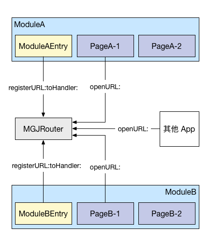

    
    
    [MGJRouter registerURLPattern:@"mgj://detail?id=:id" toHandler:^(NSDictionary *routerParameters) {
        NSNumber *id = routerParameters[@"id"];
        // create view controller with id
        // push view controller
    }];
    

URL 的注册会有对应的 block，拿到这个 URL 后，想怎么折腾就怎么折腾。

#### 注册这个组件能够被调用的方法/属性

当有一些场景不适合用 URL 的方式时，就可以通过注册 protocol 来实现

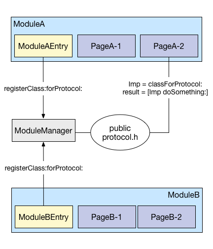

`[ModuleManager registerClass:ClassA forProtocol:ProtocolA]` 的结果就是在 MM 内部维护的
dict 里新加了一个映射关系。

`[ModuleManager classForProtocol:ProtocolA]` 的返回结果就是之前在 MM 内部 dict 里 protocol
对应的 class，使用方不需要关心这个 class 是个什么东东，反正实现了 `ProtocolA` 协议，拿来用就行。

这里需要有一个公共的地方来容纳这些 public protocl，也就是图中的 `PublicProtocl.h`

#### 在 App 生命周期的不同阶段做不同的响应

上一篇文章中有提到，这里简单说下，`ModuleEntry`，实现某个特定的协议(该协议继承自 `UIApplicationDelegate`
)，然后实现对应的方法即可。

### 针对casatwy那篇文章的一些回应

> 单纯以openURL的方式是无法胜任让一个App去实施组件化架构的

 同意，所以我们并不只有 `openURL` 一种方式

> 根本无法表达非常规对象

 单纯地通过 `openURL` 确实不太好表达，但我们并不只有 `openURL` 一种方式

> 注册URL的目的其实是一个服务发现的过程，在iOS领域中，服务发现的方式是不需要通过主动注册的，使用runtime就可以了。另外，注册部分的代码的维护是
一个相对麻烦的事情，每一次支持新调用时，都要去维护一次注册列表。如果有调用被弃用了，是经常会忘记删项目的。runtime由于不存在注册过程，那就也不会产生维
护的操作，维护成本就降低了。

>

> 由于通过runtime做到了服务的自动发现，拓展调用接口的任务就仅在于各自的模块，任何一次新接口添加，新业务添加，都不必去主工程做操作，十分透明。

 尽管通过 runtime 可以做到这些，但最终还是要通过维护 `Category` 来暴露新增的 Target-Action，所以
runtime 虽然不存在注册过程，但实际使用过程中，还是会有注册过程，还是需要去维护。

> 没有拆分远程调用和本地间调用

 从上面的图可以看到，我们其实是分为「组件间调用」和「页面间跳转」两个维度，只要 app 响应某个 URL，无论是 app 内还是 app
外都可以，而「组件间」调用走的完全是另一条路，所以也不会有安全上的问题。

> 以远程调用的方式为本地间调用提供服务

 同上

> 本地间调用无法传递非常规参数，复杂参数的传递方式非常丑陋

 同上，使用 Protocol

> 必须要在 app 启动时注册 URL 响应者

 是的，就蘑菇街的方案来说，这步不可避免。

> 这个不必要的操作会导致不必要的维护成本

 维护只是在组件内部做调整，并不需要在主工程里做修改。如果采用 Category
的方式，好处是不用在启动时注册，但当组件的接口有变动时，依然要维护 Category，这个成本是免不了的。

> 新增组件化的调用路径时，蘑菇街的操作相对复杂 在本文给出的组件化方案中，响应者唯一要做的事情就是提供Target和Action，并不需要再做其它的事情

 提供了 Target-Action 之后，还是要在 Category 里添加一个 wrapper 的吧?

> 没有针对 target 层做封装 这种做法使得所有的跨组件调用请求直接hit到业务模块，业务模块必然因此变得臃肿难以维护，属于侵入式架构
。应该将原本属于调用相应的部分拿出来放在target-action中，才能尽可能保证不将无关代码侵入到原有业务组件中，才能保证业务组件未来的迁移和修改不受组
件调用的影响，以及降低为项目的组件化实施而带来的时间成本。

「将原本属于调用相应的部分拿出来放在target-action中」并不是唯一可行的方式，使用 Protocol/URL 注册也可以达到效果。

### 小结

casatwy 的一些思路和思考问题的角度挺不错的，也从他的文章中收获了不少，希望这篇文章能把之前模糊的一些观念说得足够清楚，还有问题的话欢迎继续交流：）

###[iOS 组件化方案探索](http://blog.cnbang.net/tech/3080/)

看了 Limboy([文章1](http://limboy.me/ios/2016/03/10/mgj-components.html)
[文章2](http://limboy.me/ios/2016/03/14/mgj-components-continued.html)) 和 Casa
([文章](http://casatwy.com/iOS-Modulization.html)) 对 iOS 组件化方案的讨论，写篇文章梳理下思路。

首先我觉得”组件”在这里不太合适，因为按我理解组件是指比较小的功能块，这些组件不需要多少组件间通信，没什么依赖，也就不需要做什么其他处理，面向对象就能搞定。
而这里提到的是较大粒度的业务功能，我们习惯称为”模块”。为了方便表述，下面模块和组件代表同一个意思，都是指较大粒度的业务模块。

一个 APP 有多个模块，模块之间会通信，互相调用，例如微信读书有 书籍详情 想法列表 阅读器 发现卡片 等等模块，这些模块会互相调用，例如
书籍详情要调起阅读器和想法列表，阅读器要调起想法列表和书籍详情，等等，一般我们是怎样调用呢，以阅读器为例，会这样写：

    
    
    #import "WRBookDetailViewController.h"
    #import "WRReviewViewController.h"
    @implementation WRReadingViewController
    + (void)gotoDetail {
     WRBookDetailViewController *detailVC = [[WRBookDetailViewController alloc] initWithBookId:self.bookId];
     [self.navigationController.pushViewController:detailVC animated:YES];
    }
    + (void)gotoReview {
     WRReviewViewController *reviewVC = [[WRReviewViewController alloc] initWithBookId:self.bookId reviewType:1];
     [self.navigationController.pushViewController:reviewVC animated:YES];
    }
    @end
    

看起来挺好，这样做简单明了，没有多余的东西，项目初期推荐这样快速开发，但到了项目越来越庞大，这种方式会有什么问题呢？显而易见，每个模块都离不开其他模块，互相
依赖粘在一起成为一坨：

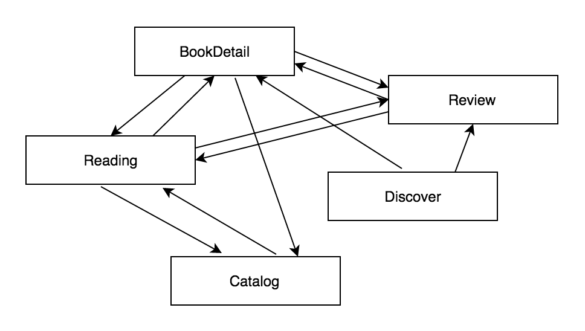

这样揉成一坨对测试/编译/开发效率/后续扩展都有一些坏处，那怎么解开这一坨呢。很简单，按软件工程的思路，下意识就会加一个中间层：

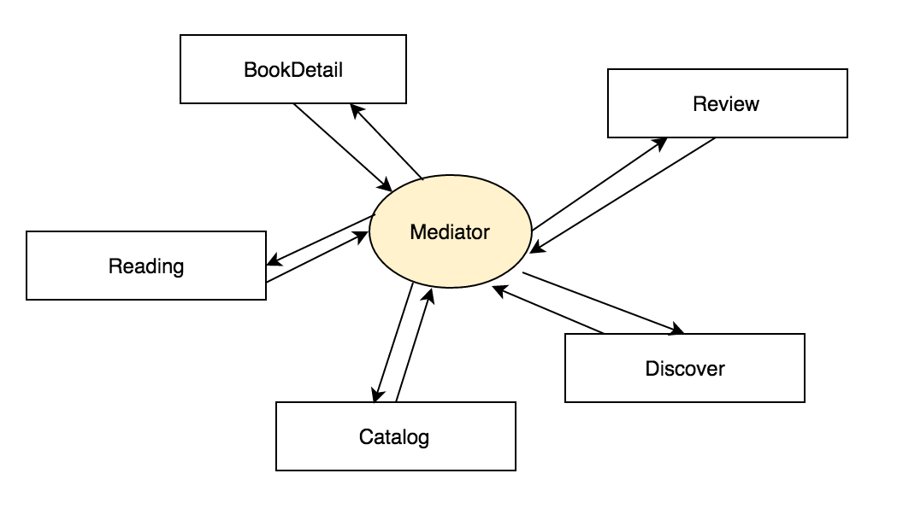

叫他 Mediator Manager Router 什么都行，反正就是负责转发信息的中间层，暂且叫他 Mediator。

看起来顺眼多了，但这里有几个问题：

  1. Mediator 怎么去转发组件间调用？
  2. 一个模块只跟 Mediator 通信，怎么知道另一个模块提供了什么接口？
  3. 按上图的画法，模块和 Mediator 间互相依赖，怎样破除这个依赖？

## 方案1

对于前两个问题，最直接的反应就是在 Mediator 直接提供接口，调用对应模块的方法：

    
    
    //Mediator.m
    #import "BookDetailComponent.h"
    #import "ReviewComponent.h"
    @implementation Mediator
    + (UIViewController *)BookDetailComponent_viewController:(NSString *)bookId {
     return [BookDetailComponent detailViewController:bookId];
    }
    + (UIViewController *)ReviewComponent_viewController:(NSString *)bookId reviewType:(NSInteger)type {
     return [ReviewComponent reviewViewController:bookId type:type];
    }
    @end
    
    
    
    //BookDetailComponent 组件
    #import "Mediator.h"
    #import "WRBookDetailViewController.h"
    @implementation BookDetailComponent
    + (UIViewController *)detailViewController:(NSString *)bookId {
     WRBookDetailViewController *detailVC = [[WRBookDetailViewController alloc] initWithBookId:bookId];
     return detailVC;
    }
    @end
    
    
    
    //ReviewComponent 组件
    #import "Mediator.h"
    #import "WRReviewViewController.h"
    @implementation ReviewComponent
    + (UIViewController *)reviewViewController:(NSString *)bookId type:(NSInteger)type {
     UIViewController *reviewVC = [[WRReviewViewController alloc] initWithBookId:bookId type:type];
     return reviewVC;
    }
    @end
    

然后在阅读模块里：

    
    
    //WRReadingViewController.m
    #import "Mediator.h"
    @implementation WRReadingViewController
    + (void)gotoDetail:(NSString *)bookId {
     UIViewController *detailVC = [Mediator BookDetailComponent_viewControllerForDetail:bookId];
     [self.navigationController pushViewController:detailVC];
    UIViewController *reviewVC = [Mediator ReviewComponent_viewController:bookId type:1];
     [self.navigationController pushViewController:reviewVC];
    }
    @end
    

这就是一开始架构图的实现，看起来显然这样做并没有什么好处，依赖关系并没有解除，Mediator 依赖了所有模块，而调用者又依赖
Mediator，最后还是一坨互相依赖，跟原来没有 Mediator 的方案相比除了更麻烦点其他没区别。

那怎么办呢。

怎样让Mediator解除对各个组件的依赖，同时又能调到各个组件暴露出来的方法？对于OC有一个法宝可以做到，就是runtime反射调用：

    
    
    //Mediator.m
    @implementation Mediator
    + (UIViewController *)BookDetailComponent_viewController:(NSString *)bookId {
     Class cls = NSClassFromString(@"BookDetailComponent");
     return [cls performSelector:NSSelectorFromString(@"detailViewController:") withObject:@{@"bookId":bookId}];
    }
    + (UIViewController *)ReviewComponent_viewController:(NSString *)bookId type:(NSInteger)type {
     Class cls = NSClassFromString(@"ReviewComponent");
     return [cls performSelector:NSSelectorFromString(@"reviewViewController:") withObject:@{@"bookId":bookId, @"type": @(type)}];
    }
    @end
    

这下 Mediator 没有再对各个组件有依赖了，你看已经不需要 #import 什么东西了，对应的架构图就变成：

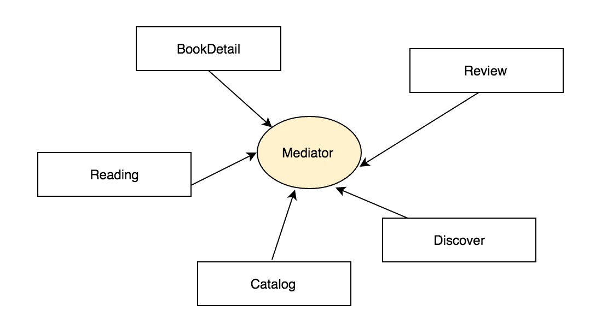

只有调用其他组件接口时才需要依赖 Mediator，组件开发者不需要知道 Mediator 的存在。

等等，既然用runtime就可以解耦取消依赖，那还要Mediator做什么？组件间调用时直接用runtime接口调不就行了，这样就可以没有任何依赖就完成调用
：

    
    
    //WRReadingViewController.m
    @implementation WRReadingViewController
    + (void)gotoReview:(NSString *)bookId {
     Class cls = NSClassFromString(@"ReviewComponent");
     UIViewController *reviewVC = [cls performSelector:NSSelectorFromString(@"reviewViewController:") withObject:@{@"bookId":bookId, @"type": @(1)}];
     [self.navigationController pushViewController:reviewVC];
    }
    @end
    

这样就完全解耦了，但这样做的问题是：

  1. 调用者写起来很恶心，代码提示都没有，每次调用写一坨。
  2. runtime方法的参数个数和类型限制，导致只能每个接口都统一传一个 NSDictionary。这个 NSDictionary里的key value是什么不明确，需要找个地方写文档说明和查看。
  3. 编译器层面不依赖其他组件，实际上还是依赖了，直接在这里调用，没有引入调用的组件时就挂了

把它移到Mediator后：

  1. 调用者写起来不恶心，代码提示也有了。
  2. 参数类型和个数无限制，由 Mediator 去转就行了，组件提供的还是一个 NSDictionary 参数的接口，但在Mediator 里可以提供任意类型和个数的参数，像上面的例子显式要求参数 NSString *bookId 和 NSInteger type。
  3. Mediator可以做统一处理，调用某个组件方法时如果某个组件不存在，可以做相应操作，让调用者与组件间没有耦合。

到这里，基本上能解决我们的问题：各组件互不依赖，组件间调用只依赖中间件Mediator，Mediator不依赖其他组件。接下来就是优化这套写法，有两个优化点
：

  1. Mediator 每一个方法里都要写 runtime 方法，格式是确定的，这是可以抽取出来的。
  2. 每个组件对外方法都要在 Mediator 写一遍，组件一多 Mediator 类的长度是恐怖的。

优化后就成了 casa 的方案，target-action
对应第一点，target就是class，action就是selector，通过一些规则简化动态调用。Category 对应第二点，每个组件写一个
Mediator 的 Category，让 Mediator
不至于太长。这里有个[demo](https://github.com/casatwy/CTMediator)

总结起来就是，组件通过中间件通信，中间件通过 runtime 接口解耦，通过 target-action 简化写法，通过 category
感官上分离组件接口代码。

## 方案2

回到 Mediator 最初的三个问题，蘑菇街用的是另一种方式解决：注册表的方式，用URL表示接口，在模块启动时注册模块提供的接口，一个简化的实现：

    
    
    //Mediator.m 中间件
    @implementation Mediator
    typedef void (^componentBlock) (id param);
    @property (nonatomic, storng) NSMutableDictionary *cache
    - (void)registerURLPattern:(NSString *)urlPattern toHandler:(componentBlock)blk {
     [cache setObject:blk forKey:urlPattern];
    }
    - (void)openURL:(NSString *)url withParam:(id)param {
     componentBlock blk = [cache objectForKey:url];
     if (blk) blk(param);
    }
    @end
    
    
    
    //BookDetailComponent 组件
    #import "Mediator.h"
    #import "WRBookDetailViewController.h"
    + (void)initComponent {
     [[Mediator sharedInstance] registerURLPattern:@"weread://bookDetail" toHandler:^(NSDictionary *param) {
     WRBookDetailViewController *detailVC = [[WRBookDetailViewController alloc] initWithBookId:param[@"bookId"]];
     [self.navigationController.pushViewController:detailVC animated:YES];
     }];
    }
    
    
    
    //WRReadingViewController.m 调用者
    //ReadingViewController.m
    #import "Mediator.h"
    + (void)gotoDetail:(NSString *)bookId {
     [[Mediator sharedInstance] openURL:@"weread://bookDetail" withParam:@{@"bookId": bookId}];
    }
    

这样同样做到每个模块间没有依赖，Mediator
也不依赖其他组件，不过这里不一样的一点是组件本身和调用者都依赖了Mediator，不过这不是重点，架构图还是跟方案1一样。

各个组件初始化时向 Mediator 注册对外提供的接口，Mediator 通过保存在内存的表去知道有哪些模块哪些接口，接口的形式是 URL->block。

这里抛开URL的远程调用和本地调用混在一起导致的问题，先说只用于本地调用的情况，对于本地调用，URL只是一个表示组件的key，没有其他作用，这样做有三个问题
：

  1. 需要有个地方列出各个组件里有什么 URL 接口可供调用。蘑菇街做了个后台专门管理。
  2. 每个组件都需要初始化，内存里需要保存一份表，组件多了会有内存问题。
  3. 参数的格式不明确，是个灵活的 dictionary，也需要有个地方可以查参数格式。

第二点没法解决，第一点和第三点可以跟前面那个方案一样，在 Mediator 每个组件暴露方法的转接口，然后使用起来就跟前面那种方式一样了。

抛开URL不说，这种方案跟方案1的共同思路就是：Mediator 不能直接去调用组件的方法，因为这样会产生依赖，那我就要通过其他方法去调用，也就是通过
字符串->方法 的映射去调用。runtime 接口的 className + selectorName -> IMP 是一种，注册表的 key ->
block 是一种，而前一种是 OC 自带的特性，后一种需要内存维持一份注册表，这是不必要的。

现在说回 URL，组件化是不应该跟 URL 扯上关系的，因为组件对外提供的接口主要是模块间代码层面上的调用，我们先称为本地调用，而 URL 主要用于 APP
间通信，姑且称为远程调用。按常规思路者应该是对于远程调用，再加个中间层转发到本地调用，让这两者分开。那这里这两者混在一起有什么问题呢？

如果是 URL
的形式，那组件对外提供接口时就要同时考虑本地调用和远程调用两种情况，而远程调用有个限制，传递的参数类型有限制，只能传能被字符串化的数据，或者说只能传能被转成
json 的数据，像 UIImage 这类对象是不行的，所以如果组件接口要考虑远程调用，这里的参数就不能是这类非常规对象，接口的定义就受限了。

用理论的话来说就是，远程调用是本地调用的子集，这里混在一起导致组件只能提供子集功能，无法提供像方案1那样提供全集功能。所以这个方案是天生有缺陷的，对于遗漏的
这部分功能，蘑菇街使用了另一种方案补全，请看方案3。

## 方案3

蘑菇街为了补全本地调用的功能，为组件多加了另一种方案，就是通过 protocol-class 注册表的方式。首先有一个新的中间件：

    
    
    //ProtocolMediator.m 新中间件
    @implementation ProtocolMediator
    @property (nonatomic, storng) NSMutableDictionary *protocolCache
    - (void)registerProtocol:(Protocol *)proto forClass:(Class)cls {
     NSMutableDictionary *protocolCache;
     [protocolCache setObject:cls forKey:NSStringFromProtocol(proto)];
    }
    - (Class)classForProtocol:(Protocol *)proto {
     return protocolCache[NSStringFromProtocol(proto)];
    }
    @end
    

然后有一个公共Protocol文件，定义了每一个组件对外提供的接口：

    
    
    //ComponentProtocol.h
    @protocol BookDetailComponentProtocol <NSObject>
    - (UIViewController *)bookDetailController:(NSString *)bookId;
    - (UIImage *)coverImageWithBookId:(NSString *)bookId;
    @end
    @protocol ReviewComponentProtocol <NSObject>
    - (UIViewController *)ReviewController:(NSString *)bookId;
    @end
    

再在模块里实现这些接口，并在初始化时调用 registerProtocol 注册。

    
    
    //BookDetailComponent 组件
    #import "ProtocolMediator.h"
    #import "ComponentProtocol.h"
    #import "WRBookDetailViewController.h"
    + (void)initComponent
    {
     [[ProtocolMediator sharedInstance] registerProtocol:@protocol(BookDetailComponentProtocol) forClass:[self class];
    }
    - (UIViewController *)bookDetailController:(NSString *)bookId {
     WRBookDetailViewController *detailVC = [[WRBookDetailViewController alloc] initWithBookId:param[@"bookId"]];
     return detailVC;
    }
    - (UIImage *)coverImageWithBookId:(NSString *)bookId {
     ….
    }
    

最后调用者通过 protocol 从 ProtocolMediator 拿到提供这些方法的 Class，再进行调用：

    
    
    //WRReadingViewController.m 调用者
    //ReadingViewController.m
    #import "ProtocolMediator.h"
    #import "ComponentProtocol.h"
    + (void)gotoDetail:(NSString *)bookId {
     Class cls = [[ProtocolMediator sharedInstance] classForProtocol:BookDetailComponentProtocol];
     id bookDetailComponent = [[cls alloc] init];
     UIViewController *vc = [bookDetailComponent bookDetailController:bookId];
     [self.navigationController pushViewController:vc animated:YES];
    }
    

这种思路有点绕，这个方案跟刚才两个最大的不同就是，它不是直接通过 Mediator 调用组件方法，而是通过 Mediator
拿到组件对象，再自行去调用组件方法。

结果就是组件方法的调用是分散在各地的，没有统一的入口，也就没法做组件不存在时的统一处理。组件1调用了组件2的方法，如果用前面两种方式，组件间是没有依赖的，组
件1+Mediator可以单独抽离出来，只需要在Mediator里做好调用组件2方法时的异常处理就行。而这种方法组件1对组件2的调用分散在各个地方，没法做这
些处理，在不修改组件1代码的情况下，组件1和组件2是分不开的。

当然你也可以在这上面跟方案1一样在 Mediator 对每一个组件接口 wrapper 一层，那这样这种方案跟方案1比除了更复杂点，其他没什么区别。

在 protocol-class 这个方案上，主要存在的问题就是分散调用导致耦合，另外实现上会有一些绕，其他就没什么了。casa 说的
“protocol对业务产生了侵入，且不符合黑盒模型。” 其实并没有这么夸张，实际上 protocol 对外提供组件方法，跟方案1在 Mediator
wrapper 对外提供组件方法是差不多的。

## 最后

蘑菇街在一个项目里同时用了方案2和方案3两种方式，会让写组件的人不知所措，新增一个接口时不知道该用方案2的方式还是方案3的方式，可能这个在蘑菇街内部会通过一
些文档规则去规范，但其实是没有必要的。可能是蘑菇街作为电商平台一开始就注重APP页面间跳转的概念，每个模块已经有一个对应的URL，于是组件化时自然想到通过U
RL的方式表示组件，后续发现URL方式的限制，于是加上方案3的方式，这也是正常的探索过程。

上面论述下方案1确实比方案2+方案3简单明了，没有 注册表常驻内存/参数传递限制/调用分散 这些缺点，方案1多做的一步是需要对所有组件方法进行一层
wrapper，但若想要明确提供组件的方法和参数类型，解耦统一处理，方案2和方案3同样需要多加这层。

实际上我没有组件化相关的实践，这里仅从 limboy 和 casa
提供的这几个方案对比分析，我还对组件化带来的收益是否大于组件化增加的成本这点存疑，相信真正实践起来还会碰到很多坑，继续探索中。

分类:[技术文章](http://blog.cnbang.net/tech/)

 
 

 
 
 
 

###[iOS组件化实践方案－LDBusMediator炼就](http://www.jianshu.com/p/196f66d31543)

## 一、中小型App为什么要组件化

当项目App处于起步阶段、各个需求模块趋于成熟稳定的过程中，组件化也许并没有那么迫切，甚至考虑组件化的架构可能会影响开发效率和需求迭代。而当项目迭代到一定时
期之后，便会出现一些相对独立的业务功能模块，而团队的规模也会随着项目迭代逐渐增长，这便是中小型应用考虑组件化的时机了。

为了更好的分工协作，团队会安排团队成员各自维护一个相对独立的业务组件。这个时候我们引入组件化方案，一是为了解除组件之间相互引用的代码硬依赖，二是为了规范组件
之间的通信接口； 让各个组件对外都提供一个黑盒服务，而组件工程本身可以独立开发测试，减少沟通和维护成本，提高效率。

进一步发展，当团队涉及到转型或者有了新的立项之后，一个团队会开始维护多个项目App，而多个项目App的需求模块往往存在一定的交叉，而这个时候组件化给我们的帮
助会更大，我只需要将之前的多个业务组件模块在新的主App中进行组装即可快速迭代出下一个全新App。

## 二、如何开始组件化工作

#### 2.1 组件化的架构目标

在详细说如何具体开始组件化工作之前，我们对于组件化的期望应该是这样的，一个团队维护一到两个独立App，每个独立App除开包含一些产品相关的非独立模块集之外，
还需要用一些独立的业务组件进行组装。 而不管是产品的非独立模块集、还是独立业务组件都需要底层公共库和基础库的支持。如下图所示：

  

组件化目标图.png

#### 2.2 组件化第一步－剥离公共库和产品基础库

在具体的项目开发过程中，我们使用cocoapod的组件依赖管理利器已经开始从Github上引入了一些第三方开源的基础库，比如说AFNetworking、SD
WebImage、SVProgressHUD、ZipArchive等。除开这些第三方开源基础库之外，我们还需要做的事情就是将一些基础组件从主工程剥离出来，形
成产品自己的私有基础库仓库，为我们进行业务独立组件的分离做准备。

这部分我将其分为两类：一类是公共基础库，用于跨产品使用；一类是产品基础库，在某个产品中强相关依赖使用。这里以我们自己产品划分为例，概述一下这两类库都包括哪些
基础组件：

公共库包括：[组件化中间件](https://github.com/Lede-
Inc/LDBusMediator.git)、[网络诊断](https://github.com/Lede-
Inc/LDNetDiagnoService_IOS.git)、[第三方SDK管理封装](https://github.com/Lede-Inc/LDSDK
Manager_IOS.git)、长连接相关、[Patch相关](https://github.com/alibaba/wax.git)、网络和页面监控相关
、用户行为统计库、第三方分享库、[JSBridge相关](https://github.com/Lede-
Inc/LDJSBridge_IOS.git)、关于Device＋file＋crypt＋http的基础方法等。

产品基础库包括：通用的WebViewContainer组件（封装了JSBridge）、自定义数字键盘、表情键盘、自定义下拉列表、循环滚动页面、AFNewor
king封装库（对上层业务隐藏AF的直接引用）、以及其他自定义的UI基础组件库。

#### 2.2 组件化第二步－独立业务模块单独成库

在基础库成体系的基础上，我们就可以开始按照需求定性将一些相对独立的业务模块独立成库，单独在一个工程上进行开发、测试。

往往在这个阶段有一个误区，千万不能为了组件化而强行将一些耦合严重的业务模块分出。如果在拆分过程中，拆分模块跟其他模块耦合太严重，那就先放弃这部分模块的独立，
毕竟产品是不会单独拿出时间给你做组件化的。

另外拆分的粒度需要大一点，需要在功能模块的基础上，将业务独立性考虑进去，如果没有就不拆，等以后有了相对独立的模块之后再拆。

#### 2.3 组件化第三步－对外服务接口最小化

组件化不是一蹴而就的，我们在完成第二步的时候并不要强行要求去掉组件之间代码的硬依赖，只需要保证单独拆分出来的工程可以独立运行和测试，并且能够通过引用保证其他
业务组件和主工程的依赖使用即可。

当第二步完成之后，我们可以在此基础上总结其他组件和主工程的需求调用，根据需求总结和抽象出当前业务组件对外服务的最小化接口以及页面跳转调用。经过多次总结，我们
可以发现组件之间的通信需求无外乎三个方面：URL导航＋服务接口调用＋消息变量定义。如下图所示：

  

组件通信需求.png

在这个阶段，我们大多数应用会选择JLRoute（蘑菇街的MGJRoute方案也类似）去做URL导航的需求，会通过OpenServiceImpl ＋ Prot
ocol的方案（将所有对外服务提供的接口都在OpenServiceImpl中实现）去做组件间的服务调用，消息变量的声明可以放到对外服务接口的Protocol
定义中。

到了这个阶段，我们的业务组件也已经相对独立，JLRoute能够去掉页面引用的头头文件依赖。OpenServiceImpl＋Protocol也将我们最小化的对
外服务接口约束到Protocol接口文件中。 如果对于项目组件化要求不高的话，到这一步就可以了。

## 三、彻底组件化－LDBusMediator炼就

#### 3.1 组件化方案不彻底之处和JLRoute的缺陷

通过第二部分的讲述，我们的组件化工作差不多完成了80%，但是我们依然发现，组件化并不够彻底。

先来看服务调用方面，我们需要对外提供OpenServiceImpl的头文件，外部模块仍然保持着对业务组件的强依赖，OpenServiceImpl的不兼容变化
必然导致所有调用部分的更改，我们期望的黑盒服务便无法实现。如果所有类别的服务接口都在OpenServiceImpl中实现，OpenServiceImpl中的
代码会越来越多，难以维护和管理。 另外Protocol文件和OpenServiceImpl的头文件都需要对外披露，如果放到组件实现中，两个组件相互之间有调用
，就会导致Podspec的相互循环依赖。

再看URL导航方面，在我们的项目中，我们在ViewController的类别中通过load方法注册URL－Block，这样能够解决JLRoute的中心化注册
问题，但是JLRoute仍然存在其他一些缺陷。JLRoute去中心化的具体使用方式如下：

    
    
    + (void)load
    {
        @autoreleasepool {
            [JLRoutes addRoute:@"/xxxx" handler:^BOOL(NSDictionary *parameters) {
                UIViewController *baseViewController = parameters[kLDRouteViewControllerKey];
                if (!baseViewController) {
                    baseViewController = [UIViewController topmostViewController];
                }
                if (!baseViewController) {
                    return YES;
                }
                XXXXViewController *viewController = [[XXXXViewController alloc] init];
                if ([baseViewController isKindOfClass:[UINavigationController class]]) {
                    [(UINavigationController*)baseViewController pushViewController:viewController animated:YES];
                }else if (baseViewController.navigationController) {
                    [baseViewController.navigationController pushViewController:viewController animated:YES];
                } else {
                    UINavigationController *navController = [[UINavigationController alloc] initWithRootViewController:viewController];
                    [baseViewController presentViewController:navController animated:YES completion:NULL];
                }
                return YES;
            }];
        }
    }

如上所用，JLRoute的缺陷如下：

  * **_url短链分布式注册时，导航代码的重复拷贝；_**
  * **_无法通过URL返回一个controller实例；_**(TabController也就无法从独立业务组件中不引用Controller头文件获取Controller实例完成设置)
  * **_class的load方法完成注册，太多对启动时Main线程有影响；_**
  * 同一个url短链的导航方式单一固定，依赖注册
  * 单一业务组件中可导航URL分散，无法统一查看；
  * Debug阶段url传递参数错误、not found没有提示；

#### 3.2 LDBusMediator总体方案

针对组件化不彻底的实际问题，结合之前手淘分享的总线架构以及蘑菇街的组件化分享博客，我们完成了一个通用的LDBusMediator中间件帮助我们彻底完成组件化
。

**_LDBusMediator开源Git地址：_**

  * <https://github.com/Lede-Inc/LDBusMediator.git>

我们先来看总体的组件化方案：所有的业务组件通过Connector连接到总线中，Connector需要遵循Connector Protocol方可接入。Con
nector协议规定了URL导航接入和服务接入的协议，Connector通过Class的Load方法将自己的实例注册到中间件的Cache数组中，方便其他组件
在调用时中间件可以通过服务发现的方式进行URL导航和服务调用。（具体见如下的图示）

    
    
    @implementation Connector_A
    #pragma mark - register connector
    /**
     * 每个组件的实现必须自己通过load完成挂载；
     * load只需要在挂载connector的时候完成当前connecotor的初始化，挂载量、挂载消耗、挂载所耗内存都在可控范围内；
     */
    +(void)load{
        @autoreleasepool{
            [LDBusMediator registerConnector:[self sharedConnector]];
        }
    }
    @end

#### 3.3 LDBusMediator－URL导航方案

URL导航的总线中间件方案很简单，只需要在Connector中实现URL导航接入的接口即可，如图所示：

  

LDBusMediator－URL导航.png

具体使用如下：

    
    
    @protocol LDBusConnectorPrt <NSObject>
    -(BOOL)canOpenURL:(nonnull NSURL *)URL;
    - (nullable UIViewController *)connectToOpenURL:(nonnull NSURL *)URL params:(nullable NSDictionary *)params;
    @end
    @implementation Connector_A
    #pragma mark - LDBusConnectorPrt 
    /**
     * (1)当调用方需要通过判断URL是否可导航显示界面的时候，告诉调用方该组件实现是否可导航URL；可导航，返回YES，否则返回NO；
     * (2)这个方法跟connectToOpenURL:params配套实现；如果不实现，则调用方无法判断某个URL是否可导航；
     */
    -(BOOL)canOpenURL:(nonnull NSURL *)URL{
        if ([URL.host isEqualToString:@"ADetail"]) {
            return YES;
        }
        return NO;
    }
    @end
    /**
     * (1)通过connector向busMediator挂载可导航的URL，具体解析URL的host还是path，由connector自行决定；
     * (2)如果URL在本业务组件可导航，则从params获取参数，实例化对应的viewController进行返回；如果参数错误，则返回一个错误提示的[UIViewController paramsError]; 如果不需要中间件进行present展示，则返回一个[UIViewController notURLController],表示当前可处理；如果无法处理，返回nil，交由其他组件处理；
     * (3)需要在connector中对参数进行验证，不同的参数调用生成不同的ViewController实例；也可以通过参数决定是否自行展示，如果自行展示，则用户定义的展示方式无效；
     * (4)如果挂接的url较多，这里的代码比较长，可以将处理方法分发到当前connector的category中；
     */
    - (nullable UIViewController *)connectToOpenURL:(nonnull NSURL *)URL params:(nullable NSDictionary *)params{
        //处理scheme://ADetail的方式
        // tip: url较少的时候可以通过if-else去处理，如果url较多，可以自己维护一个url和ViewController的map，加快遍历查找，生成viewController；
        if ([URL.host isEqualToString:@"ADetail"]) {
            DemoModuleADetailViewController *viewController = [[DemoModuleADetailViewController alloc] init];
            if (params[@"key"] != nil) {
                viewController.valueLabel.text = params[@"key"];
            } else if(params[@"image"]) {
                id imageObj = params[@"image"];
                if (imageObj && [imageObj isKindOfClass:[UIImage class]]) {
                    viewController.valueLabel.text = @"this is image";
                    viewController.imageView.image = params[@"image"];
                    [[UIApplication sharedApplication].keyWindow.rootViewController presentViewController:viewController animated:YES completion:nil];
                    return [UIViewController notURLController];
                } else {
                    viewController.valueLabel.text = @"no image";
                    viewController.imageView.image = [UIImage imageNamed:@"noImage"];
                    [[UIApplication sharedApplication].keyWindow.rootViewController presentViewController:viewController animated:YES completion:nil];
                    return [UIViewController notURLController];
                }
            } else {
                // nothing to do
            }
            return viewController;
        }
        else {
            // nothing to to
        }
        return nil;
    }

通过LDBusMediator的URL导航方案，有效的解决了前文提出的JLRoute的缺陷：

  1. url短链分布式注册时，导航代码的重复拷贝
    * **_LDBusNavigator+PresentMode_**：将通用的导航方式即成到LDBusNavigator中，而无需每个URL注册时重复拷贝。
  2. 无法通过URL返回一个controller实例；(TabController)
    * ***URL-Block —> URL-ViewController实例**：将之前JLRoute的url－block方式改成了url－ViewController方式，即可满足。
  3. class的load方法完成注册，太多对启动时Main线程有影响；
    * **_服务发现的方式，只在load时注册Connector实例_**：中间件只对每个业务组件的connector实例进行注册，相比URL注册量大量减少load使用。
  4. 同一个url短链的导航方式单一固定，依赖注册
    * **_调用时指定Present、Push、Share方式_**：之前JLRoute只能在注册时候决定导航方式，通过LDBusMediator如何导航显示由调用方决定，默认是Push；Share方式是指pop到导航层次中已经存在的viewController处。
  5. 单一业务组件中可导航URL分散，无法统一查看；
    * **_单一组件的connector中集中管理所有可导航URL_**
  6. Debug阶段url传递参数错误、not found没有提示；
    * **_Debug阶段的错误Controller提示、包括参数错误、notFound、notSupportController_**：如果参数错误、notfound无法生成一个viewController实例，中间件在debug阶段会提示。如果URL不支持返回一个Controller，同样会给与提示。

#### 3.4 LDBusMediator－服务调用方案

为了更好的通过中间件支撑组件间的服务调用方案，我们在组件实现和中间件之间增加了一层协议接口层。
每个业务组件将自己对外提供的服务接口抽象到一个统一的业务组件协议集合中。 业务组件的实现依赖自己的对外服务接口集并进行接口的实现。

每个业务组件中的协议部分有两种：一种是服务协议，其他组件可以通过Mediator拿到对外开放的服务实例调用服务接口；一种是Model协议，服务协议中的接口可
以给其他组件一个协议化对象,其他组件也可以组装一个协议化对象通过参数传入。

为了方便业务组件实现和协议集合的版本对应，需要保证协议集合的大版本（如x.y）和业务组件的大版本（如x.y.z）中的x保持一致；协议集合中一般没有补丁版本的
迭代，当其他业务组件调用需要增加接口进行兼容版本升级（y+1）,减少或者修改接口则需要协议集合和业务组件中的x同时＋1（x+1）；
如果自身业务组件升级不能影响对外协议接口的调用，升级版本主要为补丁版本迭代（z＋1）或 兼容版本升级（y＋1)；

组件协议集合
单独通过一个Git地址进行管理，单独配置podspec，单独通过协议的版本仓库进行管理；所有的协议集合的git统一放到Git的一个组中进行管理。

具体方案如下：

  

LDBusMediator－服务调用.png

    
    
    @protocol LDBusConnectorPrt <NSObject>
    /**
     * 业务模块挂接中间件，注册自己提供的service，实现服务接口的调用；
     * 
     * 通过protocol协议找到组件中对应的服务实现，生成一个服务单例；
     * 传递给调用者进行protocol接口中属性和方法的调用；
     */
    - (nullable id)connectToHandleProtocol:(nonnull Protocol *)servicePrt;  
    @end
    @implementation Connector_A
    /**
     * （1)通过connector向BusMediator挂接可处理的Protocol，根据Protocol获取当前组件中可处理protocol的服务实例；
     *  (2)具体服务协议的实现可放到其他类实现文件中，只需要在当前connetor中引用，返回一个服务实例即可；
     *  (3)如果不能处理，返回一个nil；
     */
    - (nullable id)connectToHandleProtocol:(nonnull Protocol *)servicePrt{
        if (servicePrt == @protocol(ModuleAXXXServicePrt)) {
            return [[self class] sharedConnector];
        }
        return nil;
    }
    @end

LDBusMediator中间件的服务调用方案的优势：

  1. 通过中间件支撑，不暴露任何实现文件的头文件；
    * 组件对外提供的服务通过最小化抽象的“协议接口集”披露；
    * 组件的实现Pod不暴露任何头文件；
  2. 每个业务组件提供黑盒服务
    * 调用者不用关心具体实现细节；
    * 业务组件的实现升级、或者更换（包括整个业务组件更换）不影响调用者的调用修改；
  3. 为业务组件Framework化、自动化构建奠定基础

