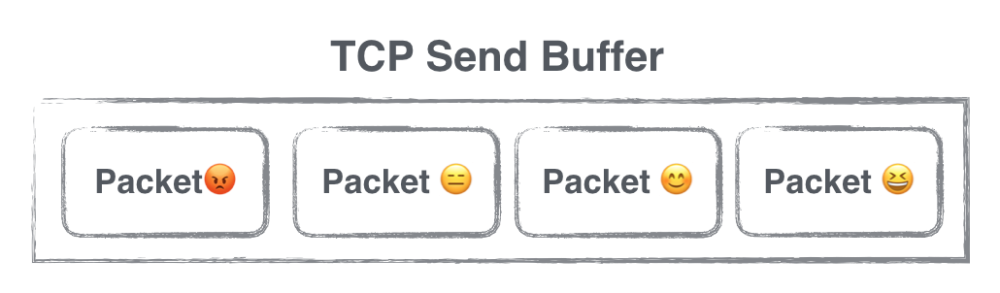

 
<!--BEGIN_DATA
{
    "create_date": "2017-01-09 17:08", 
    "modify_date": "2017-01-09 17:08", 
    "is_top": "0", 
    "summary": "iOS编程中throttle那些事", 
    "tags": "iOS", 
    "file_name": "iOS编程中throttle那些事.md"
}
END_DATA-->

####
原文出处：<a href='http://mrpeak.cn/blog/ios-throttle/' target='blank'>iOS编程中throttle那些事</a>

不知道大家对throttle这个单词是否看着眼熟，还是说对这个计算机基础概念有很清晰的了解了。今天就来聊聊和throttle相关的一些技术场景。

####定义

我经常有一种感觉，对于英语这门语言的语感，会影响我们对于一些关键技术概念的理解。有时候在学习新技术知识的时候，我会先花一些时间去了解术语英文单词的各种语义，
在形成强烈清晰的语感之后，再去深入具体的技术语境。throttle也算是个生僻的单词，至少在口语中毕竟少用到，先来看看词义：

> a device controlling the flow of fuel or power to an engine.

中文翻译是节流器，一种控制流量的设备。对应到我们计算机世界，可以理解成，一种控制数据或者事件流量大小的机制。这么说可能还是有些抽象，再来看看一些具体的技术场景加深理解。

####场景一：GCD Background Queue

话说GCD几乎是iOS面试的必问题，也是个送分题:)。

我一般会机械式的先问：GCD有哪几种Queue？回答：串行Queue和并行Queue。

我继续问：Global Queue有哪几种优先级？回答：有几种吧，大概记得Default，Low，High吧。

我双眉一挑，进一步试探：不知道少侠有没有研究过DISPATCH_QUEUE_PRIORITY_BACKGROUND作何用？问完立即竖起耳朵，殷殷期盼萦绕于心的关键字。如果能听到「**I/O Throttle 呀！**」，我会瞬间觉得面试气氛被点亮了。

当然啦，答不出I/O Throttle并不能说明技术不扎实，但能答出来，至少表明对待技术是有好奇心的，加分！

官方文档如是说：

> Items dispatched to the queue run at background priority; the queue is scheduled for execution after all high priority queues have been scheduled and the system runs items on a thread whose priority is set for background status.
>
>Such a thread has the lowest priority and any disk I/O is throttled to
minimize the impact on the system.

那Disk I/O Throttle做什么用呢？按照上面这段描述，Disk I/O会impact system performance。

理解Disk I/O的影响需要补充一些大学课本上的知识。一次磁盘读写操作涉及到的硬件资源主要有两个，CPU和磁盘。任务本身由CPU触发和调度，读操作发生时，CPU告知Disk去获取某个地址的数据，此时由于Disk的读操作存在寻址延迟，CPU是处于I/O wait状态，一直维持到Disk返回数据为止。处于I/O wait状态的CPU，此时并不能把这部分等待的时间用来处理其他任务，也就是说这一段等待的CPU时间被“浪费”了。而CPU是公共的系统资源，这部分资源的损耗自然会对系统的整体表现产生负面影响。即使Global Queue使用的是子线程，也会造成CPU资源的消耗。

如果把任务的Priority调整为DISPATCH_QUEUE_PRIORITY_BACKGROUND，那么这些任务中的I/O操作就被被控制，虽然具体的控制策略并没有官方文档描述（一种可能的策略是并发的Disk I/O变为串行的），但我们能确认的是，部分I/O操作的启动时间很有可能被适当延迟，把更多的CPU资源腾出来处理其他任务(比如说一些系统资源的调度任务)，这样可以让我们的系统更加稳定高效。简而言之，对于重度磁盘I/O依赖的后台任务，如果对实时性要求不高，放到DISPATCH_QUEUE_PRIORITY_BACKGROUND Queue中是个好习惯，对系统更友好。

实际上I/O Throttle还分为好几种，有Disk I/O Throttle，Memory I/O Throttle，和Network I/O Throttle。语义类似只不过场景不同，继续往下看。

####场景二：ASIHttpRequest Network Throttle

早几年读ASIHttpRequest源码的时候，读到过一段有意思的代码：

    
    
    - (void)handleNetworkEvent:(CFStreamEventType)type
    {
    	//...
        [self performThrottling];
    	//...
    }
    

在AFNetworking中也有类似的代码：

    
    
    /**
     Throttles request bandwidth by limiting the packet size and adding a delay for each chunk read from the upload stream.
     When uploading over a 3G or EDGE connection, requests may fail with "request body stream exhausted". 
     Setting a maximum packet size and delay according to the recommended values (`kAFUploadStream3GSuggestedPacketSize` and `kAFUploadStream3GSuggestedDelay`) lowers the risk of the input stream exceeding its allocated bandwidth. 
     Unfortunately, there is no definite way to distinguish between a 3G, EDGE, or LTE connection over `NSURLConnection`. 
     As such, it is not recommended that you throttle bandwidth based solely on network reachability. 
     Instead, you should consider checking for the "request body stream exhausted" in a failure block, and then retrying the request with throttled bandwidth.
     @param numberOfBytes Maximum packet size, in number of bytes. The default packet size for an input stream is 16kb.
     @param delay Duration of delay each time a packet is read. By default, no delay is set.
     */
    - (void)throttleBandwidthWithPacketSize:(NSUInteger)numberOfBytes
                                      delay:(NSTimeInterval)delay;
    

原谅我贴了一大段注释，这段英文描述对于加深我们对于一些网络行为的理解很有帮助。

这些知名的第三方网络框架都有对Newtork Throttle的支持，你可能会好奇，我们为什么要对自己发出的网络请求做流量控制，难道不应该尽可能最大限度的利用带宽吗？

此处需要科普一点TCP协议相关的知识。我们通过HTTP请求发送数据的时候，实际上数据是以Packet的形式存在于一个Send Buffer中的，应用层平时感知不到这个Buffer的存在。TCP提供可靠的传输，在弱网环境下，一个Packet一次传输失败的概率会升高，即使一次失败，TCP并不会马上认为请求失败了，而是会继续重试一段时间，同时TCP还保证Packet的有序传输，意味着前面的Packet如果不被ack，后面的Packet就会继续等待，如果我们一次往Send Buffer中写入大量的数据，那么在弱网环境下，排在后面的Packet失败的概率会变高，也就意味着我们HTTP请求失败的几率会变大，类似这样：

大部分时候在应用层写代码的时候，估计不少同学都意识不到Newtork Throttle这种机制的存在，在弱网环境下（丢包率高，带宽低，延迟高）一些HTTP请求(比如上传图片或者日志文件)失败率会激增，有些朋友会觉得这个我们也没办法，毕竟网络辣么差。其实，作为有追求的工程师，我们可以多做一点点，而且弱网下请求的成功率其实是个很值得深入研究的方向。针对弱网场景，我们可以启用Newtork Throttle机制，减小我们一次往Send Buffer中写入的数据量，或者延迟某些请求的发送时间，这样所有的请求在弱网环境下，都能「耐心一点，多等一会」，请求成功率自然也就适当提高啦。

那么，再看AFNetworking中的这个函数，是不是更能理解了呢？

    
    
    - (void)throttleBandwidthWithPacketSize:(NSUInteger)numberOfBytes
                                      delay:(NSTimeInterval)delay;
    

Network Throttle体现了一句至理名言「**慢即是快**」。

####场景三：Event Frequency Control

不知道大家在写UI的时候，有没有遇到过用户快速连续点击UIButton，产生多次Touch事件回调的场景。以前机器还没那么快的时候，我在用一些App的时候，时不时会遇到偶尔卡顿，多次点击一个Button，重复Push同一个Controller。有些工程师会在Button的点击事件里记录一个timestamp，然后判断每次点击的时间间隔，间隔过短就忽略，这也不失为一种解决办法。

再后来学习RxSwift的时候，看到：

    
    
    button.rx_tap
       .throttle(0.5, MainScheduler.instance)
       .subscribeNext { _ in 
          print("Hello World")
       }
       .addDisposableTo(disposeBag)
    

终于有了优雅的书写方式。发现没有，throttle又出现了，这里throttle控制的是什么呢？不是disk读写，也不是network buffer，而是事件，把事件本身抽象成了一种Data，控制这种数据的流量或者产生频率，就解决了上面我们所说重复点击按钮的问题，so easy。

####总结

当然还会有更多的场景，throttle其实是个基础的计算机知识。理解throttle相关的技术概念，需要在不同场景下去抽象出一个flow被节流的画面。现在，如果让你来解释一些具体的技术场景下，throttle是怎么回事，是不是可以信手拈来了:)

