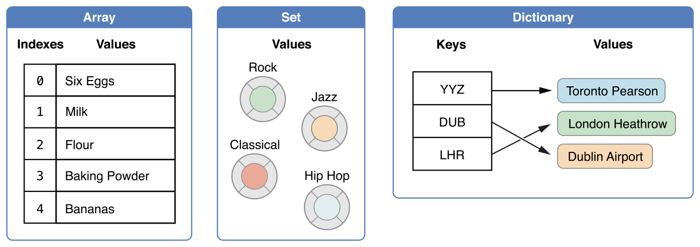

 
<!--BEGIN_DATA
{
    "create_date": "2021-02-06 16:36", 
    "modify_date": "2021-02-06 16:36", 
    "is_top": "0", 
    "summary": "iOS高阶容器详解", 
    "tags": "iOS", 
    "file_name": "iOS 高阶容器详解"
}
END_DATA-->

#### <p>原文出处：<a href='https://www.jianshu.com/p/12dd952ca5f6' target='blank'>iOS高阶容器详解</a></p>

近期，在面试 iOS 工程师的过程中，当我问到候选人小伙伴都了解哪些 iOS 容器类型时，大多数小伙伴能给出的答复就是 NSArray、NSDictionary 和 NSSet 以及对应的可变类型，有些优秀的小伙伴能够说出 NSCache，还能对它的原理侃侃而谈，这是非常棒的。但是总体而言，高阶容器的普及在技术同学中还是比较少。本文，我们就来详细聊聊我们对 iOS 高阶容器类型的深入研究结果，并讨论其使用场景。

在进行具体分析之前，我们先简单了解一下 iOS 的容器有哪些。 iOS 提供了三种主要的容器类型，它们分别是 Array、Set 和 Dictionary，用来存储一组值：

* Array：存储一组有序的值
* Set：存储一组无序的、不重复的值
* Dictionary：存储一组无序的键-值映射



这些都是我们平时用到的基础容器。除此之外，iOS 提供了很多高阶容器类型，他们分别是：

  * NSCountedSet
  * NSIndexSet && NSMutableIndexSet
  * NSOrderedSet && NSMutableOrderedSet
  * NSPointerArray
  * NSMapTable
  * NSHashTable
  * NSCache

今天，我们将对这些高阶容器进行详细介绍。

### NSCountedSet

NSCountedSet 是与 NSMutableSet 用法类似的无序集合，可以添加、移除元素，判断元素是否存在及保证元素唯一性。不同的是：

  * 一个元素可以添加多次
  * 可以获取元素的数量

设想我们要做一个**淘宝购物车**的功能，购物车中统计每一个商品的数量，还可以对数量进行增加和减少。按照惯例，传统的做法是使用字典：

```
@property (nonatomic, strong) NSMutableDictinary *itemCountDic;
```    

获取数量：

``` 
NSNumber *num = [self.itemCountDic objectForKey:item]; 
if (num == nil) {     
    return 0;    
} 
return num.integerValue;
```

数量+1：

``` 
NSNumber *num = [self.itemCountDic objectForKey:item]; 
if (num == nil) {     
    [self.itemCountDic setObject:@1 forKey:item];     
} else { 
    [self.itemCountDic setObject:@(num.integerValue+1) forKey:item]; 
}
```

数量-1：

``` 
NSNumber *num = [self.itemCountDic objectForKey:item]; 
if (num == nil) {     
    return; 
}  
if (nums.integerValue == 1) {     
    [self.itemCountDic removeObjectForKey:item]; 
} else {     
    [self.itemCountDic setObject:@(num.integerValue-1) forKey:item]; 
}
```

这种方式没有问题，但是有了 NSCountedSet，所有的操作一行代码就能搞定：

``` 
@property (nonatomic, strong) NSCountedSet<CartItem *> itemCountSet;
```    

获取数量：

``` 
[self.itemCountSet countForObject:item];
```    

数量+1：

``` 
[self.itemCountSet addObject:item];
```    

数量-1:

``` 
[self.itemCountSet removeObject:item];
```    

可以看出，NSCountedSet 就是为这种场景量身定做的。

### NSIndexSet && NSMutableIndexSet

NSIndexSet && NSMutableIndexSet是包含不重复整数的容器类型，使得索引访问具备批量执行的能力。比如我们需要获取数组的第0，第2，第4个元素组成的子数组：

```
NSMutableIndexSet *indexes = [[NSMutableIndexSet alloc] init]; 
[indexes addIndex:0]; 
[indexes addIndex:2]; 
[indexes addIndex:4]; 
NSArray *newArray = [oldArray objectAtIndexes:indexes];
```

这样一看，好像并没有节省多少代码量！别急，我们再看下面的例子：在一个长度100的数组中，获取区间5-8、11-13、19-22、55-99四个区间的元素。

```
NSMutableIndexSet *indexes = [[NSMutableIndexSet alloc] init];
[indexes addIndexesInRange:NSMakeRange(5, 4)]; // 5，6，7，8 
[indexes addIndexesInRange:NSMakeRange(11, 3)]; // 11，12，13 
[indexes addIndexesInRange:NSMakeRange(19, 4)]; // 19，20，21，22 
[indexes addIndexesInRange:NSMakeRange(55, 45)]; // 55，56，57，58.....99 
NSArray *newArray = [oldArray objectAtIndexes:indexes];
```

接下来我们做一下性能测量，从一个长度10万的随机字串中，删除所有 a 开头的字符串。

方式1，**批量对象**删除：

首先筛选元素：

``` 
NSArray *subarrayToRemove = [array filteredArrayUsingPredicate:[NSPredicate predicateWithBlock:^BOOL(id _Nullable evaluatedObject, NSDictionary<NSString *,id> * _Nullable bindings) {     
        return [evaluatedObject hasPrefix:@"a"]; 
}]];
```

执行删除：

``` 
[array removeObjectsInArray:subarrayToRemove];
```    

方式2，**批量索引**删除：

首先筛选索引集：

``` 
NSIndexSet *indexesToRemove = [array indexesOfObjectsPassingTest: 
    ^BOOL(id  _Nonnull obj, NSUInteger idx, BOOL * _Nonnull stop) {     
    return [obj hasPrefix:@"a"];     
}];
```

执行删除：

``` 
[array removeObjectsAtIndexes:indexesToRemove];
```

我们对比执行时间：

<table>
<thead>
<tr>
<th>方式</th>
<th>执行时间ms</th>
</tr>
</thead>
<tbody>
<tr>
<td>方式1，批量对象删除</td>
<td>25.33</td>
</tr>
<tr>
<td>方式2，批量索引删除</td>
<td>15.33</td>
</tr>
</tbody>
</table>

我们姑且忽略筛选元素以及筛选索引的时间，他们不会相差很多（都是O(n)）。后来实验证明后者效率更佳。

剖析：方式1比方式2多了一个步骤，即遍历每一个元素以获得他们的索引值。如果待删除子集的长度是 k，这个多出来的步骤的时间复杂度是是 O(n * k)。随着 n 和 k 的增加，执行时间的差距将会更加明显。

### NSOrderedSet && NSMutableOrderedSet

NSOrderedSet && NSMutableOrderedSet 是有序 Set，比 传统 NSSet 增加了索引功能，且能够保持元素的插入顺序。

索引示例：

```
NSString *o1 = @"3"; 
NSString *o2 = @"2"; 
NSString *o3 = @"1"; 
NSOrderedSet *orderedSet = [NSOrderedSet 
                                orderedSetWithObjects:o1, o2, o3, nil]; 
[orderedSet indexOfObject:o2]; // 1 
[orderedSet indexOfObject:o3]; // 2 
[orderedSet objectAtIndex:0];  // o1
```

令人惊喜的是，NSOrderedSet && NSMutableOrderedSet 支持 subscript：

``` 
orderedSet[1];  // o2
```    

判断集合包含关系：

``` 
[a isSubsetOfSet:b]; // a是否为b的子集。b为NSSet。 
[a isSubsetOfOrderedSet:b]; // a是否为b的子集。b为NSOrderedSet。
```

判断集合相交关系：

``` 
[a intersectsSet:b]; // a是否与b有交集。b为NSSet 
[a intersectsOrderedSet:b];  // a是否与b有交集。b为NSOrderedSet
```

为了探索 NSOrderedSet 与 NSArray 的性能差异，我们看一下性能测试结果：

<table>
<thead>
<tr>
<th>类型</th>
<th>100w元素，100w次索引访问(ms)</th>
<th>1w元素，1w次查找</th>
<th>100w元素内存占用(MB)</th>
</tr>
</thead>
<tbody>
<tr>
<td>NSArray</td>
<td>38.012</td>
<td>597.029</td>
<td>15.266</td>
</tr>
<tr>
<td>NSOrderedSet</td>
<td>33.796</td>
<td>1.006</td>
<td>33.398</td>
</tr>
</tbody>
</table>

可以看出，仅从访问效率来看，两者差别并不大，而在 1w 次查找的对比中，NSOrderedSet 竟然快出 590 倍之多！内存代价虽然比较昂贵，但在可接受的范围之内。

### NSPointerArray

NSPointerArray 是 NSMutableArray 的高阶类型，比 NSMutableArray 具备更广泛的内存管理能力，具体如下：

  * 和传统 NSArray 一样，用于有序的插入或移除；
  * 与传统 NSArray 不同的是，可以存储 NULL，且 NULL 参与 count 的计算；
  * 与传统 NSArray 不同的是，count 可以被设置，如果设置较大的 count 则使用 NULL 占位；
  * 可以使用 weak 或 unsafe_unretained 来修饰成员；
  * 可以修改对象的判等方式；
  * 可以使对象加入时进行拷贝；
  * 成员可以是所有指针类型，不仅限于 OC 对象；

我们可以举个简单的例子看一下，例如它可以存储 weak 引用：

```
NSPointerArray *pointerArray = NSPointerArray.weakObjectsPointerArray; 
[pointerArray addPointer:(void *)obj]; // obj的引用计数不会增加
```

注：obj 被释放后，pointerArray.count 依然是1，这是因为 NULL 也会参与占位。调用 compact 方法将清空所有的 NULL 占位。

我们可以通过函数 + pointerArrayWithOptions:指定更多有趣的存储方式。上面的NSPointerArray.weakObjectsPointerArray 实际上是 [NSPointerArray pointerArrayWithOptions:NSPointerFunctionsWeakMemory]的简化版。

NSPointerFunctionsOptions 是一个选项，不同于枚举，选项类型是可以叠加的。这些选项可以分为内存管理、个性判定、拷贝偏好三大类：

#### 内存管理相关

  * NSPointerFunctionsWeakMemory： 弱引用，不增加引用计数。元素被释放后变成 NULL，但 count 保持不变。调用 compact 方法后将删除所有 NULL 元素并重新调整大小。对应 ARC 的weak。
  * NSPointerFunctionsStrongMemory：强引用，引用计数+1。对应 ARC 的 strong。
  * NSPointerFunctionsOpaqueMemory：不增加引用计数，也不创建弱引用，元素释放后变野指针。对应 ARC 的 unsafe_unretained。
  * NSPointerFunctionsMallocMemory：移除元素时调用 free() 进行释放，添加时调用 calloc()。不同于上面三种，这种方式适用于元素为普通指针类型的情况。
  * NSPointerFunctionsMachVirtualMemory：用于 Mach 的虚拟内存管理。

#### 个性判定相关

什么是个性判定呢？个性判定包含以下三个方面：

  * 相等性判定（即判等）。传统容器都是使用元素的 -isEqual 进行相等性判定。当对 NSArray 调用 indexOfObject 方法时，数组会遍历内部元素，对每个遍历到的元素与输入元素进行 isEqual 对比，直到碰到第一个判定成功（即 isEqual 返回 YES）的元素并返回其索引；若所有元素均判定失败则返回 NSNotFound。
  * 哈希值判定。如使用对象的 Hash 方法是一种哈希值判定方式。常见的 NSSet、NSDictionary 都是使用元素的 Hash 方法获取哈希值，从而决定其索引位置。
  * 描述值判定。如使用对象的 Description 方法是一种描述值判定方式。对数组进行打印时，打印的内容中包含了所有对象的 Description 值。

我们来看下个性判定相关的 NSPointerFunctionsOptions 有哪些：

  * NSPointerFunctionsObjectPersonality：判定元素为 OC 对象。用元素的 isEqual 方法判等，Hash 方法计算哈希值，Description 方法做描述（NSLog 打印）。
  * NSPointerFunctionsObjectPointerPersonality：判定元素为对象指针。通过对比指针来判等，通过指针左移计算哈希值，用 Description 方法对其描述。
  * NSPointerFunctionsCStringPersonality：判定元素为 CString。使用 strcmp 判等，对该字符串求哈希，用 UTF8 编码格式对其描述。
  * NSPointerFunctionsIntegerPersonality：判定元素为整型值。使用整型值的右移结果作哈希值和判等条件。
  * NSPointerFunctionsStructPersonality:：判定元素为结构体指针。用 memcmp 对比内存判等，对实际内存求哈希。
  * NSPointerFunctionsOpaquePersonality：不确定类型。通过对比指针来判等，通过指针左移计算哈希值。

#### 拷贝偏好

NSPointerFunctionsCopyIn： 添加元素时，实际添加的是元素的拷贝。

接下来我们对比一组数据，单位 ms

<table>
<thead>
<tr>
<th>容器/方法</th>
<th>100万次add</th>
<th>100万次随机访问</th>
</tr>
</thead>
<tbody>
<tr>
<td>NSMutableArray</td>
<td>0.023</td>
<td>69.9</td>
</tr>
<tr>
<td>NSPointerArray + Strong Memory</td>
<td>0.024</td>
<td>60</td>
</tr>
<tr>
<td>NSPointerArray + Weak Memory</td>
<td>759</td>
<td>224.4</td>
</tr>
</tbody>
</table>

可见，NSMutableArray 与 NSPointerArray+ strong 几乎没有差别，而 NSPointerArray + Weak的性能开销就不那么乐观了。

那我们怎么理解传统数组与 NSPointerArray 的关系呢？传统数组就相当于一个特殊的 NSPointerArray，把它的 options
设成这样：

```
NSPointerFunctionsStrongMemory | NSPointerFunctionsObjectPersonality
```    

即个性判定为 OC 对象，强引用，不进行拷贝。

### NSMapTable

NSMapTable 为 NSMutableDictionary 的高阶类型。它与 NSPointerArray 类似，可以指定NSPointerFunctionsOptions，不同的是 NSMapTable 的 key 和 value 都可以指定 options：

```
[NSMapTable mapTableWithKeyOptions:keyOptions valueOptions:valueOptions]
```    

更便捷的初始化方法：

``` 
NSMapTable.strongToStrongObjectsMapTable // key 为 strong，value 为 strong NSMapTable.weakToStrongObjectsMapTable // key 为 weak，value 为 strong NSMapTable.strongToWeakObjectsMapTable // key 为 strong，value 为 weak NSMapTable.weakToWeakObjectsMapTable; // key 为 weak，value 为 weak
```

保留传统字典的经典能力：

``` 
[table setObject:obj forKey:key]; // 设置Key,Value 
[table objectForKey:key] // 根据Key获取Value 
[table removeObjectForKey:] // 删除
```

不同的是，系统并没有给它 subscript 支持，即不能使用类似 dict[key] = value 的中括号语法。

那我们怎么理解传统字典与 NSMapTable 的关系呢？传统字典就相当于一个特殊的 NSMapTable，把它的 keyOptions 设成这样：

``` 
NSPointerFunctionsStrongMemory  | 
NSPointerFunctionsObjectPersonality|
NSPointerFunctionsCopyIn；
```    

需要注意的是NSPointerFunctionsCopyIn, 老字典会对 key 进行 copy，value 不会。但是如果大家平日里都使用NSString作为 key，那大可不必考虑 copy 的性能损耗（因为只是浅拷贝）。但如果使用的是NSMutableString或者一些进行深拷贝的类型，那就另当别论了。

再把它的 valueOptions 设成这样：

```
NSPointerFunctionsStrongMemory | NSPointerFunctionsObjectPersonality
```    

即 key 为强引用、个性判定为 OC 对象、添加元素时进行拷贝；value 为强引用，个性判定为 OC 对象，但不进行拷贝。

NSMapTable与老字典的性能不能一概而论，因为他们的主要性能差别也是来自于NSPointerFunctionsCopyIn与NSPointerFunctionsWeakMemory。后者会带来一定的性能损耗，而前者要看key的NSCopying协议是如何实现的。

### NSHashTable

NSHashTable 是 NSMutableSet 的高阶类型，与 NSPointerArray、NSMapTable 一样，可以指定NSPointerFunctionsOptions：

```
[NSHashTable hashTableWithOptions:options]
```    

便捷的初始化方法：

``` 
NSHashTable.weakObjectsHashTable // weak set 
NSHashTable.strongObjectsHashTable // strong set
```    

保留传统 Set 的经典能力：

``` 
[table addObject:obj] // 添加obj，去重 
[table removeObject:obj] // 移除obj 
[table containsObject:obj] // 是否包含obj 
[table intersectsHashTable:anotherTable] // 是否与anotherTable有交集 
[table isSubsetOfHashTable:anotherTable] // 是否是anotherTable的子集
```

同样，如果用 NSHashTable 表示传统字典，传统字典应该是这样的 NSHashTable：

``` 
NSPointerFunctionsStrongMemory | NSPointerFunctionsObjectPersonality
```    

### NSCache

NSCache是Foundation框架提供的缓存类的实现，使用方式类似于可变字典，由于NSMutableDictionary的存在，很多人在实现缓存时都会使用可变字典，但这样是具有很多局限性的。我们可以从3个方面理清楚它与NSMutableDictionary的区别：

  * NSCache集成了多种缓存淘汰策略（虽然官方文档没有明确指出，但从测试结果来看是 LRU 即 Lease Recent Usage)，且发生内存警告时会进行清理）, 保证了 cache 不会占用过多的内存资源。
  * NSCache是线程安全的。可以从不同的线程中对NSCache进行增删改查操作，而不需要自己对cache加锁。
  * 与NSMutableDictionary不同, NSCache不会对key进行拷贝。

下面简单介绍一下 LRU（双链表+散列表）的核心逻辑。

#### LRU 缓存淘汰策略核心逻辑


  * 与老字典不同，散列表的 value 变成经过封装的节点 Node，包含： 
    * key: 即字典的key
    * value：即字典的value
    * prev：上一个节点
    * next: 下一个节点
  * 插入散列表的节点将移到链表头部，时间复杂度为O(1)
  * 被访问的或更新的节点将移动到链表头部，时间复杂度为O(1)
  * 当容量超限时，链表尾部的节点将被移除（时间复杂度为O(1)），同时从散列表中移除

我们看到，链表的各项操作并没有影响散列表的整体时间复杂度。

#### 开始使用

首先，初始化容量为5的 cache：

```
self.cache = [[NSCache alloc] init];
self.cache.totalCostLimit = 5;
self.cache.delegate = self;
```

实现 NSCacheDelegate，元素被淘汰时会收到回调：

``` 
- (void)cache:(NSCache *)cache willEvictObject:(id)obj { 
    NSLog(@"%@", [NSString stringWithFormat:@"%@ will be evict",obj]);
}
```

接下来分别插入5个元素：

``` 
for (int i = 0; i < 5; i++) { 
    [self.cache setObject:@(i) forKey:@(i) cost:1]; 
}
```

元素按照1、2、3、4、5的顺序插入的，意味着下一个被淘汰的元素是1。

接下来我们试着访问1，然后插入6：

``` 
NSNumber *num = [self.cache objectForKey:@(1)];
[self.cache setObject:@6 forKey:@6 cost:1];
```    

结果打印：

``` 
2020-07-31 09:30:56.486382+0800 Test_Example[52839:214698] 2 will be evict
```    

原因是1被访问后被置换成了链表的 head，此时 tail 变成了2。再次插入新数据后，tail 元素2被淘汰。
