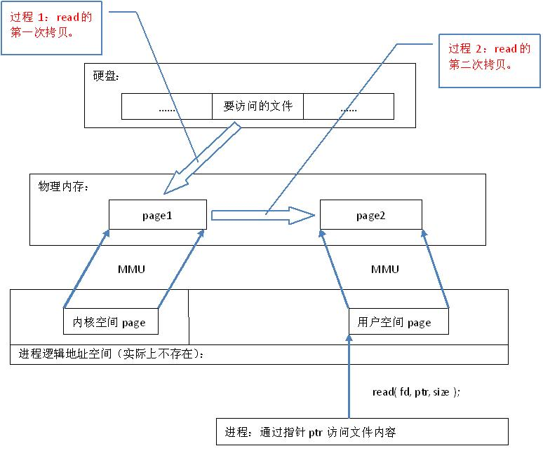
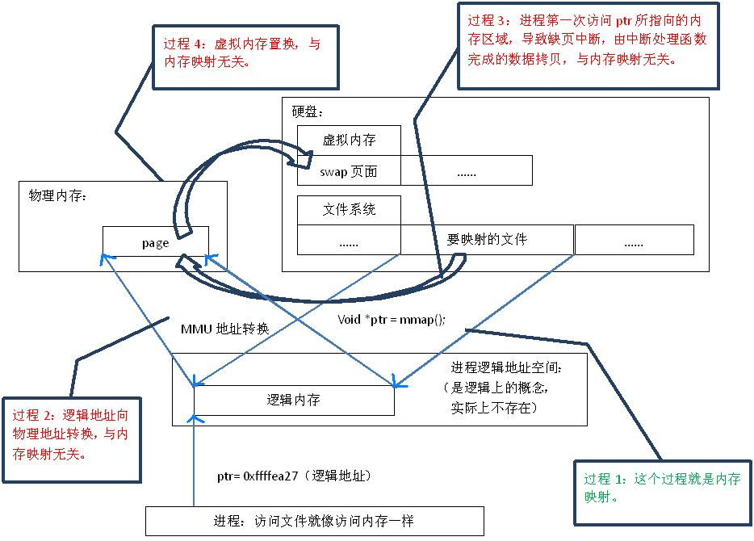
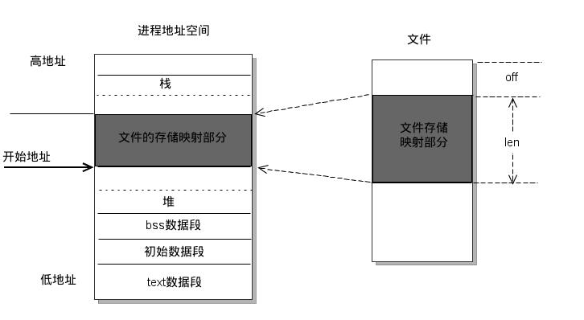
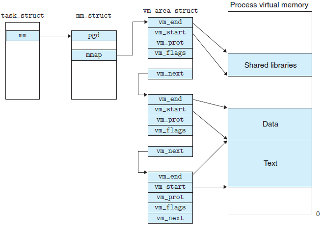
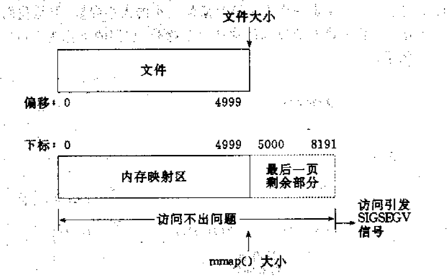
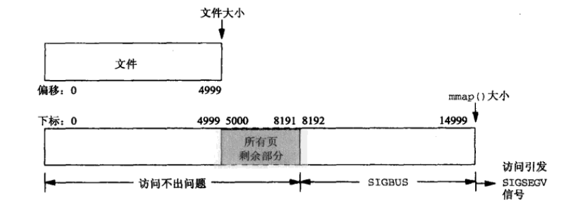

 
<!--BEGIN_DATA
{
    "create_date": "2020-05-16 14:05", 
    "modify_date": "2020-05-16 14:05", 
    "is_top": "0", 
    "summary": "iOS的文件内存映射——mmap<br>iOS内存映射mmap详解<br>认真分析mmap：是什么 为什么 怎么用", 
    "tags": "iOS、C/C++、Linux、系统", 
    "file_name": "mmap相关.md"
}
END_DATA-->

####<p>原文出处：<a href='https://www.jianshu.com/p/516e7ff6f251' target='blank'>iOS的文件内存映射——mmap</a></p>

进程是App运行的基本单位，进程之间相对独立。iOS系统中App运行的内存空间地址是虚拟空间地址，存储数据是在各自的沙盒。  
当我们在App中去读写沙盒中的文件时，我们会使用NSFileManager去查找文件，然后可以使用NSData去加载二进制数据。文件操作的更底层实现过程，是
使用linux的`read()`、`write()`函数直接操作文件句柄（也叫文件描述符、fd）。  
在操作系统层面，当App读取一个文件时，实际是有两步：先将文件从磁盘读取到物理内存，再从系统空间拷贝到用户空间（可以认为是复制到系统给App统一分配的内存）。  
iOS系统使用[页缓存机制](https://blog.csdn.net%2Fgdj0001%2Farticle%2Fdetails%2F80136364)，通过[MMU](https://baike.baidu.com%2Fitem%2FMMU%2F4542218)（Memory Management Unit）将虚拟内存地址和物理地址进行映射，并且由于进程的地址空间和系统的地址空间不一样，所以还需要多一次拷贝。

而mmap将磁盘上文件的地址信息与进程用的虚拟逻辑地址进行映射，建立映射的过程与普通的内存读取不同：正常的是将文件拷贝到内存，mmap只是建立映射而不会将文件加载到内存中。  
这样做的注意事项：

  * 1、牺牲较大的虚拟内存，映射区域有多大就需要虚拟内存有多大；（故而太大的文件不适合映射整个文件，32位虚拟内存最大是4GB，可以只映射部分）
  * 2、因为映射有额外的性能消耗，所以适用于频繁读操作的场景；（单次使用的场景不建议使用）
  * 3、因为每次操作内存会同步到磁盘，所以不适用于移动磁盘或者网络磁盘上的文件；
  * 4、变长文件不适用；

#####iOS中的mmap

以[官网的demo](https://developer.apple.com%2Flibrary%2Farchive%2Fdocumentation%2FPerformance%2FConceptual%2FFileSystem%2FArticles%2FMappingFiles.html%23%2F%2Fapple_ref%2Fdoc%2Fuid%2F20001990-CJBJFIDD)为例，其他的代码很简明直接，核心就在于mmap函数。

    
```    
void* mmap(void* start,size_t length,int prot,int flags,int fd,off_t offset);
*outDataPtr = mmap(NULL,
                    size,
                    PROT_READ|PROT_WRITE,
                    MAP_FILE|MAP_SHARED,
                    fileDescriptor,
                    0);
```

```
start：映射开始地址，设置NULL则让系统决定映射开始地址；  
length：映射区域的长度，单位是Byte；  
prot：映射内存的保护标志，主要是读写相关，是位运算标志；（记得与下面fd对应句柄打开的设置一致）  
flags：映射类型，通常是文件和共享类型；  
fd：文件句柄；  
off_toffset：被映射对象的起点偏移；
```

用官网的代码做参考，写了一个读写的例子：

    
    
    #import "ViewController.h"
    #import <sys/mman.h>
    #import <sys/stat.h>

    int MapFile(const char * inPathName, void ** outDataPtr, size_t * outDataLength, size_t appendSize)
    {
        int outError;
        int fileDescriptor;
        struct stat statInfo;
        // Return safe values on error.
        outError = 0;
        *outDataPtr = NULL;
        *outDataLength = 0;
        // Open the file.
        fileDescriptor = open( inPathName, O_RDWR, 0 );
        if( fileDescriptor < 0 )
        {
            outError = errno;
        }
        else
        {
            // We now know the file exists. Retrieve the file size.
            if( fstat( fileDescriptor, &statInfo ) != 0 )
            {
                outError = errno;
            }
            else
            {
                ftruncate(fileDescriptor, statInfo.st_size + appendSize);
                fsync(fileDescriptor);
                *outDataPtr = mmap(NULL,
                                   statInfo.st_size + appendSize,
                                   PROT_READ|PROT_WRITE,
                                   MAP_FILE|MAP_SHARED,
                                   fileDescriptor,
                                   0);
                if( *outDataPtr == MAP_FAILED )
                {
                    outError = errno;
                }
                else
                {
                    // On success, return the size of the mapped file.
                    *outDataLength = statInfo.st_size;
                }
            }
            // Now close the file. The kernel doesn’t use our file descriptor.
            close( fileDescriptor );
        }
        return outError;
    }

    void ProcessFile(const char * inPathName)
    {
        size_t dataLength;
        void * dataPtr;
        char *appendStr = " append_key";
        int appendSize = (int)strlen(appendStr);
        if( MapFile(inPathName, &dataPtr, &dataLength, appendSize) == 0) {
            dataPtr = dataPtr + dataLength;
            memcpy(dataPtr, appendStr, appendSize);
            // Unmap files
            munmap(dataPtr, appendSize + dataLength);
        }
    }

    @interface ViewController ()
    @end

    @implementation ViewController
    - (void)viewDidLoad {
        [super viewDidLoad];
        // Do any additional setup after loading the view.
        NSString *path = [NSHomeDirectory() stringByAppendingPathComponent:@"test.data"];
        NSLog(@"path: %@", path);
        NSString *str = @"test str";
        [str writeToFile:path atomically:YES encoding:NSUTF8StringEncoding error:nil];
        ProcessFile(path.UTF8String);
        NSString *result = [NSString stringWithContentsOfFile:path encoding:NSUTF8StringEncoding error:nil];
        NSLog(@"result:%@", result);
    }
    

#####MMKV和mmap

NSUserDefault是常见的缓存工具，但是数据的同步有时会不及时，比如说在crash前保存的值很容易出现保存失败的情况，在App重新启动之后读取不到保
存的值。  
MMKV很好的解决了NSUserDefault的局限，具体的好处可以见[官网](http%3
A%2F%2F)。  
但是同样由于其独特设计，在数据量较大、操作频繁的场景下，会产生性能问题。  
这里的使用给出两个建议：  

1、不要全部用defaultMMKV，根据业务大的类型做聚合，避免某一个MMKV数据过大，特别是对于某些只会出现一次的新手引导、红点之类的逻辑，尽可能按业务聚合，使用多个MMKV的对象；  

2、对于需要频繁读写的数据，可以在内存持有一份数据缓存，必要时再更新到MMKV；

#####NSData与mmap

NSData是我们常用类，有一个静态方法和mmap有关系。

    
    + (id)dataWithContentsOfFile:(NSString *)path options:(NSDataReadingOptions)readOptionsMask error:(NSError **)errorPtr;
    NSDataReadingOptions有一个参数是NSDataReadingMappedIfSafe。
    Mapped的意思是使用mmap，这个ifSafe是什么意思呢？和另外一个参数NSDataReadingMappedAlways有什么区别？
    

先看看这三个参数具体的意思： 

`NSDataReadingUncached` : 不要缓存，如果该文件只会读取一次，这个设置可以提高性能；  
`NSDataReadingMappedIfSafe` : 在保证安全的前提下使用mmap；  
`NSDataReadingMappedAlways` : 使用mmap；

如果使用mmap，则在NSData的生命周期内，都不能删除对应的文件。  
如果文件是在固定磁盘，非可移动磁盘、网络磁盘，则满足NSDataReadingMappedIfSafe。对iOS而言，这个`NSDataReadingMappedIfSafe=NSDataReadingMappedAlways`。

那什么情况下应该用对应的参数？  
如果文件很大，直接使用`dataWithContentsOfFile`方法，会导致load整个文件，出现内存占用过多的情况；此时用NSDataReading
MappedIfSafe，则会使用mmap建立文件映射，减少内存的占用。  
使用场景举例——视频加载，视频文件通常比较大，但是使用的过程中不会同时读取整个视频文件的内容，可以使用mmap优化。

####总结

mmap就是文件的内存映射，通常读取文件是将文件读取到内存，会占用真正的物理内存；而mmap是用进程的内存虚拟地址空间去映射实际的文件中，这个过程由操作系统处理。mmap不会为文件分配物理内存，而是相当于将内存地址指向文件的磁盘地址，后续对这些内存进行的读写操作，会由操作系统同步到磁盘上的文件。  
iOS中使用mmap可以用c方法的mmap()，也可以使用NSData的接口带上NSDataReadingMappedIfSafe参数。前者自由度更大，后者用于读取数据。

####附录

[mmap苹果官方文档](https://developer.apple.com%2Flibrary%2Farchive%2Fdocumentation%2FPerformance%2FConceptual%2FFileSystem%2FArticles%2FMappingFiles.html%23%2F%2Fapple_ref%2Fdoc%2Fuid%2F20001990-CJBJFIDD)  

[NSDataReadingMappedIfSafe](http://www.openradar.me%2F12254262)  

[iOS内存映射mmap详解](https://www.jianshu.com/p/13f254cf58a7)  

[linux中的页缓存和文件IO](https://Fblog.csdn.net%2Fgdj0001%2Farticle%2Fdetails%2F80136364)  

[从内核文件系统看文件读写过程](https://www.cnblogs.com%2Fhuxiao-tee%2Fp%2F4657851.html)  

[linux内存映射mmap原理分析](https://blog.csdn.net%2Fjoejames%2Farticle%2Fdetails%2F37958017)


<hr>


####<p>原文出处：<a href='https://www.jianshu.com/p/13f254cf58a7' target='blank'>iOS内存映射mmap详解</a></p>

* 进程就是一个正在运行的一个应用程序
* 每一个进度都是独立的，每一个进程均在专门且手保护的内存空间内
* iOS是怎么管理自己的内存的,见博客：[iOS — 内存分配与分区](https://blog.csdn.net/yang198907/article/details/50212925)
* 在Linux系统中，想要新开启一个进程是一件非常简单的事情只需要一句话：fork()，在fork()之后就会包含两个进程，此时可以根据返回的PID来判断是子进程还是父进程
* iOS中是一个非常封闭的系统，每一个App（一个进程）都有自己独特的内存和磁盘空间，别的App（进程）是不允许访问的（越狱不在讨论范围）

####常规文件操作

常规文件操作（read/write）有那几个重要步骤：

  1. 进程发起读文件请求
  2. 内核通过查找进程文件符表，定位到内核已打开文件集上的文件信息，从而找到此文件的inode
  3. inode在address_space上查找要请求的文件页是否已经缓存在内核页高速缓冲中。如果存在，则直接返回这片文件页的内容
  4. 如果不存在，则通过inode定位到文件磁盘地址，将数据从磁盘复制到内核页高速缓冲。之后再次发起读页面过程，进而将内核页高速缓冲中的数据发给用户进程

需要注意的几点：

  1. 常规文件操作为了提高读写效率和保护磁盘，使用了页缓存机制。由于页缓存处在内核空间，不能被用户进程直接寻址，所以需要将页缓存中数据页再次拷贝到内存对应的用户空间中
  2. read/write是系统调用很耗时，如下图，它首先将文件内容从硬盘拷贝到内核空间的一个缓冲区，然后再将这些数据拷贝到用户空间，实际上完成了两次数据拷贝
  3. 如果两个进程都对磁盘中的一个文件内容进行访问，那么这个内容在物理内存中有三份：进程A的地址空间 + 进程B的地址空间 + 内核页高速缓冲空间
  4. 写操作也是一样，待写入的buffer在内核空间不能直接访问，必须要先拷贝至内核空间对应的主存，再写回磁盘中（延迟写回），也是需要两次数据拷贝

关于内核有疑问不懂的可以参考我的这篇文章[Linux 内核剖析](https://www.jianshu.com/p/4f79680b54a4)，想了解更多linux文件系统相关知识的可以参考这篇文章[从内核文件系统看文件读写过程](http://www.cnblogs.com/huxiao-tee/p/4657851.html)。

下面这个图来自[linux内存映射mmap原理分析](https://blog.csdn.net/joejames/article/details/37958017)，很形象的描述了整个进程访问磁盘中文件的过程。  



####mmap内存映射

同样的我会放一个mmap映射过程图，以求让大家对mmap映射有更直观理解，图片也还是来自[linux内存映射mmap原理分析](https://blog.csdn.net/joejames/article/details/37958017)



在内存映射的过程中，并没有实际的数据拷贝，文件没有被载入内存，只是逻辑上被放入了内存，具体到代码，就是建立并初始化了相关的数据结构`（struct address_space）`，这个过程有系统调用mmap()实现，所以建立内存映射的效率很高。

既然建立内存映射没有进行实际的数据拷贝，那么进程又怎么能最终直接通过内存操作访问到硬盘上的文件呢？那就要看内存映射之后的几个相关的过程了。

mmap()会返回一个指针ptr，它指向进程逻辑地址空间中的一个地址，这样以后，进程无需再调用read或write对文件进行读写，而只需要通过ptr就能够操作文件。但是ptr所指向的是一个逻辑地址，要操作其中的数据，必须通过MMU将逻辑地址转换成物理地址，如图1中过程2所示。这个过程与内存映射无关。

前面讲过，建立内存映射并没有实际拷贝数据，这时，MMU在地址映射表中是无法找到与ptr相对应的物理地址的，也就是MMU失败，将产生一个缺页中断，缺页中断的中断响应函数会在swap中寻找相对应的页面，如果找不到（也就是该文件从来没有被读入内存的情况），则会通过mmap()建立的映射关系，从硬盘上将文件读取到物理内存中，如图1中过程3所示。这个过程与内存映射无关。

如果在拷贝数据时，发现物理内存不够用，则会通过虚拟内存机制（swap）将暂时不用的物理页面交换到硬盘上，如图1中过程4所示。这个过程也与内存映射无关。

**mmap内存映射的实现过程，总的来说可以分为三个阶段：**

  1. 进程启动映射过程，并在虚拟地址空间中为映射创建虚拟映射区域
  2. 调用内核空间的系统调用函数mmap（不同于用户空间函数），实现文件物理地址和进程虚拟地址的一一映射关系
  3. 进程发起对这片映射空间的访问，引发缺页异常，实现文件内容到物理内存（主存）的拷贝

如果想了解每个阶段更多详细内容，请看这里[认真分析mmap：是什么 为什么 怎么用](https://www.cnblogs.com/huxiao-tee/p/4660352.html)

####mmap使用分析

这一部分来自苹果官方开发文档[Mapping Files Into Memory](https://developer.apple.com/library/content/documentation/FileManagement/Conceptual/FileSystemAdvancedPT/MappingFilesIntoMemory/MappingFilesIntoMemory.html)

####适合的场景

  * 您有一个很大的文件，其内容您想要随机访问一个或多个时间
  * 您有一个小文件，它的内容您想要立即读入内存并经常访问。这种技术最适合那些大小不超过几个虚拟内存页的文件。（页是地址空间的最小单位，虚拟页和物理页的大小是一样的，通常为4KB。）
  * 您需要在内存中缓存文件的特定部分。文件映射消除了缓存数据的需要，这使得系统磁盘缓存中的其他数据空间更大

当随机访问一个非常大的文件时，通常最好只映射文件的一小部分。映射大文件的问题是文件会消耗活动内存。如果文件足够大，系统可能会被迫将其他部分的内存分页以加载文件。将多个文件映射到内存中会使这个问题更加复杂。

####不适合的场景

  * 您希望从开始到结束的顺序从头到尾读取一个文件
  * 这个文件有几百兆字节或者更大。将大文件映射到内存中会快速地填充内存，并可能导致分页，这将抵消首先映射文件的好处。对于大型顺序读取操作，禁用磁盘缓存并将文件读入一个小内存缓冲区
  * 该文件大于可用的连续虚拟内存地址空间。对于64位应用程序来说，这不是什么问题，但是对于32位应用程序来说，这是一个问题
  * 该文件位于可移动驱动器上
  * 该文件位于网络驱动器上

####代码实现

这段代码实现比较简单，源自[Mapping Files Into Memory](https://developer.apple.com/library/content/documentation/FileManagement/Conceptual/FileSystemAdvancedPT/MappingFilesIntoMemory/MappingFilesIntoMemory.html)

    
    
    import Foundation
    import Darwin

    func ProcessFile(inPathName: String) {
        var dataLength: size_t?
        var dataPtr: UnsafeMutableRawPointer?
        var start: UnsafeMutableRawPointer?
        if mapFile(inPathName: inPathName, outDataPtr: &dataPtr, outDataLength: &dataLength) {
            start = dataPtr
            dataPtr = dataPtr! + 3
            memcpy(dataPtr, "CCCC", 4)
            // Unmap files:
            munmap(start, 7)
        }
    }

    func mapFile(inPathName: String, outDataPtr: inout UnsafeMutableRawPointer?, outDataLength: inout size_t?) -> Bool {
        var fileDescriptor: Int32
        var statInfo = stat()
        outDataPtr = nil
        outDataLength = 0
        // Open the file
        fileDescriptor = open(inPathName, O_RDWR, 0)
        if fileDescriptor < 0 {
            return false
        }
        // We now know the file exists. Retrieve the file size.
        if fstat(fileDescriptor, &statInfo) != 0 {
            return false
        }else {
            ftruncate(fileDescriptor, statInfo.st_size+4)
            fsync(fileDescriptor)
            outDataPtr = mmap(nil, Int(statInfo.st_size+4), PROT_READ|PROT_WRITE, MAP_FILE|MAP_SHARED, fileDescriptor, 0)
            if outDataPtr == MAP_FAILED {
                return false
            }else{
                outDataLength = size_t(statInfo.st_size)
            }
        }
        // Now close the file. The kernel doesn’t use our file descriptor.
        close(fileDescriptor)
        return true
    }
    
    
    let path = NSSearchPathForDirectoriesInDomains(.documentDirectory, .userDomainMask, true).first
    let str = "AAA"
    let filePath = "\(path ?? "")/text.txt"
    try? str.write(toFile: filePath, atomically: true, encoding: .utf8)
    ProcessFile(inPathName: filePath)
    let result = try? String(contentsOfFile: filePath, encoding: .utf8)
    print(result)
    

####在iOS的应用

具体在项目中怎么去使用mmap呢？我推荐你看看以下的文章和代码：

[MMKV--基于 mmap 的 iOS 高性能通用 key-value组件](https://cloud.tencent.com/developer/article/1066229)  

[iOS图片加载速度极限优化—FastImageCache解析](http://blog.cnbang.net/tech/2578/)  

[FastImageCache](https://github.com/path/FastImageCache)

之后我也会在一个开源项目中使用mmap，到时候会更加详细的讲实现的细节，老铁来波关注吧。

####最后

说实话如果没有一些操作系统相关知识，很难完全弄明白整个过程。因为涉及到进程，用户空间，内存空间，逻辑地址，物理地址，系统调用，中断，磁盘I/O等一系列的知识。我曾尝试画图以便能说的更清楚，但最后还是放弃了，因为只会越说越复杂。如果有什么疑问可以留言，能回答的都会尽量回答。

参考文章：

[iOS－线程&&进程的深入理解](https://blog.csdn.net/yang198907/article/details/50621280)  
[Mapping Files Into Memory](https://developer.apple.com/library/content/documentation/FileManagement/Conceptual/FileSystemAdvancedPT/MappingFilesIntoMemory/MappingFilesIntoMemory.html)  
[linux内存映射mmap原理分析](https://blog.csdn.net/joejames/article/details/37958017)  
[mmap实例及原理分析](http://ju.outofmemory.cn/entry/224106)


<hr>


####<p>原文出处：<a href='https://www.cnblogs.com/huxiao-tee/p/4660352.html' target='blank'>认真分析mmap：是什么 为什么 怎么用</a></p>

####mmap基础概念

mmap是一种内存映射文件的方法，即将一个文件或者其它对象映射到进程的地址空间，实现文件磁盘地址和进程虚拟地址空间中一段虚拟地址的一一对映关系。实现这样的映射关系后，进程就可以采用指针的方式读写操作这一段内存，而系统会自动回写脏页面到对应的文件磁盘上，即完成了对文件的操作而不必再调用read,write等系统调用函数。相反，内核空间对这段区域的修改也直接反映用户空间，从而可以实现不同进程间的文件共享。如下图所示：



由上图可以看出，进程的虚拟地址空间，由多个虚拟内存区域构成。虚拟内存区域是进程的虚拟地址空间中的一个同质区间，即具有同样特性的连续地址范围。上图中所示的text数据段（代码段）、初始数据段、BSS数据段、堆、栈和内存映射，都是一个独立的虚拟内存区域。而为内存映射服务的地址空间处在堆栈之间的空余部分。

linux内核使用`vm_area_struct`结构来表示一个独立的虚拟内存区域，由于每个不同质的虚拟内存区域功能和内部机制都不同，因此一个进程使用多个`vm_area_struct`结构来分别表示不同类型的虚拟内存区域。各个`vm_area_struct`结构使用链表或者树形结构链接，方便进程快速访问，如下图所示：



`vm_area_struct`结构中包含区域起始和终止地址以及其他相关信息，同时也包含一个`vm_ops`指针，其内部可引出所有针对这个区域可以使用的系统调用函数。这样，进程对某一虚拟内存区域的任何操作需要用要的信息，都可以从`vm_area_struct`中获得。mmap函数就是要创建一个新的`vm_area_struct`结构，并将其与文件的物理磁盘地址相连。具体步骤请看下一节。

####mmap内存映射原理

mmap内存映射的实现过程，总的来说可以分为三个阶段：

**（一）进程启动映射过程，并在虚拟地址空间中为映射创建虚拟映射区域**

1、进程在用户空间调用库函数mmap，原型：`void *mmap(void *start, size_t length, int prot, int flags, int fd, off_t offset)`;

2、在当前进程的虚拟地址空间中，寻找一段空闲的满足要求的连续的虚拟地址

3、为此虚拟区分配一个`vm_area_struct`结构，接着对这个结构的各个域进行了初始化

4、将新建的虚拟区结构（`vm_area_struct`）插入进程的虚拟地址区域链表或树中


**（二）调用内核空间的系统调用函数mmap（不同于用户空间函数），实现文件物理地址和进程虚拟地址的一一映射关系**

5、为映射分配了新的虚拟地址区域后，通过待映射的文件指针，在文件描述符表中找到对应的文件描述符，通过文件描述符，链接到内核"已打开文件集"中该文件的文件结构体（struct file），每个文件结构体维护着和这个已打开文件相关各项信息。

6、通过该文件的文件结构体，链接到`file_operations`模块，调用内核函数mmap，其原型为：`int mmap(struct file *filp, struct vm_area_struct *vma)`，不同于用户空间库函数。

7、内核mmap函数通过虚拟文件系统inode模块定位到文件磁盘物理地址。

8、通过`remap_pfn_range`函数建立页表，即实现了文件地址和虚拟地址区域的映射关系。此时，这片虚拟地址并没有任何数据关联到主存中。


**（三）进程发起对这片映射空间的访问，引发缺页异常，实现文件内容到物理内存（主存）的拷贝**

注：前两个阶段仅在于创建虚拟区间并完成地址映射，但是并没有将任何文件数据的拷贝至主存。真正的文件读取是当进程发起读或写操作时。

9、进程的读或写操作访问虚拟地址空间这一段映射地址，通过查询页表，发现这一段地址并不在物理页面上。因为目前只建立了地址映射，真正的硬盘数据还没有拷贝到内存中，因此引发缺页异常。

10、缺页异常进行一系列判断，确定无非法操作后，内核发起请求调页过程。

11、调页过程先在交换缓存空间（swap cache）中寻找需要访问的内存页，如果没有则调用nopage函数把所缺的页从磁盘装入到主存中。

12、之后进程即可对这片主存进行读或者写的操作，如果写操作改变了其内容，一定时间后系统会自动回写脏页面到对应磁盘地址，也即完成了写入到文件的过程。

注：修改过的脏页面并不会立即更新回文件中，而是有一段时间的延迟，可以调用msync()来强制同步, 这样所写的内容就能立即保存到文件里了。


####mmap和常规文件操作的区别

对linux文件系统不了解的朋友，请参阅我之前写的博文《[从内核文件系统看文件读写过程](http://www.cnblogs.com/huxiao-tee/p/4657851.html)》，我们首先简单的回顾一下常规文件系统操作（调用read/fread等类函数）中，函数的调用过程：

1、进程发起读文件请求。

2、内核通过查找进程文件符表，定位到内核已打开文件集上的文件信息，从而找到此文件的inode。

3、inode在`address_space`上查找要请求的文件页是否已经缓存在页缓存中。如果存在，则直接返回这片文件页的内容。

4、如果不存在，则通过inode定位到文件磁盘地址，将数据从磁盘复制到页缓存。之后再次发起读页面过程，进而将页缓存中的数据发给用户进程。

总结来说，常规文件操作为了提高读写效率和保护磁盘，使用了页缓存机制。这样造成读文件时需要先将文件页从磁盘拷贝到页缓存中，由于页缓存处在内核空间，不能被用户进程直接寻址，所以还需要将页缓存中数据页再次拷贝到内存对应的用户空间中。这样，通过了两次数据拷贝过程，才能完成进程对文件内容的获取任务。写操作也是一样，待写入的buffer在内核空间不能直接访问，必须要先拷贝至内核空间对应的主存，再写回磁盘中（延迟写回），也是需要两次数据拷贝。

而使用mmap操作文件中，创建新的虚拟内存区域和建立文件磁盘地址和虚拟内存区域映射这两步，没有任何文件拷贝操作。而之后访问数据时发现内存中并无数据而发起的缺页异常过程，可以通过已经建立好的映射关系，只使用一次数据拷贝，就从磁盘中将数据传入内存的用户空间中，供进程使用。

**总而言之，常规文件操作需要从磁盘到页缓存再到用户主存的两次数据拷贝。而mmap操控文件，只需要从磁盘到用户主存的一次数据拷贝过程。**说白了，mmap的关键点是实现了用户空间和内核空间的数据直接交互而省去了空间不同数据不通的繁琐过程。因此mmap效率更高。


####mmap优点总结

由上文讨论可知，mmap优点共有一下几点：

1、对文件的读取操作跨过了页缓存，减少了数据的拷贝次数，用内存读写取代I/O读写，提高了文件读取效率。

2、实现了用户空间和内核空间的高效交互方式。两空间的各自修改操作可以直接反映在映射的区域内，从而被对方空间及时捕捉。

3、提供进程间共享内存及相互通信的方式。不管是父子进程还是无亲缘关系的进程，都可以将自身用户空间映射到同一个文件或匿名映射到同一片区域。从而通过各自对映射区域的改动，达到进程间通信和进程间共享的目的。同时，如果进程A和进程B都映射了区域C，当A第一次读取C时通过缺页从磁盘复制文件页到内存中；但当B再读C的相同页面时，虽然也会产生缺页异常，但是不再需要从磁盘中复制文件过来，而可直接使用已经保存在内存中的文件数据。

4、可用于实现高效的大规模数据传输。内存空间不足，是制约大数据操作的一个方面，解决方案往往是借助硬盘空间协助操作，补充内存的不足。但是进一步会造成大量的文件I/O操作，极大影响效率。这个问题可以通过mmap映射很好的解决。换句话说，但凡是需要用磁盘空间代替内存的时候，mmap都可以发挥其功效。


####mmap相关函数

**函数原型**


    void *mmap(void *start, size_t length, int prot, int flags, int fd, off_t offset);

**返回说明**

成功执行时，mmap()返回被映射区的指针。失败时，mmap()返回`MAP_FAILED`[其值为(void *)-1]， error被设为以下的某个值：

    
```    
1 EACCES：访问出错
2 EAGAIN：文件已被锁定，或者太多的内存已被锁定
3 EBADF：fd不是有效的文件描述词
4 EINVAL：一个或者多个参数无效
5 ENFILE：已达到系统对打开文件的限制
6 ENODEV：指定文件所在的文件系统不支持内存映射
7 ENOMEM：内存不足，或者进程已超出最大内存映射数量
8 EPERM：权能不足，操作不允许
9 ETXTBSY：已写的方式打开文件，同时指定MAP_DENYWRITE标志
10 SIGSEGV：试着向只读区写入
11 SIGBUS：试着访问不属于进程的内存区
```

返回错误类型

**参数**

start：映射区的开始地址

length：映射区的长度

prot：期望的内存保护标志，不能与文件的打开模式冲突。是以下的某个值，可以通过or运算合理地组合在一起


```
1 PROT_EXEC ：页内容可以被执行
2 PROT_READ ：页内容可以被读取
3 PROT_WRITE ：页可以被写入
4 PROT_NONE ：页不可访问
```

flags：指定映射对象的类型，映射选项和映射页是否可以共享。它的值可以是一个或者多个以下位的组合体

    
```
1 MAP_FIXED //使用指定的映射起始地址，如果由start和len参数指定的内存区重叠于现存的映射空间，重叠部分将会被丢弃。如果指定的起始地址不可用，操作将会失败。并且起始地址必须落在页的边界上。
2 MAP_SHARED //与其它所有映射这个对象的进程共享映射空间。对共享区的写入，相当于输出到文件。直到msync()或者munmap()被调用，文件实际上不会被更新。
3 MAP_PRIVATE //建立一个写入时拷贝的私有映射。内存区域的写入不会影响到原文件。这个标志和以上标志是互斥的，只能使用其中一个。
4 MAP_DENYWRITE //这个标志被忽略。
5 MAP_EXECUTABLE //同上
6 MAP_NORESERVE //不要为这个映射保留交换空间。当交换空间被保留，对映射区修改的可能会得到保证。当交换空间不被保留，同时内存不足，对映射区的修改会引起段违例信号。
7 MAP_LOCKED //锁定映射区的页面，从而防止页面被交换出内存。
8 MAP_GROWSDOWN //用于堆栈，告诉内核VM系统，映射区可以向下扩展。
9 MAP_ANONYMOUS //匿名映射，映射区不与任何文件关联。
10 MAP_ANON //MAP_ANONYMOUS的别称，不再被使用。
11 MAP_FILE //兼容标志，被忽略。
12 MAP_32BIT //将映射区放在进程地址空间的低2GB，MAP_FIXED指定时会被忽略。当前这个标志只在x86-64平台上得到支持。
13 MAP_POPULATE //为文件映射通过预读的方式准备好页表。随后对映射区的访问不会被页违例阻塞。
14 MAP_NONBLOCK //仅和MAP_POPULATE一起使用时才有意义。不执行预读，只为已存在于内存中的页面建立页表入口。
```

fd：有效的文件描述词。如果MAP_ANONYMOUS被设定，为了兼容问题，其值应为-1

offset：被映射对象内容的起点

**相关函数**

    int munmap( void * addr, size_t len )

成功执行时，munmap()返回0。失败时，munmap返回-1，error返回标志和mmap一致；  

该调用在进程地址空间中解除一个映射关系，addr是调用mmap()时返回的地址，len是映射区的大小；

当映射关系解除后，对原来映射地址的访问将导致段错误发生。

    int msync( void *addr, size_t len, int flags )

一般说来，进程在映射空间的对共享内容的改变并不直接写回到磁盘文件中，往往在调用munmap（）后才执行该操作。

可以通过调用msync()实现磁盘上文件内容与共享内存区的内容一致。

####mmap使用细节

1、使用mmap需要注意的一个关键点是，mmap映射区域大小必须是物理页大小(page_size)的整倍数（32位系统中通常是4k字节）。原因是，内存的最小粒度是页，而进程虚拟地址空间和内存的映射也是以页为单位。为了匹配内存的操作，mmap从磁盘到虚拟地址空间的映射也必须是页。

2、内核可以跟踪被内存映射的底层对象（文件）的大小，进程可以合法的访问在当前文件大小以内又在内存映射区以内的那些字节。也就是说，如果文件的大小一直在扩张，只要在映射区域范围内的数据，进程都可以合法得到，这和映射建立时文件的大小无关。具体情形参见"情形三"。

3、映射建立之后，即使文件关闭，映射依然存在。因为映射的是磁盘的地址，不是文件本身，和文件句柄无关。同时可用于进程间通信的有效地址空间不完全受限于被映射文件的大小，因为是按页映射。

在上面的知识前提下，我们下面看看如果大小不是页的整倍数的具体情况：

**情形一：一个文件的大小是5000字节，mmap函数从一个文件的起始位置开始，映射5000字节到虚拟内存中。**

分析：因为单位物理页面的大小是4096字节，虽然被映射的文件只有5000字节，但是对应到进程虚拟地址区域的大小需要满足整页大小，因此mmap函数执行后，实际映射到虚拟内存区域8192个 字节，5000~8191的字节部分用零填充。映射后的对应关系如下图所示：



此时：

（1）读/写前5000个字节（0~4999），会返回操作文件内容。

（2）读字节5000~8191时，结果全为0。写5000~8191时，进程不会报错，但是所写的内容不会写入原文件中 。

（3）读/写8192以外的磁盘部分，会返回一个SIGSECV错误。

**情形二：一个文件的大小是5000字节，mmap函数从一个文件的起始位置开始，映射15000字节到虚拟内存中，即映射大小超过了原始文件的大小。**

分析：由于文件的大小是5000字节，和情形一一样，其对应的两个物理页。那么这两个物理页都是合法可以读写的，只是超出5000的部分不会体现在原文件中。由于程序要求映射15000字节，而文件只占两个物理页，因此8192字节~15000字节都不能读写，操作时会返回异常。如下图所示：



此时：

（1）进程可以正常读/写被映射的前5000字节(0~4999)，写操作的改动会在一定时间后反映在原文件中。

（2）对于5000~8191字节，进程可以进行读写过程，不会报错。但是内容在写入前均为0，另外，写入后不会反映在文件中。

（3）对于8192~14999字节，进程不能对其进行读写，会报SIGBUS错误。

（4）对于15000以外的字节，进程不能对其读写，会引发SIGSEGV错误。


**情形三：一个文件初始大小为0，使用mmap操作映射了1000*4K的大小，即1000个物理页大约4M字节空间，mmap返回指针ptr。**

分析：如果在映射建立之初，就对文件进行读写操作，由于文件大小为0，并没有合法的物理页对应，如同情形二一样，会返回SIGBUS错误。

但是如果，每次操作ptr读写前，先增加文件的大小，那么ptr在文件大小内部的操作就是合法的。例如，文件扩充4096字节，ptr就能操作ptr ~ [(char)ptr + 4095]的空间。只要文件扩充的范围在1000个物理页（映射范围）内，ptr都可以对应操作相同的大小。

这样，方便随时扩充文件空间，随时写入文件，不造成空间浪费。

