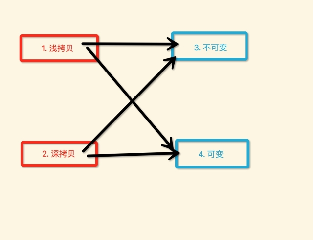
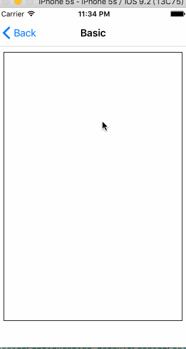
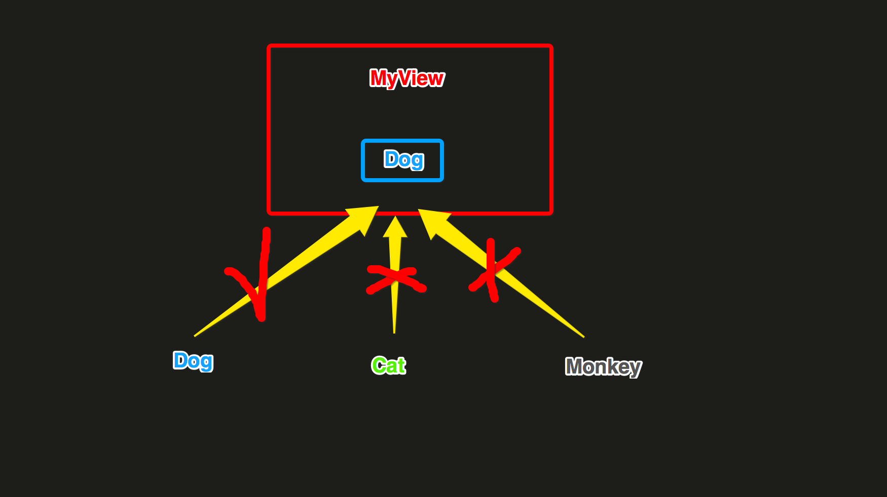
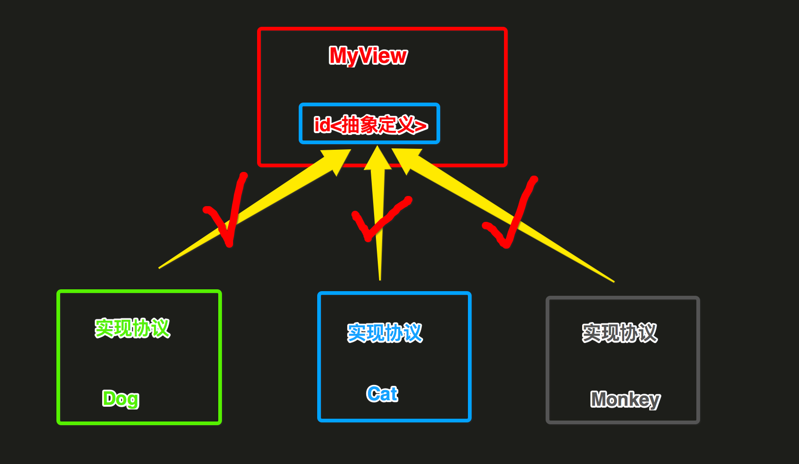
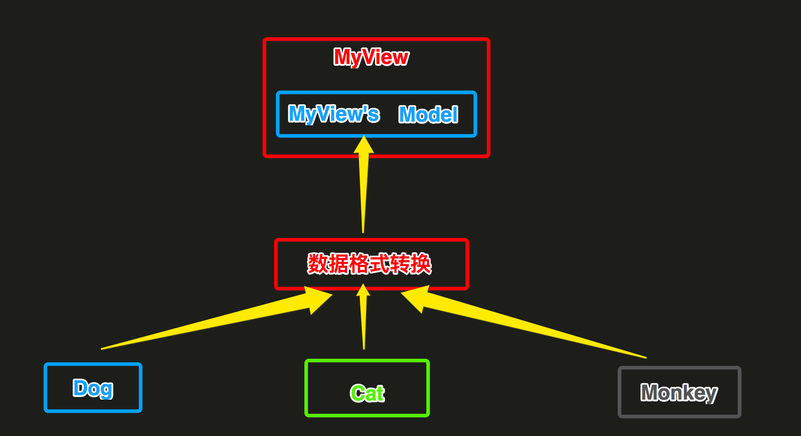

 
<!--BEGIN_DATA
{
    "create_date": "2017-04-07 19:51", 
    "modify_date": "2017-04-07 19:51", 
    "is_top": "0", 
    "summary": "objc个人总结", 
    "tags": "iOS", 
    "file_name": "objc个人总结.md"
}
END_DATA-->

####
原文出处：<a href='http://www.jianshu.com/p/c9778590602e' target='blank'>objc个人总结1</a>

###平时工作、参看源码、查看各种资料，以及被bat虐ing，学习到的一些技巧

我自己有个总结的可能会更详细，只是显得太啰嗦太多了，也就列举一些最主要的，一些具体细节就没有细说，如果需要可以留言探讨。文章会不断的更新，添加一些技巧。

搞了两年多ios了，还没有能拿得出手的开源代码，哎心酸。这两年多，我也换了两三次工作，好像还是有点不正常... 就我个人感觉，或许在牛逼的公司接触到牛逼的人，又跟着做了牛逼的项目，但发现最重要的还是每天自学。中午一个小时，晚上回去两个小时，只要长年累月的坚持下去，即使不在bat也一样可以变强大，YYKit就是一个典型例子，努力吧各位骚年。

写这篇文章的目的，并不是炫耀我多牛逼，相反我还是个菜逼。只是想把我个人的学习历程分享给一些像我这样的小白，并且得到更多的大牛的错误更正。

###主线程上常见比较耗时的代码类型:

  * (1) 各种NSObject对象

    * UIKit Obejcts UI对象
    * UI对象的属性值调整
    * UI对象的创建
    * UI对象的销毁
    * 以及其他文件数据、缓存对象的废弃
 
  * (2) Layout 布局计算

    * 计算文本内容尺寸计算
    * frame计算
    * frame调整
    * 至于Autolayout，我个人觉得不要使用，虽然写的是时候图方便，换个人接手的时候，几乎是无法接受，而且性能也很差
  
  * (3) Rendering 显示数据渲染

    * 文本内容的绘制，渲染
    * 图片的解压，解码，绘制，渲染
    * 图形的绘制，渲染

尽量的将如上步骤，尽量放到子线程异步执行，对于绘制渲染最好同样在子线程提前渲染完毕，而基于Core的各种绘制都是可以并发子线程造成（苹果真神奇），但是在并发
绘制时，需要注意尽量不要随意使用系统并发队列，原因可参考YYKit界面流畅文章写的很清楚，最好是使用串行队列，因为能够控制线程数，具体就不啰嗦了。

注意，UI对象的操作必须放到主线程，原因大家都知道。

###YYMemoryCache中在子线程异步释放废弃对象

    
    
    - (void)removeAll {
        _totalCost = 0;
        _totalCount = 0;
        _head = nil;
        _tail = nil;
        if (CFDictionaryGetCount(_nodeMap) > 0) {
            CFMutableDictionaryRef holder = _nodeMap;
            _nodeMap = CFDictionaryCreateMutable(CFAllocatorGetDefault(), 0, &kCFTypeDictionaryKeyCallBacks, &kCFTypeDictionaryValueCallBacks);
            if (_releaseAsynchronously) {
                if (_releaseOnMainThread && !pthread_main_np()) {
                    dispatch_async(dispatch_get_main_queue(), ^{
                        CFRelease(holder);
                    });
                } else {
                    dispatch_queue_t queue = _releaseOnMainThread ? dispatch_get_main_queue() : XZHMemoryCacheGetReleaseQueue();
                    dispatch_async(queue, ^{
                        CFRelease(holder);
                    });
                }
            } else {
                CFRelease(holder);
            }
        }
    }

我问了很多人，都不知道这个小技巧，呵呵。

###KVO的大致实现总结

  * (1) 当一个对象的属性添加了属性观察者之后

  * (2) 在程序运行时，系统通过runtime函数，创建出一个对象所属类的一个子类，名字的格式是 **NSKVONotifying_原始类名**

  * (3) 此时将被添加属性观察的objc类对象->isa指针，指向上面(2)创建出来的objc类，就不再指向之前的objc类了

  * (4) 运行时创建的**NSKVONotifying_原始类名**这个类，会重写原来父类中被观察属性property的setter方法实现。比如如下:
    
    
	    - (void)setType:(NSSting *)type {
	        //1. 调用父类Cat设置属性值的方法实现
	        [super setType:type];
	        //2. 通知Cat对象的观察者执行回调（从断点效果看是同步执行的）
	        [cat对象的观察者 observeValueForKeyPath:@"type"  ofObject:self  change:@{}  context:nil];
	    }

  * (5) 当对象的被观察属性值发生改变时（中间类的setter方法实现被调用），就会回调执行观察者的observeValueForKeyPath: ofObject:change:context:方法实现，并且是同步调用的

  * (6) 如下两个方法的返回的 objc_class结构体实例 是 不同 的
    
    
    object_getClass(被观察者对象) >>> 返回的是替换后的`中间类` >>> 因为读取的是isa指向的Class
    
    
    	[被观察对象 class] >>> 仍然然会之前的`原始类`，这个Class应该是备用的

  * (7) 当对象移除属性观察者之后，该对象的 isa指针又会 恢复 指向为 原始类

###IMP Caching

首先，有一个测试类:

    
    
    @interface Person : NSObject
    + (void)logName1:(NSString *)name;
    - (void)logName2:(NSString *)name;
    @end
    @implementation Person
    + (void)logName1:(NSString *)name {
        NSLog(@"log1 name = %@", name);
    }
    - (void)logName2:(NSString *)name {
        NSLog(@"log2 name = %@", name);
    }
    @end

然后ViewController测试IMP Caching:

    
    
    #import <objc/runtime.h>
    static id PersonClass = nil;
    static SEL PersonSEL1;
    static SEL PersonSEL2;
    static IMP PersonIMP1;
    static IMP PersonIMP2;
    @implementation ViewController
    + (void)initialize {
        PersonClass = [Person class];
        PersonSEL1 = @selector(logName1:);
        PersonSEL2 = @selector(logName2:);
        PersonIMP1 = [PersonClass methodForSelector:PersonSEL1];
        PersonIMP2 = method_getImplementation(class_getInstanceMethod(PersonClass, PersonSEL2));
    }
    - (void)touchesBegan:(NSSet<UITouch *> *)touches withEvent:(UIEvent *)event {
        ((void (*)(id, SEL, NSString*)) (void *) PersonIMP1)(PersonClass, PersonSEL1, @"我是参数");
        ((void (*)(id, SEL, NSString*)) (void *) PersonIMP2)([Person new], PersonSEL2, @"我是参数");
        NSLog(@"");
    }
    @end

输出结果

    
    
    2017-02-08 22:47:46.586 Test[805:25490] log1 name = 我是参数
    2017-02-08 22:47:46.587 Test[805:25490] log2 name = 我是参数

###当遇到多种选择条件时，要尽量使用查表法实现

比如 switch/case，C Array，如果查表条件是对象，则可以用 NSDictionary 来实现。

比如，如下很多的 if-elseif 的判断语句:

    
    
    NSString *name = @"XIONG";
    if ([name isEqualToString:@"XIAOMING"]) {
        NSLog(@"task 1");
    } else if ([name isEqualToString:@"LINING"]) {
        NSLog(@"task 2");
    } else if ([name isEqualToString:@"MAHANG"]) {
        NSLog(@"task 3");
    } else if ([name isEqualToString:@"YHAHA"]) {
        NSLog(@"task 4");
    }

使用`NSDictionary+Block`来封装`条件对应的key`与`执行代码block`的键值对关系:

    
    
    NSDictionary *map = @{
        // if条件的key : if条件要执行的代码封装的block
        @"XIONG1" : ^() {NSLog(@"task 1");},
          @"XIONG2" : ^() {NSLog(@"task 2");},
          @"XIONG3" : ^() {NSLog(@"task 3");},
          @"XIONG4" : ^() {NSLog(@"task 4");},
    };

构建key的时候，注意尽量不要相似，差距越大越好。

###我们编写的NSObject类，在程序运行时加载的过程

    
    
    //1. 创建一个运行时识别的Class
    objc_allocateClassPair(Class superclass, 
                           const char *name, 
                           size_t extraBytes);
    //2. 添加实例变量
    BOOL class_addIvar(Class cls, 
                       const char *name, 
                       size_t size, 
                       uint8_t alignment,
                        const char *types);
    //3. 添加实例方法
    BOOL class_addMethod(Class cls, 
                         SEL name, 
                         IMP imp, 
                         const char *types);
    //4. 添加实现的协议
    BOOL class_addProtocol(Class cls, Protocol *protocol);
    //5. 【重要】将处理完毕的Class注册到运行时系统，之后就无法修改【Ivar】
    void objc_registerClassPair(Class cls);

一旦执行了`objc_registerClassPair()`，就再也无法改变Ivar的布局了，之前我在写runtime代码时候，就犯傻给一个写在源文件中的NSObject类添加Ivar，TMD添加了n次就是添加不上去，就是这个原因。

###读写 Ivar、发送 getter/setter、KVC 这三者之间的选择

我目前所在公司饿了么，我发现他们是通过一个运行时框架，将一个objc对象的属性值，然后通过KVC的keypath方法，类似json解析的形式设置给另外的一个objc对象的属性值。

他们觉得很牛逼，很高效、掉渣天....我在看YYModel代码的时候，就看到过YYKit作者有这样的几句总结，从作者文章中的原话如下：
 
    
    3. 避免 KVC
    Key-Value Coding 使用起来非常方便，但性能上要差于直接调用 Getter/Setter，所以如果能避免 KVC 而用 Getter/Setter 代替，性能会有较大提升。
    4. 避免 Getter/Setter 调用
    如果能直接访问 ivar，则尽量使用 ivar 而不要使用 Getter/Setter 这样也能节省一部分开销。

我刚开始的时候，也只是记住了这个结论，并没有去了解过为什么，但是后来在看YYModel代码时，以及后续自己写Runtime的代码时，我发现必须要搞懂这个原理，才能往下深入。那么具体实现原理，大家可以百度查找，各种n多的资料，我就不啰嗦了。

下面就直接通过测试看哪种效率会更高：

    
    
    @interface Cat : NSObject <NSCoding>
    @property (nonatomic, assign) NSInteger cid;
    @property (nonatomic, copy) NSString *name;
    @end
    @implementation Cat
    @end
    @interface Dog : NSObject
    @property (nonatomic, copy) NSString *name;
    @property (nonatomic, assign) NSInteger uid;
    @property (nonatomic, strong) Cat *cat;
    @end
    @implementation Cat
    @end
    
    
    - (void)testJSONMapping10 {
        Dog *dog = [Dog new];
        int count = 1000000;
        double date_s = CFAbsoluteTimeGetCurrent();
        for (int i = 0; i < count; i++) {
            // 1. KVC
            {
                Cat *cat = [Cat new];
                [cat setValue:@"cat001" forKey:@"name"];
                [cat setValue:@(1) forKey:@"cid"];
                [dog setValue:@"dog001" forKey:@"name"];
                [dog setValue:@(1) forKey:@"uid"];
                [dog setValue:cat forKey:@"cat"];
            }
            //2. setter和getter
            {
                Cat *cat = [Cat new];
                cat.name = @"cat001";
                cat.cid = 1;
                dog.name = @"dog001";
                dog.uid = 1;
                dog.cat = cat;
            }
            //3. Ivar
            {
                Cat *cat = [Cat new];
                Ivar cat_name_ivar = class_getInstanceVariable([cat class], "_name");
                Ivar cat_cid_ivar = class_getInstanceVariable([cat class], "_cid");
                object_setIvar(cat, cat_name_ivar, @"cat001");
                object_setIvar(cat, cat_cid_ivar, @(1));
                Ivar dog_name_ivar = class_getInstanceVariable([dog class], "_name");
                Ivar dog_uid_ivar = class_getInstanceVariable([dog class], "_uid");
                Ivar dog_cat_ivar = class_getInstanceVariable([dog class], "_cat");
                object_setIvar(dog, dog_name_ivar, @"dog001");
                object_setIvar(dog, dog_uid_ivar, @(1));
                object_setIvar(dog, dog_cat_ivar, cat);
            }
        }
        double date_current = CFAbsoluteTimeGetCurrent() - date_s;
        NSLog(@"consumeTime: %f μs",date_current * 11000 * 1000);
    }

对于 KVC 的消耗时间

    
    
    2017-04-02 21:55:56.970 XZHRuntimeDemo[1574:22535] consumeTime: 6698549.211025 μs
    2017-04-02 21:55:58.797 XZHRuntimeDemo[1574:22535] consumeTime: 6819021.165371 μs
    2017-04-02 21:55:59.425 XZHRuntimeDemo[1574:22535] consumeTime: 6903192.996979 μs
    2017-04-02 21:56:00.171 XZHRuntimeDemo[1574:22535] consumeTime: 8194010.019302 μs
    2017-04-02 21:56:00.812 XZHRuntimeDemo[1574:22535] consumeTime: 7025490.939617 μs

对于 getter和setter的消耗时间

    
    
    2017-04-02 21:56:21.864 XZHRuntimeDemo[1598:23183] consumeTime: 2676607.728004 μs
    2017-04-02 21:56:22.112 XZHRuntimeDemo[1598:23183] consumeTime: 2707903.265953 μs
    2017-04-02 21:56:22.348 XZHRuntimeDemo[1598:23183] consumeTime: 2582161.843777 μs
    2017-04-02 21:56:22.587 XZHRuntimeDemo[1598:23183] consumeTime: 2616372.406483 μs
    2017-04-02 21:56:22.816 XZHRuntimeDemo[1598:23183] consumeTime: 2508780.717850 μs

对于直接读写Ivar的消耗时间

    
    
    2017-04-02 21:56:43.494 XZHRuntimeDemo[1621:23675] consumeTime: 12197030.723095 μs
    2017-04-02 21:56:44.690 XZHRuntimeDemo[1621:23675] consumeTime: 13128676.176071 μs
    2017-04-02 21:56:45.820 XZHRuntimeDemo[1621:23675] consumeTime: 12413906.991482 μs
    2017-04-02 21:56:46.967 XZHRuntimeDemo[1621:23675] consumeTime: 12605802.297592 μs
    2017-04-02 21:56:48.146 XZHRuntimeDemo[1621:23675] consumeTime: 12947780.728340 μs

可以看到，通过getter与setter的形式，所消耗的时间是最少的。KVC化了接近三倍的时间，而直接读写Ivar所消耗的时间是最多的。那这样的话，好像YY
kit的第四句话的结论，好像是被打脸了，呵呵。

所以，就我个人综合下来，getter与setter的效率和实用性都是最好的。

###对 NSArray/NSSet/NSDictionary容器对象进行遍历的时候，转为CoreFoundation容器对象，再进行遍历，效率会更高
(YYModel中学到的)

    
    
    struct Context {
        void *info;    //注意：c struct中不能定义objc对象类型
    };
    void XZHCFDictionaryApplierFunction(const void *key, const void *value, void *context) {
        struct Context *ctx = (struct Context *)context;
        NSMutableString *info = (__bridge NSMutableString*)(ctx->info);
        NSString *key_ = (__bridge NSString*)(key);
        NSString *value_ = (__bridge NSString*)(value);
        [info appendFormat:@"%@=%@", key_, value_];
    }
    @implementation ViewController
    - (void)test {
        NSDictionary *map = @{
                              @"key1" : @"value1",
                              @"key2" : @"value2",
                              @"key3" : @"value3",
                              @"key4" : @"value3",
                              };
        NSMutableString *info = [[NSMutableString alloc] init];
        struct Context ctx = {0};
        ctx.info = (__bridge void*)(info);
        CFDictionaryApplyFunction((CFDictionaryRef)map,
                              XZHCFDictionaryApplierFunction,
                              &ctx);
    }
    @end

同样是完全绕过了objc消息传递。

对于循环遍历，这里我稍微啰嗦一句，可能有些人觉得在写App代码时，一两个for循环没什么，整天就是所谓的内存的使用都是很cheap的...我当时懵逼了半天，cheap是什么意思？

楞了一两秒，哦，是便宜的意思...soga。可是真的是这样的吗？那我告诉你，数据量很大的循环越来越多，执行的次数不断的重复，这就是与一流App的差距。

比如，我在看YYModel的代码时，我发现YYModel的同时执行1W+次解析的时间，远远小于各种市面上使用的json解析代码消耗的时间，MJ的消耗的时间是最长的，以前我们公司就是使用的MJ的，当json结构字段很多、复杂的时候，在主线程解析时，都有可能会导致主线程的卡顿...

对于这两个库在消耗时间的对比上，其实就是一两个的for循环的差别所导致的。YYModel在解析json时，有一个很重要的优化逻辑：

    
    
    if (modelMeta->_keyMappedCount >= CFDictionaryGetCount((CFDictionaryRef)dic)) {
        CFDictionaryApplyFunction((CFDictionaryRef)dic, ModelSetWithDictionaryFunction, &context);
        if (modelMeta->_keyPathPropertyMetas) {
            CFArrayApplyFunction((CFArrayRef)modelMeta->_keyPathPropertyMetas,
                                 CFRangeMake(0, CFArrayGetCount((CFArrayRef)modelMeta->_keyPathPropertyMetas)),
                                 ModelSetWithPropertyMetaArrayFunction,
                                 &context);
        }
        if (modelMeta->_multiKeysPropertyMetas) {
            CFArrayApplyFunction((CFArrayRef)modelMeta->_multiKeysPropertyMetas,
                                 CFRangeMake(0, CFArrayGetCount((CFArrayRef)modelMeta->_multiKeysPropertyMetas)),
                                 ModelSetWithPropertyMetaArrayFunction,
                                 &context);
        }
    } else {
        CFArrayApplyFunction((CFArrayRef)modelMeta->_allPropertyMetas,
                             CFRangeMake(0, modelMeta->_keyMappedCount),
                             ModelSetWithPropertyMetaArrayFunction,
                             &context);
    }

这一段代码正是拉开MJ等很多json解析框架消耗时间的很重要的原因，当然了YYModel降低运行时间还有很多的点，比如CoreFoundation、struct..等就不细说了。

我只是想说明，不要小看一两个for循环，不要老是觉得什么内存的使用都是什么cheap，能不能for循环就不用，这不仅仅是距离一二线App性能，而且是对自我追求。

###将一些不太重要的代码放在 idle(空闲) 时去执行

    
    
    - (void)idleNotificationMethod { 
        // do something here 
    } 
    - (void)registerForIdleNotification  
    { 
        [[NSNotificationCenter defaultCenter] addObserver:self 
            selector:@selector(idleNotificationMethod) 
            name:@"自定义通知的key" 
            object:nil]; 
        NSNotification *notification = [NSNotification 
            notificationWithName:@"自定义通知的key" object:nil]; 
        [[NSNotificationQueue defaultQueue] enqueueNotification:notification 
        postingStyle:NSPostWhenIdle]; 
    }

有一天瞎逛的时候看到的。

###给自行创建的NSThread对象主动创建 AutoreleasePool

    
    
    + (NSThread *)networkRequestThread {
        static NSThread *_networkRequestThread = nil;
        static dispatch_once_t oncePredicate;
        dispatch_once(&oncePredicate, ^{
            _networkRequestThread = [[NSThread alloc] initWithTarget:self selector:@selector(networkRequestThreadEntryPoint:) object:nil];
            [_networkRequestThread start];
        });
        return _networkRequestThread;
    }
    + (void)networkRequestThreadEntryPoint:(id)__unused object {
        // 使用释放池进行包裹
        @autoreleasepool {
            [[NSThread currentThread] setName:@"AFNetworking"];
            NSRunLoop *runLoop = [NSRunLoop currentRunLoop];
            [runLoop addPort:[NSMachPort port] forMode:NSDefaultRunLoopMode];
            [runLoop run];
        }
    }

对于自己创建的`NSThread`子线程，一定要手动创建释放池。

还可以监听子线程的runloop状态改变，在初始化时创建释放池，在即将休息时重建释放池，在即将退出时废弃释放池，至于具体怎么做我就不啰嗦了，可以看看Face
book开源的pop animation中的做法。

###参考自YYaynacLlayer源码理解的界面重绘机制

  * (1) 注册关注MainRunLoop的如下状态改变，是MainRunLoop最清闲的时候

    * `kCFRunLoopBeforeWaiting` 即将休息
    * `kCFRunLoopExit` 即将退出
  * (2) 即将重绘的UIView对象、哪一个属性值（font、textColor、backgroudColor...） 被CoreAnimation打包为一个`CATransaction`对象

    * (2.1) 指定哪一个UIView对象的CALayer
    * (2.2) 要触发哪一个属性值（font、textColor、backgroudColor...）的重绘
    * (2.3) `[CATransaction commit]` 提交
  * (3) CATransaction提交后，只是暂时保存到一个临时缓存区，类似于NSSet集合

  * (4) 等待MainRunLoop处于`kCFRunLoopBeforeWaiting 或 kCFRunLoopExit`状态回调时，再将上面的存放在临时缓存区中的CATransaction对象的挨个进行消息发送，发送完毕RunLoop就休息了

  * (5) 实际上上面发送的消息，是将CALayer发送给RenderServer进行渲染，这个应该是一个异步完成的，最终RenderServer完成渲染，通过mach port主动唤醒RunLoop进行后续的处理

大概就是这么个过程了。

###使用 __unsafe_unretained来修饰指向必定不会被废弃的对象的指针变量，不会由ARC系统附加做retain/release的处理，提高了运行速度 (YYModel中学到的)

  * (1) 使用`__weak`修饰的指针变量指向的对象时，会将被指向的对象，自动注册到自动释放池，防止使用的时候被废弃，但是影响了代码执行效率

  * (2) 如果一个对象确定是不会被废弃，或者调用完成之前不会被废弃，就使用`__unsafe_unretained`来修饰指针变量

  * (3) `__unsafe_unretained`就是简单的拷贝`地址`，不进行任何的`对象内存管理`，即不修改retainCount

###_objc_msgForward iOS系统消息转发c函数指针

还有与之差不多意思的:

    
    
    _objc_msgForward_stret

jspatch 恰恰就是利用的这个`_objc_msgForward`c方法实现，达到交换任意Method的SEL指向的IMP。

当一个oc类中，找不到某一个SEL对应的IMP时，会进入到系统的消息转发函数。

下面测试下，`_objc_msgForward`到底是如何转发消息的？

首先，有如下测试类:

    
    
    @interface Person : NSObject
    + (void)logName1:(NSString *)name;
    - (void)logName2:(NSString *)name;
    @end
    @implementation Person
    + (void)logName1:(NSString *)name {
        NSLog(@"log1 name = %@", name);
    }
    - (void)logName2:(NSString *)name {
        NSLog(@"log2 name = %@", name);
    }
    @end

ViewController中随便执行一个Perosn对象不存在实现的SEL消息:

    
    
    @implementation ViewController
    - (void)touchesBegan:(NSSet<UITouch *> *)touches withEvent:(UIEvent *)event {
        // 此处打一个断点，然后执行下面的lldb调试命令后，再往下执行代码
        static Person *person;
        person = [Person new];
        [person performSelector:@selector(hahahaaha)];
        NSLog(@"");
    }
    @end

崩溃后，在mac os系统 存储app程序崩溃log的目录下找到如下文件名的文件

    
    
    msgSends-901

打开文件后，只看与`Person`相关的信息大概为如下:

    
    
    + Person NSObject initialize
    + Person NSObject new
    - Person NSObject init
    - Person NSObject performSelector:
    + Person NSObject resolveInstanceMethod:
    + Person NSObject resolveInstanceMethod:
    - Person NSObject forwardingTargetForSelector:
    - Person NSObject forwardingTargetForSelector:
    - Person NSObject methodSignatureForSelector:
    - Person NSObject methodSignatureForSelector:
    - Person NSObject class
    - Person NSObject doesNotRecognizeSelector:
    - Person NSObject doesNotRecognizeSelector:
    - Person NSObject class

从`Person NSObject performSelector:`开始执行一个不存在实现SEL消息后，依次开始执行:

  * (1) `resolveInstanceMethod:` or `resolveClassMethod:`
  * (2) `forwardingTargetForSelector:`
  * (3) `methodSignatureForSelector:`
  * (4) `forwardInvocation:`

所以，`_objc_msgForward`这个指针指向的是，负责完成整个objc消息转发的c函数实现，包括`阶段1、阶段2`。

###hitTest:withEvent: 与 pointInside:withEvent:

    
    
    - (UIView *)hitTest:(CGPoint)point withEvent:(UIEvent *)event
    {
        // 1. 判断自己是否能够接收触摸事件（是否打开事件交互、是否隐藏、是否透明）
        if (self.userInteractionEnabled == NO || self.hidden == YES || self.alpha <= 0.01) return nil;
        // 2. 调用 pointInside:withEvent:， 判断触摸点在不在自己范围内（frame）
        if (![self pointInside:point withEvent:event]) return nil;
        // 3. 从`上到下`（最上面开始）遍历自己的所有子控件，看是否有子控件更适合响应此事件
        int count = self.subviews.count;
        for (int i = count - 1; i >= 0; i--) {
            UIView *childView = self.subviews[i];
            // 将产生事件的坐标，转换成当前相对subview自己坐标原点的坐标
            CGPoint childPoint = [self convertPoint:point toView:childView];
            // 又继续交给每一个subview去hitTest
            UIView *fitView = [childView hitTest:childPoint withEvent:event];
            // 如果childView的subviews存在能够处理事件的，就返回当前遍历的childView对象作为事件处理对象
            if (fitView) {
                return fitView;
            }
        }
        //4. 没有找到比自己更合适的view
        return self;
    }

主要就是测试这个UIView对象，到底能不能够处理这个UI触摸事件。

###-[NSObject class]、+[NSObject class]、objc_getClass("class_name")

######`-[NSObject class]`源码实现

    
    
    - (Class) class
    {
      return object_getClass(self);
    }

######`+[NSObject class]`源码实现

    
    
    + (Class) class
    {
      return self;
    }

######`objc_getClass(<#const char *name#>)`源码实现

    
    
    Class object_getClass(id obj)
    {
        if (obj) return obj->getIsa();//读取的是isa指针，所指向的objc_class实例
        else return Nil;
    }

对于第三个方法，对于传入objc对象和objc类，得到的class是不一样的，牵涉到 meta class 的问题，如果不懂的话自行百度吧....

###Category不会覆盖原始方法实现，以及多个Category重写相同的方法实现的调用顺序

有2个问题：

    
    
    1. Category是否会覆盖原始Class中的Method？
    2. 多个Category添加相同的Method，调用顺序是什么？

答案是，都是在xcode编译路径出现的越后面的分类中重写的method会被调用，而之前的都不会调用。

为什么？

  * (1) 所有的`objc_method`都是存放到一个链表`method_list`中
  * (2) 而对于分类中出现的`objc_method`，runtime环境会使用`头插法`将其插入到链表`method_list`中

所以，只是因为最晚出现的method，头插到了第一个位置。然后从第一个位置找到了method之后，就不会再继续往后找了，也就不会调用原始类和出现在之前的分类
method了。

如果小白不太懂上面这两句话，我就发发善心啰嗦几句，对于我们写的每一个objc类，最终在运行时内存中的表示为如下。

    
    
    - objc_class
        - ivar_list
        - property_list
        - method_list
        - protocol_list
    - meta objc_class
        - method_list

如果还不理解，那就自己去百度搜搜吧，我也是自己瞎鸡巴到处搜，到处看才明白的。

可能会问这个结论怎么来的，我并不就是百度上搜了下而已，确实是通过测试得到的。

至于怎么测试其实很简单，你弄一个objc原始类，再弄几个分类写几个方法，然后不断的调换分类的编译路径的顺序，然后不断的打印objc原始类的`method_l
ist`，你就知道了。

###触发CPU与GPU的离屏渲染的场景

####CPU触发离屏渲染

  * (1) 使用`CoreGraphics`库函数进行绘制图像

  * (2) 重写`-[UIView drawRect]`方法实现中写的任何绘制代码

    * 甚至是`空方法实现`也会触发

####GPU触发离屏渲染

  * (1) CALayer对象设置 shouldRasterize（光栅化）

  * (2) CALayer对象设置 masks（遮罩）

  * (3) CALayer对象设置 shadows（阴影）

  * (4) CALayer对象设置 group opacity（不透明）

  * (5) 所有`文字`的绘制（UILabel、UITextView...），包括`CoreText`绘制文字、`TextKit`绘制文字

####最好不要重写 -[UIView drawRect:] 来完成文本、图形的绘制，而是使用 专用图层 来专门完成绘制

为什么不要重写 drawRect: 进行绘制？

  * (1) 只要重写 drawRect: ，就会给layer立马创建一个contents

  * (2) CoreGraphics 的图像绘制，会触发 CPU的离屏渲染 ，而CPU的 图像渲染 能力是很差的，最好不要在主线程上弄

  * (3) 专用图层 把图像渲染代码使用OpenGL操作 GPU 来完成图像的渲染，内存优化

    * CAShapeLayer、CATextLayer、CATiledLayer ... 

虽然(2)是不建议，但是还是无法避免，很多时候还是需要自定义绘制，并且也还是有相应的优化方法。

我总结下大概的优化办法:

  * (1) 如果是绘制文本，使用CoreText在子线程预先渲染得到bitmap
  * (2) 如果是绘制图片，同样在子线程并使用ImageIO读取解压并解码，然后使用CoreGraphics渲染得到bitmap

总之，尽量的在子线程完成，然后能缓存起来的尽量缓存。

###objc对象的 释放 与 废弃 ，是两个 不同的阶段

####释放

应该是释放对象的 持有 ，即对objc对象发送 retain\release\autorelase 等消息，修改objc对象的 retainCount
值，但是对象的内存一直都还存在。

释放持有的操作，是 同步 的。

####废弃

当某个 空闲 时间，系统才会将内存的数据全部擦除干净，然后将这块内存 合并为系统未使用的内存 中。而此时如果程序继续访问该内存块，就会造成程序崩溃。

内存的彻底 废弃 操作，是 异步 的，也就是说有一定的 延迟。

####执行了 -[NSObject dealloc] ，并不是说对象所在内存就被 废弃
了。只是对于常理来说，这个对象已经标记为即将废弃，程序中也不要再继续使用了。

    
    
    - (void)testMRC {
        _mrc = [[MRCTest alloc] init];
        NSLog(@"[_mrc retainCount] = %lu", [_mrc retainCount]);
        MRCTest *tmp1 = [_mrc retain];
        NSLog(@"[_mrc retainCount] = %lu", [_mrc retainCount]);
        [_mrc release];
        NSLog(@"[_mrc retainCount] = %lu", [_mrc retainCount]);
        [tmp1 release];
        NSLog(@"[_mrc retainCount] = %lu", [_mrc retainCount]);
        //【重要】尝试多次输出retainCount
        for (NSInteger i = 0; i < 10; i++) {
            NSLog(@"[_mrc retainCount] = %lu", [_mrc retainCount]);//【重要】循环执行几次之后，崩溃到此行
        }
    }

运行之后，结果崩溃到for循环中的第二次或第三次循环，程序崩溃报错如下:

    
    
    thread 1:EXC_BAD_ACCESS ....

所以说，废弃是一个具有延迟的阶段。

###objc对象弱引用实现

  * (1) NSValue
  * (2) block + __weak
  * (3) NSProxy或NSObject的消息转发

具体就不展开了。

###FMDatabaseQueue解决 dispatch_sync(queue, ^(){}); 可能导致多线程死锁

    
    
    static const void * const kDispatchQueueSpecificKey = &kDispatchQueueSpecificKey;
    
    
    _queue = dispatch_queue_create([[NSString stringWithFormat:@"fmdb.%@", self] UTF8String], NULL);
    
    
    - (void)inDatabase:(void (^)(FMDatabase *db))block {
        FMDatabaseQueue *currentSyncQueue = (__bridge id)dispatch_get_specific(kDispatchQueueSpecificKey);
        assert(currentSyncQueue != self && "inDatabase: was called reentrantly on the same queue, which would lead to a deadlock");
        // 后面是dispatch_sync()的代码.....
        //.......
    }

有点类似 NSThread.threadDictionary 的东西。

###模拟多继承

####有三个抽象接口

    
    
    @protocol SayChinese <NSObject>
    - (void)sayChinese;
    @end
    
    
    @protocol SayEnglish <NSObject>
    - (void)sayEnglish;
    @end
    
    
    @protocol SayFranch <NSObject>
    - (void)sayFranch;
    @end

####内部拥有三个具体实现类，但是我希望不对外暴露实现，只是我内部知道具体实现

    
    
    @interface __SayChineseImpl : NSObject <SayChinese>
    @end
    @implementation __SayChineseImpl
    - (void)sayChinese {
        NSLog(@"说中国话");
    }
    @end
    
    
    @interface __SayEnglishImpl : NSObject <SayEnglish>
    @end
    @implementation __SayEnglishImpl
    - (void)sayEnglish {
        NSLog(@"说英语话");
    }
    @end
    
    
    @interface __SayFranchImpl : NSObject <SayFranch>
    @end
    @implementation __SayFranchImpl
    - (void)sayFranch {
        NSLog(@"说法国话");
    }
    @end

向外暴露`一个类`，来操作上面三个类所有方法实现，即多继承的效果

    
    
    /**
     *  模拟继承多种语言
     */
    @interface SpeckManager : NSObject <SayChinese, SayEnglish, SayFranch>
    @end
    @implementation SpeckManager {
        id<SayChinese> _sayC;
        id<SayEnglish> _sayE;
        id<SayFranch> _sayF;
    }
    - (instancetype)init
    {
        self = [super init];
        if (self) {
            _sayC = [__SayChineseImpl new];
            _sayE = [__SayEnglishImpl new];
            _sayF = [__SayFranchImpl new];
        }
        return self;
    }
    - (id)forwardingTargetForSelector:(SEL)aSelector {
        if (aSelector == @selector(sayChinese)) {
            return _sayC;
        }
        if (aSelector == @selector(sayEnglish)) {
            return _sayE;
        }
        if (aSelector == @selector(sayFranch)) {
            return _sayF;
        }
        return [super forwardingTargetForSelector:aSelector];
    }
    @end

###objc对象的等同性判断写法模板

重写NSObject的实例方法

  * (1) `isEqual:`
  * (2) hash
    
    
	    @implementation Person
	    - (instancetype)initWithPid:(NSString *)pid Age:(NSInteger)age Name:(NSString *)name {
	        self = [super init];
	        if (self) {
	            _pid = [pid copy];
	            _name = [name copy];
	            _age = age;
	        }
	        return self;
	    }
	    - (BOOL)isEqualToPerson:(Person *)person {
	        if (self == person) return YES;
	        if (_age != person.age) return NO;
	        if (![_name isEqualToString:person.name]) return NO;
	        if (![_pid isEqualToString:person.pid]) return NO;
	        return YES;
	    }
	    - (BOOL)isEqual:(id)object {
	        if ([self class] == [object class]) {
	        isEqualToPerson:
	            return [self isEqualToPerson:(Person *)object];
	        } else {
	            return [super isEqual:object];
	        }
	    }
	    - (NSUInteger)hash {
	        NSInteger ageHash = _age;
	        NSUInteger nameHash = [_name hash];
	        NSUInteger pidHash = [_pid hash];
	        return ageHash ^ nameHash ^ pidHash;
	    }
	    @end

这样重写后，添加到NSSet只会保存一个相同hash值得对象，可用于过滤重复值。

并且，可以通过runtime解析json一样，解析Ivar，自动重写如上的函数实现。

###类簇在NSArray、NSMutableArray中的使用

    
    
    - (void)testArrayAllocInit {
        id obj1 = [NSArray alloc];
        id obj2 = [NSMutableArray alloc];
        id obj3 = [obj1 init];
        //id obj4 = [obj1 initWithCapacity:16];//崩溃，因为obj1不是 __NSArrayM
        id obj5 = [obj1 initWithObjects:@"1", nil];
        id obj6 = [obj2 init];
        id obj7 = [obj2 initWithCapacity:16];
        id obj8 = [obj2 initWithObjects:@"1", nil];
        NSLog(@"");
    }

输出如下

    
    
    (__NSPlaceholderArray *) obj1 = 0x00007ff79bc04b20
    (__NSPlaceholderArray *) obj2 = 0x00007ff79bc06d00
    (__NSArray0 *) obj3 = 0x00007ff79bc02eb0
    (__NSArrayI *) obj5 = 0x00007ff79be0fb60 @"1 object"
    (__NSArrayM *) obj6 = 0x00007ff79be1e350 @"0 objects"
    (__NSArrayM *) obj7 = 0x00007ff79be1e380 @"0 objects"
    (__NSArrayM *) obj8 = 0x00007ff79be22db0 @"1 object"

可以看到，最终打印出来的Class，并不是NSArray、NSMutableArray，这个就是类簇模式。

####但是一个明显的特点：[NSArray alloc] 与 [NSMuatbleArray alloc] 得到都是
__NSPlaceholderArray类型的对象

看了下《iOS高级内存管理编程指南》中关于类对象类簇的部分内容，得到如下的伪代码实现:

    
    
    static __NSPlacehodlerArray *GetPlaceholderForNSArray() {
        static __NSPlacehodlerArray *instanceForNSArray;
        if (!instanceForNSArray) {
            instanceForNSArray = [__NSPlacehodlerArray alloc];
        }
        return instanceForNSArray;
    }
    
    
    static __NSPlacehodlerArray *GetPlaceholderForNSMutableArray() {
        static __NSPlacehodlerArray *instanceForNSMutableArray;
        if (!instanceForNSMutableArray) {
            instanceForNSMutableArray = [__NSPlacehodlerArray alloc];
        }
        return instanceForNSMutableArray;
    }
    
    
    @implementation NSArray
    + (id)alloc
    {
        if (self == [NSArray class]) {
            return GetPlaceholderForNSArray();
        }
    }
    @end
    
    
    @implementation NSMutableArray
    + (id)alloc
    {
        if (self == [NSMutableArray class]) {
            return GetPlaceholderForNSMutableArray();
        }
    }
    @end
    
    
    @implementation __NSPlacehodlerArray
    - (id)init
    {    
        if (self == GetPlaceholderForNSArray()) {
            self = [[__NSArrayI alloc] init];
        }
        else if (self == GetPlaceholderForNSMutableArray()) {
            self = [[__NSArrayM alloc] init];
        }
        return self;
    }
    @end

应该明白了吧。再看下这些array的继承结构:

    
    
    - NSArray
        - NSMutableArray
            - __NSPlaceholderArray
            - __NSArrayM
        - __NSArrayI
        - __NSArray0

所以，类簇模式的一个核心，就是基于 继承 重写子类来完成不同的具体实现。再将不同的具体实现，注册到最外面的类簇类。

###在for/whil 等循环中加锁时，需要使用tryLock，不能直接使用lock，否则可能会出现线程死锁

    
    
    while (!finish) {
        if (pthread_mutex_trylock(&_lock) == 0) {
            // 缓存数据读写
            //.....
            pthread_mutex_unlock(&_lock);
        } else {
            usleep(10 * 1000);
        }
        pthread_mutex_unlock(&_lock);
    }

###深拷贝、浅拷贝、可变、不可变

具体我就不啰嗦了，之前我也写过一篇具体分析的，后来删掉了，就发一个最终我总结的这4者之间的关系图示吧

  

###获取block的类簇类

    
    
    static Class GetNSBlock() {
        static Class _cls = Nil;
        static dispatch_once_t onceToken;
        dispatch_once(&onceToken, ^{
            id block = ^() {};
            _cls = [block class];
            while (_cls && (class_getSuperclass(_cls) != [NSObject class])) {
                _cls = class_getSuperclass(_cls);
            }
        });
        return _cls;
    }

也可以用于获取其他类型的类簇类。

###block 循环引用解决之、不使用 `__weak`

测试实体类

    
    
    @interface MyDog : NSObject
    @property (nonatomic, strong) NSString *name;
    @end
    @implementation MyDog
    - (void)dealloc {
        NSLog(@"%@ - %@ dealloc", self, _name);
    }
    @end

第一种，会自动释放废弃掉的block，捕获外部的对象。

    
    
    @implementation BlockViewController
    - (void)test9 {
        //1.
        MyDog *dog = [MyDog new];
        dog.name = @"ahahha";
        //2.
        void (^block)(void) = ^() {
            NSLog(@"name = %@", dog.name);
        };
        //3.
        block();
    }
    @end

运行后输出

    
    
    2017-03-22 13:33:42.665 Demos[8797:111915] name = ahahha
    2017-03-22 13:33:42.665 Demos[8797:111915] <MyDog: 0x600000007ca0> - ahahha dealloc

是可以正常废弃掉外部被持有的对象的。

第二种，block被另外的对象持有时，再捕获外部的对象。

    
    
    @implementation BlockViewController {
        void (^_ivar_block)();
    }
    - (void)test10 {
        //1.
        MyDog *dog = [MyDog new];
        dog.name = @"ahahha";
        //2.
        _ivar_block = ^() {
            NSLog(@"name = %@", dog.name);
        };
        //3.
        _ivar_block();
    }
    @end

运行后输出

    
    
    2017-03-22 13:37:55.803 Demos[8844:114742] name = ahahha

并没输出MyDog对象的dealloc信息。

不使用 `__weak` 修饰外部对象的指针，来解决MyDog对象没有被废弃的问题:

    
    
    @implementation BlockViewController {
        void (^_ivar_block)();
    }
    - (void)test11 {
        //1.
        MyDog *dog = [MyDog new];
        dog.name = @"ahahha";
        //2.
        _ivar_block = ^() {
            NSLog(@"name = %@", dog.name);
        };
        //3.
        _ivar_block();
        //4. 一定要在最后执行
        _ivar_block = nil;
    }
    @end

先看运行输出

    
    
    2017-03-22 13:39:21.803 Demos[8877:116163] name = ahahha
    2017-03-22 13:39:21.803 Demos[8877:116163] <MyDog: 0x600000203480> - ahahha dealloc

基本上就可以明白不使用 __weak 来解决block强引用外部对象，导致不释放的问题了。

###三种定时器：1)NSTimer 2)CADisplayLink 3)dispatch_source_t

简单的列举下，具体的可以自己搜索。

1)与2)都是必须手动注册到某一个RunLoop的某一个mode下，受RunLoop状态改变、轮回影响。而他们两最大的区别是，NSTimer是手动指定一个间隔时间，并且受RunLoop的影响，并不是一定很精准的。CADisplayLink是一个可以与屏幕绘制频率同步执行一些任务的定时器。

而 3) 至少在我们写代码期间，并没有操作任何的RunLoop，直接就`dispatch_resume(source)`了，并且该source可以很精准的间隔时间回调，不受主线程RunLoop的影响。（这句话，我是从网上摘抄的）

但是我觉得很神奇，还有脱离runloop控制的东西，我猜测是不是仍然使用了runloop，只是order级别较高了，下面是测试的步骤:

    
    
    1. log current runloop 
    2. create 并 resume dispatch_source_t 
    3. log current runloop

我发现，两次对 current runloop 的log信息中，runloop 的 common mode items
中的总source个数没有发生变化，好像真的并不受runloop的影响哦。

####
原文出处：<a href='http://www.jianshu.com/p/1b0bb7f93470' target='blank'>objc个人总结2</a>

不断的添加总结，发现超过简书的最大文章长度了，只能再开一片新的文章了...

###在子线程提前对PNG等压缩图片进行解压缩、解码，以及圆角等特效预处理，并且可以缓存处理后的图像

    
    
    @implementation UIImageHelper
    - (void)decompressImageNamed2:(NSString *)name ofType:(NSString *)type completion:(void (^)(UIImage *image))block {
        XZHDispatchQueueAsyncBlockWithQOSBackgroud(^{
            NSDictionary *dict = @{
                                   (id)kCGImageSourceShouldCache : @(YES)
                                   };
            NSString *filepath = [[NSBundle mainBundle] pathForResource:name ofType:type];
            NSURL *url = [NSURL fileURLWithPath:filepath];
            CGImageSourceRef source = CGImageSourceCreateWithURL((CFURLRef)url, NULL);
            CGImageRef cgImage = CGImageSourceCreateImageAtIndex(source, 0, (CFDictionaryRef)dict);
            size_t width = CGImageGetWidth(cgImage);
            size_t height = CGImageGetHeight(cgImage);
            size_t bytesPerRow = roundUp(width * 4, 16);
            size_t byteCount = roundUp(height * bytesPerRow, 16);
            if (width == 0 || height == 0) {
                CGImageRelease(cgImage);
                dispatch_async(dispatch_get_main_queue(), ^{
                    block(nil);
                });
                return;
            }
            void *imageBuffer = malloc(byteCount);
            CGColorSpaceRef colourSpace = CGColorSpaceCreateDeviceRGB();
            CGContextRef imageContext = CGBitmapContextCreate(imageBuffer, width, height, 8, bytesPerRow, colourSpace, kCGImageAlphaPremultipliedLast);
            CGColorSpaceRelease(colourSpace);
            CGContextDrawImage(imageContext, CGRectMake(0, 0, width, height), cgImage);
            CGImageRelease(cgImage);
            CGImageRef outputImage = CGBitmapContextCreateImage(imageContext);
            CGContextRelease(imageContext);
            free(imageBuffer);
            dispatch_async(dispatch_get_main_queue(), ^{
                UIImage *image = [UIImage imageWithCGImage:outputImage];
                block(image);
                CGImageRelease(outputImage);
            });
        });
    }
    @end

###对于用户交互比较少，排版不复杂的UI，直接使用`CALayer+CoreText+CoreGrapgics+子线程`的形式完成

####CALayer、可以考虑使用YYAsyncLayer

YYAsyncLayer基于RunLoop轮回进行切割分成多次的屏幕重绘，并且内部已经创建好一个CGContext回传出来，我们可以在这个CGContext里面进行任意的绘制（文字、图像、自定义路径、图像...），这一切绘制的过程包括最后渲染成CGImageRef的过程，都是在子线程上异步完成的，完全与主线程没任何的关系。

####CoreText完成图文的混排

主要就是针对NSAttributedString进行各种计算，涉及如下几个主要的api

  * (1) CTFrameSetterRef
  * (2) CTFrameRef
  * (3) CTLineRef
  * (4) CTRunRef
  * (5) CTRunDelegate
  * (6) CTParagraph​Style
  * (7) CTFont

具体就不说了，百度一搜很多介绍的资料。总之，我们可以通过使用CoreText对一段文本、图文、任意格式、任意排版、段落样式...进行随心的绘制。

并且CoreText、CoreGraphics的绘制函数，都是可以在子线程进行的。

####CoreGrapgics

主要完成一些自定义图像、自定义路径的绘制。注意，最好不要重写UIView的`drawRect:`来实现绘制，具体为啥可以百度。

####最终绘制完毕之后进行渲染得到CGImageRef用于CALayer直接显示

    
    
    dispatch_async(dispatch_get_global_queue(0, 0), ^{
        UIGraphicsBeginImageContextWithOptions(imageV.frame.size, NO, 0);
        CGContextRef context = UIGraphicsGetCurrentContext();
        // 开始在context中进行任意的绘制
        //............
        UIImage* image = UIGraphicsGetImageFromCurrentImageContext();
        dispatch_async(dispatch_get_main_queue(), ^{
            xxxLayer.contents = image.CGImage;
        });
        UIGraphicsEndImageContext();
    });

###网络超大高清图像的加载优化

####方案一、分多次从web拉取不同规格的图像进行覆盖显示

  * (1) 依次从web上加载不同尺寸的图片，从小到大
  * (2) 最开始先拉取一个小尺寸的缩略图做拉伸显示
  * (3) 然后拉取中等规格的图，拉取完毕直接覆盖显示
  * (4) 最后拉取原图，拉取完成后显示原图

缺点、需要分很多次的网络请求。

####方案二、直接从web拉取原始图像，以渐进式的方式一点一点的加载

  * (1) 直接从web拉取原始的比较大、高清的图像，一次性肯定拉取不完
  * (2) 没当接收到web传递过来的一部分图像数据，就显示一部分
  * (3) 一个很大、很高清的图像文件，就是一点一点的加载出来

缺点、只有一次请求，但是需要等待很长时间，才能完整的加载出一个图像。

####方法三、结合使用方案一与方案二

  * (1) 先拉取一个小尺寸缩略图做拉伸显示（第一次请求）
  * (2) 然后采用方案二，直接拉取原始大图、高清图（第二次请求），并使用渐进式的方式加载部分图像

这种方案结合了前面两种方案各自的优势，既减少了方案一的请求数，又利用了方案二的渐进式图像文件数据的加载。比如：

  

####渐进式的图像文件数据加载的主要步骤:

  * (1) 创建一个空的渐进式ImageSource >>> `CGImageSourceCreateIncremental(NULL);`
  * (2) 不断的拼接部分图片数据NSData
  * (3) 使用当前得到的部分数据NSData，更新渐进式ImageSource
  * (4) 从渐进式ImageSource中获取渲染得到CGImageRef，即可用于显示
  * (5) 加载完毕，释放废弃掉渐进式ImageSource

###让一套UI代码通用

公司搞的模块化开发，但是然并卵。每一个子模块需要的UI，可能与主App或其他模块的UI基本大体一致，但是不能直接拿出来复用。跳槽了几个公司，我发现都是直接耦
合的，一些效果很炫的UI几乎不能重用，硬生生的拿过来修修补补，改名字、改前缀....

因为他们的UI代码中有如下的一些硬依赖：

  * (1) 耦合可能过多的业务逻辑处理，不是一个纯粹的用来效果展示的UI

  * (2) 内部耦合的一些跟网络请求response数据相关的实体类，而这些实体类又耦合了其他的业务代码

那么，想让一套UI通用，随便将几个.h与.m拖到某个工程，就可以立刻编译通过，运行，设置样式，进行效果展示，就必须解决上面的几个耦合问题。

#####第一个问题、UI耦合业务代码、网络请求处理...

我们应该仅仅让UI只是负责接收数据，进行显示，然后当触发触摸事件，简单的通知外界（delegate或block），只是告诉外界发生事件的位置（NSIndexpath、CGPoint..），而不应该将UI显示的数据回传给外界，而是让外界自行对触发事件的位置，计算得到真实数据，自己进行处理。

#####第二个问题、耦合了一些具体的response data 实体类

虽然UI是必须对一个model进行数据显示，但是一旦耦合某一个具体类，那么这个UI就只能够为这一个实体类进行数据显示了，那么就是下面这种情况了：

  

对于其他的具体类Cat、Monkey的对象，几乎不能用了。

有两种改进的方法：

  * (1) 通过抽象协议隔离
  * (2) 通过一个UIView内部依赖的具体类隔离

个人觉得吧，(1)的方案是最好的，完全隔离开了，但是有点麻烦，需要让其他类型去实现这个协议里面的所有的数据转换方法。这种情况下的结构是这样的：

  

我是觉得(2)比较简单实用，尤其在后台接口没有定的情况下，直接通过定好UIView内部自己依赖的具体类，进行数据的显示效果调试、编码。这种情况下的结构是这样的：

  

我觉得(2)比较实用，尤其是没有response数据结构的时候，我就根据UI原型设计构造View内部依赖的Mode即可开始写UI了。

等到response结构出来了，我就只是需要将response结构转换成View内部依赖的Model即可，UI内部的显示逻辑不需要做任何的修改。

#####下面是在写功能模块时候的一些片段代码示例

首先是View的定义、View的数据源、View产生时间的回调delegate、模仿UITableView。

    
    
    @protocol NVMRetailSpecificationViewDataSource <NSObject>
    @optional
    - (NVMRetailSpecificationModel*)specificationModel;
    @end
    @protocol NVMRetailSpecificationViewDelegate <NSObject>
    @optional
    - (NSAttributedString *)specificationValueForSelectedIndexPaths:(NSArray *)indexpaths;
    - (NSAttributedString *)specificationDidClickDoneForSelectedIndexPaths:(NSArray *)indexpaths;
    @end
    @interface NVMRetailSpecificationsView : UIView
    //1.
    - (instancetype)initWithFrame:(CGRect)frame
                        datSource:(id<NVMRetailSpecificationViewDataSource>)dataSource
                         delegate:(id<NVMRetailSpecificationViewDelegate>)delegate;
    //2.
    - (void)reloadData;
    @end

View内部只是依赖自定义的Model进行数据显示

    
    
    @implementation NVMRetailSpecificationsView
    ......
    - (void)reloadData {
        if (_dataSource && [_dataSource respondsToSelector:@selector(specificationModel)]) {
            // 获取数据源
            _model = [_dataSource specificationModel];
            // 设置顶部标题
            self.topTitleLabel.text = _model.topTitle;
            // 找出每一个row中默认选中的item
            for (int i = 0; i < _model.sections.count; i++) {
                NVMRetailSpecificationSectionModel *section = [_model.sections objectAtIndex:i];
                NVMRetailSpecificationRowModel *row = section.row;
                for (int k = 0; k < row.items.count; k++) {
                    NVMRetailSpecificationRowItemModel *item = [row.items objectAtIndex:k];
                    if (item.selected) {
                        NVMRetailSpecificationRowItemCellIndexPathModel *idx = [NVMRetailSpecificationRowItemCellIndexPathModel new];
                        idx.section = i;
                        idx.row = 0;
                        idx.itemIndex = k;
                        [_curIndexPaths addObject:idx];
                    }
                }
            }
            // 设置底部左侧价格
            if ((_curIndexPaths.count > 0) && [_delegate respondsToSelector:@selector(specificationValueForSelectedIndexPaths:)]) {
                self.bottomLeftPriceLabel.attributedText = [_delegate specificationValueForSelectedIndexPaths:_curIndexPaths];
            }
            // 刷新中间列表
            NVMRetailSpecificationModel *model = _model;
            dispatch_async(dispatch_get_global_queue(0, 0), ^() {
                [[NVMRetailSpecificationsItemCellFrameManager sharedInstance] computeFramesWithSpecificationModel:model];
                dispatch_async(dispatch_get_main_queue(), ^() {
                    [self.middleTableView reloadData];
                    [self setNeedsLayout];
                });
            });
        }
    }
    .....
    @end

外界创建View的地方，构造View内部依赖数据源类型，以及完成一些View的回调函数实现

    
    
    @implementation NVMRetailHomeViewController {
        NVMRetailSpecificationModel *model;
    }
    - (void)touchesBegan:(NSSet<UITouch *> *)touches withEvent:(UIEvent *)event {
        //1. 数据构造
        model = [NVMRetailSpecificationModel new];
        model.topTitle = @"坚果咳咳奶盖";
        model.bottomDonenButtonTitle = @"选好了";
        NSMutableArray *sections = [NSMutableArray new];
        for (int i = 0; i < 3; i++) {
            //sections
            NVMRetailSpecificationSectionModel *section = [NVMRetailSpecificationSectionModel new];
            section.title = [NSString stringWithFormat:@"规格%d", i + 1];
            //row
            NVMRetailSpecificationRowModel *row = [NVMRetailSpecificationRowModel new];
            int rowItemCount = rand()%20;
            rowItemCount = (rowItemCount > 0) ? rowItemCount : 1;
            //row[0].items
            NSMutableArray *rowItems = [NSMutableArray new];
            for (int k = 0; k < rowItemCount; k++) {
                NVMRetailSpecificationRowItemModel *item = [NVMRetailSpecificationRowItemModel new];
                if (k == 0) {item.selected = YES;}
                else {item.selected = NO;}
                item.text = [NSString stringWithFormat:@"子规格%d", k + 1];
                [rowItems addObject:item];
            }
            row.items = rowItems;
            NSLog(@"section: %d, row: %d, itemCount: %d", i, 1, rowItemCount);
            section.row = row;
            [sections addObject:section];
        }
        model.sections = sections;
        //2. VC创建、delegate设置
        NVMRetailSpecificationsViewController *vc = [[NVMRetailSpecificationsViewController alloc] initWithViewDatSource:self Viewdelegate:self ViewControllerDelegate:self];
        //3. 展示，在回调block中，返回一个最后执行确定按钮执行路径动画的CGPath
        [vc presentInNavigationController:self.navigationController
                         dissMissCallback:^CGPathRef(CGPoint doneButtonCenter) {
                             return nil;
                         }];
    }
    #pragma mark - NVMRetailSpecificationDataSource
    - (NVMRetailSpecificationModel*)specificationModel {
        return model;
    }
    #pragma mark - NVMRetailSpecificationDelegate
    - (NSAttributedString *)specificationValueForSelectedIndexPaths:(NSArray *)indexpaths {
        return 计算后的真实数据;
    }
    - (void)specificationViewDidClickDoneWithSelectedIndexPaths:(NSArray *)indexpaths {
    }
    - (void)specificationViewDidClickClsoe {
    }
    - (void)specificationViewDidClickBackgroud {
    }
    @end

这样后的UI这套代码，就是一套通用的，随便拖到哪里，只要完成数据转换部分就可以了。

这么写之后，不仅仅只是UI代码通用，而且是你写的这个模块，当别人来接手的时候，并不需要从像很多的 `UI+业务逻辑+后台请求`这样的代码中，寻找一点点需要改动的地方而苦恼。

#####`__bridge`、`__bridge_retained`、`__bridge_transfer`

在参看YYkit代码时，发现很多的数据结构都是用struct去实现的，相比使用NSObject则肯定消耗小一些，能省则省嘛...

下面是一个struct持有NSObject对象，最终让NSObject对象释放废弃的例子。

    
    
    @interface Dog : NSObject
    @property (nonatomic, copy) NSString *name;
    @end
    @implementation Dog
    - (void)dealloc {
        NSLog(@"废弃Dog对象，name = %@ on thread = %@", _name, [NSThread currentThread]);
    }
    @end
    
    
    typedef struct DogsContext {
        void    *dogs;
    }DogsContext;
    
    
    static DogsContext *_dogsCtx = NULL;
    @implementation ViewController
    - (void)testARCBridge1 {
        _dogsCtx = malloc(sizeof(DogsContext));
        _dogsCtx->dogs = NULL;
        NSMutableArray *dogs = [NSMutableArray new];
        for (int i = 0; i < 3; i++) {
            Dog *dog = [Dog new];
            dog.name = [NSString stringWithFormat:@"name_%d", (i + 1)];
            [dogs addObject:dog];
        }
        _dogsCtx->dogs = (__bridge_retained void*)dogs;
    }
    - (void)testARCBridge2 {
        NSMutableArray *array1 = (__bridge NSMutableArray*)_dogsCtx->dogs;
        for (Dog *dog in array1) {
            NSLog(@"使用Dog对象，name = %@", dog.name);
        }
        NSMutableArray *holder = (__bridge_transfer NSMutableArray*)_dogsCtx->dogs;
        _dogsCtx->dogs = NULL;
        free(_dogsCtx);
        _dogsCtx = NULL;
        dispatch_async(dispatch_get_global_queue(0, 0), ^{
            [holder class];
        });
    }
    - (void)touchesBegan:(NSSet<UITouch *> *)touches withEvent:(UIEvent *)event {
        [self testARCBridge1];
        [self testARCBridge2];
    }
    @end

输出信息

    
    
    2017-02-08 23:54:34.433 Test[1262:71331] 创建Dog对象，name = name_1
    2017-02-08 23:54:34.434 Test[1262:71331] 创建Dog对象，name = name_2
    2017-02-08 23:54:34.434 Test[1262:71331] 创建Dog对象，name = name_3
    2017-02-08 23:54:34.434 Test[1262:71331] 使用Dog对象，name = name_1
    2017-02-08 23:54:34.434 Test[1262:71331] 使用Dog对象，name = name_2
    2017-02-08 23:54:34.434 Test[1262:71331] 使用Dog对象，name = name_3
    2017-02-08 23:54:34.435 Test[1262:71700] 废弃Dog对象，name = name_1 on thread = <NSThread: 0x7ff0c8e68a50>{number = 2, name = (null)}
    2017-02-08 23:54:34.435 Test[1262:71700] 废弃Dog对象，name = name_2 on thread = <NSThread: 0x7ff0c8e68a50>{number = 2, name = (null)}
    2017-02-08 23:54:34.435 Test[1262:71700] 废弃Dog对象，name = name_3 on thread = <NSThread: 0x7ff0c8e68a50>{number = 2, name = (null)}

看输出基本就明白了，我就不啰嗦了...

###读取对于模块化的独立工程运行时所在包下的boundle文件夹

首先，每一个模块工程都有一个入口类

    
    
    @interface NVMRetailModuleManager : NSObject <NVMModuleManager>
    @end
    @implementation NVMRetailModuleManager
    + (void)load {
      NVMRegisterModule(self);
    }
    - (void)registerServices {
        [NVMExternalRouter() registerRoute:@"eleme://retail.shop" forBlock:^(NVMRouteURL * _Nonnull routeURL) {
            NVMRetailHomeViewController *vc = [[NVMRetailHomeViewController alloc] init];
            [NVMUIKit showViewController:vc animationType:NVMAnimationTypePush];
        }];
    }
    .......
    @end

然后写一个UIImage分类来做几件事：1）找到上面的入口类所在的boundle 2）从找到的boundle中查找资源文件

    
    
    @interface UIImage (NVMRetailModule)
    + (UIImage *)nvm_imageNamedInNVMRetail:(NSString *)imageName;
    @end
    @implementation UIImage (NVMRetailModule)
    + (UIImage *)nvm_imageNamedInNVMRetail:(NSString *)imageName {
        static NSBundle *NVMRetailModuleBundle = nil;
        static dispatch_once_t onceToken;
        dispatch_once(&onceToken, ^{
            NSBundle *bundle = [NSBundle bundleForClass:[NVMRetailModuleManager class]];
            NSString *bundlePath = [[bundle bundlePath] stringByAppendingPathComponent:@"/NVMRetailModule.bundle"];
            NVMRetailModuleBundle = [NSBundle bundleWithPath:bundlePath];
        });
        return  [UIImage imageNamed:imageName inBundle:NVMRetailModuleBundle compatibleWithTraitCollection:nil];
    }
    @end

###RunLoop、RunLoop的基本组成结构

有时候看打印RunLoop的信息一大堆的时候，有点脑壳疼...整理了下RunLoop的基本组成结构，以后可以对着这个结构去看。

    
    
    CFRunLoop {
        //1. 当前 runloop mode
        current mode = UIInitializationRunLoopMode,//私有的runloop mode
        //2. commom runloop modes 默认包含的两种mode
        common modes = [
            UITrackingRunLoopMode,
            kCFRunLoopDefaultMode,
        ],
        //3. 所有的 runloop mode下的 source0/source1/timers/observers
        common mode items = {
            //3.1 所有的 source0 (manual) 事件
            CFRunLoopSource {order =-1, {callout = _UIApplicationHandleEventQueue}},
            CFRunLoopSource {order =-1, {callout = PurpleEventSignalCallback }},
            CFRunLoopSource {order = 0, {callout = FBSSerialQueueRunLoopSourceHandler}},
            //3.2 所有的 source1 (mach port) 事件
            CFRunLoopSource {order = 0,  {port = 17923}},
            CFRunLoopSource {order = 0,  {port = 12039}},
            CFRunLoopSource {order = 0,  {port = 16647}},
            CFRunLoopSource {order =-1, { callout = PurpleEventCallback}},
            CFRunLoopSource {order = 0, {port = 2407, callout = _ZL20notify_port_callbackP12__CFMachPortPvlS1_}},
            CFRunLoopSource {order = 0, {port = 1c03, callout = __IOHIDEventSystemClientAvailabilityCallback}},
            CFRunLoopSource {order = 0, {port = 1b03, callout = __IOHIDEventSystemClientQueueCallback}},
            CFRunLoopSource {order = 1, {port = 1903, callout = __IOMIGMachPortPortCallback}},
            //3.3 所有的 runloop Ovserver
            CFRunLoopObserver {order = -2147483647, activities = 0x1, callout = _wrapRunLoopWithAutoreleasePoolHandler}// Entry
            CFRunLoopObserver {order = 0, activities = 0x20, callout = _UIGestureRecognizerUpdateObserver}// BeforeWaiting
            CFRunLoopObserver {order = 1999000, activities = 0xa0, callout = _afterCACommitHandler}// BeforeWaiting | Exit
            CFRunLoopObserver {order = 2000000, activities = 0xa0, callout = _ZN2CA11Transaction17observer_callbackEP19__CFRunLoopObservermPv}// BeforeWaiting | Exit
            CFRunLoopObserver {order = 2147483647, activities = 0xa0, callout = _wrapRunLoopWithAutoreleasePoolHandler}// BeforeWaiting | Exit
            //3.4 所有的 Timer 事件
            CFRunLoopTimer {firing = No, interval = 3.1536e+09, tolerance = 0, next fire date = 453098071 (-4421.76019 @ 96223387169499), callout = _ZN2CAL14timer_callbackEP16__CFRunLoopTimerPv (QuartzCore.framework)}
         },
        //4. 所有的运行模式modes
        modes ＝ {
            // 4.1 UITrackingRunLoopMode
            CFRunLoopMode  {
                name = UITrackingRunLoopMode,
                sources0 =  [/* same as 'common mode items' */],
                sources1 =  [/* same as 'common mode items' */],
                observers = [/* same as 'common mode items' */],
                timers =    [/* same as 'common mode items' */],
            },
            // 4.2 GSEventReceiveRunLoopMode
            CFRunLoopMode  {
                name = GSEventReceiveRunLoopMode,
                sources0 =  [/* same as 'common mode items' */],
                sources1 =  [/* same as 'common mode items' */],
                observers = [/* same as 'common mode items' */],
                timers =    [/* same as 'common mode items' */],
            },
            // 4.3 kCFRunLoopDefaultMode
            CFRunLoopMode  {
                name = kCFRunLoopDefaultMode,
                sources0 = [
                        CFRunLoopSource {order = 0, {callout = FBSSerialQueueRunLoopSourceHandler}},
                    ],
                sources1 = (null),
                observers = [
                    CFRunLoopObserver {activities = 0xa0, order = 2000000,callout = _ZN2CA11Transaction17observer_callbackEP19__CFRunLoopObservermPv}},
                    ],
                timers = (null),
            },
            // 4.4 UIInitializationRunLoopMode
            CFRunLoopMode  {
                name = UIInitializationRunLoopMode,
                sources0 = [
                    CFRunLoopSource {order = -1, {callout = PurpleEventSignalCallback}}
                ],
                sources1 = [
                    CFRunLoopSource {order = -1, callout = PurpleEventCallback}}
                ],
                observers = (null),
                timers = (null),
            },
            //4.5 kCFRunLoopCommonModes
            CFRunLoopMode  {
                name = kCFRunLoopCommonModes,
                sources0 = (null),
                sources1 = (null),
                observers = (null),
                timers = (null),
            },
        }
    }

