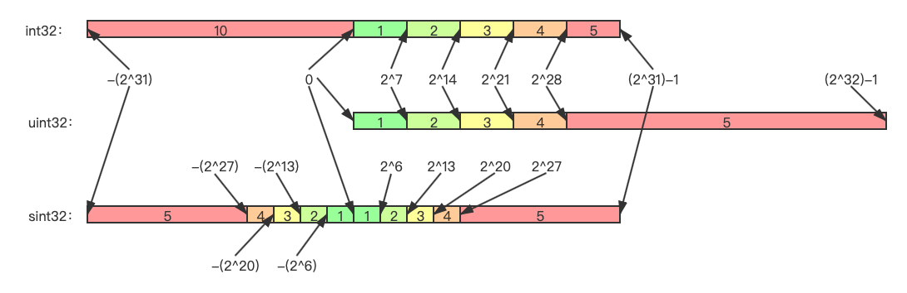
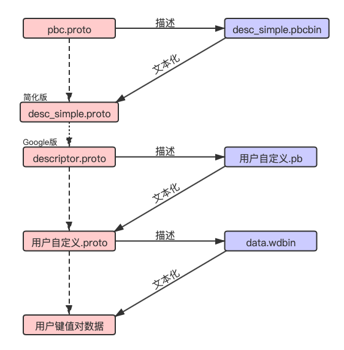
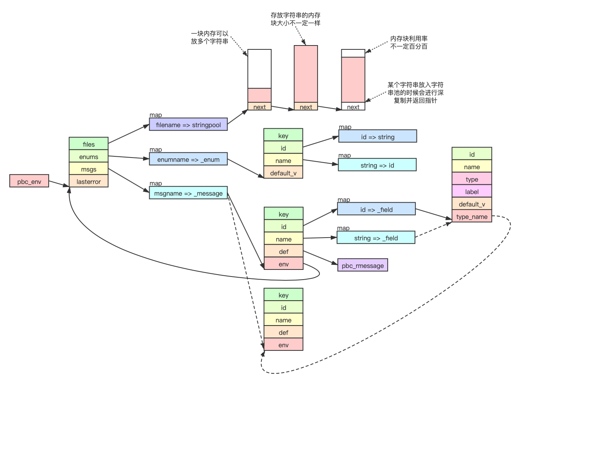
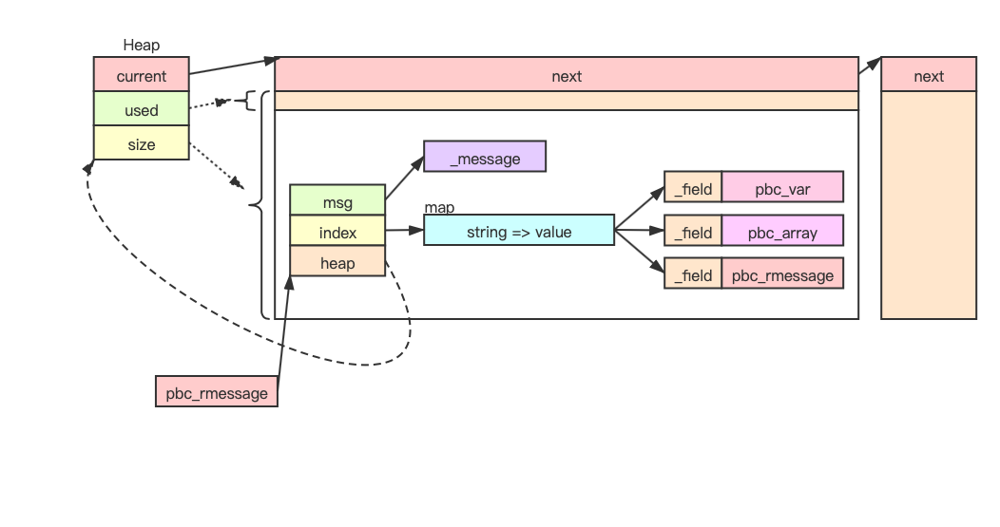
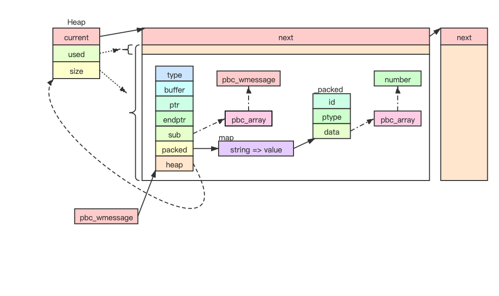

<!--BEGIN_DATA
{
    "create_date": "2022-04-07 16:30", 
    "modify_date": "2022-04-07 16:30", 
    "is_top": "0", 
    "summary": "protobuf协议实现分析", 
    "tags": "C/C++、网络", 
    "file_name": "protobuf协议实现分析"
}
END_DATA-->

#### <p>原文出处：<a href='https://km.woa.com/articles/show/518469' target='blank'>protobuf协议实现分析</a></p>

关于Protobuf，网上有众多资料，本文仅记录个人的一些理解，结合云风版pbc实现进行分析，试图洞悉内部原理。

  1. 云风[pbc代码来自Github](https://github.com/cloudwu/pbc)
  2. 云风[关于pbc的博客](https://blog.codingnow.com/2011/12/protocol_buffers_for_c.html)

ProtocolBuffer是一种高效数据序列化解决方案：（序列化指的是在不丢失信息的前提下将目标结构化对象转化成字节流的过程）

  1. 结构化对象一般是用Key-Value数组来表达，Key是字段名称，Value是带有类型的数据
  2. JSON序列化是将字段名称和数据直接按照JSON格式写到目标字符串中，存储效率较低（此时的字节流直接就是一个方便查看的字符串）
  3. PB为了提高存储效率，将Key全部用编号表示并做压缩（所以需要记录字段名称与对应编号的映射关系）

这里共涉及三个概念：字段名称、对应数据、数字索引

  1. 用户使用的是字段名称和对应数据
  2. 序列化二进制数据记录的是数字索引和对应数值
  3. proto协议则在中间充当桥梁，将字段名称映射为数字索引，并给出数据类型的定义和限制

另外，Protobuf这种设计支持用户定义多个协议，用于描述各种类型的结构化对象并进行序列化和反序列化

## Protocol自描述

proto协议代码本身经过编译之后可以表示为一个结构化对象，而proto协议本来就是用来描述结构化对象的！因此，我们可以用proto协议写出一个协议来描述proto代码，Google已经做了这件事，[descriptor.proto](https://github.com/protocolbuffers/protobuf/blob/master/src/google/protobuf/descriptor.proto)就是用来描述proto代码的那个协议。

考虑一个普通的协议：

```c
syntax = "proto3";
package zykTest;
message Simple {
    string name = 1;
    int32 count = 2;
}
```

其对应的结构化对象为：

```json
{
    "file": [
        {
            "name": "proto/simple.proto",
            "syntax": "proto3",
            "package": "zykTest",
            "message_type": [
                {
                    "name": "Simple",
                    "field": [
                        {
                            "label": 1,
                            "type": 9,
                            "name": "name",
                            "number": 1,
                            "json_name": "name"
                        },
                        {
                            "label": 1,
                            "type": 5,
                            "name": "count",
                            "number": 2,
                            "json_name": "count"
                        }
                    ]
                }
            ]
        }
    ]
}
```

其中，lable和type两个字段对应数字的含义如下：（descriptor.proto中的部分代码）

```c
message FieldDescriptorProto {
  enum Type {
    TYPE_DOUBLE = 1;
    TYPE_FLOAT = 2;
    TYPE_INT64 = 3;
    TYPE_UINT64 = 4;
    TYPE_INT32 = 5;
    TYPE_FIXED64 = 6;
    TYPE_FIXED32 = 7;
    TYPE_BOOL = 8;
    TYPE_STRING = 9;
    TYPE_GROUP = 10;
    TYPE_MESSAGE = 11;
    TYPE_BYTES = 12;
    TYPE_UINT32 = 13;
    TYPE_ENUM = 14;
    TYPE_SFIXED32 = 15;
    TYPE_SFIXED64 = 16;
    TYPE_SINT32 = 17;
    TYPE_SINT64 = 18;
  }

  enum Label {
    LABEL_OPTIONAL = 1;
    LABEL_REQUIRED = 2;
    LABEL_REPEATED = 3;
  }
}
```

descriptor.proto正是用来描述这种结构化对象的！结构化对象内部每个字段都有其用处，本文所有的结构化对象对应的结构都是根据descriptor.proto中的数据定义来展示。

## MacOS 上编译 protoc

```
git clone https://github.com/protocolbuffers/protobuf.git
cd protobuf
mkdir buildXcode && cd buildXcode
cmake -DCMAKE_INSTALL_PREFIX=/usr/local/zyk/protobuf -DCMAKE_BUILD_TYPE=Release -G "Xcode" -Dprotobuf_BUILD_TESTS=OFF ../cmake
open protobuf.xcodeproj
```

## 底层编码方式

完整编码细节请参考[Google官方文档](https://developers.google.cn/protocol-buffers/docs/encoding)

整体编码结构：

  1. 二进制编码方式：以 Varint 编码为基础，以 KeyValue 键值对为基本单位
  2. 一个 Key：Varint编码，数值构成为：(`field_number << 3) | wire_type` （根据此编码规则，`field_number < 16` 的会被编码到 1 个字节中）
  3. 一个Value：依赖wire_type的信息，包含四种：Varint、32-bit、64-bit、Length-delimited（其实就是三种：Varint、固定长度、带长度的数据块）
  4. Length-delimited信息：Varint编码的长度+Raw实际数据
  5. 每段Varint编码内部是小端模式
  6. 不考虑协议信息的话，单纯二进制中记录的内容是不完整的，因而decode_raw是可能存在错误解析的！比如，字符串”ha”和13号字段带有一个整数97的消息二进制序列是完全一样的，packed类型的数组也会识别失败

关于特殊数据类型：

  1. signed 类型在Varint的基础之上外加 ZigZag 数字编码方式（之字型，正负穿插，如果是绝对值很大的负数，那一样会需要很多字节）
  2. int32和int64针对负数固定编码成 10 个字节（int32的负数类型也用了10个字节来编码，原因在于让int32兼容int64，这样做了之后，可以无缝将int32改成int64）
  3. 底层只管传递无符号数据，具体数据怎么解析，还是由协议来决定。（反序列化的时候需要协议指定的类型信息来做相应的转换，比如，fixed64跟double的Value都占用8字节，如何解析这8字节的数据由协议指定的是哪个类型来决定）

ProtocolBuffer数据类型与序列化之后字节大小之间的关系：（作为Value）

  1. 固定1字节：bool
  2. 固定4字节：float、fixed32、sfixed32
  3. 固定8字节：double、fixed64、sfixed64
  4. 数值可变长度：int64、uint64、int32、uint32、enum、sint32、sint64
  5. 带长度值和数据块：string、message、bytes

整数编码长度与其数值大小之间的关系：

  1. int类型针对正数的编码长度与数值大小成正比，针对负数的编码长度固定为最大值（int32和int64都是10字节）
  2. uint类型编码长度与int类型的正数部分完全一样，支持更大的数值范围
  3. sint类型编码长度与数值的绝对值大小成正比

编码示意图如下：



数据类型选择：

  1. 数值确认只有正数且数值大小较小（两百万之内），选用int或uint，两者效率一样
  2. 数值有正有负且绝对值较小（一百万之内），选用sint
  3. 数值较大（大于26亿）或负数绝对值较大（大于13亿），则应该考虑使用fixed类型

## ProtocolBuffer特性

关于proto3语法相关内容可以直接参考[Google文档](https://developers.google.com/protocol-buffers/docs/proto3)，这里仅记录一些小提示！

关于packed选项：

  1. proto2中的 packed = true 只能用于repeated的数字类型（包括布尔和枚举），proto3定义中repeated的数字类型字段会自动packed（pbc编码过程不会自动packed，谷歌版proto3会自动packed）
  2. packed 的功能是将多个字段打包成一个类似message字段，只不过这个特殊的message字段内部是一个数组，每个元素不包含前导标号（所以对数组元素的解析就需要依赖pb记录的类型数据了）
  3. 对于string、bytes、message类型，定义成repeated也无法编码成packed（因此，这三种类型的optional修饰和repeated修饰是兼容的）

其他：

  1. fixed是类似unit的无符号类型，sfixed是类似int的有符号类型，sint是独立的zigzag编码的类型
  2. protoc 命令有一个参数，--include_imports，可以手动将 import 的 proto 也编译进来，保证自包含
  3. proto3字段默认值是固定的，空字符串、0、false（如果一个bool类型被设置为false，序列化二进制中不会包含该字段）
  4. Any类型其实是谷歌库提供的一个功能
  5. proto3 不能直接使用 proto2 的枚举类型（就是说可以间接使用，比如一个 proto2 的 message 类型 A 使用了 proto2 的枚举，此时 proto3 可以直接使用 A 类型）
  6. "import weak"允许存在missing，仅谷歌内部使用
  7. "import public"是在 protoc 命令进行编译的时候起作用，runtime 时不起作用（pbc 不关心"import public”）
  8. 某个字段带上[deprecated = true]属性，编译之后该field的options中字段deprecated为true（pbc不支持deprecated，field的所有option中pbc仅支持packed）
  9. 自定义option其实是通过extension的形式去扩展descriptor中定义的内容

Protobuf协议自身支持自举，pbc的实现也依赖于这种自举的方式，使得实现起来比较简洁！其中涉及多个协议之间的关系如下：



其中：

  1. proto文件是用protobuf语法所写的协议文本文件
  2. 其他二进制文件都是以varint为基础格式
  3. pbcbin文件为pbc.proto协议所描述的varint编码构成的键值对格式
  4. pb文件为descriptor.proto协议所描述的varint编码构成的键值对格式（其实就是xxx.proto通过protoc编译得到的二进制文件）
  5. wdbin为用户定义的 proto协议所描述的varint编码构成的键值对格式
  6. 本质上pbcbin、pb、wdbin都是同样的基于varint的键值对格式，只是内容不一样

解析二进制 pb 文件的几种方式：

  1. 通过 protoc 命令的 decode/decode_raw 参数，得到结构化字符串
  2. 通过自定义的 protobuf 函数，配合 Lua 脚本进行解析，得到结构化表（例如：pbdump工具）
  3. 将谷歌的 descriptor 改个包名，编译成 pb 之后用 pbc 加载，再用来解析 pb 文件，得到结构化表

方式 2 和方式 3 可以方便的解析出 protocol buffer 源码（pbdump实现了类似protoc命令的--decode参数功能，传入三个参数：pb文件路径、协议message名称、二进制wiredata数据流）

## oneof关键字

  1. oneof的实现方式为给普通字段增加一个属性，用于指示该字段所属oneof组（pbc不支持oneof标志）
  2. Google版针对oneof中的字段默认值也会被序列化，可以分辨出用户是否设置过，没设置过就没值，设置过的就有值，0 也会被序列化进去
  3. oneof结构整体是没法repeated的，因为没有办法识别多个oneof结构之间的边界（oneof结构中的字段是互斥的，在一个二进制数据只能存在其中一个字段）
  4. oneof结构内部的成员也是没法repeated的，因为oneof语义本来就是这么多个中的一个，不是这么多组中的一组
  5. proto3默认字段都是optional，如果用户显式的写出optional，protoc会翻译成仅有一个字段的oneof结构而不再是一个普通的字段

考虑如下协议：

```c
syntax = "proto3";
package zykTest;

message WithoutOneOf {
  string name = 1;
  string tip = 2;
  int32 count = 3;
}

message WithOneOf {
  string name = 1;

  oneof attr {
    string tip = 2;
    int32 count = 3;
  }
}
```

其结构化对象为：

```json
{
    "file": [
        {
            "name": "proto/test_oneof.proto",
            "syntax": "proto3",
            "package": "zykTest",
            "message_type": [
                {
                    "name": "WithoutOneOf",
                    "field": [
                        {
                            "label": 1,
                            "type": 9,
                            "name": "name",
                            "number": 1,
                            "json_name": "name"
                        },
                        {
                            "label": 1,
                            "type": 9,
                            "name": "tip",
                            "number": 2,
                            "json_name": "tip"
                        },
                        {
                            "label": 1,
                            "type": 5,
                            "name": "count",
                            "number": 3,
                            "json_name": "count"
                        }
                    ]
                },
                {
                    "name": "WithOneOf",
                    "field": [
                        {
                            "label": 1,
                            "type": 9,
                            "name": "name",
                            "number": 1,
                            "json_name": "name"
                        },
                        {
                            "label": 1,
                            "type": 9,
                            "name": "tip",
                            "number": 2,
                            "json_name": "tip",
                            "oneof_index": 0
                        },
                        {
                            "label": 1,
                            "type": 5,
                            "name": "count",
                            "number": 3,
                            "json_name": "count",
                            "oneof_index": 0
                        }
                    ],
                    "oneof_decl": [
                        {
                            "name": "attr"
                        }
                    ]
                }
            ]
        }
    ]
}
```

对比两个message对象，显然，使用oneof之后仅仅是多了一个属性标志！

## map关键字

  1. protobuf的map类型其实只是一个语法糖，经过protoc编译之后是通过一个repeated的子message来实现的，这个隐藏的message包含一个key字段和一个value字段
  2. map本身就是靠repeated来实现键值对组的，没法再repeated也可以理解。map内部是一系列键值对，只能设置key和value的类型，当然key和value也不能是repeated

考虑如下协议：

```c
syntax = "proto3";
package zykTest;

message WithMap {
  string name = 1;
  map<int32, string> attr = 2;
}

message WithoutMap {
  message AttrEntry {
    option map_entry = true;
    int32 key = 1;
    string value = 2;
  }
  string name = 1;
  repeated AttrEntry attr = 2;
}
```

其结构化对象为：

```json
{
    "file": [
        {
            "name": "proto/test_map.proto",
            "syntax": "proto3",
            "package": "zykTest",
            "message_type": [
                {
                    "name": "WithMap",
                    "nested_type": [
                        {
                            "name": "AttrEntry",
                            "field": [
                                {
                                    "label": 1,
                                    "type": 5,
                                    "name": "key",
                                    "json_name": "key",
                                    "number": 1
                                },
                                {
                                    "label": 1,
                                    "type": 9,
                                    "name": "value",
                                    "json_name": "value",
                                    "number": 2
                                }
                            ],
                            "options": {
                                "map_entry": 1
                            }
                        }
                    ],
                    "field": [
                        {
                            "label": 1,
                            "type": 9,
                            "name": "name",
                            "number": 1,
                            "json_name": "name"
                        },
                        {
                            "label": 3,
                            "type": 11,
                            "name": "attr",
                            "number": 2,
                            "json_name": "attr",
                            "type_name": ".zykTest.WithMap.AttrEntry"
                        }
                    ]
                },
                {
                    "name": "WithoutMap",
                    "nested_type": [
                        {
                            "options": {
                                "map_entry": 1
                            },
                            "field": [
                                {
                                    "label": 1,
                                    "type": 5,
                                    "name": "key",
                                    "json_name": "key",
                                    "number": 1
                                },
                                {
                                    "label": 1,
                                    "type": 9,
                                    "name": "value",
                                    "json_name": "value",
                                    "number": 2
                                }
                            ],
                            "name": "AttrEntry"
                        }
                    ],
                    "field": [
                        {
                            "label": 1,
                            "type": 9,
                            "name": "name",
                            "json_name": "name",
                            "number": 1
                        },
                        {
                            "label": 3,
                            "type": 11,
                            "name": "attr",
                            "number": 2,
                            "json_name": "attr",
                            "type_name": ".zykTest.WithoutMap.AttrEntry"
                        }
                    ]
                }
            ]
        }
    ]
}
```

对比使用map和不使用map的两个消息，可以发现：map关键字只是一个语法糖！其实，在descriptor.proto中，有这么一段注释：

```c
// For maps fields:
//     map<KeyType, ValueType> map_field = 1;
// The parsed descriptor looks like:
//     message MapFieldEntry {
//         option map_entry = true;
//         optional KeyType key = 1;
//         optional ValueType value = 2;
//     }
//     repeated MapFieldEntry map_field = 1;
```

### pbc设计

关于pbc的API：

  1. pattern形式的API操作的逻辑是将序列化内容通过顺序标号与 C 语言结构体的字段一一对应起来
  2. message形式的API则是抽象出这个目标结构，从而把整体操作也细化成多个单步赋值或者查询
  3. 在`pbc_wmessage`相关API中，optional的字段判断与默认值一致时啥都不写（字段是 repeated 或者 packed 都不会被省略，即使是存放数据为默认值）

关于注册pb文件：

  1. pbc 支持将多个 proto 文件编译成一个 pb 文件的情况
  2. register 过程：第一步将二进制数据解析成一颗树，第二步，获取需要的树节点信息来构造新的 message（使用这些树节点信息）
  3. pbc仅在register的时候检查了dependency，register之后并没有保存dependency，因此，想要检查某个Message是否依赖其他Message，或者某个Message是否被其他Message依赖，则需要额外的实现来支持
  4. `register_nodependency`中，确认该proto文件所有依赖都有了之后，pbc会为它创建一个字符串池，记录在pbc_env-\>files哈希表中，后续加载该 Message相关内容都会在字符串池中进行深复制。需要注意的是，bootstrap走的流程与普通文件的register流程是不一样的
  5. pbc_env-\>files哈希表还记录着加载的文件名，因此同一个文件名路径的pb只会加载第一个（在Lua中pbc重复注册同名pb文件的操作会被忽略）

关于解析message协议消息：

  1. pbc中没有package的概念，所有的message都保存的包含package的完整名称
  2. proto文件中嵌套的消息在protoc编译时就会被转化成平坦的message数组，pbc加载这些message之后会统一进行引用的重建，单独一个message加载完是一个map，多个message嵌套引用会构成一颗树。同时，rmessage和wmessage操作过程都会涉及数据的嵌套，这些嵌套都是通过C语言函数递归来实现
  3. pbc在加载Message的时候，并没有判断该Message当前是否存在。并且，pbc中实现的哈希表并没有进行唯一性的判断，插入一个键值对总会占用一个新槽，这就导致可能两个键值对的键字符串内容一致！因此，整体上来说，pbc不支持多次加载同一个Message，用户如果这么做可能出现异常

关于descriptor.pbc.h头文件：

  1. descriptor.pbc.h中记录的二进制内容是普通varint 编码压缩的键值对数组，这个二进制对应的proto是 pbc.proto，ParseVarint通过配置也可以解读该二进制格式（[ParseVarint函数的实现在Github上](https://github.com/zhyingkun/lua-5.3.5/blob/master/lmod/protobuf/varint.lua)）
  2. descriptor.pbc.h中对应的二进制数据通过bootstrap被加载之后，文件名记录为descriptor，然而，其对应的二进制数据不需要字符串池，而是直接引用了静态字符串数据，因此用户可以再加载一个名为descriptor的pb文件
  3. 手动序列化成二进制数据中，字符串不会自带以空终止，descriptor.pbc.h中的二进制之所以需要带上以空终止，是因为在bootstrap中加载的这个协议没有自己的字符串池，直接使用了二进制静态数据的内存地址，这是一种优化手段
  4. `pbc_wmessage_string`最后一个长度参数传入-1也会将空字符写入二进制中，解析的时候遇到空字符就不会另外创建内存，普通用户在使用该API时应该传入字符串长度或者0

关于protocol枚举类型：

  1. pbc中使用protobuf的枚举类型会拿到字符串，`protobuf.enum_id`函数可以将字符串转对应数字
  2. Protobuf中枚举名称和对应的数值是打包存放的，本身就支持多个名称映射到同一个数值，`option allow_alias = true`; 这个枚举选项更多的是给 protoc编译时使用。值得注意的是，在pbc中是使用哈希表存放枚举名称与对应数值的映射关系，枚举类型在wiredata二进制中存放的是数值，pbc在Lua端展现的是枚举名字符串，将数值映射回枚举值时，这个转换过程就不一定匹配目标设置的alias枚举了。默认会是最后一个枚举名称
  3. pbc 实现枚举类型主要有三个方面：一是pbc提供了enum_id函数用于将枚举名称转换成枚举整数；二是当进行数据序列化的时候，枚举类型最后也走`pbc_wmessage_string`函数，其中通过字段名称获得字段类型，针对枚举类型会自动转换成对应整数来存储到二进制流中，wiredata类型为 Varint；三是在进行反序列化的时候，由函数`call_type`将枚举整数转成对应的字符串，由回调函数来将字符串压入 Lua 虚拟机中
  4. C语言中写Protobuf枚举类型直接写数字的话是不会检查的，就算序列化数值超过了枚举数值也还是会直接编码到二进制中，C语言中写字符串类型的枚举类型在查找不到对应数字的时候，会返回-1，在Lua中则会抛出异常。反序列化的时候，C语言API会正常解析出数字，但是对应的枚举名称是NULL，在Lua中则被解析为nil，所以这种情况可能会被当成枚举的默认值来处理（nil表示没有赋值，那没赋值的optional数据就是默认值）
  5. 枚举类型既支持写 integer，也支持写 string 来赋值

## 源码分析

源码对应功能：

  1. alloc.h.c: 统一管理内存分配，支持堆内存分配优化
  2. array.h.c: 实现了一个由联合体`pbc_va`r组成的可变长度数组pbc_array，一开始是大小为64字节连续内存，支持扩容，支持heap内存分配策略（使用heap时扩容会浪费原来的那部分内存）
  3. map.h.c: 三个哈希表
  4. stringpool.h.c: 实现了一个字符串池stringpool，支持动态扩容，内部实现是将多个内存块串成一条单向链表，不支持去重，主要作用是优化多个字符串复制的内存分配
  5. varint.h.c: 解析 varint 编码的基本功能函数
  6. context.h.c: 针对传入的一段二进制数据解析一层 varint 键值对序列，解析结果放在 ctx 中的 atom 数组中
  7. descriptor.pbc.h: `desc_simple.pbcbin` 二进制内容转成字节数组放在头文件中
  8. bootstrap.h.c: 初始化 pbc 的过程，自动加载 `desc_simple.pbcbin`，准备好解析 xxx.pb 的环境
  9. pattern.h.c: 根据协议描述将C语言内存与数据对应起来并做解析，`pbc_pattern`记录的是内存结构体格式，按照该格式可以解析某段字符串
  10. proto.h.c: 实现pbc导出的接口
  11. register.c: 实现`pbc_register`接口
  12. decode.c: 实现`pbc_decode`接口
  13. rmessage.c: 实现`pbc_rmessage`相关接口
  14. wmessage.c: 实现`pbc_wmessage`相关接口

三个哈希表：

  1. `map_si`是一个字符串映射为整数的静态哈希表，通过map_kv数组进行初始化，不支持扩容
  2. `map_ip`是一个整数映射到指针的静态哈希表，同样通过map_kv数组进行初始化，不支持扩容，如果所有整数都不大于2倍的size，内部实现会用C语言数组来代替哈希表
  3. `map_sp`是一个字符串映射到指针的动态哈希表，支持扩容，支持遍历，支持heap内存分配策略（使用heap时扩容会浪费原来的那部分内存）

C语言实现细节：

  1. `_pbcA_index`和`_pbcA_index_p`是没有判断数组长度的，直接暴露给使用者，使用者在做索引的时候，必须自己保证该索引在array的size范围内
  2. C 语言结构体类型定义成只有一个元素的数组：直接定义成只有一个元素的数组，使用的时候能够直接用指针操作，不需要再定义一个对应的指针类型去操作，而且，作为参数的话，数组也是传递指针，不会误用未值拷贝传递整个结构体。
  3. `((size + 1)  size) > size` 表达式想成立，必须保证 size 加 1 的时候出现最高位进位，因此 size 肯定为 2n - 1，相关测试代码在这里：<https://github.com/zhyingkun/LinuxUnix/blob/master/Demo/TestExp/TestExp.c>

API设计：

  1. 有 `pbc_decode` 接口，没有 `pbc_encode` 接口
  2. protobuf.decode 使用 `pbc_decode` 进行解码，并且，多层解码使用元表实现，默认值使用 rmessage 来实现，这些 rmessage 缓存在 M.GC 中
  3. protobuf.encode 直接使用 wmessage 实现（encode完就直接释放wmessage的heap内存）
  4. 创建rmessage的过程就已经将所有嵌套的消息解析出来了，直接通过api进行读取就好
  5. 往wmessage中写入数据的过程会直接做好序列化并写入内部buffer（packed数字数组例外），写完最后调用的`pbc_wmessage_buffer`函数仅仅是将packed数字数组和嵌套的多个wmessage缓存组合成一个二进制串

## 内存分布图

`pbc_env`内存分布图：



rmessage内存分布图：



wmessage内存分布图：



## 使用流程

pbc基本用法：

  1. 根据结构化数据编写protobuf协议代码
  2. 用protoc命令将proto源码编译成Varint编码的二进制pb文件
  3. 将pb文件注册到pbc中（由pbc进行加载解析）
  4. 调用pbc的api对实际结构化用户数据进行序列化和反序列化

pbc整体流程：

  1. 创建 `pbc_env`
        1. 根据 pbc.file 格式解析 desc_simple.pbcbin
            2. 根据解析结果将 enum、message 注入 `pbc_env`
                3. 索引好 message、enum 之间的嵌套引用
                    4. 初始化过程字符串都不需要深复制
  2. 注册 pb 文件内容
        1. 创建 rmessage 并使用 FileDescriptorSet 解析 pb 内容，创建的时候就递归解析好了
            2. 根据解析结果将多个 pb 文件的 enum、message、extension 注入 `pbc_env`
                3. 索引好 message、enum 之间的嵌套引用
                    4. 注册过程需要的字符串都被进行深复制
  3. 指定协议并通过 decode/rmessage/wmessage 进行读写，多层嵌套解析二进制数据或者生成二进制数据
  4. 清理 message 和 env

## 总结

ProtocolBuffer作为一种高效序列化的实现方式，其本身的设计也是经过实践的检验，值得我们品味其中奥妙！
