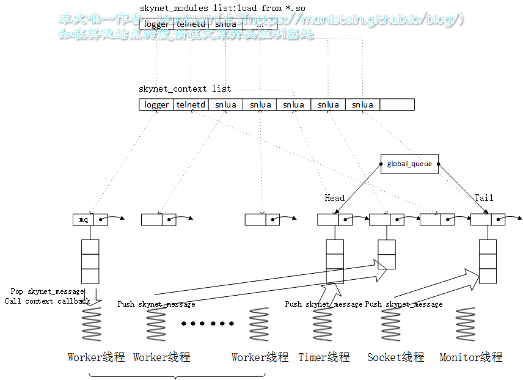
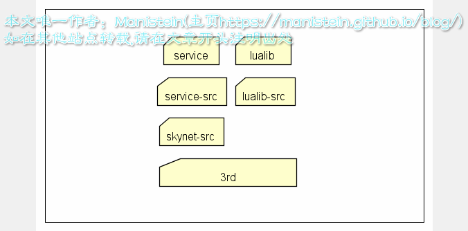
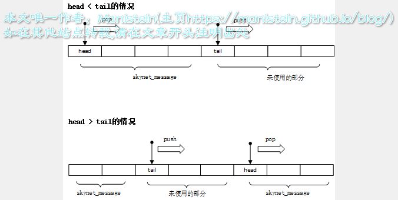
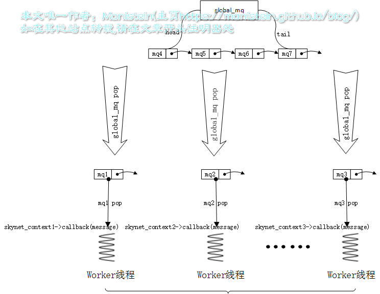
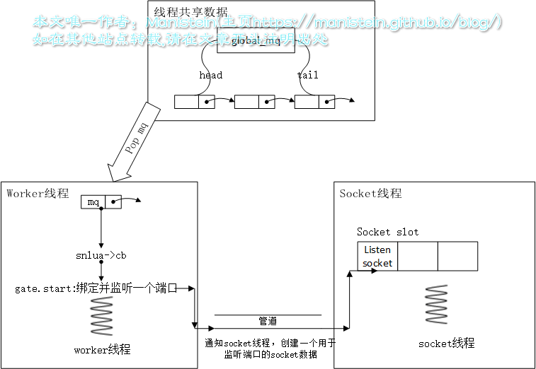
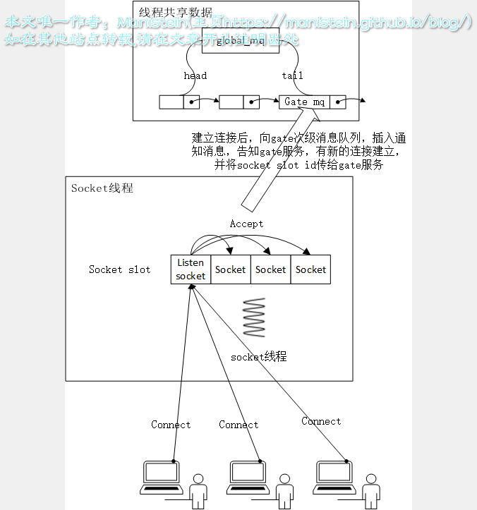
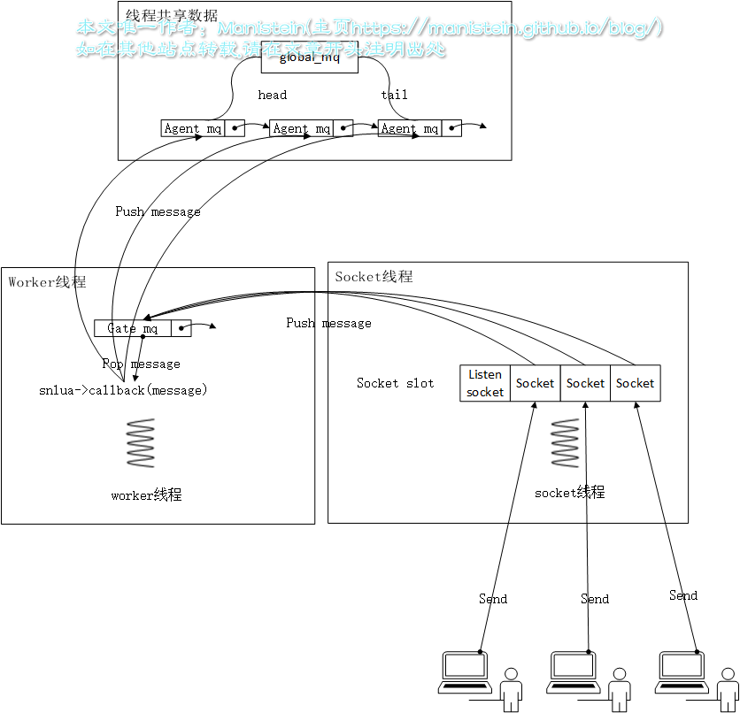
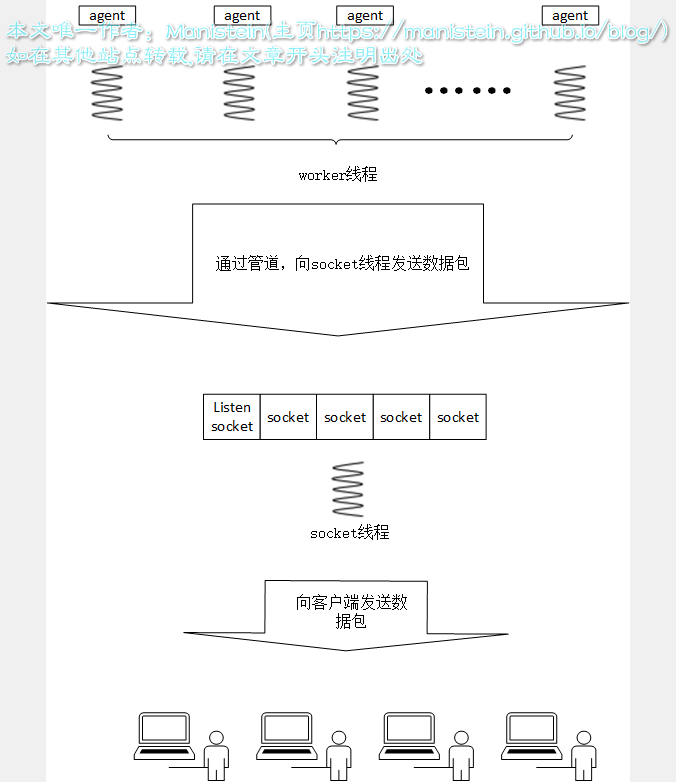

<!--BEGIN_DATA
{
    "create_date": "2021-01-01 11:28", 
    "modify_date": "2021-01-01 11:28", 
    "is_top": "0", 
    "summary": "skynet源码赏析", 
    "tags": "C/C++、Lua、网络、架构", 
    "file_name": "skynet源码赏析.md"
}
END_DATA-->

#### <p>原文出处：<a href='https://manistein.github.io/blog/post/server/skynet/skynet%E6%BA%90%E7%A0%81%E8%B5%8F%E6%9E%90/' target='blank'>skynet源码赏析</a></p>

### 写在最前面

skynet是目前使用比较广泛的服务端框架，虽然目前网上资料众多，但是从自己的学习和使用经历来看，缺乏能够让自己系统了解该框架底层机制的资料，这段时间，趁着自己有时间，阅读了skynet底层的一些代码，现在将自己理解的部分总结并记录下来，以备日后使用。本文旨在捋清skynet框架的结构和主要流程，并不会涉及skynet的方方面面，一些论述，我贴上了一些源码加以论证，并在引用的源码里加入了一些注释。

对于一些概念，我也本着严谨的原则，尽可能注明了引证来源的出处，引证自维基百科的内容，基本上是没有争议的词条。由于本人水平有限，如果发现文中内容有错误的地方，或者写的不好的地方，欢迎大家批评指正。我目前建立了一个技术交流群（qq185017593），讨论问题不局限于服务端技术，也包括客户端，游戏设计，我是群主，欢迎大家加入。最后原创不易，请大家转载注明出处。

这篇文章，实际上在今年5月份就已经在有道云笔记上写完，最近搭建了自己的博客，干脆就迁过来。不过在拷贝过来的过程中，发现hugo的markdown渲染引擎和有道云的并不相同，因此做了些格式调整，事实上我更喜欢有道云的风格，[原文链接](http://note.youdao.com/share/?id=9d2b8a03fdd9cd4947ca4128d30af420&type=note#/)

### 对于skynet，需要屡清楚的几个问题

  * skynet本质上解决什么问题？
  * skynet有哪些基本的数据结构？
  * skynet有几类线程，他们分别的作用是什么？
  * skynet如何启动一个c服务？
  * skynet消息调度机制是怎样的？
  * skynet如何启动一个lua服务？
  * skynet的lua层消息派发机制是怎样的？
  * timer是如何产生消息的？他的结构和流程是怎样的？
  * 网络模块是如何产生消息的？他的结构和流程是怎样的？
  * skynet有哪些基本服务，他们的作用分别是什么？
  * skynet集群机制

### Overview

对于skynet的概述，建议大家先阅读云风大侠的《[skynet设计综述](http://blog.codingnow.com/2012/09/the_design_of_skynet.html)》。  
skynet本质是什么？它为我们提供了什么机制？如何正确使用它？我们希望自己写的不同的业务逻辑，独立运行在不同的上下文环境中，并且能够通过某种方式，相互协作，最终共同服务于我们的玩家。skynet则为我们提供了这种环境：

  * 我们编写好的c文件，在编译成so库以后，在某个时机，调用该so库api的句柄，会被加载到一个modules列表中，一般这样的模块会被要求定义4种接口create，init，signal和release
  * 我们要创建一个新的，运行该业务逻辑的上下文环境时，则从modules列表中，找到对应的so库句柄，并且调用create接口，创建一个该类业务模块的数据实例，并且创建一个上下文环境（context），引用该类业务的接口和数据实例，该context会被存放在一个统一存放context的列表中，这种context被称之为服务
  * 一个服务，默认不会执行任何逻辑，需要别人向它发出请求时，才会执行对应的逻辑（定时器也是通过消息队列，告诉指定服务，要执行定时事件），并在需要时返回结果给请求者。请求者往往也是其他服务。服务间的请求、响应和推送，并不是直接调用对方的api来执行，而是通过一个消息队列，也就是说，不论是请求、回应还是推送，都需要通过这个消息队列转发到另一个服务中。skynet的消息队列，分为两级，一个全局消息队列，他包含一个头尾指针，分别指向两个隶属于指定服务的次级消息队列。skynet中的每一个服务，都有一个唯一的、专属的次级消息队列。
  * skynet一共有4种线程，monitor线程用于检测节点内的消息是否堵住，timer线程运行定时器，socket线程进行网络数据的收发，worker线程则负责对消息队列进行调度（worker线程的数量，可以通过配置表指定）。消息调度规则是，每条worker线程，每次从全局消息队列中pop出一个次级消息队列，并从次级消息队列中pop出一条消息，并找到该次级消息队列的所属服务，将消息传给该服务的callback函数，执行指定业务，当逻辑执行完毕时，再将次级消息队列push回全局消息队列中。因为每个服务只有一个次级消息队列，每当一条worker线程，从全局消息队列中pop出一个次级消息队列时，其他线程是拿不到同一个服务，并调用callback函数，因此不用担心一个服务同时在多条线程内消费不同的消息，一个服务执行，不存在并发，线程是安全的
  * socket线程、timer线程甚至是worker线程，都有可能会往指定服务的次级消息队列中push消息，push函数内有加一个自旋锁，避免同时多条线程同时向一个次级消息队列push消息的惨局。  

综上所述，我们可以将skynet的机制，用一张图概括  



从上面讨论可以得出如下结论，我们所写的不同的业务逻辑，可以运行在不同的独立的沙盒环境中，他们之间是通过消息队列来进行交互的。worker、timer和socket线程里运行的模块，都有机会向特定的服务push消息，他们是消息的生产者，而worker线程内的模块，同时也是消息的消费者（确切的说，应该是那些服务）  
注意：服务模块要将数据，通过socket发送给客户端时，并不是将数据写入消息队列，而是通过管道从worker线程，发送给socket线程，并交由socket转发。此外，设置定时器也不走消息队列，而是直接将在定时器模块，加入一个timer_node。其实这样也很好理解，因为timer和socket线程内运行的模块并不是这里的context，因此消息队列他们无法消费。  

在overview中，我们讨论了skynet的部分核心机制（如消息调度），很多细节并未展开仔细去讨论，不过本节的目标就是为了树立一个宏观的概述，后面的内容，将基于此框架更加深入的进行讨论与研究。对于本文，我极力避免贴大段的代码，因为大段的代码，只会让我们迷失在汪洋大海之中，只有在必要的地方，才会贴上代码加以论述。  

此外，上面的论述，只涉及到c服务模块，并未讨论lua服务的内容，我们所有的lua服务，均是依附于一个叫snlua的c模块来运行的，lua服务每次收到一个消息，就会产生一个协程（事实上，skynet每个服务均有一个协程池，lua服务收到消息时，会优先去池子里取一个协程出来，这里为了理解方便，就视为收到一个消息，就创建一个协程吧），并通过协程执行注册函数，这些内容会在后面进行讨论。

### skynet基本结构

#### 1.skynet目录结构

学习一个开源框架，首先要做的就是查看目录结构，我们有理由相信，越好的项目，目录组织越合理，结构越清晰，代码目录必然是按照某种规律进行组织，目录组织也是构架的一部分。skynet目录组织如下所示



从上面目录结构图来看，越是往下的层次，应用领域越广泛。越是往上的层级，针对性越强，应用领域越小，和业务越相关。

  * 3rd目录：提供lua语言支持、 jemalloc（内存管理模块）、md5库等，这些模块在开发领域有着广泛的应用。  
  * skynet-src目录：包含skynet最核心机制的模块，包括逻辑入口、加载C服务代码的skynet_module模块、运行和管理服务实例的skynet_context模块、skynet消息队列、定时器和socket模块等。
  * service-src目录：这是依附于skynet核心模块的c服务，如用于日志输出的logger服务，用于运行lua脚本snlua的c服务等。  
  * lualib-src目录：提供C层级的api调用，如调用socket模块的api，调用skynet消息发送，注册回调函数的api，甚至是对C服务的调用等，并导出lua接口，供lua层使用。可以视为lua调C的媒介
  * service目录：lua层服务，依附于snlua这个c服务，这个目录包含skynet lua层级的一些基本服务，比如启动lua层级服务的bootstrap服务，gate服务，供lua层创建新服务的launcher服务等。
  * lualib目录：包含调用lua服务的辅助函数，方便应用层调用skynet的一些基本服务；包含对一些c模块或lua模块调用的辅助函数，总之，这些lualib方便应用层调用skynet提供的基本服务，和其他库。  

上面的目录基本遵循一个原则，就是上层允许调用下层，而下层不能直接调用上层的api，这样做层次清晰，不会出现你中有我，我中有你的高度耦合的情况存在。c层和lua层耦合的模块则包含在lualib-src中，这种模块划分更利于我们快速寻找对应模块。

#### 2.基本数据结构

* modules管理模块  

我们所写的C服务在编译成so库以后，会在某个时机被加载到一个modules的列表中，当要创建该类服务的实例时，将从modules列表取出该服务的函数句柄，调用create函数创建服务实例，并且init之后，将实例赋值给一个新的context对象后，注册到图1所示的skynet_contextlist中，一个新的服务就创建完成了。我们存放modules的模块数据结构如下所示：

```cpp
// skynet_module.h
typedef void * (*skynet_dl_create)(void);
typedef int (*skynet_dl_init)(void * inst, struct skynet_context *, const char * parm);
typedef void (*skynet_dl_release)(void * inst);
typedef void (*skynet_dl_signal)(void * inst, int signal);
struct skynet_module {
    const char * name;          // C服务名称，一般是C服务的文件名
    void * module;              // 访问该so库的dl句柄，该句柄通过dlopen函数获得
    skynet_dl_create create;    // 绑定so库中的xxx_create函数，通过dlsym函数实现绑定，调用该create即是调用xxx_create
    skynet_dl_init init;        // 绑定so库中的xxx_init函数，调用该init即是调用xxx_init
    skynet_dl_release release;  // 绑定so库中的xxx_release函数，调用该release即是调用xxx_release
    skynet_dl_signal signal;    // 绑定so库中的xxx_signal函数，调用该signal即是调用xxx_signal
};

// skynet_module.c
#define MAX_MODULE_TYPE 32
struct modules {
    int count;                  // modules的数量
    struct spinlock lock;       // 自旋锁，避免多个线程同时向skynet_module写入数据，保证线程安全
    const char * path;          // 由skynet配置表中的cpath指定，一般包含./cservice/?.so路径
    struct skynet_module m[MAX_MODULE_TYPE];  // 存放服务模块的数组，最多32类
};
static struct modules * M = NULL;
```

通过上面的注释，我们大概可以了解skynet_module结构的作用了，也就是说一个符合规范的skynet c服务，应当包含create，init，signal和release四个接口，在该c服务编译成so库以后，在程序中动态加载到skynet_module列表中，这里通过dlopen函数来获取so库的访问句柄，并通过dlsym将so库中对应的函数绑定到函数指针中，对于两个函数的说明如下所示：


```cpp    
// 引证来源：https://linux.die.net/man/3/dlopen
void *dlopen(const char *filename, int flag);
void *dlsym(void *handle, const char *symbol);
dlopen()
The function dlopen() loads the dynamic library file named by the null-terminated string filename and returns
an opaque "handle" for the dynamic library...
dlsym()
The function dlsym() takes a "handle" of a dynamic library returned by dlopen() and the null-terminated symbol  
name, returning the address where that symbol is loaded into memory...
```

dlopen函数，本质是将so库加载内存中，并返回一个可以访问该内存块的句柄，dlsym，则是通过该句柄和指定一个函数名，到内存中找到指定函数，在内存中的地址，这里将该地址赋值给skynet_module中的create、init、signal或release的其中一个函数指针（根据传入的symbol名称，即函数名来定），一个模块被加载以后，将被放置到modules的skynet_module数组中，当要创建该module的实例时，将会从skynet_module中取出对应的模块，并调用create函数创建实例，然后将实例指针传入init函数完成初始化以后，赋值给context。  

一个C服务，定义以上四个接口时，一定要以文件名作为前缀，然后通过下划线和对应函数连接起来，因为skynet加载的时候，就是通过这种方式去寻找对应函数的地址的，比如一个c服务文件名为logger，那么对应的4个函数名则为logger_create、logger_init、logger_signal、logger_release。

* skynet_context管理模块  

我们创建一个新的服务，首先要先找到对应服务的module，在创建完module实例并完成初始化以后，还需要创建一个skynet_context上下文，并将module实例和module模块和这个context关联起来，最后放置于skynet_context list中，一个个独立的沙盒环境就这样被创建出来了，下面来看主要的数据结构：

```cpp    
// skynet_server.c
struct skynet_context {
    void * instance;                // 由指定module的create函数，创建的数据实例指针，同一类服务可能有多个实例，
                                    // 因此每个服务都应该有自己的数据
    struct skynet_module * mod;     // 引用服务module的指针，方便后面对create、init、signal和release函数进行调用
    void * cb_ud;                   // 调用callback函数时，回传给callback的userdata，一般是instance指针
    skynet_cb cb;                   // 服务的消息回调函数，一般在skynet_module的init函数里指定
    struct message_queue *queue;    // 服务专属的次级消息队列指针
    FILE * logfile;                 // 日志句柄
    char result[32];                // 操作skynet_context的返回值，会写到这里
    uint32_t handle;                // 标识唯一context的服务id
    int session_id;                 // 在发出请求后，收到对方的返回消息时，通过session_id来匹配一个返回，对应哪个请求
    int ref;                        // 引用计数变量，当为0时，表示内存可以被释放
    bool init;                      // 是否完成初始化
    bool endless;                   // 消息是否堵住
    CHECKCALLING_DECL
};

// skynet_handle.c
// 这个结构用于记录，服务对应的别名，当应用层为某个服务命名时，会写到这里来
struct handle_name {
    char * name;                   // 服务别名
    uint32_t handle;               // 服务id
};

struct handle_storage {
    struct rwlock lock;            // 读写锁
    uint32_t harbor;               // harbor id
    uint32_t handle_index;         // 创建下一个服务时，该服务的slot idx，一般会先判断该slot是否被占用，后面会详细讨论
    int slot_size;                 // slot的大小，一定是2^n，初始值是4
    struct skynet_context ** slot; // skynet_context list
    int name_cap;                  // 别名列表大小，大小为2^n
    int name_count;                // 别名数量
    struct handle_name *name;      // 别名列表
};
static struct handle_storage *H = NULL;
```

我们创建一个新的skynet_context时，会往slot列表中放，当一个消息送达一个context时，其callback函数就会被调用，callback函数一般在module的init函数里指定，调用callback函数时，会传入userdata（一般是instance指针），source（发送方的服务id），type（消息类型），msg和sz（数据及其大小），每个服务的callback处理各自的逻辑。这里其实可以将modules视为工厂，而skynet_context则是该工厂创建出来的实例，而这些实例，则是通过handle_storage来进行管理。

* 消息与消息队列  

我们的创建的服务，需要通过消息来驱动，而一个服务要获取消息，是从消息队列里取的。skynet包含两级消息队列，一个global_mq，他包含一个head和tail指针，分别指向次级消息队列的头部和尾部，另外还有一个次级消息队列，这个一个单向链表。消息的派发机制是，工作线程，会从global_mq里pop一个次级消息队列来，然后从次级消息队列中，pop出一个消息，并传给context的callback函数，在完成驱动以后，再将次级消息队列push回global_mq中，数据结构如下所示：

```cpp
// skynet_mq.h
struct skynet_message {
    uint32_t source;            // 消息发送方的服务地址
    // 如果这是一个回应消息，那么要通过session找回对应的一次请求，在lua层，我们每次调用call的时候，都会往对  
    // 方的消息队列中，push一个消息，并且生成一个session，然后将本地的协程挂起，挂起时，会以session为key，协程句  
    // 柄为值，放入一个table中，当回应消息送达时，通过session找到对应的协程，并将其唤醒。后面章节会详细讨论
    int session; 
    void * data;        // 消息地址
    size_t sz;          // 消息大小
};

// skynet_mq.c
#define DEFAULT_QUEUE_SIZE 64
#define MAX_GLOBAL_MQ 0x10000
// 0 means mq is not in global mq.
// 1 means mq is in global mq , or the message is dispatching.
#define MQ_IN_GLOBAL 1
#define MQ_OVERLOAD 1024
struct message_queue {
    // 自旋锁，可能存在多个线程，向同一个队列写入的情况，加上自旋锁避免并发带来的发现，
    //后面会讨论互斥锁，自旋锁，读写锁和条件变量的区别
    struct spinlock lock;     
    uint32_t handle;                // 拥有此消息队列的服务的id
    int cap;                        // 消息大小
    int head;                       // 头部index
    int tail;                       // 尾部index
    int release;                    // 是否能释放消息
    int in_global;                  // 是否在全局消息队列中，0表示不是，1表示是
    int overload;                   // 是否过载
    int overload_threshold;
    struct skynet_message *queue;   // 消息队列
    struct message_queue *next;     // 下一个次级消息队列的指针
};

struct global_queue {
    struct message_queue *head;
    struct message_queue *tail;
    struct spinlock lock;
};

static struct global_queue *Q = NULL;
```

上面我们已经讨论了，一个服务如何被消息驱动，现在我们来讨论，消息是如何写入到消息队列中去的。我们要向一个服务发消息，最终是通过调用skynet.send接口，将消息插入到该服务专属的次级消息队列的，次级消息队列的内容，并不是context结构的一部分（context只是引用了他的指针），因此，在一个服务执行callback的同时，其他服务（可能是多个线程内执行callback的其他服务）可以向它的消息队列里push消息，而mq的push操作，是加了一个自旋锁，以避免多个线程，同时操作一个消息队列。lua层的skynet.send接口，最终会调到c层的skynet_context_push。这个接口实质上，是通过handle将context指针取出来，然后再往消息队列里push消息：

```cpp    
// skynet_server.c
int
skynet_context_push(uint32_t handle, struct skynet_message *message) {
    struct skynet_context * ctx = skynet_handle_grab(handle);
    if (ctx == NULL) {
        return -1;
    }
    skynet_mq_push(ctx->queue, message);
    skynet_context_release(ctx);
    return 0;
}

// skynet_handle.c
struct skynet_context * 
skynet_handle_grab(uint32_t handle) {
    struct handle_storage *s = H;
    struct skynet_context * result = NULL;
    rwlock_rlock(&s->lock);
    uint32_t hash = handle & (s->slot_size-1);
    struct skynet_context * ctx = s->slot[hash];
    if (ctx && skynet_context_handle(ctx) == handle) {
        result = ctx;
        skynet_context_grab(result);
    }
    rwlock_runlock(&s->lock);
    return result;
}
```

因为我们访问一个服务的机会，远大于创建一个服务并写入列表的机会，因此这里用了读写锁，在通过handle获取context指针时，加了一个读取锁，这样当在读取的过程中，同时有新的服务创建，并且存在要扩充skynet_context list容量的风险，因此不论如何，他都应当被阻塞住，直到所有的读取锁都释放掉。  

次级消息队列，实际上是一个数组，并且用两个int型数据，分别指向他的头部和尾部（head和tail），不论是head还是tail，当他们的值>=数组尺寸时，都会进行回绕（即从下标为0开始，比如值为数组的size时，会被重新赋值为0），在push操作后，head等于tail意味着队列已满（此时，队列会扩充两倍，并从头到尾重新赋值，此时head指向0，而tail为扩充前，数组的大小），在pop操作后，head等于tail意味着队列已经空了（后面他会从skynet全局消息队列中，被剔除掉）。  



### skynet如何启动一个c服务

我们写的c服务在编译成so库以后，在某个时段，会被加载到modules列表中。创建c服务的工作，一般在c层进行，一般会调用skynet_context_new接口，如下所示：

```cpp
// skynet_server.c
struct skynet_context * 
skynet_context_new(const char * name, const char *param) {
    struct skynet_module * mod = skynet_module_query(name);
    if (mod == NULL)
        return NULL;
    void *inst = skynet_module_instance_create(mod);
    if (inst == NULL)
        return NULL;
    struct skynet_context * ctx = skynet_malloc(sizeof(*ctx));
    CHECKCALLING_INIT(ctx)
    ctx->mod = mod;
    ctx->instance = inst;
    ctx->ref = 2;
    ctx->cb = NULL;
    ctx->cb_ud = NULL;
    ctx->session_id = 0;
    ctx->logfile = NULL;
    ctx->init = false;
    ctx->endless = false;
    // Should set to 0 first to avoid skynet_handle_retireall get an uninitialized handle
    ctx->handle = 0;    
    ctx->handle = skynet_handle_register(ctx);
    struct message_queue * queue = ctx->queue = skynet_mq_create(ctx->handle);
    // init function maybe use ctx->handle, so it must init at last
    context_inc();
    CHECKCALLING_BEGIN(ctx)
    int r = skynet_module_instance_init(mod, inst, ctx, param);
    CHECKCALLING_END(ctx)
    if (r == 0) {
        struct skynet_context * ret = skynet_context_release(ctx);
        if (ret) {
            ctx->init = true;
        }
        skynet_globalmq_push(queue);
        if (ret) {
            skynet_error(ret, "LAUNCH %s %s", name, param ? param : "");
        }
        return ret;
    } else {
        skynet_error(ctx, "FAILED launch %s", name);
        uint32_t handle = ctx->handle;
        skynet_context_release(ctx);
        skynet_handle_retire(handle);
        struct drop_t d = { handle };
        skynet_mq_release(queue, drop_message, &d);
        return NULL;
    }
}

// skynet_module.c
struct skynet_module * 
skynet_module_query(const char * name) {
    struct skynet_module * result = _query(name);
    if (result)
        return result;
    SPIN_LOCK(M)
    result = _query(name); // double check
    if (result == NULL && M->count < MAX_MODULE_TYPE) {
        int index = M->count;
        void * dl = _try_open(M,name);
        if (dl) {
            M->m[index].name = name;
            M->m[index].module = dl;
            if (_open_sym(&M->m[index]) == 0) {
                M->m[index].name = skynet_strdup(name);
                M->count ++;
                result = &M->m[index];
            }
        }
    }
    SPIN_UNLOCK(M)
    return result;
}

static void *
_try_open(struct modules *m, const char * name) {
    const char *l;
    const char * path = m->path;
    size_t path_size = strlen(path);
    size_t name_size = strlen(name);
    int sz = path_size + name_size;
    //search path
    void * dl = NULL;
    char tmp[sz];
    do
    {
        memset(tmp,0,sz);
        while (*path == ';') path++;
        if (*path == '\0') break;
        l = strchr(path, ';');
        if (l == NULL) l = path + strlen(path);
        int len = l - path;
        int i;
        for (i=0;path[i]!='?' && i < len ;i++) {
            tmp[i] = path[i];
        }
        memcpy(tmp+i,name,name_size);
        if (path[i] == '?') {
            strncpy(tmp+i+name_size,path+i+1,len - i - 1);
        } else {
            fprintf(stderr,"Invalid C service path\n");
            exit(1);
        }
        dl = dlopen(tmp, RTLD_NOW | RTLD_GLOBAL);
        path = l;
    }while(dl == NULL);
    if (dl == NULL) {
        fprintf(stderr, "try open %s failed : %s\n",name,dlerror());
    }
    return dl;
}

_open_sym(struct skynet_module *mod) {
    size_t name_size = strlen(mod->name);
    char tmp[name_size + 9]; // create/init/release/signal , longest name is release (7)
    memcpy(tmp, mod->name, name_size);
    strcpy(tmp+name_size, "_create");
    mod->create = dlsym(mod->module, tmp);
    strcpy(tmp+name_size, "_init");
    mod->init = dlsym(mod->module, tmp);
    strcpy(tmp+name_size, "_release");
    mod->release = dlsym(mod->module, tmp);
    strcpy(tmp+name_size, "_signal");
    mod->signal = dlsym(mod->module, tmp);
    return mod->init == NULL;
}
```

我们要创建一个c服务，首先要获取对应c服务的模块对象，在上一节中，我们已经介绍了skynet的modules对象，它包含skynet_module列表，so库所在路径，创建一个c服务，一般要经历下面几个步骤：

1. 从modules列表中，查找对应的服务模块，如果找到则返回，否则到modules的path中去查找对应的so库，创建一个skynet_module对象（数据结构见上节），将so库加载到内存，并将访问该so库的句柄和skynet_module对象关联（_try_open做了这件事），并将so库中的xxx_create，xxx_init，xxx_signal，xxx_release四个函数地址赋值给skynet_module的create、init、signal和release四个函数中，这样这个skynet_module对象，就能调用so库中，对应的四个接口（_open_sym做了这件事）。
2. 创建一个服务实例即skynet_context对象，他包含一个次级消息队列指针，服务模块指针（skynet_module对象，便于他访问module自定义的create、init、signal和release函数），由服务模块调用create接口创建的数据实例等。
3. 将新创建的服务实例（skynet_context对象）注册到全局的服务列表中（见上节的handle_storage结构）。
4. 初始化服务模块（skynet_module创建的数据实例），并在初始化函数中，注册新创建的skynet_context实例的callback函数
5. 将该服务实例（skynet_context实例）的次级消息队列，插入到全局消息队列中。  

经过上面的步骤，一个c服务模块就被创建出来了，在回调函数被指定以后，其他服务发送给他的消息，会被pop出来，最终传给服务对应的callback函数，最后达到驱动服务的目的。

下面通过创建logger服务的例子，来进行说明，以下例子请结合图1来看（假设一开始modules列表中没有logger模块，skynet_context list中没有logger的服务实例）：

1. 启动skynet节点时，会启动一个logger c服务
   
```cpp
// skynet_start.c
void
skynet_start(struct skynet_config * config) {
...
struct skynet_context *ctx = skynet_context_new(config->logservice, config->logger);
if (ctx == NULL) {
    fprintf(stderr, "Can't launch %s service\n", config->logservice);
    exit(1);
}
...
}
```

其中配置中的logservice指名log服务的so库名称，用于后面加载服务时使用，后面的logger字段则指定log的输出路径。

2. 此时，在图1中的skynet_module列表中，搜索logger服务模块，如果没找到则在so库的输出路径中，寻找名为logger的so库，找到则将该so库加载到内存中，并将对应的logger_create,logger_init,logger_release函数地址分别赋值给logger模块中的create,init,release函数指针，此时图1中的skynet_module列表中，多了一个logger模块。

3. 创建服务实例，即创建一个skynet_context实例，为了使skynet_context实例拥有访问logger服务内部函数的权限，这里将logger模块指针，赋值给skynet_context实例的mod变量中。

4. 创建一个logger服务的数据实例，调用logger服务的create函数：
   
```cpp
// service_logger.c
struct logger {
    FILE * handle;
    int close;
};

struct logger *
logger_create(void) {
    struct logger * inst = skynet_malloc(sizeof(*inst));
    inst->handle = NULL;
    inst->close = 0;
    return inst;
}
```

此时，将新创建的数据实例赋值给skynet_context的instance变量，此时，一个服务对象运行时，所要用到的逻辑，能够通过mod变量，访问logger服务对应的函数，而通过instance可以找到该服务自己的数据块。

5. 将新创建的skynet_context对象，注册到图一的skynet_context list中，此时skynet_context list多了一个logger服务实例

6. 初始化logger服务，注册logger服务的callback函数：
   
```cpp
// service_logger.c
static int
_logger(struct skynet_context * context, void *ud, int type, int session, uint32_t source, const void * msg, size_t sz) {
    struct logger * inst = ud;
    fprintf(inst->handle, "[:%08x] ",source);
    fwrite(msg, sz , 1, inst->handle);
    fprintf(inst->handle, "\n");
    fflush(inst->handle);
    return 0;
}

int
logger_init(struct logger * inst, struct skynet_context *ctx, const char * parm) {
    if (parm) {
        inst->handle = fopen(parm,"w");
        if (inst->handle == NULL) {
            return 1;
        }
        inst->close = 1;
    } else {
        inst->handle = stdout;
    }
    if (inst->handle) {
        skynet_callback(ctx, inst, _logger);
        skynet_command(ctx, "REG", ".logger");
        return 0;
    }
    return 1;
}

// skynet_server.c
void 
skynet_callback(struct skynet_context * context, void *ud, skynet_cb cb) {
    context->cb = cb;
    context->cb_ud = ud;
}
```

上面这段逻辑，将skynet_context的callback函数设置为logger服务的_logger函数，并将调用callback时，传入的userdata设置为先前创建的数据实例

7. 为logger服务实例创建一个次级消息队列，并将队列插入到全局消息队列中

从上面的例子，我们就完成了一个logger服务的创建了，当logger服务收到消息时，就会调用_logger函数来进行处理，并将日志输出

### skynet消息调度机制

上一节讨论了c服务的创建，现在来讨论消息的派发和消费，本节会讨论skynet的消息派发和消费，以及它如何实现线程安全，要彻底弄清楚这些内容，需要先理解以下四
种锁。

#### 互斥锁、自旋锁、读写锁和条件变量

* 互斥锁（mutex lock : **mut**ual **ex**clusion lock）  

1. 概念：互斥锁，一条线程加锁锁住临界区，另一条线程尝试访问该临界区的时候，会发生阻塞，并进入休眠状态。临界区是锁lock和unlock之间的代码片段，一般是多条线程能够共同访问的部分。

2. 具体说明：假设一台机器上的cpu有两个核心core0和core1，现在有线程A、B、C，此时core0运行线程A，core1运行线程B，此时线程B使用Mutex锁，锁住一个临界区，当线程A试图访问该临界区时，因为线程B已经将其锁住，因此线程A被挂起，进入休眠状态，此时core0进行上下文切换，将线程A放入休眠队列中，然后core0运行线程C，当线程B完成临界区的流程并执行解锁之后，线程A又会被唤醒，core0重新运行线程A

3. 引证：维基百科上，[Mutual Exclusion词条](https://en.wikipedia.org/wiki/Mutual_exclusion)有一段对互斥锁的解释，一个进程内有两条线程，当一条线程试图访问，被另一条线程锁住的临界区时，那么该线程会阻塞并投入睡眠（suspend）

> 引证来源：<https://en.wikipedia.org/wiki/Mutual_exclusion> Software solution这一节  
> It is often preferable to use synchronization facilities provided by an operating system’s multithreading library, which will take advantage of hardware solutions if possible but will use software solutions if no hardware solutions exist. For example, when the operating system’s lock library is used and a thread tries to acquire an already acquired lock, the operating system could suspend the thread using a context switch and swap it out with another thread that is ready to be run, or could put that processor into a low power state if there is no other thread that can be run. Therefore, most modern mutual exclusion methods attempt to reduce latency and busy-waits by using queuing and context switches. However, if the time that is spent suspending a thread and then restoring it can be proven to be always more than the time that must be waited for a thread to become ready to run after being blocked in a particular situation, then spinlocks are an acceptable solution (for that situation only).[citation needed]

* 自旋锁（spinlock）  

1. 概念：自旋锁，一条线程加锁锁住临界区，另一条线程尝试访问该临界区的时候，会发生阻塞，但是不会进入休眠状态，并且不断轮询该锁，直至原来锁住临界区的线程解锁。
2. 具体说明：假设一台机器上有两个核心core0和core1，现在有线程A、B、C，此时core0运行线程A，core1运行线程B，此时线程B调用spin lock锁住临界区，当线程A尝试访问该临界区时，因为B已经加锁，此时线程A会阻塞，并且不断轮询该锁，不会交出core0的使用权，当线程B释放锁时，A开始执行临界区逻辑
3. 引证：维基百科上，对Spinlock的解释是：

> 引证来源：<https://en.wikipedia.org/wiki/Spinlock>  
> In software engineering, a spinlock is a lock which causes a thread trying to acquire it to simply wait in a loop (“spin”) while repeatedly checking if the lock is available. Since the thread remains active but is not performing a useful task, the use of such a lock is a kind of busy waiting. Once acquired, spinlocks will usually be held until they are explicitly released, although in some implementations they may be automatically released if the thread being waited on (that which holds the lock) blocks, or “goes to sleep”.

* 读写锁（readers–writer lock）  

1. 概述：读写锁，一共三种状态
    * 读状态时加锁，此时为共享锁，当一个线程加了读锁时，其他线程如果也尝试以读模式进入临界区，那么不会发生阻塞，直接访问临界区  
    * 写状态时加锁，此时为独占锁，当某个线程加了写锁，那么其他线程尝试访问该临界区（不论是读还是写），都会阻塞等待  
    * 不加锁
2. 注意:
    * 某线程加读取锁时，允许其他线程以读模式进入，此时如果有一个线程尝试以写模式访问临界区时，该线程会被阻塞，而其后尝试以读方式访问该临界区的线程也会被阻塞
    * 读写锁适合在读远大于写的情形中使用
3. 引证：维基百科对[rwlock](https://en.wikipedia.org/wiki/Readers%E2%80%93writer_lock)的解释是：

> 引证来源：<https://en.wikipedia.org/wiki/Readers%E2%80%93writer_lock>  
> In computer science, a readers–writer (RW) or shared-exclusive lock (also known as a multiple readers/single-writer lock[1] or multi-reader lock[2]) is a synchronization primitive that solves one of the readers–writers problems.
> An RW lock allows concurrent access for read-only operations, while write operations require exclusive access. This means that multiple threads can read the data in parallel but an exclusive lock is needed for writing or modifying data. When a writer is writing the data, all other writers or readers will be blocked until the writer is finished writing. A common use might be to control access to a data structure in memory that cannot be updated atomically and is invalid (and should not be read by another thread) until the update is complete.  
> Readers–writer locks are usually constructed on top of mutexes and condition variables, or on top of semaphores.

* 条件变量（condition variables）  

概述：假设A,B,C三条线程，其中B,C线程加了`cond_wait`锁并投入睡眠，而A线程则在某个条件触发时，会通过signal通知B,C线程，从而唤醒B和C线程，更多内容请查阅维基百科，[条件变量词条](<https://en.wikipedia.org/wiki/Monitor_(synchronization)#Condition_variables>)

#### 消费消息流程

1. 概述：  

skynet在启动时，会创建若干条worker线程（由配置指定），这些worker线程被创建以后，会不断得从global_mq里pop出一个次级消息队列来，每个worker线程，每次只pop一个次级消息队列，然后再从次级消息队列中，pop一到若干条消息出来（受权重值影响），最后消息将作为参数传给对应服务的callback函数（每个服务只有一个专属的次级消息队列），当callback执行完时，worker线程会将次级消息队列push回global_mq里，这样就完成了消息的消费。  
在这个过程中，因为每个worker线程会从global_mq里pop一个次级消息队列出来，此时其他worker线程就不能从global_mq里pop出同一个次级消息队列，也就是说，一个服务不能在多个worker线程内调用callback函数，从而保证了线程安全。

2. worker线程的创建与运作  

要理解skynet的消息调度，首先要理解worker线程的创建流程，基本运作以及线程安全。worker线程的数量由配置的“thread”字段指定，skynet节点启动时，会创建配置指定数量的worker线程，我们可以再skynet_start.c的start函数中找到这个创建流程：

```cpp
// skynet_start.c
static void
start(int thread) {
    pthread_t pid[thread+3];
    struct monitor *m = skynet_malloc(sizeof(*m));
    memset(m, 0, sizeof(*m));
    m->count = thread;
    m->sleep = 0;
    m->m = skynet_malloc(thread * sizeof(struct skynet_monitor *));
    int i;
    for (i=0;i<thread;i++) {
        m->m[i] = skynet_monitor_new();
    }
    if (pthread_mutex_init(&m->mutex, NULL)) {
        fprintf(stderr, "Init mutex error");
        exit(1);
    }
    if (pthread_cond_init(&m->cond, NULL)) {
        fprintf(stderr, "Init cond error");
        exit(1);
    }
    create_thread(&pid[0], thread_monitor, m);
    create_thread(&pid[1], thread_timer, m);
    create_thread(&pid[2], thread_socket, m);
    static int weight[] = { 
        -1, -1, -1, -1, 0, 0, 0, 0,
        1, 1, 1, 1, 1, 1, 1, 1, 
        2, 2, 2, 2, 2, 2, 2, 2, 
        3, 3, 3, 3, 3, 3, 3, 3, };
    struct worker_parm wp[thread];
    for (i=0;i<thread;i++) {
        wp[i].m = m;
        wp[i].id = i;
        if (i < sizeof(weight)/sizeof(weight[0])) {
            wp[i].weight= weight[i];
        } else {
            wp[i].weight = 0;
        }
        create_thread(&pid[i+3], thread_worker, &wp[i]);
    }
    for (i=0;i<thread+3;i++) {
        pthread_join(pid[i], NULL); 
    }
    free_monitor(m);
}
```

skynet所有的线程都在这里被创建，在创建完monitor线程，timer线程和socket线程以后，就开始创建worker线程。每条worker线程会被指定一个权重值，这个权重值决定一条线程一次消费多少条次级消息队列里的消息，当权重值< 0，worker线程一次消费一条消息（从次级消息队列中pop一个消息）；当权重==0的时候，worker线程一次消费完次级消息队列里所有的消息；当权重>0时，假设次级消息队列的长度为mq_length，将mq_length转成二进制数值以后，向右移动weight（权重值）位，结果N则是，该线程一次消费次级消息队列的消息数。在多条线程，同时运作时，每条worker线程都要从global_mq中pop一条次级消息队列出来，对global_mq进行pop和push操作的时候，会用自旋锁锁住临界区，

```cpp
// skynet_mq.c
void 
skynet_globalmq_push(struct message_queue * queue) {
    struct global_queue *q= Q;
    SPIN_LOCK(q)
    assert(queue->next == NULL);
    if(q->tail) {
        q->tail->next = queue;
        q->tail = queue;
    } else {
        q->head = q->tail = queue;
    }
    SPIN_UNLOCK(q)
}

struct message_queue * 
skynet_globalmq_pop() {
    struct global_queue *q = Q;
    SPIN_LOCK(q)
    struct message_queue *mq = q->head;
    if(mq) {
        q->head = mq->next;
        if(q->head == NULL) {
            assert(mq == q->tail);
            q->tail = NULL;
        }
        mq->next = NULL;
    }
    SPIN_UNLOCK(q)
    return mq;
}
```

这样出队操作，只能同时在一条worker线程里进行，而其他worker线程只能够进入阻塞状态，在开的worker线程很多的情况下，始终有一定数量线程处于阻塞状态，降低服务器的并发处理效率，这里这么做第1-4条worker线程，每次只消费一个次级消息队列的消息，第5-8条线程一次消费整个次级消息队列的消息，第9-16条worker线程一次消费的消息数目大约是整个次级消息队列长度的一半，第17-24条线程一次消费的消息数大约是整个次级消息队列长度的四分之一，而第25-32条worker线程，则大约是次级消息总长度的八分之一。这样做的目的，大概是希望避免过多的worker线程为了等待spinlock解锁，而陷入阻塞状态（因为一些线程，一次消费多条甚至全部次级消息队列的消息，因此在消费期间，不会对global_mq进行入队和出队操作，入队和出队操作时加自旋锁的，因此就不会尝试去访问spinlock锁住的临界区，该线程就在相当一段时间内不会陷入阻塞），进而提升服务器的并发处理能力。这里还有一个细节值得注意，就是前四条线程，每次只是pop一个次级消息队列的消息出来，这样做也在一定程度上保证了没有服务会被饿死。  

正如本节概述所说，一个worker线程被创建出来以后，则是不断尝试从global_mq中pop一个次级消息队列，并从次级消息队列中pop消息，进而通过服务的callback函数来消费该消息：

```cpp
// skynet_start.c
static void
wakeup(struct monitor *m, int busy) {
    if (m->sleep >= m->count - busy) {
        // signal sleep worker, "spurious wakeup" is harmless
        pthread_cond_signal(&m->cond);
    }
}

static void *
thread_timer(void *p) {
    struct monitor * m = p;
    skynet_initthread(THREAD_TIMER);
    for (;;) {
        skynet_updatetime();
        CHECK_ABORT
        wakeup(m,m->count-1);
        usleep(2500);
    }
    // wakeup socket thread
    skynet_socket_exit();
    // wakeup all worker thread
    pthread_mutex_lock(&m->mutex);
    m->quit = 1;
    pthread_cond_broadcast(&m->cond);
    pthread_mutex_unlock(&m->mutex);
    return NULL;
}

static void *
thread_worker(void *p) {
    struct worker_parm *wp = p;
    int id = wp->id;
    int weight = wp->weight;
    struct monitor *m = wp->m;
    struct skynet_monitor *sm = m->m[id];
    skynet_initthread(THREAD_WORKER);
    struct message_queue * q = NULL;
    while (!m->quit) {
        q = skynet_context_message_dispatch(sm, q, weight);
        if (q == NULL) {
            if (pthread_mutex_lock(&m->mutex) == 0) {
                ++ m->sleep;
                // "spurious wakeup" is harmless,
                // because skynet_context_message_dispatch() can be call at any time.
                if (!m->quit)
                    pthread_cond_wait(&m->cond, &m->mutex);
                -- m->sleep;
                if (pthread_mutex_unlock(&m->mutex)) {
                    fprintf(stderr, "unlock mutex error");
                    exit(1);
                }
            }
        }
    }
    return NULL;
}

// skynet_server.c
struct message_queue * 
skynet_context_message_dispatch(struct skynet_monitor *sm, struct message_queue *q, int weight) {
    if (q == NULL) {
        q = skynet_globalmq_pop();
        if (q==NULL)
            return NULL;
    }
    uint32_t handle = skynet_mq_handle(q);
    struct skynet_context * ctx = skynet_handle_grab(handle);
    if (ctx == NULL) {
        struct drop_t d = { handle };
        skynet_mq_release(q, drop_message, &d);
        return skynet_globalmq_pop();
    }
    int i,n=1;
    struct skynet_message msg;
    for (i=0;i<n;i++) {
        if (skynet_mq_pop(q,&msg)) {
            skynet_context_release(ctx);
            return skynet_globalmq_pop();
        } else if (i==0 && weight >= 0) {
            n = skynet_mq_length(q);
            n >>= weight;
        }
        int overload = skynet_mq_overload(q);
        if (overload) {
            skynet_error(ctx, "May overload, message queue length = %d", overload);
        }
        skynet_monitor_trigger(sm, msg.source , handle);
        if (ctx->cb == NULL) {
            skynet_free(msg.data);
        } else {
            dispatch_message(ctx, &msg);
        }
        skynet_monitor_trigger(sm, 0,0);
    }
    assert(q == ctx->queue);
    struct message_queue *nq = skynet_globalmq_pop();
    if (nq) {
        // If global mq is not empty , push q back, and return next queue (nq)
        // Else (global mq is empty or block, don't push q back, and return q again (for next dispatch)
        skynet_globalmq_push(q);
        q = nq;
    } 
    skynet_context_release(ctx);
    return q;
}

static void
dispatch_message(struct skynet_context *ctx, struct skynet_message *msg) {
    assert(ctx->init);
    CHECKCALLING_BEGIN(ctx)
    pthread_setspecific(G_NODE.handle_key, (void *)(uintptr_t)(ctx->handle));
    int type = msg->sz >> MESSAGE_TYPE_SHIFT;
    size_t sz = msg->sz & MESSAGE_TYPE_MASK;
    if (ctx->logfile) {
        skynet_log_output(ctx->logfile, msg->source, type, msg->session, msg->data, sz);
    }
    if (!ctx->cb(ctx, ctx->cb_ud, type, msg->session, msg->source, msg->data, sz)) {
        skynet_free(msg->data);
    } 
    CHECKCALLING_END(ctx)
}
```

整个worker线程的消费流程是：  

a) worker线程每次，从global_mq中弹出一个次级消息队列，如果次级消息队列为空，则该worker线程投入睡眠，timer线程每隔2.5毫秒会唤醒一条睡眠中的worker线程，并重新尝试从全局消息队列中pop一个次级消息队列出来，当次级消息队列不为空时，进入下一步  

b) 根据次级消息的handle，找出其所属的服务（一个`skynet_context`实例）指针，从次级消息队列中，pop出n条消息（受weight值影响），并且将其作为参数，传给`skynet_context`的cb函数，并调用它  

c) 当完成callback函数调用时，就从`global_mq`中再pop一个次级消息队列中，供下一次使用，并将本次使用的次级消息队列push回`global_mq`的尾部  

d) 返回第a步

3. 线程安全

* 整个消费流程，每条worker线程，从`global_mq`取出的次级消息队列都是唯一的，并且有且只有一个服务与之对应，取出之后，在该worker线程完成所有callback调用之前，不会push回`global_mq`中，也就是说，在这段时间内，其他worker线程不能拿到这个次级消息队列所对应的服务，并调用callback函数，也就是说一个服务不可能同时在多条worker线程内执行callback函数，从而保证了线程安全

  

* 不论是global_mq也好，次级消息队列也好，他们在入队和出队操作时，都有加上spinlock，这样多个线程同时访问mq的时候，第一个访问者会进入临界区并锁住，其他线程会阻塞等待，直至该锁解除，这样也保证了线程安全。global_mq会同时被多个worker线程访问，这个很好理解，因为worker线程总是在不断尝试驱动不同的服务，要驱动服务，首先要取出至少一个消息，要获得消息，就要取出一个次级消息队列，而这个次级消息队列要从全局消息队列里取。虽然一个服务的callback函数，只能在一个worker线程内被调用，但是在多个worker线程中，可以向同一个次级消息队列push消息，即便是该次级消息队列所对应的服务正在执行callback函数，由于次级消息队列不是skynet_context的成员（skynet_context只是包含了次级消息队列的指针），因此改变次级消息队列不等于改变skynet_context上的数据，不会影响到该服务自身内存的数据，次级消息队列在进行push和pop操作的时候，会加上一个spinlock，当多个worker线程同时向同一个次级消息队列push消息时，第一个访问的worker线程，能够进入临界区，其他worker线程就阻塞等待，直至该临界区解锁，这样保证了线程安全。
* 我们在通过handle从skynet_context list里获取skynet_context的过程中（比如派发消息时，要要先获取skynet_context指针，再调用该服务的callback函数），需要加上一个读写锁，因为在skynet运作的过程中，获取skynet_context，比创建skynet_context的情况要多得多，因此这里用了读写锁：

```cpp
struct skynet_context * 
skynet_handle_grab(uint32_t handle) {
    struct handle_storage *s = H;
    struct skynet_context * result = NULL;
    rwlock_rlock(&s->lock);
    uint32_t hash = handle & (s->slot_size-1);
    struct skynet_context * ctx = s->slot[hash];
    if (ctx && skynet_context_handle(ctx) == handle) {
        result = ctx;
        skynet_context_grab(result);
    }
    rwlock_runlock(&s->lock);
    return result;
}
```

这里加上读写锁的意义在于，多个worker线程，同时从skynet_context列表中获取context指针时，没有一条线程是会被阻塞的，这样提高了并发的效率，而此时，尝试往skyent_context里表中，添加新的服务的线程将会被阻塞住，因为添加新的服务可能会导致skynet_context列表（也就是代码里的slot列表）可能会被resize，因此读的时候不允许写入，写的时候不允许读取，保证了线程安全。

#### 发送消息流程  

向一个服务发送消息的本质，就是向该服务的次级消息队列里push消息，多个worker线程可能会同时向同一个服务的次级消息队列push一个消息，正如上节所说的那样，次级消息队列push和pop操作，都有加一个spinlock，从而保证了线程安全，上节已经说明了，这里不再赘述。

### skynet如何启动一个lua服务

每个skynet进程在启动时，都会启动一个lua层的launcher服务，该服务主要负责skynet运作期间，服务的创建工作。我们在lua层创建一个lua层服务时，通常会调用skynet.newservice函数

```cpp
-- skynet.lua
function skynet.newservice(name, ...)
    return skynet.call(".launcher", "lua" , "LAUNCH", "snlua", name, ...)
end

-- launcher.lua
local function launch_service(service, ...)
    local param = table.concat({...}, " ")
    local inst = skynet.launch(service, param)
    local response = skynet.response()
    if inst then
        services[inst] = service .. " " .. param
        instance[inst] = response
    else
        response(false)
        return
    end
    return inst
end

function command.LAUNCH(_, service, ...)
    launch_service(service, ...)
    return NORET
end
```

此时会发送消息给launcher服务，告诉launcher服务，要去创建一个snlua的c服务，并且绑定一个lua_State，该lua_State运行名称为name的lua脚本（这个脚本是入口），这里将c服务名称、脚本名称和参数，拼成一个字符串，并下传给c层

```cpp
-- skynet.manager
function skynet.launch(...)
    local addr = c.command("LAUNCH", table.concat({...}," "))
    if addr then
        return tonumber("0x" .. string.sub(addr , 2))
    end
end

// lua-skynet.c
static int
_command(lua_State *L) {
    struct skynet_context * context = lua_touserdata(L, lua_upvalueindex(1));
    const char * cmd = luaL_checkstring(L,1);
    const char * result;
    const char * parm = NULL;
    if (lua_gettop(L) == 2) {
        parm = luaL_checkstring(L,2);
    }
    result = skynet_command(context, cmd, parm);
    if (result) {
        lua_pushstring(L, result);
        return 1;
    }
    return 0;
}

// skynet_server.c
static const char *
cmd_launch(struct skynet_context * context, const char * param) {
    size_t sz = strlen(param);
    char tmp[sz+1];
    strcpy(tmp,param);
    char * args = tmp;
    char * mod = strsep(&args, " \t\r\n");
    args = strsep(&args, "\r\n");
    struct skynet_context * inst = skynet_context_new(mod,args);
    if (inst == NULL) {
        return NULL;
    } else {
        id_to_hex(context->result, inst->handle);
        return context->result;
    }
}
```

此时，我们就已经创建了一个snlua的c服务（c服务创建流程，上文已经有说明，这里不再赘述），在创建snlua服务的过程中，会对新的snlua服务进行初始化操作

```cpp
// service_snlua.c
static int
_launch(struct skynet_context * context, void *ud, int type, int session, uint32_t source , const void * msg, size_t sz) {
    assert(type == 0 && session == 0);
    struct snlua *l = ud;
    skynet_callback(context, NULL, NULL);
    int err = _init(l, context, msg, sz);
    if (err) {
        skynet_command(context, "EXIT", NULL);
    }
    return 0;
}

int
snlua_init(struct snlua *l, struct skynet_context *ctx, const char * args) {
    int sz = strlen(args);
    char * tmp = skynet_malloc(sz);
    memcpy(tmp, args, sz);
    skynet_callback(ctx, l , _launch);
    const char * self = skynet_command(ctx, "REG", NULL);
    uint32_t handle_id = strtoul(self+1, NULL, 16);
    // it must be first message
    skynet_send(ctx, 0, handle_id, PTYPE_TAG_DONTCOPY,0, tmp, sz);
    return 0;
}
```

这里将_launch作为该snlua服务的callback函数，完成注册以后，向自己发送了一个消息，本snlua服务在接收到消息以后，就会调用_launch函数，此时，snlua服务的回调函数会被赋空值，并进行一次snlua绑定的lua_State的初始化

```cpp
// service_snlua.c
static int
_init(struct snlua *l, struct skynet_context *ctx, const char * args, size_t sz) {
    lua_State *L = l->L;
    l->ctx = ctx;
    lua_gc(L, LUA_GCSTOP, 0);
    lua_pushboolean(L, 1);  /* signal for libraries to ignore env. vars. */
    lua_setfield(L, LUA_REGISTRYINDEX, "LUA_NOENV");
    luaL_openlibs(L);
    lua_pushlightuserdata(L, ctx);
    lua_setfield(L, LUA_REGISTRYINDEX, "skynet_context");
    luaL_requiref(L, "skynet.codecache", codecache , 0);
    lua_pop(L,1);
    const char *path = optstring(ctx, "lua_path","./lualib/?.lua;./lualib/?/init.lua");
    lua_pushstring(L, path);
    lua_setglobal(L, "LUA_PATH");
    const char *cpath = optstring(ctx, "lua_cpath","./luaclib/?.so");
    lua_pushstring(L, cpath);
    lua_setglobal(L, "LUA_CPATH");
    const char *service = optstring(ctx, "luaservice", "./service/?.lua");
    lua_pushstring(L, service);
    lua_setglobal(L, "LUA_SERVICE");
    const char *preload = skynet_command(ctx, "GETENV", "preload");
    lua_pushstring(L, preload);
    lua_setglobal(L, "LUA_PRELOAD");
    lua_pushcfunction(L, traceback);
    assert(lua_gettop(L) == 1);
    const char * loader = optstring(ctx, "lualoader", "./lualib/loader.lua");
    int r = luaL_loadfile(L,loader);
    if (r != LUA_OK) {
        skynet_error(ctx, "Can't load %s : %s", loader, lua_tostring(L, -1));
        _report_launcher_error(ctx);
        return 1;
    }
    lua_pushlstring(L, args, sz);
    r = lua_pcall(L,1,0,1);
    if (r != LUA_OK) {
        skynet_error(ctx, "lua loader error : %s", lua_tostring(L, -1));
        _report_launcher_error(ctx);
        return 1;
    }
    lua_settop(L,0);
    lua_gc(L, LUA_GCRESTART, 0);
    return 0;
}
```

c初始化lua_State，先是将服务指针，skynet_context保存起来，以方便lua层调c的时候使用，然后就是一些配置设置，如设置lua服务脚本的存放路径，c服务so库的存放路径，lualib的存放路径等（加载和调用的时候，回到这些路径里找），然后该lua_State会加载一个用于执行指定脚本的loader.lua脚本，并将参数传给这个脚本（参数就是snlua服务绑定的lua脚本名称和传给这个脚本的参数拼起来的字符串，比如要启动一个名为scene的服务，那么对应的脚本名称就是scene.lua）

```cpp
-- lualib.loader.lua
local args = {}
for word in string.gmatch(..., "%S+") do
    table.insert(args, word)
end
SERVICE_NAME = args[1]
local main, pattern
local err = {}
for pat in string.gmatch(LUA_SERVICE, "([^;]+);*") do
    local filename = string.gsub(pat, "?", SERVICE_NAME)
    local f, msg = loadfile(filename)
    if not f then
        table.insert(err, msg)
    else
        pattern = pat
        main = f
        break
    end
end
...
main(select(2, table.unpack(args)))
```

然后，这个lua_State就开始执行这个脚本了，一般来说，lua服务的入口脚本，一般可能执行如下几件事情：

  * 定义消息回调函数
  * 注册lua类型的消息回调函数
  * 注册除了lua类型以外的其他类型消息处理协议
  * 调用skynet.start函数，也就是将skynet.dispatch_message函数注册为lua服务的回调函数，所有派发给该lua服务的消息，都会传给这个函数；以及在下一帧执行lua服务启动逻辑的启动函数  

skynet的lua服务，有一个proto表用于存放不同的消息类型的消息处理协议，一个协议，一般包含以下内容

  * name：表示协议类型的字符串，如lua类型，其值则为”lua”
  * id：标识协议类型的整型值，类型有
    
```cpp
local skynet = {
    -- read skynet.h
    PTYPE_TEXT = 0,
    PTYPE_RESPONSE = 1,
    PTYPE_MULTICAST = 2,
    PTYPE_CLIENT = 3,
    PTYPE_SYSTEM = 4,
    PTYPE_HARBOR = 5,
    PTYPE_SOCKET = 6,
    PTYPE_ERROR = 7,
    PTYPE_QUEUE = 8,    -- used in deprecated mqueue, use skynet.queue instead
    PTYPE_DEBUG = 9,
    PTYPE_LUA = 10,
    PTYPE_SNAX = 11,
}
```

  * pack：发送消息时，对消息进行打包的函数

  * unpack：接收到消息时，先通过unpack函数，对消息进行解包后，再传给dispatch函数，最后实现消息回调

  * dispatch：消息队列里的指定类型的消息，最终会传到指定类型的dispatch函数来，这个函数一般是用户自己指定

现在通过启动一个example服务来举例说明，example服务的定义如下所示：

```Lua
-- example.lua
local skynet = require "skynet"
skynet.register_protocol {
    name = "text",
    id = skynet.PTYPE_TEXT,
    unpack = function (msg, sz)
        return skynet.tostring(msg, sz)
    end,
    dispatch = function (_, _, type, arg)
        skynet.error(arg)
    end
}
local CMD = {}
function CMD.do_something(...)
    -- TODO
end
skynet.dispatch("lua", function(_,_, command, ...)
    local f = CMD[command]
    skynet.ret(skynet.pack(f(...)))
end)
skynet.start(function()
    -- TODO
end)
```

启动一个example服务，意味着loader脚本，最终执行的那个脚本就是example.lua这个脚本，在执行这个脚本的过程中，首先和其他所有的lua服务一样，这个example服务需要调用skynet.lua里的api，因此，需要require一下skynet.lua这个脚本，而在require的过程中，就已经注册了几个回调消息处理协议：

```Lua
-- skynet.lua
...
----- register protocol
do
    local REG = skynet.register_protocol
    REG {
        name = "lua",
        id = skynet.PTYPE_LUA,
        pack = skynet.pack,
        unpack = skynet.unpack,
    }
    REG {
        name = "response",
        id = skynet.PTYPE_RESPONSE,
    }
    REG {
        name = "error",
        id = skynet.PTYPE_ERROR,
        unpack = function(...) return ... end,
        dispatch = _error_dispatch,
    }
end
...
```

这里事先注册了lua类型，response类型和error类型的消息处理协议，也就是说，一个lua服务至少保证lua类型、response类型和error类型默认有消息处理协议，而注册函数的流程就是将这个消息处理协议的结构存入proto表中，当一个lua服务接收到消息时，则会根据其消息类型，在proto表中找到对应的处理协议以后，调用该协议的unpack函数，将参数解包以后，再传给该协议的dispatch函数，最后达到驱动lua服务的目的：

```Lua
-- skynet.lua
function skynet.register_protocol(class)
    local name = class.name
    local id = class.id
    assert(proto[name] == nil)
    assert(type(name) == "string" and type(id) == "number" and id >=0 and id <=255)
    proto[name] = class
    proto[id] = class
end
```

现在回到我们的example脚本，它注册了一个text类消息处理协议，然后为lua协议注册了一个回调函数，我们注意到，在skynet.lua这个脚本中，虽然有在proto表中注册lua类型协议（其中包括解包函数unpack），但是没有定义消费lua类型消息的回调函数dispatch，这个dispatch函数，需要用户自己定义，一般使用skynet.dispatch来完成

```Lua
-- skynet.lua
function skynet.dispatch(typename, func)
    local p = proto[typename]
    if func then
        local ret = p.dispatch
        p.dispatch = func
        return ret
    else
        return p and p.dispatch
    end
end
```

exmaple脚本为lua协议，注册了一个lua层消息回调函数，后面example服务接收到的lua类型消息，都会被传到这个函数内  
最后，example脚本执行了skynet.start函数，完成启动一个lua服务的最后工作

```Lua  
-- skynet.lua
function skynet.start(start_func)
    c.callback(skynet.dispatch_message)
    skynet.timeout(0, function()
        skynet.init_service(start_func)
    end)
end
```

这个函数，首先lua服务注册了一个lua层的消息回调函数，前面已经讨论过，一个c服务在消费次级消息队列的消息时，最终会调用callback函数，而这里做的工作则是，通过这个c层的callback函数，再转调lua层消息回调函数skynet.dispatch_message

```cpp
// lua-skynet.c
static int
_cb(struct skynet_context * context, void * ud, int type, int session, uint32_t source, const void * msg, size_t sz) {
    lua_State *L = ud;
    int trace = 1;
    int r;
    int top = lua_gettop(L);
    if (top == 0) {
        lua_pushcfunction(L, traceback);
        lua_rawgetp(L, LUA_REGISTRYINDEX, _cb);
    } else {
        assert(top == 2);
    }
    lua_pushvalue(L,2);
    lua_pushinteger(L, type);
    lua_pushlightuserdata(L, (void *)msg);
    lua_pushinteger(L,sz);
    lua_pushinteger(L, session);
    lua_pushinteger(L, source);
    r = lua_pcall(L, 5, 0 , trace);
    ...
    return 0;
}

static int
_callback(lua_State *L) {
    struct skynet_context * context = lua_touserdata(L, lua_upvalueindex(1));
    int forward = lua_toboolean(L, 2);
    luaL_checktype(L,1,LUA_TFUNCTION);
    lua_settop(L,1);
    lua_rawsetp(L, LUA_REGISTRYINDEX, _cb);
    lua_rawgeti(L, LUA_REGISTRYINDEX, LUA_RIDX_MAINTHREAD);
    lua_State *gL = lua_tothread(L,-1);
    if (forward) {
        skynet_callback(context, gL, forward_cb);
    } else {
        skynet_callback(context, gL, _cb);
    }
    return 0;
}
```

这里将snlua这个skynet_context的callback函数赋值为_cb，而_cb最终又会通过lua_State转调lua层的skynet.dispatch_message函数，也就是说，发送给snlua服务的消息，最终都是交给lua层去处理的  在完成lua层callback函数的注册以后，接下来就是执行lua服务的启动函数

```Lua
-- skynet.lua
local function init_template(start)
    init_all()
    init_func = {}
    start()
    init_all()
end

function skynet.pcall(start)
    return xpcall(init_template, debug.traceback, start)
end

function skynet.init_service(start)
    local ok, err = skynet.pcall(start)
    if not ok then
        skynet.error("init service failed: " .. tostring(err))
        skynet.send(".launcher","lua", "ERROR")
        skynet.exit()
    else
        skynet.send(".launcher","lua", "LAUNCHOK")
    end
end
```

这里并没有立即执行这个start函数，而是故意放在了下一帧进行。到了目前这一步，整个example服务就被启动起来了，虽然他并没有执行什么逻辑，但是却展现了一个lua层服务完整的创建流程，下一节将介绍lua层消息处理机制。

### lua层消息处理机制

#### 1.协程的概念

在讨论lua层的消息处理机制之前，首先要了解一个概念，协程。协程可以视为程序的执行单位，和线程不同，线程是抢占式的，多条线程是并行时运行的，而协程则不是，协程是协同式的，比如有三个协程按顺序先后创建coA、coB、coC，那么在没有任意一条协程主动挂起（yield）的情况下，执行顺序则是coA执行完，在执行coB，然后再执行coC。也就是说，除非有协程主动要求挂起，否则必须等当前协程执行完，再去执行下面一个创建的协程。比如说，coA执行完，接着就是执行coB，此时coB挂起，那么直接执行coC，coC执行完以后，如果coB被唤醒了，则接着上次开始阻塞的部分继续执行余下的逻辑。维基百科对协程的定义如下：  
> 引证来源：<https://en.wikipedia.org/wiki/Thread_(computing>) 【Processes, kernel threads, user threads, and fibers】这一节  
> Fibers are an even lighter unit of scheduling which are cooperatively scheduled: a running fiber must explicitly “yield” to allow another fiber to run, which makes their implementation much easier than kernel or user threads.
> A fiber can be scheduled to run in any thread in the same process. This permits applications to gain performance improvements by managing scheduling themselves, instead of relying on the kernel scheduler (which may not be tuned for the application). Parallel programming environments such as OpenMP typically implement their tasks through fibers. Closely related to fibers are coroutines, with the distinction being that coroutines are a language-level construct, while fibers are a system-level construct.  

如上所示，协程和纤程十分相似（纤程是线程下的执行单位），区别在于，纤程是操作系统实现的，而协程是语言本身提供。

#### 2.协程的使用

这里引用一篇文档加以说明：

> 引证来源：<http://cloudwu.github.io/lua53doc/manual.html#2.6>  
Lua 支持协程，也叫 协同式多线程。 一个协程在 Lua 中代表了一段独立的执行线程。 然而，与多线程系统中的线程的区别在于，协程仅在显式调用一个让出（yield）函数时才挂起当前的执行。
>
> 调用函数 coroutine.create 可创建一个协程。 其唯一的参数是该协程的主函数。 create 函数只负责新建一个协程并返回其句柄 （一个 thread 类型的对象）； 而不会启动该协程。
>
> 调用 coroutine.resume 函数执行一个协程。 第一次调用 coroutine.resume 时，第一个参数应传入coroutine.create 返回的线程对象，然后协程从其主函数的第一行开始执行。 传递给 coroutine.resume 的其他参数将作为协程主函数的参数传入。 协程启动之后，将一直运行到它终止或 让出。
>
> 协程的运行可能被两种方式终止： 正常途径是主函数返回 （显式返回或运行完最后一条指令）； 非正常途径是发生了一个未被捕获的错误。 对于正常结束， coroutine.resume 将返回 true， 并接上协程主函数的返回值。 当错误发生时， coroutine.resume 将返回 false与错误消息。
>
> 通过调用 coroutine.yield 使协程暂停执行，让出执行权。 协程让出时，对应的最近 coroutine.resume函数会立刻返回，即使该让出操作发生在内嵌函数调用中 （即不在主函数，但在主函数直接或间接调用的函数内部）。 在协程让出的情况下，coroutine.resume 也会返回 true， 并加上传给 coroutine.yield 的参数。 当下次重启同一个协程时，协程会接着从让出点继续执行。 此时，此前让出点处对 coroutine.yield 的调用 会返回，返回值为传给 coroutine.resume的第一个参数之外的其他参数。
>
> 与 coroutine.create 类似， coroutine.wrap 函数也会创建一个协程。 不同之处在于，它不返回协程本身，而是返回一个函数。调用这个函数将启动该协程。 传递给该函数的任何参数均当作 coroutine.resume 的额外参数。 coroutine.wrap 返回coroutine.resume 的所有返回值，除了第一个返回值（布尔型的错误码）。 和 coroutine.resume 不同，coroutine.wrap 不会捕获错误； 而是将任何错误都传播给调用者。
>
> 下面的代码展示了一个协程工作的范例：

```Lua   
function foo (a)
    print("foo", a)
    return coroutine.yield(2*a)
end

co = coroutine.create(function (a,b)
    print("co-body", a, b)
    local r = foo(a+1)
    print("co-body", r)
    local r, s = coroutine.yield(a+b, a-b)
    print("co-body", r, s)
    return b, "end"
end)
print("main", coroutine.resume(co, 1, 10))
print("main", coroutine.resume(co, "r"))
print("main", coroutine.resume(co, "x", "y"))
print("main", coroutine.resume(co, "x", "y"))
```

> 当你运行它，将产生下列输出：

```Lua
co-body 1       10
foo     2
main    true    4
co-body r
main    true    11      -9
co-body x       y
main    true    10      end
main    false   cannot resume dead coroutine
```

> 你也可以通过 C API 来创建及操作协程： 参见函数 lua_newthread， lua_resume， 以及 lua_yield。

这里对lua协程的代码使用，做了充分的说明，对我们理解lua层消息派发十分有帮助

#### 3.skynet消息处理机制

在前文，我们已经说明了，一个lua服务在接收消息时，最终会传给lua层的消息回调函数skynet.dispatch_message

```Lua    
-- skynet.lua
function skynet.dispatch_message(...)
    local succ, err = pcall(raw_dispatch_message,...)
    while true do
        local key,co = next(fork_queue)
        if co == nil then
            break
        end
        fork_queue[key] = nil
        local fork_succ, fork_err = pcall(suspend,co,coroutine.resume(co))
        if not fork_succ then
            if succ then
                succ = false
                err = tostring(fork_err)
            else
                err = tostring(err) .. "\n" .. tostring(fork_err)
            end
        end
    end
    assert(succ, tostring(err))
end
```

消息处理函数，只做两件事情，一件是消费当前消息，另一件则是按顺序执行之前通过调用skynet.fork创建的协程，这里我么只关注处理当前消息的情况raw_dispatch_message

```Lua
-- skynet.lua
local function raw_dispatch_message(prototype, msg, sz, session, source, ...)
    -- skynet.PTYPE_RESPONSE = 1, read skynet.h
    if prototype == 1 then
        ... -- 暂不讨论，直接忽略
    else
        local p = proto[prototype]    -- 找到与消息类型对应的解析协议
        if p == nil then
            if session ~= 0 then
                c.send(source, skynet.PTYPE_ERROR, session, "")
            else
                unknown_request(session, source, msg, sz, prototype)
            end
            return
        end
        local f = p.dispatch  -- 获取消息处理函数，可以视为该类协议的消息回调函数
        if f then
            local ref = watching_service[source]
            if ref then
                watching_service[source] = ref + 1
            else
                watching_service[source] = 1
            end
            local co = co_create(f)   -- 如果协程池内有空闲的协程，则直接返回，否则创建一个新的协程，该协程用于执行该类协议的消息处理函数dispatch
            session_coroutine_id[co] = session
            session_coroutine_address[co] = source
            suspend(co, coroutine.resume(co, session,source, p.unpack(msg,sz, ...)))  -- 启动并执行协程，将结果返回给suspend
        else
            unknown_request(session, source, msg, sz, proto[prototype].name)
        end
    end
end
```

消息处理的分为两种情况，一种是其他服务send过来的消息，还有一种就是自己发起同步rpc调用（调用call）后，获得的返回结果（返回消息的类型是PTYPE_RESPONSE）。关于call的情况，后面会详细讨论，现在只讨论如何处理其他服务send过来的消息。  

整个执行的流程如下所示：

  * 根据消息的类型，找到对应的先前注册好的消息解析协议
  * 获取一个协程（如果协程池中有空闲的协程，则直接获取，否则重新创建一个），并让该协程执行消息处理协议的回调函数dispatch
  * 启动并执行协程，将协程执行的结果返回给suspend函数，返回结果，就是一个coroutine挂起的原因，这个suspend函数，就是针对coroutine挂起的不同原因，做专门的处理

这里对协程的复用，做一些小小的说明，创建协程的函数，非常有意思，为了进一步提高性能，skynet对协程做了缓存，也就是说，一个协程在使用完以后，并不是让他结束掉，而是把上一次使用的dispatch函数清掉，并且挂起协程，放入一个协程池中，供下一次调用。下次使用时，他将执行新的dispatch函数，只有当协程池中没有协程时，才会去创建新协程，如此循环往复

```Lua
-- skynet.lua
local function co_create(f)
    local co = table.remove(coroutine_pool)
    if co == nil then  -- 协程池中，再也找不到可以用的协程时，将重新创建一个
        co = coroutine.create(function(...)
            f(...)  -- 执行回调函数，创建协程时，并不会立即执行，只有调用coroutine.resume时，才会执行内部逻辑，这行代码，只有在首次创建时会被调用
            -- 回调函数执行完，协程本次调用的使命就完成了，但是为了实现复用，这里不能让协程退出，而是将
            -- upvalue回调函数f赋值为空，再放入协程缓存池中，并且挂起，以便下次使用
            while true do
                f = nil
                coroutine_pool[#coroutine_pool+1] = co
                f = coroutine_yield "EXIT"  -- （1）
                f(coroutine_yield())  -- （2）
            end
        end)
    else
        coroutine.resume(co, f)  -- 唤醒第（1）处代码，并将新的回调函数，赋值给（1）处的upvalue f函数，此时在第（2）个yield处挂起
    end
    return co
end

local function raw_dispatch_message(prototype, msg, sz, session, source, ...)
    ...
    -- 如果是创建后第一次使用这个coroutine，这里的coroutine.resume函数，将会唤醒该coroutine，并将第二个至最后一个参数，传给运行的函数
    -- 如果是一个复用中的协程，那么这里的coroutine.resume会将第二个至最后一个参数，通过第（2）处的coroutine_yield返回给消息回调函数
    suspend(co, coroutine.resume(co, session,source, p.unpack(msg,sz, ...)))
    ...
end
```

上面的逻辑在完成回调函数调用后，会对协程进行回收，它会将回调函数清掉，并且将当前协程写入协程缓存列表中，然后挂起协程，挂起类型为“EXIT”，如上面的代码所示，对挂起类型进行处理的函数是suspend函数，当一个协程结束时，会进行如下操作

```Lua
-- skynet.lua
function suspend(co, result, command, param, size)
...
    elseif command == "EXIT" then
        -- coroutine exit
        local address = session_coroutine_address[co]
        release_watching(address)
        session_coroutine_id[co] = nil
        session_coroutine_address[co] = nil
        session_response[co] = nil
...
end
```

其实这里是将与本协程关联的数据清空，包括向本服务发送消息的服务的地址，session，以及本服务对请求服务返回消息的确认信息。在lua层处理一条消息，本质上是在一个协程里进行的，因此要以协程句柄作为key，保存这些变量。协程每次暂停，都需要使用或处理这些数据，并告知当前协程的状态，以及要根据不同的状态做出相应的处理逻辑，比如当一个协程使用完毕时，就会挂起，并返回“EXIT”类型，意味着协程已经和之前的消息无关系了，需要清空与本协程关联的所有消息相关的信息，以便下一条消息使用。  

协程发起一次同步RPC调用（挂起状态类型为“CALL”），或者投入睡眠时（挂起状态类型为“SLEEP”），也会使自己挂起，此时要为当前的协程分配一个唯一的session变量，并且以session为key，协程地址为value存入一个table表中，目的是，当对方返回结果，或者定时器到达时间timer线程向本服务发送一个唤醒原来协程的消息时，能够通过session找到对应的协程，并将其唤醒，从之前挂起的地方继续执行下去。  

当一个服务向本服务发起一次call调用时，本服务需要返回一个结果变量给请求者，此时也需要将本协程挂起，向请求者返回结果时，需要调用如下接口

```Lua
-- skynet.lua
function skynet.ret(msg, sz)
    msg = msg or ""
    return coroutine_yield("RETURN", msg, sz) -- （1）
end

function suspend(co, result, command, param, size)
...
    elseif command == "RETURN" then
        local co_session = session_coroutine_id[co]
        local co_address = session_coroutine_address[co]
        if param == nil or session_response[co] then
            error(debug.traceback(co))
        end
        session_response[co] = true
        local ret
        if not dead_service[co_address] then
            ret = c.send(co_address, skynet.PTYPE_RESPONSE, co_session, param, size) ~= nil
            if not ret then
                -- If the package is too large, returns nil. so we should report error back
                c.send(co_address, skynet.PTYPE_ERROR, co_session, "")
            end
        elseif size ~= nil then
            c.trash(param, size)
            ret = false
        end
        return suspend(co, coroutine.resume(co, ret)) -- 重新唤醒（1）处，此时skynet.ret返回
...
end
```

在调用skynet.ret以后，调用该接口的协程就会挂起，此时挂起的状态类型是“RETURN”，这里挂起的目的是，等待返回消息的逻辑处理完，再接着执行协程挂起处后面的逻辑。suspend里所做的处理，也就是，将消息插入目的服务的次级消息队列中，然后再唤醒已经挂起的协程。

#### 4.对其他服务的call访问

一个服务，向另一个服务发起同步rpc调用，首先要挂起当前协程，然后是将目的服务发送一个消息，并且在本地记录一个唯一的session值，并以其为key，以挂起的协程地址为value存入一个table中，当目标服务返回结果时，根据这个session找回对应的协程，并且调用resume函数唤醒他。

```Lua
-- skynet.lua
local function yield_call(service, session)
    watching_session[session] = service
    local succ, msg, sz = coroutine_yield("CALL", session)
    watching_session[session] = nil
    if not succ then
        error "call failed"
    end
    return msg,sz
end

function skynet.call(addr, typename, ...)
    local p = proto[typename]
    local session = c.send(addr, p.id , nil , p.pack(...))
    if session == nil then
        error("call to invalid address " .. skynet.address(addr))
    end
    return p.unpack(yield_call(addr, session))
end

function suspend(co, result, command, param, size)
...
    if command == "CALL" then
        session_id_coroutine[param] = co
...
end

local function raw_dispatch_message(prototype, msg, sz, session, source, ...)
    -- skynet.PTYPE_RESPONSE = 1, read skynet.h
    if prototype == 1 then
        local co = session_id_coroutine[session]
        if co == "BREAK" then
            session_id_coroutine[session] = nil
        elseif co == nil then
            unknown_response(session, source, msg, sz)
        else
            session_id_coroutine[session] = nil
            suspend(co, coroutine.resume(co, true, msg, sz))
        end
    else
    ...
    end
```

上面一段逻辑的流程如下所示：

  * 发起一个同步rpc调用，向目标服务的次级消息队列插入一个消息
  * 挂起当前协程，yield_call里的coroutine_yield(“CALL”, session)使得当前协程挂起，并在此时suspend执行记录session为key，协程地址为value，将其写入一个table session_id_coroutine中，此时协程等待对方返回消息
  * 当目标服务返回结果时，先根据session找到先前挂起的协程地址，然后通过resume函数唤醒他，此时call返回结果，一次同步rpc调用就结束了。

### timer的运作机制

我们使用定时器的两种情况，一种是设置一个定时器，让某个函数在t秒后执行；还有一种则是，在执行某个函数的过程中，暂停t秒后继续执行。  

第一种情况，我们使用skynet.timeout来执行：

```Lua    
-- skynet.lua
function skynet.timeout(ti, func)
    local session = c.intcommand("TIMEOUT",ti)
    assert(session)
    local co = co_create(func)
    assert(session_id_coroutine[session] == nil)
    session_id_coroutine[session] = co
end
```

这里，首先向定时器注册了一个事件，这个事件的信息包含服务地址、多少秒后触发定时事件以及一个session变量；然后为执行函数创建一个协程，协程创建后默认不执行，因此目前的func相当于冻结状态，最后lua层会以session为key，协程地址为value存入一个table表中。当该事件的触发时间到的时候，timer线程会取出时间数据，向事件所属的地址发送一条RESPONSE类型的消息


```cpp
// skynet_timer.c
static inline void
dispatch_list(struct timer_node *current) {
    do {
        struct timer_event * event = (struct timer_event *)(current+1);
        struct skynet_message message;
        message.source = 0;
        message.session = event->session;
        message.data = NULL;
        message.sz = (size_t)PTYPE_RESPONSE << MESSAGE_TYPE_SHIFT;
        skynet_context_push(event->handle, &message);
        struct timer_node * temp = current;
        current=current->next;
        skynet_free(temp);  
    } while (current);
}
```

服务收到这个消息以后，会根据session的值，找回协程地址，并调用resume函数，唤醒这个协程，这样就完成了t秒后执行某个函数的功能。  
第二种情况，我们使用skynet.sleep来执行

```Lua    
-- skynet.lua
function skynet.sleep(ti)
    local session = c.intcommand("TIMEOUT",ti)
    assert(session)
    local succ, ret = coroutine_yield("SLEEP", session)
    sleep_session[coroutine.running()] = nil
    if succ then
        return
    end
    if ret == "BREAK" then
        return "BREAK"
    else
        error(ret)
    end
end
```

一个协程内的函数，在执行的过程中，调用了sleep函数以后，此时首先会向定时器注册一个事件，这个时间包含了服务地址、睡眠时间ti和一个session变量，然后就对当前协程执行挂起操作，挂起类型为SLEEP，此时会触发对suspend函数的调用，前面已经讨论过，suspend函数对SLEEP这种挂起类型的处理是，以session为key，再以协程地址为value存入一个table中（详见 lua层消息处理机制 一节）。在ti秒以后，timer线程触发定时事件，并向服务发送一个RESPONSE类型的消息，服务收到消息以后会调用resume唤醒该协程，从而使该协程继续执行后面的逻辑。  

本节讨论了定时器最常见的两种使用情况，并且讨论了timer线程如何和worker线程内的服务进行交互，本节为了突出问题关键，并未对timer内部的运作细节进行一一讨论，但是这些事没有必要的，我们只要知道timer事件如何添加，timer何时会通知服务，如何通知即可，无需在一些复杂的细节里耗费太多的时间和精力。

### 网络层运作机制

对于网络层，本质上是对socket线程的运作流程进行讨论，本节的主要目标是弄清以下几个问题：

  * skynet网络层的初始化流程是怎样的？
  * skynet网络层是如何绑定和监听一个端口的？
  * skynet网络层，建立一个连接的流程是怎样的？
  * 客户端发送的数据包，是怎样转发到指定的服务上的？
  * 服务端不同服务的数据包，发送到客户端的流程是怎样的？

捋清了上面几点，基本上就捋清了skynet网络层的运作流程，这里不讨论所有的通信细节，只是对主流程进行讨论，虽然skynet包含epoll模型和kqueue，这里只对epoll进行讨论。

1. skynet网络层基本数据结构  

在开始讨论具体的流程之前，首先我们要讨论一下socket部分的主要数据结构

```cpp    
// socket_server.c
struct socket {
    uintptr_t opaque;       // 与本socket关联的服务地址，socket接收到的消息，最后将会传送到这个服务商
    struct wb_list high;    // 高优先级发送队列
    struct wb_list low;     // 低优先级发送队列
    int64_t wb_size;        // 发送字节大小
    int fd;                 // socket文件描述符
    int id;                 // 位于socket_server的slot列表中的位置
    uint16_t protocol;      // 使用的协议tcp or udp 
    uint16_t type;          // epoll事件触发时，会根据type来选择处理事件的逻辑
    union {
        int size;
        uint8_t udp_address[UDP_ADDRESS_SIZE];
    } p;
};

struct socket_server {
    int recvctrl_fd;        // 接收管道消息的文件描述
    int sendctrl_fd;        // 发送管道消息的文件描述
    int checkctrl;          // 判断是否有其他线程通过管道，向socket线程发送消息的标记变量
    poll_fd event_fd;       // epoll实例id
    int alloc_id;           // 已经分配的socket slot列表id
    int event_n;            // 标记本次epoll事件的数量
    int event_index;        // 下一个未处理的epoll事件索引
    struct socket_object_interface soi;
    struct event ev[MAX_EVENT]; // epoll事件列表
    struct socket slot[MAX_SOCKET];  // socket 列表
    char buffer[MAX_INFO];  // 地址信息转成字符串以后，存在这里
    uint8_t udpbuffer[MAX_UDP_PACKAGE];
    fd_set rfds;
};
```

上面两个，估计是socket模块中最重要的两个结构了，注释里对多数字段，进行了说明，这里首先要谈谈socket_server这个结构，首先skynet的其他线程，向socket线程发送消息，是通过管道来进行的，也就是说，如果worker线程往sendctrl_fd写入数据，那么在socket线程，只需要对recvctrl_fd进行读取，就能收到worker线程发送过来的数据包，这么做的好处，则是使这一流程变得非常简单，而且保证线程安全。checkctrl则用来标记是否有其他线程向socket线程发送管道消息，如果有则被置为1。  

每次有epoll事件触发时，都会往epoll事件列表ev中写入，并返回事件的数量，每处理完一个事件，event_index就会增加一（每次epoll事件触发时，event_index都会被重置为0）。  
socket_server结构中，有一个socket列表–slot列表，这里存放的都是socket对象实例，slot列表和epoll事件关联度非常大，每当一个连接建立时，该连接的fd会增加一个epoll事件，我们来看看如何为fd增加一个epoll可读事件


```cpp
// socket_server.c
static struct socket *
new_fd(struct socket_server *ss, int id, int fd, int protocol, uintptr_t opaque, bool add) {
    struct socket * s = &ss->slot[HASH_ID(id)];
    assert(s->type == SOCKET_TYPE_RESERVE);
    if (add) {
        if (sp_add(ss->event_fd, fd, s)) {
            s->type = SOCKET_TYPE_INVALID;
            return NULL;
        }
    }
    s->id = id;
    s->fd = fd;
    s->protocol = protocol;
    s->p.size = MIN_READ_BUFFER;
    s->opaque = opaque;
    s->wb_size = 0;
    check_wb_list(&s->high);
    check_wb_list(&s->low);
    return s;
}

// socket_epoll.h
static int 
sp_add(int efd, int sock, void *ud) {
    struct epoll_event ev;
    ev.events = EPOLLIN;
    ev.data.ptr = ud;
    if (epoll_ctl(efd, EPOLL_CTL_ADD, sock, &ev) == -1) {
        return 1;
    }
    return 0;
}
```

这里我们可以看到，要让epoll监听fd，当这个fd有事件时，epoll会返回事件，但是epoll不会告诉你，怎么去处理这个事件，因此，需要根据socket的type来选择正确的处理逻辑（这里需要注意的是，epoll事件的data的ptr指针，指向一个socket结构的指针）

```cpp
// return type
int 
socket_server_poll(struct socket_server *ss, struct socket_message * result, int * more) {
    for (;;) {
        ...
        if (ss->event_index == ss->event_n) {
            ss->event_n = sp_wait(ss->event_fd, ss->ev, MAX_EVENT);
            ss->checkctrl = 1;
            if (more) {
                *more = 0;
            }
            ss->event_index = 0;
            if (ss->event_n <= 0) {
                ss->event_n = 0;
                return -1;
            }
        }
        struct event *e = &ss->ev[ss->event_index++];
        struct socket *s = e->s;
        if (s == NULL) {
            // dispatch pipe message at beginning
            continue;
        }
        switch (s->type) {
        case SOCKET_TYPE_CONNECTING:
            return report_connect(ss, s, result);
        case SOCKET_TYPE_LISTEN:
            if (report_accept(ss, s, result)) {
                return SOCKET_ACCEPT;
            } 
            break;
        case SOCKET_TYPE_INVALID:
            fprintf(stderr, "socket-server: invalid socket\n");
            break;
        default:
            ...
        }
    }
}
```

epoll事件触发以后，最终是根据ud的信息，来进行对应的逻辑处理的，而这里的ud则是socket变量，也就是说slot列表里的socket对象，是和epoll最为相关的。

2. skynet网络层的初始化流程  

在启动一个skynet节点的时候，首先会对socket模块进行初始化：

```cpp    
// skynet_socket.c
static struct socket_server * SOCKET_SERVER = NULL;

void 
skynet_socket_init() {
    SOCKET_SERVER = socket_server_create();
}

// socket_server.c
struct socket_server * 
socket_server_create() {
    int i;
    int fd[2];
    poll_fd efd = sp_create();
    if (sp_invalid(efd)) {
        fprintf(stderr, "socket-server: create event pool failed.\n");
        return NULL;
    }
    // 创建管道，用于其他线程向socket线程发送消息，这样能够轻松保证其他线程向socket线程发送数据包时的线程安全
    if (pipe(fd)) {
        sp_release(efd);
        fprintf(stderr, "socket-server: create socket pair failed.\n");
        return NULL;
    }
    if (sp_add(efd, fd[0], NULL)) {
        // add recvctrl_fd to event poll
        fprintf(stderr, "socket-server: can't add server fd to event pool.\n");
        close(fd[0]);
        close(fd[1]);
        sp_release(efd);
        return NULL;
    }
    struct socket_server *ss = MALLOC(sizeof(*ss));
    ss->event_fd = efd;
    ss->recvctrl_fd = fd[0];
    ss->sendctrl_fd = fd[1];
    ss->checkctrl = 1;  // checkctrl等于1的时候，表示本节点内其他线程有发送数据包到socket线程
    for (i=0;i<MAX_SOCKET;i++) {
        struct socket *s = &ss->slot[i];
        s->type = SOCKET_TYPE_INVALID;
        clear_wb_list(&s->high);
        clear_wb_list(&s->low);
    }
    ss->alloc_id = 0;
    ss->event_n = 0;
    ss->event_index = 0;
    memset(&ss->soi, 0, sizeof(ss->soi));
    FD_ZERO(&ss->rfds);
    assert(ss->recvctrl_fd < FD_SETSIZE);
    return ss;
}

// socket_epoll.h
static int
sp_create() {
    return epoll_create(1024);
}
```

从初始化代码来看，我们可以知道skynet的网络层使用了epoll模型，epoll属于同步io，当没有任何一个fd能收到客户端发送过来的数据包，或者任何一个fd有要向客户端推送数据包时，那么socket线程将被阻塞，当有任意一个fd能够接收数据包或者发送数据包时，就会唤醒socket线程，并对数据包进行处理。不同于select和poll，当有事件触发时，epoll不需要轮询并测试所有的fd（效率为O(n)），只返回准备好的fd及事件(效率是O(1))。  

此外，这里需要对epoll_create的create作一个说明，这里的1024并非是epoll只能监听1024个fd，而是初始分配的内存大小为1024，当要epoll实例监听的fd超过1024以后，会重新分配内存以容纳更多的fd。新版本的linux中，epoll已经在内核中，自己管理初始的fd列表大小，这个值已经没有意义，但是仍然必须填>0的值，目的是兼容老版本的操作系统内核。  

> 引证来源：<http://man7.org/linux/man-pages/man2/epoll_create.2.html> 
> 
> DESCRIPTION top
> epoll_create() creates a new epoll(7) instance. Since Linux 2.6.8, the size argument is ignored, but must be greater than zero; see NOTES below.
>
> epoll_create() returns a file descriptor referring to the new epoll instance. This file descriptor is used for all the subsequent calls to the epoll interface. When no longer required, the file descriptor returned by epoll_create() should be closed by using close(2). When all file descriptors referring to an epoll instance have been closed, the kernel destroys the instance and releases the associated
>
> NOTES  
> In the initial epoll_create() implementation, the size argument informed the kernel of the number of file descriptors that the caller expected to add to the epoll instance. The kernel used this information as a hint for the amount of space to initially allocate in internal data structures describing events.
> (If necessary, the kernel would allocate more space if the caller’s usage exceeded the hint given in size.) Nowadays, this hint is no longer required (the kernel dynamically sizes the required data structures without needing the hint), but size must still be greater than zero, in order to ensure backward compatibility when new epoll applications are run on older kernels.

此外，skynet的网络层，还在单个节点内使用管道，这里的目的是，其他线程向socket线程发送数据包，这样做的好处是，socket线程能够像处理网络消息一样，处理来自其他线程的请求，并且完全不用加任何锁，保证了线程安全，也简化了逻辑复杂度。  

再后面则是对socket列表的初始化操作，这里没什么好说的了。

3. skynet监听和绑定端口的流程  

我们要真正接收来自客户端的消息时，通常需要创建一个gate服务，用于接收从socket线程发送过来的消息，首先我们要通过gate，绑定和监听一个端口。这里，我们在gate创建阶段监听一个端口，在worker线程内，gate服务创建绑定了一个端口，并且监听了它，此时，gate服务（worker线程内）通过管道向socket线程发送了一个请求，向socket slot里添加一个专门用于监听端口的socket（类型为SOCKET_TYPE_LISTEN），并且在epoll里添加这个socket的监听事件，这样当有关于该socket的epoll事件触发时，由于epoll的event数据包含socket的指针，该socket对应的类型为SOCKET_TYPE_LISTEN，因此我们可以知道该epoll事件，其实是有一个连接可以建立了。在连接建立以后，socket线程会向gate服务发送一条消息，通知gate服务新建立连接socket的slot id，让gate自己处理。  



4. skynet建立和客户端连接流程  

我们在创建了一个监听端口的socket并且为其添加epoll事件以后，当有客户端发送连接请求的时候，socket线程会accept他们，并在socket slot里添加新的socket，此时，socket线程也会向gate服务的次级消息队列，插入一个消息，告知它，有新的连接建立，并且告诉gate新创建socket在socketslot的id，gate接收到新连接建立事件后，会根据会创建一个lua服务–agent服务（这里忽略登陆验证的情况），并且以socket的slot id为key，agent服务地址为value存入一个table，以便于gate接收到消息的时候，通过socket slot id查找agent地址并将数据包转发给agent服务。此外，这里也以agent服务地址为key，socket slot id为value，将信息存入另一个table表，以便于agent要推送消息时，通过管道，将要下传的数据以及socket slot id一起发给socket线程，socket线程通过id，找到对应的socket指针，并将数据通过fd传给客户端。



5. skynet接收客户端消息流程 由于单个skynet节点内，所有的socket都归gate服务管理，当socket收到数据包以后，就会往gate服务的次级消息队列，push数据包消息，gate在收到消息以后，首先会对数据进行分包和粘包处理，当收齐所有字节以后，又会向agent服务转发（向agent的次级消息队列push消息），最后agent会一个一个消费这些从客户端上传的请求。  



6. 服务端向客户端发送数据流程 agent服务向客户端发送消息时，直接通过管道，将数据包从worker线程发送往socket线程，socket线程收到后，会将数据包存入对应socket的write buffer中，最后再向客户端推送。  



### skynet的几个基本服务

我们可以在skynet/service/bootstrap.lua里看到skynet的基本lua服务启动流程，这里不再赘述。

### 集群

这一部分，云风大侠已经说的很清楚了，这里就不敢班门弄斧。  

如何使用查看[Cluster](https://github.com/cloudwu/skynet/wiki/Cluster)  

Cluster设计请查看[skynet cluster 模块的设计与编码协议](http://blog.codingnow.com/2017/03/skynet_cluster.html)

