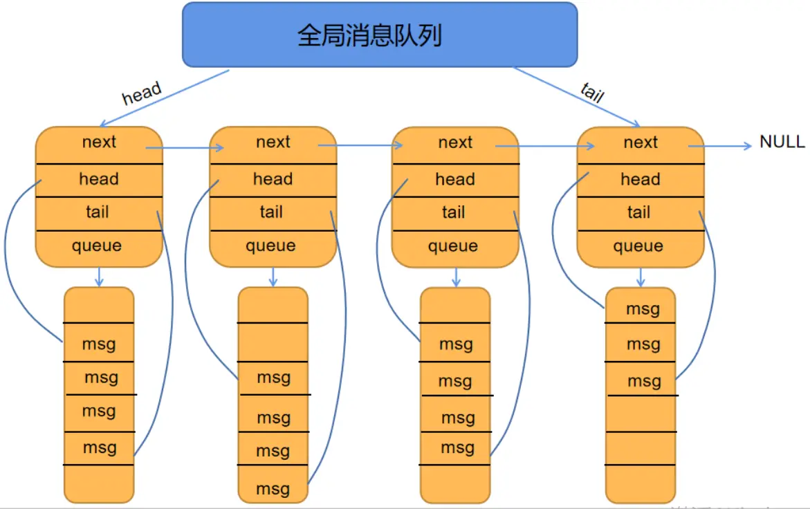
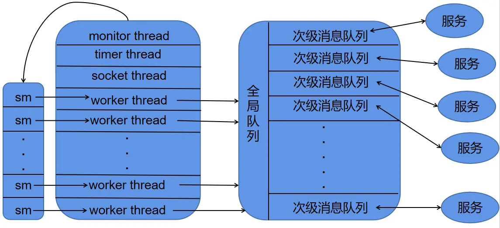
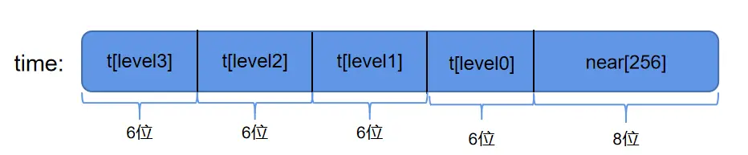

 
<!--BEGIN_DATA
{
    "create_date": "2023-12-02 10:10", 
    "modify_date": "2023-12-02 10:10", 
    "is_top": "0", 
    "summary": "skynet消息调度机制<br/>skynet的模块与服务<br/>skynet配置文件的加载<br/>skynet中的定时器机制<br/>", 
    "tags": "C/C++、Lua、架构、网络", 
    "file_name": "skynet源码阅读笔记01.md"
}
END_DATA-->

#### <p>原文出处：<a href='https://www.jianshu.com/p/6aa32e53856a' target='blank'>skynet消息调度机制</a></p>

## skynet 源码阅读笔记 —— 消息调度机制

### 基本数据结构之消息队列

skynet 采用了**二级消息队列**模式，其中顶层消息队列为 `global_queue`，而底层的消息队列为`message_queue`，它们的具体定义如下：

```c
//skynet_mq.c
struct message_queue {
    struct spinlock lock;   //自旋锁，避免多个线程同时向一个队列中 push 消息时导致的竞态问题
    uint32_t handle;    //服务句柄。表明该消息队列具体属于哪个服务
    int cap;            //消息队列的容量
    int head;
    int tail;
    int release;        //是否可以释放信息
    int in_global;      //是否位于全局队列当中
    int overload;       //是否过载
    int overload_threshold; //过载上限
    struct skynet_message *queue;   //指向消息队列中存放消息的一片内存区域
    struct message_queue *next;     //指向下个次级消息队列的指针
};

struct global_queue {
    struct message_queue *head;
    struct message_queue *tail;
    struct spinlock lock;
};
```

skynet 的消息队列形式如下：



二级消息队列模型

### 基本数据结构之消息

skynet 中一共支持两种不同的消息，一种为本地消息`skynet_message` ，另一种则为远程消息`remote_message`。其中，`skynet_message`和 `remote_message` 如下：

```c
//skynet_mq.h
struct skynet_message {
    uint32_t source;    //发送的源地址
    //session 用于将请求包和响应包匹配起来。当一个服务向另一个服务发起请求时，会产生一个 session
    //当响应端处理完毕后，会将 session 原样返回，这样请求端就可以根据 session 找到对应的结果
    int session;        
    void * data;
    size_t sz;
};

//skynet_harbor.h
#define GLOBALNAME_LENGTH 16

//remote_name 代表一个远程 skynet 节点。
struct remote_name {
    char name[GLOBALNAME_LENGTH];
    uint32_t handle;
};

struct remote_message {
    struct remote_name destination;
    const void * message;
    size_t sz;
    int type;
};
```

这里解释一下上述消息定义中的 `session` 和 `type` 字段。**`session`主要用来匹配一对请求和响应**。当一个服务向另一个服务提起请求时，会生成一个session，并跟随请求包一并发送出去。接收端接收到包并处理完毕后，再将同样的 session 返回。这样，编写服务的人只需要在服务的 callback函数中记录下所有发送出去的 session 就可以在收到每个消息后调用正确的处理函数。而 **`type` 主要是用来区分不同的消息包类型**。type的定义如下：

```c
#define PTYPE_TEXT 0        //文本类型
#define PTYPE_RESPONSE 1    //响应包
#define PTYPE_MULTICAST 2   //组播包
#define PTYPE_CLIENT 3      //客户端消息
#define PTYPE_SYSTEM 4      //系统消息
#define PTYPE_HARBOR 5      //集群内其他的 skynet 节点发来的消息
#define PTYPE_TAG_DONTCOPY 0x10000      //禁止拷贝
#define PTYPE_TAG_ALLOCSESSION 0x20000  //分配新的 session
```

### 谁生产，谁消费？

在 skynet 中，每个服务都拥有自己的一个次级消息队列。一个服务给另一个服务发送消息的过程，本质上就是将一个 `skynet_message`压入到目标服务的次级消息队列当中。当一个服务的次级消息队列非空时，skynet 会将其push 到全局消息队列当中。而消息的消费，则是由线程池中的worker 线程来完成，其大致的框图如下：



生产者消费者管理者模型

#### 消息消费的过程

在 skynet 启动的时候，会根据配置文件的 `thread` 字段初始化线程池。其中线程池中的前三个线程是 `monitor`, `timer` 和`socket` 线程。其中，monitor 线程主要负责检查每个服务是否陷入了死循环，socket 线程负责网络相关操作，timer线程则负责定时器。对应代码如下：

```c
//skynet_start.c
static void* thread_worker(void *p) {
    struct worker_parm *wp = p;
    int id = wp->id;
    int weight = wp->weight;
    struct monitor *m = wp->m;
    struct skynet_monitor *sm = m->m[id];
    skynet_initthread(THREAD_WORKER);
    struct message_queue * q = NULL;

    while (!m->quit) {
        q = skynet_context_message_dispatch(sm, q, weight);
        if (q == NULL) {
            if (pthread_mutex_lock(&m->mutex) == 0) {
                ++ m->sleep;
                // "spurious wakeup" is harmless,
                // because skynet_context_message_dispatch() can be call at any time.
                if (!m->quit)
                    pthread_cond_wait(&m->cond, &m->mutex);
                -- m->sleep;
                if (pthread_mutex_unlock(&m->mutex)) {
                    fprintf(stderr, "unlock mutex error");
                    exit(1);
                }
            }
        }
    }
    return NULL;
}

static void start(int thread) {
    pthread_t pid[thread+3];
    struct monitor *m = skynet_malloc(sizeof(*m));
    memset(m, 0, sizeof(*m));
    m->count = thread;
    m->sleep = 0;
    m->m = skynet_malloc(thread * sizeof(struct skynet_monitor *));

    int i;
    for (i=0;i<thread;i++) {
        m->m[i] = skynet_monitor_new();
    }
    if (pthread_mutex_init(&m->mutex, NULL)) {
        fprintf(stderr, "Init mutex error");
        exit(1);
    }
    if (pthread_cond_init(&m->cond, NULL)) {
        fprintf(stderr, "Init cond error");
        exit(1);
    }

    //创建 monitor 线程负责监视所有的 worker 线程
    create_thread(&pid[0], thread_monitor, m);
    create_thread(&pid[1], thread_timer, m);
    create_thread(&pid[2], thread_socket, m);
    //worker 线程的权重值
    static int weight[] = { 
        -1, -1, -1, -1, 0, 0, 0, 0,
        1, 1, 1, 1, 1, 1, 1, 1, 
        2, 2, 2, 2, 2, 2, 2, 2, 
        3, 3, 3, 3, 3, 3, 3, 3, };
    
    struct worker_parm wp[thread];

    for (i=0;i<thread;i++) {
        wp[i].m = m;
        wp[i].id = i;
        if (i < sizeof(weight)/sizeof(weight[0])) {
            wp[i].weight= weight[i];
        } else {
            wp[i].weight = 0;
        }
        create_thread(&pid[i+3], thread_worker, &wp[i]);
    }

    for (i=0;i<thread+3;i++) {
        pthread_join(pid[i], NULL); 
    }

    free_monitor(m);
}
```

在上述代码中，我们可以看出 skynet 创建线程池的流程，先创建好 monitor、socket 和 timer 这三个线程，然后创建相应数量的worker 线程，而每个 worker 线程最终会调用 `skynet_context_message_dispatch`函数从全局消息队列中获取消息。`skynet_context_message_dispatch` 的定义如下：

```c
// skynet_start.c
struct message_queue* skynet_context_message_dispatch(struct skynet_monitor *sm, struct message_queue *q, int weight) {
    //从全局消息队列中取出一个次级消息队列
    if (q == NULL) {
        q = skynet_globalmq_pop();
        if (q==NULL)
            return NULL;
    }

    //获得该次级消息队列所对应的服务的句柄
    uint32_t handle = skynet_mq_handle(q);

    //获取服务上下文
    struct skynet_context * ctx = skynet_handle_grab(handle);

    //若取出的服务没有上下文，则重取一个新的次级消息队列
    if (ctx == NULL) {
        struct drop_t d = { handle };
        skynet_mq_release(q, drop_message, &d);
        return skynet_globalmq_pop();
    }

    int i,n=1;
    struct skynet_message msg;
    //根据不同的权重从消息队列中获得不同数量的消息
    for (i=0;i<n;i++) {
        if (skynet_mq_pop(q,&msg)) {
            skynet_context_release(ctx);
            return skynet_globalmq_pop();
        } else if (i==0 && weight >= 0) {
            n = skynet_mq_length(q);
            n >>= weight;
        }

        int overload = skynet_mq_overload(q);

        if (overload) {
            skynet_error(ctx, "May overload, message queue length = %d", overload);
        }

        skynet_monitor_trigger(sm, msg.source , handle);

        if (ctx->cb == NULL) {
            skynet_free(msg.data);
        } else {
            dispatch_message(ctx, &msg);
        }

        skynet_monitor_trigger(sm, 0,0);
    }

    assert(q == ctx->queue);
    struct message_queue *nq = skynet_globalmq_pop();
    if (nq) {
        // If global mq is not empty , push q back, and return next queue (nq)
        // Else (global mq is empty or block, don't push q back, and return q again (for next dispatch)
        skynet_globalmq_push(q);
        q = nq;
    } 

    skynet_context_release(ctx);

    return q;
}
```

结合 `strat` 和 `skynet_context_message_dispatch`，我们可以知道 skynet 的消息调度机制的全貌：当skynet 启动时会初始化线程池，其中线程池内总共包含 4 种线程：`monitor`、`timer`、`socket` 和`worker`，其中`worker` 具有不同的权重值。**每个 `worker`会不断从全局消息队列中取出某个服务的次级消息队列，并根据权重值的不同从消息队列中取出若干个消息，然后调用服务所属的 callback 函数消费消息。**权重与取出的消息个数的关系如下：

> -1 ：从次级消息队列取出一个消息进行处理  
0 ：从次级消息队列中取出所有消息进行处理  
1 ：从次级消息队列中取出一半的消息进行处理  
2 ：从次级消息队列中取出四分之一的消息进行处理  
3 ：从次级消息队列中取出八分之一的消息进行处理

**这种分配优先级的做法，使得 CPU 的运转效率尽可能的高**。当线程足够多时，如果每次都只处理一个消息，虽然可以避免一些服务饿死，但却可能会使得消息队列中出现大量消息堆积。如果每次都处理一整个消息队列中的消息，则可能会使一些服务中的消息长时间得不到相应，从而导致服务饿死。为线程配置权重的做法是一个非常好的折中方案

#### 消息生产的过程

skynet 中不同的服务运行在不同的上下文当中，彼此之间的交互只能通过消息队列进行转发。不同服务之间转发消息的接口为 `skynet_send`，其定义如下：

```c
//skynet_server.c
int skynet_send(struct skynet_context * context, uint32_t source, uint32_t destination , int type, int session, void * data, size_t sz) {
    if ((sz & MESSAGE_TYPE_MASK) != sz) {
        skynet_error(context, "The message to %x is too large", destination);
        if (type & PTYPE_TAG_DONTCOPY) {
            skynet_free(data);
        }
        return -2;
    }

    //_filter_args:根据 type 中的 PTYPE_TAG_DONTCOPY 和 PTYPE_TAG_ALLOCSESSION 位域对参数进行一些相应的处理
    // PTYPE_TAG_DONTCOPY：表示不要拷贝 data 的副本，直接在 data 上进行处理
    // PTYPE_TAG_ALLOCSESSION: 表示为消息分配一个新的 session
    _filter_args(context, type, &session, (void **)&data, &sz);
    if (source == 0) {
        source = context->handle;
    }

    if (destination == 0) {
        if (data) {
            skynet_error(context, "Destination address can't be 0");
            skynet_free(data);
            return -1;
        }
        return session;
    }

    if (skynet_harbor_message_isremote(destination)) {
        struct remote_message * rmsg = skynet_malloc(sizeof(*rmsg));
        rmsg->destination.handle = destination;
        rmsg->message = data;
        rmsg->sz = sz & MESSAGE_TYPE_MASK;
        rmsg->type = sz >> MESSAGE_TYPE_SHIFT;
        skynet_harbor_send(rmsg, source, session);
    } else {
        struct skynet_message smsg;
        smsg.source = source;
        smsg.session = session;
        smsg.data = data;
        smsg.sz = sz;
        if (skynet_context_push(destination, &smsg)) {
            skynet_free(data);
            return -1;
        }
    }
    return session;
}
```

从上述代码中，`skynet_send` 使用了 `source` 和 `destination`来标记消息的发送端和接收端，这两个参数的本质就是能够在全网范围内唯一标识一个服务的 handle。handle 为一个 32 位无符号整数，其中高 8 位为 harbor id，用来表示服务所属的 skynet 节点，而剩余的 24 位则用于表示该 skynet 内的唯一一个服务。不管最终调用的函数是`skynet_harbor_send` 还是 `skynet_context_push`，最后都会回归到 `skynet_mq_push`这个函数中。**因此，skynet 中发送消息的本质就是往目标服务的次级消息队列中压入消息。**

### 监工机制 —— monitor 线程的工作

说完了 skynet 消息调度中消息的生产与消费，我们来稍微看一看 monitor 线程(监工) 是如何监管 worker 线程的工作的。在这之前我们先看看monitor 的定义：

```c
//skynet_start.c
struct monitor {
    int count;      //monitor 所监视的 worker 线程的数量
    struct skynet_monitor ** m; //存放所有的 skynet_monitor 的数组，worker 和 skynet_monitor 一一对应
    pthread_cond_t cond;
    pthread_mutex_t mutex;
    int sleep;  //休眠时间
    int quit;   //退出标志
};

//skynet_monitor.c
struct skynet_monitor {
    int version;            //版本号
    int check_version;      //前一个版本号
    uint32_t source;        //源地址
    uint32_t destination;   //目标地址
};
```

如前面所提到的，当 skynet 启动线程池时，第一个创建的线程便是 monitor 线程，它的运行函数如下：

```c
//skynet_start.c
static void *thread_monitor(void *p) {
    struct monitor * m = p;
    int i;
    int n = m->count;
    skynet_initthread(THREAD_MONITOR);
    for (;;) {
        //CHECK_ABORT : if (G_NODE.total == 0) break;
        CHECK_ABORT
        for (i=0;i<n;i++) {
            skynet_monitor_check(m->m[i]);
        }
        for (i=0;i<5;i++) {
            CHECK_ABORT
            sleep(1);
        }
    }
    return NULL;
}

//skynet_monitor.c
void skynet_monitor_check(struct skynet_monitor *sm) {
    //版本号相同时
    if (sm->version == sm->check_version) {
        //若目标地址不为 0，则 sm 所对应那个 worker 可能陷入了死循环
        if (sm->destination) {
            skynet_context_endless(sm->destination);
            skynet_error(NULL, "A message from [ :%08x ] to [ :%08x ] maybe in an endless loop (version = %d)", sm->source , sm->destination, sm->version);
        }
    } else {
        //版本号不同
        sm->check_version = sm->version;
    }
}
```

monitor 的监管逻辑非常简单，每隔 5s 便为每个 worker 线程执行一次 `skynet_monitor_check` 函数。  

我们再来看看 `skynet_monitor_trigger` 函数的实现：

```c
// skynet_start.c
struct message_queue* skynet_context_message_dispatch(struct skynet_monitor *sm, struct message_queue *q, int weight) {
...
        int overload = skynet_mq_overload(q);
        if (overload) {
            skynet_error(ctx, "May overload, message queue length = %d", overload);
        }
        skynet_monitor_trigger(sm, msg.source , handle);
        if (ctx->cb == NULL) {
            skynet_free(msg.data);
        } else {
            dispatch_message(ctx, &msg);
        }
        skynet_monitor_trigger(sm, 0,0);
...
}

//skynet_monitor.c
void skynet_monitor_trigger(struct skynet_monitor *sm, uint32_t source, uint32_t destination) {
    sm->source = source;
    sm->destination = destination;
    //递增 version
    ATOM_INC(&sm->version);
}
```

从上述代码中，我们可以看出 monitor 线程的工作原理。我们来还原一下 monitor 的工作场景：

>   1. 当一个 worker 线程(记为w)从消息队列中取出一个次级消费队列进行消费。在执行 `dispatch_message(ctx, &msg);`之前会先调用 `skynet_monitor_trigger`函数，此时对应的 `skynet_monitor`(记为`w_sm`) 有`w_sm->version = 1`， `w_sm->check_version = 0` 成立。随后 w 进入了消息消费过程。
>
>   2. 此时 monitor 刚好对 `w_sm` 执行了 `skynet_monitor_check`函数，使得有 `w_sm->version == w_sm->check_version == 1` 成立。
>
>   3. 当 w 在消费过程中陷入了死循环并超过第二步 5s 的时间后，monitor 再一次对 `w_sm` 执行 `skynet_monitor_check`函数。这一次 monitor 发现条件 `w_sm->version == w_sm->check_version` 成立，于是向用户返回一条错误日志。
>
>   4. 若 w 在第二步 5 s 的时间内完成了消息消费的过程，则会将 `w_sm->source` 和 `w_sm->destination` 都设置为 0。 这样即使 monitor 即使检测到 `w_sm->version == w_sm->check_version` 也不会产生错误日志。

### 如何实现线程安全

在 skynet 的消息调度机制中，可能涉及到竞态问题的地方主要有往全局消息队列中执行`push`和`pop`操作、往次级消息队列中执行 `push` 和 `pop` 操作以及消息的消费过程

```c
struct message_queue * skynet_globalmq_pop() {
    struct global_queue *q = Q;
    SPIN_LOCK(q)
    struct message_queue *mq = q->head;
    if(mq) {
        q->head = mq->next;
        if(q->head == NULL) {
            assert(mq == q->tail);
            q->tail = NULL;
        }
        mq->next = NULL;
    }
    SPIN_UNLOCK(q)
    return mq;
}

void skynet_globalmq_push(struct message_queue * queue) {
    struct global_queue *q= Q;
    SPIN_LOCK(q)
    assert(queue->next == NULL);
    if(q->tail) {
        q->tail->next = queue;
        q->tail = queue;
    } else {
        q->head = q->tail = queue;
    }
    SPIN_UNLOCK(q)
}

void skynet_mq_push(struct message_queue *q, struct skynet_message *message) {
    assert(message);
    SPIN_LOCK(q)
    q->queue[q->tail] = *message;
    if (++ q->tail >= q->cap) {
        q->tail = 0;
    }
    if (q->head == q->tail) {
        expand_queue(q);
    }
    if (q->in_global == 0) {
        q->in_global = MQ_IN_GLOBAL;
        skynet_globalmq_push(q);
    }
    SPIN_UNLOCK(q)
}

int skynet_mq_pop(struct message_queue *q, struct skynet_message *message) {
    int ret = 1;
    SPIN_LOCK(q)
    if (q->head != q->tail) {
        *message = q->queue[q->head++];
        ret = 0;
        int head = q->head;
        int tail = q->tail;
        int cap = q->cap;
        if (head >= cap) {
            q->head = head = 0;
        }
        int length = tail - head;
        if (length < 0) {
            length += cap;
        }
        while (length > q->overload_threshold) {
            q->overload = length;
            q->overload_threshold *= 2;
        }
    } else {
        // reset overload_threshold when queue is empty
        q->overload_threshold = MQ_OVERLOAD;
    }
    if (ret) {
        q->in_global = 0;
    }
    SPIN_UNLOCK(q)
    return ret;
}
```

skynet 的全局消息队列会被很多的线程访问，而且同一个服务可以同时接收多个不同服务所发送来的信息，因此这两个队列的访问频率都较高，而且对这两个队列的压入和弹出操作都非常快，使用自旋锁回避互斥锁更加经济。服务的 callback 不必是线程安全的，因为每次 worker都会从全局消息队列中将整个次级消息队列取出，因此其他线程无法同时访问到同一个次级消息队列，自然也就不会面临竞态问题。

### 参考资料

* [1]. [Skynet 设计综述 —— 云风](https://blog.codingnow.com/2012/09/the_design_of_skynet.html)
* [2].[skynet源码赏析](https://manistein.github.io/blog/post/server/skynet/skynet%E6%BA%90%E7%A0%81%E8%B5%8F%E6%9E%90/)

<hr>

#### <p>原文出处：<a href='https://www.jianshu.com/p/de2d10867aa6' target='blank'>skynet的模块与服务</a></p>

## skynet 源码阅读笔记 —— skynet 的模块与服务

### 1.基本概念：模块与服务

**模块(module)**：在skynet中，模块是指符合规范的 C 共享库文件。一个符合规范的 C 共享库应当具备 `*_create`、`*_signal`、`*_release` 以及 `*_init` 四个接口。其中 * 代表模块名称。其中模块的接口及定义如下：

```c
//skynet_module.h
//每一个模块都应当提供 create、init、release 以及 signal 等四个接口
typedef void * (*skynet_dl_create)(void);
typedef int (*skynet_dl_init)(void * inst, struct skynet_context *, const char * parm);
typedef void (*skynet_dl_release)(void * inst);
typedef void (*skynet_dl_signal)(void * inst, int signal);

struct skynet_module {
    const char * name; //模块名称
    void * module;     //用于访问对应so库的句柄，由dlopen函数获得
    skynet_dl_create create;
    skynet_dl_init init;
    skynet_dl_release release;
    skynet_dl_signal signal;
};

//skynet_module.c
#define MAX_MODULE_TYPE 32

//modules 列表，用于存放全部用到的 module 
struct modules {
    int count;  //存放的 module 的数量
    struct spinlock lock;
    const char * path;  //path由配置文件中的module_path提供
    struct skynet_module m[MAX_MODULE_TYPE];    //存储module的数组
};

static struct modules * M = NULL;
```

**服务(service)**：相对于模块是静态的概念，服务则是动态的概念，指的是运行在独立上下文中的模块。  

skynet 提供了这样的一种机制：用户可以将自定义的模块放置到 skynet 指定的目录下。当 skynet 使用到对应的服务时，会将该模块加载到modules 当中，并为其创建一个独立的上下文环境(context)。这样不同的服务的运行环境相互透明，交互则通过消息队列来进行。

```c
//skynet_server.c:
struct skynet_context {
    void * instance;    //调用模块的 *_create 函数创建对应的服务实例
    struct skynet_module * mod; //指向对应的模块
    void * cb_ud;   //回调函数所需参数
    skynet_cb cb;   //回调函数
    struct message_queue *queue;    //服务所属的消息队列
    FILE * logfile;     //日志文件句柄
    uint64_t cpu_cost;  // in microsec
    uint64_t cpu_start; // in microsec
    char result[32];    //存放回调函数的执行结果
    uint32_t handle;    //位于该上下文环境中的一个服务的句柄
    int session_id;     //session_id 用来将请求和响应匹配起来
    int ref;            //引用计数，当 ref == 0 时回收内存
    int message_count;  //消息队列中消息的数量？
    bool init;          //是否完成了初始化
    bool endless;       //该服务是否是一个无限循环
    bool profile;       
    CHECKCALLING_DECL
};
```

### 2.模块的加载

在 skynet 中，模块的加载主要通过 `skynet_module_query` 函数来完成。当 skynet 启动时会先执行`skynet_module_init` 函数对全局模块列表 modules 进行初始化。当需要使用到某个服务时，skynet 会调用 `skynet_context_new` 函数为其创建上下文，这个过程当中会调用 `skynet_module_query(name)` 函数，该函数会根据 name 查找相应的模块。如果该模块尚未被加载，则将其加载到 modules 当中。具体代码如下

```c
//skynet_module.c
//根据模块名查找对应的模块，如果找不到且 modules 中尚有空间则将模块加载进来
struct skynet_module * skynet_module_query(const char * name) {
    struct skynet_module * result = _query(name);
    if (result)
        return result;
    SPIN_LOCK(M)
    //双重检测可以避免以下情形：两个不同的服务 A 和 B 同时调用了一个服务 C，在 A 查找 C 中的模块时，B 进入自旋等待状态。
    //当 A 调用结束后会将 C 模块插入 modules 中，此时如果 B 再执行插入则会导致重复插入
    result = _query(name); // double check
    if (result == NULL && M->count < MAX_MODULE_TYPE) {
        int index = M->count;
        //返回相应动态库的句柄
        void * dl = _try_open(M,name);
        if (dl) {
            M->m[index].name = name;
            M->m[index].module = dl;
            if (open_sym(&M->m[index]) == 0) {
                M->m[index].name = skynet_strdup(name);
                M->count ++;
                result = &M->m[index];
            }
        }
    }
    SPIN_UNLOCK(M)
    return result;
}

static int open_sym(struct skynet_module *mod) {
    mod->create = get_api(mod, "_create");
    mod->init = get_api(mod, "_init");
    mod->release = get_api(mod, "_release");
    mod->signal = get_api(mod, "_signal");
    return mod->init == NULL;
}

//从动态库中找到对应的 api 并将其函数地址返回
static void* get_api(struct skynet_module *mod, const char *api_name) {
    size_t name_size = strlen(mod->name);
    size_t api_size = strlen(api_name);
    char tmp[name_size + api_size + 1];
    memcpy(tmp, mod->name, name_size);
    memcpy(tmp+name_size, api_name, api_size+1);
    char *ptr = strrchr(tmp, '.');
    if (ptr == NULL) {
        ptr = tmp;
    } else {
        ptr = ptr + 1;
    }
    return dlsym(mod->module, ptr);
}
```

从上述代码中可以看出，加载模块需要先调用 `_try_open()` 函数去打开对应的 .so 文件, 并通过 `open_sym` 函数来将对应的 api 存放到 `module` 结构体中相应的函数指针处。.so 文件中的 api 命名统一按照 "module_function" 的格式命名。

### 3.服务的启动

skynet 中服务的创建主要通过 `skynet_context_new` 来完成，其代码定义如下：

```c
//skynet_server.c
struct skynet_context* skynet_context_new(const char * name, const char *param) {
    struct skynet_module * mod = skynet_module_query(name);
    if (mod == NULL)
        return NULL;

    void *inst = skynet_module_instance_create(mod);
    if (inst == NULL)
        return NULL;

    struct skynet_context * ctx = skynet_malloc(sizeof(*ctx));
    CHECKCALLING_INIT(ctx)
    ctx->mod = mod;
    ctx->instance = inst;
    //此处将引用置为 2 的原因是因为在 skynet_handle_register 中会将 ctx 保存起来，增加一次引用。
    //之后再将 ctx 返回给对应的变量，增加了一次引用，因此 ref = 2
    ctx->ref = 2;
    ctx->cb = NULL;
    ctx->cb_ud = NULL;
    ctx->session_id = 0;
    ctx->logfile = NULL;
    ctx->init = false;
    ctx->endless = false;
    ctx->cpu_cost = 0;
    ctx->cpu_start = 0;
    ctx->message_count = 0;
    ctx->profile = G_NODE.profile;
    // Should set to 0 first to avoid skynet_handle_retireall get an uninitialized handle
    ctx->handle = 0;    
    ctx->handle = skynet_handle_register(ctx);
    
    struct message_queue * queue = ctx->queue = skynet_mq_create(ctx->handle);
    // init function maybe use ctx->handle, so it must init at last
    context_inc();
    CHECKCALLING_BEGIN(ctx)
    
    int r = skynet_module_instance_init(mod, inst, ctx, param);
    CHECKCALLING_END(ctx)
    
    if (r == 0) {
        //skynet_context_release 会在 ctx->ref == 0 时回收这个 context
        struct skynet_context * ret = skynet_context_release(ctx);
        if (ret) {
            ctx->init = true;
        }
        skynet_globalmq_push(queue);
        if (ret) {
            skynet_error(ret, "LAUNCH %s %s", name, param ? param : "");
        }
        return ret;
    } else {
        skynet_error(ctx, "FAILED launch %s", name);
        uint32_t handle = ctx->handle;
        skynet_context_release(ctx);
        skynet_handle_retire(handle);
        struct drop_t d = { handle };
        skynet_mq_release(queue, drop_message, &d);
        return NULL;
    }
}
```

从上述代码中我们可以看出 `skynet_context_new` 的主要工作为如下：

>   1. 在 modules 中查找对应的模块名称，如果存在则直接返回模块的句柄，不存在则将模块加载进内存，并保存在 modules 当中
>
>   2. 调用 module 的 create api 创建 module 的实例 inst
>
>   3. 分配 `skynet_context` 结构体并为其赋上相应的值
>
>   4. 调用 module 的 init api 为 inst 进行初始化  

如果初始化成功，则将该 context 中的次级消息队列 queue 放入到全局消息队列当中，然后返回创建好的服务(context)  

如果失败则释放分配的 `skynet_context`, 为服务分配的 handle 以及专属的次级消息队列, 然后返回 NULL。

上述代码中需要注意的，`ctx->ref`的初始值为 2。这是因为当 `skynet_context_new` 执行完毕后，会有两个地方引用了新创建好的context。一个是 `skynet_context_new` 的调用者，它会保存返回的 context 指针; 另一个则是`skynet_handle_register` 函数，该函数会将新创建的 context 保存在 `handle_storage` 的 `slot` 字段中  

接下来，我们来看看 `skynet_context_new` 中的几个模块相关的函数：`skynet_module_instance_create`、`skynet_module_instance_init`

```c
//skynet_module.c
void* skynet_module_instance_create(struct skynet_module *m) {
    if (m->create) {
        return m->create();
    } else {
        return (void *)(intptr_t)(~0);
    }
}

int skynet_module_instance_init(struct skynet_module *m, void * inst, struct skynet_context *ctx, const char * parm) {
    return m->init(inst, ctx, parm);
}

void skynet_module_instance_release(struct skynet_module *m, void *inst) {
    if (m->release) {
        m->release(inst);
    }
}

void skynet_module_instance_signal(struct skynet_module *m, void *inst, int signal) {
    if (m->signal) {
        m->signal(inst, signal);
    }
}
```

在上述代码中，`skynet_module_instance_create` 的返回值 `(void *)(intptr_t)(~0)`引起了我的好奇。这个地址的值为 `0xffffffff`, 代表的是内存地址的最底端的地址。它主要的作用就是为了和 `NULL` 作区分。当 skynet 调用对应模块的 `_create` 函数时, 如果此时内存耗尽，无法创建模块对象，则会返回 `NULL`。如果用户在没有定义 `_create`函数情况下也使用 `NULL` 做返回值，则无法区分这两种情况。

### 4.总结

简单地来讲，skynet 的模块加载与服务创建的整体过程为：  

当 skynet 启动时会先执行 `skynet_module_init` 进行 modules 的创建，随后调用 `skynet_context_new`创建新的服务。在这个过程当中， skynet 先会自动根据配置文件中指定的模块路径进行 module 的加载。完成加载后的 module 将被保存在全局的modules 当中。随后，分配 `skynet_context` 结构体并进行相应赋值。在赋值的过程中会调用到 module 的 `_create`, `_init` 等 api。如果分配成功则将 `context` 返回给调用者，失败返回 `NULL`。创建好的服务彼此透明，运行在不同的`skynet_context` 下，不同的服务之间的交互必须通过消息队列进行转发

<hr>
 
#### <p>原文出处：<a href='https://www.jianshu.com/p/92d6844552e9' target='blank'>skynet配置文件的加载</a></p>

## skynet 源码阅读笔记 —— 配置文件的加载

### skynet 中 main 函数的流程

skynet 的 main 函数位于 skynet_main.c 文件当中，其定义如下：

```c
int main(int argc, char *argv[]) {
    const char * config_file = NULL;

    if (argc > 1) {
        config_file = argv[1];
    } else {
        fprintf(stderr, "Need a config file. Please read skynet wiki : https://github.com/cloudwu/skynet/wiki/Config\n"
            "usage: skynet configfilename\n");
        return 1;
    }
    skynet_globalinit();
    skynet_env_init();
    sigign();
    struct skynet_config config;

#ifdef LUA_CACHELIB
    // init the lock of code cache
    luaL_initcodecache();
#endif

    //创建一个新的 lua 环境，并将 lua 库加载进去, 该函数使用默认分配函数来进行创建
    struct lua_State *L = luaL_newstate();
    luaL_openlibs(L);   // link lua lib

    //将 load_config 加载为 lua 代码块，"t" 表示代码块的类型是文本类型，代码块的名称为 “=[skynet config]”
    int err =  luaL_loadbufferx(L, load_config, strlen(load_config), "=[skynet config]", "t");
    assert(err == LUA_OK);
    
    //向 lua 的虚拟栈中压入 config_file,作为 load_config 的参数
    lua_pushstring(L, config_file);
    
    //lua_pcall 的第二个参数表示传递的参数个数，第三个参数表示期望的结果数量，第四个参数表示错误处理函数
    err = lua_pcall(L, 1, 1, 0);
    
    if (err) {
        //如果出错，则返回存放在虚拟栈栈顶的错误信息
        fprintf(stderr,"%s\n",lua_tostring(L,-1));
        lua_close(L);
        return 1;
    }

    _init_env(L);
    config.thread =  optint("thread",8);
    config.module_path = optstring("cpath","./cservice/?.so");
    config.harbor = optint("harbor", 1);
    config.bootstrap = optstring("bootstrap","snlua bootstrap");
    config.daemon = optstring("daemon", NULL);
    config.logger = optstring("logger", NULL);
    config.logservice = optstring("logservice", "logger");
    config.profile = optboolean("profile", 1);
    lua_close(L);

    skynet_start(&config);
    skynet_globalexit();

    return 0;
}
```

使用过 skynet 的人都知道，skynet 在启动时相应的配置文件作为参数传递给 skynet 进程，例如 `skynet example/config`。从代码上可以看出，skynet 的 `main` 函数主要流程可以分为 3 个部分：

>   1. 初始化运行环境，并通过 C API 调用相应的 lua 脚本解析配置文件，然后结果保存在 config 结构体中
>
>   2. 以 config 为参数启动 skynet 进入事件循环
>
>   3. 执行 skynet_globalexit() 完成 skynet 的退出准备

### 使用 lua 语言描述配置文件

在了解 skynet 是如何加载配置文件前，我们先来看看配置文件究竟长什么样？skynet 在 example 目录下提供了示范的`config.path` 文件以及 `config` 文件

```lua
--config.path 文件
root = "./"
luaservice = root.."service/?.lua;"..root.."test/?.lua;"..root.."examples/?.lua;"..root.."test/?/init.lua"
lualoader = root .. "lualib/loader.lua"
lua_path = root.."lualib/?.lua;"..root.."lualib/?/init.lua"
lua_cpath = root .. "luaclib/?.so"
snax = root.."examples/?.lua;"..root.."test/?.lua"

--config 文件
--include 为 load_config 中定义的脚本调用接口
include "config.path"

-- preload = "./examples/preload.lua"   -- run preload.lua before every lua service run
thread = 8
logger = nil
logpath = "."
harbor = 1
address = "127.0.0.1:2526"
master = "127.0.0.1:2013"
start = "main"  -- main script
bootstrap = "snlua bootstrap"   -- The service for bootstrap
standalone = "0.0.0.0:2013"
-- snax_interface_g = "snax_g"
cpath = root.."cservice/?.so"
-- daemon = "./skynet.pid"
```

skynet 的配置文件本身使用了 lua 语言来描述对应的选项，而 skynet 也是通过 C API 来调用对应的 lua 脚本对配置文件进行解析。使用 lua 语言来描述配置选项，相较于以普通的文本来描述配置文件有以下几个好处：

>   1. lua 作为一门脚本语言，本身提供了解析器及灵活丰富的语法，不仅表达能力强于文本语言，而且 C/C++ 都为其提供了良好的支持，简单易用
>
>   2. 使用 lua 语言描述配置文件，则配置文件本身也可以运行。你可以在配置文件中定义并调用函数，要求用户输入数据或者访问系统的环境变量等，这些都是文本语言所难以实现的。
>
>   3. lua 实现的配置文件可以扩展性强，当需要向配置文件中添加新的配置机制会更加方便。

### 配置文件解析脚本

这个解析配置文件的脚本的内容则是以 C 字符串的形式保存在 `load_config` 变量当中。我们将其以 lua 代码的形式展示在下方：

```lua
-- load_config 的内容：
local result = {}

--获取相应的环境变量
local function getenv(name) return assert(os.getenv(name), [[os.getenv() failed: ]] .. name) end

--获取路径的分隔符，在 linux 下 sep = /
local sep = package.config:sub(1,1)

--将 . 和 / 合并得到了当前目录的相对路径 ./
local current_path = [[.]]..sep

--定义脚本调用接口 include
local function include(filename)
    local last_path = current_path
    
    --以最后一个/为分界将 filename 分割为路径 path 和文件名 name
    local path, name = filename:match([[(.*]]..sep..[[)(.*)$]])
    if path then
        --若 path 为绝对路径，则起始字符为 /
        if path:sub(1,1) == sep then    -- root
            current_path = path
        else
            --path 为相对路径的情况
            current_path = current_path .. path
        end
    else
        --若 path 为 nil，则说明 filename 不包含路径
        name = filename
    end
    
    --打开配置文件
    local f = assert(io.open(current_path .. name))
    --读取配置文件中的所有内容
    local code = assert(f:read [[*a]])
    
    --如果配置文件中存在形如 $(环境变量) 的字符串，则调用 getenv 将其替换成环境变量的值
    code = string.gsub(code, [[%$([%w_%d]+)]], getenv)
    f:close()
    
    --将 code 中的内容以文本的形式加载到 result,其中 t 代表文本模式。
    assert(load(code,[[@]]..filename,[[t]],result))()
    current_path = last_path
end

--设置 result 的元表，这样在调用 include 的过程中，如果 result 中没有对应的键则会自动调用 include 函数
setmetatable(result, { __index = { include = include } })

--config_name 是变长参数
local config_name = ...

--使用 include 调用 config_name 脚本
include(config_name)

--调用完 include 后将 result 的元表清除，避免遍历 result 时收到元表的影响
setmetatable(result, nil)

return result
```

### main 函数中解析脚本的流程

在了解了配置文件的内容及 `load_config` 的解析流程后，我们就可以来分析一下 `main` 函数加载配置文件的详细过程了

```c
//skynet_env.c
struct skynet_env {
    struct spinlock lock;
    lua_State *L;
};

static struct skynet_env *E = NULL;

void skynet_env_init() {
    E = skynet_malloc(sizeof(*E));
    SPIN_INIT(E)
    E->L = luaL_newstate();
}

//skynet_main.c
static void _init_env(lua_State *L) {
    lua_pushnil(L);  /* first key */
    while (lua_next(L, -2) != 0) {
        int keyt = lua_type(L, -2);
        if (keyt != LUA_TSTRING) {
            fprintf(stderr, "Invalid config table\n");
            exit(1);
        }

        const char * key = lua_tostring(L,-2);

        if (lua_type(L,-1) == LUA_TBOOLEAN) {
            int b = lua_toboolean(L,-1);
            skynet_setenv(key,b ? "true" : "false" );
        } else {
            const char * value = lua_tostring(L,-1);
            if (value == NULL) {
                fprintf(stderr, "Invalid config table key = %s\n", key);
                exit(1);
            }
            skynet_setenv(key,value);
        }

        lua_pop(L,1);
    }

    lua_pop(L,1);
}

int main(int argc, char *argv[]){
    ...
    skynet_env_init();
    ...

    //创建一个新的 lua 环境，并将 lua 库加载进去, 该函数使用默认分配函数来进行创建
    struct lua_State *L = luaL_newstate();
    luaL_openlibs(L);   // link lua lib
    
    //将 load_config 加载为 lua 代码块，"t" 表示代码块的类型是文本类型，代码块的名称为 “=[skynet config]”
    int err =  luaL_loadbufferx(L, load_config, strlen(load_config), "=[skynet config]", "t");
    assert(err == LUA_OK);
    
    //向 lua 的虚拟栈中压入 config_file,作为 load_config 的参数
    lua_pushstring(L, config_file);
    
    //lua_pcall 的第二个参数表示传递的参数个数，第三个参数表示期望的结果数量，第四个参数表示错误处理函数
    err = lua_pcall(L, 1, 1, 0);
    if (err) {
        //如果出错，则返回存放在虚拟栈栈顶的错误信息
        fprintf(stderr,"%s\n",lua_tostring(L,-1));
        lua_close(L);
        return 1;
    }
    
    //将配置文件的内容添加到环境变量当中
    _init_env(L);
    
    //opt*(key, value) 函数会以 key 为键值访问环境变量，如果设置了该环境变量则返回对应的值，若没有设置该环境变量则将其设为 value
    config.thread =  optint("thread",8);
    config.module_path = optstring("cpath","./cservice/?.so");
    config.harbor = optint("harbor", 1);
    config.bootstrap = optstring("bootstrap","snlua bootstrap");
    config.daemon = optstring("daemon", NULL);
    config.logger = optstring("logger", NULL);
    config.logservice = optstring("logservice", "logger");
    config.profile = optboolean("profile", 1);
    lua_close(L);
    
    ...
}
```

从上述代码中可以看出，skynet 读取配置文件的大致流程为：先调用 `skynet_env_init` 函数初始化一个全局的 lua 环境，接着创建一个新的 lua 环境，并在该环境中使用 `luaL_loadbufferx`将 `load_config` 加载进来，然后使用`lua_pushstring`将配置文件 `config_file` 压入 lua 的虚拟栈中。最后使用 `lua_pcall` 调用 `load_config` 脚本完成配置文件的解析。解析完毕后，调用 `_init_env` 将解析结果保存为环境变量。在需要时调用相关类型的 `opt` 函数读取相应的配置项。  

最后我们来看看 `skynet_env` 的定义及相应函数的实现：

```c
//skynet_env.c
// skynet_env 维护了一个全局的 lua 环境
struct skynet_env {
    struct spinlock lock;
    lua_State *L;
};
static struct skynet_env *E = NULL;

//从全局的 lua 环境中查找全局变量 key
const char*  skynet_getenv(const char *key) {
    SPIN_LOCK(E)
    lua_State *L = E->L;
    lua_getglobal(L, key);
    const char * result = lua_tostring(L, -1);
    lua_pop(L, 1);
    SPIN_UNLOCK(E)
    return result;
}

//将 {key, value} 保存为全局的 lua 环境的全局变量
void skynet_setenv(const char *key, const char *value) {
    SPIN_LOCK(E)
    lua_State *L = E->L;
    lua_getglobal(L, key);
    assert(lua_isnil(L, -1));
    lua_pop(L,1);
    lua_pushstring(L,value);
    lua_setglobal(L,key);
    SPIN_UNLOCK(E)
}

//skynet_main.c
//optboolean 和 optstring 函数的实现逻辑与 optint 相似。
static int optint(const char *key, int opt) {
    const char * str = skynet_getenv(key);
    if (str == NULL) {
        char tmp[20];
        sprintf(tmp,"%d",opt);
        skynet_setenv(key, tmp);
        return opt;
    }
    return strtol(str, NULL, 10);
}
```

<hr>

#### <p>原文出处：<a href='https://www.jianshu.com/p/3c6330a9cbce' target='blank'>skynet中的定时器机制</a></p>

## skynet 源码阅读笔记 —— skynet 中的定时器机制

### 基本数据结构

要了解 skynet 的定时器机制，需要先了解 skynet 中的 `timer` 的数据结构及初始化代码(skynet 中所有 timer 相关的代码都存放于 `skynet_timer.c` 文件中)：

```c
#define TIME_NEAR_SHIFT 8
#define TIME_NEAR (1 << TIME_NEAR_SHIFT)
#define TIME_LEVEL_SHIFT 6
#define TIME_LEVEL (1 << TIME_LEVEL_SHIFT)
// TIME_NEAR_MASK = 0x11111111
#define TIME_NEAR_MASK (TIME_NEAR-1)
// TIME_LEVEL_MASK = 0x111111
#define TIME_LEVEL_MASK (TIME_LEVEL-1)

//超时事件
struct timer_event {
    uint32_t handle;    //标记该超时时间所对应的服务
    int session;        //超时事件发送消息所属的 handle
};

//定时器节点
struct timer_node {
    struct timer_node *next;
    uint32_t expire;    //超时事件
};

//定时器链表
struct link_list {
    struct timer_node head;
    struct timer_node *tail;
};

struct timer {
    struct link_list near[TIME_NEAR];
    struct link_list t[4][TIME_LEVEL];
    struct spinlock lock;
    uint32_t time;
    uint32_t starttime;     
    uint64_t current;       
    uint64_t current_point; 
};

static struct timer * TI = NULL;
```

从上述数据结构的定义中可以知道，skynet 采用 `timer_event` 来表示超时事件，其中 `handle` 代表了该超时事件属于哪个服务，而`session` 则代表向对应服务所发送的超时消息的 session。skynet 采用了带头节点的单链表来存储多个定时器。

### starttime、current 以及 current_point 的意义

要想了解 上述三个字段的具体意义，我们需要先了解 timer 是如何被初始化，以及节点是如何添加到 timer 当中的。在说明`skynet_timer_init` 之前，需要花点时间说明 `clock_gettime` 中不同的时间类别，也就是所谓的 clock_id.`clock_gettime` 支持多种不同的 `clk_id`, 其中包括但不限于:`CLOCK_REALTIME`、`CLOCK_MONOTONIC`、`CLOCK_PROCESS_CPUTIMEID` 和 `CLOCK_THREAD_CPUTIME_ID`

>   * `CLOCK_REALTIME`：墙上时间(wall time)，也就是我们现实生活中所用的时间，由变量xtime来记录。系统每次启动时将CMOS上的RTC时间读入xtime，这个值是"自1970-01-01起经历的秒数、本秒中经历的纳秒数"，每来一个timer interrupt，也需要去更新xtime。其值为从 1970-01-01:00:00:00 至今所流逝的时间。
>
>   * `CLOCK_MONOTONIC`：单调时间(monotonic time)，代表的从系统启动至今所流逝的时间，由变量jiffies来记录。系统每次启动时jiffies初始化为0，每来一个timer interrupt，jiffies加1，也就是说它代表系统启动后流逝的tick数。jiffies一定是单调递增的
>
>   * `CLOCK_PROCESS_CPUTIMEID`：进程专属的 CPU 时钟，代表从进程启动后至今所流逝的时间
>
>   * `CLOCK_THREAD_CPUTIME_ID`：线程专属单 CPU 时钟，代表从线程启动后至今所流逝的时间

其中，`CLOCK_REALTIME` 和 `CLOCK_MONOTONIC` 的区别在于 `CLOCK_REALTIME` 的值可以受到系统时间跳变或 NTP 的影响， 而`CLOCK_MONOTONIC` 不会受到影响，因此常用 `CLOCK_MONOTONIC`来计算系统启动后两个先后发生的事件之间的时间差

```c
//创建一个 timer 结构，并将其中 near 以及 t 链表数组清空
static struct timer* timer_create_timer() {
    struct timer *r=(struct timer *)skynet_malloc(sizeof(struct timer));
    memset(r,0,sizeof(*r));
    int i,j;
    for (i=0;i<TIME_NEAR;i++) {
        link_clear(&r->near[i]);
    }
    for (i=0;i<4;i++) {
        for (j=0;j<TIME_LEVEL;j++) {
            link_clear(&r->t[i][j]);
        }
    }
    SPIN_INIT(r)
    r->current = 0;
    return r;
}

void  skynet_timer_init(void) {
    TI = timer_create_timer();
    uint32_t current = 0;
    systime(&TI->starttime, &current);
    //TI->starttime 保存了当前墙上时间，精确到秒
    //TI->current 从 starttime 启动后到当前的时间，精确到 10 ms
    TI->current = current;
    //TI->current_point 代表是精确到 10 ms的单调时间，表示从系统启动到当前所流失的时间
    TI->current_point = gettime();
}

//获得当前系统的墙上时间，并将其中的整秒部分存入 sec 中，将纳秒部分转化为以 10 ms 为精度的 centisecond,并存入 cs 中
static void systime(uint32_t *sec, uint32_t *cs) {
#if !defined(__APPLE__) || defined(AVAILABLE_MAC_OS_X_VERSION_10_12_AND_LATER)
    struct timespec ti;
    clock_gettime(CLOCK_REALTIME, &ti);
    *sec = (uint32_t)ti.tv_sec;
    *cs = (uint32_t)(ti.tv_nsec / 10000000);
#else
    struct timeval tv;
    gettimeofday(&tv, NULL);
    *sec = tv.tv_sec;
    *cs = tv.tv_usec / 10000;
#endif
}

//获得当前系统的单调时间，并将其转换成为以 10ms 为精度的时间格式
static uint64_t gettime() {
    uint64_t t;
#if !defined(__APPLE__) || defined(AVAILABLE_MAC_OS_X_VERSION_10_12_AND_LATER)
    struct timespec ti;
    clock_gettime(CLOCK_MONOTONIC, &ti);
    t = (uint64_t)ti.tv_sec * 100;
    t += ti.tv_nsec / 10000000;
#else
    struct timeval tv;
    gettimeofday(&tv, NULL);
    t = (uint64_t)tv.tv_sec * 100;
    t += tv.tv_usec / 10000;
#endif
    return t;
}
```

从上述代码中，我们可以知道 `starttime` 代表的是 timer 初始化的墙上时间，精确到秒，而 `current` 则相当于 timer 启动后至今的时间差(也就是 timer 的运行时间)，精度为 10 ms，而 `current_point` 则相当于从系统开机至今经过的时间，精度同样为10ms

### time、near 数组以及 t 数组的意义

timer 一旦完成初始化后，就会交给 timer 线程去使用，为了了解上述三个字段的含义以及定时器背后的流程，我们需要先阅读 timer 线程的线程函数

```c
//skynet_timer.c
static void* thread_timer(void *p) {
    struct monitor * m = p;
    skynet_initthread(THREAD_TIMER);
    for (;;) {
        skynet_updatetime();
        skynet_socket_updatetime();
        CHECK_ABORT
        wakeup(m,m->count-1);
        usleep(2500);
        if (SIG) {
            signal_hup();
            SIG = 0;
        }
    }
    // wakeup socket thread
    skynet_socket_exit();
    // wakeup all worker thread
    pthread_mutex_lock(&m->mutex);
    m->quit = 1;
    pthread_cond_broadcast(&m->cond);
    pthread_mutex_unlock(&m->mutex);
    return NULL;
}
```

从上述代码可以看出，timer 的调用主要通过 `skynet_updatetime` 函数来实现(`skynet_socket_updatetime`函数的部分会放到网络当中讲)。继续追踪相应的函数：

```c
static void add_node(struct timer *T,struct timer_node *node) {
    uint32_t time=node->expire;     //节点的超时时间
    uint32_t current_time=T->time;  
    //判断 time 和 current_time 之间的间隔是否小于 256 个 tick(2560ms)
    if ((time|TIME_NEAR_MASK)==(current_time|TIME_NEAR_MASK)) {
        link(&T->near[time&TIME_NEAR_MASK],node);
    } else {
        int i;
        uint32_t mask=TIME_NEAR << TIME_LEVEL_SHIFT;
        //找到合适的 level 添加节点
        for (i=0;i<3;i++) {
            if ((time|(mask-1))==(current_time|(mask-1))) {
                break;
            }
            mask <<= TIME_LEVEL_SHIFT;
        }
        link(&T->t[i][((time>>(TIME_NEAR_SHIFT + i*TIME_LEVEL_SHIFT)) & TIME_LEVEL_MASK)],node);    
    }
}

//将 t[level][idx] 中的链表取出，并将其中的节点插入 near 当中 
static void move_list(struct timer *T, int level, int idx) {
    struct timer_node *current = link_clear(&T->t[level][idx]);
    while (current) {
        struct timer_node *temp=current->next;
        add_node(T,current);
        current=temp;
    }
}

void skynet_updatetime(void) {
    //获得以 10 ms 为精度的单调时间
    uint64_t cp = gettime();
    if(cp < TI->current_point) {
        skynet_error(NULL, "time diff error: change from %lld to %lld", cp, TI->current_point);
        TI->current_point = cp;
    } else if (cp != TI->current_point) {
        //获得时间差
        uint32_t diff = (uint32_t)(cp - TI->current_point);
        TI->current_point = cp;
        //更新 timer 的运行时间
        TI->current += diff;
        int i;
        for (i=0;i<diff;i++) {
            timer_update(TI);
        }
    }
}

static void timer_update(struct timer *T) {
    SPIN_LOCK(T);
    // try to dispatch timeout 0 (rare condition)
    timer_execute(T);   //看看 near[T->time & TIME_NEAR_MASK] 中的链表是否为空
    // shift time first, and then dispatch timer message
    timer_shift(T); //移动链表，将 t 中链表移动值
    timer_execute(T);
    SPIN_UNLOCK(T);
}

static inline void timer_execute(struct timer *T) {
    //取出 time 的低 8 位，idx 代表了当前超时
    int idx = T->time & TIME_NEAR_MASK;
    while (T->near[idx].head.next) {
        struct timer_node *current = link_clear(&T->near[idx]);
        SPIN_UNLOCK(T);
        // dispatch_list don't need lock T
        dispatch_list(current);
        SPIN_LOCK(T);
    }
}

static void timer_shift(struct timer *T) {
    int mask = TIME_NEAR;
    uint32_t ct = ++T->time;
    //ct == 0 代表发生了溢出
    if (ct == 0) {
        //将 t[3][0] 中链表取出并依次添加
        move_list(T, 3, 0);
    } else {
        uint32_t time = ct >> TIME_NEAR_SHIFT;
        int i=0;
        while ((ct & (mask-1))==0) {
            int idx=time & TIME_LEVEL_MASK;
            if (idx!=0) {
                move_list(T, i, idx);
                break;              
            }
            mask <<= TIME_LEVEL_SHIFT;
            time >>= TIME_LEVEL_SHIFT;
            ++i;
        }
    }
}
```

在上述代码中，可以看到每调用一次 `timer_shift`， `time`就会自增 1，而 `skynet_updatetime` 中一共执行了 diff 次 `timer_shift`。因此 `time` 代表了**从 timer 启动后至今一共经历了多少次 tick(一次 tick 的长度为10ms)**。而且从 `timer_shift` 函数我们可以看出`time`和`near`数组以及`t`数组关系：  



time 与 near 以及 t 的关系

如上图所示，skynet 按照超时时间的紧迫程度为 timer 划分出 5 个槽，其中紧急程度为 near > level0 > level1 > level2 > level3。其中，`near` 中的定时器节点超时时间相差最大不超过 2^8 = 256 次 tick，而对于同一个 level 而言，t[level] 中的定时器超时时间间隔不超过 2^6 = 64 次 tick。 `time` 中不同的位域代表了不同的紧急程度。`timer_execute` 每次只对 `near` 中的定时器执行超时操作。

了解了上述内容，我们就能够明白 skynet 是怎么样运转定时器的：**skynet 的 timer 线程会不断触发 `skynet_update` 函数，在该函数中会不断执行 `timer_execute`对 `near` 中的定时器执行超时操作。执行完毕后，调用`timer_shift` 从 `t[0]`~`t[3]` 中选择合适的定时器节点加入到 `near` 中，这一过程就相当于提高了定时器节点的紧急程度(因为随着时间的流逝，定时器节点的紧急程度会越来越向 near 逼近)。**

讲完了 skynet 定时器的运转流程，最后来看看为什么在函数 `move_list` 中，当 `time` 发生回绕时，为什么直接将 `t[3]` 放到`near` 当中？这主要是因为添加节点采用的是位运算的方式，因此当发生 time 发生回绕时，低位会全部变为0，因此 `t[0]` ～ `t[3]` 都会被接连移动到 `near` 当中, 所以出于效率的考虑，直接将 `t[3]` 移入 `near` 即可
