 
<!--BEGIN_DATA
{
    "create_date": "2022-01-10 14:50", 
    "modify_date": "2022-01-10 14:50", 
    "is_top": "0", 
    "summary": "sqlite3.36版本btree实现（零）- 起步及概述<br/>sqlite3.36版本 btree实现（一）- 管理页面缓存<br/>sqlite3.36版本btree实现（二）- 并发控制框架<br/>sqlite3.36版本 btree实现（三）- journal文件备份机制", 
    "tags": "数据库、算法", 
    "file_name": "sqlite3.36版本btree实现1.md"
}
END_DATA-->

#### <p>原文出处：<a href='https://www.codedump.info/post/20211217-sqlite-btree-0/' target='blank'>sqlite3.36版本btree实现（零）- 起步及概述</a></p>

在去年大体把btree以及b+tree算法流程研究了之后，我写了两篇博客：

  * [B树、B+树索引算法原理（上） - codedump的网络日志](https://www.codedump.info/post/20200609-btree-1/)
  * [B树、B+树索引算法原理（下） - codedump的网络日志](https://www.codedump.info/post/20200615-btree-2/)

（鉴于b+tree只是btree的一个特例，下面描述将仅使用“btree”，不再严格区分两者。）

但是，这两篇文章仅仅只是让我懂得了最基本的原理。懂得原理，只是能做出toy级别的实现，拿btree类的存储引擎来说，要做到生产级产品，至少还有以下几个问题我当时不知道怎么做的：

  * 如何处理不同大小的数据的存储？
  * 删除一个数据之后，如何复用其留下的空间？
  * 错误、崩溃恢复怎么做？
  * 跟磁盘文件是如何交互的？
  * 页面缓存模块如何实现？

等等等等，还有太多我还没有弄清楚的实现细节。

（我甚至还在微博上发问，得到了两个质量很高的回答，见本文最后的[彩蛋部分](https://www.codedump.info/post/20211217-sqlite-btree-0/#%E5%BD%A9%E8%9B%8B)。）

对LSM类存储引擎有了解的人都知道，Leveldb这个项目在LSM领域属于入门级别的生产级实现，即这个领域最精简、但是又能放心在某些要求不高的场景下用于生产的项目。在这之后，我一直在找那种btree领域的“leveldb”，很遗憾一直都没有找到，我分别看了目前WiredTiger、innodb、sqlite的对应实现，都太复杂了，看不下去。

直到有一天，无意间发现了这个项目：[madushadhanushka/simple-sqlite: Code reading for sqlite backend](https://github.com/madushadhanushka/simple-sqlite)，看介绍，作者把sqlite2.5里b-tree相关的部分代码抽取出来了，我编译运行了一下用例都能正常跑，代码量不过几千行，我只花了几天就看完了。

虽然按照[Release History Of SQLite](https://www.sqlite.org/changes.html)上的记载，sqlite 2.5版本是2002年的版本了，但是这个版本还是某种程度回答了我在上面的疑问。

趁热打铁，我又找来更新一些的sqlite 3.6.10代码继续看这部分的实现，这次花了更多的时间才看完，但是又增强了我的信心。由于这个版本的sqlite，还未实现btree的wal，还只是用了journal文件来做崩溃恢复（无论wal还是journal，都会在后面文章展开详细讨论），所以在有足够的信心之后，我接下来又继续看当时（2021.10月份）最新的sqlite 3.36版本的实现，这部分的实现对比3.6.10来说，在btree部分最大的变化就是多了wal的实现，在已经清楚3.6.10的前提下，再增加了解这部分的实现，也并不是什么难事了。

以上，简单描述了我探索一个生产级btree实现的初过程，btree类存储引擎的实现博大精深，更复杂者还有很多（WiredTiger、innodb、tokudb…），但是无疑从低版本sqlite开始的探索流程，终于让我打开了走上这条路的一扇大门。

本系列文章就sqlite 3.36版本的btree实现展开描述，希望对那些和我一样对“生产级btree类存储引擎实现”有好奇心的人有一点帮助。

当然，如果你还是觉得吃力，可以先从[madushadhanushka/simple-sqlite: Code reading for sqlite backend](https://github.com/madushadhanushka/simple-sqlite)这里看起。这里并不建议对btree原理没有了解的人直接上手sqlite的实现，如果需要了解原理请参考相关文章或者我上面给出的我写的两篇博客。这系列文章中，将不再对btree原理做过多描述，将假设读者已经了解这部分内容。

## sqlite的btree架构概述

下面简单描述一下sqlite的btree架构，从高往低大体分为以下几个部分：

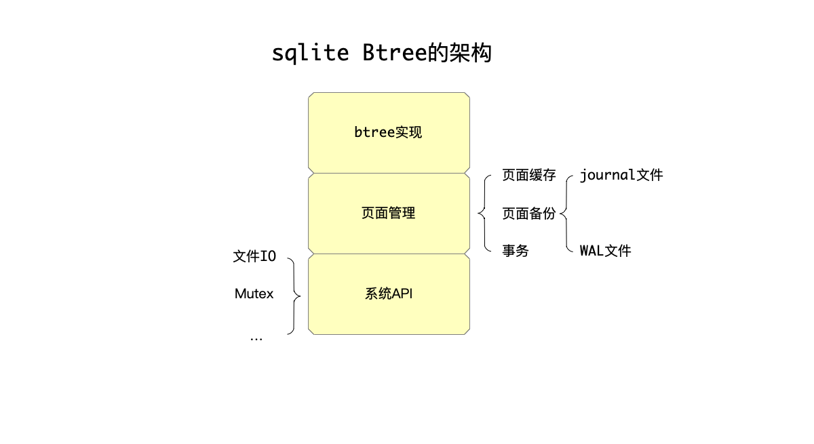

这三部分架构，由下往上依次是：

  * 系统级API的实现：因为sqlite是一个可以在多个平台编译运行的数据库，所以系统级API这一层，需要解决平台相关的文件IO、锁等问题。这部分实现，将不在这系列文章中介绍，因为并不属于数据库实现时的核心问题。
  * 页面管理模块：btree存储引擎，其操作文件的最基本单位就是页面。页面管理模块解决以下的问题：对上层的btree模块，暴露针对页面读、写的接口，内部会缓存页面的内容，何时将修改的页面（所谓脏页面，dirty page）落盘到磁盘，是否需要sync修改，崩溃或者重启时的数据恢复，这些都不需要上层的btree模块关心。为了达到这些效果，内部还有几个子模块：

    * 页面缓存模块：用于缓存页面的内存有限，何时淘汰缓存中的页面、何时将缓存中的脏页面落盘，等等都由这个模块负责。

    * 页面备份：从上面的描述可以看到，因为页面的修改并不一定马上落盘，而是可能只是修改了缓存中的页面，这样在系统发生崩溃的时候，需要做恢复操作，一些没有完成的事务需要回滚，等等。这部分页面管理模块由两种不同的实现：

    * journal文件：这是早期，但是效率并不高的实现。

    * WAL文件：这是从3.7之后引入的更高效的方式。

    * 事务：事务处理也放在了页面管理中。

  * btree：基于页面管理模块之上，实现了可以存储可变数据的btree模块。

可以这样来简单区别理解“页面管理”模块和btree模块的功能：

  * 页面管理：顾名思义，页面管理模块的最基本单位是”页面“，页面的读、写、缓存、落盘、恢复、回滚等，都由页面模块负责。上一层依赖页面管理模块的btree模块，不需要关心一个页面何时缓存、何时落盘等细节。即：**页面模块负责页面的物理级别的操作**。

  * btree：

    * 负责按照btree算法，来组织页面，即负责的是页面之间逻辑关系维护。
    * 除此以外，一个页面内部的数据的物理、逻辑组织，也是btree模块来负责的。   

即：**btree负责维护页面间的逻辑关系，以及一个页面内数据的组织。**

从上面的分析可以看出来，“页面管理模块”无疑是这里最大最复杂的部分，Andy Pavlo在CMU 15445课程中提到过：任何用`mmap`来做页面管理的做法都是很糟糕的做法（如boltdb、LMDB等）。

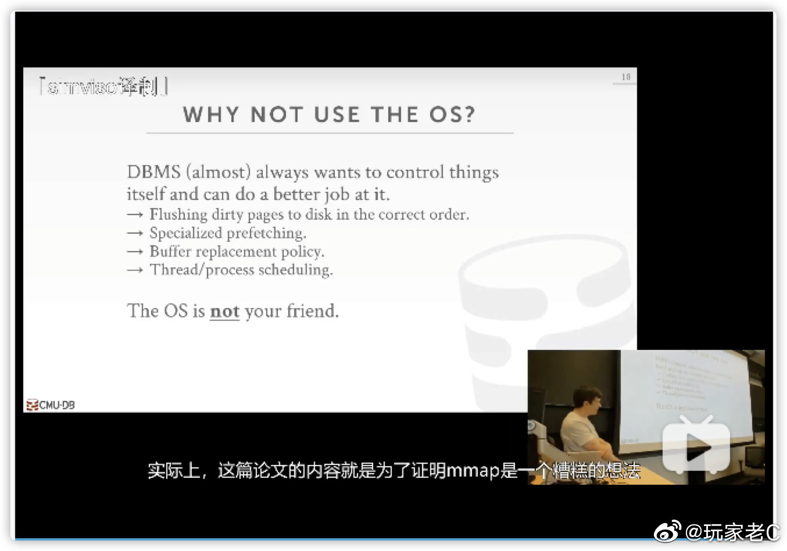

这系列的文章，也将按照这个顺序，从下往上逐层分析sqlite的3.36版本的btree实现。

## 彩蛋

2021年9月5日，我在微博上就处理崩溃恢复的实现，提了一个问题：

> 那些很成熟的存储引擎，都是怎么处理崩溃恢复问题的呢，比如写数据落盘到一半，进程崩了，该如何恢复呢？求资料和指点。 ​

（见：[那些很成熟的存储引擎… - @玩家老C的微博 - 微博](https://weibo.com/1642628345/KwKqNgScT)）

得到了两个很不错的指点回复：

### ba0tiao的回复

> 做InnoDB 这块挺久了, 我试试说说 InnoDB 是怎么做的吧..
>
> 其实你这里应该细分成两个问题
>
>   1. 16kb 的page 写入的原子性该如何保证
>   2. Btree 结构的完整性如何保证, 也就是你说的修改了n个页面以后如果修改了父子, 兄弟关系以后, 如果解决中间的crash 的问题
>
> 问题1 是通过double write buffer 来解决的, 因为InnoDB 的page 大小是16kb, 很多文件系统只能保证4kb大小写入的原子性, 因此需要写入前先将page 的内容写入到double write buffer 来保证, 如果写入失败也不会将原有page 的内容覆盖.
>
> 问题2 是通过redo log + mtr(mini transaction) 进行保证.
>
> InnoDB 里面的redo log 是由mtr 组成, mtr 是修改btree 的最小单位. 每次写入redo log 的时候必须是一个完整的mtr的内容, 具体实现方式是mtr 会有MULTI_REC_END 标记, 在crash recovery 的时候, 如果读取到mtr的内容没有MULTI_REC_END 标记, 那么则会认为这个mtr 不完整, 就会把这段mtr 抛弃.
>
> 那么是不是一次insert 操作产生的redo log 都包含在一个mtr 里面呢?
>
> 不是的.
>
> 我们知道在btree 里面对page 的修改都需要对page 加锁, 从fsp 模块分配一个new page 也需要对root page 进行加锁等等.所以InnoDB 的mtr 里面自然就包含对锁的操作, 因此要修改某一个page 的时候, mtr begin 的时候会对该page 加锁,然后写入修改的内容, 然后mtr commit 的时候, 对于修改的page 的锁就可以释放了.
>
> 如果整个insert 的过程都放在一个mtr 里面做, 那也是可以的, 也就是对于所有page 的latch 都是一开始持有, 最后的时候在释放,就算后续这个page 已经不再修改了, 也依然要一直持有. 很容易理解这样并发自然就降低下来的, 因此在InnoDB 设计里面, mtr的粒度是尽可能小的. 修改完page 就应该尽快的commit, 然后将page lock 释放. 但是又需要保证每一次的mtr 操作前和操作后btree的完整性.
>
> 体现具体的例子就是, InnoDB里面对于一个简单的insert 操作, 其实是有非常多个mtr 组成, 尽可能减少持有锁的时间.
>
> 但是在做btree 分裂操作的时候, 分配新的page, 将之前page一半的数据迁移到new page 是在一个mtr 里面完成,但是后续具体的insert 操作是在另外一个mtr 里面完成的. 那么如果在做分裂操作过程中crash, 那么这个分裂操作是不会完成的,如果在分裂操作完成以后, insert 之前crash, 那么btree 是已经分裂过的, 只是数据没有插入了.
>
> 当然这里会有你说的更复杂的设计的父节点 and 父节点的父节点的分裂, 那么自然持有锁的时间就更长了, 但是在我们在这里是做的一些优化.
>
> 还有一些比如InnoDB redo log 是"physical to a page, logical within a page" 就是解决我们上面说的如果分裂操作成功了, 但是这个事务要回滚, 这个时候该如何处理等等..
>
> 具体的内容其实这些文章里面都有
>
>   1. C. Mohan, Don Handerle. ARIES: A Transaction Recovery Method Supporting Fine-Granularity Locking and Partial Rollbacks Using Write-Ahead Logging.
>   2. C. Mohan, Frank Levine. ARIES/lM: An Efficient and High Concurrency index Management Method Using Write-Ahead Logging.
>   3. Goetz Graefe. A Survey of B-Tree Logging and Recovery Techniques.
>   4. Goetz Graefe. A Survey of B-Tree Locking Techniques.
>
> 对了Goetz Graefe 号称Btree 守护神

（见：[做InnoDB 这块… \- @ba0tiao的微博 - 微博](https://weibo.com/1832563813/KwRpIxunM)）

注：

  * `ba0tiao`应该是阿里云负责PolarDB开发的资深开发。
  * 他的博客是：[baotiao](http://baotiao.github.io/)
  * 知乎专栏：[MySQL内核揭秘 - 知乎](https://www.zhihu.com/column/360infra)

### BohuTANG的回复

> 可以深入一点：如果每次写的log都在，怎么做到基于这些log做回放的问题？其实就是redo-log +checkpoint+ LSM的机制。redo解决数据不丢，checkpoint解决recovery的时候扫描的redo尽量少，LSM解决每次写入后新的page不会覆盖老的数据，这类实现是比较简单可行，也是目前的主流做法

（见：[可以深入一点：如果每… \- @BohuTANG的微博 - 微博](https://weibo.com/1691468715/KwT2GdDfu)）

以及：

> 目前大部分理论都参考于这篇 ARIES: A Transaction Recovery Method Supporting Fine-Granularity Locking and Partial Rollbacks Using Write-Ahead Logging – Mohan et al. 1992

（见：[目前大部分理论都参考… \- @BohuTANG的微博 - 微博](https://weibo.com/1691468715/Kx3yAhFKj)）

注：

  * BohuTANG已经在数据库领域沉浸多年，前阿里云数据库内核组早期成员、前青云数据库团队负责人。现在数据库领域创业，公司的项目是：[datafuselabs/databend](https://github.com/datafuselabs/databend)，欢迎围观。
  * 博客地址：[[ 虎哥的博客 ]](https://bohutang.me/)

<hr>

#### <p>原文出处：<a href='https://www.codedump.info/post/20211217-sqlite-btree-1-pagecache/' target='blank'>sqlite3.36版本 btree实现（一）- 管理页面缓存</a></p>

`页面管理`模块中，很重要的一个功能是缓存页面的内容在内存中：

  * 读页面：如果页面已经在内存，就不需要到文件中读出页面内容。
  * 写页面：如果页面已经在内存，那么对页面的修改就只需要修改页面在内存中的数据即可，被修改了但是还没有落盘的页面，被称为“脏页面”（dirty page）。这样，多次对某个页面的修改，可能最后只需要一次落盘即可。当然，对页面的修改，如果在还没有落盘之前，系统就崩溃了，这种情况下应该如何处理，这就是“崩溃恢复”模块做的事情了。本节中，将专注在“页面缓存”这个子模块的实现。

既然要将页面缓存在内存中，就会涉及到几个功能：

  * 如何知道哪些页面已经被缓存在内存里了？
  * 缓存在内存中的页面如何组织管理？
  * 缓存页面使用的内存不够用时，应该如何处理？

我们首先来了解一下“页面缓存”模块的总体划分：

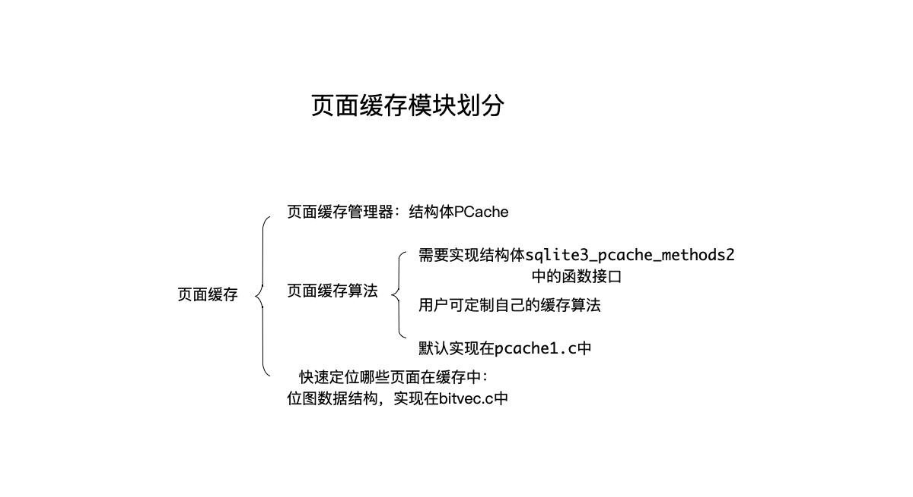

按照上图的划分，页面缓存模块分为以下几部分：

  * 页面缓存管理器：实现了页面缓存的总体算法流程，以及提供对外的接口，但是具体到“页面缓存算法”的实现，则有赖于下面这个可用户定制的`sqlite3_pcache_methods2`。这部分功能在代码`pcache.c`中。
  * 页面缓存算法：用户可自己定制，只要实现`sqlite3_pcache_methods2`结构体中的接口即可。系统中的默认实现，在文件`pcache1.c`中。
  * 除此以外，还需要快速根据页面编号就能知道哪些页面已经被缓存的功能，这部分sqlite使用位图数据结构来实现，在文件`bitvec.c`中。

页面缓存管理器，核心功能就是维护脏页面链表，缓存页面的管理，诸如根据页面编号查找页面、淘汰页面算法等，都由“页面缓存算法”来维护。可以这样来简单的理解上面的功能划分：

  * “页面缓存管理器”：定义了管理页面缓存的接口、总体流程，维护管理目前在用的脏页面。
  * “页面缓存算法”：维护其它不在使用但还在内存中的页面，负责其淘汰、回收等实现。由“sqlite3_pcache_methods2”结构体实现，用户可以定制自己实现的“sqlite3_pcache_methods2”，系统也提供默认的实现。

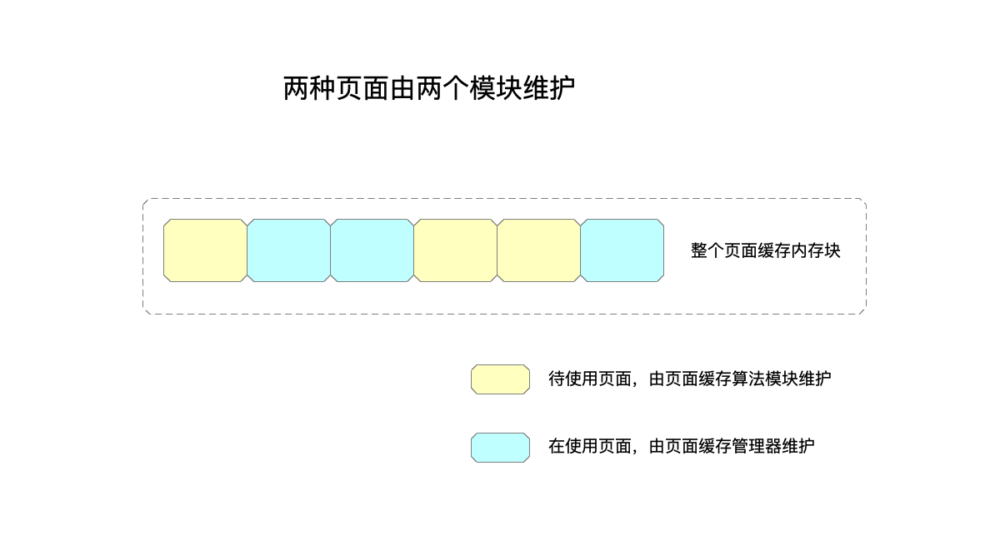

简而言之，如果把当前在内存中的页面划分为以下两类，那么：

  * 当前在使用的页面：即与页面编号对应的页面，由“页面缓存管理器”维护。
  * 当前还未使用、但也在内存中的页面：即随时准备拿出来存储从磁盘中读出来的数据的页面，由“页面缓存算法”维护，比如淘汰、回收、复用等。

下面，就开始“页面缓存”这几部分功能的具体讲解。

## 管理页面

### 页面相关的数据数据结构

首先来看页面相关的数据结构，sqlite中使用`PgHdr`结构体来在内存中描述一个页面：

```c
/*
** Every page in the cache is controlled by an instance of the following
** structure.
*/
struct PgHdr {
  sqlite3_pcache_page *pPage;    /* Pcache object page handle */
  void *pData;                   /* Page data */
  void *pExtra;                  /* Extra content */
  PCache *pCache;                /* PRIVATE: Cache that owns this page */
  PgHdr *pDirty;                 /* Transient list of dirty sorted by pgno */
  Pager *pPager;                 /* The pager this page is part of */
  Pgno pgno;                     /* Page number for this page */
#ifdef SQLITE_CHECK_PAGES
  u32 pageHash;                  /* Hash of page content */
#endif
  u16 flags;                     /* PGHDR flags defined below */
  /**********************************************************************
  ** Elements above, except pCache, are public.  All that follow are 
  ** private to pcache.c and should not be accessed by other modules.
  ** pCache is grouped with the public elements for efficiency.
  */
  i16 nRef;                      /* Number of users of this page */
  PgHdr *pDirtyNext;             /* Next element in list of dirty pages */
  PgHdr *pDirtyPrev;             /* Previous element in list of dirty pages */
                          /* NB: pDirtyNext and pDirtyPrev are undefined if the
                          ** PgHdr object is not dirty */
};
```

其中的信息，大部分在注释中已经自解释：

  * pPage：这个字段稍显复杂，后面展开详细解释。
  * pData，pExtra：pData指向了页面实际的内容，pExtra指向页面额外数据，大部分时候，后者的内容可以忽视。
  * pCache：页面缓存管理器对象指针。
  * pDirty：脏页面链表指针。
  * pPager：页面管理器对象指针。（注意和pCache进行区分，pCache是“页面缓存管理器”）。
  * pgno：存储该页面的页面编号。
  * flags：页面标志位，有如下几种，可以通过位操作来加上多个标志位： 
    * PGHDR_CLEAN：干净的页面。
    * PGHDR_DIRTY：脏页面。
    * PGHDR_WRITEABLE：已经记录下来修改之前的页面内容，所以此时可以对内存中的页面内容进行修改了。
    * PGHDR_NEED_SYNC：将该页面内容写入数据库文件之前，需要sync journal文件中的页面内容。
    * PGHDR_DONT_WRITE：不需要写页面内容到磁盘。
    * PGHDR_MMAP：该页面内容是通过mmap到内存中的。
    * PGHDR_WAL_APPEND：页面内容已经添加到WAL文件中了。
  * nRef：页面引用计数。
  * pDirtyNext、pDirtyPrev：存储脏页面链表中前、后页面指针，如果该页面不是脏页面，则这两个字段未定义。

可以简略的总结该结构体中的内容，最重要的莫过于以下几项：

  * pData存储的页面内容，所谓的读、写页面内容实际上操作的是这个成员指向的内容。
  * pDirty、pDirtyNext、pDirtyPrev这几个成员维护的脏页面相关的指针。
  * flags维护的页面标志位，通过这些标志位来区分应该对页面进行什么操作。

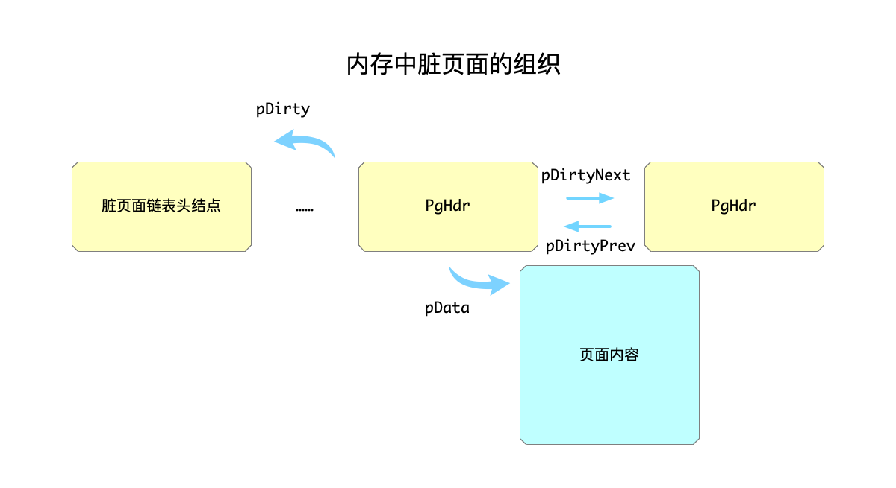

#### sqlite3_pcache_page数据结构

上面的`PgHdr`结构体中，还有第一个成员，即`sqlite3_pcache_page`类型的pPage指针没有讲解，这里展开解释。

前面概述部分提到，“页面缓存算法”的实现，是可以交给用户自定义的，这就带来一个问题：每个自定义的实现，内部实现的管理页面的结构体可能并不相同。于是，就要类似C++中的面向对象机制一样，先声明一个“页面”的基类，基类中定义最基础的成员变量，这样做之后有这样的好处：页面管理模块，所有的操作都能针对这个基类来进行，而不需要管具体实现中的差异。

在这里，这个基类就是成员`sqlite3_pcache_page`，其定义如下：

```c
typedef struct sqlite3_pcache_page sqlite3_pcache_page;
struct sqlite3_pcache_page {
  void *pBuf;        /* The content of the page */
  void *pExtra;      /* Extra information associated with the page */
};
```

成员中的用途，注释中也写得挺清楚了：

  * pBuf：指向页面内容。
  * pExtra：保存页面的额外信息。

既然是“基类”，就要求每个子类都要有该基类的信息，实际上也是这样做的，比如“页面缓存算法”的默认实现中，其管理页面的结构体是`PgHdr1`（后面会展开解释这个结构体），其初始定义如下：

```c
struct PgHdr1 {
  sqlite3_pcache_page page;      /* Base class. Must be first. pBuf & pExtra */
  ...
}
```

从注释可以看到，sqlite中要求所有实现页面缓存算法中管理页面的数据结构体，都要以`sqlite3_pcache_page`结构体开始做为第一个成员。

实际上，`sqlite3_pcache_page`结构体中，`pExtra`成员包括如下两部分：

  * 额外内容：由系统指定`szExtra`大小来指定这部分内容大小，简单起见，目前可以认为这部分为0。
  * PgHdr结构体：即前面讲解的`页面缓存模块`中描述一个页面的结构体大小。

读到这里，有可能把读者绕晕了，我们以代码和图示为引子详细看一下。

首先，创建一个“页面缓存算法”模块时，要调用`sqlite3_pcache_methods2`结构体中定义的`xCreate`函数指针来完成，其函数定义如下：

```c
sqlite3_pcache *(*xCreate)(int szPage, int szExtra, int bPurgeable);
```    

传入的第二个参数`szExtra`需要指定额外部分的内容大小，实际在调用时，这个参数的大小就是我们上面说的`szExtra`和PgHdr结构体大小之和（做了8字节对齐）：

```c
sqlite3_pcache *pNew;
pNew = sqlite3GlobalConfig.pcache2.xCreate(
            szPage, pCache->szExtra + ROUND8(sizeof(PgHdr)),
            pCache->bPurgeable
```

于是，“页面缓存模块”中要获取一个页面时，是通过`sqlite3_pcache_methods2`结构体中定义的`xFetch`函数指针来完成的，这个函数指针的定义是：

```c
sqlite3_pcache_page *(*xFetch)(sqlite3_pcache*, unsigned key, int createFlag);
```    

可以看到，这里返回的就是上面说的“基类”，即`sqlite3_pcache_page`结构体指针。而在内部的默认实现中，其实返回的是`PgHdr1`指针进行强制转换之后的结果，即`sqlite3_pcache_page`这一基类的子类，之所以能够做，完全是因为在`PgHdr1`结构体定义时，把`sqlite3_pcache_page`结构体成员放在第一个成员：

```c
struct PgHdr1 {
  sqlite3_pcache_page page;      /* Base class. Must be first. pBuf & pExtra */
  ...
}
```

得到返回的`sqlite3_pcache_page`指针之后，就能通过其中的`pExtra`指针拿到`PgHdr`：

```c
PgHdr *sqlite3PcacheFetchFinish(
  PCache *pCache,             /* Obtain the page from this cache */
  Pgno pgno,                  /* Page number obtained */
  sqlite3_pcache_page *pPage  /* Page obtained by prior PcacheFetch() call */
){
  PgHdr *pPgHdr;
  pPgHdr = (PgHdr *)pPage->pExtra;
  // ...
}
```

总结起来，如下图所示：

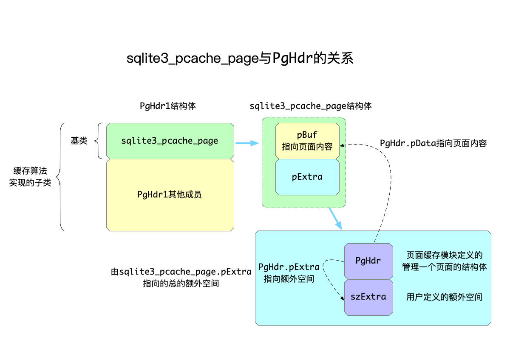

### 页面所在的数据结构

缓存中的页面，可能存在于以下三种数据结构中：

  * 脏页面链表：该链表维护所有当前在使用的页面，由“页面缓存管理器”维护。
  * hash数组：作用是以页面编号为键来查询页面，由默认的“页面缓存算法”来维护。
  * LRU链表：越是常被访问的页面，在LRU链表中就越往前，从LRU链表中淘汰数据都是从链表尾部开始的，也是由默认的“页面缓存算法”来维护。

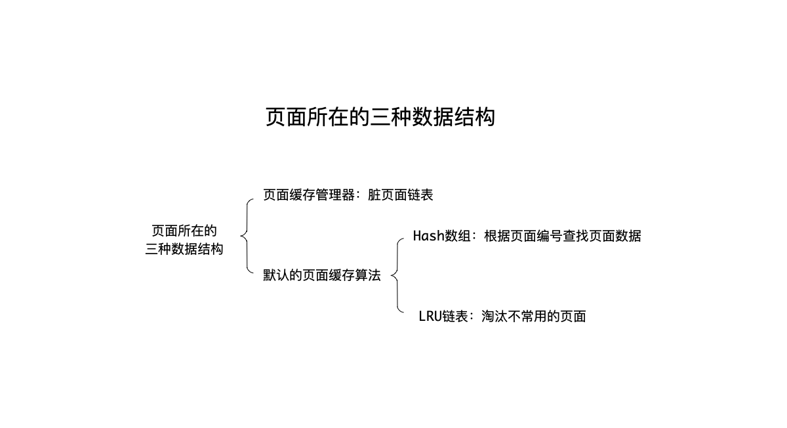

#### 脏页面链表

这个页面链表叫“脏页面（dirty page）链表”实际上并不十分准确，这会让人误以为这个链表上的页面全都是脏页面，实际上是可能存在干净的页面的。更准确的说法，是当前系统在使用的页面，都维护在这个页面链表中。

操作这个链表的入口函数是`pcacheManageDirtyList`，其传入的参数一个是`PgHdr`类型的指针，另一个用于指定行为，有以下三种：

```c
#define PCACHE_DIRTYLIST_REMOVE   1    /* Remove pPage from dirty list */
#define PCACHE_DIRTYLIST_ADD      2    /* Add pPage to the dirty list */
#define PCACHE_DIRTYLIST_FRONT    3    /* Move pPage to the front of the list */
```

在`pcacheManageDirtyList`函数实现中，也是根据这个参数进行与操作判断来做不同的行为的：

```c
pcacheManageDirtyList实现：
  如果 addRemove & PCACHE_DIRTYLIST_REMOVE:
    从链表上删除
  如果 addRemove & PCACHE_DIRTYLIST_ADD：
    添加到链表头
```

这里需要注意的是，参数`PCACHE_DIRTYLIST_FRONT`为3，而另外两个参数一个是1（删除）一个是2，所以当传入`PCACHE_DIRTYLIST_FRONT`的时候，按照上面的流程，就是首先从链表上删除，再放到链表头。

由于脏页面链表是由“页面缓存管理器”来管理的，所以描述页面的结构体与这个链表相关的数据结构，都在`PgHdr`上：

```c
struct PgHdr {
  ...
  PgHdr *pDirtyNext;             /* Next element in list of dirty pages */
  PgHdr *pDirtyPrev;             /* Previous element in list of dirty pages */
                          /* NB: pDirtyNext and pDirtyPrev are undefined if the
                          ** PgHdr object is not dirty */
}; 
```

#### hash数组

为了快速根据页面编号，查找到该编号的页面是否已经加载到页面中，每个页面的数据还存在于一个hash数组中。

如前所述，这个数据结构由默认的“页面缓存算法”维护，所以与之相关的数据结构，都在结构体`PgHdr1`上：

```c
struct PgHdr1 {
  ...
  PgHdr1 *pNext;                 /* Next in hash table chain */
};
```

hash数组的实现，与一般的实现并没有太大区别，这里就不展开说了。

#### LRU链表

当需要加载当前还不在内存中的页面时，需要首先分配出一块空间，用于保存从文件中加载的页面数据。如前所述，“页面缓存管理器”管理的是还在使用的页面，而“页面缓存算法”管理的是当前没有被使用的页面，所以这部分功能也是由默认的“页面缓存算法”来实现的，与之相关的数据结构，和hash数组的实现一样，也在结构体`PgHdr1`上：

```c
struct PgHdr1 {
  ...
  PgHdr1 *pLruNext;              /* Next in LRU list of unpinned pages */
  PgHdr1 *pLruPrev;              /* Previous in LRU list of unpinned pages */
                                 /* NB: pLruPrev is only valid if pLruNext!=0 */
};
```

当需要从“没有被使用的页面”中，分配出来一个页面数据用于保存加载的页面时，就涉及到淘汰问题：如果一个页面虽然当前没有被使用，但是由于经常被访问，所以不应该淘汰这个页面，因为很有可能它马上又会被访问到，应该首先淘汰那些不常被访问的页面，用来加载页面数据。

维护这些信息的数据结构，就是LRU链表：在链表中越往前的数据，意味着被访问的越频繁；反之，淘汰都是从链表尾部开始。

#### pin和unpin操作

`pin`和`unpin`操作，在默认的缓存算法中，是针对LRU链表而言的：一个页面数据，如果执行了`pin`操作，就是将这个页面从LRU链表上摘下来。而`unpin`操作则反之，将页面放入LRU链表。

为什么需要这两个操作？

再复习一下前面提到的分工：

  * 页面缓存管理器：负责维护在使用的页面。
  * 页面缓存算法：负责维护未使用的页面。

假设一个页面编号为N的页面，被访问时需要加载到内存，此时就会由“页面缓存管理器”加载到内存中，放入脏页面链表；而一旦访问完成，就会调用页面缓存算法的`xUnpin`函数指针执行`unpin`操作（实现页面缓存算法的`sqlite3_pcache_methods2`结构体在后面解释）。

在默认的缓存算法中，执行`unpin`操作，就是将页面放入LRU链表，并不会将页面从hash数组中删除，也就是说：`unpin`操作，并不妨碍这个能够以页面编号从hash数组中再次查到该页面的数据。

换言之，`unpin`操作是在“页面缓存算法”使用完毕某个页面时执行的，只是用来通知“页面缓存算法”：这个页面我已经用不上了，后续怎么处理，可以由“页面缓存算法”自行决定。

于是，对于那些经常被访问的页面，即便当前没有被使用，真正到需要它的时候，只要没有被淘汰出去分配给其他页面，就不再需要再次从文件中加载出来。

### 页面缓存管理器

#### 页面缓存管理器的数据结构

页面缓存管理器，核心功能就是维护脏页面链表，页面缓存管理器的数据结构中最重要的莫过于以下几个成员：

```c
struct PCache {
  PgHdr *pDirty, *pDirtyTail;         /* List of dirty pages in LRU order */
  PgHdr *pSynced;                     /* Last synced page in dirty page list */
  ...
  int (*xStress)(void*,PgHdr*);       /* Call to try make a page clean */
  void *pStress;                      /* Argument to xStress */
  sqlite3_pcache *pCache;             /* Pluggable cache module */
}
```

可以看到，有两个维护页面链表相关的指针：

  * 脏页面链表：由成员pDirty, pDirtyTail指向该链表的一头一尾。脏页面链表中，页面是按照LRU的顺序进行排列的，即：越靠近链表尾的页面最可能被淘汰。
  * 最后进行sync的页面指针：在脏页面链表中，pSynced始终指向最后一个已经进行sync操作的页面。

为什么需要多一个`pSynced`指针？因为在页面缓存紧张的时候，需要快速知道哪些页面已经sync了，这样的页面淘汰的代价最低，具体可以看函数`sqlite3PcacheFetchStress`的实现，该函数的大体流程是：

```c
分为两步寻找可以淘汰的页面：
  首先在pSynced指针开始往前找不需要sync且引用计数为0的页面
  如果找不到就继续在脏页面链表中寻找引用计数为0的页面
  找到之后，调用注册的xStress进行淘汰操作
```

除了这几个和脏页面链表相关的数据结构之外，上面还列举出来了其他几个成员：

  * xStress和pStress：在页面缓存出现压力时，需要将页面淘汰同时进行清理，清理页面的操作最终由`xStress`函数指针来完成。
  * sqlite3_pcache：下面会提到，实现“页面缓存算法”的`sqlite3_pcache_methods2`结构体，其内部的`xCreate`函数指针最终会创建出一个`sqlite3_pcache`返回，后续调用`页面缓存算法`时，传入的都是这个返回的指针。

### 页面缓存算法结构体

页面缓存算法，需要实现`sqlite3_pcache_methods2`接口并且注册到系统中，来看`sqlite3_pcache_methods2`的定义：

```c
typedef struct sqlite3_pcache_methods2 sqlite3_pcache_methods2;
struct sqlite3_pcache_methods2 {
  int iVersion;
  void *pArg;
  int (*xInit)(void*);
  void (*xShutdown)(void*);
  sqlite3_pcache *(*xCreate)(int szPage, int szExtra, int bPurgeable);
  void (*xCachesize)(sqlite3_pcache*, int nCachesize);
  int (*xPagecount)(sqlite3_pcache*);
  sqlite3_pcache_page *(*xFetch)(sqlite3_pcache*, unsigned key, int createFlag);
  void (*xUnpin)(sqlite3_pcache*, sqlite3_pcache_page*, int discard);
  void (*xRekey)(sqlite3_pcache*, sqlite3_pcache_page*, 
      unsigned oldKey, unsigned newKey);
  void (*xTruncate)(sqlite3_pcache*, unsigned iLimit);
  void (*xDestroy)(sqlite3_pcache*);
  void (*xShrink)(sqlite3_pcache*);
};
```

逐个解释：

  * iVersion：版本号。
  * pArg：参数。
  * xInit：初始化模块的函数指针，这在模块初始化时一次性调用即可。
  * xShutdown：停止模块的函数指针。
  * xCreate：创建一个“页面缓存算法”的指针`sqlite3_pcache`返回，注意这个函数里传入了页面大小、额外空间大小，这些都在上面有说明。后续的其他函数指针，传入的第一个参数都是这里返回的`sqlite3_pcache`指针。
  * xCachesize：返回当前cache大小。
  * xPagecount：返回页面数量。
  * xFetch：核心函数，根据传入的`key`在缓存中查找页面，如果没有找到则按照`createFlag`参数来决定后面的行为。
  * xUnpin：页面的引用计数为0时就会调用这个函数。
  * xRekey：表示把页面的key进行修改，这里key其实就是页面编号。
  * xTruncate：将所有页面编号>=iLimit的页面都释放，回收内存。
  * xDestroy：销毁前面`xCreate`函数返回的`sqlite3_pcache`指针。
  * xShrink：尽可能的回收内存。

需要说明的是：

  * xInit函数：完成初始化这个模块的工作。
  * xCreate：返回创建一个“页面缓存算法”的指针`sqlite3_pcache`，后续的所有操作，都使用这个指针。

而sqlite中，其实并没有定义`sqlite3_pcache`的具体结构，仅仅只是声明了这个类型，可以理解为是一个类似于`void*`这样的泛型指针：

```c
/*
** CAPI3REF: Custom Page Cache Object
**
** The sqlite3_pcache type is opaque.  It is implemented by
** the pluggable module.  The SQLite core has no knowledge of
** its size or internal structure and never deals with the
** sqlite3_pcache object except by holding and passing pointers
** to the object.
**
** See [sqlite3_pcache_methods2] for additional information.
*/
typedef struct sqlite3_pcache sqlite3_pcache;
```

<hr>

#### <p>原文出处：<a href='https://www.codedump.info/post/20211218-sqlite-btree-2-concurrency-control/' target='blank'>sqlite3.36版本btree实现（二）- 并发控制框架</a></p>

按照之前起步阶段对sqlite btree整体架构的分析，“页面管理模块”分为以下几个子模块：

  * 页面缓存管理。
  * 崩溃恢复，又分为以下两种实现： 
    * journal文件。
    * WAL文件。
  * 页面管理模块。

前面一节讲完了“页面缓存管理”的实现，按照自下往上的顺序，就应该到“崩溃恢复”了。“崩溃恢复”核心的工作是：在真正修改页面内容之前，将还未修改的页面内容备份，这样一旦系统在事务过程中宕机崩溃，就可以用这部分内容回滚还未落盘的事务修改，让系统回到一个正确的状态。

“崩溃恢复”有两种实现方式，在早期使用的journal文件，这种方式性能不高；在3.7版本之后，sqlite引入了WAL文件来保存页面内容，这样做的效率更高。

本节就讲解这部分内容，在对这部分内容有一个总体的了解之后，继续讲解崩溃恢复的总体流程。后面的章节再具体分析journal以及WAL的实现。

## 写事务的流程

（以下流程分析，按照sqlite官网中的文档[Atomic Commit In SQLite](https://sqlite.org/atomiccommit.html)进行讲解，图例也全部引用自官网。）

sqlite的写事务，分为以下几个流程：

### 1、初始化阶段（Initial State）

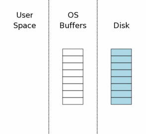

如上图中，从右到左即是系统的磁盘、操作系统缓冲区、用户空间三部分，其中磁盘和操作系统缓冲区有划分为多块的空间，每一块在sqlite里被称为一个`sector`，蓝色部分表示是修改之前的数据。

这是系统初始时的样子。

### 2、拿到读锁（Acquiring A Read Lock）

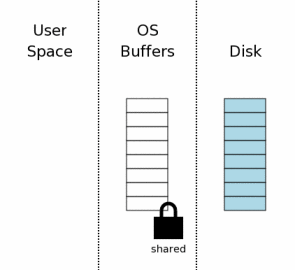

在开始进行写操作之前，sqlite必须先把待修改的页面加载内存中（这就是上一节“页面缓存管理器”做的事情），后续的修改其实也是首先修改这部分加载到内存中的页面内容，因为可能一次提交会修改同一个页面中的多处内容，最后才把页面内容落盘。

所以，这一步所要做的，是首先拿到数据库文件的读锁（shared lock），需要说明的是，这个读锁是数据库级别的锁。同一时间，系统中可以存在多个读锁，但是只要系统中还存在读锁，就不再允许分配出新的写锁（write lock）。

### 3、读出页面的内容到页面缓存

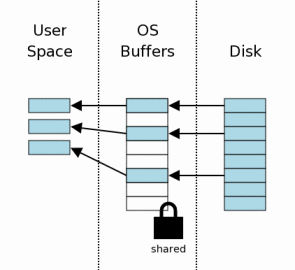

拿到读锁之后，就可以把需要进行修改的页面读出来到用户空间的页面缓存了。从上图来看，读了三个页面的内容出来，也就是例子中的写操作要修改三个页面的内容。

### 4、拿到保留锁（Obtaining A Reserved Lock）

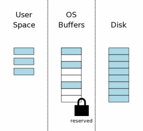

在进行修改之前，还需要首先将前面拿到的读锁（shared lock）升级为保留锁（reserved lock）。同一时间，系统中保留锁可以和多个读锁并存，但是只能存在最多一个保留锁。这个机制，保证了同一时间只能有一个进程对数据库进行写操作。

需要说明的是，拿到保留锁的进程，还并没有真正进行数据的修改操作，只是用这个锁，挡住了其它打算进行写操作的进程。

### 5、创建回滚用的备份文件（Creating A Rollback Journal File）

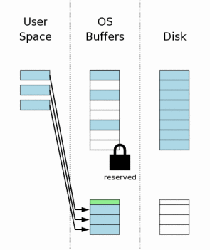

到了这一步，首先将待修改的页面内容备份。官网原文写的是备份到回滚用的journal文件中，我们上面提到备份机制除了journal文件还有wal文件，所以这里的“journal文件”应该更泛化的理解为“保存到备份文件中”，这种备份文件可能是journal文件，也可能是wal文件，视机制而定。

上图中，用户空间的页面写入到了备份文件中，注意到备份文件上面有一小块绿色的部分，理解为备份文件的meta信息即可。

另外还需要特别说明的是，从上图中可以看到，备份工作也仅仅到了操作系统缓冲区，即图中的中间部分，而磁盘部分还是空的。即到了这一步，即便是备份页面的内容，也还并没有sync到磁盘中，即只进行了备份的写操作，并没有强制落盘。

### 6、修改用户空间的页面内容（Changing Database Pages In User Space）

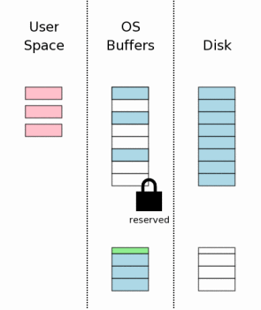

到了这一步，修改进程用户空间的页面内容，即上图中的橙色部分，就是修改后的用户空间数据。由于每个进程都有自己的用户空间（即便是同一个进程下的不同线程，对sqlite而言，只要使用的是不同的连接（connection），那么连接背后的页面缓冲区就不一样），所以这些修改并不被其它进程所见。这样，写进程做自己的修改，其它读进程读到的还是修改之前的页面数据。

### 7、将备份文件的内容落盘（Flushing The Rollback Journal File To Mass Storage）

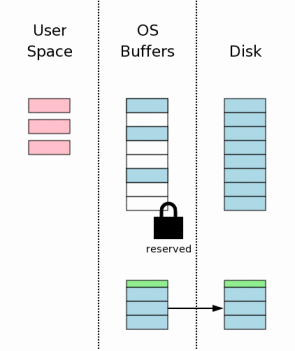

上面的第5步提到，当时还只是写页面内容到备份文件中，这一步接在修改页面内容之后，将修改之前的页面内容sync到磁盘中。

### 8、拿到排他锁（Obtaining An Exclusive Lock）

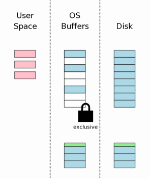

前面的步骤做完，达到了这样的效果：

  * 对于待修改页面，修改之前的内容已经保存到了备份文件中。
  * 需要修改的内容，已经体现在了进程的用户空间的页面缓存里。

此时，需要将页面修改的内容写到数据库文件中。在修改数据库文件之前，还需要首先拿到排他锁（exclusive lock）。拿到排他锁，又分为两步：

  * 首先拿到悬锁（pending lock）。
  * 将悬锁升级为排他锁。

为什么要首先拿到悬锁？同一时间内，悬锁和前面的保留锁一样，只能存在最多一个；但是不同的是，悬锁不允许再分配新的读锁（shared lock），而保留锁没有这样的机制。换言之，在悬锁之前的所有读锁，可以继续读操作，悬锁会等待它们完成，再升级为排他锁；同时，只要系统中有悬锁，就不再允许有新的读操作，必须等待修改数据库完成才可以有新的读操作。

这样的机制，避免了读操作时，读到了未提交的事务写到一半的数据。

### 9、保存修改到数据库文件中（Writing Changes To The Database File）

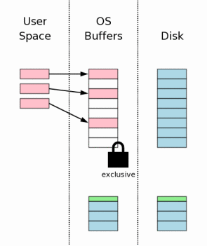

拿到了排他锁之后，意味着此时系统中没有读操作、没有其他写操作，这时候可以放心将页面缓存中的内容落盘到数据库文件中了。

同样需要注意的是，这一步的修改，还还只是到了操作系统的缓冲区，并不保证落盘到数据库文件中。

### 10、落盘数据库文件修改（Flushing Changes To Mass Storage）

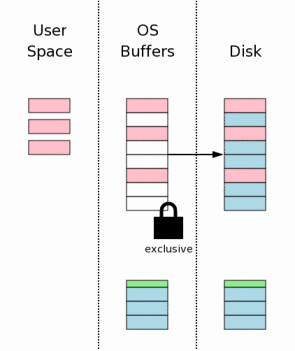

这一步，将对数据库文件的修改落盘。

### 11、删除备份文件（Deleting The Rollback Journal）

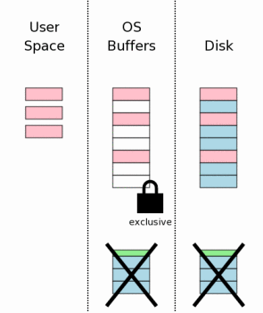

至此，这一次写操作已经落盘到了数据库文件中，前面保存到备份文件中的数据可以清除了。清除备份文件内容，是一个比较费时的操作，具体实现由不同的机制去优化，后面讲到journal文件以及wal的实现时再展开描述。

### 12、释放锁（Releasing The Lock）

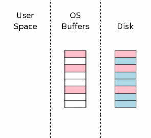

写操作全部完成，备份文件也清除了，到了这一步就可以释放锁，以便后面其他的读写操作进来。

## 写事务中涉及到的锁

上面写事务流程中，依次会拿到以下类型的锁，下图中做一个简单的总结：

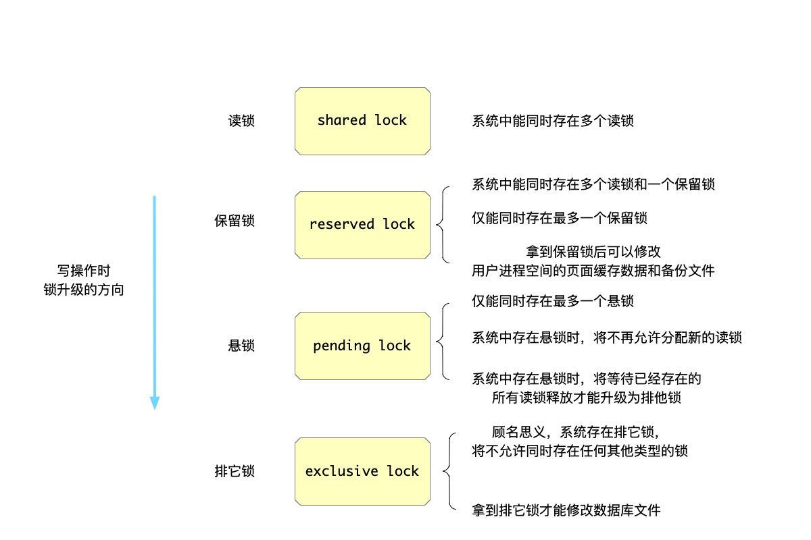

## 崩溃恢复流程

上面的流程中，随时都可能因为系统崩溃而导致数据错乱的，因此一个写事务如果还未完成，重启时存储引擎需要识别出来，将还没有完成的事务进行回滚操作（rollbac
k）。

分为以下几种情况来处理：

### 写备份数据之前失败

如果系统在落盘备份数据之前失败，即前面的流程7之前失败，按照上面的流程来看，情况是这样的：

  * 写事务的数据还停留在用户空间的页面缓存中，未落盘到数据库文件上（流程6）。
  * 在流程5，只是将数据写到备份文件，还没有强制刷盘，所以这时候崩溃，可能备份文件中的数据是损坏的。

所以在这种情况下重启，面对的是这样的情况：

  * 数据库文件：还在写事务之前的状态，因为写事务还未落盘。
  * 备份文件：可能损坏。

于是，启动之后将校验备份文件是否完整，如果完整将重放一遍备份文件中的页面到数据库文件中；否则，只是简单的删除备份文件中的数据即可。

### 写数据库文件时失败

如果已经过了流程7，而在将页面缓存中的修改落盘到数据库文件的过程中，系统崩溃了，那么面临的是这样的情况：

  * 数据库文件肯定损坏了。
  * 写事务中被修改页面之前的内容，已经落盘到备份文件中了。

于是，启动恢复的时候，只需要将备份文件中的页面重放一遍到数据库文件即可将数据库文件恢复到写事务修改前的状态了。

## 总结

以上，就是sqlite中写事务的总体流程，以及重启恢复的流程，这里还并没有涉及到具体的代码细节，有了对总体流程的理解，后面再来分析具体的两种备份机制：journal以及wal的实现。

另外，需要看到的是：sqlite中锁的粒度，都还是数据库级别的，现在我还不知道其它更高效的数据库所谓行锁的实现，留待以后吧。

## 参考文档

  * [Atomic Commit In SQLite](https://sqlite.org/atomiccommit.html)
  * [File Locking And Concurrency In SQLite Version 3](https://www.sqlite.org/lockingv3.html)

<hr>

#### <p>原文出处：<a href='https://www.codedump.info/post/20211222-sqlite-btree-3-journal/' target='blank'>sqlite3.36版本 btree实现（三）- journal文件备份机制</a></p>

在上一节中（[sqlite3.36版本 btree实现（二）- 并发控制框架](https://www.codedump.info/post/20211218-sqlite-btree-2-concurrency-control/)），已经讲解了sqlite中的并发控制机制，里面会涉及到一个“备份页面”的模块：

  * 备份所有在一个事务中会修改到的页面。
  * 出错时回滚页面内容。

里面也提到，有两种备份文件的机制：journal文件，以及WAL文件。今天首先讲解journal文件的实现，它的效率会更低一些，也正是因为这个原因后续推出了更优的WAL机制。

### 相关命令

sqlite中，可以使用`PRAGMA journal_mode`来修改备份文件机制，包括以下几种：

  * delete：默认模式。在该模式下，在事务结束时，备份文件将被删除。
  * truncate：日志文件被阶段为零字节长度。
  * persist：日志文件被留在原地，但头部被重写，表明日志不再有效。
  * memory：日志记录保留在内存中，而不是磁盘上。
  * off：不保留任何备份记录。
  * wal：采用wal形式的备份文件。

其中，前面三种delete、truncate、persist都是使用journal文件来实现的备份，区别在于事务结束之后的对备份文件的处理罢了。

本节首先讲解journal文件，下一节讲解wal备份文件。

## journal文件格式

journal文件的文件名规则是：与同目录的数据库文件同名，但是多了字符串“-journal”为后缀。比如数据库文件是“test.db”，那么对应的jour
nal文件名为“test.db-journal”。

### 文件头

<table>
<thead>
<tr>
<th>偏移量</th>
<th>大小</th>
<th>描述</th>
</tr>
</thead>
<tbody>
<tr>
<td>0</td>
<td>8</td>
<td>文件头的magic number: 0xd9, 0xd5, 0x05, 0xf9, 0x20, 0xa1, 0x63, 0xd7</td>
</tr>
<tr>
<td>8</td>
<td>4</td>
<td>journal文件中的页面数量，如果为-1表示一直到journal文件尾</td>
</tr>
<tr>
<td>12</td>
<td>4</td>
<td>每次计算校验值时算出来的随机数</td>
</tr>
<tr>
<td>16</td>
<td>4</td>
<td>在开始备份前数据库文件的页面数量</td>
</tr>
<tr>
<td>20</td>
<td>4</td>
<td>磁盘扇区大小</td>
</tr>
<tr>
<td>24</td>
<td>4</td>
<td>journal文件中的页面大小</td>
</tr>
</tbody>
</table>

这里大部分的字段都自解释了，不必多做解释，唯一需要注意的是随机数，因为这是用来后续校验备份页面的字段，这将在后面结合流程来说明。

### 页面内容

紧跟着文件头之后，journal文件还有一系列页面数据组成的内容，其中每部分的结构如下：

<table>
<thead>
<tr>
<th>偏移量</th>
<th>大小</th>
<th>描述</th>
</tr>
</thead>
<tbody>
<tr>
<td>0</td>
<td>4</td>
<td>页面编号</td>
</tr>
<tr>
<td>4</td>
<td>N</td>
<td>备份的页面内容，N以页面大小为准，其中每页面大小在文件头中定义</td>
</tr>
<tr>
<td>N+4</td>
<td>4</td>
<td>页面的校验值</td>
</tr>
</tbody>
</table>

由上面分析可见，整个journal文件是这样来组织的：

  * 28字节的文件头。
  * 页面数据组成的数组，其中数组每个元素的大小为：4+页面大小（N）+4。

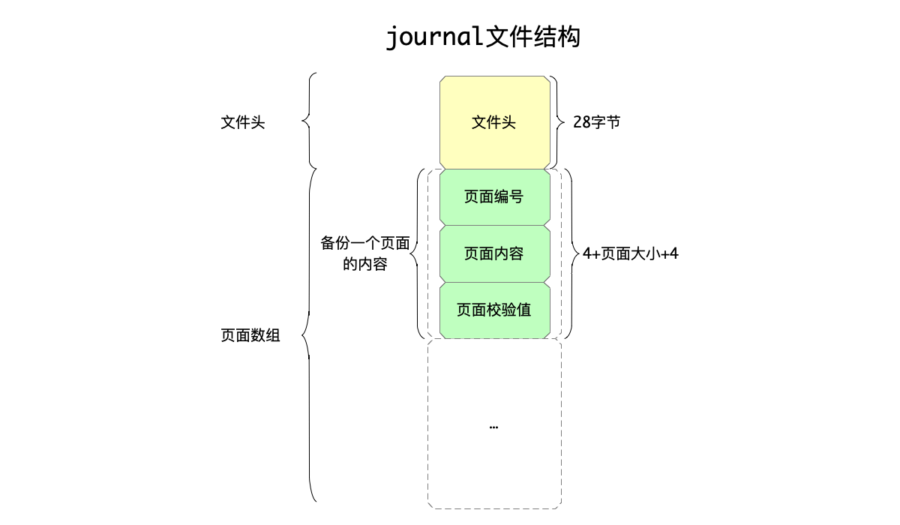

## 流程

### 判断页面是否已经备份

启动一个写事务的时候，可能会修改多个页面，但是这其中可能有些修改，修改的是同一个页面的内容，因此这种情况下只需要对这个页面备份一次即可。

如何知道页面是否已经被备份过？页面管理器通过一个位图数据结构来保存这个信息：

```c
Bitvec *pInJournal;         /* One bit for each page in the database file */
```    

### 计算页面校验值

计算一个页面校验码的流程在函数`pager_cksum`中实现，其核心逻辑是：

  * 以随机算出的校验值为初始值，这个初始值就是存在journal文件头中偏移量为[12,16]的数据。
  * 从后往前遍历页面数据，每隔200字节取一个u32类型的值，累加起来。

有了这样的关联，进行数据恢复时就能马上通过文件头存储的随机数，计算出来页面的数据是否准确。

```c
static u32 pager_cksum(Pager *pPager, const u8 *aData){
  u32 cksum = pPager->cksumInit;         /* Checksum value to return */
  int i = pPager->pageSize-200;          /* Loop counter */
  // 每隔200字节算一个值累加起来
  while( i>0 ){
    cksum += aData[i];
    i -= 200;
  }
  return cksum;
}
```

### 备份页面

有了前面计算校验值、以位图来判断页面是否已经备份过的了解，现在开始将备份页面的流程。

每一次需要修改一个页面之前，都会调用函数`pager_write`，这样就能在修改之前首先备份这个页面的内容。

要区分两种不同的页面：

  * 如果页面编号比当前数据库文件的页面数量小，说明是已有页面，需要走备份页面的流程。
  * 否则，说明是新增页面，新增的页面不需要备份，只需要修改该页面的标志位是需要落盘（`PGHDR_NEED_SYNC`），并且放入脏页面链表即可。

第二种情况是新增页面，没有备份的需求，这里就不做解释。

这里具体解释第一种情况，即备份已有页面的流程，其主要逻辑如下：

  * 首先根据前面的`pInJournal`位图数据，传入页面编号，判断这个页面是否备份过，如果已经备份过，不做任何操作。
  * 否则说明需要备份页面，将进入函数`pagerAddPageToRollbackJournal`中将该页面内容备份写入journal文件： 
    * 调用前面提到的`pager_cksum`函数，计算页面的校验值。
    * 按照上面解释的journal文件格式，依次写入页面编号、页面内容、第一步计算出来的校验值。
    * 由于备份了页面，所以要把这个新增的备份页面编号写入`pInJournal`位图数据。

#### 备份页面的例子

我们以一个例子来说明备份页面的流程，假设写事务执行时，情况如下：

  * 当时数据库的页面数量为100，即有100个页面。
  * 写事务执行时，依次做了如下的修改： 
    * 修改页面10的一处内容。
    * 修改页面20的一处内容。
    * 修改页面10的一处内容，注意这里跟第一次修改属于同一个页面的不同位置。
    * 新增页面101。

那么，对照上面的流程，这四次页面修改在调用函数`pager_write`时，情况是这样的：

  * 修改页面10的一处内容：由于在备份页面位图中查不到页面编号为10的页面，且页面10小于当前数据库文件的页面数量100，属于修改当前已有页面，于是将这个页面备份到journal文件，完事了之后将这个页面编号10加入位图。
  * 修改页面20的一处内容：类似的，也是备份了页面20的内容，同时将20加入位图。
  * 修改页面10的一处内容：这一次虽然也是要修改已有页面，但是由于在位图中找到这个页面编号，说明在这一次事务中已经备份过这个页面了，于是不再需要备份操作，直接返回。
  * 新增页面101：发现该页面的编号101，大于当前数据库页面数量100，属于新增页面，于是不进行备份，只是加入到脏页面链表中同时标记需要落盘。

即：在这一次写事务执行的过程中，虽然需要修改4处内容，实际备份文件两次，新增页面一次。

### 何时落盘

前面备份待修改页面的流程中，备份的页面内容只是写到了备份文件里，实际还并没有执行`sync`操作强制落盘，只要没有落盘就还是存在备份数据损坏的情况。

在上一节的（[sqlite3.36版本 btree实现（二）- 并发控制框架](https://www.codedump.info/post/20211218-sqlite-btree-2-concurrency-control/)），备份文件内容落盘是放在第七步做的，此时对用户空间的页面内容的修改已经完成了，不清楚这一流程的可以回头再看看上一节的内容。

具体到journal文件的机制，这一步是放在函数`pager_end_transaction`进行的，`pager_end_transaction`函数就是上面介绍的：在事务修改完毕用户空间的页面之后，被调用。

## 总结

本节讲解了journal文件的实现机制，从最早的sqlite btree实现时，备份页面的机制就一直使用journal机制，从这里的分析可以看到，这种机制很“朴素”，性能也并不好，所以后续在3.7版本的sqlite中引入了更优的WAL实现机制。

本节也并没有把所有journal文件实现机制都详细描述，只是把最核心的文件结构以及备份流程做了讲解，因为并不想在这个性能不高的机制上着墨更多，有兴趣的读者可以自行阅读相关代码。

## 参考资料

  * [Database File Format](https://www.sqlite.org/fileformat.html)

