 
<!--BEGIN_DATA
{
    "create_date": "2022-01-10 16:30", 
    "modify_date": "2022-01-10 16:30", 
    "is_top": "0", 
    "summary": "sqlite3.36版本btree实现（四）- WAL的实现<br/>sqlite3.36版本 btree实现（五）- Btree的实现", 
    "tags": "数据库、算法", 
    "file_name": "sqlite3.36版本btree实现2.md"
}
END_DATA-->

#### <p>原文出处：<a href='https://www.codedump.info/post/20220106-sqlite-btree-4-wal/' target='blank'>sqlite3.36版本btree实现（四）- WAL的实现</a></p>

前面两节，分别讲解了sqlite中写入事务时的并发控制框架，以及journal备份文件的实现机制。

回忆一下journal备份文件的实现：

  * 每次一个新的写事务开始之前，要首先写journal文件的文件头。
  * 写事务过程中，如果修改了哪个页面，在修改之前需要首先将这个页面的内容写入到journal文件中。
  * 写事务完成后，在同步所有缓存中被修改的页面到数据库文件之前，要首先将journal文件中的所有修改同步到磁盘，然后再修改数据库文件。

可以看到，journal备份的整个流程都较为原始，性能不高，所以在sqlite 3.7.0版本（[SQLite Release 3.7.0 On 2010-
07-21](https://www.sqlite.org/releaselog/3_7_0.html)，2010-07-21）中，引入了另一种备份机制：WAL（Write Ahead Log）。

本节首先介绍WAL的实现原理，然后再展开其具体的实现。

## WAL工作原理

从前面journal的实现中可以看到，写入journal文件中的内容，是待修改页面修改之前的内容，而WAL则相反：被修改的页面内容首先写入到WAL中。

用sqlite官网的文字来说，WAL文件的定义是这样的：

> The write-ahead log or "wal" file is a roll-forward journal that records transactions that have been committed but not yet applied to the main database.

即WAL文件中存储的是被修改但是还没有写入数据库文件的页面内容。

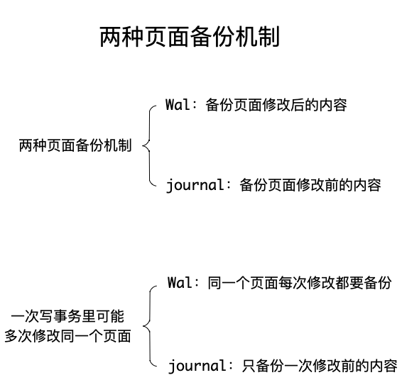

WAL整体的实现机制，分为以下几个流程：

  * 对页面的修改，可以只写入到WAL文件中就认为完成，不必一定要落盘到数据库文件才能算完成，这个设定保证了WAL的修改操作比journal性能有很大的提升。
  * 由于上面的这一点保证，同一时间的并发读操作，能继续读数据库中未修改的内容，极大提升了读并发的性能。
  * 当然WAL也不能无限制的一直写下去，必须有一个机制，触发将保存在WAL中的页面内容写入回到数据库文件中，这个流程被称为`checkpoint`。

### WAL相关文件结构

在工作原理部分，只会简单讲解WAL相关文件结构，具体的格式等细节留待下面的实现部分详细讲解。

WAL文件本身的格式很简单，有如下两部分组成：

  * WAL文件头。
  * 紧跟着文件头之后的，就是由修改之后的页面内容组成的页面内容数组。
  * 最后，当事务被提交时，还会有一个特殊的WAL日志，标记这个事务提交了。

换言之，一个WAL中，可能先后存储了多个事务的写入。

由于WAL文件保存的**修改页面**的内容，同一个页面，可能在一次事务中被多次修改，如下所示：

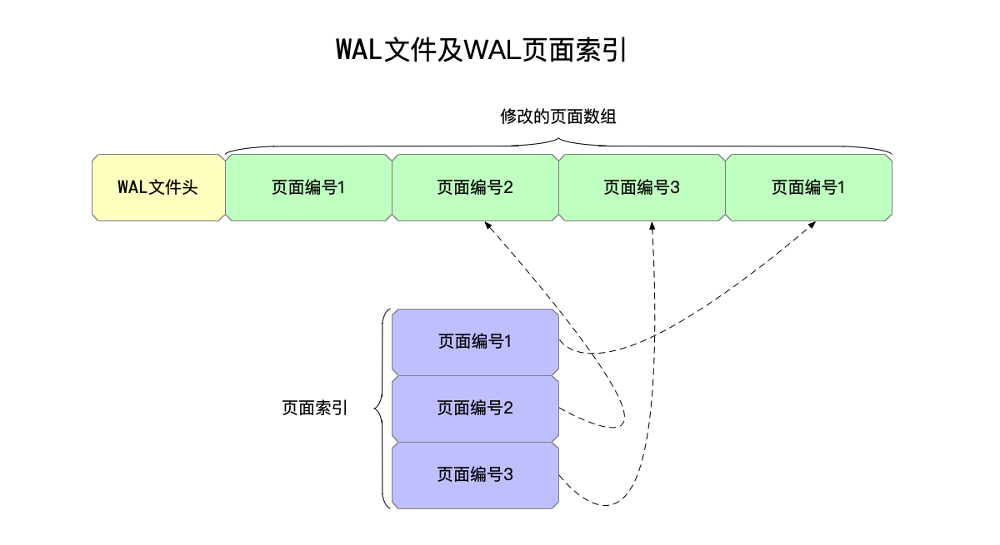

WAL存储了四个页面数据，其中页面编号1被修改了两次。

如果在这个写操作完成之后，需要读这些页面的内容，都需要读到最新的内容。所以，WAL还有一个对应的`WAL页面索引`数据，这部分索引数据存储在内存中，作用是根据页面编号，知道该页面编号对应的最新内容，存储在WAL文件中的具体位置，以取得某个页面的最新页面内容；如果在这个内存索引中查不到的数据，都需要到数据库文件中读取。

### checkpoint

随着WAL文件的增长，终究要将里面修改的内容同步到数据库文件中，这个流程被称为“checkpoint”。只要WAL文件被“checkpoint”，就可以从头开始写这个文件，避免文件的无限增大。

对于journal备份机制而言，只有两种操作：读和写；而对于WAL机制而言，实际有三种操作：读、写、checkpoint。这也是两种机制的主要区别之一。

### 并发的实现

前面提到了，WAL机制的一个优势在于：在写未完成之前，可以允许同时并发多个读操作，来看看这一点是如何做到的。

在每次读操作开始之前，都会记录下来当前最后提交事务的提交记录，这条记录被称为“end mark”。因为WAL会随着写操作的进行不断增加，通过读操作的“end mark”，就能知道对于这个读操作而言，页面内容应该以当前WAL内容为准，还是以数据库文件为准。

以下图为例来做个说明：

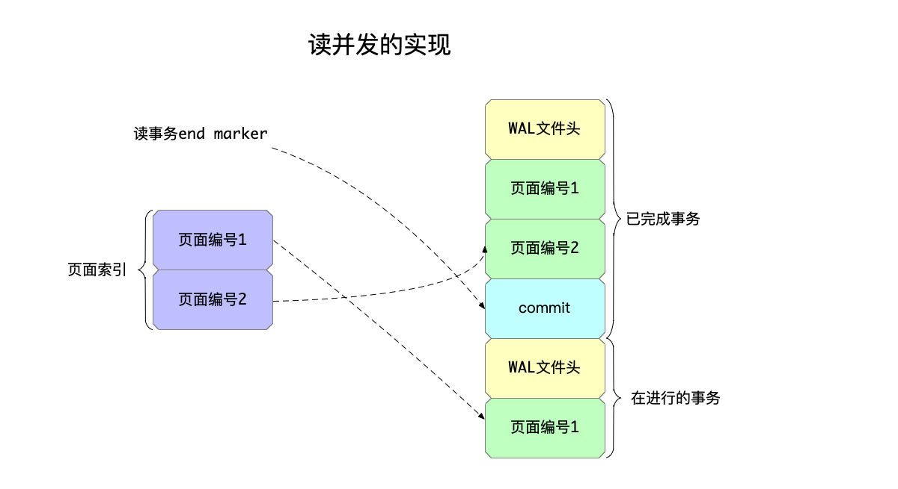

在上图中：

  * WAL文件中先后记录了两个写事务，其中第一个写事务修改了页面编号1、2，已经提交完成；还有一个在进行还未完成的写事务，修改了页面编号1。
  * 这时候，如果来了一个读事务，那么将记录下来最后一个完成事务的提交记录做为自己的“end mark”，即图中的浅蓝色的那个提交记录。
  * 假设现在这个读事务，依次要读取页面编号1和2的页面，那么： 
    * 到页面索引中查询页面1的位置，发现位置比自己的“end marker”更大，也就是说这个页面在上一次完成写事务之后，被当前还未完成的写事务修改了，于是并不能读WAL的内容，因为这部分内容对这个读操作来说还是未提交的，所以页面1需要到数据库文件中读取。
    * 到页面索引中查询页面2的位置，发现位置比自己的“end marker”更小，也就是在自己标记的写事务完成之后并未被修改过，于是可以读WAL中这个页面的内容。

可见，有了“end mark”这一标记位置之后，加上页面索引，任意数量的读操作都能快速判断自己应该读WAL文件还是数据库文件，写操作可以继续写，读和写之间并不会冲突，极大提升了读并发的性能。

同样要看到的是，由于只有一个WAL文件，同一时间之内，只能有一个写操作。即：**sqlite的WAL模式，只能支持单写多读的模式。**

### 读操作和checkpoint的联系

前面讲到了checkpoint以及读并发的实现，两者可以并发一起执行，但是某些时刻会有一些关联，影响系统的性能。

因为超过读操作“end mark”的页面，读操作需要到数据库文件中读取该页面内容，那么反过来，当checkpoint操作要将一个超过当前并发的**任意读操作**“end mark”的页面落到数据库文件中时，就必须等待这个读操作完成才能进行。

仍然以前面读并发的示意图来解释这个过程：

  * checkpoint 页面编号2的内容到数据库文件时，该页面最后在WAL文件中的位置，并不比当前的任意读操作的“end mark“更大，所以checkpoint这个页面的内容到数据库文件时无需等待即可完成。
  * 反过来，checkpoint 页面编号1的内容到数据库文件时，该页面最后在WAL文件中的位置，大于当前读操作的”end mark“，所以这个页面的内容就需要等待读操作完成才能进行下去。

换言之：一个执行很久的读操作，可能会影响同时在进行的checkpoint操作的执行。

被阻塞的checkpoint必须等待读操作完成才能继续执行，因此需要一些额外的信息来维护当前checkpoint执行的状态，这些具体的实现细节都会在下面实现环节的分析中涉及。

现在已经大体清楚WAL的原理了，下面来看具体的实现。

## WAL的实现

sqlite中，可以使用`PRAGMA journal_mode=wal`设置页面备份机制为wal，这时候就会有三个与数据库相关的文件在同一个目录：

  * 数据库文件，假设名字为X。
  * WAL文件，名字为“X-wal”。
  * wal索引文件，名字为“X-shm”。

### WAL的文件格式

首先来看WAL文件的格式，分为两个部分：

  * WAL文件头：一次写事务，对应一个WAL文件头。
  * 除去文件头，每一页数据都是存储在“帧（frame）”里，每一帧又包括两部分数据： 
    * 帧头部：描述存储的这一页数据的信息。
    * 页面数据：存储页面数据。

WAL文件头，只会在每次写事务中写入一次，而帧可能在一次写事务中多多个，取决于这一次写事务修改了多少页面。如下图：

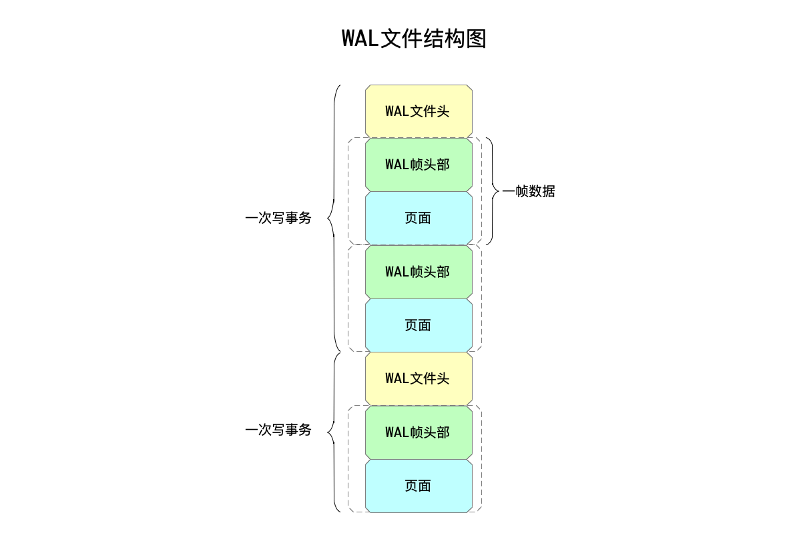

上图中，依次存储了两次写事务的数据，其中第一次写了两帧数据，第二次写了一帧数据。

有了以上的概念，下面详细看WAL文件的结构。

#### WAL文件头格式

（引用自 [Database File Format](https://www.sqlite.org/fileformat2.html) section 4.1）

<table>
<thead>
<tr>
<th align="left">Offset</th>
<th align="left">Size</th>
<th align="left">Description</th>
</tr>
</thead>
<tbody>
<tr>
<td align="left">0</td>
<td align="left">4</td>
<td align="left">Magic number. 0x377f0682 or 0x377f0683</td>
</tr>
<tr>
<td align="left">4</td>
<td align="left">4</td>
<td align="left">File format version. Currently 3007000.</td>
</tr>
<tr>
<td align="left">8</td>
<td align="left">4</td>
<td align="left">Database page size. Example: 1024</td>
</tr>
<tr>
<td align="left">12</td>
<td align="left">4</td>
<td align="left">Checkpoint sequence number</td>
</tr>
<tr>
<td align="left">16</td>
<td align="left">4</td>
<td align="left">Salt-1: random integer incremented with each checkpoint</td>
</tr>
<tr>
<td align="left">20</td>
<td align="left">4</td>
<td align="left">Salt-2: a different random number for each checkpoint</td>
</tr>
<tr>
<td align="left">24</td>
<td align="left">4</td>
<td align="left">Checksum-1: First part of a checksum on the first 24 bytes of header</td>
</tr>
<tr>
<td align="left">28</td>
<td align="left">4</td>
<td align="left">Checksum-2: Second part of the checksum on the first 24 bytes of header</td>
</tr>
</tbody>
</table>

其中的很多字段自有解释，其中多数涉及到页面内容的校验，后面再展开说。

#### WAL帧头部格式

（引用自 [Database File Format](https://www.sqlite.org/fileformat2.html) section 4.1）

<table>
<thead>
<tr>
<th align="left">Offset</th>
<th align="left">Size</th>
<th align="left">Description</th>
</tr>
</thead>
<tbody>
<tr>
<td align="left">0</td>
<td align="left">4</td>
<td align="left">Page number</td>
</tr>
<tr>
<td align="left">4</td>
<td align="left">4</td>
<td align="left">For commit records, the size of the database file in pages after the commit. For all other records, zero.</td>
</tr>
<tr>
<td align="left">8</td>
<td align="left">4</td>
<td align="left">Salt-1 copied from the WAL header</td>
</tr>
<tr>
<td align="left">12</td>
<td align="left">4</td>
<td align="left">Salt-2 copied from the WAL header</td>
</tr>
<tr>
<td align="left">16</td>
<td align="left">4</td>
<td align="left">Checksum-1: Cumulative checksum up through and including this page</td>
</tr>
<tr>
<td align="left">20</td>
<td align="left">4</td>
<td align="left">Checksum-2: Second half of the cumulative checksum.</td>
</tr>
</tbody>
</table>

帧头部需要存储如下的信息：

  * 0-4字节：页面编号。
  * 4-8字节：对于提交记录而言，这4字节存储的是该事务提交之后，数据库文件的最大页面编号；其它的时候，这4字节为0。也就是说，这4字节大于0的时候，表示是一次事务的最后一次页面修改。

其它的字段，都跟页面的校验有关，接下来就看看这部分的实现。

#### 页面内容校验算法

前面的格式中，无论是WAL文件头，还是WAL帧头部，都有以下的字段：

  * 8字节的salt数据。
  * 两组4字节的checksum数据。

校验时，只有满足以下条件的情况下才认为是正确的帧数据：

  * 帧头部中的8字节的salt数据，和WAL头部的salt数据相同。
  * 根据校验算法遍历页面数据计算出来的checksum，和帧头部的checksum数据相同。

第一部分salt数据，每次写事务生成一次，所以校验这个值可以认为校验这一帧数据是否和这次事务匹配；而第二部分的checksum数据，则会用来依次串起一次写事
务的所有页面修改。

比如下面这个写事务流程：

  * 第一次写页面，由于之前这个写事务没有写过页面，所以初始的checksum为0，以这个初始的checksum来计算这第一个页面的checksum，计算之后的值记录到这个页面的checksum，记为`checksum_1`。
  * 第二次写页面，取上一次计算的checksum即`checksum_1`，来计算这第二个页面的checksum，记为`checksum_2`。
  * 类似的，第N次写页面时，以上一次计算的checksum即`checksum_n-1`来做为计算的初始值计算。

这样，相邻页面之间的校验值就有了关联。

总结起来：

  * salt：每次事务算一次随机值。
  * checksum：满足以下以下条件： 
    * `checksum_0 = 0`
    * `checksum_n = F(checksum_n-1, 页面数据)`，其中函数F是根据初始校验值和页面数据计算出新校验值的函数。

校验页面的函数实现在`walDecodeFrame`中，而计算页面校验值的函数实现在`walChecksumBytes`中。

### WAL页面索引

#### 结构

前面分析WAL文件结构的时候，提到保存一页数据的内容被称为“帧（frame）”，帧的编号从1开始顺序递增，每一帧内容存储的页面内容可能会发生变化，如下图所示：

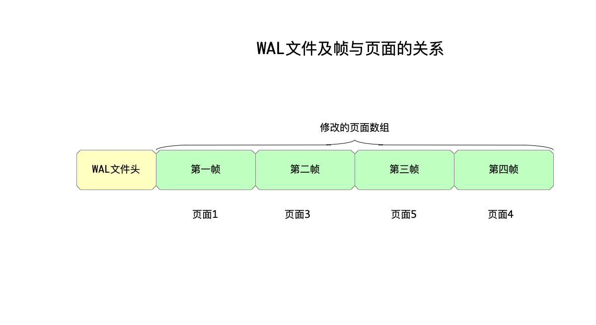

图中，依次有四帧页面数据，帧数与页面的对应关系依次是：(1,1)，(2,3)，(3,5)，(4,4)。假设随着运行，第一帧对应的页面1被写入了数据库，那么第一帧的空间就会被复用来存储别的页面的内容。

所以，WAL页面索引中，需要存储帧数与页面编号之间的对应关系，这样就能：

  * 访问一帧的内容时，知道保存的是哪个页面的内容；
  * 根据页面编号，能查到这个页面的最新数据保存在哪一帧中。

根据需要的这两份数据，定义了用于保存wal索引的数据结构：

```c
struct WalHashLoc {
  volatile ht_slot *aHash;  /* Start of the wal-index hash table */
  volatile u32 *aPgno;      /* aPgno[1] is the page of first frame indexed */
  u32 iZero;                /* One less than the frame number of first indexed*/
};
```

其中：

  * aHash：保存了根据页面编号查找iFrame帧数的hash数组数据。
  * aPgno：保存了根据帧数查找页面编号的数据。
  * iZero：保存了当前索引页面第一帧的帧数。

这么看来有一些抽象，我们以下图来做解释wal-index文件的结构：

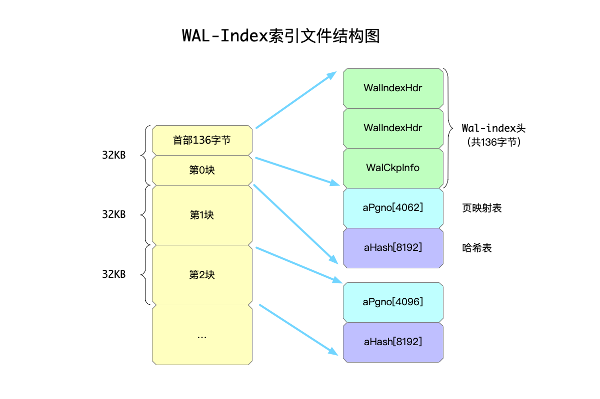

如上图所示，其中：

  * wal索引文件一页大小为32KB，需要注意的是：不要把wal索引文件的一页与数据库文件的一页搞混，两者并不一定相同，但是都为2的次方，数据库文件的一页可以编译期修改，但是wal索引文件的一页大小写死为32KB。
  * 第一页相对有些特殊，因为最开始的136字节是wal索引文件头，所以相对的，剩下用来存储索引数据的空间就会变少一些。索引文件头的内容，留待后面再详细解释。
  * 每一页存储的数据中，`aPgno`大小为4096（第一页只有4062，因为有头部用到的空间），`aHash`的大小为8192。

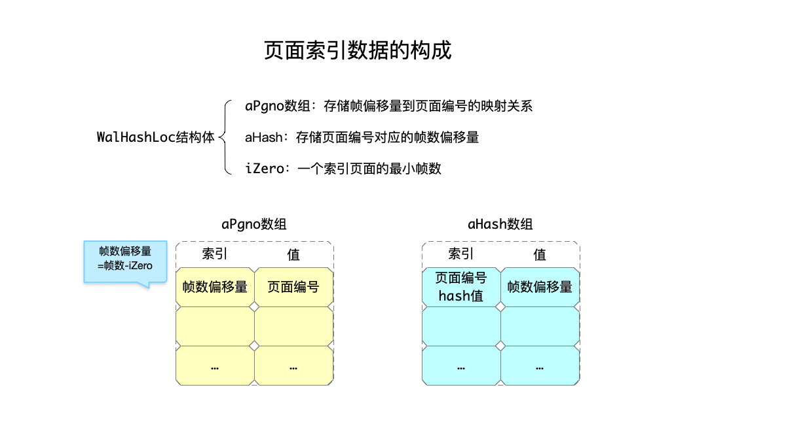

这几个常量，由下面这几个宏来定义：

```c
// 每一页aPgno数组大小
#define HASHTABLE_NPAGE      4096                 /* Must be power of 2 */
// 查询时hash取模时的质数
#define HASHTABLE_HASH_1     383                  /* Should be prime */
// 每一页hash slot数组大小
#define HASHTABLE_NSLOT      (HASHTABLE_NPAGE*2)  /* Must be a power of 2 */
// 页面1实际能容纳的aPgno大小：HASHTABLE_NPAGE减去WALINDEX_HDR_SIZE使用的大小
#define HASHTABLE_NPAGE_ONE  (HASHTABLE_NPAGE - (WALINDEX_HDR_SIZE/sizeof(u32)))
// 一个wal索引页面的大小，为4096*4+8192*2 = 32KB
#define WALINDEX_PGSZ   (                                         \
    sizeof(ht_slot)*HASHTABLE_NSLOT + HASHTABLE_NPAGE*sizeof(u32) \
)
```

##### 索引文件头结构

来看看索引文件头的结构，其整体大小为136字节，划分为三部分：

（引用自[WAL-mode File Format](https://www.sqlite.org/walformat.html) section 2.1）

<table>
<thead>
<tr>
<th align="left">Bytes</th>
<th align="left">Description</th>
</tr>
</thead>
<tbody>
<tr>
<td align="left">0..47</td>
<td align="left">First copy of the WAL Index Information</td>
</tr>
<tr>
<td align="left">48..95</td>
<td align="left">Second copy of the WAL Index Information</td>
</tr>
<tr>
<td align="left">96..135</td>
<td align="left">Checkpoint Information and Locks</td>
</tr>
</tbody>
</table>

这总共136字节的数据，一共分为三个部分：

  * 0-47字节：WAL索引头部，由结构体`WalIndexHdr`来描述。
  * 48-95字节：还是一个由结构体`WalIndexHdr`描述的WAL索引头部。
  * 96-136字节：由结构体`WalCkptInfo`描述的WAL checkpoint信息。

下面的表格，详细展示了这136字节中都有哪些字段。

（引用自[WAL-mode File Format](https://www.sqlite.org/walformat.html) section 2.1）

<table>
<thead>
<tr>
<th align="left">Bytes</th>
<th align="left">Name</th>
<th align="left">Meaning</th>
</tr>
</thead>
<tbody>
<tr>
<td align="left">0..3</td>
<td align="left">iVersion</td>
<td align="left">The WAL-index format version number. Always 3007000.</td>
</tr>
<tr>
<td align="left">4..7</td>
<td align="left"></td>
<td align="left">Unused padding space. Must be zero.</td>
</tr>
<tr>
<td align="left">8..11</td>
<td align="left">iChange</td>
<td align="left">Unsigned integer counter, incremented with each transaction</td>
</tr>
<tr>
<td align="left">12</td>
<td align="left">isInit</td>
<td align="left">The “isInit” flag. 1 when the shm file has been initialized.</td>
</tr>
<tr>
<td align="left">13</td>
<td align="left">bigEndCksum</td>
<td align="left">True if the WAL file uses big-ending checksums. 0 if the WAL uses little-endian checksums.</td>
</tr>
<tr>
<td align="left">14..15</td>
<td align="left">szPage</td>
<td align="left">The database page size in bytes, or 1 if the page size is 65536.</td>
</tr>
<tr>
<td align="left">16..19</td>
<td align="left">mxFrame</td>
<td align="left">Number of valid and committed frames in the WAL file.</td>
</tr>
<tr>
<td align="left">20..23</td>
<td align="left">nPage</td>
<td align="left">Size of the database file in pages.</td>
</tr>
<tr>
<td align="left">24..31</td>
<td align="left">aFrameCksum</td>
<td align="left">Checksum of the last frame in the WAL file.</td>
</tr>
<tr>
<td align="left">32..39</td>
<td align="left">aSalt</td>
<td align="left">The two salt value copied from the WAL file header. These values are in the byte-order of the WAL file, which might be different from the native byte-order of the machine.</td>
</tr>
<tr>
<td align="left">40..47</td>
<td align="left">aCksum</td>
<td align="left">A checksum over bytes 0 through 39 of this header.</td>
</tr>
<tr>
<td align="left">48..95</td>
<td align="left"></td>
<td align="left">A copy of bytes 0 through 47 of this header.</td>
</tr>
<tr>
<td align="left">96..99</td>
<td align="left">nBackfill</td>
<td align="left">Number of WAL frames that have already been backfilled into the database by prior checkpoints</td>
</tr>
<tr>
<td align="left">100..119</td>
<td align="left">read-mark[0..4]</td>
<td align="left">Five “read marks”. Each read mark is a 32-bit unsigned integer (4 bytes).</td>
</tr>
<tr>
<td align="left">120..127</td>
<td align="left"></td>
<td align="left">Unused space set aside for 8 file locks.</td>
</tr>
<tr>
<td align="left">128..132</td>
<td align="left">nBackfillAttempted</td>
<td align="left">Number of WAL frames that have attempted to be backfilled but which might not have been backfilled successfully.</td>
</tr>
<tr>
<td align="left">132..136</td>
<td align="left"></td>
<td align="left">Unused space reserved for further expansion.</td>
</tr>
</tbody>
</table>

下面就这里的一些重点字段做一下介绍。

###### 为什么需要两个相同大小的WAL索引头部？

注意到0-47和48-95这两部分48字节的数据，都是同样类型的数据，都由`WalIndexHdr`结构体来描述。

这样设计的目的，是为了读写的时候数据校验。假设头48字节为`h1`，后48字节为`h2`。那么读操作的时候是先读`h1`再读`h2`，而写操作的时候则相反，先写`h2`再写`h1`。这样，如果在读操作的时候，读到这两部分内容并不一样，说明当前有写操作在进行。

读头部的实现见函数`walIndexTryHdr`：

```c
static SQLITE_NO_TSAN int walIndexTryHdr(Wal *pWal, int *pChanged)
{
  u32 aCksum[2];              /* Checksum on the header content */
  WalIndexHdr h1, h2;         /* Two copies of the header content */
  WalIndexHdr volatile *aHdr; /* Header in shared memory */
  aHdr = walIndexHdr(pWal);
  memcpy(&h1, (void *)&aHdr[0], sizeof(h1)); /* Possible TSAN false-positive */
  walShmBarrier(pWal);
  memcpy(&h2, (void *)&aHdr[1], sizeof(h2));
  // 对比两个header，不相同就返回
  if (memcmp(&h1, &h2, sizeof(h1)) != 0)
  {
    return 1; /* Dirty read */
  }
  if (h1.isInit == 0)
  {
    return 1; /* Malformed header - probably all zeros */
  }
  // 对比校验值
  walChecksumBytes(1, (u8 *)&h1, sizeof(h1) - sizeof(h1.aCksum), 0, aCksum);
  if (aCksum[0] != h1.aCksum[0] || aCksum[1] != h1.aCksum[1])
  {
    return 1; /* Checksum does not match */
  }
  // 到了这里，就是判断是否发生过改变了
  if (memcmp(&pWal->hdr, &h1, sizeof(WalIndexHdr)))
  {
    *pChanged = 1;
    memcpy(&pWal->hdr, &h1, sizeof(WalIndexHdr));
    pWal->szPage = (pWal->hdr.szPage & 0xfe00) + ((pWal->hdr.szPage & 0x0001) << 16);
    testcase(pWal->szPage <= 32768);
    testcase(pWal->szPage >= 65536);
  }
  /* The header was successfully read. Return zero. */
  return 0;
}
```

###### mxFrame和nBackfill

`mxFrame`记录着当前WAL文件的最大帧数，而`nBackfill`记录着当前`checkpoint`操作进行到第几帧，即在`nBackfill`之前的帧数都已经被写入数据库文件了。

显然这两个值有如下关系：`nBackfill<=mxFrame`：

  * `nBackfill<mxFrame`，`checkpoint`过程还未结束。
  * `nBackfill==mxFrame`，`checkpoint`过程已经结束，这时候： 
    * WAL文件中的所有页面已经被回填（backfill）到数据库文件中了；
    * 所有读页面的操作，都不再需要访问WAL文件，而是直接访问数据库文件；
    * 下一次再有写操作，可以从WAL的头部开始写。

#### 实现

有了前面的准备，我们来看看这两种对应关系的查找是怎么做的。

##### 索引页面的存储

前面分析到，一个wal索引页面的大小为32KB，这些数据是存储在`Wal`结构体中的：

```c
struct Wal {
	// ...
	int nWiData;               /* Size of array apWiData */
	volatile u32 **apWiData;   /* Pointer to wal-index content in memory */
	// ...
}
```

其中：

  * apWiData：存储页面指针的数组。
  * nWiData：页面指针数组的大小。

##### 根据帧数查询页面编号

首先来看根据帧数查询这一帧存储的是哪个页面的数据，即根据帧数查询页面编号的实现。

由于wal文件中，到了一定大小之后，就会执行“checkpoint”操作，所以帧数一定是有限的。即帧数满足以下的条件：

  * 从0开始递增。
  * 不会无限增大。

所以在`aPgno`中，就直接使用帧数来做为这个数组的索引。总结下来，添加一个帧数和页面之间对应关系的大体的步骤如下（函数`walIndexAppend`）：

  * 首先根据帧数，知道在第几个索引页面中，也就是`apWiData`数组的第几个元素，这样就拿到这一帧对应在哪个32KB的数据。（函数`walHashGet`，另外函数`walFramePage`是根据帧数得到`apWiData`数组索引）。
    
```c
rc = walHashGet(pWal, walFramePage(iFrame), &sLoc);
```    

  * 帧数减去这一页的`iZero`知道是这一页中的`aPgno`数组的索引：
    
```c
idx = iFrame - sLoc.iZero;
```

  * 在hash数组中找到空位置存储页面编号：
    
```c
/* Write the aPgno[] array entry and the hash-table slot. */
nCollide = idx;
for(iKey=walHash(iPage); sLoc.aHash[iKey]; iKey=walNextHash(iKey)){
  if( (nCollide--)==0 ) return SQLITE_CORRUPT_BKPT;
}
```

  * 将两者的对应关系存储下来，即：向`aPgno`中存入页面编号，向`aHash`中存储帧数：
    
```c
sLoc.aPgno[idx] = iPage;
AtomicStore(&sLoc.aHash[iKey], (ht_slot)idx);
```

下图展示了这个过程的大体示意：

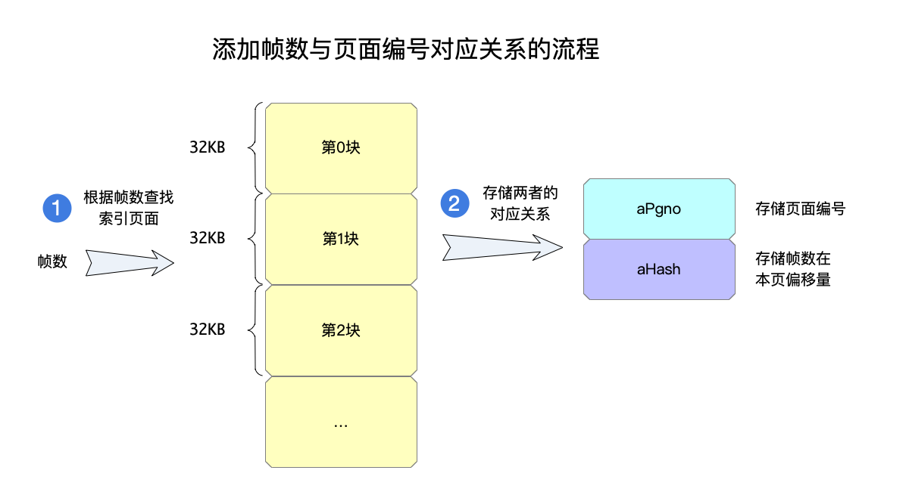

举个例子来说明上面的流程，假设要存储的对应关系是帧数5000存储的是页面编号5：

  * 根据帧数5000，算出这一帧的索引数据应该存储在第二个索引页面中，由此拿到这个页面的`WalHashLoc`指针。

  * 再根据5000，减去这个页面的帧数起始位置4063，得到帧数偏移量为927，即这个帧在这个`WalHashLoc->aPgno`数组的位置是927，即`idx=927`。

  * 再到`WalHashLoc->aHash`中，找到一个空的位置，这个空位置假设是`iKey=101`。

  * 到了这里，位置都找到了，更新数据：
    
```c
sLoc.aPgno[927] = 5;
AtomicStore(&sLoc.aHash[101], (ht_slot)927);
```

可以看到：

  * 通过帧数找到`aPgno`是一个两次索引的过程：第一次根据帧数找到32KB页面，第二次再根据帧数找到在这一页中的帧数偏移量。
  * 最后修改`aHash`是一次原子操作，因为其它地方可能同时在查询。

##### 根据页面编号查询所在帧

前面分析了如何存储帧数到页面编号的对应关系，可以看到这一次更新是把两个对应关系一起更新的。也可以看到，根据帧数查找的流程实际还是相对简单的，就是两次索引：一次找到页面，再一次就是页面内的查找，原因在于：帧数是有限的。

但是页面就不是这样了，因为这里要存储的页面编号是数据库文件中的页面编号，并不知道当前数据库到底变到多大了，这样就不能按照前面的方式来两次索引。

我们来看看如何根据页面编号，知道这一页面是存储在哪一帧里的，即wal文件的帧数，这个过程在函数`sqlite3WalFindFrame`中。

  * 拿到该读操作当前最大和最小帧数，根据这两个帧数得到对应的索引32KB页面。
  * 从后往前遍历这些页面，每个页面中到`WalHashLoc->aHash`中，根据页面编号的hash值来查找。
  * 这个流程一直到找到页面，或者全部遍历完毕为止。

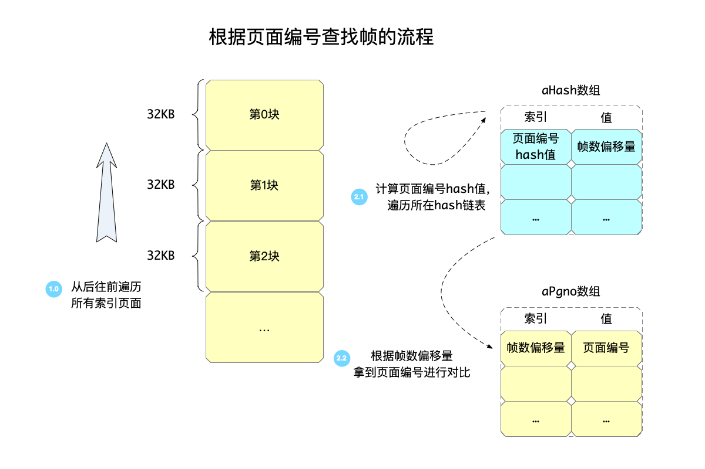

从这个流程可以看到：查找页面对应帧数的流程，最坏的情况下可能遍历了所有索引页面，虽然其中的查找过程会根据页面编号的hash值来查找。于是一个重要的结论就出来了：**WAL的实现，其中有一个缺点是，当WAL文件很大时，对应的索引页面也会很大，在索引中查找页面编号的流程就会变久。**

### 锁的实现

#### 数据结构

wal模式提供了以下4种锁，这4种锁从wal索引文件头部120字节处开始，每种锁占一个字节：

  * `WAL_WRITE_LOCK`：写锁，写操作之前必须拿到写锁。
  * `WAL_CKPT_LOCK`：checkpoint锁，在做checkpoint之前需要拿到这个锁。
  * `WAL_RECOVER_LOCK`：恢复锁，在进行恢复操作之前要拿到这个锁。
  * `WAL_READ_LOCK`：读锁，一共有五个读锁，但是作用不尽相同。

这四种锁，其中有五个读锁，一共加起来就是8个锁，定义如下：

```c
// wal索引文件中锁的数量
#define SQLITE_SHM_NLOCK        8
// 写锁在所有锁中的偏移量
#define WAL_WRITE_LOCK 0
// 除了写锁以外的其他所有锁
#define WAL_ALL_BUT_WRITE 1
// checkpoint锁在所有锁中的偏移量
#define WAL_CKPT_LOCK 1
// 恢复锁在所有锁中的偏移量
#define WAL_RECOVER_LOCK 2
// 输入读锁索引，返回对应读锁在所有锁中的偏移量，因为读锁从3开始，所以+3
#define WAL_READ_LOCK(I) (3 + (I))
// 读索引的数量 = 所有锁数量 - 读锁起始位置3
#define WAL_NREADER (SQLITE_SHM_NLOCK - 3)
```

问题来了，为什么是索引文件头部120字节处开始的呢？从上面对wal索引文件的格式分析可知：索引文件开始是两个`WalIndexHdr` + 一个`WalCkptInfo`，而`WalCkptInfo`结构体定义如下：

```c
struct WalCkptInfo
{
  u32 nBackfill;              /* Number of WAL frames backfilled into DB */
  u32 aReadMark[WAL_NREADER]; /* Reader marks */
  u8 aLock[SQLITE_SHM_NLOCK]; /* Reserved space for locks */
  u32 nBackfillAttempted;     /* WAL frames perhaps written, or maybe not */
  u32 notUsed0;               /* Available for future enhancements */
};
```

其中的`aLock`字段就是存储上面的这些锁的数组，把前面这些数据的大小加起来，一直到这个字段就正好是120，有宏定义为证：

```c
/* A block of WALINDEX_LOCK_RESERVED bytes beginning at
** WALINDEX_LOCK_OFFSET is reserved for locks. Since some systems
** only support mandatory file-locks, we do not read or write data
** from the region of the file on which locks are applied.
*/
#define WALINDEX_LOCK_OFFSET (sizeof(WalIndexHdr) * 2 + offsetof(WalCkptInfo, aLock))
```

（引用自[WAL-mode File Format](https://www.sqlite.org/walformat.html)）

<table>
<thead>
<tr>
<th align="left">Name</th>
<th align="left">Offset</th>
<th></th>
</tr>
</thead>
<tbody>
<tr>
<td align="left"></td>
<td align="left">xShmLock</td>
<td>File</td>
</tr>
<tr>
<td align="left">WAL_WRITE_LOCK</td>
<td align="left">0</td>
<td>120</td>
</tr>
<tr>
<td align="left">WAL_CKPT_LOCK</td>
<td align="left">1</td>
<td>121</td>
</tr>
<tr>
<td align="left">WAL_RECOVER_LOCK</td>
<td align="left">2</td>
<td>122</td>
</tr>
<tr>
<td align="left">WAL_READ_LOCK(0)</td>
<td align="left">3</td>
<td>123</td>
</tr>
<tr>
<td align="left">WAL_READ_LOCK(1)</td>
<td align="left">4</td>
<td>124</td>
</tr>
<tr>
<td align="left">WAL_READ_LOCK(2)</td>
<td align="left">5</td>
<td>125</td>
</tr>
<tr>
<td align="left">WAL_READ_LOCK(3)</td>
<td align="left">6</td>
<td>126</td>
</tr>
<tr>
<td align="left">WAL_READ_LOCK(4)</td>
<td align="left">7</td>
<td>127</td>
</tr>
</tbody>
</table>

#### 加解锁操作

wal与前面的journal相比，少了很多其他类型的锁，wal只有两种类型的锁：shared共享锁，以及exclusive排它锁。对应的API有下面四个：

```c
static int walLockShared(Wal *pWal, int lockIdx);
static void walUnlockShared(Wal *pWal, int lockIdx);
static int walLockExclusive(Wal *pWal, int lockIdx, int n);
static void walUnlockExclusive(Wal *pWal, int lockIdx, int n);
```

这里有几个细节，需要交待一下。

首先，其中传入的参数`lockIdx`，就是上面提到的几种锁的类型索引。

其次，代码中有`walLockShared(pWal, WAL_WRITE_LOCK)`这样的操作。对一个写锁加共享锁应该怎么理解？需要纠正的是，类似`WAL_WRITE_LOCK`这样的宏，只是表示这一字节用于什么操作，比如`WAL_WRITE_LOCK`用于写操作，即：

  * 要拒绝其他写请求的情况下读数据时，就应该对`WAL_WRITE_LOCK`类型的锁加共享锁。
  * 要开始写操作时，就应该对`WAL_WRITE_LOCK`类型的锁加排它锁。

其他类型的锁依次类推，即`WAL_*_LOCK`这类宏只是表示这一个字节的用途。

最后一个细节是，加共享锁时只能传入锁类型索引，而加排它锁的时候还能传入一个参数n，这是什么意思？

因为这些不同类型的锁，本质上就是wal索引共享文件上连续的字节，所以区别在于，共享锁一次只能对一个锁进行操作；而排它锁则可以一次多对多个锁进行操作。

比如

```c
walLockExclusive(pWal, WAL_READ_LOCK(1), WAL_NREADER - 1);
```    

这样就能把从1号读锁开始的所有读锁都加上排它锁。

再比如：

```c
iLock = WAL_ALL_BUT_WRITE + pWal->ckptLock;
rc = walLockExclusive(pWal, iLock, WAL_READ_LOCK(0) - iLock);
```

这里的几个常量取值如下：

  * `ckptLock`取值为0或者1。
  * `WAL_ALL_BUT_WRITE`为1。
  * `#define WAL_READ_LOCK(I) (3 + (I))`，所以`WAL_READ_LOCK(0)`为3。

于是：

  * 如果`ckptLock`取值为0，表示这时候还没有加上了checkpoint的排它锁： 
    * `iLock`为1，1为`WAL_CKPT_LOCK`这个类型的锁。
    * `WAL_READ_LOCK(0) - iLock`为2。
    * 这样，`walLockExclusive(pWal, iLock, WAL_READ_LOCK(0) - iLock);`就能把checkpoint和0号读锁都加上排它锁，这样就不会其他checkpoint操作。
  * 如果`ckptLock`取值为1，表示这时候已经加上了checkpoint的排它锁： 
    * `iLock`为2，2为`WAL_RECOVER_LOCK`这个类型的锁。
    * `WAL_READ_LOCK(0) - iLock`为1。
    * 这样，`walLockExclusive(pWal, iLock, WAL_READ_LOCK(0) - iLock);`就能把恢复加上排它锁，这样能进行恢复操作。

#### 特殊的0号读锁

除此以外，还需要注意0号读锁很特殊，它表示读事务申请的共享锁，和WAL_WRITE_LOCK不冲突，读写可以完全并发进行，互不影响，但是不能和数据库同步操作和WAL-index文件恢复并发进行。0号读锁表示只从数据库读取页。

有了对锁的了解，可以接下来看各种操作的具体实现了。

### 读操作

进行读操作时，大体需要以下两个操作：

  * 保存当前的`aReadMark`，因为这涉及到读页面的时候数据从哪里来的问题。
  * 拿到对应的读锁。

下面分别讨论这两方面的内容。

#### readMark

首先来了解一下什么叫`readMark`，以及有什么作用。

回顾之前谈到wal文件以及wal索引文件的格式，有这么几个要点：

  * 对于同一个页面编号的页面，可能会在wal文件存在不同时间的多次写入结果。这些多次写入结果里，如果所在的事务还未提交，那么这个修改应该对读操作还处于不可见的状态。wal文件头中使用`mxFrame`这个字段来存储当前最后完成的写事务的帧数，超过这个帧数的修改都认为还没有完成。
  * wal索引保存着页面的最新修改的位置信息，这“最新修改”指的是已经提交的事务，并不包括还未提交的事务的修改。
  * 读操作时，以页面编号先从wal索引中尝试读这个页面在wal中的位置信息： 
    * 如果读成功，根据这个wal的位置信息，到wal文件中读取该页面。
    * 否则，该页面没有在wal中，到数据库文件中读取。

以下图为例来说明情况，为了简化说明，一个页面存储的一对KV的信息。

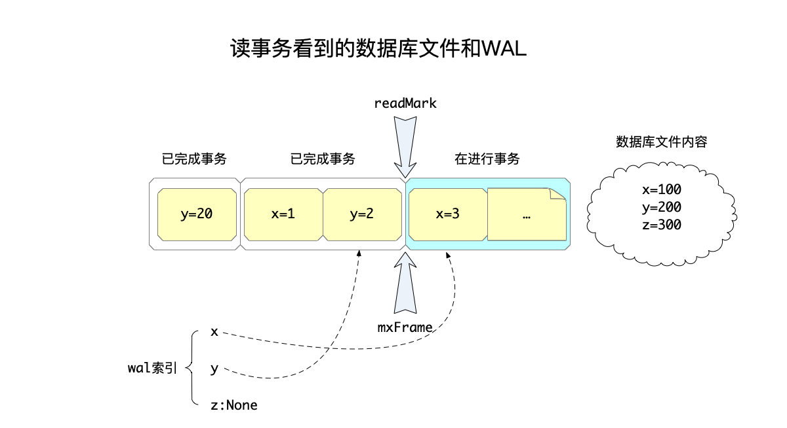

在上图中：

  * 有三个写事务，其中： 
    * 第一个事务已经完成，修改了值`y=20`，这个修改存在第一帧中。
    * 第二个事务也已经完成，修改了值`x=1`和`y=2`，这两个修改存在第二和第三帧中。
    * 第三个事务还在进行中，目前修改了值`x=3`，这个修改存在第四帧中，其余修改还在进行中。
  * 根据上面的描述，那么wal索引中这几个维护位置信息的内容就是： 
    * `mxFrame=3`，因为这是最后一个完成的写事务的最大帧数。
    * wal索引中：
    * x的位置在第四帧，但是需要注意这个值还并未提交，所以要区分不能读到未提交的值（read uncommitted），这在下面会展开说明。
    * y的位置在第三帧。注意到y有两个数据，但是取了已提交事务中最新的那次数据。
    * z在wal中没有，即在wal当前保存的所有事务中都没有修改到z，于是如果需要读取z的值，需要到数据库文件。
    * 在数据库文件中，x、y、z又是另外的三个值，因为这个时候，已提交事务的修改还在WAL文件中，并未写入数据库文件里面。

于是，当一个新的读操作开始的时候，会记录下来当时的`mxFrame`，这个值对于读操作而言，被称为`readMark`，保存在`WalCkptInfo`结构体的成员`aReadMark`数组中。有了这个值，当进行checkpoint操作的时候，就能判断当前是否需要等待读操作完成。这部分将在下面结合checkpoint流程继续讲解。

除此之外，`readMark`还有另一层含义：即当前已完成事务的最大帧数，所以当读事务去读一个页面的内容时，会首先到wal索引中，根据该页面的编号查询这个页面对应的帧数，有这几种可能：

  * 没有找到：这说明当前wal文件中没有该页面的内容，要到数据库文件中查询。
  * 找到了，假设这个帧数为`iFrame`，这又分为两种情况： 
    * `iFrame>readMark`：这说明是这个读事务之后才进行的写操作，于是这个页面的内容还是不能从WAL文件中读取，仍然到数据库文件中读。这是因为如果从WAL中读取，可能读到的是还未提交的事务的数据。
    * `iFrame<=readMark`：这说明是在这个读事务之前的写操作，可以从WAL文件读这个页面的内容。

仍然以前面的图为例来说明情况，假设在上图的第三个写事务还在进行的时候，来了一个读事务，按照前面的解释，此时：

  * 这个读事务的`readMark=3`。
  * 假如这个读事务分别读了x、y、z这三个值，它需要到wal索引中查询这几个值是否在wal文件中，那么： 
    * x：x的最新值在第四帧，大于`readMark=3`，说明是个发起读操作之后还未提交的写事务更新的，这就不能读wal的最新值，而要读数据库文件中的值，此时读出来的值为`x=100`。
    * y：y的最新值在第三帧，并不大于`readMark=3`，所以可以以wal的值为准，读出来`y=2`。
    * z：在wal索引中没有找到z，只能去数据库文件中查，读出来`z=300`。

再次说明的是，为了问题描述的简化，这里假设一个页面只存储了一对KV的值。

有了对`readMark`的初步了解，继续看读操作如何获得读锁。

#### 读锁

前面已经提到，读锁的信息保存在`WalCkptInfo`的`aLock`成员中：

```c
struct WalCkptInfo
{
	// ...
  u32 aReadMark[WAL_NREADER]; /* Reader marks */
  u8 aLock[SQLITE_SHM_NLOCK]; /* Reserved space for locks */
  // ...
};
```

在这里：

  * `aReadMark`：用于存储每个读操作的`readMark`值，这个值已经在上面做了解释，这个数组的大小为`WAL_NREADER`，即每个reader一个readMark值。
  * `aLock`：存储锁类型的数组，这些锁类型也在上面做了诠释。

当一个读操作来的时候，需要获得一个读锁，才能继续往下进行它的读操作，这个获得锁的流程，在函数`walTryBeginRead`中：

  1. 调用`walIndexReadHdr`函数读取wal的索引文件头。
  2. 由于`WalCkptInfo`信息存储在索引文件头中，于是可以接下来调用`walCkptInfo`函数拿到这部分信息。
  3. 寻找当前可用的读锁，分为以下几步： 
    1. 有了当前的`WalCkptInfo`信息，遍历其中的`aReadMark`数组，选出其中`readMark`最小的那个值，并且记录下这个最小值的索引`i`。这是因为`readMark`小的读操作，更有可能已经完成了读操作。
    2. 尝试调用`walLockExclusive(pWal, WAL_READ_LOCK(i), 1)`对上一步拿到的`readMark`数组索引加排他锁： 
      1. 如果成功，说明这个读锁当前没有其它进程在用，可以退出循环了。
      2. 否则，就递增`i`索引对下一个读锁进行尝试，直到遍历完毕所有读锁。
    3. 到了这里，已经拿到一个可用的读锁了，调用`walLockShared`对这个读锁加共享锁。
  4. 在前面的过程中，很可能有写操作在进行，所以在返回之前，最后判断一下wal 索引头数据是否发生了变化，如果发生了变化，前面的步骤就得重新来过，返回重试。

需要补充说明的是，函数`walTryBeginRead`在调用时，如果返回重试（`WAL_RETRY`）的话，调用者会将调用计数递增，当这个调用计数超过一个阈值时，再次调用时`walTryBeginRead`会休眠一下，超过100次则会报错不再尝试。

```c
// 尝试超过5次的情况下，要休眠一下
if (cnt > 5)
{
  int nDelay = 1; /* Pause time in microseconds */
  if (cnt > 100)
  {
    // 超过100次了，退出报错
    VVA_ONLY(pWal->lockError = 1;)
    return SQLITE_PROTOCOL;
  }
  if (cnt >= 10)
    nDelay = (cnt - 9) * (cnt - 9) * 39;
  sqlite3OsSleep(pWal->pVfs, nDelay);
}
```

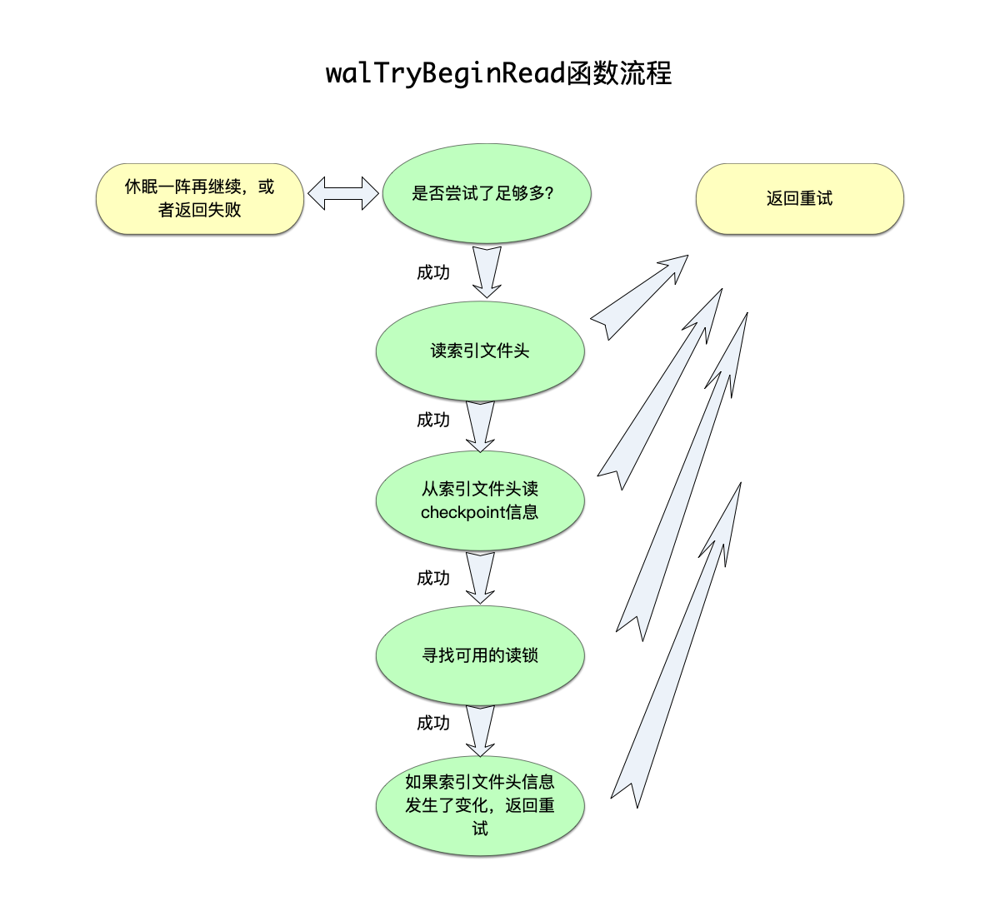

可以从加读锁的流程看到：

  * sqlite的WAL机制，最大只能支持同时有`WAL_NREADER`个读操作并发。
  * 加读锁的时候，如果因为写操作导致wal索引文件头发生了变化，将前功尽弃再次尝试。

### 写操作

#### 写锁

拿到写锁的流程，对比上面拿到读锁的流程来说，就简单很多了，在函数`sqlite3WalBeginWriteTransaction`中：

  1. 调用`walLockExclusive(pWal, WAL_WRITE_LOCK, 1)`拿到写锁的排它锁。
  2. 同样也是检查是否wal索引头发生了变化，如果是则需要再次尝试。

而解写锁操作就在函数`sqlite3WalBeginWriteTransaction`。

这两个函数的实现都挺简单，就不展开阐述了。

#### 写操作

真正将脏页面写入wal文件中的操作在函数`sqlite3WalFrames`中，该函数有几个比较重要的参数：

  * `PgHdr *pList`：脏页面链表。
  * `int isCommit`：为1的情况下，表示这是提交操作，即这个写事务的最后一次调用`sqlite3WalFrames`函数。

`sqlite3WalFrames`函数的实现也并不复杂，有这么几个事情：

  * 拿到当前写wal的起始位置，从这个位置开始，遍历脏页面写入wal文件中。而这个起始位置，就是前面提到的`mxFrame+1`帧。 
    * 但是这个过程中需要考虑到可能出现的覆盖情况，即：同一次写事务，对同一个页面有多次写操作，这种情况下，后面对同一个页面的写操作，不应该写到wal后面，而是覆盖前面的内容。
  * 遍历脏页面链表，将脏页面写入wal文件之后，就需要根据最新的页面编号和wal文件帧数的对应关系，更新wal索引的内容。
  * 最后，更新`mxFrame`的值为WAL文件当前的最大帧数。

还是以一个例子来说明这个流程。

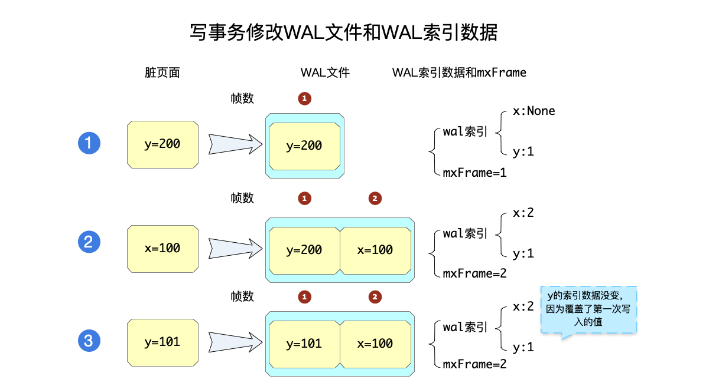

如上图所示，精简了很多情况，假设从WAL文件的开头开始写脏页面了，图中的写事务一共写了三次页面：

  * 写入`y=200`：这时候将这个内容写入WAL文件中的第一帧，更新wal索引中y页面的帧数为1，而此时x还没有内容。写完毕之后，更新`mxFrame=1`。
  * 写入`x=100`：这时候将这个内容写入WAL文件中的第二帧，更新wal索引中x页面的帧数为2。写完毕之后，更新`mxFrame=1`。
  * 写入`y=101`：写入时发现，同一个事务之前已经修改过y页面了，于是这一次并不把`y=101`的修改继续写到WAL文件结尾，而是覆盖第一帧中已经存在的y页面内容，同时索引数据也不需要更新：因为是覆盖操作，y页面的帧数并没有发生变化。同样的，由于没有修改WAL文件的最大帧数，`mxFrame`也没有修改。

#### 页面校验值的计算

### checkpoint

#### 总体流程

有了前面读、写操作的了解，接着来了解一下checkpoint操作是如何实现的。

我们回顾一下`checkpoint`操作要完成的事情：由于wal日志中存储的，都是每次写事务被修改的页面，因此`checkpoint`操作就是将wal日志中被修改的页面写入数据库文件中。也是因为这个原因，因此`checkpoint`也被称为`backfill（回填）`操作。

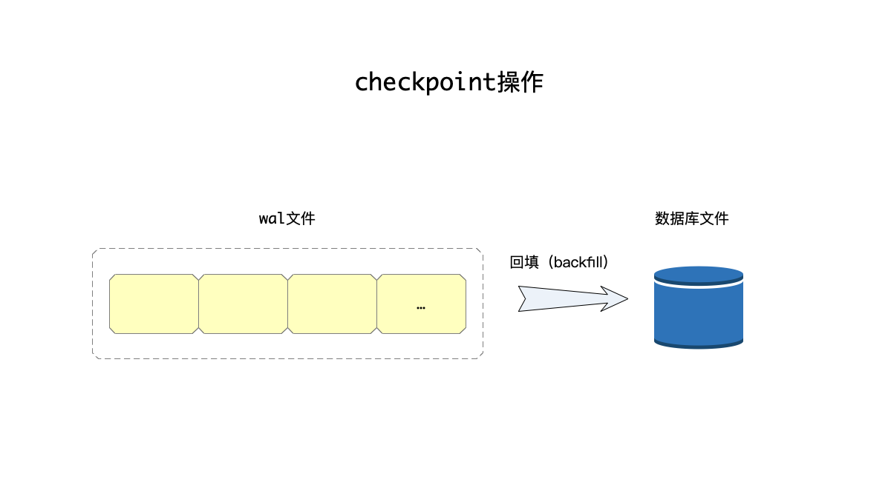

从上面的读写流程的分析里看出：

  * 同时能支持多个读事务，每个读事务都有一个`readMark`值，用来区分这个读操作读到在WAL中存储的某个页面时，是以wal的页面为准，还是应该到数据库文件中读取这个页面。
  * 同时只能存在一个写事务，这个写事务没有完成之前，任何读事务不能读到它的数据，因为是未提交（uncommitted）的修改。

因此，在做`checkpoint`的时候，需要保证：

  * 不能将未提交写事务的修改，回填到数据库文件中。
  * 对于正在进行的读操作，不能将超过该读操作的`readMark`值的帧，回填到数据库文件中，需要等待读操作完成才能回填这部分数据。

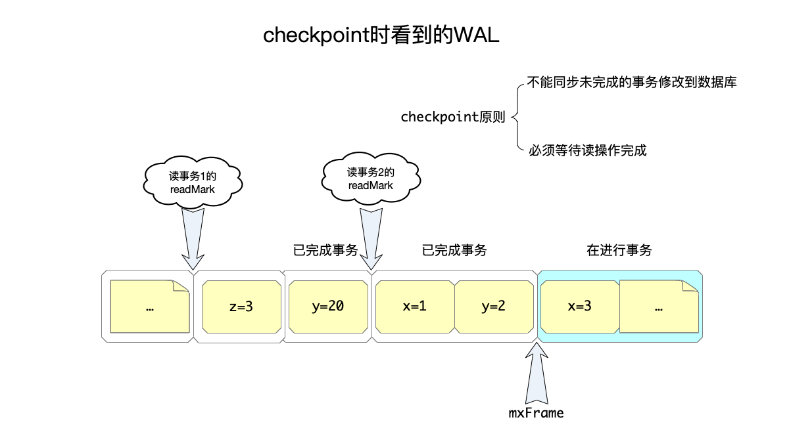

第一点很好理解，因为未提交的写事务，可能只修改了一部分，如果在未提交这个写事务之前，就把这一部分回填到数据库文件中，会造成读出来的这部分数据驴头不对马嘴。比如一个写事务的修改，是将A账号的100转账到B账号上，于是这个写事务就涉及两个修改：

  * A：扣除100。
  * B：加上100。

如果这个事务当前只完成了上面的第一步修改，这个修改马上被回填到数据库文件中，这时候看到的就是A少了100，而B没有变化，这显然是不可接受的。

第二点的理解，要回到前面对`readMark`值的解释上：一个读操作开始之前，会记录一下当前已完成写事务的最大修改帧数做为自己的`readMark`，在后续的读操作中，从wal索引中查询一个页面编号，有以下几种可能：

  * 没有找到，说明需要到数据库文件中查找该页面内容。
  * 找到了，又需要区分两种情况： 
    * 这个页面所在的帧数<`readMark`：说明这个页面在读操作开始之后再没有被修改了，可以以wal的内容为准。
    * 否则：说明这个页面在读操作之后被修改了，需要到数据库文件中查询被修改之前的值。

注意：上面的”这个页面在读操作之后被修改“条件，不仅包括这个修改对应的写事务没有被提交，也包括写事务已提交的情况。

即：`readMark`保证了，一个读事务绝对不能读到在这个读事务之后的任何修改。

由这个解释可以看到，当一个读操作判断一个页面的内容需要到数据库文件中读取时，需要读到的是这个读事务之前的修改。因此，`checkpoint`需要保证：不能将超过当前任何读操作的`readMark`值的帧数，回填其保存的页面到数据库文件中。

到了这里，基本可以确定一个`checkpoint`操作的流程了：

  * 加`checkpoint`的排它锁，保证同时只能有一个`checkpoint`操作在进行。
  * 算出当前最大可以回填到第几帧的数据，假设这个值保存在变量`mxSafeFrame`中，流程如下： 
    * 初始时，取`mxSafeFrame=mxFrame`。
    * 遍历当前所有还在进行的读操作，取`mxSafeFrame=min(mxSafeFrame, aReadMark)`，即不能超过任何一个在进行的读操作的`readMark`值。
  * 计算出来了最大回填帧数，可以实际进行回填操作了：遍历当前的wal文件，将所有帧数小于等于`mxSafeFrame`的修改都回填到数据库文件中

以上是`checkpoint`流程的总体描述，其中涉及的主要函数是：

  * `sqlite3WalCheckpoint`：`checkpoint`操作的入口函数，负责加`checkpoint`排它锁，然后继续调用下面的`walCheckpoint`进行实际的回填操作。

  * `walCheckpoint`：执行`checkpoint`操作。

想了解更多细节的读者可以自行阅读。

#### 不同的checkpoint模式

上面只是了解了`checkpoint`的大体流程，但是不同的checkpoint模式又有区别，有如下的宏来进行区分：

```c
#define SQLITE_CHECKPOINT_PASSIVE  0  /* Do as much as possible w/o blocking */
#define SQLITE_CHECKPOINT_FULL     1  /* Wait for writers, then checkpoint */
#define SQLITE_CHECKPOINT_RESTART  2  /* Like FULL but wait for for readers */
#define SQLITE_CHECKPOINT_TRUNCATE 3  /* Like RESTART but also truncate WAL */
```

##### SQLITE_CHECKPOINT_PASSIVE

这个模式下，不会等待读写操作完成，而是基于现有的数据，尽可能将安全的帧回填到数据库文件中。

可以看到，这种模式更接近于一种”步进（step）“的模式：每次回填一部分数据，回填不完就直接返回不再进行。所以，需要某些变量来保存当前的回填进度，这个值保存在`WalCkptInfo.nBackfill`，所以回填还没有结束的条件也就是：`pInfo->nBackfill < pWal->hdr.mxFrame`。

##### SQLITE_CHECKPOINT_FULL

这个模式下，`checkpoint`操作会等待写操作完成，才继续进行回填操作，而在回填过程中也不再允许有新的写操作进行。

##### SQLITE_CHECKPOINT_RESTART

对比`SQLITE_CHECKPOINT_FULL`模式，这一个模式更进了一步：等待所有读操作完成才开始回填操作，同样的，在`checkpoint`过程中除了不能有写操作还不能有读操作。

##### SQLITE_CHECKPOINT_TRUNCATE

这一个模式对比`SQLITE_CHECKPOINT_RESTART`又更近了一步，在回填完毕之后，将截断WAL文件，这样后面新来的wal的写操作，将从wal文件的开始位置开始写。我们前面提到，在wal文件中查找一个页面时，跟wal文件的大小成正比，所以回填完毕截断wal文件重新开始写，会加速后面的查询操作。

### 错误恢复

以上已经把wal的读、写、checkpoint流程都了解了，最后了解一下wal的错误恢复是如何实现的。

区分几种情况下面的出错崩溃，以及这些情况下都如何恢复的：

  * 写事务进行时出错崩溃：这种情况下，显然wal中存储了一部分这个写事务的修改，崩溃恢复时校验后会发现这部分的修改不完全，于是会将这部分修改截断，而数据库文件，根据前面`checkpoint`流程的讲解，并不会回填还未提交的写事务的修改，所以数据库文件并未损坏。
  * 当前没有任何写事务，在进行`checkpoint`过程中崩溃：在进行`checkpoint`时，不允许同时并发有写操作。于是这种情况下，wal文件中保存的数据，都是完整的写事务修改数据。启动后校验wal文件发现内容都是对的，于是遍历wal文件，首先将当前wal文件中的内容全部回填至数据库文件中再启动即可。

## 总结

最后对wal机制做一个简短的总结：

  * 与journal备份机制不同的是：journal备份的是修改之前的页面内容，而wal存储的是修改后的内容。
  * 于是，wal中可能存储了同一个页面的多次修改结果，因为不同的事务、甚至相同的事务，都有可能修改了同一个页面，而每一次修改都要将修改结果存储wal文件。
  * wal文件中，存储一个页面内容的单位是”帧（frame）“，一帧存储一个页面，而反过来一个页面可能先后被存储在不同帧的内容中。于是就需要wal索引数据：
  * wal索引需要存储两类数据：一个帧存储的是哪个页面的数据，以及某个页面最新的数据存储在哪一帧。
  * 完成一次写操作，wal只需一次sync操作（sync wal文件），journal需要两次（sync journal文件一次，将页面缓存写入数据库文件之后sync数据库文件一次），因此wal的写性能更高。
  * wal支持一写多读的并发，但是journal在写的时候不支持同时读数据。
  * 有两个重要的变量来保证并发读时不会读到读操作开始之后的修改：`mxFrame`保存的是当前最提交的写事务写的最大帧数；每个读操作还保存了一个`readMark`值，存储的是读操作开始时的`mxFrame`值。
  * `checkpoint`操作，又称为`回填（backfill）`操作，用于将wal文件的内容同步到数据库文件中，它需要前面的`mxFrame`和`readMark`来保证回填操作的正确性。回填操作会影响同时在进行的读、写操作。

## 参考资料

  * [Write-Ahead Logging](https://www.sqlite.org/wal.html)
  * [WAL-mode File Format](https://www.sqlite.org/walformat.html)
  * WAL文件格式见：[Database File Format](https://www.sqlite.org/fileformat2.html)中“4. The Write-Ahead Log”这一小节内容。
  * checkpoint中几种模式的解释：[Checkpoint a database](https://sqlite.org/c3ref/wal_checkpoint_v2.html)
  * [SQLite分析之WAL机制_岩之痕-CSDN博客_sqlite wal](https://blog.csdn.net/zearot/article/details/51039593)
  * [SQLite3源码学习（31） WAL日志的锁机制_test-CSDN博客](https://blog.csdn.net/pfysw/article/details/80531495)

<hr>

#### <p>原文出处：<a href='https://www.codedump.info/post/20220201-sqlite-btree-5-btree/' target='blank'>sqlite3.36版本 btree实现（五）- Btree的实现</a></p>

前面的内容里，详细介绍了页面管理器部分的内容，回顾一下页面管理器和Btree模块的分工：

  * 页面管理器：提供页面级别的物理管理，如缓存、读取、写入、页面备份等。
  * Btree：根据btree数据结构提供页面在逻辑上的组织，以及单个页面内的划分。

还记得最开始，研究生产级别btree实现时的几个疑问：

  * 数据库教科书中，演示btree算法时，使用的都是定长的简单数据。实际应用中，存储的数据都是变长的，那么应该如何存储变长的数据呢？
  * 如果一行数据的大小，超过了一个物理页面的大小，又该如何处理？
  * 删除一行数据之后，它留下的空间如何回收利用？而回收利用时，不可避免的会出现碎片的问题，比如原先10字节的数据被回收，用来存储9字节的数据，多出来的1字节数据就被浪费了，碎片问题应该如何解决？

这些问题，都与“一个物理页面内数据如何组织”这个核心问题息息相关，带着这些问题展开btree实现的讨论。

在下文中，不会讨论btree算法的细节，这部分不熟悉的，可以回看之前的文章或者教科书：

  * [B树、B+树索引算法原理（上） - codedump的网络日志](https://www.codedump.info/post/20200609-btree-1/)
  * [B树、B+树索引算法原理（下） - codedump的网络日志](https://www.codedump.info/post/20200615-btree-2/)

## 物理页面的数据组织

### 数据表的逻辑组织和页面类型

在展开具体的格式讨论之前，有必要先了解一下数据库文件的大体结构，已经不同的页面类型。

sqlite中所谓的`数据库文件`是单一文件，按照物理页面（2的次方）的大小来划分为多个页面。其中，每个表在数据库文件中是一棵btree的结构来组织，而不同类型的btree还区分了不同的页面。

比如下图中，将平面的数据库文件，按照颜色划分成存储两个表的btree：

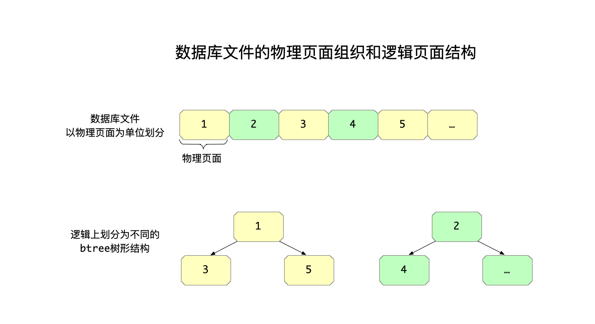

在上图中：

  * 上半部分表示，在物理的组织上，一个数据库文件以一个物理页面为基本单位来存储。
  * 下半部分表示，在逻辑的组织上，不同的表都有自己的btree树形结构，这是物理页面在逻辑上的组织方式。

因为每个表都有自己的btree树形结构，如果每个表都有一个对应的根页面编号，比如图中的两个表，对应的树形结构中，根节点所在的页面分别是1和2。

接着来看不同的页面类型，以及存储上的差异。

以一个例子来说明，创建以下的数据库，插入数据，以及索引：

```c
// 创建数据库COMPANY
CREATE TABLE COMPANY(
   ID             INT      NOT NULL,
   NAME           TEXT    NOT NULL,
   AGE            INT     NOT NULL,
   ADDRESS        CHAR(50),
   SALARY         REAL
);
// 创建索引
CREATE INDEX id_index ON COMPANY (id);
// 插入2条数据
INSERT INTO COMPANY (ID,NAME,AGE,ADDRESS,SALARY) VALUES (1, 'Paul', 32, 'California', 20000.00 );
INSERT INTO COMPANY (ID,NAME,AGE,ADDRESS,SALARY)
VALUES (2, 'Allen', 25, 'Texas', 15000.00 );
// 查询数据
sqlite> select * from COMPANY;
1|Paul|32|California|20000.0
2|Allen|25|Texas|15000.0
// 查询rowid和数据
sqlite> select rowid,* from COMPANY;
1|1|Paul|32|California|20000.0
2|2|Allen|25|Texas|15000.0
```

在上面的流程里：

  * 创建一个表`COMPANY`，注意这个表在最开始是没有任何索引的。
  * 接下来，以字段`id`来创建一个索引，插入2条数据。
  * 接下来，分别作了两次查询：一次查询全量的数据，第二次出现了一个在上面没有出现的一个字段`rowid`。

到了这里，问题就来了，`rowid`是什么？为什么会自动存在这个字段，起了什么作用？

`rowid`是sqlite中的一个隐藏列：整数类型，自增。

为什么需要这个隐藏列？有以下两个原因：

  * 以`rowid`为键，来存储一行数据的全量数据。
  * 有了`rowid`做为一行数据的键，其它索引存储的值就可以是这行数据的`rowid`。
  * 即：`rowid`在sqlite中是做为`聚簇索引（cluster index）`出现的。

以上面为例，在sqlite的btree中大体就是这样的：

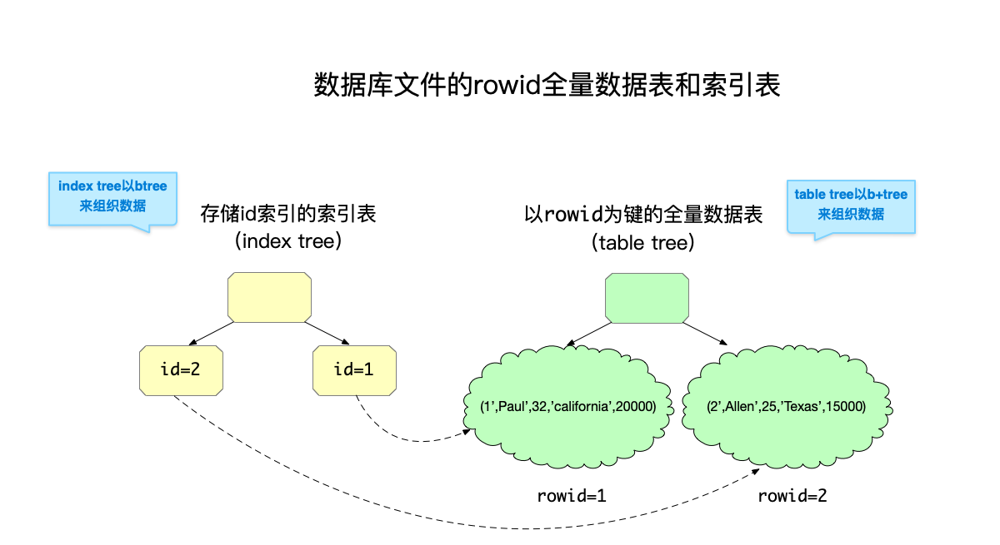

在上图中存在两个表：

  * 以`rowid`为键的全量数据表，在sqlite中存储这类型数据的btree被称为“table tree”。
  * 存储id索引的索引表，这类btree被称为“index tree”，因此存储的是索引数据。这个表的键是`id`，而值是`rowid`，这样根据`id`索引来查询数据时，其实就是两步： 
    * 首先，根据`id`找到对应的`rowid`。
    * 再根据`rowid`到全量数据表里查询具体的数据。

从上面的这个例子里也可以看出，“逻辑意义”上的一个数据表，与实际存储时在btree中的表并不是一一对应的，由于索引表的存在，可能是一对多的关系。

有了前面的对`rowid`以及索引表、全量数据表的理解，就可以展开讨论不同的页面类型了。

sqlite中分为几类页面：

  * 以整数为键的页面：这类页面是以`b+tree`模式来组织的。即：

    * 内部节点都只有键。
    * 数据部分都存储在叶子页面。

显然，全量数据表的页面就是这类页面，即全量数据表更准确的是`b+tree`结构。

  * 其他类型的页面：其他表都是以整数为值，这类型的页面都是`btree`类型，即内部节点、叶子节点都一样存储着键和值。

为了表示这些页面，有如下几种页面标志位：

```c
/*
** Page type flags.  An ORed combination of these flags appear as the
** first byte of on-disk image of every BTree page.
*/
#define PTF_INTKEY    0x01
#define PTF_ZERODATA  0x02
#define PTF_LEAFDATA  0x04
#define PTF_LEAF      0x08
```

  * `PTF_INTKEY（1）`：表示key为int类型数据，一般是rowid，即前面的`全量数据表`。
  * `PTF_ZERODATA（2）`：表示这是索引表的页面。
  * `PTF_LEAFDATA（4）`：数据存储在叶子节点，这个标志位要和`PTF_INTKEY`一起作用。即：key为int类型数据的时候，有两种页面：一种只存储int类型的key，一种只存储数据。
  * `PTF_LEAF（8）`：仅用于表示该页面是否叶子页面。

页面标志位只可能是以下几种组合，其余组合都认为文件损坏了：

  * `PTF_ZERODATA`：表示这是索引表的内部页面。
  * `PTF_ZERODATA | PTF_LEAF`：表示这是索引表的叶子页面。
  * `PTF_LEAFDATA | PTF_INTKEY`：表示数据表的内部页面。
  * `PTF_LEAFDATA | PTF_INTKEY | PTF_LEAF`：表示数据表的叶子页面。

说明，其实以上就是分成了两组`PTF_ZERODATA`和`PTF_LEAFDATA | PTF_INTKEY`与`PTF_LEAF`的组合（见函数`decodeFlags`）：

  * `PTF_ZERODATA`：肯定没有数据（`hasData`一定为0）。
  * `PTF_LEAFDATA | PTF_INTKEY`：是否有数据，取决于是否有`PTF_LEAF`标志位（`hasData`取决于leaf ）。

### 物理页面的大体划分

来看看sqlite代码中`btreeInt.h`文件里对btree一个物理页面内数据组织的注释：

```c
** Each btree pages is divided into three sections:  The header, the
** cell pointer array, and the cell content area.  Page 1 also has a 100-byte
** file header that occurs before the page header.
**
**      |----------------|
**      | file header    |   100 bytes.  Page 1 only.
**      |----------------|
**      | page header    |   8 bytes for leaves.  12 bytes for interior nodes
**      |----------------|
**      | cell pointer   |   |  2 bytes per cell.  Sorted order.
**      | array          |   |  Grows downward
**      |                |   v
**      |----------------|
**      | unallocated    |
**      | space          |
**      |----------------|   ^  Grows upwards
**      | cell content   |   |  Arbitrary order interspersed with freeblocks.
**      | area           |   |  and free space fragments.
**      |----------------|
```

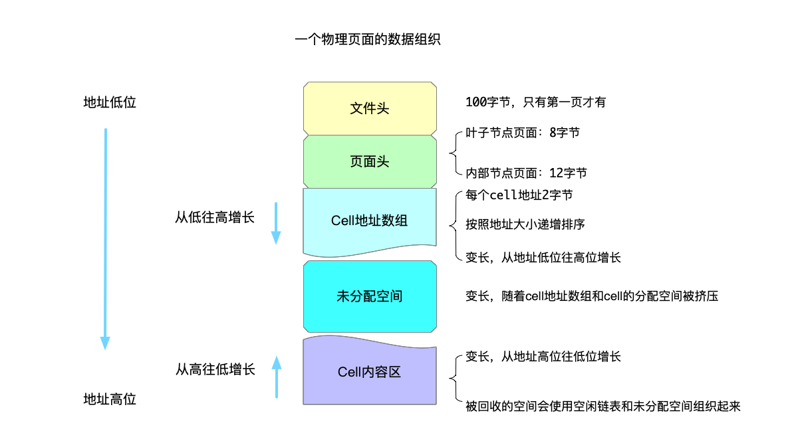

按照这里的说法，一个物理页面在btree中划分为以下几部分：

  * 文件头（file header）：100字节，但是只有第一个页面才会存在文件头。
  * 页面头（page header）：每个页面都会有页面头，根据页面的类型区分，如果是叶子页面就是8字节大小，如果是内部节点就是12字节大小。
  * 存储cell指针的数组（cell pointer array）：每个cell指针大小为2字节，按照存储的cell地址大小排序，这个数组不定长，因此是从低位往高位地址增长的。至于什么是`cell`，后面展开说。
  * cell内容空间（cell content area）：存储cell数据的空间，从一个物理页面的最高位置往低位增长。
  * 未分配空间（unallocated space）：上面两部分内容，一部分从从高往低增长，另一部分反之，而未分配空间就夹在这两者中间。

有了这里大体的划分，我们来展开看看具体的内容。

### file header（文件头）

其中，file header部分只有第一页才有，固定长度100字节，存储整个数据库文件的元信息。

页面1是一个特殊的页面，其前100个字节是整个数据库的header部分，内容如下：

```c
**   OFFSET   SIZE    DESCRIPTION
**      0      16     Header string: "SQLite format 3\000"
**     16       2     Page size in bytes.  
**     18       1     File format write version
**     19       1     File format read version
**     20       1     Bytes of unused space at the end of each page
**     21       1     Max embedded payload fraction
**     22       1     Min embedded payload fraction
**     23       1     Min leaf payload fraction
**     24       4     File change counter
**     28       4     Reserved for future use
**     32       4     First freelist page
**     36       4     Number of freelist pages in the file
**     40      60     15 4-byte meta values passed to higher layers
**
** All of the integer values are big-endian (most significant byte first).
```

逐个解析这个header里的内容：

  * 0-16字节：magic string。
  * 16-18字节：页面大小，不能小于512或者大于32768，同时需要是8位对齐。
  * 18-19：大于1表示数据库只读。
  * 19-20：必须大于1。
  * 20-21：每个页面最后无用空间的大小。即可用空间=页面大小-无用空间，这部分空间不得小于500字节。
  * 21-23：写死了必须是"\100\040\040"。其中： 
    * 21：Max embedded payload fraction，写死了是64。
    * 22：Min embedded payload fraction，写死了是32。
    * 23：Min leaf payload fraction
  * 24-28：File change counter
  * 32-36：第一个空闲页面编号。
  * 36-40：空闲页面数量。

### page header（页面头）

除了第一页以外，其他情况下页面头在页面的开始位置（即偏移量为0开始），第一页从偏移量100开始。

其内容如下：

```c
** The page headers looks like this:
**
**   OFFSET   SIZE     DESCRIPTION
**      0       1      Flags. 1: intkey, 2: zerodata, 4: leafdata, 8: leaf
**      1       2      byte offset to the first freeblock
**      3       2      number of cells on this page
**      5       2      first byte of the cell content area
**      7       1      number of fragmented free bytes
**      8       4      Right child (the Ptr(N) value).  Omitted on leaves.
```

分析如下：

  * 0-1：表示页面类型的标志位，至于页面的类型上面已经有阐述。
  * 1-2：首个空闲block在页面内的偏移量。
  * 3-5：cell数组的大小。
  * 5-7：cell content的第一个字节。
  * 7-8：碎片空间总大小（注意不是空闲空间），sqlite中将小于4字节的空闲空间称为`碎片空间`，一旦碎片空间大小累积到一定程度，就需要进行碎片整理，这在下面展开说明。
  * 8-12（叶子页面没有这部分内容）：右子树页面的页面编号。

重点解释其中的几部分：

#### cell数组

cell数组中，每个元素大小为2字节，指向对应cell内容在页面中的位置。由于一个页面不会超过65535字节大小，所以2字节是足够表示这个页面内的偏移量的。

另外，cell数组中的元素，是按照key的大小有小到大按顺序排列的，这样才能方便查找。

有了对物理页面内数据组织的了解，可以看到：

  * 查找数据时，首先按照按照btree的算法，定位到数据所在的页面。
  * 再在页面内的cell数组中，根据key大小进行二分查找。

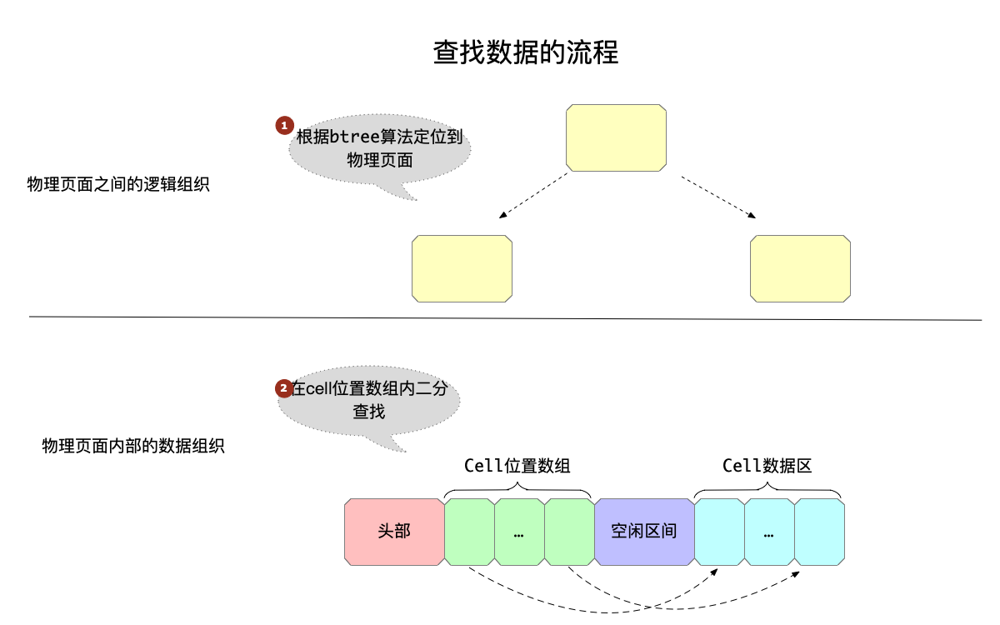

#### 空闲空间链表

所谓的“空闲空间”，就是夹在`cell数组`和`cell内容数组`中间的部分，最开始是一大整块的空间。

但是随着写入操作进行，比如一行数据被删除之后，回收的空间就会放到空闲空间链表上。空闲空间链表就是用来组织现在空闲空间的数据的，其中的每个元素为4字节，其内容是：

```c
**    SIZE    DESCRIPTION
**      2     Byte offset of the next freeblock
**      2     Bytes in this freeblock
```

其中：

  * 0-2字节：下一块空闲空间链表的页内偏移量。
  * 3-4字节：当前这块空闲空间的大小。

另外，空闲空间链表是按照起始地址递增进行排序的，这样才能在从空闲空间中分配空间时高效查找最合适的空间。

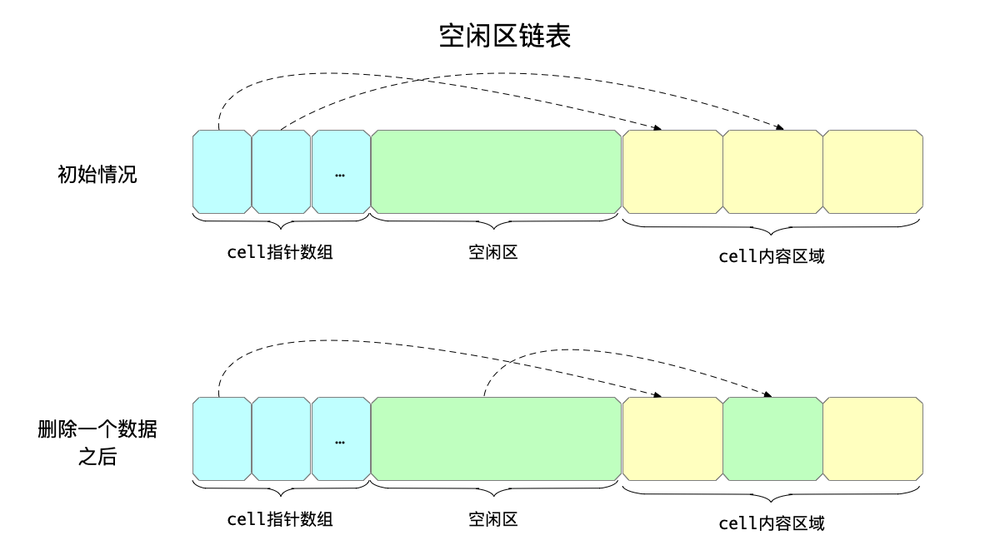

#### 碎片空间总大小

如前所述，表示一个空闲空间至少需要4字节，因此如果一个空闲空间不足4字节时，显然是不划算的。所以，将所有空闲的、且小于4字节的空间，称为“碎片空间”，其总大小记录在头的7-8字节处，当这个值超过某个阈值时将进行页面碎片空间整理。

#### 页面标志位

见前面`页面类型`部分的解释。

### cell的结构

一个`cell`，就是存储一行数据的单位，由于要考虑一行数据有不同的长度，因此`cell`里面就要有应对变长数据的准备，来看`cell`的结构。

```c
** The content of a cell looks like this:
**
**    SIZE    DESCRIPTION
**      4     Page number of the left child. Omitted if leaf flag is set.
**     var    Number of bytes of data. Omitted if the zerodata flag is set.
**     var    Number of bytes of key. Or the key itself if intkey flag is set.
**      *     Payload
**      4     First page of the overflow chain.  Omitted if no overflow
```

逐个解释：

  * 0-4：左子树的页面编号（如果是叶子页面这部分没有）。
  * 变长：数据部分的大小。
  * 变长：key部分的大小。但是如果这个页面是`intkey`页面，这部分直接用来保存int类型的key，即这种情况下int类型key不会出现在后面的payload部分，而是直接存在在key部分大小的位置。
  * 变长：payload。
  * 4字节：如果存在overflow页面的话，这里存储第一个overflow页面的页面编号，何为溢出页面下面再做解释。

因为叶子页面没有左子树，所以不需要存储`左子树页面编号`，因为如果是叶子页面的话，页面头的大小就只有8字节，反之如果是内部节点就需要12字节。

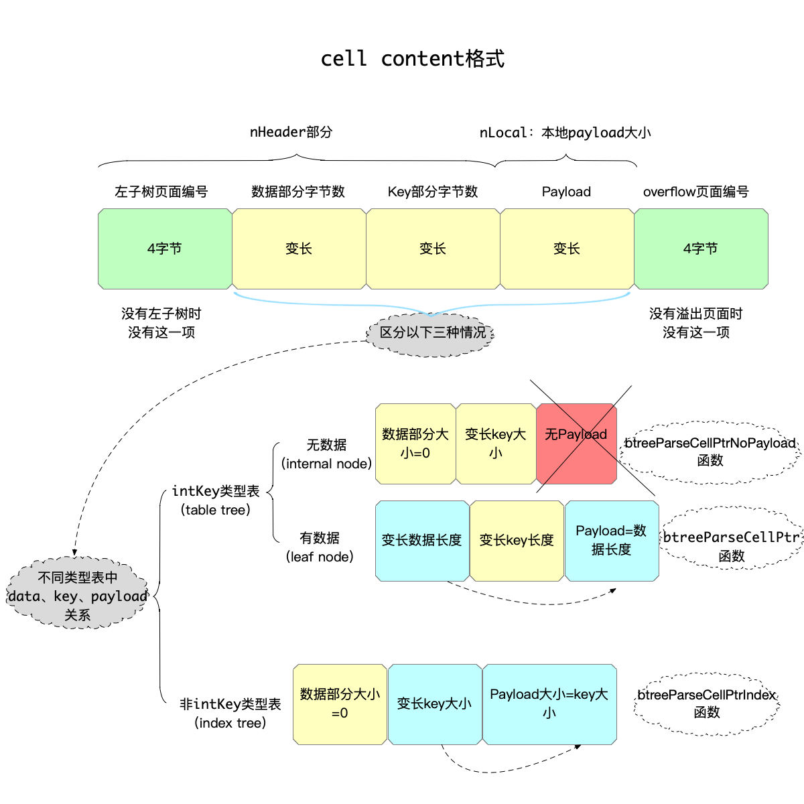

其中，根据表类型的不同，key、data、payload部分的大小关系如下：

  * int类型的key（即table tree）：nPayload 与 nData恒相等，因为int类型的表，由于key就是一个整型数，所以不浪费空间存储这个整型数的值，而是直接放在key大小部分。区分是否有数据，有以下两种情况：

    * 无数据（即内部节点）：因为nPayload 与 nData恒相等，所以这时候nData = nPayload = 0。（分析这类型页面cell数据的入口函数是`btreeParseCellPtrNoPayload`）
    * 有数据（即叶子页面）：nData = nPayload = 变长数据的大小。（分析这类型页面cell数据的入口函数是`btreeParseCellPtr`）
  * 非int类型的表（即index tree）：

这种类型的页面，肯定没有数据部分，只有key部分，所以这时候nPayload = nKey。（分析这类型页面cell数据的入口函数是`btreeParseCellPtrIndex`）

为什么非int类型的表，会没有数据部分？这是因为，完整的数据，都以rowid为key的情况，存储在了int类型的表中；而非int类型的表，只要存储这个表的键值整数即可。

而溢出页面的结构如下：

```c
** Overflow pages form a linked list.  Each page except the last is completely
** filled with data (pagesize - 4 bytes).  The last page can have as little
** as 1 byte of data.
**
**    SIZE    DESCRIPTION
**      4     Page number of next overflow page
**      *     Data
```

即：对于存储溢出数据的页面而言，头部的4字节存储下一个溢出页面的页面编号（如果还有溢出页面的话），而剩余则存储数据。

结合起来，一个存储了溢出数据（即当前页面不足以存储这个cell的所有数据）的结构大体是：

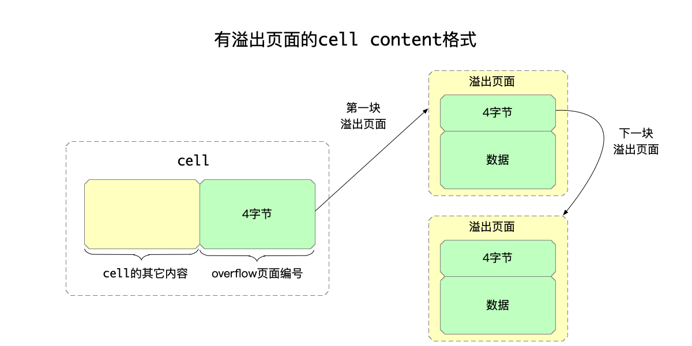

## 空间利用和碎片整理

了解了一个物理页面内部的结构，接下来看碎片整理的实现。

虽然有空闲链表用于组织已被回收的空间，但是随着分配的进行，还是会产生各种大小的碎片。可能会出现这样的情况：虽然空闲空间的总大小够用，但是由于散落在各块碎片空间里，以至于无法分配成功。

这种情况下，就需要`碎片整理`流程，这个流程做完之后，要达到这样的目的：空闲链表上只有一块大的整空间。

来看看`碎片整理`的触发条件和过程。

### 碎片整理的触发条件

分配空间的入口函数是`allocateSpace`，其入参`nByte`表示需要从页面中分配大小为`nByte`的空间返回。进入这个函数时，都会首先判断：页面剩余的空闲空间是足够满足`nByte`的，但是即便如此也可能由于碎片太多导致不能再分配了。

这个函数的大体逻辑如下：

  * 尝试在空闲链表中找到合适的空间分配。（函数`pageFindSlot`）
  * 如果上面分配不成功，且当前甚至在cell指针数组中都分配不出2字节来存储新分配出来的cell地址，那么就需要进行碎片整理。（函数`defragmentPage`）
  * 碎片整理结束之后，划出足够的空间（2字节的cell指针+对应大小的cell大小）返回。

所以，分别来看上面两个条件。

首先来看什么情况下在空闲链表中分配不出适合的空间，入口函数是`pageFindSlot`，有两种可能：

  * 因为空闲链表是按照空闲块大小从小到大排列的，因此首先按序找到第一块满足`nByte`大小的空闲块，假设这个空闲块划掉`nByte`大小之后为`x`，若这个`x`小于4字节那么认为是一个`碎片`，假如当前的碎片累加起来超过60字节了，那么认为碎片过多，这时候即便能满足分配也不能继续分配。

至于为什么小于4字节认为是碎片，以及为什么碎片总大小超过60字节就认为碎片过多，可能是作者的经验值。

  * 第二种情况，就是遍历了整个链表都没有找到满足`nByte`大小的空间。

除此之外，如果当前cell数组结束位置，距离cell内容区域不足2字节，即无法再分配一个cell指针出来，这时候就需要进行碎片整理了。


总结一下触发碎片整理的条件：

  * 从空闲链表中分配空间失败。
  * 且，在`cell指针数组`以及`cell内容区域`的空间，已经不足2字节，即连对应的cell指针都无法分配出来。

### 碎片整理的流程

碎片整理的流程，其实相对简单，简而言之：

  * 把各块cell内容，全部整理到从页面结尾开始的空间。
  * 这样，就能把散落在各处的空闲空间重新合并在一起形成一大块的空闲空间了。

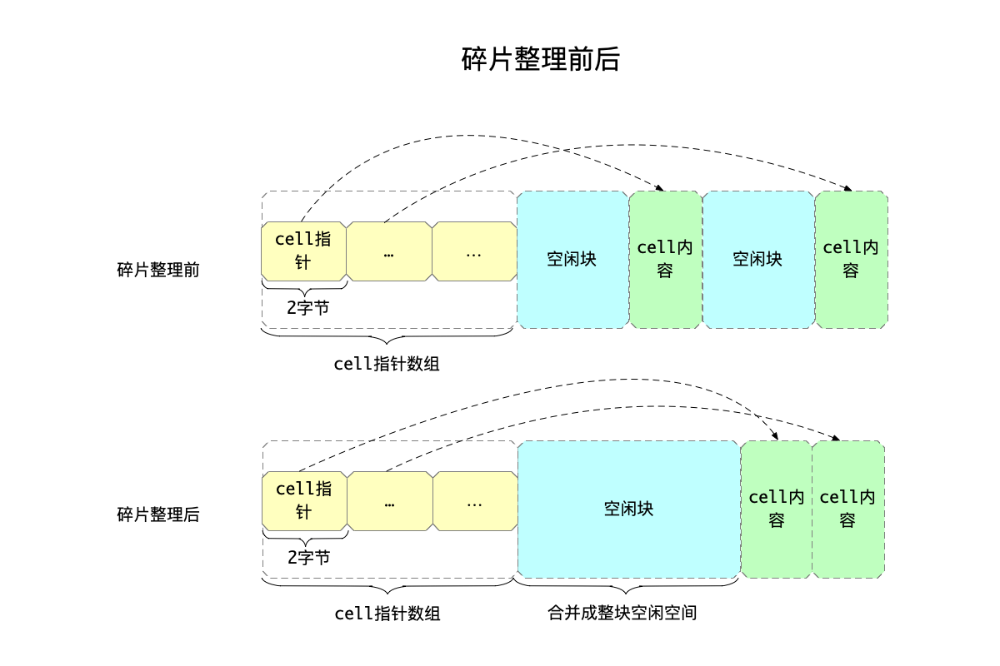

碎片整理的整体流程在函数`defragmentPage`中，读者可以自行阅读。

## 总结

  * sqlite中分为table tree（存储全量数据）和index tree（存储任意索引到rowid的对应关系），table tree本质是一棵b+tree，而index tree是一棵btree。
  * 在物理页面内部，有根据key大小排序的cell数组，查找数据时分为两步： 
    * 首先根据btree算法定位到数据所在的物理页面。
    * 然后在该物理页面内部的cell数组中，二分查找定位key的位置。
  * 物理页面内的空闲空间使用链表维护起来，小于4字节的空闲空间被称为“碎片空间”，当碎片空间累计大小超过60字节时，就会进行碎片整理。

## 参考资料

  * [SQLite B-Tree Module](https://sqlite.org/btreemodule.html)
  * [Database File Format](https://www.sqlite.org/fileformat.html)
  * [SQLite Database File Format](http://barbra-coco.dyndns.org/sqlite/fileformat.html)
