<!--BEGIN_DATA
{
    "create_date": "2024-06-18 20:00", 
    "modify_date": "2024-06-18 20:00", 
    "is_top": "0", 
    "summary": "webrtc gcc详解", 
    "tags": "WebRTC", 
    "file_name": "webrtc gcc详解.md"
}
END_DATA-->

#### <p>原文出处：<a href='https://mp.weixin.qq.com/s/ivNJrwcJ3z5cZmBsoqjy7g' target='blank'>webrtc gcc详解</a></p>

webrtc的gcc算法(Google Congestion Control)，貌似国内很多文章都没有细讲，原理是怎么样的，具体怎么进行计算的。这里详解一下gcc。  

gcc算法，主要涉及到：  

  * 拥塞控制的关键信息和公式

  * 卡曼滤波算法

  * gcc如何使用卡曼滤波算法

因为知识点有点多，文章有点长，如果感兴趣但不能一次读完，可以先收藏后，有空慢慢看。  

##1. 前言

对于拥塞控制，webrtc的方案之一是gcc(Google Congestion Control)。具体做法是，接收端监控两个数据，并反馈给发送端。

  * 丢包率: 接收端计算出丢包率，定期发送rtcp rr报文(内有丢包率)给发送端，发送端通过丢包率的大小来决定是否降低编码的bitrate；

  * 基于卡曼滤波的带宽预测: 接收端预测出当前发送端到接收端的带宽，接收端再发送rtcp remb报文(内带有预测带宽)给发送端，发送端根据该预测带宽调整编码的bitrate；

基于丢包率来调整动态编码，是比较简单，很多厂家经常在sfu服务的进行调整，如：如果不是长肥型网络，在丢包率<30%的情况下，rtcp rr中的丢包率和丢包总数欺骗性的填写0，这样发送端(尤其是web端)就不会轻易的降低bitrate，到达测试的良好效果。

但是基于卡曼滤波的带宽预测，就比较复杂，本文主要讲解这部分的原理和实现。  

## 2. 拥塞基础信息与公式

延时是如何测量出来的: 定义报文到达的时间为t(i)，报文中的时间戳为T(i)。

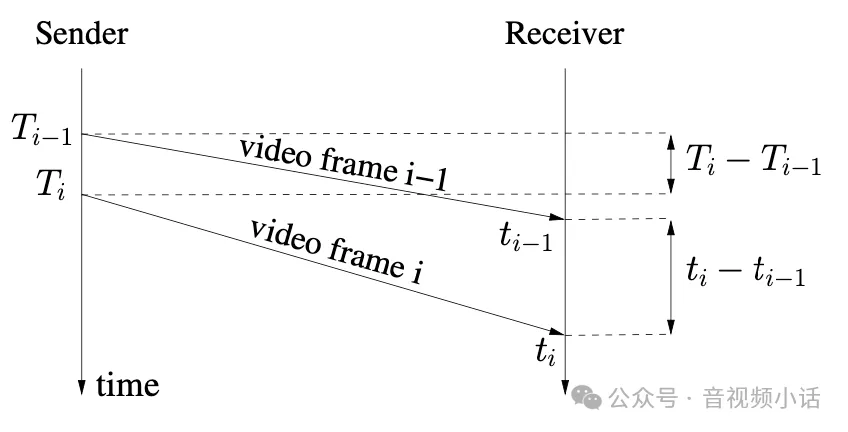

那么定义延时:

```
d(i) = t(i)-t(i-1)-(T(i)-T(i-1))
```

在带宽容量C的链路上，传输frame size为L的数据，需要的时间是: `ts = L/C` 我们对到达时间的间隔进行建模:

```c

         L(i)-L(i-1)
d(i) = -------------- + w(i) = dL(i)/C+w(i)
             C
```

上面的公式，i为某个时刻，i-1为上一个时刻。  

L(i): 是i时刻接收到的报文长度(这里一般是指某个固定时段接收到的报文size总和)  

L(i-1): 是对于i的上一个时刻的报文长度(上一个固定时段收到的报文size总和)  

C: 为链路容量带宽；  

W(i): 作为一个高斯白噪声，这个参数非常重要。d(i)：是i时刻的延时  

**划重点：**

**如果链路使用超载，w(i)增加；**

**如果链路比较空，w(i)减小;**

也就是说，上面两个公式就是预测和估计w(i)是增加了，还是减小了。  

总结，关键公式就是这两个：

```
公式1(测量)：d(i) = t(i)-t(i-1)-(T(i)-T(i-1))
公式2(估计)：     
            L(i)-L(i-1)
d_est(i) = ------------ + w(i) = dL(i)/C+w(i)
                C
```

公式1: 两个时刻的接收报文的本地时间差值，再减去两个时刻的rtp报文中携带的时间戳的差值，结果等于延时(本地时间与rtp报文中时间戳的单位不一致，需要自己转换一致后再计算)。也就是说d(i)是个测量值，每次收到新的一批报文都能测算得出来对应的延时d(i)，所以这里强调d(i)是个测量值。

公式2: 在公式2中，dL(i)是两个时刻收到报文长度的差值，这个也是每收到一批报文后能测算出来的，dL(i)也是个测量值。1/C是个估计值，C是估计的带宽容量，w(i)也是一个估计值。注意，公式左边的d_est(i)也是表示i时刻的延时，不过这个延时是通过右边的估计值计算出来的，也就是这个计算出来的d_est(i)是一个估计值。  

最后，我们得到，每个i时刻的测量值d(i)，和测量值dL(i)，要预测出1/C(i)和w(i)，这就是我们的目标。

强调: **w(i)增加，表示链路超载；w(i)减小，表示链路轻负荷**。

卡曼滤波就是要预测出1/C(i)和w(i)，并根据根据w(i)是增加或减小，来决定预测带宽是增加还是减小。  

小白部分: 既然有了公式1和2，为啥不每次直接计算出延时和带宽的关系，为啥还要引入卡曼滤波算法，弄这么复杂。原因主要是，凡是测试的数据，都会出现测不准，或者
有偶尔发生的错误数据(术语叫作噪声)，比如某时刻发生抖动，仅仅一批数据产生巨大的延时，但是其实网络是好的，滤波的作用就是过滤出一些无效，错误数据的影响。  

先记住这两个公式，后面先打断一下，简单介绍一下卡曼滤波算法。  

## 3. 卡曼滤波算法和示例

针对测试数据，有测试不准确的情况，所以需要在测试数据和估计数据之间进行权衡，卡曼滤波算法就是一个线性的滤波估计算法。  

卡曼滤波的5个公式如下(如果看公式有不理解的地方，后面会有个经典的例子，让你理解如何使用这5个公式)：

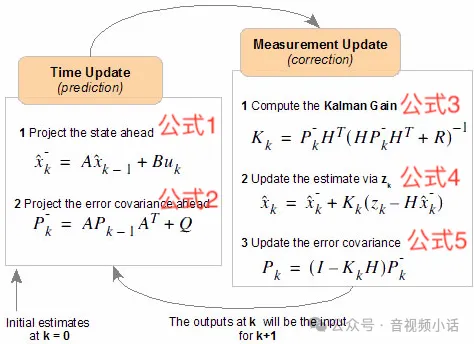

一共5个方程，如上图，左边两个是时间更新方程(预测)，右边是测量更新方程(更新/纠正)。

如果第一次接触卡曼滤波算法，可以先熟悉算法，先不研究这5个公式的由来(数学推导)，可以作为使用者，只要知道每个变量代表什么意思，如何代入方程，就能满足基础的需求。

头两个预测方程中的参数含义:  

A: 状态转移矩阵，就是上一个状态的x变量如何能推导出下一个状态的值。

B：是将输入转换为状态的矩阵；

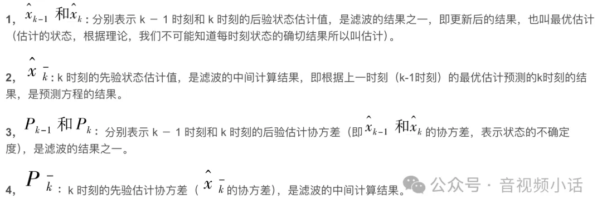

Q：过程激励噪声协方差（系统过程的协方差）。

后三个测量更新方程的参数含义:  

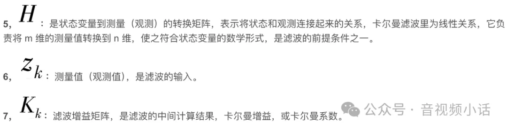

R: 测量噪声协方差。滤波器实际实现时，测量噪声协方差 R一般可以观测得到，是滤波器的已知条件，用户可以根据自己的情况自己设定。

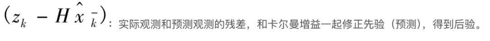

因为公式较多，参数也较多，不容易让人理解，下面举个经典的例子，让你熟悉这些公式和参数。  

### 3.1 卡曼滤波例子(自由落体运动)  

假设一个实心球从高空落下，正常来说，我们是能通过速度，加速度g(自由落体加速度9.8米/s)，能计算出某个时刻该球的行驶距离速度。

但是因为有空气阻力，或者外界干扰(刮风什么的)，实际的速度和距离就不能自己计算出来，需要进行测试。假设实心球自己是能测试出距离和速度的，但是测试仪得出的值可能有误差，需要和计算出来的距离和速度进行折中。

卡曼滤波算法，就是对估计值与测试值进行折中，寻找出真相值的过程。  

距离，速度和加速度在时间t上的关系：

```
s(i) = s(i-1) + v(i-1)*t + 0.5*g*t^2
v(i) = v(i-1) + g*t
```

用线性代数的矩阵来表示就是:

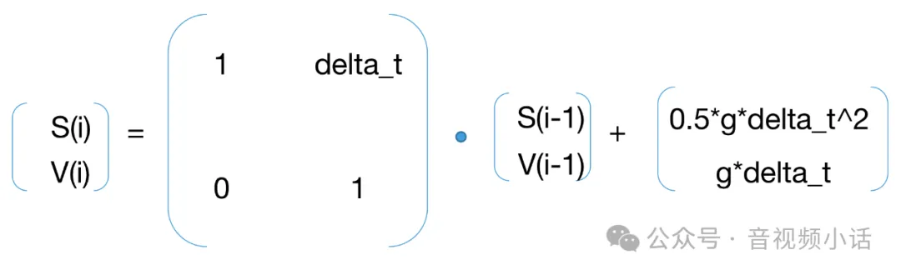

上面这个式子就是卡曼滤波公式1:

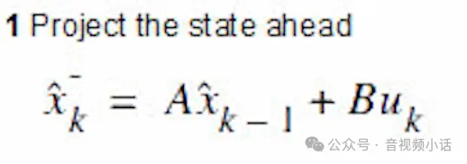

A就是:

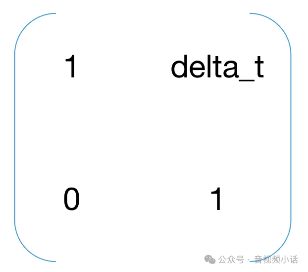

Bu就是:  

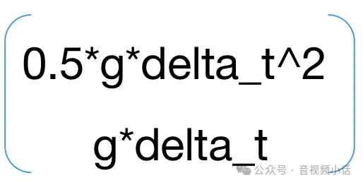

卡曼滤波的公式2:  

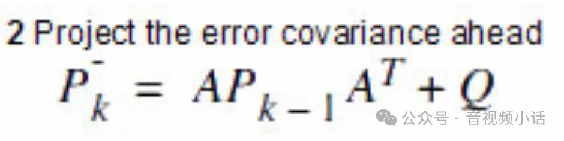

其中P是一个协方差矩阵，可以自己初始化一下，协方差矩阵是一个对角矩阵(后续随着数据的输入，P会不断通过公式2和公式5自我更新):  

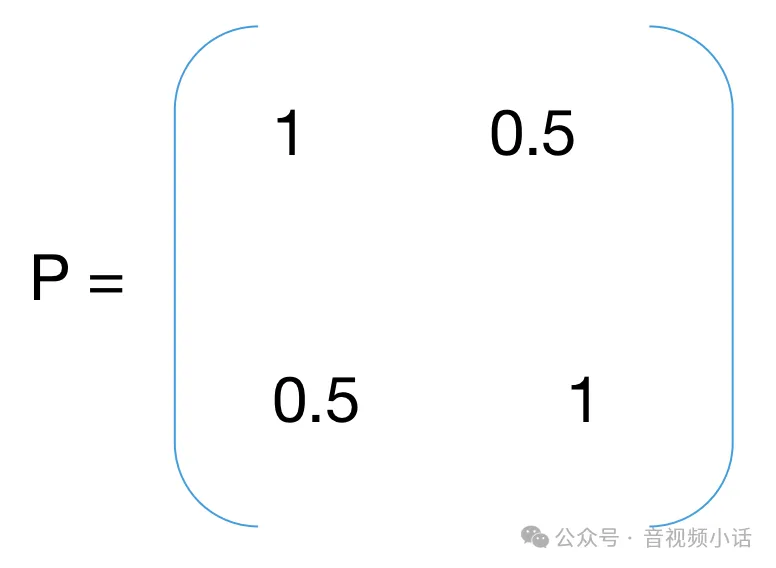

Q是过程激励噪声协方差，表示噪声，可以自己初始化:

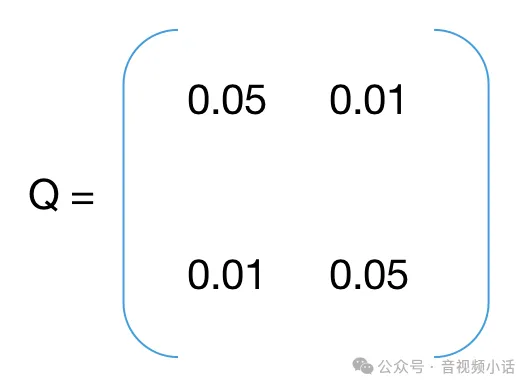

卡曼滤波公式3:  

：  

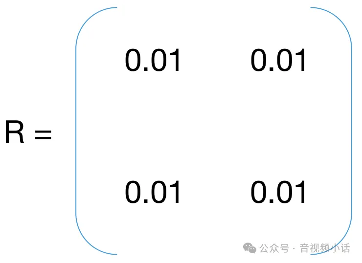

这样卡曼滤波参数K就可以通过P，H，R三个参数计算出来了。  

卡曼滤波公式4:  

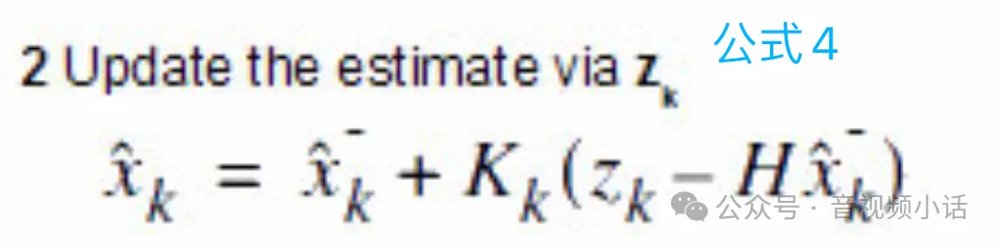

通过公式3，已经计算出K，参数Z是测试值，本例中Z就是一个向量包含距离和速度(s, v)，式子右边的X就是公式1中计算出来的预测值向量(s, v)

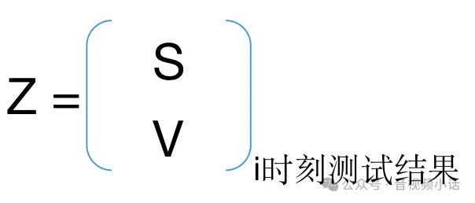

**公式4非常重要，通过这个公式，对计算估计出来的值，与测试的值进行折中，得出尽可能接近真实的值。**

卡曼滤波公式5:

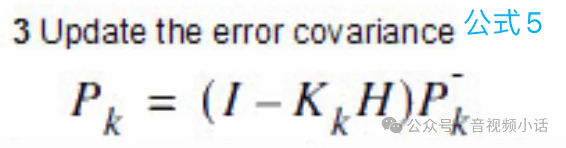

I是单位矩阵，K是公式3计算出来的卡曼滤波增益参数，H是状态变量与测试变量的转换矩阵(本例中是个单位矩阵)，式子右边的P是公式2预测的P矩阵。  

通过公式5的计算，对P协方差矩阵进行更新。  

对上面的5个公式解释后，这里用python进行模拟，代码如下:  

```python
import numpy as np

delta_t = 1 #每次变化是1秒
a = 9.8 #重力加速度g

# 状态迁移矩阵A
A = np.array([[1, delta_t],
            [0, 1]])
# 协方差矩阵
P = np.array([[1, 0.5],
              [0.5, 1]])
# 预测值与测试值的变换矩阵
H = np.array([[1, 0],
              [0, 1]])
# 过程激励噪声协方差
Q = np.array([[0.05, 0.01],
              [0.01, 0.05]])

# 观测噪声协方差
R = np.array([[0.01, 0.01],
              [0.01, 0.01],])
# 单位矩阵
I = np.eye(2)

# 每1秒的测试值，第一项是距离，第二项是速度
messure_list = np.array([[2.9,  8.8],
                        [19.1,  18.1],
                        [44.1,  28.9],
                        [84.9,  38.7],
                        [134,  50],
                        [193.4,  62.3],
                        [266.1,  72.1],
                        [348.6,  83.4],
                        [442.4,  95.7],
                        [548,  105.5]])

# 卡曼滤波公式1: 状态迁移
def StatePridict(pos, speed):
    x_vector = np.array([[pos], [speed]])
    b_u = np.array([[0.5*a*delta_t*delta_t], [a*delta_t]])
    result = np.dot(A, x_vector) + b_u
    return result

# 卡曼滤波公式3: 计算卡曼滤波增益参数K
def UpdateK():
    up_item = np.dot(P, H.transpose())
    down_item = np.dot(np.dot(H, P), H.transpose()) + R
    inv_item = np.linalg.inv(down_item)
    return np.dot(up_item, inv_item)

i = 0
predict_array = np.array([[],[]])

pos_predict = 0
speed_predict = 0

for z in messure_list:
    # 方程1: 状态预测公式(根据距离，速度，时间公式推导)
    next = StatePridict(pos_predict, speed_predict)
    print("predict next:", next)

    # 方程2: 协方差矩阵预测公式
    P = np.dot(np.dot(A, P), np.transpose(A)) + Q
    print("predict P:", P)

    # 方程3: 卡曼滤波增益计算公式
    K = UpdateK()
    print("update K:", K)

    # 方程4: 状态更新公式
    messure_item = z.reshape(-1, 1)
    print("messure item(", i, "):", messure_item, "shape:", messure_item.shape)
    deviation = messure_item - np.dot(H, next)
    print("deviation:", deviation)
    next = next + np.dot(K, deviation)
    predict_array = np.append(predict_array, next)
    pos_predict = next[0][0]
    speed_predict = next[1][0]
    print("update next state pos:", pos_predict, "velocity:", speed_predict)

    # 方程5: 协方差更新公司
    P = np.dot((I - K * H), P)
    print("update P:", P)
    i = i + 1
    print("")
```

把这个程序跑起来，观测各个参数的变化过程，仔细阅读，慢慢就理解这5个公式怎么使用。

## 4. GCC应用卡曼滤波算法

在第2章中，回忆一下这两个公式：

```
公式1(测量)：d(i) = t(i)-t(i-1)-(T(i)-T(i-1))
公式2(估计)：     
            L(i)-L(i-1)
d_est(i) = ------------ + w(i) = dL(i)/C+w(i)
                C
```

每个i时刻的测量值d(i)，和测量值dL(i)，要预测出1/C(i)和w(i)，这就是我们的目标。

**w(i)增加超过一个阈值，表示链路超载，w(i)减小了，表示链路轻负荷**。

卡曼滤波就是要预测出1/C(i)和w(i)，并根据根据w(i)是增加或减小，来决定预测带宽是增加还是减小。本节介绍如何预测1/C(i)和w(i)。回忆一下卡曼滤波的5个公式:  


这里，因为向量中的两个参数[1/C w]，自身是没法推导自己，所以卡曼滤波的公式1和公式2就省略了，或者说A矩阵就是个单位矩阵，Bu是0，这样预测后的结果还是自己。

这样就直接构造公式3:

X就是[1/C W]向量的转置

`H矩阵= [delta_len 1]`，`delta_len`就是两次不同时刻统计收到报文长度的差值。  

R是误差，在本例中可以自己设置，在webrtc源码实现中通过UpdateNoiseEstimate函数来更新获取(为了突出主线，这里先省略)。

这样公式3的K就计算出来了。  

公式4，更新估计值，

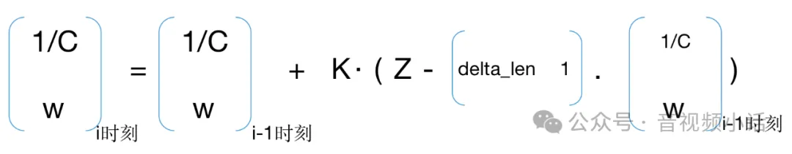

Z就是i时刻的测试数据的延时delay(i)，通过`d(i) = t(i)-t(i-1)-(T(i)-T(i-1))`得到i时刻的延时。  

公式5，


等式右边的P是公式2中计算出来的P，因为公式1和2都省略，所以这里值需要确认H就可以

`H = [delta_len 1].T`

I是单位矩阵。

因为K在公式3中已经计算出来，所以P很容易计算出来。

### 4.1 python仿真gcc的卡曼滤波  

`delay_array`：表示收到报文测试出来的延时集合

`deltalen_array`：表示收到报文长度差值的集合

两者作为测试数据，数组下标是一一对应的。

```python
import numpy as np

# d(i) = dL(i)/C + m(i) +v(i) 关键点: 过载的情况，m(i)增加; 轻载的情况，m(i)减小
# theta_bar(i) = [1/C(i)  m(i)]^T 其中，带宽C(i)可以设置个初始值，m(i)也设置一个初始值, 后面这两个值就是根据每一次的测试数据来进行预测；
# h_bar(i) = [dL(i) 1]^T 其中dL(i)是每次长度变化值，是测试的输入

# 方程1: 状态预测公式(根据报文差，带宽公式推导)
# 本例没有[1/C(i) m(i)]这个向量自己预测自己的公式，这个公式省略掉，或则说就是自己等于自己

# 方程2: 协方差矩阵预测公式
# 同方程1，因为没有预测公式，这个方程也省略掉；

# 方程3: 卡曼滤波增益计算公式
#                              P_(i) * h_bar(i)
#     K(i) = --------------------------------------------
#                  var_v_hat + h_bar(i)^T * P_(i) * h_bar(i)
# 其中P_(i)是协方差矩阵，见方程2; var_v_hat是误差，自己可以初始化一个

# 方程4: 状态更新公式
# d(i) = h_bar(i)^T * theta_bar(i) + v(i) 两个矩阵的点乘，就是dL(i)/C + m(i)这个式子，v(i)是一个噪声参数(可以初始设定一个较小的值)
# z(i) = D(i) - d(i) 这里的D(i)是延时的测试数据，也就是报文来的差值，d(i)是预测数据
# z(i) = D(i) - (h_bar(i)^T * theta_bar(i-1) + v(i))
# new_theta_bar(i) = theta_bar(i) + K(i) * z(i) 这个式子就是状态更新公式，更新得到新的[1/C(i) m(i)]

# 方程5: 协方差更新公式
# P(i) = (I - K(i) * h_bar(i)^T) * P_(i) + Q(i) 其中P(i)是协方差矩阵，Q(i)是误差

delay_array = [-4.45, 3.92, -3.5, -0.29, 10.77, -6.2, 6.98, -2.75, -8.88, -0.12, 0.78, -0.32, 2.05, -1.61, 3.67, 3.93, 13.23, 51.25, 15.32, 51.05, 124.61, -14.47, 9.43, 43.11, -10.98, 27.03, 34.31, 52.31, 132.39, -9.93, -1.63, 20.47, 54.73, 12.43, 19.86, 0.6, 78.59, -0.2, 35.04, 8.0, 68.9, 6.65, 82.35, 25.6, 108.01, -1.68, 42.52, 7.66, 82.26, 1.68, -0.39, 65.92, 15.35, 77.69, -2.38, -4.94, 9.82, -12.88, 132.41, -0.57, 81.74, 0.13, 33.81, -16.92, -18.68, -1.04, -56.98, 27.08, 0.44, -10.58, -23.03, 23.82, 36.17, -47.1, -140.67, 28.14, -30.56, -72.59, -21.58, -45.59, -87.41, 12.47, 1.0, -3.05, -37.41, -32.05, 22.89, 7.52, 11.13, 34.15, 88.15, -42.39, -2.78, -52.67, -16.58, 5.19, 55.34, 44.73, -13.97, 0.22, 7.63, 27.57, 49.72, 61.74, 18.91, 48.0, -24.09, -6.95, -50.06, 217.24, -62.06, -2.07, 5.83, -3.88, -6.4, 4.35, 39.61, -7.67, 5.65, 9.45, 70.02, -48.47, 35.76, 8.69, -6.4, -4.5, -2.26, -21.2, -53.22, -11.8, 12.25, -8.98, -2.94, -43.99, 1.12, -0.04, -8.08, 14.05, -31.01, -80.63, 94.82, -25.58, -58.55, 47.87, -67.36, 17.57, 4.64, 0.1, 4.71, 7.01, -1.5, -3.25, -1.87, -22.01, 9.57, -8.71, -3.17, -2.12, -36.99, 54.74, -14.71, -8.64, -46.41, 48.79, 5.74, -14.25, -7.76, 30.98, -6.09, 43.08, 16.21, 15.78, -2.86, -63.44, 73.09, -39.69, -50.57, -14.58, -5.34, 5.39, -17.07, -28.32, -15.5, 6.03, -62.54, 1.0, 1.01, -13.52, -32.07, 75.16, -5.2, -0.91, 1.48, 41.72, -21.1, 11.13]
deltalen_array = [-98.0, 170.0, -170.0, 314.0, 612.0, -926.0, 873.0, -541.0, 769.0, -1101.0, 0.0, -50.0, 50.0, 182.0, 1407.0, -1589.0, 776.0, -776.0, 55.0, -55.0, 1126.0, -1126.0, 80.0, -80.0, 305.0, -305.0, 278.0, -278.0, 1414.0, -1414.0, 2.0, -2.0, 642.0, -642.0, 387.0, -387.0, 771.0, -771.0, 352.0, -352.0, 746.0, -746.0, 776.0, -776.0, 1420.0, -1420.0, 567.0, -567.0, 923.0, -923.0, 0.0, 660.0, -660.0, 1012.0, -1012.0, 0.0, 0.0, 0.0, 1631.0, -1631.0, 890.0, -890.0, 700.0, -700.0, 0.0, 291.0, -291.0, 412.0, -412.0, 0.0, 75.0, 423.0, -27.0, -434.0, -37.0, 283.0, -115.0, -8.0, -160.0, 160.0, 0.0, -160.0, 0.0, 0.0, 484.0, -484.0, 219.0, -219.0, 0.0, 364.0, 492.0, -856.0, -160.0, 143.0, 17.0, -160.0, 853.0, -184.0, -509.0, 47.0, -47.0, 318.0, 385.0, -32.0, -671.0, 831.0, -831.0, 0.0, 0.0, 2097.0, -2097.0, 0.0, 85.0, -85.0, 0.0, 0.0, 0.0, 160.0, -160.0, 0.0, 1143.0, -983.0, 335.0, -495.0, 0.0, 194.0, -194.0, 0.0, 0.0, 0.0, -17.0, 177.0, -160.0, 0.0, 25.0, -25.0, 0.0, 335.0, 935.0, -1270.0, 941.0, -941.0, 0.0, 835.0, -835.0, 62.0, -62.0, 0.0, 0.0, 194.0, -194.0, 0.0, 0.0, 0.0, 0.0, 0.0, -17.0, 17.0, 0.0, 459.0, -459.0, 160.0, -160.0, 422.0, -422.0, 0.0, 0.0, 208.0, -208.0, 0.0, 946.0, -946.0, 0.0, 242.0, -242.0, 0.0, 0.0, 160.0, -160.0, 0.0, 0.0, 40.0, -40.0, 0.0, 0.0, 0.0, 160.0, -160.0, 320.0, 612.0, -932.0, 0.0, 0.0, 479.0, -479.0, 951.0]

C = 50.0 #假设带宽C为50
slope_c = 1.0/C
v = 5 #计算延时时候的噪声参数
m = 0.1  #m参数，过载的情况，m增加; 轻载的情况，m减小

R = 0.05

P_Matrix = np.array([[100.0, 0.0],
             [0.0, 1e-1]])

Q = np.array([[0.05, 0.01],
             [0.01, 0.05]])

I = np.array([[1, 0],
             [0, 1]])

def GetK(delta_len, p, r):
    h_bar = np.array([[delta_len], [1]])
    numerator = np.dot(p, h_bar)
    den = np.dot(np.dot(h_bar.T, p), h_bar)

    return np.dot(numerator, np.linalg.inv(den)) + r
    
def DelayUpdate(k, z, delta_len):
    h_bar = np.array([[delta_len], [1]])
    theta_bar = np.array([[slope_c], [m]])
    
    error = z - (np.dot(h_bar.T, theta_bar) + v)

    return theta_bar + k * error

def Update_P(k, p, delta_len):
    h_bar = np.array([[delta_len], [1]])
    p = p + Q
    return np.dot(I - np.dot(k, h_bar.T), p)

index = 0
for delta_len in deltalen_array:
    delay = delay_array[index]
    index = index + 1

    K = GetK(delta_len, P_Matrix, R)

    theta_bar_update = DelayUpdate(K, delay, delta_len)

    P_Matrix = Update_P(K, P_Matrix, delta_len)

    print("theta_bar_update:", theta_bar_update)
```

其中GetK函数的生成K卡曼滤波增益参数中，误差参数r是随机设置的。  

实际的r是可以通过rtp报文时间戳的差值推导出来，更为精确，详细看这个函数UpdateNoiseEstimate()

### 4.2 gcc卡曼滤波源码部分  

在函数OveruseEstimator::Update()中，

卡曼滤波公式3，计算出K:  

```
const double h[2] = {fs_delta, 1.0};
const double Eh[2] = {E_[0][0] * h[0] + E_[0][1] * h[1],
                      E_[1][0] * h[0] + E_[1][1] * h[1]};
const double denom = var_noise_ + h[0] * Eh[0] + h[1] * Eh[1];

const double K[2] = {Eh[0] / denom, Eh[1] / denom};
```

卡曼滤波公式4，计算出1/C，和w，在源码中slope_就是1/C, offset_就是w。residual就是误差部分，其实就是测量值和估计值的差值。

```
// residual就是误差部分，其实就是测量值和估计值的差值
// 就是python里写的：error = z - (np.dot(h_bar.T, theta_bar) + v)
const double residual = t_ts_delta - slope_ * h[0] - offset_;

// slope_就是1/C
slope_ = slope_ + K[0] * residual;

//offset_比较关键，offset_就是w
// w(i)增加，链路使用超载
// w(i)减小，链路比较空
offset_ = offset_ + K[1] * residual;
```

上面就是卡曼滤波部分，代码不多，就是原理比较复杂。  

### 4.3 如何判断带宽增减  

在4.2中已经能时刻更新`offset_`的值，也就是我们之前说的公式中:

```
            L(i)-L(i-1)
d_est(i) = ------------ + w(i) = dL(i)/C+w(i)
                C
```

上面公式中的w(i)就是`offset_`，

  * w(i)增加(也就是`offset_`)，链路使用超载

  * w(i)减小(也就是`offset_`)，链路比较空

但是如何判断增加和减小多少，这个增量/减量多少认为该做带宽的增减操作呢？

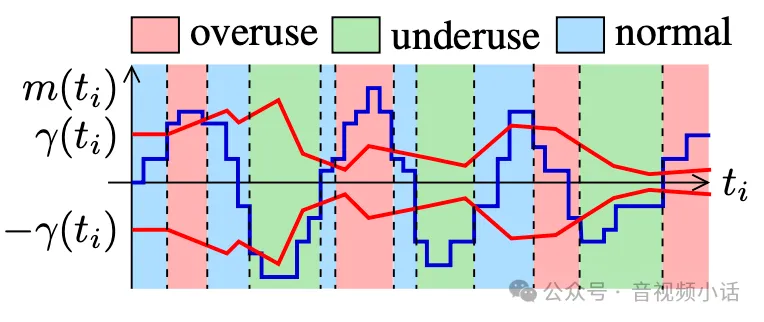

如上图的m(ti)就是`m(ti) = std::min(num_of_deltas, kMaxNumDeltas) * offset`;

这里的offset就是w(i)

`γ (ti )`就是`threshold_`，下面是gcc源码中，函数BandwidthUsageOveruseDetector::Detect()，大于`threshold_`则带宽过载，小于`threshold_`则是带宽轻载，否则就保持原状态。

```cpp
BandwidthUsage OveruseDetector::Detect() {
  const double T = std::min(num_of_deltas, kMaxNumDeltas) 
                * offset;
  if (T > threshold_) {
    hypothesis_ = BandwidthUsage::kBwOverusing;
  } else if (T < -threshold_) {
    hypothesis_ = BandwidthUsage::kBwUnderusing;
  } else {
    hypothesis_ = BandwidthUsage::kBwNormal;
  }
}
```

通过Detect()返回值，判断是否变换预测带宽。

这个`threshold_`也是动态变化的，

根据OveruseDetector::UpdateThreshold()函数来更新:

```cpp
void OveruseDetector::UpdateThreshold()
{
  // k_up_(0.0087),
  // k_down_(0.039),
  const double k = fabs(modified_offset) < threshold_ ? 
                    k_down_ : k_up_;
  const int64_t kMaxTimeDeltaMs = 100;
  int64_t time_delta_ms = std::min(now_ms - last_update_ms_,
                                kMaxTimeDeltaMs);
  threshold_ += k * (fabs(modified_offset) - threshold_)
                    * time_delta_ms;
  threshold_ = rtc::SafeClamp(threshold_, 6.f, 600.f);
  last_update_ms_ = now_ms;
}
```

这里有两个关键的参数`k_up_(0.0087)`, `k_down_(0.039)`。

`k_down_`明显要比`k_up_`大不少，其含义就是预测带宽降低检测的时候，需要更加敏感一些，或者说是需要降低快一些；相反，带宽增减就需要慢一点，稳当一点，保证流畅性。

不少公司都对`k_down_`和`k_up_`的参数进行优化，来满足自己动态码率的需求。

## 5. 总结

最后总结一下，gcc的动态码率依赖两个东西：  

  * 丢包率

丢包率在接收端计算后，通过RTCP rr报文发送给发送端，丢包率>5%，默认就要开始降低编码bitrate；

如果是sfu服务器模式，sfu代码中可以把rtcp rr中的丢包率和丢包总数根据自定义条件填写0，这样发送端就不会动态调整编码bitrate，达到某些预期的效果

  * 接收端基于延时的卡曼滤波带宽预测

1) 通过测试delay，和预测的delay来确定卡曼滤波模型，根据模型推导出下一步带宽预测offset。  

```
公式1(测量)：d(i) = t(i)-t(i-1)-(T(i)-T(i-1))
公式2(估计)：     
            L(i)-L(i-1)
d_est(i) = ------------ + w(i) = dL(i)/C+w(i)
                C
```

2) 得到卡曼滤波的变换值offset(也就是上面的w(i))，在根据计算出的threshold，用offset与threshold比较，决定预测带宽应该增加，减少还是不变。

