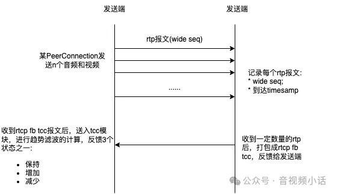
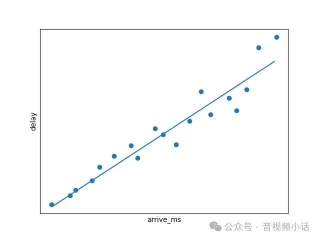

 
<!--BEGIN_DATA
{
    "create_date": "2024-07-28 21:51", 
    "modify_date": "2024-07-28 21:51", 
    "is_top": "0", 
    "summary": "webrtc tcc详解", 
    "tags": "WebRTC", 
    "file_name": "webrtc tcc详解.md"
}
END_DATA-->

#### <p>原文出处：<a href='https://mp.weixin.qq.com/s/sAXSx3435tlgLHE0FyrbOg' target='blank'>webrtc tcc详解</a></p>

> 之前写过<<[webrtc gcc详解](https://mp.weixin.qq.com/s?__biz=Mzk0NzY5NDcxMQ==&mid=2247483704&idx=1&sn=95239e020b1bef96d722ba254f343096&scene=21#wechat_redirect)>>，有网友反馈过当前用webrtc tcc的拥塞算法比较多，这里详解一下webrtc tcc算法，本文主要内容：

  * tcc架构

  * 趋势滤波算法

  * webrtc tcc与gcc的比较  

## 1. 前言  

webrtc的tcc算法，具体做法是，接收端监控两个数据，并反馈给发送端。

  * 丢包率: 接收端计算出丢包率，定期发送rtcp rr报文(内有丢包率)给发送端，发送端通过丢包率的大小来决定是否降低编码的bitrate；

  * Transport-wide RTCP Feedback Message，接收端记录每个rtp报文的wideSeqNumber，到达timestamp，整理后打包成rtcp tcc报文发送给接收端，接收端整理rtcp tcc报文中的到达timestamp与发送端的时间等数据，通过趋势滤波算法，判断拥塞程度，是否降低码率，增加码率，或保持码率。  

基于丢包率来调整动态编码，是比较简单，很多厂家经常在sfu服务端进行调整，如：如果不是长肥型网络，在丢包率<30%的情况下，rtcp rr中的丢包率和丢包总数欺骗性的填写0，这样发送端(尤其是web端)就不会轻易的降低bitrate，到达测试的良好效果

但是基于tcc架构的带宽预测，相对比较复杂(但是比卡曼滤波简单很多)，本文主要讲解这部分的原理和实现

## 2. Webrtc Tcc架构

### 2.1 sdp的关键信息

  * rtp extension header

需要使能这个rtp扩展项:  

```
a=extmap:4 http://www.ietf.org/id/draft-holmer-rmcat-transport-wide-cc-extensions-01
```

如上例子，extensionId=4，表示有rtp报文将携带扩展项transport-wide sequence。在rtp的扩展头中会有16bit的transport-wide sequence，注意这个wide seq不是针对某个视频或音频，而是针对某个PeerConnection(其中可能传输多个音视频)，rtp报文的扩展项如下格式:

```c
0                   1                   2                   3
 0 1 2 3 4 5 6 7 8 9 0 1 2 3 4 5 6 7 8 9 0 1 2 3 4 5 6 7 8 9 0 1
+-+-+-+-+-+-+-+-+-+-+-+-+-+-+-+-+-+-+-+-+-+-+-+-+-+-+-+-+-+-+-+-+
|       0xBE    |    0xDE       |           length=1            |
+-+-+-+-+-+-+-+-+-+-+-+-+-+-+-+-+-+-+-+-+-+-+-+-+-+-+-+-+-+-+-+-+
|  ID   | L=1   |transport-wide sequence number | zero padding  |
+-+-+-+-+-+-+-+-+-+-+-+-+-+-+-+-+-+-+-+-+-+-+-+-+-+-+-+-+-+-+-+-+
```

  * 使能Rtcp Fb transport-cc

```
a=rtcp-fb:96 transport-cc
```

如上，在rtcp-feedback 中使能transport-cc。  

### 2.2 基础流程架构

webrtc tcc基本的流程架构如下:  



如上图，做带宽预测主要在发送端，在收到发送端的rtcp fb tcc报文后，进行趋势滤波计算，返回带宽状态(保持，增加，减少)。

## 3. 趋势滤波  

webrtc tcc在发送端的带宽估计算法，主要应用趋势滤波算法。相对卡曼滤波算法来说，简单一些。  

延时的计算方法：  


如上图，延时如何得出：  

```
Delay(i) = {t(i) - t(i-1)} - {T(i) - T(i-1)}  
```

趋势滤波的建模思路如下，

  * x横坐标：为rtp报文到达的时间戳，接收方记录下每个报文到达的系统时间戳；

  * y纵坐标：为rtp报文累积延时，通过`Delay(i) = {t(i) - t(i-1)} - {T(i) - T(i-1)}`，计算出每次的延时，然后延时经过累加，得到纵坐标；

如下图:  



上图是模拟的打点，所有的打点，正常情况下，能用最小二乘法绘制出一条直线:  

```
y = m * x
其中
y: delay
x: arrive_ms
m: 斜率
```

对于上面公式汇总的斜率m，就能得到如何估计未来的bitrate变化状态：  

  * `m > threshold_max`: m大于某个阈值，表示delay增加严重，需要降低编码bitrate；

  * `m < threshold_min`: m小于某个阈值，表示delay减少很多，表示可以增加编码bitrate

  * `threshold_min < m < threshold_max`: m在两个阈值之间，保持编码bitrate不变

上面这个公式中的斜率m就是趋势滤波估计带宽的基础，整个趋势滤波就是通过求斜率m，来推定下一步的带宽状态。

需要的基础数据集就是：

* x横坐标: `arrive_ms`

* y纵坐标：累积delay值  

x和y都是通过rtcp tcc能拿到的数据，通过最小二乘法，就能得到斜率m，是不是比卡曼滤波简单很多。  

### 3.1 趋势滤波的源码实现  

#### 3.1.1 数据准备  

在函数UpdateTrendline中，输入4个参数。

```cpp
void TrendlineEstimator::UpdateTrendline(
  double recv_delta_ms,
  double send_delta_ms,
  int64_t send_time_ms,
  int64_t arrival_time_ms)
```

再次提到延时公式：`Delay(i) = {t(i) - t(i-1)} - {T(i) - T(i-1)}`

函数输入的4个参数。

  * `recv_delta_ms`: 接收端收到连续两批rtp报文的时间差，也就是t(i) - t(i-1)；

  * `send_delta_ms`: 发送端发送两批rtp报文的时间差，也就是T(i) - T(i-1);

  * `send_time_ms`: 发送端发送rtp报文的系统时间；

  * `arrival_time_ms`: 接收端收到rtp报文的系统时间；

有这4个关键参数，就可以录入数据到一个链表`delay_hist_`中去。

具体代码如下，加上了详细的注释。  

```c
void TrendlineEstimator::UpdateTrendline(
  double recv_delta_ms,
  double send_delta_ms,
  int64_t send_time_ms,
  int64_t arrival_time_ms)
{
  //delta_ms这个就是delay，也就是延时
  const double delta_ms = recv_delta_ms - send_delta_ms;
  //accumulated_delay_每次加上delta_ms，就是累积延时
  accumulated_delay_ += delta_ms;
  
  //smoothed_delay_是简单滤波后的累积延时，
  //其中滤波参数是smoothing_coef_=0.9
  //用滤波参数的方式，防止错误延时数据对整体的影响
  smoothed_delay_ = smoothing_coef_ * smoothed_delay_ +
                    (1 - smoothing_coef_) * accumulated_delay_;

  //这个数组非常重要，就是我们要画图的原始数据
  //其中x坐标轴，就是接收端到达的时间
  //x坐标轴数据点 = static_cast<double>(arrival_time_ms - first_arrival_time_ms_),
  //y坐标轴，就是累积延时，
  //y坐标轴数据点 = smoothed_delay_(经过简单滤波的累积延时)
  delay_hist_.emplace_back(
      static_cast<double>(arrival_time_ms - first_arrival_time_ms_),
      smoothed_delay_, accumulated_delay_);
}
```

如上，数组`delay_hist_`就是原始数据集：  

  1. x坐标: 接收端达到的系统时间，`arrival_time_ms - first_arrival_t`

  2. y坐标：累积延时，`smoothed_delay_`，也就是简单滤波后的累积延时

#### 3.1.2 计算斜率

在3.1.1中，我们积累数据到`delay_hist_`数组中，累积了x坐标数据，和y坐标数据，接下来，我们就可以计算斜率trend。  

```c
if (delay_hist_.size() > settings_.window_size)
    delay_hist_.pop_front();//删除旧的数据

  //如果队列长度等于窗口大小
  if (delay_hist_.size() == settings_.window_size) {
    //开始计算斜率
  }
```

如上代码，`delay_hist_`有个窗口的大小，在每次添加新的数据后，如果`delay_hist_`数组的长度大于窗口大小，就去除最老的数据，以此保留最新的数据。

如果`delay_hist_`数据的长度等于窗口大小，就可以开始计算斜率了。  

通过协方差与方差，来计算出斜率的公式：

```c
y = b * x + c，
已知x和y的n个序列值，通过方差和协方差的关系，可以求斜率：
b = Cov(X, Y) / Var(X)
斜率也就是：
       ∑((x(i) − avg_x) (y(i) - avg_y))
b =  -------------------------------------
        ∑(x(i)- avg_x)^2
```

计算斜率具体的代码在LinearFitSlope这个函数里：

```c
double LinearFitSlope(
  const std::deque<TrendlineEstimator::PacketTiming>& packets)
{
  //第一步，求出x和y的平均值
  //先求出x，y的各个值的总和
  for (const auto& packet : packets) {
    sum_x += packet.arrival_time_ms;
    sum_y += packet.smoothed_delay_ms;
  }
  //求出x和y的平均值
  double x_avg = sum_x / packets.size();
  double y_avg = sum_y / packets.size();

  //得出斜率的分子，和分母
  double numerator = 0;
  double denominator = 0;
  for (const auto& packet : packets) {
    double x = packet.arrival_time_ms;
    double y = packet.smoothed_delay_ms;
    
//numerator就是：∑((x(i) − avg_x) (y(i) - avg_y))
    numerator += (x - x_avg) * (y - y_avg);
//denominator就是：∑(x(i)- avg_x)^2
    denominator += (x - x_avg) * (x - x_avg);
  }

  //这个就是斜率
  //       ∑((x(i) − avg_x) (y(i) - avg_y))
  //b = -------------------------------------
  //         ∑(x(i)- avg_x)^2
  return numerator / denominator;
}
```

上面的代码就是计算斜率的过程，最终得到斜率。

### 3.1.3 斜率决定带宽状态  

得出斜率后，用斜率与threshold进行比较，决定带宽当前的状态  

  * `OverUsing`: 带宽过度使用，需要降低编码bitrate；

  * `UnderUsing`: 带宽轻度使用，需要增加编码bitrate:

  * `Normal`: 带宽正常，保持状态

代码在函数`TrendlineEstimator::Detect`中实现，`trend`为输入值  

```c
void TrendlineEstimator::Detect(double trend, double ts_delta, int64_t now_ms) 
{
//原始d的斜率trend * 采样个数 * 斜率增益，得到一个新斜率值与阈值threshold比较
  const double modified_trend =
      std::min(num_of_deltas_, kMinNumDeltas) * trend * threshold_gain_;
      
  if (modified_trend > threshold_) {
    //过度使用，需要降低编码bitrate；
    hypothesis_ = BandwidthUsage::kBwOverusing;
  } else if (modified_trend < -threshold_) {
    //轻度使用，需要增加编码bitrate:
    hypothesis_ = BandwidthUsage::kBwUnderusing;
  } else {
    //保持状态
    hypothesis_ = BandwidthUsage::kBwNormal;
  }

  //每次更新阈值threshold
  UpdateThreshold(modified_trend, now_ms);
}
```

这里就能得出下一步带宽预测的结果，就可以指导是否`减少/增加/保持`视频编码的bitrate。  

3.1.4 更新阈值Threshold

Threshold在每次斜率更新后，也要进行对应的调整，对下一步斜率的变化，调整准确和敏感。  

在函数`UpdateThreshold`中调整对应的`threshold_`。

```c
void TrendlineEstimator::UpdateThreshold(double modified_trend,
                                         int64_t now_ms) {
  // ... ...
  const double k = fabs(modified_trend) < threshold_ 
                ? k_down_ : k_up_;
  const int64_t kMaxTimeDeltaMs = 100;
  int64_t time_delta_ms = std::min(now_ms - last_update_ms_, 
                              kMaxTimeDeltaMs);
  threshold_ += k * (fabs(modified_trend) - threshold_) 
                * time_delta_ms;
  threshold_ = rtc::SafeClamp(threshold_, 6.f, 600.f);
  last_update_ms_ = now_ms;
}
```

其中调整threshold的增益参数k，有两个值选择：`k_down_(0.039)`和`k_up_(0.0087)`。

明显`k_down_`远大于`k_up_`，其含义是下降的threshold比上升的threshold要敏感更多；遇到斜率需要降低带宽更敏感一些，增加带宽就更谨慎一些。  

自己也可以写改这两个值，达到自己想要的流控目的。  

## 4. webrtc tcc的优缺点  

### 优点

  * 发送端有rtp全面的信息，方便做拥塞控制算法  

webrtc tcc在接收端统计每个rtp报文的wide seq和到达的系统时间，并且把这些信息打包成rtcp tcc发给发送端，这样发送端拥有的信息比较全，方便做后续的拥塞控制算法。

除了趋势滤波算法，后面还能有更多的算法可以选择，后续灵活性更好。  

  * 趋势滤波的准确度更高  

趋势滤波是基于全数据来进行斜率计算，与卡曼滤波是有些不同。卡曼滤波是递归/递增的方式，并不是使用全数据的方式来进行估计。趋势滤波是基于窗口内的全数据来进行计算斜率趋势，更加准确一些。  

### 缺点

趋势滤波的计算消耗，相对卡曼滤波比较大。卡曼滤波是递归，递增方式来计算估计值，并不存储数据，每次计算没有针对数据集，没有任何循环计算。

而趋势滤波不一样，需要存储一个`settings_.window_size`的数据，每次计算斜率都会至少 `2 x window_size` 次的循环来计算新的斜率，也就是每收到一次新的数据，都有`2 x window_size` 的循环来进行计算，对cpu有损耗。这个对于递增类型的卡曼滤波是不存在的。

## 5. 总结  

本文具体消息描述了：

  * webrtc tcc架构  

webrtc tcc技术，是在接收端统计发送rtp报文的wide seq，到达系统时间。接收端通过rtcp tcc报文发给发送端后，发送端计算出：(y纵坐标)累积delay，(x横坐标)到达的`arrive_ms`，随后计算出斜率，通过斜率预测出未来的带宽状态

  * 趋势滤波算法

趋势滤波算法，数据集为：

(y纵坐标)累积delay，(x横坐标)到达的`arrive_ms`。

斜率大于某个阈值，带宽过度使用；  

斜率小于某个阈值，带宽轻度使用；

否则，带宽保持原状态。  

通过(y纵坐标)和(x横坐标)的数据集，通过协方差和方差的计算得到斜率：

`trend = Cov(X, Y)/Var(X) ` 

如果`trend > threshold`, 带宽过载，需要调低编码bitrate；  

如果`trend < -threshold`，带宽轻载，需要调高编码bitrate；

否则，带宽正常，保持编码bitrate。
