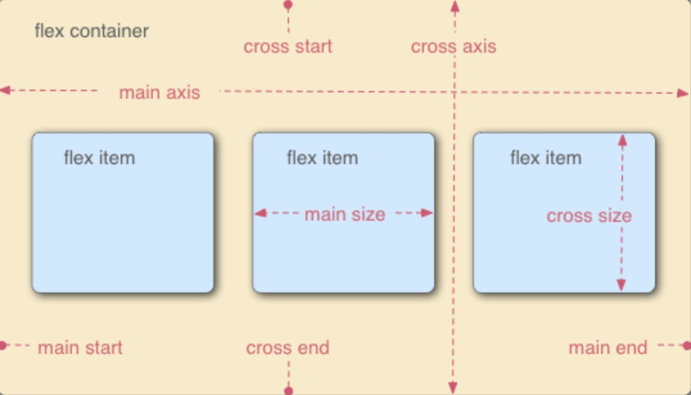
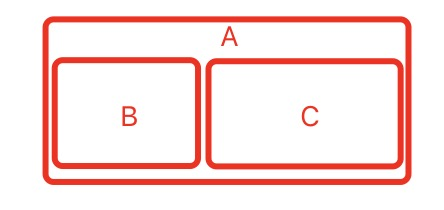
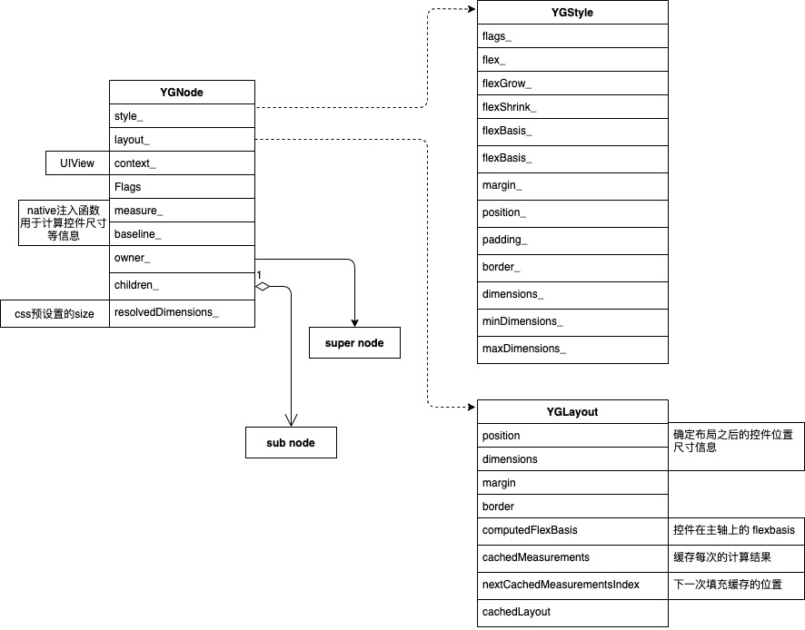
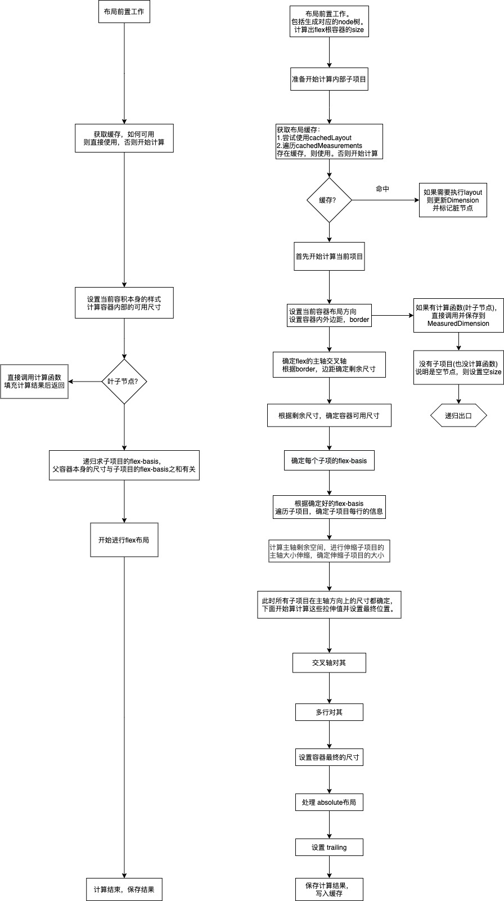
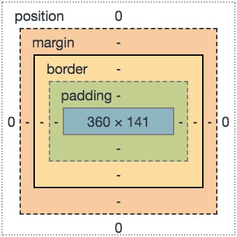

 
<!--BEGIN_DATA
{
    "create_date": "2024-01-30 12:00", 
    "modify_date": "2024-01-30 12:00", 
    "is_top": "0", 
    "summary": "yoga布局解析<br/>Flex布局在iOS上的实践与yoga源码阅读<br/>Flex排版源码分析", 
    "tags": "C/C++、Web", 
    "file_name": "yoga布局库解析.md"
}
END_DATA-->

#### <p>原文出处：<a href='https://devyang.space/2020/09/13/yoga%E5%B8%83%E5%B1%80%E8%A7%A3%E6%9E%90/' target='blank'>yoga布局解析</a></p>

## GitHub

* 源码: https://github.com/facebook/yoga
* [yoga C Api doc](https://github.com/facebook/yoga/blob/48d82224ee34fd60ad21ab90a2c38dd4cfb1fdb4/docs/_docs/api/c.md)

> main分支删除了yogaKit，但tag中仍有包含(v2.0.1)

跨端必备技能之`flex`布局，目前主流的跨端开发方案都使用`flex`，而其中使用较为广泛的是`yoga`。

## 前置知识

在开始之前有一些需要知道的前置条件，这些对理解`yoga`的布局原理非常有帮助。建议想补充完`flex`相关的知识在继续看`yoga`部分。

### Flex

布局的传统解决方案，基于[盒状模型](https://developer.mozilla.org/en-US/docs/Web/CSS/CSS_Box_Model/Introduction_to_the_CSS_box_model)，依赖 `display` 属性 ,`position`属性 ` float`属性。它对于那些特殊布局非常不方便，比如，垂直居中就不容易实现。

2009年，W3C 提出了一种新的方案: `Flex`。  

可以简便、完整、响应式地实现各种页面布局。目前，它已经得到了所有浏览器的支持。

采用 Flex 布局的元素，称为`Flex`容器（flex container），简称”容器”。它的所有子元素自动成为容器成员，称为 `Flex` 项目`flex item`，简称”项目”。

#### 主轴和侧轴(交叉轴)

容器默认存在两根轴：水平的主轴`main axis`和垂直的交叉轴`cross axis`  



首先每一根轴都包括 三个东西：维度、方向、尺寸。

  * 维度：子项目横着排还是竖着排(x 轴 或 y 轴）。 
  * 方向：即排列子元素的顺序 顺序还是逆序。 
  * 尺寸：每一个子元素在主轴方向所占的位置的总和。

#### flex item & flex-basis

flex item：Flex布局下的子元素。  

flex-basis：浏览器根据这个属性，计算主轴是否有多余空间。它的默认值为auto，即项目的本来大小。  

优先级要高于项目设置的width height。

## yoga

### YGMeasureMode

当前项目的计算模式。分为3种情况

  1. YGMeasureModeUndefined：
  2. YGMeasureModeAtMost：项目的尺寸不是确切的，但是具有最大值，则取最大值
  3. YGMeasureModeExactly：项目大小的是确定的，可以通过css直接设置，或者经过flex计算得出。

### YGNode

对于每一个`native`控件，都有一个`YGNode`与之对应，形成绑定关系。同时根据`native`侧的视图层级结构，来生成`yoga`侧的`node`
的数据结构。  

`node`主要由4部分组成：

  1. 当前node所在节点树中的信息：父节点，子节点。 
  2. css样式。 
  3. 布局信息。 
  4. 自定函数注入。

### YGLayout

`YGLayout`主要保存了所有运行时计算布局的信息。其中有几个比较重要的属性：

#### measuredDimensions

每次计算当前项目的尺寸之后，都会把结果存入当前结构。

#### computedFlexBasis

这个属性十分重要，所有的flex 布局尺寸：拉伸，压缩，换行，都跟这个属性有关。  

假设当前项目`A`有两个子项目。flex-direction 为row。  

  

则此时`A`的`flexBasis`等于`B,C`的`flexBasis`之和。 而`B,C`当前的`flexBasis`由项目本身的内容和css样式决定。

#### cachedMeasurements

在`yoga`计算布局时，每次都会缓存计算结果，在下一次计算到来时，优先尝试缓存中的所有项，如果不可用在进行布局计算。缓存的内容如下：  

```c
struct YGCachedMeasurement {
   float availableWidth;                 //最大有效宽度。一般为父容器宽度
   float availableHeight;                //高度：同上
   YGMeasureMode widthMeasureMode;       //本次缓存的计算模式
   YGMeasureMode heightMeasureMode;      //同上

   float computedWidth;                  //经过计算之后的计算宽度
   float computedHeight;                 //同上
}
```

### YGStyle

`YGStyle`主要保存了开发者自己设置的`css`样式。

下面是上面三者的关系。  



### 布局流程



由于源码过长，笔者将注释过的源码放到了[这里](https://github.com/yFeii/yoga_annotation)

### 踩坑

#### 文本显示不全（float精度失真问题）

yoga 在处理文本的节点时，采用了下面的方式

```c
static void YGRoundToPixelGrid(
    const YGNodeRef node,
    const float pointScaleFactor,
    const float absoluteLeft,
    const float absoluteTop) {
  if (pointScaleFactor == 0.0f) {
    return;
  }

  const float nodeLeft = node->getLayout().position[YGEdgeLeft];
  const float nodeTop = node->getLayout().position[YGEdgeTop];

  const float nodeWidth = node->getLayout().dimensions[YGDimensionWidth];
  const float nodeHeight = node->getLayout().dimensions[YGDimensionHeight];

  const float absoluteNodeLeft = absoluteLeft + nodeLeft;
  const float absoluteNodeTop = absoluteTop + nodeTop;

  const float absoluteNodeRight = absoluteNodeLeft + nodeWidth;
  const float absoluteNodeBottom = absoluteNodeTop + nodeHeight;

  // If a node has a custom measure function we never want to round down its
  // size as this could lead to unwanted text truncation.
  const bool textRounding = node->getNodeType() == YGNodeTypeText;

  node->setLayoutPosition(
      YGRoundValueToPixelGrid(nodeLeft, pointScaleFactor, false, textRounding),
      YGEdgeLeft);

  node->setLayoutPosition(
      YGRoundValueToPixelGrid(nodeTop, pointScaleFactor, false, textRounding),
      YGEdgeTop);

  // We multiply dimension by scale factor and if the result is close to the
  // whole number, we don't have any fraction To verify if the result is close
  // to whole number we want to check both floor and ceil numbers
    float mod = fmodf(nodeWidth * pointScaleFactor, 1.0);
    
    //是否高度或者宽度不是整数，如：3.8，3.1 这样
  const bool hasFractionalWidth =
      !YGFloatsEqual(mod, 0) &&
      !YGFloatsEqual(mod, 1.0);
  const bool hasFractionalHeight =
      !YGFloatsEqual(fmodf(nodeHeight * pointScaleFactor, 1.0), 0) &&
      !YGFloatsEqual(fmodf(nodeHeight * pointScaleFactor, 1.0), 1.0);
//当宽度不是整数（有余数）时。对于文本的内容应该向上取整。
//但由于YGFloatsEqual内部，在float比较时，精度为0.0001f。导致某些极端的情况下，文本内容被截断
//如：文本宽度刚好为 3.0000999，此时会被认定为3，导致文本显示不全。
  node->setLayoutDimension(
      YGRoundValueToPixelGrid(
          absoluteNodeRight,
          pointScaleFactor,
          (textRounding && hasFractionalWidth),
          (textRounding && !hasFractionalWidth)) -
          YGRoundValueToPixelGrid(
              absoluteNodeLeft, pointScaleFactor, false, textRounding),
      YGDimensionWidth);

  node->setLayoutDimension(
      YGRoundValueToPixelGrid(
          absoluteNodeBottom,
          pointScaleFactor,
          (textRounding && hasFractionalHeight),
          (textRounding && !hasFractionalHeight)) -
          YGRoundValueToPixelGrid(
              absoluteNodeTop, pointScaleFactor, false, textRounding),
      YGDimensionHeight);

  const uint32_t childCount = YGNodeGetChildCount(node);
  for (uint32_t i = 0; i < childCount; i++) {
    YGRoundToPixelGrid(
        YGNodeGetChild(node, i),
        pointScaleFactor,
        absoluteNodeLeft,
        absoluteNodeTop);
  }
}
```

造成这样的原因是：  

当宽度不是整数（有余数）时。对于文本的内容应该向上取整。  

但由于YGFloatsEqual内部，在float比较时，精度为0.0001f。导致某些极端的情况下，文本内容被截断。  

如：文本宽度刚好为 3.0000999，此时会被认定为3，导致文本显示不全。

解决办法：  

参考rn  

```c
/ Adding epsilon value illuminates problems with converting values from
// `double` to `float`, and then rounding them to pixel grid in Yoga.
CGFloat epsilon = 0.001;
return (YGSize){
  RCTYogaFloatFromCoreGraphicsFloat(size.width + epsilon),
  RCTYogaFloatFromCoreGraphicsFloat(size.height + epsilon)
};
```

在注入的计算函数中，强制向上取整。

<hr>

#### <p>原文出处：<a href='https://km.woa.com/articles/show/448690' target='blank'>Flex布局在iOS上的实践与yoga源码阅读</a></p>

## YogaKit 的使用

关于什么是 flexbox 这里就不赘述，主要是想聊聊实际使用跟分析下 yoga 是怎么搞的。iOS 上使用的是 YogaKit，在 yoga 的基础上做了封装，以支持 oc / swift 的写法，官方的集成方案是使用 cocoapods 引入，但是我们的项目并不支持 cocoapods，所以我们一开始把 yoga & YogaKit 以 framework 的方式引入，之所以不能用源码，是因为 YogaKit 里与 yoga 是有同名文件，同步拖入会有冲突。但是 YogaKit 里有 swift 文件，我们又不想在 iPhone target 上引入 swift 相关，所以 yoga 打包成 framework，YogaKit 则是以源码形式拖入。

对一个 view 进行布局设置可采用如下方法：

```objective-c
[self.view configureLayoutWithBlock:^(YGLayout * layout) {
    layout.isEnabled = YES;
	layout.flexDirection = YGFlexDirectionRow;
    layout.justifyContent = YGJustifySpaceBetween;
	layout.alignItems = YGAlignCenter;
    layout.height = YGPointValue(200);
}];
```

实际进行布局计算的时候需要调用：

```objective-c
[self.view.yoga applyLayoutPreservingOrigin:NO];
```

感觉写法还是有点繁琐的，参照 Masonry 我们做了一些写法扩展实现链式语法：

```objective-c
#define YGChainedProperty(type, name) @property(readonly, getter=qm_##name) YGLayout *(^qm_##name)(type value);

@interface YGLayout (Category)
YGChainedProperty(YGDirection, direction)
YGChainedProperty(YGFlexDirection, flexDirection)
YGChainedProperty(YGJustify, justifyContent)
YGChainedProperty(YGAlign, alignContent)
···
@end

@interface UIView (YogaExtension)
/// 设置 isEnable 为 YES。跳过 configure
- (void)doYoga;
/// 设置 isEnable 为 YES。并配置 layout 属性
- (void)doYoga:(YGLayoutConfigurationBlock)block;
@end
```

于是上面的写法就可以变成

```objective-c
[self.view doYoga:^(YGLayout * layout) {
	layout.qm_flexDirection(YGFlexDirectionRow)
	.qm_justifyContent(YGJustifySpaceBetween)
	.qm_alignItems(YGAlignCenter)
	.qm_height(200);
}];
```

## 特性与优缺点

** 特性**

  * 基于 flexbox，但没有实现全部 css flexbox，省略了非布局属性(设置颜色等)
  * 改进了 flexbox 的属性，支持从右到左
  * 增加了 aspectRatio 处理元素自身比例
  * 支持 absolute / relative 布局方式

** 优点**

  * 描述性语言，语义清晰，具备灵活性
  * 对于格子布局流式布局实现上有便捷性
  * 性能几乎跟手写 frame 持平

** 缺点**

  * 跟 autolayout 是互斥的
  * 实际在使用中，有些强制 ui 补丁的地方，用起来就很蛋疼（所以这种场景下基本不用）
  * 可读性增加也就意味着代码量会稍微增加
  * 动画性能也不咋地，写动画时也有点麻烦

## 排版布局引擎的流程

本质上，yoga 应该说是一个排版计算引擎，简单来说，它按照我们给出的语义化描述，通过一定流程的计算之后，生成了所有元素的布局坐标尺寸。这里想拓展下，对于一个跨平台方案的实现原理。我们先通过浏览器的布局排版流程来简要说说一个跨平台方案的布局排版引擎一般都是怎么做的。

  * 生成渲染树
    * 解析 html，生成视图节点（dom，相当于 iOS 里的 view）
    * 解析 css，生成样式规则（style rules，相当于 iOS 里的样式设置）
    * 将 css 与 html 挂载到一起，形成一个原始的渲染树
  * 渲染树布局
    * 从渲染树根节点开始遍历
    * 不同的节点使用不同的 layout 算法
    * 计算出每个节点的位置信息
  * 渲染
    * 从渲染树根节点开始遍历
    * 渲染每一个节点

在排版引擎的设计模式里，一个渲染树的每一个节点，都可能是不同的元素，每个元素都可以有属于自己的 layout 算法用于计算自己与自己的子节点的布局位置。每个节点的 layout 算法都是可以不同。所以从根节点开始，循环递归遍历所有节点的 layout()方法以后，就完成了布局排版。所以如果我们想引入一种新的布局算法，我们只需要新建一种特定节点，并实现这个节点的 layout() 函数，我们就可以为排版引擎拓展多种排版能力。举个例子，tableView，segmentControl 等等，都可以看成是内部实现了某种特定布局算法的节点类型。  

参照着 yoga，在排版算法里有几个概念需要注意下：

**排版测量**

  * Measure:测量，指测量计算节点所需要的空间大小
  * Layout:将结点放置在具体的 (x, y) 点

**测量单位（如同 css ｜ yoga 都有如下几种）**

  * auto: 由父容器属性以及子视图决定 (YGUnitAuto / YGUnitUndefined)
  * n% : 父容器宽度 * n% (YGUnitPercent)
  * : 具体数值 (YGUnitPoint)

**Measure 测量模式**

  * 大小不确定，但有最大值限制 (YGMeasureAtMost)
  * 确切的 (YGMeasureExactly)
  * 不确定 (YGMeasureUndefined)

经过布局排版流程之后，渲染树已经明确知道了每个节点的位置信息，就能进行渲染了。大同小异的，都是通过调用系统的 GUI Api，通过 CPU 跟 GPU 去计算图形，提交显示器逐帧绘制渲染。不论是 Web 还是 Native 层面上都是殊途同归。   

那 yoga 的排版流程是怎么样的呢？这里可以简要理解下，便于我们下面看源码：

  1. 首先，根节点大小是确定的。所以对于 flex 类型子节点的可用空间等是可以确定的。
  2. 对于节点的排版测量，先看是否有可用缓存，没有才需要重新测量排版。
  3. 如果满足略过条件（有自定义测量方法的叶子节点，注意是没有子节点的叶子节点 || 或者是不需要测量就能知道节点大小的，比如已经设置了宽高），则可以跳出排版测量阶段。否则继续排版测量。
  4. 确定转化主轴交叉轴方向为常规方向（从左到右自上而下），以及给子节点的可用的空间，测量或确定子节点的主轴大小。（测量子节点转 2）
  5. 根据 4 确定每一行的子节点数量，并循环递归计算所有孙子节点在非伸缩状态下占据后，主轴的剩余空间，按 flexGrow | flexShrink 比例伸缩子节点的大小，然后需要重新测量伸缩子节点的子节点。（也就是孙子节点，测量孙子节点转 2）
  6. 在‘当前行’的测量排版阶段，根据 justify-content 确定子节点位置并计算行的主轴大小。根据 align-items 确定子节点在交叉轴的位置，如果 align-items == ‘stretch’，则需要拉伸子节点。（同 5 需要重新测量伸缩孙子节点）
  7. 对于不确定尺寸的，根据自身属性与子节点们的测量大小，确定节点在主轴跟交叉轴上的大小。如果是在排版阶段，则进行绝对布局类型的子节点排版，以及其他子节点在所给空间上的位置。
  8. 如果是有多行 wrap 属性且有下一行，则循环 5 6 7 计算下一行。
  9. 对于有多条轴线的 align-content,则也类似进行循环计算。
  10. 如果在排版阶段，且 flex 方向是 reverse 的，则需要处理下坐标问题。
  11. 整棵树排版测量完成，对整棵树的排版测量信息进行取整。缓存测量或者排版信息。（至于为什么要取整，可能是小数值太长影响布局渲染效率，这个取整也是有特定四舍五入的方法的，但在不同大小屏幕上的偏差不会超过1pixel）

## yoga 源码解析

说了那么多，那应该来跟着看一下 yoga 的源码了([Base v1.17.0](https://github.com/facebook/yoga))，看看这个布局算法是怎么布局到原生界面的。在上面的应用示例中说到，所有的布局开始计算时是要先调用这个函数。

```objective-c
- (void)applyLayoutPreservingOrigin:(BOOL)preserveOrigin
{
  [self calculateLayoutWithSize:self.view.bounds.size];
  YGApplyLayoutToViewHierarchy(self.view, preserveOrigin);
}
```

所以我们以这个为入口来看下源码, 进去后主要是跑了这个函数。

```objective-c
- (CGSize)calculateLayoutWithSize:(CGSize)size
{
  YGAttachNodesFromViewHierachy(self.view);
  const YGNodeRef node = self.node;

  YGNodeCalculateLayout(
    node,
    size.width,
    size.height,
    YGNodeStyleGetDirection(node));

  return (CGSize) {
    .width = YGNodeLayoutGetWidth(node),
    .height = YGNodeLayoutGetHeight(node),
  };
}
```

`YGAttachNodesFromViewHierachy`主要是要生成一个布局树（RenderTree，以 YGNodeRef 作为节点），根据根视图，循环去遍历子视图，把子视图中有设置 yoga 属性 (enabled) 的节点插到 RenderTree 上。这里注意下这串代码

```objective-c
// Only leaf nodes should have a measure function
if (yoga.isLeaf) {
  YGRemoveAllChildren(node);
  YGNodeSetMeasureFunc(node, YGMeasureView);
} else {
  YGNodeSetMeasureFunc(node, NULL);
  ...
}
```

只有叶子节点可以设置属于自己的测量方法。`YGMeasureView`这个即是 YogaKit 中提供的自定义的叶子节点测量方法。

> 在 yoga 中对一个节点的测量方法大致就是获取获取该节点的测量模式，该节点的一个已知宽高约束，去获得一个测量尺寸（这个测量尺寸不是确定的，可能会多次获取调整，我们在最初流程有多次提及跳转 2 重新测量）。如果我们自己设置了叶子结点测量方法，yoga 则不会再去走算法里的测量预估方法。

然后通过 `YGNodeCalculateLayout`，以及给定的根节点尺寸，布局方向（默认都是从左到右）去实际开始计算这个生成的 RenderTree 的每个节点。接下来这个函数有点长，我们一行行来看一下理一下思路

### YGNodeCalculateLayoutWithContext

```c
void YGNodeCalculateLayoutWithContext(
    const YGNodeRef node,
    const float ownerWidth,
    const float ownerHeight,
    const YGDirection ownerDirection,
    void* layoutContext) {
  marker::MarkerSection marker{node};

  // 每一次进入排版，都会自增该值，主要是用于确保被设置为 dirty 的项目在父视图给定空间不变时，
  // 都只会被递归遍历一次。另外有些情况会略过子项目的大小测量与排版，例如当父视图的最大宽度为 0 
  gCurrentGenerationCount++;

  // 初始化下节点的尺寸（如果有设节点宽高｜最大宽高），放到一个 dimension 数组
  node->resolveDimension();
  // 确定宽高、以及测量模式
  float width = YGUndefined;
  YGMeasureMode widthMeasureMode = YGMeasureModeUndefined;

  // 省略过程即为确定过程，大致思路是宽度上先检查是不是有设定的宽度，
  // 如果有，width = style.width ｜ width = parentWidth * percent，mode = Exactly
  // 如果没有，检查是否有最大值设定
  // 如果有，width =  maxWidth | width = parentWidth * percent, mode = AtMost
  // 如果都没有，width = parentWidth, mode = parentWidth ? Exactly : Undefined
  ...

  float height = YGUndefined;
  YGMeasureMode heightMeasureMode = YGMeasureModeUndefined;

  // 高度测量同上
  ...

  // 这个函数则是实际上的计算布局核心入口，主要用于判断节点是否需要重新进行排版或测量，这个我们下面单独拎出来看
  if (YGLayoutNodeInternal(...)) {
    // 设置 node 的位置
    node->setPosition(node->getLayout().direction, ownerWidth, ownerHeight, ownerWidth);

    // 对所有排版信息进行四舍五入取整。这个取整还是有点意思，根据缩放比率进行四舍五入，
    // 得到缩放比率同级别的京都，可以保证在不同大小分辨率下不会出现一个像素的偏移
    YGRoundToPixelGrid(node, node->getConfig()->pointScaleFactor, 0.0f, 0.0f);
  }

  	// 清理空间
    YGConfigFreeRecursive(originalNode);
    YGNodeFreeRecursive(originalNode);
  }
}
```

ps：好长的一大串函数，可能看着有点累。没关系，我们接下来看更累的。

### YGLayoutNodeInternal

接下来我们分析下`YGLayoutNodeInternal`这个函数究竟干了些什么。  

该函数主要用于判断节点是否需要重新进行排版或测量，根据节点是否有 dirty 标记 & 缓存信息中父节点的尺寸等属性是否跟当前父节点的属性信息是否相同，以判断是否已经排过版。

```c
bool YGLayoutNodeInternal(
    const YGNodeRef node,
    const float availableWidth,
    const float availableHeight,
    const YGDirection ownerDirection,
    const YGMeasureMode widthMeasureMode,
    const YGMeasureMode heightMeasureMode,
    const float ownerWidth,
    const float ownerHeight,
    const bool performLayout,
    const char* reason,
    const YGConfigRef config,
    YGMarkerLayoutData& layoutMarkerData,
    void* const layoutContext) {
  // 获取当前节点的排版信息  
  YGLayout* layout = &node->getLayout();

  // 这个值只是用来调试日志的，可忽略，后面也忽略了日志记录的
  gDepth++;

  // 判断是否需要重新计算（节点是脏的 & 当前排版周期还未排版过）|（父亲排版节点方向变了）
  const bool needToVisitNode =
      (node->isDirty() && layout->generationCount != gCurrentGenerationCount) ||
      layout->lastOwnerDirection != ownerDirection;


  if (needToVisitNode) {
    // 如果需要重新计算，清理所有排版缓存
  }

  YGCachedMeasurement* cachedResults = nullptr;

  // 先检查有没有自身的测量函数，最开始的时候我们说过，生成渲染树的时候会设置叶子节点测量方法
  // 因为每个节点可能需要多次测量才能解决 flex 所有维度上的尺寸，所以放在最开头避免耗性能重复测量
  if (node->hasMeasureFunc()) {
    // 获取主轴 & 对称轴 margin
    const float marginAxisRow = node->getMarginForAxis(YGFlexDirectionRow, ownerWidth).unwrap();
    const float marginAxisColumn = node->getMarginForAxis(YGFlexDirectionColumn, ownerWidth).unwrap();

    // 先判断能不能使用当前缓存的排版
    if (YGNodeCanUseCachedMeasurement(...)) {
      cachedResults = &layout->cachedLayout;
    } else {
      // 标注1: 不行就遍历以往的缓存结果，看能不能找到一个能用的 
      for (uint32_t i = 0; i < layout->nextCachedMeasurementsIndex; i++) {
        if (YGNodeCanUseCachedMeasurement(...) {
          cachedResults = &layout->cachedMeasurements[i];
          break;
        }
      }
    }
  }
  // 没有自测量方法，如果需要排版，先判断是否已经排版过以及是否能用缓存，可用标准上面也有说到
  else if (performLayout) {
    if (width & height & widthMode & heightMode 均没变) {
      cachedResults = &layout->cachedLayout;
    }
  }
  // 从以往的测量缓存中检查下能不能用的，跟  相同
  else {
    ...
  }

  // 不需要重新测量，则存一下缓存
  if (!needToVisitNode && cachedResults != nullptr) {
    ...
  } 
  // 啥都没有，那就跳到真正对某个节点的测量排版方法并设置缓存等
  else {
    // 节点测量排版方法，不长不长，下面我们再拎出来单独看看
    YGNodelayoutImpl(...);
    // 先记录下排版方向    
    layout->lastOwnerDirection = ownerDirection;
    // 更新缓存
    ...
  }

  // 如果是排版，则设置下节点的尺寸以及更新 dirty
  if (performLayout) {
    ...
  }

  layout->generationCount = gCurrentGenerationCount;
  // true 为已经排版，false 则是跳过使用了缓存
  return (needToVisitNode || cachedResults == nullptr);
}
```

接下来就来到 `YGNodelayoutImpl` 这个好玩的东西了。（好不好玩我也不知道，反正是最长的一个函数，我自己看的时候也看的挺蛋疼。不过这个函数有一大串注释。我简要地说一下这个方法注释说了啥）  

这个方法是实现了 w3c css 文档中描述的 flexbox 布局算法子集，与完整标准相比较，该算法的局限性有如下：

  * 始终假定 Display 属性为 flex，除了 Text 节点（假定为 inline-flex）
  * 不支持 zIndex 属性，节点按文档顺序堆叠，也就比如 subview - superview 的层次
  * 不支持 order 属性，节点按文档顺序排列，也就是指 addSubview 的顺序
  * 不支持折叠和隐藏的值，可见性始终假定为"可见"
  * 不支持垂直的内联方向（文本垂直排列）
  * 不支持强制跳过
  * 默认最小主尺寸为 0（规范 4.5 假定所有的项目都有默认的最小主尺寸，比如文本，为最宽单词的宽度），所以 YGMeasureMode 里没有最小的测量模式，只有 AtMostly 最大值测量模式
  * 解决灵活性的长度时，不遵循主轴的最大/最小尺寸
  * 默认 flexDirection 为 column（规范 4.5 为 row）

这个算法就是整个 flex 算法的核心了，主要是用于测量自身大小，同时排版子节点。会递归调用以排版测量整个布局树，负责为输入节点设置 direction、测量尺寸、 位置、行标等。

> 排版的流程是，需要先知道节点的大小，就可以进行位置确定，子节点的大小可以延后到节点的位置确认阶段。所以这个算法里，如果节点本身就可以确定大小，同时不在排版流程或者有自测量方法，就可以直接返回跳出后续代码

```c
static void YGNodelayoutImpl(
    const YGNodeRef node,
    const float availableWidth, // 调整节点的可用大小
    const float availableHeight,
    const YGDirection ownerDirection, // node 的内联方向（从左往右，从右往左）
    const YGMeasureMode widthMeasureMode, // 测量模式
    const YGMeasureMode heightMeasureMode,
    const float ownerWidth,					
    const float ownerHeight,
    const bool performLayout, // 是否需要布局节点以及节点子树
    const YGConfigRef config,
    YGMarkerLayoutData& layoutMarkerData,
    void* const layoutContext) {
  (performLayout ? layoutMarkerData.layouts : layoutMarkerData.measures) += 1;

  // 初始化布局方向 direction，然后根据布局方向调整 flexRowDirection ｜ flexColumnDirection
  const YGDirection direction = node->resolveDirection(ownerDirection);
  node->setLayoutDirection(direction);

  const YGFlexDirection flexRowDirection = YGResolveFlexDirection(YGFlexDirectionRow, direction);
  const YGFlexDirection flexColumnDirection = YGResolveFlexDirection(YGFlexDirectionColumn, direction);

  // 根据 flexRowDirection ｜ flexColumnDirection 设置 node 实际上下左右的 margin & border & padding，
  // 在盒子模型里，使用 edge 可以排除方向性的干扰。比如在 row 里的 padding-left，
  // 在 row-reseve 则实际相当于 padding-right。所以用 edge-start 可以去泛指一个起点边距。
  ...

  if (node->hasMeasureFunc()) {
    // 如果节点有自测量函数，则直接调用测量方法并返回。因为在 YGLayout+UIView.h 里代码有限制，
    // 有自测量方法的节点是不会有子节点的，所以这里可以直接返回
    ...
    return;
  }

  
  const uint32_t childCount = YGNodeGetChildCount(node);
  if (childCount == 0) {
  	// 对于没有子节点的，使用可用的值（如果提供了它们）或最小尺寸（比如没有设置自身大小，那内部空间基本尺寸为 0，
    // 最终大小即 padding + border），在这一步就能获得节点自身大小
    return;
  }

  // 如果是不需要对子节点进行排版的，且确切知道节点尺寸的跳过(按照已知的在内部设置了节点测量尺寸)
  if (!performLayout && YGNodeFixedSizeSetMeasuredDimensions(...)) {
    return;
  }

  // 确保每个节点都是可变的副本
  node->cloneChildrenIfNeeded(layoutContext);
  // 重设布局标志，因为可能已经改变了
  node->setLayoutHadOverflow(false);

  // STEP 1: 计算主轴交叉轴的剩余空间
  // 根据 direction 调整主轴的实际方向（因为 direction 如果为从右到左 RTL，那 row 对于 LTR 方向就是 row-reserve，
  // 所以都统一调整为 LTR 的方向再进行计算），并获取主轴 & 交叉轴的尺寸
  const YGFlexDirection mainAxis = YGResolveFlexDirection(node->getStyle().flexDirection, direction);
  const YGFlexDirection crossAxis = YGFlexDirectionCross(mainAxis, direction);

  const bool isMainAxisRow = YGFlexDirectionIsRow(mainAxis);
  const bool isNodeFlexWrap = node->getStyle().flexWrap != YGWrapNoWrap;

  const float mainAxisownerSize = isMainAxisRow ? ownerWidth : ownerHeight;
  const float crossAxisownerSize = isMainAxisRow ? ownerHeight : ownerWidth;

  // 获取 padding & border 等，然后获得实际宽高（不是主轴交叉轴）最大 & 最小尺寸限制
  const float minInnerWidth = YGResolveValue(node->getStyle().minDimensions[YGDimensionWidth], ownerWidth)
                                        .unwrap() - paddingAndBorderAxisRow;
  const float maxInnerWidth = YGResolveValue(node->getStyle().maxDimensions[YGDimensionWidth], ownerWidth)
                                        .unwrap() - paddingAndBorderAxisRow;
  ... 

  const float minInnerMainDim = isMainAxisRow ? minInnerWidth : minInnerHeight;
  const float maxInnerMainDim = isMainAxisRow ? maxInnerWidth : maxInnerHeight;

  // STEP 2: 获取主轴 & 交叉轴上的可用空间
  // 除去边框边距外的剩余空间
  float availableInnerWidth = YGNodeCalculateAvailableInnerDim(node, YGFlexDirectionRow, 
                                                               availableWidth, ownerWidth);
  float availableInnerHeight = YGNodeCalculateAvailableInnerDim(node, YGFlexDirectionColumn, 
                                                                availableHeight, ownerHeight);
                                                                
  // 换算成主轴交叉轴的可用空间
  float availableInnerMainDim = isMainAxisRow ? availableInnerWidth : availableInnerHeight;
  const float availableInnerCrossDim = isMainAxisRow ? availableInnerHeight : availableInnerWidth;

  // STEP 3: 确定每个子节点的原始内容尺寸，相当于 flex-basis
  // 这个函数里面也会递归调用 YGLayoutNodeInternal，对子节点里的子节点（孙子节点）进行测量，不进行排版
  float totalOuterFlexBasis = YGNodeComputeFlexBasisForChildren(...);

  // 是否总计算的 flex-basis 和会超过可用空间
  const bool flexBasisOverflows = measureModeMainDim == YGMeasureModeUndefined ? false 
                                          : totalOuterFlexBasis > availableInnerMainDim;

  // 如果有换行 wrap 属性，子节点需要空间超过可用空间，同时测量模式是最大值限制模式，
  // 这种时候可以按最大值的确切模式去计算子节点空间
  if (isNodeFlexWrap && flexBasisOverflows && measureModeMainDim == YGMeasureModeAtMost) {
    measureModeMainDim = YGMeasureModeExactly;
  }

  // STEP 4: 对子节点进行线性排列
  uint32_t startOfLineIndex = 0;	// 每一行的起始下标
  uint32_t endOfLineIndex = 0;		// 每一行的终点下标
  uint32_t lineCount = 0;   		// 行数
  float totalLineCrossDim = 0;  	// 交叉轴所有行累计占用尺寸
  float maxLineMainDim = 0;		// 主轴上占用的最大的行尺寸

  // YGCollectFlexItemsRowValues 是用来保存 STEP 4 的计算数据 model。为了便于理解，我把这个 struct 内容注释下
  // @params itemsOnLine: flex项目一行可以容纳的项目数，会考虑到可用的内部尺寸、flex 项目的 flexBasis 以及其边距等等
  // @params sizeConsumedOnCurrentLine: 当前行的所有子项的尺寸与边距累计，用于设置节点尺寸或者计算子项目剩余空间
  // @params remainingFreeSpace: 剩余可用空间
  // @params totalFlexGrowFactors: 将要放置在当前行的 flex 项目总的 flexGrow(拉伸) 因子
  // @params totalFlexShrinkFactors: 将要放置在当前行的 flex 项目总的 flexShrink(收缩) 因子
  // @params endOfLineIndex: 检查最后一个 flex 项目的结束索引（可能不是当前行，因为可能是绝对定位等）
  // @params relativeChildren: vector 可以收缩和拉伸的子节点列表
  // @params mainDim: 考虑到弹性项目的大小，填充，边距和边框后，该行的大小。
  //                  遍历所有行以确定所有者的主轴尺寸后，可用于计算maxLineDim。
  // @params crossDim: 同上
  YGCollectFlexItemsRowValues collectedFlexItemsValues;

  // 遍历所有行，当一行的空间被填满，则循环计算下一行
  for (; endOfLineIndex < childCount; lineCount++, startOfLineIndex = endOfLineIndex) {
  	// 遍历 node 以及子节点，生成 YGCollectFlexItemsRowValues 数据
    collectedFlexItemsValues = YGCalculateCollectFlexItemsRowValues(...);
    endOfLineIndex = collectedFlexItemsValues.endOfLineIndex;

    // 如果不需要排版子节点，且测量模式是确切的，可以跳过整个 flex 步骤
    const bool canSkipFlex = !performLayout && measureModeCrossDim == YGMeasureModeExactly;

    // STEP 5: 解决主轴的 flexible 长度
    // 计算需要分配的剩余可用空间，如果主轴上长度未知，则按行的长度进行分配，即没有更多剩余空间可以去分配

    // 如果无法测量确切主轴占宽，则需要确保用到的行宽不会打破主轴最大 & 最小值限制
    if (measureModeMainDim != YGMeasureModeExactly) {
      ...
    }

  	// 如果空间能确定，减去可能占用的宽度，获得行的剩余空间
    if (!sizeBasedOnContent && !YGFloatIsUndefined(availableInnerMainDim)) {
      collectedFlexItemsValues.remainingFreeSpace = availableInnerMainDim 
                                                      - collectedFlexItemsValues.sizeConsumedOnCurrentLine;
    }
    // availableInnerMainDim是不确定的，这意味着将根据子节点确定节点的大小。 
    // sizeConsumedOnCurrentLine为负，这意味着节点只能占据 0。因此，剩余的空间为 0 - sizeConsumedOnCurrentLine。 
    else if (collectedFlexItemsValues.sizeConsumedOnCurrentLine < 0) {
      collectedFlexItemsValues.remainingFreeSpace = -collectedFlexItemsValues.sizeConsumedOnCurrentLine;
    }

    // 如果不能跳过 flex 步骤，那需要计算下节点剩余的 flexible 宽度
    if (!canSkipFlex) {
      YGResolveFlexibleLength(...);
    }

    node->setLayoutHadOverflow(node->getLayout().hadOverflow 
                                | (collectedFlexItemsValues.remainingFreeSpace < 0));

    // STEP 6: 确定主轴以及交叉轴尺寸
    // 在这里所有的子节点在主轴上应该都有了尺寸，交叉轴上的尺寸应该也是确定了，除了 aglin 属性为 ‘stretch’ 的节点。
    // 接下来就需要计算那些属性为‘stretch’的节点，并设置最终的位置

    // 这个函数是用来计算横轴方向上子节点的位置，尺寸已经知道了，
    // 剩余空间也知道了，那就剩下根据实际属性进行空间分配了
    YGJustifyMainAxis(...);

    float containerCrossAxis = availableInnerCrossDim;
    if (measureModeCrossDim == YGMeasureModeUndefined ||
        measureModeCrossDim == YGMeasureModeAtMost) {
      // 根据子节点最大的尺寸去计算交叉轴尺寸
      containerCrossAxis = YGNodeBoundAxis(...) - paddingAndBorderAxisCross;
    }

    // 如果没有需要换行的 'flex-wrap' 属性，那交叉轴的尺寸由容器决定
    if (!isNodeFlexWrap && measureModeCrossDim == YGMeasureModeExactly) {
      collectedFlexItemsValues.crossDim = availableInnerCrossDim;
    }

    // 缩紧到容器指定的最大/最小尺寸
    collectedFlexItemsValues.crossDim = YGNodeBoundAxis(...) - paddingAndBorderAxisCross;

    // STEP 7: 交叉轴对齐
    // 如果只是测量容器，可以跳过子节点对齐。否则循环去计算子节点的横轴位置尺寸
    if (performLayout) {
      for (uint32_t i = startOfLineIndex; i < endOfLineIndex; i++) {
        const YGNodeRef child = node->getChild(i);
        if (child->getStyle().display == YGDisplayNone) {
          continue;
        }
        if (child->getStyle().positionType == YGPositionTypeAbsolute) {
          // 如果子节点是绝对布局属性，也有坐标设置，则直接覆盖掉之前的所有计算
          ...
          // 如果未定义坐标或者计算结果为 NAN，则默认为 border + margin
          if (!isChildLeadingPosDefined || Y
              GFloatIsUndefined(child->getLayout().position[pos[crossAxis]])) {
            child->setLayoutPosition(...);
          }
        }
        // flex 子节点 
        else {
          float leadingCrossDim = leadingPaddingAndBorderCross;
          // 相对布局的子节点，根据 alignItems 或者 alignSelf 来确定在交叉轴上的位置
          const YGAlign alignItem = YGNodeAlignItem(node, child);

          // 如果子节点 align = 'stretch', 则再布置一次，强制尺寸为当前交叉轴行尺寸
          if (alignItem == YGAlignStretch 
          		&& child->marginLeadingValue(crossAxis).unit != YGUnitAuto 
              	&& child->marginTrailingValue(crossAxis).unit != YGUnitAuto) {
            // 如果子节点定义了确切大小，则不需要根据 stretch 拉伸
            if (!YGNodeIsStyleDimDefined(child, crossAxis, availableInnerCrossDim)) {
              float childMainSize = child->getLayout().measuredDimensions[dim[mainAxis]];
              float childCrossSize = !child->getStyle().aspectRatio.isUndefined() 
                        ? child->getMarginForAxis(crossAxis, availableInnerWidth).unwrap() 
              		          + (isMainAxisRow ? childMainSize / child->getStyle().aspectRatio.unwrap() 
                                        : childMainSize * child->getStyle().aspectRatio.unwrap())
			                  : collectedFlexItemsValues.crossDim;

              childMainSize += child->getMarginForAxis(mainAxis, availableInnerWidth).unwrap();

              // 主轴与交叉轴约束
              YGConstrainMaxSizeForMode(..., mainAxis, YGMeasureModeExactly);
              YGConstrainMaxSizeForMode(... , crossAxis, YGMeasureModeExactly);

              // 获得子节点的约束尺寸后，判断子节点的测量模式，再去测量子节点尺寸
              const float childWidth = isMainAxisRow ? childMainSize : childCrossSize;
              const float childHeight = !isMainAxisRow ? childMainSize : childCrossSize;

              auto alignContent = node->getStyle().alignContent;
              auto crossAxisDoesNotGrow = alignContent != YGAlignStretch && isNodeFlexWrap;
              const YGMeasureMode childWidthMeasureMode =
                  YGFloatIsUndefined(childWidth) || (!isMainAxisRow && crossAxisDoesNotGrow)
                  ? YGMeasureModeUndefined : YGMeasureModeExactly;
              const YGMeasureMode childHeightMeasureMode =
                  YGFloatIsUndefined(childHeight) || (isMainAxisRow && crossAxisDoesNotGrow)
                  ? YGMeasureModeUndefined : YGMeasureModeExactly;

              // 走到这里，就调用上一个函数，再以子节点为父节点去计算子节点以下的布局了。
              // 注意 align 属性为 stretch
              YGLayoutNodeInternal(...);
            }
          } else {
          	// 如果不需要拉伸节点横轴，则根据 align 属性去计算坐标即可了
        }
      }
    }

    totalLineCrossDim += collectedFlexItemsValues.crossDim;
    maxLineMainDim = YGFloatMax(maxLineMainDim, collectedFlexItemsValues.mainDim);
  }

  // STEP 8: 多行内容的对齐排版
  // 好长这里，不过也跟 STEP 7 是类似的，先获得行宽，再一个个去排列
  if (performLayout && (isNodeFlexWrap || YGIsBaselineLayout(node))) {
    // ...
  }

  // STEP 9: 计算最终的尺寸
  // 根据测量结果加 padding / margin 一类获得最终测量尺寸
  node->setLayoutMeasuredDimension(YGNodeBoundAxis(...), YGDimensionWidth);
  node->setLayoutMeasuredDimension(YGNodeBoundAxis(...), YGDimensionHeight);

  // 如果节点未指定宽高，则由子节点确定尺寸
  // 如果未指定宽高或者有最大限制
  if (measureModeMainDim == YGMeasureModeUndefined ||
      (node->getStyle().overflow != YGOverflowScroll &&
       measureModeMainDim == YGMeasureModeAtMost)) {
    // 大小限制到最大/最小值，确保不会小于 padding+border
   	...
  } else if (
      measureModeMainDim == YGMeasureModeAtMost &&
      node->getStyle().overflow == YGOverflowScroll) {
    node->setLayoutMeasuredDimension(
        YGFloatMax(
            YGFloatMin(availableInnerMainDim + paddingAndBorderAxisMain, 
                      YGNodeBoundAxisWithinMinAndMax(...).unwrap()), 
                      paddingAndBorderAxisMain),
        	  dim[mainAxis]);
  }

  // 确定交叉轴上的，代码跟上面的基本一致，只是换成计算交叉轴方向
  ...

  // 因为上述的对齐计算是按正常方向的 wrap 处理，如果是 'wrap-reserse' 的需要遍历子节点反转坐标处理
  if (performLayout && node->getStyle().flexWrap == YGWrapWrapReverse) {
  	for (uint32_t i = 0; i < childCount; i++) { ... }
  }

  // 如果是排版流程
  if (performLayout) {
    // STEP 10: 对绝对布局的节点进行设置定位跟尺寸
    for (auto child : node->getChildren()) {
      if (child->getStyle().positionType != YGPositionTypeAbsolute) {
        continue;
      }
      YGNodeAbsoluteLayoutChild(...);
    }

    // STEP 11: 如果 flex 方向是 reverse 的，需要反向重设下节点的位置。
    //因为之前的计算方式都是按从左到右或者自上而下的方式，否则按常规方向处理。
    const bool needsMainTrailingPos = mainAxis == YGFlexDirectionRowReverse 
                                      || mainAxis == YGFlexDirectionColumnReverse;
    const bool needsCrossTrailingPos = crossAxis == YGFlexDirectionRowReverse 
                                        || crossAxis == YGFlexDirectionColumnReverse;
                                        
    if (needsMainTrailingPos || needsCrossTrailingPos) {
      for (uint32_t i = 0; i < childCount; i++) {
      	...
        if (needsMainTrailingPos) { YGNodeSetChildTrailingPosition(node, child, mainAxis); }
        if (needsCrossTrailingPos) { YGNodeSetChildTrailingPosition(node, child, crossAxis); }
      }
    }
  }
}
```

至此，yoga 的源码也就看了六七成了，里面还有很多细节性的算法，比如对一个叶子节点的测量，方向位置确定等等。有兴趣的同学可以结合着去挖掘看看，我也是边看边慢慢理，还有不少细节点没有完全吃透。

<hr>

#### <p>原文出处：<a href='https://juejin.cn/post/6844903591149305864' target='blank'>Flex排版源码分析</a></p>

## Flex 排版源码分析

flex 是 w3c 在 2009 年提出的响应式布局，现在已经得到所有主流的浏览器支持，也是当下前端开发主流的布局方式。

flex 凭借其布局属性适配不同的屏幕，提高开发效率，减适配问题。在如此优秀的响应式能力下，隐藏了什么设计和多少的复杂度，什么样的情况下会触发多次排版。了解内部实现能更好的在合适的场景使用选择性使用 flex，搭建更高效响应的页面。

### Flex 布局属性

#### 基础概念

主轴（main axis）：容器根据 flex-direction 属性确定的排版方向，即横轴或竖轴

交叉轴（cross axis）：与主轴垂直的排版方向，即横轴或竖轴

#### 容器属性

> display: flex

指定元素以 flex 方式布局

> flex-direction: row（默认）/ column / row-reverse / column-reverse

指定主轴的排版方向

  * row（默认）横向排版，起点在左端
  * cloumn 竖向排版，起点在顶端
  * row-reverse 横向排版，起点在右端
  * column-reversse 竖向排版，七点在底端

> flex-wrap: wrap（默认） / nowrap / wrap-reverse

决定当可用排版空间不足时，是否允许换行，以及换行后的顺序，模式包括允许换行、不换行、换行后整体反向。

  * wrap （默认）空间不足时，进行换行
  * nowrap 不换行
  * wrap-reverse 换行后，第一行在最下方，行排版方向向上

> justify-content: flex-start（默认） / flex-end / center / space-between / space-around

指定项目在主轴上的对齐方式

  * flex-start （默认）对齐主轴的起点，例如：row 情况下左对齐
  * flex-end 对齐主轴的终点，例如：row 情况下右对齐
  * center 主轴内居中
  * space-betwwen 均匀排列每个项目，首个项目放置于起点，末尾项目放置于终点
  * space-around 均匀排列每个项目，每个项目周围分配相同的空间

> align-items: stretch / flex-start / flex-end / center / baseline

指定项目在交叉轴的对齐方式

  * stretch（默认）每个项目进行拉伸，知道所有项目大小铺满父容器
  * flex-start 对齐交叉轴的起点
  * flex-end 对齐交叉轴的终点
  * center 交叉轴内居中
  * baseline 在一行中，所有项目以首个项目的文字排版为基线对齐，仅在 flex-direction: row / row-reverse 生效

> align-content: stretch / flex-start / flex-end / center / space-between / space-around

指定容器中存在多行情况下，在交叉轴上，行间对齐方式

  * stretch（默认）行在交叉轴上的大小进行拉伸，铺满容器
  * flex-start 行向交叉轴起点对齐
  * flex-end 行向交叉轴终点对齐
  * center 行在交叉轴上居中
  * space-between 均匀排列每一行，第一行放置于起点，最后一行放置于终点
  * space-around 均匀排列每一行，每一行周围分配相同的空间

#### 项目属性

> order: （默认 0）

指定项目的排列顺序

> flex-grow: （默认 0）

指定项目的放大比例，默认为0，即如果存在剩余空间，也不进行放大。

> flex-shrink: number （默认 1）

指定项目的缩小比例，默认为1，即在空间不足（仅当不换行时候起效），所有项目等比缩小，当设置为0，该项目不进行缩小。

> flex-basis: number / auto（默认 auto）

指定项目的主轴的初始大小，auto 的含义是参考 width 或 height 的大小，

> align-self: auto / stretch / flex-start / flex-end / center / base-line

指定项目在容器交叉轴的对齐方式，auto 为参照容器的 align-items，其余值和 align-items 介绍一致。

#### Flex 源码理解

凭借 ReactNative 的潮流，Yoga 迅速崛起，发展成了 flex 排版中的佼佼者。flex 设计始于W3C，逐渐被各大浏览器支持，所以像是Webkit 这样的排版的代码是最开始的 flex 排版设计源码。我通过阅读 [Webikit 的 RenderFlexibleBox 源码](https://github.com/WebKit/webkit/blob/master/Source/WebCore/rendering/RenderFlexibleBox.cpp)、[Facebook Yoga源码](https://github.com/facebook/yoga)和 [Google 的 flexbox-layout源码](https://github.com/google/flexbox-layout) 了解 flex 排版的实现细节。这三者的思想和流程都是一致的，Webkit 的实现是最为全的，但是它受原有的其他属性所影响，看起来比较难理解，其他两个就比较纯粹一些。由于我最先接触 Yoga，所以这里以 Yoga 的代码为解析的源码进行分析，2017 年 5 月份的版本，到最新的版本中间有修一些 bug 和整体代码的结构化，但是整体关键内容还是一样的（主要是我看的时候忘记更新了，写了一大半）。当然，此时 Yoga 的代码写在一块了，晦涩难懂，这是 Yoga 不好的地方。

#### 单位介绍

auto: YGUnitAuto / YGUnitUndefined 未设定，由父容器属性和子项目决定

百分比: YGUnitPercent 大小为父容器的宽度乘以设置的百分比得出来的值

数值: YGUnitPoint 大小为具体设置的数值

#### 测量信息的模式

YGMeasureAtMost: 当前项目大小不确切，但有最大值限制

YGMeasureExactly: 当前项目的大小是确切可知的

YGMeasureUndefined: 当前项目大小不确定

#### 项目空间的盒子模型



这个图看到的就是整个项目占据的空间。在盒模型中有个属性 box-sizing 用来定

  * position 在当前盒子中项目四边的定位，优优先级 right > left & top > left。不会占据任何大小。
  * margin 项目的外边距，项目空间大小的组成。
  * border 项目的边框，项目空间大小的组成。
  * padding 项目内边距，项目空间大小的组成。
  * width & height，当 box-sizing 设为 content-box，指内部蓝色的区域。当 box-siziong 设为 boder-box时，指含 border 以内的区域。这两种模型是盒模型的演进遗物，必须要了解，否则后面有些会出现模棱两可的地方。Yoga 中默认是 border-box。

#### Yoga 特殊属性

不支持 order 。新增 aspect-ratio 横纵比设置，只有 width 或者 height 确定，就能确定另外一个变量。

#### 排版测量概念

在排版引擎中有两个概念，layout 和 measure。在 Yoga 里面由于函数式代码的关系，看起来只有一个Layout，但其实它也是具备这两个概念的。

measure 指测量项目所需要的大小。

layout 指将项目确定的放置在具体的 (x, y) 点

#### 排版流程概述

在看细节代码前，先了解下整体的排版思路，对于看细节上对于前后代码能进行联系。Yoga 整体的思路是得到了当前项目的具体大小，然后获取子项目的大小（如果需要孙子项目确定则测量孙子项目），排版子项目，就这么从树节点一路排版下去，测量和排版阶段混合（混合主要的原因是 flex 中的位置属性也有可能引起大小的变化）。以下的流程存在递归逻辑。

  1. 入口函数由外层容器给出接下来的 flex 节点的可用空间，根据 flex 的根节点的 style 设置情况，确定给到根节点盒子大小，然后对根节点进行排版操作。
  2. 对于给定用于排版的空间，在排版或者测量阶段开始之前，先判断缓存的排版信息或者测量信息是否可用，如果没有或者不可用，则开始排版或者测量阶段。
  3. 在排版或者测量阶段，如果满足略过子项目的测量和排版的条件（没有孩子或本身具有外界设置的测量方法），则跳出该阶段。在测量阶段如果能满足不需要测量子项目就能知道大小，也跳出该阶段。否则继续下一步。
  4. 确定主轴和交叉轴的方向以及给子项目的可用空间，确定或者测量子项目的主轴大小（测量需要跳转第 2 步）。
  5. 根据 flex 的规则，进行行布局的排版或者测量，确定每一行的子项目数量，在当前行布局非伸缩子项目后主轴剩余空间，进行伸缩子项目的主轴大小伸缩，确定伸缩子项目的大小，重新测量伸缩子项目的孙子（跳转第 2 步）。
  6. 在当前行测量或排版阶段，根据主轴的排版方式 justify-content 确定子项目的在主轴的位置并计算项目主轴大小。统计交叉轴的大小，根据交叉轴的排版方式 align-items 确定子项目在交叉轴的位置，如果需要拉伸，则重新测量子项目。累计所有行的交叉轴的大小和最大主轴大小。如果有下一行则回到第 5 步继续下一行的计算，否则继续。
  7. 如果在排版阶段，根据 align-content 进行每一行的位置的确定，如果有拉伸操作，则需要重新排版该子项目。
  8. 根据自身 style 和孩子的测量大小确定项目的主轴和交叉轴的大小，如果在排版阶段，则进行绝对布局子项目的排版，以及确定其他子项目在所给空间上的位置。回到第 2 步的后续步骤第 9 步。
  9. 缓存测量或者排版的结果信息。
  10. 当整棵树排版完成后，进行整棵树的排版测量信息的取整。

#### 实现细节

Yoga 代码的实现细节分析是基于 commit: f68b50bb4bc215edc45a10fda70a51028286f77e 的代码。

整体的实现非常长，多达 3500+ 行代码，而且每个步骤都是精华，所以还需要跟着以下步骤和思维一步一步跟下去，否则很容易迷失。

##### 1. 入口函数，从 YGJNI.cpp 的 YGNodeCalculateLayout 方法可以得到 Yoga 的入口是 YGNodeCalculateLayout 方法。

##### 2. 进入到 YGNodeCalculateLayout 方法后，这个入口是整体的入口，不是递归的入口。这里确定当前容器所给的宽高和其宽高的测量模式（这里的宽高代表盒子模型的大小），开始进行当前项目及其子项目的排版，当整体排版流程结束后，对于整个节点的排版信息进行四舍五入，确保是整型。

```c
// Yoga 中设置的值为一个结构体，表示单位数值，包含了数值 value，和数值的单位
typedef struct YGValue {
  float value;
  YGUnit unit;
} YGValue;

// 获取项目的宽高尺寸，一般使用设置的宽高。如果最大值和最小值设置并相等，这使用该值作为尺寸。
static inline void YGResolveDimensions(YGNodeRef node) {
  for (YGDimension dim = YGDimensionWidth; dim <= YGDimensionHeight; dim++) {
    if (node->style.maxDimensions[dim].unit != YGUnitUndefined &&
        YGValueEqual(node->style.maxDimensions[dim], node->style.minDimensions[dim])) {
      node->resolvedDimensions[dim] = &node->style.maxDimensions[dim];
    } else {
      node->resolvedDimensions[dim] = &node->style.dimensions[dim];
    }
  }
}

// 根据单位算出真实值
static inline float YGResolveValue(const YGValue *const value, const float parentSize) {
  switch (value->unit) {
    case YGUnitUndefined:
    case YGUnitAuto:
      return YGUndefined; // 未定义
    case YGUnitPoint:
      return value->value; // 本身设置的值
    case YGUnitPercent:
      return value->value * parentSize / 100.0f; // 根据父亲百分比设置
  }
  return YGUndefined;
}

// 判断项目的在 style 中设置的尺寸是否是确切的，确切代表，单位不应该是 YGAuto 或 YGUndefined；如果单位
// 是 YGPoint，数值不能是负数；如果单位是百分比，数值也不能是负数。
static inline bool YGNodeIsStyleDimDefined(const YGNodeRef node,
                                           const YGFlexDirection axis,
                                           const float parentSize) {
  return !(node->resolvedDimensions[dim[axis]]->unit == YGUnitAuto ||
           node->resolvedDimensions[dim[axis]]->unit == YGUnitUndefined ||
           (node->resolvedDimensions[dim[axis]]->unit == YGUnitPoint &&
            node->resolvedDimensions[dim[axis]]->value < 0.0f) ||
           (node->resolvedDimensions[dim[axis]]->unit == YGUnitPercent &&
            (node->resolvedDimensions[dim[axis]]->value < 0.0f || YGFloatIsUndefined(parentSize))));
}

// 排版入口
void YGNodeCalculateLayout(const YGNodeRef node,
                           const float parentWidth,
                           const float parentHeight,
                           const YGDirection parentDirection) {
  // 每一次进入 Yoga 的排版，这个值都自增并且被设置给每个项目，主要用于确保 dirty 的项目在父容器给定
  // 空间不变时，只会被递归遍历一次。另外因为有些情况会略过子项目的大小测量或排版，例如当父项目宽度最大值为
  // 0，在测量的时候就会被略过。后面可以理解到该属性的作用。
  gCurrentGenerationCount++;
  // 获取项目的尺寸
  YGResolveDimensions(node);
  
  // 确定宽度和宽度的模式
  float width = YGUndefined;
  YGMeasureMode widthMeasureMode = YGMeasureModeUndefined;

  if (YGNodeIsStyleDimDefined(node, YGFlexDirectionRow, parentWidth)) {
    // 如果项目的尺寸是确切的，则根据单位获取确切的大小，dim[YGFlexDirectionRow]=YGDimensionWidth
    // 这里加上 margin 是要确保 availableWidth 是盒子的宽度。
    width = YGResolveValue(node->resolvedDimensions[dim[YGFlexDirectionRow]], parentWidth) 
                  + YGNodeMarginForAxis(node, YGFlexDirectionRow, parentWidth);

    // 此处的尺寸模式为确切
    widthMeasureMode = YGMeasureModeExactly;
  } else if (YGResolveValue(&node->style.maxDimensions[YGDimensionWidth], parentWidth) >= 0.0f) {
    // 如果项目的尺寸不是确切的，但是具有最大值，则取最大值。
    width = YGResolveValue(&node->style.maxDimensions[YGDimensionWidth], parentWidth);
    // 尺寸模式为有最大值限制
    widthMeasureMode = YGMeasureModeAtMost;
  } else {
    // 如果以上两个条件都没有，宽度则使用父亲给定的宽度，项目的大小交由后续自身属性或孩子来决定。
    width = parentWidth;
    // 如果父亲尺寸为确定值，则尺寸模式为确切，否则尺寸模式为未知
    widthMeasureMode = YGFloatIsUndefined(width) ? YGMeasureModeUndefined : YGMeasureModeExactly;
  }

  // 确定高度和高度尺寸的模式，和上述的宽度同理，代码也是类似，可自行对比。
  float height = YGUndefined;
  YGMeasureMode heightMeasureMode = YGMeasureModeUndefined;

  if (YGNodeIsStyleDimDefined(node, YGFlexDirectionColumn, parentHeight)) {
    height = YGResolveValue(node->resolvedDimensions[dim[YGFlexDirectionColumn]], parentHeight) +
             YGNodeMarginForAxis(node, YGFlexDirectionColumn, parentWidth);
    heightMeasureMode = YGMeasureModeExactly;
  } else if (YGResolveValue(&node->style.maxDimensions[YGDimensionHeight], parentHeight) >= 0.0f) {
    height = YGResolveValue(&node->style.maxDimensions[YGDimensionHeight], parentHeight);
    heightMeasureMode = YGMeasureModeAtMost;
  } else {
    height = parentHeight;
    heightMeasureMode = YGFloatIsUndefined(height) ? YGMeasureModeUndefined : YGMeasureModeExactly;
  }

  // 进入下一个环节
  if (YGLayoutNodeInternal(node,
                           width,
                           height,
                           parentDirection,
                           widthMeasureMode,
                           heightMeasureMode,
                           parentWidth,
                           parentHeight,
                           true,
                           "initial",
                           node->config)) {

    // 当所有节点都递归排版完毕，设置自身的位置
    YGNodeSetPosition(node, node->layout.direction, parentWidth, parentHeight, parentWidth);
    // 递归将所有节点的排版信息包括大小和位置均进行四舍五入，这里有很大学问
    YGRoundToPixelGrid(node, node->config->pointScaleFactor, 0.0f, 0.0f);

    if (gPrintTree) {
      YGNodePrint(node, YGPrintOptionsLayout | YGPrintOptionsChildren | YGPrintOptionsStyle);
    }
  }
}

// 递归将所有节点的排版信息包括大小和位置均进行四舍五入
static void YGRoundToPixelGrid(const YGNodeRef node,
                               const float pointScaleFactor,
                               const float absoluteLeft,
                               const float absoluteTop) {
  if (pointScaleFactor == 0.0f) {
    return;
  }

  const float nodeLeft = node->layout.position[YGEdgeLeft];
  const float nodeTop = node->layout.position[YGEdgeTop];

  const float nodeWidth = node->layout.dimensions[YGDimensionWidth];
  const float nodeHeight = node->layout.dimensions[YGDimensionHeight];

  const float absoluteNodeLeft = absoluteLeft + nodeLeft;
  const float absoluteNodeTop = absoluteTop + nodeTop;

  const float absoluteNodeRight = absoluteNodeLeft + nodeWidth;
  const float absoluteNodeBottom = absoluteNodeTop + nodeHeight;

  // 如果自身拥有测量的方法，则不进行四舍五入，而是强行向上取整
  const bool textRounding = node->nodeType == YGNodeTypeText;

  node->layout.position[YGEdgeLeft] =
      YGRoundValueToPixelGrid(nodeLeft, pointScaleFactor, false, textRounding);
  node->layout.position[YGEdgeTop] =
      YGRoundValueToPixelGrid(nodeTop, pointScaleFactor, false, textRounding);

  // 根据排版值最终确定大小，而不是直接强行强转测量大小
  // 这里有一个场景，例如 父亲宽 200px，横向排版，具有三个 flex:1 的孩子，均分后的孩子宽度为
  // 如果强行转测量大小，则孩子宽度为67、67、66，这就会出现和 web 不一样的结果，而按照这里的做法
  // 则是67、66、67.
  node->layout.dimensions[YGDimensionWidth] =
      YGRoundValueToPixelGrid(absoluteNodeRight, pointScaleFactor, textRounding, false) -
      YGRoundValueToPixelGrid(absoluteNodeLeft, pointScaleFactor, false, textRounding);
  node->layout.dimensions[YGDimensionHeight] =
      YGRoundValueToPixelGrid(absoluteNodeBottom, pointScaleFactor, textRounding, false) -
      YGRoundValueToPixelGrid(absoluteNodeTop, pointScaleFactor, false, textRounding);

  const uint32_t childCount = YGNodeListCount(node->children);
  for (uint32_t i = 0; i < childCount; i++) {
    YGRoundToPixelGrid(YGNodeGetChild(node, i), pointScaleFactor, absoluteNodeLeft, absoluteNodeTop);
  }
}
```

##### 3. 接下来的这个方法主要是用于判断是否需要重新进行项目空间计算（排版或者测量）的操作。判断的依据是本身是否已经排过版（脏标记是否更新），同时缓存的排版信息中父容器给定的可用宽高和模式与当前的的父容器给定的环境对比对于当前项目来说不需要重新进行测量重排，则可以使用缓存的信息，而不需要重新进行项目空间的计算。

```c
// 入口
bool YGLayoutNodeInternal(const YGNodeRef node,
                          const float availableWidth,
                          const float availableHeight,
                          const YGDirection parentDirection,
                          const YGMeasureMode widthMeasureMode,
                          const YGMeasureMode heightMeasureMode,
                          const float parentWidth,
                          const float parentHeight,
                          const bool performLayout,
                          const char *reason,
                          const YGConfigRef config) {
  // 获取当前项目的排版信息
  YGLayout *layout = &node->layout;

  // 深度自增，没什么用
  gDepth++;
  
  // 判断是否需要重新进行项目计算，条件是以下两个其中一个
  // 1.项目是脏的(需要重排)，同时在一个大排版周期中项目还未被排版过( generationCount 在这里起了判断是
  // 否排版过的作用)；2.或者父亲排版方向改变了
  const bool needToVisitNode =
      (node->isDirty && layout->generationCount != gCurrentGenerationCount) ||
      layout->lastParentDirection != parentDirection;

  // 如果需要重新进行项目，则刷新缓存的数据
  if (needToVisitNode) {
    // 用于设定在一个排版周期中缓存排版的数量，这个最大值是16，代表复杂的排版可能会被重排版次数高达16次！
    layout->nextCachedMeasurementsIndex = 0;
    layout->cachedLayout.widthMeasureMode = (YGMeasureMode) -1;
    layout->cachedLayout.heightMeasureMode = (YGMeasureMode) -1;
    layout->cachedLayout.computedWidth = -1;
    layout->cachedLayout.computedHeight = -1;
  }

  YGCachedMeasurement *cachedResults = NULL;

  // 如果外部有设置测量函数则进入 if 函数。测量是一个非常耗时的操作，比如文字测量，所以能不能从缓存中获取非常重要
  if (node->measure) {
    // 横竖向的外边距
    const float marginAxisRow = YGNodeMarginForAxis(node, YGFlexDirectionRow, parentWidth);
    const float marginAxisColumn = YGNodeMarginForAxis(node, YGFlexDirectionColumn, parentWidth);

    // 首先，判断能不能直接用当前的缓存的排版
    if (YGNodeCanUseCachedMeasurement(widthMeasureMode,
                                      availableWidth,
                                      heightMeasureMode,
                                      availableHeight,
                                      layout->cachedLayout.widthMeasureMode,
                                      layout->cachedLayout.availableWidth,
                                      layout->cachedLayout.heightMeasureMode,
                                      layout->cachedLayout.availableHeight,
                                      layout->cachedLayout.computedWidth,
                                      layout->cachedLayout.computedHeight,
                                      marginAxisRow,
                                      marginAxisColumn,
                                      config)) {
      cachedResults = &layout->cachedLayout;
    } else {
      // 将之前的缓存结果都拿出来看看是不是能用，这个能极大节省时间。
      for (uint32_t i = 0; i < layout->nextCachedMeasurementsIndex; i++) {
        if (YGNodeCanUseCachedMeasurement(widthMeasureMode,
                                          availableWidth,
                                          heightMeasureMode,
                                          availableHeight,
                                          layout->cachedMeasurements[i].widthMeasureMode,
                                          layout->cachedMeasurements[i].availableWidth,
                                          layout->cachedMeasurements[i].heightMeasureMode,
                                          layout->cachedMeasurements[i].availableHeight,
                                          layout->cachedMeasurements[i].computedWidth,
                                          layout->cachedMeasurements[i].computedHeight,
                                          marginAxisRow,
                                          marginAxisColumn,
                                          config)) {
          cachedResults = &layout->cachedMeasurements[i];
          break;
        }
      }
    }
  } else if (performLayout) {
    // 如果是需要进行排版，则判断缓存的排版是否可用，判断可用标准是父亲给定的可用宽高及其模式没有变化
    if (YGFloatsEqual(layout->cachedLayout.availableWidth, availableWidth) &&
        YGFloatsEqual(layout->cachedLayout.availableHeight, availableHeight) &&
        layout->cachedLayout.widthMeasureMode == widthMeasureMode &&
        layout->cachedLayout.heightMeasureMode == heightMeasureMode) {
      cachedResults = &layout->cachedLayout;
    }
  } else {
    // 如果不是排版而是测量，则获取缓存的测量大小，判断可用标准父亲给定的可用宽高及其模式没有变化
    for (uint32_t i = 0; i < layout->nextCachedMeasurementsIndex; i++) {
      if (YGFloatsEqual(layout->cachedMeasurements[i].availableWidth, availableWidth) &&
          YGFloatsEqual(layout->cachedMeasurements[i].availableHeight, availableHeight) &&
          layout->cachedMeasurements[i].widthMeasureMode == widthMeasureMode &&
          layout->cachedMeasurements[i].heightMeasureMode == heightMeasureMode) {
        cachedResults = &layout->cachedMeasurements[i];
        break;
      }
    }
  }

  if (!needToVisitNode && cachedResults != NULL) 
  	// 如果不需要重新进行项目，同时有缓存就直接将缓存设置给 measuredDimensions (具体宽高)
    layout->measuredDimensions[YGDimensionWidth] = cachedResults->computedWidth;
    layout->measuredDimensions[YGDimensionHeight] = cachedResults->computedHeight;

    if (gPrintChanges && gPrintSkips) {
      printf("%s%d.{[skipped] ", YGSpacer(gDepth), gDepth);
      if (node->print) {
        node->print(node);
      }
      printf("wm: %s, hm: %s, aw: %f ah: %f => d: (%f, %f) %s\n",
             YGMeasureModeName(widthMeasureMode, performLayout),
             YGMeasureModeName(heightMeasureMode, performLayout),
             availableWidth,
             availableHeight,
             cachedResults->computedWidth,
             cachedResults->computedHeight,
             reason);
    }
  } else {
    if (gPrintChanges) {
      printf("%s%d.{%s", YGSpacer(gDepth), gDepth, needToVisitNode ? "*" : "");
      if (node->print) {
        node->print(node);
      }

      printf("wm: %s, hm: %s, aw: %f ah: %f %s\n",
             YGMeasureModeName(widthMeasureMode, performLayout),
             YGMeasureModeName(heightMeasureMode, performLayout),
             availableWidth,
             availableHeight,
             reason);
    }

    // 如果需要重新进行项目测量或者排版，则进入下一环节
    YGNodelayoutImpl(node,
                     availableWidth,
                     availableHeight,
                     parentDirection,
                     widthMeasureMode,
                     heightMeasureMode,
                     parentWidth,
                     parentHeight,
                     performLayout,
                     config);

    if (gPrintChanges) {
      printf("%s%d.}%s", YGSpacer(gDepth), gDepth, needToVisitNode ? "*" : "");

      if (node->print) {
        node->print(node);
      }

      printf("wm: %s, hm: %s, d: (%f, %f) %s\n",
             YGMeasureModeName(widthMeasureMode, performLayout),
             YGMeasureModeName(heightMeasureMode, performLayout),
             layout->measuredDimensions[YGDimensionWidth],
             layout->measuredDimensions[YGDimensionHeight],
             reason);
    }

	  // 记录当前父容器方向
    layout->lastParentDirection = parentDirection;

    // 如果缓存为空，设置缓存
    if (cachedResults == NULL) {
      // 缓存超出了可设置大小，代表之前的都没啥用，重新记录缓存
      if (layout->nextCachedMeasurementsIndex == YG_MAX_CACHED_RESULT_COUNT) {
        if (gPrintChanges) {
          printf("Out of cache entries!\n");
        }
        layout->nextCachedMeasurementsIndex = 0;
      }

      // 获取需要更新缓存的入口，如果是排版，则获取排版单一的缓存入口，如果是测量，则获取当前指向的入口
      YGCachedMeasurement *newCacheEntry;
      if (performLayout) {
        newCacheEntry = &layout->cachedLayout;
      } else {
        newCacheEntry = &layout->cachedMeasurements[layout->nextCachedMeasurementsIndex];
        layout->nextCachedMeasurementsIndex++;
      }

	    // 更新相关参数
      newCacheEntry->availableWidth = availableWidth;
      newCacheEntry->availableHeight = availableHeight;
      newCacheEntry->widthMeasureMode = widthMeasureMode;
      newCacheEntry->heightMeasureMode = heightMeasureMode;
      newCacheEntry->computedWidth = layout->measuredDimensions[YGDimensionWidth];
      newCacheEntry->computedHeight = layout->measuredDimensions[YGDimensionHeight];
    }
  }

  if (performLayout) {
    // 如果是排版则记录排版的大小，更新脏标志。
    node->layout.dimensions[YGDimensionWidth] = node->layout.measuredDimensions[YGDimensionWidth];
    node->layout.dimensions[YGDimensionHeight] = node->layout.measuredDimensions[YGDimensionHeight];
    node->hasNewLayout = true;
    node->isDirty = false;
  }

  gDepth--;
  layout->generationCount = gCurrentGenerationCount;
  // 返回 true 是排版了，false 是跳过了使用缓存。
  return (needToVisitNode || cachedResults == NULL);
}

// 判断当前缓存的测量值是否可用
bool YGNodeCanUseCachedMeasurement(const YGMeasureMode widthMode,
                                   const float width,
                                   const YGMeasureMode heightMode,
                                   const float height,
                                   const YGMeasureMode lastWidthMode,
                                   const float lastWidth,
                                   const YGMeasureMode lastHeightMode,
                                   const float lastHeight,
                                   const float lastComputedWidth,
                                   const float lastComputedHeight,
                                   const float marginRow,
                                   const float marginColumn,
                                   const YGConfigRef config) {
  if (lastComputedHeight < 0 || lastComputedWidth < 0) {
    return false;
  }

  bool useRoundedComparison = config != NULL && config->pointScaleFactor != 0;

  const float effectiveWidth = useRoundedComparison ? 
                YGRoundValueToPixelGrid(width, config->pointScaleFactor, false, false) : width;

  const float effectiveHeight = useRoundedComparison ? 
                YGRoundValueToPixelGrid(height, config->pointScaleFactor, false, false) : height;

  const float effectiveLastWidth = useRoundedComparison ? 
                YGRoundValueToPixelGrid(lastWidth, config->pointScaleFactor, false, false) : lastWidth;

  const float effectiveLastHeight = useRoundedComparison ? 
                YGRoundValueToPixelGrid(lastHeight, config->pointScaleFactor, false, false) : lastHeight;

  // 1. 判断宽高和其模式是否相等
  const bool hasSameWidthSpec = lastWidthMode == widthMode 
                                && YGFloatsEqual(effectiveLastWidth, effectiveWidth);
  const bool hasSameHeightSpec = lastHeightMode == heightMode 
                                  && YGFloatsEqual(effectiveLastHeight, effectiveHeight);
  
  const bool widthIsCompatible =
      hasSameWidthSpec ||
      // 2. 当前宽度模式为确切，同时缓存的计算宽度和给出的宽度是相同的。
      YGMeasureModeSizeIsExactAndMatchesOldMeasuredSize(widthMode, width - marginRow, lastComputedWidth) ||
      // 3. 当前宽度模式为最大值，缓存宽度模式为未知，同时所给可用宽度大小大于或等于缓存的计算宽度
      YGMeasureModeOldSizeIsUnspecifiedAndStillFits(widthMode,
                                                    width - marginRow,
                                                    lastWidthMode,
                                                    lastComputedWidth) ||
      // 4. 当前宽度模式和缓存宽度模式均为最大范围，缓存可用宽度值大于当前可用宽度值，同时缓存的计算宽度
      // 小于或等于当前可用宽度
      YGMeasureModeNewMeasureSizeIsStricterAndStillValid(
          widthMode, width - marginRow, lastWidthMode, lastWidth, lastComputedWidth);

  // 同宽度分析
  const bool heightIsCompatible =
      hasSameHeightSpec || YGMeasureModeSizeIsExactAndMatchesOldMeasuredSize(heightMode,
                                                                             height - marginColumn,
                                                                             lastComputedHeight) ||
      YGMeasureModeOldSizeIsUnspecifiedAndStillFits(heightMode,
                                                    height - marginColumn,
                                                    lastHeightMode,
                                                    lastComputedHeight) ||
      YGMeasureModeNewMeasureSizeIsStricterAndStillValid(
          heightMode, height - marginColumn, lastHeightMode, lastHeight, lastComputedHeight);

  // 返回宽度和高度是否仍然适用
  return widthIsCompatible && heightIsCompatible;
}

// 这个方法主要用来进行数值的四舍五入，要根据 pointScaleFactor 进行数值的四舍五入。防止直接对数值进行四
// 舍五入导致之后的换算回来有问题。简而言之根据缩放比率进行四舍五入，得到缩放比率同等级别的精度。可以保证
// 在不同大小的分辨率情况下不会出现可能左右偏移一个像素
static float YGRoundValueToPixelGrid(const float value,
                                     const float pointScaleFactor,
                                     const bool forceCeil,
                                     const bool forceFloor) {
  float fractial = fmodf(value, pointScaleFactor);
  if (YGFloatsEqual(fractial, 0)) {
    return value - fractial;
  }
  
  if (forceCeil) {
    return value - fractial + pointScaleFactor;
  } else if (forceFloor) {
    return value - fractial;
  } else {
    return value - fractial + (fractial >= pointScaleFactor / 2.0f ? pointScaleFactor : 0);
  }
}

// 当前宽高模式为确切，同时缓存的计算宽高和给出的宽高是相同的，代表确切值可用，返回true
static inline bool YGMeasureModeSizeIsExactAndMatchesOldMeasuredSize(YGMeasureMode sizeMode,
                                                                     float size,
                                                                     float lastComputedSize) {
  return sizeMode == YGMeasureModeExactly && YGFloatsEqual(size, lastComputedSize);
}

// 当前宽高模式为最大值，缓存宽高模式为未知，同时所给的宽高大小大于或等于缓存的宽高，
// 代表未知模式下测出来的值，在具有最大范围模式下仍然适用，返回true
static inline bool YGMeasureModeOldSizeIsUnspecifiedAndStillFits(YGMeasureMode sizeMode,
                                                                 float size,
                                                                 YGMeasureMode lastSizeMode,
                                                                 float lastComputedSize) {
  return sizeMode == YGMeasureModeAtMost && lastSizeMode == YGMeasureModeUndefined &&
         (size >= lastComputedSize || YGFloatsEqual(size, lastComputedSize));
}

// 当前宽度模式和缓存宽度模式均为最大范围，缓存可用宽度值大于当前可用宽度值，
// 同时缓存的计算宽度小于或等于当前可用宽度，当前情况宽度测量的结果必定一样，仍然适用，则返回true
static inline bool YGMeasureModeNewMeasureSizeIsStricterAndStillValid(YGMeasureMode sizeMode,
                                                                      float size,
                                                                      YGMeasureMode lastSizeMode,
                                                                      float lastSize,
                                                                      float lastComputedSize) {
  return lastSizeMode == YGMeasureModeAtMost && sizeMode == YGMeasureModeAtMost &&
         lastSize > size && (lastComputedSize <= size || YGFloatsEqual(size, lastComputedSize));
}
```

##### 4. 接下来的代码分析都在 YGNodelayoutImpl 方法中，这个方法中包含了整个 flex 排版的精髓，主要用于测量自身大小，同时排版子项目。整体代码非常长，这里将代码分段介绍，直到结束。首先的操作盒子模型中 margin / border / padding，如果本身可以确定大小，同时不是在排版流程时或者是具有自身测量的方法则直接返回跳出后续的代码，因为后续的子项目暂时不需要进行大小测量（排版的流程是需要先知道子项目的大小，然后就进行子项目位置确定，子项目的子项目的大小可以延后等到子项目进行位置确定阶段）。

```c
static void YGNodelayoutImpl(const YGNodeRef node,
                             const float availableWidth,
                             const float availableHeight,
                             const YGDirection parentDirection,
                             const YGMeasureMode widthMeasureMode,
                             const YGMeasureMode heightMeasureMode,
                             const float parentWidth,
                             const float parentHeight,
                             const bool performLayout,
                             const YGConfigRef config) {
  YGAssertWithNode(node,
                   YGFloatIsUndefined(availableWidth) ? widthMeasureMode == YGMeasureModeUndefined
                                                      : true,
                   "availableWidth is indefinite so widthMeasureMode must be "
                   "YGMeasureModeUndefined");

  YGAssertWithNode(node,
                   YGFloatIsUndefined(availableHeight) ? heightMeasureMode == YGMeasureModeUndefined
                                                       : true,
                   "availableHeight is indefinite so heightMeasureMode must be "
                   "YGMeasureModeUndefined");

  // 确定当前项目的方向，如RTL / LTR，如果是继承父亲，则使用父亲的。
  const YGDirection direction = YGNodeResolveDirection(node, parentDirection);
  node->layout.direction = direction;

  // 根据项目方向，确定横竖轴方向，如 row / row-reverse
  const YGFlexDirection flexRowDirection = YGResolveFlexDirection(YGFlexDirectionRow, direction);
  const YGFlexDirection flexColumnDirection =
      YGResolveFlexDirection(YGFlexDirectionColumn, direction);

  // 盒子模型中边界都用 edge 表示，这样在横竖轴方向可以起到泛指的作用，否则容易迷糊。比如 EdgeStart 表
  // 示起始位置，它代表 row 情况下盒子左侧，row-reverse 情况下盒子右侧。
  // 计算这些边距值时由于设置的多样性，例如 padding: 10px 10px 或者 padding: 10px。就导致了 Yoga 
  // 在处理时化成了 YGEdgeVertical 或者 YGEdgeAll 这样去判断这些值是否设置。
  node->layout.margin[YGEdgeStart] = YGNodeLeadingMargin(node, flexRowDirection, parentWidth);
  node->layout.margin[YGEdgeEnd] = YGNodeTrailingMargin(node, flexRowDirection, parentWidth);
  node->layout.margin[YGEdgeTop] = YGNodeLeadingMargin(node, flexColumnDirection, parentWidth);
  node->layout.margin[YGEdgeBottom] = YGNodeTrailingMargin(node, flexColumnDirection, parentWidth);

  node->layout.border[YGEdgeStart] = YGNodeLeadingBorder(node, flexRowDirection);
  node->layout.border[YGEdgeEnd] = YGNodeTrailingBorder(node, flexRowDirection);
  node->layout.border[YGEdgeTop] = YGNodeLeadingBorder(node, flexColumnDirection);
  node->layout.border[YGEdgeBottom] = YGNodeTrailingBorder(node, flexColumnDirection);

  node->layout.padding[YGEdgeStart] = YGNodeLeadingPadding(node, flexRowDirection, parentWidth);
  node->layout.padding[YGEdgeEnd] = YGNodeTrailingPadding(node, flexRowDirection, parentWidth);
  node->layout.padding[YGEdgeTop] = YGNodeLeadingPadding(node, flexColumnDirection, parentWidth);
  node->layout.padding[YGEdgeBottom] =
      YGNodeTrailingPadding(node, flexColumnDirection, parentWidth);

 // 当然项目设置了测量的方法，则跳转到第 5 步，然后跳出排版步骤。
 // 这里默认有测量方式的项目都不具备孩子，即无论对于测量还是排版，都不需要往后继续遍历。
 if (node->measure) {
    YGNodeWithMeasureFuncSetMeasuredDimensions(node,
                                               availableWidth,
                                               availableHeight,
                                               widthMeasureMode,
                                               heightMeasureMode,
                                               parentWidth,
                                               parentHeight);
    return;
  }

  const uint32_t childCount = YGNodeListCount(node->children);
  
  // 当项目的孩子数量为0时，跳转到第 6 步，然后跳出排版步骤。这里默认没有孩子的项目都不需要往后继续遍历，
  // 因为不需要为后面的孩子进行排版，只需要在这一步获得自身大小即可。
  if (childCount == 0) {
    YGNodeEmptyContainerSetMeasuredDimensions(node,
                                              availableWidth,
                                              availableHeight,
                                              widthMeasureMode,
                                              heightMeasureMode,
                                              parentWidth,
                                              parentHeight);
    return;
  }

  // 当不需要进行子项目排版，同时项目大小可以马上确定（请看第 7 步），则直接跳出排版步骤。
  if (!performLayout && YGNodeFixedSizeSetMeasuredDimensions(node,
                                                             availableWidth,
                                                             availableHeight,
                                                             widthMeasureMode,
                                                             heightMeasureMode,
                                                             parentWidth,
                                                             parentHeight)) {
    return;
  }
}
```

##### 5. 当项目设置了测量方法，当可用空间不是未定义时，去除盒子模型的边距，获得剩余宽高。当宽高都是确切的，则直接使用宽高值并进行阈值限制。否则通过测量方法进行测量，在进行阈值限制。具有测量方法的项目默认孩子位置由其自身管理。

```c
static void YGNodeWithMeasureFuncSetMeasuredDimensions(const YGNodeRef node,
                                                       const float availableWidth,
                                                       const float availableHeight,
                                                       const YGMeasureMode widthMeasureMode,
                                                       const YGMeasureMode heightMeasureMode,
                                                       const float parentWidth,
                                                       const float parentHeight) {
  YGAssertWithNode(node, node->measure != NULL, "Expected node to have custom measure function");

  // 计算主轴交叉轴上的边距和边框
  const float paddingAndBorderAxisRow =
      YGNodePaddingAndBorderForAxis(node, YGFlexDirectionRow, availableWidth);
  const float paddingAndBorderAxisColumn =
      YGNodePaddingAndBorderForAxis(node, YGFlexDirectionColumn, availableWidth);
  const float marginAxisRow = YGNodeMarginForAxis(node, YGFlexDirectionRow, availableWidth);
  const float marginAxisColumn = YGNodeMarginForAxis(node, YGFlexDirectionColumn, availableWidth);

  // 当可用空间不是未定义时，去除边距和边框的内部宽高
  const float innerWidth = YGFloatIsUndefined(availableWidth)
                            ? availableWidth
                            : fmaxf(0, availableWidth - marginAxisRow - paddingAndBorderAxisRow);
  const float innerHeight = YGFloatIsUndefined(availableHeight)
                            ? availableHeight
                            : fmaxf(0, availableHeight - marginAxisColumn - paddingAndBorderAxisColumn);

  if (widthMeasureMode == YGMeasureModeExactly && heightMeasureMode == YGMeasureModeExactly) {
    // 当宽高都是确切的，则不需要经过测量的步骤，直接使用确切的宽高(availableWidth - marginAxisRow 
    // 就是确切的宽高，第 2 步使有阐述)，确保确切宽高是在限制的阈值内
    node->layout.measuredDimensions[YGDimensionWidth] = YGNodeBoundAxis(
        node, YGFlexDirectionRow, availableWidth - marginAxisRow, parentWidth, parentWidth);
    node->layout.measuredDimensions[YGDimensionHeight] = YGNodeBoundAxis(
        node, YGFlexDirectionColumn, availableHeight - marginAxisColumn, parentHeight, parentWidth);
  } else {
    // 如果宽高不确定，则需要调用测量的方法确定大小，测量传入的可用宽高是去除了边框和边距的。
    const YGSize measuredSize =
        node->measure(node, innerWidth, widthMeasureMode, innerHeight, heightMeasureMode);

    // 将获得的测量值进行阈值限制，同时如果模式是确切的，则使用确切值 (availableWidth - marginAxisRow），
    // 否则使用测量值 measureSize。
    node->layout.measuredDimensions[YGDimensionWidth] =
        YGNodeBoundAxis(node,
                        YGFlexDirectionRow,
                        (widthMeasureMode == YGMeasureModeUndefined ||
                         widthMeasureMode == YGMeasureModeAtMost)
                            ? measuredSize.width + paddingAndBorderAxisRow
                            : availableWidth - marginAxisRow,
                        availableWidth,
                        availableWidth);
    node->layout.measuredDimensions[YGDimensionHeight] =
        YGNodeBoundAxis(node,
                        YGFlexDirectionColumn,
                        (heightMeasureMode == YGMeasureModeUndefined ||
                         heightMeasureMode == YGMeasureModeAtMost)
                            ? measuredSize.height + paddingAndBorderAxisColumn
                            : availableHeight - marginAxisColumn,
                        availableHeight,
                        availableWidth);
  }
}

// 确保确切的宽高不会超过最大值，同时不小于最小值。另外在 boder-box 中当内边距和边框的值大于宽高值则使用
// 前者作为宽高。
static inline float YGNodeBoundAxis(const YGNodeRef node,
                                    const YGFlexDirection axis,
                                    const float value,
                                    const float axisSize,
                                    const float widthSize) {
  return fmaxf(YGNodeBoundAxisWithinMinAndMax(node, axis, value, axisSize),
               YGNodePaddingAndBorderForAxis(node, axis, widthSize));
}

// 获取前沿和后沿的内边距和边框的和值，widthSize 这里对于主轴和交叉轴都是一样，原因是边距和边框设置的
// 百分比是根据项目宽度计算真实值。(敲黑板)，接下来的代码就是获取边距和边框然后确定其值。
static inline float YGNodePaddingAndBorderForAxis(const YGNodeRef node,
                                                  const YGFlexDirection axis,
                                                  const float widthSize) {
  return YGNodeLeadingPaddingAndBorder(node, axis, widthSize) +
         YGNodeTrailingPaddingAndBorder(node, axis, widthSize);
}
```

##### 6. 当项目的孩子数量为0时，项目的宽高仅有本身决定，即有确切宽高或限制宽高或内边距和边框则作为自身大小，否则自身大小就为 0。

```c
static void YGNodeEmptyContainerSetMeasuredDimensions(const YGNodeRef node,
                                                      const float availableWidth,
                                                      const float availableHeight,
                                                      const YGMeasureMode widthMeasureMode,
                                                      const YGMeasureMode heightMeasureMode,
                                                      const float parentWidth,
                                                      const float parentHeight) {
  const float paddingAndBorderAxisRow =
      YGNodePaddingAndBorderForAxis(node, YGFlexDirectionRow, parentWidth);
  const float paddingAndBorderAxisColumn =
      YGNodePaddingAndBorderForAxis(node, YGFlexDirectionColumn, parentWidth);
  const float marginAxisRow = YGNodeMarginForAxis(node, YGFlexDirectionRow, parentWidth);
  const float marginAxisColumn = YGNodeMarginForAxis(node, YGFlexDirectionColumn, parentWidth);

  // 计算盒模型 width 和 height 时，
  // 1. 确切宽高。当项目具有确切宽高时，使用确切宽高，并进行阈值限制。
  // 2. 如果没有确切宽高，则使用内边距和边框的和值，并进行阈值限制。
  node->layout.measuredDimensions[YGDimensionWidth] =
      YGNodeBoundAxis(node,
                      YGFlexDirectionRow,
                      (widthMeasureMode == YGMeasureModeUndefined ||
                       widthMeasureMode == YGMeasureModeAtMost)
                          ? paddingAndBorderAxisRow
                          : availableWidth - marginAxisRow,
                      parentWidth,
                      parentWidth);
  node->layout.measuredDimensions[YGDimensionHeight] =
      YGNodeBoundAxis(node,
                      YGFlexDirectionColumn,
                      (heightMeasureMode == YGMeasureModeUndefined ||
                       heightMeasureMode == YGMeasureModeAtMost)
                          ? paddingAndBorderAxisColumn
                          : availableHeight - marginAxisColumn,
                      parentHeight,
                      parentWidth);
}
```

##### 7. 当项目不需要进行排版，需要确定项目大小是否可以马上确定，如果可以马上确定，则返回 true，否则返回false。马上确定宽高的标准为，1. 宽或高模式为最大值且值为0，可以确定。2. 宽和高模式同时为确切。后续孩子的大小及排版（影响当前项目的大小）由当前项目在排版阶段遍历即可知道。

```c
static bool YGNodeFixedSizeSetMeasuredDimensions(const YGNodeRef node,
                                                 const float availableWidth,
                                                 const float availableHeight,
                                                 const YGMeasureMode widthMeasureMode,
                                                 const YGMeasureMode heightMeasureMode,
                                                 const float parentWidth,
                                                 const float parentHeight) {
  // 这一步其实比较奇怪，因为本身即使为宽或高 0 ，该项目其中一个大小可能还是收子项目大小影响，
  // 但这里把这一步省略了，放到了排版阶段，这样在排版阶段又会引起一次大小的变化。
  //如果能改成如下，在排版阶段不会影响父亲的大小，这样我想会更明了。
  // if (((widthMeasureMode == YGMeasureModeAtMost && availableWidth <= 0.0f) &&
  //  (heightMeasureMode == YGMeasureModeAtMost && availableHeight <= 0.0f)) ||
  //  (widthMeasureMode == YGMeasureModeExactly && heightMeasureMode == YGMeasureModeExactly))

  if ((widthMeasureMode == YGMeasureModeAtMost && availableWidth <= 0.0f) ||
      (heightMeasureMode == YGMeasureModeAtMost && availableHeight <= 0.0f) ||
      (widthMeasureMode == YGMeasureModeExactly && heightMeasureMode == YGMeasureModeExactly)) {
    
    const float marginAxisColumn = YGNodeMarginForAxis(node, YGFlexDirectionColumn, parentWidth);
    const float marginAxisRow = YGNodeMarginForAxis(node, YGFlexDirectionRow, parentWidth);

    // 当项目的可用宽高是未知，而且模式是最大值的情况下可用宽高为 0， 那么使用 0 作为测量值，并进行阈值判
    // 断。否则就代表宽高为确切，使用确切宽高（availableWidth - marginAxisRow）。
    node->layout.measuredDimensions[YGDimensionWidth] =
        YGNodeBoundAxis(node,
                        YGFlexDirectionRow,
                        YGFloatIsUndefined(availableWidth) ||
                                (widthMeasureMode == YGMeasureModeAtMost && availableWidth < 0.0f)
                            ? 0.0f
                            : availableWidth - marginAxisRow,
                        parentWidth,
                        parentWidth);

    node->layout.measuredDimensions[YGDimensionHeight] =
        YGNodeBoundAxis(node,
                        YGFlexDirectionColumn,
                        YGFloatIsUndefined(availableHeight) ||
                                (heightMeasureMode == YGMeasureModeAtMost && availableHeight < 0.0f)
                            ? 0.0f
                            : availableHeight - marginAxisColumn,
                        parentHeight,
                        parentWidth);
    // 返回 true 代表不用进行子项目遍历，可以知道自己的大小
    return true;
  }

  // 返回 false 代表不用进行子项目遍历，不知道自己的大小
  return false;
}
```

##### 8. 接下来的步骤就是确定主轴和交叉轴的方向，计算项目本身对于孩子而言在主轴和交叉轴可用空间包括最大值和最小值。

```c
// 确定主轴和交叉轴的方向
const YGFlexDirection mainAxis = YGResolveFlexDirection(node->style.flexDirection, direction);
const YGFlexDirection crossAxis = YGFlexDirectionCross(mainAxis, direction);
const bool isMainAxisRow = YGFlexDirectionIsRow(mainAxis);
const YGJustify justifyContent = node->style.justifyContent;
const bool isNodeFlexWrap = node->style.flexWrap != YGWrapNoWrap;

// 确定主轴和交叉轴父容器提供的空间大小
const float mainAxisParentSize = isMainAxisRow ? parentWidth : parentHeight;
const float crossAxisParentSize = isMainAxisRow ? parentHeight : parentWidth;

// 用于记录 absolute 的子项目，在排版最后再进行这些项目的排版。
YGNodeRef firstAbsoluteChild = NULL;
YGNodeRef currentAbsoluteChild = NULL;

// 确定主轴和交叉轴上的内外边距和边框
const float leadingPaddingAndBorderMain =
    YGNodeLeadingPaddingAndBorder(node, mainAxis, parentWidth);
const float trailingPaddingAndBorderMain =
    YGNodeTrailingPaddingAndBorder(node, mainAxis, parentWidth);
const float leadingPaddingAndBorderCross =
    YGNodeLeadingPaddingAndBorder(node, crossAxis, parentWidth);
const float paddingAndBorderAxisMain = YGNodePaddingAndBorderForAxis(node, mainAxis, parentWidth);
const float paddingAndBorderAxisCross =
    YGNodePaddingAndBorderForAxis(node, crossAxis, parentWidth);

// 确定主轴和交叉轴的测量模式
YGMeasureMode measureModeMainDim = isMainAxisRow ? widthMeasureMode : heightMeasureMode;
YGMeasureMode measureModeCrossDim = isMainAxisRow ? heightMeasureMode : widthMeasureMode;

// 确定横竖方向上的内边距和边框和值
const float paddingAndBorderAxisRow =
    isMainAxisRow ? paddingAndBorderAxisMain : paddingAndBorderAxisCross;
const float paddingAndBorderAxisColumn =
    isMainAxisRow ? paddingAndBorderAxisCross : paddingAndBorderAxisMain;

// 确定横竖方向上的外边距
const float marginAxisRow = YGNodeMarginForAxis(node, YGFlexDirectionRow, parentWidth);
const float marginAxisColumn = YGNodeMarginForAxis(node, YGFlexDirectionColumn, parentWidth);

// 根据最大最小大小，去除横竖方向上的内外边距，（这里我删了 - marginAxisRow 这个，因为是一个 bug，后面
// 被修复了），得出项目内部的最大最小宽度和高度的限制，在后续给子项目排版时用到。
const float minInnerWidth =
    YGResolveValue(&node->style.minDimensions[YGDimensionWidth], parentWidth) -
    paddingAndBorderAxisRow;

const float maxInnerWidth =
    YGResolveValue(&node->style.maxDimensions[YGDimensionWidth], parentWidth) -
    paddingAndBorderAxisRow;

const float minInnerHeight =
    YGResolveValue(&node->style.minDimensions[YGDimensionHeight], parentHeight) - 
    paddingAndBorderAxisColumn;

const float maxInnerHeight =
    YGResolveValue(&node->style.maxDimensions[YGDimensionHeight], parentHeight) - 
    paddingAndBorderAxisColumn;

// 换算成主轴空间的最大最小限制
const float minInnerMainDim = isMainAxisRow ? minInnerWidth : minInnerHeight;
const float maxInnerMainDim = isMainAxisRow ? maxInnerWidth : maxInnerHeight;

// 确定该项目可用的内部宽度，计算方式整个盒子的大小去除边距和边框
float availableInnerWidth = availableWidth - marginAxisRow - paddingAndBorderAxisRow;

if (!YGFloatIsUndefined(availableInnerWidth)) {
    // 如果不是未定义，那么进行阈值限制。获得在限定大小内的可用空间
    availableInnerWidth = fmaxf(fminf(availableInnerWidth, maxInnerWidth), minInnerWidth);
}

// 同可用内部宽度计算方式
float availableInnerHeight = availableHeight - marginAxisColumn - paddingAndBorderAxisColumn;
if (!YGFloatIsUndefined(availableInnerHeight)) {
    availableInnerHeight = fmaxf(fminf(availableInnerHeight, maxInnerHeight), minInnerHeight);
}

// 换算成主轴和交叉轴可用空间大小
float availableInnerMainDim = isMainAxisRow ? availableInnerWidth : availableInnerHeight;
const float availableInnerCrossDim = isMainAxisRow ? availableInnerHeight : availableInnerWidth;

// singleFlexChild 具体作用需要往后继续看，后续的代码会将这个 child 的 computedFlexBasis 设置为 0，即 
// flex-basis 为 0，意思是只要满足 flex-grow 和 flex-shrink 都大于 0，那么就认为剩余空间为父亲的大小，
// child 直接填充整个剩余空间。
// 但是，在 web 上，当仅有单个 child 并且满足上述条件，如果大小超出去了，flex-shrink 范围在(0, 1)，之间
// 它不会撑满父亲，而是大于父亲，如父亲 width: 100px，孩子 width: 150px; flex-shrink: 0.5，那么计算
// 得出来的结果孩子的大小为 125px。(和 web 表现不一致，算是Yoga的一个 bug)
YGNodeRef singleFlexChild = NULL;

if (measureModeMainDim == YGMeasureModeExactly) {
    for (uint32_t i = 0; i < childCount; i++) {
        const YGNodeRef child = YGNodeGetChild(node, i);
        if (singleFlexChild) {
            if (YGNodeIsFlex(child)) {
                singleFlexChild = NULL;
                break;
            }
        } else if (YGResolveFlexGrow(child) > 0.0f && YGNodeResolveFlexShrink(child) > 0.0f) {
            singleFlexChild = child;
        }
    }
}

float totalOuterFlexBasis = 0;
```

##### 9. 确定每个子项目的 flex-basis 大小，便于后续根据 flex-basis 做拉伸的计算

```c
for (uint32_t i = 0; i < childCount; i++) {
    const YGNodeRef child = YGNodeListGet(node->children, i);

    // 如果是 display:none 则代表其孩子全部不需要展示，则递归遍历孩子并设置 0 排版，并更新脏标志。
    if (child->style.display == YGDisplayNone) {
      YGZeroOutLayoutRecursivly(child);
      child->hasNewLayout = true;
      child->isDirty = false;
      continue;
    }

    // 确定子项目的设置大小
    YGResolveDimensions(child);
    if (performLayout) {
      // 如果是排版操作，则设置子项目的排版的位置 layout.position （不是盒模型的 position），
      const YGDirection childDirection = YGNodeResolveDirection(child, direction);
      YGNodeSetPosition(child,
                        childDirection,
                        availableInnerMainDim,
                        availableInnerCrossDim,
                        availableInnerWidth);
    }

    if (child->style.positionType == YGPositionTypeAbsolute) {
      // absolute 的子项目不参与 flex 排版，用链表方式记录，便于之后拿出来进行另外的排版
      if (firstAbsoluteChild == NULL) {
        firstAbsoluteChild = child;
      }

      if (currentAbsoluteChild != NULL) {
        currentAbsoluteChild->nextChild = child;
      }

      currentAbsoluteChild = child;
      child->nextChild = NULL;
    } else {
      // 如果不是 absolute 项目
      if (child == singleFlexChild) {
        // 如果子项目是唯一的拥有 flex 伸缩属性的项目，则将 computedFlexBasis 设置为 0
        child->layout.computedFlexBasisGeneration = gCurrentGenerationCount;
        child->layout.computedFlexBasis = 0;
      } else {
        // 计算单个子项目的 flex-basis，跳到第 10 步
        YGNodeComputeFlexBasisForChild(node,
                                       child,
                                       availableInnerWidth,
                                       widthMeasureMode,
                                       availableInnerHeight,
                                       availableInnerWidth,
                                       availableInnerHeight,
                                       heightMeasureMode,
                                       direction,
                                       config);
      }
    }
	  
    // 计算总体需要的主轴空间 flex-basis
    totalOuterFlexBasis +=
        child->layout.computedFlexBasis + YGNodeMarginForAxis(child, mainAxis, availableInnerWidth);
}

// 总体的 flex-basis 是否超出可用空间
const bool flexBasisOverflows = measureModeMainDim == YGMeasureModeUndefined
                                          ? false
    : totalOuterFlexBasis > availableInnerMainDim;
// 如果是项目有换行，同时子项目需要的主轴空间超过了可用空间，同时测量模式是最大值，则将主轴的测量模式设
// 为确切的。因为总的子项目需要的超过了最大可用空间的，就按照最大值的确切的模式去计算子项目空间。
if (isNodeFlexWrap && flexBasisOverflows && measureModeMainDim == YGMeasureModeAtMost) {
    measureModeMainDim = YGMeasureModeExactly;
}
```

##### 10.  测量单个子项目的 flex-basis，这里的代码有些冗余，传入的参数就可以看出来。在这个方法里主要是获取主轴大小 flex-basis，它依赖于 style 中设置的值，或者是主轴方向设定的宽度或者高度，如果均未定义，则需要通过测量来自来确定 flex-basis。

```c
static void YGNodeComputeFlexBasisForChild(const YGNodeRef node, // 当前项目
                                           const YGNodeRef child, // 子项目
                                           const float width, // 当前项目可用宽度
                                           const YGMeasureMode widthMode,
                                           const float height,// 当前项目可用高度
                                           const float parentWidth, // 当前项目可用宽度
                                           const float parentHeight, // 当前项目可用高度
                                           const YGMeasureMode heightMode,
                                           const YGDirection direction,
                                           const YGConfigRef config) {
  // 确定主轴方向
  const YGFlexDirection mainAxis = YGResolveFlexDirection(node->style.flexDirection, direction);

  // 确定主轴是否横向
  const bool isMainAxisRow = YGFlexDirectionIsRow(mainAxis);

  // 确定主轴空间，下面两者是相等的，都是当前项目的主轴可用空间，冗余代码。
  const float mainAxisSize = isMainAxisRow ? width : height;
  const float mainAxisParentSize = isMainAxisRow ? parentWidth : parentHeight;

  float childWidth;
  float childHeight;
  YGMeasureMode childWidthMeasureMode;
  YGMeasureMode childHeightMeasureMode;

  // 确定子项目主轴初始化大小
  const float resolvedFlexBasis =
      YGResolveValue(YGNodeResolveFlexBasisPtr(child), mainAxisParentSize);

  // 子项目横纵向大小是否设置
  const bool isRowStyleDimDefined = YGNodeIsStyleDimDefined(child, YGFlexDirectionRow, parentWidth);
  const bool isColumnStyleDimDefined =
      YGNodeIsStyleDimDefined(child, YGFlexDirectionColumn, parentHeight);
  
  if (!YGFloatIsUndefined(resolvedFlexBasis) && !YGFloatIsUndefined(mainAxisSize)) {
    // 如果主轴初始化大小确定的，同时项目给予子项目的主轴空间是确定的，
    // 设置子项目的 layout.computedFlexBasis 为确定的值，同时保证能兼容内边距和边框
    if (YGFloatIsUndefined(child->layout.computedFlexBasis) ||
        (YGConfigIsExperimentalFeatureEnabled(child->config, YGExperimentalFeatureWebFlexBasis) &&
         child->layout.computedFlexBasisGeneration != gCurrentGenerationCount)) {
      child->layout.computedFlexBasis =
          fmaxf(resolvedFlexBasis, YGNodePaddingAndBorderForAxis(child, mainAxis, parentWidth));
    }
  } else if (isMainAxisRow && isRowStyleDimDefined) {
    // 主轴是横向，同时子项目的横向大小确定，flex-basis 为 auto 时参照子项目的 width，保证兼容内边距和边框。
    child->layout.computedFlexBasis =
        fmaxf(YGResolveValue(child->resolvedDimensions[YGDimensionWidth], parentWidth),
              YGNodePaddingAndBorderForAxis(child, YGFlexDirectionRow, parentWidth));
  } else if (!isMainAxisRow && isColumnStyleDimDefined) {
    // 主轴是竖向，同时子项目的竖向大小确定，flex-basis 为 auto 时参照子项目的 height，保证兼容内边距和边框。
    child->layout.computedFlexBasis =
        fmaxf(YGResolveValue(child->resolvedDimensions[YGDimensionHeight], parentHeight),
              YGNodePaddingAndBorderForAxis(child, YGFlexDirectionColumn, parentWidth));
  } else {
    // 设置子项目初始值，childWidth childHeight 指子项目怎个盒子模型大小
    childWidth = YGUndefined;
    childHeight = YGUndefined;
    childWidthMeasureMode = YGMeasureModeUndefined;
    childHeightMeasureMode = YGMeasureModeUndefined;

    // 确定子项目横竖向的外边距
    const float marginRow = YGNodeMarginForAxis(child, YGFlexDirectionRow, parentWidth);
    const float marginColumn = YGNodeMarginForAxis(child, YGFlexDirectionColumn, parentWidth);
    
    // 当子项目宽高是被设定的，则直接使用设定值，并且测量模式设置为确切的 
    if (isRowStyleDimDefined) {
      childWidth =
          YGResolveValue(child->resolvedDimensions[YGDimensionWidth], parentWidth) + marginRow;
      childWidthMeasureMode = YGMeasureModeExactly;
    }

    if (isColumnStyleDimDefined) {
      childHeight =
          YGResolveValue(child->resolvedDimensions[YGDimensionHeight], parentHeight) + marginColumn;
      childHeightMeasureMode = YGMeasureModeExactly;
    }
	  
    // 当主轴是竖向，同时 overflow 模式是 scroll。或者 overflow 不是 scroll。同时子项目宽度未定义
    // 和该项目可用宽度是定义的，则子项目使用该项目的可用空间，并设置测量模式为最大值。
    // 这个没有在 W3C 的标准中，但是主流的浏览器都支持这个逻辑。这种情况可以以 scrollview 为例思考一
    // 下，子项目交叉轴的最大距离不应该超过父项目可用的大小，另外如果本身 div 不支持 scroll，那么给子项
    // 目的可用空间也应该是子项目的最大可用空间。
    if ((!isMainAxisRow && node->style.overflow == YGOverflowScroll) ||
        node->style.overflow != YGOverflowScroll) {
      if (YGFloatIsUndefined(childWidth) && !YGFloatIsUndefined(width)) {
        childWidth = width;
        childWidthMeasureMode = YGMeasureModeAtMost;
      }
    }
	  
    // 当主轴是横向，同时 overflow 模式是 scroll。或者 overflow 不是 scroll。同时子项目宽度未定义
    // 和该项目可用宽度是定义的，则子项目使用该项目的可用空间，并设置测量模式为最大值。
    if ((isMainAxisRow && node->style.overflow == YGOverflowScroll) ||
        node->style.overflow != YGOverflowScroll) {
      if (YGFloatIsUndefined(childHeight) && !YGFloatIsUndefined(height)) {
        childHeight = height;
        childHeightMeasureMode = YGMeasureModeAtMost;
      }
    }
	  
    // 在项目的交叉轴上，项目的交叉轴空间是确切的，而子项目的方向大小没有设定，同时子项目的 align-self
    // 和项目的 align-items 得出的结果是 stretch 拉伸，则子项目的交叉轴上的大小应该设置为项目的交叉轴
    // 大小，并设置模式为确切的。
    if (!isMainAxisRow && !YGFloatIsUndefined(width) && !isRowStyleDimDefined &&
        widthMode == YGMeasureModeExactly && YGNodeAlignItem(node, child) == YGAlignStretch) {
      childWidth = width;
      childWidthMeasureMode = YGMeasureModeExactly;
    }

    if (isMainAxisRow && !YGFloatIsUndefined(height) && !isColumnStyleDimDefined &&
        heightMode == YGMeasureModeExactly && YGNodeAlignItem(node, child) == YGAlignStretch) {
      childHeight = height;
      childHeightMeasureMode = YGMeasureModeExactly;
    }
	  
    // 如果子项目横纵比有设置，则主轴上的 flex-basis 可根据确切的横纵值去设置。
    // 但是这里为什么要返回呢？为什么不遍历孩子？aspectRatio 这个是 Yoga 自己的属性，浏览器没有，
    if (!YGFloatIsUndefined(child->style.aspectRatio)) {
      // 主轴方向是竖向，同时宽度是确切的，那么 flex-basis 为宽度除以横纵比，并做边距边框限制
      if (!isMainAxisRow && childWidthMeasureMode == YGMeasureModeExactly) {
        child->layout.computedFlexBasis =
            fmaxf((childWidth - marginRow) / child->style.aspectRatio,
                  YGNodePaddingAndBorderForAxis(child, YGFlexDirectionColumn, parentWidth));
        return;
      } else if (isMainAxisRow && childHeightMeasureMode == YGMeasureModeExactly) {
        // 主轴方向是横向，同时高度是确切的，那么 flex-basis 为高度乘以横纵比，并做边距边框限制
        child->layout.computedFlexBasis =
            fmaxf((childHeight - marginColumn) * child->style.aspectRatio,
                  YGNodePaddingAndBorderForAxis(child, YGFlexDirectionRow, parentWidth));
        return;
      }
    }

	  // 将子项目宽高进行最大值限制
    YGConstrainMaxSizeForMode(
        child, YGFlexDirectionRow, parentWidth, parentWidth, &childWidthMeasureMode, &childWidth);
    YGConstrainMaxSizeForMode(child,
                              YGFlexDirectionColumn,
                              parentHeight,
                              parentWidth,
                              &childHeightMeasureMode,
                              &childHeight);

    // 返回到了第 3 步了，仅调用子项目测量的方法。
    YGLayoutNodeInternal(child,
                         childWidth,
                         childHeight,
                         direction,
                         childWidthMeasureMode,
                         childHeightMeasureMode,
                         parentWidth,
                         parentHeight,
                         false,
                         "measure",
                         config);
	  
    // 子项目的主轴 flex-basis 在进行测量后得出并进行限制。
    child->layout.computedFlexBasis =
        fmaxf(child->layout.measuredDimensions[dim[mainAxis]],
              YGNodePaddingAndBorderForAxis(child, mainAxis, parentWidth));
  }
  
  // 用于记录是否在计算子项目的 flex-basis 时候进行了子项目的递归测量
  child->layout.computedFlexBasisGeneration = gCurrentGenerationCount;
}

// 获取项目的主轴初始化大小 flex-basis 值
static inline const YGValue *YGNodeResolveFlexBasisPtr(const YGNodeRef node) {
  // 如果设置的 flex-basis 不为 auto 或 undefined 则使用设置值
  if (node->style.flexBasis.unit != YGUnitAuto && node->style.flexBasis.unit != YGUnitUndefined) {
    return &node->style.flexBasis;
  }
  
  // 如果 flex 被设置，同时大于 0， 则在使用 web 默认情况下返回 auto ，否则返回 zero，flex-basis 为0
  if (!YGFloatIsUndefined(node->style.flex) && node->style.flex > 0.0f) {
    return node->config->useWebDefaults ? &YGValueAuto : &YGValueZero;
  }
  
  return &YGValueAuto;
}

// 为设置的大小，限制最大值
static void YGConstrainMaxSizeForMode(const YGNodeRef node,
                                      const enum YGFlexDirection axis,
                                      const float parentAxisSize,
                                      const float parentWidth,
                                      YGMeasureMode *mode,
                                      float *size) {
  const float maxSize = YGResolveValue(&node->style.maxDimensions[dim[axis]], parentAxisSize) +
                        YGNodeMarginForAxis(node, axis, parentWidth);
  switch (*mode) {
    case YGMeasureModeExactly:
    case YGMeasureModeAtMost:
      // 如果最大值设置了，则以最大值为 size
      *size = (YGFloatIsUndefined(maxSize) || *size < maxSize) ? *size : maxSize;
      break;
    case YGMeasureModeUndefined:
      // 㘝外部设置进来的未定义，而最大值存在，则使用最大值模式，及使用其值。
      if (!YGFloatIsUndefined(maxSize)) {
        *mode = YGMeasureModeAtMost;
        *size = maxSize;
      }
      break;
  }
}
```

##### 11. 计算完所有子项目在主轴上的基准大小，就要根据基准大小开始在项目中放置子项目，同时统计行数。当然这个方法步骤很长，还包括了伸缩的操作。这里先进行行数统计的方法分析，主要是看子项目的盒子模型的主轴大小的累加是否超过了可用的主轴空间，是则换行，并计算剩余空间，以便后续的伸缩操作。
      
```c
  // 每一行开始的子项目索引
  uint32_t startOfLineIndex = 0;
  // 每一行结束的子项目索引
  uint32_t endOfLineIndex = 0;

  // 行数
  uint32_t lineCount = 0;

  // 用于统计交叉轴上所有行所需要的大小
  float totalLineCrossDim = 0;

  // 记录所有行中主轴上最大的大小
  float maxLineMainDim = 0;
  // 遍历所有行。当一行的空间被子项目填满了，就通过该循环计算下一行。
  for (; endOfLineIndex < childCount; lineCount++, startOfLineIndex = endOfLineIndex) {
    // 当前行中的子项目数量
    uint32_t itemsOnLine = 0;

    // 被具有确切的 flex-basis 消耗的总空间，
    // 排除了具有 display:none absolute flex-grow flex-shrink 的子项目
    float sizeConsumedOnCurrentLine = 0;
    float sizeConsumedOnCurrentLineIncludingMinConstraint = 0;

	  // 记录 flex-grow 的总数(分母)
    float totalFlexGrowFactors = 0;
    // 记录 flex-shrink 的总数(分母)
    float totalFlexShrinkScaledFactors = 0;

    // 记录可伸缩的子项目，方便待会进行遍历。
    YGNodeRef firstRelativeChild = NULL;
    YGNodeRef currentRelativeChild = NULL;
      
	  // 将孩子放入当前行，如果当前行被占满，则跳出该循环。
    for (uint32_t i = startOfLineIndex; i < childCount; i++, endOfLineIndex++) {
      const YGNodeRef child = YGNodeListGet(node->children, i);
      if (child->style.display == YGDisplayNone) {
        continue;
      }
      child->lineIndex = lineCount;
	  
      if (child->style.positionType != YGPositionTypeAbsolute) {
        // 计算主轴的外边距
        const float childMarginMainAxis = YGNodeMarginForAxis(child, mainAxis, availableInnerWidth);

        // 限制子项目的 flex-basis 在子项目最大值和最小值间。
        const float flexBasisWithMaxConstraints =
            fminf(YGResolveValue(&child->style.maxDimensions[dim[mainAxis]], mainAxisParentSize),
                  fmaxf(YGResolveValue(&child->style.minDimensions[dim[mainAxis]],
                                       mainAxisParentSize),
                        child->layout.computedFlexBasis));

        const float flexBasisWithMinAndMaxConstraints =
            fmaxf(YGResolveValue(&child->style.minDimensions[dim[mainAxis]], mainAxisParentSize),
                  flexBasisWithMaxConstraints);

        // 如果项目是允许换行的，同时当前行已经有多于一个元素了，当该子项目放入时，其最限制大小与累计的限
        // 制大小的和超出了主轴可用空间，那么则将这个子项目放到下一行中。
        if (sizeConsumedOnCurrentLineIncludingMinConstraint + flexBasisWithMinAndMaxConstraints +
                    childMarginMainAxis >
                availableInnerMainDim &&
            isNodeFlexWrap && itemsOnLine > 0) {
          break;
        }
		  
        // 记录当前消耗的总共空间，和当前消耗的具有限制的总空间，为什么要记录两个值？加星*
        sizeConsumedOnCurrentLineIncludingMinConstraint +=
            flexBasisWithMinAndMaxConstraints + childMarginMainAxis;
        sizeConsumedOnCurrentLine += flexBasisWithMaxConstraints + childMarginMainAxis;
        itemsOnLine++;

        // 如果是一个可伸缩的自项目，记录累计的 flex-shrink 和 flex-grow 并构建链表
        if (YGNodeIsFlex(child)) {
          totalFlexGrowFactors += YGResolveFlexGrow(child);

          // 注意注意：flex-shrink 和 flex-grow 不一样，
          // flex-shrink 是需要参照 flex-basis 进行整体缩放的比例控制。
          totalFlexShrinkScaledFactors +=
              -YGNodeResolveFlexShrink(child) * child->layout.computedFlexBasis;
        }
		    
        // 这里其实可以写在上面的括号上，记录可伸缩子项目的链表
        if (firstRelativeChild == NULL) {
          firstRelativeChild = child;
        }
        
        if (currentRelativeChild != NULL) {
          currentRelativeChild->nextChild = child;
        }
        
        currentRelativeChild = child;
        child->nextChild = NULL;
      }
    }
    
    // 如果不需要测量交叉轴，或者不是排版流程，则跳过测量和排版伸缩孩子的过程
    const bool canSkipFlex = !performLayout && measureModeCrossDim == YGMeasureModeExactly;

    // 为了方便去进行孩子的主轴排版位置计算，用 leadingMainDim 表示起始边沿距离第一个元素的距离
    // betweenMainDim 表示每个元素之间的距离。
    float leadingMainDim = 0;
    float betweenMainDim = 0;

    // 如果可用的主轴空间的测量模式不为确切，必须确保主轴可用空间要在最大值和最小值范围内
    if (measureModeMainDim != YGMeasureModeExactly) {
      if (!YGFloatIsUndefined(minInnerMainDim) && sizeConsumedOnCurrentLine < minInnerMainDim) {
        // 当主轴的空间大小是已知的，则需要根据最大值和最小值来计算可用主轴空间
        availableInnerMainDim = minInnerMainDim;
      } else if (!YGFloatIsUndefined(maxInnerMainDim) &&
                 sizeConsumedOnCurrentLine > maxInnerMainDim) {
        // 当主轴空间未知，则默认使用被消耗的空间作为可用主轴空间，即没有剩余的空间给可以伸缩的子项目。
        availableInnerMainDim = maxInnerMainDim;
      } else {
        if (!node->config->useLegacyStretchBehaviour &&
            (totalFlexGrowFactors == 0 || YGResolveFlexGrow(node) == 0)) {
          // 当没有任何可伸缩的孩子，同时子项目所占用总大小也在限制内，则使用该大小做为主轴可用空间，
          // 因为后续不需要多余的空间再做任何变化，。
          availableInnerMainDim = sizeConsumedOnCurrentLine;
        }
      }
    }
	  
    // 确定剩余的可用空间
    float remainingFreeSpace = 0;
    if (!YGFloatIsUndefined(availableInnerMainDim)) {
      // 当主轴可用空间是确定时，剩余空间为主轴可用空间去掉被无法伸缩项目所占用的总空间
      remainingFreeSpace = availableInnerMainDim - sizeConsumedOnCurrentLine;
    } else if (sizeConsumedOnCurrentLine < 0) {
      // 当主轴可用空间不确定时，代表该项目的主轴的空间大小由孩子决定。同时非伸缩项目所占用的总空间为负值
      // 时，使用其负数作为剩余可用空间。当 flex-wrap 为 nowrap 时，这里很好理解，假设某个子项目的
      // margin-left 为负数，且绝对值大于所有占用的空间，本身父项目由孩子决定大小，而孩子这时候使父亲整
      // 体大小为 0，所以可用来缩放的空间就是 0 - 占用的空间。当 flex-wrap 为 wrap 时，在上述情况下
      // 的 web 表现不是这样子，这个问题有待研究，加星*。
      remainingFreeSpace = -sizeConsumedOnCurrentLine;
    }
	  
    // 记录原来的剩余空间和被使用后剩下的空间
    const float originalRemainingFreeSpace = remainingFreeSpace;
    float deltaFreeSpace = 0;
```

##### 12. 如果不能跳过计算伸缩子项目的操作，则进入伸缩子项目的测量和排版的方法中。这个步骤主要做两次遍历去填充剩余的空间，第一次遍历去除受大小限制的缩放的项目所占用的看见和缩放因子，第二次遍历确定所有缩放项目的大小。接着就是确定交叉轴大小和模式，进行递归的孩子的测量或者排版操作。
 
```c
if (!canSkipFlex) {
    float childFlexBasis;
    float flexShrinkScaledFactor;
    float flexGrowFactor;
    float baseMainSize;
    float boundMainSize;

    // 第一次遍历，判断可伸缩的子项目是不是受最大值和最小值限制。如果是则去除这些子项目在伸缩因子上的影响
    // 即，这些子项目不会伸缩超过最大值和最小值的限制。下面两个值用于记录需要去除的影响值。
    float deltaFlexShrinkScaledFactors = 0;
    float deltaFlexGrowFactors = 0;
    
    currentRelativeChild = firstRelativeChild;
    while (currentRelativeChild != NULL) {
        // 计算在最大最小值限制范围内的主轴 flex-basis 空间
        childFlexBasis =
            fminf(YGResolveValue(&currentRelativeChild->style.maxDimensions[dim[mainAxis]],
                                 mainAxisParentSize),
                  fmaxf(YGResolveValue(&currentRelativeChild->style.minDimensions[dim[mainAxis]],
                                       mainAxisParentSize),
                        currentRelativeChild->layout.computedFlexBasis));
		    
        // 如果是空间不足情况下，需要缩小。
        if (remainingFreeSpace < 0) {
            // 计算缩小因子
            flexShrinkScaledFactor = -YGNodeResolveFlexShrink(currentRelativeChild) * childFlexBasis;
            if (flexShrinkScaledFactor != 0) {
                // 计算缩小后的项目的主轴大小
                baseMainSize =
                    childFlexBasis +
                    remainingFreeSpace / totalFlexShrinkScaledFactors * flexShrinkScaledFactor;
                // 计算在最大最小值限制后的缩小主轴大小
                boundMainSize = YGNodeBoundAxis(currentRelativeChild,
                                                mainAxis,
                                                baseMainSize,
                                                availableInnerMainDim,
                                                availableInnerWidth);
                // 如果是受限制影响，则去除该子项目在缩小因子上额影响，
                if (baseMainSize != boundMainSize) {
                    // 累计记录这类子项目受限制后可缩小的空间和因子，后面从总的可用空间和因子中减去
                    deltaFreeSpace -= boundMainSize - childFlexBasis;
                    deltaFlexShrinkScaledFactors -= flexShrinkScaledFactor;
                }
            }
        } else if (remainingFreeSpace > 0) {
            // 在空间充足的情况下进行子项目的伸展
            // 计算当前子项目的放大因子
            flexGrowFactor = YGResolveFlexGrow(currentRelativeChild);

            if (flexGrowFactor != 0) {
                // 计算放大后子项目的主轴大小
                baseMainSize =
                    childFlexBasis + remainingFreeSpace / totalFlexGrowFactors * flexGrowFactor;
                // 将放大后的大小进行限制
                boundMainSize = YGNodeBoundAxis(currentRelativeChild,
                                                mainAxis,
                                                baseMainSize,
                                                availableInnerMainDim,
                                                availableInnerWidth);
                // 如果受限制影响，则在记录这类项目可以放大的最大空间和其因子，后面从总的可用空间和因子中减去
                if (baseMainSize != boundMainSize) {
                    deltaFreeSpace -= boundMainSize - childFlexBasis;
                    deltaFlexGrowFactors -= flexGrowFactor;
                }
            }
        }

        currentRelativeChild = currentRelativeChild->nextChild;
    }

	  // 从总的缩小因子中减去记录的待去除的因子
    totalFlexShrinkScaledFactors += deltaFlexShrinkScaledFactors;
    // 从总的放大因子中减去记录的待去除的因子
    totalFlexGrowFactors += deltaFlexGrowFactors;
    // 从总的剩余空间中减去记录的待去除的空间
    remainingFreeSpace += deltaFreeSpace;

    // 第二次遍历，确定所有可伸缩子项目的大小
    deltaFreeSpace = 0;
    currentRelativeChild = firstRelativeChild;
    while (currentRelativeChild != NULL) {
        // 计算子项目主轴需要的大小
        childFlexBasis =
            fminf(YGResolveValue(&currentRelativeChild->style.maxDimensions[dim[mainAxis]],
                                 mainAxisParentSize),
                  fmaxf(YGResolveValue(&currentRelativeChild->style.minDimensions[dim[mainAxis]],
                                       mainAxisParentSize),
                        currentRelativeChild->layout.computedFlexBasis));
        
        // 用于记录子项目经过缩放后的大小
        float updatedMainSize = childFlexBasis;

        if (remainingFreeSpace < 0) {
            // 当进行缩小时，获取缩小因子
            flexShrinkScaledFactor = -YGNodeResolveFlexShrink(currentRelativeChild) * childFlexBasis;
            if (flexShrinkScaledFactor != 0) {
                float childSize;
				        
                // 根据缩小因子计算缩小后的子项目大小
                if (totalFlexShrinkScaledFactors == 0) {
                    childSize = childFlexBasis + flexShrinkScaledFactor;
                } else {
                    childSize =
                        childFlexBasis +
                        (remainingFreeSpace / totalFlexShrinkScaledFactors) * flexShrinkScaledFactor;
                }
				        
                // 将缩小后的大小进行限制，获得最终大小
                updatedMainSize = YGNodeBoundAxis(currentRelativeChild,
                                                  mainAxis,
                                                  childSize,
                                                  availableInnerMainDim,
                                                  availableInnerWidth);
            }
        } else if (remainingFreeSpace > 0) {
            // 当子项目进行放大时， 获取放大因子
            flexGrowFactor = YGResolveFlexGrow(currentRelativeChild);

            if (flexGrowFactor != 0) {
                // 根据放大因子计算放大后的大小并进行限制
                updatedMainSize =
                    YGNodeBoundAxis(currentRelativeChild,
                                    mainAxis,
                                    childFlexBasis +
                                    remainingFreeSpace / totalFlexGrowFactors * flexGrowFactor,
                                    availableInnerMainDim,
                                    availableInnerWidth);
            }
        }
		    
        // 记录剩余的空间
        deltaFreeSpace -= updatedMainSize - childFlexBasis;
		    
        // 计算主轴和交叉轴的外边距
        const float marginMain =
            YGNodeMarginForAxis(currentRelativeChild, mainAxis, availableInnerWidth);
        const float marginCross =
            YGNodeMarginForAxis(currentRelativeChild, crossAxis, availableInnerWidth);

        float childCrossSize;
        // 子项目的主轴大小为缩放后的大小加外边距(盒子大小)
        float childMainSize = updatedMainSize + marginMain;
        YGMeasureMode childCrossMeasureMode;
        YGMeasureMode childMainMeasureMode = YGMeasureModeExactly;

        if (!YGFloatIsUndefined(availableInnerCrossDim) &&
            !YGNodeIsStyleDimDefined(currentRelativeChild, crossAxis, availableInnerCrossDim) &&
            measureModeCrossDim == YGMeasureModeExactly &&
            !(isNodeFlexWrap && flexBasisOverflows) &&
            YGNodeAlignItem(node, currentRelativeChild) == YGAlignStretch) {
            // 当父亲给的可用空间和模式为确切，子项目本身大小为设定，同时父亲是可以单行排版的，
            // 子项目在交叉轴上的排版方向是拉伸的，则子项目交叉轴大小拉伸与父亲相同，测量模式为确切。
            childCrossSize = availableInnerCrossDim;
            childCrossMeasureMode = YGMeasureModeExactly;
        } else if (!YGNodeIsStyleDimDefined(currentRelativeChild,
                                            crossAxis,
                                            availableInnerCrossDim)) {
            // 当子项目的交叉轴大小为未设定，那么子项目交叉轴大小为父亲的可用大小，如果是确切则模式为最大
            // 值，否则为未知。
            childCrossSize = availableInnerCrossDim;
            childCrossMeasureMode =
                YGFloatIsUndefined(childCrossSize) ? YGMeasureModeUndefined : YGMeasureModeAtMost;
        } else {
            // 出现其他的情况，如果项目的交叉轴大小一致，则为确切，否则为未知。当交叉轴的单位为百分比时
            // 这里有个特殊操作，情况必须在其为可伸缩情况下，测量模式变为未知，大小交给子项目的孩子决定。
            childCrossSize = YGResolveValue(currentRelativeChild->resolvedDimensions[dim[crossAxis]],
                                            availableInnerCrossDim) +
                marginCross;
            const bool isLoosePercentageMeasurement =
                currentRelativeChild->resolvedDimensions[dim[crossAxis]]->unit == YGUnitPercent &&
                measureModeCrossDim != YGMeasureModeExactly;
            childCrossMeasureMode = YGFloatIsUndefined(childCrossSize) || isLoosePercentageMeasurement
                ? YGMeasureModeUndefined
                : YGMeasureModeExactly;
        }
		    
        // 如果横纵比定义了，则要根据横纵比进行调整，这里其实不太协调，因为调整完之后如果主轴大小变了
        // 上面的规则都行不通了。
        if (!YGFloatIsUndefined(currentRelativeChild->style.aspectRatio)) {
            childCrossSize = fmaxf(
                isMainAxisRow
                ? (childMainSize - marginMain) / currentRelativeChild->style.aspectRatio
                : (childMainSize - marginMain) * currentRelativeChild->style.aspectRatio,
                YGNodePaddingAndBorderForAxis(currentRelativeChild, crossAxis, availableInnerWidth));
            childCrossMeasureMode = YGMeasureModeExactly;

            if (YGNodeIsFlex(currentRelativeChild)) {
                childCrossSize = fminf(childCrossSize - marginCross, availableInnerCrossDim);
                childMainSize =
                    marginMain + (isMainAxisRow
                                  ? childCrossSize * currentRelativeChild->style.aspectRatio
                                  : childCrossSize / currentRelativeChild->style.aspectRatio);
            }

            childCrossSize += marginCross;
        }
		    
        // 进行子项目可用主轴交叉轴大小限制
        YGConstrainMaxSizeForMode(currentRelativeChild,
                                  mainAxis,
                                  availableInnerMainDim,
                                  availableInnerWidth,
                                  &childMainMeasureMode,
                                  &childMainSize);
        YGConstrainMaxSizeForMode(currentRelativeChild,
                                  crossAxis,
                                  availableInnerCrossDim,
                                  availableInnerWidth,
                                  &childCrossMeasureMode,
                                  &childCrossSize);
		    
        // 确定在交叉轴上排版模式是否拉伸模式
        const bool requiresStretchLayout =
            !YGNodeIsStyleDimDefined(currentRelativeChild, crossAxis, availableInnerCrossDim) &&
            YGNodeAlignItem(node, currentRelativeChild) == YGAlignStretch;

        const float childWidth = isMainAxisRow ? childMainSize : childCrossSize;
        const float childHeight = !isMainAxisRow ? childMainSize : childCrossSize;

        const YGMeasureMode childWidthMeasureMode =
            isMainAxisRow ? childMainMeasureMode : childCrossMeasureMode;
        const YGMeasureMode childHeightMeasureMode =
            !isMainAxisRow ? childMainMeasureMode : childCrossMeasureMode;

        // 递归调用子项目的孩子的排版，这里决定递归时是以测量还是排版模式由 performLayout 和 
        // requireStretchLayout 决定，前一个 flag 正常，后一个 flag 的作用主要是如果是不需要拉伸的
        // 那么就直接排版，否则如果是要拉伸就只是测量。因为在后面排版 align-content 还可能根据
        // 交叉轴是否 stretch 导致一次因为拉伸出现的大小改变，而在递归时需要
        // 重新触发排版，所以当交叉轴是 stretch 时，这里的递归使用测量可以减少一次无用的排版递归操作
        YGLayoutNodeInternal(currentRelativeChild,
                             childWidth,
                             childHeight,
                             direction,
                             childWidthMeasureMode,
                             childHeightMeasureMode,
                             availableInnerWidth,
                             availableInnerHeight,
                             performLayout && !requiresStretchLayout,
                             "flex",
                             config);

        currentRelativeChild = currentRelativeChild->nextChild;
    }
}
```

##### 13. 在当前行子项目在主轴的大小均确认完毕后，需要再次确定剩余空间，以便根据项目主轴的排版方式确定子项目排版的位置和确定项目主轴和交叉轴大小。

```c
remainingFreeSpace = originalRemainingFreeSpace + deltaFreeSpace;

// 如果项目的主轴测量模式是最大值，同时有剩余空间没有使用(没有可缩放孩子)，则根据项目主轴最小空间计算
// 剩余空间，如果最小空间未定义，同时项目大小未知，意味可以不需要剩余空间。
if (measureModeMainDim == YGMeasureModeAtMost && remainingFreeSpace > 0) {
    if (node->style.minDimensions[dim[mainAxis]].unit != YGUnitUndefined &&
        YGResolveValue(&node->style.minDimensions[dim[mainAxis]], mainAxisParentSize) >= 0) {
        remainingFreeSpace =
            fmaxf(0,
                  YGResolveValue(&node->style.minDimensions[dim[mainAxis]], mainAxisParentSize) -
                  (availableInnerMainDim - remainingFreeSpace));
    } else {
        remainingFreeSpace = 0;
    }
}

// 计算当前行中子项目在主轴上的外边距 margin 是否有 auto 的设置。当有 auto 设置时，剩余的空间需要均匀分配给
// 这些子项目的主轴的前沿和后沿的 margin，但是分配的这个 margin 由于是额外的，在这里是直接由父亲计算好，没有
// 在递归时候把这个当做子项目盒模型一部分传递，但是它仍然是子项目盒模型的 margin。
int numberOfAutoMarginsOnCurrentLine = 0;
for (uint32_t i = startOfLineIndex; i < endOfLineIndex; i++) {
    const YGNodeRef child = YGNodeListGet(node->children, i);
    if (child->style.positionType == YGPositionTypeRelative) {
        if (YGMarginLeadingValue(child, mainAxis)->unit == YGUnitAuto) {
            numberOfAutoMarginsOnCurrentLine++;
        }
        if (YGMarginTrailingValue(child, mainAxis)->unit == YGUnitAuto) {
            numberOfAutoMarginsOnCurrentLine++;
        }
    }
}

// 当子项目中没有 margin auto 的设置，则可以依照 flex 的 justify-content 来设置主轴上的排版位置
// leadingMainDim 为首个子项目距离主轴前沿的距离，betweenMaindDim 子项目之间的间距
if (numberOfAutoMarginsOnCurrentLine == 0) {
    switch (justifyContent) {
        case YGJustifyCenter:
            // 居中设置，主轴前沿的距离为剩余空间一半
            leadingMainDim = remainingFreeSpace / 2;
            break;
        case YGJustifyFlexEnd:
            // 尾对齐，主轴前沿的距离为所有剩余空间
            leadingMainDim = remainingFreeSpace;
            break;
        case YGJustifySpaceBetween:
            // 两边对齐，子项目间隔相等
            if (itemsOnLine > 1) {
                betweenMainDim = fmaxf(remainingFreeSpace, 0) / (itemsOnLine - 1);
            } else {
                betweenMainDim = 0;
            }
            break;
        case YGJustifySpaceAround:
            // 子项目两边的分配的空间相等
            betweenMainDim = remainingFreeSpace / itemsOnLine;
            leadingMainDim = betweenMainDim / 2;
            break;
        case YGJustifyFlexStart:
            break;
    }
}

// 主轴和交叉轴的大小，后面的代码也会利用这个变量进行子项目位置排列的计算
float mainDim = leadingPaddingAndBorderMain + leadingMainDim;
float crossDim = 0;

for (uint32_t i = startOfLineIndex; i < endOfLineIndex; i++) {
    const YGNodeRef child = YGNodeListGet(node->children, i);
    if (child->style.display == YGDisplayNone) {
        continue;
    }
    if (child->style.positionType == YGPositionTypeAbsolute &&
        YGNodeIsLeadingPosDefined(child, mainAxis)) {
        if (performLayout) {
            // 当子项目是 absolute 绝对布局时，top 和 left 已经定义，则进行相应位置的摆放
            child->layout.position[pos[mainAxis]] =
                YGNodeLeadingPosition(child, mainAxis, availableInnerMainDim) +
                YGNodeLeadingBorder(node, mainAxis) +
                YGNodeLeadingMargin(child, mainAxis, availableInnerWidth);
        }
    } else {
        // 绝对布局的子项目不参与 flex 布局
        if (child->style.positionType == YGPositionTypeRelative) {
            if (YGMarginLeadingValue(child, mainAxis)->unit == YGUnitAuto) {
                // 当然子项目的前沿 margin 是 auto 时，主轴距离增加
                mainDim += remainingFreeSpace / numberOfAutoMarginsOnCurrentLine;
            }
			      
            // 如果是排版步骤，则设定孩子盒模型主轴起点
            if (performLayout) {
                child->layout.position[pos[mainAxis]] += mainDim;
            }
			      
            // 当然子项目的后沿 margin 是 auto 时，主轴距离增加
            if (YGMarginTrailingValue(child, mainAxis)->unit == YGUnitAuto) {
                mainDim += remainingFreeSpace / numberOfAutoMarginsOnCurrentLine;
            }

            if (canSkipFlex) {
                // 如果是跳过了 flex 的步骤，那么YGNodeDimWithMargin是不能用的，因为里面使用到的
                // measureDim 是还未计算过的，这里使用 computedFlexBasis。
                // 累加子项目的大小，最后可以得出项目的大小
                mainDim += betweenMainDim + YGNodeMarginForAxis(child, mainAxis, availableInnerWidth) +
                    child->layout.computedFlexBasis;
                // 因为跳过了 flex 代表交叉轴是确切的(原因看前面代码)
                crossDim = availableInnerCrossDim;
            } else {
                // 累加子项目的大小，最后可以得出项目的大小
                mainDim += betweenMainDim + YGNodeDimWithMargin(child, mainAxis, availableInnerWidth);
                // 项目的交叉轴大小，由最大的子项目交叉轴大小决定
                crossDim = fmaxf(crossDim, YGNodeDimWithMargin(child, crossAxis, availableInnerWidth));
            }
        } else if (performLayout) {
            // 放置绝对布局项目
            child->layout.position[pos[mainAxis]] +=
                YGNodeLeadingBorder(node, mainAxis) + leadingMainDim;
        }
    }
}

// 累加尾部边距和边框，得到项目最终主轴大小，这个值已经加了内边距和 border
mainDim += trailingPaddingAndBorderMain;

float containerCrossAxis = availableInnerCrossDim;
if (measureModeCrossDim == YGMeasureModeUndefined ||
    measureModeCrossDim == YGMeasureModeAtMost) {
    // 当测量模式不是确切的，那么
    // 如果交叉轴大小不是确切的或是最大值，则由最大的孩子的交叉轴值决定项目的交叉轴大小，并确保在限制内
    containerCrossAxis = YGNodeBoundAxis(node,
                                         crossAxis,
                                         crossDim + paddingAndBorderAxisCross,
                                         crossAxisParentSize,
                                         parentWidth) -
        paddingAndBorderAxisCross;
}

// 如果项目是单行排版，同时交叉轴测量模式为绝对值，则交叉轴大小为可用的交叉轴空间
if (!isNodeFlexWrap && measureModeCrossDim == YGMeasureModeExactly) {
    crossDim = availableInnerCrossDim;
}

// 根据最大最小值进行限制，这个值没有加上内边距和 border 
crossDim = YGNodeBoundAxis(node,
                           crossAxis,
                           crossDim + paddingAndBorderAxisCross,
                           crossAxisParentSize,
                           parentWidth) - paddingAndBorderAxisCross;
```

##### 14. 接下来计算子项目在当前行交叉轴上的排版，这一步骤只在排版下进行，测量阶段不进行。如果需要进行 stretch 则需要使子项目进行排版和测量的操作，以便满足新的空间。这一步结束后，flex 计算行排版信息的循环到此终止。

```c
    // 这一步骤只在该项目排版下进行，测量不进行
    if (performLayout) {
      for (uint32_t i = startOfLineIndex; i < endOfLineIndex; i++) {
        const YGNodeRef child = YGNodeListGet(node->children, i);
        if (child->style.display == YGDisplayNone) {
          continue;
        }
        if (child->style.positionType == YGPositionTypeAbsolute) {
          // 如果子项目是绝对定位，则根据四个定位 top / left / right / bottom 设置在交叉轴上的位置
          if (YGNodeIsLeadingPosDefined(child, crossAxis)) {
            child->layout.position[pos[crossAxis]] =
                YGNodeLeadingPosition(child, crossAxis, availableInnerCrossDim) +
                YGNodeLeadingBorder(node, crossAxis) +
                YGNodeLeadingMargin(child, crossAxis, availableInnerWidth);
          } else {
            child->layout.position[pos[crossAxis]] =
                YGNodeLeadingBorder(node, crossAxis) +
                YGNodeLeadingMargin(child, crossAxis, availableInnerWidth);
          }
        } else {
          float leadingCrossDim = leadingPaddingAndBorderCross;

          // 子项目的交叉轴排版可以由父项目决定，自身设置的优先级更高
          const YGAlign alignItem = YGNodeAlignItem(node, child);

          // 当子项目在交叉轴的排版是拉伸，同时 marigin 均不是 auto（auto 的话就不需要拉伸，而是自由使
          // 用 margin 撑满），那就需要重新计算孩子在交叉轴上的排版
          if (alignItem == YGAlignStretch &&
              YGMarginLeadingValue(child, crossAxis)->unit != YGUnitAuto &&
              YGMarginTrailingValue(child, crossAxis)->unit != YGUnitAuto) {
            
            // 如果子项目具有确切被设定的交叉轴大小，那么不需要进行拉伸，否则需要重新排版
            if (!YGNodeIsStyleDimDefined(child, crossAxis, availableInnerCrossDim)) {
              // 子项目主轴大小使用测量过的大小
              float childMainSize = child->layout.measuredDimensions[dim[mainAxis]];
              
              // 子项目交叉轴如果定义了横轴比则使用横纵比结果，否则使用当前父亲的行交叉轴大小
              float childCrossSize =
                  !YGFloatIsUndefined(child->style.aspectRatio)
                      ? ((YGNodeMarginForAxis(child, crossAxis, availableInnerWidth) +
                          (isMainAxisRow ? childMainSize / child->style.aspectRatio
                                         : childMainSize * child->style.aspectRatio)))
                      : crossDim;
			        
              // 盒模型
              childMainSize += YGNodeMarginForAxis(child, mainAxis, availableInnerWidth);
			        
              // 将交叉轴和主轴大小进行范围限制，这里主轴使用了确切的测量模式，这里有个疑惑就是，在
              // 前面代码设置的主轴测量模式不一定是确切的。关于这个的解答应该是因为这次的测量是之前测量的
              // 结果，所以孩子的测量结果不会和之前所测量的有出入。
              YGMeasureMode childMainMeasureMode = YGMeasureModeExactly;
              YGMeasureMode childCrossMeasureMode = YGMeasureModeExactly;

              YGConstrainMaxSizeForMode(child,
                                        mainAxis,
                                        availableInnerMainDim,
                                        availableInnerWidth,
                                        &childMainMeasureMode,
                                        &childMainSize);
              YGConstrainMaxSizeForMode(child,
                                        crossAxis,
                                        availableInnerCrossDim,
                                        availableInnerWidth,
                                        &childCrossMeasureMode,
                                        &childCrossSize);

              const float childWidth = isMainAxisRow ? childMainSize : childCrossSize;
              const float childHeight = !isMainAxisRow ? childMainSize : childCrossSize;

              const YGMeasureMode childWidthMeasureMode =
                  YGFloatIsUndefined(childWidth) ? YGMeasureModeUndefined : YGMeasureModeExactly;
              const YGMeasureMode childHeightMeasureMode =
                  YGFloatIsUndefined(childHeight) ? YGMeasureModeUndefined : YGMeasureModeExactly;
			        
              // 递归测量排版子项目。
              YGLayoutNodeInternal(child,
                                   childWidth,
                                   childHeight,
                                   direction,
                                   childWidthMeasureMode,
                                   childHeightMeasureMode,
                                   availableInnerWidth,
                                   availableInnerHeight,
                                   true,
                                   "stretch",
                                   config);
            }
          } else {
            // 如果不需要拉伸，则根据剩余空间和排版模式，在交叉轴上放置子项目到对应的位置
            // 剩余交叉轴空间
            const float remainingCrossDim =
                containerCrossAxis - YGNodeDimWithMargin(child, crossAxis, availableInnerWidth);

            if (YGMarginLeadingValue(child, crossAxis)->unit == YGUnitAuto &&
                YGMarginTrailingValue(child, crossAxis)->unit == YGUnitAuto) {
              // 如果 margin 为 auto，则均匀的分配子项目交叉轴两侧空间。
              leadingCrossDim += fmaxf(0.0f, remainingCrossDim / 2);
            } else if (YGMarginTrailingValue(child, crossAxis)->unit == YGUnitAuto) {
              // 如果尾部 margin 为 auto，则不用做任何操作，因为本身就已经把剩余空间放在尾部
            } else if (YGMarginLeadingValue(child, crossAxis)->unit == YGUnitAuto) {
              // 如果前沿 margin 为 auto，则将剩余空间都放在前沿
              leadingCrossDim += fmaxf(0.0f, remainingCrossDim);
            } else if (alignItem == YGAlignFlexStart) {
              // 如果排版模式是对齐前沿，则不需要做任何操作
            } else if (alignItem == YGAlignCenter) {
              // 如果排版模式是居中，则将剩余空间均分
              leadingCrossDim += remainingCrossDim / 2;
            } else {
              // 如果是对其尾部，则剩余空间都放在前沿
              leadingCrossDim += remainingCrossDim;
            }
          }
          
          // 设置子项目的排版位置
          child->layout.position[pos[crossAxis]] += totalLineCrossDim + leadingCrossDim;
        }
      }
    }
	// totalLineCrossDim 是多行情况下积累的交叉轴行高
  totalLineCrossDim += crossDim;
	// 计算项目整体最大行宽。
  maxLineMainDim = fmaxf(maxLineMainDim, mainDim);
}
```

##### 15. 计算 align-content 情况下多行的排版状况，行之间是没有间隔的，所以 align-content 是对每一行的子项目位置的一个整体重新确认。这里的 baseline 是一个值得关注的操作，支队主轴为横向起作用。另外在 stretch 情况下，如果子项目是需要拉伸的，则需要重新进行排版。

```c
// align-content 针对的是行的排版方式，仅在排版情况下进行，同时满足行数大于一行，或者需要根据行的第一个元
// 素的 baseline 文字的基准对齐，并且该项目的交叉轴可用空间是确定值(用于确定剩余的交叉轴空间，否则为0)
// 注意：行都是撑满的，行间不会有间距。
if (performLayout && (lineCount > 1 || YGIsBaselineLayout(node)) &&
    !YGFloatIsUndefined(availableInnerCrossDim)) {
    // 交叉轴中排版完所有行之后剩余的空间
    const float remainingAlignContentDim = availableInnerCrossDim - totalLineCrossDim;
	  
    // 对于每一行而言 align-content 分配的多余空间
    float crossDimLead = 0;
    
    // 第一行的项目整体距离前沿的距离
    float currentLead = leadingPaddingAndBorderCross;

    switch (node->style.alignContent) {
        case YGAlignFlexEnd:
            // 整体对齐尾部，距离前沿的位置设定为所有剩余空间
            currentLead += remainingAlignContentDim;
            break;
        case YGAlignCenter:
            // 整体居中，距离前沿的位置设定位剩余空间的一半
            currentLead += remainingAlignContentDim / 2;
            break;
        case YGAlignStretch:
            if (availableInnerCrossDim > totalLineCrossDim) {
                crossDimLead = remainingAlignContentDim / lineCount;
            }
            break;
        case YGAlignSpaceAround:
            // 每一行的前后两侧留下的空间相等
            if (availableInnerCrossDim > totalLineCrossDim) {
                currentLead += remainingAlignContentDim / (2 * lineCount);
                if (lineCount > 1) {
                    crossDimLead = remainingAlignContentDim / lineCount;
                }
            } else {
                currentLead += remainingAlignContentDim / 2;
            }
            break;
        case YGAlignSpaceBetween:
            // 前后两行对齐两边，行间间隔相等
            if (availableInnerCrossDim > totalLineCrossDim && lineCount > 1) {
                crossDimLead = remainingAlignContentDim / (lineCount - 1);
            }
            break;
        case YGAlignAuto:
        case YGAlignFlexStart:
        case YGAlignBaseline:
            break;
    }

	  // 遍历所有行，确定当前行的大小，同时为行内的子项目进行放置，确定是否需要重新测量排版
    uint32_t endIndex = 0;
    for (uint32_t i = 0; i < lineCount; i++) {
        const uint32_t startIndex = endIndex;
        uint32_t ii;

        float lineHeight = 0;
        float maxAscentForCurrentLine = 0;
        float maxDescentForCurrentLine = 0;
        for (ii = startIndex; ii < childCount; ii++) {
            const YGNodeRef child = YGNodeListGet(node->children, ii);
            if (child->style.display == YGDisplayNone) {
                continue;
            }
            if (child->style.positionType == YGPositionTypeRelative) {
                // 根据 lineIndex 找到当前行的子项目
                if (child->lineIndex != i) {
                    break;
                }

                if (YGNodeIsLayoutDimDefined(child, crossAxis)) {
                    // 寻找子项目中最大行高
                    lineHeight = fmaxf(lineHeight,
                                       child->layout.measuredDimensions[dim[crossAxis]] +
                                       YGNodeMarginForAxis(child, crossAxis, availableInnerWidth));
                }

                if (YGNodeAlignItem(node, child) == YGAlignBaseline) {
                    // 基准值排版的计算方式是，获取每个项目中以首个文本的 bottom 为基线（如果没有则以
                    // 当前项目的底部为基线）的距离顶部的距离 ascent，距离底部距离 descent，在项目中
                    // 获取最大的 maxAscent 和 maxDescent，这两个的和值就是整个行的高度。而每个项目
                    // 根据 maxAscent 和基线的差值，就可以计算出对齐基线时距离顶部的位置。
                    const float ascent =
                        YGBaseline(child) +
                        YGNodeLeadingMargin(child, YGFlexDirectionColumn, availableInnerWidth);
                    const float descent =
                        child->layout.measuredDimensions[YGDimensionHeight] +
                        YGNodeMarginForAxis(child, YGFlexDirectionColumn, availableInnerWidth) - ascent;

                    maxAscentForCurrentLine = fmaxf(maxAscentForCurrentLine, ascent);
                    maxDescentForCurrentLine = fmaxf(maxDescentForCurrentLine, descent);
                    lineHeight = fmaxf(lineHeight, maxAscentForCurrentLine + maxDescentForCurrentLine);
                }
            }
        }

        // 记录下一行的起始位置
        endIndex = ii;
        // 加上根据 align-content 分配的多余空间
        lineHeight += crossDimLead;
		    
        // 这个 performLayout 的判断多余了
        if (performLayout) {
            // 对当前行的项目进行交叉轴上的放置
            for (ii = startIndex; ii < endIndex; ii++) {
                const YGNodeRef child = YGNodeListGet(node->children, ii);
                
                // 忽略 displaynone 节点
                if (child->style.display == YGDisplayNone) {
                    continue;
                }

                if (child->style.positionType == YGPositionTypeRelative) {
                    switch (YGNodeAlignItem(node, child)) {
                        case YGAlignFlexStart: {
                            // 当交叉轴排版是对齐前沿，则子项目的交叉轴顶部位置为前沿的距离与边距边框和值
                            child->layout.position[pos[crossAxis]] =
                                currentLead + YGNodeLeadingMargin(child, crossAxis, availableInnerWidth);
                            break;
                        }
                        case YGAlignFlexEnd: {
                            // 当交叉轴排版是对齐后沿，则子项目的交叉轴顶部位置为前沿距离与去除了自身
                            // 大小后的空间和值
                            child->layout.position[pos[crossAxis]] =
                                currentLead + lineHeight -
                                YGNodeTrailingMargin(child, crossAxis, availableInnerWidth) -
                                child->layout.measuredDimensions[dim[crossAxis]];
                            break;
                        }
                        case YGAlignCenter: {
                            // 当交叉轴居中，则顶部位置为去除自身大小后的空间的一半，同时加上前沿距离
                            float childHeight = child->layout.measuredDimensions[dim[crossAxis]];
                            child->layout.position[pos[crossAxis]] =
                                currentLead + (lineHeight - childHeight) / 2;
                            break;
                        }
                        case YGAlignStretch: {
                            // 如果是拉伸，则顶部位置就是行开始的位置
                            child->layout.position[pos[crossAxis]] =
                                currentLead + YGNodeLeadingMargin(child, crossAxis, availableInnerWidth);

                            // 重新测量和排版子项目的孩子，只是更新交叉轴的高度
                            if (!YGNodeIsStyleDimDefined(child, crossAxis, availableInnerCrossDim)) {
                                const float childWidth =
                                    isMainAxisRow ? (child->layout.measuredDimensions[YGDimensionWidth] +
                                                     YGNodeMarginForAxis(child, mainAxis, availableInnerWidth))
                                    : lineHeight;

                                const float childHeight =
                                    !isMainAxisRow ? (child->layout.measuredDimensions[YGDimensionHeight] +
                                                      YGNodeMarginForAxis(child, crossAxis, availableInnerWidth))
                                    : lineHeight;

                                if (!(YGFloatsEqual(childWidth,
                                                    child->layout.measuredDimensions[YGDimensionWidth]) &&
                                      YGFloatsEqual(childHeight,
                                                    child->layout.measuredDimensions[YGDimensionHeight]))) {
                                    YGLayoutNodeInternal(child,
                                                         childWidth,
                                                         childHeight,
                                                         direction,
                                                         YGMeasureModeExactly,
                                                         YGMeasureModeExactly,
                                                         availableInnerWidth,
                                                         availableInnerHeight,
                                                         true,
                                                         "multiline-stretch",
                                                         config);
                                }
                            }
                            break;
                        }
                        case YGAlignBaseline: {
                            // 如果是以基准排版，则顶部位置确定方式为利用行内最大的基准值减去当前基准值
                            // 加上前沿距离和边框边距，这里仅设置 position[YGEdgeTop] 的原因是
                            // baseline 仅对 flex-direction 横向起效，所以当排版模式为 
                            // baselinse，只要设置 top 位置即可，后续的 reverse 反转操作也不会发
                            // 生在交叉轴上。
                            child->layout.position[YGEdgeTop] =
                                currentLead + maxAscentForCurrentLine - YGBaseline(child) +
                                YGNodeLeadingPosition(child, YGFlexDirectionColumn, availableInnerCrossDim);
                            break;
                        }
                        case YGAlignAuto:
                        case YGAlignSpaceBetween:
                        case YGAlignSpaceAround:
                            break;
                    }
                }
            }
        }

        currentLead += lineHeight;
    }
}

// 计算基准 baseline 的方法
static float YGBaseline(const YGNodeRef node) {
  if (node->baseline != NULL) {
    // 如果该项目有设定基准的判定方法，则从该方法中获取
    const float baseline = node->baseline(node,
                                          node->layout.measuredDimensions[YGDimensionWidth],
                                          node->layout.measuredDimensions[YGDimensionHeight]);
    YGAssertWithNode(node,
                     !YGFloatIsUndefined(baseline),
                     "Expect custom baseline function to not return NaN");

    return baseline;
  }

  // 如果项目本身没有计算 baseline 的方法，则询问孩子交叉轴排版方式 align 为 baseline 的孩子
  // 如果孩子存在，则寻找其 baseline，否则直接使用当前项目的高度作为 baseline。
  YGNodeRef baselineChild = NULL;

  const uint32_t childCount = YGNodeGetChildCount(node);
  for (uint32_t i = 0; i < childCount; i++) {
    const YGNodeRef child = YGNodeGetChild(node, i);
    if (child->lineIndex > 0) {
      break;
    }

    if (child->style.positionType == YGPositionTypeAbsolute) {
      continue;
    }

    if (YGNodeAlignItem(node, child) == YGAlignBaseline) {
      baselineChild = child;
      break;
    }

    if (baselineChild == NULL) {
      baselineChild = child;
    }
  }

  // 没有孩子排版方式为 baseline 则使用当前项目的高度作为 baseline。
  if (baselineChild == NULL) {
    return node->layout.measuredDimensions[YGDimensionHeight];
  }

  // 否则使用孩子的 baseline 及距离父亲的高度作为整体 baseline
  const float baseline = YGBaseline(baselineChild);
  return baseline + baselineChild->layout.position[YGEdgeTop];
}
```

##### 16. 计算最终的大小，并对方向反转的行项目做出正确位置的放置，同时进行绝对布局的项目的排列。

```c
// 测量大小直接通过可用空间减去外边距得到，这个值只有当主轴或者交叉轴的测量模式为确切的时候，才具有意义。否则会
// 被下面两个 if 分支所覆盖。
node->layout.measuredDimensions[YGDimensionWidth] = YGNodeBoundAxis(
    node, YGFlexDirectionRow, availableWidth - marginAxisRow, parentWidth, parentWidth);
node->layout.measuredDimensions[YGDimensionHeight] = YGNodeBoundAxis(
    node, YGFlexDirectionColumn, availableHeight - marginAxisColumn, parentHeight, parentWidth);

// 如果测量模式没有给定具体的主轴大小，或者只有最大值的限制且 overflow 不是 scroll，那么直接使用最大的行
// 宽作为节点的主轴测量大小，既依大小赖于孩子
if (measureModeMainDim == YGMeasureModeUndefined ||
    (node->style.overflow != YGOverflowScroll && measureModeMainDim == YGMeasureModeAtMost)) {
    // 进行大小的限制，确保不小于内边距和边框之和
    node->layout.measuredDimensions[dim[mainAxis]] =
        YGNodeBoundAxis(node, mainAxis, maxLineMainDim, mainAxisParentSize, parentWidth);
} else if (measureModeMainDim == YGMeasureModeAtMost &&
           node->style.overflow == YGOverflowScroll) {
    // 如果测量模式是最大值，同时 overflow 为 scroll，就代表当子项目总体主轴大小超过了所给可用空间
    // 则该项目的大小应为可用空间的大小，这是确保可以滑动的前提(孩子总体大小超过父亲)，这时 overflow 优
    // 先级高于 min max。当子项目总体主轴大小小于所给最大空间，则以较小值作为基准，同时需要确保
    node->layout.measuredDimensions[dim[mainAxis]] = fmaxf(
        fminf(availableInnerMainDim + paddingAndBorderAxisMain,
              YGNodeBoundAxisWithinMinAndMax(node, mainAxis, maxLineMainDim, mainAxisParentSize)),
        paddingAndBorderAxisMain);
}

// 与上述主轴的含义一致
if (measureModeCrossDim == YGMeasureModeUndefined ||
    (node->style.overflow != YGOverflowScroll && measureModeCrossDim == YGMeasureModeAtMost)) {
    node->layout.measuredDimensions[dim[crossAxis]] =
        YGNodeBoundAxis(node,
                        crossAxis,
                        totalLineCrossDim + paddingAndBorderAxisCross,
                        crossAxisParentSize,
                        parentWidth);
} else if (measureModeCrossDim == YGMeasureModeAtMost &&
           node->style.overflow == YGOverflowScroll) {
    node->layout.measuredDimensions[dim[crossAxis]] =
        fmaxf(fminf(availableInnerCrossDim + paddingAndBorderAxisCross,
                    YGNodeBoundAxisWithinMinAndMax(node,
                                                   crossAxis,
                                                   totalLineCrossDim + paddingAndBorderAxisCross,
                                                   crossAxisParentSize)),
              paddingAndBorderAxisCross);
}

// 测量的结果仍然是以正常方向进行的，如果当 flex-wrap 是 wrap-reverse，那么需要将行的交叉轴排版方向反转
// 这里实现方式就是遍历所有孩子，项目整体大小减去子项目顶部距离和大小，达到反转效果。
if (performLayout && node->style.flexWrap == YGWrapWrapReverse) {
    for (uint32_t i = 0; i < childCount; i++) {
        const YGNodeRef child = YGNodeGetChild(node, i);
        if (child->style.positionType == YGPositionTypeRelative) {
            child->layout.position[pos[crossAxis]] = node->layout.measuredDimensions[dim[crossAxis]] -
                child->layout.position[pos[crossAxis]] -
                child->layout.measuredDimensions[dim[crossAxis]];
        }
    }
}

if (performLayout) {
    // 在知道项目整体大小之后，就可以进行绝对布局的孩子的，布局方式详见第 17 步
    for (currentAbsoluteChild = firstAbsoluteChild; currentAbsoluteChild != NULL;
         currentAbsoluteChild = currentAbsoluteChild->nextChild) {
        YGNodeAbsoluteLayoutChild(node,
                                  currentAbsoluteChild,
                                  availableInnerWidth,
                                  isMainAxisRow ? measureModeMainDim : measureModeCrossDim,
                                  availableInnerHeight,
                                  direction,
                                  config);
    }

	  // 那 flex-direction 上的反转呢？如 row-reverse。在确定 crossAxis rowAxis，在计算 position 
    // 时候，当为 row 时，position[pos[mainAxis]] 设定的是 left 的位置，当为 row-reverse，设定的
    // 是 rigint 的位置，也就是当 reverse 的时候并没有确切的设定 top 和 right 位置，而 top 和 right  
    // 是 Yoga 用于定位的，所以在此对 reverse 情况下的主轴和交叉轴需要重新设定 top 和 right的值
    const bool needsMainTrailingPos =
        mainAxis == YGFlexDirectionRowReverse || mainAxis == YGFlexDirectionColumnReverse;
    
    // 交叉轴没有可能是 YGFlexDirectionColumnReverse。
    // 当 YGDirection 为 RTL 时候，才可能是 YGFlexDirectionRowReverse
    const bool needsCrossTrailingPos =
        crossAxis == YGFlexDirectionRowReverse || crossAxis == YGFlexDirectionColumnReverse;

    // 重新设定 top 和 right的值
    if (needsMainTrailingPos || needsCrossTrailingPos) {
        for (uint32_t i = 0; i < childCount; i++) {
            const YGNodeRef child = YGNodeListGet(node->children, i);
            if (child->style.display == YGDisplayNone) {
                continue;
            }

            if (needsMainTrailingPos) {
                YGNodeSetChildTrailingPosition(node, child, mainAxis);
            }

            if (needsCrossTrailingPos) {
                YGNodeSetChildTrailingPosition(node, child, crossAxis);
            }
        }
    }
}

// 设置 node.layout.position 的 top 和 right 值
static void YGNodeSetChildTrailingPosition(const YGNodeRef node,
                                           const YGNodeRef child,
                                           const YGFlexDirection axis) {
  const float size = child->layout.measuredDimensions[dim[axis]];
  
  // 当需要设置的是 top position 时，计算方式为 parent size - child size - child bottom position。
  // 加上 size 的原因是因为在排版阶段，设定的 top 值实质被当做 position[YGEdgeBottom]，
  // 因此在 reverse 时候需要减去 position[YGEdgeBottom] 和 child size，获取反转后 top position。
  // 对于 left position 的计算方式概念一样。
  child->layout.position[trailing[axis]] =
      node->layout.measuredDimensions[dim[axis]] - size - child->layout.position[pos[axis]];
}
```

##### 17. 绝对布局项目的排版，对其子项目的测量和排版。绝对布局的项目主要依据 width / height 和 top / right / left / bottom 进行大小确定和定位，如果大小不能确定，则需要先进行孩子的测量再排版。

```c
static void YGNodeAbsoluteLayoutChild(const YGNodeRef node,
                                      const YGNodeRef child,
                                      const float width,
                                      const YGMeasureMode widthMode,
                                      const float height,
                                      const YGDirection direction,
                                      const YGConfigRef config) {
  // 确定主轴和交叉轴的方向
  const YGFlexDirection mainAxis = YGResolveFlexDirection(node->style.flexDirection, direction);
  const YGFlexDirection crossAxis = YGFlexDirectionCross(mainAxis, direction);
  const bool isMainAxisRow = YGFlexDirectionIsRow(mainAxis);
  
  // 预设测量模式和测量大小为未知
  float childWidth = YGUndefined;
  float childHeight = YGUndefined;
  YGMeasureMode childWidthMeasureMode = YGMeasureModeUndefined;
  YGMeasureMode childHeightMeasureMode = YGMeasureModeUndefined;
  
  // 确定横向和竖向上的综外边距
  const float marginRow = YGNodeMarginForAxis(child, YGFlexDirectionRow, width);
  const float marginColumn = YGNodeMarginForAxis(child, YGFlexDirectionColumn, width);

  if (YGNodeIsStyleDimDefined(child, YGFlexDirectionRow, width)) {
    // 如果 style 中设置固定大小的宽度，则使用该值，计算盒子大小
    childWidth = YGResolveValue(child->resolvedDimensions[YGDimensionWidth], width) + marginRow;
  } else {
    // 如果没有设定宽度，但是前后的 position 设置了，则使用 position 来确定盒子大小。position 的意思是在
    // 父项目的空间上，相对于父项目 top right left bottom 边的距离 offset。
    if (YGNodeIsLeadingPosDefined(child, YGFlexDirectionRow) &&
        YGNodeIsTrailingPosDefined(child, YGFlexDirectionRow)) {
      childWidth = node->layout.measuredDimensions[YGDimensionWidth] -
                   (YGNodeLeadingBorder(node, YGFlexDirectionRow) +
                    YGNodeTrailingBorder(node, YGFlexDirectionRow)) -
                   (YGNodeLeadingPosition(child, YGFlexDirectionRow, width) +
                    YGNodeTrailingPosition(child, YGFlexDirectionRow, width));
      
      childWidth = YGNodeBoundAxis(child, YGFlexDirectionRow, childWidth, width, width);
    }
  }

  // 对于高度的确定和上述的宽度的确定的方式一致。
  if (YGNodeIsStyleDimDefined(child, YGFlexDirectionColumn, height)) {
    childHeight =
        YGResolveValue(child->resolvedDimensions[YGDimensionHeight], height) + marginColumn;
  } else {
    if (YGNodeIsLeadingPosDefined(child, YGFlexDirectionColumn) &&
        YGNodeIsTrailingPosDefined(child, YGFlexDirectionColumn)) {
      childHeight = node->layout.measuredDimensions[YGDimensionHeight] -
                    (YGNodeLeadingBorder(node, YGFlexDirectionColumn) +
                     YGNodeTrailingBorder(node, YGFlexDirectionColumn)) -
                    (YGNodeLeadingPosition(child, YGFlexDirectionColumn, height) +
                     YGNodeTrailingPosition(child, YGFlexDirectionColumn, height));

      childHeight = YGNodeBoundAxis(child, YGFlexDirectionColumn, childHeight, height, width);
    }
  }

  // 当 aspectRatio 横纵比被设置时，如果宽度或者高度是确切的，则可以确定另外一边的确切大小
  if (YGFloatIsUndefined(childWidth) ^ YGFloatIsUndefined(childHeight)) {
    if (!YGFloatIsUndefined(child->style.aspectRatio)) {
      if (YGFloatIsUndefined(childWidth)) {
        childWidth =
            marginRow + fmaxf((childHeight - marginColumn) * child->style.aspectRatio,
                              YGNodePaddingAndBorderForAxis(child, YGFlexDirectionColumn, width));
      } else if (YGFloatIsUndefined(childHeight)) {
        childHeight =
            marginColumn + fmaxf((childWidth - marginRow) / child->style.aspectRatio,
                                 YGNodePaddingAndBorderForAxis(child, YGFlexDirectionRow, width));
      }
    }
  }

  // 如果宽度和高度有任一不确定值，则需要进行孩子大小的测量来确定改项目的大小
  if (YGFloatIsUndefined(childWidth) || YGFloatIsUndefined(childHeight)) {
    childWidthMeasureMode =
        YGFloatIsUndefined(childWidth) ? YGMeasureModeUndefined : YGMeasureModeExactly;
    childHeightMeasureMode =
        YGFloatIsUndefined(childHeight) ? YGMeasureModeUndefined : YGMeasureModeExactly;

    // 如果主轴是交叉轴，通过宽度未定义，而且测量模式不是未定义，则使用父亲的大小来限制该项目的盒子大小。
    if (!isMainAxisRow && YGFloatIsUndefined(childWidth) && widthMode != YGMeasureModeUndefined &&
        width > 0) {
      childWidth = width;
      childWidthMeasureMode = YGMeasureModeAtMost;
    }

	  // 测量该项目的大小，会递归计算孩子所需大小
    YGLayoutNodeInternal(child,
                         childWidth,
                         childHeight,
                         direction,
                         childWidthMeasureMode,
                         childHeightMeasureMode,
                         childWidth,
                         childHeight,
                         false,
                         "abs-measure",
                         config);

    // 获取测量过后的大小
    childWidth = child->layout.measuredDimensions[YGDimensionWidth] +
                 YGNodeMarginForAxis(child, YGFlexDirectionRow, width);
    childHeight = child->layout.measuredDimensions[YGDimensionHeight] +
                  YGNodeMarginForAxis(child, YGFlexDirectionColumn, width);
  }

  // 对于该项目的子项目的排版操作，回到第 3 步骤
  YGLayoutNodeInternal(child,
                       childWidth,
                       childHeight,
                       direction,
                       YGMeasureModeExactly,
                       YGMeasureModeExactly,
                       childWidth,
                       childHeight,
                       true,
                       "abs-layout",
                       config);
  // 根据 position 的设置来确定在父空间中最终放置的位置
  if (YGNodeIsTrailingPosDefined(child, mainAxis) && !YGNodeIsLeadingPosDefined(child, mainAxis)) {
    // 如果主轴的后沿位置确定而前沿不确定，则位置就根据后沿确定，并反向计算出前沿的位置
    child->layout.position[leading[mainAxis]] = node->layout.measuredDimensions[dim[mainAxis]] -
                          child->layout.measuredDimensions[dim[mainAxis]] -
                          YGNodeTrailingBorder(node, mainAxis) -
                          YGNodeTrailingMargin(child, mainAxis, width) -
                          YGNodeTrailingPosition(child, mainAxis, isMainAxisRow ? width : height);
  } else if (!YGNodeIsLeadingPosDefined(child, mainAxis) &&
             node->style.justifyContent == YGJustifyCenter) {
    // 如果主轴前沿后沿没定义，同时主轴排列方式为居中，则计算出居中的前沿的位置
    child->layout.position[leading[mainAxis]] = (node->layout.measuredDimensions[dim[mainAxis]] -
                          child->layout.measuredDimensions[dim[mainAxis]]) /  2.0f;
  } else if (!YGNodeIsLeadingPosDefined(child, mainAxis) &&
             node->style.justifyContent == YGJustifyFlexEnd) {
    // 如果主轴前沿后沿没定义，同时主轴排列方式为对齐后沿，则计算出对齐后沿时前沿的位置
    child->layout.position[leading[mainAxis]] = (node->layout.measuredDimensions[dim[mainAxis]] -
                          child->layout.measuredDimensions[dim[mainAxis]]);
  } // 其他的主轴前沿位置均为 0 
  // 交叉轴的 position 计算方式和主轴的计算方式一致，不再赘述
  if (YGNodeIsTrailingPosDefined(child, crossAxis) &&
      !YGNodeIsLeadingPosDefined(child, crossAxis)) {
    child->layout.position[leading[crossAxis]] = node->layout.measuredDimensions[dim[crossAxis]] -
                          child->layout.measuredDimensions[dim[crossAxis]] -
                          YGNodeTrailingBorder(node, crossAxis) -
                          YGNodeTrailingMargin(child, crossAxis, width) -
                          YGNodeTrailingPosition(child, crossAxis, isMainAxisRow ? height : width);
  } else if (!YGNodeIsLeadingPosDefined(child, crossAxis) &&
             YGNodeAlignItem(node, child) == YGAlignCenter) {
    child->layout.position[leading[crossAxis]] =
        (node->layout.measuredDimensions[dim[crossAxis]] -
         child->layout.measuredDimensions[dim[crossAxis]]) /
        2.0f;
  } else if (!YGNodeIsLeadingPosDefined(child, crossAxis) &&
             YGNodeAlignItem(node, child) == YGAlignFlexEnd) {
    child->layout.position[leading[crossAxis]] = (node->layout.measuredDimensions[dim[crossAxis]] -
                                                  child->layout.measuredDimensions[dim[crossAxis]]);
  }
}
```

到此代码分析完毕

