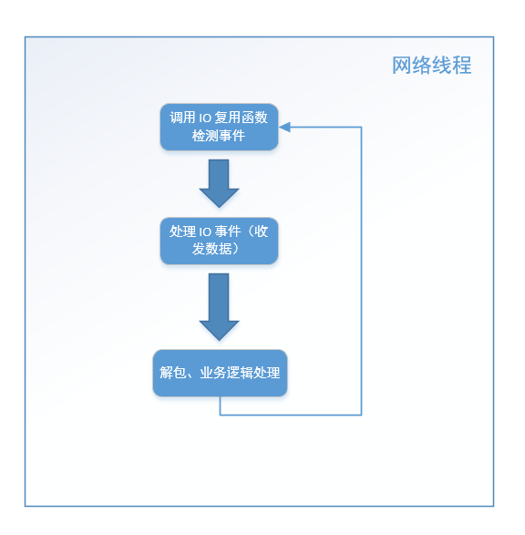
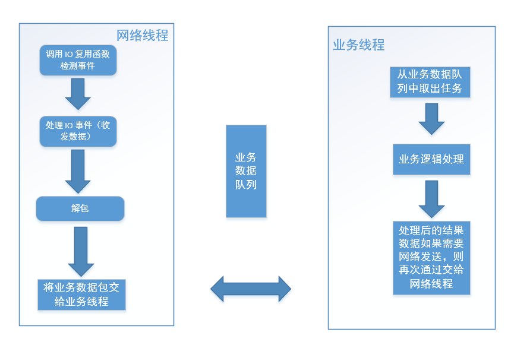

 
<!--BEGIN_DATA
{
    "create_date": "2019-12-17 20:30", 
    "modify_date": "2019-12-17 20:30", 
    "is_top": "0", 
    "summary": "一个线程对应一个循环", 
    "tags": "C/C++、系统、架构", 
    "file_name": "一个线程对应一个循环.md"
}
END_DATA-->

####
原文出处：<a href='https://cloud.tencent.com/developer/article/1554751' target='blank'>one thread one loop 思想</a>

#####**one thread one loop 程序的基本结构**

基于 Reactor 模式，我们引出 **one thread one loop 思想**，所谓 one thread one loop，翻译成中文的意思就是一个线程对应一个循环，这里说的线程针对的是网络相关的线程，也就是说一个每个线程函数里面有一个循环流程，这些循环流程里面做的都是相同的事情。这个线程函数的内容细节如下：

    
    
    //线程函数
    void thread_func(void* thread_arg)
    {
        //这里做一些需要的初始化工作
        while (线程退出标志)
        {
            //步骤一：利用select/poll/epoll等IO复用技术，分离出读写事件
            //步骤二：处理读事件或写事件
            //步骤三：做一些其他的事情
        }
        //这里做一些需要的清理工具
    }
        

关键部分是线程函数里面的 **while 循环部分**，步骤一利用 IO 复用技术分离出 socket 读写事件这里不再介绍了，前面已经介绍得足够多了。

重点是步骤二，处理读事件和可写事件，需要注意的是，在 Linux 操作系统下，除了 socket 对象以外，其他对象也可以挂到 IO 复用函数去（下面的章节中读者很快就会看到）。

这里我们暂时先讨论 socket 对象，以处理读事件为例：对于侦听socket，我们认为它的读事件一般就是接收新连接“等”操作，注意这里的“等”我加了个引号，也就是说，我们不仅仅可以接收新连接，也可以多做一点事情，如将由accept函数新产生的客户端 socket 绑定到 IO 复用函数上去，创建代表连接的对象等等各种操作；对于普通的 socket的读事件，在不考虑出错的情况下，我们可以调用 recv 或者 read 函数收取数据，甚至我们可以对收到的数据解包，并做一些业务逻辑的处理。举个例子，假设我们收到的数据经解包后发现是登陆请求包，我们可以接着处理这些登陆数据，并应答客户端。那么这里的处理读事件实际上就包括：收数据、解包、处理数据、应答客户端四个步骤。对于处理写事件，一般就是发送数据了。

步骤三，做一些其他的事情。其他的事情就具体问题具体对待了，如我们可以将上一步的解包或者验证数据放在这里。毕竟从程序的设计的结构来说，检测事件（步骤一）和收发数据这个属于网络通信层的工作，而解包和处理数据属于业务层的工作。一个良好的设计，这两个工作应该是分离的。当然，还可以做一些其他的事情，我们很快很介绍到。

#####**线程的分工**

根据上面介绍的线程函数中的循环结构，服务器端为了能流畅处理多个客户端连接，一般在某个线程 A 里面 accept 新的客户端连接并生成新连接的socket，然后将这些新连接的 socket 传递给另外开的数个工作线程 B1、B2、B3、B4，这些工作线程继续处理这些新连接上的网络 IO 事件（即收发数据），同时，这些工作线程还处理系统中的另外一些事务。这里我们将线程 A 称为主线程，B1、B2、B3、B4等称为工作线程。工作线程的代码框架上文介绍过了，我们使用伪代码表示一下：

    
    
    while (!m_bQuitFlag)
    {
        epoll_or_select_func();
        handle_io_events();
        handle_other_things();
    }
        

在 **epoll_or_select_func()** 中通过 select/poll/epoll 等 IO 复用函数去检测 socket 上的 IO 事件，若存在这些事件则下一步调用 **handle_io_events()**来处理这些事件（收发数据），做完之后可能还要做一些其他任务，调用**handle_other_things()** 即可。

这样做有三个好处：

  1. 线程 A 只需要处理新连接的到来即可，不用处理网络 IO 事件。如果在线程 A 里面既处理新连接又处理网络 IO，则可能由于线程忙于处理 IO 事件，而无法及时处理客户端的新连接请求，这是很不好的。
  2. 线程 A 接受的新连接（每个连接对应一个 socket fd），可以根据一定的[负载均衡](https://cloud.tencent.com/product/clb?from=10680)策略将这些新的 socket 分配给各个工作线程。round robin （轮询策略）是其中一种很简便、常用的算法，即在假设不考虑中途有连接断开的情况，一个新连接来了分配给 B1，接着又来一个分配给 B2，再来一个分配给 B3，再来一个分配给 B4，如此反复。线程 A 会记录了各个工作线程上的 socket fd 数量，这样可以最大化地来平衡资源，避免一些工作线程“忙死”，另外一些工作线程“闲死”的现象。
  3. 在工作线程不满载的情况下，可以让工作线程做其他的事情。比如现在有四个工作线程，但只有三个连接。那么线程 B4 就可以在 handle_other_thing() 做一些其他事情。

程序的这种基础框架需要解决一个很重要的效率问题：

在上述 while 循环里面，epoll_or_selec_func() 中的 poll/select/epoll\_wait等函数一般设置了一个超时时间。如果设置超时时间为 0，那么在没有任何网络 IO 事件和其他任务处理需要处理的情况下，这些工作线程实际上会空转，白白地浪费CPU 时间片；如果设置的超时时间大于 0，在没有网络 IO 事件的情况，poll/select/epoll\_wait等函数会在挂起指定时间后才能返回，导致需要 handle\_other\_thing()不能及时执行，导致其他任务不能及时处理，也就是说一旦有其他任务需要处理，由于 IO复用函数需要等待一段时间，导致这些其他任务在一定的延时后才能处理。这两种情形都不好。那如何解决该问题呢？

其实我们想达到的效果是，如果没有网络 IO 事件和其他任务要处理，那么这些工作线程最好直接挂起而不是空转；如果有其他任务要处理，这些工作线程要能立刻处理这些任务而不是在poll/select/epoll\_wait 等函数挂起指定时间后才开始处理这些任务。

为此，我们仍然会给 poll/select/epoll\_wait 等函数设置一定的超时事件，但对于 **handle_other_thing()**
函数的执行，我们采用一种特殊的唤醒策略。以 Linux 为例，不管 epoll\_fd 上有没有文件描述符 fd，我们都会它绑定一个特殊的 fd，这个 fd被称为 **wakeup fd**（**唤醒 fd**）。当我们有其他任务需要立即处理时，即让 **handle_other_thing()**立刻执行，向这个唤醒 fd 上随便写入 1 个字节的，这样这个 fd 立即就变成可读的了，select/poll/epoll_wait
函数会立即被唤醒，并返回，接下来就可以马上执行 handle\_other\_thing() 函数了，其他任务就可以得到立即处理；反之，没有其他任务也没有网络IO 事件时，epoll_or_select_func() 就挂在那里什么也不做。

#####**唤醒机制的实现**

这个唤醒 fd 在 Linux 操作系统上可以通过以下几种方法实现：

  1. 使用**管道 fd（pipe）**：创建一个管道，将管道的一端绑定到 epollfd 上，需要唤醒时，向管道的另一端写入一个字节，工作线程立即被唤醒。

        #include <unistd.h>

        int pipe(int pipefd[2]);

        #include <fcntl.h>
        #include <unistd.h>

        int pipe2(int pipefd[2], int flags);

  2. 使用 Linux 2.6新增的 **eventfd** 
  
        #include <sys/eventfd.h>

        int eventfd(unsigned int initval, int flags);
   使用方法和管道 fd 使用方法一样，将生成的 eventfd() 函数返回的 eventfd 绑定到 epollfd上，需要唤醒时，向这个 eventfd 上写入一个字节，IO 复用函数被立即被唤醒。
  3. 使用 **socketpair**，socketpair 是一对相互连接的 socket，相当于服务器端和客户端的两个端点，每一端都可以读写数据，向其中一端写入数据，就可以从另外一端读取数据。
  
        #include <sys/types.h>
        #include <sys/socket.h>

        int socketpair(int domain, int type, int protocol, int sv[2]);
   调用这个函数返回的两个 socket 句柄就是 sv[0] 和 sv[1]，在一个其中任何一个写入字节，在另外一个收取字节。使用方法与上面其他两种一样，将收取的字节的 socket 句柄绑定到 epollfd 上。需要时，向另外一个写入的socket上写入一个字节，工作线程立即被唤醒。 需要注意的是，和创建普通 socket 稍微不同的是，创建 socketpair，其第一个参数 domain 必须要设置成AFX_UNIX。

在 Windows 操作系统上，如果使用 select 函数作为 IO 复用函数，由于 Windows 系统上的 select 只支持检测套接字这一种，因此Windows 上一般只能模仿 Linux 的 socketpair 的思路，即手动创建两个 socket，然后调用connect/accept
函数建立一个连接，相当于一个 socket 作为客户端连接 socket（调用 connect），去连接某个侦听 socket，另外一个 socket作为侦听端接受连接后（调用 accept 函数）返回的 socket。然后将读取数据的那一端的 socket 绑定到 select
函数上并检测其可读事件。这是在写跨两个平台代码时，需要注意的地方。

>这段文字中一共有三个 socket，这端的 socket（称为 A），调用 connect 函数传入，另外一端的侦听 socket（称为 B） 和调用accept 函数返回的 socket（称为 C），我们这里唤醒使用 A 和 C。

说了这么多，我们来看一个具体的例子：

**创建唤醒 fd**
    
    
    bool EventLoop::createWakeupfd()
    {
    #ifdef WIN32
        wakeupFdListen_ = sockets::createOrDie();
        wakeupFdSend_ = sockets::createOrDie();
        //Windows上需要创建一对socket
        struct sockaddr_in bindaddr;
        bindaddr.sin_family = AF_INET;
        bindaddr.sin_addr.s_addr = htonl(INADDR_LOOPBACK);
        //将port设为0，然后进行bind，再接着通过getsockname来获取port，这可以满足获取随机端口的情况。
        bindaddr.sin_port = 0;
        sockets::setReuseAddr(wakeupFdListen_, true);
        sockets::bindOrDie(wakeupFdListen_, bindaddr);
        sockets::listenOrDie(wakeupFdListen_);
        struct sockaddr_in serveraddr;
        int serveraddrlen = sizeof(serveraddr);
        if (getsockname(wakeupFdListen_, (sockaddr*)& serveraddr, &serveraddrlen) < 0)
        {
            //让程序挂掉
            LOGF("Unable to bind address info, EventLoop: 0x%x", this);
            return false;
        }
        int useport = ntohs(serveraddr.sin_port);
        LOGD("wakeup fd use port: %d", useport);
        //serveraddr.sin_family = AF_INET;
        //serveraddr.sin_addr.s_addr = inet_addr("127.0.0.1");
        //serveraddr.sin_port = htons(INNER_WAKEUP_LISTEN_PORT);
        if (::connect(wakeupFdSend_, (struct sockaddr*) & serveraddr, sizeof(serveraddr)) < 0)
        {
            //让程序挂掉
            LOGF("Unable to connect to wakeup peer, EventLoop: 0x%x", this);
            return false;
        }
        struct sockaddr_in clientaddr;
        socklen_t clientaddrlen = sizeof(clientaddr);
        wakeupFdRecv_ = ::accept(wakeupFdListen_, (struct sockaddr*) & clientaddr, &clientaddrlen);
        if (wakeupFdRecv_ < 0)
        {
            //让程序挂掉
            LOGF("Unable to accept wakeup peer, EventLoop: 0x%x", this);
            return false;
        }
        sockets::setNonBlockAndCloseOnExec(wakeupFdSend_);
        sockets::setNonBlockAndCloseOnExec(wakeupFdRecv_);
    #else
        //Linux上一个eventfd就够了，可以实现读写
        wakeupFd_ = ::eventfd(0, EFD_NONBLOCK | EFD_CLOEXEC);
        if (wakeupFd_ < 0)
        {
            //让程序挂掉
            LOGF("Unable to create wakeup eventfd, EventLoop: 0x%x", this);
            return false;
        }
    #endif
        return true;
    }
        

上述代码中，有一个实现细节需要注意一下。在 Windows 平台上，作为服务端的一方，创建一个侦听 socket（代码中的**wakeupFdListen_**）后，需要调用 bind 函数绑定特定的 ip 和端口号，我们这里不要使用一个固定端口号，因为工作线程可能存在多个，一旦端口号固定，在创建下一个工作线程时，会因为端口号已经被占用导致 bind 函数调用失败，导致其他工作线程无法创建出来。因此这里将端口号设置为 0（代码 **12**行），操作系统会给我们分配一个可用的端口号。现在作为客户端一方，调用 connect 函数时需要指定明确的 ip 和端口号，这个时候 getsockname 函数就能获取到操作系统为 bind 函数分配的端口号（代码 **19** 行）。

**唤醒函数实现**
    
    
    bool EventLoop::wakeup()
    {
        uint64_t one = 1;
    #ifdef WIN32
        int32_t n = sockets::write(wakeupFdSend_, &one, sizeof(one));
    #else
        int32_t n = sockets::write(wakeupFd_, &one, sizeof(one));
    #endif
        if (n != sizeof one)
        {
    #ifdef WIN32
            DWORD error = WSAGetLastError();
            LOGSYSE("EventLoop::wakeup() writes %d  bytes instead of 8, fd: %d, error: %d", n, wakeupFdSend_, (int32_t)error);
    #else
            int error = errno;
            LOGSYSE("EventLoop::wakeup() writes %d  bytes instead of 8, fd: %d, error: %d, errorinfo: %s", n, wakeupFd_, error, strerror(error));
    #endif
            return false;
        }
        return true;
    }
        

无论使用哪种 fd 作为唤醒 fd，一定要在唤醒后及时将唤醒 fd 中的数据读出来，即消耗掉这个 fd 的接收缓冲区里面的数据，否则可能会由于不断的调用，导致这个 fd 接受缓冲区被写满，导致下次唤醒失败（即向 fd 写入数据失败）。

**从唤醒 fd 中读取数据**
    
    
    bool EventLoop::handleRead()
    {
        uint64_t one = 1;
    #ifdef WIN32
        int32_t n = sockets::read(wakeupFdRecv_, &one, sizeof(one));
    #else
        int32_t n = sockets::read(wakeupFd_, &one, sizeof(one));
    #endif
        if (n != sizeof one)
        {
    #ifdef WIN32
            DWORD error = WSAGetLastError();
            LOGSYSE("EventLoop::wakeup() read %d  bytes instead of 8, fd: %d, error: %d", n, wakeupFdRecv_, (int32_t)error);
    #else
            int error = errno;
            LOGSYSE("EventLoop::wakeup() read %d  bytes instead of 8, fd: %d, error: %d, errorinfo: %s", n, wakeupFd_, error, strerror(error));
    #endif
            return false;
        }
        return true;
    }
        

**EventLoop::handleRead()** 函数可以在触发唤醒 fd 的读事件后调用。

#####**handle_other_things() 方法的逻辑**

在了解了唤醒机制之后，我们来看一下 **handle_other_things()** 方法的使用，**handle_other_things()**可以设计成从一个 "other_things" 集合中取出具体的任务来执行：

    
    
    void EventLoop::handle_other_things()
    {
        std::vector<OtherThingFunctor> otherThingFunctors;
        callingPendingFunctors_ = true;
        {
            std::unique_lock<std::mutex> lock(mutex_);
            otherThingFunctors.swap(pendingOtherThingFunctors_);
        }
        for (size_t i = 0; i < otherThingFunctors.size(); ++i)
        {
            otherThingFunctors[i]();
        }
        callingPendingFunctors_ = false;
    }
        

**pendingOtherThingFunctors_** 这里是一个类成员变量，这里的实现使用了 std::vector，工作线程本身会从这个容器中取出任务来执行，这里我们将任务封装成一个个的函数对象，从容器中取出来直接执行就可以了。这里使用了一个特殊的小技巧，为了减小锁 （**mutex_**，也是成员变量，与 **pendingOtherThingFunctors_** 作用域一致）的作用范围，提高程序执行效率，我们使用了一个局部变量 **otherThingFunctors** 将成员变量 **pendingOtherThingFunctors_** 的中的数据倒换进这个局部变量中。

添加 "other_things"，可以在任意线程添加，也就是说可以在网络线程之外的线程中添加任务，因此可能涉及到多个线程同时操作**pendingOtherThingFunctors_** 对象，因此需要对其使用锁（这里是 **mutex_**）进行保护。添加"other_things" 代码如下：

    
    
    void EventLoop::queueInLoop(const Functor& cb)
    {
        {
            std::unique_lock<std::mutex> lock(mutex_);
            pendingOtherThingFunctors_.push_back(cb);
        }
        //如果在其他线程调用了这个函数，立即尝试唤醒handle_other_things()所在线程
        if (!isInLoopThread() || callingPendingFunctors_)
        {
            wakeup();
        }
    }
    

最后，在某些程序结构中，根据需要执行的 **other_things** 的类型，可以存在多个 **handle_other_things()**
方法，程序结构就演变成了：
    
    
    while (!m_bQuitFlag)
    {
        epoll_or_select_func();
        handle_io_events();
        handle_other_things1();
        handle_other_things2();
        handle_other_things3();
        //根据实际需要可以有更多的handle_other_things()
    }
    

#####**带上定时器的程序结构**

定时器是程序常用的一个功能之一，上述结构中可以在线程循环执行流中加上检测和处理定时器事件的逻辑，添加的位置一般放在程序循环执行流的第一步。加上定时器逻辑后程序结构变为：

    
    
    while (!m_bQuitFlag)
    {
        check_and_handle_timers();
        epoll_or_select_func();
        handle_io_events();
        handle_other_things();
    }
        

这里需要注意的是，**epoll_or_select_func()** 中使用 IO 复用函数的超时时间尽量不要大于**check_and_handle_timers()** 中所有定时器中的最小时间间隔，以免定时器逻辑处理延迟较多。

####
原文出处：<a href='https://cloud.tencent.com/developer/article/1553478' target='blank'>业务数据处理一定要单独开线程吗</a>

在 《[one thread one loop 思想](http://mp.weixin.qq.com/s?__biz=MzU2MTkwMTE4Nw==&mid=2247487973&idx=2&sn=140004b0dfde45745091ab5c6522dcba&chksm=fc70ea09cb07631f2a06d5be464c3b3c88dc309a16f797f548ec49971ef60b946d2b6e46fcf1&scene=21#wechat_redirect)》一文我们介绍了一个 loop 的主要结构一般如下所示：

    
    
    while (!m_bQuitFlag)
    {
        epoll_or_select_func();
        handle_io_events();
        handle_other_things();
    }

对于一些业务逻辑处理比较简单、不会太耗时的应用来说，**handle_io_events()**方法除了收发数据也可以直接用来直接做业务的处理，即其结构如下：

    
    
    void handle_io_events()
    {
        //收发数据
        recv_or_send_data();
        //解包并处理数据
        decode_packages_and_process();
    }

其中 **recv_or_send_data()** 方法中调用 send/recv API 进行实际的网络数据收发。以收数据为例，收完数据存入接收缓冲区后，接下来进行解包处理，然后进行业务处理，例如一个登陆数据包，其业务就是验证登陆的账户密码是否正确、记录其登陆行为等等。从程序函数调用堆栈来看，这些业务处理逻辑其实是直接在网络收发数据线程中处理的。我的意思是：网络线程调用 handle\_io\_events() 方法，handle\_io\_events() 方法调用decode\_packages\_and\_process() 方法，decode\_packages\_and\_process() 方法做具体的业务逻辑处理。

需要注意的是，为了让网络层与业务层脱耦，网络层中通常会提供一些回调函数的接口，这些回调函数我们将其指向具体的业务处理函数。以 libevent网络库的用法为例：
    
    
    int main(int argc, char **argv)
    {
        struct event_base *base;
        struct evconnlistener *listener;
        struct event *signal_event;
        struct sockaddr_in sin;
        base = event_base_new();
        memset(&sin, 0, sizeof(sin));
        sin.sin_family = AF_INET;
        sin.sin_port = htons(PORT);
        //listener_cb是我们自定义回调函数
        listener = evconnlistener_new_bind(base, listener_cb, (void *)base,
            LEV_OPT_REUSEABLE|LEV_OPT_CLOSE_ON_FREE, -1,
            (struct sockaddr*)&sin,
            sizeof(sin));
        if (!listener) {
            fprintf(stderr, "Could not create a listener!\n");
            return 1;
        }
        //signal_cb是我们自定义回调函数
        signal_event = evsignal_new(base, SIGINT, signal_cb, (void *)base);
        if (!signal_event || event_add(signal_event, NULL)<0) {
            fprintf(stderr, "Could not create/add a signal event!\n");
            return 1;
        }
        //启动loop
        event_base_dispatch(base);
        evconnlistener_free(listener);
        event_free(signal_event);
        event_base_free(base);
        printf("done\n");
        return 0;
    }

上述代码根据 libevent 自带的 helloworld 示例修改而来，其中 **listener_cb** 和 **signal_cb**是自定义的回调函数，有相应的事件触发后，libevent 的事件循环会调用我们设置的回调，在这些回调函数中，我们可以编写自己的业务逻辑代码。

这种基本的服务器结构，我们可以绘制成如下流程图：

这是这个结构的最基本逻辑，在这基础上可以延伸出很多变体。不知道读者有没有发现，上述流程图中第三步解包和业务逻辑处理这一步中（位于**handle_io_events()** 中的 **decode_packages_and_process()**方法中），如果业务逻辑处理过程比较耗时（例如，从数据库取大量数据、写文件），那么会导致网络线程在这个步骤停留时间很长，导致很久以后才能执行下一次循环，影响网络数据的检测和收发，最终导致整个程序的效率低下。

因此，对于这种情形，我们需要将业务处理逻辑单独拆出来交给另外的业务工作线程处理，业务工作线程可以是一个线程池，这个过程业务数据从网络线程组流向业务线程组。

这样的程序结构图如下图所示：

上图中，对于网络线程将业务数据包交给业务线程，可以使用一个共享的业务数据队列来实现，此时网络线程是生产者，业务线程从业务数据队列中取出任务去处理，业务线程是消费者。业务线程处理完成后如果需要将结果数据发出去，则再将数据交给网络线程。这里处理后的数据从业务线程再次流向网络线程，那么如何将数据从业务线程交给网络线程呢？这里以发数据为例，一般有三种方法：

**方法一**

直接调用相应的的发数据的方法，如果你的网络线程本身也会调用这些发数据的方法，那么此时就可能会出现网络线程和业务线程同时对发方法进行调用，相当于多个线程同时调用 socket send 函数，这样可能会导致同一个连接上的数据顺序有问题，此时的做法时，利用锁机制，同一时刻只有一个线程可以调用 socket send方法。这里给出一段伪代码，假设 TcpConnection 对象表示某路连接，无论网络线程还是业务线程处理完数据后需要发送数据，则使用：

    
    void TcpConnection::sendData(const std::string& data)
    {
        //加上锁
        std::lock_guard<std::mutex> scoped_lock(m_mutexForConnection);
        //在这里调用 send
    }

方法一的做法在设计上来说，存在让人不满意的地方，即数据发送应该属于网络层自己的事情，而不是其他模块（这里指的是业务线程）强行抢夺过来越俎代庖。

**方法二**

前面章节介绍了存在定时器结构的情况，网络线程结构变成如下流程：

    
    while (!m_bQuitFlag)
    {
        check_and_handle_timers();
        epoll_or_select_func();
        handle_io_events();
    }

业务线程可以将需要发送的数据放入另外一个共享区域中（例如相应的 TcpConnection 对象的一个成员变量中），定时器定时从这个共享区域取出来，再发送出去，这种方案的优点是网络线程做了它该做的事情，缺点是需要添加定时器，让程序逻辑变得复杂，且定时器是每隔一段时间才会触发，发送的数据可能会有一定的延迟。

**方法三**

利用线程执行流中的 **handle_other_things()** 方法，再来看下前面章节中介绍的基本结构：

    
    while (!m_bQuitFlag)
    {
        epoll_or_select_func();
        handle_io_events();
        handle_other_things();
    }

我们在《one thread one loop 思想》章节介绍了 **handle_other_things()** 函数可以做一些“其他事情”，这个函数可以在需要执行时通过前面章节介绍的唤醒机制立即被唤醒执行。业务线程将数据放入某个共享区域中（这一步和**方法二**介绍的一样），然后添加"other_things" ，在 **handle_other_things()** 中执行数据的发送。

如果读者能清晰明白地看到这里，说明您大致明白了一个不错的服务器框架是怎么回事了。上面介绍的服务器结构是目前主流的基于 Reactor模式的服务程序的通用结构，例如 libevent、libuv。

如果读者有兴趣，咱们可以再进一步深入讨论一下。

实际应用中，很多程序的业务逻辑处理其实是不耗时的，也就是说这些业务逻辑处理速度很快。由于 CPU 核数有限，当线程数量超过 CPU 数量时，各个线程（网络线程和业务线程）也不是真正地并行执行，那么即使开了一组业务线程也不一定能真正地并发执行，而业务逻辑处理并不耗时，不会影响网络线程的执行效率，那么我们不如就在网络线程里面直接处理。

上文介绍了在 handle_io_events() 方法中直接处理，如果处理的业务逻辑会产生新的其他任务，那么我们可以投递"other_things"，最终交给 **handle_other_things()** 方法来处理。此时的服务器程序结构如下：

特别说明一下：这种方式仅限于 handle\_io\_events() 或 handle\_other\_things()里面不会有耗时的逻辑，才可以替代专门开业务线程，如果有耗时操作还得老老实实单独开业务线程。虽然线程数量超过 CPU数量时，各个线程不会得到真正的并行，但那是操作系统线程调度的事情了，应用层开发不必关心这点。

