 
<!--BEGIN_DATA
{
    "create_date": "2025-01-02 11:26", 
    "modify_date": "2025-01-02 11:26", 
    "is_top": "0", 
    "summary": "一文带你速通GPU光线追踪渲染", 
    "tags": "Game", 
    "file_name": "一文带你速通GPU光线追踪渲染.md"
}
END_DATA-->

#### <p>原文出处：<a href='https://km.woa.com/articles/show/620116' target='blank'>一文带你速通GPU光线追踪渲染</a></p>

>丨 导语 基于实践，带你半小时手写一个GPU加速的光线追踪渲染器。核显也能高达 200 帧。

## 1 前言

本文教你使用 Python 来从零开始、一步一步地实现一个基于物理 (Physically Based Rendering, PBR) 的光线追踪渲染器，然后用它构建一个场景，渲染出有真实感的画面。本文也会尽可能的用更多的自然语言、图和公式讲解其中的物理和数学原理。


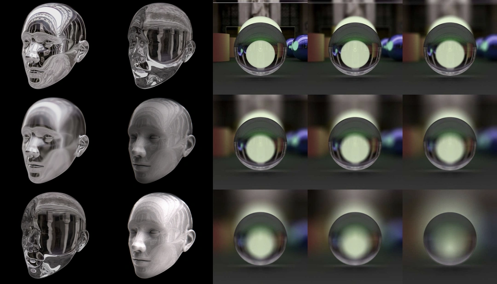

本文基于笔者的项目 [ https://github.com/HK-SHAO/RayTracingPBR ](https://github.com/HK-SHAO/RayTracingPBR)

### 1.1 什么是并行计算

当前许多计算密集型任务（例如图像渲染、物理仿真和人工智能等任务）高度依托于并行数值计算。这些任务大多可以被分解为可以被并行处理的最简单的数学运算，通常我们会把它们交给多核心的 CPU 或 GPU 来进行处理，利用多核来加速任务效率。

如何区分 CPU 和 GPU 的计算能力？形象点来说，CPU 的若干个大核心就像是几个“博士生”为你处理复杂任务，而 GPU 就像是有成百上千个“小学生”（英伟达的 4090 GPU 拥有超过一万个 CUDA 核心）为你同时处理任务。所以通常，我们会使用 GPU 来加速并行计算。

 
GPU 拥有大量处理单元，可以同时处理大量任务

### 1.2 并行离我们远吗

并不远！并行计算时时刻刻都在发生，包括我们每天在看的视频、玩的游戏都需要经过大量并行计算。而多媒体创作本身，例如我们在使用相机拍下照片的瞬间、用剪辑软件或特效软件处理视频、影视特效对物体的仿真和渲染、AI 模型的训练和使用（相信不少人已经了解了由 Novel AI 和 niji·journey 等 AI 模型创作的不少令人惊人的画作）等等也需要大量并行计算的任务。

|  | 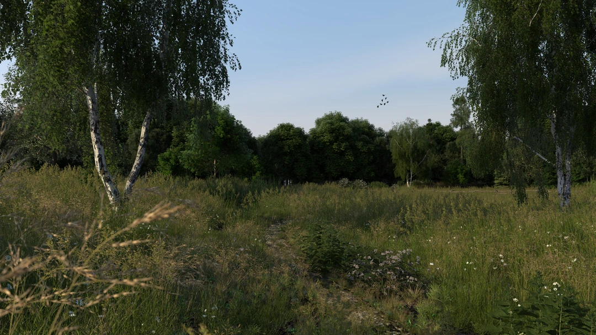 |  
| ----------- | ----------- |
| 你能一眼分辨出这是 AI 画的吗？| 你能一眼分辨出这是游戏渲染的吗？ |

### 1.3 为什么用 Taichi

很久以前，我曾构想过一个专门进行数值计算和可视化的工具 Plotter ，它将循环和分支结构视为对矩阵的处理，并且当时使用 JavaScript 实现了这个工具的原型，创作了一些简单的数学可视化效果。

| 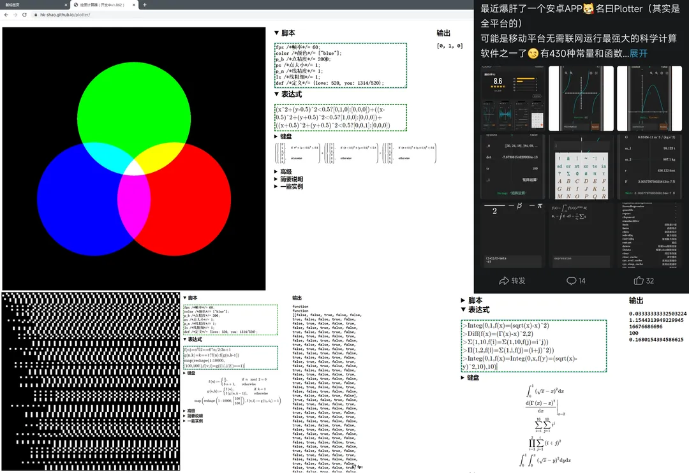 | 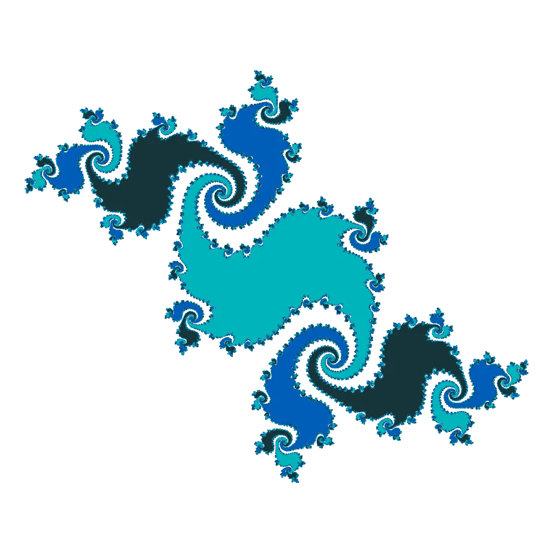 |
| ----------- | ----------- |
| 高中和大学的时候做的一些数学绘图小玩具 | 用我自己写的小工具画的 Julia 集 |

但是它的问题是效率非常低下。后来我接触了游戏开发，并入门了着色器，然后震惊于并行计算带来的极高计算效率，但是使用着色器任然存在许多桎梏，它的兼容性和灵活度并不是很好。

再后来我了解了 Taichi ，作为领域特定语言，能够让你以更好的灵活度和简便的语法轻松玩转并行编程，无需配置复杂的 C++/CUDA 环境、使用冗长的语法并处理各种编译和运行时问题。

下面是一段 Taichi 代码的示意图，相信你能从其中感受到 Taichi 的简洁和灵活性。


用蒙特卡洛算法计算圆周率，图片来自 Taichi 官网

### 1.4 安装 Taichi

在开始之前，你需要先安装 Python ，然后使用 Python 的包管理器 `pip` 来安装 Taichi 。

在 [Python 官网](https://www.python.org/) 下载安装 Python 后，使用 `pip install taichi -U` 安装 Taichi 。

之后，你可以使用 `ti gallery` 来验证是否安装成功，并查看一些 taichi 程序的演示。

### 1.5 运行 Taichi 程序

现在，我会教你使用 Taichi 定义一个向量场，然后使用 GPU 绘制一片紫色并显示在窗口中。

你也许已经知道，显示设备显示图像的原理是每个像素以混合不同强度的红绿蓝 (RGB) 三色光的方式[[4]]显示五彩斑斓的颜色，而在计算机中也最常用 RGB 色彩空间来处理颜色。紫色是由红色光与蓝色光混合而成，绿色光的强度为 0 ，所以我们用 `vec3(1, 0, 1)` 表示紫色。

  
放大看显示器，实际上是由 RGB像素构成的[[4:1]]

我们将图像视为一个二维的、由像素组成的向量场[[5]]，每个像素都有一个颜色值，用一个三维的向量表示 RGB 三个分量的强度，且每个分量被标准化到 0 和 1 之间，用 0 表示强度最弱，用 1 表示强度最强。在 Taichi 中，我们先用 `ti.init(arch=ti.gpu)` 初始化 Taichi ，并告诉它我们要将程序在 GPU 中加速运行，然后使用 `ti.Vector.field` 来定义一个向量场。

这个场的大小便是图像的分辨率，在这里我们设置为常见的 `1920x1080` ，即 1920 个像素宽、1080 个像素高的图像。然后，我们在用 `ti.kernel` 装饰 Taichi 运行时的入口（这里是 `render` 函数），使用 Taichi 的并行 `for` 为每个像素赋予紫色 `vec3(1, 0, 1)` 。最后我们用 `ti.ui.Window` 创建一个窗口[[6]]，并用 `canvas.set_image` 将这个场绘制到窗口的画布中。

创建一个 `00.py` 文本文件，输入下面的代码。

```python
from taichi.math import *   # 导入 Taichi 数学库
import taichi as ti # 导入 Taichi 库

ti.init(arch=ti.gpu)    # 初始化 Taichi ，GPU 加速

image_resolution = (1920, 1080) # 图像分辨率
image_pixels = ti.Vector.field(3, float, image_resolution) # 图像的像素场

@ti.kernel
def render():   # 渲染函数
    for i, j in image_pixels:   # 并行遍历像素场
        image_pixels[i, j] = vec3(1, 0, 1)  # 设置像素颜色为紫色

window = ti.ui.Window("Taichi Renderer", image_resolution)  # 创建窗口
canvas = window.get_canvas()    # 获取画布

while window.running:
    render()    # 调用渲染函数
    canvas.set_image(image_pixels)  # 为画布设置图像
    window.show()   # 显示窗口
```

在当前路径下，使用终端命令 `ti 00.py` 运行这个 Taichi 程序，你便可以看到一个紫色的窗口。

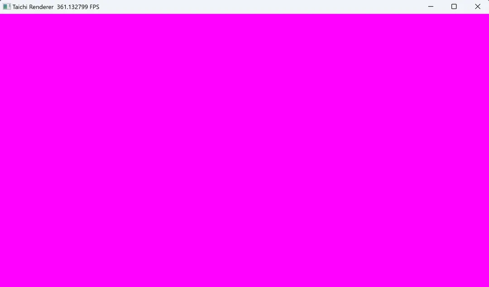  
你的第一个 Taichi 图形程序：紫色的窗口

## 2 让我们正式开始

别忘了我们的目标是创建一个光线追踪渲染器，但是凡事都得一步一步地来不是吗？现在你已经会运行 Taichi 程序，并成功在画布里绘制出了一片纯紫色，这已经是一个很好的开始了。

接下来我们要建立坐标系，并对坐标值进行归一化，这是我们能够自由控制画面中物体位置的基础。

什么是归一化？通常是指将数值压缩到 0 到 1 之间，或者 -1 到 1 之间。在这里，我们的图像分辨率是 `image_resolution = (1920, 1080)` ，但这个数值是可以被我们自由变更的，因此我们将第 i 行、第 j 列的像素的坐标值归一化为 `u = i / image_resolution[0]` 和 `v = j / image_resolution[1]` ，这样我们就可以使用归一化的 uv 坐标来描述像素位置了。

之后，我们将红色强度设置为 u ，绿色强度设置为 v ，蓝色强度设置为 0 ，这样我们就可以看到一个渐变的彩色图像，并且沿着 u 轴从左到右红色强度上升，沿着 v 轴从下到上绿色强度上升。

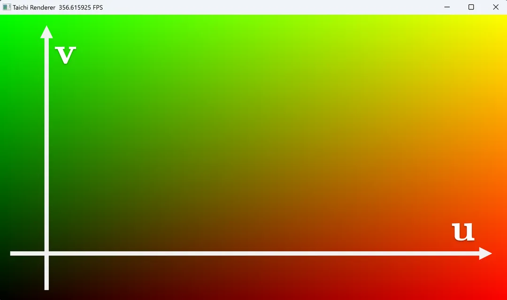  
彩色的画布，沿着 u 轴从左到右红色强度上升，沿着 v 轴从下到上绿色强度上升

创建一个 `01.py` 文本文件，在 `00.py` 基础上加入下面的代码。

```python
@ti.kernel
def render():   ## 渲染函数
    for i, j in image_pixels:   ## 并行遍历像素场
        u = i / image_resolution[0] ## 计算归一化的 u 坐标
        v = j / image_resolution[1] ## 计算归一化的 v 坐标
   
        image_pixels[i, j] = vec3(u, v, 0)  ## 设置像素颜色
```

在当前路径下，使用终端命令 `ti 01.py` 运行这个 Taichi 程序，你便可以看到一个彩色的窗口。

## 3 使画面动起来

一副静态画面有什么好看的呢？让我们更进一步，使画面动起来吧。

我们需要做的是获取当前程序运行经过的时间，然后将这个时间传入 `render` 函数，让它影响蓝色分量的强度。我们希望画面整体蓝色强度会随着时间周期性的变化。

别忘了归一化，程序经过的时间是以秒为单位不断增加的，但是我们的蓝色分量必须在 0 和 1 之间，在这之外的值会被截断。因此，我们使用 `sin(t)` 函数将时间归一化到 -1 到 1 之间，再缩放并平移到 0 到 1 之间，这只需要 `0.5*sin(t) + 0.5`。

创建一个 `02.py` 文本文件，在 `01.py` 基础上加入下面的代码。

```python
@ti.kernel
def render(time: float):                       # 渲染函数
    for i, j in image_pixels:                  # 并行遍历像素场
        ...
        blue = 0.5 * sin(time) + 0.5           # 计算蓝色分量
        image_pixels[i, j] = vec3(u, v, blue)  # 设置像素颜色
...
start_time = time.time()                       # 获取程序开始时时间
while window.running:
    delta_time = time.time() - start_time      # 计算时间差
    render(delta_time)                         # 调用渲染函数
    ... 
```

在当前路径下，使用终端命令 `ti 02.py` 运行这个 Taichi 程序，可以看到一个不断变化色彩的窗口。

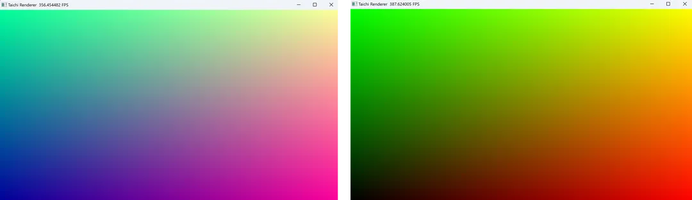  
这副画面的色调会随着时间周期性变化

## 4 光子与光线

光线追踪渲染利用了光路可逆的原理，我们将光的传播逆向表达，从每个像素发出光线，光击中材质表面后改变了自身的强度、颜色和方向，然后继续传播，直到光线被完全吸收或者到达了光源。最后我们将累积的颜色显示在这个像素上，便渲染出了场景。

接下来，我们来到了光线追踪最基础的一步——定义光线。光线是光子沿射线传播的路径，在基于光线追踪的渲染器中，我们假定光线仅沿着一条直线传播，因此光线可以用一个起点

<svg style="overflow:visible;min-height:1px;min-width:1px;vertical-align:-.011ex;" xmlns="http://www.w3.org/2000/svg" width="2.373ex" height="1.946ex" viewBox="0 -855 1049 860"><g stroke="currentColor" fill="currentColor" stroke-width="0" transform="scale(1,-1)"><g data-mml-node="math"><g data-mml-node="TeXAtom"><g data-mml-node="mover"><g data-mml-node="TeXAtom"><g data-mml-node="mi"><path d="M405 293T374 293T324 312T305 361Q305 378 312 394Q315 397 315 399Q305 399 294 394T266 375T238 329T222 249Q221 241 221 149V62H308V0H298Q280 3 161 3Q47 3 38 0H29V62H98V210V303Q98 353 96 363T83 376Q69 380 42 380H29V442H32L118 446Q204 450 205 450H210V414L211 378Q247 449 315 449H321Q384 449 413 422T442 360Q442 332 424 313Z" style="stroke-width: 3;"></path><path d="M287 -5Q228 -5 182 10T109 48T63 102T39 161T32 219Q32 272 50 314T94 382T154 423T214 446T265 452H279Q319 452 326 451Q428 439 485 376T542 221Q542 156 514 108T442 33Q384 -5 287 -5ZM399 230V250Q399 280 398 298T391 338T372 372T338 392T282 401Q241 401 212 380Q190 363 183 334T175 230Q175 202 175 189T177 153T183 118T195 91T215 68T245 56T287 50Q348 50 374 84Q388 101 393 132T399 230Z" transform="translate(474,0)" style="stroke-width: 3;"></path></g></g><g data-mml-node="mo" transform="translate(524.5,41) translate(-250 0)"><path d="M377 694Q377 702 382 708T397 714Q404 714 409 709Q414 705 419 690Q429 653 460 633Q471 626 471 615Q471 606 468 603T454 594Q411 572 379 531Q377 529 374 525T369 519T364 517T357 516Q350 516 344 521T337 536Q337 555 384 595H213L42 596Q29 605 29 615Q29 622 42 635H401Q377 673 377 694Z" style="stroke-width: 3;"></path></g></g></g></g></g></svg> 和一个方向 <svg style="overflow:visible;min-height:1px;min-width:1px;vertical-align:-.014ex;" xmlns="http://www.w3.org/2000/svg" width="2.518ex" height="2.495ex" viewBox="0 -1097 1113 1103"><g stroke="currentColor" fill="currentColor" stroke-width="0" transform="scale(1,-1)"><g data-mml-node="math"><g data-mml-node="TeXAtom"><g data-mml-node="mover"><g data-mml-node="TeXAtom"><g data-mml-node="mi"><path d="M405 293T374 293T324 312T305 361Q305 378 312 394Q315 397 315 399Q305 399 294 394T266 375T238 329T222 249Q221 241 221 149V62H308V0H298Q280 3 161 3Q47 3 38 0H29V62H98V210V303Q98 353 96 363T83 376Q69 380 42 380H29V442H32L118 446Q204 450 205 450H210V414L211 378Q247 449 315 449H321Q384 449 413 422T442 360Q442 332 424 313Z" style="stroke-width: 3;"></path><path d="M351 686L442 690Q533 694 534 694H540V389Q540 327 540 253T539 163Q539 97 541 83T555 66Q569 62 596 62H609V31Q609 0 608 0Q588 0 510 -3T412 -6Q411 -6 411 16V38L401 31Q337 -6 265 -6Q159 -6 99 58T38 224Q38 265 51 303T92 375T165 429T272 449Q359 449 417 412V507V555Q417 597 415 607T402 620Q388 624 361 624H348V686H351ZM411 350Q362 399 291 399Q278 399 256 392T218 371Q195 351 189 320T182 238V221Q182 179 183 159T191 115T212 74Q241 46 288 46Q358 46 404 100L411 109V350Z" transform="translate(474,0)" style="stroke-width: 3;"></path></g></g><g data-mml-node="mo" transform="translate(556.5,283) translate(-250 0)"><path d="M377 694Q377 702 382 708T397 714Q404 714 409 709Q414 705 419 690Q429 653 460 633Q471 626 471 615Q471 606 468 603T454 594Q411 572 379 531Q377 529 374 525T369 519T364 517T357 516Q350 516 344 521T337 536Q337 555 384 595H213L42 596Q29 605 29 615Q29 622 42 635H401Q377 673 377 694Z" style="stroke-width: 3;"></path></g></g></g></g></g></svg> 来表示，其中 
<svg style="overflow:visible;min-height:1px;min-width:1px;vertical-align:-.014ex;" xmlns="http://www.w3.org/2000/svg" width="2.518ex" height="2.495ex" viewBox="0 -1097 1113 1103"><g stroke="currentColor" fill="currentColor" stroke-width="0" transform="scale(1,-1)"><g data-mml-node="math"><g data-mml-node="TeXAtom"><g data-mml-node="mover"><g data-mml-node="TeXAtom"><g data-mml-node="mi"><path d="M405 293T374 293T324 312T305 361Q305 378 312 394Q315 397 315 399Q305 399 294 394T266 375T238 329T222 249Q221 241 221 149V62H308V0H298Q280 3 161 3Q47 3 38 0H29V62H98V210V303Q98 353 96 363T83 376Q69 380 42 380H29V442H32L118 446Q204 450 205 450H210V414L211 378Q247 449 315 449H321Q384 449 413 422T442 360Q442 332 424 313Z" style="stroke-width: 3;"></path><path d="M351 686L442 690Q533 694 534 694H540V389Q540 327 540 253T539 163Q539 97 541 83T555 66Q569 62 596 62H609V31Q609 0 608 0Q588 0 510 -3T412 -6Q411 -6 411 16V38L401 31Q337 -6 265 -6Q159 -6 99 58T38 224Q38 265 51 303T92 375T165 429T272 449Q359 449 417 412V507V555Q417 597 415 607T402 620Q388 624 361 624H348V686H351ZM411 350Q362 399 291 399Q278 399 256 392T218 371Q195 351 189 320T182 238V221Q182 179 183 159T191 115T212 74Q241 46 288 46Q358 46 404 100L411 109V350Z" transform="translate(474,0)" style="stroke-width: 3;"></path></g></g><g data-mml-node="mo" transform="translate(556.5,283) translate(-250 0)"><path d="M377 694Q377 702 382 708T397 714Q404 714 409 709Q414 705 419 690Q429 653 460 633Q471 626 471 615Q471 606 468 603T454 594Q411 572 379 531Q377 529 374 525T369 519T364 517T357 516Q350 516 344 521T337 536Q337 555 384 595H213L42 596Q29 605 29 615Q29 622 42 635H401Q377 673 377 694Z" style="stroke-width: 3;"></path></g></g></g></g></g></svg> 应是一个单位向量。这样，光子在三维空间中所在的位置可以用 
<svg style="overflow:visible;min-height:1px;min-width:1px;vertical-align:-.566ex;" xmlns="http://www.w3.org/2000/svg" width="17.148ex" height="3.048ex" viewBox="0 -1097 7579.4 1347"><g stroke="currentColor" fill="currentColor" stroke-width="0" transform="scale(1,-1)"><g data-mml-node="math"><g data-mml-node="TeXAtom"><g data-mml-node="mover"><g data-mml-node="TeXAtom"><g data-mml-node="mi"><path d="M32 442L123 446Q214 450 215 450H221V409Q222 409 229 413T251 423T284 436T328 446T382 450Q480 450 540 388T600 223Q600 128 539 61T361 -6H354Q292 -6 236 28L227 34V-132H296V-194H287Q269 -191 163 -191Q56 -191 38 -194H29V-132H98V113V284Q98 330 97 348T93 370T83 376Q69 380 42 380H29V442H32ZM457 224Q457 303 427 349T350 395Q282 395 235 352L227 345V104L233 97Q274 45 337 45Q383 45 420 86T457 224Z" style="stroke-width: 3;"></path></g></g><g data-mml-node="mo" transform="translate(319.5,39) translate(-250 0)"><path d="M377 694Q377 702 382 708T397 714Q404 714 409 709Q414 705 419 690Q429 653 460 633Q471 626 471 615Q471 606 468 603T454 594Q411 572 379 531Q377 529 374 525T369 519T364 517T357 516Q350 516 344 521T337 536Q337 555 384 595H213L42 596Q29 605 29 615Q29 622 42 635H401Q377 673 377 694Z" style="stroke-width: 3;"></path></g></g></g><g data-mml-node="mo" transform="translate(639,0)"><path d="M94 250Q94 319 104 381T127 488T164 576T202 643T244 695T277 729T302 750H315H319Q333 750 333 741Q333 738 316 720T275 667T226 581T184 443T167 250T184 58T225 -81T274 -167T316 -220T333 -241Q333 -250 318 -250H315H302L274 -226Q180 -141 137 -14T94 250Z" style="stroke-width: 3;"></path></g><g data-mml-node="mi" transform="translate(1028,0)"><path d="M26 385Q19 392 19 395Q19 399 22 411T27 425Q29 430 36 430T87 431H140L159 511Q162 522 166 540T173 566T179 586T187 603T197 615T211 624T229 626Q247 625 254 615T261 596Q261 589 252 549T232 470L222 433Q222 431 272 431H323Q330 424 330 420Q330 398 317 385H210L174 240Q135 80 135 68Q135 26 162 26Q197 26 230 60T283 144Q285 150 288 151T303 153H307Q322 153 322 145Q322 142 319 133Q314 117 301 95T267 48T216 6T155 -11Q125 -11 98 4T59 56Q57 64 57 83V101L92 241Q127 382 128 383Q128 385 77 385H26Z" style="stroke-width: 3;"></path></g><g data-mml-node="mo" transform="translate(1389,0)"><path d="M60 749L64 750Q69 750 74 750H86L114 726Q208 641 251 514T294 250Q294 182 284 119T261 12T224 -76T186 -143T145 -194T113 -227T90 -246Q87 -249 86 -250H74Q66 -250 63 -250T58 -247T55 -238Q56 -237 66 -225Q221 -64 221 250T66 725Q56 737 55 738Q55 746 60 749Z" style="stroke-width: 3;"></path></g><g data-mml-node="mo" transform="translate(2055.8,0)"><path d="M56 347Q56 360 70 367H707Q722 359 722 347Q722 336 708 328L390 327H72Q56 332 56 347ZM56 153Q56 168 72 173H708Q722 163 722 153Q722 140 707 133H70Q56 140 56 153Z" style="stroke-width: 3;"></path></g><g data-mml-node="TeXAtom" transform="translate(3111.6,0)"><g data-mml-node="mover"><g data-mml-node="TeXAtom"><g data-mml-node="mi"><path d="M405 293T374 293T324 312T305 361Q305 378 312 394Q315 397 315 399Q305 399 294 394T266 375T238 329T222 249Q221 241 221 149V62H308V0H298Q280 3 161 3Q47 3 38 0H29V62H98V210V303Q98 353 96 363T83 376Q69 380 42 380H29V442H32L118 446Q204 450 205 450H210V414L211 378Q247 449 315 449H321Q384 449 413 422T442 360Q442 332 424 313Z" style="stroke-width: 3;"></path><path d="M287 -5Q228 -5 182 10T109 48T63 102T39 161T32 219Q32 272 50 314T94 382T154 423T214 446T265 452H279Q319 452 326 451Q428 439 485 376T542 221Q542 156 514 108T442 33Q384 -5 287 -5ZM399 230V250Q399 280 398 298T391 338T372 372T338 392T282 401Q241 401 212 380Q190 363 183 334T175 230Q175 202 175 189T177 153T183 118T195 91T215 68T245 56T287 50Q348 50 374 84Q388 101 393 132T399 230Z" transform="translate(474,0)" style="stroke-width: 3;"></path></g></g><g data-mml-node="mo" transform="translate(524.5,41) translate(-250 0)"><path d="M377 694Q377 702 382 708T397 714Q404 714 409 709Q414 705 419 690Q429 653 460 633Q471 626 471 615Q471 606 468 603T454 594Q411 572 379 531Q377 529 374 525T369 519T364 517T357 516Q350 516 344 521T337 536Q337 555 384 595H213L42 596Q29 605 29 615Q29 622 42 635H401Q377 673 377 694Z" style="stroke-width: 3;"></path></g></g></g><g data-mml-node="mo" transform="translate(4382.8,0)"><path d="M56 237T56 250T70 270H369V420L370 570Q380 583 389 583Q402 583 409 568V270H707Q722 262 722 250T707 230H409V-68Q401 -82 391 -82H389H387Q375 -82 369 -68V230H70Q56 237 56 250Z" style="stroke-width: 3;"></path></g><g data-mml-node="mi" transform="translate(5383,0)"><path d="M26 385Q19 392 19 395Q19 399 22 411T27 425Q29 430 36 430T87 431H140L159 511Q162 522 166 540T173 566T179 586T187 603T197 615T211 624T229 626Q247 625 254 615T261 596Q261 589 252 549T232 470L222 433Q222 431 272 431H323Q330 424 330 420Q330 398 317 385H210L174 240Q135 80 135 68Q135 26 162 26Q197 26 230 60T283 144Q285 150 288 151T303 153H307Q322 153 322 145Q322 142 319 133Q314 117 301 95T267 48T216 6T155 -11Q125 -11 98 4T59 56Q57 64 57 83V101L92 241Q127 382 128 383Q128 385 77 385H26Z" style="stroke-width: 3;"></path></g><g data-mml-node="mo" transform="translate(5966.2,0)"><path d="M78 250Q78 274 95 292T138 310Q162 310 180 294T199 251Q199 226 182 208T139 190T96 207T78 250Z" style="stroke-width: 3;"></path></g><g data-mml-node="TeXAtom" transform="translate(6466.4,0)"><g data-mml-node="mover"><g data-mml-node="TeXAtom"><g data-mml-node="mi"><path d="M405 293T374 293T324 312T305 361Q305 378 312 394Q315 397 315 399Q305 399 294 394T266 375T238 329T222 249Q221 241 221 149V62H308V0H298Q280 3 161 3Q47 3 38 0H29V62H98V210V303Q98 353 96 363T83 376Q69 380 42 380H29V442H32L118 446Q204 450 205 450H210V414L211 378Q247 449 315 449H321Q384 449 413 422T442 360Q442 332 424 313Z" style="stroke-width: 3;"></path><path d="M351 686L442 690Q533 694 534 694H540V389Q540 327 540 253T539 163Q539 97 541 83T555 66Q569 62 596 62H609V31Q609 0 608 0Q588 0 510 -3T412 -6Q411 -6 411 16V38L401 31Q337 -6 265 -6Q159 -6 99 58T38 224Q38 265 51 303T92 375T165 429T272 449Q359 449 417 412V507V555Q417 597 415 607T402 620Q388 624 361 624H348V686H351ZM411 350Q362 399 291 399Q278 399 256 392T218 371Q195 351 189 320T182 238V221Q182 179 183 159T191 115T212 74Q241 46 288 46Q358 46 404 100L411 109V350Z" transform="translate(474,0)" style="stroke-width: 3;"></path></g></g><g data-mml-node="mo" transform="translate(556.5,283) translate(-250 0)"><path d="M377 694Q377 702 382 708T397 714Q404 714 409 709Q414 705 419 690Q429 653 460 633Q471 626 471 615Q471 606 468 603T454 594Q411 572 379 531Q377 529 374 525T369 519T364 517T357 516Q350 516 344 521T337 536Q337 555 384 595H213L42 596Q29 605 29 615Q29 622 42 635H401Q377 673 377 694Z" style="stroke-width: 3;"></path></g></g></g></g></g></svg>

表示，其中 `t` 是光从起点开始传播的距离。

光线的起点和方向

用一个四维向量 `vec4` 表示光线的颜色&强度，这方便我们后面对光的处理。在这里，我们使用面向对象 (OOP) 的建模方法，利用 Taichi 的 `ti.dataclass` 装饰器写一个光线类，`at` 函数传入 `t` 计算光所在位置。

```python
@ti.dataclass
class Ray:  ## 光线类
    origin: vec3    ## 光线起点
    direction: vec3 ## 光线方向
    color: vec4     ## 光的颜色

    @ti.func
    def at(r, t: float) -> vec3: ## 计算光子所在位置
        return r.origin + t * r.direction
```

## 5 建立坐标系

为什么要建立坐标系？因为接下来我们要在虚拟的三维空间中定义我们摄像机的位置，在这之前，我们已经用 uv 坐标建立了一个二维的坐标系了，我们还需要一个 z 轴正方向。使用过三维软件、游戏引擎的同学可能知道，图形学中常使用右手系来建立三维空间坐标。

因此，从屏幕向你眼睛的方向，z 轴分量是负的。我们将视点（好比眼睛的位置）放在原点 `(0, 0, 0)`，画布（相当于你的屏幕）的中心位置为 `(0, 0, -1)`，从视点向画布中每个像素发射一条光线。

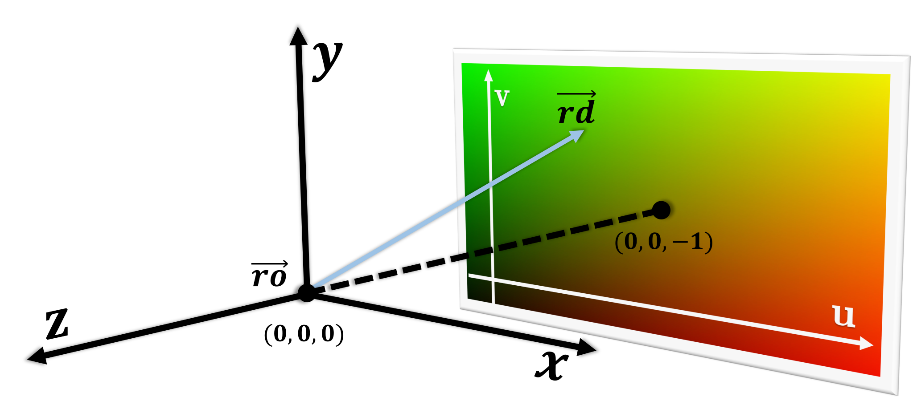  
建立右手系坐标系，将画布放到 z 负半轴方向

在 `render` 函数中，初始化视点和画布的位置，然后创建一条光线。在这里，我们使用了 `normalize` 函数将向量化为仅表示方向的单位向量。

<svg style="overflow:visible;min-height:1px;min-width:1px;vertical-align:-2.405ex;width:100%;" xmlns="http://www.w3.org/2000/svg" width="20.485ex" height="5.864ex" viewBox="0 -1529 9054.6 2592"><g stroke="currentColor" fill="currentColor" stroke-width="0" transform="scale(1,-1)"><g data-mml-node="math"><g data-mml-node="TeXAtom"><g data-mml-node="mi"><path d="M41 46H55Q94 46 102 60V68Q102 77 102 91T102 122T103 161T103 203Q103 234 103 269T102 328V351Q99 370 88 376T43 385H25V408Q25 431 27 431L37 432Q47 433 65 434T102 436Q119 437 138 438T167 441T178 442H181V402Q181 364 182 364T187 369T199 384T218 402T247 421T285 437Q305 442 336 442Q450 438 463 329Q464 322 464 190V104Q464 66 466 59T477 49Q498 46 526 46H542V0H534L510 1Q487 2 460 2T422 3Q319 3 310 0H302V46H318Q379 46 379 62Q380 64 380 200Q379 335 378 343Q372 371 358 385T334 402T308 404Q263 404 229 370Q202 343 195 315T187 232V168V108Q187 78 188 68T191 55T200 49Q221 46 249 46H265V0H257L234 1Q210 2 183 2T145 3Q42 3 33 0H25V46H41Z" style="stroke-width: 3;"></path><path d="M28 214Q28 309 93 378T250 448Q340 448 405 380T471 215Q471 120 407 55T250 -10Q153 -10 91 57T28 214ZM250 30Q372 30 372 193V225V250Q372 272 371 288T364 326T348 362T317 390T268 410Q263 411 252 411Q222 411 195 399Q152 377 139 338T126 246V226Q126 130 145 91Q177 30 250 30Z" transform="translate(556,0)" style="stroke-width: 3;"></path><path d="M36 46H50Q89 46 97 60V68Q97 77 97 91T98 122T98 161T98 203Q98 234 98 269T98 328L97 351Q94 370 83 376T38 385H20V408Q20 431 22 431L32 432Q42 433 60 434T96 436Q112 437 131 438T160 441T171 442H174V373Q213 441 271 441H277Q322 441 343 419T364 373Q364 352 351 337T313 322Q288 322 276 338T263 372Q263 381 265 388T270 400T273 405Q271 407 250 401Q234 393 226 386Q179 341 179 207V154Q179 141 179 127T179 101T180 81T180 66V61Q181 59 183 57T188 54T193 51T200 49T207 48T216 47T225 47T235 46T245 46H276V0H267Q249 3 140 3Q37 3 28 0H20V46H36Z" transform="translate(1056,0)" style="stroke-width: 3;"></path><path d="M41 46H55Q94 46 102 60V68Q102 77 102 91T102 122T103 161T103 203Q103 234 103 269T102 328V351Q99 370 88 376T43 385H25V408Q25 431 27 431L37 432Q47 433 65 434T102 436Q119 437 138 438T167 441T178 442H181V402Q181 364 182 364T187 369T199 384T218 402T247 421T285 437Q305 442 336 442Q351 442 364 440T387 434T406 426T421 417T432 406T441 395T448 384T452 374T455 366L457 361L460 365Q463 369 466 373T475 384T488 397T503 410T523 422T546 432T572 439T603 442Q729 442 740 329Q741 322 741 190V104Q741 66 743 59T754 49Q775 46 803 46H819V0H811L788 1Q764 2 737 2T699 3Q596 3 587 0H579V46H595Q656 46 656 62Q657 64 657 200Q656 335 655 343Q649 371 635 385T611 402T585 404Q540 404 506 370Q479 343 472 315T464 232V168V108Q464 78 465 68T468 55T477 49Q498 46 526 46H542V0H534L510 1Q487 2 460 2T422 3Q319 3 310 0H302V46H318Q379 46 379 62Q380 64 380 200Q379 335 378 343Q372 371 358 385T334 402T308 404Q263 404 229 370Q202 343 195 315T187 232V168V108Q187 78 188 68T191 55T200 49Q221 46 249 46H265V0H257L234 1Q210 2 183 2T145 3Q42 3 33 0H25V46H41Z" transform="translate(1448,0)" style="stroke-width: 3;"></path><path d="M137 305T115 305T78 320T63 359Q63 394 97 421T218 448Q291 448 336 416T396 340Q401 326 401 309T402 194V124Q402 76 407 58T428 40Q443 40 448 56T453 109V145H493V106Q492 66 490 59Q481 29 455 12T400 -6T353 12T329 54V58L327 55Q325 52 322 49T314 40T302 29T287 17T269 6T247 -2T221 -8T190 -11Q130 -11 82 20T34 107Q34 128 41 147T68 188T116 225T194 253T304 268H318V290Q318 324 312 340Q290 411 215 411Q197 411 181 410T156 406T148 403Q170 388 170 359Q170 334 154 320ZM126 106Q126 75 150 51T209 26Q247 26 276 49T315 109Q317 116 318 175Q318 233 317 233Q309 233 296 232T251 223T193 203T147 166T126 106Z" transform="translate(2281,0)" style="stroke-width: 3;"></path><path d="M42 46H56Q95 46 103 60V68Q103 77 103 91T103 124T104 167T104 217T104 272T104 329Q104 366 104 407T104 482T104 542T103 586T103 603Q100 622 89 628T44 637H26V660Q26 683 28 683L38 684Q48 685 67 686T104 688Q121 689 141 690T171 693T182 694H185V379Q185 62 186 60Q190 52 198 49Q219 46 247 46H263V0H255L232 1Q209 2 183 2T145 3T107 3T57 1L34 0H26V46H42Z" transform="translate(2781,0)" style="stroke-width: 3;"></path><path d="M69 609Q69 637 87 653T131 669Q154 667 171 652T188 609Q188 579 171 564T129 549Q104 549 87 564T69 609ZM247 0Q232 3 143 3Q132 3 106 3T56 1L34 0H26V46H42Q70 46 91 49Q100 53 102 60T104 102V205V293Q104 345 102 359T88 378Q74 385 41 385H30V408Q30 431 32 431L42 432Q52 433 70 434T106 436Q123 437 142 438T171 441T182 442H185V62Q190 52 197 50T232 46H255V0H247Z" transform="translate(3059,0)" style="stroke-width: 3;"></path><path d="M42 263Q44 270 48 345T53 423V431H393Q399 425 399 415Q399 403 398 402L381 378Q364 355 331 309T265 220L134 41L182 40H206Q254 40 283 46T331 77Q352 105 359 185L361 201Q361 202 381 202H401V196Q401 195 393 103T384 6V0H209L34 1L31 3Q28 8 28 17Q28 30 29 31T160 210T294 394H236Q169 393 152 388Q127 382 113 367Q89 344 82 264V255H42V263Z" transform="translate(3337,0)" style="stroke-width: 3;"></path><path d="M28 218Q28 273 48 318T98 391T163 433T229 448Q282 448 320 430T378 380T406 316T415 245Q415 238 408 231H126V216Q126 68 226 36Q246 30 270 30Q312 30 342 62Q359 79 369 104L379 128Q382 131 395 131H398Q415 131 415 121Q415 117 412 108Q393 53 349 21T250 -11Q155 -11 92 58T28 218ZM333 275Q322 403 238 411H236Q228 411 220 410T195 402T166 381T143 340T127 274V267H333V275Z" transform="translate(3781,0)" style="stroke-width: 3;"></path></g></g><g data-mml-node="mo" transform="translate(4225,0)"><path d="M94 250Q94 319 104 381T127 488T164 576T202 643T244 695T277 729T302 750H315H319Q333 750 333 741Q333 738 316 720T275 667T226 581T184 443T167 250T184 58T225 -81T274 -167T316 -220T333 -241Q333 -250 318 -250H315H302L274 -226Q180 -141 137 -14T94 250Z" style="stroke-width: 3;"></path></g><g data-mml-node="TeXAtom" transform="translate(4614,0)"><g data-mml-node="mover"><g data-mml-node="TeXAtom"><g data-mml-node="mi"><path d="M32 442L123 446Q214 450 215 450H221V409Q222 409 229 413T251 423T284 436T328 446T382 450Q480 450 540 388T600 223Q600 128 539 61T361 -6H354Q292 -6 236 28L227 34V-132H296V-194H287Q269 -191 163 -191Q56 -191 38 -194H29V-132H98V113V284Q98 330 97 348T93 370T83 376Q69 380 42 380H29V442H32ZM457 224Q457 303 427 349T350 395Q282 395 235 352L227 345V104L233 97Q274 45 337 45Q383 45 420 86T457 224Z" style="stroke-width: 3;"></path></g></g><g data-mml-node="mo" transform="translate(319.5,39) translate(-250 0)"><path d="M377 694Q377 702 382 708T397 714Q404 714 409 709Q414 705 419 690Q429 653 460 633Q471 626 471 615Q471 606 468 603T454 594Q411 572 379 531Q377 529 374 525T369 519T364 517T357 516Q350 516 344 521T337 536Q337 555 384 595H213L42 596Q29 605 29 615Q29 622 42 635H401Q377 673 377 694Z" style="stroke-width: 3;"></path></g></g></g><g data-mml-node="mo" transform="translate(5253,0)"><path d="M60 749L64 750Q69 750 74 750H86L114 726Q208 641 251 514T294 250Q294 182 284 119T261 12T224 -76T186 -143T145 -194T113 -227T90 -246Q87 -249 86 -250H74Q66 -250 63 -250T58 -247T55 -238Q56 -237 66 -225Q221 -64 221 250T66 725Q56 737 55 738Q55 746 60 749Z" style="stroke-width: 3;"></path></g><g data-mml-node="mo" transform="translate(5919.8,0)"><path d="M56 347Q56 360 70 367H707Q722 359 722 347Q722 336 708 328L390 327H72Q56 332 56 347ZM56 153Q56 168 72 173H708Q722 163 722 153Q722 140 707 133H70Q56 140 56 153Z" style="stroke-width: 3;"></path></g><g data-mml-node="mfrac" transform="translate(6975.6,0)"><g data-mml-node="TeXAtom" transform="translate(720,676)"><g data-mml-node="mover"><g data-mml-node="TeXAtom"><g data-mml-node="mi"><path d="M32 442L123 446Q214 450 215 450H221V409Q222 409 229 413T251 423T284 436T328 446T382 450Q480 450 540 388T600 223Q600 128 539 61T361 -6H354Q292 -6 236 28L227 34V-132H296V-194H287Q269 -191 163 -191Q56 -191 38 -194H29V-132H98V113V284Q98 330 97 348T93 370T83 376Q69 380 42 380H29V442H32ZM457 224Q457 303 427 349T350 395Q282 395 235 352L227 345V104L233 97Q274 45 337 45Q383 45 420 86T457 224Z" style="stroke-width: 3;"></path></g></g><g data-mml-node="mo" transform="translate(319.5,39) translate(-250 0)"><path d="M377 694Q377 702 382 708T397 714Q404 714 409 709Q414 705 419 690Q429 653 460 633Q471 626 471 615Q471 606 468 603T454 594Q411 572 379 531Q377 529 374 525T369 519T364 517T357 516Q350 516 344 521T337 536Q337 555 384 595H213L42 596Q29 605 29 615Q29 622 42 635H401Q377 673 377 694Z" style="stroke-width: 3;"></path></g></g></g><g data-mml-node="mrow" transform="translate(220,-813)"><g data-mml-node="mo"><path d="M133 736Q138 750 153 750Q164 750 170 739Q172 735 172 250T170 -239Q164 -250 152 -250Q144 -250 138 -244L137 -243Q133 -241 133 -179T132 250Q132 731 133 736ZM329 739Q334 750 346 750Q353 750 361 744L362 743Q366 741 366 679T367 250T367 -178T362 -243L361 -244Q355 -250 347 -250Q335 -250 329 -239Q327 -235 327 250T329 739Z" style="stroke-width: 3;"></path></g><g data-mml-node="TeXAtom" transform="translate(500,0)"><g data-mml-node="mover"><g data-mml-node="TeXAtom"><g data-mml-node="mi"><path d="M32 442L123 446Q214 450 215 450H221V409Q222 409 229 413T251 423T284 436T328 446T382 450Q480 450 540 388T600 223Q600 128 539 61T361 -6H354Q292 -6 236 28L227 34V-132H296V-194H287Q269 -191 163 -191Q56 -191 38 -194H29V-132H98V113V284Q98 330 97 348T93 370T83 376Q69 380 42 380H29V442H32ZM457 224Q457 303 427 349T350 395Q282 395 235 352L227 345V104L233 97Q274 45 337 45Q383 45 420 86T457 224Z" style="stroke-width: 3;"></path></g></g><g data-mml-node="mo" transform="translate(319.5,39) translate(-250 0)"><path d="M377 694Q377 702 382 708T397 714Q404 714 409 709Q414 705 419 690Q429 653 460 633Q471 626 471 615Q471 606 468 603T454 594Q411 572 379 531Q377 529 374 525T369 519T364 517T357 516Q350 516 344 521T337 536Q337 555 384 595H213L42 596Q29 605 29 615Q29 622 42 635H401Q377 673 377 694Z" style="stroke-width: 3;"></path></g></g></g><g data-mml-node="mo" transform="translate(1139,0)"><path d="M133 736Q138 750 153 750Q164 750 170 739Q172 735 172 250T170 -239Q164 -250 152 -250Q144 -250 138 -244L137 -243Q133 -241 133 -179T132 250Q132 731 133 736ZM329 739Q334 750 346 750Q353 750 361 744L362 743Q366 741 366 679T367 250T367 -178T362 -243L361 -244Q355 -250 347 -250Q335 -250 329 -239Q327 -235 327 250T329 739Z" style="stroke-width: 3;"></path></g></g><rect width="1839" height="60" x="120" y="220"></rect></g></g></g></svg>

代码如下

```python
lower_left_corner = vec3(-2, -1, -1)    ## 视野左下角
horizontal = vec3(4, 0, 0)  ## 视野水平方向
vertical = vec3(0, 2, 0)    ## 视野垂直方向
origin = vec3(0, 0, 0)      ## 视点

ro = origin ## 光线起点
rd = normalize(lower_left_corner + u*horizontal + v*vertical - ro)  ## 光线方向
ray = Ray(ro, rd)   ## 创建光线
```

## 6 画一片蓝天

有了光线之后，我们尝试使用光线方向的 y 分量来混合白色和蓝色，从而得到一片随时间变化的蓝天。`mix` 函数是对向量的插值（混合），用数学公式表达是

<svg style="overflow:visible;min-height:1px;min-width:1px;vertical-align:-.566ex;width:100%;margin-bottom:.5em;" xmlns="http://www.w3.org/2000/svg" width="30.06ex" height="3.048ex" viewBox="0 -1097 13286.7 1347"><g stroke="currentColor" fill="currentColor" stroke-width="0" transform="scale(1,-1)"><g data-mml-node="math"><g data-mml-node="TeXAtom"><g data-mml-node="mi"><path d="M41 46H55Q94 46 102 60V68Q102 77 102 91T102 122T103 161T103 203Q103 234 103 269T102 328V351Q99 370 88 376T43 385H25V408Q25 431 27 431L37 432Q47 433 65 434T102 436Q119 437 138 438T167 441T178 442H181V402Q181 364 182 364T187 369T199 384T218 402T247 421T285 437Q305 442 336 442Q351 442 364 440T387 434T406 426T421 417T432 406T441 395T448 384T452 374T455 366L457 361L460 365Q463 369 466 373T475 384T488 397T503 410T523 422T546 432T572 439T603 442Q729 442 740 329Q741 322 741 190V104Q741 66 743 59T754 49Q775 46 803 46H819V0H811L788 1Q764 2 737 2T699 3Q596 3 587 0H579V46H595Q656 46 656 62Q657 64 657 200Q656 335 655 343Q649 371 635 385T611 402T585 404Q540 404 506 370Q479 343 472 315T464 232V168V108Q464 78 465 68T468 55T477 49Q498 46 526 46H542V0H534L510 1Q487 2 460 2T422 3Q319 3 310 0H302V46H318Q379 46 379 62Q380 64 380 200Q379 335 378 343Q372 371 358 385T334 402T308 404Q263 404 229 370Q202 343 195 315T187 232V168V108Q187 78 188 68T191 55T200 49Q221 46 249 46H265V0H257L234 1Q210 2 183 2T145 3Q42 3 33 0H25V46H41Z" style="stroke-width: 3;"></path></g><g data-mml-node="mi" transform="translate(833,0)"><path d="M69 609Q69 637 87 653T131 669Q154 667 171 652T188 609Q188 579 171 564T129 549Q104 549 87 564T69 609ZM247 0Q232 3 143 3Q132 3 106 3T56 1L34 0H26V46H42Q70 46 91 49Q100 53 102 60T104 102V205V293Q104 345 102 359T88 378Q74 385 41 385H30V408Q30 431 32 431L42 432Q52 433 70 434T106 436Q123 437 142 438T171 441T182 442H185V62Q190 52 197 50T232 46H255V0H247Z" style="stroke-width: 3;"></path></g><g data-mml-node="mi" transform="translate(1111,0)"><path d="M201 0Q189 3 102 3Q26 3 17 0H11V46H25Q48 47 67 52T96 61T121 78T139 96T160 122T180 150L226 210L168 288Q159 301 149 315T133 336T122 351T113 363T107 370T100 376T94 379T88 381T80 383Q74 383 44 385H16V431H23Q59 429 126 429Q219 429 229 431H237V385Q201 381 201 369Q201 367 211 353T239 315T268 274L272 270L297 304Q329 345 329 358Q329 364 327 369T322 376T317 380T310 384L307 385H302V431H309Q324 428 408 428Q487 428 493 431H499V385H492Q443 385 411 368Q394 360 377 341T312 257L296 236L358 151Q424 61 429 57T446 50Q464 46 499 46H516V0H510H502Q494 1 482 1T457 2T432 2T414 3Q403 3 377 3T327 1L304 0H295V46H298Q309 46 320 51T331 63Q331 65 291 120L250 175Q249 174 219 133T185 88Q181 83 181 74Q181 63 188 55T206 46Q208 46 208 23V0H201Z" style="stroke-width: 3;"></path></g></g><g data-mml-node="mo" transform="translate(1639,0)"><path d="M94 250Q94 319 104 381T127 488T164 576T202 643T244 695T277 729T302 750H315H319Q333 750 333 741Q333 738 316 720T275 667T226 581T184 443T167 250T184 58T225 -81T274 -167T316 -220T333 -241Q333 -250 318 -250H315H302L274 -226Q180 -141 137 -14T94 250Z" style="stroke-width: 3;"></path></g><g data-mml-node="TeXAtom" transform="translate(2028,0)"><g data-mml-node="mover"><g data-mml-node="TeXAtom"><g data-mml-node="mi"><path d="M64 349Q64 399 107 426T255 453Q346 453 402 423T473 341Q478 327 478 310T479 196V77Q493 63 529 62Q549 62 553 57T558 31Q558 9 552 5T514 0H497H481Q375 0 367 56L356 46Q300 -6 210 -6Q130 -6 81 30T32 121Q32 188 111 226T332 272H350V292Q350 313 348 327T337 361T306 391T248 402T194 399H189Q204 376 204 354Q204 327 187 306T134 284Q97 284 81 305T64 349ZM164 121Q164 89 186 67T238 45Q274 45 307 63T346 108L350 117V226H347Q248 218 206 189T164 121Z" style="stroke-width: 3;"></path></g></g><g data-mml-node="mo" transform="translate(279.5,42) translate(-250 0)"><path d="M377 694Q377 702 382 708T397 714Q404 714 409 709Q414 705 419 690Q429 653 460 633Q471 626 471 615Q471 606 468 603T454 594Q411 572 379 531Q377 529 374 525T369 519T364 517T357 516Q350 516 344 521T337 536Q337 555 384 595H213L42 596Q29 605 29 615Q29 622 42 635H401Q377 673 377 694Z" style="stroke-width: 3;"></path></g></g></g><g data-mml-node="mo" transform="translate(2587,0)"><path d="M78 35T78 60T94 103T137 121Q165 121 187 96T210 8Q210 -27 201 -60T180 -117T154 -158T130 -185T117 -194Q113 -194 104 -185T95 -172Q95 -168 106 -156T131 -126T157 -76T173 -3V9L172 8Q170 7 167 6T161 3T152 1T140 0Q113 0 96 17Z" style="stroke-width: 3;"></path></g><g data-mml-node="TeXAtom" transform="translate(3031.7,0)"><g data-mml-node="mover"><g data-mml-node="TeXAtom"><g data-mml-node="mi"><path d="M32 686L123 690Q214 694 215 694H221V409Q289 450 378 450Q479 450 539 387T600 221Q600 122 535 58T358 -6H355Q272 -6 203 53L160 1L129 0H98V301Q98 362 98 435T99 525Q99 591 97 604T83 620Q69 624 42 624H29V686H32ZM227 105L232 99Q237 93 242 87T258 73T280 59T306 49T339 45Q380 45 411 66T451 131Q457 160 457 230Q457 264 456 284T448 329T430 367T396 389T343 398Q282 398 235 355L227 348V105Z" style="stroke-width: 3;"></path></g></g><g data-mml-node="mo" transform="translate(319.5,283) translate(-250 0)"><path d="M377 694Q377 702 382 708T397 714Q404 714 409 709Q414 705 419 690Q429 653 460 633Q471 626 471 615Q471 606 468 603T454 594Q411 572 379 531Q377 529 374 525T369 519T364 517T357 516Q350 516 344 521T337 536Q337 555 384 595H213L42 596Q29 605 29 615Q29 622 42 635H401Q377 673 377 694Z" style="stroke-width: 3;"></path></g></g></g><g data-mml-node="mo" transform="translate(3670.7,0)"><path d="M78 35T78 60T94 103T137 121Q165 121 187 96T210 8Q210 -27 201 -60T180 -117T154 -158T130 -185T117 -194Q113 -194 104 -185T95 -172Q95 -168 106 -156T131 -126T157 -76T173 -3V9L172 8Q170 7 167 6T161 3T152 1T140 0Q113 0 96 17Z" style="stroke-width: 3;"></path></g><g data-mml-node="mi" transform="translate(4115.3,0)"><path d="M26 385Q19 392 19 395Q19 399 22 411T27 425Q29 430 36 430T87 431H140L159 511Q162 522 166 540T173 566T179 586T187 603T197 615T211 624T229 626Q247 625 254 615T261 596Q261 589 252 549T232 470L222 433Q222 431 272 431H323Q330 424 330 420Q330 398 317 385H210L174 240Q135 80 135 68Q135 26 162 26Q197 26 230 60T283 144Q285 150 288 151T303 153H307Q322 153 322 145Q322 142 319 133Q314 117 301 95T267 48T216 6T155 -11Q125 -11 98 4T59 56Q57 64 57 83V101L92 241Q127 382 128 383Q128 385 77 385H26Z" style="stroke-width: 3;"></path></g><g data-mml-node="mo" transform="translate(4476.3,0)"><path d="M60 749L64 750Q69 750 74 750H86L114 726Q208 641 251 514T294 250Q294 182 284 119T261 12T224 -76T186 -143T145 -194T113 -227T90 -246Q87 -249 86 -250H74Q66 -250 63 -250T58 -247T55 -238Q56 -237 66 -225Q221 -64 221 250T66 725Q56 737 55 738Q55 746 60 749Z" style="stroke-width: 3;"></path></g><g data-mml-node="mo" transform="translate(5143.1,0)"><path d="M56 347Q56 360 70 367H707Q722 359 722 347Q722 336 708 328L390 327H72Q56 332 56 347ZM56 153Q56 168 72 173H708Q722 163 722 153Q722 140 707 133H70Q56 140 56 153Z" style="stroke-width: 3;"></path></g><g data-mml-node="mo" transform="translate(6198.9,0)"><path d="M94 250Q94 319 104 381T127 488T164 576T202 643T244 695T277 729T302 750H315H319Q333 750 333 741Q333 738 316 720T275 667T226 581T184 443T167 250T184 58T225 -81T274 -167T316 -220T333 -241Q333 -250 318 -250H315H302L274 -226Q180 -141 137 -14T94 250Z" style="stroke-width: 3;"></path></g><g data-mml-node="mn" transform="translate(6587.9,0)"><path d="M213 578L200 573Q186 568 160 563T102 556H83V602H102Q149 604 189 617T245 641T273 663Q275 666 285 666Q294 666 302 660V361L303 61Q310 54 315 52T339 48T401 46H427V0H416Q395 3 257 3Q121 3 100 0H88V46H114Q136 46 152 46T177 47T193 50T201 52T207 57T213 61V578Z" style="stroke-width: 3;"></path></g><g data-mml-node="mo" transform="translate(7310.1,0)"><path d="M84 237T84 250T98 270H679Q694 262 694 250T679 230H98Q84 237 84 250Z" style="stroke-width: 3;"></path></g><g data-mml-node="mi" transform="translate(8310.3,0)"><path d="M26 385Q19 392 19 395Q19 399 22 411T27 425Q29 430 36 430T87 431H140L159 511Q162 522 166 540T173 566T179 586T187 603T197 615T211 624T229 626Q247 625 254 615T261 596Q261 589 252 549T232 470L222 433Q222 431 272 431H323Q330 424 330 420Q330 398 317 385H210L174 240Q135 80 135 68Q135 26 162 26Q197 26 230 60T283 144Q285 150 288 151T303 153H307Q322 153 322 145Q322 142 319 133Q314 117 301 95T267 48T216 6T155 -11Q125 -11 98 4T59 56Q57 64 57 83V101L92 241Q127 382 128 383Q128 385 77 385H26Z" style="stroke-width: 3;"></path></g><g data-mml-node="mo" transform="translate(8671.3,0)"><path d="M60 749L64 750Q69 750 74 750H86L114 726Q208 641 251 514T294 250Q294 182 284 119T261 12T224 -76T186 -143T145 -194T113 -227T90 -246Q87 -249 86 -250H74Q66 -250 63 -250T58 -247T55 -238Q56 -237 66 -225Q221 -64 221 250T66 725Q56 737 55 738Q55 746 60 749Z" style="stroke-width: 3;"></path></g><g data-mml-node="mo" transform="translate(9282.6,0)"><path d="M78 250Q78 274 95 292T138 310Q162 310 180 294T199 251Q199 226 182 208T139 190T96 207T78 250Z" style="stroke-width: 3;"></path></g><g data-mml-node="TeXAtom" transform="translate(9782.8,0)"><g data-mml-node="mover"><g data-mml-node="TeXAtom"><g data-mml-node="mi"><path d="M64 349Q64 399 107 426T255 453Q346 453 402 423T473 341Q478 327 478 310T479 196V77Q493 63 529 62Q549 62 553 57T558 31Q558 9 552 5T514 0H497H481Q375 0 367 56L356 46Q300 -6 210 -6Q130 -6 81 30T32 121Q32 188 111 226T332 272H350V292Q350 313 348 327T337 361T306 391T248 402T194 399H189Q204 376 204 354Q204 327 187 306T134 284Q97 284 81 305T64 349ZM164 121Q164 89 186 67T238 45Q274 45 307 63T346 108L350 117V226H347Q248 218 206 189T164 121Z" style="stroke-width: 3;"></path></g></g><g data-mml-node="mo" transform="translate(279.5,42) translate(-250 0)"><path d="M377 694Q377 702 382 708T397 714Q404 714 409 709Q414 705 419 690Q429 653 460 633Q471 626 471 615Q471 606 468 603T454 594Q411 572 379 531Q377 529 374 525T369 519T364 517T357 516Q350 516 344 521T337 536Q337 555 384 595H213L42 596Q29 605 29 615Q29 622 42 635H401Q377 673 377 694Z" style="stroke-width: 3;"></path></g></g></g><g data-mml-node="mo" transform="translate(10564,0)"><path d="M56 237T56 250T70 270H369V420L370 570Q380 583 389 583Q402 583 409 568V270H707Q722 262 722 250T707 230H409V-68Q401 -82 391 -82H389H387Q375 -82 369 -68V230H70Q56 237 56 250Z" style="stroke-width: 3;"></path></g><g data-mml-node="mi" transform="translate(11564.2,0)"><path d="M26 385Q19 392 19 395Q19 399 22 411T27 425Q29 430 36 430T87 431H140L159 511Q162 522 166 540T173 566T179 586T187 603T197 615T211 624T229 626Q247 625 254 615T261 596Q261 589 252 549T232 470L222 433Q222 431 272 431H323Q330 424 330 420Q330 398 317 385H210L174 240Q135 80 135 68Q135 26 162 26Q197 26 230 60T283 144Q285 150 288 151T303 153H307Q322 153 322 145Q322 142 319 133Q314 117 301 95T267 48T216 6T155 -11Q125 -11 98 4T59 56Q57 64 57 83V101L92 241Q127 382 128 383Q128 385 77 385H26Z" style="stroke-width: 3;"></path></g><g data-mml-node="mo" transform="translate(12147.4,0)"><path d="M78 250Q78 274 95 292T138 310Q162 310 180 294T199 251Q199 226 182 208T139 190T96 207T78 250Z" style="stroke-width: 3;"></path></g><g data-mml-node="TeXAtom" transform="translate(12647.7,0)"><g data-mml-node="mover"><g data-mml-node="TeXAtom"><g data-mml-node="mi"><path d="M32 686L123 690Q214 694 215 694H221V409Q289 450 378 450Q479 450 539 387T600 221Q600 122 535 58T358 -6H355Q272 -6 203 53L160 1L129 0H98V301Q98 362 98 435T99 525Q99 591 97 604T83 620Q69 624 42 624H29V686H32ZM227 105L232 99Q237 93 242 87T258 73T280 59T306 49T339 45Q380 45 411 66T451 131Q457 160 457 230Q457 264 456 284T448 329T430 367T396 389T343 398Q282 398 235 355L227 348V105Z" style="stroke-width: 3;"></path></g></g><g data-mml-node="mo" transform="translate(319.5,283) translate(-250 0)"><path d="M377 694Q377 702 382 708T397 714Q404 714 409 709Q414 705 419 690Q429 653 460 633Q471 626 471 615Q471 606 468 603T454 594Q411 572 379 531Q377 529 374 525T369 519T364 517T357 516Q350 516 344 521T337 536Q337 555 384 595H213L42 596Q29 605 29 615Q29 622 42 635H401Q377 673 377 694Z" style="stroke-width: 3;"></path></g></g></g></g></g></svg>

用 `ti.func` 装饰这个函数是一个 Taichi 函数，这样我们才可以在 Taichi 的 `ti.kernel` 中使用它。

```python
@ti.func
def sky_color(ray, time) -> vec3:
    t = 0.5 * ray.direction.y + 0.5 ## 将 y 分量归一化
    blue = 0.5 * sin(time) + 0.5    ## 计算蓝色分量
    return mix(vec3(1.0, 1.0, blue), vec3(0.5, 0.7, 1.0), t)    ## 混合两种颜色
```

在 `render` 函数中，我们将光线传入 `sky_color` 函数，得到背景颜色，再将背景颜色赋值给像素。

```python
ray.color.rgb = sky_color(ray, time)    ## 获取天空颜色
image_pixels[i, j] = ray.color.rgb  ## 设置像素颜色
```

  
一片渐变的蓝天，随时间改变颜色

## 7 往地图放入物体

### 7.1 符号距离场函数

接下来我们要往虚拟世界里放入一些几何物体，最简单的物体是一个半径为 `r` 的球，我们用一个函数来表示这个球，这个函数称为符号距离场函数 (Signed Distance Field，SDF) 。它表示的是某点到物体表面的距离，如果距离为负数，表示这个点在物体内部，如果距离为正数，表示这个点在物体外部，如果距离为零，表示这个点刚好在物体表面上。用 <svg style="overflow:visible;min-height:1px;min-width:1px;vertical-align:-.799ex;" xmlns="http://www.w3.org/2000/svg" width="3.962ex" height="2.729ex" viewBox="0 -853 1751 1206"><g stroke="currentColor" fill="currentColor" stroke-width="0" transform="scale(1,-1)"><g data-mml-node="math"><g data-mml-node="mrow"><g data-mml-node="mo"><svg width="500" height="1206" y="-353" x="28" viewBox="0 -150.8 500 1206"><path d="M133 736Q138 750 153 750Q164 750 170 739Q172 735 172 250T170 -239Q164 -250 152 -250Q144 -250 138 -244L137 -243Q133 -241 133 -179T132 250Q132 731 133 736ZM329 739Q334 750 346 750Q353 750 361 744L362 743Q366 741 366 679T367 250T367 -178T362 -243L361 -244Q355 -250 347 -250Q335 -250 329 -239Q327 -235 327 250T329 739Z" transform="scale(1,1.809)" style="stroke-width: 3;"></path></svg><svg width="500" height="1206" y="-353" x="28" viewBox="0 -150.8 500 1206"><path d="M133 736Q138 750 153 750Q164 750 170 739Q172 735 172 250T170 -239Q164 -250 152 -250Q144 -250 138 -244L137 -243Q133 -241 133 -179T132 250Q132 731 133 736ZM329 739Q334 750 346 750Q353 750 361 744L362 743Q366 741 366 679T367 250T367 -178T362 -243L361 -244Q355 -250 347 -250Q335 -250 329 -239Q327 -235 327 250T329 739Z" transform="scale(1,1.809)" style="stroke-width: 3;"></path></svg> 表示向量 <svg style="overflow:visible;min-height:1px;min-width:1px;vertical-align:-.439ex;" xmlns="http://www.w3.org/2000/svg" width="1.446ex" height="2.369ex" viewBox="0 -853 639 1047"><g stroke="currentColor" fill="currentColor" stroke-width="0" transform="scale(1,-1)"><g data-mml-node="math"><g data-mml-node="TeXAtom"><g data-mml-node="mover"><g data-mml-node="TeXAtom"><g data-mml-node="mi"><path d="M32 442L123 446Q214 450 215 450H221V409Q222 409 229 413T251 423T284 436T328 446T382 450Q480 450 540 388T600 223Q600 128 539 61T361 -6H354Q292 -6 236 28L227 34V-132H296V-194H287Q269 -191 163 -191Q56 -191 38 -194H29V-132H98V113V284Q98 330 97 348T93 370T83 376Q69 380 42 380H29V442H32ZM457 224Q457 303 427 349T350 395Q282 395 235 352L227 345V104L233 97Q274 45 337 45Q383 45 420 86T457 224Z" style="stroke-width: 3;"></path></g></g><g data-mml-node="mo" transform="translate(319.5,39) translate(-250 0)"><path d="M377 694Q377 702 382 708T397 714Q404 714 409 709Q414 705 419 690Q429 653 460 633Q471 626 471 615Q471 606 468 603T454 594Q411 572 379 531Q377 529 374 525T369 519T364 517T357 516Q350 516 344 521T337 536Q337 555 384 595H213L42 596Q29 605 29 615Q29 622 42 635H401Q377 673 377 694Z" style="stroke-width: 3;"></path></g></g></g></g></g></svg> 的 <svg style="overflow:visible;min-height:1px;min-width:1px;vertical-align:-.339ex;" xmlns="http://www.w3.org/2000/svg" width="2.528ex" height="1.885ex" viewBox="0 -683 1117.6 833"><g stroke="currentColor" fill="currentColor" stroke-width="0" transform="scale(1,-1)"><g data-mml-node="math"><g data-mml-node="msub"><g data-mml-node="mi"><path d="M228 637Q194 637 192 641Q191 643 191 649Q191 673 202 682Q204 683 217 683Q271 680 344 680Q485 680 506 683H518Q524 677 524 674T522 656Q517 641 513 637H475Q406 636 394 628Q387 624 380 600T313 336Q297 271 279 198T252 88L243 52Q243 48 252 48T311 46H328Q360 46 379 47T428 54T478 72T522 106T564 161Q580 191 594 228T611 270Q616 273 628 273H641Q647 264 647 262T627 203T583 83T557 9Q555 4 553 3T537 0T494 -1Q483 -1 418 -1T294 0H116Q32 0 32 10Q32 17 34 24Q39 43 44 45Q48 46 59 46H65Q92 46 125 49Q139 52 144 61Q147 65 216 339T285 628Q285 635 228 637Z" style="stroke-width: 3;"></path></g><g data-mml-node="mn" transform="translate(714,-150) scale(0.707)"><path d="M109 429Q82 429 66 447T50 491Q50 562 103 614T235 666Q326 666 387 610T449 465Q449 422 429 383T381 315T301 241Q265 210 201 149L142 93L218 92Q375 92 385 97Q392 99 409 186V189H449V186Q448 183 436 95T421 3V0H50V19V31Q50 38 56 46T86 81Q115 113 136 137Q145 147 170 174T204 211T233 244T261 278T284 308T305 340T320 369T333 401T340 431T343 464Q343 527 309 573T212 619Q179 619 154 602T119 569T109 550Q109 549 114 549Q132 549 151 535T170 489Q170 464 154 447T109 429Z" style="stroke-width: 3;"></path></g></g></g></g></svg> 范数，即<svg style="overflow:visible;min-height:1px;min-width:1px;vertical-align:-1.03ex;margin-left:.25em;" xmlns="http://www.w3.org/2000/svg" width="13.812ex" height="4.208ex" viewBox="0 -1404.8 6105 1860"><g stroke="currentColor" fill="currentColor" stroke-width="0" transform="scale(1,-1)"><g data-mml-node="math"><g data-mml-node="mrow"><g data-mml-node="mo"><svg width="500" height="1206" y="-353" x="28" viewBox="0 -150.8 500 1206"><path d="M133 736Q138 750 153 750Q164 750 170 739Q172 735 172 250T170 -239Q164 -250 152 -250Q144 -250 138 -244L137 -243Q133 -241 133 -179T132 250Q132 731 133 736ZM329 739Q334 750 346 750Q353 750 361 744L362 743Q366 741 366 679T367 250T367 -178T362 -243L361 -244Q355 -250 347 -250Q335 -250 329 -239Q327 -235 327 250T329 739Z" transform="scale(1,1.809)" style="stroke-width: 3;"></path></svg><svg width="500" height="1206" y="-353" x="28" viewBox="0 -150.8 500 1206"><path d="M133 736Q138 750 153 750Q164 750 170 739Q172 735 172 250T170 -239Q164 -250 152 -250Q144 -250 138 -244L137 -243Q133 -241 133 -179T132 250Q132 731 133 736ZM329 739Q334 750 346 750Q353 750 361 744L362 743Q366 741 366 679T367 250T367 -178T362 -243L361 -244Q355 -250 347 -250Q335 -250 329 -239Q327 -235 327 250T329 739Z" transform="scale(1,1.809)" style="stroke-width: 3;"></path></svg> 球的 SDF 函数是到球心的距离减去球半径，即  <svg style="overflow:visible;min-height:1px;min-width:1px;vertical-align:-.799ex;width:100%;" xmlns="http://www.w3.org/2000/svg" width="22.3ex" height="2.729ex" viewBox="0 -853 9856.7 1206"><g stroke="currentColor" fill="currentColor" stroke-width="0" transform="scale(1,-1)"><g data-mml-node="math"><g data-mml-node="TeXAtom"><g data-mml-node="mi"><path d="M295 316Q295 356 268 385T190 414Q154 414 128 401Q98 382 98 349Q97 344 98 336T114 312T157 287Q175 282 201 278T245 269T277 256Q294 248 310 236T342 195T359 133Q359 71 321 31T198 -10H190Q138 -10 94 26L86 19L77 10Q71 4 65 -1L54 -11H46H42Q39 -11 33 -5V74V132Q33 153 35 157T45 162H54Q66 162 70 158T75 146T82 119T101 77Q136 26 198 26Q295 26 295 104Q295 133 277 151Q257 175 194 187T111 210Q75 227 54 256T33 318Q33 357 50 384T93 424T143 442T187 447H198Q238 447 268 432L283 424L292 431Q302 440 314 448H322H326Q329 448 335 442V310L329 304H301Q295 310 295 316Z" style="stroke-width: 3;"></path></g><g data-mml-node="mi" transform="translate(394,0)"><path d="M36 -148H50Q89 -148 97 -134V-126Q97 -119 97 -107T97 -77T98 -38T98 6T98 55T98 106Q98 140 98 177T98 243T98 296T97 335T97 351Q94 370 83 376T38 385H20V408Q20 431 22 431L32 432Q42 433 61 434T98 436Q115 437 135 438T165 441T176 442H179V416L180 390L188 397Q247 441 326 441Q407 441 464 377T522 216Q522 115 457 52T310 -11Q242 -11 190 33L182 40V-45V-101Q182 -128 184 -134T195 -145Q216 -148 244 -148H260V-194H252L228 -193Q205 -192 178 -192T140 -191Q37 -191 28 -194H20V-148H36ZM424 218Q424 292 390 347T305 402Q234 402 182 337V98Q222 26 294 26Q345 26 384 80T424 218Z" style="stroke-width: 3;"></path></g><g data-mml-node="mi" transform="translate(950,0)"><path d="M41 46H55Q94 46 102 60V68Q102 77 102 91T102 124T102 167T103 217T103 272T103 329Q103 366 103 407T103 482T102 542T102 586T102 603Q99 622 88 628T43 637H25V660Q25 683 27 683L37 684Q47 685 66 686T103 688Q120 689 140 690T170 693T181 694H184V367Q244 442 328 442Q451 442 463 329Q464 322 464 190V104Q464 66 466 59T477 49Q498 46 526 46H542V0H534L510 1Q487 2 460 2T422 3Q319 3 310 0H302V46H318Q379 46 379 62Q380 64 380 200Q379 335 378 343Q372 371 358 385T334 402T308 404Q263 404 229 370Q202 343 195 315T187 232V168V108Q187 78 188 68T191 55T200 49Q221 46 249 46H265V0H257L234 1Q210 2 183 2T145 3Q42 3 33 0H25V46H41Z" style="stroke-width: 3;"></path></g><g data-mml-node="mi" transform="translate(1506,0)"><path d="M28 218Q28 273 48 318T98 391T163 433T229 448Q282 448 320 430T378 380T406 316T415 245Q415 238 408 231H126V216Q126 68 226 36Q246 30 270 30Q312 30 342 62Q359 79 369 104L379 128Q382 131 395 131H398Q415 131 415 121Q415 117 412 108Q393 53 349 21T250 -11Q155 -11 92 58T28 218ZM333 275Q322 403 238 411H236Q228 411 220 410T195 402T166 381T143 340T127 274V267H333V275Z" style="stroke-width: 3;"></path></g><g data-mml-node="mi" transform="translate(1950,0)"><path d="M36 46H50Q89 46 97 60V68Q97 77 97 91T98 122T98 161T98 203Q98 234 98 269T98 328L97 351Q94 370 83 376T38 385H20V408Q20 431 22 431L32 432Q42 433 60 434T96 436Q112 437 131 438T160 441T171 442H174V373Q213 441 271 441H277Q322 441 343 419T364 373Q364 352 351 337T313 322Q288 322 276 338T263 372Q263 381 265 388T270 400T273 405Q271 407 250 401Q234 393 226 386Q179 341 179 207V154Q179 141 179 127T179 101T180 81T180 66V61Q181 59 183 57T188 54T193 51T200 49T207 48T216 47T225 47T235 46T245 46H276V0H267Q249 3 140 3Q37 3 28 0H20V46H36Z" style="stroke-width: 3;"></path></g><g data-mml-node="mi" transform="translate(2342,0)"><path d="M28 218Q28 273 48 318T98 391T163 433T229 448Q282 448 320 430T378 380T406 316T415 245Q415 238 408 231H126V216Q126 68 226 36Q246 30 270 30Q312 30 342 62Q359 79 369 104L379 128Q382 131 395 131H398Q415 131 415 121Q415 117 412 108Q393 53 349 21T250 -11Q155 -11 92 58T28 218ZM333 275Q322 403 238 411H236Q228 411 220 410T195 402T166 381T143 340T127 274V267H333V275Z" style="stroke-width: 3;"></path></g></g><g data-mml-node="mo" transform="translate(2786,0)"><path d="M94 250Q94 319 104 381T127 488T164 576T202 643T244 695T277 729T302 750H315H319Q333 750 333 741Q333 738 316 720T275 667T226 581T184 443T167 250T184 58T225 -81T274 -167T316 -220T333 -241Q333 -250 318 -250H315H302L274 -226Q180 -141 137 -14T94 250Z" style="stroke-width: 3;"></path></g><g data-mml-node="TeXAtom" transform="translate(3175,0)"><g data-mml-node="mover"><g data-mml-node="TeXAtom"><g data-mml-node="mi"><path d="M32 442L123 446Q214 450 215 450H221V409Q222 409 229 413T251 423T284 436T328 446T382 450Q480 450 540 388T600 223Q600 128 539 61T361 -6H354Q292 -6 236 28L227 34V-132H296V-194H287Q269 -191 163 -191Q56 -191 38 -194H29V-132H98V113V284Q98 330 97 348T93 370T83 376Q69 380 42 380H29V442H32ZM457 224Q457 303 427 349T350 395Q282 395 235 352L227 345V104L233 97Q274 45 337 45Q383 45 420 86T457 224Z" style="stroke-width: 3;"></path></g></g><g data-mml-node="mo" transform="translate(319.5,39) translate(-250 0)"><path d="M377 694Q377 702 382 708T397 714Q404 714 409 709Q414 705 419 690Q429 653 460 633Q471 626 471 615Q471 606 468 603T454 594Q411 572 379 531Q377 529 374 525T369 519T364 517T357 516Q350 516 344 521T337 536Q337 555 384 595H213L42 596Q29 605 29 615Q29 622 42 635H401Q377 673 377 694Z" style="stroke-width: 3;"></path></g></g></g><g data-mml-node="mo" transform="translate(3814,0)"><path d="M78 35T78 60T94 103T137 121Q165 121 187 96T210 8Q210 -27 201 -60T180 -117T154 -158T130 -185T117 -194Q113 -194 104 -185T95 -172Q95 -168 106 -156T131 -126T157 -76T173 -3V9L172 8Q170 7 167 6T161 3T152 1T140 0Q113 0 96 17Z" style="stroke-width: 3;"></path></g><g data-mml-node="mi" transform="translate(4258.7,0)"><path d="M21 287Q22 290 23 295T28 317T38 348T53 381T73 411T99 433T132 442Q161 442 183 430T214 408T225 388Q227 382 228 382T236 389Q284 441 347 441H350Q398 441 422 400Q430 381 430 363Q430 333 417 315T391 292T366 288Q346 288 334 299T322 328Q322 376 378 392Q356 405 342 405Q286 405 239 331Q229 315 224 298T190 165Q156 25 151 16Q138 -11 108 -11Q95 -11 87 -5T76 7T74 17Q74 30 114 189T154 366Q154 405 128 405Q107 405 92 377T68 316T57 280Q55 278 41 278H27Q21 284 21 287Z" style="stroke-width: 3;"></path></g><g data-mml-node="mo" transform="translate(4709.7,0)"><path d="M60 749L64 750Q69 750 74 750H86L114 726Q208 641 251 514T294 250Q294 182 284 119T261 12T224 -76T186 -143T145 -194T113 -227T90 -246Q87 -249 86 -250H74Q66 -250 63 -250T58 -247T55 -238Q56 -237 66 -225Q221 -64 221 250T66 725Q56 737 55 738Q55 746 60 749Z" style="stroke-width: 3;"></path></g><g data-mml-node="mo" transform="translate(5376.4,0)"><path d="M56 347Q56 360 70 367H707Q722 359 722 347Q722 336 708 328L390 327H72Q56 332 56 347ZM56 153Q56 168 72 173H708Q722 163 722 153Q722 140 707 133H70Q56 140 56 153Z" style="stroke-width: 3;"></path></g><g data-mml-node="mrow" transform="translate(6432.2,0)"><g data-mml-node="mo"><svg width="500" height="1206" y="-353" x="28" viewBox="0 -150.8 500 1206"><path d="M133 736Q138 750 153 750Q164 750 170 739Q172 735 172 250T170 -239Q164 -250 152 -250Q144 -250 138 -244L137 -243Q133 -241 133 -179T132 250Q132 731 133 736ZM329 739Q334 750 346 750Q353 750 361 744L362 743Q366 741 366 679T367 250T367 -178T362 -243L361 -244Q355 -250 347 -250Q335 -250 329 -239Q327 -235 327 250T329 739Z" transform="scale(1,1.809)" style="stroke-width: 3;"></path></svg><svg width="500" height="1206" y="-353" x="28" viewBox="0 -150.8 500 1206"><path d="M133 736Q138 750 153 750Q164 750 170 739Q172 735 172 250T170 -239Q164 -250 152 -250Q144 -250 138 -244L137 -243Q133 -241 133 -179T132 250Q132 731 133 736ZM329 739Q334 750 346 750Q353 750 361 744L362 743Q366 741 366 679T367 250T367 -178T362 -243L361 -244Q355 -250 347 -250Q335 -250 329 -239Q327 -235 327 250T329 739Z" transform="scale(1,1.809)" style="stroke-width: 3;"></path></svg>

转化为 Python 代码就是

```python
@ti.func
def sd_sphere(p: vec3, r: float) -> float:  ## SDF 球体
    return length(p) - r
```

使用 SDF 表示物体的好处是，我们可以很方便地计算出物体的表面法线，这在后面的光照计算中会用到。此外， SDF 函数不仅能够表达简单的集合物体，也可以表达复杂的物体，还可以使用简单的运算对多个物体进行变换、组合和重复等操作[[7]]，这使得我们可以很方便地创建出复杂的场景，如下图所示

|  |  |  |
| ----------- | ----------- | ----------- |
| 扭曲物体 | 重复物体 | 并集、差集、交集 |

图片来自 <https://iquilezles.org/articles/distfunctions/>

### 7.2 光线步进求交

有了用 SDF 表示的球体之后，接下来就是让光线前进，然后找到光线与物体最近的交点。我们可以使用光线步进 (Ray Marching) 的方法来找到交点，即沿着光线方向，每次前进一小步，然后计算出这一步的有向距离 (SD) 值，一直前进直到 SD 值与 0 相差非常小 `abs(SD) < PRECISION` ，就认为光线到达了物体的表面。

可是每次前进的步长是多少呢？如果步长太大，光线可能会跳过物体表面，如果步长太小，光线前进的速度就会极慢，这样就会带来非常多冗余的计算，使得画面帧数下降。

一个聪明的做法是让光线每次前进的距离刚好等于 SD 的绝对值，因为它是当前点到物体表面的最短距离。最好的情况下，光线只需要前进一两次就可以刚好到达表面。

当光线偏离物体很远时，光线也很快就会传播到无穷远处，当光线步进的距离足够远而仍然没有到达物体表面，就认为这条光线没有击中任何物体，那我们就可以认为它击中了天空。

下面是三维空间的一个二维切面，可视化这个算法中光线步进和与物体求交的过程。

|  |  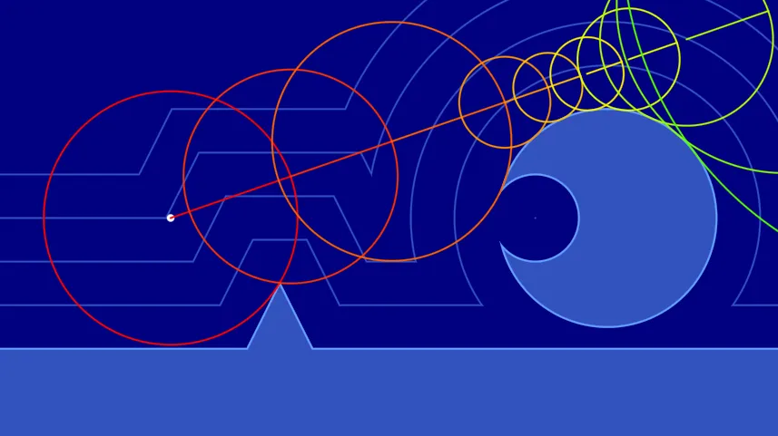 |
| ----------- | ----------- |
| 较好的情况下很快到达物体表面 | 没有交点的情况很快就发散 |

图片截取自 <https://www.shadertoy.com/view/lslXD8>

一种比较差的情况是光线刚好与物体“擦肩而过”，这个时步进次数会急剧上升，好在光线总会离开物体表面附近，我们可以设置一个最大步进次数，当步进次数超过这个值时，也认为这条光线没有击中任何物体。

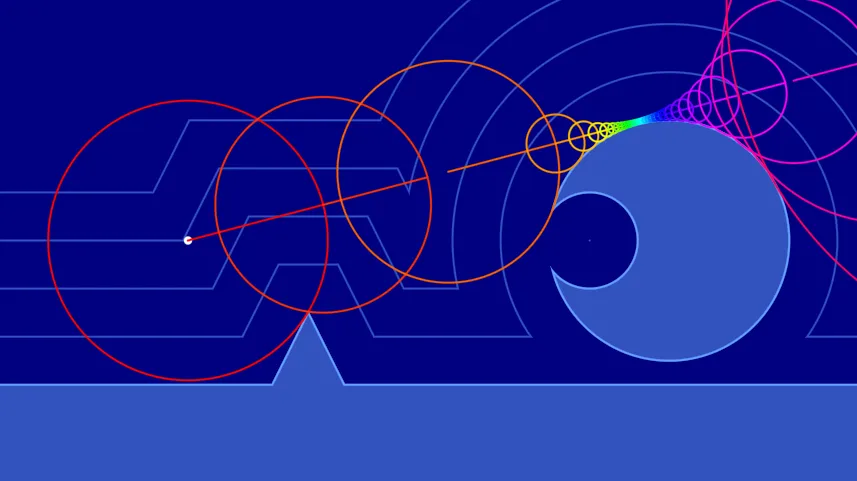  
图片截取自 <https://www.shadertoy.com/view/lslXD8>

首先，我需要定义一个光线击中物体的数据类

```python
@ti.dataclass
class HitRecord:    ## 光子碰撞记录类
    position: vec3  ## 光子碰撞的位置
    distance: float ## 光子步进的距离
    hit: ti.i32     ## 是否击中到物体
```

接着，声明一个阈值 `PRECISION` ，当光子距离物体表面足够近时，便认为击中了物体表面。还需要一个最大的步进次数 `MAX_RAYMARCH` 和最大步进距离 `TMAX` ，如果超出这两个值，便认为这条光线没有击中任何物体。此外，还需要一个 `TMIN` 让每次求交时光线起始位置向光线方向移动一小步，避免在下次求交时光线又立刻与物体相交 (`abs(sd) < PRECISION`) 。

```python
TMIN        = 0.001     ## 光开始传播的起始偏移，避免光线自相交
TMAX        = 2000.0    ## 最大单次光线传播距离
PRECISION   = 0.0001    ## 必须要小于 TMIN，否则光线会自相交产生阴影痤疮

MAX_RAYMARCH = 512      ## 最大光线步进次数
```

与物体求交的函数如下

```python
@ti.func
def raycast(ray) -> HitRecord:  ## 光线步进求交
    record = HitRecord(ray.origin, TMIN, False) ## 初始化光子碰撞记录
    for _ in range(MAX_RAYMARCH):   ## 光线步进
        record.position = ray.at(record.distance)   ## 计算光子所在位置
        ## 计算光子与球体的有向距离，将球体位移到了 (0, 0, -1)，半径为 0.5
        sd = sd_sphere(record.position - vec3(0, 0, -1), 0.5)
        dis = abs(sd)   ## 绝对值为无符号距离
        if dis < PRECISION: ## 如果光子与球体的距离小于精度即为击中
            record.hit = True   ## 设置击中状态
            break
        record.distance += dis  ## 光子继续步进
        if record.distance > TMAX:  ## 如果光子步进距离大于最大步进距离
            break
    return record   ## 返回光子碰撞记录
```

最后在 `render` 函数里执行 `raycast` 函数，如果击中了物体，就将像素点的颜色设置为红色，否则设置为天空的颜色。

```python
record = raycast(ray)   ## 光线步进求交
if record.hit:
    ray.color.rgb = vec3(1.0, 0.0, 0.0) ## 设置为红色
else:
    ray.color.rgb = sky_color(ray, time)    ## 获取天空颜色
```

好的！运行你的代码，你会看到我们成功地在屏幕上渲染出了一个形状。但似乎有点奇怪？为什么我们看到的球体不是圆形的，而是椭圆形的？

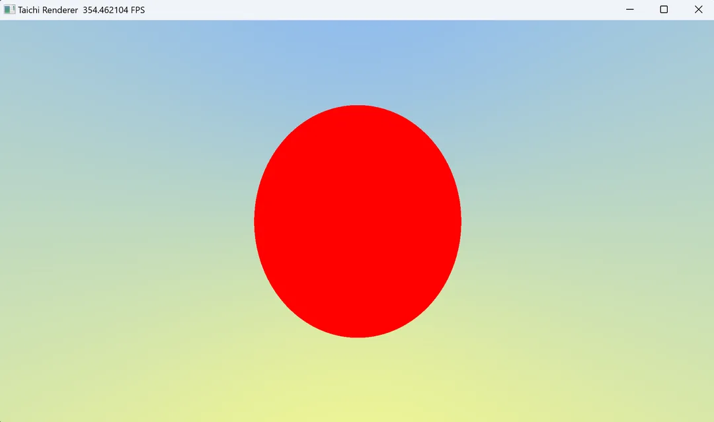  
我们看到场景中的球并不是一个标准的圆

这是因为我们设置的窗口比例是 `1920:1080` 而我们在虚拟世界里定义的画布长宽并不是这个比例，而是 `2:1` （如下面代码所示），你注意到了吗？要更好的解决这个问题，下一节我们会创建一个摄像机类。

```python
lower_left_corner = vec3(-2, -1, -1)    ## 视野左下角
horizontal = vec3(4, 0, 0)  ## 视野水平方向
vertical = vec3(0, 2, 0)    ## 视野垂直方向
origin = vec3(0, 0, 0)      ## 视点
```

## 8 创建摄像机类

我们的目标是传入 `uv` 坐标，从摄像机类获取光线的起点 `ro` 和方向 `rd` 。

现实中，摄像机除了有位置 (`lookfrom`) 、朝向 (`lookat`, `vup`) 之外，还有视野 (`vfov`)、传感器（画布）长宽比(`aspect`)、光圈直径 (`aperture`)、合焦距离 (`focus`) 等。

### 8.1 视野 FOV

当摄像机传感器的长宽比与显示长宽比一致时，画面才不会出现不自然的拉伸。 视场 (Field of View, FOV) 指的是摄像机能够观测的范围。`vfov` 表示的是摄像机在纵向能够看到的角度，通常人眼的极限 `vfov` 为 135 度，30 度是一个较为舒适的感知范围。如果你了解摄影，50 mm 全画幅镜头的 `vfov` 大约为 30 度[[8]]

由于窗口可以调整长宽比，因此横向视野 `hfov` 可以取决于窗口长宽比和 `vfov` ，只需要设置 `vfov` 即可。

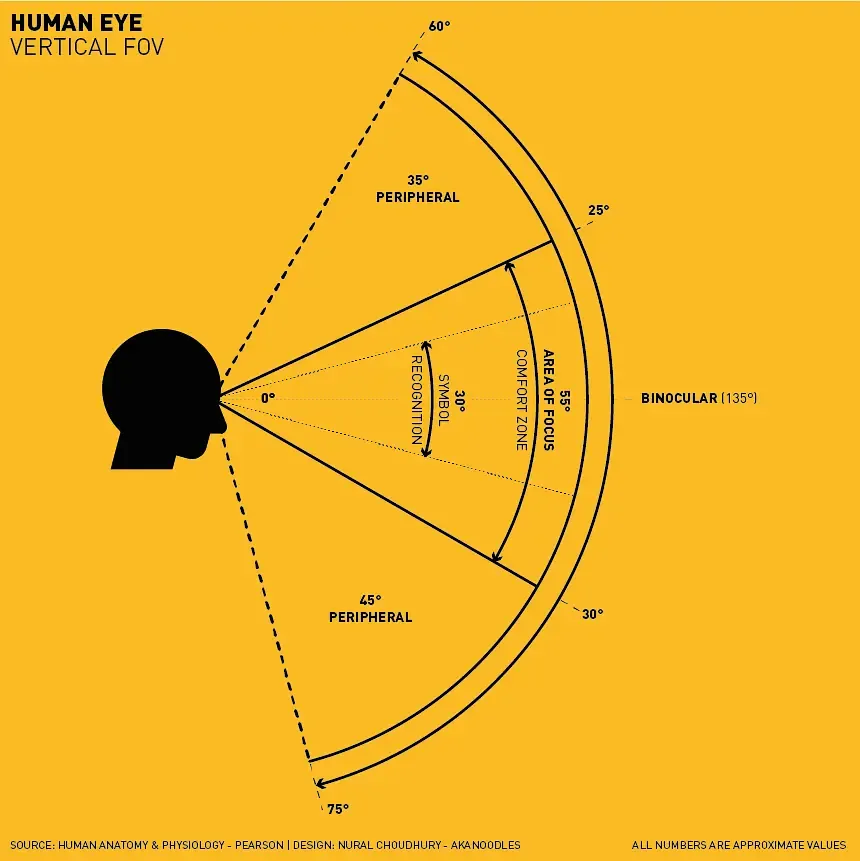  
人眼纵向的视野，出处见图片左下角

### 8.2 光圈与焦平面

为简化模型，我们将画布平面视为焦平面，因此摄像机到画布中心的距离为合焦距离 `focus` ，然后以 `lookat` 为原点，`normalize(lookfrom - lookat)` 为 z 轴正方向，建立右手系。

光线从光圈内任意一点 `ro` 出发，向焦平面上某一点前进，因此我们只需要利用已有的量，建立从 uv 坐标系到世界空间坐标系下焦平面上的点 `rp` 的映射，就可以表示出光线的方向 `normalize(rp - ro)` 。

光线应该从光圈的哪个位置出发？在现实中，进入光圈的光线在光圈内的分布应该是均匀的，按照光路可逆原理，我们也应该在光圈内均匀的选取位置发射光线，但在我们的程序中，我们无法一次采样光圈内的所有点，因此我们只能使用 [蒙特卡洛方法 (Monte Carlo method)](https://en.wikipedia.org/wiki/Monte_Carlo_method) 在光圈内随机采样一个点。

  
在一个单位圆内随机撒豆子，豆子有一定概率落在扇形内

如何在在单位圆内均匀的随机采样一个点呢？想象我们往单位圆内随机撒豆子，一个豆子落到半径为

<svg style="overflow:visible;min-height:1px;min-width:1px;vertical-align:-.025ex;" xmlns="http://www.w3.org/2000/svg" width="1.02ex" height="1.025ex" viewBox="0 -442 451 453"><g stroke="currentColor" fill="currentColor" stroke-width="0" transform="scale(1,-1)"><g data-mml-node="math"><g data-mml-node="mi"><path d="M21 287Q22 290 23 295T28 317T38 348T53 381T73 411T99 433T132 442Q161 442 183 430T214 408T225 388Q227 382 228 382T236 389Q284 441 347 441H350Q398 441 422 400Q430 381 430 363Q430 333 417 315T391 292T366 288Q346 288 334 299T322 328Q322 376 378 392Q356 405 342 405Q286 405 239 331Q229 315 224 298T190 165Q156 25 151 16Q138 -11 108 -11Q95 -11 87 -5T76 7T74 17Q74 30 114 189T154 366Q154 405 128 405Q107 405 92 377T68 316T57 280Q55 278 41 278H27Q21 284 21 287Z" style="stroke-width: 3;"></path></g></g></g></svg> ，角度为 <svg style="overflow:visible;min-height:1px;min-width:1px;vertical-align:-.023ex;" xmlns="http://www.w3.org/2000/svg" width="1.061ex" height="1.618ex" viewBox="0 -705 469 715"><g stroke="currentColor" fill="currentColor" stroke-width="0" transform="scale(1,-1)"><g data-mml-node="math"><g data-mml-node="mi"><path d="M35 200Q35 302 74 415T180 610T319 704Q320 704 327 704T339 705Q393 701 423 656Q462 596 462 495Q462 380 417 261T302 66T168 -10H161Q125 -10 99 10T60 63T41 130T35 200ZM383 566Q383 668 330 668Q294 668 260 623T204 521T170 421T157 371Q206 370 254 370L351 371Q352 372 359 404T375 484T383 566ZM113 132Q113 26 166 26Q181 26 198 36T239 74T287 161T335 307L340 324H145Q145 321 136 286T120 208T113 132Z" style="stroke-width: 3;"></path></g></g></g></svg> 的扇形的概率是扇形的面积 <svg style="overflow:visible;min-height:1px;min-width:1px;vertical-align:-.566ex;" xmlns="http://www.w3.org/2000/svg" width="5.332ex" height="2.452ex" viewBox="0 -833.9 2356.6 1083.9"><g stroke="currentColor" fill="currentColor" stroke-width="0" transform="scale(1,-1)"><g data-mml-node="math"><g data-mml-node="mi"><path d="M35 200Q35 302 74 415T180 610T319 704Q320 704 327 704T339 705Q393 701 423 656Q462 596 462 495Q462 380 417 261T302 66T168 -10H161Q125 -10 99 10T60 63T41 130T35 200ZM383 566Q383 668 330 668Q294 668 260 623T204 521T170 421T157 371Q206 370 254 370L351 371Q352 372 359 404T375 484T383 566ZM113 132Q113 26 166 26Q181 26 198 36T239 74T287 161T335 307L340 324H145Q145 321 136 286T120 208T113 132Z" style="stroke-width: 3;"></path></g><g data-mml-node="msup" transform="translate(469,0)"><g data-mml-node="mi"><path d="M21 287Q22 290 23 295T28 317T38 348T53 381T73 411T99 433T132 442Q161 442 183 430T214 408T225 388Q227 382 228 382T236 389Q284 441 347 441H350Q398 441 422 400Q430 381 430 363Q430 333 417 315T391 292T366 288Q346 288 334 299T322 328Q322 376 378 392Q356 405 342 405Q286 405 239 331Q229 315 224 298T190 165Q156 25 151 16Q138 -11 108 -11Q95 -11 87 -5T76 7T74 17Q74 30 114 189T154 366Q154 405 128 405Q107 405 92 377T68 316T57 280Q55 278 41 278H27Q21 284 21 287Z" style="stroke-width: 3;"></path></g><g data-mml-node="mn" transform="translate(484,363) scale(0.707)"><path d="M109 429Q82 429 66 447T50 491Q50 562 103 614T235 666Q326 666 387 610T449 465Q449 422 429 383T381 315T301 241Q265 210 201 149L142 93L218 92Q375 92 385 97Q392 99 409 186V189H449V186Q448 183 436 95T421 3V0H50V19V31Q50 38 56 46T86 81Q115 113 136 137Q145 147 170 174T204 211T233 244T261 278T284 308T305 340T320 369T333 401T340 431T343 464Q343 527 309 573T212 619Q179 619 154 602T119 569T109 550Q109 549 114 549Q132 549 151 535T170 489Q170 464 154 447T109 429Z" style="stroke-width: 3;"></path></g></g><g data-mml-node="TeXAtom" transform="translate(1356.6,0)"><g data-mml-node="mo"><path d="M423 750Q432 750 438 744T444 730Q444 725 271 248T92 -240Q85 -250 75 -250Q68 -250 62 -245T56 -231Q56 -221 230 257T407 740Q411 750 423 750Z" style="stroke-width: 3;"></path></g></g><g data-mml-node="mn" transform="translate(1856.6,0)"><path d="M109 429Q82 429 66 447T50 491Q50 562 103 614T235 666Q326 666 387 610T449 465Q449 422 429 383T381 315T301 241Q265 210 201 149L142 93L218 92Q375 92 385 97Q392 99 409 186V189H449V186Q448 183 436 95T421 3V0H50V19V31Q50 38 56 46T86 81Q115 113 136 137Q145 147 170 174T204 211T233 244T261 278T284 308T305 340T320 369T333 401T340 431T343 464Q343 527 309 573T212 619Q179 619 154 602T119 569T109 550Q109 549 114 549Q132 549 151 535T170 489Q170 464 154 447T109 429Z" style="stroke-width: 3;"></path></g></g></g></svg> 比上单位圆面积 <svg style="overflow:visible;min-height:1px;min-width:1px;vertical-align:-.025ex;" xmlns="http://www.w3.org/2000/svg" width="1.29ex" height="1ex" viewBox="0 -431 570 442"><g stroke="currentColor" fill="currentColor" stroke-width="0" transform="scale(1,-1)"><g data-mml-node="math"><g data-mml-node="mi"><path d="M132 -11Q98 -11 98 22V33L111 61Q186 219 220 334L228 358H196Q158 358 142 355T103 336Q92 329 81 318T62 297T53 285Q51 284 38 284Q19 284 19 294Q19 300 38 329T93 391T164 429Q171 431 389 431Q549 431 553 430Q573 423 573 402Q573 371 541 360Q535 358 472 358H408L405 341Q393 269 393 222Q393 170 402 129T421 65T431 37Q431 20 417 5T381 -10Q370 -10 363 -7T347 17T331 77Q330 86 330 121Q330 170 339 226T357 318T367 358H269L268 354Q268 351 249 275T206 114T175 17Q164 -11 132 -11Z" style="stroke-width: 3;"></path></g></g></g></svg> ，这就是它的概率分布函数 <svg style="overflow:visible;min-height:1px;min-width:1px;vertical-align:-1.577ex;width:100%;" xmlns="http://www.w3.org/2000/svg" width="14.372ex" height="4.993ex" viewBox="0 -1509.9 6352.3 2206.9"><g stroke="currentColor" fill="currentColor" stroke-width="0" transform="scale(1,-1)"><g data-mml-node="math"><g data-mml-node="msub"><g data-mml-node="mi"><path d="M48 1Q31 1 31 11Q31 13 34 25Q38 41 42 43T65 46Q92 46 125 49Q139 52 144 61Q146 66 215 342T285 622Q285 629 281 629Q273 632 228 634H197Q191 640 191 642T193 659Q197 676 203 680H742Q749 676 749 669Q749 664 736 557T722 447Q720 440 702 440H690Q683 445 683 453Q683 454 686 477T689 530Q689 560 682 579T663 610T626 626T575 633T503 634H480Q398 633 393 631Q388 629 386 623Q385 622 352 492L320 363H375Q378 363 398 363T426 364T448 367T472 374T489 386Q502 398 511 419T524 457T529 475Q532 480 548 480H560Q567 475 567 470Q567 467 536 339T502 207Q500 200 482 200H470Q463 206 463 212Q463 215 468 234T473 274Q473 303 453 310T364 317H309L277 190Q245 66 245 60Q245 46 334 46H359Q365 40 365 39T363 19Q359 6 353 0H336Q295 2 185 2Q120 2 86 2T48 1Z" style="stroke-width: 3;"></path></g><g data-mml-node="mn" transform="translate(676,-150) scale(0.707)"><path d="M213 578L200 573Q186 568 160 563T102 556H83V602H102Q149 604 189 617T245 641T273 663Q275 666 285 666Q294 666 302 660V361L303 61Q310 54 315 52T339 48T401 46H427V0H416Q395 3 257 3Q121 3 100 0H88V46H114Q136 46 152 46T177 47T193 50T201 52T207 57T213 61V578Z" style="stroke-width: 3;"></path></g></g><g data-mml-node="mo" transform="translate(1079.6,0)"><path d="M94 250Q94 319 104 381T127 488T164 576T202 643T244 695T277 729T302 750H315H319Q333 750 333 741Q333 738 316 720T275 667T226 581T184 443T167 250T184 58T225 -81T274 -167T316 -220T333 -241Q333 -250 318 -250H315H302L274 -226Q180 -141 137 -14T94 250Z" style="stroke-width: 3;"></path></g><g data-mml-node="mi" transform="translate(1468.6,0)"><path d="M21 287Q22 290 23 295T28 317T38 348T53 381T73 411T99 433T132 442Q161 442 183 430T214 408T225 388Q227 382 228 382T236 389Q284 441 347 441H350Q398 441 422 400Q430 381 430 363Q430 333 417 315T391 292T366 288Q346 288 334 299T322 328Q322 376 378 392Q356 405 342 405Q286 405 239 331Q229 315 224 298T190 165Q156 25 151 16Q138 -11 108 -11Q95 -11 87 -5T76 7T74 17Q74 30 114 189T154 366Q154 405 128 405Q107 405 92 377T68 316T57 280Q55 278 41 278H27Q21 284 21 287Z" style="stroke-width: 3;"></path></g><g data-mml-node="mo" transform="translate(1919.6,0)"><path d="M78 35T78 60T94 103T137 121Q165 121 187 96T210 8Q210 -27 201 -60T180 -117T154 -158T130 -185T117 -194Q113 -194 104 -185T95 -172Q95 -168 106 -156T131 -126T157 -76T173 -3V9L172 8Q170 7 167 6T161 3T152 1T140 0Q113 0 96 17Z" style="stroke-width: 3;"></path></g><g data-mml-node="mi" transform="translate(2364.2,0)"><path d="M35 200Q35 302 74 415T180 610T319 704Q320 704 327 704T339 705Q393 701 423 656Q462 596 462 495Q462 380 417 261T302 66T168 -10H161Q125 -10 99 10T60 63T41 130T35 200ZM383 566Q383 668 330 668Q294 668 260 623T204 521T170 421T157 371Q206 370 254 370L351 371Q352 372 359 404T375 484T383 566ZM113 132Q113 26 166 26Q181 26 198 36T239 74T287 161T335 307L340 324H145Q145 321 136 286T120 208T113 132Z" style="stroke-width: 3;"></path></g><g data-mml-node="mo" transform="translate(2833.2,0)"><path d="M60 749L64 750Q69 750 74 750H86L114 726Q208 641 251 514T294 250Q294 182 284 119T261 12T224 -76T186 -143T145 -194T113 -227T90 -246Q87 -249 86 -250H74Q66 -250 63 -250T58 -247T55 -238Q56 -237 66 -225Q221 -64 221 250T66 725Q56 737 55 738Q55 746 60 749Z" style="stroke-width: 3;"></path></g><g data-mml-node="mo" transform="translate(3500,0)"><path d="M56 347Q56 360 70 367H707Q722 359 722 347Q722 336 708 328L390 327H72Q56 332 56 347ZM56 153Q56 168 72 173H708Q722 163 722 153Q722 140 707 133H70Q56 140 56 153Z" style="stroke-width: 3;"></path></g><g data-mml-node="mfrac" transform="translate(4555.8,0)"><g data-mml-node="mrow" transform="translate(220,676)"><g data-mml-node="mi"><path d="M35 200Q35 302 74 415T180 610T319 704Q320 704 327 704T339 705Q393 701 423 656Q462 596 462 495Q462 380 417 261T302 66T168 -10H161Q125 -10 99 10T60 63T41 130T35 200ZM383 566Q383 668 330 668Q294 668 260 623T204 521T170 421T157 371Q206 370 254 370L351 371Q352 372 359 404T375 484T383 566ZM113 132Q113 26 166 26Q181 26 198 36T239 74T287 161T335 307L340 324H145Q145 321 136 286T120 208T113 132Z" style="stroke-width: 3;"></path></g><g data-mml-node="msup" transform="translate(469,0)"><g data-mml-node="mi"><path d="M21 287Q22 290 23 295T28 317T38 348T53 381T73 411T99 433T132 442Q161 442 183 430T214 408T225 388Q227 382 228 382T236 389Q284 441 347 441H350Q398 441 422 400Q430 381 430 363Q430 333 417 315T391 292T366 288Q346 288 334 299T322 328Q322 376 378 392Q356 405 342 405Q286 405 239 331Q229 315 224 298T190 165Q156 25 151 16Q138 -11 108 -11Q95 -11 87 -5T76 7T74 17Q74 30 114 189T154 366Q154 405 128 405Q107 405 92 377T68 316T57 280Q55 278 41 278H27Q21 284 21 287Z" style="stroke-width: 3;"></path></g><g data-mml-node="mn" transform="translate(484,363) scale(0.707)"><path d="M109 429Q82 429 66 447T50 491Q50 562 103 614T235 666Q326 666 387 610T449 465Q449 422 429 383T381 315T301 241Q265 210 201 149L142 93L218 92Q375 92 385 97Q392 99 409 186V189H449V186Q448 183 436 95T421 3V0H50V19V31Q50 38 56 46T86 81Q115 113 136 137Q145 147 170 174T204 211T233 244T261 278T284 308T305 340T320 369T333 401T340 431T343 464Q343 527 309 573T212 619Q179 619 154 602T119 569T109 550Q109 549 114 549Q132 549 151 535T170 489Q170 464 154 447T109 429Z" style="stroke-width: 3;"></path></g></g></g><g data-mml-node="mrow" transform="translate(363.3,-686)"><g data-mml-node="mn"><path d="M109 429Q82 429 66 447T50 491Q50 562 103 614T235 666Q326 666 387 610T449 465Q449 422 429 383T381 315T301 241Q265 210 201 149L142 93L218 92Q375 92 385 97Q392 99 409 186V189H449V186Q448 183 436 95T421 3V0H50V19V31Q50 38 56 46T86 81Q115 113 136 137Q145 147 170 174T204 211T233 244T261 278T284 308T305 340T320 369T333 401T340 431T343 464Q343 527 309 573T212 619Q179 619 154 602T119 569T109 550Q109 549 114 549Q132 549 151 535T170 489Q170 464 154 447T109 429Z" style="stroke-width: 3;"></path></g><g data-mml-node="mi" transform="translate(500,0)"><path d="M132 -11Q98 -11 98 22V33L111 61Q186 219 220 334L228 358H196Q158 358 142 355T103 336Q92 329 81 318T62 297T53 285Q51 284 38 284Q19 284 19 294Q19 300 38 329T93 391T164 429Q171 431 389 431Q549 431 553 430Q573 423 573 402Q573 371 541 360Q535 358 472 358H408L405 341Q393 269 393 222Q393 170 402 129T421 65T431 37Q431 20 417 5T381 -10Q370 -10 363 -7T347 17T331 77Q330 86 330 121Q330 170 339 226T357 318T367 358H269L268 354Q268 351 249 275T206 114T175 17Q164 -11 132 -11Z" style="stroke-width: 3;"></path></g></g><rect width="1556.6" height="60" x="120" y="220"></rect></g></g></g></svg>

我们希望分布是均匀的，也就是概率分布函数的导数——概率密度函数

<svg style="overflow:visible;min-height:1px;min-width:1px;vertical-align:-.566ex;" xmlns="http://www.w3.org/2000/svg" width="6.944ex" height="2.262ex" viewBox="0 -750 3069.2 1000"><g stroke="currentColor" fill="currentColor" stroke-width="0" transform="scale(1,-1)"><g data-mml-node="math"><g data-mml-node="msub"><g data-mml-node="mi"><path d="M118 -162Q120 -162 124 -164T135 -167T147 -168Q160 -168 171 -155T187 -126Q197 -99 221 27T267 267T289 382V385H242Q195 385 192 387Q188 390 188 397L195 425Q197 430 203 430T250 431Q298 431 298 432Q298 434 307 482T319 540Q356 705 465 705Q502 703 526 683T550 630Q550 594 529 578T487 561Q443 561 443 603Q443 622 454 636T478 657L487 662Q471 668 457 668Q445 668 434 658T419 630Q412 601 403 552T387 469T380 433Q380 431 435 431Q480 431 487 430T498 424Q499 420 496 407T491 391Q489 386 482 386T428 385H372L349 263Q301 15 282 -47Q255 -132 212 -173Q175 -205 139 -205Q107 -205 81 -186T55 -132Q55 -95 76 -78T118 -61Q162 -61 162 -103Q162 -122 151 -136T127 -157L118 -162Z" style="stroke-width: 3;"></path></g><g data-mml-node="mn" transform="translate(523,-150) scale(0.707)"><path d="M213 578L200 573Q186 568 160 563T102 556H83V602H102Q149 604 189 617T245 641T273 663Q275 666 285 666Q294 666 302 660V361L303 61Q310 54 315 52T339 48T401 46H427V0H416Q395 3 257 3Q121 3 100 0H88V46H114Q136 46 152 46T177 47T193 50T201 52T207 57T213 61V578Z" style="stroke-width: 3;"></path></g></g><g data-mml-node="mo" transform="translate(926.6,0)"><path d="M94 250Q94 319 104 381T127 488T164 576T202 643T244 695T277 729T302 750H315H319Q333 750 333 741Q333 738 316 720T275 667T226 581T184 443T167 250T184 58T225 -81T274 -167T316 -220T333 -241Q333 -250 318 -250H315H302L274 -226Q180 -141 137 -14T94 250Z" style="stroke-width: 3;"></path></g><g data-mml-node="mi" transform="translate(1315.6,0)"><path d="M21 287Q22 290 23 295T28 317T38 348T53 381T73 411T99 433T132 442Q161 442 183 430T214 408T225 388Q227 382 228 382T236 389Q284 441 347 441H350Q398 441 422 400Q430 381 430 363Q430 333 417 315T391 292T366 288Q346 288 334 299T322 328Q322 376 378 392Q356 405 342 405Q286 405 239 331Q229 315 224 298T190 165Q156 25 151 16Q138 -11 108 -11Q95 -11 87 -5T76 7T74 17Q74 30 114 189T154 366Q154 405 128 405Q107 405 92 377T68 316T57 280Q55 278 41 278H27Q21 284 21 287Z" style="stroke-width: 3;"></path></g><g data-mml-node="mo" transform="translate(1766.6,0)"><path d="M78 35T78 60T94 103T137 121Q165 121 187 96T210 8Q210 -27 201 -60T180 -117T154 -158T130 -185T117 -194Q113 -194 104 -185T95 -172Q95 -168 106 -156T131 -126T157 -76T173 -3V9L172 8Q170 7 167 6T161 3T152 1T140 0Q113 0 96 17Z" style="stroke-width: 3;"></path></g><g data-mml-node="mi" transform="translate(2211.2,0)"><path d="M35 200Q35 302 74 415T180 610T319 704Q320 704 327 704T339 705Q393 701 423 656Q462 596 462 495Q462 380 417 261T302 66T168 -10H161Q125 -10 99 10T60 63T41 130T35 200ZM383 566Q383 668 330 668Q294 668 260 623T204 521T170 421T157 371Q206 370 254 370L351 371Q352 372 359 404T375 484T383 566ZM113 132Q113 26 166 26Q181 26 198 36T239 74T287 161T335 307L340 324H145Q145 321 136 286T120 208T113 132Z" style="stroke-width: 3;"></path></g><g data-mml-node="mo" transform="translate(2680.2,0)"><path d="M60 749L64 750Q69 750 74 750H86L114 726Q208 641 251 514T294 250Q294 182 284 119T261 12T224 -76T186 -143T145 -194T113 -227T90 -246Q87 -249 86 -250H74Q66 -250 63 -250T58 -247T55 -238Q56 -237 66 -225Q221 -64 221 250T66 725Q56 737 55 738Q55 746 60 749Z" style="stroke-width: 3;"></path></g></g></g></svg> 是常数，但是 <svg style="overflow:visible;min-height:1px;min-width:1px;vertical-align:-1.602ex;width:100%;" xmlns="http://www.w3.org/2000/svg" width="25.934ex" height="5.095ex" viewBox="0 -1543.9 11462.9 2251.9"><g stroke="currentColor" fill="currentColor" stroke-width="0" transform="scale(1,-1)"><g data-mml-node="math"><g data-mml-node="msub"><g data-mml-node="mi"><path d="M118 -162Q120 -162 124 -164T135 -167T147 -168Q160 -168 171 -155T187 -126Q197 -99 221 27T267 267T289 382V385H242Q195 385 192 387Q188 390 188 397L195 425Q197 430 203 430T250 431Q298 431 298 432Q298 434 307 482T319 540Q356 705 465 705Q502 703 526 683T550 630Q550 594 529 578T487 561Q443 561 443 603Q443 622 454 636T478 657L487 662Q471 668 457 668Q445 668 434 658T419 630Q412 601 403 552T387 469T380 433Q380 431 435 431Q480 431 487 430T498 424Q499 420 496 407T491 391Q489 386 482 386T428 385H372L349 263Q301 15 282 -47Q255 -132 212 -173Q175 -205 139 -205Q107 -205 81 -186T55 -132Q55 -95 76 -78T118 -61Q162 -61 162 -103Q162 -122 151 -136T127 -157L118 -162Z" style="stroke-width: 3;"></path></g><g data-mml-node="mn" transform="translate(523,-150) scale(0.707)"><path d="M213 578L200 573Q186 568 160 563T102 556H83V602H102Q149 604 189 617T245 641T273 663Q275 666 285 666Q294 666 302 660V361L303 61Q310 54 315 52T339 48T401 46H427V0H416Q395 3 257 3Q121 3 100 0H88V46H114Q136 46 152 46T177 47T193 50T201 52T207 57T213 61V578Z" style="stroke-width: 3;"></path></g></g><g data-mml-node="mo" transform="translate(926.6,0)"><path d="M94 250Q94 319 104 381T127 488T164 576T202 643T244 695T277 729T302 750H315H319Q333 750 333 741Q333 738 316 720T275 667T226 581T184 443T167 250T184 58T225 -81T274 -167T316 -220T333 -241Q333 -250 318 -250H315H302L274 -226Q180 -141 137 -14T94 250Z" style="stroke-width: 3;"></path></g><g data-mml-node="mi" transform="translate(1315.6,0)"><path d="M21 287Q22 290 23 295T28 317T38 348T53 381T73 411T99 433T132 442Q161 442 183 430T214 408T225 388Q227 382 228 382T236 389Q284 441 347 441H350Q398 441 422 400Q430 381 430 363Q430 333 417 315T391 292T366 288Q346 288 334 299T322 328Q322 376 378 392Q356 405 342 405Q286 405 239 331Q229 315 224 298T190 165Q156 25 151 16Q138 -11 108 -11Q95 -11 87 -5T76 7T74 17Q74 30 114 189T154 366Q154 405 128 405Q107 405 92 377T68 316T57 280Q55 278 41 278H27Q21 284 21 287Z" style="stroke-width: 3;"></path></g><g data-mml-node="mo" transform="translate(1766.6,0)"><path d="M78 35T78 60T94 103T137 121Q165 121 187 96T210 8Q210 -27 201 -60T180 -117T154 -158T130 -185T117 -194Q113 -194 104 -185T95 -172Q95 -168 106 -156T131 -126T157 -76T173 -3V9L172 8Q170 7 167 6T161 3T152 1T140 0Q113 0 96 17Z" style="stroke-width: 3;"></path></g><g data-mml-node="mi" transform="translate(2211.2,0)"><path d="M35 200Q35 302 74 415T180 610T319 704Q320 704 327 704T339 705Q393 701 423 656Q462 596 462 495Q462 380 417 261T302 66T168 -10H161Q125 -10 99 10T60 63T41 130T35 200ZM383 566Q383 668 330 668Q294 668 260 623T204 521T170 421T157 371Q206 370 254 370L351 371Q352 372 359 404T375 484T383 566ZM113 132Q113 26 166 26Q181 26 198 36T239 74T287 161T335 307L340 324H145Q145 321 136 286T120 208T113 132Z" style="stroke-width: 3;"></path></g><g data-mml-node="mo" transform="translate(2680.2,0)"><path d="M60 749L64 750Q69 750 74 750H86L114 726Q208 641 251 514T294 250Q294 182 284 119T261 12T224 -76T186 -143T145 -194T113 -227T90 -246Q87 -249 86 -250H74Q66 -250 63 -250T58 -247T55 -238Q56 -237 66 -225Q221 -64 221 250T66 725Q56 737 55 738Q55 746 60 749Z" style="stroke-width: 3;"></path></g><g data-mml-node="mo" transform="translate(3347,0)"><path d="M56 347Q56 360 70 367H707Q722 359 722 347Q722 336 708 328L390 327H72Q56 332 56 347ZM56 153Q56 168 72 173H708Q722 163 722 153Q722 140 707 133H70Q56 140 56 153Z" style="stroke-width: 3;"></path></g><g data-mml-node="mfrac" transform="translate(4402.8,0)"><g data-mml-node="mrow" transform="translate(220,710)"><g data-mml-node="msup"><g data-mml-node="mi"><path d="M202 508Q179 508 169 520T158 547Q158 557 164 577T185 624T230 675T301 710L333 715H345Q378 715 384 714Q447 703 489 661T549 568T566 457Q566 362 519 240T402 53Q321 -22 223 -22Q123 -22 73 56Q42 102 42 148V159Q42 276 129 370T322 465Q383 465 414 434T455 367L458 378Q478 461 478 515Q478 603 437 639T344 676Q266 676 223 612Q264 606 264 572Q264 547 246 528T202 508ZM430 306Q430 372 401 400T333 428Q270 428 222 382Q197 354 183 323T150 221Q132 149 132 116Q132 21 232 21Q244 21 250 22Q327 35 374 112Q389 137 409 196T430 306Z" style="stroke-width: 3;"></path></g><g data-mml-node="mn" transform="translate(650.8,363) scale(0.707)"><path d="M109 429Q82 429 66 447T50 491Q50 562 103 614T235 666Q326 666 387 610T449 465Q449 422 429 383T381 315T301 241Q265 210 201 149L142 93L218 92Q375 92 385 97Q392 99 409 186V189H449V186Q448 183 436 95T421 3V0H50V19V31Q50 38 56 46T86 81Q115 113 136 137Q145 147 170 174T204 211T233 244T261 278T284 308T305 340T320 369T333 401T340 431T343 464Q343 527 309 573T212 619Q179 619 154 602T119 569T109 550Q109 549 114 549Q132 549 151 535T170 489Q170 464 154 447T109 429Z" style="stroke-width: 3;"></path></g></g><g data-mml-node="msub" transform="translate(1054.3,0)"><g data-mml-node="mi"><path d="M48 1Q31 1 31 11Q31 13 34 25Q38 41 42 43T65 46Q92 46 125 49Q139 52 144 61Q146 66 215 342T285 622Q285 629 281 629Q273 632 228 634H197Q191 640 191 642T193 659Q197 676 203 680H742Q749 676 749 669Q749 664 736 557T722 447Q720 440 702 440H690Q683 445 683 453Q683 454 686 477T689 530Q689 560 682 579T663 610T626 626T575 633T503 634H480Q398 633 393 631Q388 629 386 623Q385 622 352 492L320 363H375Q378 363 398 363T426 364T448 367T472 374T489 386Q502 398 511 419T524 457T529 475Q532 480 548 480H560Q567 475 567 470Q567 467 536 339T502 207Q500 200 482 200H470Q463 206 463 212Q463 215 468 234T473 274Q473 303 453 310T364 317H309L277 190Q245 66 245 60Q245 46 334 46H359Q365 40 365 39T363 19Q359 6 353 0H336Q295 2 185 2Q120 2 86 2T48 1Z" style="stroke-width: 3;"></path></g><g data-mml-node="mn" transform="translate(676,-150) scale(0.707)"><path d="M213 578L200 573Q186 568 160 563T102 556H83V602H102Q149 604 189 617T245 641T273 663Q275 666 285 666Q294 666 302 660V361L303 61Q310 54 315 52T339 48T401 46H427V0H416Q395 3 257 3Q121 3 100 0H88V46H114Q136 46 152 46T177 47T193 50T201 52T207 57T213 61V578Z" style="stroke-width: 3;"></path></g></g><g data-mml-node="mo" transform="translate(2133.9,0)"><path d="M94 250Q94 319 104 381T127 488T164 576T202 643T244 695T277 729T302 750H315H319Q333 750 333 741Q333 738 316 720T275 667T226 581T184 443T167 250T184 58T225 -81T274 -167T316 -220T333 -241Q333 -250 318 -250H315H302L274 -226Q180 -141 137 -14T94 250Z" style="stroke-width: 3;"></path></g><g data-mml-node="mi" transform="translate(2522.9,0)"><path d="M21 287Q22 290 23 295T28 317T38 348T53 381T73 411T99 433T132 442Q161 442 183 430T214 408T225 388Q227 382 228 382T236 389Q284 441 347 441H350Q398 441 422 400Q430 381 430 363Q430 333 417 315T391 292T366 288Q346 288 334 299T322 328Q322 376 378 392Q356 405 342 405Q286 405 239 331Q229 315 224 298T190 165Q156 25 151 16Q138 -11 108 -11Q95 -11 87 -5T76 7T74 17Q74 30 114 189T154 366Q154 405 128 405Q107 405 92 377T68 316T57 280Q55 278 41 278H27Q21 284 21 287Z" style="stroke-width: 3;"></path></g><g data-mml-node="mo" transform="translate(2973.9,0)"><path d="M78 35T78 60T94 103T137 121Q165 121 187 96T210 8Q210 -27 201 -60T180 -117T154 -158T130 -185T117 -194Q113 -194 104 -185T95 -172Q95 -168 106 -156T131 -126T157 -76T173 -3V9L172 8Q170 7 167 6T161 3T152 1T140 0Q113 0 96 17Z" style="stroke-width: 3;"></path></g><g data-mml-node="mi" transform="translate(3418.5,0)"><path d="M35 200Q35 302 74 415T180 610T319 704Q320 704 327 704T339 705Q393 701 423 656Q462 596 462 495Q462 380 417 261T302 66T168 -10H161Q125 -10 99 10T60 63T41 130T35 200ZM383 566Q383 668 330 668Q294 668 260 623T204 521T170 421T157 371Q206 370 254 370L351 371Q352 372 359 404T375 484T383 566ZM113 132Q113 26 166 26Q181 26 198 36T239 74T287 161T335 307L340 324H145Q145 321 136 286T120 208T113 132Z" style="stroke-width: 3;"></path></g><g data-mml-node="mo" transform="translate(3887.5,0)"><path d="M60 749L64 750Q69 750 74 750H86L114 726Q208 641 251 514T294 250Q294 182 284 119T261 12T224 -76T186 -143T145 -194T113 -227T90 -246Q87 -249 86 -250H74Q66 -250 63 -250T58 -247T55 -238Q56 -237 66 -225Q221 -64 221 250T66 725Q56 737 55 738Q55 746 60 749Z" style="stroke-width: 3;"></path></g></g><g data-mml-node="mrow" transform="translate(1332.3,-686)"><g data-mml-node="mi"><path d="M202 508Q179 508 169 520T158 547Q158 557 164 577T185 624T230 675T301 710L333 715H345Q378 715 384 714Q447 703 489 661T549 568T566 457Q566 362 519 240T402 53Q321 -22 223 -22Q123 -22 73 56Q42 102 42 148V159Q42 276 129 370T322 465Q383 465 414 434T455 367L458 378Q478 461 478 515Q478 603 437 639T344 676Q266 676 223 612Q264 606 264 572Q264 547 246 528T202 508ZM430 306Q430 372 401 400T333 428Q270 428 222 382Q197 354 183 323T150 221Q132 149 132 116Q132 21 232 21Q244 21 250 22Q327 35 374 112Q389 137 409 196T430 306Z" style="stroke-width: 3;"></path></g><g data-mml-node="mi" transform="translate(566,0)"><path d="M21 287Q22 290 23 295T28 317T38 348T53 381T73 411T99 433T132 442Q161 442 183 430T214 408T225 388Q227 382 228 382T236 389Q284 441 347 441H350Q398 441 422 400Q430 381 430 363Q430 333 417 315T391 292T366 288Q346 288 334 299T322 328Q322 376 378 392Q356 405 342 405Q286 405 239 331Q229 315 224 298T190 165Q156 25 151 16Q138 -11 108 -11Q95 -11 87 -5T76 7T74 17Q74 30 114 189T154 366Q154 405 128 405Q107 405 92 377T68 316T57 280Q55 278 41 278H27Q21 284 21 287Z" style="stroke-width: 3;"></path></g><g data-mml-node="mi" transform="translate(1017,0)"><path d="M202 508Q179 508 169 520T158 547Q158 557 164 577T185 624T230 675T301 710L333 715H345Q378 715 384 714Q447 703 489 661T549 568T566 457Q566 362 519 240T402 53Q321 -22 223 -22Q123 -22 73 56Q42 102 42 148V159Q42 276 129 370T322 465Q383 465 414 434T455 367L458 378Q478 461 478 515Q478 603 437 639T344 676Q266 676 223 612Q264 606 264 572Q264 547 246 528T202 508ZM430 306Q430 372 401 400T333 428Q270 428 222 382Q197 354 183 323T150 221Q132 149 132 116Q132 21 232 21Q244 21 250 22Q327 35 374 112Q389 137 409 196T430 306Z" style="stroke-width: 3;"></path></g><g data-mml-node="mi" transform="translate(1583,0)"><path d="M35 200Q35 302 74 415T180 610T319 704Q320 704 327 704T339 705Q393 701 423 656Q462 596 462 495Q462 380 417 261T302 66T168 -10H161Q125 -10 99 10T60 63T41 130T35 200ZM383 566Q383 668 330 668Q294 668 260 623T204 521T170 421T157 371Q206 370 254 370L351 371Q352 372 359 404T375 484T383 566ZM113 132Q113 26 166 26Q181 26 198 36T239 74T287 161T335 307L340 324H145Q145 321 136 286T120 208T113 132Z" style="stroke-width: 3;"></path></g></g><rect width="4476.5" height="60" x="120" y="220"></rect></g><g data-mml-node="mo" transform="translate(9397.1,0)"><path d="M56 347Q56 360 70 367H707Q722 359 722 347Q722 336 708 328L390 327H72Q56 332 56 347ZM56 153Q56 168 72 173H708Q722 163 722 153Q722 140 707 133H70Q56 140 56 153Z" style="stroke-width: 3;"></path></g><g data-mml-node="mfrac" transform="translate(10452.9,0)"><g data-mml-node="mi" transform="translate(279.5,676)"><path d="M21 287Q22 290 23 295T28 317T38 348T53 381T73 411T99 433T132 442Q161 442 183 430T214 408T225 388Q227 382 228 382T236 389Q284 441 347 441H350Q398 441 422 400Q430 381 430 363Q430 333 417 315T391 292T366 288Q346 288 334 299T322 328Q322 376 378 392Q356 405 342 405Q286 405 239 331Q229 315 224 298T190 165Q156 25 151 16Q138 -11 108 -11Q95 -11 87 -5T76 7T74 17Q74 30 114 189T154 366Q154 405 128 405Q107 405 92 377T68 316T57 280Q55 278 41 278H27Q21 284 21 287Z" style="stroke-width: 3;"></path></g><g data-mml-node="mi" transform="translate(220,-686)"><path d="M132 -11Q98 -11 98 22V33L111 61Q186 219 220 334L228 358H196Q158 358 142 355T103 336Q92 329 81 318T62 297T53 285Q51 284 38 284Q19 284 19 294Q19 300 38 329T93 391T164 429Q171 431 389 431Q549 431 553 430Q573 423 573 402Q573 371 541 360Q535 358 472 358H408L405 341Q393 269 393 222Q393 170 402 129T421 65T431 37Q431 20 417 5T381 -10Q370 -10 363 -7T347 17T331 77Q330 86 330 121Q330 170 339 226T357 318T367 358H269L268 354Q268 351 249 275T206 114T175 17Q164 -11 132 -11Z" style="stroke-width: 3;"></path></g><rect width="770" height="60" x="120" y="220"></rect></g></g></g></svg>  

是一个关于 <svg style="overflow:visible;min-height:1px;min-width:1px;vertical-align:-.025ex;" xmlns="http://www.w3.org/2000/svg" width="1.02ex" height="1.025ex" viewBox="0 -442 451 453"><g stroke="currentColor" fill="currentColor" stroke-width="0" transform="scale(1,-1)"><g data-mml-node="math"><g data-mml-node="mi"><path d="M21 287Q22 290 23 295T28 317T38 348T53 381T73 411T99 433T132 442Q161 442 183 430T214 408T225 388Q227 382 228 382T236 389Q284 441 347 441H350Q398 441 422 400Q430 381 430 363Q430 333 417 315T391 292T366 288Q346 288 334 299T322 328Q322 376 378 392Q356 405 342 405Q286 405 239 331Q229 315 224 298T190 165Q156 25 151 16Q138 -11 108 -11Q95 -11 87 -5T76 7T74 17Q74 30 114 189T154 366Q154 405 128 405Q107 405 92 377T68 316T57 280Q55 278 41 278H27Q21 284 21 287Z" style="stroke-width: 3;"></path></g></g></g></svg> 的函数，并不是一个常数，因此如果让 <svg style="overflow:visible;min-height:1px;min-width:1px;vertical-align:-.025ex;" xmlns="http://www.w3.org/2000/svg" width="1.02ex" height="1.025ex" viewBox="0 -442 451 453"><g stroke="currentColor" fill="currentColor" stroke-width="0" transform="scale(1,-1)"><g data-mml-node="math"><g data-mml-node="mi"><path d="M21 287Q22 290 23 295T28 317T38 348T53 381T73 411T99 433T132 442Q161 442 183 430T214 408T225 388Q227 382 228 382T236 389Q284 441 347 441H350Q398 441 422 400Q430 381 430 363Q430 333 417 315T391 292T366 288Q346 288 334 299T322 328Q322 376 378 392Q356 405 342 405Q286 405 239 331Q229 315 224 298T190 165Q156 25 151 16Q138 -11 108 -11Q95 -11 87 -5T76 7T74 17Q74 30 114 189T154 366Q154 405 128 405Q107 405 92 377T68 316T57 280Q55 278 41 278H27Q21 284 21 287Z" style="stroke-width: 3;"></path></g></g></g></svg> 在 <svg style="overflow:visible;min-height:1px;min-width:1px;vertical-align:-.566ex;" xmlns="http://www.w3.org/2000/svg" width="4.526ex" height="2.262ex" viewBox="0 -750 2000.7 1000"><g stroke="currentColor" fill="currentColor" stroke-width="0" transform="scale(1,-1)"><g data-mml-node="math"><g data-mml-node="mo"><path d="M118 -250V750H255V710H158V-210H255V-250H118Z" style="stroke-width: 3;"></path></g><g data-mml-node="mn" transform="translate(278,0)"><path d="M96 585Q152 666 249 666Q297 666 345 640T423 548Q460 465 460 320Q460 165 417 83Q397 41 362 16T301 -15T250 -22Q224 -22 198 -16T137 16T82 83Q39 165 39 320Q39 494 96 585ZM321 597Q291 629 250 629Q208 629 178 597Q153 571 145 525T137 333Q137 175 145 125T181 46Q209 16 250 16Q290 16 318 46Q347 76 354 130T362 333Q362 478 354 524T321 597Z" style="stroke-width: 3;"></path></g><g data-mml-node="mo" transform="translate(778,0)"><path d="M78 35T78 60T94 103T137 121Q165 121 187 96T210 8Q210 -27 201 -60T180 -117T154 -158T130 -185T117 -194Q113 -194 104 -185T95 -172Q95 -168 106 -156T131 -126T157 -76T173 -3V9L172 8Q170 7 167 6T161 3T152 1T140 0Q113 0 96 17Z" style="stroke-width: 3;"></path></g><g data-mml-node="mn" transform="translate(1222.7,0)"><path d="M213 578L200 573Q186 568 160 563T102 556H83V602H102Q149 604 189 617T245 641T273 663Q275 666 285 666Q294 666 302 660V361L303 61Q310 54 315 52T339 48T401 46H427V0H416Q395 3 257 3Q121 3 100 0H88V46H114Q136 46 152 46T177 47T193 50T201 52T207 57T213 61V578Z" style="stroke-width: 3;"></path></g><g data-mml-node="mo" transform="translate(1722.7,0)"><path d="M22 710V750H159V-250H22V-210H119V710H22Z" style="stroke-width: 3;"></path></g></g></g></svg>取值的话采样并不均匀，如下图所示

  
在单位圆的撒下的豆子并不是均匀分布的

如果令 <svg style="overflow:visible;min-height:1px;min-width:1px;vertical-align:-.186ex;" xmlns="http://www.w3.org/2000/svg" width="6.953ex" height="2.072ex" viewBox="0 -833.9 3073.1 915.9"><g stroke="currentColor" fill="currentColor" stroke-width="0" transform="scale(1,-1)"><g data-mml-node="math"><g data-mml-node="mi"><path d="M42 0H40Q26 0 26 11Q26 15 29 27Q33 41 36 43T55 46Q141 49 190 98Q200 108 306 224T411 342Q302 620 297 625Q288 636 234 637H206Q200 643 200 645T202 664Q206 677 212 683H226Q260 681 347 681Q380 681 408 681T453 682T473 682Q490 682 490 671Q490 670 488 658Q484 643 481 640T465 637Q434 634 411 620L488 426L541 485Q646 598 646 610Q646 628 622 635Q617 635 609 637Q594 637 594 648Q594 650 596 664Q600 677 606 683H618Q619 683 643 683T697 681T738 680Q828 680 837 683H845Q852 676 852 672Q850 647 840 637H824Q790 636 763 628T722 611T698 593L687 584Q687 585 592 480L505 384Q505 383 536 304T601 142T638 56Q648 47 699 46Q734 46 734 37Q734 35 732 23Q728 7 725 4T711 1Q708 1 678 1T589 2Q528 2 496 2T461 1Q444 1 444 10Q444 11 446 25Q448 35 450 39T455 44T464 46T480 47T506 54Q523 62 523 64Q522 64 476 181L429 299Q241 95 236 84Q232 76 232 72Q232 53 261 47Q262 47 267 47T273 46Q276 46 277 46T280 45T283 42T284 35Q284 26 282 19Q279 6 276 4T261 1Q258 1 243 1T201 2T142 2Q64 2 42 0Z" style="stroke-width: 3;"></path></g><g data-mml-node="mo" transform="translate(1129.8,0)"><path d="M56 347Q56 360 70 367H707Q722 359 722 347Q722 336 708 328L390 327H72Q56 332 56 347ZM56 153Q56 168 72 173H708Q722 163 722 153Q722 140 707 133H70Q56 140 56 153Z" style="stroke-width: 3;"></path></g><g data-mml-node="msup" transform="translate(2185.6,0)"><g data-mml-node="mi"><path d="M21 287Q22 290 23 295T28 317T38 348T53 381T73 411T99 433T132 442Q161 442 183 430T214 408T225 388Q227 382 228 382T236 389Q284 441 347 441H350Q398 441 422 400Q430 381 430 363Q430 333 417 315T391 292T366 288Q346 288 334 299T322 328Q322 376 378 392Q356 405 342 405Q286 405 239 331Q229 315 224 298T190 165Q156 25 151 16Q138 -11 108 -11Q95 -11 87 -5T76 7T74 17Q74 30 114 189T154 366Q154 405 128 405Q107 405 92 377T68 316T57 280Q55 278 41 278H27Q21 284 21 287Z" style="stroke-width: 3;"></path></g><g data-mml-node="mn" transform="translate(484,363) scale(0.707)"><path d="M109 429Q82 429 66 447T50 491Q50 562 103 614T235 666Q326 666 387 610T449 465Q449 422 429 383T381 315T301 241Q265 210 201 149L142 93L218 92Q375 92 385 97Q392 99 409 186V189H449V186Q448 183 436 95T421 3V0H50V19V31Q50 38 56 46T86 81Q115 113 136 137Q145 147 170 174T204 211T233 244T261 278T284 308T305 340T320 369T333 401T340 431T343 464Q343 527 309 573T212 619Q179 619 154 602T119 569T109 550Q109 549 114 549Q132 549 151 535T170 489Q170 464 154 447T109 429Z" style="stroke-width: 3;"></path></g></g></g></g></svg> ，那么概率密度函数 <svg style="overflow:visible;min-height:1px;min-width:1px;vertical-align:-.566ex;" xmlns="http://www.w3.org/2000/svg" width="6.944ex" height="2.262ex" viewBox="0 -750 3069.2 1000"><g stroke="currentColor" fill="currentColor" stroke-width="0" transform="scale(1,-1)"><g data-mml-node="math"><g data-mml-node="msub"><g data-mml-node="mi"><path d="M118 -162Q120 -162 124 -164T135 -167T147 -168Q160 -168 171 -155T187 -126Q197 -99 221 27T267 267T289 382V385H242Q195 385 192 387Q188 390 188 397L195 425Q197 430 203 430T250 431Q298 431 298 432Q298 434 307 482T319 540Q356 705 465 705Q502 703 526 683T550 630Q550 594 529 578T487 561Q443 561 443 603Q443 622 454 636T478 657L487 662Q471 668 457 668Q445 668 434 658T419 630Q412 601 403 552T387 469T380 433Q380 431 435 431Q480 431 487 430T498 424Q499 420 496 407T491 391Q489 386 482 386T428 385H372L349 263Q301 15 282 -47Q255 -132 212 -173Q175 -205 139 -205Q107 -205 81 -186T55 -132Q55 -95 76 -78T118 -61Q162 -61 162 -103Q162 -122 151 -136T127 -157L118 -162Z" style="stroke-width: 3;"></path></g><g data-mml-node="mn" transform="translate(523,-150) scale(0.707)"><path d="M109 429Q82 429 66 447T50 491Q50 562 103 614T235 666Q326 666 387 610T449 465Q449 422 429 383T381 315T301 241Q265 210 201 149L142 93L218 92Q375 92 385 97Q392 99 409 186V189H449V186Q448 183 436 95T421 3V0H50V19V31Q50 38 56 46T86 81Q115 113 136 137Q145 147 170 174T204 211T233 244T261 278T284 308T305 340T320 369T333 401T340 431T343 464Q343 527 309 573T212 619Q179 619 154 602T119 569T109 550Q109 549 114 549Q132 549 151 535T170 489Q170 464 154 447T109 429Z" style="stroke-width: 3;"></path></g></g><g data-mml-node="mo" transform="translate(926.6,0)"><path d="M94 250Q94 319 104 381T127 488T164 576T202 643T244 695T277 729T302 750H315H319Q333 750 333 741Q333 738 316 720T275 667T226 581T184 443T167 250T184 58T225 -81T274 -167T316 -220T333 -241Q333 -250 318 -250H315H302L274 -226Q180 -141 137 -14T94 250Z" style="stroke-width: 3;"></path></g><g data-mml-node="mi" transform="translate(1315.6,0)"><path d="M21 287Q22 290 23 295T28 317T38 348T53 381T73 411T99 433T132 442Q161 442 183 430T214 408T225 388Q227 382 228 382T236 389Q284 441 347 441H350Q398 441 422 400Q430 381 430 363Q430 333 417 315T391 292T366 288Q346 288 334 299T322 328Q322 376 378 392Q356 405 342 405Q286 405 239 331Q229 315 224 298T190 165Q156 25 151 16Q138 -11 108 -11Q95 -11 87 -5T76 7T74 17Q74 30 114 189T154 366Q154 405 128 405Q107 405 92 377T68 316T57 280Q55 278 41 278H27Q21 284 21 287Z" style="stroke-width: 3;"></path></g><g data-mml-node="mo" transform="translate(1766.6,0)"><path d="M78 35T78 60T94 103T137 121Q165 121 187 96T210 8Q210 -27 201 -60T180 -117T154 -158T130 -185T117 -194Q113 -194 104 -185T95 -172Q95 -168 106 -156T131 -126T157 -76T173 -3V9L172 8Q170 7 167 6T161 3T152 1T140 0Q113 0 96 17Z" style="stroke-width: 3;"></path></g><g data-mml-node="mi" transform="translate(2211.2,0)"><path d="M35 200Q35 302 74 415T180 610T319 704Q320 704 327 704T339 705Q393 701 423 656Q462 596 462 495Q462 380 417 261T302 66T168 -10H161Q125 -10 99 10T60 63T41 130T35 200ZM383 566Q383 668 330 668Q294 668 260 623T204 521T170 421T157 371Q206 370 254 370L351 371Q352 372 359 404T375 484T383 566ZM113 132Q113 26 166 26Q181 26 198 36T239 74T287 161T335 307L340 324H145Q145 321 136 286T120 208T113 132Z" style="stroke-width: 3;"></path></g><g data-mml-node="mo" transform="translate(2680.2,0)"><path d="M60 749L64 750Q69 750 74 750H86L114 726Q208 641 251 514T294 250Q294 182 284 119T261 12T224 -76T186 -143T145 -194T113 -227T90 -246Q87 -249 86 -250H74Q66 -250 63 -250T58 -247T55 -238Q56 -237 66 -225Q221 -64 221 250T66 725Q56 737 55 738Q55 746 60 749Z" style="stroke-width: 3;"></path></g></g></g></svg>  就是一个常数了 

<svg style="overflow:visible;min-height:1px;min-width:1px;vertical-align:-1.577ex;width:100%;" xmlns="http://www.w3.org/2000/svg" width="15.199ex" height="4.701ex" viewBox="0 -1381 6717.8 2078"><g stroke="currentColor" fill="currentColor" stroke-width="0" transform="scale(1,-1)"><g data-mml-node="math"><g data-mml-node="msub"><g data-mml-node="mi"><path d="M48 1Q31 1 31 11Q31 13 34 25Q38 41 42 43T65 46Q92 46 125 49Q139 52 144 61Q146 66 215 342T285 622Q285 629 281 629Q273 632 228 634H197Q191 640 191 642T193 659Q197 676 203 680H742Q749 676 749 669Q749 664 736 557T722 447Q720 440 702 440H690Q683 445 683 453Q683 454 686 477T689 530Q689 560 682 579T663 610T626 626T575 633T503 634H480Q398 633 393 631Q388 629 386 623Q385 622 352 492L320 363H375Q378 363 398 363T426 364T448 367T472 374T489 386Q502 398 511 419T524 457T529 475Q532 480 548 480H560Q567 475 567 470Q567 467 536 339T502 207Q500 200 482 200H470Q463 206 463 212Q463 215 468 234T473 274Q473 303 453 310T364 317H309L277 190Q245 66 245 60Q245 46 334 46H359Q365 40 365 39T363 19Q359 6 353 0H336Q295 2 185 2Q120 2 86 2T48 1Z" style="stroke-width: 3;"></path></g><g data-mml-node="mn" transform="translate(676,-150) scale(0.707)"><path d="M109 429Q82 429 66 447T50 491Q50 562 103 614T235 666Q326 666 387 610T449 465Q449 422 429 383T381 315T301 241Q265 210 201 149L142 93L218 92Q375 92 385 97Q392 99 409 186V189H449V186Q448 183 436 95T421 3V0H50V19V31Q50 38 56 46T86 81Q115 113 136 137Q145 147 170 174T204 211T233 244T261 278T284 308T305 340T320 369T333 401T340 431T343 464Q343 527 309 573T212 619Q179 619 154 602T119 569T109 550Q109 549 114 549Q132 549 151 535T170 489Q170 464 154 447T109 429Z" style="stroke-width: 3;"></path></g></g><g data-mml-node="mo" transform="translate(1079.6,0)"><path d="M94 250Q94 319 104 381T127 488T164 576T202 643T244 695T277 729T302 750H315H319Q333 750 333 741Q333 738 316 720T275 667T226 581T184 443T167 250T184 58T225 -81T274 -167T316 -220T333 -241Q333 -250 318 -250H315H302L274 -226Q180 -141 137 -14T94 250Z" style="stroke-width: 3;"></path></g><g data-mml-node="mi" transform="translate(1468.6,0)"><path d="M42 0H40Q26 0 26 11Q26 15 29 27Q33 41 36 43T55 46Q141 49 190 98Q200 108 306 224T411 342Q302 620 297 625Q288 636 234 637H206Q200 643 200 645T202 664Q206 677 212 683H226Q260 681 347 681Q380 681 408 681T453 682T473 682Q490 682 490 671Q490 670 488 658Q484 643 481 640T465 637Q434 634 411 620L488 426L541 485Q646 598 646 610Q646 628 622 635Q617 635 609 637Q594 637 594 648Q594 650 596 664Q600 677 606 683H618Q619 683 643 683T697 681T738 680Q828 680 837 683H845Q852 676 852 672Q850 647 840 637H824Q790 636 763 628T722 611T698 593L687 584Q687 585 592 480L505 384Q505 383 536 304T601 142T638 56Q648 47 699 46Q734 46 734 37Q734 35 732 23Q728 7 725 4T711 1Q708 1 678 1T589 2Q528 2 496 2T461 1Q444 1 444 10Q444 11 446 25Q448 35 450 39T455 44T464 46T480 47T506 54Q523 62 523 64Q522 64 476 181L429 299Q241 95 236 84Q232 76 232 72Q232 53 261 47Q262 47 267 47T273 46Q276 46 277 46T280 45T283 42T284 35Q284 26 282 19Q279 6 276 4T261 1Q258 1 243 1T201 2T142 2Q64 2 42 0Z" style="stroke-width: 3;"></path></g><g data-mml-node="mo" transform="translate(2320.6,0)"><path d="M78 35T78 60T94 103T137 121Q165 121 187 96T210 8Q210 -27 201 -60T180 -117T154 -158T130 -185T117 -194Q113 -194 104 -185T95 -172Q95 -168 106 -156T131 -126T157 -76T173 -3V9L172 8Q170 7 167 6T161 3T152 1T140 0Q113 0 96 17Z" style="stroke-width: 3;"></path></g><g data-mml-node="mi" transform="translate(2765.2,0)"><path d="M35 200Q35 302 74 415T180 610T319 704Q320 704 327 704T339 705Q393 701 423 656Q462 596 462 495Q462 380 417 261T302 66T168 -10H161Q125 -10 99 10T60 63T41 130T35 200ZM383 566Q383 668 330 668Q294 668 260 623T204 521T170 421T157 371Q206 370 254 370L351 371Q352 372 359 404T375 484T383 566ZM113 132Q113 26 166 26Q181 26 198 36T239 74T287 161T335 307L340 324H145Q145 321 136 286T120 208T113 132Z" style="stroke-width: 3;"></path></g><g data-mml-node="mo" transform="translate(3234.2,0)"><path d="M60 749L64 750Q69 750 74 750H86L114 726Q208 641 251 514T294 250Q294 182 284 119T261 12T224 -76T186 -143T145 -194T113 -227T90 -246Q87 -249 86 -250H74Q66 -250 63 -250T58 -247T55 -238Q56 -237 66 -225Q221 -64 221 250T66 725Q56 737 55 738Q55 746 60 749Z" style="stroke-width: 3;"></path></g><g data-mml-node="mo" transform="translate(3901,0)"><path d="M56 347Q56 360 70 367H707Q722 359 722 347Q722 336 708 328L390 327H72Q56 332 56 347ZM56 153Q56 168 72 173H708Q722 163 722 153Q722 140 707 133H70Q56 140 56 153Z" style="stroke-width: 3;"></path></g><g data-mml-node="mfrac" transform="translate(4956.8,0)"><g data-mml-node="mrow" transform="translate(220,676)"><g data-mml-node="mi"><path d="M35 200Q35 302 74 415T180 610T319 704Q320 704 327 704T339 705Q393 701 423 656Q462 596 462 495Q462 380 417 261T302 66T168 -10H161Q125 -10 99 10T60 63T41 130T35 200ZM383 566Q383 668 330 668Q294 668 260 623T204 521T170 421T157 371Q206 370 254 370L351 371Q352 372 359 404T375 484T383 566ZM113 132Q113 26 166 26Q181 26 198 36T239 74T287 161T335 307L340 324H145Q145 321 136 286T120 208T113 132Z" style="stroke-width: 3;"></path></g><g data-mml-node="mi" transform="translate(469,0)"><path d="M42 0H40Q26 0 26 11Q26 15 29 27Q33 41 36 43T55 46Q141 49 190 98Q200 108 306 224T411 342Q302 620 297 625Q288 636 234 637H206Q200 643 200 645T202 664Q206 677 212 683H226Q260 681 347 681Q380 681 408 681T453 682T473 682Q490 682 490 671Q490 670 488 658Q484 643 481 640T465 637Q434 634 411 620L488 426L541 485Q646 598 646 610Q646 628 622 635Q617 635 609 637Q594 637 594 648Q594 650 596 664Q600 677 606 683H618Q619 683 643 683T697 681T738 680Q828 680 837 683H845Q852 676 852 672Q850 647 840 637H824Q790 636 763 628T722 611T698 593L687 584Q687 585 592 480L505 384Q505 383 536 304T601 142T638 56Q648 47 699 46Q734 46 734 37Q734 35 732 23Q728 7 725 4T711 1Q708 1 678 1T589 2Q528 2 496 2T461 1Q444 1 444 10Q444 11 446 25Q448 35 450 39T455 44T464 46T480 47T506 54Q523 62 523 64Q522 64 476 181L429 299Q241 95 236 84Q232 76 232 72Q232 53 261 47Q262 47 267 47T273 46Q276 46 277 46T280 45T283 42T284 35Q284 26 282 19Q279 6 276 4T261 1Q258 1 243 1T201 2T142 2Q64 2 42 0Z" style="stroke-width: 3;"></path></g></g><g data-mml-node="mrow" transform="translate(345.5,-686)"><g data-mml-node="mn"><path d="M109 429Q82 429 66 447T50 491Q50 562 103 614T235 666Q326 666 387 610T449 465Q449 422 429 383T381 315T301 241Q265 210 201 149L142 93L218 92Q375 92 385 97Q392 99 409 186V189H449V186Q448 183 436 95T421 3V0H50V19V31Q50 38 56 46T86 81Q115 113 136 137Q145 147 170 174T204 211T233 244T261 278T284 308T305 340T320 369T333 401T340 431T343 464Q343 527 309 573T212 619Q179 619 154 602T119 569T109 550Q109 549 114 549Q132 549 151 535T170 489Q170 464 154 447T109 429Z" style="stroke-width: 3;"></path></g><g data-mml-node="mi" transform="translate(500,0)"><path d="M132 -11Q98 -11 98 22V33L111 61Q186 219 220 334L228 358H196Q158 358 142 355T103 336Q92 329 81 318T62 297T53 285Q51 284 38 284Q19 284 19 294Q19 300 38 329T93 391T164 429Q171 431 389 431Q549 431 553 430Q573 423 573 402Q573 371 541 360Q535 358 472 358H408L405 341Q393 269 393 222Q393 170 402 129T421 65T431 37Q431 20 417 5T381 -10Q370 -10 363 -7T347 17T331 77Q330 86 330 121Q330 170 339 226T357 318T367 358H269L268 354Q268 351 249 275T206 114T175 17Q164 -11 132 -11Z" style="stroke-width: 3;"></path></g></g><rect width="1521" height="60" x="120" y="220"></rect></g></g></g></svg>

<svg style="overflow:visible;min-height:1px;min-width:1px;vertical-align:-1.602ex;width:100%;" xmlns="http://www.w3.org/2000/svg" width="28.88ex" height="5.095ex" viewBox="0 -1543.9 12764.9 2251.9"><g stroke="currentColor" fill="currentColor" stroke-width="0" transform="scale(1,-1)"><g data-mml-node="math"><g data-mml-node="msub"><g data-mml-node="mi"><path d="M118 -162Q120 -162 124 -164T135 -167T147 -168Q160 -168 171 -155T187 -126Q197 -99 221 27T267 267T289 382V385H242Q195 385 192 387Q188 390 188 397L195 425Q197 430 203 430T250 431Q298 431 298 432Q298 434 307 482T319 540Q356 705 465 705Q502 703 526 683T550 630Q550 594 529 578T487 561Q443 561 443 603Q443 622 454 636T478 657L487 662Q471 668 457 668Q445 668 434 658T419 630Q412 601 403 552T387 469T380 433Q380 431 435 431Q480 431 487 430T498 424Q499 420 496 407T491 391Q489 386 482 386T428 385H372L349 263Q301 15 282 -47Q255 -132 212 -173Q175 -205 139 -205Q107 -205 81 -186T55 -132Q55 -95 76 -78T118 -61Q162 -61 162 -103Q162 -122 151 -136T127 -157L118 -162Z" style="stroke-width: 3;"></path></g><g data-mml-node="mn" transform="translate(523,-150) scale(0.707)"><path d="M109 429Q82 429 66 447T50 491Q50 562 103 614T235 666Q326 666 387 610T449 465Q449 422 429 383T381 315T301 241Q265 210 201 149L142 93L218 92Q375 92 385 97Q392 99 409 186V189H449V186Q448 183 436 95T421 3V0H50V19V31Q50 38 56 46T86 81Q115 113 136 137Q145 147 170 174T204 211T233 244T261 278T284 308T305 340T320 369T333 401T340 431T343 464Q343 527 309 573T212 619Q179 619 154 602T119 569T109 550Q109 549 114 549Q132 549 151 535T170 489Q170 464 154 447T109 429Z" style="stroke-width: 3;"></path></g></g><g data-mml-node="mo" transform="translate(926.6,0)"><path d="M94 250Q94 319 104 381T127 488T164 576T202 643T244 695T277 729T302 750H315H319Q333 750 333 741Q333 738 316 720T275 667T226 581T184 443T167 250T184 58T225 -81T274 -167T316 -220T333 -241Q333 -250 318 -250H315H302L274 -226Q180 -141 137 -14T94 250Z" style="stroke-width: 3;"></path></g><g data-mml-node="mi" transform="translate(1315.6,0)"><path d="M42 0H40Q26 0 26 11Q26 15 29 27Q33 41 36 43T55 46Q141 49 190 98Q200 108 306 224T411 342Q302 620 297 625Q288 636 234 637H206Q200 643 200 645T202 664Q206 677 212 683H226Q260 681 347 681Q380 681 408 681T453 682T473 682Q490 682 490 671Q490 670 488 658Q484 643 481 640T465 637Q434 634 411 620L488 426L541 485Q646 598 646 610Q646 628 622 635Q617 635 609 637Q594 637 594 648Q594 650 596 664Q600 677 606 683H618Q619 683 643 683T697 681T738 680Q828 680 837 683H845Q852 676 852 672Q850 647 840 637H824Q790 636 763 628T722 611T698 593L687 584Q687 585 592 480L505 384Q505 383 536 304T601 142T638 56Q648 47 699 46Q734 46 734 37Q734 35 732 23Q728 7 725 4T711 1Q708 1 678 1T589 2Q528 2 496 2T461 1Q444 1 444 10Q444 11 446 25Q448 35 450 39T455 44T464 46T480 47T506 54Q523 62 523 64Q522 64 476 181L429 299Q241 95 236 84Q232 76 232 72Q232 53 261 47Q262 47 267 47T273 46Q276 46 277 46T280 45T283 42T284 35Q284 26 282 19Q279 6 276 4T261 1Q258 1 243 1T201 2T142 2Q64 2 42 0Z" style="stroke-width: 3;"></path></g><g data-mml-node="mo" transform="translate(2167.6,0)"><path d="M78 35T78 60T94 103T137 121Q165 121 187 96T210 8Q210 -27 201 -60T180 -117T154 -158T130 -185T117 -194Q113 -194 104 -185T95 -172Q95 -168 106 -156T131 -126T157 -76T173 -3V9L172 8Q170 7 167 6T161 3T152 1T140 0Q113 0 96 17Z" style="stroke-width: 3;"></path></g><g data-mml-node="mi" transform="translate(2612.2,0)"><path d="M35 200Q35 302 74 415T180 610T319 704Q320 704 327 704T339 705Q393 701 423 656Q462 596 462 495Q462 380 417 261T302 66T168 -10H161Q125 -10 99 10T60 63T41 130T35 200ZM383 566Q383 668 330 668Q294 668 260 623T204 521T170 421T157 371Q206 370 254 370L351 371Q352 372 359 404T375 484T383 566ZM113 132Q113 26 166 26Q181 26 198 36T239 74T287 161T335 307L340 324H145Q145 321 136 286T120 208T113 132Z" style="stroke-width: 3;"></path></g><g data-mml-node="mo" transform="translate(3081.2,0)"><path d="M60 749L64 750Q69 750 74 750H86L114 726Q208 641 251 514T294 250Q294 182 284 119T261 12T224 -76T186 -143T145 -194T113 -227T90 -246Q87 -249 86 -250H74Q66 -250 63 -250T58 -247T55 -238Q56 -237 66 -225Q221 -64 221 250T66 725Q56 737 55 738Q55 746 60 749Z" style="stroke-width: 3;"></path></g><g data-mml-node="mo" transform="translate(3748,0)"><path d="M56 347Q56 360 70 367H707Q722 359 722 347Q722 336 708 328L390 327H72Q56 332 56 347ZM56 153Q56 168 72 173H708Q722 163 722 153Q722 140 707 133H70Q56 140 56 153Z" style="stroke-width: 3;"></path></g><g data-mml-node="mfrac" transform="translate(4803.8,0)"><g data-mml-node="mrow" transform="translate(220,710)"><g data-mml-node="msup"><g data-mml-node="mi"><path d="M202 508Q179 508 169 520T158 547Q158 557 164 577T185 624T230 675T301 710L333 715H345Q378 715 384 714Q447 703 489 661T549 568T566 457Q566 362 519 240T402 53Q321 -22 223 -22Q123 -22 73 56Q42 102 42 148V159Q42 276 129 370T322 465Q383 465 414 434T455 367L458 378Q478 461 478 515Q478 603 437 639T344 676Q266 676 223 612Q264 606 264 572Q264 547 246 528T202 508ZM430 306Q430 372 401 400T333 428Q270 428 222 382Q197 354 183 323T150 221Q132 149 132 116Q132 21 232 21Q244 21 250 22Q327 35 374 112Q389 137 409 196T430 306Z" style="stroke-width: 3;"></path></g><g data-mml-node="mn" transform="translate(650.8,363) scale(0.707)"><path d="M109 429Q82 429 66 447T50 491Q50 562 103 614T235 666Q326 666 387 610T449 465Q449 422 429 383T381 315T301 241Q265 210 201 149L142 93L218 92Q375 92 385 97Q392 99 409 186V189H449V186Q448 183 436 95T421 3V0H50V19V31Q50 38 56 46T86 81Q115 113 136 137Q145 147 170 174T204 211T233 244T261 278T284 308T305 340T320 369T333 401T340 431T343 464Q343 527 309 573T212 619Q179 619 154 602T119 569T109 550Q109 549 114 549Q132 549 151 535T170 489Q170 464 154 447T109 429Z" style="stroke-width: 3;"></path></g></g><g data-mml-node="msub" transform="translate(1054.3,0)"><g data-mml-node="mi"><path d="M48 1Q31 1 31 11Q31 13 34 25Q38 41 42 43T65 46Q92 46 125 49Q139 52 144 61Q146 66 215 342T285 622Q285 629 281 629Q273 632 228 634H197Q191 640 191 642T193 659Q197 676 203 680H742Q749 676 749 669Q749 664 736 557T722 447Q720 440 702 440H690Q683 445 683 453Q683 454 686 477T689 530Q689 560 682 579T663 610T626 626T575 633T503 634H480Q398 633 393 631Q388 629 386 623Q385 622 352 492L320 363H375Q378 363 398 363T426 364T448 367T472 374T489 386Q502 398 511 419T524 457T529 475Q532 480 548 480H560Q567 475 567 470Q567 467 536 339T502 207Q500 200 482 200H470Q463 206 463 212Q463 215 468 234T473 274Q473 303 453 310T364 317H309L277 190Q245 66 245 60Q245 46 334 46H359Q365 40 365 39T363 19Q359 6 353 0H336Q295 2 185 2Q120 2 86 2T48 1Z" style="stroke-width: 3;"></path></g><g data-mml-node="mn" transform="translate(676,-150) scale(0.707)"><path d="M109 429Q82 429 66 447T50 491Q50 562 103 614T235 666Q326 666 387 610T449 465Q449 422 429 383T381 315T301 241Q265 210 201 149L142 93L218 92Q375 92 385 97Q392 99 409 186V189H449V186Q448 183 436 95T421 3V0H50V19V31Q50 38 56 46T86 81Q115 113 136 137Q145 147 170 174T204 211T233 244T261 278T284 308T305 340T320 369T333 401T340 431T343 464Q343 527 309 573T212 619Q179 619 154 602T119 569T109 550Q109 549 114 549Q132 549 151 535T170 489Q170 464 154 447T109 429Z" style="stroke-width: 3;"></path></g></g><g data-mml-node="mo" transform="translate(2133.9,0)"><path d="M94 250Q94 319 104 381T127 488T164 576T202 643T244 695T277 729T302 750H315H319Q333 750 333 741Q333 738 316 720T275 667T226 581T184 443T167 250T184 58T225 -81T274 -167T316 -220T333 -241Q333 -250 318 -250H315H302L274 -226Q180 -141 137 -14T94 250Z" style="stroke-width: 3;"></path></g><g data-mml-node="mi" transform="translate(2522.9,0)"><path d="M42 0H40Q26 0 26 11Q26 15 29 27Q33 41 36 43T55 46Q141 49 190 98Q200 108 306 224T411 342Q302 620 297 625Q288 636 234 637H206Q200 643 200 645T202 664Q206 677 212 683H226Q260 681 347 681Q380 681 408 681T453 682T473 682Q490 682 490 671Q490 670 488 658Q484 643 481 640T465 637Q434 634 411 620L488 426L541 485Q646 598 646 610Q646 628 622 635Q617 635 609 637Q594 637 594 648Q594 650 596 664Q600 677 606 683H618Q619 683 643 683T697 681T738 680Q828 680 837 683H845Q852 676 852 672Q850 647 840 637H824Q790 636 763 628T722 611T698 593L687 584Q687 585 592 480L505 384Q505 383 536 304T601 142T638 56Q648 47 699 46Q734 46 734 37Q734 35 732 23Q728 7 725 4T711 1Q708 1 678 1T589 2Q528 2 496 2T461 1Q444 1 444 10Q444 11 446 25Q448 35 450 39T455 44T464 46T480 47T506 54Q523 62 523 64Q522 64 476 181L429 299Q241 95 236 84Q232 76 232 72Q232 53 261 47Q262 47 267 47T273 46Q276 46 277 46T280 45T283 42T284 35Q284 26 282 19Q279 6 276 4T261 1Q258 1 243 1T201 2T142 2Q64 2 42 0Z" style="stroke-width: 3;"></path></g><g data-mml-node="mo" transform="translate(3374.9,0)"><path d="M78 35T78 60T94 103T137 121Q165 121 187 96T210 8Q210 -27 201 -60T180 -117T154 -158T130 -185T117 -194Q113 -194 104 -185T95 -172Q95 -168 106 -156T131 -126T157 -76T173 -3V9L172 8Q170 7 167 6T161 3T152 1T140 0Q113 0 96 17Z" style="stroke-width: 3;"></path></g><g data-mml-node="mi" transform="translate(3819.5,0)"><path d="M35 200Q35 302 74 415T180 610T319 704Q320 704 327 704T339 705Q393 701 423 656Q462 596 462 495Q462 380 417 261T302 66T168 -10H161Q125 -10 99 10T60 63T41 130T35 200ZM383 566Q383 668 330 668Q294 668 260 623T204 521T170 421T157 371Q206 370 254 370L351 371Q352 372 359 404T375 484T383 566ZM113 132Q113 26 166 26Q181 26 198 36T239 74T287 161T335 307L340 324H145Q145 321 136 286T120 208T113 132Z" style="stroke-width: 3;"></path></g><g data-mml-node="mo" transform="translate(4288.5,0)"><path d="M60 749L64 750Q69 750 74 750H86L114 726Q208 641 251 514T294 250Q294 182 284 119T261 12T224 -76T186 -143T145 -194T113 -227T90 -246Q87 -249 86 -250H74Q66 -250 63 -250T58 -247T55 -238Q56 -237 66 -225Q221 -64 221 250T66 725Q56 737 55 738Q55 746 60 749Z" style="stroke-width: 3;"></path></g></g><g data-mml-node="mrow" transform="translate(1332.3,-686)"><g data-mml-node="mi"><path d="M202 508Q179 508 169 520T158 547Q158 557 164 577T185 624T230 675T301 710L333 715H345Q378 715 384 714Q447 703 489 661T549 568T566 457Q566 362 519 240T402 53Q321 -22 223 -22Q123 -22 73 56Q42 102 42 148V159Q42 276 129 370T322 465Q383 465 414 434T455 367L458 378Q478 461 478 515Q478 603 437 639T344 676Q266 676 223 612Q264 606 264 572Q264 547 246 528T202 508ZM430 306Q430 372 401 400T333 428Q270 428 222 382Q197 354 183 323T150 221Q132 149 132 116Q132 21 232 21Q244 21 250 22Q327 35 374 112Q389 137 409 196T430 306Z" style="stroke-width: 3;"></path></g><g data-mml-node="mi" transform="translate(566,0)"><path d="M42 0H40Q26 0 26 11Q26 15 29 27Q33 41 36 43T55 46Q141 49 190 98Q200 108 306 224T411 342Q302 620 297 625Q288 636 234 637H206Q200 643 200 645T202 664Q206 677 212 683H226Q260 681 347 681Q380 681 408 681T453 682T473 682Q490 682 490 671Q490 670 488 658Q484 643 481 640T465 637Q434 634 411 620L488 426L541 485Q646 598 646 610Q646 628 622 635Q617 635 609 637Q594 637 594 648Q594 650 596 664Q600 677 606 683H618Q619 683 643 683T697 681T738 680Q828 680 837 683H845Q852 676 852 672Q850 647 840 637H824Q790 636 763 628T722 611T698 593L687 584Q687 585 592 480L505 384Q505 383 536 304T601 142T638 56Q648 47 699 46Q734 46 734 37Q734 35 732 23Q728 7 725 4T711 1Q708 1 678 1T589 2Q528 2 496 2T461 1Q444 1 444 10Q444 11 446 25Q448 35 450 39T455 44T464 46T480 47T506 54Q523 62 523 64Q522 64 476 181L429 299Q241 95 236 84Q232 76 232 72Q232 53 261 47Q262 47 267 47T273 46Q276 46 277 46T280 45T283 42T284 35Q284 26 282 19Q279 6 276 4T261 1Q258 1 243 1T201 2T142 2Q64 2 42 0Z" style="stroke-width: 3;"></path></g><g data-mml-node="mi" transform="translate(1418,0)"><path d="M202 508Q179 508 169 520T158 547Q158 557 164 577T185 624T230 675T301 710L333 715H345Q378 715 384 714Q447 703 489 661T549 568T566 457Q566 362 519 240T402 53Q321 -22 223 -22Q123 -22 73 56Q42 102 42 148V159Q42 276 129 370T322 465Q383 465 414 434T455 367L458 378Q478 461 478 515Q478 603 437 639T344 676Q266 676 223 612Q264 606 264 572Q264 547 246 528T202 508ZM430 306Q430 372 401 400T333 428Q270 428 222 382Q197 354 183 323T150 221Q132 149 132 116Q132 21 232 21Q244 21 250 22Q327 35 374 112Q389 137 409 196T430 306Z" style="stroke-width: 3;"></path></g><g data-mml-node="mi" transform="translate(1984,0)"><path d="M35 200Q35 302 74 415T180 610T319 704Q320 704 327 704T339 705Q393 701 423 656Q462 596 462 495Q462 380 417 261T302 66T168 -10H161Q125 -10 99 10T60 63T41 130T35 200ZM383 566Q383 668 330 668Q294 668 260 623T204 521T170 421T157 371Q206 370 254 370L351 371Q352 372 359 404T375 484T383 566ZM113 132Q113 26 166 26Q181 26 198 36T239 74T287 161T335 307L340 324H145Q145 321 136 286T120 208T113 132Z" style="stroke-width: 3;"></path></g></g><rect width="4877.5" height="60" x="120" y="220"></rect></g><g data-mml-node="mo" transform="translate(10199.1,0)"><path d="M56 347Q56 360 70 367H707Q722 359 722 347Q722 336 708 328L390 327H72Q56 332 56 347ZM56 153Q56 168 72 173H708Q722 163 722 153Q722 140 707 133H70Q56 140 56 153Z" style="stroke-width: 3;"></path></g><g data-mml-node="mfrac" transform="translate(11254.9,0)"><g data-mml-node="mn" transform="translate(505,676)"><path d="M213 578L200 573Q186 568 160 563T102 556H83V602H102Q149 604 189 617T245 641T273 663Q275 666 285 666Q294 666 302 660V361L303 61Q310 54 315 52T339 48T401 46H427V0H416Q395 3 257 3Q121 3 100 0H88V46H114Q136 46 152 46T177 47T193 50T201 52T207 57T213 61V578Z" style="stroke-width: 3;"></path></g><g data-mml-node="mrow" transform="translate(220,-686)"><g data-mml-node="mn"><path d="M109 429Q82 429 66 447T50 491Q50 562 103 614T235 666Q326 666 387 610T449 465Q449 422 429 383T381 315T301 241Q265 210 201 149L142 93L218 92Q375 92 385 97Q392 99 409 186V189H449V186Q448 183 436 95T421 3V0H50V19V31Q50 38 56 46T86 81Q115 113 136 137Q145 147 170 174T204 211T233 244T261 278T284 308T305 340T320 369T333 401T340 431T343 464Q343 527 309 573T212 619Q179 619 154 602T119 569T109 550Q109 549 114 549Q132 549 151 535T170 489Q170 464 154 447T109 429Z" style="stroke-width: 3;"></path></g><g data-mml-node="mi" transform="translate(500,0)"><path d="M132 -11Q98 -11 98 22V33L111 61Q186 219 220 334L228 358H196Q158 358 142 355T103 336Q92 329 81 318T62 297T53 285Q51 284 38 284Q19 284 19 294Q19 300 38 329T93 391T164 429Q171 431 389 431Q549 431 553 430Q573 423 573 402Q573 371 541 360Q535 358 472 358H408L405 341Q393 269 393 222Q393 170 402 129T421 65T431 37Q431 20 417 5T381 -10Q370 -10 363 -7T347 17T331 77Q330 86 330 121Q330 170 339 226T357 318T367 358H269L268 354Q268 351 249 275T206 114T175 17Q164 -11 132 -11Z" style="stroke-width: 3;"></path></g></g><rect width="1270" height="60" x="120" y="220"></rect></g></g></g></svg>

因此我们只需要使用随机变量

<svg style="overflow:visible;min-height:1px;min-width:1px;vertical-align:0;" xmlns="http://www.w3.org/2000/svg" width="1.928ex" height="1.545ex" viewBox="0 -683 852 683"><g stroke="currentColor" fill="currentColor" stroke-width="0" transform="scale(1,-1)"><g data-mml-node="math"><g data-mml-node="mi"><path d="M42 0H40Q26 0 26 11Q26 15 29 27Q33 41 36 43T55 46Q141 49 190 98Q200 108 306 224T411 342Q302 620 297 625Q288 636 234 637H206Q200 643 200 645T202 664Q206 677 212 683H226Q260 681 347 681Q380 681 408 681T453 682T473 682Q490 682 490 671Q490 670 488 658Q484 643 481 640T465 637Q434 634 411 620L488 426L541 485Q646 598 646 610Q646 628 622 635Q617 635 609 637Q594 637 594 648Q594 650 596 664Q600 677 606 683H618Q619 683 643 683T697 681T738 680Q828 680 837 683H845Q852 676 852 672Q850 647 840 637H824Q790 636 763 628T722 611T698 593L687 584Q687 585 592 480L505 384Q505 383 536 304T601 142T638 56Q648 47 699 46Q734 46 734 37Q734 35 732 23Q728 7 725 4T711 1Q708 1 678 1T589 2Q528 2 496 2T461 1Q444 1 444 10Q444 11 446 25Q448 35 450 39T455 44T464 46T480 47T506 54Q523 62 523 64Q522 64 476 181L429 299Q241 95 236 84Q232 76 232 72Q232 53 261 47Q262 47 267 47T273 46Q276 46 277 46T280 45T283 42T284 35Q284 26 282 19Q279 6 276 4T261 1Q258 1 243 1T201 2T142 2Q64 2 42 0Z" style="stroke-width: 3;"></path></g></g></g></svg> 和 <svg style="overflow:visible;min-height:1px;min-width:1px;vertical-align:-.023ex;" xmlns="http://www.w3.org/2000/svg" width="1.061ex" height="1.618ex" viewBox="0 -705 469 715"><g stroke="currentColor" fill="currentColor" stroke-width="0" transform="scale(1,-1)"><g data-mml-node="math"><g data-mml-node="mi"><path d="M35 200Q35 302 74 415T180 610T319 704Q320 704 327 704T339 705Q393 701 423 656Q462 596 462 495Q462 380 417 261T302 66T168 -10H161Q125 -10 99 10T60 63T41 130T35 200ZM383 566Q383 668 330 668Q294 668 260 623T204 521T170 421T157 371Q206 370 254 370L351 371Q352 372 359 404T375 484T383 566ZM113 132Q113 26 166 26Q181 26 198 36T239 74T287 161T335 307L340 324H145Q145 321 136 286T120 208T113 132Z" style="stroke-width: 3;"></path></g></g></g></svg> ，就可以得到在单位圆内均匀的随机采样一个点，它的坐标 <svg style="overflow:visible;min-height:1px;min-width:1px;vertical-align:-.439ex;" xmlns="http://www.w3.org/2000/svg" width="1.446ex" height="2.369ex" viewBox="0 -853 639 1047"><g stroke="currentColor" fill="currentColor" stroke-width="0" transform="scale(1,-1)"><g data-mml-node="math"><g data-mml-node="TeXAtom"><g data-mml-node="mover"><g data-mml-node="TeXAtom"><g data-mml-node="mi"><path d="M32 442L123 446Q214 450 215 450H221V409Q222 409 229 413T251 423T284 436T328 446T382 450Q480 450 540 388T600 223Q600 128 539 61T361 -6H354Q292 -6 236 28L227 34V-132H296V-194H287Q269 -191 163 -191Q56 -191 38 -194H29V-132H98V113V284Q98 330 97 348T93 370T83 376Q69 380 42 380H29V442H32ZM457 224Q457 303 427 349T350 395Q282 395 235 352L227 345V104L233 97Q274 45 337 45Q383 45 420 86T457 224Z" style="stroke-width: 3;"></path></g></g><g data-mml-node="mo" transform="translate(319.5,39) translate(-250 0)"><path d="M377 694Q377 702 382 708T397 714Q404 714 409 709Q414 705 419 690Q429 653 460 633Q471 626 471 615Q471 606 468 603T454 594Q411 572 379 531Q377 529 374 525T369 519T364 517T357 516Q350 516 344 521T337 536Q337 555 384 595H213L42 596Q29 605 29 615Q29 622 42 635H401Q377 673 377 694Z" style="stroke-width: 3;"></path></g></g></g></g></g></svg> 如下  
<svg style="overflow:visible;min-height:1px;min-width:1px;vertical-align:-.566ex;width:100%;" xmlns="http://www.w3.org/2000/svg" width="28.77ex" height="2.866ex" viewBox="0 -1016.8 12716.3 1266.8"><g stroke="currentColor" fill="currentColor" stroke-width="0" transform="scale(1,-1)"><g data-mml-node="math"><g data-mml-node="mi"><path d="M42 0H40Q26 0 26 11Q26 15 29 27Q33 41 36 43T55 46Q141 49 190 98Q200 108 306 224T411 342Q302 620 297 625Q288 636 234 637H206Q200 643 200 645T202 664Q206 677 212 683H226Q260 681 347 681Q380 681 408 681T453 682T473 682Q490 682 490 671Q490 670 488 658Q484 643 481 640T465 637Q434 634 411 620L488 426L541 485Q646 598 646 610Q646 628 622 635Q617 635 609 637Q594 637 594 648Q594 650 596 664Q600 677 606 683H618Q619 683 643 683T697 681T738 680Q828 680 837 683H845Q852 676 852 672Q850 647 840 637H824Q790 636 763 628T722 611T698 593L687 584Q687 585 592 480L505 384Q505 383 536 304T601 142T638 56Q648 47 699 46Q734 46 734 37Q734 35 732 23Q728 7 725 4T711 1Q708 1 678 1T589 2Q528 2 496 2T461 1Q444 1 444 10Q444 11 446 25Q448 35 450 39T455 44T464 46T480 47T506 54Q523 62 523 64Q522 64 476 181L429 299Q241 95 236 84Q232 76 232 72Q232 53 261 47Q262 47 267 47T273 46Q276 46 277 46T280 45T283 42T284 35Q284 26 282 19Q279 6 276 4T261 1Q258 1 243 1T201 2T142 2Q64 2 42 0Z" style="stroke-width: 3;"></path></g><g data-mml-node="mo" transform="translate(1129.8,0)"><path d="M84 250Q84 372 166 450T360 539Q361 539 377 539T419 540T469 540H568Q583 532 583 520Q583 511 570 501L466 500Q355 499 329 494Q280 482 242 458T183 409T147 354T129 306T124 272V270H568Q583 262 583 250T568 230H124V228Q124 207 134 177T167 112T231 48T328 7Q355 1 466 0H570Q583 -10 583 -20Q583 -32 568 -40H471Q464 -40 446 -40T417 -41Q262 -41 172 45Q84 127 84 250Z" style="stroke-width: 3;"></path></g><g data-mml-node="mo" transform="translate(2074.6,0)"><path d="M118 -250V750H255V710H158V-210H255V-250H118Z" style="stroke-width: 3;"></path></g><g data-mml-node="mn" transform="translate(2352.6,0)"><path d="M96 585Q152 666 249 666Q297 666 345 640T423 548Q460 465 460 320Q460 165 417 83Q397 41 362 16T301 -15T250 -22Q224 -22 198 -16T137 16T82 83Q39 165 39 320Q39 494 96 585ZM321 597Q291 629 250 629Q208 629 178 597Q153 571 145 525T137 333Q137 175 145 125T181 46Q209 16 250 16Q290 16 318 46Q347 76 354 130T362 333Q362 478 354 524T321 597Z" style="stroke-width: 3;"></path></g><g data-mml-node="mo" transform="translate(2852.6,0)"><path d="M78 35T78 60T94 103T137 121Q165 121 187 96T210 8Q210 -27 201 -60T180 -117T154 -158T130 -185T117 -194Q113 -194 104 -185T95 -172Q95 -168 106 -156T131 -126T157 -76T173 -3V9L172 8Q170 7 167 6T161 3T152 1T140 0Q113 0 96 17Z" style="stroke-width: 3;"></path></g><g data-mml-node="mn" transform="translate(3297.2,0)"><path d="M213 578L200 573Q186 568 160 563T102 556H83V602H102Q149 604 189 617T245 641T273 663Q275 666 285 666Q294 666 302 660V361L303 61Q310 54 315 52T339 48T401 46H427V0H416Q395 3 257 3Q121 3 100 0H88V46H114Q136 46 152 46T177 47T193 50T201 52T207 57T213 61V578Z" style="stroke-width: 3;"></path></g><g data-mml-node="mo" transform="translate(3797.2,0)"><path d="M22 710V750H159V-250H22V-210H119V710H22Z" style="stroke-width: 3;"></path></g><g data-mml-node="mo" transform="translate(4075.2,0)"><path d="M78 35T78 60T94 103T137 121Q165 121 187 96T210 8Q210 -27 201 -60T180 -117T154 -158T130 -185T117 -194Q113 -194 104 -185T95 -172Q95 -168 106 -156T131 -126T157 -76T173 -3V9L172 8Q170 7 167 6T161 3T152 1T140 0Q113 0 96 17Z" style="stroke-width: 3;"></path></g><g data-mml-node="mi" transform="translate(4519.9,0)"><path d="M35 200Q35 302 74 415T180 610T319 704Q320 704 327 704T339 705Q393 701 423 656Q462 596 462 495Q462 380 417 261T302 66T168 -10H161Q125 -10 99 10T60 63T41 130T35 200ZM383 566Q383 668 330 668Q294 668 260 623T204 521T170 421T157 371Q206 370 254 370L351 371Q352 372 359 404T375 484T383 566ZM113 132Q113 26 166 26Q181 26 198 36T239 74T287 161T335 307L340 324H145Q145 321 136 286T120 208T113 132Z" style="stroke-width: 3;"></path></g><g data-mml-node="mo" transform="translate(5266.7,0)"><path d="M84 250Q84 372 166 450T360 539Q361 539 377 539T419 540T469 540H568Q583 532 583 520Q583 511 570 501L466 500Q355 499 329 494Q280 482 242 458T183 409T147 354T129 306T124 272V270H568Q583 262 583 250T568 230H124V228Q124 207 134 177T167 112T231 48T328 7Q355 1 466 0H570Q583 -10 583 -20Q583 -32 568 -40H471Q464 -40 446 -40T417 -41Q262 -41 172 45Q84 127 84 250Z" style="stroke-width: 3;"></path></g><g data-mml-node="mo" transform="translate(6211.4,0)"><path d="M118 -250V750H255V710H158V-210H255V-250H118Z" style="stroke-width: 3;"></path></g><g data-mml-node="mn" transform="translate(6489.4,0)"><path d="M96 585Q152 666 249 666Q297 666 345 640T423 548Q460 465 460 320Q460 165 417 83Q397 41 362 16T301 -15T250 -22Q224 -22 198 -16T137 16T82 83Q39 165 39 320Q39 494 96 585ZM321 597Q291 629 250 629Q208 629 178 597Q153 571 145 525T137 333Q137 175 145 125T181 46Q209 16 250 16Q290 16 318 46Q347 76 354 130T362 333Q362 478 354 524T321 597Z" style="stroke-width: 3;"></path></g><g data-mml-node="mo" transform="translate(6989.4,0)"><path d="M78 35T78 60T94 103T137 121Q165 121 187 96T210 8Q210 -27 201 -60T180 -117T154 -158T130 -185T117 -194Q113 -194 104 -185T95 -172Q95 -168 106 -156T131 -126T157 -76T173 -3V9L172 8Q170 7 167 6T161 3T152 1T140 0Q113 0 96 17Z" style="stroke-width: 3;"></path></g><g data-mml-node="mn" transform="translate(7434.1,0)"><path d="M109 429Q82 429 66 447T50 491Q50 562 103 614T235 666Q326 666 387 610T449 465Q449 422 429 383T381 315T301 241Q265 210 201 149L142 93L218 92Q375 92 385 97Q392 99 409 186V189H449V186Q448 183 436 95T421 3V0H50V19V31Q50 38 56 46T86 81Q115 113 136 137Q145 147 170 174T204 211T233 244T261 278T284 308T305 340T320 369T333 401T340 431T343 464Q343 527 309 573T212 619Q179 619 154 602T119 569T109 550Q109 549 114 549Q132 549 151 535T170 489Q170 464 154 447T109 429Z" style="stroke-width: 3;"></path></g><g data-mml-node="mi" transform="translate(7934.1,0)"><path d="M132 -11Q98 -11 98 22V33L111 61Q186 219 220 334L228 358H196Q158 358 142 355T103 336Q92 329 81 318T62 297T53 285Q51 284 38 284Q19 284 19 294Q19 300 38 329T93 391T164 429Q171 431 389 431Q549 431 553 430Q573 423 573 402Q573 371 541 360Q535 358 472 358H408L405 341Q393 269 393 222Q393 170 402 129T421 65T431 37Q431 20 417 5T381 -10Q370 -10 363 -7T347 17T331 77Q330 86 330 121Q330 170 339 226T357 318T367 358H269L268 354Q268 351 249 275T206 114T175 17Q164 -11 132 -11Z" style="stroke-width: 3;"></path></g><g data-mml-node="mo" transform="translate(8504.1,0)"><path d="M22 710V750H159V-250H22V-210H119V710H22Z" style="stroke-width: 3;"></path></g><g data-mml-node="mo" transform="translate(8782.1,0)"><path d="M78 35T78 60T94 103T137 121Q165 121 187 96T210 8Q210 -27 201 -60T180 -117T154 -158T130 -185T117 -194Q113 -194 104 -185T95 -172Q95 -168 106 -156T131 -126T157 -76T173 -3V9L172 8Q170 7 167 6T161 3T152 1T140 0Q113 0 96 17Z" style="stroke-width: 3;"></path></g><g data-mml-node="mi" transform="translate(9226.8,0)"><path d="M21 287Q22 290 23 295T28 317T38 348T53 381T73 411T99 433T132 442Q161 442 183 430T214 408T225 388Q227 382 228 382T236 389Q284 441 347 441H350Q398 441 422 400Q430 381 430 363Q430 333 417 315T391 292T366 288Q346 288 334 299T322 328Q322 376 378 392Q356 405 342 405Q286 405 239 331Q229 315 224 298T190 165Q156 25 151 16Q138 -11 108 -11Q95 -11 87 -5T76 7T74 17Q74 30 114 189T154 366Q154 405 128 405Q107 405 92 377T68 316T57 280Q55 278 41 278H27Q21 284 21 287Z" style="stroke-width: 3;"></path></g><g data-mml-node="mo" transform="translate(9955.6,0)"><path d="M56 347Q56 360 70 367H707Q722 359 722 347Q722 336 708 328L390 327H72Q56 332 56 347ZM56 153Q56 168 72 173H708Q722 163 722 153Q722 140 707 133H70Q56 140 56 153Z" style="stroke-width: 3;"></path></g><g data-mml-node="msqrt" transform="translate(11011.3,0)"><g transform="translate(853,0)"><g data-mml-node="mi"><path d="M42 0H40Q26 0 26 11Q26 15 29 27Q33 41 36 43T55 46Q141 49 190 98Q200 108 306 224T411 342Q302 620 297 625Q288 636 234 637H206Q200 643 200 645T202 664Q206 677 212 683H226Q260 681 347 681Q380 681 408 681T453 682T473 682Q490 682 490 671Q490 670 488 658Q484 643 481 640T465 637Q434 634 411 620L488 426L541 485Q646 598 646 610Q646 628 622 635Q617 635 609 637Q594 637 594 648Q594 650 596 664Q600 677 606 683H618Q619 683 643 683T697 681T738 680Q828 680 837 683H845Q852 676 852 672Q850 647 840 637H824Q790 636 763 628T722 611T698 593L687 584Q687 585 592 480L505 384Q505 383 536 304T601 142T638 56Q648 47 699 46Q734 46 734 37Q734 35 732 23Q728 7 725 4T711 1Q708 1 678 1T589 2Q528 2 496 2T461 1Q444 1 444 10Q444 11 446 25Q448 35 450 39T455 44T464 46T480 47T506 54Q523 62 523 64Q522 64 476 181L429 299Q241 95 236 84Q232 76 232 72Q232 53 261 47Q262 47 267 47T273 46Q276 46 277 46T280 45T283 42T284 35Q284 26 282 19Q279 6 276 4T261 1Q258 1 243 1T201 2T142 2Q64 2 42 0Z" style="stroke-width: 3;"></path></g></g><g data-mml-node="mo" transform="translate(0,156.7)"><path d="M95 178Q89 178 81 186T72 200T103 230T169 280T207 309Q209 311 212 311H213Q219 311 227 294T281 177Q300 134 312 108L397 -77Q398 -77 501 136T707 565T814 786Q820 800 834 800Q841 800 846 794T853 782V776L620 293L385 -193Q381 -200 366 -200Q357 -200 354 -197Q352 -195 256 15L160 225L144 214Q129 202 113 190T95 178Z" style="stroke-width: 3;"></path></g><rect width="852" height="60" x="853" y="896.7"></rect></g></g></g></svg><svg style="overflow:visible;min-height:1px;min-width:1px;vertical-align:-.566ex;width:100%;" xmlns="http://www.w3.org/2000/svg" width="18.706ex" height="2.495ex" viewBox="0 -853 8267.9 1103"><g stroke="currentColor" fill="currentColor" stroke-width="0" transform="scale(1,-1)"><g data-mml-node="math"><g data-mml-node="TeXAtom"><g data-mml-node="mover"><g data-mml-node="TeXAtom"><g data-mml-node="mi"><path d="M32 442L123 446Q214 450 215 450H221V409Q222 409 229 413T251 423T284 436T328 446T382 450Q480 450 540 388T600 223Q600 128 539 61T361 -6H354Q292 -6 236 28L227 34V-132H296V-194H287Q269 -191 163 -191Q56 -191 38 -194H29V-132H98V113V284Q98 330 97 348T93 370T83 376Q69 380 42 380H29V442H32ZM457 224Q457 303 427 349T350 395Q282 395 235 352L227 345V104L233 97Q274 45 337 45Q383 45 420 86T457 224Z" style="stroke-width: 3;"></path></g></g><g data-mml-node="mo" transform="translate(319.5,39) translate(-250 0)"><path d="M377 694Q377 702 382 708T397 714Q404 714 409 709Q414 705 419 690Q429 653 460 633Q471 626 471 615Q471 606 468 603T454 594Q411 572 379 531Q377 529 374 525T369 519T364 517T357 516Q350 516 344 521T337 536Q337 555 384 595H213L42 596Q29 605 29 615Q29 622 42 635H401Q377 673 377 694Z" style="stroke-width: 3;"></path></g></g></g><g data-mml-node="mo" transform="translate(916.8,0)"><path d="M56 347Q56 360 70 367H707Q722 359 722 347Q722 336 708 328L390 327H72Q56 332 56 347ZM56 153Q56 168 72 173H708Q722 163 722 153Q722 140 707 133H70Q56 140 56 153Z" style="stroke-width: 3;"></path></g><g data-mml-node="mrow" transform="translate(1972.6,0)"><g data-mml-node="mo"><path d="M94 250Q94 319 104 381T127 488T164 576T202 643T244 695T277 729T302 750H315H319Q333 750 333 741Q333 738 316 720T275 667T226 581T184 443T167 250T184 58T225 -81T274 -167T316 -220T333 -241Q333 -250 318 -250H315H302L274 -226Q180 -141 137 -14T94 250Z" style="stroke-width: 3;"></path></g><g data-mml-node="mi" transform="translate(389,0)"><path d="M21 287Q22 290 23 295T28 317T38 348T53 381T73 411T99 433T132 442Q161 442 183 430T214 408T225 388Q227 382 228 382T236 389Q284 441 347 441H350Q398 441 422 400Q430 381 430 363Q430 333 417 315T391 292T366 288Q346 288 334 299T322 328Q322 376 378 392Q356 405 342 405Q286 405 239 331Q229 315 224 298T190 165Q156 25 151 16Q138 -11 108 -11Q95 -11 87 -5T76 7T74 17Q74 30 114 189T154 366Q154 405 128 405Q107 405 92 377T68 316T57 280Q55 278 41 278H27Q21 284 21 287Z" style="stroke-width: 3;"></path></g><g data-mml-node="mi" transform="translate(1006.7,0)"><path d="M370 305T349 305T313 320T297 358Q297 381 312 396Q317 401 317 402T307 404Q281 408 258 408Q209 408 178 376Q131 329 131 219Q131 137 162 90Q203 29 272 29Q313 29 338 55T374 117Q376 125 379 127T395 129H409Q415 123 415 120Q415 116 411 104T395 71T366 33T318 2T249 -11Q163 -11 99 53T34 214Q34 318 99 383T250 448T370 421T404 357Q404 334 387 320Z" style="stroke-width: 3;"></path><path d="M28 214Q28 309 93 378T250 448Q340 448 405 380T471 215Q471 120 407 55T250 -10Q153 -10 91 57T28 214ZM250 30Q372 30 372 193V225V250Q372 272 371 288T364 326T348 362T317 390T268 410Q263 411 252 411Q222 411 195 399Q152 377 139 338T126 246V226Q126 130 145 91Q177 30 250 30Z" transform="translate(444,0)" style="stroke-width: 3;"></path><path d="M295 316Q295 356 268 385T190 414Q154 414 128 401Q98 382 98 349Q97 344 98 336T114 312T157 287Q175 282 201 278T245 269T277 256Q294 248 310 236T342 195T359 133Q359 71 321 31T198 -10H190Q138 -10 94 26L86 19L77 10Q71 4 65 -1L54 -11H46H42Q39 -11 33 -5V74V132Q33 153 35 157T45 162H54Q66 162 70 158T75 146T82 119T101 77Q136 26 198 26Q295 26 295 104Q295 133 277 151Q257 175 194 187T111 210Q75 227 54 256T33 318Q33 357 50 384T93 424T143 442T187 447H198Q238 447 268 432L283 424L292 431Q302 440 314 448H322H326Q329 448 335 442V310L329 304H301Q295 310 295 316Z" transform="translate(944,0)" style="stroke-width: 3;"></path></g><g data-mml-node="mo" transform="translate(2344.7,0)"><path d="" style="stroke-width: 3;"></path></g><g data-mml-node="mi" transform="translate(2511.3,0)"><path d="M35 200Q35 302 74 415T180 610T319 704Q320 704 327 704T339 705Q393 701 423 656Q462 596 462 495Q462 380 417 261T302 66T168 -10H161Q125 -10 99 10T60 63T41 130T35 200ZM383 566Q383 668 330 668Q294 668 260 623T204 521T170 421T157 371Q206 370 254 370L351 371Q352 372 359 404T375 484T383 566ZM113 132Q113 26 166 26Q181 26 198 36T239 74T287 161T335 307L340 324H145Q145 321 136 286T120 208T113 132Z" style="stroke-width: 3;"></path></g><g data-mml-node="mo" transform="translate(2980.3,0)"><path d="M78 35T78 60T94 103T137 121Q165 121 187 96T210 8Q210 -27 201 -60T180 -117T154 -158T130 -185T117 -194Q113 -194 104 -185T95 -172Q95 -168 106 -156T131 -126T157 -76T173 -3V9L172 8Q170 7 167 6T161 3T152 1T140 0Q113 0 96 17Z" style="stroke-width: 3;"></path></g><g data-mml-node="mi" transform="translate(3425,0)"><path d="M21 287Q22 290 23 295T28 317T38 348T53 381T73 411T99 433T132 442Q161 442 183 430T214 408T225 388Q227 382 228 382T236 389Q284 441 347 441H350Q398 441 422 400Q430 381 430 363Q430 333 417 315T391 292T366 288Q346 288 334 299T322 328Q322 376 378 392Q356 405 342 405Q286 405 239 331Q229 315 224 298T190 165Q156 25 151 16Q138 -11 108 -11Q95 -11 87 -5T76 7T74 17Q74 30 114 189T154 366Q154 405 128 405Q107 405 92 377T68 316T57 280Q55 278 41 278H27Q21 284 21 287Z" style="stroke-width: 3;"></path></g><g data-mml-node="mi" transform="translate(4042.7,0)"><path d="M295 316Q295 356 268 385T190 414Q154 414 128 401Q98 382 98 349Q97 344 98 336T114 312T157 287Q175 282 201 278T245 269T277 256Q294 248 310 236T342 195T359 133Q359 71 321 31T198 -10H190Q138 -10 94 26L86 19L77 10Q71 4 65 -1L54 -11H46H42Q39 -11 33 -5V74V132Q33 153 35 157T45 162H54Q66 162 70 158T75 146T82 119T101 77Q136 26 198 26Q295 26 295 104Q295 133 277 151Q257 175 194 187T111 210Q75 227 54 256T33 318Q33 357 50 384T93 424T143 442T187 447H198Q238 447 268 432L283 424L292 431Q302 440 314 448H322H326Q329 448 335 442V310L329 304H301Q295 310 295 316Z" style="stroke-width: 3;"></path><path d="M69 609Q69 637 87 653T131 669Q154 667 171 652T188 609Q188 579 171 564T129 549Q104 549 87 564T69 609ZM247 0Q232 3 143 3Q132 3 106 3T56 1L34 0H26V46H42Q70 46 91 49Q100 53 102 60T104 102V205V293Q104 345 102 359T88 378Q74 385 41 385H30V408Q30 431 32 431L42 432Q52 433 70 434T106 436Q123 437 142 438T171 441T182 442H185V62Q190 52 197 50T232 46H255V0H247Z" transform="translate(394,0)" style="stroke-width: 3;"></path><path d="M41 46H55Q94 46 102 60V68Q102 77 102 91T102 122T103 161T103 203Q103 234 103 269T102 328V351Q99 370 88 376T43 385H25V408Q25 431 27 431L37 432Q47 433 65 434T102 436Q119 437 138 438T167 441T178 442H181V402Q181 364 182 364T187 369T199 384T218 402T247 421T285 437Q305 442 336 442Q450 438 463 329Q464 322 464 190V104Q464 66 466 59T477 49Q498 46 526 46H542V0H534L510 1Q487 2 460 2T422 3Q319 3 310 0H302V46H318Q379 46 379 62Q380 64 380 200Q379 335 378 343Q372 371 358 385T334 402T308 404Q263 404 229 370Q202 343 195 315T187 232V168V108Q187 78 188 68T191 55T200 49Q221 46 249 46H265V0H257L234 1Q210 2 183 2T145 3Q42 3 33 0H25V46H41Z" transform="translate(672,0)" style="stroke-width: 3;"></path></g><g data-mml-node="mo" transform="translate(5270.7,0)"><path d="" style="stroke-width: 3;"></path></g><g data-mml-node="mi" transform="translate(5437.3,0)"><path d="M35 200Q35 302 74 415T180 610T319 704Q320 704 327 704T339 705Q393 701 423 656Q462 596 462 495Q462 380 417 261T302 66T168 -10H161Q125 -10 99 10T60 63T41 130T35 200ZM383 566Q383 668 330 668Q294 668 260 623T204 521T170 421T157 371Q206 370 254 370L351 371Q352 372 359 404T375 484T383 566ZM113 132Q113 26 166 26Q181 26 198 36T239 74T287 161T335 307L340 324H145Q145 321 136 286T120 208T113 132Z" style="stroke-width: 3;"></path></g><g data-mml-node="mo" transform="translate(5906.3,0)"><path d="M60 749L64 750Q69 750 74 750H86L114 726Q208 641 251 514T294 250Q294 182 284 119T261 12T224 -76T186 -143T145 -194T113 -227T90 -246Q87 -249 86 -250H74Q66 -250 63 -250T58 -247T55 -238Q56 -237 66 -225Q221 -64 221 250T66 725Q56 737 55 738Q55 746 60 749Z" style="stroke-width: 3;"></path></g></g></g></g></svg>

  
现在，豆子均匀的分布在单位圆内

在 taichi 中，可以用 `ti.random()` 非常轻松的获取处于 `[0, 1)` 范围内均匀的随机数[[9]]

```python
@ti.func
def random_in_unit_disk():  ## 单位圆内随机取一点
    x = ti.random()
    a = ti.random() * 2 * pi
    return sqrt(x) * vec2(sin(a), cos(a))
```

### 8.3 实现摄像机

  
我为这个摄像机模型总结了一幅图，根据这幅图可以直观的写出代码

我们的摄像机类代码如下

```python
@ti.dataclass
class Camera:           # 摄像机类
    lookfrom: vec3      # 视点位置
    lookat: vec3        # 目标位置
    vup: vec3           # 向上的方向
    vfov: float         # 纵向视野
    aspect: float       # 传感器长宽比
    aperture: float     # 光圈大小
    focus: float        # 对焦距离

    @ti.func
    def get_ray(c, uv: vec2, color: vec4) -> Ray:
        # 根据 vfov 和画布长宽比计算出半高和半宽
        theta = radians(c.vfov) # 角度转弧度
        half_height = tan(theta * 0.5)
        half_width = c.aspect * half_height

        # 以目标位置到摄像机位置为 Z 轴正方向
        z = normalize(c.lookfrom - c.lookat)
        # 计算出摄像机传感器的 XY 轴正方向
        x = normalize(cross(c.vup, z))
        y = cross(z, x)

        # 计算出画布左下角
        lower_left_corner = c.lookfrom  - half_width  * c.focus*x \
                                        - half_height * c.focus*y \
                                        -               c.focus*z

        horizontal = 2.0 * half_width  * c.focus * x
        vertical   = 2.0 * half_height * c.focus * y

        # 模拟光进入镜头光圈
        lens_radius = c.aperture * 0.5
        rud = lens_radius * random_in_unit_disk()
        offset = x * rud.x + y * rud.y

        # 计算光线起点和方向 
        ro = c.lookfrom + offset
        rp = lower_left_corner  + uv.x*horizontal \
                                + uv.y*vertical
        rd = normalize(rp - ro)
    
        return Ray(ro, rd, color)
```

之后在 `render` 函数中初始化摄像机并获取光线

```python
camera = Camera()
camera.lookfrom = vec3(0, 0, 4)     ## 设置摄像机位置
camera.lookat = vec3(0, 0, 2)       ## 设置目标位置
camera.vup = vec3(0, 1, 0)          ## 设置向上的方向
camera.aspect = aspect_ratio        ## 设置长宽比
camera.vfov = 30                    ## 设置视野
camera.aperture = 0.01              ## 设置光圈大小
camera.focus = 4                    ## 设置对焦距离

ray = camera.get_ray(uv, vec4(1.0)) ## 生成光线
```

现在让我们看看运行的效果。很好，我们终于看到了一个完美的圆

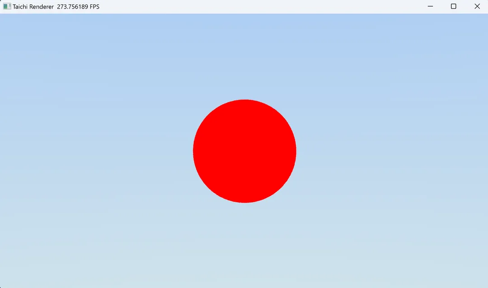  
一个完美的圆（实际上是球在平面上的投影）

## 9 计算物体法线

计算物体表面法线对光线追踪渲染非常重要，因为我们要根据物体表面法线决定光碰撞到物体表面时如何与之发生反应，也就是光的颜色、强弱和方向如何改变，之后才能进行下一步追踪。

法线是垂直于物体表面某点的单位向量，利用 SDF 表示的物体表面，可以比较容易的计算出法线。

### 9.1 梯度与法线

我们知道 SDF 函数在某点的值表示的是该点到物体表面的距离，而函数某点的梯度表示的是函数增长最快的方向。对于 SDF 函数来说，梯度方向就是远离物体表面的方向。如果某点在物体表面上，那么这一点的梯度方向刚好是物体表面法线 <svg style="overflow:visible;min-height:1px;min-width:1px;vertical-align:0;" xmlns="http://www.w3.org/2000/svg" width="1.446ex" height="1.93ex" viewBox="0 -853 639 853"><g stroke="currentColor" fill="currentColor" stroke-width="0" transform="scale(1,-1)"><g data-mml-node="math"><g data-mml-node="TeXAtom"><g data-mml-node="mover"><g data-mml-node="TeXAtom"><g data-mml-node="mi"><path d="M40 442Q217 450 218 450H224V407L225 365Q233 378 245 391T289 422T362 448Q374 450 398 450Q428 450 448 447T491 434T529 402T551 346Q553 335 554 198V62H623V0H614Q596 3 489 3Q374 3 365 0H356V62H425V194V275Q425 348 416 373T371 399Q326 399 288 370T238 290Q236 281 235 171V62H304V0H295Q277 3 171 3Q64 3 46 0H37V62H106V210V303Q106 353 104 363T91 376Q77 380 50 380H37V442H40Z" style="stroke-width: 3;"></path></g></g><g data-mml-node="mo" transform="translate(319.5,39) translate(-250 0)"><path d="M377 694Q377 702 382 708T397 714Q404 714 409 709Q414 705 419 690Q429 653 460 633Q471 626 471 615Q471 606 468 603T454 594Q411 572 379 531Q377 529 374 525T369 519T364 517T357 516Q350 516 344 521T337 536Q337 555 384 595H213L42 596Q29 605 29 615Q29 622 42 635H401Q377 673 377 694Z" style="stroke-width: 3;"></path></g></g></g></g></g></svg> 的方向，也就是 <svg style="overflow:visible;min-height:1px;min-width:1px;vertical-align:-.791ex;" xmlns="http://www.w3.org/2000/svg" width="23.495ex" height="2.721ex" viewBox="0 -853 10384.9 1202.5"><g stroke="currentColor" fill="currentColor" stroke-width="0" transform="scale(1,-1)"><g data-mml-node="math"><g data-mml-node="TeXAtom"><g data-mml-node="mover"><g data-mml-node="TeXAtom"><g data-mml-node="mi"><path d="M40 442Q217 450 218 450H224V407L225 365Q233 378 245 391T289 422T362 448Q374 450 398 450Q428 450 448 447T491 434T529 402T551 346Q553 335 554 198V62H623V0H614Q596 3 489 3Q374 3 365 0H356V62H425V194V275Q425 348 416 373T371 399Q326 399 288 370T238 290Q236 281 235 171V62H304V0H295Q277 3 171 3Q64 3 46 0H37V62H106V210V303Q106 353 104 363T91 376Q77 380 50 380H37V442H40Z" style="stroke-width: 3;"></path></g></g><g data-mml-node="mo" transform="translate(319.5,39) translate(-250 0)"><path d="M377 694Q377 702 382 708T397 714Q404 714 409 709Q414 705 419 690Q429 653 460 633Q471 626 471 615Q471 606 468 603T454 594Q411 572 379 531Q377 529 374 525T369 519T364 517T357 516Q350 516 344 521T337 536Q337 555 384 595H213L42 596Q29 605 29 615Q29 622 42 635H401Q377 673 377 694Z" style="stroke-width: 3;"></path></g></g></g><g data-mml-node="mo" transform="translate(916.8,0)"><path d="M56 347Q56 360 70 367H707Q722 359 722 347Q722 336 708 328L390 327H72Q56 332 56 347ZM56 153Q56 168 72 173H708Q722 163 722 153Q722 140 707 133H70Q56 140 56 153Z" style="stroke-width: 3;"></path></g><g data-mml-node="TeXAtom" transform="translate(1972.6,0)"><g data-mml-node="mi"><path d="M41 46H55Q94 46 102 60V68Q102 77 102 91T102 122T103 161T103 203Q103 234 103 269T102 328V351Q99 370 88 376T43 385H25V408Q25 431 27 431L37 432Q47 433 65 434T102 436Q119 437 138 438T167 441T178 442H181V402Q181 364 182 364T187 369T199 384T218 402T247 421T285 437Q305 442 336 442Q450 438 463 329Q464 322 464 190V104Q464 66 466 59T477 49Q498 46 526 46H542V0H534L510 1Q487 2 460 2T422 3Q319 3 310 0H302V46H318Q379 46 379 62Q380 64 380 200Q379 335 378 343Q372 371 358 385T334 402T308 404Q263 404 229 370Q202 343 195 315T187 232V168V108Q187 78 188 68T191 55T200 49Q221 46 249 46H265V0H257L234 1Q210 2 183 2T145 3Q42 3 33 0H25V46H41Z" style="stroke-width: 3;"></path><path d="M28 214Q28 309 93 378T250 448Q340 448 405 380T471 215Q471 120 407 55T250 -10Q153 -10 91 57T28 214ZM250 30Q372 30 372 193V225V250Q372 272 371 288T364 326T348 362T317 390T268 410Q263 411 252 411Q222 411 195 399Q152 377 139 338T126 246V226Q126 130 145 91Q177 30 250 30Z" transform="translate(556,0)" style="stroke-width: 3;"></path><path d="M36 46H50Q89 46 97 60V68Q97 77 97 91T98 122T98 161T98 203Q98 234 98 269T98 328L97 351Q94 370 83 376T38 385H20V408Q20 431 22 431L32 432Q42 433 60 434T96 436Q112 437 131 438T160 441T171 442H174V373Q213 441 271 441H277Q322 441 343 419T364 373Q364 352 351 337T313 322Q288 322 276 338T263 372Q263 381 265 388T270 400T273 405Q271 407 250 401Q234 393 226 386Q179 341 179 207V154Q179 141 179 127T179 101T180 81T180 66V61Q181 59 183 57T188 54T193 51T200 49T207 48T216 47T225 47T235 46T245 46H276V0H267Q249 3 140 3Q37 3 28 0H20V46H36Z" transform="translate(1056,0)" style="stroke-width: 3;"></path><path d="M41 46H55Q94 46 102 60V68Q102 77 102 91T102 122T103 161T103 203Q103 234 103 269T102 328V351Q99 370 88 376T43 385H25V408Q25 431 27 431L37 432Q47 433 65 434T102 436Q119 437 138 438T167 441T178 442H181V402Q181 364 182 364T187 369T199 384T218 402T247 421T285 437Q305 442 336 442Q351 442 364 440T387 434T406 426T421 417T432 406T441 395T448 384T452 374T455 366L457 361L460 365Q463 369 466 373T475 384T488 397T503 410T523 422T546 432T572 439T603 442Q729 442 740 329Q741 322 741 190V104Q741 66 743 59T754 49Q775 46 803 46H819V0H811L788 1Q764 2 737 2T699 3Q596 3 587 0H579V46H595Q656 46 656 62Q657 64 657 200Q656 335 655 343Q649 371 635 385T611 402T585 404Q540 404 506 370Q479 343 472 315T464 232V168V108Q464 78 465 68T468 55T477 49Q498 46 526 46H542V0H534L510 1Q487 2 460 2T422 3Q319 3 310 0H302V46H318Q379 46 379 62Q380 64 380 200Q379 335 378 343Q372 371 358 385T334 402T308 404Q263 404 229 370Q202 343 195 315T187 232V168V108Q187 78 188 68T191 55T200 49Q221 46 249 46H265V0H257L234 1Q210 2 183 2T145 3Q42 3 33 0H25V46H41Z" transform="translate(1448,0)" style="stroke-width: 3;"></path><path d="M137 305T115 305T78 320T63 359Q63 394 97 421T218 448Q291 448 336 416T396 340Q401 326 401 309T402 194V124Q402 76 407 58T428 40Q443 40 448 56T453 109V145H493V106Q492 66 490 59Q481 29 455 12T400 -6T353 12T329 54V58L327 55Q325 52 322 49T314 40T302 29T287 17T269 6T247 -2T221 -8T190 -11Q130 -11 82 20T34 107Q34 128 41 147T68 188T116 225T194 253T304 268H318V290Q318 324 312 340Q290 411 215 411Q197 411 181 410T156 406T148 403Q170 388 170 359Q170 334 154 320ZM126 106Q126 75 150 51T209 26Q247 26 276 49T315 109Q317 116 318 175Q318 233 317 233Q309 233 296 232T251 223T193 203T147 166T126 106Z" transform="translate(2281,0)" style="stroke-width: 3;"></path><path d="M42 46H56Q95 46 103 60V68Q103 77 103 91T103 124T104 167T104 217T104 272T104 329Q104 366 104 407T104 482T104 542T103 586T103 603Q100 622 89 628T44 637H26V660Q26 683 28 683L38 684Q48 685 67 686T104 688Q121 689 141 690T171 693T182 694H185V379Q185 62 186 60Q190 52 198 49Q219 46 247 46H263V0H255L232 1Q209 2 183 2T145 3T107 3T57 1L34 0H26V46H42Z" transform="translate(2781,0)" style="stroke-width: 3;"></path><path d="M69 609Q69 637 87 653T131 669Q154 667 171 652T188 609Q188 579 171 564T129 549Q104 549 87 564T69 609ZM247 0Q232 3 143 3Q132 3 106 3T56 1L34 0H26V46H42Q70 46 91 49Q100 53 102 60T104 102V205V293Q104 345 102 359T88 378Q74 385 41 385H30V408Q30 431 32 431L42 432Q52 433 70 434T106 436Q123 437 142 438T171 441T182 442H185V62Q190 52 197 50T232 46H255V0H247Z" transform="translate(3059,0)" style="stroke-width: 3;"></path><path d="M42 263Q44 270 48 345T53 423V431H393Q399 425 399 415Q399 403 398 402L381 378Q364 355 331 309T265 220L134 41L182 40H206Q254 40 283 46T331 77Q352 105 359 185L361 201Q361 202 381 202H401V196Q401 195 393 103T384 6V0H209L34 1L31 3Q28 8 28 17Q28 30 29 31T160 210T294 394H236Q169 393 152 388Q127 382 113 367Q89 344 82 264V255H42V263Z" transform="translate(3337,0)" style="stroke-width: 3;"></path><path d="M28 218Q28 273 48 318T98 391T163 433T229 448Q282 448 320 430T378 380T406 316T415 245Q415 238 408 231H126V216Q126 68 226 36Q246 30 270 30Q312 30 342 62Q359 79 369 104L379 128Q382 131 395 131H398Q415 131 415 121Q415 117 412 108Q393 53 349 21T250 -11Q155 -11 92 58T28 218ZM333 275Q322 403 238 411H236Q228 411 220 410T195 402T166 381T143 340T127 274V267H333V275Z" transform="translate(3781,0)" style="stroke-width: 3;"></path></g></g><g data-mml-node="mrow" transform="translate(6364.2,0)"><g data-mml-node="mo" transform="translate(0 -0.5)"><path d="M152 251Q152 646 388 850H416Q422 844 422 841Q422 837 403 816T357 753T302 649T255 482T236 250Q236 124 255 19T301 -147T356 -251T403 -315T422 -340Q422 -343 416 -349H388Q359 -325 332 -296T271 -213T212 -97T170 56T152 251Z" style="stroke-width: 3;"></path></g><g data-mml-node="mi" transform="translate(458,0)"><path d="M46 676Q46 679 51 683H781Q786 679 786 676Q786 674 617 326T444 -26Q439 -33 416 -33T388 -26Q385 -22 216 326T46 676ZM697 596Q697 597 445 597T193 596Q195 591 319 336T445 80L697 596Z" style="stroke-width: 3;"></path></g><g data-mml-node="mi" transform="translate(1291,0)"><path d="M118 -162Q120 -162 124 -164T135 -167T147 -168Q160 -168 171 -155T187 -126Q197 -99 221 27T267 267T289 382V385H242Q195 385 192 387Q188 390 188 397L195 425Q197 430 203 430T250 431Q298 431 298 432Q298 434 307 482T319 540Q356 705 465 705Q502 703 526 683T550 630Q550 594 529 578T487 561Q443 561 443 603Q443 622 454 636T478 657L487 662Q471 668 457 668Q445 668 434 658T419 630Q412 601 403 552T387 469T380 433Q380 431 435 431Q480 431 487 430T498 424Q499 420 496 407T491 391Q489 386 482 386T428 385H372L349 263Q301 15 282 -47Q255 -132 212 -173Q175 -205 139 -205Q107 -205 81 -186T55 -132Q55 -95 76 -78T118 -61Q162 -61 162 -103Q162 -122 151 -136T127 -157L118 -162Z" style="stroke-width: 3;"></path></g><g data-mml-node="mrow" transform="translate(2007.7,0)"><g data-mml-node="mo" transform="translate(0 -0.5)"><path d="M152 251Q152 646 388 850H416Q422 844 422 841Q422 837 403 816T357 753T302 649T255 482T236 250Q236 124 255 19T301 -147T356 -251T403 -315T422 -340Q422 -343 416 -349H388Q359 -325 332 -296T271 -213T212 -97T170 56T152 251Z" style="stroke-width: 3;"></path></g><g data-mml-node="TeXAtom" transform="translate(458,0)"><g data-mml-node="mover"><g data-mml-node="TeXAtom"><g data-mml-node="mi"><path d="M32 442L123 446Q214 450 215 450H221V409Q222 409 229 413T251 423T284 436T328 446T382 450Q480 450 540 388T600 223Q600 128 539 61T361 -6H354Q292 -6 236 28L227 34V-132H296V-194H287Q269 -191 163 -191Q56 -191 38 -194H29V-132H98V113V284Q98 330 97 348T93 370T83 376Q69 380 42 380H29V442H32ZM457 224Q457 303 427 349T350 395Q282 395 235 352L227 345V104L233 97Q274 45 337 45Q383 45 420 86T457 224Z" style="stroke-width: 3;"></path></g></g><g data-mml-node="mo" transform="translate(319.5,39) translate(-250 0)"><path d="M377 694Q377 702 382 708T397 714Q404 714 409 709Q414 705 419 690Q429 653 460 633Q471 626 471 615Q471 606 468 603T454 594Q411 572 379 531Q377 529 374 525T369 519T364 517T357 516Q350 516 344 521T337 536Q337 555 384 595H213L42 596Q29 605 29 615Q29 622 42 635H401Q377 673 377 694Z" style="stroke-width: 3;"></path></g></g></g><g data-mml-node="mo" transform="translate(1097,0) translate(0 -0.5)"><path d="M305 251Q305 -145 69 -349H56Q43 -349 39 -347T35 -338Q37 -333 60 -307T108 -239T160 -136T204 27T221 250T204 473T160 636T108 740T60 807T35 839Q35 850 50 850H56H69Q197 743 256 566Q305 425 305 251Z" style="stroke-width: 3;"></path></g></g><g data-mml-node="mo" transform="translate(3562.7,0) translate(0 -0.5)"><path d="M305 251Q305 -145 69 -349H56Q43 -349 39 -347T35 -338Q37 -333 60 -307T108 -239T160 -136T204 27T221 250T204 473T160 636T108 740T60 807T35 839Q35 850 50 850H56H69Q197 743 256 566Q305 425 305 251Z" style="stroke-width: 3;"></path></g></g></g></g></svg>  

而梯度的定义是

<svg style="overflow:visible;min-height:1px;min-width:1px;vertical-align:-2.148ex;width:100%;margin-bottom:.5em;" xmlns="http://www.w3.org/2000/svg" width="25.994ex" height="5.428ex" viewBox="0 -1449.5 11489.6 2399"><g stroke="currentColor" fill="currentColor" stroke-width="0" transform="scale(1,-1)"><g data-mml-node="math"><g data-mml-node="mi"><path d="M46 676Q46 679 51 683H781Q786 679 786 676Q786 674 617 326T444 -26Q439 -33 416 -33T388 -26Q385 -22 216 326T46 676ZM697 596Q697 597 445 597T193 596Q195 591 319 336T445 80L697 596Z" style="stroke-width: 3;"></path></g><g data-mml-node="mi" transform="translate(833,0)"><path d="M118 -162Q120 -162 124 -164T135 -167T147 -168Q160 -168 171 -155T187 -126Q197 -99 221 27T267 267T289 382V385H242Q195 385 192 387Q188 390 188 397L195 425Q197 430 203 430T250 431Q298 431 298 432Q298 434 307 482T319 540Q356 705 465 705Q502 703 526 683T550 630Q550 594 529 578T487 561Q443 561 443 603Q443 622 454 636T478 657L487 662Q471 668 457 668Q445 668 434 658T419 630Q412 601 403 552T387 469T380 433Q380 431 435 431Q480 431 487 430T498 424Q499 420 496 407T491 391Q489 386 482 386T428 385H372L349 263Q301 15 282 -47Q255 -132 212 -173Q175 -205 139 -205Q107 -205 81 -186T55 -132Q55 -95 76 -78T118 -61Q162 -61 162 -103Q162 -122 151 -136T127 -157L118 -162Z" style="stroke-width: 3;"></path></g><g data-mml-node="mrow" transform="translate(1549.7,0)"><g data-mml-node="mo" transform="translate(0 -0.5)"><path d="M152 251Q152 646 388 850H416Q422 844 422 841Q422 837 403 816T357 753T302 649T255 482T236 250Q236 124 255 19T301 -147T356 -251T403 -315T422 -340Q422 -343 416 -349H388Q359 -325 332 -296T271 -213T212 -97T170 56T152 251Z" style="stroke-width: 3;"></path></g><g data-mml-node="TeXAtom" transform="translate(458,0)"><g data-mml-node="mover"><g data-mml-node="TeXAtom"><g data-mml-node="mi"><path d="M32 442L123 446Q214 450 215 450H221V409Q222 409 229 413T251 423T284 436T328 446T382 450Q480 450 540 388T600 223Q600 128 539 61T361 -6H354Q292 -6 236 28L227 34V-132H296V-194H287Q269 -191 163 -191Q56 -191 38 -194H29V-132H98V113V284Q98 330 97 348T93 370T83 376Q69 380 42 380H29V442H32ZM457 224Q457 303 427 349T350 395Q282 395 235 352L227 345V104L233 97Q274 45 337 45Q383 45 420 86T457 224Z" style="stroke-width: 3;"></path></g></g><g data-mml-node="mo" transform="translate(319.5,39) translate(-250 0)"><path d="M377 694Q377 702 382 708T397 714Q404 714 409 709Q414 705 419 690Q429 653 460 633Q471 626 471 615Q471 606 468 603T454 594Q411 572 379 531Q377 529 374 525T369 519T364 517T357 516Q350 516 344 521T337 536Q337 555 384 595H213L42 596Q29 605 29 615Q29 622 42 635H401Q377 673 377 694Z" style="stroke-width: 3;"></path></g></g></g><g data-mml-node="mo" transform="translate(1097,0) translate(0 -0.5)"><path d="M305 251Q305 -145 69 -349H56Q43 -349 39 -347T35 -338Q37 -333 60 -307T108 -239T160 -136T204 27T221 250T204 473T160 636T108 740T60 807T35 839Q35 850 50 850H56H69Q197 743 256 566Q305 425 305 251Z" style="stroke-width: 3;"></path></g></g><g data-mml-node="mo" transform="translate(3382.4,0)"><path d="M56 347Q56 360 70 367H707Q722 359 722 347Q722 336 708 328L390 327H72Q56 332 56 347ZM56 153Q56 168 72 173H708Q722 163 722 153Q722 140 707 133H70Q56 140 56 153Z" style="stroke-width: 3;"></path></g><g data-mml-node="mrow" transform="translate(4438.2,0)"><g data-mml-node="mo" transform="translate(0 -0.5)"><path d="M701 -940Q701 -943 695 -949H664Q662 -947 636 -922T591 -879T537 -818T475 -737T412 -636T350 -511T295 -362T250 -186T221 17T209 251Q209 962 573 1361Q596 1386 616 1405T649 1437T664 1450H695Q701 1444 701 1441Q701 1436 681 1415T629 1356T557 1261T476 1118T400 927T340 675T308 359Q306 321 306 250Q306 -139 400 -430T690 -924Q701 -936 701 -940Z" style="stroke-width: 3;"></path></g><g data-mml-node="mfrac" transform="translate(736,0)"><g data-mml-node="mrow" transform="translate(231,676)"><g data-mml-node="mi"><path d="M202 508Q179 508 169 520T158 547Q158 557 164 577T185 624T230 675T301 710L333 715H345Q378 715 384 714Q447 703 489 661T549 568T566 457Q566 362 519 240T402 53Q321 -22 223 -22Q123 -22 73 56Q42 102 42 148V159Q42 276 129 370T322 465Q383 465 414 434T455 367L458 378Q478 461 478 515Q478 603 437 639T344 676Q266 676 223 612Q264 606 264 572Q264 547 246 528T202 508ZM430 306Q430 372 401 400T333 428Q270 428 222 382Q197 354 183 323T150 221Q132 149 132 116Q132 21 232 21Q244 21 250 22Q327 35 374 112Q389 137 409 196T430 306Z" style="stroke-width: 3;"></path></g><g data-mml-node="mi" transform="translate(566,0)"><path d="M118 -162Q120 -162 124 -164T135 -167T147 -168Q160 -168 171 -155T187 -126Q197 -99 221 27T267 267T289 382V385H242Q195 385 192 387Q188 390 188 397L195 425Q197 430 203 430T250 431Q298 431 298 432Q298 434 307 482T319 540Q356 705 465 705Q502 703 526 683T550 630Q550 594 529 578T487 561Q443 561 443 603Q443 622 454 636T478 657L487 662Q471 668 457 668Q445 668 434 658T419 630Q412 601 403 552T387 469T380 433Q380 431 435 431Q480 431 487 430T498 424Q499 420 496 407T491 391Q489 386 482 386T428 385H372L349 263Q301 15 282 -47Q255 -132 212 -173Q175 -205 139 -205Q107 -205 81 -186T55 -132Q55 -95 76 -78T118 -61Q162 -61 162 -103Q162 -122 151 -136T127 -157L118 -162Z" style="stroke-width: 3;"></path></g></g><g data-mml-node="mrow" transform="translate(220,-686)"><g data-mml-node="mi"><path d="M202 508Q179 508 169 520T158 547Q158 557 164 577T185 624T230 675T301 710L333 715H345Q378 715 384 714Q447 703 489 661T549 568T566 457Q566 362 519 240T402 53Q321 -22 223 -22Q123 -22 73 56Q42 102 42 148V159Q42 276 129 370T322 465Q383 465 414 434T455 367L458 378Q478 461 478 515Q478 603 437 639T344 676Q266 676 223 612Q264 606 264 572Q264 547 246 528T202 508ZM430 306Q430 372 401 400T333 428Q270 428 222 382Q197 354 183 323T150 221Q132 149 132 116Q132 21 232 21Q244 21 250 22Q327 35 374 112Q389 137 409 196T430 306Z" style="stroke-width: 3;"></path></g><g data-mml-node="mi" transform="translate(566,0)"><path d="M52 289Q59 331 106 386T222 442Q257 442 286 424T329 379Q371 442 430 442Q467 442 494 420T522 361Q522 332 508 314T481 292T458 288Q439 288 427 299T415 328Q415 374 465 391Q454 404 425 404Q412 404 406 402Q368 386 350 336Q290 115 290 78Q290 50 306 38T341 26Q378 26 414 59T463 140Q466 150 469 151T485 153H489Q504 153 504 145Q504 144 502 134Q486 77 440 33T333 -11Q263 -11 227 52Q186 -10 133 -10H127Q78 -10 57 16T35 71Q35 103 54 123T99 143Q142 143 142 101Q142 81 130 66T107 46T94 41L91 40Q91 39 97 36T113 29T132 26Q168 26 194 71Q203 87 217 139T245 247T261 313Q266 340 266 352Q266 380 251 392T217 404Q177 404 142 372T93 290Q91 281 88 280T72 278H58Q52 284 52 289Z" style="stroke-width: 3;"></path></g></g><rect width="1338" height="60" x="120" y="220"></rect></g><g data-mml-node="mo" transform="translate(2314,0)"><path d="M78 35T78 60T94 103T137 121Q165 121 187 96T210 8Q210 -27 201 -60T180 -117T154 -158T130 -185T117 -194Q113 -194 104 -185T95 -172Q95 -168 106 -156T131 -126T157 -76T173 -3V9L172 8Q170 7 167 6T161 3T152 1T140 0Q113 0 96 17Z" style="stroke-width: 3;"></path></g><g data-mml-node="mfrac" transform="translate(2758.7,0)"><g data-mml-node="mrow" transform="translate(220,676)"><g data-mml-node="mi"><path d="M202 508Q179 508 169 520T158 547Q158 557 164 577T185 624T230 675T301 710L333 715H345Q378 715 384 714Q447 703 489 661T549 568T566 457Q566 362 519 240T402 53Q321 -22 223 -22Q123 -22 73 56Q42 102 42 148V159Q42 276 129 370T322 465Q383 465 414 434T455 367L458 378Q478 461 478 515Q478 603 437 639T344 676Q266 676 223 612Q264 606 264 572Q264 547 246 528T202 508ZM430 306Q430 372 401 400T333 428Q270 428 222 382Q197 354 183 323T150 221Q132 149 132 116Q132 21 232 21Q244 21 250 22Q327 35 374 112Q389 137 409 196T430 306Z" style="stroke-width: 3;"></path></g><g data-mml-node="mi" transform="translate(566,0)"><path d="M118 -162Q120 -162 124 -164T135 -167T147 -168Q160 -168 171 -155T187 -126Q197 -99 221 27T267 267T289 382V385H242Q195 385 192 387Q188 390 188 397L195 425Q197 430 203 430T250 431Q298 431 298 432Q298 434 307 482T319 540Q356 705 465 705Q502 703 526 683T550 630Q550 594 529 578T487 561Q443 561 443 603Q443 622 454 636T478 657L487 662Q471 668 457 668Q445 668 434 658T419 630Q412 601 403 552T387 469T380 433Q380 431 435 431Q480 431 487 430T498 424Q499 420 496 407T491 391Q489 386 482 386T428 385H372L349 263Q301 15 282 -47Q255 -132 212 -173Q175 -205 139 -205Q107 -205 81 -186T55 -132Q55 -95 76 -78T118 -61Q162 -61 162 -103Q162 -122 151 -136T127 -157L118 -162Z" style="stroke-width: 3;"></path></g></g><g data-mml-node="mrow" transform="translate(250,-686)"><g data-mml-node="mi"><path d="M202 508Q179 508 169 520T158 547Q158 557 164 577T185 624T230 675T301 710L333 715H345Q378 715 384 714Q447 703 489 661T549 568T566 457Q566 362 519 240T402 53Q321 -22 223 -22Q123 -22 73 56Q42 102 42 148V159Q42 276 129 370T322 465Q383 465 414 434T455 367L458 378Q478 461 478 515Q478 603 437 639T344 676Q266 676 223 612Q264 606 264 572Q264 547 246 528T202 508ZM430 306Q430 372 401 400T333 428Q270 428 222 382Q197 354 183 323T150 221Q132 149 132 116Q132 21 232 21Q244 21 250 22Q327 35 374 112Q389 137 409 196T430 306Z" style="stroke-width: 3;"></path></g><g data-mml-node="mi" transform="translate(566,0)"><path d="M21 287Q21 301 36 335T84 406T158 442Q199 442 224 419T250 355Q248 336 247 334Q247 331 231 288T198 191T182 105Q182 62 196 45T238 27Q261 27 281 38T312 61T339 94Q339 95 344 114T358 173T377 247Q415 397 419 404Q432 431 462 431Q475 431 483 424T494 412T496 403Q496 390 447 193T391 -23Q363 -106 294 -155T156 -205Q111 -205 77 -183T43 -117Q43 -95 50 -80T69 -58T89 -48T106 -45Q150 -45 150 -87Q150 -107 138 -122T115 -142T102 -147L99 -148Q101 -153 118 -160T152 -167H160Q177 -167 186 -165Q219 -156 247 -127T290 -65T313 -9T321 21L315 17Q309 13 296 6T270 -6Q250 -11 231 -11Q185 -11 150 11T104 82Q103 89 103 113Q103 170 138 262T173 379Q173 380 173 381Q173 390 173 393T169 400T158 404H154Q131 404 112 385T82 344T65 302T57 280Q55 278 41 278H27Q21 284 21 287Z" style="stroke-width: 3;"></path></g></g><rect width="1316" height="60" x="120" y="220"></rect></g><g data-mml-node="mo" transform="translate(4314.7,0)"><path d="M78 35T78 60T94 103T137 121Q165 121 187 96T210 8Q210 -27 201 -60T180 -117T154 -158T130 -185T117 -194Q113 -194 104 -185T95 -172Q95 -168 106 -156T131 -126T157 -76T173 -3V9L172 8Q170 7 167 6T161 3T152 1T140 0Q113 0 96 17Z" style="stroke-width: 3;"></path></g><g data-mml-node="mfrac" transform="translate(4759.3,0)"><g data-mml-node="mrow" transform="translate(220,676)"><g data-mml-node="mi"><path d="M202 508Q179 508 169 520T158 547Q158 557 164 577T185 624T230 675T301 710L333 715H345Q378 715 384 714Q447 703 489 661T549 568T566 457Q566 362 519 240T402 53Q321 -22 223 -22Q123 -22 73 56Q42 102 42 148V159Q42 276 129 370T322 465Q383 465 414 434T455 367L458 378Q478 461 478 515Q478 603 437 639T344 676Q266 676 223 612Q264 606 264 572Q264 547 246 528T202 508ZM430 306Q430 372 401 400T333 428Q270 428 222 382Q197 354 183 323T150 221Q132 149 132 116Q132 21 232 21Q244 21 250 22Q327 35 374 112Q389 137 409 196T430 306Z" style="stroke-width: 3;"></path></g><g data-mml-node="mi" transform="translate(566,0)"><path d="M118 -162Q120 -162 124 -164T135 -167T147 -168Q160 -168 171 -155T187 -126Q197 -99 221 27T267 267T289 382V385H242Q195 385 192 387Q188 390 188 397L195 425Q197 430 203 430T250 431Q298 431 298 432Q298 434 307 482T319 540Q356 705 465 705Q502 703 526 683T550 630Q550 594 529 578T487 561Q443 561 443 603Q443 622 454 636T478 657L487 662Q471 668 457 668Q445 668 434 658T419 630Q412 601 403 552T387 469T380 433Q380 431 435 431Q480 431 487 430T498 424Q499 420 496 407T491 391Q489 386 482 386T428 385H372L349 263Q301 15 282 -47Q255 -132 212 -173Q175 -205 139 -205Q107 -205 81 -186T55 -132Q55 -95 76 -78T118 -61Q162 -61 162 -103Q162 -122 151 -136T127 -157L118 -162Z" style="stroke-width: 3;"></path></g></g><g data-mml-node="mrow" transform="translate(262.5,-686)"><g data-mml-node="mi"><path d="M202 508Q179 508 169 520T158 547Q158 557 164 577T185 624T230 675T301 710L333 715H345Q378 715 384 714Q447 703 489 661T549 568T566 457Q566 362 519 240T402 53Q321 -22 223 -22Q123 -22 73 56Q42 102 42 148V159Q42 276 129 370T322 465Q383 465 414 434T455 367L458 378Q478 461 478 515Q478 603 437 639T344 676Q266 676 223 612Q264 606 264 572Q264 547 246 528T202 508ZM430 306Q430 372 401 400T333 428Q270 428 222 382Q197 354 183 323T150 221Q132 149 132 116Q132 21 232 21Q244 21 250 22Q327 35 374 112Q389 137 409 196T430 306Z" style="stroke-width: 3;"></path></g><g data-mml-node="mi" transform="translate(566,0)"><path d="M347 338Q337 338 294 349T231 360Q211 360 197 356T174 346T162 335T155 324L153 320Q150 317 138 317Q117 317 117 325Q117 330 120 339Q133 378 163 406T229 440Q241 442 246 442Q271 442 291 425T329 392T367 375Q389 375 411 408T434 441Q435 442 449 442H462Q468 436 468 434Q468 430 463 420T449 399T432 377T418 358L411 349Q368 298 275 214T160 106L148 94L163 93Q185 93 227 82T290 71Q328 71 360 90T402 140Q406 149 409 151T424 153Q443 153 443 143Q443 138 442 134Q425 72 376 31T278 -11Q252 -11 232 6T193 40T155 57Q111 57 76 -3Q70 -11 59 -11H54H41Q35 -5 35 -2Q35 13 93 84Q132 129 225 214T340 322Q352 338 347 338Z" style="stroke-width: 3;"></path></g></g><rect width="1316" height="60" x="120" y="220"></rect></g><g data-mml-node="mo" transform="translate(6315.3,0) translate(0 -0.5)"><path d="M34 1438Q34 1446 37 1448T50 1450H56H71Q73 1448 99 1423T144 1380T198 1319T260 1238T323 1137T385 1013T440 864T485 688T514 485T526 251Q526 134 519 53Q472 -519 162 -860Q139 -885 119 -904T86 -936T71 -949H56Q43 -949 39 -947T34 -937Q88 -883 140 -813Q428 -430 428 251Q428 453 402 628T338 922T245 1146T145 1309T46 1425Q44 1427 42 1429T39 1433T36 1436L34 1438Z" style="stroke-width: 3;"></path></g></g></g></g></svg>

Taichi 支持可微编程[10]，拥有一个强大的自动微分系统，可以很方便的自动计算梯度。但为了方便读者理解，这里我仍然先采用传统的办法，即利用数值微分计算梯度

<svg style="overflow:visible;min-height:1px;min-width:1px;vertical-align:-2.827ex;width:100%;" xmlns="http://www.w3.org/2000/svg" width="72.638ex" height="6.785ex" viewBox="0 -1749.5 32106 2999"><g stroke="currentColor" fill="currentColor" stroke-width="0" transform="scale(1,-1)"><g data-mml-node="math"><g data-mml-node="mi"><path d="M46 676Q46 679 51 683H781Q786 679 786 676Q786 674 617 326T444 -26Q439 -33 416 -33T388 -26Q385 -22 216 326T46 676ZM697 596Q697 597 445 597T193 596Q195 591 319 336T445 80L697 596Z" style="stroke-width: 3;"></path></g><g data-mml-node="mi" transform="translate(833,0)"><path d="M118 -162Q120 -162 124 -164T135 -167T147 -168Q160 -168 171 -155T187 -126Q197 -99 221 27T267 267T289 382V385H242Q195 385 192 387Q188 390 188 397L195 425Q197 430 203 430T250 431Q298 431 298 432Q298 434 307 482T319 540Q356 705 465 705Q502 703 526 683T550 630Q550 594 529 578T487 561Q443 561 443 603Q443 622 454 636T478 657L487 662Q471 668 457 668Q445 668 434 658T419 630Q412 601 403 552T387 469T380 433Q380 431 435 431Q480 431 487 430T498 424Q499 420 496 407T491 391Q489 386 482 386T428 385H372L349 263Q301 15 282 -47Q255 -132 212 -173Q175 -205 139 -205Q107 -205 81 -186T55 -132Q55 -95 76 -78T118 -61Q162 -61 162 -103Q162 -122 151 -136T127 -157L118 -162Z" style="stroke-width: 3;"></path></g><g data-mml-node="mrow" transform="translate(1549.7,0)"><g data-mml-node="mo" transform="translate(0 -0.5)"><path d="M152 251Q152 646 388 850H416Q422 844 422 841Q422 837 403 816T357 753T302 649T255 482T236 250Q236 124 255 19T301 -147T356 -251T403 -315T422 -340Q422 -343 416 -349H388Q359 -325 332 -296T271 -213T212 -97T170 56T152 251Z" style="stroke-width: 3;"></path></g><g data-mml-node="TeXAtom" transform="translate(458,0)"><g data-mml-node="mover"><g data-mml-node="TeXAtom"><g data-mml-node="mi"><path d="M32 442L123 446Q214 450 215 450H221V409Q222 409 229 413T251 423T284 436T328 446T382 450Q480 450 540 388T600 223Q600 128 539 61T361 -6H354Q292 -6 236 28L227 34V-132H296V-194H287Q269 -191 163 -191Q56 -191 38 -194H29V-132H98V113V284Q98 330 97 348T93 370T83 376Q69 380 42 380H29V442H32ZM457 224Q457 303 427 349T350 395Q282 395 235 352L227 345V104L233 97Q274 45 337 45Q383 45 420 86T457 224Z" style="stroke-width: 3;"></path></g></g><g data-mml-node="mo" transform="translate(319.5,39) translate(-250 0)"><path d="M377 694Q377 702 382 708T397 714Q404 714 409 709Q414 705 419 690Q429 653 460 633Q471 626 471 615Q471 606 468 603T454 594Q411 572 379 531Q377 529 374 525T369 519T364 517T357 516Q350 516 344 521T337 536Q337 555 384 595H213L42 596Q29 605 29 615Q29 622 42 635H401Q377 673 377 694Z" style="stroke-width: 3;"></path></g></g></g><g data-mml-node="mo" transform="translate(1097,0) translate(0 -0.5)"><path d="M305 251Q305 -145 69 -349H56Q43 -349 39 -347T35 -338Q37 -333 60 -307T108 -239T160 -136T204 27T221 250T204 473T160 636T108 740T60 807T35 839Q35 850 50 850H56H69Q197 743 256 566Q305 425 305 251Z" style="stroke-width: 3;"></path></g></g><g data-mml-node="mo" transform="translate(3382.4,0)"><path d="M56 347Q56 360 70 367H707Q722 359 722 347Q722 336 708 328L390 327H72Q56 332 56 347ZM56 153Q56 168 72 173H708Q722 163 722 153Q722 140 707 133H70Q56 140 56 153Z" style="stroke-width: 3;"></path></g><g data-mml-node="mrow" transform="translate(4438.2,0)"><g data-mml-node="mo" transform="translate(0 -0.5)"><path d="M758 -1237T758 -1240T752 -1249H736Q718 -1249 717 -1248Q711 -1245 672 -1199Q237 -706 237 251T672 1700Q697 1730 716 1749Q718 1750 735 1750H752Q758 1744 758 1741Q758 1737 740 1713T689 1644T619 1537T540 1380T463 1176Q348 802 348 251Q348 -242 441 -599T744 -1218Q758 -1237 758 -1240Z" style="stroke-width: 3;"></path></g><g data-mml-node="mfrac" transform="translate(792,0)"><g data-mml-node="mrow" transform="translate(220,809.5)"><g data-mml-node="mi"><path d="M118 -162Q120 -162 124 -164T135 -167T147 -168Q160 -168 171 -155T187 -126Q197 -99 221 27T267 267T289 382V385H242Q195 385 192 387Q188 390 188 397L195 425Q197 430 203 430T250 431Q298 431 298 432Q298 434 307 482T319 540Q356 705 465 705Q502 703 526 683T550 630Q550 594 529 578T487 561Q443 561 443 603Q443 622 454 636T478 657L487 662Q471 668 457 668Q445 668 434 658T419 630Q412 601 403 552T387 469T380 433Q380 431 435 431Q480 431 487 430T498 424Q499 420 496 407T491 391Q489 386 482 386T428 385H372L349 263Q301 15 282 -47Q255 -132 212 -173Q175 -205 139 -205Q107 -205 81 -186T55 -132Q55 -95 76 -78T118 -61Q162 -61 162 -103Q162 -122 151 -136T127 -157L118 -162Z" style="stroke-width: 3;"></path></g><g data-mml-node="mrow" transform="translate(716.7,0)"><g data-mml-node="mo" transform="translate(0 -0.5)"><path d="M152 251Q152 646 388 850H416Q422 844 422 841Q422 837 403 816T357 753T302 649T255 482T236 250Q236 124 255 19T301 -147T356 -251T403 -315T422 -340Q422 -343 416 -349H388Q359 -325 332 -296T271 -213T212 -97T170 56T152 251Z" style="stroke-width: 3;"></path></g><g data-mml-node="TeXAtom" transform="translate(458,0)"><g data-mml-node="mover"><g data-mml-node="TeXAtom"><g data-mml-node="mi"><path d="M32 442L123 446Q214 450 215 450H221V409Q222 409 229 413T251 423T284 436T328 446T382 450Q480 450 540 388T600 223Q600 128 539 61T361 -6H354Q292 -6 236 28L227 34V-132H296V-194H287Q269 -191 163 -191Q56 -191 38 -194H29V-132H98V113V284Q98 330 97 348T93 370T83 376Q69 380 42 380H29V442H32ZM457 224Q457 303 427 349T350 395Q282 395 235 352L227 345V104L233 97Q274 45 337 45Q383 45 420 86T457 224Z" style="stroke-width: 3;"></path></g></g><g data-mml-node="mo" transform="translate(319.5,39) translate(-250 0)"><path d="M377 694Q377 702 382 708T397 714Q404 714 409 709Q414 705 419 690Q429 653 460 633Q471 626 471 615Q471 606 468 603T454 594Q411 572 379 531Q377 529 374 525T369 519T364 517T357 516Q350 516 344 521T337 536Q337 555 384 595H213L42 596Q29 605 29 615Q29 622 42 635H401Q377 673 377 694Z" style="stroke-width: 3;"></path></g></g></g><g data-mml-node="mo" transform="translate(1319.2,0)"><path d="M56 237T56 250T70 270H369V420L370 570Q380 583 389 583Q402 583 409 568V270H707Q722 262 722 250T707 230H409V-68Q401 -82 391 -82H389H387Q375 -82 369 -68V230H70Q56 237 56 250Z" style="stroke-width: 3;"></path></g><g data-mml-node="msub" transform="translate(2319.4,0)"><g data-mml-node="TeXAtom"><g data-mml-node="mover"><g data-mml-node="TeXAtom"><g data-mml-node="mi"><path d="M32 225Q32 332 102 392T272 452H283Q382 452 436 401Q494 343 494 243Q494 226 486 222T440 217Q431 217 394 217T327 218H175V209Q175 177 179 154T196 107T236 69T306 50Q312 49 323 49Q376 49 410 85Q421 99 427 111T434 127T442 133T463 135H468Q494 135 494 117Q494 110 489 97T468 66T431 32T373 5T292 -6Q181 -6 107 55T32 225ZM383 276Q377 346 348 374T280 402Q253 402 230 390T195 357Q179 331 176 279V266H383V276Z" style="stroke-width: 3;"></path></g></g><g data-mml-node="mo" transform="translate(263.5,41) translate(-250 0)"><path d="M377 694Q377 702 382 708T397 714Q404 714 409 709Q414 705 419 690Q429 653 460 633Q471 626 471 615Q471 606 468 603T454 594Q411 572 379 531Q377 529 374 525T369 519T364 517T357 516Q350 516 344 521T337 536Q337 555 384 595H213L42 596Q29 605 29 615Q29 622 42 635H401Q377 673 377 694Z" style="stroke-width: 3;"></path></g></g></g><g data-mml-node="TeXAtom" transform="translate(560,-150) scale(0.707)"><g data-mml-node="mi"><path d="M52 289Q59 331 106 386T222 442Q257 442 286 424T329 379Q371 442 430 442Q467 442 494 420T522 361Q522 332 508 314T481 292T458 288Q439 288 427 299T415 328Q415 374 465 391Q454 404 425 404Q412 404 406 402Q368 386 350 336Q290 115 290 78Q290 50 306 38T341 26Q378 26 414 59T463 140Q466 150 469 151T485 153H489Q504 153 504 145Q504 144 502 134Q486 77 440 33T333 -11Q263 -11 227 52Q186 -10 133 -10H127Q78 -10 57 16T35 71Q35 103 54 123T99 143Q142 143 142 101Q142 81 130 66T107 46T94 41L91 40Q91 39 97 36T113 29T132 26Q168 26 194 71Q203 87 217 139T245 247T261 313Q266 340 266 352Q266 380 251 392T217 404Q177 404 142 372T93 290Q91 281 88 280T72 278H58Q52 284 52 289Z" style="stroke-width: 3;"></path></g></g></g><g data-mml-node="mo" transform="translate(3333.9,0) translate(0 -0.5)"><path d="M305 251Q305 -145 69 -349H56Q43 -349 39 -347T35 -338Q37 -333 60 -307T108 -239T160 -136T204 27T221 250T204 473T160 636T108 740T60 807T35 839Q35 850 50 850H56H69Q197 743 256 566Q305 425 305 251Z" style="stroke-width: 3;"></path></g></g><g data-mml-node="mo" transform="translate(4730.8,0)"><path d="M84 237T84 250T98 270H679Q694 262 694 250T679 230H98Q84 237 84 250Z" style="stroke-width: 3;"></path></g><g data-mml-node="mi" transform="translate(5731,0)"><path d="M118 -162Q120 -162 124 -164T135 -167T147 -168Q160 -168 171 -155T187 -126Q197 -99 221 27T267 267T289 382V385H242Q195 385 192 387Q188 390 188 397L195 425Q197 430 203 430T250 431Q298 431 298 432Q298 434 307 482T319 540Q356 705 465 705Q502 703 526 683T550 630Q550 594 529 578T487 561Q443 561 443 603Q443 622 454 636T478 657L487 662Q471 668 457 668Q445 668 434 658T419 630Q412 601 403 552T387 469T380 433Q380 431 435 431Q480 431 487 430T498 424Q499 420 496 407T491 391Q489 386 482 386T428 385H372L349 263Q301 15 282 -47Q255 -132 212 -173Q175 -205 139 -205Q107 -205 81 -186T55 -132Q55 -95 76 -78T118 -61Q162 -61 162 -103Q162 -122 151 -136T127 -157L118 -162Z" style="stroke-width: 3;"></path></g><g data-mml-node="mrow" transform="translate(6447.7,0)"><g data-mml-node="mo" transform="translate(0 -0.5)"><path d="M152 251Q152 646 388 850H416Q422 844 422 841Q422 837 403 816T357 753T302 649T255 482T236 250Q236 124 255 19T301 -147T356 -251T403 -315T422 -340Q422 -343 416 -349H388Q359 -325 332 -296T271 -213T212 -97T170 56T152 251Z" style="stroke-width: 3;"></path></g><g data-mml-node="TeXAtom" transform="translate(458,0)"><g data-mml-node="mover"><g data-mml-node="TeXAtom"><g data-mml-node="mi"><path d="M32 442L123 446Q214 450 215 450H221V409Q222 409 229 413T251 423T284 436T328 446T382 450Q480 450 540 388T600 223Q600 128 539 61T361 -6H354Q292 -6 236 28L227 34V-132H296V-194H287Q269 -191 163 -191Q56 -191 38 -194H29V-132H98V113V284Q98 330 97 348T93 370T83 376Q69 380 42 380H29V442H32ZM457 224Q457 303 427 349T350 395Q282 395 235 352L227 345V104L233 97Q274 45 337 45Q383 45 420 86T457 224Z" style="stroke-width: 3;"></path></g></g><g data-mml-node="mo" transform="translate(319.5,39) translate(-250 0)"><path d="M377 694Q377 702 382 708T397 714Q404 714 409 709Q414 705 419 690Q429 653 460 633Q471 626 471 615Q471 606 468 603T454 594Q411 572 379 531Q377 529 374 525T369 519T364 517T357 516Q350 516 344 521T337 536Q337 555 384 595H213L42 596Q29 605 29 615Q29 622 42 635H401Q377 673 377 694Z" style="stroke-width: 3;"></path></g></g></g><g data-mml-node="mo" transform="translate(1097,0) translate(0 -0.5)"><path d="M305 251Q305 -145 69 -349H56Q43 -349 39 -347T35 -338Q37 -333 60 -307T108 -239T160 -136T204 27T221 250T204 473T160 636T108 740T60 807T35 839Q35 850 50 850H56H69Q197 743 256 566Q305 425 305 251Z" style="stroke-width: 3;"></path></g></g></g><g data-mml-node="mi" transform="translate(4018.3,-686)"><path d="M227 -11Q149 -11 95 41T40 174Q40 262 87 322Q121 367 173 396T287 430Q289 431 329 431H367Q382 426 382 411Q382 385 341 385H325H312Q191 385 154 277L150 265H327Q340 256 340 246Q340 228 320 219H138V217Q128 187 128 143Q128 77 160 52T231 26Q258 26 284 36T326 57T343 68Q350 68 354 58T358 39Q358 36 357 35Q354 31 337 21T289 0T227 -11Z" style="stroke-width: 3;"></path></g><rect width="8202.7" height="60" x="120" y="220"></rect></g><g data-mml-node="mo" transform="translate(9234.7,0)"><path d="M78 35T78 60T94 103T137 121Q165 121 187 96T210 8Q210 -27 201 -60T180 -117T154 -158T130 -185T117 -194Q113 -194 104 -185T95 -172Q95 -168 106 -156T131 -126T157 -76T173 -3V9L172 8Q170 7 167 6T161 3T152 1T140 0Q113 0 96 17Z" style="stroke-width: 3;"></path></g><g data-mml-node="mfrac" transform="translate(9679.4,0)"><g data-mml-node="mrow" transform="translate(220,809.5)"><g data-mml-node="mi"><path d="M118 -162Q120 -162 124 -164T135 -167T147 -168Q160 -168 171 -155T187 -126Q197 -99 221 27T267 267T289 382V385H242Q195 385 192 387Q188 390 188 397L195 425Q197 430 203 430T250 431Q298 431 298 432Q298 434 307 482T319 540Q356 705 465 705Q502 703 526 683T550 630Q550 594 529 578T487 561Q443 561 443 603Q443 622 454 636T478 657L487 662Q471 668 457 668Q445 668 434 658T419 630Q412 601 403 552T387 469T380 433Q380 431 435 431Q480 431 487 430T498 424Q499 420 496 407T491 391Q489 386 482 386T428 385H372L349 263Q301 15 282 -47Q255 -132 212 -173Q175 -205 139 -205Q107 -205 81 -186T55 -132Q55 -95 76 -78T118 -61Q162 -61 162 -103Q162 -122 151 -136T127 -157L118 -162Z" style="stroke-width: 3;"></path></g><g data-mml-node="mrow" transform="translate(716.7,0)"><g data-mml-node="mo" transform="translate(0 -0.5)"><path d="M152 251Q152 646 388 850H416Q422 844 422 841Q422 837 403 816T357 753T302 649T255 482T236 250Q236 124 255 19T301 -147T356 -251T403 -315T422 -340Q422 -343 416 -349H388Q359 -325 332 -296T271 -213T212 -97T170 56T152 251Z" style="stroke-width: 3;"></path></g><g data-mml-node="TeXAtom" transform="translate(458,0)"><g data-mml-node="mover"><g data-mml-node="TeXAtom"><g data-mml-node="mi"><path d="M32 442L123 446Q214 450 215 450H221V409Q222 409 229 413T251 423T284 436T328 446T382 450Q480 450 540 388T600 223Q600 128 539 61T361 -6H354Q292 -6 236 28L227 34V-132H296V-194H287Q269 -191 163 -191Q56 -191 38 -194H29V-132H98V113V284Q98 330 97 348T93 370T83 376Q69 380 42 380H29V442H32ZM457 224Q457 303 427 349T350 395Q282 395 235 352L227 345V104L233 97Q274 45 337 45Q383 45 420 86T457 224Z" style="stroke-width: 3;"></path></g></g><g data-mml-node="mo" transform="translate(319.5,39) translate(-250 0)"><path d="M377 694Q377 702 382 708T397 714Q404 714 409 709Q414 705 419 690Q429 653 460 633Q471 626 471 615Q471 606 468 603T454 594Q411 572 379 531Q377 529 374 525T369 519T364 517T357 516Q350 516 344 521T337 536Q337 555 384 595H213L42 596Q29 605 29 615Q29 622 42 635H401Q377 673 377 694Z" style="stroke-width: 3;"></path></g></g></g><g data-mml-node="mo" transform="translate(1319.2,0)"><path d="M56 237T56 250T70 270H369V420L370 570Q380 583 389 583Q402 583 409 568V270H707Q722 262 722 250T707 230H409V-68Q401 -82 391 -82H389H387Q375 -82 369 -68V230H70Q56 237 56 250Z" style="stroke-width: 3;"></path></g><g data-mml-node="msub" transform="translate(2319.4,0)"><g data-mml-node="TeXAtom"><g data-mml-node="mover"><g data-mml-node="TeXAtom"><g data-mml-node="mi"><path d="M32 225Q32 332 102 392T272 452H283Q382 452 436 401Q494 343 494 243Q494 226 486 222T440 217Q431 217 394 217T327 218H175V209Q175 177 179 154T196 107T236 69T306 50Q312 49 323 49Q376 49 410 85Q421 99 427 111T434 127T442 133T463 135H468Q494 135 494 117Q494 110 489 97T468 66T431 32T373 5T292 -6Q181 -6 107 55T32 225ZM383 276Q377 346 348 374T280 402Q253 402 230 390T195 357Q179 331 176 279V266H383V276Z" style="stroke-width: 3;"></path></g></g><g data-mml-node="mo" transform="translate(263.5,41) translate(-250 0)"><path d="M377 694Q377 702 382 708T397 714Q404 714 409 709Q414 705 419 690Q429 653 460 633Q471 626 471 615Q471 606 468 603T454 594Q411 572 379 531Q377 529 374 525T369 519T364 517T357 516Q350 516 344 521T337 536Q337 555 384 595H213L42 596Q29 605 29 615Q29 622 42 635H401Q377 673 377 694Z" style="stroke-width: 3;"></path></g></g></g><g data-mml-node="TeXAtom" transform="translate(560,-150) scale(0.707)"><g data-mml-node="mi"><path d="M21 287Q21 301 36 335T84 406T158 442Q199 442 224 419T250 355Q248 336 247 334Q247 331 231 288T198 191T182 105Q182 62 196 45T238 27Q261 27 281 38T312 61T339 94Q339 95 344 114T358 173T377 247Q415 397 419 404Q432 431 462 431Q475 431 483 424T494 412T496 403Q496 390 447 193T391 -23Q363 -106 294 -155T156 -205Q111 -205 77 -183T43 -117Q43 -95 50 -80T69 -58T89 -48T106 -45Q150 -45 150 -87Q150 -107 138 -122T115 -142T102 -147L99 -148Q101 -153 118 -160T152 -167H160Q177 -167 186 -165Q219 -156 247 -127T290 -65T313 -9T321 21L315 17Q309 13 296 6T270 -6Q250 -11 231 -11Q185 -11 150 11T104 82Q103 89 103 113Q103 170 138 262T173 379Q173 380 173 381Q173 390 173 393T169 400T158 404H154Q131 404 112 385T82 344T65 302T57 280Q55 278 41 278H27Q21 284 21 287Z" style="stroke-width: 3;"></path></g></g></g><g data-mml-node="mo" transform="translate(3275.9,0) translate(0 -0.5)"><path d="M305 251Q305 -145 69 -349H56Q43 -349 39 -347T35 -338Q37 -333 60 -307T108 -239T160 -136T204 27T221 250T204 473T160 636T108 740T60 807T35 839Q35 850 50 850H56H69Q197 743 256 566Q305 425 305 251Z" style="stroke-width: 3;"></path></g></g><g data-mml-node="mo" transform="translate(4672.8,0)"><path d="M84 237T84 250T98 270H679Q694 262 694 250T679 230H98Q84 237 84 250Z" style="stroke-width: 3;"></path></g><g data-mml-node="mi" transform="translate(5673,0)"><path d="M118 -162Q120 -162 124 -164T135 -167T147 -168Q160 -168 171 -155T187 -126Q197 -99 221 27T267 267T289 382V385H242Q195 385 192 387Q188 390 188 397L195 425Q197 430 203 430T250 431Q298 431 298 432Q298 434 307 482T319 540Q356 705 465 705Q502 703 526 683T550 630Q550 594 529 578T487 561Q443 561 443 603Q443 622 454 636T478 657L487 662Q471 668 457 668Q445 668 434 658T419 630Q412 601 403 552T387 469T380 433Q380 431 435 431Q480 431 487 430T498 424Q499 420 496 407T491 391Q489 386 482 386T428 385H372L349 263Q301 15 282 -47Q255 -132 212 -173Q175 -205 139 -205Q107 -205 81 -186T55 -132Q55 -95 76 -78T118 -61Q162 -61 162 -103Q162 -122 151 -136T127 -157L118 -162Z" style="stroke-width: 3;"></path></g><g data-mml-node="mrow" transform="translate(6389.7,0)"><g data-mml-node="mo" transform="translate(0 -0.5)"><path d="M152 251Q152 646 388 850H416Q422 844 422 841Q422 837 403 816T357 753T302 649T255 482T236 250Q236 124 255 19T301 -147T356 -251T403 -315T422 -340Q422 -343 416 -349H388Q359 -325 332 -296T271 -213T212 -97T170 56T152 251Z" style="stroke-width: 3;"></path></g><g data-mml-node="TeXAtom" transform="translate(458,0)"><g data-mml-node="mover"><g data-mml-node="TeXAtom"><g data-mml-node="mi"><path d="M32 442L123 446Q214 450 215 450H221V409Q222 409 229 413T251 423T284 436T328 446T382 450Q480 450 540 388T600 223Q600 128 539 61T361 -6H354Q292 -6 236 28L227 34V-132H296V-194H287Q269 -191 163 -191Q56 -191 38 -194H29V-132H98V113V284Q98 330 97 348T93 370T83 376Q69 380 42 380H29V442H32ZM457 224Q457 303 427 349T350 395Q282 395 235 352L227 345V104L233 97Q274 45 337 45Q383 45 420 86T457 224Z" style="stroke-width: 3;"></path></g></g><g data-mml-node="mo" transform="translate(319.5,39) translate(-250 0)"><path d="M377 694Q377 702 382 708T397 714Q404 714 409 709Q414 705 419 690Q429 653 460 633Q471 626 471 615Q471 606 468 603T454 594Q411 572 379 531Q377 529 374 525T369 519T364 517T357 516Q350 516 344 521T337 536Q337 555 384 595H213L42 596Q29 605 29 615Q29 622 42 635H401Q377 673 377 694Z" style="stroke-width: 3;"></path></g></g></g><g data-mml-node="mo" transform="translate(1097,0) translate(0 -0.5)"><path d="M305 251Q305 -145 69 -349H56Q43 -349 39 -347T35 -338Q37 -333 60 -307T108 -239T160 -136T204 27T221 250T204 473T160 636T108 740T60 807T35 839Q35 850 50 850H56H69Q197 743 256 566Q305 425 305 251Z" style="stroke-width: 3;"></path></g></g></g><g data-mml-node="mi" transform="translate(3989.4,-686)"><path d="M227 -11Q149 -11 95 41T40 174Q40 262 87 322Q121 367 173 396T287 430Q289 431 329 431H367Q382 426 382 411Q382 385 341 385H325H312Q191 385 154 277L150 265H327Q340 256 340 246Q340 228 320 219H138V217Q128 187 128 143Q128 77 160 52T231 26Q258 26 284 36T326 57T343 68Q350 68 354 58T358 39Q358 36 357 35Q354 31 337 21T289 0T227 -11Z" style="stroke-width: 3;"></path></g><rect width="8144.7" height="60" x="120" y="220"></rect></g><g data-mml-node="mo" transform="translate(18064.1,0)"><path d="M78 35T78 60T94 103T137 121Q165 121 187 96T210 8Q210 -27 201 -60T180 -117T154 -158T130 -185T117 -194Q113 -194 104 -185T95 -172Q95 -168 106 -156T131 -126T157 -76T173 -3V9L172 8Q170 7 167 6T161 3T152 1T140 0Q113 0 96 17Z" style="stroke-width: 3;"></path></g><g data-mml-node="mfrac" transform="translate(18508.7,0)"><g data-mml-node="mrow" transform="translate(220,809.5)"><g data-mml-node="mi"><path d="M118 -162Q120 -162 124 -164T135 -167T147 -168Q160 -168 171 -155T187 -126Q197 -99 221 27T267 267T289 382V385H242Q195 385 192 387Q188 390 188 397L195 425Q197 430 203 430T250 431Q298 431 298 432Q298 434 307 482T319 540Q356 705 465 705Q502 703 526 683T550 630Q550 594 529 578T487 561Q443 561 443 603Q443 622 454 636T478 657L487 662Q471 668 457 668Q445 668 434 658T419 630Q412 601 403 552T387 469T380 433Q380 431 435 431Q480 431 487 430T498 424Q499 420 496 407T491 391Q489 386 482 386T428 385H372L349 263Q301 15 282 -47Q255 -132 212 -173Q175 -205 139 -205Q107 -205 81 -186T55 -132Q55 -95 76 -78T118 -61Q162 -61 162 -103Q162 -122 151 -136T127 -157L118 -162Z" style="stroke-width: 3;"></path></g><g data-mml-node="mrow" transform="translate(716.7,0)"><g data-mml-node="mo" transform="translate(0 -0.5)"><path d="M152 251Q152 646 388 850H416Q422 844 422 841Q422 837 403 816T357 753T302 649T255 482T236 250Q236 124 255 19T301 -147T356 -251T403 -315T422 -340Q422 -343 416 -349H388Q359 -325 332 -296T271 -213T212 -97T170 56T152 251Z" style="stroke-width: 3;"></path></g><g data-mml-node="TeXAtom" transform="translate(458,0)"><g data-mml-node="mover"><g data-mml-node="TeXAtom"><g data-mml-node="mi"><path d="M32 442L123 446Q214 450 215 450H221V409Q222 409 229 413T251 423T284 436T328 446T382 450Q480 450 540 388T600 223Q600 128 539 61T361 -6H354Q292 -6 236 28L227 34V-132H296V-194H287Q269 -191 163 -191Q56 -191 38 -194H29V-132H98V113V284Q98 330 97 348T93 370T83 376Q69 380 42 380H29V442H32ZM457 224Q457 303 427 349T350 395Q282 395 235 352L227 345V104L233 97Q274 45 337 45Q383 45 420 86T457 224Z" style="stroke-width: 3;"></path></g></g><g data-mml-node="mo" transform="translate(319.5,39) translate(-250 0)"><path d="M377 694Q377 702 382 708T397 714Q404 714 409 709Q414 705 419 690Q429 653 460 633Q471 626 471 615Q471 606 468 603T454 594Q411 572 379 531Q377 529 374 525T369 519T364 517T357 516Q350 516 344 521T337 536Q337 555 384 595H213L42 596Q29 605 29 615Q29 622 42 635H401Q377 673 377 694Z" style="stroke-width: 3;"></path></g></g></g><g data-mml-node="mo" transform="translate(1319.2,0)"><path d="M56 237T56 250T70 270H369V420L370 570Q380 583 389 583Q402 583 409 568V270H707Q722 262 722 250T707 230H409V-68Q401 -82 391 -82H389H387Q375 -82 369 -68V230H70Q56 237 56 250Z" style="stroke-width: 3;"></path></g><g data-mml-node="msub" transform="translate(2319.4,0)"><g data-mml-node="TeXAtom"><g data-mml-node="mover"><g data-mml-node="TeXAtom"><g data-mml-node="mi"><path d="M32 225Q32 332 102 392T272 452H283Q382 452 436 401Q494 343 494 243Q494 226 486 222T440 217Q431 217 394 217T327 218H175V209Q175 177 179 154T196 107T236 69T306 50Q312 49 323 49Q376 49 410 85Q421 99 427 111T434 127T442 133T463 135H468Q494 135 494 117Q494 110 489 97T468 66T431 32T373 5T292 -6Q181 -6 107 55T32 225ZM383 276Q377 346 348 374T280 402Q253 402 230 390T195 357Q179 331 176 279V266H383V276Z" style="stroke-width: 3;"></path></g></g><g data-mml-node="mo" transform="translate(263.5,41) translate(-250 0)"><path d="M377 694Q377 702 382 708T397 714Q404 714 409 709Q414 705 419 690Q429 653 460 633Q471 626 471 615Q471 606 468 603T454 594Q411 572 379 531Q377 529 374 525T369 519T364 517T357 516Q350 516 344 521T337 536Q337 555 384 595H213L42 596Q29 605 29 615Q29 622 42 635H401Q377 673 377 694Z" style="stroke-width: 3;"></path></g></g></g><g data-mml-node="TeXAtom" transform="translate(560,-150) scale(0.707)"><g data-mml-node="mi"><path d="M347 338Q337 338 294 349T231 360Q211 360 197 356T174 346T162 335T155 324L153 320Q150 317 138 317Q117 317 117 325Q117 330 120 339Q133 378 163 406T229 440Q241 442 246 442Q271 442 291 425T329 392T367 375Q389 375 411 408T434 441Q435 442 449 442H462Q468 436 468 434Q468 430 463 420T449 399T432 377T418 358L411 349Q368 298 275 214T160 106L148 94L163 93Q185 93 227 82T290 71Q328 71 360 90T402 140Q406 149 409 151T424 153Q443 153 443 143Q443 138 442 134Q425 72 376 31T278 -11Q252 -11 232 6T193 40T155 57Q111 57 76 -3Q70 -11 59 -11H54H41Q35 -5 35 -2Q35 13 93 84Q132 129 225 214T340 322Q352 338 347 338Z" style="stroke-width: 3;"></path></g></g></g><g data-mml-node="mo" transform="translate(3258.2,0) translate(0 -0.5)"><path d="M305 251Q305 -145 69 -349H56Q43 -349 39 -347T35 -338Q37 -333 60 -307T108 -239T160 -136T204 27T221 250T204 473T160 636T108 740T60 807T35 839Q35 850 50 850H56H69Q197 743 256 566Q305 425 305 251Z" style="stroke-width: 3;"></path></g></g><g data-mml-node="mo" transform="translate(4655.1,0)"><path d="M84 237T84 250T98 270H679Q694 262 694 250T679 230H98Q84 237 84 250Z" style="stroke-width: 3;"></path></g><g data-mml-node="mi" transform="translate(5655.4,0)"><path d="M118 -162Q120 -162 124 -164T135 -167T147 -168Q160 -168 171 -155T187 -126Q197 -99 221 27T267 267T289 382V385H242Q195 385 192 387Q188 390 188 397L195 425Q197 430 203 430T250 431Q298 431 298 432Q298 434 307 482T319 540Q356 705 465 705Q502 703 526 683T550 630Q550 594 529 578T487 561Q443 561 443 603Q443 622 454 636T478 657L487 662Q471 668 457 668Q445 668 434 658T419 630Q412 601 403 552T387 469T380 433Q380 431 435 431Q480 431 487 430T498 424Q499 420 496 407T491 391Q489 386 482 386T428 385H372L349 263Q301 15 282 -47Q255 -132 212 -173Q175 -205 139 -205Q107 -205 81 -186T55 -132Q55 -95 76 -78T118 -61Q162 -61 162 -103Q162 -122 151 -136T127 -157L118 -162Z" style="stroke-width: 3;"></path></g><g data-mml-node="mrow" transform="translate(6372,0)"><g data-mml-node="mo" transform="translate(0 -0.5)"><path d="M152 251Q152 646 388 850H416Q422 844 422 841Q422 837 403 816T357 753T302 649T255 482T236 250Q236 124 255 19T301 -147T356 -251T403 -315T422 -340Q422 -343 416 -349H388Q359 -325 332 -296T271 -213T212 -97T170 56T152 251Z" style="stroke-width: 3;"></path></g><g data-mml-node="TeXAtom" transform="translate(458,0)"><g data-mml-node="mover"><g data-mml-node="TeXAtom"><g data-mml-node="mi"><path d="M32 442L123 446Q214 450 215 450H221V409Q222 409 229 413T251 423T284 436T328 446T382 450Q480 450 540 388T600 223Q600 128 539 61T361 -6H354Q292 -6 236 28L227 34V-132H296V-194H287Q269 -191 163 -191Q56 -191 38 -194H29V-132H98V113V284Q98 330 97 348T93 370T83 376Q69 380 42 380H29V442H32ZM457 224Q457 303 427 349T350 395Q282 395 235 352L227 345V104L233 97Q274 45 337 45Q383 45 420 86T457 224Z" style="stroke-width: 3;"></path></g></g><g data-mml-node="mo" transform="translate(319.5,39) translate(-250 0)"><path d="M377 694Q377 702 382 708T397 714Q404 714 409 709Q414 705 419 690Q429 653 460 633Q471 626 471 615Q471 606 468 603T454 594Q411 572 379 531Q377 529 374 525T369 519T364 517T357 516Q350 516 344 521T337 536Q337 555 384 595H213L42 596Q29 605 29 615Q29 622 42 635H401Q377 673 377 694Z" style="stroke-width: 3;"></path></g></g></g><g data-mml-node="mo" transform="translate(1097,0) translate(0 -0.5)"><path d="M305 251Q305 -145 69 -349H56Q43 -349 39 -347T35 -338Q37 -333 60 -307T108 -239T160 -136T204 27T221 250T204 473T160 636T108 740T60 807T35 839Q35 850 50 850H56H69Q197 743 256 566Q305 425 305 251Z" style="stroke-width: 3;"></path></g></g></g><g data-mml-node="mi" transform="translate(3980.5,-686)"><path d="M227 -11Q149 -11 95 41T40 174Q40 262 87 322Q121 367 173 396T287 430Q289 431 329 431H367Q382 426 382 411Q382 385 341 385H325H312Q191 385 154 277L150 265H327Q340 256 340 246Q340 228 320 219H138V217Q128 187 128 143Q128 77 160 52T231 26Q258 26 284 36T326 57T343 68Q350 68 354 58T358 39Q358 36 357 35Q354 31 337 21T289 0T227 -11Z" style="stroke-width: 3;"></path></g><rect width="8127" height="60" x="120" y="220"></rect></g><g data-mml-node="mo" transform="translate(26875.8,0) translate(0 -0.5)"><path d="M33 1741Q33 1750 51 1750H60H65Q73 1750 81 1743T119 1700Q554 1207 554 251Q554 -707 119 -1199Q76 -1250 66 -1250Q65 -1250 62 -1250T56 -1249Q55 -1249 53 -1249T49 -1250Q33 -1250 33 -1239Q33 -1236 50 -1214T98 -1150T163 -1052T238 -910T311 -727Q443 -335 443 251Q443 402 436 532T405 831T339 1142T224 1438T50 1716Q33 1737 33 1741Z" style="stroke-width: 3;"></path></g></g></g></g></svg> 

因为计算法线只需要知道梯度方向，并不需要知道大小，所以求法线可以进一步化简为

<svg style="overflow:visible;min-height:1px;min-width:1px;vertical-align:-.791ex;width:100%;margin-bottom:.5em;" xmlns="http://www.w3.org/2000/svg" width="72.498ex" height="2.725ex" viewBox="0 -855 32044 1204.5"><g stroke="currentColor" fill="currentColor" stroke-width="0" transform="scale(1,-1)"><g data-mml-node="math"><g data-mml-node="TeXAtom"><g data-mml-node="mover"><g data-mml-node="TeXAtom"><g data-mml-node="mi"><path d="M40 442Q217 450 218 450H224V407L225 365Q233 378 245 391T289 422T362 448Q374 450 398 450Q428 450 448 447T491 434T529 402T551 346Q553 335 554 198V62H623V0H614Q596 3 489 3Q374 3 365 0H356V62H425V194V275Q425 348 416 373T371 399Q326 399 288 370T238 290Q236 281 235 171V62H304V0H295Q277 3 171 3Q64 3 46 0H37V62H106V210V303Q106 353 104 363T91 376Q77 380 50 380H37V442H40Z" style="stroke-width: 3;"></path></g></g><g data-mml-node="mo" transform="translate(319.5,39) translate(-250 0)"><path d="M377 694Q377 702 382 708T397 714Q404 714 409 709Q414 705 419 690Q429 653 460 633Q471 626 471 615Q471 606 468 603T454 594Q411 572 379 531Q377 529 374 525T369 519T364 517T357 516Q350 516 344 521T337 536Q337 555 384 595H213L42 596Q29 605 29 615Q29 622 42 635H401Q377 673 377 694Z" style="stroke-width: 3;"></path></g></g></g><g data-mml-node="mo" transform="translate(916.8,0)"><path d="M56 347Q56 360 70 367H707Q722 359 722 347Q722 336 708 328L390 327H72Q56 332 56 347ZM56 153Q56 168 72 173H708Q722 163 722 153Q722 140 707 133H70Q56 140 56 153Z" style="stroke-width: 3;"></path></g><g data-mml-node="TeXAtom" transform="translate(1972.6,0)"><g data-mml-node="mi"><path d="M41 46H55Q94 46 102 60V68Q102 77 102 91T102 122T103 161T103 203Q103 234 103 269T102 328V351Q99 370 88 376T43 385H25V408Q25 431 27 431L37 432Q47 433 65 434T102 436Q119 437 138 438T167 441T178 442H181V402Q181 364 182 364T187 369T199 384T218 402T247 421T285 437Q305 442 336 442Q450 438 463 329Q464 322 464 190V104Q464 66 466 59T477 49Q498 46 526 46H542V0H534L510 1Q487 2 460 2T422 3Q319 3 310 0H302V46H318Q379 46 379 62Q380 64 380 200Q379 335 378 343Q372 371 358 385T334 402T308 404Q263 404 229 370Q202 343 195 315T187 232V168V108Q187 78 188 68T191 55T200 49Q221 46 249 46H265V0H257L234 1Q210 2 183 2T145 3Q42 3 33 0H25V46H41Z" style="stroke-width: 3;"></path><path d="M28 214Q28 309 93 378T250 448Q340 448 405 380T471 215Q471 120 407 55T250 -10Q153 -10 91 57T28 214ZM250 30Q372 30 372 193V225V250Q372 272 371 288T364 326T348 362T317 390T268 410Q263 411 252 411Q222 411 195 399Q152 377 139 338T126 246V226Q126 130 145 91Q177 30 250 30Z" transform="translate(556,0)" style="stroke-width: 3;"></path><path d="M36 46H50Q89 46 97 60V68Q97 77 97 91T98 122T98 161T98 203Q98 234 98 269T98 328L97 351Q94 370 83 376T38 385H20V408Q20 431 22 431L32 432Q42 433 60 434T96 436Q112 437 131 438T160 441T171 442H174V373Q213 441 271 441H277Q322 441 343 419T364 373Q364 352 351 337T313 322Q288 322 276 338T263 372Q263 381 265 388T270 400T273 405Q271 407 250 401Q234 393 226 386Q179 341 179 207V154Q179 141 179 127T179 101T180 81T180 66V61Q181 59 183 57T188 54T193 51T200 49T207 48T216 47T225 47T235 46T245 46H276V0H267Q249 3 140 3Q37 3 28 0H20V46H36Z" transform="translate(1056,0)" style="stroke-width: 3;"></path><path d="M41 46H55Q94 46 102 60V68Q102 77 102 91T102 122T103 161T103 203Q103 234 103 269T102 328V351Q99 370 88 376T43 385H25V408Q25 431 27 431L37 432Q47 433 65 434T102 436Q119 437 138 438T167 441T178 442H181V402Q181 364 182 364T187 369T199 384T218 402T247 421T285 437Q305 442 336 442Q351 442 364 440T387 434T406 426T421 417T432 406T441 395T448 384T452 374T455 366L457 361L460 365Q463 369 466 373T475 384T488 397T503 410T523 422T546 432T572 439T603 442Q729 442 740 329Q741 322 741 190V104Q741 66 743 59T754 49Q775 46 803 46H819V0H811L788 1Q764 2 737 2T699 3Q596 3 587 0H579V46H595Q656 46 656 62Q657 64 657 200Q656 335 655 343Q649 371 635 385T611 402T585 404Q540 404 506 370Q479 343 472 315T464 232V168V108Q464 78 465 68T468 55T477 49Q498 46 526 46H542V0H534L510 1Q487 2 460 2T422 3Q319 3 310 0H302V46H318Q379 46 379 62Q380 64 380 200Q379 335 378 343Q372 371 358 385T334 402T308 404Q263 404 229 370Q202 343 195 315T187 232V168V108Q187 78 188 68T191 55T200 49Q221 46 249 46H265V0H257L234 1Q210 2 183 2T145 3Q42 3 33 0H25V46H41Z" transform="translate(1448,0)" style="stroke-width: 3;"></path><path d="M137 305T115 305T78 320T63 359Q63 394 97 421T218 448Q291 448 336 416T396 340Q401 326 401 309T402 194V124Q402 76 407 58T428 40Q443 40 448 56T453 109V145H493V106Q492 66 490 59Q481 29 455 12T400 -6T353 12T329 54V58L327 55Q325 52 322 49T314 40T302 29T287 17T269 6T247 -2T221 -8T190 -11Q130 -11 82 20T34 107Q34 128 41 147T68 188T116 225T194 253T304 268H318V290Q318 324 312 340Q290 411 215 411Q197 411 181 410T156 406T148 403Q170 388 170 359Q170 334 154 320ZM126 106Q126 75 150 51T209 26Q247 26 276 49T315 109Q317 116 318 175Q318 233 317 233Q309 233 296 232T251 223T193 203T147 166T126 106Z" transform="translate(2281,0)" style="stroke-width: 3;"></path><path d="M42 46H56Q95 46 103 60V68Q103 77 103 91T103 124T104 167T104 217T104 272T104 329Q104 366 104 407T104 482T104 542T103 586T103 603Q100 622 89 628T44 637H26V660Q26 683 28 683L38 684Q48 685 67 686T104 688Q121 689 141 690T171 693T182 694H185V379Q185 62 186 60Q190 52 198 49Q219 46 247 46H263V0H255L232 1Q209 2 183 2T145 3T107 3T57 1L34 0H26V46H42Z" transform="translate(2781,0)" style="stroke-width: 3;"></path><path d="M69 609Q69 637 87 653T131 669Q154 667 171 652T188 609Q188 579 171 564T129 549Q104 549 87 564T69 609ZM247 0Q232 3 143 3Q132 3 106 3T56 1L34 0H26V46H42Q70 46 91 49Q100 53 102 60T104 102V205V293Q104 345 102 359T88 378Q74 385 41 385H30V408Q30 431 32 431L42 432Q52 433 70 434T106 436Q123 437 142 438T171 441T182 442H185V62Q190 52 197 50T232 46H255V0H247Z" transform="translate(3059,0)" style="stroke-width: 3;"></path><path d="M42 263Q44 270 48 345T53 423V431H393Q399 425 399 415Q399 403 398 402L381 378Q364 355 331 309T265 220L134 41L182 40H206Q254 40 283 46T331 77Q352 105 359 185L361 201Q361 202 381 202H401V196Q401 195 393 103T384 6V0H209L34 1L31 3Q28 8 28 17Q28 30 29 31T160 210T294 394H236Q169 393 152 388Q127 382 113 367Q89 344 82 264V255H42V263Z" transform="translate(3337,0)" style="stroke-width: 3;"></path><path d="M28 218Q28 273 48 318T98 391T163 433T229 448Q282 448 320 430T378 380T406 316T415 245Q415 238 408 231H126V216Q126 68 226 36Q246 30 270 30Q312 30 342 62Q359 79 369 104L379 128Q382 131 395 131H398Q415 131 415 121Q415 117 412 108Q393 53 349 21T250 -11Q155 -11 92 58T28 218ZM333 275Q322 403 238 411H236Q228 411 220 410T195 402T166 381T143 340T127 274V267H333V275Z" transform="translate(3781,0)" style="stroke-width: 3;"></path></g></g><g data-mml-node="mrow" transform="translate(6364.2,0)"><g data-mml-node="mo" transform="translate(0 -0.5)"><path d="M152 251Q152 646 388 850H416Q422 844 422 841Q422 837 403 816T357 753T302 649T255 482T236 250Q236 124 255 19T301 -147T356 -251T403 -315T422 -340Q422 -343 416 -349H388Q359 -325 332 -296T271 -213T212 -97T170 56T152 251Z" style="stroke-width: 3;"></path></g><g data-mml-node="mi" transform="translate(458,0)"><path d="M118 -162Q120 -162 124 -164T135 -167T147 -168Q160 -168 171 -155T187 -126Q197 -99 221 27T267 267T289 382V385H242Q195 385 192 387Q188 390 188 397L195 425Q197 430 203 430T250 431Q298 431 298 432Q298 434 307 482T319 540Q356 705 465 705Q502 703 526 683T550 630Q550 594 529 578T487 561Q443 561 443 603Q443 622 454 636T478 657L487 662Q471 668 457 668Q445 668 434 658T419 630Q412 601 403 552T387 469T380 433Q380 431 435 431Q480 431 487 430T498 424Q499 420 496 407T491 391Q489 386 482 386T428 385H372L349 263Q301 15 282 -47Q255 -132 212 -173Q175 -205 139 -205Q107 -205 81 -186T55 -132Q55 -95 76 -78T118 -61Q162 -61 162 -103Q162 -122 151 -136T127 -157L118 -162Z" style="stroke-width: 3;"></path></g><g data-mml-node="mrow" transform="translate(1174.7,0)"><g data-mml-node="mo" transform="translate(0 -0.5)"><path d="M152 251Q152 646 388 850H416Q422 844 422 841Q422 837 403 816T357 753T302 649T255 482T236 250Q236 124 255 19T301 -147T356 -251T403 -315T422 -340Q422 -343 416 -349H388Q359 -325 332 -296T271 -213T212 -97T170 56T152 251Z" style="stroke-width: 3;"></path></g><g data-mml-node="TeXAtom" transform="translate(458,0)"><g data-mml-node="mover"><g data-mml-node="TeXAtom"><g data-mml-node="mi"><path d="M32 442L123 446Q214 450 215 450H221V409Q222 409 229 413T251 423T284 436T328 446T382 450Q480 450 540 388T600 223Q600 128 539 61T361 -6H354Q292 -6 236 28L227 34V-132H296V-194H287Q269 -191 163 -191Q56 -191 38 -194H29V-132H98V113V284Q98 330 97 348T93 370T83 376Q69 380 42 380H29V442H32ZM457 224Q457 303 427 349T350 395Q282 395 235 352L227 345V104L233 97Q274 45 337 45Q383 45 420 86T457 224Z" style="stroke-width: 3;"></path></g></g><g data-mml-node="mo" transform="translate(319.5,39) translate(-250 0)"><path d="M377 694Q377 702 382 708T397 714Q404 714 409 709Q414 705 419 690Q429 653 460 633Q471 626 471 615Q471 606 468 603T454 594Q411 572 379 531Q377 529 374 525T369 519T364 517T357 516Q350 516 344 521T337 536Q337 555 384 595H213L42 596Q29 605 29 615Q29 622 42 635H401Q377 673 377 694Z" style="stroke-width: 3;"></path></g></g></g><g data-mml-node="mo" transform="translate(1319.2,0)"><path d="M56 237T56 250T70 270H369V420L370 570Q380 583 389 583Q402 583 409 568V270H707Q722 262 722 250T707 230H409V-68Q401 -82 391 -82H389H387Q375 -82 369 -68V230H70Q56 237 56 250Z" style="stroke-width: 3;"></path></g><g data-mml-node="msub" transform="translate(2319.4,0)"><g data-mml-node="TeXAtom"><g data-mml-node="mover"><g data-mml-node="TeXAtom"><g data-mml-node="mi"><path d="M32 225Q32 332 102 392T272 452H283Q382 452 436 401Q494 343 494 243Q494 226 486 222T440 217Q431 217 394 217T327 218H175V209Q175 177 179 154T196 107T236 69T306 50Q312 49 323 49Q376 49 410 85Q421 99 427 111T434 127T442 133T463 135H468Q494 135 494 117Q494 110 489 97T468 66T431 32T373 5T292 -6Q181 -6 107 55T32 225ZM383 276Q377 346 348 374T280 402Q253 402 230 390T195 357Q179 331 176 279V266H383V276Z" style="stroke-width: 3;"></path></g></g><g data-mml-node="mo" transform="translate(263.5,41) translate(-250 0)"><path d="M377 694Q377 702 382 708T397 714Q404 714 409 709Q414 705 419 690Q429 653 460 633Q471 626 471 615Q471 606 468 603T454 594Q411 572 379 531Q377 529 374 525T369 519T364 517T357 516Q350 516 344 521T337 536Q337 555 384 595H213L42 596Q29 605 29 615Q29 622 42 635H401Q377 673 377 694Z" style="stroke-width: 3;"></path></g></g></g><g data-mml-node="TeXAtom" transform="translate(560,-150) scale(0.707)"><g data-mml-node="mi"><path d="M52 289Q59 331 106 386T222 442Q257 442 286 424T329 379Q371 442 430 442Q467 442 494 420T522 361Q522 332 508 314T481 292T458 288Q439 288 427 299T415 328Q415 374 465 391Q454 404 425 404Q412 404 406 402Q368 386 350 336Q290 115 290 78Q290 50 306 38T341 26Q378 26 414 59T463 140Q466 150 469 151T485 153H489Q504 153 504 145Q504 144 502 134Q486 77 440 33T333 -11Q263 -11 227 52Q186 -10 133 -10H127Q78 -10 57 16T35 71Q35 103 54 123T99 143Q142 143 142 101Q142 81 130 66T107 46T94 41L91 40Q91 39 97 36T113 29T132 26Q168 26 194 71Q203 87 217 139T245 247T261 313Q266 340 266 352Q266 380 251 392T217 404Q177 404 142 372T93 290Q91 281 88 280T72 278H58Q52 284 52 289Z" style="stroke-width: 3;"></path></g></g></g><g data-mml-node="mo" transform="translate(3333.9,0) translate(0 -0.5)"><path d="M305 251Q305 -145 69 -349H56Q43 -349 39 -347T35 -338Q37 -333 60 -307T108 -239T160 -136T204 27T221 250T204 473T160 636T108 740T60 807T35 839Q35 850 50 850H56H69Q197 743 256 566Q305 425 305 251Z" style="stroke-width: 3;"></path></g></g><g data-mml-node="mo" transform="translate(5188.8,0)"><path d="M84 237T84 250T98 270H679Q694 262 694 250T679 230H98Q84 237 84 250Z" style="stroke-width: 3;"></path></g><g data-mml-node="mi" transform="translate(6189,0)"><path d="M118 -162Q120 -162 124 -164T135 -167T147 -168Q160 -168 171 -155T187 -126Q197 -99 221 27T267 267T289 382V385H242Q195 385 192 387Q188 390 188 397L195 425Q197 430 203 430T250 431Q298 431 298 432Q298 434 307 482T319 540Q356 705 465 705Q502 703 526 683T550 630Q550 594 529 578T487 561Q443 561 443 603Q443 622 454 636T478 657L487 662Q471 668 457 668Q445 668 434 658T419 630Q412 601 403 552T387 469T380 433Q380 431 435 431Q480 431 487 430T498 424Q499 420 496 407T491 391Q489 386 482 386T428 385H372L349 263Q301 15 282 -47Q255 -132 212 -173Q175 -205 139 -205Q107 -205 81 -186T55 -132Q55 -95 76 -78T118 -61Q162 -61 162 -103Q162 -122 151 -136T127 -157L118 -162Z" style="stroke-width: 3;"></path></g><g data-mml-node="mrow" transform="translate(6905.7,0)"><g data-mml-node="mo" transform="translate(0 -0.5)"><path d="M152 251Q152 646 388 850H416Q422 844 422 841Q422 837 403 816T357 753T302 649T255 482T236 250Q236 124 255 19T301 -147T356 -251T403 -315T422 -340Q422 -343 416 -349H388Q359 -325 332 -296T271 -213T212 -97T170 56T152 251Z" style="stroke-width: 3;"></path></g><g data-mml-node="TeXAtom" transform="translate(458,0)"><g data-mml-node="mover"><g data-mml-node="TeXAtom"><g data-mml-node="mi"><path d="M32 442L123 446Q214 450 215 450H221V409Q222 409 229 413T251 423T284 436T328 446T382 450Q480 450 540 388T600 223Q600 128 539 61T361 -6H354Q292 -6 236 28L227 34V-132H296V-194H287Q269 -191 163 -191Q56 -191 38 -194H29V-132H98V113V284Q98 330 97 348T93 370T83 376Q69 380 42 380H29V442H32ZM457 224Q457 303 427 349T350 395Q282 395 235 352L227 345V104L233 97Q274 45 337 45Q383 45 420 86T457 224Z" style="stroke-width: 3;"></path></g></g><g data-mml-node="mo" transform="translate(319.5,39) translate(-250 0)"><path d="M377 694Q377 702 382 708T397 714Q404 714 409 709Q414 705 419 690Q429 653 460 633Q471 626 471 615Q471 606 468 603T454 594Q411 572 379 531Q377 529 374 525T369 519T364 517T357 516Q350 516 344 521T337 536Q337 555 384 595H213L42 596Q29 605 29 615Q29 622 42 635H401Q377 673 377 694Z" style="stroke-width: 3;"></path></g></g></g><g data-mml-node="mo" transform="translate(1097,0) translate(0 -0.5)"><path d="M305 251Q305 -145 69 -349H56Q43 -349 39 -347T35 -338Q37 -333 60 -307T108 -239T160 -136T204 27T221 250T204 473T160 636T108 740T60 807T35 839Q35 850 50 850H56H69Q197 743 256 566Q305 425 305 251Z" style="stroke-width: 3;"></path></g></g><g data-mml-node="mo" transform="translate(8460.7,0)"><path d="M78 35T78 60T94 103T137 121Q165 121 187 96T210 8Q210 -27 201 -60T180 -117T154 -158T130 -185T117 -194Q113 -194 104 -185T95 -172Q95 -168 106 -156T131 -126T157 -76T173 -3V9L172 8Q170 7 167 6T161 3T152 1T140 0Q113 0 96 17Z" style="stroke-width: 3;"></path></g><g data-mml-node="mi" transform="translate(8905.4,0)"><path d="M118 -162Q120 -162 124 -164T135 -167T147 -168Q160 -168 171 -155T187 -126Q197 -99 221 27T267 267T289 382V385H242Q195 385 192 387Q188 390 188 397L195 425Q197 430 203 430T250 431Q298 431 298 432Q298 434 307 482T319 540Q356 705 465 705Q502 703 526 683T550 630Q550 594 529 578T487 561Q443 561 443 603Q443 622 454 636T478 657L487 662Q471 668 457 668Q445 668 434 658T419 630Q412 601 403 552T387 469T380 433Q380 431 435 431Q480 431 487 430T498 424Q499 420 496 407T491 391Q489 386 482 386T428 385H372L349 263Q301 15 282 -47Q255 -132 212 -173Q175 -205 139 -205Q107 -205 81 -186T55 -132Q55 -95 76 -78T118 -61Q162 -61 162 -103Q162 -122 151 -136T127 -157L118 -162Z" style="stroke-width: 3;"></path></g><g data-mml-node="mrow" transform="translate(9622,0)"><g data-mml-node="mo" transform="translate(0 -0.5)"><path d="M152 251Q152 646 388 850H416Q422 844 422 841Q422 837 403 816T357 753T302 649T255 482T236 250Q236 124 255 19T301 -147T356 -251T403 -315T422 -340Q422 -343 416 -349H388Q359 -325 332 -296T271 -213T212 -97T170 56T152 251Z" style="stroke-width: 3;"></path></g><g data-mml-node="TeXAtom" transform="translate(458,0)"><g data-mml-node="mover"><g data-mml-node="TeXAtom"><g data-mml-node="mi"><path d="M32 442L123 446Q214 450 215 450H221V409Q222 409 229 413T251 423T284 436T328 446T382 450Q480 450 540 388T600 223Q600 128 539 61T361 -6H354Q292 -6 236 28L227 34V-132H296V-194H287Q269 -191 163 -191Q56 -191 38 -194H29V-132H98V113V284Q98 330 97 348T93 370T83 376Q69 380 42 380H29V442H32ZM457 224Q457 303 427 349T350 395Q282 395 235 352L227 345V104L233 97Q274 45 337 45Q383 45 420 86T457 224Z" style="stroke-width: 3;"></path></g></g><g data-mml-node="mo" transform="translate(319.5,39) translate(-250 0)"><path d="M377 694Q377 702 382 708T397 714Q404 714 409 709Q414 705 419 690Q429 653 460 633Q471 626 471 615Q471 606 468 603T454 594Q411 572 379 531Q377 529 374 525T369 519T364 517T357 516Q350 516 344 521T337 536Q337 555 384 595H213L42 596Q29 605 29 615Q29 622 42 635H401Q377 673 377 694Z" style="stroke-width: 3;"></path></g></g></g><g data-mml-node="mo" transform="translate(1319.2,0)"><path d="M56 237T56 250T70 270H369V420L370 570Q380 583 389 583Q402 583 409 568V270H707Q722 262 722 250T707 230H409V-68Q401 -82 391 -82H389H387Q375 -82 369 -68V230H70Q56 237 56 250Z" style="stroke-width: 3;"></path></g><g data-mml-node="msub" transform="translate(2319.4,0)"><g data-mml-node="TeXAtom"><g data-mml-node="mover"><g data-mml-node="TeXAtom"><g data-mml-node="mi"><path d="M32 225Q32 332 102 392T272 452H283Q382 452 436 401Q494 343 494 243Q494 226 486 222T440 217Q431 217 394 217T327 218H175V209Q175 177 179 154T196 107T236 69T306 50Q312 49 323 49Q376 49 410 85Q421 99 427 111T434 127T442 133T463 135H468Q494 135 494 117Q494 110 489 97T468 66T431 32T373 5T292 -6Q181 -6 107 55T32 225ZM383 276Q377 346 348 374T280 402Q253 402 230 390T195 357Q179 331 176 279V266H383V276Z" style="stroke-width: 3;"></path></g></g><g data-mml-node="mo" transform="translate(263.5,41) translate(-250 0)"><path d="M377 694Q377 702 382 708T397 714Q404 714 409 709Q414 705 419 690Q429 653 460 633Q471 626 471 615Q471 606 468 603T454 594Q411 572 379 531Q377 529 374 525T369 519T364 517T357 516Q350 516 344 521T337 536Q337 555 384 595H213L42 596Q29 605 29 615Q29 622 42 635H401Q377 673 377 694Z" style="stroke-width: 3;"></path></g></g></g><g data-mml-node="TeXAtom" transform="translate(560,-150) scale(0.707)"><g data-mml-node="mi"><path d="M21 287Q21 301 36 335T84 406T158 442Q199 442 224 419T250 355Q248 336 247 334Q247 331 231 288T198 191T182 105Q182 62 196 45T238 27Q261 27 281 38T312 61T339 94Q339 95 344 114T358 173T377 247Q415 397 419 404Q432 431 462 431Q475 431 483 424T494 412T496 403Q496 390 447 193T391 -23Q363 -106 294 -155T156 -205Q111 -205 77 -183T43 -117Q43 -95 50 -80T69 -58T89 -48T106 -45Q150 -45 150 -87Q150 -107 138 -122T115 -142T102 -147L99 -148Q101 -153 118 -160T152 -167H160Q177 -167 186 -165Q219 -156 247 -127T290 -65T313 -9T321 21L315 17Q309 13 296 6T270 -6Q250 -11 231 -11Q185 -11 150 11T104 82Q103 89 103 113Q103 170 138 262T173 379Q173 380 173 381Q173 390 173 393T169 400T158 404H154Q131 404 112 385T82 344T65 302T57 280Q55 278 41 278H27Q21 284 21 287Z" style="stroke-width: 3;"></path></g></g></g><g data-mml-node="mo" transform="translate(3275.9,0) translate(0 -0.5)"><path d="M305 251Q305 -145 69 -349H56Q43 -349 39 -347T35 -338Q37 -333 60 -307T108 -239T160 -136T204 27T221 250T204 473T160 636T108 740T60 807T35 839Q35 850 50 850H56H69Q197 743 256 566Q305 425 305 251Z" style="stroke-width: 3;"></path></g></g><g data-mml-node="mo" transform="translate(13578.2,0)"><path d="M84 237T84 250T98 270H679Q694 262 694 250T679 230H98Q84 237 84 250Z" style="stroke-width: 3;"></path></g><g data-mml-node="mi" transform="translate(14578.4,0)"><path d="M118 -162Q120 -162 124 -164T135 -167T147 -168Q160 -168 171 -155T187 -126Q197 -99 221 27T267 267T289 382V385H242Q195 385 192 387Q188 390 188 397L195 425Q197 430 203 430T250 431Q298 431 298 432Q298 434 307 482T319 540Q356 705 465 705Q502 703 526 683T550 630Q550 594 529 578T487 561Q443 561 443 603Q443 622 454 636T478 657L487 662Q471 668 457 668Q445 668 434 658T419 630Q412 601 403 552T387 469T380 433Q380 431 435 431Q480 431 487 430T498 424Q499 420 496 407T491 391Q489 386 482 386T428 385H372L349 263Q301 15 282 -47Q255 -132 212 -173Q175 -205 139 -205Q107 -205 81 -186T55 -132Q55 -95 76 -78T118 -61Q162 -61 162 -103Q162 -122 151 -136T127 -157L118 -162Z" style="stroke-width: 3;"></path></g><g data-mml-node="mrow" transform="translate(15295.1,0)"><g data-mml-node="mo" transform="translate(0 -0.5)"><path d="M152 251Q152 646 388 850H416Q422 844 422 841Q422 837 403 816T357 753T302 649T255 482T236 250Q236 124 255 19T301 -147T356 -251T403 -315T422 -340Q422 -343 416 -349H388Q359 -325 332 -296T271 -213T212 -97T170 56T152 251Z" style="stroke-width: 3;"></path></g><g data-mml-node="TeXAtom" transform="translate(458,0)"><g data-mml-node="mover"><g data-mml-node="TeXAtom"><g data-mml-node="mi"><path d="M32 442L123 446Q214 450 215 450H221V409Q222 409 229 413T251 423T284 436T328 446T382 450Q480 450 540 388T600 223Q600 128 539 61T361 -6H354Q292 -6 236 28L227 34V-132H296V-194H287Q269 -191 163 -191Q56 -191 38 -194H29V-132H98V113V284Q98 330 97 348T93 370T83 376Q69 380 42 380H29V442H32ZM457 224Q457 303 427 349T350 395Q282 395 235 352L227 345V104L233 97Q274 45 337 45Q383 45 420 86T457 224Z" style="stroke-width: 3;"></path></g></g><g data-mml-node="mo" transform="translate(319.5,39) translate(-250 0)"><path d="M377 694Q377 702 382 708T397 714Q404 714 409 709Q414 705 419 690Q429 653 460 633Q471 626 471 615Q471 606 468 603T454 594Q411 572 379 531Q377 529 374 525T369 519T364 517T357 516Q350 516 344 521T337 536Q337 555 384 595H213L42 596Q29 605 29 615Q29 622 42 635H401Q377 673 377 694Z" style="stroke-width: 3;"></path></g></g></g><g data-mml-node="mo" transform="translate(1097,0) translate(0 -0.5)"><path d="M305 251Q305 -145 69 -349H56Q43 -349 39 -347T35 -338Q37 -333 60 -307T108 -239T160 -136T204 27T221 250T204 473T160 636T108 740T60 807T35 839Q35 850 50 850H56H69Q197 743 256 566Q305 425 305 251Z" style="stroke-width: 3;"></path></g></g><g data-mml-node="mo" transform="translate(16850.1,0)"><path d="M78 35T78 60T94 103T137 121Q165 121 187 96T210 8Q210 -27 201 -60T180 -117T154 -158T130 -185T117 -194Q113 -194 104 -185T95 -172Q95 -168 106 -156T131 -126T157 -76T173 -3V9L172 8Q170 7 167 6T161 3T152 1T140 0Q113 0 96 17Z" style="stroke-width: 3;"></path></g><g data-mml-node="mi" transform="translate(17294.7,0)"><path d="M118 -162Q120 -162 124 -164T135 -167T147 -168Q160 -168 171 -155T187 -126Q197 -99 221 27T267 267T289 382V385H242Q195 385 192 387Q188 390 188 397L195 425Q197 430 203 430T250 431Q298 431 298 432Q298 434 307 482T319 540Q356 705 465 705Q502 703 526 683T550 630Q550 594 529 578T487 561Q443 561 443 603Q443 622 454 636T478 657L487 662Q471 668 457 668Q445 668 434 658T419 630Q412 601 403 552T387 469T380 433Q380 431 435 431Q480 431 487 430T498 424Q499 420 496 407T491 391Q489 386 482 386T428 385H372L349 263Q301 15 282 -47Q255 -132 212 -173Q175 -205 139 -205Q107 -205 81 -186T55 -132Q55 -95 76 -78T118 -61Q162 -61 162 -103Q162 -122 151 -136T127 -157L118 -162Z" style="stroke-width: 3;"></path></g><g data-mml-node="mrow" transform="translate(18011.4,0)"><g data-mml-node="mo" transform="translate(0 -0.5)"><path d="M152 251Q152 646 388 850H416Q422 844 422 841Q422 837 403 816T357 753T302 649T255 482T236 250Q236 124 255 19T301 -147T356 -251T403 -315T422 -340Q422 -343 416 -349H388Q359 -325 332 -296T271 -213T212 -97T170 56T152 251Z" style="stroke-width: 3;"></path></g><g data-mml-node="TeXAtom" transform="translate(458,0)"><g data-mml-node="mover"><g data-mml-node="TeXAtom"><g data-mml-node="mi"><path d="M32 442L123 446Q214 450 215 450H221V409Q222 409 229 413T251 423T284 436T328 446T382 450Q480 450 540 388T600 223Q600 128 539 61T361 -6H354Q292 -6 236 28L227 34V-132H296V-194H287Q269 -191 163 -191Q56 -191 38 -194H29V-132H98V113V284Q98 330 97 348T93 370T83 376Q69 380 42 380H29V442H32ZM457 224Q457 303 427 349T350 395Q282 395 235 352L227 345V104L233 97Q274 45 337 45Q383 45 420 86T457 224Z" style="stroke-width: 3;"></path></g></g><g data-mml-node="mo" transform="translate(319.5,39) translate(-250 0)"><path d="M377 694Q377 702 382 708T397 714Q404 714 409 709Q414 705 419 690Q429 653 460 633Q471 626 471 615Q471 606 468 603T454 594Q411 572 379 531Q377 529 374 525T369 519T364 517T357 516Q350 516 344 521T337 536Q337 555 384 595H213L42 596Q29 605 29 615Q29 622 42 635H401Q377 673 377 694Z" style="stroke-width: 3;"></path></g></g></g><g data-mml-node="mo" transform="translate(1319.2,0)"><path d="M56 237T56 250T70 270H369V420L370 570Q380 583 389 583Q402 583 409 568V270H707Q722 262 722 250T707 230H409V-68Q401 -82 391 -82H389H387Q375 -82 369 -68V230H70Q56 237 56 250Z" style="stroke-width: 3;"></path></g><g data-mml-node="msub" transform="translate(2319.4,0)"><g data-mml-node="TeXAtom"><g data-mml-node="mover"><g data-mml-node="TeXAtom"><g data-mml-node="mi"><path d="M32 225Q32 332 102 392T272 452H283Q382 452 436 401Q494 343 494 243Q494 226 486 222T440 217Q431 217 394 217T327 218H175V209Q175 177 179 154T196 107T236 69T306 50Q312 49 323 49Q376 49 410 85Q421 99 427 111T434 127T442 133T463 135H468Q494 135 494 117Q494 110 489 97T468 66T431 32T373 5T292 -6Q181 -6 107 55T32 225ZM383 276Q377 346 348 374T280 402Q253 402 230 390T195 357Q179 331 176 279V266H383V276Z" style="stroke-width: 3;"></path></g></g><g data-mml-node="mo" transform="translate(263.5,41) translate(-250 0)"><path d="M377 694Q377 702 382 708T397 714Q404 714 409 709Q414 705 419 690Q429 653 460 633Q471 626 471 615Q471 606 468 603T454 594Q411 572 379 531Q377 529 374 525T369 519T364 517T357 516Q350 516 344 521T337 536Q337 555 384 595H213L42 596Q29 605 29 615Q29 622 42 635H401Q377 673 377 694Z" style="stroke-width: 3;"></path></g></g></g><g data-mml-node="TeXAtom" transform="translate(560,-150) scale(0.707)"><g data-mml-node="mi"><path d="M347 338Q337 338 294 349T231 360Q211 360 197 356T174 346T162 335T155 324L153 320Q150 317 138 317Q117 317 117 325Q117 330 120 339Q133 378 163 406T229 440Q241 442 246 442Q271 442 291 425T329 392T367 375Q389 375 411 408T434 441Q435 442 449 442H462Q468 436 468 434Q468 430 463 420T449 399T432 377T418 358L411 349Q368 298 275 214T160 106L148 94L163 93Q185 93 227 82T290 71Q328 71 360 90T402 140Q406 149 409 151T424 153Q443 153 443 143Q443 138 442 134Q425 72 376 31T278 -11Q252 -11 232 6T193 40T155 57Q111 57 76 -3Q70 -11 59 -11H54H41Q35 -5 35 -2Q35 13 93 84Q132 129 225 214T340 322Q352 338 347 338Z" style="stroke-width: 3;"></path></g></g></g><g data-mml-node="mo" transform="translate(3258.2,0) translate(0 -0.5)"><path d="M305 251Q305 -145 69 -349H56Q43 -349 39 -347T35 -338Q37 -333 60 -307T108 -239T160 -136T204 27T221 250T204 473T160 636T108 740T60 807T35 839Q35 850 50 850H56H69Q197 743 256 566Q305 425 305 251Z" style="stroke-width: 3;"></path></g></g><g data-mml-node="mo" transform="translate(21949.9,0)"><path d="M84 237T84 250T98 270H679Q694 262 694 250T679 230H98Q84 237 84 250Z" style="stroke-width: 3;"></path></g><g data-mml-node="mi" transform="translate(22950.1,0)"><path d="M118 -162Q120 -162 124 -164T135 -167T147 -168Q160 -168 171 -155T187 -126Q197 -99 221 27T267 267T289 382V385H242Q195 385 192 387Q188 390 188 397L195 425Q197 430 203 430T250 431Q298 431 298 432Q298 434 307 482T319 540Q356 705 465 705Q502 703 526 683T550 630Q550 594 529 578T487 561Q443 561 443 603Q443 622 454 636T478 657L487 662Q471 668 457 668Q445 668 434 658T419 630Q412 601 403 552T387 469T380 433Q380 431 435 431Q480 431 487 430T498 424Q499 420 496 407T491 391Q489 386 482 386T428 385H372L349 263Q301 15 282 -47Q255 -132 212 -173Q175 -205 139 -205Q107 -205 81 -186T55 -132Q55 -95 76 -78T118 -61Q162 -61 162 -103Q162 -122 151 -136T127 -157L118 -162Z" style="stroke-width: 3;"></path></g><g data-mml-node="mrow" transform="translate(23666.8,0)"><g data-mml-node="mo" transform="translate(0 -0.5)"><path d="M152 251Q152 646 388 850H416Q422 844 422 841Q422 837 403 816T357 753T302 649T255 482T236 250Q236 124 255 19T301 -147T356 -251T403 -315T422 -340Q422 -343 416 -349H388Q359 -325 332 -296T271 -213T212 -97T170 56T152 251Z" style="stroke-width: 3;"></path></g><g data-mml-node="TeXAtom" transform="translate(458,0)"><g data-mml-node="mover"><g data-mml-node="TeXAtom"><g data-mml-node="mi"><path d="M32 442L123 446Q214 450 215 450H221V409Q222 409 229 413T251 423T284 436T328 446T382 450Q480 450 540 388T600 223Q600 128 539 61T361 -6H354Q292 -6 236 28L227 34V-132H296V-194H287Q269 -191 163 -191Q56 -191 38 -194H29V-132H98V113V284Q98 330 97 348T93 370T83 376Q69 380 42 380H29V442H32ZM457 224Q457 303 427 349T350 395Q282 395 235 352L227 345V104L233 97Q274 45 337 45Q383 45 420 86T457 224Z" style="stroke-width: 3;"></path></g></g><g data-mml-node="mo" transform="translate(319.5,39) translate(-250 0)"><path d="M377 694Q377 702 382 708T397 714Q404 714 409 709Q414 705 419 690Q429 653 460 633Q471 626 471 615Q471 606 468 603T454 594Q411 572 379 531Q377 529 374 525T369 519T364 517T357 516Q350 516 344 521T337 536Q337 555 384 595H213L42 596Q29 605 29 615Q29 622 42 635H401Q377 673 377 694Z" style="stroke-width: 3;"></path></g></g></g><g data-mml-node="mo" transform="translate(1097,0) translate(0 -0.5)"><path d="M305 251Q305 -145 69 -349H56Q43 -349 39 -347T35 -338Q37 -333 60 -307T108 -239T160 -136T204 27T221 250T204 473T160 636T108 740T60 807T35 839Q35 850 50 850H56H69Q197 743 256 566Q305 425 305 251Z" style="stroke-width: 3;"></path></g></g><g data-mml-node="mo" transform="translate(25221.8,0) translate(0 -0.5)"><path d="M305 251Q305 -145 69 -349H56Q43 -349 39 -347T35 -338Q37 -333 60 -307T108 -239T160 -136T204 27T221 250T204 473T160 636T108 740T60 807T35 839Q35 850 50 850H56H69Q197 743 256 566Q305 425 305 251Z" style="stroke-width: 3;"></path></g></g></g></g></svg>  

它的 Taichi 代码看起来很简洁

```python
@ti.func
def calc_normal(p: vec3):
    eps = 0.0001
    h = vec2(eps, 0)
    return normalize( vec3( f(p+h.xyy) - f(p-h.xyy), \
                            f(p+h.yxy) - f(p-h.yxy), \
                            f(p+h.yyx) - f(p-h.yyx)) )
```

### 9.2 优化求法线的效率

在 [iq 的这篇文章](https://iquilezles.org/articles/normalsSDF/) 中，有一种四面体技术[[11]]可以很好的减少计算量，所以我在这里改用为这种方法。此外，如果我们想在地图中放入若干不同的物体，不同的物体有不同位置和材质，因此在求法线时我们要传入具体是哪个物体

```python
@ti.func
def calc_normal(obj, p: vec3) -> vec3:  ## 计算物体法线
    e = vec2(1, -1) * 0.5773 * 0.0005
    return normalize(   e.xyy*signed_distance(obj, p + e.xyy) + \
                        e.yyx*signed_distance(obj, p + e.yyx) + \
                        e.yxy*signed_distance(obj, p + e.yxy) + \
                        e.xxx*signed_distance(obj, p + e.xxx)   )
```

### 9.3 可视化法线

由于法线是一个单位向量，每个分量都可以在 `[-1, 1]` 之间，如果我们要可视化法线，需要先将其每个分量映射到 `[0, 1]` 之间，然后将其作为颜色值赋予像素。与前面映射 <svg style="overflow:visible;min-height:1px;min-width:1px;vertical-align:-.566ex;" xmlns="http://www.w3.org/2000/svg" width="5.833ex" height="2.262ex" viewBox="0 -750 2578 1000"><g stroke="currentColor" fill="currentColor" stroke-width="0" transform="scale(1,-1)"><g data-mml-node="math"><g data-mml-node="mi"><path d="M295 316Q295 356 268 385T190 414Q154 414 128 401Q98 382 98 349Q97 344 98 336T114 312T157 287Q175 282 201 278T245 269T277 256Q294 248 310 236T342 195T359 133Q359 71 321 31T198 -10H190Q138 -10 94 26L86 19L77 10Q71 4 65 -1L54 -11H46H42Q39 -11 33 -5V74V132Q33 153 35 157T45 162H54Q66 162 70 158T75 146T82 119T101 77Q136 26 198 26Q295 26 295 104Q295 133 277 151Q257 175 194 187T111 210Q75 227 54 256T33 318Q33 357 50 384T93 424T143 442T187 447H198Q238 447 268 432L283 424L292 431Q302 440 314 448H322H326Q329 448 335 442V310L329 304H301Q295 310 295 316Z" style="stroke-width: 3;"></path><path d="M69 609Q69 637 87 653T131 669Q154 667 171 652T188 609Q188 579 171 564T129 549Q104 549 87 564T69 609ZM247 0Q232 3 143 3Q132 3 106 3T56 1L34 0H26V46H42Q70 46 91 49Q100 53 102 60T104 102V205V293Q104 345 102 359T88 378Q74 385 41 385H30V408Q30 431 32 431L42 432Q52 433 70 434T106 436Q123 437 142 438T171 441T182 442H185V62Q190 52 197 50T232 46H255V0H247Z" transform="translate(394,0)" style="stroke-width: 3;"></path><path d="M41 46H55Q94 46 102 60V68Q102 77 102 91T102 122T103 161T103 203Q103 234 103 269T102 328V351Q99 370 88 376T43 385H25V408Q25 431 27 431L37 432Q47 433 65 434T102 436Q119 437 138 438T167 441T178 442H181V402Q181 364 182 364T187 369T199 384T218 402T247 421T285 437Q305 442 336 442Q450 438 463 329Q464 322 464 190V104Q464 66 466 59T477 49Q498 46 526 46H542V0H534L510 1Q487 2 460 2T422 3Q319 3 310 0H302V46H318Q379 46 379 62Q380 64 380 200Q379 335 378 343Q372 371 358 385T334 402T308 404Q263 404 229 370Q202 343 195 315T187 232V168V108Q187 78 188 68T191 55T200 49Q221 46 249 46H265V0H257L234 1Q210 2 183 2T145 3Q42 3 33 0H25V46H41Z" transform="translate(672,0)" style="stroke-width: 3;"></path></g><g data-mml-node="mo" transform="translate(1228,0)"><path d="" style="stroke-width: 3;"></path></g><g data-mml-node="mo" transform="translate(1228,0)"><path d="M94 250Q94 319 104 381T127 488T164 576T202 643T244 695T277 729T302 750H315H319Q333 750 333 741Q333 738 316 720T275 667T226 581T184 443T167 250T184 58T225 -81T274 -167T316 -220T333 -241Q333 -250 318 -250H315H302L274 -226Q180 -141 137 -14T94 250Z" style="stroke-width: 3;"></path></g><g data-mml-node="mi" transform="translate(1617,0)"><path d="M52 289Q59 331 106 386T222 442Q257 442 286 424T329 379Q371 442 430 442Q467 442 494 420T522 361Q522 332 508 314T481 292T458 288Q439 288 427 299T415 328Q415 374 465 391Q454 404 425 404Q412 404 406 402Q368 386 350 336Q290 115 290 78Q290 50 306 38T341 26Q378 26 414 59T463 140Q466 150 469 151T485 153H489Q504 153 504 145Q504 144 502 134Q486 77 440 33T333 -11Q263 -11 227 52Q186 -10 133 -10H127Q78 -10 57 16T35 71Q35 103 54 123T99 143Q142 143 142 101Q142 81 130 66T107 46T94 41L91 40Q91 39 97 36T113 29T132 26Q168 26 194 71Q203 87 217 139T245 247T261 313Q266 340 266 352Q266 380 251 392T217 404Q177 404 142 372T93 290Q91 281 88 280T72 278H58Q52 284 52 289Z" style="stroke-width: 3;"></path></g><g data-mml-node="mo" transform="translate(2189,0)"><path d="M60 749L64 750Q69 750 74 750H86L114 726Q208 641 251 514T294 250Q294 182 284 119T261 12T224 -76T186 -143T145 -194T113 -227T90 -246Q87 -249 86 -250H74Q66 -250 63 -250T58 -247T55 -238Q56 -237 66 -225Q221 -64 221 250T66 725Q56 737 55 738Q55 746 60 749Z" style="stroke-width: 3;"></path></g></g></g></svg> 函数到 `[0, 1]` 的方法一样，这也是将物体表面法线储存为一张图片（法线贴图）的方法。

```python
normal = calc_normal(record.obj, record.position)   ## 计算法线
ray.color.rgb = 0.5 + 0.5 * normal  ## 设置为法线颜色
```

让我们欣赏一下这个五彩斑斓的球体，它看起来很漂亮

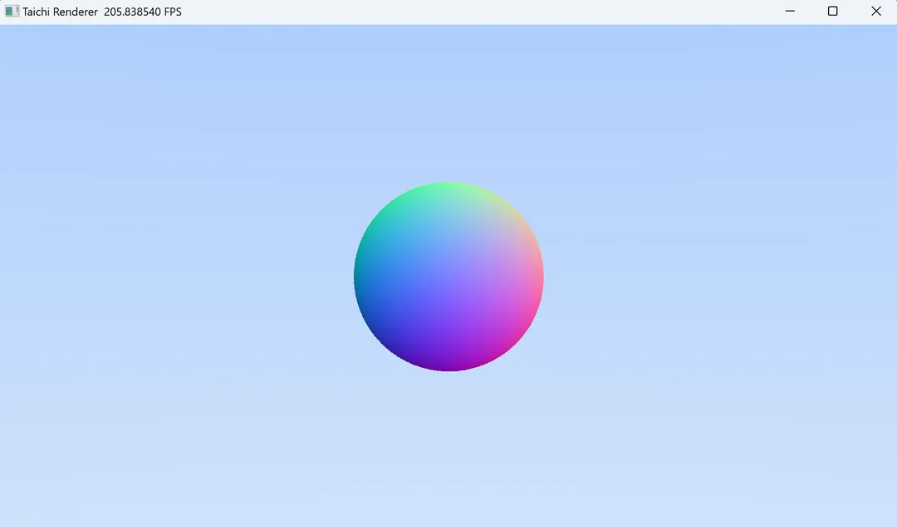  
将法线映射为球表面的颜色

## 10 基础变换和材质

我们会为物体赋予最简单的材质——反照率 (albedo) 以及一个最基础的变换——位置 (position) 。为方便读者理解，这里先放上 taichi 结构体类的定义代码。

```python
@ti.dataclass
class Material:
    albedo: vec3    ## 材质颜色

@ti.dataclass
class Transform:
    position: vec3  ## 物体位置

@ti.dataclass
class Object:
    sd: float       ## 到物体表面的符号距离
    mtl: Material   ## 物体材质
    trs: Transform  ## 物体变换
```

### 10.1 基础反照率

反照率可以粗略表示为光线入射物体表面后，物体出射光的颜色与物体入射光之比。因此在光线追踪时，出射光的颜色就是

```python
ray.color.rgb *= record.obj.mtl.albedo
```

### 10.2 位移物体

位移物体相当于对物体的 SDF 函数进行平移，在求 SDF 距离值阶段对传入的点减去物体位置

```python
@ti.func
def signed_distance(obj, pos: vec3) -> float:
    p = pos - obj.trs.position  ## 计算物体位移后的点
    r = 0.5 ## 球体半径
    sd = sd_sphere(p, r) ## 计算 SDF 值
    return sd
```

## 11 移动摄像机

在之前的章节，我们已经为我们的 taichi 程序创建了一个摄像机类。为了方便我们在不同位置和角度观察物体，这一章我们会利用 taichi GGUI 内置的 `ti.ui.Camera()` 来创建一个 freelook 摄像机[[6:1]]，并将它与我们渲染程序中的摄像机类进行绑定。

创建摄像机很简单，在初始化画布后实例化一个摄像机，然后为其设置初始位置

```python
camera = ti.ui.Camera()         ## 创建摄像机
camera.position(0, 0, 4)        ## 设置摄像机初始位置
```

在运行的循环中，每帧根据用户输入更新摄像机

```python
while window.running:
    ## 从用户输入更新摄像机，设置移动速度为 0.03 ，按住鼠标左键旋转视角
    camera.track_user_inputs(window, movement_speed=0.03, hold_key=ti.ui.LMB)
```

分别为 `render` 函数声明形参并传入实参

```python
@ti.kernel
def render(
    time: float, 
    camera_position: vec3, 
    camera_lookat: vec3, 
    camera_up: vec3):   ## 渲染函数
    ...
```

循环内每帧传入摄像机的位置、朝向和上方向

```python
while window.running:
    ## 从用户输入更新摄像机，设置移动速度为 0.03 ，按住鼠标左键旋转视角
    camera.track_user_inputs(window, movement_speed=0.03, hold_key=ti.ui.LMB)
    delta_time = time.time() - start_time   ## 计算时间差
    render(
        delta_time, 
        camera.curr_position, 
        camera.curr_lookat, 
        camera.curr_up) ## 调用渲染函数
    canvas.set_image(image_pixels)  ## 为画布设置图像
    window.show()   ## 显示窗口
```

这样我们就可以以 FPS 游戏的方式，按住鼠标左键和 `W A S D Q E` 来自由移动摄像机啦。

## 12 更多形状和物体

这一章，我们为 `Object` 类加入物体的形状属性，以支持物体拥有不同的形状（在本章，我们先添加一个简单的 Box 形状）。在 `Transform` 类加入物体的缩放，以改变物体在各个轴上的大小。然后创建一个 `Object.field(shape=objects_num)` 场，在里面添加不同的物体。最后写一个 `nearest_object` 函数，为计算光线与场景中所有物体最近的一个交点，利用 SDF 函数的特性，寻找距离点 <svg style="overflow:visible;min-height:1px;min-width:1px;vertical-align:-.439ex;" xmlns="http://www.w3.org/2000/svg" width="1.446ex" height="2.369ex" viewBox="0 -853 639 1047"><g stroke="currentColor" fill="currentColor" stroke-width="0" transform="scale(1,-1)"><g data-mml-node="math"><g data-mml-node="TeXAtom"><g data-mml-node="mover"><g data-mml-node="TeXAtom"><g data-mml-node="mi"><path d="M32 442L123 446Q214 450 215 450H221V409Q222 409 229 413T251 423T284 436T328 446T382 450Q480 450 540 388T600 223Q600 128 539 61T361 -6H354Q292 -6 236 28L227 34V-132H296V-194H287Q269 -191 163 -191Q56 -191 38 -194H29V-132H98V113V284Q98 330 97 348T93 370T83 376Q69 380 42 380H29V442H32ZM457 224Q457 303 427 349T350 395Q282 395 235 352L227 345V104L233 97Q274 45 337 45Q383 45 420 86T457 224Z" style="stroke-width: 3;"></path></g></g><g data-mml-node="mo" transform="translate(319.5,39) translate(-250 0)"><path d="M377 694Q377 702 382 708T397 714Q404 714 409 709Q414 705 419 690Q429 653 460 633Q471 626 471 615Q471 606 468 603T454 594Q411 572 379 531Q377 529 374 525T369 519T364 517T357 516Q350 516 344 521T337 536Q337 555 384 595H213L42 596Q29 605 29 615Q29 622 42 635H401Q377 673 377 694Z" style="stroke-width: 3;"></path></g></g></g></g></g></svg> 最近的物体。

```python
## 举形状类型
SHAPE_NONE      = 0 ## 无形状
SHAPE_SPHERE    = 1 ## 球体
SHAPE_BOX       = 2 ## 箱体

@ti.dataclass
class Object:
    type: ti.u32
    ...
```

### 12.1 物体形状和缩放

由于物体有了不同形状和大小，所以物体的 SDF 函数需要根据类型进行选择，还需要根据缩放来控制 SDF 物体的大小。对 `signed_distance` 函数的更改如下

```python
@ti.dataclass
class Transform:
    scale: vec3
    ...

@ti.func
def signed_distance(obj, pos: vec3) -> float:   ## 对物体求 SDF 距离
    position = obj.trs.position ## 位置空间变换（下一步再实现旋转变换）
    scale = obj.trs.scale   ## 用缩放控制物体大小
    p = pos - position

    ## 为不同形状选择不同的 SDF 函数
    if obj.type == SHAPE_SPHERE:
        obj.sd = sd_sphere(p, scale.x)
    elif obj.type == SHAPE_BOX:
        obj.sd = sd_box(p, scale)
    else:
        obj.sd = sd_sphere(p, scale.x)

    return obj.sd   ## 返回符号距离
```

其中 Box 的 SDF 函数[[7:1]]可以在[iq 大佬的文章](https://iquilezles.org/articles/distfunctions/) 中查到如下

```python
@ti.func
def sd_box(p: vec3, b: vec3) -> float:  ## SDF 盒子
    q = abs(p) - b
    return length(max(q, 0)) + min(max(q.x, max(q.y, q.z)), 0)
```

### 12.2 欧几里得空间

为什么应用物体的变换，不使用一个包含缩放、旋转和剪切的 `3 X 3` 变换矩阵呢？iq 大佬在它的文章中指出，不同轴向非均匀的缩放会扭曲欧几里得空间[[7:2]]，这使得 SDF 函数在求交阶段可能变得不可靠。

> While rotations, uniform scaling and translations are exact operations, non-uniform scaling distorts the euclidean spaces and can only be bound.

如果使用

<svg style="overflow:visible;min-height:1px;min-width:1px;vertical-align:-.566ex;" xmlns="http://www.w3.org/2000/svg" width="18.086ex" height="2.452ex" viewBox="0 -833.9 7994.1 1083.9"><g stroke="currentColor" fill="currentColor" stroke-width="0" transform="scale(1,-1)"><g data-mml-node="math"><g data-mml-node="msup"><g data-mml-node="mi"><path d="M287 628Q287 635 230 637Q206 637 199 638T192 648Q192 649 194 659Q200 679 203 681T397 683Q587 682 600 680Q664 669 707 631T751 530Q751 453 685 389Q616 321 507 303Q500 302 402 301H307L277 182Q247 66 247 59Q247 55 248 54T255 50T272 48T305 46H336Q342 37 342 35Q342 19 335 5Q330 0 319 0Q316 0 282 1T182 2Q120 2 87 2T51 1Q33 1 33 11Q33 13 36 25Q40 41 44 43T67 46Q94 46 127 49Q141 52 146 61Q149 65 218 339T287 628ZM645 554Q645 567 643 575T634 597T609 619T560 635Q553 636 480 637Q463 637 445 637T416 636T404 636Q391 635 386 627Q384 621 367 550T332 412T314 344Q314 342 395 342H407H430Q542 342 590 392Q617 419 631 471T645 554Z" style="stroke-width: 3;"></path></g><g data-mml-node="mo" transform="translate(839.5,363) scale(0.707)"><path d="M79 43Q73 43 52 49T30 61Q30 68 85 293T146 528Q161 560 198 560Q218 560 240 545T262 501Q262 496 260 486Q259 479 173 263T84 45T79 43Z" style="stroke-width: 3;"></path></g></g><g data-mml-node="mo" transform="translate(1361.7,0)"><path d="M56 347Q56 360 70 367H707Q722 359 722 347Q722 336 708 328L390 327H72Q56 332 56 347ZM56 153Q56 168 72 173H708Q722 163 722 153Q722 140 707 133H70Q56 140 56 153Z" style="stroke-width: 3;"></path></g><g data-mml-node="msup" transform="translate(2417.5,0)"><g data-mml-node="mi"><path d="M40 437Q21 437 21 445Q21 450 37 501T71 602L88 651Q93 669 101 677H569H659Q691 677 697 676T704 667Q704 661 687 553T668 444Q668 437 649 437Q640 437 637 437T631 442L629 445Q629 451 635 490T641 551Q641 586 628 604T573 629Q568 630 515 631Q469 631 457 630T439 622Q438 621 368 343T298 60Q298 48 386 46Q418 46 427 45T436 36Q436 31 433 22Q429 4 424 1L422 0Q419 0 415 0Q410 0 363 1T228 2Q99 2 64 0H49Q43 6 43 9T45 27Q49 40 55 46H83H94Q174 46 189 55Q190 56 191 56Q196 59 201 76T241 233Q258 301 269 344Q339 619 339 625Q339 630 310 630H279Q212 630 191 624Q146 614 121 583T67 467Q60 445 57 441T43 437H40Z" style="stroke-width: 3;"></path></g><g data-mml-node="TeXAtom" transform="translate(793,363) scale(0.707)"><g data-mml-node="mo"><path d="M84 237T84 250T98 270H679Q694 262 694 250T679 230H98Q84 237 84 250Z" style="stroke-width: 3;"></path></g><g data-mml-node="mn" transform="translate(778,0)"><path d="M213 578L200 573Q186 568 160 563T102 556H83V602H102Q149 604 189 617T245 641T273 663Q275 666 285 666Q294 666 302 660V361L303 61Q310 54 315 52T339 48T401 46H427V0H416Q395 3 257 3Q121 3 100 0H88V46H114Q136 46 152 46T177 47T193 50T201 52T207 57T213 61V578Z" style="stroke-width: 3;"></path></g></g></g><g data-mml-node="mo" transform="translate(4164.1,0)"><path d="M94 250Q94 319 104 381T127 488T164 576T202 643T244 695T277 729T302 750H315H319Q333 750 333 741Q333 738 316 720T275 667T226 581T184 443T167 250T184 58T225 -81T274 -167T316 -220T333 -241Q333 -250 318 -250H315H302L274 -226Q180 -141 137 -14T94 250Z" style="stroke-width: 3;"></path></g><g data-mml-node="mi" transform="translate(4553.1,0)"><path d="M287 628Q287 635 230 637Q206 637 199 638T192 648Q192 649 194 659Q200 679 203 681T397 683Q587 682 600 680Q664 669 707 631T751 530Q751 453 685 389Q616 321 507 303Q500 302 402 301H307L277 182Q247 66 247 59Q247 55 248 54T255 50T272 48T305 46H336Q342 37 342 35Q342 19 335 5Q330 0 319 0Q316 0 282 1T182 2Q120 2 87 2T51 1Q33 1 33 11Q33 13 36 25Q40 41 44 43T67 46Q94 46 127 49Q141 52 146 61Q149 65 218 339T287 628ZM645 554Q645 567 643 575T634 597T609 619T560 635Q553 636 480 637Q463 637 445 637T416 636T404 636Q391 635 386 627Q384 621 367 550T332 412T314 344Q314 342 395 342H407H430Q542 342 590 392Q617 419 631 471T645 554Z" style="stroke-width: 3;"></path></g><g data-mml-node="mo" transform="translate(5526.4,0)"><path d="M84 237T84 250T98 270H679Q694 262 694 250T679 230H98Q84 237 84 250Z" style="stroke-width: 3;"></path></g><g data-mml-node="msub" transform="translate(6526.6,0)"><g data-mml-node="mi"><path d="M287 628Q287 635 230 637Q206 637 199 638T192 648Q192 649 194 659Q200 679 203 681T397 683Q587 682 600 680Q664 669 707 631T751 530Q751 453 685 389Q616 321 507 303Q500 302 402 301H307L277 182Q247 66 247 59Q247 55 248 54T255 50T272 48T305 46H336Q342 37 342 35Q342 19 335 5Q330 0 319 0Q316 0 282 1T182 2Q120 2 87 2T51 1Q33 1 33 11Q33 13 36 25Q40 41 44 43T67 46Q94 46 127 49Q141 52 146 61Q149 65 218 339T287 628ZM645 554Q645 567 643 575T634 597T609 619T560 635Q553 636 480 637Q463 637 445 637T416 636T404 636Q391 635 386 627Q384 621 367 550T332 412T314 344Q314 342 395 342H407H430Q542 342 590 392Q617 419 631 471T645 554Z" style="stroke-width: 3;"></path></g><g data-mml-node="mn" transform="translate(675,-150) scale(0.707)"><path d="M96 585Q152 666 249 666Q297 666 345 640T423 548Q460 465 460 320Q460 165 417 83Q397 41 362 16T301 -15T250 -22Q224 -22 198 -16T137 16T82 83Q39 165 39 320Q39 494 96 585ZM321 597Q291 629 250 629Q208 629 178 597Q153 571 145 525T137 333Q137 175 145 125T181 46Q209 16 250 16Q290 16 318 46Q347 76 354 130T362 333Q362 478 354 524T321 597Z" style="stroke-width: 3;"></path></g></g><g data-mml-node="mo" transform="translate(7605.1,0)"><path d="M60 749L64 750Q69 750 74 750H86L114 726Q208 641 251 514T294 250Q294 182 284 119T261 12T224 -76T186 -143T145 -194T113 -227T90 -246Q87 -249 86 -250H74Q66 -250 63 -250T58 -247T55 -238Q56 -237 66 -225Q221 -64 221 250T66 725Q56 737 55 738Q55 746 60 749Z" style="stroke-width: 3;"></path></g></g></g></svg> 

的方式，将点 `P` 从世界空间变换到物体空间，并左乘变换矩阵的逆，确实对 SDF 函数进行了正确的变换，但是这带来的问题是光线步进求交时，SDF 值并不是世界空间下的 SDF 值，因此求交的结果可能不正确。如下图所示，经过缩放变换的物体，在“窄”的那一侧会裂开，因为光线没能跟物体正确求交。

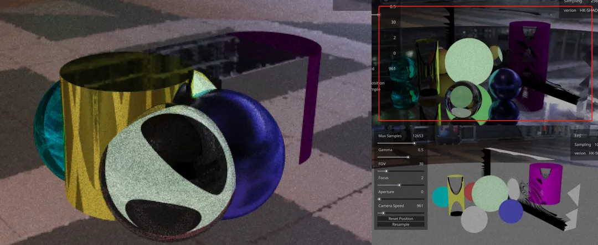  
光线直接穿过了物体，没能跟物体表面相交，因此物体看起来裂开了  
左图：物体没有进行缩放变换，正常求交  
右图：物体进行了缩放变换，光线会在“窄”的一侧穿过物体

### 12.3 物体场

接着，创建一个 `Object.field` 场，用于存储所有的物体。这里我在地图中多加了一个盒子，它在球体后面，被球挡住了，需要移动摄像机才能看到。

```python
objects_num = 2 ## 地图中物体的数量
objects = Object.field(shape=objects_num)

objects[0] = Object(type=SHAPE_SPHERE,
                    trs=Transform(vec3(0, 0, -1), vec3(0.5)),
                    mtl=Material(vec3(1, 0, 0)))

objects[1] = Object(type=SHAPE_BOX,
                    trs=Transform(vec3(0, 0, -2), vec3(0.2, 0.3, 0.5)),
                    mtl=Material(vec3(0, 1, 0)))
```

### 12.5 更改求交函数

最后，在光线步进求交阶段，光线每步进一次，就寻找距离这一点最近的物体，如果距离最近的物体表面接近于 0 ，就判定为光线与物体表面相交了，改进的 `raycast` 函数如下

```python
@ti.func
def raycast(ray) -> HitRecord:  ## 光线步进求交
    record = HitRecord(ray.origin, TMIN, False) ## 初始化光子碰撞记录

    for _ in range(MAX_RAYMARCH):   ## 光线步进
        record.position = ray.at(record.distance)   ## 计算光子所在位置
        record.obj = nearest_object(record.position)    ## 计算光子与球体的有向距离
        ...
```

### 12.6 寻找最近物体

那么如何寻找距离某点最近的物体呢？最简单粗暴和有效的方法是遍历所有的物体，计算所有物体的 SDF 值，然后返回 SDF 值最小的那个物体。这里我们使用了一个 `nearest_object` 函数，该函数的实现如下

```python
@ti.func
def nearest_object(p: vec3) -> Object:  ## 求最近的物体
    o = Object(sd=MAP_SIZE) ## 设置一个最大的 SDF 值，即地图边界
    for i in range(objects_num):
        oi = objects[i]
        oi.sd = signed_distance(oi, p)
        if abs(oi.sd) < abs(o.sd): o = oi
    return o
```

实际上，存在内存上优化的求交加速算法（例如 BVH 等），本文就不赘述了。感兴趣可以点赞支持一下，我再写一篇文章讲讲～

### 12.7 探索场景

到这一步，我们就可以运行程序，然后自由移动摄像机看看场景中的两个颜色不同的物体。

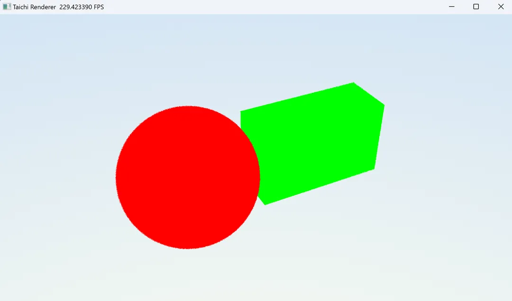  
两个不同的物体，一个红色球和一个绿色的盒子

由于只进行了一次光线追踪，没有多次光线反弹之后的间接光和光强损耗，场景中的物体看起来非常的平面，没有影子和阴影。这在后面的章节会逐步完善。接下来我们继续测试一下法线

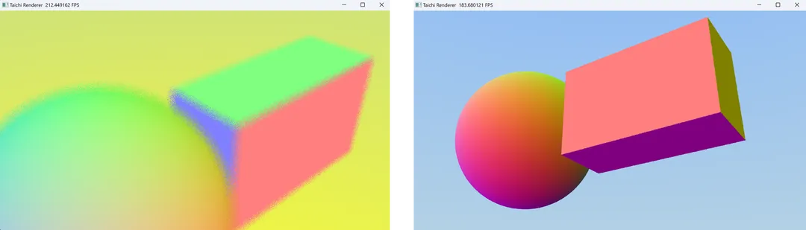  
左：由于摄像机光圈和对焦距离的存在，产生了散景模糊  
右：从另一个角度查看场景中的球和盒子

摄像机可以进入物体内部吗？答案是肯定的。在前面物体求交阶段，我们对符号距离值做了绝对值处理，因此物体内部会被当作外部来处理，这样就可以进入物体内部了。

如果物体是空心的（物体只有薄薄的一层表面），那物体内部的法线是怎样的呢？如何判断某点是在物体内部还是外部？我们控制摄像机进入盒子看看

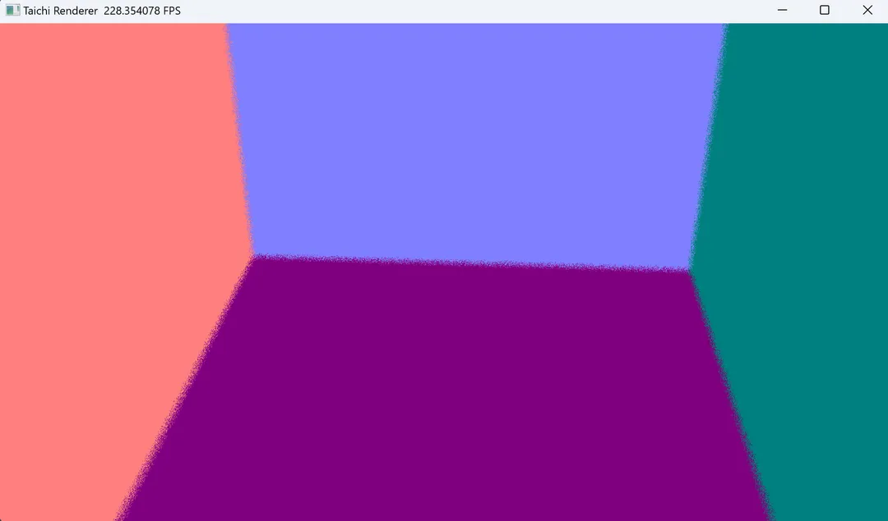  
盒子内部，将梯度当作法线，内表面法线仍然是朝向物体外面的

从上图可以看到，物体内表面的法线仍然是朝向物体外面的，回顾 [计算物体法线]这一章节，这是因为 SDF 函数的梯度方向永远是朝着 SDF 值增大的方向，而 SDF 物体内部的 SDF 函数值是负的。因此，如果要判断某点是在物体内部还是外部，只需要判断 SDF 值的符号即可。

## 13 内外表面法线

在处理透明的物体（例如玻璃、钻石、塑料等材质）时，物体内外有不同的折射率，光线会根据折射率之比改变方向。因此我们必须得知道光线正在进入物体内部，还是正在穿出物体。怎么做呢？如下图所示

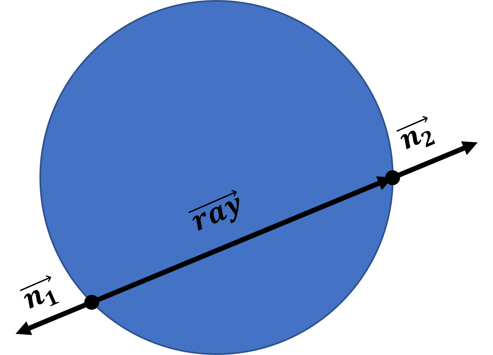  
光线穿入物体和穿出物体

还记得向量的点乘吗？由于无论内表面还是外表面，法线方向永远都是朝物体外面，这带来的好处是当光线方向与法线方向点乘大于零时，光线正在从内表面穿出物体，当光线方向与法线方向点乘小于零时，光线正在从外表面穿入物体。

<svg style="overflow:visible;min-height:1px;min-width:1px;vertical-align:-.452ex;width:100%;" xmlns="http://www.w3.org/2000/svg" width="11.927ex" height="3.446ex" viewBox="0 -1323 5271.6 1523"><g stroke="currentColor" fill="currentColor" stroke-width="0" transform="scale(1,-1)"><g data-mml-node="math"><g data-mml-node="mover"><g data-mml-node="TeXAtom"><g data-mml-node="mi"><path d="M405 293T374 293T324 312T305 361Q305 378 312 394Q315 397 315 399Q305 399 294 394T266 375T238 329T222 249Q221 241 221 149V62H308V0H298Q280 3 161 3Q47 3 38 0H29V62H98V210V303Q98 353 96 363T83 376Q69 380 42 380H29V442H32L118 446Q204 450 205 450H210V414L211 378Q247 449 315 449H321Q384 449 413 422T442 360Q442 332 424 313Z" style="stroke-width: 3;"></path><path d="M64 349Q64 399 107 426T255 453Q346 453 402 423T473 341Q478 327 478 310T479 196V77Q493 63 529 62Q549 62 553 57T558 31Q558 9 552 5T514 0H497H481Q375 0 367 56L356 46Q300 -6 210 -6Q130 -6 81 30T32 121Q32 188 111 226T332 272H350V292Q350 313 348 327T337 361T306 391T248 402T194 399H189Q204 376 204 354Q204 327 187 306T134 284Q97 284 81 305T64 349ZM164 121Q164 89 186 67T238 45Q274 45 307 63T346 108L350 117V226H347Q248 218 206 189T164 121Z" transform="translate(474,0)" style="stroke-width: 3;"></path><path d="M84 -102Q84 -110 87 -119T102 -138T133 -149Q148 -148 162 -143T186 -131T206 -114T222 -95T234 -76T243 -59T249 -45T252 -37L269 0L96 382H26V444H34Q49 441 146 441Q252 441 270 444H279V382H255Q232 382 232 380L337 151L442 382H394V444H401Q413 441 495 441Q568 441 574 444H580V382H510L406 152Q298 -84 297 -87Q269 -139 225 -169T131 -200Q85 -200 54 -172T23 -100Q23 -64 44 -50T87 -35Q111 -35 130 -50T152 -92V-100H84V-102Z" transform="translate(1033,0)" style="stroke-width: 3;"></path></g></g><g data-mml-node="mo" transform="translate(0,640)"><path d="M56 237T56 250T70 270H835Q719 357 692 493Q692 494 692 496T691 499Q691 511 708 511H711Q720 511 723 510T729 506T732 497T735 481T743 456Q765 389 816 336T935 261Q944 258 944 250Q944 244 939 241T915 231T877 212Q836 186 806 152T761 85T740 35T732 4Q730 -6 727 -8T711 -11Q691 -11 691 0Q691 7 696 25Q728 151 835 230H70Q56 237 56 250Z" transform="translate(640,0)" style="stroke-width: 3;"></path><svg width="740" height="865" x="0" y="-182" viewBox="185 -182 740 865"><path d="M84 237T84 250T98 270H679Q694 262 694 250T679 230H98Q84 237 84 250Z" transform="scale(1.427,1)" style="stroke-width: 3;"></path></svg><svg style="overflow:visible;min-height:1px;min-width:1px;vertical-align:-.452ex;width:100%;" xmlns="http://www.w3.org/2000/svg" width="11.927ex" height="3.446ex" viewBox="0 -1323 5271.6 1523"><g stroke="currentColor" fill="currentColor" stroke-width="0" transform="scale(1,-1)"><g data-mml-node="math"><g data-mml-node="mover"><g data-mml-node="TeXAtom"><g data-mml-node="mi"><path d="M405 293T374 293T324 312T305 361Q305 378 312 394Q315 397 315 399Q305 399 294 394T266 375T238 329T222 249Q221 241 221 149V62H308V0H298Q280 3 161 3Q47 3 38 0H29V62H98V210V303Q98 353 96 363T83 376Q69 380 42 380H29V442H32L118 446Q204 450 205 450H210V414L211 378Q247 449 315 449H321Q384 449 413 422T442 360Q442 332 424 313Z" style="stroke-width: 3;"></path><path d="M64 349Q64 399 107 426T255 453Q346 453 402 423T473 341Q478 327 478 310T479 196V77Q493 63 529 62Q549 62 553 57T558 31Q558 9 552 5T514 0H497H481Q375 0 367 56L356 46Q300 -6 210 -6Q130 -6 81 30T32 121Q32 188 111 226T332 272H350V292Q350 313 348 327T337 361T306 391T248 402T194 399H189Q204 376 204 354Q204 327 187 306T134 284Q97 284 81 305T64 349ZM164 121Q164 89 186 67T238 45Q274 45 307 63T346 108L350 117V226H347Q248 218 206 189T164 121Z" transform="translate(474,0)" style="stroke-width: 3;"></path><path d="M84 -102Q84 -110 87 -119T102 -138T133 -149Q148 -148 162 -143T186 -131T206 -114T222 -95T234 -76T243 -59T249 -45T252 -37L269 0L96 382H26V444H34Q49 441 146 441Q252 441 270 444H279V382H255Q232 382 232 380L337 151L442 382H394V444H401Q413 441 495 441Q568 441 574 444H580V382H510L406 152Q298 -84 297 -87Q269 -139 225 -169T131 -200Q85 -200 54 -172T23 -100Q23 -64 44 -50T87 -35Q111 -35 130 -50T152 -92V-100H84V-102Z" transform="translate(1033,0)" style="stroke-width: 3;"></path></g></g><g data-mml-node="mo" transform="translate(0,640)"><path d="M56 237T56 250T70 270H835Q719 357 692 493Q692 494 692 496T691 499Q691 511 708 511H711Q720 511 723 510T729 506T732 497T735 481T743 456Q765 389 816 336T935 261Q944 258 944 250Q944 244 939 241T915 231T877 212Q836 186 806 152T761 85T740 35T732 4Q730 -6 727 -8T711 -11Q691 -11 691 0Q691 7 696 25Q728 151 835 230H70Q56 237 56 250Z" transform="translate(640,0)" style="stroke-width: 3;"></path><svg width="740" height="865" x="0" y="-182" viewBox="185 -182 740 865"><path d="M84 237T84 250T98 270H679Q694 262 694 250T679 230H98Q84 237 84 250Z" transform="scale(1.427,1)" style="stroke-width: 3;"></path></svg>  

## 14 遮蔽与间接光

在这一章，我们将继续靠近真正的路径追踪。当光线在场景的一个区域内不停的漫反射而难以逃出此区域击向光源（例如，靠近的两物体或狭缝处。在我们当前的场景，天空是我们唯一的光源），光强就会不停的损耗，因此这块区域看起来更暗（我将其称作遮蔽效应）。

此外，当光线被一个物体表面过滤（相当于染色）后，再击到另外一个物体，就会在另外一个物体表面染上间接光颜色。通过路径追踪，我们可以用更接近物理世界规则的方式渲染场景，并拥有全局光照[[12]] (Global illumination, GI) 。

### 14.1 路径追踪

正如前面所说，光线追踪的核心算法很简单，就是光线与物体求交，然后与物体表面材质交互，即光线颜色、强度和方向改变，然后进行下一步追踪，直到光线到达光源。

<g><g></g><g style="color: black; stroke: black;"><path marker-end="url(#flowchart-pointEnd)" style="fill: none; stroke: black;" id="L-A-B-0" d="M86.8840155945419,69.96875L95.07001299545159,74.859375C103.25601039636126,79.75,119.62800519818063,89.53125,132.06400259909032,94.50520833333333C144.5,99.47916666666667,153,99.64583333333333,157.25,99.72916666666667L161.5,99.8125"></path><path marker-end="url(#flowchart-pointEnd)" style="fill: none;" id="L-B-C-0" d="M268.1893813224772,84.12688132247717L276.220317768731,81.24635943539765C284.2512542149848,78.36583754831811,300.3131271074924,72.60479377415906,319.7841220332784,64.83364688707952C339.2551169590643,57.0625,362.1352339181287,47.28125,373.5752923976608,42.390625L385.015350877193,37.5"></path><path marker-end="url(#flowchart-pointEnd)" style="fill: none;" id="L-C-A-0" d="M349.375,7.708333333333334L343.875,6.9444444444444455C338.375,6.180555555555556,327.375,4.652777777777778,306.1770833333333,3.8888888888888893C284.9791666666667,3.125,253.58333333333334,3.125,223.52083333333334,3.125C193.45833333333334,3.125,164.72916666666666,3.125,142.17858593242366,8.015625C119.62800519818063,12.90625,103.25601039636126,22.6875,95.07001299545159,27.578125L86.8840155945419,32.46875"></path><path marker-end="url(#flowchart-pointEnd)" style="fill: none;" id="L-B-E-0" d="M275.16875355719975,108.51874644280022L282.03646129766645,109.58853870233351C288.90416903813315,110.65833096186681,302.6395845190666,112.7979154809334,328.2572922595333,113.8677077404667C353.875,114.9375,391.375,114.9375,428.875,114.9375C466.375,114.9375,503.875,114.9375,528.125,114.9375C552.375,114.9375,563.375,114.9375,573.0416666666666,114.9375C582.7083333333334,114.9375,591.0416666666666,114.9375,599.375,114.9375C607.7083333333334,114.9375,616.0416666666666,114.9375,620.2083333333334,114.9375L624.375,114.9375"></path></g><g style="color: black;"><g><g transform="translate(0, 0)"><foreignObject height="0" width="0"><div style="display:inline-block;text-align:center;" xmlns="http://www.w3.org/1999/xhtml"><span></span><br></div>
</foreignObject></g></g><g transform="translate(316.375, 66.84375)"><g transform="translate(-8, -11.25)"><foreignObject height="22.5" width="16"><div style="display:inline-block;" xmlns="http://www.w3.org/1999/xhtml"><span style="background:#FFFFFF;">否</span></div>
</foreignObject></g></g><g><g transform="translate(0, 0)"><foreignObject height="0" width="0"><div style="display:inline-block;" xmlns="http://www.w3.org/1999/xhtml"><span></span><br></div>
</foreignObject></g></g><g transform="translate(541.375, 114.9375)"><g transform="translate(-8, -11.25)"><foreignObject height="22.5" width="16"><div style="display:inline-block;" xmlns="http://www.w3.org/1999/xhtml"><span style="background:#FFFFFF;">是</span></div>
</foreignObject></g></g></g><g><g transform="translate(55.5, 51.21875)" id="flowchart-A-16"><rect height="37.5" width="111" y="-18.75" x="-55.5" ry="0" rx="0"></rect><g transform="translate(-48, -11.25)"><foreignObject height="22.5" width="96"><div style="display:inline-block;color:#ffffff;" xmlns="http://www.w3.org/1999/xhtml"><span>光线步进求交</span></div>
</foreignObject></g></g><g transform="translate(222.1875, 99.3125)" id="flowchart-B-17"><polygon transform="translate(-61.1875,61.1875)" points="61.1875,0 122.375,-61.1875 61.1875,-122.375 0,-61.1875"></polygon><g transform="translate(-34.9375, -11.25)"><foreignObject height="22.5" width="75"><div style="display:inline-block;" xmlns="http://www.w3.org/1999/xhtml"><span style="color:#ffffff;">击中光源?</span></div>
</foreignObject></g></g><g transform="translate(428.875, 18.75)" id="flowchart-C-19"><rect height="37.5" width="159" y="-18.75" x="-79.5" ry="0" rx="0"></rect><g transform="translate(-72, -11.25)"><foreignObject height="22.5" width="144"><div style="display:inline-block;" xmlns="http://www.w3.org/1999/xhtml"><span style="color:#ffffff;">与物体表面材质交互</span></div>
</foreignObject></g></g><g transform="translate(647.875, 114.9375)" id="flowchart-E-23"><rect height="37.5" width="47" y="-18.75" x="-23.5" ry="0" rx="0"></rect><g transform="translate(-16, -11.25)"><foreignObject height="22.5" width="32"><div style="display:inline-block;" xmlns="http://www.w3.org/1999/xhtml"><span style="color:#ffffff;">结束</span></div>
</foreignObject></g></g></g></g>

### 14.2 俄罗斯轮盘赌

即使限制了最大的追踪次数，但是光线仍然有可能在两个表面不停来回反弹，这会使得单帧内的计算量陡然上升，帧数下降。为了提升帧率，将蒙特卡洛采样的计算量更均匀的分摊到每一帧，我们可以使用俄罗斯轮盘赌[[13]] (Russian roulette, RR) 算法。

俄罗斯轮盘赌算法的核心是，在光线每一次反弹时，以一个概率决定光线是否继续传播。这个概率可以是一个固定的概率，但是一种比较好的做法是，将每次反弹看作独立事件，让停止光线继续传播的概率随着反弹次数增加而上升。

```python
@ti.func
def raytrace(ray, time: float) -> Ray:
    for i in range(MAX_RAYTRACE):
        record = raycast(ray)   ## 光线步进求交

        ## 俄罗斯轮盘赌概率，防止光线过分的反复反射
        light_quality = 1 / 50
        inv_pdf = exp(float(i) * light_quality)
        roulette_prob = 1.0 - (1.0 / inv_pdf)
        visible = length(ray.color.rgb*ray.color.a)

        ## 如果光已经衰减到不可分辨程度，或者光线毙掉就不继续了
        if visible < 0.001 or ti.random() < roulette_prob:
            break

        if not record.hit:
            ray.color.rgb *= sky_color(ray, time)  ## 获取天空颜色
            break
        ...

        ray.color *= inv_pdf ## 能量守恒

    return ray
```

### 14.3 漫反射与切线空间

接下来让我们实现一个最基本的材质，漫反射。漫反射是一种非常常见的现象，例如我们看到的表面粗糙的石头。漫反射的特点是光线在物体表面随机反射，不会带有明显的反射方向。漫反射的基本思路是半球采样，即在物体表面某点，以法线为 z 轴的处于物体表面外的单位半球（上半球）表面随机选取一个点，作为出射光方向。

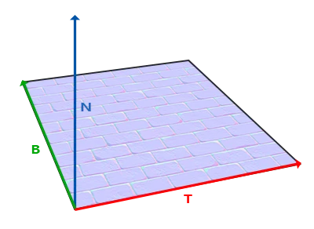  
切线空间与法线贴图[[14]]

### 14.4 半球采样与TBN矩阵

半球采样的第一步是建立物体表面切线空间坐标系，我们需要一个旋转矩阵将切线空间的法线方向映射到世界空间，这个矩阵就是 TBN 矩阵。在切线空间中，法线 <svg style="overflow:visible;min-height:1px;min-width:1px;vertical-align:0;" xmlns="http://www.w3.org/2000/svg" width="2.036ex" height="2.464ex" viewBox="0 -1089 900 1089"><g stroke="currentColor" fill="currentColor" stroke-width="0" transform="scale(1,-1)"><g data-mml-node="math"><g data-mml-node="TeXAtom"><g data-mml-node="mover"><g data-mml-node="TeXAtom"><g data-mml-node="mi"><path d="M314 0Q296 3 181 3T48 0H39V62H147V624H39V686H171H265Q288 686 297 686T309 684T315 679Q317 676 500 455T684 233V624H576V686H585Q603 683 718 683T851 686H860V624H752V319Q752 15 750 11Q747 4 742 2T718 0H712Q708 0 706 0T700 0T696 1T693 2T690 4T687 7T684 11T679 16T674 23Q671 27 437 311L215 579V62H323V0H314Z" style="stroke-width: 3;"></path></g></g><g data-mml-node="mo" transform="translate(450,275) translate(-250 0)"><path d="M377 694Q377 702 382 708T397 714Q404 714 409 709Q414 705 419 690Q429 653 460 633Q471 626 471 615Q471 606 468 603T454 594Q411 572 379 531Q377 529 374 525T369 519T364 517T357 516Q350 516 344 521T337 536Q337 555 384 595H213L42 596Q29 605 29 615Q29 622 42 635H401Q377 673 377 694Z" style="stroke-width: 3;"></path></g></g></g></g></g></svg> 指向 Z 轴正方向，另外有与之两两正交的两个向量 <svg style="overflow:visible;min-height:1px;min-width:1px;vertical-align:0;" xmlns="http://www.w3.org/2000/svg" width="1.81ex" height="2.439ex" viewBox="0 -1078 800 1078"><g stroke="currentColor" fill="currentColor" stroke-width="0" transform="scale(1,-1)"><g data-mml-node="math"><g data-mml-node="TeXAtom"><g data-mml-node="mover"><g data-mml-node="TeXAtom"><g data-mml-node="mi"><path d="M41 425Q41 426 51 545T62 669V675H737V669Q738 665 748 546T758 425V419H696V425Q687 517 669 555T595 607Q578 612 522 613H478V62H631V0H615Q585 3 399 3Q214 3 184 0H168V62H321V613H277H263Q164 613 134 561Q113 527 103 425V419H41V425Z" style="stroke-width: 3;"></path></g></g><g data-mml-node="mo" transform="translate(400,264) translate(-250 0)"><path d="M377 694Q377 702 382 708T397 714Q404 714 409 709Q414 705 419 690Q429 653 460 633Q471 626 471 615Q471 606 468 603T454 594Q411 572 379 531Q377 529 374 525T369 519T364 517T357 516Q350 516 344 521T337 536Q337 555 384 595H213L42 596Q29 605 29 615Q29 622 42 635H401Q377 673 377 694Z" style="stroke-width: 3;"></path></g></g></g></g></g></svg> 和 <svg style="overflow:visible;min-height:1px;min-width:1px;vertical-align:0;" xmlns="http://www.w3.org/2000/svg" width="1.851ex" height="2.464ex" viewBox="0 -1089 818 1089"><g stroke="currentColor" fill="currentColor" stroke-width="0" transform="scale(1,-1)"><g data-mml-node="math"><g data-mml-node="TeXAtom"><g data-mml-node="mover"><g data-mml-node="TeXAtom"><g data-mml-node="mi"><path d="M720 510Q720 476 704 448T665 404T619 377T580 362L564 359L583 356Q602 353 632 342T690 312Q712 292 725 276Q752 235 752 189V183Q752 160 741 125Q698 18 547 2Q543 1 288 0H39V62H147V624H39V686H264H409Q502 686 542 681T624 655Q720 607 720 510ZM563 513Q563 553 548 578T518 611T486 622Q479 624 385 624H293V382H375Q458 383 467 385Q563 405 563 513ZM590 192Q590 307 505 329Q504 330 503 330L398 331H293V62H391H400H444Q496 62 528 75T580 131Q590 155 590 192Z" style="stroke-width: 3;"></path></g></g><g data-mml-node="mo" transform="translate(409,275) translate(-250 0)"><path d="M377 694Q377 702 382 708T397 714Q404 714 409 709Q414 705 419 690Q429 653 460 633Q471 626 471 615Q471 606 468 603T454 594Q411 572 379 531Q377 529 374 525T369 519T364 517T357 516Q350 516 344 521T337 536Q337 555 384 595H213L42 596Q29 605 29 615Q29 622 42 635H401Q377 673 377 694Z" style="stroke-width: 3;"></path></g></g></g></g></g></svg>。 Jeppe Revall Frisvad 的一篇论文[[15]]介绍了一种快速求解这两个向量的方法，如下

```python
@ti.func
def TBN(N: vec3) -> mat3:   ## 用世界坐标下的法线计算 TBN 矩阵
    T = vec3(0)
    B = vec3(0)
    if N.z < -0.99999:
        T = vec3(0, -1, 0)
        B = vec3(-1, 0, 0)
    else:
        a = 1.0 / (1.0 + N.z)
        b = -N.x*N.y*a
        T = vec3(1.0 - N.x*N.x*a, b, -N.x)
        B = vec3(b, 1.0 - N.y*N.y*a, -N.y)
    return mat3(T, B, N)
```

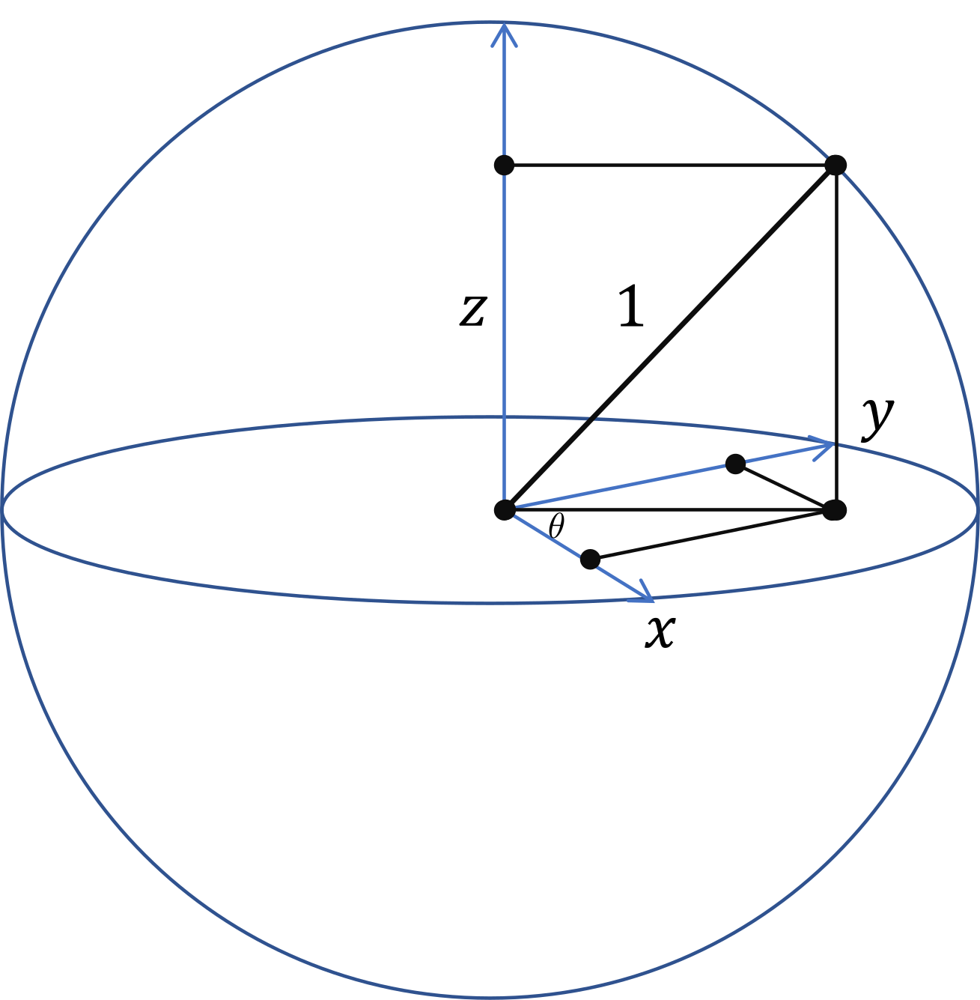  
在上半球内的点

在上半球采样时我们只需要让 Z 轴坐标在 `[0, 1]` 之间取值。与前面的在单位圆内采样相似，为保证采样均匀，Z 轴坐标应为随机变量 <svg style="overflow:visible;min-height:1px;min-width:1px;vertical-align:-.566ex;" xmlns="http://www.w3.org/2000/svg" width="9.22ex" height="2.262ex" viewBox="0 -750 4075.2 1000"><g stroke="currentColor" fill="currentColor" stroke-width="0" transform="scale(1,-1)"><g data-mml-node="math"><g data-mml-node="mi"><path d="M42 0H40Q26 0 26 11Q26 15 29 27Q33 41 36 43T55 46Q141 49 190 98Q200 108 306 224T411 342Q302 620 297 625Q288 636 234 637H206Q200 643 200 645T202 664Q206 677 212 683H226Q260 681 347 681Q380 681 408 681T453 682T473 682Q490 682 490 671Q490 670 488 658Q484 643 481 640T465 637Q434 634 411 620L488 426L541 485Q646 598 646 610Q646 628 622 635Q617 635 609 637Q594 637 594 648Q594 650 596 664Q600 677 606 683H618Q619 683 643 683T697 681T738 680Q828 680 837 683H845Q852 676 852 672Q850 647 840 637H824Q790 636 763 628T722 611T698 593L687 584Q687 585 592 480L505 384Q505 383 536 304T601 142T638 56Q648 47 699 46Q734 46 734 37Q734 35 732 23Q728 7 725 4T711 1Q708 1 678 1T589 2Q528 2 496 2T461 1Q444 1 444 10Q444 11 446 25Q448 35 450 39T455 44T464 46T480 47T506 54Q523 62 523 64Q522 64 476 181L429 299Q241 95 236 84Q232 76 232 72Q232 53 261 47Q262 47 267 47T273 46Q276 46 277 46T280 45T283 42T284 35Q284 26 282 19Q279 6 276 4T261 1Q258 1 243 1T201 2T142 2Q64 2 42 0Z" style="stroke-width: 3;"></path></g><g data-mml-node="mo" transform="translate(1129.8,0)"><path d="M84 250Q84 372 166 450T360 539Q361 539 377 539T419 540T469 540H568Q583 532 583 520Q583 511 570 501L466 500Q355 499 329 494Q280 482 242 458T183 409T147 354T129 306T124 272V270H568Q583 262 583 250T568 230H124V228Q124 207 134 177T167 112T231 48T328 7Q355 1 466 0H570Q583 -10 583 -20Q583 -32 568 -40H471Q464 -40 446 -40T417 -41Q262 -41 172 45Q84 127 84 250Z" style="stroke-width: 3;"></path></g><g data-mml-node="mo" transform="translate(2074.6,0)"><path d="M118 -250V750H255V710H158V-210H255V-250H118Z" style="stroke-width: 3;"></path></g><g data-mml-node="mn" transform="translate(2352.6,0)"><path d="M96 585Q152 666 249 666Q297 666 345 640T423 548Q460 465 460 320Q460 165 417 83Q397 41 362 16T301 -15T250 -22Q224 -22 198 -16T137 16T82 83Q39 165 39 320Q39 494 96 585ZM321 597Q291 629 250 629Q208 629 178 597Q153 571 145 525T137 333Q137 175 145 125T181 46Q209 16 250 16Q290 16 318 46Q347 76 354 130T362 333Q362 478 354 524T321 597Z" style="stroke-width: 3;"></path></g><g data-mml-node="mo" transform="translate(2852.6,0)"><path d="M78 35T78 60T94 103T137 121Q165 121 187 96T210 8Q210 -27 201 -60T180 -117T154 -158T130 -185T117 -194Q113 -194 104 -185T95 -172Q95 -168 106 -156T131 -126T157 -76T173 -3V9L172 8Q170 7 167 6T161 3T152 1T140 0Q113 0 96 17Z" style="stroke-width: 3;"></path></g><g data-mml-node="mn" transform="translate(3297.2,0)"><path d="M213 578L200 573Q186 568 160 563T102 556H83V602H102Q149 604 189 617T245 641T273 663Q275 666 285 666Q294 666 302 660V361L303 61Q310 54 315 52T339 48T401 46H427V0H416Q395 3 257 3Q121 3 100 0H88V46H114Q136 46 152 46T177 47T193 50T201 52T207 57T213 61V578Z" style="stroke-width: 3;"></path></g><g data-mml-node="mo" transform="translate(3797.2,0)"><path d="M22 710V750H159V-250H22V-210H119V710H22Z" style="stroke-width: 3;"></path></g></g></g></svg> 取其平方根，而 <svg style="overflow:visible;min-height:1px;min-width:1px;vertical-align:-.566ex;" xmlns="http://www.w3.org/2000/svg" width="9.643ex" height="2.262ex" viewBox="0 -750 4262.2 1000"><g stroke="currentColor" fill="currentColor" stroke-width="0" transform="scale(1,-1)"><g data-mml-node="math"><g data-mml-node="mi"><path d="M35 200Q35 302 74 415T180 610T319 704Q320 704 327 704T339 705Q393 701 423 656Q462 596 462 495Q462 380 417 261T302 66T168 -10H161Q125 -10 99 10T60 63T41 130T35 200ZM383 566Q383 668 330 668Q294 668 260 623T204 521T170 421T157 371Q206 370 254 370L351 371Q352 372 359 404T375 484T383 566ZM113 132Q113 26 166 26Q181 26 198 36T239 74T287 161T335 307L340 324H145Q145 321 136 286T120 208T113 132Z" style="stroke-width: 3;"></path></g><g data-mml-node="mo" transform="translate(746.8,0)"><path d="M84 250Q84 372 166 450T360 539Q361 539 377 539T419 540T469 540H568Q583 532 583 520Q583 511 570 501L466 500Q355 499 329 494Q280 482 242 458T183 409T147 354T129 306T124 272V270H568Q583 262 583 250T568 230H124V228Q124 207 134 177T167 112T231 48T328 7Q355 1 466 0H570Q583 -10 583 -20Q583 -32 568 -40H471Q464 -40 446 -40T417 -41Q262 -41 172 45Q84 127 84 250Z" style="stroke-width: 3;"></path></g><g data-mml-node="mo" transform="translate(1691.6,0)"><path d="M118 -250V750H255V710H158V-210H255V-250H118Z" style="stroke-width: 3;"></path></g><g data-mml-node="mn" transform="translate(1969.6,0)"><path d="M96 585Q152 666 249 666Q297 666 345 640T423 548Q460 465 460 320Q460 165 417 83Q397 41 362 16T301 -15T250 -22Q224 -22 198 -16T137 16T82 83Q39 165 39 320Q39 494 96 585ZM321 597Q291 629 250 629Q208 629 178 597Q153 571 145 525T137 333Q137 175 145 125T181 46Q209 16 250 16Q290 16 318 46Q347 76 354 130T362 333Q362 478 354 524T321 597Z" style="stroke-width: 3;"></path></g><g data-mml-node="mo" transform="translate(2469.6,0)"><path d="M78 35T78 60T94 103T137 121Q165 121 187 96T210 8Q210 -27 201 -60T180 -117T154 -158T130 -185T117 -194Q113 -194 104 -185T95 -172Q95 -168 106 -156T131 -126T157 -76T173 -3V9L172 8Q170 7 167 6T161 3T152 1T140 0Q113 0 96 17Z" style="stroke-width: 3;"></path></g><g data-mml-node="mn" transform="translate(2914.2,0)"><path d="M109 429Q82 429 66 447T50 491Q50 562 103 614T235 666Q326 666 387 610T449 465Q449 422 429 383T381 315T301 241Q265 210 201 149L142 93L218 92Q375 92 385 97Q392 99 409 186V189H449V186Q448 183 436 95T421 3V0H50V19V31Q50 38 56 46T86 81Q115 113 136 137Q145 147 170 174T204 211T233 244T261 278T284 308T305 340T320 369T333 401T340 431T343 464Q343 527 309 573T212 619Q179 619 154 602T119 569T109 550Q109 549 114 549Q132 549 151 535T170 489Q170 464 154 447T109 429Z" style="stroke-width: 3;"></path></g><g data-mml-node="mi" transform="translate(3414.2,0)"><path d="M132 -11Q98 -11 98 22V33L111 61Q186 219 220 334L228 358H196Q158 358 142 355T103 336Q92 329 81 318T62 297T53 285Q51 284 38 284Q19 284 19 294Q19 300 38 329T93 391T164 429Q171 431 389 431Q549 431 553 430Q573 423 573 402Q573 371 541 360Q535 358 472 358H408L405 341Q393 269 393 222Q393 170 402 129T421 65T431 37Q431 20 417 5T381 -10Q370 -10 363 -7T347 17T331 77Q330 86 330 121Q330 170 339 226T357 318T367 358H269L268 354Q268 351 249 275T206 114T175 17Q164 -11 132 -11Z" style="stroke-width: 3;"></path></g><g data-mml-node="mo" transform="translate(3984.2,0)"><path d="M22 710V750H159V-250H22V-210H119V710H22Z" style="stroke-width: 3;"></path></g></g></g></svg>


<svg style="overflow:visible;min-height:1px;min-width:1px;vertical-align:-5.085ex;width:100%;" xmlns="http://www.w3.org/2000/svg" width="29.857ex" height="11.3ex" viewBox="0 -2747.4 13196.7 4994.8"><g stroke="currentColor" fill="currentColor" stroke-width="0" transform="scale(1,-1)"><g data-mml-node="math"><g data-mml-node="mtable"><g data-mml-node="mtr" transform="translate(0,1730.6)"><g data-mml-node="mtd" transform="translate(749,0)"><g data-mml-node="mi"><path d="M347 338Q337 338 294 349T231 360Q211 360 197 356T174 346T162 335T155 324L153 320Q150 317 138 317Q117 317 117 325Q117 330 120 339Q133 378 163 406T229 440Q241 442 246 442Q271 442 291 425T329 392T367 375Q389 375 411 408T434 441Q435 442 449 442H462Q468 436 468 434Q468 430 463 420T449 399T432 377T418 358L411 349Q368 298 275 214T160 106L148 94L163 93Q185 93 227 82T290 71Q328 71 360 90T402 140Q406 149 409 151T424 153Q443 153 443 143Q443 138 442 134Q425 72 376 31T278 -11Q252 -11 232 6T193 40T155 57Q111 57 76 -3Q70 -11 59 -11H54H41Q35 -5 35 -2Q35 13 93 84Q132 129 225 214T340 322Q352 338 347 338Z" style="stroke-width: 3;"></path></g></g><g data-mml-node="mtd" transform="translate(1214,0)"><g data-mml-node="mi"></g><g data-mml-node="mo" transform="translate(277.8,0)"><path d="M56 347Q56 360 70 367H707Q722 359 722 347Q722 336 708 328L390 327H72Q56 332 56 347ZM56 153Q56 168 72 173H708Q722 163 722 153Q722 140 707 133H70Q56 140 56 153Z" style="stroke-width: 3;"></path></g><g data-mml-node="msqrt" transform="translate(1333.6,0)"><g transform="translate(853,0)"><g data-mml-node="mi"><path d="M42 0H40Q26 0 26 11Q26 15 29 27Q33 41 36 43T55 46Q141 49 190 98Q200 108 306 224T411 342Q302 620 297 625Q288 636 234 637H206Q200 643 200 645T202 664Q206 677 212 683H226Q260 681 347 681Q380 681 408 681T453 682T473 682Q490 682 490 671Q490 670 488 658Q484 643 481 640T465 637Q434 634 411 620L488 426L541 485Q646 598 646 610Q646 628 622 635Q617 635 609 637Q594 637 594 648Q594 650 596 664Q600 677 606 683H618Q619 683 643 683T697 681T738 680Q828 680 837 683H845Q852 676 852 672Q850 647 840 637H824Q790 636 763 628T722 611T698 593L687 584Q687 585 592 480L505 384Q505 383 536 304T601 142T638 56Q648 47 699 46Q734 46 734 37Q734 35 732 23Q728 7 725 4T711 1Q708 1 678 1T589 2Q528 2 496 2T461 1Q444 1 444 10Q444 11 446 25Q448 35 450 39T455 44T464 46T480 47T506 54Q523 62 523 64Q522 64 476 181L429 299Q241 95 236 84Q232 76 232 72Q232 53 261 47Q262 47 267 47T273 46Q276 46 277 46T280 45T283 42T284 35Q284 26 282 19Q279 6 276 4T261 1Q258 1 243 1T201 2T142 2Q64 2 42 0Z" style="stroke-width: 3;"></path></g></g><g data-mml-node="mo" transform="translate(0,156.7)"><path d="M95 178Q89 178 81 186T72 200T103 230T169 280T207 309Q209 311 212 311H213Q219 311 227 294T281 177Q300 134 312 108L397 -77Q398 -77 501 136T707 565T814 786Q820 800 834 800Q841 800 846 794T853 782V776L620 293L385 -193Q381 -200 366 -200Q357 -200 354 -197Q352 -195 256 15L160 225L144 214Q129 202 113 190T95 178Z" style="stroke-width: 3;"></path></g><rect width="852" height="60" x="853" y="896.7"></rect></g></g></g><g data-mml-node="mtr" transform="translate(0,-133.4)"><g data-mml-node="mtd"><g data-mml-node="mover"><g data-mml-node="TeXAtom"><g data-mml-node="mi"><path d="M227 0Q212 3 121 3Q40 3 28 0H21V62H117L245 213L109 382H26V444H34Q49 441 143 441Q247 441 265 444H274V382H246L281 339Q315 297 316 297Q320 297 354 341L389 382H352V444H360Q375 441 466 441Q547 441 559 444H566V382H471L355 246L504 63L545 62H586V0H578Q563 3 469 3Q365 3 347 0H338V62H366Q366 63 326 112T285 163L198 63L217 62H235V0H227Z" style="stroke-width: 3;"></path><path d="M84 -102Q84 -110 87 -119T102 -138T133 -149Q148 -148 162 -143T186 -131T206 -114T222 -95T234 -76T243 -59T249 -45T252 -37L269 0L96 382H26V444H34Q49 441 146 441Q252 441 270 444H279V382H255Q232 382 232 380L337 151L442 382H394V444H401Q413 441 495 441Q568 441 574 444H580V382H510L406 152Q298 -84 297 -87Q269 -139 225 -169T131 -200Q85 -200 54 -172T23 -100Q23 -64 44 -50T87 -35Q111 -35 130 -50T152 -92V-100H84V-102Z" transform="translate(607,0)" style="stroke-width: 3;"></path></g></g><g data-mml-node="mo" transform="translate(0,631)"><path d="M56 237T56 250T70 270H835Q719 357 692 493Q692 494 692 496T691 499Q691 511 708 511H711Q720 511 723 510T729 506T732 497T735 481T743 456Q765 389 816 336T935 261Q944 258 944 250Q944 244 939 241T915 231T877 212Q836 186 806 152T761 85T740 35T732 4Q730 -6 727 -8T711 -11Q691 -11 691 0Q691 7 696 25Q728 151 835 230H70Q56 237 56 250Z" transform="translate(214,0)" style="stroke-width: 3;"></path><svg width="314" height="865" x="0" y="-182" viewBox="78.5 -182 314 865"><path d="M84 237T84 250T98 270H679Q694 262 694 250T679 230H98Q84 237 84 250Z" transform="scale(0.605,1)" style="stroke-width: 3;"></path></svg><svg width="314" height="865" x="0" y="-182" viewBox="78.5 -182 314 865"><path d="M84 237T84 250T98 270H679Q694 262 694 250T679 230H98Q84 237 84 250Z" transform="scale(0.605,1)" style="stroke-width: 3;"></path></svg>

在下面的代码中，我们使用了 taichi 的 `@` 运算符来进行矩阵乘法运算

```python
@ti.func
def hemispheric_sampling(n: vec3) -> vec3:  ## 以 n 为法线进行半球采样
    ra = ti.random() * 2 * pi
    rb = ti.random()

    rz = sqrt(rb)
    v = vec2(cos(ra), sin(ra))
    rxy = sqrt(1.0 - rb) * v

    return TBN(n) @ vec3(rxy, rz)   ## 用 TBN 矩阵将切线空间方向转换到世界空间
```

注意：在这篇文章，我们并不采取直接将半球采样的方向作为出射光方向的办法，而是用半球采样随机决定法线方向，然后再反射光线。这可以很好的模拟凹凸不平的表面，并且有益于后面的余弦重要性采样 (Cosine-Weighted Hemisphere Sampling)

  * 如果光线反射到了物体内部怎么办？我们暂时处理方案是直接结束掉这条光线

```python
@ti.func
def raytrace(ray, time: float) -> Ray:
    for _ in range(MAX_RAYTRACE):
        record = raycast(ray)   ## 光线步进求交

        if not record.hit:
            ray.color.rgb *= sky_color(ray, time)  ## 获取天空颜色
            break

        visible = length(ray.color.rgb*ray.color.a)
        if visible < 0.001:  ## 如果光已经衰减到不可分辨程度了就不继续了
            break

        ## 这里的法线会始终指向物体外面
        normal = calc_normal(record.obj, record.position) ## 计算法线
        ## ray.color.rgb = 0.5 + 0.5 * normal  ## 设置为法线颜色

        N = hemispheric_sampling(normal)    ## 半球采样
        ray.direction = reflect(ray.direction, N)  ## 反射光线
        ray.origin = record.position    ## 设置光线起点
        ray.color.rgb *= record.obj.mtl.albedo   ## 设置为材质颜色
        ray.color.a *= 0.5  ## 让强度衰减一些
        if dot(normal, ray.direction) < 0: ## 如果光线反射到了物体内部，也直接跳出循环
            break

    return ray
```

接下来让我们看看效果，可以看到这个方法可以表现完全粗糙的物体表面，但是画面有大量的噪点，并且放大可以观察到形状的边缘有明显的锯齿。下一章，我将会介绍简单的消除噪点和抗锯齿的办法。

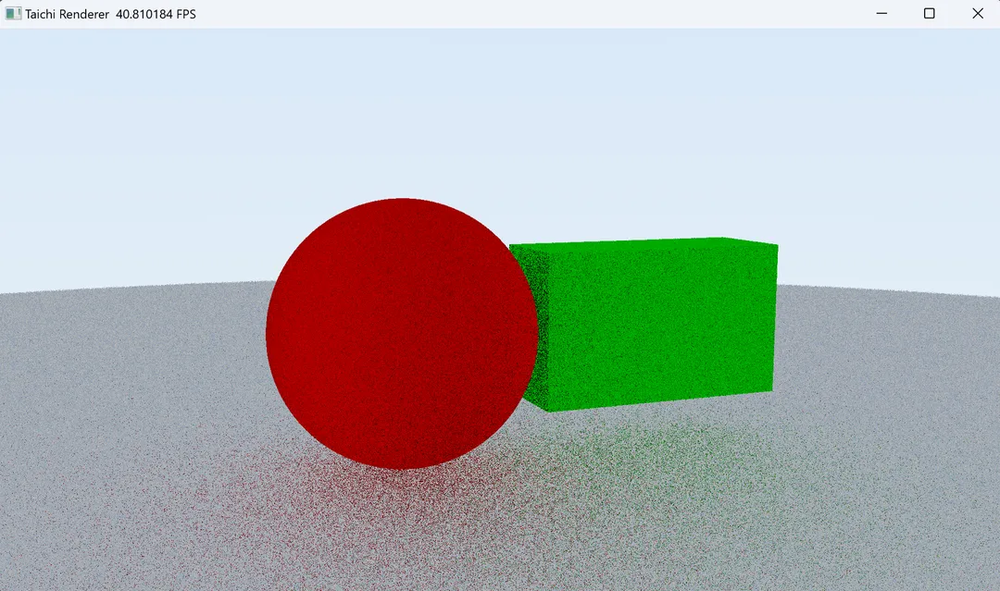  
漫反射材质光线追踪效果（有大量噪点）

## 15 基础降噪与抗锯齿

### 15.1 基础降噪

基础降噪的思路很简单，因为光线追踪是一个蒙特卡洛过程，所以我们可以在迭代中对多帧结果进行积累，当积累足够多步数后，总有一个临界点让我们无法观察到噪点。我们可以用变量

<svg style="overflow:visible;min-height:1px;min-width:1px;vertical-align:-.357ex;" xmlns="http://www.w3.org/2000/svg" width="2.62ex" height="1.934ex" viewBox="0 -697 1158 854.8"><g stroke="currentColor" fill="currentColor" stroke-width="0" transform="scale(1,-1)"><g data-mml-node="math"><g data-mml-node="msub"><g data-mml-node="TeXAtom"><g data-mml-node="mi"><path d="M64 343Q64 502 174 599T468 697Q502 697 533 691T586 674T623 655T647 639T657 632L694 663Q703 670 711 677T723 687T730 692T735 695T740 696T746 697Q759 697 762 692T766 668V627V489V449Q766 428 762 424T742 419H732H720Q699 419 697 436Q690 498 657 545Q611 618 532 632Q522 634 496 634Q356 634 286 553Q232 488 232 343T286 133Q355 52 497 52Q597 52 650 112T704 237Q704 248 709 251T729 254H735Q750 254 755 253T763 248T766 234Q766 136 680 63T469 -11Q285 -11 175 86T64 343Z" style="stroke-width: 3;"></path></g></g><g data-mml-node="mi" transform="translate(864,-150) scale(0.707)"><path d="M184 600Q184 624 203 642T247 661Q265 661 277 649T290 619Q290 596 270 577T226 557Q211 557 198 567T184 600ZM21 287Q21 295 30 318T54 369T98 420T158 442Q197 442 223 419T250 357Q250 340 236 301T196 196T154 83Q149 61 149 51Q149 26 166 26Q175 26 185 29T208 43T235 78T260 137Q263 149 265 151T282 153Q302 153 302 143Q302 135 293 112T268 61T223 11T161 -11Q129 -11 102 10T74 74Q74 91 79 106T122 220Q160 321 166 341T173 380Q173 404 156 404H154Q124 404 99 371T61 287Q60 286 59 284T58 281T56 279T53 278T49 278T41 278H27Q21 284 21 287Z" style="stroke-width: 3;"></path></g></g></g></g></svg> 和 <svg style="overflow:visible;min-height:1px;min-width:1px;vertical-align:-.471ex;" xmlns="http://www.w3.org/2000/svg" width="4.664ex" height="2.047ex" viewBox="0 -697 2061.6 905"><g stroke="currentColor" fill="currentColor" stroke-width="0" transform="scale(1,-1)"><g data-mml-node="math"><g data-mml-node="msub"><g data-mml-node="TeXAtom"><g data-mml-node="mi"><path d="M64 343Q64 502 174 599T468 697Q502 697 533 691T586 674T623 655T647 639T657 632L694 663Q703 670 711 677T723 687T730 692T735 695T740 696T746 697Q759 697 762 692T766 668V627V489V449Q766 428 762 424T742 419H732H720Q699 419 697 436Q690 498 657 545Q611 618 532 632Q522 634 496 634Q356 634 286 553Q232 488 232 343T286 133Q355 52 497 52Q597 52 650 112T704 237Q704 248 709 251T729 254H735Q750 254 755 253T763 248T766 234Q766 136 680 63T469 -11Q285 -11 175 86T64 343Z" style="stroke-width: 3;"></path></g></g><g data-mml-node="TeXAtom" transform="translate(864,-150) scale(0.707)"><g data-mml-node="mi"><path d="M184 600Q184 624 203 642T247 661Q265 661 277 649T290 619Q290 596 270 577T226 557Q211 557 198 567T184 600ZM21 287Q21 295 30 318T54 369T98 420T158 442Q197 442 223 419T250 357Q250 340 236 301T196 196T154 83Q149 61 149 51Q149 26 166 26Q175 26 185 29T208 43T235 78T260 137Q263 149 265 151T282 153Q302 153 302 143Q302 135 293 112T268 61T223 11T161 -11Q129 -11 102 10T74 74Q74 91 79 106T122 220Q160 321 166 341T173 380Q173 404 156 404H154Q124 404 99 371T61 287Q60 286 59 284T58 281T56 279T53 278T49 278T41 278H27Q21 284 21 287Z" style="stroke-width: 3;"></path></g><g data-mml-node="mo" transform="translate(345,0)"><path d="M84 237T84 250T98 270H679Q694 262 694 250T679 230H98Q84 237 84 250Z" style="stroke-width: 3;"></path></g><g data-mml-node="mn" transform="translate(1123,0)"><path d="M213 578L200 573Q186 568 160 563T102 556H83V602H102Q149 604 189 617T245 641T273 663Q275 666 285 666Q294 666 302 660V361L303 61Q310 54 315 52T339 48T401 46H427V0H416Q395 3 257 3Q121 3 100 0H88V46H114Q136 46 152 46T177 47T193 50T201 52T207 57T213 61V578Z" style="stroke-width: 3;"></path></g></g></g></g></g></svg> 来表示当前帧和上一帧像素颜色，用 <svg style="overflow:visible;min-height:1px;min-width:1px;vertical-align:-.357ex;" xmlns="http://www.w3.org/2000/svg" width="2.185ex" height="1.934ex" viewBox="0 -697 966 854.8"><g stroke="currentColor" fill="currentColor" stroke-width="0" transform="scale(1,-1)"><g data-mml-node="math"><g data-mml-node="msub"><g data-mml-node="TeXAtom"><g data-mml-node="mi"><path d="M64 493Q64 582 120 636T264 696H272Q280 697 285 697Q380 697 454 645L480 669Q484 672 488 676T495 683T500 688T504 691T508 693T511 695T514 696T517 697T522 697Q536 697 539 691T542 652V577Q542 557 542 532T543 500Q543 472 540 465T524 458H511H505Q489 458 485 461T479 478Q472 529 449 564T393 614T336 634T287 639Q228 639 203 610T177 544Q177 517 195 493T247 457Q253 454 343 436T475 391Q574 326 574 207V200Q574 163 559 120Q517 12 389 -9Q380 -10 346 -10Q308 -10 275 -5T221 7T184 22T160 35T151 40L126 17Q122 14 118 10T111 3T106 -2T102 -5T98 -7T95 -9T92 -10T89 -11T84 -11Q70 -11 67 -4T64 35V108Q64 128 64 153T63 185Q63 203 63 211T69 223T77 227T94 228H100Q118 228 122 225T126 205Q130 125 193 88T345 51Q408 51 434 82T460 157Q460 196 439 221T388 257Q384 259 305 276T221 295Q155 313 110 366T64 493Z" style="stroke-width: 3;"></path></g></g><g data-mml-node="mi" transform="translate(672,-150) scale(0.707)"><path d="M184 600Q184 624 203 642T247 661Q265 661 277 649T290 619Q290 596 270 577T226 557Q211 557 198 567T184 600ZM21 287Q21 295 30 318T54 369T98 420T158 442Q197 442 223 419T250 357Q250 340 236 301T196 196T154 83Q149 61 149 51Q149 26 166 26Q175 26 185 29T208 43T235 78T260 137Q263 149 265 151T282 153Q302 153 302 143Q302 135 293 112T268 61T223 11T161 -11Q129 -11 102 10T74 74Q74 91 79 106T122 220Q160 321 166 341T173 380Q173 404 156 404H154Q124 404 99 371T61 287Q60 286 59 284T58 281T56 279T53 278T49 278T41 278H27Q21 284 21 287Z" style="stroke-width: 3;"></path></g></g></g></g></svg> 表示这帧采样到的颜色，用 <svg style="overflow:visible;min-height:1px;min-width:1px;vertical-align:-.025ex;" xmlns="http://www.w3.org/2000/svg" width="1.357ex" height="1.025ex" viewBox="0 -442 600 453"><g stroke="currentColor" fill="currentColor" stroke-width="0" transform="scale(1,-1)"><g data-mml-node="math"><g data-mml-node="mi"><path d="M21 287Q22 293 24 303T36 341T56 388T89 425T135 442Q171 442 195 424T225 390T231 369Q231 367 232 367L243 378Q304 442 382 442Q436 442 469 415T503 336T465 179T427 52Q427 26 444 26Q450 26 453 27Q482 32 505 65T540 145Q542 153 560 153Q580 153 580 145Q580 144 576 130Q568 101 554 73T508 17T439 -10Q392 -10 371 17T350 73Q350 92 386 193T423 345Q423 404 379 404H374Q288 404 229 303L222 291L189 157Q156 26 151 16Q138 -11 108 -11Q95 -11 87 -5T76 7T74 17Q74 30 112 180T152 343Q153 348 153 366Q153 405 129 405Q91 405 66 305Q60 285 60 284Q58 278 41 278H27Q21 284 21 287Z" style="stroke-width: 3;"></path></g></g></g></svg> 来表示当前的采样次数，那么我们可以用下面的公式来更新像素颜色  
<svg style="overflow:visible;min-height:1px;min-width:1px;vertical-align:-2.148ex;width:100%;" xmlns="http://www.w3.org/2000/svg" width="24.267ex" height="5.428ex" viewBox="0 -1449.5 10726.1 2399"><g stroke="currentColor" fill="currentColor" stroke-width="0" transform="scale(1,-1)"><g data-mml-node="math"><g data-mml-node="msub"><g data-mml-node="TeXAtom"><g data-mml-node="mi"><path d="M64 343Q64 502 174 599T468 697Q502 697 533 691T586 674T623 655T647 639T657 632L694 663Q703 670 711 677T723 687T730 692T735 695T740 696T746 697Q759 697 762 692T766 668V627V489V449Q766 428 762 424T742 419H732H720Q699 419 697 436Q690 498 657 545Q611 618 532 632Q522 634 496 634Q356 634 286 553Q232 488 232 343T286 133Q355 52 497 52Q597 52 650 112T704 237Q704 248 709 251T729 254H735Q750 254 755 253T763 248T766 234Q766 136 680 63T469 -11Q285 -11 175 86T64 343Z" style="stroke-width: 3;"></path></g></g><g data-mml-node="mi" transform="translate(864,-150) scale(0.707)"><path d="M184 600Q184 624 203 642T247 661Q265 661 277 649T290 619Q290 596 270 577T226 557Q211 557 198 567T184 600ZM21 287Q21 295 30 318T54 369T98 420T158 442Q197 442 223 419T250 357Q250 340 236 301T196 196T154 83Q149 61 149 51Q149 26 166 26Q175 26 185 29T208 43T235 78T260 137Q263 149 265 151T282 153Q302 153 302 143Q302 135 293 112T268 61T223 11T161 -11Q129 -11 102 10T74 74Q74 91 79 106T122 220Q160 321 166 341T173 380Q173 404 156 404H154Q124 404 99 371T61 287Q60 286 59 284T58 281T56 279T53 278T49 278T41 278H27Q21 284 21 287Z" style="stroke-width: 3;"></path></g></g><g data-mml-node="mo" transform="translate(1435.7,0)"><path d="M56 347Q56 360 70 367H707Q722 359 722 347Q722 336 708 328L390 327H72Q56 332 56 347ZM56 153Q56 168 72 173H708Q722 163 722 153Q722 140 707 133H70Q56 140 56 153Z" style="stroke-width: 3;"></path></g><g data-mml-node="TeXAtom" transform="translate(2491.5,0)"><g data-mml-node="mi"><path d="M41 46H55Q94 46 102 60V68Q102 77 102 91T102 122T103 161T103 203Q103 234 103 269T102 328V351Q99 370 88 376T43 385H25V408Q25 431 27 431L37 432Q47 433 65 434T102 436Q119 437 138 438T167 441T178 442H181V402Q181 364 182 364T187 369T199 384T218 402T247 421T285 437Q305 442 336 442Q351 442 364 440T387 434T406 426T421 417T432 406T441 395T448 384T452 374T455 366L457 361L460 365Q463 369 466 373T475 384T488 397T503 410T523 422T546 432T572 439T603 442Q729 442 740 329Q741 322 741 190V104Q741 66 743 59T754 49Q775 46 803 46H819V0H811L788 1Q764 2 737 2T699 3Q596 3 587 0H579V46H595Q656 46 656 62Q657 64 657 200Q656 335 655 343Q649 371 635 385T611 402T585 404Q540 404 506 370Q479 343 472 315T464 232V168V108Q464 78 465 68T468 55T477 49Q498 46 526 46H542V0H534L510 1Q487 2 460 2T422 3Q319 3 310 0H302V46H318Q379 46 379 62Q380 64 380 200Q379 335 378 343Q372 371 358 385T334 402T308 404Q263 404 229 370Q202 343 195 315T187 232V168V108Q187 78 188 68T191 55T200 49Q221 46 249 46H265V0H257L234 1Q210 2 183 2T145 3Q42 3 33 0H25V46H41Z" style="stroke-width: 3;"></path><path d="M69 609Q69 637 87 653T131 669Q154 667 171 652T188 609Q188 579 171 564T129 549Q104 549 87 564T69 609ZM247 0Q232 3 143 3Q132 3 106 3T56 1L34 0H26V46H42Q70 46 91 49Q100 53 102 60T104 102V205V293Q104 345 102 359T88 378Q74 385 41 385H30V408Q30 431 32 431L42 432Q52 433 70 434T106 436Q123 437 142 438T171 441T182 442H185V62Q190 52 197 50T232 46H255V0H247Z" transform="translate(833,0)" style="stroke-width: 3;"></path><path d="M201 0Q189 3 102 3Q26 3 17 0H11V46H25Q48 47 67 52T96 61T121 78T139 96T160 122T180 150L226 210L168 288Q159 301 149 315T133 336T122 351T113 363T107 370T100 376T94 379T88 381T80 383Q74 383 44 385H16V431H23Q59 429 126 429Q219 429 229 431H237V385Q201 381 201 369Q201 367 211 353T239 315T268 274L272 270L297 304Q329 345 329 358Q329 364 327 369T322 376T317 380T310 384L307 385H302V431H309Q324 428 408 428Q487 428 493 431H499V385H492Q443 385 411 368Q394 360 377 341T312 257L296 236L358 151Q424 61 429 57T446 50Q464 46 499 46H516V0H510H502Q494 1 482 1T457 2T432 2T414 3Q403 3 377 3T327 1L304 0H295V46H298Q309 46 320 51T331 63Q331 65 291 120L250 175Q249 174 219 133T185 88Q181 83 181 74Q181 63 188 55T206 46Q208 46 208 23V0H201Z" transform="translate(1111,0)" style="stroke-width: 3;"></path></g></g><g data-mml-node="mrow" transform="translate(4297.2,0)"><g data-mml-node="mo" transform="translate(0 -0.5)"><path d="M701 -940Q701 -943 695 -949H664Q662 -947 636 -922T591 -879T537 -818T475 -737T412 -636T350 -511T295 -362T250 -186T221 17T209 251Q209 962 573 1361Q596 1386 616 1405T649 1437T664 1450H695Q701 1444 701 1441Q701 1436 681 1415T629 1356T557 1261T476 1118T400 927T340 675T308 359Q306 321 306 250Q306 -139 400 -430T690 -924Q701 -936 701 -940Z" style="stroke-width: 3;"></path></g><g data-mml-node="msub" transform="translate(736,0)"><g data-mml-node="TeXAtom"><g data-mml-node="mi"><path d="M64 343Q64 502 174 599T468 697Q502 697 533 691T586 674T623 655T647 639T657 632L694 663Q703 670 711 677T723 687T730 692T735 695T740 696T746 697Q759 697 762 692T766 668V627V489V449Q766 428 762 424T742 419H732H720Q699 419 697 436Q690 498 657 545Q611 618 532 632Q522 634 496 634Q356 634 286 553Q232 488 232 343T286 133Q355 52 497 52Q597 52 650 112T704 237Q704 248 709 251T729 254H735Q750 254 755 253T763 248T766 234Q766 136 680 63T469 -11Q285 -11 175 86T64 343Z" style="stroke-width: 3;"></path></g></g><g data-mml-node="TeXAtom" transform="translate(864,-150) scale(0.707)"><g data-mml-node="mi"><path d="M184 600Q184 624 203 642T247 661Q265 661 277 649T290 619Q290 596 270 577T226 557Q211 557 198 567T184 600ZM21 287Q21 295 30 318T54 369T98 420T158 442Q197 442 223 419T250 357Q250 340 236 301T196 196T154 83Q149 61 149 51Q149 26 166 26Q175 26 185 29T208 43T235 78T260 137Q263 149 265 151T282 153Q302 153 302 143Q302 135 293 112T268 61T223 11T161 -11Q129 -11 102 10T74 74Q74 91 79 106T122 220Q160 321 166 341T173 380Q173 404 156 404H154Q124 404 99 371T61 287Q60 286 59 284T58 281T56 279T53 278T49 278T41 278H27Q21 284 21 287Z" style="stroke-width: 3;"></path></g><g data-mml-node="mo" transform="translate(345,0)"><path d="M84 237T84 250T98 270H679Q694 262 694 250T679 230H98Q84 237 84 250Z" style="stroke-width: 3;"></path></g><g data-mml-node="mn" transform="translate(1123,0)"><path d="M213 578L200 573Q186 568 160 563T102 556H83V602H102Q149 604 189 617T245 641T273 663Q275 666 285 666Q294 666 302 660V361L303 61Q310 54 315 52T339 48T401 46H427V0H416Q395 3 257 3Q121 3 100 0H88V46H114Q136 46 152 46T177 47T193 50T201 52T207 57T213 61V578Z" style="stroke-width: 3;"></path></g></g></g><g data-mml-node="mo" transform="translate(2797.6,0)"><path d="M78 35T78 60T94 103T137 121Q165 121 187 96T210 8Q210 -27 201 -60T180 -117T154 -158T130 -185T117 -194Q113 -194 104 -185T95 -172Q95 -168 106 -156T131 -126T157 -76T173 -3V9L172 8Q170 7 167 6T161 3T152 1T140 0Q113 0 96 17Z" style="stroke-width: 3;"></path></g><g data-mml-node="msub" transform="translate(3242.3,0)"><g data-mml-node="TeXAtom"><g data-mml-node="mi"><path d="M64 493Q64 582 120 636T264 696H272Q280 697 285 697Q380 697 454 645L480 669Q484 672 488 676T495 683T500 688T504 691T508 693T511 695T514 696T517 697T522 697Q536 697 539 691T542 652V577Q542 557 542 532T543 500Q543 472 540 465T524 458H511H505Q489 458 485 461T479 478Q472 529 449 564T393 614T336 634T287 639Q228 639 203 610T177 544Q177 517 195 493T247 457Q253 454 343 436T475 391Q574 326 574 207V200Q574 163 559 120Q517 12 389 -9Q380 -10 346 -10Q308 -10 275 -5T221 7T184 22T160 35T151 40L126 17Q122 14 118 10T111 3T106 -2T102 -5T98 -7T95 -9T92 -10T89 -11T84 -11Q70 -11 67 -4T64 35V108Q64 128 64 153T63 185Q63 203 63 211T69 223T77 227T94 228H100Q118 228 122 225T126 205Q130 125 193 88T345 51Q408 51 434 82T460 157Q460 196 439 221T388 257Q384 259 305 276T221 295Q155 313 110 366T64 493Z" style="stroke-width: 3;"></path></g></g><g data-mml-node="mi" transform="translate(672,-150) scale(0.707)"><path d="M184 600Q184 624 203 642T247 661Q265 661 277 649T290 619Q290 596 270 577T226 557Q211 557 198 567T184 600ZM21 287Q21 295 30 318T54 369T98 420T158 442Q197 442 223 419T250 357Q250 340 236 301T196 196T154 83Q149 61 149 51Q149 26 166 26Q175 26 185 29T208 43T235 78T260 137Q263 149 265 151T282 153Q302 153 302 143Q302 135 293 112T268 61T223 11T161 -11Q129 -11 102 10T74 74Q74 91 79 106T122 220Q160 321 166 341T173 380Q173 404 156 404H154Q124 404 99 371T61 287Q60 286 59 284T58 281T56 279T53 278T49 278T41 278H27Q21 284 21 287Z" style="stroke-width: 3;"></path></g></g><g data-mml-node="mo" transform="translate(4208.3,0)"><path d="M78 35T78 60T94 103T137 121Q165 121 187 96T210 8Q210 -27 201 -60T180 -117T154 -158T130 -185T117 -194Q113 -194 104 -185T95 -172Q95 -168 106 -156T131 -126T157 -76T173 -3V9L172 8Q170 7 167 6T161 3T152 1T140 0Q113 0 96 17Z" style="stroke-width: 3;"></path></g><g data-mml-node="mfrac" transform="translate(4652.9,0)"><g data-mml-node="mn" transform="translate(270,676)"><path d="M213 578L200 573Q186 568 160 563T102 556H83V602H102Q149 604 189 617T245 641T273 663Q275 666 285 666Q294 666 302 660V361L303 61Q310 54 315 52T339 48T401 46H427V0H416Q395 3 257 3Q121 3 100 0H88V46H114Q136 46 152 46T177 47T193 50T201 52T207 57T213 61V578Z" style="stroke-width: 3;"></path></g><g data-mml-node="mi" transform="translate(220,-686)"><path d="M21 287Q22 293 24 303T36 341T56 388T89 425T135 442Q171 442 195 424T225 390T231 369Q231 367 232 367L243 378Q304 442 382 442Q436 442 469 415T503 336T465 179T427 52Q427 26 444 26Q450 26 453 27Q482 32 505 65T540 145Q542 153 560 153Q580 153 580 145Q580 144 576 130Q568 101 554 73T508 17T439 -10Q392 -10 371 17T350 73Q350 92 386 193T423 345Q423 404 379 404H374Q288 404 229 303L222 291L189 157Q156 26 151 16Q138 -11 108 -11Q95 -11 87 -5T76 7T74 17Q74 30 112 180T152 343Q153 348 153 366Q153 405 129 405Q91 405 66 305Q60 285 60 284Q58 278 41 278H27Q21 284 21 287Z" style="stroke-width: 3;"></path></g><rect width="800" height="60" x="120" y="220"></rect></g><g data-mml-node="mo" transform="translate(5692.9,0) translate(0 -0.5)"><path d="M34 1438Q34 1446 37 1448T50 1450H56H71Q73 1448 99 1423T144 1380T198 1319T260 1238T323 1137T385 1013T440 864T485 688T514 485T526 251Q526 134 519 53Q472 -519 162 -860Q139 -885 119 -904T86 -936T71 -949H56Q43 -949 39 -947T34 -937Q88 -883 140 -813Q428 -430 428 251Q428 453 402 628T338 922T245 1146T145 1309T46 1425Q44 1427 42 1429T39 1433T36 1436L34 1438Z" style="stroke-width: 3;"></path></g></g></g></g></svg>  

在实现上，我们需要引入 `denoise_frame` 来控制采样次数

```python
color = ray.color.rgb * ray.color.a ## 混合颜色与光强

last_color = image_pixels[i, j] ## 获取上一帧的颜色
out_color = mix(last_color, color, 1.0 / denoise_frame) ## 混合当前帧和上一帧的颜色

image_pixels[i, j] = out_color  ## 设置像素颜色
```

当按下空格键时，重新开始积累降噪帧，否则让 `denoise_frame` 自增

```python
while window.running:
    camera.track_user_inputs(window, movement_speed=0.03, hold_key=ti.ui.LMB)
    delta_time = time.time() - start_time   ## 计算时间差
    if window.is_pressed(' '):
        denoise_frame = 0
    denoise_frame += 1
    ...
```

### 15.2 超采样抗锯齿

锯齿的产生是因为我们的像素是离散的，但是只要像素密度足够高，我们就难以察觉出锯齿。因此超采样抗锯齿的思路是在一个像素中虚拟出更多像素，然后对这些像素进行平均。在光线追踪中，我们可以在一个像素中对 uv 进行抖动，来模拟对像素内大量虚拟像素的采样。

在蒙特卡洛过程使用超采样抗锯齿的办法很简单，只需要一行代码就可以实现

```python
SCREEN_PIXEL_SIZE = 1.0 / vec2(image_resolution)
uv = vec2(i, j) * SCREEN_PIXEL_SIZE ## 计算像素坐标
uv += vec2(ti.random(), ti.random()) * SCREEN_PIXEL_SIZE    ## 超采样
```

让我们看看累积帧降噪和抗锯齿的效果，可以看到图片变得非常干净，而且形状边缘过度也变得平滑。

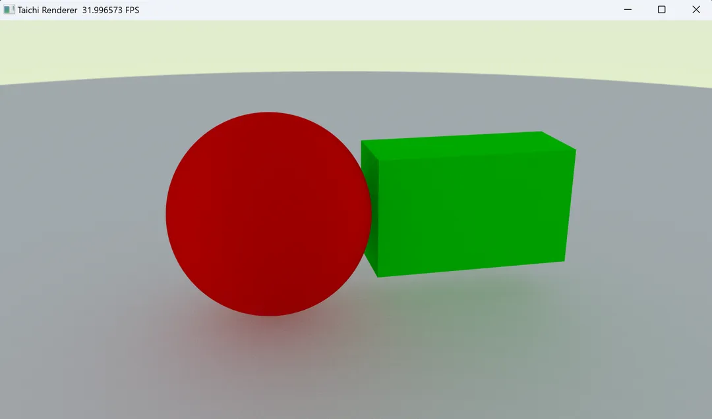  
累积帧降噪和抗锯齿，地面看出自然的阴影和间接光染色

## 16 物体的旋转

让我们暂时休息一会儿，实现一个简单但是有用的小功能。在前面的章节，我们已经为为物体实现了简单的位移和缩放，本章我们实现物体的旋转。

### 16.1 旋转矩阵

三维空间下的旋转矩阵是一个 `3 X 3` 的矩阵，它的每一行都是一个单位向量，这三个单位向量构成了一个正交基。我们可以通过将三维向量左乘旋转矩阵将它从一个坐标系旋转到另一个坐标系。  
  
<svg style="overflow:visible;min-height:1px;min-width:1px;vertical-align:-3.764ex;width:100%;" xmlns="http://www.w3.org/2000/svg" width="22.076ex" height="8.658ex" viewBox="0 -2163.5 9757.7 3826.9"><g stroke="currentColor" fill="currentColor" stroke-width="0" transform="scale(1,-1)"><g data-mml-node="math"><g data-mml-node="mrow"><g data-mml-node="mo"><path d="M319 -645V1154H666V1070H403V-645H319Z" transform="translate(0,1009.5)" style="stroke-width: 3;"></path><path d="M319 -644V1155H403V-560H666V-644H319Z" transform="translate(0,-1019.5)" style="stroke-width: 3;"></path><svg width="667" height="428.9" y="35.5" x="0" viewBox="0 107.2 667 428.9"><path d="M319 0V602H403V0H319Z" transform="scale(1,1.069)" style="stroke-width: 3;"></path></svg></g><g data-mml-node="mtable" transform="translate(667,0)"><g data-mml-node="mtr" transform="translate(0,1404.5)"><g data-mml-node="mtd"><g data-mml-node="msup"><g data-mml-node="mi"><path d="M52 289Q59 331 106 386T222 442Q257 442 286 424T329 379Q371 442 430 442Q467 442 494 420T522 361Q522 332 508 314T481 292T458 288Q439 288 427 299T415 328Q415 374 465 391Q454 404 425 404Q412 404 406 402Q368 386 350 336Q290 115 290 78Q290 50 306 38T341 26Q378 26 414 59T463 140Q466 150 469 151T485 153H489Q504 153 504 145Q504 144 502 134Q486 77 440 33T333 -11Q263 -11 227 52Q186 -10 133 -10H127Q78 -10 57 16T35 71Q35 103 54 123T99 143Q142 143 142 101Q142 81 130 66T107 46T94 41L91 40Q91 39 97 36T113 29T132 26Q168 26 194 71Q203 87 217 139T245 247T261 313Q266 340 266 352Q266 380 251 392T217 404Q177 404 142 372T93 290Q91 281 88 280T72 278H58Q52 284 52 289Z" style="stroke-width: 3;"></path></g><g data-mml-node="mo" transform="translate(605,363) scale(0.707)"><path d="M79 43Q73 43 52 49T30 61Q30 68 85 293T146 528Q161 560 198 560Q218 560 240 545T262 501Q262 496 260 486Q259 479 173 263T84 45T79 43Z" style="stroke-width: 3;"></path></g></g></g></g><g data-mml-node="mtr" transform="translate(0,-4.5)"><g data-mml-node="mtd" transform="translate(41,0)"><g data-mml-node="msup"><g data-mml-node="mi"><path d="M21 287Q21 301 36 335T84 406T158 442Q199 442 224 419T250 355Q248 336 247 334Q247 331 231 288T198 191T182 105Q182 62 196 45T238 27Q261 27 281 38T312 61T339 94Q339 95 344 114T358 173T377 247Q415 397 419 404Q432 431 462 431Q475 431 483 424T494 412T496 403Q496 390 447 193T391 -23Q363 -106 294 -155T156 -205Q111 -205 77 -183T43 -117Q43 -95 50 -80T69 -58T89 -48T106 -45Q150 -45 150 -87Q150 -107 138 -122T115 -142T102 -147L99 -148Q101 -153 118 -160T152 -167H160Q177 -167 186 -165Q219 -156 247 -127T290 -65T313 -9T321 21L315 17Q309 13 296 6T270 -6Q250 -11 231 -11Q185 -11 150 11T104 82Q103 89 103 113Q103 170 138 262T173 379Q173 380 173 381Q173 390 173 393T169 400T158 404H154Q131 404 112 385T82 344T65 302T57 280Q55 278 41 278H27Q21 284 21 287Z" style="stroke-width: 3;"></path></g><g data-mml-node="mo" transform="translate(523,363) scale(0.707)"><path d="M79 43Q73 43 52 49T30 61Q30 68 85 293T146 528Q161 560 198 560Q218 560 240 545T262 501Q262 496 260 486Q259 479 173 263T84 45T79 43Z" style="stroke-width: 3;"></path></g></g></g></g><g data-mml-node="mtr" transform="translate(0,-1413.5)"><g data-mml-node="mtd" transform="translate(53.5,0)"><g data-mml-node="msup"><g data-mml-node="mi"><path d="M347 338Q337 338 294 349T231 360Q211 360 197 356T174 346T162 335T155 324L153 320Q150 317 138 317Q117 317 117 325Q117 330 120 339Q133 378 163 406T229 440Q241 442 246 442Q271 442 291 425T329 392T367 375Q389 375 411 408T434 441Q435 442 449 442H462Q468 436 468 434Q468 430 463 420T449 399T432 377T418 358L411 349Q368 298 275 214T160 106L148 94L163 93Q185 93 227 82T290 71Q328 71 360 90T402 140Q406 149 409 151T424 153Q443 153 443 143Q443 138 442 134Q425 72 376 31T278 -11Q252 -11 232 6T193 40T155 57Q111 57 76 -3Q70 -11 59 -11H54H41Q35 -5 35 -2Q35 13 93 84Q132 129 225 214T340 322Q352 338 347 338Z" style="stroke-width: 3;"></path></g><g data-mml-node="mo" transform="translate(498,363) scale(0.707)"><path d="M79 43Q73 43 52 49T30 61Q30 68 85 293T146 528Q161 560 198 560Q218 560 240 545T262 501Q262 496 260 486Q259 479 173 263T84 45T79 43Z" style="stroke-width: 3;"></path></g></g></g></g></g><g data-mml-node="mo" transform="translate(1516.5,0)"><path d="M0 1070V1154H347V-645H263V1070H0Z" transform="translate(0,1009.5)" style="stroke-width: 3;"></path><path d="M263 -560V1155H347V-644H0V-560H263Z" transform="translate(0,-1019.5)" style="stroke-width: 3;"></path><svg width="667" height="428.9" y="35.5" x="0" viewBox="0 107.2 667 428.9"><path d="M263 0V602H347V0H263Z" transform="scale(1,1.069)" style="stroke-width: 3;"></path></svg></g></g><g data-mml-node="mo" transform="translate(2461.2,0)"><path d="M56 347Q56 360 70 367H707Q722 359 722 347Q722 336 708 328L390 327H72Q56 332 56 347ZM56 153Q56 168 72 173H708Q722 163 722 153Q722 140 707 133H70Q56 140 56 153Z" style="stroke-width: 3;"></path></g><g data-mml-node="mrow" transform="translate(3517,0)"><g data-mml-node="mo"><path d="M319 -645V1154H666V1070H403V-645H319Z" transform="translate(0,996)" style="stroke-width: 3;"></path><path d="M319 -644V1155H403V-560H666V-644H319Z" transform="translate(0,-1006)" style="stroke-width: 3;"></path><svg width="667" height="402" y="49" x="0" viewBox="0 100.5 667 402"><path d="M319 0V602H403V0H319Z" transform="scale(1,1.002)" style="stroke-width: 3;"></path></svg></g><g data-mml-node="mtable" transform="translate(667,0)"><g data-mml-node="mtr" transform="translate(0,1400)"><g data-mml-node="mtd"><g data-mml-node="mo"><path d="M78 250Q78 274 95 292T138 310Q162 310 180 294T199 251Q199 226 182 208T139 190T96 207T78 250Z" style="stroke-width: 3;"></path></g></g><g data-mml-node="mtd" transform="translate(1278,0)"><g data-mml-node="mo"><path d="M78 250Q78 274 95 292T138 310Q162 310 180 294T199 251Q199 226 182 208T139 190T96 207T78 250Z" style="stroke-width: 3;"></path></g></g><g data-mml-node="mtd" transform="translate(2556,0)"><g data-mml-node="mo"><path d="M78 250Q78 274 95 292T138 310Q162 310 180 294T199 251Q199 226 182 208T139 190T96 207T78 250Z" style="stroke-width: 3;"></path></g></g></g><g data-mml-node="mtr"><g data-mml-node="mtd"><g data-mml-node="mo"><path d="M78 250Q78 274 95 292T138 310Q162 310 180 294T199 251Q199 226 182 208T139 190T96 207T78 250Z" style="stroke-width: 3;"></path></g></g><g data-mml-node="mtd" transform="translate(1278,0)"><g data-mml-node="mo"><path d="M78 250Q78 274 95 292T138 310Q162 310 180 294T199 251Q199 226 182 208T139 190T96 207T78 250Z" style="stroke-width: 3;"></path></g></g><g data-mml-node="mtd" transform="translate(2556,0)"><g data-mml-node="mo"><path d="M78 250Q78 274 95 292T138 310Q162 310 180 294T199 251Q199 226 182 208T139 190T96 207T78 250Z" style="stroke-width: 3;"></path></g></g></g><g data-mml-node="mtr" transform="translate(0,-1400)"><g data-mml-node="mtd"><g data-mml-node="mo"><path d="M78 250Q78 274 95 292T138 310Q162 310 180 294T199 251Q199 226 182 208T139 190T96 207T78 250Z" style="stroke-width: 3;"></path></g></g><g data-mml-node="mtd" transform="translate(1278,0)"><g data-mml-node="mo"><path d="M78 250Q78 274 95 292T138 310Q162 310 180 294T199 251Q199 226 182 208T139 190T96 207T78 250Z" style="stroke-width: 3;"></path></g></g><g data-mml-node="mtd" transform="translate(2556,0)"><g data-mml-node="mo"><path d="M78 250Q78 274 95 292T138 310Q162 310 180 294T199 251Q199 226 182 208T139 190T96 207T78 250Z" style="stroke-width: 3;"></path></g></g></g></g><g data-mml-node="mo" transform="translate(3501,0)"><path d="M0 1070V1154H347V-645H263V1070H0Z" transform="translate(0,996)" style="stroke-width: 3;"></path><path d="M263 -560V1155H347V-644H0V-560H263Z" transform="translate(0,-1006)" style="stroke-width: 3;"></path><svg width="667" height="402" y="49" x="0" viewBox="0 100.5 667 402"><path d="M263 0V602H347V0H263Z" transform="scale(1,1.002)" style="stroke-width: 3;"></path></svg></g></g><g data-mml-node="mrow" transform="translate(7851.7,0)"><g data-mml-node="mo"><path d="M319 -645V1154H666V1070H403V-645H319Z" transform="translate(0,996)" style="stroke-width: 3;"></path><path d="M319 -644V1155H403V-560H666V-644H319Z" transform="translate(0,-1006)" style="stroke-width: 3;"></path><svg width="667" height="402" y="49" x="0" viewBox="0 100.5 667 402"><path d="M319 0V602H403V0H319Z" transform="scale(1,1.002)" style="stroke-width: 3;"></path></svg></g><g data-mml-node="mtable" transform="translate(667,0)"><g data-mml-node="mtr" transform="translate(0,1400)"><g data-mml-node="mtd"><g data-mml-node="mi"><path d="M52 289Q59 331 106 386T222 442Q257 442 286 424T329 379Q371 442 430 442Q467 442 494 420T522 361Q522 332 508 314T481 292T458 288Q439 288 427 299T415 328Q415 374 465 391Q454 404 425 404Q412 404 406 402Q368 386 350 336Q290 115 290 78Q290 50 306 38T341 26Q378 26 414 59T463 140Q466 150 469 151T485 153H489Q504 153 504 145Q504 144 502 134Q486 77 440 33T333 -11Q263 -11 227 52Q186 -10 133 -10H127Q78 -10 57 16T35 71Q35 103 54 123T99 143Q142 143 142 101Q142 81 130 66T107 46T94 41L91 40Q91 39 97 36T113 29T132 26Q168 26 194 71Q203 87 217 139T245 247T261 313Q266 340 266 352Q266 380 251 392T217 404Q177 404 142 372T93 290Q91 281 88 280T72 278H58Q52 284 52 289Z" style="stroke-width: 3;"></path></g></g></g><g data-mml-node="mtr"><g data-mml-node="mtd" transform="translate(41,0)"><g data-mml-node="mi"><path d="M21 287Q21 301 36 335T84 406T158 442Q199 442 224 419T250 355Q248 336 247 334Q247 331 231 288T198 191T182 105Q182 62 196 45T238 27Q261 27 281 38T312 61T339 94Q339 95 344 114T358 173T377 247Q415 397 419 404Q432 431 462 431Q475 431 483 424T494 412T496 403Q496 390 447 193T391 -23Q363 -106 294 -155T156 -205Q111 -205 77 -183T43 -117Q43 -95 50 -80T69 -58T89 -48T106 -45Q150 -45 150 -87Q150 -107 138 -122T115 -142T102 -147L99 -148Q101 -153 118 -160T152 -167H160Q177 -167 186 -165Q219 -156 247 -127T290 -65T313 -9T321 21L315 17Q309 13 296 6T270 -6Q250 -11 231 -11Q185 -11 150 11T104 82Q103 89 103 113Q103 170 138 262T173 379Q173 380 173 381Q173 390 173 393T169 400T158 404H154Q131 404 112 385T82 344T65 302T57 280Q55 278 41 278H27Q21 284 21 287Z" style="stroke-width: 3;"></path></g></g></g><g data-mml-node="mtr" transform="translate(0,-1400)"><g data-mml-node="mtd" transform="translate(53.5,0)"><g data-mml-node="mi"><path d="M347 338Q337 338 294 349T231 360Q211 360 197 356T174 346T162 335T155 324L153 320Q150 317 138 317Q117 317 117 325Q117 330 120 339Q133 378 163 406T229 440Q241 442 246 442Q271 442 291 425T329 392T367 375Q389 375 411 408T434 441Q435 442 449 442H462Q468 436 468 434Q468 430 463 420T449 399T432 377T418 358L411 349Q368 298 275 214T160 106L148 94L163 93Q185 93 227 82T290 71Q328 71 360 90T402 140Q406 149 409 151T424 153Q443 153 443 143Q443 138 442 134Q425 72 376 31T278 -11Q252 -11 232 6T193 40T155 57Q111 57 76 -3Q70 -11 59 -11H54H41Q35 -5 35 -2Q35 13 93 84Q132 129 225 214T340 322Q352 338 347 338Z" style="stroke-width: 3;"></path></g></g></g></g><g data-mml-node="mo" transform="translate(1239,0)"><path d="M0 1070V1154H347V-645H263V1070H0Z" transform="translate(0,996)" style="stroke-width: 3;"></path><path d="M263 -560V1155H347V-644H0V-560H263Z" transform="translate(0,-1006)" style="stroke-width: 3;"></path><svg width="667" height="402" y="49" x="0" viewBox="0 100.5 667 402"><path d="M263 0V602H347V0H263Z" transform="scale(1,1.002)" style="stroke-width: 3;"></path></svg></g></g></g></g></svg>

### 16.2 欧拉角

由于人们操控旋转矩阵或者四元数中的数值来表示旋转并不直观，因此我们使用欧拉角来表示旋转。欧拉角是一个三维向量，它的每个分量分别表示绕 XYZ 轴的旋转角度。右手系下，绕三个轴的旋转矩阵分别为

<svg style="overflow:visible;min-height:1px;min-width:1px;vertical-align:-3.733ex;display:block;width:100%;" xmlns="http://www.w3.org/2000/svg" width="32.039ex" height="8.597ex" viewBox="0 -2150 14161.1 3800"><g stroke="currentColor" fill="currentColor" stroke-width="0" transform="scale(1,-1)"><g data-mml-node="math"><g data-mml-node="msub"><g data-mml-node="TeXAtom"><g data-mml-node="mi"><path d="M37 475Q19 475 19 487Q19 503 35 530T83 589T180 647T327 682H374Q387 682 417 682T464 683Q519 683 559 679T642 663T708 625T731 557Q731 481 668 411T504 300Q506 296 512 286T528 257T553 202Q594 105 611 82Q635 47 665 47Q708 47 742 93Q758 113 786 128Q804 136 819 137Q837 137 837 125Q837 115 818 92T767 43T687 -2T589 -22Q549 -22 517 22T467 120T422 221T362 273Q346 273 346 287Q348 301 373 320T436 342Q437 342 446 343T462 345T481 348T504 353T527 362T553 375T577 393Q598 412 614 443T630 511Q630 545 613 566T541 600T393 614Q370 614 370 613L366 584Q349 446 311 307T243 96L213 25Q205 8 179 -7T132 -22Q125 -22 120 -18T117 -8Q117 -5 130 26T163 113T205 239T246 408T274 606V614Q273 614 259 613T231 609T198 602T163 588Q131 572 113 518Q102 502 80 490T37 475Z" style="stroke-width: 3;"></path></g></g><g data-mml-node="TeXAtom" transform="translate(881,-150) scale(0.707)"><g data-mml-node="mi"><path d="M52 289Q59 331 106 386T222 442Q257 442 286 424T329 379Q371 442 430 442Q467 442 494 420T522 361Q522 332 508 314T481 292T458 288Q439 288 427 299T415 328Q415 374 465 391Q454 404 425 404Q412 404 406 402Q368 386 350 336Q290 115 290 78Q290 50 306 38T341 26Q378 26 414 59T463 140Q466 150 469 151T485 153H489Q504 153 504 145Q504 144 502 134Q486 77 440 33T333 -11Q263 -11 227 52Q186 -10 133 -10H127Q78 -10 57 16T35 71Q35 103 54 123T99 143Q142 143 142 101Q142 81 130 66T107 46T94 41L91 40Q91 39 97 36T113 29T132 26Q168 26 194 71Q203 87 217 139T245 247T261 313Q266 340 266 352Q266 380 251 392T217 404Q177 404 142 372T93 290Q91 281 88 280T72 278H58Q52 284 52 289Z" style="stroke-width: 3;"></path></g></g></g><g data-mml-node="mrow" transform="translate(1502.1,0)"><g data-mml-node="mo"><path d="M94 250Q94 319 104 381T127 488T164 576T202 643T244 695T277 729T302 750H315H319Q333 750 333 741Q333 738 316 720T275 667T226 581T184 443T167 250T184 58T225 -81T274 -167T316 -220T333 -241Q333 -250 318 -250H315H302L274 -226Q180 -141 137 -14T94 250Z" style="stroke-width: 3;"></path></g><g data-mml-node="msub" transform="translate(389,0)"><g data-mml-node="mi"><path d="M35 200Q35 302 74 415T180 610T319 704Q320 704 327 704T339 705Q393 701 423 656Q462 596 462 495Q462 380 417 261T302 66T168 -10H161Q125 -10 99 10T60 63T41 130T35 200ZM383 566Q383 668 330 668Q294 668 260 623T204 521T170 421T157 371Q206 370 254 370L351 371Q352 372 359 404T375 484T383 566ZM113 132Q113 26 166 26Q181 26 198 36T239 74T287 161T335 307L340 324H145Q145 321 136 286T120 208T113 132Z" style="stroke-width: 3;"></path></g><g data-mml-node="TeXAtom" transform="translate(502,-150) scale(0.707)"><g data-mml-node="mi"><path d="M52 289Q59 331 106 386T222 442Q257 442 286 424T329 379Q371 442 430 442Q467 442 494 420T522 361Q522 332 508 314T481 292T458 288Q439 288 427 299T415 328Q415 374 465 391Q454 404 425 404Q412 404 406 402Q368 386 350 336Q290 115 290 78Q290 50 306 38T341 26Q378 26 414 59T463 140Q466 150 469 151T485 153H489Q504 153 504 145Q504 144 502 134Q486 77 440 33T333 -11Q263 -11 227 52Q186 -10 133 -10H127Q78 -10 57 16T35 71Q35 103 54 123T99 143Q142 143 142 101Q142 81 130 66T107 46T94 41L91 40Q91 39 97 36T113 29T132 26Q168 26 194 71Q203 87 217 139T245 247T261 313Q266 340 266 352Q266 380 251 392T217 404Q177 404 142 372T93 290Q91 281 88 280T72 278H58Q52 284 52 289Z" style="stroke-width: 3;"></path></g></g></g><g data-mml-node="mo" transform="translate(1345.5,0)"><path d="M60 749L64 750Q69 750 74 750H86L114 726Q208 641 251 514T294 250Q294 182 284 119T261 12T224 -76T186 -143T145 -194T113 -227T90 -246Q87 -249 86 -250H74Q66 -250 63 -250T58 -247T55 -238Q56 -237 66 -225Q221 -64 221 250T66 725Q56 737 55 738Q55 746 60 749Z" style="stroke-width: 3;"></path></g></g><g data-mml-node="mo" transform="translate(3514.4,0)"><path d="M56 347Q56 360 70 367H707Q722 359 722 347Q722 336 708 328L390 327H72Q56 332 56 347ZM56 153Q56 168 72 173H708Q722 163 722 153Q722 140 707 133H70Q56 140 56 153Z" style="stroke-width: 3;"></path></g><g data-mml-node="mrow" transform="translate(4570.2,0)"><g data-mml-node="mo"><path d="M319 -645V1154H666V1070H403V-645H319Z" transform="translate(0,996)" style="stroke-width: 3;"></path><path d="M319 -644V1155H403V-560H666V-644H319Z" transform="translate(0,-1006)" style="stroke-width: 3;"></path><svg width="667" height="402" y="49" x="0" viewBox="0 100.5 667 402"><path d="M319 0V602H403V0H319Z" transform="scale(1,1.002)" style="stroke-width: 3;"></path></svg></g><g data-mml-node="mtable" transform="translate(667,0)"><g data-mml-node="mtr" transform="translate(0,1400)"><g data-mml-node="mtd"><g data-mml-node="mn"><path d="M213 578L200 573Q186 568 160 563T102 556H83V602H102Q149 604 189 617T245 641T273 663Q275 666 285 666Q294 666 302 660V361L303 61Q310 54 315 52T339 48T401 46H427V0H416Q395 3 257 3Q121 3 100 0H88V46H114Q136 46 152 46T177 47T193 50T201 52T207 57T213 61V578Z" style="stroke-width: 3;"></path></g></g><g data-mml-node="mtd" transform="translate(2897.9,0)"><g data-mml-node="mn"><path d="M96 585Q152 666 249 666Q297 666 345 640T423 548Q460 465 460 320Q460 165 417 83Q397 41 362 16T301 -15T250 -22Q224 -22 198 -16T137 16T82 83Q39 165 39 320Q39 494 96 585ZM321 597Q291 629 250 629Q208 629 178 597Q153 571 145 525T137 333Q137 175 145 125T181 46Q209 16 250 16Q290 16 318 46Q347 76 354 130T362 333Q362 478 354 524T321 597Z" style="stroke-width: 3;"></path></g></g><g data-mml-node="mtd" transform="translate(6776.4,0)"><g data-mml-node="mn"><path d="M96 585Q152 666 249 666Q297 666 345 640T423 548Q460 465 460 320Q460 165 417 83Q397 41 362 16T301 -15T250 -22Q224 -22 198 -16T137 16T82 83Q39 165 39 320Q39 494 96 585ZM321 597Q291 629 250 629Q208 629 178 597Q153 571 145 525T137 333Q137 175 145 125T181 46Q209 16 250 16Q290 16 318 46Q347 76 354 130T362 333Q362 478 354 524T321 597Z" style="stroke-width: 3;"></path></g></g></g><g data-mml-node="mtr"><g data-mml-node="mtd"><g data-mml-node="mn"><path d="M96 585Q152 666 249 666Q297 666 345 640T423 548Q460 465 460 320Q460 165 417 83Q397 41 362 16T301 -15T250 -22Q224 -22 198 -16T137 16T82 83Q39 165 39 320Q39 494 96 585ZM321 597Q291 629 250 629Q208 629 178 597Q153 571 145 525T137 333Q137 175 145 125T181 46Q209 16 250 16Q290 16 318 46Q347 76 354 130T362 333Q362 478 354 524T321 597Z" style="stroke-width: 3;"></path></g></g><g data-mml-node="mtd" transform="translate(1917.3,0)"><g data-mml-node="mi"><path d="M370 305T349 305T313 320T297 358Q297 381 312 396Q317 401 317 402T307 404Q281 408 258 408Q209 408 178 376Q131 329 131 219Q131 137 162 90Q203 29 272 29Q313 29 338 55T374 117Q376 125 379 127T395 129H409Q415 123 415 120Q415 116 411 104T395 71T366 33T318 2T249 -11Q163 -11 99 53T34 214Q34 318 99 383T250 448T370 421T404 357Q404 334 387 320Z" style="stroke-width: 3;"></path><path d="M28 214Q28 309 93 378T250 448Q340 448 405 380T471 215Q471 120 407 55T250 -10Q153 -10 91 57T28 214ZM250 30Q372 30 372 193V225V250Q372 272 371 288T364 326T348 362T317 390T268 410Q263 411 252 411Q222 411 195 399Q152 377 139 338T126 246V226Q126 130 145 91Q177 30 250 30Z" transform="translate(444,0)" style="stroke-width: 3;"></path><path d="M295 316Q295 356 268 385T190 414Q154 414 128 401Q98 382 98 349Q97 344 98 336T114 312T157 287Q175 282 201 278T245 269T277 256Q294 248 310 236T342 195T359 133Q359 71 321 31T198 -10H190Q138 -10 94 26L86 19L77 10Q71 4 65 -1L54 -11H46H42Q39 -11 33 -5V74V132Q33 153 35 157T45 162H54Q66 162 70 158T75 146T82 119T101 77Q136 26 198 26Q295 26 295 104Q295 133 277 151Q257 175 194 187T111 210Q75 227 54 256T33 318Q33 357 50 384T93 424T143 442T187 447H198Q238 447 268 432L283 424L292 431Q302 440 314 448H322H326Q329 448 335 442V310L329 304H301Q295 310 295 316Z" transform="translate(944,0)" style="stroke-width: 3;"></path></g><g data-mml-node="mo" transform="translate(1338,0)"><path d="" style="stroke-width: 3;"></path></g><g data-mml-node="msub" transform="translate(1504.7,0)"><g data-mml-node="mi"><path d="M35 200Q35 302 74 415T180 610T319 704Q320 704 327 704T339 705Q393 701 423 656Q462 596 462 495Q462 380 417 261T302 66T168 -10H161Q125 -10 99 10T60 63T41 130T35 200ZM383 566Q383 668 330 668Q294 668 260 623T204 521T170 421T157 371Q206 370 254 370L351 371Q352 372 359 404T375 484T383 566ZM113 132Q113 26 166 26Q181 26 198 36T239 74T287 161T335 307L340 324H145Q145 321 136 286T120 208T113 132Z" style="stroke-width: 3;"></path></g><g data-mml-node="TeXAtom" transform="translate(502,-150) scale(0.707)"><g data-mml-node="mi"><path d="M52 289Q59 331 106 386T222 442Q257 442 286 424T329 379Q371 442 430 442Q467 442 494 420T522 361Q522 332 508 314T481 292T458 288Q439 288 427 299T415 328Q415 374 465 391Q454 404 425 404Q412 404 406 402Q368 386 350 336Q290 115 290 78Q290 50 306 38T341 26Q378 26 414 59T463 140Q466 150 469 151T485 153H489Q504 153 504 145Q504 144 502 134Q486 77 440 33T333 -11Q263 -11 227 52Q186 -10 133 -10H127Q78 -10 57 16T35 71Q35 103 54 123T99 143Q142 143 142 101Q142 81 130 66T107 46T94 41L91 40Q91 39 97 36T113 29T132 26Q168 26 194 71Q203 87 217 139T245 247T261 313Q266 340 266 352Q266 380 251 392T217 404Q177 404 142 372T93 290Q91 281 88 280T72 278H58Q52 284 52 289Z" style="stroke-width: 3;"></path></g></g></g></g><g data-mml-node="mtd" transform="translate(5850.8,0)"><g data-mml-node="mi"><path d="M295 316Q295 356 268 385T190 414Q154 414 128 401Q98 382 98 349Q97 344 98 336T114 312T157 287Q175 282 201 278T245 269T277 256Q294 248 310 236T342 195T359 133Q359 71 321 31T198 -10H190Q138 -10 94 26L86 19L77 10Q71 4 65 -1L54 -11H46H42Q39 -11 33 -5V74V132Q33 153 35 157T45 162H54Q66 162 70 158T75 146T82 119T101 77Q136 26 198 26Q295 26 295 104Q295 133 277 151Q257 175 194 187T111 210Q75 227 54 256T33 318Q33 357 50 384T93 424T143 442T187 447H198Q238 447 268 432L283 424L292 431Q302 440 314 448H322H326Q329 448 335 442V310L329 304H301Q295 310 295 316Z" style="stroke-width: 3;"></path><path d="M69 609Q69 637 87 653T131 669Q154 667 171 652T188 609Q188 579 171 564T129 549Q104 549 87 564T69 609ZM247 0Q232 3 143 3Q132 3 106 3T56 1L34 0H26V46H42Q70 46 91 49Q100 53 102 60T104 102V205V293Q104 345 102 359T88 378Q74 385 41 385H30V408Q30 431 32 431L42 432Q52 433 70 434T106 436Q123 437 142 438T171 441T182 442H185V62Q190 52 197 50T232 46H255V0H247Z" transform="translate(394,0)" style="stroke-width: 3;"></path><path d="M41 46H55Q94 46 102 60V68Q102 77 102 91T102 122T103 161T103 203Q103 234 103 269T102 328V351Q99 370 88 376T43 385H25V408Q25 431 27 431L37 432Q47 433 65 434T102 436Q119 437 138 438T167 441T178 442H181V402Q181 364 182 364T187 369T199 384T218 402T247 421T285 437Q305 442 336 442Q450 438 463 329Q464 322 464 190V104Q464 66 466 59T477 49Q498 46 526 46H542V0H534L510 1Q487 2 460 2T422 3Q319 3 310 0H302V46H318Q379 46 379 62Q380 64 380 200Q379 335 378 343Q372 371 358 385T334 402T308 404Q263 404 229 370Q202 343 195 315T187 232V168V108Q187 78 188 68T191 55T200 49Q221 46 249 46H265V0H257L234 1Q210 2 183 2T145 3Q42 3 33 0H25V46H41Z" transform="translate(672,0)" style="stroke-width: 3;"></path></g><g data-mml-node="mo" transform="translate(1228,0)"><path d="" style="stroke-width: 3;"></path></g><g data-mml-node="msub" transform="translate(1394.7,0)"><g data-mml-node="mi"><path d="M35 200Q35 302 74 415T180 610T319 704Q320 704 327 704T339 705Q393 701 423 656Q462 596 462 495Q462 380 417 261T302 66T168 -10H161Q125 -10 99 10T60 63T41 130T35 200ZM383 566Q383 668 330 668Q294 668 260 623T204 521T170 421T157 371Q206 370 254 370L351 371Q352 372 359 404T375 484T383 566ZM113 132Q113 26 166 26Q181 26 198 36T239 74T287 161T335 307L340 324H145Q145 321 136 286T120 208T113 132Z" style="stroke-width: 3;"></path></g><g data-mml-node="TeXAtom" transform="translate(502,-150) scale(0.707)"><g data-mml-node="mi"><path d="M52 289Q59 331 106 386T222 442Q257 442 286 424T329 379Q371 442 430 442Q467 442 494 420T522 361Q522 332 508 314T481 292T458 288Q439 288 427 299T415 328Q415 374 465 391Q454 404 425 404Q412 404 406 402Q368 386 350 336Q290 115 290 78Q290 50 306 38T341 26Q378 26 414 59T463 140Q466 150 469 151T485 153H489Q504 153 504 145Q504 144 502 134Q486 77 440 33T333 -11Q263 -11 227 52Q186 -10 133 -10H127Q78 -10 57 16T35 71Q35 103 54 123T99 143Q142 143 142 101Q142 81 130 66T107 46T94 41L91 40Q91 39 97 36T113 29T132 26Q168 26 194 71Q203 87 217 139T245 247T261 313Q266 340 266 352Q266 380 251 392T217 404Q177 404 142 372T93 290Q91 281 88 280T72 278H58Q52 284 52 289Z" style="stroke-width: 3;"></path></g></g></g></g></g><g data-mml-node="mtr" transform="translate(0,-1400)"><g data-mml-node="mtd"><g data-mml-node="mn"><path d="M96 585Q152 666 249 666Q297 666 345 640T423 548Q460 465 460 320Q460 165 417 83Q397 41 362 16T301 -15T250 -22Q224 -22 198 -16T137 16T82 83Q39 165 39 320Q39 494 96 585ZM321 597Q291 629 250 629Q208 629 178 597Q153 571 145 525T137 333Q137 175 145 125T181 46Q209 16 250 16Q290 16 318 46Q347 76 354 130T362 333Q362 478 354 524T321 597Z" style="stroke-width: 3;"></path></g></g><g data-mml-node="mtd" transform="translate(1500,0)"><g data-mml-node="mo"><path d="M84 237T84 250T98 270H679Q694 262 694 250T679 230H98Q84 237 84 250Z" style="stroke-width: 3;"></path></g><g data-mml-node="mi" transform="translate(944.7,0)"><path d="M295 316Q295 356 268 385T190 414Q154 414 128 401Q98 382 98 349Q97 344 98 336T114 312T157 287Q175 282 201 278T245 269T277 256Q294 248 310 236T342 195T359 133Q359 71 321 31T198 -10H190Q138 -10 94 26L86 19L77 10Q71 4 65 -1L54 -11H46H42Q39 -11 33 -5V74V132Q33 153 35 157T45 162H54Q66 162 70 158T75 146T82 119T101 77Q136 26 198 26Q295 26 295 104Q295 133 277 151Q257 175 194 187T111 210Q75 227 54 256T33 318Q33 357 50 384T93 424T143 442T187 447H198Q238 447 268 432L283 424L292 431Q302 440 314 448H322H326Q329 448 335 442V310L329 304H301Q295 310 295 316Z" style="stroke-width: 3;"></path><path d="M69 609Q69 637 87 653T131 669Q154 667 171 652T188 609Q188 579 171 564T129 549Q104 549 87 564T69 609ZM247 0Q232 3 143 3Q132 3 106 3T56 1L34 0H26V46H42Q70 46 91 49Q100 53 102 60T104 102V205V293Q104 345 102 359T88 378Q74 385 41 385H30V408Q30 431 32 431L42 432Q52 433 70 434T106 436Q123 437 142 438T171 441T182 442H185V62Q190 52 197 50T232 46H255V0H247Z" transform="translate(394,0)" style="stroke-width: 3;"></path><path d="M41 46H55Q94 46 102 60V68Q102 77 102 91T102 122T103 161T103 203Q103 234 103 269T102 328V351Q99 370 88 376T43 385H25V408Q25 431 27 431L37 432Q47 433 65 434T102 436Q119 437 138 438T167 441T178 442H181V402Q181 364 182 364T187 369T199 384T218 402T247 421T285 437Q305 442 336 442Q450 438 463 329Q464 322 464 190V104Q464 66 466 59T477 49Q498 46 526 46H542V0H534L510 1Q487 2 460 2T422 3Q319 3 310 0H302V46H318Q379 46 379 62Q380 64 380 200Q379 335 378 343Q372 371 358 385T334 402T308 404Q263 404 229 370Q202 343 195 315T187 232V168V108Q187 78 188 68T191 55T200 49Q221 46 249 46H265V0H257L234 1Q210 2 183 2T145 3Q42 3 33 0H25V46H41Z" transform="translate(672,0)" style="stroke-width: 3;"></path></g><g data-mml-node="mo" transform="translate(2172.7,0)"><path d="" style="stroke-width: 3;"></path></g><g data-mml-node="msub" transform="translate(2339.3,0)"><g data-mml-node="mi"><path d="M35 200Q35 302 74 415T180 610T319 704Q320 704 327 704T339 705Q393 701 423 656Q462 596 462 495Q462 380 417 261T302 66T168 -10H161Q125 -10 99 10T60 63T41 130T35 200ZM383 566Q383 668 330 668Q294 668 260 623T204 521T170 421T157 371Q206 370 254 370L351 371Q352 372 359 404T375 484T383 566ZM113 132Q113 26 166 26Q181 26 198 36T239 74T287 161T335 307L340 324H145Q145 321 136 286T120 208T113 132Z" style="stroke-width: 3;"></path></g><g data-mml-node="TeXAtom" transform="translate(502,-150) scale(0.707)"><g data-mml-node="mi"><path d="M52 289Q59 331 106 386T222 442Q257 442 286 424T329 379Q371 442 430 442Q467 442 494 420T522 361Q522 332 508 314T481 292T458 288Q439 288 427 299T415 328Q415 374 465 391Q454 404 425 404Q412 404 406 402Q368 386 350 336Q290 115 290 78Q290 50 306 38T341 26Q378 26 414 59T463 140Q466 150 469 151T485 153H489Q504 153 504 145Q504 144 502 134Q486 77 440 33T333 -11Q263 -11 227 52Q186 -10 133 -10H127Q78 -10 57 16T35 71Q35 103 54 123T99 143Q142 143 142 101Q142 81 130 66T107 46T94 41L91 40Q91 39 97 36T113 29T132 26Q168 26 194 71Q203 87 217 139T245 247T261 313Q266 340 266 352Q266 380 251 392T217 404Q177 404 142 372T93 290Q91 281 88 280T72 278H58Q52 284 52 289Z" style="stroke-width: 3;"></path></g></g></g></g><g data-mml-node="mtd" transform="translate(5795.8,0)"><g data-mml-node="mi"><path d="M370 305T349 305T313 320T297 358Q297 381 312 396Q317 401 317 402T307 404Q281 408 258 408Q209 408 178 376Q131 329 131 219Q131 137 162 90Q203 29 272 29Q313 29 338 55T374 117Q376 125 379 127T395 129H409Q415 123 415 120Q415 116 411 104T395 71T366 33T318 2T249 -11Q163 -11 99 53T34 214Q34 318 99 383T250 448T370 421T404 357Q404 334 387 320Z" style="stroke-width: 3;"></path><path d="M28 214Q28 309 93 378T250 448Q340 448 405 380T471 215Q471 120 407 55T250 -10Q153 -10 91 57T28 214ZM250 30Q372 30 372 193V225V250Q372 272 371 288T364 326T348 362T317 390T268 410Q263 411 252 411Q222 411 195 399Q152 377 139 338T126 246V226Q126 130 145 91Q177 30 250 30Z" transform="translate(444,0)" style="stroke-width: 3;"></path><path d="M295 316Q295 356 268 385T190 414Q154 414 128 401Q98 382 98 349Q97 344 98 336T114 312T157 287Q175 282 201 278T245 269T277 256Q294 248 310 236T342 195T359 133Q359 71 321 31T198 -10H190Q138 -10 94 26L86 19L77 10Q71 4 65 -1L54 -11H46H42Q39 -11 33 -5V74V132Q33 153 35 157T45 162H54Q66 162 70 158T75 146T82 119T101 77Q136 26 198 26Q295 26 295 104Q295 133 277 151Q257 175 194 187T111 210Q75 227 54 256T33 318Q33 357 50 384T93 424T143 442T187 447H198Q238 447 268 432L283 424L292 431Q302 440 314 448H322H326Q329 448 335 442V310L329 304H301Q295 310 295 316Z" transform="translate(944,0)" style="stroke-width: 3;"></path></g><g data-mml-node="mo" transform="translate(1338,0)"><path d="" style="stroke-width: 3;"></path></g><g data-mml-node="msub" transform="translate(1504.7,0)"><g data-mml-node="mi"><path d="M35 200Q35 302 74 415T180 610T319 704Q320 704 327 704T339 705Q393 701 423 656Q462 596 462 495Q462 380 417 261T302 66T168 -10H161Q125 -10 99 10T60 63T41 130T35 200ZM383 566Q383 668 330 668Q294 668 260 623T204 521T170 421T157 371Q206 370 254 370L351 371Q352 372 359 404T375 484T383 566ZM113 132Q113 26 166 26Q181 26 198 36T239 74T287 161T335 307L340 324H145Q145 321 136 286T120 208T113 132Z" style="stroke-width: 3;"></path></g><g data-mml-node="TeXAtom" transform="translate(502,-150) scale(0.707)"><g data-mml-node="mi"><path d="M52 289Q59 331 106 386T222 442Q257 442 286 424T329 379Q371 442 430 442Q467 442 494 420T522 361Q522 332 508 314T481 292T458 288Q439 288 427 299T415 328Q415 374 465 391Q454 404 425 404Q412 404 406 402Q368 386 350 336Q290 115 290 78Q290 50 306 38T341 26Q378 26 414 59T463 140Q466 150 469 151T485 153H489Q504 153 504 145Q504 144 502 134Q486 77 440 33T333 -11Q263 -11 227 52Q186 -10 133 -10H127Q78 -10 57 16T35 71Q35 103 54 123T99 143Q142 143 142 101Q142 81 130 66T107 46T94 41L91 40Q91 39 97 36T113 29T132 26Q168 26 194 71Q203 87 217 139T245 247T261 313Q266 340 266 352Q266 380 251 392T217 404Q177 404 142 372T93 290Q91 281 88 280T72 278H58Q52 284 52 289Z" style="stroke-width: 3;"></path></g></g></g></g></g></g><g data-mml-node="mo" transform="translate(8923.9,0)"><path d="M0 1070V1154H347V-645H263V1070H0Z" transform="translate(0,996)" style="stroke-width: 3;"></path><path d="M263 -560V1155H347V-644H0V-560H263Z" transform="translate(0,-1006)" style="stroke-width: 3;"></path><svg width="667" height="402" y="49" x="0" viewBox="0 100.5 667 402"><path d="M263 0V602H347V0H263Z" transform="scale(1,1.002)" style="stroke-width: 3;"></path></svg></g></g></g></g></svg>

<svg style="overflow:visible;min-height:1px;min-width:1px;vertical-align:-3.835ex;display:block;margin-top:1em;width:100%;" xmlns="http://www.w3.org/2000/svg" width="31.514ex" height="8.801ex" viewBox="0 -2195 13929.2 3889.9"><g stroke="currentColor" fill="currentColor" stroke-width="0" transform="scale(1,-1)"><g data-mml-node="math"><g data-mml-node="msub"><g data-mml-node="TeXAtom"><g data-mml-node="mi"><path d="M37 475Q19 475 19 487Q19 503 35 530T83 589T180 647T327 682H374Q387 682 417 682T464 683Q519 683 559 679T642 663T708 625T731 557Q731 481 668 411T504 300Q506 296 512 286T528 257T553 202Q594 105 611 82Q635 47 665 47Q708 47 742 93Q758 113 786 128Q804 136 819 137Q837 137 837 125Q837 115 818 92T767 43T687 -2T589 -22Q549 -22 517 22T467 120T422 221T362 273Q346 273 346 287Q348 301 373 320T436 342Q437 342 446 343T462 345T481 348T504 353T527 362T553 375T577 393Q598 412 614 443T630 511Q630 545 613 566T541 600T393 614Q370 614 370 613L366 584Q349 446 311 307T243 96L213 25Q205 8 179 -7T132 -22Q125 -22 120 -18T117 -8Q117 -5 130 26T163 113T205 239T246 408T274 606V614Q273 614 259 613T231 609T198 602T163 588Q131 572 113 518Q102 502 80 490T37 475Z" style="stroke-width: 3;"></path></g></g><g data-mml-node="TeXAtom" transform="translate(881,-150) scale(0.707)"><g data-mml-node="mi"><path d="M21 287Q21 301 36 335T84 406T158 442Q199 442 224 419T250 355Q248 336 247 334Q247 331 231 288T198 191T182 105Q182 62 196 45T238 27Q261 27 281 38T312 61T339 94Q339 95 344 114T358 173T377 247Q415 397 419 404Q432 431 462 431Q475 431 483 424T494 412T496 403Q496 390 447 193T391 -23Q363 -106 294 -155T156 -205Q111 -205 77 -183T43 -117Q43 -95 50 -80T69 -58T89 -48T106 -45Q150 -45 150 -87Q150 -107 138 -122T115 -142T102 -147L99 -148Q101 -153 118 -160T152 -167H160Q177 -167 186 -165Q219 -156 247 -127T290 -65T313 -9T321 21L315 17Q309 13 296 6T270 -6Q250 -11 231 -11Q185 -11 150 11T104 82Q103 89 103 113Q103 170 138 262T173 379Q173 380 173 381Q173 390 173 393T169 400T158 404H154Q131 404 112 385T82 344T65 302T57 280Q55 278 41 278H27Q21 284 21 287Z" style="stroke-width: 3;"></path></g></g></g><g data-mml-node="mrow" transform="translate(1444.1,0)"><g data-mml-node="mo"><path d="M94 250Q94 319 104 381T127 488T164 576T202 643T244 695T277 729T302 750H315H319Q333 750 333 741Q333 738 316 720T275 667T226 581T184 443T167 250T184 58T225 -81T274 -167T316 -220T333 -241Q333 -250 318 -250H315H302L274 -226Q180 -141 137 -14T94 250Z" style="stroke-width: 3;"></path></g><g data-mml-node="msub" transform="translate(389,0)"><g data-mml-node="mi"><path d="M35 200Q35 302 74 415T180 610T319 704Q320 704 327 704T339 705Q393 701 423 656Q462 596 462 495Q462 380 417 261T302 66T168 -10H161Q125 -10 99 10T60 63T41 130T35 200ZM383 566Q383 668 330 668Q294 668 260 623T204 521T170 421T157 371Q206 370 254 370L351 371Q352 372 359 404T375 484T383 566ZM113 132Q113 26 166 26Q181 26 198 36T239 74T287 161T335 307L340 324H145Q145 321 136 286T120 208T113 132Z" style="stroke-width: 3;"></path></g><g data-mml-node="TeXAtom" transform="translate(502,-150) scale(0.707)"><g data-mml-node="mi"><path d="M21 287Q21 301 36 335T84 406T158 442Q199 442 224 419T250 355Q248 336 247 334Q247 331 231 288T198 191T182 105Q182 62 196 45T238 27Q261 27 281 38T312 61T339 94Q339 95 344 114T358 173T377 247Q415 397 419 404Q432 431 462 431Q475 431 483 424T494 412T496 403Q496 390 447 193T391 -23Q363 -106 294 -155T156 -205Q111 -205 77 -183T43 -117Q43 -95 50 -80T69 -58T89 -48T106 -45Q150 -45 150 -87Q150 -107 138 -122T115 -142T102 -147L99 -148Q101 -153 118 -160T152 -167H160Q177 -167 186 -165Q219 -156 247 -127T290 -65T313 -9T321 21L315 17Q309 13 296 6T270 -6Q250 -11 231 -11Q185 -11 150 11T104 82Q103 89 103 113Q103 170 138 262T173 379Q173 380 173 381Q173 390 173 393T169 400T158 404H154Q131 404 112 385T82 344T65 302T57 280Q55 278 41 278H27Q21 284 21 287Z" style="stroke-width: 3;"></path></g></g></g><g data-mml-node="mo" transform="translate(1287.5,0)"><path d="M60 749L64 750Q69 750 74 750H86L114 726Q208 641 251 514T294 250Q294 182 284 119T261 12T224 -76T186 -143T145 -194T113 -227T90 -246Q87 -249 86 -250H74Q66 -250 63 -250T58 -247T55 -238Q56 -237 66 -225Q221 -64 221 250T66 725Q56 737 55 738Q55 746 60 749Z" style="stroke-width: 3;"></path></g></g><g data-mml-node="mo" transform="translate(3398.4,0)"><path d="M56 347Q56 360 70 367H707Q722 359 722 347Q722 336 708 328L390 327H72Q56 332 56 347ZM56 153Q56 168 72 173H708Q722 163 722 153Q722 140 707 133H70Q56 140 56 153Z" style="stroke-width: 3;"></path></g><g data-mml-node="mrow" transform="translate(4454.2,0)"><g data-mml-node="mo"><path d="M319 -645V1154H666V1070H403V-645H319Z" transform="translate(0,1041)" style="stroke-width: 3;"></path><path d="M319 -644V1155H403V-560H666V-644H319Z" transform="translate(0,-1051)" style="stroke-width: 3;"></path><svg width="667" height="491.9" y="4" x="0" viewBox="0 123 667 491.9"><path d="M319 0V602H403V0H319Z" transform="scale(1,1.226)" style="stroke-width: 3;"></path></svg></g><g data-mml-node="mtable" transform="translate(667,0)"><g data-mml-node="mtr" transform="translate(0,1445)"><g data-mml-node="mtd"><g data-mml-node="mi"><path d="M370 305T349 305T313 320T297 358Q297 381 312 396Q317 401 317 402T307 404Q281 408 258 408Q209 408 178 376Q131 329 131 219Q131 137 162 90Q203 29 272 29Q313 29 338 55T374 117Q376 125 379 127T395 129H409Q415 123 415 120Q415 116 411 104T395 71T366 33T318 2T249 -11Q163 -11 99 53T34 214Q34 318 99 383T250 448T370 421T404 357Q404 334 387 320Z" style="stroke-width: 3;"></path><path d="M28 214Q28 309 93 378T250 448Q340 448 405 380T471 215Q471 120 407 55T250 -10Q153 -10 91 57T28 214ZM250 30Q372 30 372 193V225V250Q372 272 371 288T364 326T348 362T317 390T268 410Q263 411 252 411Q222 411 195 399Q152 377 139 338T126 246V226Q126 130 145 91Q177 30 250 30Z" transform="translate(444,0)" style="stroke-width: 3;"></path><path d="M295 316Q295 356 268 385T190 414Q154 414 128 401Q98 382 98 349Q97 344 98 336T114 312T157 287Q175 282 201 278T245 269T277 256Q294 248 310 236T342 195T359 133Q359 71 321 31T198 -10H190Q138 -10 94 26L86 19L77 10Q71 4 65 -1L54 -11H46H42Q39 -11 33 -5V74V132Q33 153 35 157T45 162H54Q66 162 70 158T75 146T82 119T101 77Q136 26 198 26Q295 26 295 104Q295 133 277 151Q257 175 194 187T111 210Q75 227 54 256T33 318Q33 357 50 384T93 424T143 442T187 447H198Q238 447 268 432L283 424L292 431Q302 440 314 448H322H326Q329 448 335 442V310L329 304H301Q295 310 295 316Z" transform="translate(944,0)" style="stroke-width: 3;"></path></g><g data-mml-node="mo" transform="translate(1338,0)"><path d="" style="stroke-width: 3;"></path></g><g data-mml-node="msub" transform="translate(1504.7,0)"><g data-mml-node="mi"><path d="M35 200Q35 302 74 415T180 610T319 704Q320 704 327 704T339 705Q393 701 423 656Q462 596 462 495Q462 380 417 261T302 66T168 -10H161Q125 -10 99 10T60 63T41 130T35 200ZM383 566Q383 668 330 668Q294 668 260 623T204 521T170 421T157 371Q206 370 254 370L351 371Q352 372 359 404T375 484T383 566ZM113 132Q113 26 166 26Q181 26 198 36T239 74T287 161T335 307L340 324H145Q145 321 136 286T120 208T113 132Z" style="stroke-width: 3;"></path></g><g data-mml-node="TeXAtom" transform="translate(502,-150) scale(0.707)"><g data-mml-node="mi"><path d="M21 287Q21 301 36 335T84 406T158 442Q199 442 224 419T250 355Q248 336 247 334Q247 331 231 288T198 191T182 105Q182 62 196 45T238 27Q261 27 281 38T312 61T339 94Q339 95 344 114T358 173T377 247Q415 397 419 404Q432 431 462 431Q475 431 483 424T494 412T496 403Q496 390 447 193T391 -23Q363 -106 294 -155T156 -205Q111 -205 77 -183T43 -117Q43 -95 50 -80T69 -58T89 -48T106 -45Q150 -45 150 -87Q150 -107 138 -122T115 -142T102 -147L99 -148Q101 -153 118 -160T152 -167H160Q177 -167 186 -165Q219 -156 247 -127T290 -65T313 -9T321 21L315 17Q309 13 296 6T270 -6Q250 -11 231 -11Q185 -11 150 11T104 82Q103 89 103 113Q103 170 138 262T173 379Q173 380 173 381Q173 390 173 393T169 400T158 404H154Q131 404 112 385T82 344T65 302T57 280Q55 278 41 278H27Q21 284 21 287Z" style="stroke-width: 3;"></path></g></g></g></g><g data-mml-node="mtd" transform="translate(3403.1,0)"><g data-mml-node="mn"><path d="M96 585Q152 666 249 666Q297 666 345 640T423 548Q460 465 460 320Q460 165 417 83Q397 41 362 16T301 -15T250 -22Q224 -22 198 -16T137 16T82 83Q39 165 39 320Q39 494 96 585ZM321 597Q291 629 250 629Q208 629 178 597Q153 571 145 525T137 333Q137 175 145 125T181 46Q209 16 250 16Q290 16 318 46Q347 76 354 130T362 333Q362 478 354 524T321 597Z" style="stroke-width: 3;"></path></g></g><g data-mml-node="mtd" transform="translate(4903.1,0)"><g data-mml-node="mo"><path d="M84 237T84 250T98 270H679Q694 262 694 250T679 230H98Q84 237 84 250Z" style="stroke-width: 3;"></path></g><g data-mml-node="mi" transform="translate(944.7,0)"><path d="M295 316Q295 356 268 385T190 414Q154 414 128 401Q98 382 98 349Q97 344 98 336T114 312T157 287Q175 282 201 278T245 269T277 256Q294 248 310 236T342 195T359 133Q359 71 321 31T198 -10H190Q138 -10 94 26L86 19L77 10Q71 4 65 -1L54 -11H46H42Q39 -11 33 -5V74V132Q33 153 35 157T45 162H54Q66 162 70 158T75 146T82 119T101 77Q136 26 198 26Q295 26 295 104Q295 133 277 151Q257 175 194 187T111 210Q75 227 54 256T33 318Q33 357 50 384T93 424T143 442T187 447H198Q238 447 268 432L283 424L292 431Q302 440 314 448H322H326Q329 448 335 442V310L329 304H301Q295 310 295 316Z" style="stroke-width: 3;"></path><path d="M69 609Q69 637 87 653T131 669Q154 667 171 652T188 609Q188 579 171 564T129 549Q104 549 87 564T69 609ZM247 0Q232 3 143 3Q132 3 106 3T56 1L34 0H26V46H42Q70 46 91 49Q100 53 102 60T104 102V205V293Q104 345 102 359T88 378Q74 385 41 385H30V408Q30 431 32 431L42 432Q52 433 70 434T106 436Q123 437 142 438T171 441T182 442H185V62Q190 52 197 50T232 46H255V0H247Z" transform="translate(394,0)" style="stroke-width: 3;"></path><path d="M41 46H55Q94 46 102 60V68Q102 77 102 91T102 122T103 161T103 203Q103 234 103 269T102 328V351Q99 370 88 376T43 385H25V408Q25 431 27 431L37 432Q47 433 65 434T102 436Q119 437 138 438T167 441T178 442H181V402Q181 364 182 364T187 369T199 384T218 402T247 421T285 437Q305 442 336 442Q450 438 463 329Q464 322 464 190V104Q464 66 466 59T477 49Q498 46 526 46H542V0H534L510 1Q487 2 460 2T422 3Q319 3 310 0H302V46H318Q379 46 379 62Q380 64 380 200Q379 335 378 343Q372 371 358 385T334 402T308 404Q263 404 229 370Q202 343 195 315T187 232V168V108Q187 78 188 68T191 55T200 49Q221 46 249 46H265V0H257L234 1Q210 2 183 2T145 3Q42 3 33 0H25V46H41Z" transform="translate(672,0)" style="stroke-width: 3;"></path></g><g data-mml-node="mo" transform="translate(2172.7,0)"><path d="" style="stroke-width: 3;"></path></g><g data-mml-node="msub" transform="translate(2339.3,0)"><g data-mml-node="mi"><path d="M35 200Q35 302 74 415T180 610T319 704Q320 704 327 704T339 705Q393 701 423 656Q462 596 462 495Q462 380 417 261T302 66T168 -10H161Q125 -10 99 10T60 63T41 130T35 200ZM383 566Q383 668 330 668Q294 668 260 623T204 521T170 421T157 371Q206 370 254 370L351 371Q352 372 359 404T375 484T383 566ZM113 132Q113 26 166 26Q181 26 198 36T239 74T287 161T335 307L340 324H145Q145 321 136 286T120 208T113 132Z" style="stroke-width: 3;"></path></g><g data-mml-node="TeXAtom" transform="translate(502,-150) scale(0.707)"><g data-mml-node="mi"><path d="M21 287Q21 301 36 335T84 406T158 442Q199 442 224 419T250 355Q248 336 247 334Q247 331 231 288T198 191T182 105Q182 62 196 45T238 27Q261 27 281 38T312 61T339 94Q339 95 344 114T358 173T377 247Q415 397 419 404Q432 431 462 431Q475 431 483 424T494 412T496 403Q496 390 447 193T391 -23Q363 -106 294 -155T156 -205Q111 -205 77 -183T43 -117Q43 -95 50 -80T69 -58T89 -48T106 -45Q150 -45 150 -87Q150 -107 138 -122T115 -142T102 -147L99 -148Q101 -153 118 -160T152 -167H160Q177 -167 186 -165Q219 -156 247 -127T290 -65T313 -9T321 21L315 17Q309 13 296 6T270 -6Q250 -11 231 -11Q185 -11 150 11T104 82Q103 89 103 113Q103 170 138 262T173 379Q173 380 173 381Q173 390 173 393T169 400T158 404H154Q131 404 112 385T82 344T65 302T57 280Q55 278 41 278H27Q21 284 21 287Z" style="stroke-width: 3;"></path></g></g></g></g></g><g data-mml-node="mtr"><g data-mml-node="mtd" transform="translate(951.6,0)"><g data-mml-node="mn"><path d="M96 585Q152 666 249 666Q297 666 345 640T423 548Q460 465 460 320Q460 165 417 83Q397 41 362 16T301 -15T250 -22Q224 -22 198 -16T137 16T82 83Q39 165 39 320Q39 494 96 585ZM321 597Q291 629 250 629Q208 629 178 597Q153 571 145 525T137 333Q137 175 145 125T181 46Q209 16 250 16Q290 16 318 46Q347 76 354 130T362 333Q362 478 354 524T321 597Z" style="stroke-width: 3;"></path></g></g><g data-mml-node="mtd" transform="translate(3403.1,0)"><g data-mml-node="mn"><path d="M213 578L200 573Q186 568 160 563T102 556H83V602H102Q149 604 189 617T245 641T273 663Q275 666 285 666Q294 666 302 660V361L303 61Q310 54 315 52T339 48T401 46H427V0H416Q395 3 257 3Q121 3 100 0H88V46H114Q136 46 152 46T177 47T193 50T201 52T207 57T213 61V578Z" style="stroke-width: 3;"></path></g></g><g data-mml-node="mtd" transform="translate(6272.1,0)"><g data-mml-node="mn"><path d="M96 585Q152 666 249 666Q297 666 345 640T423 548Q460 465 460 320Q460 165 417 83Q397 41 362 16T301 -15T250 -22Q224 -22 198 -16T137 16T82 83Q39 165 39 320Q39 494 96 585ZM321 597Q291 629 250 629Q208 629 178 597Q153 571 145 525T137 333Q137 175 145 125T181 46Q209 16 250 16Q290 16 318 46Q347 76 354 130T362 333Q362 478 354 524T321 597Z" style="stroke-width: 3;"></path></g></g></g><g data-mml-node="mtr" transform="translate(0,-1400)"><g data-mml-node="mtd" transform="translate(55,0)"><g data-mml-node="mi"><path d="M295 316Q295 356 268 385T190 414Q154 414 128 401Q98 382 98 349Q97 344 98 336T114 312T157 287Q175 282 201 278T245 269T277 256Q294 248 310 236T342 195T359 133Q359 71 321 31T198 -10H190Q138 -10 94 26L86 19L77 10Q71 4 65 -1L54 -11H46H42Q39 -11 33 -5V74V132Q33 153 35 157T45 162H54Q66 162 70 158T75 146T82 119T101 77Q136 26 198 26Q295 26 295 104Q295 133 277 151Q257 175 194 187T111 210Q75 227 54 256T33 318Q33 357 50 384T93 424T143 442T187 447H198Q238 447 268 432L283 424L292 431Q302 440 314 448H322H326Q329 448 335 442V310L329 304H301Q295 310 295 316Z" style="stroke-width: 3;"></path><path d="M69 609Q69 637 87 653T131 669Q154 667 171 652T188 609Q188 579 171 564T129 549Q104 549 87 564T69 609ZM247 0Q232 3 143 3Q132 3 106 3T56 1L34 0H26V46H42Q70 46 91 49Q100 53 102 60T104 102V205V293Q104 345 102 359T88 378Q74 385 41 385H30V408Q30 431 32 431L42 432Q52 433 70 434T106 436Q123 437 142 438T171 441T182 442H185V62Q190 52 197 50T232 46H255V0H247Z" transform="translate(394,0)" style="stroke-width: 3;"></path><path d="M41 46H55Q94 46 102 60V68Q102 77 102 91T102 122T103 161T103 203Q103 234 103 269T102 328V351Q99 370 88 376T43 385H25V408Q25 431 27 431L37 432Q47 433 65 434T102 436Q119 437 138 438T167 441T178 442H181V402Q181 364 182 364T187 369T199 384T218 402T247 421T285 437Q305 442 336 442Q450 438 463 329Q464 322 464 190V104Q464 66 466 59T477 49Q498 46 526 46H542V0H534L510 1Q487 2 460 2T422 3Q319 3 310 0H302V46H318Q379 46 379 62Q380 64 380 200Q379 335 378 343Q372 371 358 385T334 402T308 404Q263 404 229 370Q202 343 195 315T187 232V168V108Q187 78 188 68T191 55T200 49Q221 46 249 46H265V0H257L234 1Q210 2 183 2T145 3Q42 3 33 0H25V46H41Z" transform="translate(672,0)" style="stroke-width: 3;"></path></g><g data-mml-node="mo" transform="translate(1228,0)"><path d="" style="stroke-width: 3;"></path></g><g data-mml-node="msub" transform="translate(1394.7,0)"><g data-mml-node="mi"><path d="M35 200Q35 302 74 415T180 610T319 704Q320 704 327 704T339 705Q393 701 423 656Q462 596 462 495Q462 380 417 261T302 66T168 -10H161Q125 -10 99 10T60 63T41 130T35 200ZM383 566Q383 668 330 668Q294 668 260 623T204 521T170 421T157 371Q206 370 254 370L351 371Q352 372 359 404T375 484T383 566ZM113 132Q113 26 166 26Q181 26 198 36T239 74T287 161T335 307L340 324H145Q145 321 136 286T120 208T113 132Z" style="stroke-width: 3;"></path></g><g data-mml-node="TeXAtom" transform="translate(502,-150) scale(0.707)"><g data-mml-node="mi"><path d="M21 287Q21 301 36 335T84 406T158 442Q199 442 224 419T250 355Q248 336 247 334Q247 331 231 288T198 191T182 105Q182 62 196 45T238 27Q261 27 281 38T312 61T339 94Q339 95 344 114T358 173T377 247Q415 397 419 404Q432 431 462 431Q475 431 483 424T494 412T496 403Q496 390 447 193T391 -23Q363 -106 294 -155T156 -205Q111 -205 77 -183T43 -117Q43 -95 50 -80T69 -58T89 -48T106 -45Q150 -45 150 -87Q150 -107 138 -122T115 -142T102 -147L99 -148Q101 -153 118 -160T152 -167H160Q177 -167 186 -165Q219 -156 247 -127T290 -65T313 -9T321 21L315 17Q309 13 296 6T270 -6Q250 -11 231 -11Q185 -11 150 11T104 82Q103 89 103 113Q103 170 138 262T173 379Q173 380 173 381Q173 390 173 393T169 400T158 404H154Q131 404 112 385T82 344T65 302T57 280Q55 278 41 278H27Q21 284 21 287Z" style="stroke-width: 3;"></path></g></g></g></g><g data-mml-node="mtd" transform="translate(3403.1,0)"><g data-mml-node="mn"><path d="M96 585Q152 666 249 666Q297 666 345 640T423 548Q460 465 460 320Q460 165 417 83Q397 41 362 16T301 -15T250 -22Q224 -22 198 -16T137 16T82 83Q39 165 39 320Q39 494 96 585ZM321 597Q291 629 250 629Q208 629 178 597Q153 571 145 525T137 333Q137 175 145 125T181 46Q209 16 250 16Q290 16 318 46Q347 76 354 130T362 333Q362 478 354 524T321 597Z" style="stroke-width: 3;"></path></g></g><g data-mml-node="mtd" transform="translate(5320.5,0)"><g data-mml-node="mi"><path d="M370 305T349 305T313 320T297 358Q297 381 312 396Q317 401 317 402T307 404Q281 408 258 408Q209 408 178 376Q131 329 131 219Q131 137 162 90Q203 29 272 29Q313 29 338 55T374 117Q376 125 379 127T395 129H409Q415 123 415 120Q415 116 411 104T395 71T366 33T318 2T249 -11Q163 -11 99 53T34 214Q34 318 99 383T250 448T370 421T404 357Q404 334 387 320Z" style="stroke-width: 3;"></path><path d="M28 214Q28 309 93 378T250 448Q340 448 405 380T471 215Q471 120 407 55T250 -10Q153 -10 91 57T28 214ZM250 30Q372 30 372 193V225V250Q372 272 371 288T364 326T348 362T317 390T268 410Q263 411 252 411Q222 411 195 399Q152 377 139 338T126 246V226Q126 130 145 91Q177 30 250 30Z" transform="translate(444,0)" style="stroke-width: 3;"></path><path d="M295 316Q295 356 268 385T190 414Q154 414 128 401Q98 382 98 349Q97 344 98 336T114 312T157 287Q175 282 201 278T245 269T277 256Q294 248 310 236T342 195T359 133Q359 71 321 31T198 -10H190Q138 -10 94 26L86 19L77 10Q71 4 65 -1L54 -11H46H42Q39 -11 33 -5V74V132Q33 153 35 157T45 162H54Q66 162 70 158T75 146T82 119T101 77Q136 26 198 26Q295 26 295 104Q295 133 277 151Q257 175 194 187T111 210Q75 227 54 256T33 318Q33 357 50 384T93 424T143 442T187 447H198Q238 447 268 432L283 424L292 431Q302 440 314 448H322H326Q329 448 335 442V310L329 304H301Q295 310 295 316Z" transform="translate(944,0)" style="stroke-width: 3;"></path></g><g data-mml-node="mo" transform="translate(1338,0)"><path d="" style="stroke-width: 3;"></path></g><g data-mml-node="msub" transform="translate(1504.7,0)"><g data-mml-node="mi"><path d="M35 200Q35 302 74 415T180 610T319 704Q320 704 327 704T339 705Q393 701 423 656Q462 596 462 495Q462 380 417 261T302 66T168 -10H161Q125 -10 99 10T60 63T41 130T35 200ZM383 566Q383 668 330 668Q294 668 260 623T204 521T170 421T157 371Q206 370 254 370L351 371Q352 372 359 404T375 484T383 566ZM113 132Q113 26 166 26Q181 26 198 36T239 74T287 161T335 307L340 324H145Q145 321 136 286T120 208T113 132Z" style="stroke-width: 3;"></path></g><g data-mml-node="TeXAtom" transform="translate(502,-150) scale(0.707)"><g data-mml-node="mi"><path d="M21 287Q21 301 36 335T84 406T158 442Q199 442 224 419T250 355Q248 336 247 334Q247 331 231 288T198 191T182 105Q182 62 196 45T238 27Q261 27 281 38T312 61T339 94Q339 95 344 114T358 173T377 247Q415 397 419 404Q432 431 462 431Q475 431 483 424T494 412T496 403Q496 390 447 193T391 -23Q363 -106 294 -155T156 -205Q111 -205 77 -183T43 -117Q43 -95 50 -80T69 -58T89 -48T106 -45Q150 -45 150 -87Q150 -107 138 -122T115 -142T102 -147L99 -148Q101 -153 118 -160T152 -167H160Q177 -167 186 -165Q219 -156 247 -127T290 -65T313 -9T321 21L315 17Q309 13 296 6T270 -6Q250 -11 231 -11Q185 -11 150 11T104 82Q103 89 103 113Q103 170 138 262T173 379Q173 380 173 381Q173 390 173 393T169 400T158 404H154Q131 404 112 385T82 344T65 302T57 280Q55 278 41 278H27Q21 284 21 287Z" style="stroke-width: 3;"></path></g></g></g></g></g></g><g data-mml-node="mo" transform="translate(8808,0)"><path d="M0 1070V1154H347V-645H263V1070H0Z" transform="translate(0,1041)" style="stroke-width: 3;"></path><path d="M263 -560V1155H347V-644H0V-560H263Z" transform="translate(0,-1051)" style="stroke-width: 3;"></path><svg width="667" height="491.9" y="4" x="0" viewBox="0 123 667 491.9"><path d="M263 0V602H347V0H263Z" transform="scale(1,1.226)" style="stroke-width: 3;"></path></svg></g></g></g></g></svg>

<svg style="overflow:visible;min-height:1px;min-width:1px;vertical-align:-3.733ex;display:block;margin-top:1em;width:100%;" xmlns="http://www.w3.org/2000/svg" width="31.354ex" height="8.597ex" viewBox="0 -2150 13858.4 3800"><g stroke="currentColor" fill="currentColor" stroke-width="0" transform="scale(1,-1)"><g data-mml-node="math"><g data-mml-node="msub"><g data-mml-node="TeXAtom"><g data-mml-node="mi"><path d="M37 475Q19 475 19 487Q19 503 35 530T83 589T180 647T327 682H374Q387 682 417 682T464 683Q519 683 559 679T642 663T708 625T731 557Q731 481 668 411T504 300Q506 296 512 286T528 257T553 202Q594 105 611 82Q635 47 665 47Q708 47 742 93Q758 113 786 128Q804 136 819 137Q837 137 837 125Q837 115 818 92T767 43T687 -2T589 -22Q549 -22 517 22T467 120T422 221T362 273Q346 273 346 287Q348 301 373 320T436 342Q437 342 446 343T462 345T481 348T504 353T527 362T553 375T577 393Q598 412 614 443T630 511Q630 545 613 566T541 600T393 614Q370 614 370 613L366 584Q349 446 311 307T243 96L213 25Q205 8 179 -7T132 -22Q125 -22 120 -18T117 -8Q117 -5 130 26T163 113T205 239T246 408T274 606V614Q273 614 259 613T231 609T198 602T163 588Q131 572 113 518Q102 502 80 490T37 475Z" style="stroke-width: 3;"></path></g></g><g data-mml-node="TeXAtom" transform="translate(881,-150) scale(0.707)"><g data-mml-node="mi"><path d="M347 338Q337 338 294 349T231 360Q211 360 197 356T174 346T162 335T155 324L153 320Q150 317 138 317Q117 317 117 325Q117 330 120 339Q133 378 163 406T229 440Q241 442 246 442Q271 442 291 425T329 392T367 375Q389 375 411 408T434 441Q435 442 449 442H462Q468 436 468 434Q468 430 463 420T449 399T432 377T418 358L411 349Q368 298 275 214T160 106L148 94L163 93Q185 93 227 82T290 71Q328 71 360 90T402 140Q406 149 409 151T424 153Q443 153 443 143Q443 138 442 134Q425 72 376 31T278 -11Q252 -11 232 6T193 40T155 57Q111 57 76 -3Q70 -11 59 -11H54H41Q35 -5 35 -2Q35 13 93 84Q132 129 225 214T340 322Q352 338 347 338Z" style="stroke-width: 3;"></path></g></g></g><g data-mml-node="mrow" transform="translate(1426.5,0)"><g data-mml-node="mo"><path d="M94 250Q94 319 104 381T127 488T164 576T202 643T244 695T277 729T302 750H315H319Q333 750 333 741Q333 738 316 720T275 667T226 581T184 443T167 250T184 58T225 -81T274 -167T316 -220T333 -241Q333 -250 318 -250H315H302L274 -226Q180 -141 137 -14T94 250Z" style="stroke-width: 3;"></path></g><g data-mml-node="msub" transform="translate(389,0)"><g data-mml-node="mi"><path d="M35 200Q35 302 74 415T180 610T319 704Q320 704 327 704T339 705Q393 701 423 656Q462 596 462 495Q462 380 417 261T302 66T168 -10H161Q125 -10 99 10T60 63T41 130T35 200ZM383 566Q383 668 330 668Q294 668 260 623T204 521T170 421T157 371Q206 370 254 370L351 371Q352 372 359 404T375 484T383 566ZM113 132Q113 26 166 26Q181 26 198 36T239 74T287 161T335 307L340 324H145Q145 321 136 286T120 208T113 132Z" style="stroke-width: 3;"></path></g><g data-mml-node="TeXAtom" transform="translate(502,-150) scale(0.707)"><g data-mml-node="mi"><path d="M347 338Q337 338 294 349T231 360Q211 360 197 356T174 346T162 335T155 324L153 320Q150 317 138 317Q117 317 117 325Q117 330 120 339Q133 378 163 406T229 440Q241 442 246 442Q271 442 291 425T329 392T367 375Q389 375 411 408T434 441Q435 442 449 442H462Q468 436 468 434Q468 430 463 420T449 399T432 377T418 358L411 349Q368 298 275 214T160 106L148 94L163 93Q185 93 227 82T290 71Q328 71 360 90T402 140Q406 149 409 151T424 153Q443 153 443 143Q443 138 442 134Q425 72 376 31T278 -11Q252 -11 232 6T193 40T155 57Q111 57 76 -3Q70 -11 59 -11H54H41Q35 -5 35 -2Q35 13 93 84Q132 129 225 214T340 322Q352 338 347 338Z" style="stroke-width: 3;"></path></g></g></g><g data-mml-node="mo" transform="translate(1269.8,0)"><path d="M60 749L64 750Q69 750 74 750H86L114 726Q208 641 251 514T294 250Q294 182 284 119T261 12T224 -76T186 -143T145 -194T113 -227T90 -246Q87 -249 86 -250H74Q66 -250 63 -250T58 -247T55 -238Q56 -237 66 -225Q221 -64 221 250T66 725Q56 737 55 738Q55 746 60 749Z" style="stroke-width: 3;"></path></g></g><g data-mml-node="mo" transform="translate(3363.1,0)"><path d="M56 347Q56 360 70 367H707Q722 359 722 347Q722 336 708 328L390 327H72Q56 332 56 347ZM56 153Q56 168 72 173H708Q722 163 722 153Q722 140 707 133H70Q56 140 56 153Z" style="stroke-width: 3;"></path></g><g data-mml-node="mrow" transform="translate(4418.8,0)"><g data-mml-node="mo"><path d="M319 -645V1154H666V1070H403V-645H319Z" transform="translate(0,996)" style="stroke-width: 3;"></path><path d="M319 -644V1155H403V-560H666V-644H319Z" transform="translate(0,-1006)" style="stroke-width: 3;"></path><svg width="667" height="402" y="49" x="0" viewBox="0 100.5 667 402"><path d="M319 0V602H403V0H319Z" transform="scale(1,1.002)" style="stroke-width: 3;"></path></svg></g><g data-mml-node="mtable" transform="translate(667,0)"><g data-mml-node="mtr" transform="translate(0,1400)"><g data-mml-node="mtd" transform="translate(417.3,0)"><g data-mml-node="mi"><path d="M370 305T349 305T313 320T297 358Q297 381 312 396Q317 401 317 402T307 404Q281 408 258 408Q209 408 178 376Q131 329 131 219Q131 137 162 90Q203 29 272 29Q313 29 338 55T374 117Q376 125 379 127T395 129H409Q415 123 415 120Q415 116 411 104T395 71T366 33T318 2T249 -11Q163 -11 99 53T34 214Q34 318 99 383T250 448T370 421T404 357Q404 334 387 320Z" style="stroke-width: 3;"></path><path d="M28 214Q28 309 93 378T250 448Q340 448 405 380T471 215Q471 120 407 55T250 -10Q153 -10 91 57T28 214ZM250 30Q372 30 372 193V225V250Q372 272 371 288T364 326T348 362T317 390T268 410Q263 411 252 411Q222 411 195 399Q152 377 139 338T126 246V226Q126 130 145 91Q177 30 250 30Z" transform="translate(444,0)" style="stroke-width: 3;"></path><path d="M295 316Q295 356 268 385T190 414Q154 414 128 401Q98 382 98 349Q97 344 98 336T114 312T157 287Q175 282 201 278T245 269T277 256Q294 248 310 236T342 195T359 133Q359 71 321 31T198 -10H190Q138 -10 94 26L86 19L77 10Q71 4 65 -1L54 -11H46H42Q39 -11 33 -5V74V132Q33 153 35 157T45 162H54Q66 162 70 158T75 146T82 119T101 77Q136 26 198 26Q295 26 295 104Q295 133 277 151Q257 175 194 187T111 210Q75 227 54 256T33 318Q33 357 50 384T93 424T143 442T187 447H198Q238 447 268 432L283 424L292 431Q302 440 314 448H322H326Q329 448 335 442V310L329 304H301Q295 310 295 316Z" transform="translate(944,0)" style="stroke-width: 3;"></path></g><g data-mml-node="mo" transform="translate(1338,0)"><path d="" style="stroke-width: 3;"></path></g><g data-mml-node="msub" transform="translate(1504.7,0)"><g data-mml-node="mi"><path d="M35 200Q35 302 74 415T180 610T319 704Q320 704 327 704T339 705Q393 701 423 656Q462 596 462 495Q462 380 417 261T302 66T168 -10H161Q125 -10 99 10T60 63T41 130T35 200ZM383 566Q383 668 330 668Q294 668 260 623T204 521T170 421T157 371Q206 370 254 370L351 371Q352 372 359 404T375 484T383 566ZM113 132Q113 26 166 26Q181 26 198 36T239 74T287 161T335 307L340 324H145Q145 321 136 286T120 208T113 132Z" style="stroke-width: 3;"></path></g><g data-mml-node="TeXAtom" transform="translate(502,-150) scale(0.707)"><g data-mml-node="mi"><path d="M347 338Q337 338 294 349T231 360Q211 360 197 356T174 346T162 335T155 324L153 320Q150 317 138 317Q117 317 117 325Q117 330 120 339Q133 378 163 406T229 440Q241 442 246 442Q271 442 291 425T329 392T367 375Q389 375 411 408T434 441Q435 442 449 442H462Q468 436 468 434Q468 430 463 420T449 399T432 377T418 358L411 349Q368 298 275 214T160 106L148 94L163 93Q185 93 227 82T290 71Q328 71 360 90T402 140Q406 149 409 151T424 153Q443 153 443 143Q443 138 442 134Q425 72 376 31T278 -11Q252 -11 232 6T193 40T155 57Q111 57 76 -3Q70 -11 59 -11H54H41Q35 -5 35 -2Q35 13 93 84Q132 129 225 214T340 322Q352 338 347 338Z" style="stroke-width: 3;"></path></g></g></g></g><g data-mml-node="mtd" transform="translate(4275.1,0)"><g data-mml-node="mi"><path d="M295 316Q295 356 268 385T190 414Q154 414 128 401Q98 382 98 349Q97 344 98 336T114 312T157 287Q175 282 201 278T245 269T277 256Q294 248 310 236T342 195T359 133Q359 71 321 31T198 -10H190Q138 -10 94 26L86 19L77 10Q71 4 65 -1L54 -11H46H42Q39 -11 33 -5V74V132Q33 153 35 157T45 162H54Q66 162 70 158T75 146T82 119T101 77Q136 26 198 26Q295 26 295 104Q295 133 277 151Q257 175 194 187T111 210Q75 227 54 256T33 318Q33 357 50 384T93 424T143 442T187 447H198Q238 447 268 432L283 424L292 431Q302 440 314 448H322H326Q329 448 335 442V310L329 304H301Q295 310 295 316Z" style="stroke-width: 3;"></path><path d="M69 609Q69 637 87 653T131 669Q154 667 171 652T188 609Q188 579 171 564T129 549Q104 549 87 564T69 609ZM247 0Q232 3 143 3Q132 3 106 3T56 1L34 0H26V46H42Q70 46 91 49Q100 53 102 60T104 102V205V293Q104 345 102 359T88 378Q74 385 41 385H30V408Q30 431 32 431L42 432Q52 433 70 434T106 436Q123 437 142 438T171 441T182 442H185V62Q190 52 197 50T232 46H255V0H247Z" transform="translate(394,0)" style="stroke-width: 3;"></path><path d="M41 46H55Q94 46 102 60V68Q102 77 102 91T102 122T103 161T103 203Q103 234 103 269T102 328V351Q99 370 88 376T43 385H25V408Q25 431 27 431L37 432Q47 433 65 434T102 436Q119 437 138 438T167 441T178 442H181V402Q181 364 182 364T187 369T199 384T218 402T247 421T285 437Q305 442 336 442Q450 438 463 329Q464 322 464 190V104Q464 66 466 59T477 49Q498 46 526 46H542V0H534L510 1Q487 2 460 2T422 3Q319 3 310 0H302V46H318Q379 46 379 62Q380 64 380 200Q379 335 378 343Q372 371 358 385T334 402T308 404Q263 404 229 370Q202 343 195 315T187 232V168V108Q187 78 188 68T191 55T200 49Q221 46 249 46H265V0H257L234 1Q210 2 183 2T145 3Q42 3 33 0H25V46H41Z" transform="translate(672,0)" style="stroke-width: 3;"></path></g><g data-mml-node="mo" transform="translate(1228,0)"><path d="" style="stroke-width: 3;"></path></g><g data-mml-node="msub" transform="translate(1394.7,0)"><g data-mml-node="mi"><path d="M35 200Q35 302 74 415T180 610T319 704Q320 704 327 704T339 705Q393 701 423 656Q462 596 462 495Q462 380 417 261T302 66T168 -10H161Q125 -10 99 10T60 63T41 130T35 200ZM383 566Q383 668 330 668Q294 668 260 623T204 521T170 421T157 371Q206 370 254 370L351 371Q352 372 359 404T375 484T383 566ZM113 132Q113 26 166 26Q181 26 198 36T239 74T287 161T335 307L340 324H145Q145 321 136 286T120 208T113 132Z" style="stroke-width: 3;"></path></g><g data-mml-node="TeXAtom" transform="translate(502,-150) scale(0.707)"><g data-mml-node="mi"><path d="M347 338Q337 338 294 349T231 360Q211 360 197 356T174 346T162 335T155 324L153 320Q150 317 138 317Q117 317 117 325Q117 330 120 339Q133 378 163 406T229 440Q241 442 246 442Q271 442 291 425T329 392T367 375Q389 375 411 408T434 441Q435 442 449 442H462Q468 436 468 434Q468 430 463 420T449 399T432 377T418 358L411 349Q368 298 275 214T160 106L148 94L163 93Q185 93 227 82T290 71Q328 71 360 90T402 140Q406 149 409 151T424 153Q443 153 443 143Q443 138 442 134Q425 72 376 31T278 -11Q252 -11 232 6T193 40T155 57Q111 57 76 -3Q70 -11 59 -11H54H41Q35 -5 35 -2Q35 13 93 84Q132 129 225 214T340 322Q352 338 347 338Z" style="stroke-width: 3;"></path></g></g></g></g><g data-mml-node="mtd" transform="translate(7605.6,0)"><g data-mml-node="mn"><path d="M96 585Q152 666 249 666Q297 666 345 640T423 548Q460 465 460 320Q460 165 417 83Q397 41 362 16T301 -15T250 -22Q224 -22 198 -16T137 16T82 83Q39 165 39 320Q39 494 96 585ZM321 597Q291 629 250 629Q208 629 178 597Q153 571 145 525T137 333Q137 175 145 125T181 46Q209 16 250 16Q290 16 318 46Q347 76 354 130T362 333Q362 478 354 524T321 597Z" style="stroke-width: 3;"></path></g></g></g><g data-mml-node="mtr"><g data-mml-node="mtd"><g data-mml-node="mo"><path d="M84 237T84 250T98 270H679Q694 262 694 250T679 230H98Q84 237 84 250Z" style="stroke-width: 3;"></path></g><g data-mml-node="mi" transform="translate(944.7,0)"><path d="M295 316Q295 356 268 385T190 414Q154 414 128 401Q98 382 98 349Q97 344 98 336T114 312T157 287Q175 282 201 278T245 269T277 256Q294 248 310 236T342 195T359 133Q359 71 321 31T198 -10H190Q138 -10 94 26L86 19L77 10Q71 4 65 -1L54 -11H46H42Q39 -11 33 -5V74V132Q33 153 35 157T45 162H54Q66 162 70 158T75 146T82 119T101 77Q136 26 198 26Q295 26 295 104Q295 133 277 151Q257 175 194 187T111 210Q75 227 54 256T33 318Q33 357 50 384T93 424T143 442T187 447H198Q238 447 268 432L283 424L292 431Q302 440 314 448H322H326Q329 448 335 442V310L329 304H301Q295 310 295 316Z" style="stroke-width: 3;"></path><path d="M69 609Q69 637 87 653T131 669Q154 667 171 652T188 609Q188 579 171 564T129 549Q104 549 87 564T69 609ZM247 0Q232 3 143 3Q132 3 106 3T56 1L34 0H26V46H42Q70 46 91 49Q100 53 102 60T104 102V205V293Q104 345 102 359T88 378Q74 385 41 385H30V408Q30 431 32 431L42 432Q52 433 70 434T106 436Q123 437 142 438T171 441T182 442H185V62Q190 52 197 50T232 46H255V0H247Z" transform="translate(394,0)" style="stroke-width: 3;"></path><path d="M41 46H55Q94 46 102 60V68Q102 77 102 91T102 122T103 161T103 203Q103 234 103 269T102 328V351Q99 370 88 376T43 385H25V408Q25 431 27 431L37 432Q47 433 65 434T102 436Q119 437 138 438T167 441T178 442H181V402Q181 364 182 364T187 369T199 384T218 402T247 421T285 437Q305 442 336 442Q450 438 463 329Q464 322 464 190V104Q464 66 466 59T477 49Q498 46 526 46H542V0H534L510 1Q487 2 460 2T422 3Q319 3 310 0H302V46H318Q379 46 379 62Q380 64 380 200Q379 335 378 343Q372 371 358 385T334 402T308 404Q263 404 229 370Q202 343 195 315T187 232V168V108Q187 78 188 68T191 55T200 49Q221 46 249 46H265V0H257L234 1Q210 2 183 2T145 3Q42 3 33 0H25V46H41Z" transform="translate(672,0)" style="stroke-width: 3;"></path></g><g data-mml-node="mo" transform="translate(2172.7,0)"><path d="" style="stroke-width: 3;"></path></g><g data-mml-node="msub" transform="translate(2339.3,0)"><g data-mml-node="mi"><path d="M35 200Q35 302 74 415T180 610T319 704Q320 704 327 704T339 705Q393 701 423 656Q462 596 462 495Q462 380 417 261T302 66T168 -10H161Q125 -10 99 10T60 63T41 130T35 200ZM383 566Q383 668 330 668Q294 668 260 623T204 521T170 421T157 371Q206 370 254 370L351 371Q352 372 359 404T375 484T383 566ZM113 132Q113 26 166 26Q181 26 198 36T239 74T287 161T335 307L340 324H145Q145 321 136 286T120 208T113 132Z" style="stroke-width: 3;"></path></g><g data-mml-node="TeXAtom" transform="translate(502,-150) scale(0.707)"><g data-mml-node="mi"><path d="M347 338Q337 338 294 349T231 360Q211 360 197 356T174 346T162 335T155 324L153 320Q150 317 138 317Q117 317 117 325Q117 330 120 339Q133 378 163 406T229 440Q241 442 246 442Q271 442 291 425T329 392T367 375Q389 375 411 408T434 441Q435 442 449 442H462Q468 436 468 434Q468 430 463 420T449 399T432 377T418 358L411 349Q368 298 275 214T160 106L148 94L163 93Q185 93 227 82T290 71Q328 71 360 90T402 140Q406 149 409 151T424 153Q443 153 443 143Q443 138 442 134Q425 72 376 31T278 -11Q252 -11 232 6T193 40T155 57Q111 57 76 -3Q70 -11 59 -11H54H41Q35 -5 35 -2Q35 13 93 84Q132 129 225 214T340 322Q352 338 347 338Z" style="stroke-width: 3;"></path></g></g></g></g><g data-mml-node="mtd" transform="translate(4220.1,0)"><g data-mml-node="mi"><path d="M370 305T349 305T313 320T297 358Q297 381 312 396Q317 401 317 402T307 404Q281 408 258 408Q209 408 178 376Q131 329 131 219Q131 137 162 90Q203 29 272 29Q313 29 338 55T374 117Q376 125 379 127T395 129H409Q415 123 415 120Q415 116 411 104T395 71T366 33T318 2T249 -11Q163 -11 99 53T34 214Q34 318 99 383T250 448T370 421T404 357Q404 334 387 320Z" style="stroke-width: 3;"></path><path d="M28 214Q28 309 93 378T250 448Q340 448 405 380T471 215Q471 120 407 55T250 -10Q153 -10 91 57T28 214ZM250 30Q372 30 372 193V225V250Q372 272 371 288T364 326T348 362T317 390T268 410Q263 411 252 411Q222 411 195 399Q152 377 139 338T126 246V226Q126 130 145 91Q177 30 250 30Z" transform="translate(444,0)" style="stroke-width: 3;"></path><path d="M295 316Q295 356 268 385T190 414Q154 414 128 401Q98 382 98 349Q97 344 98 336T114 312T157 287Q175 282 201 278T245 269T277 256Q294 248 310 236T342 195T359 133Q359 71 321 31T198 -10H190Q138 -10 94 26L86 19L77 10Q71 4 65 -1L54 -11H46H42Q39 -11 33 -5V74V132Q33 153 35 157T45 162H54Q66 162 70 158T75 146T82 119T101 77Q136 26 198 26Q295 26 295 104Q295 133 277 151Q257 175 194 187T111 210Q75 227 54 256T33 318Q33 357 50 384T93 424T143 442T187 447H198Q238 447 268 432L283 424L292 431Q302 440 314 448H322H326Q329 448 335 442V310L329 304H301Q295 310 295 316Z" transform="translate(944,0)" style="stroke-width: 3;"></path></g><g data-mml-node="mo" transform="translate(1338,0)"><path d="" style="stroke-width: 3;"></path></g><g data-mml-node="msub" transform="translate(1504.7,0)"><g data-mml-node="mi"><path d="M35 200Q35 302 74 415T180 610T319 704Q320 704 327 704T339 705Q393 701 423 656Q462 596 462 495Q462 380 417 261T302 66T168 -10H161Q125 -10 99 10T60 63T41 130T35 200ZM383 566Q383 668 330 668Q294 668 260 623T204 521T170 421T157 371Q206 370 254 370L351 371Q352 372 359 404T375 484T383 566ZM113 132Q113 26 166 26Q181 26 198 36T239 74T287 161T335 307L340 324H145Q145 321 136 286T120 208T113 132Z" style="stroke-width: 3;"></path></g><g data-mml-node="TeXAtom" transform="translate(502,-150) scale(0.707)"><g data-mml-node="mi"><path d="M347 338Q337 338 294 349T231 360Q211 360 197 356T174 346T162 335T155 324L153 320Q150 317 138 317Q117 317 117 325Q117 330 120 339Q133 378 163 406T229 440Q241 442 246 442Q271 442 291 425T329 392T367 375Q389 375 411 408T434 441Q435 442 449 442H462Q468 436 468 434Q468 430 463 420T449 399T432 377T418 358L411 349Q368 298 275 214T160 106L148 94L163 93Q185 93 227 82T290 71Q328 71 360 90T402 140Q406 149 409 151T424 153Q443 153 443 143Q443 138 442 134Q425 72 376 31T278 -11Q252 -11 232 6T193 40T155 57Q111 57 76 -3Q70 -11 59 -11H54H41Q35 -5 35 -2Q35 13 93 84Q132 129 225 214T340 322Q352 338 347 338Z" style="stroke-width: 3;"></path></g></g></g></g><g data-mml-node="mtd" transform="translate(7605.6,0)"><g data-mml-node="mn"><path d="M96 585Q152 666 249 666Q297 666 345 640T423 548Q460 465 460 320Q460 165 417 83Q397 41 362 16T301 -15T250 -22Q224 -22 198 -16T137 16T82 83Q39 165 39 320Q39 494 96 585ZM321 597Q291 629 250 629Q208 629 178 597Q153 571 145 525T137 333Q137 175 145 125T181 46Q209 16 250 16Q290 16 318 46Q347 76 354 130T362 333Q362 478 354 524T321 597Z" style="stroke-width: 3;"></path></g></g></g><g data-mml-node="mtr" transform="translate(0,-1400)"><g data-mml-node="mtd" transform="translate(1360.1,0)"><g data-mml-node="mn"><path d="M96 585Q152 666 249 666Q297 666 345 640T423 548Q460 465 460 320Q460 165 417 83Q397 41 362 16T301 -15T250 -22Q224 -22 198 -16T137 16T82 83Q39 165 39 320Q39 494 96 585ZM321 597Q291 629 250 629Q208 629 178 597Q153 571 145 525T137 333Q137 175 145 125T181 46Q209 16 250 16Q290 16 318 46Q347 76 354 130T362 333Q362 478 354 524T321 597Z" style="stroke-width: 3;"></path></g></g><g data-mml-node="mtd" transform="translate(5162.9,0)"><g data-mml-node="mn"><path d="M96 585Q152 666 249 666Q297 666 345 640T423 548Q460 465 460 320Q460 165 417 83Q397 41 362 16T301 -15T250 -22Q224 -22 198 -16T137 16T82 83Q39 165 39 320Q39 494 96 585ZM321 597Q291 629 250 629Q208 629 178 597Q153 571 145 525T137 333Q137 175 145 125T181 46Q209 16 250 16Q290 16 318 46Q347 76 354 130T362 333Q362 478 354 524T321 597Z" style="stroke-width: 3;"></path></g></g><g data-mml-node="mtd" transform="translate(7605.6,0)"><g data-mml-node="mn"><path d="M213 578L200 573Q186 568 160 563T102 556H83V602H102Q149 604 189 617T245 641T273 663Q275 666 285 666Q294 666 302 660V361L303 61Q310 54 315 52T339 48T401 46H427V0H416Q395 3 257 3Q121 3 100 0H88V46H114Q136 46 152 46T177 47T193 50T201 52T207 57T213 61V578Z" style="stroke-width: 3;"></path></g></g></g></g><g data-mml-node="mo" transform="translate(8772.6,0)"><path d="M0 1070V1154H347V-645H263V1070H0Z" transform="translate(0,996)" style="stroke-width: 3;"></path><path d="M263 -560V1155H347V-644H0V-560H263Z" transform="translate(0,-1006)" style="stroke-width: 3;"></path><svg width="667" height="402" y="49" x="0" viewBox="0 100.5 667 402"><path d="M263 0V602H347V0H263Z" transform="scale(1,1.002)" style="stroke-width: 3;"></path></svg></g></g></g></g></svg>

我们可以通过将三个旋转矩阵相乘来依次旋转得到一个总的旋转矩阵，矩阵乘法有先后区别，通常我们以 XYZ 的顺序依次左乘来表示欧拉角的旋转矩阵

<svg style="overflow:visible;min-height:1px;min-width:1px;vertical-align:-.667ex;width:100%;" xmlns="http://www.w3.org/2000/svg" width="31.463ex" height="2.364ex" viewBox="0 -750 13906.6 1045"><g stroke="currentColor" fill="currentColor" stroke-width="0" transform="scale(1,-1)"><g data-mml-node="math"><g data-mml-node="TeXAtom"><g data-mml-node="mi"><path d="M28 9Q28 37 43 63T73 90Q77 90 83 84T103 70T141 57H146Q162 57 178 79T222 167Q266 279 295 371T334 513T349 598T358 651T371 677Q397 705 432 705Q442 705 445 699T452 666Q453 661 453 659Q475 538 509 405T568 207L574 192Q581 178 587 164T594 150Q596 150 635 189T693 248Q765 324 863 438T1024 626T1089 701Q1093 705 1100 705Q1111 705 1111 682Q1111 675 1108 660T1099 611T1086 540Q1041 277 1041 144Q1041 98 1044 75T1050 48T1059 42Q1064 41 1075 46Q1102 61 1121 61Q1137 61 1137 50Q1137 28 1087 0T1000 -29Q983 -29 972 -23T955 -9T945 16T942 45T941 83V96Q941 158 952 256T974 422L985 489Q984 489 939 436T821 300T698 164Q665 128 620 85T568 37Q564 34 558 34Q550 34 546 37T535 54Q512 91 496 127T450 259T389 498L384 518Q349 367 294 223T198 15Q155 -50 117 -50Q87 -50 61 -35T30 -6Q28 2 28 9Z" style="stroke-width: 3;"></path></g></g><g data-mml-node="mo" transform="translate(1201,0)"><path d="M94 250Q94 319 104 381T127 488T164 576T202 643T244 695T277 729T302 750H315H319Q333 750 333 741Q333 738 316 720T275 667T226 581T184 443T167 250T184 58T225 -81T274 -167T316 -220T333 -241Q333 -250 318 -250H315H302L274 -226Q180 -141 137 -14T94 250Z" style="stroke-width: 3;"></path></g><g data-mml-node="mi" transform="translate(1590,0)"><path d="M34 156Q34 270 120 356T309 442Q379 442 421 402T478 304Q484 275 485 237V208Q534 282 560 374Q564 388 566 390T582 393Q603 393 603 385Q603 376 594 346T558 261T497 161L486 147L487 123Q489 67 495 47T514 26Q528 28 540 37T557 60Q559 67 562 68T577 70Q597 70 597 62Q597 56 591 43Q579 19 556 5T512 -10H505Q438 -10 414 62L411 69L400 61Q390 53 370 41T325 18T267 -2T203 -11Q124 -11 79 39T34 156ZM208 26Q257 26 306 47T379 90L403 112Q401 255 396 290Q382 405 304 405Q235 405 183 332Q156 292 139 224T121 120Q121 71 146 49T208 26Z" style="stroke-width: 3;"></path></g><g data-mml-node="mo" transform="translate(2230,0)"><path d="M78 35T78 60T94 103T137 121Q165 121 187 96T210 8Q210 -27 201 -60T180 -117T154 -158T130 -185T117 -194Q113 -194 104 -185T95 -172Q95 -168 106 -156T131 -126T157 -76T173 -3V9L172 8Q170 7 167 6T161 3T152 1T140 0Q113 0 96 17Z" style="stroke-width: 3;"></path></g><g data-mml-node="mi" transform="translate(2674.7,0)"><path d="M29 -194Q23 -188 23 -186Q23 -183 102 134T186 465Q208 533 243 584T309 658Q365 705 429 705H431Q493 705 533 667T573 570Q573 465 469 396L482 383Q533 332 533 252Q533 139 448 65T257 -10Q227 -10 203 -2T165 17T143 40T131 59T126 65L62 -188Q60 -194 42 -194H29ZM353 431Q392 431 427 419L432 422Q436 426 439 429T449 439T461 453T472 471T484 495T493 524T501 560Q503 569 503 593Q503 611 502 616Q487 667 426 667Q384 667 347 643T286 582T247 514T224 455Q219 439 186 308T152 168Q151 163 151 147Q151 99 173 68Q204 26 260 26Q302 26 349 51T425 137Q441 171 449 214T457 279Q457 337 422 372Q380 358 347 358H337Q258 358 258 389Q258 396 261 403Q275 431 353 431Z" style="stroke-width: 3;"></path></g><g data-mml-node="mo" transform="translate(3240.7,0)"><path d="M78 35T78 60T94 103T137 121Q165 121 187 96T210 8Q210 -27 201 -60T180 -117T154 -158T130 -185T117 -194Q113 -194 104 -185T95 -172Q95 -168 106 -156T131 -126T157 -76T173 -3V9L172 8Q170 7 167 6T161 3T152 1T140 0Q113 0 96 17Z" style="stroke-width: 3;"></path></g><g data-mml-node="mi" transform="translate(3685.3,0)"><path d="M31 249Q11 249 11 258Q11 275 26 304T66 365T129 418T206 441Q233 441 239 440Q287 429 318 386T371 255Q385 195 385 170Q385 166 386 166L398 193Q418 244 443 300T486 391T508 430Q510 431 524 431H537Q543 425 543 422Q543 418 522 378T463 251T391 71Q385 55 378 6T357 -100Q341 -165 330 -190T303 -216Q286 -216 286 -188Q286 -138 340 32L346 51L347 69Q348 79 348 100Q348 257 291 317Q251 355 196 355Q148 355 108 329T51 260Q49 251 47 251Q45 249 31 249Z" style="stroke-width: 3;"></path></g><g data-mml-node="mo" transform="translate(4228.3,0)"><path d="M60 749L64 750Q69 750 74 750H86L114 726Q208 641 251 514T294 250Q294 182 284 119T261 12T224 -76T186 -143T145 -194T113 -227T90 -246Q87 -249 86 -250H74Q66 -250 63 -250T58 -247T55 -238Q56 -237 66 -225Q221 -64 221 250T66 725Q56 737 55 738Q55 746 60 749Z" style="stroke-width: 3;"></path></g><g data-mml-node="mo" transform="translate(4895.1,0)"><path d="M56 347Q56 360 70 367H707Q722 359 722 347Q722 336 708 328L390 327H72Q56 332 56 347ZM56 153Q56 168 72 173H708Q722 163 722 153Q722 140 707 133H70Q56 140 56 153Z" style="stroke-width: 3;"></path></g><g data-mml-node="msub" transform="translate(5950.9,0)"><g data-mml-node="TeXAtom"><g data-mml-node="mi"><path d="M37 475Q19 475 19 487Q19 503 35 530T83 589T180 647T327 682H374Q387 682 417 682T464 683Q519 683 559 679T642 663T708 625T731 557Q731 481 668 411T504 300Q506 296 512 286T528 257T553 202Q594 105 611 82Q635 47 665 47Q708 47 742 93Q758 113 786 128Q804 136 819 137Q837 137 837 125Q837 115 818 92T767 43T687 -2T589 -22Q549 -22 517 22T467 120T422 221T362 273Q346 273 346 287Q348 301 373 320T436 342Q437 342 446 343T462 345T481 348T504 353T527 362T553 375T577 393Q598 412 614 443T630 511Q630 545 613 566T541 600T393 614Q370 614 370 613L366 584Q349 446 311 307T243 96L213 25Q205 8 179 -7T132 -22Q125 -22 120 -18T117 -8Q117 -5 130 26T163 113T205 239T246 408T274 606V614Q273 614 259 613T231 609T198 602T163 588Q131 572 113 518Q102 502 80 490T37 475Z" style="stroke-width: 3;"></path></g></g><g data-mml-node="TeXAtom" transform="translate(881,-150) scale(0.707)"><g data-mml-node="mi"><path d="M347 338Q337 338 294 349T231 360Q211 360 197 356T174 346T162 335T155 324L153 320Q150 317 138 317Q117 317 117 325Q117 330 120 339Q133 378 163 406T229 440Q241 442 246 442Q271 442 291 425T329 392T367 375Q389 375 411 408T434 441Q435 442 449 442H462Q468 436 468 434Q468 430 463 420T449 399T432 377T418 358L411 349Q368 298 275 214T160 106L148 94L163 93Q185 93 227 82T290 71Q328 71 360 90T402 140Q406 149 409 151T424 153Q443 153 443 143Q443 138 442 134Q425 72 376 31T278 -11Q252 -11 232 6T193 40T155 57Q111 57 76 -3Q70 -11 59 -11H54H41Q35 -5 35 -2Q35 13 93 84Q132 129 225 214T340 322Q352 338 347 338Z" style="stroke-width: 3;"></path></g></g></g><g data-mml-node="mo" transform="translate(7210.7,0)"><path d="M94 250Q94 319 104 381T127 488T164 576T202 643T244 695T277 729T302 750H315H319Q333 750 333 741Q333 738 316 720T275 667T226 581T184 443T167 250T184 58T225 -81T274 -167T316 -220T333 -241Q333 -250 318 -250H315H302L274 -226Q180 -141 137 -14T94 250Z" style="stroke-width: 3;"></path></g><g data-mml-node="mi" transform="translate(7599.7,0)"><path d="M34 156Q34 270 120 356T309 442Q379 442 421 402T478 304Q484 275 485 237V208Q534 282 560 374Q564 388 566 390T582 393Q603 393 603 385Q603 376 594 346T558 261T497 161L486 147L487 123Q489 67 495 47T514 26Q528 28 540 37T557 60Q559 67 562 68T577 70Q597 70 597 62Q597 56 591 43Q579 19 556 5T512 -10H505Q438 -10 414 62L411 69L400 61Q390 53 370 41T325 18T267 -2T203 -11Q124 -11 79 39T34 156ZM208 26Q257 26 306 47T379 90L403 112Q401 255 396 290Q382 405 304 405Q235 405 183 332Q156 292 139 224T121 120Q121 71 146 49T208 26Z" style="stroke-width: 3;"></path></g><g data-mml-node="mo" transform="translate(8239.7,0)"><path d="M60 749L64 750Q69 750 74 750H86L114 726Q208 641 251 514T294 250Q294 182 284 119T261 12T224 -76T186 -143T145 -194T113 -227T90 -246Q87 -249 86 -250H74Q66 -250 63 -250T58 -247T55 -238Q56 -237 66 -225Q221 -64 221 250T66 725Q56 737 55 738Q55 746 60 749Z" style="stroke-width: 3;"></path></g><g data-mml-node="msub" transform="translate(8628.7,0)"><g data-mml-node="TeXAtom"><g data-mml-node="mi"><path d="M37 475Q19 475 19 487Q19 503 35 530T83 589T180 647T327 682H374Q387 682 417 682T464 683Q519 683 559 679T642 663T708 625T731 557Q731 481 668 411T504 300Q506 296 512 286T528 257T553 202Q594 105 611 82Q635 47 665 47Q708 47 742 93Q758 113 786 128Q804 136 819 137Q837 137 837 125Q837 115 818 92T767 43T687 -2T589 -22Q549 -22 517 22T467 120T422 221T362 273Q346 273 346 287Q348 301 373 320T436 342Q437 342 446 343T462 345T481 348T504 353T527 362T553 375T577 393Q598 412 614 443T630 511Q630 545 613 566T541 600T393 614Q370 614 370 613L366 584Q349 446 311 307T243 96L213 25Q205 8 179 -7T132 -22Q125 -22 120 -18T117 -8Q117 -5 130 26T163 113T205 239T246 408T274 606V614Q273 614 259 613T231 609T198 602T163 588Q131 572 113 518Q102 502 80 490T37 475Z" style="stroke-width: 3;"></path></g></g><g data-mml-node="TeXAtom" transform="translate(881,-150) scale(0.707)"><g data-mml-node="mi"><path d="M21 287Q21 301 36 335T84 406T158 442Q199 442 224 419T250 355Q248 336 247 334Q247 331 231 288T198 191T182 105Q182 62 196 45T238 27Q261 27 281 38T312 61T339 94Q339 95 344 114T358 173T377 247Q415 397 419 404Q432 431 462 431Q475 431 483 424T494 412T496 403Q496 390 447 193T391 -23Q363 -106 294 -155T156 -205Q111 -205 77 -183T43 -117Q43 -95 50 -80T69 -58T89 -48T106 -45Q150 -45 150 -87Q150 -107 138 -122T115 -142T102 -147L99 -148Q101 -153 118 -160T152 -167H160Q177 -167 186 -165Q219 -156 247 -127T290 -65T313 -9T321 21L315 17Q309 13 296 6T270 -6Q250 -11 231 -11Q185 -11 150 11T104 82Q103 89 103 113Q103 170 138 262T173 379Q173 380 173 381Q173 390 173 393T169 400T158 404H154Q131 404 112 385T82 344T65 302T57 280Q55 278 41 278H27Q21 284 21 287Z" style="stroke-width: 3;"></path></g></g></g><g data-mml-node="mo" transform="translate(9906.2,0)"><path d="M94 250Q94 319 104 381T127 488T164 576T202 643T244 695T277 729T302 750H315H319Q333 750 333 741Q333 738 316 720T275 667T226 581T184 443T167 250T184 58T225 -81T274 -167T316 -220T333 -241Q333 -250 318 -250H315H302L274 -226Q180 -141 137 -14T94 250Z" style="stroke-width: 3;"></path></g><g data-mml-node="mi" transform="translate(10295.2,0)"><path d="M29 -194Q23 -188 23 -186Q23 -183 102 134T186 465Q208 533 243 584T309 658Q365 705 429 705H431Q493 705 533 667T573 570Q573 465 469 396L482 383Q533 332 533 252Q533 139 448 65T257 -10Q227 -10 203 -2T165 17T143 40T131 59T126 65L62 -188Q60 -194 42 -194H29ZM353 431Q392 431 427 419L432 422Q436 426 439 429T449 439T461 453T472 471T484 495T493 524T501 560Q503 569 503 593Q503 611 502 616Q487 667 426 667Q384 667 347 643T286 582T247 514T224 455Q219 439 186 308T152 168Q151 163 151 147Q151 99 173 68Q204 26 260 26Q302 26 349 51T425 137Q441 171 449 214T457 279Q457 337 422 372Q380 358 347 358H337Q258 358 258 389Q258 396 261 403Q275 431 353 431Z" style="stroke-width: 3;"></path></g><g data-mml-node="mo" transform="translate(10861.2,0)"><path d="M60 749L64 750Q69 750 74 750H86L114 726Q208 641 251 514T294 250Q294 182 284 119T261 12T224 -76T186 -143T145 -194T113 -227T90 -246Q87 -249 86 -250H74Q66 -250 63 -250T58 -247T55 -238Q56 -237 66 -225Q221 -64 221 250T66 725Q56 737 55 738Q55 746 60 749Z" style="stroke-width: 3;"></path></g><g data-mml-node="msub" transform="translate(11250.2,0)"><g data-mml-node="TeXAtom"><g data-mml-node="mi"><path d="M37 475Q19 475 19 487Q19 503 35 530T83 589T180 647T327 682H374Q387 682 417 682T464 683Q519 683 559 679T642 663T708 625T731 557Q731 481 668 411T504 300Q506 296 512 286T528 257T553 202Q594 105 611 82Q635 47 665 47Q708 47 742 93Q758 113 786 128Q804 136 819 137Q837 137 837 125Q837 115 818 92T767 43T687 -2T589 -22Q549 -22 517 22T467 120T422 221T362 273Q346 273 346 287Q348 301 373 320T436 342Q437 342 446 343T462 345T481 348T504 353T527 362T553 375T577 393Q598 412 614 443T630 511Q630 545 613 566T541 600T393 614Q370 614 370 613L366 584Q349 446 311 307T243 96L213 25Q205 8 179 -7T132 -22Q125 -22 120 -18T117 -8Q117 -5 130 26T163 113T205 239T246 408T274 606V614Q273 614 259 613T231 609T198 602T163 588Q131 572 113 518Q102 502 80 490T37 475Z" style="stroke-width: 3;"></path></g></g><g data-mml-node="TeXAtom" transform="translate(881,-150) scale(0.707)"><g data-mml-node="mi"><path d="M52 289Q59 331 106 386T222 442Q257 442 286 424T329 379Q371 442 430 442Q467 442 494 420T522 361Q522 332 508 314T481 292T458 288Q439 288 427 299T415 328Q415 374 465 391Q454 404 425 404Q412 404 406 402Q368 386 350 336Q290 115 290 78Q290 50 306 38T341 26Q378 26 414 59T463 140Q466 150 469 151T485 153H489Q504 153 504 145Q504 144 502 134Q486 77 440 33T333 -11Q263 -11 227 52Q186 -10 133 -10H127Q78 -10 57 16T35 71Q35 103 54 123T99 143Q142 143 142 101Q142 81 130 66T107 46T94 41L91 40Q91 39 97 36T113 29T132 26Q168 26 194 71Q203 87 217 139T245 247T261 313Q266 340 266 352Q266 380 251 392T217 404Q177 404 142 372T93 290Q91 281 88 280T72 278H58Q52 284 52 289Z" style="stroke-width: 3;"></path></g></g></g><g data-mml-node="mo" transform="translate(12585.6,0)"><path d="M94 250Q94 319 104 381T127 488T164 576T202 643T244 695T277 729T302 750H315H319Q333 750 333 741Q333 738 316 720T275 667T226 581T184 443T167 250T184 58T225 -81T274 -167T316 -220T333 -241Q333 -250 318 -250H315H302L274 -226Q180 -141 137 -14T94 250Z" style="stroke-width: 3;"></path></g><g data-mml-node="mi" transform="translate(12974.6,0)"><path d="M31 249Q11 249 11 258Q11 275 26 304T66 365T129 418T206 441Q233 441 239 440Q287 429 318 386T371 255Q385 195 385 170Q385 166 386 166L398 193Q418 244 443 300T486 391T508 430Q510 431 524 431H537Q543 425 543 422Q543 418 522 378T463 251T391 71Q385 55 378 6T357 -100Q341 -165 330 -190T303 -216Q286 -216 286 -188Q286 -138 340 32L346 51L347 69Q348 79 348 100Q348 257 291 317Q251 355 196 355Q148 355 108 329T51 260Q49 251 47 251Q45 249 31 249Z" style="stroke-width: 3;"></path></g><g data-mml-node="mo" transform="translate(13517.6,0)"><path d="M60 749L64 750Q69 750 74 750H86L114 726Q208 641 251 514T294 250Q294 182 284 119T261 12T224 -76T186 -143T145 -194T113 -227T90 -246Q87 -249 86 -250H74Q66 -250 63 -250T58 -247T55 -238Q56 -237 66 -225Q221 -64 221 250T66 725Q56 737 55 738Q55 746 60 749Z" style="stroke-width: 3;"></path></g></g></g></svg>

用 taichi 代码实现如下

```python
@ti.func
def rotate(a: vec3) -> mat3: ## 欧拉角到旋转矩阵
    s = sin(a)
    c = cos(a)
    return  mat3(   vec3( c.z,  s.z,    0),
                    vec3(-s.z,  c.z,    0),
                    vec3(   0,    0,    1)) @\
            mat3(   vec3( c.y,    0, -s.y),
                    vec3(   0,    1,    0),
                    vec3( s.y,    0,  c.y)) @\
            mat3(   vec3(   1,    0,    0),
                    vec3(   0,  c.x,  s.x),
                    vec3(   0, -s.x,  c.x)  )
```

### 16.3 旋转物体

在 taichi 结构体类中添加一个旋转向量（如果要更改物体的旋转，别忘了在物体场中修改物体的旋转）

```python
  @ti.dataclass
  class Transform:
      position: vec3
      rotation: vec3
      scale: vec3
```

对物体进行旋转，只需要将 `pos - position` 左乘旋转矩阵即可

```python
@ti.func
def signed_distance(obj, pos: vec3) -> float:   ## 对物体求 SDF 距离
    position = obj.trs.position ## 位置空间变换（下一步再实现旋转变换）
    scale = obj.trs.scale   ## 用缩放控制物体大小
    p = rotate(obj.trs.rotation) @ (pos - position)
    ...
```

## 17 PBR 材质渲染

PBR (Physically Based Rendering) ，即基于物理的渲染，它的渲染效果更加接近现实世界。满足 PBR 渲染的条件被认为是

  * 基于微表面模型 (Microfacet Model[[16]])
  * 能量守恒——出射光线的能量永远不能超过入射光线的能量（除自发光或者光源外）
  * 使用基于物理的 BRDF[[17]]

对于我们的光线追踪程序来说，PBR 仍然要解决的是光如何与物体表面发生作用的问题，即光 `ray.direction` 和 `ray.color` 如何改变的问题。

我们将要实现的 PBR 模型是基于双向散射分布函数 (Bidirectional Scattering Distribution Function, BSDF) 的，它包含了反射 (BRDF) 和透射 (BTDF) 两部分。此外我们还允许材质的自发光属性，让这个光照模型类似于 Blender 的原理化 BSDF (Principled BSDF) 渲染。

taichi 中的 PBR 材质类如下

```python
@ti.dataclass
class Material:
    albedo: vec3        ## 材质颜色
    roughness: float    ## 材质粗糙度
    metallic: float     ## 材质金属度
    transmission: float ## 材质透明度
    ior: float          ## 材质折射率
    emission: vec4      ## 材质自发光
    normal: vec3        ## 切线空间法线
```

然后写一个 `PBR` taichi 函数，对已有的属性做预处理

```python
@ti.func
def PBR(ray, record, normal: vec3) -> Ray:
    roughness = record.obj.mtl.roughness        ## 获取粗糙度
    metallic = record.obj.mtl.metallic          ## 获取金属度
    transmission = record.obj.mtl.transmission  ## 获取透明度
    ior = record.obj.mtl.ior                    ## 获取折射率

    I = ray.direction   ## 入射方向
    V = -ray.direction  ## 观察方向
    ## 将材质的切线空间法线转换到世界空间
    N = TBN(record.obj.mtl.normal) @ normal   ## 法线方向

    NoV = dot(N, V)
    ...
```

注意：笔者实现的 BSDF 注重简洁，以及“看起来正确”，不能保证百分百物理正确。如果你发现了这个模型可以优化的点，可以在评论区告诉大家

### 17.1 余弦重要性采样

在这里，我们的余弦重要性采样 (Cosine weighted sampling) 结合了微表面模型的法线分布函数，使用归一化的粗糙度值 <svg style="overflow:visible;min-height:1px;min-width:1px;vertical-align:-.025ex;" xmlns="http://www.w3.org/2000/svg" width="1.448ex" height="1.025ex" viewBox="0 -442 640 453"><g stroke="currentColor" fill="currentColor" stroke-width="0" transform="scale(1,-1)"><g data-mml-node="math"><g data-mml-node="mi"><path d="M34 156Q34 270 120 356T309 442Q379 442 421 402T478 304Q484 275 485 237V208Q534 282 560 374Q564 388 566 390T582 393Q603 393 603 385Q603 376 594 346T558 261T497 161L486 147L487 123Q489 67 495 47T514 26Q528 28 540 37T557 60Q559 67 562 68T577 70Q597 70 597 62Q597 56 591 43Q579 19 556 5T512 -10H505Q438 -10 414 62L411 69L400 61Q390 53 370 41T325 18T267 -2T203 -11Q124 -11 79 39T34 156ZM208 26Q257 26 306 47T379 90L403 112Q401 255 396 290Q382 405 304 405Q235 405 183 332Q156 292 139 224T121 120Q121 71 146 49T208 26Z" style="stroke-width: 3;"></path></g></g></g></svg> 作为参数采样法线分布。

与半球采样类似，改变法线 Z 轴分布即可重要性采样，其中的 TBN 矩阵仍然是将切线空间法线旋转到世界坐标，代码如下

```python
@ti.func
def hemispheric_sampling_roughness(n: vec3, roughness: float) -> vec3:
    ## 用粗糙度采样沿向量 n 半球采样
    ra = ti.random() * 2 * pi
    rb = ti.random()

    shiny = pow5(roughness) ## 光感越大高光越锐利

    rz = sqrt((1.0 - rb) / (1.0 + (shiny - 1.0)*rb))    ## 用粗糙度改变 Z 轴分布
    v = vec2(cos(ra), sin(ra))
    rxy = sqrt(abs(1 - rz*rz)) * v

    return TBN(n) @ vec3(rxy, rz)
```

其中快速计算 5 次方的 `pow5` 函数如下，它使用了快速幂 (Binary Exponentiation)算法[[18]]

```python
@ti.func
def pow5(x: float): ## 快速计算 x 的 5 次方
    t = x*x
    t *= t
    return t*x
```

### 17.2 菲涅尔方程

菲涅尔现象是自然环境中很常见的光学现象，例如从更倾斜的角观察水面或者玻璃、光滑大理石会看到倒影，这是因为视角的不同会影响我们看到的反射的光的量。而菲涅尔方程描述了光线中被反射的部分与被折射的部分的占比，这个比率会随着我们观察的角度不同而改变。

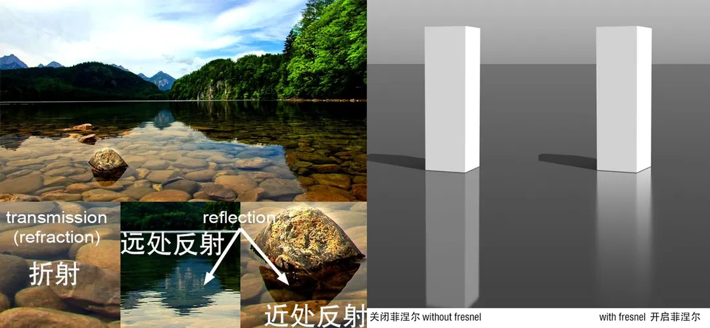  
菲涅尔反射 图片来自 <https://zhuanlan.zhihu.com/p/357190332>

菲涅尔方程是一个复杂的方程式，但是我们可以用 Fresnel-Schlick 近似法快速求得近似解，其中 <svg style="overflow:visible;min-height:1px;min-width:1px;vertical-align:-.025ex;" xmlns="http://www.w3.org/2000/svg" width="4.465ex" height="1.62ex" viewBox="0 -705 1973.7 716"><g stroke="currentColor" fill="currentColor" stroke-width="0" transform="scale(1,-1)"><g data-mml-node="math"><g data-mml-node="mi"><path d="M370 305T349 305T313 320T297 358Q297 381 312 396Q317 401 317 402T307 404Q281 408 258 408Q209 408 178 376Q131 329 131 219Q131 137 162 90Q203 29 272 29Q313 29 338 55T374 117Q376 125 379 127T395 129H409Q415 123 415 120Q415 116 411 104T395 71T366 33T318 2T249 -11Q163 -11 99 53T34 214Q34 318 99 383T250 448T370 421T404 357Q404 334 387 320Z" style="stroke-width: 3;"></path><path d="M28 214Q28 309 93 378T250 448Q340 448 405 380T471 215Q471 120 407 55T250 -10Q153 -10 91 57T28 214ZM250 30Q372 30 372 193V225V250Q372 272 371 288T364 326T348 362T317 390T268 410Q263 411 252 411Q222 411 195 399Q152 377 139 338T126 246V226Q126 130 145 91Q177 30 250 30Z" transform="translate(444,0)" style="stroke-width: 3;"></path><path d="M295 316Q295 356 268 385T190 414Q154 414 128 401Q98 382 98 349Q97 344 98 336T114 312T157 287Q175 282 201 278T245 269T277 256Q294 248 310 236T342 195T359 133Q359 71 321 31T198 -10H190Q138 -10 94 26L86 19L77 10Q71 4 65 -1L54 -11H46H42Q39 -11 33 -5V74V132Q33 153 35 157T45 162H54Q66 162 70 158T75 146T82 119T101 77Q136 26 198 26Q295 26 295 104Q295 133 277 151Q257 175 194 187T111 210Q75 227 54 256T33 318Q33 357 50 384T93 424T143 442T187 447H198Q238 447 268 432L283 424L292 431Q302 440 314 448H322H326Q329 448 335 442V310L329 304H301Q295 310 295 316Z" transform="translate(944,0)" style="stroke-width: 3;"></path></g><g data-mml-node="mo" transform="translate(1338,0)"><path d="" style="stroke-width: 3;"></path></g><g data-mml-node="mi" transform="translate(1504.7,0)"><path d="M35 200Q35 302 74 415T180 610T319 704Q320 704 327 704T339 705Q393 701 423 656Q462 596 462 495Q462 380 417 261T302 66T168 -10H161Q125 -10 99 10T60 63T41 130T35 200ZM383 566Q383 668 330 668Q294 668 260 623T204 521T170 421T157 371Q206 370 254 370L351 371Q352 372 359 404T375 484T383 566ZM113 132Q113 26 166 26Q181 26 198 36T239 74T287 161T335 307L340 324H145Q145 321 136 286T120 208T113 132Z" style="stroke-width: 3;"></path></g></g></g></svg> 是法线与视线（也就是光线的反方向）方向夹角的余弦值。<svg style="overflow:visible;min-height:1px;min-width:1px;vertical-align:-.375ex;" xmlns="http://www.w3.org/2000/svg" width="2.442ex" height="1.913ex" viewBox="0 -680 1079.6 845.6"><g stroke="currentColor" fill="currentColor" stroke-width="0" transform="scale(1,-1)"><g data-mml-node="math"><g data-mml-node="msub"><g data-mml-node="mi"><path d="M48 1Q31 1 31 11Q31 13 34 25Q38 41 42 43T65 46Q92 46 125 49Q139 52 144 61Q146 66 215 342T285 622Q285 629 281 629Q273 632 228 634H197Q191 640 191 642T193 659Q197 676 203 680H742Q749 676 749 669Q749 664 736 557T722 447Q720 440 702 440H690Q683 445 683 453Q683 454 686 477T689 530Q689 560 682 579T663 610T626 626T575 633T503 634H480Q398 633 393 631Q388 629 386 623Q385 622 352 492L320 363H375Q378 363 398 363T426 364T448 367T472 374T489 386Q502 398 511 419T524 457T529 475Q532 480 548 480H560Q567 475 567 470Q567 467 536 339T502 207Q500 200 482 200H470Q463 206 463 212Q463 215 468 234T473 274Q473 303 453 310T364 317H309L277 190Q245 66 245 60Q245 46 334 46H359Q365 40 365 39T363 19Q359 6 353 0H336Q295 2 185 2Q120 2 86 2T48 1Z" style="stroke-width: 3;"></path></g><g data-mml-node="mn" transform="translate(676,-150) scale(0.707)"><path d="M96 585Q152 666 249 666Q297 666 345 640T423 548Q460 465 460 320Q460 165 417 83Q397 41 362 16T301 -15T250 -22Q224 -22 198 -16T137 16T82 83Q39 165 39 320Q39 494 96 585ZM321 597Q291 629 250 629Q208 629 178 597Q153 571 145 525T137 333Q137 175 145 125T181 46Q209 16 250 16Q290 16 318 46Q347 76 354 130T362 333Q362 478 354 524T321 597Z" style="stroke-width: 3;"></path></g></g></g></g></svg> 
是基础反射率，它可以由材质的折射指数 (IOR) 计算得出 <svg style="overflow:visible;min-height:1px;min-width:1px;vertical-align:-.566ex;" xmlns="http://www.w3.org/2000/svg" width="43.952ex" height="2.565ex" viewBox="0 -883.9 19426.9 1133.9"><g stroke="currentColor" fill="currentColor" stroke-width="0" transform="scale(1,-1)"><g data-mml-node="math"><g data-mml-node="msub"><g data-mml-node="mi"><path d="M48 1Q31 1 31 11Q31 13 34 25Q38 41 42 43T65 46Q92 46 125 49Q139 52 144 61Q146 66 215 342T285 622Q285 629 281 629Q273 632 228 634H197Q191 640 191 642T193 659Q197 676 203 680H742Q749 676 749 669Q749 664 736 557T722 447Q720 440 702 440H690Q683 445 683 453Q683 454 686 477T689 530Q689 560 682 579T663 610T626 626T575 633T503 634H480Q398 633 393 631Q388 629 386 623Q385 622 352 492L320 363H375Q378 363 398 363T426 364T448 367T472 374T489 386Q502 398 511 419T524 457T529 475Q532 480 548 480H560Q567 475 567 470Q567 467 536 339T502 207Q500 200 482 200H470Q463 206 463 212Q463 215 468 234T473 274Q473 303 453 310T364 317H309L277 190Q245 66 245 60Q245 46 334 46H359Q365 40 365 39T363 19Q359 6 353 0H336Q295 2 185 2Q120 2 86 2T48 1Z" style="stroke-width: 3;"></path></g><g data-mml-node="TeXAtom" transform="translate(676,-150) scale(0.707)"><g data-mml-node="mi"><path d="M308 24Q367 24 416 76T466 197Q466 260 414 284Q308 311 278 321T236 341Q176 383 176 462Q176 523 208 573T273 648Q302 673 343 688T407 704H418H425Q521 704 564 640Q565 640 577 653T603 682T623 704Q624 704 627 704T632 705Q645 705 645 698T617 577T585 459T569 456Q549 456 549 465Q549 471 550 475Q550 478 551 494T553 520Q553 554 544 579T526 616T501 641Q465 662 419 662Q362 662 313 616T263 510Q263 480 278 458T319 427Q323 425 389 408T456 390Q490 379 522 342T554 242Q554 216 546 186Q541 164 528 137T492 78T426 18T332 -20Q320 -22 298 -22Q199 -22 144 33L134 44L106 13Q83 -14 78 -18T65 -22Q52 -22 52 -14Q52 -11 110 221Q112 227 130 227H143Q149 221 149 216Q149 214 148 207T144 186T142 153Q144 114 160 87T203 47T255 29T308 24Z" style="stroke-width: 3;"></path></g><g data-mml-node="mi" transform="translate(645,0)"><path d="M34 159Q34 268 120 355T306 442Q362 442 394 418T427 355Q427 326 408 306T360 285Q341 285 330 295T319 325T330 359T352 380T366 386H367Q367 388 361 392T340 400T306 404Q276 404 249 390Q228 381 206 359Q162 315 142 235T121 119Q121 73 147 50Q169 26 205 26H209Q321 26 394 111Q403 121 406 121Q410 121 419 112T429 98T420 83T391 55T346 25T282 0T202 -11Q127 -11 81 37T34 159Z" style="stroke-width: 3;"></path></g><g data-mml-node="mi" transform="translate(1078,0)"><path d="M137 683Q138 683 209 688T282 694Q294 694 294 685Q294 674 258 534Q220 386 220 383Q220 381 227 388Q288 442 357 442Q411 442 444 415T478 336Q478 285 440 178T402 50Q403 36 407 31T422 26Q450 26 474 56T513 138Q516 149 519 151T535 153Q555 153 555 145Q555 144 551 130Q535 71 500 33Q466 -10 419 -10H414Q367 -10 346 17T325 74Q325 90 361 192T398 345Q398 404 354 404H349Q266 404 205 306L198 293L164 158Q132 28 127 16Q114 -11 83 -11Q69 -11 59 -2T48 16Q48 30 121 320L195 616Q195 629 188 632T149 637H128Q122 643 122 645T124 664Q129 683 137 683Z" style="stroke-width: 3;"></path></g><g data-mml-node="mi" transform="translate(1654,0)"><path d="M117 59Q117 26 142 26Q179 26 205 131Q211 151 215 152Q217 153 225 153H229Q238 153 241 153T246 151T248 144Q247 138 245 128T234 90T214 43T183 6T137 -11Q101 -11 70 11T38 85Q38 97 39 102L104 360Q167 615 167 623Q167 626 166 628T162 632T157 634T149 635T141 636T132 637T122 637Q112 637 109 637T101 638T95 641T94 647Q94 649 96 661Q101 680 107 682T179 688Q194 689 213 690T243 693T254 694Q266 694 266 686Q266 675 193 386T118 83Q118 81 118 75T117 65V59Z" style="stroke-width: 3;"></path></g><g data-mml-node="mi" transform="translate(1952,0)"><path d="M184 600Q184 624 203 642T247 661Q265 661 277 649T290 619Q290 596 270 577T226 557Q211 557 198 567T184 600ZM21 287Q21 295 30 318T54 369T98 420T158 442Q197 442 223 419T250 357Q250 340 236 301T196 196T154 83Q149 61 149 51Q149 26 166 26Q175 26 185 29T208 43T235 78T260 137Q263 149 265 151T282 153Q302 153 302 143Q302 135 293 112T268 61T223 11T161 -11Q129 -11 102 10T74 74Q74 91 79 106T122 220Q160 321 166 341T173 380Q173 404 156 404H154Q124 404 99 371T61 287Q60 286 59 284T58 281T56 279T53 278T49 278T41 278H27Q21 284 21 287Z" style="stroke-width: 3;"></path></g><g data-mml-node="mi" transform="translate(2297,0)"><path d="M34 159Q34 268 120 355T306 442Q362 442 394 418T427 355Q427 326 408 306T360 285Q341 285 330 295T319 325T330 359T352 380T366 386H367Q367 388 361 392T340 400T306 404Q276 404 249 390Q228 381 206 359Q162 315 142 235T121 119Q121 73 147 50Q169 26 205 26H209Q321 26 394 111Q403 121 406 121Q410 121 419 112T429 98T420 83T391 55T346 25T282 0T202 -11Q127 -11 81 37T34 159Z" style="stroke-width: 3;"></path></g><g data-mml-node="mi" transform="translate(2730,0)"><path d="M121 647Q121 657 125 670T137 683Q138 683 209 688T282 694Q294 694 294 686Q294 679 244 477Q194 279 194 272Q213 282 223 291Q247 309 292 354T362 415Q402 442 438 442Q468 442 485 423T503 369Q503 344 496 327T477 302T456 291T438 288Q418 288 406 299T394 328Q394 353 410 369T442 390L458 393Q446 405 434 405H430Q398 402 367 380T294 316T228 255Q230 254 243 252T267 246T293 238T320 224T342 206T359 180T365 147Q365 130 360 106T354 66Q354 26 381 26Q429 26 459 145Q461 153 479 153H483Q499 153 499 144Q499 139 496 130Q455 -11 378 -11Q333 -11 305 15T277 90Q277 108 280 121T283 145Q283 167 269 183T234 206T200 217T182 220H180Q168 178 159 139T145 81T136 44T129 20T122 7T111 -2Q98 -11 83 -11Q66 -11 57 -1T48 16Q48 26 85 176T158 471L195 616Q196 629 188 632T149 637H144Q134 637 131 637T124 640T121 647Z" style="stroke-width: 3;"></path></g></g></g><g data-mml-node="mo" transform="translate(3024.8,0)"><path d="M94 250Q94 319 104 381T127 488T164 576T202 643T244 695T277 729T302 750H315H319Q333 750 333 741Q333 738 316 720T275 667T226 581T184 443T167 250T184 58T225 -81T274 -167T316 -220T333 -241Q333 -250 318 -250H315H302L274 -226Q180 -141 137 -14T94 250Z" style="stroke-width: 3;"></path></g><g data-mml-node="mi" transform="translate(3413.8,0)"><path d="M370 305T349 305T313 320T297 358Q297 381 312 396Q317 401 317 402T307 404Q281 408 258 408Q209 408 178 376Q131 329 131 219Q131 137 162 90Q203 29 272 29Q313 29 338 55T374 117Q376 125 379 127T395 129H409Q415 123 415 120Q415 116 411 104T395 71T366 33T318 2T249 -11Q163 -11 99 53T34 214Q34 318 99 383T250 448T370 421T404 357Q404 334 387 320Z" style="stroke-width: 3;"></path><path d="M28 214Q28 309 93 378T250 448Q340 448 405 380T471 215Q471 120 407 55T250 -10Q153 -10 91 57T28 214ZM250 30Q372 30 372 193V225V250Q372 272 371 288T364 326T348 362T317 390T268 410Q263 411 252 411Q222 411 195 399Q152 377 139 338T126 246V226Q126 130 145 91Q177 30 250 30Z" transform="translate(444,0)" style="stroke-width: 3;"></path><path d="M295 316Q295 356 268 385T190 414Q154 414 128 401Q98 382 98 349Q97 344 98 336T114 312T157 287Q175 282 201 278T245 269T277 256Q294 248 310 236T342 195T359 133Q359 71 321 31T198 -10H190Q138 -10 94 26L86 19L77 10Q71 4 65 -1L54 -11H46H42Q39 -11 33 -5V74V132Q33 153 35 157T45 162H54Q66 162 70 158T75 146T82 119T101 77Q136 26 198 26Q295 26 295 104Q295 133 277 151Q257 175 194 187T111 210Q75 227 54 256T33 318Q33 357 50 384T93 424T143 442T187 447H198Q238 447 268 432L283 424L292 431Q302 440 314 448H322H326Q329 448 335 442V310L329 304H301Q295 310 295 316Z" transform="translate(944,0)" style="stroke-width: 3;"></path></g><g data-mml-node="mo" transform="translate(4751.8,0)"><path d="" style="stroke-width: 3;"></path></g><g data-mml-node="mi" transform="translate(4918.5,0)"><path d="M35 200Q35 302 74 415T180 610T319 704Q320 704 327 704T339 705Q393 701 423 656Q462 596 462 495Q462 380 417 261T302 66T168 -10H161Q125 -10 99 10T60 63T41 130T35 200ZM383 566Q383 668 330 668Q294 668 260 623T204 521T170 421T157 371Q206 370 254 370L351 371Q352 372 359 404T375 484T383 566ZM113 132Q113 26 166 26Q181 26 198 36T239 74T287 161T335 307L340 324H145Q145 321 136 286T120 208T113 132Z" style="stroke-width: 3;"></path></g><g data-mml-node="mo" transform="translate(5387.5,0)"><path d="M78 35T78 60T94 103T137 121Q165 121 187 96T210 8Q210 -27 201 -60T180 -117T154 -158T130 -185T117 -194Q113 -194 104 -185T95 -172Q95 -168 106 -156T131 -126T157 -76T173 -3V9L172 8Q170 7 167 6T161 3T152 1T140 0Q113 0 96 17Z" style="stroke-width: 3;"></path></g><g data-mml-node="msub" transform="translate(5832.1,0)"><g data-mml-node="mi"><path d="M48 1Q31 1 31 11Q31 13 34 25Q38 41 42 43T65 46Q92 46 125 49Q139 52 144 61Q146 66 215 342T285 622Q285 629 281 629Q273 632 228 634H197Q191 640 191 642T193 659Q197 676 203 680H742Q749 676 749 669Q749 664 736 557T722 447Q720 440 702 440H690Q683 445 683 453Q683 454 686 477T689 530Q689 560 682 579T663 610T626 626T575 633T503 634H480Q398 633 393 631Q388 629 386 623Q385 622 352 492L320 363H375Q378 363 398 363T426 364T448 367T472 374T489 386Q502 398 511 419T524 457T529 475Q532 480 548 480H560Q567 475 567 470Q567 467 536 339T502 207Q500 200 482 200H470Q463 206 463 212Q463 215 468 234T473 274Q473 303 453 310T364 317H309L277 190Q245 66 245 60Q245 46 334 46H359Q365 40 365 39T363 19Q359 6 353 0H336Q295 2 185 2Q120 2 86 2T48 1Z" style="stroke-width: 3;"></path></g><g data-mml-node="mn" transform="translate(676,-150) scale(0.707)"><path d="M96 585Q152 666 249 666Q297 666 345 640T423 548Q460 465 460 320Q460 165 417 83Q397 41 362 16T301 -15T250 -22Q224 -22 198 -16T137 16T82 83Q39 165 39 320Q39 494 96 585ZM321 597Q291 629 250 629Q208 629 178 597Q153 571 145 525T137 333Q137 175 145 125T181 46Q209 16 250 16Q290 16 318 46Q347 76 354 130T362 333Q362 478 354 524T321 597Z" style="stroke-width: 3;"></path></g></g><g data-mml-node="mo" transform="translate(6911.7,0)"><path d="M60 749L64 750Q69 750 74 750H86L114 726Q208 641 251 514T294 250Q294 182 284 119T261 12T224 -76T186 -143T145 -194T113 -227T90 -246Q87 -249 86 -250H74Q66 -250 63 -250T58 -247T55 -238Q56 -237 66 -225Q221 -64 221 250T66 725Q56 737 55 738Q55 746 60 749Z" style="stroke-width: 3;"></path></g><g data-mml-node="mo" transform="translate(7578.5,0)"><path d="M56 347Q56 360 70 367H707Q722 359 722 347Q722 336 708 328L390 327H72Q56 332 56 347ZM56 153Q56 168 72 173H708Q722 163 722 153Q722 140 707 133H70Q56 140 56 153Z" style="stroke-width: 3;"></path></g><g data-mml-node="msub" transform="translate(8634.2,0)"><g data-mml-node="mi"><path d="M48 1Q31 1 31 11Q31 13 34 25Q38 41 42 43T65 46Q92 46 125 49Q139 52 144 61Q146 66 215 342T285 622Q285 629 281 629Q273 632 228 634H197Q191 640 191 642T193 659Q197 676 203 680H742Q749 676 749 669Q749 664 736 557T722 447Q720 440 702 440H690Q683 445 683 453Q683 454 686 477T689 530Q689 560 682 579T663 610T626 626T575 633T503 634H480Q398 633 393 631Q388 629 386 623Q385 622 352 492L320 363H375Q378 363 398 363T426 364T448 367T472 374T489 386Q502 398 511 419T524 457T529 475Q532 480 548 480H560Q567 475 567 470Q567 467 536 339T502 207Q500 200 482 200H470Q463 206 463 212Q463 215 468 234T473 274Q473 303 453 310T364 317H309L277 190Q245 66 245 60Q245 46 334 46H359Q365 40 365 39T363 19Q359 6 353 0H336Q295 2 185 2Q120 2 86 2T48 1Z" style="stroke-width: 3;"></path></g><g data-mml-node="mn" transform="translate(676,-150) scale(0.707)"><path d="M96 585Q152 666 249 666Q297 666 345 640T423 548Q460 465 460 320Q460 165 417 83Q397 41 362 16T301 -15T250 -22Q224 -22 198 -16T137 16T82 83Q39 165 39 320Q39 494 96 585ZM321 597Q291 629 250 629Q208 629 178 597Q153 571 145 525T137 333Q137 175 145 125T181 46Q209 16 250 16Q290 16 318 46Q347 76 354 130T362 333Q362 478 354 524T321 597Z" style="stroke-width: 3;"></path></g></g><g data-mml-node="mo" transform="translate(9936,0)"><path d="M56 237T56 250T70 270H369V420L370 570Q380 583 389 583Q402 583 409 568V270H707Q722 262 722 250T707 230H409V-68Q401 -82 391 -82H389H387Q375 -82 369 -68V230H70Q56 237 56 250Z" style="stroke-width: 3;"></path></g><g data-mml-node="mo" transform="translate(10936.2,0)"><path d="M94 250Q94 319 104 381T127 488T164 576T202 643T244 695T277 729T302 750H315H319Q333 750 333 741Q333 738 316 720T275 667T226 581T184 443T167 250T184 58T225 -81T274 -167T316 -220T333 -241Q333 -250 318 -250H315H302L274 -226Q180 -141 137 -14T94 250Z" style="stroke-width: 3;"></path></g><g data-mml-node="mn" transform="translate(11325.2,0)"><path d="M213 578L200 573Q186 568 160 563T102 556H83V602H102Q149 604 189 617T245 641T273 663Q275 666 285 666Q294 666 302 660V361L303 61Q310 54 315 52T339 48T401 46H427V0H416Q395 3 257 3Q121 3 100 0H88V46H114Q136 46 152 46T177 47T193 50T201 52T207 57T213 61V578Z" style="stroke-width: 3;"></path></g><g data-mml-node="mo" transform="translate(12047.5,0)"><path d="M84 237T84 250T98 270H679Q694 262 694 250T679 230H98Q84 237 84 250Z" style="stroke-width: 3;"></path></g><g data-mml-node="msub" transform="translate(13047.7,0)"><g data-mml-node="mi"><path d="M48 1Q31 1 31 11Q31 13 34 25Q38 41 42 43T65 46Q92 46 125 49Q139 52 144 61Q146 66 215 342T285 622Q285 629 281 629Q273 632 228 634H197Q191 640 191 642T193 659Q197 676 203 680H742Q749 676 749 669Q749 664 736 557T722 447Q720 440 702 440H690Q683 445 683 453Q683 454 686 477T689 530Q689 560 682 579T663 610T626 626T575 633T503 634H480Q398 633 393 631Q388 629 386 623Q385 622 352 492L320 363H375Q378 363 398 363T426 364T448 367T472 374T489 386Q502 398 511 419T524 457T529 475Q532 480 548 480H560Q567 475 567 470Q567 467 536 339T502 207Q500 200 482 200H470Q463 206 463 212Q463 215 468 234T473 274Q473 303 453 310T364 317H309L277 190Q245 66 245 60Q245 46 334 46H359Q365 40 365 39T363 19Q359 6 353 0H336Q295 2 185 2Q120 2 86 2T48 1Z" style="stroke-width: 3;"></path></g><g data-mml-node="mn" transform="translate(676,-150) scale(0.707)"><path d="M96 585Q152 666 249 666Q297 666 345 640T423 548Q460 465 460 320Q460 165 417 83Q397 41 362 16T301 -15T250 -22Q224 -22 198 -16T137 16T82 83Q39 165 39 320Q39 494 96 585ZM321 597Q291 629 250 629Q208 629 178 597Q153 571 145 525T137 333Q137 175 145 125T181 46Q209 16 250 16Q290 16 318 46Q347 76 354 130T362 333Q362 478 354 524T321 597Z" style="stroke-width: 3;"></path></g></g><g data-mml-node="mo" transform="translate(14127.2,0)"><path d="M60 749L64 750Q69 750 74 750H86L114 726Q208 641 251 514T294 250Q294 182 284 119T261 12T224 -76T186 -143T145 -194T113 -227T90 -246Q87 -249 86 -250H74Q66 -250 63 -250T58 -247T55 -238Q56 -237 66 -225Q221 -64 221 250T66 725Q56 737 55 738Q55 746 60 749Z" style="stroke-width: 3;"></path></g><g data-mml-node="mo" transform="translate(14516.2,0)"><path d="M94 250Q94 319 104 381T127 488T164 576T202 643T244 695T277 729T302 750H315H319Q333 750 333 741Q333 738 316 720T275 667T226 581T184 443T167 250T184 58T225 -81T274 -167T316 -220T333 -241Q333 -250 318 -250H315H302L274 -226Q180 -141 137 -14T94 250Z" style="stroke-width: 3;"></path></g><g data-mml-node="mn" transform="translate(14905.2,0)"><path d="M213 578L200 573Q186 568 160 563T102 556H83V602H102Q149 604 189 617T245 641T273 663Q275 666 285 666Q294 666 302 660V361L303 61Q310 54 315 52T339 48T401 46H427V0H416Q395 3 257 3Q121 3 100 0H88V46H114Q136 46 152 46T177 47T193 50T201 52T207 57T213 61V578Z" style="stroke-width: 3;"></path></g><g data-mml-node="mo" transform="translate(15627.5,0)"><path d="M84 237T84 250T98 270H679Q694 262 694 250T679 230H98Q84 237 84 250Z" style="stroke-width: 3;"></path></g><g data-mml-node="mi" transform="translate(16627.7,0)"><path d="M370 305T349 305T313 320T297 358Q297 381 312 396Q317 401 317 402T307 404Q281 408 258 408Q209 408 178 376Q131 329 131 219Q131 137 162 90Q203 29 272 29Q313 29 338 55T374 117Q376 125 379 127T395 129H409Q415 123 415 120Q415 116 411 104T395 71T366 33T318 2T249 -11Q163 -11 99 53T34 214Q34 318 99 383T250 448T370 421T404 357Q404 334 387 320Z" style="stroke-width: 3;"></path><path d="M28 214Q28 309 93 378T250 448Q340 448 405 380T471 215Q471 120 407 55T250 -10Q153 -10 91 57T28 214ZM250 30Q372 30 372 193V225V250Q372 272 371 288T364 326T348 362T317 390T268 410Q263 411 252 411Q222 411 195 399Q152 377 139 338T126 246V226Q126 130 145 91Q177 30 250 30Z" transform="translate(444,0)" style="stroke-width: 3;"></path><path d="M295 316Q295 356 268 385T190 414Q154 414 128 401Q98 382 98 349Q97 344 98 336T114 312T157 287Q175 282 201 278T245 269T277 256Q294 248 310 236T342 195T359 133Q359 71 321 31T198 -10H190Q138 -10 94 26L86 19L77 10Q71 4 65 -1L54 -11H46H42Q39 -11 33 -5V74V132Q33 153 35 157T45 162H54Q66 162 70 158T75 146T82 119T101 77Q136 26 198 26Q295 26 295 104Q295 133 277 151Q257 175 194 187T111 210Q75 227 54 256T33 318Q33 357 50 384T93 424T143 442T187 447H198Q238 447 268 432L283 424L292 431Q302 440 314 448H322H326Q329 448 335 442V310L329 304H301Q295 310 295 316Z" transform="translate(944,0)" style="stroke-width: 3;"></path></g><g data-mml-node="mo" transform="translate(17965.7,0)"><path d="" style="stroke-width: 3;"></path></g><g data-mml-node="mi" transform="translate(18132.4,0)"><path d="M35 200Q35 302 74 415T180 610T319 704Q320 704 327 704T339 705Q393 701 423 656Q462 596 462 495Q462 380 417 261T302 66T168 -10H161Q125 -10 99 10T60 63T41 130T35 200ZM383 566Q383 668 330 668Q294 668 260 623T204 521T170 421T157 371Q206 370 254 370L351 371Q352 372 359 404T375 484T383 566ZM113 132Q113 26 166 26Q181 26 198 36T239 74T287 161T335 307L340 324H145Q145 321 136 286T120 208T113 132Z" style="stroke-width: 3;"></path></g><g data-mml-node="msup" transform="translate(18601.4,0)"><g data-mml-node="mo"><path d="M60 749L64 750Q69 750 74 750H86L114 726Q208 641 251 514T294 250Q294 182 284 119T261 12T224 -76T186 -143T145 -194T113 -227T90 -246Q87 -249 86 -250H74Q66 -250 63 -250T58 -247T55 -238Q56 -237 66 -225Q221 -64 221 250T66 725Q56 737 55 738Q55 746 60 749Z" style="stroke-width: 3;"></path></g><g data-mml-node="mn" transform="translate(422,413) scale(0.707)"><path d="M164 157Q164 133 148 117T109 101H102Q148 22 224 22Q294 22 326 82Q345 115 345 210Q345 313 318 349Q292 382 260 382H254Q176 382 136 314Q132 307 129 306T114 304Q97 304 95 310Q93 314 93 485V614Q93 664 98 664Q100 666 102 666Q103 666 123 658T178 642T253 634Q324 634 389 662Q397 666 402 666Q410 666 410 648V635Q328 538 205 538Q174 538 149 544L139 546V374Q158 388 169 396T205 412T256 420Q337 420 393 355T449 201Q449 109 385 44T229 -22Q148 -22 99 32T50 154Q50 178 61 192T84 210T107 214Q132 214 148 197T164 157Z" style="stroke-width: 3;"></path></g></g></g></g></svg>代码如下

```python
@ti.func
def fresnel_schlick(cosine: float, F0: float) -> float:   ## 计算菲涅尔近似值
    return F0 + (1 - F0) * pow5(abs(1 - cosine))

@ti.func
def fresnel_schlick_roughness(cosine: float, F0: float, roughness: float) -> float:  ## 计算粗糙度下的菲涅尔近似值
    return F0 + (max(1 - roughness, F0) - F0) * pow5(abs(1 - cosine))
```

### 17.3 反射 BRDF

通过粗糙度和 F-S 近似法计算出一个反射率，并让金属度影响完全漫反射与混合粗糙度的半球采样。

```python
F = fresnel_schlick_roughness(NoV, 0.04, roughness)

if ti.random() < F + metallic:  ## 反射部分
    N = hemispheric_sampling_roughness(N, roughness)
    ray.direction = reflect(I, N)   ## 镜面反射
else:   ## 漫反射部分
    ray.direction = hemispheric_sampling(N)  ## 半球采样
```

### 17.4 透射 BTDF

我们要先用之前章节的方法（[内外表面法线]）判断光线是正在穿入物体还是穿出物体，然后来获取正确的法线方向和折射率比值 `eta` 。其中， `sign` 函数用来获取数值的符号，公式如下

<svg style="overflow:visible;min-height:1px;min-width:1px;vertical-align:-3.281ex;width:100%;" xmlns="http://www.w3.org/2000/svg" width="22.588ex" height="7.692ex" viewBox="0 -1950 9984.1 3400"><g stroke="currentColor" fill="currentColor" stroke-width="0" transform="scale(1,-1)"><g data-mml-node="math"><g data-mml-node="TeXAtom"><g data-mml-node="mi"><path d="M295 316Q295 356 268 385T190 414Q154 414 128 401Q98 382 98 349Q97 344 98 336T114 312T157 287Q175 282 201 278T245 269T277 256Q294 248 310 236T342 195T359 133Q359 71 321 31T198 -10H190Q138 -10 94 26L86 19L77 10Q71 4 65 -1L54 -11H46H42Q39 -11 33 -5V74V132Q33 153 35 157T45 162H54Q66 162 70 158T75 146T82 119T101 77Q136 26 198 26Q295 26 295 104Q295 133 277 151Q257 175 194 187T111 210Q75 227 54 256T33 318Q33 357 50 384T93 424T143 442T187 447H198Q238 447 268 432L283 424L292 431Q302 440 314 448H322H326Q329 448 335 442V310L329 304H301Q295 310 295 316Z" style="stroke-width: 3;"></path><path d="M69 609Q69 637 87 653T131 669Q154 667 171 652T188 609Q188 579 171 564T129 549Q104 549 87 564T69 609ZM247 0Q232 3 143 3Q132 3 106 3T56 1L34 0H26V46H42Q70 46 91 49Q100 53 102 60T104 102V205V293Q104 345 102 359T88 378Q74 385 41 385H30V408Q30 431 32 431L42 432Q52 433 70 434T106 436Q123 437 142 438T171 441T182 442H185V62Q190 52 197 50T232 46H255V0H247Z" transform="translate(394,0)" style="stroke-width: 3;"></path><path d="M329 409Q373 453 429 453Q459 453 472 434T485 396Q485 382 476 371T449 360Q416 360 412 390Q410 404 415 411Q415 412 416 414V415Q388 412 363 393Q355 388 355 386Q355 385 359 381T368 369T379 351T388 325T392 292Q392 230 343 187T222 143Q172 143 123 171Q112 153 112 133Q112 98 138 81Q147 75 155 75T227 73Q311 72 335 67Q396 58 431 26Q470 -13 470 -72Q470 -139 392 -175Q332 -206 250 -206Q167 -206 107 -175Q29 -140 29 -75Q29 -39 50 -15T92 18L103 24Q67 55 67 108Q67 155 96 193Q52 237 52 292Q52 355 102 398T223 442Q274 442 318 416L329 409ZM299 343Q294 371 273 387T221 404Q192 404 171 388T145 343Q142 326 142 292Q142 248 149 227T179 192Q196 182 222 182Q244 182 260 189T283 207T294 227T299 242Q302 258 302 292T299 343ZM403 -75Q403 -50 389 -34T348 -11T299 -2T245 0H218Q151 0 138 -6Q118 -15 107 -34T95 -74Q95 -84 101 -97T122 -127T170 -155T250 -167Q319 -167 361 -139T403 -75Z" transform="translate(672,0)" style="stroke-width: 3;"></path><path d="M41 46H55Q94 46 102 60V68Q102 77 102 91T102 122T103 161T103 203Q103 234 103 269T102 328V351Q99 370 88 376T43 385H25V408Q25 431 27 431L37 432Q47 433 65 434T102 436Q119 437 138 438T167 441T178 442H181V402Q181 364 182 364T187 369T199 384T218 402T247 421T285 437Q305 442 336 442Q450 438 463 329Q464 322 464 190V104Q464 66 466 59T477 49Q498 46 526 46H542V0H534L510 1Q487 2 460 2T422 3Q319 3 310 0H302V46H318Q379 46 379 62Q380 64 380 200Q379 335 378 343Q372 371 358 385T334 402T308 404Q263 404 229 370Q202 343 195 315T187 232V168V108Q187 78 188 68T191 55T200 49Q221 46 249 46H265V0H257L234 1Q210 2 183 2T145 3Q42 3 33 0H25V46H41Z" transform="translate(1172,0)" style="stroke-width: 3;"></path></g></g><g data-mml-node="mo" transform="translate(1728,0)"><path d="M94 250Q94 319 104 381T127 488T164 576T202 643T244 695T277 729T302 750H315H319Q333 750 333 741Q333 738 316 720T275 667T226 581T184 443T167 250T184 58T225 -81T274 -167T316 -220T333 -241Q333 -250 318 -250H315H302L274 -226Q180 -141 137 -14T94 250Z" style="stroke-width: 3;"></path></g><g data-mml-node="mi" transform="translate(2117,0)"><path d="M52 289Q59 331 106 386T222 442Q257 442 286 424T329 379Q371 442 430 442Q467 442 494 420T522 361Q522 332 508 314T481 292T458 288Q439 288 427 299T415 328Q415 374 465 391Q454 404 425 404Q412 404 406 402Q368 386 350 336Q290 115 290 78Q290 50 306 38T341 26Q378 26 414 59T463 140Q466 150 469 151T485 153H489Q504 153 504 145Q504 144 502 134Q486 77 440 33T333 -11Q263 -11 227 52Q186 -10 133 -10H127Q78 -10 57 16T35 71Q35 103 54 123T99 143Q142 143 142 101Q142 81 130 66T107 46T94 41L91 40Q91 39 97 36T113 29T132 26Q168 26 194 71Q203 87 217 139T245 247T261 313Q266 340 266 352Q266 380 251 392T217 404Q177 404 142 372T93 290Q91 281 88 280T72 278H58Q52 284 52 289Z" style="stroke-width: 3;"></path></g><g data-mml-node="mo" transform="translate(2689,0)"><path d="M60 749L64 750Q69 750 74 750H86L114 726Q208 641 251 514T294 250Q294 182 284 119T261 12T224 -76T186 -143T145 -194T113 -227T90 -246Q87 -249 86 -250H74Q66 -250 63 -250T58 -247T55 -238Q56 -237 66 -225Q221 -64 221 250T66 725Q56 737 55 738Q55 746 60 749Z" style="stroke-width: 3;"></path></g><g data-mml-node="mo" transform="translate(3355.8,0)"><path d="M56 347Q56 360 70 367H707Q722 359 722 347Q722 336 708 328L390 327H72Q56 332 56 347ZM56 153Q56 168 72 173H708Q722 163 722 153Q722 140 707 133H70Q56 140 56 153Z" style="stroke-width: 3;"></path></g><g data-mml-node="mrow" transform="translate(4411.6,0)"><g data-mml-node="mo"><path d="M712 899L718 893V876V865Q718 854 704 846Q627 793 577 710T510 525Q510 524 509 521Q505 493 504 349Q504 345 504 334Q504 277 504 240Q504 -2 503 -4Q502 -8 494 -9T444 -10Q392 -10 390 -9Q387 -8 386 -5Q384 5 384 230Q384 262 384 312T383 382Q383 481 392 535T434 656Q510 806 664 892L677 899H712Z" transform="translate(0,1051)" style="stroke-width: 3;"></path><path d="M718 -893L712 -899H677L666 -893Q542 -825 468 -714T385 -476Q384 -466 384 -282Q384 3 385 5L389 9Q392 10 444 10Q486 10 494 9T503 4Q504 2 504 -239V-310V-366Q504 -470 508 -513T530 -609Q546 -657 569 -698T617 -767T661 -812T699 -843T717 -856T718 -876V-893Z" transform="translate(0,-551)" style="stroke-width: 3;"></path><path d="M389 1159Q391 1160 455 1160Q496 1160 498 1159Q501 1158 502 1155Q504 1145 504 924Q504 691 503 682Q494 549 425 439T243 259L229 250L243 241Q349 175 421 66T503 -182Q504 -191 504 -424Q504 -600 504 -629T499 -659H498Q496 -660 444 -660T390 -659Q387 -658 386 -655Q384 -645 384 -425V-282Q384 -176 377 -116T342 10Q325 54 301 92T255 155T214 196T183 222T171 232Q170 233 170 250T171 268Q171 269 191 284T240 331T300 407T354 524T383 679Q384 691 384 925Q384 1152 385 1155L389 1159Z" transform="translate(0,0)" style="stroke-width: 3;"></path><svg width="889" height="81" y="1060" x="0" viewBox="0 14.3 889 81"><path d="M384 150V266Q384 304 389 309Q391 310 455 310Q496 310 498 309Q502 308 503 298Q504 283 504 150Q504 32 504 12T499 -9H498Q496 -10 444 -10T390 -9Q386 -8 385 2Q384 17 384 150Z" transform="scale(1,0.398)" style="stroke-width: 3;"></path></svg><svg width="889" height="81" y="-641" x="0" viewBox="0 14.3 889 81"><path d="M384 150V266Q384 304 389 309Q391 310 455 310Q496 310 498 309Q502 308 503 298Q504 283 504 150Q504 32 504 12T499 -9H498Q496 -10 444 -10T390 -9Q386 -8 385 2Q384 17 384 150Z" transform="scale(1,0.398)" style="stroke-width: 3;"></path></svg></g><g data-mml-node="mtable" transform="translate(889,0)"><g data-mml-node="mtr" transform="translate(0,1200)"><g data-mml-node="mtd"><g data-mml-node="mo"><path d="M56 237T56 250T70 270H369V420L370 570Q380 583 389 583Q402 583 409 568V270H707Q722 262 722 250T707 230H409V-68Q401 -82 391 -82H389H387Q375 -82 369 -68V230H70Q56 237 56 250Z" style="stroke-width: 3;"></path></g><g data-mml-node="mn" transform="translate(778,0)"><path d="M213 578L200 573Q186 568 160 563T102 556H83V602H102Q149 604 189 617T245 641T273 663Q275 666 285 666Q294 666 302 660V361L303 61Q310 54 315 52T339 48T401 46H427V0H416Q395 3 257 3Q121 3 100 0H88V46H114Q136 46 152 46T177 47T193 50T201 52T207 57T213 61V578Z" style="stroke-width: 3;"></path></g></g><g data-mml-node="mtd" transform="translate(2278,0)"><g data-mml-node="mi"><path d="M52 289Q59 331 106 386T222 442Q257 442 286 424T329 379Q371 442 430 442Q467 442 494 420T522 361Q522 332 508 314T481 292T458 288Q439 288 427 299T415 328Q415 374 465 391Q454 404 425 404Q412 404 406 402Q368 386 350 336Q290 115 290 78Q290 50 306 38T341 26Q378 26 414 59T463 140Q466 150 469 151T485 153H489Q504 153 504 145Q504 144 502 134Q486 77 440 33T333 -11Q263 -11 227 52Q186 -10 133 -10H127Q78 -10 57 16T35 71Q35 103 54 123T99 143Q142 143 142 101Q142 81 130 66T107 46T94 41L91 40Q91 39 97 36T113 29T132 26Q168 26 194 71Q203 87 217 139T245 247T261 313Q266 340 266 352Q266 380 251 392T217 404Q177 404 142 372T93 290Q91 281 88 280T72 278H58Q52 284 52 289Z" style="stroke-width: 3;"></path></g><g data-mml-node="mo" transform="translate(849.8,0)"><path d="M84 520Q84 528 88 533T96 539L99 540Q106 540 253 471T544 334L687 265Q694 260 694 250T687 235Q685 233 395 96L107 -40H101Q83 -38 83 -20Q83 -19 83 -17Q82 -10 98 -1Q117 9 248 71Q326 108 378 132L626 250L378 368Q90 504 86 509Q84 513 84 520Z" style="stroke-width: 3;"></path></g><g data-mml-node="mn" transform="translate(1905.6,0)"><path d="M96 585Q152 666 249 666Q297 666 345 640T423 548Q460 465 460 320Q460 165 417 83Q397 41 362 16T301 -15T250 -22Q224 -22 198 -16T137 16T82 83Q39 165 39 320Q39 494 96 585ZM321 597Q291 629 250 629Q208 629 178 597Q153 571 145 525T137 333Q137 175 145 125T181 46Q209 16 250 16Q290 16 318 46Q347 76 354 130T362 333Q362 478 354 524T321 597Z" style="stroke-width: 3;"></path></g></g></g><g data-mml-node="mtr" transform="translate(0,0)"><g data-mml-node="mtd"><g data-mml-node="mn"><path d="M96 585Q152 666 249 666Q297 666 345 640T423 548Q460 465 460 320Q460 165 417 83Q397 41 362 16T301 -15T250 -22Q224 -22 198 -16T137 16T82 83Q39 165 39 320Q39 494 96 585ZM321 597Q291 629 250 629Q208 629 178 597Q153 571 145 525T137 333Q137 175 145 125T181 46Q209 16 250 16Q290 16 318 46Q347 76 354 130T362 333Q362 478 354 524T321 597Z" style="stroke-width: 3;"></path></g></g><g data-mml-node="mtd" transform="translate(2278,0)"><g data-mml-node="mi"><path d="M52 289Q59 331 106 386T222 442Q257 442 286 424T329 379Q371 442 430 442Q467 442 494 420T522 361Q522 332 508 314T481 292T458 288Q439 288 427 299T415 328Q415 374 465 391Q454 404 425 404Q412 404 406 402Q368 386 350 336Q290 115 290 78Q290 50 306 38T341 26Q378 26 414 59T463 140Q466 150 469 151T485 153H489Q504 153 504 145Q504 144 502 134Q486 77 440 33T333 -11Q263 -11 227 52Q186 -10 133 -10H127Q78 -10 57 16T35 71Q35 103 54 123T99 143Q142 143 142 101Q142 81 130 66T107 46T94 41L91 40Q91 39 97 36T113 29T132 26Q168 26 194 71Q203 87 217 139T245 247T261 313Q266 340 266 352Q266 380 251 392T217 404Q177 404 142 372T93 290Q91 281 88 280T72 278H58Q52 284 52 289Z" style="stroke-width: 3;"></path></g><g data-mml-node="mo" transform="translate(849.8,0)"><path d="M56 347Q56 360 70 367H707Q722 359 722 347Q722 336 708 328L390 327H72Q56 332 56 347ZM56 153Q56 168 72 173H708Q722 163 722 153Q722 140 707 133H70Q56 140 56 153Z" style="stroke-width: 3;"></path></g><g data-mml-node="mn" transform="translate(1905.6,0)"><path d="M96 585Q152 666 249 666Q297 666 345 640T423 548Q460 465 460 320Q460 165 417 83Q397 41 362 16T301 -15T250 -22Q224 -22 198 -16T137 16T82 83Q39 165 39 320Q39 494 96 585ZM321 597Q291 629 250 629Q208 629 178 597Q153 571 145 525T137 333Q137 175 145 125T181 46Q209 16 250 16Q290 16 318 46Q347 76 354 130T362 333Q362 478 354 524T321 597Z" style="stroke-width: 3;"></path></g></g></g><g data-mml-node="mtr" transform="translate(0,-1200)"><g data-mml-node="mtd"><g data-mml-node="mo"><path d="M84 237T84 250T98 270H679Q694 262 694 250T679 230H98Q84 237 84 250Z" style="stroke-width: 3;"></path></g><g data-mml-node="mn" transform="translate(778,0)"><path d="M213 578L200 573Q186 568 160 563T102 556H83V602H102Q149 604 189 617T245 641T273 663Q275 666 285 666Q294 666 302 660V361L303 61Q310 54 315 52T339 48T401 46H427V0H416Q395 3 257 3Q121 3 100 0H88V46H114Q136 46 152 46T177 47T193 50T201 52T207 57T213 61V578Z" style="stroke-width: 3;"></path></g></g><g data-mml-node="mtd" transform="translate(2278,0)"><g data-mml-node="mi"><path d="M52 289Q59 331 106 386T222 442Q257 442 286 424T329 379Q371 442 430 442Q467 442 494 420T522 361Q522 332 508 314T481 292T458 288Q439 288 427 299T415 328Q415 374 465 391Q454 404 425 404Q412 404 406 402Q368 386 350 336Q290 115 290 78Q290 50 306 38T341 26Q378 26 414 59T463 140Q466 150 469 151T485 153H489Q504 153 504 145Q504 144 502 134Q486 77 440 33T333 -11Q263 -11 227 52Q186 -10 133 -10H127Q78 -10 57 16T35 71Q35 103 54 123T99 143Q142 143 142 101Q142 81 130 66T107 46T94 41L91 40Q91 39 97 36T113 29T132 26Q168 26 194 71Q203 87 217 139T245 247T261 313Q266 340 266 352Q266 380 251 392T217 404Q177 404 142 372T93 290Q91 281 88 280T72 278H58Q52 284 52 289Z" style="stroke-width: 3;"></path></g><g data-mml-node="mo" transform="translate(849.8,0)"><path d="M694 -11T694 -19T688 -33T678 -40Q671 -40 524 29T234 166L90 235Q83 240 83 250Q83 261 91 266Q664 540 678 540Q681 540 687 534T694 519T687 505Q686 504 417 376L151 250L417 124Q686 -4 687 -5Q694 -11 694 -19Z" style="stroke-width: 3;"></path></g><g data-mml-node="mn" transform="translate(1905.6,0)"><path d="M96 585Q152 666 249 666Q297 666 345 640T423 548Q460 465 460 320Q460 165 417 83Q397 41 362 16T301 -15T250 -22Q224 -22 198 -16T137 16T82 83Q39 165 39 320Q39 494 96 585ZM321 597Q291 629 250 629Q208 629 178 597Q153 571 145 525T137 333Q137 175 145 125T181 46Q209 16 250 16Q290 16 318 46Q347 76 354 130T362 333Q362 478 354 524T321 597Z" style="stroke-width: 3;"></path></g></g></g></g><g data-mml-node="mo" transform="translate(5572.6,0) translate(0 250)"></g></g></g></g></svg>

当光线穿出物体时，`outer` 小于 0 ，取相反数更改法线方向 `N` ，取倒数更改折射率比值 `eta` 。为什么用这种方式而不用 `if` 语句来更改呢？这是因为并行计算擅长大规模整齐的数学计算，而分支语句很容易影响并行计算的效率。

```python
if ti.random() < transmission:  # 折射部分
    # BTDF
    eta = ENV_IOR / ior # 折射率之比
    outer = sign(NoV)   # 大于零就是穿入物体，小于零是穿出物体
    eta = pow(eta, outer)   # 更改折射率之比
    N  *= outer   # 如果是穿出物体表面，就更改法线方向

    NoI = -NoV
    k = 1.0 - eta * eta * (1.0 - NoI * NoI) # 这个值如果小于 0 就说明全反射了

    F0 = (eta - 1) / (eta + 1)  # 基础反射率
    F0 *= F0
    F = fresnel_schlick(NoV, F0)
    N = hemispheric_sampling_roughness(N, roughness)    # 根据粗糙度抖动法线方向

    # k < 0 为全反射
    if ti.random() < F + metallic and outer > 0 or k < 0:
        ray.direction = reflect(I, N)   # 反射
    else:
        # ray.direction = refract(I, N, eta)    # 折射
        ray.direction = eta * I - (eta * NoI + sqrt(k)) * N
else:
    ... # BRDF
```

### 17.5 散射 BSDF

双向散射率分布函数 (BSDF, Bidirectional Scattering Distribution Function) ，包含反射散射部分 (BRDF) 和透射散射部分 (BTDF) ，可以将两个函数结合到一起。最后经过一些优化，得到一个完整的 `ray_surface_interaction`函数。

```python
@ti.func
def ray_surface_interaction(ray: Ray, object: SDFObject) -> Ray:
    # 表面材质信息
    albedo       = object.material.albedo
    roughness    = object.material.roughness
    metallic     = object.material.metallic
    transmission = object.material.transmission
    ior          = object.material.ior

    # 计算法线
    normal  = calc_normal(object, ray.origin)
    outer   = dot(ray.direction, normal) < 0.0
    normal *= 1.0 if outer else -1.0

    # 计算下个采样方向，包括半球采样和根据粗糙度的重要性采样
    alpha = roughness * roughness
    hemispheric_sample = hemispheric_sampling(normal)
    roughness_sample = normalize(mix(normal, hemispheric_sample, alpha))

    N = roughness_sample
    I = ray.direction
    NoI = dot(N, I)

    # 计算折射比、菲涅尔近似值
    eta = ENV_IOR / ior if outer else ior / ENV_IOR
    k = 1.0 - eta * eta * (1.0 - NoI * NoI)
    F0 = 2.0 * (eta - 1.0) / (eta + 1.0)
    F = fresnel_schlick(NoI, F0*F0)

    if sample_float() < F + metallic or k < 0.0:
        # 反射部分：菲尼尔反射、金属反射、全反射
        ray.direction = I - 2.0 * NoI * N
        outer = dot(ray.direction, normal) < 0.0
        ray.direction *= (-1.0 if outer else 1.0)
    elif sample_float() < transmission:
        # 折射部分：斯涅尔折射
        ray.direction = eta * I - (sqrt(k) + eta * NoI) * N
    else:
        # 漫反射部分：直接使用半球采样方向
        ray.direction = hemispheric_sample

    # 混合光照
    ray.color *= albedo

    # 偏移光的原点，防止光线穿过物体
    outer = dot(ray.direction, normal) < 0.0
    ray.origin += normal * MIN_DIS * (-1.0 if outer else 1.0)

    return ray
```

### 17.6 自发光 Emission

我们将自发光物体视为一个光源，它的光照强度由自发光颜色和自发光强度决定，因此 `emission` 是一个四维向量， `rgb` 代表颜色， `a` 代表光强。当光线与自发光物体相交时，我们改变光线颜色，并结束路径追踪。

```python
## 应用 PBR 材质
ray = light_and_surface_interaction(ray, record)

## 处理自发光
intensity = brightness(ray.color)
ray.color  *= record.object.material.emission
visible   = brightness(ray.color)

if intensity < visible or visible < VISIBILITY: break
```

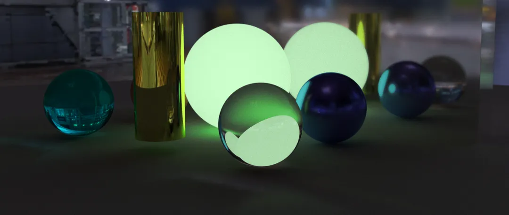  
让我们看看玻璃球和自发光带来的简单焦散效果

## 18 IBL 基于图像照明

基于图像的照明是将图片作为环境光源，这样可以大幅度提高光线追踪程序的真实感。之前的章节，我们一直使用一个简单的函数映射天空，接下来，我们将使用 taichi 读取像下面一样的一张图片作为天空光源。

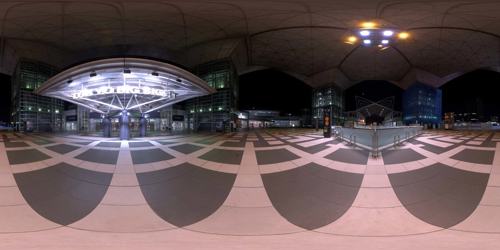  
东京国际展览中心的 IBL 图片[[19]]

### 18.1 读取图片

第一步当然是读取图片啦。使用 taichi 的 `ti.tools.imread` 函数读取图片[[20]]为 numpy 数组，然后将其转换为 `vec3.field` 。下面的 `texture` 函数可以用归一化的 uv 坐标访问像素值。

```python
@ti.data_oriented
class Image:
    def __init__(self, path: str):
        img = ti.tools.imread(path).astype('float32')
        self.img = vec3.field(shape=img.shape[:2])
        self.img.from_numpy(img / 255)
    
    @ti.func
    def texture(self, uv: vec2) -> vec3:
        x = int(uv.x * self.img.shape[0])
        y = int(uv.y * self.img.shape[1])
        return self.img[x, y] 
```

### 18.2 采样球面贴图

我们需要将 HDRi 图片映射到单位球面上，然后就可以直接使用光线的方向作为 uv 坐标来采样天空贴图。

```python
@ti.func
def sample_spherical_map(v: vec3) -> vec2:
    uv = vec2(atan2(v.z, v.x), asin(v.y))
    uv *= vec2(0.5 / pi, 1 / pi)
    uv += 0.5
    return uv

@ti.func
def sky_color(ray) -> vec3:
    uv = sample_spherical_map(ray.direction)
    color = sky_image.texture(uv) * 1.8
    color = pow(color, vec3(camera_gamma))
    return color
```

## 19 色调映射

为什么要色调映射？大多数显示器能够显示的色彩范围是`[0, 1]`，当 RGB 的某个分量大于 1 时，会被直接截断为 1 ，这带来的后果是大量高光信息丢失。自然世界中的光强取值是 <svg style="overflow:visible;min-height:1px;min-width:1px;vertical-align:-.566ex;" xmlns="http://www.w3.org/2000/svg" width="7.418ex" height="2.262ex" viewBox="0 -750 3278.7 1000"><g stroke="currentColor" fill="currentColor" stroke-width="0" transform="scale(1,-1)"><g data-mml-node="math"><g data-mml-node="mo"><path d="M118 -250V750H255V710H158V-210H255V-250H118Z" style="stroke-width: 3;"></path></g><g data-mml-node="mn" transform="translate(278,0)"><path d="M96 585Q152 666 249 666Q297 666 345 640T423 548Q460 465 460 320Q460 165 417 83Q397 41 362 16T301 -15T250 -22Q224 -22 198 -16T137 16T82 83Q39 165 39 320Q39 494 96 585ZM321 597Q291 629 250 629Q208 629 178 597Q153 571 145 525T137 333Q137 175 145 125T181 46Q209 16 250 16Q290 16 318 46Q347 76 354 130T362 333Q362 478 354 524T321 597Z" style="stroke-width: 3;"></path></g><g data-mml-node="mo" transform="translate(778,0)"><path d="M78 35T78 60T94 103T137 121Q165 121 187 96T210 8Q210 -27 201 -60T180 -117T154 -158T130 -185T117 -194Q113 -194 104 -185T95 -172Q95 -168 106 -156T131 -126T157 -76T173 -3V9L172 8Q170 7 167 6T161 3T152 1T140 0Q113 0 96 17Z" style="stroke-width: 3;"></path></g><g data-mml-node="mo" transform="translate(1222.7,0)"><path d="M56 237T56 250T70 270H369V420L370 570Q380 583 389 583Q402 583 409 568V270H707Q722 262 722 250T707 230H409V-68Q401 -82 391 -82H389H387Q375 -82 369 -68V230H70Q56 237 56 250Z" style="stroke-width: 3;"></path></g><g data-mml-node="mi" transform="translate(2000.7,0)"><path d="M55 217Q55 305 111 373T254 442Q342 442 419 381Q457 350 493 303L507 284L514 294Q618 442 747 442Q833 442 888 374T944 214Q944 128 889 59T743 -11Q657 -11 580 50Q542 81 506 128L492 147L485 137Q381 -11 252 -11Q166 -11 111 57T55 217ZM907 217Q907 285 869 341T761 397Q740 397 720 392T682 378T648 359T619 335T594 310T574 285T559 263T548 246L543 238L574 198Q605 158 622 138T664 94T714 61T765 51Q827 51 867 100T907 217ZM92 214Q92 145 131 89T239 33Q357 33 456 193L425 233Q364 312 334 337Q285 380 233 380Q171 380 132 331T92 214Z" style="stroke-width: 3;"></path></g><g data-mml-node="mo" transform="translate(3000.7,0)"><path d="M22 710V750H159V-250H22V-210H119V710H22Z" style="stroke-width: 3;"></path></g></g></g></svg> ，为了能够让更广的动态范围被显示设备显示，需要一条曲线映射原本的光强，在保证阴影和高光细节的同时，呈现更真实的色彩。

|  |  |
| ----------- | ----------- |
| 直接截断颜色 | ACES 色调映射 |

Matt Taylor 的这篇文章[[21]]很好的总结了各种色调映射算法，我将其中的 ACES (AcademyColor Encoding System) 算法实现如下

```python
ACESInputMat = mat3(
    0.59719, 0.35458, 0.04823,
    0.07600, 0.90834, 0.01566,
    0.02840, 0.13383, 0.83777
)

ACESOutputMat = mat3(
        1.60475, -0.53108, -0.07367,
    -0.10208,  1.10813, -0.00605,
    -0.00327, -0.07276,  1.07602
)

@ti.func
def RRTAndODTFit(v: vec3) -> vec3:
    a = v * (v + 0.0245786) - 0.000090537
    b = v * (0.983729 * v + 0.4329510) + 0.238081
    return a / b

@ti.func
def ACESFitted(color: vec3) -> vec3:
    color = ACESInputMat @ color
    color = RRTAndODTFit(color)
    color = ACESOutputMat @ color
    return clamp(color, 0.0, 1.0)
```

### 19.1 曝光与 gamma 矫正

人眼感受到的光强并不是与物理世界的光强成线性增长，因此色调映射通常与 gamma 矫正一起使用。下面我们应用 gamma 矫正和色调映射，之所以先进行gamma 矫正，是因为我希望让暗部更亮一些

```python
color *= camera_exposure ## 调整曝光
color  = pow(color, vec3(1.0 / camera_gamma)) ## gamma 矫正
color  = ACESFitted(color) ## ACES 色调映射
```

## 20 AI 降噪

本文暂不详细赘述 AI 降噪算法，先留个坑。感兴趣可以点赞收藏关注支持一下～

最后再欣赏一些渲染画面。

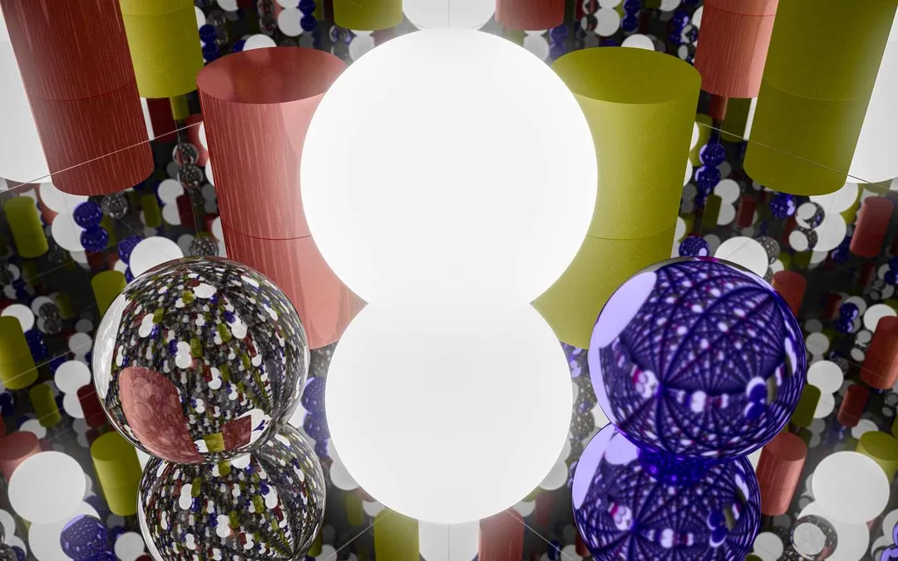

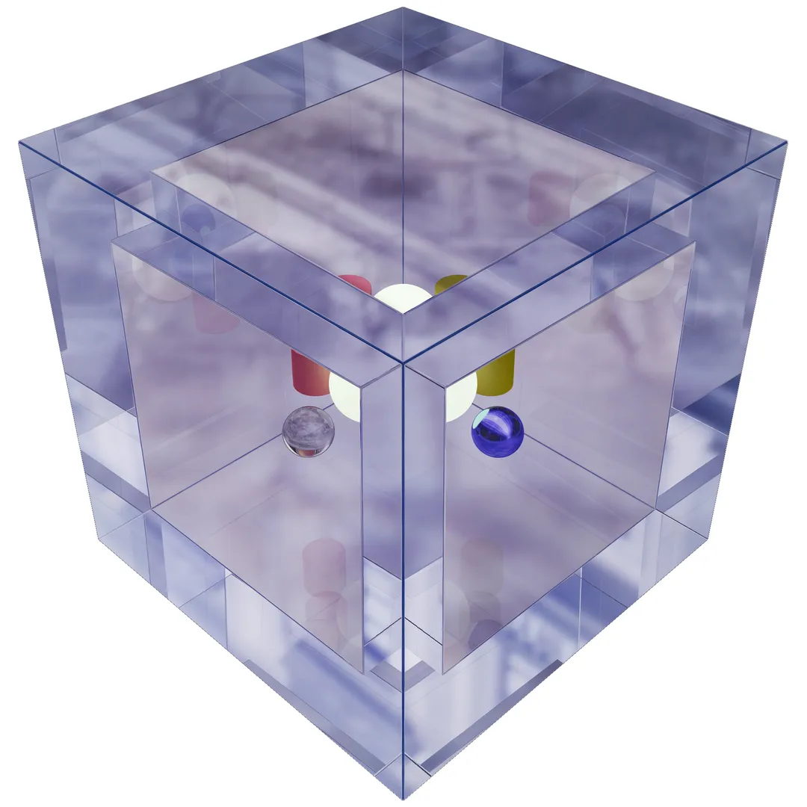

* * *

  1. The Book of Shaders. <https://thebookofshaders.com/> 

  2. Physically Based Rendering:From Theory To Implementation. <https://www.pbr-book.org/>

  3. Taichi Language Cheatsheet. <https://github.com/taichi-dev/cheatsheet> 

  4. RGB color model. <https://en.wikipedia.org/wiki/RGB_color_model> 

  5. Vector field. <https://en.wikipedia.org/wiki/Vector_field> 

  6. A New UI system: GGUI. <https://docs.taichi-lang.org/docs/ggui> 

  7. Distance functions. <https://iquilezles.org/articles/distfunctions/> 

  8. Field-of-view of lenses by focal length. <https://www.nikonians.org/reviews/fov-tables> 

  9. Random number generator. <https://docs.taichi-lang.org/docs/operator#random-number-generator> 

  10. Differentiable Programming. <https://docs.taichi-lang.org/docs/differentiable_programming> 

  11. Normals for an SDF - 2015. <https://iquilezles.org/articles/normalsSDF/> 

  12. Global illumination. <https://en.wikipedia.org/wiki/Global_illumination> 

  13. Russian roulette. <https://en.wikipedia.org/wiki/Russian_roulette>

  14. Normal Mapping. <https://learnopengl.com/Advanced-Lighting/Normal-Mapping>

  15. Building an Orthonormal Basis from a 3D Unit Vector Without Normalization. <https://doi.org/10.1080/2165347X.2012.689606> 

  16. Microfacet Models. <https://www.pbr-book.org/3ed-2018/Reflection_Models/Microfacet_Models>

  17. Learn OpenGL PBR Theory. <https://learnopengl.com/PBR/Theory> 

  18. Binary Exponentiation. <https://oi-wiki.org/math/binary-exponentiation/>

  19. sIBL Archive. <http://www.hdrlabs.com/sibl/archive.html> 

  20. taichi.tools.image. <https://docs.taichi-lang.org/api/taichi/tools/image/> 

  21. Tone Mapping. <https://64.github.io/tonemapping/> 

