 
<!--BEGIN_DATA
{
    "create_date": "2023-08-04 17:36", 
    "modify_date": "2023-08-04 17:36", 
    "is_top": "0", 
    "summary": "一文搞定Android VSync机制来龙去脉", 
    "tags": "Android", 
    "file_name": "一文搞定Android VSync机制来龙去脉.md"
}
END_DATA-->

#### 
原文出处：<a href='https://mp.weixin.qq.com/s/gAcBEqjYAwSVwFSg2vuN8Q' target='blank'>一文搞定Android VSync机制来龙去脉</a>

## 1. VSync的起源

显示屏上一帧画面的显示过程，是像素自上而下逐行扫描的过程，如果在上一帧的扫描还没有结束的情况下，屏幕又开始扫描下一帧的像素，那么就会出现如下图中撕裂（tearing）的情况。

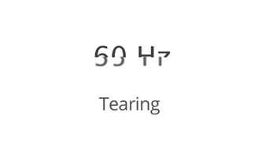

这个问题最初是在PC上被重视和解决的，GPU厂商开发出了一种防止屏幕被撕裂的技术方案，全称Vertical Synchronization（中文名垂直同步，简称VSync）。基本思路就是在屏幕刷新之前向外提供一个信号，主机端根据此信号选择合适的策略完成画面的刷新，避免数据刷新和屏幕扫描不匹配（撕裂）的情况发生。所以VSync信号也叫做TE信号或VBlank信号。

下图展示了开启与关闭Vsync的状态下，屏幕画面的不同显示情况。这里需要先说明一下传统的显示架构，主要有三部分组成，第一部分负责渲染，包含CPU，GPU及一些系统模块；第二部分叫做帧缓冲，实质上是一块内存块，渲染完的数据会被保存在这块内存中；第三部分是屏幕，用来绘制帧缓冲上的数据。一般来说帧缓冲会有两块，一块叫做backbuffer，用来写入渲染数据，一块叫做frontbuffer，用来把渲染数据送给屏幕。这两块buffer的状态是不断变化的，也就是说当backbuffer被写入完数据等待显示时，它就变成了frontbuffer，而当frontbuffer的数据被显示完毕之后，它就变成了backbuffer。

**VSync off：**

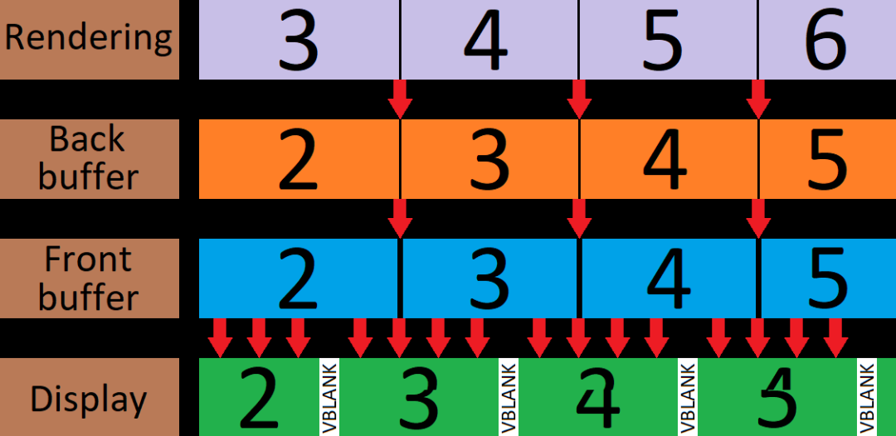

**VSync on：**

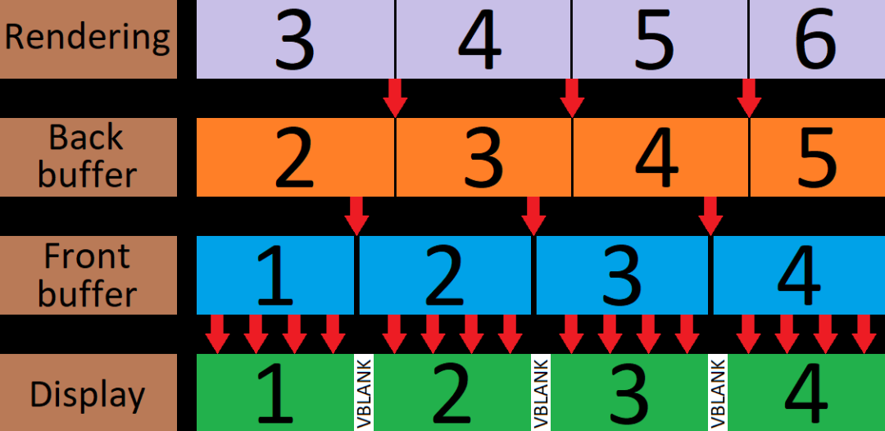

具体来说，硬件视角中的VSync其实就是一个电平信号，Panel上有一个单独的引脚，主机端需要有一个单独的GPIO与之相连，获取其信号变化；软件视角中的VSync其实就是一个GPIO的中断，一般是上升沿的中断，软件根据此中断完成相应的显示逻辑。

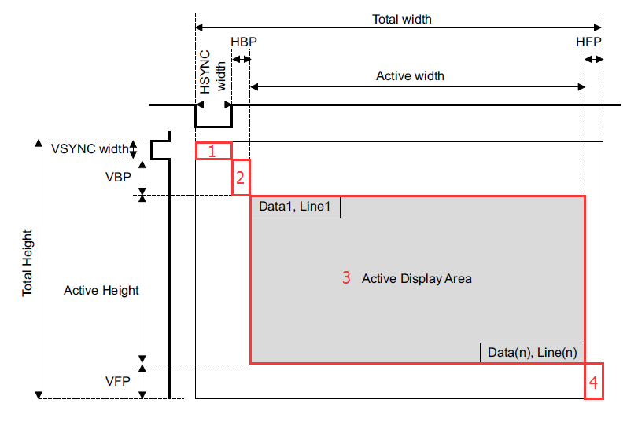

## 2. Andriod中的Vsync

### 2.1 背景

Android的显示系统一直使用双缓冲和VSync来防止屏幕画面发生撕裂现象，这也是其他系统的常规操作。Android的不同之处是将VSync运用到绘制系统中，作为黄油计划（Project Butter）的一部分，用以提升系统的流畅度。

黄油计划从android4.1引入，主要有三部分：VSync、Choreographer和Triple Buffer

**VSync:**

Android中VSync的作用是统一系统绘制与显示节奏（Apps和SurfaceFlinger），大家各司其职，确保在VSync来的时候干活，这样系统理论上就丝滑了。

如下图，在没有VSync的情况下，系统渲染的节奏与屏幕刷新的节奏不一致，如果某一帧系统渲染的比较晚，那么就会出现屏幕两次刷新都显示同一份内容的情况，也就是Jank（掉帧）。

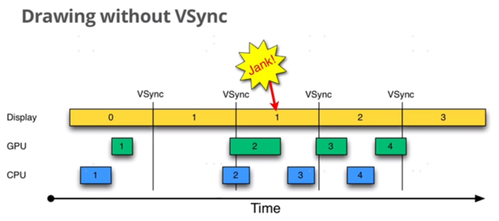

有了VSync的话，系统会在VSync到来时进行绘制，与屏幕的刷新节奏保持一致，这样就大大降低了jank的概率。

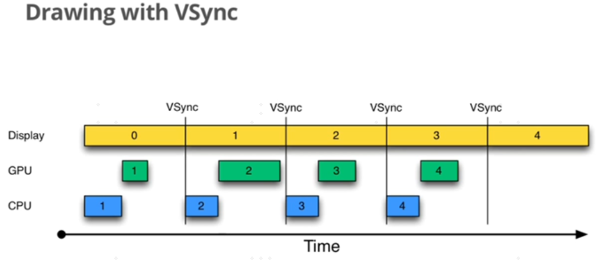

那么问题来了，怎么让Apps根据VSync的节奏来进行绘制呢？App依赖系统的绘制系统，所以必须让绘制系统听命令才行，这就是Choreographer出现的原因。

**Choreographer：**

Choreographer（编舞者）的作用在源码的注释中已经写得很明白，是用来接收定时脉冲信号来控制绘制的模块。也就是说，有了Choreographer，apps就能够根据Vsync信号来进行周期性的绘制工作。

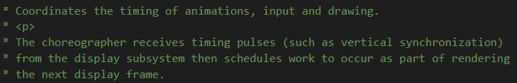

以上两者配合就基本上完成了Android中VSync的改造，但是还有一个造成Jank的原因也是不容忽视的，这就是双buffer机制带来的jank风险。

**Triple Buffer：**

如下图，理想情况下的双buffer是没有问题的，这个理想状态是指绘制工作（可以粗略地理解为一帧CPU和GPU执行的总耗时）在一个VSync周期内完成，这样的情况下，不会发生jank。

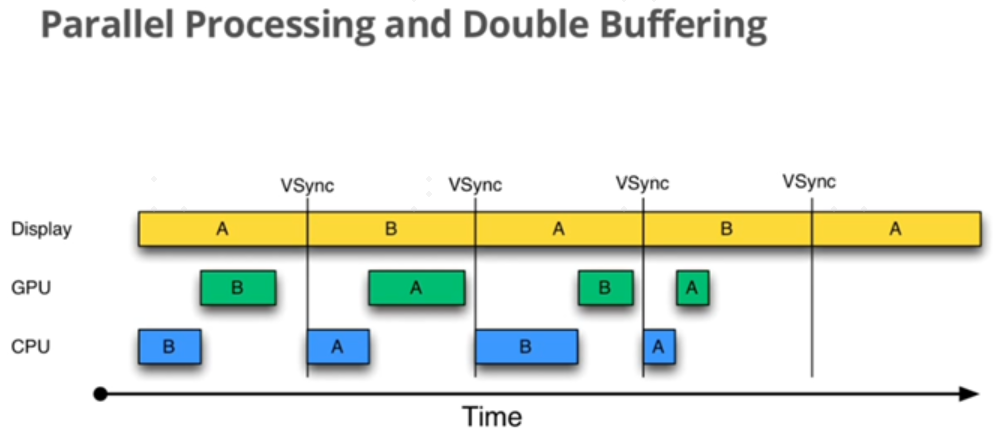

遗憾的是，事情的发展不会总是按我们的预期来进行的，如果绘制时长超过了一个VSync周期，那么就必然会发生jank。如下图所示，有两帧的绘制超过了一个VSync周期，那么就会发生两次Jank。

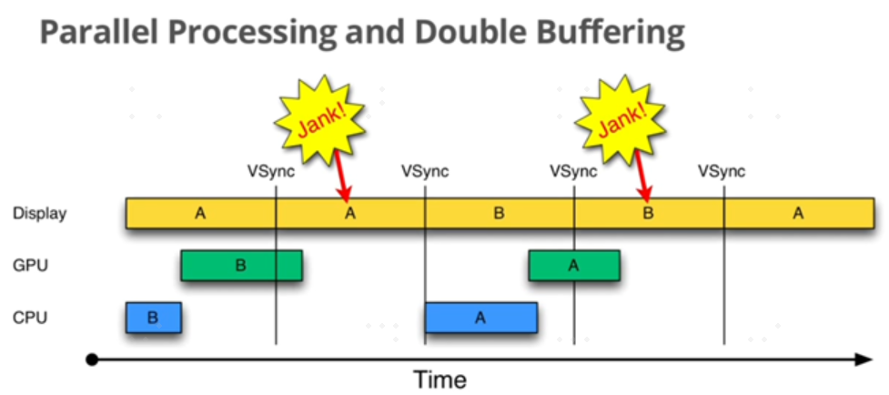

三Buffer机制实际上就是在上述backbuffer和frontbuffer的基础上，再添加一块buffer进行轮转。在这样的情况下，同样假设有两帧的绘制就是大于一个VSync周期，那么只会造成一次Jank。

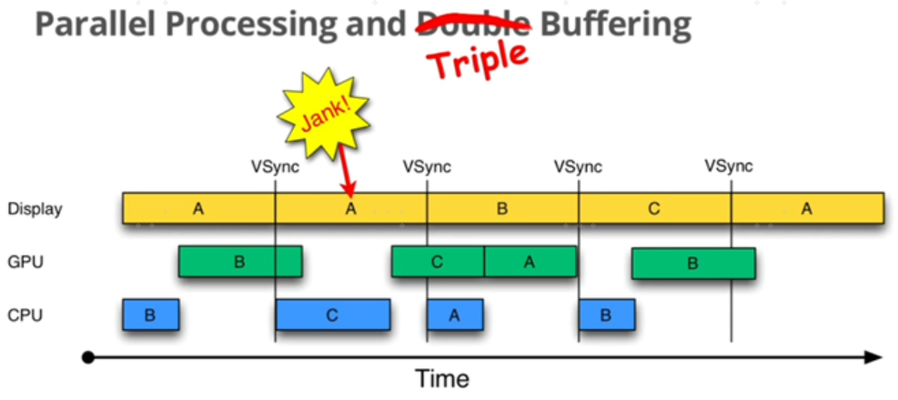

三buffer机制虽然能降低jank的概率，但是也会带来Touch响应慢和内存消耗高的负面影响，只不过相对于它带来的效果，这些负面影响被忽略了。

本文重点讲VSync，下面就看下安卓系统中VSync是具体怎么产生和使用的。

### 2.2 VSync的虚拟化

由上面的介绍可以知道，VSync其实起源于显示屏，但是想想如果每个App和SurfaceFlinger都去从硬件驱动中直接监听VSync，那未免有点太复杂了，而且耦合性太高，不行。那怎么办呢？

因此，最好是有一个模块去专门跟驱动沟通，再由它将VSync信号广播给大家，就像一个hub一样。但是VSync频率这么高，每次从kernel到userspace的消耗也不少，而且VSync是周期性的，很容易猜，所以没必要一直从kernel监听，但是系统是一直需要VSync来控制绘制合成的，所以有必要搞一个虚拟的VSync来模拟硬件VSync了。大概架构如下图：

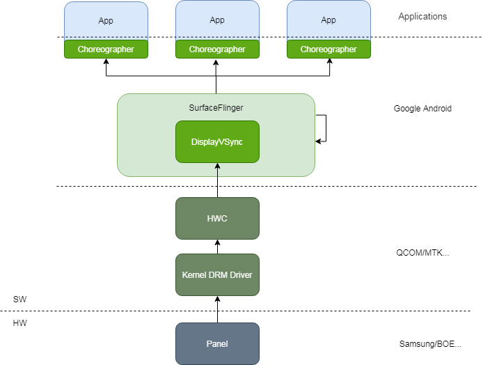

其中SurfaceFlinger中的DisplayVSync（Android S后改名为VsyncController）就是虚拟的VSync源，其需要两个参数来保证与硬件VSync的同步性，第一是参考点，第二就是周期。这些都可以开启硬件VSync同步解决。

### 2.3 VSync的同步

VSync虚拟化的实质就是在软件层面模拟硬件VSync，既然是软件模拟，那么就会存在误差，如果误差比较大，那么就需要开启硬件VSync同步来进行校准。那么就存在两个问题，怎么发现自己误差比较大？以及怎么来同步？

首先是如何发现误差比较大？答案是通过fence机制。SurfaceFlinger在每一帧交给HWC的时候，同时都会从HWC那里得到此帧的PresentFence，它是在此帧开始刷新至屏幕的时候signal的。那驱动什么时候开始刷新一帧至屏幕呢，答案是屏幕VSync来的时候。所以这下就能串起来了。根据PresentFence的signal时间就可以知道真实的VSync时间，那么之后的事情就简单了。

在HWComposer::presentAndGetReleaseFences中获取PresentFence，

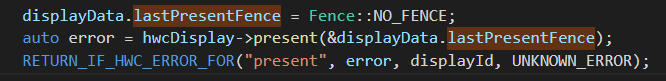

获取到fence之后就会对齐进行监测，

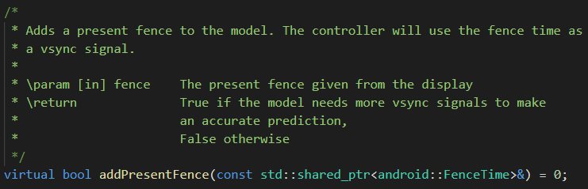

一旦不准就开硬件VSync来进行校准，通常情况下接收六次硬件VSync就可以完成校准动作。

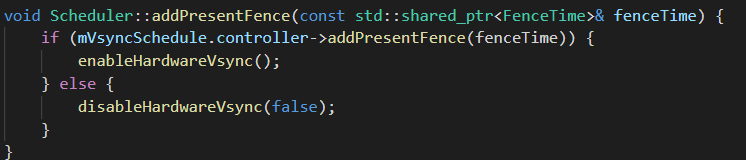

**Systrace中的表现**

SurfaceFlinger：

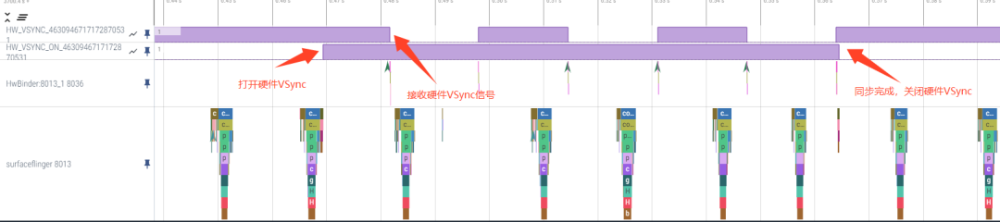

打开硬件VSync：

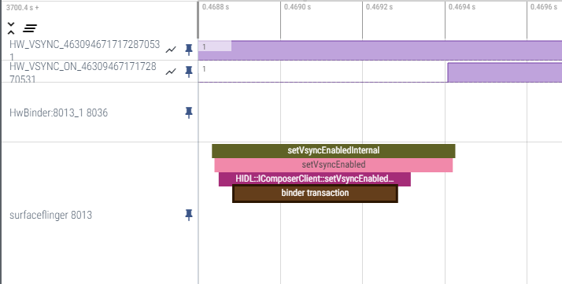

通过hwbinder接收硬件VSync：

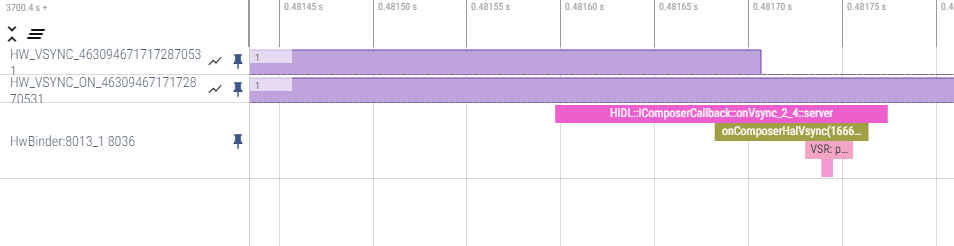

HWC：

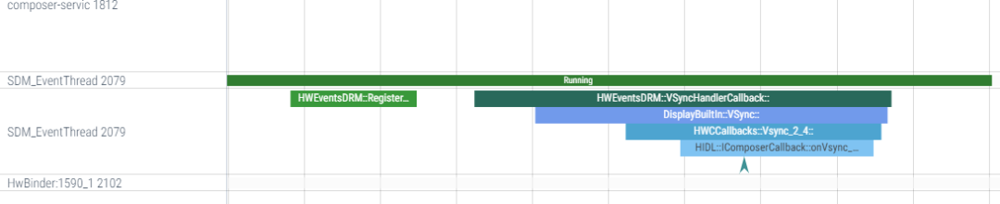

### 2.4 VSync的分发

App与SurfaceFlinger是不同的进程，它们之间传递VSync的话涉及到进程间通信，而且VSync频率很高，App很多，所以VSync的分发效率要很高才行。Linux进程间通信方式总共就那么几种，Android选择了Domain Socket，应该是因为其高效、简单、且有序吧，并将其封装成了更易用的BitTube。

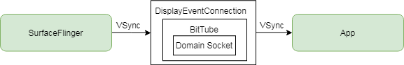

**VSync-app/sf**

Android绘制、显示各个环节均是由VSync驱动，具体来说就是App的每一帧的绘制是从收到VSync信号（VSync-app）开始的，SurfaceFlinger合成当前图层也是从收到VSync信号（VSync-sf）开始的。为了避免浪费，VSync的分发是按需的，即只有用户需要(requestNextVsync)的时候，DisplayVSync才会给它发送VSync。

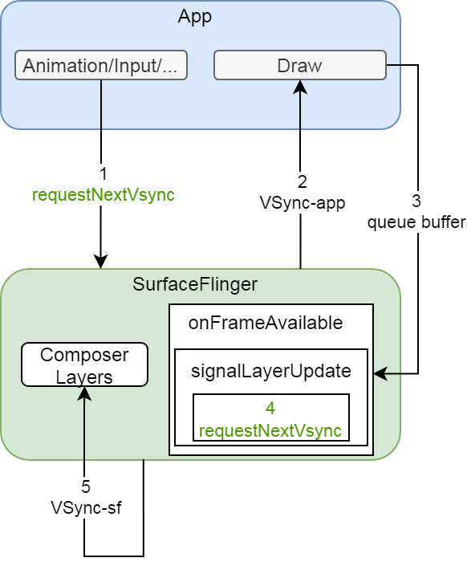

**Vsync相关类简介**

首先来介绍一些vsync相关的类，基本上所有vsync相关方法，都是实现在这三个类当中的（以下代码均为Anrdoid T版本源码）。

VsyncTracker：其实际上是创建了一个VSyncPredictor对象，这个对象的作用是基于之前的VSync信号时间戳来预测未来VSync时间戳。也就是基于HWVsync来训练Vsync模型。从而能够在HWVsync关闭的情况下依然能够预测未来的VSync时间。

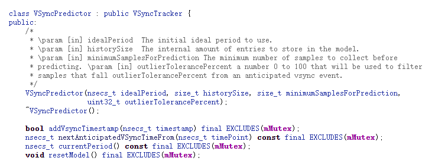

VsyncDispatcher：顾名思义，这个类是用来分发Vsync信号的。实际上最终创建了一个VSyncDispatchTimerQueue对象，负责分发vsync callback事件，需要接收Vsync事件的模块可以通过registerCallback向其中注册回调，当有Vsync事件发生时就会遍历已注册的回调分发Vsync。

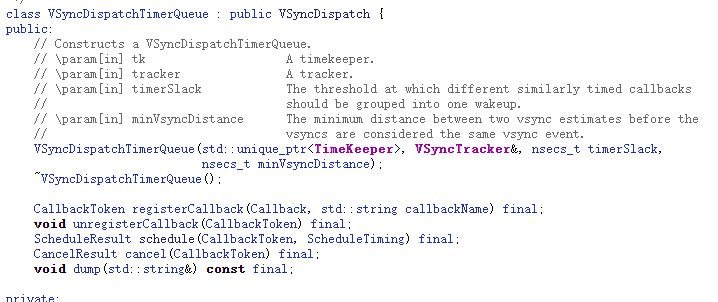

VSyncController：最终方法的实现是在一个VSyncReactor对象中，从代码中看，这个对象的主要作用是负责传递HWVsync，presentFence信号。

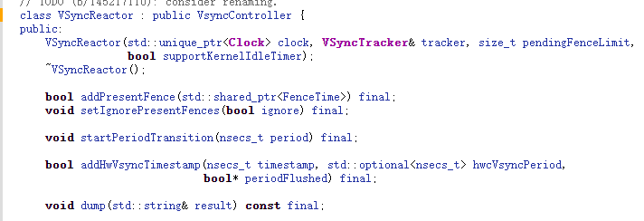

**sf申请vsync**

当sf需要请求刷新时，会调用MessageQueue中的scheduleFrame函数

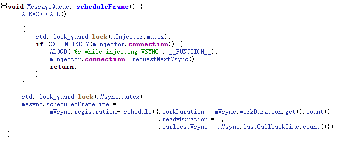

进而直接调用到VSyncCallbackRegistration中的schedule函数，进一步再到VSyncDispatchTimerQueue中的schedule函数。

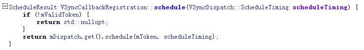

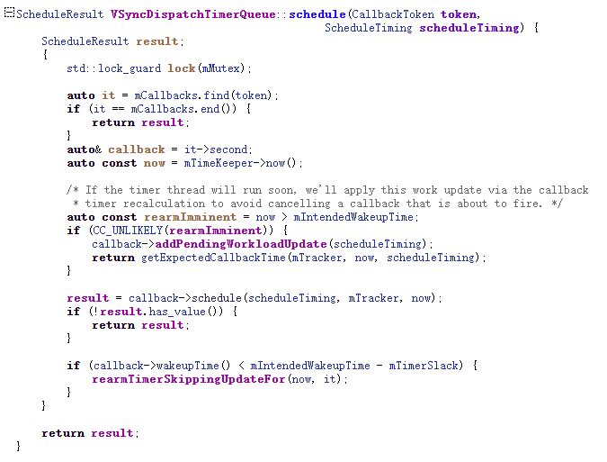

这其中rearmTimerSkippingUpdateFor是一个比较关键的函数，这个函数会拿到下次触发vsync的时间戳，并通过setTimer函数向定时器设置这个时间戳，等到定时器被唤醒时，触发callback以发送vsync。

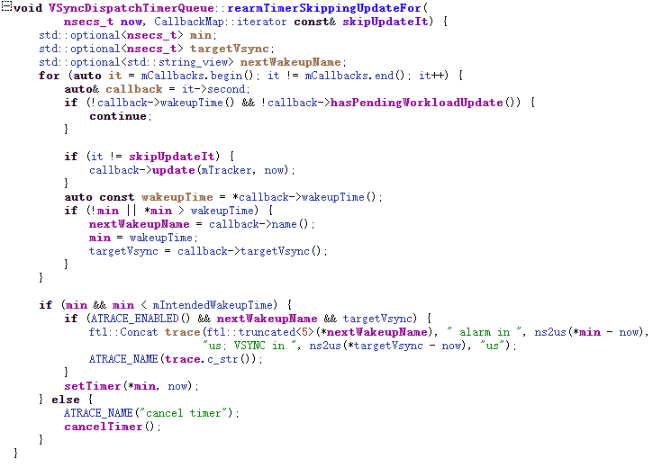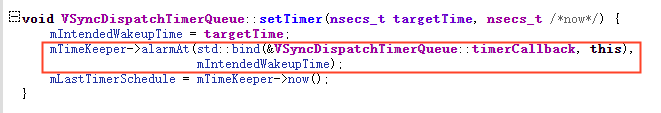

下面我们来看callback是怎么被层层触发的。

当定时器到来时，首先回调的是VSyncDispatchTimerQueue中的timerCallback函数

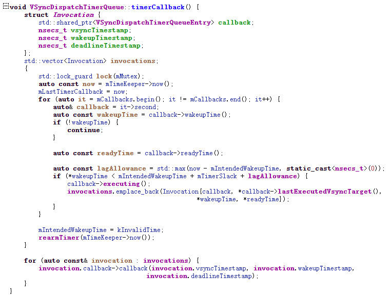

它持有的结构体Invocation中持有一个VSyncDispatchTimerQueueEntry对象，进一步追下去，可以知道这个mCallback最终调到的是MessageQueue中的VsyncCallback函数。

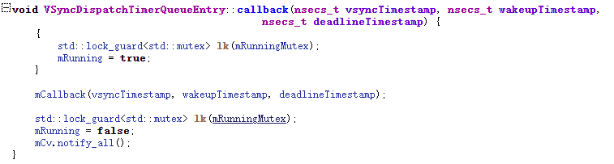
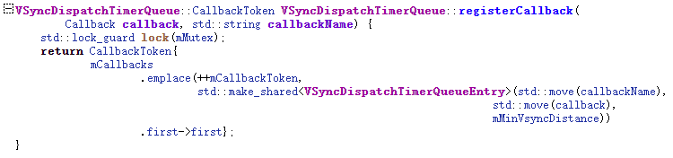
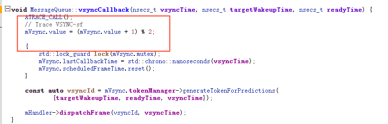

最后的这个红框的部分，就是我们通常在trace里看到的vsync-sf跳变的地方啦！

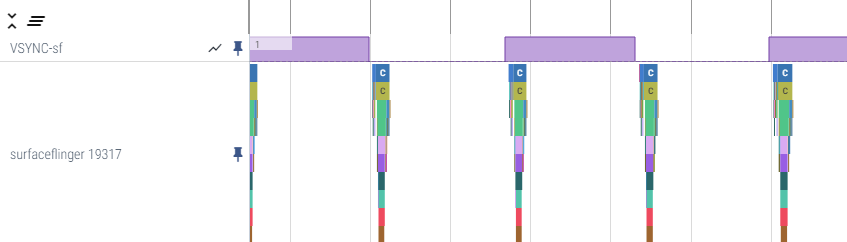

**app申请vsync**

相比于sf的申请，app的申请就显得要复杂一些。app通常是通过调用requestNextVsync这个binder接口来进行vsync的申请。

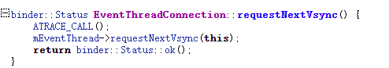

这个接口会调用到eventthread中的requestNextVsync函数，此函数会通过mCondition发送广播。

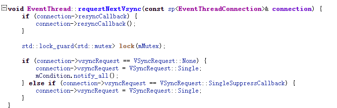

当threadMain监听到广播后，便会继续执行循环。

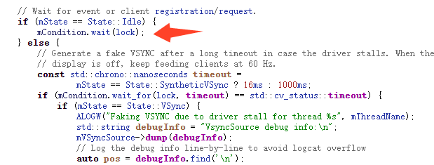

eventThread会执行什么呢，关键性的函数就是dispSyncSource中的setVSyncEnabled函数，当传入参数为true时，会调用到CallbackRepeater中的start函数。

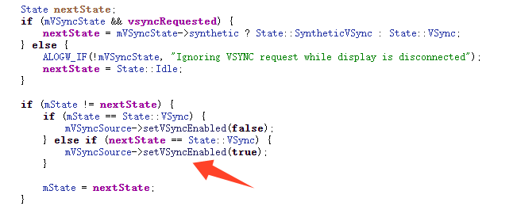
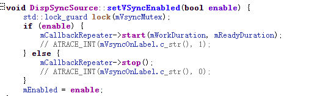

继续往下看，会调用到VSyncCallbackRegistration中的Schedule函数，进一步到VSyncDispatchTimerQueue中的schedule函数。

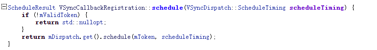
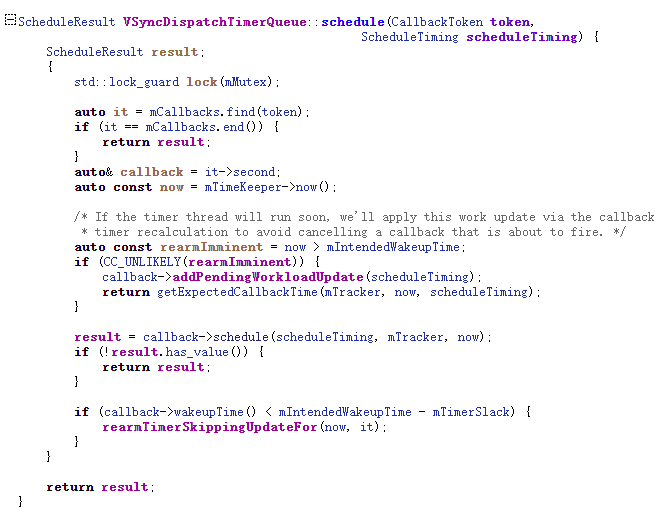

下面的流程和sf申请vsync基本就是大同小异了，它回调的地方是这里

调用CallbackRepeater中的callback；

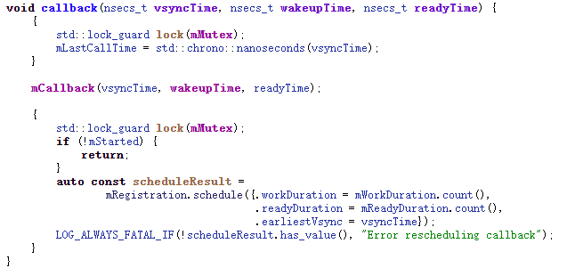

最终调用到DispSyncSource中的onVsyncCallback，这也就是我们在trace中看到的vsync-app跳变的地方啦。

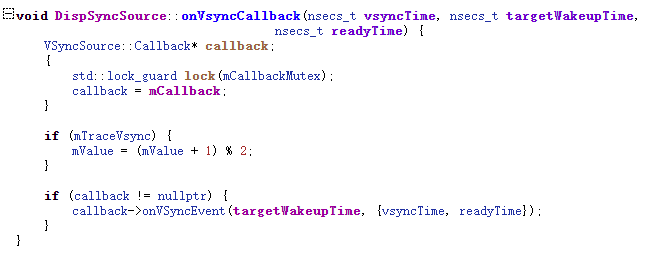
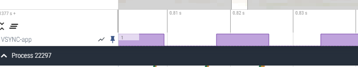

相比于vsync-sf，vsync-app还多了一个向申请方发送vsync的过程。继续往下看，调用到了EventThread中的onVSyncEvent，其会把VsyncEvent保存到mPendingEvents中。

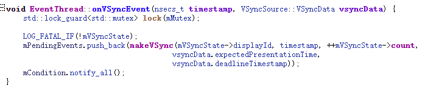

那么这些event在哪里分发呢？答案是还在threadMain中，这个dispatchEvent函数就是用来负责向每个consumer分发vsync的。

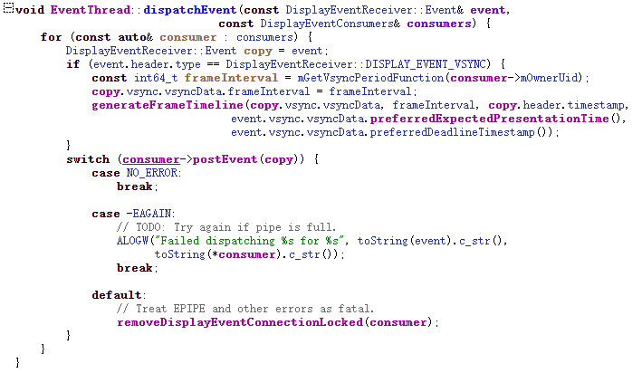

说到这里，大家肯定会有一个疑问，为什么vsync-app和vsync-sf都是由同一个定时器触发的，但是最终回调的位置确不一样呢？

答案是，这两种vsync本身注册回调的位置就不一样。

vsync-sf是在messagequeue中注册的

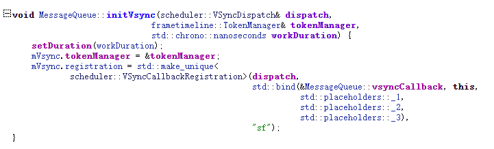

而vsync-app是在callbackRepeater中注册的。

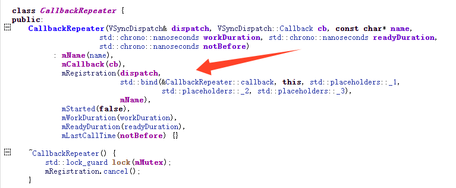

这也是google在Android T上才做出来的改动，究其原因，应该是谷歌认为应该简化vsync-sf在内部的传递流程，反正也是只给sf自己用的。

### 2.5 VSync-offset/duration

虚拟化后的VSync还有一个好处，就是可以对VSync进行一些定制操作，offset就是其中之一。

接下来就是offset的定义，offset 分为两大类，即phase-app和phase-sf：

phase-app：VSync-app与hw_vsync的相位差；

phase-sf：VSync-sf与hw_vsync的相位差；

还是以trace为例，可以看到，每一个vsync-app都比对应的TE信号晚了1.2ms，因此这份trace中的app-offset为+1200000（ns为单位）

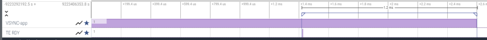

同样的，每一个vsync-sf都比对应的TE早了3.6ms，因此sf-offset即为-3600000.

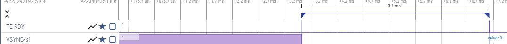

综上，offset表示着vsync-app及vsync-sf与hw_vsync的相位差，这个值通过dump sf就可以获取。

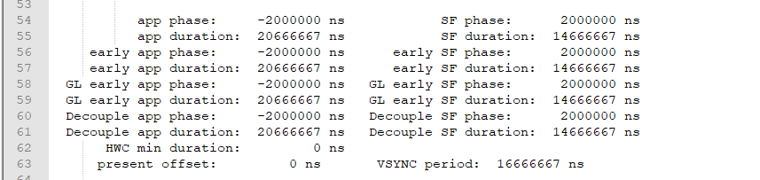

Offset 的一个比较难以确定的点就在于 Offset 的时间该如何设置，其优缺点是动态的，与机型的性能和使用场景有很大的关系。

如果 Offset 配置过短，那么可能 App 收到 Vsync-App 后还没有渲染完成，SurfaceFlinger 就收到 Vsync-SF 开始合成，那么此时如果 App 的 BufferQueue 中没有之前累积的 Buffer，那么 SurfaceFlinger 这次合成就不会有 App 的东西在里面，需要等到下一个 Vsync-SF 才能合成这次 App 的内容，时间相当于变成了 Vsync 周期+Offset，而不是我们期待的Offset。

如果 Offset 配置过长，就没有办法起到其原有的作用了。

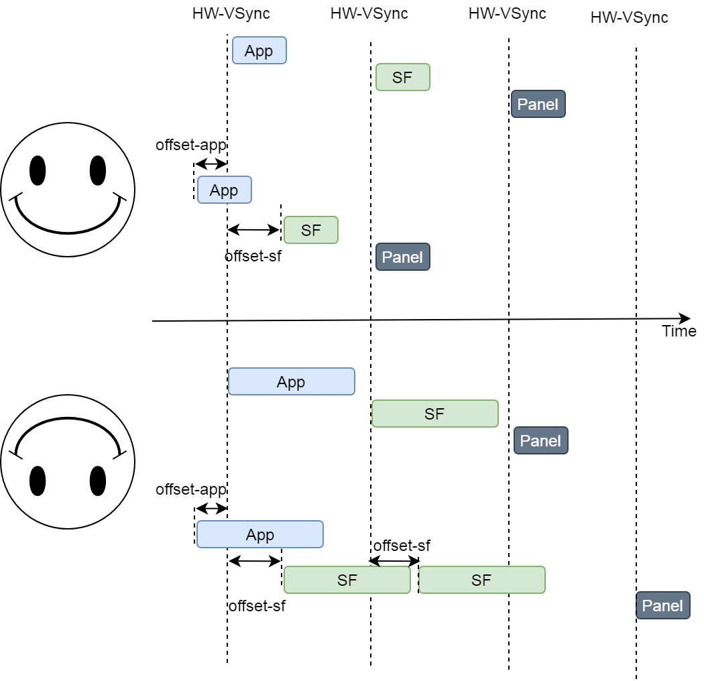

另外，稍微错开app和sf的VSync是有好处的，因为错开后整个系统同一时间抢占CPU的task会减少，理论上会有点优化。一般安卓对不同帧率有不同的offset默认配置。

在Android S及之后的版本，Google引入了duration的概念，部分程度上代替了offset。

duration的定义相对明确

app duration：app绘制一块buffer到sf消费这块buffer的时长（vsync-app与对应vsync-sf的间隔）；

sf duration：sf消费一块buffer到这块buffer上屏的时长（vsync-sf到TE的间隔）；

也就是说，app duration和sf duration之和，即为某一帧从开始绘制到刷新在屏幕上的总时长。

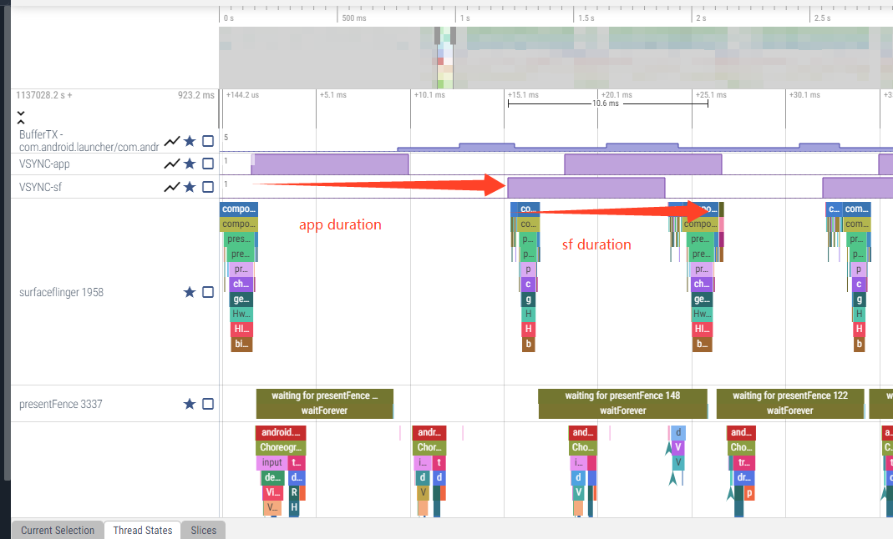

这种表示相对直观，因此在S版本及之后，google默认采用配置duration的方式来决定vsync相位差，但这并不代表offset被弃用，这两个值是相互影响的，修改其中一个值，另外一个值也会出现变化。具体的换算关系为

app phase=n * vsync period - (app duration + sf duration)

sf phase = m * vsync period - sf duration

从duration的概念可以看出，duration越短，给到app绘制和sf合成的时间就越有限，那么绘制线程和sf线程所需的CPU，GPU频率就越高，功耗就越高。

duration的长短会影响一个buffer从绘制到上屏的生命周期，进而影响到跟手性，duration越短，跟手性越强。其次，duration的配置会影响bufferqueue里预先加载的buffer块数量，进而影响sf占用的内存大小，duration越长，buffer块数量越多，sf占用内存越大。另外，厂商对CPU和GPU的调频策略也会受到duration的影响，贸然改短duration可能会导致特定场景的频率异常升高。

讲了这么多，总结起来Andriod中VSync模块的架构就是下图这样：

`HW_VSync`是由屏幕产生的脉冲信号，用来控制屏幕的刷新。

VSync-app与VSync-sf统称为软件VSync，它们是由SurfaceFlinger通过模拟硬件VSync而产生的VSync信号量，再分发给app和sf用来控制它们的合成节奏。

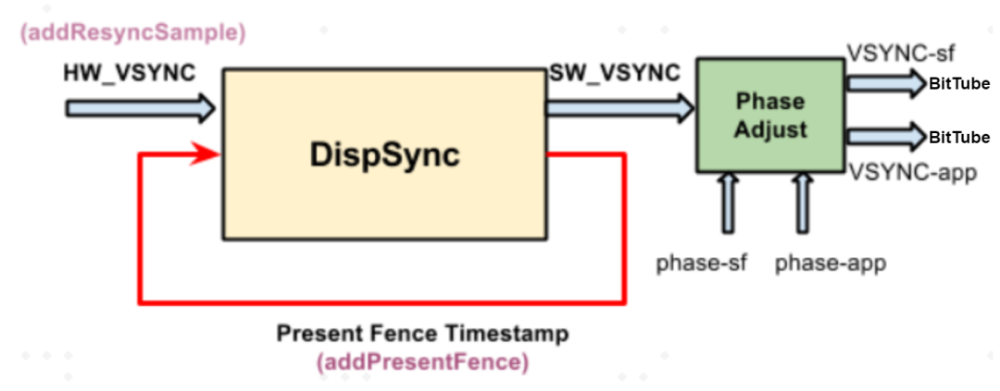

## 3. 总结

本文首先介绍了VSync的来源，之后重点介绍了Android系统的VSync机制，包括VSync的虚拟化，VSync的同步，VSync的分发等。希望读者们在阅读这篇文章之后，对Android中VSync的架构以及系统如何利用VSync来控制合成节奏有一定了解。VSync是Android显示系统中非常重要的组成之一，本文也只是对整体架构做了比较粗浅的介绍，后续读者可以通过参照AOSP源码，对VSync的各模块进行深入研究。

## 4 参考文献及链接

* 【1】https://source.android.com/docs/core/graphics/implement-vsync
* 【2】https://android.googlesource.com/
* 【3】https://www.digitaltrends.com/computing/what-is-vsync/
* 【4】https://www.hp.com/us-en/shop/tech-takes/vsync-should-i-turn-it-on-or-off
