 
<!--BEGIN_DATA
{
    "create_date": "2023-06-22 11:14", 
    "modify_date": "2023-06-22 11:14", 
    "is_top": "0", 
    "summary": "一文搞懂Electron的四种视图容器和它们的通信机制<br/>一文搞懂Electron的Session模块，实现网络协议与请求的定制化", 
    "tags": "Web", 
    "file_name": "一文搞懂Electron.md"
}
END_DATA-->

#### <p>原文出处：<a href='https://km.woa.com/articles/show/564960' target='blank'>一文搞懂Electron的四种视图容器和它们的通信机制</a></p>

> 本文总结了Electron的各类视图容器（BrowserWindow、BrowserView、webView Tag和Iframe）的实现原理、以及它们和主进程通信、互相通信、和宿主通信的机制，并对IPC通信的封装模式做出一些思考

Electron作为一种基于JS语言搭建的桌面框架，其基础视图容器是包含了Chromium内核的窗口，称为BrowserWindow。对于更复杂的项目，如果需要在窗口内部嵌入第三方业务的页面，则有BrowserView、webView Tag和Iframe三种方案可供选择。

这四类视图容器的实现原理各不相同，和主进程、宿主窗口以及其它兄弟窗口的通信方式也各不相同。官方文档中的描述较为散乱，本文将基于新版桌面QQ和QQ频道的开发实践经验，集中梳理它们各自的特性以及通信方式，并给出推荐的封装模式，以供各位开发者参考。

## 一、Electron的视图容器层级

### 1.webContents

Electron的渲染进程是基于Chromium搭建的，下图是Chromium官方文档中关于视图容器的层级划分

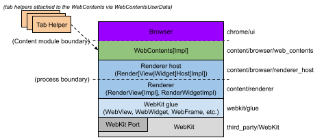

其中和Electron关系最紧密的概念是Webcontents，它相当于一个独立的渲染上下文，在Chrome里，每增加一个tab就会创建一个独立的WebContents，它们可以加载各自不同的url，彼此互相独立。

在Electron里，当我们创建一个基础窗口对象，就能够通过它的引用拿到WebContents。

```js
const win = new BrowserWindow({
    width: 800,
    height: 600,
    webPreferences: {
      preload: path.join(__dirname, 'preload.js'),
    },
  })

win.loadFile('index.html')
console.log(win.webContents)
```

它是一个EventEmitter对象，可以通过它来发送跨进程消息，监听其它进程发来的事件，这是Electron内建ipc通信的基础。

此外，Electron还给每个webcontents对象提供了一个上下文隔离（Isolated Context）的预加载环境，并且在其中执行开发者指定的preload脚本。它会在渲染器加载页面之前运行， 可以同时访问 DOM 接口和 Node.js 环境，并且可以通过 contextBridge 接口将特权接口暴露给渲染器。

因为Electron封装的跨进程通信对象ipcMain和ipcRenderer都是基于nodejs环境的api，而出于安全性考虑，通常需要在生产环境中关闭渲染进程的node权限（设置窗口的nodeIntegration为false），以防恶意脚本破坏操作系统。但这样一来，主进程和渲染进程的通信就会变得麻烦。

Preload脚本给我们提供了一种折中方案。我们可以在隔离上下文里把通信通道建立完毕，然后把有限的接口暴露到渲染上下文，供业务使用。并且在暴露接口时做一些参数检查，过滤的工作，避免非法脚本到达主进程。

所以，尽管官方提供的一些demo会把ipcRenderer直接引入渲染进程，但在生产环境下，我们要尽量避免这样做。包括下文的所有demo代码里，ipcRenderer都应该是经过preload检查过滤后的对象，而非原始的node对象。

```js
// 暴露渲染进程访问的对象，也可以换一个别名
contextBridge.exposeInMainWorld('ipcRenderer', {
      send: async (channel: string, ...args: any) => {
        // 可以在这里做一些业务上的合法性检查和过滤
        ipcRenderer.send(channel, ...args);
      },

      invoke: async (channel: string, ...args: any) => {
      // 可以在这里做一些业务上的合法性检查和过滤
        return await ipcRenderer.invoke(channel, ...args);
      },
});
```

### 2. frame

在webcontets之上还运行着若干frame，我们可以在主进程遍历出一个窗口的所有frame对象，如果某个窗口打开了devtool，或者加载了iframe标签，frame对象都会新增。而每个webcontents都有一个mainFrame，就是窗口直接加载的主体对象。

```js
this.win.webContents.on('did-frame-finish-load',(event, isMainFrame, frameProcessId, frameRoutingId)=>{
 // 每个frame加载完毕后都会触发这个事件
  console.log("aaaaaa did-frame-finish-load", isMainFrame, frameProcessId, frameRoutingId);
   // 遍历窗口所有frame对象，比对routingId，可以找出当前的frame并打印其基础信息
  this.win.webContents.mainFrame.frames.forEach(frame => {
    if(frame.routingId === frameRoutingId){
      const url = new URL(frame.url)
      console.log(“当前frame加载的url ", url);
    }
  })
})
```

frame 也有一系列的属性和生命周期钩子，但他并不是EventEmitter，无法通过它和其它进程通信。如果需要跨frame交换消息，需要采取迂回的方案，我们将在后文加以说明。

## 二、基础窗口BrowserWindow

BrowserWindow是Electron里最基本的视口单位，通过主进程创建和调度，一个BrowserWindow等同于一个独立的Chrome进程，使用进程管理器可以看到，每个已经开启的窗口都会有一个对应的条目（windows下需要把命令行参数打开，以便区分node进程和渲染进程）

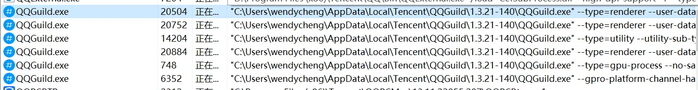

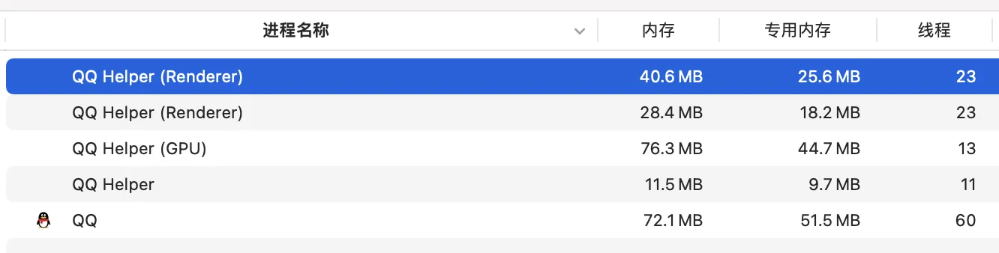

### 1. BrowserWindow和主进程的通信

主进程和窗体之间通信几乎是所有业务的刚需，Electron官方提供了基于IpcMain和IpcRenderer的封装，鉴于官方文档已经描述得非常清晰，此处不再罗列代码，只用图总结一下。

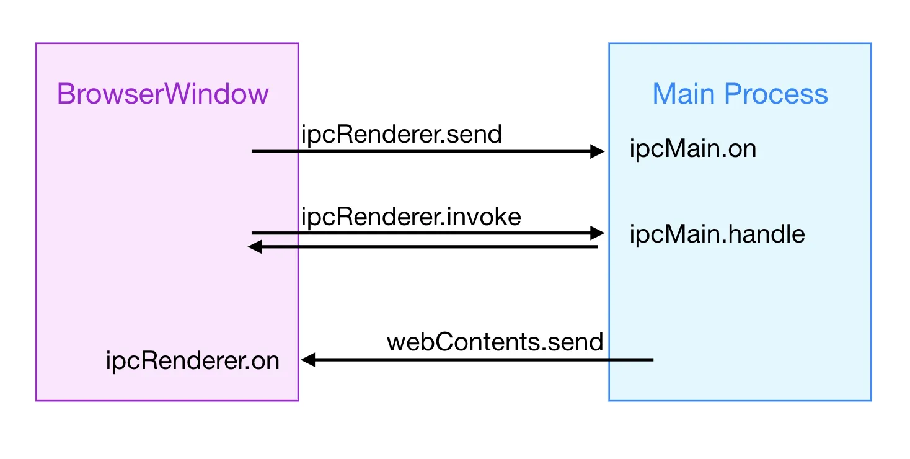

从窗口调用主进程分为send和invoke两种模式，前者是单向发送，适用于执行特定操作不关心返回值的场景，后者则会返回一个结果，相当于一来一回，并且是异步的。官方也提供了同步调用接口sendSync，但会造成进程阻塞，实际业务中尽量不要用。

从主进程到窗口，则要借助webcontents的send方法来发送，官方只提供了单向调用的封装，可能是因为主进程是运行在后台的，并没有视图，所以通常情况下不存在由主进程主动发起，并依赖渲染进程返回的场景，但如果实际业务中确实有需求，也可以在send的时候带上唯一标识ID，由渲染进程处理完毕后，携带id发起send，通过两次通信模拟出同样的效果。实现方案也比较常规，这里不再赘述。

### 2. 两个BrowserWindow之间的通信

由于ipc通信的基础是webcontents，而两个独立的窗口之间无法直接交换渲染上下文的信息，所以需要借助主进程的帮助。如果请求次数少，每次都由主进程转发也问题不大。但如果请求次数多，考虑到多窗口应用的性能问题，最好能够建立窗口对窗口的直接通信。

有两种方式可以实现：

#### (1) 使用 ipcRenderer.sendTo

该方法支持传入一个webContentsId作为发送目标，发送到特定的渲染上下文，通过它我们可以实现窗口对窗口的直接通信，但首先需要通过主进程来获取另一个窗口的webContentsId。

```js
// A窗口
const targetId = await ipcRenderer.invoke(“GetIWindowBId”) //主进程需要通过ipcMain监听该事件并返回窗口B的id
ipcRenderer.sendTo(targetId,"CrossWindow”,”窗口A发给窗口B”)

// B窗口
ipcRenderer.on("CrossWindow",(event,...params)=>{
  console.log("CrossWindow Request from ",event.senderId,...params) // B窗口可以把senderId记录下来，并通过它给A窗口发送消息
  ipcRenderer.sendTo(event.senderId,"CrossWindow”,”窗口B发给窗口A”)
})
```

一旦两个窗口都获悉对方的webContentsId，后续就可以自由地发送消息了（事件名可以任意指定）

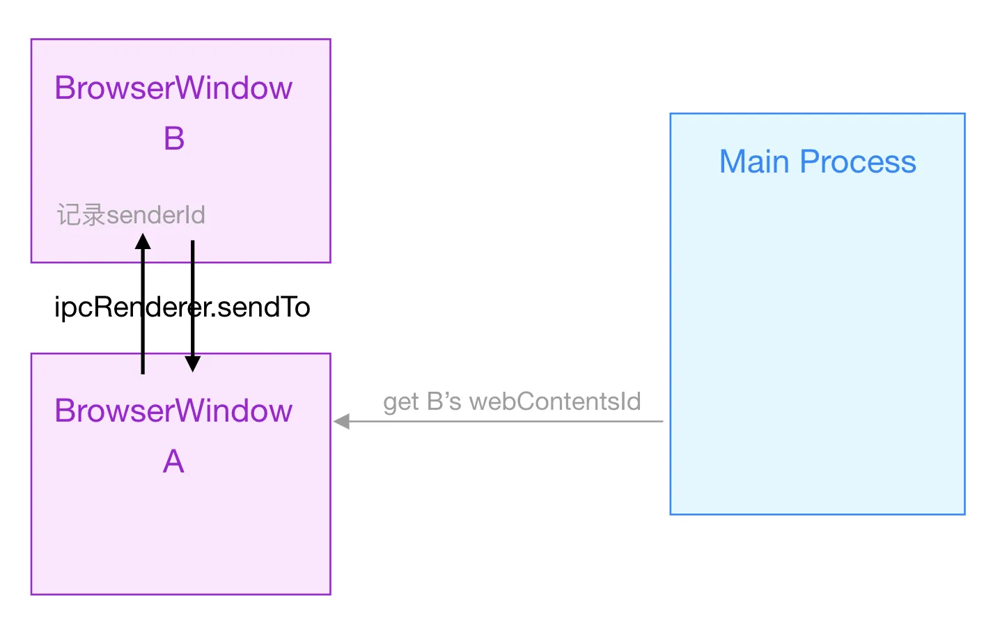

#### (2) 使用MessagePort

MessagePort并不是Electron提供的能力，而是基于MDN的web标准API，这意味着它可以在渲染进程直接创建。同时Electron提供了nodejs侧的实现，所以它也能在主进程创建。

```js
// 在渲染进程
const messageChannel = new MessageChannel();
console.log(messageChannel.port1);
console.log(messageChannel.port2);

// 在主进程
import { MessageChannelMain } from 'electron';
const messageChannel = new MessageChannelMain();
console.log(messageChannel.port1);
console.log(messageChannel.port2);
```

两侧创建的port对象，在能力上是对称的，由主进程创建的对象，可以通过

```js
win.webContents.postMessage('port', _null_, [port1])  
```

方法发送给BrowserWindow，在窗口侧需要监听同名事件

```js
ipcRenderer.on('port', e => {})  
```

拿到e.ports[0]对象并保存下来。

主进程只需要把port分发给A和B窗口，两个窗口之后各自持有port1和port2之后，就可以通过他们进行通信了。

细节代码参见官方文档： <https://www.electronjs.org/docs/latest/tutorial/message-ports>

看起来MessagePort似乎不如sendTo方便，对于简单的窗口通信，一般来说sendTo就足够用了。

但它和ipcRenderer.sendTo的最大区别在于，后者是基于WebContents的，所以只有具备webContents的对象才能使用，但messagePort是web标准，还适用于webWorker或者iframe，这意味着我们可以直接建立A窗口/主进程和B窗口的worker或iframe的通信链路。在特定业务场景下，这是非常方便的能力。在后面介绍iframe的部分，会给出实践。

## 三、独立视图容器BrowserView

BrowserView也是由主进程创建的独立视图容器，可以内嵌在其它BrowserWindow里，加载另一个url，有点类似于Iframe，但比iframe工作在更底层，拥有独立的webContents。

原理上来说，创建一个BrowserView相当于在Chrome浏览器里增加一个Tab。一个窗口可以内嵌多个BrowserView，创建时可以指定相对宿主窗口的偏移坐标。在需要给业务窗口嵌入第三方子页面的时候，使用BrowserView可以保证子页面的独立性，避免影响到宿主页面的运行。

```js
const win = new BrowserWindow({ width: 800, height: 600 })
const view = new BrowserView()
win.setBrowserView(view)
view.setBounds({ x: 0, y: 0, width: 300, height: 300 }) // 指定view相对于宿主窗口的位置
view.webContents.loadURL('https://electronjs.org') //view也有独立的webContents对象
```

但BrowserView也有局限性，由于它是主进程创建并“贴”在宿主窗口上的，所以它的渲染环境完全独立，游离在宿主页面的dom树之外，意味着一旦创建，宿主页面的其它元素都无法通过设置z-index的方式透显在它上面。

### 1. BrowserView和主进程通信

因为BrowserView有独立的webcontents，并且可以挂载proload脚本，所以它在ipc通信层面的地位和BrowserWindow完全一样，我们可以通过同样的方式，直接在主进程和它交换消息，无需经过宿主转发。不同的BrowserView之间也可以通过sendTo来互相通信。

### 2. BrowserView和宿主页面通信

正因为BrowserView的上下文是完全独立的，所以无法直接和宿主页面互通。当它需要和素主页面交换消息的时候，同样需要使用窗口对窗口的方式，交换webContentsid或者MessagePort。这是它和传统内嵌页面iframe的最大的区别

## 四、内嵌DOM标签`<Iframe>`

Iframe的概念相信每个web开发都很熟悉，它和Electron框架无关，是浏览器dom标准里自带的内嵌标签，也是最为基础的内嵌方案。在Electron里，iframe没有webContents，而是以宿主页面contents下面的一个frame的形式存在。

### 1. Iframe和宿主页面通信

和宿主页面的通信方式，就是我们熟悉的postMessage，完全的web标准，这里不再赘述。

### 2. Iframe和主进程通信

因为iframe没有独立的webContents，无法直接和主进程建立连接，那么最容易想到的方式，就是通过宿主页面转发，先使用postMessage把所有请求发到外层，再通过ipcRenderer发到主进程，拿到结果之后再发回给iframe。

这样固然可以，但实现起来还是颇为繁琐，而且每个请求都要二次通信，在请求较多的情况下也会影响性能。

前文提到messageChannel的特性在渲染侧和node侧都有对称的实现，那么我们可以把宿主页面作为“中介”，只进行一次端口交换，后续让主进程和iframe直接经由端口来通信。

```js
// 主进程
this.win.once('ready-to-show', () => {
    const { port1, port2 } = new MessageChannelMain()
    this.win.webContents.postMessage('sendPort', null, [port1])
    port2.start();//注意，这里一定要调用一次start，否则消息会一直pending而不触发回调
// 使用port2给iframe发消息，也可以接收iframe发来的消息
    port2.on('message',(event)=>{
      console.log("主进程收到iframe发来的消息",event.data);
    })
    setTimeout(()=>{
      port2.postMessage("主进程发给iframe的消息 ");
    },5000)
})

// 宿主页面
ipcRenderer.on('sendPort', event => {
  const port2 = event.ports[0]
  const iframe = document.querySelector("iframe");
  // 注意，如果父窗口和iframe跨域了，第二个参数要设成*
  iframe.contentWindow.postMessage("sendPortToIframe", '*', [port2]);
})

// iframe内部
let messagePort;
window.addEventListener("message", function (event) {
messagePort = event.ports[0];
// 监听宿主发来的消息，把port存下来，就可以直接和主进程通信了
messagePort.onmessage = function (event) {
  console.log('iframe 收到主进程发来的消息',event)
};
// 用 port给主进程发消息
messagePort.postMessage('iframe给主进程发消息');
});
```

可以看出，连接建立过程中有三个角色参与，但宿主页面只需要转发一次port，后续就可以抽身而出，不必再关心iframe和主进程的通信了。

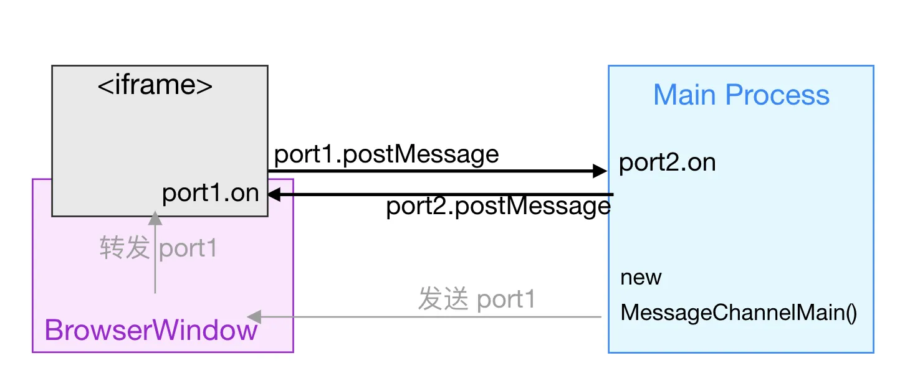

经过笔者实践，上述代码基于Electron20版本可以正常运行。只不过iframe创建的时机不一定是宿主窗口的ready-to-show，也有可能是后续切特定路由的时候，那么相应的，new messageChannel的时机也要做出调整，整体而言，流程还是有些繁琐。

而且由于iframe没有类似preload的预加载脚本，这些初始化的代码需要侵入到子业务代码里完成，跨业务的开发协作起来也是比较麻烦的。

## 五、内嵌视图容器 `<webview>` Tag

通过前文可以看出，BrowserView和iframe各有各的局限，前者独立于宿主的文档流之外，无法跟随宿主页面的排版规则，也没办法覆盖一些全局的弹窗和浮层，使用上受到很大限制。后者没有独立的运行环境，和其它进程建立通信比较麻烦，而且容易影响到宿主页面的运行。

`<webview>` Tag折中了二者的机制，它和`<iframe>`Tag一样，可以嵌入宿主页面的文档流里，但却像BrowserView似的拥有独立的WebContents，并且支持挂载私有的proload脚本。

```
<!DOCTYPE html>
<html lang="">
  <body>
    <div id="drag-area">webview测试</div>
      <webview
    id="testWebview"
    src="file:///xxxx/embedpage.html?subBusinessType=gameCenter"
    style="width: 400px; height: 480px; position: absolute; top: 0; left: 0; z-index: 1000"
    preload="file:///xxxx/testpreload.js"
  ></webview>
  </body>
  <script>
      const webview = document.getElementById('testWebview');
  </script>
</html>
```

我们通过dom query api拿到的webview对象，会被Electron劫持并替换成一个shadow Dom，它是一个HTMLElement，但同时也具备EmittEvent的功能，可以把它当作一个webContents来使用。

注意，Electron里的`<webview>`tag是基于chrome app的标准开发的，由于后者已经被Chrome抛弃，所以Electron开发者也无法保证后续版本的可用性。

但因为它实在太过方便，在依赖版本可控的情况下，还是值得一试的。如果未来真的废弃了，也可以把它迁移回iframe，作为降级替代方案。

### 1. `<webview>`和宿主窗口通信

因为选中的`<webview>`对象具有send方法，等同于ipcRenderer.send，使用它可以直接从宿主窗口抛送事件到webview内部，在内部需要通过ipcRenderer.on来监听。

```js
// 从宿主到webview
// 宿主侧
webview.send("HostToWebview","hello webview")

// webview侧
ipcRenderer.on("HostToWebview",(event,...params)=>{
   console.log("from host:",...params) })  
});
```

反之，在Webview内部，可以通过ipcRenderer.sendToHost发送事件，在宿主页面通过给webview对象增加ipc-message的事件监听器来接收处理

```js
// 从webview到宿主
//  webview侧
ipcRenderer.sendToHost("WebviewToHost","hello host") 

// 宿主侧
webview.addEventListener("ipc-message", (event) => {
   console.log("from webview:", event.channel, event.args);   
});
```

和上面提到的原则一样，webview一侧调用ipcRenderer要限定在proeload里面，避免直接把原生对象暴露到渲染上下文。

### 2. `<webview>`和主进程通信

我们知道<webvw>Tag是有独立webConents的，意味着主进程可以直接和它通信，但这里有个特殊之处，它是由宿主窗口在渲染进程里创建的，所以当它创建的时候，主进程并不知道它的存在，需要要由它先发送一个通知。

注意和iframe不同的是，通知的过程可以在webview自己的preload里进行，无需宿主页面转发。

```js
// webview侧（通常是在preload里）
// 发送注册请求，subBusinessType可以是一个标识业务类型的字符串，方便主进程区分，也可以省略。
ipcRenderer.invoke("webviewRegister", subBusinessType)

// 监听主进程发来的事件
ipcRenderer.on(“MainToWebview”,, (event, ...params) => {
    console.log("收到住进程的事件”,…params)
})

// 主进程
// 处理注册请求
ipcMain.handle('webviewRegister', (event, subBusinessType:SubBusinessType) => {  
 // 通过event拿到processId和frameId，作为后续发送事件的标识。  
 // 注意，之所以需要processId，是因为webview和宿主页面跨域的情况下，二者是运行在不同进程里的，需要通过[processId, frameId]二元对来标识，不可省略。   
  console.log('webview注册subBussiness类型', subBusinessType, event.processId, event.frameId);   
  const processId = event.processId;   
  const frameId = event.frameId; // 拿到sender（webview的webContents对象）并且进行发送。   
  event.sender.sendToFrame([processId, frameId],“MainToWebview”,“helloWebview”);   
})
```

注意到这其中的神奇之处了么？webview的webContents对象可以直接通过事件event的sender属性获取，无需通过宿主的win对象来获得。

如此一来，`<webview>`就和窗体解藕了，当我们引入一些第三方子业务的时候，主进程不用关心具体是哪个窗口里嵌入了`<webview>`标签，只需要关心业务本身，做出对应的处理。iframe方案就无法做到这一点。

`<webview>`还有一个优势，注册的过程可以在preload脚本里执行，而preload脚本由父业务维护。子业务代码加载之前，我们就可以建立好和主进程之间的通道，并且把子业务需要调用的接口，封装成类似于jsApi的形式，暴露到渲染上下文，而无需入侵子业务的任何代码，还可以考虑不同子业务的公共接口复用，从架构来说比iframe要优雅得多。

整体通讯机制如图所示

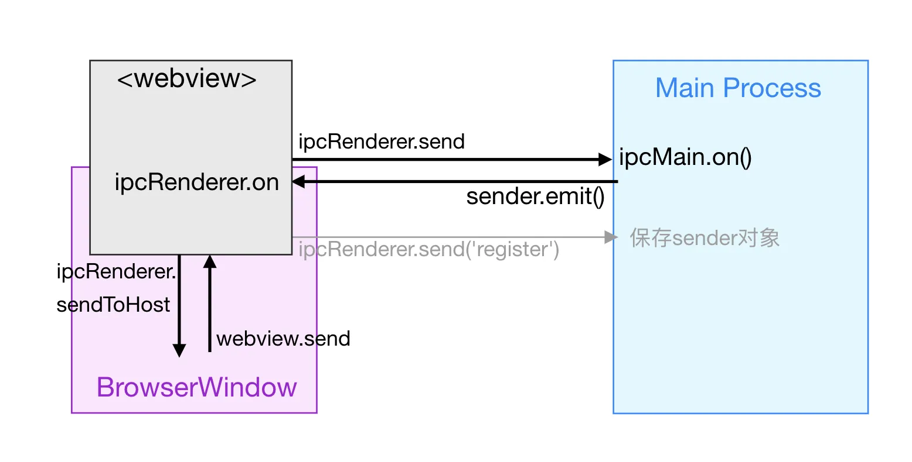

## 六、ipc通信的封装模式实践

上文讲到的通信方式，在实际业务中，还需要进行一定的封装才会更便捷。在[《大型Electron项目架构设计经验谈（新版QQ&频道桌面端）》](https://km.woa.com/group/52128/articles/show/524506)这篇文章里，我介绍了一些普通窗口和主进程之间的ipc通道封装经验。

随着新版QQ的功能不断完善，更多子业务也会陆续接入。子业务对ipc通信的要求没有基础侧高，但也需要执行一些系统调用，处理一些系统事件，我们希望把这部分封装QQ基础侧完成，并通过类似jsApi的方式暴露给子业务开发者使用。

其中一部分子业务采用独立窗口嵌入，可以采用BrowserView的方案，用和普通窗口一样的方式来建立ipc通道，这里不再赘述。但也有一部分业务需要内嵌在主面板里，为了更好地隔离这些业务，我们选择`<webview>`Tag的方案。

下面介绍如何封装提供给`<webview>`的jsapi。

首先我们需要收集这些业务的需求，在主进程提供每个api的具体实现，其中可能一部分是通用的，一部分是业务私有的，所以我们用基类容纳通用的部分，子类继承基类，为特定的业务提供服务。以游戏中心为例。

```js
// 主进程  
class baseApiHelper{
    public handlers = {
	// 假设写日志是一个通用的api
        writelog(ctx:IpcWebviewCtx, logType:string, ...info:any){
            loggerService.log('[+'+ctx.subBusinessType+’+]’,…info);
        },
 }}

class GameCenterApiHelper extends BaseApiHelper{
    public handlers = {
        ...super.handlers, // 继承自基类的通用api
        openFile:async (ctx:IpcWebviewCtx,...params:any)=>{
	    // 省略具体的实现
            return 'mock openFile done';
        }
    }
}

type IpcWebviewCtx = {
    subBusinessType:SubBusinessType,
    processId:number,
    frameId:number,
}
```

其中IpcWebviewCtx是我们定义的上下文类型，包括子业务的类型标识，发送方的processId和frameId，方便handler函数针对不同的业务做一些特殊处理。

每个Helper都是一个单例，可以使用一些依赖注入框架来管理，也可以简单地new出来并且导出。

接下来我们实现一个通用的注册事件，在app启动之后就执行绑定，后续任何子业务`<webview>`被创建，都会触发注册流程。

为了方便管理，我们把子业务标识和它的发送方id拼装起来，作为该容器私有的channelName，并为它注册监听函数，取得调用的方法名，添加上下文之后分发给hanlder函数处理。

```js
// 主进程
// 处理全局的webview注册事件
ipcMain.handle('webviewRegisterSubBussiness', (event, subBusinessType:SubBusinessType) => {
    console.log('webview注册subBussiness类型', subBusinessType, event.processId, event.frameId);
    const processId = event.processId;
    const frameId = event.frameId;
    const channelName = 'ipc-webview-'+subBusinessType+'-'+frameId;

    // 取出对应业务的Helper
    const helper:any = ipcWebviewContainer.get(subBusinessType);

    // 处理来自特定webview的invoke方法，添加上下文之后分配给对应的helper
    ipcMain.handle(channelName, async (event: IpcMainInvokeEvent, eventName: string, ...payload)=>{
        if(helper.handlers[eventName]){
            return await helper.handlers[eventName]({
                subBusinessType,
                processId:processId,
                frameId:frameId
            } as IpcWebviewCtx,
            ...payload);
        }
        return Promise.reject("ipc hanlder not found")
    }) 

    // 处理来自特定webview的send方法，添加上下文之后分配给对应的helper
    ipcMain.on(channelName, (event: IpcMainInvokeEvent, eventName: string, ...payload)=>{
        if(helper.handlers[eventName]){
            helper.handlers[eventName]({
                subBusinessType,
                processId:processId,
                frameId:frameId
            } as IpcWebviewCtx,
            ...payload);
        }else{
            console.warn("ipc hanlder not found")
        }
    })
    return Promise.resolve(true)
});
```

而在渲染进程一侧，preload脚本启动后，我们就发送webviewRegisterSubBussiness事件给主进程，并且把调用器暴露到渲染上下文。业务里直接调用qqApi.invoke或者qqApi.send，就能执行到对应的方法

```js
// webview preload
// 从url里取出页面的业务类型
const subBusinessType = parseQuery(location.search).subBusinessType;
const channelName = 'ipc-webview-'+subBusinessType+'-'+frameId;

let registerIpcPromiseReslover = ()=>{};

const registerIpcPromise = new Promise((resolve) => {
    registerIpcPromiseReslover = resolve;
  });

ipcRenderer.invoke("webviewRegisterSubBussiness", subBusinessType).then(res=>{
    registerIpcPromiseReslover();
});

contextBridge.exposeInMainWorld('qqApi',{
    invoke: async (cmd,...params)=>{
        await registerIpcPromise;
        console.log("call qqApi invoke ",cmd)
        return await ipcRenderer.invoke(channelName,cmd,...params); 
    },
    send: async (cmd,...params)=>{
        await registerIpcPromise;
        console.log("call qqApi send ",cmd)
        ipcRenderer.send(channelName,cmd,...params); 
    },
})
```

子业务需要调用的时候，直接使用window对象上的qqApi就可以了

```js
// 子业务
window.qqApi.send('writelog','info', ‘hello QQNT’);
const res = await window.qqApi.invoke('openFile’, somefileName)
```

注意，这里创建了一个registerIpcPromise，这是因为注册事件到达主进程是异步的，主进程为业务的私有channel注册处理器也需要一些时间，那么在极端情况下，如果业务代码刚启动就调用了api，有可能主进程还没有完成注册，此时可能会调用失败。为了避免情况，我们用一个promise对象让invoke和send请求等一等，注册完成之后再扭转，保证所有的调用都能够被正确处理。

接下来再处理由主进程抛送的通知。

抛送通知给子业务的场景可能不太多，如果有的话，一定是在某个模块里，理想的情况下，我们提供一个触发器给该模块，它只要知道了子业务类型，拿到对应的触发器，就可以触发事件。

我们把触发器也封装在baseApiHelper里，并且用一个Map来维护，这是为了兼容一个子业务有多个实例的情况，当然实际业务场景下，这种情况应该不会很多。

```js
// 主进程
class baseApiHelper{
    private emiiterMap = new Map<string,Function>;
    public handlers = {
        ……
    }

    public addEmtter(key:string,emitFunc:Function){
        this.emiiterMap.set(key, emitFunc);
    }
    
    public removeEmtter(key:string){
        this.emiiterMap.delete(key);
    }

    public emitEvent(eventName:string, ...params:any){
        this.emiiterMap.forEach((emitFunc)=>{
            emitFunc(eventName,...params);
        })
    }
}
```

在子业务注册的时候，我们收集发送对象sender，放进emiiterMap里。还是上面的代码，省略重复部分

```js
// 主进程   
// 处理全局的webview注册事件
ipcMain.handle('webviewRegisterSubBussiness', (event, subBusinessType:SubBusinessType) => {
    console.log('webview注册subBussiness类型', subBusinessType, event.processId, event.frameId);
    const processId = event.processId;
    const frameId = event.frameId;

    const channelName = 'ipc-webview-'+subBusinessType+'-'+frameId;
    const helper:any = ipcWebviewContainer.get(subBusinessType);
    
    // 处理来自特定webview的invoke方法，添加上下文之后分配给对应的helper
    ……
    
    // 处理来自特定webview的send方法，添加上下文之后分配给对应的helper
    ……
    
    // 添加temitter到helper，业务可以通过helper给特定webview发送事件
    helper.addEmtter(processId+'-'+frameId, (eventName:string, ...params:any)=>{
        event.sender.sendToFrame([processId, frameId],channelName, eventName, ...params);
    })
    
    return Promise.resolve(200)
});
```

而在子业务一侧，去注册对sender事件的监听，并且依次触发业务的监听器就可以了。

```js
// webview preload
const eventCbMap = {}

ipcRenderer.on(channelName, (event, eventName, ...params) => {
    eventCbMap[eventName]?.forEach(cb=>{
        cb(...params);
    })
})

contextBridge.exposeInMainWorld('qqApi',{
    on:(eventName, cb)=>{
        console.log("页面注册监听", eventName)
        if(!eventCbMap[eventName]){
            eventCbMap[eventName] = []
        }

        eventCbMap[eventName].push(cb);
    },
    ……
}
```

这样一来，通道就建立好了，需要抛事件的模块里，只要拿到对应helper，就可以触发emitter了，业务也可以通过qqApi.on来绑定监听器，收到通知。

```js
// 主进程任意业务模块
const gameCenterapiHelper = ipcWebviewContainer.get<GameCenterApiHelper>(SubBusinessType.GameCenter);
gameCenterapiHelper.emitEvent('helloGameCenter',`主进程发给webview`); 
```

当然注册过的事件都是需要提供卸载逻辑的，可以在注册函数末尾返回一个disposer对象，用于注销监听器。

主进程的也emitter也需要在`<webview>`生命周期结束后予以卸载，可以选择在webview的beforeunload事件里给主进程发送一个卸载请求，并清理对应helper上的emitter对象，具体的逻辑这里不再赘述。

这样，对子业务的ipc封装就完成了，只需要约定需要哪些能力，由开发在主进程去实现，子业务在自己的代码里就可以通过qqApi去调用，而无需关心其中的细节。

最后一点，因为`<webview>` Tag是可以通过渲染进程的脚本创建的，其中的preload属性又指向一个本地脚本，为了安全性，我们应该拦截'will-attach-webview’事件，检查其中的参数，规定只允许挂载我们自己的脚本，避免第三方脚本恶意篡改。也可以对webview里的一些行为做出限制，比如禁止重定向等等，具体可以参阅Electron官方文档。

## 七、总结

本文介绍了Electron里的四种视图容器的特点以及各自的ipc通信方式。其中三种子视图的作用接近，都可以用来内嵌第三方业务，它们之间的差别通过表格归纳如下

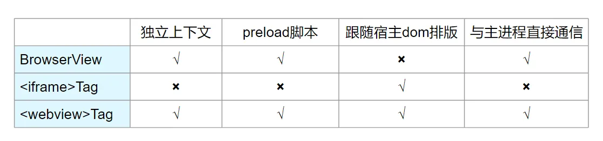

实际使用时，可以根据业务场景，选择最合适的方案。

本文还基于新版QQ的开发经验，给出了一些封装模式的实践建议。

<hr/>

#### <p>原文出处：<a href='https://km.woa.com/articles/show/572013' target='blank'>一文搞懂Electron的Session模块，实现网络协议与请求的定制化</a></p>

Electron框架是基于Chromium实现的桌面端js开发框架，而Session模块则是它管理网络会话与请求的核心所在。通过它我们可以为业务分配私有协议，管理容器的会话状态，对业务侧的网络请求实现高度定制化。

本文将介绍session模块的概念，并结合新版桌面QQ的实践，详细分析session模块在复杂业务中的应用场景。

## 一、认识Electron里的session

### 1. 基本概念

在web应用中，session通常指的是服务器端所保存的用户会话信息，用来标识用户身份，以便进行权限控制、状态记录等工作。

Electron的session则是另一个概念，由于桌面应用工作在本地，session模块就被设计为本地会话信息的管理单位，用于保存本地用户的数据（如cookie，local storage等等），分配协议，拦截网络请求。Session和视图容器WebContents绑定，每个拥有webContents的容器对象，都会持有一个session。

（关于Electron里的容器，参见我的前一篇文章介绍 [《一文搞懂Electron的四种视图容器和它们的通信机制》](https://km.woa.com/group/43557/articles/show/529282)）

因此我们很容易理解，BrowserWindow和BrowserView、`<webview>` tag都持有独立的session，而iframe则共享父容器的session。

### 2.session的创建和管理

session的管理是在主进程完成的，Electron为我们提供了一个全局的session对象，可以通过它拿到当前应用默认的session

```js
import { session } from 'electron';
const session = session.defaultSession;
```

同时，我们也可以访问特定视图容器的webContents对象，拿到它所持有的session

```js
const win = new BrowserWindow(options);
const session = win.webContents.session
```

这里需要注意，如果我们没有做自定义配置，那么每个视图持有的都是默认session，也就是说，通过webContents.session拿到的对象，和通过session.defaultSession是同一个对象，**对它的操作也会前后覆盖**（在多人并行的开发中，我们就遇到过A窗口开发者错误覆盖B窗口session配置而引发的bug）。

对于复杂的多窗口业务，不同的视图可能有不同的定制化需求。比如有些页面资源来自本地，有些来自线上，它们可能会往不同的服务器发送http请求，需要不同形式的cookie……

此时，我们可以通过自定义的session来实现差异化。

区分session的标识称为partition，直译就是分割器，它的作用也很容易理解，通过类似于命名空间的机制，把不同的会话隔离开，避免互相覆盖。

对于BrowserWindow和BrowserView容器，我们可以在创建参数传入partition字段，为分配自定义的session

```js
const win = new BrowserWindow({...options,partition:’someCustomPartition’});
const session = win.webContents.session // 此时拿到的就不再是defaultSession，而是自定义的
```

同样，我们也可以通过全局的session模块拿到这个自定义对象

```js
import { session } from 'electron';
const session = session.fromPartition(’someCustomPartition’); //和前一段代码里拿到的是同一个实例对象
```

反之，我们也可以先通过Session模块创建一个新的session，然后作为窗口的创建参数传入，这里不再赘述。

对于`<webview>`tag，我们也可以直接指定它的session属性来为它分配会话，作用和窗口参数是一致的。tag创建在渲染层，但在主进程，也可以通过session对象获取它。

```js
<webview src=’xxxx’ partition=’myCustomPartition’ />
```

partition的名称可以自由指定，但自定义的session数据默认保存在内存中，如果我们需要持久化，可以在partition名称增加persist前缀，拥有这个前缀的会话信息，默认将以文件的形式存储在electron的用户目录（app.getPath('userData') ）中，并且对所有拥有相同前缀的窗口生效，下次启动时仍可恢复。如果你不希望它放在用户目录和其他用户数据混淆，也可以调用app.setPath(‘sessionData’,yourpath)手动更改目录。

注意，electron的默认session就是持久化的，如果我们的业务并不需要持久化这些信息（可能是出于安全性或性能的考虑，避免本地存储空间膨胀），就应该使用自定义的session。

## 二、使用session对象定制业务容器

Session对象的api很多，包含了复杂的能力，这里列举一些业务中常用的操作

### 1.分配私有协议

Electron默认支持文件协议(file://)加载本地资源，但它在浏览器端会遇到诸多限制，并且也不方便和真正的文件操作区分开。所以在大型业务里，我们可以注册私有协议来处理资源的加载，方便我们进行管理。

协议可以全局注册，也可以以session为单位注册，我们可以为每个session分配不同的协议，来处理不同的业务。比如我们现在有个需求，要将完整的web构建产物放在本地目录，并用一个独立的弹窗加载。为了避免它和其他业务互相混淆，我们可以给它分配独立的协议。

分配一个私有协议分为两步，首先要在app.ready之前就完成对私有协议名称的注册

```js
protocol.registerSchemesAsPrivileged([{ scheme: 'myapp', privileges: { secure: true, standard: true } }]);
```

之后在session的protocol对象上实现这个协议。这里我们通过一定的规则，把路径映射到本地文件，之后我们就可以使用形如myapp://xxx.com/index.html的方式，像访问web资源一样来访问它。

```js
mySession.protocol.registerBufferProtocol('appsub', (request, respond) => {
    const { hostname, pathname } = new URL(request.url);
    
    // 通过一些规则，把url匹配到本地文件
    const localFilePath = getLocalFilePath(hostname, pathname);

     //读取文件并返回buffer，注意为不同的文件扩展名添加不同的mimeType，这样浏览器才能识别资源类型
    fs.readFile(localFilePath, (error, data) => {
      if (error) {
        console.error(`Failed to read ${localFilePath} on appsub protocol`, error);
      }
      const extension = path.extname(localFilePath).toLowerCase();
    
      let mimeType = '';
    
      if (extension === '.js') {
        mimeType = 'text/javascript';
      } else if (extension === '.html') {
        mimeType = 'text/html';
      } else if (extension === '.css') {
        mimeType = 'text/css';
      } else if (extension === '.svg' || extension === '.svgz') {
        mimeType = 'image/svg+xml';
      } else if (extension === '.json') {
        mimeType = 'application/json';
      } else if (extension === '.wasm') {
        mimeType = 'application/wasm';
      }
      
      respond({ mimeType, data });
    });
  });
```

### 2.定义容器的userAgent

每一个拥有独立webContents的容器，都可以拥有独立的userAgent。Electron会为我们创建默认的ua，包含了浏览器、框架版本和项目名称信息（通常读取自package.json的配置），我们也可以通过session来扩展容器ua，加入更多的业务信息，便于业务代码使用。

```js
//为某个子业务容器注入当前子业务的名称和版本信息
const subBusinessSession = session.fromPartition(subBusiness.name);
subBusinessSession.setUserAgent(`${session.defaultSession.getUserAgent()}/${subBusiness.name} ${subBusiness.version}`);
```

效果如图

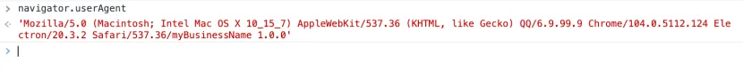

### 3. 为容器植入Cookie

对于有网络请求的业务，为容器植入cookie也是一个常见的需求。即便是加载线上的页面，为了更好的用户体验，我们也可以尝试将获取cookie的过程前置到主进程，然后植入到渲染容器里，避免用户看到登录界面。

cookie的管理同样是以session为单位了，我们可以访问session的cookie对象，对它进行读写。

```js
session
      .fromPartition(subBusiness.name)
      .cookies.set({
        url: 'https://im.qq.com/,
        name: 'testCookieName',
        value: 'abcdeee',
        domain: 'im.qq.com'
      })
      .then((res) => {
        console.log('set cookie for webview success:', res);
      })
      .catch((err) => {
        console.log('set cookie for webview error:', err);
      });
```

效果如图

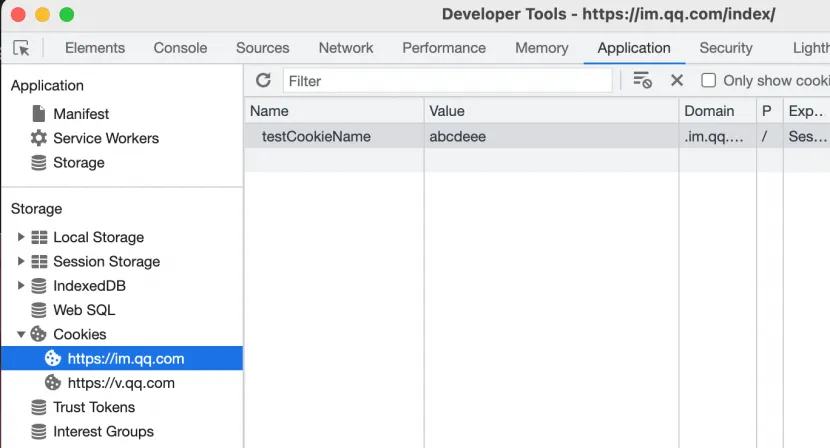

但这里还有一个问题，如果我们的容器加载的页面，并不是一个线上地址，而是提前构建好放在本地的、使用私有协议加载的资源呢。

如果还用同样的方式设置cookie，我们会收到一个错误信息


cookie只能够注册给标准的web协议，，即http(s)、ws(s)，并不支持私有协议。

那么当我们把页面资源放在本地安装包，但又需要使用http请求去远端服务器获取数据，该怎么办呢？

这就要用到session对网络请求的定制能力。

## 三、使用session对象定制网络请求

### 1. 网络请求的生命周期钩子

Electron管理网络请求也是以session作为单位的，session下面有一个webRequest对象，对象继承自chromium内核，它把一个网络请求划分为若干阶段，如下图

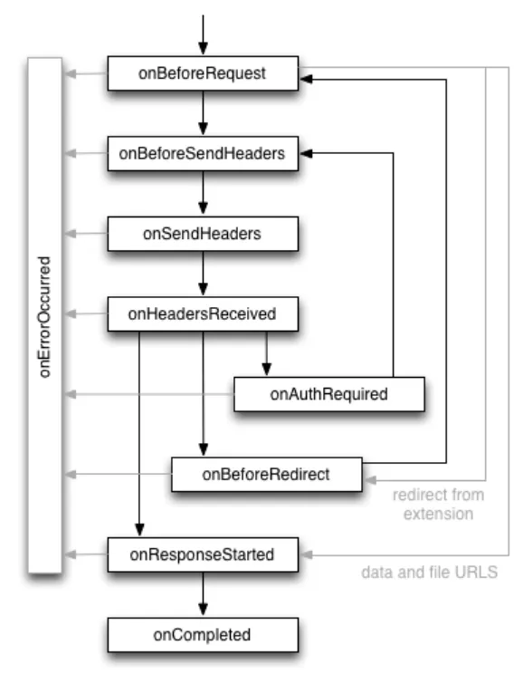

这些阶段在webRequest对象上都有对应生命周期钩子，我们可以使用这些钩子，对请求进行干预、修改、重定向、追加和删除信息等等。主进程为我们开放了很高的修改权限。

### 2. 扩展请求头

比如前一章提到的场景，需要给本地发出的网络请求带上cookie信息。但渲染进程一侧因为协议限制无法直接种植cookie。针对这种情况，我们就可以拦截onBeforeSendHeaders钩子，手动把cookie字段组装好，塞进请求头，和原始数据一起发出去。

```js
// 缓存的cookie数组，在实际业务中，cookie可能来自某些前置的鉴权步骤
const myCookies = [ { name:'testCookieName', value:'abcdeee' } ];

// 拦截扩展请求头
session.fromPartition(‘mySession’).webRequest.onBeforeSendHeaders(async (details, callback) => {
    const { requestHeaders } = details;
    const url = new URL(details.url);
    const cookieArr: string[] = [];

    // 把缓存的cookie设置到请求头里
    cookies.forEach((cookie) => {
      cookieArr.push(`${cookie.name}=${cookie.value}`);
    });
    if (cookieArr.length) {
      requestHeaders.cookie = cookieArr.join(';');
    }

    callback({ requestHeaders });
  });
```

效果如图

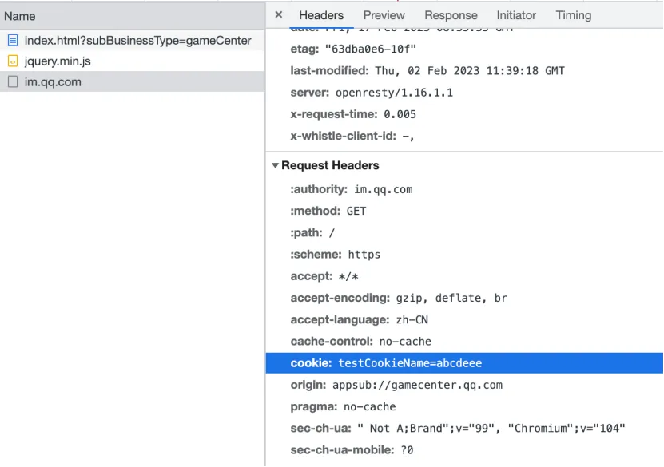

这样一来，我们甚至不需要把cookie暴露给上层，安全性也更好了。

除了设置cookie之外，还可以按需扩展referer、origin等字段，以满足服务器的校验要求，详细的字段可以参阅官方文档。

```js
requestHeaders.referrer = 'xxxxx';
requestHeaders.origin = url.origin;
……
```

### 3. 扩展响应头

除了发包的请求头之外，收到回包的响应头也可以扩展。

比如，我们使用私有协议或者localhost加载的页面，请求服务器的时候，会遇到CORS限制，毕竟我们的地址不是真实存在的网络域名，无法被远端服务器识别。但我们可以通过修改返回头来绕过这一限制。

```js
// 拦截扩展响应头
session.fromPartition(‘mySession’).webRequest.onHeadersReceived(async (details, callback) => {
    const { responseHeaders, referrer } = details;
    const url = new URL(details.url);
    // 设置返回头的访问控制字段，设成*以允许来自所有域名的请求通过  
    responseHeaders['Access-Control-Allow-Origin] = '*';
     callback({ responseHeaders });
});
```

这样就可以让请求顺利送达上层。当然，实际使用的时候，还是建议做一些白名单的匹配和校验。

### 4. 请求拦截和重定向

试想一个场景，我们有一个业务，既可以在web端访问，也可以在某个桌面应用的窗口里打开（现网的桌面QQ中就集成了很多这样的子业务）。

在桌面应用里，业务资源可以提前打进安装包，或者用动态下载的方式缓存到本地，总而言之当用户访问的时候，最好可以触达本地文件，实现秒开。但是当本地文件不存在时，用户也可以继续访问web端作为兜底。

听起来是不是很熟悉？**手Q的离线包**就是类似的机制。

子业务的开发者不需要关心本地缓存的情况，只需要使用线上url作为访问地址，加上特定的参数，交给底层来执行本地缓存的检查和匹配。

前面已经介绍了如何注册私有协议访问本地资源，我们只需要增加一步，拦截线上资源的http请求，并且判断本地缓存是否存在。如果存在，就做一个重定向的动作，转到本地协议。如果不存在，就继续执行默认逻辑。

我们选择拦截onBeforeRequest钩子，这是请求发送的第一个步骤。

```js
const filter = {
  urls: [`http://${subBusiness.host}/*`, `https://${subBusiness.host}/*`],
};

subBusinessSession.webRequest.onBeforeRequest(filter, async (details, callback) => {
  const url = new URL(details.url);

  //通过一定的匹配规则获取本地文件路径
  const localFilePath = getLocalFilePath(url.hostname, url.pathname);
  
  //使用fs.acess等api判断本地文件是否存在
  const isExist = await isFileExist(localFilePath);
  
  if (isExist) {
    //如果存在，则重定向到私有协议
    const newHref = url.href.replace(/^https?:/, 'appsub:');
    callback({ cancel: false, redirectURL: newHref });
  } else {  
    //否则继续发送默认请求
    callback({});
  }
});
```

拦截匹配后的本地资源，就会被指向本地缓存的文件地址，而缓存里找不到的资源，会继续使用线上的url去请求。

## 四、总结

上文介绍了Electron框架中session对象的概念、管理方式，展示了它强大功能的一部分。合理使用它，可以很好地拓宽我们业务的能力。

