 
<!--BEGIN_DATA
{
    "create_date": "2024-02-25 12:00", 
    "modify_date": "2024-02-25 12:00", 
    "is_top": "0", 
    "summary": "一文读懂Xcode代码索引原理", 
    "tags": "iOS", 
    "file_name": "一文读懂Xcode代码索引原理.md"
}
END_DATA-->

#### <p>原文出处：<a href='https://cloud.tencent.com/developer/article/2204613?areaSource=102001.18&traceId=EI_rLraLXoc6jzEs8CZlN' target='blank'>一文读懂Xcode代码索引原理</a></p>

> 导语：Xcode 作为 iOS 开发绕不开的 IDE 代码编辑功能很强大，但是在编辑大型工程时总是遇到代码高亮、代码提示失效，建立代码索引慢等问题。本文抽丝剥茧，介绍了 Xcode 代码索引的工作原理，并提出了一种跨设备共享代码索引的方案，在企微落地后优化了90%的全量索引耗时。

## 一、背景介绍

Xcode 作为 iOS 开发绕不开的 IDE，深受大家的“喜爱”，作为一款成熟的 IDE，大家对于它的期待还是挺高的。


Xcode 在面对体量巨大的工程时还是显得力不从心，你可能也有以下困惑：

  1. 正在修紧急 bug，Xcode 代码高亮怎么没了？代码提示、代码跳转统统失效，关键时刻掉链子；
  2. 面对海量代码，Xcode 的 Open Quickly 功能能够通过关键词迅速定位到想要找到的代码，背后原理究竟是什么？
  3. 代码索引总是耗时很长，在后台占用大量CPU，能不能提前预生成索引数据，跨设备共享。

带着上面的问题，笔者阅读了并整理了网上可以找到的相关资料，然后进行了大量的实验，最后完成了本文。本文基于 Xcode 14.0 (14A309) 进行研究（各个版本 Xcode 构建索引策略可能有所差异，但是思路是大体一致的），如有错误或者遗漏之处望各位大佬指正。

## 二、Xcode Index 工作流程

Xcode 的代码高亮、代码补全、代码跳转、查找调用链、重构、Open Quickly 等功能都是 Xcode Index 的一部分，打开 Xcode 工程可以在顶部 bar 看到 Index 的进度信息。


Xcode Index 是如何工作的呢？这就要引入一个新的工具 SourceKit，上述的 Xcode 代码操作相关功能，都是基于 SourceKit 实现的。SourceKit 和 Xcode 通过 XPC 进行通信，SourceKit 是 Xcode 代码索引功能的幕后主角，Xcode 是客户端，负责收集用户操作，转换成请求发给 SourceKit，最后展示计算结果；SourceKit 是后端，负责生成索引数据，计算 Xcode 请求。


整个工作流程如下图所示，Xcode 是前端，SourceKit 是驱动引擎，Clang 是实际产生索引数据的，索引[数据存储](https://cloud.tencent.com/product/cdcs?from_column=20065&from=20065)在 Index Store。

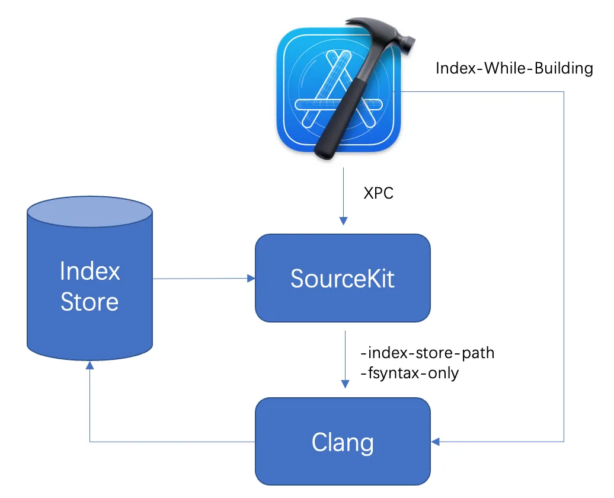

Xcode 生成 Index Store 有两条路径：

路径一、Xcode 在闲时自动调用 SourceKit 在后台生成数据。SourceKit 最终调用 Clang 生成数据，使用编译参数 `-index-store-path -fsyntax-only` ，生成 Index 数据只需完成语法分析即可得到结果，不需要进行完整编译流程。

路径二、开启 `Index-While-Building`，如果将该配置项打开，会在编译过程中新增参数 `-index-store-path`，在编译时同时生成 Index 数据，由于编译时本来就需要进行词法分析、语法分析，因此中间产物是可以复用的。开启该功能会对编译速度产生影响，官方给出的数据是慢 2-5%。

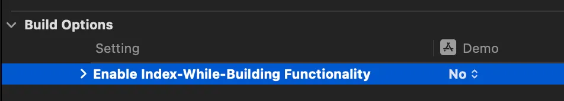

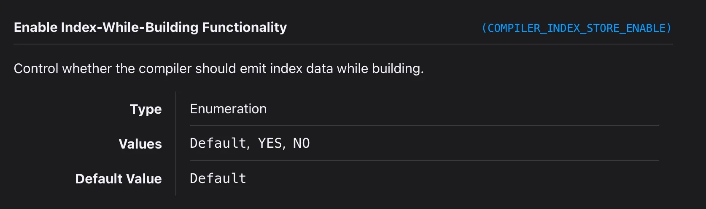

## 三、SourceKit - 代码索引幕后主角

### 3.1 SKAgent

了解了整个工作流程，接下来我们来讲讲 SourceKit 的一些工作细节。运行 Xcode 时在活动监视器里可以看到一个进程
`com.apple.dt.SKAgent` ，SKAgent 是 SourceKit 的 XPC 服务，负责和Xcode 进行通信，它的路径是：/Applications/Xcode.app/Contents/SharedFrameworks/SourceKit.framework/Versions/A/XPCServices/com.apple.dt.SKAgent.xpc/Contents/MacOS/com.apple.dt.SKAgent。


### 3.2 SourceKit 通信协议探索

为了进一步探索 SourceKit 在背后究竟做了什么，我们将 Xcode 和 SourceKit 通信日志打印出来分析，通过以下命令启动Xcode，可以将日志打印到指定文件。

```
SOURCEKIT_LOGGING=3 /Applications/Xcode.app/Contents/MacOS/Xcode &> ~/Downloads/xcode.log
```

SourceKit 支持哪些命令可以查看这个文件：

```
/Xcode.app/Contents/SharedFrameworks/SourceKit.framework/Versions/A/XPCServices/com.apple.dt.SKAgent.xpc/Contents/Frameworks/SKIPC.dylib
```

#### 3.2.1 索引进度更新

索引进度更新相关的命令主要有以下几条：

  * 更新索引进度：indexer.callback.on-is-indexing-workspace
  * 索引建立完毕：indexer.callback.on-did-index-workspace
  * 建立索引任务中断：indexer.callback.on-did-suspend-indexing-workspace
  * 建立索引任务恢复：indexer.callback.on-did-resume-indexing-workspace

下面是一个实际案例，命令为 `indexer.callback.on-is-indexing-workspace` ，在 `key.indexer.callback.on-is-indexing-workspace.user-info` 的 XML 结构中，包含了已经完成索引文件数量 ：`IDEIndexingFilesCompletedKey`、索引剩余文件数量：`IDEIndexingFilesRemainingKey` 等信息，Xcode 根据进度信息更新 UI 进度。

```
SourceKit-client: [2:notification:66619:169.3069] {
  key.notification: indexer.callback,
  key.indexer.arg.indexer-token: 1,
  key.indexer.callback.kind: indexer.callback.on-is-indexing-workspace,
  key.indexer.callback.on-is-indexing-workspace.user-info: "<?xml version=\"1.0\" encoding=\"UTF-8\"?>\n<!DOCTYPE plist PUBLIC \"-//Apple//DTD PLIST 1.0//EN\" \"http://www.apple.com/DTDs/PropertyList-1.0.dtd\">\n<plist version=\"1.0\">\n<dict>\n\t<key>IDEIndexingFilesCompletedKey</key>\n\t<integer>8740</integer>\n\t<key>IDEIndexingFilesRemainingKey</key>\n\t<integer>8262</integer>\n\t<key>IDEIndexingHotFilesKey</key>\n\t<integer>0</integer>\n\t<key>IDEIndexingLoadingProgressKey</key>\n\t<real>0.0</real>\n\t<key>IDEIndexingQueueWidthKey</key>\n\t<integer>8</integer>\n\t<key>IDEIndexingWaitingForPrebuildKey</key>\n\t<false/>\n</dict>\n</plist>\n"
}
```

#### 3.2.2 编辑文件

接下来的案例场景是打开文件 ViewController.mm 编辑，首先 Xcode 会发送命令`source.request.indexer.editor-moved-focus-to-file` 告诉 SourceKit 用户正在编辑ViewController.mm，优先响应该文件的请求。

```
SourceKit-client: [2:request:259:29.8311] [78] {
  key.request: source.request.indexer.editor-moved-focus-to-file,
  key.indexer.arg.indexer-token: 1,
  key.indexer.arg.occurrence.file: "/Users/link/Desktop/Demo/src/ViewController.mm"
}
```

然后 Xcode 会发送命令 `source.request.document.symbol-occurrences`，获取当前文件的所有符号信息，包含符号名、符号类型、语言、代码行列等信息，Xcode 通过这些信息进行代码高亮。

```
SourceKit-client: [2:request:259:29.9688] [80] {
  key.request: source.request.document.symbol-occurrences,
  key.indexer.arg.indexer-token: 1,
  key.indexer.arg.query.doc-location: {
    key.indexer.arg.doc-loc.url: "file:///Users/link/Desktop/Demo/src/ViewController.mm",
    key.indexer.arg.doc-loc.start-line: 18,
    key.indexer.arg.doc-loc.start-col: 0,
    key.indexer.arg.doc-loc.end-line: 33,
    key.indexer.arg.doc-loc.end-col: 5,
    key.indexer.arg.doc-loc.range-loc: 233,
    key.indexer.arg.doc-loc.range-count: 324,
    key.indexer.arg.doc-loc.encoding: 0
  },
  key.indexer.arg.query.file-content: "<DATA>"
}
SourceKit-client: [2:response:75571:29.9700] [80] {
  key.symbols: [
    {
      key.symbol: {
        key.indexer.arg.symbol.name: "viewDidLoad",
        key.indexer.arg.symbol.kind: "Xcode.SourceCodeSymbolKind.InstanceMethod",
        key.indexer.arg.symbol.language: "Xcode.SourceCodeLanguage.Objective-C",
        key.indexer.arg.symbol.resolution: "c:objc(cs)UIViewController(im)viewDidLoad"
      },
      key.indexer.arg.occurrence.role: 5,
      key.indexer.arg.occurrence.location: {
        key.indexer.arg.doc-loc.url: "file:///Users/link/Desktop/Demo/src/ViewController.mm",
        key.indexer.arg.doc-loc.start-line: 18,
        key.indexer.arg.doc-loc.start-col: 5,
        key.indexer.arg.doc-loc.end-line: 18,
        key.indexer.arg.doc-loc.end-col: 10,
        key.indexer.arg.doc-loc.range-loc: 9223372036854775807,
        key.indexer.arg.doc-loc.range-count: 0,
        key.indexer.arg.doc-loc.encoding: 1
      },
      key.indexer.arg.occurrence.line: 0,
      key.indexer.arg.occurrence.col: 0,
      key.indexer.arg.occurrence.file: "/Users/link/Desktop/Demo/src/ViewController.mm",
      key.indexer.arg.symbol.display-name: "-viewDidLoad",
      key.indexer.arg.symbol.is-in-project: false,
      key.indexer.arg.symbol.is-virtual: true,
      key.indexer.arg.symbol.is-system: true,
      key.is-implicit: false
    },
    ...
  ]
}
```

## 四、Index Store 解析

接下来我们看看 Index Store 是怎么存储的，如下图所示，主要由两个目录，DataStore(records + units)、UniDB。DataStore 存储了 Clang 编译的产物，是索引原始数据，UniDB 是为了加速查询建立的表，存储了经过处理后的信息。

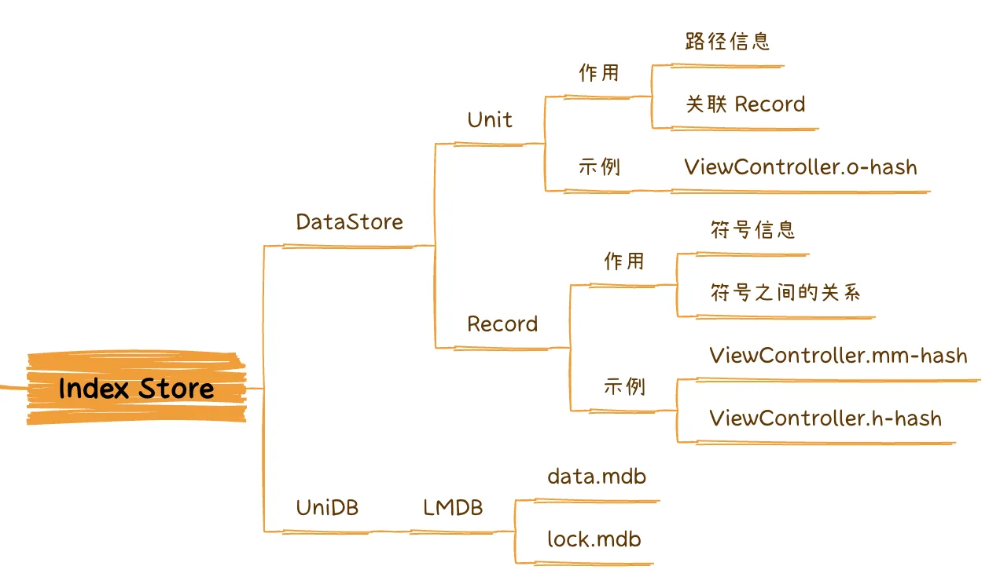

> Index Store 存储路径 Xcode14：~/Library/Developer/Xcode/DerivedData/project-xxx/Index.noindex Xcode13：~/Library/Developer/Xcode/DerivedData/project-xxx/Index

### 4.1 DataStore

units 记录了源码文件的路径、依赖的文件路径、依赖的 records 文件的路径，它的命名规则是 `test.o-hash` （Hash of output file path），如果文件名、路径等不变化文件名则不会变化。

records 记录了每个源码文件由哪些符号构成，它主要由 Symbol、Occurence 两部分构成。它的命名规则是 `test.m-hash`（Hash of output file path），如果代码变更文件名就会变化。

我们可以借助 LLVM 的工具 `c-index-test` 打印它们的数据结构：

```
## 打印 unit 数据结构
c-index-test core --print-unit /path/DataStore/v5/units/ModelA.o-2D1ATXD2A198H
## 打印 record 数据结构
c-index-test core --print-record /records/D4/ModelA.m-1S1A5O0O7K4D4
```

接下来看一个实际的案例，有一个源码文件 ModelA.mm，代码如下：

```
#import "ModelA.h"
@implementation ModelA
- (void)sayHello {
    [super sayHello];
    NSLog(@"ModelA %@", self.name);
}
@end
```

Unit 数据结构如下：

```
provider: clang-1400.0.29.102
is-system: 0
is-module: 0
module-name: <none>
has-main: 1
main-path: /path/Demo2/src/ModelA.m
work-dir: /path/Demo2
out-file: /SourceKitDemo.build/Debug-iphoneos/Demo.build/Objects-normal/arm64/ModelA.o
target: arm64-apple-ios13.0.0
is-debug: 1
DEPEND START
Unit | system | Foundation | /Users/link/Library/Developer/Xcode/DerivedData/ModuleCache.noindex/1SU4CTGFJJUAV/Foundation-A3SOD99KJ0S9.pcm | Foundation-A3SOD99KJ0S9.pcm-BVRSB7PKB109
Record | user | /path/Demo2/src/ModelA.m | ModelA.m-1S1A5O0O7K4D4
Record | user | /path/Demo2/src/ModelA.h | ModelA.h-1F980T5AVPZPP
Record | user | /path/Demo2/src/BaseModel.h | BaseModel.h-UWC84R5719GY
File | system | /Applications/Xcode.app/Contents/Developer/Platforms/iPhoneOS.platform/Developer/SDKs/iPhoneOS16.0.sdk/System/Library/Frameworks/Foundation.framework/Modules/module.modulemap
File | system | 
...省略部分
DEPEND END (40)
INCLUDE START
/path/Demo2/src/ModelA.m:8 | /path/Demo2/src/ModelA.h
/path/Demo2/src/ModelA.h:9 | /path/Demo2/src/BaseModel.h
INCLUDE END (2)
```

Record 数据结构如下：

```
class/ObjC | ModelA | c:objc(cs)ModelA | <no-cgname> | Def - RelChild
instance-method/ObjC | sayHello | c:objc(cs)ModelA(im)sayHello | <no-cgname> | Def,Dyn,RelChild,RelOver - RelCall,RelCont
instance-method/ObjC | sayHello | c:objc(cs)BaseModel(im)sayHello | <no-cgname> | Ref,Call,RelCall,RelCont - RelOver
function/C | NSLog | c:@F@NSLog | <no-cgname> | Ref,Call,RelCall,RelCont - 
instance-property/ObjC | name | c:objc(cs)BaseModel(py)name | <no-cgname> | Ref,RelCont - 
instance-method/acc-get/ObjC | name | c:objc(cs)BaseModel(im)name | <no-cgname> | Ref,Call,Dyn,Impl,RelRec,RelCall,RelCont - 
class/ObjC | ModelA | c:objc(cs)ModelA | <no-cgname> |  - RelRec
------------
10:17 | class/ObjC | c:objc(cs)ModelA | Def | rel: 0
12:9 | instance-method/ObjC | c:objc(cs)ModelA(im)sayHello | Def,Dyn,RelChild,RelOver | rel: 2
	RelChild | c:objc(cs)ModelA
	RelOver | c:objc(cs)BaseModel(im)sayHello
13:12 | instance-method/ObjC | c:objc(cs)BaseModel(im)sayHello | Ref,Call,RelCall,RelCont | rel: 1
	RelCall,RelCont | c:objc(cs)ModelA(im)sayHello
14:5 | function/C | c:@F@NSLog | Ref,Call,RelCall,RelCont | rel: 1
	RelCall,RelCont | c:objc(cs)ModelA(im)sayHello
14:30 | instance-property/ObjC | c:objc(cs)BaseModel(py)name | Ref,RelCont | rel: 1
	RelCont | c:objc(cs)ModelA(im)sayHello
14:30 | instance-method/acc-get/ObjC | c:objc(cs)BaseModel(im)name | Ref,Call,Dyn,Impl,RelRec,RelCall,RelCont | rel: 2
	RelCall,RelCont | c:objc(cs)ModelA(im)sayHello
	RelRec | c:objc(cs)ModelA
```

### 4.2 Unit 与 Record 关系

下图通过一个案例来展示 Unit 与 Record 之间的关系，有两个源码文件，first.c 依赖了 things.h、header.h、feature.h。second.c 依赖了 header.h、feature.h。在 things.h 定义了一个宏，header.h 会判断是否定义宏展开部分代码。 建立索引完成后，会生成 2 个 Unit 和 6 个 Record 文件，由于编译 first.o、second.o 时宏定义不一样，导致 header.h 展开内容不一样，所以会产生两份 header.h。

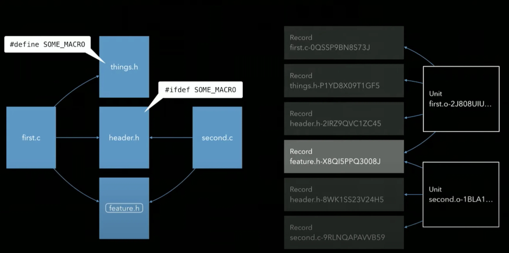

### 4.3 Symbol 与 Occurence

Record 主要由 Symbol、Occurence 两部分构成，Symbol 由 USR、Language、Kind 等元素构成，每个符号对应一个 Symbol。Occurence 由 Symbol、Location、Roles、Relations 等元素构成，它表示了每个 Symbol 被使用的位置。

下图展示了一个案例，1 到 12 行定义了类 `Polygon`，14 到 26 行定义了 `Polygon` 的子类 `RegularPolygon`，

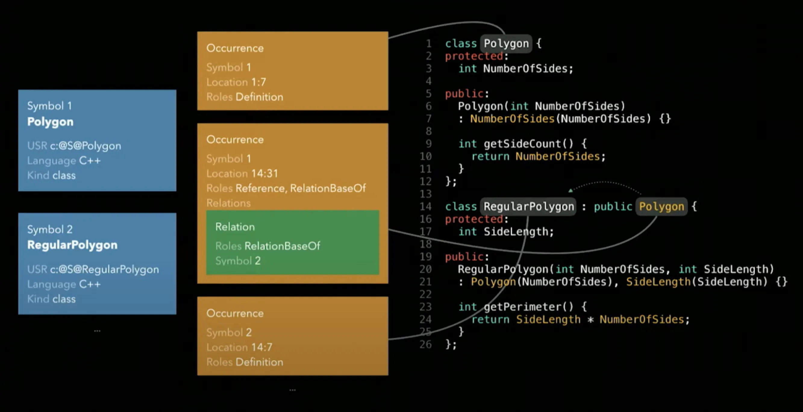

Record 是怎么表示类定义和子类继承关系的呢？首先图中所示的两个 Symbol，Polygon、RegularPolygon 分别为两个类的符号信息，Symbol 通过 USR（Unified Symbol Resolution）来唯一标识，USR 的官方描述：

> USR: A Unified Symbol Resolution is a string that identifies a particular entity (function, class, variable, etc.) within a program. USRs can be compared across translation units to determine, e.g., when references in one translation refer to an entity defined in another translation unit.

这两个 Symbol 一共出现了 3 次，对应 3 个 Occurrence，其中 Polygon 出现了两次，一次是出现在 1:7 位置，角色是类定义，第二次出现在 14:31，角色是被继承；RegularPolygon 出现了一次位置在 14:7，角色是类定义。

### 4.4 UniDB

了解了 Unit 和 Record 的数据结构和用途，我们就可以推导出 Xcode 实现一些功能的原理，例如有这么一个场景，我们需要找到 Polygon 的所有子类，可以这么实现：

  1. 遍历所有 Record 的 Occurrence，找到 Roles 为 RelationBaseOf 对应 Symbol 是 Polygon 的 Occurrence；
  2. 通过步骤一找到的 Occurrence 就可以找到所有定义 Polygon 子类的 Occurrence，从而找到 Polygon 子类的 Symbol；
  3. 最后结合 Unit 可以定位到我们要找的子类的行号、列号；

但是线性遍历的效率较低，Xcode 为了优化查询效率引入了 LMDB 来存储中间数据结构。LMDB 全称为 Lightning Memory-Mapped Database，是高性能的内存映射型数据库，它有以下优点：

  1. 数据读写速度快，基于内存映射方式访问文件；
  2. 使用轻量，文件结构简单，包含一个数据文件和一个锁文件，数据随意复制，读写引用代码很小的 LMDB 库即可完成

它由两个文件组成：data.mdb、lock.mdb，为了探索 Xcode 在 LMDB 里存储了什么数据，我们可以用 python 的 lmdb 库解析。

```
import lmdb
if __name__ == '__main__':
		env = lmdb.open("path", max_dbs=14)
    txn = env.begin()
    for key, value in txn.cursor():
        print(key, value)
```

解析结果如下图所示，可以看到它由多个表构成，很多表下还有子表。

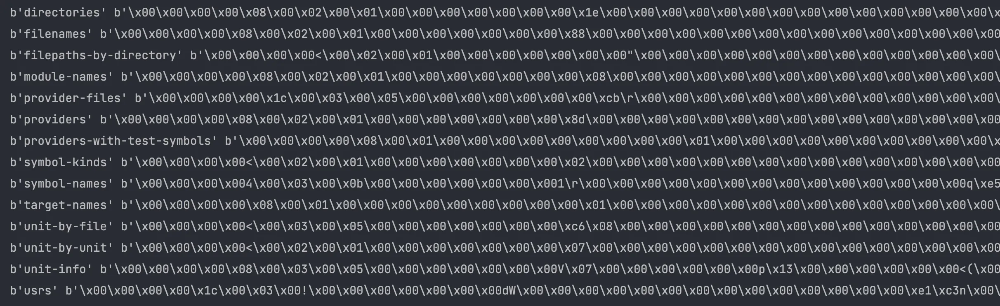

还是用刚刚的案例：查询 Polygon 的所有子类，Xcode 通过下面的 key-value 表来加速查询过程：

  1. 建立一个 key-value 表，key 是 USR，value 是 USR 出现过的 Record、Roles；
  2. 计算 Polygon 的 USR，通过 USR 查找到它出现过的 Records，筛选 Roles 包含 RelationBaseOf，定位到哪些 Record 内包含 Polygon 子类定义；
  3. 在 Record 文件中可以查询具体子类的信息；

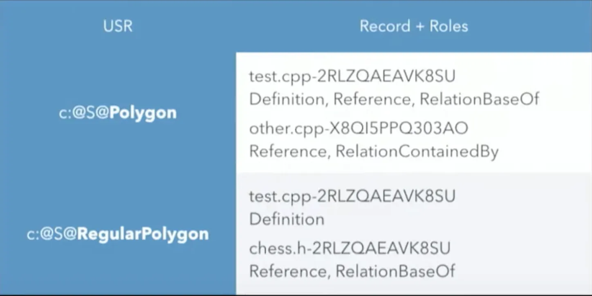

还有一些其它用的表：

  1. Search symbols by name：记录了 Symbol Name 和 USR 的对应关系，方便通过关键词搜索代码，Open Quickly 就是基于该表实现的；
  2. Remove data from unreferenced records：记录了 Record 文件被哪些 Unit 使用，如果没有 Unit 使用了，该 Record 就会被清理；
  3. Units to re-index when header changes：记录了头文件被哪些 unit 使用，用于查询头文件变化后，哪些 unit 需要重新生成索引数据；

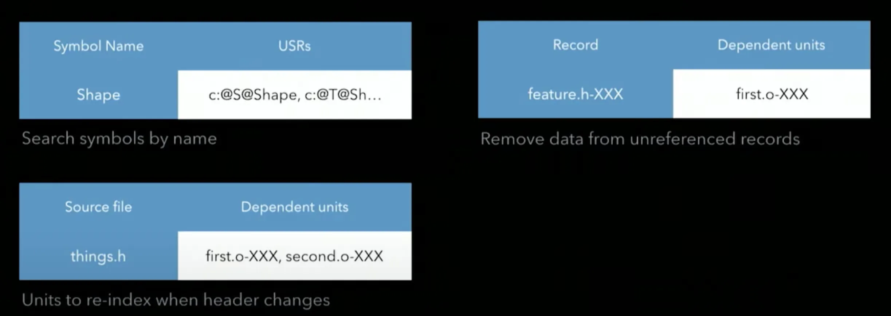

## 五、Index Store 跨设备共享

### 5.1 方案可行性验证

了解 Index Store 的数据结构之后，不难发现只要源码、编译选项一致，产生的 Record 其实是一样的，企微工程完整进行一次代码索引耗时 24 分钟，我们是否可以提前预生成 Unit、Record，开发直接下载产物加速代码索引。

我们先用一个 Demo 工程来验证我们的猜想，工程很简单，结构如下所示：

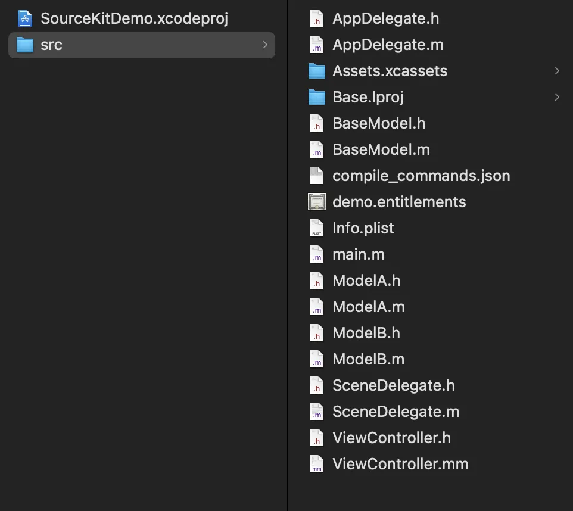

我们将同样的工程拷贝两份，分别为：Demo1、Demo2，最终目标是在 Demo1 工程可以复用 Demo2 工程生成的 Index Store。

首先在 Demo2 的 `Other C Flags` 配置编译参数 `-index-store-path /path/DataStore` ，在编译时生成 DataStore 数据到指定目录。

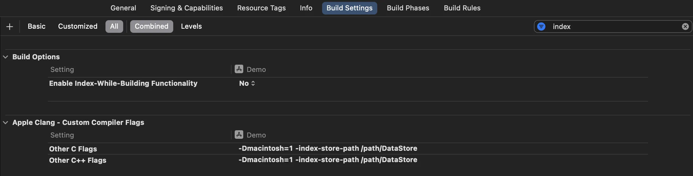

首先删除 Demo1 的 DataStore、UniDB 目录，将 Demo2 产生的 DataStore 拷贝到 Demo1 的 DerivedData 目录

> DataStore 存放路径：~/Library/Developer/Xcode/DerivedData/Demo1-xxx/Index.noindex

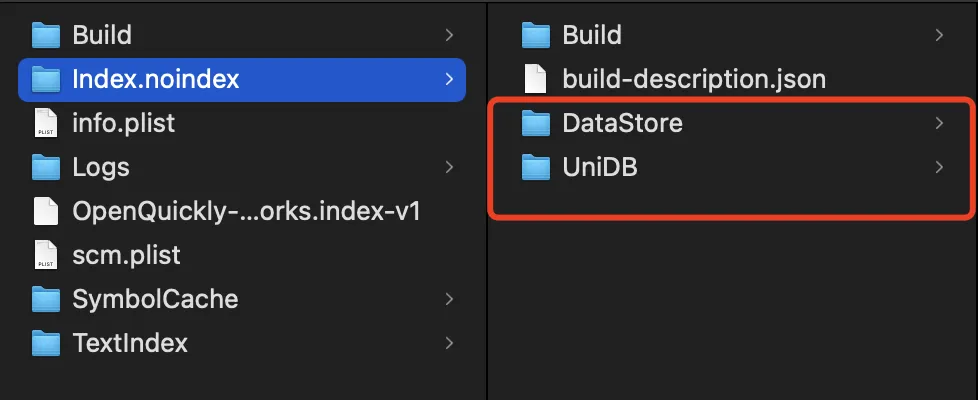

在命令行输入以下命令打开 Xcode Index 日志，可以确认 Xcode 对哪些文件进行了索引。

```
defaults write com.apple.dt.Xcode IDEIndexShowLog -bool YES
```

打开 Demo1 工程，观察日志发现还是会重新建立索引，说明复用失败。查看 Demo2 Unit 信息，可以看到它存储了 Demo2 工程的绝对路径信息，要替换成 Demo1 工程的路径。

```
provider: clang-1400.0.29.102
is-system: 0
is-module: 0
module-name: <none>
has-main: 1
main-path: /path/Demo2/src/ModelA.m
work-dir: /path/Demo2
...
```

可以使用 `index-import` 工具（[https://github.com/MobileNativeFoundation/index-import](https://github.com/MobileNativeFoundation/index-import)）来完成替换操作。

```
index-import \
    -remap "/path/Demo2=/path/Demo" \
    "/path/DataStore" \
    "/path/DataStore2"
```

替换后再次查看 unit 信息，可以看到路径已经被修改。再次替换 Demo1 工程 DataStore，发现复用成功。

```
provider: clang-1400.0.29.102
is-system: 0
is-module: 0
module-name: <none>
has-main: 1
main-path: /path/Demo1/src/ModelA.m
work-dir: /path/Demo1
```

### 5.2 企微落地方案

在 Demo 工程我们验证了方案可行，于是想通过这种方式提升开发本地索引效率，要让方案顺利落地，需要让整个流程自动化，并且让开发同学使用尽量简单，最终我们落地的流程如下图所示：

  1. 在流水线上使用构建机自动构建最新代码的索引，构建完成后上传到存储服务；
  2. 开发在本机触发更新索引，从存储服务下载最新的索引数据；
  3. 清理历史索引数据，进行 remap 操作，将路径修改为本地路径，然后替换 DerivedData 的 DataStore；

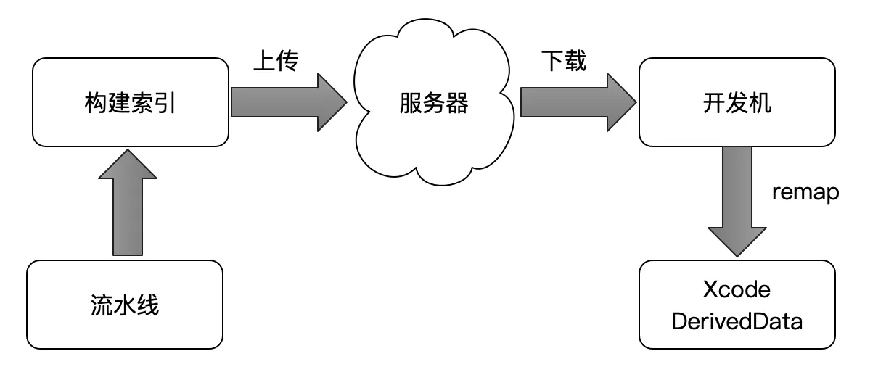

经过测试，在 M1 Max 机器上，使用索引数据缓存后，企微工程建立全量索引耗时从 24 分钟优化到了 1.5 分钟。

## 参考资料

1. https://www.youtube.com/watch?v=jGJhnIT-D2M
2. https://github.com/bazel-ios/rules_ios/blob/master/docs/index_while_building.md
3. https://github.com/MobileNativeFoundation/index-import
4. https://levelup.gitconnected.com/uncovering-xcode-indexing-8b3f3ff82551
