 
<!--BEGIN_DATA
{
    "create_date": "2020-04-28 10:41", 
    "modify_date": "2020-04-28 10:41", 
    "is_top": "0", 
    "summary": "一文读懂腾讯会议在复杂网络下如何保证高清音频", 
    "tags": "WebRTC、C/C++", 
    "file_name": "一文读懂腾讯会议在复杂网络下如何保证高清音频.md"
}
END_DATA-->

####
原文出处：<a href='https://cloud.tencent.com/developer/article/1613289' target='blank'>一文读懂腾讯会议在复杂网络下如何保证高清音频</a>

**导读** | 一场突如其来的疫情，让数以亿计的白领只能居家办公，云视频会议系统突然成为最重要的办公软件。腾讯会议在2019年12月25日正式上线后，短短两个月时间内积累千万日活。除了时机，腾讯会议产品又为什么能脱颖而出呢？产品力是个不得不提的因素，腾讯多媒体实验室高级研究员王晓海在【腾讯技术开放日·云视频会议专场】中，对腾讯会议在复杂网络情况下如何保证高清音质进行了分享。

**一、VoIP和PSTN的前世今生**

PSTN（PublicSwitch Telephone Network公共交换电话网）从贝尔发明电话起就已经存在了，通过这张网连接全世界所有的电话机，发展到
今天的PSTN骨干网基本上都已经数字化了，但是在一些集团电话或者偏远地区，PBX（Private Branch Exchange用户交换机）接入的可能还是一些模拟电信号接入的传统电话。**PSTN可以通俗理解成传统电话和者蜂窝电话(PublicLand Mobile Network公共路基移动网)的总和。**

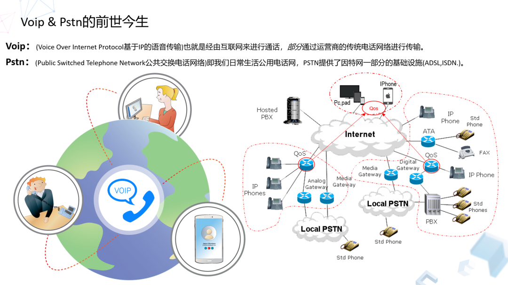

**VoIP是基于IP（InternetProtocol）的语音传输**，可以理解为经过互联网传输的通话，也有部分通过电信运营商的传统电话网络进行传输。VoIP网络通话是电脑或者移动终端之间的互通，比较典型的QQ或者微信，以及苹果设备之间的FaceTime。VoIP比较便宜，这是因为VoIP不过是一种互联网应用，那么这个流量用户来看视频，还是用来做语音视频通话，实际上资费是一样的。 

那么为什么VoIP服务有些要收钱，有些却免费？这是因为VoIP服务不仅能够沟通VoIP用户，还可以和电话用户通话，比如使用传统固话PSTN，以及无线手机蜂窝网络(PLMN)2,3,4,5G的用户，对于这部分通话，VoIP服务商必须要给固话网络运营商以及无线通讯运营商支付通话费用，这部分的收回就会转到VoIP用户头上，而网络VoIP用户之间的通话可以是免费的。 

有好多PSTN网络或者集团电话网络，它本身是有质量保证的。但是VoIP电话，一般是走公网的，它发出去或者接到的最后一公里电路是没有保障的，同时因为各种原因会丢包或者抖动，会让端到端通话质量受损。我们所关注的工作重点，就是图一右侧密密麻麻的这些内容，**实际集中在QoS，也就是Quality of Service（服务质量），包含网络传输的一系列服务需求，比如带宽、延时、抖动、丢包等。**

**二、VoIP的发展进化史**

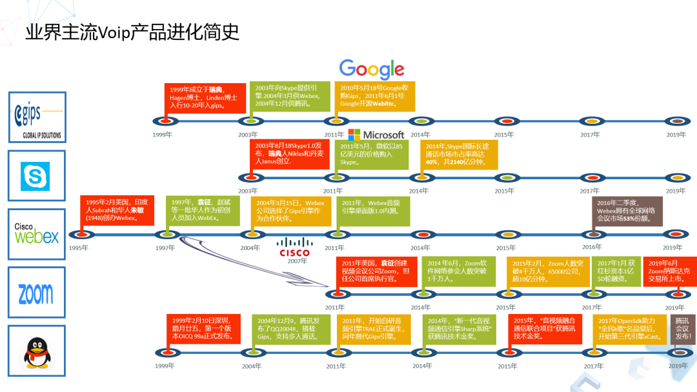

Webex1995年诞生，是业界最早的一款VoIP产品。到了1999年GIPS诞生，它为业界提供了广泛的引擎，对整个VoIP影响巨大，在2003、2004年，GIPS向Skype和Webex，以及QQ提供了它的GIPS音频引擎，2011年GIPS被谷歌收购，该项目开始开源，即为大家所熟知的WebRtc开源项目。

2011年这个时间点很重要，因为WebRtc的开源，促使业界诸多音视频通讯领域的头部玩家开始躁动，同年Skype被微软收购，ZOOM创立，它的创始人就是Webex出来的。2011年腾讯也开始自研音频引擎，腾讯在国内召集了一批音频及通信领域的从业者开发了第一代引擎TRAE（TencentRealtime Audio Engine），并且同年腾讯把自研的TRAE引擎上线换掉GIPS，TRAE音频引擎正式作为QQ音频引擎为几亿QQ用户服务。

2014年腾讯“新一代语音视频通信引擎Sharp系统”获得公司技术突破金奖，Skype在国际长途通话市场市占率达到40%，总通话量达到2000多亿分钟。2015年腾讯“音视频融合通讯项目”获得公司技术突破金奖，腾讯从2016年开始的向外界提供了OpenSDK能力，对内对外服务了众多音视频通话类的产品，其中2017年获得腾讯内部产品最高奖---名品堂的“全民K歌”也是使用OpenSDK的基础音视频处理及通讯能力，这种互联互通的能力为后来的发展奠定了坚实基础。

其实腾讯的音视频引擎又可以分为三个小代际。第一代就是QQ用的，2011年TRAE引擎，第二代是2016年开始向外界开放的OpenSDK引擎，到2017年腾讯开发了XCast引擎，这算作第三代，在最新的XCast引擎之上，诞生出今天的“腾讯会议”。

**2019年12月25号腾讯会议上线，2020年3月6日腾讯会议已经登顶AppStore免费软件NO.1，到今天不过两个多月，3月份日活达一千万**，成绩还是比较难得的。ZOOM人数日活突破一千万是2014年6月份，当时的ZOOM是用了3年时间。

**三、VoIP音频系统的主要构成**

VoIP从发送端到接收端大概有哪些模块呢？我今天着重讲**网络的流量控制、拥塞控制，包括丢包、抗网络抖动的一些逻辑，以及他们怎么样融合才能更好提升服务质量。核心是QoS的概念**。

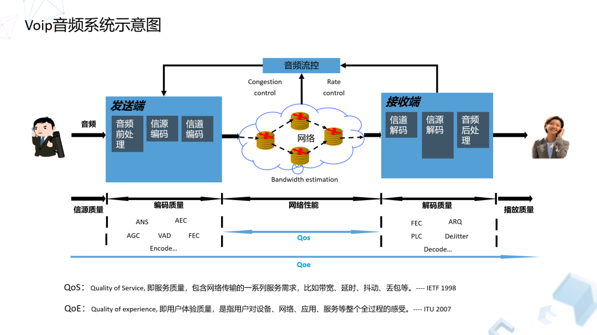

QoS（Quality of Services）概念当时在IETF（The InternetEngineering Task Force国际互联网工程任务组）提出的时候，只专注于纯网络范畴的指标，比如丢包、延迟、抖动、带宽等。进入新世纪以后，行业对VoIP或者融合通信的理解有变化，进入宽带时代以后对指标会有更高期许和更高要求，比如说音频采集，本来采集信源不好，再经过压缩、传输、解码，可能最终效果不好。如果从QoE（Qualityof Experience）环节来看，端到端不限于采集模拟接口出来的声音，甚至包括人的讲话环境和听音环境影响，用户感受到的音频质量，是整个体系反馈出来的诊断。

QoS没有太多秘密，无非就是抗丢包，抗抖动，网络拥塞控制等等，ARC（Adaptive RateControl）可以看做一个中央指挥官，它只能去指挥整合这些方式、手段，最终保证音频质量是良好的改动。所以说到这块，**QoS一般套路就类似于一个全家桶，无非这六种模块的合理有机组合，接下来会对这几块深入讲一下。**

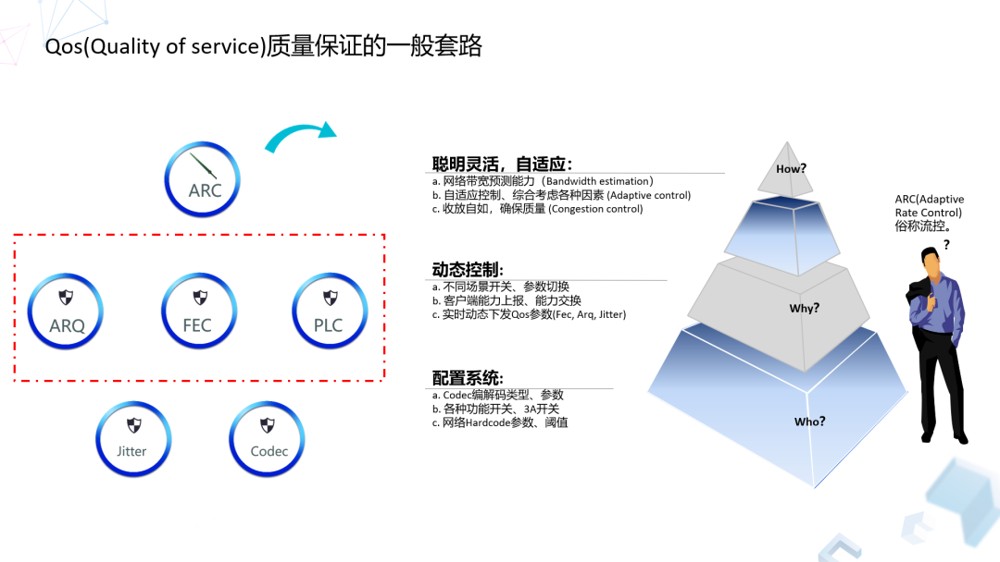

**四、腾讯会议是如何保证服务质量的？**

**1、腾讯会议的“流控”：ARC**

先看ARC，ARC在腾讯会议的概念就是“流控”，**流控能干什么？**

**   是三个大的层面，首先它是一个配置系统，**无论双人或多人通话，系统所需要的基础配置参数，还有在什么场景下需要什么样的参数。通过这个云端的参数配置及开关配置，系统拥有了基本的云端可控手段。

然后动态控制是中间的这块，流控是把源端到目标端的传输行为，发出来数据想让对方解码，会存在动态的能力交换的要求。此外，系统如果发生了抖动，或者丢包的情况，我们会动态的去控制相应的模块去处理这些情况。**所以能力交换，或者动态下发的能力，实际上是动态控制的第二层次水平。**

**   最高层的能力，是聪明灵活自适应的能力，就是对ARC的指挥能力的更进一步的要求**，丢包的时候怎样去抗丢包，抖动的时候怎么样去抗抖动，去动态控制，但是这些抗丢包、抗抖动的方法有可能会占用过多的网络带宽、或者以牺牲端到端延时为代价的、于是当网络发现了比如带宽不足，或者网络用户本身终端连接路由器质量有问题，甚至出现网络趋于拥塞的情况，这种情况怎么去把它及时挽救回来，这个配置是对ARC更高层次的要求，涉及到网络拥塞控制（CongestionControl）这个核心命题上来了。

** 2、“流控”在腾讯内部的演进过程**

一开始是都写死的参数，比如解码器参数、音频前处理3A开关等、抗丢包和抗抖动参数也基本是固定的，效果肯定不好。后来我们**在系统增加了流控策略，根据客户端动态上报，动态去算QoS的参数下发。**进化到多人通话以后，特别带宽预测是比较大的挑战，比如上行应该怎么算，下行是接收多交流又该怎么算，因为发送行为不一样，原来那种用一个算法对不同流进行预测，肯定不能用。

**后来，我们还做了服务器混音。**首先可以减少下行用户的流量，其次多路混音成一路，也可以对融合通信发挥基础作用。在对外提供OpenSDK的时代，因为对外用户的需求很不一样，因为应用场景的差别，有的用户需要不通类型Codec，有的用户需要关掉3A处理，有的用户不需要那么大流量，有的用户更加在乎质量而不在乎流量，所以云端的Spear可配置参数的流控策略可以满足我们企业内部应用，包括外部用户的差异化需求。

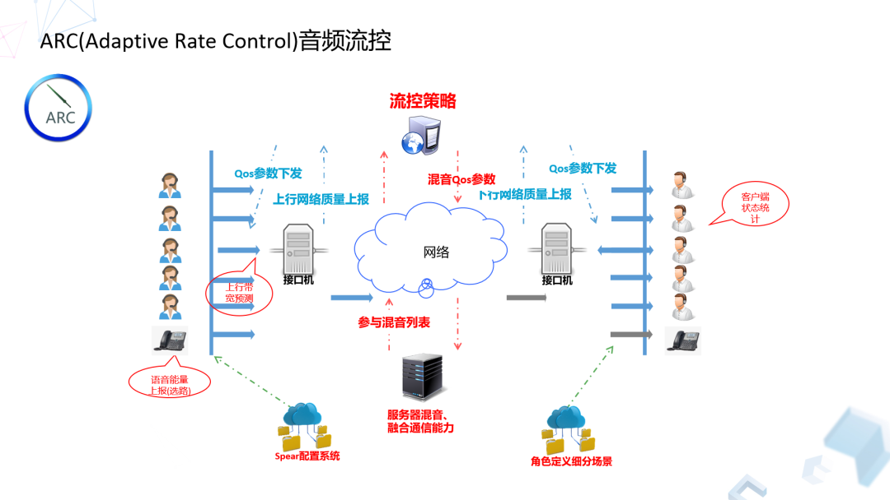

**五、腾讯会议对于拥塞控制的做法**

接下来我们看比较核心的拥塞控制（Congestion Control）。其实拥塞控制在实时RTC（Real TimeCommunication）音视频通讯领域应用中是必不可少的模块，WebRtc在开源以后分别向社区贡献了GCC1和GCC2版本，当然这块不是说Linux系统下编译器的那个GCC。

GCC1（GoogleCongestion Control ver.1）是一个基于接收端的算法，根据每家系统的软件架构的不同，它部署的位置也不一样。**GCC1核心算法是通过实时监控端到端延时的变化量（Jitter），从而判断当前这个网络是否趋于达到网络拥塞的情况。**

**我们首先看端到端延时这个基础概念，端到端延时由三部分组成：一个是传输延时，跟数据包大小及链路宽有关；第二个是队列延时，即数据包在路由器的队列中通过的时长；第三个传播延时，一般传播延时跟传输介质有关。**

实际上在GCC1或者GCC2里面，它真正进入系统、进入计算的这个变量不是端到端延时，而是其变化量即Jitter；Jitter=(TR(i)-TR(i-1)) - (TS(i)- TS(i-1))包括前后两个数据包的接收时间戳之差再减去前后两个包发送时间戳之差，算法输入的是一个Jitter，GCC1通过Kalman自适应滤波器去除噪点，通过网络传输也好，通过整个链路传输过程也好，实际上这种延时的变化值Jitter是一种符合高斯分布的特征，当我们把噪点去掉以后就可以得出它的Jitter趋势。GCC1算法将滤波后的Jitter值与动态阈值进行相应的状态判断，从而得出当前的网络是否趋于拥塞或者处于正常，与此同时还通过实时接收到的流量和预测算法给出当前一个合理的带宽预测值。

后来GCC2又更新了，是基于发端的，它的数据处理源还是Jitter，就刚才说那个Jitter，它是一个什么概念呢？自变量就是Jitter，应变量是什么呢？应变量是它的历史平均值。所以它对自变量和应变量做了一个最小二乘法的一元线性回归，相当于去观察当前的Jitter值相比较历史平均值有怎样的发展趋势，被称作TrendLine算法。GCC算法它在发送端也好还是在接收端也好，带来了工作上的灵活性，而GCC1中绝对值的阈值比较变成了GCC2中趋势线的判断，算法的准确性上有提高。而从及时性上来说，我们在QQ时代使用GCC1算法是，SDK的架构还是有私有协议的，比如说反馈机制都是基于两秒的机制，在最新重构的第三代xCastSDK上上，完全兼容了标准协议，RTP算法核心有准确度的提升，反馈上RTCP时机和及时性也有提升，所以“腾讯会议”相关的算法控制会远远老一代的SDK产品更加及时和准确。

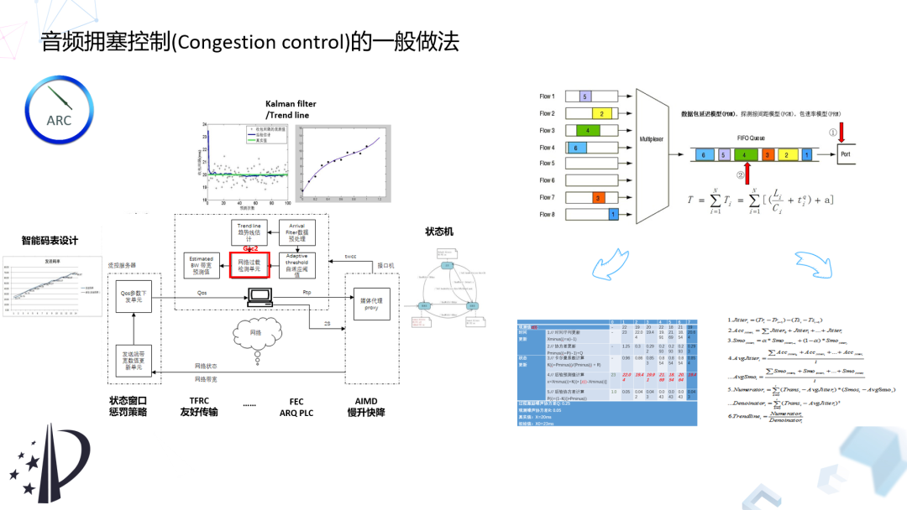

**六、FEC如何把丢失的数据包恢复**

FEC（Forward Error Correction）实际上没有太多新意，这块无非就是利用其基本的特性。比如分组划分，接收端恢复不受数据包顺序影响等特征。举个例子：如果是分组是4，那么在网络传输过程中任意丢掉一个，在接收端任意收到任何顺序的4个属于本分组的数据包，那就可以把丢失的包恢复。

**那么它到底是怎么工作的呢？**FEC目前一般采用了Reed Solomon算法，Reed Solomon算法的核心思想包含三个部分：

**1.利用范德蒙德（Vandermonde）矩阵F**，通过FEC控制参数生成冗余矩阵。冗余矩阵的上半部分是一个单位矩阵，分组数据矩阵和这部分计算完以后还是原来的数据，接下来这部分数据则是实际用来产生冗余数据的矩阵。图示相当于4+2的原始数据生成2个冗余数据，ENCODING就是这样范德蒙德矩阵与原始数据相乘，分组的原始数据相当于数据源，根据FEC编码参数额外生成的数据包就是冗余数据。

**2.利用高斯消元法**（Gaussianelimination）恢复损坏的数据，即算冗余矩阵的逆矩阵。使用逆矩阵与接收端凑齐分组的数据矩阵进行行列式乘法计算，从而恢复丢失的数据包。

**3.为了方便计算机处理，所有的运算是在伽罗华域（Galios）**的基础上进行。伽罗华域的特点是大小为n的集合，其上的任何四则运算的结果仍在集合中。伽罗华域上的加减法实际上等同于异或Xor运算，伽罗华域上的乘除法则通过查表计算非常快。

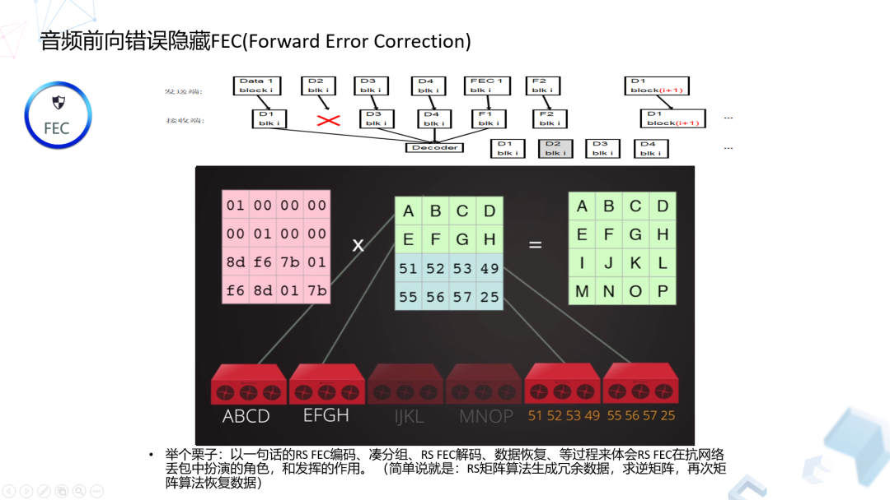

比如，传输过程中它可能会丢掉，比如4+2是6个包，任何顺序的2个包，还剩下4个包，就会去计算它的逆矩阵，这个逆矩阵去乘以接收端收到的任何顺序的，但是数量上凑够分组长度4个的数据包，通过矩阵算法可以恢复丢失的数据包。

从原理来讲很简单的，我们今天要讲FEC，**它在实际落地过程中还有一些技巧。**比如在算法实际落地的时候，怎么样去评价FEC算法的效果，首先会有量化数据，比如基于一个统计算法，FEC的恢复率是多少？加不加常态FEC？多少倍的冗余公式去加这个FEC？最终的效果什么样的？这些都需要强大的基于大盘数据的分析和ABTest运维能力才能逐步获取到的最佳值。比如，在一开始的版本，在没有加常态的FEC下，动态FEC恢复其实不到90%。到再加常态FEC，FEC恢复率可以爬升至95%，网络经常有小的丢包，那么指望系统、流控或者任何反馈机制，实际上不靠谱的，宁可去添加一些常态的FEC冗余。此外，对于实际的网络，突发的丢包是经常发生的，FEC参数的设定也有融入控制论的相关思想，除了动态计算和下发FEC参数，还要考虑参数在一段时间的有效性，比如我们对FEC参数增加的缓降控制窗口逻辑，又进一步将FEC恢复率提升至最高的99%左右。

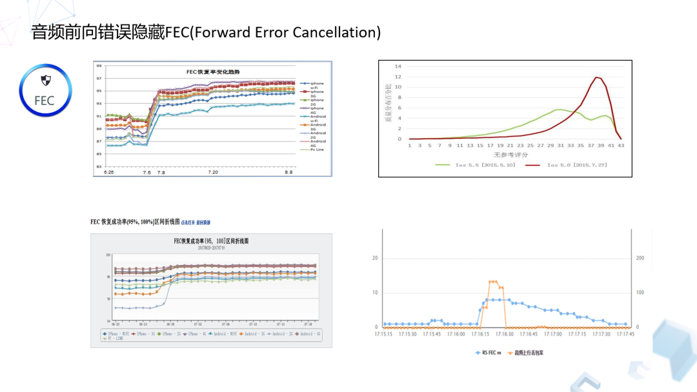

右上角是大盘的数据，可以发现FEC整体会有明显攀升，这里就是常态FEC的一个效果。另外对于在这里的分组长度的确定，分组要兼顾整个系统延迟，以及你的系统规格要兼顾怎样的边界和指标，如果不通过大数据运营，你永远不知道分组多少是合适的。通过前面讲的大数据ABTest运营方式把数据放在真实用户的全网进行验证，找到合适分组、冗余倍率公式、控制相关的策略。下面这两张图就可以看到最终的结果，看似还是很不错的，FEC恢复率从95%恢复到高的接近99%。

**网络是有突发丢包的，可能时不时的来一下，或者丢包前后有一些持续的小丢包。FEC控制策略上的拖尾时间窗口的方式，可以Cover住这一类连续丢包。**

**七、如何做音频ARQ抗抖动处理**

ARQ也是一个比较成熟的技术，我们在做的过程中也是踩过一些坑的，所以今天也非常愿意跟大家分享。

如果这块做不好的话，实际上会有副作用，宁可不要这功能。在QQ时代，一个典型例子是应用层有个逻辑，在基于RTT小于多少毫秒的基础情况下，给音频数据包进行重传，主观上认为只要是把丢包重新传回来，这个效果肯定是好的，至于底层的TRAE音频引擎怎么处理，实际上不太关心。但这个是不够的，这就是今天讲的红箭头5和6比较细节的地方，重传算法主要关注的是对于缺失的数据包重传间隔以及最大重传次数，但是数据包重传回来的时候，这个包怎么合理利用它。同时，播放器则是按照时间轴不停播放的，数据没有来，是否还不停地要呢？这块有一个正反馈和负反馈的过程。

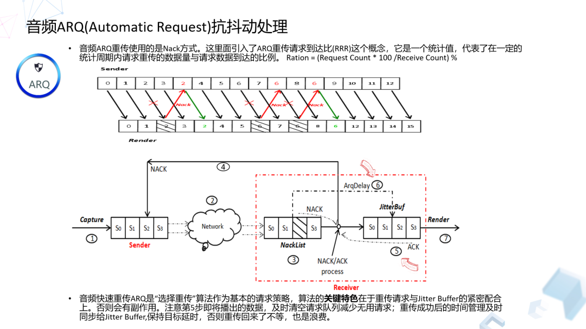

另外如果仅仅是重传数据包，没有记录或者管理数据包从第一次到最后重传了多少次，这个包重传成功总共消耗了多少时间，这个环节是非常有价值的，包括许多开源算法包括WebRtc这一块的逻辑也是没有做的。通过对重传数据包所消耗的时间管理，可以精细化的去控制接下来我们会讲的JitterBuffer之前的配合，比如我们有了这个重传消耗时长，我们就可以知道让Jitter Buffer未来的一段时间等待多久，另外对于已经解码成功的数据随着时间轴实时的在播放，如果时间轴播放到了某些缺失的数据包应该出现的地方，某些数据包再重传回来也不要了，这时候也要及时去更新重传列表，这也是重传效率的问题。

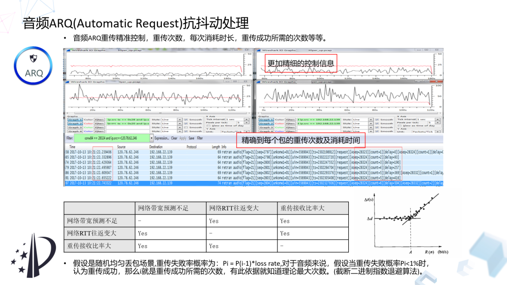

**怎么样去精细化升级算法，做了两方面的工作。一般重传两个关键因素，一个是重传次数，再一个是重传间隔。**重传间隔首先不能小于RTT，一般都是1点几倍率的RTT时间间隔要一次包，在一个RTT时间去等它，如果不来再去要。然后还会考虑一个基于：“截断二进制指数退避“的算法概念。比如说20%，理论上重传几次就够了，30%、40%、50%甚至80%重传几次，如果超过这个次数的上限，再结合比如说带宽预测状态或者RTT值的情况，及时中止这种行为，这种行为可以避免系统本身因为算法本身不合理造成的流量雪崩。 

**八、音频的抗抖动处理**

接下来就是抗抖动。抖动怎么理解呢？有些网络情况下不太容易发生，在网络拥塞Congestion Control那块，我们在介绍GCC1和GCC算法的时候解释了Jitter的计算方法，以及它出现的一些原因。在使用Wifi网络的情况下经常有五六百毫秒抖动非常正常，所以如果对抗网络抖动也是一个非常关键的功能。从GIPS开源之前，NetEQ（Netequalizer）就被作为引擎内部的王牌特性，被用来对抗各种情况网络抗延时控制，以及抗击抖动的最佳算法实践。它开源以后，大家基于此的技术进行追踪、优化都是受益匪浅的。

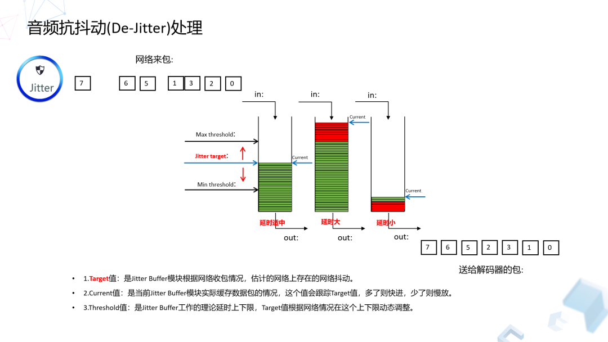

看左上角这个网络真实来包的情况，右下角则是期望通过抗抖处理送给解码器均匀的数据包，理想的包是这样顺序且均匀间隔的数据包，但现实总是不美好的，来的包总是非常不均匀，甚至几百毫秒没有数据，然后接下来突发几秒数据一起到来。这个JitterBuffer的作用就是，尽量去维持合适的数据包水位，这个水位也最终会影响到整个系统的端到端延时，水位太低或者太高都是不行的，太高的话我们及时把这个降下来，太低我们要及时把它调整到认为合理的一个位置。**合理的水位可以对抗网络突发，播放端则因为Jitter Buffer能够保持合理水位，拥有稳定持续的数据源用来播放，这对于用户最终听到完整和高质量的声音都是非常有帮助的。**

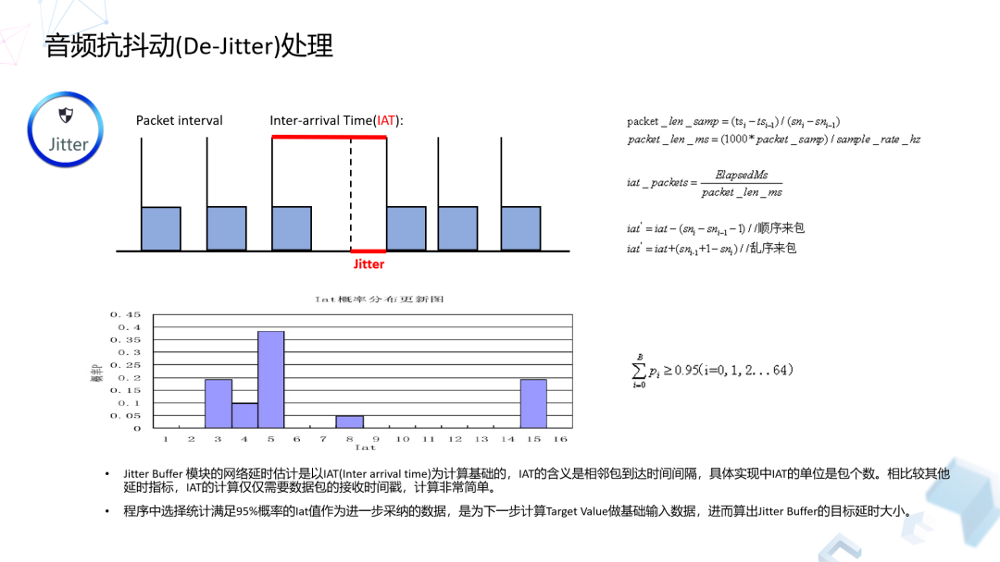

**JitterBuffer通过监测什么变量去看抖动行为呢？**刚才我们在网络拥塞控制那张讲的Jitter的计算，需要发送端时间戳和接收端时间戳去计算。而这里它只是通过相邻两个包到达时间的间隔，最终这个IAT（InterArrival Time）的概念去表征这个时间间隔，他表示端到端前后两个数据包到达的时间间隔，这个IAT时间间隔归一化为包个数，对一定时间区间内的IAT数据做一个概率分布，它是满足正态分布的趋势，我们取它是满足95%的概率分布作为置信区间，选取其中的最大IAT来估算当前网络的大延时。

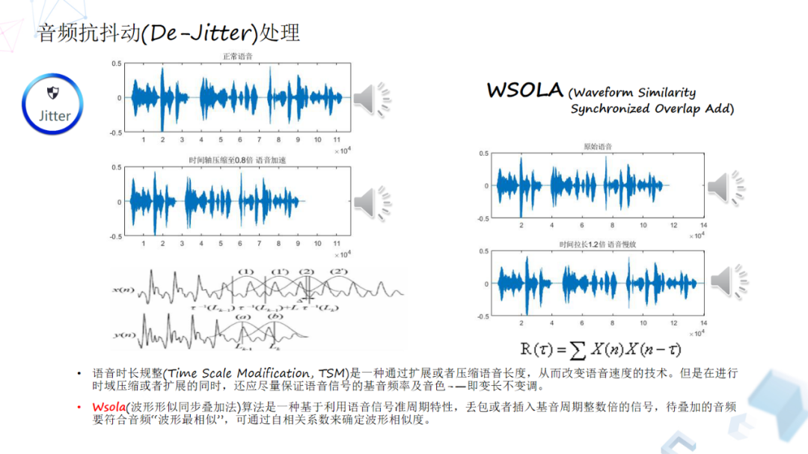

**刚才讲的网络延时估计与跟踪，相当于它在对网络包进行合理缓存，保证数据的完整性。那么怎么样把已经收到的数据包延时压下来，或者让数据包水位不够的时候，把这个时间轴拉长？**其实这里面也是一个Waveform Similarty的算法，我们叫Wsola，它兼顾PCM数据在幅度上，频率上、以及相位上的延续性算法，效果还是不错的。这个算法是一种基于拓展压缩语音长度，是一个变长不变调的技术，它是基于Pitch基音周期进行相似波形叠加的一个算法。

**九、音频编解码器的抗丢包能力**

Codec编解码器专题一般会去讲解码器的历史或音质对比，**我们今天从网络抗性的角度重点是看它的带内抗丢包能力，或者Codec层面能够给抗丢包带来一些什么收益。**

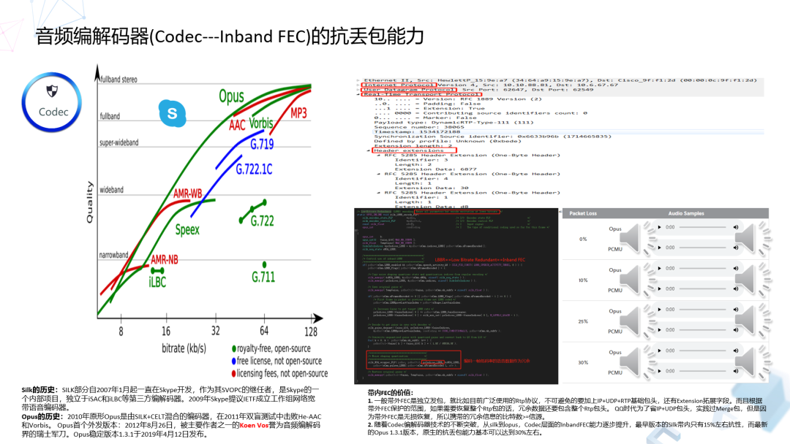

**Codec层面不能指望完全无损的把二进制包恢复，那它的优势就哪里？**

它的优势在于可以节省包头，不管是以前的私有协议还是现在的RTP协议，用于传输的IP，UDP协议字段是节省不了的，信道编码的方法比如带外FEC，或者重传ARQ都是对完整数据包进行恢复或者请求重传，这里面的数据包头占用了许多流量。而所以在Codec中的带内FEC里面的实现算法里面，一般来说它可以携带t-1帧的数据，而这个t-1帧的数据包可以用一个低码率的参数进行编码，在接收端收到这个携带t-1帧的数据包，则可以解码重建出来t-1这一帧质量稍逊一点的数据。

讲到这里就是大家也有个疑问，比如说silk也是t-1，然后它的抗丢包特性大概15%，而最最新版本的Opus1.3.1大家可以听一下不同丢包率场景下他的表现，Opus在内它为什么最后30%呢？

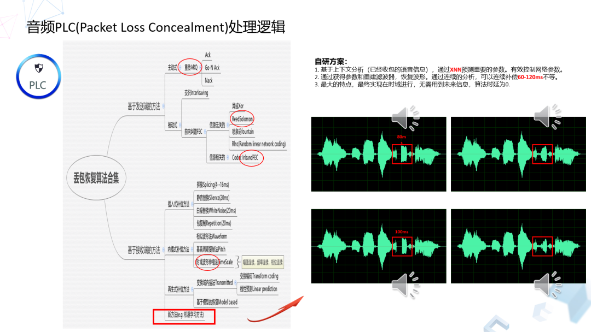

这个图就是刚才说的全家桶算法里面使用的抗丢包算法基本都包括在里面了，我们所使用的一些方法在这个合集里面只是占其中一小部分。PLC就是PacketLoss Concealment，丢包恢复算法它的内涵还是比较丰富的。画一个树状图，把整个合集集中起来发现它有两大阵营，一个是基于发端的，一个是基于收端的。**基于发端的有被动式和主动式，重传类的就是主动式，前向纠错的就是被动式。**

至于重传为什么给它送到发端？以我的理解，在接收端不管是Ack, Go-N Ack或者是NACK方式，都是接收端的反馈，真正要发包还是在发送端的，所以还是基于发端。

**基于发端的另外一个大类就是FEC。前面讲的FEC工程实践和原理就是所里德---罗门算法，**这种算法还有很多类似的，比如喷泉码，比如RLNC。这个RLNC有个比较好的特性，可以支持重建码，比如在网络比较好的情况下，我现在收听上百人千人，针对不同的下行用户，再根据下行信道的参数进行重新编码，不至于像用喷泉、RS或异或只能保持原状。另外，其中信源相关的FEC就是上一页讲的Codec层面的带内FEC。

基于接收端有很多方法，比如插入式方法，比如在接收端，那么插入静音、白噪音，或者干脆把前面一个包复制一下，就不管它的相关性和衔接，这样效果不太好。而且它的补偿效果也就是20毫秒顶天了，在衔接不好的情况下还容易产生金属音。

**另外一大类就是内插式的方法，比如波形相似法，还有基音周期复制法，还有就是波形伸缩法。**到这块，所有的方法就能很好地解决幅度连续、频率连续、相位连续的特征，所以它的效果总体来说还是不错的。

**另外基于接收端的，它有一类再生补偿方法。**比如时域数据传输本身挺大的，如果在变换域的话，它可能只需要一些变换域的参数，在接收端进行恢复。

再接下来还有一些比较偏门的技术，比如基于传统的语音增强，比如自适应滤波器的一些方法，进行语音重建的方法，这里不说了。前面做选择的方案也仅仅是使用比较多的方法，通过有机融合把它更好的控制起来，最终达到好的效果。

**现在回答一下，刚才上一页为什么Silk15%、Opus达到30%。这是一系列基于接收端的技术，不断升级、不断演进、不断优化的效果，T-1只是一个工程化的思想，做T-2可不可以，如果不再考虑算法因素T-3行不行？**

于是就引出来实验室目前正在重点发力的基于机器学习的方法来做PLC，用上下文分析的方法，这就是目前的一个效果，大家可以看到这块有四个语音的时域图。左边这个图丢失了100毫秒数据，100毫秒看似非常少，它是个什么概念呢，按照正常语速大概一个字是150毫秒，100毫秒基本上大半个字丢了。我们通过机器学习PLC的种方法把它给恢复出来，而且效果还不错。

**十、腾讯会议在疫情期间为何能高速增长？**

最后，疫情期间腾讯会议为什么能在短短两个多月时间，外部用户可以从0做到1000万？这是有一定的有必然性的，首先“腾讯会议”产品是一个全平台的应用，PC、手机、传统电话、Pad、网页、小程序还有专业视频设备都可以接入的，这种互联互通的能力本身就给广大用户带来了价值。今天官微公布，腾讯会议API向全网开放了，国内外开发者都可以接入腾讯会议的API，去把这个市场做大。 

另外也要归功于腾讯会议的海量用户群体，10亿微信用户、8亿QQ用户，还有250万企业微信用户，基本上覆盖了所有的中国用户。我记得张小龙有一句话，七个价值观，其中之一就是说：“让需求自然生长”。在疫情期间，“腾讯会议”的极速扩张就是一个自然生长的过程。为了助力疫情期间人与人减少接触，全免费让大家使用体验，这件事情符合实际需求，就是它短期内爆发的又一个原因。

腾讯云做ToB业务之后，它给腾讯内外部的各种产品提供了强大的支撑力，遍布全球130多个国家，1300多个的加速节点，专网接入，音视频会议最低延时达到80毫秒，而且动态扩容能力非常强。值得一提的是，疫情期间我们发现有“腾讯会议”用户量高峰的规律变化，许多人从早上六点开始工作，然后6点半一拨，7点一拨高峰，后来发现是各地的医生护士在线沟通进度，向大家说一声辛苦了。

**十一、Q&A**

**Q：Opus能达到30%的抗性的结论是怎么得到的？请问音频编码带内如何，包括和带外如何结合进行优化？**

A：对于网络抗性或弱网的抗性，为了总量保证音频质量，我们提供了一揽子结合方案。比如Opus的带内抗性，它是从工程化角度做的一个概念，是发端数据包内编码携带前一帧质量稍差的一帧压缩数据，并且结合接收端的不断升级的PLC算法。这个Opus带内抗性是编解码器原生提供的抗丢包能力，通过专业的思伯伦设备测试在30%丢包率的场景下可以达到3.0分以上的效果，这是一个客观的数据。

第二个问题是个好问题，就像刚才讲的，怎么样把各个手段优点结合发挥出来。有一句俗话说，甘蔗没有两头甜，我们就要做到怎么让它两头都甜，而且还要在系统里配合良好，有机运转。

我举个例子，FEC的算法落地，在照顾正常网络的情况下，同时还能自适应去Cover突发小丢包网络，我们会做一些假定，比如就认为在通话过程一定会有突发状况、各种各样的丢包。那么我们会预设一部分的带外FEC，带外的优点和缺点也是很明确的，最大缺点就是费流量。Codec技术发展到今天得到了长足进步，我们就可以用带内FEC做这方面的抗丢包。

至于重传这块怎么结合？首先要有对这个产品的定位，比如腾讯会议它的定位是实时交流产品，一定要保延时，同时应对复杂网络，各种各样的复杂网络。

怎么做到低延时还抗大丢包，带外FEC的最大特点就是说费流量，但是它可以延时做得非常低，它的延时受限于分组延时，重传的话效率非常高，但又受到网络RTT的影响。  

我概括成一句，正常网络用带内去加常态，在系统边界上限要求抗超大丢包而且还要考虑延时的时候，使用带外FEC算法那，但是对于带外FEC的使用要配合控制精准的网络拥塞算法，即做到能收能放。此外，重传ARQ对于的突发丢包，会有比较好的效果，另外对于综合抗丢包能力也是一种很好的补充。通过这三种有机结合，基本上会有比较好的结果。

**Q:关于语音激励是怎么实现的？现在的架构是SFU还是MCU，是自源的还是开源的？**

A：我们目前是自研的方案，是混合的，SFU和MCU对于语音能力来说，我们的系统在混音服务器是可以根据用户的需要可配置的，我们可以做到Server端全混音，也可以客户端混音。当然既然支持融合通信，不然我们多路数据输出一路给PSTN，一定是经过MCU的。

语音激励是怎么实现的，实际上是MCU本身的一个基础的语音选路能力，选路信息再由MCU同步到客户端就OK了。

**Q:FEC码的信息量与音频信息量的比例是怎样的?**

A:这块还是关于系统边界的问题，一般是说产品的规格。从QQ技术交流一直到2019年、2020年， 21年的积淀，在不同时代基于当时的网络情况和市场需求，当时的定位，产品规格都是不一样的。

现在问一个具体的信息量比的具体数字，它的意义不是太大，这跟产品规格也有关系。如果有一个强大的ARC去统筹、去控制，结合今天讲的全家桶工具，那么做任何类型的[实时音视频](https://cloud.tencent.com/product/trtc?from=10680)类产品，只要定好规则，基本上就是可以实现，而且做得效果还不错。
