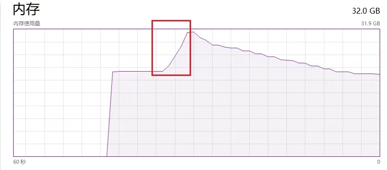
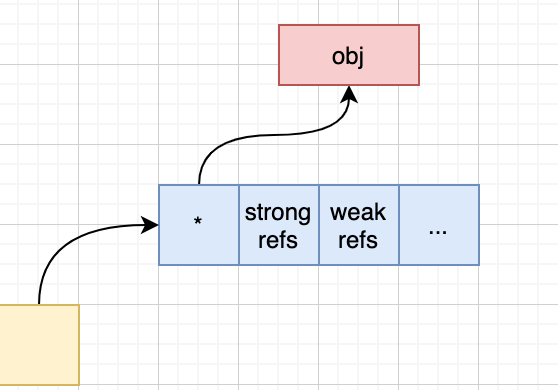
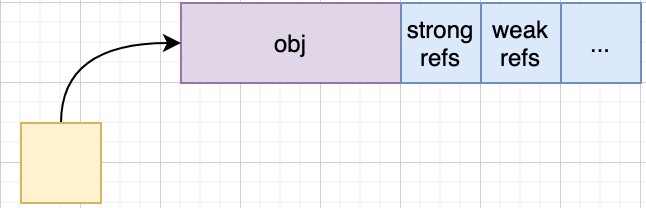

 
<!--BEGIN_DATA
{
    "create_date": "2023-12-30 23:10", 
    "modify_date": "2023-12-30 23:10", 
    "is_top": "0", 
    "summary": "一次诡异的内存泄漏", 
    "tags": "C/C++", 
    "file_name": "一次诡异的内存泄漏.md"
}
END_DATA-->

#### <p>原文出处：<a href='https://mp.weixin.qq.com/s/pwrxwlsDjbtCKGfWwPo5ig' target='blank'>一次诡异的内存泄漏</a></p>

## 缘起

最近在补一些基础知识，恰好涉及到了智能指针**std::weak_ptr**在解决**std::shared_ptr时候循环引用**的问题，如下：

```cpp
class A {  
public:  
    std::weak_ptr<B> b_ptr;  
};  

class B {  
public:  
    std::weak_ptr<A> a_ptr;  
};  

auto a = std::make_shared<A>();  
auto b = std::make_shared<B>();  

a->b_ptr = b;  
b->a_ptr = a;
```

就问了下，通常的用法是将A或者B中间的某一个变量声明为**std::weak_ptr**，如果两者都声明为`std::weak_ptr`会有什么问题？

咱们先不论这个问题本身，在随后的讨论中，风神突然贴了段代码：

```cpp
#include <chrono>  
#include <memory>  
#include <thread>  
using namespace std;  

struct A {  
    char buffer[1024 * 1024 * 1024]; // 1GB  
    weak_ptr<A> next;  
};  

int main() {  
    while (true) {  
        auto a0 = make_shared<A>();  
        auto a1 = make_shared<A>();  
        auto a2 = make_shared<A>();  

        a0->next = a1;  
        a1->next = a2;  
        a2->next = a0;  

        // this weak_ptr leak:  
        new weak_ptr<A>{a0};  

        this_thread::sleep_for(chrono::seconds(3));  
    }  
    return 0;  
}
```

说实话，当初看了这个代码第一眼，是存在内存泄漏的(**new**一个weak_ptr没有释放)，而没有理解风神这段代码真正的含义，于是在本地把这段代码编译运行了下，我的乖乖，内存占用如图：



emm，虽然存在内存泄漏，但也不至于这么大，于是网上进行了搜索，直至我看到了下面这段话：

> `make_shared` 只分配一次内存, 这看起来很好. 减少了内存分配的开销. 问题来了, `weak_ptr` 会保持控制块(强引用,以及弱引用的信息)的生命周期, 而因此连带着保持了对象分配的内存, 只有最后一个 `weak_ptr` 离开作用域时, 内存才会被释放. 原本强引用减为 0 时就可以释放的内存, 现在变为了强引用, 若引用都减为 0 时才能释放, 意外的延迟了内存释放的时间. 这对于内存要求高的场景来说, 是一个需要注意的问题.

如果介意上面new那点泄漏的话，不妨修改代码如下：

```cpp
#include <chrono>  
#include <memory>  
#include <thread>  
using namespace std;  

struct A {  
    char buffer[1024 * 1024 * 1024]; // 1GB  
    weak_ptr<A> next;  
};  

int main() {  
    std::weak_ptr<A> wptr;  
    {  
        auto sptr = make_shared<A>();  
        wptr = sptr;  
    }  
      
    this_thread::sleep_for(chrono::seconds(30));  
    return 0;  
}
```

也就是说，对于`std::shared_ptr ptr(new Obj)`，形如下图：



而对于`std::make_shared`，形如下图：



好了，理由上面已经说明白了，不再赘述了，如果你想继续分析的话，请看下文，否则~~

## 原因

虽然上节给出了原因，不过还是好奇心驱使，想从源码角度去了解下，于是打开了好久没看的gcc源码。

### std::make_shared

首先看下它的定义：

```cpp
template<typename _Tp, typename... _Args>  
inline shared_ptr<_Tp> make_shared(_Args&&... __args) {  
  typedef typename std::remove_cv<_Tp>::type _Tp_nc;  
  return std::allocate_shared<_Tp>(std::allocator<_Tp_nc>(),  
      std::forward<_Args>(__args)...);  
}
```

这个函数函数体只有一个`std::std::allocate_shared`，接着看它的定义：

```cpp
template<typename _Tp, typename _Alloc, typename... _Args>  
inline shared_ptr<_Tp>  
allocate_shared(const _Alloc& __a, _Args&&... __args) {  
  return shared_ptr<_Tp>(_Sp_alloc_shared_tag<_Alloc>{__a},  
      std::forward<_Args>(__args)...);  
}
```

创建了一个`shared_ptr`对象，看下其对应的构造函数：

```cpp
template<typename _Alloc, typename... _Args>  
shared_ptr(_Sp_alloc_shared_tag<_Alloc> __tag, _Args&&... __args)  
  : __shared_ptr<_Tp>(__tag, std::forward<_Args>(__args)...) { }
```

接着看`__shared_ptr`这个类对应的构造函数：

```cpp
template<typename _Alloc, typename... _Args>  
__shared_ptr(_Sp_alloc_shared_tag<_Alloc> __tag, _Args&&... __args)  
  : _M_ptr(), _M_refcount(_M_ptr, __tag, std::forward<_Args>(__args)...)  
{ _M_enable_shared_from_this_with(_M_ptr); }
```

其中，`_M_refcount`的类型为`__shared_count`，也就是说我们通常所说的引用计数就是由其来管理。

因为调用`make_shared`函数，所以这里的`_M_ptr`指针也就是相当于一个空指针，然后继续看下`_M_refcount`（请注意`_M_ptr`作为参数传入）定
义：

```cpp
template<typename _Tp, typename _Alloc, typename... _Args>  
__shared_count(_Tp*& __p, _Sp_alloc_shared_tag<_Alloc> __a, _Args&&... __args) {  
  typedef _Sp_counted_ptr_inplace<_Tp, _Alloc, _Lp> _Sp_cp_type; // L1  
  typename _Sp_cp_type::__allocator_type __a2(__a._M_a); // L2  
  auto __guard = std::__allocate_guarded(__a2);  
  _Sp_cp_type* __mem = __guard.get(); // L3  
  auto __pi = ::new (__mem)_Sp_cp_type(__a._M_a, std::forward<_Args>(__args)...); // L4  
  __guard = nullptr;  
  _M_pi = __pi;  
  __p = __pi->_M_ptr(); // L5  
}
```

这块代码当时看了很多遍，一直不明白在没有显示分配对象内存的情况下，是如何使用`placement new`的，直至今天上午，灵光一闪，突然明白了，且听慢慢道来。

首先看下L1行，其声明了模板类`_Sp_counted_ptr_inplace`的别名为`_Sp_cp_type`，其定义如下：

```cpp
template<typename _Tp, typename _Alloc, _Lock_policy _Lp>
class _Sp_counted_ptr_inplace final : public _Sp_counted_base<_Lp>
{
  class _Impl : _Sp_ebo_helper<0, _Alloc>
  {
    typedef _Sp_ebo_helper<0, _Alloc>    _A_base;

  public:
    explicit _Impl(_Alloc __a) noexcept : _A_base(__a) { }

    _Alloc& _M_alloc() noexcept { return _A_base::_S_get(*this); }

    __gnu_cxx::__aligned_buffer<_Tp> _M_storage;
  };

public:
  using __allocator_type = __alloc_rebind<_Alloc, _Sp_counted_ptr_inplace>;

  // Alloc parameter is not a reference so doesn't alias anything in __args
  template<typename... _Args>
  _Sp_counted_ptr_inplace(_Alloc __a, _Args&&... __args)
  : _M_impl(__a)
  {
    // _GLIBCXX_RESOLVE_LIB_DEFECTS
    // 2070.  allocate_shared should use allocator_traits<A>::construct
    allocator_traits<_Alloc>::construct(__a, _M_ptr(),
        std::forward<_Args>(__args)...); // might throw
  }

  ~_Sp_counted_ptr_inplace() noexcept { }

  virtual void
  _M_dispose() noexcept
  {
    allocator_traits<_Alloc>::destroy(_M_impl._M_alloc(), _M_ptr());
  }

  // Override because the allocator needs to know the dynamic type
  virtual void
  _M_destroy() noexcept
  {
    __allocator_type __a(_M_impl._M_alloc());
    __allocated_ptr<__allocator_type> __guard_ptr{ __a, this };
    this->~_Sp_counted_ptr_inplace();
  }

private:
  friend class __shared_count<_Lp>; // To be able to call _M_ptr().

  _Tp* _M_ptr() noexcept { return _M_impl._M_storage._M_ptr(); }

  _Impl _M_impl;
};
```
这个类继承于`_Sp_counted_base`，这个类定义不再次列出，需要注意的是其中有两个变量：

```cpp
_Atomic_word  _M_use_count;     // #shared  
_Atomic_word  _M_weak_count;    // #weak + (#shared != 0)
```

第一个为强引用技术，也就是shared对象引用计数，另外一个为弱因为计数。

继续看这个类，里面定义了一个`class_Impl`，其中我们创建的对象类型就在这个类里面定义，即**`__gnu_cxx::__aligned_buffer<_Tp> _M_storage;`**

接着看L2，这行定义了一个对象`__a2`，其对象类型为`using __allocator_type = __alloc_rebind<_Alloc, _Sp_counted_ptr_inplace>;`，这行的意思是**重新封装`rebind_alloc<_Sp_counted_ptr_inplace>`**

继续看L3，在这一行中会创建一块内存，这块内存中按照顺序为创建对象、强引用计数、弱引用计数等(**也就是说分配一大块内存，这块内存中包含对象、强、弱引用计数所需内存等**)，在创建这块内存的时候，强、弱引用计数已经被初始化

最后是L3，这块调用了`placement new`来创建，其中调用了对象的构造函数：

```cpp
template<typename... _Args>  
  _Sp_counted_ptr_inplace(_Alloc __a, _Args&&... __args)  
  : _M_impl(__a)  
  {  
    // _GLIBCXX_RESOLVE_LIB_DEFECTS  
    // 2070.  allocate_shared should use allocator_traits<A>::construct  
    allocator_traits<_Alloc>::construct(__a, _M_ptr(),  
        std::forward<_Args>(__args)...); // might throw  
  }
```

至此，整个`std::make_shared`流量已经完整的梳理完毕，最后返回一个`shared_ptr`对象。

好了，下面继续看下令人迷惑的，存在大内存不分配的这行代码：

```cpp
new weak_ptr<A>{a0};
```

其对应的构造函数如下：

```cpp
template<typename _Yp, typename = _Compatible<_Yp>>  
    __weak_ptr(const __shared_ptr<_Yp, _Lp>& __r) noexcept  
    : _M_ptr(__r._M_ptr), _M_refcount(__r._M_refcount)  
    { }
```

其中`_M_refcount`的类型为`__weak_count`，而`__r._M_refcount`即常说的强引用计数类型为`__shared_count`，其继承于接着往下看：

```cpp
__weak_count(const __shared_count<_Lp>& __r) noexcept  
: _M_pi(__r._M_pi)  
{  
  if (_M_pi != nullptr)  
  _M_pi->_M_weak_add_ref();  
}
```

emm，弱引用计数加1，也就是说此时`_M_weak_count`为1。

接着，退出作用域，此时有`std::make_shared`创建的对象开始释放，因此其内部的成员变量`r._M_refcount`也跟着释放：

```cpp
~__shared_count() noexcept  
{  
  if (_M_pi != nullptr)  
    _M_pi->_M_release();  
}
```

接着往下看`_M_release()`实现：

```cpp
template<>  
inline void  
_Sp_counted_base<_S_single>::_M_release() noexcept  
{  
  if (--_M_use_count == 0)  
    {  
      _M_dispose();  
      if (--_M_weak_count == 0)  
        _M_destroy();  
    }  
}
```

此时，因为`shared_ptr`对象的引用计数本来就为1(没有其他地方使用)，所以if语句成立，执行`_M_dispose()`函数，在分析这个函数之前，先看下前面提到的代码：

```cpp
__shared_ptr(_Sp_alloc_shared_tag<_Alloc> __tag, _Args&&... __args)  
    : _M_ptr(), _M_refcount(_M_ptr, __tag, std::forward<_Args>(__args)...)  
    { _M_enable_shared_from_this_with(_M_ptr); }
```

因为是使用`std::make_shared()`进行创建的，所以`_M_ptr`为空，此时传入`_M_refcount`的第一个参数也为空。接着看`_M_dispose()`定义：

```cpp
template<>  
  inline void  
  _Sp_counted_ptr<nullptr_t, _S_single>::_M_dispose() noexcept { }  
template<>  
  inline void  
  _Sp_counted_ptr<nullptr_t, _S_mutex>::_M_dispose() noexcept { }  
template<>  
  inline void  
  _Sp_counted_ptr<nullptr_t, _S_atomic>::_M_dispose() noexcept { }
```

因为传入的指针为`nullptr`，因此调用了`_Sp_counted_ptr`的特化版本，因此`_M_dispose()`这个函数什么都没做。因为`_M_pi->_M_weak_add_ref();`这个操作，此时这个计数经过减1之后不为0，因此没有没有执行`_M_destroy()`操作，因此之前申请的大块内存没有被释放，下面是`_M_destroy()`实现：

```cpp
virtual void  
_M_destroy() noexcept  
{  
  __allocator_type __a(_M_impl._M_alloc());  
  __allocated_ptr<__allocator_type> __guard_ptr{ __a, this };  
  this->~_Sp_counted_ptr_inplace();  
}
```

也就是说真正调用了这个函数，内存才会被分配，示例代码中，显然不会，这就是造成内存一直不被释放的原因。

## 总结

下面解释下我当时阅读这块代码最难理解的部分，下面是`make_shared`执行过程：

* `_Sp_counted_base`有两个成员变量，分别为`_M_use_count`用于表示强引用计数和`_M_weak_count`用于表示弱引用计数
* `__shared_count`继承于`_Sp_counted_base`，其内部有一个变量`_M_ptr`指向对象指针
* `__shared_ptr`中存在成员变量`__shared_count`
* 使用`make_shared()`函数创建`shared_ptr`时候，会创建`__shared_count`对象
* 在创建`__shared_count`对象时候，存在变量`_Sp_counted_ptr_inplace`
* `_Sp_counted_ptr_inplace`继承于`_Sp_counted_base`
* `_Sp_counted_ptr_inplace`会存在一个class Impl，其中包含对象Obj
* 在创建其内部会使用rebind重新封装`rebind_alloc<_Sp_counted_ptr_inplace>`
* `_Sp_counted_ptr_inplace`获取其分配器，然后进程get()操作，此时会创建一块大小为`_Sp_counted_ptr_inplace`的对象(这个大小为Obj大小 + 其本身继承的`_Sp_counted_base`大小等)，且顺序为对象、强引用计数、弱引用计数等
* 使用`placement new`对上述分配的内存块进行初始化(只初始化Obj大小不符，引用计数等已经初始化完成)
* 创建`shared_ptr`，因为使用的`make_shared`初始化，所以传入的指针为空，相应的`_Sp_counted_base`中的`_M_ptr`也为空

下面是析构过程：

* 析构`shared_ptr`对象的同时，释放其内部成员变量`_M_use_count`
* `_M_use_count`调用Release()函数，在这个函数中，如果强引用计数为1，则调用`_M_dispose()`函数
* 在`_M_dispose()`中，会调用`_Sp_counted_ptr`的特化版本，即不进行任何操作
* 判断弱因为计数是否为1，如果是则调用`_M_destroy()`，此时才会真正的释放内存块

整体看下来，比较重要的一个类就是`_Sp_counted_base`不仅充当引用计数功能，还充当内存管理功能。从上面的分析可以看到，`_Sp_counted_base`负责释放用户申请的申请的内存，即

* **当 `_M_use_count` 递减为 0 时，调用 `_M_dispose()` 释放 *this 管理的资源**
* **当 `_M_weak_count` 递减为 0 时，调用 `_M_destroy()` 释放 *this 对象**

最后，借助群里经常说的一句话**cpp？ 狗都不学**结束本文。
