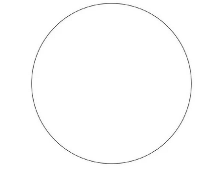
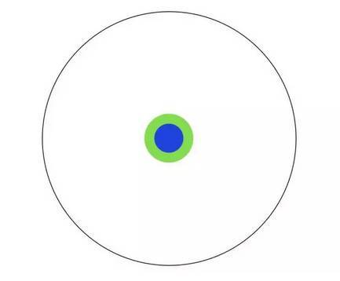
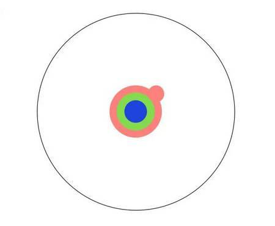
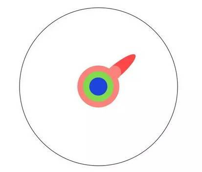
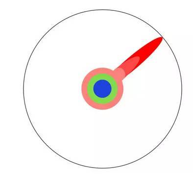
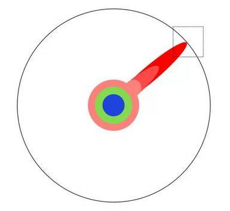
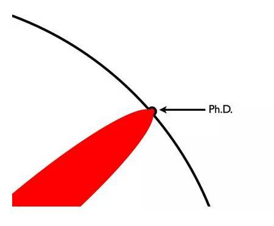
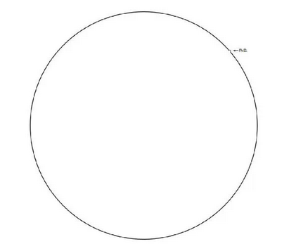

<!--BEGIN_DATA
{
    "create_date": "2021-01-29 17:40", 
    "modify_date": "2021-01-29 17:40", 
    "is_top": "0", 
    "summary": "一盘儿红烧肉告诉你本科、硕士、博士的区别", 
    "tags": "其它", 
    "file_name": "一盘儿红烧肉告诉你本科、硕士、博士的区别.md"
}
END_DATA-->

#### 
原文出处：<a href='https://zhuanlan.zhihu.com/p/33684408' target='blank'>一盘儿红烧肉告诉你本科、硕士、博士的区别</a>

不要因为推动了一点边界而洋洋自得，也不要一味沉浸在自己的领域中，忘记了这个世界的辽阔和丰富。

## 1、本科论文

* 第一章，红烧肉的定义和类型；
* 第二章，各种红烧肉区别和特点；
* 第三章，东坡红烧肉的具体特点；
* 第四章，烹制东坡红烧肉的主要问题和对策

> 结论：东坡红烧肉可以更好吃。

## 2、硕士论文

* 第一章，关于猪肉做法的文献综述；
* 第二章，红烧肉做法的历史演变过程；
* 第三章，传统红烧肉制作和研究方式介绍和比较；
* 第四章，剩余价值理论对红烧肉做法的启示；
* 第五章，运用剩余价值论做出红烧肉的具体方法；
* 第六章，剩余价值红烧肉的创新之处和进一步研究建议。

> 结论：红烧肉很好吃，但是吃的过程中注意区分，剩余价值理论指导下的红烧肉做得会更符合社会主义实践发展。

## 3、博士论文

* 序言：历史中猪肉食谱的文献综述、理论意义和现实价值、不足和问题。
* 第一篇（第一章到第三章）：猪是怎样养成的；
* 第二篇（第四章到第五章）：猪的各个部分肉质的区分和作用；
* 第三篇（第六章到第七章）：理论的不同发展阶段对红烧肉发展的影响和启示；
* 第四篇（第八章到第十章）：红烧肉制作的实证研究（变量选取、理论模型和计量分析）；

> 结论：红烧肉是不是可以吃取决于很多复杂的因素，总体来看，在满足一定约束条件的情况下红烧肉是不错的营养、美容食品，但操作过程的障碍还需要通过真学、真懂、真用剩余价值理论，有必要的情况下需要进行理论创新和政策支持，使红烧肉更好地实现增加营养、避免增肥和促进社会和谐的作用。

## 4、画个圈圈告诉你本科、硕士、博士的区别

想象这个圆圈代表了人类的所有知识。

你小学毕业时，了解了其中一小部分。

高中毕业时，了解了更多。

拿到本科学位后，你有了自己的专业。

硕士学位让你对自己的专业有了更深的钻研。

继续阅读学术论文，你会逐渐抵达人类知识的边界。

一旦抵达了边界，你便专注于此。

你花几年的时间试图突破边界。

终于有一天，你推动了它。

这个凸出来的部分，让你获得了博士学位。

当然，对你而言，这个世界看上去不一样了。

但别忘了全局是长这样的。

这是一组非常生动的图画，最后那张图更是“**意外结局**”的典范。它让人感受到自身的渺小，对于走在硕博道路上的人来说是非常必要的提醒：不要因为推动了一点边界而洋洋自得，也不要一味沉浸在自己的领域中，忘记了这个世界的辽阔和丰富。

## 延伸阅读

### 不只是学历的差别：

#### 本科、硕士、博士有什么不同

近日，全国高校2017年硕士研究生复试和2017年博士研究生入选考试正在如火如荼进行当中，近60万硕士生和7万名博士很快将走进理想中的高校和科研机构，开始研究生生涯的学习。

很大研究生新生常常会迷茫，本科生和研究生到底有何区别?硕士和博士又有什么不同?清华大学国际关系研究院院长阎学通教授曾经对这个问题做出了解答：

著名数学家华罗庚先生比喻导师和研究生的关系是：导师负责给研究生指出兔子在哪里，并指导学生学会打兔子的本领。反之，研究生则是从导师那里了解到兔子的位置、大小、肥瘦，并采用从导师那里学到的打兔子本领擒获一只兔子(就是做完论文)。

有人由此衍生出本科生、硕士生、博士生、博士后之区别的“兔子理论”：

本科生：学习捡“死”兔子。本科及以前所学知识都是别人已经发现、并经过了反复验证的知识，是固定、稳定的，属于“死兔子”。此阶段的学习训练只是学会找到一条比较便捷的路径把已经死在那里的“兔子”拿回来。

硕士生：学习打一只在视野中奔跑的活兔子。这只兔子在哪里?需要导师指给你，或者需要导师和学生一起来确定其位置。导师在“指兔子”的同时还应该告诉学生瞄准并射死兔子的本领。硕士生需要遵从自导师处学来的方法和技术，去把这只尚在活动中的兔子打死，然后再通过以往已经具备的方法把兔子擒在手中。

博士生：学习打一只看不到的活兔子。此时的兔子也是活的，但可能不在你的视野里跑着，而是在树林里跑——导师可以确认一定有这只兔子存在，可是，需要你先从树林里把这只兔子撵出来，判断是否值得去猎取，再用更高级的猎取技术去射击并沿用原有方法将兔子取在手中。

博士后阶段：此时，导师叫合作导师，他就要和博士后一起来确定究竟到哪里去寻找兔子，此时面对的可能是不一样的森林，需要一起商量后确定是否需要在这里伫足，并重复以上过程。

#### 1.本科生学习与研究生学习的区别

本科是素质教育，是从未成年到成人的教育，是让他们完成文明教育的过程。素质教育不在乎学什么专业。例如，家长们对子女找配偶的要求是要找个大学生，而不是要求找学某种专业的。家长们未必能解释为什么，但他们知道受过高等教育的人基本上不动手打配偶。本科教育是培养做人的品格和修养的过程。

研究生教育不是素质教育，是专业教育。这就是研究生教育和本科生教育的最主要区别。这个区别决定了你们应注重学习什么的问题。研究生的学习带有研究性质，这对你们毕业后的工作选择与本科生有了不同。本科生毕业后终生从事其所学专业的人数比例原则上不会超过10%。这里我说的不是上世纪50年代的本科生毕业生，而是指有了博士生教育以后的本科生毕业生。硕士生毕业生终生从事其硕士专业的比例就会高一点，约在15%左右。而博士毕业生以博士专业为终身职业的人数应不低于三分之二，低于这个标准则说明博士教育本身不成功。

#### 2.博士生学习与硕士生学习的区别

硕士研究生与博士生的区别是专业水平差别，不是素质差别。两类毕业生在为人的素质上没有差别，其区别是研究技能。硕士生教育培养的是工作技能，而博士生教育培养的是学术技能。硕士生毕业后的工作主要是从事事务性的工作，做学术研究的很少。因此硕士生要注重学习普遍性的研究技能。完成上级交待下来的任何一项事务性工作，都需要进行调查了解基本情况，判断问题的性质，设计解决问题的方案，找到实施的方案和路径。这些解决问题的程序和学术研究的方法很相似，例如，文献回顾、找到有意义的问题、提出假设、进行实证、做出结论。

博士毕业生所从事的工作性质不同，是学术性的，因此你们对于学术的态度不能一样。博士生要有较强的批判精神，即发现错误的能力，因为发现现有知识的缺陷，才能发现值得研究的问题。硕士生如果有了这种批判精神，那你最好选择毕业后读博。否则，你到了工作单位，总是发现领导的决策有缺陷，你会不甘心情愿的执行领导决定，你工作就做不好。

硕士生和博士生的教育时间不一样。硕士生教育只有两年，有些国家只有一年，而博士生教育原则上4年，但不同专业时间不一样，很多专业都长于4年。教育时间的长短不一样也会带来性质上的差别。硕士教育能提高人的研究技能但不会改变人的思想观念，而博士教育则具有异化作用，使受教育者将学习视为改善生活的方法转变为生活的目的，即读书学习不再是为了改善物质生活，而活着的目的就是为了读书学习。生活手段变成了生活目的。这就是为什么博士毕业生主体上终生从事教学和科研工作。我以为，博士教育就是生产教授或研究员的工作。

博士教育重要的一点是寻求真理、发现规律、探索人类尚不知道的知识。要发现新知识不仅需要研究能力，还需要学术激情和学术奉献精神。很多学术研究所发现的知识都没有实际用处，不能转化成为物质财富。从经济学的理性角度讲，从事科学研究的人都属于非理性的，因为从事这种研究的人得不到实质性的经济收益。然而，人类的科学进步就是建立在发现了很多人们认为没用的知识的基础上的。发现新知识是有乐趣的事，于是很多博士选择在低工资的大学就业而不选择高工资的企业。家长们常说的，“这孩子读傻了”，就是这个异化过程。社会上常说的“笨得像个博士，傻得像个教授”，就是异化的结果。当你领到博士学位证书时还没被异化，你可能是个含金量不高的博士。80年代曾说“穷得像个教授”。如今这个说法没了，教授们不那么穷了，同时“甘于清贫”的教授精神也消失了。这可能与我国博士教育异化作用不明显直接相关。

#### 3.观察能力和分析能力的区别

硕士研究生和博士研究生的教育共性是提高学生的研究能力。研究能力主要由两个基本能力构成，即观察能力和分析能力。观察能力是指别人观察不到而你能观察得到的能力。分析能力是指别人想不到而你能想到的能力。不接受专门的科学研究方法的训练，是不会有这种能力的。每人都有两只眼，但众人的观察能力却不同。化验员知道如何观察到血液中的DNA，我就不会观察。我知道如何观察“全球治理”和“建立国际新秩序”的差别，化验员就不会。提高观察能力需要学会使用观察的工具和方法。学会统计学、民调、实地考察、访谈、使用图书馆、档案馆和网络数据库，都能提高观察能力。还要学习观察角度。从第三方立场观察能提高客观性、从对方立场观察能理解对方想法。不改变观察角度的结果就是盲人摸象。普京在自由派眼里就是独裁者，在普通百姓眼里就是英雄。

具备了观察能力，你们还得学习用逻辑思维方式分析所观察到的现象。只观察而不分析是不会有任何研究成果的。这和有钱不花等于没钱一样。分析是在观察的基础上进行的逻辑的思考和判断。要使分析判断的结果符合客观事物，就需要提升联想能力、逻辑能力，归纳能力、演绎能力等。研究问题，这些能力都需要，只有一种能力是不行的。我下面单讲一下逻辑分析能力。

做社会科学研究，逻辑分析能力非常重要。例如，只有联想能力而无逻辑能力就容易做出阴谋论的判断。逻辑分析能力需要后天加以训练才能强大，由于多数人没有受过专门的逻辑训练，因此阴谋论的分析方法在社会上非常流行。阴谋论之所以强大是因为，它既不能证实也不能证伪。“阴谋”是指公众不知道的方案而且无法实证的事务。阴谋论者声称他们很聪明，“阴谋”被他们看出来了。其背后的逻辑是，你要是看不出来，就说明你不聪明。人们普遍认为自己是聪明的，于是也都跟着看出阴谋了。2006年有人说美国发动了货币战争，很多人不但信且用2008年世界金融危机来证明美国的确发动了货币战争。然而，依据国家行为是维护国家利益的逻辑，我们要问一下美国为何要发动破坏美国经济的货币战争呢?2007年末美国经济危机已露端倪，美国为何不及时停止货币战争以防止经济危机发生呢?2008年9月美国政府正式宣布了经济危机，美国是在此之前还是在此之后停止的货币战争呢?停止货币战争和发动货币战争的标志是什么呢?如果货币战争的发生的停止没有标志，那我们怎么知道现胡是有货币战争还是没有货币战争呢?当你有了强大的逻辑分析能力，你就不会盲从“阴谋论”。

讲了这么多，我不过是想给大家两个建议。一是既然花费时间来学习，就真的提高一下自己的研究能力。拿个学位证书不能说明什么。现在大学、研究机构、党校、军队、政府培训机构办了各种各样的硕士、博士班。有钱有权就能换个学位证，甚至大街上都买得到。学位证既不表明你知识多少，也不说明是你否有研究能力。既然你们已经做出了“非理性”的选择，来学习不挣钱的社会科学，因此，把时间用于真正提高自己研究能力上才对得起你自己的决定。二是注重学习科学的研究方法。当你掌握了科学研究方法，你不仅能提高研究能力，还能增强决策的自主性，不盲从，不轻信，不后悔。要学会我的生活我做主，与由兄姐、父母、老师、领导、政府、朋友替你决策的历史告别。
