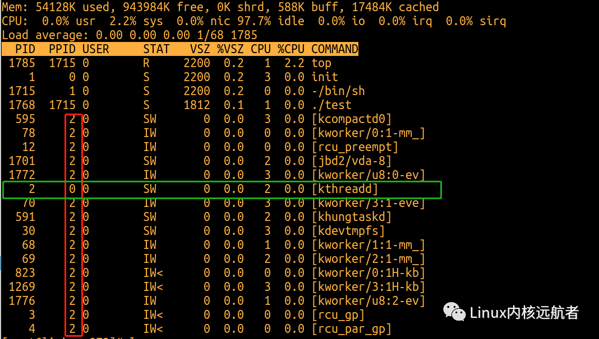
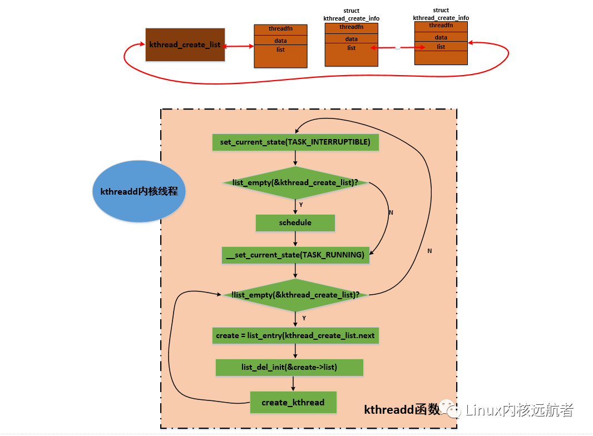
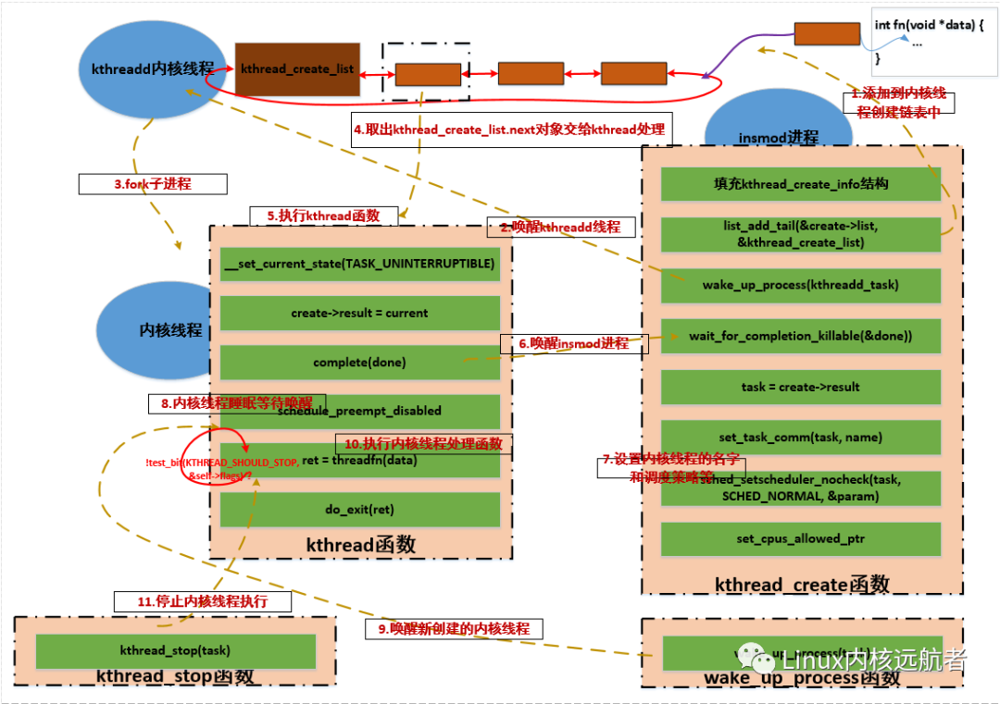
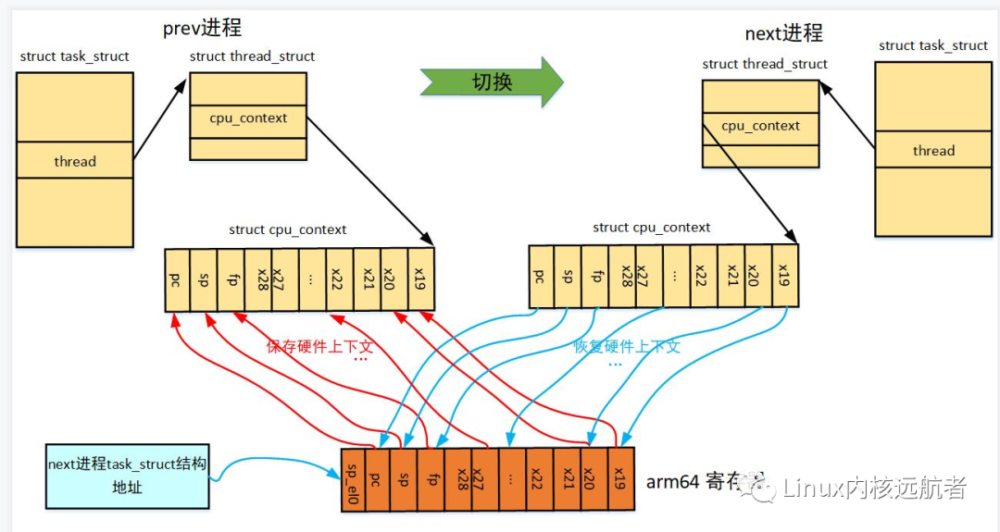
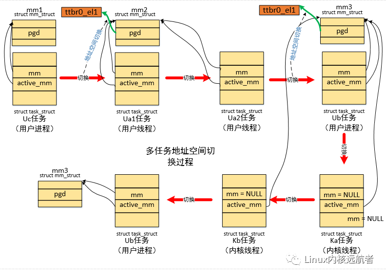

 
<!--BEGIN_DATA
{
    "create_date": "2021-02-08 11:20", 
    "modify_date": "2021-02-08 11:20", 
    "is_top": "0", 
    "summary": "一篇文章读懂内核线程", 
    "tags": "Linux", 
    "file_name": "一篇文章读懂内核线程"
}
END_DATA-->

#### <p>原文出处：<a href='https://mp.weixin.qq.com/s/oPjucriYamznm63joOqDnQ' target='blank'>一篇文章读懂内核线程</a></p>

#### 目录：
    
    1. 开场白  
    2. kthreadd 的诞生  
    3. kthreadd 内核线程处理流程  
    4. kthread 处理流程  
    5. kthread_run() 函数  
    6. kthread_stop() 函数  
    7. 内核线程执行处理函数细节  
    8. 内核线程上下文切换细节  
    9. 创建内核线程用例  
    10.实践环节

## 1.开场白  

  * 环境：
  * 处理器架构：arm64
  * 内核源码：linux-5.11
  * ubuntu版本：20.04.1
  * 代码阅读工具：vim+ctags+cscope

在linux系统中， 我们接触最多的莫过于用户空间的任务，像用户线程或用户进程，因为他们太活跃了，也太耀眼了以至于我们感受不到内核线程的存在，但是内核线程却
在背后默默地付出着，如内存回收，脏页回写，处理大量的软中断等，如果没有内核线程那么linux世界是那么的可怕！**本文力求与完整介绍完内核线程的整个生命周期
**，如内核线程的创建、调度等等，当然本文还是主要从内存管理和进程调度两个维度来解析，且不会涉及到具体的内核线程如kswapd的实现，最后我们会以一个简单的
内核模块来说明如何在驱动代码中来创建使用内核线程。

在进入我们真正的主题之前，我们需要知道一下事实：

1. 内核线程永远运行于内核态绝不会跑到用户态去执行。
2. 由于内核线程运行于内核态，所有它的权限很高，请注意这里说的是权限很高并不意味着它的优先级高，所有他可以直接做到操作页表，维护cache, 读写系统寄存器等操作。
3. 内核线性是没有地址空间的概念，准确的来说是没有用户地址空间的概念，使用的是所有进程共享的内核地址空间，但是调度的时候会借用前一个进程的地址空间。
4. 内核线程并没有什么特别神秘的地方，他和普通的用户任务一样参与系统调度，也可以被迁移到任何cpu上运行。
5. 每个cpu都有自己的idle进程，实质上也是内核线程，但是他们比较特殊，一来是被静态创建，二来他们的优先级最低，cpu上没有其他进程运行的时候idle进程才运行。
6. 除了初始化阶段0号内核线程和kthreadd本身，其他所有的内核线程都是被kthreadd内核线程来间接创建。

## 2.kthreadd的诞生

盘古开天辟地，我们知道linux所有任务的祖先是0号进程，然后0号进程创建了天字第一号的1号init进程，init进程是所有用户任务的祖先，而**内核线程同样也有自己的祖先那就是kthreadd内核线程他的pid是2**，我们通过top命令可以观察到：红色方框都是父进程为2号进程的内核线程，绿色方框为kthreadd，他的父进程为0号进程。



下面我们来看内核线程的祖先线程kthreadd如何创建的：

```c
start_kernel   //init/main.c  
->arch_call_rest_init  
    ->rest_init  
        ->pid = kernel_thread(kthreadd, NULL, CLONE_FS | CLONE_FILES)  
```

可以看的在`rest_init`中调用`kernel_thread`来创建kthreadd内核线程，实际上初始化阶段有两个内核线程比较特殊一个是0号的idle（唯一一个没有通过fork创建的任务），一个是被idle创建的kthreadd内核线程（内核初始化阶段可以看成idle进程在做初始化）。

我们再来看看`kernel_thread`是如何实现的：

```c
/*        
* Create a kernel thread.  
*/  
pid_t kernel_thread(int (*fn)(void *), void *arg, unsigned long flags)         
{  
    struct kernel_clone_args args = {  
            .flags          = ((lower_32_bits(flags) | CLONE_VM |          
                            ¦   CLONE_UNTRACED) & ~CSIGNAL),  
            .exit_signal    = (lower_32_bits(flags) & CSIGNAL),  
            .stack          = (unsigned long)fn,                           
            .stack_size     = (unsigned long)arg,                          
    };  
        
    return kernel_clone(&args);  
}         
```                                                                              
      
这里需要注意两点：**1.fork时传递了CLONE_VM标志  2.如何标识要创建出来的是内核线程不是普通的用户任务**

我们先来看看CLONE_VM标志对fork的影响：

```c
kernel_clone  
->copy_process    
    ->copy_mm  
        ->dup_mm  
            ->....  
                1394         tsk->mm = NULL;                                     
                1395         tsk->active_mm = NULL;                              
                1396                                                             
                1397         /*                                                  
                1398         ¦* Are we cloning a kernel thread?                  
                1399         ¦*                                                  
                1400         ¦* We need to steal a active VM for that..          
                1401         ¦*/                                                 
                1402         oldmm = current->mm;                                
                1403         if (!oldmm)                                         
                1404                 return 0;                                   
                1405                                                             
                1406         /* initialize the new vmacache entries */           
                1407         vmacache_flush(tsk);                                
                1408                                                             
                1409         if (clone_flags & CLONE_VM) {                       
                1410                 mmget(oldmm);                               
                1411                 mm = oldmm;                                 
                1412                 goto good_mm;                               
                1413         }                                                   
                1414                                                             
                1415         retval = -ENOMEM;                                   
                1416         mm = dup_mm(tsk, current->mm);                      
                1417         if (!mm)                                            
                1418                 goto fail_nomem;                            
                1419                                                             
                1420 good_mm:                                                    
                1421         tsk->mm = mm;                                       
                1422         tsk->active_mm = mm;                                
                1423         return 0;                                           
```
    
可以看的当我们传递了CLONE_VM标志之后，本来应该走到1409 行进程处理的，但是我们需要知道的是1403行可能判断为空，因为这里父进程为idle为内核线程，凭直觉我们知道代码应该从 1404返回了，但是不能光凭直觉要拿出证据，那就需要看看idle进程长啥样了：

```c
64 struct task_struct init_task                  //init/init_task.c                       
69 = {                                                         
            ...  
85         .mm             = NULL,                             
86         .active_mm      = &init_mm,                         
```    

上面是静态创建的idle进程，可以看的他的进程控制块的 .mm 为空， `.active_mm`为`&init_mm,`所有啊，**我们的kthreadd内核线程的`tsk->mm = tsk->active_mm =NULL`;**所以我们上面的**猜想是对的代码直接从 1404 返回了**，这里也是他应该拥有的属性，因为我们知道内核线程没有用户地址空间（使用tsk->mm来描述），所以所有的内核线程的tsk->mm都为空，这也是判断任务是否为内核线程的一个条件，但是`tsk->active_mm`就不一定了，内核线程在每次进程切换的时候都会借用前一个进程的`tsk->active_mm`赋值到自己`tsk->active_mm`上，后面会讲到。这里需要注意的是，有一个内核线程很特殊，特殊到他的`tsk->active_mm`不是在进程切换的时候被赋值而是静态初始化号，他就是上面的idle线程`.active_mm = &init_mm`。

我们来看下init_mm是什么内容，有什么猫腻：

```c
mm/init-mm.c  
    
struct mm_struct init_mm = {  
        .mm_rb          = RB_ROOT,  
        .pgd            = swapper_pg_dir,       
        ...  
```    

可以看到他的特殊之处在于它的`tsk->active_mm->pgd`为`swapper_pg_dir`，我们知道这是主内核页表，我们知道系统初始化的时候，会出现3个特殊的任务0，1，2号，这几个任务刚开始都是内核线程，他们之间进行切换的时候使用的都是`swapper_pg_dir`这个页表，也很合理，因为都访问内核空间，一旦有用户进程介入参与调度了就不一样了，就可以借用用户的`tsk->active_mm->pgd`（这个时候不再是`swapper_pg_dir`，但是没有关系，通过`ttbr1_el1`同样可以访问到`swapper_pg_dir`页表来访问内核空间）。

**再来看看如何标识要创建的是内核线程的？**
    
```c
kernel_clone  
->copy_process  
    ->copy_thread   //arch/arm64/kernel/process.c  
        ->  ...  
            if (likely(!(p->flags & PF_KTHREAD))) {   //创建用户任务的情况  
                ...  
            } else {   //创建内核线程的情况  
                        memset(childregs, 0, sizeof(struct pt_regs));          
                childregs->pstate = PSR_MODE_EL1h | PSR_IL_BIT;        
    
                p->thread.cpu_context.x19 = stack_start;               
                p->thread.cpu_context.x20 = stk_sz;                    
    }                                                              
```    

以上路径是为创建任务准备调度上下文和异常返回现场，调度上下文由`p->thread.cpu_context`来描述，异常返回现场由保存在内核栈的`structpt_regs`来描述，在这里判断`p->flags & PF_KTHREAD))`是否成立，也就是如果p->flags设置了`PF_KTHREAD`标志则是创建内核线程，但是我们找了一圈貌似没有找到在哪个位置设置这个标志的，那究竟在哪设置的呢？我们还是首先回到它的父进程也就是idle进程：

```c
struct task_struct init_task  
= {     
    ...  
    .flags          = PF_KTHREAD,   
    ...  
}  
```

凭直觉，应该是父进程设置了然后赋值给了子进程，那我们就要看看合适赋值的：

```c 
copy_process  
->dup_task_struct  
    ->arch_dup_task_struct  
        ->*dst = *src;  
```

**我们看的会把父进程的的task的内容赋值给子进程，然后后面在进程一些个性化设置，.flags = PF_KTHREAD也被设置给了子进程。**

ok, 分析到这里idle就创建好了kthreadd内核线程，通过`wake_up_new_task`唤醒kthreadd运行：当它唤醒被调度后，就会恢复调度上下文，就是上面说的`p->thread.cpu_context`，具体如何执行到内核线程指定的执行函数后面我们会讲解！

但是我们需要知道的是，**kthreadd被调度执行后执行kthreadd这个函数**！！！这个函数实现在：**kernel/kthread.c**中。

## 3. kthreadd内核线程处理流程

上面我们介绍了kthreadd内核线程的创建过程，接下来看一下kthreadd做了哪些事情：

代码路径为：kernel/kthread.c

kthreadd函数中设置了线程名字和亲和性属性之后 进入下面给出的循环处理流程：



它首先将自己的状态设置为`TASK_INTERRUPTIBLE`，然后判断`kthread_create_list`链表是否为空，这个链表存放其他内核路径的创建内核线程的请求结构`struct kthread_create_info`：

```c
kernel/kthread.c  
struct kthread_create_info                                              
{                 
        /* Information passed to kthread() from kthreadd. */            
        int (*threadfn)(void *data);          //请求创建的内核线程处理函数                        
        void *data;    //传递给请求创建的内核线程的参数  
        int node;                                                       
                    
        /* Result passed back to kthread_create() from kthreadd. */     
        struct task_struct *result;  //请求创建的内核线程的tsk结构  
        struct completion *done;                                        
                            
        struct list_head list;   //用于加 入kthread_create_list链表  
};                        
```

有创建内核线程时，会封装`kthread_create_info`结构然后加入到`kthread_create_list`链表中。

如果`kthread_create_list`链表为空，说明没有创建内核线程的请求，则直接调用schedule进行睡眠。当某个内核路径有`kthread_create_info`结构加入到`kthread_create_list`链表中并唤醒kthreadd后，`kthreadd从__set_current_state(TASK_RUNNING)`开始执行，设置状态为运行状态，然后进入一个循环，不断的从`kthread_create_list.next`取出`kthread_create_info`结构，并从链表中删除，调用`create_kthread`创建一个内核线程来执行剩余的工作。

`create_kthread`很简单，就是创建内核线程，然后执行**kthread函数**，将取到的`kthread_create_info`结构传递给这个函数：

```c
kernel/kthread.c  
create_kthread  
-> pid = kernel_thread(kthread, create, CLONE_FS | CLONE_FILES | SIGCHLD)  
```    

## 4.kthread处理流程

**当kthreadd内核线程创建内核线程之后就完成了它的使命，开始处理`kthread_create_list`链表上的下一个内核线程创建请求，主要工作交给了kthread函数来处理。实际上，kthreadd创建的内核线程就是请求创建的内核线程的外壳，只不过创建完成之后并没有马上执行线程的执行函数，这和用户空间执行程序很相似：一般在shell中执行程序，首先shell进程通过fork创建一个子进程，然后子进程中调用exec来加载新的程序。而创建内核线程也必须首先要创建一个子进程，这是kthreadd通过`kernel_thread`来完成的，然后在kthread执行函数中在合适的时机来执行所请求的内核线程执行函数。这说起来有点绕，因为这里涉及到了三个任务：kthreadd内核线程，kthreadd内核线程通过kernel_thread创建的内核线程，往`kthread_create_list`链表加入创建请求的那个任务**

**注：执行kthread函数处于新创建的内核线程上下文！**

下面我们来看下kthreadd内核线程创建的内核线程的执行函数kthread：这里传递给kthread的参数就是从`kthread_create_list`链表摘取的创建结构`kthread_create_info`，函数中又出现了一个新的结构struct kthread：

```c
kernel/kthread.c  
struct kthread {  
        unsigned long flags;  
        unsigned int cpu;  
        int (*threadfn)(void *);     //线程执行函数  
        void *data;    //线程执行函数传递的参数  
        mm_segment_t oldfs;  
        struct completion parked;  
        struct completion exited;  
#ifdef CONFIG_BLK_CGROUP  
        struct cgroup_subsys_state *blkcg_css;  
#endif  
};  
```
    
其中比较重要的是threadfn和data。kthread函数并不长，我们把代码都罗列如下：

```c
244 static int kthread(void *_create)                                     
245 {                                                                     
246         /* Copy data: it's on kthread's stack */                      
247         struct kthread_create_info *create = _create;      //获取传递过来的线程创建信息             
248         int (*threadfn)(void *data) = create->threadfn;     //取出 线程执行函数         
249         void *data = create->data;   //取出 传递给 线程执行函数的参数                                 
250         struct completion *done;                                      
251         struct kthread *self;                                         
252         int ret;                                                      
253                                                                       
254         self = kzalloc(sizeof(*self), GFP_KERNEL);    //分配  kthread   结构   
255         set_kthread_struct(self);       //current->set_child_tid = (__force void __user *)kthread                              
256                                                                       
257         /* If user was SIGKILLed, I release the structure. */         
258         done = xchg(&create->done, NULL);  //获得 done完成量                          
259         if (!done) {                                                  
260                 kfree(create);                                        
261                 do_exit(-EINTR);                                      
262         }                                                             
263                                                                       
264         if (!self) {                                                  
265                 create->result = ERR_PTR(-ENOMEM);                    
266                 complete(done);                                       
267                 do_exit(-ENOMEM);                                     
268         }                                                             
269                                                                       
270         self->threadfn = threadfn;   //  赋值   self->threadfn 为  线程执行函数                           
271         self->data = data;             //  赋值          self->data    线程执行函数的参数                      
272         init_completion(&self->exited);                               
273         init_completion(&self->parked);                               
274         current->vfork_done = &self->exited;                          
276         /* OK, tell user we're spawned, wait for stop or wakeup */         
277         __set_current_state(TASK_UNINTERRUPTIBLE);  //设置内核线程状态为 TASK_UNINTERRUPTIBLE   但是此时还没又睡眠                      
278         create->result = current;      //用于返回 当前任务的tsk                                     
279         /*                                                                 
280         ¦* Thread is going to call schedule(), do not preempt it,          
281         ¦* or the creator may spend more time in wait_task_inactive().     
282         ¦*/                                                                
283         preempt_disable();                                                 
284         complete(done);     //唤醒等待done完成量的任务                                               
285         schedule_preempt_disabled();  //睡眠                                      
286         preempt_enable();           //唤醒的时候从此开始执行                                       
287                                                                            
288         ret = -EINTR;                                                      
289         if (!test_bit(KTHREAD_SHOULD_STOP, &self->flags)) {     //判断    self->flags是否为   KTHREAD_SHOULD_STOP（kthread_stop会设置）    
290                 cgroup_kthread_ready();                                    
291                 __kthread_parkme(self);                                    
292                 ret = threadfn(data);        //执行  真正的线程执行函数                               
293         }                                                                  
294         do_exit(ret);     //当前任务退出                                                 
295 }                                                                          
```

可以看到，kthread函数用到了一些完成量和睡眠函数，如果单独看这个函数肯定会一头雾水，要理解这个函数需要回答一下几个问题：

1.284行的complete(done) 是唤醒哪个任务的？

2.当前内核线程在285 行睡眠后 谁来唤醒我？

## 5.kthread_run函数

这里我们以kthread_run为例来解答这两个问题：

**kthread_run这个内核api用来创建内核线程并唤醒执行传递的执行函数。**调用路径如下：
    
```c 
include/linux/kthread.h  
#define kthread_run(threadfn, data, namefmt, ...)                          \      
({                                                                         \      
        struct task_struct *__k                                            \      
                = kthread_create(threadfn, data, namefmt, ### __VA_ARGS__); \    //创建内核线程   
        if (!IS_ERR(__k))                                                  \      
                wake_up_process(__k);                                      \     //唤醒创建的内核线程  
        __k;                                                               \      
})                                                                                
```
    
`kthread_run`这个宏传递三个参数：执行函数，执行函数传递的参数，格式化线程名字

我们先来看下`kthread_create`函数：

### 5.1 kthread_create函数

```c
kthread_create  
->kthread_create_on_node  
    ->__kthread_create_on_node  
```

`__kthread_create_on_node`函数并不长我们全部罗列：

```c
330 struct task_struct *__kthread_create_on_node(int (*threadfn)(void *data),           
331                                                 ¦   void *data, int node,           
332                                                 ¦   const char namefmt[],           
333                                                 ¦   va_list args)                   
334 {                                                                                   
335         DECLARE_COMPLETION_ONSTACK(done);                                           
336         struct task_struct *task;                                                   
337         struct kthread_create_info *create = kmalloc(sizeof(*create),               
338                                                 ¦    GFP_KERNEL);   //分配    kthread_create_info结构             
339                                                                                     
340         if (!create)                                                                
341                 return ERR_PTR(-ENOMEM);                                            
342         create->threadfn = threadfn;      //填充kthread_create_info结构  如执行函数等                                           
343         create->data = data;                                                        
344         create->node = node;                                                        
345         create->done = &done;                                                       
346                                                                                     
347         spin_lock(&kthread_create_lock);                                            
348         list_add_tail(&create->list, &kthread_create_list);    //kthread_create_info结构添加到  kthread_create_list 链表               
349         spin_unlock(&kthread_create_lock);                                          
350                                                                                     
351         wake_up_process(kthreadd_task);     //唤醒 kthreadd来处理创建内核线程请求                                       
352         /*                                                                          
353         ¦* Wait for completion in killable state, for I might be chosen by          
354         ¦* the OOM killer while kthreadd is trying to allocate memory for           
355         ¦* new kernel thread.                                                       
356         ¦*/                                                                         
357         if (unlikely(wait_for_completion_killable(&done))) {   //等待请求的内核线程创建完成                      
358                 /*                                                                  
359                 ¦* If I was SIGKILLed before kthreadd (or new kernel thread)        
360                 ¦* calls complete(), leave the cleanup of this structure to         
361                 ¦* that thread.                                                     
362                 ¦*/                                                                 
363                 if (xchg(&create->done, NULL))                                      
364                         return ERR_PTR(-EINTR);                                     
365                 /*                                                                  
366                 ¦* kthreadd (or new kernel thread) will call complete()            
367                 ¦* shortly.                                                        
368                 ¦*/                                                                
369                 wait_for_completion(&done);                                        
370         }                                                                          
371         task = create->result;    //获得 创建完成的   内核线程的tsk                                              
372         if (!IS_ERR(task)) {  //  内核线程创建成功后 进行后续的处理                                                    
373                 static const struct sched_param param = { .sched_priority = 0 };     
374                 char name[TASK_COMM_LEN];                                          
375                                                                                    
376                 /*                                                                 
377                 ¦* task is already visible to other tasks, so updating             
378                 ¦* COMM must be protected.                                         
379                 ¦*/                                                                
380                 vsnprintf(name, sizeof(name), namefmt, args);                      
381                 set_task_comm(task, name);  //设置   内核线程的名字                                    
382                 /*                                                                 
383                 ¦* root may have changed our (kthreadd's) priority or CPU mask.    
384                 ¦* The kernel thread should not inherit these properties.          
385                 ¦*/                                                                
386                 sched_setscheduler_nocheck(task, SCHED_NORMAL, &param);    //设置 调度策略和优先级       
387                 set_cpus_allowed_ptr(task,                                         
388                                 ¦    housekeeping_cpumask(HK_FLAG_KTHREAD));     //设置cpu亲和性  
389         }                                                                          
390         kfree(create);                                                             
391         return task;                                                               
392 }                                                                                  
```

关于`__kthread_create_on_node`函数需要明白以下几点：

1. `__kthread_create_on_node`函数处于一个进程上下文如insmod进程 
2. `__kthread_create_on_node`函数需要与两个任务交互，一个是kthreadd，一个是kthreadd的创建的内核线程（执行函数为kthread）

函数中已经做了详细的注释，这里在说明一下：首先函数将需要在内核线程中执行的函数等信息封装在`kthread_create_info`结构中，然后加入到kthre add的`kthread_create_list`链表，接着去唤醒kthreadd去处理创建内核线程请求，上面kthreadd函数我们分析过kthreadd函数会创建一个内核线程来执行kthread函数，并将`kthread_create_info`结构传递过去，在kthread函数中会通过complete(done)来唤醒357的完成等待（这就回答了第一个问题），然后`__kthread_create_on_node`接着进行初始化，但是**需要明白的是新创建的内核线程现在处于睡眠状态，等待被唤醒。**

### 5.2 wake_up_process唤醒

上面通过`kthread_create`创建完成内核线程之后，内核线程处于`TASK_UNINTERRUPTIBLE`状态，等待被唤醒，这个时候`kthread_run`调用`wake_up_process`唤醒新创建的内核线程，内核线程愉快的执行，走到了kthread函数的threadfn(data)处，执行真正的线程处理，至此，新创建的内核线程开始完成实质性的工作。

## 6. kthread_stop函数

一般通过`kthread_create`创建的内核线程可以通过`kthread_stop`来停止：

```c
609 int kthread_stop(struct task_struct *k)   
610 {  
611         struct kthread *kthread;  
612         int ret;  
613   
614         trace_sched_kthread_stop(k);  
615   
616         get_task_struct(k);  
617         kthread = to_kthread(k);    //tsk中获得kthread 结构  
618         set_bit(KTHREAD_SHOULD_STOP, &kthread->flags); //设置KTHREAD_SHOULD_STOP标志  
619         kthread_unpark(k);  
620         wake_up_process(k);   //唤醒  
621         wait_for_completion(&kthread->exited); //等待退出完成  
622         ret = k->exit_code;   //获得退出码  
623         put_task_struct(k);  
624   
625         trace_sched_kthread_stop_ret(ret);  
626         return ret;  
627 }  
```
    
一般内核线程会循环执行一些事务，每次循环开始会调用`kthread_should_stop`来判断线程是否应该停止：

```c
bool kthread_should_stop(void)  
{  
        return test_bit(KTHREAD_SHOULD_STOP, &to_kthread(current)->flags);  //判断KTHREAD_SHOULD_STOP标志是否置位  
}  
```
    
在某个内核路径调用`kthread_stop`，内核线程每次循环开始的时候，如果检查到`KTHREAD_SHOULD_STOP`标志置位，就会退出，然后调用`do_exit`完成退出操作。

上面讲解到很多函数也涉及到很多任务，下面总结一下：

1. 涉及到的函数有：kthreadd, kthread，`kthread_run`，`kthread_create`， `wake_up_process`， `kthread_stop`, `kthread_should_stop kthreadd`：为kthreadd内核线程执行函数，处理内核线程创建任务。kthread：每次kthreadd创建新的内核线程都会执行kthread，里面会涉及到睡眠和唤醒后执行线程执行函数操作。`kthread_run`：创建并唤醒一个内核线程`kthread_create`：创建一个内核线程，创建之后处于`TASK_UNINTERRUPTIBLE`状态`wake_up_process`：唤醒一个任务`kthread_stop`：停止一个内核线程 `kthread_should_stop`：判断一个内核线程是否应该停止
2. 涉及到的kthreadd内核线程，新创建的内核线程，发起创建内核线程请求的任务，他们直接通过完成量进行同步
3. 睡眠唤醒流程：先设置进程状态为`TASK_UNINTERRUPTIBLE`这样的状态，然后调度出去，唤醒的时候在调度回来

好了，下面给出精心制作的调用图示：



上面已经讲解完了，内核线程是如何被创建的，又是如何执行处理函数的，涉及到多个任务直接同步问题，看代码的时候需要多个窗口配合之看才行。

## 7.内核线程执行处理函数细节

内核线程执行到处理函数要从fork说起：

### 7.1 fork准备调度上下文

```c
kernel_thread  //kernel/fork.c  
->struct kernel_clone_args args = {  
        .stack          = (unsigned long)fn,      //借用线程栈指针 指向内核线程执行函数  
        .stack_size     = (unsigned long)arg //借用线程栈大小 指向内核线程执行函数传递的参数  
};  
->kernel_clone(&args)  
    ->copy_process  
        ->copy_thread (clone_flags, args->stack, args->stack_size, p, args->tls)  
            if (likely(!(p->flags & PF_KTHREAD))) {  
                ...  
            } else {  //处理内核线程创建  
                        ...                                                            
                p->thread.cpu_context.x19 = stack_start;     //内核线程执行函数赋值给调度上下文的   x19         
                p->thread.cpu_context.x20 = stk_sz;          //内核线程执行函数传递的参数赋值给调度上下文的   x20                
        }                                                                
        p->thread.cpu_context.pc = (unsigned long)ret_from_fork;  //设置第一次被调度后执行的 函数       
        p->thread.cpu_context.sp = (unsigned long)childregs;      // 设置第一次被调度后  内核栈    
```
    
上面fork 对于创建内核线程已经注释的很清楚，这是为内核线程第一次被调度执行做准备。

### 7.2 使用调度上下文

当内核线程被唤醒，在合适的时机被调度时，会执行如下内核路径：

```c
__schedule  //kernel/sched/core.c  
->context_switch  
    ->switch_to  
        ->__switch_to  //arch/arm64/kernel/process.c  
            ->cpu_switch_to   
                -> 进行处理器上下文切换，即切换调度上下文  arch/arm64/kernel/entry.S  
```



会将内核线程的`p->thread.cpu_context.pc`恢复到pc，然后就执行了`ret_from_fork`：

```c
arch/arm64/kernel/entry.S  
951 /*  
952  * This is how we return from a fork.  
953  */  
954 SYM_CODE_START(ret_from_fork)  
955         bl      schedule_tail  
956         cbz     x19, 1f                         // not a kernel thread  
957         mov     x0, x20  
958         blr     x19  
959 1:      get_current_task tsk  
960         b       ret_to_user  
961 SYM_CODE_END(ret_from_fork)  
```

首先调用`schedule_tail`对前一个进程进程收尾工作，然后就判断x19寄存器的值是否为0，其实有一个细节在`copy_thread`中首先就对`p->thread.cpu_context`做了清零操作

```c
copy_thread  
     memset(&p->thread.cpu_context, 0, sizeof(struct cpu_context))  
```    

上面`copy_thread`中我们已经看到对`p->thread.cpu_context.x19`设置为了线程执行函数，调度的时候，设置进了x19中，接着`ret_from_fork`将 x20赋值到x0,就做了内核线程参数的传递动作，接着就执行958行跳转到了线程执行函数中执行了，**于是新创建的内核线程才开始真正的欢乐执行**。

## 8.内核线程上下文切换细节

现在来说下内核线程进行上下文切换时的技术细节：

### 8.1 关于mm_struct的借用

我们知道内核线程比较特殊没有用户地址空间的概念，共享内核地址空间，而`mm_struct`结构专门用来描述用户地址空间的，我们知道对于arm64架构来说，有两个页表基址寄存器`ttbr0_el1`和`ttbr1_el1`, `ttbr0_el1`用来存放用户地址空间的页表基地址，在每次调度上下文切换的时候从tsk->mm->pgd加载，`ttbr1_el1`是内核地址空间的页表基地址，内核初始化完成之后存放`swapper_pg_dir`的地址。

所以，当切换下一个任务为内核线程的时候不需要切换用户地址空间：

```c
__schedule  //kernel/sched/core.c  
->context_switch  
    ->if (!next->mm) {   //是内核线程  
        next->active_mm = prev->active_mm;    //下一个内核线程的active_mm指向 prev->active_mm  
        if (prev->mm)                           // from user    前一个任务是用户任务  
            mmgrab(prev->active_mm);        //将前一个任务的    prev->active_mm引用计数加1 防止被释放             
        else                    //前一个任务是内核线程                                
            prev->active_mm = NULL;   //将前一个内核线程的 active_mm  情况，下一次再次切换的时候会赋值   
            
    } } else {   
        
            switch_mm_irqs_off(prev->active_mm, next->mm, next)   //切换地址空间  
    }  
```

内核线程的tsk->mm永远为空，因为它没有用户地址空间的概念，但是他在调度的时候需要借用前一个用户任务的`active_mm`赋值到自己的`active_mm`，为什么要这样做呢？

这个问题可能很多人都想搞明白，那就还从地址空间切换说起：我们知道对于用户任务来说（用户进程或者线程），他们的`tsk->mm = tsk->active_mm`，并且在fork的时候已经分配好`mm_struct`结构，而且申请好了私有的pgd页赋值到tsk->mm->pgd。如果是user1 -> user2这样的切换，因为是两个不同的用户进程，所以必须切换地址空间，但是如果是user1 -> kernel1 ->user1这样的情况会是怎样？首先我们知道的是：user1 -> kernel1的时候不需要切换地址空间，但是需要做`kernel1->active_mm = user1->active_mm`的处理，而当 kernel1 ->user1切换时，情况就不一样了，这个时候next->mm！= NULL, 所有会走下面的逻辑`switch_mm_irqs_off(prev->active_mm, next->mm, next)`：

```c
switch_mm_irqs_off  
->switch_mm  // arch/arm64/include/asm/mmu_context.h  
    ->if (prev != next)    
        __switch_mm(next)  
```
    
`switch_mm`中，prev=prev->active_mm  而next= next->mm，在我们上面分析的场景user1 -> kernel1 ->user1，则`prev= kernel1->active_mm =user1->active_mm=user1->mm`，而next= user1->mm，可以发现两者相等，所以这种情况下是不需要切换地址空间的。 以下场景都不会导致地址空间切换：user1 -> kernel1 -> kernel2 -> kernel3 ->user1 user1 -> kernel1 -> user1 -> kernel2 -> kernel3

下图给出了地址空间切换图示：



我们只关注内核线程的切换情况，从Ub->ka->kb->Ub切换过程中，都不需要切换地址空间。

### 8.2 内核线程虚拟地址转换情况

下面我们来看下，内核线程虚拟地址转换的情况，我们都知道，对于用户任务，调度时会切换地址空间，即是将tsk->mm->pgd放到`ttbr0_el1`（对于arm 64来说）中，我们访问用户虚拟地址的时候，mmu通过`ttbr0_el1`查询各级页表最终找到物理地址（当然mmu首先会从tlb中查询页表项查询不到才进行多级页表遍历），那么对于内核线程怎么办，它可没有tsk->mm结构，那么它是如何进程地址转换的呢？

答案就是：**内核线程共享内核地址空间，也只能访问内核地址空间，使用`swapper_pg_dir`去查询页表就可以，而对于arm64来说`swapper_pg_dir`在内核初始化的时候被加载到`ttbr1_le1`中，一旦内核线程访问内核虚拟地址，则mmu就会从`ttbr1_le1`指向的页表基地址开始查询各级页表，进行正常的虚实地址转换。**当然，上面是arm64这种架构的处理，它有两个页表基地址寄存器，其他很多处理器如x86, riscv处理器架构都只有一个页表基址寄存器，如x86的cr3，那么这个时候怎么办呢？答案是：使用内核线程借用的`prev->active_mm`来做，实际上前一个用户任务（记住：不一定是上一个，有可能上上个任务才是用户任务）的`active_mm=mm`,当切换到前一个用户任务的时候就会将tsk->mm->pgd放到cr3, 对于x86这样的只有一个页表基址寄存器的处理器架构来说，tsk->mm->pgd存放的是整个虚拟地址空间的页表基地址，在fork的时候会将主内核页表的pgd表项拷贝到tsk->mm->pgd对于表项中（有兴趣可以查看fork的`copy_mm`相关代码，对于arm64这样的架构没有做内核页表同步）。

## 9. 内核中创建内核线程用例

下面我们来看下，内核中创建内核线程为系统服务的用例，我们只提及不讲解具体的服务逻辑。

用例1：linux系统中，当内存不足时，会唤醒kswapd内核线程来进行异步内存回收，下面我们来看他的创建过程：

```c
mm/vmscan.c  
    
kswapd_init  
->for_each_node_state(nid, N_MEMORY)  //对于每个内存节点都创建一个kswapd内核线程  
        kswapd_run(nid);  
        ->pgdat->kswapd = kthread_run(kswapd, pgdat, "kswapd%d", nid)   //使用kthread_run结构创建并唤醒创建的内核线程 执行kswapd函数  
```
    
用例2：Linux软中断是下半部的一种机制，一般对效率要求较高的场景会使用到，如网卡收发包，每当上半部执行完了会执行到软中断，软中断会抢占进程上下文执行，但是如果软中断处理太频繁，会导致高优先级的进程得不到执行，所以在软中断执行的时候会对执行次数和执行时间做限制，会将超过限制的软中断处理推到ksoftirqd来执行。

我们来看下ksoftirqd内核线程的创建：

```c
kernel/softirq.c  
    
static struct smp_hotplug_thread softirq_threads = {  
        .store                  = &ksoftirqd,  
        .thread_should_run      = ksoftirqd_should_run,  
        .thread_fn              = run_ksoftirqd,  
        .thread_comm            = "ksoftirqd/%u",  
};    
      
spawn_ksoftirqd  
->for_each_online_cpu(cpu) { //每个cpu创建一个ksoftirqd  
    __smpboot_create_thread(plug_thread, cpu)  
    ->kthread_create_on_cpu  
        ->kthread_create_on_node  
            ->__kthread_create_on_node  //创建内核线程  
                    -> create->threadfn = threadfn;  //填充内核线程创建信息  执行函数即为run_ksoftirqd  
                        create->data = data;          
                    list_add_tail(&create->list, &kthread_create_list)  //添加到kthreadd的kthread_create_list链表中  
                    wake_up_process(kthreadd_task)  //唤醒kthreadd来创建内核线程  
        ->kthread_bind(p, cpu)   //内核线程绑定cpu  
```    

可以看到这里虽然没有使用`kthread_run`这样的api创建内核线程，但是还是和`kthread_run`实现一样将内核线程创建信息添加到`kthread_create_list`链表 然后唤醒kthreadd来创建内核线程，最后会绑定到对应的cpu上去。

## 10.实践环节

前面我们分析了内核线程的创建过程，也分析了很多的源代码，最后我们来实战一下，来使用内核的api来创建内核线程为我们服务（这里我们创建一个内核线程，然后每隔一秒打印一串字符 ：I am kernel thread: 小写字母循环）。

内核模块代码：kthread_demo.c

```c
#include <linux/module.h>  
#include <linux/kernel.h>  
#include <linux/init.h>  
#include <linux/kthread.h>  
#include <linux/delay.h>  
    
static struct task_struct *tsk;  
    
static int kthread_fn(void *data)  
{  
        int i = 0;  
        do {  
                if (i ==24)  
                        i = 0;  
    
                msleep(1000);  
                pr_info("I am kernel thread: %c!\n", 'a' + i++);  
        } while(!kthread_should_stop());  
    
        return 0;  
}  
    
static int __init kthread_demo_init(void)  
{  
#if 1  
    tsk = kthread_run(kthread_fn, NULL, "mykthread");    
    if (!tsk) {  
    pr_err("fail to create kthread\n");  
    return -1;  
    }  
#else  
    tsk = kthread_create(kthread_fn, NULL, "mykthread");  
    if (!tsk) {  
    pr_err("fail to create kthread\n");  
    return -1;  
    }  
    
    
    wake_up_process(tsk);  
#endif  
    
    pr_info("####### %s:%d ######\n", __func__, __LINE__);  
    return 0;  
}  
    
static void __exit kthread_demo_exit(void)  
{  
    kthread_stop(tsk);  
    pr_info("####### %s:%d ######\n", __func__, __LINE__);  
}  
    
module_init(kthread_demo_init);  
module_exit(kthread_demo_exit);  
MODULE_LICENSE("GPL");  
```      

Makefile代码：

```c    
export ARCH=arm64  
export CROSS_COMPILE=aarch64-linux-gnu-  
    
KERNEL_DIR ?= ~/kernel/linux-5.11  
obj-m := kthread_demo.o  
    
modules:  
    $(MAKE) -C $(KERNEL_DIR) M=$(PWD) modules  
    
clean:  
    $(MAKE) -C $(KERNEL_DIR) M=$(PWD) clean  
    
install:  
    cp *.ko $(KERNEL_DIR)/kmodules  
```

测试：

```c    
编译  
$ make modules  
    
拷贝到qemu共享目录下  
$ make install       
    
在qemu的共享目录下加载内核模块：  
## insmod kthread_demo.ko  
    
## [  127.213718] I am kernel thread: a!  
[  128.236550] I am kernel thread: b!  
[  129.260426] I am kernel thread: c!  
[  130.285099] I am kernel thread: d!  
[  131.309761] I am kernel thread: e!  
[  132.332991] I am kernel thread: f!  
[  133.357061] I am kernel thread: g!  
[  134.380538] I am kernel thread: h!  
[  135.405403] I am kernel thread: i!  
[  136.429392] I am kernel thread: j!  
[  137.453583] I am kernel thread: k!  
[  138.477794] I am kernel thread: l!  
[  139.501392] I am kernel thread: m!  
[  140.524980] I am kernel thread: n!  
[  141.549121] I am kernel thread: o!  
[  142.573509] I am kernel thread: p!  
    
查看我们创建的内核线程  
## ps |grep mythread  
1726 0         0:00 grep mythread  
```


  

  

